# JELENTÉS 

## Nemzeti Vízstratégia megvalósítására hozott intézkedések ellenőrzése

Ivóvíz-gazdálkodás ellenőrzése

2024.

---

# JELENTÉS 

## Nemzeti Vízstratégia megvalósítására hozott intézkedések ellenőrzése

Ivóvíz-gazdálkodás ellenőrzése

2024.

24004
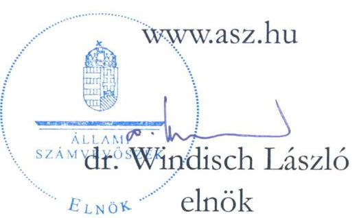

---

# ELLENŐRZÉSI IGAZGATÓSÁG: 

## TELJESÍTMÉNYELLENŐRZÉSI IGAZGATÓSÁG

## ELLENŐRZÉSI IGAZGATÓ:

DR. JAKAB KORNÉL igazgató

## ELLENŐRZÉSVEZETŐ:

## SZAPPANOS JÚLIA ellenőrzésvezető

Jelentéseink az interneten a www.asz.hu címen olvashatók.

IKTATÓSZÁM: EL-3817-003/2024.
TÉMASZÁM: 2660
ELLENŐRZÉS-AZONOSÍTÓ SZÁM: V-1004

---

# TARTALOMJEGYZÉK 

- AZ ELLENŐRZÉS ALAPADATAI ..... 5
- AZ ELLENŐRZÉS HATÓKÖRE ÉS TERÜLETE ..... 7
- ÖSSZEFOGLALÁS ..... 9
- AZ ELLENŐRZÉS FÓKUSZTERÜLETEI ..... 12
- MEGÁLLAPÍTÁSOK ..... 13
- JAVASLATOK ..... 58
- MELLÉKLETEK ..... 59
I. sz. melléklet: Értelmező szótár ..... 59
II. sz. melléklet: Ellenőrzött szervezetek jegyzéke ..... 63
III. sz. melléklet: Fő ellenőrzési kritériumok fókuszterületek szerint ..... 65
IV. sz. melléklet: A víziközmű-szolgáltató társaságok egyes gazdasági mutatói ..... 66
- FÜGGELÉK: ÉSZREVÉTELEK ..... 67
- RÖVIDÍTÉSEK JEGYZÉKE ..... 69

---

.

---

# AZ ELLENŐRZÉS ALAPADATAI 

## AZ ELLENŐRZÉS CÉLJA

Annak értékelése, hogy a Nemzeti Vízstratégia ${ }^{1}$, az ágazati és a helyi stratégiák, programok, cselekvési tervek megfelelő alapot jelentettek-e az ivóvíz kezelését érintően meghatározott hazai és nemzetközi célkitűzések végrehajtására. Az ÁSZ² ellenőrizte, hogy az ivóvíz védelmét szolgáló - pénzügyi, jogi, szervezeti, személyi - feltételrendszer kialakítása hatékonyan és eredményesen támogatta-e a Nemzeti Vízstratégia célkitűzéseinek megvalósulását.

## AZ ELLENŐRZÉS TÍPUSA

Teljesítmény-ellenőrzés

## AZ ELLENŐRZŐTT IDŐSZAK

2017-2022. évek, kitekintéssel a 2023. évre, a számvevőszéki jelentés 2023. szeptemberi összeállításáig felmerülő folyamatokra

## AZ ELLENŐRZÉS TÁRGYA

Az ellenőrzés tárgyát képezték az országos, az ágazati és a helyi stratégiák, programok, cselekvési tervek, az ivóvíz védelmét szolgáló - pénzügyi, jogi, szervezeti, személyi - feltételrendszer, az ivóvíz védelmét célzó intézkedések és a kapcsolódó vízgazdálkodási feladatellátás, a biztonságos ivóvízzel való ellátás. Az ellenőrzés kiterjedt minden olyan körülményre és adatra, amely az ÁSZ jogszabályban meghatározott feladatainak teljesítéséhez, valamint a program végrehajtása folyamán felmerült újabb összefüggések feltárásához szükséges.

## AZ ELLENŐRZÉS JOGALAPJA

Az ellenőrzés jogszabályi alapját az Állami Számvevőszékről szóló 2011. évi LXVI. törvény 1. § (3) és 5.§ (2)-(3) bekezdése képezik.

## AZ ELLENŐRZÉS MÓDSZERE

Az ellenőrzést - a nemzetközi standardokat irányadónak tekintve - az ellenőrzési program szempontjai, az ellenőrzött időszakban hatályos jogszabályok, az ellenőrzés-szakmai szabályok és módszertanok figyelembevételével végezte az ÁSZ.

---

Az ellenőrzési kérdések megválaszolásához szükséges bizonyítékok megszerzése az ellenőrzött szervezetek által rendelkezésre bocsátott dokumentumokra, adatokra alapozva, kérdésfeltevés (információkérés), interjú, valamint elemző eljárás útján történt.

Az ellenőrzési bizonyítékként felhasználható adatforrások közé tartoztak egyrészt az ellenőrzéshez kért dokumentumok, másrészt adatforrás volt minden - az ellenőrzés folyamán feltárt - az ellenőrzés szempontjából információkat tartalmazó dokumentum, továbbá az ellenőrzés előkészítése során „A vizek védelmének és a vízgazdálkodási feladatok ellátásának ellenőrzése - A Víziközmű-szolgáltatás ellenőrzése" című ellenőrzéshez szolgáltatott dokumentumok.

Az ellenőrzés lefolytatásához az ellenőrzött szervezetek a tanúsítványok kitöltésével, valamint az ÁSZ által kért dokumentumok, adatok, információk megküldésével és az ellenőrzés során szolgáltattak adatokat. A települések éves ivóvízminőségének értékeléséhez az ÁSZ felhasználta továbbá az NNGYK ${ }^{3}$ által működtetett HUMVI ${ }^{4}$ rendszer adatbázisait.

Az ellenőrzés a fenntarthatóság, a fenntartható ivóvízgazdálkodás fogalmát komplexen az ENSZ Fenntartható Fejlődési Céloknak megfelelően értelmezte (részletesen lásd I. mellékletben).

---

# AZ ELLENŐRZÉS HATÓKÖRE ÉS TERÜLETE 

Magyarország medencejellege a vízhálózat képét alapvetően meghatározza. A felszín feletti vízmennyisége Európa nagyobb vízkészletei közé tartozott az ellenőrzött időszakban, a felszín alatti vízkészletei minőségi és mennyiségi szempontból Európában kiemelkedőek voltak, ugyanakkor a hazai vízkészletleltár adatai azt mutatják, hogy kapacitásai az Európai Uniós tendenciáknál nagyobb mértékben csökkentek. Az ivóvízellátás közel 95\%-a felszín alatti vízből történik, a mintegy 1500 db üzemelő vízbázis kétharmada, továbbá a stratégiai tartalékot jelentő 66 db távlati vízbázis sérülékeny környezetben helyezkedik el. A felszín feletti vízkészletek megoszlása egyenlőtlen volt térben és időben.

Ellenőrzésünk elsődlegesen az ország hosszú távú érdekét szolgáló ivóvízgazdálkodási feladatokra helyezte a fő hangsúlyt. Arra kerestünk választ, hogy a stratégiák megfelelő alapot jelentettek-e a célkitűzések végrehajtására, illetve az ivóvíz védelmét szolgáló feltételrendszer kialakítása támogatta-e a Nemzeti Vízstratégia megvalósulását. Továbbá, hogy mindezek végrehajtása eredményeként megvalósult-e a társadalom széles rétegét közvetlenül érintő megfelelő minőségű ivóvíz biztosítása. Az ellenőrzés kiterjedt a KJT${ }^{6}$ és az SDG${ }^{6}$ 6.1. célkitűzés megvalósítása érdekében tett intézkedések értékelésére, az országos, az ágazati és a helyi stratégiák, programok, cselekvési tervek, valamint az ivóvíz védelmét szolgáló - pénzügyi, jogi, szervezeti, személyi feltételrendszerek kialakítása hatékonyságának, eredményességének megítélésére. Továbbá a biztonságos ivóvízellátásra fordított hazai és EU-s támogatásokra a tekintetben, hogy azok szervesen illeszkedtek-e a rendszer működtetésének, fejlesztésének prioritásaihoz.

A klímaváltozás következtében a csapadékeloszlás átalakul, a következő évtizedekben várhatóan növekedni fog az ivóvízhiány kockázata, ezért növelni kell az ivóvíz-ellátás rezilienciáját annak érdekében, hogy a kockázatok figyelembevétele mellett biztosítható legyen mind az állampolgárok Magyarország Alaptörvényében meghatározott joga az egészséges ivóvízhez való hozzáférésre, mind a nem lakossági fogyasztók megfelelő minőségű vízzel való ellátása a környezeti fenntarthatóság mellett. Ez egyebek között jelenti az ivóvízbázisokon és az ellátó rendszerekben az uniós előírásoknak megfelelő minőségű ivóvíz biztosítására tett erőfeszítéseket, az elkerülhető vízveszteség minimalizálását, a vízhasználatok és vízgazdálkodás minden alágazatára kiterjedő holisztikus szemlélet meghonosítását.

A Nemzeti Vízstratégia - Kvassay Jenő Terv a magyar vízgazdálkodás 2030-ig terjedő keretstratégiája és 2020-ig terjedő középtávú intézkedési terve, vízügyi szakpolitikai stratégia. A stratégia hét hosszú távú célt határoz meg, melyek közül a 4. számú hosszú távú célkitűzés egyik eleme kapcsolódik közvetlenül a lakosság biztonságos ivóvízzel való ellátásának az ENSZ ${ }^{7}$ fenntartható fejlődési célok (SDG) 6.1 alcéljához (2030-ig mindenki számára egyetemes és egyenlő esélyű hozzáférés biztosítása a biztonságos és megfizethető ivóvízhez): „Minőségi víziközmű-szolgáltatás és minőségi csapadékvizgazdálkodás elviselhető fogyasztói teherviselés mellett." A lakossági ivóvíz-ellátás jogi környezete, kiemelten a vízgazdálkodásról és a víziközműszolgáltatásról szóló törvények és végrehajtási rendeleteik előírásai részletesen meghatározzák a szervezetrendszer feladatait, a hazai vízgazdálkodás kereteit. A lakossági ivóvíz-ellátás közszolgáltatás terén a stratégia végrehajtása számos szereplő munkájával lehetséges. A széttagolt, de strukturált szervezetrendszer erős szakmai és szervezeti hagyományokkal rendelkezik. A vízgazdálkodásért felelős az ellenőrzött időszak egészében a belügyminiszter volt, a víziközmű-szolgáltatásért felelős kormánytag az időszakban többször változott, az ellenőrzés lezárásakor az energiaügyi miniszter volt.

---

Magyarországon minden településen elérhető a közüzemi vezetékes ivóvíz, a háztartások 97,5\%-ának van hozzáférése a hálózathoz. Az ellenőrzött időszakban az ágazat díjbevételeinek alakulását alapvetően 1. ábra
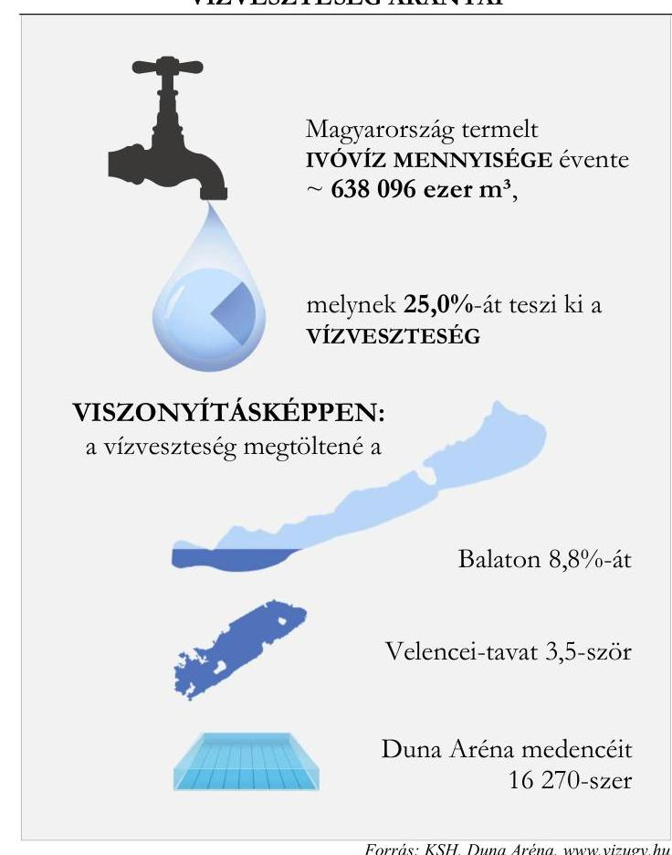

Fonrás: KSH, Duna Aréna, www.vizugy.hu
meghatározta a rezsicsökkentések végrehajtásáról szóló törvény alapján alkalmazott árpolitika.

1735 darab víziközmű-rendszer biztosítja a hazai közműves ivóvízellátást. A 2021. évi adatok szerint az ivóvizet elosztó hálózat hosszúsága 94,7 ezer km, amelyből 69,8 ezer km gerincvezeték, 24,9 ezer km pedig bekötővezeték volt. Az NVKS ${ }^{8}$ ivóvíz hálózatokról készített helyzetelemzése szerint „az ivóvízhálózatok gerinc- és bekötővezetékeinek anyagösszetétele azt mutatja, hogy a csöanyagok korszerűsítésre szorulnak, koruk következtében tervezési élettartamuk végén járnak, így magasabb hálózati meghibásodást okoznak, rekonstrukciójuk időszerű". Anyagösszetétel szerint a legnagyobb arányban a gerincvezetékeknél az 1970 és 1980 között telepített azbesztcementből készült csövek (39,5 \%), a bekötővezetékeknél pedig a KPE${ }^{9}$ (55,0\%) csövek szállították az ivóvizet. A hálózatba betáplált, ivóvízként nem használt közüzemi vízveszteség mértékét az 1. ábra mutatja. A vízveszteség 2021-ben a KSH${ }^{10}$ adata alapján 25,0\% volt, ez szemléletesen a Balaton vízmennyiségének 8,8\%-át tette ki.

---

# ÖSSZEFOGLALÁS 

„A víz nem szokásos kereskedelmi termék, hanem örökség, amit annak megfelelően óvni, védeni és kezelni kell." VKI ${ }^{11}$
Az ÁSZ nemzetközi kooperatív ellenőrzés keretében ellenőrizte a 6. számú Fenntartható fejlődési cél „Tiszta víz és alapvető köztisztaság" vonatkozásában az ivóvíz-gazdálkodást, a biztonságos és megfizethető ivóvízszolgáltatási célt érintően elért eredményeket.

A Nemzeti Vízstratégia - Kvassay Jenő Terv, az ágazati és a helyi stratégiák, programok, cselekvési tervek a nemzetközi és uniós célrendszerekkel összhangban hosszú távon meghatározták a fenntartható ivóvízgazdálkodás célkitűzéseit. A stratégiák és tervek tényleges megvalósításának egyes programjait és projektjeit az ivóvíz-ellátásban érintett egyes kormányzati felelősök és szereplők dolgozták ki és hajtották végre.

A víziközmű-közszolgáltatásban résztvevő intézményrendszer a meghatározott feladatok és felelősségek szerint tagolt volt. Az ivóvíz-ellátásért felelős szervezetek biztosították az ágazat szervezeti és jogi irányítását, azonban a KJT-ben is megfogalmazott integrált szemlélet nem érvényesült, nem volt biztosított az átfogó, stratégiai szintű koordináció, amely kockázatot jelentett a KJT célkitűzéseinek megvalósítására. Mindezekre tekintettel az ÁSZ javaslatot fogalmazott meg egy - a különböző alágazatokban irányító szervi, kormányzati felelősséggel bíró szervezetek együttműködésére, a KJT-ben meghatározott integrált szemléletű stratégiai döntéshozatalra - kijelölt intézményesített forma létrehozására.

A KJT stratégiai céljaiban való előrehaladásáról átfogó kormányzati értékelés nem készült, így erre tekintettel nem is történhetett meg a KJT következő időszakra vonatkozó prioritásainak, intézkedéseinek felülvizsgálata, szükség esetén pontosítása. Ezért a KJT következő időszakra vonatkozó prioritásainak és intézkedéseinek felülvizsgálata indokolt.

Az ágazat stratégiai irányítását több információs rendszer, adatbázis támogatta, azonban azok integrációját jelentő - jogszabályban és stratégiai szintű dokumentumban rögzített - rendszerfejlesztés (Integrált Közcélú Víziközmű Adatbázis, IKVA ${ }^{12}$ ) az ellenőrzés lezárásáig nem valósult meg. Az integrált adat- és információalapú irányítási rendszer kialakítását támogathatja a szigetszerűen működő információs rendszerek és adatbázisok összekapcsolása, valamint az IKVA rendszer fejlesztése során elkészült egyes részek jövőbeli hasznosíthatóságának folyamatban lévő szakértői felmérése. Az IKVA rendszer tényleges használata és az azt előíró jogszabályi rendelkezések között nem volt összhang, ezért indokolt a koherencia megteremtése.

A 2020. év utáni időszakban kezdődött a víziközmű rendszerek és a víziközmű-közszolgáltatást nyújtó társaságok tulajdonosi struktúrájának átalakítása. Az ún. integrációs program (az önkormányzati tulajdonú víziközművek állami tulajdonba vétele) elvárt eredményeit nyilvános stratégia nem rögzítette, az integráció folyamatában elért eredmények összehasonlítható adatok hiányában még nem voltak mérhetők.

A közszolgáltatáshoz való hozzáférés társadalmi egyenlőtlenségei csökkentek, a háztartások közel felének (47,8\%) a biztonságos és megfizethető víziközmű-szolgáltatásokhoz való hozzáférése javult. Ugyanakkor a vízdíjak rendszere kockázatot jelentett az ágazat pénzügyileg, műszakilag fenntartható működésére, továbbá nem ösztönözte a fogyasztókat a takarékos, fenntartható vízhasználatra. Az átlagos fogyasztás emelkedett, a vízdíjak 2012. évben történt rögzítésének időszakához képest 16\%-kal nőtt az egy főre jutó közüzemi vízfogyasztás. A vízszolgáltatóknak nem volt jogszabályi kötelezettségük arra irányulóan, hogy ügyfeleik körében népszerűsítsék a vízkészletek hatékony felhasználását, de vízvédelmi, vízhasználathoz kapcsolódó

---

szemléletformáló tevékenységet végeztek. Ezzel összefüggésben az ÁSZ további szemléletformáló eszközök alkalmazását tartja szükségesnek.

Az ellenőrzött időszak alatt a biztonságosan kezelt, folyamatosan ellenőrzött ivóvizet használó háztartások aránya 0,5\%-kal növekedett. A szolgáltatott víz megfelelő minőségének biztosítása érdekében végrehajtott KEHOP ${ }^{13}$ projektek eredményesek voltak, ezáltal hozzájárultak a hazai és a nemzetközi, a lakosság biztonságos ivóvízhez való hozzáférését jelentő célkitűzésekhez. Az ellenőrzés feltárta, hogy a 2017-2022-es időszakban a szolgáltatók esetében csökkenő mértékben fordult elő, hogy a víz minősége nem felelt meg az előírásoknak, az uniós irányelv által előírt paramétereknek. Az ivóvízellátás céljára rendelkezésre álló felszín alatti vízkészletek nem minden esetben feleltek meg az EU irányelvben előírt vízminőségi határértékeknek. Az ivóvízminőség-javító programnak köszönhetően az elsődleges vízbázis-szennyezettség eredetű arzén, bór, fluorid, ammónium
 paraméterekkel jellemzett vízminőségi kockázat csökkent, illetve megszűnt, azonban a másodlagos vízminőség szennyezettség (az elöregedett rendszerekben, és a vízkezelés műszaki-technikai problémái következtében keletkező szennyeződések) aránya emelkedést mutatott.

A MEKH ${ }^{14}$ adatai szerint 2022. december 31-ig a víziközművek, ellátási hálózati elemek 12\%-a esetében a víziközmű tulajdonosok nem készítették el a jogszabályban előírt leltározással megalapozott vagyonértékelést. A hálózatok leltározásának elmaradása, a víziközmű vagyonelemek egységes értékelésének hiánya nem tette lehetővé a hálózatok állapotának és a közműszolgáltató infrastruktúra korszerűsítéséhez szükséges pénzeszközök pontos felmérését. Az ellátásért felelősök és a társaságok 2023-2037. évekre vonatkozó gördülő fejlesztési tervei $\left(\mathrm{GFT}^{15}\right)$ szerint a víziközmű hálózatok rekonstrukciójának finanszírozási igénye a következő 15 évben 3775 Mrd $\mathrm{Ft}^{16}$-ot tesz ki. Ez az összeg azonban hozzávetőleges, mivel pontosabb kalkulációt csak az összes ivóvízellátó és szennyvíztisztító hálózati elem leltározással megalapozott vagyonértékelésének befejezése után lehet készíteni. Erre tekintettel az ÁSZ javasolja a jogszabály alapján elkészített és a MEKH-hez már benyújtott vagyonértékelések áttekintését annak érdekében, hogy a jövőben készülő vagyonértékelések egységes szempontok alapján készüljenek el, azok támogassák a döntéshozatali folyamatokat.

A víziközmű-közszolgáltatást végző gazdasági társaságok ivóvíz ágazati, támogatások és tulajdonosi hozzájárulások nélkül elért üzemi-üzleti szintű eredményei az ellenőrzött időszakban - a 2021. év kivételével - évtől évre romlottak. Az ellenőrzés számítási eredményei szerint továbbá összefüggés volt tapasztalható az alacsonyabb üzemi-üzleti eredményt elérő víziközmű-közszolgáltatást végző gazdasági társaságok romló eredménye és az általuk üzemeltetett víziközmű rendszerekben tapasztalt magasabb vízveszteség adata között.

Az ellenőrzés alá vont víziközmű szolgáltatóknál a 2017. évben 53792 db, 2022. évben 42519 db csőtörési eset történt az ivóvíz-ellátó hálózatban. A kitermelt vízmennyiség egynegyedét jelentette a nem számlázott vízmennyiség, amelynek az ÁSZ által becsült értéke évente meghaladta a 17 Mrd Ft-ot. A vízveszteség kialakulásának számos összetevője közül az egyik az, hogy a rekonstrukciók elmaradása miatt növekszik az eszközök elhasználódása. A 15 éves GFT-k évtől évre nagyobb értékű rekonstrukciós forrásigényt tartalmaztak.

A felújítások egy részének forrását a - 2015. júliusa óta rögzített mértékű, a szükségesnél kevesebb rekonstrukciót biztosító - fizetett használati díj képezte, amelyet a közműszolgáltató társaságok tulajdonosainak támogatásai, illetve a központi költségvetés egészítettek ki. A víziközmű-szolgáltatásért felelős irányító szerv pályázati forrásokat nyitott meg az ellenőrzött időszakban hatékonyság-növelő beruházásokra, mely források teljes egészében lekötöttek voltak, a beruházások egy része már megvalósult, más része az ellenőrzött időszak végén még folyamatban volt. A KEHOP forrásokból finanszírozott ivóvíz-minőség javító beruházások egy része az ellenőrzött időszak végén még szintén folyamatban volt. A változatlan mértékű

---

használati díj fizetések során keletkező fejlesztési források bővítése érdekében az ellenőrzés álláspontja szerint szükséges a használati díj szerkezetének, elemeinek és mértékének szabályozás útján történő meghatározása.

Az ellenőrzött időszakban a víziközmű-szolgáltatók fejlesztési célra rendelkezésre álló pénzügyi forrásainak felhasználása az egyre csökkenő számú humánerőforrás mellett az elvégzett hibaelhárításra és karbantartásra fókuszált és eredményes volt. A vezeték-hálózat állapotával összefüggésben megelőző intézkedések megtételére korlátozottan volt lehetőség, a megtett intézkedések a konkrét hibák, és kapcsolódó következmények megszüntetésére irányultak.

Az ellenőrzött időszak végéig nem készült olyan stratégia, mely az elöregedő vezetékhálózatra tekintettel a víziközmű rendszerek rekonstrukciójára és beruházásaira, az ivóvíz-ellátás fenntartható működtetésére és fejlesztésére vonatkozóan fogalmazott meg átfogó célokat és programokat, számolva a 2021-2027. finanszírozási ciklusban beszűkülő uniós források kiváltásának lehetőségeivel. Mindez kockázatot jelentett a szolgáltatási bevételekre, a működés kiszámíthatóságára. Fentiekre tekintettel indokolt egy szakértői elemzés elkészítése arra vonatkozóan, hogy a víziközmű rendszerekben a felújítások forrásigénye miképp viszonyul rövid-, közép és hosszú távon a víziközmű rendszer-elemek esetében az újraelőállítási költség alapján számított forrásigényekhez, továbbá az milyen stratégiai beavatkozást tesz szükségessé.

---

# AZ ELLENŐRZÉS FÓKUSZTERÜLETEI 

1. Az ivóvíz-ellátásért felelős szervezetek ágazati irányítása, a stratégiai és operatív döntéshozatal
2. Vizek védelmét és a vizek fenntartható használatát célzó működési és fejlesztési célú intézkedések eredményessége
3. Biztonságos és megfizethető ivóvíz-ellátás fenntarthatósága

---

# MEGÁLLAPÍTÁSOK 

## 1. Az ivóvíz-ellátásért felelős szervezetek ágazati irányítása, a stratégiai és operatív döntéshozatal

Összegző megállapítás

Az ivóvíz-ellátásért felelős szervezetek biztosították az ágazat szervezeti és jogi irányítását, azonban nem volt biztosított az átfogó, stratégiai szintű koordináció, a döntéshozatali folyamatok integrált adatbázisokkal való támogatása. A végrehajtott programok hozzájárultak a hazai, az uniós és nemzetközi stratégiai célkitűzések megvalósításához.

A víziközmű-közsolgáltatást meghatározó jogszabályi környezet szerteágazó volt. Az ellenőrzött időszakban a víziközmű-közsolgáltatás rendszerét érintő jogszabály módosítás nem történt, a jogszabálymódosítások a hatósági, tulajdonosi és szolgáltatói feladatot érintették.
Az Európai Unió vízpolitikáját meghatározó Víz Keretirányelv, azaz a vízpolitika terén a közösségi fellépés kereteinek meghatározásáról szóló 2000/60/EK irányelv rendelkezései $\left(\mathrm{VKI}^{17}\right)$ és a Tanács ${ }^{18}$ emberi fogyasztásra szánt víz minőségéről szóló 98/83/EK irányelve ${ }^{19}$ előírásai, majd a 2020/2184 EU irányelv előírásai az Európai Unióhoz való csatlakozása óta Magyarországra nézve is kötelező érvényűek. Az irányelvekben foglalt tagállami kötelezettség teljesítése érdekében Magyarország az irányelvek végrehajtását törvényekkel, rendeletekkel, utasításokkal szabályozta, valamint stratégiákat, programokat, terveket készített.
Az ellenőrzött időszakban az ivóvíz-ellátást érintő jogi környezet egyértelműen meghatározta a feladatokat, felelősöket, eljárásokat. Az ivóvíz-ellátást érintő jogszabályi környezet - mint a 2. ábrán is látható - számos jogi irányítási eszközt ölelt fel.
2. ábra

AZ IVÓVÍZ-ELLÁTÁST ÉRINTŐ JOGSZABÁLYI KÖRNYEZET
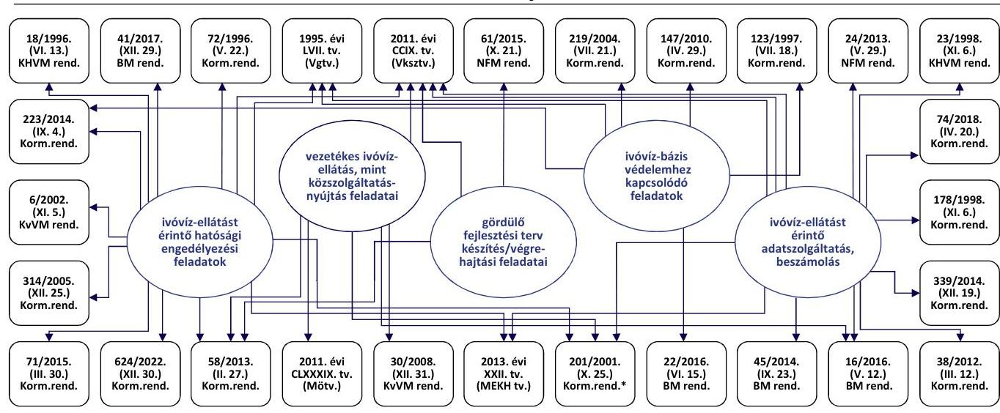
*Felváltotta az 5/2023 (1. 12.) Korm. rendelet
Forrás: Jogszabályok alapján ÁSZ saját szerkesztés

---

A közműves ivóvíz-ellátás jogi és szervezeti kereteit meghatározó legjelentősebb, a víziközmű-közszolgáltatás engedélyezését és nyújtását érintő jogszabályváltozások az alábbiak voltak:

- a Vksztv. ${ }^{20}$ 2017. évi módosítása hozta létre a víziközmű-alapot, mely egy pénzügyi eszköz a víziközmű-fejlesztések finanszírozására;
- 2018. január 1. napjával hatályba lépett az Ákr. ${ }^{21}$, mely a hatósági és engedélyezési tevékenység szabályait módosította;
- a Vgt. ${ }^{22}$ 2018. január 1-től hatályos módosítása az ivóvíz-bázis védelemhez kapcsolódó feladatokat, a vízjogi engedélyezési eljárásokat érintette, valamint a vízgazdálkodással összefüggő hatósági jogkörök és a jogkörökben eljáró hatóságok változtak;
- a Vksztv. víziközmű integrációval kapcsolatos 2021. évi módosítása teremtette meg annak alapját, hogy a települési önkormányzat (vagy települési önkormányzatok együttesen) a tulajdonában (tulajdonukban) álló víziközmű-vagyon államra történő átruházása esetén mentesül(nek) a víziközmű-szolgáltatással való ellátás felelőssége alól. A módosítások a 2020-ban alapított Nemzeti Vízművek Zrt. tulajdonosi joggyakorlását is érintették. Az integráció részletszabályai több, 2023. évben hatályba lépett módosítást vontak maguk után.

A vízbázisvédelem és a víziközmű-közszolgáltatás tevékenységeinek alapvető kereteit (irányítási feladatok, hatósági feladatok, szolgáltatás nyújtásával összefüggő feladatok stb.) az azokat meghatározó jogszabályok módosításai nem alakították át, stabilitás jellemezte. A jogszabályváltozások az engedélyezési, hatósági, ellenőrzési, adatszolgáltatási stb. feladatok részletszabályait kiegészítették, pontosították, bővítették, illetve a szervezetrendszer szereplőinek feladatai közötti átcsoportosításokat jelentették. A jogszabályváltozások egy része a szervezeti átalakulásokat és a vízgazdálkodás valamely alágazatát közvetetten érintő jogszabályváltozások átvezetéseit jelentették.
A víziközmű-közszolgáltatásban résztvevő intézményrendszer a jogszabályi rendelkezésekben meghatározott feladatok és felelősségek szerint tagolt volt. Az ellenőrzött időszakban nem volt olyan szervezet, mely a területi és települési vízgazdálkodás, illetve szűkebb körben az ivóvíz ellátást (is) biztosító teljes szervezetrendszer összehangolt működtetésének stratégiai szintű koordinációjáért volt felelős.
A víziközmű-közszolgáltatásban érintett intézményrendszer feladatait és felelősségeit a szervezetek belső szabályozásai leképezték. A 3. ábra ad képet a szervezetrendszer legfontosabb kapcsolatairól.

---

# A VÍZGAZDÁLKODÁS LEGFONTOSABB MŰKÖDÉSI, IRÁNYÍTÁSI, ENGEDÉLYEZÉSI SZERVEZETI KAPCSOLATAI 

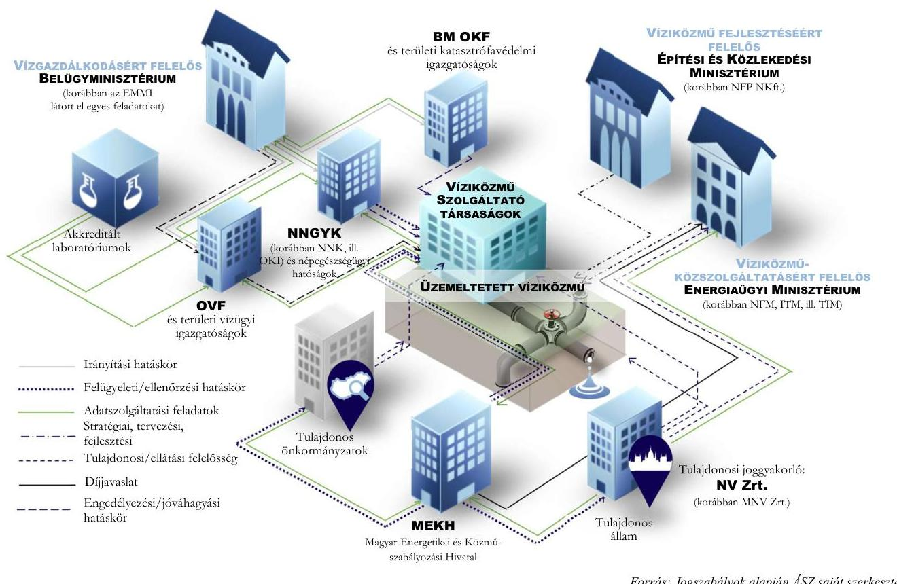

Forrás: Jogszabályok alapján ÁSZ saját szerkesztés
Az ellenőrzött időszak egészében a belügyminiszter volt a kormány vízgazdálkodásért felelős tagja, a víziközmű-szolgáltatásért felelős kormánytag változott a minisztériumok átalakításával párhuzamosan. Az irányítási felelősség változását mutatja be az 1. táblázat.

1. táblázat

## A VÍZGAZDÁLKODÁS EGYES SZAKTERÜLETEIÉRT FELELŐS KORMÁNYTAGOK

| A KORMÁNYTAGOK   FELELŐSSÉGE | 2014. MAJUS | 2018. MAJUS | 2022. MAJUS | 2022.   DECEMBERTŐL |
| :--: | :--: | :--: | :--: | :--: |
|  | 2018. MAJUS | 2022. MAJUS | 2022.NOVEMBER |  |
| Felelős a vízgazdálkodásért, vízügyi igazgatási szervek irányításáért, és a vízvédelemért* | $\mathrm{BM}^{23}$ | BM | BM | BM |
| Felelős a víziközműszolgáltatásért | $\mathrm{NFM}^{24}$ | ITM $^{25}$ | TIM $^{26}$ | $\mathrm{EM}^{27}$ |
| Felelős az állami vagyon felügyeletéért | NFM | NVTNM $^{28}$ | GFM $^{29}$ | GFM |

*2020-tól a mezőgazdasági vízkivételt biztosító víziköretlémény engedélyezését kivéve Forrás: a Kormány tagjainak feladat- és hatásköréről szóló 152/2014. (VI. 6.) Korm. rendelet, 94/2018. (V. 22.) Korm. rendelet és 182/2022. (V. 24.) Korm. rendelet, ÁSZ saját szerkesztés

Az ivóvíz-ellátás folyamata az ivóvízbázisról történő vízkivételtől az ivóvíz víziközmű rendszereken való eljuttatásáig tart. E tevékenységek kormányzati irányítási felelősségének összetettségét és a felelősök változását mutatja be a 4. ábra.

---

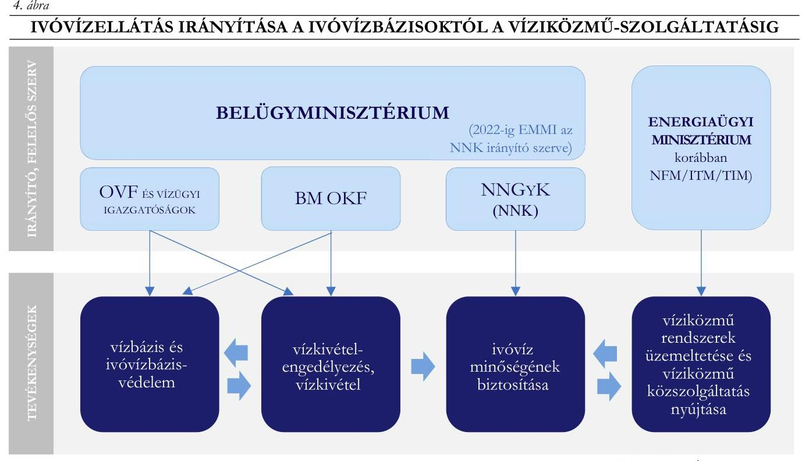

Forrás: Jegyzőkönyvek alapján ÁSZ saját szerkesztés
A két ábra és a táblázat adatai alátámasztják, hogy a szervezetrendszer felépítését, a szervezetek közötti kapcsolatokat, az egyes víziközmű-közszolgáltatás nyújtásához kapcsolódó tevékenységek irányítását és végrehajtását meghatározó jogrend kialakított, a szervezetrendszer feladatai ellátásának jogi alapjai meghatározottak voltak. Hiányzott az összehangolt stratégiai tervezés és koordináció ellátására kijelölt felelős, irányító intézmény vagy intézményesített fórum.

A lakossági ivóvízellátást érintő országos stratégiai dokumentumok összhangban álltak a nemzetközi célkitűzésekkel és a vonatkozó uniós irányelvekkel.

Az ellenőrzött időszakban a víziközmű-közszolgáltatáshoz kötődő célt, vagy célrendszert - többek között - a következő dokumentumok rögzítettek: a 2017-ben Országgyűlési határozattal elfogadott Nemzeti Vízstratégia - Kvassay Jenő Terv, a 2015-ben, illetve 2022-ben készített, Országgyűlési határozattal elfogadott Nemzeti Környezetvédelmi Program 4. és 5. dokumentumok, az Országos Fejlesztési és Területfejlesztési Koncepció (elfogadása 2014-ben történt), valamint az ivóvíz-ellátást közvetlenül vagy közvetve érintő országos operatív programok, a 2018-ban elfogadott Első Éghajlatváltozási Cselekvési Terv, valamint a 2015-ben és 2022-ben készített Vízgyűjtő-gazdálkodási Terv 2. és 3. dokumentum.
Az ellenőrzött időszakban hatályos, a biztonságos és megfizethető ivóvíz-közszolgáltatást érintő nemzeti stratégiák, koncepciók és szakpolitikai stratégiák kifejezetten utaltak az ENSZ Fenntartható Fejlődési Keretrendszer 2030 nemzetközi, és a 18/2013. (III.28) OGY határozattal elfogadott Nemzeti Fenntartható Fejlődési Keretstratégia dokumentumaira. A dokumentumok biztonságos ivóvíz ellátásra vonatkozó cél- és fogalomrendszerei összhangban álltak a nemzetközileg elfogadott cél- és fogalomrendszerrel.
A KJT, az NKP4 ${ }^{30}$ és NKP5 ${ }^{31}$ szövegszerűen utalt a Fenntartható Fejlődési Keretrendszer 2030 dokumentumra. A KJT, az ÉCsT ${ }^{32}$, az NKP4 és NKP5, valamint az OFTK ${ }^{33}$ tartalmazott az SDG 6.1

---

(méltányos és igazságos hozzáférés a biztonságos és megfizethető ivóvízhez) célhoz kapcsolódó, és az ÉCsT-n kívül az SDG 6.3 (2030-ra a vízminőség javítása) célhoz kapcsolódó közép- és/vagy hosszú távú cél(oka)t.
Az ún. Víz Keretirányelv, azaz „a vízpolitika terén a közösségi fellépés kereteinek meghatározásáról szóló 2000/60/EK Irányelv" rendelkezéseire a fenti dokumentumok utaltak, azokkal összhangban voltak, illetve az abban foglalt előírásokat Magyarország a Vízgyűjtő-gazdálkodási Tervek elkészítésével támogatta. Mindkét vízgyűjtő gazdálkodási tervben szerepelt feladat a lakossági ivóvíz-közszolgáltatással összefüggésben az ivóvíz-minőség javítására és a vízbiztonság tervezésére vonatkozóan. A Tanács emberi fogyasztásra szánt víz minőségéről szóló 98/83/EK irányelve előírásait a 2017-2022. évek közötti időszakban a magyar jogrendbe a 201/2001 (X. 25.) Korm. rendelet ${ }^{34}$ ültette át.
A 98/83/EK irányelvet felváltotta
 a tagállamok által 2023. január 12-ig nemzeti jogrendbe ültetendő új uniós ivóvíz irányelv, az emberi fogyasztásra szánt víz minőségéről szóló 2020/2184 EU Irányelv. A kockázatalapú szemléletet és a megelőzés elvén alapuló vízminőség-felügyeletet meghatározó, módosított ivóvíz minőségi határértékeket tartalmazó, az ivóvíz minőségi követelményeiről és az ellenőrzés rendjéről szóló 5/2023 (I. 12.) Korm. rendeletet a BM készítette elő, és 2023. január 12-én lépett hatályba. Az irányelv teljesítésére való előkészítés során többek között az NNGYK nyert pályázatot a Magyarországi csapvizek ólomtartalmának országos felmérésére az EFOP ${ }^{35}$-1.8.0-VEKOP ${ }^{36}$-17-2017-00001 projekt keretében.
Az ivóvíz-közszolgáltatás nyújtását érintő hazai stratégiák, tervek, koncepciók összességében azonos helyzetfeltárás alapján azonos fő cél elérése érdekében megfogalmazott alcélokat, feladatokat, eszközöket tartalmaztak.

Az ellenőrzött időszakban hatályos, ivóvíz-közszolgáltatást érintő stratégiákban foglalt helyzetfelmérések megállapításai és a legfontosabb célkitűzések összhangban voltak.

Az ellenőrzött időszak kezdetét megelőzően elfogadott stratégiai dokumentumok helyzetfelmérései kockázatként az ivóvíz minőségi problémáit jelezték, valamint szerepeltettek utalást a megfizethetőségre vonatkozó kockázatra is. Az ellenőrzött időszak végén keletkezett dokumentumok a biztonságos ivóvíz-szolgáltatás hálózati, mennyiségi, műszaki, megtérülési kockázataira mutattak rá. Ennek oka az, hogy az ivóvíz minőségének javítására irányuló programok eredményesen kezelték a kockázatokat, miközben a szolgáltatás műszaki-gazdaságossági fenntarthatóságának szinten tartását a korábbi stratégiák és programok nem célozták.
Az ellenőrzött időszak második felében (2020 után) készített dokumentumok építettek a korábbi stratégiai dokumentumok célrendszerére, a megvalósított és a még releváns (az addig meg nem valósított) célokra. Az ivóvízbázis védelemmel és az ivóvíz minőségével kapcsolatban gyakorlatilag minden stratégia, koncepció vagy terv fogalmazott meg célt.
Az egyes dokumentumokban az ivóvíz-szolgáltatással összefüggő helyzetfeltárás, kockázat és problémajelzés tartalmilag hasonló volt, tükrözte az előrelépéseket, ugyanakkor az ellenőrzött időszakban a rekonstrukció elmaradása miatt eszkalálódó problémákat is. Az ellenőrzött időszak kezdetén hatályos stratégiák (OFTK, NKP4, VGT2 ${ }^{37}$ ) dokumentumaiban még nem szerepelt azonosított kockázatként, azonban a KJT és a VGT3 ${ }^{38}$ kifejezetten hangsúlyozta a rekonstrukciók elmaradásából adódóan növekvő vízveszteség problémáját.

---

A vezetékes ivóvíz-közszolgáltatás műszaki problémáival kapcsolatban a stratégiai dokumentumok a készítés időrendjében egyre élesebb módon fogalmaztak helyzetfeltáró, kockázatokat bemutató fejezeteikben. Ez a tendencia tükrözte a romló finanszírozási lehetőségeket a karbantartás, rekonstrukció terén.
Annak ellenére, hogy a stratégiák, programok, tervek a vezetékes ivóvíz-közszolgáltatás minőségével, fenntarthatóságával, finanszírozhatóságával kapcsolatban kockázatokat jeleztek, konkrét, eredmény elvárásokat tartalmazó célokat, feladatokat nem tartalmaztak. Az NKP4-ben, a KJT-ben és az ÉCsT-ben a finanszírozással kapcsolatban szerepeltek célok. Az NKP5-ben megjelenített cél volt egyebek között a közüzemi ivóvízellátás szolgáltatási színvonalának és biztonságának növelése, a másodlagos ivóvízminőség romlás megelőzése. E célhoz kormányzati intézkedés tervezet társult a közüzemi ivóvízellátó rendszerek átfogó felülvizsgálati és rekonstrukciós programjának, valamint finanszírozási konstrukciójának kidolgozására és megvalósítására, illetve szolgáltatói intézkedés tervezet is kapcsolódott a biztonságos és folyamatos közüzemi ivóvízellátás megvalósítására, a hálózati veszteségek csökkentésére, a szükséges fejlesztések kivitelezésére vonatkozóan. A VGT3-ban rekonstrukcióval kapcsolatos intézkedések szerepeltek. Ezzel együtt nem a stratégiák, hanem az ivóvíz-ellátás biztosításában érintett irányító, középirányító, felügyeleti tevékenységet végző és végrehajtó szervezetek határozták meg az intézkedések végrehajtásában részt vevők pontos feladatait, a várt eredményeket.
Annak ellenére, hogy az ivóvíz megfizethetőségének problémáját több dokumentum is jelezte helyzetfeltárásában, kapcsolódó stratégiai célt a dokumentumok nem tartalmaztak. A VGT3 helyzetfeltárása szerint „2018-ban a báztartások átlagos vífogyasztásával és átlagos jövedelmével számolva az ivóvíz közszolgáltatásért fizetett díj átlagos mértéke az átlagos jövedelem 1,65%-ára mérséklődött. A társadalom különböző jövedelmi csoportjai, valamint a különböző településeken élő lakosok közötti díjterhelésbeli különbségek azonban nem simultak el." Stratégiai célt erre a kockázatra egyetlen stratégiai szintű dokumentum sem épített.
Az 5. ábra azt mutatja be, hogy nem minden helyzetfeltáráshoz kapcsolódott célkitűzés, a stratégiákban, koncepciókban, szakpolitikákban és országos szintű tervekben feltárt kockázatok / gyengeségek / fenyegetések elhárítására nem minden esetben, illetve nem kizárólag az a terv fogalmazott meg célt, eszközt vagy feladatot, amelyben azt jelezték.

---

# A VÍZGAZDÁLKODÁSI STRATÉGIÁK HELYZETÉRTÉKELÉSEINEK ÉS A CÉLKITŰZÉSEKNEK AZ 

ÖSSZHANGJA

A helyzetértékelés kockázatot jelez a területre

A stratégia / koncepció / terv fogalmaz meg célt a területre

## VGT2 2015

KJT 2017
NÉS2 2018
NKP5 2022
VGT3 2022

## VGT2 2015

KJT 2017
ÉcsT 2018
NKP5 2022
VGT3 2022

## VGT2-KÖZSZOLGÁLTATÁS

REKONSTRUKCIÓK

## VGT2 2015

KJT 2017
VGT3 2022

## VGT2-KÖZSZOLGÁLTATÁS

REKONSTRUKCIÓK

## NKP4 2015

KJT 2017
ÉcsT 2018
NKP5 2022

## VGT3 2022

## VGT2 2015

KJT 2017
VGT3 2022
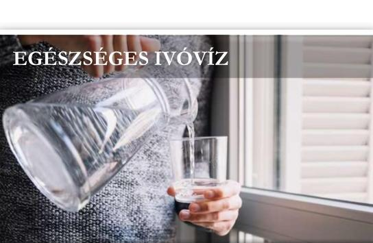

## VGT2 2015

KJT 2017
VGT3 2022
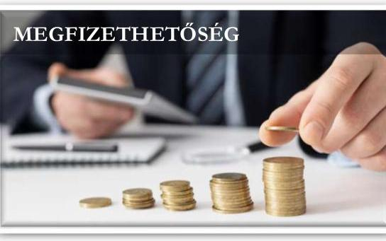

## MEGFIZETHETŐSÉG

## VGT2 2015

KJT 2017
VGT3 2022

## VGT2-KÖZSZOLGÁLTATÁS

KJT 2017
ÉcsT 2018
NKP5 2022
VGT3 2022

---

A stratégiai dokumentumok - kevés kivételtől eltekintve - nem tartalmaztak konkrét indikátorokkal (mutatókkal) jellemzett eredménykritériumokat, ezért a nyomon követést nem támogathatta mutatók alapján végzett adat-, és információgyűjtés, valamint elemzés.

Az ellenőrzött időszakban hatályos stratégiák közül az NKP4, NKP5 és a KJT a kormányzati stratégiai irányításról szóló 38/2012 (III. 12.) Korm. rendelet hatálya alá tartozott, így vonatkozott rá a jogszabályban meghatározott nyomon követési és beszámolási kötelezettség. A VGT-k esetében a VKI határozta meg a beszámolás rendjét.
A nemzeti és szakpolitikai stratégiákban meghatározott felelősök - a KJT megvalósításáról szóló évente készítendő beszámoló kivételével - elkészítették határidőre a beszámolásaikat. Az elkészített (stratégiai) beszámolók részben voltak alkalmasak a még folyamatban lévő feladatok esetében a megvalósítás előrehaladásának nyomon követésére, értékelésére, mivel nem minden stratégiai cél előrehaladásáról tartalmaztak a beszámolók információt. Így a beszámolásokra támaszkodva a stratégiai célkitűzések korrekciójára, az elmaradások, hiányok azonosítására a stratégiai tervdokumentum előkészítéséért felelősnek csak részben adódott lehetősége.
Az NKP4 végrehajtásáról elkészült a beszámoló, de a jelentés nem számolt be eredményekről több ivóvízközszolgáltatást érintő cél kapcsán. A VGT3 tartalmazta a VGT2-ben meghatározott feladatok végrehajtásáról szóló beszámolót a VKI előírásainak megfelelően.
A KJT esetében a tervet jóváhagyó, a Nemzeti Vízstratégia és a végrehajtását biztosító intézkedési terv elfogadásáról szóló 1110/2017. (III.7) Korm. határozat szerinti beszámolási kötelezettségnek a BM eleget tett. Maga a stratégia is előírt azonban beszámolási kötelezettséget. A KJT megvalósításának nyomon követési elvei és módszere c. fejezet szerint a KJT nyomon követése a BM feladata. A megvalósulásról - a stratégiában meghatározott tartalommal - évente kell beszámolót készíteni a beszámoló alapját képező, az $\mathrm{OVF}^{39}$ által minden év szeptember 30-ig készítendő előrehaladási jelentés alapján. A beszámolót az OVF rendelkezésre bocsátott jelentései alapján a BM nem készítette el évente az ellenőrzött időszakban.

A stratégiai célok megvalósítása az intézményrendszer elkülönült programjain keresztül, nyomon követhető és több program esetében nyomon követett módon haladt előre.

A stratégiák és tervek tényleges megvalósításának konkrét feladatait az ivóvíz-ellátásban érintett egyes kormányzati felelősök és szereplők - a hozzájuk rendelt felelősségi körben - dolgozták ki.
Az a tény, hogy a stratégiák, koncepciók, szakpolitikák, tervek kidolgozását az ivóvíz-ellátás különböző szakfeladatait végző felelősök végezték, azzal a következménnyel is járt, hogy a KJT-ben rögzített cél ellenére a konkrét feladatokban az integrált szemlélet nem érvényesült. A projektek különállóak voltak, egy-egy konkrét probléma megoldására koncentráltak (pl. arzén, és más derogációval érintett paraméterhez kötött vízminőség javítás, önkormányzati díjtámogatás, energiahatékony beruházások támogatása, ólomkockázat felmérése stb.) és több program esetében az elérhető (uniós) források függvényeként voltak determináltak (azaz az uniós forráslehívások esetében a meghirdetett prioritási tengelyekhez igazodtak).
Az ellenőrzött időszakban - a projektek végrehajtásáról szóló beszámolások szerint - javulás következett be az egészséges ivóvízzel ellátott lakosság számát és arányát illetően az ivóvíz arzén, bór,

---

ammónium-ion, nitrát és nitrit terhelésének csökkentésére irányulóan végrehajtott projektek eredményeképpen (lásd a 2. fókuszterület értékelését is).

- Vízminőség-javító beruházások

A 2014-2020. évi uniós költségvetési ciklusban a KEHOP 2. prioritási tengelye a települési vízellátás, szennyvíz-elvezetés és tisztítás, szennyvízkezelés fejlesztése volt. Ezen belül is a lakosság ivóvízzel való ellátását érintő cél volt „az ivóvízminőség javítása uniós és hazai határértékek teljesítése céljából". A KEHOP Kohéziós Alapból finanszírozott 2. prioritási tengelyének célja az volt, hogy lezárja a vízminőségi határértékeknek való megfelelési programot öt kiemelt paraméter tekintetében, megszüntesse az ivóvízhálózat okozta ólomterhelést, valamint - ahol az még nem valósult meg - folytassa a vas, mangán probléma felszámolását. Az ivóvízhálózat rekonstrukciója csak olyan mértékben volt a beruházások része, amennyiben a vízminőség javítását közvetlenül szolgáló beavatkozások hosszú távú eredményességének fenntartásához szükséges volt. A derogációs határértékek és az ammónium-ion terhelés csökkentését célzó KEHOP 2.1.1 - 2.1.3 projektek mellett a KEHOP 2.1.4 további ivóvízminőség javítási programok előkészítését, a 2.1.5 pedig a főváros ivóvíz-ellátó hálózatának fejlesztését tartalmazta.

- Ólom-kockázati felmérés és interaktív térkép készítése

A NNGYK által 2020. évben megvalósult projekt keretében (EFOP-VEKOP) országos reprezentatív felmérés, feltáró monitoring indult az ivóvíz ólom szennyezettségének felmérésére.
A KJT-ben középtávú célkitűzésként meghatározott, „az ivóvízellátó vezetékek cseréje és finanszírozásának megoldása a költségvetés terhére 2020-ig és azt követően" vonatkozó cél megvalósításának irányába ható VÁRA ${ }^{40}$ és Energiahatékonysági projektek az alább részletezettek szerint időarányosan eredményesek voltak, 2023. augusztus 31-ig nem zárultak le. A stratégiai cél hosszú távú megvalósításához köthető a minősített tartalmú - Nemzeti Víziközmű-közsolgáltatási stratégia kidolgozása és végrehajtása is.

- A vezetékes ivóvíz-ellátás műszaki megvalósítását célzó fejlesztési eszköz volt a VÁRA. A program költségvetését a ITM fejezetben tervezték meg. Víziközművek támogatása címén mindösszesen 2019. évben 2,9 Mrd Ft, a 2020. évben 1,5 Mrd Ft kifizetése történt meg, melyet a víziközművek energiahatékonyságát célzó műszaki fejlesztésekre fordítottak.
- A „Víziközművek Energiahatékonyságának Fejlesztésére" 3,5 Mrd Ft összegű támogatás folyósítása történt meg a 2021-2022. években az ITM, majd TIM, utóbb EM fejezetekből. A program forrása a kibocsátási kvóták értékesítéséből származó bevételek 50%-a volt. A támogatási lehetőségre irányuló felhívás egyik legfontosabb feltételként azt határozta meg, hogy energiamegtakarítást eredményező beruházás történjen. Az energiamegtakarítási beruházásokról a kedvezményezettek beszámolást készítettek, a beszámolásokat az EM feldolgozta, elfogadta. A program az ellenőrzött időszak végéig nem fejeződött be.
A megfizethető ivóvíz-ellátással függött össze az, hogy a BM fejezetből minden ellenőrzött évben vízés csatornaszolgáltatás költségeinek állami támogatása címen 4,5 Mrd Ft juttatása történt meg önkormányzatok által benyújtott igények alapján. A támogatás iránti igény nőtt az ellenőrzött időszakban. Míg a 2017. évben 743 önkormányzat kapott támogatást, a támogatott önkormányzatok száma - a 2019. év kivételével - évről évre nőtt: 2018-ban 759, 2019-ben 740, 2020-ban 774, 2021-ben 807, 2022-ben 844 önkormányzat kapott támogatást.
A KJT-ben rögzített stratégiai célok ellenőrzött időszakban történő végrehajtását foglalja össze a 2. számú táblázat.

---

# 2. táblázat 

## ELŐREHALADÁS A NEMZETI VÍZSTRATÉGIA CÉLKITŰZÉSEINEK MEGVALÓSÍTÁSÁBAN

## A KJT CÉLJA

(KÖZÉPTÁVON 2020-IG, HOSSZÚTÁVON 2030-IG)

Minden lakos számára megoldott az egészséges ivóvízhez jutás (középtáv)

A műszakilag indokolt esetekben az ivóvízellátó vezetékek cseréje és finanszírozásának megoldása a költségvetés terhére 2020-ig és azt követően (középtáv)

Kialakulnak az egészséges szolgáltató rendszeri méretek és gazdálkodás (középtáv)
Ivóvízbázisok biztonságba helyezése megtörténik (középtáv)

A rekonstrukciók megvalósításával lényegesen csökken a vízveszteség, jó a szolgáltatási színvonal. (hosszú táv)
El kell érni a minőségi víziközmű szolgáltatást (kiépülő víziközmű rendszerek fenntartása, meglévő rendszerek felújítása és pótlása) költségvetési forrás biztosításával. (hosszú táv)

## A CÉL MEGVALÓSÍTÁSÁNAK ÁLLAPOTA

(PROGRAMOK ELŐREHALADÁSA, STATISZTIKÁK)

A sikeres KEHOP projektek eredményeképpen

 javult a lakosság egészséges ivóvízzel való ellátása. Nem történt meg 2020-ig minden lakos vezetékes ivóvízzel való ellátása a derogációs határértékek szerint, a lakosok ezeken a területeken ivóvíz-fogyasztás céljára nem vezetékes ivóvíz-ellátásban részesültek.
A projektek előrehaladásáról évente beszámoló készült a 2014-2020 programozási időszakban a 339/2014. (XII. 19.) Korm. rendelet ${ }^{41}$ előírásai alapján. A víziközmű-szolgáltatásért felelős minisztérium az Európai Bizottság C(2012) 3686 számú határozatában foglalt határidőkre elkészítette az emberi fogyasztásra szánt víz minőségéről szóló 98/83/EK tanácsi irányelvnek való megfelelés aktuális helyzetéről szóló jelentést a derogációval érintett területek vízminőség-javításának előrehaladásáról.
2020. december 31-re 10 ellátási területen nem volt megoldott a derogációs határértékeket illetően a vezetékes ivóvízzel való ellátás. A derogációval érintett területeken a lakosság megfelelő minőségű ivóvízzel való ellátása, átmeneti ivóvíz-ellátással biztosított (konténerizált víztisztító és vízkiadó hely kialakítása vagy palackos ivóvíz kiszállítása).
Az ivóvízellátó vezetékek cseréjét és rekonstrukcióját az ellátásért felelős és az üzemeltető hajtotta végre a Vksztv. szerint meghatározott, és a MEKH által jóváhagyott GFT-k keretein belül.
Víziközművek, illetve ezen belül ivóvíz-ellátó közművek rekonstrukciójára országos átfogó program nem készült.
A VÁRA és Energiahatékonysági projektek a stratégia középtávú céljához viszonyítva időarányosan eredményesek voltak. (Lásd 2. fókuszterület is)
A szolgáltatói struktúrában a 2017-2020. években változás nem történt. A struktúraváltás előkészítési munkáit követően a 2020. évben történt meg a Nemzeti Vízművek Zrt. megalapítása. (Lásd 1. fókuszterület)
A vízbázisok felmérését követően a VKI előírásainak megfelelően elkészített VGT2-ben meghatározott feladatok végrehajtásáról a VGT3 beszámolt.
A víziközmű-közszolgáltatást végző gazdasági társaságok az ivóvíz minőségi követelményeiről és az ellenőrzés rendjéről szóló 201/2001. (X. 25.) Korm.rendelet 2017. X. 27-től hatályos 6. mellékletében meghatározott tartalmi követelmények szerint készítettek ivóvíz-biztonsági terveket.
(Lásd 2. fókuszterület is)
A KJT 2017. évi elfogadásától a 2020. évig minden évben romlott a vízveszteség KSH által kimutatott %-os aránya, ezt követően javult. Ezzel ellentétesen a MEKH vonatkozó adatai enyhe javulást mutattak az ellenőrzött időszakban.
(Lásd 2. fókuszterület is)
A minőségi víziközmű-szolgáltatás elérésére vonatkozóan nyilvános stratégia vagy program nem készült, a „minőségi szolgáltatás" nem definiált.

Forrás: ÁSZ saját szerkesztés

A KJT-ben meghatározott, az „egészséges szolgáltató rendszeri méretek és gazdálkodás" cél megvalósítása középtávon (2020-ig) az előkészítés tekintetében volt eredményes.

---

A tulajdonosi joggyakorlás struktúráját érintő átalakítás a 2020. év utáni időszakban kezdődött meg az NV Zrt. ${ }^{42}$ megalapításával.
Az NV Zrt. 2020. november 26-i megalakulásakor - többek között - öt állami tulajdonú regionális víziközmű-társaságnak vált tulajdonosi joggyakorlójává. A Vtv. 2021. január 1-től hatályos módosítása alapján a tulajdonosi jogokat a víziközmű-szolgáltató társaságok állami tulajdonú társasági részesedése felett az NV Zrt. gyakorolta. Az ellátási felelősség változása mellett a víziközmű-vagyonelemek állami tulajdonba vételével együtt járó szolgáltatói integráció megvalósításához kötött elvárt eredményeket, hatásokat nyilvános (stratégiai) dokumentum nem rögzítette.
A szervezet honlapja szerint az NV Zrt. célja „az állami vízművek költséghatékonyabb működtetése a szinergiák kihasználásával, átlátható, letisztult, homogén működési mechanizmusok, folyamatok, szabályzatok kialakításával, az ellátásbiztonság és az ügyfélkapcsolatok előtérbe helyezésével, társasági szinten kezdeményező és koordináló szereppel a kutatás-fejlesztések és az innovatív műszaki-gazdasági megoldások során, valamint hatékonyságnöveléssel az állami támogatások és beruházási (költségvetési és $EU^{13}$-s) források lekötése és felhasználása tekintetében, végül pedig egy rugalmasabban kontrollálható elszámolási rendszer létrehozásával." A társaság céljának megvalósítása összehasonlítható adatok hiányában nem volt értékelhető.
Az integrációs folyamat kezdete előtt, 2021. június 13-ig a működő víziközmű-közszolgáltató társaság közül öt társaságban volt a magyar állam többségi, és további hét társaságban kisebbségi tulajdonos. 2022. augusztus 4-én a TIM meghirdette a válságos gazdasági helyzetben lévő víziközmű-szolgáltató társaságok tulajdonosai számára az Integrációs Programot. A program az ellenőrzött időszak végéig nem fejeződött be. 2023. augusztusi állapot szerint tízre nőtt a többségi állami tulajdonban lévő társaságok száma hat kisebbségi állami tulajdonban lévő társaság mellett. Az integráció folyamatának lebonyolítását a vagyonértékelések hiánya nehezítette, de nem akadályozta. Abban az esetben, ha az állami vagyonkezelésbe átvételre felajánlott önkormányzati tulajdonú víziközmű-rendszerre még nem készült el a vagyonértékelés, azt az NV Zrt. rendelte meg.

A víziközmű-közszolgáltatás irányítását, engedélyezését, tulajdonosi joggyakorlását, felügyeletét, operatív működtetését végző szervezetrendszer számos adatbázist és információs rendszert üzemeltetett, azonban ezek használata szigetszerű volt, amely veszélyeztette a megalapozott döntéshozatal információkkal való alátámasztását.

A 3. táblázat a víziközmű-közszolgáltatáshoz füződő tevékenységek különböző országos adatgyűjtései közül emeli ki a legfontosabbakat.
3. táblázat

# A HAZAI VÍZGAZDÁLKODÁST TÁMOGATÓ LEGFONTOSABB ADATBÁZISOK 

| ADATBÁZIS/VÁGT | ADATBÁZIS/VÁGT |  |
| :--: | :--: | :--: |
| INFORMATIÓS RENDSZER | INFORMATIÓS RENDSZER | ADATTIPUSOK |
| NEVE | ÜZEMELTETŐJE |  |
| HUMVI - Humán felhasználású vizek informatikai rendszer adatbázisa | NNGYK | Üzemeltetők által szolgáltatott alapadatok a tevékenységről   Vízminőségi adatok |
| NVNY ${ }^{44}$ - Nemzeti Víziközmű Nyilvántartás | MEKH | víziközmű rendszerek adatai, ellátásért felelősök nyilvántartása, víziközmű-szolgáltatók nyilvántartása |
| $\begin{array}{ll}\text { VIZEK } & \text { rendszer }^{45} \\ \text { Vízhasználat } & \text { Információs, }\end{array}$ | $\begin{gathered} \text { OVF } \\ \text { BM OKF } \end{gathered}$ | vízkivételi engedélyekben szereplő adatok, e-vízikönyv és elektronikus vízkészletjárulék-nyilvántartás |

---

| ADATBÁZIS/VÁGT   INFORMÁCIÓS RENDSZER   NEVE | ADATBÁZIS/VÁGT   INFORMÁCIÓS RENDSZER   ÜZEMELTETŐJE | ADATTÍPUSOK |
| :--: | :--: | :--: |
| Ellenőrzési és Integrált hatósági   feladatokat ellátó   Keretrendszer, VH-Online -   Vízhasználatok nyilvántartása |  | bírság-nyilvántartási és folyamatszervezési   rendszer |
| VIZIR rendszer, VKONLINE   - víziközmű | OVF | Vízgazdálkodási objektum-nyilvántartás   Műszaki nyilvántartás (objektumok,   vízimunkák;   készletek és használatok; vízmérlegek)   Elektronikus Vízikönyv (vízjogi   engedélyek nyilvántartása)   vízkészletek mennyiségi és minőségi adatai   víziközmű-szolgáltatók műszaki-gazdasági   adatai   víziközmű létesítmények műszaki   alapadatai |
| E-KÖZMŰ ${ }^{46}$ | Lechner Tudásközpont   Nonprofit Korlátolt Felelősségű   Társaság | közművezetékek üzemeltetője által   megadott adatok:   közművezetékek tulajdonosainak adatai   közművezetékek és műtárgyaik vagy a   hozzájuk tartozó berendezések térbeli   elhelyezkedése és műszaki adatai   felügyeleti hatóság által megadott adatok:   közművezeték-üzemeltető adatai,   közműhálózattal lefedett területe települési   szintig |

A felszín alatti vízkivételekről az éves adatgyűjtést a 2017. évig az Országos Statisztikai Adatgyűjtési Program keretében végezték. 2018. január 1-től a vízügyi ágazat (vízügyi igazgatóságok) a vízgazdálkodási feladatokkal összefüggő alapadatokról szóló 178/1998. (XI.6.) Kormányrendelet alapján végezte a VHFAV $^{47}$ (felszín alatti vízhasználatok) és a VH-FEV ${ }^{48}$ (felszíni vízhasználatok) vízgazdálkodási adatgyűjtést. Az adatbázisok az OVF által üzemeltetett VIZIR rendszer ${ }^{49}$ részei.

Tekintettel arra, hogy a vízhasználók nem teljes köre volt kötelezett adatszolgáltatásra*, a vízhasználatok pontos adatával a döntéshozók nem rendelkezhettek. Az adatbázisok adatait a vízkészletjárulék bevallások adatbázisából nyert információkkal kiegészítve a vízhasználatok becslése pontosítható volt a VGT3 készítése során. A vízkészlet-járulék bevallások esetében a nem mért vízhasználatokat számított adatokkal kellett a bevallásokban szerepeltetni.
A VIZIR a vízgazdálkodási objektumok nyilvántartására és azonosítására fejlesztett rendszer, jogszabály előírása alapján az objektumok, vízimunkák, készletek és használatok műszaki adatait, valamint a vízmérlegeket kell tartalmaznia. A VGT-k elkészítéséhez az OVF a fenti adatbázisokat használta, de azokat számos más ágazat adatbázisai adataival is szintetizálta (pl. ipari

[^0]
[^0]:    * A VH-FAV adatbázisba adatszolgáltatásra csak az a vízbázis-üzemeltető kötelezett, amelynél az átlagos víztermelés mennyisége nagyobb, mint $100 \mathrm{~m}^{3} /$ nap, továbbá az az ivóvízszolgáltató, aki a $10 \mathrm{~m}^{3} /$ napnál többet termel ki, valamint a vízügyi igazgatóságok által kijelölt víztermelők. A VH-FEV adatbázisba az $500 \mathrm{~m}^{3} /$ év feletti mennyiségű felszíni vízkivételre vagy felszíni vizekbe történő kibocsátásra vízjogi engedéllyel rendelkező egyedi vízhasználók, vízszolgáltató vállalkozások, vízügyi igazgatóságok szolgáltatnak adatot.

---

vízhasználat adatbázisai, mezőgazdasági termelési adatbázisok, földtani adatbázisok, Natura 2000 adatbázis, káresemények adatbázisai stb.) A 2022-ben elfogadott VGT3 mindezzel együtt jelezte, hogy „sokszor probléma, hogy a különböző adatbázisok nem kapcsolhatók össze, együttes elemzésük [...] nem lehetséges”.
A VKI által előírt vízgyűjtő-gazdálkodási terv elkészítése feltételezi a víztest (vízvagyon) természetes, mennyiségi és minőségi mértékegységekben történő számbavételét. A 2022. évben jóváhagyott VGT3 országos adatbázisok építésével - tartalmazta a felszíni víztestek listáját, kategóriáit, típusba sorolását és főbb jellemzőit, elhelyezkedését és besorolását kategóriánként, típusonként, valamint a felszín alatti víztestek főbb adatait, térképi elhelyezkedését, VKI szerinti besorolását, minőségi és mennyiségi adatait.
A VGT3 tartalmazta a felszíni és felszín alatti vizek állapotértékelését, a VKI szerinti jó ökológiai, kémiai és mennyiségi állapotuk ismételt megfogalmazását és azok eléréséhez szükséges intézkedések leírását.
A Nemzeti Víziközmű Nyilvántartás adatforrása a MEKH hatósági tevékenysége. A MEKH által kiadott engedélyek alapján történt meg az adatbázis frissítése - tekintettel az engedélyezési tevékenység folyamatosságára, az adatbázis frissítése folyamatos volt. A Nyilvántartás a MEKH engedélyezési tevékenységéhez szükséges adatok tekintetében teljeskörűen tartalmazta a víziközmű-rendszerek alapadatait (szolgáltatási ágazat, $\mathrm{FE}^{30}$, tulajdonosok, ellátásért felelősök, üzemeltető, engedély hatálya). Az adatbázis információt biztosított víziközmű-rendszerenként az ellátásért felelősökről, valamint a víziközmű-szolgáltatók tulajdonosi szerkezetéről.
A víziközmű-rendszerek földrajzi elhelyezkedése térképi nyilvántartását az E-KÖZMŰ rendszer biztosította. A Lechner Tudásközpont Nonprofit Korlátolt Felelősségű Társaság által üzemeltetett E-KÖZMŰ rendszer térképi adatokat tartalmazott egy adott földrészlet közművezetékkel való ellátottságáról, a közművezetékek és műtárgyaik térbeli elhelyezkedéséről és műszaki adatairól, valamint a közművezeték tulajdonosáról, üzemeltetőjéről. A térképi nyilvántartás duplikált, és jogszabályi szinten össze nem hangolt volt, mivel az E-KÖZMŰ-től függetlenül a MEKH térképi nyilvántartása is tartalmazta a víziközmű-rendszer térképi nyilvántartási adatait.
A víziközmű-rendszerek létesítményei, víztisztító művei, víztározói, elosztó hálózata műszaki alapadatait (kapacitás, vízkémiai adatok) a VKONLINE rendszer tárolta.
Az ellenőrzött időszakban nem működött olyan (lekérdezésekre, összevetésekre, összegzésekre alkalmas) adatbázis, amely a jogszabályokban előírtak szerint a víziközmű-vagyonértékeléseket tartalmazta. A vagyonértékeléseket, és az azokat megalapozó víziközmű-vagyon-leltárakat az ellátásért felelősök a MEKH-nek nyújtották be. A víziközmű-vagyonértékelések nemzetgazdasági szintű összegzése nem volt megvalósítható részben azért, mert azok több tulajdonos esetében nem készültek el határidőre, részben pedig azért, mert a víziközművek vagyonértékelésének szabályairól szóló NFM rendelet nem kötötte ki azt, hogy a közmű-tulajdonosok mely fordulónapra vonatkozóan készítsék el azokat.
A különböző adatbázisok működtetése szigetszerű volt - jogszabályok esetenként rögzítették az azonos, vagy összefüggő tartalmú adatok esetében az adatbázisok közötti kapcsolatokat. A különböző adatbázisokat és információs rendszereket üzemeltető szervezetek (MEKH, NNGYK, OVF, illetve az ellenőrzött időszakban az NFP NKft. ${ }^{31}$ ) között több esetben létrejött együttműködési megállapodás az adatcserére, vagy jogszabály rögzítette az adatimportálást, illetve az üzemeltetőkön kívüli hozzáférések szabályait.

---

Az üzemeltetők és a víziközmű-tulajdonosok által közösen, víziközmű-rendszerenként elkészítendő, felújítási és beruházási tervrészt tartalmazó GFT-ket a MEKH hagyta jóvá. Ez évente több ezer jóváhagyást jelentett, a MEKH éves országgyűlési beszámolója minden évben tartalmazta a GFT-ket jóváhagyó meghozott határozatok számát. A GFT-k adatainak lekérdezésekre
 és összegzésekre alkalmas, döntéstámogató (más szervezetek részére is hozzáférhető) adatbázisba rendezése az ellenőrzött időszakban nem történt meg, az adatokat a MEKH excel formában dolgozta fel.
A különböző szakrendszerekbe történő adatszolgáltatás különböző gyakoriságú és eltérő időpontban történt, ezért az egyes rendszerekben tárolt információk frissítési ciklusai eltértek. Vízminőségre vonatkozó adatokat szolgáltatni kellett a HUMVI és a VKONLINE rendszerbe is. Vízminőségi adatot részletesen negyedévente kellett a HUMVI rendszerben rögzíteni, míg a VKONLINE rendszerben évente kellett adatot szolgáltatni, de csak a paraméterek meghatározott körére. A HUMVI rendszerben a jogszabály rendelkezése szerint a víziközmű üzemeltető legalább évente (tárgyév december 10-ig) frissítette a szolgáltatott vízmennyiségre, az ellátott települések, az ellátott lakosok számára, a víztípus és vízfelhasználás szerinti megoszlásra, vízkezelésre és vízfertőtlenítésre vonatkozó adatokat, annak ellenére, hogy ugyanezen adatok egy részét a VKONLINE is tartalmazta (szintén éves adatszolgáltatás alapján, tárgyévet követő április 30-ig). A két rendszerbe a részben azonos tartalmú adatok szolgáltatására a jogszabályok eltérő időpontot határoztak meg.
Az adatszolgáltatásra kötelezettek adminisztrációs terhei mellett az ellenőrzés kockázatot tárt fel az adatszolgáltatás módját illetően is, mivel az E-Közmű rendszerbe történő adatszolgáltatás a víziközmű-szolgáltatók részéről kijelölt munkatárs személyes ügyfélkapujának használatával történt. A gazdasági társaság, mint jogi személy adatszolgáltatási kötelezettségének teljesítésére nézve kockázatos a munkavállaló természetes személy ügyfélkapu azonosításához kötött adatszolgáltatás a munkavállaló esetleges akadályoztatása miatt.
A víziközmű szolgáltatók kötelesek voltak az ellenőrzött időszakban az NNK (NNGYK) részére benyújtani az ún. ivóvízbiztonsági terveiket, melyeknek kötelező tartalmi elemeit a jogszabály rögzítette. A tartalmi elemek esetében is azonosított az ellenőrzés ismétlődést a már említett adatbázisokba való adatszolgáltatáshoz képest (pl. vízellátó rendszer műszaki adatai). Az ivóvízbiztonsági tervek adatait a kötelező, egységesített tartalmi elemek mentén nem rendezték adatbázisba.

Nem jött létre integrált információs rendszer a víziközmű-közszolgáltatás irányításának, döntéselőkészítésének, hatósági eljárásainak támogatására.

Az eredetileg másfél év alatt, 2018. január 9-re megvalósítani tervezett IKVA projekt az ellenőrzés lezárásáig (5,5 év alatt) nem valósult meg annak ellenére, hogy a Vksztv. 2018. április 1-től elrendelte a víziközmű-szolgáltatásért felelős miniszter részére az IKVA működtetését, a MEKH részére az IKVA adatainak felhasználását. Az IKVA r. ${ }^{52}$ a víziközmű-szolgáltatók részére előírta a rendszerbe történő adatszolgáltatást 2018. április 23-tól.
Az IKVA r. meghatározta az adatbázis elemeit és szakmai moduljait, azonban a rendszer fejlesztése során 2017. szeptember 28-án létrehozott fejlesztési projektszervezetben tagként nem vett részt több olyan szervezet (MEKH, OVF), melyek a szakmai modulok adatbázisainak leendő felhasználói voltak. A fejlesztés megkezdésére 2016. évben együttműködési megállapodást kötött az NFP NKft., mint konzorciumvezető, melyben a MEKH, mint konzorciumi tag vett részt. A megállapodás kikötötte a MEKH, mint konzorciumi tag közreműködési kötelezettségét a közbeszerzési és műszaki dokumentáció

---

összeállításában, azonban nem tartalmazott rendelkezéseket a megállapodás megszűnése vagy megszüntetése esetére a fejlesztésben való együttműködés lehetséges formájára nézve. A megállapodás 2017. évi megszűnését követően az újabb, 2021. évi együttműködési megállapodás megkötéséig a MEKH nem vett részt a projekt megvalósításában.
A projekt megvalósítására az irányító hatóság a konzorcium vezetőjével uniós forrás felhasználására vonatkozó támogatási szerződést kötött. A 2017. június 26-án megkötött támogatási szerződést az ellenőrzött időszakban 6 alkalommal módosították. Mind a 6 szerződésmódosításnál a módosítás tárgyát képezte a projekt költségvetésének és a projekt mérföldkövei és szakmai tartalmának módosítása. A támogatási szerződés 5 módosítása alkalmával halasztották a projekt befejezésének tervezett napját. A helyszíni ellenőrzés lezárásáig az IKVA rendszerfejlesztés előrehaladásaként több fejlesztési fázis eredménytermékeinek átadás-átvétele megtörtént, de tervezett moduljai nem készültek el éles üzembehelyezésre, így hatósági használatra nem volt alkalmas. A támogatási szerződés alapján 2023. július 28-ig 4,6 Mrd Ft kifizetése történt meg.
Noha a támogatási szerződés valamennyi módosítása során a projekt fizikai befejezésének tervezett napja módosult, azaz ismert volt az a tény, hogy az IKVA rendszer nem készül el a hatályos szerződés szerinti határidőre, a Vksztv. és az IKVA r. vonatkozó előírásainak módosítása nem történt meg. Így az adatbázis használhatósága és a jogszabályi előírások közötti összhang az ellenőrzött időszakban nem volt biztosított.
Az érintett állami szervek részvételével az ellenőrzött időszak végén folyamatban volt az IKVA projekt készültségi szintjének felmérése, a meglévő státusz összevetése a tervekkel, valamint az átadott rendszerelemek hasznosíthatóságának vizsgálata.

---

# 2. Vizek védelmét és a vizek fenntartható használatát célzó működési és fejlesztési célú intézkedések eredményessége 

| Összegző megállapítás | Az ellenőrzött időszakban hazánkban az egészséges, biztonságos ivóvízhez jutás megfelelő mennyiségben és minőségben megvalósult, az ivóvíz ellátás, mint közszolgáltatás biztosított volt. A VKI-ban lefektetett és a hazai jogrendbe átültetett költségmegtérülés elve érvényesülésének korlátai a kedvezőtlen gazdasági környezetben veszélyeztették az ágazat pénzügyi eredményessége fenntarthatóságát és a közmű-rendszer üzemképes állapotban tartását. A vízminőség-javító fejlesztések, valamint a víziközmű-rendszerek működésére és fejlesztésére irányuló, a források függvényében végrehajtott intézkedések eredményesek voltak. Az elöregedett rendszerek műszaki és vízkezeléshez köthető problémái következtében a másodlagos vízszennyeződések számottevő emelkedést mutattak. A víziközmű-közszolgáltatást végző gazdasági társaságok üzemi-üzleti eredménye romlott, a társaságok veszteségeinek csökkentéséhez mind magasabb tulajdonosi támogatásra és hozzájárulásra volt szükség. |
| :--: | :--: |

Az ellenőrzés megállapította, hogy a víziközmű ágazat működésében kockázatot jelentett a szolgáltatók esetében háromféle jogviszonyt lehetővé tévő üzemeltetési rendszer. A szolgáltatás nyújtásához szükséges víziközműveket a közműszolgáltató társaságok használati díj ellenében a tulajdonosoktól vagy bérlik (56%) vagy vagyonkezelésbe veszik (39%), vagy koncesszióban üzemeltetik (5%). Ez megnehezítette az ágazat működésének átláthatóságát, a pénzügyi információs rendszerekből kinyerhető pontos adatokra támaszkodó döntéshozatalt.

A víziközmű-szolgáltatás fennálló működési modellje, a társaságok tulajdonosi szerkezete több évtized hagyományaira, átalakulásaira vezethető vissza.
Az állami és önkormányzati tulajdonban álló víziközmű (ivóvíz- és szennyvíz-szolgáltatást biztosító) vagyon működtetői, a szolgáltatást végzők a víziközmű-társaságok. Szoros kapcsolat van a társaság szolgáltatási területén víziközmű-rendszer tulajdonos önkormányzatok száma és a társaságban tulajdonosi részesedéssel bíró önkormányzatok száma között.
A társaságok tulajdonosi szerkezetéről, az ellátott fogyasztók számáról ad képet a 6. ábra. A víziközműszolgáltató társaságok 2022. éves gazdasági pozíciójáról, vállalatméretéről, és a foglalkoztatottak létszámáról ad képet a 7. ábra.

---

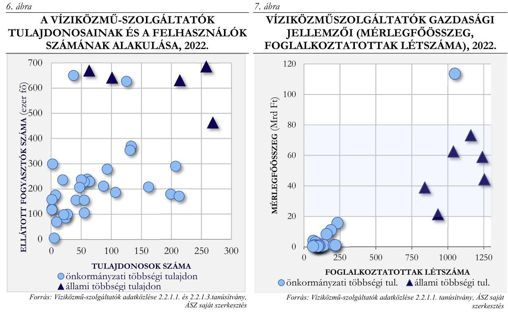

Mind a tulajdonosok számában, mind az ellátott fogyasztók szerint (felhasználói egyenérték - lakosság és a közületi fogyasztók együtt), a többségi állami és a többségi önkormányzati tulajdonú társaságok között meghatározó különbség volt.
(Az átláthatóság kedvéért a 6. ábrán nem szerepel a 2,4 millió felhasználót ellátó Fővárosi Vízművek Zrt. (FV Zrt.) ${ }^{33}$ és az 588 tulajdonossal, 916 ezer fogyasztót ellátó Dunántúli Regionális Vízmű Zrt. (DRV) ${ }^{34}$ )
Az átlagosan 668 ezer fogyasztót kiszolgáló többségi állami tulajdonú víziközmű-szolgáltatók esetében az állami tulajdon részaránya 90% és 99,8% közötti (átlag 94,4%) volt. A kisebbségi részesedés számos (átlagosan 248) önkormányzat között megosztott volt. Ezzel szemben az önkormányzati többségi tulajdonban lévő társaságok kisebb tulajdonosi közösségek voltak. Az önkormányzatok többségi tulajdonában álló társaságok átlagosan 228 ezer fogyasztót szolgáltak ki.
A víziközmű ágazatba tartozó társaságok a közműves ivóvíz-szolgáltatás mellett a legtöbb esetben a települések szennyvízkezelését is ellátták. A 2022-es adatok szerint a víziközmű-szolgáltatók a létszámuk és mérlegfőösszegük jellemzői alapján a közép- és nagyvállalati kategóriába tartoztak. Nagyvállalati kategóriába tartozott 11 víziközmű-szolgáltató társaság. Az ivóvíz ágazat eszközeinek összesen mérlegfőösszege a 2017. évi nyitó értékről, 380,6 Mrd Ft-ról 37,1%-kal 521,9 Mrd Ft-ra nőtt 2022. év végére, az éves átlagos ágazati változás/növekedés mértéke 5,4% volt. A 2022. évi adatok szerint az FV Zrt. 114 Mrd Ft-os mérlegfőösszeggel, 1050 foglalkoztatottal kiemelkedett. Ezt követte vállalatméret szerint a hat többségi állami tulajdonú víziközmű-szolgáltató, amelyek mérlegfőösszege 2022. év végén 20 és 80 Mrd Ft között alakult, átlagosan 1077 foglalkoztatottal. A harmadik csoportba tartoztak az önkormányzati tulajdonú társaságok, amelyek mérlegfőösszege 20 Mrd Ft alatt, átlagosan 3,8 Mrd Ft volt. Az önkormányzati tulajdonú víziközmű-szolgáltatók átlagos foglalkoztatotti létszáma 116 fő volt. A víziközmű-szolgáltatást végző társaságok gazdálkodási méretüket és humánerőforrás kapacitásukat tekintve heterogén csoportokat alkottak.

---

A társaságok működését alapvetően az az elv határozta meg, hogy a víziközmű rendszerek, mint vagyonelemek az állam vagy az önkormányzat tulajdonában voltak, melyeket a társaságok vagyonkezelési, koncessziós vagy bérleti-üzemeltetési jogviszonyban üzemeltettek a MEKH engedélyben foglaltak szerint. A vagyonkezelési szerződések értelmében a vagyonkezelőt megilleték a tulajdonos jogai és terhelték a tulajdonos kötelezettségei. Egy-egy társaságot a működtetés akár több formája is jellemezhetett függően a tulajdonossal kötött üzemeltetési szerződésektől. (A 8. ábra a víziközművek adatszolgáltatására épül, három társaság adatai hiányában.) Eltérő üzemeltetési formák esetén a vagyonelemek könyvviteli információs rendszerekben való nyilvántartása is eltérő volt (vagyonkezelt vagy koncesszióban üzemeltetett eszköz a vagyonkezelő nyilvántartásában, bérleti üzemeltetésben lévő eszköz a tulajdonos nyilvántartásában jelent meg).
A működéshez szükséges vagyonelemek eltérő üzemeltetési formája megnehezítette az ágazati víziközművagyon értékének felmérését, a rekonstrukciós igények számbavételét. További nehézséget okoztak az egy üzemeltetőnél párhuzamosan is előfordultak eltérő üzemeltetési formák, ami azt eredményezte, hogy a valós eszközértékek több szervezet pénzügyi-számviteli információs rendszeréből nyerhetők ki. Amennyiben egy szolgáltató a tulajdonos önkormányzatok egy része esetében bérleti-üzemeltetési, más része esetében pedig vagyonkezelési szerződés keretében üzemeltetett, az azt jelentette, hogy az eszközök egy része saját, egy része a tulajdonos önkormányzat számviteli nyilvántartásában jelent meg.
8. ábra

A VÍZIKÖZMŰVEK MEGOSZLÁSA ÜZEMELTETÉSI FORMA SZERINT, 2022
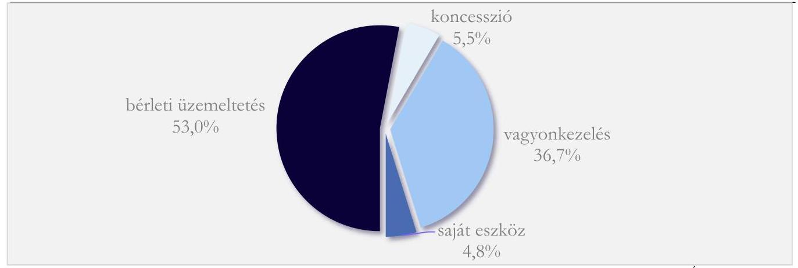

A Vhr. ${ }^{55}$ 90/E. § (1) bekezdése előírta, hogy bérleti-üzemeltetési szerződés esetében a víziközmű üzemeltetése használati díj fizetése ellenében folytatható. A víziközmű szolgáltató által fizetett használati díjat az ellátásért felelősöknek elkülönített számlán kellett kezelniük és vissza kellett forgatniuk a víziközművek rekonstrukciójára, a jóváhagyott gördülő fejlesztési tervben meghatározott víziközmű-fejlesztési feladatok finanszírozására.
Ágazati működési problémát jelentett, hogy a használati díj szerkezetének, elemeinek és mértékének meghatározása hiányzott a szabályozásból. A kormány nem élt a Vksztv. 74. § (1) bekezdés 14. pontjában kapott felhatalmazással, az ellátásért felelősöket az eszközök használatáért megillető használati díj meghatározásának módszertanát, szempontjait előíró kormányrendelet megalkotására nem került sor, ezért a MEKH nem tudta szabályozni annak mértékét. A szabályozás hiányában a 2015. július 1-jén hatályos használati díj mértékeket kellett alkalmazni. Az ellátásért felelősök által elkülönítetten kezelendő használati díj mértékének változatlansága miatt az így keletkező forrás - a gazdasági és inflációs környezet változása mellett - mind kevesebb eszköz fejlesztés finanszírozását biztosította.

---

Nem történt meg teljeskörűen a víziközműveknek, az ivóvízszolgáltatást biztosító vagyonelemek értékének meghatározása, vagyonértékelése. A víziközmű tulajdonosok részére előírt vagyonértékeléseket 2022. december 31. napjáig kellett elvégezni, azonban 2022. december 31-ig a víziközmű rendszerek 88%-a esetében készült el a vagyonértékelés. A vagyonértékelések elkészítésével kapcsolatos kockázatokra az 1. fókuszterület részletes megállapításai is rámutattak.

Kockázatot jelent, hogy a víziközmű-szolgáltatást a társaságok csökkenő létszámú, növekvő átlagéletkorú személyi állománnyal látták el.

A víziközmű-szolgáltatást biztosító munkavállalók, a víziközmű-társaságokban dolgozók létszáma 2017-ben 14100 fő volt, ez a létszám 2022. évre 2,0%-kal 13800 főre csökkent. A munkavállalók között a szellemi
 foglalkozásúak létszáma stagnált, a csökkenést a fizikai munkavállalók számának csökkenése okozta alapvetően. A teljes munkaidőben foglalkoztatottak létszáma 3,3%-kal, a részmunkaidőben foglalkoztatottaké 0,7%-kal csökkent. A létszámhiány pótlására a társaságok emelték a nyugdíjas dolgozóik számát, amely folyamatosan növekedett a 2022. évre (ezzel az ellenőrzött időszakban 120,1%-kal emelkedett a nyugdíjas foglalkoztatottak száma). A létszámhiányt mutatja, hogy a betöltetlen álláshelyek száma az időszak alatt másfélszeresére nőtt (lásd 9. ábra).
9. ábra

HUMÁNERŐFORRÁS VÁLTOZÁS A BÁZIS IDŐSZAKHOZ KÉPEST
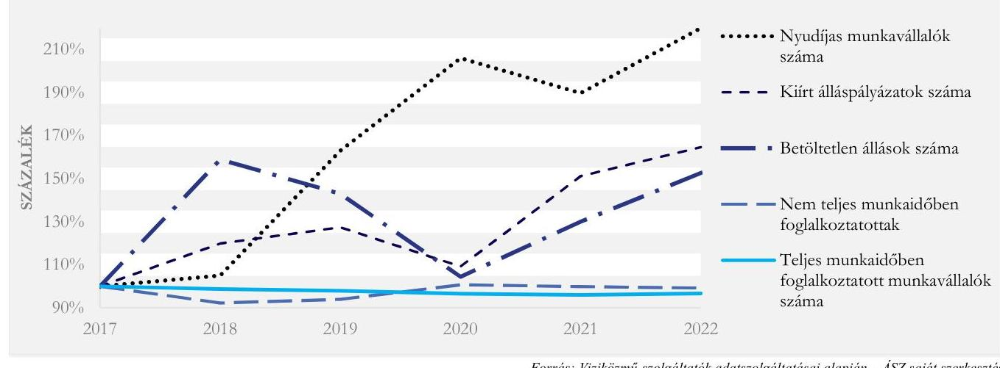

Forrás: Víziközmű-szolgáltatók adatszolgáltatásai alapján - ÁSZ saját szerkesztés
Az ágazat személyi jellegű ráfordításai a vizsgált időszakban nőttek, azonban a víziközmű-szolgáltatásban dolgozók átlagbére az emelések ellenére is jelentősen, 15,2%-kal elmaradt a nemzetgazdasági átlagtól 2022-ben. Ez nehezítette az új munkavállalók toborzását és a foglalkoztatottak megtartását. Az ellenőrzési dokumentumok, tanúsítványok alapján az ellenőrzött időszak alatt rendelkezésre álló munkaerő állománnyal a szolgáltatók képesek voltak ellátni a feladataikat, de a fokozatosan és folyamatosan csökkenő foglalkoztatotti létszám és a növekvő átlagéletkorú alkalmazottak következtében a humánerőforrás menedzsment a jövőben komoly működtetési problémák forrása lehet.

---

Az ellenőrzött időszakban évről évre fokozatosan romlott a víziközmű-közszolgáltatást végző gazdasági társaságok üzemi-üzleti eredménye. A tulajdonosi és költségvetési támogatások nélkül számítva az időszak alatt a társaságok fele valamennyi ellenőrzött évben negatív üzemi eredményt ért el.

A szolgáltatók az ivóvíz-szolgáltatás tervszerű üzemeltetésének pénzügyi hátterét megtervezték, az egyes években üzleti terveket készítettek. A pénzügyi források tervezése nem volt egységes, az egyes szolgáltatók a működési-pénzügyi helyzetük, a tulajdonosi elvárások szerint eltérő mélységben és tartalommal tervezték meg az üzleti évet és annak részeként a finanszírozási forrásokat.
A társasági mutatók értékei a 2021. év kivételével minden évben romlottak, a 2017. évi 0,9%-os eszközarányos eredmény (ROA) 2022-re -0,8%-ra, a 2017. évi 9,1%-os tőkearányos eredmény (ROE) -8,5%-ra romlott (10. ábra). Az ivóvíz ágazat 2022-re összességében már üzemi szinten is veszteséges volt, a társaságok üzemi eredménye -4,9 Mrd Ft, az összesített adózott eredmény -4,1 Mrd Ft volt.
A bevételekkel nem fedezhető, növekvő költségek forrásának biztosítására a tulajdonosok tettek lépéseket (11. ábra). A likviditási helyzetet helyreállító és megerősítő tulajdonosi és a költségvetési támogatások összege folyamatosan emelkedett, 2022-ben ugrásszerű növekedés volt tapasztalható a támogatások összegében. 2022-ben a tulajdonosi támogatások 30,3 Mrd Ft-ot tettek ki a 2017. évi 6,3 Mrd Ft-tal szemben.
10. ábra

A VÍZIKÖZMŰ TÁRSASÁGOK ESZKÖZ- ÉS TÖKEARÁNYOS EREDMÉNYÉNEK ALAKULÁSA 2017-2022
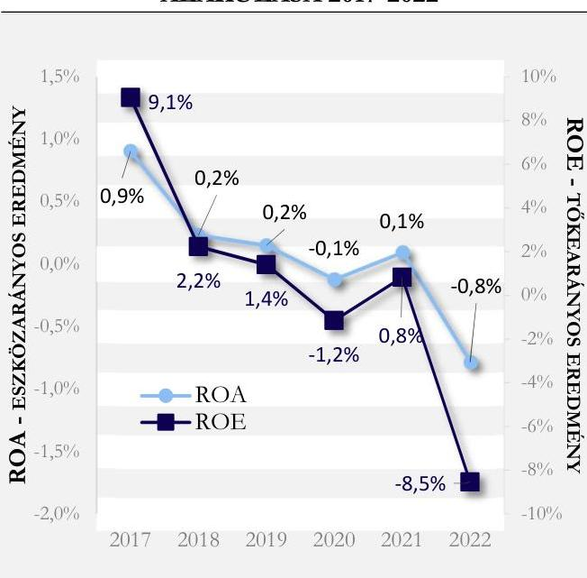

Forrás: 2.2.1.5. számú tanúsítványban közölt adatok alapján ÁSZ saját szerkesztés

## 11. ábra

A TÁRSASÁGOK ÖSSZESÍTETT ÁGAZATI ÜZEMI-ÜZLETI EREDMÉNYE ÉS A TULAJDONOSI-, KÖLTSÉGVETÉSI TÁMOGATÁSOK ÖSSZEGE
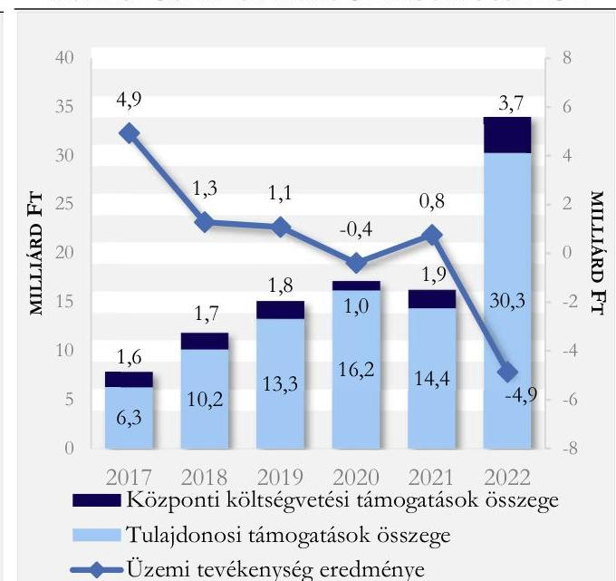

Forrás: 2.2.1.5. számú tanúsítványban közölt adatok alapján ÁSZ saját szerkesztés

A MEKH éves díjjavaslataiban - a Vhr.-ben meghatározott szempontok szerint - vizsgálta a szolgáltató társaságok vagyoni és pénzügyi helyzetét, a szolgáltatók tőkeellátottságát, a II. fokozatú likviditási rátáját, valamint eladósodottságuk fokát. Mindhárom kiemelt mutató tekintetében 2021-ben a társaságok 76%-a nem érte el, vagy feltételesen érte el a működési engedély fenntartásához szükséges, jogszabályban meghatározott pénzügyi határértékeket: a MEKH a 2021-ben működési engedéllyel rendelkező 38 víziközmű-szolgáltató közül 11 szolgáltató tőkeellátottságát, 12 társaság rövid távú

---

fizetőképességét és 19 szolgáltató hosszú és rövid lejáratú kötelezettségeinek teljes vagyonon belüli részarányát találta kielégítőnek. 29 társaság feltételesen kapott működési engedélyt. A MEKH rámutatott, hogy a társaságokra számított vizsgált és jogszabályban előírt mutatók teljesítésében tükröződtek az ágazat gazdasági nehézségei. A 2022. évben a társaságok gazdasági helyzete tovább romlott.
Az ivóvíz-ellátás, mint közszolgáltatás eredményes ellátásához, az ivóvíz megfelelő mennyiségben és minőségben történő biztosításához szükséges intézkedéseket a szolgáltatók végrehajtották. Azonban az ivóvíz-ágazatban üzemi-üzleti eredményeik - a lakossági szolgáltatás ágban kis mértékben növelhető értékesített ivóvíz mennyiséget feltételezve - árbevételeik korlátozottsága és a gazdasági környezet változásait is tükröző költségeik és ráfordításaik növekedése miatt romlottak.
A gazdasági-működési környezet 2022. évi változásai (egyebek között az energia költségek megemelkedése) a társaságok finanszírozását illetően a korábbi éveknél is nagyobb kihívások elé állították a víziközmű-szolgáltatók többségét.
A költségmegtérülés elve a víziközmű működtetésével kapcsolatos indokolt költségek díjbevételekkel való fedezettsége terén nem érvényesült maradéktalanul, mivel a Vksztv. által meghatározott és a MEKH által számított indokolt költségekre a rögzített díjbevételek nem biztosítottak fedezetet. A Vksztv. a 2000/60/EK irányelvben foglaltakkal összhangban egyik alapelvként megfogalmazta a víziközmű szolgáltatás költségmegtérülésének szabályát. A Vksztv. előírását a Vhr. kiegészíti azzal, hogy a felújítások, pótlások és rekonstrukciók fedezetének forrásait elsődlegesen a szolgáltatási díjban érvényesített díjhányadnak kell biztosítania.
A 12. ábra a víziközmű szolgáltató társaságok ivóvíz ágazati üzemi eredményeit mutatja, (azaz az ivóvíz ágazat üzleti évben elszámolt értékesítés nettó árbevételének, az eszközök között állományba vett saját teljesítmények értékének, az egyéb bevételeknek, valamint az üzleti évben elszámolt anyagjellegű ráfordítások, személyi jellegű ráfordítások, értékcsökkenési leírás és egyéb ráfordítások különbözetét).
12. ábra

A VÍZIKÖZMŰ-SZOLGÁLTATÓK ÜZEMI-ÜZLETI EREDMÉNYE 2017. ÉS 2022. ÉVBEN (IVÓVÍZ ÜZLETÁG)
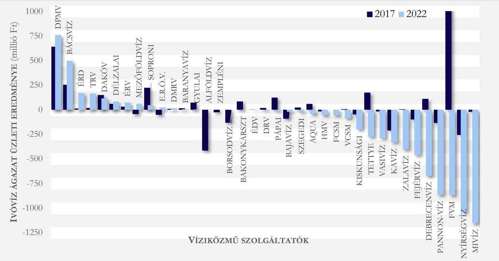

Forrás: Víziközmű-szolgáltatók adatközlése 2.2.1.1. tanúsítvány, ÁSZ saját szerkesztés

---

A 2017-ben működő társaságokat vizsgálva megállapítható, hogy a nyereséges és veszteséges társaságok aránya a 2022. évre megfordult. Az ábra alapján látható, hogy a társaságok többsége a víziközműszolgáltatást nem tudta eredményesen végezni, 2017-ben 14 társaságnak volt az üzleti eredménye negatív, 2022-ben 22 társaság volt üzemi szinten veszteséges.
Az egyéb bevételek között kimutatott tulajdonosi és központi költségvetési támogatások nélkül számítva az üzemi tevékenység eredménye, a kiadások bevételekkel fedezettsége még kedvezőtlenebb képet mutatott. 2022-ben az ivóvíz-ellátást végző 37 társaságból 7 társaság eredménye volt pozitív a tulajdonosi és központi költségvetési támogatások nélkül.

A víziközmű-közszolgáltatást végző gazdasági társaságok esetében az üzleti eredményt befolyásoló bevételek és költségek mellett az ágazatot terhelő különadók, mint közterhek nem voltak figyelembe vehetők a víz és csatornadíjak kalkulációjában indokolt költségként.

A 2017-2020. években érdemben nem változott a víziközmű-szolgáltatókat együttesen terhelő különadók (közműadó, energiaellátók adója, tranzakciós illeték) összege. A közművezetékek adójáról szóló 2012. évi CLXVIII. törvény 2021. évtől hatályos módosítása az adó alapjának számítási módját megváltoztatta, így az egyes víziközmű-szolgáltató társaságok adóterhei módosultak, valamint az ágazatot összességében terhelő közműadó összege mérséklődött, amint azt a 13. ábra is mutatja:
13. ábra

AZ IVÓVÍZ ÁGAZATOT TERHELŐ RÁFORDÍTÁSOK ÉS AZON BELÜL A KÖZMŰADÓ ÖSSZEGÉNEK ALAKULÁSA 2017-2022.
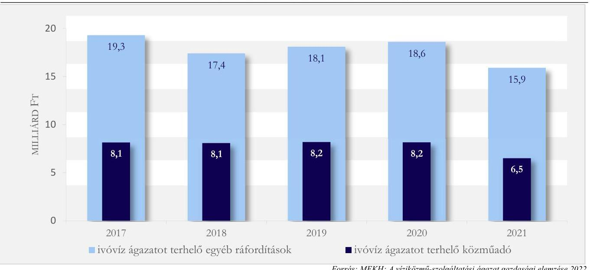

A Vksztv. rendelkezései szerint a víziközmű-szolgáltatók a különadók terhét önállóan viselték, azt az általuk nyújtott szolgáltatás árában közvetlenül vagy közvetve nem érvényesíthették, így a MEKH díjavaslata készítésekor indokolt költségként nem vehette figyelembe az ezen a címen elszámolt ráfordításokat. A közművezetékek adójáról szóló 2012. évi CLXVIII. törvény normaszövege és indoklása, valamint más jogszabály sem rendelkezik az adóalanyok által közművezetékek adójaként a központi költségvetésbe befizetett összeg felhasználási feltételeiről, az így befizetett összeg nem képezett alapot és nem volt forrása célzott, a befizetést teljesítő ágazatokat érintő beruházásoknak.

---

Az ellenőrzött időszakban némileg csökkent a kitermelt, de bevételt nem eredményező vízfelhasználás és a vízveszteség.

A vízveszteség nemzetközileg is alkalmazott definícióját az IWA (International Water Association) határozta meg. Egy 2021-es, az országok vízveszteség adatait feldolgozó európai felmérés szerint (NRW 2021) a magyarországi vízveszteség aránya 28%-os volt. Ez a vizsgálatba bevont országok adataiból számított 25,1%-os átlagot meghaladta ugyan, de Magyarországot a vizsgált országok közül a közepes vízveszteséggel rendelkező országok közé sorolta.
A vízveszteség következménye, hogy a víziközmű rendszerekbe betáplált ivóvíz előállításának költségei nem térülnek meg, ezek a kiadások növelik az értékesített vízmennyiségre jutó költségeket. A vízveszteség értékelésének kategóriáit mutatja a 14. ábra.
14. ábra

A TERMELT IVÓVÍZ ÚTJA, A VÍZVESZTESÉG TÍPUSAI
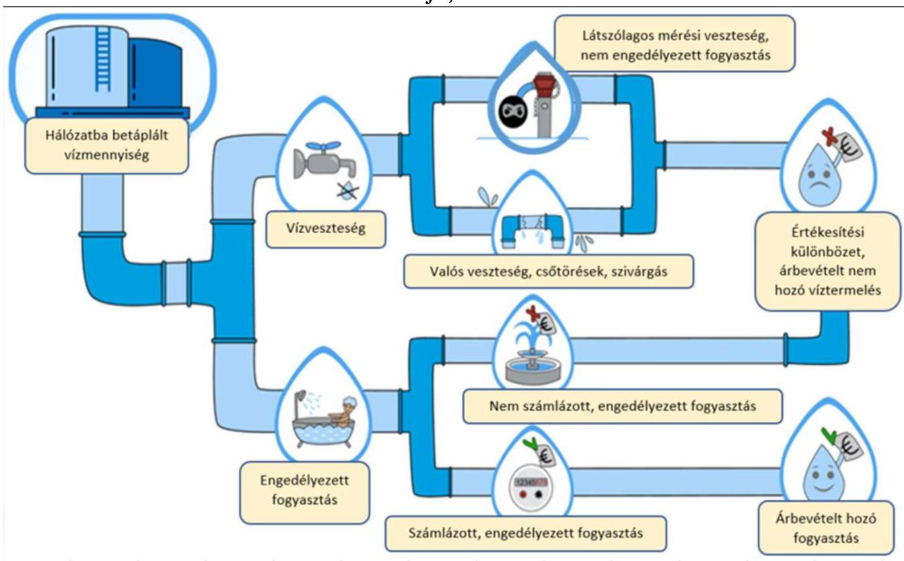

Forrás: IWA, FORDÍTÁSA https://www.hawle.com/en/hawle-knowledge/basics/non-revenue-water
Magyarországon a vízveszteség és a nem számlázott vízfelhasználás adatainak számítását a KSH és a MEKH is elvégezte az ellenőrzött időszakban. A hazai közüzemi vízveszteség a KSH adatközlése szerint a magyarországi közüzemi víztermeléshez viszonyítva 2017-2021. időszakban évenként rendre 27,5%, 27,4%, 27,9%, 28,0%, 25,0% volt.
A MEKH és a víziközműszolgáltatók adatszolgáltatása alapján a közműhálózatba betáplált vízmennyiség és a valós vízveszteség aránya 2017. és 2022. között 22,7-ről 20,5%-ra csökkent. Ehhez hozzáadva a látszólagos vízveszteséget, ami a mérési pontatlanságokból, illegális vízhasználatból származik és a nem számlázott engedélyezett ivóvíz (közkutak, tűzcsapok) fogyasztását, az összes vízveszteség 25,5%-ról 22,9%-ra változott. A KSH és a MEKH vízveszteséget meghatározó adatai közötti

---

különbség az adatgyűjtés eltérő módszerére vezethető vissza. A 4. táblázat a hálózatba táplált és számított vízveszteség MEKH által közölt adatait mutatja.
4. táblázat

A VÍZIKÖZMŰ SZOLGÁLTATÓ TÁRSASÁGOK VÍZVESZTESÉG ADATAI (MILLIÓ M²)

| SZOL   SZÁM | ADAT MEGNEVEZÉSE | 2017. | 2018. | 2019. | 2020. | 2021. | 2022. |
| :--: | :--: | :--: | :--: | :--: | :--: | :--: | :--: |
| 1. | Víziközmű-rendszerekbe, elosztó hálózatba betáplált összes víz / ivóvíz | 659,1 | 658,1 | 668,9 | 664,2 | 672,3 | 682,9 |
| 2. | Összes engedélyezett vízfelhasználás (3. +4.) | 509,8 | 514,1 | 520,5 | 518,9 | 533,2 | 542,9 |
| 3. | Számlázott engedélyezett vízfogyasztás | 490,7 | 493,4 | 501,6 | 503,0 | 517,3 | 526,5 |
| 3.a. | - ebből mért lakossági vízfogyasztás | 337,0 | 339,5 | 344,5 | 360,2 | 367,7 | 367,6 |
| 3.b. | - ebből mért, nem lakossági vízfogyasztás | 116,2 | 118,2 | 118,5 | 104,6 | 110,4 | 118,8 |
| 4. | Nem számlázott engedélyezett fogyasztás | 19,1 | 20,7 | 18,9 | 15,9 | 15,9 | 16,4 |
| 5. | Valós vagy számított vízveszteség | 149,3 | 144,0 | 148,4 | 145,3 | 139,1 | 140,0 |
| 6. | Valós vízveszteség aránya (5./1.) | 22,7% | 21,9% | 22,2% | 21,9% | 20,7% | 20,5% |
| 7. | Értékesítési különbözet, árbevételt nem eredményező víztermelés (4.+5.) | 168,4 | 164,7 | 167,3 | 161,2 | 155,0 | 156,4 |
| 8. | Teljes vízveszteség (7./1.) | 25,5% | 25,0% | 25,0% | 24,3% | 23,1% | 22,9% |

A MEKH adataival összességében azonos tendenciát mutatnak a víziközmű-szolgáltatók adatai az ellenőrzött időszakban. A 15. ábra a szolgáltatók adataira támaszkodva összegzi a vízveszteség millió m³-ben kifejezett mennyiségének változását, a 16. ábra pedig az egyes ivóvíz-szolgáltatók egyedi vízveszteség adatait mutatja be. Az ellenőrzött időszakban 2022. évre a 2017. évhez képest összességében csökkent a vízveszteség, azonban évről évre azonos változást jelentő tendenciát a mennyiségi adatok változása nem mutatott. A szolgáltatók 2022. évi vízveszteség adata azt mutatja, hogy a szolgáltatók túlnyomó része az átlagos, vagy ahhoz közeli arányú veszteséggel szolgáltatott.
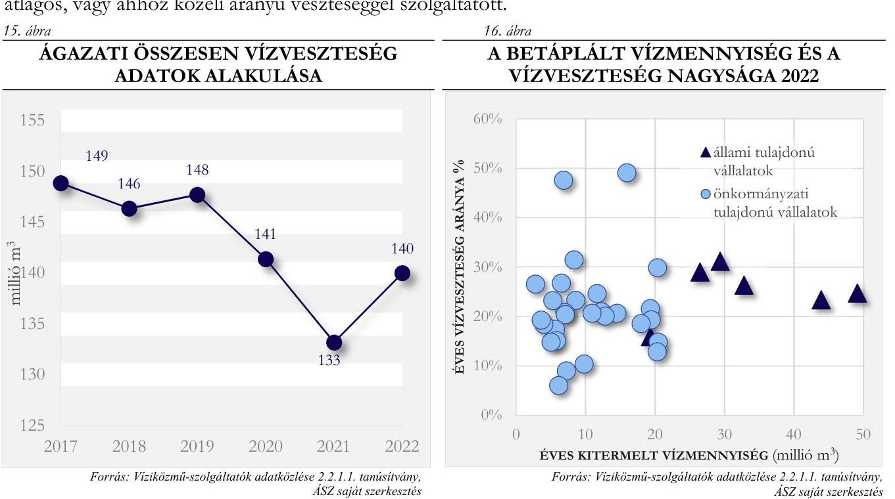

---

A Magyarországon alkalmazott legalacsonyabb és legmagasabb lakossági szolgáltatói átlagár 142,2 Ft/m³, illetve 430,1 Ft/m³ volt. Egy egyszerű empirikus képletet használva, amely azon a feltételezésen alapul, hogy egy m³ nem számlázott víz értéke megegyezik a legalacsonyabb szolgáltatói átlagár és a rendszerben megjelenő vízveszteségen kívül vízhasználat százalékos adatának
 szorzatával, a termelt vízmennyiség és az összes szolgáltatott vízmennyiség különbözetének becsült értéke valamennyi ellenőrzött évben, magyarországi műszaki és értékesítési viszonyok mellett a 2017-2021. évek mindegyikében meghaladta a 17 Mrd Ft-ot.

Az ellenőrzött időszakban évről évre nőtt a víziközmű-rendszer tulajdonosok és a víziközmű-közszolgáltatást végző gazdasági társaságok gördülő fejlesztési terveiben jelzett, a MEKH által jóváhagyott karbantartási-rekonstrukciós és beruházási forrásigény. Ez rámutat az ágazatok (ivóvíz, szennyvíz) működésének egyre növekvő forrásszükségletére.

Az ivóvíz ellátását, valamint a szennyvíz elvezetését és tisztítását biztosító víziközmű-rendszerenként a Vksztv. és a Vhr. szerint elkészített GFT-ket az ellátásért felelősök és a szolgáltatók évente benyújtották a MEKH-nek jóváhagyásra. A tervek számba vették a megvalósított fejlesztéseket és előírásozták a folyamatban lévő fejlesztések továbbhaladását, valamint a szükséges további fejlesztéseket. A terveket a MEKH határozattal hagyta jóvá, és azok megvalósítását - szankciók alkalmazása mellett - ellenőrizte.
A víziközmű-szolgáltatók GFT terv és tény adatai alapján a tervezett forrásigény jelentősen meghaladta a víziközmű-ágazatban évente megvalósított felújítási és pótlási munkákra ténylegesen felhasznált összegeket. A tervezett felújításokat, pótlásokat a társaságok részlegesen hajtották végre, a végrehajtott pótlások, felújítások értékben minden évben elmaradtak a GFT-ben benyújtott I. ütemre megtervezettektől. A felújítási és pótlási munkákra tervezett költségekhez viszonyítva a megvalósított munkákra fordított összeg a tervezett 64-74%-a volt. Amennyiben a víziközmű-szolgáltató a MEKH által jóváhagyott GFT I. ütemére tervezett feladatokat forrás hiányában nem tudta végrehajtani, a jogszabály alapján a GFT módosítását tartalmazó tervet nyújthatott be a MEKH-nek jóváhagyásra. Jellemzően évente legalább egy módosítás jóváhagyása iránt indult kérelem, azonban az 1735 db víziközmű-rendszerre vonatkozóan a 2021-ben benyújtott GFT-k jóváhagyására 5450 db eljárást indított a MEKH.

A víziközmű-rendszerenként 15 éves forrásigényt előre vetítően készített GFT-k felújítási és pótlási, továbbá beruházási terveinek összegzése alapján a MEKH nyilvántartása szerint az ágazat (ivóvíz és szennyvíz ágazat összesen) teljes forrásigénye 3775 Mrd Ft volt a 2023-2037. évekre. A GFT-k MEKH által összegzett adatait mutatja a 17. ábra

---

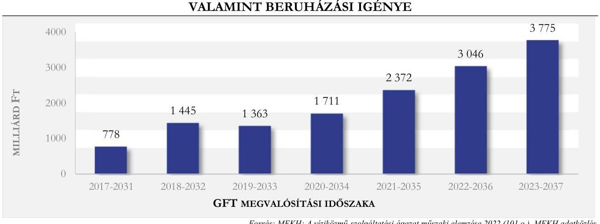

*Forrás: MEKH: A víziközmű-szolgáltatási ágazat műszaki elemzése 2022 (101.0.), MEKH adatközlés*

**A GFT-k készítésének módszertana nem írta elő, a GFT-k MEKH által történő összegzése sem adott arra vonatkozóan információt, hogy a víziközmű-rendszerek vagyonelemeit illetően a tervezett felújítások forrásigénye miképp viszonyult rövid-, közép- és hosszú távon az újraberuházás forrásigényéhez.** A két számítás alapján – meghatározott időtartamra – megállapítható lehet a magasabb nettó jelentértéket biztosító változat, ami támogatja a vagyonelemek működőképességének folyamatos biztosítását.

A víziközmű-eszközök elavultságának mértéke, a műszaki színvonal összességében és átlagosan az ivóvíz-ágazat tekintetében romlott, az elhasználódott, leírt eszközöket az ivóvíz-ágazat nem tudta pótolni. A folyamat egyik lényeges oka, hogy a lakosság közszolgáltatásokkal való ellátásához szükséges infrastruktúrát biztosító vagyonkezelő – a Vtv. rendelkezése szerint – mentesült a visszapótlási kötelezettség alól.

A víziközmű-szolgáltató társaságok és az ellátásért felelősök **hatékonyságnövelő beruházások kezdeményezése érdekében éltek a pályázati lehetőségekkel.** 29 társaság jelezte adatszolgáltatásában, hogy tervezett hatékonyságnövelő beruházást. 24 szolgáltató a beruházás megvalósulása érdekében támogatási kérelmet nyújtott be az ellátásért felelős vagy az ellátásért felelős önkormányzatok konzorciuma, illetve a víziközmű-szolgáltató konzorciuma részére nyújtható egyedi támogatásra. A pályázatokat az ITM „Víziközművek Energiahatékonyságának Fejlesztése” (VEF-2019); „Víziközművek Állami Rekonstrukciós Alapjából nyújtható támogatás” (Vára-ÉMI-2020); KEHOP-5.1.3-17 Operatív Program „Megújuló alapú zöldáram-termelés elősegítése”, „Regionális Vízművek napenergia hasznosítását célzó projekt megvalósítása” című pályázatok keretében nyújtották be. **21 sikeres pályázat megvalósítása** egy esetben önerős forrás hiányában meghiúsult, **a további nyertes pályázatok megvalósultak, vagy megvalósításuk folyamatban volt 2023. augusztus 31-én.**

A hatékonyságnövelő beruházások során napelem kiserőmű létesítése, energiatakarékos eszközök, berendezések beszerzése, technológiai és gépészeti felújítás, irányítási rendszereket érintő és erőforrás-hatékonyságot eredményező fejlesztések, korszerűsítések, nyílászáró-cserék történtek.

A víziközmű-rendszerek felújításaira, pótlásaira ténylegesen felhasznált forrásokból az ellátásért felelős által biztosított forrás részaránya a 2017-2022. években összességében 58-71 %-os arány közötti, a társaság által biztosított forrás aránya 26-38% közötti volt. A 18. ábra a végrehajtott felújítások és beruházások értékeit mutatja.

---

18. ábra

A VÍZIKÖZMŰ-SZOLGÁLTATÓK FELÚJÍTÁSI-PÓTLÁSI ÉS BERUHÁZÁSI KÖLTSÉGEINEK ALAKULÁSA 2017-2022
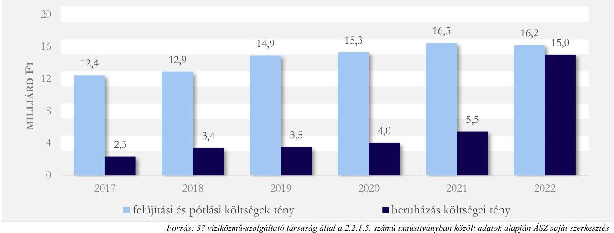

Forrás: 37 víziközmű-szolgáltató társaság által a 2.2.1.5. számú tanúsítványban közölt adatok alapján ÁSZ saját szerkesztés
A víziközmű-rendszerek fejlesztéséhez további forrásokat jelentett a Vksztv. 69-72. § által szabályozottak szerint a nem lakossági felhasználó által a víziközmű-szolgáltató részére megfizetett víziközmű-fejlesztési hozzájárulás. A víziközmű-fejlesztési hozzájárulás kizárólag a hozzájárulás megfizetésére kötelezett felhasználási hely víziközmű-rendszerének víziközmű-fejlesztési igényeire használható fel a gördülő fejlesztési terv által meghatározott felújítási, pótlási és beruházási kötelezettség teljesítéséhez, ideértve a rendszerfüggetlen víziközmű-elem felújítását vagy pótlását is. A víziközmű-fejlesztési hozzájárulást a víziközmű-szolgáltató szedi be saját nevében és javára.

Jogszabály teszi lehetővé, hogy a közszolgáltatás nyújtásához használt eszközök vagyonkezelője mentesüljön a visszapótlási kötelezettség alól, azonban ez az elhasználódott és pótlandó eszközök mennyiségének növekedéséhez vezetett. A víziközmű-közszolgáltatást végző gazdasági társaságok végrehajtottak hatékonyságnövelő beruházásokat az ellenőrzött időszakban.

A víziközmű-eszközök elavultságának mértéke, a műszaki színvonal összességében és átlagosan az ivóvíz-ágazat tekintetében romlott, az elhasználódott, leírt eszközöket az ivóvíz-ágazat nem tudta pótolni. Az állami vagyonról szóló 2007. évi CVI. törvény 27. § (7) bekezdésének előírása szerint a vagyonkezelő legalább a vagyonkezelt eszközök elszámolt értékcsökkenésének megfelelő mértékben köteles gondoskodni vagyonkezelt eszközök értékének megőrzéséről (visszapótlási kötelezettség). A víziközmű-vagyon elhasználódásának egyik lényeges oka a vagyonkezelt víziközmű-eszközök visszapótlási kötelezettség elengedése, vagy a visszapótlási kötelezettségek nem teljesítése (Az állami vagyonról szóló 2007. évi CVI. törvény 27. § (8) bekezdés rendelkezése szerint a lakosság közszolgáltatásokkal való ellátásához szükséges infrastruktúrát biztosító vagyonkezelő mentesül a visszapótlási kötelezettség alól). A visszapótlási kötelezettség elmaradása ágazati szinten 13,9 és 18,6 Mrd Ft között mozgott évente.

Közepes korreláció tapasztalható a víziközmű-közszolgáltatást végző gazdasági társaságok üzemi-üzleti eredményei és az általuk üzemeltetett víziközmű-rendszerekben tapasztalt vízveszteség adata között a rendelkezésre álló 2021. évi adatok elemzése alapján.

---

Az ellenőrzés elemezte a víziközmű-szolgáltató társaságok közműves ivóvízellátáshoz kapcsolódó 2021. évi üzemi eredményét és kitermelt/hálózatba táplált és értékesített ivóvíz-mennyiségből adódó értékesítési különbözet adatokat. Továbbá ellenőrizte a társaságok ivóvízellátáshoz kapcsolódó, annak költségeire vonatkozó - MEKH által képzett - mutatókat (teljes egységköltség, karbantartási költséghányad és fajlagos energiaköltség) amit a IV. melléklet tartalmaz részletesen. A víziközműszolgáltatók egyes gazdálkodási mutatói közötti kapcsolatok szorosságát az 5. táblázatban található korrelációs együtthatók jellemezték.
5. táblázat

# A VÍZIKÖZMŰ-SZOLGÁLTATÓK NÉHÁNY MUTATÓJÁNAK STATISZTIKAI KAPCSOLATA 

|  | $\begin{gathered} \text { Üzemi } \\ \text { tevékenység } \\ \text { eredménye - } \\ \text { közmüves } \\ \text { ivóvízellátás [e Ft] } \end{gathered}$ | Teljes   egységköltség -   közmüves   ivóvízellátás   $[\mathrm{Ft} / \mathrm{m} 3] \end{gathered}$ | Karbantartási   költséghányad -   közmüves   ivóvízellátás [\%] | Fajlagos   energiaköltség -   közmüves   ivóvízellátás   $[\mathrm{Ft} / \mathrm{m} 3]$ | Értékesítési   különbözet   - közmüves   ivóvízellátás   $[\%]$ |
| :--: | :--: | :--: | :--: | :--: | :--: |
| Üzemi tevékenység eredménye - közmüves ivóvízellátás | 1,00 |  |  |  |  |
| Teljes egységköltség - közmüves ivóvízellátás | $-0,30$ | 1,00 |  |  |  |
| Karbantartási költséghányad - közmüves ivóvízellátás | $-0,30$ | 0,32 | 1,00 |  |  |
| Fajlagos energiaköltség - közmüves ivóvízellátás | $-0,21$ | 0,67 | 0,23 | 1,00 |  |
| Értékesítési különbözet - közmüves ivóvízellátás | $-0,55$ | 0,46 | 0,34 | 0,42 | 1,00 |

Forrás: MEKH adatszolgáltatás, ÁSZ saját szerkesztés
Az 5. táblázat adatainak statisztikai elemzése alapján a víziközmű-szolgáltató társaságok eredményessége és értékesítési különbözete közötti korrelációs együttható értéke -0,55 volt, amely közepesen erős korrelációnak minősült.
A társaságok közműves ivóvízellátáshoz kapcsolódó üzemi eredménye és értékesítési különbözete közötti kapcsolatot a 19. és 20. ábra szemlélteti.
19. ábra

AZ ÜZEMI-ÜZLETI EREDMÉNY ÉS AZ ÉRTÉKESÍTÉSI KÜLÖNBÖZET ALAKULÁSA 2021. ÉVBEN - KÖZMÜVES IVÓVÍZELLÁTÁS
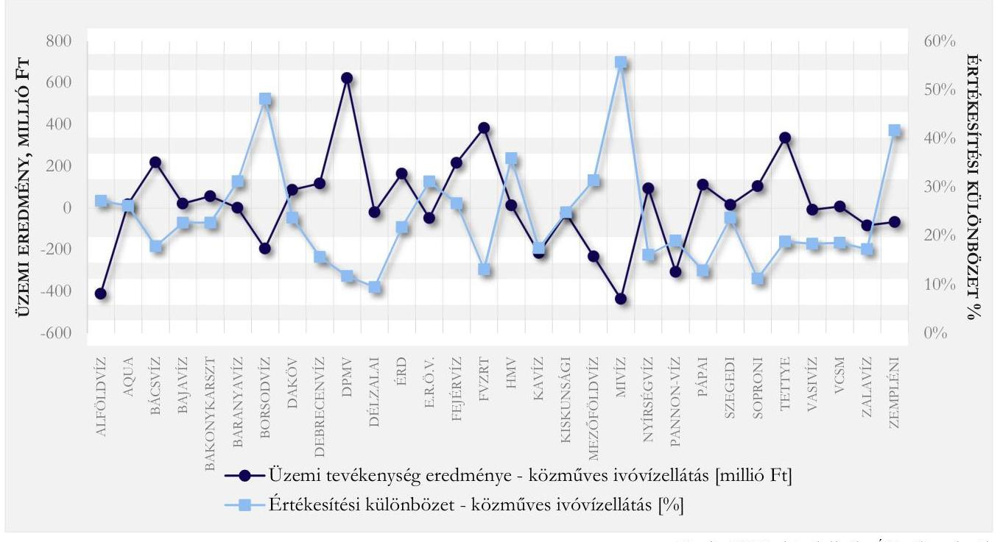

Forrás: MEKH adatszolgáltatás, ÁSZ saját szerkesztés

---

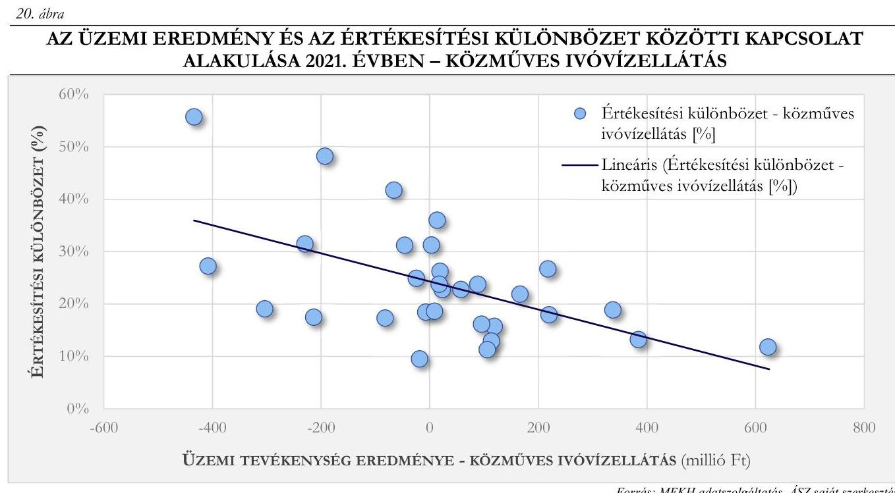

Forrás: MEKH adatszolgáltatás, ÁSZ saját szerkesztés
Az 5. táblázat, valamint a 19. és 20. ábrák alapján a társaságok ivóvízellátáshoz kapcsolódó eredményessége és vízvesztesége közötti kapcsolatot az jellemezte, hogy a magasabb vízveszteségi adatok alacsonyabb eredményességgel, az alacsonyabb vízveszteség adatok magasabb eredményességgel társultak. Ugyanakkor az értékesítési különbözet mértéke és a közműves ivóvízellátás teljes egységköltsége közötti korrelációs együttható értéke 0,46; míg az értékesítési különbözet és a fajlagos energiaköltség közötti korrelációs együttható értéke 0,42 volt, azaz az értékesítési különbözet növekedésével mind az egységköltség, mind a fajlagos energiaköltség növekvő volt. Az értékesítési különbözet hatása a karbantartási költséghányadra a fentiekhez képest gyengébb, a korrelációs együttható értéke 0,34 volt, ami azt jelenti, hogy egységnyi értékesítési különbözet-növekmény a teljes egységköltség és a fajlagos energiaköltség-növekménynél kisebb mértékű karbantartási költséghányad-növekményt eredményezett.
Összességében megállapítható, hogy a víziközmű-szolgáltató társaságok ivóvízellátáshoz kapcsolódó eredményességére a 2021. évben a rögzített vízdíjak mértékén és az emelkedő fenntartási költségeken túl hatással volt a közműves ivóvízellátás esetében az elosztó hálózatba táplált, de ki nem számlázott vízfogyasztás mértéke, amelynek magasabb értéke magasabb egységköltséggel párosult. Az értékesítési különbözet és a karbantartási költséghányad közötti mérsékelt kapcsolat azt jelezheti, hogy az elosztó hálózatba táplált, de ki nem számlázott vízfogyasztás átlagtól magasabb arányát az érintett szolgáltatók esetében jellemzően nem a meghibásodások átlagtól magasabb aránya okozta.

Az ellenőrzött időszak alatt a vízminőség folyamatos ellenőrzésének monitoring-rendszere eredményesen működött, a lakosság biztonságos ivóvíz-ellátása minden településen biztosított volt. Ugyanakkor, az eredményes KEHOP ivóvízminőség-javító programok ellenére az elöregedett vezetékhálózat következtében a másodlagos vízkezelési problémák miatt számottevően, 35%-kal emelkedett a kifogásolt minőségű ivóvízzel ellátott települések száma.

---

Az ellenőrzés értékelte a megfelelő minőségű ivóvíz biztosításának fenntarthatóságát. Az ivóvíz-minőség hosszútávon való fenntarthatóságának feltétele a vízbázisok preventív védelme, és az egészségre ártalmas, megfigyelt jelentősebb szennyező elemek tartós, nem romló tendenciájú előfordulása.
Az ellenőrzés a biztonságos ivóvízhez jutás területi különbségeit az ellenőrzött időszakra vonatkozó területi ivóvízminőségi adatok elemzésével mutatja be. A hazai ivóvíz-hálózatba betáplált ivóvizek minőségmérésének adatait az NNGYK által működtetett HUMVI adatbázis tartalmazza. Az adatbázis 2017. és 2021. között évente közel 50 ezer ivóvízmintát, összesen közel 1 millió paraméterérték mérési eredményeit tartalmazza (az üzemeltetők által végzett önellenőrző vizsgálatok és a területileg illetékes népegészségügyi szerv hatósági vizsgálatainak eredményei). A vízminőség-ellenőrzésének monitoring-rendszere eredményesen működött, képes volt előre jelezni az ivóvízben szereplő egészségre ártalmas paraméterek koncentrációjának emelkedését, a határértékek esetleges túllépését (illetve annak mértékét). Megfelelő gyakorisággal megtörtént az ivóvíz kormányrendeletben meghatározott paramétereinek ellenőrzése. Nem megfelelő vízminőség esetén a szükséges beavatkozásokat megtették.
A települések éves vízminőségének értékelése, az uniós előírásokhoz igazodva jogszabályban meghatározott megfelelőségi arány szerint, az éves paramétermérések értékeinek mediánja alapján történt. A települések vízminősége megfelelő, ha az összes éves vízminőség-mérés alapján az éves paramétermérések értékeinek
 mediánja nem haladja meg a jogszabályban meghatározott határértéket. Az elvégzett vízminták adatai azt mutatták, hogy országos szinten a legtöbb vízminőségi jellemző a vizsgálatok 99–100%-ában megfelelő eredményt jelzett.
A települések éves vízminőségének értékelése alapján meghatározhatók a minőségi ivóvízhez jutás területi különbségei, a 21. ábra a regionális különbségeket szemlélteti.

---

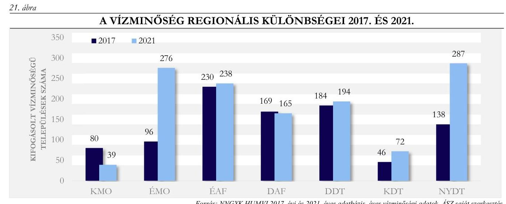

A 21. ábra alapján látható, hogy a települések ivóvízminősége alapján tartós regionális problémák mutatkoztak az Észak-alföldi, Dél-alföldi, valamint a Dél-dunántúli régiókban. Továbbá megállapítható, hogy az ellenőrzött időszak alatt a biztonságos ivóvízhez jutás feltételei országosan romlottak, csak a közép-magyarországi régióban csökkent a kifogásolt minőségű ivóvízzel ellátott települések száma. Az Észak-magyarországi és a Nyugat-dunántúli régiókban csak 2021-re következett be minőségromlás. A problémás, kifogásolt ivóvízzel ellátott települések száma az időszak alatt mintegy harmadával, 943 darabról 1271-re (34,8%-kal) emelkedett. A népesség adatok alapján 2021-ben kifogásolt minőségű ivóvíz-ellátás a lakosság 28,4%-át, mintegy 2750 ezer embert érintette (2017-ben 25,7% volt ez az arány). A paraméterek alapján a vízminőség kémiai vagy biológiai vagy a vízkezeléshez kapcsolódó víztechnológiai problémái azonosíthatók. Egy-egy településen több vízminőségi paraméter is kifogásolt lehetett.

---

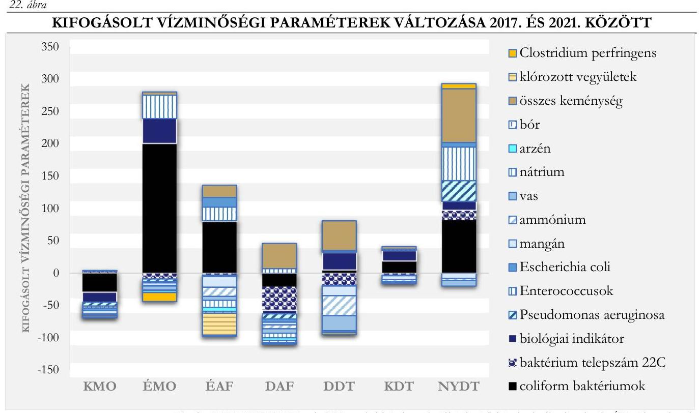

*Forrás: NNGYK HUMVI 2017-es és 2021-es adatbázis, éves települési vízminőségi adatok változása alapján ÁSZ saját szerkesztés*

Az ellenőrzött időszak települések szerinti éves vízminőségi adatainak elemzése rámutatott, hogy 2017-ben az Észak-alföldi, Dél-alföldi, valamint a Dél-dunántúli régiókban mutatkoztak jelentősebb vízminőségi problémák. 2017. és 2021. között a kifogásolt víz minőségi problémák javítása érdekében Vízminőség-javító Programok indultak. A bázis évhez képest a vízminőségi paraméterek közül a vízbázis (geológiai okokra visszavezethető) eredetű kémiai paraméterek: arzén, bór, fluorid, nitrát, ammónium okozta problémák szinte minden régióban javultak, megoldódtak. Az NNGYK adatai alapján azonban a 2021. évre fokozott, 35%-os vízminőségromlás következett be. Ezeket a vízminőségi problémákat azonban nem a vízbázis kémiai szennyeződései okozták, hanem a víziközmű-hálózat műszaki minőségéhez, a vízkezeléshez kapcsolódó másodlagos vízminőség-romlás okozta. Az ivóvízelosztó hálózatban megjelenő biológiai szennyeződések, coliform baktériumok, mellett ugyanezen adatok alapján jelentős volt még a vízkezeléshez kapcsolódó ivóvízminőség problémák jelentkezése is. Másodlagos, vízkezeléshez kapcsolódó fokozódó vízminőségi gondokat mutat az Észak-magyarországi, Észak-alföldi és a Nyugat-dunántúli régióban megemelkedett biológiai indikátorok kifogásolt száma. A Dél-alföldi régió vízminősége mind a kémiai, mind a biológiai paraméterek alapján kedvező elmozdulást mutatott.

Az ivóvízminőség-javító programok keretében történt fejlesztések lehetőséget adtak a korábban ellátatlan területek bekapcsolására a közműves hálózatba, illetve nem megfelelő vízminőségű egyedi kutak kiváltására is. A kifogásolt ivóvízű települések 2016-tól a KEHOP 2.1 keretrendszerben nyújthattak be pályázatot. A víziközmű-ellátás derogációs kötelezettségeit a VKI, az uniós ivóvízminőség-javító fejlesztési előírások határozták meg. Ezeknek legfontosabb célja a vízbázis-problémák: arzén, bór, fluorid, vas, ammónium szennyezettség csökkentése volt. A fejlesztések forrásai alapvetően az uniós KEHOP források voltak. A 2014–2020-as uniós költségvetési keretből az ivóvízminőség javítására megítélt támogatás 102 Mrd Ft volt, a 2023. június 30-ig kifizetett támogatási összeg ennek 83%-a, 85 Mrd Ft volt, ezt mutatja a 6. táblázat.

---

| KÖD | A VÍZMINŐSÉG-JAVÍTÓ KEHOP FORRÁSOK |  |  |  |  |
| :--: | :--: | :--: | :--: | :--: | :--: |
|  | Célterület | Támogatott pályázatok száma | Megítélt támogatás (millió Ft) | Kifizetésre került támogatás összege* (millió Ft) | Kifizetésre került támogatás aránya |
| KEHOP-   2.1.1-15 | Felhívás a derogációval érintett, valamint ammónium-ionra vonatkozó ivóvízminőség-javító projektek megvalósítására | 10 | 7513 | 8394 | $111,7 \%$ |
| KEHOP-   2.1.2-15 | Felhívás a derogációval érintett, valamint ammónium-ionra vonatkozó ivóvízminőség-javító projektek megvalósítására | 16 | 14882 | 9705 | $65,2 \%$ |
| KEHOP-   2.1.3-15 | Felhívás a derogációval érintett, valamint ammónium-ionra vonatkozó ivóvízminőség-javító projektek megvalósítására | 76 | 57615 | 49571 | $86,0 \%$ |
| KEHOP-   2.1.4-15 | Felhívás az egyedi, illetve térségi ivóvízminőségjavító rendszerek kiépítésével és a lakosság egészséges ivóvízzel való ellátásához kapcsolódó projektekre | 5 | 4937 | 5480 | $111,0 \%$ |
| KEHOP-   2.1.5-16 | Felhívás ivóvízellátó hálózatok átalakítására, fejlesztésére | 1 | 16822 | 11674 | $69,4 \%$ |
| ÖSSZESEN |  | 108 | 101769 | 84824 | $83,4 \%$ |

* A megítélt támogatásokat meghaladó kifizetéseket magyarázza a folyamatban lévő projektek összköltségének a növekedése, a megvalósítás alatt megváltozott műszaki tartalom, beszerzési ár- vagy költségnövekedés miatt. Forrás: www.helsasgat.gov.hu publikált KEHOP projekt adatok, 2023. június 30-i lekérdezés alapján ÁSZ saját szerkesztés

A KEHOP ivóvízminőség-javító források regionális elosztása nem minden esetben igazodott a derogációs problémák – bór, arzén, vas, mangán, ammónium paraméterek – és a korábban bemutatott régiós vízminőségi problémák eloszlásához. A KEHOP 2.1.1–2.1.3. rendelkezésre álló források legjelentősebb részét a Dél-dunántúli (28,5%) és a Nyugat-dunántúli régió (17,0%) kapta. Azonban a tartós vízminőségi problémákat mutató alföldi régiók együttes részesedése a forrásokból nem érte el a források ötödét (10,1% és 7,6% volt). A minőségi közszolgáltatásokhoz való hozzáférés társadalmi, területi különbségeit mutatja, hogy az egyik legfejletlenebb hazai régió, Észak-Magyarország részére megítélt KEHOP források aránya csupán 2,5% volt, ezt mutatja a 23. ábra.
Az ivóvízminőséget javító projekteknek megítélt támogatások medián összege 245 MFt³⁶, az átlagos megvalósítási idő 5,3 év volt. A projektek megvalósításának elhúzódását az ITM 2018-as értékelése alapján több akadályozó tényező okozta: 1) Folyamatban lévő projektek összköltségnövekedése, 2) a jogosultsági kritériumok nem teljesülése, 3) a kedvezményezett önkormányzatok köztartozása, kedvezményezettek pénzügyi, gazdasági problémái. A projektek többségében (85,0%) a kedvezményezett és a lebonyolító a Nemzeti Fejlesztési Programiroda Nonprofit Kft. volt, néhány projektet (9,0%) önkormányzatok, önkormányzati társulások valósítottak meg, a fennmaradó forrásokat a regionális víziközmű társaságok kapták.

---

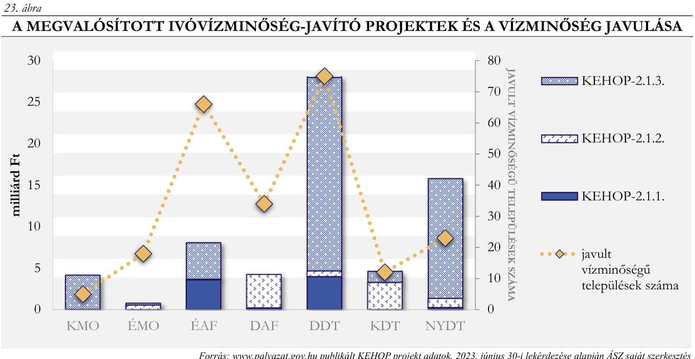

Forrás: www.palyazat.gov.hu publikált KEHOP projekt adatok, 2023. június 30-i lekérdezése alapján ÁSZ saját szerkesztés
Az ivóvízminőség-javító projektek összesített értékelése során a projektek célterületeként megadott derogációs paramétereinek (arzén, bór, fluor, vas, mangán, ammónium, nitrit) bázis értékét és a 2021-ig bekövetkezett regionális változásokat vette számba az ellenőrzés. A statisztikai elemzés azt mutatta, hogy a vízminőség-javításra felhasznált uniós források és az érintett régiók vízminőségének javulása között kimutatható, meghatározó statisztikai kapcsolat van. A kifizetett KEHOP-források nagysága 45,9%-ban magyarázza a derogációs vízminőségi paraméterek időszak alatt bekövetkezett javulását (A kapcsolat szorosságát jellemző korrelációs együttható értéke r=-0,677, az ok-okozat determinációs együttható értéke r²=0,459). (Az értékelés korlátait jelentette, hogy a KEHOP-források felhasználása még folyamatban volt, 85% került kifizetésre, illetve a vízminőségváltozásra vonatkozóan az ellenőrzéshez szolgáltatott településsoros adatok csak 2021-re álltak rendelkezésre.)

# 3. Biztonságos és megfizethető ivóvíz-ellátás fenntarthatósága 

| Összegző megállapítás | Az alkalmazott árpolitika következtében a |
| :-- | :-- |
| közszolgáltatáshoz való hozzáférés társadalmi |  |
| egyenlőtlenségei csökkentek, azonban a vízdíjak rendszere |  |
| nem ösztönözte a fogyasztókat a takarékos, fenntartható |  |
| ivóvízfogyasztásra, az ágazat hosszú távon fenntartható |  |
| pénzügyi és műszaki működését veszélyeztette. A lakosság |  |
| biztonságos és megfizethető ivóvízzel való ellátása a jelenlegi |  |
| formájában hosszú távon nem fenntartható. |  |

A Vksztv. tartalmazta a víziközmű-szolgáltatás nemzetközi gyakorlathoz, VKI szabályokhoz igazodó árpolitikai irányelveit, a díjmegállapításra vonatkozó hazai alapelveket és szabályokat, amelyek szerint:

- A víziközmű-szolgáltatás díja kéttényezős, alap- és fogyasztással arányos díjból áll.

---

- A víziközmű-szolgáltatási díjaknak függetlenül azok hatókörétől, ösztönözniük kell a biztonságos víziközmű-szolgáltatás fenntartását, költség-, kapacitáshatékony működését, a szolgáltatásminőség javítását és a természeti erőforrások védelmét.
- A vízdíjak kalkulációja során figyelembe kell venni a folyamatos szolgáltatás-fenntartás, a környezet- és vízbázisvédelem költségeit, valamint a költségvetési és önkormányzati támogatásokat.
- A vízdíjak meghatározása során a szolidaritás elvének érvényesítése: a települések eltérő víziközmű-üzemeltetési költségeinek díjakra ható eltérő mértékeinek részben vagy egészben való kiegyenlítése a vízdíjakban.
- A költségmegtérülés elve szerint a víziközmű-szolgáltatás díjában a víziközmű működtetésével kapcsolatos indokolt költségeknek meg kell térülniük. A VKI szerint a költségmegtérülés elvét komplex módon, a társadalmi költségeket is figyelembe véve kell értelmezni. Ez jelenti a vízszolgáltatások díjainál a környezeti és a vízkészletek védelmével összefüggő költségek figyelembevételét, valamint az eltérő társadalmi szereplők vízhasználatának komplex értékelését, (közvetve a vízkészletekkel való komplex gazdálkodást).

A Rezsitv.⁵⁷ alapvetően meghatározta a víziközmű ágazat stratégiai irányításának, ezen belül az árak szabályozásának mozgásterét. A rezsicsökkentés során a jogalkotó a vízdíjakat a 2013. évben rögzítette.

Az ellenőrzött időszakban a lakosság biztonságos ivóvízellátásának kereteit alapvetően meghatározták a kormányzat szociálpolitikai célkitűzései, az ezzel összhangban alkalmazott rezsicsökkentés, a víziközműszolgáltatási díjak mintegy évtizede (2013. óta) tartó állandósága. A rezsicsökkentés során a jogalkotó a vízdíjakat a 2013. évben, a 2013. január 31-én jogszerűen alkalmazott díjtételek és egyéb számlaelemek alapján, ugyanazon feltételekkel számított összeg 90%-ában rögzítette, ebben az időben közel ezer különböző szolgáltatási díj volt hatályban.
A Vksztv. 2012-től új szabályozási, működési kereteket teremtett az ágazatban. Megszűnt az önkormányzatok árhatósági jogköre. A víziközmű-szolgáltatási díjak megállapításának joga a víziközmű szolgáltatásért felelős miniszterhez került, akinek joga évente a MEKH díjjavaslatai alapján rendeletében megállapítani a vízdíjakat, azonban a Rezsitv. következtében az ellenőrzött időszak alatt a víziközműszolgáltatási díjakat a miniszter rendeletével nem módosíthatta. A MEKH díjjavaslatainak részletes értékelése a 48–50. oldalakon, a vízdíjak szabályozási elemeinek bemutatása az I. mellékletben található.
Az alkalmazott díjakat érintő rezsicsökkentést nem előzte meg a vízdíjak rendszerének áttekintése. A vízdíjak rendszerének elemeit a 24. ábra mutatja be.

---

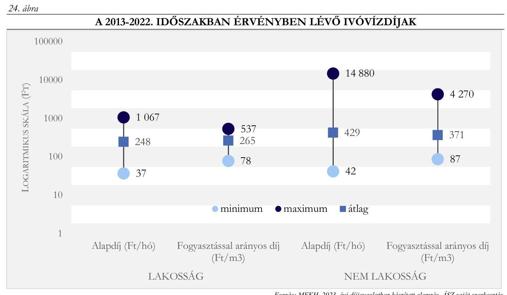

Forrás: MEKH, 2023. évi díjjavaslathoz készített elemzés, ÁSZ saját szerkesztés
A jelenleg hatályos vízdíjak rendszere közel 1000 különböző szolgáltatási díjat tart nyilván (alap és fogyasztással arányos díjakra együtt mind ivóvíz, mind pedig szennyvízdíjak esetében). A nem lakossági fogyasztók vízdíja (371 Ft/m³) átlagosan 40%-kal magasabb a lakossági díjaknál (265 Ft/m³). A lakossági fogyasztással arányos díjminimum és maximum között hétszeres eltérés volt, a nem lakossági fogyasztók esetében ez a különbség 49-szeres. Az ellenőrzött időszak alatt hatályos díjrendszerek alapvetően négy árképzési típust alkalmaztak. A lakossági közműves ivóvízszolgáltatás átlagos országos alapdíja 247,8 Ft/hó, a fogyasztással arányos lakossági vízdíjak országos átlaga 265,1 Ft/m³ (nettó díj) volt. A települések fogyasztással arányos vízdíjainak mediánja 246,0 Ft/m³ (nettó ár), relatív szórása 30,2%, jelentős volt. A fogyasztással arányos lakossági és nem lakossági vízdíjak alakulását a 25. ábra mutatja.

---

25. ábra

# A lakossági és nem lakossági, fogyasztás arányos átlagos vízdíjak víziközmű-szolgáltatónként 

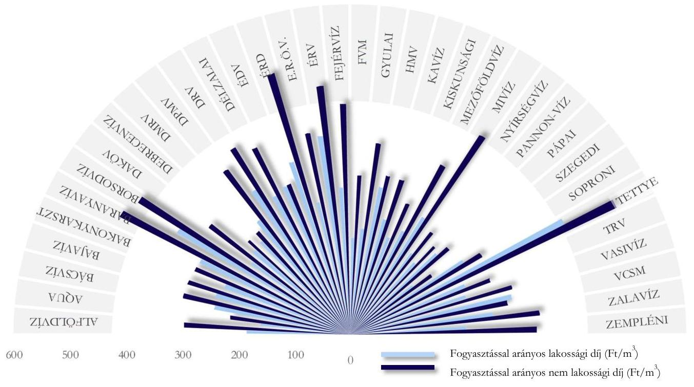

Forrás: MEKH 2022. évi díjjavaslat, ÁSZ saját szerkesztés
Az ellenőrzés értékelte az árpolitika fenntarthatóságához kapcsolódóan a lakosság által fizetett fogyasztással arányos vízdíjak nagysága és az egy főre jutó ivóvíz-fogyasztás települések szerinti alakulása közötti kapcsolatot. Az elemzés során összehasonlításra került a MEKH által szolgáltatott, településekre vonatkozó lakossági (fogyasztással
 arányos) vízdíjak nagysága a KSH település-statisztikai adataival.
A 26. ábra az egy főre jutó átlagos lakossági vízfogyasztás és a vízdíjak kapcsolatát mutatja be.
26. ábra

AZ ÉRVÉNYES VÍZDÍJAK ÉS AZ EGY FŐRE JUTÓ VÍZFOGYASZTÁS KAPCSOLATA A TELEPÜLÉSEKEN, 2021.
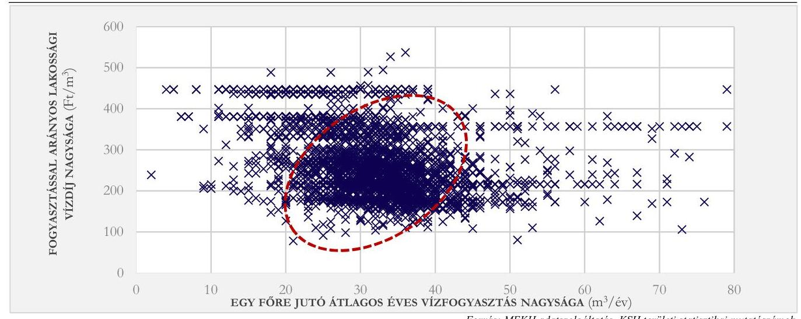

---

A fogyasztással arányos vízdíjak és az egy főre jutó lakossági vízfogyasztás között alig kimutatható kapcsolat, gyenge, negatív korreláció ( $\mathrm{r}=-0,175$ ) volt, a determinációs együttható ( $\mathrm{r}^{2}=0,031$ ) alapján 3,1\%-ban magyarázza a fennálló vízdíjak nagysága a lakossági közműves ivóvízfogyasztást. Azaz országosan jelenleg csak korlátozott hatása van a közműves ivóvíz-fogyasztásra az ivóvíz árának. Az adatok azt mutatják, hogy a vízdíjak fennálló rendszere, az alkalmazott árak a fogyasztókat nem ösztönözték a takarékos, fenntartható víz-használatra. Ez kockázatot jelent a vízgazdálkodás hosszú távon fenntartható működésére, a hazai ivóvízkészletek fenntartható használatára.

A MEKH éves díjjavaslatai az ágazat pénzügyi eredményességi trendjeit figyelembe véve, a fokozódó fejlesztési és rekonstrukciós igények alapján készültek. A MEKH által javasolt díjak, adópolitikai változtatások nem léptek hatályba az ellenőrzött időszakban.

Az ellenőrzött időszakban, 2017. és 2022. évek között fennálló árpolitikai keretrendszer szabályai alapján, a Vksztv. 65. § (1) bekezdésben előírtak szerint a MEKH az éves díjváltozással kapcsolatos javaslatait elkészítette, a víziközmű-szolgáltatásért felelős miniszter elé terjesztette. Az ágazat működéséről az Országgyűlésnek beszámolt. A MEKH ágazati elemzéseiben összefoglalta, bemutatta a víziközmű ágazat, a víziközmű-szolgáltatók pénzügyi-, gazdasági helyzetét-, műszaki- és teljesítménymutatóit, ezzel alapozta meg a víziközmű-szolgáltatás díjjavaslatait. A díjjavaslatokat kiegészítő elemzések tartalmát foglalja össze a 7. táblázat.
7. táblázat

# A MEKH ÉVES ÁGAZATI ELEMZÉSEIBEN SZEREPLŐ DÍJJAVASLATOK TÍPUSAI 

|  | 2017 | 2018 | 2019 | 2020 | 2021 | 2022 |
| :--: | :--: | :--: | :--: | :--: | :--: | :--: |
| szolgáltatónként eltérő mértékű emelési javaslatok | X | X | X | X | X | X |
| országosan egységes díjavaslat | X |  | X |  |  |  |
| országosan egységes fejlesztési hányaddal növelt, sávos díjak |  | X |  | X | X | X |
| ágazati bevétel növelése ÁFA-bevételekből (ÁFA-megosztás) |  | X |  |  | X |  |
| nem lakossági fogyasztók szolgáltatási díjainak emelése |  |  | X |  |  |  |

A kalkulált díjjavaslatok évente változtak. Valamennyi évben volt egy szolgáltatónként megfogalmazott díjjavaslat (az alap- és a fogyasztással arányos díjakra), ami a szolgáltatási díjkülönbségek szakaszos, egymáshoz fokozatosan közelítő kiegyenlítésével számolt. Minden évben azonban készült egy országosan egységes díjjavaslat is. Az éves díjjavaslatok azonban csupán a szűken vett pénzügyi, működési költségek megtérülését vették alapul, esetenként a fejlesztési igényeket. 2022-ben került kidolgozásra egy állami támogatások nélküli, önfenntartó ágazati működést biztosító modell, ahhoz kapcsolódó díjjavaslat, ami a fejlesztésekhez és rekonstrukciókhoz is elegendő forrást biztosíthatna az ágazatnak.
A MEKH az ágazat pénzügyi helyzetének átfogó értékelését évente a díjjavaslataiban elvégezte. Rámutatott az ágazat működésének pénzügyi fenntarthatósági problémáira.

Az ágazat fenntartható működését az árpolitika mellett a fiskális politika, a központi befizetések rendszere is alapvetően befolyásolta, mivel a fogyasztók által fizetett díjak mintegy harmada a központi (adó)bevételek részeként és nem az ágazatnál realizálódott. Ezt nem ellensúlyozta az ágazat fokozódó finanszírozási igénye miatt jutatott állami támogatások, visszatérítések nagysága.

---

Az ágazat fenntartható működésének egyik fontos eleme a fenntartható fogyasztást támogató árpolitikával összhangban álló adópolitika, a központi befizetések (adók, illetékek) és változó mértékű állami és önkormányzati támogatások rendszerének kialakítása. A 27. ábra a 2017-2022. közötti időszak átlagában mutatja a víziközmű ágazat engedélyezett tevékenységeiből származó bevételek, támogatások, ágazati adók, járulékok rendszerét.
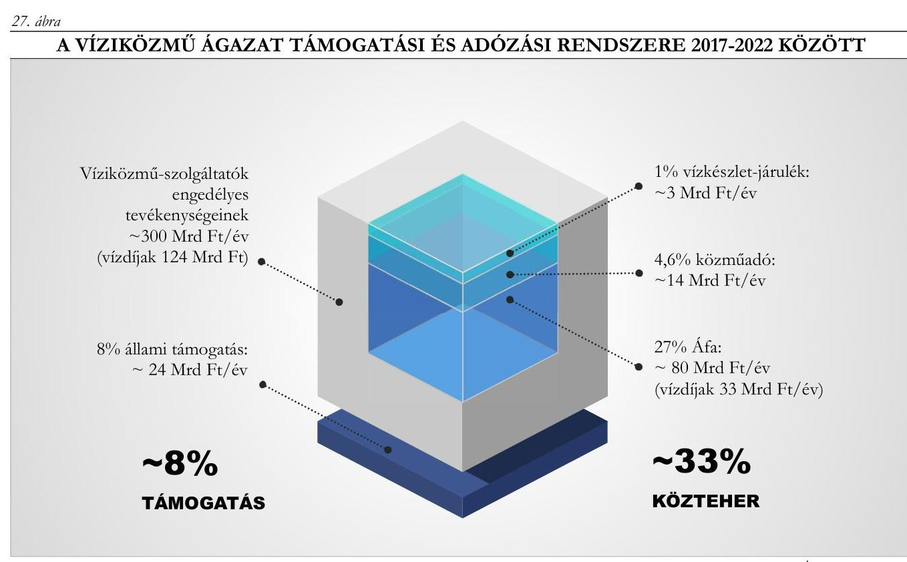

Forrás: MEKH éves szolgáltatási díjavaslatok, ágazati elemzések 2017-2023, ÁSZ saját szerkesztés
A víziközmű szolgáltatások nettó ágazati árbevétele az ivóvíz-szolgáltatásból, a szennyvízkezelés díjából és az egyéb szolgáltatási díjakból állt. Ezek éves átlagos összege 2017 és 2022 között közel 300 Mrd Ft volt. A változatlan szolgáltatási díjak, adó- és illetékmértékek miatt a bevételek nagysága 2017-2022. között csak a fogyasztás növekedése következtében változott.
A víziközmű-szolgáltatásokhoz kapcsolódó ÁFA-bevételek költségvetési bevételként realizálódtak. A MEKH szolgáltatási díjavaslataiban többször javasolta az ÁFA-bevételek költségvetés és a szolgáltatók közötti megosztását, $18\%-9\%$ vagy $5\%-22\%$ esetleg $0\%-27\%$ arányban, ami megteremthette volna az ágazati fejlesztések, rekonstrukciók, a fenntartható működés kereteit.
A vízkészletjárulékot és a közműadót a társaságok a hozzájuk befolyt nettó szolgáltatási bevételekből fizették. A Vízügyi Alap bevezetésének célja 1992-ben a vízbázisok fokozott védelme, a takarékos használatot biztosító rendszer kialakítása volt. A közműadót 2012-ben a víziközmű-rendszerek fejlesztéséhez rendelhető központi források biztosítására vezették be. A vízkészletjárulék 2000 óta, a közműadó 2014 óta a központi költségvetés bevétele, ágazatot támogató elkülönült bevételi szerepük megszűnt.
Az ágazatnak juttatott központi költségvetési támogatások átlagos nagysága a nettó árbevételek 8\%-a volt, ami az időszak alatt két és félszeresére nőtt, 12,2 Mrd Ft-ról, (2017), 29,2 Mrd Ft-ra (2022). A támogatások között állandó elem volt a szociálisan hátrányos helyzetűek támogatására fordítható

---

4,5 Mrd Ft forrás. Ezeket egészítették ki az önkormányzati támogatások, befizetések, eszköz- és tőkepótlások.
Összességében megállapítható, hogy az ágazat hosszú távon fenntartható működését az árpolitika mellett a fiskális politika, a központi befizetések rendszere is alapvetően meghatározta, mivel a fogyasztók által fizetett díjak mintegy harmada a központi bevételek részeként realizálódott. Az ágazat fokozódó finanszírozási igénye miatt az ágazatnak juttatott állami támogatások, visszatérítések nagysága csak részben tudta mindezt ellensúlyozni.
A közszolgáltatás hosszú távon társadalmilag fenntartható, ha egyenlő esélyt biztosít a társadalom tagjai, eltérő csoportjai számára az alapvető közszolgáltatásokhoz való hozzáférés tekintetében, (területileg, különböző szociális helyzetű csoportok tekintetében).
Az ellenőrzés az ivóvíz-ellátás fenntarthatóságát a közszolgáltatáshoz való hozzáférés, a vezetékes közműellátás változása alapján is értékelte. A 2022. éves népszámlálási adatok szerint, a hazai lakások 97,5\%-a a vezetékes közműves ivóvízellátásba bekapcsolt. Az ellenőrzés megállapította, hogy az 2017. és 2021. évek között országosan a víziközmű-szolgáltatásokhoz való hozzáférés javult, a régiók közötti ellátási különbségek csökkentek. A Dél-alföldi régióban az apró falvas-, tanyákkal lakott területeken, a víziközmű-szolgáltatásokhoz való hozzáférés gyorsabban bővült, mint a leginkább kiépített közműhálózattal rendelkező Közép-magyarországi régióban, így országosan a régiók közötti ellátási különbségek mérséklődtek, amit a 28. ábra mutat be. Országosan 2017 és 2022 között a víziközműhálózatba bekötött lakások aránya 0,5\%-kal növekedett. A település típusok szerint, az alacsonyabb népességszámú településeken alacsonyabb az ellátottság a nagyobb településekhez képest. Ezt mutatja, hogy a fővárosban volt a legmagasabb a hálózati ellátottság 99,8\%, a megyei jogú városokban, városokban ennél alacsonyabb volt, 99,2\% és 97,4\%, a biztonságos ivóvízzel való ellátottság a községekben, falvakban lévő lakásokban 94,3\% volt, amit a 29. ábra mutat. A községekben, falvakban az országos átlagot meghaladóan 0,7\%-kal emelkedett a vezetékes ivóvízzel ellátott lakások aránya 2017 és 2022 között.
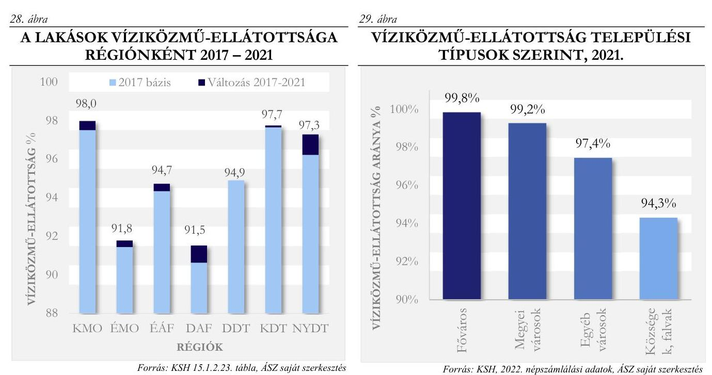

---

Az ellenőrzés az ivóvíz-ellátás fenntarthatóságát az ivóvíz-fogyasztás regionális és település típusok szerinti sajátosságainak értékelésével, a bekövetkezett fogyasztásváltozás alapján is áttekintette.
Regionális különbségek: Az ivóvízfogyasztás regionális különbsége a legnagyobb és a legalacsonyabb fogyasztású régiók között az időszak alatt csökkent, 1,7-szeres különbségről, 1,5-szeres különbségre. A rezsicsökkentés szociális hatását mutatja, hogy a kevésbé fejlett régiókban, az Észak-magyarországi, Észak-alföldi, Dél-dunántúli régióban emelkedett leginkább az egy főre jutó vízfogyasztás, ezt mutatja a 30. ábra.
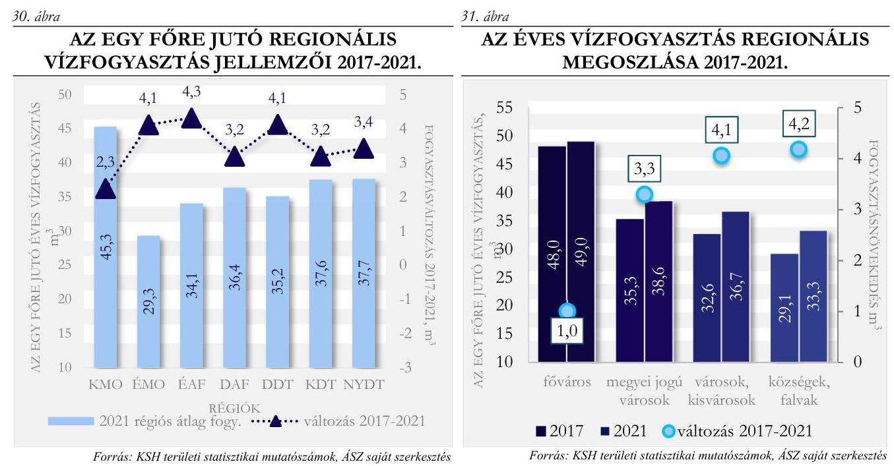

A településtípusok szerinti ivóvíz-fogyasztási különbségeket mutatja a 31. ábra, amelyről látható, hogy az ivóvízhasználatnak lakhelyhez, településtípusokhoz köthető szociális, fogyasztásbeli különbségei vannak. A fővárosban lakók közel másfélszer annyi közműves ivóvizet fogyasztanak, mint a községekben, falvakban élők. A kisebb településeken élőknél a közműves ivóvíz alternatívája lehet a fúrt kútból kinyert víz, összegyűjtött esővíz, amely indokolhatja a fogyasztáskülönbségeket. Az időszak alatt bekövetkezett fogyasztásváltozás mértéke is eltérő volt településtípusokat tekintve. A fővárosban alig emelkedett a fogyasztás, azonban a kisebb településeken, községekben, falvakban volt tapasztalható a legjelentősebb növekedés.
Megyei ivóvízfogyasztási különbségek: Az egy főre jutó ivóvízfogyasztás megyei adatai szerint az olcsóbb vízárak a legszegényebb családok, területek mellett a tehetősebb családoknál is jelentős vízfogyasztásnövekedést okoztak. A megyei szintű egy főre jutó ivóvízfogyasztás mértéke a legszegényebb megyékben: Nógrád-, Szabolcs-, Heves- és Jász-Nagy-Kun-Szolnok megye mellett a turizmus szempontjából releváns balatoni üdülőterületeken Somogy- és Veszprém megyében, valamint a budapesti agglomerációban emelkedett leginkább, $4 \mathrm{~m}^{3} /$ fő/év nagyságot meghaladóan 2017 és 2021 között (32. ábra). Budapesten az országos átlagot harmadával meghaladó egy főre jutó vízfogyasztás szintén enyhén emelkedett.

---

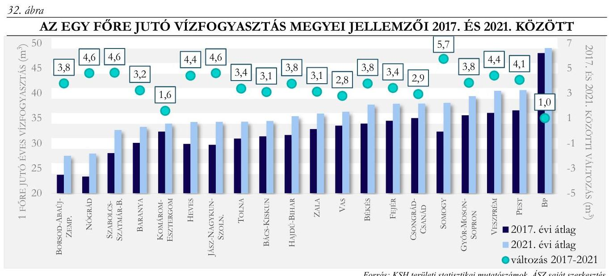

Az ellenőrzés számára rendelkezésre álló adatok elemzése alapján a víziközműszolgáltatásokhoz való hozzáférés szociális különbségei is értékelhetők voltak.

A fenntartható közszolgáltatás a társadalmi különbségek nélküli közszolgáltatáshoz való hozzáférést is jelent az uniós irányelvek szerint. Mivel a tapasztalatok szerint a vezetékes ivóvízhez való hozzáférés és a szegénység között szoros kapcsolat van, ezért a fenntarthatósági célok között az EU a víziközmű-szolgáltatásokhoz való hozzáférés szociális egyenlőtlenségeit is vizsgálja. A vonatkozó uniós statisztika fókusza a szegénységi küszöb alatt élők között a víziközmű-szolgáltatások nélkül élők arányának számbavétele. (Szegénységi küszöb, a medián jövedelem 60\%-a alatti jövedelem). 2020-ban a Visegrádi országok szegénységi küszöb alatt élő háztartásait tekintve Magyarországon 7,6\% volt a vezetékes ivóvíz nélküli háztartások aránya. Lengyelországban 5,1\%, Szlovákiában 4,6\%, Csehországban 0,4\% volt a hasonló adat, míg az uniós átlag 5,1\% volt.
A víziközmű-szolgáltatások megfizethetőségének alakulása kapcsán az ellenőrzés a rendelkezésre álló adatok alapján a fenntartható közszolgáltatáshoz való egyenlő hozzáférés feltételeit értékelte. Az ellenőrzés értékelése szerint a közszolgáltatásokhoz hozzáférés terén a kialakult esélyegyenlőség megtartása, javítása, a társadalom számára a hosszú távú hasznosság, fenntarthatóság jellemzője.
A víziközmű-szolgáltatások szociális terheit, a vezetékes ivóvíz-ellátás és a szennyvízkezelés megfizethetőségi rátájának jövedelmi tizedek szerinti elemzésével mutatja be az ellenőrzés, lásd 33. ábra. Az elemzéshez bázis évnek tekintette a 2012. évet, amikor a háztartások éves fogyasztási kiadásainak országos átlagban 5,2\%-át tette ki a víziközmű-szolgáltatások díja. Az árak rögzítése következtében ez az arány 2017-re, az ellenőrzött időszak kezdetére 2,9\%-ra csökkent, majd 2017 és 2020 között ezzel ellentétes folyamatokat mutatnak az adatok. 2020-ra változatlan árak mellett a növekvő víz-fogyasztás következtében enyhe, átlagosan 0,3\%-os emelkedése történt.

---

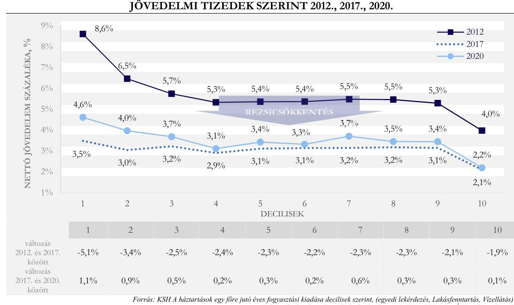

Az ábra és a kiegészítő táblázat jól mutatja, hogy 2012 és 2017 között a rezsicsökkentés az alsó négy jövedelmi tizedbe tartozó háztartásoknál számottevő, az országos átlagosnál (-2,3\%-nál) kedvezőbb változást okozott. Ezeknél a háztartásoknál a víziközmű-szolgáltatásokra fordított kiadások fogyasztáshoz mért aránya a bázis időszakhoz képest a felére (40-54\%-ra) csökkent. Ennek következtében a háztartások közel felének, (48,7\%-ának), a víziközmű-szolgáltatásokhoz való hozzáférése 2012 és 2017 között az országos átlagnál is kedvezőbb, szociálisan fenntarthatóbb lett. Ezt követően az ellenőrzött időszak alatt, 2017 és 2020 között a háztartások harmadánál, a legszegényebb három tizedbe tartozó háztartásokban tovább emelkedett az ivóvízhasználat. Ezt mutatja, hogy a
 legszegényebb három jövedelmi tizedben további 1,1%-os, 0,9%-os, 0,5%-os vízfogyasztás-emelkedés volt tapasztalható.

A vízdíjak jelenlegi rendszere nem ösztönözte a fogyasztókat fenntartható vízhasználatra, takarékos ivóvíz-fogyasztásra, ezt mutatja az egy főre jutó vízfogyasztás 2013 óta bekövetkezett emelkedése.

Az ellenőrzés az ivóvíz-fogyasztás mennyiségének fenntarthatóságát is értékelte, amely szerint a hazai ivóvízkészletek hosszú távon fenntarthatók, ha a lakossági ivóvízfogyasztás, az egy lakosra jutó éves felhasznált ivóvízmennyiség változatlan marad vagy csökken.
A hazai ivóvízfogyasztás, azon belül az egy főre jutó lakossági vízfogyasztás rezsicsökkentés óta bekövetkezett 15,9%-os emelkedése rámutat az alkalmazott árpolitika hosszú távú fenntarthatatlanságára. Az egy lakosra jutó ivóvíz-fogyasztás éves változását mutatja a 34. ábra, amely szerint 2013 és 2021 között 33,3 m³-ről 38,2 m³-re emelkedett az egy főre jutó hazai ivóvízfogyasztás. A bázis időszakot, 2013-at,

---

követő minimumhoz képest, nyolc év alatt 5,2 m²-rel emelkedett a lakossági átlagos közüzemi ivóvízfogyasztás. A trend szerint átlagosan egy magyar fogyasztó évről évre fél köbméter vízzel (597 literrel) több vizet fogyasztott. 2014-hez képest pedig 2021-ben naponta 15 liter vízzel többet használt el.
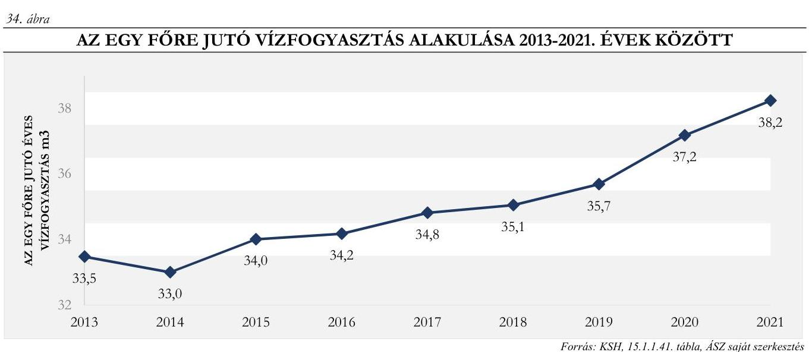

Az ellenőrzés értékelte a víziközműszolgáltatókat a lakosság szemléletformálását, víztakarékosságát, környezettudatosabb életmódját ösztönző programokra, projektek jelenlétére vonatkozóan. A víziközműszolgáltatók háromnegyede végzett vízvédelmi, vízhasználathoz kapcsolódó szemléletformáló tevékenységet. 25 szervezet, a víziközmű-szolgáltatók kétharmada részesült a KEHOP-2.1.7-19, A víziközmű-szolgáltatással kapcsolatos szemléletformálás pályázati forrásból. 2020-ban összesen 1715 M Ft összegű támogatást ítéltek meg a pályázóknak, víziközműszolgáltatóknak szemléletformáló, a fenntarthatóságot, környezetvédelmet, tudatos vízhasználatot ösztönző projektre.

---

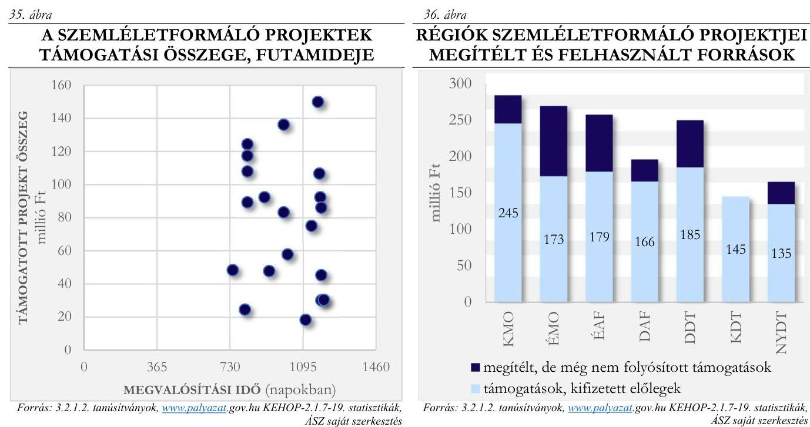

A 35. ábráról látható, hogy az uniós forrásból megvalósított projekteknek megítélt támogatási összeg 20 MFt és 150 M Ft között mozgott. A projektek megvalósítására rendelkezésre álló idő kettőtől három és fél évig tartott (730 és 1300 nap közé esett), a projektek harmada 2023. június végéig még nem zárult le elszámolással. A 32. ábra a szemléletformálásra szánt források regionális megoszlását mutatja. Ezek alapján látható, hogy regionálisan összesen a legnagyobb vízfogyasztással érintett Közép-magyarországi régió, Budapest és Pest megye kapta a legnagyobb összegű támogatást, nyolc projektre összesen 285 M Ft-ot. A 36. ábráról látható továbbá, hogy a fejletlenebb régiók: Észak-Magyarország, Észak-Alföld, Dél-Dunántúl víziközmű-szolgáltatói vannak lemaradva leginkább a forrásfelhasználásban, esetükben volt a legnagyobb aránya a megítélt, de még nem folyósított támogatásoknak.

---

# JAVASLATOK 

Az ÁSZ tv. 33. § (1) bekezdésében foglaltak értelmében az ellenőrzött szervezet vezetője köteles a jelentésben foglalt megállapításokhoz kapcsolódó intézkedési tervet összeállítani és azt a jelentés kézhezvételétől számított 30 napon belül az ÁSZ részére megküldeni. Amennyiben az ellenőrzött szervezet vezetője nem küldi meg határidőben az intézkedési tervet, vagy továbbra sem elfogadható intézkedési tervet küld, az Állami Számvevőszék elnöke az ÁSZ tv. 33. § (3) bekezdése a) és b) pontjaiban foglaltakat érvényesítheti.

## BELÜGYMINISZTÉRIUM

1. Érvényesítse a kormányzati stratégiai irányításról szóló 38/2012. (III. 12.) Korm. rendelet 23. § (1) bekezdésében - a stratégiai tervdokumentum felülvizsgálatára - meghatározottakat a KJT-ben foglalt hosszú távú, ivóvíz-gazdálkodást érintő célok és a célok elérése érdekében alkalmazható eszközök (cselekvési terv) tekintetében.
2. Kezdeményezze a vízgazdálkodás különböző alágazataiban irányító szervi, kormányzati felelősséggel bíró szervezetek együttműködésére, a KJT-ben meghatározott integrált szemléletű stratégiai döntéshozatalra kijelölt intézményesített forma létrehozását.

## ENERGIAÜGYI MINISZTÉRIUM

1. Készíttessen elemzést arra vonatkozóan, hogy a víziközmű rendszerekben a felújítások forrásigénye miképp viszonyul rövid-, közép- és hosszú távon a víziközmű rendszer-elemek esetében az újraelőállítási költség alapján számított forrásigényekhez és az milyen stratégiai beavatkozást tesz szükségessé. Döntéselőkészítéséhez az elemzés eredményeit használja fel.
2. Gondoskodjon az IKVA rendszer üzembehelyezésével kapcsolatosan, az érintett állami szervek részvételével zajló szakértői felmérés eredményei és az IKVA rendszer használatára vonatkozó jogszabályi rendelkezések koherenciájának megteremtéséről.
3. Kezdeményezze az ivóvíz-gazdálkodást támogató, szigetszerűen működő információs rendszerek és adatbázisok összekapcsolásának felmérését és projektben történő megvalósítását.
4. Az elkészített és MEKH-hez már benyújtott vagyonértékelések áttekintését követően fontolja meg a 24/2013. (V. 29.), a víziközművek vagyonértékelésének szabályairól és a víziközmű-szolgáltatók által közérdekből közzéteendő adatokról szóló NFM rendelet felülvizsgálatát, módszertani kiegészítését abban a tekintetében, hogy a készülő vagyonértékelések egységes szempontok alapján készüljenek el, azok támogassák a döntéshozatali folyamatokat.
5. Kezdeményezze a víziközmű-szolgáltatási díjban képződött használati díj és annak elemei kormányrendeletben történő meghatározását a Vksztv.-ben kapott felhatalmazással élve. (Vksztv. 74. § (1) bekezdés 14. pont szerint.).
6. A hosszú távon fenntartható, takarékos vízhasználat ösztönzése érdekében mérlegelje további szemléletformálásra irányuló eszközök alkalmazását.

---

# MELLÉKLETEK 

## I. SZ. MELLÉKLET: ÉRTELMEZŐ SZÓTÁR

| FOGALOM | MAGYARÁZAT |
| :--: | :--: |
| derogációval érintett vízminőségi paraméterek | Magyarország a 98/83/EK tanácsi Irányelvben foglalt határértékektől a tekintetében biztosított átmeneti bór, a fluorid és az arzén eltérés meghosszabbítására vonatkozóan 2011 novemberében 365 települést érintően kérelmet nyújtott be az Európai Bizottsághoz (a továbbiakban: Bizottság). A derogációval érintett paraméterek a bór, a fluorid és az arzén. |
| determinációs együttható | A mennyiségi ismérvek egymásra gyakorolt hatásának számszerűsítésével, e hatások irányának és mértékének megállapításával foglalkozik. A determinációs együttható, kétváltozós lineáris modellben a magyarázóerőt méri, megmutatja, hogy két változó közül a magyarázóváltozó hány %-ban befolyásolja az eredményváltozó szóródását. Értéke 0 és 1 közötti. Ha kicsi, akkor a regressziós becslés nem nagyon magyarázza meg az Y változó viselkedését, míg, ha 1-hez közeli, akkor a regresszió jónak minősíthető. Jele: r². (Forrás: http://www.kislexikon.hu/determinacios_egyutthato.html) |
| ellátásért felelős | Az ellátásért felelős: a víziközmű-szolgáltatásról szóló 2011. évi CCIX. törvény 1§ (1) c) pontja szerint az állam vagy a települési önkormányzat kötelessége és joga gondoskodni a közműves ivóvízellátással és a közműves szennyvízelvezetéssel és -tisztítással kapcsolatos víziközmű-szolgáltatási feladatok elvégzéséről. |
| E-KÖZMŰ | E-KÖZMŰ, egységes, elektronikus közműnyilvántartás egy olyan webes térinformatikai alkalmazás, amely amellett, hogy ügyfélkapus belépés után lehetőséget biztosít egy országos közműtérkép megtekintésére, az elektronikus közműegyeztetés platformjaként is funkcionál. (https://lechnerkozpont.hu/oldal/e-kozmu) |
| felhasználói egyenérték (FE) | Olyan mutatószám, amely a víziközmű-szolgáltatást igénybe vevő felhasználók számosságát - víziközmű-szolgáltatási ágazatonként, a felhasználók kapacitás-igényeire figyelemmel - az 1. melléklet (Vksztv.) szerinti képlet alapján egységesen fejezi ki (Forrás: Vksztv. Értelmező rendelkezések 2.§ 7. pont) |
| fenntartható ivóvízgazdálkodás | Az ellenőrzés fenntarthatónak tekinti a hazai ivóvízgazdálkodást, amennyiben az ivóvízbázisok védelme, az ivóvízkészletek használata, az ivóvíz minősége, az ivóvízszolgáltatás pénzügyi fenntarthatósága, valamint az ivóvíz-szolgáltatáshoz hozzáférés tekintetében a társadalmi esélyegyenlőség megvalósul, az időszak alatt nem romlik, javul. Összességében az alábbi fenntarthatósági feltételek együttes alakulását értékeltük:   - az ivóvízkészletek mennyisége hosszú távon fenntartható, ha az egy lakosra jutó évi vízfogyasztás csökken vagy változatlan   - az ivóvíz-minőség fenntartható, ha az egészségre ártalmas, megfigyelt jelentősebb szennyező elemek tartós előfordulása az ivóvízben változatlan, nem romlik   - az ivóvíz-szolgáltatás pénzügyileg fenntartható, ha az ivóvízszolgáltatást nyújtó társaságok gazdálkodása, működése, üzemi, mérleg szerinti eredményének és befektetett eszközeinek, saját tőkéjének alakulása, ivóvíz ágazat összesen víziközművagyon értékének alakulása, (ÁSZ vagyonmegőrzés mutatószám-rendszere) az ellenőrzött időszak alatt változatlan marad, nem mutat tartós romlást.   - a közszolgáltatás hosszú távon (társadalmilag) fenntartható, ha egyenlő esélyt biztosít a társadalom tagjai, eltérő csoportjai számára az alapvető közszolgáltatásokhoz való hozzáférés tekintetében, (területileg, különböző szociális helyzetű csoportok tekintetében). Értékelésünk szerint a közszolgáltatásokhoz hozzáférés terén a kialakult esélyegyenlőség megtartása, javítása, a társadalom számára a hosszú távú hasznosság, fenntarthatóság jellemzője.   - a hazai távlati és működő ivóvízbázisok, a felszín feletti és alatti ivóvízbázisok védelme megvalósult, a távlati ivóvízkészletek nagysága nem csökkent az ellenőrzött időszak alatt számottevően (0%-2% közötti mértékben)   (Forrás: http://ensz.kormany.hu/a-2030-fenntarthato-fejlodesi-keretrendszer-agenda-2030) |

---

| FOGALOM | MAGYARÁZAT |
| :--: | :--: |
| holisztikus szemlélet | A holisztika az elemzés, rendszerértelmezés egy módszere, illetve szemléleti módja. A tudományos elemzésben a holisztikus szemlélet egy rendszernek vagy a rendszer egy vetületének egészét vizsgálja, hasonlítja vagy azonosítja. A szereplők arra törekednek, hogy minél több információt figyelembe tudjanak venni a hosszútávú szerződések, célkitűzések viszonylatában. (Forrás: https://hu.wikipedia.org/wiki/Holisztika) |
| HUMVI | Humán felhasználású vizek informatikai rendszere, a 201/2001. (X. 25.) Korm. rendelet szerint 2015-től üzemelő, kötelezően használandó adatgyűjtő rendszer, ami az ivóvíz minőség adatait gyűjti. A HUMVI rendszerbe az NNGYK, valamint az NNGYK feljogosítását követően az illetékes népegészségügyi szerv, továbbá az üzemeltető, és az üzemeltető által megbízott laboratórium tölthet fel adatokat. (HUMVI Tisztiorvosi tájékoztató) |
| ivóvíz | A rendszeres emberi fogyasztásra alkalmas, a fizikai, a kémiai, a bakteriológiai, a toxikológiai és a radiológiai határértékeknek megfelelő víz (Forrás: Vgt. 1. melléklet 9. pont, (Forrás: OVF Vízrajzi Fogalomtár)   Eredetétől függetlenül minden, eredeti állapotában vagy kezelés utáni állapotban levő, ivásra, ételkészítésre és egyéb háztartási célokra szánt víz, függetlenül attól, hogy szolgáltatása hálózatról, tartálykocsiból történik vagy kereskedelmi forgalomba kerülő edénybe (palack, tartály) töltésre kerül. |
| ivóvíz-ellátás rezilienciája | A reziliencia a rugalmas ellenálló képességet, a hétköznapi, vagy éppen kritikus változásokkal, váratlan akadályokkal, meglepetésekkel szembeni alkalmazkodási képességet jellemzi. Az ivóvíz-ellátás esetében ez jelenti az ivóvízbázisok, ivóvízrendszerek krízishelyzetekre való rugalmas reagálóképességét, a problémák, sőt kritikus helyzetek, veszélyek kezelésének képességét, a normál állapotba való visszatérés idejét. (Forrás: https://hu.wikipedia.org/wiki/Reziliencia, Szlávik, L. (2016): Vízgazdálkodás. NKE) |
| KEHOP-2. prioritási tengelye | Környezeti és Energiahatékonysági Operatív Program, 2. Települési vízellátás, szennyvízelvezetés és -tisztítás, szennyvízkezelés fejlesztése |
| kibocsátási kvóták értékesítéséből származó bevételek | A központi költségvetés bevételei között az állami vagyon értékesítési bevételeinek részét képezik az üvegházhatású gázok közösségi kereskedelmi rendszerében és az erőfeszítésmegosztási határozat végrehajtásában történő részvételről szóló törvény hatálya alá tartozó, az állam vagyonában forgalomképes vagyoni értékű jogként nyilvántartott kibocsátási egységek értékesítéséből származó bevétel. (Forrás: A 2014. évi központi költségvetés végrehajtásáról szóló törvényjavaslat XLIII. Az állami vagyonnal kapcsolatos bevételek és kiadások fejezet Fejezeti Kötete)) |
| korrelációs együttható | A korrelációs együtthatót numerikus adatok közötti összefüggés mérésére alkalmas, amely két változó közötti statisztikai kapcsolatot jellemez. A különböző típusú korrelációs együtthatók -1 és +1 közötti értéket vehet fel, ahol ±1 a lehető legerősebb egyezést és 0 a lehető legnagyobb eltérést jelzi |
| költségmegtérülés elve | A 2000 decemberében hatályba lépett 2000/60/EK Vízkeret Irányelv (VKI), Európa új vízpolitikája érvényesítésének legfontosabb eszköze. A Keretirányelv az első átfogó vízügyi szabályozás az EU-n belül. 9. cikke tartalmazza a vízszolgáltatások költségalapú árazásának, a költségeinek megtérülésére vonatkozó átfogó szabályokat, ezek:   (1) A tagállamok figyelembe veszik a vízszolgáltatások megtérülésének elvét, beleértve a környezeti és a vízkészletekkel összefüggő költségeket, különösen a szennyező fizet elvének megfelelően.   A tagállamok biztosítják, hogy   - a vízzel kapcsolatos árpolitika biztosítson megfelelő késztetést a vízhasználók számára, hogy a vízkészleteket hatékonyan használják, és ezáltal járuljon hozzá ezen irányelv célkitűzéseihez,   - a különböző vízhasználatok megfelelő hozzájárulását a vízszolgáltatások költségeinek megtérüléséhez, legalább ipari, mezőgazdasági és háztartási bontásban, végzett gazdasági
 elemzések alapján és figyelembe véve a szennyező fizet elvet.   A tagállamok ennek alkalmazása során tekintettel lehetnek a költségek megtérítésének szociális, környezeti és gazdasági hatásaira, továbbá az érintett régió vagy régiók földrajzi és éghajlati jellemzőire. (Forrás: 2000/60/EK Vízkeret Irányelv) |

---

| FOGALOM | MÁGYARÁZAT |
| :--: | :--: |
| ROA | Eszközarányos nyereség (Return on assets) |
| ROE | Sajáttőke-arányos megtérülés (Return on equity) |
| SDG 6. célkitűzések | SDG 6 - Tiszta víz és alapvető köztisztaság   A fenntartható vízgazdálkodás, a vízhez és az alapvető higiéniai ellátásokhoz való hozzáférés biztosítása mindenki számára 2030-ra.   alcélok:   6.1 méltányos és igazságos hozzáférést a biztonságos és megfizethető ivóvízhez.   6.2 megfelelő és igazságos hozzáférést az alapvető szanitációs és higiéniai ellátásokhoz   6.3 a vízminőség javítása a szennyezések csökkentésével, a veszélyes anyagok és vegyszerek kibocsátásának minimumra csökkentésével, a kezeletlen szennyvíz csökkentésével.   6.4 a vízfelhasználás hatékonyságának javítása, a fenntartható vízkivételt és ivóvízellátást a vízhiány kezelése, a vízhiányban szenvedő emberek számának jelentősen csökkentése.   6.5 2030-ra integrált vízgyűjtő gazdálkodás megvalósítása, a határokon átnyúló együttműködés is.   6.6 2020-ra a vízzel kapcsolatos ökoszisztémák védelem alá helyezése   6.a 2030-ig a fejlődő országokkal való nemzetközi együttműködés és kapacitásfejlesztés támogatása a vízzel, higiéniával, és szanitációval kapcsolatos tevékenységekben és programokban   6.b a helyi közösségek részvételének támogatása a vízgazdálkodás és a szanitáció fejlesztésében és igazgatásában. (Forrás: https://www.ksh.hu/sdg/cel_06.html) |
| vállalkozásméret kategóriái | Magyarországon a vállalkozás méretének meghatározása a kis-és középvállalkozásokról, illetve fejlődésük támogatásáról szóló- többször módosított - 2004. évi XXXIV. törvény (Kkvtv.) szerint történik. A törvény meghatározza a mikro-, kis- és középvállalat (KKV), valamint a nagyvállalat fogalmát.   A magyar és az európai uniós besorolás szerint egy KKV lehet: |
|  | $\begin{aligned} & \text { KKV } \\ & \text { kategória } \end{aligned}$ | foglalkoztatottak   létszáma | éves nettó árbevétel | mérlegfőösszeg |
|  | $\begin{aligned} & \text { középvállalat } \\ & \text { kisvállalat } \\ & \text { mikrovállalat } \end{aligned}$ | $<250$ fő   $<50$ fő   $<10$ fő | $<19$ Mrd Ft, 50 mEUR   $<3,8$ Mrd Ft, 10 mEUR   $<0,8$ Mrd Ft, 2 mEUR | $<16,3$ Mrd Ft, 43 mEUR   $<3,8$ Mrd Ft, 10 mEUR   $<0,8$ Mrd Ft, 2 mEUR |
| vízbázis | víziközmű | Olyan közcélú vízilétesítmény, amely   a) település vagy települések közműves ivóvízellátását, ezen belül az ivóvíztermelést, az ehhez kapcsolódó ivóvízbázis-védelmet, az ivóvízkezelést, -tárolást, -szállítást és -elosztást, felhasználási helyekre történő eljuttatást, mindezekhez kapcsolódóan a tűzivíz biztosítását vagy   b) a közműves szennyvízelvezetés során (egyesített rendszer esetén a csapadékvíz-elvezetést is ideértve) a szennyvíz felhasználási helyekről történő összegyűjtését, elvezetését, tisztítását, a keletkező szennyvíziszap kezelését és a tisztított szennyvíz hasznosítását, elhelyezését szolgálja (Forrás: Vksztv. 2. § 20.pont) |
| víziközmű-szolgáltatás | A közszolgáltatási szerződés keretében nyújtott közműves ivóvízellátás az ahhoz kapcsolódó tűzivíz biztosítással, továbbá a közműves szennyvízelvezetés és -tisztítás, ideértve az egyesített rendszerű csapadékvíz-elvezetést is (Forrás: Vksztv. 2. § 24.pont) |

---

| FOGALOM | MAGYARÁZAT |
| :--: | :--: |
| víziközmű-szolgáltatási alakulása, szabályozási elemei | díjak A 2012-ben elfogadott Vksztv. a 2011. év végén érvényben lévő vízdíjakat tekintette alapnak. 2012 során legfeljebb bruttó 4,2%-os emelést fogadott el (Vksztv. 76. § (1) b) pont).   2013 július 1-től hatályos Rezsitv. 4. § (1) bekezdés szerint a teljesített szolgáltatás vonatkozásában az áremelkedés nem haladhatta meg a 2013. január 31-én alkalmazott díjtételek és egyéb számlaelemek alapján, ugyanazon feltételekkel számított összeg 90%-át.   2013 óta változatlan szabályozás következtében a hatályos víziközmű-szolgáltatási díjak egy évtizede változatlanok. |
| víziközmű-szolgáltató | A víziközműre vonatkozóan a MEKH engedéllyel rendelkező gazdasági társaság, amelynek az állam, illetve a helyi önkormányzat az üzemeltetés gyakorlásának időleges jogát koncessziós szerződés, vagyonkezelési szerződés vagy bérleti-üzemeltetési szerződés keretében átengedi. (Forrás: 16/2016. (V. 12.) BM rendelet 2. § 1. pont) |
| vízkészletjárulék | Olyan fizetési kötelezettség, (a vízgazdálkodásról szóló 1995. évi LVII. törvény 15/A. § (1) bekezdése szerint), amelyet a vízhasználó a vízjogi engedélyben lekötött vagy engedély nélkül felhasznált, továbbá az üzemi fogyasztó a ténylegesen igénybe vett vízmennyiség után köteles fizetni a vizek használatával, a vízkészletek védelmével összefüggő társadalmi ráfordítások részleges vagy teljes megtérülése érdekében, és melynek befizetését a vízügyi hatóság ellenőrzi. A fizetendő vízkészletjárulék mértékét a vízhasználó által igénybe venni tervezett vagy igénybe vett vízmennyiségnek, az alapjáruléknak és különböző, rendeletben meghatározott szorzószámoknak a szorzata adja. Az alapjárulék mértéke emelkedik, ha a vízfelhasználó a vízjogi engedélyben meghatározott vízmennyiséget 10%-nál nagyobb mértékben túllépi, illetve engedély nélküli vízhasználat esetén. (https://lexikon.uninke.hu/szocikk/vizkeszletjarulek/) |
| vízveszteség | Vízveszteség alatt általánosságban azt a vízmennyiséget értjük, amely a víziközmű rendszerekben előállított ivóvízből a vízvezeték rendszer meghibásodása következtében nem jut el a fogyasztóhoz vagy mérési hiba, nem engedélyezett fogyasztás miatt kereskedelmi veszteséget jelent. A nemzetközi módszertan a hiányzó vízmennyiség jellege, oka szerint megkülönbözteti az alábbiakat:   Valós veszteség: a szivárgásokból, esőtörésekből, technikai problémákból keletkezett vízveszteség.   Látszólagos vízveszteség: a nem engedélyezett vízfogyasztásból vagy mérési hibákból adódik.   Értékesítési vízveszteség: bővebben értelmezve az a vízmennyiség amelyből a szolgáltatónak nem keletkezik bevétele.   (Forrás: MEKH vízveszteség adattáblák, https://en.wikipedia.org/wiki/Nonrevenue_water) |

---

# II. SZ. MELLÉKLET: ELLENŐRZÖTT SZERVEZETEK JEGYZÉKE 

## ELLENŐRZÖTT SZERVEZET MEGNEVEZÉSE

Belügyminisztérium
Energiaügyi Minisztérium
Építési és Közlekedési Minisztérium
Magyar Energetikai és Közmű-szabályozási Hivatal
Országos Vízügyi Főigazgatóság
Nemzeti Népegészségügyi Központ
Nemzeti Vízművek Zrt.
ALFÖLDVÍZ Regionális Víziközmű-szolgáltató Zrt.
Aqua Szolgáltató Kft.
BÁCSVÍZ Víz- és Csatornaszolgáltató Zrt.
BAJAVÍZ Baja és Térsége Víz- és Csatornamű Kft.
BAKONYKARSZT Víz- és Csatornamű Zrt.
BARANYA-VÍZ Víziközmű Szolgáltató Zrt.
BORSODVÍZ Önkormányzati Közüzemi Szolgáltató Zrt.
DAKÖV Dabas és Környéke Vízügyi Kft.
Debreceni Vízmű Zrt.
Dél-Pest Megyei Víziközmű Szolgáltató Zrt.
Délzalai Víz- és Csatornamű Zrt.
DMRV Duna Menti Regionális Vízmű Zrt.
Dunántúli Regionális Vízmű Zrt.
E.R.Ö.V. Egyesült Regionális Önkormányzati Víziközmű Zrt.

Érd és Térsége Regionális Víziközmű Kft.
ÉRV Északmagyarországi Regionális Vízművek Zrt.
Északdunántúli Vízmű Zrt.
Észak-zalai Víz- és Csatornamű Zrt.
FEJÉRVÍZ Fejér Megyei Önkormányzatok Víz- és Csatornamű Zrt.
Fővárosi Csatornázási Művek Zrt.
Fővárosi Vízművek Zrt.
Gyulai Közüzemi Nonprofit Kft.
Heves Megyei Vízmű Zrt.
KAVÍZ Kaposvári Víz- és Csatornamű Kft.
Kiskunsági Víziközmű-Szolgáltató Kft.
Mezőföldi Regionális Víziközmű Kft.
MIVÍZ Miskolci Vízmű Kft.
NYÍRSÉGVÍZ Nyíregyháza és Térsége Víz- és Csatornamű Zrt.

---

# ELLENŐRZÖTT SZERVEZET MEGNEVEZÉSE 

PANNON-VÍZ Regionális Önkormányzati Víziközmű-szolgáltató Zrt.
Pápai Víz- és Csatornamű Zrt.
Soproni Vízmű Zrt.
Szegedi Vízmű Zrt.
TETTYE FORRÁSHÁZ Pécsi Városi Víziközmű Üzemeltetési Zrt.
Tiszamenti Regionális Vízművek Zrt.
VASIVÍZ Vas Megyei Víz- és Csatornamű Zrt.
Víz- és Csatornaművek Koncessziós Zrt. Szolnok
Zempléni Vízmű Kft.

---

# FOKUSZTERÜLET 

1. Az ellenőrzés azt értékeli, hogy az ivóvíz-ellátásért felelős kormányzati szervezetek biztosították-e az ivóvíz ágazat szervezeti és jogi irányítását, a stratégiai és operatív döntéshozatal hozzájárult-e a hazai, uniós és nemzetközi stratégiai célkitűzések megvalósításához?
2. Az ellenőrzés azt értékeli, hogy eredményesek voltak-e a vizek védelmét és a vizek fenntartható használatát célzó működési és fejlesztési célú intézkedések?
3. Az ellenőrzés azt értékeli, hogy hosszú távon fenntartható-e a lakosság biztonságos és megfizethető ivóvízzel való ellátása? Az ellenőrzés értékeli továbbá, hogy hosszú távon a takarékos vízfogyasztást ösztönzi-e, szociális / környezetvédelmi szempontokat figyelembe veszi a vízdíjak rendszere?

## ELLENŐRZÉSI KRITÉRIUMOK

2091/2017. (XII. 28.) Korm. határozat az Egyesült Nemzetek Szervezetének tagjai által elfogadott Fenntartható Fejlődési Keretrendszer (Agenda 2030) nemzeti végrehajtásából eredő feladatok ellátásáról (SDG).
Az ivóvíz-gazdálkodási ágazatot érintő hazai stratégiákat, koncepciókat és hosszú távú terveket jelentő dokumentumok összhangban állnak a nemzetközi és uniós irányelvekkel és célrendszerekkel, valamint a hazai dokumentumok között nincs ellentmondás; közöttük biztosított a tartalmi, logikai, egymásra épülési vagy egymást kiegészítő jellegű összhang.
A stratégiákban, stratégiai dokumentumokban meghatározott célokhoz intézkedéseket, feladatokat rendeltek, és azok időarányosan teljesültek.
Az ivóvíz-ellátást érintő jogi környezet egyértelműen és ellentmondásmentesen kijelölte a feladatokat, felelősöket, eljárásokat.
Az irányítási feladatok a szervezetrendszer szereplőihez egyértelműen hozzárendeltek, és az irányítási feladatok megszervezése támogatja az egységes, integrált szemléletű stratégiai döntéshozatalt.
Az ivóvíz-gazdálkodás ágazatot, a stratégiai döntések megalapozottságát támogatja országos vagy egyéb integrált, illetve egységes szolgáltatás nyújtást támogató adatbázis.

Fejlesztések végrehajtása növelte a biztonságos ivóvíz-ellátást, ellátásbiztonságot.
Kedvezően változott az egészségre ártalmas komponenseket tartalmazó ivóvízzel érintett település- és lakosságszám az ellenőrzött időszak egyes éveiben.
SDG 6.1.1. A biztonságosan kezelt ivóvíz szolgáltatást használó lakosság aránya növekedett vagy nem csökkent.
A vízminőség folyamatos ellenőrzésének rendszere eredményesen működött.
A gördülő fejlesztési tervek, a szolgáltatói tervek, egyéb dokumentumok tartalmazták a víziközmű-rendszerek komplex rekonstrukciójára vonatkozó műszaki és pénzügyi adatokat.
A vízveszteség mértéke 2017-ről 2022-re, illetve az egyes években egyik évről a másikra nem romlott (KSH módszertan és a MEKH által alkalmazott nemzetközi módszertan számításai alapján).
Az elmaradt rekonstrukció nem volt hatással a (valós) vízveszteség növekedésére.
Rendelkezésre álltak megfelelő időben, mennyiségben központi és egyéb források az ivóvíz ellátás megfelelő mennyiségben történő biztosításához szükséges intézkedések végrehajtásához.
Az ivóvíz-szolgáltatás ellátását humán kapacitás hiány nem gátolta.
Fenntartható a lakosság biztonságos és megfizethető ivóvízzel való ellátása.
A vízdíjak rendszere hosszú távon ösztönzi a takarékos vízfogyasztást.
Az ivóvízágazat irányítói, szolgáltatásért felelősök, szolgáltatók alkalmaztak a lakossági vízfogyasztás mérséklése, takarékosság irányába ható ösztönzőket.
Az irányító szervek azonosították a vízfogyasztók közszolgáltatáshoz való hozzáférésének különbségeit.
Az árszabályozás kialakított keretrendszere átlátható volt.
Az árpolitika irányítója értékelte a vízdíjak és a lakossági fogyasztás összefüggéseit, működött az árpolitika értékelése, monitoringja.
A környezetvédelmi szempontok érvényesülnek az engedélyezés, a felügyelet és az árképzés területein.
A kormányzati szervezetek által tett erőfeszítések ellensúlyozták / kezelték az ország vízellátásának kitettségét és az ország víz-gazdagságában jelen lévő területi egyenlőtlenségeket.

---

# IV. SZ. MELLÉKLET: A VÍZIKÖZMÜ-SZOLGÁLTATÓ TÁRSASÁGOK EGYES GAZDASÁGI MUTATÓI 

## A VÍZIKÖZMÜ-SZOLGÁLTATÓ TÁRSASÁGOK EGYES GAZDASÁGI MUTATÓI 2021. ÉV

| TÁRSASÁG NEVE* | $\begin{gathered} \text { ÜZEMI } \\ \text { TEVEKENYSÉG } \\ \text { EREDMÉNYE - } \\ \text { KÖZMÜVES } \\ \text { IVÓVÍZELLÁTÁS } \\ \text { [MILLIÓ Ft] } \end{gathered}$ | TELJES   EGYSÉG-   KÖLTSÉG -   KÖZMÜVES   IVÓVÍZELLÁTÁS   [Ft/SC] | $\begin{gathered} \text { PAILAGOS } \\ \text { ENERGIA- } \\ \text { KÖLTSÉG - } \\ \text { KÖZMÜVES } \\ \text { IVÓVÍZELLÁTÁS } \\ \text { [Ft/SC] } \end{gathered}$ | $\begin{gathered} \text { KARBANTARTÁSI } \\ \text { KÖLTSÉGHÁNYAD } \\ \text { - KÖZMÜVES } \\ \text { IVÓVÍZELLÁTÁS } \\ \text { [\%] } \end{gathered}$ | ERTÉKESÍTÉSI KÜLÖNBÖZET KÖZMÜVES IVÓVÍZELLÁTÁS $[\%]$ |
| :--: | :--: | :--: | :--: | :--: | :--: |
| Alföldvíz Regionális Víziközmű-szolgáltató Zrt. | $-408,1$ | 273 | 21,6 | 8,5\% | $27,2 \%$ |
| AQUA Szolgáltató Kft. | 18,9 | 226 | 16,8 | 0,5\% | 26,2\% |
| BÁCSVÍZ Víz- és Csatornaszolgáltató Zrt. | 219,8 | 272 | 19,7 | 23,6\% | 17,9\% |
| Baja és Térsége Víz- és Csatornamű Kft. | 23,1
 | 197 | 26,9 | 0,00\% | 22,7\% |
| Bakonykarszt Víz- és Csatornamű Zrt. | 57,7 | 299 | 32,9 | 15,4\% | 22,7\% |
| BARANYA-VÍZ Víziközmű Szolgáltató Zrt. | 3,2 | 384 | 47,7 | 14,2\% | 31,2\% |
| BORSODVÍZ Zrt. | $-192,6$ | 472 | 52,7 | 16,8\% | 48,2\% |
| DAKÖV Dabas és Környéke Vízügyi Kft. | 88,7 | 262 | 31,2 | 6,8\% | 23,7\% |
| Debreceni Vízmű Zrt. | 118,9 | 269 | 24,2 | 6,1\% | 15,7\% |
| Dél-Pest Megyei Víziközmű Szolgáltató Zrt. | 622,8 | 237 | 29,8 | 10,6\% | 11,7\% |
| Délzalai Víz- és Csatornamű Zrt. | $-18,4$ | 363 | 35,7 | 8,5\% | 9,5\% |
| Érd és Térsége Víziközmű Kft. | 166,3 | 404 | 30,6 | 9,2\% | 21,8\% |
| E.R.Ö.V. Egyesült Regionális Önkormányzati | $-46,1$ | 334 | 47,3 | 23,4\% | 31,2\% |
| FEJÉRVÍZ Fejér Megyei Önkormányzatok Víz- és Csatornamű Zrt. | 217,6 | 305 | 26,1 | 11,6\% | 26,7\% |
| Fővárosi Vízművek Zrt. | 384,1 | 223 | 15,3 | 8,3\% | 13,2\% |
| Heves Megyei Vízmű Zrt. | 13,9 | 321 | 30,2 | 19,5\% | 35,9\% |
| KAVÍZ Kaposvári Víz- és Csatornamű Kft. | $-213,5$ | 297 | 38,2 | 23,8\% | 17,5\% |
| Kiskunsági Víziközmű-Szolgáltató Kft. | $-24,5$ | 236 | 24,6 | 13,1\% | 24,8\% |
| Mezőföldi Regionális Víziközmű Kft. | $-229,7$ | 324 | 32,8 | 10,7\% | 31,4\% |
| MIVÍZ Miskolci Vízmű Kft. | $-433,9$ | 382 | 21,9 | 29,5\% | 55,7\% |
| NYÍRSÉGVÍZ Nyíregyháza és Térsége Víz- és Csatornamű Zrt. | 95,5 | 286 | 23,0 | 25,9\% | 16,1\% |
| PANNON-VÍZ Regionális Önkormányzati Víziközmű-szolgáltató Zrt. | $-303,6$ | 262 | 22,8 | 18,4\% | 19,0\% |
| Pápai Víz- és Csatornamű Zrt. | 113,7 | 220 | 12,3 | 16,4\% | 12,9\% |
| Szegedi Vízmű Zrt. | 17,4 | 190 | 11,6 | 13,5\% | 23,7\% |
| Soproni Vízmű Zrt. | 106,2 | 285 | 24,5 | 20,2\% | 11,2\% |
| TETTYE FORRÁSHÁZ Pécsi Városi | 337,4 | 328 | 21,4 | 8,6\% | 18,8\% |
| VASIVÍZ Vas megyei Víz- és Csatornamű Zrt. | $-7,1$ | 266 | 19,7 | 11,5\% | 18,4\% |
| Víz- és Csatornaművek Koncessziós Zrt. | 9,1 | 373 | 24,6 | 15,4\% | 18,6\% |
| Észak-zalai Víz- és Csatornamű Zrt. | $-82,1$ | 373 | 30,5 | 15,9\% | 17,3\% |
| Zempléni Vízmű Kft. | $-65,7$ | 313 | 41,5 | 25,9\% | 41,7\% |

*A 2021. évben ivóvízszolgáltatást nem végző társaságok, valamint azon társaságok kivételével, amelyek esetében az államtól és/vagy önkormányzattól kapott vissza nem térítendő támogatások összes bevételhez viszonyított aránya meghaladta a 15\%-ot
Mutatók tartalma a MEKH adatszolgáltatás alapján:

- A teljes egységköltség az egységnyi számlázott ivóvíz mennyiségére jutó összes ráfordítás értéke a pénzügyi ráfordítások kivételével.
- A karbantartási költséghányad a karbantartási költségek összes ráfordításon belüli részarányát mutatja meg.
- A fajlagos energiaköltség az egységnyi számlázott víz, vagy szennyvíz mennyiségére jutó energiaköltség értékét mutatja meg.

---

# FÜGGELÉK: ÉSZREVÉTELEK 

A jelentéstervezetet a Számvevőszék 15 napos észrevételezésre megküldte az ellenőrzött szervezet vezetőjének az ÁSZ tv. 29. § (1) bekezdése előírásának megfelelően.
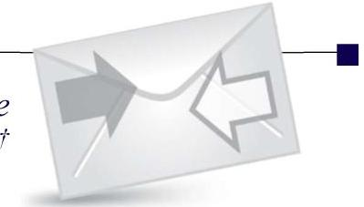

A jelentéstervezet megállapításaira 44 ellenőrzött szervezet közül 38 szervezet vezetője nem tett észrevételt. Kettő ellenőrzött szervezet vezetője - Belügyminisztérium, Északmagyarországi Regionális Vízművek Zrt. - nemleges észrevételt tett.
A Magyar Energetikai és Közmű-szabályozási Hivatal, a Dél-Pest Megyei Víziközmű Szolgáltató Zrt., az Országos Vízügyi Főigazgatóság, valamint a Nemzeti Népegészségügyi és Gyógyszerészeti Központ vezetője a jelentéstervezet megállapításaira észrevételt tett. A Magyar Energetikai és Közmű-szabályozási Hivatal és a Dél-Pest Megyei Víziközmű Szolgáltató Zrt. vezetőjének észrevételeit az ÁSZ elfogadta, a számvevőszéki jelentés véglegesítése során figyelembe vette. Az Országos Vízügyi Főigazgatóság vezetőjének észrevételeit egy kivétellel, valamint a Nemzeti Népegészségügyi és Gyógyszerészeti Központ vezetőjének észrevételeit négy kivétellel az ÁSZ elfogadta és figyelembe vette a számvevőszéki jelentés véglegesítése során. Az ÁSZ tv. 29. § (3) bekezdésével összhangban az ÁSZ a Függelékben feltünteti a megállapításokkal kapcsolatban tett, el nem fogadott észrevételeket, illetve az el nem fogadott észrevételek indoklását.

## Az Országos Vízügyi Főigazgatóság el nem fogadott észrevétele

Észrevétel: „18. oldal szövegben, illetve 19. oldal 5. ábra
Megállapítja, hogy a "MEGFIZETHETŐSÉG" tématerületen a VGT3-ban, mint országos szintű tervben feltárt kockázatot/gyengeséget, de a terv nem fogalmazott meg célt, eszközt vagy feladatot erre vonatkozóan.
Kérjük javítani, mert a VGT3 intézkedési listáján szerepel:
9. A KÖLTSÉGMEGTÉRÜLÉS ELVÉNEK ALKALMAZÁSA A MEGFIZETHETŐSÉG FIGYELEMBEVÉTELÉVEL A LAKOSSÁGI VÍZSZOLGÁLTATÁS TERÜLETÉN [intézkedési csomag]
9.1 Víziközmű-szolgáltatás díjrendszerének áttekintése [intézkedés]"

El nem fogadás indoka: az ellenőrzés a megfizethetőség stratégiai cél megjelenítését kifejezetten lakossági, szociális szempontból vizsgálta, és nem a költségmegtérülés szempontjából.

[^0]
[^0]:    $\dagger$ 29. § (1) Az Állami Számvevőszék az ellenőrzési megállapításait megküldi az ellenőrzött szervezet vezetőjének vagy az általa megbízott személynek, és annak, akinek személyes felelősségét állapította meg.
    (2) Az ellenőrzött szervezet vezetője és a felelősként megjelölt személy az ellenőrzés megállapításaira tizenöt napon belül írásban észrevételt tehet.
    (3) Az Állami Számvevőszék az észrevételre a beérkezésétől számított harminc napon belül írásban válaszol. A figyelembe nem vett észrevételeket köteles a jelentésben feltüntetni, és megindokolni, hogy azokat miért nem fogadta el.

---

# A Nemzeti Népegészségügyi és Gyógyszerészeti Központ el nem fogadott észrevételei 

1. Észrevétel: „1. táblázat. Kiegészítése javasolt az ivóvízminőség-felügyelet felelősével (EMMI, majd később BM)."

El nem fogadás indoka: A táblázat a kormánytagok hatás- és felelősségi köreit tartalmazza a Kormány tagjainak feladat- és hatásköréről szóló 152/2014. (VI.6.) Korm. rendeletben, a 94/2018. (V.22.) Korm. rendeletben és a 182/2022. (V.24.) Korm. rendeletben foglaltak alapján. Az ivóvíz minőségének felügyelete ezen Korm. rendeletekben tételesen nem szerepel. A vízminőséggel kapcsolatos egyes (nem jogalkotási) feladatokat a vízgazdálkodásért való felelősség (182/2022. (V. 24.) Korm. rendelet 84. §), és a vízügyi igazgatási szervek irányításáért való felelősség (182/2022. (V. 24.) Korm. rendelet 86. §) részletei határozzák meg.
2. Észrevétel: „18. oldal. „Annak ellenére, hogy az ivóvíz megfizethetőségének problémáját több dokumentum is jelezte helyzetfeltárásában, kapcsolódó stratégiai célt a dokumentumok nem tartalmaztak."
A Víz és Egészség Jegyzőkönyv keretében szerepel célként szociális tarifarendszer kidolgozása."
El nem fogadás indoka: Álláspontunk szerint a Víz és Egészség Jegyzőkönyv nem tekinthető a kormányzati stratégiai irányításról szóló 38/2012. (III.12). Korm. rendelet szerinti nemzeti stratégiának vagy stratégiaalkotás során keletkezett dokumentumnak.
3. Észrevétel: „5. ábra. A Víz és Egészség Jegyzőkönyv szerinti célokhoz kapcsolódik, céldátum és indikátor is."

El nem fogadás indoka: Álláspontunk szerint a Víz és Egészség Jegyzőkönyv nem tekinthető a kormányzati stratégiai irányításról szóló 38/2012. (III.12). Korm. rendelet szerinti nemzeti stratégiának vagy stratégiaalkotás során keletkezett dokumentumnak.
4. Észrevétel: „2. táblázat. „Ivóvízbázisok biztonságba helyezése megtörténik (középtáv)"
Az NNGYK tudomása szerint nem minden ivóvízbázis rendelkezik védőterület/védőidom kijelöléssel."
El nem fogadás indoka: A jelentéstervezet nem tartalmaz megállapítást arról, hogy mely ivóvízbázisok rendelkeznek védőterület/védőidom kijelöléssel.

---

# RÖVIDÍTÉSEK JEGYZÉKE 

${ }^{1}$ Nemzeti Vízstratégia/KJT
${ }^{2}$ ÁSZ
${ }^{3}$ NNGYK
${ }^{4}$ HUMVI
${ }^{5}$ KJT
${ }^{6}$ SDG
${ }^{7}$ ENSZ
${ }^{8}$ NVKS
${ }^{9}$ KPE
${ }^{10}$ KSH
${ }^{11}$ VKI
${ }^{12}$ IKVA
${ }^{13}$ KEHOP
${ }^{14}$ MEKH
${ }^{15}$ GFT
${ }^{16}$ Mrd Ft
${ }^{17}$ VKI
${ }^{18}$ Tanács
${ }^{19}$ 98/83/EK irányelv
${ }^{20}$ Vksztv.
${ }^{21}$ Ákr.
${ }^{22}$ Vgt.
${ }^{23}$ BM
${ }^{24}$ NFM
${ }^{25}$ ITM
${ }^{26}$ TIM
${ }^{27}$ EM
${ }^{28}$ NVTNM
${ }^{29}$ GFM
${ }^{30}$ NKP4
${ }^{31}$ NKP5
${ }^{32}$ ÉCsT
${ }^{33}$ OFTK

Nemzeti Vízstratégia, Kvassay Jenő Terv, elfogadta az 1110/2017. (III. 7.) Korm. határozat
Állami Számvevőszék
Nemzeti Népegészségügyi Központ az ellenőrzött időszakban 2017. és 2023. július 31., Nemzeti Népegészségügyi és Gyógyszerészeti Központ 2023. augusztus 01-től

Humán felhasználású vizek informatikai rendszere
Kvassay Jenő Terv, elfogadta az 1110/2017. (III.7) Korm. határozat
Sustainable Development Goals a Fenntartható Fejlődés Indikátorai
Egyesült Nemzetek Szervezete
Nemzeti Víziközmű-közszolgáltatási Stratégia feljogosító feltételeinek teljesüléséhez szükséges intézkedésekről, amelyet a Kormány az 1828/2021. (XI. 30.) Korm. határozattal fogadott el.
kemény polietilén
Központi Statisztikai Hivatal
Víz Keretirányelv: Az Európai Parlament és a Tanács 2000/60/EK Irányelve (2000. október 23.) a vízvédelmi politika terén a közösségi fellépés kereteinek meghatározásáról
Integrált Közcélú Víziközmű Adatbázis
Környezeti és Energiahatékonysági Operatív Program
Magyar Energetikai és Közmű-szabályozási Hivatal
Gördülő Fejlesztési Tervek
milliárd forint
Víz Keretirányelv: Az Európai Parlament és a Tanács 2000/60/EK Irányelve (2000. október 23.) a vízvédelmi politika terén a közösségi fellépés kereteinek meghatározásáról
az Európai Unió Tanácsa
a Tanács 98/83/EK irányelve (1998. november 3.) az emberi fogyasztásra szánt víz minőségéről
A víziközmű-szolgáltatásról szóló 2011. évi CCIX. törvény
2016. évi CL. törvény - az általános közigazgatási rendtartásról)

A vízgazdálkodásról szóló 1995. évi LVII. törvény
Belügyminisztérium
Nemzeti Fejlesztési Minisztérium
Innovációs és Technológiai Minisztérium
Technológiai és Ipari Minisztérium
Energiaügyi Minisztérium
Nemzeti vagyon kezeléséért felelős tárca nélküli miniszter
Gazdaságfejlesztési Minisztérium
Nemzeti Környezetvédelmi Program 2015, elfogadta a 27/2015. (VI. 17.) OGY határozat
Nemzeti Környezetvédelmi Program 2022, elfogadta a 62/2022. (XII. 9.) OGY határozat
Éghajlatváltozási Cselekvési Terv, (a 23/2018. OGY határozattal elfogadott Nemzeti Éghajlatváltozási Stratégia alapján készült)
Országos Fejlesztési és Területfejlesztési Koncepció, elfogadta az 1/2014. (I. 3.) OGY határozat

---

| 34 201/2001. Korm.rendelet | az ivóvíz minőségi követelményeiről és az ellenőrzés rendjéről szóló 201/2001 (X. 25.) Korm. rendelet |
| :--: | :--: |
| ${ }^{35}$ EFOP | Emberi Erőforrás Fejlesztési Operatív Program |
| ${ }^{36}$ VEKOP | Versenyképes Közép-Magyarország Operatív Program |
| ${ }^{37}$ VGT2 | Vízgyűjtő-gazdálkodási Terv 2, elfogadta az 1155/2016. (III.31.) Korm.határozat |
| ${ }^{38}$ VGT3 | Vízgyűjtő-gazdálkodási Terv 3, elfogadta az 1242/2022. (IV. 28.) Korm. határozat |
| ${ }^{39}$ OVF | Országos Vízügyi Főigazgatóság |
| ${ }^{40}$ VÁRA | Víziközművek Állami Rekonstrukciós Alapja |
| ${ }^{41}$ 339/2014. (XII. 19.) Korm. rendelet | az Európai Unió vagy más nemzetközi szervezet felé vállalt kötelezettséggel összefüggő, a 2007-2013 programozási időszakban a Kormány által a nemzeti fejlesztési miniszter hatáskörébe utalt beruházások, valamint a 2014-2020 programozási időszakban a szennyvízelvezetési és -tisztítási, a hulladékgazdálkodási és az ivóvízminőség-javító beruházások megvalósításáról |
| ${ }^{42}$ NV Zrt. | Nemzeti Vízművek Zrt. |
| ${ }^{43}$ EU | Európai Unió |
| ${ }^{44}$ NVNY | Nemzeti Víziközmű Nyilvántartás |
| ${ }^{45}$ VIZEK rendszer | Vízhasználat Információs, Ellenőrzési és Integrált hatósági feladatokat ellátó Keretrendszer |
| ${ }^{46}$ E-KÖZMÜ | Egységes Elektronikus Közműnyilvántartás |
| ${ }^{47}$ VH-FAV | a VIZIR rendszer modulja, a felszín alatti vízhasználatok adatbázisa |
| ${ }^{48}$ VH-FEV | a VIZIR rendszer modulja, a felszín feletti vízhasználatok adatbázisa |
| ${ }^{49}$ VIZIR-rendszer | Vízgazdálkodási Információs Rendszer |
| ${ }^{50}$ FE | felhasználói egyenérték |
| ${ }^{51}$ NFP Nonprofit Kft. | Nemzeti Fejlesztési Programiroda Nonprofit Kft. |
| ${ }^{52}$ IKVA

 r. | az Integrált Közcélú Víziközmű Adatbázis üzemeltető szervezetének kijelöléséről és működésének részletes szabályairól szóló 74/2018. (IV. 20.) Korm. rendelet |
| ${ }^{53}$ FV Zrt. | Fővárosi Vízművek Zrt. |
| ${ }^{54}$ DRV | Dunántúli Regionális Vízmű Zrt. |
| ${ }^{55}$ Vhr. | 58/2013. (II. 27.) Korm. rendelet - a víziközmű-szolgáltatásról szóló 2011. évi CCIX. törvény egyes rendelkezéseinek végrehajtásáról |
| ${ }^{56} \mathrm{M} \mathrm{Ft}$. | millió forint |
| ${ }^{57}$ Rezsitv. | 2013. évi LIV. törvény a rezsicsökkentések végrehajtásáról |

---

1052 Budapest, Apáczai Csere János u. 10. | 1364 Budapest, IV. Pf. 54
www.asz.hu | szamvevoszek@asz.hu
telefon: +36 1 4849100
