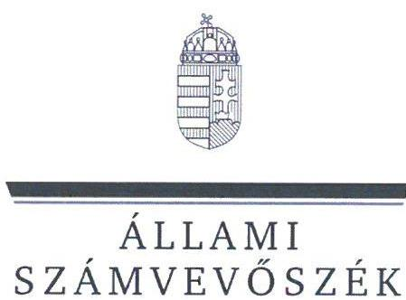
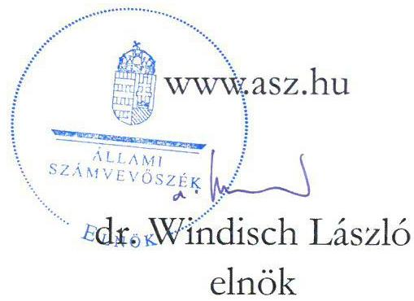
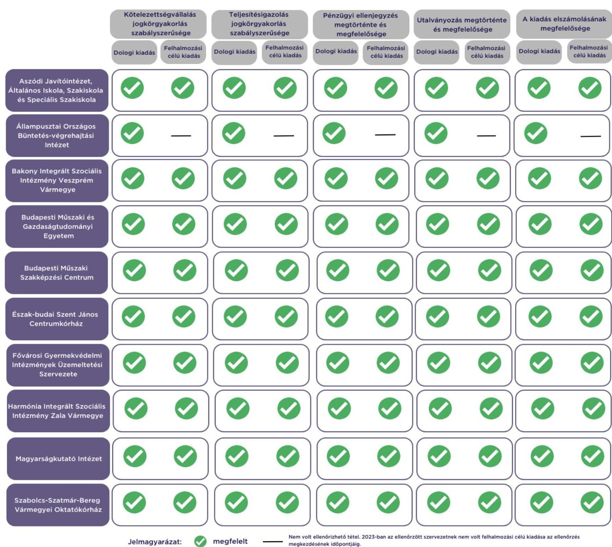

# JELENTÉS 

Az államháztartás központi alrendszerébe tartozó költségvetési szerv által teljesített dologi és felhalmozási célú kiadás szabályszerűségének rapid ellenőrzése

2024.

---

# JELENTÉS 

Az államháztartás központi alrendszerébe tartozó költségvetési szerv által teljesített dologi és felhalmozási célú kiadás szabályszerűségének rapid ellenőrzése
2024.

24005

---

# ELLENŐRZÉSI IGAZGATÓSÁG: 

## ÁLLAMHÁZTARTÁS KÖZPONTI SZINTJÉT ELLENŐRZŐ IGAZGATÓSÁG

## ELLENŐRZÉSI IGAZGATÓ:

SINKÁNÉ DR. CSENDES ÁGNES igazgató

## ELLENŐRZÉSVEZETŐ:

Jelentéseink az interneten a www.asz.hu címen olvashatók.

RENKÓ ZSUZSANNA ellenőrzésvezető

IKTATÓSZÁM: EL-3949-005/2024.
TÉMASZÁM: 2685
ELLENŐRZÉS-AZONOSÍTÓ SZÁM: V102902

---

# TARTALOMJEGYZÉK 

- AZ ELLENŐRZÉS ALAPADATAI ..... 5
- AZ ELLENŐRZÖTT SZERVEZETEK ..... 7
- ÖSSZEFOGLALÁS ..... 13
- AZ ELLENŐRZÉS FÓKUSZKÉRDÉSEI ..... 14
- MEGÁLLAPÍTÁSOK ..... 15
- JAVASLATOK ..... 17
- MELLÉKLETEK ..... 18
I. sz. melléklet: Értelmező szótár ..... 18
II. sz. melléklet: Az ellenőrzött szervezetek jegyzéke ..... 19
III. sz. melléklet: Ellenőrzési kritériumok ..... 20
- FÜGGELÉK: ÉSZREVÉTELEK ..... 21
- RÖVIDÍTÉSEK JEGYZÉKE ..... 23

---

.

---

# AZ ELLENŐRZÉS ALAPADATAI 

## AZ ELLENŐRZÉS CÉLJA

Az államháztartás központi alrendszerébe tartozó költségvetési szerv által teljesített dologi és felhalmozási célú kiadások egy-egy kiválasztott tételének szabályszerűségi szempontból történő értékelése.

## AZ ELLENŐRZÉS TÍPUSA

Megfelelőségi ellenőrzés.

## AZ ELLENŐRZÖTT IDŐSZAK

| SOR-   SZÁM | ELLENŐRZÖTT SZERVEZETEK | DOLOGI   KIADÁSOK   ESETÉBEN | FELHALMOZÁSI   CÉLÚ KIADÁSOK   ESETÉBEN |
| :--: | :--: | :--: | :--: |
| 1. | Aszódi Javítóintézet, Általános Iskola, Szakiskola és Speciális Szakiskola | 2023. június 13. | 2023. július 11. |
| 2. | Állampusztai Országos Büntetés-végrehajtási Intézet | 2023. június 28. | - |
| 3. | Bakony Integrált Szociális Intézmény Veszprém Vármegye | 2023. július 3. | 2023. július 20. |
| 4. | Budapesti Műszaki és Gazdaságtudományi Egyetem | 2023. június 26. | 2023. június 16. |
| 5. | Budapesti Műszaki Szakképzési Centrum | 2023. július 4. | 2023. június 20. |
| 6. | Észak-budai Szent János Centrumkórház | 2023. június 22. | 2023. június 1. |
| 7. | Fővárosi Gyermekvédelmi Intézmények Üzemeltetési Szervezete | 2023. június 30. | 2023. május 25. |
| 8. | Harmónia Integrált Szociális Intézmény Zala Vármegye | 2023. június 20. | 2023. június 12. |
| 9. | Magyarságkutató Intézet | 2023. július 3. | 2023. július 11. |
| 10. | Szabolcs-Szatmár-Bereg Vármegyei Oktatókórház | 2023. június 13. | 2023. június 29. |

## AZ ELLENŐRZÉS TÁRGYA

Az államháztartás központi alrendszerébe tartozó költségvetési szerv által teljesített, ellenőrzésre kiválasztott dologi és felhalmozási célú kiadás szabályszerű teljesítése, ezen belül a gazdálkodási jogkörök szabályszerű gyakorlása. Az ellenőrzés kiterjedt minden olyan körülményre és adatra, amely az ÁSZ ${ }^{1}$ jogszabályban meghatározott feladatainak teljesítéséhez, valamint a program végrehajtása folyamán felmerült újabb összefüggések feltárásához szükséges.

Az ellenőrzés során az ÁSZ

- az Aszódi Javítóintézet, Általános Iskola, Szakiskola és Speciális Szakiskola; az Állampusztai Országos Büntetés-végrehajtási Intézet; a Bakony Integrált Szociális Intézmény Veszprém Vármegye; a Budapesti Műszaki és Gazdaságtudományi Egyetem; a Fővárosi Gyermekvédelmi Intézmények Üzemeltetési Szervezete és a Szabolcs-Szatmár-Bereg Vármegyei Oktatókórház esetében a dologi kiadások körébe tartozó Egyéb szolgáltatások; a Budapesti Műszaki Szakképzési Centrum; az Észak-budai Szent János Centrumkórház; a Harmónia Integrált Szociális Intézmény

Zala Vármegye és a Magyarságkutató Intézet esetében a dologi kiadások körébe tartozó Szakmai tevékenységet segítő szolgáltatások;

- az Aszódi Javítóintézet, Általános Iskola, Szakiskola és Speciális Szakiskola; a Magyarságkutató Intézet és a Szabolcs-Szatmár-Bereg Vármegyei Oktatókórház esetében a felhalmozási célú kiadások körébe tartozó Informatikai eszközök beszerzése, létesítése; a Bakony Integrált Szociális Intézmény Veszprém Vármegye esetében a felhalmozási célú kiadások körébe tartozó Ingatlanok beszerzése, létesítése; a Budapesti Műszaki és Gazdaságtudományi Egyetem esetében a felhalmozási célú kiadások körébe tartozó Ingatlanok felújítása; a Budapesti Műszaki Szakképzési Centrum; az Észak-budai Szent János Centrumkórház; a Fővárosi Gyermekvédelmi Intézmények Üzemeltetési Szervezete és a Harmónia Integrált Szociális Intézmény Zala Vármegye esetében a felhalmozási célú kiadások körébe tartozó Egyéb tárgyi eszközök beszerzése, létesítése
rovatokon elszámolt kiadások egy-egy kiválasztott mintatételének szabályszerűségét értékelte. Az Állampusztai Országos Büntetés-végrehajtási Intézetnél az ellenőrzésre történő kijelölést megelőzően 2023. évben nem volt olyan értéknap, amelyen felhalmozási célú kiadás teljesítése történt.

# AZ ELLENŐRZÉS JOGALAPJA 

Az ellenőrzés jogszabályi alapját az ÁSZ tv. ${ }^{2} 1 . \int(3)$ bekezdés és az 5. $\int(6)$ bekezdés előírásai képezték.

## AZ ELLENŐRZÉS MÓDSZERE

Az ellenőrzést az ÁSZ az ellenőrzött időszakban hatályos jogszabályok, az ellenőrzés szakmai szabályai alapján, „Az állambáztartás központi alrendszerébe tartozó költségvetési szerv által teljesített dologi kiadás szabályszerűségének rapid ellenőrzéséről" és „Az állambáztartás központi alrendszerébe tartozó költségvetési szerv által teljesített felhalmozási célú kiadás szabályszerűségének rapid ellenőrzéséről" című ellenőrzési programok (továbbiakban: ellenőrzési programok) kérdéseire adott válaszok kiértékelésével, az ellenőrzési programokban megjelölt adatforrások figyelembevételével folytatta le. Amennyiben az adott mintatétel ellenőrzési program szerinti értékelése során további kapcsolódó szabálytalanságot tárt fel az ÁSZ, a szabálytalansághoz tartozó kritériummal bővült az ellenőrzés.

Az ellenőrzési kérdések megválaszolásához szükséges bizonyítékok megszerzése a következő ellenőrzési eljárások alkalmazásával történt: megfigyelés, összehasonlítás, elemző eljárás, a dologi kiadások, felhalmozási célú kiadások ellenőrzéssel érintett rovatairól történő mintavétel. Az ellenőrzési bizonyítékként felhasználható adatforrások közé tartoztak egyrészt az ellenőrzéshez kért dokumentumok, adatforrások, másrészt adatforrás volt még minden - az ellenőrzés folyamán - feltárt, az ellenőrzés szempontjából információkat tartalmazó dokumentum.

Az ÁSZ értékelte az ellenőrzés során a kiválasztott mintatételek ellenőrzési programokban meghatározott szempontok szerinti szabályszerűségét, így a kötelezettségvállalás és a teljesítésigazolás gazdálkodási jogkörök tekintetében a jogkörgyakorlás szabályszerűségét, a pénzügyi ellenjegyzés és az utalványozás gazdálkodási jogkörök tekintetében ezek megtörténtét és megfelelőségét.

---

# AZ ELLENŐRZÖTT SZERVEZETEK 

Az ellenőrzés az Aszódi Javítóintézet, Általános Iskola, Szakiskola és Speciális Szakiskolára; az Állampusztai Országos Büntetés-végrehajtási Intézetre; a Bakony Integrált Szociális Intézmény Veszprém Vármegyére; a Budapesti Műszaki és Gazdaságtudományi Egyetemre; a Budapesti Műszaki Szakképzési Centrumra; az Észak-budai Szent János Centrumkórházra; a Fővárosi Gyermekvédelmi Intézmények Üzemeltetési Szervezetére; a Harmónia Integrált Szociális Intézmény Zala Vármegyére; a Magyarságkutató Intézetre; a Szabolcs-Szatmár-Bereg Vármegyei Oktatókórházra, mint az államháztartás központi alrendszerébe tartozó költségvetési szervekre terjedt ki.

## Aszódi Javítóintézet, Általános Iskola, Szakiskola És Speciális Szakiskola

Az Aszódi Javítóintézet ${ }^{3}$ közfeladata a büntetések, az intézkedések, egyes kényszerintézkedések és a szabálysértési elzárás végrehajtásáról szóló 2013. évi CCXL. törvényben meghatározott keretek között a gyermekek védelméről és a gyámügyi igazgatásról szóló 1997. évi XXXI. törvény szerint a javítóintézeti nevelésre utalt fiatalkorúak számára javítóintézeti ellátás, utógondozás biztosítása. Továbbá a javítóintézetek rendtartásáról szóló 1/2015. (I. 14.) EMMI rendelet alapján az intézmény köznevelési feladatot ellátó önálló szakmai egységében a különleges bánásmódot igénylő, szakértői bizottság szakértői véleménye alapján sajátos nevelési igényű tanulók nappali rendszerű általános iskolai, szakiskolai, valamint speciális szakiskolai oktatása.

## Aszódi Javítóintézet, Általános Iskola, Szakiskola És Speciális Szakiskola FŐBB ADATAINAK BEMUTATÁSA

Alapításának éve:
Irányító szerve:
Középirányító szerve:
Gazdasági szervezettel való rendelkezés:

Illetékessége, működési területe:
Általános képviseletét ellátó vezetője:
Vezetői kinevezés kezdete:
2022. évben teljesített bevételek összege:
1983.

Belügyminisztérium
Szociális és Gyermekvédelmi Főigazgatóság
Gazdasági szervezettel nem rendelkezik, egyes pénzügyi-gazdasági feladatait munkamegosztási megállapodás alapján a Szociális és Gyermekvédelmi Főigazgatóság látja el.
országos
igazgató
2021.05.02.
$1230,7 \mathrm{M} \mathrm{Ft}$
$1230,2 \mathrm{M} \mathrm{Ft}$

---

# Állampusztai Országos Büntetés-végrehajtási Intézet 

Az Állampusztai Bv. Intézet ${ }^{4}$ rendvédelmi szerv, a büntetés-végrehajtási szervezetről szóló 1995. évi CVII. törvény szerinti közfeladata a letartóztatással, felnőttkorú férfi elítéltek fegyház, börtön, és fogház fokozatú szabadságvesztésével, az elzárással összefüggő büntetés-végrehajtási feladatok ellátása.

| Állampusztai Országos Büntetés-végrehajtási Intézet főbb adatainak bemutatása |  |
| :-- | :-- |
| Alapításának éve: | 1997. |
| Irányító szerve: | Belügyminisztérium |
| Középirányító szerve: | Büntetés-végrehajtás Országos Parancsnoksága |
| Gazdasági szervezettel való rendelkezés: | Gazdasági szervezettel nem rendelkezik, egyes pénzügyi-gazdasági feladatait   munkamegosztási megállapodás alapján a Szegedi Fegyház és Börtön látja el. |
| Illetékessége, működési területe: | országos |
| Általános képviseletét ellátó vezetője: | parancsnok |
| Vezetői kinevezés kezdete: | 2023.01.01. |
| 2022. évben teljesített bevételek összege: | $5717,4 \mathrm{M} \mathrm{Ft}$ |
| 2022. évben teljesített kiadások összege: | $5707,2 \mathrm{M} \mathrm{Ft}$ |

## BAKONY INTEGRÁLT SZOCIÁLIS INTÉZMÉNY VESZPRÉM VÁRMEGYE

A BISZIVV ${ }^{5}$ közfeladata a Szoctv. ${ }^{6}$-ben meghatározott idősek, fogyatékos személyek, pszichiátriai betegek, szenvedélybetegek otthona, valamint a fogyatékos személyek gondozóháza és lakóotthona szerinti bentlakásos szociális ellátás biztosítása, jelzőrendszeres házi segítségnyújtás, támogatott lakhatás, illetve fogyatékos személyek részére nyújtott nappali ellátás, fejlesztő foglalkoztatás. A BISZIVV a tevékenységét a székhelyén, illetve kilenc telephelyen folytatja.

## BAKONY INTEGRÁLT SZOCIÁLIS INTÉZMÉNY VESZPRÉM VÁRMEGYE FŐBB ADATAINAK BEMUTATÁSA

Alapításának éve:
Irányító szerve:
Középirányító szerve:
Gazdasági szervezettel való rendelkezés:
Illetékessége, működési területe:
Általános képviseletét ellátó vezetője:
Vezetői kinevezés kezdete:
2022. évben teljesített bevételek összege:
2022. évben teljesített kiadások összege:

1979.
Belügyminisztérium
Szociális és Gyermekvédelmi Főigazgatóság
Gazdasági szervezettel nem rendelkezik.
Budapest és Veszprém vármegye
intézményvezető
2021.04.01.
$4645,0 \mathrm{M} \mathrm{Ft}$
$4626,5 \mathrm{M} \mathrm{Ft}$

---

# Budapesti Műszaki és Gazdaságtudományi Egyetem 

A BME’ közfeladata az Nftv. ${ }^{8}$ alapján oktatási, tudományos kutatási, művészeti alkotótevékenység folytatása. A felsőoktatási intézmény alaptevékenysége a teljesség igénye nélkül a képzési területen osztott képzésben alapképzés, mesterképzés, valamint osztatlan képzés, továbbá szakirányú továbbképzés folytatása, és e képzésben oklevél kiadása; meghatározott tudományterületen doktori képzés folytatása és doktori fokozat kiadása; a képzéshez kapcsolódó területeken, tudományterületeken alap-, alkalmazott és kísérleti kutatások és fejlesztések, tudományszervezés, technológiai innováció, valamint az oktatást támogató egyéb kutatások végzése.

## Budapesti Műszaki és Gazdaságtudományi Egyetem FŐBB ADATAINAK BEMUTATÁSA

Alapításának éve:
Irányító szerve:
Középirányító szerve:
Gazdasági szervezettel való rendelkezés:
Illetékessége, működési területe:
Általános képviseletét ellátó vezetője:
Vezetői kinevezés kezdete:
2022. évben teljesített bevételek összege:
2022. évben teljesített kiadások összege:

1983.
Kulturális és Innovációs Minisztérium
Gazdasági szervezettel rendelkezik.
országos
rektor
2021.07.01.
$72050,0 \mathrm{M} \mathrm{Ft}$
$51079,5 \mathrm{M} \mathrm{Ft}$

## Budapesti Műszaki Szakképzési Centrum

A BMSZC ${ }^{9}$ közfeladata a szakképzésről szóló 2019. évi LXXX. törvény szerinti szakképzési és az Nktv. ${ }^{10}$ szerinti köznevelési feladatok ellátása. Alaptevékenysége a technikumi szakmai oktatás; szakképző iskolai szakmai oktatás; a többi gyermekkel, tanulóval együtt nevelhető, oktatható sajátos nevelési igényű gyermekek, tanulók iskolai nevelés-oktatása. Részt vesz az Arany János Tehetséggondozó Programban, valamint kollégiumi ellátást, továbbá nevelő és oktató munkákhoz kapcsolódó, nem köznevelési tevékenységet is ellát. A BMSZC az állami intézményfenntartó központtól átvett általános iskolai és gimnáziumi intézményegységekben általános iskolai és gimnáziumi nevelés-oktatási alapfeladatot is végez. Tervezi és szervezi az Európai Unió pénzügyi alapjaiból és más külföldi, illetőleg hazai alapokból támogatott egyes fejlesztési programok megvalósítását.

## Budapesti Műszaki Szakképzési Centrum FŐBB ADATAINAK BEMUTATÁSA

Alapításának éve:
Irányító szerve:
Középirányító szerve:
Gazdasági szervezettel való rendelkezés:
Illetékessége, működési területe:
A törvényes és szakszerű működésért felelős vezetője:
Vezetői kinevezés kezdete:
2022. évben teljesített bevételek összege:
2022. évben teljesített kiadások összege:

2015.
Kulturális és Innovációs Minisztérium
Nemzeti Szakképzési és Felnőttképzési Hivatal
Gazdasági szervezettel rendelkezik.
Budapest
kancellár
2022.09.05.
$9418,2 \mathrm{M} \mathrm{Ft}$
$7749,0 \mathrm{M} \mathrm{Ft}$

---

# ÉSZAK-BUDAI SZENT JÁNOS CENTRUMKÓRHÁZ 

A Szent János Centrumkórház ${ }^{11}$ közfeladata az Eütv. ${ }^{12}$ alapján, ellátási területére kiterjedően a járó- és fekvőbetegek diagnosztikus és terápiás szakorvosi ellátása, rehabilitációja és követéses gondozása, valamint a 2015. évi CXXIII. törvény ${ }^{13}$ alapján a védőnői ellátás biztosítása. Ennek keretében végzett feladatai a fekvőbetegek aktív és krónikus ellátása, rehabilitációja, járóbetegek gyógyító és rehabilitációs szakellátása és egynapos ellátása, az egyén gyógykezelése, életveszély elhárítása, a megbetegedés következtében kialakult állapot
 javítása vagy a további állapotromlás megelőzése céljából. Feladata továbbá a védőnői ellátás keretében az egészségmegőrzés, tanácsadás, gondozás, betegségmegelőzés-szűrés, felvilágosítás, egészségnevelés. Alaptevékenységébe tartozik a gyógyszer kiskereskedelme, egészségüggyel kapcsolatos kutatások végzése, egészségügyi szakmai képzések végzése.

## ÉSZAK-BUDAI SZENT JÁNOS CENTRUMKÓRHÁZ FŐBB ADATAINAK BEMUTATÁSA

Alapításának éve:
1889.
Irányító szerve:
Belügyminisztérium
Középirányító szerve:
Országos Kórházi Főigazgatóság
Gazdasági szervezettel való rendelkezés:
Gazdasági szervezettel rendelkezik.
Illetékessége, működési területe:
2006. évi CXXXII. törvény ${ }^{14}$ alapján vezetett közhiteles kapacitásnyilvántartásban szereplő ellátási terület
Általános képviseletét ellátó vezetője:
főigazgató
Vezetői kinevezés kezdete:
2021.01.01.
2022. évben teljesített bevételek összege:
$35119,0 \mathrm{M} \mathrm{Ft}$
2022. évben teljesített kiadások összege:
$34356,6 \mathrm{M} \mathrm{Ft}$

## FŐVÁROSI GYERMEKVÉDELMI INTÉZMÉNYEK ÜZEMELTETÉSI SZERVEZETE

Az FGYI Üzemeltetési Szervezetének ${ }^{15}$ közfeladata az alapító okirat mellékletében felsorolt szociális, gyermek- és ifjúságvédelmi intézmények és telephelyeik üzemeltetési feladatainak, valamint a köznevelési tevékenységet ellátó hozzárendelt intézmények vonatkozásában az Nktv.-ben meghatározott működtetői feladatok ellátása. Alaptevékenysége a hozzárendelt intézmények vonatkozásában ellátni a költségvetési szervek működésével, üzemeltetésével, vagyongazdálkodásuk körében a beruházással, a vagyon használatával, hasznosításával, védelmével kapcsolatos feladatokat.

## FŐVÁROSI GYERMEKVÉDELMI INTÉZMÉNYEK ÜZEMELTETÉSI SZERVEZETE FŐBB ADATAINAK BEMUTATÁSA

Alapításának éve:
2004.

Irányító szerve:
Belügyminisztérium
Középirányító szerve:
Szociális és Gyermekvédelmi Főigazgatóság
Gazdasági szervezettel való rendelkezés:
Gazdasági szervezettel nem rendelkezik.
Illetékessége, működési területe:
országos
Általános képviseletét ellátó vezetője:
igazgató
Vezetői kinevezés kezdete:
2022.10.17.
2022. évben teljesített bevételek összege:
$1745,1 \mathrm{M} \mathrm{Ft}$
2022. évben teljesített kiadások összege:
$1740,2 \mathrm{M} \mathrm{Ft}$

---

# HARMÓNIA INTEGRÁLT SZOCIÁLIS INTÉZMÉNY ZALA VÁRMEGYE 

A Harmónia Szoc. Intézmény ${ }^{16}$ feladatait a Szoctv. határozza meg. Alaptevékenységként pszichiátriai betegek részére ápolási, gondozási ellátást nyújtanak, fejlesztő foglalkoztatást szerveznek, valamint étkeztetést, házi segítségnyújtást végeznek, továbbá hét helyszínen támogatott lakhatást biztosítanak részükre.

## HARMÓNIA INTEGRÁLT SZOCIÁLIS INTÉZMÉNY ZALA VÁRMEGYE FŐBB ADATAINAK BEMUTATÁSA

Alapításának éve:
1980.
Irányító szerve:
Belügyminisztérium
Középirányító szerve:
Szociális és Gyermekvédelmi Főigazgatóság
Gazdasági szervezettel való rendelkezés:
Gazdasági szervezettel nem rendelkezik.
Illetékessége, működési területe:
Zala vármegye és Budapest
Általános képviseletét ellátó vezetője:
intézményvezető
Vezetői kinevezés kezdete:
2023.09.01.
2022. évben teljesített bevételek összege:
$1043,3 \mathrm{M} \mathrm{Ft}$
2022. évben teljesített kiadások összege:
$1025,7 \mathrm{M} \mathrm{Ft}$

## MAGYARSÁGKUTATÓ INTÉZET

Az $\mathrm{MKI}^{17}$-nek a Magyarságkutató Intézet létrehozásáról és az azzal összefüggő jogszabályok módosításáról szóló 206/2018. (XI. 10.) Korm. rendelet alapján többek között feladatához tartozik a magyarság őstörténetének modern interdiszciplináris módszerekkel történő feltárása, kutatási eredményeinek megismertetése, az e tárgyban maradandót alkotó jeles kutatók hagyatékának, szellemi örökségének gondozása, valamint a kutatási anyagok digitalizálása.

## MAGYARSÁGKUTATÓ INTÉZET FŐBB ADATAINAK BEMUTATÁSA

Alapításának éve:
2019.
Irányító szerve:
Kulturális és Innovációs Minisztérium
Középirányító szerve:
-
Gazdasági szervezettel való rendelkezés:
-
Illetékessége, működési területe:
országos
Általános képviseletét ellátó vezetője:
főigazgató
Vezetői kinevezés kezdete:
2023.03.13.
2022. évben teljesített bevételek összege:
$2637,3 \mathrm{M} \mathrm{Ft}$
2022. évben teljesített kiadások összege:
$2244,6 \mathrm{M} \mathrm{Ft}$

---

# SZABOLCS-SZATMÁR-BEREG VÁRMEGYEI OKTATÓKÓRHÁZ 

Az SZSZBVK ${ }^{18}$ közfeladata az Eütv. alapján, ellátási területére kiterjedően a járó- és fekvőbetegek diagnosztikus és terápiás szakorvosi ellátása, rehabilitációja és követéses gondozása, valamint a 2015. évi CXXIII. törvény alapján a védőnői ellátás biztosítása. Feladata a járó- és fekvőbetegek diagnosztikus és terápiás szakorvosi ellátása, rehabilitációja és követéses gondozása, ennek keretében fekvőbetegek aktív és krónikus ellátása, rehabilitációja, járóbetegek gyógyító és rehabilitációs szakellátása és egynapos ellátása, az egyén gyógykezelése, életveszély elhárítása, a megbetegedés következtében kialakult állapot javítása vagy a további állapotromlás megelőzése céljából. Feladata továbbá a védőnői ellátás keretében az egészségmegőrzés, tanácsadás, gondozás, betegségmegelőzés-szűrés, felvilágosítás, egészségnevelés. Alaptevékenységébe tartozik a gyógyszer kiskereskedelme, egészségüggyel kapcsolatos kutatások, egészségügyi szakmai képzések végzése.

## SZABOLCS-SZATMÁR-BEREG VÁRMEGYEI OKTATÓKÓRHÁZ FŐBB ADATAINAK BEMUTATÁSA

Alapításának éve:
2013.
Irányító szerve:
Belügyminisztérium
Középirányító szerve:
Országos Kórházi Főigazgatóság
Gazdasági szervezettel való rendelkezés:
Gazdasági szervezettel rendelkezik.
Illetékessége, működési területe:
2006. évi CXXXII. törvény alapján vezetett közhiteles kapacitás-nyilvántartásban szereplő ellátási terület
Általános képviseletét ellátó vezetője:
főigazgató
Vezetői kinevezés kezdete:
2022.09.15.
2022. évben teljesített bevételek összege:
$68228,0 \mathrm{MFt}$
2022. évben teljesített kiadások összege:
$67646,0 \mathrm{MFt}$

---

# ÖSSZEFOGLALÁS 

Az ellenőrzött kötelezettségvállalások a jogszabályi előírásoknak megfelelően történtek, a kötelezettségvállalásokra a pénzügyi ellenjegyzéseket követően, szabályszerűen került sor. A teljesítésigazolások és a pénzügyi ellenjegyzések a jogszabályi előírások szerint történtek. A kifizetések elrendelése szabályszerűen, utalványozás alapján történt. Az ellenőrzött kiadásokat a megfelelő rovatokon számolták el. Egy kiadás esetében felmerült, hogy nem folytattak le közbeszerzési eljárást. Egy ellenőrzött szervezetnél a kötelezettségvállalásra és a teljesítés igazolására jogosult személyekről és aláírás-mintájukról vezetett nyilvántartás nem felelt meg a jogszabályban előírtaknak.

Egy ellenőrzött szervezetnél az ellenőrzésre történő kijelölést megelőzően 2023. évben nem volt olyan értéknap, amelyen felhalmozási célú kiadás teljesítése történt.

## 1. ábra

## A FŐBB ELLENŐRZÉSI TAPASZTALATOK

---

# AZ ELLENŐRZÉS FÓKUSZKÉRDÉSEI 

1- Az államháztartás központi alrendszerébe tartozó költségvetési szervnél a kiválasztott dologi kiadás teljesítése az egyes jogszabályi rendelkezések alapján szabályszerű volt-e?
2- Az államháztartás központi alrendszerébe tartozó költségvetési szervnél a kiválasztott felhalmozási célú kiadás teljesítése az egyes jogszabályi rendelkezések alapján szabályszerű volt-e?

---

# MEGÁLLAPÍTÁSOK 

## 1. Az államháztartás központi alrendszerébe tartozó költségvetési szervnél a kiválasztott dologi kiadás teljesítése az egyes jogszabályi rendelkezések alapján szabályszerű volt-e?

## Összegző megállapítás

Az ellenőrzött 10 dologi kiadás teljesítése nyolc esetben az ellenőrzés keretében vizsgált jogszabályi előírásoknak megfelelt. Egy kiadás esetében felmerült, hogy nem folytattak le közbeszerzési eljárást. Egy dologi kiadás esetében a gazdálkodási jogkört gyakorlókról és aláírás mintájukról vezetett nyilvántartás nem volt teljeskörű.

Az Aszódi Javítóintézetnél, az Állampusztai Bv. Intézetnél, a BISZIVV-nél, a BME-nél, a BMSZC-nél, az FGYI Üzemeltetési Szervezeténél, a Harmónia Szoc. Intézménynél, az MKI-nél, a Szent János Centrumkórháznál és az SZSZBVK-nál az ellenőrzött mintatétel esetében a kötelezettségvállalási, teljesítésigazolási, utalványozási jogkörgyakorlás, továbbá a kiadás elszámolása az Áht. ${ }^{19}$, az Ávr. ${ }^{20}$ és az Áhsz. ${ }^{21}$ előírásai szerint szabályszerűen történt:

- Kötelezettséget az Áht.-ben és az Ávr.-ben foglaltakkal összhangban az arra jogosultsággal rendelkező személy vállalt.
- A kötelezettségvállalásra az Áht.-ben foglaltak szerint, a pénzügyi ellenjegyzés után került sor.
- A teljesítésigazoló az Ávr.-ben előírt írásbeli kijelöléssel rendelkezett.
- A teljesítésigazolás során az Ávr.-ben foglaltak szerint ellenőrizhető okmányok alapján ellenőrizték és igazolták a kiadás teljesítésének jogosságát, összegszerűségét, valamint az ellenszolgáltatás teljesítését.
- A teljesítésigazoló a teljesítést az Ávr.-ben foglaltakkal összhangban, az igazolás dátumának és a teljesítés tényére történő utalás megjelölésével, aláírásával igazolta.
- Az utalványozásra az Áht.-ben, valamint az Ávr.-ben foglaltakkal összhangban, a teljesítésigazolás és az alapján végrehajtott érvényesítést követően került sor.
- A kiadás számviteli elszámolása a megfelelő rovaton történt az Áhsz.-ben előírtakkal összhangban.

## Az ellenőrzés során feltárt szabálytalanság:

- Az Aszódi Javítóintézet 2019. április 1-jén őrzés és védelmi feladatok ellátására közbeszerzési eljárás lefolytatása nélkül kötött szerződést, ami az ÁSZ értékelése szerint felveti a Kbt. ${ }^{22} 4 . \S$ (1)-(2) bekezdésében foglaltak megsértésének lehetőségét. A határozatlan időre kötött megbízási szerződés szerint a megbízott 2 fő (napi 12 óra/fő), $1200 \mathrm{Ft}+$ Áfa/óra/fő összegért látja el az őrzés-védelmi feladatokat. A havonta fizetendő összeg 30 napos hónappal számolva összesen nettó 864000 Ft . A Kbt. 17. § (3) bekezdés b) pontja alapján a szolgáltatás becsült értéke olyan szerződés esetében, amely nem tartalmazza a teljes díjat és határozatlan időre kötötték, a havi ellenszolgáltatás negyvennyolcszorosa. Ennek értelmében a becsült érték 48 hónapra nettó 41472000 Ft , amely a Kbt. 111. § d) pontjában foglaltak alapján eléri és meghaladja a 18000000 Ft-os közbeszerzési értékhatárt.

- Az MKI-nél az Ávr. 60. § (3) bekezdésében foglaltak ellenére a kötelezettségvállalásra és a teljesítés igazolására jogosult személyekről és aláírás-mintájukról vezetett nyilvántartás nem tartalmazta az aláírás-mintát teljes körűen valamennyi jogosultra vonatkozóan, így többek között az ellenőrzéssel érintett mintatétel kötelezettségvállalójának és teljesítésigazolójának aláírását sem.

# 2. Az államháztartás központi alrendszerébe tartozó költségvetési szervnél a kiválasztott felhalmozási célú kiadás teljesítése az egyes jogszabályi rendelkezések alapján szabályszerű volt-e? 

Összegző megállapítás

Az ellenőrzött 10 dologi kiadás teljesítése kilenc esetben az ellenőrzés keretében vizsgált jogszabályi előírásoknak megfelelt. Egy dologi kiadás esetében a gazdálkodási jogkört gyakorlókról és aláírás mintájukról vezetett nyilvántartás nem volt teljeskörű.

Az Aszódi Javítóintézetnél, a BISZIVV-nél, a BME-nél, a BMSZC-nél, az FGYI Üzemeltetési Szervezeténél, a Harmónia Szoc. Intézménynél, az MKI-nél, a Szent János Centrumkórháznál és az SZSZBVK-nál az ellenőrzött mintatétel esetében a kötelezettségvállalási, teljesítésigazolási, utalványozási jogkörök gyakorlása, továbbá a kiadás elszámolása az Áht., az Ávr. és az Áhsz. előírásai szerint szabályszerűen történt:

- Kötelezettséget az Áht.-ben és az Ávr.-ben foglaltakkal összhangban arra jogosultsággal rendelkező személy vállalt.
- A kötelezettségvállalásra az Áht.-ben foglaltak szerint, a pénzügyi ellenjegyzés után került sor.
- A teljesítésigazoló az Ávr.-ben előírt írásbeli kijelöléssel rendelkezett.
- A teljesítésigazolás során az Ávr.-ben foglaltak szerint ellenőrizhető okmányok alapján ellenőrizték és igazolták a kiadás teljesítésének jogosságát, összegszerűségét, valamint az ellenszolgáltatás teljesítését.
- A teljesítésigazoló a teljesítést az Ávr.-ben foglaltakkal összhangban, az igazolás dátumának és a teljesítés tényére történő utalás megjelölésével, aláírásával igazolta.
- Az utalványozásra az Áht.-ben, valamint az Ávr.-ben foglaltakkal összhangban, a teljesítésigazolás és az alapján végrehajtott érvényesítést követően került sor.
- A kiadás számviteli elszámolása a megfelelő rovaton történt az Áhsz.-ben előírtakkal összhangban.

## Az ellenőrzés során feltárt szabálytalanság:

- Az MKI-nél az Ávr. 60. § (3) bekezdésében foglaltak ellenére a kötelezettségvállalásra és a teljesítés igazolására jogosult személyekről és aláírás-mintájukról vezetett nyilvántartás nem tartalmazta az aláírás-mintát teljes körűen valamennyi jogosultra vonatkozóan, így többek között az ellenőrzéssel érintett mintatétel kötelezettségvállalójának és teljesítésigazolójának aláírását sem.

---

# JAVASLATOK 

Az ÁSZ tv. 33. § (1) bekezdésében foglaltak értelmében az ellenőrzött szervezet vezetője köteles a jelentésben foglalt megállapításokhoz kapcsolódó intézkedési tervet összeállítani és azt a jelentés kézhezvételétől számított 30 napon belül az ÁSZ részére megküldeni. Amennyiben az ellenőrzött szervezet vezetője nem küldi meg határidőben az intézkedési tervet, vagy továbbra sem elfogadható intézkedési tervet küld, az Állami Számvevőszék elnöke az ÁSZ tv. 33. § (3) bekezdése a) és b) pontjaiban foglaltakat érvényesítheti.

## ASZÓDI JAVÍTÓINTÉZET, ÁLTALÁNOS ISKOLA, SZAKISKOLA ÉS SPECIÁLIS SZAKISKOLA IGAZGATÓJÁNAK

1. Kezdeményezzen a Bkr. ${ }^{23}$ 31. § (6) bekezdése alapján soron kívüli belső ellenőrzést a jelen ellenőrzés során feltárt szabálytalanság kialakulása okainak feltárása és a közbeszerzés elmulasztásával kapcsolatos kockázati tényezők feltárása, illetve a szabálytalanság megszüntetése érdekében.
2. A Bkr. 13. § (2) bekezdésében foglaltak alapján, valamint a 1. számú javaslat szerinti belső ellenőrzés megállapításait és javaslatait is figyelembe véve tegyen intézkedéseket azon kontrolltevékenységek kiépítésére és/vagy megfelelő működtetésére, amelyek megelőzik a jelentésben leírt szabálytalanság ismételt előfordulását.

---

# MELLÉKLETEK 

## I. SZ. MELLÉKLET: ÉRTELMEZŐ SZÓTÁR

kötelezettségvállalás
pénzügyi ellenjegyzés
teljesítésigazolás
utalványozás

A költségvetési szerv által a kiadási előirányzatok és - ha jogszabály lehetővé teszi - a kijelölt lebonyolító szerv számára a Kormány rendeletében meghatározottak szerinti rendelkezésre bocsátott összeg terhére fizetési kötelezettség vállalásáról szóló - így különösen a foglalkoztatásra irányuló jogviszony létesítésére, szerződés megkötésére, költségvetési támogatás biztosítására irányuló - szabályszerűen megtett jognyilatkozat.
Forrás: Áht. 1. $\$ 15$. pont
A kötelezettségvállalást megelőző művelet, amelynek során a pénzügyi ellenjegyzőnek meg kell győződnie arról, hogy a szükséges szabad előirányzat - több évet érintő kötelezettségvállalás esetén minden egyes évben rendelkezésre áll, a tervezett kifizetési időpontokban a pénzügyi fedezet biztosított, valamint a kötelezettségvállalás nem sérti a gazdálkodásra vonatkozó szabályokat. Kötelezettséget vállalni a Kormány rendeletében foglalt kivételekkel csak pénzügyi ellenjegyzés után, a pénzügyi teljesítés esedékességét megelőzően, írásban lehet.
Forrás: Áht. 37. § (1) bekezdés
A kötelezettségvállalásban a másik fél által vállalt
 feltételek teljesítéséhez kapcsolódó igazolás, amely a kiadási előirányzat terhére vállalt utalványozást előzi meg. A teljesítés igazolása során ellenőrizhető okmányok alapján ellenőrizni és igazolni kell a kiadások teljesítésének jogosságát, összegszerűségét, ellenszolgáltatást is magában foglaló kötelezettségvállalás esetében - ha a kifizetés vagy annak egy része az ellenszolgáltatás teljesítését követően esedékes - annak teljesítését. A teljesítést az igazolás dátumának és a teljesítés tényére történő utalás megjelölésével, az arra jogosult személy aláírásával kell igazolni.
Forrás: Áht. 38. § (1) bekezdés; Ávr. 57. § (1) és (3) bekezdések
A bevételek és kiadások elszámolására utalványozás alapján kerülhet sor. A kiadási előirányzatok terhére történő utalványozás esetén az utalványozásra csak azután kerülhet sor, ha a kiadás alapjául szolgáló kötelezettségvállalásban meghatározott feltételeket a másik szerződő fél már teljesítette. A kiadási előirányzatok terhére történő utalványozásra a teljesítés igazolását és az érvényesítést követően, a bevételi előirányzatok esetén a belső szabályzatban a bevételek meghatározott körére esetlegesen elrendelt teljesítés igazolását követően kerülhet sor.
Forrás: Áht. 38. § (1) bekezdés; Ávr. 57. § (2) bekezdés és 59. § (1b) bekezdés

---

# II. SZ. MELLÉKLET: AZ ELLENŐRZÖTT SZERVEZETEK JEGYZÉKE 

## ELLENŐRZÖTT SZERVEZETEK MEGNEVEZÉSE

Aszódi Javítóintézet, Általános Iskola, Szakiskola és Speciális Szakiskola
Állampusztai Országos Büntetés-végrehajtási Intézet
Bakony Integrált Szociális Intézmény Veszprém Vármegye
Budapesti Műszaki és Gazdaságtudományi Egyetem
Budapesti Műszaki Szakképzési Centrum
Észak-budai Szent János Centrumkórház
Fővárosi Gyermekvédelmi Intézmények Üzemeltetési Szervezete
Harmónia Integrált Szociális Intézmény Zala Vármegye
Magyarságkutató Intézet
Szabolcs-Szatmár-Bereg Vármegyei Oktatókórház

---

# III. SZ. MELLÉKLET: ELLENŐRZÉSI KRITÉRIUMOK 

## FOKUSZKÉRDÉS

1. Az államháztartás központi alrendszerébe tartozó költségvetési szervnél a kiválasztott dologi kiadás teljesítése az egyes jogszabályi rendelkezések alapján szabályszerű volt-e?

Kötelezettségvállalás

Pénzügyi ellenjegyzés

Teljesítésigazolás

Utalványozás

Kiadások elszámolása
Közbeszerzési eljárás lefolytatása
2. Az államháztartás központi alrendszerébe tartozó költségvetési szervnél a kiválasztott felhalmozási célú kiadás teljesítése az egyes jogszabályi rendelkezések alapján szabályszerű volt-e?

Kötelezettségvállalás

Pénzügyi ellenjegyzés

Teljesítésigazolás

Utalványozás

Kiadások elszámolása

## ELLENŐRZÉSI KRITÉRIUMOK

Áht. 36. § (7), 37. § (1) bekezdések
Ávr. 50. § (1) bekezdés d) pont, 52. § (1), (9), 53. § (1), 60. § (3) bekezdések
Ávr. 55. § (1), (4) bekezdés
Áht. 38. § (1), (2) bekezdések
Ávr. 57. § (1), (3)-(5), 60. § (3) bekezdések
Áht. 38. § (1) bekezdés
Ávr. 59. § (1b), (2) bekezdések, (3) bekezdés g) pont, (4) bekezdés

Áhsz. 40. § (1) bekezdés, 15. melléklet I. pont
Kbt. 4. § (1)-(2) bekezdés, 17. § (3) bekezdés b) pont, 111. § d) pont

Áht. 36. § (7), 37. § (1) bekezdések
Ávr. 50. § (1) bekezdés d) pont, 52. § (1), (9), 53. § (1), 60. § (3) bekezdések

Ávr. 55. § (1), (4) bekezdés
Áht. 38. § (1), (2) bekezdések
Ávr. 57. § (1), (3)-(5), 60. § (3) bekezdések
Áht. 38. § (1) bekezdés
Ávr. 59. § (1b), (2) bekezdések, (3) bekezdés g) pont, (4) bekezdés

Áhsz. 40. § (1) bekezdés, 15. melléklet I. pont

---

# FÜGGELÉK: ÉSZREVÉTELEK 

A jelentéstervezetet a Számvevőszék 15 napos észrevételezésre megküldte az ellenőrzött szervezet vezetőjének az ÁSZ tv. 29. § (1) bekezdése előírásának megfelelően.

Az Állampusztai Országos Büntetés-végrehajtási Intézet, a Bakony Integrált Szociális Intézmény Veszprém Vármegye; a Budapesti Műszaki és Gazdaságtudományi Egyetem, a Budapesti Műszaki Szakképzési Centrum, az Észak-budai Szent János Centrumkórház, a Fővárosi Gyermekvédelmi Intézmények Üzemeltetési Szervezete, a Harmónia Integrált Szociális Intézmény Zala Vármegye, a Magyarságkutató Intézet és a Szabolcs-Szatmár-Bereg Vármegyei Oktatókórház ellenőrzött szervezetek vezetői a jelentéstervezet megállapításaira érdemi észrevételt nem tettek.
A jelentéstervezet megállapításaira az Aszódi Javítóintézet, Általános Iskola, Szakiskola és Speciális Szakiskola igazgatója észrevételt tett. Az ÁSZ tv. 29. § (3) bekezdésével összhangban az Állami Számvevőszék a Függelékben feltünteti a megállapításokkal kapcsolatban tett, el nem fogadott észrevételeket, és megindokolja, hogy azokat miért nem fogadta el.

Észrevétel: „A Közbeszerzésekről szóló 2015. évi CXLIII. törvény (a továbbiakban: Kbt.) 111. § b) pontja szerint e törvényt nem kell alkalmazni az uniós értékhatárt el nem érő, a gyermekek védelméről és a gyámügyi igazgatásról szóló törvény (a továbbiakban: Gyvt.) alapján gyermekotthonban, illetve lakásotthonban elhelyezett gyermekek teljes ellátására, illetve utógondozói ellátásban részesülők teljes ellátására szolgáló árubeszerzés és szolgáltatás megrendelése esetén. "
Az észrevétellel érintett megállapítás: „Az Aszódi Javítóintézet 2019. április 1-jén őrzés és védelmi feladatok ellátására közbeszerzési eljárás lefolytatása nélkül kötött szerződést, ami felveti a Kbt. 4. § (1)-(2) bekezdésében foglaltak megsértésének lehetőségét, emiatt a Közbeszerzési Döntőbizottság megkeresése indokolt. A határozatlan időre kötött megbízási szerződés szerint a megbízott 2 fő (napi 12 óra/fő), 1200 Ft + Áfa/óra/fő összegért látja el az őrzés-védelmi feladatokat. A havonta fizetendő összeg 30 napos hónappal számolva összesen nettó 864000 Ft. A Kbt. 17. § (3) bekezdés b) pontja alapján a szolgáltatás becsült értéke olyan szerződés esetében, amely nem tartalmazza a teljes dijat és határozatlan időre kötötték, a havi ellenszolgáltatás negyvennyolcszorosa. Ennek értelmében a becsült érték 48

[^0]
[^0]:    * 29. § (1) Az Állami Számvevőszék az ellenőrzési megállapításait megküldi az ellenőrzött szervezet vezetőjének vagy az általa megbízott személynek, és annak, akinek személyes felelősségét állapította meg.
    (2) Az ellenőrzött szervezet vezetője és a felelősként megjelölt személy az ellenőrzés megállapításaira tizenöt napon belül írásban észrevételt tehet.
    (3) Az Állami Számvevőszék az észrevételre a beérkezéséről számított harminc napon belül írásban válaszol. A figyelembe nem vett észrevételeket köteles a jelentésben feltüntetni, és megindokolni, hogy azokat miért nem fogadta el.

---

hónapra nettó 41472000 Ft, amely a Kbt. 111. § d) pontjában foglaltak alapján eléri és meghaladja a 18000000 Ft-os közbeszerzési értékhatárt." (15. oldal utolsó bekezdés).
El nem fogadás indoka: „A Kbt. az észrevételben jelzett felmentést a gyermekotthonokra és lakásotthonokra biztosítja. Az intézmény alapító okirata szerint főtevékenységének államháztartási szakágazati besorolása a „Javítóintézetben elhelyezettek ellátása". Az alapító okirat se gyermekotthonban, se lakásotthonban elhelyezett gyermekek ellátását nem nevezi meg az intézmény tevékenységeként.
A gyermekek védelméről és a gyámügyi igazgatásról szóló 1997. évi XXXI. törvény (továbbiakban Gyvt.) 57. § (1) bekezdése szerint „A gyermekotthon otthont nyújtó ellátást biztosít annak az ideiglenes hatállyal elhelyezett vagy nevelésbe vett gyermeknek, akit nem nevelőszülőnél helyeztek el, utógondozói ellátást biztosít a fiatal felnőtt számára, szükség esetén külső férőhelyeket működtet."
A Gyvt. 59. § szerint ,,(1) A gyermekotthon legalább 12, de legfeljebb 48 - önálló lakóegységben elhelyezett - gyermek otthont nyújtó ellátását biztosítja.
(2) A lakásotthon olyan gyermekotthon, amely legfeljebb 12 gyermek otthont nyújtó ellátását biztosítja önálló lakásban vagy családi házban, családias körülmények között. ""

---

# RÖVIDÍTÉSEK JEGYZÉKE 

${ }^{1}$ ÁSZ
${ }^{2}$ ÁSZ tv.
${ }^{3}$ Aszódi Javítóintézet
${ }^{4}$ Állampusztai Bv. Intézet
${ }^{5}$ BISZIVV
${ }^{6}$ Szoctv.
${ }^{7}$ BME
${ }^{8}$ Nftv.
${ }^{9}$ BMSZC
${ }^{10}$ Nktv.
${ }^{11}$ Szent János Centrumkórház
${ }^{12}$ Eütv.
${ }^{13}$ 2015. évi CXXIII. törvény
${ }^{14}$ 2006. évi CXXXII. törvény
${ }^{15}$ FGYI Üzemeltetési Szervezete
${ }^{16}$ Harmónia Szoc. Intézmény
${ }^{17}$ MKI
${ }^{18}$ SZSZBVK
${ }^{19}$ Áht.
${ }^{20}$ Ávr.
${ }^{21}$ Áhsz.
${ }^{22}$ Kbt.
${ }^{23}$ Bkr.

Állami Számvevőszék
2011. évi LXVI. törvény az Állami Számvevőszékről
Aszódi Javítóintézet, Általános Iskola, Szakiskola és Speciális Szakiskola
Állampusztai Országos Büntetés-végrehajtási Intézet
Bakony Integrált Szociális Intézmény Veszprém Vármegye
1993. évi III. törvény a szociális igazgatásról és szociális ellátásokról

Budapesti Műszaki és Gazdaságtudományi Egyetem
2011. évi CCIV. törvény a nemzeti felsőoktatásról

Budapesti Műszaki Szakképzési Centrum
2011. évi CXC. törvény a nemzeti köznevelésről

Észak-budai Szent János Centrumkórház
1997. évi CLIV. törvény az egészségügyről
2015. évi CXXIII. törvény az egészségügyi alapellátásról
2006. évi CXXXII. törvény az egészségügyi ellátórendszer fejlesztéséről

Fővárosi Gyermekvédelmi Intézmények Üzemeltetési Szervezete
Harmónia Integrált Szociális Intézmény Zala Vármegye
Magyarságkutató Intézet
Szabolcs-Szatmár-Bereg Vármegyei Oktatókórház
2011. évi CXCV. törvény az államháztartásról

368/2011. (XII. 31.) Korm. rendelet az államháztartásról szóló törvény végrehajtásáról
4/2013. (I. 11.) Korm. rendelet az államháztartás számviteléről
2015. évi CXLIII. törvény a közbeszerzésekről

370/2011. (XII. 31.) Korm. rendelet a költségvetési szervek belső kontrollrendszeréről és belső ellenőrzéséről

---

1052 Budapest, Apáczai Csere János u. 10. | 1364 Budapest 4., Pf. 54
www.asz.hu | szamvevoszek@asz.hu
telefon: +36 1 4849100

