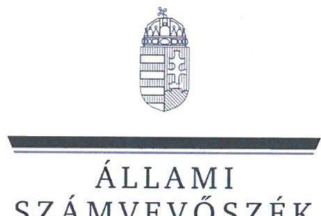
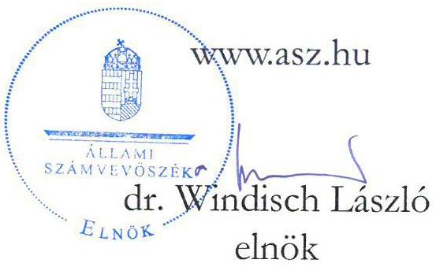
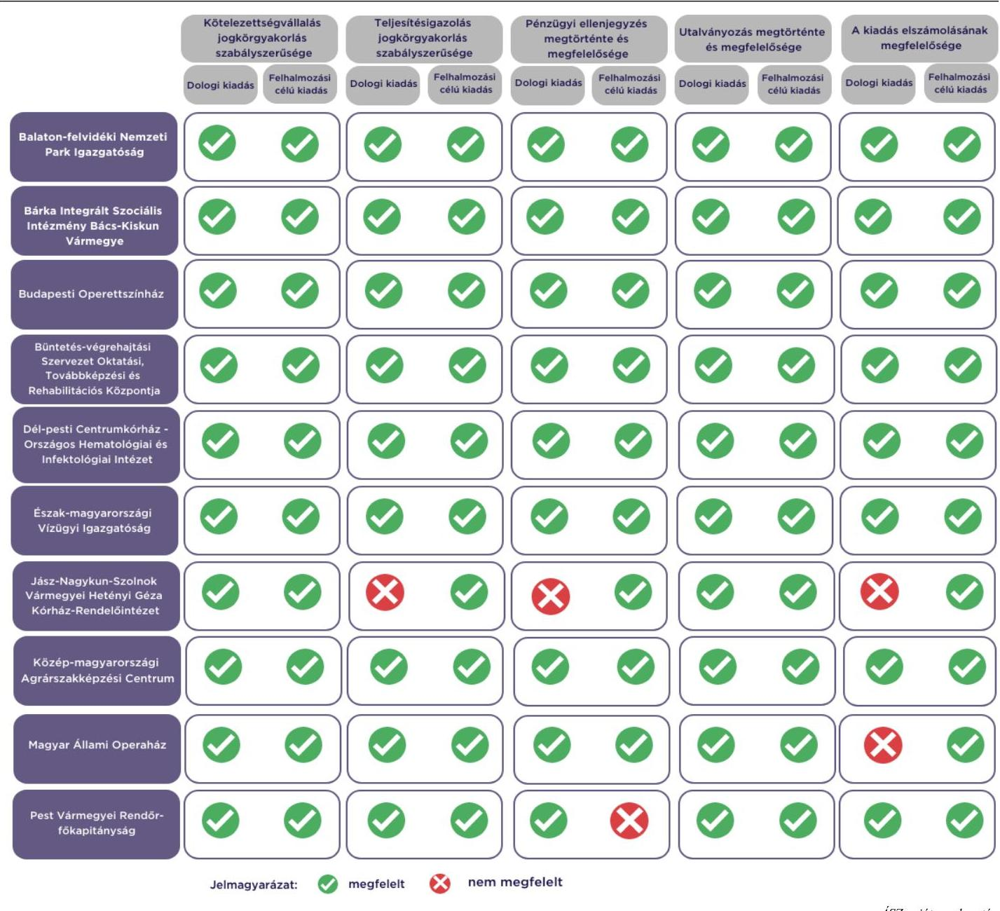

# JELENTÉS 

Az államháztartás központi alrendszerébe tartozó költségvetési szerv által teljesített dologi és felhalmozási célú kiadás szabályszerűségének rapid ellenőrzése
2024.

---

ÁLLAMI
SZÁMVEVŐSZÉK

# JELENTÉS 

Az államháztartás központi alrendszerébe tartozó költségvetési szerv által teljesített dologi és felhalmozási célú kiadás szabályszerűségének rapid ellenőrzése
2024.

24006

---

# ELLENŐRZÉSI IGAZGATÓSÁG: 

## ÁLLAMHÁZTARTÁS KÖZPONTI SZINTJÉT ELLENŐRZŐ IGAZGATÓSÁG

## ELLENŐRZÉSI IGAZGATÓ:

## SINKÁNÉ DR. CSENDES ÁGNES igazgató

## ELLENŐRZÉSVEZETŐ:

Jelentéseink az interneten a www.asz.hu címen olvashatók.

RENKÓ ZSUZSANNA ellenőrzésvezető

IKTATÓSZÁM: EL-3949-006/2024.
TÉMASZÁM: 2685
ELLENŐRZÉS-AZONOSÍTÓ SZÁM: V102903

---

# TARTALOMJEGYZÉK 

- AZ ELLENŐRZÉS ALAPADATAI ..... 5
- AZ ELLENŐRZÖTT SZERVEZETEK ..... 7
- ÖSSZEFOGLALÁS ..... 12
- AZ ELLENŐRZÉS FÓKUSZKÉRDÉSEI ..... 13
- MEGÁLLAPÍTÁSOK ..... 14
- JAVASLATOK ..... 17
- MELLÉKLETEK ..... 18
I. sz. melléklet: Értelmező szótár ..... 18
II. sz. melléklet: Az ellenőrzött szervezetek jegyzéke ..... 19
III. sz. melléklet: Ellenőrzési kritériumok ..... 20
- FÜGGELÉK: ÉSZREVÉTELEK ..... 21
- RÖVIDÍTÉSEK JEGYZÉKE ..... 23

---

.

---

# AZ ELLENŐRZÉS ALAPADATAI 

## AZ ELLENŐRZÉS CÉLJA

Az államháztartás központi alrendszerébe tartozó költségvetési szerv által teljesített dologi és felhalmozási célú kiadások egy-egy kiválasztott tételének szabályszerűségi szempontból történő értékelése.

## AZ ELLENŐRZÉS TÍPUSA

Megfelelőségi ellenőrzés.

## AZ ELLENŐRZŐTT IDŐSZAK

| SZ. | ELLENŐRZÖTT SZERVEZETEK | DÓLOGI   KIADÁSOK   ESETTÉBEN | FELHALMOZÁSI   CÉLÚ KIADÁSOK   ESETTÉBEN |
| :-- | :-- | :-- | :-- |
| 1. | Balaton-felvidéki Nemzeti Park Igazgatóság | 2023. június 29. | 2023. június 29. |
| 2. | Bárka Integrált Szociális Intézmény Bács-Kiskun Vármegye | 2023. július 13. | 2023. június 21. |
| 3. | Budapesti Operettszínház | 2023. augusztus 8. | 2023. augusztus 17. |
| 4. | Büntetés-végrehajtási Szervezet Oktatási, Továbbképzési és   Rehabilitációs Központja | 2023. július 13. | 2023. május 23. |
| 5. | Dél-pesti Centrumkórház - Országos Hematológiai és   Infektológiai Intézet | 2023. július 24. | 2023. június 29. |
| 6. | Észak-magyarországi Vízügyi Igazgatóság | 2023. június 28. | 2023. július 26. |
| 7. | Jász-Nagykun-Szolnok Vármegyei Hetényi Géza Kórház-   Rendelőintézet | 2023. július 26. | 2023. július 18. |
| 8. | Közép-magyarországi Agrárszakképzési Centrum | 2023. június 28. | 2023. július 19. |
| 9. | Magyar Állami Operaház | 2023. június 28. | 2023. július 7. |
| 10. | Pest Vármegyei Rendőr-főkapitányság | 2023. július 11. | 2023. július 04. |

## AZ ELLENŐRZÉS TÁRGYA

Az államháztartás központi alrendszerébe tartozó költségvetési szerv által teljesített, ellenőrzésre kiválasztott dologi és felhalmozási célú kiadás szabályszerű teljesítése, ezen belül a gazdálkodási jogkörök szabályszerű gyakorlása volt. Az ellenőrzés kiterjedt minden olyan körülményre és adatra, amely az ÁSZ ${ }^{1}$ jogszabályban meghatározott feladatainak teljesítéséhez, valamint a program végrehajtása folyamán felmerült újabb összefüggések feltárásához szükséges.

Az ellenőrzés során az ÁSZ

- a Bárka Integrált Szociális Intézmény Bács-Kiskun Vármegye, a Büntetés-végrehajtási Szervezet Oktatási, Továbbképzési és Rehabilitációs Központja, valamint az Észak-magyarországi Vízügyi Igazgatóság esetében a dologi kiadások körébe tartozó Üzemeltetési anyagok beszerzése; a Balaton-felvidéki Nemzeti Park Igazgatóság, a Budapesti Operettszínház, a Közép-magyarországi Agrárszakképzési Centrum és a Pest Vármegyei Rendőr-főkapitányság esetében a Szakmai tevékenységet segítő szolgáltatások beszerzése; a Dél-pesti Centrumkórház - Országos

---

Hematológiai és Infektológiai Intézet esetében az Árubeszerzés; a Jász-Nagykun-Szolnok Vármegyei Hetényi Géza Kórház-Rendelőintézet esetében az Egyéb szolgáltatások; a Magyar Állami Operaház esetében a Szakmai anyagok beszerzése;

- a Balaton-felvidéki Nemzeti Park Igazgatóság esetében a felhalmozási célú kiadások körébe tartozó Ingatlanok beszerzése, létesítése; a Bárka Integrált Szociális Intézmény Bács-Kiskun Vármegye, a Büntetés-végrehajtási Szervezet Oktatási, Továbbképzési és Rehabilitációs Központja, a Magyar Állami Operaház és a Pest Vármegyei Rendőr-főkapitányság esetében az Egyéb tárgyi eszközök beszerzése, létesítése; a Budapesti Operettszínház és a Dél-pesti Centrumkórház - Országos Hematológiai és Infektológiai Intézet esetében az Ingatlanok felújítása; a Közép-magyarországi Agrárszakképzési Centrum, az Észak-magyarországi Vízügyi Igazgatóság és a Jász-Nagykun-Szolnok Vármegyei Hetényi Géza Kórház-Rendelőintézet esetében az Informatikai eszközök beszerzése, létesítése
rovatokon elszámolt kiadások egy-egy kiválasztott mintatételének szabályszerűségét értékelte.

# AZ ELLENŐRZÉS JOGALAPJA 

Az ellenőrzés jogszabályi alapját az ÁSZ tv. ${ }^{2} 1 . \int(3)$ bekezdés és az 5. $\int(6)$ bekezdés előírásai képezték.

## AZ ELLENŐRZÉS MÓDSZERE

Az ellenőrzést az ÁSZ az ellenőrzött időszakban hatályos jogszabályok, az ellenőrzés szakmai szabályai alapján, „Az állambáztartás központi alrendszerébe tartozó költségvetési szerv által teljesitett dologi kiadás szabályszerűségének rapid ellenörzéséről" és „Az állambáztartás központi alrendszerébe tartozó költségvetési szerv által teljesitett felhalmozzási célú kiadás szabályszerűségének rapid ellenörzéséről" című ellenőrzési programok (továbbiakban: ellenőrzési programok) kérdéseire adott válaszok kiértékelésével, az ellenőrzési programokban megjelölt adatforrások figyelembevételével folytatta le. Amennyiben az adott mintatétel ellenőrzési program szerinti értékelése során további kapcsolódó szabálytalanságot tárt fel az ÁSZ, a szabálytalansághoz tartozó kritériummal bővült az ellenőrzés.

Az ellenőrzési kérdések megválaszolásához szükséges bizonyítékok megszerzése a következő ellenőrzési eljárások alkalmazásával történt: megfigyelés, összehasonlítás, elemző eljárás, a dologi kiadások, felhalmozási célú kiadások ellenőrzéssel érintett rovatairól történő mintavétel. Az ellenőrzési bizonyítékként felhasználható adatforrások közé tartoztak egyrészt az ellenőrzéshez kért dokumentumok, adatforrások, másrészt adatforrás volt még minden - az ellenőrzés folyamán - feltárt, az ellenőrzés szempontjából információkat tartalmazó dokumentum.

Az ÁSZ értékelte az ellenőrzés során a kiválasztott mintatételek ellenőrzési programokban meghatározott szempontok szerinti szabályszerűségét, így a kötelezettségvállalás és a teljesítésigazolás gazdálkodási jogkörök tekintetében a jogkörgyakorlás szabályszerűségét, a pénzügyi ellenjegyzés és az utalványozás gazdálkodási jogkörök tekintetében ezek megtörténtét és megfelelőségét.

---

# AZ ELLENŐRZÖTT SZERVEZETEK

Az ellenőrzés a Balaton-felvidéki Nemzeti Park Igazgatóság, a Bárka Integrált Szociális Intézmény Bács- Kiskun Vármegye, a Budapesti Operettszínház, a Büntetés-végrehajtási Szervezet Oktatási, Továbbképzési és Rehabilitációs Központja, a Dél-pesti Centrumkórház - Országos Hematológiai és Infektológiai Intézet, az Észak-magyarországi Vízügyi Igazgatóság, a Jász-Nagykun-Szolnok Vármegyei Hetényi Géza Kórház- Rendelőintézet, a Közép-magyarországi Agrárszakképzési Centrum, a Magyar Állami Operaház és a Pest Vármegyei Rendőr-főkapitányság elnevezésű szervezetekre, mint az államháztartás központi alrendszerébe tartozó költségvetési szervekre terjedt ki.

## BALATON-FELVIDÉKI NEMZETI PARK IGAZGATÓSÁG

A BfNPI^{3} a 625/2022. (XII. 30.) Korm. rendeletben^{4} és egyéb ágazati jogszabályokban meghatározott természetvédelemmel és természetmegőrzéssel, ókoturisztikai és környezeti nevelési tevékenységgel, valamint területkezeléssel és birtokügyi tevékenységgel kapcsolatos feladatokat lát el közfeladatként.

|  BALATON-FELVIDÉKI NEMZETI PARK IGAZGATÓSÁG FÖRB ADATAINAK BEMÚTATÁSA |   |
| --- | --- |
|  Alapításának éve: | 1990.  |
|  Irányító szerve: | Agrárminisztérium  |
|  Középirányító szerve: | -  |
|  Gazdasági szervezettel való rendelkezés: | Gazdasági szervezettel rendelkezik.  |
|  Illetékessége, működési területe: | a 625/2022. (XII. 30.) Korm. rendelet 2. számú melléklet szerinti terület  |
|  Általános képviseletét ellátó vezetője: | igazgató  |
|  Vezetői kinevezés kezdete: | 2023.06.05.  |
|  2022. évben teljesített bevételek összege: | 2 909,8 M Ft  |
|  2022. évben teljesített kiadások összege: | 2 579,7 M Ft  |

## BÁRKA INTEGRÁLT SZOCIÁLIS INTÉZMÉNY BÁCS-KISKUN VÁRMEGYE

A BISZIBKV^{5} közfeladata a szociális igazgatásról és szociális ellátásokról szóló 1993. évi III. törvényben meghatározott pszichiátriai betegek és fogyatékossággal élők tartós bentlakásos ellátása, támogatott lakhatás fogyatékos személyek részére, valamint fejlesztő foglalkoztatás, továbbá jelzőrendszeres házi segítségnyújtás.

|  BÁRKA INTEGRÁLT SZOCIÁLIS INTÉZMÉNY BÁCS-KISKUN VÁRMEGYE FÖRB ADATAINAK BEMÚTATÁSA |   |
| --- | --- |
|  Alapításának éve: | 1980.  |
|  Irányító szerve: | Belügyminisztérium  |
|  Középirányító szerve: | Szociális és Gyermekvédelmi Főigazgatóság  |
|  Gazdasági szervezettel való rendelkezés: | Gazdasági szervezettel nem rendelkezik.  |
|  Illetékessége, működési területe: | országos  |
|  Általános képviseletét ellátó vezetője: | intézményvezető  |
|  Vezetői kinevezés kezdete: | 2020.02.01.  |
|  2022. évben teljesített bevételek összege: | 2 673,1 M Ft  |
|  2022. évben teljesített kiadások összege: | 2 666,4 M Ft  |

---

# BUDAPESTI OPERETTSZÍNHÁZ 

Az Operettszínház ${ }^{6}$ közfeladata a 2008. évi XCIX. törvényben ${ }^{7}$ meghatározott előadó-művészeti tevékenység folytatása. Alaptevékenysége az egyetemes operett- és musical alkotások korszerű művészi színvonalon való bemutatása, repertoáron tartása, fokozott figyelemmel a magyar operett nemzetközi hírnevére és a magyar szerzők műveire, stúdióelőadások létrehozása és repertoáron tartása, zenés színházi műhely megteremtése, a zenés színművész- és táncművészképzésben történő aktív részvétel, a zenei, illetve a zenei élethez kapcsolódó kulturális örökség megóvása, bemutatása. Alaptevékenységét elsősorban saját társulatával, teljes munkaidőben foglalkoztatott zenekarral, énekkarral, balettkarral, musical együttessel, valamint a társulathoz szerződött színművészekkel, karmesterekkel, egyéb művészi tervezőkkel látja el.

## BUDAPESTI OPERETTSZÍNHÁZ FÖBB ADATAINAK REMUTATÁSA

Alapításának éve:
Irányító szerve:
Középirányító szerve:
Gazdasági szervezettel való rendelkezés:
Illetékessége, müködési területe:
Általános képviseletét ellátó vezetője:
Vezetői kinevezés kezdete:
2022. évben teljesített bevételek összege:
2022. évben teljesített kiadások összege:

1980.
Kulturális és Innovációs Minisztérium
-
Gazdasági szervezettel rendelkezik.
országos
főigazgató
2019.02.01.
$6470,5 \mathrm{M} \mathrm{Ft}$
$6362,2 \mathrm{M} \mathrm{Ft}$

## BÜNTETÉS-VÉGREHAJTÁSI SZERVEZET OKTATÁSI, TOVÁBBKÉPZÉSI ÉS REHABILITÁCIÓS KÖZPONTJA

A BVOTRK ${ }^{8}$ a büntetés-végrehajtási szervezetről szóló 1995. évi CVII. törvény szerinti rendvédelmi szerv. Alaptevékenysége a büntetés-végrehajtási szervezet személyi állományának alap- és középfokú szakmai oktatása, szakképzése, szakmai vizsgáztatása, továbbképzése, a büntetés-végrehajtási feladatok ellátását elősegítő továbbképzések, szakmai értekezletek, konferenciák szervezése, a résztvevőknek szállás és étkezés biztosítása, orvosi rehabilitáció, illetve rekreáció biztosítása a foglalkozás-egészségügyi szolgáltatás keretében.

## BÜNTETÉS-VÉGREHAJTÁSI SZERVEZET OKTATÁSI, TOVÁBBKÉPZÉSI ÉS REHABILITÁCIÓS KÖZPONTJA FÖBB ADATAINAK REMUTATÁSA

Alapításának éve:
Irányító szerve:
Középirányító szerve:
Gazdasági szervezettel való rendelkezés:
Illetékessége, müködési területe:
Általános képviseletét ellátó vezetője:
Vezetői kinevezés kezdete:
2022. évben teljesített bevételek összege:
2022. évben teljesített kiadások összege:

1997.
Belügyminisztérium
Büntetés-végrehajtás Országos Parancsnoksága
Gazdasági szervezettel rendelkezik.
országos
igazgató
2023.07.01.
$1730,3 \mathrm{M} \mathrm{Ft}$
$1681,0 \mathrm{M} \mathrm{Ft}$

---

# DÉL-PESTI CENTRUMKÓRHÁZ - ORSZÁGOS HEMATOLÓGIAI ÉS INFEKTOLÓGIAI INTÉZET FÖBB ADATAINAK BEMUTATÁSA 

DPC ${ }^{9}$ közfeladata az Eütv. ${ }^{10}$ alapján, az ellátási területére kiterjedően a járó- és fekvőbetegek diagnosztikus és terápiás szakorvosi ellátása, rehabilitációja és követéses gondozása, valamint az egészségügyi alapellátásról szóló Eatv. ${ }^{11}$ alapján a védőnői ellátás biztosítása. Alaptevékenységébe tartozik a gyógyszer és gyógyászati termék kiskereskedelme. Feladata továbbá a védőnői ellátás keretében az egészségmegőrzés, tanácsadás, gondozás, betegségmegelőzés-szűrés, felvilágosítás, egészségnevelés.

## DÉL-PESTI CENTRUMKÓRHAZ - ORSZÁGOS HEMATOLÓGIAI ÉS INFEKTOLÓGIAI INTÉZET FÖBB ADATAINAK BEMUTATÁSA

Alapításának éve:
Irányító szerve:
Középirányító szerve:
Gazdasági szervezettel való rendelkezés:
Illetékessége, múködési területe:
A törvényes és szakszerű múködésért felelős vezetője:
Vezetői kinevezés kezdete:
2022. évben teljesített bevételek összege:
2022. évben teljesített kiadások összege:

1980.
Belügyminisztérium
Országos Kórházi Főigazgatóság
Gazdasági szervezettel rendelkezik.
a 2006. évi CXXXII. törvény ${ }^{12}$ alapján vezetett közhiteles kapacitásnyilvántartásban szereplő ellátási terület
főigazgató
2021.01.01.
$52473,2 \mathrm{M} \mathrm{Ft}$
$51879,3 \mathrm{M} \mathrm{Ft}$

## ÉSZAK-MAGYARORSZÁGI VÍZÚGYI IGAZGATÓSÁG

Az ÉMVIZIG ${ }^{13}$ közfeladata a vízgazdálkodásról szóló 1995. évi LVII. törvény alapján a teljesség igénye nélkül a vizek kártételei elleni védelemmel, a vízkárelhárítással összefüggő, jogszabályban meghatározott feladatok ellátása; a vízrajzi észlelőhálózat üzemeltetése és fejlesztése, ennek részeként víztest monitoring fenntartása, vízrajzi adatok gyűjtése és feldolgozása; a Vízgazdálkodási Információs Rendszer területi nyilvántartásának és vízgazdálkodási adatgyűjtésének üzemeltetési és fejlesztési feladatainak ellátása, a gyűjtött adatok feldolgozása, értékelése és tárolása; a távlati ivóvízbázisok vízkészletének felhasználható állapotban tartásával kapcsolatos feladatok, valamint a vizeink állapotértékelésével kapcsolatos területi feladatok ellátása.

## ÉSZAK-MAGYARORSZÁGI VÍZÚGYI IGAZGATÓSÁG FÖBB ADATAINAK BEMUTATÁSA

Alapításának éve:
Irányító szerve:
Középirányító szerve:
Gazdasági szervezettel való rendelkezés:
Illetékessége, múködési területe:
Általános képviseletét ellátó vezetője:
Vezetői kinevezés kezdete:
2022. évben teljesített bevételek összege:
2022. évben teljesített kiadások összege:

1953.
Belügyminisztérium
Országos Vízügyi Főigazgatóság
Gazdasági szervezettel rendelkezik.
a vízügyi igazgatási és a vízügyi, valamint a vízvédelmi hatósági feladatokat ellátó szervek kijelöléséről szóló 223/2014. (IX. 4.) Korm. rendelet 1. melléklet 8. pontjában meghatározott múködési terület és múködési vonalak
igazgató
2007.08.01.
$5070,1 \mathrm{M} \mathrm{Ft}$
$4640,1 \mathrm{M} \mathrm{Ft}$

---

# JÁsz-NAGYKUn-SZOLNOK VÁRMEGYEI HETÉNYI GÉZA KÓRHÁZ-RENDELÓINTÉZET 

A JNSZK ${ }^{14}$ közfeladata az Eütv. alapján, ellátási területére kiterjedően az egészségügyi államigazgatási szerv által kiadott múködési engedély szerinti szakmákban járó- és fekvőbetegek diagnosztikus és terápiás szakorvosi ellátása, rehabilitációja és követéses gondozása, valamint az Eatv. alapján a védőnői ellátás biztosítása. Feladata továbbá a védőnői ellátás keretében az egészségmegőrzés, tanácsadás, gondozás, betegségmegelőzés-szűrés, felvilágosítás, egészségnevelés. Alaptevékenységébe tartozik a gyógyszer és gyógyászati termékek kiskereskedelme, orvostudományi kutatások végzése, szakmai gyakorlati oktatás.

## JÁsz-NAGYKUN-SZOLNOK VÁRMEGYEI HETÉNYI GÉZA KÓRHÁZ-RENDELÓINTÉZET FÖBB ADATAINAK BEMUTATÁSA

Alapításának éve:
Irányító szerve:
Közepirányító szerve:
Gazdasági szervezettel való rendelkezés:
Illetékessége, múködési területe:
Általános képviseletét ellátó vezetője:
Vezetői kinevezés kezdete:
2022. évben teljesített bevételek összege:
2022. évben teljesített kiadások összege:

1980.
Belügyminisztérium
Országos Kórházi Főigazgatóság
Gazdasági szervezettel rendelkezik.
2006. évi CXXXII. törvény alapján vezetett közhiteles kapacitás-nyilvántartásban szereplő ellátási terület
főigazgató
2021.01.01.
$28625,7 \mathrm{M} \mathrm{Ft}$
$28383,6 \mathrm{M} \mathrm{Ft}$

## KÖZÉP-MAGYARORSZÁGI AGRÁRSZAKKÉPZÉSI CENTRUM FÖBB ADATAINAK BEMUTATÁSA

Az $\mathrm{ASzC}^{15}$ közfeladata a szakképzésről szóló 2019. évi LXXX. törvény szerinti szakképzési és a nemzeti köznevelésről szóló 2011. évi CXC. törvény szerinti köznevelési feladatok ellátása. Alaptevékenysége a szakképző intézményein keresztül a szakmajegyzékben meghatározott szakmára felkészítő szakmai oktatás és szakképesítésre felkészítő szakmai képzés. Kollégiumi alapfeladatot, valamint a nevelő és oktató munkához kapcsolódó, nem szakképzési és köznevelési tevékenységet is ellát. Tervezi és szervezi az Európai Unió pénzügyi alapjaiból és más külföldi, illetőleg hazai alapokból támogatott egyes fejlesztési programok megvalósítását.

## KÖZÉP-MAGYARORSZÁGI AGRÁRSZAKKÉPZÉSI CENTRUM FÖBB ADATAINAK BEMUTATÁSA

Alapításának éve:
Irányító szerve:
Közepirányító szerve:
Gazdasági szervezettel való rendelkezés:
Illetékessége, múködési területe:
Általános képviseletét ellátó vezetője:
Vezetői kinevezés kezdete:
2022. évben teljesített bevételek összege:
2022. évben teljesített kiadások összege:

2013.
Agrárminisztérium
-
Gazdasági szervezettel rendelkezik.
országos
kancellár
2023.03.15.
$7238,1 \mathrm{M} \mathrm{Ft}$
$6814,1 \mathrm{M} \mathrm{Ft}$

---

# MAGYAR ÁLLAMI OPERAHÁZ 

Az Operaház ${ }^{16}$ közfeladata a zeneművészet és táncművészet működtetése, ellátása a 2008. évi XCIX. törvény alapján. Alaptevékenysége az egyetemes opera- és balettmúvészeti alkotások megfelelő magas színvonalú bemutatása, repertoáron tartása, fokozott figyelemmel a magyar szerzők műveire; a zene- és táncirodalom más színpadi műveinek bemutatása, zenekari koncertek és egyéb művészeti rendezvények, események rendezése.

## MAGYAR ÁLLAMI OPERAHAZ FÖBB ADATAINAK BEMUTATÁSA

Alapításának éve:
Irányító szerve:
Középirányító szerve:
Gazdasági szervezettel való rendelkezés:
Illetékessége, müködési területe:
Általános képviseletét ellátó vezetője:
Vezetői kinevezés kezdete:
2022. évben teljesített bevételek összege:
2022. évben teljesített kiadások összege:

1983.
Kulturális és Innovációs Minisztérium
-
Gazdasági szervezettel rendelkezik.
országos
főigazgató
2023.08.01.
$27955,5 \mathrm{M} \mathrm{Ft}$
$25513,5 \mathrm{M} \mathrm{Ft}$

## PEST VÁRMEGYEI RENDÓR-FŐKAPITÁNYSÁG

A Pest VMRFK ${ }^{17}$ közfeladatát a Rendőrségről szóló 1994. XXXIV. törvény és a Rendőrség szerveiről és a Rendőrség szerveinek feladat- és hatásköréről szóló 329/2007. (XII. 13.) Korm. rendelet határozza meg. Alaptevékenysége a bűncselekmények megakadályozása, felderítése, a közbiztonság, a közrend és az államhatár rendjének védelme, a határforgalom ellenőrzése, a jogellenes bevándorlás megakadályozása, valamint a bűncselekményből származó vagyon visszaszerzése.

## PEST VÁRMEGYEI RENDÓR-FŐKAPITÁNYSÁG FÖBB ADATAINAK BEMUTATÁSA

Alapításának éve:
Irányító szerve:
Középirányító szerve:
Gazdasági szervezettel való rendelkezés:
Illetékessége, müködési területe:
Általános képviseletét ellátó vezetője:
Vezetői kinevezés kezdete:
2022. évben teljesített bevételek összege:
2022. évben teljesített kiadások összege:

1991.
Belügyminisztérium
Országos Rendőr-főkapitányság
Gazdasági szervezettel rendelkezik.
Pest vármegye
rendőrfőkapitány
2023.05.01.
$28584,8 \mathrm{M} \mathrm{Ft}$
$28402,8 \mathrm{M} \mathrm{Ft}$

---

# ÖSSZEFOGLALÁS 

Az ellenőrzött kiadások tekintetében az ellenőrzött szervezetek vonatkozásában a kötelezettségvállalások a jogszabályi előírásoknak megfelelően történtek. A teljesítésigazolás egy esetben, a pénzügyi ellenjegyzés két esetben nem a jogszabályi előírásoknak megfelelően történt. A kifizetések elrendelésére szabályszerűen, utalványozás alapján került sor. Az ellenőrzött kiadásokat két esetben nem a megfelelő rovatokon számolták el. 1. díra

## A FŐBB ELLENŐRZÉSI TAPASZTALATOK

---

# AZ ELLENŐRZÉS FÓKUSZKÉRDÉSEI 

1.- Az államháztartás központi alrendszerébe tartozó költségvetési szervnél a kiválasztott dologi kiadás teljesitése az egyes jogszabályi rendelkezések alapján szabályszerű volt-e?
2.- Az államháztartás központi alrendszerébe tartozó költségvetési szervnél a kiválasztott felhalmozási célú kiadás teljesitése az egyes jogszabályi rendelkezések alapján szabályszerű volt-e?

---

# 1. Az államháztartás központi alrendszerébe tartozó költségvetési szervnél a kiválasztott dologi kiadás teljesítése az egyes jogszabályi rendelkezések alapján szabályszerű volt-e? 

Összegző megállapítás

Az ellenőrzött 10 dologi kiadás teljesítése nyolc esetben az ellenőrzés keretében vizsgált jogszabályi előírásoknak megfelelt. Egy dologi kiadás esetében a teljesítésigazolási és pénzügyi ellenjegyzési jogkörgyakorlás és a kiadás elszámolása, valamint egy dologi kiadás esetében a kiadás elszámolása nem volt szabályszerű.

A BfNPI, a BISZIBKV, az Operettszínház, a BVOTRK, a DPC, az ÉMVIZIG, az ASzC és a Pest VMRFK szervezeteknél az ellenőrzött mintatételek esetében a kötelezettségvállalási, a teljesítésigazolási, és az utalványozási jogkörgyakorlás, továbbá a kiadás elszámolása az Áht. ${ }^{18}$, az Ávr. ${ }^{19}$ és az Áhsz. ${ }^{20}$ előírásai szerint szabályszerűen történt:

- Kötelezettséget az Áht.-ben és az Ávr.-ben foglaltakkal összhangban az arra jogosultsággal rendelkező személy vállalt.
- A kötelezettségvállalásra az Áht.-ben foglaltak szerint, a pénzügyi ellenjegyzés után került sor.
- A teljesítésigazoló az Ávr.-ben előírt írásbeli kijelöléssel rendelkezett.
- A teljesítésigazolás során az Ávr.-ben foglaltak szerint ellenőrizhető okmányok alapján ellenőrizték és igazolták a kiadás teljesítésének jogosságát, összegszerűségét, valamint az ellenszolgáltatás teljesítését.
- A teljesítésigazoló a teljesítést az Ávr.-ben foglaltakkal összhangban, az igazolás dátumának és a teljesítés tényére történő utalás megjelölésével, aláírásával igazolta.
- Az utalványozásra az Áht.-ben, valamint az Ávr.-ben foglaltakkal összhangban, a teljesítésigazolást és az érvényesítést követően került sor.
- A kiadás számviteli elszámolása a megfelelő rovaton történt az Áhsz.-ben előírtakkal összhangban.

A JNSZK-nál az ellenőrzött mintatétel esetében a kötelezettségvállalási és az utalványozási jogkörgyakorlás az ellenőrzés keretében vizsgált, az Áht.-ben és az Ávr.-ben foglalt előírások alapján szabályszerű volt, azonban a teljesítésigazolási és a pénzügyi ellenjegyzési jogkörgyakorlás, továbbá a kiadás elszámolása nem volt szabályszerű:

- A kötelezettségvállaló az Áht.-ben és az Ávr.-ben foglaltak szerinti jogosultsággal rendelkezett. A pénzügyi ellenjegyzés - az Ávr. 55. § (1) bekezdésében foglaltak ellenére - nem tartalmazta a pénzügyi ellenjegyzés dátumát. A dátum hiányában nem lehetett megítélni, hogy a kötelezettségvállalásra az Áht. 37. § (1) bekezdésében foglalt előírás szerint a pénzügyi ellenjegyzés után került-e sor.

---

- A teljesítésigazolás során ellenőrizhető okmányok (kötelezettségvállalás dokumentuma, igazolt heti óraszám) alapján nem ellenőrizték az Ávr. 57. § (1) bekezdésében foglaltak ellenére a kiadás teljesítésének jogosságát, összegszerűségét, mert a kötelezettségvállalás dokumentuma alapján leigazolható heti 24 óra helyett magasabb óraszám került leigazolásra és kifizetésre (havi szinten 14 órával és 84000 Ft-tal több). A teljesítésigazoló a teljesítést az Ávr.-ben foglaltakkal összhangban, az igazolás dátumának és a teljesítés tényére történő utalás megjelölésével, aláírásával igazolta.
- Az utalványozásra az Áht.-ben, valamint az Ávr.-ben foglaltakkal összhangban, a teljesítésigazolást és az érvényesítést követően került sor.
- A kiadás elszámolása nem felelt meg az Áhsz. 40. § (1) bekezdésében, valamint a 15. melléklet I. pontjában foglaltaknak, mert a tanácsadói díj helytelenül a K337 Egyéb szolgáltatások rovaton került elszámolásra, a K336 Szakmai tevékenységet segítő szolgáltatások rovat helyett.
Az Operaháznál az ellenőrzött mintatétel esetében a kötelezettségvállalási, teljesítésigazolási, utalványozási jogkörgyakorlás az ellenőrzés keretében vizsgált jogszabályi előírások alapján szabályszerű volt, azonban a kiadás elszámolása nem volt szabályszerű:
- Kötelezettséget az Áht.-ben és az Ávr.-ben foglaltakkal összhangban az arra jogosultsággal rendelkező személy vállalt.
- A kötelezettségvállalásra az Áht.-ben foglaltak szerint, a pénzügyi ellenjegyzés után került sor.
- A teljesítésigazoló az Ávr.-ben előírt írásbeli kijelöléssel rendelkezett.
- A teljesítésigazolás során az Ávr.-ben foglaltak szerint ellenőrizhető okmányok alapján ellenőrizték és igazolták a kiadás teljesítésének jogosságát, összegszerűségét, valamint az ellenszolgáltatás teljesítését.
- A teljesítésigazoló a teljesítést az Ávr.-ben foglaltakkal összhangban, az igazolás dátumának és a teljesítés tényére történő utalás megjelölésével, aláírásával igazolta.
- Az utalványozásra az Áht.-ben, valamint az Ávr.-ben foglaltakkal összhangban, a teljesítésigazolást és az érvényesítést követően került sor.
- A kiadás elszámolása nem felelt meg az Áhsz. 40. § (1) bekezdésében, valamint a 15. melléklet I. pontjában foglaltaknak, mert a faanyagok beszerzése helytelenül a K311 Szakmai anyagok beszerzése rovaton került elszámolásra, a K312 Üzemeltetési anyagok beszerzése rovat helyett.

---

# 2. Az államháztartás központi alrendszerébe tartozó költségvetési szervnél a kiválasztott felhalmozási célú kiadás teljesítése az egyes jogszabályi rendelkezések alapján szabályszerű volt-e? 

Összegző megállapítás Az ellenőrzött 10 felhalmozási célú kiadás teljesítése kilenc esetben az ellenőrzés keretében vizsgált jogszabályi előírásoknak megfelelt. Egy felhalmozási célú kiadás esetében a pénzügyi ellenjegyzési jogkörgyakorlás nem volt szabályszerű.

A BfNPI, a BISZIBKV, az Operettszínház, a BVOTRK, a DPC, az ÉMVIZIG, a JNSZK, az ASzC, az Operaház és a Pest VMRFK szervezeteknél az ellenőrzött mintatétel esetében a kötelezettségvállalási, teljesítésigazolási, utalványozási jogkörök gyakorlása, továbbá a kiadás elszámolása az Áht., az Ávr. és az Áhsz. előírásai szerint szabályszerűen történt:

- Kötelezettséget az Áht.-ben és az Ávr.-ben foglaltakkal összhangban arra jogosultsággal rendelkező személy vállalt.
- A kötelezettségvállalásra az Áht.-ben foglaltak szerint, a pénzügyi ellenjegyzés után került sor.
- A teljesítésigazoló az Ávr.-ben előírt írásbeli kijelöléssel rendelkezett.
- A teljesítésigazolás során az Ávr.-ben foglaltak szerint ellenőrizhető okmányok alapján ellenőrizték és igazolták a kiadás teljesítésének jogosságát, összegszerűségét, valamint az ellenszolgáltatás teljesítését.
- A teljesítésigazoló a teljesítést az Ávr.-ben foglaltakkal összhangban, az igazolás dátumának és a teljesítés tényére történő utalás megjelölésével, aláírásával igazolta.
- Az utalványozásra az Áht.-ben, valamint az Ávr.-ben foglaltakkal összhangban, a teljesítésigazolást és az érvényesítést követően került sor.
- A kiadás számviteli elszámolása a megfelelő rovaton történt az Áhsz.-ben előírtakkal összhangban.

## Az ellenőrzés során feltárt szabálytalanság:

- A Pest VMRFK szervezet kiadásánál a pénzügyi ellenjegyzés - az Ávr. 55. § (1) bekezdésében foglaltak ellenére - nem tartalmazta a pénzügyi ellenjegyzés tényére történő utalás megjelölését. Az aláíró nevénél nem szerepelt a pénzügyi ellenjegyző megjelölés.

---

# JAVASLATOK 

Az ÁSZ tv. 33. § (1) bekezdésében foglaltak értelmében az ellenőrzött szervezet vezetője köteles a jelentésben foglalt megállapításokhoz kapcsolódó intézkedési tervet összeállítani és azt a jelentés kézhezvételétől számított 30 napon belül az ÁSZ részére megküldeni. Amennyiben az ellenőrzött szervezet vezetője nem küldi meg határidőben az intézkedési tervet, vagy továbbra sem elfogadható intézkedési tervet küld, az Állami Számvevőszék elnöke az ÁSZ tv. 33. § (3) bekezdése a) és b) pontjaiban foglaltakat érvényesítheti.

## JÁSZ-NAGYKUN-SZOLNOK VÁRMEGYEI HETÉNYI GÉZA KÓRHÁZRENDELŐINTÉZET FŐIGAZGATÓJÁNAK

1. Kezdeményezzen a Bkr. ${ }^{21}$ 31. § (6) bekezdése alapján soron kívüli belső ellenőrzést a jelen ellenőrzés során feltárt szabálytalanságok kialakulása okainak feltárása, illetve a szabálytalanság megszüntetése érdekében.
2. A Bkr. 13. § (2) bekezdésében foglaltak alapján, valamint a 1. számú javaslat szerinti belső ellenőrzés megállapításait és javaslatait is figyelembe véve tegyen intézkedéseket azon kontrolltevékenységek kiépítésére és/vagy megfelelő müködtetésére, amelyek megelőzik a jelentésben leírt szabálytalanságok ismételt előfordulását.

---

# MELLÉKLETEK 

## I. SZ. MELLÉKLET: ÉRTELMEZŐ SZÓTÁR

kötelezettségvállalás
pénzügyi ellenjegyzés
teljesítésigazolás
utalványozás

A költségvetési szerv által a kiadási előirányzatok és - ha jogszabály lehetővé teszi - a kijelölt lebonyolító szerv számára a Kormány rendeletében meghatározottak szerinti rendelkezésre bocsátott összeg terhére fizetési kötelezettség vállalásáról szóló - így különösen a foglalkoztatásra irányuló jogviszony létesítésére, szerződés megkötésére, költségvetési támogatás biztosítására irányuló - szabályszerűen megtett jognyilatkozat. Forrás: Áht. 1. § 15. pont
A kötelezettségvállalást megelőző múvelet, amelynek során a pénzügyi ellenjegyzőnek meg kell győződnie arról, hogy a szükséges szabad előirányzat - több évet érintő kötelezettségvállalás esetén minden egyes évben - rendelkezésre áll, a tervezett kifizetési időpontokban a pénzügyi fedezet biztosított, valamint a kötelezettségvállalás nem sérti a gazdálkodásra vonatkozó szabályokat. Kötelezettséget vállalni a Kormány rendeletében foglalt kivételekkel csak pénzügyi ellenjegyzés után, a pénzügyi teljesítés esedékességét megelőzően, írásban lehet. Forrás: Áht. 37. § (1) bekezdés
A kötelezettségvállalásban a másik fél által vállalt feltételek teljesítéséhez kapcsolódó igazolás, amely a kiadási előirányzat terhére vállalt utalványozást előzi meg. A teljesítés igazolása során ellenőrizhető okmányok alapján ellenőrizni és igazolni kell a kiadások teljesítésének jogosságát, összegszerűségét, ellenszolgáltatást is magában foglaló kötelezettségvállalás esetében - ha a kifizetés vagy annak egy része az ellenszolgáltatás teljesítését követően esedékes - annak teljesítését. A teljesítést az igazolás dátumának és a teljesítés tényére történő utalás megjelölésével, az arra jogosult személy aláírásával kell igazolni.
Forrás: Áht. 38. § (1) bekezdés; Ávr. 57. § (1) és (3) bekezdések
A bevételek és kiadások elszámolására utalványozás alapján kerülhet sor. A kiadási előirányzatok terhére történő utalványozás esetén az utalványozásra csak azután kerülhet sor, ha a kiadás alapjául szolgáló kötelezettségválla-lásban meghatározott feltételeket a másik szerződő fél már teljesítette. A kiadási előirányzatok terhére történő utalványozásra a teljesítés igazolását és az érvényesítést követően, a bevételi előirányzatok esetén a belső szabályzatban a bevételek meghatározott körére esetlegesen elrendelt teljesítés igazolását követően kerülhet sor.
Forrás: Áht. 38. § (1) bekezdés; Ávr. 57. § (2) bekezdés és 59. § (1b) bekezdés

---

# II. SZ. MELLÉKLET: AZ ELLENŐRZÖTT SZERVEZETEK JEGYZÉKE 

## ELLENŐRZÖTT SZERVEZETEK MEGNEVEZÉSE

Balaton-felvidéki Nemzeti Park Igazgatóság
Bárka Integrált Szociális Intézmény Bács-Kiskun Vármegye
Budapesti Operettszínház
Büntetés-végrehajtási Szervezet Oktatási, Továbbképzési és Rehabilitációs Központja
Dél-pesti Centrumkórház - Országos Hematológiai és Infektológiai Intézet
Észak-magyarországi Vízügyi Igazgatóság
Jász-Nagykun-Szolnok Vármegyei Hetényi Géza Kórház-Rendelőintézet
Közép-magyarországi Agrárszakképzési Centrum
Magyar Állami Operaház
Pest Vármegyei Rendőr-főkapitányság

---

# III. SZ. MELLÉKLET: ELLENŐRZÉSI KRITÉRIUMOK 

| FOKUSZKÉRDÉS | ELLENŐRZÉSI KRITÉRIUMOK |
| :--: | :--: |
| 1. Az államháztartás központi alrendszerébe tartozó költségvetési szervnél a kiválasztott dologi kiadás teljesítése az egyes jogszabályi rendelkezések alapján szabályszerű volt-e? |  |
| Kötelezettségvállalás | Áht. 36. $\$ (7), 37 . \int(1)$ bekezdések   Ávr. 50. $\$ (1) bekezdés d) pont, 52. $\$ \S(1),(9), 53 . \int(1), 60 . \int$   (3) bekezdések |
| Pénzügyi ellenjegyzés | Ávr. 55. $\$ \int(1),(4)$ bekezdések |
| Teljesítésigazolás | Áht. 38. $\$ \int(1),(2)$ bekezdések   Ávr. 57. $\$ \int(1),(3)-(5), 60 . \int(3)$ bekezdések |
| Utalványozás | Áht. 38. $\$ \int(1)$ bekezdés   Ávr. 59. $\$ \int(1 b),(2)$ bekezdések, (3) bekezdés g) pont,   (4) bekezdés |
| Kiadások elszámolása | Áhsz. 40. $\$ \int(1)$ bekezdés, 15. melléklet I. pont |
| 2. Az államháztartás központi alrendszerébe tartozó költségvetési szervnél a kiválasztott felhalmozási célú kiadás teljesítése az egyes jogszabályi rendelkezések alapján szabályszerű volt-e? |  |
| Kötelezettségvállalás | Áht. 36. $\$ \int(7), 37 . \int(1)$ bekezdések   Ávr. 50. $\$ \int(1)$ bekezdés d) pont, 52. $\$ \int(1),(9), 53 . \int(1), 60 . \int$   (3) bekezdések |
| Pénzügyi ellenjegyzés | Ávr. 55. $\$ \int(1),(4)$ bekezdések |
| Teljesítésigazolás | Áht. 38. $\$ \int(1),(2)$ bekezdések   Ávr. 57. $\$ \int(1),(3)-(5), 60 . \int(3)$ bekezdések |
| Utalványozás | Áht. 38. $\$ \int(1)$ bekezdés   Ávr. 59. $\$ \int(1 b),(2)$ bekezdések, (3) bekezdés g) pont,   (4) bekezdés |
| Kiadások elszámolása | Áhsz. 40. $\$ \int(1)$ bekezdés, 15. melléklet I. pont |

---

# FÜGGELÉK: ÉSZREVÉTELEK 

A jelentéstervezetet a Számvevőszék 15 napos észrevételezésre megküldte az ellenőrzött szervezet vezetőjének az ÁSZ tv. 29. §* (1) bekezdése előírásának megfelelően.

A Balaton-felvidéki Nemzeti Park Igazgatóság, a Bárka Integrált Szociális Intézmény BácsKiskun Vármegye, a Budapesti Operettszínház, a Büntetés-végrehajtási Szervezet Oktatási, Továbbképzési és Rehabilitációs Központja, a Dél-pesti Centrumkórház - Országos Hematológiai és Infektológiai Intézet, az Észak-magyarországi Vízügyi Igazgatóság, a Közép-magyarországi Agrárszakképzési Centrum, a Magyar Állami Operaház és a Pest Vármegyei Rendőr-főkapitányság ellenőrzött szervezetek vezetői a jelentéstervezet megállapításaira érdemi észrevételt nem tettek.
A jelentéstervezet megállapításaira a Jász-Nagykun-Szolnok Vármegyei Hetényi Géza Kórház-Rendelőintézet föigazgatója észrevételt tett. Az ÁSZ tv. 29. § (3) bekezdésével összhangban az Állami Számvevőszék a Függelékben feltünteti a megállapításokkal kapcsolatban tett, el nem fogadott észrevételeket, és megindokolja, hogy azokat miért nem fogadta el.

1. Észrevétel: „A vizsgált 2023. június hónapban 22 munkanappal és 5 munkanapos héttel számolva (22 nap / 5 nap) a hetek száma 4,4 hét volt, melyből adódik, hogy a június hónapban teljesítendő órák száma 4,4 hét x 24 óra/hét = 105,6 óra.
Ennek megfelelően a 2023. június havi teljesítésigazoláson, illetve a kapcsolódó 2023-000010 számú számlán elszámolt-, kifizetett órák száma 106 óra. A számla végösszege pedig a szerződés 6./ Megbízott dijazás pontjában rögzített megbizási dij (6.000,-Ft/óra) és a teljesített órák száma (106 óra) szorzataként 636.000,-Ft.
A fent leírtak alapján 2023. június hónapra leigazolt óraszám szerinti teljesítés és számlakifizetés a szerződésben foglaltaknak megfelelően történt. "
Az észrevétellel érintett megállapítás: „A teljesítésigazolás során ellenőrizhető okmányok (kötelezettségvállalás dokumentuma, igazolt heti óraszám) alapján nem ellenőrizték az Ávr. 57. § (1) bekezdésében foglaltak ellenére a kiadás teljesítésének jogosságát, összegszerűségét, mert a kötelezettségvállalás dokumentuma alapján leigazolható heti 24 óra helyett magasabb óraszám került leigazolásra és kifizetésre (havi szinten 14 órával és 84000 Ft-tal több). " (15. oldal első bekezdés).
[^0]
[^0]:    * 29. § (1) Az Állami Számvevőszék az ellenőrzési megállapításait megküldi az ellenőrzött szervezet vezetőjének vagy az általa megbízott személynek, és annak, akinek személyes felelősségét állapította meg.
    (2) Az ellenőrzött szervezet vezetője és a felelősként megjelölt személy az ellenőrzés megállapításaira tizenöt napon belül írásban észrevételt tehet.
    (3) Az Állami Számvevőszék az észrevételre a beérkezésétől számított barminc napon belül írásban válaszol. A figyelembe nem vett észrevételeket köteles a jelentésben feltüntetni, és megindokolni, hogy azokat miért nem fogadta el.

---

El nem fogadás indoka: „Az észrevételben szereplő matematikai levezetés nincs összhangban a GH696-2/2020 iktatószámú megbizási szerződéssel, illetve annak módosításaival.
A szerződés azt rögzíti, hogy a tanácsadó heti 24 órában lát el feladatot. A munkavégzési kötelezettsége heti szinten került előirásra és nem havi szinten, továbbá nem tartalmaz olyan feltételt, hogy amennyiben a heti óraszámokat nem használják fel, akkor azok átvihetőek a következő hétre.
A szerződés alapján leigazolható heti 24 óra helyett
június 5-11. között 30 órát,
június 19-25. között 29 órát,
június 26-30. között 27 órát igazolt a föigazgató, amely alapján a számla kiállításra került. Így az ellenőrzött hónap 4 hetéből 3-szor a megengedett $3 \times 24$ (összesen 72) óra helyett 86 óra került kifizetésre, 14 óraszámmal több, mint ami a kötelezettségvállalás dokumentumában megengedett."
2. Észrevétel: „Az OKFŐ/11807-2/2023. számú Főigazgatói körlevelével kiadott az OKFŐ középirányitása alá tartozó egészségügyi intézmények egységes számlatükör szabályzata értelmében kötelezően megnyitandó fökönyvi számlaszámaival összhangban került kialakításra az intézményi számlatükör, rovattörzs, és ennek megfelelően egyéb támogató feladatként került a számla elszámolásra és kontirozásra a K337 Egyéb szolgáltatások rovaton belül.
A számla nem a K336 Szakmai tevékenységet segitő szolgáltatások rovatnak megfeleltethető fökönyvi számlára került könyvelésre, tekintettel arra, hogy a vállalkozás által ellátott feladat nem közvetlenül a betegellátást szolgáló gyógyitó, egészségügyi szolgáltatás, hanem egyéb, az intézmény egészét komplexen érintő támogató tevékenység."
Az észrevétellel érintett megállapítás: „A kiadás elszámolása nem felelt meg az Áhsz. 40. § (1) bekezdésében, valamint a 15. melléklet I. pontjában foglaltaknak, mert a tanácsadói dij helytelenül a K337 Egyéb szolgáltatások rovaton került elszámolásra, a K336 Szakmai tevékenységet segitő szolgáltatások rovat helyett" (15. oldal harmadik bekezdés).
El nem fogadás indoka: „A szerződésben a megbizás tárgya a következő: „Szaktanácsadói feladatok ellátása, különösen a föigazgató által rábizott feladatok és minőségirányitással kapcsolatos feladatok ellátása, továbbá a Megbizó által megvalósitásra kerülő projektekben orvos-szakmai tapasztalat biztositása".
Az alapitó okirat szerint az ellenőrzött alaptevékenysége többek között ellátási területére kiterjedően a járó- és fekvőbetegek diagnosztikus és terápiás szakorvosi ellátása, rehabilitációja és követéses gondozása. Mindezek miatt nem állapitható meg egyértelmüen, hogy a szerződés szerint ez nem a szakmai tevékenységet segitő szolgáltatás. "

---

# RÖVIDÍTÉSEK JEGYZÉKE 

${ }^{1}$ ÁSZ
${ }^{2}$ ÁSZ tv.
${ }^{3}$ BfNPI
${ }^{4}$ 625/2022. (XII. 30.) Korm. rendelet
${ }^{5}$ BISZIBKV
${ }^{6}$ Operettszínház
${ }^{7}$ 2008. évi XCIX. törvény
${ }^{8}$ BVOTRK
${ }^{9}$ DPC
${ }^{10}$ Eütv.
${ }^{11}$ Eatv.
${ }^{12}$ 2006. évi CXXXII. törvény
${ }^{13}$ ÉMVIZIG
${ }^{14}$ JNSZK
${ }^{15}$ ASzC
${ }^{16}$ Operaház
${ }^{17}$ Pest VMRFK
${ }^{18}$ Áht.
${ }^{19}$ Ávr.
${ }^{20}$ Áhsz.
${ }^{21}$ Bkr.

Állami Számvevőszék
2011. évi LXVI. törvény az Állami Számvevőszékről

Balaton-felvidéki Nemzeti Park Igazgatóság
625/2022. (XII. 30.) Korm. rendelet a természetvédelmi hatósági és igazgatási feladatokat ellátó szervek kijelöléséről
Bárka Integrált Szociális Intézmény Bács-Kiskun Vármegye
Budapesti Operettszínház
2008. évi XCIX. törvény az előadó-művészeti szervezetek támogatásáról és sajátos foglalkoztatási szabályairól
Büntetés-végrehajtási Szervezet Oktatási, Továbbképzési és Rehabilitációs Központja
Dél-pesti Centrumkórház - Országos Hematológiai és Infektológiai Intézet
1997. évi CLIV. törvény az egészségügyről
2015. évi CXXIII. törvény az egészségügyi alapellátásról
2006. évi CXXXII. törvény az egészségügyi ellátórendszer fejlesztéséről

Észak-magyarországi Vízügyi Igazgatóság
Jász-Nagykun-Szolnok Vármegyei Hetényi Géza Kórház-Rendelőintézet
Közép-magyarországi Agrárszakképzési Centrum
Magyar Állami Operaház
Pest Vármegyei Rendőr-főkapitányság
2011. évi CXCV. törvény az államháztartásról

368/2011. (XII. 31.) Korm. rendelet az államháztartásról szóló törvény végrehajtásáról 4/2013. (I. 11.) Korm. rendelet az államháztartás számviteléről
370/2011. (XII. 31.) Korm. rendelet a költségvetési szervek belső kontrollrendszeréről és belső ellenőrzéséről

---

1052 Budapest, Apáczai Csere János u. 10. | 1364 Budapest 4., Pf. 54
www.asz.hu | szamvevoszek@asz.hu
telefon: +36 14849100