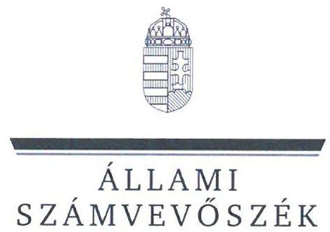
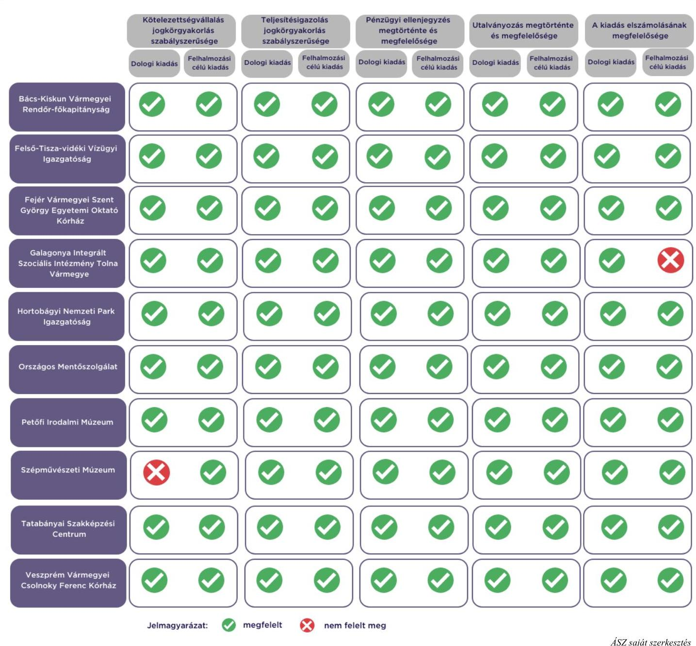

# JELENTÉS 

Az államháztartás központi alrendszerébe tartozó költségvetési szerv által teljesített dologi és felhalmozási célú kiadás szabályszerűségének rapid ellenőrzése
2024.

---

# JELENTÉS 

Az államháztartás központi alrendszerébe tartozó költségvetési szerv által teljesített dologi és felhalmozási célú kiadás szabályszerűségének rapid ellenőrzése
2024.

---

# ELLENŐRZÉSI IGAZGATÓSÁG: 

## ÁLLAMHÁZTARTÁS KÖZPONTI SZINTJÉT ELLENŐRZŐ IGAZGATÓSÁG

## ELLENŐRZÉSI IGAZGATÓ:

SINKÁNÉ DR. CSENDES ÁGNES igazgató

## ELLENŐRZÉSVEZETŐ:

Jelentéseink az interneten a www.asz.hu címen olvashatók.

RENKÓ ZSUZSANNA ellenőrzésvezető

IKTATÓSZÁM: EL-3949-007/2024.
TÉMASZÁM: 2685
ELLENŐRZÉS-AZONOSÍTÓ SZÁM: V102904

---

# TARTALOMJEGYZÉK 

- AZ ELLENŐRZÉS ALAPADATAI ..... 5
- AZ ELLENŐRZÖTT SZERVEZETEK ..... 7
- ÖSSZEFOGLALÁS ..... 13
- AZ ELLENŐRZÉS FÓKUSZKÉRDÉSEI ..... 14
- MEGÁLLAPÍTÁSOK ..... 15
- JAVASLATOK ..... 18
- MELLÉKLETEK ..... 19
I. sz. melléklet: Értelmező szótár ..... 19
II. sz. melléklet: Az ellenőrzött szervezetek jegyzéke ..... 20
III. sz. melléklet: Ellenőrzési kritériumok ..... 21
- FÜGGELÉK: ÉSZREVÉTELEK ..... 22
- RÖVIDÍTÉSEK JEGYZÉKE ..... 24

---

.

---

# AZ ELLENŐRZÉS ALAPADATAI 

## AZ ELLENŐRZÉS CÉLJA

Az államháztartás központi alrendszerébe tartozó költségvetési szerv által teljesített dologi és felhalmozási célú kiadások egy-egy kiválasztott tételének szabályszerűségi szempontból történő értékelése.

## AZ ELLENŐRZÉS TÍPUSA

Megfelelőségi ellenőrzés.

## AZ ELLENŐRZŐTT IDŐSZAK

| Ssz. | ELLENŐRZÖTT SZERVEZETEK | $\begin{gathered} \text { DOLOGI } \\ \text { KIADASOK } \\ \text { ESETÉBEN } \end{gathered}$ | $\begin{gathered} \text { PELHALMOZÁSI } \\ \text { CELÚ KIADASOK } \\ \text { ESETÉBEN } \end{gathered}$ |
| :--: | :--: | :--: | :--: |
| 1. | Bács-Kiskun Vármegyei Rendőr-főkapitányság | 2023. július 31. | 2023. július 28. |
| 2. | Felső-Tisza-vidéki Vízügyi Igazgatóság | 2023. július 31. | 2023. július 31. |
| 3. | Fejér Vármegyei Szent György Egyetemi Oktató Kórház | 2023. augusztus 2. | 2023. augusztus 10. |
| 4. | Galagonya Integrált Szociális Intézmény Tolna Vármegye | 2023. augusztus 17. | 2023. augusztus 25. |
| 5. | Hortobágyi Nemzeti Park Igazgatóság | 2023. augusztus 9. | 2023. augusztus 24. |
| 6. | Országos Mentőszolgálat | 2023. augusztus 17. | 2023. augusztus 7. |
| 7. | Petőfi Irodalmi Múzeum | 2023. augusztus 17. | 2023. augusztus 11. |
| 8. | Szépművészeti Múzeum | 2023. július 6. | 2023. július 3. |
| 9. | Tatabányai Szakképzési Centrum | 2023. augusztus 9. | 2023. augusztus 1. |
| 10. | Veszprém Vármegyei Csolnoky Ferenc Kórház | 2023. augusztus 8. | 2023. július 31. |

## AZ ELLENŐRZÉS TÁRGYA

Az államháztartás központi alrendszerébe tartozó költségvetési szerv által teljesített, ellenőrzésre kiválasztott dologi és felhalmozási célú kiadás szabályszerű teljesítése, ezen belül a gazdálkodási jogkörök szabályszerű gyakorlása. Az ellenőrzés kiterjedt minden olyan körülményre és adatra, amely az ÁSZ ${ }^{1}$ jogszabályban meghatározott feladatainak teljesítéséhez, valamint a program végrehajtása folyamán felmerült újabb összefüggések feltárásához szükséges.

---

Az ellenőrzés során az ÁSZ

- a Bács-Kiskun Vármegyei Rendőr-főkapitányság, a Fejér Vármegyei Szent György Egyetemi Oktató Kórház, a Hortobágyi Nemzeti Park Igazgatóság, a Szépművészeti Múzeum esetében a dologi kiadások körébe tartozó Szakmai tevékenységet segítő szolgáltatások; a Felső-Tisza-vidéki Vízügyi Igazgatóság, a Galagonya Integrált Szociális Intézmény Tolna Vármegye, az Országos Mentőszolgálat, a Veszprém Vármegyei Csolnoky Ferenc Kórház esetében a dologi kiadások körébe tartozó Szakmai anyagok beszerzése; a Petőfi Irodalmi Múzeum esetében a dologi kiadások körébe tartozó Egyéb szolgáltatások; a Tatabányai Szakképzési Centrum esetében a dologi kiadások körébe tartozó Üzemeltetési anyagok beszerzése;
- a Bács-Kiskun Vármegyei Rendőr-főkapitányság, a Hortobágyi Nemzeti Park Igazgatóság esetében a felhalmozási célú kiadások körébe tartozó Ingatlanok beszerzése, létesítése; a Felső-Tisza-vidéki Vízügyi Igazgatóság esetében a felhalmozási célú kiadások körébe tartozó Informatikai eszköz beszerzése, létesítése; a Fejér Vármegyei Szent György Egyetemi Oktató Kórház, a Galagonya Integrált Szociális Intézmény Tolna Vármegye, a Petőfi Irodalmi Múzeum, a Veszprém Vármegyei Csolnoky Ferenc Kórház esetében a felhalmozási célú kiadások körébe tartozó Egyéb tárgyi eszközök beszerzése, létesítése; az Országos Mentőszolgálat, a Szépművészeti Múzeum, a Tatabányai Szakképzési Centrum esetében a felhalmozási célú kiadások körébe tartozó Ingatlanok felújítása
rovatokon elszámolt kiadások egy-egy kiválasztott mintatételének szabályszerűségét értékelte.

# AZ ELLENŐRZÉS JOGALAPJA 

Az ellenőrzés jogszabályi alapját az ÁSZ tv. ${ }^{2} 1 . \int(3)$ bekezdés és az 5. $\int(6)$ bekezdés előírásai képezték.

## AZ ELLENŐRZÉS MÓDSZERE

Az ellenőrzést az ÁSZ az ellenőrzött időszakban hatályos jogszabályok, az ellenőrzés szakmai szabályai alapján, „Az állambázztatás központi alrendszerébe tartozó költségvetési szerv által teljesitett dologi kiadás szabályszerűségének rapid ellenörzéséről" és „Az állambázztartás központi alrendszerébe tartozó költségvetési szerv által teljesitett felbalmozzási célú kiadás szabálysxerüségének rapid ellenörzéséről" című ellenőrzési programok (továbbiakban: ellenőrzési programok) kérdéseire adott válaszok kiértékelésével, az ellenőrzési programokban megjelölt adatforrások figyelembevételével folytatta le. Amennyiben az adott mintatétel ellenőrzési program szerinti értékelése során további kapcsolódó szabálytalanságot tárt fel az ÁSZ, a szabálytalansághoz tartozó kritériummal bővült az ellenőrzés.

Az ellenőrzési kérdések megválaszolásához szükséges bizonyítékok megszerzése a következő ellenőrzési eljárások alkalmazásával történt: megfigyelés, összehasonlítás, elemző eljárás, a dologi kiadások, felhalmozási célú kiadások ellenőrzéssel érintett rovatairól történő mintavétel. Az ellenőrzési bizonyítékként felhasználható adatforrások közé tartoztak egyrészt az ellenőrzéshez kért dokumentumok, adatforrások, másrészt adatforrás volt még minden - az ellenőrzés folyamán - feltárt, az ellenőrzés szempontjából információkat tartalmazó dokumentum.

Az ÁSZ értékelte az ellenőrzés során a kiválasztott mintatételek ellenőrzési programokban meghatározott szempontok szerinti szabályszerűségét, így a kötelezettségvállalás és a teljesítésigazolás gazdálkodási jogkörök tekintetében a jogkörgyakorlás szabályszerűségét, a pénzügyi ellenjegyzés és az utalványozás gazdálkodási jogkörök tekintetében ezek megtörténtét és megfelelőségét.

---

# AZ ELLENŐRZÖTT SZERVEZETEK 

Az ellenőrzés a Bács-Kiskun Vármegyei Rendőr-főkapitányságra; a Felső-Tisza-vidéki Vízügyi Igazgatóságra; a Fejér Vármegyei Szent György Egyetemi Oktató Kórházra; a Galagonya Integrált Szociális Intézmény Tolna Vármegyére; a Hortobágyi Nemzeti Park Igazgatóságra; az Országos Mentőszolgálatra; a Petőfi Irodalmi Múzeumra; a Szépművészeti Múzeumra, a Tatabányai Szakképzési Centrumra; a Veszprém Vármegyei Csolnoky Ferenc Kórházra, mint az államháztartás központi alrendszerébe tartozó költségvetési szervekre terjedt ki.

## BÁCS-KISKUN VÁRMEGYEI RENDŐR-FŐKAPITÁNYSÁG

Bács-Kiskun VMRFK ${ }^{3}$ közfeladatát a Rendőrségről szóló 1994. XXXIV. törvény és a Rendőrség szerveiről és a Rendőrség szerveinek feladat- és hatásköréről szóló 329/2007. (XII. 13.) Korm. rendelet határozza meg. Alaptevékenysége a bűncselekmények megakadályozása, felderítése, a közbiztonság, a közrend és az államhatár rendjének védelme, a határforgalom ellenőrzése, jogellenes bevándorlás megakadályozása, valamint a bűncselekményből származó vagyon visszaszerzése.

## BÁCS-KISKUN VÁRMEGYEI RENDŐR-FŐKAPITÁNYSÁG FŐBB ADATÁINAK BEMUTATÁSA

Alapításának éve:
Irányító szerve:
Középirányító szerve:
Gazdasági szervezettel való rendelkezés:
Illetékessége, múködési területe:
Általános képviseletét ellátó vezetője:
Vezetői kinevezés kezdete:
2022. évben teljesített bevételek összege:
2022. évben teljesített kiadások összege:

1991.
Belügyminisztérium
Országos Rendőr-főkapitányság
Gazdasági szervezettel rendelkezik.
Bács-Kiskun vármegye, Baranya vármegyei Homorúd község
rendőrfőkapitány
2022.12.01.
$27766,4 \mathrm{M} \mathrm{Ft}$
$27766,2 \mathrm{M} \mathrm{Ft}$

---

# Felsó-Tisza-VIDÉKi VízúGyi IgazgatósáG 

A FETIVIZIG ${ }^{4}$ közfeladata a vízgazdálkodásról szóló 1995. évi LVII. törvény alapján a teljesség igénye nélkül a vizek kártételei elleni védelemmel, a vízkárelhárítással összefüggő, jogszabályban meghatározott feladatok ellátása; a vízrajzi észlelőhálózat üzemeltetése és fejlesztése, ennek részeként víztest monitoring fenntartása, vízrajzi adatok gyűjtése és feldolgozása; a Vízgazdálkodási Információs Rendszer területi nyilvántartásának és vízgazdálkodási adatgyűjtésének üzemeltetési és fejlesztési feladatainak ellátása, a gyűjtött adatok feldolgozása, értékelése és tárolása; a távlati ivóvízbázisok vízkészletének felhasználható állapotban tartásával kapcsolatos feladatok, valamint a vizeink állapotértékelésével kapcsolatos területi feladatok ellátása.

## Felsó-Tisza-VIDÉKi VízúGyi IgazgatósáG FÖRB ADATAINAK BEMUTATÁSA

Alapításának éve:
Irányító szerve:
Középirányító szerve:
Gazdasági szervezettel való rendelkezés:
Illetékessége, müködési területe:
Általános képviseletét ellátó vezetője:
Vezetői kinevezés kezdete:
2022. évben teljesített bevételek összege:
2022. évben teljesített kiadások összege:

1953.
Belügyminisztérium
Országos Vízügyi Főigazgatóság
Gazdasági szervezettel rendelkezik.
a vízügyi igazgatási és a vízügyi, valamint a vízvédelmi hatósági feladatokat ellátó szervek kijelöléséről szóló 223/2014. (IX. 4.) Korm. rendelet 1. melléklet 7. pontjában meghatározott müködési terület és müködési vonalak
igazgató
2003.07.01.
$5898,5 \mathrm{M} \mathrm{Ft}$
$5215,1 \mathrm{M} \mathrm{Ft}$

## FEJÉR VÁRMEGYEI SZENT GYŐRGY EGYETEMI OKTATÓ KÓRHÁZ

Az FVSZGYEOK ${ }^{5}$ közfeladata az Eütv. ${ }^{6}$ alapján ellátási területére kiterjedően az egészségügyi államigazgatási szerv által kiadott müködési engedély szerinti szakmákban járó- és fekvőbetegek diagnosztikus és terápiás szakorvosi ellátása, rehabilitációja és követéses gondozása, valamint a 2015. évi CXXIII. törvény ${ }^{7}$ alapján védőnői ellátás biztosítása. Feladata továbbá a védőnői ellátás keretében az egészségmegőrzés, tanácsadás, gondozás, betegségmegelőzés-szűrés, felvilágosítás, egészségnevelés. Alaptevékenységébe tartozik az ügyeleti ellátások biztosítása, a gyógyszer és gyógyászati termékek kiskereskedelme, orvostudományi kutatások végzése, szakmai gyakorlati oktatás.

## FEJÉR VÁRMEGYEI SZENT GYÖRGY EGYETEMI OKTATÓ KÓRHÁZ FÖRB ADATAINAK BEMUTATÁSA

Alapításának éve:
Irányító szerve:
Középirányító szerve:
Gazdasági szervezettel való rendelkezés:
Illetékessége, müködési területe:
Általános képviseletét ellátó vezetője:
Vezetői kinevezés kezdete:
2022. évben teljesített bevételek összege:
2022. évben teljesített kiadások összege:

1979.
Belügyminisztérium
Országos Kórházi Főigazgatóság
Gazdasági szervezettel rendelkezik.
2006. évi CXXXII. törvény ${ }^{8}$ alapján vezetett közhiteles kapacitásnyilvántartásban szereplő ellátási terület
főigazgató
2021.01.01.
$43511,3 \mathrm{M} \mathrm{Ft}$
$43275,5 \mathrm{M} \mathrm{Ft}$

---

# GALAGONYA INTEGRÁLT SZOCIÁLIS INTÉZMÉNY TOLNA VÁRMEGYE 

A Galagonya Szoc. Intézmény ${ }^{9}$ feladatait a szociális igazgatásról és szociális ellátásokról szóló 1993. évi III. törvény határozza meg. Alaptevékenysége a jelzőrendszeres házi segítségnyújtás, az időskorúak tartós bentlakásos ellátása, a fogyatékossággal élő személyek bentlakásos intézményi formában történő, ápológondozó célú ellátása, a pszichiátriai betegek és a szenvedélybetegek tartós bentlakásos ellátása, a szenvedélybetegek és a fogyatékossággal élők rehabilitációs célú bentlakásos ellátása, a fogyatékossággal élők ápoló-gondozó lakóotthoni ellátása.

## GALAGONYA INTEGRÁLT SZOCIÁLIS INTÉZMÉNY TOLNA VÁRMEGYE FÖBB ADATAINAK BEMUTATÁSA

Alapításának éve:
Irányító szerve:
Középirányító szerve:
Gazdasági szervezettel való rendelkezés:
Illetékessége, múködési területe:
Általános képviseletét ellátó vezetője:
Vezetői kinevezés kezdete:
2022. évben teljesített bevételek összege:
2022. évben teljesített kiadások összege:

2009
Belügyminisztérium
Szociális és Gyermekvédelmi Főigazgatóság
Gazdasági szervezettel nem rendelkezik.
Tolna vármegye
intézményvezető
2022.09.01.
$4122,1 \mathrm{M} \mathrm{Ft}$
$4129,8 \mathrm{M} \mathrm{Ft}$

## HORTOBÁGYI NEMZETI PARK IgAZGATÓSÁG

A $\mathrm{HNPI}^{10}$ a 625/2022. (XII. 30.) Korm. rendeletben ${ }^{11}$ és egyéb ágazati jogszabályokban meghatározott természetvédelemmel és természetmegőrzéssel, ökoturisztikai és környezeti nevelési tevékenységgel, valamint területkezeléssel és birtokügyi tevékenységgel kapcsolatos feladatait közfeladatként látja el.

## HORTOBÁGYI NEMZETI PARK IgAZGATÓSÁG FÖBB ADATAINAK BEMUTATÁSA

Alapításának éve:
Irányító szerve:
Középirányító szerve:
Gazdasági szervezettel való rendelkezés:
Illetékessége, múködési területe:
A törvényes és szakszerű múködésért felelős vezetője:
Vezetői kinevezés kezdete:
2022. évben teljesített bevételek összege:
2022. évben teljesített kiadások összege:

1973.
Agrárminisztérium
-
625/2022. (XII. 30.) Korm. rendelet 2. számú melléklet szerinti terület
igazgató
2022.07.01.
$3541,2 \mathrm{M} \mathrm{Ft}$
$2680,9 \mathrm{M} \mathrm{Ft}$

---

# Országos MENTÓszolgálat 

Az OMSZ ${ }^{12}$ közfeladata az Eütv., az Országos Mentőszolgálatról szóló 322/2006. (XII. 23.) Korm. rendelet, valamint a mentésről szóló 5/2006. (II. 7.) EüM rendelet szerinti mentési tevékenység, a mentés állami mentőszolgálatként való ellátása. Alaptevékenysége a mentési tevékenység, valamint a tömeges balesetek, katasztrófahelyzetek egészségügyi felszámolása és biztosítása a társszervekkel együttműködve, sürgősség igényétől függetlenül a beteg legalább mentőápolói felügyelettel a feltalálási helyéről egészségügyi intézménybe történő, gyógyintézetből gyógyintézetbe történő őrzött szállítása, a beteg szállítás közbeni, szükség esetén azonnali egészségügyi ellátása. Az állami mentőszolgálat a sürgősségi ügyeleti ellátás körében a jogszabályban meghatározott esetben és módon gondoskodik a fekvőbeteg-gyógyintézeti sürgősségi ügyeleti rend megszervezéséről, részt vesz a fekvőbeteg-ellátáson kívüli sürgősségi, orvosi ügyeleti ellátásban, irányítja és felügyeli a fekvőbeteg-gyógyintézeti sürgősségi ügyeleti rend végrehajtását.

## Országos MENTÓszolGálat FÖRB ADATAINAK BEMUTATÁSA

Alapításának éve:
Irányító szerve:
Középirányító szerve:
Gazdasági szervezettel való rendelkezés:
Illetékessége, müködési területe:
Általános képviseletét ellátó vezetője:
Vezetői kinevezés kezdete:
2022. évben teljesített bevételek összege:
2022. évben teljesített kiadások összege:

1983.
Belügyminisztérium
Gazdasági szervezettel rendelkezik.
országos
főigazgató
2020.01.17
$86986,0 \mathrm{M} \mathrm{Ft}$
$89371,1 \mathrm{M} \mathrm{Ft}$

## Petőfi Irodalmi Múzeum

A PIM ${ }^{13}$ közfeladata az 1997. évi CXL. törvény ${ }^{14}$ értelmében az örökségvédelem, és kultúrstratégiai intézményként a nemzeti kultúra erősítése az alkotóművészeti ágazatban a Nemzeti Kulturális Tanácsról, a kultúrstratégiai intézményekről, valamint egyes kulturális vonatkozású törvények módosításáról szóló 2019. évi CXXIV. törvény alapján.

## Petőfi Irodalmi Múzeum FÖRB ADATAINAK BEMUTATÁSA

Alapításának éve:
Irányító szerve:
Középirányító szerve:
Gazdasági szervezettel való rendelkezés:
Illetékessége, müködési területe:
Általános képviseletét ellátó vezetője:
Vezetői kinevezés kezdete:
2022. évben teljesített bevételek összege:
2022. évben teljesített kiadások összege:

1954.
Kulturális és Innovációs Minisztérium
Gazdasági szervezettel rendelkezik.
országos
főigazgató
2019.02.01
$6164,4 \mathrm{M} \mathrm{Ft}$
$5345,4 \mathrm{M} \mathrm{Ft}$

---

# SZÉPMŰVÉSZETI MÚZEUM 

A Szépművészeti Múzeum közfeladata az 1997. évi CXL. törvény értelmében az örökségvédelem, alaptevékenysége múzeumi tevékenység. Gyűjtőterülete az egész ország, valamint a - nemzetközi egyezmények, jogszabályok figyelembevételével - a világ minden olyan országa, ahol a gyűjtőkörének megfelelő alkotások fellelhetőek.

| SZÉPMÜVÉSZÉTI MÚZEUM FÖBB ADATAINAK BEMUTATÁSA |  |
| :-- | :-- |
| Alapításának éve: | 1896. |
| Irányító szerve: | Kulturális és Innovációs Minisztérium |
| Középirányító szerve: | - |
| Gazdasági szervezettel való rendelkezés: | Gazdasági szervezettel rendelkezik. |
| Illetékessége, múködési területe: | országos |
| Általános képviseletét ellátó vezetője: | főigazgató |
| Vezetői kinevezés kezdete: | 2019.12 .01 . |
| 2022. évben teljesített bevételek összege: | 16 040,9 M Ft |
| 2022. évben teljesített kiadások összege: | 13 919,8 M Ft |

## TATABÁNYAI SZAKKÉPZÉSI CENTRUM

A Tatabányai $\mathrm{SZC}^{15}$ közfeladata a szakképzésről szóló 2019. évi LXXX. törvény szerinti szakképzési és a nemzeti köznevelésről szóló 2011. évi CXC. törvény szerinti köznevelési feladatok ellátása. Fő feladata a technikumi szakmai oktatás, a szakképző iskolai szakmai oktatás, a szakgimnáziumi nevelés-oktatás, és a többi gyermekkel, tanulóval együtt nevelhető, oktatható sajátos nevelési igényű gyermekek, tanulók iskolai neveléseoktatása, valamint ellát kollégiumi alapfeladatot, nevelő és oktató munkához kapcsolódó nem köznevelési tevékenységet, továbbá az Arany János Kollégiumi-Szakközépiskolai Programmal kapcsolatos feladatokat. Tervezi és szervezi az Európai Unió pénzügyi alapjaiból és más külföldi, illetőleg hazai alapokból támogatott egyes fejlesztési programok megvalósítását.

## TATABÁNYAI SZAKKÉPZÉSI CENTRUM FÖBB ADATAINAK BEMUTATÁSA

Alapításának éve:
Irányító szerve:
Középirányító szerve:
Gazdasági szervezettel való rendelkezés:
Illetékessége, múködési területe:
Általános képviseletét ellátó vezetője:
Vezetői kinevezés kezdete:
2022. évben teljesített bevételek összege:
2022. évben teljesített kiadások összege:

2020.
Kulturális és Innovációs Minisztérium
Nemzeti Szakképzési és Felnőttképzési Hivatal
Gazdasági szervezettel rendelkezik.
Komárom-Esztergom vármegye
kancellár
2023.03.20
$5520,4 \mathrm{M} \mathrm{Ft}$
5 163,5 M Ft

---

# VESZPRÉM VÁRMEGYEI CSOLNOKY FERENC KÓRHÁZ 

A VVCSFK ${ }^{16}$ közfeladata az Eütv. alapján, ellátási területére kiterjedően a járó- és fekvőbetegek diagnosztikus és terápiás szakorvosi ellátása, rehabilitációja és követéses gondozása, valamint a 2015. évi CXXIII. törvény alapján a védőnői ellátás biztosítása. Ellátási területén feladata a járó- és fekvőbetegek diagnosztikus és terápiás szakorvosi ellátása, rehabilitációja és követéses gondozása, ennek keretében fekvőbetegek aktív és krónikus ellátása, rehabilitációja, járóbetegek gyógyító és rehabilitációs szakellátása és egynapos ellátása az egyén gyógykezelése, életveszély elhárítása, a megbetegedés következtében kialakult állapot javítása vagy a további állapotromlás megelőzése céljából. Feladata továbbá a védőnői ellátás keretében az egészségmegőrzés, tanácsadás, gondozás, betegségmegelőzés-szűrés, felvilágosítás, egészségnevelés. Alaptevékenységébe tartozik a gyógyszer és gyógyászati termék kiskereskedelme, orvostudományi kutatások végzése, szakmai gyakorlati oktatás és felsőfokú szakképzés végzése.

## VESZPRÉM VÁRMEGYEI CSOLNOKY FERENC KÓRHÁZ FŐBR ADATADNAK BEMUTATÁSA

Alapításának éve:
Irányító szerve:
Középirányító szerve:
Gazdasági szervezettel való rendelkezés:
Illetékessége, múködési területe:
Általános képviseletét ellátó vezetője:
Vezetői kinevezés kezdete:
2022. évben teljesített bevételek összege:
2022. évben teljesített kiadások összege:

2013.
Belügyminisztérium
Országos Kórházi Főigazgatóság
Gazdasági szervezettel rendelkezik.
a 2006. évi CXXXII. törvény alapján vezetett közhiteles kapacitásnyilvántartásban szereplő ellátási terület
főigazgató
2021.01.01
$27038,2 \mathrm{M} \mathrm{Ft}$
$27173,5 \mathrm{M} \mathrm{Ft}$

---

# ÖSSZEFOGLALÁS 

A kötelezettségvállalás egy mintatétel esetében nem a belső szabályzatban foglaltak szerint történt. Az ellenőrzött kiadások tekintetében az ellenőrzött szervezetek vonatkozásában a teljesítésigazolás és a pénzügyi ellenjegyzés jogkörgyakorlás szabályszerűen történt. A kifizetések elrendelésére szabályszerűen, utalványozás alapján került sor. Az ellenőrzött kiadásokat egy esetben nem a megfelelő rovaton számolták el. Két kiadás esetében nem folytattak le közbeszerzési eljárást.

1. ábra

## A FŐBB ELLENŐRZÉSI TAPASZTALATOK

---

# AZ ELLENŐRZÉS FÓKUSZKÉRDÉSEI 

1- Az államháztartás központi alrendszerébe tartozó költségvetési szervnél a kiválasztott dologi kiadás teljesitése az egyes jogszabályi rendelkezések alapján szabályszerű volt-e?
2- Az államháztartás központi alrendszerébe tartozó költségvetési szervnél a kiválasztott felhalmozási célú kiadás teljesitése az egyes jogszabályi rendelkezések alapján szabályszerű volt-e?

---

# MEGÁLLAPÍTÁSOK 

## 1. Az államháztartás központi alrendszerébe tartozó költségvetési szervnél a kiválasztott dologi kiadás teljesítése az egyes jogszabályi rendelkezések alapján szabályszerű volt-e?

## Összegző megállapítás

Az ellenőrzött 10 dologi kiadás teljesítése hét esetben az ellenőrzés keretében vizsgált jogszabályi előírásoknak megfelelt. Egy dologi kiadás esetében a kötelezettségvállalási jogkörgyakorlás nem volt szabályszerű. Két kiadás esetében nem folytattak le közbeszerzési eljárást.

A Bács-Kiskun VMRFK-nál, a FETIVIZIG-nél, az FVSZGYEOK-nál, a Galagonya Szoc. Intézménynél, a HNPI-nél, az OMSZ-nél, a PIM-nél, a Tatabányai SZC-nél és a VVCSFK-nál az ellenőrzött mintatétel esetében a kötelezettségvállalási, teljesítésigazolási, utalványozási jogkörgyakorlás, továbbá a kiadás elszámolása az Áht. ${ }^{17}$, az Ávr. ${ }^{18}$ és az Áhsz. ${ }^{19}$ előírásai szerint szabályszerűen történt:

- Kötelezettséget az Áht.-ben és az Ávr.-ben foglaltakkal összhangban az arra jogosultsággal rendelkező személy vállalt.
- A kötelezettségvállalásra az Áht.-ben foglaltak szerint, a pénzügyi ellenjegyzés után került sor.
- A teljesítésigazoló az Ávr.-ben előírt írásbeli kijelöléssel rendelkezett.
- A teljesítésigazolás során az Ávr.-ben foglaltak szerint ellenőrizhető okmányok alapján ellenőrizték és igazolták a kiadás teljesítésének jogosságát, összegszerűségét, valamint az ellenszolgáltatás teljesítését.
- A teljesítésigazoló a teljesítést az Ávr.-ben foglaltakkal összhangban, az igazolás dátumának és a teljesítés tényére történő utalás megjelölésével, aláírásával igazolta.
- Az utalványozásra az Áht.-ben, valamint az Ávr.-ben foglaltakkal összhangban, a teljesítésigazolást és az érvényesítést követően került sor.
- A kiadás számviteli elszámolása a megfelelő rovaton történt az Áhsz.-ben előírtakkal összhangban.

A Szépművészeti Múzeumnál az ellenőrzött mintatétel esetében a teljesítésigazolási és az utalványozási jogkörgyakorlás, valamint a kiadás elszámolása az ellenőrzés keretében vizsgált, az Áht.-ben, az Ávr.-ben és az Áhsz.-ben foglalt előírások alapján szabályszerű volt, azonban a kötelezettségvállalási jogkörgyakorlás nem volt szabályszerű:

- Kötelezettséget az Áht.-ben és az Ávr.-ben foglaltakkal összhangban az arra jogosultsággal rendelkező személy vállalt. A szerződéskötési szabályzat ${ }^{20}$ III.1. e) pontjában rögzítettek ellenére a kötelezettségvállaló az aláírásánál nem tüntette fel a kötelezettségvállalásának dátumát. A kötelezettségvállalás dátuma a szerződésen nem szerepelt, így a dátum hiányában nem lehetett megítélni, hogy a kötelezettségvállalásra az Áht. 37. § (1) bekezdésében foglalt előírás szerint pénzügyi ellenjegyzés után került-e sor.
- A teljesítésigazoló az Ávr.-ben előírt írásbeli kijelöléssel rendelkezett.

---

- A teljesítésigazolás során az Ávr.-ben foglaltak szerint ellenőrizhető okmányok alapján ellenőrizték és igazolták a kiadás teljesítésének jogosságát, összegszerűségét, valamint az ellenszolgáltatás teljesítését.
- A teljesítésigazoló a teljesítést az Ávr.-ben foglaltakkal összhangban, az igazolás dátumának és a teljesítés tényére történő utalás megjelölésével, aláírásával igazolta.
- Az utalványozásra az Áht.-ben, valamint az Ávr.-ben foglaltakkal összhangban, a teljesítésigazolást és az érvényesítést követően került sor.
- A kiadás számviteli elszámolása a megfelelő rovaton történt az Áhsz.-ben előírtakkal összhangban.

# Az ellenőrzés során feltárt szabálytalanság: 

- Az FVSZGYEOK egészségügyi szolgáltatási feladatok ellátására közbeszerzési eljárás lefolytatása nélkül kötött szerződést, ami az ÁSZ értékelése szerint felveti a Kbt. ${ }^{21} 4 . \S$ (1) bekezdésében, a 15. § (1) bekezdés a) pontjában, a 111. § d) pontjában, valamint a 3. számú mellékletben foglaltak megsértésének a lehetőségét. A szerződést 2023. március 10-én határozott időre (3 hónapra vagy legfeljebb amíg a közbeszerzési eljárás lezárul) kötötték meg, rendelkezéseit visszamenőleg hatállyal, 2022. szeptember 7-től kellett alkalmazni. A becsült érték meghatározásának alapja a szerződésre 2023-ban teljesített kifizetések összege, összesen nettó 674387932 Ft. A Közbeszerzési Hatóság honlapján közzétett, 2023. január 1-jétől irányadó közbeszerzési értékhatárok alapján a kifizetések érték eléri és meghaladja a Kbt. 3. mellékletében szereplő szociális és egyéb szolgáltatás esetében érvényes 262485000 Ft-os uniós értékhatárt.
- Az OMSZ mentőtáskák beszerzésére közbeszerzési eljárás lefolytatása nélkül kötött szerződéseket, ami az ÁSZ értékelése szerint felveti a Kbt. 4. § (1) bekezdésében, és a 19. § (3) bekezdésében foglaltak megsértésének lehetőségét. A 2023. május 2. és 5. napján megkötött szerződések együttes értéke nettó 26280000 Ft , amely meghaladja a Közbeszerzési Hatóság honlapján közzétett, 2023. január 1-jétől a klasszikus ajánlatkérők esetében az árubeszerzésre irányadó 15000000 Ft-os nemzeti közbeszerzési értékhatárt.

## 2. Az államháztartás központi alrendszerébe tartozó költségvetési szervnél a kiválasztott felhalmozási célú kiadás teljesítése az egyes jogszabályi rendelkezések alapján szabályszerű volt-e?

## Összegző megállapítás

Az ellenőrzött 10 felhalmozási célú kiadás teljesítése kilenc esetben az ellenőrzés keretében vizsgált jogszabályi előírásoknak megfelelt. Egy felhalmozási célú kiadás esetében a kiadás elszámolása nem volt szabályszerű.

A Bács-Kiskun VMRFK-nál, a FETIVIZIG-nél, az FVSZGYEOK-nál, a HNPI-nél, az OMSZ-nél, a PIM-nél, a Tatabányai SZC-nél, a Szépművészeti Múzeumnál és a VVCSFK-nál az ellenőrzött mintatétel esetében a kötelezettségvállalási, teljesítésigazolási, utalványozási jogkörök gyakorlása, továbbá a kiadás elszámolása az Áht. az Ávr. és az Áhsz. előírásai szerint szabályszerűen történt:

- Kötelezettséget az Áht.-ben és az Ávr.-ben foglaltakkal összhangban arra jogosultsággal rendelkező személy vállalt.

---

- A kötelezettségvállalásra az Áht.-ben foglaltak szerint, a pénzügyi ellenjegyzés után került sor.
- A teljesítésigazoló az Ávr.-ben előírt írásbeli kijelöléssel rendelkezett. A teljesítésigazolás során az Ávr.-ben foglaltak szerint ellenőrizhető okmányok alapján ellenőrizték és igazolták a kiadás teljesítésének jogosságát, összegszerűségét, valamint az ellenszolgáltatás teljesítését.
- A teljesítésigazoló a teljesítést az Ávr.-ben foglaltakkal összhangban, az igazolás dátumának és a teljesítés tényére történő utalás megjelölésével, aláírásával igazolta.
- Az utalványozásra az Áht.-ben, valamint az Ávr.-ben foglaltakkal összhangban, a teljesítésigazolást és az érvényesítést követően került sor.
- A kiadás számviteli elszámolása a megfelelő rovaton történt az Áhsz.-ben előírtakkal összhangban.

A Galagonya Szoc. Intézménynél az ellenőrzött mintatétel esetében a kötelezettségvállalási, a teljesítésigazolási és az utalványozási jogkörgyakorlás az ellenőrzés keretében vizsgált, az Áht.-ben, az Ávr.-ben foglalt előírások alapján szabályszerű volt, azonban a kiadás elszámolása nem volt szabályszerű:

- A kötelezettségvállalás az Áht.-ben foglaltakkal összhangban történt. A kötelezettségvállaló az Áht.-ben és az Ávr.-ben foglaltak szerinti felhatalmazással rendelkezett, a kötelezettségvállalásra az Áht.-ben foglaltak szerint, a pénzügyi ellenjegyzés után került sor.
- A teljesítésigazoló az Ávr.-ben előírt írásbeli kijelöléssel rendelkezett. A teljesítésigazolás során az Ávr.-ben foglaltak szerint ellenőrizhető okmányok alapján ellenőrizték és igazolták a kiadás teljesítésének jogosságát, összegszerűségét, valamint az ellenszolgáltatás teljesítését. A teljesítésigazoló a teljesítést az Ávr.-ben foglaltakkal összhangban, az igazolás dátumainak és a teljesítés tényére történő utalás megjelölésével, aláírásával igazolta.
- Az utalványozásra az Áht.-ben, valamint az Ávr.-ben foglaltakkal összhangban, a teljesítésigazolást és az érvényesítést követően került sor.
- A kiadás elszámolása nem felelt meg az Áhsz. 40. § (1) bekezdésben és a 15. melléklet I. pontban foglaltaknak, mert az elszámolt kifizetésnek a közbeszerzési díj része helytelenül a K64 Egyéb tárgyi eszközök beszerzése, létesítése rovaton került elszámolásra, a K355 Egyéb dologi kiadások rovat helyett.

---

# JAVASLATOK 

Az ÁSZ tv. 33. § (1) bekezdésében foglaltak értelmében az ellenőrzött szervezet vezetője köteles a jelentésben foglalt megállapításokhoz kapcsolódó intézkedési tervet összeállítani és azt a jelentés kézhezvételétől számított 30 napon belül az ÁSZ részére megküldeni. Amennyiben az ellenőrzött szervezet vezetője nem küldi meg határidőben az intézkedési tervet, vagy továbbra sem elfogadható intézkedési tervet küld, az Állami Számvevőszék elnöke az ÁSZ tv. 33. § (3) bekezdése a) és b) pontjaiban foglaltakat érvényesítheti.

## FEJÉR VÁRMEGYEI SZENT GYÖRGY EGYETEMI OKTATÓ KÓRHÁZ FŐIGAZGATÓJÁNAK

1. Kezdeményezzen a Bkr. ${ }^{22}$ 31. § (6) bekezdése alapján soron kívüli belső ellenőrzést a jelen ellenőrzés során feltárt szabálytalanság kialakulása okainak feltárása és a közbeszerzés elmulasztásával kapcsolatos kockázati tényezők feltárása, illetve a szabálytalanság megszüntetése érdekében.
2. A Bkr. 13. § (2) bekezdésében foglaltak alapján, valamint az 1. számú javaslat szerinti belső ellenőrzés megállapításait és javaslatait is figyelembe véve tegyen intézkedéseket azon kontrolltevékenységek kiépítésére és/vagy megfelelő müködtetésére, amelyek megelőzik a jelentésben leírt szabálytalanság ismételt előfordulását.

## ORSZÁGOS MENTŐSZOLGÁLAT FŐIGAZGATÓJÁNAK

1. Kezdeményezzen a Bkr. 31. § (6) bekezdése alapján soron kívüli belső ellenőrzést a jelen ellenőrzés során feltárt szabálytalanság kialakulása okainak feltárása és a közbeszerzés elmulasztásával kapcsolatos kockázati tényezők feltárása, illetve a szabálytalanság megszüntetése érdekében.
2. A Bkr. 13. § (2) bekezdésében foglaltak alapján, valamint az 1. számú javaslat szerinti belső ellenőrzés megállapításait és javaslatait is figyelembe véve tegyen intézkedéseket azon kontrolltevékenységek kiépítésére és/vagy megfelelő müködtetésére, amelyek megelőzik a jelentésben leírt szabálytalanság ismételt előfordulását.

---

# MELLÉKLETEK 

## I. SZ. MELLÉKLET: ÉRTELMEZŐ SZÓTÁR

kötelezettségvállalás
pénzügyi ellenjegyzés
teljesítésigazolás
utalványozás

A költségvetési szerv által a kiadási előirányzatok és - ha jogszabály lehetővé teszi - a kijelölt lebonyolító szerv számára a Kormány rendeletében meghatározottak szerinti rendelkezésre bocsátott összeg terhére fizetési kötelezettség vállalásáról szóló - így különösen a foglalkoztatásra irányuló jogviszony létesítésére, szerződés megkötésére, költségvetési támogatás biztosítására irányuló - szabályszerűen megtett jognyilatkozat.
Forrás: Áht. 1. § 15. pont
A kötelezettségvállalást megelőző múvelet, amelynek során a pénzügyi ellenjegyzőnek meg kell győződnie arról, hogy a szükséges szabad előirányzat - több évet érintő kötelezettségvállalás esetén minden egyes évben rendelkezésre áll, a tervezett kifizetési időpontokban a pénzügyi fedezet biztosított, valamint a kötelezettségvállalás nem sérti a gazdálkodásra vonatkozó szabályokat. Kötelezettséget vállalni a Kormány rendeletében foglalt kivételekkel csak pénzügyi ellenjegyzés után, a pénzügyi teljesítés esedékességét megelőzően, írásban lehet.
Forrás: Áht. 37. § (1) bekezdés
A kötelezettségvállalásban a másik fél által vállalt feltételek teljesítéséhez kapcsolódó igazolás, amely a kiadási előirányzat terhére vállalt utalványozást előzi meg. A teljesítés igazolása során ellenőrizhető okmányok alapján ellenőrizni és igazolni kell a kiadások teljesítésének jogosságát, összegszerűségét, ellenszolgáltatást is magában foglaló kötelezettségvállalás esetében - ha a kifizetés vagy annak egy része az ellenszolgáltatás teljesítését követően esedékes - annak teljesítését. A teljesítést az igazolás dátumának és a teljesítés tényére történő utalás megjelölésével, az arra jogosult személy aláírásával kell igazolni.
Forrás: Áht. 38. § (1) bekezdés; Ávr. 57. § (1) és (3) bekezdések
A bevételek és kiadások elszámolására utalványozás alapján kerülhet sor. A kiadási előirányzatok terhére történő utalványozás esetén az utalványozásra csak azután kerülhet sor, ha a kiadás alapjául szolgáló kötelezettségvállalásban meghatározott feltételeket a másik szerződő fél már teljesítette. A kiadási előirányzatok terhére történő utalványozásra a teljesítés igazolását és az érvényesítést követően, a bevételi előirányzatok esetén a belső szabályzatban a bevételek meghatározott körére esetlegesen elrendelt teljesítés igazolását követően kerülhet sor.
Forrás: Áht. 38. § (1) bekezdés; Ávr. 57. § (2) bekezdés és 59. § (1b) bekezdés

---

# II. SZ. MELLÉKLET: AZ ELLENŐRZÖTT SZERVEZETEK JEGYZÉKE 

## ELLENŐRZÖTT SZERVEZETEK MEGNEVEZÉSE

Bács-Kiskun Vármegyei Rendőr-főkapitányság
Felső-Tisza-vidéki Vízügyi Igazgatóság
Fejér Vármegyei Szent György Egyetemi Oktató Kórház
Galagonya Integrált Szociális Intézmény Tolna Vármegye
Hortobágyi Nemzeti Park Igazgatóság
Országos Mentőszolgálat
Petőfi Irodalmi Múzeum
Szépművészeti Múzeum
Tatabányai Szakképzési Centrum
Veszprém Vármegyei Csolnoky Ferenc Kórház

---

# III. SZ. MELLÉKLET: ELLENŐRZÉSI KRITÉRIUMOK 

## FOKUSZKÉRDÉS

1. Az államháztartás központi alrendszerébe tartozó költségvetési szervnél a kiválasztott dologi kiadás teljesítése az egyes jogszabályi rendelkezések alapján szabályszerű volt-e?

Kötelezettségvállalás

Pénzügyi ellenjegyzés
Teljesítésigazolás

Utalványozás

Kiadások elszámolása
Közbeszerzési eljárás lefolytatása
2. Az államháztartás központi alrendszerébe tartozó költségvetési szervnél a kiválasztott felhalmozási célú kiadás teljesítése az egyes jogszabályi rendelkezések alapján szabályszerű volt-e?

Kötelezettségvállalás

Pénzügyi ellenjegyzés
Teljesítésigazolás

Utalványozás

Kiadások elszámolása

## ELLENŐRZÉSI KRITÉRIUMOK

Áht. 36. $\$ (7), 37 . \S$ (1) bekezdések
Ávr. 50. $\$ (1) bekezdés d) pont, 52. $\$ (1),(9), 53 . \S(1), 60 . \S$
(3) bekezdések
belső szabályzat
Ávr. 55. $\$ (1),(4)$ bekezdések
Áht. 38. $\$ (1),(2)$ bekezdések
Ávr. 57. $\$ (1),(3)-(5), 60 . \S$ (3) bekezdések
Áht. 38. $\$ (1)$ bekezdés
Ávr. 59. $\$ (1b),(2)$ bekezdések, (3) bekezdés g) pont, (4) bekezdés

Áhsz. 40. § (1) bekezdés, 15. melléklet I. pont
Kbt. 4. $\$ \cdot(1)$ bekezdés, 15. $\$ \cdot(1)$ bekezdés a) pont, 19. $\$ \cdot(3)$ bekezdés, 111. § d) pont, 3. számú melléklet

Áht. 36. $\$ (7), 37 . \S$ (1) bekezdések
Ávr. 50. § (1) bekezdés d) pont, 52. § (1), (9), 53. § (1), 60. § (3) bekezdések

Ávr. 55. § (1), (4) bekezdések
Áht. 38. § (1), (2) bekezdések
Ávr. 57. § (1), (3)-(5), 60. § (3) bekezdések
Áht. 38. § (1) bekezdés
Ávr. 59. § (1b), (2) bekezdések, (3) bekezdés g) pont, (4) bekezdés

Áhsz. 40. § (1) bekezdés, 15. melléklet I. pont

---

# FÜGGELÉK: ÉSZREVÉTELEK 

A jelentéstervezetet a Számvevőszék 15 napos észrevételezésre megküldte az ellenőrzött szervezet vezetőjének az ÁSZ tv. 29. §* (1) bekezdése előírásának megfelelően.

A Bács-Kiskun Vármegyei Rendőr-főkapitányság, a Felső-Tisza-vidéki Vizügyi Igazgatóság, a Fejér Vármegyei Szent György Egyetemi Oktató Kórház, a Galagonya Integrált Szociális Intézmény Tolna Vármegye, a Hortobágyi Nemzeti Park Igazgatóság, a Petőfi Irodalmi Múzeum, a Tatabányai Szakképzési Centrum, a Veszprém Vármegyei Csolnoky Ferenc Kórház ellenőrzött szervezetek vezetői a jelentéstervezet megállapításaira érdemi észrevételt nem tettek.
A jelentéstervezet megállapításaira az Országos Mentőszolgálat és a Szépmüvészeti Múzeum föigazgatója észrevételt tett. Az ÁSZ tv. 29. § (3) bekezdésével összhangban az Állami Számvevőszék a Függelékben feltünteti a megállapításokkal kapcsolatban tett, el nem fogadott észrevételeket, és megindokolja, hogy azokat miért nem fogadta el.
Országos Mentőszolgálat főigazgatójának észrevétele: „Az ügyeletindítások tervezett időpontjai alapján bizonyossággal kijelenthető volt, hogy az OMSZ tartalék készleteinek terhére megfelelő mennyiségü eszközkapacitás nem csoportosítható át, új sürgősségi táskák beszerzése vált szükségessé." „A feladatvégrehajtás prioritásából adódóan - fentiek indokán az Országos Mentőszolgálat a saját hatáskörben történő beszerzés mellett döntött, ahol biztositott volt a verseny tisztasága a 3 ajánlat bekérése, beérkezése által." „A fentieket összeoglalva a szerződések megkötésére az orvosi ügyeleti alapellátás végrehajtásának és folyamatosságának biztositása érdekében került sor. A szerződések teljesitéséhez kiemelkedően fontos közérdek füződött és ez egyedi, kivételes eset volt az Eatv.-nek való jogszabályi megfelelés érdekében. A szerződéssel elérni kívánt cél a betegbiztonságot szolgálta, mely alapvető, az Alaptörvény XX. cikkében is nevesített védendő érdek, azaz a testi és lelki egészséghez való jog egészségügyi ellátás hatékony megszervezésén keresztül érvényesült a szerződések megkötése során." „Amennyiben a szerződések nem kerültek volna megkötésre, az hátrányosan befolyásolta volna az egészségügyi ellátás hatékony megszervezését, azaz az országos ügyeleti alapellátási rendszer müködtetését, így a szerződések teljesítéséhez kiemelkedően fontos közérdek füződött."
Az észrevétellel érintett megállapítás: „Az OMSZ mentőtáskák beszerzésére a Kbt. 4. § (1) bekezdésében, és a 19. § (3) bekezdésében foglaltakat megsértve közbeszerzési eljárás lefolytatása nélkül kötött szerződéseket, emiatt az ÁSZ indokoltnak látja a Közbeszerzési Döntőbizottság tájékoztatását. A 2023. május 2. és 5. napján megkötött szerződések együttes

[^0]
[^0]:    * 29. § (1) Az Állami Számvevőszék az ellenőrzési megállapításait megküldi az ellenőrzött szervezet vezetőjének vagy az általa megbízott személynek, és annak, akinek személyes felelősségét állapította meg.
    (2) Az ellenőrzött szervezet vezetője és a felelősként megjelölt személy az ellenőrzés megállapításaira tizenöt napon belül írásban észrevételt tehet.
    (3) Az Állami Számvevőszék az észrevételre a beérkezésétől számított harminc napon belül írásban válaszol. A figyelembe nem vett észrevételeket köteles a jelentésben feltüntetni, és megindokolni, hogy azokat miért nem fogadta el.

---

értéke nettó 26280000 Ft, amely meghaladja a Közbeszerzési Hatóság honlapján közzétett, 2023. január 1-jétől a klasszikus ajánlatkérők esetében az árubeszerzésre irányadó 15000000 Ft-os nemzeti közbeszerzési értékhatárt." (16. oldal hetedik bekezdés).
El nem fogadás indoka: „A közbeszerzés mellőzésének tényét nem cáfolták. A hivatkozott betegbiztonság nem jogalap a közbeszerzési szabályok be nem tartására. A kérdéses közbeszerzés mellőzésére jogszabály nem ad felhatalmazást.
Az Országos Mentőszolgálat az EFOP-1.8.23-21.-2021-00001 számú projekt keretében 2021. július 1-től modellprogram keretében sürgősségi ügyeleti rendszert indított Hajdú-Bihar megyében, melynek célja a magasabb színvonalú, korszerü és szakmailag egységes betegellátás volt. A projekt 1,1 Mrd Ft támogatással valósult meg. A háziorvosi ügyeleti rendszer pilot jellegü müködése többletkiadásainak biztositásával összefüggő fejezetek közötti átcsoportositásról szóló 1146/2022. (III. 21.) Korm. határozat a háziorvosi ügyeleti rendszer pilot jellegü müködése többletkiadásainak biztositása érdekében 600 millió forint egyszeri átcsoportositását rendelte el. A másfél éves tesztelés után 2023. február 1-jén indult el élesben a megújult alapellátási ügyeleti rendszer, elsőként egy vármegyében, majd folyamatosan léptek be a további vármegyék.
Ezek szerint a feladat és az ennek ellátásához szükséges eszközigény nem az egyes egészségügyi és egészségbiztositási tárgyú kormányrendeletek módositásáról szóló 630/2022. (XII. 30.) Korm. rendelet közzétételekor került megismerésre. A felkészülési időszakban lett volna lehetőség az eljárás lefolytatására."

Szépművészeti Múzeum főigazgatójának észrevétele: „A kötelezettségvállalások szabályszerüségének megitélésében lényeges körülmény, hogy a szerződéskötésre minden esetben egy zárt láncú szerződéskezelési rendszerben kerül sor, amelyben az egymást követő lépések sorrendje kötött. A jóváhagyott és a rendszerből generált szerződéseket a Gazdasági Főosztály központilag nyomtatja ki, igy az ellenjegyzés minden esetben megelőzi a kötelezettségvállalást. (Az aláírások sorrendje az iratmozgásból is nyomon követhető.)"
Az észrevétellel érintett megállapítás: „Kötelezettséget az Áht.-ben és az Ávr.-ben foglaltakkal összhangban az arra jogosultsággal rendelkező személy vállalt. A szerződéskötési szabályzat III.1. e) pontjában rögzítettek ellenére a kötelezettségvállaló az aláírásánál nem tüntette fel a kötelezettségvállalásának dátumát. A kötelezettségvállalás dátuma a szerződésen nem szerepelt, igy a dátum hiányában nem lehetett megitélni, hogy a kötelezettségvállalásra az Áht. 37. § (1) bekezdésében foglalt előirás szerint pénzügyi ellenjegyzés után került-e sor." (15. oldal utolsó előtti bekezdés).
El nem fogadás indoka: „Az észrevétel nem az ÁSZ által ellenőrzött tételre, hanem egy folyamatra vonatkozott, igy csak közvetetten kapcsolódott a megállapításhoz. Az észrevétel nem cáfolja a megállapítást, miszerint a konkrét ellenőrzött tételnél nem lehetett megállapítani a pénzügyi ellenjegyzés és a kötelezettségvállalás sorrendjét, csupán általánosságban mondja azt, hogy az intézménynél az ellenjegyzés megelőzi a kötelezettségvállalást. Az észrevételben leírtak, miszerint a központi nyomtatás biztositja ,,az egymást követő lépések helyes sorrendjét" csak elektronikus aláírás esetében érvényes, de jelen szerződést eredetben, papír alapon irták alá, igy csak a dátumok szerepeltetése esetén lehet bizonyitani, hogy az ellenjegyzés megelőzte a kötelezettségvállalást."

---

# RÖVIDÍTÉSEK JEGYZÉKE 

${ }^{1}$ ÁSZ
${ }^{2}$ ÁSZ tv.
${ }^{3}$ Bács-Kiskun VMRFK
${ }^{4}$ FETIVIZIG
${ }^{5}$ FVSZGYEOK
${ }^{6}$ Eütv.
${ }^{7}$ 2015. évi CXXIII. törvény
${ }^{8}$ 2006. évi CXXXII. törvény
${ }^{9}$ Galagonya Szoc. Intézmény
${ }^{10}$ HNPI
${ }^{11}$ 625/2022. (XII. 30.) Korm. rendelet
${ }^{12}$ OMSZ
${ }^{13}$ PIM
${ }^{14}$ 1997. évi CXL. törvény
${ }^{15}$ Tatabányai SZC
${ }^{16}$ VVCSFK
${ }^{17}$ Áht.
${ }^{18}$ Ávr.
${ }^{19}$ Áhsz.
${ }^{20}$ szerződéskötési szabályzat
${ }^{21}$ Kbt.
${ }^{22}$ Bkr.

Állami Számvevőszék
2011. évi LXVI. törvény az Állami Számvevőszékről

Bács-Kiskun Vármegyei Rendőr-főkapitányság
Felső-Tisza-vidéki Vízügyi Igazgatóság
Fejér Vármegyei Szent György Egyetemi Oktató Kórház
1997. évi CLIV. törvény az egészségügyről
a 2015. évi CXXIII. törvény az egészségügyi alapellátásról
2006. évi CXXXII. törvény az egészségügyi ellátórendszer fejlesztéséről

Galagonya Integrált Szociális Intézmény Tolna Vármegye
Hortobágyi Nemzeti Park Igazgatóság
625/2022. (XII. 30.) Korm. rendelet a természetvédelmi hatósági és igazgatási feladatokat ellátó szervek kijelöléséről
Országos Mentőszolgálat
Petőfi Irodalmi Múzeum
1997. évi CXL. törvény a muzeális intézményekről, a nyilvános könyvtári ellátásról és a közművelődésről
Tatabányai Szakképzési Centrum
Veszprém Vármegyei Csolnoky Ferenc Kórház
2011. évi CXCV. törvény az államháztartásról

368/2011. (XII. 31.) Korm. rendelet az államháztartásról szóló törvény végrehajtásáról
4/2013. (I. 11.) Korm. rendelet az államháztartás számviteléről
A Szépművészeti Múzeum főigazgatójának 10/2021. (VI. 30.) főigazgatói utasítása a Szépművészeti Múzeum szerződéskötési és szerződéskezelési szabályzatáról
2015. évi CXLIII. törvény a közbeszerzésekről

370/2011. (XII. 31.) Korm. rendelet a költségvetési szervek belső kontrollrendszeréről és belső ellenőrzéséről

---

1052 Budapest, Apáczai Csere János u. 10. | 1364 Budapest 4., Pf. 54
www.asz.hu | szamvevoszek@asz.hu
telefon: +36 14849100