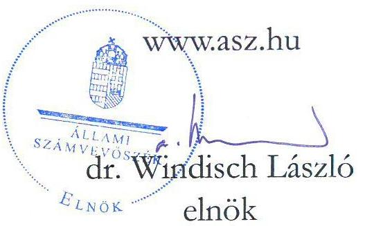
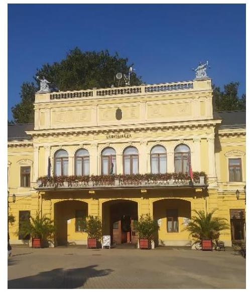
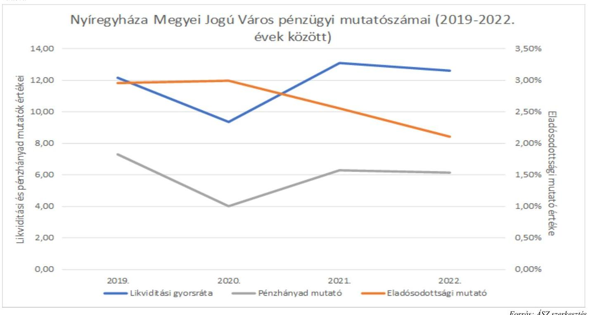
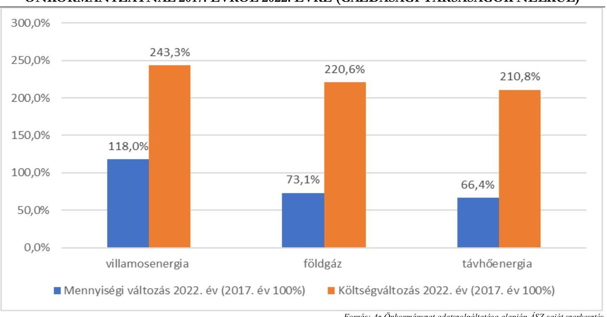
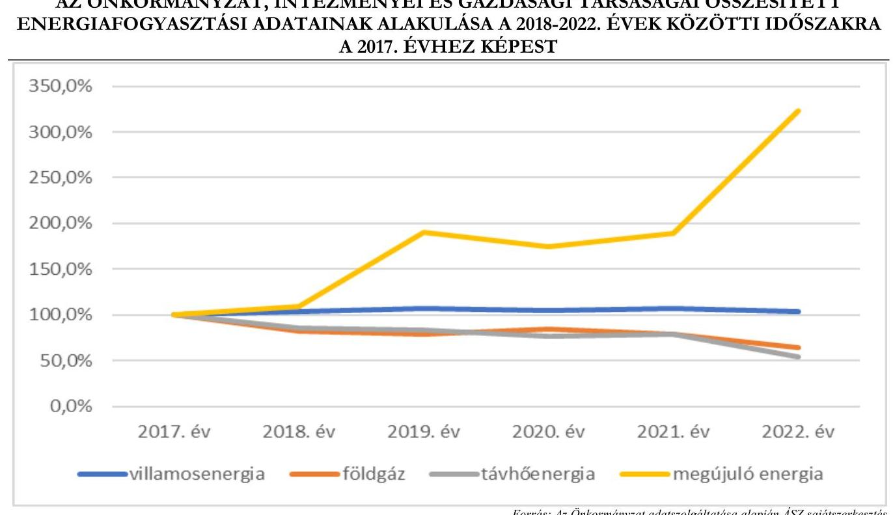
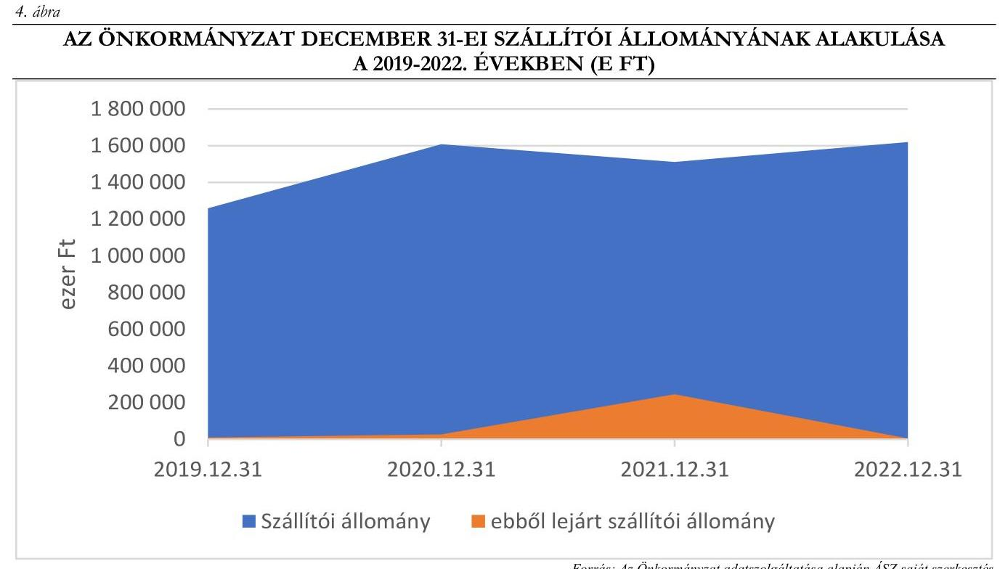
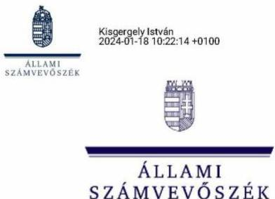

# JELENTÉS 

## Az önkormányzatok energiahatékonysági intézkedéseinek ellenőrzése

Nyíregyháza Megyei Jogú Város Önkormányzata

2024.

---

# JELENTÉS 

## Az önkormányzatok energiahatékonysági intézkedéseinek ellenőrzése

Nyíregyháza Megyei Jogú Város Önkormányzata

2024.

24008

---

# ELLENŐRZÉSI IGAZGATÓSÁG: 

## ÁLLAMHÁZTARTÁS HELYI SZINTJÉT ELLENŐRZŐ IGAZGATÓSÁG

ELLENŐRZÉSI IGAZGATÓ:
KISGERGELY ISTVÁN igazgató

ELLENŐRZÉSVEZETŐ:
HUDÁK MAGDOLNA ellenőrzésvezető

## Jelentéseink az interneten a www.asz.hu címen olvashatók.

IKTATÓSZÁM: EL-3980-009/2024.
TÉMASZÁM: 2676
ELLENŐRZÉS-AZONOSÍTÓ SZÁM: V102005

---

# TARTALOMJEGYZÉK 

- AZ ELLENŐRZÉS ALAPADATAI ..... 5
- AZ ELLENŐRZÖTT SZERVEZET ..... 7
- ÖSSZEFOGLALÁS ..... 9
- AZ ELLENŐRZÉS FÓKUSZTERÜLETEI ..... 12
- MEGÁLLAPÍTÁSOK ..... 13
- JAVASLATOK ..... 26
- MELLÉKLETEK ..... 27
I. sz. melléklet: Értelmező szótár ..... 27
II. sz. melléklet: Az ellenőrzött szervezetek jegyzéke ..... 30
III. sz. melléklet: Ellenőrzési kritériumok ..... 31
IV. sz. melléklet: Tájékoztató adatok ..... 32
- FÜGGELÉK: ÉSZREVÉTELEK ..... 40
- RÖVIDÍTÉSEK JEGYZÉKE ..... 44

---

.

---

# AZ ELLENŐRZÉS ALAPADATAI 

## AZ ELLENŐRZÉS CÉLJA

Az ellenőrzés célja annak ellenőrzése volt, hogy az Önkormányzat ${ }^{1}$ értékelte-e az energiaárak változásának a költségvetése végrehajtására, a gazdálkodására, valamint a kötelező és önként vállalt feladatainak ellátására gyakorolt hatását. Az ellenőrzés kiterjedt arra, hogy az Önkormányzat és a költségvetési szervei az energiaköltségek csökkentése érdekében tettek-e energiahatékonysági intézkedéseket. Az Önkormányzat által tett intézkedések hozzájárultak-e a költségvetés pénzügyi egyensúlyának, a kötelező feladatok ellátásának a biztosításához.

## AZ ELLENŐRZÉS TÍPUSA

Megfelelőségi és teljesítmény ellenőrzés.

## AZ ELLENŐRZÖTT IDŐSZAK

A 2022. év és a 2023. év I. féléve.
Ezen túlmenően elemzési céllal a 3. fókuszterületnél a megkezdett és lebonyolított beruházások adatainak tanúsítványon történő bekérése tekintetében a 2017-2021. évek, továbbá a 4. fókuszterületnél a pénzügyi, egyensúlyi mutatók számítása esetében a 2019-2023. I. félévének időszaka.

## AZ ELLENŐRZÉS TÁRGYA

Az ellenőrzés tárgyát képezte az Önkormányzat és költségvetési szervei gazdálkodásának biztonsága és a kötelező feladatok ellátása érdekében - az energiaárak 2022. évi változásának ellensúlyozására - tett energiahatékonyságot növelő, energiamegtakarítást célzó, a pénzügyi egyensúly fenntartására tett intézkedések megfelelőségének és eredményességének értékelése a 2022. évben és a 2023. I. félévben. A gazdasági társaságok és vagyonkezelő szervek EMIT ${ }^{2}$ készítési kötelezettségére az ellenőrzés nem terjedt ki.

Elemzési módszerrel a 2017-2021. években végrehajtott energiahatékonysági beruházások, fejlesztések, szakpolitikai intézkedésekben való részvétel értékelése a tekintetben, hogy azok megelőző intézkedést jelentettek-e, illetve befolyásolták-e az energiaköltségek csökkentése érdekében a 2022. évben és a 2023. év I. félévében megtett intézkedéseket.

## AZ ELLENŐRZÉS JOGALAPJA

Az ellenőrzés jogszabályi alapját az ÁSZ tv. ${ }^{3} 5. §$ (2) bekezdés előírásai képezték.

---

# AZ ELLENŐRZÉS MÓDSZERE 

Az ellenőrzést az Alaptörvény 43. cikk (1) bekezdésében meghatározott törvényességi, célszerűségi, eredményességi szempontok, valamint a nemzetközi standardokat irányadónak tekintve az ellenőrzési program szempontjai, az ellenőrzött időszakban hatályos jogszabályok, az ellenőrzés szakmai szabályok és módszertanok figyelembevételével végezte az ÁSZ ${ }^{4}$.

Az ellenőrzési kérdések megválaszolásához szükséges bizonyítékok megszerzése az ellenőrzött szervezet által rendelkezésre bocsátott dokumentumokra és adatokra, valamint az ellenőrzést támogató szervezetektől ${ }^{5}$ kapott adatokra alapozva, továbbá megfigyelés, szemle (szemrevételezés), kérdésfeltevés (információkérés), valamint elemző eljárás útján történt.

Az ellenőrzés során bizonyítékként felhasználható adatforrások közé tartoztak egyrészt az ellenőrzéshez kért dokumentumok, másrészt adatforrás volt még a közhiteles (pl. Elektronikus Közbeszerzési rendszer) és egyéb (pl. Önkormányzati rendelettár) nyilvántartásból származó, az ellenőrzés szempontjából releváns információkat tartalmazó dokumentum.

Az ellenőrzés lefolytatásához az ellenőrzött szervezetek a tanúsítványok kitöltésével, valamint az ÁSZ által kért dokumentumok, adatok, információk megküldésével és a helyszíni ellenőrzés során interjú keretében szolgáltattak adatokat. A rendelkezésre bocsátott adatok, információk kontrolljára helyszíni ellenőrzés keretében is sor került. Ellenőrzést támogató szervezetként adatot kértünk a BM${ }^{6}$-től, a PM${ }^{7}$-től, az EM${ }^{8}$-től, a HM${ }^{9}$-től és a ME${ }^{10}$-től az energiaáremelkedéssel kapcsolatos intézkedések keretében nyújtott állami támogatásokról, továbbá az EMIT-ek teljesítésére vonatkozóan a MEKH${ }^{11}$-től, amely szervezet az Energetikusi Hálózaton keresztül támogatta a közintézmények Ehat. tv. ${ }^{12}$-ben foglalt adatszolgáltatási kötelezettségeinek teljesítését.

Az ellenőrzés során egy kockázati alapon kiválasztott önkormányzati beruházás előkészítése, megvalósítása, elszámolása, nyilvántartása tételes ellenőrzésre került.

Elemzési módszerrel tanúsítványon szolgáltatott adatok alapján értékeltük, hogy a 2017-2021 között végrehajtott (indított, folyamatban lévő, illetve befejezett) energiahatékonyságot növelő, energiamegtakarítást célzó beruházások mennyiben befolyásolták, milyen hatással voltak a rendkívüli energiaár növekedések következtében a 2022. évben és a 2023. I. félévben megtett intézkedésekre.

A tanúsítványokon szolgáltatott adatok, az Önkormányzat által rendelkezésre bocsátott dokumentumok alapján értékeltük, hogy a meghozott takarékossági intézkedések hogyan érintették az Önkormányzat kötelező, illetve önként vállalt feladatainak ellátását, öt mutatószám (likviditási gyorsráta változása, eladósodottsági mutató, lejárt szállítói állomány változása, pénzhányad mutató alakulása) segítségével értékeltük az Önkormányzatnál a pénzügyi egyensúly fenntartására tett intézkedések eredményességét.

Az ellenőrzés kiterjedt minden olyan körülményre és adatra, amely az ÁSZ jogszabályban meghatározott feladatainak teljesítéséhez, valamint a program végrehajtása folyamán felmerült újabb összefüggések feltárásához szükséges volt.

---

# AZ ELLENŐRZÖTT SZERVEZET 

Nyíregyháza Megyei Jogú Város Önkormányzata Szabolcs-Szatmár-Bereg vármegyében található, a vármegye székhelye, lakónépessége a KSH${ }^{13}$ adata szerint 2023. január 1-én 115521 fő volt.

A település polgármestere 2010. év óta látta el tisztségét, a Közgyűlésnek ${ }^{14}$ a polgármesteren kívül 21 fő képviselő tagja volt. Az Önkormányzat működésével kapcsolatos feladatokat Nyíregyháza Megyei Jogú Város Polgármesteri Hivatala látta el. A Hivatal ${ }^{15}$ létszáma 2022. évben 267 fő volt, a jegyző ${ }^{16}$ 1999. január 1-jétől látta el tisztségét.

Az Önkormányzat - a Hivatallal együtt - bölcsődei, óvodai, könyvtári és kulturális, előadó-művészeti, múzeumi, szociális gondozási, gyermekjóléti és egészségügyi alapellátási, valamint intézményműködtetési, gyermekétkeztetési és pénzügyi-gazdálkodási feladatokat ellátó költségvetési szerveket, továbbá család- és gyermekjóléti központot, összesen 14 költségvetési szervet irányított. A 14 költségvetési szervből 13 üzemeltetésében volt középület, a 14. Nyíregyházi Cantemus Kórus nem üzemeltetett középületet. Az ellenőrzött időszakban az Önkormányzat többségi tulajdonába 13 gazdasági társaság tartozott, köztük az energiaellátásban közreműködő, gőzellátás és légkondicionálás feladatokat ellátó NYÍRTÁVHŐ Kft. ${ }^{17}$, valamint a Nyíregyháza város közigazgatási határain belül lévő közintézmények villamosenergia ellátás és közvilágítás feladatokat ellátó NYÍRVV Nonprofit Kft. ${ }^{18}$. A víztermelés, -kezelés, -ellátás feladatokat ellátó NYÍRSÉGVÍZ Zrt. ${ }^{19}$-ben 52,84% tulajdonrésze volt az Önkormányzatnak.

Az Önkormányzat a 2016. évben csatlakozott az Polgármesterek Klíma- és Energiaügyi Szövetségéhez. A csatlakozáskor vállalta, hogy kidolgozza a Fenntartható Energia- és Klíma Akciótervét (SECAP ${ }^{20}$ ), amelyet az Önkormányzati épületek energetikai korszerűsítése - Nyíregyháza Megyei Jogú Város Önkormányzatánál III. ütem című - projekt keretében elkészítettek, és amelyet a Közgyűlés elfogadott.

Az Önkormányzat a 2019. évben elnyerte az MJV ${ }^{21}$ Energiatudatos / Energiahatékony Önkormányzatok, a 2022. évben pedig az Energiahatékony Önkormányzat díjat.

Az Önkormányzat tulajdonában 2022. december 31-én 149 db közfeladat ellátását szolgáló épület volt.
Az Önkormányzat a 2022. évben az energiaárak emelkedésének ellensúlyozására 1872,2 M Ft, a 2023. I. félévében 207,6 M Ft állami támogatásban részesült.

---

Az Önkormányzat 2022. évi konszolidált beszámolójának főbb adatait az 1. táblázat mutatja be: 1. táblázat

# AZ ÖNKORMÁNYZAT 2022. ÉVI KONSZOLIDÁLT BESZÁMOLÓJÁNAK FŐBB ADATAI 

MEGNEVEZÉS
2022. ÉVI KONSZOLIDÁLT
ÖNKORMÁNYZATI BESZÁMOLÓ (M. ÉT)
Költségvetési bevétel ..... 54744,5
Ebből:
Működési célú támogatások államháztartáson belülről ..... 13204,0
Felhalmozási célú támogatások államháztartáson belülről ..... 17761,0
Közhatalmi bevételek ..... 14261,2
Költségvetési kiadás ..... 49245,5
Ebből:
Dologi kiadások ..... 15905,3
Ebből: közüzemi díjak ..... 1357,0
Beruházások ..... 11706,8
Felújítások ..... 3590,7
Ebből: ingatlanok felújítása ..... 2798,3
Finanszírozási bevételek ..... 63413,4
Ebből:
Belföldi értékpapír bevételei ..... 15893,2
Maradvány igénybevétele ..... 15668,7
Államháztartáson belüli megelőlegezések ..... 351,5
Lekötött bankbetétek megszüntetése ..... 31500,0
Finanszírozási kiadások ..... 56864,8
Ebből:
Belföldi értékpapír kiadások ..... 19950,9
Pénzeszközök lekötött bankbetétként elhelyezése ..... 36000,0
Forrás: Az Önkormányzat 2022. évi konszolidált beszámolójia alapján ÁSZ saját szerkesztés

A 2022. évi energiaár emelkedés hatásainak mérséklésre, a működőképesség, a pénzügyi egyensúly fenntartása, a közfeladatellátás biztosítása érdekében az Önkormányzat egy bevételnövelő és 17 kiadáscsökkentő, az intézmények 57 kiadáscsökkentő intézkedéseket tettek.

---

# ÖSSZEFOGLALÁS 

Az energiaárak 2022. évben bekövetkezett jelentős emelkedése, a források korlátozott rendelkezésre állása új fókuszba helyezte az önkormányzatoknál az energiával történő gazdálkodás kérdését. Az energia változatlan mennyiségben történő felhasználása a magas költségkitettség miatt jelentős kockázatokat eredményezett az önkormányzatok pénzügyi-gazdasági egyensúlyára, valamint a közfeladatok ellátásának biztonságára. Az energiaárak emelkedéséből eredő kockázatok önkormányzati kezelésének támogatása érdekében kormányzati intézkedések történtek. Az energiahatékonyságról szóló törvény a települési önkormányzatok, mint a közfeladat ellátását szolgáló épületek tulajdonosai, használói számára az energiagazdálkodással kapcsolatban több feladatot is meghatározott. Az ellenőrzés rávilágított az Önkormányzat törvényben foglalt energiagazdálkodással kapcsolatos feladatainak ellátásával kapcsolatos problémákra, az energiagazdálkodási feladatok és a pénzügyi-gazdálkodási feladatok közötti összefüggésekre, hozzájárult a szabályszerű és felelős gazdálkodásához, a közpénzek szabályos, cél szerinti felhasználásához, a közvagyon védelméhez.

Az Önkormányzat és költségvetési szervei a tulajdonában, illetve használatában álló, közfeladat ellátását szolgáló épületekkel kapcsolatos energetikai üzemeltetési és fenntartási feladatellátása nem felelt meg a jogszabályi előírásoknak, mivel a 2022-2023. I. félévében nem, csak azt követően, és a 2023. évre visszamenőlegesen készítették el és töltötték fel a Nemzeti Energetikusi Hálózat által üzemeltetett felületre az Energiamegtakarítási intézkedési terveket (EMIT-ek), energetikai felelőst nem foglalkoztattak, az energiafelhasználási adatokra vonatkozó havi adatszolgáltatási kötelezettségnek nem tettek eleget. Az Önkormányzat tulajdonában az ellenőrzött időszakban 149 olyan épület volt, amelyben közfeladatot láttak el, melyeknek csupán 42,3%-a, 63 rendelkezett a jogszabályi előírás szerinti energetikai jellemzőit meghatározó tanúsítvánnyal. A Polgármester a jogszabályi előírások ellenére nem határozta meg a jegyző, a Hivatal, valamint az intézményvezetők energiahatékonyságról szóló törvényből eredő feladatait, a jegyző nem kísérte figyelemmel az energiahatékonyságról szóló törvényben foglalt feladatok végrehajtását.

Az Önkormányzat energiahatékonysággal kapcsolatos intézkedései hozzájárultak a működőképességének fenntartásához, kötelező feladatainak ellátásához. Az Önkormányzat pénzügyi helyzete stabil, likviditása biztosított volt. Az energiaárak növekedése miatt keletkező többletkiadásokból eredő tehernövekedés ellensúlyozására, a pénzügyi egyensúly fenntartása érdekében megtett intézkedései eredményesek voltak, a 2019-2022. évek között a likviditási gyorsráta, a pénzhányad mutató, valamint az eladósodottsági mutató értéke kedvezően, a referencia tartományban alakult, az eladósodottsági mutató értéke egyik évben sem érte el a 3%-ot, a likviditási gyorsráta az egyes években 9,36 és 12,59 között mozgott, valamint a pénzhányad mutató értéke minden évben meghaladta a négyet, a lejárt szállítói állomány 2021-ről 2022-re csaknem 16% ponttal csökkent. 2019-2022. között a lejárt szállítói állomány jellemzően 30 napot meg nem haladó tartozás volt. A 2022. évben a lejárt szállítói állomány már csak a teljes szállítói állomány mintegy 0,4%-át tette ki. A 2023. I. félévében a szállítói állomány összetétele kedvezőtlenül alakult, mivel a lejárt szállítói állomány aránya 22,3%-ra növekedett, amely a folyamatban lévő beruházási és fejlesztési szállítói számlákhoz kapcsolódott. A szállítói állomány változása az ellenőrzött időszakban nem volt negatív hatással az Önkormányzat pénzügyi helyzetére, azonban a lejárt szállítói állomány 2023. évi növekedése kockázatot hordozott a pénzügyi egyensúly fenntartásában.

---

A mutatószámok alakulását az 1. ábra szemlélteti.
1. ábra

A Közgyűlés az Önkormányzat és költségvetési szervei energiaköltségeinek csökkentése, a pénzügyi egyensúly fenntartása érdekében 2022 októberében a jogszabályi előírásoknak megfelelően menedzsmenttervet fogadott el, beavatkozási pontokat határozott meg, amely a villamosenergia, a földgázfogyasztás, a távhőfelhasználás, a közvilágítás, a közösségi közlekedés területén megjelölte a határidőket, felelősöket. Az
 Önkormányzat a menedzsmentterv és a miniszteri biztossal ${ }^{22}$ folytatott tárgyalás eredményeként 1764,3 M Ft állami támogatás igénybevételére vált jogosulttá, ezentúl a Honvédelmi Minisztériumtól a Városi Uszoda működési költségeire összesen 315,5 M Ft támogatást kapott. A menedzsmentterv alapján az Önkormányzat és a költségvetési szervek a 2022. évben egy bevételnövelő és 70 kiadást csökkentő, 2023. I. félévében egy bevételnövelő és négy kiadást csökkentő intézkedést tettek. Az intézkedések hatására az Önkormányzat 2022. évi összesített energiafelhasználásának naturális mutatói a villamosenergia, a földgáz esetében az előző évhez képest kismértékben ( $0,4 \% ; 6,0 \%-\mathrm{kal}$ ), a távhő esetében jelentősen ( $26,0 \%-\mathrm{kal}$ ) csökkentek. Az önkormányzati intézmények időszakos bezárásának hatása a távhőfelhasználásnál jelentkezett. (Az Önkormányzat energiafelhasználásának alakulását a IV. melléklet 4. táblázata részletezi.)

A 2022. évben az Önkormányzat középülettel rendelkező 13 költségvetési szervéből a villamosenergia ellátás érdekében négy, a földgáz ellátás érdekében 10 – érvényes energiavásárlási szerződésekkel nem rendelkező – költségvetési intézmény nyilatkozott az energiaellátás folyamatos biztosítását célzó kormányzati intézkedések közül a végső menedékes státuszra vonatkozóan. A 2023. évben mind az Önkormányzat, mind a Hivatal, mind a költségvetési intézményei éltek a fixált áras árképzésű villamosenergia, illetve a fixált áras árképzésű földgáz vásárlás lehetőségével.

A fenntartható energiagazdálkodás érdekében a Közgyűlés a jogszabályi előírásokkal összhangban döntött a közvilágítás korlátozásáról is, amelynek eredményeként kimutatott villamosenergia-megtakarítás a 2022. évi teljes villamosenergia-fogyasztás 6,7%-át jelentette.

---

A Közgyűlés a 2017-2022. években 18, összesen 6844,9 M Ft tervezett bekerülési összegű energetikai célú fejlesztésről a gazdálkodás biztonságát szem előtt tartva hozott döntést, mivel az energetikai célú fejlesztéseket 100%-ban vissza nem térítendő támogatásból tervezték megvalósítani. Továbbá az, hogy a pályázat előfinanszírozott volt, az Önkormányzat likviditási helyzetét is pozitívan érintette, így a megvalósítás nem igényelt hitelfelvételt, és minimális, 2,9%-os saját forrás bevonását jelentette. A döntéselőkészítések során azonban a jogszabályi előírások ellenére a beruházások gazdaságossági és hatékonysági szempontú megalapozása keretében nem vizsgálták a létrejövő tárgyi eszközök, berendezések üzemeltetésével, működtetésével, karbantartásával kapcsolatos várható kiadásokat. Ez az üzemeltetés során kockázatot jelenthet az Önkormányzat pénzügyi egyensúlyi helyzetére, ezáltal kötelező feladatai ellátásának finanszírozhatóságára.

A 2017-2023. I. féléve között folyamatban lévő, illetve megvalósult kilenc beruházás 35 önkormányzati tulajdonban lévő épület energetikai korszerűsítését érintette, amelyek tervezett összege 3981,5 M Ft volt, és amelyből 2023. I. félévéig 4137,0 M Ft kifizetés realizálódott. A tételes ellenőrzésre kiválasztott TOP-6.5.1-19-NY1-2020-000006 azonosító számú, Két közművelődési intézmény és a NYSZC ${ }^{23}$ Inczédy György Szakgimnázium, Szakközépiskola épületének energetikai korszerűsítése tárgyú, bruttó 435,0 M Ft összköltségű energetikai célú fejlesztés előkészítése, megvalósítása és pénzügyi elszámolása során az Önkormányzat betartotta a jogszabályok, valamint belső szabályzatának előírásait, azonban az Inczédy György Szakközépiskola esetében a számviteli elszámolás nem felelt meg a számviteli előírásoknak, mivel az épület felújítására fordított összeget a vagyonkezelésbe adott eszközök nyilvántartási számlája helyett az Önkormányzat tárgyi eszközei között mutatták ki.

A felújítás eredményeként az épületek energetikai besorolása a korábbi rossz, illetve átlagos besorolás helyett korszerű besorolású lett. A megújuló energia használatát célzó beruházások eredményeképpen jelentkező fogyasztási megtakarítások elsősorban az önkormányzati tulajdonban lévő energiaszolgáltató gazdasági társaságoknál jelentkeztek, a megújuló energia fokozatosan csökkentette az egyéb energiahordozók (földgáz és távhő) felhasználásának arányát.

Összességében az Önkormányzatnál az ellenőrzött időszakban végrehajtott fejlesztések támogatták az energiaárak emelkedése miatti többletköltségek ellensúlyozására tett egyéb korlátozó intézkedések végrehajtását.

A 2022. évben elindított, az ellenőrzés ideje alatt még elbírálás alatt lévő kilenc, mindösszesen 2863,4 M Ft értékű beruházás keretében 52 önkormányzati tulajdonban lévő épület komplex, illetve napelemes energetikai fejlesztését tervezték megvalósítani. (Az energetikai célú pályázatok főbb adatait a IV. melléklet 2. táblázata tartalmazza.)

A belső ellenőrzés a 2022. évben nem végzett energiahatékonysággal kapcsolatos ellenőrzést. A 2023. évi belső ellenőrzési tervben ${ }^{24}$ a II. félévre ütemezték a 2022. évben elfogadott energiamegtakarítási tervek végrehajtásának ellenőrzését, amely az ÁSZ ellenőrzés lezárásáig még nem történt meg.

Az ÁSZ az ellenőrzés során feltárt hiányosságok felszámolása, a szabályszerű működés feltételeinek megteremtése érdekében a polgármesternek kettő, a jegyzőnek négy javaslatot tett.

---

# AZ ELLENŐRZÉS FÓKUSZTERÜLETEI 

1.- Az önkormányzat és költségvetési szervei tulajdonában, illetve használatában álló, közfeladat ellátását szolgáló épületekkel kapcsolatos energetikai üzemeltetési és fenntartási feladatellátás
2.- Az energiaárak változására tekintettel a gazdálkodás biztonsága érdekében a központi intézkedések adta lehetőségek önkormányzat általi hasznosítása
3.- Az energiaköltségek csökkentése, az energiahatékonyság növelése érdekében kezdeményezett, illetve folyamatban lévő energetikai beruházások értékelése
4.- Az energiaárak hatásának kezelésére, a kötelező feladatok ellátására, a pénzügyi egyensúly fenntartására tett intézkedések értékelése

---

# MEGÁLLAPÍTÁSOK 

## 1. Az önkormányzat és költségvetési szervei tulajdonában, illetve használatában álló, közfeladat ellátását szolgáló épületekkel kapcsolatos energetikai üzemeltetési és fenntartási feladatellátás

Összegző megállapítás Az Önkormányzat és költségvetési szervei a tulajdonukban, illetve használatukban álló, közfeladat ellátását szolgáló épületekkel kapcsolatos energetikai üzemeltetési és fenntartási feladatellátása nem felelt meg az Ehat.tv., az Mötv. ${ }^{25}$, valamint a 122/2015. (V. 26.) Korm. rendelet ${ }^{26}$ előírásainak.

Az Önkormányzat és költségvetési szervei a tulajdonukban, illetve használatukban álló, közfeladat ellátását szolgáló épületek, illetve épületrészek esetében nem tettek eleget az Ehat. tv. 11/A. § előírásainak, mivel

- az Ehat. tv. 11/A. § a) pontjának előírása ellenére a 2022-2023. I. félévében nem, csak azt követően, és a 2023. évre visszamenőlegesen készítették el és töltötték fel a Nemzeti Energetikusi Hálózat által üzemeltetett felületre az energiamegtakarítási intézkedési terveket. Az Önkormányzat az EMIT készítési kötelezettségről az ellenőrzés kapcsán szerzett tudomást;
- az Ehat. tv. 11/A. § c) pontjának, valamint a 122/2015. (V. 26.) Korm. rendelet 7/F. § előírásának ellenére nem jelentették be havi rendszerességgel az épületekre, illetve épületrészekre vonatkozó energiafogyasztási adatokat;
- az Ehat. tv. 11/A. § f) pontja előírása ellenére nem töltötték fel a Nemzeti Energetikusi Hálózat által üzemeltetett felületre az épületekre, illetve épületrészekre vonatkozó adatokat, energetikai tanúsítványokat;
- az Ehat. tv. 11/A. §-ban meghatározott feladatok ellátása és a Nemzeti Energetikusi Hálózattal történő kapcsolattartás céljából az Ehat. tv. 11/A § i) pont előírása ellenére nem jelöltek ki energetikai felelőst.

---

Az Önkormányzat tulajdonában lévő épületek számát, az EMIT-ek, valamint az energetikai tanúsítványok számának alakulását a 2. táblázat szemlélteti.
2. táblázat

A KÖZFELADATELLÁTÁSBAN ÉRINTETT ÉPÜLETEKRE AZ EHAT. TV. ALAPJÁN ELKÉSZÍTETT DOKUMENTUMOK BEMUTATÁSA 2022. ÉVBEN ÉS 2023. I. FÉLÉVÉBEN

| KÖZFELADAT   ELLÁTÁSÁBAN   ÉRINTETT   SZERVEZETCSOPORT   MEGNEVEZÉSE | KÖZFELADAT   ELLÁTÁSBAN   ÉRINTETT   ÉPÜLETEK   SZÁMA   100 | ÉPÜLETEKRE ELKÉSZÍTETT EMIT-EK |  | ÉPÜLETEKRE ELKÉSZÍTETT ENERGETIKAI TANÚSÍTVÁNYOK ELLENŐRZÖTT IDŐSZAKBAN |  |
| :--: | :--: | :--: | :--: | :--: | :--: |
|  |  | ELLENŐRZÖTT IDŐSZAKBAN | KÖVETŐEN |  |  |
|  |  | SZÁMA OR | ÁRÁNYA \% | SZÁMA OR | ÁRÁNYA\% |
| Önkormányzat tulajdonában lévő épületek száma | 149 | - | 92 | 61,7 | 63 | 42,3 |
| Ebből |  |  |  |  |  |
| Polgármesteri   Hivatal   használatában | 3 | 0 | 1 | 33,3 | 2 | 66,7 |
| Intézmények használatában | 98 | 0 | 91 | 92,9 | 44 | 44,9 |
| Önkormányzati költségvetési szervek használatában összesen | 101 | 0 | 92 | 91,1 | 46 | 45,5 |
| Gazdasági társaságok használatában | 18 | na | na | na | 8 | 44,4 |
| Vagyonkezelő szervezetek használatában | 30 | na | na | na | 9 | 30,0 |

Forrás: $A S Z$ saját szerkesztés az ellenőrzött tanúsítványon szolgáltatott adatai alapján.
Az Önkormányzat tulajdonában álló 149 közfeladatellátásban érintett épületből 101-et az Önkormányzat és költségvetési szervei, 18-at az Önkormányzat többségi tulajdonában lévő gazdasági társaságok ${ }^{27}$ hasznosítottak, valamint 30 épületet egyéb, nem önkormányzati fenntartású vagyonkezelő szervezetek ${ }^{28}$ használtak, amelyből 23 a Tankerületi központ ${ }^{29}$, valamint hét a Szakképzési centrum ${ }^{30}$ vagyonkezelésében volt.
Az Önkormányzat és költségvetési szervei használatában lévő épületek mindössze 45,5%-a rendelkezett a 176/2008. (VI. 30.) Korm. rendelet ${ }^{31}$-3. $\mathbb{S}$ (1a) bekezdésében foglalt energetikai tanúsítvánnyal, amellyel a közfeladatot ellátó épületek üzemeltetéséért és fenntartásáért felelős szervezetek vezetői megsértették az Ehat. tv. 11/A. § a) bekezdés előírását, mivel az Energetikusi Hálózat által kiadott, Ehat. tv.-ben hivatkozott minta alapján az EMIT-ek részeként el kellett volna készíteni minden ingatlanra az Épületenergetikai tanúsítványokat is.
Az ellenőrzött időszakot követően, a helyszíni ellenőrzés ideje alatt az Önkormányzat költségvetési szervei a 101 használatukban lévő ingatlanból 92-re elkészítették és a Nemzeti Energetikusi Hálózat által üzemeltetett felületre felcsatolták a 2023. évtől hatályos, EMIT-eket, amelyek azonban nem feleltek meg teljeskörűen az Ehat. tv. 11/A § a) pontjában foglaltaknak, mivel azok épületek, illetve épületrészek helyett költségvetési szervenként készültek el, nem tartalmazták valamennyi közfeladat ellátását szolgáló épület adatát, illetve valamennyi épület energetikai tanúsítványát.

---

A feltárt hiányosságok visszavezethetők arra, hogy ellenőrzött időszakban a polgármester az Ehat. tv. 11/A. §-ában foglalt felelőssége körében, a közfeladat ellátását szolgáló épületek tulajdonosának képviseletében az üzemeltetéséért és fenntartásáért felelős vezetőként, valamint az Mötv. 67. § (1) bekezdés a), f) és g) pontjai ellenére irányítási és munkáltatói jogkörében nem határozta meg a Hivatal, a jegyző, továbbá az intézményvezetők Ehat. tv.-ből eredő feladatait. A jegyző, az Mötv. 81. § (3) bekezdés c) pont előírása ellenére nem kísérte figyelemmel az önkormányzati tulajdonban lévő épületek, épületrészek használóinak az Ehat. tv. 11/A §-a szerinti feladatai végrehajtását.

# 2. Az energiaárak változására tekintettel a gazdálkodás biztonsága érdekében a központi intézkedések adta lehetőségek önkormányzat általi hasznosítása 

## Összegző megállapítás

Az energiaárak változására tekintettel - a gazdálkodás biztonsága érdekében - az Önkormányzat élt a kormányzati intézkedések adta lehetőségekkel. Döntött a közvilágítás korlátozásáról, valamint igénybe vette a fixált áras árképzésű energia beszerzési lehetőséget.

Az Önkormányzatnál az ellenőrzött időszakban az energiaárak változására tekintettel az energiaellátás folyamatos biztosítása érdekében tett kormányzati intézkedéseket és az azokhoz kapcsolódó önkormányzati nyilatkozatokat a 3. táblázat mutatja be.
3. táblázat

A KORMÁNY ÁLTAL BIZTOSÍTOTT LEHETŐSÉGEKHEZ KAPCSOLÓDÓAN MEGTETT NYILATKOZATOK SZÁMA (DB)

| KORMÁNYZATI INTÉZKEDÉS | ÖNKORMÁNYZAT |  | KÖLTSÉGVETÉSI SZERVEK* |  |
| :--: | :--: | :--: | :--: | :--: |
|  | IGEN | NEM | IGEN | NEM |
| Végső menedékes jogintézmény keretében biztosított villamosenergia-ellátás - 217/2022. (VI.17) Korm. rendelet $3 . \$$ | 0 | 1 | 4 | 9 |
| Végső menedékes jogintézmény keretében biztosított földgázellátás 217/2022. (VI.17) Korm. rendelet $8 . \$$ | 0 | 1 | 10 | 3 |
| Teljes ellátás alapú veszélyhelyzeti átmeneti villamosenergia-ellátás biztosítása 520/2022. (XII. 13.) Korm. rendelet 5. §

 | 0 | 1 | 0 | 13 |
| Veszélyhelyzeti átmeneti földgázellátás biztosítása 388/2022. (X.14.) Korm. rendelet 4. § | 0 | 1 | 0 | 13 |
| Fixált áras árképzésű villamosenergia vásárlás 41/2023. (II. 20) Korm. rendelet 2. § | 1 | 0 | 13 | 0 |
| Fixált áras árszabású földgáz vásárlás 12/2023. (I. 20) Korm. rendelet 2. § | 1 | 0 | 13 | 0 |
| Földgáz-kereskedelmi szerződésben rögzített minimális mennyiség érvényesítése - 354/2022 (IX.19) Korm. rendelet 2. § | 0 | 1 | 0 | 13 |

[^0]
[^0]:    *A költségvetési szervként működő Nyíregyházi Cantamus Kórus közfeladat ellátást szolgáló épületet nem tartott fenn, az általa használt Kodály terem a Tankerületi Központ vagyonkezelésében állt, ezért az intézmény nem volt érintett a kormányzati intézkedésekben.

---

A 2022. évben az Önkormányzat 13 költségvetési intézményéből a villamosenergia ellátás érdekében négy ${ }^{32}$, a földgáz ellátás érdekében $10^{33}$ - érvényes energiavásárlási szerződésekkel nem rendelkező költségvetési intézmény nyilatkozott az energiaellátás folyamatos biztosítását célzó kormányzati intézkedések közül a végső menedékes státuszra vonatkozóan. A 2023. évben mind az Önkormányzat, mind a Hivatal, mind a költségvetési intézményei éltek a fixált áras árképzésű villamosenergia, illetve a fixált áras árképzésű földgáz vásárlás lehetőségével. A kormányzati intézkedések adta lehetőségekkel nem élő szervezetek érvényes közüzemi szerződésekkel rendelkeztek, ezért esetükben a kedvezményekre jogosító nyilatkozattételi lehetőség nem volt releváns. (Az intézkedéseket és a megtett nyilatkozatokat a IV. melléklet 1. táblázata részletezi.)

Az Önkormányzat és költségvetési szervei éltek a 354/2022. (IX. 19.) Korm. rendelet által a földgázkereskedelmi szerződésben lekötött földgázmennyiségnél kisebb ( $75 \%$, majd 2022. december 16-tól 60\%) mennyiségű földgáz felhasználására biztosított lehetőséggel, mivel a 2022. évre érvényes szerződésük a minimális mennyiségre vonatkozóan nem tartalmazott kedvezőbb feltételeket. A 354/2022. (IX. 19.) Korm. rendelet megteremtette a kötbér mentes lehetőségét annak, hogy a felhasználók a lekötött földgázmennyiségnél kevesebbet használjanak fel.
Az Önkormányzat a 449/2022. (XI. 9.) Korm. rendelet ${ }^{34}$ előírásainak megfelelően a 31/2022. (XII. 1.) számú Önk. rendeletben ${ }^{35}$ döntött a közvilágítás korlátozásáról, amelyben meghatározta a közvilágítás időtartamát, mértékét, figyelemmel volt a közbiztonsági, vagyon- és személyvédelmi, valamint a közútbiztonsági szempontokra. Az intézkedés eredményeként 2023. I. félévében - 2022. év azonos időszakához képest 6,7\%-os - 406437 kWh megtakarítást mutattak ki.

# 3. Az energiaköltségek csökkentése, az energiahatékonyság növelése érdekében kezdeményezett, illetve folyamatban lévő energetikai beruházások értékelése 

Összegző megállapítás Az ellenőrzött időszakban az Önkormányzat által végrehajtott energiahatékonysági fejlesztésekkel kapcsolatos döntéseket a gazdálkodás biztonságát szem előtt tartva hozták meg, azonban a beruházások gazdaságossági és hatékonysági szempontú megalapozása keretében nem vizsgálták a létrejövő eszközök üzemeltetésével, működtetésével, karbantartásával kapcsolatos várható kiadásokat. Ez az üzemeltetés során kockázatot jelenthet az Önkormányzat kötelező feladatai ellátásának finanszírozhatóságára. Az Önkormányzatnál az ellenőrzött időszakban végrehajtott fejlesztések támogatták az energiaárak emelkedése miatti intézkedések végrehajtását.

A Közgyűlés a 2017-2022. években a TOP ${ }^{36}$, illetve a TOP Plusz ${ }^{37}$ keretében 18, összesen 6844 913,5 E Ft tervezett bekerülési összegű energetikai célú fejlesztésről hozott döntést. Az Önkormányzat által megvalósított, illetve megvalósítani tervezett fejlesztések főbb adatait a 4. táblázat mutatja be.

---

1. táblázat

# AZ ÖNKORMÁNYZATNÁL 2022. ÉVBEN, VALAMINT A 2017-2021. DECEMBER 31-E KÖZÖTT INDÍTOTT, FOLYAMATBAN LÉVŐ, ILLETVE BEFEJEZETT ENERGIAHATÉKONYSÁGOT CÉLZŐ BERUHÁZÁSOK FŐBB ADATAI

|  A BERU-
HÁZÁS
CÉLJA | PROJEKTEK
SZÁMA (DB) | TÁMOGATÁSI
SZERZŐDÉS
SZERINTI/
TERVEZETT
KIADÁS
(E FT) | EBBÖL |  | MÓDOSÍTOTT
TÁMOGATÁSI
SZERZŐDÉS
SZERINTI KIADÁS
(E FT) | 2023. I.
FÉLÉVÉIG
TELJESÍTETT
KIADÁS
(E FT) | EBBÖL |   |
| --- | --- | --- | --- | --- | --- | --- | --- | --- |
|   |  |  | PÁLYÁZATI
FORRÁS
(E FT) | SÁJÁT
FORRÁS
(E FT) |  |  | PÁLYÁZATI
FORRÁS
(E FT) | SÁJÁT
FORRÁS
(E FT)  |
|  2017-2021. között indított, műszakilag befejezett beruházások |  |  |  |  |  |  |  |   |
|  energetikai korszerűsítés | 9 | 3981524,1 | 3981524,1 | 0 | 4190115,1 | 4136977,0 | 4013733,2 | 123243,8  |
|  2022. évben indított, elbírálás alatt álló beruházások |  |  |  |  |  |  |  |   |
|  komplex energetikai fejlesztés | 4 | 2202651,1 | 2202651,1 | 0 | - | 0 | 0 | 0  |
|  napelemes energetikai fejlesztés | 5 | 660738,3 | 660738,3 | 0 | - | 0 | 0 | 0  |
|  összesen | 9 | 2863389,4 | 2863389,4 | 0 | - | 0 | 0 | 0  |
|  Önkormányzat mind összesen | 18 | 6844 913,5 | 6844 913,5 | 0 | 4190 115,1 | 4136 977,0 | 4013733,2 | 123243,8  |

Forrás: Az Önkormányzat adatszolgáltatása alapján ÁSZ szerkesztés A beruházásokkal kapcsolatos közgyűlési döntéseket megelőzően az egyes fejlesztésekre irányuló pályázati programokra vonatkozó előterjesztéseket az SZMSZ ${ }^{38}$ előírásaival összhangban az illetékes bizottságok megtárgyalták, elfogadásra javasolták. A Közgyűlés az Mötv.-ben foglaltaknak megfelelően a gazdálkodás biztonságát szem előtt tartva hozott döntést az energetikai célú fejlesztéseiről, mivel a fejlesztéseket $100 \%$-ban vissza nem térintendő támogatásból kívánták megvalósítani, hitel felvételére nem került sor. A Bkr. ${ }^{39}$ szerinti előírásokkal összhangban a döntés eredményességi szempontú megalapozása keretében meghatározták a fejlesztés elvárt eredményét, figyelemmel kísérték a célok teljesülését, rendszeresen beszámoltak a Közgyűlésnek a pályázatok előrehaladásáról.

- A Pályázati és Projektmenedzsment Referatúra ${ }^{40}$ fél évente tájékoztatást adott a Közgyűlés részére valamennyi - köztük az energetikai célú fejlesztésre irányuló - pályázat aktuális állásáról, státuszáról, az esetlegesen fennálló, az előrehaladást befolyásoló tényezőkről, a főbb jellemzőkről. A Közgyűlés a beszámolók elfogadásáról határozattal döntött. A Közgyűlés az SZMSZ előírásaival összhangban a bizottságok előzetes véleményezését követően megtárgyalta és elfogadta a pályázati programok tartalmát, egyetértett azok megvalósításával. A döntéselőkészítések során azonban a Bkr. 8. § (2) bekezdés b) pontjában foglaltak ellenére a beruházások gazdaságossági és hatékonysági szempontú megalapozása keretében nem vizsgálták a létrejövő tárgyi eszközök berendezések (pl. napelemes rendszerek) üzemeltetésével, működtetésével, karbantartásával kapcsolatos várható kiadásokat. Ez az üzemeltetés során kockázatot jelenthet az önkormányzat pénzügyi egyensúlyi helyzetére, ezáltal kötelező feladatai ellátásának finanszírozhatóságára.

---

A 2017-2023. I. féléve között folyamatban lévő, illetve megvalósult kilenc beruházás 35 önkormányzati tulajdonban lévő épület energetikai korszerűsítését érintette, amelyek tervezett összege 3981 524,1 E Ft, módosított támogatási összege 4190 115,1 E Ft volt, és amelyből 2023. I. félévéig 4136 977,0 E Ft kifizetés realizálódott. A 35 fejlesztésben érintett épületből hat a Tankerületi Központ, négy a Nyíregyházi Szakképzési Centrum, négy pedig egyéb szervezetek (egyház, egyesület) vagyonkezelésében állt. Mind a kilenc projekt esetében a kivitelezés és a műszaki átadás-átvétel megtörtént, az épületeket használatba vették, azonban a pályázati elszámolások a 2022-2023. évekre húzódtak, emiatt az Önkormányzat a fejlesztésekből eredő költségvetési megtakarítást még nem mutatott ki, tekintettel arra, hogy egyik fejlesztés esetében sem telt el a pályázatban előírt egyéves fenntartási időszak.
Az Önkormányzat és szervei 2017-2022. évek közötti energiafogyasztásának alakulását a 2. ábra mutatja be.
2. ábra

AZ ENERGIAMENNYISÉG ÉS AZ ENERGIAKÖLTSÉG VÁLTOZÁSA AZ ÖNKORMÁNYZATNÁL 2017. ÉVRŐL 2022. ÉVRE (GAZDASÁGI TÁRSASÁGOK NÉLKÜL)

A földgáz és távhőenergia felhasznált mennyisége a 2017. évtől csökkenő tendenciát mutatott, a fogyasztás áttevődött a villamosenergiára a napelemes és fotovillamos rendszerek fejlesztése következtében. Az energiafogyasztási adatok 2021. évben emelkedtek a 2021. évben átadott EISMANN Városi Uszoda energia felhasználása miatt, azonban a 2022. évre már csökkenés következett be. Az energetikai célú fejlesztéseken túl a felhasznált villamosenergia, a földgáz, valamint a távhő mennyiségének csökkenésére hatással voltak a 2022. évben megtett takarékossági intézkedések is. A végrehajtott energetikai fejlesztéseknek köszönhetően a 2017-2021. évek között az energiafelhasználás szempontjából takarékosabb, az energiát korszerűbb módon használó épületek jöttek létre. A megújuló energiát érintő beruházások eredményeképpen jelentkező fogyasztási megtakarítások elsősorban az önkormányzati tulajdonú energiaszolgáltatásban érintett gazdasági társaságoknál jelentkeztek.
A 3. ábra bemutatja az Önkormányzat és a gazdasági társaságok fogyasztási adatainak együttes alakulását, amelyből látható, hogy a megújuló energia fokozatosan csökkentette az egyéb energiahordozók (földgáz és távhő) felhasználásának arányát.

---

*Forrás: Az Önkormányzat adatszolgáltatása alapján ÁSZ sajátszerkesztés*

Az Önkormányzat a TOP Plusz keretében 2022. évben benyújtott, az ÁSZ ellenőrzés ideje alatt is elbírálás alatt lévő kilenc projekttel 52 önkormányzati tulajdonú épület 2 863 389,4 E Ft összegű energetikai fejlesztését tervezte megvalósítani. (Az energetikai célú pályázatok főbb adatait a IV. melléklet 2. táblázata tartalmazza.)

Az Önkormányzat az energetikai célú fejlesztésekhez 2017-2023. I. féléve között nem vett fel hitelt. A 2013-2016. évben felvett 1 834 285,0 E Ft hitelállományból az ellenőrzött időszakban 83 020,0 E Ft tartozása állt még fenn, amelyek azonban nem energetikai célú fejlesztésekhez kerültek felhasználásra, tekintve, hogy a 2017. évben egy energetikai célú fejlesztés indult, amely teljes egészében pályázati forrásból valósult meg. (Az Önkormányzat adósságot keletkeztető ügyleteit a IV. melléklet 3. táblázata tartalmazza.)

Az ellenőrzés keretében egy beruházás – a TOP-6.5.1-19-NY1-2020-000006 azonosító számú, *Két közművelődési intézmény és a NYSZC Inczédy György Szakgimnázium, Szakközépiskola épületének energetikai korszerűsítése* tárgyú fejlesztés – előkészítését, megvalósítását és elszámolását tételesen ellenőriztük.

A bruttó 434 997,2 E Ft összköltségvetésű fejlesztés megvalósításáról az SZMSZ előírásaival összhangban a bizottságok előzetes véleményezését követően a Közgyűlés döntött. Az építési beruházás kivitelezőjét a Kbt. [41] előírásait betartva választották ki, a Kbt. hatálya alá nem tartozó beszerzések (energetikai szakértői szolgáltatás, műszaki ellenőri szolgáltatás, rehabilitációs szakmérnöki szolgáltatás, közbeszerzési szaktanácsadói feladatok, kiviteli tervek elkészítése, képzési anyagok kidolgozása, képzés tartása, nyilvánosság biztosítása) esetében a Beszerzési szabályzatban [42] foglaltakat betartva választották ki a nyertes ajánlattevőket. A szerződéseket a Kbt., valamint a Beszerzési szabályzat előírásait betartva a legjobb ajánlatot tevőkkel a polgármester, illetve a polgármester által írásban felhatalmazott személy kötötte meg. A gazdasági eseményhez kapcsolódó jogkörgyakorlás az Ábt. [43] előírása szerint az arra jogosultak által történt, az Ávr. [44]-ben előírtak szerint gondoskodtak a kötelezettségvállalás nyilvántartásba

---

vételéről, a kifizetést és annak ellenőrzését alátámasztó dokumentumok rendelkezésre álltak. A gazdasági eseményeket az Áhsz. ${ }^{45}$ előírása szerint elszámolták. A fejlesztés üzembehelyezése, és aktiválása a Számv.tv. ${ }^{46}$ előírása szerint megtörtént, az Áhsz. előírása szerint meghatározták az értékcsökkenési leírási kulcsot és elszámolták az értékcsökkenést.
Az Áhsz. 10. § (2) bekezdésében foglaltak ellenére az NYSZC vagyonkezelésében lévő, Inczédy György Szakközépiskola épület felújítására fordított összeget, - bruttó 206 622,2 E Ft - a felújítás aktiválását (2022. áprilisa) követően is az Önkormányzat tárgyi eszközei között mutatták ki a vagyonkezelésbe
 adott eszközök nyilvántartási számlája helyett.
Az épületek energetikai fejlesztésével az épületek energiahatékonysága javult, az energetikai tanúsítványok adatai szerint az energetikai beruházással érintett három intézmény - Városmajori Művelődési Ház, a Borbányai Művelődési Ház, Inczédy György Szakközépiskola - eredeti átlagos, rossz, illetve gyenge energetikai besorolása korszerű (CC) besorolásúvá vált.

# 4. Az energiaárak hatásának kezelésére, a kötelező feladatok ellátására, a pénzügyi egyensúly fenntartására tett intézkedések értékelése 

| Összegző megállapítás | Az önkormányzati | feladatellátás, | a költségvetés |
| :-- | :-- | :-- | :-- | :-- |
|  | végrehajtásának | biztonsága | érdekében az |
|  | energiaáremelkedés | kezelése céljából hozott döntések |  |
|  | megfelelőek, a pénzügyi egyensúly fenntartására hozott |  |  |
|  | intézkedések eredményesek voltak. |  |  |

Az Önkormányzat a 2022. évi energiaár emelkedés költségvetésre, pénzügyi egyensúlyra gyakorolt hatására vonatkozó számításai szerint - önkormányzati szinten változatlan fogyasztási volumen mellett a felhasznált energia 2022. évi várható kiadását (2019 417,0 E Ft) a 2023. évre közel hatszoros (12 476 379,0 E Ft) összegben prognosztizálta. A Közgyűlés a 157/2022. (X. 27.) számú határozatával ${ }^{47}$ energiamegtakarítást eredményező intézkedések bevezetéséről döntött. A közgyűlési határozat alapjául szolgáló előterjesztés egyben menedzsmentterv is volt. A Közgyűlés a menedzsmenttervben - a döntéselőkészítés megalapozottságára irányuló Bkr. szerinti előírásokkal összhangban - beavatkozási pontokat határozott meg mind a Hivatal, mind a költségvetési intézmények vonatkozásában a villamosenergia, földgáz fogyasztás, a távhőfelhasználás, a közvilágítás területén, valamint a helyi közösségi közlekedésben, meghatározta a végrehajtási határidőket és rögzítette a feladatok végrehajtásának felelőseit.

---

A növekvő energiaárak kezelése céljából hozott intézkedések főbb adatait az 5. táblázat mutatja be. 5. táblázat

# AZ ENERGIAÁRAK VÁLTOZÁSÁNAK KEZELÉSÉRE TETT INTÉZKEDÉSEK BEMUTATÁSA AZ ÖNKORMÁNYZATNÁL ÉS KÖLTSÉGVETÉSI SZERVEINÉL - 2022. ÉV ÉS 2023. I. FÉLÉV ÖSSZESEN 

| MEGTETT INTÉZKEDÉSEK | ÖNKORMÁNYZAT |  | KÖLTSÉGVETÉSI SZERVEK |  |
| :--: | :--: | :--: | :--: | :--: |
|  | $\begin{gathered} \text { SZÁMA } \\ \text { (DB) } \end{gathered}$ | TERVEZETT   MEGTAKARÍTÁS ÖSSZEGE   (E Ft) | SZÁMA   (DB) | TERVEZETT MEGTAKARÍTÁS ÖSSZEGE (E Ft) |
| Bevételt növelő intézkedések | 1 | 2174 052,0 | 0 | 0 |
| Ebből:   helyi adókkal kapcsolatos   térítési díjakkal kapcsolatos   átmenetileg szabad pénzeszközök   lekötéséből képződő   kamatbevétel felhasználása | 0 |  |  |  |
| Kiadáscsökkentő intézkedések | 17 | 1409 369,0 | 57 | 687 194,0 |
| Ebből:   személyi jellegű kiadásokhoz kapcsolódó   beszerzéseket érintő   működést, üzemeltetést érintő   egyéb | 2 | 35300,0 | 14 | 606 470,0 |
|  | 0 | 0 | 4 | 26354,0 |
|  | 9 | 695717,0 | 38 | 41506,0 |
|  | 6 | 678352,0 | 1 | 12864,0 |

A menedzsmentterv alapján az Önkormányzat és a költségvetési szervek a 2022. évben összesen egy bevételnövelő és 74 kiadást csökkentő, 2023. I. félévében egy bevételnövelő és négy kiadást csökkentő intézkedést tettek.

- A Közgyűlés az energiaárak növekedését bevételi oldalon részben az átmenetileg szabad pénzeszközök utáni kamatbevételekből, valamint a központi források igénybevételével kívánta finanszírozni, amelynek számszerűsített eredménye 2174 052,0 E Ft volt. A Közgyűlés a helyi adók mértékének, illetve a bérleti és térítési díjak emeléséről nem döntött.
- A 74 kiadást csökkentő intézkedés közül 30 a működést korlátozó (létesítmények zárása, temperáltatása, ill. hőfok csökkentése) és 44 a kiadások csökkentését és átcsoportosítását érintő intézkedés volt. A költségvetési szerveknél meghozott 57 kiadáscsökkentő intézkedésből 53 a 2022. évet, négy a 2023. évet érintette. Az Önkormányzat által meghozott 17 kiadáscsökkentő intézkedések közül valamennyi, a költségvetési szervek által meghozott 57 intézkedésből 23 költségvetési kihatását tudták számszerűsíteni, amellyel önkormányzati szinten 2096 563,0 E Ft kiadásmegtakarítást értek el.
Az energiamegtakarítási intézkedések végrehajtását folyamatosan nyomon követték.
A Közgyűlés az energiamegtakarítási, kiadáscsökkentő intézkedésekkel összhangban az Áht. előírásait betartva gondoskodott a 2022. évi költségvetési rendelet módosításáról ${ }^{48}$, valamint a 2023. évi költségvetési rendelet ${ }^{49}$ megalkotása során figyelembe vette az intézkedések költségvetési hatásait.
Az 2022. évi energiaár emelkedés pénzügyi egyensúlyra gyakorolt kedvezőtlen hatásának mérséklése érdekében az Önkormányzat által tett főbb intézkedések költségvetési kihatását az egyes években a 6. táblázat részletezi.

---

# 6. táblázat

## AZ ENERGIAÁR EMELKEDÉSE ELLENSÚLYOZÁSÁRA A PÉNZÜGYI EGYENSÚLY BIZTOSÍTÁSA ÉRDEKÉBEN TETT INTÉZKEDÉSEK KÖLTSÉGVETÉSI HATÁSA

|  MEGNEVEZÉS | 2022. Ft (E Ft) | 2023. I. FÉLÉV
(E Ft)  |
| --- | --- | --- |
|  Személyi jellegű kiadások csökkentése, zárolása | 521598,0 | 120172,0  |
|  Dologi kiadási előirányzatok csökkentése | 26354,0 | 0,0  |
|  Működési, üzemeltetési feladatok racionalizálása, átütemezése | 731243,0 | 5980,0  |
|  Civil szervezetek, önkormányzati tulajdonú gazdasági támogatások részére átadott pénzeszközök csökkentése | 193283,0 | 0,0  |
|  Felújítási, beruházási kiadások átütemezése | 497933,0 | 0,0  |
|  Kiadáscsökkentő intézkedések éves hatása összesen | 1970 411,0 | 126 152,0  |
|  Kamatbevételek felhasználása | 995877,0 | 1178 175,0  |

Forrás: ASZ saját szerkesztés az ellenőrzött tanúsítványon szolgáltatott adatai alapján A 2021. II. félévében üzembehelyezett Városi Uszoda energiafelhasználásának figyelembevétele nélkül az Önkormányzat energiafelhasználásának naturális mutatói, a korábbi években megvalósított energetikai célú fejlesztések, valamint a 2022. évben végrehajtott energiamegtakarítási intézkedések hatására a villamosenergia, földgáz és távhőenergia vonatkozásában csökkentek, amelyeket a 2. ábra mutat be. A fogyasztásban jelentkező megtakarítás azonban nem tudta ellensúlyozni az áremelkedések hatását. Az Önkormányzat közüzemi kiadásainak nagysága a 2022. évben megugró energiaárak hatására 2023. év első félévében 1440 510,0 E Ft volt, ami 83 463,0 E Ft-tal, 6,1\%-kal meghaladta a 2022. évi teljesítést, 1357 047,0 E Ft-ot. (Az Önkormányzat és költségvetési szervei energiafelhasználásának naturális adatait és költségeit a IV. melléklet 4. táblázata részletezi. A táblázat nem tartalmazza a megújuló energiaforrásokkal kapcsolatos költségeket, mivel azok nem az ellenőrzött költségvetési szervek, hanem az Önkormányzat gazdasági társaságainál jelentkeztek.) Az ellenőrzött időszakban az Önkormányzat és költségvetési szervei villamosenergia fogyasztásának díját - négy ${ }^{50}$ költségvetési szerv kivételével - az Önkormányzat, és nem az intézmények költségvetésében tervezték és az Önkormányzatnál számolták el. Ezzel megsértették az Áht. 6. § (1) bekezdésében foglalt azon előírást, hogy a tervezés, gazdálkodás és beszámolás során a bevételeket és kiadásokat közgazdasági osztályozás és felmerülésük helye szerint kell kimutatni. Ez az Önkormányzati szintű konszolidált beszámoló hitelességét nem befolyásolta, azonban az intézményeket a 2022. évet megelőzően nem ösztönözte a takarékos energiafelhasználásra, hiszen a kifizetések fedezetét nem nekik kellett kigazdálkodni. A 157/2022. (X. 27.) Kgy. határozatában a Közgyűlés hozott olyan intézkedéseket, amelyek az intézmények energiafelhasználását is korlátozták, illetve megtakarításra ösztönöztek. 2023. évben az Önkormányzat - a helyszíni ellenőrzés keretében adott tájékoztatása szerint - lépéseket tett a villamosenergiaköltségek intézményenkénti szétválasztására, a kiadások felmerülés helyén történő elszámolására. Az Önkormányzat az energiaáremelések hatásainak csökkentése, a működési költségek finanszírozása érdekében élt a központi költségvetésből igényelhető támogatások lehetőségével, amelyből származó forrásokat a 7. táblázat mutatja be.

---

7. táblázat

# AZ ENERGIAÁRAK VÁLTOZÁSÁHOZ KAPCSOLÓDÓ, MEGÍTÉLT KÖZPONTI TÁMOGATÁSOK 2022-2023. I. FÉLÉV KÖZÖTT 

| Ssz. | TÁMOGATÁS JOGCÍME | 2022. ÉV |  | 2023. I. FÉLÉV |  |
| :--: | :--: | :--: | :--: | :--: | :--: |
|  |  | DB | ÖSSZEG (E.Ft) | DB | ÖSSZEG (E.Ft) |
| 1. | Energiaáremelkedés miatti 10000 fő feletti települések támogatása (1473/2022. Korm. határozat ${ }^{51}$, 580/2022. Korm. rendelet ${ }^{52}$ ) | - | - | 1 | 1764322,0 |
| 2. | Eissmann Nyíregyházi Városi Uszoda működésének biztosítására (2344/2022. Korm. határozat ${ }^{53}$, 2032/2023. Korm. határozat ${ }^{54}$, 2164/2023. Korm. határozat ${ }^{55}$ ) | 1 | 107950,0 | 2 | 207560,0 |
|  | Összesen | 1 | 107950,0 | 3 | 1971 882,0 |

Forrás: ASZ saját szerkesztés az ellenőrzött adatszolgáltatása alapján
Az Önkormányzat által benyújtott kérelem alapján Miniszterelnökséget vezető miniszter döntött a 10000 lakos feletti önkormányzatok számára biztosítandó támogatásról. A támogatás szempontjából - a menedzsmentterv alapján - a kötelező önkormányzati feladatokkal (nemcsak a közüzemi díjakkal) összefüggésben felmerülő, energiaár-emelkedés miatti kiadásokat lehetett számba venni, az Önkormányzat egy lakosra jutó iparűzési adóerő-képességének figyelembevételével.
Az Uszoda üzemeltetésre kapott támogatás 2022. évi I. ütemének elszámolása a Támogatói okirat ${ }^{56}$ szerinti határidőben, 102 437,7 E Ft összegben megtörtént. A fel nem használt támogatás 5512,0 E Ft összegét határidőben visszautalták.

- A II. ütemben kapott 134 920,0 E Ft-tal történő elszámolás határidejének módosítását kérte az Önkormányzat, így a Támogató HM hozzájárulásával a Támogatói okirat ${ }^{57}$ 6.4. b) pontjában meghatározott határidő (2023. július 15.) helyett 2023. augusztus 28-ával számoltak el. A Támogatói okirat ${ }^{57}$ módosítására nem került sor. A maradványként mutatkozó 43249,0 E Ft visszafizetése a Támogatói okirat 27.6 pontjában foglaltak ellenére az elszámolási határidőt követő 30 napon belül és a helyszíni ellenőrzés ideje alatt sem történt meg, rendezésére az Önkormányzat tájékoztatása szerint egyeztetést folytatnak a HM Sportért Felelős Államtitkárságával.
A Közgyűlés az Önkormányzat többségi tulajdonában lévő gazdasági társaságai részére az energiaárak emelkedése miatti kedvezőtlen pénzügyi hatások mérséklése céljából támogatás nyújtásáról nem döntött.
Az energiaköltségek csökkentése, a pénzügyi egyensúly fenntartása érdekében hozott intézkedések mellett az Önkormányzat figyelmet fordított a követelések behajtására, amelynek eredményeként 2022. évben 871 382,0 E Ft, 2023. I. félévben 125 004,0 E Ft helyi adótartozást szedett be.
A pénzügyi egyensúly fenntartása érdekében hozott és megtett intézkedések eredményesek voltak, azok elérték céljukat, az Önkormányzat megőrizte és fenn tudta tartani működőképességét. Intézmények bezárására, feladatok átadására nem került sor, a meghozott intézkedések eredményeként az Önkormányzat kötelező feladatait el tudta látni, pénzügyi helyzete - a korábbi évekhez hasonlóan kedvező volt, likviditását biztosítani tudta. A főbb pénzügyi mutatók alakulását a 8. táblázat mutatja be.

---

| 8. táblázat |  |  |  |  |  |
| :--: | :--: | :--: | :--: | :--: | :--: |
| A PÉNZÜGYI EGYENSÚLY ALAKULÁSA - MUTATÓSZÁMOK |  |  |  |  |  |
|  | MEGNEVEZÉS | 2019.12.31. | 2020.12.31. | 2021.12.31. | 2022.12.31. |
| 1. | Likviditási gyorsráta: a likvid eszközök és a rövid időn belül esedékes kötelezettségek hányadosa | 12,15 | 9,36 | 13,10 | 12,59 |
| 2. | Likviditási gyorsráta változása az előző évhez képest (\%) |

 - | $77,04 \%$ | $139,96 \%$ | $96,11 \%$ |
| 3. | Eladósodottsági mutató: a kötelezettségek és az összes forrás hányadosa (\%) | $2,96 \%$ | $2,99 \%$ | $2,55 \%$ | $2,11 \%$ |
| 4. | Lejárt szállítói állomány aránya az összes szállítói állományon belül (\%) | $0,79 \%$ | $1,72 \%$ | $16,29 \%$ | $0,35 \%$ |
| 5. | Pénzhányad mutató: a pénzeszközök és a rövid időn belül esedékes kötelezettségek hányadosa | 7,31 | 4,01 | 6,30 | 6,13 |
|  |  |  | Forrás: ÁSZ saját szerkesztés az ellenőrzött adatszolgáltatása alapján |  |  |

Az Önkormányzat likviditása az ellenőrzött időszakban mind a likviditási gyorsráta, mind a pénzhányad mutató tekintetében kedvezően alakult. A likvid eszközök 2022. évi 35 408 090,2 E Ft összegű állománya - az előző évekhez hasonlóan - több mint tizenkétszeresen, a pénzeszközök állománya pedig több mint hatszorosan meghaladta a rövid időn belül esedékes kötelezettségek 2 811 508,4 E Ft-os összegét, köszönhetően a pénzeszközök 17 224 889,5 E Ft-os, ezen belül az éven belül felhasználható pénzeszközök 12 724 889,5 E Ft-os, valamint az értékpapírok 21 957 720,0 E Ft-os állományának.

- A pénzeszközök 17 224 889,5 E Ft-os állományából 9 366 225,8 E Ft a különböző projektek támogatási előlegének Kincstárban ${ }^{58}$ vezetett elkülönített számlák egyenlegét tartalmazta, az értékpapírok állományából pedig 13 000 000,0 E Ft-ot tett ki a 2022. évben vásárolt államkötvény, a Nyíregyháza Ipari Park bővítése érdekében szükséges előkészítési feladatok támogatása címén a Kormány az 1043/2022. (II. 4.) számú határozatával ${ }^{59}$ kapott 15 000 000,0 E Ft, vissza nem térítendő támogatás átmenetileg szabad részéből, a támogatás felhasználásáig.
Az Önkormányzat eladósodottsági szintje az ellenőrzött időszakban kedvező volt, a 2019. évi 2,96%-ról 2022-re 2,11%-ra csökkent. Ennek oka, hogy a kötelezettségek állománya a 2019. évi 5 830 438,9 E Ft-ról 864 734,9 E Ft-tal 14,8%-kal csökkent, miközben a források állománya 37 968 885,0 E Ft-tal, 19,2%-kal emelkedett, a befektetett pénzügyi eszközök és a pénzeszközök állománya növekedése eredményeként. (A pénzügyi egyensúly mutatószámaihoz kapcsolódó adatokat a IV. melléklet 5. és 6. táblázatai tartalmazzák.)
A kötelezettségeken belül a szállítói állomány alakulását a 4. ábra szemlélteti.

---

*Forrás: Az Önkormányzat adatszolgáltatása alapján ÁSZ saját szerkesztés*

Az Önkormányzat és költségvetési szervei konszolidált szállítói állománya az ellenőrzött időszakban közel azonos mértékű volt. A szállítói állomány háromnegyede az Önkormányzatnál mutatkozott, amelyből a lejárt szállítói állomány jellemzően 30 nap alatti tartozás volt. A 2022. évben a lejárt szállítói állomány már csak a teljes szállítói állomány mintegy 0,4%-át tette ki. A 2023. I. félévében a szállítói állomány összetétele kedvezőtlenül alakult önkormányzati szinten, mivel a lejárt szállítói állomány aránya megnövekedett (a 2 773 301,0 E Ft-ból 22,3% - 618 095,0 E Ft - lejárt szállítói tartozás volt), és ezen belül 98,2%-ot tett ki a 31-90 nap közötti tartozás aránya, amely a folyamatban lévő beruházási és fejlesztési szállítói számlákhoz kapcsolódott. A szállítói állomány változása az ellenőrzött időszakban nem volt negatív hatással az Önkormányzat pénzügyi helyzetére, azonban a lejárt szállítói állomány növekedése kockázatot hordozhat a pénzügyi egyensúly fenntartásában. (A szállítói állomány alakulását a IV. melléklet 5. táblázata tartalmazza.)

A belső ellenőrzés 2022. évben nem végzett energiahatékonyságot, energiamegtakarítást érintő ellenőrzést. A 2023. évi belső ellenőrzési tervben 2023. II. félévére ütemezték a 2022. évben elfogadott energiamegtakarítási tervek, intézkedések végrehajtásának, valamint egy energetikai célú projekt lebonyolításának belső ellenőrzését.

---

# JAVASLATOK 

Az ÁSZ tv. 33. § (1) bekezdésében foglaltak értelmében az ellenőrzött szervezet vezetője köteles a jelentésben foglalt megállapításokhoz kapcsolódó intézkedési tervet összeállítani és azt a jelentés kézhezvételétől számított 30 napon belül az ÁSZ részére megküldeni. Amennyiben az ellenőrzött szervezet vezetője nem küldi meg határidőben az intézkedési tervet, vagy továbbra sem elfogadható intézkedési tervet küld, az Állami Számvevőszék elnöke az ÁSZ tv. 33. § (3) bekezdése a) és b) pontjaiban foglaltakat érvényesítheti.

## NYÍREGYHÁZA MEGYEI JOGÚ VÁROS ÖNKORMÁNYZATA POLGÁRMESTERE RÉSZÉRE

1. Intézkedjen az Állami Számvevőszék nyilvánosságra hozott jelentésének a kézhezvételt követő 30 napon belül a Közgyűlés elé terjesztéséről. A jelentést a napirend tárgyalásáról szóló jegyzőkönyvvel együtt tájékoztatásul küldje meg a Kormányhivatal részére is.
2. Intézkedjen az Ehat. tv. 11/A. §-ában foglalt felelősége körében, a közfeladat ellátását szolgáló épületekre vonatkozóan az Ehat. tv. 11/A. § a), c), f) és i) pontjában foglalt feladatok ellátásáról, továbbá a Mötv. 67. § a), f) és g) pontjaiban foglalt irányítási és munkáltatói jogkörében - a jegyző javaslatainak figyelembevételével - határozza meg a Hivatal, a jegyző és az intézményvezetők erre vonatkozó feladatait.

## NYÍREGYHÁZA MEGYEI JOGÚ VÁROS POLGÁRMESTERI HIVATAL CÍMZETES FŐJEGYZŐJE RÉSZÉRE

1. A Mötv. 81. § (1) bekezdésében foglaltakra tekintettel, a Hivatal vezetőjeként intézkedjen a Bkr. 8. § (1) bekezdésében foglalt olyan kontrolltevékenységek kialakításáról, amelyek biztosítják az Ehat. tv. 11/A. § a), c), f) és i) pontjában foglalt dokumentumok elkészítését és adatszolgáltatási kötelezettségek teljesítését.
2. A Bkr. 8. § (2) bekezdés b) pontjában foglaltakra tekintettel az energetikai célú fejlesztésekre irányuló döntések megalapozottsága, a létrehozott tárgyi eszközök hosszú távú fenntarthatósága érdekében az előterjesztésekben mutassa ki az eszközök, berendezések fenntartásával, működtetésével kapcsolatos várható kiadásokat.
3. Az Áhsz. 10. § (2) bekezdésében foglaltaknak megfelelően gondoskodjon a vagyonkezelésbe adott épületek felújítására fordított aktivált összegének a vagyonkezelésbe adott eszközök közé történő átvezetéséről.
4. Az Áht. 6. § (1) bekezdésében foglalt előírásnak megfelelően - miszerint a tervezés, gazdálkodás és beszámolás során a bevételeket és kiadásokat a közgazdasági osztályozás és felmerülésük helye szerint kell kimutatni - gondoskodjon arról, hogy az önkormányzati szintű költségvetés és beszámoló összeállításánál a közüzemi díjak azon költségvetési szerveknél jelenjenek meg, ahol az energiafelhasználás ténylegesen megtörténik.

---

# MELLÉKLETEK 

## I. SZ. MELLÉKLET: ÉRTELMEZŐ SZÓTÁR

beruházás
egyetemes szolgáltatás
egyetemes
szolgáltatás
jogosultak
eladósodottsági mutató
energia
energia-hatékonyság javulása
energia megtakarítás
energia-megtakarítás
intézkedési terv EMIT

A tárgyi eszköz beszerzése, létesítése, saját vállalkozásban történő előállítása, a beszerzett tárgyi eszköz üzembe helyezése, rendeltetésszerű használatbavétele érdekében az üzembe helyezésig, a rendeltetésszerű használatbavételig végzett tevékenység (szállítás, vámkezelés, közvetítés, alapozás, üzembe helyezés, továbbá mindaz a tevékenység, amely a tárgyi eszköz beszerzéséhez hozzákapcsolható, ideértve a tervezést, az előkészítést, a lebonyolítást, a hiteligénybevételt, a biztosítást is); beruházás a meglévő tárgyi eszköz bővítését, rendeltetésének megváltoztatását, átalakítását, élettartamának, teljesítőképességének közvetlen növelését eredményező tevékenység is, az előbbiekben felsorolt, e tevékenységhez hozzákapcsolható egyéb tevékenységekkel együtt. (Forrás: Számv.tv. 3. § (4) bek. 7. pont)
A gáz- és villamosenergia-kereskedelem körébe tartozó sajátos gáz- és villamosenergia-értékesítési mód, amely Magyarország területén bárhol, meghatározott minőségben a jogosult felhasználó számára méltányos, összehasonlítható, átlátható ár ellenében igénybe vehető. (Forrás: Vet. ${ }^{48}$ 3. § (7.) pont; Get. ${ }^{45}$ tv. 3. $\S(8)$ pont)
2022. augusztus 1-jétől villamosenergia egyetemes szolgáltatásra jogosult a lakossági fogyasztó, valamint kis- és középvállalkozásokról, fejlődésük támogatásáról szóló 2004. évi XXXIV. törvény 3. § (3) bekezdése szerinti mikrovállalkozásnak minősülő, kisfeszültségen vételező, összes felhasználási helye tekintetében együttesen 3*63 A-nál nem nagyobb csatlakozási teljesítményű felhasználó 4606 kWh/év/összes felhasználási hely fogyasztásig.
2022. augusztus 1-jétől földgázellátás egyetemleges szolgáltatásra jogosult a lakossági felhasználó, valamint a 20 m³/óra kapacitást meg nem haladó vásárolt kapacitással rendelkező mikrovállalkozás 54810 MJ/év/összes felhasználási hely mértékig. (Forrás: 217/2022. (VI. 17.) Korm. rendelet 2. § (1) bekezdés, 7. § (1) bekezdés)

A mutató az eladósodottság mértékét fejezi ki százalékos formában. A kötelezettségek arányát mutatja az összes forráson belül. Kedvező, ha az eladósodottságot jelző mutatószám 50-60% körül, vagy ez alatt van, magas, ha 60% és 100% között van, kedvezőtlen a helyzet, ha 100% vagy e felett helyezkedik el. (Forrás: Zénán Zoltán, Bébm Imre A pénzügyi menedzsment controli elemzési eszköztára, https:// mersz.hu/dokumentum/dj242apmcec_152/)
Az energiastatisztikáról szóló, 2008. október 22-i 1099/2008/EK európai parlamenti és tanácsi rendelet 2. cikk d) pontja szerinti energiatermékek minden formája, éghető üzemanyagok, hő, megújuló energiák, villamos energia vagy az energia bármely más formája. (Forrás: Ebat. tv. 1. § 3. pont)
A teljesítményben, a szolgáltatásban, a termékben vagy az energiában kifejezett eredmény és a befektetett energia hányadosa (Forrás: Ebat. tv. 1. § 6. pont)
Az energiahatékonyság növekedése a technológiai, magatartásbeli, vagy gazdasági változások vagy ezek kombinációjának eredményeképpen. (Forrás: Ebat. tv. 1. § 10. pont)
Az a megtakarított energiamennyiség, amely valamely energiahatékonyság-javító intézkedés végrehajtása előtt és után mért és/vagy becsült fogyasztás alapján kerül meghatározásra, biztosítva az energiafogyasztást befolyásoló külső feltételeknek megfelelő normalizálást. (Forrás: EP és a Tanács 2012/27/EU irányelv ${ }^{22}$ )
Az az energiamennyiség, amellyel csökkent valamely energiahatékonyság-javító intézkedés végrehajtása után a mért vagy becsült fogyasztás az intézkedést megelőzőhöz képest, biztosítva az energiafogyasztást befolyásoló külső feltételeknek megfelelő normalizálást. (Forrás: Ebat. tv. 1. § 11. pont)
A közintézményi tulajdonban és használatban álló, közfeladat ellátását szolgáló épület vagy épületrész üzemeltetéséért és fenntartásáért felelős szervezet vezetője ötévente a MEKH által elkészített és az energiahatékonysági tájékoztató honlapon közzétett minta szerinti energiamegtakarítási intézkedési tervet készít, amit a készítés évében március 31-ig köteles feltölteni a Nemzeti Energetikusi Hálózat által üzemeltetett online felületre. A teljesítésről évente jelentést készít, amit a tárgyévet követő év március 31-ig köteles feltölteni az online felületre. (Forrás: Ebat. tv.11/A. § a); b) bekezdés)
Jellemzően emberi tartózkodás céljára szolgáló építmény, amely szerkezeteivel részben vagy egészben teret, helyiséget vagy ezek együttesét zárja körül meghatározott rendeltetés vagy rendeltetésével összefüggő tevékenység, avagy rendszeres munkavégzés, illetve tárolás céljából.
(Forrás: Érv. tv. 2. § 10. pontja)

---

épületrész
felújítás
fotovillamos
költségvetési szerv

közfeladat

közintézmény

közüzemi díjak
lejárt szállítói állomány
likviditási gyorsráta
megújuló energiaforrás

Az épület önálló rendeltetésű, a szabadból vagy az épület közös közlekedőjéből nyíló önálló bejárattal ellátott helyisége vagy helyiség-együttese, amely azzal a feltétellel felel meg lakásnak, üdülőnek, kereskedelmi egységnek, egyéb nem lakás céljára szolgáló épületnek, hogy az ingatlan-nyilvántartásban önálló ingatlanként nem szerepel. (Forrás: Helyi adó te${ }^{63}$. 52. §6. pontja)
Az elhasználódott tárgyi eszköz eredeti állaga (kapacitása, pontossága) helyreállítását szolgáló, időszakonként visszatérő olyan tevékenység, amely mindenképpen azzal jár, hogy az adott eszköz élettartama megnövekszik, eredeti műszaki állapota, teljesítőképessége megközelítőleg vagy teljesen visszaáll, az előállított termékek minősége vagy az adott eszköz használata jelentősen javul és így a felújítás pótlólagos ráfordításából a jövőben gazdasági előnyök származnak; felújítás a korszerűsítés is, ha az a korszerű technika alkalmazásával a tárgyi eszköz egyes részeinek az eredetitől eltérő megoldásával vagy kicserélésével a tárgyi eszköz üzembiztonságát, teljesítőképességét, használhatóságát vagy gazdaságosságát növeli; a tárgyi eszközt akkor kell felújítani, amikor a folyamatosan, rendszeresen elvégzett karbantartás mellett a tárgyi eszköz oly mértékben elhasználódott (szerkezeti elemei elöregedtek), amely elhasználódottság már a rendeltetésszerű használatot veszélyezteti; nem felújítás az elmaradt és felhalmozódó karbantartás egyidőben való elvégzése, függetlenül a költségek nagyságától. (Forrás: Számv.tv. 3. § (4)

 bek. 8. pont)
A fotovoltaikus (fotovillamos) eljárás egy olyan módszer, amely során napelemek által a napsugárzásból származó energiát villamos energiává alakítják át. (Forrás: Európai Bizottság, Energiaunió, éghajlatpolitika, környezet https://energy.ec.europa.eu/topics/renovable-energy/ solar-energy_en\#pphotovoltaics)
A költségvetési szerv az államháztartás sajátos jogi személyiségtípusa. A költségvetési szerv jogszabályban vagy alapító okiratban meghatározott közfeladat ellátására létrejött jogi személy. A költségvetési szerv jogi személyiségéből adódóan bármilyen olyan jogot megszerezhet és kötelezettséget vállalhat, amely megszerzését vagy vállalását törvény kifejezetten nem tiltja. A költségvetési szerv tevékenysége lehet a nem haszonszerzés céljából végzett alaptevékenység, valamint államháztartáson kívüli forrásból, haszonszerzés céljából, nem kötelezően végzett vállalkozási tevékenység (Forrás: Ábt. 7. $\int(1)$-(2) bekezdés https://allambaztartas.kormany.hu/koltsegvetesi-szervek)
Közfeladat a jogszabályban meghatározott állami vagy önkormányzati feladat. A közfeladatok ellátása költségvetési szervek alapításával és működtetésével vagy az azok ellátásához szükséges pénzügyi fedezet az Ábt-ban meghatározott eszközökkel, részben vagy egészben történő biztosításával valósul meg. A közfeladatok ellátásában államháztartáson kívüli szervezet jogszabályban meghatározott rendben közreműködhet. A közfeladatot meghatározó jogszabályban meg kell határozni a közfeladat ellátásának módját és egyidejűleg rendelkezni kell az annak ellátásához szükséges pénzügyi fedezet biztosításáról. Új közfeladat kizárólag az annak ellátásához megfelelő pénzügyi fedezet rendelkezésre állása esetén írható elő vagy vállalható. Ha a pénzügyi fedezet már nem áll rendelkezésre, intézkedni kell a pénzügyi fedezet biztosításáról vagy a közfeladat megszüntetéséről. (Forrás: Ábt. 3/A. §)
A közbeszerzésekről szóló törvényben meghatározott ajánlatkérő szervezet. Az ajánlatkérő szervezeteket a Kbt. 5. § (1) bekezdés határozza meg. (Forrás: Ebat. tv. 1. § 23. pont)
Közbeszerzési eljárás lefolytatására kötelezett a költségvetési szerv, a helyi önkormányzat, a jogképes szervezet, amelyet kifejezetten közérdekű tevékenység céljából hoztak létre, vagy amely bármilyen mértékben ilyen tevékenységet lát el. (Forrás: Kbt. 5. § (1) bekezdés cbi, cd, e) pont)
Kormányrendeletben meghatározott állami vagy önkormányzati feladatot ellátó szociális, gyermekjóléti, gyermekvédelmi, egészségügyi, köznevelési vagy szakképző intézmény. (Forrás: Vet. tv. 63/A. § (1) bekezdés)
Villamosenergia szolgáltatás díja, gázenergia szolgáltatás díja, távhő- és melegvízszolgáltatás díja, víz- és csatorna szolgáltatás díja (Áhsz. 15. melléklet K331)
A számlán rögzített fizetési határidőn túli (lejárt) szállítói állomány. A pénzügyi egyensúly szempontjából magas kockázatú, kedvezőtlen, ha a lejárt szállítói állomány aránya az összes szállítói állományon belül emelkedett. (Forrás: $A S Z$ )
Mutatja, hogy a likvid eszközök hányszorosát teszik ki a likvid forrásoknak, vagyis a forgóeszközök mekkora mértékben fedezik a rövid lejáratú kötelezettségeket. Kedvező, ha a mutató értéke 1-nél nagyobb értéket ér el. Ha kisebb, mint 1, akkor fizetőképtelenség fenyeget, vagy bekövetkezett (Forrás: Zéman Zoltán, Béhm Imre A pénzügyi menedzsment controll elemzési eszköztára, https:// mersz.hu/dokumentum/dj242apmcee_152/)
Nem fosszilis és nem nukleáris energiaforrás, amelyből nap-, szél-, légtermikus, geotermikus, hidrotermikus energia, vízenergia, biomasszából nyert energia - beleértve a biogázból (hulladéklerakóból, illetve szennyvízkezelő létesítményből származó, valamint az egyéb szerves anyagokból előállított éghető gázból) nyert energiát - állítható elő. (Forrás: Vet.tv. 3. § 45. pont)

---

menedzsment-terv

önkormányzat
önkormányzati vagyon
pénzhányad mutató
végső menedékes státusz
veszélyhelyzeti átmeneti földgázellátás
veszélyhelyzeti átmeneti villamosenergia-ellátás

A menedzsmentterv olyan dokumentum, amelyben az önkormányzat bemutatja, milyen intézkedéseket tesz a megnövekedett működési költségek fedezetének biztosítása, illetve a kiadások csökkentése érdekében, amennyiben szükséges a rendelkezésre álló tartalékok felhasználásának ütemezését, illetve a vagyonértékesítés kapcsán megtenni tervezett intézkedéseket.
(Forrás: 1473/2022. (X. 5.) Korm. határozat 3. pont)
A helyi önkormányzat jogi személy. Az önkormányzati feladatok ellátását a képviselő-testület és szervei biztosítják. A képviselőtestület szervei: a polgármester, a főpolgármester, a vármegyei közgyűlés elnöke, a képviselő-testület bizottságai, a részönkormányzat testülete, a polgármesteri hivatal, a vármegyei önkormányzati hivatal, a közös önkormányzati hivatal, a jegyző, továbbá a társulás. A képviselő-testület a feladatkörébe tartozó közszolgáltatások ellátására - jogszabályban meghatározottak szerint - költségvetési szervet, a Polgári perrendtartásról szóló 2016. évi CXXX. törvény szerinti gazdálkodó szervezetet (a továbbiakban: gazdálkodó szervezet), nonprofit szervezetet és egyéb szervezetet (a továbbiakban együtt: intézmény) alapíthat, továbbá szerződést köthet természetes és jogi személlyel vagy jogi személyiséggel nem rendelkező szervezettel. (Forrás: Mötv. 41. § (1), (2), (6) bekezdései)
A helyi önkormányzat vagyona a tulajdonából és a helyi önkormányzatot megillető vagyoni értékű jogokból áll, amelyek az önkormányzati feladatok és célok ellátását szolgálják.
(Forrás: Mötv. 106. § (2) bekezdés)
A mobilizálható pénzeszközöket veti össze a rövid lejáratú kötelezettségekkel. Megfelelő az értéke, ha értéke 0,4 vagy magasabb. (Forrás: Zéman Zoltán, Béhm Imre A pénzügyi menedzsment controll elemzési eszköztára https://mervz.hu/dokumentum/dj242apmcee_152/)
Ideiglenes földgáz-, villamosenergia-ellátás, amelyet a Hivatal által kijelölt földgáz-, villamosenergiakereskedő biztosít azon egyetemes szolgáltatók vagy egyetemes szolgáltatásra jogosult felhasználók részére, akiket földgáz-, villamosenergiakereskedőjük valamilyen okból nem képes ellátni. (Forrás: Get tr. 3. §69.)
Azon egyetemes szolgáltatásra nem jogosult felhasználók, akik számára az őket 2022. október végéig ellátó földgázkereskedő a továbbiakban egyéb módon nem biztosítja a szolgáltatást. (Forrás: MVM hírek https://mvmenergiakereskedo.hu/aktualitasok/11409)
Azon egyetemes szolgáltatásra nem jogosult felhasználók, akik villamosenergia-ellátása 2022. december 12. napján semmilyen formában nem volt biztosított, nem rendelkeztek ezen időpontban elfogadott ajánlattal, megkötött villamosenergia-vásárlási szerződéssel, továbbá a végző villamosenergia-menedékes ellátást követően nem került automatikusan az MVM Next versenypiaci ellátásába. (Forrás: MVM hírek https://www.mvmenergiakereskedo.hu/aktualitasok/31311)

---

# II. SZ. MELLÉKLET: AZ ELLENŐRZÖTT SZERVEZETEK JEGYZÉKE 

## ELLENŐRZÖTT SZERVEZET

Nyíregyháza Megyei Jogú Város Önkormányzata
Nyíregyháza Megyei Jogú Város Polgármesteri Hivatala
Nyíregyháza Cantemus Kórus
Egészségügyi Alapellátási Igazgatóság
Eszterlánc Északi Óvoda
Gyermekek Háza Déli Óvoda
Tündérkert Keleti Óvoda
Búzaszem Nyugati Óvoda
Nyíregyházi Szociális Gondozási Központ
Nyíregyházi Család- és Gyermekjóléti Központ
Nyíregyházi Gyermekjóléti Alapellátási Intézmény
Móricz Zsigmond Megyei és Városi Könyvtár
Váci Mihály Kulturális Központ
Jósa András Múzeum
Közintézményeket Működtető Központ

---

# III. SZ. MELLÉKLET: ELLENŐRZÉSI KRITÉRIUMOK 

## FOKUSZTERÜLET/FOKUSZKÉRDÉS

1. Az önkormányzat és költségvetési szervei tulajdonában, illetve használatában álló, közfeladat ellátását szolgáló épületekkel kapcsolatos energetikai üzemeltetési és fenntartási feladatellátás
2. Az energiaárak változására tekintettel a gazdálkodás biztonsága érdekében a központi intézkedések adta lehetőségek önkormányzat általi hasznosítása
3. Az energiaköltségek csökkentése, az energiahatékonyság növelése érdekében kezdeményezett, illetve folyamatban lévő energetikai beruházások értékelése
4. Az energiaárak hatásának kezelésére, a kötelező feladatok ellátására, a pénzügyi egyensúly fenntartására tett intézkedések értékelése

## ELLENŐRZÉSI KRITÉRIUMOK

Ehat. tv., Mötv.
176/2008. (VI. 30.) Korm.rendelet
122/2015. (V. 26.) Korm. rendelet
2023. évi Kvtv. ${ }^{64}$, Kbt.
217/2022. (VI.17) Korm. rendelet
354/2022. (IX. 19). Korm. rendelet
380/2022. (X. 5.) Korm. rendelet ${ }^{65}$
388/2022. (X. 14.) Korm. rendelet ${ }^{66}$
449/2022. (XI. 9.) Korm. rendelet
520/2022. (XII. 13.) Korm. rendelet ${ }^{67}$
580/2022 (XII. 23.) Korm. rendelet
12/2023.(I. 20) Korm. rendelet
41/2023. (II. 20) Korm. rendelet
84/2023. (III.16.) Korm. rendelet ${ }^{68}$
126/2023. (IV. 17.) Korm. rendelet ${ }^{69}$
1473/2022. (X. 5.) Korm. határozat
Közgyűlési/Képviselő-testületi határozat
Alaptörvény, Nvtv. ${ }^{70}$, Mötv., Számv.tv., Kbt., Kttv., Áht., Áhsz., Ávr., Bkr.
Közgyűlési/Képviselő-testületi határozat, SZMSZ
Beszerzési szabályzat, Gazdálkodás szabályzat
Alaptörvény, Nvtv., Mötv., 2023. évi Kvtv., Számv.tv.
Hatásköri tv ${ }^{71}$, Stabilitási tv. ${ }^{72}$, 2021. évi XCIX. törvény ${ }^{73}$
Helyi adó tv., Bkr., Áht., Áhsz., Ávr.
641/2021. (XI. 25.) Korm. rendelet ${ }^{74}$
353/2011. (XII.30.) Korm.rendelet ${ }^{75}$
442/2022. (XI. 7.) Korm. rendelet ${ }^{76}$
353/2022. (IX.19) Korm. rendelet ${ }^{77}$
449/2022. (XI. 9.) Korm. rendelet
580/2022 (XII. 23.) Korm. rendelet
1473/2022. (X. 5.) Korm. határozat
Likviditási gyorsráta: Kedvező volt, ha a mutató értéke 1-nél nagyobb értéket ért el.
Likviditási gyorsráta változása: Kedvező, ha a mutató az előző időszakhoz képest nem csökken.
Eladósodottsági mutató: Kedvező, ha a mutatószám 50-60% körül volt, vagy annál alacsonyabb, magas, ha 60,0% és 100,0% között volt, kedvezőtlen, ha 100% vagy e felett helyezkedett el.
Lejárt szállítói állomány változása: Kedvező, ha a lejárt szállítói állomány aránya az összes szállítói állományon belül nem emelkedett. Pénzhányad mutató alakulása: A mutatószám akkor megfelelő, ha értéke 0,4 vagy 0,4-nél magasabb. Kedvező, ha a mutató az előző időszakhoz képest nem csökkent.
A pénzügyi egyensúly fenntartására tett intézkedések eredményesek voltak, ha az öt mutatószámból (likviditási gyorsráta, likviditási gyorsráta változása, eladósodottsági mutató, lejárt szállítói állomány változása, pénzhányad mutató alakulása) három mutató értéke a kedvezőnek minősített tartományban van.

---

# IV. SZ. MELLÉKLET: TÁJÉKOZTATÓ ADATOK

## 1. táblázat

AZ ÖNKORMÁNYZAT ÉS KÖLTSÉGVETÉSI SZERVEI NYILATKOZATAI A KORMÁNYZATI INTÉZKEDÉSEKHEZ KAPCSOLÓDÓAN

|  MEGNEVEZÉS | VÉGSŐ MENEDÉKES JOGINTÉZMÉNY |  | VESZÉLYHELYZETI ÁTMENETI ELLÁTÁS |  | FIXÁLT ÁRAS ÁRKÉPZÉSŰ VÁSÁRLÁSI LEHETŐSÉG |   |
| --- | --- | --- | --- | --- | --- | --- |
|   | ELEKTROMOS
ÁRAM
(I/N/NR) | FÖLDGÁZ
(I/N/NR) | ELEKTROMOS
ÁRAM
(I/N/NR) | FÖLDGÁZ
(I/N/NR) | ELEKTROMOS
ÁRAM
(I/N) | FÖLDGÁZ
(I/N)  |
|  Nyíregyháza Megyei Jogú Város Önkormányzata | N | N | NR | NR | I | I  |
|  Nyíregyháza Megyei Jogú Város Polgármesteri Hivatala | N | N | NR | NR | I | I  |
|  Nyíregyházi Cantemus Kórus | NR | NR | NR | NR | NR | NR  |
|  Egészségügyi Alapellátási Igazgatóság | I | I | NR | NR | I | I  |
|  Eszterlánc Északi Óvoda | N | I | NR | NR | I | I  |
|  Gyermekek Háza Déli Óvoda | N | I | NR | NR | I | I  |
|  Tündérkert Keleti Óvoda | N | I | NR | NR | I | I  |
|  Búzaszem Nyugati Óvoda | N | I | NR | NR | I | I  |
|  Nyíregyházi Szociális Gondozási Központ | I | I | NR | NR | I | I  |
|  Nyíregyházi Család- és Gyermekjóléti Központ | I | N | NR | NR | I | I  |
|  Nyíregyházi Gyermekjóléti Alapellátási Intézmény | N | I | NR | NR | I | I  |
|  Móricz Zsigmond Megyei és Városi Könyvtár | I | N | NR | NR | I | I  |
|  Váci Mihály Kulturális Központ | N | I | NR | NR | I | I  |
|  Jósa András Múzeum | N | I | NR | NR | I | I  |
|  Közintézményeket Működtető Központ | N | I | NR | NR | I | I  |
|  Összesen | 15 | 15 | 15 | 15 | 15 | 15  |
|  Nem | 10 | 4 | 0 | 0 | 0 | 0  |
|  Igen | 4 | 10 | 0 | 0 | 14 | 14  |
|  Nem releváns | 1 | 1 | 15 | 15 | 1 | 1  |

Forrás: ÁSZSZ saját szerkesztés az ellenőrzött adatszolgáltatása alapján.

---

### 2. táblázat

## NYÍREGYHÁZA MJV ÖNKORMÁNYZATA ÁLTAL 2017-2023. I. FÉLÉVE KÖZÖTT INDÍTOTT, MEGVALÓSÍTOTT, FOLYAMATBAN LÉVŐ ENERGETIKAI CÉLÚ FEJLESZTÉSEK

|  SORGÁM | PROJEKT MEGNEVEZÉSE | TÁMOGATÁSI
SZERZŐDÉS
SZERINTI/
TERVEZETT
KIADÁS
(EREDETI) | TÁMOGATÁSI
SZERZŐDÉS
SZERINTI/
TERVEZETT
KIADÁS
(MÓDOSÍTOTT) | TELJESÍTETT
FEJLESZTÉSI
KIADÁS | TELJESÍTETT FEJLESZTÉSI
KIADÁS FORRÁSA | FEJLESZTÉSSEL
ERINTETT
ÉPÜLETEK
SZÁMA |

 |
| --- | --- | --- | --- | --- | --- | --- |
|   |  | E-ET | E-ET | E-ET | E-ET | DB  |
|  1. | TOP_Plusz-2.1.2-21-SB1-2022-00003
Napelemes energetikai fejlesztések 1. | 227 668,6 |  |  |  | 8  |
|   | Nyolc intézmény (napelemek telepítése) |  |  |  |  |   |
|  2. | TOP_Plusz-2.1.2-21-SB1-2022-00002
Napelemes energetikai fejlesztések 2. | 157 762,8 |  |  |  | 9  |
|   | Kilenc intézmény (Maximum háztartási méretű =HKME
fotovillamos rendszer kialakítása) |  |  |  |  |   |
|  3. | TOP_Plusz-2.1.2-21-SB1-2022-00005
Napelemes energetikai fejlesztések 3. | 73 571,4 |  |  |  | 9  |
|   | Kilenc intézmény (Maximum háztartási méretű =HKME
fotovillamos rendszer kialakítása) |  |  |  |  |   |
|  4. | TOP_Plusz-2.1.2-21-SB1-2022-00006
Napelemes energetikai fejlesztések 4. | 55 925,5 |  |  |  | 9  |
|   | Kilenc intézmény (Maximum háztartási méretű =HKME
fotovillamos rendszer kialakítása) |  |  |  |  |   |
|  5. | TOP_Plusz-2.1.2-21-SB1-2022-00004
Napelemes energetikai fejlesztések 5. | 145 810,0 |  |  |  | 10  |
|   | Tíz intézmény
(Maximum háztartási méretű =HKME fotovillamos rendszer
kialakítása) |  |  |  |  |   |
|  6. | TOP_Plusz-2.1.2-21-SB1-2022-00010
Komplex energetikai fejlesztések 1. | 697 696,3 |  |  |  | 1  |
|   | Egy intézmény (nyílászáró csere, homlokzati hőszigetelés,
zárófödém hőszigetelés, megújuló energia - napelemes rendszer,
fűtéskorszerűsítés) |  |  |  |  |   |

---

|  SORSZÁM | PROJEKT MEGNEVEZÉSE | TÁMOGATÁSI
SZERZŐDÉS
SZERINTI/
TERVEZETT
KIADÁS
(EREDETI) | TÁMOGATÁSI
SZERZŐDÉS
SZERINTI/
TERVEZETT
KIADÁS
(MÓDOSÍTOTT) | TELJESÍTETT
FEJLESZTÉSI
KIADÁS | TELJESÍTETT FEJLESZTÉSI
KIADÁS FORRÁSA |  | FEJLESZTÉSSEL
ÉRINTETT
ÉPÜLETEK
SZÁMA  |
| --- | --- | --- | --- | --- | --- | --- | --- |
|   |  |  |  |  | UNIÓs
FORRÁS | SÁJÁT
FORRÁS |   |
|   |  | E Ft | E Ft | E Ft | E Ft | E Ft | DB  |
|   | TOP_Plusz-2.1.2-21-SB1-2022-00009
Komplex energetikai fejlesztések 2. |  |  |  |  |  |   |
|  7. | Két intézmény (nyílászáró csere, homlokzati hőszigetelés, zárófödém hőszigetelés, megújuló energia - napelemes rendszer, fűtéskorszerűsítés, melegvíz termelő rendszer korszerűsítés) | 369 360,0 |  |  |  |  | 2  |
|   | TOP_Plusz-2.1.2-21-SB1-2022-00008
Komplex energetikai fejlesztések 3. |  |  |  |  |  |   |
|  8. | Nyíregyháza Lobogó u. 1-11 szám alatti bérlakások energetikai fejlesztése (nyílászáró csere, homlokzati hőszigetelés, pince- és zárófödém hőszigetelés, megújuló energia - napelemes rendszer) | 834 793,2 |  |  |  |  | 1  |
|   | TOP_Plusz-2.1.2-21-SB1-2022-00011
Komplex energetikai fejlesztések 4. |  |  |  |  |  |   |
|  9. | Három intézmény
(külső határoló szerkezet hőszigetelése, fosszilis energiahordozó alapú hő-termelő berendezések korszerűsítése, hőszivattyú rendszerek telepítése, maximum háztartási méretű kiserőmű (HKME) fotovillamos rendszer kialakítása) | 300 801,6 |  |  |  |  | 3  |
|  Elbírálás alatt lévő projektek összesen |  | 2 863 389,4 | 0 | 0 | 0 | 0 | 52  |
|   | TOP-6.5.1-15-NY1-2016-00001
Önkormányzati épületek energetikai korszerűsítése |  |  |  |  |  |   |
|  1. | Nyíregyháza Megyei Jogú Város Önkormányzatánál
Hét intézmény (külső határoló szerkezet hőszigetelése, külső nyílászárók cseréje, fosszilis energiahordozó alapú hő-termelő berendezések korszerűsítése, cseréje, akadálymentesítés) | 1 000 000,0 | 1 041 524,4 | 1 041 524,4 | 1 041 524,4 | 0 | 7  |
|   | TOP-6.5.1-16-NY1-2017-00002
Önkormányzati épületek energetikai korszerűsítése
Nyíregyháza Megyei Jogú Város Önkormányzatánál III. ütem |  |  |  |  |  |   |
|  2. | Hat intézmény (külső határoló szerkezetek hőszigetelése, nyílászárók cseréje, fosszilis energiahordozó alapú hő-termelő berendezések korszerűsítése, maximum háztartási méretű kiserőmű (HKME) fotovillamos rendszer kialakítása, SECAP elkészítése) | 396 840,6 | 396 840,6 | 409 029,6 | 396 840,6 | 12 189,0 | 6  |

---

|  SORSZÁM | PROJEKT MEGNEVEZÉSE | TÁMOGATÁSI
SZERZŐDÉS
SZERINTI/
TERVEZETT
KIADÁS
(EREDETI) | TÁMOGATÁSI
SZERZŐDÉS
SZERINTI/
TERVEZETT
KIADÁS
(MÓDOSÍTOTT) | TELJESÍTETT
FEJLESZTÉSI
KIADÁS | TELJESÍTETT FEJLESZTÉSI
KIADÁS FORRÁSA |  | FEJLESZTÉSSEL
ÉRINTETT
ÉPÜLETEK
SZÁMA  |
| --- | --- | --- | --- | --- | --- | --- | --- |
|   |  |  |  |  | UNIÓs
FORRÁS | SÁJÁT
FORRÁS |   |
|   |  | E Ft | E Ft | E Ft | E Ft | E Ft | DB  |
|  3. | TOP-6.5.1-19-NY1-2020-00003
Nyíregyháza Csaló közi Nyugdíjasház és a Continental Aréna
energetikai fejlesztése
(homlokzat hőszigetelése, nyílászárók cseréje, tetőszigetelés,
Continental Aréna: napelemes rendszer telepítése) | 247 000,0 | 247 000,0 | 238 633,0 | 233 225,8 | 5 407,2 | 2  |
|  4. | TOP-6.5.1-16-NY1-2017-00004
Önkormányzati épületek energetikai korszerűsítése
Nyíregyháza Megyei Jogú Város Önkormányzatánál IV. ütem
Öt intézmény (Külső határoló szerkezetek hőszigetelése,
nyílászárók cseréje, fosszilis energiahordozó alapú hő-termelő
berendezések korszerűsítése, megújuló energia hasznosítása,
napelem rendszer telepítése) | 627 227,2 | 632 244,9 | 632 245,2 | 609 125,5 | 23 119,7 | 5  |
|  5. | TOP-6.5.1-19-NY1-2020-00007
Vécsey köz 4. szám alatti önkormányzati épület, a Kodály
Zoltán Általános Iskola és a NYSZC Wesselényi Miklós
Szakgimnázium, Szakközépiskola épületeinek energetikai
korszerűsítése
(homlokzati nyílászárók cseréje, homlokzati hőszigetelő rendszer,
külső akadálymentesítés, napelemes rendszer, lapostető szigetelés) | 424 191,7 | 424 191,7 | 417 777,0 | 417 777,0 | 0 | 3  |
|  6. | TOP-6.5.1-19-NY1-2020-00006
Két közművelődési intézmény és a NYSZC Inczédy György
Szakgimnázium, Szakközépiskola épületeinek energetikai
korszerűsítése
Három intézmény (homlokzati hőszigetelés, nyílászárók cseréje,
napelemes rendszer telepítése, fűtés korszerűsítés,
akadálymentesítés) | 434 997,2 | 434 997,2 | 407 583,7 | 407 583,7 | 0 | 3  |
|  7. | TOP-6.5.1-19-NY1-2020-00005
Nyíregyházi Arany János Gimnázium, Általános Iskola és
Kollégium energetikai fejlesztése
(külső határoló szerkezetek hőszigetelése, külső nyílászáró csere,
maximum háztartási méretű kiserőmű (HKME) fotovillamos
rendszer kialakítása) | 419 811,1 | 419 811,1 | 396 678,9 | 396 678,9 | 0 | 1  |

---

|  SORSZÁM | PROJEKT MEGNEVEZÉSE | TÁMOGATÁSI
SZERZŐDÉS
SZERINTI/
TERVEZETT
KIADÁS
(EREDETI) | TÁMOGATÁSI
SZERZŐDÉS
SZERINTI/
TERVEZETT
KIADÁS
(MÓDOSÍTOTT) | TELJESÍTETT
FEJLESZTÉSI
KIADÁS | TELJESÍTETT FEJLESZTÉSI
KIADÁS FORRÁSA |  | FEJLESZTÉSSEL
ÉRINTETT
ÉPÜLETEK
SZÁMA  |
| --- | --- | --- | --- | --- | --- | --- | --- |
|   |  |  |  |  | UNIÓS
FORRÁS | SÁJÁT
FORRÁS |   |
|   |  | E Ft | E Ft | E Ft | E Ft | E Ft | DB  |
|  Megvalósult/Lezárás alatt lévő projektek összesen |  | 3 550 067,8 | 3 596 609,9 | 3 543 471,8 | 3 502 755,9 | 40 715,9 | 27  |
|  TOP-6.5.1-16-NY1-2017-00003
Önkormányzati épületek energetikai korszerűsítése
Nyíregyháza Megyei Jogú Város Önkormányzatánál II. ütem
1. Hét intézmény (külső határoló szerkezetek hőszigetelése, külső
nyílászárók cseréje, fosszilis energiahordozó alapú hő-termelő
berendezések korszerűsítése, cseréje, maximum háztartási méretű
kiserőmű (HKME) fotovillamos rendszer kialakítása) |  | 156 432,2 | 317 776,3 | 317 776,3 | 235 953,2 | 81 823,1 | 7  |
|  TOP-6.5.1-19-NY1-2020-00004
A Bessenyei tér 3-4. szám alatti bérlakások energetikai
korszerűsítése Nyíregyháza Megyei Jogú Város
Önkormányzatánál
Bessenyei tér 3-4. szám alatti bérlakások (nyílászárók cseréje,
lapostető hőszigetelés, homlokzati hőszigetelés) |  | 275 024,1 | 275 728,9 | 275 728,9 | 275 024,1 | 704,8 | 1  |
|  Lezárt, fenntartási időszakba lépett összesen |  | 431 456,3 | 593 505,2 | 593 505,2 | 510 977,3 | 82 527,9 | 8  |
|  Projektek összesen |  | 6 844 913,5 | 4 190 115,1 | 4 136 977,0 | 4 013 733,2 | 123 243,8 | 87  |

*Forrás: Az Önkormányzat adatszolgáltatása alapján ÁSZ saját szerkesztés*

---

#### 3. táblázat

|  ADÓSSÁGOT
KELETKEZTETŐ
ÜGYLET
MEGNEVEZÉSE/
AZONOSÍTÓJA | ADÓSSÁGOT
KELETKEZTETŐ
ÜGYLET (I/N) | ADÓSSÁGOT
KELETKEZTETŐ
ÜGYLET (I/N) | ADÓSSÁGOT
KELETKEZTETŐ
ÜGYLET (I/N) | ADÓSSÁGOT
KELETKEZTETŐ
ÜGYLET (I/N) | ADÓSSÁGOT
KELETKEZTETŐ
ÜGYLET ÖSSZEGE
(E FT) | ADÓSSÁGOT
KÖTELEZETTSÉG
ÖSSZEGE
(E FT)  |
| --- | --- | --- | --- | --- | --- | --- |
|  Ellenőrzött időszakot megelőzően felvett hitelek |  |  |  |  | 1 834 285 | 1751 265  |
|  Ebből ellenőrzött időszakban fennálló |  |  |  |  |  |   |
|  Kölcsönszerződés 1-2-15-4400-0125-3 | N | I | 1524/2015.(VII.31.)
Korm.hat. | 2015. évi költségvetésben tervezett felhalmozási feladatok finanszírozása (a 2017-2023. között megvalósított energetikai célú beruházásokat nem érintette) | 567 792,0 | 562 500,0  |
|  Kölcsönszerződés 1-2-16-4400-0082-2 | N | I | 1386/2016.(VII.21.)
Korm.hat. | 2016. vagy 2017. évi költségvetésben tervezett felhalmozási feladatok finanszírozása (a 2017-2023. között megvalósított energetikai célú beruházásokat nem érintette) | 311 059,0 | 233 331,0  |
|  Ellenőrzött időszakban felvett fejlesztési célú hitel |  |  |  |  | 0 | 0  |

*Forrás: ÁSZ saját szerkesztés az ellenőrzött tanúsítványon szolgáltatott adatai alapján.*

---

Mellékletek 4. táblázat

# AZ ÖNKORMÁNYZAT ÉS KÖLTSÉGVETÉSI SZERVEI ENERGIAFELHASZNÁLÁSÁNAK NATURÁLIS ADATAI ÉS KIADÁSAI A 2017-2022. ÉVEKBEN ÉS 2023. I. FÉLÉVBEN

|  IDŐSZAK | NATURÁLIS ADATOK |  |  | KIADÁSOK (BRUTTÓ) |  |   |
| --- | --- | --- | --- | --- | --- | --- |
|   | VILLAMOS-
ENERGIA
KWH | FÖLDGÁZ
GJ | TÁVHŐENERGIA
GJ | VILLAMOS-
ENERGIA
E FT | FÖLDGÁZ
E FT | TÁVHŐENERGIA
E FT  |
|  2017. év | 7 658 400,0 | 16 344,5 | 35 317,4 | 263 011,0 | 105 244,6 | 220 922,5  |
|  2018. év | 8 752 194,0 | 14 191,1 | 28 782,2 | 311 188,0 | 94 741,7 | 186 780,3  |
|  2019. év | 8 718 579,0 | 13 196,2 | 29 404,5 | 351 174,0 | 105 962,3 | 197 281,7  |
|  2020. év | 8 495 431,0 | 11 952,4 | 26
 160,6 | 370 661,0 | 116 826,6 | 176 928,4  |
|  2021. év | 9073 877,0 | 12716,0 | 31707,9 | 407 274,0 | 113 327,9 | 204 148,1  |
|  2022. év | 9037 814,0 | 11 955,5 | 23 467,7 | 639 847,0 | 232 179,5 | 465 783,5  |
|  2023. I. félév | 3808 003,5 | 6 101,0 | 10 407,0 | 454 157,0 | 206 784,9 | 347 033,0  |
|  Változás 2021. év (2017. év 100\%) | $118,5 \%$ | $77,8 \%$ | $89,8 \%$ | $154,9 \%$ | $107,7 \%$ | $92,4 \%$  |
|  Változás 2022. év (2017. év 100\%) | $118,0 \%$ | $73,1 \%$ | $66,4 \%$ | $243,3 \%$ | $220,6 \%$ | $210,8 \%$  |
|   |  |  |  |  |  | Forrás: ÁSZ saját szerkesztés az ellenőrzött adat szolgáltatása alapján.  |

---

# 5. táblázat 

## AZ ÖNKORMÁNYZAT ÉS KÖLTSÉGVETÉSI SZERVEI SZÁLLÍTÓI TARTOZÁSAINAK ALAKULÁSÁRÓL A 2019-2022. ÉVEKBEN ÉS 2023. I. FÉLÉVÉBEN (E FT)

| MEGNEVEZÉS | 2019.12 .31 . | 2020.12 .31 . | 2021.12 .31 . | 2022.12 .31 . | 2023.06 .30 . |
| :-- | :--: | :--: | :--: | :--: | :--: |
| Önkormányzat |  |  |  |  |  |
| Szállítói kötelezettség összesen | 893018 | 1304168 | 1172120 | 1162233 | 2777515 |
| Ebből lejárt szállítói tartozás | 6926 | 23204 | 243791 | 4616 | 616346 |
| Lejárt szállítói tartozás aránya az összes szállítói   kötelezettségből | $0,8 \%$ | $1,8 \%$ | $20,8 \%$ | $0,4 \%$ | $22,2 \%$ |
| Költségvetési szervek |  |  |  |  |  |
| Szállítói kötelezettség összesen | 366210 | 304624 | 340910 | 459241 | 360479 |
| Ebből lejárt szállítói tartozás | 3002 | 4538 | 2640 | 1061 | 1977 |
| Lejárt szállítói tartozás aránya az összes szállítói   kötelezettségből | $0,8 \%$ | $1,5 \%$ | 0,8% | $0,2 \%$ | $0,5 \%$ |

Forrás: ÁSZ saját szerkesztés az ellenőrzött tanúsítványon szolgáltatott adatai alapján
6. táblázat

## A PÉNZÜGYI EGYENSÚLY ALAKULÁSÁT MEGALAPOZÓ BESZÁMOLÓ ADATOK (FT)

|  | MÉRLEGVOR | 2019. | 2020. | 2021. | 2022. |
| :--: | :--: | :--: | :--: | :--: | :--: |
| Likviditási gyorsrátához |  |  |  |  |  |
| 1. | B/II -Értékpapírok | 8500000000 | 12000000000 | 17900000000 | 21957720000 |
| 2. | C-Pénzeszközök | 14153419998 | 9739182043 | 17095335828 | 17224889471 |
| 3. | C/I/1 -Éven túli lejáratú forint lekötött   bankbetétek | 0 | 0 | 0 | 4500000000 |
| 4. | C/I/2 - Éven túli lejáratú deviza lekötött   bankbetétek | 0 | 0 | 0 | 0 |
| 5. | D/I - Költségvetési évben esedékes   követelések | 866712424 | 1004723876 | 574913117 | 725480775 |
| 6. | Likvid eszközök (1+2-3-4+5 sor) | 23520132422 | 22743905919 | 35570248945 | 35408090246 |
| 7. | H/I - Költségvetési évben esedékes   kötelezettségek | 751943691 | 935275882 | 1036225929 | 952400124 |
| 8. | H/III - Kötelezettség jellegű sajátos   elszámolások | 1184052796 | 1494811888 | 1678069135 | 1859108281 |
| 9. | Rövid időn belül esedékes kötelezettségek   $(7+8)$ | 1935996487 | 2430087770 | 2714295064 | 2811508405 |
| Eladósodottsági mutatóhoz: Összes kötelezettség/Összes forrás |  |  |  |  |  |
| 1. | H) Kötelezettségek | 5830438929 | 6135670809 | 5622232983 | 4965704062 |
| 2. | FORRÁSOK ÖSSZESEN $(=\mathrm{G}+\mathrm{H}+1+J)$ | 197302902377 | 205175387323 | 220606759126 | 235271787387 |
| Pénzhányad mutatóhoz |  |  |  |  |  |
| 1. | Pénzeszközök (Mérleg C) | 14153419998 | 9739182043 | 17095335828 | 17224889471 |
| 2. | Költségvetési évben esedékes kötelezettségek   (Mérleg H/I) | 751943691 | 935275882 | 1036225929 | 952400124 |
| 3. | Kötelezettség jellegű sajátos elszámolások   (Méreg H/III) | 1184052796 | 1494811888 | 1678069135 | 1859108281 |
| 4. | Rövid időn belül esedékes kötelezettségek   (2+3 sor) | 1935996487 | 2430087770 | 2714295064 | 2811508405 |

---

# FÜGGELÉK: ÉSZREVÉTELEK 

A jelentéstervezetet a Számvevőszék 15 napos észrevételezésre megküldte az ellenőrzött szervezet vezetőjének az ÁSZ tv. 29. § (1) bekezdése előírásának megfelelően.
A jelentéstervezet megállapításaira Nyíregyháza Megyei Jogú Város Önkormányzata polgármestere és címzetes főjegyzője pontosító észrevételt küldött, ennek megfelelően a jelentéstervezetet módosítottuk.

[^0]
[^0]:    * 29. § (1) Az Állami Számvevőszék az ellenőrzési megállapításait megküldi az ellenőrzött szervezet vezetőjének vagy az általa megbízott személynek, és annak, akinek személyes felelősségét állapította meg.
    (2) Az ellenőrzött szervezet vezetője és a felelősként megjelölt személy az ellenőrzés megállapításaira tizenöt napon belül írásban észrevételt tehet.
    (3) Az Állami Számvevőszék az észrevételre a beérkezésétől számított harminc napon belül írásban válaszol. A figyelembe nem vett észrevételeket köteles a jelentésben feltüntetni, és megindokolni, hogy azokat miért nem fogadta el.

---

NYÍREGYHÁZA
MEGYEI JOGÚ VÁROS
ÖNKORMÁNYZATA

Úgyiratszám: GAZD/67-11/2023.
Hiv. sz.: EL-3980-004/2023.
EL-3980-005/2023.
Ügyintéző: Szűrös Anita

Tárgy: tájékoztatás

Állami Számvevőszék

Dr. Windisch László
Elnök Úr részére
1052 Budapest
Apáczai Csere János u. 10.

Tisztelt Elnök Úr!

Az Állami Számvevőszékről szóló 2011. évi LXVI. törvény 29.§ (2) bekezdésében foglaltakra tekintettel tájékoztatjuk, hogy a fenti hivatkozási számú levél mellékleteként megküldött, „Az önkormányzatok energiahatékonysági intézkedéseinek ellenőrzése – Nyíregyháza Megyei Jogú Város Önkormányzata” című számvevőszéki jelentés tervezetéhez kapcsolódóan apróbb észrevételt kívánunk tenni az alábbiak szerint:

A jelentéstervezet 22. oldalának utolsó bekezdése szerinti, II. ütemű Uszoda üzemeltetésére kapott támogatás elszámolását Önkormányzatunk határidőben teljesítette, ugyanis az eredeti határidő (2023.07.15.) vonatkozásában hosszabbítási kérelemmel fordultunk a Támogató felé, mely kérelmet a Támogató elfogadott a csatoltak szerint. Eszerint az új elszámolási határidő 2023.09.30, melyet Önkormányzatunk határidőben teljesített, az elszámolás benyújtását igazoló e-mailt szintén jelen tájékoztatásunk mellékleteként küldünk meg. A visszafizetés kapcsán fontos megjegyeznünk, hogy jelenleg még egyeztetések folynak a Támogatóval, iránymutatásuk szerint a következő (február 13-ai határidős) elszámolással egyidejűleg kerül majd kezelésre ennek köre.

Kérjük, hogy a fentebbi tájékoztatás figyelembevétele mellett a jelentéstervezetet pontosítani szíveskedjenek.

Egyéb észrevételünk a jelentés tervezettel kapcsolatban nincs.

Segítő együttműködésüket ezúton is megköszönve,

Nyíregyháza, 2024. január 8.

Dr. Kovács Ferenc
polgármester

Tisztelettel:

Dr. Szemán Sándor
címzetes főjegyző

---

ÁLLAMHÁZTARTÁS HELYI SZINTJÉT ELLENŐRZŐ IGAZGATÓSÁG

Ikt. szám: EL-3980-007/2024.
Ügyintéző: Hudák Magdolna
Telefonszám: +36 1 484-9190

# Dr. Kovács Ferenc 

polgármester
Nyíregyháza Megyei Jogú Város Önkormányzata
Nyíregyháza

## Dr. Szemán Sándor

címzetes főjegyző
Nyíregyháza Megyei Jogú Város Polgármesteri Hivatala
Nyíregyháza
Tárgy: Válaszlevél „Az önkormányzatok energiabatékonysági intézkedéseinek ellenőrzése - Nyíregyháza Megyei Jogú Város Önkormányzata" című jelentéstervezettel kapcsolatos észrevétel kezeléséről

## Tisztelt Polgármester Úr! Tisztelt Főjegyző Úr!

„Az önkormányzatok energiabatékonysági intézkedéseinek ellenőrzése - Nyíregyháza Megyei Jogú Város Önkormányzata" című jelentéstervezetre tett, 2024. január 8-i keltezésű kiegészítő tájékoztatását köszönettel megkaptam. A jelentéstervezet 22. oldalának utolsó bekezdése szerinti megállapításhoz tett kiegészítő észrevételét köszönettel vettem, mely szerint:
„A jelentéstervezet 22. oldalának utolsó bekezdése szerinti, II. ütemű Uszoda üzemeltetésére kapott támogatás elszámolását Önkormányzatunk határidőben teljesítette, ugyanis az eredeti határidő (2023.07.15.) vonatkozásában hosszabbítási kérelemmel fordultunk a Támogató felé, mely kérelmet a Támogató elfogadott a csatoltak szerint. Eszerint az új elszámolási határidő 2023.09.30, melyet Önkormányzatunk határidőben teljesített, az elszámolás benyújtását igazoló e-mailt szintén jelen tájékoztatásunk mellékleteként küldünk meg. A visszafizetés kapcsán fontos megjegyeznünk, hogy jelenleg még egyeztetések folynak a Támogatóval, iránymutatásuk szerint a következő (február 13-ai határidős) elszámolással egyidejűleg kerül majd kezelésre ennek köre."

---

A kiegészítéssel a jelentéstervezet megállapítás szövegét pontosítottam.

Budapest, időbélyegző szerint
Tisztelettel:
az Állami Számvevőszék elnöke nevében:
Kisgergely István
igazgató, kiadmányozó
Állami Számvevőszék
Államháztartás helyi szintjét ellenőrző igazgatóság

---

# RÖVIDÍTÉSEK JEGYZÉKE 

${ }^{1}$ Önkormányzat
${ }^{2}$ EMIT
${ }^{3}$ ÁSZ tv.
${ }^{4}$ ÁSZ
${ }^{5}$ ellenőrzést támogató szervezetek
${ }^{6}$ BM
${ }^{7}$ PM
${ }^{8}$ EM
${ }^{9}$ HM
${ }^{10}$ ME
${ }^{11}$ MEKH
${ }^{12}$ Ehat. tv.
${ }^{13} \mathrm{KSH}$
${ }^{14}$ Közgyűlés
${ }^{15}$ Hivatal
${ }^{16}$ jegyző
${ }^{17}$ NYÍRTÁVHŐ Kft.
${ }^{18}$ NYÍRVV Nonprofit Kft
${ }^{19}$ NYÍRSÉGVÍZ
${ }^{20}$ SECAP
${ }^{21}$ MJV
${ }^{22}$ miniszteri biztos
${ }^{23}$ NYSZC
${ }^{24}$ 2023. évi belső ellenőrzési terv
${ }^{25}$ Mötv.
${ }^{27}$ gazdasági társaságok
${ }^{28}$ vagyonkezelő szervezetek
${ }^{29}$ Tankerületi Központ
${ }^{30}$ Szakképzési Centrum
${ }^{31}$ 176/2008. (VI. 30.) Korm. rendelet
${ }^{32}$ négy költségvetési szerv
${ }^{33} 10$ költségvetési szerv
${ }^{34}$ 449/2022. (XI. 9.) Korm. rendelet

Nyíregyháza Megyei Jogú Város Önkormányzata
Energiamegtakarítási intézkedési terv
2011. évi LXVI. törvény az Állami Számvevőszékről

Állami Számvevőszék
Belügyminisztérium, Energiaügyi Minisztérium, Honvédelmi Minisztérium, Miniszterelnökség, Pénzügyminisztérium, Magyar Energetikai és Közműszabályozási Hivatal
Belügyminisztérium
Pénzügyminisztérium
Energiaügyi Minisztérium
Honvédelmi Minisztérium
Miniszterelnökség
Magyar Energetikai és Közmű-szabályozási Hivatal
2015. évi LVII. törvény az energiahatékonyságról

Központi Statisztikai Hivatal
Nyíregyháza Megyei Jogú Város Közgyűlése
Nyíregyháza Megyei Jogú Város Polgármesteri Hivatala
Nyíregyháza Megyei Jogú Város Polgármesteri Hivatal címzetes főjegyzője
Nyíregyházi Távhőszolgáltató Korlátolt Felelősségű Társaság
NYÍRVV Nyíregyházi Városüzemeltető és Vagyonkezelő Nonprofit Kft.
Nyíregyháza és Térsége Víz- és Csatornamű Zártkörűen Működő Részvénytársaság
Fenntartható Energia- és Klíma Akcióterv
Megyei Jogú Város
Az 1473/2022. (X. 5.) Korm. határozat szerinti egyedi egyeztetés koordináló személy
Nyíregyházi Szakképzési Centrum
Nyíregyháza Megyei Jogú Város Közgyűlésének 185/2022. (XII.1.) számú határozata az önkormányzat 2023. évi összefoglaló éves Ellenőrzési terveiről
2011. évi CLXXXIX. törvény Magyarország helyi önkormányzatairól

NYÍRVV Nonprofit Kft-, Nyíregyházi Sportcentrum Nonprofit Kft., NYSÜ Nyíregyházi Sportlétesítményeket Üzemeltető Kft., Móricz Zsigmond Színház Nonprofit Kft.
Nyíregyházi Tankerületi Központ, Nyíregyházi Szakképzési Centrum,
Nyíregyházi Tankerületi Központ
Nyíregyházi Szakképzési Centrum
176/2008. (VI. 30.) Korm. rendelet az épületek energetikai jellemzőinek tanúsításáról Egészségügyi Alapellátási Igazgatóság, Móricz Zsigmond Megyei és Városi Könyvtár, Nyíregyházi Szociális Gondozási Központ, Nyíregyházi Család-és Gyermekjóléti Központ
Egészségügyi Alapellátási Igazgatóság, Váci Mihály Kulturális Központ, Nyíregyházi Szociális Gondozási Központ, Nyíregyházi Gyermekjóléti Alapellátási Intézmény, Jósa András Múzeum, Közintézményeket Működtető Központ, Eszterlánc Északi Óvoda, Gyermekek Háza Déli Óvoda, Tündérkert Keleti Óvoda, Búzaszem Nyugati Óvoda
449/2022. (XI. 9.) Korm. rendelet a veszélyhelyzet során a közvilágítás üzemeltetésével kapcsolatos szabályokról

---

${ }^{35}$ 31/2022. (XII. 1.) Önk. rendelet
${ }^{36}$ TOP
${ }^{37}$ TOP Plusz
${ }^{38}$ SZMSZ
${ }^{39}$ Bkr.
${ }^{40}$ Pályázati és Projektmenedzsment
Referatúra
${ }^{41}$ Kbt.
${ }^{42}$ Beszerzési szabályzat
${ }^{43}$ Áht.
${ }^{44}$ Ávr.
${ }^{45}$ Áhsz.
${ }^{46}$ Számv. tv.
${ }^{47}$ 157/2022. (X. 27.) számú határozat
${ }^{48}$ 34/2022. (XII. 2.) számú rendelet
${ }^{49}$ 1/2023. (II. 17.) számú rendelet
${ }^{50}$ négy költségvetési szerv
${ }^{51}$ 1473/2022. (X. 5.) Korm. határozat
${ }^{52}$ 580/2022. (XII. 23.) Korm. rendelet
${ }^{53}$ 2344/2022. Korm. határozat
${ }^{54}$ 2032/2023. Korm. határozat
${ }^{55}$ 2164/2023. Korm. határozat
${ }^{56}$ Támogatói okirat ${ }_{1}$
${ }^{57}$ Támogatói okirat ${ }_{2}$
${ }^{58}$ Kincstár
${ }^{59}$ 1043/2022 (II. 4.) Korm. határozat
${ }^{60}$ Vet. tv.
${ }^{61}$ Get. tv.

Nyíregyháza Megyei Jogú Város Önkormányzata Közgyűlésének 31/2022 (XII.1.) önkormányzati rendelete a közvilágítás veszélyhelyzet ideje alatt helyi működési rendjéről
Terület- és Településfejlesztési Operatív Program (2014-2020)
Terület- és Településfejlesztési Operatív Program Plusz

 (2021-2027)
Nyíregyháza Megyei Jogú Város Önkormányzata Közgyűlésének 26/2019. (XII. 20.) Önkormányzati rendelete Nyíregyháza Megyei Jogú Város Önkormányzata Közgyűlése és Szervei Szervezeti és Működési Szabályzatáról
370/2011. (XII. 31.) Korm. rendelet a költségvetési szervek belső kontrollrendszeréről és belső ellenőrzéséről

Nyíregyháza Megyei Jogú Város Polgármesteri Hivatalának szervezetén belül működő Polgármesteri Kabinet szervezeti egység Pályázatok és Projektmenedzsment Referatúra szervezeti alegysége
2015. évi CXLIII. törvény a közbeszerzésekről

Nyíregyháza Megyei Jogú Város Közgyűlésének 369/2016. (XII. 29.) számú határozata Nyíregyháza Megyei Jogú Város Önkormányzatának Beszerzési Szabályzatáról (egységes szerkezetben a 196/2018. (XII. 29.) határozattal)
2011. évi CXCV. törvény az államháztartásról

368/2011. (XII. 31.) Korm. rendelet az államháztartásról szóló törvény végrehajtásáról
4/2013. (I. 11.) Korm. rendelet az államháztartás számviteléről
2000. évi C. törvény a számvitelről
157/2022. (X. 27.) számú közgyűlési határozat az energiaválság miatt szükséges intézkedésekről szóló tájékoztató tudomásul vételéről, valamint a kapcsolódó döntések meghozataláról
Az Önkormányzat 2022. évi költségvetéséről és a költségvetés vitelének szabályairól szóló 1/2022. (I. 28.) önkormányzati rendelet módosításáról szóló 34/2022. (XII. 2.) számú rendelet
Az Önkormányzat 2023. évi költségvetéséről és a költségvetés vitelének szabályairól szóló 1/2023. (II. 17.) számú rendelet
Egészségügyi Alapellátási Igazgatóság, Móricz Zsigmond Megyei és Városi Könyvtár, Nyíregyházi Szociális Gondozási Központ, Nyíregyházi Család- és Gyermekjóléti Központ
1473/2022. (X. 5.) Korm. határozat az önkormányzatokkal folytatandó tárgyalások eljárásrendjéről
580/2022. (XII. 23.) Korm. rendelet az energia-áremelkedés hatásai enyhítése érdekében meghozott első intézkedés keretében a Magyarország 2023. évi központi költségvetéséről szóló 2022. évi XXV. törvény helyi önkormányzatok támogatására vonatkozó egyes rendelkezéseinek a veszélyhelyzettel összefüggő eltérő szabályairól
2344/2022. Korm. határozat az energiaárak emelkedése miatti finanszírozási problémákkal küzdő uszodafenntartók támogatásához szükséges intézkedések megvalósításáról
2032/2023. Korm. határozat az egyes uszodák fenntartásának támogatásával kapcsolatos további intézkedésekről
2164/2023. Korm. határozat az egyes uszodák fenntartásának támogatásával kapcsolatos további intézkedésekről
8659/2022. Ikt. számú Támogató okirat
2164-4/2023. Ikt. számú Támogató okirat
Magyar Államkincstár
1043/2022. (II. 4.) Korm. határozat a Nyíregyházi Ipari Park bővítésének támogatásáról
2007. évi LXXXVI. törvény a villamos energiáról
2008. évi XL. törvény a földgázellátásról

---

${ }^{62}$ EP és a Tanács 2012/27/EU irányelve
${ }^{63}$ Helyi adó tv.
${ }^{64}$ 2023. évi Kvtv.
${ }^{65}$ 380/2022. (X. 5.) Korm. rendelet
${ }^{66}$ 388/2022. (X. 14.) Korm. rendelet
${ }^{67}$ 520/2022. (XII. 13.) Korm. rendelet
${ }^{68}$ 84/2023. (III. 16.) Korm. rendelet
${ }^{69}$ 126/2023. (IV. 17.) Korm. rendelet
${ }^{70}$ Nvtv.
${ }^{71}$ Hatásköri tv.
${ }^{72}$ Stabilitási tv.
${ }^{73}$ 2021. évi XCIX törvény
${ }^{74}$ 641/2021. évi (XI. 25.) Korm. rendelet
${ }^{75}$ 353/2011. (XII. 30.) Korm.rendelet
${ }^{76}$ 442/2022. (XI. 7.) Korm. rendelet
${ }^{77}$ 353/2022. (IX. 19.) Korm.rendelet

Az Európai Parlament és a Tanács 2012/27/EU irányelve az energiahatékonyságról, a 2009/125/EK és a 2010/30/EU irányelv módosításáról, valamint a 2004/8/EK és a 2006/32/EK irányelv hatályon kívül helyezéséről
1990. évi C. törvény a helyi adókról
2022. évi XXV. törvény Magyarország 2023. évi költségvetéséről

380/2022. (X. 5.) Korm. rendelet az egyes intézmények földgázfelhasználásának szabályozásáról szóló 354/2022. (IX. 19.) Korm. rendelet módosításáról

388/2022. (X. 14.) Korm. rendelet a veszélyhelyzeti átmeneti földgázellátás biztosításáról
520/2022. (XII. 13.) Korm. rendelet a veszélyhelyzeti átmeneti villamosenergia-ellátás biztosításáról és egyetemes szolgáltatási árszabások meghatározásával kapcsolatos szabályokról
84/2023. (III. 16.) Korm. rendelet az egyes intézmények földgázfelhasználásának szabályozásáról szóló 354/2022. (IX. 19.) Korm. rendelet módosításáról
126/2023. (IV. 17.) Korm. rendelet a veszélyhelyzet ideje alatt az egyetemes szolgáltatásra jogosultak körének meghatározásáról szóló 217/2022. (VI. 17.) Korm. rendelet módosításáról
2011. évi CXCVL törvény a nemzeti vagyonról
1991. évi XX. törvény a helyi önkormányzatok és szerveik, a köztársasági megbízottak, valamint egyes centrális alárendeltségű szervek feladat- és hatásköreiről 2011. évi CXCIV. törvény Magyarország gazdasági stabilitásáról
2021. évi XCIX törvény a veszélyhelyzettel összefüggő átmeneti szabályokról

641/2021. (XI. 25.) Korm. rendelet a koronavírus-világjárvány nemzetgazdaságot érintő hatásának enyhítése érdekében szükséges helyi adó intézkedésekről szóló 535/2020. (XII. 1.) Korm. rendelet módosításáról
353/2011. (XII. 30.) Korm. rendelet az adósságot keletkeztető ügyletekhez történő hozzájárulás részletes szabályairól
442/2022. (XI. 7.) Korm. rendelet a veszélyhelyzet idején az önkormányzatok és gazdasági társaságaik energiahatékonyság javítását szolgáló fejlesztésekhez történő adósságot keletkeztető ügyleteinek eltérő szabályairól
353/2022. (IX. 19.) Korm. rendelet egyes intézmények veszélyhelyzeti működéséről

---

1052 Budapest, Apáczai Csere János u. 10. | 1364 Budapest 4., Pf. 54
www.asz.hu | szamvevoszek@asz.hu
telefon: +36 14849100
