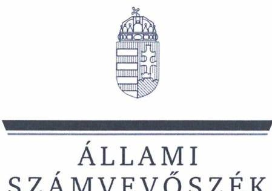
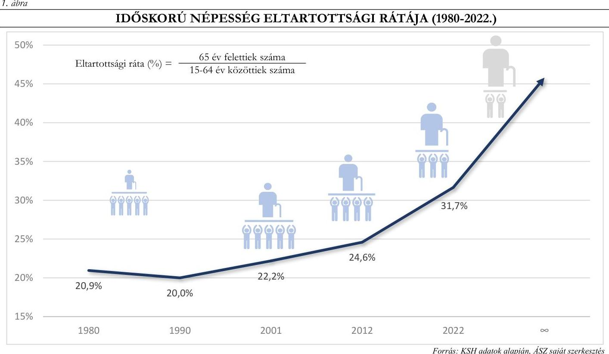
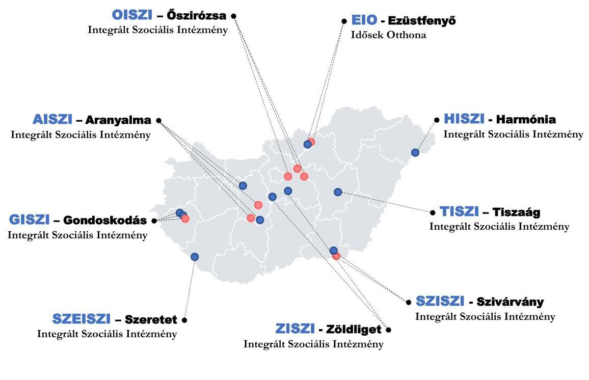
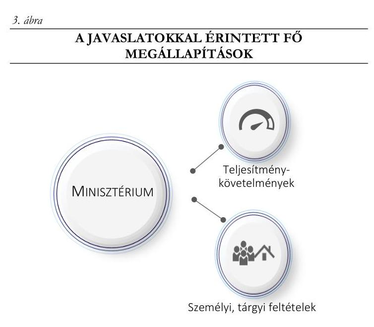
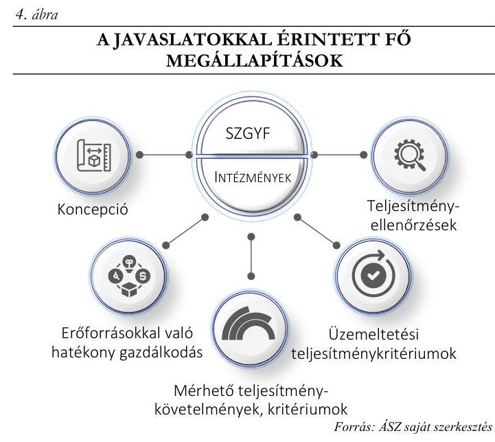
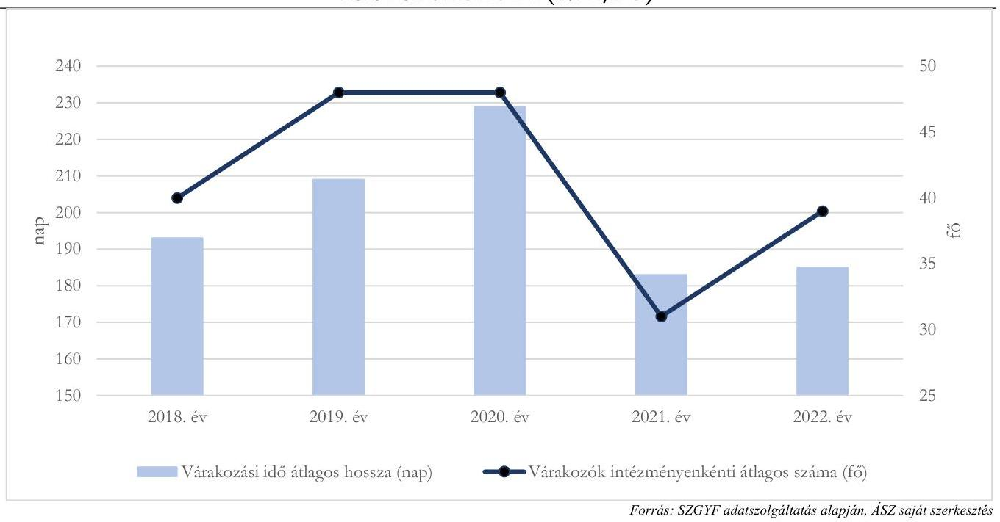
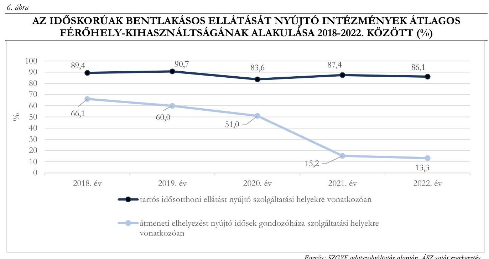

# JELENTÉS 

## Az időskori bentlakásos szociális ellátás ellenőrzése az államháztartás központi alrendszerében

2024.

---

ÁLLAMI
SZÁMVEVŐSZÉK

# JELENTÉS 

## Az időskori bentlakásos szociális ellátás ellenőrzése az államháztartás központi alrendszerében

2024.

---

# ELLENŐRZÉSI IGAZGATÓSÁG: 

## TELJESÍTMÉNYELLENŐRZÉSI IGAZGATÓSÁG

## ELLENŐRZÉSI IGAZGATÓ:

DR. JAKAB KORNÉL igazgató

## ELLENŐRZÉSVEZETŐ:

HORVÁTH KRISZTIÁN ellenőrzésvezető

Jelentéseink az interneten a www.asz.hu címen olvashatók.

IKTATÓSZÁM: EL-3813-006/2024.
TÉMASZÁM: 2662
ELLENŐRZÉS-AZONOSÍTÓ SZÁM: V-1006

---

# TARTALOMJEGYZÉK 

- AZ ELLENŐRZÉS ALAPADATAI ..... 5
- AZ ELLENŐRZÉS HATÓKÖRE ÉS TERÜLETE ..... 7
- ÖSSZEFOGLALÁS ..... 10
- AZ ELLENŐRZÉS FÓKUSZTERÜLETEI ..... 13
- MEGÁLLAPÍTÁSOK ..... 14
- JAVASLATOK ..... 32
- MELLÉKLETEK ..... 33
I. sz. melléklet: Értelmező szótár ..... 33
II. sz. melléklet: Az ellenőrzött szervezetek jegyzéke ..... 35
III. sz. melléklet: Ellenőrzési kritériumok ..... 36
IV. sz. melléklet: A szolgáltatási helyek szolgáltatási bejegyzéseinek státusza ..... 42
V. sz. melléklet: A térítési díjhátralék alakulása intézményenként ..... 43
VI. sz. melléklet: A szakmai feladatellátás mutatói intézményenként ..... 44
VII. sz. melléklet: A vagyongazdálkodás mutatói intézményenként ..... 45
- FÜGGELÉK: ÉSZREVÉTELEK ..... 46
- RÖVIDÍTÉSEK JEGYZÉKE ..... 47

---

.

---

# AZ ELLENŐRZÉS ALAPADATAI 

## AZ ELLENŐRZÉS CÉLJA

Az ellenőrzés célja annak értékelése, hogy az irányítószerv ${ }^{1}$, az állami fenntartó ${ }^{2}$ és az ellátást végző intézmények milyen intézkedésekkel járultak hozzá az idősek szociális biztonságához, az idősek gondozását, ápolását végző bentlakásos intézmények eredményes és hatékony működtetésén keresztül. Az ellenőrzés kiterjedt az idősek gondozását, ápolását végző bentlakásos intézményi feladatellátás során érvényesülő eredményességi, gazdaságossági és hatékonysági követelmények értékelésére is.

## AZ ELLENŐRZÉS TÍPUSA

Teljesítmény-ellenőrzés

## AZ ELLENŐRZÖTT IDŐSZAK

Az ellenőrzött időszak 2018. január 1-től 2022. december 31-ig tart.

## AZ ELLENŐRZÉS TÁRGYA

Az ellenőrzés tárgyát képezte az ellenőrzött szervezetek tevékenységének értékelése az állami (központi) fenntartású, idősek bentlakásos szociális ellátását végző intézmények eredményes-hatékony-gazdaságos működtetésének, valamint az idősek szociális biztonságának megteremtése szempontjából.
Az ellenőrzés kiterjedt minden olyan körülményre és adatra, amely az ÁSZ ${ }^{3}$ jogszabályban meghatározott feladatainak teljesítéséhez, valamint a program végrehajtása folyamán felmerült újabb összefüggések feltárásához szükséges volt.

## AZ ELLENŐRZÉS JOGALAPJA

Az ellenőrzés jogszabályi alapját az Állami Számvevőszékről szóló 2011. évi LXVI. törvény 1. § (3) és 5. § (2)-(3) bekezdései képezték.

## AZ ELLENŐRZÉS MÓDSZERE

Az ellenőrzést a nemzetközi standardokat irányadónak tekintve az ellenőrzési program szempontjai, az ellenőrzött időszakban hatályos jogszabályok, az ellenőrzés-szakmai szabályok és módszertanok figyelembevételével végezte az ÁSZ.

---

Az ellenőrzési bizonyítékként felhasználható adatforrások közé tartoztak egyrészt az ellenőrzéshez kért dokumentumok, adatforrások, másrészt adatforrás volt még minden - az ellenőrzés folyamán - feltárt, az ellenőrzés szempontjából információt tartalmazó további dokumentum.
Az ellenőrzés lefolytatásához az ellenőrzött szervezetek és az ellenőrzést támogató szervezet a tanúsítványok kitöltésével, valamint az ÁSZ által kért dokumentumok, adatok, információk megküldésével és az ellenőrzés során szolgáltatott adatokat.
Az ellenőrzési kérdések megválaszolásához szükséges bizonyítékok megszerzése az ellenőrzött és az ellenőrzést támogató szervezetek által rendelkezésre bocsátott dokumentumokra, adatokra alapozva megfigyelés, szemle (szemrevételezés), kérdésfeltevés (információkérés), interjú, valamint elemző eljárás útján történt. Az ellenőrzés során az ÁSZ az ellenőrzött intézmények 18 szolgáltatási helyén végzett helyszíni szemlét, ahol szemrevételezte az ellenőrzött időszakban történt fejlesztések, intézkedések eredményeit, a szolgáltatási helyek kialakítását.
Az ellenőrzés megállapításai a 2. fókuszterület értékelése során az SZGYF ${ }^{4}$ fenntartásában álló 34 időskorúak bentlakásos ellátását nyújtó intézményre, a 3. fókuszterület értékelése során az ezek közül ellenőrzésre kiválasztott kilenc intézményre és azok adataira, jellemzőire vonatkoznak.
A 3. fókuszterület értékelése során a kilenc ellenőrzött intézmény adatszolgáltatása alapján a szakmai feladatellátáshoz, üzemeltetéshez - kiemelten a használt vagyon alakulásához - kapcsolódó, az ÁSZ által számított mutatók is felhasználásra kerültek, amelyeknek számítási módszerét az I. sz. melléklet tartalmazza. A szakmai feladatellátáshoz kapcsolódó mutatók (8. táblázat) változását a feladatellátás hatékonysága szempontjából az ÁSZ abban az esetben értékelte javulásként, amennyiben az a személyi feltételek kedvező irányú változásának volt a hatása.

---

# AZ ELLENŐRZÉS HATÓKÖRE ÉS TERÜLETE 

Magyarországon a népességfogyás mellett meghatározó demográfiai tendencia az időskorúak (65 éves és annál idősebb) számának és társadalmon belüli arányának növekedése.

Az elmúlt több mint 40 évben (1980-2022. között) Magyarország lakosságának száma 10,3\%-kal, 10709 ezer főről 9603 ezer főre csökkent, miközben az időskorúak száma és aránya folyamatos emelkedést mutatott; a korcsoportba tartozók száma 36,6\%-kal, 1449 ezer főről 1979 ezer főre, lakosságon belüli aránya 13,5\%-ról 20,6\%-ra emelkedett.

A csökkenő népességszámból és a társadalom idősödését mutató népességadatokból következik, hogy egyre nagyobb terhet ró az aktív korú népességre ezen ellátórendszer fenntartása; míg 1980-ban 20,9\%, addig 2022-ben már 31,7\% volt az időskorú népesség aktív korú népességhez viszonyított aránya (1. ábra).

A jelentős nagyságú szociális és gyermekvédelmi ellátórendszer irányítását a Kormány ${ }^{5}$ szociálpolitikai ügyekért felelős mindenkori tagja látja el, mely feladatot 2022. május 25-től az emberi erőforrások miniszterétől átvéve a belügyminiszter végzi. A miniszter ${ }^{6}$ feladata meghatározni a szociálpolitikával kapcsolatos területek szakmai felügyeleti rendszerét, a szociális intézményi ellátások és szolgáltatások rendszerét, továbbá az azokra vonatkozó fejlesztési irányokat, feladatokat.

A szociális ellátórendszer (intézmények és szolgáltatók) által nyújtott szolgáltatások körét a Szoc.tv. ${ }^{7}$ határozza meg, mely a gondozási szükséglettel rendelkező időskorúak számára lehetőséget kínál személyes gondoskodás keretében szociális alapszolgáltatások és szakosított ellátások igénybevételére.

---

A szociális alapszolgáltatások megszervezésével az állam és a települési önkormányzatok célja, hogy a rászorult időskorú személyeket segítse a saját otthonában és lakókörnyezetében az önálló életvitel fenntartásában, valamint egészségügyi, mentális vagy egyéb problémáik megoldásában.

Amennyiben az időskorú rászorult személyekről alapellátás keretében már nem lehet gondoskodni, állapotuknak megfelelő szakosított ellátási formában (idősek otthona, időskorúak gondozóháza) kell őket gondozni. A szakellátások közös jellemzője, hogy lakhatási szolgáltatásra épülnek, tehát napi huszonnégy órás ellátást biztosítanak az azt igénybevevők részére.

Az időskorúak szociális biztonságának megteremtéséhez és annak megőrzéséhez szükséges feltételekről az államháztartás központi és helyi alrendszerének kell gondoskodni. Az ÁSZ jelen ellenőrzése az államháztartás központi alrendszere által az időskorúak számára biztosított tartós és átmeneti bentlakásos ellátásra vonatkozik.
Az állami fenntartású szociális és gyermekvédelmi intézmények fenntartói feladatait ellátó központi szerv 2013. január 1-től az SZGYF, mely az intézményfenntartói feladatok mellett középirányítói jogosítványokat is kapott. Az ellenőrzött időszakban az SZGYF központi szervből, valamint területi szervként működő fővárosi és 19 megyei kirendeltségből állt. Az időskorúak bentlakásos szociális intézményei felett a fenntartói feladatokat a területi szervek látták el. Fenntartásukban 2022. december 31-én 34 szociális intézmény biztosított 71 szolgáltatási helyen tartós bentlakásos elhelyezést, 2 szolgáltatási helyen pedig átmeneti elhelyezést az időskorúak számára. A tartós bentlakásos elhelyezést nyújtó szolgáltatási helyek - összesen 6579 férőhelyen 49,0%-a nem rendelkezett határozatlan idejű szolgáltatási bejegyzéssel (44,9\% ideiglenes hatályú, 4,1\% határozott idejű bejegyzéssel működött).
Az 1. táblázat a 34 intézmény férőhelyszámainak és az azokat igénybe vevők számának alakulását mutatja be: 1. táblázat

# AZ IDŐSKORÚAK TARTÓS ÉS ÁTMENETI ELHELYEZÉSÉT BIZTOSÍTÓ - SZGYF ÁLTAL FENNTARTOTT INTÉZMÉNYI FÉRŐHELYEK ÉS AZ ELLÁTOTTAK SZÁMÁNAK ALAKULÁSA 2018-2022. KÖZÖTT 

| MEGNEVEZÉS | $\mathbf{2 0 1 8} . \mathbf{E V}$ | $\mathbf{2 0 1 9} . \mathbf{E V}$ | $\mathbf{2 0 2 0} . \mathbf{E V}$ | $\mathbf{2 0 2 1} . \mathbf{E V}$ | $\mathbf{2 0 2 2} . \mathbf{E V}$ |
| :-- | --: | --: | --: | --: | --: |
| Férőhelyek száma XII. 31. (fő) | 8552 | 8039 | 8134 | 6888 | 6599 |
| Ellátottak száma XII.31.(fő) | 8216 | 7714 | 6580 | 5904 | 5856 |
| Éves átlagos férőhely-kihasználtság(\%) | 89,3 | 90,6 | 83,5 | 87,1 | 85,8 |

2018-ról 2022-re az időskorúak bentlakásos ellátórendszerében az SZGYF által fenntartott férőhelyek aránya 14,9\%-ról 11,5\%-ra csökkent, melyben elsősorban SZGYF fenntartású férőhelyek egyházi fenntartásba történő átadása játszott szerepet. Az intézmények férőhely-kihasználtsága az ellenőrzött időszakban 83,5\%-90,6\% között alakult.

A mindenkori költségvetési törvényben foglaltak szerint a szociális szolgáltatók és intézmények működési költségeihez az állam a fenntartóknak nyújtott költségvetési támogatással járul hozzá, beleértve azokat az államháztartáson kívüli fenntartókat is, amelyek ellátási szerződés alapján vesznek részt a feladatellátásban. Az SZGYF részére, az időskorúak ellátásához nyújtott költségvetési támogatás, valamint a 34 bentlakásos intézmény által az időskorúak bentlakásos ellátásához használt és az SZGYF vagyonkezelésében lévő vagyon évenkénti alakulását mutatja be a 2. táblázat:

---

# 2. táblázat 

A KÖLTSÉGVETÉSI TÁMOGATÁS ÉS AZ IDŐSKORÚAK BENTLAKÁSOS ELLÁTÁSÁHOZ HASZNÁLT, AZ SZGYF VAGYONKEZELÉSÉBEN LÉVŐ VAGYON NAGYSÁGÁNAK ALAKULÁSA A 2018-2022. ÉVEK KÖZÖTT (M FT)

| MEGNEVEZÉS | 2018. EV | 2019. EV | 2020. EV | 2021. EV | 2022. EV |
| :-- | --: | --: | --: | --: | --: |
| Költségvetési támogatás | 11756,5 | 13143,5 | 14501,8 | 15137,9 | 18774,8 |
| Vagyonkezelésben lévő vagyon bruttó értéke | 7013,4 | 6853,8 | 6793,3 | 6998,3 | 6884,7 |

Az ellenőrzött időszakban az intézmények gazdálkodási feladatait az intézmények és az SZGYF között létrejött feladatmegosztási megállapodás alapján az SZGYF látta el.

Az ellenőrzést az ÁSZ a minisztériumon ${ }^{8}$ és az SZGYF-en kívül kilenc (AISZI ${ }^{9}$, EIO $^{10}$, GISZI ${ }^{11}$, HISZI ${ }^{12}$, OISZI ${ }^{13}$, SZEISZI ${ }^{14}$, SZISZI ${ }^{15}$, TISZI ${ }^{16}$, ZISZI ${ }^{17}$ ) kiválasztott intézményben folytatta le, melyek összesen 19 szolgáltatási helyen végezték az időskorúak bentlakásos ellátását az ellenőrzött időszak utolsó napján.

A kiválasztott intézmények területi eloszlását és jellemző adatait az 2. ábra mutatja:
2. ábra

ELLENŐRZÖTT INTÉZMÉNYEK ÉS SZOLGÁLTATÁSI HELYEIK 2022.12.31-ÉN

2022. december 31-én a kilenc intézmény 19 szolgáltatási helye (összesen 2064 férőhely) közül öt intézmény nyolc szolgáltatási helye - összesen 904 férőhelyen - az időskorúak bentlakásos ellátását ideiglenes hatályú szolgáltatási bejegyzés alapján látta el, határozott idejű szolgáltatási bejegyzés egyik szolgáltatási hely esetében sem volt.

---

# ÖSSZEFOGLALÁS 

A szociális biztonsághoz való jogot az Alaptörvény olyan alapvető értékként rögzíti, amelynek érvényesülését az állam szociális intézmények és intézkedések rendszerével valósítja meg. Az ellátó-szolgáltató rendszerek akkor lehetnek fenntarthatók és láthatják el funkciójukat hosszú távon, ha azok reagálnak a társadalmi-, demográfiai változásokra, működésük összhangban áll a gazdasági adottságokkal, működtetésük hatékony, ezért indokolt annak ellenőrzése, hogy az irányítószerv, az állami fenntartó és az ellátást végző intézmények milyen intézkedésekkel járultak hozzá az idősek szociális biztonságához, az idősek gondozását, ápolását végző bentlakásos intézmények eredményes és hatékony működtetésén keresztül.

A minisztérium az időskorúak szociális ellátásának közép- és hosszú távú, fenntartható megszervezése érdekében stratégiai dokumentumokban határozott meg a szociális szolgáltatásokra vonatkozó célkitűzéseket, a célok elérését támogató intézkedéseket, valamint a célok megvalósulásának nyomon követését leíró módszert. A stratégiákban megfogalmazott intézkedések megvalósítására a 2020-2022-es években nem került sor.

A stratégiai dokumentumok alapján elmondható, hogy a minisztérium az idősgondozást illető - teljesítmény szempontjából jelentős - hiányosságokat azonosított, így a szociális szférában jelen lévő szakemberhiányt, az alacsony bérezést, a rendszer működésével kapcsolatos információk hiányosságát, az intézmény-rendszerek nem egységes működését.

A minisztérium az
 SZGYF főigazgatója részére az ellenőrzött időszakban előírtak ellenére nem határozta meg az egyéni teljesítménykövetelményeket, a teljesítménykövetelmény végrehajtásának elvárt eredményét, elvárt határidejét, teljesítménykövetelmények kitűzésével nem járult hozzá az idősek szociális ellátását szolgáló színvonalasabb tevékenységhez.

A minisztérium az időskorúak ápolását végző, állami fenntartású szociális intézményrendszer eredményes és hosszú távú működésének biztosításához, a jelentős számú ideiglenes hatályú szolgáltatási bejegyzéssel érintett férőhelyszám csökkentéséhez elsősorban a személyi feltételek biztosításának támogatásával járult hozzá. A szükséges tárgyi feltételek biztosítása érdekében tett intézkedések összességében nem voltak eredményesek, a határozatlan idejű bejegyzéssel rendelkező férőhelyek arányának növeléséhez - a rendelkezésre álló költségvetési források szűkössége miatt - nem voltak elegendőek.

---

Az SZGYF az ellenőrzött időszakban nem rendelkezett az időskorúak bentlakásos ellátására vonatkozóan közép- és hosszú távú koncepcióval.

Az SZGYF évente átfogóan értékelte a személyes gondoskodást nyújtó intézmények működését, a feladatellátására vonatkozóan fenntartói ellenőrzéseket végzett, azonban az SZGYF SZMSZ-ében ${ }^{18}$ előírtak ellenére teljesítmény-ellenőrzést nem folytatott le.

Az SZGYF a hiányzó tárgyi feltételek biztosításához előirányzat átcsoportosítással, illetve a minisztérium felé póttámogatási kérelmek benyújtásával járult hozzá, azonban ezek az intézkedések összességében nem voltak
eredményesek, nem voltak elegendőek ahhoz, hogy a határozatlan idejű szolgáltatási bejegyzéshez szükséges tárgyi feltételek tekintetében az ellenőrzött 5 évben előrelépés történjen.

A szükséges személyi feltételek javítása érdekében az SZGYF az intézményi dolgozók számára képzéseket szervezett, támogatta a nyugdíjasok tovább foglalkoztatását.

Az ellenőrzött években az ideiglenes hatályú szolgáltatási bejegyzéssel rendelkező férőhelyek aránya az SZGYF fenntartásában álló intézmények esetében növekedett, 2022. év végére megközelítette a 45%-ot.

Az SZGYF által fenntartott, időskorúak bentlakásos ellátását biztosító intézményekben a várakozási idő átlagos hossza a COVID-19 világjárvány 2020. évi megjelenéséig folyamatosan nőtt, majd a 2021. évi visszaesést követően 2022-ben ismét emelkedést mutatott és elérte a 6 hónapot. 2018-ról 2022-re az éves átlagos férőhely-kihasználtság a tartós bentlakásos idősotthoni ellátást nyújtó szolgáltatási helyek esetében 89,4%-ról 86,1%-re, az átmeneti elhelyezést szolgáló gondozóházak - 2018-ban 30 férőhely, 2022-ben 20 férőhely esetében 66,1%-ról 13,3%-ra csökkent. Az állami fenntartású intézményekben tapasztalt várakozási időt befolyásolta, hogy 1910-zel csökkent a férőhelyek száma, a férőhely-kihasználtságra hatással volt, hogy a tárgyi és személyi feltételek hiánya miatt egyes szolgáltatási helyek nem tudták az üres férőhelyeiket feltölteni.

Az intézményi férőhely-kihasználtság növelése és a várólista csökkentése érdekében az SZGYF tett intézkedéseket, elsősorban kapacitások átszervezése útján.

A vagyonkezelésben lévő eszközök esetében az elszámolt értékcsökkenés jelentősen meghaladta az állomány növekedését, a nagymértékben elavult eszközállomány kockázatot hordoz a feladatellátás megfelelő színvonalú biztosítására. A SZGYF évente egyszer felmérte a vagyonkezelt vagyon állapotát, az intézmények felújítási, karbantartási tervei felülvizsgálata alapján a minisztérium felé az ingatlanállomány fejlesztésére, felújítására, a szükséges többletforrásokat is feltüntetve javaslatot tett.

Az ellenőrzött kilenc intézményben a források eredményes, hatékony és gazdaságos felhasználása érdekében a szakmai feladatellátásra, dolgozói továbbképzésekre és egyes üzemeltetési folyamatokra vonatkozóan valamennyi intézményvezető határozott meg célokat, azonban a célok előrehaladásának mérése,

---

monitorozása érdekében teljesítménykritériumokat, mérőszámokat csak egyes folyamatok esetében alakítottak ki.

Szakmai teljesítménymutatók alakulását az intézményvezetők legalább évente egyszer a szakmai beszámolóban vagy az adott témához kapcsolódó egyéb dokumentumban értékelték.

Vezetői monitoring alapján a szakmai feladatellátás színvonalának fejlesztése érdekében valamennyi intézményvezető, a gazdálkodási, üzemeltetési folyamatok fejlesztése érdekében az intézményvezetők harmada tett intézkedéseket.

Az érintett intézmények vezetői a határozatlan időre szóló szolgáltatási bejegyzéshez szükséges feltételek teljesítése érdekében tettek, vagy hatáskörük hiánya esetén kezdeményeztek intézkedéseket a fenntartó felé, azonban a férőhelyek szolgáltatási nyilvántartásba való bejegyzésének státuszában egy szolgáltatási hely kivételével az ellenőrzött évek alatt nem tudtak javulást elérni. A hosszú távú biztonságos működésre, valamint a színvonalas feladatellátásra kockázatot jelent, hogy 2022. év végén a kilenc ellenőrzött intézmény időskorúak bentlakásos ellátását biztosító férőhelyeinek 43,8%-a - négy szolgáltatási hely a tárgyi feltételek hiánya, három szolgáltatási hely a tárgyi és személyi feltételek hiánya, egy szolgáltatási hely pedig a személyi feltételek hiánya miatt - nem felelt meg a határozatlan idejű bejegyzéshez szükséges jogszabályi feltételeknek.

Az intézmények az ellátás színvonalának javítása érdekében az ellátottak számára kínáltak alapfeladaton túli egyéb szolgáltatásokat, programokat, továbbá az intézményvezetők az éves szakmai beszámolóikban minden évben megfogalmaztak színvonaljavító javaslatokat.

A kilenc ellenőrzött intézmény realizált összesített 2022. évi bevétele 51,9%-os emelkedést mutatott a 2018. évihez képest. Minden intézményben a bevétel legjelentősebb és növekvő részét a központi költségvetési támogatás jelentette (2018. év: 50,5%-71,8%; 2022. év: 67,2%-82,5%), második legnagyobb bevételi részarányt az ellátottak által fizetett térítési díjak tették ki. A kilenc intézmény bentlakásos idősellátás során realizált összesített 2022. évi térítési díjbevétele 5,8%-os emelkedést mutatott a 2018. évihez képest és annak részaránya minden intézmény esetében csökkent, 2022-ben 17,3%-30,8% között alakult. A közszolgáltatást mind nagyobb mértékben az állami költségvetés finanszírozta.

A bevétel növelése érdekében tett vezetői intézkedések között minden intézményben első helyen a térítési díjhátralék beszedésére irányuló intézkedések álltak, ennek ellenére 2018-ról 2022-re a térítési díjhátralékból származó összesített követelés növekedett. A közszolgáltatást egyre kisebb mértékben finanszírozta a gondozottak által fizetendő térítési díj, ugyanakkor a megállapított személyi térítési díjhátralék növekedése kockázatot jelentett a bevételi előirányzat teljesítésére és a szakmai feladatellátás színvonalára.

2018-2022. évek között a kilenc ellenőrzött intézményben az év végi összesített üres álláshelyek száma és az adott évben 30 napon túl be nem töltött üres álláshelyek száma közel másfélszeresére emelkedett. A magas fluktuáció és az üres álláshelyek betöltésének növekvő időigénye kockázatot jelentett a hatékony és eredményes szakmai feladatellátásra, annak színvonalára.

Az intézmények költségvetésében csekély kiadási összeget tett ki a karbantartásokra fordított személyi és dologi kiadás. A tárgyi eszköz beszerzések, felújítások, beruházások alapvetően az elhasználódott, vagy vis major okok miatt használhatatlan eszközök pótlását jelentette, a fejlesztések jellemzően nem költségvetési, hanem pályázati forrásokból valósultak meg. Több intézményben kockázatot jelentett a tárgyi eszközök alacsony használhatósági foka a feladatellátás, illetve a tárgyi feltételek biztosítására nézve.

---

# AZ ELLENŐRZÉS FÓKUSZTERÜLETEI 

1.- Az időskorúak ápolását, gondozását végző állami (központi) fenntartású bentlakásos szociális intézményrendszer eredményes működtetésére érdekében tett minisztériumi intézkedések
2.- A Szociális és Gyermekvédelmi Főigazgatóság által tett intézkedések a fenntartásában lévő időskorúak ápolását, gondozását végző bentlakásos szociális intézmények hatékony és eredményes működtetésére érdekében
3.- Az időskorúak bentlakásos szociális ellátását biztosító intézményi működés során, az előírt szolgáltatási kötelezettségek teljesítéséhez kapcsolódó hatékonysági, eredményességi és gazdaságossági elveknek való megfelelés

---

# MEGÁLLAPÍTÁSOK 

## 1. Az időskorúak ápolását, gondozását végző állami (központi) fenntartású bentlakásos szociális intézményrendszer eredményes működtetésére érdekében tett minisztériumi intézkedések

Összegző megállapítás

A minisztérium meghatározta az időskorúak ápolását, gondozását végző állami fenntartású szociális intézményrendszer működtetésének stratégiai céljait, fejlesztési irányait, kialakította a közép- és hosszú távú stratégiai kereteket. A stratégiai tervek megvalósítására irányuló intézkedésekre a 2020-2022-es években nem került sor. Az időskori bentlakásos szociális ellátás feltételrendszerének biztosítását és fejlesztését elsősorban a személyi feltételeket érintően támogatta, a szükséges tárgyi feltételek biztosítása érdekében tett intézkedései nem voltak eredményesek.

A minisztérium az SZGYF fenntartása alá tartozó időskorúak bentlakásos szociális intézményrendszerének hosszú távon fenntartható működtetésére érdekében a közép- és hosszú távú stratégiai kereteket kialakította, azonban a stratégiai tervek megvalósítására irányuló intézkedésekre, - a fejlesztések megvalósításához számításba vett finanszírozási források beérkezésének elmaradása miatt - a 2020-2022-es években nem került sor.
A minisztérium az időskorúak bentlakásos ellátásának közép- és hosszú távú, fenntartható megszervezése érdekében a stratégiai kereteket kialakította a 2020-2030-as időtávra szóló „Tartós ápolás-gondozásra vonatkozó stratégia 2030" című dokumentumokban, valamint a humán szakterületek fejlesztéseit magában foglaló EFOP ${ }^{19}$ Plusz 2021-2027 programstratégiában, továbbá a nagy létszámú elsősorban a fogyatékossággal élő, pszichiátriai beteg és szenvedélybeteg ellátást nyújtó - bentlakásos intézmény kiváltását célzó „Kiváltás Koncepció 2019"20 hosszú távú programban. Az EFOP Plusz program ${ }^{21}$ ellenőrzött ágazatot érintő célkitűzése a szociális ágazat magas minőségű humánerőforrásának megteremtése, valamint a stabil, elkötelezett, korszerű szakmai kompetenciákkal rendelkező, elegendő létszámú szakember állomány biztosítása.
A „Kiváltás Koncepció 2019" program megvalósítása során a nagylétszámú bentlakásos intézményi ellátásról fokozatosan térnek át a közösségi lakhatást, életvitelt nyújtó szolgáltatások használatára, elsőként a fogyatékossággal élő személyeket ellátó intézményi formáról. E stratégiai lépés közvetetten kapcsolódik az időskorúak bentlakásos ellátásának közép- és hosszútávú megszervezéséhez, mivel a kiváltott intézményekben, amennyiben arra lehetőség van idősotthoni férőhelyek kerülnek kialakításra.

---

A fenti stratégiai dokumentumok meghatározták a szociális szolgáltatásokra vonatkozó célkitűzéseket, a célok elérését támogató intézkedéseket, valamint a célok megvalósulásának nyomon követését leíró módszert.
A 2020. évtől hatályos, a „Tartós ápolás-gondozásra vonatkozó stratégia 2030" című dokumentumban a minisztérium az idősgondozást illetően kitűzött célok megvalósítására forrásigényt becsült meg, teljesítménykövetelményeket, kritériumokat, mérőszámokat határozott meg. Fő célként a tartós ápolás humánerőforrásának fejlesztése, az intézményrendszer és a szolgáltatások fejlesztése és a kommunikáció fejlesztése szerepelt, amelyekhez a célok további alábontásával cél-eszköz mátrix készült, megjelölve abban a megvalósítás eszközeit, az idősávot és a feladatok tipizálását.
A stratégiákban megfogalmazott intézkedésekre, - a fejlesztések megvalósításához számításba vett finanszírozási források beérkezésének elmaradása miatt - a 2020-2022. években még nem került sor.
A minisztérium a szociális ellátást igénylők számáról, az intézmények fejlesztési igényeiről és azok költségvonzatáról, működésük tárgyi-, személyi feltételeiről, továbbá a tartozásállomány változásairól a 2020. évtől kezdődően kért adatokat az SZGYF-től, azonban az adatszolgáltatás során kapott adatokból elemzéseket, riportokat nem készített, így azokat a stratégiai célok megvalósítását szolgáló döntései támogatásához nem tudta felhasználni.
A minisztérium az időskori bentlakásos szociális ellátás feltételrendszerének biztosítását és fejlesztését módszertani ajánlás kiadásával, szakmatámogatási hálózat létrehozásával, a humánerőforrás szakmai fejlesztésével, intézményi férőhely-kiváltási programról szóló döntésével támogatta. Az SZGYF főigazgatója részére éves teljesítménykövetelményeket nem határozott meg. A tárgyi feltételek vonatkozásában tett intézkedései összességében nem voltak eredményesek, nem voltak elegendőek ahhoz, hogy az ideiglenes hatályú szolgáltatási bejegyzéssel rendelkező szolgáltatási helyek tárgyi feltételei, ezáltal bejegyzésük státusza javuljon.
A minisztérium az időskorúak bentlakásos ellátását végző intézmények szakmai feladatellátását a 2021-től szakmai program készítését támogató ajánlás kiadásával támogatta, ami kitért a készítendő szakmai program formai és tartalmi követelményeire (a megvalósítani kívánt program konkretizálása, a létrejövő kapacitások, szolgáltatáselemek, tevékenységek leírása, más intézményekkel történő együttműködés módjának bemutatása, a szolgáltatásról szóló tájékoztatás), alapelvekre, a szakmai programot érintő változásokra.
A szociális szolgáltatások és a gyermekjóléti alapellátás vonatkozásában - a minisztérium pályázati felhívása alapján a 2021.12.01 - 2024.06.30. megvalósítási időszakra, az NSZI ${ }^{\text {® }}$ közreműködésével szolgáltatástámogatási és szakmafejlesztési hálózat alakult meg, melynek célja a szakmapolitikai törekvések megismertetése és elfogadtatása, a minisztérium felméréseinek elvégzésében való közreműködés, a szolgáltatók, intézmények körében felmerülő kérdések, problémák, javaslatok Szociális Ügyekért Felelős Államtitkárság felé történő becsatornázása.
A szükséges humánerőforrás szakmai fejlesztéséhez az ellenőrzött időszakban képzések szervezésével, azokhoz nyújtott támogatással járult hozzá a minisztérium. További támogatást jelent ehhez az EFOP Plusz programstratégia, melynek célja a 2021-2027-es időszakban a szociális ágazatban magas minőségű, elegendő létszámú szakemberállomány biztosításával, többek között a demenciában szenvedők életminőségének javítása, a
 számukra nyújtott szolgáltatások fejlesztése és a szakápolási tevékenység támogatása.

---

Az „EFOP-2.2.2-17 Intézményi ellátásról a közösségi alapú szolgáltatásokra való áttérés fejlesztése" című konstrukció keretében az SZGYF fenntartásában lévő fogyatékossággal élők számára ápolást, gondozást nyújtó intézményi férőhelyek kiváltása folytatódott a „Kiváltás Koncepció 2019" stratégia alapján, a közösségi alapú ellátási formák (pl. támogatott lakhatás) kialakításával, mely döntéssel a minisztérium az idősellátást nyújtó szolgáltatási helyek férőhely kapacitásának növeléséhez is hozzájárult.
A minisztérium az idősellátást biztosító intézmények állami fenntartójának főigazgatója ${ }^{23}$ részére az ellenőrzött időszakban - a 10/2013. (I. 1.) Korm. rendelet ${ }^{24}$ 6. § (1) a) és a (2) bekezdéseiben és a 7. § (1)-(2) bekezdéseiben előírtak ellenére - nem határozta meg az egyéni teljesítménykövetelményeket, a teljesítménykövetelmény végrehajtásának elvárt eredményét, elvárt határidejét, teljesítménykövetelmények kitűzésével nem járult hozzá az idősek szociális ellátását szolgáló színvonalasabb tevékenységhez.
A minisztérium a bentlakásos szociális ellátást érintően jogszabályok módosítását kezdeményezte, melyek eredményeképpen szakápolási központok létrehozása, szociális intézmények egyházi fenntartásba adása, szociális ágazati képzések bővítése kezdődött, valamint a nyugdíjas személyek tovább foglalkoztatására nyílt lehetőség. Ezen intézkedésekkel a minisztérium a színvonalasabb ellátást, illetve az előírt személyi feltételek biztosítását irányozta elő.
A minisztérium az ellenőrzött időszakban több esetben igényelt többletforrásokat az idősellátást nyújtó intézmények likviditási problémáinak kezelése, valamint halaszthatatlan javítási, felújítási feladatok finanszírozása céljából, azonban ezek az intézkedések összességében - tekintettel a felhasználható források szűkösségére - nem voltak eredményesek, nem voltak elegendőek ahhoz, hogy az SZGYF fenntartásában lévő, időskorúak bentlakásos ellátását nyújtó ideiglenes hatályú szolgáltatási bejegyzéssel rendelkező szolgáltatási helyeken a határozatlan idejű bejegyzéshez szükséges tárgyi feltételek tekintetében az ellenőrzött 5 évben előrelépés történjen.
Az ideiglenes hatályú szolgáltatási bejegyzéssel rendelkező szolgáltatási helyek - ellátási érdekből történő - tovább-működésére a minisztérium a 369/2013. (X. 24.) Korm. rendelet ${ }^{25}$ módosításával 2023. 12. 31-ig lehetőséget biztosított.

A kormány rendelkezett az SZGYF fenntartásában álló intézménystruktúra átalakításáról, a szociális intézmények egyházi átadásának előkészítéséről. Az előkészítés végrehajtása érdekében megalkotott jogszabályok és közjogi szervezetszabályozó eszközök alapján az ellátáshoz kapcsolódó vagyonelemek tulajdonjogát is átvette az egyház. Az ellenőrzött években 11 megye, 21 szolgáltatási helyét érintette fenntartóváltás, amelyek eredményeként 2397 idősotthoni férőhely került egyházi fenntartásba. A minisztérium az időskorúak bentlakásos szociális ellátásának biztonságos és hosszú távon fenntartható működtetése érdekében az ellenőrzött időszakban nem mérte vissza, hogy az intézmények átadása milyen hatással volt az SZGYF fenntartásában megmaradt intézményrendszerre (pl.: költségek, tárgyi- és személyi feltételek, várólista hosszának alakulása).

---

# 2. A Szociális és Gyermekvédelmi Főigazgatóság által tett intézkedések a fenntartásában lévő időskorúak ápolását, gondozását végző bentlakásos szociális intézmények hatékony és eredményes működtetése érdekében 

| Összegző megállapítás | Az ellenőrzött időszakban az SZGYF a 2019. év kivételével |
| :-- | :-- |
| nem határozott meg érvényesíthető |  |
| teljesítménykövetelményeket. A szakmai feladatok |  |
| ellátásának javulása érdekében tett intézkedéseket, |  |
| ugyanakkor a határozatlan idejű szolgáltatási bejegyzések |  |
| biztosítása érdekében tett intézkedései nem voltak |  |
| eredményesek. A humánerőforrás gazdálkodás területe |  |
| kivételével nem intézkedett az erőforrásokkal való hatékony |  |
| és eredményes gazdálkodás követelményei érvényesülése |  |
| érdekében. |  |

Az SZGYF az ellenőrzött időszakban nem rendelkezett az időskorúak bentlakásos ellátására vonatkozóan közép- és hosszú távú koncepcióval, a 2019. év kivételével nem határozott meg az idősek bentlakásos szociális ellátása során érvényesíthető teljesítménykövetelményeket.
Az ellátórendszer biztonságos, hosszú távú működtetésének érdekében az SZGYF a 2018-2022. évek tekintetében a fő stratégiai cél - az ellátás kiegyensúlyozott és hosszú távú biztosítása érdekében elérését támogató közép-, vagy hosszú távú koncepciót nem alakított ki.
2019-ben középtávú célkitűzésként a szakmai feladatellátást érintő, férőhelyracionalizálással kapcsolatos célokat tűzött ki az SZGYF és a célok elérése érdekében teljesítménykövetelményeket, kritériumokat határozott meg.
A 2019-2022. évekre vonatkozóan az éves munkatervek tartalmaztak rövid távú feladatokat a szakmai feladatellátást, a gazdálkodást és üzemeltetést érintően, továbbá a szervezeti egységek számára megfogalmazott célok egy része az idősellátásra vonatkozó fejlesztési irányokat is rögzítette (külső szakmai kapcsolattartás erősítése; egységes gazdasági rendszer továbbfejlesztése; ingatlanportfolio tisztítása; EU finanszírozási pályázati lehetőségek felkutatása; intézményi kontrolling: elemzések, feladatmutatók képzése; keretgazdálkodás feltételeinek kialakítása).
Az SZGYF a Szoc.tv. és az 1/2000. (I.7) SZCSM ${ }^{26}$ rendeletben előírtaknak megfelelően évente átfogóan értékelte a személyes gondoskodást nyújtó intézmények működését, továbbá az ellenőrzött időszak minden évében végzett a feladatellátásukra vonatkozóan ellenőrzéseket, melyek során a szabályszerűségi szempontok szerinti megfelelést vizsgálták. Teljesítményellenőrzéseket az SZGYF SZMSZ I. függelék I.2.2. pontjában előírtak ellenére nem folytattak.

Az SZGYF és az intézmények között kialakított adatszolgáltatási rendszeren keresztül megkapott információk, adatok, a fenntartói ellenőrzések tapasztalatai és az elvégzett éves szakmai értékelések hozzájárultak ahhoz, hogy az ellenőrzött időszakban a fenntartói döntések megalapozásához, a rövid távú célok és a fejlesztési irányok meghatározásához teljes körű, naprakész információ álljon a fenntartó rendelkezésére az intézményei működéséről.

---

Az SZGYF az adatszolgáltatások feldolgozása alapján a 2021-2022. években készített elemzéseket az idősellátással kapcsolatosan. A 2021. évi „Szociális és Gyermekvédelmi Főigazgatóság fenntartásában lévő szakosított szociális intézmények működéséhez kapcsolódó átfogó helyzetjelentés" című dokumentum bemutatta a szociális intézményrendszer általános problémáit, így többek között a fluktuációt, a foglalkoztatottak magas életkorát, az alacsony jövedelmeket, leterheltséget, a tárgyi és személyi feltételek hiányát, a létszámminimummal kapcsolatos problémákat, az emelkedő intézményi várólistákat. A helyzetjelentés javaslatokat tartalmazott mind a humánerőforrás, mind az általános működés területét érintően.
Az SZGYF a hatékony, gazdaságos feladatellátás érdekében nem készített elemzést az ellátás területi lefedettsége, az intézmények, régiók szakmai feladatellátásával, illetve térítési díjaival kapcsolatban.
Az SZGYF tett intézkedéseket az idősellátás szakmai feladatai ellátásának javulása érdekében. Azonban a határozatlan idejű szolgáltatási bejegyzések megszerzéséhez szükséges tárgyi feltételek biztosítása érdekében tett intézkedései összességében nem voltak eredményesek, nem voltak elegendőek az érintett férőhelyekre vonatkozó ideiglenes hatályú szolgáltatási bejegyzések státuszának határozatlan idejűvé válásához, az előírt tárgyi feltételek, ezáltal a szakmai színvonal biztosításához.
Az időskorúak bentlakásos ellátását nyújtó intézmények egy része nem rendelkezett az ellenőrzött években határozatlan időre szóló szolgáltatási bejegyzéssel, amelynek oka az előírt tárgyi és/vagy személyi feltételek hiánya volt. Az SZGYF a hiányzó tárgyi feltételek biztosításához előirányzat átcsoportosítással, illetve az irányítószervhez benyújtott póttámogatási kérelmekkel járult hozzá, azonban ezek az intézkedések összességében nem voltak eredményesek, nem voltak elegendőek ahhoz, hogy az állami fenntartásban lévő, idősellátást nyújtó, ideiglenes hatályú szolgáltatási bejegyzéssel rendelkező szolgáltatási helyeken a határozatlan idejű bejegyzéshez szükséges tárgyi feltételek tekintetében az ellenőrzött 5 évben előrelépés történjen. A 2018. január 1-jén az ideiglenes hatályú bejegyzéssel rendelkező férőhelyszám az állami fenntartásban lévő bentlakásos idősellátás összes férőhelyszámának 40,5%-át tette ki, míg 2022. december 31-i adatok szerint ez az arány 44,9%-ra emelkedett az ideiglenes hatályú férőhelyszám 13,9%-os és az összes férőhelyszám 22,4%-os csökkenése mellett.
Az SZGYF az intézményi eseti és rendszeres adatszolgáltatások (pl. gépjárműpark állapota, konyhák beruházási igények, szállítói tartozásállomány változása, ingatlanok szükséges beruházási igénye, fűtésrendszer állapota, 2022. évi földgáz fogyasztás megnövekedett forrásigénye) feldolgozását követően saját hatáskörben (pl. 2022. évi élelmiszer áremelkedésből adódó többletköltség finanszírozása, térítési díjhátralék kezelése), illetve a minisztérium támogatásával (pl. egyes ingatlanok beruházási munkálataihoz nyújtott vis major támogatás, energiakorszerűsítést megvalósító KEHOP${ }^{27}$ pályázatban konzorciumi tagként való részvétel) tett intézkedéseket a felmerülő problémák megoldása érdekében.
A 2022. évi jelentős mértékű energia- és élelmiszer-áremelkedés intézményeket érintő hatását az SZGYF az intézményektől kért adatszolgáltatások útján figyelemmel kísérte.
2022. májusban az intézmények likviditási helyzetére tekintettel a fenntartó részéről előirányzat módosításra került sor az élelmiszer áremelkedés miatti költségtöbblet ellentételezésére, a kilenc ellenőrzött intézmény tekintetében az időskorúak bentlakásos ellátását érintően összesen 161,4 M Ft összegben. 2022. júniusban az energiaköltségek emelkedéséből adódó költségtöbblet finanszírozására kormányzati hatáskörben került sor, a Gazdaság-újraindítási programok előirányzatból történő

---

átcsoportosításról szóló 1285/2022.(VI.7.) Kormány határozat alapján az ellenőrzött kilenc intézmény esetében összesen 680,2 M Ft összegben.
Egy intézménynél még további 17 M Ft-ra volt szükség a 2022. évi energia és élelmiszer áremelkedésekből adódó többletköltség teljes mértékű finanszírozására, a szükséges forrást fenntartói hatáskörben az SZGYF az intézmény számára biztosította.
Az áremelkedésekből adódó többletköltségek a fenntartó/irányítószerv által teljes mértékben finanszírozásra kerültek.
Az ellenőrzött időszakban az SZGYF által fenntartott idősellátást biztosító intézményekben a várakozási idő átlagos hossza - a COVID-19 világjárvány 2020. évi megjelenéséig - folyamatosan nőtt, majd a 2021. évi visszaesést követően 2022-ben lassú emelkedésnek indult. Hasonlóan alakult az ellátásra várakozók átlagos száma is, amely a 2021. évi több, mint 30%-os csökkenést követően 2022-ben megközelítette a 2018. évit, ami az idős otthonokban 40 fő, az átmeneti ellátást nyújtó idősek gondozóházaiban 15 fő volt. Az SZGYF fenntartásában lévő idősellátást biztosító intézményekben a várakozási idő és a várólista hosszának alakulására hatással volt, hogy az állami fenntartású időskorúak bentlakásos ellátását nyújtó intézményekben a rendelkezésre álló férőhelyek száma 2018-2022. között - elsősorban a fenntartói szerkezet változása miatt - 1910 férőhellyel csökkent, míg az ápolásra szoruló időskorúak száma növekedett, az igénylők számára a COVID-19 világjárvány ugyanakkor még 2022-ben is befolyást gyakorolt.
A várólistával és a várakozási idővel kapcsolatos adatokat a 5. ábra szemlélteti:
5. ábra

VÁRÓLISTA ADATOK AZ SZGYF FENNTARTÁSÁBAN ÁLLÓ IDŐSKORÚAK TARTÓS BENTLAKÁSOS ELLÁTÁSÁT NYÚJTÓ SZOLGÁLTATÁSI HELYEKRE VONATKOZÓAN 2018-2022. KÖZÖTT (NAP/FŐ)

Forrás: SZGYF adatszolgáltatás alapján, ÁSZ saját szerkesztés

Az időskorúak bentlakásos ellátását nyújtó intézmények férőhely-kihasználtságának öt éves adatát a 6. ábra szemlélteti.

---

Forrás: SZGYF adatszolgáltatás alapján, ÁSZ saját szerkesztés
A 2020-ban bekövetkezett férőhelykihasználtság csökkenés hátterében a COVID-19 világjárvány ellátottakra gyakorolt közvetlen hatása (ellátottak és kérelmezők számának csökkenése), valamint az arra adott, kormányzati és fenntartói szintű válaszlépések (felvételi létszámzárlat, majd szigorított felvételi eljárásrend; izolációs részlegek létrehozásával a szabad férőhelyek számának csökkenése) álltak. A teljes ellenőrzött időszakban működtek olyan szolgáltatási helyek, ahol üres férőhelyek álltak rendelkezésre, mivel a rendelkezésre álló tárgyi és személyi feltételek nem tették lehetővé a várólistán szereplő, folyamatos ápolásra szoruló igénylők elhelyezését.
Az ellenőrzött években az SZGYF fenntartásában lévő intézményekben az időskorúak bentlakásos ellátását nyújtó férőhelyek száma 414 férőhellyel bővült, melyhez hozzájárult a fogyatékossággal élők ápolását, gondozását nyújtó intézményi férőhelyek kiváltását követően kialakított új idősotthoni férőhelyek száma is.
Az SZGYF támogatta a nyugdíjasok közalkalmazottként történő tovább foglalkoztatását, ami hozzájárult a szükséges személyi feltételek javulásához.
Az időskorúak bentlakásos ellátását nyújtó intézményekben a személyes gondoskodást végző dolgozók létszáma 2018-ról 2022-re közel 30%-kal, ebből a megfelelő szakirányú képesítéssel rendelkezők száma több mint 25%-kal csökkent. Az SZGYF az ellenőrzött időszak minden évében módszertani dokumentumok, ajánlások kiadásával, képzések szervezésével segítette az időskorúak bentlakásos ellátását biztosító intézmények, valamint az SZGYF kirendeltségek szakmai feladatainak ellátását. A képzések hozzájárultak az intézményekben a szakképzettségi arány javulásához, mely a 2018. évi 81,5%-ról 2022-re 86,7%-ra emelkedett.
Az ellenőrzött időszakban az ÁJB${ }^{28}$ hét esetben végzett
 ellenőrzést az idősek alapjogi védelmét érintő bejelentések alapján az SZGYF fenntartásában álló időskorúak bentlakásos ellátását nyújtó intézményekben. Az AJB által összeállított éves beszámolók, valamint a jelentések alapján az intézményeknél a nem megfelelő személyi és tárgyi feltételek (akadálymentesítési hiányosságok, nagy alapterületű szobákban nagy létszámú ellátott elhelyezése, gondozói hiány), a nem megfelelő bánásmód és higiénés körülmények, élelmezési problémák miatt kerültek ajánlások megfogalmazásra a minisztérium, az SZGYF, esetenként a kormányhivatalok, valamint az intézményvezetők részére. Az ellenőrzés időszakát megelőző 5 évben, nyolc alkalommal végzett hasonló tárgykörökben ellenőrzéseket az AJB, kiegészülve két esetben az ellátottak pénzének kezelésére vonatkozó jogellenes gyakorlattal. A 15 lezárult ellenőrzésből 14 esetben azonosítottak az időskorúak alapvető jogaival összefüggő visszásságot.
Az SZGYF a számára megfogalmazott ajánlásokat elfogadta és a megtett intézkedésekről minden esetben tájékoztatta az AJB-t.
Az elszámolt értékcsökkenés jelentősen meghaladta a vagyon növekedését, ami hozzájárult az eszközvagyon avulásához, az SZGYF fogalmazott meg javaslatot az irányítószerv felé az ingatlanállomány fejlesztésére, felújítására vonatkozóan.
A vagyonkezelt vagyon főbb adatainak az alakulását a 3. táblázat szemlélteti:

# 3. táblázat 

AZ SZGYF VAGYONKEZELÉSÉBEN LÉVŐ VAGYON NAGYSÁGÁNAK ALAKULÁSA AZ IDŐSKORÚAK BENTLAKÁSOS ELLÁTÁSÁT BIZTOSÍTÓ SZOLGÁLTATÁSI HELYEK VONATKOZÁSÁBAN 2018-2022. KÖZÖTT (M FT)

|  | 2018. év | 2019. év | 2020. év | 2021. év | 2022. év |
| :-- | --: | --: | --: | --: | --: |
| Vagyonkezelt vagyon növekedése (beruházás, felújítás, átvétel) | 208,1 | 854,6 | 1022,0 | 533,7 | 717,7 |
| Elszámolt értékcsökkenés | 1949,1 | 1947,4 | 1816,6 | 1875,7 | 1811,8 |

Az időskorúak bentlakásos ellátásához használt, és az SZGYF vagyonkezelésében lévő vagyon bruttó értéke 2018-ban 7013 M Ft volt, ami 2022-re 6885 M Ft-ra csökkent. Az ellenőrzött időszakban a vagyonkezelésben lévő eszközök esetében az elszámolt értékcsökkenés jelentősen meghaladta a vagyon növekedését, ami hozzájárult az eszközvagyon avulásához. A vagyonkezelt vagyon ellenőrzött időszaki növekedésben jelentős szerepe volt - az SZGYF konzorciumi tagsága mellett - az épületek energetikai korszerűsítését megvalósító KEHOP projekt keretében végrehajtott energetikai fejlesztéseknek.
Az SZGYF az ellenőrzött időszak minden évében felmérte a vagyonkezelt vagyon állapotát, továbbá az intézmények felújítási, karbantartási tervei felülvizsgálata alapján tett javaslatot az irányítószerv felé az ingatlanállomány fejlesztésére, felújítására, illetve tájékoztatást adott az azokhoz szükséges többletforrásokra vonatkozóan.
Az SZGYF egyes tevékenységeiben nem érvényesítette teljeskörűen az erőforrásokkal való hatékony és eredményes gazdálkodás követelményét.
Az SZGYF az intézmények erőforrásokkal való hatékony gazdálkodása követelményeinek érvényesítését nem támogatta, mivel:

- az intézmények időskori bentlakásos ellátásához kapcsolódó gazdálkodási és üzemeltetési folyamatok vonatkozásában nem készített hatékonysági vizsgálatokat, nem számolt mutatókat, annak ellenére sem, hogy ezen feladat egyes szervezeti egységei éves munkaterveiben elő volt írva,
- költség-hatékonyság és/vagy azok teljesítésének színvonala szempontjából az intézmények által külső szolgáltatókkal kötött szerződésállományt nem monitorozta, nem végezte el a szerződések felülvizsgálatát,
- az intézményi térítési díjak meghatározásakor nem minden esetben vette figyelembe az előző időszakhoz képest a költségek és azok mértékének változását.

Az SZGYF az időskorúak bentlakásos ellátását nyújtó intézményei esetében felmérte és meghatározta azokat a férőhelyeket, amelyek belépési hozzájárulás megfizetése esetén tölthetők be. Az időskorúak bentlakásos ellátását biztosító intézményekben 2018-2020. között összesen 90 emelt szintű, 2021-ben 82 és 2022-ben 60 emelt szintű férőhely volt kialakítva, amelyek igénybevétele esetén belépési hozzájárulást kellett az ellátottaknak fizetni. A 2018-2022. évek között befizetett belépési hozzájárulások összege összesen 119,1 M Ft volt.

# 3. Az időskorúak bentlakásos szociális ellátását biztosító intézményi működés során, az előírt szolgáltatási kötelezettségek teljesítéséhez kapcsolódó hatékonysági, eredményességi és gazdaságossági elveknek való megfelelés 

Összegző megállapítás Az időskorúak bentlakásos ellátásának megszervezése során az ellenőrzött kilenc intézmény vezetője tett intézkedést annak érdekében, hogy az intézmény szakmai tevékenysége, célja összhangban legyen a hatékonyság és gazdaságosság követelményével. A hatékonysági és gazdaságossági elvek nem érvényesültek az ellenőrzött intézmények működésének valamennyi folyamatában.

Az intézményvezetők biztosították a kereteket a rendelkezésre álló források gazdaságos, hatékony és eredményes felhasználásához.
Az intézményvezetők a kiadott belső szabályzatokban, eljárásrendekben, vezetői utasításokban tűztek ki célokat a szakmai feladatellátásra vonatkozóan, melyek a szociális biztonságérzet megőrzésére, az ellátást igénybe vevők emberi méltóságának biztosítására, a személyes szabadság megtartásának elősegítésére és a színvonal javítására vonatkoztak. Meghatároztak továbbá célokat a szakmai feladatot végző dolgozók továbbképzésére, a jogszabályban előírt és az illetékes kormányhivatalok által kifogásolt személyi és tárgyi feltételek biztosítására vonatkozóan és azokhoz jogszabályban rögzített teljesítménykritériumokat rendeltek (képzési kreditek, elérendő végzettségek, konkrét személyi és tárgyi feltételek). A szakmai feladatok utólagos értékeléseként egyes mutatószámok az éves szakmai beszámolókban kerültek bemutatásra.
Az üzemeltetési, eszközgazdálkodási folyamatok közül valamennyi intézmény az élelmezés, hét intézmény a gépjármű üzemeltetés, hat intézmény az ingatlan karbantartás területén, míg egyes intézmények az optimális készletgazdálkodás, energiafelhasználás, ráfordítások alakulása tekintetében határoztak meg célokat.

Az élelmezéshez kapcsolódó célkitűzésekhez minden intézmény rendelt teljesítménykritériumokat, melyek általában az élelmezési nyersanyagnormához kapcsolódtak, a gépjármű üzemeltetés terén a hét érintett intézmény közül háromnak a vezetője rendelt az üzemanyagfelhasználás optimalizálására vonatkozó teljesítménykritériumot.

# Jó gyakorlat: 

SZISZI: heti rendszerességgel a gondnokok/gépjárművezetők egyeztessék a gépjárművek útvonalait, szállítások célját, idejét, hogy ne fordulhasson elő, hogy több gépjármű indul a telephelyekről ugyanazon feladatellátás érdekében. A kórház és a rendelőintézet munkatársaival egyeztessenek a lakók betegség szerint egyazon napra történő bevásárlásáról.
SZISZI: az ellátotti, dolgozói étkezők létszáma minden nap beküldésre kerüljön, amely alapján az élelmezésvezetők a kiszabatot el tudják készíteni. Heti rendszerességgel ellenőrizzék az ételmaradékok mennyiségét az egyes gondozási egységeknél, hogy az ételmaradékok mennyiségét minimálisra lehessen csökkenteni.

A kitűzött célok, valamint a szakmai teljesítménymutatók visszamérésére évente egyszer, jellemzően a szakmai beszámolókban került sor. Vezetői monitoring alapján kezdeményezett intézkedések elsősorban a szakmai területre irányultak.
A kitűzött célok teljesülését, előrehaladását az intézményvezetők jellemzően évente egy alkalommal a szakmai beszámolóban, vagy a témához kapcsolódó egyéb dokumentumokban értékelték, elsősorban a szakmai feladatokra vonatkozóan.
Szakmai feladatellátás színvonalának fejlesztése érdekében meghozott intézményvezetői intézkedések:

- valamennyi intézményben a dolgozók fejlődésének biztosítása érdekében képzések szervezése,
- hat intézményben az intézményi elhelyezéshez szükséges dokumentáció és az ápolási dokumentáció módosítása, új szabályzatok, szakmai protokollok készítése, egységesítése,
- kettő intézményben intézkedések a térítési díjhátralékok eredményes beszedése érdekében,
- egy intézményben új terápiák bevezetése.

Üzemeltetési és eszközgazdálkodási folyamatok fejlesztése érdekében meghozott intézményvezetői intézkedések:

- egy intézményben napi beszámoltatáson keresztül történő vezetői ellenőrzés,
- egy intézményben karbantartói csoport létrehozása, telephelyek alapműködésének (konyha, mosoda) összevonása, munkakörülmények javítása,
- egy intézményben vezetői ellenőrzés során feltárt hibák javítása, eljárásrendek készítése.

## Jó gyakorlatok

AISZI: működési, szakmai és egyéb feltételek meglétének vezetői monitoringja a telephelyvezetők heti írásos beszámoltatásával. AISZI: a monitoring tapasztalatai alapján az intézményvezető intézkedéseket tett az ápoló-gondozó munka színvonalas ellátása, illetve fejlesztése, valamint az erőforrásokkal való takarékos gazdálkodás érdekében pl. új szakmai protokollok bevezetése, követeléskezelés hatékonyabbá tétele érdekében új protokollok kialakítása, napi kapcsolattartás a telephelyekkel, étlaptanács működtetése.
TISZI: vezetőkkel és szociális munkatársakkal napindító szakmai megbeszélések tartása, a vezetőkkel heti értekezlet tartása, a telephelyeken szakmai munkacsoportok kialakítása.

Hét intézménynél az időskorúak bentlakásos intézményi ellátásának megszervezése során megtett intézményvezetői intézkedések hozzájárultak az erőforrások célszerű és hatékony felhasználásához.
Személyi és/vagy tárgyi feltételek hiánya miatt 994 férőhely - a kilenc ellenőrzött intézmény (19 szolgáltatási hely) teljes időskori bentlakásos ellátás férőhelyszámának 48,2%-a - volt az ellenőrzött időszak közel egészében ideiglenes hatállyal bejegyezve a szolgáltatási nyilvántartásba. A szükséges személyi feltételek biztosítását követően, 2022. októberében egy 90 férőhelyes szolgáltatási helyet ideiglenes hatályúról határozatlan időre jegyezték be a szolgáltatási nyilvántartásba.

Tárgyi feltételek jellemző hiányosságai:

- egy ellátottra eső alapterület nem érte el a jogszabályban előírtakat,
- vizsgalámpák, nem megfelelő kialakítása,
- akadálymentesítés, lift hiánya.
októberében egy 90 férőhelyes szolgáltatási helyet ideiglenes hatályúról határozatlan időre jegyezték be a szolgáltatási nyilvántartásba.

2022. év végén a kilenc ellenőrzött intézmény idősellátást biztosító férőhelyeinek 43,8%-a - négy szolgáltatási hely a tárgyi feltételek hiánya, három szolgáltatási hely a tárgyi és személyi feltételek hiánya, egy szolgáltatási hely pedig a személyi feltételek hiánya miatt - nem felelt meg a határozatlan idejű bejegyzéshez szükséges jogszabályi feltételeknek.
Az intézmények egyes szolgáltatási helyeinek szolgáltatási nyilvántartásba való bejegyzés szerinti 2022. év végi státuszát a IV. sz. melléklet mutatja.
Összességében megállapítható volt, hogy az érintett intézmények vezetői a határozatlan időre szóló szolgáltatási bejegyzéshez szükséges feltételek teljesítése, ezzel az időskorúak bentlakásos ellátását nyújtó szolgáltatási helyeken az ellátás hosszú távon fenntartható biztosítása érdekében tettek (üres álláshelyek betöltésére pályázati kiírások, képzések szervezése), vagy hatáskörük hiánya esetén kezdeményeztek intézkedéseket a fenntartó felé (engedélyezett álláshelyek emelésére, szükséges beruházásokra), azonban a férőhelyek szolgáltatási nyilvántartásba való bejegyzésének státuszában egy szolgáltatási hely kivételével nem tudtak változást elérni.
Egy intézmény 2019. évi 103,4%-os mutatója kivételével az ellenőrzött időszakban 70,08%-99,6% közötti volt az éves átlagos férőhely-kihasználtság. Két intézményvezető nem tett intézkedést, öt intézményvezető részéről mind az öt évben, két intézményvezető részéről egyes években történtek intézkedések a férőhely-kihasználtság növelése érdekében (kérelmek dokumentációjával kapcsolatos hiánypótlási felhívás, szakdolgozói álláshelybetöltésre vonatkozó álláshirdetés, komplex szükségletfelmérések, előgondozás, kórházakkal való kapcsolattartás), azonban ezen intézkedések nem minden esetben voltak eredményesek, önmagukban a férőhely-kihasználtság javulásához nem minden esetben voltak elegendőek.
A várólista hossza és a várakozási idő csökkentése érdekében négy intézményben rendszeresen, egy intézményben egyes években történtek vezetői intézkedések (várólista felülvizsgálata, aktualizálása, komplex szükségletfelmérések, ellátásra nem jogosultak kiszűrése, kapcsolattartás a kérelmezőkkel, hozzátartozóikkal, gondnokokkal, szociális szakemberekkel, kórházakkal), egy intézményvezető a várólista hosszának csökkentése érdekében a férőhelykapacitás növelésére tett javaslatot a fenntartó felé. Három intézmény esetében nem történtek vezetői intézkedések a várólista hosszának, a várakozási időnek a csökkentése érdekében.
Az intézmények az ellátás színvonalának emelése érdekében kínáltak az ellátottak számára alapfeladaton túli szolgáltatásokat, programokat is (önköltséges kirándulások, színházátogatások, szabadtéri sütés-főzés, családi nap, mozgó bolt szolgáltatás), melyekről egy intézmény (EIO) kivételével az 1/2000. (I. 7.) SZCSM rendelet 5. § (3) i) pontjában előírtaknak megfelelően maradéktalanul tájékoztatták az ellátottakat.

Egy intézmény végzett mind az öt évben a gondozottak és az alkalmazottak körében is elégedettségi felmérést, további három intézmény az ellenőrzött időszak legalább egy évében végzett elégedettségi felmérést a gondozottak körében. A felmérések kiértékelésének eredményét követően elsősorban az élelmezés területén és a lakószobák berendezésének javítása iránt történt vezetői intézkedés. A többi intézmény egyéb formában biztosított lehetőséget véleménynyilvánításra: panaszláda elhelyezésével, fogadóóra, lakógyűlés, étlaptanács keretében, az érdekképviseleti fórum tagjain keresztül, ellátottjogi képviselő útján.
Az intézményvezetők az éves szakmai beszámolóikban minden évben fogalmaztak meg színvonaljavító javaslatokat a fenntartó felé.

# Helyszíni szemle tapasztalatai: 

Elsősorban személyfelvonó hiánya miatt hat szolgáltatási helyen az akadálymentesítés nem valósult meg, mely hiányosság az ellátottak elhelyezését korlátozta.
Az időskorú ellátottak kulturális, szellemi és szabadidős tevékenységéhez a legtöbb helyszínen erre a funkcióra kialakított közösségi tér állt rendelkezésre (társalgó, TV szoba, könyvtár, imaszoba), azonban voltak olyan szolgáltatási helyek, ahol az étkező biztosított lehetőséget a szabadidő eltöltésére. Egy szolgáltatási hely kivételével a sportolásra, mozgásra helyet adó terület az udvaron vagy az épület közösségi térként igénybe vehető részeiben
 volt biztosítva. Funkcionális tornaszoba egy bejárat szintjén állt rendelkezésre.
Az internet alapú kapcsolattartáshoz internet, wifi, valamint 16 szolgáltatási helyen számítógép vagy tablet használata biztosított volt.

Az intézményvezetők a bevétel növelése, a költségek racionalizálása, a megfelelő számú és szakképzettségű munkavállalói létszám biztosítása érdekében tettek intézkedéseket, vagy hatáskör hiányában javaslatot a fenntartó felé.
Az ellenőrzött intézmények bentlakásos idősellátás során realizált összesített 2022. évi bevétele 51,9%-os emelkedést mutatott a 2018. évihez képest, a bevétel - 2020-ban három intézménytől eltekintve - minden intézmény esetében növekedett az előző évhez képest. A 2020. évi bevételcsökkenés visszavezethető az éves átlagos ellátotti szám, ezáltal az éves gondozási napok számának csökkenésére, ezzel szoros kapcsolatban a térítési díjbevétel, a működési bevétel egyes jogcímein jelentkező bevétel (vendégétkezés, termékértékesítés) és a visszatérítési kötelezettség nélküli támogatást nyújtó források csökkenésére.
A kilenc ellenőrzött intézményben az időskorúak bentlakásos ellátása éves bevételének jelentős részét a finanszírozási bevétel, azon belül a központi költségvetési támogatás jelentette (2018. év: 50,5%-71,8%; 2022. év: 67,2%-82,5% közötti arány), melynek összege 2018-ról 2022. évre változó mértékben, de minden intézményben nőtt (57,4%-156,1%-kal).
A központi költségvetési támogatást követő legnagyobb bevételi részarányt a térítési díjak tették ki. A kilenc ellenőrzött intézmény bentlakásos idősellátás során realizált összesített 2022. évi térítési díjbevétele 5,8%-os emelkedést mutatott a 2018. évihez képest, ugyanakkor az ellátottak által befizetett térítési díjak aránya a bentlakásos idősellátás összes bevételéhez képest minden intézmény esetében csökkent (2018. évi: 26,4%-53,7%, 2022. évi: 17,3%-30,8%). A térítési díjakból realizált bevétel nagyságát és annak évek közötti változását, az összes bevételen belüli arányát alapvetően négy tényező befolyásolta. Az SZGYF minden év április 1-ig meghatározta az ellátásért fizetendő napi/havi intézményi térítési díj összegét. 2022. április 1-től az intézményi térítési díjak az étkezést biztosító idősellátási formában mind a

---

kilenc ellenőrzött intézményben 5-15% közötti mértékben emelkedtek, azonban 2022-ben az intézményi térítési díjnövekmény mértékétől alacsonyabb mértékben emelkedett a térítési díjbefizetésből származó bevétel négy intézményben, magasabb mértékben három intézményben, kettő intézményben pedig csökkent a térítési díjakból származó bevétel a 2021. évhez képest. Az eltérések oka, hogy a térítési díjakból származó bevételt egyéb tényezők (gondozási napok száma, a csökkentett összegű személyi térítési díjat fizetők aránya) is jelentősen befolyásolták.
Az ellátottak számára az intézményvezető által megállapított, fizetendő személyi térítési díjak intézményi térítési díjhoz viszonyított aránya jelentős szórást mutatott a kilenc ellenőrzött intézmény és az ellenőrzött évek között (a teljes összegű térítési díjfizetésre kötelezettek aránya: 7%-100%), mivel a személyi térítési díjak megállapítása során az intézményvezetőknek figyelemmel kellett lennie az ellátottak jövedelmi helyzetére, a havi jövedelem terhelhetőségét meghatározó jogszabályi előírásra.
A 2019. évhez képest a COVID-19 világjárvány 2020-2021-es éveiben a kilenc ellenőrzött intézmény egyesített adatai alapján 7,2%-kal, illetve 4,8%-kal csökkent az időskori bentlakásos ellátás gondozási napjainak száma, a 2020-2021. évek trendjét az ellátottak és a kérelmezők számának csökkenése, valamint a járványügyi helyzetre tekintettel központilag elrendelt felvételi zárlat határozta meg.
2022-ben két intézmény kivételével nőtt az időskori bentlakásos ellátás gondozási napjainak száma, ami azt mutatta, hogy nőtt az igény az idősotthoni elhelyezésre, a felvételi zárlatok megszűntek, ugyanakkor a kilenc ellenőrzött intézmény 2022. évi összesített gondozási napszáma még 5,0%-kal elmaradt a 2018. évi összesített gondozási napok számától.
Az intézmények időskori bentlakásos ellátásából realizált bevételét az ellenőrzött időszakban jelentős mértékben befolyásolta a térítési díjhátralék összege és annak évek közötti alakulása. Vonatkozó adatot egy intézmény nem tudott az ellenőrzés rendelkezésére bocsátani, mivel a hátralékra vonatkozó zárást nem kormányzati funkciók szerinti elkülönítéssel végezték.

2018-ról 2022-re nyolc intézményben a térítési díjhátralékból származó összesített követelés több mint 50 M Ft-tal, a megállapított éves térítési díjhoz viszonyított aránya 10,3%-ra növekedett. A díjbevétel beszedését tekintve kockázatot mutat, hogy a 91 napon túli
4. táblázat

| NYOLC ELLENŐRZÖTT INTÉZMÉNY TÉRÍTÉSI DÍJKÖVETELÉS ADATAI (M FT / %) |  |  |
| :--: | :--: | :--: |
|  | 2018.12.31 | 2022.12.31 |
| Megállapított 2018. és 2022. évi térítési díj | 1341,9 | 1457,1 |
| Fennálló követelés: | 100,3 | 150,7 |
| megállapított térítési díj arányában | 7,5% | 10,3% |
| 91-180 nap lejáratú | 4,9 | 23,8 |
| 181 napon túl lejárt | 66,6 | 80,9 |
| ingatlanvagyonnal fedezett rész | 34,6 | 42,2 |
| Forrás: Ellenőrzött intézmények adatszolgáltatása alapján. ÁSZ saját szerkesztés |  |  |

díjhátralék közel 70%-át tette ki és a 91 napon túli lejáratú követelés beszedését támogató jelzálogjogbejegyzést lehetővé tevő ingatlanvagyonnal nem fedezett része 62,4 M Ft volt (4. táblázat).
A térítési díjhátralék alakulását intézményenként a V. sz. melléklet tartalmazza.
A visszatérítési kötelezettség nélküli támogatás és az egyéb működési bevétel az időskorúak bentlakásos ellátásának bevételén belül az ellenőrzött időszakban intézményenként mindösszesen 0,01-2,1%, illetve 0,01-4,8% közötti részarányt képviselt.
Az intézményi bevétel növelése érdekében tett vezetői intézkedések között minden intézményben első helyen a térítési díjhátralék beszedésére irányuló intézkedések álltak. Az intézményvezetők által leggyakrabban használt eszköz a hátralékkal rendelkező ellátottnak vagy törvényes gondozójának küldött egyenlegközlő levél, fizetési felszólítás volt, emellett 35 esetben került sor peres eljárás megindítására és négy esetben hagyatéki teher bejelentésére.

---

A V. sz. mellékletben található intézményi adatok alapján a térítési díjhátralék beszedésére irányult intézkedések 2018-2022. között három intézmény esetében eredményezték a hátralékos követelés összegének és a megállapított térítési díjon belüli arányának csökkenését.
A feladatellátás hatékonysága, gazdaságossága nagymértékben függött a felmerülő költségek racionalizálása érdekében tett intézményvezetői intézkedésektől. A dokumentált vezetői intézkedések nagyobbrészt a 2022. évben történtek és jellemzően az optimális gépjárműhasználat megszervezésére, különböző energiatakarékossági és élelmiszertakarékossági utasítások kiadására vonatkoztak, egy intézményvezető az előzőeken kívül a telephelyek között létszám-átcsoportosítást kezdeményezett a fenntartó felé az erőforrások gazdaságos felhasználása érdekében.

# Jó gyakorlat: 

EIO: az intézmény vezetője nyomon követte a külső szolgáltatók teljesítését és 2019-ben nem megfelelő minőségű teljesítés miatt egy szerződés felmondását kezdeményezte.
SZISZI: az intézmény vezetője a konyhaüzemeltetőjével kötött szerződés felmondását kezdeményezte, mivel a továbbiakban saját főzőkonyhájukkal kívánták az ételadagok elkészítését megoldani. A vonatkozó döntést költségszámításokkal alapozták meg.
A HISZI a szakmai beszámolóiban bemutatta az élelmiszerköltségek, adagszámok pénzügyi helyzetét, továbbá nyomon követte és a szakmai beszámolókban szintén bemutatta a gyógyszerköltségek alakulását és annak megtérülési százalékát is.
A SZEISZI az élelmezéshez kapcsolódóan követte a nyersanyagnorma alakulását, a kapcsolódó gondozási napokat.

A hosszabb időszakon át állandó, megfelelő számú és összetételű, előírt képesítéssel, szakképzettséggel rendelkező munkavállalói létszám teremti meg a hatékony, színvonalas feladatellátás egyik alappillérét, melynek biztosításához elengedhetetlen a fenntartó által jóváhagyott kereteken belül a megfelelő létszámgazdálkodás.

---

5. táblázat

# IDŐSKORÚAK BENTLAKÁSOS ELLÁTÁSA FLUKTUÁCIÓS MUTATÓINAK ALAKULÁSA A SZAKMAI ÉS ÜZEMELTETÉSI TERÜLETEKEN 2018-2022. KÖZÖTT (%) 

| INTÉZMÉNY | MEGNEVEZÉS | 2018 | 2019 | 2020 | 2021 | 2022 |
| :--: | :--: | :--: | :--: | :--: | :--: | :--: |
| AISZI | szakmai / üzemeltetési kilépési forgalom | 12,4 / 6,5 | 17,3 / 8,4 | 10,9 / 7,4 | 13,7 / 7,3 | 9,6 / 13,6 |
|  | Munkaerőváltás intenzitása | 17,4 | 22,9 | 18,3 | 18,6 | 16,9 |
| EIO | szakmai / üzemeltetési kilépési forgalom | 13,3 / 9,6 | 10,4 / 2,2 | 13,2 / 5,6 | 14,3 / 3,6 | 18,8 / 3,0 |
|  | Munkaerőváltás intenzitása | 18,5 | 12,6 | 18,7 | 13,6 | 20,3 |
| GISZI | szakmai / üzemeltetési kilépési forgalom | 16,2 / 14,3 | 13,0 / 15,0 | 17,7 / 17,7 | 22,0 / 13,0 | 14,9 / 12,1 |
|  | Munkaerőváltás intenzitása | 30,5 | 23,0 | 28,1 | 35,0 | 27,1 |
| HISZI | szakmai / üzemeltetési kilépési forgalom | 5,9 / 0,0 | 5,9 / 2,9 | 1,5 / 2,9 | 11,8 / 0,0 | 7,2 / 0,0 |
|  | Munkaerőváltás intenzitása | 5,9 | 8,8 | 4,4 | 7,3 | 7,2 |
| OISZI | szakmai / üzemeltetési kilépési forgalom | 11,7 / 8,5 | 12,8 / 10,6 | 15,2 / 7,6 | 13,7 / 21,0 | 22,0 / 13,2 |
|  | Munkaerőváltás intenzitása | 20,2 | 20,2 | 22,8 | 29,5 | 35,2 |
| SZEISZI | szakmai / üzemeltetési kilépési forgalom | 3,1 / 0,0 | 19,1 / 2,7 | 36,0 / 5,5 | 8,1 / 0,0 | 11,0 / 0,0 |
|  | Munkaerőváltás intenzitása | 3,1 | 21,9 | 30,5 | 8,1 | 11,0 |
| SZISZI | szakmai / üzemeltetési kilépési forgalom | 11,1 / 12,0 | 5,6 / 9,3 | 10,3 / 2,8 | 2,8 / 2,8 | 0,9 / 0,9 |
|  | Munkaerőváltás intenzitása | 16,7 | 14,9 | 13,1 | 5,6 | 1,9 |
| TISZI | szakmai / üzemeltetési kilépési forgalom | 6,7 / 3,3 | 3,3 / 6,7 | 3,1 / 12,5 | 6,2 / 6,2 | 9,4 / 18,7 |
|  | Munkaerőváltás intenzitása | 10,0 | 10,0 | 15,6 | 12,5 | 21,9 |
| ZISZI | szakmai / üzemeltetési kilépési forgalom | 23,1 / 13,5 | 3,6 / 5,4 | 4,8 / 11,3 | 11,5 / 6,6 | 17,5 / 7,0 |
|  | Munkaerőváltás intenzitása | 36,5 | 8,9 | 16,1 | 18,0 | 22,8 |

Forrás: Ellenőrzött intézmények adatszolgáltatása alapján. ÁSZ saját szerkesztés
Általánosságban megállapítható, hogy magas volt a szakmai feladatot ellátók között az átlagos állományi létszámhoz viszonyított kilépési arány és jellemzően nagyobb volt, mint az üzemeltetési területen dolgozók körében. A 2022. évben három intézményben a szakmai feladatot ellátók 15-20%-ának, míg egy intézményben több, mint 20%-ának szűnt meg a munkaviszonya és az átlagos állományi létszám 35%-a cserélődött ki egy év alatt. Az ellenőrzött időszak minden évében három intézmény esetében volt megfigyelhető közel 10% vagy magasabb kilépési forgalom a szakmai munkakörökben foglalkoztatottak tekintetében (5. táblázat).

## Az érintett intézményekben a magas fluktuáció kockázatot jelentett a hatékony és eredményes szakmai feladatellátásra, annak színvonalára.

Az 1/2000. (I.7.) SZCSM rendeletben előírt, a bentlakásos ellátást biztosító otthonokban személyes gondoskodást végzőkre vonatkozó 80%-os szakképzettségi arány valamennyi intézményben teljesült.
A teljes szakképzettség az ellenőrzött öt évben két intézmény esetében (HISZI, TISZI) volt biztosítva. A 6. táblázat szemlélteti a teljes szakképzettséget nem biztosító hét intézményben a szakképzett dolgozók arányát az ellenőrzött évekre lebontva.

---

6. táblázat

SZAKKÉPZETT DOLGOZÓK ARÁNYA AZ ÖSSZES SZEMÉLYES GONDOSKODÁST VÉGZŐ LÉTSZÁMÁN BELÜL 2018-2022. KÖZÖTT (%)

| INTÉZMÉNY | 2018 | 2019 | 2020 | 2021 | 2022 |

 2022/2018  |
| --- | --- | --- | --- | --- | --- | --- |
|  AISZI | 89,2 | 87,6 | 85,8 | 82,9 | 85,0 | $-4,7$  |
|  EIO | 100,0 | 98,8 | 96,5 | 98,8 | 95,0 | $-5,0$  |
|  GISZI | 93,9 | 95,4 | 90,8 | 93,7 | 90,7 | $-3,4$  |
|  OISZI | 89,4 | 91,5 | 93,6 | 91,3 | 95,2 | 6,5  |
|  SZEISZI | 80,0 | 100,0 | 100,0 | 100,0 | 100,0 | 25,0  |
|  SZISZI | 88,4 | 95,6 | 91,0 | 92,6 | 93,9 | 6,2  |
|  ZISZI | 89,2 | 94,7 | 94,9 | 97,4 | 97,2 | 9,0  |

2018. évhez képest 2022-re három intézmény esetében csökkent a szakképzettségi arány a személyes gondoskodást végzők körében, míg egy intézmény esetében 2019-től megvalósult a teljes szakképzettség, további három intézmény esetében mutatkozott javuló szakképzettségi arány az ellenőrzött időszakban, így összességében a szakképzettségi arány tekintetében javuló tendencia állapítható meg. A 7. táblázat mutatja az ellenőrzött évek végén az érintett feladatellátáshoz kapcsolódóan az egyes intézményekben nyilvántartott üres szakmai álláshelyek és az adott évben 30 napon túl be nem töltött üres szakmai álláshelyek számát. 7. táblázat

ÉV VÉGI ÜRES SZAKMAI ÁLLÁSHELYEK SZÁMA / ADOTT ÉVBEN 30 NAPON TÚL BE NEM TÖLTÖTT ÜRES SZAKMAI ÁLLÁSHELYEK SZÁMA 2018-2022. KÖZÖTT (FŐ)

|  INTÉZMÉNY | 2018 | 2019 | 2020 | 2021 | 2022  |
| --- | --- | --- | --- | --- | --- |
|  AISZI | $10 / 4$ | $10 / 5$ | $7 / 4,5$ | $14 / 6$ | $20 / 8$  |
|  EIO | $11 / 9$ | $15 / 13$ | $9 / 11$ | $17 / 14$ | $16 / 16$  |
|  GISZI | $14 / 11$ | $17 / 13$ | $17 / 14$ | $15 / 13$ | $10 / 9$  |
|  HISZI | $0 / 0$ | $0 / 0$ | $0 / 0$ | $0 / 0$ | $0 / 0$  |
|  OISZI | $2 / 8$ | $5 / 4,5$ | $4 / 6,5$ | $7 / 9,5$ | $7 / 14,25$  |
|  SZEISZI | $1 / 1$ | $0 / 0$ | $0 / 2$ | $0 / 0$ | $0 / 0$  |
|  SZISZI | $3 / 0$ | $0 / 0$ | $4 / 0$ | $2 / 0$ | $4 / 0$  |
|  TISZI | $0 / 0$ | $0 / 0$ | $0 / 0$ | $0 / 0$ | $0 / 0$  |
|  ZISZI | $0 / 2$ | $0 / 3$ | $0 / 2$ | $2 / 2$ | $2 / 2$  |
|  Összesen: | $\mathbf{41 / 35}$ | $\mathbf{47 / 38,5}$ | $\mathbf{41 / 40}$ | $\mathbf{57 / 44,5}$ | $\mathbf{59 / 49,25}$  |

2018-2022. évek között a kilenc ellenőrzött intézményben az év végi összesített üres álláshelyek száma és az adott évben 30 napon túl be nem töltött üres álláshelyek száma közel másfélszeresére emelkedett. Az intézmények harmada tekintetében jellemzően magas volt - 10 fő vagy attól magasabb létszám - a szakmai munkakörökben jelentkező év végi üres álláshelyek száma, valamint négy intézményben évről évre nagy számú üres álláshelyet nem tudtak 30 napon belül betölteni. Az érintett intézményekben az üres álláshelyek magas száma kockázatot jelentett a hatékony és eredményes szakmai feladatellátásra, annak színvonalára. Az intézményvezetők az éves szakmai beszámolóikban bemutatták a fluktuációs mutatókat, a szakképzettség alakulását és intézkedéseket tettek elsősorban a szakképzettség erősítésére és az üres

---

álláshelyek betöltése érdekében: a munkaerőhiány csökkentésére és a munkaerőmegtartás érdekében pályázati kiírásokat tettek közzé, továbbképzéseket szerveztek, tanulmányi szerződést kötöttek a szakképesítés megszerzésére irányuló képzéseken résztvevő dolgozókkal, illetve egy intézmény szakképzési centrum technikumának képzőhelye lett.
A szakmai feladatellátás, az üzemeltetés és a vagyongazdálkodás területén az ellenőrzés során értékelt mutatók kedvezőtlenül alakultak.
Az időskorúak bentlakásos ellátására vonatkozóan szolgáltatott intézményi adatok alapján a szakmai feladatellátást, üzemeltetést és a vagyongazdálkodást az ellenőrzés mutatószámok alakulása alapján értékelte.
A szakmai feladatellátás mutatói alapján a kilenc ellenőrzött intézmény esetében 2018-ról 2022-re összességében romlás állapítható meg az aggregált adatok alapján képzett mutatókban. Közel 5%-pontos férőhely-kihasználtság csökkenés mellett a gondozott/gondozói arányok ugyan javultak, azonban a mutatók javulásának mértéke nem érte el a férőhelykihasználtság csökkenésének mértékét, mivel mindeközben a betöltetlen szakmai álláshelyek számának növekedése és az álláshelyek betöltésének növekvő időigénye miatt a gondozói létszám csökkent (8. táblázat).
A kilenc ellenőrzött intézmény szakmai feladatellátását jellemző mutatókat a VI. sz. melléklet tartalmazza. Az ÁSZ az ellenőrzés során a szakmai feladatellátás üzemeltetési hátterét jellemző mutatók közül a karbantartási kiadások - dologi és személyi - alakulását, az időskorúak bentlakásos ellátásának összes költségvetési kiadásán belüli arányát értékelte, melyet intézményenként a 9. táblázat mutat.
9. táblázat

KARBANTARTÁSRA FORDÍTOTT DOLOGI ÉS SZEMÉLYI KIADÁSOK ARÁNYA A BENTLAKÁSOS IDŐSKORI ELLÁTÁS ÖSSZES KÖLTSÉGVETÉSI KIADÁSÁN BELÜL INTÉZMÉNYENKÉNT A 2018-2022. ÉVEKBEN (%)

| INTÉZMÉNY | 2018. ÉV | 2019. ÉV | 2020. ÉV | 2021. ÉV | 2022. ÉV |
| :-- | :--: | :--: | :--: | :--: | :--: |
| AISZI | 2,5 | 2,7 | 3,4 | 3,0 | 2,5 |
| EIO | 4,5 | 4,2 | 5,5 | 4,6 | 3,4 |
| GISZI | 2,4 | 3,4 | 4,2 | 4,6 | 3,7 |
| HISZI | 2,2 | 1,9 | 2,8 | 2,7 | 2,6 |
| OISZI | 3,6 | 2,9 | 3,1 | 3,2 | 3,1 |
| SZEISZI | 4,9 | 5,0 | 3,7 | 5,2 | 3,6 |
| SZISZI | 3,4 | 2,3 | 2,8 | 2,4 | 2,2 |
| TISZI | 6,2 | 6,5 | 6,0 | 6,0 | 5,3 |
| ZISZI | 3,4 | 3,5 | 2,5 | 3,1 | 2,8 |

Forrás: Ellenőrzött intézmények adatszolgáltatása alapján, ÁSZ saját szerkesztés
Az üzemeltetésre vonatkozóan általánosságban megállapítható, hogy az ellenőrzött intézményekben az időskorúak bentlakásos ellátása költségvetési kiadásának csekély részét tette ki - évente minimum 1,9 %, legfeljebb 6,5 %-át, 3,4 %-os medián mellett átlagosan 3,6 %-át - a karbantartásokra fordított

---

dologi és személyi kiadás, melynek nagyobb része a karbantartó munkakörben foglalkoztatottak személyi juttatása volt.
Az időskorúak bentlakásos ellátása érdekében használt vagyontárgyak állapota hatással van az ellátás hatékonyságára, színvonalára. Az ellenőrzött intézmények tekintetében általánosságban megállapítható, hogy a beszerzett tárgyi eszközök, felújítási munkálatok jelentősebb része az elhasználódott eszközök pótlását szolgálta és az önerőből történő fejlesztés volumene az ellenőrzött időszakban alacsony volt, az időskorúak bentlakásos ellátásához kapcsolódó beruházásra, fejlesztésre, felújításra fordított kiadás a bentlakásos idősellátás összes költségvetési kiadásán belül a kilenc ellenőrzött intézmény esetében az öt év átlagában 2,3%-os részt képviselt.
A megvalósított beruházások, fejlesztések döntő részére a határozatlan idejű szolgáltatási bejegyzéshez szükséges feltételek megteremtése érdekében vagy vis major problémák kezelése miatt volt szükség, beruházásokat jellemzően pályázati forrásból sikerült megvalósítani, illetve államháztartáson kívüli vagy belüli forrásból kapott tárgyi eszközök segítették a szükséges eszközök biztosítását.
2022. év végén az ingatlanok nélkül számított tárgyi eszközök használhatósági foka mutató az intézmények harmada tekintetében nem érte el a 15%-ot, négy intézmény esetében a használhatósági fok 15-25% közötti, egy intézmény esetében haladta meg a 30%-ot, illetve egy intézmény esetében 70,6% volt, ahol az ellenőrzött évek mindegyikében - kiemelten a 2021. évben - folyamatos fejlesztések történtek. A nullára leírt tárgyi eszköz állomány aránya mutató kettő intézmény esetében meghaladta a 80%-ot, négy intézmény esetében értéke 50-70% közötti és mindösszesen az intézmények harmada esetében volt kedvezőbb 35%-nál.
A mutatók értékelése alapján az ÁSZ arra a következtetésre jutott, hogy a rendelkezésre álló eszközök jelentős része elhasználódott, a költségvetésből csekély összegben megvalósított beruházások, és karbantartási munkák az eszközök amortizációját kis mértékben tudták kompenzálni, a nullára leírt tárgyi eszközök magas aránya, illetve a tárgyi eszközök alacsony használhatósági foka nyolc intézményben kockázatot jelent hosszú távon a szakmai feladatellátás színvonalára és hatékonyságára.
A kilenc ellenőrzött intézmény vagyongazdálkodását jellemző mutatókat a VII. sz. melléklet tartalmazza.

---

# JAVASLATOK 

Az ÁSZ tv. 33. § (1) bekezdésében foglaltak értelmében az ellenőrzött szervezet vezetője köteles a jelentésben foglalt megállapításokhoz kapcsolódó intézkedési tervet összeállítani és azt a jelentés kézhezvételétől számított 30 napon belül az ÁSZ részére megküldeni. Amennyiben az ellenőrzött szervezet vezetője nem küldi meg határidőben az intézkedési tervet, vagy továbbra sem elfogadható intézkedési tervet küld, az Állami Számvevőszék elnöke az ÁSZ tv. 33. § (3) bekezdése a) és b) pontjaiban foglaltakat érvényesítheti.

## A BELÜGYMINISZTER RÉSZÉRE

1. Határozza meg az SZGYF főigazgatója részére az egyéni teljesítménykövetelményeket a teljesítménykövetelmény végrehajtásának elvárt eredményét, elvárt határidejét, elvárt mérőpontját, indikátorait a 10/2013. (I. 1.) Korm. rendelet 6. § (1) a) és a (2) bekezdéseiben, valamint a 7. § (1)-(2) bekezdéseiben foglaltaknak megfelelően.
2. Intézkedjen annak érdekében, hogy a határozatlan idejű szolgáltatási bejegyzéshez szükséges személyi és tárgyi feltételek az érintett intézmények rendelkezésére álljanak az időskorúak bentlakásos ellátásának hosszú távú fenntartható, biztonságos megteremtése érdekében.

## AZ SZGYF FŐIGAZGATÓJA RÉSZÉRE

1. Intézkedjen az időskorúak bentlakásos ellátásának kiegyensúlyozott és hosszú távú biztosítása érdekében közép- vagy hosszú távú koncepció elkészítéséről, valamint gondoskodjon annak megvalósításának nyomon követéséről, értékeléséről.
2. Tegyen intézkedéseket az időskorúak bentlakásos ellátására vonatkozó mérhető teljesítménykövetelmények, kritériumok meghatározása és azok nyomon követése, értékelése érdekében.
3. Intézkedjen az SZGYF SZMSZ I. függelék I.2.2. pontjában előírtaknak megfelelően a fenntartott intézményekben teljesítmény-ellenőrzések lefolytatása érdekében.
4. Kezdeményezze az intézményi házirendek felülvizsgálatát annak érdekében, hogy az 1/2000. (I.7) SZCSM rendeletben foglaltaknak megfelelően kerüljön szabályozásra az intézmények alapfeladatát meghaladó valamennyi program köre és térítési díja.
5. Tegyen intézkedéseket az erőforrásokkal való hatékony gazdálkodás érvényesítése érdekében és:

- vegye figyelembe az intézményi térítési díjak meghatározásánál a költségek változását, az önköltségek alakulását,
- monitorozza az intézmények által külső szolgáltatókkal kötött szerződésállományt,
- készítsen az intézmények által nyújtott időskorú bentlakásos ellátáshoz kapcsolódó egyes gazdálkodási és üzemeltetési folyamatok vonatkozásában hatékonysági vizsgálatokat, számoljon mutatókat,
- készítsen az időskorúak bentlakásos ellátása területi lefedettsége, az egyes intézmények szakmai feladatellátása tekintetében összehasonlító elemzéseket, számoljon mutatókat.

6. Tegyen intézkedéseket arra vonatkozóan, hogy az erőforrásokkal való hatékony gazdálkodás érdekében az
 időskorú bentlakásos ellátáshoz kapcsolódó egyes gazdálkodási és üzemeltetési folyamatok vonatkozásában az intézményvezetők határozzanak meg és rendszeresen mérjenek vissza teljesítménykritériumokat, mutatószámokat.

---

# MELLÉKLETEK 

## I. SZ. MELLÉKLET: ÉRTELMEZŐ SZÓTÁR

egy szakképzett gondozóra eső
gondozotti arány
eredményesség
fenntartó
férőhely
éves átlagos férőhely-kihasználtság
fluktuáció
gazdaságosság
hatékonyság
idősek otthona
időskorúak gondozóháza
gondozottak átlaglétszáma/szakképzett gondozók átlaglétszáma

Annak követelménye, hogy a kitűzött célok - az elfogadott módosításokat, változó körülményeket figyelembe véve - megvalósuljanak, a tevékenység tervezett és tényleges hatása közötti különbség a lehető legkisebb mértékű legyen, vagy a tényleges hatás legyen kedvezőbb a tervezettnél. (forrás: Bkr. ${ }^{29}$ 2. $\$ 8$. pont)
Szoc.tv. 4. $\$ (1) bekezdés m)$
ma) az állam fenntartói feladatainak ellátására a Kormány rendeletében kijelölt szerv, a helyi önkormányzat, a helyi önkormányzatok társulása (a továbbiakban együtt: állami fenntartó),
ha az e törvényben és más jogszabályokban meghatározott feltételek szerint szociális szolgáltatót, illetve szociális intézményt létesít és működtet. (forrás: Szoc. tv. 4. $\$ (1) m$ ) pont)
a működési engedélyben meghatározott legmagasabb napi ellátotti létszám (forrás: 1/2000. (I. 7.) SZCSM rendelet 2. $\$ \mathrm{k}$ ) pont)
az éves gondozási napok és az összes teljesíthető gondozási nap (férőhely és a naptári időszak napjai számának szorzata) hányadosa
A szervezetből önként vagy kényszer hatása által távozott munkatársak pótlására felvett munkatársak százalékos aránya az átlagos állományi létszámhoz képest, 12 hónapos időintervallumra vetítve. Megmutatja, hogy egységnyi alkalmazottra mekkora létszámváltozás (ami a belépők és kilépők számának egyesítéséből, vagyis ezek különbségének értelmezéséből adódik) jut. (Belépők száma (fő) + Kilépők száma (fő) / Átlagos állományi létszám) x 100)
Annak követelménye, hogy az erőforrások felhasználásához kapcsolódó kiadás vagy ráfordítás az elérhető legkisebb legyen, a jogszabályban meghatározott vagy általánosan elvárható minőség mellett. (forrás: Bkr. 2. § 10. pont)
Annak követelménye, hogy az előállított termékek, nyújtott szolgáltatások, az ellátott feladat más eredményének értéke, vagy az azokból származó bevétel a lehető legnagyobb mértékben haladja meg a felhasznált erőforrásokhoz kapcsolódó kiadásokat vagy ráfordításokat. (forrás: Bkr. 2. § 11. pont)
A tartós elhelyezést biztosító idősek otthona a nyugdíjkorhatárt betöltött, gondozási szükséglettel rendelkező, de rendszeres fekvőbeteg-gyógyintézeti kezelést nem igénylő személyek ápolását, gondozását végzi. Az otthonba 18. életévét betöltött, gondozási szükséglettel rendelkező személy is felvehető, ha betegsége vagy fogyatékossága miatt nem képes önmagáról gondoskodni és ellátása más típusú, ápolást-gondozást nyújtó intézményben nem biztosítható. (forrás: Szoc.tv. 68.§ (1)-(2) bek.)
Az átmeneti elhelyezést nyújtó idősek gondozóháza azoknak az időskorúaknak, valamint 18. életévüket betöltött beteg személyeknek biztosít legfeljebb egy év időtartamra teljes körű ellátást, akik önmagukról betegségük miatt vagy más okból otthonukban időlegesen nem képesek gondoskodni. (forrás: Szoc.tv. 80. § (1) bek., 82.§)

---

intézményi férőhelykiváltás
kilépési forgalom
munkaerő-váltás
munkaerő-váltás intenzitása
nullára leírt tárgyi eszközök aránya
szolgáltatási bejegyzés
tárgyi eszközmegújítási mutató
tárgyi eszközök használhatósági foka II. (ingatlanok nélkül)

A nagylétszámú intézményi ellátási forma kiváltásának, és magas minőségű, hozzáférhető közösségi alapú ellátási formák kialakításának megvalósítása.

Cél: a fogyatékossággal élő, pszichiátriai betegek, továbbá szenvedélybeteg személyek számára ápolást-gondozást nyújtó 50 főnél nagyobb férőhelyű bentlakásos intézményi ellátási forma teljes körű kiváltása, közösségi alapú ellátási formák kialakításával (forrás: Magyarország Kormányának EFOP-2.2.217 kódszámú pályázati felhívása)
Kifejezi, hogy egy foglalkoztatottra hány kilépő, szervezetet elhagyó ember jut. A mutató értéke csökkenthető, ha a kilépők száma csökken, vagy ha az összes alkalmazott száma nő változatlan kilépőszám mellett. Kilépési forgalom $(\%)=$ (Kilépők száma (fő) / Átlagos állományi létszám (fő)) x 100
Munkaerő-váltás $=$ Minimum (Belépők száma (fő); Kilépők száma (fő))
A mutató vizsgálata során képet kapunk arról, hogy egy foglalkoztatottra mekkora az a minimum létszám, ami változik (avagy fordítva nézve, hány alkalmazottat kell felvennünk ahhoz, hogy pótolni tudjuk a fluktuáció miatt kiesett munkaerőt.)
Az időszakban teljesen (0-ig) leírt tárgyi eszközök bruttó értéke/tárgyi eszközök bruttó értéke
A szolgáltatói nyilvántartásba bejegyzésre kerül a szociális szolgáltatást nyújtó szociális szolgáltató, intézmény székhelye és telephelye engedélyesként. Az engedélyes a bejegyzés véglegessé válásától kezdődően működtethető. A nyilvántartás tartalmazza a szolgáltatásra vonatkozó bejegyzés hatályát (forrás: 369/2013.(X.24.) Korm. rendelet $1 \S$ f) és j) pont, 8-11.§).
Tárgyév során aktivált tárgyi eszközök értéke/tárgyi eszközök bruttó értéke
Tárgyi eszközök ingatlanok nélküli könyv szerinti értéke/tárgyi eszközök ingatlanok nélküli bruttó értéke.

---

# II. SZ. MELLÉKLET: AZ ELLENŐRZÖTT SZERVEZETEK JEGYZÉKE 

## ELLENŐRZÖTT SZERVEZET MEGNEVEZÉSE (KORÁBBi ELNEVEZÉS)

Belügyminisztérium, mint a szociálpolitikáért felelős minisztérium
(2022.05.24-ig az Emberi Erőforrások Minisztériuma)

Szociális és Gyermekvédelmi Főigazgatóság
Szivárvány Integrált Szociális Intézmény Csongrád-Csanád Vármegye
(Csongrád-Csanád Megyei Szivárvány Otthon)
Aranyalma Integrált Szociális Intézmény Fejér Vármegye
(Fejér Megyei Integrált Szociális Intézmény, Gánt-bányatelep)
Tiszaág Integrált Szociális Intézmény Jász-Nagykun-Szolnok Vármegye
(Jász-Nagykun-Szolnok Megyei Tiszaág Integrált Szociális Intézmény)
Ezüstfenyő Idősek Otthona Nógrád Vármegye
(Nógrád Megyei Ezüstfenyő Idősek Otthona)
Őszirózsa Integrált Szociális Intézmény Pest Vármegye
(Pest Megyei Őszirózsa Egyesített Szociális Intézmény)
Zöldliget Integrált Szociális Intézmény Pest Vármegye
(Pest Megyei Zöldliget Egyesített Szociális Intézmény)
Szeretet Integrált Szociális Intézmény Somogy Vármegye
(Somogy Megyei Szeretet Szociális Otthon)
Harmónia Integrált Szociális Intézmény Szabolcs-Szatmár-Bereg Vármegye
(Szabolcs-Szatmár-Bereg Megyei "Harmónia" Egyesített Szociális Intézmény)
Gondoskodás Integrált Szociális Intézmény Zala Vármegye
(Zala Megyei Gondoskodás Egyesített Szociális Intézmény)

---

# H. SZ. MELLÉKLET: ELLENŐRZÉSI KRITÉRIUMOK 

## FOKUSZTERÜLET

1. Az időskorúak ápolását, gondozását végző állami központi fenntartású bentlakásos szociális intézményrendszer eredményes működtetése érdekében tett minisztériumi intézkedések

## ELLENŐRZÉSI KRITÉRIUMOK

A minisztérium készített közép és hosszútávú stratégiát az idősek szociális ellátásának fenntartható biztosítására 38/2012.(III.12.) Korm. rendelet 7. § 2. pont.
A miniszter szociálpolitikáért való felelőssége keretében meghatározta a szociális intézményi ellátások és szolgáltatások rendszerét, illetve az azokra vonatkozó fejlesztési irányokat, feladatokat.
94/2018. (V. 22.) Korm. rendelet ${ }^{30}$ 105. § (2) bekezdés a) pontja
182/2022. (V. 24.) Korm. rendelet ${ }^{31}$ 93. § (2) bekezdés a) pontja
A minisztérium a stratégiai döntései, a meghatározott fejlesztési irányok megalapozásához az ellátórendszerre vonatkozó elemzéseket, fenntartó szerinti összehasonlító elemzéseket, demográfiai prognózisokat, az egyes ellátási típusokra vonatkozó hatástanulmányokat készít.
38/2012.(III.12.) Korm. rendelet 27. § (4) a) pontja
A minisztérium az általa kialakított stratégiában kiemelten foglalkozik a szociális ellátás biztonságos működése érdekében a humánerőforrás, az idősellátással kapcsolatos szociális szolgáltatások és a kommunikáció fejlesztésének kérdésével.
A minisztérium az SZGYF fenntartása alá tartozó intézmények részére egyedi előírásokat, irányokat is megfogalmazott.
A minisztérium hosszútávú stratégiájában meghatározott céljainak megvalósítására - 2018-2022. éveket érintő - rövid távú cselekvési terveket dolgozott ki.
(38/2012.(III.12.) Korm. rendelet 6. § (3) bekezdés)
A minisztérium a stratégiai tervdokumentumokban meghatározott célok megvalósítását részletes pénzügyi adatokkal, finanszírozási tervvel alapozta meg.
(38/2012.(III.12.) Korm. rendelet 6. § (9) b) pont)
A minisztérium az idősek bentlakásos szociális ellátásának hosszútávú biztosításához kitűzött célok, fejlesztési irányok elérése érdekében teljesítménykövetelményeket, kritériumokat határozott meg, melyek előrehaladásának folyamatos nyomon követését biztosító mérőszámokat, mutatókat rendelt.
38/2012.(III.12.) Korm. rendelet 6. § (9) bekezdés e) pontja, 6. $\S(4),(9)$ és 20-23. $\S$-okból levezethető: A kitűzött célok megvalósítása érdekében megtett intézkedéseket, a tervdokumentumokban meghatározottak előrehaladását a minisztérium nyomon követte.
A megvalósításról vagy előrehaladásról készített beszámolók, közbenső beszámolók alapján a szükséges beavatkozásokat megteszi annak érdekében, hogy a stratégiai tervdokumentumokban foglaltak megvalósíthatók legyenek,

---

# ELLENŐRZÉSI KRITÉRIUMOK 

minden eleme biztosítsa a hosszútávú stratégiával való összhangot. A minisztérium az időskorúak bentlakásos szociális ellátásának eredményes és hatékony feladatellátása érdekében módszertani útmutatókat adott ki.
10/2013. (I. 21.) Korm. rendelet 6. § előírásából levezethető: A minisztérium az SZGYF főigazgatója részére az idősek szociális ellátásához kapcsolódóan egyéni teljesítménykövetelményeket határozott meg, melyekhez célértékeket, indikátorokat rendelt. A kitűzött teljesítménykövetelmények teljesítését a minisztérium értékelte, értékelést követően szükség esetén további intézkedéseket rendelt el.
A minisztérium az időskorúak bentlakásos szociális ellátását végző munkavállalók részére képzéseket szervezett a szükséges személyi feltételek biztosítása érdekében.
A minisztérium az idősek bentlakásos szociális ellátására vonatkozó stratégiai döntések meghozatala érdekében adatszolgáltatási rendszert működtet. A fenntartótól és/vagy intézményektől bekért adatokat feldolgozza, elemzi, azokból prognózisokat állít fel, felhasználja az irányítószervi döntések során.
Az idősek bentlakásos szociális ellátásának biztonságos és hosszútávon fenntartható megszervezéséhez valamennyi intézménynek határozatlan idejű működési engedéllyel kell rendelkezni. Amennyiben a hiányzó feltétel biztosításához irányítószervi intézkedésre van szükség, erre vonatkozó döntést meghozza.
A minisztérium az idősek bentlakásos szociális ellátásának hosszútávú és eredményes biztosítása érdekében szükség esetén jogszabályi módosításokat kezdeményezett.
A minisztérium az értékelései alapján meghatározta az idősek bentlakásos szociális ellátása vonatkozásában a fejlesztendő területeket.
A minisztérium az idősellátás színvonalának javítása érdekében intézkedéseket rendelt el.
Az idősek bentlakásos szociális ellátásának biztonságos és hosszútávon fenntartható megszervezéséhez a minisztérium valamennyi intézmény átadásáról szóló döntését elemzésekkel, hatástanulmányokkal megalapozza, döntéseinek eredményeit utólagosan visszaméri.

---

## FOKUSZTERÜLET

2. A Szociális és Gyermekvédelmi Főigazgatóság által tett intézkedések a fenntartásában lévő időskorúak ápolását, gondozását végző bentlakásos szociális intézmények hatékony és eredményes működtetése érdekében

## ELLENŐRZÉSI KRITÉRIUMOK

A középirányító részéről elvárás, hogy legyen az ellátórendszer fejlesztési irányait is tartalmazó legalább középtávú (3-5 éves) és kb. 10-12 évre szóló hosszútávú kidolgozott koncepciója a szociális ellátórendszer működtetésére, fenntartására vonatkozóan, az ellátás kiegyensúlyozott és hosszútávú biztosítása érdekében. A koncepció megalapozottságát elemzések és amennyiben szükséges hatástanulmány biztosítja.
A 316/2012. (XI.13.) Korm. rendelet ${ }^{32}$ 3. $\$ (2) bekezdés g) pontjából és az SZGYF SZMSZ-ből levezethető, hogy a közfeladatok ellátására vonatkozó követelmények érvényre jutásához célokat, majd annak elérése érdekében követelményeket kell a középirányítónak meghatározni, figyelemmel az intézmények, szolgáltatási helyek sajátosságaira. Az erőforrásokkal való gazdálkodás hatékonysága érdekében a magasabb költségű üzemeltetési folyamatokra teljesítménykritériumokat határoz meg, amelyekhez lehetőség szerint rendel mérhető, nyomon követhető feladatmutatókat.
A naprakész adatokra, a gyors feldolgozásukat lehetővé tevő rendszerre van szükség annak érdekében, hogy a fenntartó az ellátórendszerre vonatkozó szakmai adatok birtokában a szükséges fenntartói döntéseket határidőben és a legmegalapozottabban meghozhassa, a fejlesztési irányokat meghatározza.
A Szoc. tv. 92/B. § (1) bekezdés b) pontjából, a 316/2012. (XI.13.) Korm. rendelet 3. $\$ (2) bekezdés g) pontjából és az SZGYF SZMSZ-ből levezethető, hogy a fenntartó a fenntartott intézmények feladatellátását, működését nyomon követi, szükség esetén javaslataival, utasításaival nyújt támogatást.
A 316/2012. (XI.13.) Korm. rendelet 3. § (2) bekezdés g) pontjából és a Bkr. 10. §-ból levezethető, hogy a bentlakásos szociális ellátással kapcsolatosan a teljesítménykövetelmények érvényre juttatásához alapvető elvárás, hogy a fenntartó a jogszabályokban előírt ellenőrzéseket elvégezze, folyamatosan kísérje nyomon az intézmények működését, végezzen értékeléseket. Ezen túl évente legalább 1 teljesítményellenőrzést végezzen, melynek keretében a képzett feladatmutatókat is elemzi. A tapasztalatok alapján a fenntartó újabb célokat tűz ki, kritériumokat módosít, a hatékony és eredményes működtetés érdekében a szükséges fenntartói intézkedéseket megteszi.
Szoc. tv. 92/B. § (1) bekezdés d) pontja; 1/2000. (I.7.) SZCSM rendelet $13 . \$$.
A fenntartó és az irányítószerv számára fontos, hogy az értékelés tényszerű képet mutasson a szükséges beavatkozási pontokhoz, feltárja az előző időszakhoz viszonyított változás irányát és annak okait. Ehhez a szöveges értékelést számszaki adatokkal, trendekkel szükséges alátámasztani.
Az SZGYF SZMSZ-ből és a 316/2012. (XI.13.) Korm. rendelet 3. § (2) bekezdés g) pontjából levezethető, hogy a

---

# ELLENŐRZÉSI KRITÉRIUMOK 

szociális ellátórendszer feletti fenntartói és középirányítói feladatkörében az SZGYF vizsgálja a férőhelyek alakulását, elemzi területi megoszlását, javaslatot tesz a férőhelyek átcsoportosítására, új férőhelyek létrehozására. Javaslatot tesz az állami fenntartású szociális ellátórendszer szakmai és infrastrukturális fejlesztésére, az erőforrásokkal való hatékony gazdálkodás követelményeinek érvényesítéséhez
 folyamatosan nyomon követi a személyi feltételek alakulását. Az idősek bentlakásos ellátásának hosszútávú, kiegyensúlyozott megszervezése, biztosítása, továbbá a közfeladatok ellátásához rendelkezésre álló erőforrások hatékony felhasználására vonatkozó követelmény érvényesítése érdekében a fenntartónak intézkedéseket kell tennie a megfelelő szakmai, személyi és tárgyi feltételek folyamatos figyelemmel kísérésére és biztosítására.
Az SZGYF szakmai szabályok egységes alkalmazását segítő szakmai iránymutatások készítésével támogatja a fenntartott intézmények egységes szakmai működését.
A 2007. évi CVI. tv. 33. § 27. (2) bekezdése és a 316/2012. Korm. rendelet 3. § (1) bekezdés 1) pontja alapján, az SZGYF vagyonkezelőként köteles gondoskodni a vagyonkezelt vagyontárgy állagának megóvásáról, karbantartásáról, valamint a vagyontárgyat a jogszabályban vagy a szerződésben meghatározott célnak megfelelően használni. Ennek érdekében évente legalább egyszer fel kell mérnie a vagyonkezelt vagyon állapotát. Az SZGYF a vagyongazdálkodási koncepciójában megfogalmazza a kezelt vagyonra vonatkozó szükséges állagmegóvási feladatokat, illetve a hatékony és gazdaságos kihasználásuk érdekében a lehetséges hasznosítási javaslatokat.
Az SZGYF SZMSZ-ben előírt feladatának a teljesítéséhez és a 316/2012. (XI.13.) Korm. rendelet 3. § (2) bekezdés g) pontja szerinti középirányítói feladatának elvégzéséhez - az előirányzatokkal, vagyonnal való hatékony gazdálkodás követelményeinek érvényre juttatásához - legalább félévente elemzi, értékeli a nevezett folyamatokhoz felhasznált költségeket, bevételeket, feladatmutatókat. Végez összehasonlító elemzéseket szolgáltatási helyek között és az eltérő ellátási típusok vonatkozásában is. Az elemzések alapján feltárja a kockázatos pontokat és fenntartói intézkedésekkel biztosítja az erőforrásokkal való gazdálkodás hatékonyságát és gazdaságosságát. Az intézményvezetők számára is előírja az igénybe vett külső szolgáltatásokra vonatkozóan az új partnerek felkutatását, a szerződések minőségi teljesítésének folyamatos kontrollját.
Az SZGYF, mint fenntartó - a jogszabályi felhatalmazással élve - a szociális intézményei működtetésé és fejlesztése érdekében felmérte és meghatározta a belépési hozzájárulás megfizetése mellett igénybe vehető férőhelyek számát és azok térítési díját.

---

## FOKUSZTERÜLET

3. Az időskorúak bentlakásos szociális ellátását biztosító intézményi működés során, az előírt szolgáltatási kötelezettségek teljesítéséhez kapcsolódó hatékonysági, eredményességi és gazdaságossági elveknek való megfelelés

## ÉLLENŐRZÉSI KRITÉRIUMOK

Bkr. 4. § a); Bkr. 6. § (2); 1/2000. (I.7.) SZCSM rendelet 5/A.§ (1) aa) pont alapján:
A bentlakásos ellátás megszervezése során úgy alakítja ki a vezető a folyamatokat és adja ki a kapcsolódó szabályzókat, hogy azok biztosítsák a források gazdaságos, hatékony és eredményes felhasználásához a szabályozási kereteket.
Az ellátás biztosítása érdekében kiadott belső szabályzatokban, eljárásrendekben, vezetői utasításokban a vezető tűz ki a feladatellátáshoz célokat, határoz meg azok eléréséhez teljesítménykritériumokat, amelyekhez lehetőség szerint rendel mérhetőségük, monitorozásuk biztosítására mérőszámokat és azok meghatározásához teljesítménymutatókat. A szakmai feladatokon kívüli intézményi tevékenység egyes részfolyamataihoz olyan teljesítménykritériumokat állít fel, amelyek teljesülése hozzájárul az ápolási-gondozási feladatok feltételeinek javításához, a színvonalas szolgáltatások biztosításához.
A belső szabályzók előírásai alapján végzett operatív folyamatokban a források felhasználása során a szabályszerűségen kívül érvényesül a hatékonyság, eredményesség és a gazdaságosság is.
Bkr. 4. § a); Bkr. 6. § (2) és 10. § alapján: Az intézményben kialakították és alkalmazták a kitűzött célok, megállapított követelmények teljesítésének nyomon követésére vonatkozó rendszert. A teljesítménykritériumok értékelhetősége érdekében a vonatkozó szabályozás tartalmaz előírást a nyomon követés módszerére, gyakoriságára.
Az intézményvezető vezetői munkája során érvényesíti a monitoringhoz kapcsolódó visszacsatolást az intézményi ápoló-gondozó munka színvonalas ellátásának biztosítása, illetve fejlesztése érdekében. Az erőforrásokkal való gazdálkodásban takarékosan jár el.
1/2000. (I.7.) SZCSM rendelet 5. § (2) bekezdés b) pont és a (3) bekezdés i) pont; Bkr. 6. § (2) bekezdés alapján:
Az intézményvezető a bevétel növelése, a szolgáltatás színvonalának javítása, az idősek jó életminőségének biztosítása érdekében keresi azokat a lehetőségeket, amelyekkel az alapfeladaton túl kínálhatnak szolgáltatásokat az ellátottaknak. Ezekről a lehetőségekről az ellátottakat folyamatosan tájékoztatják.
Szoc. tv. 92/K. § (5) bekezdés b) pont; Az ellátási körzet idősellátásának biztosítása, a színvonalas ellátáshoz szükséges erőforrások hatékony és célszerű felhasználása érdekében elvárt kritérium, hogy a férőhely-kihasználtság éves átlagban ne haladja meg a 100%-ot, ugyanakkor a kapacitás 100%-a kihasznált legyen.
1/2000. (I.7.) SZCSM rendelet 6. § (1) bekezdés b) pont; Az idősellátás hosszútávon fenntartható és jó színvonalú biztosítása érdekében a bentlakásos ellátást nyújtó szolgáltatási helyeken biztosítani kell a határozatlan idejű működési engedély kiadásához szükséges feltételeket.

---

# ÉLLENŐRZÉSI KRITÉRIUMOK 

Az ellátottak jó mentális állapotának biztosítása, az ellátás célszerűségének, színvonalának javítása érdekében, lehetőséget kell biztosítani az ellátással kapcsolatos vélemények és az egyedi igények megismerésére. Ennek érdekében évente egy alkalommal felmérést készít az intézmény vezetője az ellátottak és a hozzátartozók körében. Az eredményeket kiértékelik és arról a fenntartót is tájékoztatják.
Bkr. 4. § a); SZMSZ; Szoc. tv. 122/B. (2) bekezdés és a Feladatmegosztási Megállapodás előírásaiból levezethető: Az intézményi ápoló-gondozó munka színvonalas és hosszútávú ellátásának biztosítása, illetve fejlesztése érdekében az erőforrásokkal való gazdálkodásban takarékosan járnak el, feltárják a rendelkezésre álló lehetőségeket a bevétel növelése, a költségek racionalizálása, a hatékonyabb és színvonalasabb szolgáltatások nyújtása érdekében. Az intézményi feladatellátás a hatékonyság, eredményesség, gazdaságosság követelményére figyelemmel történik. A vezető az üzemeltetési (működési) és gondozási mutatókat évente legalább az éves szakmai és szöveges költségvetési beszámoló elkészítése előtt, illetve a költségvetés elkészítéséhez értékeli, melyekhez ellátási típusonként (a teljesített kiadásokról és bevételekről kormányzati funkciók szerint) analitikus nyilvántartásokat vezet. Külső szolgáltató által végzett teljesítés minőségét folyamatosan ellenőrzi, nem megfelelő teljesítés esetén javaslatot tesz az SZGYF felé a szerződés felmondására.
1/2000. (I.7.) SZCSM rendelet 2. melléklete alapján: A humán erőforrással való gazdálkodás során biztosítani kell az optimális és szabályszerű létszámot és létszámösszetételt; a színvonalas ellátáshoz a fluktuációnak javulnia kell.
A bentlakásos feladatellátáshoz kapcsolódóan értékelhető, kiválasztott teljesítménymutatók mérőszámai a 2018. évhez, illetve az előző évekhez képest javuló tendenciát, illetve hatékony, gazdaságos feladatellátást mutattak.
Az ellátottak által be nem fizetett személyi térítési díjhátralék összege csökkent az előző évhez képest.
A Feladatmegosztási Megállapodásból levezetve: Az intézmény vezetője ellenőrzi, hogy a megállapított térítési díj befizetése havonként megtörténik-e. A befizetést az előírt határidőben nem teljesítők számára 15 napos határidő áll az elmaradt térítési díj befizetésére. A nyilvántartott díjhátralékról az intézmény vezetője havonta tájékoztatja a fenntartót a térítési díjhátralék behajtása vagy a behajthatatlan hátralék törlése érdekében.

---

# IV. SZ. MELLÉKLET: A SZOLGÁLTATÁSI HELYEK SZOLGÁLTATÁSI BEJEGYZÉSEINEK STÁTUSZA 

## A TARTÓS BENTLAKÁSOS IDŐSELLÁTÁST BIZTOSÍTÓ SZOLGÁLTATÁSI HELYEKRE VONATKOZÓ SZOLGÁLTATÁSI NYILVÁNTARTÁSBA TÖRTÉNT BEJEGYZÉS JELLEGE 2022. DECEMBER 31-ÉN

| INTÉZMÉNY | SZOLGÁLTATÁSI   HELY | BÉRÖHELYEK   SZÁMA | BEJEGYZÉS   JELLEGE | SZEMÉLYI VAGY   TÁRGYI FELTÉTEL   HIANYA |
| :--: | :--: | :--: | :--: | :--: |
| Aranyalma Integrált Szociális Intézmény Fejér Vármegye | Ezüstdió Otthon Sárosd | 136 | ideiglenes hatályú | személyi és tárgyi feltétel |
|  | Ezüst Hárs Otthon   Mezőszilas | 200 | ideiglenes hatályú | személyi és tárgyi feltétel |
|  | Aranyfüz Otthon Alap | 50 | határozatlan idejű | - |
|  | Várudvar Idősek Otthona Csókakő | 110 | határozatlan idejű | - |
| Ezüstfenyő Idősek Otthona Nógrád Vármegye | Ezüstfenyő Idősek Otthona Bátonyterenye | 210 | határozatlan idejű | - |
|  | Szépvölgyi Idősek Otthona Kazár-Mizserfa | 156 | ideiglenes hatályú | személyi feltétel |
| Gondoskodás Integrált Szociális Intézmény Zala Vármegye | Nefelejcs Idősek Otthona | 90 | ideiglenes hatályú | személyi és tárgyi feltétel |
|  | Levendula Idősek Otthona | 90 | határozatlan idejű | - |
|  | Búzavirág Idősek Otthona | 85 | határozatlan idejű | - |
| Harmónia Integrált Szociális Intézmény Szabolcs-Szatmár-Bereg Vármegye | Harmónia Integrált Szociális Intézmény Mérk | 148 | határozatlan idejű | - |
|  | Öszirózsa Integrált Szociális Intézmény Tura | 62 | ideiglenes hatályú | tárgyi feltétel |
| Öszirózsa Integrált Szociális Intézmény Pest Vármegye | Búzavirág Idősek Otthona Pécel | 75 | ideiglenes hatályú | tárgyi feltétel |
|  | Hortenzia Idősek Otthona Szentlőrinckáta | 70 | ideiglenes hatályú | tárgyi feltétel |
| Szeretet Integrált Szociális Intézmény Somogy Vármegye | Nefelejcs Idősek Otthona Berzence | 120 | határozatlan idejű | - |
| Szivárvány Integrált Szociális Intézmény Csongrád-Csanád Vármegye | Maros-menti Idősek Otthona Makó | 115 | ideiglenes hatályú | tárgyi feltétel |
|  | Návay Aranka Idősek Otthona Öföldeák | 137 | határozatlan idejű | - |
| Tiszaág Integrált Szociális Intézmény Jász-Nagykun-Szolnok Vármegye | Angolkert Idősek Otthona   Fegyvernek | 68 | határozatlan idejű | - |
| Zöldliget Integrált Szociális Intézmény Pest Vármegye | Liliom Idősek Otthona Kiskunlacháza | 68 | határozatlan idejű | - |
|  | Fehér Liliom Idősek Otthona   Ráckeve | 64 | határozatlan idejű | - |

---

# V. SZ. MELLÉKLET: A TÉRÍTÉSI DÍJHÁTRALÉK ALAKULÁSA INTÉZMÉNYENKÉNT

TÉRÍTÉSI DÍJ HÁTRALÉK ALAKULÁSA 2018-2022. KÖZÖTT (M FT, %)

|  INTÉZMÉNY | EIO |  | GISZI |  | HISZI |  | OISZI |   |
| --- | --- | --- | --- | --- | --- | --- | --- | --- |
|  MEGNEVEZÉS | 2018.12.31 | 2022.12.31 | 2018.12.31 | 2022.12.31 | 2018.12.31 | 2022.12.31 | 2018.12.31 | 2022.12.31  |
|  Megállapított éves térítési díjtömeg | 299,4 | 311,2 | 259,9 | 293,7 | 113,3 | 119,5 | 140,7 | 126,7  |
|  Fennálló követelés: | 16,8 | 20,2 | 32,9 | 43,5 | 4,4 | 0,9 | 15,6 | 13,2  |
|  megállapított térítési díj arányában | 5,6% | 6,5% | 12,6% | 14,8% | 3,9% | 0,7% | 11,1% | 10,4%  |
|  91-180 nap lejáratú | 1,0 | 1,6 | 1,8 | 2,1 | 0,1 | 0,03 | 1,2 | 1,3  |
|  181 napon túl lejárt | 12,7 | 17,9 | 22,7 | 30,2 | 4,0 | 0,3 | 13,7 | 11,0  |
|  ingatlanvagyonnal fedezett rész | 0,0 | 0,0 | 10,8 | 12,2 | 0,0 | 0,0 | 13,3 | 10,5  |

|  INTÉZMÉNY | SZEISZI |  | SZISZI |  | TISZI |  | ZISZI |   |
| --- | --- | --- | --- | --- | --- | --- | --- | --- |
|  MEGNEVEZÉS | 2018.12.31 | 2022.12.31 | 2018.12.31 | 2022.12.31 | 2018.12.31 | 2022.12.31 | 2018.12.31 | 2022.12.31  |
|  Megállapított éves térítési díjtömeg | 88,6 | 114,4 | 246,6 | 287,5 | 57,5 | 58,4 | 135,9 | 145,6  |
|  Fennálló követelés: | 0,0 | 8,5 | 12,7 | 43,6 | 1,2 | 4,2 |

 16,7 | 16,5  |
|  megállapított térítési díj arányában | $0,0 \%$ | $7,4 \%$ | $5,1 \%$ | $15,2 \%$ | $2,1 \%$ | $7,2 \%$ | $12,3 \%$ | $11,3 \%$  |
|  91-180 nap lejáratú | 0,0 | 0,6 | 0,0 | 17,3 | 0,03 | 0,2 | 0,8 | 0,7  |
|  181 napon túl lejárt | 0,0 | 5,0 | 0,0 | 0,0 | 1,1 | 2,1 | 12,3 | 13,9  |
|  ingatlanvagyonnal fedezett rész | 0,0 | 0,0 | 0,0 | 6,8 | 0,9 | 1,7 | 9,6 | 11,0  |

Megjegyzés: A térítési díjhátralékból származó követelésre, annak megosztására vonatkozó adatokat az AISZI nem tudta az ellenőrzés rendelkezésére bocsátani, mivel a hátralékra vonatkozó zárást nem kormányzati funkciók szerinti elkülönítéssel végezték.

---

# V1. SZ. MELLÉKLET: A SZAKMAI FELADATELLÁTÁS MUTATÓI INTÉZMÉNYENKÉNT

## SZAKMAI FELADATELLÁTÁS MUTATÓI A 2018-2022. ÉVEKBEN

|   | AISZI |  | EIO |  | GISZI |  | HISZI |  | OISZI |  | SZEISZI |  | SZISZI |  | TISZI |  | ZISZI |   |
| --- | --- | --- | --- | --- | --- | --- | --- | --- | --- | --- | --- | --- | --- | --- | --- | --- | --- | --- |
|   | 2018 | 2022 | 2018 | 2022 | 2018 | 2022 | 2018 | 2022 | 2018 | 2022 | 2018 | 2022 | 2018 | 2022 | 2018 | 2022 | 2018 | 2022  |
|  férőhely-kihasználtság (\%) | 93,1 | 85,1 | 82,5 | 79,6 | 97,8 | 90,7 | 74,4 | 88,9 | 83,5 | 73,2 | 98,9 | 95,6 | 98,6 | 90,0 | 89,7 | 92,8 | 94,9 | 87,9  |
|  gondozott/szakképzett gondozó arány | 6,2 | 6,6 | 4,2 | 4,7 | 6,7 | 6,9 | 3,1 | 3,6 | 4,8 | 4,5 | 5,6 | 4,1 | 4,7 | 4,2 | 4,7 | 4,2 | 4,6 | 4,0  |
|  önellátásra nem képes gondozott/szakképzett gondozó arány | 5,2 | 5,3 | 2,7 | 2,5 | 4,6 | 4,7 | 2,1 | 2,6 | 4,0 | 3,5 | 5,6 | 4,1 | 2,1 | 2,6 | 4,7 | 4,2 | 3,9 | 3,6  |
|  gondozott/személyes gondoskodást végző arány | 3,6 | 3,4 | 3,5 | 3,7 | 3,9 | 3,2 | 2,8 | 3,2 | 3,7 | 3,7 | 3,9 | 3,7 | 3,6 | 3,4 | 3,7 | 3,3 | 3,4 | 3,2  |
|  önellátásra nem képes gondozott/személyes gondoskodást végző arány | 3,0 | 2,7 | 2,3 | 2,0 | 2,7 | 2,2 | 1,9 | 2,3 | 3,1 | 2,8 | 3,9 | 3,7 | 1,6 | 2,1 | 3,7 | 3,3 | 2,8 | 2,9  |

Forrás: Ellenőrzött intézmények adatszolgáltatása alapján, ÁSZ saját szerkesztés

---

# VI. SZ. MELLÉKLET: A VAGYONGAZDÁLKODÁS MUTATÓI INTÉZMÉNYENKÉNT 

## VAGYONGAZDÁLKODÁST JELLEMZŐ TELJESÍTMÉNYMUTATÓK (\%)

| INTÉZMÉNY | MEGNEVEZÉS | 2018.12.31. | 2019.12.31. | 2020.12.31. | 2021.12.31. | 2022.12.31. |
| :--: | :--: | :--: | :--: | :--: | :--: | :--: |
| AISZI | Tárgyi eszközök használhatósági | 71,7 | 63,5 | 67,9 | 82,9 | 70,6 |
|  | foka II. (ingatlanok nélkül) |  |  |  |  |  |
|  | Tárgyi eszközmegújítási mutató | 8,2 | 9,8 | 17,6 | 9,6 | 8,8 |
|  | Nullára leírt tárgyi eszközök aránya | 10,7 | 15,1 | 15,8 | 10,4 | 21,6 |
| EIO | Tárgyi eszközök használhatósági |  |  |  |  |  |
|  | foka II. (ingatlanok nélkül) | 8,2 | 6,1 | 10,6 | 18,9 | 31,8 |
|  | Tárgyi eszközmegújítási mutató | 0,2 | 3,4 | 2,2 | 2,5 | 0,5 |
|  | Nullára leírt tárgyi eszközök aránya | 14,9 | 13,7 | 8,8 | 9,6 | 10,0 |
| GISZI | Tárgyi eszközök használhatósági |  |  |  |  |  |
|  | foka II. (ingatlanok nélkül) | 16,7 | 46,6 | 44,9 | 38,8 | 24,7 |
|  | Tárgyi eszközmegújítási mutató | 0,8 | 8,8 | 16,4 | 18,9 | 6,4 |
|  | Nullára leírt tárgyi eszközök aránya | 38,5 | 26,9 | 22,3 | 28,9 | 52,9 |
| HISZI | Tárgyi eszközök használhatósági |  |  |  |  |  |
|  | foka II. (ingatlanok nélkül) | 9,1 | 30,8 | 23,9 | 20,6 | 11,5 |
|  | Tárgyi eszközmegújítási mutató | 30,8 | 40,2 | 5,3 | 16,9 | 3,3 |
|  | Nullára leírt tárgyi eszközök aránya | 68,3 | 51,9 | 57,0 | 69,6 | 81,2 |
| OISZI | Tárgyi eszközök használhatósági |  |  |  |  |  |
|  | foka II. (ingatlanok nélkül) | 16,1 | 14,4 | 14,4 | 20,6 | 17,2 |
|  | Tárgyi eszközmegújítási mutató | 3,5 | 37,5 | 7,3 | 6,3 | 20,1 |
|  | Nullára leírt tárgyi eszközök aránya | 68,2 | 57,4 | 55,4 | 65,8 | 67,9 |
| SZEISZI | Tárgyi eszközök használhatósági |  |  |  |  |  |
|  | foka II. (ingatlanok nélkül) | 22,2 | 16,1 | 9,5 | 9,2 | 6,5 |
|  | Tárgyi eszközmegújítási mutató | 0,0 | 0,1 | 0,2 | 4,8 | 11,2 |
|  | Nullára leírt tárgyi eszközök aránya | 41,7 | 54,4 | 55,9 | 69,7 | 90,4 |
| SZISZI | Tárgyi eszközök használhatósági |  |  |  |  |  |
|  | foka II. (ingatlanok nélkül) | 9,8 | 10,9 | 9,5 | 10,3 | 14,1 |
|  | Tárgyi eszközmegújítási mutató | 1,1 | 6,7 | 3,0 | 5,34 | 1,3 |
|  | Nullára leírt tárgyi eszközök aránya | 35,9 | 33,9 | 34,1 | 32,5 | 34,0 |
| TISZI | Tárgyi eszközök használhatósági |  |  |  |  |  |
|  | foka II. (ingatlanok nélkül) | 15,8 | 24,9 | 18,8 | 16,2 | 21,3 |
|  | Tárgyi eszközmegújítási mutató | 0,6 | 0,2 | 12,1 | 0,4 | 16,3 |
|  | Nullára leírt tárgyi eszközök aránya | 61,9 | 66,3 | 64,3 | 59,4 | 68,9 |
| ZISZI | Tárgyi eszközök használhatósági |  |  |  |  |  |
|  | foka II. (ingatlanok nélkül) | 2,1 | 31,1 | 29,1 | 26,9 | 22,1 |
|  | Tárgyi eszközmegújítási mutató | 4,62 | na | na | na | na |
|  | Nullára leírt tárgyi eszközök aránya | 85,2 | 60,2 | 61,6 | 61,6 | 63,0 |

---

# FÜGGELÉK: ÉSZREVÉTELEK 

A jelentéstervezetet a Számvevőszék 15 napos észrevételezésre megküldte az ellenőrzött szervezet vezetőjének az ÁSZ tv. 29. § (1) bekezdése előírásának megfelelően.

A jelentéstervezet megállapításaira a Szociális és Gyermekvédelmi Főigazgatóság és a kilenc ellenőrzött intézmény vezetője nem tett észrevételt. Belügyminiszter Úr a jelentéstervezetre észrevételt tett.

A függelék tartalmazza Belügyminiszter Úr azon észrevételét, amit a Számvevőszék részben el nem fogadott és annak indoklását.

## Belügyminiszter Úr észrevétele:

„A jelentéstervezet több helyen és összegző megállapításként is tartalmazza (14. oldal), hogy a tárcának ,,a szükséges tárgyi feltételek biztosítására tett intézkedései nem voltak eredményesek", és a belügyminiszter részére megfogalmazott 3. számú javaslat elő is írja intézkedések megtételét a határozatlan idejű bejegyzésekhez szükséges személyi és tárgyi feltételek rendelkezésre állása érdekében. E tekintetben hangsúlyozni szükséges, hogy nevezett feltételek biztosítása csak jelentős költségvetési forrás bevonásával lehetséges, melyhez a költségvetésért felelős pénzügyminiszter támogató döntése is kell, ezért javasolom ennek feltüntetését is."

## Az észrevétel részbeni elfogadásának indoklása:

Az észrevételben hivatkozott javaslat szövegezése nem változott. A költségvetés összeállításához kapcsolódóan a Számvevőszék a feladatgazda számára tartotta indokoltnak a javaslat megfogalmazását, mivel az ellátandó szakmai feladatokat, a kapcsolódó szükséges források nagyságát az irányító ismeri és mivel az ellátáshoz szükséges források biztosítására irányuló javaslatoknak a Belügyminisztériumtól kell indulnia a Pénzügyminisztérium felé. A Számvevőszék erre kívánja a 2. sz. javaslattal a figyelmet felhívni.

[^0]
[^0]:    * 29. § (1) Az Állami Számvevőszék az ellenőrzési megállapításait megküldi az ellenőrzött szervezet vezetőjének vagy az általa megbízott személynek, és annak, akinek személyes felelősségét állapította meg.
    (2) Az ellenőrzött szervezet vezetője és a felelősként megjelölt személy az ellenőrzés megállapításaira tizenöt napon belül írásban észrevételt tehet.
    (3) Az Állami Számvevőszék az észrevételre a beérkezésétől számított harminc napon belül írásban válaszol. A figyelembe nem vett észrevételeket köteles a jelentésben feltüntetni, és megindokolni, hogy azokat miért nem fogadta el.

---

# RÖVIDÍTÉSEK JEGYZÉKE 

${ }^{1}$ irányítószerv
${ }^{2}$ fenntartó
${ }^{3}$ ÁSZ
${ }^{4}$ SZGYF
${ }^{5}$ Kormány
${ }^{6}$ miniszter
${ }^{7}$ Szoctv.
${ }^{8}$ minisztérium
${ }^{9}$ AISZI
${ }^{10}$ EIO
${ }^{11}$ GISZI
${ }^{12}$ HISZI
${ }^{13}$ OISZI
${ }^{14}$ SZEISZI
${ }^{15}$ SZISZI
${ }^{16}$ TISZI
${ }^{17}$ ZISZI
${ }^{18}$ SZGYF SZMSZ
${ }^{19}$ EFOP
${ }^{20}$ Kiváltás Koncepció 2019
${ }^{21}$ EFOP Plusz program
${ }^{22}$ NSZI
${ }^{23}$ főigazgató
${ }^{24}$ 10/2013. (I. 21.) Korm. rendelet
${ }^{25}$ 369/2013. (X.24.) Korm. rendelet
${ }^{26}$ 1/2000. (I.7.) SZCSM rendelet
${ }^{27}$ KEHOP
${ }^{28}$ AJB
${ }^{29}$ Bkr.
${ }^{30}$ 94/2018. (V. 22.) Korm. rendelet
${ }^{31}$ 182/2022. (V. 24.) Korm. rendelet
${ }^{32}$ 316/2012. (XI.13.) Korm. rendelet
${ }^{33}$ 2007. évi CVI. tv.
${ }^{34}$ SZÁP
2022. május 24-ig az Emberi Erőforrások Minisztériuma, 2022. május 25-től a Belügyminisztérium
Szociális és Gyermekvédelmi Főigazgatóság
Állami Számvevőszék
Szociális és Gyermekvédelmi Főigazgatóság
Magyarország Kormánya
a szociálpolitikáért felelős miniszter (2022. május 24-ig az emberi erőforrások minisztere, 2022. május 25-től a belügyminiszter)
1993. évi III. törvény a szociális igazgatásról és szociális ellátásokról
2022. május 24-ig az Emberi Erőforrások Minisztériuma, 2022. május 25-től a Belügyminisztérium
Aranyalma Integrált Szociális Intézmény Fejér Vármegye
Ezüstfenyő Idősek Otthona Nógrád Vármegye
Gondoskodás Integrált Szociális Intézmény Zala Vármegye
Harmónia Integrált Szociális Intézmény Szabolcs-Szatmár-Bereg Vármegye
Őszirózsa Integrált Szociális Intézmény
 Pest Vármegye
Szeretet Integrált Szociális Intézmény Somogy Vármegye
Szivárvány Integrált Szociális Intézmény Csongrád-Csanád Vármegye
Tiszaág Integrált Szociális Intézmény Jász-Nagykun-Szolnok Vármegye
Zöldliget Integrált Szociális Intézmény Pest Vármegye
2/2021.(II.26.) EMMI utasítás a Szociális és Gyermekvédelmi Főigazgatóság Szervezeti és Működési Szabályzatáról (hatályos 2021. február 27-től)
13/2017.(III.31.) EMMI utasítás a Szociális és Gyermekvédelmi Főigazgatóság Szervezeti és Működési Szabályzatáról (hatályos 2021. február 26-ig)
Emberi Erőforrás Fejlesztési Operatív Program
A fogyatékossággal élő személyek számára ápolást-gondozást nyújtó szociális intézményi férőhelyek kiváltásáról szóló 2019-2036. évekre vonatkozó hosszú távú koncepció
Emberi Erőforrás Fejlesztési Program Plusz 2021-2027 programstratégia
Nemzeti Szociálpolitikai Intézet
a Szociális és Gyermekvédelmi Főigazgatóság főigazgatója
10/2013. (I. 21.) Korm. rendelet a közszolgálati egyéni teljesítményértékelésről (hatályos: 2013. július 1-jétől)

369/2013. (X. 24.) Korm. rendelet a szociális, gyermekjóléti és gyermekvédelmi szolgáltatók, intézmények és hálózatok hatósági nyilvántartásáról és ellenőrzéséről (hatályos: 2013. december 1-jétől)
1/2000. (I. 7.) SZCSM rendelet a személyes gondoskodást nyújtó szociális intézmények szakmai feladatairól és működésük feltételeiről (hatályos: 2000. január 22-étől)
Környezeti és Energiahatékonysági Operatív Program
Alapvető Jogok Biztosa
a költségvetési szervek belső kontrollrendszeréről és belső ellenőrzéséről szóló 370/2011. (XII. 31.) Korm. rendelet (hatályos: 2012. január 1-jétől)
a Kormány tagjainak feladat- és hatásköréről szóló 94/2018. (V. 22.) Korm. rendelet (hatálytalan: 2022. május 25-étől)
a Kormány tagjainak feladat- és hatásköréről szóló 182/2022. (V.24.) Korm. rendelet (hatályos: 2022.05.25-étől)
a Szociális és Gyermekvédelmi Főigazgatóságról szóló 316/2012. (XI.13.) Korm. rendelet (hatályos: 2012. szeptember 16-ától)
2007. évi CVI. törvény az állami vagyonról (hatályos: 2007. szeptember 25-étől)

Szociális Ágazati Portál

---

1052 Budapest, Apáczai Csere János u. 10. | 1364 Budapest 4., Pf. 54
www.asz.hu | szamvevoszek@asz.hu
telefon: +36 14849100
