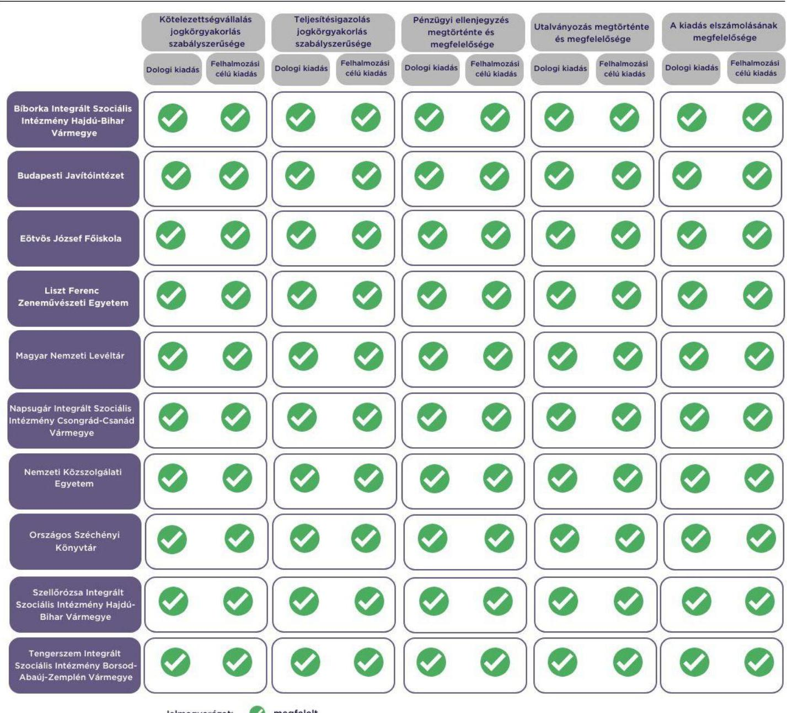

# JELENTÉS 

Az államháztartás központi alrendszerébe tartozó költségvetési szerv által teljesített dologi és felhalmozási célú kiadás szabályszerűségének rapid ellenőrzése

2024.

---

# JELENTÉS 

Az államháztartás központi alrendszerébe tartozó költségvetési szerv által teljesített dologi és felhalmozási célú kiadás szabályszerűségének rapid ellenőrzése

2024.

---

# ELLENŐRZÉSI IGAZGATÓSÁG: 

## ÁLLAMHÁZTARTÁS KÖZPONTI SZINTJÉT ELLENŐRZŐ IGAZGATÓSÁG

## ELLENŐRZÉSI IGAZGATÓ:

SINKÁNÉ DR. CSENDES ÁGNES igazgató

## ELLENŐRZÉSVEZETŐ:

Jelentéseink az interneten a www.asz.hu címen olvashatók.

LACZI HEDVIG ANNA ellenőrzésvezető

IKTATÓSZÁM: EL-3949-008/2024.
TÉMASZÁM: 2685
ELLENŐRZÉS-AZONOSÍTÓ SZÁM: V102908

---

# TARTALOMJEGYZÉK 

- AZ ELLENŐRZÉS ALAPADATAI ..... 5
- AZ ELLENŐRZÖTT SZERVEZETEK ..... 7
- ÖSSZEFOGLALÁS ..... 13
- AZ ELLENŐRZÉS FÓKUSZKÉRDÉSEI ..... 14
- MEGÁLLAPÍTÁSOK ..... 15
- MELLÉKLETEK ..... 17
I. sz. melléklet: Értelmező szótár ..... 17
II. sz. melléklet: Az ellenőrzött szervezetek jegyzéke ..... 18
III. sz. melléklet: Ellenőrzési kritériumok ..... 19
- FÜGGELÉK: ÉSZREVÉTELEK ..... 20
- RÖVIDÍTÉSEK JEGYZÉKE ..... 21

---

.

---

# AZ ELLENŐRZÉS ALAPADATAI 

## AZ ELLENŐRZÉS CÉLJA

Az államháztartás központi alrendszerébe tartozó költségvetési szerv által teljesített dologi és felhalmozási célú kiadások egy-egy kiválasztott tételének szabályszerűségi szempontból történő értékelése.

## AZ ELLENŐRZÉS TÍPUSA

Megfelelőségi ellenőrzés.

## AZ ELLENŐRZŐTT IDŐSZAK

| Ssz. | ELLENŐRZÖTT SZERVEZETEK | DOLOGI   KIADÁSOK   ESETÉREN | FELHALMOZÁSI   CÉLÚ KIADÁSOK   ESETÉREN |
| :--: | :--: | :--: | :--: |
| 1. | Bíborka Integrált Szociális Intézmény Hajdú-Bihar Vármegye | 2023. szeptember 28. | 2023. október 10. |
| 2. | Budapesti Javítóintézet | 2023. október 10. | 2023. július 14. |
| 3. | Eötvös József Főiskola | 2023. október 9. | 2023. július 13. |
| 4. | Liszt Ferenc Zeneművészeti Egyetem | 2023. október 2. | 2023. szeptember 20. |
| 5. | Magyar Nemzeti Levéltár | 2023. szeptember 27. | 2023. október 3. |
| 6. | Napsugár Integrált Szociális Intézmény Csongrád-Csanád Vármegye | 2023. október 9. | 2023. szeptember 21. |
| 7. | Nemzeti Közszolgálati Egyetem | 2023. október 9. | 2023. október 6. |
| 8. | Országos Széchényi Könyvtár | 2023. október 10. | 2023. október 6. |
| 9. | Szellőrózsa Integrált Szociális Intézmény Hajdú-Bihar Vármegye | 2023. október 11. | 2023. október 12. |
| 10. | Tengerszem Integrált Szociális Intézmény Borsod-AbaújZemplén Vármegye | 2023. szeptember 27. | 2023. szeptember 20. |

## AZ ELLENŐRZÉS TÁRGYA

Az államháztartás központi alrendszerébe tartozó költségvetési szerv által teljesített, ellenőrzésre kiválasztott dologi és felhalmozási célú kiadás szabályszerű teljesítése, ezen belül a gazdálkodási jogkörök szabályszerű gyakorlása. Az ellenőrzés kiterjedt minden olyan körülményre és adatra, amely az ÁSZ ${ }^{1}$ jogszabályban meghatározott feladatainak teljesítéséhez, valamint a program végrehajtása folyamán felmerült újabb összefüggések feltárásához volt szükséges.

---

Az ellenőrzés során az ÁSZ

- a Tengerszem Integrált Szociális Intézmény Borsod-Abaúj-Zemplén Vármegye, a Liszt Ferenc Zeneművészeti Egyetem, a Bíborka Integrált Szociális Intézmény Hajdú-Bihar Vármegye, az Országos Széchényi Könyvtár esetében a dologi kiadások körébe tartozó Egyéb szolgáltatások; a Szellőrózsa Integrált Szociális Intézmény Hajdú-Bihar Vármegye esetében a dologi kiadások körébe tartozó Karbantartási, kisjavítási szolgáltatások; a Nemzeti Közszolgálati Egyetem, a Budapesti Javítóintézet esetében a dologi kiadások körébe tartozó Szakmai tevékenységet segítő szolgáltatások; a Magyar Nemzeti Levéltár esetében a dologi kiadások körébe tartozó Informatikai szolgáltatások igénybevétele; az Eötvös József Főiskola, a Napsugár Integrált Szociális Intézmény CsongrádCsanád Vármegye esetében a dologi kiadások körébe tartozó Üzemeltetési anyagok beszerzése,
- a Tengerszem Integrált Szociális Intézmény Borsod-Abaúj-Zemplén Vármegye, a Nemzeti Közszolgálati Egyetem a Liszt Ferenc Zeneművészeti Egyetem esetében a felhalmozási célú kiadások körébe tartozó Ingatlanok beszerzése, létesítése; a Szellőrózsa Integrált Szociális Intézmény HajdúBihar Vármegye, a Napsugár Integrált Szociális Intézmény Csongrád-Csanád Vármegye, a Bíborka Integrált Szociális Intézmény Hajdú-Bihar Vármegye, a Budapesti Javítóintézet, az Országos Széchényi Könyvtár esetében a felhalmozási célú kiadások körébe tartozó Egyéb tárgyi eszközök beszerzése, létesítése; az Eötvös József Főiskola, a Magyar Nemzeti Levéltár esetében a felhalmozási célú kiadások körébe tartozó Informatikai eszközök beszerzése, létesítése
rovatokon elszámolt kiadások egy-egy kiválasztott mintatételének szabályszerűségét értékelte.

# AZ ELLENŐRZÉS JOGALAPJA 

Az ellenőrzés jogszabályi alapját az ÁSZ tv. ${ }^{2} 1 . \int(3)$ bekezdés és az 5. $\int(6)$ bekezdés előírásai képezték.

## AZ ELLENŐRZÉS MÓDSZERE

Az ellenőrzést az ÁSZ az ellenőrzött időszakban hatályos jogszabályok, az ellenőrzés szakmai szabályai alapján, „Az állambáztartás központi alrendszerébe tartozó költségvetési szerv által teljesitett dologi kiadás szabályszerűségének rapid ellenörzéséről" és „Az állambáztartás központi alrendszerébe tartozó költségvetési szerv által teljesitett felhalmozzási célú kiadás szabályszerűségének rapid ellenörzéséről" című ellenőrzési programok (továbbiakban: ellenőrzési programok) kérdéseire adott válaszok kiértékelésével, az ellenőrzési programokban megjelölt adatforrások figyelembevételével folytatta le.

Az ellenőrzési kérdések megválaszolásához szükséges bizonyítékok megszerzése a következő ellenőrzési eljárások alkalmazásával történt: megfigyelés, összehasonlítás, elemző eljárás, a dologi kiadások, felhalmozási célú kiadások ellenőrzéssel érintett rovatairól történő mintavétel. Az ellenőrzési bizonyítékként felhasználható adatforrások közé tartoztak egyrészt az ellenőrzéshez kért dokumentumok, adatforrások, másrészt adatforrás volt még minden - az ellenőrzés folyamán - feltárt, az ellenőrzés szempontjából információkat tartalmazó dokumentum.

Az ÁSZ az ellenőrzés során a kiválasztott mintatételek ellenőrzési programokban meghatározott szempontok szerinti szabályszerűségét értékelte, így a kötelezettségvállalás és a teljesítésigazolás gazdálkodási jogkörök tekintetében a jogkörgyakorlás szabályszerűségét, a pénzügyi ellenjegyzés és az utalványozás gazdálkodási jogkörök tekintetében ezek megtörténtét és az ellenőrzési kritériumoknak való megfelelőségét.

---

# AZ ELLENŐRZÖTT SZERVEZETEK 

Az ellenőrzés a Bíborka Integrált Szociális Intézmény Hajdú-Bihar Vármegye, a Budapesti Javítóintézet, az Eötvös József Főiskola, a Liszt Ferenc Zeneművészeti Egyetem, a Magyar Nemzeti Levéltár, a Napsugár Integrált Szociális Intézmény Csongrád-Csanád Vármegye, a Nemzeti Közszolgálati Egyetem, az Országos Széchényi Könyvtár, a Szellőrózsa Integrált Szociális Intézmény Hajdú-Bihar Vármegye, a Tengerszem Integrált Szociális Intézmény Borsod-Abaúj-Zemplén Vármegye elnevezésű szervezetekre, mint az államháztartás központi alrendszerébe tartozó költségvetési szervekre terjedt ki.

## Bíborka Integrált Szociális IntÉzMÉny Hajdú-Bihar VÁrmeGYe

A BÍB ${ }^{3}$ feladatait a Szoc. tv. ${ }^{4}$ határozza meg. Alaptevékenysége a házi segítségnyújtás, a jelzőrendszeres házi segítségnyújtás, a támogató szolgáltatás fogyatékos személyek részére, a fogyatékossággal élők nappali ellátása, szociális alapszolgáltatások biztosítása, idősek otthona, szakápolási központ, fogyatékos személyek otthona, illetve a pszichiátriai betegek otthona ellátások nyújtása, a rehabilitációs intézményi ellátás biztosítása pszichiátriai betegek számára, a rehabilitációs intézményi ellátás biztosítása fogyatékos személyek számára, a támogatott lakhatás fogyatékos személyek részére, a fogyatékos személyek ápoló-gondozó célú lakóotthona szociális ellátás, valamint a fejlesztő foglalkoztatás szolgáltatás biztosítása.

## Bíborka Integrált Szociális IntÉzMÉny Hajdú-Bihar VÁrmegye főbb adatainak bemutatása

Alapításának éve:
Irányító szerve:
Középirányító szerve:
Gazdasági szervezettel való rendelkezés:

Illetékessége, múködési területe:
Általános képviseletét ellátó vezetője:
Vezetői kinevezés kezdete:
2022. évben teljesített bevételek összege:
2022. évben teljesített kiadások összege:

2007.
Belügyminisztérium
Szociális és Gyermekvédelmi Főigazgatóság
Gazdasági szervezettel nem rendelkezik a pénzügyi, gazdálkodási feladatait a Szociális és Gyermekvédelmi Főigazgatóság Hajdú-Bihar Vármegyei Gazdasági Osztálya látja el
országos, a Szociális Szakápolási Központ Vásárosnamény telephely tekintetében Szabolcs-Szatmár-Bereg vármegye és Hajdú-Bihar vármegye
intézményvezető
2021.07.01.
$2507,1 \mathrm{MFt}$
$2494,8 \mathrm{MFt}$

---

# BUDAPESTI JAVÍTÓINTÉZET

A BPJAV ${ }^{9}$ közfeladata a Bv. tv. ${ }^{6}$ 350. §-ában és a Gyvt. ${ }^{7}$-ben meghatározott keretek között a javítóintézeti nevelésre utalt, illetve előzetes letartóztatásba helyezett fiatalkorúak javítóintézeti ellátása, valamint utógondozás biztosítása.

|  BUDAPESTI JAVÍTÓINTÉZET FÖBB ADATAINAK BEMUTATÁSA |   |
| --- | --- |
|  Alapításának éve: | 1983.  |
|  Irányító szerve: | Belügyminisztérium  |
|  Középirányító szerve: | Szociális és Gyermekvédelmi Főigazgatóság  |
|  Gazdasági szervezettel való rendelkezés: | Gazdasági szervezettel nem rendelkezik, egyes pénzügyi-gazdasági feladatait  |
|   | munkamegosztási megállapodás alapján a Szociális és Gyermekvédelmi  |
|   | Főigazgatóság látja el  |
|  Illetékessége, múködési területe: | országos  |
|  Általános képviseletét ellátó vezetője: | igazgató  |
|  Vezetői kinevezés kezdete: | 2021.10.01.  |
|  2022. évben teljesített bevételek összege: | $851,8 \mathrm{M} \mathrm{Ft}$  |
|  2022. évben teljesített kiadások összege: | $849,4 \mathrm{M} \mathrm{Ft}$  |

## EÖTVÖS JÓZSEF FŐISKOLA

Az $\mathrm{EJF}^{8}$ közfeladata a Felsőokt. tv. ${ }^{9}$ alapján oktatás és tudományos kutatás, melynek keretében alapképzést, mesterképzést, továbbá szakirányú továbbképzést folytat, illetve részt vesz a felsőoktatásnak nem minősülő szakképzési és az ágazati törvényekben meghatározott egyéb képzési feladatok megvalósításában. A képzéshez kapcsolódó képzési területeken, tudományterületeken alap-, alkalmazott és kísérleti kutatásokat és fejlesztéseket, tudományszervezést, technológiai innovációt, valamint az oktatást támogató egyéb kutatásokat is végez.

|  EÖTVÖS JÓZSEF FŐISKOLA FÖBB ADATAINAK BEMUTATÁSA |   |
| --- | --- |
|  Alapításának éve: | 1974.  |
|  Irányító szerve: | Kulturális és Innovációs Minisztérium  |
|  Középirányító szerve: | -  |
|  Gazdasági szervezettel való rendelkezés: | Gazdasági szervezettel rendelkezik  |
|  Illetékessége, múködési területe: | Magyarország területe  |
|  Általános képviseletét ellátó vezetője: | rektor  |
|  Vezetői kinevezés kezdete: | 2019.05.10.  |
|  2022. évben teljesített bevételek összege: | $1626,7 \mathrm{M} \mathrm{Ft}$  |
|  2022. évben teljesített kiadások összege: | $1023,3 \mathrm{M} \mathrm{Ft}$  |

---

# LISZT FERENC ZENEMÚVÉSZETI EGYETEM 

A LFZE ${ }^{10}$ közfeladata a Felsőokt. tv.-ben megfogalmazott oktatási, tudományos kutatási, múvészeti alkotótevékenység, mely keretében alapképzést, mesterképzést, doktori képzést, továbbá szakirányú továbbképzést folytat. A képzésekhez kapcsolódó tudományterületeken, tudományágakban és művészeti területeken alap-, és az oktatást támogató kutatásokat, kutatás-fejlesztési és tudományszervezési tevékenységet végez. A felsőoktatási intézményi infrastruktúra szabad kapacitásait hasznosítja, kulturális műsorokat, rendezvényeket, hangversenyeket, kiállításokat, zenei és egyéb művészeti eseményeket szervez, illetve rendez.

## LISZT FERENC ZENEMÚVÉSZETI EGYETEM FÖBB ADATAINAK REMÚTATÁSA

Alapításának éve:
Irányító szerve:
Középirányító szerve:
Gazdasági szervezettel való rendelkezés:
Illetékessége, múködési területe:
Általános képviseletét ellátó vezetője:
Vezetői kinevezés kezdete:
2022. évben teljesített bevételek összege:
2022. évben teljesített kiadások összege:

1983.
Kulturális és Innovációs Minisztérium
Gazdasági szervezettel rendelkezik
Magyarország területe
rektor
2023.11.01.
$10696,5 \mathrm{M} \mathrm{Ft}$
$5965,8 \mathrm{M} \mathrm{Ft}$

## MAGYAR NEMZETI LEVÉLTÁr

A MNL ${ }^{11}$ közfeladata a Ltv. ${ }^{12}$-ben, valamint a Lt. rendeletben ${ }^{13}$ meghatározott közfeladatok, amelyek keretében az iratkezelési szabályzatok kiadásával összefüggő feladatait végzi, átveszi és megőrzi az illetékességi körébe tartozó szervek nem selejtezhető köziratait, gyűjti és megőrzi a maradandó értékű magániratot, levéltáriés történettudományi kutatásokat végez, az átvett, illetve gyűjtött levéltári anyagot nyilvántartja, szakszerűen kezeli, biztonságosan megőrzi, valamint ellenőrzi az illetékességi körébe tartozó közfeladatot ellátó szervezetek iratkezelését.

## MAGYAR NEMZETI LEVÉLTÁR FÖBB ADATAINAK REMÚTATÁSA

Alapításának éve:
Irányító szerve:
Középirányító szerve:
Gazdasági szervezettel való rendelkezés:
Illetékessége, múködési területe:
A törvényes és szakszerű múködésért felelős vezetője:
Vezetői kinevezés kezdete:
2022. évben teljesített bevételek összege:
2022. évben teljesített kiadások összege:

1983.
Kulturális és Innovációs Minisztérium
Gazdasági szervezettel rendelkezik
országos
főigazgató
2022.04.19.
$8214,4 \mathrm{M} \mathrm{Ft}$
$7454,7 \mathrm{M} \mathrm{Ft}$

---

# NAPSUGÁR INTEGRÁLT SZOCIÁLIS INTÉZMÉNY CsONGRÁD-CSANÁD VÁRMEGYE 

A NAP ${ }^{14}$ közfeladata a Szoc. tv alapján az alap- és bentlakásos szociális ellátás biztosítása. Továbbá a fogyatékossággal élők tartós bentlakásos, ápoló-gondozó célú lakóotthoni ellátását, a fogyatékossággal élők rehabilitációs célú lakóotthoni ellátását, a pszichiátriai betegek tartós bentlakásos ellátását, a pszichiátriai betegek rehabilitációs lakóotthoni ellátását, az időskorúak, valamint a demens betegek tartós bentlakásos ellátását, a jelzőrendszeres házi segítségnyújtást végzi.

## NAPSUGÁR INTEGRÁLT SZOCIÁLIS INTÉZMÉNY CsONGRÁD-CSANÁD VÁRMEGYE FÖBB ADATAINAK BEMUTATÁSA

| Alapításának éve: | 2008. |
| :--: | :--: |
| Irányító szerve: | Belügyminisztérium |
| Középirányító szerve: | Szociális és Gyermekvédelmi Főigazgatóság |
| Gazdasági szervezettel való rendelkezés: | Gazdasági szervezettel nem rendelkezik a pénzügyi, gazdálkodási feladatait a Szociális és Gyermekvédelmi Főigazgatóság Csongrád-Csanád Vármegyei Gazdasági Osztálya látja el |
| Illetékessége, múködési területe: | Csongrád-Csanád vármegye |
| Általános képviseletét ellátó vezetője: | intézményvezető |
| Vezetői kinevezés kezdete: | 2022.03.15. |
| 2022. évben teljesített bevételek összege: | $2856,6 \mathrm{M} \mathrm{Ft}$ |
| 2022. évben teljesített kiadások összege: | $2856,6 \mathrm{M} \mathrm{Ft}$ |

## NEMZETI KÖZSZOLGÁLATI EGYETEM

A NKE ${ }^{15}$ közfeladata a Felsőokt. tv., illetve a NKE tv. ${ }^{16}$ alapján meghatározott felsőoktatási feladatok ellátása, valamint a közszolgálat felsőfokú végzettségű szakember utánpótlásának biztosítása az alapképzés, a mesterképzés, az osztatlan képzés, továbbá a szakirányú továbbképzés nyújtásával. Az államtudomány és ehhez kapcsolódóan a helyi önkormányzás, a helyi demokrácia, az önkormányzati típusú közhatalom gyakorlás szervezeti, jogi, társadalmi, politikai és gazdasági kérdéskörei témájában alap-, alkalmazott és kísérleti kutatásokat és fejlesztéseket, tudományszervezést, technológiai innovációt, valamint az oktatást támogató egyéb kutatásokat végez.

## NEMZETI KÖZSZOLGÁLATI EGYETEM FÖBB ADATAINAK BEMUTATÁSA

| Alapításának éve: | 2012. |
| :-- | :-- |
| Irányító szerve: | Miniszterelnökség |
| Középirányító szerve: | - |
| Gazdasági szervezettel való rendelkezés: | Gazdasági szervezettel rendelkezik |
| Illetékessége, múködési területe: | Magyarország területe |
| Általános képviseletét ellátó vezetője: | rektor |
| Vezetői kinevezés kezdete: | 2022.02.01. |
| 2022. évben teljesített bevételek összege: | $38371,0 \mathrm{M} \mathrm{Ft}$ |
| 2022. évben teljesített kiadások összege: | $24604,4 \mathrm{M} \mathrm{Ft}$ |

---

# Országos SzÉchényi Könyvtár 

Az OSZK ${ }^{17}$ közfeladata a Múz. tv. ${ }^{18}$, valamint Múz. rendelet ${ }^{19}$ alapján a nemzeti könyvtári tevékenység. Az OSZK alaptevékenysége keretében végezi a Magyarországon keletkezett kiadványok teljesség igényével való gyűjtését, feldolgozását, megőrzését, gyűjti az egyetemes emberi kultúra kimagasló irodalmi értékeit, gyűjteményét archiválja, gondoskodik védelméről, könyvtári tájékoztatást végez, továbbá elsősorban helyben használat útján rendelkezésre bocsátja gyűjteményét, valamint működteti az országos internetes referenszszolgálatot.

## Országos SzÉchényi Könyvtár Fóbb AdatáNAK bemutatása

Alapításának éve:
Irányító szerve:
Középirányító szerve:
Gazdasági szervezettel való rendelkezés:
Illetékessége, müködési területe:
Általános képviseletét ellátó vezetője:
Vezetői kinevezés kezdete:
2022. évben teljesített bevételek összege:
2022. évben teljesített kiadások összege:

1802 .
Kulturális és Innovációs Minisztérium
Gazdasági szervezettel rendelkezik
országos és határon átnyúló
főigazgató
2020.03.16.
$4914,8 \mathrm{MFt}$
$4973,2 \mathrm{M} \mathrm{Ft}$

## SZELLŐRÓzSA INTEGRÁLT SZOCIÁLIS INTÉZMÉNY HAJDÚ-BIHAR VÁRMEGYE

A SZELL ${ }^{20}$ közfeladata a Szoc. tv. alapján a szociális étkeztetés, házi segítségnyújtás, jelzőrendszeres házi segítségnyújtás, közösségi ellátás pszichiátriai és szenvedélybetegek részére, támogató szolgáltatás, nappali ellátás, továbbá az idősek, demens betegek tartós bentlakásos ellátása, a fogyatékossággal élők, és a pszichiátriai betegek tartós bentlakásos ellátása, a szenvedélybetegek tartós bentlakásos ellátása, a támogatott lakhatás, a fogyatékossággal élők és a pszichiátriai betegek átmeneti ellátása, a fejlesztő foglalkoztatás biztosítása. Közfeladata továbbá a Gyvt. alapján a gyermekvédelmi bentlakásos ellátás biztosítása is.

## SZELLŐRÓzSA INTEGRÁLT SZOCIÁLIS INTÉZMÉNY FŐBR ADATAINAK BEMUTATÁSA

Alapításának éve:
Irányító szerve:
Középirányító szerve:
Gazdasági szervezettel való rendelkezés:
Illetékessége, müködési területe:
Általános képviseletét ellátó vezetője:
Vezetői kinevezés kezdete:
2022. évben teljesített bevételek összege:
2022. évben teljesített kiadások összege:

2007.
Belügyminisztérium
Szociális és Gyermekvédelmi Főigazgatóság
Gazdasági szervezettel nem rendelkezik, egyes pénzügyi-gazdasági feladatait munkamegosztási megállapodás alapján a Szociális és Gyermekvédelmi Főigazgatóság Hajdú-Bihar Vármegyei Gazdasági Osztálya látja el
országos
intézményvezető
2021.03.02.
$2557,7 \mathrm{M} \mathrm{Ft}$
$2491,8 \mathrm{M} \mathrm{Ft}$

---

# TENGERSZEM INTEGRÁLT SZOCIÁLIS INTÉZMÉNY BORSOD-ABAÚJ-ZEMPLÉN VÁRMEGYE 

A TENG $^{21}$ közfeladata a Szoc. tv. alapján az idősek otthonában, a fogyatékos személyek otthonában, a pszichiátriai betegek otthonában, a személyes gondoskodást nyújtó tartós bentlakásos szociális ellátás keretében idős személyek, fogyatékos személyek és pszichiátriai betegek teljes körű ápolása, gondozása, a jelzőrendszeres házi segítségnyújtás, a fogyatékos személyek rehabilitációs ellátása, valamint a fejlesztőfoglalkoztatás.

| TENGERSZEM INTEGRÁLT SZOCIÁLIS INTÉZMÉNY BORSOD-ABAÚJ-ZEMPLÉN VÁRMEGYE FÓBE ADATAINAK REMÚTATÁSA |  |
| :--: | :--: |
| Alapításának éve: | 2016. |
| Irányító szerve: | Belügyminisztérium |
| Középirányító szerve: | Szociális és Gyermekvédelmi Főigazgatóság |
| Gazdasági szervezettel való rendelkezés: | Gazdasági szervezettel nem rendelkezik, egyes pénzügyi-gazdasági feladatait munkamegosztási megállapodás alapján a Szociális és Gyermekvédelmi Főigazgatóság vármegyei szervezete látja el |
| Illetékessége, múködési területe: | Borsod-Abaúj-Zemplén vármegye, a Kőpatak Idősek Otthona Zsujta telephely esetében országos |
| Általános képviseletét ellátó vezetője: | intézményvezető |
| Vezetői kinevezés kezdete: | 2022.02.15. |
| 2022. évben teljesített bevételek összege: | $2376,9 \mathrm{M} \mathrm{Ft}$ |
| 2022. évben teljesített kiadások összege: | $2376,9 \mathrm{M} \mathrm{Ft}$ |

---

# ÖSSZEFOGLALÁS 

Az ellenőrzött kiadások tekintetében valamennyi ellenőrzött szervezet vonatkozásában a kötelezettségvállalások és az azokhoz tartozó pénzügyi ellenjegyzések a jogszabályi előírások szerint történtek. A teljesítésigazolások az ellenőrzött kiadások tekintetében a jogszabályi előírások szerint történtek. A kifizetések elrendelésére szabályszerűen, utalványozás alapján került sor. Az ellenőrzött kiadásokat a megfelelő rovatokon számolták el. A pénzügyi ellenjegyzések és utalványozások megfelelőek voltak.
1 ábra

## A FŐBB ELLENŐRZÉSI TAPASZTALATOK

---

# AZ ELLENŐRZÉS FÓKUSZKÉRDÉSEI 

1- Az államháztartás központi alrendszerébe tartozó költségvetési szervnél a kiválasztott dologi kiadás teljesitése az egyes jogszabályi rendelkezések alapján szabályszerű volt-e?
2- Az államháztartás központi alrendszerébe tartozó költségvetési szervnél a kiválasztott felhalmozási célú kiadás teljesitése az egyes jogszabályi rendelkezések alapján szabályszerű volt-e?

---

# MEGÁLLAPÍTÁSOK 

## 1. Az államháztartás központi alrendszerébe tartozó költségvetési szervnél a kiválasztott dologi kiadás teljesítése az egyes jogszabályi rendelkezések alapján szabályszerű volt-e?

## Összegző megállapítás

Az ellenőrzött 10 dologi kiadás teljesítése minden esetben az ellenőrzés keretében vizsgált jogszabályi előírásoknak megfelelt.

A BÍB, a BPJAV, az EJF, a LFZE, a MNL, a NAP, a NKE, az OSZK, a SZELL, valamint a TENG ellenőrzött szervezeteknél az ellenőrzött mintatételek esetében a kötelezettségvállalási, a teljesítésigazolási, és az utalványozási jogkörgyakorlás, továbbá a kiadás elszámolása az Áht. ${ }^{22}$, az Ávr. ${ }^{23}$ és az Áhsz. ${ }^{24}$ előírásai szerint szabályszerűen történt, a pénzügyi ellenjegyzés és az utalványozás megfelelő volt:

- Kötelezettséget az Áht.-ben és az Ávr.-ben foglaltakkal összhangban az arra jogosultsággal rendelkező személy vállalt.
- A kötelezettségvállalásra az Áht.-ben foglaltak szerint, a pénzügyi ellenjegyzés után került sor.
- A teljesítésigazoló az Ávr.-ben előírt írásbeli kijelöléssel rendelkezett.
- A teljesítésigazolás során az Ávr.-ben foglaltak szerint ellenőrizhető okmányok alapján ellenőrizték és igazolták a kiadás teljesítésének jogosságát, összegszerűségét, valamint az ellenszolgáltatás teljesítését.
- A teljesítésigazoló a teljesítést az Ávr.-ben foglaltakkal összhangban, az igazolás dátumának és a teljesítés tényére történő utalás megjelölésével, aláírásával igazolta.
- Az utalványozásra az Áht.-ben, valamint az Ávr.-ben foglaltakkal összhangban, a teljesítésigazolást és érvényesítést követően került sor.
- A kiadás számviteli elszámolása a megfelelő rovaton történt az Áhsz.-ben előírtakkal összhangban.

---

# 2. Az államháztartás központi alrendszerébe tartozó költségvetési szervnél a kiválasztott felhalmozási célú kiadás teljesítése az egyes jogszabályi rendelkezések alapján szabályszerű volt-e? 

## Összegző megállapítás

Az ellenőrzött 10 felhalmozási célú kiadás teljesítése minden esetben az ellenőrzés keretében vizsgált jogszabályi előírásoknak megfelelt.

A BÍB, a BPJAV, az EJF, a LFZE, a MNL, a NAP, a NKE, az OSZK, a SZELL, valamint a TENG ellenőrzött szervezeteknél az ellenőrzött mintatételek esetében a kötelezettségvállalási, a teljesítésigazolási, és az utalványozási jogkörgyakorlás, továbbá a kiadás elszámolása az Áht., az Ávr. és az Áhsz. előírásai szerint szabályszerűen történt, a pénzügyi ellenjegyzés és az utalványozás megfelelő volt:

- Kötelezettséget az Áht.-ben és az Ávr.-ben foglaltakkal összhangban az arra jogosultsággal rendelkező személy vállalt.
- A kötelezettségvállalásra az Áht.-ben foglaltak szerint, a pénzügyi ellenjegyzés után került sor.
- A teljesítésigazoló az Ávr.-ben előírt írásbeli kijelöléssel rendelkezett.
- A teljesítésigazolás során az Ávr.-ben foglaltak szerint ellenőrizhető okmányok alapján ellenőrizték és igazolták a kiadás teljesítésének jogosságát, összegszerűségét, valamint az ellenszolgáltatás teljesítését.
- A teljesítésigazoló a teljesítést az Ávr.-ben foglaltakkal összhangban, az igazolás dátumának és a teljesítés tényére történő utalás megjelölésével, aláírásával igazolta.
- Az utalványozásra az Áht.-ben, valamint az Ávr.-ben foglaltakkal összhangban, a teljesítésigazolást és érvényesítést követően került sor.
- A kiadás számviteli elszámolása a megfelelő rovaton történt az Áhsz.-ben előírtakkal összhangban.

---

# MELLÉKLETEK 

## I. SZ. MELLÉKLET: ÉRTELMEZŐ SZÓTÁR

kötelezettségvállalás
pénzügyi ellenjegyzés
teljesítésigazolás
utalványozás

A költségvetési szerv által a kiadási előirányzatok és - ha jogszabály lehetővé teszi - a kijelölt lebonyolító szerv számára a Kormány rendeletében meghatározottak szerinti rendelkezésre bocsátott összeg terhére fizetési kötelezettség vállalásáról szóló - így különösen a foglalkoztatásra irányuló jogviszony létesítésére, szerződés megkötésére, költségvetési támogatás biztosítására irányuló - szabályszerűen megtett jognyilatkozat.
Forrás: Áht. 1. § 15. pont
A kötelezettségvállalást megelőző múvelet, amelynek során a pénzügyi ellenjegyzőnek meg kell győződnie arról, hogy a szükséges szabad előirányzat - több évet érintő kötelezettségvállalás esetén minden egyes évben rendelkezésre áll, a tervezett kifizetési időpontokban a pénzügyi fedezet biztosított, valamint a kötelezettségvállalás nem sérti a gazdálkodásra vonatkozó szabályokat. Kötelezettséget vállalni a Kormány rendeletében foglalt kivételekkel csak pénzügyi ellenjegyzés után, a pénzügyi teljesítés esedékességét megelőzően, írásban lehet.
Forrás: Áht. 37. § (1) bekezdés
A kötelezettségvállalásban a másik fél által vállalt feltételek teljesítéséhez kapcsolódó igazolás, amely a kiadási előirányzat terhére vállalt utalványozást előzi meg. A teljesítés igazolása során ellenőrizhető okmányok alapján ellenőrizni és igazolni kell a kiadások teljesítésének jogosságát, összegszerűségét, ellenszolgáltatást is magában foglaló kötelezettségvállalás esetében - ha a kifizetés vagy annak egy része az ellenszolgáltatás teljesítését követően esedékes - annak teljesítését. A teljesítést az igazolás dátumának és a teljesítés tényére történő utalás megjelölésével, az arra jogosult személy aláírásával kell igazolni.
Forrás: Áht. 38. § (1) bekezdés; Ávr. 57. § (1) és (3) bekezdések
A bevételek és kiadások elszámolására utalványozás alapján kerülhet sor. A kiadási előirányzatok terhére történő utalványozás esetén az utalványozásra csak azután kerülhet sor, ha a kiadás alapjául szolgáló kötelezettségvállalásban meghatározott feltételeket a másik szerződő fél már teljesítette. A kiadási előirányzatok terhére történő utalványozásra a teljesítés igazolását és az érvényesítést követően, a bevételi előirányzatok esetén a belső szabályzatban a bevételek meghatározott körére esetlegesen elrendelt teljesítés igazolását követően kerülhet sor.
Forrás: Áht. 38. § (1) bekezdés; Ávr. 57. § (2) bekezdés és 59. § (1b) bekezdés

---

# II. SZ. MELLÉKLET: AZ ELLENŐRZÖTT SZERVEZETEK JEGYZÉKE 

## ELLENÖRZÖTT SZERVEZETEK MÉGNEVEZÉSE

Bíborka Integrált Szociális Intézmény Hajdú-Bihar Vármegye
Budapesti Javítóintézet
Eötvös József Főiskola
Liszt Ferenc Zeneművészeti Egyetem
Magyar Nemzeti Levéltár
Napsugár Integrált Szociális Intézmény Csongrád-Csanád Vármegye
Nemzeti Közszolgálati Egyetem
Országos Széchényi Könyvtár
Szellőrózsa Integrált Szociális Intézmény Hajdú-Bihar Vármegye
Tengerszem Integrált Szociális Intézmény Borsod-Abaúj-Zemplén Vármegye

---

# III. SZ. MELLÉKLET: ELLENŐRZÉSI KRITÉRIUMOK 

## FÖKUSZKÉRDÉS

1. Az államháztartás központi alrendszerébe tartozó költségvetési szervnél a kiválasztott dologi kiadás teljesítése az egyes jogszabályi rendelkezések alapján szabályszerű volt-e?

Kötelezettségvállalás

Pénzügyi ellenjegyzés
Teljesítésigazolás

Utalványozás

Kiadások elszámolása
2. Az államháztartás központi alrendszerébe tartozó költségvetési szervnél a kiválasztott felhalmozási célú kiadás teljesítése az egyes jogszabályi rendelkezések alapján szabályszerű volt-e?

Kötelezettségvállalás

Pénzügyi ellenjegyzés
Teljesítésigazolás

Utalványozás

Kiadások elszámolása

## ELLENŐRZÉSI KRITÉRIUMOK

Áht. 36. $\$ (7), 37 . \S$ (1) bekezdések
Ávr. 50. $\$ (1) bekezdés d) pont, 52. $\$ (1),(9), 53 . \S(1), 60 . \S$
(3) bekezdések
belső szabályzat
Ávr. 55. $\$ (1),(4)$ bekezdések
Áht. 38. $\$ (1),(2)$ bekezdések
Ávr. 57. $\$ (1),(3)-(5), 60 . \S$ (3) bekezdések
Áht. 38. $\$ (1) bekezdés
Ávr. 59. $\$ (1b),(2)$ bekezdések, (3) bekezdés g) pont, (4) bekezdés

Áhsz. 40. § (1) bekezdés, 15. melléklet I. pont

Áht. 36. $\$ (7), 37 . \S$ (1) bekezdések
Ávr. 50. § (1) bekezdés d) pont, 52. § (1), (9), 53. § (1), 60. § (3) bekezdések
belső szabályzat
Ávr. 55. § (1), (4) bekezdések
Áht. 38. § (1), (2) bekezdések
Ávr. 57. § (1), (3)-(5), 60. § (3) bekezdések
Áht. 38. § (1) bekezdés
Ávr. 59. § (1b), (2) bekezdések, (3) bekezdés g) pont, (4) bekezdés

Áhsz. 40. § (1) bekezdés, 15. melléklet I. pont

---

# FÜGGELÉK: ÉSZREVÉTELEK 

A jelentéstervezetet a Számvevőszék 15 napos észrevételezésre megküldte az ellenőrzött szervezet vezetőjének az ÁSZ tv. 29. §* (1) bekezdése előírásának megfelelően.

A Biborka Integrált Szociális Intézmény Hajdú-Bihar Vármegye, az Eötvös József Főiskola, a Liszt Ferenc Zenemüvészeti Egyetem, a Magyar Nemzeti Levéltár, a Napsugár Integrált Szociális Intézmény Csongrád-Csanád Vármegye, a Nemzeti Közszolgálati Egyetem, az Országos Széchényi Könyvtár, a Szellőrózsa Integrált Szociális Intézmény Hajdú-Bihar Vármegye, a Tengerszem Integrált Szociális Intézmény Borsod-Abaúj-Zemplén Vármegye ellenőrzött szervezetek a jelentéstervezet megállapításaira észrevételt nem tettek.

A jelentéstervezet megállapításaira a Budapesti Javítóintézet igazgatója észrevételt tett. Az elfogadott észrevétel alapján a Számvevőszék módosította a jelentést.

[^0]
[^0]:    * 29. § (1) Az Állami Számvevőszék az ellenőrzési megállapításait megküldi az ellenőrzött szervezet vezetőjének vagy az általa megbízott személynek, és annak, akinek személyes felelősségét állapította meg.
    (2) Az ellenőrzött szervezet vezetője és a felelősként megjelölt személy az ellenőrzés megállapításaira tizenöt napon belül írásban észrevételt tehet.
    (3) Az Állami Számvevőszék az észrevételre a beérkezésétől számított harminc napon belül írásban válaszol. A figyelembe nem vett észrevételeket köteles a jelentésben feltüntetni, és megindokolni, hogy azokat miért nem fogadta el.

---

# RÖVIDÍTÉSEK JEGYZÉKE 

${ }^{1}$ ÁSZ
${ }^{2}$ ÁSZ tv.
${ }^{3}$ BíB
${ }^{4}$ Szoc. tv.
${ }^{5}$ BPJAV
${ }^{6}$ Bv. tv
${ }^{7}$ Gyvt.
${ }^{8}$ EJF
${ }^{9}$ Felsőokt. tv.
${ }^{10}$ LFZE
${ }^{11}$ MNL
${ }^{12}$ Ltv.
${ }^{13}$ Lt. rendelet
${ }^{14}$ NAP
${ }^{15}$ NKE
${ }^{16}$ NKE tv.
${ }^{17}$ OSZK
${ }^{18}$ Múz. tv.
${ }^{19}$ Múz. rendelet
${ }^{20}$ SZELL
${ }^{21}$ TENG
${ }^{22}$ Áht.
${ }^{23}$ Ávr.
${ }^{24}$ Áhsz.

Állami Számvevőszék
2011. évi LXVI. törvény az Állami Számvevőszékről

Bíborka Integrált Szociális Intézmény Hajdú-Bihar Vármegye
1993. évi III. törvény a szociális igazgatásról és szociális ellátásokról

Budapesti Javítóintézet
2013. évi CCXL. törvény a büntetések, az intézkedések, egyes kényszerintézkedések és a szabálysértési elzárás végrehajtásáról
1997. évi XXXI. törvény a gyermekek védelméről és a gyámügyi igazgatásról

Eötvös József Főiskola
2011. évi CCIV. törvény a nemzeti felsőoktatásról

Liszt Ferenc Zeneművészeti Egyetem
Magyar Nemzeti Levéltár
1995. évi LXVI. törvény a köziratokról, a közlevéltárakról és a magánlevéltári anyag védelméről
7/2002. (II.27.) NKÖM rendelet a Levéltári Kollégiumról és a levéltári szakfelügyeletről Napsugár Integrált Szociális Intézmény Csongrád-Csanád Vármegye
Nemzeti Közszolgálati Egyetem
2011. évi CXXXII. törvény a Nemzeti Közszolgálati Egyetemről, valamint a közigazgatási, rendészeti és katonai felsőoktatásról
Országos Széchényi Könyvtár
1997. évi CXL. törvény a muzeális intézményekről, a nyilvános könyvtári ellátásról és a közművelődésről
30/2014. (IV.10.) EMMI rendelet az országos múzeum, az országos szakmúzeum, a nemzeti könyvtár, az országos szakkönyvtár és az állami egyetem könyvtárának kiemelt feladatairól
Szellőrözsa Integrált Szociális Intézmény Hajdú-Bihar Vármegye
Tengerszem Integrált Szociális Intézmény Borsod-Abaúj-Zemplén Vármegye
2011. évi CXCV. törvény az államháztartásról

368/2011. (XII. 31.) Korm. rendelet az államháztartásról szóló törvény végrehajtásáról
4/2013. (I. 11.) Korm. rendelet az államháztartás számviteléről

---

1052 Budapest, Apáczai Csere János u. 10. | 1364 Budapest 4., Pf. 54
www.asz.hu | szamvevoszek@asz.hu
telefon: +36 14849100