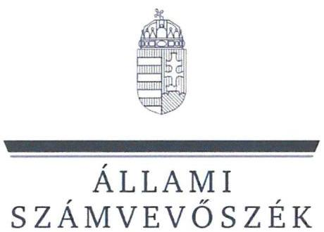
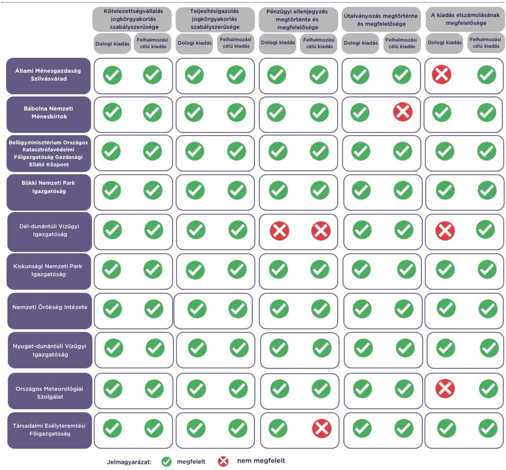

# JELENTÉS 

Az államháztartás központi alrendszerébe tartozó költségvetési szerv által teljesített dologi és felhalmozási célú kiadás szabályszerűségének rapid ellenőrzése

2024.

---

# JELENTÉS 

Az államháztartás központi alrendszerébe tartozó költségvetési szerv által teljesített dologi és felhalmozási célú kiadás szabályszerűségének rapid ellenőrzése
2024.

---

# ELLENŐRZÉSI IGAZGATÓSÁG: 

## ÁLLAMHÁZTARTÁS KÖZPONTI SZINTJÉT ELLENŐRZŐ IGAZGATÓSÁG

## ELLENŐRZÉSI IGAZGATÓ:

## SINKÁNÉ DR. CSENDES ÁGNES igazgató

## ELLENŐRZÉSVEZETŐ:

Jelentéseink az interneten a www.asz.hu címen olvashatók.

LACZI HEDVIG ANNA ellenőrzésvezető

IKTATÓSZÁM: EL-3949-009/2024.
TÉMASZÁM: 2685
ELLENŐRZÉS-AZONOSÍTÓ SZÁM: V102909

---

# TARTALOMJEGYZÉK 

- AZ ELLENŐRZÉS ALAPADATAI ..... 5
- AZ ELLENŐRZÖTT SZERVEZETEK ..... 7
- ÖSSZEFOGLALÁS ..... 13
- AZ ELLENŐRZÉS FÓKUSZKÉRDÉSEI ..... 14
- MEGÁLLAPÍTÁSOK ..... 15
- JAVASLATOK ..... 19
- MELLÉKLETEK ..... 20
I. sz. melléklet: Értelmező szótár ..... 20
II. sz. melléklet: Az ellenőrzött szervezetek jegyzéke ..... 21
III. sz. melléklet: Ellenőrzési kritériumok ..... 22
- FÜGGELÉK: ÉSZREVÉTELEK ..... 23
- RÖVIDÍTÉSEK JEGYZÉKE ..... 24

---

.

---

# AZ ELLENŐRZÉS ALAPADATAI 

## AZ ELLENŐRZÉS CÉLJA

Az államháztartás központi alrendszerébe tartozó költségvetési szerv által teljesített dologi és felhalmozási célú kiadások egy-egy kiválasztott tételének szabályszerűségi szempontból történő értékelése.

## AZ ELLENŐRZÉS TÍPUSA

Megfelelőségi ellenőrzés.

## AZ ELLENŐRZŐTT IDŐSZAK

| Ssz. | ELLENŐRZŐTT SZERVEZETEK | DOLOGI KIADÁSOK ESETEBEN | FELHALMOZÁSI CÉLÚ KIADÁSOK ESETEBEN |
| :--: | :--: | :--: | :--: |
| 1. | Állami Ménesgazdaság Szilvásvárad | 2023. október 10. | 2023. szeptember 28. |
| 2. | Bábolna Nemzeti Ménesbirtok | 2023. szeptember 26. | 2023. szeptember 22. |
| 3. | Belügyminisztérium Országos Katasztrófavédelmi Főigazgatóság Gazdasági Ellátó Központ | 2023. október 4. | 2023. szeptember 18. |
| 4. | Bükki Nemzeti Park Igazgatóság | 2023. szeptember 28. | 2023. október 3. |
| 5. | Dél-dunántúli Vízügyi Igazgatóság | 2023. október 2. | 2023. október 12. |
| 6. | Kiskunsági Nemzeti Park Igazgatóság | 2023. október 5. | 2023. szeptember 20. |
| 7. | Országos Meteorológiai Szolgálat | 2023. október 10. | 2023. szeptember 27. |
| 8. | Nemzeti Örökség Intézete | 2023. szeptember 22. | 2023. október 12. |
| 9. | Nyugat-dunántúli Vízügyi Igazgatóság | 2023. október 9. | 2023. október 5. |
| 10. | Társadalmi Esélyteremtési Főigazgatóság | 2023. október 12. | 2023. október 10. |

## AZ ELLENŐRZÉS TÁRGYA

Az államháztartás központi alrendszerébe tartozó költségvetési szerv által teljesített, ellenőrzésre kiválasztott dologi és felhalmozási célú kiadás szabályszerű teljesítése, ezen belül a gazdálkodási jogkörök szabályszerű gyakorlása. Az ellenőrzés kiterjedt minden olyan körülményre és adatra, amely az ÁSZ ${ }^{1}$ jogszabályban meghatározott feladatainak teljesítéséhez, valamint a program végrehajtása folyamán felmerült újabb összefüggések feltárásához szükséges.

---

Az ellenőrzés során az ÁSZ

- az Állami Ménesgazdaság Szilvásvárad, a Bábolna Nemzeti Ménesbirtok, a Dél-dunántúli Vízügyi Igazgatóság, az Országos Meteorológiai Szolgálat esetében a dologi kiadások körébe tartozó Szakmai anyagok beszerzése; a Bükki Nemzeti Park Igazgatóság esetében a dologi kiadások körébe tartozó Szakmai tevékenységet segítő szolgáltatások; a Belügyminisztérium Országos Katasztrófavédelmi Főigazgatóság Gazdasági Ellátó Központ, a Kiskunsági Nemzeti Park Igazgatóság, a Nemzeti Örökség Intézete, a Nyugat-dunántúli Vízügyi Igazgatóság, a Társadalmi Esélyteremtési Főigazgatóság esetében a dologi kiadások körébe tartozó Egyéb szolgáltatások;
- a Bükki Nemzeti Park Igazgatóság, a Dél-dunántúli Vízügyi Igazgatóság, a Nyugat-dunántúli Vízügyi Igazgatóság esetében a felhalmozási célú kiadások körébe tartozó Ingatlanok beszerzése, létesítése; a Nemzeti Örökség Intézete esetében a felhalmozási célú kiadások körébe tartozó Immateriális javak beszerzése, létesítése; az Állami Ménesgazdaság Szilvásvárad, a Bábolna Nemzeti Ménesbirtok, a Belügyminisztérium Országos Katasztrófavédelmi Főigazgatóság Gazdasági Ellátó Központ, a Kiskunsági Nemzeti Park Igazgatóság, az Országos Meteorológiai Szolgálat, a Társadalmi Esélyteremtési Főigazgatóság esetében a felhalmozási célú kiadások körébe tartozó Egyéb tárgyi eszközök beszerzése, létesítése
rovatokon elszámolt kiadások egy-egy kiválasztott mintatételének szabályszerűségét értékelte.

# AZ ELLENŐRZÉS JOGALAPJA 

Az ellenőrzés jogszabályi alapját az ÁSZ tv. ${ }^{2} 1 . \int(3)$ bekezdés és az 5. $\int(6)$ bekezdés előírásai képezték.

## AZ ELLENŐRZÉS MÓDSZERE

Az ellenőrzést az ÁSZ az ellenőrzött időszakban hatályos jogszabályok, az ellenőrzés szakmai szabályai alapján, „Az állambáztartás központi alrendszerébe tartozó költségvetési szerv által teljesitett dologi kiadás szabályszerűségének rapid ellenörzéséről" és „Az állambáztartás központi alrendszerébe tartozó költségvetési szerv által teljesitett felhalmozzási célú kiadás szabályszerűségének rapid ellenörzéséről" című ellenőrzési programok (továbbiakban: ellenőrzési programok) kérdéseire adott válaszok kiértékelésével, az ellenőrzési programokban megjelölt adatforrások figyelembevételével folytatta le. Amennyiben az adott mintatétel ellenőrzési program szerinti értékelése során további kapcsolódó szabálytalanságot tárt fel az ÁSZ, a szabálytalansághoz tartozó kritériummal bővült az ellenőrzés.

Az ellenőrzési kérdések megválaszolásához szükséges bizonyítékok megszerzése a következő ellenőrzési eljárások alkalmazásával történt: megfigyelés, összehasonlítás, elemző eljárás, a dologi kiadások, felhalmozási célú kiadások ellenőrzéssel érintett rovatairól történő mintavétel. Az ellenőrzési bizonyítékként felhasználható adatforrások közé tartoztak egyrészt az ellenőrzéshez kért dokumentumok, adatforrások, másrészt adatforrás volt még minden - az ellenőrzés folyamán - feltárt, az ellenőrzés szempontjából információkat tartalmazó dokumentum.

Az ÁSZ az ellenőrzés során a kiválasztott mintatételek ellenőrzési programokban meghatározott szempontok szerinti szabályszerűségét értékelte, így a kötelezettségvállalás és a teljesítésigazolás gazdálkodási jogkörök tekintetében a jogkörgyakorlás szabályszerűségét, a pénzügyi ellenjegyzés és az utalványozás gazdálkodási jogkörök tekintetében ezek megtörténtét és az ellenőrzési kritériumoknak való megfelelőségét.

---

# AZ ELLENŐRZÖTT SZERVEZETEK 

Az ellenőrzés az Állami Ménesgazdaság Szilvásvárad, a Bábolna Nemzeti Ménesbirtok, a Belügyminisztérium Országos Katasztrófavédelmi Főigazgatóság Gazdasági Ellátó Központ, a Bükki Nemzeti Park Igazgatóság, a Dél-dunántúli Vízügyi Igazgatóság, a Kiskunsági Nemzeti Park Igazgatóság, az Országos Meteorológiai Szolgálat, a Nemzeti Örökség Intézete, a Nyugat-dunántúli Vízügyi Igazgatóság és a Társadalmi Esélyteremtési Főigazgatóság elnevezésű szervezetekre, mint az államháztartás központi alrendszerébe tartozó költségvetési szervekre terjedt ki.

## Állami MÉNESGAZDASÁG SZILVÁSVÁrad

Az ÁMGSZ ${ }^{3}$ közfeladata a 2019. évi LVI. törvényben ${ }^{4}$, a 188/2019. (VI. 30.) Korm. rendeletben ${ }^{5}$, valamint a 45/2019. (IX. 25.) AM rendeletben ${ }^{6}$ meghatározott keretek között lótenyésztés, ménes-fenntartás, a lótenyésztéshez kapcsolódó idegenforgalmi bemutató tevékenység, az állomány fenntartásához szükséges takarmány termesztés, tenyészállat import és export, összehasonlító versenyek és bemutatók szervezése, valamint a lovassport és lovaskultúra ápolása és népszerűsítése.

## ÁLLAMI MÉNESGAZDASÁG SZILVÁSVÁRAD FÖBB ADATAINAK BEMUTATÁSA

Alapításának éve:
Irányító szerve:
Középirányító szerve:
Gazdasági szervezettel való rendelkezés:
Illetékessége, müködési területe:
Általános képviseletét ellátó vezetője:
Vezetői kinevezés kezdete:
2022. évben teljesített bevételek összege:
2022. évben teljesített kiadások összege:

1993.
Agrárminisztérium
Gazdasági szervezettel nem rendelkezik, egyes pénzügyi gazdasági feladatait a Bükki Nemzeti Park Igazgatóság látja el
országos
igazgató
2021.07.01.
$889,7 \mathrm{M} \mathrm{Ft}$
$882,5 \mathrm{M} \mathrm{Ft}$

---

# BÁBOLNA NEMZETI MÉNESbIRTOK 

A Bábolnai Ménesbirtok ${ }^{7}$ közfeladata a 2019. évi LVI. törvényben, a 188/2019. (VI. 30.) Korm. rendeletben, valamint a 45/2019. (IX. 25.) AM rendeletben meghatározott keretek között lótenyésztés, a lóállomány magas szintű fenntartása és az ehhez szükséges takarmány előállítása, tervszerű növénytermesztés és legelőgazdálkodás, erdőterület és vadállomány hasznosítás, a lótenyésztéshez kapcsolódó idegenforgalmi bemutató tevékenység, az állomány fenntartásához szükséges takarmány termesztés, versenyek és bemutatók szervezése, a lovassport és lovaskultúra ápolása és népszerűsítése, valamint a rábízott műemléképületek és múzeumi gyűjtemény fenntartása és bemutatása.

## BÁBOLNA NEMZETI MÉNESbIRTOK FÖBB ADATAINAK REMUTATÁSA

Alapításának éve:
Irányító szerve:
Középirányító szerve:
Gazdasági szervezettel való rendelkezés:
Illetékessége, múködési területe:
Általános képviseletét ellátó vezetője:
Vezetői kinevezés kezdete:
2022. évben teljesített bevételek összege:
2022. évben teljesített kiadások összege:

2016.
Agrárminisztérium
Gazdasági szervezettel rendelkezik
országos
igazgató
2021.09.05.
$4807,6 \mathrm{M} \mathrm{Ft}$
$4708,9 \mathrm{M} \mathrm{Ft}$

## BELÜGYMINISZTÉRIUM ORSZÁGOS KATASZTRÓFAVÉDELMI FÖIGAZGATÓSÁG GAZDASÁGI ELLÁTÓ KÖZPONT

A BM OKF GEK ${ }^{8}$ közfeladatait a KAT törvényben ${ }^{9}$, az 1996. évi XXXI. törvényben ${ }^{10}$, a 2015. évi CCXI. törvényben ${ }^{11}$ a kéményseprő-ipari szervhez rendelt feladat- és hatáskörre vonatkozóan figyelemmel kéményseprő-ipari szerv kijelöléséről szóló 401/2015. (XII. 15.) Korm. rendeletben ${ }^{12}$ meghatározottak alapján látja el. A költségvetési szerv közfeladata, továbbá a katasztrófavédelmi feladatok végrehajtásának gazdasági és logisztikai támogató feladatainak ellátása, valamint az ingatlangazdálkodás és a belügyi szolgálati lakások működtetési feltételeinek megteremtése.

## BELÜGYMINISZTÉRIUM ORSZÁGOS KATASZTRÓFAVÉDELMI FÖIGAZGATÓSÁG GAZDASÁGI ELLÁTÓ KÖZPONT FÖBB ADATAINAK REMUTATÁSA

Alapításának éve:
Irányító szerve:
Középirányító szerve:
Gazdasági szervezettel való rendelkezés:
Illetékessége, múködési területe:
Általános képviseletét ellátó vezetője:
Vezetői kinevezés kezdete:
2022. évben teljesített bevételek összege:
2022. évben teljesített kiadások összege:

2010.
Belügyminisztérium
Belügyminisztérium Országos Katasztrófavédelmi Főigazgatóság
Gazdasági szervezettel rendelkezik
országos
igazgató
2022.06.01.
$11028,9 \mathrm{M} \mathrm{Ft}$
$10978,7 \mathrm{M} \mathrm{Ft}$

---

# BÜKKI NEMZETI PARK IGAZGATÓSÁG 

A BNPI ${ }^{13}$ közfeladata a 625/2022. (XII. 30.) Korm. rendeletben ${ }^{14}$ meghatározott természetvédelem és természetmegőrzés, ökoturisztikai és környezeti nevelési tevékenység, valamint területrendezés és birtokügyi tevékenység.

| BÜKKI NEMZETI PARK IGAZGATÓSÁG FÖRB ADATAINAK REMUTATÁSA |  |
| :--: | :--: |
| Alapításának éve: | 1976. |
| Irányító szerve: | Agrárminisztérium |
| Középirányító szerve: | - |
| Gazdasági szervezettel való rendelkezés: | Gazdasági szervezettel rendelkezik |
| Illetékessége, múködési területe: | a 625/2022. (XII. 30.) Korm. rendelet 2. sz. mellékletében meghatározottak szerint |
| Általános képviseletét ellátó vezetője: | igazgató |
| Vezetői kinevezés kezdete: | 2015.03.25. |
| 2022. évben teljesített bevételek összege: | $5123,0 \mathrm{M} \mathrm{Ft}$ |
| 2022. évben teljesített kiadások összege: | $3272,5 \mathrm{M} \mathrm{Ft}$ |

## DÉL-DUNÁNTÚLI VÍZÚGYI IGAZGATÓSÁG

A DDVIZIG ${ }^{15}$ közfeladata az 1995. évi LVII. törvény ${ }^{16}$ alapján a teljesség igénye nélkül a vizek kártételei elleni védelemmel, a vízkárelhárítással összefüggő, jogszabályban meghatározott feladatok ellátása; a vízrajzi észlelőhálózat üzemeltetése és fejlesztése, ennek részeként víztest monitoring fenntartása, vízrajzi adatok gyűjtése és feldolgozása; a Vízgazdálkodási Információs Rendszer területi nyilvántartásának és vízgazdálkodási adatgyűjtésének üzemeltetési és fejlesztési feladatainak ellátása, a gyűjtött adatok feldolgozása, értékelése és tárolása; a távlati ivóvízbázisok vízkészletének felhasználható állapotban tartásával kapcsolatos feladatok, valamint a vizeink állapotértékelésével kapcsolatos területi feladatok ellátása.

## DÉL-DUNÁNTÚLI VÍZÚGYI IGAZGATÓSÁG FÖRB ADATAINAK REMUTATÁSA

Alapításának éve:
Irányító szerve:
Középirányító szerve:
Gazdasági szervezettel való rendelkezés:
Illetékessége, múködési területe:
A törvényes és szakszerű múködésért felelős vezetője:
Vezetői kinevezés kezdete:
2022. évben teljesített bevételek összege:
2022. évben teljesített kiadások összege:

1953.
Belügyminisztérium
Országos Vízügyi Főigazgatóság
Gazdasági szervezettel rendelkezik
223/2014. (IX. 4.) Korm. rendeletben ${ }^{17}$ meghatározott múködési terület
igazgató
2020.01.01.
$3428,9 \mathrm{M} \mathrm{Ft}$
$3240,2 \mathrm{M} \mathrm{Ft}$

---

# KISKUNSÁGI NEMZETI PARK IGAZGATÓSÁG 

A KNPI ${ }^{18}$ közfeladata a 625/2022. (XII. 30.) Korm. rendeletben meghatározott természetvédelem és természetmegőrzés, ökoturisztikai és környezeti nevelési tevékenység, valamint területrendezés és birtokügyi tevékenység.

## KISKUNSÁGI NEMZETI PARK IGAZGATÓSÁG FÖBB ADATAINAK BEMUTATÁSA

Alapításának éve:
Irányító szerve:
Középirányító szerve:
Gazdasági szervezettel való rendelkezés:
Illetékessége, müködési területe:
Általános képviseletét ellátó vezetője:
Vezetői kinevezés kezdete:
2022. évben teljesített bevételek összege:
2022. évben teljesített kiadások összege:

1974.
Agrárminisztérium
-
Gazdasági szervezettel rendelkezik
a 625/2022. (XII. 30.) Korm. rendelet 2. sz. mellékletében meghatározottak szerint
igazgató
2015.03.11.
$4411,6 \mathrm{M} \mathrm{Ft}$
$3457,0 \mathrm{M} \mathrm{Ft}$

## NEMZETI ÖRÖKSÉG INTÉZETE

A NÖRI ${ }^{19}$ közfeladatát a 144/2013. (V. 14.) Korm. rendelet ${ }^{20}$ 4. §-ban meghatározottak alapján látja el, amelyek a múlt példáinak a magyarság szellemi örökségének átadása a jelen és jövő nemzedékének; a magyarság nemzeti identitásának megőrzése; az egységes nemzet és nemzeti egység megteremtése.

## NEMZETI ÖRÖKSÉG INTÉZETE FÖBB ADATAINAK BEMUTATÁSA

Alapításának éve:
Irányító szerve:
Középirányító szerve:
Gazdasági szervezettel való rendelkezés:
Illetékessége, müködési területe:
Általános képviseletét ellátó vezetője:
Vezetői kinevezés kezdete:
2022. évben teljesített bevételek összege:
2022. évben teljesített kiadások összege:

2013.
Miniszterelnökség
-
Gazdasági szervezettel rendelkezik
országos
főigazgató
2021.06.15.
$2178,4 \mathrm{M} \mathrm{Ft}$
$2126,3 \mathrm{M} \mathrm{Ft}$

---

# Nyugat-DunÁntÚli VízúGyi IgazgatósÁg 

A NYUDUVIZIG ${ }^{21}$ közfeladata az 1995. évi LVII. törvény alapján a teljesség igénye nélkül a vizek kártételei elleni védelemmel, a vízkárelhárítással összefüggő, jogszabályban meghatározott feladatok ellátása; a vízrajzi észlelőhálózat üzemeltetése és fejlesztése, ennek részeként víztest monitoring fenntartása, vízrajzi adatok gyűjtése és feldolgozása; a Vízgazdálkodási Információs Rendszer területi nyilvántartásának és vízgazdálkodási adatgyűjtésének üzemeltetési és fejlesztési feladatainak ellátása, a gyűjtött adatok feldolgozása, értékelése és tárolása; a távlati ivóvízbázisok vízkészletének felhasználható állapotban tartásával kapcsolatos feladatok, valamint a vizeink állapotértékelésével kapcsolatos területi feladatok ellátása.

## NYUGAT-DUNÁNTÚLI VÍZÚGYI IgAZGATÓSÁG FÖBB ADATAINAK BEMUTATÁSA

Alapításának éve:
Irányító szerve:
Középirányító szerve:
Gazdasági szervezettel való rendelkezés:
Illetékessége, múködési területe:
Általános képviseletét ellátó vezetője:
Vezetői kinevezés kezdete:
2022. évben teljesített bevételek összege:
2022. évben teljesített kiadások összege:

1953.
Belügyminisztérium
Országos Vízügyi Főigazgatóság
Gazdasági szervezettel rendelkezik
223/2014. (IX. 4.) Korm. rendeletben meghatározott müködési terület
igazgató
2018.01.01.
$4617,0 \mathrm{MFt}$
$3960,2 \mathrm{MFt}$

## OrszÁgOS Meteorológiai Szolgálat

Az OMSZ ${ }^{22}$ közfeladata a 353/2021. (VI. 24.) Korm. rendeletben ${ }^{23}$ meghatározott földfelszíni, magaslégköri és távérzékelési meteorológiai mérő, észlelő, távközlési és adatfeldolgozó rendszerek üzemeltetése, fenntartása és fejlesztése, valamint obszervatóriumok üzemeltetése.

Az Országos Meteorológiai Szolgálat az ellenőrzés lezárást követően 2023. december 31. dátummal (Megszüntető Okirata KVFO/18698/2023-EM) jogutód nélküli megszűnt.

## OrszÁgOS MeteORÓlógiai Szolgálat FÖBB ADATAINAK BEMUTATÁSA

Alapításának éve:
Irányító szerve:
Középirányító szerve:
Gazdasági szervezettel való rendelkezés:
Illetékessége, múködési területe:
A törvényes és szakszerű müködésért felelős vezetője:
Vezetői kinevezés kezdete:
2022. évben teljesített bevételek összege:
2022. évben teljesített kiadások összege:

1870.
Energiaügyi Minisztérium
Gazdasági szervezettel rendelkezik
országos
elnök
2023.07.01.
$5102,7 \mathrm{MFt}$
$3845,4 \mathrm{M} \mathrm{Ft}$

---

# TÁrsADALMI ESÉLYTEREMTÉSI FÓIGAZGATÓSÁG 

A TEF $^{24}$ az Alaptörvény ${ }^{25}$ XV. cikk (4) bekezdésében, valamint a 2003. évi CXXV. törvényben ${ }^{26}$ foglaltak érvényre juttatása céljából a Magyar Nemzeti Társadalmi Felzárkózási Stratégiával összhangban ellátja a társadalmi felzárkózás képzési, szervezési, területi módszertani és kutatási feladatait. Országos hatáskörű szervként a társadalmi felzárkózás, a mélyszegénység megszüntetése és az esélyteremtés terén ellátja a felzárkózás képzési, szervezési és módszertani feladatokat. Közreműködik a társadalmi felzárkózási, esélyteremtési célú hazai, uniós és más nemzetközi finanszírozású programok szakmai előkészítésében.

## TÁRSADALMI ESÉLYTEREMTÉSI FÓIGAZGATÓSÁG FÖBB ADATAINAK BEMUTATÁSA

Alapitásának éve:
Irányító szerve:
Közepirányító szerve:
Gazdasági szervezettel való rendelkezés:
Illetékessége, müködési területe:
Általános képviseletét ellátó vezetője:
Vezetői kinevezés kezdete:
2022. évben teljesített bevételek összege:
2022. évben teljesített kiadások összege:

2019.
Belügyminisztérium
Gazdasági szervezettel rendelkezik
országos
föigazgató
2022.09.01.
$6572,9 \mathrm{M} \mathrm{Ft}$
$5753,9 \mathrm{M} \mathrm{Ft}$

---

# ÖSSZEFOGLALÁS 

Az ellenőrzött kiadások tekintetében az ellenőrzött szervezetek vonatkozásában a kötelezettségvállalások és a teljesítésigazolások a jogszabályi előírások szerint történtek. Egy esetben az utalványozás nem a jogszabályi előírásoknak megfelelően történt, mivel az utalványozásra a teljesítésigazolást megelőzően került sor. Három esetben a pénzügyi ellenjegyzés nem tartalmazta a pénzügyi ellenjegyzés dátumát, így nem lehetett megítélni, hogy a kötelezettségvállalásra a pénzügyi ellenjegyzés után került-e sor. A kifizetések elrendelésére szabályszerűen, utalványozás alapján került sor. Az ellenőrzött kiadásoknál az ellenőrzött szervezetek három esetben nem a megfelelő rovaton számolták el a kiadást.
1. ábra

## A FŐBB ELLENŐRZÉSI TAPASZTALATOK

---

# AZ ELLENŐRZÉS FÓKUSZKÉRDÉSEI 

1- Az államháztartás központi alrendszerébe tartozó költségvetési szervnél a kiválasztott dologi kiadás teljesitése az egyes jogszabályi rendelkezések alapján szabályszerű volt-e?
2- Az államháztartás központi alrendszerébe tartozó költségvetési szervnél a kiválasztott felhalmozási célú kiadás teljesitése az egyes jogszabályi rendelkezések alapján szabályszerű volt-e?

---

# MEGÁLLAPÍTÁSOK 

## 1. Az államháztartás központi alrendszerébe tartozó költségvetési szervnél a kiválasztott dologi kiadás teljesítése az egyes jogszabályi rendelkezések alapján szabályszerű volt-e?

Összegző megállapítás Az ellenőrzött 10 dologi kiadás teljesítése hét esetben az ellenőrzés keretében vizsgált jogszabályi előírásoknak megfelelt. Egy dologi kiadás esetében a pénzügyi ellenjegyzési jogkörgyakorlás és a kiadás elszámolása, valamint két dologi kiadás esetében a kiadás elszámolása nem volt szabályszerű.

A Bábolnai Ménesbirtoknál, a BM OKF GEK-nél, a BNPI-nél, a KNPI-nél, a NÖRI-nél, a NYUDUVIZIG-nél, valamint a TEF-nél az ellenőrzött mintatételek esetében a kötelezettségvállalási, teljesítésigazolási, utalványozási jogkörgyakorlás, továbbá a kiadás elszámolása az Áht. ${ }^{27}$, az Ávr. ${ }^{28}$ és az Áhsz. ${ }^{29}$ előírásai szerint szabályszerűen történt, a pénzügyi ellenjegyzés és az utalványozás megfelelő volt:

- Kötelezettséget az Áht.-ben és az Ávr.-ben foglaltakkal összhangban az arra jogosultsággal rendelkező személy vállalt.
- A kötelezettségvállalásra az Áht.-ben foglaltak szerint, a pénzügyi ellenjegyzés után került sor.
- A teljesítésigazoló az Ávr.-ben előírt írásbeli kijelöléssel rendelkezett.
- A teljesítésigazolás során az Ávr.-ben foglaltak szerint ellenőrizhető okmányok alapján ellenőrizték és igazolták a kiadás teljesítésének jogosságát, összegszerűségét, valamint az ellenszolgáltatás teljesítését.
- A teljesítésigazoló a teljesítést az Ávr.-ben foglaltakkal összhangban, az igazolás dátumának és a teljesítés tényére történő utalás megjelölésével, aláírásával igazolta.
- Az utalványozásra az Áht.-ben, valamint az Ávr.-ben foglaltakkal összhangban, a teljesítésigazolás és az alapján végrehajtott érvényesítést követően került sor.
- A kiadás számviteli elszámolása a megfelelő rovaton történt az Áhsz.-ben előírtakkal összhangban.

A DDVIZIG-nél az ellenőrzött mintatétel esetében a kötelezettségvállalási, teljesítésigazolási, utalványozási jogkörgyakorlás szabályszerűen történt, azonban a pénzügyi ellenjegyzés és a kiadás elszámolása nem volt szabályszerű.

- Kötelezettséget az Áht.-ben és az Ávr.-ben foglaltakkal összhangban az arra jogosultsággal rendelkező személy vállalt.
- A kötelezettségvállalás dokumentuma (szerződés) az Ávr. 55. § (1) bekezdésében foglaltak ellenére nem tartalmazta a pénzügyi ellenjegyzés dátumát. A dátum hiányában nem lehetett

---

megítélni, hogy a nettó 8800000 Ft értékű kötelezettségvállalásra az Áht. 37. § (1) bekezdésében foglalt előírás szerint a pénzügyi ellenjegyzés után került-e sor.

- A teljesítésigazoló az Ávr.-ben előírt írásbeli kijelöléssel rendelkezett.
- A teljesítésigazolás során az Ávr.-ben foglaltak szerint ellenőrizhető okmányok alapján ellenőrizték és igazolták a kiadás teljesítésének jogosságát, összegszerűségét, valamint az ellenszolgáltatás teljesítését.
- A teljesítésigazoló a teljesítést az Ávr.-ben foglaltakkal összhangban, az igazolás dátumának és a teljesítés tényére történő utalás megjelölésével, aláírásával igazolta.
- Az utalványozásra az Áht.-ben, valamint az Ávr.-ben foglaltakkal összhangban, a teljesítésigazolás és az alapján végrehajtott érvényesítést követően került sor.
- A 2023. szeptember 14-én kelt adásvételi szerződésben szereplő építési anyagok számviteli elszámolása az Áhsz. 40. § (1) bekezdésben, valamint az Áhsz. 15. melléklet I. pontban előírtak ellenére a K311. Szakmai anyagok beszerzése rovaton történt, nem a „Bolhó 1/8. helyrajzi számon" megvalósuló, a szerződésben hivatkozott felújításhoz kapcsolódó rovaton.
Az ÁMGSZ-nél, valamint az OMSZ-nél az ellenőrzött mintatételek esetében a kötelezettségvállalási, teljesítésigazolási, utalványozási jogkörgyakorlás szabályszerűen történt, a pénzügyi ellenjegyzés megfelelő volt, azonban a kiadás elszámolása nem volt szabályszerű.
- Kötelezettséget az Áht.-ben és az Ávr.-ben foglaltakkal összhangban az arra jogosultsággal rendelkező személy vállalt.
- A kötelezettségvállalásra az Áht.-ben foglaltak szerint, a pénzügyi ellenjegyzés után került sor.
- A teljesítésigazoló az Ávr.-ben előírt írásbeli kijelöléssel rendelkezett.
- A teljesítésigazolás során az Ávr.-ben foglaltak szerint ellenőrizhető okmányok alapján ellenőrizték és igazolták a kiadás teljesítésének jogosságát, összegszerűségét, valamint az ellenszolgáltatás teljesítését.
- A teljesítésigazoló a teljesítést az Ávr.-ben foglaltakkal összhangban, az igazolás dátumának és a teljesítés tényére történő utalás megjelölésével, aláírásával igazolta.
- Az utalványozásra az Áht.-ben, valamint az Ávr.-ben foglaltakkal összhangban, a teljesítésigazolás és az alapján végrehajtott érvényesítést követően került sor.
- A kiadás számviteli elszámolása a megfelelő rovaton történt az Áhsz.-ben előírtakkal összhangban.
- A kiadások számviteli elszámolása az Áhsz. 40. § (1) bekezdésben, valamint az Áhsz. 15. melléklet I. pontban előírtak ellenére nem a megfelelő K312. Üzemeltetési anyagok rovaton, hanem a K311. Szakmai anyagok rovaton került elszámolásra.

---

# 2. Az államháztartás központi alrendszerébe tartozó költségvetési szervnél a kiválasztott felhalmozási célú kiadás teljesítése az egyes jogszabályi rendelkezések alapján szabályszerű volt-e? 

Összegző megállapítás Az ellenőrzött 10 felhalmozási célú kiadás teljesítése hét esetben az ellenőrzés keretében vizsgált jogszabályi előírásoknak megfelelt. Két esetben a pénzügyi ellenjegyzés nem volt szabályszerű, egy esetben az utalványozási jogkörgyakorlás nem felelt meg a jogszabályi előírásoknak.

Az ÁMGSZ-nél, a BM OKF GEK-nél, a BNPI-nél, a KNPI-nél, a NÖRI-nél, a NYUDUVIZIG-nél, valamint az OMSZ-nél az ellenőrzött mintatételek esetében a kötelezettségvállalási, teljesítésigazolási, utalványozási jogkörgyakorlás, továbbá a kiadás elszámolása az Áht., az Ávr. és az Áhsz. előírásai szerint szabályszerűen történt, a pénzügyi ellenjegyzés és az utalványozás megfelelő volt:

- Kötelezettséget az Áht.-ben és az Ávr.-ben foglaltakkal összhangban az arra jogosultsággal rendelkező személy vállalt.
- A kötelezettségvállalásra az Áht.-ben foglaltak szerint, a pénzügyi ellenjegyzés után került sor.
- A teljesítésigazoló az Ávr.-ben előírt írásbeli kijelöléssel rendelkezett.
- A teljesítésigazolás során az Ávr.-ben foglaltak szerint ellenőrizhető okmányok alapján ellenőrizték és igazolták a kiadás teljesítésének jogosságát, összegszerűségét, valamint az ellenszolgáltatás teljesítését.
- A teljesítésigazoló a teljesítést az Ávr.-ben foglaltakkal összhangban, az igazolás dátumának és a teljesítés tényére történő utalás megjelölésével, aláírásával igazolta.
- Az utalványozásra az Áht.-ben, valamint az Ávr.-ben foglaltakkal összhangban, a teljesítésigazolás és az alapján végrehajtott érvényesítést követően került sor.
- A kiadás számviteli elszámolása a megfelelő rovaton történt az Áhsz.-ben előírtakkal összhangban.

A DDVIZIG-nél, valamint a TEF-nél az ellenőrzött mintatételek esetében a kötelezettségvállalási, a teljesítésigazolási, és az utalványozási jogkörgyakorlás, továbbá a kiadás elszámolása az Áht., az Ávr. és az Áhsz. előírásai szerint szabályszerűen történt, azonban a pénzügyi ellenjegyzés nem felelt meg a jogszabályi előírásoknak.

- Kötelezettséget az Áht.-ben és az Ávr.-ben foglaltakkal összhangban az arra jogosultsággal rendelkező személy vállalt.
- A kötelezettségvállalás dokumentuma a DDVIZIG-nél (szerződés) valamint a TEF-nél (szerződés) az Ávr. 55. § (1) bekezdésében foglaltak ellenére nem tartalmazta a pénzügyi ellenjegyzés dátumát. A dátum hiányában nem lehetett megítélni, hogy a DDVIZIG-nél nettó 31899468 Ft , valamint a TEF-nél nettó 4892688 Ft értékű kötelezettségvállalásra az Áht. 37. § (1) bekezdésében foglalt előírás szerint a pénzügyi ellenjegyzés után került-e sor.
- A teljesítésigazoló az Ávr.-ben előírt írásbeli kijelöléssel rendelkezett.
- A teljesítésigazolás során az Ávr.-ben foglaltak szerint ellenőrizhető okmányok alapján ellenőrizték és igazolták a kiadás teljesítésének jogosságát, összegszerűségét, valamint az ellenszolgáltatás teljesítését.

---

- A teljesítésigazoló a teljesítést az Ávr.-ben foglaltakkal összhangban, az igazolás dátumának és a teljesítés tényére történő utalás megjelölésével, aláírásával igazolta.
- Az utalványozásra az Áht.-ben, valamint az Ávr.-ben foglaltakkal összhangban, a teljesítésigazolás és az alapján végrehajtott érvényesítést követően került sor.
- A kiadás számviteli elszámolása az Áhsz. 40. § (1) bekezdésben, valamint az Áhsz. 15. melléklet I. pontban előírtak szerint került elszámolásra.
A Bábolnai Ménesbirtoknál az ellenőrzött mintatétel esetében a kötelezettségvállalási és teljesítésigazolási jogkörgyakorlás, a pénzügyi ellenjegyzés és a kiadás elszámolása az Áht., az Ávr. és az Áhsz. előírásai szerint szabályszerűen történt, az utalványozási jogkörgyakorlás nem felelt meg a jogszabályi előírásoknak:
- Kötelezettséget az Áht.-ben és az Ávr.-ben foglaltakkal összhangban az arra jogosultsággal rendelkező személy vállalt.
- A kötelezettségvállalásra az Áht.-ben foglaltak szerint, a pénzügyi ellenjegyzés után került sor.
- A teljesítésigazoló az Ávr.-ben előírt írásbeli kijelöléssel rendelkezett.
- A teljesítésigazolás során az Ávr.-ben foglaltak szerint ellenőrizhető okmányok alapján ellenőrizték és igazolták a kiadás teljesítésének jogosságát, összegszerűségét, valamint az ellenszolgáltatás teljesítését.
- A teljesítésigazoló a teljesítést az Ávr.-ben foglaltakkal összhangban, az igazolás dátumának és a teljesítés tényére történő utalás megjelölésével, aláírásával igazolta.
- Az utalványozásra az Áht. 38. § (1) bekezdésében előírtak ellenére a teljesítésigazolást megelőzően került sor. A teljesítésigazoló a teljesítésigazolás dokumentumát 2023. szeptember 22-én írta alá, az utalványrendeleten szereplő ellenjegyzés és utalványozás dátuma egyaránt 2023. szeptember 20. volt. A kifizetés 2023. szeptember 22-én történt.
- A kiadás számviteli elszámolása a megfelelő rovaton történt az Áhsz.-ben előírtakkal összhangban.

---

# JAVASLATOK 

Az ÁSZ tv. 33. § (1) bekezdésében foglaltak értelmében az ellenőrzött szervezet vezetője köteles a jelentésben foglalt megállapításokhoz kapcsolódó intézkedési tervet összeállítani és azt a jelentés kézhezvételétől számított 30 napon belül az ÁSZ részére megküldeni. Amennyiben az ellenőrzött szervezet vezetője nem küldi meg határidőben az intézkedési tervet, vagy továbbra sem elfogadható intézkedési tervet küld, az Állami Számvevőszék elnöke az ÁSZ tv. 33. § (3) bekezdése a) és b) pontjaiban foglaltakat érvényesítheti.

## BÁBOLNA NEMZETI MÉNESBIRTOK IGAZGATÓJÁNAK

1. Kezdeményezzen a Bkr. ${ }^{30}$ 31. § (6) bekezdése alapján soron kívüli belső ellenőrzést a jelen ellenőrzés során feltárt szabálytalanság kialakulása okainak feltárása, illetve a szabálytalanság megszüntetése érdekében.
2. A Bkr. 13. § (2) bekezdésében foglaltak alapján, valamint a 1. számú javaslat szerinti belső ellenőrzés megállapításait és javaslatait is figyelembe véve tegyen intézkedéseket azon kontrolltevékenységek kiépítésére és/vagy megfelelő müködtetésére, amelyek megelőzik a jelentésben leírt szabálytalanság ismételt előfordulását

## DÉL-DUNÁNTÚLI VÍZÜGYI IGAZGATÓSÁG IGAZGATÓJÁNAK

1. Kezdeményezzen a Bkr. 31. § (6) bekezdése alapján soron kívüli belső ellenőrzést a jelen ellenőrzés során feltárt szabálytalanságok kialakulása okainak feltárása, illetve a szabálytalanságok megszüntetése érdekében.
2. A Bkr. 13. § (2) bekezdésében foglaltak alapján, valamint a 1. számú javaslat szerinti belső ellenőrzés megállapításait és javaslatait is figyelembe véve tegyen intézkedéseket azon kontrolltevékenységek kiépítésére és/vagy megfelelő müködtetésére, amelyek megelőzik a jelentésben leírt szabálytalanságok ismételt előfordulását.

## TÁRSADALMI ESÉLYTEREMTÉSI FÓIGAZGATÓSÁG FÓIGAZGATÓJÁNAK

1. Kezdeményezzen a Bkr. 31. § (6) bekezdése alapján soron kívüli belső ellenőrzést a jelen ellenőrzés során feltárt szabálytalanság kialakulása okainak feltárása, illetve a szabálytalanság megszüntetése érdekében.
2. A Bkr. 13. § (2) bekezdésében foglaltak alapján, valamint a 1. számú javaslat szerinti belső ellenőrzés megállapításait és javaslatait is figyelembe véve tegyen intézkedéseket azon kontrolltevékenységek kiépítésére és/vagy megfelelő müködtetésére, amelyek megelőzik a jelentésben leírt szabálytalanság ismételt előfordulását

---

# MELLÉKLETEK 

## I. SZ. MELLÉKLET: ÉRTELMEZŐ SZÓTÁR

kötelezettségvállalás
pénzügyi ellenjegyzés
teljesítésigazolás
utalványozás

A költségvetési szerv által a kiadási előirányzatok és - ha jogszabály lehetővé teszi - a kijelölt lebonyolító szerv számára a Kormány rendeletében meghatározottak szerinti rendelkezésre bocsátott összeg terhére fizetési kötelezettség vállalásáról szóló - így különösen a foglalkoztatásra irányuló jogviszony létesítésére, szerződés megkötésére, költségvetési támogatás biztosítására irányuló - szabályszerűen megtett jognyilatkozat.
Forrás: Áht. 1. $\$ 15$. pont
A kötelezettségvállalást megelőző múvelet, amelynek során a pénzügyi ellenjegyzőnek meg kell győződnie arról, hogy a szükséges szabad előirányzat - több évet érintő kötelezettségvállalás esetén minden egyes évben rendelkezésre áll, a tervezett kifizetési időpontokban a pénzügyi fedezet biztosított, valamint a kötelezettségvállalás nem sérti a gazdálkodásra vonatkozó szabályokat. Kötelezettséget vállalni a Kormány rendeletében foglalt kivételekkel csak pénzügyi ellenjegyzés után, a pénzügyi teljesítés esedékességét megelőzően, írásban lehet.
Forrás: Áht. 37. § (1) bekezdés
A kötelezettségvállalásban a másik fél által vállalt feltételek teljesítéséhez kapcsolódó igazolás, amely a kiadási előirányzat terhére vállalt utalványozást előzi meg. A teljesítés igazolása során ellenőrizhető okmányok alapján ellenőrizni és igazolni kell a kiadások teljesítésének jogosságát, összegszerűségét, ellenszolgáltatást is magában foglaló kötelezettségvállalás esetében - ha a kifizetés vagy annak egy része az ellenszolgáltatás teljesítését követően esedékes - annak teljesítését. A teljesítést az igazolás dátumának és a teljesítés tényére történő utalás megjelölésével, az arra jogosult személy aláírásával kell igazolni.
Forrás: Áht. 38. § (1) bekezdés; Ávr. 57. § (1) és (3) bekezdések
A bevételek és kiadások elszámolására utalványozás alapján kerülhet sor. A kiadási előirányzatok terhére történő utalványozás esetén az utalványozásra csak azután kerülhet sor, ha a kiadás alapjául szolgáló kötelezettségvállalásban meghatározott feltételeket a másik szerződő fél már teljesítette. A kiadási előirányzatok terhére történő utalványozásra a teljesítés igazolását és az érvényesítést követően, a bevételi előirányzatok esetén a belső szabályzatban a bevételek meghatározott körére esetlegesen elrendelt teljesítés igazolását követően kerülhet sor.
Forrás: Áht. 38. § (1) bekezdés; Ávr. 57. § (2) bekezdés és 59. § (1b) bekezdés

---

# II. SZ. MELLÉKLET: AZ ELLENŐRZÖTT SZERVEZETEK JEGYZÉKE 

## ELLENŐRZÖTT SZERVEZETEK MEGNEVEZÉSE

Állami Ménesgazdaság Szilvásvárad
Bábolna Nemzeti Ménesbirtok
Belügyminisztérium Országos Katasztrófavédelmi Főigazgatóság Gazdasági Ellátó Központ
Bükki Nemzeti Park Igazgatóság
Dél-dunántúli Vízügyi Igazgatóság
Kiskunsági Nemzeti Park Igazgatóság
Országos Meteorológiai Szolgálat
Nemzeti Örökség Intézete
Nyugat-dunántúli Vízügyi Igazgatóság
Társadalmi Esélyteremtési Főigazgatóság

---

# III. SZ. MELLÉKLET: ELLENŐRZÉSI KRITÉRIUMOK 

## FOKUSZKÉRDÉS

1. Az államháztartás központi alrendszerébe tartozó költségvetési szervnél a kiválasztott dologi kiadás teljesítése az egyes jogszabályi rendelkezések alapján szabályszerű volt-e?

Kötelezettségvállalás

Pénzügyi ellenjegyzés
Teljesítésigazolás

Utalványozás

Kiadások elszámolása
2. Az államháztartás központi alrendszerébe tartozó költségvetési szervnél a kiválasztott felhalmozási célú kiadás teljesítése az egyes jogszabályi rendelkezések alapján szabályszerű volt-e?

Kötelezettségvállalás

Pénzügyi ellenjegyzés
Teljesítésigazolás

Utalványozás

Kiadások elszámolása

## ELLENŐRZÉSI KRITÉRIUMOK

Áht. 36. $\$ 7$ (7), 37. $\$ 1$ (1) bekezdések
Ávr. 50. $\$ 1$ (1) bekezdés d) pont, 52. $\$ 1$ (1), (9), 53. $\$ 1$ (1), 60. $\$$
(3) bekezdések
belső szabályzat
Ávr. 55. $\$ 1$ (1), (4) bekezdések
Áht. 38. $\$ 1$ (1), (2) bekezdések
Ávr. 57. $\$ 1$ (1), (3)-(5), 60. $\$ 3$ bekezdések
Áht. 38. $\$ 1$ (1) bekezdés
Ávr. 59. § (1b), (2) bekezdések, (3) bekezdés g) pont, (4) bekezdés

Áhsz. 40. § (1) bekezdés, 15. melléklet I. pont

Áht. 36. $\$ 7$ (7), 37. $\$ 1$ (1) bekezdések
Ávr. 50. § (1) bekezdés d) pont, 52. § (1), (9), 53. § (1), 60. §
(3) bekezdések
belső szabályzat
Ávr. 55. § (1), (4) bekezdések
Áht. 38. § (1), (2) bekezdések
Ávr. 57. § (1), (3)-(5), 60. § (3) bekezdések
Áht. 38. § (1) bekezdés
Ávr. 59. § (1b), (2) bekezdések, (3) bekezdés g) pont, (4) bekezdés

Áhsz. 40. § (1) bekezdés, 15. melléklet I. pont

---

# FÜGGELÉK: ÉSZREVÉTELEK 

A jelentéstervezetet a Számvevőszék 15 napos észrevételezésre megküldte az ellenőrzött szervezet vezetőjének az ÁSZ tv. 29. §* (1) bekezdése előírásának megfelelően.
Az Állami Ménesgazdaság Szilvásvárad, a Bábolna Nemzeti Ménesbirtok,a Belügyminisztérium Országos Katasztrófavédelmi Föigazgatóság Gazdasági Ellátó Központ, a Bükki Nemzeti Park Igazgatóság, a Kiskunsági Nemzeti Park Igazgatóság, a Nemzeti Örökség Intézete, a Nyugat-dunántúli Vízügyi Igazgatóság vezetői a jelentéstervezet megállapításaira észrevételt nem tettek.
A Dél-dunántúli Vízügyi Igazgatóság igazgatója határidőben tett nemleges észrevételt, a Társadalmi Esélyteremtési Föigazgatóság igazgatója az ÁSZ tv 29 § (2) bekezdésében meghatározott 15 napon túl tett nemleges észrevételt a jelentéstervezet megállapításaira.
Az Állami Ménesgazdaság Szilvásvárad és a Bábolna Nemzeti Ménesbirtok ellenőrzött szervezetek igazgatói az Állami Ménesgazdaság Szilvásvárad gazdasági szervezetének feladatellátás változására tettek észrevételt.

[^0]
[^0]:    * 29. § (1) Az Állami Számvevőszék az ellenőrzési megállapításait megküldi az ellenőrzött szervezet vezetőjének vagy az általa megbízott személynek, és annak, akinek személyes felelősségét állapította meg.
    (2) Az ellenőrzött szervezet vezetője és a felelősként megjelölt személy az ellenőrzés megállapításaira tizenöt napon belül írásban észrevételt tehet.
    (3) Az Állami Számvevőszék az észrevételre a beérkezésétől számított harminc napon belül írásban válaszol. A figyelembe nem vett észrevételeket köteles a jelentésben feltüntetni, és megindokolni, hogy azokat miért nem fogadta el.

---

# RÖVIDÍTÉSEK JEGYZÉKE 

${ }^{1}$ ÁSZ ${ }^{2}$ ÁSZ tv. ${ }^{3}$ ÁMGSZ ${ }^{4}$ 2019. évi LVI. törvény ${ }^{5}$ 188/2019. (VII. 30.) Korm. rendelet ${ }^{6}$ 45/2019. (IX. 25.) AM rendelet ${ }^{7}$ Bábolnai Ménesbirtok ${ }^{8}$ BM OKF GEK ${ }^{9}$ KAT törvény ${ }^{10}$ 1996. évi XXXI. törvény ${ }^{11}$ 2015. évi CCXI. törvény ${ }^{12}$ 401/2015. (XII. 15.) Korm. rendelet ${ }^{13}$ BNPI ${ }^{14}$ 625/2022. (XII. 30.) Korm. rendelet ${ }^{15}$ DDVIZIG ${ }^{16}$ 1995. évi LVII. törvény ${ }^{17}$ 223/2014. (IX. 4.) Korm. rendelet ${ }^{18}$ KNPI ${ }^{19}$ NÖRI ${ }^{20}$ 144/2013. (V. 14.) Korm. rendelet ${ }^{21}$ NYUDUVIZIG ${ }^{22}$ OMSZ ${ }^{23}$ 353/2021. (VI. 24.) Korm. rendelet ${ }^{24}$ TEF ${ }^{25}$ Alaptörvény ${ }^{26}$ 2003. évi CXXV. törvény ${ }^{27}$ Áht. ${ }^{28}$ Ávr. ${ }^{29}$ Áhsz. ${ }^{30} \mathrm{Bkr}$.

Állami Számvevőszék
2011. évi LXVI. törvény az Állami Számvevőszékről

Állami Ménesgazdaság Szilvásvárad
2019. évi LVI. törvény az állattenyésztés szabályozásához szükséges törvényi szintű rendelkezésekről
188/2019. (VII. 30.) Korm. rendelet az állattenyésztésről
45/2019. (IX. 25.) AM rendelet az állattenyésztés részletes szabályairól
Bábolna Nemzeti Ménesbirtok
Belügyminisztérium Országos Katasztrófavédelmi Főigazgatóság Gazdasági Ellátó Központ
2011. évi CXXVIII. törvény a katasztrófavédelemről és a hozzá kapcsolódó egyes törvények módosításáról szóló
1996. évi XXXI. törvény a tűz elleni védekezésről, a műszaki mentésről és a tűzoltóságról
2015. évi CCXI. törvény a kéményseprő-ipari tevékenységről
401/2015. (XII. 15.) Korm. rendelet a kéményseprő-ipari szerv kijelöléséről
Bükki Nemzeti Park Igazgatóság
625/2022. (XII. 30.) Korm. rendelet a természetvédelmi hatósági és igazgatási feladatokat ellátó szervek kijelöléséről
Dél-dunántúli Vízügyi Igazgatóság
1995. évi LVII. törvény a vízgazdálkodásról
223/2014. (IX. 4.) Korm. rendelet a vízügyi igazgatási és a vízügyi, valamint a vízvédelmi hatósági feladatokat ellátó szervek kijelöléséről
Kiskunsági Nemzeti Park Igazgatóság
Nemzeti Örökség Intézete
144/2013. (V. 14.) Korm. rendelet a Nemzeti Örökség Intézete létrehozásáról
Nyugat-dunántúli Vízügyi Igazgatóság
Országos Meteorológiai Szolgálat
353/2021. (VI. 24.) Korm. rendelet az Országos Meteorológiai Szolgálatról és a meteorológiai tevékenységről
Társadalmi Esélyteremtési Főigazgatóság
Magyarország Alaptörvénye (2011. április 25.)
2003. évi CXXV. törvény az egyenlő bánásmódról és az esélyegyenlőség előmozdításáról
2011. évi CXCV. törvény az államháztartásról
368/2011. (XII. 31.) Korm. rendelet az államháztartásról szóló törvény végrehajtásáról
4/2013. (I. 11.) Korm. rendelet az államháztartás számviteléről
370/2011. (XII. 31.) Korm. rendelet a költségvetési szervek belső kontrollrendszeréről és belső ellenőrzéséről

---

1052 Budapest, Apáczai Csere János u. 10. | 1364 Budapest 4., Pf. 54
www.asz.hu | szamvevoszek@asz.hu
telefon: +36 14849100