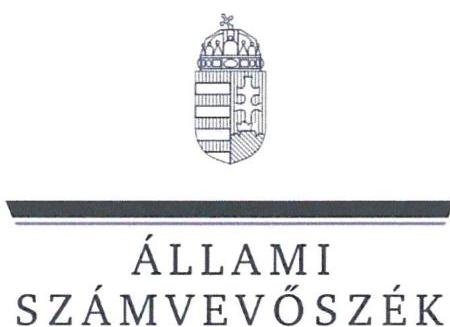
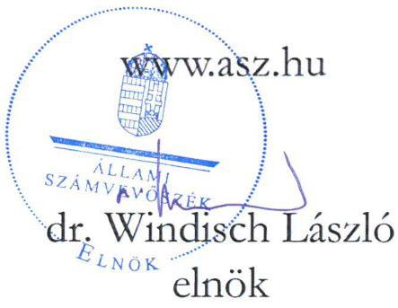
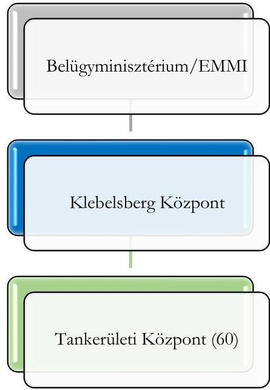
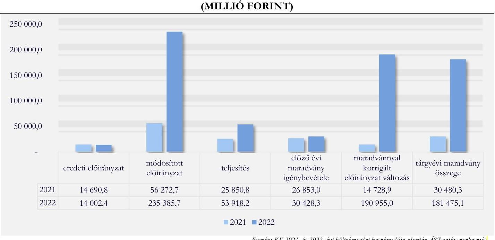

# JELENTÉS 

## Központi költségvetési szervek ellenőrzése Középirányítói feladatok ellenőrzése Klebelsberg Központ

2024.

---

ÁLLAMI
SZÁMVEVŐSZÉK

# JELENTÉS 

## Központi költségvetési szervek ellenőrzése Középirányítói feladatok ellenőrzése Klebelsberg Központ

2024. 

24012

---

# ELLENŐRZÉSI IGAZGATÓSÁG: 

## ÁLLAMHÁZTARTÁS KÖZPONTI SZINTJÉT ELLENŐRZŐ IGAZGATÓSÁG

## ELLENŐRZÉSI IGAZGATÓ:

SINKÁNÉ DR. CSENDES ÁGNES igazgató

## ELLENŐRZÉSVEZETŐ:

Jelentéseink az interneten a www.asz.hu címen olvashatók.

LACZI HEDVIG ANNA ellenőrzésvezető

IKTATÓSZÁM: EL-4027-001/2024
TÉMASZÁM: 2649.
ELLENŐRZÉS-AZONOSÍTÓ SZÁM: V-0993

---

# TARTALOMJEGYZÉK 

- AZ ELLENŐRZÉS ALAPADATAI ..... 5
- AZ ELLENŐRZÖTT SZERVEZET ..... 7
- ÖSSZEFOGLALÁS ..... 9
- AZ ELLENŐRZÉS FÓKUSZTERÜLETEI ..... 12
- MEGÁLLAPÍTÁSOK ..... 13
- JAVASLATOK ..... 33
- MELLÉKLETEK ..... 35
I. sz. melléklet: Értelmező szótár ..... 35
II. sz. melléklet: Az ellenőrzött és ellenőrzést támogató szervezetek jegyzéke. ..... 39
III. sz. melléklet: Ellenőrzési kritériumok ..... 40
IV. sz. melléklet: Fókuszterületekhez kapcsolódó kiegészítő információk ..... 44
- FÜGGELÉK: ÉSZREVÉTELEK ..... 55
- RÖVIDÍTÉSEK JEGYZÉKE ..... 60

---

.

---

# AZ ELLENŐRZÉS ALAPADATAI 

## AZ ELLENŐRZÉS CÉLJA

Az ellenőrzés célja annak értékelése volt, hogy a Klebelsberg Központ, mint központi költségvetési szerv gazdálkodásának keretei és gazdálkodása a jogszabályi előírásoknak és a közfeladat ellátásának megfelelő volt-e. Az ellenőrzés célja volt továbbá annak értékelése, hogy a Klebelsberg Központ, mint középirányító szerv a középirányítói feladatellátását a jogszabályi előírásoknak megfelelően végezte-e; a középirányítói hatásköröket a közpénzekkel való megbízható gazdálkodás előmozdítása, valamint a nemzeti vagyonnal való felelős gazdálkodás érdekében gyakorolta-e a tankerületi központoknál.

## AZ ELLENŐRZÉS TÍPUSA

Megfelelőségi ellenőrzés

## AZ ELLENŐRZÖTT IDŐSZAK

2021-2022. évek, kitekintéssel a helyszíni ellenőrzés lezárásának időpontjáig

## AZ ELLENŐRZÉS TÁRGYA

Az ellenőrzés tárgyát képezte a $\mathrm{KK}^{1}$ működési és gazdálkodási tevékenysége kereteinek kialakítása, azoknak a jogszabályi előírásokkal való összhangja. A KK elemi költségvetésének tervezése és gazdálkodási tevékenysége feltételeinek kialakítása. A KK pénzügyi gazdálkodásának és a nemzeti vagyon kezelésének jogszabályi előírásokkal való összhangja. A KK a költségvetésének végrehajtásáról szóló beszámolójának jogszabályi és az irányító szervi előírásoknak való megfelelősége.

A KK középirányítói feladatellátása keretei kialakításának a jogszabályi és az irányító szervi előírásokkal való összhangja. A KK középirányítói feladatellátásának jogszabályi előírásnak való megfelelősége, a középirányító feladatellátás közpénzekkel való megbízható gazdálkodáshoz való hozzájárulása, továbbá a nemzeti vagyon felelős kezelése érdekében történő gyakorlása a tankerületi központoknál. A KK tevékenységéről szóló beszámoló elkészítése.

Az ellenőrzés kiterjedt minden olyan körülményre és adatra, amely az Állami Számvevőszék jogszabályban meghatározott feladatainak teljesítéséhez, valamint a program végrehajtása folyamán felmerült újabb összefüggések feltárásához volt szükséges.

## AZ ELLENŐRZÉS JOGALAPJA

Az ellenőrzés jogszabályi alapját az ÁSZ tv. ${ }^{2} 1 . \int(3)$ bekezdésének, 5. $\int(2)$-(3) bekezdéseinek, (4) bekezdés a) pontjának, valamint az Áht. ${ }^{3} 61 . \int(2)$ bekezdésének előírásai képezték.

---

# AZ ELLENŐRZÉS MÓDSZERE 

Az ellenőrzést a nemzetközi standardokat irányadónak tekintve az ellenőrzési program szempontjai, az ellenőrzött időszakban hatályos jogszabályok, az ellenőrzés szakmai szabályok és módszertanok figyelembevételével hajtotta végre az ÁSZ ${ }^{4}$.

Az ellenőrzési kérdések megválaszolásához szükséges bizonyítékok megszerzése az ellenőrzött szervezet által rendelkezésre bocsátott dokumentumokra és adatokra alapozva, továbbá megfigyelés, szemle (szemrevételezés), kérdésfeltevés (információkérés), valamint elemző eljárás útján történt.

Az ellenőrzési bizonyítékként felhasználható adatforrások közé tartoztak egyrészt az ellenőrzéshez kért dokumentumok, adatforrások, másrészt volt még minden - az ellenőrzés folyamán - feltárt, az ellenőrzés szempontjából releváns információkat tartalmazó dokumentum.

Az ellenőrzés lefolytatásához az ellenőrzött szervezet tanúsítványok kitöltésével, valamint az ÁSZ által kért dokumentumok, adatok, információk megküldésével és az ellenőrzés során szolgáltattak adatokat. Az ellenőrzésben, mint ellenőrzést támogató szervezetek közreműködtek a KK irányítása alá tartozó, a II. számú mellékletben felsorolt tankerületi központok, valamint a KK irányító szerve, a $\mathrm{BM}^{5}$.

Az egyes fókuszterületeken a kiadási előirányzatok körébe tartozó személyi juttatás előirányzatok, a dologi kiadási előirányzatok és a felhalmozási kiadási előirányzatok felhasználását, a múködési bevételi előirányzatok felhasználását, az előirányzat-átcsoportosítások és -módosítások szabályszerűségét, a vagyonnövekedést, a vagyoncsökkenést, a maradványelszámolás szabályszerűségét, a követelések és kötelezettségek, az adott előlegek év végi értékelését, és a vagyonelemek év végi értékelését a 2021. és a 2022. évre vonatkozóan évente 30-30 elemű, egyszerű véletlen mintavételi eljárással kiválasztott tételek alapján ellenőrizte az ÁSZ. A behajthatatlanként leírt követelések, a passzív időbeli elhatárolások, valamint kapott előlegek év végi értékelése területén a sokaság elemszáma kisebb volt, mint az előírt mintaelemszám, ezért ezen területeken tételes ellenőrzésre került sor. A pénzügyi gazdálkodás területén a stornó és a helyesbítő tételek esetében kockázati szempont alapú mintavételi eljárásra került sor. A KK, mint középirányító szerv irányítási, szervezési és nyomon követési feladatellátásának szabályszerűsége az ellenőrzést támogató költségvetési szervek vonatkozásában került ellenőrzésre. A középirányító szervi feladatellátás KK által végrehajtott előirányzat átcsoportosítások 2021. és a 2022. évre vonatkozóan évente 30-30 elemű egyszerű véletlen mintavételi eljárással kiválasztott tételek alapján, a KK által a tankerületi központok részére központosítottan lefolytatott beszerzések és közbeszerzések és a KK által végzett belső ellenőrzések területén - az ellenőrzések számára tekintettel - tételes ellenőrzésre került sor. A tények feltárása és azok összegzése során a megállapítások az ellenőrzött mintatételekre vonatkozóan kerültek megfogalmazásra.

Az ÁSZ a fókuszterületeken az ellenőrzést szabályszerűségi szempontok szerint végezte, továbbá a megállapításokat, az értékeléseket a lényegesség, a szabálytalanságok súlyossága, gyakorisága, illetve elemzési tapasztalatok is meghatározták.

---

# AZ ELLENŐRZÖTT SZERVEZET 

## KLEBELSBERG KÖZPONT

A KK központi hivatalként működő központi költségvetési szerv, amelyet a Kormány a 134/2016. (VI. 10.) Korm. rendelet ${ }^{6}$ alapján az Nkt. ${ }^{7}$-ban meghatározott oktatási központ feladatainak ellátására jelölt ki. Irányító szerve 2022. május 24 -ig az EMMI ${ }^{8}$, azt követően a BM volt. A belügyminiszter a 182/2022. (V. 24.) Korm. rendelet ${ }^{9}$ 66. § (1) bekezdés 29. pontja alapján a Kormány köznevelésért felelős tagja.

A KK a Kormány által kijelölt középirányító szervként a tankerületi központok tekintetében a 134/2016. (VI. 10.) Korm. rendeletben, valamint az Áht. 9. § b), e), g)-j), 9/A. § (3) bekezdésben meghatározott irányítási, valamint a pénzügyi ellenőrzési hatásköröket gyakorolja.

A KK-t, az irányító szervét, valamint az általa irányított szerveit az 1. ábra mutatja be.
1. ábra

AZ IRÁNYÍTÓSZERV, A KK ÉS AZ ÁLTALA IRÁNYÍTOTT SZERVEK HIERARCHIÁJA

A KK a 2021. és 2022. évekre vonatkozó központi költségvetési törvényekben ${ }^{10}$ a XX. Emberi Erőforrások Minisztériuma, azon belül a Klebelsberg Központ cím alá tartozó költségvetési szervként szerepelt. A Klebelsberg Központ cím a KK-t és az általa irányított, önállóan gazdálkodó 60 tankerületi központ költségvetését együttesen tartalmazta.

A KK működésére és feladatainak ellátására a 134/2016. (VI. 10.) Korm. rendelet és a 4/2015. (IV.10.) BM utasítás ${ }^{11}$, a költségvetésének tervezésére és gazdálkodására vonatkozó alapvető jogszabályi előírásokat az Áht. és az Ávr. ${ }^{12}$, a könyvvezetésére és beszámolására az Áhsz. ${ }^{13}$ és a Számv. tv. ${ }^{14}$, a KK vagyonkezelésére vonatkozó jogszabályi előírásokat a Nvtv. ${ }^{15}$ és a Vtv. ${ }^{16}$, illetve annak végrehajtási rendelete a Vtvr. ${ }^{17}$ tartalmazta.

---

A KK 2021. és 2022. évi főbb gazdálkodási adatait az 1. táblázat szemlélteti:
1. táblázat

# A KK 2021. ÉS 2022. ÉVI FŐBB GAZDÁLKODÁSI ADATAI (MILLIÓ FT) 

| MEGNEVEZÉS | 2021 |  |  | 2022 |  |  |
| :--: | :--: | :--: | :--: | :--: | :--: | :--: |
|  | EREDETI   ELÓIRÁNYZAT | MÓDOSÍTOTT   ELÓIRÁNYZAT | TELJESÍTÉS | EREDETI   ELÓIRÁNYZAT | MÓDOSÍTOTT   ELÓIRÁNYZAT | TELJESÍTÉS |
| Személyi juttatások | 6007,2 | 7015,7 | 4550,1 | 6253,7 | 4524,0 | 2355,8 |
| Dologi kiadások | 2468,0 | 15078,0 | 5395,9 | 1648,2 | 16 146,8 | 5881,7 |
| Beruházások | 5312,0 | 15610,8 | 11 152,8 | 5205,8 | 195 066,6 | 39722,2 |
| Felújítások | 112,5 | 17475,0 | 4089,6 | 110,2 | 17950,3 | 4646,9 |
| Egyéb kiadások | 791,1 | 1038,6 | 662,4 | 784,5 | 1643,4 | 1257,0 |
| Költségvetési kiadások összesen | 14690,8 | 56218,1 | 25850,8 | 14002,4 | 235 331,1 | 53863,6 |
| Finanszírozási kiadások | 0,0 | 54,6 | 0,0 | 0,0 | 54,6 | 54,6 |
| Kiadások összesen | 14690,8 | 56272,7 | 25850,8 | 14002,4 | 235 385,7 | 53918,2 |
| Költségvetési bevételek | 0,0 | 21 118,3 | 21 124,7 | 0,0 | 197 044,0 | 197 051,5 |
| Finanszírozási bevételek | 14690,8 | 35 154,4 | 35 154,4 | 14002,4 | 38 341,7 | 38 341,7 |
| Bevételek összesen | 14690,8 | 56272,7 | 56279,1 | 14002,4 | 235 385,7 | 235 393,2 |
| ebből és közben befolyt EU pályázati források/elólegek |  | 20442,7 |  |  | 196745,5 |  |

A KK 2022. évben előleget kapott a „Digitális oktatáshoz való egyenlő hozzáférés feltételeinek biztosítása a tanulók és pedagógusok számára" című EU-s projekt fedezetére.

A KK átlagos állományi létszáma 2021. és 2022. években 174 fő, a mérlegfőösszeg 2021. évben 46 229,2 M Ft, 2022. évben 221 500,1 M Ft volt. A KK-nál a 2021. és a 2022. években költségvetési felügyelő volt kijelölve.

---

# ÖSSZEFOGLALÁS 

A középirányító szervek a feladataik ellátásával elősegítik az irányításuk alá tartozó költségvetési szervek gazdálkodási feladatainak szabályszerű ellátását. Ezzel hozzájárulnak ahhoz, hogy mind a költségvetési szervekre, mind a középirányító szervi feladatok ellátására fordított közpénzek, valamint az általuk kezelt nemzeti vagyon cél szerint hasznosuljanak. A KK az 1. táblázatban bemutatott főbb gazdálkodási adatai alapján jelentős közpénzzel gazdálkodott, és nemzeti vagyont kezelt.

Az ellenőrzés 2021-2022. évekre vonatkozóan a KK működési és gazdálkodási tevékenysége kereteinek kialakítását, az elemi költségvetésének tervezését, a pénzügyi gazdálkodását és a nemzeti vagyonnal való gazdálkodását, a költségvetésének végrehajtásáról szóló beszámolóinak jogszabályi és az irányító szervi előírásoknak való megfelelőségét, továbbá a KK középirányítói feladatellátását ellenőrizte. A megfelelőségi ellenőrzés kiterjedt ezen feladatoknak a fókuszterületeken való értékelésére, a lényegesség, a szabálytalanságok súlyossága, gyakorisága, illetve elemzési tapasztalatok és összefüggések alapján.

A KK a múködés és gazdálkodás szabályozottságát a jogszabályi előírásoknak nem teljeskörűen megfelelve alakította ki, mivel a múködésben bekövetkezett változások ellenére a számviteli politika és a számlarend nem került módosításra.
A KK a jogszabályi előírásoknak megfelelően kialakította az integrált kockázatkezelési rendszerét, azonban a kockázatkezelési rendszer müködtetése a jogszabályi előírásoknak nem teljeskörűen felelt meg, mivel a KK nem mérte fel és nem állapította meg a saját tevékenységében rejlő kockázatokat.
A KK a tevékenységének nyomon követését és belső ellenőrzését a jogszabályoknak megfelelően kialakította, azonban a KK belső ellenőrzési tevékenységének működtetése kapcsán az ellenőrzött időszak vonatkozásában hiányosságokat tárt fel az ÁSZ ellenőrzés. A KK 2021. és 2022. évi ellenőrzési jelentései nem tartalmaztak a KK költségvetés tervezésére, gazdálkodására, beszámolására, valamint a középirányítói feladatellátásra vonatkozó Bkr. szerinti ellenőrzési területeket.
A KK a jogszabályi előírásoknak megfelelően kialakította és működtette az információs és kommunikációs rendszerét.

A KK az éves elemi költségvetéseit a jogszabályi előírások szerinti formában készítette el. A 2021. és 2022. évre vonatkozó költségvetési javaslatokhoz kapcsolódóan részletes számításokat nem készítettek a forrásigények alátámasztására.

Az éves költségvetési törvény parlamenti jóváhagyása kora nyári időszakra történő időzítésének 2015. óta követett gyakorlata a költségvetési tervezés tavaszi időszakban való elvégzését teszi szükségessé intézményi szinten is. A bázisév első hónapjaiban még kevés információ áll rendelkezésre gazdasági folyamatokat befolyásoló tényezők valós alakulásáról, a tervezési időszakot követően is bekövetkezhetnek akár a szabályozási környezetben, akár a hazai és/vagy nemzetközi politikai és gazdasági környezetben olyan változások, amelyek jelentős hatással vannak az intézmény feladatellátására, gazdálkodására (pl. infláció alakulása, háborús helyzetből fakadó többletköltségek, új feladatok, stb). Erre tekintettel a költségvetési tervezés megalapozottsága (megalapozhatósága) korlátozott, jelentős bizonytalanságot, és a többszöri évközi korrekciók, kiigazítások (azaz gyakori előirányzat módosítások) szükségességét hordozza, ez a jövőbeni tervezés szempontjából is kockázatot jelent. Ezáltal a bázis alapú tervezés módszerével készített költségvetési javaslatok tartalmazzák a korábbi évek tervezési hibáit.
A KK a 2021. és a 2022. évi költségvetési javaslataiban mindkét évben többletforrás-igényt szerepeltetett. A költségvetési javaslatokban a KK által javasolt többletigények az irányító szerv által nem kerültek elfogadásra, ezért az éves elemi költségvetések nem tartalmazták azokat. A többletigényekhez kapcsolódtak többek között állagmegóvást, eszköz pótlást jelentő beruházások is, amelyek finanszírozása az ellenőrzött időszakban nem valósult meg.

---

A KK a jogszabályi előírások ellenére a tapasztalatok alapján rendszeresen előforduló bevételeket nem tervezte meg a költségvetési javaslatainak összeállítása során. A KK a költségvetései tervezése során kiadásainál nem különítette el, nem mutatta be részletes bontásban a tapasztalatok alapján rendszeresen előforduló, a tankerületi központok részére biztosított - a 2021. évben 7228,3 M Ft és a 2022. évben 5231,6 M Ft többletforrások miatti kiadásait, ezzel a költségvetése kiadási előirányzatainak átláthatóságát nem biztosította.

A KK-nál a 2021. évben kormányhatározatok és irányító szervi határozatok következtében történtek előirányzat-módosítások, melyek összességében 941,1 M Ft forrást biztosítottak a KK részére. A 2022. évben kormányhatározat, pénzügyminisztériumi határozat és irányító szervi határozatok következtében történtek előirányzat-módosítások, melyek összességében 632,3 M Ft forrást vontak el a KK költségvetéséből. Az éves költségvetések tervezése során benyújtott többletforrás-igények, valamint a kormányhatározatokkal, illetve irányító szervi határozatokkal kapott források összevetése alapján 2021. évben egy esetben (a garantált bérminimum emelkedésével kapcsolatosan) volt egyezőség, a 2022. évben nem volt egyezőség az igényelt és a kapott források jogcímei között. Ezek alapján a KK költségvetéseiben év közben végrehajtott előirányzatmódosítások nem a KK által tervezett feladatokhoz igényelt többletforrásokra nyújtottak fedezetet. A 2021. és 2022. évi módosított előirányzatok összetétele alapján a KK jelentős mértékű, európai uniós projektekből származó vagy azt megelőlegező forrást kezelt, amely az eredeti és módosított előirányzatok közötti jelentős számszaki különbségeket eredményezte. A 2021. évben az évközi előirányzat-módosítások hatására a KK módosított előirányzatai az eredeti előirányzatai háromszorosát, a 2022. évben tizenhatszorosát meghaladták, ezáltal a KK módosított előirányzatai a 2021. évben 56 272,7 M Ft-ot, 2022. évben 235 385,7 M Ft-ot tettek ki. A KK kiadásainak teljesítése 2021. évben 25 850,8 M Ft, 2022. évben 53 918,2 M Ft volt, ezáltal az eredeti előirányzat 2021. évben 176 \%-on, 2022. évben 385 \%-on teljesült. A KK a Klebelsberg Központ címen belül végrehajtott előirányzat módosításai a 2021-2022. években nem voltak részletes számításokkal megalapozottak.

A KK pénzügyi gazdálkodása és az ahhoz kapcsolódó kontrolltevékenységek ellenőrzés által feltárt hiányosságai jellemzően a gazdálkodási jogkörök nem jogszabályi előírásoknak megfelelő gyakorlásából, valamint a nem rendszeres személyi jellegű kifizetések kontrolljának hiányából adódtak.

Kockázatot jelenthet a céljuttatások, projektprémiumok esetében a döntéselőkészítésre és a kifizetésre vonatkozó kontrollok biztosításának hiánya, amely miatt olyan közpénzfelhasználás történhet a jövőben, amely nem a KK közfeladatainak ellátását szolgálja.

A KK a feladatellátásához szükséges pénzügyi források rendelkezésre állását és a likviditását, valamint a követelések állományát és a tartozásállományát folyamatosan nyomon követte. A KK az ellenőrzött években nem rendelkezett 60 napot meghaladó tartozásállománnyal. Az ellenőrzött előirányzat-átcsoportosítások és előirányzat-módosítások, valamint azok nyilvántartásba vétele megfelelt a jogszabályi előírásoknak.

A KK nemzeti vagyon növekedésével kapcsolatban a 2021. év tekintetében a tárgyi eszközök részletező nyilvántartása, a 2022. évben a befektetett eszközök bekerülési értékének megállapítása vonatkozásában tárt fel hiányosságot az ellenőrzés. Továbbá a 2021. és a 2022. években az épületenergetikai korszerűsítések esetében a vagyonkezelői jog ingatlan-nyilvántartásba történő bejegyzésének kezdeményezése maradt el. A vagyon csökkenésével kapcsolatos feladatainak ellátása megfelelt a jogszabályi előírásoknak.

A KK egyes beszerzési projektjeinél a beszerzések célja, indoklása nem volt részletes számításokkal alátámasztott, amely felveti annak kockázatát, hogy szakmailag nem indokolt beszerzések valósulhatnak meg. Továbbá a tankerületi központoknál használatban lévő vagyonelemeken - ingatlanokon - a jövőben végrehajtandó beruházások megalapozottságának, célszerűségének és alátámasztottságának hiánya felveti annak

---

kockázatát, hogy az ingatlanok állagmegóvása, a használhatóságának fenntartása nem indokoltság, szükségesség alapján történik.

A KK a 2021. és 2022. évi költségvetéseinek végrehajtásáról a jogszabályokban előírtak szerint beszámolt. A 2021. évi maradványanalitika vezetése, annak tartalma nem teljeskörűen felelt meg a jogszabályi előírásoknak. A KK 2021. és 2022. évi költségvetési beszámolóinak leltárral történő alátámasztását egyeztetéssel végezték el, amely megfelelt a jogszabályi előírásoknak.

Az európai uniós projektek keretében megvalósult beszerzéseknél az eszközök tankerületi központoknak és/vagy a fenntartásukban lévő intézményeknek történő használatba vagy vagyonkezelésbe adása kapcsán kockázatot jelenthet a nagy mennyiségű eszközök fellelhetősége, a KK 2023. évi tételes, mennyiségi leltározásának határidőben és a jogszabályok szerinti végrehajtása.

A KK a középirányítói feladatellátásának szabályozási kereteit a jogszabályi előírásoknak nem teljeskörűen megfelelve alakította ki, mivel az ügyrendjében nem szabályozta a tankerületi központok éves költségvetési beszámolójának felülvizsgálatával kapcsolatos középirányítói feladat munkafolyamatainak leírását, a feladat- és hatásköröket, a felelősségi szabályokat. Továbbá az ellenőrzési nyomvonalában a középirányítói tevékenységei közül nem mindegyikre kiterjedően határozta meg a múködési folyamatok leírását, a felelősségi és információs szinteket.

A KK a 2021-2022. években a középirányítói feladatait nem teljeskörűen a 134/2016. (VI.10.) Korm. rendelet előírásainak megfelelően látta el, mivel a tankerületi központokra vonatkozó beruházási tervet nem készítette el, mindössze fejlesztési igényeket mért fel, valamint a belső ellenőrzési tevékenysége vonatkozásában is tárt fel hiányosságokat az ellenőrzés. A KK a tankerületi központok gazdálkodására vonatkozóan a 20212022. években egy-egy tankerületi központnál végzett ellenőrzést.

A KK a jogszabály által átruházott irányítói hatáskörében az irányítása alá tartozó tankerületi központok esetében gondoskodott a belső szabályzatok jóváhagyásáról. A KK meghatározta a tankerületi központok gazdálkodásának keretszabályait, követelményeit, valamint a tankerületi központok előirányzatainak felhasználására vonatkozó irányelveket. A KK elkészítette a tankerületi központokra is kiterjedő vagyongazdálkodási stratégiát, valamint meghatározta az informatikai stratégiát. A KK ellátta az informatikai rendszerek üzemeltetésével és fejlesztésével kapcsolatos feladatokat, valamint az informatikai rendszerek adatkezelésével kapcsolatos adatfeldolgozói feladatokat. A KK figyelemmel kísérte a tankerületi központok előirányzatainak felhasználását és a költségvetéseinek végrehajtását. Nyilvántartást vezetett a tankerületi központok álláshely alapú létszámmal való gazdálkodásáról. A KK által lebonyolított közbeszerzések és közbeszerzési értékhatár alatti beszerzések a jogszabályi előírásoknak megfelelőek voltak az ellenőrzött mintatételek esetében. Az ellenőrzött években a KK által a tankerületi központok között végrehajtott előirányzat átcsoportosítások a jogszabályi előírásoknak megfelelőek voltak.

---

# AZ ELLENŐRZÉS FÓKUSZTERÜLETEI 

1.     - A Klebelsberg Központ, mint központi költségvetési szerv kontrollkörnyezete - szabályozottság -, integrált kockázatkezelési rendszere, monitoring rendszere - nyomon követés és belső ellenőrzési tevékenység -, információs és kommunikációs rendszere
2.     - A Klebelsberg Központ költségvetési tervezési folyamata
3.     - A Klebelsberg Központ pénzügyi gazdálkodása és a kontrolltevékenységek
4.     - A Klebelsberg Központnál a nemzeti vagyon kezelése
5.     - A Klebelsberg Központ költségvetési beszámolóinak ellenőrzése
6.     - A Klebelsberg Központ, mint középirányító szerv feladatellátása

---

# 1. A Klebelsberg Központ, mint központi költségvetési szerv kontrollkörnyezete - szabályozottság -, integrált kockázatkezelési rendszere, monitoring rendszere - nyomon követés és belső ellenőrzési tevékenység -, információs és kommunikációs rendszere 

Összegző megállapítás

A KK-nál az ellenőrzőtt időszakban a szabályozottság kialakítása, valamint a belső ellenőrzési tevékenység és a kockázatkezelési rendszer múködtetése kapcsán merültek fel hiányosságok. A belső ellenőrzési tevékenység kialakítása, a nyomon követés, és az integrált kockázatkezelési rendszer kialakítása megfelelő volt.
1.1. számú megállapítás

A KK a jogszabályi előírásoknak nem teljeskörűen megfelelve alakította ki a múködési kereteit és a gazdálkodási tevékenységének szabályozási kereteit.

A KK az ellenőrzött időszakban rendelkezett az Áht. által előírt, emberi erőforrások minisztere által, a 61/2016. (XII. 29.) EMMI utasításban kiadott SZMSZ-szel.
A gazdasági szervezeti feladatokat az SZMSZ szerint a gazdasági elnökhelyettes, a Költségvetési és Pénzügyi Főosztály, valamint a Vagyongazdálkodási és Üzemeltetési Főosztály látta el. A KK rendelkezett a gazdasági feladatainak és az Ávr. előírásának megfelelően hatályos gazdasági szervezeti ügyrenddel, azonban a gazdasági szervezeten belül a KPF ügyrendjét ${ }^{18}$ a KK elnöke nem módosította, mivel a KK könyvvezetési feladatainak teljesítésére használt számviteli programváltás miatti feladatok változása abban nem került átvezetésre. Az adatszolgáltatási feladatok teljesítésével kapcsolatos belső előírásokat, feltételeket az Ávr. előírásának megfelelően a KK szervezeti egységeinek ügyrendjeiben, a beszámolási feladatok teljesítésével kapcsolatos belső előírásokat, feltételeket az ellenőrzési nyomvonalban ${ }^{19}$ szabályozták.
A KK rendelkezett a Bkr. ${ }^{20}$ által előírt, hatályos szervezeti integritást sértő események kezelésének eljárásrendjével ${ }_{1,2}{ }^{21}$, azonban az ellenőrzött időszakban a Bkr. 6. § (4a) bekezdés h) pontjában előírtak ellenére azok nem tartalmazták a szervezeti integritást sértő események bekövetkezésének megelőzésére kialakított eljárási szabályokat.
A KK elnöke a Bkr. előírásának megfelelően a közszolgálati szabályzatban ${ }^{22}$ meghatározta a kormánytisztviselőre vonatkozó hivatásetikai követelményeket és a munkavállalóra vonatkozó általános magatartási követelményeket.
A KK az ellenőrzött időszakban rendelkezett a KK elnöke által jóváhagyott hatályos számviteli politikával ${ }^{23}$, azonban az nem teljeskörűen felelelt meg a jogszabályi előírásoknak, mivel az Áhsz. 50. § (1) bekezdésében, valamint a Számv. tv. 14. § (3) bekezdésében foglaltak ellenére abban nem módosították a

---

könyvvezetési feladatainak teljesítésére használt számviteli programváltásra vonatkozó sajátosságokat. Továbbá a számviteli politika az Áhsz. 50. § (1) bekezdése és a Számv. tv. 14. § (4) bekezdésében foglaltak ellenére nem tartalmazta, hogy a KK mit tekint a számviteli elszámolás, az értékelés szempontjából kivételes nagyságú vagy előfordulású bevételnek, költségnek és ráfordításnak.
A KK elnöke a 2021-2022. években hatályos számlarendet ${ }^{24}$ nem módosította, az abban szereplő főkönyvi számlák megnevezése, a számlák alábontása eltért az új könyviteli rendszerben alkalmazott gyakorlattól, valamint az Áhsz. 51. § (1) bekezdésében és a 16. mellékletében meghatározott egységes számlakeretben szereplő számla-megnevezésektől. Továbbá a számlarend a Számv. tv. 161. § (1) bekezdés és (2) bekezdés a) pontjában előírtak ellenére nem tartalmazta minden alkalmazásra kijelölt számla számjelét és megnevezését.
A KK rendelkezett az Áht.-ban előírt, a KK elnöke által kiadott, a gazdálkodás részletes rendjét meghatározó szabályzattal ${ }^{25}$, amely az Ávr. előírásának megfelelően tartalmazta a gazdálkodással összefüggő feladatokat, a kötelezettségvállalás, pénzügyi ellenjegyzés, teljesítésigazolás, érvényesítés, utalványozás gyakorlásának módjával, eljárási és dokumentációs részletszabályaival, valamint az ezeket végző személyek kijelölésének rendjével kapcsolatos előírásokat. A KK a kötelezettségvállalásra, pénzügyi ellenjegyzésre, a teljesítés igazolására jogosult személyekről és aláírás-mintájukról az Ávr. előírásainak megfelelő nyilvántartást vezetett.
A KK elnöke az Ávr.-ben előírt anyag- és eszközgazdálkodás számviteli politikában nem szabályozott kérdéseit anyag- és eszközgazdálkodási szabályzatban ${ }^{26}$ rendezte. A KK közbeszerzési szabályzata ${ }^{27}$ tartalmazta a Kbt. ${ }^{28}$ előírásának megfelelően a közbeszerzési eljárások előkészítésének felelősségi rendjét, a közbeszerzési eljárások lefolytatásának felelősségi rendjét, a közbeszerzési eljárások dokumentálási rendjét. A KK közbeszerzési szabályzatban a Kbt. 27. § (1) bekezdésében előírtak ellenére nem határozta meg a közbeszerzési eljárások belső ellenőrzésének felelősségi rendjét. A KK elnöke az Ávr. előírásának megfelelően kiadta a Kbt. hatálya alá nem tartozó beszerzések lebonyolításával kapcsolatos beszerzési szabályzatot ${ }^{29}$.
A KK rendelkezett az Áhsz. és a Számv. tv. előírásainak megfelelően eszközök és források leltározási és leltárkészítési szabályzatával ${ }^{30}$, melyben a Számv. tv. előírásával összhangban határozta meg a mennyiségi felvétellel történő leltározás gyakoriságát. A KK rendelkezett az Áhsz. és a Számv. tv. előírásainak megfelelően eszközök és források értékelési szabályzatával ${ }^{31}$, amely tartalmazta az Áhsz. előírásának megfelelően a követelések értékelésének elveit, a kis összegű követelések év végi meghatározásának elveit, dokumentálásának szabályait, továbbá a szabályzatban meghatározott immateriális javak és tárgyi eszközök esetén a terv szerinti értékesökkenés leírási kulcsai az Áhsz. előírásainak megfelelők voltak. A KK elnöke a pénzkezelési szabályzatot ${ }^{32}$ az Áhsz. és a Számv. tv. 14. előírásainak megfelelően készítette el. A KK rendelkezett Áhsz. és a Számv. tv. előírásainak megfelelően a KK elnöke által jóváhagyott hatályos önköltségszámítási szabályzattal ${ }^{33}$.
A KK-hoz 2014. évben költségvetési felügyelő került kijelölésre az Áht. előírása szerint, megbízólevele alapján a feladata és hatásköre az Ávr.-ben meghatározott feladatkörök ellátására vonatkozott. A költségvetési felügyelő tevékenységéről a KK gazdálkodás részletes rendjét meghatározó szabályzata is rendelkezett.

---

1.2. számú megállapítás

A KK integrált kockázatkezelési rendszerét a jogszabályi előírásoknak megfelelően alakította ki, azonban a kockázatkezelési rendszer múködtetése a jogszabályi előírásoknak nem teljeskörűen felelt meg.

A KK a Bkr. előírásainak megfelelően rendelkezett integrált kockázatkezelés eljárásrenddel ${ }^{34}$, amelyben a Bkr. alapján rögzítésre kerültek a jogszabályi kritériumok. A KK a Bkr.-ben előírtak ellátására integritás tanácsadót foglalkoztatott. A KK az 50/2013. (II. 25.) Korm. rendelet ${ }^{35}$ előírásai alapján felmérte a szervezetet érintő integritási- és korrupciós kockázatokat és Korrupciómegelőzési intézkedési tervet készített.
A Bkr. 7. § (2) bekezdésben és az integrált kockázatkezelési eljárásrendben foglaltak ellenére - az integritási és korrupciós kockázatok kivételével - nem mérték fel és nem állapították meg a KK tevékenységében rejlő kockázatokat.
A KK az 50/2013. (II.25) Korm. rendeletben előírtak teljesítéséhez kialakította az integritásirányítási rendszerét, amelynek keretében rendelkezett a külső szakértők alkalmazási feltételeiről szóló szabályzattal ${ }^{36}$, a Miniszterelnöki Kormányiroda által működtetett TÉR ${ }^{37}$ Informatikai rendszer alkalmazásával a Közszolgálati Szabályzat rendelkezései szerint egyéni teljesítményértékelési rendszert működtetett, kötelezően előírta az éves továbbképzés keretében a korrupció-megelőzés, integritás témakörét érintő képzést az új belépők és azon kormánytisztviselők részére, akik még nem vettek részt ilyen típusú képzésen.
1.3. számú megállapítás

A KK a tevékenységének nyomon követését biztosító rendszerét a jogszabályoknak megfelelően kialakította. A KK belső ellenőrzésének működtetése kapcsán hiányosságokat tárt fel az ellenőrzés.

A KK a tevékenységének, ezen belül a gazdálkodási feladatok végrehajtásának, valamint a célok megvalósításának nyomon követését biztosító rendszerét a Bkr. 10. §-ának megfelelően kialakította. A KK a Bkr.-nek megfelelően elkészítette az ellenőrzési nyomvonalat a középirányítói tevékenységek kivételével, amelyet a 6 . fókuszterület mutat be részletesen.
A jogszabályi előírások - Áht., Bkr., Ávr. - alapján az SZMSZ-ben meghatározottak szerint gondoskodtak az operatív tevékenységektől függetlenül múködő belső ellenőrzés kialakításáról. A KK elnöke a Belső Ellenőrzési Főosztály múködési rendjét a Belső Ellenőrzési Főosztály ügyrendjében ${ }^{38}$, a Belső ellenőrzési kézikönyvben ${ }^{39}$ és az ellenőrzési nyomvonalban szabályozta. A belső ellenőrzési vezető a Bkr.-ben foglaltak alapján a 2021-2024. közötti időszakra Belső ellenőrzési stratégiát, továbbá mindkét ellenőrzött évre vonatkozóan, a KK elnöke által jóváhagyott, kockázatelemzéssel alátámasztott éves belső ellenőrzési tervet készített. A Belső ellenőrzési stratégia 6. fejezete magas prioritású területként határozta meg a KK költségvetés tervezésére, gazdálkodására, beszámolására vonatkozó ellenőrzési területeket.
A KK belső ellenőrzése a 2021. és 2022. évi ellenőrzési jelentései alapján a Bkr. 21. § (1) bekezdése szerinti, a költségvetési tervezésre vonatkozó ellenőrzést, a Bkr. 21. § (1) bekezdése (2) bekezdés b) pontja szerinti, a beszámolók vizsgálatára, valamint a 134/2016. (VI. 10.) Korm. rendelet 5. § (1) bekezdése b) pontja szerinti középirányítói feladatellátásra vonatkozó ellenőrzést nem végzett.
A belső ellenőrzési vezető a Bkr.-nek megfelelően a 2021-2022. évekre elkészítette az éves belső ellenőrzési tevékenységére vonatkozó jelentéseket.

---

1.4. számú megállapítás

A KK a jogszabályi előírásoknak megfelelően alakította ki és működtette az információs és kommunikációs rendszerét.

A KK az információs és kommunikációs rendszert kialakította a Bkr. alapján. A Bkr. előírásainak megfelelően a KK információs és kommunikációs rendszerében meghatározásra kerültek a beszámolási szintek, határidők és módok.
A KK a 1995. évi LXVI. tv. ${ }^{40}$ szerinti, a KK vezetője által kiadott hatályos iratkezelési szabályzattal ${ }_{1,2}{ }^{41}$ rendelkezett, amely tartalmazta az iratok iktatási rendszerét, ezzel biztosította az iratok nyomon követését. A KK SZMSZ-e tartalmazta a KK tájékoztatási és döntés-előkészítési fórumait.
A KK rendelkezett az Ávr.-ben előírt, a kötelezően közzéteendő adatok nyilvánosságra hozatalának és a közérdekű adatok megismerésére irányuló kérelmek intézésének rendjéről szóló szabályzattal 2022. december 20-tól a közérdekű és közérdekből nyilvános adatok elektronikus közzétételének rendjéről szóló szabályzattal ${ }^{42}$. A KK rendelkezett a 2013. évi L. törvény ${ }^{43}$ által előírt, a KK vezetője által kiadott hatályos informatikai biztonsági szabályzattal ${ }_{1,2}{ }^{44}$. A KK rendelkezett az Info tv. ${ }^{45}$ által előírt, a KK vezetője által kiadott hatályos adatvédelmi és adatbiztonsági szabályzattal ${ }_{1,2}{ }^{46}$.
A KK az Info tv.-ben foglaltaknak megfelelően a beszámolókat honlapján közzétette.

# 2. A Klebelsberg Központ költségvetési tervezési folyamata 

## Összegző megállapítás

2.1. számú megállapítás

A KK az elemi költségvetéseit a jogszabályi előírások szerint elkészítette. A költségvetési javaslatait nem teljeskörűen a jogszabályi előírásoknak megfelelően tervezte meg és támasztotta alá részletes számítással.

A KK az elemi költségvetéseit jogszabályban foglaltaknak megfelelően elkészítette.

A KK a 2021. és 2022. évi elemi költségvetését az Áht.-ban, valamint az Ávr.-ben foglaltak szerinti formában és tartalommal elkészítette, amelyet a költségvetés tervezési szakaszában az irányítószerv, EMMI jóváhagyott.
2.2. számú megállapítás

A KK éves költségvetési javaslatainak tervezése a jogszabályban foglalt előírásoknak nem teljeskörűen felelt meg, mivel a bevételek és kiadások és a végrehajtott előirányzat-módosítások részletes számítással nem voltak alátámasztva.

Az ellenőrzés a KK költségvetés tervezésének megalapozottságát, a tervezés folyamatát és az előirányzatmódosításokat értékelte a következő szempontok szerint:

## KK költségvetési tervezési folyamata

-költségvetési javaslatokhoz a PM központi költségvetés tervezési tájékoztató szempontjai
-költségvetési javaslatok
-elemi költségvetések
$\cdot$előirányzat-módosítások

---

A költségvetési törvényekben a Klebelsberg Központ cím a KK és a 60 tankerületi központ költségvetését együttesen tartalmazta. A KK a Pénzügyminisztérium központi költségvetés tervezés tájékoztatója alapján bázis alapon készítette el a költségvetési javaslatait a tervezési időszakot megelőző év elemi költségvetésén, eredeti előirányzatain alapulva. A KK-nak a kiemelt előirányzatok tervezése során az előző évi bázisadatokból kiindulva a szerkezeti változásokat, szintrehozást, továbbá a kiadási előirányzatok forrását (bevétel vagy támogatás), a szakmai feladat előirányzatát és a létszámot kellett meghatározni. A költségvetési javaslatok tavasszal kerültek elkészítésre, ezért nem tartalmazhatták, tartalmazták az adott évre vonatkozóan a jogszabályi változásokból eredő valamennyi módosítás hatását. A KK a 2021. évi költségvetési javaslatában bázis alapon - az előző év elemi költségvetését alapul véve - 15 859,3 M Ft kiadást tervezett, továbbá 127 434,7 M Ft többletforrás-igényt szerepeltetett. A KK a 2022. évi költségvetési javaslatában a 2021. évi eredeti előirányzatát alapul véve, 14 690,8 M Ft mellett 65 013,9 M Ft többletforrás-igényt nyújtott be. A többletforrás-igény tételek - többek között a gyógypedagógusi pótlék, az intézményi bútorcsere program, az ingatlanfejlesztések, a tankerületi központok fenntartásában lévő intézmények állagmegóvása - szöveges indoklása alapján mindkét évben nem kizárólag a KK-ra, mint költségvetési szervre, hanem a középirányítása alá tartozó intézményrendszerre - 60 tankerületi központ és a fenntartásukban lévő köznevelési intézmények - is vonatkoztak. A KK bázis alapú eredeti, valamint módosított előirányzatok költségvetési kiadásait a IV. sz. melléklet 2. fókuszterület 14. táblázata mutatja be.
A KK költségvetési javaslataiban foglalt többletforrás-igényei mindkét évben elutasításra kerültek az irányító szerv részéről. A 2021. és 2022. évi költségvetési javaslatok során benyújtott többletforrás-igények összetételét a IV. sz. melléklet 2. fókuszterület 6-7. táblázata tartalmazza.
A KK éves költségvetési javaslatainak tervezése az Áht. 4. $\$ (2) bekezdésében foglalt előírásoknak nem teljeskörűen felelt meg, mivel a bevételek és kiadások számításokkal való alátámasztása, megalapozottsága nem volt teljeskörű az alábbiakban részletezettekre figyelemmel.
A KK az éves költségvetési javaslatainak összeállítása során az Ávr. 16. § (2) bekezdés b) pontjában foglaltak ellenére nem teljeskörűen tervezte meg a 2021. és 2022. évi bevételeit, mivel a rendszeresen előforduló bevételeket nem vették figyelembe a költségvetési javaslat összeállítása során. Az éves költségvetési beszámolók, valamint az analitikus nyilvántartások alapján a KK-nak többletbevétele származott a Klebelsberg Képzési Ösztöndíj Programban résztvevők által - a szerződés felmondása, vagy a követelmények nem teljesítése okán - visszafizetett összegekből mindkét évben. Az ösztöndíjak miatti követelésekből befolyt többletbevételekre év közben előirányzatot képeztek az irányító szerv előzetes engedélyével az Ávr.-ben foglaltaknak megfelelően.
A KK ellenőrzött időszakban keletkezett múködési többletbevételeinek alakulását a 2. táblázat mutatja be. 2. táblázat

# A KLEBELSBERG KÖZPONT MÜKÖDÉSI TÖBBLETBEVÉTELEI A 2021-2022. ÉVEKBEN (MILLIÓ FT) 

| MEGNEVEZÉS | 2021. EV | 2022. EV |
| :-- | :--: | :--: |
| Eredeti előirányzat (B4) | 0 | 0 |
| Teljesített többletbevételek (B4) | 162,9 | 231,5 |
| Módosított előirányzatokban szereplő többletbevételek (B4) | 156,7 | 225,0 |
| Ebből egyéb müködési bevételek (visszaffizetett ösztöndijakból) | 155,9 | 225,0 |

---

A módosított előirányzatokban szereplő többletbevételek 99,5 \%-át 2021. évben, illetve $100 \%$-át 2022. évben a visszafizetett ösztöndíjak tették ki. A KK-nak a 2019. és a 2020. évi éves költségvetési beszámolója alapján is többletbevétele származott az ellenőrzött időszakhoz hasonló nagyságrendben.
A KK a költségvetései tervezése során a kiadási előirányzatainál nem különítette el az Ávr. 16. § (2) bekezdés b) pontjában foglaltak ellenére a tapasztalatok alapján rendszeresen előforduló, a tankerületi központok részére - „Tartalékból átcsoportositás" megnevezéssel - biztosított többletforrások miatti kiadásait, ezzel a költségvetése kiadási előirányzatainak átláthatóságát nem biztosította.
A KK 2021. és 2022. évi kiadási előirányzatainak alakulását a 3. táblázat mutatja be.
3. táblázat

KLEBELSBERG KÖZPONT KIADÁSI ELŐIRÁNYZATA 2021-2022. ÉVEKBEN (MILLIÓ FT)

| MEGNEVEZÉS | 2021. EV | 2022. EV |
| :--: | :--: | :--: |
| Eredeti előirányzat | 14690,8 | 14002,4 |
| Módosított előirányzat | 56272,7 | 235385,7 |
| Teljesítés | 25850,8 | 53918,2 |

Az eredeti előirányzatok összegét a módosított előirányzatok összege jelentős mértékben meghaladta, amely összetételét a 4. táblázat mutatja be részletesen.
4. táblázat

KLEBELSBERG KÖZPONT MÓDOSÍTOTT ELŐIRÁNYZATÁNAK ÖSSZETÉTELE 2021-2022. ÉVEKBEN (MILLIÓ FT)

| MEGNEVEZÉS | 2021. EV | 2022. EV |
| :--: | :--: | :--: |
| Eredeti előirányzat | 14690,8 | 14002,4 |
| Előző évi maradvány igénybevétele | 26 853,0 | 30 428,2 |
| ebből európai uniós pályázati forráshoz kapcsolódó | 26666,4 | 30133,4 |
| Költségvetési megelőlegezés (B814) | 54,6 | - |
| Év közben befolyt európai uniós pályázati források/megelőlegezések | 20 442,7 | 196745,5 |
| Egyéb, hazai pályázati forrás | 518,9 | 73,5 |
| Előirányzatmódosítások (kurmányzati, irányító szerei, saját batáskörben) egyenlege | $-6287,1$ | $-5863,9$ |
| Módosított előirányzat összesen | 56272,7 | 235385,7 |

A 2021. és 2022. évi módosított előirányzatok összetétele mutatja, hogy a KK jelentős mértékű, európai uniós projektekből származó vagy azt megelőlegező forrást kezelt. A kötelezettségvállalással terhelt maradványban és az évközi bevételben megjelenő uniós források összesen a módosított előirányzatok 83,7 \%-át (2021. évben, 47 109,1 M Ft), illetve 96,4 \%-át (2022. évben, 226 878,9 M Ft) jelentették.
A 134/2016. (VI. 10.) Korm. rendelet alapján a KK európai uniós forrásból finanszírozott fejlesztéseket valósít meg a tankerületi központok esetében azok fenntartásában lévő köznevelési intézmények együttműködésével. A KK a hazai és az európai uniós támogatással megvalósuló programoknál a tankerületi központok vonatkozásában a központosított országos, regionális programok koordinálója és lebonyolítója a tervezéstől az elszámolásig. A KK-nak, mint kedvezményezettnek fenntartási

---

kötelezettsége áll fenn a projekt megvalósítás befejezésétől számított - jellemzően - 5 évig, az 1303/2013/EU európai parlamenti és tanácsi rendeletben foglaltakra tekintettel. Az ellenőrzött időszakot érintő európai uniós forrásból finanszírozott főbb projekteket a IV. sz. melléklet 2. fókuszterület 8. táblázata tartalmazza részletesen.
A KK-nál a 2021. évben kormányhatározatok, illetve irányító szervi határozatok következtében történt előirányzat-módosítások összesen 941,1 M Ft forrást biztosítottak a KK részére. A 2022. évben kormányhatározat, pénzügyminisztériumi határozat, illetve irányító szervi határozatok következtében történt előirányzatmódosítások összesen 632,3 M Ft forrást vontak el a KK költségvetéséből. Ennek bemutatását részletesen a IV. sz. melléklet 2. Fókuszterület 9. és 10. táblázata tartalmazza.
A KK 2021-2022. évi költségvetés tervezése során benyújtott többletforrás-igényei, valamint a kormányhatározatokkal, illetve irányító szervi határozatokkal kapott források összevetése alapján 2021. évben egy esetben (a garantált bérminimum emelkedésével kapcsolatosan) volt egyezőség, 2022. évben nem volt egyezőség az igényelt és a kapott források jogcímei között, ezek alapján a KK költségvetésében a 2021-2022. években év közben végrehajtott előirányzat-módosítások nem az eredeti költségvetés tervezése során jelzett többletforrásigénylések céljainak megvalósításához nyújtottak fedezetet. A többletforrás-igények elmaradt finanszírozása hatással volt az intézményrendszer által benyújtott igények teljesítésére.
A KK kiadási előirányzatai terhére történő előirányzat-módosítások a KK és a középirányítása alá tartozó költségvetési szervek közötti, Klebelsberg Központ címen belüli előirányzat-átcsoportosítások összege 2021. évben különböző jogcímeken 7228,3 M Ft, 2022. évben 5231,6 M Ft volt, amelyek többletelőirányzatot biztosítottak a tankerületi központok részére. A tankerületek részére teljesített többletelőirányzat átcsoportosítások megbontása a IV. sz. melléklet 2. fókuszterület 11. és 12. táblázatában található. A tankerületek többletforrás-igényeiket az általuk írásban jelzett előzetes forrásigény-becslések, árajánlatok és a már kifizetett költségek, továbbá az egyes tankerületi tartozásállományok nagyságával indokolták.
A tankerületek forrásigényeit a KK egyedileg bírálta el, írásban nem indokolta, és számítással nem támasztotta alá a tankerületek forrásigényeinek teljes vagy részleges elfogadását, illetve elutasítását. A KK az EMMI felé az egyes tankerületi központokra vonatkozó átcsoportosítási összegeket részletes indoklással és számításokkal nem támasztotta alá. Az előirányzat-módosítások jellemzően több tankerület részére, eltérő indokok alapján történő forrásbiztosításhoz kapcsolódtak. A címen belüli átcsoportosítások szöveges indoklásában szerepeltek előre nem tervezhető, „vis maior" -hoz köthető események (beázás, viharkár, közvetlen balesetveszély elhárítása), valamint előre tervezhető események (sport- és informatikai eszközök beszerzése, helyettesítési- és túlóra díjak, felújítási munkálatok), továbbá egyéb általános indoklások („költségvetési hiány csökkentése érdekében", a „feladatellátás biztosítása érdekében").
A KK előirányzat-nyilvántartása megfelelt az Áhsz.-ben foglaltaknak. A KK kiadási előirányzatainak és maradványainak évenkénti alakulását a 2. ábra szemlélteti.

---

# 3. A Klebelsberg Központ pénzügyi gazdálkodása és a kontrolltevékenységek 

Összegző megállapítás

A KK pénzügyi gazdálkodása és a kontrolltevékenységek nem teljeskörűen feleltek meg a jogszabályi előírásoknak, a gazdálkodási jogkörök nem megfelelő gyakorlásából adódó hiányosságok miatt. Az ellenőrzött időszak müködési bevételeinek elszámolása a jogszabályi előírásoknak megfelelt.

Az ellenőrzés a KK pénzügyi gazdálkodása és a kontrolltevékenységek tekintetében a következő területekre terjedt ki az ellenőrzött mintatélekkel kapcsolatban:
pénzügyi gazdálkodás

- a személyi jellegű kiadások felhasználása és elszámolása,
- a dologi kiadások felhasználása és elszámolása,
$\cdot$a felhalmozási kiadások felhasználása és elszámolása,
- a müködési bevételek elszámolása
kontrolltevékenység
- gazdálkodási jogkörök gyakorlása
pénzügyi gazdálkodás monitorozása
$\cdot$likviditás
$\cdot$előirányzat-módosítások, előirányzat-átcsoportosítások

---

3.1. számú megállapítás

A KK-nál a személyi juttatások kiadási előirányzatainak felhasználása és azok elszámolása nem teljeskörűen feleltek meg a jogszabályi előírásoknak. A dologi és a felhalmozási kiadási előirányzatok felhasználása és elszámolása területén eseti hiányosságok voltak. A múködési bevételek elszámolása megfelelt a jogszabályi előírásoknak.

A foglalkoztatottak személyi juttatásaival kapcsolatos kiadások felhasználása a 2021. évben 20 esetben (összesen nettó 7 M Ft összegben), a 2022. évben öt esetben (összesen nettó $0,7 \mathrm{MFt}$ összegben) a jogszabályi előírásoknak nem felelt meg, mivel a kifizetést megelőzően az érvényesítés és az utalványozás nem az Áht. 38. § (1) bekezdésében előírtak szerint történt. A 2021. évben öt esetben az érvényesítés és az utalványozás hiányán túli további hiányosság volt, hogy az Áht. 38. § (1) bekezdésében és az Ávr. 57. § (3) bekezdésében foglaltak ellenére a kifizetés elrendelését megelőzően nem történt meg a teljesítés arra jogosult általi igazolása. A foglalkoztatottak személyi juttatásai kiadásainak elszámolása azokban az esetekben, amelyeknél utalványrendelet nem készült és a teljesítésigazolás sem történt meg a 2021. évben négy esetben, (2022. évben nem volt ilyen eset) nem felelt meg az Áhsz. 52. §-ában, és a Számv. tv. 165. § (2) bekezdésében foglalt előírásnak, mert a gazdasági esemény számviteli (könyvviteli) nyilvántartásba vétele szabályszerűen kiállított bizonylat hiányában történt.
A nem rendszeres személyi juttatással kapcsolatos kiadások közül a 2021. évben egy esetben a nettó 3,4 M Ft kifizetett összeg kétharmad része céljuttatáshoz kapcsolódott, amelyhez a célfeladatot a kormányzati igazgatásról szóló 2018. évi CXXV. tv. 146.§ (2)-(3) bekezdéseiben, valamint a 88/2019. (IV. 23.) Korm. rendelet ${ }^{47}$ 33. § (1) bekezdésében foglaltak ellenére a munkáltatói jogkör gyakorlója nem határozta meg. A célfeladat elvégzésének teljesítésigazolása nem a munkáltatói jogkör gyakorlója, vagy az általa kijelölt személy által történt a 88/2019. (IV. 23.) Korm. rendelet 34. § (1) bekezdés előírásainak ellenére.
A külső személyi juttatással kapcsolatos kiadások területén az ösztöndíj kifizetések a 2021. évben 30 esetben (összesen nettó 4,4 M Ft összegben), a 2022. évben 29 esetben (összesen nettó 4,5 M Ft összegben) nem feleltek meg az Áht. 38. § (1)-(2) bekezdésében előírtaknak, mivel a kifizetés teljesítését az érvényesítés és az utalványozás nem előzte meg.
A dologi kiadási előirányzatok felhasználása a 2021. évben két esetben nem volt a jogszabályi előírásoknak megfelelő, mivel az egyik esetben a kifizetésre az Áht. 38. § (1)-(2) bekezdéseiben, és az Ávr. 57. § (4)-(5) bekezdéseiben foglaltak ellenére a teljesítés igazolása nélkül került sor. A másik esetben az utalványozás dokumentuma az érvényesítés hiánya miatt nem felelt meg az Áht. 38. § (1) bekezdés, Ávr. 59. § (1b) és (2) bekezdés, (3) bekezdés h) pontjában előírtaknak. A 2022. évben egy esetben a teljesítésigazoló nem rendelkezett a jogkör gyakorlására vonatkozó kijelöléssel, és ennek hiányában a teljesítés igazolása nem felelt meg az Áht. 38. § (1), (2) bekezdés és az Ávr. 57. § (1), (3)-(5) bekezdés előírásainak.
Az Áht., valamint az Ávr. előírásainak megfelelően a 200 ezer forintot meghaladó kötelezettségvállalások esetében rendelkezésre állt az előzetes írásbeli kötelezettségvállalás dokumentuma, amelyet az az Áht., valamint az Ávr. előírásainak megfelelően a jogkör gyakorlására jogosult személy, vagy az általa írásban felhatalmazott személy írt alá.
Az Áht., az Ávr., valamint az Áhsz. előírásainak megfelelően megtörtént a kötelezettségvállalás összegének nyilvántartásba vétele az adott kiadás finanszírozására szolgáló szabad előirányzat terhére. Az Áht., valamint az Ávr. előírásainak megfelelően minden kötelezettségvállalásnak megtörtént a jogkör gyakorlására jogosult személy, vagy az általa írásban kijelölt személy általi pénzügyi ellenjegyzése. Az

---

Áhsz.-ben, valamint a 38/2013. (IX. 19.) NGM rendeletben ${ }^{48}$ foglaltaknak megfelelően 2021-ben és 2022ben a dologi kiadások teljesítésére ható gazdasági esemény elszámolása - a költségvetési számvitelben az egységes rovatrend előírásainak megfelelő nyilvántartási számlákon történt.
A felhalmozási kiadásoknál a 2021. évben egy esetben az Ávr. 58. § (3) bekezdésében foglaltak ellenére a kifizetés dokumentumán nem szerepelt az érvényesítő aláírásának dátuma, valamint az Ávr. 59. § (3) bekezdés g) pontjában foglaltak ellenére a kifizetés dokumentumán nem szerepelt az utalványozó keltezéssel ellátott aláírása. A 2022. évben egy esetben az Ávr. 59. § (3) bekezdés g) pontjában foglaltak ellenére a kifizetés dokumentumán nem szerepelt az utalványozó aláírása.
Az Áht., valamint az Ávr. előírásainak megfelelően a 200 ezer forintot meghaladó kötelezettségvállalások esetében rendelkezésre állt az előzetes írásbeli kötelezettségvállalás dokumentuma, amelyet az Áht., valamint az Ávr. előírásainak megfelelően a jogkör gyakorlására jogosult személy, vagy az általa írásban felhatalmazott személy írt alá. Az Áht., az Ávr., valamint az Áhsz. előírásainak megfelelően megtörténtek a kötelezettségvállalások összegeinek nyilvántartásba vételei az adott kiadás finanszírozására szolgáló szabad előirányzat terhére. Az Áht., valamint az Ávr. előírásainak megfelelően a kötelezettségvállalásoknál megtörtént a jogkör gyakorlására jogosult személy, vagy az általa írásban kijelölt személy általi pénzügyi ellenjegyzése.
A Kbt.-ben foglaltaknak megfelelően a saját hatáskörben végzett beszerzések esetében lefolytatásra került a közbeszerzési eljárás, és a Kbt.-ben foglaltaknak megfelelően a KK a nyertes ajánlattevővel, és a nyertes ajánlat tartalmával megegyező tartalommal kötötte meg a szerződést. Az Áhsz.-ben, valamint a 38/2013. (IX. 19.) NGM rendeletben foglaltaknak megfelelően a felhalmozási kiadások teljesítésére ható gazdasági esemény elszámolása - a költségvetési számvitelben - az egységes rovatrend előírásainak megfelelő nyilvántartási számlákon történt.
A múködési bevételek elszámolása megfelelt az Áht., Áhsz., valamint a Számv. tv. előírásainak. A működési bevételek közgazdasági jelleg szerinti besorolása megfelelt az Áht.-ban foglaltaknak. A bevételek elszámolását alátámasztó számviteli bizonylat minden esetben rendelkezésre állt és a bevétel számviteli (könyvviteli) nyilvántartásokba történő bejegyzése minden esetben szabályszerűen kiállított bizonylat alapján történt.

# 3.2. számú megállapítás A KK pénzügyi gazdálkodásának monitorozása megtörtént. 

A KK a 2021. és 2022. évben a pénzügyi gazdálkodási helyzetét felmérte, elemezte és értékelte, a feladatellátásához szükséges pénzügyi források rendelkezésre állását és a likviditását nyomon követte a 4/2015. (IV. 10.) BM utasításban foglaltak alapján.
A KK követelésállománya jellemzően a Klebelsberg Képzési Ösztöndíj Programhoz kapcsolódó - a szerződés felmondása, vagy a követelmények nem teljesítése okán - visszafizetendő ösztöndíjakból állt, amely összege a 2021. év végén 244,4 M Ft, a 2022. év végén 339,7 M Ft volt. A lejárt követelések behajtása érdekében intézkedett. A KK a 2021. és a 2022. években nem rendelkezett 60 napot meghaladó tartozásállománnyal. A KK havi gyakorisággal az Áht. alapján időközi költségvetési jelentéseket készített, az Ávr. előírása alapján a KK tartozásállományára vonatkozó adatokról adatszolgáltatásokat teljesített.
Az ellenőrzött előirányzat-átcsoportosítások és előirányzat-módosítások, valamint azok nyilvántartásba vétele megfelelt a jogszabályi előírásoknak. A KK az előirányzat-átcsoportosításokat a költségvetési kiadások kiemelt előirányzatai és a kiemelt előirányzaton belüli rovatok között hajtotta végre, amely megfelelt az Ávr. előírásának. Az ellenőrzött időszakban a KK által saját hatáskörben végrehajtott

---

előirányzat-módosítások megfeleltek az Ávr.-ben előírtaknak. A KK az előirányzat-átcsoportosításokat és az előirányzat-módosításokat az Áhsz.-ben előírtaknak megfelelően nyilvántartásba vette. A KK a saját hatáskörében végrehajtott előirányzat-átcsoportosításokról és előirányzat-módosításokról az intézkedés meghozatalát követő öt munkanapon túl tájékoztatta a Magyar Államkincstárt, amely nem felelt meg az Ávr. 167. § (4) bekezdés előírásának.

# 4. A Klebelsberg Központnál a nemzeti vagyon kezelése 

Összegző megállapítás A KK nemzeti vagyon növekedésével kapcsolatos feladatainak ellátása kisebb hiányosságokkal felelt meg a jogszabályi előírásoknak. A vagyon csökkenésével kapcsolatos feladatainak ellátása megfelelt a jogszabályi előírásoknak.

A KK nemzeti vagyonnal való gazdálkodása az ellenőrzött mintatételek tekintetében az alábbi területekre terjedt ki:

Vagyon növekedése
$\cdot$Befektetett eszközök
Vagyon csökkenése
$\cdot$Befektetett eszközök
4.1. számú megállapítás

A KK vagyonnövekedéshez kapcsolódó feladatainak ellátása kisebb hiányosságokkal felelt meg a jogszabályi előírásoknak.

A vagyonnövekedés gazdasági eseményeinek elszámolása, illetve nyilvántartása kisebb hiányosságokkal felelt meg a jogszabályi előírásoknak a befektetett eszközök tekintetében.
A vagyonnövekedésnél a következő hiányosságok fordultak elő:

- A 2021. évben az ellenőrzött kisértékű tárgyi eszköz (tabletek, monitorok stb.) beszerzések nyilvántartásba vétele öt esetben nem felelt meg az Áhsz. 14. sz. melléklet VII./6. pontban előírtaknak, mivel a tárgyi eszköz részletező nyilvántartása nem tartalmazta a szállító megnevezését.
- Az épületenergetikai korszerűsítéssel kapcsolatos ellenőrzött vagyonnövekedési tételek közül a 2021. évben két esetben és a 2022. évben egy esetben a Vtvr. 7. § (1)-(3) bekezdések rendelkezése ellenére a vagyonkezelői jog ingatlan-nyilvántartásba történő bejegyzésének kezdeményezése nem történt meg.
- A 2022. évi ellenőrzött vagyonnövekedési tételekből két esetben (összesen 878851 Ft ) az Áhsz. 1. § (1) bekezdés 7. pont, 15-16/A. §, és a Számv. tv. 47. § (9) bekezdés előírása ellenére - az eszközkartonon szereplő - bekerülési értéket nem támasztotta alá a megrendelés és a számla dokumentuma.
A KK az Nvtv. rendelkezésének eleget téve szerződést kötött az ellenőrzött vagyonelemek megvásárlása érdekében, melyet az Ávr. előírásának megfelelően a kötelezettségvállalásra jogosult személy írt alá. A vagyonnövekedéshez kapcsolódó ellenőrzött gazdasági események megfeleltek az Nvtv., valamint a

---

megkötött vagyonkezelési szerződések előírásainak. A kisértékű tárgyi eszközök beszerzési eljárása megfelelt az Ávr. előírásának. A beszerzett eszközök üzembe helyezését az Áhsz. és a Számv. tv. előírásának megfelelően dokumentálták, a vagyonelemeket - a fent jelzett öt eset kivételével - a Vtvr. és az Áhsz. előírásainak megfelelően nyilvántartásba vették. A beruházások között elszámolt épületenergetikai korszerűsítéseknél az Áhsz., valamint a Számv. tv. nyilvántartásra vonatkozó előírásait betartották a részletező nyilvántartásban. A gazdasági események pénzügyi könyvvezetés szerinti elszámolása az Áhsz. és a 38/2013. (IX. 19.) NGM rendelet előírásainak megfelelő könyvviteli számlákon történt.
A KK nemzeti vagyonának és eszközállományának alakulását 2021. január 1 - 2022. december 31. közti időszakra a IV. sz. melléklet 4. Fókuszterület 15. táblázat mutatja be. A KK-nál a nemzeti vagyon növekedését a 2021. évben a IV. sz. melléklet 4. Fókuszterület 16. táblázat, 2022. évben a IV. sz. melléklet 4. Fókuszterület 17. táblázat szemlélteti.
4.2. számú megállapítás

A KK vagyoncsökkenéshez kapcsolódó feladatait a jogszabályi előírásoknak megfelelően hajtotta végre.

A 2021. évben a gépek, berendezések, felszerelések, járművek eszközcsoporton belül 325,6 M Ft értékű vagyoncsökkenés történt a KK-nál, amely a 2021. évi LXXXIV. törvény ${ }^{49}$ alapján a NISZ Zrt. ${ }^{50}$ vagyonkezelésébe történő átadáshoz kapcsolódott. A 2022. évi vagyoncsökkenésnél ellenőrzött tételekből 13 eset a Klebelsberg Intézményfenntartó Központból - 2016. július 1-től, a 144/2016. (VI. 13.) Korm. rendelet ${ }^{51}$ alapján - kiváló szakképzési rendszer vagyonállománya vonatkozásában tévesen nyilvántartott ingóságok KK nyilvántartásából történő kivezetéséhez kapcsolódott. A 2021-2022. években hiány, selejtezés, megsemmisülés miatti vagyoncsökkenés nem történt a KK-nál.
A vagyoncsökkenés ellenőrzött gazdasági eseményei megfeleltek az Nvtv. és a Vtvr. előírásainak, továbbá a vagyonkezelési szerződésben foglaltaknak. A vagyoncsökkenési tételek számviteli nyilvántartásból történő kivezetésének bizonylatai megfeleltek az Áhsz. és a Számv. tv. előírásainak, valamint a terv szerinti értékcsökkenés leírási kulcsa, elszámolása megfelelt az Áhsz. előírásainak. Az ellenőrzött gazdasági események pénzügyi könyvvezetés szerinti elszámolása az Áhsz. és a 38/2013. (IX. 19.) NGM rendelet előírásának megfelelő könyvviteli számlákon történt. A KK-nál a nemzeti vagyon csökkenésének összetételét a 2021. évben a IV. sz. melléklet 4. fókuszterület 18. táblázat, 2022. évben a IV. sz. melléklet 4. fókuszterület 19. táblázat mutatja be.

---

# 5. A Klebelsberg Központ költségvetési beszámolóinak ellenőrzése 

Összegző megállapítás

A KK a jogszabályi előírásoknak megfelelően számolt be a költségvetéseinek végrehajtásáról, és azokat a jogszabályi előírásoknak megfelelően támasztotta alá a 2022. évi passzív időbeli elhatárolások év végi értékelése kivételével. A 2021. évi maradványanalitika esetében tartalmi hiányosságok voltak.
5.1. számú megállapítás

A KK az éves költségvetési beszámolóit elkészítette a jogszabályi előírásoknak megfelelően, azonban a 2021. évi maradványanalitikánál hiányosságokat tárt fel az ellenőrzés.

Az Áht., az Ávr. és a 4/2015. (IV. 10.) BM utasítás szerint az Áhsz.-ban meghatározott formában és tartalommal a KK elkészítette a 2021. és 2022. évi éves költségvetési beszámolóit. A KK az Áht. rendelkezésének megfelelően a beszámolás során a bevételi előirányzatokat és a kiadási előirányzatokat azok közgazdasági jellege szerinti közgazdasági és felmerülési helyük szerinti adminisztratív, a bevételeket és kiadásokat közgazdasági, adminisztratív és a kormányzati funkciók szerinti funkcionális osztályozás szerint tartotta nyilván és mutatta be. A beszámoló főbb mérlegsorainak alakulását a IV. sz. melléklet 5. fókuszterület 20. táblázat szemlélteti. A KK éves költségvetési beszámolóit az Áhsz. szerint az irányító szerv jóváhagyta. A KK az Info tv.-ben foglaltaknak megfelelően a beszámolókat a honlapján közzétette. A KK 2021. évi költségvetési beszámoló maradványkimutatása megfelelt az Áhsz.-ben előírtaknak. A 2021. évi maradványanalitika tartalma azonban nem teljeskörűen felelt meg az Áhsz. 39. § (3) bekezdésben, valamint az Áhsz. 14. mellékletében foglaltaknak, az egyes kötelezettségvállalások vonatkozásában a maradványanalitikában nem volt biztosított a maradvány tételek egyértelmű beazonosítása. Az analitika kézi kiegészítéseket, továbbá több esetben sztornó, helyesbítő, technikai tételeket tartalmazott, azonban nem tartalmazta az indokokat, a kötelezettségvállalással terhelt költségvetési maradvány levezetését 12 ellenőrzött esetben. További két esetben a kötelezettségvállalás összegének nyilvántartásba vétele az Ávr. 56. § (1) bekezdésben foglaltak ellenére nem történt meg a 2021. évben.
A 2022. évben a maradványkimutatás és a maradványanalitika az Áhsz.-ben foglaltaknak megfelelően készült. Az Áht.-ban foglaltaknak megfelelően vállalt kötelezettségeket az Ávr.-ben foglaltaknak megfelelően nyilvántartásba vették, a kötelezettségvállalással terhelt költségvetési maradvány elszámolása megfelelt az Ávr.-ben foglaltaknak.
5.2. számú megállapítás

A KK éves költségvetési beszámolóinak leltárral történő alátámasztása megfelelt a jogszabályi előírásoknak.

A KK a mérlegeiben szereplő eszközöket és forrásokat a jogszabályi előírások és a belső szabályozók szerinti leltárral alátámasztotta. A 2021-2022. években az eszközök és források leltározása egyeztetéssel történt a KK-nál az Áhsz.-ben és a Számv. tv.-ben, valamint a leltározási és leltárkészítési szabályzatában meghatározottaknak megfelelően. Az Áhsz.-ben, a Számv. tv.-ben, valamint leltározási és leltárkészítési szabályzatában foglaltaknak megfelelően elkészítették a mérleg tételeit alátámasztó leltárt.

---

5.3. számú megállapítás

A KK költségvetéseinek végrehajtását a 2022. évben a passzív időbeli elhatárolások év végi értékelése vonatkozásában egy esetben nem a jogszabályi előírásoknak megfelelően támasztotta alá. A 2021. évben a behajthatatlan követelések értékét a költségvetési beszámoló kiegészítő mellékletében nem szerepeltette.

A KK vagyonelemeinek év végi értékelése az ellenőrzött mintatételek kapcsán került értékelésre az alábbi területeken:
A KK kötelezettségeinek értékelése az ellenőrzött időszak mindkét évében megfelelt az Áhsz. előírásának, azokat könyv szerinti értéken mutatta ki.
A KK a követelések év végi értékelését a 2021-2022. években az Áhsz.-ben foglaltaknak megfelelően, az elfogadott, elismert összegben könyv szerinti értéken mutatta ki a mérlegben.
A követelések behajthatatlan követeléssé történő minősítése megfelelt az Áhsz. előírásainak. A behajthatatlannak minősített követeléseket az Áhsz.-ben foglaltaknak megfelelően vezették ki a nyilvántartásból. A behajthatatlan és elengedett követeléseknek a követelésállományhoz viszonyított éves átlagos állományát az 5. táblázat tartalmazza.
5. táblázat

# A KÖVETELÉSÁLLOMÁNYHOZ VISZONYÍTOTT BEHAJTHATATLAN ÉS ELENGEDETT KÖVETELÉSEK ARÁNYA 2021-2022. ÉVEKBEN (MILLIÓ FT) 

| MÉGNEVEZÉS | 2021. FV | 2022. FV |
| :-- | :--: | :--: |
| Követelések záró egyenlege | 244,4 | 339,6 |
| ebből költségvetési évben esedékes | 1,2 | 23,0 |
| ebből költségvetési évet követően esedékes | 243,2 | 316,6 |
| Behajthatatlan / elengedett követelés | 21,5 | 2,1 |
| ebből elengedett követelés | 0 | 2,1 |
| Behajthatatlan és elengedett követelések arányának   mutatója* | $\mathbf{8 , 1 \%}$ | $\mathbf{0 , 6 \%}$ |

A KK a 2021. évben a behajthatatlan követelésként leírt követelések összegét - 21,5 M Ft - nem szerepeltette az éves költségvetési beszámoló kiegészítő mellékletében az Áhsz. 29. § (2) bekezdés c) pontjában és (3) bekezdésében, valamint az Áhsz. 10. melléklet 3. pontjában foglaltak ellenére. A KK 2022. évi éves költségvetési beszámolója tartalmazta az elengedett követelés összegét az Áhsz.-ben foglaltaknak megfelelően.
A követelések és a behajthatatlan követelések részletes bemutatását a IV. sz. melléklet 5. fókuszterület tartalmazza.
A passzív időbeli elhatárolásokat az Áhsz. 21. § (9) bekezdés előírásának megfelelően könyv szerinti értéken mutatta ki a mérlegeiben, azonban 2022. évben egy esetben a KK a nyilvántartásában szereplő értéket az Áhsz. 14. § (14) és a Számv. tv. 45. § (2) bekezdésében foglaltak ellenére nem teljeskörűen

[^0]
[^0]:    * Behajthatatlan és elengedett követelések arányának mutatója számítása: az időszakban behajthatatlan és elengedett követelés / (a költségvetési évben és a költségvetési évet követően esedékes követelés záró állomány + az időszakban elszámolt behajthatatlan, elengedett követelés)

---

támasztotta alá és dokumentálta. További egy esetben az európai uniós projektekben elszámolt béreket a számításokon kívül a Számv. tv. 165. § (2) bekezdésében foglalt előírás ellenére dokumentummal nem támasztották alá.
A KK az adott és kapott előlegek év végi értékelését a jogszabályi előírásoknak megfelelően végezte. Az adott előlegeket az Áhsz.-nek megfelelően mutatták ki a követelés jellegű sajátos elszámolások között. A kapott előlegeket az Áhsz.-nek megfelelően a kötelezettség jellegű sajátos elszámolások között mutatták ki.
A KK a befektetett eszközök év végi értékelését az Áhsz. és a Számv. tv. előírásainak megfelelően végezte el. A terv szerinti értékcsökkenés elszámolása és az értékcsökkenési leírási kulcsa megfelelt az Áhsz. és a Számv. tv. előírásainak. A kisértékű tárgyi eszközök egyösszegű értékcsökkenési leírásként történő elszámolása megfelelt az Áhsz. előírásának.

# 6. A Klebelsberg Központ, mint középirányító szerv feladatellátása 

## Összegző megállapítás

A KK középirányítói feladatellátás szabályozási kereteinek kialakítása, valamint a középirányítói feladatainak ellátása nem teljeskörűen felelt meg a jogszabályi előírásoknak. A KK a 2021. évi tevékenységéről szóló éves beszámolóját, a 2022. évre vonatkozóan annak tervezetét elkészítette.

Az ellenőrzés a KK középirányító szervi feladatellátása tekintetében az alábbi területekre terjedt ki:
Középirányítói feladatellátás szabályozási kereteinek kialakítása
KK középirányítói feladatellátása az irányítása alá tartozó szervek tekintetében:

- működési és gazdálkodási kereteinek biztosítása
- költségvetés tervezésében való közreműködés
-előirányzat-átcsoportosítások tankerületi központok között
- tankerületi központokra központosítottan lefolytatott beszerzési és közbeszerzési eljárások
- éves költségvetési beszámoló vonatkozásában végzett feladatok
- ellenőrzési feladatok
-egyéb irányító szerv által meghatározott feladatok
KK beszámolása az irányító szerv felé
6.1. számú megállapítás

A KK a középirányítói feladatellátásának szabályozási kereteit a jogszabályi előírásoknak nem teljeskörűen megfelelve alakította ki.

A 134/2016. (VI. 10.) Korm. rendelet 5. §-a szerinti középirányító szervi feladatokat ellátó szervezeti egységek megnevezését és feladatait az Áht., valamint az Ávr. alapján a KK SZMSZ-e tartalmazta. A KK SZMSZ-ében nevesített munkakörök közül az elnök, a szakmai elnökhelyettes, a gazdasági elnökhelyettes esetében az Ávr. előírásának megfelelően a munkakörökhöz tartozó középirányítói feladat- és hatáskörök, a középirányítói feladatellátáshoz kapcsolódó felelősségi körök meghatározásra kerültek.
A középirányítói feladatokhoz kapcsolódó munkafolyamatokat a tankerületi központok vonatkozásában a pénzügyi és gazdálkodási tevékenységek középirányítói jogkörben történő koordinálását ellátó KK

---

Költségvetési és Pénzügyi Főosztálya végezte, amelynek hatályos ügyrendjében a következő hiányosságok voltak:

- az Ávr. 13. § (5) bekezdésben előírtak ellenére nem tartalmazta a főosztály Intézményirányítási Osztálya által ellátott, a 134/2016. (VI. 10.) Korm. rendelet 5. § (2) bekezdés 3. pontjában előírt, a tankerületi központok éves költségvetési beszámolójának felülvizsgálatával kapcsolatos középirányítói feladat munkafolyamatainak leírását,
- a 134/2016. (VI. 10.) Korm. rendelet 5. § (2) bekezdés 3. pontjában előírt, az Intézményirányítási Osztály által ellátott, a tankerületi központok éves költségvetési beszámolójának felülvizsgálatával kapcsolatos középirányítói feladatokat általánosan nevesítette, azonban a feladatokkal kapcsolatosan az Ávr. 13. § (5) bekezdésben előírtak ellenére a vezetői és az alkalmazotti részfeladatokat, a vezetői döntési hatásköröket nem szabályozta, valamint a vezetői és alkalmazotti felelősségi viszonyokat nem rendezte.
A tankerületi központok részére a 134/2016. (VI. 10.) Korm. rendelet szerinti központosítottan lefolytatott közbeszerzési értékhatár alatti beszerzési eljárások során a KK ajánlatkérőként járt el. A KK a beszerzési szabályzatában rendelkezett a tankerületi központokat érintő beszerzési eljárásokban eljáró KK elnök, gazdasági elnökhelyettes, a beszerzésért felelős szervezeti egység vezetője feladat- és hatásköreiről, valamint a felelősségi szabályokról az Ávr.-ben előírraknak megfelelően.
A KK központosítottan lefolytatott, közös közbeszerzési eljárások esetében együttműködési megállapodást kötött az érintett tankerületi központokkal, mint a Kbt. szerinti ajánlatkérőkkel, amelyben rögzítették, hogy a közbeszerzési eljárásra a KK közbeszerzési szabályzata az irányadó.
A középirányítói feladatainak leírásához kapcsolódó ellenőrzési nyomvonal a Bkr. alapján meghatározott feladatokat, azonban nem tartalmazta a KK következő középirányítói jogkörében ellátandó feladatainak leírását:
- a 134/2016. (VI. 10.) Korm. rendelet 5. § (2) bekezdés 1-7. pontjai szerinti pénzügyi és gazdálkodási irányítási, koordinációs múködési folyamatok leírását,
- a 134/2016. (VI. 10.) Korm. rendelet 5. § (2) bekezdés 20. pontja és (3) bekezdés szerinti az informatikai rendszerek, adatbázisok, alkalmazások üzemeltetésével kapcsolatos múködési folyamatok leírását,
- a 134/2016. (VI. 10.) Korm. rendelet 5. § (2) bekezdés 11. pontjára tekintettel a beszerzési eljárások tervezésével, előkészítésével, lefolytatásával és koordinációjával kapcsolatos középirányítói múködési folyamatok leírását, és a
- a 134/2016. (VI. 10.) Korm. rendelet 5. § (1) bekezdés b) pontja és a (2) bekezdés 1., 4., 7., 10. pontok szerinti ellenőrzési feladatok múködési folyamatainak leírását.
6.2. számú megállapítás

A KK középirányítói feladatellátása nem teljeskörűen felelt meg a jogszabályi előírásoknak, mivel a tankerületi központokra vonatkozó beruházási tervet nem készítette el és a belső ellenőrzési tevékenység során hiányosságokat tárt fel az ellenőrzés. A közbeszerzések és a közbeszerzési értékhatár alatti beszerzések lebonyolítása, valamint a tankerületi központok között végrehajtott előirányzat átcsoportosítások a jogszabályi előírásoknak megfelelőek voltak.

A KK, mint középirányító szerv, a jogszabály által átruházott irányítói hatáskörében a szabályszerű működés kereteinek biztosítása érdekében gondoskodott az irányítása alá tartozó tankerületi központok

---

belső szabályzatainak jóváhagyásáról a 134/2016. (VI.10.) Korm. rendeletnek megfelelően. Az ellenőrzött időszakban a KK elnöke az ellenőrzést támogató tankerületi központok esetében jóváhagyta a módosítást igénylő belső szabályzatokat (szervezeti és múködési szabályzatok, gazdálkodási szabályzatok, számviteli szabályzatok).
A KK a 134/2016. (VI.10.) Korm. rendeletnek megfelelően 2021. és 2022. évben is iránymutatást adott a tankerületi központok költségvetési javaslatainak készítéséhez.
A KK a 134/2016. (VI.10.) Korm. rendeletnek megfelelően meghatározta a tankerületi központok gazdálkodásának keretszabályait, követelményeit.
A KK a 134/2016. (VI.10.) rendeletnek megfelelően meghatározta tankerületi központok előirányzatainak felhasználására - adatszolgáltatásra, előirányzat-felhasználásra, előirányzat-módosításra - vonatkozó irányelveket, amelyek a tankerületi központok gazdálkodását, szakmai tevékenységét, beruházásait, beszerzéseit érintették.
A KK a 134/2016. (VI.10.) Korm. rendeletnek megfelelően elkészítette a tankerületi központokra is kiterjedő vagyongazdálkodási stratégiát, amely 2018-2023. évekre vonatkozott. A stratégia tartalmazta a stratégiai célokat, alapelveket, a KK és a tankerületi központok vagyonának jellemzőit, a gazdaságossági számítások módszereit, a közép és hosszútávú beruházási prioritásokat, a vagyonkezelésre, vagyonkimutatásra vonatkozó elveket.
A KK a 134/2016. (VI.10.) Korm. rendelet 5. § (2) bekezdés 12. pontja ellenére a 2021-2022. években nem készítette el a tankerületi központokra vonatkozó beruházási tervet, mindössze fejlesztési szükségleteket tartalmazó felmérést készített a tankerületi központokra.
A KK a 134/2016. (VI.10.) Korm. rendeletnek megfelelően meghatározta a KK és a tankerületi központok informatikai stratégiáját. A stratégia 2020-2024. időszakra vonatkozóan tartalmazta az informatikai struktúra, a főbb hiányosságok, problémák bemutatását, az elérni kívánt célokat és megoldási javaslatokat.
A KK a 134/2016. (VI.10.) Korm. rendelet alapján ellátta a tankerületi központok által használt egységes informatikai rendszerek üzemeltetésével és informatikai fejlesztésével kapcsolatos feladatokat. A KK az eKréta rendszer üzemeltetésére és terméktámogatására kötött szerződései útján eleget tett a 134/2016. (VI.10.) Korm. rendeletben foglaltaknak, múködtette az állami fenntartók Köznevelési Regisztrációs és Tanulmányi Alaprendszerét. A részletes leírást a IV. sz. melléklet 6. Fókuszterület tartalmazza.
A KK a 134/2016. (VI.10.) Korm. rendeletben foglalt egységes informatikai rendszerek adatkezelésével kapcsolatos adatfeldolgozói feladatokat ellátta. A részletes leírást a IV. sz. melléklet 6. Fókuszterület tartalmazza.

A KK a 134/2016. (VI. 10.) Korm. rendeletben foglaltaknak megfelelően irányította és szervezte a tankerületi központok gazdálkodását, valamint a tankerületi központok előirányzatainak felhasználását, a költségvetéseinek végrehajtását figyelemmel kísérte. Továbbá a 134/2016. (VI.10.) Korm. rendeletben, valamint a 2022. évben a 4/2015. (IV.10.) BM utasításban foglaltaknak megfelelően a tankerületi központok likviditási helyzetéről szóló adatszolgáltatása alapján a KK összesítő kimutatást készített mindkét ellenőrzött évben.
A KK a 11. és 12. táblázatban bemutatott, a tankerületi központok részére teljesített előirányzatmódosításai indoklásaiban 2021. évben négy alkalommal, 2022. évben két alkalommal szerepeltek a likviditási helyzet javítását szolgáló indokok - pl.: „felmérésre került a tankerületi központok likviditási

---

helyzete, tartozásállománya" -, azonban számításokkal nem támasztották alá az egyes tankerületi központokra vonatkozó összegeket, ezáltal nem volt átlátható, hogy az összegek milyen célra vonatkoztak. A részletes leírást a IV. sz. melléklet 6. Fókuszterület tartalmazza.
A KK a 134/2016. (VI.10.) Korm. rendeletnek megfelelően 2021-2022. évben folyamatos nyilvántartást vezetett a tankerületi központok előirányzatairól.
A KK a 134/2016. (VI.10.) Korm. rendeletnek megfelelően az Álláshely-Nyilvántartó Rendszer alkalmazásával nyilvántartást vezetett a tankerületi központok álláshely alapú létszámmal való gazdálkodásáról. A KK a 134/2016. (VI.10.) Korm. rendeletben előírtaknak megfelelően az ellenőrzött időszakban két alkalommal javaslatot tett az irányító szerv vezetője felé az erőforrások (létszámelőirányzatok) tankerületi központok közötti átcsoportosítására, amelyet az EMMI hajtott végre. A KK a 134/2016. (VI.10.) Korm. rendeletben előírtaknak megfelelően az irányító szerve felé jogszabálymódosítási javaslatokat tett az Nkt., Kbt., Ávr., Áht., Mötv. ${ }^{52}$, 326/2013. (VIII.30.) Korm. rendelet ${ }^{53}$, 20/2012. (VIII.31.) EMMI rendelet ${ }^{54}$, 134/2016. (VI.10.) Korm. rendelet, Nvtv. előírásai tekintetében.
A 2021. évre az ellenőrzött előirányzat átcsoportosításokat az EMMI kezdeményezte a Magyar Államkincstár felé. A 4/2015. (IV.10.) BM utasítás alapján 2022.05.25-től a KK elnöke engedélyezte a KK és a tankerületi központok közötti előirányzat-átcsoportosítás végrehajtását. 2022. évben a KK a tankerületi központok közötti előirányzat átcsoportosításait - az azt elrendelő intézkedések és az átcsoportosításokról szóló értesítések alapján - a jogszabályi előírásoknak megfelelően hajtotta végre.
A KK, mint középirányító szerv a 134/2016. (VI.10.) Korm. rendeletben előírtaknak megfelelően a Vagyongazdálkodási koncepció keretei közt szabályozta, és meghatározta a tankerületi központok vagyonkezelésében lévő vagyonnal való szabályszerű gazdálkodás követelményeit, általános elveit.
A KK a 134/2016. (VI.10.) Korm. rendeletben és az Áht.-ban előírtaknak megfelelően a tankerületi központokat vagyongazdálkodással kapcsolatosan jelentéstételre kötelezte, mindkét ellenőrzött évben az ingatlanok állapotára vonatkozóan adatszolgáltatást kért, amely alapján indikátorokat határozott meg az ingatlanok elhasználódására vonatkozóan, továbbá jelentést kért a tervezett karbantartásokról. A részletes leírást a IV. sz. melléklet 6. Fókuszterület tartalmazza.
A KK a - központosítottan lefolytatott - közbeszerzési értékhatár alatti beszerzési eljárások során a tankerületi központok részére a 134/2016. (VI. 10.) Korm. rendelet alapján ajánlatkérőként járt el, ezért a beszerzési eljárások előkészítésére, lefolytatására a beszerzési szabályzatban foglalt rendelkezéseket alkalmazta. A KK mindkét évben a beszerzési szabályzat előírásának megfelelően legalább három gazdasági szereplőt kért fel írásbeli ajánlattételre az ellenőrzött beszerzések esetében.
A KK középirányító szervként 2021-2022. években a 134/2016. (VI. 10.) Korm. rendelet alapján a Kbt. és a KK közbeszerzési szabályzatának megfelelően folytatott le a tankerületi központok részére központosítottan közbeszerzési eljárásokat.
A KK elnöke által jóváhagyott, a KK 2021. évi közbeszerzési terve a Kbt. 42. § (1) bekezdés ellenére nem tartalmazta a „Kréta eszköznyilvántartó modul" tárgyú közbeszerzési eljárást. A KK elnöke által jóváhagyott, a KK 2022. évi közbeszerzési terve a Kbt. előírása szerint tartalmazták a lefolytatandó közbeszerzési eljárásokat.
A KK és a tankerületi központok által fenntartott köznevelési intézmények, mint kedvezményezettek részére megvalósított árubeszerzések során a közbeszerzési eljárásokat a KK a 301/2018. (XII.27) Korm. rendelet ${ }^{55}$ szerint a Digitális Kormányzati Ügynökség Zrt. útján folytatta le.

---

A KK elnöke a közbeszerzési szabályzatban előírtaknak megfelelően a közbeszerzési eljárások eredményeként intézkedett a szerződések megkötéséről.
A KK a kiemelt termékkörbe tartozó beszerzéseit - mindkét évben egy-egy esetben - a 168/2004. (V. 25.) Korm. rendeletben ${ }^{56}$ előírtaknak megfelelően központosított közbeszerzés keretében a $\mathrm{KEF}^{57}$-el létrejött keretmegállapodás keretében a Kbt. szerinti verseny újranyitással valósította meg. A 2022. évben két esetben a KK a beszerzést a 168/2004. (V. 25.) Korm. rendeletben előírtaknak megfelelően központosított közbeszerzés keretében a KEF-en keresztül közvetlen megrendeléssel valósította meg. A KK a közbeszerzési szabályzatban előírtaknak megfelelően a közbeszerzés becsült értékét meghatározta, amelyről a KK elnöke, mint döntéshozó nyilatkozott. A közbeszerzési eljárás megindításáról a közbeszerzési szabályzat előírásának megfelelően a KK elnöke döntött. A KK elnöke a közbeszerzési szabályzatban előírtaknak megfelelően a Bíráló Bizottság döntési javaslatai alapján hozta meg az eljárást lezáró döntéseket.
A KK, mint középirányító szerv szabályszerűen látta el a tankerületi központok beszámolási feladatai vonatkozásában a jogszabály alapján átruházott irányítói feladatokat. A KK a 134/2016. (VI.10.) Korm. rendelet szerint a gazdasági elnökhelyettes által kiadmányozott körlevélben meghatározta a tankerületi központok számára a 2021. és 2022. évi éves költségvetési beszámoló elkészítésével kapcsolatos követelményeket, feladatokat és határidőket. A KK a 2021. és 2022. évi éves költségvetési beszámoló KGR-K11-rendszerben való feltöltési kötelezettségét a 134/2016. (VI. 10.) Korm. rendelet előírásának és az Áhsz.-nek megfelelően teljesítette, gondoskodott a tankerületi központok költségvetési beszámolójának határidőre történő benyújtásáról.
A KK a tankerületi központok vonatkozásában a jogszabályban előírt ellenőrzési kötelezettségét nem teljeskörűen teljesítette, mivel a végzett ellenőrzések területei nem terjedtek ki a tankerületi központok gazdálkodására. A tankerületi központokra vonatkozóan a 2021. évben két, a 2022. évben három ellenőrzést végzett a KK belső ellenőrzése, amelyből egy ellenőrzés 2023. évre áthúzódott. A KK belső ellenőrzése a 134/2016. (VI.10.) Korm. rendeletben és a 4/2015. BM utasításban előírtak szerint a 20212022. években egy-egy tankerületi központnál végzett gazdálkodási tevékenységgel kapcsolatos ellenőrzést, a további 59 tankerületi központ gazdálkodására vonatkozó ellenőrzést nem végzett. Az ellenőrzéseket a IV. sz. melléklet 6. Fókuszterület mutatja be.
A végrehajtott ellenőrzések közül egy-egy szerepelt a KK 2021. évi és 2022. évi éves ellenőrzési terveiben a Bkr.-ben előírtaknak megfelelően, további egyet-egyet a Bkr.-ben megfelelően a KK vezetője soron kívül rendelt el. 2021-ben két, 2022-ben egy esetben a Bkr. 33. $\$ 2$ ) bekezdésben előírtak ellenére nem készült ellenőrzési program.
A Bkr. 39. § (1)-(2) bekezdésében előírtak ellenére a 2022. évi soron kívüli ellenőrzésről nem készült ellenőrzési megállapításokat, következtetéseket és javaslatokat tartalmazó belső ellenőrzési jelentés. A belső ellenőrzési vezető 2022. évben egy esetben a Bkr. 43. § (4) bekezdésben előírtak ellenére nem hagyta jóvá az ellenőrzési jelentést.
A belső ellenőrzési vezető a Bkr.-ben előírtaknak megfelelően egyeztetés céljából megküldte az ellenőrzésről készült jelentéseket az ellenőrzött tankerületi központok részére. A Bkr.-ben előírtaknak megfelelően a KK az éves ellenőrzési jelentéseiben elkülönítetten mutatta be a tankerületi központ vonatkozásában, irányítószervként végzett ellenőrzéseket. A Bkr.-ben előírtaknak megfelelően az ellenőrzött időszakban a KK-nál vezettek nyilvántartást a - tankerületi központoknál végzett - belső ellenőrzésekről.

---

A KK az irányító szerv által meghatározott egyéb feladatokat végrehajtotta. Az EMMI a KK részére a járványkezeléssel, az intézményvezetői pályázati eljárások lebonyolításával, valamint az ukrajnai háborús eseményekkel összefüggésben határozott meg a 134/2016. (VI. 10.) Korm. rendelet szerinti egyéb irányítószervi feladatokat. A részletes leírást a IV. sz. melléklet 6. Fókuszterület tartalmazza.
A KK által a 134/2016. (VI. 10.) Korm. rendelet 5. § (2) bekezdés 1. pontjában meghatározott, a tankerületi központok költségvetés végrehajtására vonatkozó követelmények az ellenőrzést támogató tankerületi központok közül öt esetében - a likviditási problémák miatt - nem teljeskörűen érvényesültek. Az ellenőrzést támogató tankerületi központok a KK részére biztosítottak adatokat, információkat a tankerületi központok által használt, a KK által kizárólagos joggal múködtetett egységes informatikai rendszerek KK általi üzemeltetéséhez és informatikai fejlesztéséhez. Az ellenőrzést támogató tankerületi központok a 2022. évben a havi teljesítésigazolás megküldésével közreműködtek a KK által egységes informatikai rendszerek üzemeltetéséhez kötött szerződés teljesítésének igazolásában. Kiegészítő leírást a IV. sz. melléklet 6. Fókuszterület tartalmaz.
6.3. számú megállapítás

KK a 2021. évi tevékenységéről szóló éves beszámolót, 2022. évre vonatkozóan annak tervezetét elkészítette.

A KK a 2021. évi tevékenységéről szóló éves beszámolót összeállította a 61/2016. (XII. 29.) EMMI utasítás alapján. A 2022. évre vonatkozóan a KK tevékenységéről szóló éves beszámoló készítése és irányító szerv általi elfogadása folyamatban volt a helyszíni ellenőrzés lezárásáig.

---

# JAVASLATOK 

Az ÁSZ tv. 33. § (1) bekezdésében foglaltak értelmében az ellenőrzött szervezet vezetője köteles a jelentésben foglalt megállapításokhoz kapcsolódó intézkedési tervet összeállítani és azt a jelentés kézhezvételétől számított 30 napon belül az ÁSZ részére megküldeni. Amennyiben az ellenőrzött szervezet vezetője nem küldi meg határidőben az intézkedési tervet, vagy továbbra sem elfogadható intézkedési tervet küld, az Állami Számvevőszék elnöke az ÁSZ tv. 33. § (3) bekezdése a) és b) pontjaiban foglaltakat érvényesítheti.

## KLEBELSBERG KÖZPONT VEZETŐJE

1. Intézkedjen, hogy az Áhsz. 50. § (1) bekezdésének és 51. § (1) bekezdésében, a Számv. tv. 14. § (3) bekezdésének előírtaknak megfelelően a számviteli politika és a számlarend módosításra kerüljenek, hogy azok a KK-ra jellemző szabályokat, előírásokat tartalmazzák.
2. Intézkedjen, hogy a Bkr. 7. § (2) bekezdésének megfelelően a KK mérje fel és állapítsa meg a KK tevékenységében rejlő kockázatokat, továbbá a felmért kockázatok alapján tegyen intézkedéseket, valamint kövesse nyomon a megtett intézkedéseket, hogy alkalmasak legyenek a kockázati kitettség csökkentésére.
3. Tegyen intézkedéseket azon kontrolltevékenységek kiépítésére és megfelelő müködtetésére, amelyek megelőzik a jelentésben leírt, a gazdálkodási jogkörök gyakorlásával összefüggő hiányosságok ismételt előfordulását. Gondoskodjon a gazdálkodási jogkörök gyakorlása tekintetében az Áht. 38. § (1)-(2) bekezdése, az Ávr. 57. § (1), (3)-(5) bekezdései, 58. § (3) bekezdése, 59. § (1b), (2) bekezdése, (3) bekezdés g)-h) pontja előirásainak folyamatos betartásáról.
4. Intézkedjen az Áhsz. 14. sz. melléklet VII/6. pontjának megfelelő részletező nyilvántartás vezetéséről, az Áhsz. 1. § (1) bekezdés 7. pont, 15-16/A. § és a Számv. tv. 47. § előírásának megfelelően a befektetett eszköz bekerülési értékének megállapítása során a dokumentumokkal történő alátámasztásról. Továbbá intézkedjen, hogy a Vtvr. 7. § (1)-(3) bekezdésének megfelelően történjen meg a vagyonkezelői jog ingatlan-nyilvántartásba történő bejegyzésének kezdeményezése.
5. Intézkedjen az Áhsz. 14. § (4), a 20. § (1) és a 22. § (1) bekezdései, valamint a Számv. tv. 45 § (1) és (4) bekezdéseiben foglaltak alapján a passzív időbeli elhatárolások megfelelő nyilvántartásáról, továbbá a Számv. tv. 165 § (2) bekezdésében foglaltaknak megfelelően, dokumentumokkal való alátámasztásáról.

---

6. A Bkr. 21. § (1) bekezdése és az SZMSZ 47. § (2) bekezdése alapján a KK belső ellenőrzési tevékenysége terjedjen ki a KK költségvetés tervezésére, gazdálkodására, beszámolására, valamint a 134/2016. (VI. 10.) Korm. rendelet 5. § (1) bekezdése alapján a KK belső ellenőrzési tevékenysége terjedjen ki a KK középirányítói feladatellátására. A KK a 134/2016. (VI.10.) Korm. rendelet 5. § (2) bekezdés 1. és 4. pontjának, 4/2015. BM utasítás 6. § cm) bekezdésében előírtaknak megfelelően végezzen a tankerületi központoknál a gazdálkodási tevékenységgel kapcsolatos ellenőrzést.
7. Intézkedjen, hogy a KK Költségvetési és Pénzügyi Főosztályának hatályos ügyrendje az Ávr. 13. § (5) bekezdésben előírtaknak megfelelően szabályozza a 134/2016. (VI. 10.) Korm. rendelet 5. § (2) bekezdés 3. pontjában előírt középirányítói feladatok ellátását, valamint a KK középirányítói feladatainak leírásához kapcsolódó ellenőrzési nyomvonal feleljen meg a Bkr. 6. § (3) bekezdésében előírtaknak.
8. Intézkedjen, hogy a 134/2016. (VI.10.) Korm. rendelet 5. § (2) bekezdés 12. pontja alapján a KK készítse el a tankerületi központokra vonatkozó beruházási tervet.

---

# MELLÉKLETEK 

## I. SZ. MELLÉKLET: ÉRTELMEZŐ SZÓTÁR

előirányzat
éves költségvetési beszámoló
integritásirányítási rendszer
irányító szerv

Klebelsberg Képzési Ösztöndíj Program

Klebelsberg Központ
középirányító szerv

A központi költségvetésről szóló törvényben a költségvetési bevételi előirányzatok és a költségvetési kiadási előirányzatok központi kezelésű előirányzatként, fejezeti kezelésű előirányzatként, társadalombiztosítás pénzügyi alapjai előirányzataiként, elkülönített állami pénzalapok előirányzataiként, az államháztartás központi alrendszerébe tartozó költségvetési szervek előirányzataiként jelennek meg. (Forrás: Áht. 6/A. § (1) bekezdés)
A vagyonról és a költségvetés végrehajtásáról a számviteli jogszabályok szerinti éves költségvetési beszámolót kell készíteni. (Forrás: Áht. 87. § a) pont)
A költségvetési év zárását követően az államháztartás központi alrendszerében a költségvetési szerv, valamint a központi kezelésű előirányzat, fejezeti kezelésű előirányzat, elkülönített állami pénzalap, társadalombiztosítás pénzügyi alapja kezelő szerve éves költségvetési beszámolót és zárszámadáshoz kapcsolódó adatszolgáltatást készít. (Forrás: Ávr. 157. § a) pont)
A költségvetési év kezdetétől a mérleg fordulónapjáig - az év utolsó napja terjedő időszakról a könyvek zárását követően bizonylatokkal, szabályszerű könyvvezetéssel, e rendelet szabályai szerint folyamatosan vezetett részletező nyilvántartásokkal, a könyvviteli zárlat során készített főkönyvi kivonattal, valamint leltárral alátámasztott éves költségvetési beszámolót kell készíteni. (Forrás: Áhsz. 5. § (1) bekezdés)
Az irányítási és vezetési rendszer funkcionális alrendszere, amely az államigazgatási szerv integritás alapú múködésének megteremtésében részt vevő személyek és csoportok tevékenységének összehangolásával, a költségvetési szervek belső kontrollrendszeréről és belső ellenőrzéséről szóló 370/2011. (XII. 31.) Korm. rendelet (a továbbiakban: Bkr.) szerinti kontrollkörnyezethez illeszkedve biztosítja a szervezeti kultúra egységét az értékek, elvek, célkitűzések és szabályok meghatározása, a követésükhöz szükséges útmutatás és tanácsadás, a megfelelés nyomon követése és szükség esetén kikényszerítése útján. (Forrás: 50/2013. (II. 25.) Korm. rendelet 2. § b) pontja)
A költségvetési szerv tekintetében az Áht.-ban meghatározott irányítási hatáskört gyakorló szerv. (Forrás: Áht. 1. § 9. pontja)
A Klebelsberg Képzési Ösztöndíj Program Magyarország Kormánya által 2013ban alapított ösztöndíj, melynek célja a megfelelően képzett, szakmailag elhivatott, gyakorlati tapasztalattal rendelkező pedagógus-utánpótlás biztosítása. Az ösztöndíjprogramban az osztatlan tanárképzésben, gyógypedagógia alapképzésben és tanító alapképzésben tanulmányokat folytató hallgatók vehetnek részt. A Klebelsberg Központ az ösztöndíjprogram múködtetése kapcsán teljes körű koordinációs, kapcsolattartási, információs és pénzügyiügyviteli feladatokat lát el.

A KK a 134/2016. (VI. 10.) Korm. rendelet értelmében a tankerületi központok - Kormány által kijelölt - középirányító szerve. (Forrás: KK Alapító okirata)

---

Klebelsberg Központ középirányító szerv által gyakorolt hatáskörök
költségvetés
költségvetési felügyelő
közfeladat
maradványkimutatás
nemzeti vagyon

A KK a tankerületi központok tekintetében középirányító szervként gyakorolja az Áht. 9. § b) és g)-j) pontjaiban meghatározott irányítási, valamint 9. § e) pontja és 9/A. $\S$ (3) bekezdése szerinti hatékonysági, pénzügyi ellenőrzési hatásköröket. (Forrás: 134/2016. (VI. 10.) Korm. rendelet 5. § (1) bek.)

Az államháztartásban a tervezést, a gazdálkodást és a beszámolást középtávú tervezés és ezen alapuló éves költségvetés alapján kell folytatni. (Forrás: Áht. 4. § (1) bekezdés)

A költségvetési felügyelők munkájukat az Áht. 39. §, illetve az Ávr. 61. § szerint szakmailag függetlenül látják el. A költségvetési felügyelő határozott időtartamra szóló megbízásáról és a megbízás visszavonásáról az államháztartásért felelős miniszter gondoskodik. A munkáltatói jogokat a Magyar Államkincstár elnöke gyakorolja.

A jogszabályban meghatározott állami és önkormányzati feladat. A közfeladatot meghatározó jogszabályban meg kell határozni a közfeladat ellátásának módját és rendelkezni kell az ellátásához szükséges pénzügyi fedezet biztosításáról. (Forrás: Áht. 3/A. § (1), (3) bekezdés)

A maradványkimutatás az Áhsz. 3. melléklet szerinti formában az alaptevékenység és a vállalkozási tevékenység bevételeit és kiadásait tartalmazza, továbbá bemutatja a kötelezettségvállalással terhelt maradványt, a szabad maradványt és a vállalkozási maradványt terhelő befizetési kötelezettséget. A 6. § (1) bekezdés c) pontja szerinti éves költségvetési beszámolókban fejezeti kezelésű előirányzatonként kell elkészíteni a maradványkimutatást. (Forrás: Áhsz. 8. § (3) bekezdés)

Nemzeti vagyonba tartozik:
a) az állam vagy a helyi önkormányzat kizárólagos tulajdonában álló dolgok,
b) az a) pont hatálya alá nem tartozó, az állam vagy a helyi önkormányzat tulajdonában lévő dolog,
c) az állam vagy a helyi önkormányzat tulajdonában lévő pénzügyi eszközök, továbbá az államot vagy a helyi önkormányzatot megillető társasági részesedések,
d) az államot vagy a helyi önkormányzatot megillető bármely vagyoni értékkel rendelkező jogosultság, amelyet jogszabály vagyoni értékủ jogként nevesít,
e) Magyarország határa által körbezárt terület feletti légtér,
f) az üvegházhatású gázok kibocsátási egységeinek kereskedelméről szóló törvény szerinti kibocsátási egység és légiközlekedési kibocsátási egység, valamint az ENSZ Éghajlatváltozási Keretegyezménye és annak Kiotói Jegyzőkönyve végrehajtási keretrendszeréről szóló törvény szerinti kiotói egység,
g) állami vagy helyi önkormányzati fenntartású közgyűjtemény (muzeális intézmény, levéltár, közgyűjteményként működő kép- és hangarchívum, valamint könyvtár) saját gyűjteményében nyilvántartott kulturális javak körébe tartozó dolog, kivéve, ha a dolog más tulajdonában áll,
h) a régészeti lelet,
i) a nemzeti adatvagyon körébe tartozó állami nyilvántartások fokozottabb védelméről szóló törvény szerinti nemzeti adatvagyon (Forrás: Nvtv. 1. § (2) bekezdés a)-i) pontok).

---

tankerületi központ
vagyonkezelés
vagyonhasznosítás
vagyonnövekedés központ költségvetési szerveknél

A tankerületi központ az oktatásért felelős miniszter irányítása és a Klebelsberg Központ középirányítása alá tartozó, a kormányzati igazgatásról szóló 2018. évi CXXV. törvény 38. § (1) bekezdés d) pontja szerinti központi hivatalként működő központi költségvetési szerv. A tankerületi központ mint központi hivatal a feladatellátási területére kiterjedő illetékességgel látja el tevékenységét.
Az állami vagyont a tulajdonosi joggyakorló szerződés - így különösen bérlet, haszonbérlet, megbízás - alapján hasznosításra átengedi, vagy vagyonkezelésbe, haszonélvezetbe adja. (Forrás: Vtv. 23. § (1) bekezdés b) pont alapján)
A vagyonkezelői jog az Nvtv. 11. § (5) bekezdésben meghatározott kivétellel vagyonkezelési szerződéssel jön létre. A nemzeti vagyon tekintetében vagyonkezelési szerződés az (5) bekezdésben meghatározott kivétellel, továbbá a 12. $\S$-ban foglaltak szerinti korlátozásokkal köthető.
Vagyonkezelési szerződésen alapuló vagyonkezelői jog - ha a vagyonkezelési szerződés másként nem rendelkezik - a vagyonkezelési szerződés megkötésével keletkezik. Ingatlanra vonatkozó, vagyonkezelési szerződésen alapuló vagyonkezelői jog az ingatlan-nyilvántartásba történő bejegyzéssel jön létre. Törvényi kijelöléssel létrejött vagyonkezelői jog esetén - ha a kijelölő törvény ettől eltérően nem rendelkezik - a tulajdonosi joggyakorló és a vagyonkezelő e rendelet szabályainak megfelelő alkalmazásával vagyonkezelési szerződést köt. A vagyonkezelőt - ha jogszabály vagy a vagyonkezelési szerződés másként nem rendelkezik - megilletik a tulajdonos jogai, és terhelik a tulajdonos kötelezettségei - ideértve a Számv. tv. szerinti könyvvezetési és beszámoló-készítési kötelezettséget is. A vagyonkezelő a kezelt vagyont rendeltetésének, a vagyonkezelési szerződésnek, továbbá a rendes gazdálkodás szabályainak megfelelően, elvárható gondossággal birtokolhatja, használhatja és szedheti hasznait.
(Forrás: Nvtv. 11. § (1), (5), (8) bek., Vtvr. 7. § (1), (3) bek., 9. § (1) bek.)
Az állami vagyon bármely - a tulajdonjog átruházását nem eredményező módon, jogcímen történő átadása, átengedése, ide nem értve a haszonélvezeti jog létesítését, valamint a vagyonkezelésbe adást.
(Forrás: Vtvr. 1. § (7) bekezdés e) pont)
Vagyonnövekedést a vagyonkezelésbe vett eszközök, a beszerzett, létesített és üzembe helyezett eszközök, az eszközökön végzett és befejezett felújítás eredményezhet.
Az államháztartáson belüli vagyonkezelésbe adás esetén a vagyonkezelésbe vett eszközöket a vagyonkezelő mutatja ki az éves költségvetési beszámoló mérlegében.
Központi költségvetési szerv esetén a múködéséhez szükséges, az Áhsz. szerinti immateriális jószág, tárgyi eszköz (különösen műszaki berendezés, gép, felszerelés, készlet) - ingatlan kivételével -, valamint egyéb ingóság szerződéssel történő megvásárlása. Ezen vagyonelem e törvény erejénél fogva az állam tulajdonába és vagyonkezelési szerződés megkötése nélkül a központi költségvetési szerv vagyonkezelésébe és a fennálló vagyonkezelési szerződése hatálya alá kerül.
(Forrás: Áhsz. 10. § (2) bekezdés, 11. § (3)-(4) bekezdés, 8. sz. melléklet, Nvtv. 11. § (6) bekezdés)

---

vagyoncsökkenés központi költségvetési szerveknél

Vagyoncsökkenést a vagyonkezelésbe vett eszközök vagyonkezelésének megszűnése, eszközök értékesítése, eszközök selejtezése eredményezhet.
Vagyonkezelésben lévő eszközök vagyonkezelésének megszűnése esetén ezen eszközök az addigi vagyonkezelő mérlegében már nem jelennek meg.
Központi költségvetési szerv vagyonkezelő esetén a müködéséhez már nem szükséges, az Nvtv. 11. § (6) bekezdése szerinti immateriális jószágok, tárgyi eszközök, készletek - amennyiben azok egyedi, könyv szerinti bruttó értéke az éves költségvetési törvényben meghatározott értékhatárt nem haladja meg -, az állam nevében és javára történő értékesítése a tulajdonosi joggyakorlóval kötött megbízási szerződés alapján és az Nvtv. 34-35. § alkalmazásával. Központi költségvetési szerv esetén a müködéséhez már nem szükséges, az Áhsz. szerinti immateriális jószág, tárgyi eszköz, készlet (továbbiakban együtt: ingóság) vagyonkezelői jogának megszüntetése a költségvetési szerv által a tulajdonosi joggyakorlónál történő kezdeményezés és a tulajdonosi joggyakorló által a vagyonkezelési szerződés megszüntetése. Központi költségvetési szerv vagyonkezelő köteles harminc napon belül írásban, az érintett ingatlan pontos megjelölésével, részletes indokolással ellátva jelezni a tulajdonosi joggyakorló felé, ha az általa ellátandó állami feladathoz vagy a közvetlen intézményi elhelyezéséhez kilencven napot meghaladóan nem szükséges az ingatlan vagyonkezelése. A tulajdonosi joggyakorló dönt a vagyonkezelési szerződésmegszüntetéséről, vagy fenntartásáról.
(Forrás: Áhsz. 10. § (2) bekezdés, 8. sz. melléklet, Vtv. 33. § (2) bekezdés, Vtvr. 9. § (12), (16) bekezdés)

---

# II. SZ. MELLÉKLET: AZ ELLENŐRZÖTT ÉS ELLENŐRZÉST TÁMOGATÓ SZERVEZETEK JEGYZÉKE 

## ELLENŐRZÖTT SZERVEZET MEGNEVEZÉSE

Klebelsberg Központ
ELLENŐRZÉST TÁMOGATÓ IRÁNYÍTÓ SZERV
Belügyminisztérium
ELLENŐRZÉST TÁMOGATÓ TANKERÜLETI KÖZPONTOK
Szegedi Tankerületi Központ
Belső-Pesti Tankerületi Központ
Dél-Budai Tankerületi Központ
Dél-Pesti Tankerületi Központ
Kelet-Pesti Tankerületi Központ
Közép-Budai Tankerületi Központ
Gyulai Tankerületi Központ

---

# FOKUSZTÉRÜLET 

## 1. A Klebelsberg Központ, mint központi költségvetési szerv kontrollkörnyezete - szabályozottság -, integrált kockázatkezelési rendszere, monitoring rendszere nyomon követés és belső ellenőrzési tevékenység -, információs és kommunikációs rendszere

A KK a múködésének és feladatellátásának szabályozási kereteit a jogszabályi előírásoknak megfelelően alakította-e ki?

A KK a jogszabályi előírásoknak megfelelően kialakította és müködtette-e az integrált kockázatkezelés rendszerét?

A KK tevékenységének nyomon követését és belső ellenőrzését kialakította és müködtette-e?

A KK a jogszabályi előírásoknak megfelelően kialakította és müködtette-e az információs és kommunikációs rendszerét?

## 2. A Klebelsberg Központ költségvetés tervezési folyamata

A KK az elemi költségvetéseit jogszabályban foglaltaknak megfelelően elkészítette-e el?

A KK 2021. és 2022. évi költségvetési javaslatának tervezése és az előirányzatok módosítása alátámasztott és megalapozott volt-e?

## ELLENÖRZÉSI KRITÉRIUMOK

Áht. 8/A. $\$ 11$ - (2) bek., 9. $\$ \mathrm{~b})$ pont, 10. $\$ 4$ (4)-(5) bek.
Áhsz. 17-19. §̧., 20-21. §̧., 22. §̧ (2) bek., 50. §̧ (1), (2), (3), (6) és (7) bek., 51. §̧ (1)-(3) bek.

Ávr. 10/A. §̧, 13. §̧ (1) bek. c), e), g), h) pont, 13. §̧ (2) bek. a), b) és d) pont, 13. §̧ (4a) és (5) bek., 52. §̧ (1) bek., 53. §̧ (2) bek., 55. §̧ (1)-(2) bek., 57. §̧ (3)-(4) bek., 58. § (3)-(4) bek., 59. §̧ (1) bek., 60. §̧ (3) bek

Vnytv. 4. § a) pontja
Bkr. 6. §̧ (1) bek. c) pont, (4) bek., (4a) bek.,
Kbt. 27. §̧ (1)-(2) bek.,
Számv. tv. 14. §̧ (3)-(5), (8), (11) bek., 69. §̧ (3) bek., 161. §̧ (1), (3) bek.

Bkr. 2. §̧ m) pont, 6. §̧ (4) bek., 7. §̧ (1)-(4) bek.,
50/2013. (II. 25.) Korm. rendelet 2-3. §̧, 4. §̧ (1) bek.,
Bkr. 6. §̧ (3), 10. §̧, 11. §̧ (1) és (4) bek., 15. §̧ (1)-(2), 17. §̧ (1) bek., 21. §̧ (1) bek., (2) bek. a)-b) pont, 22. §̧ (1) bek. a)-b) pont, 29. §̧ (1) bek, 31. §̧ (3), (5) bek., 32. §̧ (1) bek., 33. §̧ (2) bek., 38. §̧ (1) bek. a) pont, 39. §̧ (1)-(2) bek., 43. §̧ (4), 45. §̧ (1) bek., 47. §̧ (1)-(2) bek., 49. §̧ (1)-(1a) bek., 1. melléklet,

Áht. 70. §̧ (1) bek.
Ávr. 13. §̧ (1) bek. e) pont
Bkr. 9. §̧,
Ávr. 13. §̧ (2) bek. h) pont,
1995. évi LXVI. tv. 9. §̧ (4) bek., 10. §̧ (1) bek. a) és b) pont, (2) bek. a) pont,
2013. évi L. tv. 11. §̧ (1) bek. f) pont,

Info tv. 25/A. §̧ (3) bek.

Áht. 28/A. §̧ (2) bek.,
Ávr. 31/A. §̧, 32. §̧ (1) bek.
Áht. 4. §̧, 13. §̧ (2) bek., 16. §̧ (2) bek.,
Áhsz. 14. melléklet I. pont
Ávr. 16. §̧, 35. §̧ (1) bek.

---

# 3. A Klebelsberg Központ pénzügyi gazdálkodása és a kontroltevékenységek 

A KK pénzügyi gazdálkodása a jogszabályi előírásokkal összhangban volt-e?

Személyi juttatásokkal kapcsolatos kiadási elöirányzatok, felhasználása és elszámolása:
Áht. 36. §(1), (7) bek., 37. §(1), (2) bek., 38. §(1)-(2) bek.,
Ávr. 50. $\$ \ (1),(2)$ bek., 51. $\$ \$(2) bek., 52. $\$ \$(1) bek. a) pont, (9) bek., 53. $\$ \$(1) bek., 55. $\$ \$(1) bek., (2) bek. a), c), j) pontok, (3)-(4) bek., 56. $\$ \quad(1)-(2)$ és (6) bek., 57. $\$ \quad(1),(3)$(5) bek., 58. $\$ \quad(1)-(6)$ bek., 59. $\$ \quad(1),(1 b),(2)$ bek., (3) bek. g), h) pont, (4) bek., 60. §(1), (3) bek.,

Áhsz. 39. §(1), (3) bek., 40. §(1) bek., 45. §, 52. §, 54/A. $\$(1)$ bek., 14. sz. melléklet II. pont, 15. melléklet, 16. melléklet,
Számv. tv. 165. §(1)-(2) és (4) bek., 166. §(1)-(2)-(3) bek., 167. $\$ \quad(1)$ bek.,

38/2013. (IX. 19.) NGM rendelet
Dologi és felhalmozzási kiadási elöirányzatok, felhasználása és elszámolása:
Áht. 36. §(1), (6), (7) bek., 37. §(1), (2) bek., 38. §(1)-(2) bek.,
Ávr. 50. §(1), (1a) bek., 52. §(1) bek. a) pont, (9) bek., 53. $\$ \quad(1)$ bek. a)-c) pont, 55. $\$ \quad$ (1) bek., (2) bek. a), c), j) pontok, (4) bek., 56. §(1)-(2) és (5)-(6) bek., 57. §(3)-(5) bek., 58. $\$ \quad(1),(3),-(6)$ bek., 59. $\$ \quad(1),(1 b),(2)$ bek., (3) bek. g), h) pont, (4) bek., 60. §(1), (3) bek.,
Számv. tv. 161. §(1)-(2) bek., 161/A. §(1) bek., 165. § (1)-(2) és (4) bek., 166. §(1)-(3) bek, 167. §(1) bek.,

Áhsz. 39. §(1), (3) bek., 40. §(1) bek., 45. §, 52. §, 54/A. $\$(1)$ bek., 14. sz. melléklet II. pont, 15. melléklet, 16. melléklet
168/2004. (V. 25.) Korm. rendelet 2. §(1) bek., 7. §(1) bek. b) pont és (3) bek., 1. számú melléklet
38/2013. (IX. 19.) NGM rendelet
Kbt. 15. §, 19. §, 130.§ (1) bek., 131. §,
Müködési és felhalmozzási bevételi elöirányzatok elszámolása:
Áht. 6. §(1)-(2) bek., (3) bek. a)-d) pont, (4) bek. a)-c) pont, (7)-(8) bek, 38. §(1) bek, 45. §(4) bek., 48. §(1) bek., 48/A. §(1) bek.,

Ávr. 57. §(2) bek., 59. §(1b), (2) bek., (3) bek. e) pont, (4)-(5) bek.,

Számv. tv. 161. §(1)-(2) bek., 161/A. §(1) bek., 165. § (1)-(2) és (4) bek., 166. §(1)-(3) bek., 167. §(1) bek.,

Áhsz. 25. §, 40. §(1) bek., 45. §, 52. §, 54/A. §(1) bek., 15. melléklet, 16.melléklet§

---

A KK pénzügyi gazdálkodásának monitorozása megtörtént-e?

Áht. 31. § (3) bek., 86. § (1) bekezdés; 97. § (1) bek., Ávr. 36. § (1)-(3), (5) bek., 150. § (3) bek., 167. § (4) bek., Áhsz. 39. § (3) bek., 44. § (2) bek. h) pont, 14. sz. melléklet II. pont
4/2015. (IV. 10.) BM utasítás 6. § cg) pont
Elöirányzat-átcsoportositások, módosítások:
Áht. 1. § 5. és 6. pont, 35. §,
Ávr. 36. § (1) és (5) bek., 43. § (2)-(3) bek., 167. § (4) bek., Áhsz. 42. § (1) bek.

## 4. A Klebelsberg Központ pénzügyi gazdálkodása és a kontrolltevékenységek

A KK a nemzeti vagyon növekedésével kapcsolatos feladatait a jogszabályi előírásokkal összhangban végezte-e?

A KK a nemzeti vagyon csökkenésével kapcsolatos feladatait a jogszabályi előírásokkal összhangban végezte-e?

Számv. tv. 26. §, 47. §, 52.§ (2) bek., 161/A. §., 165 166.§,

Áhsz. 1. § (1) bek. 7. pont, 15-16/A. §, 17. § (1) bek., 45. § (2)-(3) bek., 51. § (1) bek., 14. melléklet, 16. melléklet, Ávr. 52. § (1) bek.
Nvtv. 11. § (1), (6) bek.,
Vtvr. 7.§ (1)-(3) bek., 9. § (3) bek., 14. § (2) bek.,
2022. év: 4/2015.(IV.10) BM utasítás 28. § (2)-(3) bek, 30.§
38/2013. (IX. 19.) NGM rendelet
Számv. tv. 52. § (1), (2) és (5)-(7) bek., 53. § (1) bek., 165. $\S, 166 . \S(1)-(2)$ bek., 167. § (1) bek. a), d), e) f) pontok, Áhsz. 17. § (1), (2), (3), (5) bek., 26. § (10a) bek, 45. § (1) és (3) bek., 52.§, 14. sz. melléklet VII. pont 1. alpont, Nvtv. 11.§ (1), (9) bek., 13. § (1)-(2) bekezdés, Vtv. 27. § (6) bek., 33. § (2) bek., 35. §,
Vtvr. 7.§ (1)-(3) bek., 9. § (12) és (16) bek., 24. § (1) bek., 25. § (1) (2) bekezdés, 26. § (2) bek. a) pont, (3) bek., 33. § (2) bek., 40. §(1) bek., 41. § (2) bek., 46. § (5) bek.
2022. év: 4/2015.(IV.10) BM utasítás 32.§, 36. §

38/2013. (IX. 19.) NGM rendelet

## 5. A Klebelsberg Központ költségvetési beszámolóinak ellenőrzése

A KK jogszabályi előírásoknak megfelelően készítette-e el a 2021. és 2022. évi éves költségvetési beszámolóit?
A KK maradványkimutatása a jogszabályi előírásoknak megfelelően készült-e?

## Beszámoló:

Áht. 6. § (1) bek. 87. § a) pont,
Ávr. 5. § (1) bek. f) pont, 157. § a) pont, 160. §,
Számv. tv. 4. § (4) bek., 155. § (2) bek.,
Áhsz. 5. §, 6. § (1) bek. a) pont, 6. § (2) bek. aa)-ad), b) pontok, 8. § (1) bek. a)-b) pont, 29. § (2)-(3) bek., 31. § (1) bek., 32. § (1) bek.,
2022. év: 4/2015. (IV.10.) BM utasítás 16. § (2)

Info tv. 33. § (2) bek., 37. § (1) bek.

---

A KK a mérlegeiben szereplő eszközöket és forrásokat a jogszabályi előírások és a belső szabályozók szerinti leltárral alátámasztotta-e?

## 6. A Klebelsberg Központ, mint középirányító szerv feladatellátása

A KK a jogszabályi előírásoknak megfelelően támasztotta-e alá költségvetéseinek végrehajtását?

A KK a jogszabályi előírásokkal összhangban alakította-e ki a középirányítói feladatellátásának szabályozási kereteit?

A KK középirányító szervi feladatait a jogszabályi előírásnak megfelelően látta-e el az ellenőrzött időszakban a tankerületi központoknál?

A KK, az irányító szerve által meghatározott határidőben, formában és tartalommal elkészítette-e a tevékenységéről szóló beszámolóját és azt az irányító szerv felé véleményezésre benyújtotta-e?

## Maradványkimutatás:

Áht. 36. $\$ 1$ (1) bek., 37. $\$ 1$ (1) bek.,
Ávr. 3. $\$ 3$ (3) bek., 46. $\$ 2$ (2) bek., a)-b) pont, 56. $\$ 1$ (1)-(2) és (5)-(6) bek., 149-150. §,
Áhsz. 6. § (2) bek. ab) pont, 8. § (3) bek., 32. § (1) bek., 39. $\$ 3$ (3) bek., 3 sz. melléklet, 14. sz. melléklet II. pont Számv. tv. 46. § (3) bek., 69. § (1), (3) bek., 164. § (1) bek., Áhsz. 5. § (1) bek., 22. § (1)-(2) bek, 53. § (8) bek. b) pont, 5. melléklet

Számv. tv. 3. § (4) bek. 10. pont, 33. § (1) bek., 45. § (1) és (2) bek., 46. §., 52-53. §, 55. § (1)-(2) bek., 57. § (2) és 58. § (2) és (3) bek., 67. § (1) bek., 164. § (1) bek., 165. § (1)-(2) bek., 166. § (1) bek.

Áhsz. 1. § (1) bek., 13. § (5), (7)-(10) bek, 14. § (12)-(14) bek., 17-19. §, 21. § (8)-(9) bek., 20-21. §, 26. § (11) bek. 43. § (1)-(2) bek., 48. § (8), (10) bek., 52. §, 10. sz. melléklet, 14. sz. melléklet III. fejezet 4. bek. I) pont, Áht. 97. § (1), (3) bek.,
Ávr. 56/A. § (1) bek., 5. melléklet 4. pont 38/2013. (IX. 19.) NGM rendelet
Áht. 10. § (5) bek., Ávr. 13. § (1) bek. e) és g) pont, (5) bek.,
Bkr. 6. § (3) bek.,
134/2016. (VI. 10.) Korm. rendelet 5. § (1)-(3) bek.,
61/2016. (XII. 29.) EMMI utasítás 40. §,
134/2016. (VI. 10.) Korm. rend. 5. §
4/2015. (IV. 10.) BM utasítás 6. § cg) bek.
Számv. tv. 14. § (3) és (5) bek., 161. §,
Áht. 9. §, 33. § (3) bek. a) pont, (3a) bek.
Ávr. 13. § (2) bek. a) pont, 32. § (1)-(1a) bek., 41. § (5) bek., 55. § (2) bek. a) pont,
Áhsz. 4. § (1) bek., 50. § (1) bek., 51. § (1)-(2) bek., 16. számú melléklet
Bkr. 14. § (1)-(2) bek., 29. § (1) bek., 31. § (5) bek., 33. § (2) bek., 39. § (1)-(3) bek., 42. § (1) és (5) bek., 43. § (4) bek., 44. § (1) bek., 47. § (1)-(2) bek., 48. § (1)-(2) bek., 49. § (1)-(2) bek., 50. § (1) bek.

61/2016. (XII. 29.) EMMI utasítás 4. § (2) bek. k) pont, 134/2016. (VI. 10.) Korm. rendelet 5. § (1)-(2) bek

---

# 2. FÓKUSZTERÜLET 

A Klebelsberg Központ támogatási többletigényei a 2021-2022. évi költségvetés tervezésénél, amelyeket a 6-7. táblázat mutat be:
6. táblázat

KLEBELSBERG KÖZPONT TÁMOGATÁSI TÖBBLETIGÉNYEI A 2021. ÉVI KÖLTSÉGVETÉS TERVEZÉSÉNÉL (MILLIÓ FT)

| IGENY | IGÉNYLET ÖSSZÉG |
| :--: | :--: |
| 2020. évi garantált bérminimum emelésének 2021. évi hatása (367/2019. (XII. 30.) Korm. rendelet) | 3,3 |
| Bútorcsere Program | 2000,0 |
| Európai Uniós költségvetésből finanszírozott fejlesztések fenntartási többlete | 975,9 |
| Tankerületi Központok fenntartásában lévő intézmények állagmegóvása | 11017,0 |
| Tartalékkeret vis maior eseményekre | 4000,0 |
| Klebelsberg Képzési Ösztöndíj Program kiterjesztése a szakmai pályafutás első három évére | 400,0 |
| Soros előre lépések és sikeresen megszerzett minősítések következtében emelkedő bérszintek | 13274,2 |
| Hátrányos helyzetű térségekben fejlesztő pedagógiai munkát végzők részére fizetett pótlékok kiterjesztése | 9200,4 |
| Mindennapos testneveléshez szükséges ingatlanfejlesztések | 11531,9 |
| KMR régióban szükséges ingatlanfejlesztések | 55381,3 |
| EFOP 4.1.2 programok megvalósításához szükséges többletforrás igény | 19652,0 |
| minimálbér és garantált bérminimum | $-1,3$ |
| ÖSSZESEN | 127434,7 |

## 7. táblázat

KLEBELSBERG KÖZPONT TÁMOGATÁSI TÖBBLETIGÉNYEI A 2022. ÉVI KÖLTSÉGVETÉS TERVEZÉSÉNÉL (MILLIÓ FT)

| IGÉNY | IGÉNYLET ÖSSZÉG |
| :--: | :--: |
| Pedagógiai Szakszolgálatok múködési és infrastrukturális feltételeinek biztosítása, az integrálható, és a külön nevelendő SNI-s gyerekek megfelelő ellátásához szükséges személyi feltételek megteremtése (utazó gyógypedagógusok foglalkoztatása), pedagógiai szakszolgálatok vezetőinek pótlékaival együtt | 24318,6 |
| Az agglomeráció számára a 1051/2021. (II.15.) Korm. határozattal megítélt konténeres elhelyezésre vonatkozó többletforrás, és a külön kormányelőterjesztésben benyújtott, tankerületi központok fenntartásában lévő fővárosi és vidéki köznevelési intézmények beruházási, karbantartási és felújítási igényei felmérés alapján szerepeltetett összegek különbözete (amely nem szerepel külön előterjesztésben) | 7514,5 |
| Bútorcsere Program | 2000,0 |
| Európai Uniós költségvetésből finanszírozott fejlesztések fenntartási többlete | 669,8 |
| Tartalékkeret vis maior eseményekre | 5000,0 |
| Hátrányos helyzetű térségekben fejlesztő pedagógiai munkát végzők részére fizetett pótlékok kiterjesztése (nehéz körülmények között végzett munkáért járó pótlék) | 8935,7 |
| Mindennapos testneveléshez szükséges ingatlanfejlesztések | 11531,9 |
| EFOP 4.1.2 prog. megvalósításához szükséges többletforrás igény | 3543,4 |
| EFOP 4.1.6 prog. megvalósításához szükséges többletforrás igény | 1500,0 |
| ÖSSZESEN | 65013,9 |

---

# A KLEBELSBERG KÖZPONT ÁLTAL KEZELT EURÓPAI UNIÓS FORRÁSBÓL FINANSZÍROZOTT FŐBB PROJEKTEKET a 8. táblázat mutatja be: 

## 8. táblázat

## KLEBELSBERG KÖZPONT ÁLTAL MEGVALÓSÍTOTT - ELLENŐRZÖTT IDŐSZAKOT ÉRINTŐ - EURÓPIAI UNIÓS FORRÁSBÓL FINANSZÍROZOTT FŐBB PROJEKTEK

## PROJEKTEK

EFOP-3.2.4-16-2016-00001 számú „Digitális Kompetencia Fejlesztése" projekthez kapcsolódik: A pedagógusok kompetenciafejlesztő továbbképzéseken való részvétele. Tabletek és ezek tárolására alkalmas tárolószekrények, LEGO és humanoid robotok, további notebookok, asztali számítógépek, kamerás drónok, 3D nyomtatók beszerzése, ezek az eszközök a tankerületi központok használatába átadásra kerültek, azonban a fenntartási időszak végéig a KK vagyonában szerepelnek.
KEHOP-5.2.2-16 számú „Középületek kiemelt épületenergetikai fejlesztései" projekthez kapcsolódik: A BMSK Sport Közhasznú Nonprofit Korlátolt Felelősségű Társasággal együttműködve a Tankerületekkel egyeztetett intézmények esetében energetikai megújítási projektek tárgyában.
RRF-1.0.0-2021-00002 számú Előkészítés a "Digitális oktatáshoz való egyenlő hozzáférés feltételeinek biztosítása a tanulók és a pedagógusok számára" című projekt megvalósításához című projekthez kapcsolódik: a beszerezni kívánt eszközök nyilvántartására szolgáló rendszer fejlesztése (TESZEK). „Tanári és tanulói notebook beszerzés a Digitális oktatáshoz való egyenlő hozzáférés feltételeinek biztositása a tanulóok és a pedagógusok számára címü projekthen" laptopok beszerzésére került sor.
RRF-1.2.1-2021-2021-00001 számú „Digitális oktatáshoz való egyenlő hozzáférés feltételeinek biztosítása a tanulók és a pedagógusok számára" című projekthez kapcsolódik: eszközbeszerzések az állami, egyházi, nemzetiségi önkormányzati és alapítványi fenntartású iskolák javára.

EFOP-1.9.5-VEKOP-16 számú „A kora gyermekkori intervenció ágazatközi fejlesztése" projekthez kapcsolódik: diagnosztikai eszközrendszer beszerzése.
RSZTOP-2.1.1-16-2017-00001 számú „Alapvető fogyasztási cikkek biztosítása szegény gyermekes családok számára" elnevezésű projekthez kapcsolódik: a hátrányos és halmozottan hátrányos helyzetű, 1-8. évfolyamos tanulók részére területi korlátozás nélkül tanszercsomag beszerzése.

EFOP-4.1.11. számú „Állami fenntartású köznevelési intézmények digitális tanulást segítő tereinek fejlesztése" című projekthez kapcsolódik: állami fenntartású általános iskolákban okostanterem kialakítása.
KÖFOP-1.0.0-VEKOP-15-2017-00054 számú „Köznevelés Állami Fenntartóinak Folyamat Egységesítése és Elektronizálása (KAFFEE)" projekthez kapcsolódik: a Klebelsberg Központ és a Tankerületi Központok gazdasági és humánerőforrási folyamatainak és támogató rendszerének cseréje.

---

2021-2022. ÉVI ELŐIRÁNYZATMÓDOSÍTÁSOK KORMÁNYHATÁROZATOK, IRÁNYÍTÓ SZERVI HATÁROZATOK ALAPJÁN, amelyet a 9-10. táblázat mutat be:
9. táblázat
2021. ÉVBEN A KORMÁNYHATÁROZATOK, IRÁNYÍTÓ SZERVI HATÁROZATOK ALAPJÁN TÖRTÉNT ELŐIRÁNYZATMÓDOSÍTÁSOK (MILLIÓ FT)

| HATÁROZAT SZÁMA | HATÁROZAT TÁRGYA | ÖSSZEG |
| :--: | :--: | :--: |
| II/645-1/2021 KTF EMMI   Költségvetési Főosztály határozat | köznevelési intézmények 2020.09.01-jei átadás/átvételével kapcsolatos forrásrendezések | -1 961,6 |
| II/61902-1/2021 KTF EMMI   Költségvetési Főosztály határozat | köznevelési Intézmények 2020.09.01-jei átadás/átvételével kapcsolatos Arany János Tehetséggondozó Programot érintő tankerületi központok esetében a forrás rendezés fedezete | $-21,6$ |
| 1059/2021. (II.19.) Korm. hat. | 2021. év esedékes bérleti és üzemeltetési díjának átcsoportosítása az MNV Zrt. részére | $-289,6$ |
| II/2399-3/2021 KTF EMMI   Költségvetési Főosztály határozat | Minimálbér és a garantált bérminimum emelkedésével kapcsolatos 2021. évi többletkiadás elszámolt fedezete | 1,4 |
| II/1998/2021 KTF EMMI   Költségvetési Főosztály határozat | Európai Iskolák delegációjának 4 fővel történő bővítése | 3,1 |
| 1377/2021 (VI.11.) Korm.hat. | 2019-2027 közötti idegen nyelvi stratégia megvalósításával kapcsolatos kiadások | 2 997,1 |
| II/171-4/2021 KTF EMMI   Költségvetési Főosztály határozat | Lázár Ervin programhoz kapcsolódó feladatok megvalósításának fedezete | 55,4 |
| 1862/2021 (XII.2.) Korm. hat. | központi irattározással kapcsolatos többletköltségek fedezetére elvonás | $-0,3$ |
| 1830/2021. (XI.30.) Korm. hat. | hivatalos irat postai szolgáltatás megnövekedett költségeinek fedezete | 0,4 |
| II/8674-4/2021 KTF EMMI   Költségvetési Főosztály határozat | többletbevétel előirányzatosítása | 156,8 |
| ÖSSZESEN |  | 941,1 |

---

10. táblázat
2022. ÉVBEN A KORMÁNYHATÁROZATOK, PÉNZÜGYMINISZTÉRIUMI ÉS IRÁNYÍTÓ SZERVI HATÁROZATOK ALAPJÁN TÖRTÉNT ELŐIRÁNYZATMÓDOSÍTÁSOK (MILLIÓ FT)

| HATÁROZAT SZÁMA | HATÁROZAT TÁRGYA | ÖSSZEG |
| :--: | :--: | :--: |
| II/1301-1/2022 KTF EMMI   Költségvetési Főosztály határozat | a koronavírus járvány elleni védekezéshez kapcsolódó tisztító és fertőtlenítőszer beszerzések fedezete | 1948,1 |
| II/827-1/2022 KTF EMMI   Költségvetési Főosztály határozat | köznevelési intézmények 2021. 09. 01-jei átadás/átvételével kapcsolatos forrásrendezések | $-2051,5$ |
| 1216/2022. (IV.5.) Korm. hat. | központi irattározással kapcsolatos többletköltségek fedezetére elvonás | $-0,3$ |
| II/1616-3/2022 KTF EMMI   Költségvetési Főosztály határozat | Minimálbér és a garantált bérminimum emelkedésével kapcsolatos 2022. évi többletkiadás fedezete | 8,7 |
| II/481-13/2022 KTF EMMI   Költségvetési Főosztály határozat | 368/2011 (XII.31.) Korm. rendelet 172/A. $\S$-a alapján befizetési kötelezettség | $-0,6$ |
| II/239-20/2022 KTF EMMI   Költségvetési Főosztály határozat | Egészségkultúra címú prevenciós kisfilmek elkészítésének finanszírozása | 30,5 |
| II/481-17/2022 KTF EMMI   Költségvetési Főosztály határozat | 368/2011 (XII.31.) Korm. rendelet 172/A. $\S$-a alapján befizetési kötelezettség | $-0,1$ |
| PM/11573-1/2022 PM határozat | Oktatási Hivatal többlet mérési feladatainak finanszírozására átcsoportosítás | $-556,3$ |
| BM/13767-2/2022 BM határozat | többletbevétel előirányzatosítása | 157,0 |
| KK/06/245/2022 KK levél | többletbevétel előirányzatosítása | 39,0 |
| KK/06/245-1/2022 KK levél | többletbevétel előirányzatosítása | 29,0 |
| BM/115-04/2022 BM határozat | stabilizációs intézkedésekről szóló 1325/2022.   (VII.11.) Korm. határozat alapján elvonás | $-235,8$ |
| ÖSSZESEN |  | $-632,3$ |

---

A TANKERÜLETI KÖZPONTOK RÉSZÉRE TELJESÍTETT KLEBELSBERG KÖZPONT ELŐIRÁNYZATMÓDOSÍTÁSOK 2021-2022. ÉVEKBEN, amelyet a 11-12. táblázat mutat be:
A Klebelsberg Központ egy-egy átcsoportosítás során több tankerületi központ forrásigényét biztosította.
11. táblázat

TANKERÜLETI KÖZPONTOK RÉSZÉRE 2021-BEN TELJESÍTETT KK ELŐIRÁNYZATMÓDOSÍTÁS (MILLIÓ FT)

| LEVÉLSZÁM | MÓDOSÍTÓ BIZONYLAT   SZÁMA | MÉGNEVEZÉS | KINCSTÁRI NAP | ÖssZEG |
| :--: | :--: | :--: | :--: | :--: |
| KK/06/22/27/2021 | II/3636-3/2021/KTF | Tartalékból átcsoportosítás | 2021.04.23 | $-339,7$ |
| KK/06/22-36/2021 | II/6214-22021/KTF | Tartalékból átcsoportosítás | 2021.07.22 | $-1564,1$ |
| KK/06/22-40/2021 | II/6919-3/2021/KTF | Tartalékból átcsoportosítás | 2021.09.06 | $-1179,5$ |
| KK/06/22-46/2021 | II/7840-3/2021/KTF | Tartalékból átcsoportosítás | 2021.10.22 | $-2663,0$ |
| KK/06/22-51/2021 | II/9522-3/2021/KTF | Tartalékból átcsoportosítás | 2021.12.31 | $-1202,0$ |
| KK/06/22-54/2021 | II/128-3/2022/KTF | Tartalékból átcsoportosítás | 2021.12.31 | $-280,0$ |
| ÖsszeSEN |  |  |  | $-7228,3$ |

TANKERÜLETI KÖZPONTOK RÉSZÉRE 2022-BEN TELJESÍTETT KK ELŐIRÁNYZATMÓDOSÍTÁS (MILLIÓ FT)

| LEVÉLSZÁM | MÓDOSÍTÓ BIZONYLAT SZÁMA | MÉGNEVEZÉS | KINCSTÁRI NAP | ÖSSZEG |
| :--: | :--: | :--: | :--: | :--: |
| KK/06/77-24/2022 | II/3150-2/2022/KTF | Tartalék-   TK átcsoportosítás | 2022.04.29 | $-378,1$ |
| KK/06/77-28/2022 | II/3758-1/2022/KTF | Tartalék-   TK átcsoportosítás | 2022.05.25 | $-285,9$ |
| KK/06/77-40/2022 | KK/06/00099-1/2022 | Tartalék-   TK átcsoportosítás | 2022.10.05 | $-1112,7$ |
| KK/06/77-45/2022 | (üres) | Tartalék-   TK átcsoportosítás | 2022.12.01 | $-2026,9$ |
| KK/06/77-47/2022 | (üres) | Tartalék-   TK átcsoportosítás | 2022.12.12 | $-1208,0$ |
| KK/06/77-52/2022 | BM/ | Tartalék-   TK átcsoportosítás | 2022.12.20 | $-220,0$ |
| ÖsszeSEN |  |  |  | $-5231,6$ |

---

A KLEBELSBERG KÖZPONT 2019-2022. ÉVEKRE VONATKOZÓ MÜKÖDÉSI BEVÉTELEINEK ÉS KÖLTSÉGVETÉSI KIADÁSAINAK ÖSSZEFOGLALÁSA a 13-14. táblázatban szerepel:
13. táblázat

A KLEBELSBERG KÖZPONT 2019-2022. ÉVI MÜKÖDÉSI TÖBBLETBEVÉTELEINEK ÁTTEKINTÉSE (MILLIÓ FT)

| MEGNEVEZÉS | 2019. EV | 2020. EV | 2021. EV | 2022. EV |
| :--: | :--: | :--: | :--: | :--: |
| Eredeti előirányzat (B4) | 0 | 0 | 0 | 0 |
| Teljesített többletbevételek (B4) | 92,2 | 141,3 | 162,9 | 231,5 |
| Módosított előirányzatokban szereplő többletbevételek (B4) | 75,4 | 121,2 | 156,7 | 225,0 |

Forrás: KK éves költségvetési beszámolói alapján ÁSZ saját szerkesztés
14. táblázat

A KLEBELSBERG KÖZPONT 2019-2022. ÉVI KÖLTSÉGVETÉSI KIADÁSAINAK ÁTTEKINTÉSE (MILLIÓ FT)

| MEGNEVEZÉS | 2019. EV | 2020. EV | 2021. EV | 2022. EV |
| :--: | :--: | :--: | :--: | :--: |
| Eredeti előirányzat | 13342,1 | 15859,3 | 14690,8 | 14002,4 |
| Módosított előirányzat | 43555,0 | 39646,9 | 56218,1 | 235331,2 |
| Elöző évi maradvány igénybevétele | 37781,6 | 26492,4 | 26853,0 | 30 428, 3 |
| Aránya a módosított előirányzatban | $86,7 \%$ | $66,8 \%$ | $47,8 \%$ | $12,9 \%$ |
| Teljesítés | 16967,6 | 12814,0 | 25850,8 | 53918,2 |

# 4. FÓKUSZTERÜLET 

A KK nemzeti vagyonának és eszközállományának változásait a 15. táblázat mutatja be.
15. táblázat

A KLEBERSBERG KÖZPONT ÁLTAL NYILVÁNTARTOTT, IMMATERIÁLIS JAVAK, TÁRGYIESZKÖZÖK, KONCESSZIÓBA, VAGYONKEZELÉSBE KAPOTT INGATLANOK ÁLLOMÁNYVÁLTOZÁSA A 2021-2022. ÉVBEN (MILLIÓ FT)

| SOR | MEGNEVEZÉS | 2021 | 2022 |
| :-- | :-- | :--: | :--: |
| 1 | Tárgyévi nyitó állomány | 39458,0 | 46076,7 |
| 8 | Összes növekedés | 15106,8 | 67468,1 |
| 14 | Összes csökkenés | 8488,1 | 32441,5 |
| 15 | Bruttó érték összesen | 46076,7 | 81103,2 |
| 24 | Értékcsökkenés összesen | 30374,8 | 41276,8 |
| 25 | Eszközök nettó értéke | 15701,9 | 39826,3 |
| 26 | Teljesen (0-ig) leírt eszközök bruttó értéke | 3840,4 | 28404,9 |

---

A KK-nál a nemzeti vagyon növekedését a 2021. évben a 16. táblázat szemlélteti:
16. táblázat

# A KLEBERSBERG KÖZPONTNÁL A NEMZETI VAGYON NÖVEKEDÉSE A 2021. ÉVBEN (MILLIÓ FT) 

| MEGNEVEZÉS | IMMATERIÁLIS   JAVAK | INGATLANOK | GÉPEK, BERENDEZÉSEK | BERUHÁZÁSOK, FELÜJITÁSOK | ÖSSZES NÖVEKEDÉS | ARÁNY |
| :--: | :--: | :--: | :--: | :--: | :--: | :--: |
| Immateriális javak beszerzése, nem aktivált beruházások | 3809,2 | - | - | 2480,3 | 6289,5 | $41,6 \%$ |
| Nem aktivált felújítások | - | - | - | 3227,8 | 3227,8 | $21,4 \%$ |
| Beruházásokból, felújításokból aktivált érték | - | - | 2927,1 | - | 2927,1 | $19,4 \%$ |
| Egyéb növekedés | - | 2654,5 | 7,9 | - | 2662,4 | $17,6 \%$ |
| Összes növekedés | 3809,2 | 2654,5 | 2935,0 | 5708,1 | 15106,8 | $100 \%$ |
| Arány | $25,2 \%$ | $17,6 \%$ | $19,4 \%$ | $37,8 \%$ | $100 \%$ |  |

A vagyonnövekedés 2021. évi gazdasági eseményei informatikai eszközök - köztük az európai uniós forrás felhasználásával megvalósuló projektek során monitor, notebook, tablet, nyomtató, switch - beszerzéséhez, bútorok, valamint jármű beszerzéséhez, épületek energetikai korszerűsítéséhez, felújításhoz, továbbá adminisztrációs hibából eredő korrekciós eseményekhez (tévesen kivezetett ingatlanok, ingóságok ismételt nyilvántartásba vételéhez) kapcsolódott.
A 2022. évben a nemzeti vagyon növekedését a 17. táblázat mutatja.
17. táblázat

## A KLEBERSBERG KÖZPONTNÁL A NEMZETI VAGYON NÖVEKEDÉSE A 2022. ÉVBEN (MILLIÓ FT)

| MEGNEVEZÉS | IMMATERIÁLIS   JAVAK | INGATLANOK | GÉPEK, BERENDEZÉSEK | BERUHÁZÁSOK, FELÜJÍTÁSOK | ÖSSZES NÖVEKEDÉS | ARÁNY |
| :--: | :--: | :--: | :--: | :--: | :--: | :--: |
| Immateriális javak beszerzése, nem aktivált beruházások | 1621,0 | - | - | 29667,0 | 31288,0 | $46,4 \%$ |
| Nem aktivált felújítások | - | - | - | 3762,2 | 3762,2 | $5,6 \%$ |
| Beruházásokból, felújításokból aktivált érték | - | 1609,2 | 29667,0 | - | 31276,2 | $46,3 \%$ |
| Egyéb növekedés | - | 1141,2 | 0,5 | - | 1141,7 | $1,7 \%$ |
| Összes növekedés | 1621,0 | 2750,4 | 29667,5 | 33429,2 | 67468,1 | $100 \%$ |
| Arány | $2,4 \%$ | $4,1 \%$ | $44,0 \%$ | $49,5 \%$ | $100 \%$ |  |

A 2022. évi vagyonnövekedéshez kapcsolódó gazdasági események informatikai eszközök - köztük az európai uniós forrás felhasználásával megvalósuló projektek keretében megvalósított notebook, projektor, wifi router, interaktív kijelző - beszerzéséhez, gépek, berendezések, felszerelések beszerzéséhez, épületek energetikai korszerűsítéséhez, felújításhoz kapcsolódtak.

---

A KK-nál a nemzeti vagyon csökkenését a 2021. évben a 18. táblázat mutatja.
18. táblázat

KLEBERSBERG KÖZPONT NEMZETI VAGYON CSÖKKENÉSÉNEK ÖSSZETÉTELE A 2021. ÉVBEN (MILLIÓ FT)

| MEGNEVEZÉS | IMMATERIÁLIS   JAVAK | INGATLANOK | GÉPEK,   BERENDEZÉSEK | BERUHÁZÁSOK,   FELÚJITÁSOK | ÖSSZES   CSÖKKENÉS | ARÁNY |
| :-- | :--: | :--: | :--: | :--: | :--: | :--: |
| Értékesítés | 0 | 0 | 0,1 | - | $\mathbf{0 , 1}$ | $0,0 \%$ |
| Térítésmentes   átadás | - | 6,5 | - | - | $\mathbf{6 , 5}$ | $0,1 \%$ |
| Vagyonkezelésbe   adás miatti átadás,   vagyonkezelői jog   visszaadása | 3,9 | 1679,7 | 366,0 | - | $\mathbf{2 0 4 9 , 6}$ | $24,1 \%$ |
| Egyéb csökkenés | 10,0 | 1066,7 | 224,2 | 5131,1 | $\mathbf{6 4 3 2 , 0}$ | $75,8 \%$ |
| Összes csökkenés | $\mathbf{1 3 , 9}$ | $\mathbf{2 7 5 2 , 9}$ | $\mathbf{5 9 0 , 3}$ | $\mathbf{5 1 3 1 , 1}$ | $\mathbf{8 4 8 8 , 2}$ | $100 \%$ |
| Arány | $0,1 \%$ | $32,4 \%$ | $7,0 \%$ | $60,5 \%$ | $100 \%$ |  |

Az ellenőrzött 2021. évi vagyoncsökkenéshez kapcsolódó gazdasági események a beszerzett eszközök (informatikai eszközök: PC, notebook, drón, humanoid robot, monitor) beruházás aktiválásához, valamint vagyonkezelési jog más vagyonkezelőnek való átadásához (NISZ Zrt.) kapcsolódtak.
A KK-nál a nemzeti vagyon csökkenését a 2022. évben az 19. táblázat mutatja.
19. táblázat

KLEBERSBERG KÖZPONT NEMZETI VAGYON CSÖKKENÉSÉNEK ÖSSZETÉTELE A 2022. ÉVBEN (M FT)

| MEGNEVEZÉS | IMMATERIÁLIS   JAVAK | INGATLANOK | GÉPEK,   BERENDEZÉSEK | BERUHÁZÁSOK,   FELÚJITÁSOK | ÖSSZES   CSÖKKENÉS | ARÁNY |
| :-- | :--: | :--: | :--: | :--: | :--: | :--: |
| Értékesítés | - | - | - | - | - | $0,0 \%$ |
| Térítésmentes   átadás | - | - | - | - | - | $0,0 \%$ |
| Vagyonkezelésbe   adás miatti átadás,   vagyonkezelői jog   visszaadása | - | - | 14,9 | - | $\mathbf{1 4 , 0}$ | $0,05 \%$ |
| Egyéb csökkenés | 6,1 | 69,8 | 63,3 | 32287,4 | $\mathbf{3 2 4 2 6 , 7}$ | $99,95 \%$ |
| Összes csökkenés | $\mathbf{6 , 1}$ | $\mathbf{6 9 , 8}$ | $\mathbf{7 8 , 2}$ | $\mathbf{3 2 2 8 7 , 4}$ | $\mathbf{3 2 4 4 1 , 6}$ | $100,0 \%$ |
| Arány | $0,02 \%$ | $0,22 \%$ | $0,24 \%$ | $99,52 \%$ | $100,0 \%$ |  |

A 2022. évi vagyoncsökkenés 99,5 \%-át a beruházásokhoz, a felújításokhoz kapcsolódó egyéb csökkenések adták, amelyek főképp az EU-s projektek által finanszírozott beruházások, felújítások - a fenntartási kötelezettség időszakának leteltét követő - tankerületi központok részére történő átadásához kapcsolódtak. Az ellenőrzött 2022. évi vagyoncsökkenéshez kapcsolódó gazdasági események adminisztrációs hiba miatti korrekciókhoz; informatikai eszközök (notebook) nyilvántartásból történő kivezetéséhez; valamint ingóságok vagyonkezelési jog tankerületi központ részére való átruházásához, EU-s projektek által finanszírozott beruházások, felújítások - a fenntartási kötelezettség időszakának leteltét követő - tankerületi központ részére történő átadásához kapcsolódtak.

---

# 5. FÓKUSZTERÜLET 

A főbb mérlegadatokat a 20. táblázat szemlélteti:
20. táblázat

| A KK ÉVES KÖLTSÉGVETÉSI BESZÁMOLÓ FŐBB MÉRLEGSORAINAK TENDENCIÁJA A 2021-2022. ÉVEKBEN (MILLIÓ FT) |  |  |
| :--: | :--: | :--: |
| MÉRLEGSOROK | 2021 | 2022 |
| A/I Immateriális javak | 5689,8 | 5850,0 |
| A/II Tárgyi eszközök | 10012,1 | 33976,3 |
| A) NEMZETI VAGYONBA TARTOZÓ BEFEKTETETT ESZKÖZÖK | 15701,9 | 39826,3 |
| C) PÉNZESZKÖZÖK | 30404,5 | 181 360,3 |
| D/I Költségvetési évben esedékes követelések | 1,2 | 23,0 |
| D/II Költségvetési évet követően esedékes követelések | 243,1 | 316,7 |
| D/III/1 Adott előlegek | 150,6 | 312,4 |
| D/III/7 Folyósított, megelőlegezett társadalombiztosítási és családtámogatási ellátások elszámolása | 0,0 | 0,0 |
| D/III Követelés jellegű sajátos elszámolások | 150,6 | 312,4 |
| D) KÖVETELÉSEK | 394,9 | 652,0 |
| E) EGYÉB SAJÁTOS ELSZÁMOLÁSOK | $-272,1$ | $-338,6$ |
| F) AKTÍV IDŐBELI ELHATÁROLÁSOK | 0,0 | 0,03 |
| ESZKÖZÖK ÖSSZESEN | 46229,2 | 221500,1 |
| G/I Nemzeti vagyon induláskori értéke | 329552,7 | 329552,7 |
| G/II Nemzeti vagyon változásai | $-182227,3$ | $-182227,3$ |
| G/III Egyéb eszközök induláskori értéke és változásai | 14 189,2 | 14 189,2 |
| G/IV Felhalmozott eredmény | $-152221,2$ | $-147617,9$ |
| G/VI Mérleg szerinti eredmény | 4603,2 | 33049,3 |
| G/ SAJÁT TÖKE | 13 896,8 | 46 945,9 |
| H/I Költségvetési évben esedékes kötelezettségek | 65,7 | 176,8 |
| H/II Költségvetési évet követően esedékes kötelezettségek | 55,3 | 356,3 |
| H/III Kötelezettség jellegű sajátos elszámolások | 207,8 | 264,3 |
| H) KÖTELEZETTSÉGEK | 328,7 | 797,4 |
| J) PASSZÍV IDŐBELI ELHATÁROLÁSOK | 32 003,7 | 173 756,8 |
| FORRÁSOK ÖSSZESEN | 46229,2 | 221500,1 |

A követelések összegét jellemzően a Klebelsberg Képzési Ösztöndíj Programhoz kapcsolódó - a szerződés felmondása, vagy a követelmények nem teljesítése okán - visszafizetendő ösztöndíjak képezték. A követelések állományához viszonyított visszafizetendő ösztöndíjakhoz kapcsolódó követelések arányát a 21. táblázat mutatja be:

---

# A KÖVETELÉSÁLLOMÁNYHOZ VISZONYÍTOTT VISSZAFIZETENDŐ ŐSZTÖNDÍJAKHOZ KAPCSOLÓDÓ KÖVETELÉSEK ARÁNYA 2021-2022. ÉVEKBEN (MILLIÓ FT)

| MEGNEVEZÉS | 2021. EV | 2022. EV |
| :-- | :--: | :--: |
| Követelések záró egyenlege | 244,4 | 339,6 |
| Ösztöndíjak visszafizetéséhez kapcsolódó követelések összege | 242,7 | 338,7 |
| Aránya | $99,3 \%$ | $99,7 \%$ |

A jelentés 5. táblázatában lévő 2021. évi 21,5 M Ft behajthatatlan követelés összesen 20 tételből állt, amelyből 19 tétel 2017. január 1-től került a KK nyilvántartásába a Klebelsberg Intézményfenntartó Központ területi szervei - 134/2016. (IV.10.) Korm. rendelet 15. § (1) bekezdése szerinti - kiválásakor, a kintlévőségek jellemzően időközben felszámolás, kényszertörlés miatt megszűnt cégekhez kapcsolódtak. Egy tétel lopás miatti károkozás $(0,05 \mathrm{MFt})$ behajthatatlanságához kapcsolódott.
A 2022. évi 2,1 M Ft elengedett követelés egy tételből állt, a Klebelsberg Képzési Ösztöndíj Programban ösztöndíjban részesült magánszemélyhez kapcsolódott, akivel szemben - az ösztöndíj feltételeinek időközbeni teljesülése miatt - az ösztöndíj visszafizetési kötelezettség megszűnt.

## 6. FÓKUSZTERÜLET

Informatikai rendszer biztosítása - A tankerületi központok részére az egyéges informatikai rendszerek üzemeltetése és fejlesztése az eKréta rendszer üzemeltetési, terméktámogatási keretszerződések alapján történt. Továbbá a tankerületi központok által a Nemzeti Távközlési Gerinchálózaton a szolgáltatások igénybevétele - a 346/2010 (XII.31.) Korm. rendelet 3. § (2) bekezdés szerinti kizárólagos szolgáltató - a NISZ Zrt.-vel kötött szerződés alapján történt.
Adatfeldolgozás - A GDPR ${ }^{38}$ 28. cikke alapján a tankerületi központok és KK közt adatfeldolgozási szerződés jött létre a KAFFEE ${ }^{39}$ projekt megvalósítása keretében (eÜgyintézés, kapcsolattartás, értesítések, tanulmányi pénzügyek, gazdálkodás, HR modulok bevezetés). A KK a GDPR 28. cikk 2. bekezdése alapján további adatfeldolgozót vett igénybe, így a KK és az eKréta Informatikai Zrt. közt KAFFEE projekt keretében adatfeldolgozási szerződéseket kötött. A KK és a NISZ Zrt. közti üzemeltetési szerződéshez tartozó Általános Szerződési Feltételek (ÁSZF) 7. része tartalmazta az adatfeldolgozási szabályokat.
Gazdálkodás és előirányzat-felhasználás - A tankerületi központok a gazdálkodási tevékenységének irányítása és szervezése a KK elektronikus levelezése útján történt. A levelek az alapvető gazdálkodási feladatok ellátásán kívül érintették az információs rendszerek használatát, a támogatói szerződésekből fakadó kötelezettségek teljesítését, az információs rendszerek használatára vonatkozó ismereteket, a beszerzéssel kapcsolatos tevékenységeket. A KK elnökének 2/2019. (XII. 14.) Középirányítói Körlevelében ${ }^{40}$ az 1 M Ftot elérő beszerzések esetén a kötelezettségvállalás engedélyezésére külön eljárásrendet írt elő a tankerületi központok részére.

---

# Likviditási helyzet kezeléséhez kapcsolódó előirányzat-átcsoportosítások 

A 2021. évben a tankerületi központok likviditási helyzetének javítására előirányzat-átcsoportosítások történtek a KK saját költségvetésében rendelkezésre álló előirányzat terhére - az EMMI részére küldött kérelmek alapján - az alábbiak szerint:

- 2021. augusztus 17-én Békéscsabai ( 85 M Ft ) és Belső-Pesti ( 300 M Ft ) tankerületi központoknak,
- a 2021. október 6-án a Békéscsabai ( 50 M Ft ), a Belső-Pesti ( 200 M Ft ), a Debreceni ( 400 M Ft ), a Dél-Pesti ( 50 M Ft ), a Dunakeszi ( 75 M Ft ), az Érdi ( 60 M Ft ), az Észak-Budapesti ( 205 M Ft ), a Közép-Budai ( 600 M Ft ), a Mezőkövesdi ( 30 M Ft ), a Mohácsi ( 50 M Ft ), a Monori ( 100 M Ft ), a Nagykanizsai ( 80 M Ft ), a Siófoki ( 50 M Ft ), a Szerencsi ( 50 M Ft ), a Szigetszentmiklósi ( 150 M Ft ), a Szolnoki ( 30 M Ft ), valamint a Tatabányai ( 50 M Ft ) tankerületi központoknak,
- a 2021. november 24-én a Balatonfüredi ( 40 M Ft ), Békéscsabai ( 50 M Ft ), a Dél-Budai ( 70 M Ft ), a Jászberényi ( 6 M Ft ), a Mohácsi ( 15 M Ft ), a Monori ( 160 M Ft ), a Nagykanizsai ( 50 M Ft ), a Nyíregyházi ( 18 M Ft ), a Siófoki ( 50 M Ft ), a Szombathelyi ( 40 M Ft ), valamint a Váci ( 30 M Ft ) tankerületi központoknak,
- 2021. december 10-én az Észak- Budapesti ( 110 M Ft ), a Jászberényi ( 70 M Ft ), és a Szigetszentmiklósi ( 100 M Ft ) tankerületi központoknak.
A 2022. évben a tankerületi központok likviditási helyzetének javítására előirányzat-átcsoportosítások történtek a KK saját költségvetésében rendelkezésre álló előirányzat terhére az alábbiak szerint:
- A Jászberényi ( 100 M Ft ), a Szerencsi ( 70 M Ft ), a Ceglédi ( 53 M Ft ), a Balatonfüredi ( 50 M Ft ), az Esztergomi ( 20 M Ft ), a Nagykanizsai ( 50 M Ft ), a Monori ( 300 M Ft ), a Siófoki ( 50 M Ft ) a Váci ( 138 M Ft ), valamint a Veszprémi ( 77 M Ft ) tankerületi központoknak.
- A Békéscsabai ( 200 M Ft ), a Belső-Pesti ( 200 M Ft ), a Közép-Budai ( 10 M Ft ), a Kecskeméti ( 200 M Ft ), valamint a Szigetszentmiklósi ( 300 M Ft ) tankerületi központoknak.

## A KK középirányítóként végzett belső ellenőrzései

2021. év

1. Kelet-Pesti Tankerületi Központ számviteli és gazdálkodási tevékenységének szabályszerűsége a megjelölt időpontban
2. Tankerületi központoknál a 44/2011. (III. 23.) Korm. rendelet ${ }^{61}$ előírásainak betartása, figyelemmel az EMMI által végzett II/6126-69/2020/ELL ellenőrzés megállapításaira - utóellenőrzés
2. év
3. Belső-Pesti Tankerületi Központ meghatározott szállítói kifizetései soron kívüli ellenőrzése
4. Valamennyi tankerületi központ belső ellenőrzési területének humánerőforrás ellátottságának felmérése
5. Váci Tankerületi Központ gazdálkodásának ellenőrzése (áthúzódott 2023. évre, jelentéstervezet az ellenőrzés végrehajtásakor még nem állt rendelkezésre)

---

# **FŰGGELÉK: ÉSZREVÉTELEK**

*A jelentéstervezetet a Számvevőszék 15 napos észrevételezésre megküldte az ellenőrzött szervezet vezetőjének az ÁSZ tv. 29. §^{7} (1) bekezdése előírásának megfelelően.*

*A jelentéstervezet megállapításaira Klebelsberg Köpont elnöke észrevételt tett. Az ÁSZ tv. 29. § (3) bekezdésével összhangban az Állami Számvevőszék a Függelékben feltünteti a megállapításokkal kapcsolatban tett el nem fogadott észrevételeket, és megindokolja, hogy azokat miért nem fogadta el. Az észrevételek kezelését a következő táblázat tartalmazza:*

|  Észrevétel | A KK el nem fogadott
észrevételeinek indoklása | Jelentéstervezet
észrevétellel érintett
megállapításai  |
| --- | --- | --- |
|  1. "Az "Összefoglalás" fejezet kiemelt megállapításaihoz az alábbi, szövegszerű kiegészítést, illetve módosítást kérjük: KK javasolt szöveg: A KK az éves elemi költségvetéseit a jogszabályi előírások szerinti formában készítette el. A 2021. és 2022. évre vonatkozó költségvetési javaslatokhoz kapcsolódóan a tankerületi központok részére előző években nyújtott póttámogatásokat figyelembe véve, a tankerületi központok által megküldött likviditási analitikák, számítások alapján ítélt meg további forrást. Kérjük a pont észrevételünk szerinti szövegszerű módosítását." | Az ellenőrzött által megküldött dokumentumok, valamint az észrevételben szereplő szövegjavaslatban megfogalmazott indoklás nem támasztják alá az KK éves elemi költségvetéseihez készített javaslatokban szereplő bevételi előirányzatok megtervezését, illetve a kiadási előirányzatoknál a középirányítói feladatellátáshoz kapcsolódó források elkülönítését. A megállapítás módosítása nem indokolt. | Összefoglalás 9. oldal: A KK az éves elemi költségvetéseit a jogszabályi előírások szerinti formában készítette el. A 2021. és 2022. évre vonatkozó költségvetési javaslatokhoz kapcsolódóan részletes számításokat nem készítettek a forrásigények alátámasztására.  |
|  2. "Az "Összefoglalás" fejezet kiemelt megállapításaihoz az alábbi, szövegszerű kiegészítést, illetve módosítást kérjük: KK javasolt szöveg: KK költségvetési kiadásainak tervezése külön pénzügyi központtal (ügyletkóddal) történik meg, az ún. tartalékkeret (tankerületi központok részére nyújtott források) nyilvántartása, minden évben a nyilvántartásokban és a könyvelésben is nyomon követhető. Kérjük a pont észrevételünk szerinti szövegszerű módosítását." | Az észrevételben megfogalmazott szövegjavaslatban szereplő pénzügyi központ (ügyletkód) használata nem a tervezéshez, hanem a jóváhagyott költségvetés könyveléséhez, nyilvántartásához kapcsolódik, amely kiegészítő információ, azonban a megállapítást nem befolyásolja. A KK éves költségvetésének tervezése során a saját, illetve középirányítói feladatellátásához kapcsolódó kiadásainak elkülönítése, bontása a tervjavaslatokban nem történt meg. A megállapítás módosítása nem indokolt. | Összefoglalás 10. oldal: A KK a költségvetései tervezése során kiadásainál nem különítette el, nem mutatta be részletes bontásban a tapasztalatok alapján rendszeresen előforduló, a tankerületi központok részére biztosított – a 2021. évben 7 228,3 M Ft és a 2022. évben 5 231,6 M Ft – többletforrások miatti kiadásait, ezzel a költségvetése kiadási előirányzatainak átláthatóságát nem biztosította.  |

**29. §** (1) Az Állami Számvevőszék az ellenőrzési megállapításait megküldi az ellenőrzött szervezet vezetőjének vagy az általa megbízott személynek, és annak, akinek személyes felelősségét állapította meg.

(2) Az ellenőrzött szervezet vezetője és a felelősként megjelölt személy az ellenőrzés megállapításaira tizenöt napon belül írásban észrevételt tehet.

(3) Az Állami Számvevőszék az észrevételre a beérkezésétől számított harminc napon belül írásban válaszol. A figyelembe nem vett észrevételeket köteles a jelentésben feltüntetni, és megindokolni, hogy azokat miért nem fogadta el.

---

3. "Az „Összefoglalás" fejezet kiemelt megállapításaihoz az alábbi, szövegszerü kiegészítést, illetve módosítást kérjük: $K K \quad$ javasolt szöveg: A KK minden esetben bekérte a tankerületi központtól azt, hogy pontosan milyen célra kéri a többlettámogatást, a nagyobb volumenü beruházásokhoz még a konkrét indikativ ajánlatokat is bekértük (pl. konténerek telepítése) és a többletforrás felhasználását esetenként ellenőriztük a SAP könyvelési rendszerből. A minden esetben történő ellenőrzésre a $K K$ nem rendelkezik megfelelő létszámmal a gazdasági területen. Létszámbővitési javaslatot a $K K$ a BM által végzett, központi álláshely elvonás következtében nem tud kezdeményezni. Kérjük a pont észrevételünk szerinti szövegszerü módosítását."
4. "Az „Összefoglalás" fejezet kiemelt megállapításaihoz az alábbi, szövegszerü kiegészítést, illetve módosítást kérjük: $K K \quad$ észrevétel: A személyes egyeztetés során is jeleztük, hogy minden projektből történő kifizetés csak abban az esetben valósulhat, meg ha erre az adott Felhívás lehetőséget ad. Ezen lehetőség azonban nem jelenti az automatikus felhasználását ezen lehetőségnek, mivel a Támogató, azaz adott konstrukció Irányító Hatósága (IH) a Kedvezményezett által beadott megvalósitási tanulmány, költségterv és HR terv alapján ellenőrzi és hagyja jóvá a projektet és biztositja a támogatási szerzödés, vagy támogatói okirat létrejöttét. igy a $K K$ a projektek végrehajtása során csak az IH által engedélyezettek szerint tud megbizási szerződést, célfeladatot, kiirni a projektbe bevontak részére, amely tartalmazza a részletes cél és feladat bemutatását és a feladat ellentételezésének összegszerüségét. A 20142020 programozási időszakban az egyes európai uniós alapokból származó támogatások felhasználásának rendjéről szóló 272/2014. (XI. 5.) Korm. rendelet 3. § értelmező rendelkezése alapján a Klebelsberg Központ által kiemelt eljárásrend szerint megvalósitott projekt „a szakpolitikai felelős által objektiv szakmai szempontrendszer alapján kijelölt, az arra jogosult által jóváhagyott, közfeladat megvalósitására irányuló projekt." A projektekben beszerzett eszközökröl, szolgáltatásokról bér és béijellegü kifizetésekről projektenként elkülönített nyilvántartást, analitikát vezet és biztositja annak folyamatos rendelkezésre állását a projekt megvalósitási idöszaka alatt, illetve a
A $K K$ részére a tankerületi központok a többletigényeiket részletes indoklással alátámasztották. A KK által az irányító szerv részére beterjesztett és kért elöirányzat-módosítások, valamint azok indoklásai nem tartalmazták a tankerületi központok többletigényeitől eltérő összegü igénykérés esetén a $K K$ részletes számításokkal való altámasztását
Az észrevételben megfogalmazottak kiegészitő információt tartalmaznak, amelyek a megállapításban foglaltakat nem befolyásolják. A megállapitás módositása nem indokolt.

Az ellenőrzött által küldött észrevétel kiegészitő információkat tartalmaz, nem az ÁSZ megállapitásra vonatkozik, amelynek alapja a 2021. évben történt kifizetés vonatkozásában feltárt hiányosság, valamint a döntéselökészitésekre és a kifizetések kontrolljára vonatkozó költségvetési felügyelöi vélemény elmaradása
volt. A figyelemfelhívás a 2021. évre vonatkozó ellenőrzési tapasztalatok alapján került be kockázatként a jelentésbe (nem a $K K$ észrevételben hivatkozott projektek kapcsán), annak érdekében, hogy az irányító szervi és az egyéb kontrollok biztositottak legyenek a jövőben. A kockázatra történő figyelemfelhívás, a megállapitás törlése nem indokolt.

Összefoglalás 10.oldal: A $K K$ a Klebelsberg Központ címen belül végrehajtott elöirányzat módositásai a 2021-2022. években nem voltak részletes számításokkal megalapozottak.

Összefoglalás 10.oldal: Kockázatot jelenthet a céljuttatások, projektprémiumok esetében a döntéselökészitésre és a kifizetésre vonatkozó kontrollok biztositásának hiánya, amely miatt olyan közpénzfelhasználás történhet a jövőben, amely nem a $K K$ közfeladatainak ellátását szolgálja.

---

fenntartási időben is. A projektek keretében kifizetésre kerülő „projektprémiumok" szabályosságát az IH a projekt megvalósitása során időközi helyszíni ellenőrzéssel, illetve a záróellenőrzésen ellenőrzi, ezen ellenőrzési jogköre az EUTAF-ot is megilleti (amely meg is történt). Jelezzük, hogy egy esetben sem került sor a forrást biztosító IH által vagy a felhasználást ellenőrző EUTAF részéről ezen kifizetések jogszerüségnek vitatására vagy bárminemü pénzügyi korrekció elvégzésére. Fentiekben ismertetett tények miatt kérjük a megállapitás törlését a jelentésböl."
5. "Az „Összefoglalás" fejezet kiemelt megállapításaihoz az alábbi, szövegszerü kiegészittést, illetve módosítást kérjük: KK javasolt szöveg: Minden egyes, hazai költségvetést terhelő beszerzéshez indító feljegyzést készítünk, amelyet a forrásfelhasználásért felelős szakmai terület kezdeményez. A beszerzés indokoltságát minden esetben az elnök megvizsgálja és engedélyezi.
A projekt forrásokra történő beszerzéseket a vonatkozó projekt költségtervének megfelelően - a hatályos közbeszerzési szabályoknak megfelelően, az esetlegesen kötelezően bevonandó, közbeszerzési szervezetek (pl. DMÜ, DKÜ, KEF) bevonásával - hajtjuk végre, amelyet a projekt jellegétől függően előzetesen az Irányító Hatóságnak és a Miniszterelnökség Közbeszerzési Felügyeletért Felelős Helyettes Államtitkárságnak is jóvá kell hagynia (KSZ és KFF engedély) amiben megállapításra került a beszerzés tárgyát képező áru/szolgáltatás/stb. jogszerüségének vizsgálata. A beszerzések ellenőrzését a KFF, az IH és az EUTAF végzi dokumentum alapon, ez utóbbi kettő szerv időközi helyszíni, majd záró helyszíni ellenőrzést is végez, azaz minden egyes beszerzés annak teljes folyamatában ismételten (azaz minimum 3- szor) újra ellenőrzésre kerül."
$\qquad$
$\qquad$
A KK észrevétele kiegészitő információkat tartalmaz. A jelentéstervezetben szereplő kockázatra történő figyelemfelhívás arra irányult, hogy a KK az ellenőrzéssel érintett projektek vonatkozásában nem bocsátott az ellenőrzés rendelkezésére olyan dokumentumot, amely a beszerzések KK és/vagy TK-k éves gazdálkodására vonatkozó hatását, célszerüségét megalapozta, illetve bemutatta volna.
A figyelemfelhívás célja, hogy a jövőben eredményeségi, gazdaságossági számításokkal alátámasztott döntések jöjjenek létre egy-egy projekt megvalósitása kapcsán. A megállapítás módosítása nem indokolt.

Összefoglalás 11.oldal: A KK egyes beszerzési projektjeinél a beszerzések célja, indoklása nem volt részletes számításokkal alátámasztott, amely felveti annak kockázatát, hogy szakmailag nem indokolt beszerzések valósulhatnak meg.

---

| 6. "Az „Összefoglalás" fejezet kiemelt megállapításaihoz az alábbi, szövegszerü kiegészítést, illetve módosítást kérjük: KK javasolt szöveg: A KK ún. beruházási tervet nem készített, de minden évben jeleztük a jogszabálynak megfelelően a szükséges, halaszthatatlan beruházási igényeket, és középtávra rendelkeztünk jóváhagyott fejlesztési tervekkel is. A 134/2016. (VI.10.) Korm. rendeletben beruházási tervként nevesített dokumentum módosítására, több más jogszabályi anomáliára felhívva az irányító szerv figyelmét, jogszabályi módosítási igényünket jeleztük, de nem kaptunk visszajelzést." | A KK az észrevételében nem vitatta az ÁSZ megállapítását elismerte, hogy nem készített beruházási terveket az ellenőrzött időszakban. Az észrevétele kiegészitő információt tartalmaz, nem befolyásolja az ÁSZ megállapítását, mivel a 134/2016. (VI.10.) Korm. rendelet beruházási terv készítési kötelmet ír elő a $K K$ részére. A megállapítás módosítása nem indokolt. | Összefoglalás 11.oldal: A $K K$ a 2021-2022. években a középirányitói feladatait nem teljeskörüen a 134/2016. (VI.10.) Korm. rendelet előirásainak megfelelően látta el, mivel a tankerületi központokra vonatkozó beruházási tervet nem készítette el, mindössze fejlesztési igényeket mért fel, valamint a belső ellenőrzési tevékenysége vonatkozásában is tárt fel hiányosságokat az ellenőrzés. |
| 7. "A Klebelsberg Központ költségvetési tervezési folyamata" fejezet megállapításaival kapcsolatban az alábbi, szövegszerü kiegészítést, illetve módosítást kérjük: $K K$ javasolt szöveg: A KK a tankerületi központok részére elöző években nyújtott póttámogatásokat figyelembe véve, a tankerületi központok által megküldött likviditási analitikák, számítások alapján ítélt meg további forrást minden egyes költségvetési évben. Az így benyújtott tankerületi igényeket a középirányitói jóváhagyás után az irányító szerv is jóváhagyta, az előirányzatmódosításokat végrehajtotta. Minden egyes tankerületi többletforrás igényt a KK megvizsgált, és likviditási számításokkal támasztott alá, ellenőrzött a SAP könyvelési rendszerből. A likviditási számításokat a $K K$ az ÁSZ rendelkezésére bocsátotta az adatszolgáltatáskor." | A KK részére a tankerületi központok többletigényeiket részletes indoklással alátámasztották, azonban az irányító szerv részére a $K K$ által beterjesztett elöirányzatmódosítások indoklásai már nem tartalmazták a tankerületi központok többletigényeitől eltérő összegek részletes számításokkal való alátámasztását. Az észrevételben hivatkozott előirányzat-módosítást megelőző, a $K K$ által végzett számításokról, folyamatokról dokumentumokat nem bocsátottak az ellenőrzés rendelkezésére. A $K K$ a likviditás vizsgálatával kapcsolatos számítások dokumentumait küldte meg az ÁSZ részére. A megállapítás módosítása nem indokolt. | 2.2. számú megállapítás 16. oldal: A $K K$ éves költségvetési javaslatainak tervezése a jogszabályban foglalt előirásoknak nem teljeskörüen felelt meg, mivel a bevételek és kiadások és a végrehajtott előirányzat-módosítások részletes számítással nem voltak alátámasztva. |
| 8. "A Klebelsberg Központ költségvetési tervezési folyamata" fejezet megállapításaival kapcsolatban az alábbi, szövegszerü kiegészítést, illetve módosítást kérjük: $K K$ javasolt szöveg: A KK a kiadási elöirányzatai terhére történt előirányzat átcsoportosításokat, azaz a kiadásokat elkülönítette, ugyanis az analitika maga az elöirányzat nyilvántartás, amelyet minden esetben vezetett a $K K$, és a KKVTR rendszerböl is le lehet kérni 2022 óta. A $K K$ tartalékból történő átcsoportosítás alapbizonylata minden esetben az engedélyező levél volt, amely az indokot tartalmazza, valamint az összesített elöirányzatnyilvántartás, amely a kiadandó többletforrásokat tartalmazta, tankerületi bontásban. Ezt az indoklást és táblázatot az irányító szerv felé nyújtottuk be minden esetben, amelyet elfogadtak." | A $K K$ által megküldött és az ellenőrzés által megvizsgált dokumentumok, valamint az észrevételben szereplése a $K K$ állal megvizsgálatával, a $K K$ állal megvizsgált dokumentumok, valamint az észrevételben szeneplő szövegyavasatban megfogalmazottak nem támasztják alá az éves elemi költségvetéseihez készített javaslatokban szereplő bevételi elöirányzatok megtervezését, illetve a kiadási elöirányzatoknál a középirányitói feladatellátásához kapcsolódó források elkülönítését. Az ÁSZ megállapítása a költségvetés tervezésére vonatkozott a $K K$ észrevételes azonban a költségvetés végrehajtására vonatkozik. A megállapítás módosítása nem indokolt. | 2.2. számú megállapítás 18. oldal: A $K K$ a költségvetései tervezése során a kiadási elöirányzatainál nem különítette el az Ávr. 16. § (2) bekezdés b) pontjában foglaltak ellenére a tapasztalatok alapján rendszeresen elöforduló, a tankerületi központok részére „Tartalékból átcsoportosítás" megnevezéssel biztosított többletforrások miatti kiadásait, ezzel a költségvetése kiadási elöirányzatainak átláthatóságát nem biztosította. |

---

9. "A Klebelsberg Központ költségvetési tervezési folyamata" fejezet megállapításaival kapcsolatban az alábbi, szövegszerü kiegészitést, illetve módosítást kérjük: $K K \quad$ javasolt szöveg: A KK a tankerületi központok részére előző években nyújtott póttámogatásokat figyelembe véve, a tankerületi központok által megküldött likviditási analitikák, számítások alapján itélt meg további forrást minden egyes költségvetési évben. Az így benyújtott tankerületi igényeket a középirányitói jóváhagyás után az irányító szerv is jóváhagyta, illetve 2021. évben a középirányitó által beküldött dokumentumok alapján az EMMI az elöirányzatmódosításokat végrehajtotta. Minden egyes tankerületi többletforrás igényt a KK megvizsgált, és likviditási számításokkal támasztott alá, ellenőrzött a SAP könyvelési rendszerből. A jóváhagyott többletforrásigényeket minden esetben bizonylatokkal támasztottuk alá, melyet az egyeztető megbeszélés utáni adatszolgáltatásban megküldtünk."
10. "A Klebelsberg Központ pénzügyi gazdálkodása és a kontrolltevékenységek" fejezet megállapításaival kapcsolatban az alábbi megállapítás törlését kérjük: $K K \quad$ észrevétel: A személyes egyeztetésen jeleztük, hogy 2021. júniusáig CSABER lapon történt az utalványozás (a CSABER lapon a banki nap nem a pénzügyi teljesités napját jelenti, hanem a banki berögzités dátumát). Ezt követően SAP fejlesztést kértünk annak érdekében, hogy a személyi juttatásoknál utalványrendelet álljon rendelkezésre. A mintatételek alátámasztásához megküldtük az utalványrendeleteket a 2021. június utáni és 2022. évi ellenőrzött mintatételekre mind a foglalkoztatottak mind a külső személyi juttatások esetében."
11. "A Klebelsberg Központ pénzügyi gazdálkodása és a kontrolltevékenységek" fejezet megállapításaival kapcsolatban az alábbi megállapítás törlését kérjük: $K K \quad$ észrevétel: A foglalkoztatottak személyi juttatásíhoz hasonlóan 2021. június hónaptól utalványrendeletek készültek az ösztöndíjas foglalkoztatottak kifizetéseihez is, mely utalványrendeletek pótlólag megküldésre kerültek.
Fentiekben ismertetett tények miatt kérjük a megállapítás törlését a jelentésböl."
12. "A késfére a tankerületi központok a többletigényeiket részletes indoklással alátámasztották, azonban az irányító szerv részére a KK által beterjesztett elöirányzatmódosítások indoklásai nem tartalmazták a tankerületi központok többletigényeitől eltérő összegek részletes alátámasztását. Az észrevételben hivatkozott elöirányzat-módosítást megelőző, $K K$ által végzett számításokról, folyamatokról dokumentumot nem bocsátottak az ellenőrzés rendelkezésére. A KK észrevételében hivatkozott dokumentumok kizárólag a pénzügyi keret rendelkezésre állására vonatkoznak. A megállapítás módosítása nem indokolt.
A személyes egyeztetésen elhangzottak és az azt követően beküldött dokumentumok alapján a megállapítás pontosításra került, azonban annak további módosítása nem indokolt, mivel nem kizárólag az utalványrendelet hiánya volt a megállapítás alapja, hanem a gazdálkodási jogkörök gyakorlása nem felelt meg az Aht. 38. § (1) bekezdésben elöirtaknak. A megállapítás törlése nem indokolt.
13. számú megállapítás 21. oldal: A foglalkoztatottak személyi juttatásaival kapcsolatos kiadások felhasználása a 2021. évben 20 esetben (összesen nettó 7 M Ft összegben), a 2022. évben öt esetben (összesen nettó 0,7 M Ft összegben) a jogszabályi elöírásoknak nem felelt meg, mivel a kifizetést megelőzően az érvényesités és az utalványozás nem az Aht. 38. § (1) bekezdésében elöirtaknak szerint történt.
14. számú megállapítás 21. oldal: A külső személyi juttatással kapcsolatos kiadások területén az ösztöndíj kifizetések a 2021. évben 30 esetben (összesen nettó 4,4 M Ft összegben), a 2022. évben 29 esetben (összesen nettó 4,5 M Ft összegben) nem feleltek meg az Aht. 38. § (1)-(2) bekezdésében elöirtaknak, mivel a kifizetés teljesitését az érvényesités és az utalványozás nem előzte meg.

---

# RÖVIDÍTÉSEK JEGYZÉKE 

${ }^{1} \mathrm{KK}$
${ }^{2}$ ÁSZ tv.
${ }^{3}$ Áht.
${ }^{4}$ ÁSZ
${ }^{5}$ BM
${ }^{6}$ 134/2016. (VI. 10.) Korm. rendelet
${ }^{7}$ Nkt.
${ }^{8}$ EMMI
${ }^{9}$ 182/2022. (V. 24.) kormányrendelet
${ }^{10} 2021$. és 2022 . évi költségvetési törvény
${ }^{11}$ 4/2015. (IV. 10.) BM utasítás
${ }^{12}$ Ávr.
${ }^{13}$ Áhsz.
${ }^{14}$ Számv. tv.
${ }^{15}$ Nvtv.
${ }^{16}$ Vtv.
${ }^{17}$ Vtvr.
${ }^{18}$ KPF ügyrend
${ }^{19}$ ellenőrzési nyomvonal
${ }^{20} \mathrm{Bkr}$.
${ }^{21}$ szervezeti integritást sértő események kezelésének eljárásrendje
szervezeti integritást sértő események kezelésének eljárásrendje
${ }^{22}$ közszolgálati szabályzat
${ }^{23}$ számviteli politika
${ }^{24}$ számlarend
${ }^{25}$ gazdálkodás részletes rendjét meghatározó szabályzat

Klebelsberg Központ
az Állami Számvevőszékről szóló 2011. évi LXVI. törvény
az államháztartásról szóló 2011. évi CXCV. törvény
Állami Számvevőszék
Belügyminisztérium
az állami köznevelési közfeladat ellátásában fenntartóként részt vevő szervekről, valamint a Klebelsberg Központról szóló a 134/2016. (VI. 10.) Korm. rendelet a nemzeti köznevelésről szóló 2011. évi CXC. törvény
Emberi Erőforrások Minisztériuma
A 2022. évi országgyűlési választásokat követően létrejövő Kormány tagjainak feladat- és hatásköréről szóló 182/2022. (V. 24.) kormányrendelet
Magyarország 2021. évi központi költségvetéséről szóló 2020. évi XC. törvény
Magyarország 2022. évi központi költségvetéséről szóló 2021. évi XC. törvény
a Belügyminisztérium fejezet költségvetési gazdálkodásának rendjéről szóló 4/2015. (IV. 10.) BM utasítás
az államháztartásról szóló törvény végrehajtásáról szóló 368/2011. (XII. 31.) Korm. rendelet
az államháztartás számviteléről szóló 4/2013. (I. 11.) Korm. rendelet
a számvitelről szóló 2000 . évi C. törvény
a nemzeti vagyonról szóló 2011. évi CXCVI. törvény
az állami vagyonról szóló 2007. évi CVI. törvény
az állami vagyonnal való gazdálkodásról szóló 254/2007. (X. 4.) Korm. rendelet
A Klebelsberg Központ 11/2017. (IX. 13.) ügyrendje, A Klebelsberg Központ
Költségvetési és Pénzügyi Főosztályának ügyrendje (hatályos: 2017.09.14-től), valamint
A Klebelsberg Központ 2/2018. (I. 31.) szabályzata, A Klebelsberg Központ Ellenőrzési nyomvonala (hatályos: 2018.01.31-től)
370/2011. (XII. 31.) Korm. rendelet a költségvetési szervek belső kontrollrendszeréről és belső ellenőrzéséről
A Klebelsberg Központ 20/2017. (IX. 15.) szabályzata, A Klebelsberg Központ szervezeti integritást sértő események kezelésének eljárásrendjéről szóló szabályzata (hatályos: 2017.09.20-től)
A Klebelsberg Központ 1/2022. (IX. 15.) szabályzata, A Klebelsberg Központ szervezeti integritást sértő események kezelésének eljárásrendjéről szóló szabályzata (hatályos: 2022.03.01-től)
A Klebelsberg Központ 3/2020. (XI. 5.) - módosításokkal egységes szerkezetbe foglalt - Közszolgálati szabályzata (hatályos: 2020.12.16-től)
A Klebelsberg Központ 1/2017. (III. 31.) szabályzata, A Klebelsberg Központ számviteli politikája (hatályos: 2017.04.01-től)
A Klebelsberg Központ 9/2017. (VIII. 3.) szabályzata, A Klebelsberg Központ számlarendje (hatályos: 2017.01.01-től)
A Klebelsberg Központ 2/2021. (I. 4.) - módosításokkal egységes szerkezetbe foglalt - A kötelezettségvállalás, ellenjegyzés, szakmai teljesítésigazolás, érvényesítés, utalványozás rendjéről szóló szabályzata (hatályos: 2021.02.23-től)
A Klebelsberg Központ 34/2017. (X. 25.) szabályzata, A Klebelsberg Központ Anyag- és eszközgazdálkodási szabályzatáról (hatályos: 2017. 10.26-tól)
A Klebelsberg Központ 4/2017. (VI. 27.) szabályzata, A Klebelsberg Központ módosításokkal egységes szerkezetbe foglalt - a közbeszerzések lebonyolításával kapcsolatos eljárásrendről szóló szabályzata (hatályos: 2018.06.25-től)

---

${ }^{28} \mathrm{Kbt}$.
${ }^{29}$ beszerzési szabályzat
${ }^{30}$ eszközök és források leltározási és leltárkészítési szabályzata
${ }^{31}$ eszközök és források értékelési szabályzata
${ }^{32}$ pénzkezelési szabályzat
${ }^{33}$ önköltségszámítási szabályzat
${ }^{34}$ integrált kockázatkezelés eljárásrendje
${ }^{35}$ 50/2013. (II. 25.) Korm. rendelet
${ }^{36}$ külső szakértők alkalmazási feltételiről szóló szabályzat
${ }^{37}$ TÉR
${ }^{38}$ Belső Ellenőrzési Főosztály ügyrendje
${ }^{39}$ Belső ellenőrzési kézikönyv
${ }^{40}$ 1995. évi LXVI. tv.
${ }^{41}$ iratkezelési szabályzat ${ }_{1}$
iratkezelési szabályzat ${ }_{2}$
${ }^{42}$ közérdekủ és közérdekből nyilvános adatok elektronikus közzétételének rendje
${ }^{43}$ 2013. évi L. törvény
${ }^{44}$ informatikai biztonsági szabályzat ${ }_{1}$
informatikai biztonsági szabályzat ${ }_{2}$
${ }^{45}$ Info tv.
${ }^{46}$ adatvédelmi és adatbiztonsági szabályzat ${ }_{1}$
adatvédelmi és adatbiztonsági szabályzat ${ }_{2}$
${ }^{47}$ 88/2019. (IV. 23.) Korm. rendelet
${ }^{48}$ 38/2013. (IX. 19.) NGM rendelet
${ }^{49}$ 2021. évi LXXXIV. tv.
${ }^{50}$ NISZ Zrt.
2015. évi CXLIII. törvény a közbeszerzésekről
A Klebelsberg Központ 3/2017. (VI. 27.) szabályzata, A Klebelsberg Központ módosításokkal egységes szerkezetbe foglalt - Beszerzések lebonyolításával kapcsolatos eljárásrendről szóló szabályzata (hatályos: 2020.12.03-tól)
A Klebelsberg Központ 6/2017. (VIII. 3.) szabályzata, A Klebelsberg Központ eszközök és források leltározási és leltárkészítési szabályzata (hatályos: 2017.08.04-től)
A Klebelsberg Központ 5/2017. (VIII. 3.) szabályzata, A Klebelsberg Központ eszközök és források értékelési szabályzata (hatályos: 2017.08.04-től)
A Klebelsberg Központ 8/2017. (VIII. 3.) szabályzata, A Klebelsberg Központ Pénzkezelési szabályzata (hatályos: 2017.08.04-től)
A Klebelsberg Központ 8/2017. (VIII. 3.) szabályzata, A Klebelsberg Központ Önköltségszámítási szabályzata (hatályos: 2017.08.04-től)
A Klebelsberg Központ 19/2017. (IX. 15.) szabályzata, A Klebelsberg Központ integrált kockázatkezelés eljárásrendjéről szóló szabályzata (hatályos: 2017.09.20-tól) 50/2013. (II. 25.) Korm. rendelet az államigazgatási szervek integritásirányítási rendszeréről és az érdekérvényesítők fogadásának rendjéről
A Klebelsberg Központ 20/2020. (XII. 22.) szabályzata, A külső szakértők alkalmazási feltételeiről (hatályos: 2021.01.01-től)
teljesítményértékelési rendszer
A Klebelsberg Központ 2/2017. (IX. 13.) ügyrendje, A Klebelsberg Központ Belső Ellenőrzési Főosztályának ügyrendje (hatályos: 2017.09.14-től)
A Klebelsberg Központ 1/2017. (I. 07.) szabályzata, A Klebelsberg Központ Belső ellenőrzési kézikönyve (hatályos: 2017.01.08-től)
a köziratokról, a közlevéltárakról és a magánlevéltári anyag védelméről szóló 1995. évi LXVI. törvény
A Klebelsberg Központ 15/2017. (VIII. 3.) szabályzata - A Klebelsberg Központ módosításokkal egységes szerkezetbe foglalt - Egyedi iratkezelési szabályzata (2020.01.01-től)
A Klebelsberg Központ - módosításokkal egységes szerkezetbe foglalt - Egyedi iratkezelési szabályzata (2022.01.01-től)
A Klebelsberg Központ 5/2022. (XII. 19.) szabályzata a közérdekủ és közérdekből nyilvános adatok elektronikus közzétételének rendje
2013. évi L. törvény az állami és önkormányzati szervek elektronikus információbiztonságáról
A Klebelsberg Központ 25/2017. (IX. 15.) szabályzata A Klebelsberg Központ informatikai rendszereinek biztonságos felhasználásáról szóló szabályzata (hatályos: 2017.09.20-től)

A Klebelsberg Központ 3/2022. (XI. 22.) Informatikai Biztonsági Szabályzata (hatályos: 2022.12.01-től)
2011. évi CXII. törvény az információs önrendelkezési jogról és az információszabadságról
A Klebelsberg Központ 14/2017. (IX. 15.) A Klebelsberg Központ Adatvédelmi és adatbiztonsági szabályzata (hatályos: 2017.09.20-től)
A Klebelsberg Központ 4/2021. (V. 20.) Adatvédelmi és adatbiztonsági szabályzat (hatályos: 2021.05.29-től)
a kormányzati igazgatási létszámgazdálkodásról, valamint a kormányzati igazgatási szerveket és azok foglalkoztatottjait érintő egyes személyügyi kérdésekről szóló 88/2019. (IV. 23.) Korm. rendelet
az államháztartásban felmerülő egyes gyakoribb gazdasági események kötelező elszámolási módjáról szóló 38/2013. (IX. 19.) NGM rendelet
2021. évi LXXXIV. törvény az állami vagyonnal való fenntartható gazdálkodás megteremtése érdekében egyes vagyongazdálkodást érintő törvények módosításáról, valamint egyéb vagyongazdálkodási rendelkezésekről
Nemzeti Infokommunikációs Szolgáltató Zártkörűen Működő Részvénytársaság

---

51 144/2016. (VI. 13.) Korm. rendelet

52 Mötv.
${ }^{53}$ 326/2013. (VIII.30.) Korm. rendelet
${ }^{54}$ 20/2012. (VIII.31.) EMMI rendelet
${ }^{55}$ 301/2018. (XII. 27.) Korm. rendelet
${ }^{56}$ 168/2004. (V. 25.) Korm. rendelet
${ }^{57}$ KEF
${ }^{58}$ GDPR
${ }^{59}$ KAFFEE
${ }^{60}$ 2/2019. (XII. 14.) Középirányítói Körlevél
${ }^{61}$ 44/2011. (III. 23.) Korm. rendelet

144/2016. (VI. 13.) Korm. rendelet a Klebelsberg Intézményfenntartó Központ fenntartásában múködő egyes szakképzési feladatot ellátó köznevelési intézmények fenntartóváltásával összefüggő intézkedésekről szóló 120/2015. (V. 21.) Korm. rendelet, továbbá a Klebelsberg Intézményfenntartó Központ fenntartásában múködő egyes szakképző intézmények átadásáról, valamint egyes kormányrendeleteknek a szakképzés intézményrendszerének átalakításával összefüggő módosításáról szóló 146/2015. (VI. 12.) Korm. rendelet módosításáról Magyarország helyi önkormányzatairól szóló 2011. évi CLXXXIX. törvény 326/2013. (VIII.30.) Korm. rendelet a pedagógusok előmeneteli rendszeréről és a közalkalmazottak jogállásáról szóló 1992. évi XXXIII. törvény köznevelési intézményekben történő végrehajtásáról
20/2012. (VIII.31.) EMMI rendelet a nevelési-oktatási intézmények múködéséről és a köznevelési intézmények névhasználatáról
301/2018. (XII. 27.) Korm. rendelet a Nemzeti Hírközlési és Informatikai Tanácsról, valamint a Digitális Kormányzati Ügynökség Zártkörűen Múködő Részvénytársaság és a kormányzati informatikai beszerzések központosított közbeszerzési rendszeréről 168/2004. (V. 25.) Korm. rendelet a központosított közbeszerzési rendszerről, valamint a központi beszerző szervezet feladat- és hatásköréről
Közbeszerzési és Ellátási Fölgazgatóság
Az Európai Parlament és a Tanács (EU) 2016/679 rendelete a természetes személyeknek a személyes adatok kezelése tekintetében történő védelméről és az ilyen adatok szabad áramlásáról, valamint a 95/46/EK irányelv hatályon kívül helyezéséről (Általános adatvédelmi rendelet - General Data Protection Regulation)
Köznevelés Állami Fenntartóinak Folyamat-egységesítése és Elektronizálása
A Klebelsberg Központ Elnökének 2/2019. (XII. 14.) Középirányítói Körlevele A tankerületi központok költségvetési előirányzataival történő hatékony gazdálkodás követelményeinek érvényesítésével kapcsolatos eljárási szabályokról (hatályos: 2019.12.14-től)
44/2011. (III. 23.) Korm. rendelet a büntetés-végrehajtási szervezet részéről a központi államigazgatási szervek és a rendvédelmi szervek irányában fennálló egyes ellátási kötelezettségekről, a termékek és szolgáltatások átadás-átvételének és azok ellentételezésének rendjéről

---

1052 Budapest, Apáczai Csere János u. 10. | 1364 Budapest 4., Pf. 54
www.asz.hu | szamvevoszek@asz.hu
telefon: +36 14849100