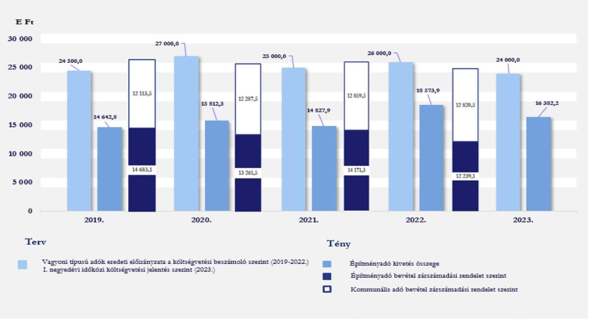
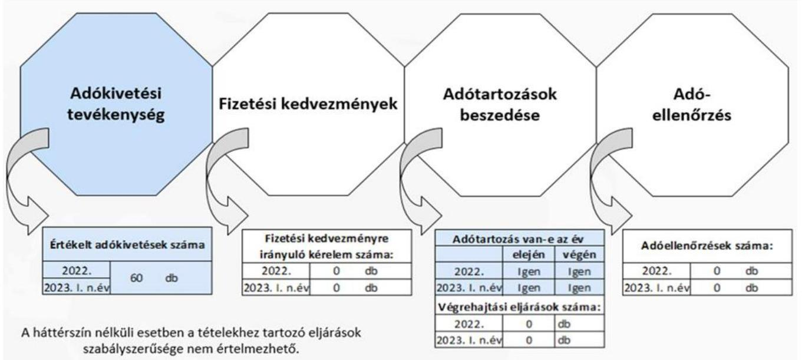
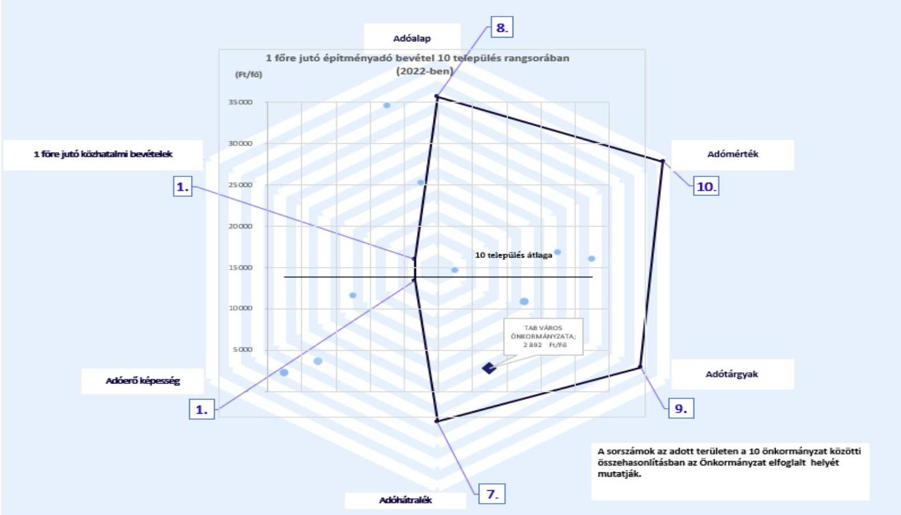
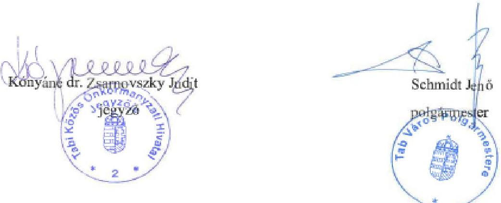
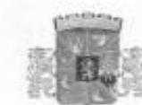
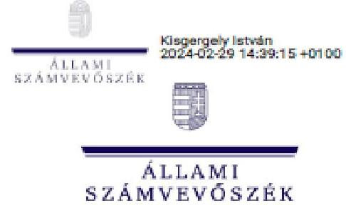

# JELENTÉS 

## Az önkormányzatok helyi adóztatási tevékenységének ellenőrzése Építményadóztatás

Tab Város Önkormányzata

2024.

---

# JELENTÉS 

## Az önkormányzatok helyi adóztatási tevékenységének ellenőrzése Építményadóztatás

Tab Város Önkormányzata

2024.

---

# ELLENŐRZÉSI IGAZGATÓSÁG: 

## ÁLLAMHÁZTARTÁS HELYI SZINTJÉT ELLENŐRZŐ IGAZGATÓSÁG

## ELLENŐRZÉSI IGAZGATÓ:

DR. BAFFIA GERGELY GÁBOR igazgató

## ELLENŐRZÉSVEZETŐ:

Jelentéseink az interneten a www.asz.hu címen olvashatók.

BŐRŐCZ IMRE ellenőrzésvezető

IKTATÓSZÁM: EL-3839-019/2024.
TÉMASZÁM: 2672.
ELLENŐRZÉS-AZONOSÍTÓ SZÁM: V-1016

---

# TARTALOMJEGYZÉK 

- AZ ELLENŐRZÉS ALAPADATAI ..... 5
- AZ ELLENŐRZÖTT SZERVEZET ..... 7
- ÖSSZEFOGLALÁS ..... 8
- AZ ELLENŐRZÉS FÓKUSZKÉRDÉSEI ..... 10
- MEGÁLLAPÍTÁSOK ..... 11
- JAVASLATOK ..... 18
- MELLÉKLETEK ..... 19
I. sz. melléklet: Értelmező szótár ..... 19
II. sz. melléklet: Az ellenőrzött szervezetek jegyzéke ..... 21
III. sz. melléklet: Ellenőrzési kritériumok ..... 22
IV. sz. melléklet: Az országban hasonló állandó lakosságszámú 10 település összehasonlítása ..... 23
- FÜGGELÉK: ÉSZREVÉTELEK ..... 24
- RÖVIDÍTÉSEK JEGYZÉKE ..... 32

---

.

---

# AZ ELLENŐRZÉS ALAPADATAI 

## AZ ELLENŐRZÉS CÉLJA

Az ellenőrzés célja annak értékelése volt, hogy Tab Város Önkormányzata által bevezetett építményadót érintő önkormányzati döntések, helyi szabályozások a vonatkozó törvényekkel összhangban álltak-e. Az önkormányzati építményadó bevételek változása hogyan befolyásolta a helyi adópolitikai célok megvalósulását, a helyi adóztatás eredményét. A Tabi Közös Önkormányzati Hivatal jegyzője építményadóztatással összefüggő feladatainak teljesítése és kapcsolódó hatásköreinek gyakorlása megfelelő volt-e, eredménye az ellenőrzött időszakban javult-e.

## AZ ELLENŐRZÉS TÍPUSA

Megfelelőségi ellenőrzés.

## AZ ELLENŐRZÖTT IDŐSZAK

Az 1. és 2. fókuszkérdések tekintetében a 2019. év - mint bázisév - és a 2023. év március 31. napjáig tartó időszak. A 3. és 4. fókuszkérdések tekintetében a 2022. év és a 2023. év március 31. napjáig tartó időszak.

## AZ ELLENŐRZÉS TÁRGYA

Az Önkormányzat építményadóztatással kapcsolatos tevékenységének ellátása. Az ÁSZ ellenőrzése kiterjedt a helyi adórendelet megalkotására, az adóztatással összefüggő helyi szabályozásokra és az önkormányzati adóhatósági tevékenység esetében az adóigazgatási feladatok közül az adók kivetésének megfelelőségére, a végrehajtás, valamint az adóellenőrzés elmaradásának megállapítására. Kiterjedt továbbá az ellenőrzés az építményadóztatás igazgatási feladatai ellátásának Önkormányzat által biztosított feltételeiben történt változtatás bemutatására, valamint a belső kontrollrendszer egyes elemeinek kiépítésére és működtetésére. Az ellenőrzött időszakban az építmény adónemhez kapcsolódó fizetési kedvezményre irányuló kérelem hiánya miatt e terület értékelésére nem került sor.
Az ellenőrzés kiterjedt minden olyan körülményre és adatra, amely az ÁSZ jogszabályban meghatározott feladatainak teljesítéséhez, valamint az ellenőrzési program végrehajtása folyamán felmerült újabb összefüggések feltárásához szükséges volt.

## AZ ELLENŐRZÉS JOGALAPJA

Az ellenőrzés jogszabályi alapját az ÁSZ tv. 5. § (8) bekezdése előírásai képezték.

---

# AZ ELLENŐRZÉS MÓDSZERE 

Az ellenőrzést az Alaptörvény 43. cikk (1) bekezdésében meghatározott törvényességi, célszerűségi szempontok, valamint az ellenőrzési program szempontjai, az ellenőrzött időszakban hatályos jogszabályok, előírások, az ellenőrzés általános szakmai szabályai, az ellenőrzésre irányadó ÁSZ módszertanok figyelembevételével végezte az ÁSZ. Az ellenőrzési kérdések megválaszolásához szükséges bizonyítékok megszerzése az ellenőrzött szervezet által rendelkezésre bocsátott dokumentumokra, adatokra alapozva kérdésfeltevés (információkérés), helyszíni szemle, interjú útján történt. Az adókivetések szabályszerűségét - az ellenőrzés során végzett kockázatalapú kiválasztás lehetőségét fenntartva - egyszerű véletlen mintavételi eljárással kiválasztott tételek alapján ellenőrizte az ÁSZ. A mintatételek értékelése egyedileg történt. Az építményadó kivetések értékelése a 2022-2023. években 3030 db mintatétel ellenőrzésével történt.
Az ellenőrzés az egyes területek szabályszerűségének, megfelelőségének értékelését a III. sz. mellékletben megjelölt kritériumok alapján végezte el.
Az ÁSZ értékelte, viszonyította az Önkormányzat építményadóval kapcsolatos egyes adatait, mutatószámait más hasonló településekhez. Olyan települések egyes adataival végzett összehasonlítást az ÁSZ, amelyek szintén bevezették az építményadót és közel azonos lélekszámúak (a népességszám esetében a csoportképzés alapja Tab 2022. január 1-jei állandó lakosságának száma +/-3,3 %-os eltérés figyelembevételével került megállapításra). A fenti feltételeknek az Önkormányzattal együtt Magyarországon 10 település felelt meg.
Ellenőrzési bizonyítékként felhasználható adatforrások közé tartoztak egyrészt az ellenőrzési programban felsorolt adatforrások, másrészt adatforrás volt még az ellenőrzés folyamán feltárt, az ellenőrzés szempontjából információt tartalmazó dokumentum.

---

# AZ ELLENŐRZÖTT SZERVEZET 

Az Alaptörvény 31. cikk (1) bekezdése értelmében Magyarországon a helyi közügyek intézése és a helyi közhatalom gyakorlása érdekében helyi önkormányzatok működnek.

A 2023. január 1-én 4206 fő állandó lakosú Tab Somogy vármegyében, a tabi járásban található település. A 2023. évi adatok szerint az építményadóval érintett adótárgyak száma 176, az adóalanyok száma 110 volt. Az ellenőrzött időszakban a várost a polgármesterrel együtt 7 fős képviselő-testület irányította. A Közös Hivatal látta el az Önkormányzat, valamint további hat önkormányzat működésével kapcsolatos feladatokat, amelyek közül csak az Önkormányzat vezetett be építményadót. A Közös Hivatal önálló szervezeti egységekre tagolódott, a 2022. évben összesen 24 fő köztisztviselőt alkalmaztak a hivatali feladatok ellátására. A Közös Hivatalhoz tartozó önkormányzatok állandó lakosainak száma 2023. január 1-jén összesen 6217 fő volt. Az ellenőrzött időszakban a polgármester személye nem változott. A jelenlegi jegyző 2020. március 01-je óta van hivatalban, feladatkörébe tartozik az adóigazgatási tevékenység belső szabályainak meghatározása. Az Önkormányzat a költségvetési beszámoló felülvizsgálatával könyvvizsgálót bízott meg. Az Önkormányzat tekintetében az adóigazgatási feladatokat a Közös Hivatalban dolgozó, két fő adóigazgatási munkakört betöltő köztisztviselő végezte.

A helyi önkormányzat a helyi közügyek intézése körében a törvény keretei között dönt a helyi adók fajtájáról és mértékéről. Ezzel összhangban az Mötv. rögzíti, hogy a helyi adóval kapcsolatos feladatok ellátása a helyi önkormányzatok feladata. A Hatásköri tv., valamint a Htv. értelmében a helyi adók bevezetéséről a települési önkormányzat képviselő-testülete dönt rendelettel. Rögzíti továbbá, hogy az önkormányzatok adómegállapítási joga kiterjed az adó bevezetésére, a már bevezetett adó hatályon kívül helyezésére, illetőleg módosítására, az adó mértékének a törvényi keretek közötti megállapítására, a törvényben meghatározott mentességeken, kedvezményeken túli további mentességek, kedvezmények biztosítására, valamint a Htv., az Art., az Air. keretei között az adózás részletes szabályainak meghatározására. A Hatásköri tv. és az Air. előírja, hogy adóügyekben elsőfokú hatósági jogkörben a település jegyzője, mint önkormányzati adóhatóság jár el.

A képviselő-testület a helyi adók közül az építményadó mellett a magánszemélyek kommunális adóját és a helyi iparűzési adót vezette be. Az Önkormányzat építményadóból származó költségvetési bevétele a 2019-2022. években összesen 54 355,0 E Ft, a legmagasabb összegű bevétele a 2019. évben volt. Az Önkormányzat helyi adóból származó bevételei közül a költségvetési bevételeken belül az ellenőrzött időszakban a helyi iparűzési adó volt a meghatározó. A képviselő-testület a helyi adók közül az építményadót a 2013. évben vezette be, az adó mértéke azóta nem változott. Az építményadó mértéke az adótárgy hasznos alapterület 10000 m²-t meg nem haladó része után 250 Ft/m², a hasznos alapterület 10000 m²-t meghaladó része után 100 Ft/m² volt.

Az ellenőrzött időszakban az Önkormányzatnak hosszú és rövid lejáratú, továbbá likviditási célú hitele, kölcsöne nem volt. Az ellenőrzött időszakban az év végén, illetve 2023. március 31-én 90 napon túl lejárt kötelezettséggel - a 2020. december 31-e kivételével - nem rendelkezett, valamint a likviditási gyorsráta 100% feletti volt, vagyis a rendelkezésre álló pénzeszközök a kötelezettségek fedezetére elegendők voltak, az Önkormányzat likviditása biztosított volt.

---

# ÖSSZEFOGLALÁS 

Az ÁSZ ellenőrzési tevékenysége keretében általános hatáskörrel ellenőrzi a helyi önkormányzatok adóztatási tevékenységét. Az adóbevételek képezik az önkormányzatok saját bevételének jelentős részét. A helyi adók önkormányzati gazdálkodásban betöltött fontos szerepét jelzi, hogy a 2019. évben a helyi önkormányzatok összes költségvetési bevételének 34,5%-át, a 2020. évben 32,5%-át, a 2021. évben 31,1%-át és a 2022. évben 31,6%-át a helyi adóbevételek jelentették. A helyi iparűzési adó a helyi adók között, az abból származó adóbevétel szempontjából a legmeghatározóbb volt, melyet az ÁSZ 2022-ben ellenőrzött. Ezt követi a sorban az építményadó, amelyet az önkormányzatok közel egyharmada vezetett be. Ez indokolta az önkormányzatok építményadóztatással kapcsolatos tevékenységének ellenőrzését.

Az Önkormányzat építményadó rendeletében az építményadóra vonatkozó mentesség szabályozása nem tartalmazta, hogy a magánszemély tulajdonában lévő lakás és zártkerti építmény esetében a magánszemély kommunális adója fizetési kötelezettség kit terhelt, valamint a jogszabályi előírás ellenére építményadó-mentességben részesült a vállalkozó adóalany is, akinek vagy tulajdonjoga, vagy vagyoni értékű joga alapján építményadó-kötelezettsége állt fenn valamely magánszemély által bérelt lakás után. Az Önkormányzat helyi adórendeletében a jogszabályi előírás alapján mentesítheti az építményadó alanyát az adatbejelentési kötelezettség alól, amennyiben az adóalanyt adófizetési kötelezettség az építményadó vonatkozásában nem terhelte. Az Önkormányzat építményadó rendeletében az adatbejelentési kötelezettség alóli mentesítést nem adott.

A jegyző az ellenőrzött időszakban a jogszabály előírásainak megfelelően az építményadóztatást érintő belső szabályokat alapvetően kialakította, ugyanakkor az ellenőrzési nyomvonal a jogszabály előírása ellenére az adóigazgatás folyamatait nem teljeskörűen tartalmazta.

Az Önkormányzat 2019-2023. évi költségvetési rendeleteiben a jogszabályi előírások ellenére építményadó bevételre eredeti költségvetési előirányzatot nem tervezett, az eredeti előirányzatot a helyi adókra tervezte meg. Az ellenőrzött időszakban az építményadó eredeti költségvetési bevételi tervszámait a költségvetési rendeletek indokolásai tartalmazták. Az építményadó bevételek összege a 2020-2022. években elmaradt az építményadó kivetéshez képest.

A Közös Hivatal a jogszabályi előírás ellenére az ellenőrzött időszakban az éves költségvetési beszámolóiban kormányzati funkció szerint az adóigazgatási tevékenységgel összefüggő kiadási adatokat és a kapcsolódó átlagos statisztikai állományi létszámadatokat nem szerepeltette. A Közös Hivatal adatszolgáltatása alapján az adóigazgatás működési kiadásai a helyi adóbevételek 1,9%-át tették ki a 2022. évben.

Az önkormányzati adóhatóság a jogszabályok előírása ellenére nem teljeskörűen gondoskodott a 2022. évben a határozathozatalra vonatkozó ügyintézési határidő betartásáról és a gazdálkodó szervezetek részére a kivetési határozatok elektronikus úton történő megküldéséről. A 2023. évben a gazdálkodó szervezetek részére a kivetési határozatok elektronikus úton történő megküldésével kapcsolatos hiányosság már nem fordult elő. Az építményadó összegének meghatározása, az ellenőrzött kivetési határozatok tartalma megfelelt a jogszabály előírásainak.

Az ellenőrzött időszakban az önkormányzati adóhatóság az építményadó hátralék beszedése érdekében végrehajtási eljárást nem indított. A jelentéstervezet megállapításainak észrevételezése időszakában az Önkormányzat arról tájékoztatta vonatkozó dokumentumok megküldésével az ellenőrzést, hogy az önkormányzati adóhatóság helyi adóhátralékok behajtása érdekében kezdeményezett inkasszót, jövedelemletiltást és NAV megkeresést. Az önkormányzat által megküldött dokumentumok nem igazolták építményadó hátralék behajtására vonatkozó intézkedések megtételét. A jogszabályi kötelezettségek teljesítésének előmozdítása érdekében adóellenőrzést nem végzett.

A jegyző kialakította és működtette a belső ellenőrzést a jogszabályi előírás alapján. A belső ellenőrzés a helyi adóztatási tevékenységet a 2022. évben ellenőrizte, a belső ellenőrzési jelentés az építményadóztatás vonatkozásában javaslatot nem tartalmazott.

Az önkormányzati adóhatóság a jogszabályban foglalt lehetőséggel élve a 2022. évben megkereste az ingatlanügyi hatóságot az építményadó kivetések ellenőrzése céljából történő adatszolgáltatás érdekében. Az ingatlanügyi hatóság adatszolgáltatása alapján a jegyző adóbevallási kötelezettség teljesítésére hívta fel az adózókat.

---

# AZ ELLENŐRZÉS FÓKUSZKÉRDÉSEI 

1. Az önkormányzat építményadóval kapcsolatos rendelete és az önkormányzati adóhatóság tevékenysége támogatta-e

 az adóbevételek beszedését, a településfejlesztési és az adópolitikai célkitűzések megvalósítását?
2. Az építményadóztatás igazgatási feladatai ellátásának önkormányzat által biztosított feltételeiben és adóhatósági gyakorlatában történt-e változtatás?
3. Az önkormányzati adóhatóság megfelelően látta-e el az építményadóval kapcsolatos egyes adóhatósági tevékenységeit?
4. Az építményadóztatás egyes adóhatósági tevékenységeinek megfelelő ellátását a belső kontrollrendszer egyes elemeinek kiépítése és működtetése elősegítette-e?

---

# MEGÁLLAPÍTÁSOK 

## 1. Az önkormányzat építményadóval kapcsolatos rendelete és az önkormányzati adóhatóság tevékenysége támogatta-e az adóbevételek beszedését, a településfejlesztési és az adópolitikai célkitűzések megvalósítását?

| Összegző megállapítás | Az Önkormányzat helyi adórendelete hiányosan, illetve a Htv. rendelkezéseivel ellentétesen szabályozta az adómentességeket. Az önkormányzati adóhatóság által beszedett építményadó összege a 2020-2022. években elmaradt az adókivetés összegétől. Az Önkormányzat helyi adópolitikai célkitűzéseket meghatározott, a keletkező források felhasználását településfejlesztési feladatok ellátásához nem kötötte. |
| :--: | :--: |

AZ ÉPÍTMÉNYADÓ RENDELET tartalmazta a Htv. felhatalmazása alapján az építményadózás szabályait. Az építményadó adóalapját a Htv.-ben foglaltaknak megfelelően az építmény $\mathrm{m}^{2}$-ben számított hasznos alapterületében határozták meg.
Az Önkormányzat építményadó rendeletében - az Art. 2. melléklet II/A/4. pontja alapján - nem mentesítette az építményadó alanyát adatbejelentési kötelezettség alól, amennyiben az adóalanyt adófizetési kötelezettség nem terhelte.
ADÓMENTESSÉGET az Önkormányzat a Htv. 7. § e) pontjában rögzített tilalom ellenére állapított meg. Az építményadó rendelet 5. § c) pontja értelmében mentes az építményadó alól az a nem magánszemély tulajdonában álló építmény, amely után annak magánszemély bérlője a magánszemély kommunális adóját fizette. A Htv. 24. §-a szerint magánszemély kommunális adója terheli azt a magánszemélyt, aki az önkormányzat illetékességi területén nem magánszemély tulajdonában álló lakás bérleti jogával rendelkezik. A Htv. 12. § (1) bekezdés szerint az építményadó alanya az építmény tulajdonosa. Az Önkormányzat adómegállapítási jogát korlátozza, hogy amennyiben az építmény tulajdonosa vállalkozó (nem magánszemély), annak üzleti célt szolgáló építménye nem mentesíthető az építményadó alól.
Az építményadó rendelet 5. § a) pontja szabályozási hiányosságot tartalmazott, mivel a magánszemély tulajdonában lévő lakás és zártkerti építmény esetében nem rögzítették, hogy kit terheli a magánszemélyek kommunális adója címén fizetési kötelezettség.
Az ÁSZ az építményadó rendelettel kapcsolatos megállapításairól a törvényességi felügyeleti jogkört gyakorló területileg illetékes Kormányhivatalt ${ }^{19}$ tájékoztatja.
A képviselő-testület a jegyző beszámoltatása útján a 2019-2022. évekre vonatkozóan a Hatásköri tv. előírásának megfelelően az adóztatást ellenőrizte.

---

AZ ÉPÍTMÉNYADÓ ADÓALAPJA a 2019. évről (73 615,0 m²) a 2022. évre (80 103,0 m²) 8,8 %-kal emelkedett.

1. ábra

AZ ÉPÍTMÉNYADÓ KÖLTSÉGVETÉSI ELŐIRÁNYZATAI, ADÓKIVETÉSEI (2019-2023.), VALAMINT A KÖLTSÉGVETÉSI BEVÉTELI ADATAI (2019-2022.)

Forrás: Az ellenőrzött szervezet adatszolgáltatása, a Kincstár ${ }^{29}\left(\right.$ ASP $^{23}$ Adattárház, KGB-K11) adatai alapján ÁSZ saját szerkesztés
AZ ÉPÍTMÉNYADÓ EREDETI ELŐIRÁNYZATÁT az Önkormányzat a 2019-2023. éves költségvetési rendeleteiben nem tervezte meg. Az Önkormányzat a 2019-2023. éves költségvetési rendeleteiben a helyi adóbevételek eredeti költségvetési előirányzatát egyösszegben tervezte meg. Az építményadó eredeti költségvetési bevételi tervszámait az Önkormányzat 2019-2023. éves költségvetési rendeleteinek indokolásai tartalmazták. A 2019-2022. évi költségvetési beszámolókban a vagyoni típusú adóbevételek költségvetési előirányzatai együttesen tartalmazták az építményadó és a magánszemélyek kommunális adójának előirányzatait.
Az 1. ábra azt mutatja, hogy a vagyoni típusú adók eredeti előirányzata a 2019. évben 109,4 %-ban, a 2020. évben 94,6 %-ban, a 2021. évben 104,9 %-ban, a 2022. évben 96,4 %-ban teljesült.
Az építményadó bevétel a 2023. I. negyedévében a zárási összesítő alapján 6 441,7 E Ft-ra teljesült, amely a kivetés 39,3 %-a volt.
AZ ÉPÍTMÉNYADÓ KIVETÉSHEZ képest a 2020-2022. években az építményadó bevételek összege elmaradt, amelynek mértéke a 2020. évben 16,1 %, a 2021. évben 4,4 %, a 2022. évben 34,1 % volt.
AZ ÉPÍTMÉNYADÓ TARTOZÁSOK összege az ellenőrzött időszakban jelentős arányú volt az évenkénti építményadó bevétel összegéhez viszonyítva. Ez az arány a 2019. évben 79,8 %-os, a 2020. évben 93,7 %-os, a 2021. évben 89,8 %-os, és a 2022. évben 96,1 %-os volt. A 2023. évi I. negyedéves zárási összesítő alapján a 2023. március 31. napján nyilvántartott esedékes hátralék 14 160,3 E Ft-ot tett ki. A hátralékos adózók száma 2019. január 1-jéről 2023. január 1-jére hét főről 14 főre emelkedett. Az ellenőrzött időszakban méltányosság jogcímen építményadó kivetést nem töröltek.

---

Az önkormányzati adóhatóság az Avt. ${ }^{22}$-ben foglaltak alapján a 2014-2018. évek között évente előírt építményadó tartozások közül a végrehajtáshoz való jog elévülése miatt a 2019. évben 2041,5 E Ft, a 2020. évben 1 854,2 E Ft, a 2021. évben 2 526,8 E Ft, a 2022. évben 2 613,0 E Ft és a 2023. évben 2 159,5 E Ft építményadó hátralékot törölt.
AZ ORSZÁGBAN HASONLÓ ÁLLANDÓ LAKOSSÁGSZÁMÚ 10 TELEPÜLÉS ÖSSZEHASONLÍTÁSÁBAN az Önkormányzat egy főre jutó építményadó bevétele - 2 892,0 Ft - a kilencedik legkevesebb volt a 2022. évben. Az Önkormányzat építményadóval kapcsolatos egyes adatai, mutatószámai hasonló településekkel történő összehasonlítását a IV. sz. melléklet mutatja be.
AZ ÖNKORMÁNYZAT ANYAGI ÉRDEKELTSÉGI RENDSZERT - amely az ügykörébe tartozó adók hatékony beszedésének elősegítését szolgálja - nem működtetett.
AZ ÖNKORMÁNYZAT GAZDASÁGI PROGRAMJÁBAN a 2019-2024. évekre adópolitikai célkitűzésként meghatározta, hogy a helyi adóbevételek 80 %-át az Önkormányzat kötelező feladatai ellátásához használja fel.

# 2. Az építményadóztatás igazgatási feladatai ellátásának önkormányzat által biztosított feltételeiben és adóhatósági gyakorlatában történt-e változtatás? 

Összegző megállapítás Az Önkormányzat az építményadóztatás igazgatási feladatai ellátásának feltételeit biztosította, az adóhatósági gyakorlat az ellenőrzött időszakban nem változott. A 15/2019. (XII. 7.) PM rendeletben ${ }^{23}$ foglaltak ellenére a Közös Hivatal az éves költségvetési beszámolóiban az adóigazgatás kormányzati funkcióján a kapcsolódó kiadásokat és az átlagos statisztikai állományi létszámokat nem mutatta ki.

AZ ADÓIGAZGATÁSI FELADATELLÁTÁS személyi, informatikai feltételeit a Közös Hivatal az ellenőrzött időszakban változatlan feltételek mellett biztosította. Az Önkormányzat adóigazgatással kapcsolatos feladatait középfokú végzettséggel rendelkező adóügyi előadók a Közös Hivatalban látták el. AZ ADÓZÓKKAL VALÓ KAPCSOLATTARTÁST, az információs kapcsolatokat kiépítették, gyakorlatát kialakították, amely az ellenőrzött időszakban nem változott. A helyi adókkal kapcsolatos rendszeresített bevallási, adatbejelentési, bejelentkezési nyomtatványokat az Önkormányzat honlapján közzétették, valamint az E-önkormányzat portálon keresztül biztosították az adóügyekkel kapcsolatos elektronikus ügyintézéshez szükséges szolgáltatásokat. Az önkormányzati adóhatóság a joghatás kiváltására alkalmas küldeményét ugyanakkor nem minden esetben az információs rendszer útján küldte meg a gazdálkodó szervezetek részére. Az ellenőrzött időszakban megtartott közmeghallgatások során a polgármester a 2019. évben az adóztatás, adóbevételek témakörében tájékoztatást adott.
A POSTAI KÖLTSÉGEK ÖSSZEGE a helyi adóztatást érintően az ellenőrzött időszakban 9,5 E Ft volt. KORMÁNYZATI FUNKCIÓ (011220 Adó-, vám- és jövedéki igazgatás) szerint az Áht. 4. § (4) bekezdésében, továbbá a 15/2019. (XII. 7.) PM rendelet 3. § (1) és a 6. § (2) bekezdéseiben, valamint az 1. és 2. mellékletben előírtak ellenére a Közös Hivatal az éves költségvetési beszámolóiban az

---

adóigazgatási tevékenységgel összefüggő kiadásokat és a kapcsolódó átlagos statisztikai állományi létszámokat nem mutatta ki.
A Közös Hivatal adatszolgáltatása alapján a 2022. évben az adóigazgatási feladatellátásra fordított összes működési kiadás összege 9617,0 E Ft volt, az adóigazgatási tevékenységéhez kapcsolódó hét önkormányzat helyi adóbevétele mindösszesen 510739,0 E Ft volt, amelyből az Önkormányzat helyi adóbevétele 455 523,5 E Ft volt. A Közös Hivatal esetében 1000 Ft adóbevételre 18,8 Ft adóigazgatási működési kiadás jutott, amely 1,9 %-os hányadot jelentett a beszedett adókhoz viszonyítva.

# 3. Az önkormányzati adóhatóság megfelelően látta-e el az építményadóval kapcsolatos egyes adóhatósági tevékenységeit? 

Összegző megállapítás

Az önkormányzati adóhatóság a 2022. évben a mintatételek 23,3 %-a esetében nem megfelelően látta el az építményadóval kapcsolatos adóhatósági tevékenységeit, mivel nem gondoskodott az Air. szerinti határozathozatalra vonatkozóan előírt ügyintézési határidő betartásáról, továbbá a 451/2016. (XII. 19.) Korm. rendelet ${ }^{24}$ előírása alapján a gazdálkodó szervezetek részére a kivetési határozatok elektronikus úton történő megküldéséről. A 2023. évben a mintatételek 6,7 %-a esetében az Air. szerinti határozathozatal idejére vonatkozó ügyintézési határidőt nem tartották be. Az önkormányzati adóhatóság végrehajtási eljárást nem indított, adóellenőrzést az építményadóval kapcsolatban nem végzett.

Az építményadóztatással kapcsolatos önkormányzati adóigazgatási feladatok számvevőszéki ellenőrzés megállapításainak tartalmát befolyásoló egyes adatainak alakulását mutatja be a 2. ábra.
2. ábra

AZ ADÓIGAZGATÁSI FELADATOK SZÁMVEVŐSZÉKI ELLENŐRZÉS MEGÁLLAPÍTÁSAINAK TARTALMÁT BEFOLYÁSOLÓ EGYES ADATAINAK ALAKULÁSA

Forrás: Az ellenőrzött szervezet adatszolgáltatása alapján ÁSZ szerkesztés

---

AZ ÉPÍTMÉNYADÓ KIVETÉSÉRŐL az önkormányzati adóhatóság határozattal döntött minden mintatétel esetében. Az Air.-ban foglaltaknak megfelelően a kivetési határozatok tartalmazták az önkormányzati adóhatóság, az adózó és az ügy azonosításához szükséges adatokat, az adóhatóság döntését, a jogorvoslat igénybevételével kapcsolatos tájékoztatást, a határozat indokolását, a döntéshozatal helyét és idejét, a hatáskör gyakorlójának nevét, hivatali beosztását, valamint a döntés kiadmányozójának a nevét. Az adózók adatbejelentésében szereplő adatok alapul vételével az építményadó rendelet előírásait betartva döntöttek az adó alapjáról és a fizetendő építményadó összegéről. A Htv.-ben foglaltaknak megfelelően az adókötelezettséget érintő változást követő év első napjától kötelezte az önkormányzati adóhatóság az építményadó megfizetésére az adózókat.
A 30 mintatétel értékelésének eredményeként az ellenőrzött adókivetések 23,3 %-a (7 mintatétel) nem volt megfelelő a 2022. évben, az alábbiak miatt:

- 2 mintatétel esetében az Air. 50. § (2) bekezdésében foglaltak ellenére a határozathozatalra vonatkozóan előírt ügyintézési határidőt (a késedelem mértéke 18/2022. mintatétel: 5 nap; 27/2022. mintatétel: 48 nap) nem tartották be, valamint az 451/2016. (XII. 19.) Korm. rendelet 6. § (3) bekezdésében foglaltak ellenére a gazdálkodó szervezet részére a kivetési határozatok megküldése nem elektronikus módon történt;
- 1 mintatétel esetében (12/2022. mintatétel) a 451/2016. (XII. 19.) Korm. rendelet 6. § (3) bekezdésében foglaltak ellenére a gazdálkodó szervezet részére a kivetési határozat megküldése nem elektronikus módon történt;
- 4 mintatétel esetében (a késedelem mértéke 9/2022. mintatétel: 2 nap; 11/2022. mintatétel: 25 nap; 13/2022. mintatétel: 25 nap; 15/2022. mintatétel: 3 nap) az Air. 50. § (2) bekezdésében foglaltak ellenére a határozathozatalra vonatkozóan előírt ügyintézési határidőt nem tartották be.
A 2023. évre vonatkozóan az értékelt 30 mintatétel 6,7 %-a (2 mintatétel esetében a késedelem mértéke 7/2023. mintatétel: 29 nap; 24/2023. mintatétel: 36 nap;) esetében az Air. 50. § (2) bekezdésében foglaltak ellenére a határozathozatalra vonatkozóan előírt ügyintézési határidőt nem tartották be.
A jelentéstervezet megállapításainak észrevételezése időszakában az Önkormányzat arról tájékoztatta az ÁSZ-t, hogy a határozathozatalra vonatkozóan előírt ügyintézési határidő betartásával és a kivetési határozat elektronikus megküldésével kapcsolatban megállapított hiányosságokat részben technikai jellegű problémák okozták.
AZ ÉPÍTMÉNYADÓ TARTOZÁSOK BESZEDÉSE érdekében a jegyző a 2022-2023. években az Avt. 30. § (1) bekezdésében foglaltak ellenére végrehajtási eljárást nem indított. Az önkormányzati adóhatóság a 2022. évben a tartozások megfizetésére az adósokat 14 esetben hívta fel. Az önkormányzati adóhatóság által nyilvántartott esedékes építményadó tartozás összege 2022. december 31-én 11 758,8 E Ft, továbbá 2023. március 31-én 14 160,3 E Ft volt, amelyeket 14, illetve 21
 adózó építményadó hátralékaként tartották nyilván.
ADÓELLENŐRZÉST az önkormányzati adóhatóság az ellenőrzött időszakban az adótörvényekben és más jogszabályokban előírt kötelezettségek teljesítésének előmozdítása érdekében nem végzett.

---

# 4. Az építményadóztatás egyes adóhatósági tevékenységeinek megfelelő ellátását a belső kontrollrendszer egyes elemeinek kiépítése és működtetése elősegítette-e? 

Összegző megállapítás A belső kontrollrendszer egyes elemeinek kiépítése és működtetése - az adóigazgatási eljárásra vonatkozó ellenőrzési nyomvonal hiányos tartalma kivételével - elősegítette az építményadóztatás egyes adóhatósági tevékenységeinek ellátását. A belső ellenőrzés a helyi adóztatási tevékenységet a 2022. évben ellenőrizte.

AZ ADÓIGAZGATÁSI FELADATOK ELLÁTÁSÁNAK SZABÁLYAIT a 2022-2023. években a belső szabályzatokban a jogszabályi előírásoknak megfelelően rögzítették. A Hivatali SZMSZ ${ }^{25}$ megfelelt az Ávr. ${ }^{26}$-nek. Tartalmazta a szervezeti felépítést és a működés rendjét, a szervezeti egységek megnevezését, a költségvetési szerv szervezeti ábráját.
A KIADMÁNYOZÁS RENDJÉT a jegyző a hatáskörébe tartozó adóigazgatási ügyekben az Mötv.-ben foglaltaknak megfelelően szabályozta.
A KÖLTSÉGVETÉSI SZERV JEGYZŐ ÁLTAL ELKÉSZÍTETT ELLENŐRZÉSI NYOMVONALA - az ellenőrzött időszakra vonatkozóan - a Bkr. ${ }^{27}$ 6. § (3) bekezdésében foglaltak ellenére az adóigazgatás folyamatai közül az adóellenőrzés, a fizetési kedvezmények elbírálása és a végrehajtási eljárás folyamatainak vonatkozásában szabályozást nem tartalmazott.
A LAKOSSÁGOT TÁJÉKOZTATTA a jegyző a Hatásköri tv.-nek megfelelően az adójogszabályok előírásairól, valamint a Htv.-ben foglaltaknak megfelelően az Önkormányzat honlapján közzétette az adórendelet módosításokkal egységes szerkezetbe foglalt szövegét, valamint a rendszeresített bevallási, adatbejelentési, bejelentkezési nyomtatványokat és az elérhetőségi információkat. Az Önkormányzat, illetve a képviselő-testület a Htv., illetve a Hatásköri tv. előírásainak eleget téve a lakosságot a helyi adókból származó bevételek összegéről tájékoztatta.
A BELSŐ ELLENŐRZÉSI TEVÉKENYSÉG kialakításáról és működtetéséről az Áht.-ben foglaltaknak megfelelően a jegyző gondoskodott. Az Önkormányzatnál a belső ellenőrzési feladatokat külső szolgáltató látta el. A számvevőszéki ellenőrzés során a belső ellenőrzési feladatokat ellátó külső szolgáltató által tett nyilatkozat, valamint egy belső ellenőrzési jelentésre vonatkozóan összeállított, 2022. december 2-ai keltezésű intézkedési terv szerint a belső ellenőrzési vezetői feladatokat az aljegyző látta el. A Bkr. 2. § 4. pontjában foglaltak szerint, ha a költségvetési szervnél egyetlen fő látja el a belső ellenőrzést, akkor a belső ellenőrzést ellátó személy a belső ellenőrzési vezető.
A Bkr. előírásainak megfelelve a 2022. és a 2023. évekre vonatkozóan kockázatelemzéssel alátámasztott éves belső ellenőrzési tervekkel rendelkeztek. Az adóigazgatási tevékenységben rejlő kockázatok értékelésére tekintettel a helyi adóztatási tevékenységet a belső ellenőrzés a 2022. évben ellenőrizte. A belső ellenőri jelentésben megfogalmazott javaslatok nem érintették az építményadóztatással kapcsolatos feladatellátást. A helyi adóztatási tevékenységre vonatkozó javaslatok alapján elkészítették az intézkedési tervet, betartva a Bkr. előírásait. A Bkr. 22. § (2) bekezdés b) pontja előírása ellenére a belső ellenőrzésről nyilvántartást nem vezettek.

---

KÜLSŐ ELLENŐRZÉST VÉGZŐ SZERVEZET által végzett ellenőrzés nem került lefolytatásra az ellenőrzött időszakban. A Kormányhivatal a 86/2019. (IV. 23.) Korm. rendelet ${ }^{28}$ alapján hatósági ellenőrzés keretében a 2021. évben ellenőrizte, hogy az önkormányzati adóhatóság által 2020. január 01. és 2021. augusztus 31. között lezárt ügyekben hozott határozatok a jogszabályoknak megfeleltek-e. A Kormányhivatal az építményadóra vonatkozóan ellenőrzött döntések tekintetében hiányosságot nem állapított meg.
AZ INGATLANÜGYI HATÓSÁGOT - az Art.-ban foglaltak alapján - a 2021-2022. években megkereste az önkormányzati adóhatóság, az építményadó kivetések ellenőrzése céljából történő adatszolgáltatás érdekében. Az ingatlanügyi hatóság adatszolgáltatása alapján a jegyző a 2022. évben két esetben felszólította az érintett adózókat az adóbevallási kötelezettség teljesítésére.
AZ ÉPÍTÉSÜGYI HATÓSÁGTÓL ${ }^{29}$ a 2022-2023. években az Art. szerinti adatszolgáltatást (használatbavétel tudomásulvételéről szóló hatósági bizonyítványt, véglegessé vált használatbavételi engedélyt, véglegessé vált fennmaradási engedélyt) az Önkormányzat nem kapott.

---

# JAVASLATOK 

Az ÁSZ tv. 33. § (1) bekezdésében foglaltak értelmében az ellenőrzött szervezet vezetője köteles a jelentésben foglalt megállapításokhoz kapcsolódó intézkedési tervet összeállítani és azt a jelentés kézhezvételétől számított 30 napon belül az ÁSZ részére megküldeni. Amennyiben az ellenőrzött szervezet vezetője nem küldi meg határidőben az intézkedési tervet, vagy továbbra sem elfogadható intézkedési tervet küld, az Állami Számvevőszék elnöke az ÁSZ tv. 33. § (3) bekezdés a) és b) pontjaiban foglaltakat érvényesítheti.

## TAB VÁROS ÖNKORMÁNYZATA POLGÁRMESTERE RÉSZÉRE

1. Intézkedjen az Állami Számvevőszék jelentésének ÁSZ általi nyilvánosságra hozatalát követően haladéktalanul a Képviselő-testület elé terjesztéséről. A jelentést a napirend tárgyalásáról szóló jegyzőkönyvvel együtt tájékoztatásul küldje meg a Kormányhivatal részére is.

## TABI KÖZÖS ÖNKORMÁNYZATI HIVATAL JEGYZŐJE RÉSZÉRE

1. Intézkedjen az Áht. 4. § (4) bekezdésében és a 15/2019. (XII. 7.) PM rendelet 3. § (1) bekezdésében, valamint az 1. mellékletben előírtak alapján az adóigazgatási tevékenységgel összefüggő kiadásoknak és a 15/2019. (XII. 7.) PM rendelet 6. § (2) bekezdésében és a 2. mellékletben előírtak alapján az átlagos statisztikai létszámadatoknak az arra kijelölt kormányzati funkcióra történő kimutatása érdekében.
2. Alakítson ki kontrollokat annak érdekében, hogy a jövőben biztosított legyen az Air. 50. § (2) bekezdésében előírt, a határozathozatal idejére vonatkozó ügyintézési határidő betartása.
3. Alakítson ki kontrollokat annak érdekében, hogy a jövőben biztosított legyen a 451/2016. (XII. 19.) Korm. rendelet 6. § (3) bekezdésében foglaltaknak megfelelően a gazdálkodó szervezetek részére a kivetési határozatok elektronikus módon történő küldése.
4. Az adótartozások tekintetében az Avt. 30. § (1) bekezdése alapján az adótartozás végrehajtásához való jogát következetesen érvényesítse, az arra irányuló szükséges intézkedéseket tegye meg.
5. Intézkedjen, hogy a Bkr. 6. § (3) bekezdésében foglaltaknak megfelelően az ellenőrzési nyomvonal az önkormányzati adóigazgatást érintő működési folyamatokat teljeskörűen tartalmazza.
6. Intézkedjen a Bkr. 22. § (2) bekezdés b) pontja előírása szerint a belső ellenőrzések nyilvántartása érdekében.

---

# MELLÉKLETEK 

## I. SZ. MELLÉKLET: ÉRTELMEZŐ SZÓTÁR

adóellenőrzés
adóhatóság
adóhatósági ellenőrzés
adótartozás
adózó
építmény
építményadó
építményadó adóalanya
épület
épületrész
fizetési kedvezmény

Adóellenőrzés keretében az adóhatóság az adózó adómegállapítási, adatbejelentési, bevallási kötelezettsége teljesítését adónként, támogatásonként és időszakonként vagy meghatározott időszakra több adó és támogatás tekintetében is vizsgálja. (Forrás: Air. 90. § (1) bekezdés)
Az önkormányzat jegyzője, mint önkormányzati adóhatóság. (Forrás: Air. 22. § b) pont)
Az adóhatóság az adótörvényekben és más jogszabályokban előírt kötelezettségek teljesítésének vagy megsértésének megállapítása, a kötelezettségek teljesítésének előmozdítása érdekében ellenőrzést folytat. (Forrás: Air. 86. §)
Az esedékességkor meg nem fizetett adó és a jogosulatlanul igénybe vett költségvetési támogatás. (Forrás: Art. 7. § 6. pont)
Az a személy, akinek vagy amelynek adókötelezettségét adót, költségvetési támogatást megállapító törvény, e törvény, az adózás rendjéről szóló 2017. évi CL. törvény (a továbbiakban: Art.) vagy önkormányzati rendelet előírja. (Forrás: Air. 11. § (1) bekezdés)
Építési tevékenységgel létrehozott, illetve késztermékként az építési helyszínre szállított, - rendeltetésére, szerkezeti megoldására, anyagára, készültségi fokára és kiterjedésére tekintet nélkül - minden olyan helyhez kötött műszaki alkotás, amely a terepszint, a víz vagy az azok alatti talaj, illetve azok feletti légtér megváltoztatásával, beépítésével jön létre, az építmény az épület és műtárgy gyűjtőfogalma. (Forrás: az épített környezet alakításáról és védelméről szóló 1997. évi LXXVIII. törvény 2. § 8. pontja)
Az önkormányzat illetékességi területén lévő építmények közül a lakás és a nem lakás céljára szolgáló épület, épületrész (a továbbiakban együtt: építmény) után fizetendő, az önkormányzat költségvetése javára megállapított adó. (Forrás: Htv. 11. § (1) bekezdés)
Az adó alanya - a Htv. 3. §-a alapján az a magánszemély, jogi személy, egyéb szervezet, a magánszemélyek jogi személyiséggel nem rendelkező személyi egyesülése - aki a naptári év (a továbbiakban: év) első napján az építmény tulajdonosa. Több tulajdonos esetén a tulajdonosok tulajdoni hányadaik arányában adóalanyok. Amennyiben az építményt az ingatlan-nyilvántartásba bejegyzett vagyoni értékű jog terheli, az annak gyakorlására jogosult az adó alanya. (A tulajdonos, a vagyoni értékű jog jogosultja a továbbiakban együtt: tulajdonos). Társasház, -garázs és -üdülő esetén a tulajdonosok önálló adóalanyok, a közös használatú helyiségek után az adó alanya az említett közösség. (Forrás: Htv. 12. § (1), (3) bekezdés)
Az épített környezet alakításáról és védelméről szóló törvény szerinti olyan építmény vagy annak azon része, amely a környező külső tértől szerkezeti elemekkel részben vagy egészben mesterségesen kialakított, elválasztott teret alkot és ezzel az állandó vagy időszakos tartózkodás, illetve használat feltételeit biztosítja, ideértve az olyan önálló létesítményt is, amely részben vagy teljes belmagasságával a környező csatlakozó terepszint alatt van; (Forrás: a Htv. 52. § 5. pontja)
Az épület önálló rendeltetésű, a szabadból vagy az épület közös közlekedőjéből nyíló önálló bejárattal ellátott helyisége vagy helyiség-csoportja, amely azzal felel meg lakásnak, üdülőnek, kereskedelmi egységnek, egyéb nem lakás céljára szolgáló épületnek, hogy az ingatlan-nyilvántartásban önálló ingatlanként nem szerepel. (Forrás: Htv. 52. § 6. pontja)
A fizetési halasztás, részletfizetés, valamint az adómérséklés. (Forrás: Art. 198.-201. §)

---

hasznos alapterület
információs és kommunikációs rendszer
kontrollkörnyezet
kontrolltevékenységek
nyomon követési rendszer (monitoring)
önkormányzat
önkormányzati hivatal
vagyoni típusú adók

A teljes alapterületnek olyan része, ahol a belmagasság - a padlószint (járófelület) és az afelett levő épületszerkezet (födém, tetőszerkezet) vagy álmennyezet közti távolság legalább $1,90 \mathrm{~m}$. A teljes alapterületbe a lakáshoz, üdülőhöz tartozó kiegészítő helyiségek, melléképületek, melléképületrészek kivételével valamennyi helyiség összegzett alapterülete, valamint a többszintes lakrészek belső lépcsőjének egy szinten számított vízszintes vetülete is beletartozik. Az építményhez tartozó fedett és három oldalról zárt külső tartózkodók (lodzsa, fedett és oldalt zárt erkélyek), és a fedett terasz, tornác alapterületének $50 \%$-a tartozik a teljes alapterületbe. A lakások esetében a pinceszinten (a csatlakozó terepszint alatt) kialakított helyiségek alapterületének $70 \%$-át kell a teljes alapterületbe számítani. (Forrás: Htv. 52. § 9. pontja)
A költségvetési szerv vezetője által kialakított információtovábbítási csatornák rendszere, amelyben biztosított, hogy a megfelelő információk a megfelelő időben eljussanak az illetékes szervezethez, szervezeti egységhez, illetve személyhez. (Forrás: Bkr. 9. § (1) bekezdés)
A költségvetési szerv vezetője által kialakított olyan elvek, eljárások, belső szabályzatok összessége, amelyben világos a szervezeti struktúra, a folyamatok átláthatók, egyértelműek a felelősségi, hatásköri viszonyok és feladatok, meghatározottak, ismertek és elfogadottak az etikai elvárások a szervezet minden szintjén, átlátható a humánerőforrás-kezelés, biztosított a szervezeti célok és értékek irányában való elkötelezettség fejlesztése és elősegítése. (Forrás: Bkr. 6. § (1) bekezdés)
A költségvetési szerv vezetője által kialakított eljárások, amelyek biztosítják a kockázatok kezelését, hozzájárulnak a szervezet céljainak eléréséhez, és erősítik a szervezet integritását. (Forrás: Bkr. 8. § (1) bekezdés)
A költségvetési szerv vezetője által kialakított nyomon követési mechanizmusok rendszere, mely az operatív tevékenységek keretében megvalósuló folyamatos és eseti nyomon követésből, valamint az operatív tevékenységektől függetlenül működő belső ellenőrzésből állhat. (Forrás: Bkr. 10. §)
A helyi önkormányzat jogi személy. Az önkormányzati feladatok ellátását a képviselőtestület és szervei biztosítják. A képviselő-testület szervei: a polgármester, a főpolgármester, a (vár)megyei közgyűlés elnöke, a képviselő-testület bizottságai, a részönkormányzat testülete, a polgármesteri hivatal, a (vár)megyei önkormányzati hivatal, a közös önkormányzati hivatal, a jegyző, továbbá a társulás. A képviselő-testület a feladatkörébe tartozó közszolgáltatások ellátására - jogszabályban meghatározottak szerint - költségvetési szervet, a Polgári perrendtartásról szóló
 2016. évi CXXX. törvény szerinti gazdálkodó szervezetet (a továbbiakban: gazdálkodó szervezet), nonprofit szervezetet és egyéb szervezetet (a továbbiakban együtt: intézmény) alapíthat, továbbá szerződést köthet természetes és jogi személlyel vagy jogi személyiséggel nem rendelkező szervezettel. (Forrás: Mötv. 41. § (1), (2), (6) bekezdései)
Az ellenőrzési programban önkormányzati hivatalként értelmezzük a polgármesteri hivatalt, a főpolgármesteri hivatalt, a (vár)megyei önkormányzati hivatalt és a közös önkormányzati hivatalt. (Forrás: Áht. 1. § 18. pont).
Építményadó és a magánszemélyek kommunális adója. (Forrás: Áhsz. ${ }^{30}$ 15. melléklet)

---

II. SZ. MELLÉKLET: AZ ELLENŐRZÖTT SZERVEZETEK JEGYZÉKE

# AZ ELLENŐRZÖTT SZERVEZET MEGNEVEZÉSE 

Tab Város Önkormányzata
Tabi Közös Önkormányzati Hivatal

---

# III. SZ. MELLÉKLET: ELLENŐRZÉSI KRITÉRIUMOK 

## FOKUSZKÉRDÉS

1. Az önkormányzat építményadóval kapcsolatos rendelete és az önkormányzati adóhatóság tevékenysége támogatta-e az adóbevételek beszedését, a településfejlesztési és az adópolitikai célkitűzések megvalósítását?
2. Az építményadóztatás igazgatási feladatai ellátásának önkormányzat által biztosított feltételeiben és adóhatósági gyakorlatában történt-e változtatás?
3. Az önkormányzati adóhatóság megfelelően látta-e el az építményadóval kapcsolatos egyes adóhatósági tevékenységeit?
4. Az építményadóztatás egyes adóhatósági tevékenységeinek megfelelő ellátását a belső kontrollrendszer egyes elemeinek kiépítése és működtetése elősegítette-e?

## ELLENŐRZÉSI KRITÉRIUMOK

Htv. 1. § (1) bekezdés; 6. § c) pont, 7. § e) pont, 11. § (1) bekezdés, 11/A. §, 12. § (1) bekezdés, 13. §, 15. § a) pont, 16. § a) pont; 24. §, 42/B. § (3) bekezdés, 45. §;

Hatásköri tv. 138. (3) bekezdés a) és g) pont;
Mötv. 42. § 1) pont; 47. § (1) bekezdés, 50. §, 51. § (2) bekezdés;
535/2020. (XII. 1.) Korm. rendelet 1. § (1) bekezdés;
2020. évi LXXVI. törvény 4. § (1) bekezdés 1) pont;

Art. 202. § (1) bekezdés, 2. melléklet II/A/4. pont, 3. melléklet II/A/4. pont;
Avt. 19. § (1) bekezdés, 30. § (1) bekezdés;
22/2012. (XI.30.) számú önkormányzati rendelet az építményadóról 4. § (1) bekezdés, 5.§ a) és c) pontjai,
Áht. 4. § (4) bekezdés;
Mötv. 54. §;
15/2019. (XII. 7.) PM. rendelet 3. § (1) bekezdés, 6. § (2) bekezdés, 1. és 2. melléklet;
Htv. 12. § (1)-(2) bekezdés;
Air. 50. § (2) bekezdés, 72. § (1) bekezdés, 73. § (1) bekezdés a) - d) pont, 76.-78. §, 86. §, 88. §;
Art. 141. § (2) bekezdés, 221. § (1) bekezdés a) pont;
Avt. 30. § (1) bekezdés;
22/2012. (XI.30.) számú önkormányzati rendelet az építményadóról
3/2017. sz. Jegyzői Utasítás A Jegyzői hatáskörbe tartozó ügyek kiadmányozási rendjéről a Tabi Közös Önkormányzati Hivatalban;
451/2016. (XII. 19.) Korm. rendelet 6. § (3) bekezdés;
Ávr. 13. § (1) bekezdés e) pont, g) pont, (5) bekezdés;
Áht. 10. § (1) bekezdés, 70. §;
Hatásköri tv. 138. § (3) bekezdés h) pont, 140. § (2) bekezdés i.) pont;
Htv. 8. § (1) bekezdés;
Mötv. 81. § (3) bekezdés j) pont;
Bkr. 2. § 4. pont, 3. § a), d)-e) pontjai, 6. § (3) bekezdés, 16. § (7) bekezdés, 22. § (1) bekezdés b) pont, (2) bekezdés b) pont, 29. § (1) bekezdés, 31. § (3) bekezdés;
Art. 83. § (2) bekezdés, 86. § (1)-(2) bekezdés;
86/2019. (IV. 23.) Korm. rendelet 44. § (1) bekezdés b) pont;
3/2017. sz. Jegyzői Utasítás A Jegyzői hatáskörbe tartozó ügyek kiadmányozási rendjéről a Tabi Közös Önkormányzati Hivatalban
Tabi Közös Hivatal Belső kontrollrendszer szabályzata 4. számú melléklet

---

# IV. SZ. MELLÉKLET: AZ ORSZÁGBAN HASONLÓ ÁLLANDÓ LAKOSSÁGSZÁMÚ 10 TELEPÜLÉS ÖSSZEHASONLÍTÁSA 

A fajlagos mutató 2022. évi összegét és arra ható egyes tényezőket, továbbá a más önkormányzatokhoz viszonyított rangsoraiban elfoglalt helyezéseket a 3. ábra mutatja.
3. ábra

A 4094 - 4350 FŐ ÁLLANDÓ LAKOSSÁGSZÁMÚ, ÉPÍTMÉNYADÓT BEVEZETŐ 10 ÖNKORMÁNYZAT 2022. ÉVI ADATAINAK ÖSSZEHASONLÍTÁSA

Forrás: Az ellenőrzött szervezet adat szolgáltatása és a Kincstár (ASP Adattárház, KGB-K11) adatai ASZ szerkesztés
A 10 önkormányzatból hat önkormányzat esetében az egy főre jutó építményadóbevétel emelkedő tendenciát mutatott a 2019. évről a 2022. évre. Az Önkormányzat esetében az egy főre vetített adatok csökkenést mutattak, mivel az építményadó bevétel 461,8 Ft/fő-vel (13,8 %-kal) csökkent. Valamennyi összehasonlított önkormányzatot figyelembe véve átlagosan 1,0 %-kal növekedett az egy főre jutó építményadóbevétel. Mind a 10 település mutatott ki adóhátralékot. Az Önkormányzat 2022. december 31-én jelentős összegű építményadó hátralékot tartott nyilván (11 758,8 E Ft), amely összeg az éves teljesített építményadó bevételéhez képest 96,1 %-os arányú volt.

A 2022. évben az Önkormányzat esetében az építményadó alapja (80103,0 m²) a nyolcadik, míg az építményadó mértéke (250 Ft/m²) a legalacsonyabb volt a csoportban. Az Önkormányzat 190 adótárggyal rendelkezett, amellyel a rangsorban az utolsó előtti helyet foglalta el. Az építményadó mértéke 483,0 Ft/m²-rel volt alacsonyabb az átlagnál.

Az Önkormányzat adóerő képessége a 10 település iparűzési adóerő képessége átlagához viszonyítva 159 385,0 E Ft-tal több volt, mivel az Önkormányzat esetében a helyi iparűzési adó bevétel - 2022-ben 430 463,9 E Ft - volt a meghatározó. A 2022. évi költségvetési beszámoló szerint a helyi iparűzési adó bevétel összege több mint 35-szöröse volt az építményadó bevételnek és 33,6-szer több volt, mint a magánszemélyek kommunális adójából befolyt bevétel. Az Önkormányzat esetében alapvetően az iparűzési adó bevételnek köszönhetően a csoportban az egy főre jutó közhatalmi bevétel a legmagasabb összegű volt, 108,1 E Ft.

---

# FÜGGELÉK: ÉSZREVÉTELEK 

A jelentéstervezetet a Számvevőszék 15 napos észrevételezésre megküldte az ellenőrzött szervezet vezetőjének az ÁSZ tv. 29. § (1) bekezdése előírásának megfelelően.

A függelék tartalmazza az ellenőrzött észrevételeit, illetve az el nem fogadott észrevételek elutasításának indoklását.

[^0]
[^0]:    * 29. § (1) Az Állami Számvevőszék az ellenőrzési megállapításait megküldi az ellenőrzött szervezet vezetőjének vagy az általa megbízott személynek, és annak, akinek személyes felelősségét állapította meg.
    (2) Az ellenőrzött szervezet vezetője és a felelősként megjelölt személy az ellenőrzés megállapításaira tizenöt napon belül írásban észrevételt tehet.
    (3) Az Állami Számvevőszék az észrevételre a beérkezésétől számított harminc napon belül írásban válaszol. A figyelembe nem vett észrevételeket köteles a jelentésben feltüntetni, és megindokolni, hogy azokat miért nem fogadta el.

---

# TABI KÖZÖS ÖNKORMÁNYZATI HIVATAL 

Ügyiratszám: TA/169-3/2024
Tárgy: Építményadóztatás című ÁSZ jelentéstervezet véleményezése

Ügyintéző: Varga Margit

## ÁLLAMI SZÁMVEVŐSZÉK

Államháztartás helyi szintjét ellenőrző igazgatóság

## BUDAPEST

Apáczai Csere János u. 10
1052

## Tisztelt Böröcz Imre Úr!

Az EL-3906-135/2024 iktatószámú, „Az önkormányzatok helyi adóztatási tevékenységének ellenőrzése -Építményadóztatás" címủ jelentéstervezettel kapcsolatosan a következők a megállapításaink:

1. A jelentéstervezet 8. oldalán: „Az Önkormányzat építményadó rendeletében az adatbejelentési kötelezettség alóli mentesítést nem szabályozta."

A hatályos jogszabályok értelmében ez a szabályozás nem kötelező. Az Önkormányzat az építményadóról szóló rendeletének 5.§-a tartalmazza az adómentességeket. Az adatbejelentési kötelezettséget a helyi adókról szóló 1990. évi C. törvény, az adózás rendjéről szóló 2017. évi CL törvény tartalmazza.
2. A jelentéstervezet 8. oldalán:" Az ellenőrzött időszakban az önkormányzati adóhatóság végrehajtási eljárást nem indított, a jogszabályi kötelezettségek teljesítésének előmozdítása érdekében adóellenőrzést nem végzett."

Az adóbevételek behajtását az Önkormányzat NAV általi letiltás valamint inkasszó útján kísérli beszedni, az építményadó kintlévőségeinek nagyrésze felszámolás alatt levő cégeket érint.

Az adóellenőrzés munkafolyamatba beépített ellenőrzésként működik, mely során az adóügyi ügyintézők és a vezetők ellenőrzik a jogszabályok érvényesítését.

Külön belső ellenőrző apparátus fenntartására (mely megbízólevél szerint látja el a feladatát) nincs kapacitása az Önkormányzatnak.
3. A jelentéstervezet 12. oldalán: „Az építményadó eredeti előirányzatát az Önkormányzat a 2019-2023. éves költségvetési rendeleteiben nem tervezte meg."

A költségvetési rendeletek egyösszegben tartalmazzák a helyi adók összegét, a rendeletek indokolás része tartalmazza a helyi adók adónemenkénti tervezett bevételeit. Az Önkormányzatokra vonatkozó

[^0]
[^0]:    8660 Tab, Kossuth Lajos utca, 49. - Telefon: +36 84525 900, +36 84525 901 - Hivatali kapu: SKAYD-KRID -
    azonosító: 208160156, Honlap: www.tab.hu - E-mail: tab@samogy.hu

---

jogszabályok - az Alaptörvény 32. cikk, valamint a Magyarország helyi önkormányzatairól szóló 2011. évi CLXXXIX. törvény - nem rendelkeznek arról, hogy az Önkormányzatok költségvetési rendeleteikben külön adónememként kellene kimutatni a helyi adóbevételeket.

4. A jelentéstervezet 15. oldalán: Az ügyintézési határidők betartása és a kivetési határozatok elektronikus megküldésének hiánya merült fel.

Az ügyintézési határidők a gazdálkodó szervezetek részére a nem megfelelő ügyfélkapus elérhetőség, valamint a hivatali kapus rendszer és az ASP könyvelési, iktatási rendszer nem megfelelő összehangolásából adódott. Egyéb technikai okok is közrejátszanak a határidők és a kivetések elküldésénél, melyet a jelentéstervezet nem vizsgál.

5. A jelentéstervezet 18. oldalán: „A számvevőszéki ellenőrzés során a belső ellenőrzési feladatokat ellátó külső szolgáltató által tett nyilatkozat szerint a belső ellenőrzési vezetői feladatokat az aljegyző látta el, amely ellentétes a Bkr. 2. § 4.pontjában foglaltakkal,”

A belső ellenőrzési feladatokat megbízási szerződés alapján a külső szolgáltató végzi, mely az ellenőrzés után belső ellenőri jelentést készít és a vizsgálat alapján javaslatot tesz a további teendőkre. Az aljegyző az ellenőrzési javaslat alapján intézkedési tervet készít, ahol kapcsolattartóként, belső kontroll felelősként működik.

Kérjük a fentiek figyelembevételét.

Tab, 2024. január 30.

Tisztelettel:

8660 Tab, Kossuth Lajos utca. 49. Telefon: +36 84 525 900, +36 84 525 901. Hivatali kapu: TABONIK KIRD. azonosító: 357160938, Honlap: www.tab.hu - E-mail: tab@somogy.hu

---

Ügyiratszám: TA/169-4/2024

Tárgy: Építményadóztatás című ÁSZ jelentéstervezet
véleményezésének alátámasztása

Ügyintéző: Varga Margit

ÁLLAMI SZÁMVEVŐSZÉK

Államháztartás helyi szintjét ellenőrző igazgatóság

BUDAPEST

Apáczai Csere János u.10

1052

Tisztelt Bőröcz Imre Úr!

Az EL-3906-135/2024 iktatószámú, „Az önkormányzatok helyi adóztatási tevékenységének
ellenőrzése -Építményadóztatás” című jelentéstervezettel kapcsolatosan, TA/169-3-2024
ügyiratszámú levelünkben közölt megállapításaink alátámasztásaként csatoljuk a következő
dokumentumokat:

A TA/169-3/2024. levél 2. pontjához az adóbevételek behajtását igazoló dokumentumokat.

A TA/169-3/2024. levél 3. pontjához az Önkormányzat 2019-2023. éves költségvetési rendeleteit,
amelyek az indokolás részt is tartalmazzák.

A TA/169-3/2024. levél 4. pontjához az ügyintézési határidők betartásához és az elektronikus
ügyintézés megküldésének hiányához kapcsolódó dokumentumokat.

Kérjük a csatolt dokumentumok figyelembevételét.

Tab, 2024. február 02.

Köszönettel:

Varga Margit

Pénzügyi irodavezető

8660 Tab, Kossuth Lajos utca. 49. Telefon: +36 84 525 900, +36 84 525 901 • Hivatali kapu: SKAYD KRIO
azonosító: 208160156, Honlap: www.tab.hu • E-mail: tab@somogy.hu

27

---

ÁLLAMI
SZÁMVEVŐSZÉK

ÁLLAMHÁZTARTÁS HELYI SZINTJÉT
ELLENŐRZŐ IGAZGATÓSÁG

Ikt. szám: EL-3906-140/2024.
Ügyintéző: Böröcz Imre
Telefonszám: +36 34 514-151

Schmidt Jenő
polgármester
Tab Város Önkormányzata

Kónyáné dr. Zsarnovszky Judit
jegyző
Tabi Közös Önkormányzati Hivatal

Tab

Tárgy: Válaszlevél ellenőrzéssel kapcsolatos észrevételek kezeléséről

Tisztelt Polgármester Úr!
Tisztelt Jegyző Asszony!

„Az önkormányzatok helyi adóztatási tevékenységének ellenőrzése – Építményadóztatás” című ellenőrzéssel kapcsolatos, 2024. január 30-i keltezésű észrevételt köszönettel megkaptam.

Az Állami Számvevőszék észrevételekre vonatkozó álláspontjáról az alábbi tájékoztatást adom:

1. A jelentéstervezet 8. oldalán az adatbejelentési kötelezettség alóli mentesítéssel kapcsolatos észrevétel

Polgármester úr és Jegyző asszony észrevételében jelezte, hogy a hatályos jogszabályok értelmében ez a szabályozás nem kötelező, valamint, hogy az Önkormányzat az építményadóról szóló rendeletének 5. §-a tartalmazza az adómentességeket.

1052 Budapest, Apáczai Csere János u. 10. | www.asz.hu
epitmenyado@asz.hu | 1364 Budapest 4., Pf. 54 | telefon: +36 1 484 9100

---

A jelentéstervezet tartalmazza, hogy az Önkormányzat helyi adó rendeletében a jogszabályi előírás alapján mentesítheti az építményadó alanyát az adatbejelentési kötelezettség alól, amennyiben az
 adóalanyt adófizetési kötelezettség az építményadó vonatkozásában nem terhelte és tényként került rögzítésre, hogy az Önkormányzat¹ építményadó rendelet¹⁶-ében az adatbejelentési kötelezettség alóli mentesítést nem szabályozta. Továbbá a hivatkozott jogszabályhely - az Önkormányzat¹ építményadóról szóló rendeletének¹⁶ 5.§-a - az adómentességeket tartalmazza és ott nem az adatbejelentési kötelezettség alóli mentesítést szabályozta.
A fentiekre tekintettel az észrevételt nem fogadjuk el, azonban a jelentéstervezetet a jobb érthetőség érdekében módosítjuk azzal, hogy az Önkormányzat¹ építményadó rendelet¹⁶-ében az adatbejelentési kötelezettség alóli mentesítést nem adott.
2. A jelentéstervezet 8. oldalán a végrehajtási eljárással és az adóellenőrzéssel kapcsolatos észrevétel

Polgármester úr és Jegyző asszony észrevételében jelezte, hogy az adóbevételek behajtását az Önkormányzat¹ NAV¹⁷ általi letiltás, valamint inkasszó útján kísérli beszedni továbbá, hogy az adóellenőrzés munkafolyamatba beépített ellenőrzésként működik, mely során az adótigyi ügyintézők és a vezetők ellenőrzik a jogszabályok érvényesítését és külön belső ellenőrző apparátus fenntartására nincs kapacitása az Önkormányzatnak¹.
Az ellenőrzés során az Önkormányzat¹ az 1. tanúsítvány 29. (Az építményadó tartozások behajtása érdekében indított végrehajtási eljárások száma (db)) és a 32. (A végrehajtási eljárás eredményeként befolyt építményadó összege (Ft)) sorait a 2019-2023. évek közötti időszakra vonatkozóan nemleges (0 megjelölés alkalmazásával), illetve a 4A. számú (az építményadóhoz kapcsolódóan a 2022. évben indított végrehajtási eljárások) és 4B. számú (az építményadóhoz kapcsolódóan a 2023. évben indított végrehajtási eljárások) tanúsítványokat nemleges megjelöléssel küldte meg az ÁSZ² részére. A jelentéstervezet megállapításainak észrevételezése időszakában rendelkezésre bocsátott dokumentumok alapján a 2019-2023. évek közötti időszakban hat gazdálkodó szervezet és egy egyéni vállalkozó számlájáról hatósági átutalással (17 tétel) inkasszált az Önkormányzat¹, azonban a dokumentum nem támasztja alá, hogy az inkasszók a gazdálkodó szervezetek és az egyéni vállalkozónak építményadó tartozásainak behajtása érdekében történt. Egy esetben magánszemély adózó adóhátraléka miatt az Önkormányzat¹ megkereste a NAV¹⁷-ot, azonban a rendelkezésre bocsátott dokumentum szintén nem igazolja, hogy az adózó építményadó fizetési kötelezettségének nem tett eleget és emiatt fordult az önkormányzat a NAV¹⁷-hoz az építményadó tartozás behajtása érdekében. Rendelkezésre bocsátottak további két adózóra tekintettel munkabérre és egyéb járandóságra vonatkozó letiltást, azonban egyik adózónak sem építményadó hátraléka volt.
A fentiekre tekintettel az észrevételt nem fogadjuk el, azonban a jelentéstervezetet a jobb érthetőség érdekében kiegészítjük azzal, hogy az önkormányzati adóhatóság¹⁵ az építményadó hátralék beszedése érdekében végrehajtási eljárást nem indított, valamint azzal, hogy „-4

---

*jelentéstervezet megállapításainak észrevételezése időszakában az Önkormányzat¹ arról tájékoztatta vonatkozó dokumentumok megküldésével az ellenőrzést, hogy az önkormányzati adóhatóság¹⁵ helyi adóhátralékok behajtása érdekében kezdeményezett inkassziót, jövedelemeletöltést és 20487 megkeresést. Az önkormányzat¹ által megküldött dokumentumok nem igazolták építményadó hátralék behajtására vonatkozó intézkedések megtételét.*

3. A jelentéstervezet 12. oldalán az építményadó eredeti előirányzatának az Önkormányzat¹ 2019-2023. éves költségvetési rendeleteiben történő megtervezésével kapcsolatos észrevétel

Polgármester úr és Jegyző asszony észrevételében jelezte, hogy a költségvetési rendeletek egyösszegben tartalmazzák a helyi adók összegét továbbá azt, hogy a rendeletek indokolás része tartalmazza a helyi adók adónemenkénti tervezett bevételeit.

A jelentéstervezet tartalmazza azt, hogy az Önkormányzat¹ a 2019-2023. éves költségvetési rendeleteiben a helyi adóbevételek eredeti költségvetési előirányzatát egyösszegben tervezte meg. A megállapítást fenntartjuk, miszerint az Önkormányzat¹ az építményadó eredeti előirányzatát a 2019-2023. éves költségvetési rendeleteiben nem tervezte meg.

A fentiekre tekintettel az észrevételt nem fogadjuk el, azonban a félreérthetőség elkerülése érdekében a jelentéstervezet összefoglalása és a jelentéstervezet 12. oldala kiegészítésre kerül a költségvetési rendeletek indokolásaira történő utalással (azokban rögzítettek előzetes termadatokat).

4. A jelentéstervezet 15. oldalán a határozathozatalra vonatkozó ügyintézési határidők betartásával és a kivetési határozatok elektronikus megküldésével kapcsolatos észrevétel

Polgármester úr és Jegyző asszony észrevételében jelezte, hogy az ügyintézési határidők a gazdálkodó szervezetek részére a nem megfelelő ügyfélkapu elérhetőség, valamint a hivatali kapu rendszer és az ASP²¹ könyvelési, iktatási rendszer nem megfelelő összehangolásából adódott. Egyéb technikai okok is közrejátszanak a határidők és a kivetések elküldésénél.

Az észrevételben a megállapítást nem kifogásolja, arról adott tájékoztatást, hogy a hiányosságok mely okokra vezethetők vissza.

A fentiekre tekintettel az észrevételt nem fogadjuk el, azonban a félreérthetőség elkerülése érdekében a jelentéstervezetet kiegészítjük azzal, hogy "4. jelentéstervezet megállapításainak észrevételezése időszakában az Önkormányzat¹ arról tájékoztatta az 4.5.2-t, hogy a határozathozatalra vonatkozóan előírt ügyintézési határidő betartásával és a kivetési határozat elektronikus megküldésével kapcsolatban megállapított hiányosságokat részben technikai jellegű problémák okozták."

---

5. A jelentéstervezet 16 oldalán a belső ellenőrzési vezetői feladatok ellátásával kapcsolatos észrevétel

Polgármester úr és Jegyző asszony észrevételében jelezte, hogy a belső ellenőrzési feladatokat megbízási szerződés alapján a külső szolgáltató végzi, mely az ellenőrzés után belső ellenőri jelentést készít és a vizsgálat alapján javaslatot tesz a további teendőkre. Az aljegyző az ellenőrzési javaslat alapján intézkedési tervet készít, ahol kapcsolattartóként, belső kontroll felelősként működik.
Az ellenőrzés során a belső ellenőrrel készített interjúban a belső ellenőr azt nyilatkozta, valamint egy belső ellenőrzési jelentésre vonatkozóan összeállított, 2022. december 2-ai keltezésű intézkedési terv szerint a belső ellenőrzési feladatokat az aljegyző látja el. Ez a Bkr.²⁷ 2. § 4. pontjában foglaltaknak nem felel meg mivel, ha a költségvetési szervnél egyetlen fő látja el a belső ellenőrzést, akkor a belső ellenőrzést ellátó személy a belső ellenőrzési vezető.

A fentiekre tekintettel az észrevételt nem fogadjuk el, azonban a félreérthetőség elkerülése érdekében a jelentéstervezet eredeti szövegének 3. mondatát - a két tagmondata szerint külön mondatokban szerepeltetjük, továbbá az eredeti szöveget kiegészítettük az intézkedési tervre történő utalással.

Tájékoztatom Polgármester urat és Jegyző asszonyt, hogy a számvevőszéki jelentés függeléke tartalmazni fogja az ellenőrzött észrevételeit, illetve az el nem fogadott észrevételek elutasításának indoklását.

Budapest, időbélyegző szerint

# Üdvözlettel: 

az Állami Számvevőszék elnöke nevében:

Kisgergely István
igazgató, kiadmányozó
Állami Számvevőszék
Államháztartás helyi szintjét ellenőrző igazgatóság

---

# RÖVIDÍTÉSEK JEGYZÉKE 

${ }^{1}$ Önkormányzat
${ }^{2}$ ÁSZ
${ }^{3}$ ÁSZ tv.
${ }^{4}$ Alaptörvény
${ }^{5} 10$ település
${ }^{6}$ polgármester
${ }^{7}$ képviselő-testület
${ }^{8}$ Közös Hivatal
${ }^{9}$ jegyző
${ }^{10}$ Mötv.
${ }^{11}$ Hatásköri tv.
${ }^{12}$ Htv.
${ }^{13}$ Art.
${ }^{14}$ Air.
${ }^{15}$ önkormányzati adóhatóság
${ }^{16}$ építményadó rendelet
${ }^{17}$ NAV
${ }^{18}$ ingatlanügyi hatóság
${ }^{19}$ Kormányhivatal
${ }^{20}$ Kincstár
${ }^{21}$ ASP
${ }^{22}$ Avt.
${ }^{23}$ 15/2019. (XII. 7.) PM rendelet
${ }^{24}$ 451/2016. (XII. 19.) Korm. rendelet
${ }^{25}$ Hivatali SZMSZ

Tab Város Önkormányzata
Állami Számvevőszék
2011. évi LXVI. törvény az Állami Számvevőszékről

Magyarország Alaptörvénye
Tab Város Önkormányzata
Kápolnásnyék Község Önkormányzata
Doboz Nagyközség Önkormányzata
Mályi Község Önkormányzata
Adony Város Önkormányzata
Leányfalu Nagyközség Önkormányzata
Verőce Község Önkormányzata
Fadd Nagyközség Önkormányzata
Gyenesdiás Nagyközség Önkormányzata
Pilisborosjenő Község Önkormányzata
Tab Város Önkormányzatának polgármestere
Tab Város Önkormányzatának Képviselő-testülete
Tabi Közös Önkormányzati Hivatal
Tabi Közös Önkormányzati Hivatal jegyzője
2011. évi CLXXXIX. törvény Magyarország helyi önkormányzatairól
1991. évi XX. törvény a helyi önkormányzatok és szerveik, a köztársasági megbízottak, valamint egyes centrális alárendeltségű szervek feladat- és hatásköreiről
1990. évi C. törvény a helyi adókról
2017. évi CL. törvény az adózás rendjéről
2017. évi CLI. törvény az adóigazgatási rendtartásról

Tabi Közös Önkormányzati Hivatal jegyzője
22/2012. (XI.30.) számú önkormányzati rendelet az építményadóról
Nemzeti Adó- és Vámhivatal
Kormányhivatal Földhivatali Főosztály
Somogy Vármegyei Kormányhivatal
Magyar Államkincstár
Az önkormányzati feladatellátást támogató, számítástechnikai hálózaton keresztül távoli alkalmazásszolgáltatást (Application Service Provider) nyújtó elektronikus információs rendszer.
2017. évi CLIII. törvény az adóhatóság által foganatosítandó végrehajtási eljárásokról
15/2019. (XII. 7.) PM rendelet a kormányzati funkciók és államháztartási szakágazatok osztályozási rendjéről
451/2016. (XII. 19.) Korm. rendelet az elektronikus ügyintézés részletszabályairól
Tabi Közös Önkormányzati Hivatal Szervezeti és Működési Szabályzata

---

${ }^{26}$ Ávr.
${ }^{27}$ Bkr.
${ }^{28} 86 / 2019$. (IV. 23.) Korm. rendelet
${ }^{29}$ építésügyi hatóság
${ }^{30}$ Áhsz.
368/2011. (XII. 31.) Korm. rendelet az államháztartásról szóló törvény végrehajtásáról
370/2011. (XII. 31.) Korm. rendelet a költségvetési szervek belső kontrollrendszeréről és belső ellenőrzéséről
86/2019. (IV. 23.) Korm. rendelet a fővárosi és megyei kormányhivatalokról, valamint a járási (fővárosi kerületi) hivatalokról (hatálytalan 2023. január 1-jétől)
Kormányhivatal Építésügyi és Örökségvédelmi Főosztály
4/2013. (I.11.) Korm. rendelet az államháztartás számviteléről

---

1052 Budapest, Apáczai Csere János u. 10. | 1364 Budapest 4., Pf. 54
www.asz.hu | szamvevoszek@asz.hu
telefon: +36 14849100

