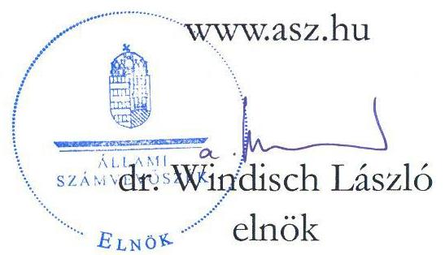
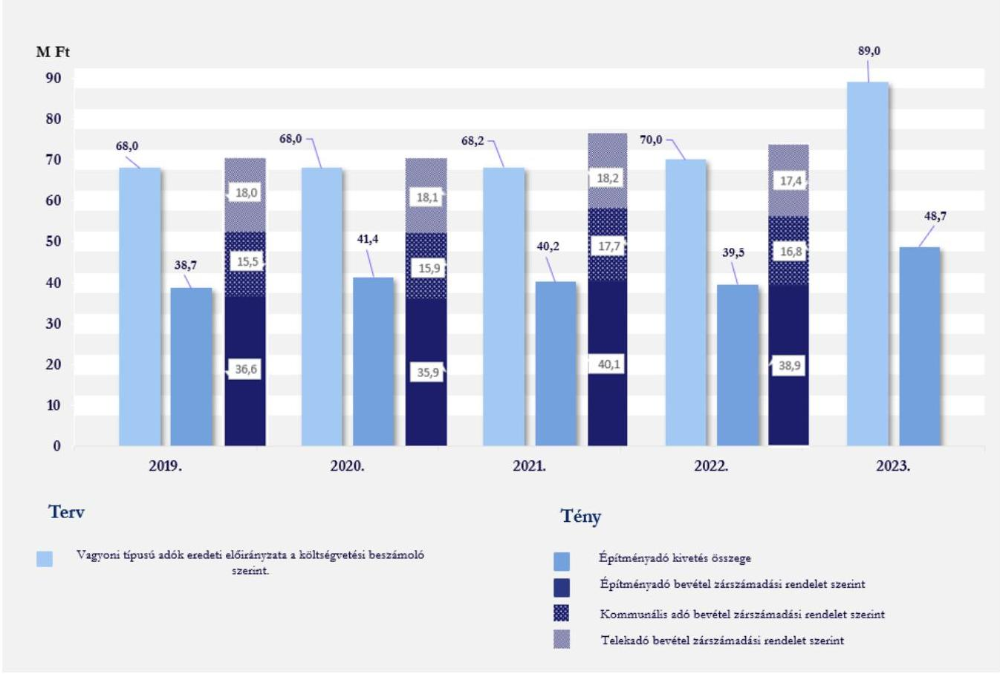
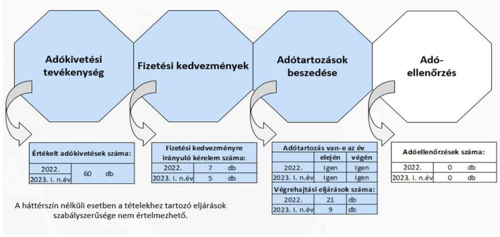
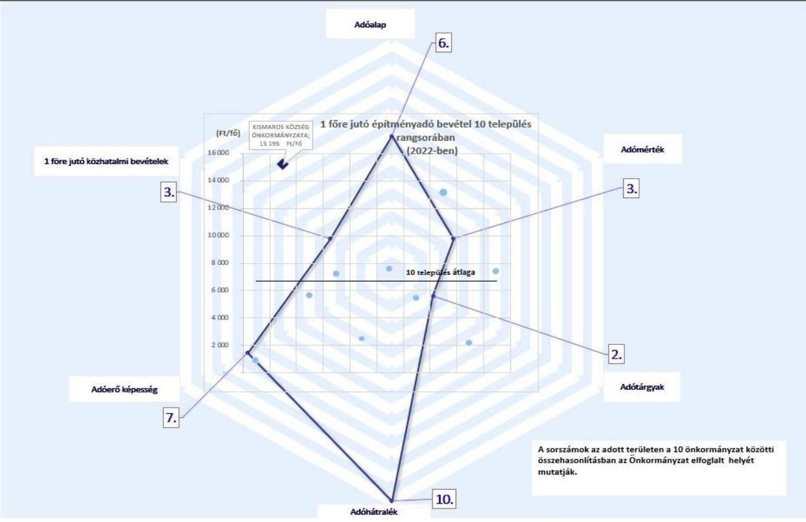

# JELENTÉS 

## Az önkormányzatok helyi adóztatási tevékenységének ellenőrzése Építményadóztatás

Kismaros Község Önkormányzata

2024.

---

# JELENTÉS 

## Az önkormányzatok helyi adóztatási tevékenységének ellenőrzése Építményadóztatás

Kismaros Község Önkormányzata

2024.

24014

---

# ELLENŐRZÉSI IGAZGATÓSÁG: 

## ÁLLAMHÁZTARTÁS HELYI SZINTJÉT ELLENŐRZŐ IGAZGATÓSÁG

## ELLENŐRZÉSI IGAZGATÓ:

DR. BAFFIA GERGELY GÁBOR igazgató

## ELLENŐRZÉSVEZETŐ:

Jelentéseink az interneten a www.asz.hu címen olvashatók.

BŐRŐCZ IMRE ellenőrzésvezető

IKTATÓSZÁM: EL-3839-020/2024.
TÉMASZÁM: 2672.
ELLENŐRZÉS-AZONOSÍTÓ SZÁM: V-1016

---

# TARTALOMJEGYZÉK 

- AZ ELLENŐRZÉS ALAPADATAI ..... 5
- AZ ELLENŐRZÖTT SZERVEZET ..... 7
- ÖSSZEFOGLALÁS ..... 8
- AZ ELLENŐRZÉS FÓKUSZKÉRDÉSEI ..... 10
- MEGÁLLAPÍTÁSOK ..... 11
- JAVASLATOK ..... 19
- MELLÉKLETEK ..... 21
I. sz. melléklet: Értelmező szótár ..... 21
II. sz. melléklet: Az ellenőrzött szervezetek jegyzéke ..... 23
III. sz. melléklet: Ellenőrzési kritériumok ..... 24
IV. sz. melléklet: Az országban hasonló állandó lakosságszámú 10 település összehasonlítása az építményadóra vonatkozóan ..... 25
- FÜGGELÉK: ÉSZREVÉTELEK ..... 26
- RÖVIDÍTÉSEK JEGYZÉKE ..... 27

---

.

---

# AZ ELLENŐRZÉS ALAPADATAI 

## AZ ELLENŐRZÉS CÉLJA

Az ellenőrzés célja annak értékelése volt, hogy a Kismaros Község Önkormányzata által bevezetett építményadót érintő önkormányzati döntések, helyi szabályozások a vonatkozó törvényekkel összhangban álltak-e. Az önkormányzati építményadó bevételek változása hogyan befolyásolta a helyi adópolitikai célok megvalósulását, a helyi adóztatás eredményét. A jegyző ${ }^{1}$ építményadóztatással összefüggő feladatainak teljesítése és kapcsolódó hatásköreinek gyakorlása megfelelő volt-e, eredménye az ellenőrzött időszakban javult-e.

## AZ ELLENŐRZÉS TÍPUSA

Megfelelőségi ellenőrzés.

## AZ ELLENŐRZÖTT IDŐSZAK

Az 1. és 2. fókuszkérdések tekintetében a 2019. év - mint bázisév - és a 2023. év március 31. napjáig tartó időszak. A 3. és 4. fókuszkérdések tekintetében a 2022. év és a 2023. év március 31. napjáig tartó időszak.

## AZ ELLENŐRZÉS TÁRGYA

Az Önkormányzat ${ }^{2}$ építményadóztatással kapcsolatos tevékenységének ellátása. Az ÁSZ ${ }^{3}$ ellenőrzése kiterjedt az helyi adórendelet ${ }^{4}$ megalkotására, az adóztatással összefüggő helyi szabályozásokra és az önkormányzati adóhatósági tevékenység esetében az adóigazgatási feladatok közül az adók kivetésének, a fizetési kedvezmények engedélyezésének, a hátralékok végrehajtási eljárás keretében történő beszedésének megfelelőségére. Kiterjedt továbbá az ellenőrzés az építményadóztatás igazgatási feladatai ellátásának Önkormányzat által biztosított feltételeiben történt változtatás bemutatására, valamint a kontrollkörnyezet, az információs és kommunikációs rendszer és a nyomon követési rendszer kiépítésére és működtetésére.
Az ellenőrzés kiterjedt minden olyan körülményre és adatra, amely az ÁSZ jogszabályban meghatározott feladatainak teljesítéséhez, valamint a program végrehajtása folyamán felmerült újabb összefüggések feltárásához szükséges volt.

## AZ ELLENŐRZÉS JOGALAPJA

Az ellenőrzés jogszabályi alapját az ÁSZ tv ${ }^{5}$. 5. § (8) bekezdése előírásai képezték.

---

# AZ ELLENŐRZÉS MÓDSZERE 

Az ellenőrzést az Alaptörvény ${ }^{6}$ 43. cikk (1) bekezdésében meghatározott törvényességi, célszerűségi szempontok, valamint az ellenőrzési program szempontjai, az ellenőrzött időszakban hatályos jogszabályok, előírások, az ellenőrzés általános szakmai szabályai, az ellenőrzésre irányadó ÁSZ módszertanok figyelembevételével végezte az ÁSZ. Az ellenőrzési kérdések megválaszolásához szükséges bizonyítékok megszerzése az ellenőrzött szervezet által rendelkezésre bocsátott dokumentumokra, adatokra alapozva kérdésfeltevés (információkérés), helyszíni szemle, interjú, mintavételezés útján történt. Az adókivetések szabályszerűségét egyszerű véletlen mintavételi eljárással kiválasztott tételek alapján ellenőrizte az ÁSZ. A mintatételek értékelése egyedileg történt, amelyekre vonatkozóan kerültek a megállapítások megtételre. Az építményadó kivetések értékelése a 2022-2023. években 30-30 db mintatétel ellenőrzésével történt. A fizetési kedvezmények - összesen 12 tétel - engedélyezésének és a hátralékok beszedésének - összesen 30 tétel - egyes dokumentumait tételesen ellenőriztük.
Az ellenőrzés az egyes területek szabályszerűségének, megfelelőségének értékelését a III. sz. mellékletben megjelölt kritériumok alapján végezte el.
Az ÁSZ értékelte, viszonyította az Önkormányzat építményadóval kapcsolatos egyes adatait, mutatószámait más hasonló településekhez. Olyan települések egyes adataival végzett összehasonlítást az ÁSZ, amelyek szintén bevezették az építményadót és közel azonos lélekszámúak (a népességszám esetében a csoportképzés alapja Kismaros 2022. január 1-jei állandó lakosságának száma +/-5 %-os eltérés figyelembevételével került megállapításra). A fenti feltételeknek az Önkormányzattal együtt Magyarországon 10 település ${ }^{7}$ önkormányzata felelt meg.
Ellenőrzési bizonyítékként felhasználható adatforrások közé tartoztak egyrészt az ellenőrzési programban felsorolt adatforrások, másrészt az ellenőrzés folyamán feltárt, az ellenőrzés szempontjából információt tartalmazó dokumentumok.

---

# AZ ELLENŐRZÖTT SZERVEZET 

Az Alaptörvény 31. cikk (1) bekezdése értelmében Magyarországon a helyi közügyek intézése és a helyi közhatalom gyakorlása érdekében helyi önkormányzatok működnek.

A 2023. január 1-én 2587 fő állandó lakosú Kismaros Pest vármegyében, a Szobi járásban fekvő település. A 2023. évi adatok szerint az építményadóval érintett adótárgyak száma 1502, az adóalanyok száma 1555 fő volt. A Közös Hivatal ${ }^{8}$ látta el az Önkormányzat, valamint további két önkormányzat működésével kapcsolatos feladatokat, amelyek az építményadót bevezették. A Közös Hivatal önálló belső szervezeti egységekre tagolódott, a 2022. évben a székhelyen és a kirendeltségeken összesen 23 fő köztisztviselőt alkalmaztak a hivatali feladatok ellátására, ebből az adóügyi feladatokat átlagosan négy fő látta el. A Közös Hivatalhoz tartozó önkormányzatok állandó lakosainak száma 2023. január 1-jén összesen 5316 fő volt. Az Önkormányzatot a polgármesterrel ${ }^{9}$ együtt hét fős képviselő-testület ${ }^{10}$ irányította. Az Önkormányzat jelenlegi polgármestere 2019. október 13-ától tölti be tisztségét. Az ellenőrzött időszakban a jegyző személye több alkalommal változott, a jelenlegi jegyző 2022. szeptember 1-je óta vezeti a Közös Hivatalt, a feladatkörébe tartozik az adóigazgatási tevékenység belső szabályainak meghatározása. Az Önkormányzat adóigazgatási feladatait a Közös Hivatal székhelyén két fő adóügyi előadói munkakört betöltő köztisztviselő végezte.

A helyi önkormányzat a helyi közügyek intézése körében a törvény keretei között dönt a helyi adók fajtájáról és mértékéről. Ezzel összhangban az Mötv. ${ }^{11}$ rögzíti, hogy a helyi adóval kapcsolatos feladatok ellátása a helyi önkormányzatok feladata. A Hatásköri tv. ${ }^{12}$, valamint a Htv. ${ }^{13}$ értelmében a helyi adók bevezetéséről a települési önkormányzat képviselő-testülete dönt rendelettel. Rögzíti továbbá, hogy az önkormányzatok adómegállapítási joga kiterjed az adó bevezetésére, a már bevezetett adó hatályon kívül helyezésére, illetőleg módosítására, az adó mértékének a törvényi keretek közötti megállapítására, a törvényben meghatározott mentességeken, kedvezményeken túli további mentességek, kedvezmények biztosítására, valamint a Htv., az Art. ${ }^{14}$, az Air. ${ }^{15}$ keretei között az adózás részletes szabályainak meghatározására.

A képviselő-testület a helyi adók közül az építményadó mellett a telekadót, az idegenforgalmi adót, a magánszemélyek kommunális adóját és a helyi iparűzési adót vezette be. Az Önkormányzat helyi adóból származó bevételei közül a költségvetési bevételeken belül a 2020. év kivételével az építményadó bevétel aránya volt a meghatározó. Az Önkormányzat építményadóból származó költségvetési bevétele a 2019-2022. években összesen 151,6 M Ft, a legmagasabb összegű bevétele a 2021. évben volt. A képviselő-testület a helyi adók közül az építményadót az 1992. évben vezette be, az építményadó mértéke a 2023. évben változott, 800 Ft/m²-ről 1000 Ft/m²-re emelkedett.

Az ellenőrzött időszakban az Önkormányzatnak hosszú és rövid lejáratú, továbbá likviditási célú hitele, kölcsöne nem volt, 90 napon túl lejárt kötelezettséggel nem rendelkezett. Az időszakok végi likviditási gyorsráta minden esetben 100 % feletti volt, vagyis a rendelkezésre álló pénzeszközök a kötelezettségek fedezetére elegendők voltak, az Önkormányzat likviditása biztosított volt.

---

# ÖSSZEFOGLALÁS 

Az ÁSZ ellenőrzési tevékenysége keretében általános hatáskörrel ellenőrzi a helyi önkormányzatok adóztatási tevékenységét. Az adóbevételek képezik az önkormányzatok saját bevételének jelentős részét. A helyi adók önkormányzati gazdálkodásban betöltött fontos szerepét jelzi, hogy a 2019. évben a helyi önkormányzatok összes költségvetési bevételének 34,5 %-át, a 2020. évben 32,5 %-át, a 2021. évben 31,1 %-át és a 2022. évben 31,6 %-át a helyi adóbevételek jelentették. A helyi iparűzési adó a helyi adók között, az abból származó adóbevétel szempontjából a legmeghatározóbb volt, melyet az ÁSZ 2022-ben ellenőrzött. Ezt követi a sorban az építményadó, amelyet az önkormányzatok közel egyharmada vezetett be. Ez indokolta az önkormányzatok építményadóztatással kapcsolatos tevékenységének ellenőrzését, mely az Önkormányzat ellenőrzésére is kiterjedt.

Az Önkormányzat 2023. évtől hatályos helyi adórendelete az adófizetési kötelezettségre, a rendeletben használt fogalom meghatározására, az adómentességre és az adókedvezményre a jogszabályi előírásoknak nem megfelelő rendelkezéseket tartalmazott. A képviselő-testület 2023. január 1-től a helyi adórendeletben jogszabályban már megszüntetett adótárgyra - reklámhordozókra - vezetett be építményadó kötelezettséget. Az Önkormányzat helyi adórendeletében a jogszabályban biztosított lehetősége ellenére nem mentesítette az építményadó alanyát az adatbejelentési kötelezettség alól, amennyiben az adóalanyt adófizetési kötelezettség az építményadó vonatkozásában nem terhelte.

A jegyző az ellenőrzött időszakban a jogszabályi előírásoknak nem megfelelően alakította ki az építményadóztatást érintő belső szabályokat, a Közös Hivatal SZMSZ${ }^{16}$-ét a képviselő-testület nem hagyta jóvá, az nem tartalmazta az adóigazgatási feladat- és hatásköröket és a felelősségi szabályokat, továbbá belső szabályozás nem tartalmazta az adóigazgatási tevékenységekre vonatkozó ellenőrzési nyomvonalakat.

Az Önkormányzat 2021-2023. évi költségvetési rendeleteiben a jogszabályi előírás ellenére építményadó bevételre eredeti előirányzatot nem tervezett, az eredeti előirányzatot a vagyoni típusú adókra tervezte meg. Az építményadó bevételek összege a 2019-2022. években elmaradt az építményadó kivetéshez képest.

A Közös Hivatal a jogszabályi előírások ellenére az ellenőrzött időszakban az éves költségvetési beszámolóiban kormányzati funkció szerint az adóigazgatási tevékenységgel összefüggő kiadási adatokat és a kapcsolódó átlagos statisztikai létszámadatokat nem szerepeltette. A Közös Hivatal adatszolgáltatása alapján az adóigazgatás működési kiadásai a helyi adóbevételek 11,7 %-át tették ki a 2022. évben.

Az önkormányzati adóhatóság ${ }^{17}$ a jogszabályi előírások ellenére a 2023. évben a határozathozatalra vonatkozó ügyintézési határidőt nem teljeskörűen tartotta be, valamint a 2022-2023. években a jogszabályi előírás ellenére az adózót nem hívta fel az adókötelezettség jogszerű teljesítésére. Az ellenőrzött kivetési határozatok tartalma, kiadmányozása, közlésének módja megfelelt a jogszabály előírásainak.

Az adatbejelentések és a fizetési kedvezményekre irányuló kérelmek érkeztetése nem minden esetben felelt meg a belső szabályzatban foglalt előírásoknak.

Az építményadó tartozások beszedésére a 2022. és a 2023. években tett intézkedések 16,7 %-a nem felelt meg a jogszabályi előírásoknak, mivel az önkormányzati adóhatóság a végrehajtható okiratok megőrzéséről nem gondoskodott, a végrehajtási eljárásokat végrehajtható okiratok hiányában indította meg.

Az ellenőrzött időszakban az önkormányzati adóhatóság a jogszabályi kötelezettségek teljesítésének előmozdítása érdekében adóellenőrzést nem végzett. Ezáltal az adóellenőrzések nem járultak hozzá az adóbevételek növeléséhez.

---

Az Önkormányzat belső ellenőrzése és külső ellenőrzést végző szervezet a helyi adóztatási tevékenységet az ellenőrzött időszakban nem ellenőrizte.

Az önkormányzati adóhatóság a jogszabályi előírásokban foglalt lehetőséggel élve megkereste az ingatlanügyi hatóságot az építményadó megállapítása (kivetése), ellenőrzése céljából történő adatszolgáltatás érdekében, azonban a kért és kapott adatokat nem hasznosította.

Az építésügyi hatóságtól kapott adatszolgáltatást a jegyző az adóigazgatási feladatokat ellátó személyekhez nem juttatta el, így a jogszabályi előírások ellenére az információs és kommunikációs rendszer az adóigazgatási folyamatok tekintetében nem megfelelően működött.

---

# AZ ELLENŐRZÉS FÓKUSZKÉRDÉSEI 

1. Az önkormányzat építményadóval kapcsolatos rendelete és az önkormányzati adóhatóság tevékenysége támogatta-e az adóbevételek beszedését, a településfejlesztési és az adópolitikai célkitűzések megvalósítását?
2. Az építményadóztatás igazgatási feladatai ellátásának önkormányzat által biztosított feltételeiben és adóhatósági gyakorlatában történt-e változtatás?
3. Az önkormányzati

 adóhatóság megfelelően látta-e el az építményadóval kapcsolatos egyes adóhatósági tevékenységeit?
4. Az építményadóztatás egyes adóhatósági tevékenységeinek megfelelő ellátását a belső kontrollrendszer egyes elemeinek kiépítése és működtetése elősegítette-e?

---

# MEGÁLLAPÍTÁSOK 

## 1. Az önkormányzat építményadóval kapcsolatos rendelete és az önkormányzati adóhatóság tevékenysége támogatta-e az adóbevételek beszedését, a településfejlesztési és az adópolitikai célkitűzések megvalósítását?

Összegző megállapítás Az Önkormányzat helyi adórendelete a Htv. és az Art. rendelkezéseivel ellentétes szabályozást és pontatlanságokat tartalmazott az adófizetési kötelezettségre, a fogalommeghatározásra és az adókedvezményre vonatkozóan. Az önkormányzati adóhatóság által beszedett építményadó összege minden évben elmaradt a kivetés összegétől, a hátralékok összege csökkent. Az Önkormányzat helyi adópolitikai célkitűzéseket meghatározott, azonban a keletkező források felhasználását településfejlesztési célhoz nem kötötte.

A HELYI ADÓRENDELET tartalmazza a Htv. felhatalmazása alapján az építményadózás szabályait. Az építményadó alapját az építmény $\mathrm{m}^{2}$-ben számított hasznos alapterületében határozták meg.
Az Önkormányzat a helyi adórendeletében az Art. 2. melléklet II/A/4. pontja alapján adható lehetőséggel nem élt és nem mentesítette az építményadó alanyát az adatbejelentési kötelezettség alól, amennyiben az adóalanyt adófizetési kötelezettség az építményadó vonatkozásában nem terhelte.
A helyi adórendelet az építményadó vonatkozásában a jogszabályokban foglalt rendelkezésektől eltérő szabályozásokat tartalmazott az alábbiak szerint:

- A képviselő-testület a helyi adórendelet 3. § (3) bekezdésében az azonos telken található több nem lakás céljára szolgáló építmény esetében az összesített alapterület után határozta meg az adófizetési kötelezettséget. Az egy helyrajzi számon található önálló épületek, épületrészek önálló adótárgyak, ezért a helyi adórendelet 3. § (3) bekezdésének összesített alapterületre vonatkozó rendelkezése nem felelt meg a Htv. 11. § (1) bekezdése, valamint a 15. § a) pontja előírásainak (az összesített alapterületre vonatkozóan a Kúria is hozott döntést egy konkrét önkormányzati rendelet törvényességének vizsgálata tárgyában.*);
- A helyi adórendelet 3. §-a, 18. §-a és 20. §-a alapján megállapítható, hogy a településen azt a magánszemélyt, aki nem magánszemély tulajdonában álló lakáson fennálló, a Htv. szerinti vagyoni értékű joggal rendelkezik, egyaránt terheli adókötelezettség építményadó és magánszemélyek kommunális adója jogcímen. Mindez ellentétben áll a Htv. 7. § a) pontjában foglaltakkal, mely kijelenti, hogy az önkormányzat adómegállapítási jogát korlátozza az, hogy az önkormányzat az

[^0]
[^0]:    * https://kuria-birosag.hu/hu/onkugy/kof503120185

---

adóalanyt egy meghatározott adótárgy (épület, épületrész, telek) esetében csak egyféle - az önkormányzat döntése szerinti - adó fizetésére kötelezheti;

- A helyi adórendelet 5. § (1) bekezdés c) pontja definiálta a lakás fogalmát, mely szűkebb a Htv. 52. § 8. pontjában meghatározott lakás fogalomnál. A Htv. 52. § 8. pontja a lakás fogalmat úgy rögzítette, hogy az magában foglalja a 1993. évi LXXVIII. törvény ${ }^{18}$ 91/A. §-a 1-6. pontjában foglaltak alapján ilyennek minősülő és az ingatlan-nyilvántartásban lakóház, lakóépület, lakás, kastély, villa, udvarház megnevezéssel nyilvántartott ingatlant. A Htv. nem ad felhatalmazást a Htv.-ben rögzített fogalmaktól való eltérésre, új fogalom megalkotására;
- A helyi adórendelet 7. § (4) bekezdése szerint az adózó adókedvezményre való jogosultságát adóhatóság minden évben köteles vizsgálni, adókedvezményre való jogosultság mindig csak a kérelem benyújtásának évére vonatkozóan adható meg. Ezen rendelkezés ellentétes a Htv. 6. § e) pontjával, mely szerint az önkormányzat adómegállapítási joga arra terjed ki, hogy a Htv., valamint az Art. és az Air. keretei között az adózás részletes szabályait meghatározza. Továbbá az Art. 2. melléklete II/A/4. pontja szerint az adózónak nem kell újabb adatbejelentést benyújtania mindaddig, ameddig az adóalany körülményeiben, az adó tárgyában nem következik be adókötelezettséget érintő változás;
- Az ellenőrzés rendelkezésére bocsátott, és az Önkormányzat honlapján elérhető helyi adórendelet 7. § (3) bekezdése hibás jogszabályi hivatkozást tartalmaz, mivel a rendelet 6. § (3) bekezdése nem létező jogszabályhely. A Nemzeti Jogszabálytárban elérhető helyi adórendelet szövege eltér az Önkormányzat honlapján elérhető helyi adórendelet szövegétől, megsértve ezzel a 338/2011. (XII. 29.) Kormányrendelet ${ }^{19}$ 4. §-ában foglaltakat.
A REKLÁMHORDOZÓKRA vonatkozó építményadó kötelezettséget a 2020. évi LXXVI. törvény ${ }^{20}$ 4. § (1) bekezdése 1. pontja hatályon kívül helyezte 2020. július 15. napjától. A képviselő-testület a 2023. január 1-től hatályos helyi adórendelet 3. § (1) bekezdésében a Htv. hatályon kívül helyezett 11/A. §-ára hivatkozva a reklámhordozókra vonatkozó adókötelezettséget előírta. Így az önkormányzati rendelet az ellenőrzött időszakban más jogszabállyal ellentétes szabályozást tartalmazott, ez pedig nem felelt meg az Alaptörvény 32. cikk (3) bekezdésében foglaltaknak.
Az ÁSZ a helyi adórendelettel kapcsolatos megállapításairól a törvényességi felügyeleti jogkört gyakorló területileg illetékes Kormányhivatalt ${ }^{21}$ tájékoztatja.
A közzétételi kötelezettségének a jegyző a Htv.-ben foglaltaknak megfelelően eleget tett. A képviselőtestület a jegyző beszámoltatása útján ellenőrizte az adóztatási tevékenységet, eleget téve a Hatásköri tv. előírásainak. A jegyző a Htv. 42/B. § (1) bekezdésében rögzítettek ellenére az előírt határidőn túl - a 2021. évben 43 nap, a 2023. évben 36 nap késedelemmel - gondoskodott a Kincstár ${ }^{22}$ felé előírt adatszolgáltatási kötelezettségéről.
AZ ÉPÍTMÉNYADÓ KÖTELES ÉPÍTMÉNYEK M²-BEN SZÁMÍTOTT HASZNOS ALAPTERÜLETE a 2019. évi $57838,0 \mathrm{~m}^{2}$-es szintről 2022. évre $55840,0 \mathrm{~m}^{2}$-re csökkent, mely mérsékelt 3,5%-os csökkenést jelent.

---

1. ábra

A VAGYONI TÍPUSÚ ADÓK ELŐIRÁNYZATAI, AZ ÉPÍTMÉNYADÓ KIVETÉSEI (2019-2023.), VALAMINT A KÖLTSÉGVETÉSI BEVÉTELEK ADATAI (2019-2022.)

Forrás: Az ellenőrzött szervezet adatszolgáltatása, az Önkormányzati rendeletek Nemzeti Jogszabálytár alapján ÁSZ szerkesztés
AZ ÉPÍTMÉNYADÓ EREDETI ELŐIRÁNYZATÁT az Önkormányzat a 2019-2020. évi költségvetési rendeleteiben megtervezte. A 2021-2023. évi költségvetési rendeletekben az építményadó bevételre eredeti előirányzatot nem tervezett, a vagyoni típusú adók ${ }^{23}$ eredeti előirányzatának összegét tervezte meg.
A 1. ábra azt mutatja, hogy a vagyoni típusú adók eredeti előirányzata a 2019. évben 103,1%-ban, a 2020. évben 102,8%-ban, a 2021. évben 114,4%-ban, valamint a 2022. évben 104,4%-ban teljesült. A 2021. évi bevétel a bejelentett építményadó köteles építmények $\mathrm{m}^{2}$-ben számított hasznos alapterületének előző évhez viszonyított csökkenése ellenére is magasabb összegű, 40,1 M Ft volt, mivel az adózók a 2021. évben a kivetett adó összegét magasabb arányban fizették meg.
Az időközi költségvetési jelentés alapján a 2023. I. negyedévében a költségvetési számlára 12,2 M Ft építményadó átvezetése történt meg, amely a kivetések 25,1%-a volt.
A BESZEDETT ÉPÍTMÉNYADÓ ÖSSZEGE az ellenőrzött időszak minden évében elmaradt az építményadó kivetéshez képest. Az elmaradás összege a 2020. évben volt a legjelentősebb 5,5 M Ft, mely 13,3%-os elmaradást jelentett.
AZ ÉPÍTMÉNYADÓ TARTOZÁSOK összege az ellenőrzött időszakban 37,8%-kal csökkent (2019. január 1-én 12,2 M Ft volt, 2023. január 1-jén 7,6 M Ft volt), a hátralékos adózók száma 30,3%-kal csökkent (2019. január 1-jén 234 fő, 2023. január 1-jén 163 fő volt) tekintettel a hátralékok önkéntes adózói befizetésére és az önkormányzati adóhatóság által megindított végrehajtási eljárásokra. Az Avt. ${ }^{24}$-

---

ben foglaltak alapján a 2020-2023. I. negyedév időszakában megindított 77 végrehajtási eljárás eredményeképpen befolyt építményadó összege $2,8 \mathrm{M} \mathrm{Ft}$ volt. Az önkormányzati adóhatóság méltányosság jogcímen a 2019-2021. években $0,6 \mathrm{M} \mathrm{Ft}$ összegben, elévülés jogcímen az ellenőrzött időszak minden évében törölt építményadó kivetést összesen 4,6 M Ft összegben. Az elévülés jogcímen törölt építményadó kivetés a 2019. évről 2022. évre kevesebb, mint az egytizedére csökkent.
AZ ORSZÁGBAN HASONLÓ ÁLLANDÓ LAKOSSÁGSZÁMÚ 10 TELEPÜLÉS ÖSSZEHASONLÍTÁSÁBAN az Önkormányzat egy főre jutó építményadó bevétele - 15195 Ft - a 2022. évben volt a legmagasabb. Az Önkormányzat építményadóval kapcsolatos egyes adatai, mutatószámai hasonló településekkel történő összehasonlítását a IV. sz. melléklet mutatja be.
ANYAGI ÉRDEKELTSÉGI RENDSZERT - amely az Önkormányzat által bevezetett helyi adók beszedését elősegíti - nem működtetett.
AZ ÖNKORMÁNYZAT ADÓPOLITIKAI CÉLJAI a 2019-2024. évekre vonatkozó gazdasági programjában kerültek meghatározásra. Ennek keretében a takarékos, átgondolt gazdálkodást, a pályázatok önerejének biztosítását a költségvetésben és a pályázati lehetőségek kihasználását, a bevezetett helyi adó mértékének, a mentességek és kedvezmények felülvizsgálatát, a be nem vezetett helyi adók bevezetési lehetőségének szakmai, a lakosság és a vállalkozások teherbíró képességét figyelembe vevő felmérését, valamint a helyi adóból fennálló követelések behajtását, a behajtás hatékonyabbá tételét jelölték meg célként. Az ellenőrzött időszakban nem volt olyan pályázati vagy fejlesztési cél, amelyben a beruházási célok forrásaként az építményadó bevételt nevesítették volna.

# 2. Az építményadóztatás igazgatási feladatai ellátásának önkormányzat által biztosított feltételeiben és adóhatósági gyakorlatában történt-e változtatás? 

Összegző megállapítás Az építményadóztatás igazgatási feladatai ellátásának Önkormányzat által biztosított feltételei és adóhatósági gyakorlata az ellenőrzött időszakban nem változott. A 15/2019. (XII.7.) PM rendeletben ${ }^{25}$ foglaltak ellenére a Közös Hivatal az éves költségvetési beszámolóiban az adóigazgatás kormányzati funkcióján a kapcsolódó kiadásokat és az átlagos statisztikai állományi létszámokat nem mutatta ki.

AZ ADÓIGAZGATÁSI FELADATELLÁTÁS személyi, informatikai feltételeit a Közös Hivatal az ellenőrzött időszakban biztosította. Az Önkormányzatnál az adóigazgatással kapcsolatos feladatokat ellátó két fő adóügyi előadó személye a 2020. év óta nem változott.
AZ ADÓZÓKKAL VALÓ INFORMÁCIÓS KAPCSOLATOKAT kiépítették, gyakorlatát kialakították, amely az ellenőrzött időszakban nem változott. A helyi adókkal kapcsolatos rendszeresített bevallási, adatbejelentési, bejelentkezési nyomtatványokat az Önkormányzat honlapján közzétették, valamint az E-önkormányzat portálon keresztül biztosították az adóügyekkel kapcsolatos elektronikus ügyintézéshez szükséges szolgáltatásokat. Az adózók részére a jogszerű adókötelezettség teljesítése

---

érdekében papír alapon, illetve elektronikus úton is nyújtottak figyelemfelhívó tájékoztatást. A 2022. évi közmeghallgatáson kitértek az adóztatás, adóbevételek témakörére.
A POSTAI ÉS KOMMUNIKÁCIÓS KÖLTSÉGEK a 2019. évhez viszonyítva 2,1 M Ft-ról a 2022. évre 2,2 M Ft-ra növekedtek, a postai díjak emelkedése miatt. A helyi adó mértékének változásával összefüggő ügyiratforgalom növekedése a 2023. I. negyedévében további 1,0 M Ft-os többletköltséget eredményezett.
A KORMÁNYZATI FUNKCIÓ (011220 Adó-, vám- és jövedéki igazgatás) szerint az Áht. 4. § (4) bekezdésében, továbbá a 15/2019. (XII. 7.) PM rendelet 3. § (1) és a 6. § (2) bekezdéseiben, valamint az 1. és 2. mellékletben előírtak ellenére a Közös Hivatal az éves költségvetési beszámolóiban az adóigazgatási tevékenységgel összefüggő kiadásokat és a kapcsolódó átlagos statisztikai létszámokat nem mutatta ki.
A Közös Hivatal adatszolgáltatása alapján a 2022. évben a teljes adóigazgatási feladatellátásra fordított összes működési kiadás összege 21,9 M Ft volt, az adóigazgatási tevékenységéhez kapcsolódó három önkormányzat helyi adóbevétele összesen 186,4 M Ft volt. A Közös Hivatal esetében 1000 Ft adóbevételre 117,4 Ft adóigazgatási működési kiadás jutott, ami 11,7%-os hányadot jelent a beszedett adókhoz viszonyítva.

# 3. Az önkormányzati adóhatóság megfelelően látta-e el az építményadóval kapcsolatos egyes adóhatósági tevékenységeit? 

| Összegző megállapítás | Az önkormányzati adóhatóság az építményadóval kapcsolatos egyes adóhatósági tevékenységeit nem minden esetben látta el megfelelően, mivel többször nem tartotta be a kivetési és a fizetési kedvezményekre vonatkozó határozatoknál az Air.-ben előírt ügyintézési határidőt, valamint az Art. előírása ellenére nem minden esetben hívta fel az adózókat az elmaradt adatbejelentés pótlására. Egyes esetekben az Avt. szerinti végrehajtható okirat hiányában indított
 végrehajtási eljárást, illetve adóellenőrzést az építményadóval kapcsolatban nem végzett. |
| :--: | :--: |

Az építményadóztatással kapcsolatos önkormányzati adóigazgatási feladatok számvevőszéki ellenőrzés megállapításainak tartalmát befolyásoló egyes adatok alakulását mutatja be a 2. ábra.

---

*Furnác Az ellenőrpót szoroszt adatszolgáltatása alapján ÁtZ szorkeszpis*

**AZ ÉPÍTMÉNYADÓ KIVETÉSÉRŐL** az önkormányzati adóhatóság az értékelt 30-30 mintatételből a 2022. évben 6,7 %-a (kettő mintatétel), a 2023. évben 10,0 %-a (három mintatétel) esetében határozattal nem döntött. Az adatbejelentési kötelezettség teljesítésére vonatkozó felhívás sikertelen volt. A folyamatban lévő adatbejelentési eljárásokra hivatkozva az önkormányzati adóhatóság – az Art. 221. §-ában előírtak ellenére – az adózót az adókötelezettség jogszerű teljesítésére nem hívta fel.

**A HATÁROZATHOZATAL IDEJÉRE ELŐÍRT ÜGYINTÉZÉSI HATÁRIDŐT** az önkormányzati adóhatóság az adóigazgatási tevékenysége során az Air. 50. § (2) bekezdésében előírtak ellenére a 2023. évben egy kivetési határozat – a határozatok 3,3 %-a – tekintetében (a késedelem mértéke a 3432. hrsz esetében 32 nap) nem tartotta be.

**A KIVETÉSI HATÁROZATOK KIADMÁNYOZÁSA** és az adózókkal történő közlése az Air. előírásainak, valamint a belső szabályozásnak megfelelően történt.

**FIZETÉSI KEDVEZMÉNY IGÉNYBEVÉTELÉRE** irányuló kérelmet az adóhatósághoz a 2022-2023. I. negyedévben az Önkormányzat adatszolgáltatása alapján 12 esetben nyújtottak be. A 2022. január 1-jétől, valamint a 2023. február 1-től hatályos Egyedi iratkezelési szabályzatok 70) és 108) pontjában foglaltak ellenére a dátumbélyegzőt a papír alapú kérelmek érkeztetésekor (a 2022-2023. évben az ellenőrzött mintatételek 75 %-a, 9 tétel esetében) nem alkalmazta. A fizetési kedvezményre vonatkozó döntés ügyintézési határidejét az önkormányzati adóhatóság a 2023. évben egy tétel esetében az Air. 50. § (2) bekezdésében előírtak ellenére nem tartotta be (a késedelem mértéke a 6023. hrsz esetében 11 nap).

A fizetési kedvezmény igénybevételére irányuló kérelem elbírálása az Air.-nak megfelelően határozati formában történt. A határozat kiadmányozása, adózókkal való közlése az Air., a 335/2005. (XII.29.) Korm. rendelet[^1] és a belső szabályozásnak megfelelő volt.

**AZ ÉPÍTMÉNYADÓ-TARTOZÁSOK BESZEDÉSE** érdekében az önkormányzati adóhatóság a 2022. és a 2023. években összesen – az Avt.-ben foglaltak alapján – 30 esetben indított saját hatáskörében
[^1]: 2. ábra

---

végrehajtási eljárást. Az önkormányzati adóhatóság a tartozás megfizetésére az adósokat minden esetben felhívta.

Az önkormányzati adóhatóság az ellenőrzött mintatételek esetében a Ltv. 27 9. § (1) bekezdés e) pontjában előírtak ellenére a kivetési határozatok, mint végrehajtható okiratok megőrzéséről nem minden esetben gondoskodott, így a 2022. évben az ellenőrzött mintatételek 19,0 %-ánál (21 tételből négy esetben), a 2023. I. negyedévben az ellenőrzött mintatételek 11,1 %-ánál (kilenc tételből egy esetben) a végrehajtás foganatosításához előírt - az Avt. 29. § (1) bekezdés 1. pontja szerinti - végrehajtható okirat hiányában intézkedett jövedelem letiltás, hatósági átutalási megbízás, jelzálogjog bejegyzés formában.
ADÓELLENŐRZÉST az önkormányzati adóhatóság az ellenőrzött időszakban az adótörvényekben és más jogszabályokban előírt kötelezettségek teljesítésének előmozdítása érdekében nem végzett.

# 4. Az építményadóztatás egyes adóhatósági tevékenységeinek megfelelő ellátását a belső kontrollrendszer egyes elemeinek kiépítése és múködtetése elősegítette-e? 

| Összegző megállapítás | A belső kontrollrendszer egyes elemeinek kiépítése és   működtetése - a SZMSZ és az adóigazgatási eljárásra   vonatkozó ellenőrzési nyomvonal hiányos tartalma, valamint   az Ingatlanügyi Hatóságtól származó információk   átadásának elmaradása miatt - nem segítette elő az   építményadóztatás egyes adóhatósági tevékenységeinek   ellátását. A belső és külső ellenőrzés a helyi adóztatási   tevékenységet nem ellenőrizte. |
| :--: | :--: |

AZ ADÓIGAZGATÁSI FELADATOK ELLÁTÁSÁNAK SZABÁLYAIT a 2022-2023. években a belső szabályzatokban nem rögzítették a jogszabályi előírásoknak megfelelően.
Az ellenőrzött időszakban a Közös Hivatal SZMSZ1,2,3-e több alkalommal változott. Az SZMSZ1,3-t az Áht. 9. § b) pontjában előírtak ellenére a képviselő-testület nem hagyta jóvá. Az SZMSZ3 az Ávr. 28 13. § (1) bekezdés g) pontjában előírtak ellenére nem tartalmazta az adóigazgatási feladatok ellátását végző nevesített munkaköréhez tartozó feladat- és hatásköröket, a hatáskörök gyakorlásának módját, továbbá a felelősségi szabályokat.
A KIADMÁNYOZÁS RENDJÉT a jegyző a hatáskörébe tartozó adóigazgatási ügyekben az Mötv.-ben foglaltaknak megfelelően szabályozta.
A KÖLTSÉGVETÉSI SZERV ELLENŐRZÉSI NYOMVONALÁT a jegyző - az ellenőrzött időszakra vonatkozóan - elkészítette, azonban a Bkr. 29 6. § (3) bekezdésében foglaltak ellenére nem tartalmazza az adóigazgatási folyamatokat.
A LAKOSSÁGOT TÁJÉKOZTATTA a jegyző a Hatásköri tv.-nek megfelelően az adójogszabályok előírásairól, valamint a Htv-ben foglaltaknak eleget tett, mivel az Önkormányzat honlapjáról a hatályos helyi adórendelet, valamint a helyi adókkal kapcsolatos nyomtatványok elérhetőek voltak. Az Önkormányzat, illetve a képviselő-testület a Htv., illetve a Hatásköri tv. előírásainak eleget téve a zárszámadási rendeleteiben tájékoztatta a lakosságot a helyi adókból származó bevételek összegéről.

---

A BELSŐ ELLENŐRZÉSI TEVÉKENYSÉG kialakításáról és működtetéséről az Áht.-ben foglaltaknak megfelelően a jegyző gondoskodott.
A Bkr. előírásainak megfelelve a 2022. és a 2023. évekre vonatkozóan a képviselő-testület által elfogadott éves ellenőrzési tervekkel rendelkezett az ellenőrzött szervezet. Az éves ellenőrzési terveket megalapozó kockázatelemzés nem tartalmazta az adóztatási tevékenységgel kapcsolatos kockázatok felmérését és értékelését, ezzel megsértve a Bkr. 29. § (1) bekezdésében foglaltakat, mivel figyelmen kívül hagyták az államháztartásért felelős miniszter által közzétett módszertani útmutatóban 30 előírtakat, amely szerint a kockázatelemzésnek ki kell terjednie az összes tevékenységben lévő kockázatok felmérésére, értékelésére.
A helyi adóztatási tevékenységet a belső ellenőrzés nem ellenőrizte, nem értékelte az önkormányzati adóhatóság működésének jogszabályoknak és szabályzatoknak való megfelelését.
KÜLSŐ ELLENŐRZÉST VÉGZŐ SZERVEZET a helyi adóztatási tevékenységet az ellenőrzött időszakban nem ellenőrizte.
AZ INGATLANÜGYI HATÓSÁGOT 31 az önkormányzati adóhatóság az Art.-ban foglalt lehetőséggel élve a 2022-2023. években megkereste az építményadó ellenőrzése céljából történő adatszolgáltatás érdekében. A jegyző az ingatlanügyi hatóságtól kapott adatokat, azonban azokat nem vetette össze az építményadó nyilvántartás adataival, az ingatlanügyi hatóság adatszolgáltatása alapján intézkedést nem tett. AZ ÉPÍTÉSÜGYI HATÓSÁG32-TÓL a 2022-2023. években az Art. szerinti adatszolgáltatást (használatbavétel tudomásulvételéről szóló hatósági bizonyítványt, véglegessé vált használatbavételi engedélyt, véglegessé vált fennmaradási engedélyt) az önkormányzati adóhatóság kapott. Az építésügyi hatóságtól származó adatszolgáltatás az adóigazgatási feladatokat ellátó személyekhez nem jutott el, így megállapítható, hogy a jegyző a Bkr. 9. § (1) bekezdésében foglaltak ellenére az információs és kommunikációs rendszert az adóigazgatási folyamatok tekintetében nem megfelelően működtette.

---

# JAVASLATOK 

Az ÁSZ tv. 33. § (1) bekezdésében foglaltak értelmében az ellenőrzött szervezet vezetője köteles a jelentésben foglalt megállapításokhoz kapcsolódó intézkedési tervet összeállítani és azt a jelentés kézhezvételétől számított 30 napon belül az ÁSZ részére megküldeni. Amennyiben az ellenőrzött szervezet vezetője nem küldi meg határidőben az intézkedési tervet, vagy továbbra sem elfogadható intézkedési tervet küld, az Állami Számvevőszék elnöke az ÁSZ tv. 33. § (3) bekezdése a) és b) pontjaiban foglaltakat érvényesítheti.

## KISMAROS KÖZSÉG ÖNKORMÁNYZATÁNAK POLGÁRMESTERE RÉSZÉRE

1. Intézkedjen az Állami Számvevőszék jelentésének ÁSZ általi nyilvánosságra hozatalát követően haladéktalanul a képviselő-testület elé terjesztéséről. A jelentést a napirend tárgyalásáról szóló jegyzőkönyvvel együtt tájékoztatásul küldje meg a Kormányhivatal részére is.

## KISMAROSI KÖZÖS ÖNKORMÁNYZATI HIVATAL JEGYZŐJE RÉSZÉRE

1. Intézkedjen az Áht. 4. § (4) bekezdésében és a 15/2019. (XII. 7.) PM rendelet 3. § (1) bekezdésében, valamint az 1. mellékletben előírtak alapján az adóigazgatási tevékenységgel összefüggő kiadásoknak és a 15/2019. (XII. 7.) PM rendelet 6. § (2) bekezdésében és a 2. mellékletben előírtak alapján az átlagos statisztikai létszámadatoknak az arra kijelölt kormányzati funkcióra történő kimutatása érdekében.
2. Intézkedjen az Art. 221. §-ában foglaltaknak megfelelően a hiánypótlásra felhívás alkalmazására.
3. Alakítson ki kontrollt annak érdekében, hogy a jövőben biztosított legyen az Air. 50. § (2) bekezdésében előírt ügyintézési határidő betartása.
4. Alakítson ki kontrollt annak biztosítására, hogy az Ltv. 9. § (1) bekezdés e) pontjában előírtaknak megfelelően az iratok megőrzése biztosított legyen, hogy a végrehajtási eljárás megindításakor az Avt. 29. §-a szerinti végrehajtható okirat rendelkezésre álljon.

---

5. Alakítson ki kontrollt annak biztosítására, hogy az Egyedi iratkezelési szabályzat 70) és 108) pontjainak megfelelően - az érkeztető bélyegző használatával és az érkeztetési dátum és azonosító feltüntetésével történjen a papír alapú iratok érkeztetése.
6. Intézkedjen, hogy a Bkr. 6. § (3) bekezdésében foglaltaknak megfelelően az ellenőrzési nyomvonal az önkormányzati adóigazgatást érintő működési folyamatokat tartalmazza.
7. Intézkedjen, hogy a Közös Hivatal SZMSZ-e tartalmazza az Ávr. 13. § (1) bekezdés g) pontjában foglaltakat, valamint a Közös Hivatal SZMSZ-ét a képviselő-testület az Áht. 9. § b) pontjában előírtaknak megfelelően hagyja jóvá.
8. Intézkedjen az adóigazgatási folyamatok tekintetében az információs és kommunikációs rendszer Bkr. 9. § (1) bekezdése szerinti működtetéséről annak érdekében, hogy a megfelelő információk a megfelelő időben eljussanak az illetékes szervezethez, szervezeti egységhez, illetve személyhez.
9. Intézkedjen, hogy a Bkr. 29. § (1) bekezdésében foglaltak alapján készített éves ellenőrzési tervet megalapozó kockázatelemzés tartalmazza az adóztatási tevékenységgel kapcsolatos kockázatok felmérését és értékelését.

---

# MELLÉKLETEK 

## I. SZ. MELLÉKLET: ÉRTELMEZŐ SZÓTÁR

adóellenőrzés
adóhatóság
adóhatósági ellenőrzés
adótartozás
adózó
építmény
építményadó
építményadó adóalanya
épület
épületrész

Adóellenőrzés keretében az adóhatóság az adózó adómegállapítási, adatbejelentési, bevallási kötelezettsége teljesítését adónként, támogatásonként és időszakonként vagy meghatározott időszakra több adó és támogatás tekintetében is vizsgálja. (Forrás: Air. 90. § (1) bekezdés)
Az önkormányzat jegyzője, mint önkormányzati adóhatóság. (Forrás: Air. 22. § b) pont)
Az adóhatóság az adótörvényekben és más jogszabályokban előírt kötelezettségek teljesítésének vagy megsértésének megállapítása, a kötelezettségek teljesítésének előmozdítása érdekében ellenőrzést folytat. (Forrás: Air. 86. §)
Az esedékességkor meg nem fizetett adó és a jogosulatlanul igénybe vett költségvetési támogatás. (Forrás: Art. 7. §6. pont)
Az a személy, akinek vagy amelynek adókötelezettségét adót, költségvetési támogatást megállapító törvény, e törvény, az adózás rendjéről szóló 2017. évi CL. törvény (a továbbiakban: Art.) vagy önkormányzati rendelet előírja. (Forrás: Air. 11. § (1) bekezdés)
Építési tevékenységgel létrehozott, illetve késztermékként az építési helyszínre szállított, - rendeltetésére, szerkezeti megoldására, anyagára, készültségi fokára és kiterjedésére tekintet nélkül - minden olyan helyhez kötött műszaki alkotás, amely a terepszint, a víz vagy az azok alatti talaj, illetve azok feletti légtér megváltoztatásával, beépítésével jön létre, az építmény az épület és műtárgy gyűjtőfogalma. (Forrás: az épített környezet alakításáról és védelméről szóló 1997. évi LXXVIII. törvény 2. § 8. pontja)
Az önkormányzat illetékességi területén lévő építmények közül a lakás és a nem lakás céljára szolgáló épület, épületrész (a továbbiakban együtt: építmény) után fizetendő, az önkormányzat költségvetése javára megállapított adó. (Forrás: Htv. 11. § (1) bekezdés)
Az adó alanya - a Htv. 3. §-a alapján az a magánszemély, jogi személy, egyéb szervezet, a magánszemélyek jogi személyiséggel nem rendelkező személyi egyesülése - aki a naptári év (a továbbiakban: év) első napján az építmény tulajdonosa. Több tulajdonos esetén a tulajdonosok tulajdoni hányadaik arányában adóalanyok. Amennyiben az építményt az ingatlan-nyilvántartásba bejegyzett vagyoni értékű jog terheli, az annak gyakorlására jogosult az adó alanya. (A tulajdonos, a vagyoni értékű jog
 jogosultja a továbbiakban együtt: tulajdonos). Társasház, -garázs és -üdülő esetén a tulajdonosok önálló adóalanyok, a közös használatú helyiségek után az adó alanya az említett közösség. (Forrás: Htv. 12. § (1), (3) bekezdés)
Az épített környezet alakításáról és védelméről szóló törvény szerinti olyan építmény vagy annak azon része, amely a környező külső tértől szerkezeti elemekkel részben vagy egészben mesterségesen kialakított, elválasztott teret alkot és ezzel az állandó vagy időszakos tartózkodás, illetve használat feltételeit biztosítja, ideértve az olyan önálló létesítményt is, amely részben vagy teljes belmagasságával a környező csatlakozó terepszint alatt van; (Forrás: a Htv. 52. § 5. pontja)
Az épület önálló rendeltetésű, a szabadból vagy az épület közös közlekedőjéből nyíló önálló bejárattal ellátott helyisége vagy helyiség-csoportja, amely azzal felel meg lakásnak, üdülőnek, kereskedelmi egységnek, egyéb nem lakás céljára szolgáló épületnek, hogy az ingatlan-nyilvántartásban önálló ingatlanként nem szerepel. (Forrás: Htv. 52. § 6. pontja)

---

fizetési kedvezmény
hasznos alapterület
információs és
kommunikációs rendszer
kontrollkörnyezet
kontrolltevékenységek

Kúria
nyomon követési rendszer (monitoring)
önkormányzat
önkormányzati hivatal
vagyoni típusú adók

A fizetési halasztás, részletfizetés, valamint az adómérséklés. (Forrás: Art. 198.-201. §)
A teljes alapterületnek olyan része, ahol a belmagasság - a padlószint (járófelület) és az afelett levő épületszerkezet (födém, tetőszerkezet) vagy álmennyezet közti távolság - legalább $1,90 \mathrm{~m}$. A teljes alapterületbe a lakáshoz, üdülőhöz tartozó kiegészítő helyiségek, melléképületek, melléképületrészek kivételével valamennyi helyiség összegzett alapterülete, valamint a többszintes lakrészek belső lépcsőjének egy szinten számított vízszintes vetülete is beletartozik. Az építményhez tartozó fedett és három oldalról zárt külső tartózkodók (lodzsa, fedett és oldalt zárt erkélyek), és a fedett terasz, tornác alapterületének $50 \%$-a tartozik a teljes alapterületbe. A lakások esetében a pinceszinten (a csatlakozó terepszint alatt) kialakított helyiségek alapterületének $70 \%$-át kell a teljes alapterületbe számítani. (Forrás: Htv. 52. § 9. pontja)
A költségvetési szerv vezetője által kialakított információtovábbítási csatornák rendszere, amelyben biztosított, hogy a megfelelő információk a megfelelő időben eljussanak az illetékes szervezethez, szervezeti egységhez, illetve személyhez. (Forrás: Bkr. 9. § (1) bekezdés)
A költségvetési szerv vezetője által kialakított olyan elvek, eljárások, belső szabályzatok összessége, amelyben világos a szervezeti struktúra, a folyamatok átláthatók, egyértelműek a felelősségi, hatásköri viszonyok és feladatok, meghatározottak, ismertek és elfogadottak az etikai elvárások a szervezet minden szintjén, átlátható a humánerőforrás-kezelés, biztosított a szervezeti célok és értékek irányában való elkötelezettség fejlesztése és elősegítése. (Forrás: Bkr. 6. § (1) bekezdés)
A költségvetési szerv vezetője által kialakított eljárások, amelyek biztosítják a kockázatok kezelését, hozzájárulnak a szervezet céljainak eléréséhez, és erősítik a szervezet integritását. (Forrás: Bkr. 8. § (1) bekezdés)
A Kúria Magyarország legfőbb bírósági szerve. A Kúria biztosítja a bíróságok jogalkalmazásának egységét, jogegységi határozatai a bíróságokra kötelezőek. (Forrás: Alaptörvény 25. cikk)
A költségvetési szerv vezetője által kialakított nyomon követési mechanizmusok rendszere, mely az operatív tevékenységek keretében megvalósuló folyamatos és eseti nyomon követésből, valamint az operatív tevékenységektől függetlenül működő belső ellenőrzésből állhat. (Forrás: Bkr. 10. §)
A helyi önkormányzat jogi személy. Az önkormányzati feladatok ellátását a képviselőtestület és szervei biztosítják. A képviselő-testület szervei: a polgármester, a főpolgármester, a (vár)megyei közgyűlés elnöke, a képviselő-testület bizottságai, a részönkormányzat testülete, a polgármesteri hivatal, a (vár)megyei önkormányzati hivatal, a közös önkormányzati hivatal, a jegyző, továbbá a társulás. A képviselőtestület a feladatkörébe tartozó közszolgáltatások ellátására - jogszabályban meghatározottak szerint - költségvetési szervet, a Polgári perrendtartásról szóló 2016. évi CXXX. törvény szerinti gazdálkodó szervezetet (a továbbiakban: gazdálkodó szervezet), nonprofit szervezetet és egyéb szervezetet (a továbbiakban együtt: intézmény) alapíthat, továbbá szerződést köthet természetes és jogi személlyel vagy jogi személyiséggel nem rendelkező szervezettel. (Forrás: Mötv. 41. § (1), (2), (6) bekezdései)
Az ellenőrzési programban önkormányzati hivatalént értelmezzük a polgármesteri hivatalt, a főpolgármesteri hivatalt, a (vár)megyei önkormányzati hivatalt és a közös önkormányzati hivatalt. (Forrás: Áht. 1. § 18. pont).
Építményadó, telekadó, magánszemélyek kommunális adója. (Forrás: Áhsz. ${ }^{33} 15$. melléklet)

---

II. SZ. MELLÉKLET: AZ ELLENŐRZÖTT SZERVEZETEK JEGYZÉKE

|  ÁDÖSZÁM | AZ ELLENŐRZÖTT SZERVEZET MEGNEVEZÉSE  |
| --- | --- |
|  $15441221-2-13$ | Kismaros Község Önkormányzata  |
|  $15830913-1-13$ | Kismarosi Közös Önkormányzati Hivatal  |

---

# III. SZ. MELLÉKLET: ELLENŐRZÉSI KRITÉRIUMOK 

## FOKUSZTERÜLET/FOKUSZKÉRDÉS

1. Az önkormányzat építményadóval kapcsolatos rendelete és az önkormányzati adóhatóság tevékenysége támogatta-e az adóbevételek beszedését, a településfejlesztési és az adópolitikai célkitűzések megvalósítását?
2. Az építményadóztatás igazgatási feladatai ellátásának önkormányzat által biztosított feltételeiben és adóhatósági gyakorlatában történt-e változtatás?
3. Az önkormányzati adóhatóság megfelelően látta-e el az építményadóval kapcsolatos egyes adóhatósági tevékenységeit?
4. Az építményadóztatás egyes adóhatósági tevékenységeinek megfelelő ellátását a belső kontrollrendszer egyes elemeinek kiépítése és működtetése elősegítette-e?

## ELLENŐRZÉSI KRITÉRIUMOK

Alaptörvény 32. cikk (3)
Htv. 1. § (1) bekezdés, 6. § e) pont, 7. § a) és e) pont, 11. § (1), 11/A. §, 13. §, 15. § a) pont, 16. § a) pont, 42/B. § (1) és (3) bekezdés, 45. §, 52. § 8. pont;
Hatásköri tv. 138. § (3) bekezdés a) és g) pont;
Mötv. 42. § (1) pont; 47. § (1) bekezdés, 50. §, 51. § (2) bekezdés;
Art. 202. § (1) bekezdés, 2. melléklet II/A/4. pont, 3. melléklet II/A/4. pont;
Avt. 19. § (1) bekezdés, 30. § (1) bekezdés;
338/2011. (XII. 29.) Korm.rendelet 4. §
1993. évi LXXVIII. törvény 91/A. §;
2020. évi LXXVI. törvény 4. § (1) bekezdés.

15/2019. (XII. 7.) PM. rendelet 3. § (1) bekezdés, 6. § (2) bekezdés, 1. és 2. melléklet;
Áht. 4. § (4) bekezdés
Htv. 12. § (1)-(2) bekezdés;
Air. 50. § (2) bekezdés, 72. §, 73. § (1) bekezdés a)-d) pont, 76.-78. §, 86. §, 88. §;
Art. 141. § (2) bekezdés, 221. § (1) bekezdés a) pont;
Avt. 29. § (1) bekezdés 1. pont, 30. § (1) bekezdés;
Ltv. 9. § (1) bekezdés e) pont;
Köf.5.031/2018/5. számú határozat
A helyi adókról szóló 15/2020. (XI.30.) számú önkormányzati rendelet 3-7. §;
335/2005. (XII.29.) Korm. rendelet 52. § (1)-(2) bekezdés, 53. § (1) bekezdés a) pont

Kiadmányozási szabályzat 15.1. és 18. pont
Egyedi iratkezelési szabályzat 70) és 108) pont
Ávr. 13. § (1) bekezdés e) és g) pont, (5) bekezdés;
Áht. 9. § b) pont, 10. § (1) bekezdés, 70. § (1) bekezdés;
Hatásköri tv. 138. § (3) bekezdés h) pont, 140. § (2) bekezdés i) pont;
Htv. 8. § (1) bekezdés, 42/B. § (3) bekezdés;
Mötv. 81. § (3) bekezdés j) pont;
Bkr. 2. § 4. pont, 3. § a), d)-e) pont, 6.§ (3) bekezdés, 9. § (1) bekezdés, 16. § (7) bekezdés, 22. § (1) bekezdés b) pont, (2) bekezdés b) pont, 29. § (1) bekezdés;

Art. 83. § (2) bekezdés, 86. § (1)-(2) bekezdés

---

# IV. SZ. MELLÉKLET: AZ ORSZÁGBAN HASONLÓ ÁLLANDÓ LAKOSSÁGSZÁMÚ 10 TELEPÜLÉS ÖSSZEHASONLÍTÁSA AZ ÉPÍTMÉNYADÓRA VONATKOZÓAN 

A fajlagos mutató 2022. évi összegét és arra ható egyes tényezőket, továbbá a más önkormányzatokhoz viszonyított rangsoraiban elfoglalt helyezéseket a 3. ábra mutatja.
3. ábra

A 2496-2583 FŐ ÁLLANDÓ LAKOSSÁGSZÁMÚ, ÉPÍTMÉNYADÓT BEVEZETŐ 10 TELEPÜLÉSI ÖNKORMÁNYZAT 2022. ÉVI ADATAINAK ÖSSZEHASONLÍTÁSA

Forrás: A Kincstár (ASP Adattárház, KGB-K11) adatai alapján ÁSZ szerkesztés
Hat önkormányzat esetében az egy főre jutó építményadóbevétel növekvő tendenciát mutatott a 2019. évről a 2022. évre. Az Önkormányzat esetében az egy főre vetített adatok minimális 8,3 %-os (3264 Ft/fő) építményadóbevétel növekedést mutattak. Valamennyi összehasonlított önkormányzatot figyelembe véve átlagosan 4,9 %-kal nőtt az egy főre jutó építményadóbevétel.
A 10 önkormányzat közül az Önkormányzat rendelkezett 2022. december 31-én a legnagyobb összegű adóhátralékkal (7,6 MFt), ami az éves teljesített adóbevételének 19,6 %-a volt.
Az Önkormányzat esetében az építményadó alapja a 2022. évben (56066 m²) a hatodik, míg az építményadó mértéke (800 Ft/m²) a harmadik volt. Az Önkormányzat 1547 adótárggyal rendelkezett, amellyel a rangsorban a második helyet foglalta el.
Az Önkormányzat adóerő képessége 10 település iparűzési adóerő képessége átlagához viszonyítva 43,3 M Fttal kevesebb volt. Az Önkormányzat közhatalmi bevételein belül az építményadó bevétel volt a meghatározóbb, az egy főre jutó építményadó bevétel is itt volt a legjelentősebb.

---

# FÜGGELÉK: ÉSZREVÉTELEK 

A jelentéstervezetet a Számvevőszék 15 napos észrevételezésre megküldte az ellenőrzött szervezet vezetőjének az ÁSZ tv. 29. § (1) bekezdése előírásának megfelelően.

A jelentéstervezet megállapításaira az ellenőrzött szervezetek vezetői nem tettek észrevételt.

[^0]
[^0]:    * 29. § (1) Az Állami Számvevőszék az ellenőrzési megállapításait megküldi az ellenőrzött szervezet vezetőjének vagy az általa megbízott személynek, és annak, akinek személyes felelősségét állapította meg.
    (2) Az ellenőrzött szervezet vezetője és a felelősként megjelölt személy az ellenőrzés megállapításaira tizenöt napon belül írásban észrevételt tehet.
    (3) Az Állami Számvevőszék az észrevételre a beérkezésétől számított harminc napon belül írásban válaszol. A figyelembe nem vett észrevételeket köteles a jelentésben feltüntetni, és megindokolni, hogy azokat miért nem fogadta el.

---

# RÖVIDÍTÉSEK JEGYZÉKE 

${ }^{1}$ jegyző
${ }^{2}$ Önkormányzat
${ }^{3}$ ÁSZ
${ }^{4}$ helyi adórendelet
${ }^{5}$ ÁSZ tv.
${ }^{6}$ Alaptörvény
${ }^{7} 10$ település
${ }^{8}$ Közös Hivatal
${ }^{9}$ polgármester
${ }^{10}$ képviselő-testület
${ }^{11}$ Mötv.
${ }^{12}$ Hatásköri tv.
${ }^{13}$ Htv.
${ }^{14}$ Art.
${ }^{15}$ Air.
${ }^{16}$ SZMSZ1
SZMSZ2
SZMSZ3
${ }^{17}$ önkormányzati adóhatóság
${ }^{18}$ 1993. évi LXXVIII. törvény
${ }^{19}$ 338/2011. (XII.29.) Korm.rendelet
${ }^{20}$ 2020. évi LXXVI. törvény
${ }^{21}$ Kormányhivatal
${ }^{22}$ Kincstár
${ }^{23}$ vagyoni típusú adók
${ }^{24}$ Avt.
${ }^{25}$ 15/2019. (XII. 7.) PM rendelet
${ }^{26}$ 335/2005. (XII.29.) Korm.rendelet
${ }^{27}$ Ltv.

Kismarosi Közös Önkormányzati Hivatal jegyzője
Kismaros Község Önkormányzata
Állami Számvevőszék
15/2020. (XI.30.) számú önkormányzati rendelet a helyi adókról
2011. évi LXVI. törvény az Állami Számvevőszékről

Magyarország Alaptörvénye
Kismaros Község Önkormányzata, Jászszentandrás Községi Önkormányzat, Mány Község Önkormányzata, Szárliget Község Önkormányzata, Nagycenk Nagyközség Önkormányzata, Abasár Községi Önkormányzat, Petőfibánya Községi Önkormányzat, Kosd Község Önkormányzat, Szigetszentmárton Község Önkormányzata, Répcelak Város Önkormányzata
Kismarosi Közös Önkormányzati Hivatal
Kismaros Község Önkormányzatának polgármestere
Kismaros Község Önkormányzatának képviselő-testülete
2011. évi CLXXXIX. törvény Magyarország helyi önkormányzatairól
1991. évi XX. törvény a helyi önkormányzatok és szerveik, a köztársasági megbízottak, valamint egyes centrális alárendeltségű szervek feladat- és hatásköreiről
1990. évi C. törvény a helyi adókról
2017. évi CL. törvény az adózás rendjéről
2017. évi CLI. törvény az adóigazgatási rendtartásról

Szervezeti és működési szabályzat (hatályos: 2015.07.01-2022.07.31.)
Szervezeti és működési szabályzat (hatályos: 2022.08.01-2022.10.31.)
Szervezeti és működési szabályzat (hatályos: 2022.11.01-től)
Kismarosi Közös Önkormányzati Hivatal jegyzője
1993. évi LXXVIII. törvény a lakások és helyiségek bérletére, valamint az elidegenítésükre vonatkozó egyes szabályokról
338/2011. (XII. 29.) Korm. rendelet a Nemzeti Jogszabálytárról
2020. évi LXXVI. törvény Magyarország 2021. évi központi költségvetésének megalapozásáról
Pest Vármegyei Kormányhivatal
Magyar Államkincstár
Építményadó, telekadó, magánszemélyek kommunális adója
2017. évi CLIII. törvény az adóhatóság által foganatosítandó végrehajtási eljárásokról
15/2019. (XII. 7.) PM rendelet a kormányzati funkciók és államháztartási szakágazatok osztályozási rendjéről
335/2005. (XII. 29.) Korm. rendelet a közfeladatot ellátó szervek iratkezelésének általános követelményeiről
1995. évi LXVI. törvény a köziratokról, a
 közlevéltárakról és a magánlevéltári anyag védelméről

---

${ }^{28}$ Ávr.
${ }^{29}$ Bkr.
${ }^{30}$ módszertani útmutató
${ }^{31}$ Ingatlanügyi hatóság
${ }^{32}$ Építésügyi hatóság
${ }^{33}$ Áhsz.

368/2011. (XII.31.) Korm. rendelet az államháztartásról szóló törvény végrehajtásáról
370/2011. (XII. 31.) Korm. rendelet a költségvetési szervek belső kontrollrendszeréről és belső ellenőrzéséről
Útmutató a költségvetési szervek belső kontrollrendszeréről és belső ellenőrzéséről szóló 370/2011. (XII. 31.) Korm. rendelet alapján összeállítandó éves ellenőrzési terv és összefoglaló éves ellenőrzési terv, valamint éves ellenőrzési jelentés és összefoglaló éves ellenőrzési jelentés elkészítéséhez
Kormányhivatal Földhivatali Főosztály
Kormányhivatal Építésügyi és Örökségvédelmi Főosztály
4/2013. (I.11.) Korm. rendelet az államháztartás számviteléről

---

1052 Budapest, Apáczai Csere János u. 10. | 1364 Budapest 4., Pf. 54
www.asz.hu | szamvevoszek@asz.hu
telefon: +36 14849100
