# JELENTÉS 

## Budapest Főváros Önkormányzata költségvetésének és zárszámadásának ellenőrzése

2024.

---

# JELENTÉS 

## Budapest Főváros Önkormányzata költségvetésének és zárszámadásának ellenőrzése

2024.

---

# ELLENŐRZÉSI IGAZGATÓSÁG: 

## ÁLLAMHÁZTARTÁS HELYI SZINTJÉT ELLENŐRZŐ IGAZGATÓSÁG

ELLENŐRZÉSI IGAZGATÓ:
KISGERGELY ISTVÁN igazgató

ELLENŐRZÉSVEZETŐ:
Jelentéseink az interneten a www.asz.hu címen olvashatók.

KERSMÁJER ÁGOTA ellenőrzésvezető

IKTATÓSZÁM: EL-3849-010/2024.
TÉMASZÁM: 2675
ELLENŐRZÉS-AZONOSÍTÓ SZÁM: V-1019

---

# TARTALOMJEGYZÉK 

■ AZ ELLENŐRZÉS ALAPADATAI ..... 5
■ AZ ELLENŐRZÖTT SZERVEZET ..... 8
■ ÖSSZEFOGLALÁS ..... 10
■ AZ ELLENŐRZÉS FÓKUSZTERÜLETEI. ..... 14
■ MEGÁLLAPÍTÁSOK ..... 15
JAVASLATOK ..... 46
MELLÉKLETEK ..... 48
I. sz. melléklet: Értelmező szótár ..... 48
II. sz. melléklet: Az ellenőrzött szervezetek jegyzéke ..... 53
III. sz. melléklet: Ellenőrzési kritériumok ..... 54
IV. sz. melléklet: A Fővárosi Önkormányzat, valamint a többségi befolyása alatt álló gazdasági társaságok főbb mérlegadatai a 2019-2022. években ..... 56
V. sz. melléklet: A Fővárosi Önkormányzat 2020-2022. években fennálló hitelállományának főbb adatai ..... 57
VI. sz. melléklet: A Cégháló bemutatása ..... 58
VII. sz. melléklet: A Fővárosi Önkormányzat többségi befolyása alatt álló gazdasági társaságok főbb mérlegsorai szélsőértékeinek és átlagértékeinek alakulása a 2019-2022. években ..... 62
VIII. sz. melléklet: A Meghatározó Társaságok mutatószámainak alakulása ..... 63
FÜGGELÉK: ÉSZREVÉTELEK ..... 64
RÖVIDÍTÉSEK JEGYZÉKE ..... 87

---

.

---

# AZ ELLENŐRZÉS ALAPADATAI 

## AZ ELLENŐRZÉS CÉLJA

Az ellenőrzés célja annak értékelése volt, hogy a Fővárosi Önkormányzat ${ }^{1}$ és költségvetési szervei a költségvetés tervezéséhez, módosításához és a zárszámadáshoz kapcsolódó feladataikat megfelelően hajtották$\cdot$ e végre. Az ellenőrzés kiterjedt arra, hogyan alakult a Fővárosi Önkormányzat pénzügyi helyzete, ezen belül elemző eljárással mutattuk be a bevételekben és kiadásokban bekövetkezett változásokat, a fizetőképesség fenntartása, likviditás javítása érdekében tett intézkedéseket, valamint az önkormányzat többségi befolyása alatt álló gazdasági társaságok gazdálkodásának Fővárosi Önkormányzat pénzügyi helyzetére gyakorolt hatását.

## AZ ELLENŐRZÉS TÍPUSA

Megfelelőségi ellenőrzés

## AZ ELLENŐRZÖTT IDŐSZAK

A költségvetés-tervezési folyamat szabályozottsága, a költségvetés tervezésére, a költségvetési rendelet előkészítésére, tartalmára és jóváhagyására vonatkozó előírások betartása

A költségvetés módosításának, az előirányzatok nyilvántartásának és betartásának szabályszerűsége
A zárszámadás-készítési folyamat szabályozottsága, az éves beszámolási és zárszámadási kötelezettség teljesítésének szabályszerűsége

A Fővárosi Önkormányzat pénzügyi helyzetének alakulása
a 2022. és a 2023. évi költségvetés tervezésének időszaka
a 2022. évi költségvetésre vonatkozóan
a 2022. évi beszámolási kötelezettségek teljesítésének időszaka

2020-2022. évek (a 2019. évet bázisévnek tekintve), kitekintve a 2023. év I. félévére és az azt követő időszakot érintő folyamatokra

## AZ ELLENŐRZÉS TÁRGYA

Az ÁSZ ${ }^{2}$ a Fővárosi Önkormányzat működésének és gazdálkodásának ellenőrzését - az ellenőrzött szervezet mérete és feladatainak összetettsége miatt - több ütemben hajtja végre. Az I. ütem tárgya a Fővárosi Önkormányzat költségvetés-tervezési és zárszámadás-készítési folyamatának szabályozottsága, költségvetése tervezésének, módosításának, az előirányzatok nyilvántartásának és betartásának, az éves beszámolási és zárszámadási kötelezettség teljesítésének szabályszerűsége, a Fővárosi Önkormányzat pénzügyi egyensúlyi helyzetének alakulása. Az ellenőrzés nem terjedt ki a kötelező és önként vállalt feladatellátásra, a teljesített bevételek és kiadások szabályszerűségének, célszerűségének és indokoltságának vizsgálatára.

---

Az ellenőrzés kiterjedt minden olyan körülményre és adatra, amely az ÁSZ jogszabályban meghatározott feladatainak teljesítéséhez, valamint a program végrehajtása folyamán felmerült újabb összefüggések feltárásához szükséges volt.

# AZ ELLENŐRZÉS JOGALAPJA 

Az ellenőrzés jogalapját az ÁSZ tv. ${ }^{3} 1 . \int(3)$ bekezdésében, az 5. $\int(2)$-(3), (5) és (6) bekezdésekben, valamint az Áht. ${ }^{4} 61 . \S$ (2) bekezdésében foglaltak képezik.

## AZ ELLENŐRZÉS MÓDSZERE

Az ellenőrzést az Alaptörvény ${ }^{5}$ 43. cikk (1) bekezdésében meghatározott törvényességi szempontok, valamint a nemzetközi standardokat irányadónak tekintve az ellenőrzési program szempontjai, az ellenőrzött időszakban hatályos jogszabályok, az ellenőrzés szakmai szabályok és módszertanok figyelembevételével végezte az ÁSZ.

Az ellenőrzési kérdések megválaszolásához szükséges bizonyítékok megszerzése az ellenőrzött szervezet által rendelkezésre bocsátott dokumentumokra, adatokra alapozva, továbbá megfigyelés, interjú, információkérés, mintavételezés útján, valamint elemző eljárással történt.

Az ellenőrzési bizonyítékként felhasználható adatforrások közé tartoztak az ellenőrzéshez kért dokumentumok, adatok, az ellenőrzés tárgya kapcsán releváns, nyilvánosan hozzáférhető adatok, dokumentumok, a Kincstár ${ }^{6}$ adatbázisai, továbbá minden az ellenőrzés folyamán feltárt, az ellenőrzés szempontjából információkat tartalmazó egyéb dokumentum, nyilatkozat, jegyzőkönyv.

Az ellenőrzés lefolytatásához az ellenőrzött szervezet az ÁSZ által kért dokumentumok, adatok, információk megküldésével, továbbá tanúsítványok kitöltésével és megküldésével szolgáltatott adatokat az ellenőrzés során.

Az egyes területek szabályszerűsége megfelelőségének értékelése a III. számú mellékletben megjelölt ellenőrzési kritériumok alapján történt.

A 2022. és a 2023. évi költségvetés tervezésének ellenőrzése keretében a költségvetési rendelet számításokkal való megalapozottságát az egyéb közhatalmi bevételek, a kamatbevételek és más nyereségjellegủ bevételek, az egyéb szolgáltatások, a kamatkiadások, valamint az államháztartáson kívülre nyújtott egyéb működési célú támogatások előirányzatainak vonatkozásában értékeltük. A program végrehajtása során olyan előirányzatok megalapozottságának ellenőrzésére is sor került, amelyek a költségvetési rendeletek szabályosságának megítélésére hatást gyakoroltak.

A 2022. évi költségvetés módosításának szabályszerűségét az ellenőrzés a Fővárosi Önkormányzat (mint költségvetési rend szerint gazdálkodó szerv) analitikus nyilvántartásából kiválasztott mintatételek értékelésével a költségvetési rendelet megalapozottságának ellenőrzéséhez kiválasztott előirányzatokat érintően ellenőrizte. Érték alapú, irányított mintavétellel az előzőekben felsorolt bevételi és kiadási előirányzatok esetében az év során végrehajtott előirányzatmódosítások közül két-két tétel került kiválasztásra.

A pénzügyi helyzet és fizetőképesség alakulását elemző eljárással mutatta be az ellenőrzés, bázisnak tekintve a 2019. évet. Az elemzés során alkalmazott módszer következetesen elkülönítette a működési és felhalmozási költségvetés bevételeit és kiadásait, azok költségvetési egyenlegeit. Az alkalmazott elemzési

---

módszer a pénzügyi kapacitás fogalmát helyezte a középpontba. Az adós hitelfelvételi képessége, hosszú távú fizetőképessége jól jellemezhető a pénzügyi kapacitással.

Az elemzés értékelte a kötelező közfeladatellátásban résztvevő, többségi befolyás alatt álló gazdasági társaságok gazdálkodásának Fővárosi Önkormányzat pénzügyi helyzetére gyakorolt hatását. A gazdasági társaságok beszámolói alapján végzett elemzés gazdasági mutatók alkalmazásával mutatja be a jövedelmezőségi, az eladósodottsági és a likviditási helyzet alakulását, valamint a saját tőke változását. Az ÁSZ a mutatók értékeinek változását a 2019. évi bázisértékkel való összevetésen alapuló trend-, illetve tendenciaelemzéssel értékelte, továbbá a mutatószám értékek alapján minősítést is végzett deduktív következtetéses módszer alkalmazásával.

---

# **AZ ELLENŐRZÖTT SZERVEZET**

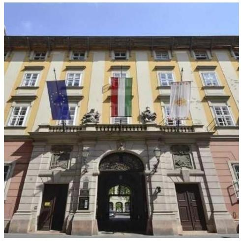

A főváros lakosainak száma 2020. január 1-jén 1 750 216 fő volt, amely 2023. január 1-jére 4,4%-kal 1 674 014 főre csökkent.

A Fővárosi Önkormányzat Közgyűlését az ellenőrzött időszakban 33 fő alkotta, amelynek munkáját a 2022. december 31-ei állapot szerint öt állandó bizottság segítette. A főpolgármester személye a 2019. évi önkormányzati képviselő- és főpolgármester választást követően változott, a főjegyző 2019. november 11-étől látta el feladatait. A Fővárosi Önkormányzat feladatainak végrehajtása érdekében a Főpolgármesteri Hivatal 10 mellett a 2020. évben 26, a 2022. évben 23 költségvetési szervet működtetett, amelyekből a 2020. évben 20, a 2022. évben 17 rendelkezett gazdasági szervezettel.

A 2021. évben három költségvetési intézményt megszüntettek, amelyek közül a Mozaik Gazdasági Szolgáltató Szervezet 2021. március 31-ével, a CSAPI 11 2021. május 31-ével szűnt meg jogutód nélkül. A Mozaik Gazdasági Szolgáltató Szervezet által ellátott közfeladatok ellátását más, a fenntartásában lévő költségvetési intézményekre, illetve tulajdonában álló gazdasági társaságokra telepítette a Fővárosi Önkormányzat. A CSAPI által ellátott közfeladatokat a Fővárosi Autópiac Kft. vette át, amely kibővített feladatokkal, új cégnév alatt, Budapest Vásárcsarnokai Kft. néven működött tovább. A Fővárosi Önkormányzat Baross utcai Idősek Otthona 2021. december 31-ével került megszüntetésre, amelynek jogutódja a Fővárosi Önkormányzat Vázsonyi Vilmos Idősek Otthona és a Fővárosi Önkormányzat Gödöllői Idősek Otthona lett. A Fővárosi Önkormányzat költségvetési intézményeinek tevékenység szerinti megoszlását az 1. ábra szemlélteti:

### *1. ábra*

**A FŐVÁROSI ÖNKORMÁNYZAT KÖLTSÉGVETÉSI INTÉZMÉNYEINEK TEVÉKENYSÉG SZERINTI MEGOSZLÁSA 2022. DECEMBER 31-ÉN (DB)**

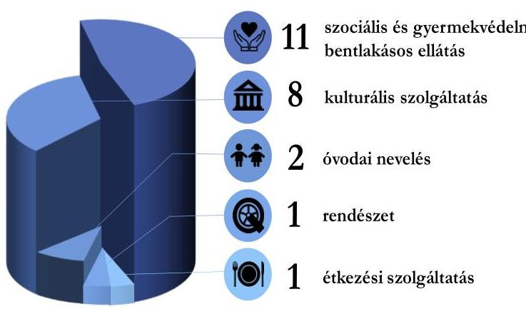

*Forrás: Fővárosi Önkormányzat 2022. évi zárszámadási rendelet előterjesztése alapján *432 saját szerkezés***

A Főpolgármesteri Hivatalban foglalkoztatottak átlagos statisztikai létszáma 2019. december 31-én 804 fő, 2022. december 31-én 862 fő volt, amelyből 2019-ben 707 fő, 2022-ben 677 fő köztisztviselő, valamint 97 fő, illetve 185 fő a Munka Törvénykönyve hatálya alá tartozó foglalkoztatott volt. A létszámnövekedést meghatározóan az informatikai és takarítási tevékenységek saját feladatellátásba történő visszaszervezése okozta. A költségvetési intézményekben foglalkoztatottak átlagos statisztikai létszáma a 2019. évi 4 287 főről a 2022. év végére 4,2%-kal 4 108 főre csökkent, elsődlegesen a feladatellátás 2021. évi strukturális változásai miatt.

A Fővárosi Önkormányzat mérleg adatait a 2020-2022. évekre vonatkozóan a IV. számú melléklet 1. táblázata mutatja be, amely alapján a Fővárosi Önkormányzat vagyona a 2020. január 1-jéről a 2022. év végére 2 338 599,7 M Ft-ról 2 687 846,0 M Ft-ra 14,9%-kal (349 246,3 M Ft-tal) emelkedett, alapvetően a befektetett eszközök értékének emelkedése miatt. A befektetett eszközök könyv szerinti értékének emelkedését

---

elsődlegesen a víziközmű vagyon - jogszabályi előíráson alapuló - bekerülési értékének 2022. évi újbóli megállapítása miatti növekedés eredményezte.

A feladatok ellátásában a 2019. évben 58, a 2022. évben 45 gazdasági társaság vett részt. A csökkenéshez főként a BVH Nonprofit Zrt. ${ }^{12}$-hez kötődő, a 2020. és a 2021. években lezajlott átalakulási folyamatok járultak hozzá, amely nyolc gazdasági társaság megszűnése mellett végül a BVH Nonprofit Zrt.-n belül egy egységes budapesti közműtársaság felállításával járt. Csökkenést eredményező összevonások a BKK Zrt. ${ }^{13}$ és a Fővárosi Csatornázási Művek Zrt. vezette vállalatcsoportokat érintően is lezajlottak. A megszűnések mellett gazdasági társaságok alapítására és részesedés szerzésére is sor került.

A többségi befolyás alatt álló gazdasági társaságok tevékenysége a Fővárosi Önkormányzat Mötv. ${ }^{14}$-ben rögzített kötelező feladatainak ellátásához kapcsolódott. A társaságok a 2022. év végén jellemzően előadóművészettel (13 gazdasági társaság), víziközmű-szolgáltatással és ahhoz kapcsolódó tevékenységekkel (10 gazdasági társaság), helyi közösségi közlekedés biztosításával, működtetésével és közlekedésszervezéssel (öt gazdasági társaság), valamint az integrált közműszolgáltatással (öt gazdasági társaság) kapcsolatos feladatellátásban vettek részt.

A Fővárosi Önkormányzat többségi befolyása alatt álló gazdasági társaságok - a konszolidált adatok figyelembevételével - összesített mérlegfőösszege a 2019. évről a 2022. évre 10,4\%-kal (145 550,0 M Ft-tal) 1546 108,7 M Ft-ra nőtt, amellyel párhuzamosan az összesített saját tőke értéke 15,2\%-os változást mutatva 515 547,4 M Ft-ról 437 548,9 M Ft-ra csökkent. A mérlegfőösszeg és egyes mérlegsorok összesített záróállományának alakulását a 2020-2022. években a IV. számú melléklet 2. táblázat mutatja be.

---

# ÖSSZEFOGLALÁS 

Az ÁSZ az államháztartás gazdálkodásának ellenőrzése keretében ellenőrzi a helyi önkormányzatok gazdálkodását, továbbá általános hatáskörrel végzi a közpénzekkel való felelős gazdálkodás ellenőrzését. Az Alaptörvény az önkormányzatoktól is elvárja a kiegyensúlyozott, átlátható és fenntartható költségvetési gazdálkodás elvének érvényesítését. A Fővárosi Önkormányzat által ellátott feladatok sokrétűek, a társadalom jelentős részét érintik, ezért múködése és gazdálkodása a közérdeklődés középpontjában áll. Mindezek alapján került sor a Fővárosi Önkormányzat múködésének és gazdálkodásának ellenőrzésére.

A Fővárosi Önkormányzatnál a 2022. és 2023. évi költségvetés tervezése, a költségvetési rendeletek előkészítése, tartalma és jóváhagyása nem minden tekintetben volt szabályszerű. A főjegyző a 2022. évi költségvetés-tervezés rendjét, az eljárási szabályokat és a folyamatba épített kontrollpontokat nem megfelelően szabályozta, amely hiányosságok a 2022. évben megszüntetésre kerültek. A főjegyző a jogszabályi előírásokat figyelmen kívül hagyva a 2022. és 2023. évi költségvetési rendelettervezetek költségvetési szervek vezetőivel történt egyeztetésének eredményét írásban nem rögzítette, ezáltal a főpolgármester az egyeztetések eredményét nem terjesztette a Közgyűlés bizottságai elé. A főpolgármester által a Közgyűlés elé határidőben beterjesztett rendelettervezetekhez a jogszabályi előírások ellenére nem csatolták a Pénzügyi és Közbeszerzési Bizottság rendelettervezetekről alkotott írásos véleményét.

A középtávú tervszámokat tartalmazó - 2022. és 2023. évi költségvetési rendeletek elfogadásáig hozott - határozatok nem biztosították a saját bevételek, illetve adósságot keletkeztető ügyletből származó tárgyévi összes fizetési kötelezettség jogszabályban előírtak szerinti bemutatását.

A 2022. évi ${ }^{15}$ és 2023. évi költségvetési rendeletek ${ }^{16}$ jogszabályi előírásoknak való teljeskörű tartalmi megfelelése nem volt biztosított, mivel a 2022. és 2023. évi költségvetési rendeletekben nem mutatták be a 353/2011. (XII. 30.) Korm. rendelet ${ }^{17}$ 2. $\int(1)$ bekezdésben meghatározottak szerinti saját bevételeket, továbbá a 2023. évi költségvetési rendelet önkormányzati szinten nem tartalmazta a költségvetési egyenleg összegét működési bevételek és működési kiadások egyenlege, felhalmozási bevételek és felhalmozási kiadások egyenlege szerinti bontásban.

A költségvetés tervezésekor egyes bevételi előirányzatok (2022-2023. években a kamatbevételek, forgatási célú belföldi értékpapírok beváltásából, értékesítéséből származó finanszírozási bevétel; 2022-ben az egyéb működési célú támogatások; valamint 2023-ban a bankbetétek lekötésének megszüntetéséből származó finanszírozási bevételek) közgazdasági megalapozottságát a jogszabályi előírások ellenére nem biztosították. A kiadási előirányzatok tervezésének hiányossága volt, hogy a 2023. évi költségvetésben a szolidaritási hozzájárulás, valamint az Egészséges Budapest Program kiadási előirányzatát nem a jogszabályokban rögzített értékek alapulvételével tervezték meg.

A 2022. évi költségvetés módosítására, az előirányzatok nyilvántartására vonatkozó jogszabályi előírások nem érvényesültek teljeskörűen. A költségvetési kiadásokat a módosított előirányzatok mértékéig teljesítették.

A 2022. évi előirányzatok módosítása, átcsoportosítása során betartották a bizonylati elvre és a bizonylati fegyelemre vonatkozó előírásokat. A 2022. évi előirányzatokról vezetett nyilvántartás a jogszabályban előírt tartalmi követelmények közül nem tartalmazta az eredeti előirányzatok módosításainak, átcsoportosításainak dátumát, az elrendelő dokumentum azonosításához szükséges adatokat, valamint az előirányzat-módosítás, átcsoportosítás költségvetési rendeleten való átvezetésére vonatkozó adatokat.

---

A 2022. évi zárszámadás készítésének rendje szabályozott volt. A 2022. évi éves beszámolási és zárszámadási kötelezettség teljesítése maradéktalanul nem felelt meg a jogszabályi előírásoknak.

A Fővárosi Önkormányzat, valamint a Főpolgármesteri Hivatal költségvetési beszámolójában kimutatott kötelezettségvállalással terhelt maradvány összegét a jogszabályi előírások ellenére a részletező nyilvántartás nem támasztotta alá. A Fővárosi Önkormányzat és költségvetési szervei a 2022. évi éves költségvetési beszámolási kötelezettségének államháztartás információs rendszerében történő teljesítése megfelel a jogszabályi előírásoknak.

A Közgyűlés elé terjesztett 2022. évi zárszámadási rendelettervezet hiányossága volt, hogy a jogszabályban előírtakkal ellentétben nem tartalmazta a többéves kihatással járó döntések számszerúsítését a felhalmozási célú kiadások vonatkozásában. A 2022. évi zárszámadási rendelettervezetet a Pénzügyi és Közbeszerzési Bizottság a jogszabályban előírtak ellenére nem véleményezte. A 2022. évi zárszámadási rendelet ${ }^{18}$ nem tartalmazta összesítetten a költségvetési egyenleg összegét müködési bevételek és múködési kiadások egyenlege és felhalmozási bevételek és felhalmozási kiadások egyenlege szerinti bontásban, ezért az elfogadott költségvetéssel való összehasonlíthatóság a jogszabályban előírtak ellenére teljeskörűen nem volt biztosított. A Közgyűlés a 2022. évi maradványt szabályszerűen hagyta jóvá.

A 2022. és a 2023. évi költségvetési rendeletek, valamint a 2022. évi zárszámadási rendelet önkormányzati szintre összesítve nem tartalmazták a Fővárosi Önkormányzat költségvetési bevételi és költségvetési kiadási előirányzatait, illetve teljesítési adatait kiemelt előirányzatok, valamint kötelező, önként vállalt és államigazgatási feladatok szerinti bontásban, azonban a rendelettervezetek előterjesztésének függeléke azokat tartalmazta.

A Fővárosi Önkormányzat pénzügyi helyzete kedvezőtlenül alakult az ellenőrzött időszakban, amelyre a külső negatív tényezők (koronavírus járvány, gazdasági visszaesés, energiaválság, infláció) mellett az önkormányzatok gazdálkodását befolyásoló kormányzati intézkedések (szolidaritási hozzájárulás összegének emelése, mikro-, kis- és középvállalkozások helyi iparűzési adó mértékének 2\%-ról 1\%-ra történő csökkentése) is hatással voltak. A 2020-2022. évi költségvetési egyenleg negatív volt szemben a bázisévnek tekintett 2019. évivel.

A 2020-2022. években a müködési bevételek egyik évben sem nyújtottak fedezetet a müködési célú kiadásokra, amely pénzügyileg fenntarthatatlan helyzetet jelez. A 2020-2022. években képződött a bázisszinten számított müködési egyenleghez viszonyított - 186007,5 MFt müködési célú hiány kialakulásához alapvetően a személyi juttatások ( $17476,4 \mathrm{M}$ Ft-os), a dologi kiadások ( $7052,0 \mathrm{M}$ Ft-os) emelkedése, az önkormányzati tulajdonú gazdasági társaságoknak juttatott támogatások növekedése (110 644,2 MFt), valamint a fizetendő szolidaritási hozzájárulás összegének - elsődlegesen jogszabályi változásból adódó - emelkedése ( $62796,2 \mathrm{M}$ Ft) járult hozzá. A személyi juttatások összege egyrészt jogszabályi változások, másrészt önkormányzati döntésen alapuló bérfejlesztés miatt emelkedett. A dologi kiadások alakulására elsősorban az energiaárak 2022. évi jelentős emelkedése volt hatással. Az önkormányzati tulajdonú gazdasági társaságok közül a BKK támogatásának emelkedése volt a legjelentősebb, ugyanakkor a közösségi közlekedés ellátásához nyújtott állami támogatás összege az ellenőrzött években változatlanul 12 000,0 MFt volt.

A müködési célú kiadásokon belül az önként vállalt feladatokra fordított müködési kiadások aránya a 2019. évben 2,4\%, a 2022. évben 2,7\% volt, azonban a müködési célú hiánya nem emelkedett az ellenőrzött időszak éveiben, a 2019. évben 4 576,0 M Ft, 2022. évben 4 532,1 M Ft volt. A Fővárosi Önkormányzat feladatellátásának racionalizálásával kapcsolatos intézkedései nem voltak elégségesek a müködési egyensúly helyreállításához.

---

A felhalmozási költségvetés egyenlege is folyamatosan negatív összegű volt, a 2020-2022. években összesen 100 004,3 M Ft felhalmozási forráshiány keletkezett. Az ellenőrzött időszak kiemelt fejlesztéseinek megvalósítása jellemzően már a 2020. évet megelőzően elkezdődtek, finanszírozásuk döntően saját forrásból történt, mivel a központi támogatások, uniós források elmaradtak, továbbá a Fővárosi Önkormányzat és gazdasági társaságai fejlesztési célú hitelfelvételeihez a Kormány nem járult hozzá. A felhalmozási forráshiányhoz hozzájárult, hogy a 2021. és 2022. években az ingatlanokat az értékesítést megelőzően készletté sorolták át és az értékesítésből származó bevételeket működési bevételként mutatták ki. Az ingatlanok készletként történő értékesítéséből származó bevétel múködési célra történő felhasználása nem biztosította az önkormányzati vagyon megőrzését.

A Fővárosi Önkormányzat pénzügyi helyzetét nehezítette, hogy az ellenőrzött időszakot megelőzően felvett hitelekhez kapcsolódóan összesen 18 282,0 M Ft tőketörlesztési kötelezettség is terhelte az ellenőrzött évek költségvetését.

A 2020-2022. évi költségvetési hiányt és a hiteltörlesztési kötelezettséget az előző évek maradványa nem fedezte. A Fővárosi Önkormányzat a 2020-2022. évi hiányzó forrás (153 684,5 M Ft) finanszírozására a 2020. év elején államkötvényekben, lekötött bankbetétben rendelkezésre álló forrásokat felhasználta.

A 2023 I. félévi múködési költségvetés pozitív egyenlege 15 883,7 M Ft volt, amelyhez hozzájárult, hogy a Fővárosi Önkormányzat likviditási helyzetének javítása érdekében a gazdasági társaságok támogatási kiadásait a II. félévre ütemezték át. A múködési jövedelem a 2023. év I. félévi hiteltörlesztés (3 047,0 M Ft) forrását biztosította, továbbá a felhalmozási hiány ( $32426,4 \mathrm{MFt}$ ) egy részére nyújtott fedezetet. A fennmaradó felhalmozási hiányt az előző évi maradvány felhasználásával, valamint adott célra felhasználható támogatások elkülönített számlákon lévő összegeinek - belső eladósodást eredményező - átcsoportosításával finanszírozták.

A 2023. évben múködési kockázatot jelez, hogy a múködési bevételek között tervezett - készletek közé átsorolt - ingatlanok értékesítéséből származó bevétel a 2022. évhez hasonlóan várhatóan alulteljesül, mivel a tervezett 13 071,5 M Ft előirányzatból 2023 szeptember végéig mindössze 313,9 M Ft bevétel realizálódott.

A felhalmozási kiadások finanszírozásának kockázatát növeli, hogy a Kormány a 2023-ban tervezett 16 582,8 M Ft adósságot keletkeztető ügylet megkötéséhez nem járult hozzá. További kockázatot hordoz, ha a felhalmozási kiadások forrásaként - az Integrált Közlekedésfejlesztési Operatív Program keretében - tervezett európai uniós támogatási bevételek nem realizálódnak.

A fejlesztési célú pénzintézeti hitelállomány a 2020. január 1-jei 112 842,1 M Ft-ról, 2022. december 31-re 160 199,2 M Ft-ra nőtt, mivel az ellenőrzött időszakot megelőzően megkötött hitelkeretszerződések utolsó részleteinek lehívására 2021-ben került sor, összesen 65 639,2 M Ft összegben.

A Fővárosi Önkormányzat likviditási nehézségei áthidalásához a 2020-2022. években 25 000,0 M Ft folyószámla hitelkerettel rendelkezett, egyéb likviditási célú hitelt nem vett igénybe. A 2020-2022. években a folyószámlahitellel zárt napok száma és a folyószámlahitel átlagos napi állománya egyaránt 2022-ben volt a legmagasabb. A likviditási nehézségek 2023. év I. félévében fokozódtak, a folyószámlahitel átlagos napi állománya az előző évi duplájára nőtt, 2023. július 14. - szeptember 20. között szükségessé vált a folyószámla hitelkeret 40 000,0 M Ft-ra történő emelése is. Ezentúl a likviditási helyzet javítása érdekében az iparűzési adó beszedési számlára befolyt adóbevételből több alkalommal előleget vettek igénybe.

A finanszírozási bevételek 2023. évi tervezésének megalapozottsága hiányában kockázatot jelent a tervezett kiadások fedezetének biztosítása. A költségvetés végrehajtása során további kockázatot

---

jelent az elkülönített számlákról finanszírozásba bevont források visszapótlási kötelezettségének teljesíthetősége.

A Fővárosi Önkormányzatnál és költségvetési szerveinél a 2020. év elején a költségvetési évben esedékes kötelezettségeknek 37,8\%-a volt a lejárt kötelezettség, ez az arány a 2022. év végére 6,4\%-ra csökkent. A 2023. év I. félév végén $420,7 \mathrm{M}$ Ft volt a lejárt állomány, amelynek $92,6 \%$-a 30 napon belüli tartozás volt. A lejárt kötelezettségek nem a likviditási nehézségekből adódtak, hanem jellemzően a késedelmesen beérkezett számlák, valamint a vitatott tartozások nem kerültek határidőben kifizetésre.

A 2020-2022. évek zárómérlegeiben kimutatott követelésállomány 98,6-99,0\%-ban a Fővárosi Önkormányzat követelése volt és jellemzően a közhatalmi bevételekhez kapcsolódott. A Fővárosi Önkormányzat és költségvetési szerveinek lejárt követelésállománya 2020. január 1-jétől 2022. év végére 28,0\%kal 6 342,4 M Ft-ra csökkent, 2023 I. félév végén 8 477,6 M Ft volt. A 2020. év elején a követelések 9,7\%-a, a 2022. év végén 5,5\%-a, 2023 I. félév végén 3,4\%-a volt határidőn túli követelés. A lejárt követelések behajtására intézkedtek, illetve behajthatatlanná minősítésre és követelés elengedésre is sor került.

A többségi befolyás alatt álló gazdasági társaságok szerepe a közfeladatellátásban meghatározó volt, működtetésük a 2020-2022. években a 2019. évi bázisszinthez képest jelentős többletterhet rótt a Fővárosi Önkormányzat költségvetésére. A feladatellátáshoz nyújtott múködési célú támogatások összege a 2020-2022. években $110644,2 \mathrm{M}$ Ft-tal 30,3\%-kal haladta meg a bázisszintet, $476004,6 \mathrm{M}$ Ft volt, amelyből $90 \%$-ot meghaladóan a Meghatározó Társaságok részesültek. A legnagyobb összegű működési támogatást a BKK Zrt. közösségi közlekedés közlekedésszervezési feladataihoz való hozzájárulás képezte, amely a 2020-2022. években összesen 390 749,0 M Ft-ot jelentett (a bázisszintet 114 882,4 M Ft-tal haladta meg). A veszteséges gazdálkodás miatti tőkevesztés rendezése, illetve a múködéshez szükséges pénzügyi forrás biztosítása érdekében összesen 3283,5 M Ft összegben került sor tőkeemelésre az érintett gazdasági társaságoknál, valamint az átmeneti likviditási nehézségek áthidalására, meghatározott fejlesztési célokra 9 653,6 M Ft összegben nyújtott kölcsönt a Fővárosi Önkormányzat. A 2020-2022. években összesen 4 427,2 M Ft osztalékbevételt kapott a Fővárosi Önkormányzat.

Működési kockázatot jelez, hogy a Fővárosi Önkormányzat költségvetéséből nyújtott múködési és fejlesztési támogatások növekedése ellenére a 2020-2022. években a gazdasági társaságok cégháló szintű jövedelmezősége csökkent, eladósodottsága növekedett.

Az ellenőrzés során feltárt hiányosságok megszüntetése érdekében az ÁSZ a főpolgármester részére három, a főjegyző részére hét javaslatot fogalmazott meg.
Az ellenőrzött szervezet vezetője az ÁSZ tv. 29. § (2) bekezdés szerinti, a jelentéstervezet megállapításaira tett észrevételében arról tájékoztatta az ÁSZ-t, hogy intézkedéseket tett a hiányosságok megszüntetésére a 2024. évi költségvetési rendelettervezet költségvetési szervek vezetőivel történtő egyeztetésre vonatkozóan, valamint a 2023. évi módosított költségvetési rendeletben és a 2024. évi költségvetési rendeletben önkormányzati szinten a költségvetési egyenleg összege múködési bevételek és múködési kiadások egyenlege, felhalmozási bevételek és felhalmozási kiadások egyenlege szerinti bontásban történő bemutatására. Az ellenőrzés folyamatában megtett intézkedések hozzájárulhatnak a jelentés megállapításainak hasznosulásához.

---

# AZ ELLENŐRZÉS FÓKUSZTERÜLETEI 

1.     - A költségvetés-tervezési folyamat szabályozottsága, a költségvetés tervezésére, a költségvetési rendelet előkészitésére, tartalmára és jóváhagyására vonatkozó előírások betartása
2.     - A költségvetés módosításának, az előirányzatok nyilvántartásának és betartásának szabályszerüsége
3.     - A zárszámadás-készitési folyamat szabályozottsága, az éves beszámolási és zárszámadási kötelezettség teljesitésének szabályszerüsége
4.     - Az Önkormányzat pénzügyi helyzetének alakulása

---

# 1. A költségvetés-tervezési folyamat szabályozottsága, a költségvetés tervezésére, a költségvetési rendelet előkészítésére, tartalmára és jóváhagyására vonatkozó előírások betartása 

Összegző megállapítás

1.1. számú megállapítás

A főjegyző a 2022. évi költségvetés-tervezés rendjét nem megfelelően szabályozta. A 2023. évi költségvetés-tervezés folyamata szabályozott volt. A Fővárosi Önkormányzatnál a 2022. és 2023. évi költségvetés tervezése, a költségvetési rendeletek előkészítése, tartalma és jóváhagyása nem minden tekintetben volt szabályszerű.
A 2022. évi költségvetés-tervezés rendjét nem megfelelően szabályozták. A 2023. évi költségvetés-tervezés folyamata szabályozott volt. A 2022. évi, valamint a 2023. évi költségvetési rendelettervezet előterjesztése, a költségvetési rendelet tartalma és jóváhagyása nem felelt meg teljeskörűen a jogszabályi előírásoknak.

A saját bevételekről és az adósságot keletkeztető ügyletekből eredő fizetési kötelezettségekről - az Áht. 29/A. §-a alapján - a 2022. és 2023. évi költségvetési rendeletek elfogadásáig hozott határozatok három évre összesített adatokat tartalmaztak, így azok nem biztosították annak bemutatását, hogy teljesülte a Gst. ${ }^{19}$ 10. § (5) bekezdés előírása, amely szerint az önkormányzat adósságot keletkeztető ügyletekből származó tárgyévi összes fizetési kötelezettsége egyik évben sem haladhatja meg az önkormányzat adott évi saját bevételeinek $50 \%$-át.
A főjegyzö a 2022. évi, valamint a 2023. évi költségvetési rendelettervezetet az Áht. szerint a Közgyűlés által elfogadott középtávú tervszámok figyelembevételével előkészítette, a tervszámoktól való - külső gazdasági feltételek tervszámok elfogadását követően bekövetkezett lényeges változásából eredő - eltéréseket és azok indokát az Áht. előírásait betartva a költségvetési rendelettervezetek előterjesztésében ismertette.
A főjegyzö az Ávr. ${ }^{20}$ 27. § (1) bekezdés előírását figyelmen kívül hagyva a 2022. évi, illetve a 2023. évi költségvetési rendelettervezet költségvetési szervek vezetőivel történt egyeztetésének eredményét írásban nem rögzítette, ezáltal a főpolgármester az egyeztetések eredményét nem terjesztette a Közgyűlés bizottságai elé.
A főpolgármester a 2022. évi, valamint a 2023. évi költségvetési rendelettervezetet az Áht.-ban előírt határidőben a Közgyűlésnek benyújtotta, azonban a rendelettervezetek Közgyűlés elé terjesztéséhez az Ávr. 27. § (2) bekezdésében foglaltak ellenére a Pénzügyi és Közbeszerzési Bizottság írásos véleményét nem csatolta.
A 2022. évi, valamint a 2023. évi költségvetés előterjesztésekor az Áht.-ban előírt mérlegek és kimutatások a Közgyűlés részére tájékoztatásul bemutatásra kerültek. A könyvvizsgáló véleménye

---

szerint a 2022., valamint a 2023. évi költségvetésről szóló rendelettervezetek tárgyalásra és rendeletalkotásra alkalmasak voltak.
A Közgyűlés az Áht.-ban előírt határidőben a költségvetési rendelettervezeteket megtárgyalta és elfogadta. A költségvetési rendeletek azonban teljeskörüen nem feleltek meg a jogszabályi előirásoknak, mivel

- az Áht. 23. § (2) bekezdés c) pontjában foglaltak ellenére a 2023. évi költségvetési rendelet normaszövege és melléklete - önkormányzati szinten nem tartalmazta a költségvetési egyenleg összegét működési bevételek és működési kiadások egyenlege, felhalmozási bevételek és felhalmozási kiadások egyenlege szerinti bontásban;
- az Áht. 23. § (2) bekezdés g) pontjában foglaltak ellenére a 2022. és 2023. évi költségvetési rendeletekben nem mutatták be a 353/2011. (XII. 30.) Korm. rendelet 2. § (1) bekezdésben meghatározottak szerinti saját bevételeket.
A 2022. és a 2023. évi költségvetési rendeletek - normaszövege és melléklete - önkormányzati szintre összesítve nem tartalmazták a Fővárosi Önkormányzat költségvetési bevételi előirányzatait és költségvetési kiadási előirányzatait kiemelt előirányzatok, valamint kötelező feladatok, önként vállalt feladatok és államigazgatási feladatok szerinti bontásban, azonban a költségvetési rendelettervezet előterjesztésének függeléke azokat tartalmazta.
A Fővárosi Önkormányzat és az általa irányított költségvetési szervek az Áht. előírásainak eleget téve a 2022. évi költségvetési rendeletben megállapított bevételi és kiadási előirányzatok egységes rovatrend szerinti részletezéséről az elemi költségvetést elkészítették, arról az Ávr.-ben előírt határidőben a Kincstár által működtetett elektronikus adatszolgáltató rendszerben adatot szolgáltattak. A Fővárosi Önkormányzat 2022. évi elemi költségvetésének jóváhagyása nem felelt meg az Ávr. 33. § (1) bekezdésben előírtaknak, mivel az általános főpolgármester-helyettes Főpolgármesteri Hivatali SZMSZ ${ }^{21}$ 27. § (1) bekezdés a) pont szerinti helyettesítési jogkörében történt aláírása nem volt szabályszerű. A főpolgármester-helyettes aláírása a Kiadmányozás rendje ${ }^{22}$ 9. § (1) és (3) bekezdésében foglaltak ellenére nem tartalmazta a főpolgármesteri bélyegző lenyomatát, a kiadmányozási jogkör gyakorló nevének és tisztségének megjelölését, valamint a „főpolgármester hatáskörében eljárva" szöveget.
A főjegyző a 2022. évi költségvetés-tervezés rendjét, az eljárási szabályokat és a folyamatba épített kontrollpontokat nem megfelelően szabályozta, mivel
- az Ávr. 10/A. §-ában, továbbá a Főpolgármesteri Hivatali SZMSZ 104. §-ban előírtak ellenére a Költségvetési Tervezési és Felügyeleti Főosztály 2021. december 18-ig, a Pénzügyi, Számviteli és Vagyonnyilvántartási Főosztály 2021. november 28 -ig ügyrenddel nem rendelkezett;
- a Bkr. ${ }^{23}$ 6. § (3) bekezdése, valamint a Főpolgármesteri Hivatali SZMSZ 105. § (3) bekezdés előírása ellenére a Költségvetési Tervezési és Felügyeleti Főosztálynak 2022. február 4-ig, a Pénzügyi, Számviteli és Vagyonnyilvántartási Főosztálynak 2021. november 28 -ig ellenőrzési nyomvonala nem volt, valamint
- az Ávr. 13. § (2) bekezdés a) pontjában foglaltak ellenére a tervezéssel kapcsolatos belső előírásokat, feltételeket belső szabályzatban nem rendezték.
A szabályozási hiányosságok miatt a főjegyző a Főpolgármesteri Hivatalnál a 2022. évi költségvetés tervezése során nem érvényesítette a Bkr. 6. § (1) bekezdés a) -b) pontjának azon előírását, amely szerint olyan kontrollkörnyezetet kell kialakítania, amelyben a folyamatok átláthatóak, egyértelműek a

---

felelősségi, hatásköri viszonyok és feladatok. A szabályozási hiányosságok 2022. évi megszüntetésével a 2023. évi költségvetési tervezés folyamata már szabályozott volt.
1.2. számú megállapítás

A 2022. és 2023. évi költségvetés tervezése során az egyéb közhatalmi bevételek előirányzatának tervezése közgazdaságilag megalapozott volt. A kamatbevételek és más nyereségjellegủ bevételek, a forgatási célú belföldi értékpapírok beváltására, értékesítésére tervezett finanszírozási bevétel 2022-2023. évi, a kieső adóbevétel kompenzálására tervezett egyéb múködési célú támogatás 2022. évi, továbbá a lekötött bankbetét megszüntetésére tervezett finanszírozási bevétel 2023. évi költségvetésben tervezett előirányzatának közgazdasági megalapozottsága a jogszabályi előírás ellenére nem volt biztosított.

A Fővárosi Önkormányzat a 2022., valamint 2023. évi költségvetés tervezésekor az Áht.-ban foglaltaknak megfelelően az egyéb közhatalmi bevételek megalapozottságát biztosította. A tervezett bevételi előirányzatot számításokkal, érdemi indoklásokkal alátámasztotta, a tervezés során a bevételt befolyásoló szerkezeti változásokat, valamint a Fővárosi Önkormányzat és kerületek közötti forrásmegosztási szabályokat figyelembe vette.
A 2022., valamint a 2023. évi költségvetésben a kamatbevételek és más nyereségjellegủ bevételek előirányzaton pénzügyi műveletekből származó kamatbevételt, önkormányzati tulajdonú gazdasági társaságnak nyújtott kölcsön után járó kamatot, valamint részletre történt lakásértékesítések törlesztőrészletének nem határidőben történő teljesítésével összefüggő kamatbevételt terveztek. A kölcsönnyújtáshoz és lakásértékesítéshez kapcsolódó kamatbevételt indoklással alátámasztották. A pénzügyi műveletek kamatbevételeit - amely a kamatbevételek és más nyereségjellegủ bevételek előirányzatának 2022-ben 99,2\%-át (1 489,4 M Ft-ot), 2023-ban 99,3\%-át (5 959,7 M Ft-ot) jelentette számításokkal nem támasztották alá, a tervezés során a kamatbevételt befolyásoló tényezőket (az értékpapírállomány változása, befektethető, leköthető szabad pénzeszközök összege, futamidő, jegybanki alapkamat stb.) nem vették figyelembe, ezáltal az Áht. 4. § (2) bekezdésében foglaltak ellenére a kamatbevételek és más nyereségjellegú bevételek előirányzata összességében nem volt megalapozott.
A Fővárosi Önkormányzat a 2022. évi költségvetésben egyéb múködési célú támogatások előirányzaton a koronavírus járvány miatt kieső adóbevételek ellentételezésére 20 520,0 M Ft kormányzati kompenzációt tervezett a 641/2021. (XI. 25.) Korm. rendelettel ${ }^{24}$ módosított 535/2020. (XII. 1.) Korm. rendeletre ${ }^{25}$ hivatkozva. A hivatkozott jogszabály, illetve a tervezés időszakában hatályos egyéb jogszabály a kieső adóbevételek kompenzációjáról nem rendelkezett, továbbá a Fővárosi Önkormányzat a kompenzálásra vonatkozóan megállapodással, konvencióval sem rendelkezett, ezért a tervezett bevétel közgazdasági megalapozottsága az Áht. 4. § (2) bekezdésének előírása ellenére nem volt biztosított.
A Fővárosi Önkormányzat a 2022. évi költségvetésben forgatási célú belföldi értékpapírok beváltásából, értékesítéséből 32 299,3 M Ft finanszírozási bevételt irányozott elő. A 2022. évi költségvetés készítésekor nem vették figyelembe, hogy az értékpapírállomány a tervezés időszakában folyamatosan beváltásra került, és a 2022. évi költségvetés - 2021. december 15-ei - elfogadásakor, valamint a 2022. évi költségvetési rendelet 2022. január 1-jei hatályba lépésekor a tervezett 32 299,3 M Ft helyett, csak 23 176,2 M Ft forgatási célú értékpapírral rendelkeztek.
A Fővárosi Önkormányzat a 2023. évi költségvetésben finanszírozási bevételek közt forgatási célú belföldi értékpapírok beváltásából, értékesítéséből 17 411,3 M Ft, bankbetétek lekötésének megszüntetéséből

---

30 434,5 M Ft előirányzatot tervezett. A 2023. évi költségvetés készítésekor - az előző évi tervezéshez hasonlóan - nem számoltak azzal, hogy az értékpapírállomány, valamint a lekötött bankbetét a tervezés időszakában folyamatosan beváltásra, illetve megszüntetésre került, így a 2023. évi költségvetés 2022. december 14-ei elfogadásakor a rendelettervezetben kimutatott finanszírozási források helyett már 6,9 Mrd Ft-tal kevesebb értékpapírral, és 3,2 Mrd Ft-tal kevesebb lekötött bankbetéttel rendelkeztek. Az értékpapírállomány és a lekötött bankbetét 2022. december 31-ig teljeskörűen beváltásra, illetve megszüntetésre került, így a 2023. évi költségvetési rendelet 2023. január 1-jei hatálybalépésekor a két jogcímen tervezett összesen 47 845,8 M Ft finanszírozási bevétel alapjául szolgáló vagyonelemmel a Fővárosi Önkormányzat nem rendelkezett.
Az Áht. 4. § (2) bekezdésében foglaltak ellenére a 2022. és a 2023. évi költségvetésben a forgatási célú belföldi értékpapírok beváltásából, értékesítéséből, továbbá a 2023. évi költségvetésben a lekötött bankbetét megszüntetéséből előirányzott finanszírozási bevétel tervezésének megalapozottsága nem volt biztosított.
1.3. számú megállapítás

A 2022. évi költségvetés tervezése során az ellenőrzött előirányzatok esetében biztosították, hogy a feladatellátáshoz indokoltan szükséges kiadások megtervezésre kerüljenek. A 2023. évi költségvetésben az ellenőrzött előirányzatoknál - a szolidaritási hozzájárulás, valamint az Egészséges Budapest Program kiadási előirányzata kivételével - a feladatellátáshoz szükséges kiadások megtervezése biztosított volt.

A 2022. és a 2023. évi költségvetés készítésekor az egyéb szolgáltatások, valamint az államháztartáson kívülre nyújtott egyéb működési célú támogatások előirányzatának tervezésekor figyelembe vették az előző évi előirányzatnak és várható teljesítésnek az adatait, az infláció tervezéskor ismert mértékét, az eseti jelleggel előforduló kiadásokat, az áthúzódó kifizetéseket és az érvényes szerződésekben, megállapodásokban, illetve közgyűlési határozatokban előzetesen vállalt kötelezettségeket. A Fővárosi Önkormányzat a tulajdonában lévő gazdasági társaságoktól üzleti előtervet kért, annak érdekében, hogy a tervezés során a gazdasági társaságok által biztosított közszolgáltatásokhoz az indokoltan szükséges kiadásokkal tervezzen.
A kamatkiadások előirányzata - a 2022. évi és 2023. évi költségvetésben - a fejlesztési hitelek részletes számításokkal alátámasztott kamatkiadásait, valamint a folyószámlahitel igénybevételhez - tervezéskor ismert jegybanki alapkamat figyelembevételével - becsült kamatkiadást tartalmazta.
Az egyéb szolgáltatások, az államháztartáson kívülre nyújtott egyéb múködési célú támogatások, valamint a kamatkiadások 2022. és 2023. évi előirányzatának tervezése során az Áht. előírása szerint a feladatok ellátásához indokoltan szükséges kiadásokat tervezték meg.
A Fővárosi Önkormányzat a 2023. évi költségvetési rendeletében szolidaritási hozzájárulás jogcímen történő elvonásra 35 674,7 M Ft-ot tervezett, amely 22 130,3 M Ft-tal volt kevesebb mint a 2023. évi Kvtv. ${ }^{26}$ 43. § (4) bekezdés és 2. melléklet 57.4 pontban meghatározott paraméterek szerint a Fővárosi Önkormányzatot terhelő fizetési kötelezettség. Ezáltal a Fővárosi Önkormányzat az Áht. 4. § (2) bekezdésében előírtak ellenére a helyi önkormányzatok törvényi előíráson alapuló befizetései előirányzat tervezésekor nem biztosította, hogy az indokoltan szükséges kiadás megtervezésre kerüljön.
A Kormány ${ }^{27}$ a fővárosi egészségügyi alapellátás és járóbeteg-szakellátás fejlesztésének az Egészséges Budapest Program keretében történő megvalósításával kapcsolatos feladatokhoz a 2020. évben

---

2000,0 M Ft, a 2021. évben 750,0 M Ft támogatást biztosított a Fővárosi Önkormányzat részére a képalkotó diagnosztikai várólisták megszüntetésére irányuló törekvésének megvalósítása érdekében. A program a koronavírus járvány miatt azonban a tervezettnél lassúbb ütemben valósult meg, ezért a Kormány a támogatási időszakot 2024. december 31-ig meghosszabbította, továbbá a 2021. évi támogatás felhasználásának keretét a szövettani vizsgálatok elvégzésének lehetőségével bővítette. A támogatásból a Fővárosi Önkormányzat a 2020-2022. években összesen 502,6 M Ft-ot használt fel és a 2023. évi költségvetésben eredeti kiadási előirányzatként 2 224,2 M Ft tervezett. Az előirányzat tervezése a 2023. évben nem felelt meg az Áht. 4. § (2) bekezdés előírásainak, mivel a támogatás előző évi maradványából 23,2 M Ft felhasználását nem tervezték meg, és azt a 2022. évi maradványkimutatás analitikájában - mint cél szerinti felhasználási kötelezettséggel terhelt maradványt - sem szerepeltették.

# 2. A költségvetés módosításának, az előirányzatok nyilvántartásának és betartásának szabályszerűsége 

## Összegző megállapítás

2.1. számú megállapítás

A 2022. évi költségvetés módosítására, az előirányzatok nyilvántartására vonatkozó jogszabályi előírások teljeskörűen nem érvényesültek. A költségvetési kiadásokat a módosított előirányzatok mértékéig teljesítették.
A 2022. évi költségvetés ellenőrzött bevételi és kiadási előirányzatainak módosítása, átcsoportosítása egy tétel kivételével szabályszerű volt.

A Fővárosi Önkormányzat ellenőrzött előirányzatainak módosítása, átcsoportosítása során a hatáskörgyakorlás egy mintatétel esetében nem volt szabályszerű, mivel a kiemelt előirányzaton belüli rovatok közötti átcsoportosítást az Ávr. 43/A. § (3) bekezdésben foglaltak ellenére - főpolgármester írásbeli kijelölése hiányában - arra nem jogosult személy végezte el.
Az előirányzatok módosítása, átcsoportosítása során betartották a Számv. tv. ${ }^{28}$ bizonylati elvre és a bizonylati fegyelemre vonatkozó előírásait, azok főkönyvi nyilvántartásba vétele megfelelt az Áhsz. ${ }^{29}$ előírásainak.
2.2. számú megállapítás

A 2022. évi előirányzatokról vezetett nyilvántartás tartalmilag nem felelt meg a jogszabályi előírásoknak. A költségvetési kiadásokat a módosított előirányzatok mértékéig teljesítették.

A Fővárosi Önkormányzatnál a 2022. évi előirányzatokról nyilvántartást vezettek, de nem tartották be a nyilvántartás kötelező minimum tartalmára vonatkozó - az Áhsz. 39. § (3) bekezdése alapján az Áhsz. 14. mellékletében megállapított követelményeket. Az előirányzatok nyilvántartása az Áhsz. 14. melléklet I. 2. b) és d) pontokban előírtak ellenére nem tartalmazta az eredeti előirányzatok módosításainak, átcsoportosításainak dátumát, valamint az elrendelő dokumentum azonosításához szükséges adatokat és az előirányzat-módosítás, átcsoportosítás költségvetési rendeleten való átvezetésére vonatkozó adatokat.
Az Áhsz. 14. melléklet I. 1. pontjában foglaltak ellenére az előirányzatok részletező nyilvántartásának folyamatos vezetéséről nem gondoskodtak, az előirányzat minden változását nem jegyezték fel a változást követően azonnal, mivel az 1. mintatétel két eltérő időpontban és hatáskörben végrehajtott előirányzat-átcsoportosítást takart.

---

A 2022. évi módosított előirányzatok tekintetében az utolsó módosított költségvetési rendelet, a zárszámadási rendelet és az éves költségvetési beszámoló adatai közötti egyezőség biztosított volt, az Áht.ben foglaltaknak megfelelően az előírt határidőig az előirányzat-módosítások, előirányzatátcsoportosítások a költségvetési rendeleten átvezetésre kerültek. Az ellenőrzéssel érintett rovatok esetében az előirányzatok módosításainak, átcsoportosításainak összesített értékadata az Áhsz. előírásával összhangban alátámasztotta az éves költségvetési beszámolóban és a főkönyvi nyilvántartásban foglaltakat.
A 2022. évben a Fővárosi Önkormányzat az Áht. előírásának megfelelően a költségvetési kiadásokat a módosított előirányzat mértékéig teljesítette és a tárgyévi előirányzat terhére vállalt kötelezettségek összege sem haladta meg a tárgyévi módosított előirányzatok összegét.

# 3. A zárszámadás-készítési folyamat szabályozottsága, az éves beszámolási és zárszámadási kötelezettség teljesítésének szabályszerűsége 

Összegző megállapítás A 2022. évi zárszámadás készítésének rendje a Főpolgármesteri Hivatalnál szabályozott volt. Az Önkormányzati SZMSZ a Pénzügyi és Közbeszerzési Bizottság feladatai tekintetében nem volt összhangban az Mötv.-ben foglaltakkal. A 2022. évi éves beszámolási és zárszámadási kötelezettség teljesítése maradéktalanul nem felelt meg a jogszabályi előírásoknak.
3.1. számú megállapítás

A főjegyző a 2022. évi zárszámadás elkészítésének rendjét szabályozta. A 2022. évi éves költségvetési beszámolási kötelezettség államháztartás információs rendszerében történő teljesítése szabályszerű volt. A Fővárosi Önkormányzat és Főpolgármesteri Hivatal 2022. évi költségvetési beszámolójában kimutatott maradvány összegeket a részletező nyilvántartás nem támasztotta alá.

A 2022. évi zárszámadás elkészítésének rendjét szabályozták, az eljárási szabályokat és a folyamatba épített kontrollpontokat a Főpolgármesteri Hivatali SZMSZ-ben, valamint az érintett szervezeti egységek ügyrendjében meghatározták.
A Fővárosi Önkormányzat és költségvetési szervei a 2022. évi éves költségvetési beszámolót az Áhsz.-ben előírtak szerint, határidőben feltöltötték a Kincstár által múködtetett elektronikus adatszolgáltató rendszerbe, valamint a Fővárosi Önkormányzat szabályosan hagyta jóvá az általa irányított költségvetési szervek 2022. évi éves költségvetési beszámolóit. A Fővárosi Önkormányzat 2022. évi éves költségvetési beszámolójáról készült független könyvvizsgálói jelentésben rögzített könyvvizsgálói vélemény szerint a beszámoló megbízható és valós képet adott a Fővárosi Önkormányzat 2022. évi éves költségvetésének teljesítéséről, a 2022. december 31-én fennálló vagyoni- és pénzügyi helyzetről, valamint a 2022. költségvetési évre vonatkozó jövedelmi helyzetéről.
A Fővárosi Önkormányzat és költségvetési szervei a 2022. évi maradványt az Ávr. előírásaival összhangban az éves beszámoló készítésekor megállapították. A Fővárosi Önkormányzat és a Főpolgármesteri Hivatal beszámolójában kimutatott kötelezettségvállalással terhelt maradvány összegét azonban az Áhsz. 39. § (3) bekezdés előírása ellenére a részletező nyilvántartás nem

---

támasztotta alá. A 2022. évi költségvetési beszámoló 7. űrlapja a kötelezettségvállalással terhelt maradványt a Főpolgármesteri Hivatal esetében 87,8 M Ft-tal alacsonyabb, a Fővárosi Önkormányzat esetében 10 545,7 M Ft-tal magasabb összegben tartalmazta, mint a maradványt jóváhagyó közgyűlési határozatok előterjesztése szerinti részletező kimutatás. Az összes maradvány vonatkozásában az egyezőség biztosított volt.
3.2. számú megállapítás

A 2022. évi zárszámadási rendelettervezet előterjesztése, a zárszámadásról szóló rendelet tartalma teljeskörűen nem felelt meg a jogszabályi előírásoknak.

A 2022. évi zárszámadási rendelettervezetet a főpolgármester az Áht. -ban előírt határidőben a Közgyűlés elé terjesztette. A 2022. évi zárszámadási rendelettervezet előterjesztésekor hiányosság volt, hogy az Áht.ban felsorolt mérlegek és kimutatások közül az Áht. 91. § (2) bekezdés a) pontjában rögzítettekkel ellentétben a Közgyűlés részére tájékoztatásul nem mutatták be az Áht. 24. § (4) bekezdés b) pontja szerinti, többéves kihatással járó döntések számszerúsítését a felhalmozási célú kiadások (beruházások, felújítások) vonatkozásában.
A 2022. évi zárszámadási rendelettervezetet a Pénzügyi és Közbeszerzési Bizottság az Mötv. 120. § (1) bekezdés a) pontjában előírtakkal ellentétben nem véleményezte. Az Mötv. 57. § (1) bekezdése ellenére az Önkormányzati SZMSZ ${ }^{30}$ 47. § (1) bekezdés c) pontja a Pénzügyi és Közbeszerzési Bizottság feladatait hiányosan írta elő, mivel az az Mötv. 120. § (1) bekezdés a) pont szerinti, az éves költségvetési javaslat és a végrehajtásáról szóló éves beszámoló tervezeteinek véleményezési feladatát nem tartalmazta.
Az Áht. 87. § b) pontjában előírt összehasonlíthatóság a 2022. évi zárszámadási rendelet és az elfogadott költségvetés között teljeskörűen nem volt biztosított, mivel az Áht. 23. § (2) bekezdés c) pontjában rögzítettek ellenére a 2022. évi zárszámadási rendelet nem tartalmazta összesítetten a költségvetési egyenleg összegét működési bevételek és működési kiadások egyenlege és felhalmozási bevételek és felhalmozási kiadások egyenlege szerinti bontásban.
A 2022. évi zárszámadási rendelet - normaszövege és mellékletei - önkormányzati szintre összesítve nem tartalmazták a Fővárosi Önkormányzat költségvetési bevételeit és kiadásait kiemelt előirányzatok, valamint kötelező feladatok, önként vállalt feladatok és államigazgatási feladatok szerinti bontásban, azonban a zárszámadási rendelettervezet előterjesztésének függeléke azokat tartalmazta.
A 2022. évi zárszámadási rendelet 2. számú mellékletét képezte a Fővárosi Önkormányzat - teljes futamidőre számított - adósságszolgálatáról készült Gst. 8. § (2) bekezdés szerinti kimutatás, amely megfelelt az Áht. előírásainak.
3.3. számú megállapítás
A 2022. évi maradvány Közgyűlés általi jóváhagyása szabályszerű volt.

A 2022. évi maradvány jóváhagyásáról szóló 404/2023. (05. 24.) számú közgyűlési határozat a Fővárosi Önkormányzat összes maradványát 15 680,6 M Ft összegben tartalmazta, egyezően a 2022. évi zárszámadási rendelet 1. § (3) bekezdés c) pontjával, valamint a 2022. évi költségvetési beszámoló 7. űrlapjának 15 . sorával.

A Fővárosi Önkormányzat költségvetési szervei maradványának elvonandó és felhasználható összegéről az Áht. előírásait betartva a Közgyűlés határozatban döntött.
A 405/2023. (05. 24.) számú közgyűlési határozat a költségvetési intézmények 2022. évi alaptevékenységének kötelezettségvállalással terhelt maradványát $2166,1 \mathrm{M}$ Ft összegben, a vállalkozási

---

tevékenység kötelezettségvállalással terhelt maradványát 137,7 M Ft összegben határozta meg, és döntött az 585,4 M Ft szabad maradvány elvonásáról.
A 406/2023. (05. 24.) számú közgyűlési határozat a Főpolgármesteri Hivatal 2022. évi alaptevékenysége kötelezettségvállalással terhelt maradványának felhasználását 119,0 M Ft összegben, a szabad maradvány elvonást 1275,0 M Ft összegben (szabad maradvány 100\%-a) tartalmazta.
A kapcsolódó előterjesztés mellékletét képező, szabad és kötelezettségvállalással terhelt maradvány értékeket részletező kimutatás a közgyűlési határozatokban foglalt maradvány összegeket alátámasztotta.

# 4. Az Önkormányzat pénzügyi helyzetének alakulása 

Összegző megállapítás

A Fővárosi Önkormányzat pénzügyi helyzete kedvezőtlenül alakult az ellenőrzött időszakban. A költségvetési hiány finanszírozására a 2020. év elején rendelkezésre álló - korábbi években meghozott döntések fedezetéül szolgáló, valamint szabad - forrásokat felhasználták. Az átmeneti likviditási problémák megoldására folyószámlahitelt vettek igénybe, amelynek átlagos napi állománya 2023. év I. félévben az előző évhez képest több mint duplájára nőtt. A többségi befolyása alatt álló gazdasági társaságok müködtetése a 2020-2022. években - a 2019. évi szinthez képest - jelentős többletterhet okozott a Fővárosi Önkormányzatnak.
4.1. számú megállapítás

A Fővárosi Önkormányzat pénzügyi helyzete romlott az ellenőrzött időszakban. A költségvetési kiadások minden évben meghaladták a költségvetési bevételeket. A működési és felhalmozási hiány finanszírozására az ellenőrzött időszak elején rendelkezésre álló korábbi években meghozott döntések fedezetéül szolgáló, valamint szabad - forrásokat felhasználták.

A működési egyenleg, pénzügyi kapacitás, felhalmozási egyenleg alakulását a 2019-2022. években az 1. táblázat mutatja be.

## 1. táblázat

MŰKÖDÉSI EGYENLEG, PÉNZÜGYI KAPACITÁS, FELHALMOZÁSI EGYENLEG ALAKULÁSA A 2019-2022. ÉVEKBEN (M FT-BAN)

| MEGNEVEZÉS | 2019. EV | 2020. EV | 2021. EV | 2022. EV |
| :-- | --: | --: | --: | --: |
| Müködési célú bevételek | 232343,5 | 207959,4 | 233052,5 | 279995,1 |
| Müködési célú kiadások | 214792,4 | 269399,0 | 276129,4 | 308832,7 |
| Müködési egyenleg | 17551,1 | $-61439,6$ | $-43076,9$ | $-28837,6$ |
| Tőketörlesztés | 5847,1 | 6094,0 | 6094,0 | 6094,0 |
| Pénzügyi kapacitás (nettó müködési jövedelem) | 11704,0 | $-67533,6$ | $-49170,9$ | $-34931,6$ |
| Maradvány igénybevétel müködési része | 42774,5 | 34901,3 | 31449,4 | 22885,6 |
| Felhalmozási célú bevételek | 38581,8 | 24486,4 | 21398,0 | 10565,8 |
| Felhalmozási célú kiadások | 46042,6 | 50851,4 | 41765,8 | 63837,3 |
| Felhalmozási célú egyenleg | $-7460,8$ | $-26365,0$ | $-20367,8$ | $-53271,5$ |
| Maradvány igénybevétel felhalmozási része | 412,5 | 7133,6 | 889,1 | 696,9 |

Forrás: 2019-2022. évi önkormányzati szintü költségvetési beszámolók és a Fővárosi Önkormányzat tanúsítványi adatszolgáltatása alapján ÁSZ saját szerkesztés

---

A Fővárosi Önkormányzat 2020-2022. évi költségvetéseinek végrehajtása során teljesített költségvetési bevételek - szemben a bázisidőszaknak számító 2019. évvel - nem nyújtottak fedezetet a költségvetési kiadásokra. A múködési hiány 2020-ban volt a legnagyobb, a múködési célú kiadások $22,8 \%$-át nem fedezték a múködési célú bevételek ebben az évben. A múködési hiány a 2021. évre 15,6\%ra, 2022-re 9,3\%-ra mérséklődött. A folyamatos működési hiány pénzügyileg fenntarthatatlan helyzetet vetít előre. Hátrányosan érintette a pénzügyi helyzetet, hogy - az ellenőrzött időszakot megelőzően felvett hitelekhez kapcsolódó tőketörlesztési kötelezettség is terhelte a Fővárosi Önkormányzatot az ellenőrzött időszakban. A pénzügyi kapacitás az ellenőrzött években negatív előjelű volt, így nem állt rendelkezésre a felhalmozási hiány finanszírozására bevonható tárgyévi múködési jövedelem. A múködési célra igénybe vett maradvány nem fedezte a múködési hiány és tőketörlesztés kiadásait az ellenőrzött években és a maradvány igénybevétel felhalmozási része is kevesebb volt, mint a felhalmozási hiány. A hiányzó forrás ( $153684,5 \mathrm{M}$ Ft) biztosítására értékpapírjait értékesítette a Fővárosi Önkormányzat.
A költségvetési elszámolási számlán lévő, átmenetileg szabad pénzeszközből vásárolt államkötvény 2020. január 1-jei állománya ( $151601,3 \mathrm{M}$ Ft) 2020. év végére 65 499,7 M Ft-ra, 2021. december 31-re 15 457,1 M Ft-ra csökkent. Az ellenőrzött időszak végén (2022. december 31.) nem volt a Fővárosi Önkormányzat tulajdonában értékpapír. A Fővárosi Önkormányzat meghatározott célra rendelkezésre álló, elkülönített számlákon lévő, átmenetileg szabad pénzeszközeiből is vásárolt államkötvényt, ezek 2020. január 1-jei nettó árfolyam értéke 7376,4 M Ft volt, ami 2020 végére 9381,4 M Ft-ra nőtt, 2021 végére 7719,0 M Ft-ra, majd 2022 végére nullára csökkent.
A Fővárosi Önkormányzat 2019-2022. években teljesített egyes múködési célú bevételeinek alakulását a 2. ábra szemlélteti.
2. ábra

# A 2019-2022. ÉVEKBEN TELJESÍTETT EGYES MÜKÖDÉSI CÉLÚ BEVÉTELEK (M FT-BAN) 

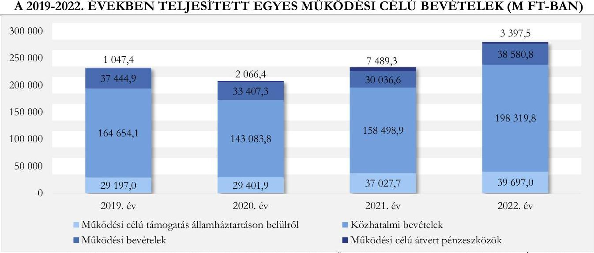

Forrás: 2019-2022. évi önkormányzati szintü költségvetési beszámolók és a Fővárosi Önkormányzat tanúsítványi adatszolgáltatása alapján ÁSZ saját szerkesztés

A 2020. évben teljesített múködési célú bevételek (207 959,4 M Ft) elmaradtak a bázisidőszaknak tekintett 2019. év teljesítésétől (232 343,5 M Ft). A 2021. évben közel a 2019-es szinten (233 052,5 M Ft), a 2022. évben a bázisidőszaki érték 120,5\%-án (279 995,1 M Ft) teljesültek. A múködési célú bevételek alakulására alapvetően, annak 68,0-70,9\%-át képező közhatalmi bevételek nagysága volt hatással. A közhatalmi bevételek 98,4-99,6\%-át a helyi iparűzési adóbevétel tette ki, amely a 2020. évi visszaesést követő folyamatos emelkedés eredményeként 2022-ben 195 174,9 M Ft összegben, a 2019. évi teljesítés (163 977,2 M Ft) 119,0\%-án realizálódott. A helyi iparűzési adóbevétel 2020. évi - előző évhez

---

viszonyított - csökkenését az adóalapot képező, adózói árbevételek koronavírus járvány miatti visszaesése, valamint az adófeltöltési kötelezettség - jogszabályi előíráson alapuló - eltörlése együttesen eredményezte. A 2020. évi adófeltöltési kötelezettség megszűnése miatt a 2020. évi adóbevallás szerint még esedékes fizetési kötelezettség a 2021. évben teljesült, majd 2022-ben tovább emelkedett a helyi iparűzési adóbevétele. A 2021-2022. évi helyi iparűzési adóbevételre negatívan hatott, hogy jogszabályi előírás alapján a legfeljebb 4 milliárd forint nettó árbevétellel vagy mérlegfőösszeggel rendelkező mikro-, kis- és középvállalkozások esetében a helyi iparűzési adó mértéke $1 \%$ volt az addigi $2 \%$ helyett. Az államháztartáson belülről kapott működési célú támogatások emelkedéséhez a helyi önkormányzatok múködése általános támogatásának - a beszámítás módszerének 2021. évi megszüntetését követő - 2021. és 2022. évi emelkedése, valamint a szociális, gyermekjóléti és gyermekétkeztetési feladatok állami támogatásának növekedése járult hozzá leginkább. A múködési bevételek a 2020-2021. években alapvetően a koronavírus járvány miatti bevétel kiesés miatt - maradtak el a 2019. évitől. A 2022. évben 1 135,9 M Ft-tal meghaladták a bázisévit ( $37444,9 \mathrm{MFt}$ ).
A Fővárosi Önkormányzat 2019-2022. években teljesített egyes múködési célú kiadásainak alakulását a 3. ábra szemlélteti.
3. ábra

A 2019-2022. ÉVEKBEN TELJESÍTETT EGYES MŰKÖDÉSI CÉLÚ KIADÁSOK (M FT-BAN)
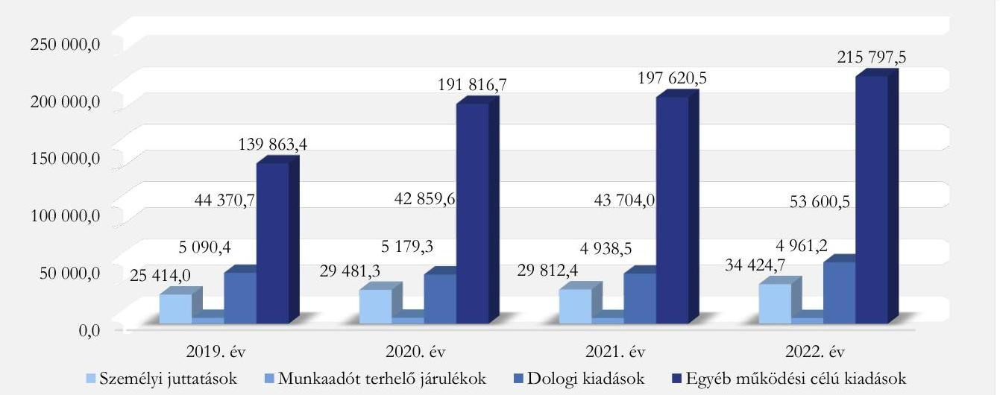

Forrás: 2019-2022. évi önkormányzati szintü költségvetési beszámolók és a Fővárosi Önkormányzat tanúsítványi adatszolgáltatása alapján ÁSZ saját szerkesztés

A teljesített múködési célú kiadások összege folyamatosan emelkedett az ellenőrzött időszakban. 2022-ben 308 832,8 M Ft-volt, ami közel másfélszerese volt a 2019. évi 214 792,4 M Ft-nak.
A múködési célú kiadások döntő részét (65,1-71,6\%-át) az egyéb múködési célú kiadások tették ki, amelyek összege a bázisévi 139 863,4 M Ft-ról 2022-re 215 797,5 M Ft-ra nőtt. A legjelentősebb tétel az önkormányzati többségi tulajdonban lévő gazdasági társaságoknak nyújtott múködési célú támogatás, amelynek összege 2020-ban 161 252,7 M Ft, 2021-ben 146 183,6 M Ft, 2022-ben 168 568,3 M Ft volt, az ellenőrzött évek mindegyikében meghaladta a bázisévi 121 786,8 M Ft-ot. A többlettámogatás nyújtását alapvetően az energia árak jelentős emelkedése és a gazdasági társaságoknál végrehajtott bérfejlesztések indokolták.
A Fővárosi Önkormányzat a 2022. évi 168 568,3 M Ft-ból a BKK Zrt. részére 137 626,8 M Ft múködési célú támogatást nyújtott ( 45671,3 M Ft-tal többet a 2019. évinél) a közösségi közlekedés közlekedésszervezői feladat ellátására, amelynek része volt a 12000 M Ft állami támogatás. Ezen túl az Agglomerációs Együttműködési Megállapodások alapján a Fővárosi Önkormányzat az agglomerációs

---

szolgáltatók által a közigazgatási határon belül végzett közszolgáltatási tevékenységhez a BKK Zrt. útján költségtérítési hozzájárulást biztosított. Az Agglomerációs Együttmüködési Megállapodásokban a költségtérítési hozzájárulás éves mértéke agglomerációs szolgáltatónként fix összegben, a vasúti szolgáltatás esetében évi 4 420,0 M Ft, míg az autóbuszos szolgáltatás esetében évi 2 160,0 M Ft összegben került meghatározásra 2022. december 31. napjáig. A 2022. évben a költségtérítési hozzájárulás összegén túl (összesen 6 580,0 M Ft), a 2021. évi elszámolás összege ( 740,0 M Ft) került kifizetésre az érintett címkódról.
További, összesen 30 941,5 M Ft működési célú támogatásban részesültek 2022-ben a közútkezelési feladatokat, egyéb városüzemeltetési feladatokat, kulturális és sportfeladatokat, szociális és egyészségügyi feladatokat, vagyongazdálkodási feladatokat ellátó önkormányzati tulajdonú gazdasági társaságok.
Ezen túl visszafizetési kötelezettséggel terhelten is nyújtottak támogatást, kölcsönt a többségi tulajdonú gazdasági társaságoknak 2020-ban $2129,0 \mathrm{MFt}, 2021$-ben $7484,1 \mathrm{MFt}, 2022$-ben 40,5 M Ft összegben. 2020-ban a Budapest Gyógyfürdői Zrt. ${ }^{31}$ részére nyújtottak 1 500,0 M Ft tagi kölcsönt a koronavírus-járvány miatt kialakult múködési nehézségek átmeneti megoldására, illetve a BKK Zrt. és a BKV Zrt. ${ }^{32}$ számára, beruházáshoz kapcsolódó általános forgalmi adó átmeneti finanszírozására 629,0 M Ft-ot juttattak. A 2021. évi kiugró értéket a Budapest Gyógyfürdői Zrt. részére, a Rác Fürdő és Hotel tulajdonjogának megszerzése érdekében nyújtott 7 401,5 M Ft kamatmentes tagi kölcsön eredményezte. A 2022. évben a Budapest Gyógyfürdői Zrt. részére korábbi években nyújtott tagi kölcsön kamatának tőkésített részét ( $12,0 \mathrm{MFt}$ ), valamint a BKK Zrt. és a BKV Zrt. számára, beruházáshoz kapcsolódó általános forgalmi adó átmeneti finanszírozására nyújtott összesen 28,5 M Ft kölcsönt mutatták ki a múködési célú visszatérítendő támogatások, kölcsönök nyújtása kiadásaként.
Tovább növelte az egyéb múködési célú kiadásokat a szolidaritási hozzájárulás összege, amely 2020-ban 21 770,9 M Ft-tal, 2021-ben 35 350,6 M Ft-tal, 2022-ben 35 674,7 M Ft-tal terhelte a Fővárosi Önkormányzat költségvetését (2019-ben 10 000,0 M Ft volt). A Fővárosi Önkormányzat a 2021. évtől a központi költségvetés felé nettó befizetővé vált, mivel a központi költségvetés részére fizetett szolidaritási hozzájárulás összege meghaladta a központi költségvetésből az ellátott feladatokhoz biztosított múködési támogatás összegét. A költségvetési támogatások és befizetések egyenlegét a 4. ábra szemlélteti:

---

4. ábra

A KÖLTSÉGVETÉSI TÁMOGATÁSOK ÉS BEFIZETÉSEK EGYENLEGE A 2019-2022. ÉVEKBEN (M FT-BAN)
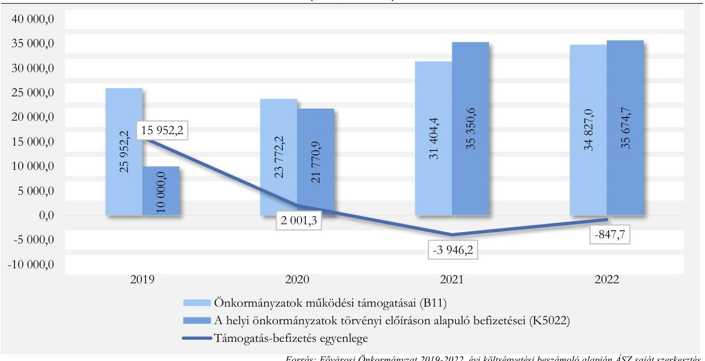

Forrás: Fővárosi Önkormányzat 2019-2022. évi költségvetési beszámoló alapján ÁSZ saját szerkesztés
A Fővárosi Önkormányzat 2023. június 9-én az állami támogatást meghaladó szolidaritási hozzájárulás fizetési kötelezettsége miatt közigazgatási pert indított a Kincstár ellen, valamint azonnali - inkasszálási jog felfüggesztése miatti - jogvédelem iránti kérelmet is benyújtott a Fővárosi Törvényszéken, amelyet annak visszautasítása miatt 2023. augusztus 2-án megfellebbezett. 2023. augusztus 27-én újabb azonnali jogvédelem iránti kérelmet nyújtottak be, a korábbi elutasító végzésben adott bírói iránymutatásra figyelemmel további részletes elemzéssel és mellékletekkel kiegészítve. A Fővárosi Ítélőtábla 2023. szeptember 27-i döntésében a Fővárosi Önkormányzatnak azonnali jogvédelmet biztosított.
A dologi kiadások működési célú kiadásokon belüli aránya a 2019. évi 20,7\%-nál az ellenőrzött évek mindegyikében kevesebb volt (15,9-15,8-17,4\%), összege 2020-ban és 2021-ben elmaradt a bázisévitől (44 370,7 M Ft), a 2022. évben meghaladta azt, 53600,6 M Ft volt. A dologi kiadások 2022. évi emelkedésére alapvetően az infláció, az étkeztetés nyersanyag normájának, valamint az energiaáraknak az emelkedése, továbbá a menekült ellátás feladatainak többlet kiadása volt hatással.
A személyi juttatások összege folyamatos emelkedés mellett a 2019. évi 25 414,0 M Ft-ról 2022-re 35,5\%-kal (34 424,7 M Ft-ra) nőtt, a működési célú kiadásokon belüli aránya 2019-ben 11,8\%, 2022-ben $11,1 \%$ volt. A személyi juttatások 2020-2022. évi együttes kiadása 17 476,4 M Ft-tal volt több a bázisszintnél. A növekmény 90,7\%-a (15 852,3 M Ft) a költségvetési intézményeknél - elsődlegesen a szociális ágazatban - keletkezett. Az intézményi körben a személyi juttatások emelkedését egyrészt a jogszabályi változások - minimálbér, garantált bérminimum és ahhoz szorosan kapcsolódó pótlékok (pl. a szociális ágazatnál a délutáni és éjszakai pótlékok), a szociális ágazati pótlék, valamint az egészségügyi kiegészítő pótlék emelkedése - okozták, másrészt a kötelező soros átsorolásokból, szakképzettség megszerzéséhez kapcsolódó bérnövekedésekből adódott. Ezen túl a Fővárosi Önkormányzat a 2020. évben a szociális ágazatban dolgozók részére két alkalommal (a koronavírus járvánnyal kapcsolatos feladatellátásért) 100 ezer Ft/fő jutalmat biztosított. A 2022. évi költségvetésbe pedig a magas inflációra való hivatkozással az intézményeknél béremelést épített be. A Főpolgármesteri Hivatalnál az illetményalap

---

a 2020. és 2021. években a 2019. évivel azonos mértékű - 45 ezer Ft - volt, amelyet a 2022. évben 22,2\%kal 55 ezer Ft-ra emeltek. (A 2019. évről a 2022. évre a nemzetgazdasági bruttó átlagkereset emelkedése 40,2\% volt). A Főpolgármesteri Hivatalnál a 2020-2022. években a személyi juttatásokra teljesített kifizetések a 2022. évi emelés miatt összességében 1 318,1 M Ft-tal volt több a 2019. évi szintnél. A 20202022. évi személyi jellegű ráfordítások bázishoz viszonyított többletkiadásaihoz - a Főpolgármesteri Hivatal írásos tájékoztatója szerint - a 2020. évben 150,0 M Ft, a 2022. évben 1 443,0 M Ft központi támogatásban részesült a Fővárosi Önkormányzat.
A munkaadót terhelő járulékok működési célú kiadásokon belüli aránya a 2019. évi 2,4\%-ról 2022-re 1,6\%-ra, összege 5090,4 M Ft-ról 4 961,2 M Ft-ra csökkent, alapvetően a kifizetőt terhelő szociális hozzájárulási adó mértékének folyamatos (19,5\%-ról 13\%-ra) csökkenése miatt.
A Fővárosi Önkormányzat adatszolgáltatása szerint a 2020-2022. években önkormányzati szinten 29 584,6 M Ft bérfejlesztést hajtottak végre, amely összességében 47 000,0 M Ft-tal (kumulált érték) növelte a működési célú kiadásokat. A Fővárosi Önkormányzatnál, a Főpolgármesteri Hivatalban és a költségvetési intézményekben végrehajtott bérfejlesztések kiadása a személyi juttatások és járulékai kiadását, a gazdasági társaságok dolgozóinak béremelése a gazdasági társaságoknak nyújtott múködési célú támogatás összegét növelték.

# Az ellenőrzött időszak pénzforgalmi folyamatainak áttekintése 

A Fővárosi Önkormányzat és költségvetési szervei pénzeszközeinek 2020. január 1-jei együttes nyitó egyenlege 55245,4 M Ft volt, valamint a Fővárosi Önkormányzat 158 977,7 M Ft nettó árfolyam értékű államkötvénnyel rendelkezett. Ebből a Fővárosi Önkormányzat elszámolási számláján 26 505,7 M Ft volt, valamint 151601,3 M Ft nettó árfolyam értékủ, költségvetési elszámolási számlán rendelkezésre álló pénzeszközből vásárolt államkötvénnyel rendelkezett. A múködési célú bevételek 2020-2022. évi évenkénti változásának együttes összege 23 976,5 M Ft-tal, a múködési célú kiadásoké 209 984,0 M Ft-tal haladta meg a 2019. évit. Az ellenőrzött időszakban - a bázisszinten számított múködési célú bevételek és kiadások egyenlegéhez viszonyítva - 186 007,5 M Ft múködési célú hiány keletkezett. A hiány forrásának biztosítására az ellenőrzött időszak elején meglévő államkötvényeket értékesítették, a költségvetési elszámolási számla egyenlege 2022. december 31-re 25 599,2 M Ft-tal (906,5 M Ft-ra) csökkent oly módon, hogy az EIB hitel ${ }^{33}$ alszámlán lévő, átmenetileg szabad 17 822,5 M Ft-ot is felhasználták a kiadások finanszírozására.
A 2020-2022. évi múködési célú bevételek és kiadások 2019. évhez viszonyított alakulását a 2. táblázat mutatja be.

---

# 2. táblázat

A 2020-2022. ÉVI MŰKÖDÉSI CÉLŰ BEVÉTELEK ÉS KIADÁSOK 2019. ÉVHEZ VISZONYÍTOTT ALAKULÁSA M FT-BAN

|  MEGNEVEZÉS | 2019. ÉV
(BÁZISSZINT) | 2020. ÉV | 2021. ÉV | 2022. ÉV | 2020-2022. ÉVÉK TÉNYLEGESÉN | 2020-2022. ÉVÉK BÁZISGZINTÉN | TÉNYLEGES BÁZIS SZINTÉN SZÁMOET KÜLÖNBÖZETE  |
| --- | --- | --- | --- | --- | --- | --- | --- |
|  Múködési célú támogatások államháztartáson belülről (B1) | 29 197,0 | 29 401,9 | 37027,7 | 39697,0 | 106 126,6 | 87 591,0 | 18535,6  |
|  ebbéé Helyi önkormányzatok múködésének általános támogatása (B111) | 66,2 | 33,2 | 7092,6 | 7258,8 | 14384,6 | 198,6 | 14186,0  |
|  ebbéé Településs önkormányzatok szociális, gyermekepléés és gyermekekkeztetési feladatainak támogatása (B113) | 9215,9 | 9958,6 | 10797,0 | 13771,0 | 34526,6 | 27647,7 | 6878,9  |
|  Közhatalmi bevételek (B3) | 164 654,2 | 143 083,8 | 158 498,9 | 198 319,8 | 499 902,5 | 493 962,6 | 5 939,9  |
|  ebbéé helyi iparüzési adóbevétel (B351) | 163 977,2 | 142 452,9 | 157 694,3 | 195 174,9 | 495 322,1 | 491 931,6 | 3390,5  |
|  Múködési bevételek (B4) | 37 444,9 | 33 407,3 | 30 036,6 | 38 580,8 | 102 024,7 | 112 334,7 | $-10310,0$  |
|  Múködési célú átvett pénzeszközök (B6) | 1047,4 | 2066,4 | 7489,3 | 3397,5 | 12 953,2 | 3 142,2 | 9811,0  |
|  Múködési célú bevételek összesen: | 232 343,5 | 207 959,4 | 233 052,5 | 279 995,1 | 721 007,0 | 697 030,5 | 23 976,5  |
|  Személyi juttatások (K1) | 25 414,0 | 29 481,3 | 29 812,4 | 34 424,7 | 93718,4 | 76 242,0 | 17 476,4  |
|  Munkaadót terhelő járulékok (K2) | 5090,4 | 5179,3 | 4938,5 | 4961,2 | 15079,0 | 15271,2 | $-192,2$  |
|  Dologi kiadások (K3) | 44 370,7 | 42 859,6 | 43 704,0 | 53600,5 | 140 164,1 | 133 112,1 | 7052,0  |
|  Ellátottak pénzügyi juttatásai (K4) | 53,9 | 62,1 | 54,0 | 48,9 | 165,0 | 161,7 | 3,3  |
|  Egyéb múködési kiadások (K5) | 139 863,4 | 191 816,7 | 197 620,5 | 215 797,5 | 605 234,7 | 419 590,2 | 185 644,5  |
|  ebbéé önkormányzati többségi tulajdonú gazdasági társaságnak nyújtott múködési célú támogatás (K512) | 121 786,8 | 161 252,7 | 146 183,6 | 168 568,3 | 476 004,6 | 365 360,4 | 110 644,2  |
|  ebbéé szolidaritási bezzújárulás (K5022) | 10000,0 | 21770,9 | 35350,6 | 35674,7 | 92796,2 | 30000 | 62796,2  |
|  Múködési célú kiadások összesen: | 214 792,4 | 269 399,0 | 276 129,4 | 308 832,8 | 854 361,2 | 644 377,2 | 209 984,0  |

Forrás: 2019-2022. évi önkormányzati szintű költségvetési beszámolók és a Fővárosi Önkormányzat tanúsítványi adatszolgáltatása alapján ÁSZ saját szerkesztés

---

A 2020-2022. években - a bázisszinten számított működési egyenleghez viszonyítva - képződött 186 007,5 M Ft működési célú hiány kialakulásához alapvetően a következő tényezők járultak hozzá:

- a személyi juttatások 17 476,4 M Ft összegű többlet kiadása,
- a dologi kiadások 7 052,0 M Ft összegű emelkedése, (ebből 3 815,7 M Ft a közüzemi díjak emelkedése)
- a gazdasági társaságoknak nyújtott 110 644,2 M Ft többlet támogatás és
- a szolidaritási hozzájárulás 62 796,2 M Ft-os többletterhe.

A Fővárosi Önkormányzat felhalmozási célú bevételeinek és kiadásainak 2019-2022. évi alakulását a 3. táblázat mutatja be.
3. táblázat

FELHALMOZÁSI CÉLÚ BEVÉTELEK ÉS KIADÁSOK 2019-2022. ÉVI ALAKULÁSA (M FT-BAN)

| MÉGNEVEZÉS |  | 2019. FV |  | 2020. FV |  | 2021. FV |  | 2022. FV |  |
| :--: | :--: | :--: | :--: | :--: | :--: | :--: | :--: | :--: | :--: |
|  |  | M Ft | \% | M Ft | \% | M Ft | \% | M Ft | \% |
| Felhalmozási célú   államháztartáson belülről |  | 19 908,1 | 51,6 | 12819,8 | 52,4 | 15532,2 | 72,6 | 4 155,8 | 39,3 |
| Felhalmozási bevételek |  | 18516,7 | 48,0 | 11626,5 | 47,5 | 5782,2 | 27,0 | 6361,0 | 60,2 |
| Felhalmozási célú átvett pénzeszközök |  | 157,0 | 0,4 | 40,1 | 0,1 | 83,6 | 0,4 | 49,0 | 0,5 |
| Felhalmozási célú bevételek összesen: |  | 38581,8 | 100,0 | 24 486,4 | 100,0 | 21398,0 | 100,0 | 10 565,8 | 100,0 |
| Beruházások |  | 24 093,7 | 52,4 | 26 071,6 | 51,3 | 22 439,7 | 53,7 | 26 718,9 | 41,9 |
| Felújítások |  | 12 131,2 | 26,3 | 10813,8 | 21,3 | 8 435,9 | 20,2 | 8310,0 | 13,0 |
| Egyéb felhalmozási kiadások |  | 9817,7 | 21,3 | 13 966,0 | 27,4 | 10 890,2 | 26,1 | 28 808,4 | 45,1 |
| ebből: önkormányzati többségi tulajdonú gazdasági társaságnak nyújtott felhalmozási célú támogatás |  | 4573,2 |  | 8 939,9 |  | 6714,5 |  | 13361,3 |  |
| ebből: kamatkiadások felhalmozási célú része |  | 1603,7 |  | 3014,0 |  | 2704,0 |  | 12 076,0 |  |
| Felhalmozási célú kiadások összesen: |  | 46 042,6 | 100,0 | 50 851,4 | 100,0 | 41765,8 | 100,0 | 63 837,3 | 100,0 |
| Felhalmozási célú hiány |  | 7460,8 |  | 26 365,0 |  | 20367,8 |  | 53 271, |  |

Forrás: 2019-2022. évi önkormányzati szintü költségvetési beszámolók és a Fővárosi Önkormányzat tanúsítványi adatszolgáltatása alapján ÁSZ saját szerkesztés

A felhalmozási célú bevételek több mint 99,0\%-át a felhalmozási célú, államháztartáson belülről kapott támogatások és a felhalmozási bevételek együttes összege tette ki. A felhalmozási célú támogatások értéke csökkent az ellenőrzött időszakban, 2022-ben 15 752,3 M Ft-tal volt kevesebb a 2019. évinél. A felhalmozási bevételek (döntően ingatlanértékesítésből származó bevétel) 2022-ben kevéssel haladták meg a 2019. évi harmadát. A csökkenéshez hozzájárult, hogy az ingatlanokat értékesítést megelőzően készletté sorolták át, amelyek értékesítéséből múködési célú bevételt (7 848,3 M Ft) realizáltak. A két bevételi forrás csökkenésének együttes hatására a 2022. évi felhalmozási célú bevételek 72,6\%-kal maradtak el a 2019. évi bázisértékhez képest. Az ingatlanok készletként történő értékesítéséből származó bevétel működési célra történő felhasználása nem biztosította az önkormányzati vagyon megőrzését.
A felhalmozási célú kiadások a 2021. év kivételével meghaladták a 2019. évi összeget. A beruházásokra fordított kiadások, illetve az egyéb felhalmozási kiadások 2020-ban és 2022-ben magasabbak voltak a 2019. évinél, annak ellenére, hogy a felhalmozási célú bevételek jelentősen csökkentek az ellenőrzött időszakban. A jelentősebb beruházások az alábbiak voltak a 2020-2022. években (ezek megvalósítása a víztermelő kutak kivételével már 2020 előtt elkezdődött):

---

- Széchenyi lánchíd rekonstrukciójának tervezett megvalósítási időszaka 2018-2024., a megvalósítás kezdetekor tervezett összes fejlesztési célú kiadásának tervezett költsége $22462,0 \mathrm{M}$ Ft volt. A beruházás kivitelezésére 2020-2022-ben együttesen teljesített fejlesztési célú kiadás összege 12 886,1 M Ft volt, amit teljes összegében saját forrásból finanszírozott a Fővárosi Önkormányzat, mivel az 1248/2019. (IV.30.) Korm. határozat ${ }^{34}$ szerinti 6000 M Ft állami támogatást nem kapták meg.
- Fővárosi hulladékgazdálkodási rendszer bővítése, a hulladékfeldolgozás és újrahasznosítás arányának növelése elnevezésű projekt (megvalósítás időszaka a 2013-2023. évek) esetében a várható bekerülési értéke $12607,1 \mathrm{M}$ Ft. A 2020-2022. években teljesített fejlesztési kiadás 9 634,9 M Ft, amelynek forrása 8 476,4 M Ft európai uniós támogatás, 152,5 M Ft fejlesztési célú állami támogatás, és 1006,0 M Ft saját forrás volt. Továbbá a fővárosi hulladékgazdálkodási rendszer fejlesztéséhez kapcsolódott a hulladékgyűjtési, szállítási és előkezelő rendszer című projekt, amelynek tervezett bekerülési értéke 9 354,6 M Ft volt, megvalósítási ideje a 2017-2023 közötti időszak. A 2020-2022. években teljesített fejlesztési célú kiadás 10 020,0 M Ft volt, ebből 7 889,8 M Ft-ot európai uniós támogatás, 1 904,3 M Ft-ot fejlesztési célú állami támogatás, 225,9 M Ft-ot működési célú saját forrás finanszírozott.
- Budapest Főváros víztermelő kutak fejlesztése, vízminőségi és kapacitáskockázatok kezelése elnevezésű projekt tervezett bekerülési értéke 24 726,7 M Ft, megvalósítási időszaka a 2021-2023 évek. A 2022. évi - európai uniós támogatásból finanszírozott - fejlesztési célú kiadás összege 2 460,4 M Ft volt (a 2020-2021. években nem teljesítettek kiadást erre a projektre).
- Blaha Lujza tér rekonstrukciójának tervezett megvalósítási időszaka a 2017-2024. évek. A tervezett bekerülési költségből (4 167,3 M Ft) 2 477,9 M Ft terhelte az ellenőrzött időszakot, amelynek forrása állami támogatás ( $787,4 \mathrm{M}$ Ft) és 1690,5 M Ft saját forrás volt.
- Városháza rekonstrukció „A" ütem tervezetten a 2016-2024 években valósul meg 3 733,9 M Ft forrás felhasználásával. Az ellenőrzött időszakban saját forrásból finanszírozott kiadás 1209,8 M Ft volt.
Felújítások kiadásaira (pl.: útfelújítási program, műtárgy felújítási program megvalósítása) az ellenőrzött időszakban 27 559,7 M Ft-ot fordított a Fővárosi Önkormányzat, amelyet alapvetően saját forrásból (27 554,4 M Ft), valamint európai uniós támogatásból (5,3 M Ft) biztosított.
Az egyéb felhalmozási kiadások aránya a felhalmozási célú kiadásokon belül a bázisévi 21,3\%-ról a 2022. évre megduplázódott, $45,1 \%$ lett, összege 28 808,4 M Ft-ra (18 990,7 M Ft-tal) nőtt, a 2020-2022. években összesen 53 664,6 M Ft volt. A változást alapvetően a Fővárosi Önkormányzat többségi tulajdonában lévő gazdasági társaságoknak nyújtott felhalmozási célú támogatásoknak és a kamatkiadások felhalmozási célú részének növekedése eredményezte.
A felhalmozási célú bevételeket 100 004,3 M Ft-tal meghaladó felhalmozási célú kiadásokra felhasználható működési célú bevételi többlet nem állt rendelkezésre a 2020-2022. évben, ezért azt finanszírozási célú bevételből fizette a Fővárosi Önkormányzat. A felhalmozási hiány finanszírozására a fedezetet a maradvány felhalmozási részének (8 719,6 M Ft) igénybevételén túl értékpapír értékesítésből származó bevételből, továbbá 2021-ben fejlesztési célú hitel igénybevételével biztosították.
A Fővárosi Önkormányzatnak az ellenőrzött időszakban négy fejlesztési célú, hosszú lejáratú hitelfelvételből származó kötelezettsége volt. Az ellenőrzött időszakban fennálló hitelállomány főbb adatait az V. számú melléklet mutatja be. A hitelszerződések/hitelkeretszerződések megkötésére az

---

ellenőrzött időszakot megelőzően (2014-2015. években) került sor. A pénzintézeti hitelállomány a 2020. január 1-jei 112 842,1 M Ft-ról, 2022. december 31-re 160 199,2 M Ft-ra nőtt, mivel a két EIB hitelkeret („Budapest Városfejlesztés A" elnevezésű 100 millió, illetve 200 millió eurós összegű) utolsó részleteinek lehívása 2021-ben történt, összesen 65 639,2 M Ft (180,3 millió euró) összegben. A két euró alapú hitel törlesztésének kezdő időpontja 2025.05.15.
A Fővárosi Önkormányzat 2022-ben az önkormányzati feladatok teljesítéséhez szükséges infrastrukturális beruházások forrásaként 32 422,8 M Ft fejlesztési hitelt tervezett igénybe venni. A tranzakcióhoz a Gst. 10. § (2) bekezdés előírásainak megfelelően kérték a Kormány előzetes hozzájárulását. A Kormány az önkormányzatok adósságot keletkeztető, valamint kezesség-, illetve garanciavállalásra vonatkozó ügyleteihez történő 2022. október-novemberi előzetes kormányzati hozzájárulásról szóló 1619/2022. (XII. 13.) Korm. határozatban ${ }^{35}$ foglaltak szerint az adósságot keletkeztető ügylethez nem járult hozzá.
A Fővárosi Önkormányzat 2019-2022. évi adósságszolgálata alakulását a 4. táblázat mutatja be.
4. táblázat

| A 2019-2022. ÉVI ADÓSSÁGSZOLGÁLAT ALAKULÁSA (M FT-BAN) |  |  |  |  |
| :--: | :--: | :--: | :--: | :--: |
| MEGNEVEZÉS | 2019. EV | 2020. EV | 2021. EV | 2022. EV |
| Tóketörlesztés | 5847,1 | 6094,0 | 6094,0 | 6094,0 |
| Fizetett kamat | 1603,8 | 3027,4 | 2704,5 | 12287,4 |
| - ebből: múködési | 0,1 | 13,4 | 0,5 | 211,3 |
| - ebből felhalmozási | 1603,7 | 3013,9 | 2704,0 | 12076,0 |
| Összesen | 7450,9 | 9121,4 | 8798,5 | 18381,4 |

Forrás: 2019-2022. évi önkormányzati szintü költségvetési beszámolók és a Fővárosi Önkormányzat tanúsítványi adatszolgáltatása alapján ÁSZ saját szerkesztés

Az adósságszolgálat a 2022. évben elsősorban a felhalmozási kamatok emelkedő kiadásának hatására 10 930,5 M Ft-tal volt magasabb a - bázisévnek tekintett - 2019. évinél. A 2022. évi nagy összegű kamatkiadást alapvetően a fejlesztési célú hitelek törlesztéséhez kapcsolódóan megfizetett 11 868,3 M Ft kamat eredményezte. A múködési célú kamatot alapvetően az évközben fennálló folyószámlahitel tartozás után fizette a Fővárosi Önkormányzat, amely 2022-ben volt a legmagasabb, mivel ebben az évben volt a legtöbb a folyószámlahitellel zárt napok száma, illetve legmagasabb a folyószámlahitel átlagos napi állománya. A kamatterhek növekedéséhez hozzájárult, hogy a jegybanki alapkamat a 2019. évi 0,9\%-ról folyamatos emelkedés mellett - 2022-ben 13\%-ig nőtt.
A Fővárosi Önkormányzat 2019-2022. évi pénzügyi helyzetét jellemző egyes mutatók alakulását az 5. táblázat mutatja be.
5. táblázat

# A 2019-2022. ÉVI PÉNZÜGYI HELYZETET JELLEMZŐ EGYES MUTATÓK ALAKULÁSA 

| MUTATÓ MEGNEVEZÉSE | 2019. EV | 2020. EV | 2021. EV | 2022. EV |
| :-- | --: | --: | --: | --: |
| Törlesztés fedezettsége | 3,0 | $-10,1$ | $-7,1$ | $-4,7$ |
| Banki kötelezettségek forrásokon belüli aránya (\%) | 5,2 | 5,1 | 7,9 | 6,3 |
| Banki kötelezettségek állományának változása (\%) | - | 94,6 | 155,8 | 96,3 |

Forrás: 2019-2022. évi önkormányzati költségvetési beszámoló alapján ÁSZ saját szerkesztés
A törlesztés fedezettsége mutató kedvezőtlen képet mutatott az ellenőrzött időszakban, mivel a múködési célú kiadások a 2020-2022. években meghaladták a múködési célú bevételeket, így nem képződött múködési jövedelem a tőketörlesztés fedezetére. A bázisévben (2019-ben) a múködési jövedelem fedezetet nyújtott a törlesztendő hitelekre.

---

A banki kötelezettségek állományának változása és mérlegfőösszeghez mért nagysága a 2021. évben mutatta a legkedvezőtlenebb képet. Ennek oka a fejlesztések forrásának biztosítása érdekében ellenőrzött időszakot megelőzően - kötött hitelkeretek terhére történő 2021. évi hitel igénybevétel volt. A mutató 2022. évi javulását eredményezte, hogy a banki kötelezettségek minimális ( $6094,0 \mathrm{MFt}$ ) csökkenése mellett a mérlegfőösszeg 438 667,5 M Ft-tal emelkedett.

# Az önként vállalt feladatok teljesítésének Fővárosi Önkormányzat költségvetési egyenlegére gyakorolt hatása: 

A Fővárosi Önkormányzat önként vállalt feladatai körébe tartozott többek között a családok átmeneti otthonának-, nappali melegedőknek a fenntartása, a lakásrezsi támogatás kiadásai, az igazgatási apparátus kiadásainak egy része, a sport célú támogatások, alapítványoknak, egyesületeknek nyújtott támogatások. A múködési kiadásokon belül az önként vállalt feladatokra fordított működési célú kiadások aránya a 2019-2022. években - az évek sorrendjében - 2,4-2,5-4,8-2,7 \% volt. Az önként vállalt feladatok működési célú bevételei az ellenőrzött évek egyikében sem fedezték a kapcsolódó kiadásokat. Az önként vállalt feladatok működési célú hiánya a bázisévi -4 576,0 M Ft-hoz képest csak 2020-ban mutatott jelentősebb 1238,7 M Ft-os csökkenést, míg 2021-ben (-4 571,9 M Ft) és 2022-ben (-4 532,1 M Ft) a bázis körüli szinten alakult. Az önként vállalt feladatok felhalmozási célú kiadása a 2019. évi 3 427,6 M Ftról - folyamatosan - 2022-re 174,6 M Ft-ra csökkent az ellenőrzött időszakban (2020-ban 1 588,9 M Ft, 2021-ben 586,0 M Ft volt). A felhalmozási célú kiadások fedezetére elegendő felhalmozási bevétel az ellenőrzött években nem állt rendelkezésre, a felhalmozási hiány a bázisévnek számító 2019-ben volt a legmagasabb (3 345,8 M Ft), és 2022-ben a legalacsonyabb (134,3 M Ft).

## 2023 I. félév gazdálkodásának áttekintése

A 2023. évi múködési célú bevételek eredeti előirányzata 381,7 M Ft-tal meghaladta a múködési célú kiadásokét. A 2023. I. félévi teljesítés a tervezettől kedvezőbb képet mutat, mivel az év első felében a múködési célú bevételek időarányos teljesítése - bár elmaradt az 50\%-tól - meghaladta a múködési célú kiadásokét, így a múködési költségvetés pozitív egyenlege 15 883,7 M Ft volt.
A Fővárosi Önkormányzat 2023. évi tervezett és 2023. év I. félévében teljesült múködési célú és felhalmozási célú kiadásainak és bevételeinek alakulását a 6. táblázat mutatja be.
6. táblázat

## 2023. ÉVI BEVÉTELEK ÉS KIADÁSOK ALAKULÁSA (M FT-BAN)

| MŁONÉVEZÉS | 2023. ÉVI ÉNEBETI   ÉLOIRÁNYZAT (M FT) | 2023. I. FÉLEV   TÉLJESÍTÉS (M FT) | 2023. I. FÉLEV   TÉLJESÍTÉS \%A |
| :-- | :--: | :--: | :--: |
| Múködési célú bevételek | 360676,5 | 177011,4 | 49,1 |
| Múködési célú kiadások | 360294,8 | 161127,7 | 44,7 |
| Múködési egyenleg | 381,7 | 15883,7 | - |
| Felhalmozási célú bevételek | 47089,7 | 7518,4 | 16,0 |
| Felhalmozási célú kiadások | 105032,6 | 39944,8 | 38,0 |
| Felhalmozási egyenleg | -57 942,9 | -32 426,4 | - |
| Költségvetési egyenleg | -57 561,2 | -16 542,7 | - |

Forrás: 2023. II. negyedéves időkött mérlegjelentések, Fővárosi Önkormányzat tanúsítványi adatszolgáltatása alapján ÁSZ saját szerkesztés
2023 I. félév végén a múködési célú költségvetési bevételek $0,9 \%$-kal, a múködési célú kiadások 5,3\%-kal maradtak el az időarányostól. A közhatalmi bevételek részét képező iparűzési adóbevétel (128 540,6 M Ft) 2,7\%-kal maradt el a tervezett bevétel (271 620,0 M Ft) időarányos részétől. Az államháztartáson belülről érkező működési célú támogatások 53,3\%-on teljesültek, a közösségi közlekedés támogatására biztosított 12 000,0 M Ft időarányos részét megkapta a Fővárosi Önkormányzat. A múködési bevételek között

---

tervezett 13071,5 M Ft - készletek közé átsorolt - ingatlanok értékesítéséből 2023 I. félévben mindössze 233,3 M Ft bevétel teljesült. A működési célú kiadások teljesítési szintjét - nagyságrendje miatt - az egyéb működési célú kiadások teljesítése határozta meg. A kötelező közszolgáltatások biztosítására önkormányzati tulajdonú gazdasági társaságoknak - nyújtott támogatás 69 926,5 M Ft volt az első félévben, 24257,8 M Ft-tal ( $31,1 \%$-kal) maradt el az eredeti előirányzat (188 368,6 M Ft) időarányos részétől, mivel a gazdasági társaságok az április-augusztus időszaki finanszírozási igényeiket - a lehetőségekhez mérten - átütemezték szeptember-december hónapokra a Fővárosi Önkormányzat likviditási helyzetének javítása érdekében. A 2023. évre eredeti előirányzatként tervezett, fizetendő szolidaritási hozzájárulás a jogszabályban előírt nagyságrendnél (57 805,0 M Ft) alacsonyabban megtervezett összege 35674,7 M Ft, az I. félévi teljesítés 30058,6 M Ft volt.
A 15 883,7 M Ft működési jövedelemből 3047,0 M Ft a 2023. év I. félévi hiteltörlesztés forrását biztosította. A nettó működési jövedelem 2023 I. félév végén 12 836,7 M Ft volt.
A felhalmozási hiány az eredeti előirányzatok szintjén 57 942,9 M Ft, az I. félév végén 32 426,4 M Ft volt, amelynek egy részére ( 12836,7 M Ft ) nyújtott fedezetet a nettó működési jövedelem. Az előző évi maradványból - az Önkormányzat adatszolgáltatása szerint - 653,9 M Ft-ot használtak fel a felhalmozási célú kiadások fedezeteként. Egyéb finanszírozási célú bevétel a fennmaradó 18 935,8 M Ft felhalmozási célú hiány fedezeteként nem állt rendelkezésre. A Fővárosi Önkormányzat 2023. évi 16 582,8 M Ft felhalmozási hitel igénybevételéhez a Kormány nem járult hozzá.
A folyószámlahitel igénybevétel intenzitásának növekedése hozzájárult a működési célú kamat kiadás emelkedéséhez, ami 2023 I. félévben 304,3 M Ft volt, meghaladta a 2022. évit (211,3 M Ft).
A folyószámlahitelen felül adott célra felhasználható támogatások elkülönített számlákon lévő összegeinek - belső eladósodást eredményező - átcsoportosításával teremtettek fedezetet a kiadások finanszírozására. A Fővárosi Önkormányzat az adott célra felhasználható, elkülönített számlákon lévő támogatási összegből 2023. június 30-i állapot szerint 18 857,3 M Ft-ot vont be - a költségvetési elszámolási számlára történő átutalással - a kiadások finanszírozásába. A Fővárosi Önkormányzat a 2023. június 30-i mérlegjelentésében 1500,0 M Ft nettó árfolyamértékủ államkötvényt és 14095,8 M Ft pénzeszközt mutatott ki, amelyekből 15 560,8 M Ft volt a meghatározott célokra felhasználható összeg. A Fővárosi Önkormányzat által irányított költségvetési szervek pénzeszközeinek állománya 2023. I. félév végén 1837,8 M Ft volt.
4.2. számú megállapítás

Az átmeneti likviditási problémák megoldása, a fizetőképesség folyamatos fenntartása érdekében minden évben sor került folyószámlahitel igénybevételére. A fizetési kötelezettségek teljesítése alapvetően határidőben történt, a követelések behajtása érdekében intézkedéseket tettek.

A Fővárosi Önkormányzat a 2020-2022. években likviditási nehézségei áthidalásához 25 000,0 M Ft folyószámla hitelkerettel rendelkezett, egyéb likviditási célú hitelt nem vett igénybe. A folyószámlahitellel zárt napok száma 2020-ben 51, 2021-ben 3, 2022-ben 67 nap volt. A folyószámlahitel átlagos napi állománya 2020-ban 1579,1 M Ft, 2021-ben 21,1 M Ft, 2022-ben 1677,5 M Ft volt.
2023 I. félévben a Fővárosi Önkormányzat likviditási nehézségei fokozódtak, a folyószámlahitellel zárt napok száma már az első félévben meghaladta a 2022. évit (67 nap), 83 nap volt, továbbá a folyószámlahitel átlagos napi állománya az előző évhez képest 3 450,5 M Ft-ra, több mint duplájára nőtt. Ezen túl a likviditási helyzet javítása érdekében az iparűzési adó beszedési számlára befolyt adóbevételből

---

több alkalommal előleget vett igénybe a Fővárosi Önkormányzat. Az I. félév utolsó napján folyószámlahitele nem volt a Fővárosi Önkormányzatnak. A folyószámla hitelkeret összege közgyűlési határozat alapján 2023. július 14-szeptember 20. között 25 000,0 M Ft-ról 40 000,0 M Ft-ra módosult.
A készpénzszintű likviditási mutató értéke a 2020. évi 4,2-ről elsődlegesen az államkötvények értékesítése és a bankbetétek megszüntetése miatt a 2022. évre 1,2-re csökkent. A csökkenés ellenére a mutató értéke 2022. évben is kedvező volt, mivel a költségvetési beszámoló mérlegében kimutatott rövid időn belül esedékes kötelezettségekre (költségvetési évben esedékes kötelezettségek, kötelezettség jellegű sajátos elszámolások) a pénzeszközök még fedezetet nyújtottak. A mutató értéke 2023 I. félév végére 0,4-re csökkent, ami jelezte, hogy a Fővárosi Önkormányzat likviditási helyzete tovább romlott, a pénzeszközei már nem nyújtottak fedezetet a rövid időn belül esedékes kötelezettségekre.
A Fővárosi Önkormányzat és az általa irányított költségvetési szervek kötelezettségállománya a 2020. év eleji 135 521,8 M Ft-ról 2022. év végére 49,4\%-kal 202 518,1 M Ft-ra emelkedett.

A kötelezettségek alakulását és megoszlását a Fővárosi Önkormányzat, a Főpolgármesteri Hivatal és az intézmények között a 2020-2022. években az 5. ábra szemlélteti.
5. ábra

# A KÖTELEZETTSÉGEK ALAKULÁSA ÉS MEGOSZLÁSA A FŐVÁROSI ÖNKORMÁNYZAT, A FŐPOLGÁRMESTERI HIVATAL ÉS AZ INTÉZMÉNYEK KÖZÖTT A 2020-2022. ÉVEKBEN (M FT-BAN) 

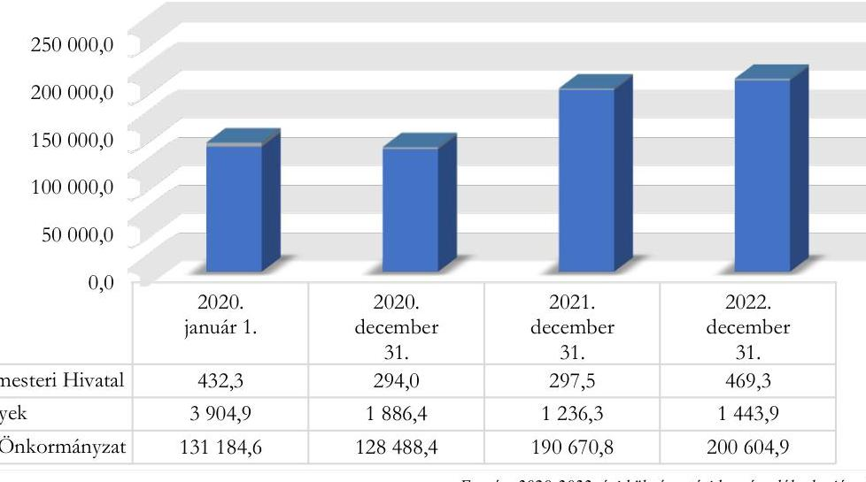

A Fővárosi Önkormányzat és a Főpolgármesteri Hivatal kötelezettségeinek állománya a 2020. év végéig 3,6\%-kal mérséklődött, ezt követően a 2022. év végéig folyamatosan 201 074,2 M Ft-ra emelkedett. Az intézmények kötelezettségei ugyanakkor 2020. január 1-jétől 2022. december 31-ig 63,0\%-kal 1 443,8 M Ft-ra csökkentek.

---

A Fővárosi Önkormányzat és az általa irányított költségvetési szervek 2020-2022. évi kötelezettségeit mérleg szerinti tagolásban a 6. ábra mutatja be.
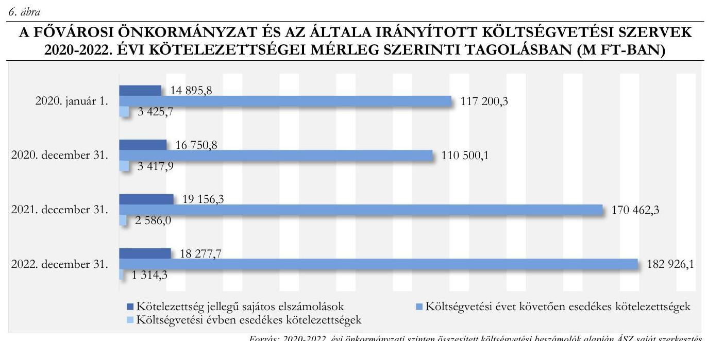

A Fővárosi Önkormányzat és költségvetési szervei költségvetési évben esedékes kötelezettségei 2020. január 1-jétől 2022. december 31-ig folyamatosan, összességében 61,6\%-kal (2 111,3 M Ft-tal) csökkentek. A csökkenést alapvetően a Fővárosi Állat- és Növénykert beruházásaihoz kapcsolódó kötelezettségek csökkenése okozta.
A költségvetési évet követően esedékes kötelezettségek 2020. január 1-jéről 2020. december 31-ére a Fővárosi Önkormányzat hiteltörlesztése eredményeként 5,7\%-kal 110 500,1 M Ft-ra mérséklődtek. Ezt követően az állomány a 2022. év végére 65,5\%-kal 182 926,1 M Ft-ra emelkedett, amelyet elsődlegesen a 2021. évben lehívott 65639,2 M Ft EIB hitel eredményezett. Az emelkedéshez hozzájárult még, hogy a Fővárosi Önkormányzat 2022. decemberben a BKK Zrt. részére a közlekedésszervezői feladatok ellátására 9784,2 M Ft pótlólagos forrást biztosított, amelynek kifizetése áthúzódott a következő évre, illetve a villamosenergia szolgáltatás december havi számlája az előző év azonos időszaki számlájához viszonyítva közel 900,0 M Ft-tal növekedett.
A kötelezettség jellegű sajátos elszámolások állománya 2020. január 1-jén 14 895,8 M Ft, a 2022. év végén 18 277,6 M Ft volt. Mindkét időpontban az állomány legnagyobb hányada ( $93,7 \%$-a, illetve 94,8\%a) a kapott előlegekből adódott.

A Fővárosi Önkormányzat és az általa irányított költségvetési szervek lejárt kötelezettségeinek állománya 2020 január 1-jétől 2021. december 31-ig folyamatosan - 1 275,6 M Ft-tal 20,4 M Ft-ra csökkent, azt követően a 2022. év végére 83,8 M Ft-ra emelkedett.
A Fővárosi Önkormányzat és az általa irányított költségvetési szervek lejárt kötelezettségeinek alakulását a 2020-2022. években a 7. táblázat szemlélteti.

---

7. táblázat

# A FŐVÁROSI ÖNKORMÁNYZAT ÉS AZ ÁLTALA IRÁNYÍTOTT KÖLTSÉGVETÉSI SZERVEK LEJÁRT KÖTELEZETTSÉGEINEK ALAKULÁSA A 2020-2022. ÉVEKBEN (M FT-BAN) 

| MÉGNEVEZÉS | 2020- | 2020- | 2021- | 2022- |
| :--: | :--: | :--: | :--: | :--: |
|  | JANUÁr 1. | DECEMBER 31. | DECEMBER 31. | DECEMBER 31. |
| Fővárosi Önkormányzat | 1,6 | 53,3 | 0,7 | 0,2 |
| Főpolgármesteri Hivatal | 1,5 | 21,0 | 4,6 | 35,8 |
| Intézmények | 1292,9 | 429,9 | 15,1 | 47,8 |
| Fővárosi Önkormányzat összesen | 1296,0 | 504,2 | 20,4 | 83,8 |
| -ebből 30 nap alatti kötelezettség | 1296,0 | 503,5 | 14,8 | 43,0 |
| 30-90 nap közötti kötelezettség | 0,0 | 0,5 | 0,0 | 35,2 |
| 90 napon túli kötelezettség | 0,0 | 0,2 | 5,6 | 5,6 |

Forrás: Fövárosi Önkormányzat tanúsítványi adatszolgáltatása alapján ÁSZ saját szerkezésétes

A Fővárosi Önkormányzatnál és költségvetési szerveinél a 2020. év elején a költségvetési évben esedékes kötelezettségeknek $37,8 \%$-a volt a lejárt kötelezettség, ez az arány a 2022. év végére $6,4 \%$-ra csökkent. A lejárt kötelezettségek nem likviditási nehézségekből adódtak, hanem jellemzően a késedelmesen beérkezett számlák, valamint a vitatott tartozások nem kerültek határidőben kifizetésre.
A 2023. év I. félév végén a Fővárosi Önkormányzatnak és költségvetési szerveinek a kötelezettségállománya a 2022. év végi állományhoz képest 4,6\%-kal 211 735,6 M Ft-ra emelkedett. A 2023. I. félév végén fennálló kötelezettségek 99,2\%-a Fővárosi Önkormányzatnál keletkezett és mindössze $0,8 \%$-a volt az intézmények ( $1437,5 \mathrm{MFt}$ ) és a Főpolgármesteri Hivatal (201,8 M Ft) kötelezettsége.
A 2023. év I. félév végén fennálló kötelezettségekből 420,7 M Ft volt a lejárt állomány, amelynek 92,6\%a 30 nap alatti tartozás volt. A 30 napon túli lejárt kötelezettségek ( $31,0 \mathrm{MFt}$ ) - az előző évekhez hasonlóan - vitatott tartozásokhoz kapcsolódtak. Így 5,6 M Ft Budapest Főváros Levéltárának előző években is fennálló tartozása volt, valamint a Romano Kher Budapesti Művelődési Háznak volt 25,4 M Ft kötelezettsége, mivel a számla kifizetéséhez szükséges dokumentumok a szállítótól teljeskörűen nem álltak rendelkezésre.
A Fővárosi Önkormányzatnál és költségvetési szerveinél a 2020-2022. években és 2023 I. félévében átütemezési megállapodással, valamint követelés beszámítással érintett kötelezettség nem volt.
A Fővárosi Önkormányzat és az általa irányított költségvetési szervek követelésállománya 2020. január 1-jétől 2022. év végéig 91 012,1 M Ft-ról 25,8\%-kal 114 501,4 M Ft-ra folyamatosan növekedett.
A Fővárosi Önkormányzat, Főpolgármesteri Hivatal és intézmények követeléseinek alakulását a 20202022. években a 7. ábra szemlélteti.

---

7. ábra

# A FÖVÁROSI ÖNKORMÁNYZAT, FŐPOLGÁRMESTERI HIVATAL ÉS INTÉZMÉNYEK KÖVETELÉSEINEK ALAKULÁSA A 2020-2022. ÉVEKBEN (M FT-BAN) 

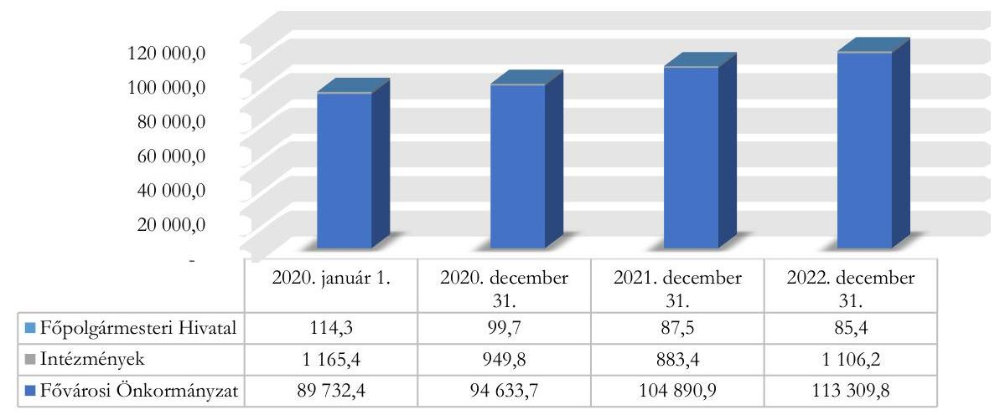

Forrás: 2020-2022. évi költségvetési beszámolók alapján ÁSZ saját szerkesztés
Az ellenőrzött években a követelésállomány 98,6\% - 99,0\%-ban a Fővárosi Önkormányzat követeléseit tartalmazta, amely a 2020. év elejétől a 2022. év végéig 26,3\%-kal 113 309,8 M Ft-ra folyamatosan emelkedett. A Fővárosi Önkormányzat követeléseinek legnagyobb része (75,5-86,8\%-a) a közhatalmi bevételekhez kapcsolódott, amelynek állománya a 2020 január 1-jei 77 954,5 M Ft-ról a 2022. év végére 23,1\%-kal 95 980,0 M Ft-ra emelkedett. Az év végi magas követelésállományok az iparűzési adóelőleg követelésként történő előírásának és fizetési kötelezettség teljesítési határidejének eltérő időpontjaiból adódott. Az állomány emelkedéséhez - az iparűzési adóbevétel emelkedéséhez hasonlóan - az adózók adóerőképességének javulása járult hozzá. A Fővárosi Önkormányzat követelésein belül jelentősebb csoportot képviselt még a működési (pl. szolgáltatás, készletértékesítés ellenértéke) bevételeket és felhalmozási (pl. ingatlanértékesítés) bevételeket érintő követelések. Ezek állománya 2020. január 1-jei 4 747,9 M Ft-ról a 2022. év végére 2 361,8 M Ft-ra mérséklődött.
A Főpolgármesteri Hivatalnál és az intézményeknél a legjellemzőbb követelések a szolgáltatások és készletértékesítések ellenértékére vonatkozó követelések voltak, amelyek állománya a 2020. év elejei 751,0 M Ft-ról 2022. év végére 541,8 M Ft-ra csökkent.
A Fővárosi Önkormányzat és az általa irányított költségvetési szervek lejárt követeléseinek alakulását a 2020-2022. években a 8 . táblázat mutatja be.
8. táblázat

## A FÖVÁROSI ÖNKORMÁNYZAT ÉS AZ ÁLTALA IRÁNYÍTOTT KÖLTSÉGVETÉSI SZERVEK LEJÁRT KÖVETELÉSEINEK ALAKULÁSA A 2020-2022. ÉVEKBEN (M FT-BAN)

| MEGNEVEZÉS | 2020.   JANUAR 1. | 2020.   DECEMBER 31. | 2021.   DECEMBER 31. | 2022.   DECEMBER 31. |
| :-- | --: | --: | --: | --: |
| Fővárosi Önkormányzat | 8497,5 | 6168,7 | 4511,4 | 6105,9 |
| Főpolgármesteri Hivatal | 10,0 | 6,9 | 6,2 | 2,6 |
| Intézmények | 305,4 | 389,3 | 322,2 | 233,9 |
| Fővárosi Önkormányzat összesen | $\mathbf{8 8 1 2 , 9}$ | $\mathbf{6 5 6 4 , 9}$ | $\mathbf{4 8 3 9 , 8}$ | $\mathbf{6 3 4 2 , 4}$ |

---

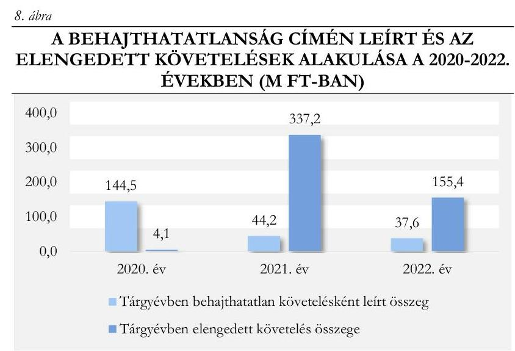

*Forrás: Fővárosi Önkormányzat tanúsítványi adatszolgáltatása alapján ÁSZ saját szerkesztés*

A Fővárosi Önkormányzat és költségvetési szerveinek lejárt követelésállománya 2020. január 1-jétől 2022. év végére 28,0%-kal 6 342,4 M Ft-ra csökkent. A 2020. év elején a követelések 9,7%-a, a 2022. év végén 5,5%-a volt határidőn túli követelés.

Az ellenőrzött időszakban a Fővárosi Önkormányzat és költségvetési szervei a lejárt követelések behajtása érdekében fizetési felszólításokkal intézkedtek. A sikertelen felszólítások után a követeléseket jellemzően ügyvédi felszólítással, fizetési meghagyás kibocsátásával, valamint peres eljárás keretében próbálták érvényesíteni.

- A Főpolgármesteri Hivatal Adó Főosztálya az adóval kapcsolatos követelések behajtása érdekében a 2020. évben végrehajtási cselekményként 9 425 db hatósági átutalási megbízást, valamint 23 db jövedelem letiltást bocsájtott ki, továbbá jelzálog bejegyzése érdekében két alkalommal intézkedett. A 2021. évre vonatkozóan 15 550 db hatósági átutalási megbízást, illetve 23 db jövedelemletiltást bocsájtottak ki az adóhátralékok rendezése érdekében. Végrehajtási cselekményként a 2022. évre 28 756 db hatósági átutalási megbízás, továbbá 19 db jövedelem letiltás foganatosítására került sor. A 2020-2022. években a lejárt követelések behajtása érdekében megtett intézkedések eredményeként – az intézkedéssel érintett követelések 28,4%-át – 8 034,2 M Ft bevételt realizáltak.
- **Vagyonhasznosítással** (jellemzően szociális bérlakásokkal, ingatlan bérbeadásokkal) összefüggő peres ügyekkel kapcsolatos függő követelésként a 2020. évben 230,2 M Ft-ot a 2021. évben 255,6 M Ft-ot, a 2022. évben 109,7 M Ft-ot tartottak nyilván. A követelések behajtása érdekében megtett intézkedések eredményeként a 2020. év végén kimutatott követelésekből 0,25 M Ft bevétel folyt be. A 2021. év végén nyilvántartott követelésből 25,7 M Ft bevétel realizálódott, míg a 2022. év végi követelésekből 2023. félév végéig teljesítés nem volt.
- A **Fővárosi Önkormányzatnak** a 2020-2022. években **összesen 10** egyéb szerződéses előírásokból eredő követelésekkel kapcsolatos peres ügye volt bíróságon. A pertárgyak értéke a nyilvántartás szerint 2020-ban 2 956,8 M Ft, 2021-ben 2 974,8 M Ft, 2022-ben 3 208,5 M Ft volt. A helyszíni ellenőrzés befejezésének időpontjáig a peres ügyből öt került jogerősen lezárásra, abból három esetben történt megtérülés összesen 1 023,9 M Ft értékben.

A Fővárosi Önkormányzatnál és költségvetési szerveinél a 2020-2022. években **követelések behajthatatlanná minősítésére és követelés elengedésre is sor került.** A behajthatatlanság címén leírt és az elengedett követelések alakulását a 2020-2022. években a 8. ábra szemlélteti.

A Fővárosi Önkormányzatnál jellemzően vagyonhasznosítási feladatokhoz (ingatlanok üzleti és szociális célú bérbeadásához) kapcsolódóan került sor 2020-ban 129,7 M Ft, 2021-ben 19,0 M Ft, 2022-ben 2,6 M Ft összegben behajthatatlanság címén követelés leírására. Az intézményeknél térítésidíj-, gyógyszerköltség hátralék, ingatlan bérbeadáshoz kapcsolódó közvetített szolgáltatások, munkavállalónak

---

nyújtott lakáscélú kölcsön behajthatatlansága miatt 2020-ban 14,7 M Ft, 2021-ben 25,2 M Ft, 2022-ben 35,0 M Ft összegben írtak le követeléseket.
A Fővárosi Önkormányzat a BVH Nonprofit Zrt. felé fennálló osztalék követeléséből a 2021. évben 337,2 M Ft-ot, a 2022. évben 155,4 M Ft-ot a BKM Nonprofit Zrt.-re ${ }^{36}$ - finanszírozási igényei kielégítésére - engedményezett, amelyet elengedett követelésként számolt el. A Főpolgármesteri Hivatal 2020. évi 3,8 M Ft elengedett követelése jellemzően munkavállalók lakáskölcsönéhez kapcsolódott.

A követelésállomány a 2023. félév végére - az előző év végéhez képest - több mint kétszeresére 251 341,6 M Ft-ra emelkedett. A növekedést az iparűzési adónem sajátossága okozta, mivel 2023. II. negyedévében a 2022. évi iparűzési adóbevallások alapján előírásra kerültek a 2023. szeptemberében, valamint a 2024. márciusában fizetendő adóelőlegek, illetve a 2022. évi adóelőleg és fizetendő adó különbözete.
A lejárt követelések 2022. december 31-éhez viszonyítva 35,0\%-kal 8 477,6 M Ft-ra emelkedtek, amelynek 96,1\%-a Fővárosi Önkormányzatnál keletkezett. A Fővárosi Önkormányzat lejárt követeléseinek 71,4\%a közhatalmi bevételekre, $21,0 \%$-a múködési bevételekre szóló lejárt követelésekből származott.
A Fővárosi Önkormányzat és költségvetési szervei 2023. június 30 -án fennálló határidőn túli követelésállományát lejárat szerint a 9. ábra szemlélteti.
9. ábra

A FŐVÁROSI ÖNKORMÁNYZAT ÉS KÖLTSÉGVETÉSI SZERVEI 2023. JÚNIUS 30-ÁN FENNÁLLÓ HATÁRIDŐN TÚLI KÖVETELÉSÁLLOMÁNYA LEJÁRAT SZERINT (M FT-BAN)
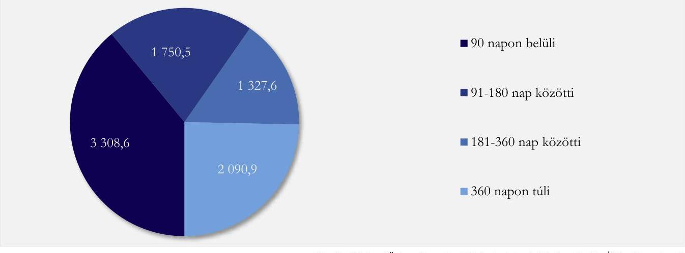

A 2023. év első félév végén a 90 napon túl lejárt követelések állománya 5 169,0 M Ft volt, ami a 2022. év végéhez képest $2,2 \%$-os csökkenést jelentett.
4.3. számú megállapítás

A Fővárosi Önkormányzat közvetlen többségi befolyása alatt álló, kötelező közfeladatellátásban meghatározó szerepet játszó gazdasági társaságok múködtetése a 2020-2022. években a 2019. évi szinthez képest jelentős többletterhet rótt a Fővárosi Önkormányzat költségvetésére. A veszteséges gazdálkodásból, illetve múködési nehézségekből adódóan tőkeemelésekre két gazdasági társaságot érintően került sor, továbbá kölcsönöket nyújtottak három gazdasági társaság részére.

A 2020-2022 közötti időszakban a Fővárosi Önkormányzat többségi befolyása alatt álló gazdasági társaságnak - az időközi változásokra is figyelemmel - 63 gazdasági társaság minősült, amelyekben a

---

Fővárosi Önkormányzat a Ptk. ${ }^{37}$ alapján a szavazatok több mint felével vagy meghatározó befolyással rendelkezett. A Fővárosi Önkormányzat befolyásának Taktv. ${ }^{38}$ alapján számított mértéke 54 gazdasági társaság esetében $100 \%$, hét gazdasági társaság esetében $50 \%$-ot meghaladó, míg a fennmaradó két gazdasági társaságot érintően $50 \%$ volt.
A Cégráló részletes bemutatását a VI. számú melléklet tartalmazza.
A Cégráló összesített mérlegfőösszege - a 2020. évben növekedett, a 2021. évben stagnált, majd a 2022. évben ismét emelkedett - a 2019. évi 1400 558,7 M Ft-os bázisértékhez képest 10,39\%-kal nőtt, így a 2022. évben 1546 108,7 M Ft volt. A Cégráló tagjainak - mérlegfőösszeg alapján jellemezhető - vagyona széles értékskálán mozgott. A 2021. évben előfordult, hogy az alsó érték még az 1,0 M Ft értékhatárt sem lépte át, ezzel szemben a felső érték 696 580,0 M Ft-ról indulva a 2022. évben 753 062,0 M Ft-on tetőzött. A Fővárosi Önkormányzat többségi befolyása alatt álló gazdasági társaságok főbb mérlegsorai szélső értékeinek és átlagainak alakulását a 2019-2022. években a VII. számú melléklet mutatja be.
A Cégráló meghatározó tagjai a BKK tcs. ${ }^{39}$, a BKV tcs. ${ }^{40}$, a BVH tcs. ${ }^{41}$, a Fővárosi Csatornázási Művek Zrt. és a Fővárosi Vízművek Zrt. voltak. A Meghatározó Társaságok tevékenysége a Fővárosi Önkormányzat kötelező közfeladatainak ellátáshoz kapcsolódott, a közlekedésszervezés-, a helyi közösségi közlekedés ellátását, az integrált közműszolgáltatást, valamint a víziközmű-szolgáltatásokat érintette.
Az elemzésbe bevont - konszolidált adatok figyelembevételével számított - gazdasági mutatók Cégráló szintű alakulását a 2019-2022. években a 10. ábra szemlélteti.
10. ábra

A GAZDASÁGI MUTATÓK CÉGHÁLÓ SZINTŰ ALAKULÁSA A 2019-2022. ÉVEKBEN
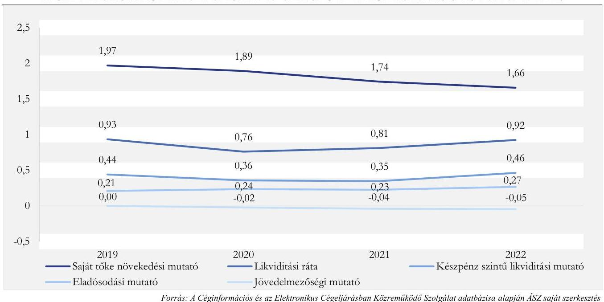

A Meghatározó Társaságok gazdasági mutatóinak alakulását a 2019-2022. években a VIII. számú melléklet mutatja be.

# A Cégráló jövedelmezősége 

A jövedelmezőségi mutató szerint a Cégráló összesített jövedelmezősége folyamatosan csökkent. A mutató értéke $-0,0001$ értékről minden évben közel egyező ütemben csökkenve, 2022 végére $-0,0456$ értékre süllyedt.

---

A részedés piaci értékét is kifejező saját tőke Cégráló szerinti értéke a 2019. évi 515 547,4 M Ft-ról 437 548,9 M Ft-ra, 77 998,5 M Ft-tal csökkent, amelyből 49 314,7 M Ft-ot tett ki a 2020-2022 közötti időszak vesztesége.
A 2019-2022 közötti időszak kedvezőtlen jövedelmezőségi helyzete a BKK tcs., a BKV tcs. és a BVH tcs. működéséhez köthető.
A jövedelmezőségi mutató legkedvezőtlenebb értékei a BKK tcs. esetében mutatkoztak. A 2019-2021. években a mutató rendre negatív értéket vett fel a veszteséges gazdálkodásból adódóan, míg a 2020. évi mélypontban a BKÜ Zrt. ${ }^{42}$ beolvadásának saját tőke csökkenést eredményező hatása is közrejátszott. A BKK tcs. 2020-2021. évi veszteségéhez a koronavírus járványhelyzet miatt az utazási szolgáltatások igénybevételének visszaesése is hozzájárult, illetve a 2021. évben a személyi jellegű ráfordítások növekedése is jelentős hatást gyakorolt az eredményre.
A Cégráló összesített saját tőke értékének közel felét (42,3\%-45,9\%) kitevő saját tőkeérték és a kimagasló veszteségek eredményezték, hogy a Cégráló jövedelmezőségének alakulására a legnagyobb negatív hatást a BKV tcs. gyakorolta, amely esetében a saját tőke változásának egyenlege a Cégráló szintű csökkenés közel $60 \%$-át tette ki, 46227 M Ft volt, amellyel közel megegyező összegű vesztesége keletkezett. A 20202022. években évről évre megduplázódó veszteségekben - így különösen a 2022. évben - az anyagjellegú ráfordítások, azon belül is az energiaköltségek, továbbá a személyi jellegű ráfordítások emelkedésének hatása volt a leginkább számottevő.
A BVH tcs. a saját tőkéjének Cégrálóban képviselt jelentős aránya és a 2020., 2021. évi veszteségei következtében gyakorolt érdemi negatív hatást a Cégráló jövedelmezőségének alakulására. A 2020-2022 közötti időszak 57 810,3 M Ft összegű tőkevesztéséből 14 739,2 M Ft-ot képviselt az adózott eredmény hatása, a fennmaradó rész alapvetően az átalakulásokkal állt összefüggésben. A 2020. évi veszteségben jelentős szerepet játszó Budapest Gyógyfürdői Zrt. esetében a veszteséget a koronavírus járványhelyzet hatása, míg az FKF Nonprofit Zrt. ${ }^{43}$-nél a hulladékgazdálkodási közszolgálatás árbevételének csökkenése játszott leginkább szerepet. A BVH Nonprofit Zrt., mint anyavállalat esetében főként a pénzügyi műveletek negatív eredménye okozta a veszteségeket, amely az FKF Nonprofit Zrt.-ben fennálló részesedés vonatkozásában elszámolt értékvesztéshez kapcsolódott.
A Fővárosi Önkormányzat vagyonmérlegében a közvetlen többségi befolyás alatt álló gazdasági társaságokban fennálló tartós részesedések mérleg szerinti értékét az időszakban végbement átalakulási folyamatok hatására a 2019. évi 294 854,1 M Ft-ról a 2022. évre 283 494,9 M Ft-ra módosították. A tartós részesedések könyv szerinti értéke és a saját tőke alapján megállapított piaci értéke között azonban nagy eltérések mutatkoztak. Az eltérés összege a 2020. évben volt a legnagyobb, a piaci érték javára meghaladva a 200 milliárd forintot (209 483,1 M Ft). A 2022. évre az eltérés 122 485,1 M Ftra apadt, de ez a könyv szerinti értékhez viszonyítva még mindig 43,2\%-os eltérést jelentett. A piaci érték néhány kivételtől eltekintve az összes gazdasági társaság esetében minden évben meghaladta a könyv szerinti értéket.
A Meghatározó Társaságok müködtetése összességében 58 614,2 M Ft veszteséget eredményezett a 2020-2022. években. A Meghatározó Társaságokon kívüli körben a Budapest Gyógyfürdői Zrt. 2021. évi veszteségén kívül jelentős veszteségek nem képződtek. A nyereség tekintetében kiemelésre méltó a Budapesti Nagybani Piac Zrt. adózott eredménye, amely végig megőrizte pozitív előjelét és a 2020-2022. években összértéke 3 818,6 M Ft volt, továbbá megemlítendő a Budapest Gyógyfürdői Zrt. 2022. évi müködése, amelyet 2 433,6 M Ft adózott eredménnyel zártak.

---

A többségi befolyás alatt álló gazdasági társaságok adózott eredményének alakulására a Fővárosi Önkormányzat költségvetéséből nyújtott múködési és fejlesztési támogatások közvetlenül is befolyással voltak, de a támogatások növekedése sem tudta megállítani a jövedelmezőségi helyzet romlását.
A Fővárosi Önkormányzat többségi befolyása alatt álló gazdasági társaságokkal összefüggő főbb bevételek és kiadások jogcímenkénti alakulását a 2019-2022. években a 9. táblázat mutatja be.

# 9. táblázat 

A FÖVÁROSI ÖNKORMÁNYZAT TÖBBŚÉGI BEFOLYÁSA ALATT ÁLLÓ GAZDASÁGI TÁRSASÁGOKKAL ÖSSZEFÜGGŐ FÖBB BEVÉTELEK ÉS KIADÁSOK JOGCÍMENKÉNTI ALAKULÁSA A 2019-2022. ÉVEKBEN (M FT-BAN)

| JELLEMZG | 2019 | 2020 | 2021 | 2022 |
| :--: | :--: | :--: | :--: | :--: |
| Költségvetési bevételek | 1148,8 | 3132,5 | 7828,3 | 3524,3 |
| Önkormányzati többségi tulajdonú vállalkozástól kapott osztalék (B404) ${ }^{1}$ | 440,6 | 2340,6 | 985,0 | 1101,6 |
| Müködési célú visszatérítendő támogatások, kölcsönök visszatérülése önkormányzati többségi tulajdonú nem pénzügyi vállalkozásoktól (B64) | 508,1 | 630,3 | 6224,5 | 2181,9 |
| Egyéb müködési célú átvett pénzeszközök önkormányzati többségi tulajdonú nem pénzügyi vállalkozásoktól (B65) | 200,1 | 161,6 | 596,4 | 240,8 |
| Egyéb felhalmozási célú átvett pénzeszközök önkormányzati többségi tulajdonú nem pénzügyi vállalkozásoktól (B75) | 0,0 | 0,0 | 22,4 | 0,0 |
| Költségvetési kiadások | 126 866,2 | 172 321,7 | 160 379,7 | 181 970,1 |
| Müködési célú visszatérítendő támogatások, kölcsönök nyújtása önkormányzati többségi tulajdonú nem pénzügyi vállalkozásoknak (K508) | 506,2 | 2129,0 | 7484,1 | 40,5 |
| Egyéb müködési célú támogatások önkormányzati többségi tulajdonú nem pénzügyi vállalkozásoknak (K512) | 121786,8 | 161 252,7 | 146 183,6 | 168568,3 |
| Egyéb felhalmozási célú támogatások önkormányzati többségi tulajdonú nem pénzügyi vállalkozásoknak (K89) | 4573,2 | 8940,0 | 6712,0 | 13361,3 |
| Egyenleg | $-125717,4$ | $-169189,2$ | $-152551,4$ | $-178445,8$ |

Forrás: Az éves költségvetési beszámolók, a zárszámadási rendeletek és kapcsolódó elöterjesztések alapján ÁSZ saját szerkesztés
${ }^{1}$ Az éves költségvetési beszámolók Önkormányzati többségi tulajdonú vállalkozástól kapott osztalék (B404) soron bemutatott adatokkal való eltérést az okozza, hogy az éves költségvetési beszámolóban kisebbségi önkormányzati tulajdonban álló gazdasági társaságtól származó osztalékbevételt is bemutatuk az érintett részletező sorokon.

Az önkormányzati többségi tulajdonú gazdasági társaságoknak nyújtott múködési célú támogatások összege a 2020-2022. években 476004,6 M Ft volt, amelyből $90 \%$-ot meghaladóan a Meghatározó Társaságok részesültek. A működési támogatások összege a 2020-2022. években minden esetben jelentősen - a 2022. évben már 38,4\%-kal - meghaladta a 2019. évi bázisértéket, amely így mintegy 110 644,2 M Ft növekményt eredményezett az ellenőrzött időszakban.
A legnagyobb összegű működési támogatást minden évben a BKK Zrt. közösségi közlekedés közlekedésszervezési feladataihoz való hozzájárulás képezte, amely a 2020-2022. években - évi 12000 M Ft-os állami támogatással együtt - összesen 390 749,0 M Ft-ot jelentett. Ebből a BKK Zrt.-vel kötött feladatellátási szerződés keretében jutott forráshoz a BKV Zrt. is.
A BKK Zrt. közlekedésszervezési kötelező közfeladataihoz való önkormányzati és állami hozzájárulás alakulását a 2019-2022. években a 11. ábra szemlélteti.

---

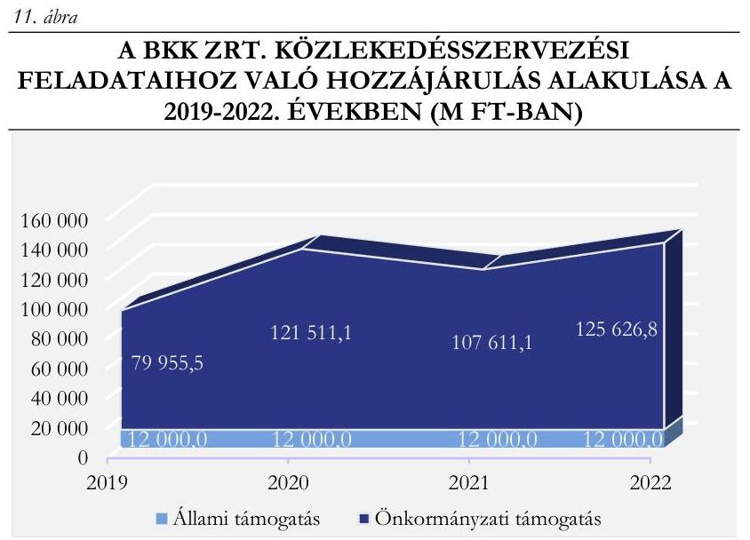

Forrás: Fővárosi Önkormányzat tanúsitványi adatszolgáltatása alapján ÁSZ saját szerkesztés

A BKK Zrt.-hez kötődött az „Agglomerációs belső szakaszok költségtérítési bozzájárulása" címen - a Budapest környéki elővárosi közösségi közlekedés állami kézbe történő 2016. évi visszavételéhez kapcsolódóan kötött együttműködési megállapodások alapján - a 20202022. években összesen 20 480,0 M Ft összegben juttatott támogatás is, de annak végső kezdeményezettjei az agglomerációs szolgáltatók (MÁV-HÉV Zrt., Volánbusz Zrt.) voltak, így az nem minősült a BKK Zrt. múködési forrásának.

Jelentős támogatásban részesültek a BVH Nonprofit Zrt.-hoz tartozó közművállalatok, illetve azok jogutódjaként a BKM Nonprofit Zrt. is. Így az FKF Nonprofit Zrt., majd a BKM Nonprofit Zrt. FKF Köztisztasági Divíziója által ellátott közterület tisztántartási feladatokra 27 611,6 M Ft, a FŐKERT Nonprofit Zrt. ${ }^{44}$, majd a BKM Nonprofit Zrt. FŐKERT Kertészeti Divíziója által végzett tevékenységre 12 888,6 M Ft támogatást biztosított a 2020-2022 közötti időszakban a Fővárosi Önkormányzat.
Az előadó-művészeti tevékenységet végző gazdasági társaságoknak - önkormányzati forrásból - nyújtott támogatások összege a 2020-2022. években 8 449,8 M Ft volt, amelynek éves 2 816,6 M Ft-os átlagértéke 16,5\%-kal meghaladta a 2019. évi 2 418,2 M Ft-os bázisértéket.
A 2020-2022. években folyamatosan növekvő, összesen 11 386,8 M Ft múködési célú támogatásban részesült - az operatív közútkezelési feladatok támogatására - a BKK Zrt. leányvállalata a Budapest Közút Zrt. is.
A Fővárosi Önkormányzat múködési kiadásai, azon belül a dologi kiadások között jelentek meg egyes többségi befolyás alatt álló gazdasági társaságok részére közszolgáltatási szerződés alapján, számla ellenében teljesített kifizetések. A BFVT Kft. ${ }^{45}$, a BFVK Zrt. ${ }^{46}$ és az ENVIRODUNA Kft. által nyújtott közszolgáltatásokkal, a BDK Kft. ${ }^{47}$ által biztosított köz- és díszvilágítási tevékenységgel, az FTSZV Kft. ${ }^{48}$ szennyvíz kezelésével, a Fővárosi Csatornázási Művek Zrt. ár- és belvízi létesítmények fenntartásával, a Budapest Közút Zrt. közútkezelési feladataival, valamint a BKK Zrt. stratégiai közútkezelési és egyéb feladataival kapcsolatos dologi kiadások 57 524,8 M Ft-ot tettek ki a 2020-2022. években.
Felhalmozási célra összesen 29 013,3 M Ft támogatás került elszámolásra a Fővárosi Önkormányzatnál a 2020-2022. években, amelynek közel felét (46,1\%) 13 361,3 M Ft értékben a 2022. évi támogatások tették ki. A támogatások többsége a BKV Zrt. megvalósításában végzett feladatokhoz kapcsolódott, de további jelentős támogatásban részesült a BKK Zrt. is.
A Fővárosi Önkormányzat többségi befolyása alatt álló gazdasági társaságok múködtetésével járó anyagi terhet bevételi oldalon csak kis mértékben ellensúlyozták az osztalékból származó tulajdonosi bevételek. A 2020-2022. években összesen 4 427,2 M Ft osztalékbevételt számolt el a Fővárosi

---

Önkormányzat, amelyhez közel azonos összegben járult hozzá a Budapesti Nagybani Piac Zrt. és a BVH Nonprofit Zrt. (1 920,2 M Ft, illetve 1907,4 M Ft).

# A Cégráló vagyoni helyzete 

A Fővárosi Önkormányzat többségi befolyása alatt álló gazdasági társaságok saját tőke növekedési mutatóval jellemzett vagyoni helyzete folyamatosan romlott a 2020-2022. években. A 2019. évi 1,97-es bázisértékhez képest a mutató értéke az időszak végére 1,66-ra esett vissza. Bár a Cégráló egészét tekintve a mutató - a saját tőke és a jegyzett tőke összesített állománya alapján képzett - értéke meghaladta az 1-et, de a csökkenő tendencia miatt a vagyoni helyzet alakulása nem tekinthető kedvezőnek.
A saját tőke növekedési mutatójának értéke a Meghatározó Társaságok közül kizárólag a BKK tcs. esetén - a 2020. és 2021. évi veszteséges gazdálkodásból adódóan - csökkent 1 alá, de a Meghatározó Társaságok körében mindenhol előfordult negatív irányú változás, a BKV tcs. és a Fővárosi Csatornázási Múvek Zrt. esetén a csökkenő tendencia a teljes időszakban érvényesült.
A Meghatározó Társaságokon kívüli körben is jelentős volt a negatív irányú változások aránya (41,5\%) és az esetek csak kis hányadában fordult elő, hogy a saját tőke növekedési mutatójának változása a teljes időszakban pozitív irányú volt.
A Fővárosi Önkormányzat közvetlen többségi befolyása alatt álló gazdasági társaságok közül egy gazdasági társaságot (BKK Zrt.) érintően vált szükségessé a saját tőke rendezése, amely a 20202021. években 3 260,0 M Ft-tal terhelte a Fővárosi Önkormányzat költségvetését.

A REK Kft. ${ }^{49}$ jegyzett tőkéjének megemelésére a múködéshez szükséges pénzügyi forrás biztosítása céljából került sor a 2021. évben két részletben, összesen 23,5 M Ft értékben.
A 2022. évet követő 2023. I. félévig terjedő időszakban a Fővárosi Önkormányzat részéről újabb pótbefizetésekre már nem került sor.

## A Cégráló eladósodottsága

A Fővárosi Önkormányzat többségi befolyása alatt álló gazdasági társaságok Cégráló szintú eladósodottsága az eladósodási mutató alapján a 2020-2022. években romlott a 2019. évi bázisértékhez képest.
Az eladósodottság mértéke az időszak végén, 2022. évben volt a legmagasabb $(0,27)$, de a mutató értéke Cégráló szinten így is a kedvezőnek tekinthető 0,4 alatti tartományban maradt.
A Meghatározó Társaságok közül kizárólag a Fővárosi Vízmúvek Zrt. eladósodási mutatója emelkedett a kedvezőtlennek tekinthető 0,7 érték fölé és ez a 0,81-0,83 közötti értékekkel jellemezhető kedvezőtlen eladósodottsági szint a teljes 2019-2022. közötti időszakban állandósult. A források szerkezete érdemben nem változott, a kötelezettségek magas aránya dominált a teljes időszakban, amelyek túlnyomó részét a - vagyonkezelésbe vett vagyonhoz kapcsolódóan az önkormányzatokkal, különösen a Fővárosi Önkormányzattal szembeni - hosszú lejáratú kötelezettségek jelentették.
A Meghatározó Társaságok körén kívül egyes színházak esetében volt leginkább jellemző az eladósodás kedvezőtlen szintje, amely a 2022. év végére is megmaradt. A Budapest Bábszínház Nonprofit Kft. ${ }^{50}$, a Kolibri Színház Nonprofit Kft. ${ }^{51}$, a Margitszigeti Színház Nonprofit Kft. és az Új Színház Nonprofit Kft. tartozott ebbe a körbe.
A Fővárosi Önkormányzat a BKK Zrt. fejlesztéseihez 60 000,0 M Ft, míg a Fővárosi Vízmúvek Zrt. fejlesztéseihez 1,4 M EUR összegű hitel igénybevételének jóváhagyását kérelmezte a 2021. és 2022. évben, de az adósságot keletkeztető ügyletek megkötéséhez a Kormány nem járult hozzá.

---

# A Cégháló likviditási helyzete 

A Fővárosi Önkormányzat többségi befolyása alatt álló gazdasági társaságok Cégháló szintű likviditási helyzete - a likviditási ráta, valamint a készpénz szintű likviditási mutató alapján - a 2019. évi bázisadathoz képest a 2020. évben jelentősen romlott. Ezt követően a 2021. évben kis mértékben javult, végül a 2022. évben a 2019. év körüli szinten állapodott meg.
Mind a likviditási ráta, mind a készpénz szintű likviditási mutató értéke a teljes időszakban - a 2019-es bázisévet is beleértve - jelentősen elmaradt a kívánatos értéktől. A likviditási ráta a pénzügyi stabilitás szempontjából kiemelt fontosságú 1 értéktől elmaradva teljesített, a készpénz szintű likviditási mutató a 0,5 értékhatárt sem lépte át.
A Cégháló szintű likviditásra alapvetően a Meghatározó Társaságok körébe tartozó BKV tcs. kedvezőtlen helyzete volt hatással az érintett mérlegsorokban képviselt magas aránya miatt. A BKV tcs. esetén a likviditási ráta a 0,27-0,38, míg a készpénz szintű likviditási mutató a 0,07-0,14 közötti sávban mozgott a 2019-2022. évek közötti időszakban. A likviditási mutatók értékeinek változásában a rövid lejáratú kötelezettség állományának mozgása dominált, amely elsősorban a szállítói kötelezettségek és a fejlesztési támogatásokhoz kapcsolódó előlegek állományváltozásához kapcsolódott.
A Fővárosi Önkormányzat a 2020-2022. években a többségi befolyása alatt álló gazdasági társaságoknak összesen 9653,6 MFt összegben nyújtott visszatérítendő támogatásokat, kölcsönöket, amelyekre az esetek többségében a likviditás megőrzésével összefüggésben került sor.
A legnagyobb összegű kölcsönben a Budapest Gyógyfürdői Zrt. részesült három alkalommal összesen 8 913,5 M Ft értékben, amely az összes kölcsönnyújtás $92,3 \%$-át tette ki. A 2020. évben folyósított 1500,0 MFt összegű kölcsön a világjárvánnyal összefüggésben kialakult likviditási hiány, jövedelmezőségi- és foglalkoztatási válság kezelését, illetve a múködés biztosítását szolgálta. A 2021. évi 7 401,5 M Ft-os kölcsön nyújtása a Rácz Fürdő és Hotel ingatlanegyüttes tulajdonjogának megszerzése érdekében történt, míg a 2022. évi 12,0 M Ft-os kölcsön a 2021. évi kölcsön hátralékos kamatának tőkésítéséből származott.
A BKK Zrt. és a BKV Zrt. részére a 2020-2022 közötti időszakban a beruházásokhoz kapcsolódó ÁFA finanszírozás céljából került sor minden évben kölcsön nyújtására összesen 706,6 M Ft, illetve 33,6 M Ft összegben.
A Budapest Vásárcsarnokai Kft.-vel szemben fennálló követelés a Fővárosi Önkormányzat rendelkezése alapján, a CSAPI által - a Budapest Vásárcsarnokai Kft. jogelődjének, a Fővárosi Autópiac Kft.-nek nyújtott 2021. évi tagi kölcsönből fakadt. A szervezeti integráció részeként, a múködés és szolgáltatásnyújtás folyamatosságának biztosítása, a gazdálkodás stabilitása érdekében nyújtott 322,0 M Ft-os kölcsönhöz kapcsolódó követelés a CSAPI megszűnését követően szállt át a Fővárosi Önkormányzatra.
A 2020. évi nyitó kölcsönállományból és a 2020-2022. években nyújtott kölcsönökből 90,5\% visszatérült az időszak során, így a kintlévőség összege a 2022. évben mindössze 943,3 MFt volt. A kölcsönök visszafizetése nem minden esetben volt összhangban az eredetileg tervezettel, mivel a határidő betartását a kölcsönvevő gazdasági társaságok likviditási helyzetének alakulása nem tette lehetővé.
A 2022. évi záróállományban szereplő tételek közül a Budapest Gyógyfürdői Zrt. a 2023. év I. félévében rendezte a 608,0 M Ft-os és a 12,0 M Ft-os elmaradását, a BKV Zrt. visszafizette a fennmaradt 1,3 M Ftot, a Budapest Vásárcsarnokai Kft. nem lejárt esedékességű 322,0 M Ft-os tagi kölcsönét az időszakban még nem fizette vissza.

---

# JAVASLATOK 

Az ÁSZ tv. 33. § (1) bekezdésében foglaltak értelmében az ellenőrzött szervezet vezetője köteles a jelentésben foglalt megállapításokhoz kapcsolódó intézkedési tervet összeállítani és azt a jelentés kézhezvételétől számított 30 napon belül az ÁSZ részére megküldeni. Amennyiben az ellenőrzött szervezet vezetője nem küldi meg határidőben az intézkedési tervet, vagy továbbra sem elfogadható intézkedési tervet küld, az Állami Számvevőszék elnöke az ÁSZ tv. 33. § (3) bekezdése a) és b) pontjaiban foglaltakat érvényesítheti.

## A FŐPOLGÁRMESTER RÉSZÉRE

1. Intézkedjen a nyilvános jelentés kézhezvételét követően az Állami Számvevőszék jelentésének a Közgyűlés soron következő ülésére történő előterjesztéséről. A napirend tárgyalásáról szóló jegyzőkönyvvel együtt a jelentést tájékoztatásul küldje meg a Kormányhivatal számára is.
2. Csatolja a költségvetési rendelettervezet Közgyűlés elé történő előterjesztéséhez az Ávr. 27. § (2) bekezdésben előírtak alapján legalább a Pénzügyi és Közbeszerzési Bizottság írásos véleményét.
3. A negatív költségvetési egyenlegre tekintettel továbbra is tegyen intézkedéseket a költségvetési egyensúly helyreállítására az Alaptörvény N) cikkében rögzített fenntartható költségvetési gazdálkodás elvének érvényesítése érdekében.

## A FŐJEGYZŐ RÉSZÉRE

1. Készítse elő az Önkormányzati SZMSZ módosítását, és kezdeményezze annak Közgyűlés elé terjesztését annak érdekében, hogy az az Mötv. 57. § (1) bekezdésében foglaltaknak megfelelően tartalmazza a Pénzügyi és Közbeszerzési Bizottság Mötv. 120. § (1) bekezdés a) pontja szerinti feladat- és hatáskörét.
2. Gondoskodjon az Áht. 29/A. §-a alapján - a Közgyűlés részére beterjesztendő - a Gst. 10. § (5) bekezdés szerinti feltétel teljesülésének bemutatását biztosító középtávú költségvetési tervszámokat tartalmazó határozat-tervezet előkészítéséről.
3. Gondoskodjon az Ávr. 27. § (1) bekezdésében előírtak alapján a költségvetési rendelettervezet költségvetési szervek vezetőivel történő egyeztetéséről, az egyeztetés eredményének írásba foglalásáról, majd az egyeztetés eredményének Közgyűlés bizottságai elé történő előterjesztés elkészítéséről.
4. Tegyen intézkedéseket azon kontrolltevékenységek kiépítésére és/vagy megfelelő müködtetésére, amelyek megelőzik a költségvetés tervezés és zárszámadás készítés folyamatában - a rendelettervezetek véleményezése, előterjesztése, tartalma és jóváhagyása vonatkozásában - a jelentésben leírt szabálytalanságok ismételt előfordulását.

---

5. Intézkedjen annak érdekében, hogy a költségvetés tervezése során az Áht. 4. § (2) bekezdésében elöirtaknak megfelelően biztosított legyen a - kamatbevételek és más nyereségjellegü bevételek, a forgatási célú belföldi értékpapírok beváltására, értékesítésére, valamint a lekötött bankbetét megszüntetésére tervezett finanszírozási bevétel, továbbá az egyéb müködési célú támogatások elöirányzatokon - tervezett bevételek közgazdasági megalapozottsága, továbbá az, hogy - a szolidaritási hozzájárulás, valamint az Egészséges Budapest program tekintetében - annyi kiadás kerüljön megtervezésre, amennyi a feladat ellátásához indokoltan szükséges.
6. Intézkedjen az előirányzatok vonatkozásában a részletező nyilvántartás vezetésére vonatkozó kötelezettség Áhsz. 14. melléklet I. pontjában elöirtaknak megfelelő teljesitését biztosító belső kontrollrendszer kialakításáról és/vagy müködtetéséről.
7. Intézkedjen a Fővárosi Önkormányzat és a Főpolgármesteri Hivatal költségvetési beszámolóiban kimutatott kötelezettségvállalással terhelt maradvány összegének Áhsz. 39. § (3) bekezdés szerinti részletező nyilvántartással történő alátámasztásáról.

---

# MELLÉKLETEK 

## I. SZ. MELLÉKLET: ÉRTELMEZŐ SZÓTÁR

adósságot keletkeztető ügylet
banki kötelezettségek állományának változása
banki kötelezettségek forrásokon belüli aránya
beruházás

Budapest Főváros Főpolgármesteri Hivatala

Adósságot keletkeztető ügylet és annak értéke:
a) hitel, kölcsön felvétele, átvállalása a folyósítás, átvállalás napjától a végtörlesztés napjáig, és annak aktuális tőketartozása,
b) a Számv. tv. szerinti hitelviszonyt megtestesítő értékpapír forgalomba hozatala a forgalomba hozatal napjától a beváltás napjáig, kamatozó értékpapír esetén annak névértéke, egyéb értékpapír esetén annak vételára,
c) váltó kibocsátása a kibocsátás napjától a beváltás napjáig, és annak a váltóval kiváltott kötelezettséggel megegyező, kamatot nem tartalmazó értéke,
d) a jogszabályban pénzügyi lízing lízingbevevői félként történő megkötése a lízing futamideje alatt, és a lízingszerződésben kikötött tőkerész hátralévő összege,
e) a visszavásárlási kötelezettség kikötésével megkötött adásvételi szerződés eladói félként történő megkötése - ideértve a Számv. tv. szerinti valódi penziós és óvadéki repóügyleteket is - a visszavásárlásig, és a kikötött visszavásárlási ár,
f) a szerződésben kapott, legalább háromszázhatvanöt nap időtartamú halasztott fizetés, részletfizetés, és a még ki nem fizetett ellenérték,
g) hitelintézetek által, származékos műveletek különbözeteként az Államadósság Kezelő Központ Zrt.-nél elhelyezett fedezeti betétek, és azok összege. (Gst. 8. § (2) bekezdés)
A mutató kifejezi az önkormányzat hiteligénybevételéből származó tartozásállományának változását. Mutató számítása: tárgyidőszaki állomány és bázisidőszaki állomány hányadosa. A banki kötelezettségállomány változása jelzi az önkormányzat újbóli eladósodását.
A mutató kifejezi az önkormányzat hiteligénybevételéből származó tartozásállományának mérlegfőösszeghez mért nagyságát. Mutató számítása: banki kötelezettségállomány és mérlegfőösszeg hányadosa.
A tárgyi eszköz beszerzése, létesítése, saját vállalkozásban történő előállítása, a beszerzett tárgyi eszköz üzembe helyezése, rendeltetésszerú használatbavétele érdekében az üzembe helyezésig, a rendeltetésszerú használatbavételig végzett tevékenység (szállítás, vámkezelés, közvetítés, alapozás, üzembe helyezés, továbbá mindaz a tevékenység, amely a tárgyi eszköz beszerzéséhez hozzákapesolható, ideértve a tervezést, az előkészítést, a lebonyolítást, a hiteligénybevételt, a biztosítást is); beruházás a meglévő tárgyi eszköz bővítését, rendeltetésének megváltoztatását, átalakítását, élettartamának, teljesítőképességének közvetlen növelését eredményező tevékenység is, az előbbiekben felsorolt, e tevékenységhez hozzákapesolható egyéb tevékenységekkel együtt. (Forrás: Számv. tv. 3. § (4) bekezdés 7. pontja)

A fővárosban főpolgármesteri hivatal múködik. A főpolgármesteri hivatalt a főjegyző vezeti. ((Forrás: Mötv. 22. § (5) bekezdés)

---

Budapest Főváros Közgyűlése

Budapest Főváros Önkormányzata

Cégháló
deduktív következtetéses módszer

EIB hitel
eladósodási mutató
előirányzat-módosítás
fejlesztés
felhalmozási egyenleg

Budapest Főváros Önkormányzatának képviselő-testülete a közgyűlés. A közgyűlést a főpolgármester képviseli. A fővárosi közgyűlés tagjai a főpolgármester, a fővárosi kerületek polgármesterei, valamint a fővárosi kompenzációs listáról mandátumot szerző kilenc képviselő. (Forrás: Mötv. 22. $\S$ (3a) bekezdés)

Budapest Főváros Önkormányzata olyan önkormányzat, amely a települési és a területi önkormányzat feladat- és hatásköreit is elláthatja. Az Önkormányzatra vonatkozó feladat- és hatásköri szabályokat az Mötv. határozza meg. (Forrás: Mötv. 22. § (3) bekezdés; 23. § (1)-(7) bekezdések)
A Fővárosi Önkormányzat többségi befolyása alatt állt gazdasági társaságok összefoglaló elnevezése.
Az elemzés során a megismerési folyamat az általánostól az egyes elemekig, a részleges irányába halad. (Forrás: http://publicatio.unisopron.hu/2214/1/Paar-Ambrus-Szoka_Gazdasagi_elemzes_2021.pdf, letöltve: 2023. 09.01.)

Az Európai Beruházási Bank és Budapest Főváros Önkormányzata által 2015. december 29-én kötött, többször módosított két finanszírozási szerződés összesen 300 millió euró hitel nyújtásáról szól. A 100 millió euró hitelkeret (futamidő 25 év) a városi, illetve közösségi közlekedéshez kapcsolódó projektek finanszírozását célozza, a 200 millió euró hitelkeret (futamidő 30 év) a városi regenerációhoz, energiahatékonysághoz, az üzleti környezet erősítéséhez, környezetvédelemhez és a telekommunikációhoz, információs társadalomhoz kapcsolódó fejlesztések megvalósítását szolgálja. A hiteltörlesztés kezdő időpontja mind két hitelkeret esetében 2025. május 15.

Az eladósodottság mértékének kifejezésére szolgál, megmutatja a forrásokon belül az idegen források közé tartozó kötelezettségek arányát. Mutató számítása: a kötelezettségek és a források hányadosa. Kedvező, ha a mutató értéke 0,4-nél ( $40 \%$ ) alacsonyabb.
A bevételi előirányzat vagy a kiadási előirányzat növelése, vagy csökkentése (Forrás: Áht. 1. §6. pont)
Alapvetően felhalmozási kiadásokban megtestesülő tevékenység, amely új, vagy a korábbinál műszaki, technikai szempontból korszerűbb tárgyi eszköz létrehozására irányul, illetve meglévő tárgyi eszköz műszaki, technikai paramétereinek korszerűsítését valósítja meg. (Forrás: Ávr. 1. § 1.pont)
A felhalmozási költségvetés egyenlegének pozitív értéke felhalmozási többletet mutat, amely a jövőbeni fejlesztések forrását biztosíthatja. A felhalmozási deficit (felhalmozási költségvetés negatív egyenlege) által generált finanszírozási igény önmagában nem jár pénzügyi kockázattal, a pénzügyileg fenntartható beruházásokhoz kapcsolódó kötelezettségvállalás (adósságszolgálat) prudens költségvetési gazdálkodással teljesíthető.

---

felújítás
garanciavállalás
gazdasági társaság
jövedelmezőségi mutató
készpénzszintű likviditási mutató
kezességvállalás
költségvetési támogatás
költségvetési rendelet

Az elhasználódott tárgyi eszköz eredeti állaga (kapacitása, pontossága) helyreállítását szolgáló, időszakonként visszatérő olyan tevékenység, amely mindenképpen azzal jár, hogy az adott eszköz élettartama megnövekszik, eredeti műszaki állapota, teljesítőképessége megközelítően vagy teljesen visszaáll, az előállított termékek minősége vagy az adott eszköz használata jelentősen javul és így a felújítás pótlólagos ráfordításából a jövőben gazdasági előnyök származnak; felújítás a korszerűsítés is, ha az a korszerü technika alkalmazásával a tárgyi eszköz egyes részeinek az eredetitől eltérő megoldásával vagy kicserélésével a tárgyi eszköz üzembiztonságát, teljesítőképességét, használhatóságát vagy gazdaságosságát növeli; a tárgyi eszközt akkor kell felújítani, amikor a folyamatosan, rendszeresen elvégzett karbantartás mellett a tárgyi eszköz oly mértékben elhasználódott (szerkezeti elemei elöregedtek), amely elhasználódottság már a rendeltetésszerú használatot veszélyezteti; nem felújítás az elmaradt és felhalmozódó karbantartás egyidőben való elvégzése, függetlenül a költségek nagyságától. (Forrás: Számv. tv. 3. § (4) bekezdés 8. pontja)
A garanciaszerződés, illetve a garanciavállaló nyilatkozat a garantőr olyan kötelezettségvállalása, amely alapján a nyilatkozatban meghatározott feltételek esetén köteles a jogosultnak fizetést teljesíteni. A szerződést és a garanciavállaló nyilatkozatot írásba kell foglalni. (Forrás: Ptk. 6:431. §)
A gazdasági társaságok üzletszerű közös gazdasági tevékenység folytatására, a tagok vagyoni hozzájárulásával létrehozott, jogi személyiséggel rendelkező vállalkozások, amelyekben a tagok a nyereségből közösen részesednek, és a veszteséget közösen viselik". (Forrás: Ptk. 3:88. § (1) bekezdése)
A mutató a saját tőke egységére vetített jövedelmezőséget mutatja (saját tőke arányos jövedelmezőség). Mutató számítása: adózott eredmény és a saját tőke hányadosa. Pozitív értéke minél magasabb, annál kedvezőbb. Negatív értéke veszteséges gazdálkodást jelez.
A mutató a kötelezettségek azonnali teljesíthetőségének arányát mutatja. Mutató számítása: likvid eszközök (pénzeszközök, forgatási célú hitelviszonyt megtestesítő értékpapírok) és a rövid időn belül esedékes kötelezettségek (önkormányzatnál: költségvetési évben esedékes kötelezettségek, kötelezettség jellegű sajátos elszámolások) hányadosa. Kedvező, ha a mutató értéke 1-nél nagyobb értéket ér el.
Kezességi szerződéssel a kezes kötelezettséget vállal a jogosulttal szemben, hogyha a kötelezett nem teljesít, maga fog helyette a jogosultnak teljesíteni. Kezesség egy vagy több, fennálló vagy jövőbeli, feltétlen vagy feltételes, meghatározott vagy meghatározható összegủ pénzkövetelés vagy pénzben kifejezhető értékkel rendelkező egyéb kötelezettség biztosítására vállalható. A szerződést írásba kell foglalni. (Forrás: Ptk. 6:416. § (1)-(3) bekezdései).
A társadalombiztosítás pénzügyi alapjai kivételével az államháztartás központi alrendszeréből ellenérték nélkül, pénzben nyújtott támogatások, ide nem értve az Áht. 1. § 14. a) -o) pontjába sorolt kivételeket. (Forrás: Áht. 1. § 14. pontja)

A költségvetési évben teljesülő költségvetési bevételek és költségvetési kiadások előirányzott összegét az államháztartás önkormányzati alrendszere esetében a költségvetési rendelet, határozat állapítja meg. (Forrás: Áht. 5. § (1) bekezdése)

---

közvetett befolyás

Meghatározó Társaságok
likviditási ráta
maradvány
működési egyenleg
önkormányzat
önkormányzat többségi befolyása alatt álló gazdasági társaságok

Közvetett befolyással rendelkezik a jogi személyben az, aki a jogi személyben szavazati joggal rendelkező más jogi személyben (köztes jogi személy) befolyással bír. A közvetett befolyás mértéke a köztes jogi személy befolyásának olyan hányada, amilyen mértékủ befolyással a befolyással rendelkező a köztes jogi személyben rendelkezik. Ha a befolyással rendelkező a szavazatok felét meghaladó mértékủ befolyással rendelkezik a köztes jogi személyben, akkor a köztes jogi személynek a jogi személyben fennálló befolyását teljes egészében a befolyással rendelkező közvetett befolyásaként kell figyelembe venni. (Ptk. 8:2. § (4) bekezdés)
A BKK Zrt. társaságcsoport, a BKV Zrt. társaságcsoport, a BVH Nonprofit Zrt. társaságcsoport, a Fővárosi Csatornázási Művek Zrt. és a Fővárosi Vízmúvek Zrt. összefoglaló elnevezése.
A mutató a rövidtávú fizetőképességet fejezi ki. Mutató számítása: forgóeszközök és a rövid lejáratú kötelezettségek hányadosa. Elfogadható, ha a mutató értéke eléri az 1-et (100 \%). Kedvező, ha a mutató értéke nagyobb 1,5-nél ( $150 \%$ ).
A költségvetési év során a bevételek és kiadások különbözete, amely az alaptevékenység bevételei és kiadásai tekintetében a költségvetési maradvány, a vállalkozási tevékenység bevételei és kiadásai tekintetében a vállalkozási maradvány (Forrás: Áht. 1. § 17. pont)
A múködési egyenleg (működési jövedelem) megmutatja, hogy a tárgyévi múködési célú bevélek fedezetet biztosítottak-e a feladatellátáshoz kapcsolódó tárgyévi múködési célú kiadásokra. A múködési egyenleg negatív értéke pénzügyileg fenntarthatatlan helyzetet jelez. A mutató pozitív értéke megtakarítást mutat, amely forrásul szolgálhat az önkormányzat fennálló kötelezettségeinek megfizetéséhez, valamint fejlesztéseihez.
A helyi önkormányzat jogi személy. Az önkormányzati feladatok ellátását a képviselő-testület és szervei biztosítják. A képviselőtestület szervei: a polgármester, a főpolgármester, a (vár)megyei közgyűlés elnöke, a képviselőtestület bizottságai, a részönkormányzat testülete, a polgármesteri hivatal, a (vár)megyei önkormányzati hivatal, a közös önkormányzati hivatal, a jegyző, továbbá a társulás. A képviselő-testület a feladatkörébe tartozó közszolgáltatások ellátására - jogszabályban meghatározottak szerint költségvetési szervet, a Polgári perrendtartásról szóló 2016. évi CXXX. törvény szerinti gazdálkodó szervezetet, nonprofit szervezetet és egyéb szervezetet alapíthat, továbbá szerződést köthet természetes és jogi személlyel vagy jogi személyiséggel nem rendelkező szervezettel. (Forrás: Mötv. 41. § (1), (2), (6) bekezdései)
Azok a gazdasági társaságok, amelyekben az önkormányzat a szavazatok több mint ötven százalékával vagy a Ptk. 8:2. § (1)-(2) bekezdéseiben rögzített meghatározó befolyással rendelkezik. A befolyással rendelkező akkor rendelkezik egy jogi személyben meghatározó befolyással, ha annak tagja, illetve részvényese, és jogosult e jogi személy vezető tisztségviselői vagy felügyelő-bizottsága tagjai többségének megválasztására, illetve visszahívására, vagy a jogi személy más tagjaival, illetve részvényesei a befolyással rendelkezővel kötött megállapodás alapján a befolyással rendelkezővel azonos tartalommal szavaznak, vagy a befolyással rendelkezőn keresztül gyakorolják szavazati jogukat, feltéve, hogy együtt a szavazatok több mint felével rendelkeznek. A meghatározó befolyás akkor is fennáll, ha a befolyással rendelkező számára e jogosultságok közvetett módon (köztes vállalkozásain keresztül) biztosítottak. [Forrás: Ptk. 8:2. § (1)-(3) bekezdései]

---

pénzügyi kapacitás
saját tőke növekedési mutató
támogatás
trend-, illetve tendenciaelemzés
törlesztés fedezettsége mutató
zárszámadási rendelet

Megmutatja a múködési bevételekből a múködési kiadások és a hitelek tőketörlesztésének kifizetése után fennmaradó jövedelmet. A pénzügyi kapacitás (nettó múködési jövedelem) negatív értékének felhalmozási többletből vagy további hitelből történő finanszírozása pénzügyileg nem fenntartható gazdálkodást vetít előre. A pozitív értéket mutató nettó múködési jövedelem fejlesztési kiadások fedezetét, évenként folyamatosan képződő pozitív nettó múködési jövedelem a jövőben vállalható adósságszolgálat fedezetét biztosíthatja.
A mutató megmutatja, hogy a tevékenység eredményeként a saját tőke a jegyzett tőke hányszorosára növekedett. Mutató számítása: saját tőke és a jegyzett tőke hányadosa. Kedvező, ha a mutató értéke 1-nél ( $100 \%$ ) nagyobb és az előző időszakhoz viszonyítva növekedést mutat. Az 1-nél (100 \%) kisebb érték tőkevesztésre utal.
Az államháztartás központi vagy önkormányzati alrendszeréből, bármilyen formában, ellenérték nélkül nyújtott juttatás. (Forrás: Áht. 1. § 19. pont)
Hosszabb időszakon át, tartósan meglevő tendencia (átlagos mozgásirány) azonosítására irányuló idősorelemzés. (Forrás: https://www.staff.uszeged.hu/ pepe/jegyzet_eu.pdf, letöltve: 2023. 09.01.)
A mutató kifejezi, hogy a múködési bevételek és múködési kiadások különbsége fedezi-e a tőketörlesztést. A fedezet akkor áll fenn, ha a mutató pozitív és 1 vagy afölötti értéket mutat. Jelzi, hogy az önkormányzat mennyire stabilan képes az adósságait fizetni, esetleg milyen mértékben képes újabb adósságot is vállalni. Mutató számítása: múködési költségvetési egyenleg és a tőketörlesztés hányadosa.
A helyi önkormányzat költségvetésének végrehajtására vonatkozó rendelet. (Forrás: Áht. 91. § (1) bekezdése)

---

# II. SZ. MELLÉKLET: AZ ELLENŐRZÖTT SZERVEZETEK JEGYZÉKE 

## MÉGNEVEZÉS

Budapest Főváros Önkormányzata
Budapest Főváros Főpolgármesteri Hivatala

---

## FOKUSZTERÜLET/FOKUSZKÉRDÉS

1. A költségvetés tervezésére, a költségvetési rendelet előkészítésére, tartalmára és jóváhagyására vonatkozó előírások betartása
2. A költségvetés módosításának, az előirányzatok nyilvántartásának és betartásának szabályszerűsége

## ELLENÖRZÉSI KRITÉRIUMOK

Áht. 4. $\$ (1) és (2) bekezdés; 23. $\$ (2) bekezdés a)-b) pontok; (3) bekezdés; 24. $\$$ (2)-(4) bekezdések; 25. $\$$ (1)-(4) bekezdések; 28/A. $\$$ (2) bekezdés; 29/A. $\$$

Ávr. 10/A. $\S$; 13. $\$$ (2) bekezdés a) pontja; 27. $\$$ (1)-(2) bekezdés.; 28. $\$$ a)-e) pontok; 33. $\$$ (1)-(2) bekezdés (hatályos 2022. december 31-ig);

Bkr. 6. $\$$ (1) bekezdés a), b) pontja; (2a) és (3) bekezdés;
Mötv. 120. $\$$ (1) bekezdés a) pont;
Gst. 8. $\$$ (2) bekezdés; 10. $\$$ (5) bekezdés;45. $\$$ (1) bekezdés a) pont;

353/2011. (XII. 30.) Korm. rendelet 2. $\$$ (1) bekezdés;
641/2021. (XI. 25.) Korm. rendelet 1. $\$$;
535/2020 (XII. 1.) Korm. rendelet 1. $\$$;
2023. évi Kvtv. 43. § (4) bekezdés és 2. melléklet 57.4 pont;

Főpolgármesteri hivatali SZMSZ 104. §; 105. § (3) bekezdés;

Költségvetési Tervezési és Felügyeleti Főosztály ellenőrzött időszakban hatályos ügyrendje 2-3. §; 6. §; 1011. §; 3. számú melléklet;

Pénzügyi, Számviteli és Vagyonnyilvántartási Főosztály ellenőrzött időszakban hatályos ügyrendje 2. §; 5. §; 9. §; 2-3. számú mellékletek;
2022. évi költségvetési rendelet 1-2. §; 5. § és 1.-2. számú mellékletek;
2023. évi költségvetési rendelet 1-2. §; 4. § és 1.-2. számú mellékletek.
Áht. 5. § (4) bekezdés; 30. § (3) bekezdés; 34. § (1)(4) bekezdés; 36. § (1) bekezdés;
Áhsz. 39. § (1) és (3) bekezdései; 52. §; 14. melléklet I. 1. és I. 2. pont;

Ávr. 42. §, 43. § (3) bekezdés;43/A. §; 44. § (2) bekezdés;
Számv. tv. 165. § (1), (2) és (4) bekezdései; 166-169. §
2022. évi költségvetési rendelet és módosításai.

---

3. Az éves beszámolási és zárszámadási kötelezettség teljesítésének szabályszerűsége
4. Az Önkormányzat pénzügyi helyzetének alakulása

Mötv. 57. § (1)-(2) bekezdés; 110. § (2) bekezdés; 115. § (1) bekezdés; 120. § 1) bekezdés a) pont;

Számv.tv. 155. § (1) (2) bekezdései; 156. § (1) - (5) bekezdései;

Áht. 23. § (2) bekezdés a) -g) pontok; 24. § (4) bekezdés a) c) pontok; 46. § (3) bekezdés; 68/B. § (1) bekezdés; 86. § (5) bekezdés; 87. § b) pont; 91. § (1)-(2) bekezdés;
Ávr. 13. § (2) bekezdés a) pontja; 28. § a) -e) pontok; 64. § (1) bekezdés; 115/A. § (1) bekezdés; 149. § (1) bekezdés; 155. § (1)-(2) bekezdés; 157. § b) pont; 160. §; 162. §;

Áhsz. 6. § (2) bekezdés; 8. § (3) bekezdés; 31. § (1) bekezdés; 32. § (1); (1a) (4) bekezdései; 39. § (3) bekezdés; 3. sz. melléklet;
Gst. 8. § (2) bekezdés;
Hatv. ${ }^{52}$ 140. § (1) bekezdés h) pont;
Bkr. 6. § (1) bekezdés a), b) pontja; (2a) és (3) bekezdés; 11. § (1); (2a) és (4) bekezdések; 1. melléklet;

## Főpolgármesteri hivatali SZMSZ;

## Önkormányzati SZMSZ;

Költségvetési Tervezési és Felügyeleti Főosztály ellenőrzőtt időszakban hatályos ügyrendje;
Pénzügyi, Számviteli és Vagyonnyilvántartási Főosztály ellenőrzőtt időszakban hatályos ügyrendje;
2022. évi zárszámadási rendelet.

Mötv. 23. § (4) bekezdés; 41. § (6) bekezdés, 111. § (2)-(4) bekezdések; 117. § (1) bekezdés a)-b) pontok; 118. §; 120. § (1) c) pont;

Gst. 10.-10/B. §;
Áht. 4. §; (2)-(3) bekezdések; 4/A. § (2)-(3) bekezdések; 6. § (1) - (6) bekezdések; 23. § (4) bekezdés; 96. § (1) bekezdés; 97. § (2) bekezdés;

Htv. ${ }^{53} 1 /$ A. § (1) és (5) bekezdés; 36/A. §;
2020. évi Kvtv. 2021. évi Kvtv. ${ }^{54}$ és 2022. évi Kvtv. ${ }^{55} 2$. és 3. melléklete

Ptk. 8:2. §; 3:133. § (2) bekezdés, 3:189. § (1) bekezdés a), b) pont, 3:270. § (1) bekezdés a), b) pont; 6:42. § (2) bekezdés;
Áhsz. 1. § (1) bekezdés 1. a) pont; 11. § (8) és (10) bekezdései; 12. § (12) bekezdés; 19. § (2) bekezdés; 21. § (3)(4) bekezdései; 14. melléklet III. 4. j) pont; VIII. 1. pont.
Ötv. 9. § (4) bekezdés
Taktv. 1. § b) pont

---

IV. SZ. MELLÉKLET: A FŐVÁROSI ÖNKORMÁNYZAT, VALAMINT A TÖBBSÉGI BEFOLYÁSA ALATT ÁLLÓ GAZDASÁGI TÁRSASÁGOK FÖBB MÉRLEGADATAI A 2019-2022. ÉVEKBEN

1. táblázat

# A FÖVÁROSI ÖNKORMÁNYZAT FÖBB KONSZOLIDÁLT MÉRLEGADATAI A 2019-2022. ÉVEKBEN (M FT-BAN) 

| MÉRLEGSOR MEGNEVEZÉS | 2019. 12. 31. | 2020. 12. 31. | 2021. 12. 31. | 2022. 12. 31. |
| :--: | :--: | :--: | :--: | :--: |
| Befektetett eszközök | 2106 822,5 | 2074 096,9 | 2026 423,2 | 2543531,6 |
| - ebböl: tartós biteleiszonyt megtestesito értékpapírok | 76980,6 | 36799,6 | - | - |
| Forgóeszközök | 83265,4 | 44212,9 | 29966,2 | 3400,5 |
| - ebböl: forgatási célú biteleiszonyt megtestesito értékpapírok | 81997,1 | 38081,4 | 23176,2 | - |
| Pénzeszközök | 55245,4 | 47155,5 | 87002,3 | 25511,6 |
| - ebböl: lekötött bankbetétek | 190,0 | 410,0 | 57000,0 | - |
| Követelések | 91012,1 | 95683,2 | 105861,8 | 114501,4 |
| Egyéb sajátos elszámolások | $-62,7$ | $-1988,6$ | 198,7 | 516,3 |
| Aktív időbeli elhatárolások | 2317,0 | 833,1 | 655,6 | 384,6 |
| ESZKÖZÖK ÖSSZESEN | 2338 599,7 | 2259 993,0 | 2250 107,7 | 2687 846,0 |
| Saját tőke | 2014 055,5 | 1927 986,4 | 1838710,7 | 2244 924,8 |
| Kötelezettségek | 135521,8 | 130668,8 | 192204,6 | 202518,1 |
| Passzív időbeli elhatárolások | 189022,3 | 201337,7 | 219 192,4 | 240 403,1 |
| FORRÁSOK ÖSSZESEN | 2338 599,7 | 2259 993,0 | 2250 107,7 | 2687 846,0 |

Fornás: A Fővárosi Önkormányzat 2019-2022. évi konszolidált beszámolói alapján ÁSZ saját szerkesztés
2. táblázat

## A FÖVÁROSI ÖNKORMÁNYZAT TÖBBSÉGI BEFOLYÁSA ALATT ÁLLÓ GAZDASÁGI TÁRSASÁGOK FÖBB MÉRLEGADATAI (M FT-BAN)

| MEGNEVEZÉS | 2019. 12. 31. | 2020. 12. 31. | 2021. 12. 31. | 2022. 12. 31. |
| :--: | :--: | :--: | :--: | :--: |
| Forgóeszközök | 150 435,6 | 141 996,7 | 141 103,5 | 249 329,7 |
| Értékpapírok | 560,5 | 177,3 | 177,3 | 313,2 |
| Pénzeszközök | 70 430,2 | 66 646,3 | 60218,4 | 124 436,7 |
| Kötelezettségek | 293 664,6 | 336 958,2 | 321 617,1 | 412 637,0 |
| Rövid lej. Kötelezettségek | 161 023,7 | 186 680,0 | 173 965,5 | 269 704,9 |
| Passzív időbeli elhatárolások | 564 712,4 | 573 068,3 | 618 215,4 | 664 844,1 |
| Saját tőke | 515 547,4 | 495 163,7 | 460 021,3 | 437 548,9 |
| Jegyzett tőke | 261 790,5 | 261 657,3 | 264 016,4 | 264 008,4 |
| Adózott eredmény | $-98,5$ | -11 128,2 | -18 214,9 | -19 971,6 |
| FORRÁSOK ÖSSZESEN | 1400 558,7 | 1431 234,7 | 1427 182,2 | 1546 108,7 |

Fornás: Az Elektronikus Cégeljárásban Közremüködő Szolgálat adatbázisa alapján ÁSZ saját szerkesztés

---

# V. SZ. MELLÉKLET: A FŐVÁROSI ÖNKORMÁNYZAT 2020-2022. ÉVEKBEN FENNÁLLÓ HITELÁLLOMÁNYÁNAK FÖBB ADATAI 

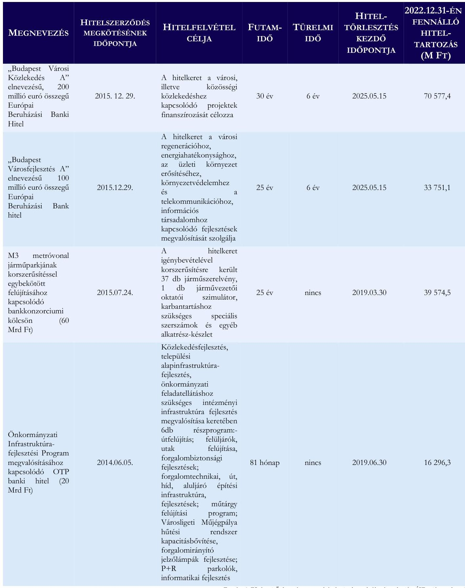

---

# A Cégháló bemutatása 

A Cégháló mérete a 2019. 12. 31-i induló 58 gazdasági társaságról a 2022. év végére 45 gazdasági társaságra csökkent. A befolyás módját tekintve a legnagyobb csökkenés a közvetett, 100\%-os befolyás alatt álló gazdasági társaságok esetén volt tapasztalható, amelyek száma a kezdeti 28 -ról a 2022. év végére 16-ra csökkent.
A Cégháló befolyás típusa és a mértéke szerinti összetételét december 31-ei állapot szerint az 1. táblázat mutatja be (zárójelben az összegző soroknál a közvetlen befolyás alatt állóknál figyelembe vett, a közvetett és közvetlen befolyással egyaránt érintett Budapesti Nagybani Piac Zrt.).

1. táblázat

## A CÉGHÁLÓ ÖSSZETÉTELE BEFOLYÁS TÍPUSA ÉS MÉRTÉKE SZERINT

JELLEMZÓ

KÖZVETLEN BEFOLYÁS ALATT ÁLLÓK
BEFOLYÁS MÉRTÉKE: $100 \%$
BEFOLYÁS MÉRTÉKE: $>50 \%$ és $<100 \%$
BEFOLYÁS MÉRTÉKE: $50 \%$
BEFOLYÁS MÉRTÉKE: $<50 \%$
KÖZVETETT BEFOLYÁS ALATT ÁLLÓK
BEFOLYÁS MÉRTÉKE: $100 \%$
BEFOLYÁS MÉRTÉKE: $>50 \%$ és $<100 \%$
BEFOLYÁS MÉRTÉKE: $50 \%$
BEFOLYÁS MÉRTÉKE: $<50 \%$
ÖSSZESEN:
2019
2020
2021
2022

## 30

25
2
2
2
2
2
28
29
24
24
2
2
2
2
2
2
28
22
16
16
26
19
13
12
2
0
0
0
0
58
50
45
45

Forrás: A Fővárosi Önkormányzat adatszolgáltatása, az Elektronikus Céqeljárásban Közremüködő Szolgálat adatbázisa és az OPTEN alapián ÁSZ saját szerkesztés
A csökkenéshez leginkább a BVH Nonprofit Zrt.-hez kötődő, 2020. és 2021. években lezajlott átalakulási folyamatok járultak hozzá, amelyek nyolc közvetett többségi befolyás alatt álló gazdasági társaság megszűnését eredményezték. A 2021. évi átalakítások célja a BKM Nonprofit Zrt., mint integrált budapesti közmútársaság felállítása volt. További csökkenéssel jártak a BKK Zrt. és a Fővárosi Csatornázási Művek Zrt. vezette társaságcsoportokon belül lezajlott átalakulások (két, illetve három gazdasági társaság), feladatellátási kötelezettség megszüntetése, tevékenység kiüresedése miatti megszűnések (Schöpf - Mérei Ágost Kórház és Anyavédelmi Központ Kht. "v.a.", REK Kft. ${ }^{56}$ ), továbbá társasági részesedés Magyar Állam részére történő értékesítése (Thália Színház Nonprofit Kft.), valamint összeolvadás miatti megszűnések (BVA Nonprofit Kft. ${ }^{57}$, BFTK Nonprofit Kft. ${ }^{58}$ )
Növekedéssel járt - egy törökországi szennyvíztisztító beruházásra irányuló - gazdasági társaság alapítása, gazdasági társaság kiválással és összeolvadással történő létrehozása (egy-egy gazdasági társaság) és a szennyvízhálózatba telepített optikai hálózatépítéssel foglalkozó gazdasági társaság többségi részesedésének vétel útján történő megszerzése, amely egy leányvállalat megléte miatt további bővülést eredményezett (két gazdasági társaság).
A Fővárosi Önkormányzat a közvetlen többségi befolyása alatt álló gazdasági társaságokat - a követelésérvényesítést szolgáló REK Kft. kivételével - az Mötv.-ben előírtakkal, illetve azt megelőzően az Ötv. ${ }^{59}$ szabályozásával összhangban a feladatkörébe tartozó közszolgáltatások ellátására hozta létre, vagy az Övt. ${ }^{60}$ alapján került a Fővárosi Önkormányzat tulajdonába.

---

A Cégháló tevékenységcsoportok szerinti összetételét a 2019-2022. években december 31-ei állapot szerint a 2. táblázat mutatja be.
2. táblázat

A CÉGHÁLÓ TEVÉKENYSÉGCSOPORTOK SZERINTI ÖSSZETÉTELE A 2019-2022. ÉVEKBEN

| TEVÉKENYSEGI KATEGÓRIA | 2019 | 2020 | 2021 | 2022 |
| :--: | :--: | :--: | :--: | :--: |
| Egészségügyi szolgáltatás | 1 | - | - | - |
| Előadó-művészeti tevékenység | 13 | 13 | 13 | 13 |
| Fürdők és gyógyfürdők múködtetése | $1+1$ | $1+1$ | 1 | 1 |
| Helyi közösségi közlekedés ellátása | $1+2$ | $1+2$ | $1+2$ | $1+2$ |
| Integrált közműszolgáltatás | $1+12$ | $1+8$ | $1+4$ | $1+4$ |
| Közlekedésszervezés ellátása | $1+3$ | $1+2$ | $1+2$ | $1+1$ |
| Közvilágítás biztosítása | 1 | 1 | 1 | 1 |
| Piacok, vásárcsarnokok és bevásárlóközpontok működtetése | $2+1$ | $2+1$ | $2+1$ | $2+1$ |
| Sporttevékenység | 1 | 1 | 1 | 1 |
| Szociális ellátás | 1 | 1 | 1 | 1 |
| Településrendezés, -tervezés, - fejlesztés | 3 | 3 | 3 | 3 |
| Turisztika, városmarketing | 2 | 1 | 1 | 1 |
| Vagyongazdálkodás | 1 | 1 | 1 | 1 |
| Víziközmú-szolgáltatás | $2+8$ | $2+7$ | $2+7$ | $2+8$ |
| Összesen: | 58 | 50 | 45 | 45 |

Fonrás: A Fővárosi Önkormányzat adatszolgáltatása és az Elektronikus Cégeljárásban Közremüködő Szolgálat adatbázisa alapján A5Z saját szerkesztés
A táblázatban a „+" jellel került elkülönítésre a közvetlen és közvetett befolyás alatt álló gazdasági társaságok, utóbbiak száma a „+" jelet követően került feltüntetésre. A REK Kft. $t$ a gazdasági társaság létrehozásának céljával összefüggésben a Fürdők és gyógyfürdők müködtetése tevékenységcsoportba soroltak.
A Céghálóban szereplő társaságcsoportok közül három esetében (BKK Zrt., BKV Zrt., BVH Nonprofit Zrt.) a Számv. tv. előírása alapján összevont (konszolidált) éves beszámolót kellett készíteni.
A Cégháló felépítését és a 2020-2022. évek között lezajlott változásokat az 1. ábra szemlélteti.

---

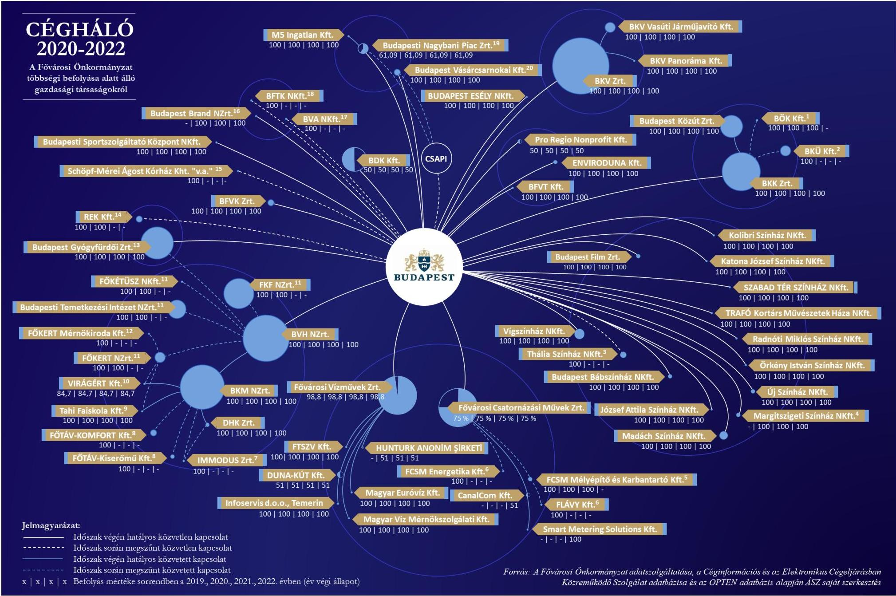

# Mellékletek

## 1. ábra

### CÉGHÁLÓ 2020-2022

A Fővárosi Önkormányzat többségi befolyása alatt álló gazdasági társaságokról

|  100 | 100 | 100 | 100  |
| --- | --- | --- | --- |
|  100 | 100 | 100 | 100  |

|  100 | 100 | 100 | 100  |
| --- | --- | --- | --- |
|  100 | 100 | 100 | 100  |

|  100 | 100 | 100 | 100  |
| --- | --- | --- | --- |
|  100 | 100 | 100 | 100  |

|  100 | 100 | 100 | 100  |
| --- | --- | --- | --- |
|  100 | 100 | 100 | 100  |

|  100 | 100 | 100 | 100  |
| --- | --- | --- | --- |
|  100 | 100 | 100 | 100  |

|  100 | 100 | 100 | 100  |
| --- | --- | --- | --- |
|  100 | 100 | 100 | 100  |

|  100 | 100 | 100 | 100  |
| --- | --- | --- | --- |
|  100 | 100 | 100 | 100  |

|  100 | 100 | 100 | 100  |
| --- | --- | --- | --- |
|  100 | 100 | 100 | 100  |

|  100 | 100 | 100 | 100  |
| --- | --- | --- | --- |
|  100 | 100 | 100 | 100  |

|  100 | 100 | 100 | 100  |
| --- | --- | --- | --- |
|  100 | 100 | 100 | 100  |

|  100 | 100 | 100 | 100  |
| --- | --- | --- | --- |
|  100 | 100 | 100 | 100  |

|  100 | 100 | 100 | 100  |
| --- | --- | --- | --- |
|  100 | 100 | 100 | 100  |

|  100 | 100 | 100 | 100  |
| --- | --- | --- | --- |
|  100 | 100 | 100 | 100  |

|  100 | 100 | 100 | 100  |
| --- | --- | --- | --- |
|  100 | 100 | 100 | 100  |

|  100 | 100 | 100 | 100  |
| --- | --- | --- | --- |
|  100 | 100 | 100 | 100  |

|  100 | 100 | 100 | 100  |
| --- | --- | --- | --- |
|  100 | 100 | 100 | 100  |

|  100 | 100 | 100 | 100  |
| --- | --- | --- | --- |
|  100 | 100 | 100 | 100  |

|  100 | 100 | 100 | 100  |
| --- | --- | --- | --- |
|  100 | 100 | 100 | 100  |

|  100 | 100 | 100 | 100  |
| --- | --- | --- | --- |
|  100 | 100 | 100 | 100  |

|  100 | 100 | 100 | 100  |
| --- | --- | --- | --- |
|  100 | 100 | 100 | 100  |

|  100 | 100 | 100 | 100  |
| --- | --- | --- | --- |
|  100 | 100 | 100 | 100  |

|  100 | 100 | 100 | 100  |
| --- | --- | --- | --- |
|  100 | 100 | 100 | 100  |

|  100 | 100 | 100 | 100  |
| --- | --- | --- | --- |
|  100 | 100 | 100 | 100  |

|  100 | 100 | 100 | 100  |
| --- | --- | --- | --- |
|  100 | 100 | 100 | 100  |

|  100 | 100 | 100 | 100  |
| --- | --- | --- | --- |
|  100 | 100 | 100 | 100  |

|  100 | 100 | 100 | 100  |
| --- | --- | --- | --- |
|  100 | 100 | 100 | 100  |

|  100 | 100 | 100 | 100  |
| --- | --- | --- | --- |
|  100 | 100 | 100 | 100  |

|  100 | 100 | 100 | 100  |
| --- | --- | --- | --- |
|  100 | 100 | 100 | 100  |

|  100 | 100 | 100 | 100  |
| --- | --- | --- | --- |
|  100 | 100 | 100 | 100  |

|  100 | 100 | 100 | 100  |
| --- | --- | --- | --- |
|  100 | 100 | 100 | 100  |

|  100 | 100 | 100 | 100  |
| --- | --- | --- | --- |
|  100 | 100 | 100 | 100  |

|  100 | 100 | 100 | 100  |
| --- | --- | --- | --- |
|  100 | 100 | 100 | 100  |

|  100 | 100 | 100 | 100  |
| --- | --- | --- | --- |
|  100 | 100 | 100 | 100  |

|  100 | 100 | 100 | 100  |
| --- | --- | --- | --- |
|  100 | 100 | 100 | 100  |

|  100 | 100 | 100 | 100  |
| --- | --- | --- | --- |
|  100 | 100 | 100 | 100  |

|  100 | 100 | 100 | 100  |
| --- | --- | --- | --- |
|  100 | 100 | 100 | 100  |

|  100 | 100 | 100 | 100  |
| --- | --- | --- | --- |
|  100 | 100 | 100 | 100  |

|  100 | 100 | 100 | 100  |
| --- | --- | --- | --- |
|  100 | 100 | 100 | 100  |

|  100 | 100 | 100 | 100  |
| --- | --- | --- | --- |
|  100 | 100 | 100 | 100  |

|  100 | 100 | 100 | 100  |
| --- | --- | --- | --- |
|  100 | 100 | 100 | 100  |

|  100 | 100 | 100 | 100  |
| --- | --- | --- | --- |
|  100 | 100 | 100 | 100  |

|  100 | 100 | 100 | 100  |
| --- | --- | --- | --- |
|  100 | 100 | 100 | 100  |

|  100 | 100 | 100 | 100  |
| --- | --- | --- | --- |
|  100 | 100 | 100 | 100  |

|  100 | 100 | 100 | 100  |
| --- | --- | --- | --- |
|  100 | 100 | 100 | 100  |

|  100 | 100 | 100 | 100  |
| --- | --- | --- | --- |
|  100 | 100 | 100 | 100  |

|  100 | 100 | 100 | 100  |
| --- | --- | --- | --- |
|  100 | 100 | 100 | 100  |

|  100 | 100 | 100 | 100  |
| --- | --- | --- | --- |
|  100 | 100 | 100 | 100  |

|  100 | 100 | 100 | 100  |
| --- | --- | --- | --- |
|  100 | 100 | 100 | 100  |

|  100 | 100 | 100 | 100  |
| --- | --- | --- | --- |
|  100 | 100 | 100 | 100  |

|  100 | 100 | 100 | 100  |
| --- | --- | --- | --- |
|  100 | 100 | 100 | 100  |

|  100 | 100 | 100 | 100  |
| --- | --- | --- | --- |
|  100 | 100 | 100 | 100  |

|  100 | 100 | 100 | 100  |
| --- | --- | --- | --- |
|  100 | 100 | 100 | 100  |

|  100 | 100 | 100 | 100  |
| --- | --- | --- | --- |
|  100 | 100 | 100 | 100  |

|  100 | 100 | 100 | 100  |
| --- | --- | --- | --- |
|  100 | 100 | 100 | 100  |

|  100 | 100 | 100 | 100  |
| --- | --- | --- | --- |
|  100 | 100 | 100 | 100  |

|  100 | 100 | 100 | 100  |
| --- | --- | --- | --- |
|  100 | 100 | 100 | 100  |

|  100 | 100 | 100 | 100  |
| --- | --- | --- | --- |
|  100 | 100 | 100 | 100  |

|  100 | 100 | 100 | 100  |
| --- | --- | --- | --- |
|  100 | 100 | 100 | 100  |

|  100 | 100 | 100 | 100  |
| --- | --- | --- | --- |
|  100 | 100 | 100 | 100  |

|  100 | 100 | 100 | 100  |
| --- | --- | --- | --- |
|  100 | 100 | 100 | 100  |

|  100 | 100 | 100 | 100  |
| --- | --- | --- | --- |
|  100 | 100 | 100 | 100  |

|  100 | 100 | 100 | 100  |
| --- | --- | --- | --- |
|  100 | 100 | 100 | 100  |

|  100 | 100 | 100 | 100  |
| --- | --- | --- | --- |
|  100 | 100 | 100 | 100  |

|  100 | 100 | 100 | 100  |
| --- | --- | --- | --- |
|  100 | 100 | 100 | 100  |

|  100 | 100 | 100 | 100  |
| --- | --- | --- | --- |
|  100 | 100 | 100 | 100  |

|  100 | 100 | 100 | 100  |
| --- | --- | --- | --- |
|  100 | 100 | 100 | 100  |

|  100 | 100 | 100 | 100  |
| --- | --- | --- | --- |
|  100 | 100 | 100 | 100  |

|  100 | 100 | 100 | 100  |
| --- | --- | --- | --- |
|  100 | 100 | 100 | 100  |

|  100 | 100 | 100 | 100  |
| --- | --- | --- | --- |
|  100 | 100 | 100 | 100  |

|  100 | 100 | 100 | 100  |
| --- | --- | --- | --- |
|  100 | 100 | 100 | 100  |

|  100 | 100 | 100 | 100  |
| --- | --- | --- | --- |
|  100 | 100 | 100 | 100  |

|  100 | 100 | 100 | 100  |
| --- | --- | --- | --- |
|  100 | 100 | 100 | 100  |

|  100 | 100 | 100 | 100  |
| --- | --- | --- | --- |
|  100 | 100 | 100 | 100  |

|  100 | 100 | 100 | 100  |
| --- | --- | --- | --- |
|  100 | 100 | 100 | 100  |

|  100 | 100 | 100 | 100  |
| --- | --- | --- | --- |
|  100 | 100 | 100 | 100  |

|  100 | 100 | 100 | 100  |
| --- | --- | --- | --- |
|  100 | 100 | 100 | 100  |

|  100 | 100 | 100 | 100  |
| --- | --- | --- | --- |
|  100 | 100 | 100 | 100  |

|  100 | 100 | 100 | 100  |
| --- | --- | --- | --- |
|  100 | 100 | 100 | 100  |

|  100 | 100 | 100 | 100  |
| --- | --- | --- | --- |
|  100 | 100 | 100 | 100  |

|  100 | 100 | 100 | 100  |
| --- | --- | --- | --- |
|  100 | 100 | 100 | 100  |

|  100 | 100 | 100 | 100  |
| --- | --- | --- | --- |
|  100 | 100 | 100 | 100  |

|  100 | 100 | 100 | 100  |
| --- | --- | --- | --- |
|  100 | 100 | 100 | 100  |

|  100 | 100 | 100 | 100  |
| --- | --- | --- | --- |
|  100 | 100 | 100 | 100  |

|  100 | 100 | 100 | 100  |
| --- | --- | --- | --- |
|  100 | 100 | 100 | 100  |

|  100 | 100 | 100 | 100  |
| --- | --- | --- | --- |
|  100 | 100 | 100 | 100  |

|  100 | 100 | 100 | 100  |
| --- | --- | --- | --- |
|  100 | 100 | 100 | 100  |

|  100 | 100 | 100 | 100  |
| --- | --- | --- | --- |
|  100 | 100 | 100 | 100  |

|  100 | 100 | 100 | 100  |
| --- | --- | --- | --- |
|  100 | 100 | 100 | 100  |

|  100 | 100 | 100 | 100  |
| --- | --- | --- | --- |
|  100 | 100 | 100 | 100  |

|  100 | 100 | 100 | 100  |
| --- | --- | --- | --- |
|  100 | 100 | 100 | 100  |

|  100 | 100 | 100 | 100  |
| --- | --- | --- | --- |
|  100 | 100 | 100 | 100  |

|  100 | 100 | 100 | 100  |
| --- | --- | --- | --- |
|  100 | 100 | 100 | 100  |

|  100 | 100 | 100 | 100  |
| --- | --- | --- | --- |
|  100 | 100 | 100 | 100  |

|  100 | 100 | 100 | 100  |
| --- | --- | --- | --- |
|  100 | 100 | 100 | 100  |

|  100 | 100 | 100 | 100  |
| --- | --- | --- | --- |
|  100 | 100 | 100 | 100  |

|  100 | 100 | 100 | 100  |
| --- | --- | --- | --- |
|  100 | 100 | 100 | 100  |

|  100 | 100 | 100 | 100  |
| --- | --- | --- | --- |
|  100 | 100 | 100 | 100  |

|  100 | 100 | 100 | 100  |
| --- | --- | --- | --- |
|  100 | 100 | 100 | 100  |

|  100 | 100 | 100 | 100  |
| --- | --- | --- | --- |
|  100 | 100 | 100 | 100  |

|  100 | 100 | 100 | 100  |
| --- | --- | --- | --- |
|  100 | 100 | 100 | 100  |

|  100 | 100 | 100 | 100  |
| --- | --- | --- | --- |
|  100 | 100 | 100 | 100  |

|  100 | 100 | 100 | 100  |
| --- | --- | --- | --- |
|  100 | 100 | 100 | 100  |

|  100 | 100 | 100 | 100  |
| --- | --- | --- | --- |
|  100 | 100 | 100 | 100  |

|  100 | 100 | 100 | 100  |
| --- | --- | --- | --- |
|  100 | 100 | 100 | 100  |

|  100 | 100 | 100 | 100  |
| --- | --- | --- | --- |
|  100 | 100 | 100 | 100  |

|  100 | 100 | 100 | 100  |
| --- | --- | --- | --- |
|  100 | 100 | 100 | 100  |

|  100 | 100 | 100 | 100  |
| --- | --- | --- | --- |
|  100 | 100 | 100 | 100  |

|  100 | 100 | 100 | 100  |
| --- | --- | --- | --- |
|  100 | 100 | 100 | 100  |

|  100 | 100 | 100 | 100  |
| --- | --- | --- | --- |
|  100 | 100 | 100 | 100  |

|  100 | 100 | 100 | 100  |
| --- | --- | --- | --- |
|  100 | 100 | 100 | 100  |

|  100 | 100 | 100 | 100  |
| --- | --- | --- | --- |
|  100 | 100 | 100 | 100  |

|  100 | 100 | 100 | 100  |
| --- | --- | --- | --- |
|  100 | 100 | 100 | 100  |

|  100 | 100 | 100 | 100  |
| --- | --- | --- | --- |
|  100 | 100 | 100 | 100  |

|  100 | 100 | 100 | 100  |
| --- | --- | --- | --- |
|  100 | 100 | 100 | 100  |

|  100 | 100 | 100 | 100  |
| --- | --- | --- | --- |
|  100 | 100 | 100 | 100  |

|  100 | 100 | 100 | 100  |
| --- | --- | --- | --- |
|  100 | 100 | 100 | 100  |

|  100 | 100 | 100 | 100  |
| --- | --- | --- | --- |
|  100 | 100 | 100 | 100  |

|  100 | 100 | 100 | 100  |
| --- | --- | --- | --- |
|  100 | 100 | 100 | 100  |

|  100 | 100 | 100 | 100  |
| --- | --- | --- | --- |
|  100 | 100 | 100 | 100  |

|  100 | 100 | 100 | 100  |
| --- | --- | --- | --- |
|  100 | 100 | 100 | 100  |

|  100 | 100 | 100 | 100  |
| --- | --- | --- | --- |
|  100 | 100 | 100 | 100  |

|  100 | 100 | 100 | 100  |
| --- | --- | --- | --- |
|  100 | 100 | 100 | 100  |

|  100 | 100 | 100 | 100  |
| --- | --- | --- | --- |
|  100 | 100 | 100 | 100  |

|  100 | 100 | 100 | 100  |
| --- | --- | --- | --- |
|  100 | 100 | 100 | 100  |

|  100 | 100 | 100 | 100  |
| --- | --- | --- | --- |
|  100 | 100 | 100 | 100  |

|  100 | 100 | 100 | 100  |
| --- | --- | --- | --- |
|  100 | 100 | 100 | 100  |

|  100 | 100 | 100 | 100  |
| --- | --- | --- | --- |
|  100 | 100 | 100 | 100  |

|  100 | 100 | 100 | 100  |
| --- | --- | --- | --- |
|  100 | 100 | 100 | 100  |

|  100 | 100 | 100 | 100  |
| --- | --- | --- | --- |
|  100 | 100 | 100 | 100  |

|  100 | 100 | 100 | 100  |
| --- | --- | --- | --- |
|  100 | 100 | 100 | 100  |

|  100 | 100 | 100 | 100  |
| --- | --- | --- | --- |
|  100 | 100 | 100 | 100  |

|  100 | 100 | 100 | 100  |
| --- | --- | --- | --- |
|  100 | 100 | 100 | 100  |

|  100 | 100 | 100 | 100  |
| --- | --- | --- | --- |
|  100 | 100 | 100 | 100  |

|  100 | 100 | 100 | 100  |
| --- | --- | --- | --- |
|  100 | 100 | 100 | 100  |

|  100 | 100 | 100 | 100  |
| --- | --- | --- | --- |
|  100 | 100 | 100 | 100  |

|  100 | 100 | 100 | 100  |
| --- | --- | --- | --- |
|  100 | 100 | 100 | 100  |

|  100 | 100 | 100 | 100  |
| --- | --- | --- | --- |
|  100 | 100 | 100 | 100  |

|  100 | 100 | 100 | 100  |
| --- | --- | --- | --- |
|  100 | 100 | 100 | 100  |

|  100 | 100 | 100 | 100  |
| --- | --- | --- | --- |
|  100 | 100 | 100 | 100  |

|  100 | 100 | 100 | 100  |
| --- | --- | --- | --- |
|  100 | 100 | 100 | 100  |

|  100 | 100 | 100 | 100  |
| --- | --- | --- | --- |
|  100 | 100 | 100 | 100  |

|  100 | 100 | 100 | 100  |
| --- | --- | --- | --- |
|  100 | 100 | 100 | 100  |

|  100 | 100 | 100 | 100  |
| --- | --- | --- | --- |
|  100 | 100 | 100 | 100  |

|  100 | 100 | 100 | 100  |
| --- | --- | --- | --- |
|  100 | 100 | 100 | 100  |

|  100 | 100 | 100 | 100  |
| --- | --- | --- | --- |
|  100 | 100 | 100 | 100  |

|  100 | 100 | 100 | 100  |
| --- | --- | --- | --- |
|  100 | 100 | 100 | 100  |

|  100 | 100 | 100 | 100  |
| --- | --- | --- | --- |
|  100 | 100 | 100 | 100  |

|  100 | 100 | 100 | 100  |
| --- | --- | --- | --- |
|  100 | 100 | 100 | 100  |

|  100 | 100 | 100  |
| --- | --- | --- | --- |
|  100 | 100 | 100 | 100  |

|  100 | 100 | 100  |
| --- | --- | --- | --- |
|  100 | 100 | 100 | 100  |

|  100 | 100 | 100  |
| --- | --- | --- | --- |
|  100 | 100 | 100  |

|  100 | 100 | 100  |
| --- | --- | --- | --- |
|  100 | 100 | 100 | 100  |

|  100 | 100 | 100  |
| --- | --- | --- | --- |
|  100 | 100 | 100 | 100  |

|  100 | 100 | 100  |
| --- | --- | --- | --- |
|  100 | 100 | 100 | 100  |

|  100 | 100 | 100  |
| --- | --- | --- | --- |
|  100 | 100 | 100 | 100  |

|  100 | 100 | 100  |
| --- | --- | --- | --- |
|  100 | 100 | 100 | 100  |

|  100 | 100 | 100  |
| --- | --- | --- | --- |
|  100 | 100 | 100 | 100  |

|  100 | 100 | 100  |
| --- | --- | --- | --- |
|  100 | 100 | 100 | 100  |

|  100 | 100 | 100  |
| --- | --- | --- | --- |
|  100 | 100 | 100 | 100  |

|  100 | 100 | 100  |
| --- | --- | --- | --- |
|  100 | 100 | 100 | 100  |

|  100 | 100 | 100  |
| --- | --- | --- | --- |
|  100 | 100 | 100  |

|  100 | 100 | 100  |
| --- | --- | --- | --- |
|  100 | 100 | 100  |

|  100 | 100 | 100  |
| --- | --- | --- | --- |
|  100 | 100 | 100  |

|  100 | 100 | 100  |
| --- | --- | --- | --- |
|  100 | 100 | 100  |

|  100 | 100 | 100  |
| --- | --- | --- | --- |
|  100 | 100 | 100  |

|  100 | 100 | 100  |
| --- | --- | --- | --- |
|  100 | 100 | 100  |

|  100 | 100 | 100  |

|  100 | 100 | 100  |

|  100 | 100 | 100  |

|  100 | 100 | 100  |

|  100 | 100 | 100  |

|  100 | 100 | 100  |

|  100 | 100 | 100  |

|  100 | 100 | 100  |

|  100 | 100 | 100  |

|  100 | 100 | 100  |

|  100 | 100 | 100  |

|  100 | 100 | 100  |

|  100 | 100 | 100  |

|  100 | 100 | 10  |

|  100 | 100 | 100  |

|  100 | 100 | 100  |

|  100 | 100 | 100  |

|  100 | 100 | 10  |

|  100 | 100 | 10  |

|  100 | 100 | 10  |

|  100 | 100 | 10  |

|  100 | 100 | 10  |

|  100 | 100 | 10  |

|  100 | 100 | 10  |

|  100 | 100 | 10  |

|  100 | 100 | 10  |

|  100 | 100 | 10  |

|  100 | 100 | 10  |

|  100 | 100 | 10  |

|  100 | 100 | 10  |

|  100 | 100 | 10  |

|  100 | 100 | 10  |

|  100 | 100 | 10  |

|  100 | 100 | 10  |

|  100 | 100 | 10  |

|  100 | 100 | 10  |

|  100 | 100 | 10  |

|  100 | 100 | 10  |

|  100 | 100 | 10  |

|  100 | 100 | 10  |

|  100 | 100 | 10  |

|  100 | 100 | 10  |

|  100 | 100 | 10  |

|  100 | 100 | 10  |

|  100 | 100 | 10  |

|  100 | 100 | 10  |

|  100 | 10  |

|  100 | 10  |

|  100 | 100  |

|  100 | 10  |

|  100 | 10  |

|  100 | 10  |

|  100 | 10 10  |

|  100 | 10  |

|  100 | 10  | 10 1  |

|  100 | 10 10  |

|  100 | 10 10 10 1  |

| 100 | 10 10 10 1 1 1  |

| 100 | 10 10 10 1 1 1  |

| 100 | 10 10 10 1 1 1 1 1 1 1 1 1 1 1 1 1 1 1 1 1 1 1 1 1 1 1 1 1 1 1 1 1 1 1 1 1 1 1 1 1 1 1 1 1 1 1 1 1 1 1 1 1 1 1 1 1 1 1 1 1 1 1 1 1 1 1 1 1 1 1 1 1 1 1 1 1 1 1 1 1 1 1 1 1 1 1 1 1 1 1 1 1 1 1 1 1 1 1 1 1 1 1 1 

---

# Hivatkozások magyarázata a VI. sz. melléklet 1. ábrához 

1 Átalakulás miatt jogutóddal megszűnt. A jogutódlás módja: beolvadás, jogutód: BKK Zrt., változás időpontja: 2022.11.30. (BÖK Kft.: Budapesti Önkormányzati Követeléskezelő Kft.)
2 Átalakulás miatt jogutóddal megszűnt. A jogutódlás módja: beolvadás, jogutód: BKK Zrt., változás időpontja: 2020.09.30.
3 Tulajdonosváltás értékesítés útján. Új tulajdonos: Magyar Állam, változás időpontja: 2020.12.30.
4 Átalakulás útján jött létre. A jogutódlás módja: kiválás, jogelőd: SZABAD TÉR SZÍNHÁZ Nonprofit Kft., időpont: 2020.07.01.
5 Átalakulás miatt jogutóddal megszűnt. A jogutódlás módja: cég egyedüli tagjába történő beolvadás, jogutód: Fővárosi Csatornázási Művek Zrt., változás időpontja: 2022.09.30. (FCSM Mélyépítő és Karbantartó Kft.: Fővárosi Csatornázási Művek Mélyépítő és Karbantartó Kft.)
6 Átalakulás miatt jogutóddal megszűnt. A jogutódlás módja: beolvadás, jogutód: Fővárosi Csatornázási Múvek Mélyépítő és Karbantartó Kft., változás időpontja: 2020.09.30. (FLÁVY Kft.: FLÁVY Kereskedelmi és Szolgáltató Kft.)
7 Átalakulás miatt jogutóddal megszűnt. A jogutódlás módja: beolvadás, jogutód: Budapesti Távhőszolgáltató Zrt. (2021.09.01-től BKM Nonprofit Zrt.), változás időpontja: 2020.09.30. Tulajdonos 2020.06.11-ig a DHK Zrt. (DHK Hátralékkezelő és Pénzügyi Szolgáltató Zrt.), 2020.06.11.-2020.09.30. között a Budapesti Távhőszolgáltató Zrt. (2021.09.01-től BKM Nonprofit Zrt.). (IMMODUS Zrt.: IMMODUS Szolgáltató Zrt.)
8 Átalakulás miatt jogutóddal megszűnt. A jogutódlás módja: beolvadás, jogutód: Budapesti Távhőszolgáltató Zrt. (2021.09.01-től BKM Nonprofit Zrt.), változás időpontja: 2020.09.30. (FŐTÁV-KOMFORT Kft.: FÖTÁV-KOMFORT Épületenergetikai Szolgáltató és Fővállalkozó Kft., FÖTÁV-Kiserőmű Kft.: FŐTÁV-Kiserőmű Villamos energia-, Hőtermelő és Hőszolgáltató Kft.)
9 Tulajdonosváltás (tagváltozás) átalakulás miatt. Előző tulajdonos a FŐKERT Nonprofit Zrt., új tulajdonos a BKM Nonprofit Zrt., tulajdonosváltás időpontja: 2021.09.01. (Tahi Faiskola Kft.: Tahi Faiskola és Dísznövénytermesztő- Értékesítő Kft.)
10 Tulajdonosváltás (tagváltozás) átalakulás miatt. Előző tulajdonos a FŐKERT Nonprofit Zrt., új tulajdonos a BKM Nonprofit Zrt., tulajdonosváltás időpontja: 2021.12.06. (VIRÁGÉRT Kft.: Virágértékesítő Kft.)
11 Átalakulás miatt jogutóddal megszűnt. A jogutódlás módja: beolvadás, jogutód: FŐTÁV Budapesti Távhőszolgáltató Zrt. (2021.09.01-től BKM Nonprofit Zrt.), változás időpontja: 2021.08.31. (FŐKÉTÜSZ NKft.: FŐKÉTÜSZ Fővárosi Kéményseprőipari Nonprofit Kft.)
12 Átalakulás miatt jogutóddal megszűnt. A jogutódlás módja: beolvadás, jogutód: Tahi Faiskola Kft., változás időpontja: 2020.12.31. (FŐKERT Mérnökiroda Kft: FŐKERT Mérnökiroda Beruházási és Tervezési Kft.)
13 Átalakulás. A jogutódlás módja: beolvadásos kiválás, jogelőd: BVH Zrt. (2022.06.08-tól BVH Nonprofit Zrt.), változás időpontja: 2021.03.31.
14 Átalakulás miatt jogutóddal megszűnt. A jogutódlás módja: beolvadás, jogutód: Budapest Gyógyfürdői Zrt., változás időpontja: 2021.07.31.

15 Jogutód nélküli megszűnés végelszámolással, időpont: 2020.07.20.
16 Átalakulás útján jött létre. A jogutódlás módja: összeolvadás, jogelődök: BFTK Nonprofit Kft., BVA Nonprofit Kft., változás időpontja: 2020.11.01.
17 Átalakulás miatt jogutóddal megszűnt. A jogutódlás módja: összeolvadás, jogutód: Budapest Brand Nonprofit Zrt., változás időpontja: 2020.10.31.
18 Átalakulás miatt jogutóddal megszűnt. A jogutódlás módja: összeolvadás, jogutód: Budapest Brand Nonprofit Zrt., változás időpontja: 2020.10.31.
${ }^{19}$ A Fővárosi Önkormányzat CSAPI-n keresztüli közvetett befolyásának mértéke a 2019-2020. években 12,14 \%-os volt.
${ }^{20}$ A Fővárosi Önkormányzat 2021.06.01-ig a CSAPI-n keresztül közvetett befolyással rendelkezett.

---

#### **VII. SZ. MELLÉKLET: A FŐVÁROSI ÖNKORMÁNYZAT TÖBBSÉGI BEFOLYÁSA ALATT ÁLLÓ GAZDASÁGI TÁRSASÁGOK FŐBB MÉRLEGSORAI SZÉLSŐÉRTÉKEINEK ÉS ÁTLAGÉRTÉKEINEK ALAKULÁSA A 2019-2022. ÉVEKBEN**

|  MÉRLEGSOROK | 2019 | 2020 | 2021 | 2022 | 2019 | 2020 | 2021 | 2022 | 2019 | 2020 | 2021 | 2022  |
| --- | --- | --- | --- | --- | --- | --- | --- | --- | --- | --- | --- | --- |
|  Forgóeszközök | 2,5 | 1,6 | 0,3 | 1,9 | 27 763,0 | 31 278,0 | 43 012,6 | 153 644,7 | 2 822,4 | 2 899,5 | 3 167,6 | 5 581,7  |
|  Értékpapírok | 0,8 | 13,0 | 13,0 | 13,0 | 387,9 | 164,3 | 164,3 | 168,9 | 140,1 | 88,7 | 88,6 | 104,4  |
|  Pénzeszközök | 0,3 | 0,4 | 0,1 | 1,6 | 12 133,0 | 11 565,0 | 17 507,9 | 78 272,0 | 1 228,7 | 1 343,1 | 1 338,2 | 2 828,1  |
|  Kötelezettségek | 0,1 | 0,2 | 0,03 | 0,5 | 109 922,0 | 120 856,0 | 110 795,0 | 141 859,8 | 5 137,0 | 6 520,3 | 6 895,9 | 8 933,7  |
|  Rövid lej. kötelezettségek | 0,1 | 0,2 | 0,03 | 0,5 | 80 195,0 | 120 837,0 | 92 685,0 | 121 961,3 | 3 114,0 | 3 871,4 | 3 986,1 | 6 176,7  |
|  Passzív időbeli elhatárolások | 0,1 | 0,5 | 0,5 | 0,1 | 381 747,0 | 397 165,0 | 437 944,0 | 478 735,0 | 10 171,3 | 12 199,0 | 15 087,3 | 16 629,7  |
|  Saját tőke | 2,6 | 0,3 | -42,6 | 0,9 | 232 340,0 | 225 752,0 | 212 431,0 | 186 224,0 | 11 076,5 | 12 888,3 | 13 365,4 | 11 621,6  |
|  Jegyzett tőke | 0,1 | 0,1 | 0,1 | 0,1 | 116 000,0 | 116 000,0 | 116 000,0 | 116 000,0 | 5 444,5 | 6 303,9 | 6 565,7 | 6 565,5  |
|  Adózott eredmény | -4 693,0 | -6 588,0 | 13 321,0 | 26 207,0 | 4 245,0 | 3 556,0 | 1 892,0 | 2 433,6 | 52,5 | -256,2 | -364,0 | -452,8  |
|  Források összesen | 3,8 | 1,6 | 0,3 | 1,9 | 696 580,0 | 744 090,0 | 743 343,0 | 753 062,0 | 26 400,3 | 31 398,8 | 34 617,5 | 36 029,8  |

*adatok M Ft-ban*

---

|  | GAZDASÁGI TÁRSASÁG/MUTATÓ | 2019 | 2020 | 2021 | 2022 |
| :--: | :--: | :--: | :--: | :--: | :--: |
| BKK tcs. | Jövedelmezőségi mutató | $-1,51$ | $-2,57$ | $-1,15$ | 0,10 |
|  | Saját tőke növekedési mutató | 1,45 | 0,41 | 0,54 | 1,59 |
|  | Eladósodási mutató | 0,15 | 0,15 | 0,16 | 0,20 |
|  | Likviditási ráta | 0,95 | 1,00 | 0,86 | 0,57 |
|  | Készpénz szintű likviditási mutató | 0,50 | 0,60 | 0,29 | 0,23 |
| BKV tcs. | Jövedelmezőségi mutató | $-0,02$ | $-0,03$ | $-0,06$ | $-0,14$ |
|  | Saját tőke növekedési mutató | 1,99 | 1,94 | 1,82 | 1,60 |
|  | Eladósodási mutató | 0,12 | 0,16 | 0,13 | 0,12 |
|  | Likviditási ráta | 0,36 | 0,27 | 0,31 | 0,38 |
|  | Készpénz szintű likviditási mutató | 0,16 | 0,10 | 0,07 | 0,14 |
| BVH tcs. | Jövedelmezőségi mutató | 0,00 | $-0,09$ | $-0,11$ | 0,01 |
|  | Saját tőke növekedési mutató | 2,26 | 2,04 | 1,10 | 1,11 |
|  | Eladósodási mutató | 0,28 | 0,31 | 0,38 | 0,56 |
|  | Likviditási ráta | 1,45 | 1,75 | 1,81 | 1,27 |
|  | Készpénz szintű likviditási mutató | 0,37 | 0,52 | 0,75 | 0,65 |
| Fővárosi   Csatomázási   Művek Zrt. | Jövedelmezőségi mutató | 0,04 | 0,03 | 0,02 | 0,01 |
|  | Saját tőke növekedési mutató | 1,68 | 1,67 | 1,66 | 1,63 |
|  | Eladósodási mutató | 0,04 | 0,03 | 0,03 | 0,03 |
|  | Likviditási ráta | 3,35 | 4,13 | 3,51 | 2,72 |
|  | Készpénz szintű likviditási mutató | 2,03 | 2,34 | 1,45 | 1,40 |
| Fővárosi   Vizmüvek Zrt. | Jövedelmezőségi mutató | 0,03 | 0,03 | 0,00 | $-0,11$ |
|  | Saját tőke növekedési mutató | 2,20 | 2,26 | 2,49 | 2,24 |
|  | Eladósodási mutató | 0,83 | 0,83 | 0,81 | 0,82 |
|  | Likviditási ráta | 1,69 | 2,20 | 2,39 | 2,23 |
|  | Készpénz szintű likviditási mutató | 1,04 | 1,35 | 1,31 | 0,91 |

Forrás: Az Elektronikus Cégeljárásban Közremüködő Szolgálat adatbázisa alapján ÁSZ számítás és saját szerkesztés

---

# FÜGGELÉK: ÉSZREVÉTELEK 

A jelentéstervezetet a Számvevőszék 15 napos észrevételezésre megküldte az ellenőrzött szervezet vezetőjének az ÁSZ tv. 29. §* (1) bekezdése előírásának megfelelően.

Az elfogadott észrevételek alapján a Számvevőszék módosította a jelentést.
A függelék tartalmazza az ellenőrzött észrevételeit, illetve az el nem fogadott észrevételek elutasitásának indoklását.

[^0]
[^0]:    * 29. § (1) Az Állami Számvevőszék az ellenőrzési megállapításait megküldi az ellenőrzött szervezet vezetőjének vagy az általa megbízott személynek, és annak, akinek személyes felelősségét állapította meg.
    (2) Az ellenőrzött szervezet vezetője és a felelősként megjelölt személy az ellenőrzés megállapításaira tizenöt napon belül írásban észrevételt tehet.
    (3) Az Állami Számvevőszék az észrevételre a beérkezésétől számított harminc napon belül írásban válaszol. A figyelembe nem vett észrevételeket köteles a jelentésben feltüntetni, és megindokolni, hogy azokat miért nem fogadta el.

---

# Észrevételek 

## Az Állami Számvevőszék V1019 azonosító-számú „Budapest Főváros Önkormányzata költségvetésének és zárszámadásának ellenőrzése" tárgyú ellenőrzés keretében készült jelentéstervezetre

## I. Megállapítások

1.1 megállapítás: 2022. évi költségvetés-tervezés rendjét nem megfelelően szabályozták. A 2023. évi költségvetés-tervezés folyamata szabályozott volt. A 2022. évi, valamint a 2023. évi költségvetési rendelettervezet előterjesztése, a költségvetési rendelet tartalma és jóváhagyása nem felelt meg teljeskörűen a jogszabályi előírásoknak.
a) „saját bevételekről és az adósságot keletkeztető ügyletekből eredő fizetési kötelezettségekről - az Áht. 29/A. §-a alapján - a 2022. és 2023. évi költségvetési rendeletek elfogadásáig hozott határozatok három évre összesített adatokat tartalmaztak, így azok nem biztosították annak bemutatását, hogy teljesült-e a Gst. 19 10. § (5) bekezdés előírása, amely szerint az önkormányzat adósságot keletkeztető ügyletekből származó tárgyévi összes fizetési kötelezettsége egyik évben sem haladhatja meg az önkormányzat adott évi saját bevételeinek 50\%-át." (15. o.)

Észrevétel: A Budapest Főváros Önkormányzata 2023. évi összevont költségvetéséről szóló 46/2022. (XII. 22.) önkormányzati rendelet módosításáról szóló 20/2023 (X.6.) önkormányzati rendelet módosította a Budapest Főváros Önkormányzata 2023. évi összevont költségvetéséről szóló 46/2022. (XII. 22.) önkormányzati rendeletet (a továbbiakban: 2023. évi költségvetési rendelet) (1. sz. melléklet), amely során a 2023. évi költségvetési rendelet kiegészítésre került a 3. számú melléklettel, továbbá a 2024. évi költségvetési rendelet 3. számú melléklete is tartalmazza (2. sz. melléklet) a fenti kötelezettséget.

## Kérjük a megállapítás megfelelő kiegészitését és erre a tényre utalást.

b) „A főjegyző a jogszabályi előírásokat figyelmen kívül hagyva a 2022. és 2023. évi költségvetési rendelettervezetek költségvetési szervek vezetőivel történt egyeztetésének eredményét írásban nem rögzítette, ezáltal a főpolgármester az egyeztetések eredményét nem terjesztette a Közgyűlés bizottságai elé." (15. o.)

Észrevétel: Az írásban való rögzítés a keretközlő kiküldésével valósult meg az adott költségvetési évekre vonatkozóan, az egyeztetések eredményei a költségvetési rendelettervezettel kerültek beterjesztésre a bizottságok elé; a Budapest Főváros Önkormányzata Szervezeti és Müködési Szabályzatáról szóló 1/2020. (II. 5.) önkormányzati rendelet (a továbbiakban: testületi Szmsz.) 47. § (1) f) pontja - az Mótv. 120. § (1) bekezdésében a „pénzügyi bizottság" feladatköreire vonatkozó szabályokkal összhangban - a Tulajdonosi Bizottságot jelöli meg a költségvetés tervezésével és végrehajtásával összefüggő ügyekben müködő állandó bizottságként, amelyik e feladatot a korábban külön bizottságként müködő Költségvetési Bizottságtól vette át; ez a bizottság pedig megtárgyalta a rendelettervezeteket és erre vonatkozóan a bizottsági jegyzőkönyvek csatolásra kerültek, az egyeztetések eredményét értelemszerűen a költségvetési rendelettervezet tartalmazza.

## Kérjük a megállapítás módosítását a következő szövegre:

„A föjegyzö a jogszabályi előírásokat figyelmen kivül hagyva a 2022. és 2023. évi költségvetési rendelettervezetek költségvetési szervek vezetőivel történt egyeztetésének eredményét külön okiratban írásban nem rögzítette."

A 2024. évi költségvetés tervezése során külön dokumentum készült az intézményvezetőkkel történt egyeztetés eredményéről. (3. sz. melléklet) - erre tekintettel kérjük a megállapítás kiegészítését.

---

c) „A főpolgármester által a Közgyűlés elé határidőben beterjesztett rendelettervezetekhez a jogszabályi előírások ellenére nem csatolták a Pénzügyi és Közbeszerzési Bizottság rendelettervezetekről alkotott írásos véleményét." (15. o.)

Észrevétel: Az előző pontban rögzítettek szerint az Mötv. 57. § (2) bekezdése szerinti, az Mötv. 120. § (1) bekezdésében meghatározott feladatokat ellátó pénzügyi bizottság feladatait a testületi Szmsz 47. § (1) bekezdés f) pontja szerinti Tulajdonosi Bizottság látja el 2021. január 1-je óta, ezt megelőzően pedig - több ciklus óta -a Költségvetési Bizottság látta el. A testületi Szmsz. 47. § (1) bekezdés c) pontja szerinti Pénzügyi és Közbeszerzési Bizottságnak az Mötv. 120. § (1) bekezdés a) pontja szerint feladatait nem szabályozza.

Az Szmsz 47. § (1) bekezdés c) pontja alapján a Pénzügyi és Közbeszerzési Bizottság hatásköre nem terjed ki az Mötv. 120. § (1) bekezdés a) pontja szerinti feladatkörre, az Ávr 27. § (2) bekezdésben foglalt szabályból és az Mötv 57 § (2) bekezdéséből pedig az adott feladatot ellátó bizottság elnevezése nem következik. A megfelelő feladatkörrel rendelkező bizottság (azaz a Tulajdonosi Bizottság) pedig a költségvetés és a beszámolók tervezetét megtárgyalta, véleményét a bizottság jegyzőkönyvében, illetve határozati formában rögzítette.

# Kérjük a megállapítás pontositását és megfelelő kiegészitését. 

d) „az Áht. 23. § (2) bekezdés c) pontjában foglaltak ellenére a 2023. évi költségvetési rendelet normaszövege és melléklete - önkormányzati szinten nem tartalmazta a költségvetési egyenleg összegét müködési bevételek és müködési kiadások egyenlege és a felhalmozási bevételek és a felhalmozási kiadások egyenlege szerinti bontásban" (16. o.)

Észrevétel: a hatályos 2023. évi költségvetési rendelet tartalmazza az összesítő kimutatást az 1. mellékletének legutolsó oldalán (vö. 4. sz. melléklet). Erre tekintettel kérjük a megállapítás kiegészítését. Továbbá a 2024. évi eredeti költségvetési rendelet 1. melléklete szintén tartalmazza az adatokat (lásd 5. sz. melléklet).

## Kérjük a megállapítás megfelelő kiegészitését, illetve pontositását.

e) „a 2022. és a 2023. évi költségvetési rendeletek - normaszövege és melléklete - önkormányzati szintre összesítve nem tartalmazták a Fővárosi Önkormányzat költségvetési bevételi előirányzatait és költségvetési kiadási előirányzatait kiemelt előirányzatok, valamint kötelező feladatok, önként vállalt feladatok és államigazgatási feladatok szerinti bontásban. Ezen hiányosságok miatt a Fővárosi Önkormányzat a 2022. évi és a 2023. évi költségvetési rendeletek vonatkozásában az Alaptörvény N) cikk (3) bekezdésében foglaltak ellenére az N) cikk (1) bekezdésben előírt, átláthatóság elve nem érvényesült." (16. o.)

Észrevétel: A kérdéses kimutatások a 2022. évi, illetve a 2023. évi költségvetés elfogadására irányuló, a Közgyűlés elé terjesztett előterjesztések 1.b és 2.b függelékeiben szerepeltek, amelyek az előterjesztés benyújtásától fogva nyilvánosak és a budapest.hu weboldalon elérhetőek ${ }^{1}$, így nem értünk egyet azzal, hogy az Alaptörvény N) cikk (1), illetve (3) és bekezdése bármilyen módon sérült volna.
Az önkormányzatok költségvetési rendelete vonatkozásában az Alaptörvény N) cikke e rendelkezésének végrehajtását az Áht. 23. és 24. konkretizálja. E rendelkezésekből egyértelmű, hogy mit kell a költségvetési rendeletnek tartalmaznia, és mi az, amit emellett az előterjesztés mellett be kell mutatni a döntéshozó testületnek. Minthogy sem az Áht. vagy az Ávr., sem, más tételes jogszabály nem írja elő ilyen kimutatásnak az önkormányzat költségvetési rendeletében szerepeltetését, az Alaptörvény N) cikkének sérelme nem áll fenn. Emellett szükséges azt is jelezni, hogy külön törvényi szabály hiányában a költségvetési rendeletben nem írható elő a

[^0]
[^0]:    1 2022. évi költségvetés tekintetében: https://service-einfoszab.budapest.hu/api/dvd/182518, illetve https://service-einfoszab.budapest.hu/api/dvd/182521
    2023. évi költségvetés tekintetében: https://service-einfoszab.budapest.hu/api/dvd/188073 3. és 9. o.

---

rendelet egyéb rendelkezéseiből kikövetkeztethető, önálló normatív tartalmat nem hordozó, az egyes előirányzatokat pusztán egy másik módon bemutató, tájékoztatási célú tartalom, hiszen az a jogalkotásról szóló 2010.évi CXXX. törvény 2. § (5) bekezdés a) és b) pontját sértené. ${ }^{2}$ Ráadásul a vonatkozó költségvetési rendeleteknek a költségvetési címrendet bemutató rendelkezéseiből egyértelműen kiderül, ${ }^{3}$ hogy minden egyes bevételi vagy kiadási címsor kódjának 6. - utolsó - számjegye a feladat jellégét jelöli („1" a kötelező feladatok, „2" az önként vállalt feladatok, „3" az államigazgatási feladatok). Ilyen módon pedig magából a rendeletből kiderül, hogy melyik előirányzat melyik kategóriába tartozik, ezért az átláthatóság követelménye nem, hogy nem sérül, hanem kifejezetten érvényesül azzal együtt - hogy a fentebb hivatkozottak szerint - éppen az átláthatóság növelése érdekében a vonatkozó előterjesztések függelékei összegző jelleggel külön is bemutatják az egyes feladatkategóriákba tartozó előirányzatok összegét.

# Mindezekre tekintettel kérjük ezen megállapitás törlését. 

f) „A Fővárosi Önkormányzat 2022. évi elemi költségvetésének jóváhagyása nem felelt meg az Ávr. 33. § (1) bekezdésben előírtaknak, mivel az általános főpolgármesterhelyettes - Főpolgármesteri Hivatali SZMSZ 27. § (1) bekezdés a) pont szerinti helyettesitési jogkörében történt - aláírása nem volt szabályszerű. A főpolgármesterhelyettes aláírása a Kiadmányozás rendje 9. § (1) és (3) bekezdésében foglaltak ellenére nem tartalmazta a főpolgármesteri bélyegző lenyomatát, a kiadmányozási jogkör gyakorló nevének és tisztségének megjelölését, valamint a »főpolgármester hatáskörében eljárva« szöveget." (16. o.)

Észrevétel: A helyettesítési jogkörben aláíró általános főpolgármester-helyettes jogosult volt a döntés aláírására a hivatali szmsz hivatkozott rendelkezése alapján, legfeljebb annyi formai hiba történt, hogy ennek jelzése elmaradt (ami ugyanakkor tételes jogszabályt semmiképpen nem sért.). A közfeladatot ellátó szervek iratkezelésének általános követelményeiről szóló 335/2005. (XII. 29.) Korm. rendelet 52. §-ára figyelemmel - mivel kiadmányozás nem történt - a kiadmányozási szabályok hivatkozása nem releváns.

## Kérjük ezért ezen megállapitás elhagyását vagy kiigazítását.

1.2. megállapítás: Az ellenőrzött bevételi előirányzatok 2022. és 2023. évi tervezése során azok közgazdasági megalapozottságát - az egyéb közhatalmi bevételek előirányzata kivételével - nem biztosították.

Észrevétel: Az alább részletesen is kifejtettekre figyelemmel kérjük a megállapítás pontositását:
,,Az ellenőrzött bevételi elöirányzatok 2022. és 2023. évi tervezése során a pénzügyi müveletek kamatbevételeire vonatkozó elöirányzatai megfelelö számításokkal nem voltak alátámasztottak."
a) ,... kamatbevételek és más nyereségjellegủ bevételek előirányzata összességében nem volt megalapozott." (17. o.)
„Az Áht. 4. § (2) bekezdésében foglaltak ellenére a 2022. és a 2023. évi költségvetésben a forgatási célú belföldi értékpapírok beváltásából, értékesítéséből, továbbá a 2023. évi költségvetésben a lekötött bankbetét megszüntetéséből előirányzott finanszírozási bevétel tervezésének megalapozottsága nem volt biztosított." (18. o.)

[^0]
[^0]:    ${ }^{2}$ „A jogszabályok megalkotásakor biztosítani kell, hogy a jogszabály ne tartalmazzon indokolatlanul olyan rendelkezést, amely a) a szabályozási cél eléréséhez nem feltétlenül szükséges, b) normatív tartalommal nem rendelkezik"
    ${ }^{3}$ 43/2021. (XII. 22.) önkormányzati rendelet 5. § (2) és (5) bek., illetve 46/2022. (XII. 22.) önkormányzati rendelet 4. § (2) és (5) bek.

---

Észrevétel: A 2022. évben a kamatbevételek a tervezetthez képest túlteljesültek, ami figyelemmel arra is, hogy a járványhelyzetből való kilábalás gazdasági körülményei a tervezési időszakban (2021. október-november) a Költségvetési Tanácsnak a 2023. évi központi költségvetésre pár hónappal később adott véleménye szerint is meglehetősen bizonytalanok voltak - a tervezés közgazdasági megalapozottságának megállapíthatóságát megkérdőjelezi. 2023. évre vonatkozóan pedig a megállapítás túlzó, kontextusából kiemelve pedig kifejezetten téves következtetésekre alapot adó lehet, tekintettel arra, hogy az értékpapír és bankbetétek értékesítéséből, lejáratából származó bevétel, valamint a kamatbevételek a tervezési időszakban (2022. október-november, ill. december eleje) nem lehetett pontosabban megbecsülni. Ezen tételek a bevételek mindösszesen $11,7 \%$-át tette ki, ezen belül a pénzügyi műveletek kamatbevételei pedig - amelyeket a jelentéstervezet kifogásol -, csak 1,3\%-át. Összességében a bevételek tervezésének megalapozottsága - figyelemmel az ukrán háború miatti gazdasági krízis miatti kiszámíthatatlan piaci környezetre, 2023. évi inflációs és kamatfeltételekre - biztosított volt.

A 2023. évben az eredetileg tervezett kamatbevételek összegét - figyelemmel a várható teljesülésre - a féléves felülvizsgálat során csökkentettük és a módosított előirányzat teljesült az évvégére.

E vonatkozásban elvi szinten szükséges utalni arra, hogy az Áht. 4. § (2) bekezdésében foglalt követelmények érvényesítés egyrészt az Áht.-ban szabályozott minden költségvetés vonatkozóan azonos megítélés alá kell, hogy essen, másrészt azt, hogy az állami és az önkormányzati költségvetés - de valójában minden gazdálkodó által elkészített költségvetés egy olyan terv, amely a tervezéskor rendelkezésre álló tények és adatok alapján a jövőbeli gazdasági folyamatokra vonatkozó, az ismert tényekre és közgazdasági törvényszerűségekre alapozó ésszerű feltevéseken alapul. Ha a tervezés időszakában is mert tények, megfelelően figyelembevételre kerülnek, és nem állnak ellentétben az ismert gazdasági törvényszerüségekkel, akkor a terv közgazdaságilag megalapozottnak tekinthető. Nem teszi megalapozatlanná a költségvetési tervezést az sem, ha egyes tervezett előirányzatok tényleges megvalósulása bizonyos mértékủ, nem elviselhetetlen, nem biztosan bekövetkező kockázatokkal övezett, ami különösen releváns a kamatbevételek vonatkozásában egy olyan gazdasági időszakban, amikor mind a gazdaság általános folyamatai, mind a piaci krízis kezelésére alkalmazott kormányzati intézkedések köre és hatása nehezen becsülhető, különösen igaz. Ennek fényében sem tartjuk elfogadhatónak a jelentéstervezetben foglaltakat, figyelemmel egyrészt arra, hogy a kötelező könyvvizsgálat során adott független könyvvizsgáló jelentés az említett kritériumoknak való megfelelőséget mindkét érintett évben alátámasztotta, másrészt pedig azért, mert a költségvetésben a kifogásolt tételek vonatkozásában megadott tervszám kapcsán nem látható, milyen ésszerű más módszerrel lehetet volna a kamatbevételeket tervezni, figyelemmel arra is, hogy a ténylegesen követett gazdálkodási gyakorlatnak megfelelően még a legnehezebb likviditási helyzetben is a közhatalmi bevételek szezonális jellegéből adódóan időszakonként előálló szabad pénzforrások befektetésére rendre sor kerül, így a tervezéskori becsült évvégi értékpapírállomány mértékéből semmiképpen nem következik a ténylegesen a költségvetési évben befektetésre kerülő értékpapírállomány alacsony mértéke, ahogy a vonatkozó kamatoké sem.

Kérjük a megállapítás pontositását, a közgazdasági megalapozatlanságra vonatkozó megállapítás törlését:
b) „A Fővárosi Önkormányzat a 2022. évi költségvetésben egyéb müködési célú támogatások előirányzaton a koronavírus járvány miatt kieső adóbevételek ellentételezésére 20520,0 M Ft kormányzati kompenzációt tervezett a 641/2021. (XI. 25.) Korm. rendelettel módosított 535/2020. (XII. 1.) Korm. rendeletre hivatkozva. A hivatkozott jogszabály, illetve a tervezés időszakában hatályos egyéb jogszabály a kieső adóbevételek kompenzációjáról nem rendelkezett, továbbá a Fővárosi Önkormányzat a kompenzálásra vonatkozóan megállapodással, konvencióval sem

---

rendelkezett, ezért a tervezett bevétel közgazdasági megalapozottsága az Áht. 4. § (2) bekezdésének előírása ellenére nem volt biztosított." (17. o.)

Észrevétel: Kétségtelen, hogy jogszabályi kötelezettsége a kormányzatnak ilyen kompenzáció nyújtására nem volt, ugyanakkor - éppen erre tekintettel - a 2022. évi Költségvetés elfogadásakor a felterjesztési jog keretében a kompenzáció igénylésére vonatkozó 1750/2021.(12.15.) Főv. KGy. határozat mellett két másik határozatot is elfogadott a Közgyűlés, amelyekben egyrészt előírta, hogy ha május 31-ig a kompenzációról nem születik döntés, akkor a költségvetés megfelelő összegű módosításáról kel gondoskodni, azaz a vonatkozó 20,5 milliárd forintot ki kell vezetni a költségvetésből [1751/2021. (12.15.) Főv. KGy. határozat], másrészt - ezen átrendezés végrehajthatósága érdekében - az érintett előirányzatok felhasználását a megfelelő összeg erejéig korlátozta, azaz zárolta [költségvetésből (1752/2021. (12.15.) Főv. KGy. határozat] (6.sz. melléklet). Mindezzel tehát éppen a költségvetés megalapozott voltát biztosította az Önkormányzat.

# Minderre tekintettel kérjük ezen megállapítás törlését. 

c) az Ávr. 13. § (2) bekezdés a) pontjában foglaltak ellenére a tervezéssel kapcsolatos belső előírásokat, feltételeket belső szabályzatban nem rendezték.

Észrevétel: A Költségvetés Tervezési és Felügyeleti Főosztály ügyrendje tartalmazza a Költségvetéstervezési Osztály költségvetés tervezésének rendjét, folyamatát. Az ügyrend az adatbekérés I.A.5. pontjához csatolásra került 2023. júniusában, az adatbekérés első ütemében.

## A megállapítás nem helyes, így kérjük a törlését.

1.3. megállapítás: A 2022. évi költségvetés tervezése során az ellenőrzött előirányzatok esetében biztosították, hogy a feladatellátáshoz indokoltan szükséges kiadások megtervezésre kerüljenek. A 2023. évi költségvetésben az ellenőrzött előirányzatoknál - a szolidaritási hozzájárulás, valamint az Egészséges Budapest Program kiadási előirányzata kivételével - a feladatellátáshoz szükséges kiadások megtervezése biztosított volt.

Észrevétel: Az Egészséges Budapest Program esetében a 2023. évi költségvetési eredeti előirányzat tervezése 2022. október- novemberben történt, az ekkor rendelkezésre álló információk alapján a várható 2022. évi teljesítési adatok kerültek figyelembevételre, ezt alátámasztják az ÁSZ részére megküldött dokumentumok is. A számszaki eltérés oka nem tervezési hiányosság volt, hanem a tervezés jellegéből adódó eltérés, mivel a kérdéses összeg teljesülése tervezéskor még 2022. évre volt prognosztizálható, ám ez nem történt meg, ami csak 2022. év végén - a 2023. évi költségvetési rendelet elfogadását követően derült ki. A jelentéstervezetben megjelölt különbözettel a 2023. évi előirányzat később - az év végi teljesítési tényadatok ismeretében - módosításra került a támogatási szerződés összegének, valamint a 2023 és 2024.évi várható felhasználásnak a figyelembevételével (7. sz. melléklet).

Kérjük ezért e megállapítás módosítását, mely szerint, a tervezési időszak során helyes adatok alapján terveztünk, valamint az1.3. megállapításból az Egészséges Budapest Program kiadási elöirányzatára utalás elhagyását.
3.1. megállapítás: A főjegyző a 2022. évi zárszámadás elkészítésének rendjét szabályozta. A 2022. évi éves költségvetési beszámolási kötelezettség államháztartás információs rendszerében történő teljesítése szabályszerű volt. A Fővárosi Önkormányzat és Főpolgármesteri Hivatal 2022. évi költségvetési beszámolójában kimutatott maradvány összegeket a részletező nyilvántartás nem támasztotta alá.

---

„A Fővárosi Önkormányzat és költségvetési szervei a 2022. évi maradványt az Ávr. előírásaival összhangban az éves beszámoló készítésekor megállapították. A Fővárosi Önkormányzat és a Főpolgármesteri Hivatal beszámolójában kimutatott kötelezettségvállalással terhelt maradvány összegét azonban az Áhsz. 39. § (3) bekezdés előírásai ellenére a részletező nyilvántartás nem támasztotta alá. A 2022. évi költségvetési beszámoló 7. űrlapja a kötelezettségvállalással terhelt maradványt a Főpolgármesteri Hivatal esetében 254,8 M Ft-tal, a Fővárosi Önkormányzat esetében 10 545,7 M Ft-tal magasabb összegben tartalmazta, mint a maradványt jóváhagyó közgyűlési határozatok előterjesztése szerinti részletező kimutatás. Az összes maradvány vonatkozásában az egyezőség biztosított volt." (21. o.)

# Észrevétel: Javasoljuk, hogy a megállapítás az alábbiak szerint kerüljön pontositásra: 

„A Fővárosi Önkormányzat és költségvetési szervei a 2022. évi maradványt az Ávr. elöírásaival összhangban az éves beszámoló készítésekor megállapították. A Fővárosi Önkormányzat és a Főpolgármesteri Hivatal beszámolójában kimutatott kötelezettségvállalással terhelt maradvány összegét azonban a maradványt jóváhagyó közgyülési határozatokat megalapozó előterjesztése szerinti részletezö kimutatás nem támasztotta alá. A 2022. évi költségvetési beszámoló 7. ürlapja a kötelezettségvállalással terhelt maradványt a Főpolgármesteri Hivatal esetében 87,8 M Ft-tal kisebb összegben, a Fővárosi Önkormányzat esetében 10 545,7 M Ft-tal magasabb összegben tartalmazta, mint a maradványt jóváhagyó közgyülési határozatok előterjesztése szerinti részletező kimutatás. Az összes maradvány vonatkozásában az egyezőség biztosított volt. "

A megállapítás harmadik mondata a beszámoló 07. űrlap D) sorának, illetve az előterjesztés 5. és 6. melléklete „Köt.vállal terhelt maradvány" sorának különbségére vonatkozik. A Hivatal esetében a különbség nem így, hanem a 07. űrlap D) sora és az előterjesztés „betervezendő" sora különbözeteként lett a jelentéstervezetben kiszámítva (373 846 106$119023346=254822760$ ). A számítás helyesen: $373846106-461661367=-87815261$.

## 3.2. megállapítás: A 2022. évi zárszámadási rendelettervezet előterjesztése, a zárszámadásról szóló rendelet tartalma teljeskörűen nem felelt meg a jogszabályi előírásoknak.

a) „Az Áht. 87. § b) bekezdésében előírt összehasonlíthatóság a 2022. évi zárszámadási rendelet és az elfogadott költségvetés között teljeskörűen nem volt biztosított, mivel az Áht. 23. § (2) bekezdés c) pontjában rögzítettek ellenére a 2022. évi zárszámadási rendelet nem tartalmazta összesítetten a költségvetési egyenleg összegét működési bevételek és működési kiadások egyenlege és felhalmozási bevételek és felhalmozási kiadások egyenlege szerinti bontásban." (21. o.)

Észrevétel: Az Áht. 87. § b) szerinti összehasonlíthatóság biztosított volt, hiszen a költségvetés sem tartalmazza a 23. § (2) pontban előírtakat. Az előterjesztés 1. melléklete (Budapest Főváros Önkormányzata bevételeinek 2022. évi alakulása) tartalmazza a hivatkozott egyenlegeket.

Kérjük a megállapítás módosítását és az összehasonlíthatóság hiányára utaló rész elhagyását.
b) A 2022. évi zárszámadási rendelet - normaszövege és mellékletei - önkormányzati szintre összesítve nem tartalmazták a Fővárosi Önkormányzat költségvetési bevételeit és kiadásait kiemelt előirányzatok, valamint kötelező feladatok, önként vállalt feladatok és államigazgatási feladatok szerinti bontásban. A hiányosságok miatt a Fővárosi Önkormányzat a 2022. évi zárszámadási rendeletben az Alaptörvény N) cikk (3) bekezdésében foglaltak ellenére az N) cikk (1) bekezdésben előírt, átláthatóság elvét nem érvényesítette. (21. o.)

Észrevétel: A költségvetési rendelet elfogadására vonatkozó előterjesztés 1., 1/a, 2., és 2/a. mellékletei tartalmazzák a hivatkozott megbontásokat. Az átláthatóság érvényesítésére vonatkozó kifogás megalapozatlansága kapcsán visszautalunk 1.1 megállapítás kapcsán az e)

---

pontban írtakat (jelen észrevételek 2. oldala), amelyek ezen megállapítás kapcsán is relevánsak, azt itt is fenntartjuk.

# Kérjük a megállapítás törlését. 

## 4. 1.megállapítás:

A Fővárosi Önkormányzat pénzügyi helyzete romlott az ellenőrzött időszakban. A költségvetési kiadások minden évben meghaladták a költségvetési bevételeket. A müködési és felhalmozási hiány finanszírozására az ellenőrzött időszak elején rendelkezésre álló jelentős tartalékokat felhasználták.

Észrevétel: Az alábbiakban kifejtettek miatt kérjük a megállapítás utolsó mondatát helyesbíteni:
,,A müködési és felhalmozási hiány finanszírozására az ellenőrzött időszak elején rendelkezésre álló - nagyobb részben célhoz kötött felhasználású - értékpapírban elhelyezett pénzeszközöket használták fel. ".
a) „Ebből a Fővárosi Önkormányzat szabad felhasználású forrása az elszámolási számláján lévő 26505,7 mFt, valamint 151601,5 mFt nettó értékủ árfolyam értékủ államkötvény volt. .... A hiány forrásának biztosítására az ellenőrzött időszak elején meglévő, szabad felhasználású pénzeszközből vásárolt államkötvényeket értékesítették." (27. o.)

Észrevétel: A Javaslat Bp. Főváros Önkormányzata 2020. évi összevont költségvetésére címủ előterjesztés 1/a mellékletében („A Bp. Főváros Önkormányzata 2019-2023 évekre tervezett bevételei és kiadásai eredményszemléletben) (8.sz. melléklet) a táblázatban bemutatásra került az egyes évek müködési és fejlesztési kiadásainak fedezetére felhasználni tervezett forrás. Az áthúzódó müködési kiadások fedezete soron 2021-2023 években 32519,8 millió Ft felhasználás szerepelt terv szinten. Az áthúzódó egyéb fejlesztési célú források soron 20212023 években 43342,5 millió Ft szerepel terv szinten.
Ugyanezen előterjesztés 2/a mellékletében [„Összefoglaló táblázat Bp. Főváros Önkormányzata középtávú fejlesztési és felújítási tervének forrásszerkezetéről (2020-2023)"] (8.sz. melléklet)a táblázatban bemutatásra került, hogy az előző években leutalt, céljelleggel kapott forrás 2020-2022. évi felhasználása 30394,4 millió Ft értékben, előző években lehívott, célhoz kötött EIB hitel felhasználása 38689,2 millió Ft értékben 2020. évben, egyéb felhalmozási feladatokra 2020-2023. években 56256,1 millió Ft értékben értékpapírban elhelyezett forrás nyújt fedezetet.
A mellékletek adataiból látható, hogy a 2020. évi költségvetésben a működési hiány finanszírozására 17200,6 millió Ft, a felhalmozási hiány finanszírozására 81997,1 millió Ft felhasználás volt tervezve (ebből előző években leutalt, céljelleggel kapott forrás 25109,1 millió Ft, előző években lehívott célhoz kötött EIB hitel 38689,2 millió Ft, egyéb felhalmozási feladatokra pedig 18198,8 millió Ft).
Mindebből látható tehát, hogy a kérdéses összegek nem tartalékként, a müködési feladatok finanszírozása céljával, hanem túlnyomó részt, meghatározott fejlesztési, felhalmozási célra álltak rendelkezésre, ezért a 4.1. megállapítás utolsó mondatának szövegét korrigálni szükséges.

Kérjük az a) pontban a jelentéstervezet 27. oldalán szereplő bekezdést a fentiek figyelembevételével módosítani.

---

# II. Javaslatok 

## II. a. Főpolgármester részére tett javaslatok:

„3. Tegyen intézkedéseket a költségvetési egyensúly helyreállítására az Alaptörvény N) cikkében rögzített fenntartható költségvetési gazdálkodás elvének érvényesítése érdekében."

Észrevétel: A főpolgármester 2019-2023. évi költségvetési évek gazdálkodása során több szükséges intézkedést is tett a költségvetési egyensúly megtartásáért, amelyeket kérünk a jelentéstervezetben bemutatni, és az esetleges javaslatot ezekhez képest megfogalmazni:

1) a közfeladatot ellátó cégek havi finanszírozási döntésének meghozatalára, bevezette a likvid munkacsoportot ( 9 . sz. melléklet)
2) a költségvetési gazdálkodás során az előirányzat felhasználásának havi szintű felülvizsgálata, monitoringozása;
3) az intézményi kis kincstári rendszer működtetésénél havi szinten kerülnek felülvizsgálatra a költségvetési szervek pénzigényei (10. sz. melléklet);
4) minden évben benyújtásra került a felhalmozási kiadásokhoz kapcsolódó kereskedelmihitel-szerződés jóváhagyása iránti kérelem a Gst. alapján a kormány irányába, minden évben - indokolás nélkül - elutasításra került a benyújtott kérelem (11. sz. melléklet);
5) költségvetési szervek estében szükséges összevonások elvégzése gazdálkodásracionalizálási okokból (2021. évben szűnt meg a MOZAIK, CSAPI, Baross utcai Idősek Otthona);
6) költségvetési szervekkel havi szintű egyeztetés a gazdálkodási helyzetükre vonatkozóan, költségtakarékosság elrendelése; a gazdálkodás során azon előirányzatok, amelyek kockázatot jelentettek kötött felhasználású előirányzatként kerültek rögzítésre a költségvetési rendeletekben;
7) az energia válság idején részletes intézkedési tervet állított fel és komoly energiafelhasználás-csökkentési intézkedések révén jelentős megtakarításokat ért el, egyúttal az energiabeszerzések vonatkozásában kifejezeten óvatos, a piaci viszonyok kedvezőbb alakulásához igazodó beszerzési politikát folytatott. (12. sz. melléklet);
8) a COVID19 járványidőszak idején előirányzatzárolásokat hajtottunk végre (13. sz. melléklet);
9) 2022. szeptemberében felülvizsgálatra került a szociális ágazat térítési diját meghatározó rendeleti szabályozás, és az új számítási módszertannal az érintett költségvetési szervek a 2023. évi költségvetési gazdálkodás során magasabb bevételt tudtak realizálni (14. sz. melléklet);
10) a Fővárosi Állat- és Növénykert vonatkozásában szintén optimalizálásra került a jegyár konstrukció 2023. évben (15. melléklet);
11) 2023. áprilisában a 2023. újabb költségvetési rendezési csomag beterjesztése a Közgyűlés elé (16. sz. melléklet);
12) A túlzó kormányzati elvonás (szolidaritási hozzájárulás) miatt per indítása a Magyar Államkincstárral szemben, a likviditás megőrzése érdekében azonnali jogvédelmet, illetve ideiglenes intézkedést is kérve, amelyet két alkalommal a bíróság meg is ítélt;
13) 2023. májusában a BKK Zrt. nyári időszakra szóló likviditási hitelkeretének emelése;
14) 2023. júniusában a Fővárosi Önkormányzat likviditási hitelkeretének emelése (17. sz. melléklet);
15) 2023. augusztus tulajdonosi döntés a BKK Zrt. által működtett díjazási politika felülvizsgálata, ami alapján a cég magasabb jegyárbevételt tudott elérni már abban az évben (18. sz. melléklet);
16) 2023. novemberében a 2024. évi folyószámlahitel keretszerződés megkötése (19. sz. melléklet)
17) 2023. decemberében a Fővárosi Vízmüvek Zrt. bevételi elmaradása miatt engedményezési szerződés megkötése (20. sz. melléklet)

---

A fentiek jól szemléltetik, hogy a főpolgármester minden szükséges intézkedést megtett eddig is a Főváros fenntartható gazdálkodása érdekében. Ráadásul a jelentéstervezet nem tér ki arra, hogy a kérdéses évek gazdálkodása mindvégig veszélyhelyzetben, a világméretü covid-19 járvány, illetve az ukrajnai háború miatti rendkívüli költségvetési kiadásokat generáló, a közfeladatok ellátásához szükséges müködési, illetve beruházási költségeket rendkívüli mértékben megnövelő gazdasági környezetben, kifejezetten hátrányos inflációs és kamatkörnyezetben került sor úgy, hogy e vonatkozásban a kormányzattól a Fővárosi Önkormányzat semmilyen kompenzációt, támogatást vagy egyéb segítséget nem kapott, sőt, eközben a bevételeket több esetben is hátrányosan érintették a kormányzati intézkedések, jogszabályból eredő elvonások (vö. pl. az iparűzésiadó-befizetésére vonatkozó, vagy a parkolási díjak, a közterülethasználati díjfizetési kötelezettségek szüneteltetésére vonatkozó járványügyi intézkedések), valamint a Fővárosi Önkormányzat által fizetendő szolidaritási hozzájárulás mértékének drasztikus mértékủ megemelése.

Mindezt azért is indokolt a jelentésben is szerepeltetni, mert az Alaptörvény N) cikkének alkalmazása kapcsán kifejezetten relevánsak, figyelemmel arra is, hogy az Alaptörvény N) cikk (2) bekezdése alapján a kiegyensúlyozott, átlátható és fenntartható költségvetési gazdálkodás elvének érvényesítéséért elsődlegesen az Országgyűlés és a Kormány felelős, és a Kormány, illetve az Országgyűlés van mindazon hatáskörök birtokában, amelyek a hazai gazdasági környezet alakulását befolyásolni tudja.

Mindezekre tekintettel e javaslattal (aminek szükségességét valójában egyetlen megállapítás sem támasztja alá a jelentéstervezetben) semmilyen módon nem értünk egyet, ezért kérjük a javaslatot törölni vagy módosítani az alábbiak szerint.
„Továbbra is tegyen meg minden szükséges intézkedést a költségvetési egyensúly megtartására az Alaptörvény N) cikkében rögzített fenntartható költségvetési gazdálkodás elv alapján."

---

# II.b. Föjegyzö részére tett javaslatok: 

„1. Készítse elő az Önkormányzati SZMSZ módosítását, és kezdeményezze annak Közgyülés elé terjesztését annak érdekében, hogy az az Mötv. 57. § (1) bekezdésében foglaltaknak megfelelően tartalmazza Pénzügyi és Közbeszerzési bizottság Mötv. 120. § (1) bekezdés a) pontja szerinti feladat és hatáskörét."

Észrevétel: A fentieknek megfelelően a testületi Szmsz 47. § (1) bekezdés f9 pontja szerinti Tulajdonosi Bizottság látja el az Mötv.120. § (1) bekezdése szerinti feladatokat.

## Kérjük a javaslat törlését.

„2. Gondoskodjon az Áht. 29/A. §-a alapján - a Közgyülés részére beterjesztendő - a Gst. 10. § (5) bekezdés szerinti feltétel teljesülésének bemutatását biztosító középtávú költségvetési tervszámokat tartalmazó határozat-tervezet előkészítéséről."

Észrevétel: A Budapest Főváros Önkormányzata 2023. évi összevont költségvetéséről szóló 46/2022. (XII. 22.) önkormányzati rendelet módosításáról szóló 20/2023 (X.6.) önkormányzati rendelet módosította a Budapest Főváros Önkormányzata 2023. évi összevont költségvetéséről szóló 46/2022. (XII. 22.) önkormányzati rendeletet (1. számú melléklet), amely során a 2023. évi költségvetési rendelet kiegészítésre került a 3. számú melléklettel, továbbá a 2024. évi költségvetési rendelet 3. számú melléklete is tartalmazza (2. számú melléklet)a fenti jogszabályi előírási kötelezettséget.

## Kérjük a javaslat törlését.

„3. Gondoskodjon az Ávr. 27. § (1) bekezdésében elöírtak alapján a költségvetési rendelettervezet költségvetési szervek vezetőivel történő egyeztetéséről, az egyeztetés eredményének írásba foglalásáról, majd az egyeztetés eredményének Közgyülés bizottságai elé történő előterjesztés elkészítéséről."

Észrevétel: Tekintettel arra, hogy a költségvetési szervek vezetőivel történt egyeztetés és annak eredményének írásba foglalása a 2024. évi költségvetés tervezése során már gondoskodott a Főjegyző (18. számú melléklet), ennek figyelembevételével kérjük a megállapítás módosítását.
„Gondoskodjon a költségvetési rendelettervezet az az Ávr. 27. § (1) bekezdése szerinti költségvetési szervek vezetőivel történő egyeztetése eredményének külön okiratban való rögzitéséről és annak a költségvetési rendelet tervezetét tárgyaló bizottságok rendelkezésére bocsátásáról."
„4. Tegyen intézkedéseket azon kontrolltevékenységek kiépítésére és/vagy megfelelő müködtetésére, amelyek megelőzik a költségvetés tervezés és zárszámadás készités folyamatában - a rendelettervezetek észrevételezése, előterjesztése, tartalma és jóváhagyása vonatkozásában - a jelentésben leírt szabálytalanságok ismételt előfordulását."

Észrevétel: a Költségvetés Tervezési és Felügyeleti Főosztály és a Pénzügyi, Számviteli és Vagyonnyilvántartási Főosztály ügyrendjei részletesen tartalmazzák a belső előírásokat, feltételeket a tervezéshez és a zárszámadáshoz kapcsolódóan, így kérjük az intézkedés elrendelésének pontositását.
„5. Intézkedjen annak érdekében, hogy a költségvetés tervezése során az Áht. 4. § (2) bekezdésében elöírtaknak megfelelően biztosított legyen a tervezett bevételek közgazdasági megalapozottsága,

---

továbbá az, hogy annyi kiadás kerüljön megtervezésre, amennyi a feladat ellátásához indokoltan szükséges."

Észrevétel: A költségvetési bevételek tervezésének közgazdasági megalapozottsága a fentiek szerint biztosított és annyi kiadás kerül megtervezésre a költségvetésben, amennyi az adott feladat ellátásához indokoltan szükséges, ezen intézkedés elrendelése nem megalapozott, így kérjük törölni vagy a következőképpen kiigazítani: figyelemmel arra is, hogy a jelentés megállapításai között nincs olyan, amelyik a javaslatot ebben a formában megalapozná.
„Intézkedjen annak érdekében, hogy a költségvetés tervezése során az Áht. 4. § (2) bekezdésében elöírtaknak megfelelően részleteiben is biztosított legyen a tervezett kamatbevételek alátámasztottsága, továbbá, hogy a jogszabályi kötöttségeket a kiadási előirányzatok körében teljes mértékben vegye figyelembe."

Budapest, 2024. január 10
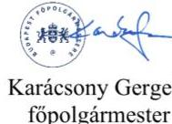

Karácsony Gergely
föpolgármester

Dr. Számadó Tamás
föjegyző

---

ÁLLAMHÁZTARTÁS HELYI SZINTJÉT ELLENŐRZŐ IGAZGATÓSÁG

Ikt. szám: EL-3902-037/2024.
Ügyintéző: Kersmäjer Ágota
Telefonszám: +36 66 529-241
$+3620247-2195$

# Karácsony Gergely 

Főpolgármester
Budapest Főváros Önkormányzata

## Dr. Számadó Tamás

Főjegyzó
Budapest Főváros Főpolgármesteri Hivatal

## Budapest

Tárgy: Válaszlevél ellenőrzéssel kapcsolatos észrevételek kezeléséről

## Tisztelt Főpolgármester Úr! Tisztelt Főjegyzó Úr!

„Budapest Főváros Önkormányzata költségvetésének és zárszámadásának ellenörzése" című ellenőrzéssel kapcsolatos, 2024. január 10-i keltezésű közös észrevételüket köszönettel megkaptam.

Az Állami Számvevőszék (továbbiakban: ÁSZ) észrevételekre vonatkozó álláspontjáról az alábbi tájékoztatást adom:

1. A jelentéstervezet 1.1. pontjában szerepel az a megállapítás, hogy a saját bevételekről és az adósságot keletkeztető ügyletekből eredő fizetési kötelezettségekről - az Áht. 29/A. §-a alapján - a 2022. és 2023. évi költségvetési rendeletek elfogadásáig hozott határozatok három évre összesített adatokat tartalmaztak, így azok nem biztosították annak bemutatását, hogy teljesült-e a Gst. 10. § (5) bekezdés előírása, amely szerint az önkormányzat adósságot keletkeztető ügyletekből származó tárgyévi összes fizetési kötelezettsége egyik évben sem haladhatja meg az önkormányzat adott évi saját bevételeinek $50 \%$-át.

---

Az észrevétel 1.1. a) pontjában arról adtak tájékoztatást, hogy Budapest Főváros Önkormányzata 2023. évi összevont költségvetéséről szóló 46/2022. (XII. 22.) önkormányzati rendelet módosításáról szóló 20/2023. (X. 6.) önkormányzati rendelet, továbbá a 2024. évi költségvetési rendelet kiegészítésre került, így azok már tartalmazzák a megállapításban kifogásoltakat.
Az államháztartásról szóló 2011. évi CXCV. törvény (továbbiakban: Ábt.) 29/A. §-ában foglaltak alapján a helyi önkormányzatnak legkésőbb a költségvetési rendelet elfogadásáig határozatban kell megállapítani a Magyarország gazdasági stabilitásáról szóló 2011. évi CXCIV. törvény (továbbiakban: Gst.) 45. § (1) bekezdés a) pontjában kapott felhatalmazás alapján kiadott jogszabályban meghatározottak szerinti saját bevételeinek és a Gst. 8. § (2) bekezdése szerinti adósságot keletkeztető ügyleteiből eredő fizetési kötelezettségeinek a költségvetési évet követő három évre várható összegét. A jelentéstervezetben szereplő megállapítás a Fővárosi Önkormányzat által - a 2022. és 2023. évi költségvetési rendeletek elfogadásáig - meghozott határozatokkal kapcsolatosan azt kifogásolta, hogy azok nem évenkénti, hanem három évre összesített adatokat tartalmaztak, így azok nem biztosították annak bemutatását, hogy az egyes években teljesül-e a Gst. 10. § (5) bekezdés előírása. Főpolgármester úr és Főjegyző úr a jelentéstervezet megállapítását nem kifogásolta. Az észrevételben a költségvetési rendeletek - Ábt. 23. § (2) bekezdés g) pontja szerinti kiegészítésére vonatkozóan megtett intézkedésről adtak tájékoztatást, azonban ezen intézkedések nem szüntették meg a költségvetési rendeletek elfogadásáig hozott határozatokra vonatkozó hiányosságot, ezért a megállapítást fenntartjuk.
2. A jelentéstervezet 1.1. pontja tartalmazza, hogy a főjegyző a 2022. és 2023. évi költségvetési rendelettervezetek költségvetési szervek vezetőivel történt egyeztetésének eredményét írásban nem rögzítette, ezáltal a főpolgármester az egyeztetések eredményét nem terjesztette a Közgyűlés bizottságai elé.
Az észrevétel 1.1. b) pontjában azt fogalmazták meg, hogy az írásban való rögzítés a keretközlő kiküldésével valósult meg az adott költségvetési évekre vonatkozóan, az egyeztetések eredményei a költségvetési rendelettervezettel kerültek beterjesztésre a bizottságok elé. A 2024. évi költségvetés tervezése során külön dokumentum készült az intézményvezetőkkel történt egyeztetés eredményéről.
Főjegyző úr 2023. július 21-ei nyilatkozata szerint a koronavírus járvány miatt a 2022. évi költségvetés tervezésekor „az intézmények vonatkozásában nem történt személyes egyeztetés, a költségvetési tárgyalások helyett e-mailes és telefonos egyeztetések történtek." Az ellenőrzés részére az egyeztetések lefolytatását és azok eredményét dokumentumokkal (keretközlők, emailek, egyéb dokumentum) nem támasztották alá. A 2023. évi költségvetés tervezésével kapcsolatosan az ellenőrzés részére megküldött keretközlők a 2023. évi költségvetési rendelet elfogadását követő dátummal kerültek leválogatásra és a költségvetési szervek részére kiküldésre, így azok nem támasztják alá azt, hogy az abban foglaltakat a költségvetési szervek vezetőivel a 2023. évi költségvetés elfogadását megelőzően egyeztették. A fentiekre tekintettel a jelentéstervezet módosítása nem indokolt.
Köszönöm tájékoztatásukat és a megküldött dokumentumokat arra vonatkozóan, hogy a 2024. évi költségvetés tervezése során intézkedtek a jogszabályban előírt egyeztetések elvégzésére. Tájékoztatom Önöket, hogy a jelentés Összefoglalás fejezetében szerepeltetjük a 2024. évi költségvetés tervezésével kapcsolatos intézkedés megtételére vonatkozó tájékoztatást. Jelzem továbbá, hogy az ÁSZ a jelentésben foglalt megállapításokhoz kapcsolódó intézkedések elfogadhatóságát az intézkedési terv

---

megküldését követően értékeli, továbbá az intézkedési tervben foglaltak megvalósítását utóellenőrzés keretében ellenőrizheti az Állami Számvevőszékről szóló 2011. évi LXVI. törvény (továbbiakban: ÁSZ tv.) 33. § előírásai alapján.
3. A jelentéstervezet 1.1. pontjában megállapításra került, hogy a főpolgármester a 2022. évi, valamint a 2023. évi költségvetési rendelettervezetek Közgyűlés elé terjesztéséhez az Ávr. 27. § (2) bekezdésében foglaltak ellenére a Pénzügyi és Közbeszerzési Bizottság írásos véleményét nem csatolta.
Az észrevétel 1.1. c) pontja szerint a Magyarország helyi önkormányzatairól szóló 2011. évi CLXXXIX. törvény (továbbiakban: Mötv.) 57. § (2) bekezdése szerinti, az Mötv. 120. § (1) bekezdésében meghatározott feladatokat ellátó pénzügyi bizottság feladatait Budapest Főváros Önkormányzata Szervezeti és Müködési Szabályzatáról szóló 1/2020. (II. 5.) önkormányzati rendelet (továbbiakban SZMSZ) 47. § (1) bekezdés f) pontja szerinti Tulajdonosi Bizottság látja el 2021. január 1-je óta. Az SZMSZ 47. § (1) bekezdés c) pontja alapján a Pénzügyi és Közbeszerzési Bizottság hatásköre nem terjed ki az Mötv. 120. § (1) bekezdés a) pontja szerinti feladatkörre, az államháztartásról szóló törvény végrehajtásáról szóló 368/2011. (XII. 31.) Korm. rendelet (továbbiakban: Ávr.) 27. § (2) bekezdésben foglalt szabályból és az Mötv 57. § (2) bekezdéséből pedig az adott feladatot ellátó bizottság elnevezése nem következik. A megfelelő feladatkörrel rendelkező bizottság (azaz a Tulajdonosi Bizottság) pedig a költségvetés és a beszámolók tervezetét megtárgyalta, véleményét a bizottság jegyzőkönyvében, illetve határozati formában rögzítette. A fentiekre tekintettel kérték a megállapítás pontosítását és megfelelő kiegészítését.
Tájékoztatom Önöket, hogy a pénzügyi bizottság létrehozása és feladatköre a Mötv. 57. § (2) bekezdés és 120. § (1) bekezdés a)-d) pontjaiban előírt kötelezően - egységesen alkalmazandó rendelkezés, attól való eltérést a jogszabály nem enged. Az ezzel ellentétes belső szabályozás jogsértő, a pénzügyi bizottság feladat- és hatásköre nem elvonható és nem átruházható. Az ellenőrzés rendelkezésére bocsátott dokumentumok szerint a 2022. évi és 2023. évi költségvetési rendelettervezetről a Pénzügyi és Közbeszerzési Bizottság, valamint a Tulajdonosi Bizottság a véleményét határozati formában rögzítette. A jelentéstervezetben az ÁSZ azt kifogásolja, hogy a törvényi előírások ellenére a Pénzügyi és Közbeszerzési Bizottság 2022. évi és 2023. évi költségvetési rendelettervezetről alkotott írásos véleményét nem terjesztették a Közgyűlés elé. Ezt Főjegyző úr 2023. július 21-ei nyilatkozata is megerősítette, amely szerint sem a Pénzügyi és Közbeszerzési Bizottság, sem a Tulajdonosi Bizottság 2022. és 2023. évi költségvetési rendelettervezetről alkotott írásos véleménye nem került a Közgyűlés elé beterjesztésre. Fentiekre tekintettel a jelentéstervezetben megfogalmazott megállapítás helytálló, módosítása nem indokolt.
4. A jelentéstervezet 1.1. pontja tartalmazza, hogy az Áht. 23. § (2) bekezdés c) pontjában foglaltak ellenére a 2023. évi költségvetési rendelet - normaszövege és melléklete önkormányzati szinten nem tartalmazta a költségvetési egyenleg összegét működési bevételek és múködési kiadások egyenlege és a felhalmozási bevételek és a felhalmozási kiadások egyenlege szerinti bontásban.
Főpolgármester úr és Főjegyző úr az észrevétel 1.1. d) pontjában a jelentéstervezet megállapítását nem kifogásolta, ugyanakkor a megállapítás megfelelő kiegészítését és pontosítását kérte. Köszönöm tájékoztatásukat és a megküldött dokumentumokat arra vonatkozóan, hogy Budapest Főváros Önkormányzata 2023. évi összevont költségvetéséről szóló 46/2022. (XII. 22.) önkormányzati rendelet módosításáról szóló

---

20/2023. (X. 6.) önkormányzati rendeletben, továbbá a 2024. évi költségvetési rendeletben bemutatásra került önkormányzati szinten a költségvetési egyenleg összege működési bevételek és működési kiadások egyenlege és a felhalmozási bevételek és a felhalmozási kiadások egyenlege szerinti bontásban.
Tájékoztatom Önöket, hogy a jelentés Összefoglalás fejezetében szerepeltetjük az intézkedés megtételére vonatkozó tájékoztatást. Jelzem továbbá, hogy az ÁSZ a jelentésben foglalt megállapításokhoz kapcsolódó intézkedések elfogadhatóságát az intézkedési terv megküldését követően értékeli, továbbá az intézkedési tervben foglaltak megvalósítását utóellenőrzés keretében ellenőrizheti az ÁSZ tv. 33. § előírásai alapján.
5. A jelentéstervezet 1.1. pontjában szerepel az a megállapítás, hogy a 2022. és a 2023. évi költségvetési rendeletek - normaszövege és melléklete - önkormányzati szintre összesítve nem tartalmazták a Fővárosi Önkormányzat költségvetési bevételi előirányzatait és költségvetési kiadási előirányzatait kiemelt előirányzatok, valamint kötelező feladatok, önként vállalt feladatok és államigazgatási feladatok szerinti bontásban. Ezen hiányosságok miatt a Fővárosi Önkormányzat a 2022. évi és a 2023. évi költségvetési rendeletek vonatkozásában az Alaptörvény N) cikk (3) bekezdésében foglaltak ellenére az N) cikk (1) bekezdésben előírt átláthatóság elvét nem érvényesítette.

Az észrevétel 1.1. e) pontjában arról adtak tájékoztatást, hogy a kimutatások a 2022. évi, illetve a 2023. évi költségvetés elfogadására irányuló, közgyűlési előterjesztések 1.b és 2.b függelékeiben szerepeltek. A függelékek az előterjesztés benyújtásától fogva nyilvánosak és a budapest.hu weboldalon elérhetőek, így nem értenek egyet azzal, hogy az Alaptörvény N) cikk (1), illetve (3) bekezdése bármilyen módon sérült volna.

Az észrevétel alapján a jelentéstervezetben szereplő megállapítást a következők szerint módosítottuk: „A 2022. és a 2023. évi költségvetési rendeletek - normaszövege és melléklete önkormányzati szintre összesitve nem tartalmazták a Fővárosi Önkormányzat költségvetési bevételi elörányzatait és költségvetési kiadási elörányzatait kiemelt elörányzatok, valamint kötelező feladatok, önként vállalt feladatok és államigazgatási feladatok szerinti bontásban, azonban a költségvetési rendelettervezet elöterjesztésének függeléke azokat tartalmazza." Ettől függetlenül célszerű a költségvetési rendeleten belül biztosítani az átláthatóságot az önkormányzati szintre összesített adatok költségvetési rendeletben történő megjelenítésével.
6. A jelentéstervezet 1.1. pontjában szerepel az a megállapítás, hogy a Fővárosi Önkormányzat 2022. évi elemi költségvetésének jóváhagyása nem felelt meg az Ávr. 33. § (1) bekezdésben előírtaknak, mivel az általános főpolgármester-helyettes Főpolgármesteri Hivatali SZMSZ 27. § (1) bekezdés a) pont szerinti helyettesítési jogkörében történt - aláírása nem volt szabályszerű. A főpolgármester-helyettes aláírása a Kiadmányozás rendje 9. § (1) és (3) bekezdésében foglaltak ellenére nem tartalmazta a főpolgármesteri bélyegző lenyomatát, a kiadmányozási jogkör gyakorló nevének és tisztségének megjelölését, valamint a „főpolgármester hatáskörében eljárva" szöveget.
Az észrevétel 1.1. f) pontjában leírtak nem vitatják a jelentéstervezet azon megállapítását, hogy Főpolgármester-helyettes úr aláírása formailag hibás. Álláspontjuk szerint azonban a közfeladatot ellátó szervek iratkezelésének általános követelményeiről szóló 335/2005. (XII. 29.) Korm. rendelet 52. §-ára figyelemmel - mivel kiadmányozás nem történt - a kiadmányozási szabályok hivatkozása nem releváns.
Az Ávr. 2022. december 31-ig hatályos 33. § (1) bekezdése szerint a helyi önkormányzat elemi költségvetését a polgármesternek kellett jóváhagyni. Tekintettel arra, hogy a főpolgármester-helyettes aláírása nem tartalmazta a helyettesítésre történő utalást, ezért az

---

aláírásból nem állapítható meg, hogy a főpolgármester-helyettes a 2022. évi elemi költségvetést saját hatáskörben vagy a főpolgármester akadályoztatásából adódó helyettesítési jogkörében eljárva írta alá és hagyta jóvá. A kiadmányozási jog alapvetően az érdemi döntést, az irat aláírását jelenti. A Főpolgármesteri Hivatali SZMSZ 67. § (3) bekezdésében foglaltak is tartalmazzák, hogy „a másnak alapított kiadmányozási jog a kiadmányozási jog tárgyában a döntés, jognyilatkozat vagy egyéb irat elökészitésére, a döntés megbozatalára és a döntés, jognyilatkozat vagy egyéb irat aláírására jogosít". Az irat aláírásán felül a kiadmányozás megtörténtét támasztja alá az is, hogy a Fővárosi Önkormányzat jogszabályi előírás alapján a jóváhagyott elemi költségvetésről - külső szerv felé - a Magyar Államkincstár által működtetett elektronikus adatszolgáltató rendszerben adatot szolgáltatott, továbbá közérdekủ adatként az közzétételre került a Fővárosi Önkormányzat honlapján. Fentiekre tekintettel a jelentéstervezetben megfogalmazott megállapítás helytálló, módosítása nem indokolt.
7. A jelentéstervezet 1.2. megállapításában szerepel, hogy az ellenőrzött bevételi előirányzatok 2022. és 2023. évi tervezése során azok közgazdasági megalapozottságát - az egyéb közhatalmi bevételek előirányzata kivételével - nem biztosították. A jelentéstervezet 1.2. pontja tartalmazza továbbá, hogy a kamatbevételek és más nyereségjellegủ bevételek előirányzata összességében nem volt megalapozott, valamint azt, hogy az Áht. 4. § (2) bekezdésében foglaltak ellenére a 2022. és a 2023. évi költségvetésben a forgatási célú belföldi értékpapírok beváltásából, értékesítéséből, továbbá a 2023. évi költségvetésben a lekötött bankbetét megszüntetéséből előirányzott finanszírozási bevétel tervezésének megalapozottsága nem volt biztosított.
Az észrevétel 1.2. a) pontjában azt fogalmazták meg, hogy a 2022. évben a kamatbevételek a tervezetthez képest túlteljesültek, ami - figyelemmel arra is, hogy a járványhelyzetből való kilábalás gazdasági körülményei a tervezési időszakban meglehetősen bizonytalanok voltak - a tervezés közgazdasági megalapozottságának megállapíthatóságát megkérdőjelezi. Véleményük szerint a 2023. évre vonatkozóan pedig a megállapítás túlzó, kontextusából kiemelve pedig kifejezetten téves következtetésekre alapot adó lehet, tekintettel arra, hogy az értékpapír és bankbetétek értékesítéséből, lejáratából származó bevételt, valamint a kamatbevételeket a tervezési időszakban nem lehetett pontosabban megbecsülni. Az észrevétel további részében jelezték, hogy álláspontjuk szerint, „ba a tervezés idöszakában ismert tények, megfelelöen figyelembevételre kerülnek, és nem állnak ellentétben az ismert gazdasági törvényszerüségekkel, akkor a terv közgazdaságilag megalapozottnak tekinthető."
Az ÁSZ rendelkezésére bocsátott dokumentumok szerint a pénzügyi műveletek kamatbevételei a 2022. és 2023. évi költségvetés tervezésekor az előző évi teljesült kamatbevételek alapján kerültek megtervezésre. Ebből adódott, hogy a 2022. évi előirányzat jelentősen túlteljesült, míg a 2023. évi bevétel jelentősen elmaradt az eredeti előirányzattól. A Fővárosi Önkormányzat finanszírozási bevételek közt a 2022. évi költségvetésben forgatási célú belföldi értékpapírok beváltására, értékesítésére 32 299,3 M Ft, a 2023. évi költségvetésben forgatási célú belföldi értékpapírok beváltására, értékesítésére 17 411,3 M Ft, lekötött bankbetétek megszüntetésére 30 434,5 M Ft előirányzatot tervezett. A finanszírozási kiadások közt forgatási célú belföldi értékpapírok vásárlására, pénzeszközök lekötött bankbetétként elhelyezésére előirányzat nem szerepelt, ebből következik, hogy a finanszírozási bevételek közt előző évben vásárolt értékpapír beváltását, lekötött bankbetét megszüntetését tervezték. A Fővárosi Önkormányzat a 2022. évi, valamint a 2023. évi költségvetés készítésekor azonban nem vette figyelembe, hogy az értékpapírállománya, illetve a 2023. évi tervezésnél a lekötött bankbetétje a tervezés

---

időszakában folyamatosan beváltásra, illetve megszüntetésre került, és a költségvetések Közgyűlés általi elfogadásakor a költségvetési rendelettervezetekben kimutatott finanszírozási források már nem álltak teljeskörűen a rendelkezésére. A rendelettervezetekben kimutatott finanszírozási források helyett a 2022. évi költségvetés 2021. december 15-ei - elfogadásakor 9,1 Mrd Ft-tal kevesebb forgatási célú értékpapírral, a 2023. évi költségvetés - 2022. december 14-ei elfogadásakor - 6,9 Mrd Ft-tal kevesebb értékpapírral, és 3,2 Mrd Ft-tal kevesebb lekötött bankbetéttel rendelkeztek.
A 2022. évi, valamint a 2023. évi költségvetés tervezése során az Önök által hivatkozott a „tervezés időszakában ismert tények"-et - kamatbevételt befolyásoló tényezőket szerkezeti változásokat, továbbá a finanszírozási bevétel tervezését megalapozó forgatási célú belföldi értékpapír, lekötött bankbetét állományát - nem vették figyelembe. Emiatt a jelentéstervezet 1.2. pontjában szereplő részletes megállapítások helytállóak, azok módosítása nem indokolt. Észrevételükre tekintettel azonban az 1.2. összegző megállapítást a következők szerint pontosítottuk: „A 2022. és 2023. évi költségvetés tervezése során az egyéb közbatalmi bevételek elöirányzatának tervezése közgazdaságilag megalapozott volt. A kamatbevételek és más nyereségjellegö bevétel, a forgatási célú belföldi értékpapírok beváltására, értékesítésére tervezett finanszirozási bevétel 2022-2023. évi, a kieső adóbevétel kompenzalására tervezett egyéb müködési célú támogatás 2022. évi, továbbá a leköttött bankbetét megszüntetésére tervezett finanszirozási bevétel 2023. évi költségvetésben tervezett elöirányzatának közgazdasági megalapozottsága a jogszabályi elöirás ellenére nem volt biztositott."
8. A jelentéstervezet 1.2. pontja tartalmazza, hogy a 2022. évi költségvetésben egyéb működési célú támogatások előirányzaton a koronavírus járvány miatt kieső adóbevételek ellentételezésére - kormányzati kompenzációként - tervezett 20 520,0 M Ft bevétel közgazdasági megalapozottsága az Áht. 4. § (2) bekezdésének előirása ellenére nem volt biztosított.
Az észrevétel 1.2. b) pontjában tájékoztatást adtak arról, hogy a 2022. évi költségvetés elfogadásakor a kompenzáció igénylésére vonatkozó 1750/2021.(12. 15.) KGY. határozat mellett a Közgyűlés két másik (1751/2021. (12. 15.) és 1752/2021. (12. 15.) KGY. határozat) határozatot is elfogadott, amelyekben egyrészt előírta, hogy ha május 31-ig a kompenzációról nem születik döntés, akkor a 20,5 Mrd Ft ki kell vezetni a költségvetésből, másrészt - ezen átrendezés végrehajthatósága érdekében - az érintett előirányzatok felhasználását a megfelelő összeg erejéig korlátozta, azaz zárolta.
Az észrevétel megerősítette, hogy a tervezés időszakában a Fővárosi Önkormányzat kompenzálásra vonatkozóan megállapodással, konvencióval nem rendelkezett. A költségvetési rendelet jövőbeni módosítására vonatkozó közgyűlési határozatok nem biztosítják a költségvetési rendeletben tervezett bevételi előirányzat megalapozottságát. A határozatok azonban biztosítékot adnak arra, hogy a megalapozatlanul tervezett előirányzat teljesülésének esetleges elmaradása ne okozza a kiadási előirányzatok túllépését (azaz pénzügyi nehézséget) a Fővárosi Önkormányzatnál. Fentiekre tekintettel az ÁSZ megállapítása helytálló, módosítása nem indokolt.
9. A jelentéstervezet 1.1. pontjában szerepel, hogy a 2022. évi költségvetés-tervezés rendjét, az eljárási szabályokat és a folyamatba épített kontrollpontokat nem megfelelően szabályozták, mivel többek közt az Ávr. 13. § (2) bekezdés a) pontjában foglaltak ellenére a tervezéssel kapcsolatos belső előírásokat, feltételeket belső szabályzatban nem rendezték.

---

Az észrevétel 1.2. c) pontjában jelezték, hogy a Költségvetés Tervezési és Felügyeleti Főosztály ügyrendje tartalmazza a Költségvetéstervezési Osztály költségvetés tervezésének rendjét, folyamatát.
A jelentéstervezetben az szerepel, hogy a Költségvetési Tervezési és Felügyeleti Főosztály 2021. december 18-ig nem rendelkezett ügyrenddel, így a 2022. évi költségvetés tervezésének időszakában a hivatkozott megállapításban foglalt hiányosság még fennállt. A jelentéstervezet tartalmazza továbbá azt is, hogy a szabályozási hiányosságok 2022. évi megszüntetésével a 2023. évi költségvetési tervezés folyamata már szabályozott volt. A fentiekre tekintettel az ÁSZ megállapítása helytálló, módosítása nem indokolt.
10. A jelentéstervezet 1.3. megállapítása tartalmazza, hogy a 2023. évi költségvetésben az ellenőrzött előirányzatoknál - a szolidaritási hozzájárulás, valamint az Egészséges Budapest Program kiadási előirányzata kivételével - a feladatellátáshoz szükséges kiadások megtervezése biztosított volt.
Az 1.3. összegző megállapítást alátámasztó részletes megállapítás az Egészséges Budapest Program kiadási előirányzat tervezésének megalapozottságára vonatkozóan a következő:
„A támogatásbúl a Fővárosi Önkormányzat a 2020-2022. érekben összesen 502,6 M Ft-ot használt fel és a 2023. évi költségretésben eredeti kiadási elörányzatként 2 224,2 M Ft tervezett. Az elörányzat tervezése a 2023. évben nem felett meg az Abt. 4. § (2) bekezdés elörásainak, mivel a támogatás elö̋ ö̋ éri maradványából 23,2 M Ft felhasználását nem tervezték meg, és azt a 2022. évi maradványkimutatás analitikájában - mint cél szerinti felhasználási kötelezettséggel terbelt maradványt - sem szprepeltették."
Az 1.3. megállapításhoz tett észrevételben arról adtak tájékoztatást, hogy a 23,2 M Ft-ot azért nem tervezték meg a 2023. évi költségvetésben eredeti előirányzatként, mivel az összeg teljesülése tervezéskor még 2022. évre volt prognosztizálható. Amennyiben a kérdéses összeg 2022. évben nem teljesült, annak a 2022. évi maradványkimutatás analitikájában szerepelnie kellett volna. Főpolgármester úr és Főjegyző úr észrevételében a jelentéstervezet azon megállapítását, miszerint a $23,2 \mathrm{MFt}$ a maradványkimutatás analitikájában nem szerepelt, nem cáfolta. Azaz a 23,2 M Ft 2022. évben fel nem használt támogatási összeg nem jelent meg a 2022. évi maradványban, és a 2023. évi eredeti előirányzatok között sem került tervezésre. Fentiekre tekintettel az ÁSZ megállapítása helytálló, módosítása nem indokolt.
11. A jelentéstervezet 3.1. számú megállapítás részletes megállapításai között tartalmazza, hogy a Fővárosi Önkormányzat és a Főpolgármesteri Hivatal beszámolójában kimutatott kötelezettségvállalással terhelt maradvány összegét azonban az Áhsz. 39. § (3) bekezdés előírásai ellenére a részletező nyilvántartás nem támasztotta alá.
Főpolgármester úr és Főjegyző úr a 3.1. megállapításhoz tett észrevételében a megállapítást nem vitatja, annak módosítására tesz szövegszerű javaslatot az alábbiak szerint:
„A Fővárosi Önkormányzat és a Főpolgármesteri Hivatal beszámolójában kimutatott kötelezettségvállalással terhelt maradvány összegét azonban a maradványt jóváhagyó közgyölési határozatokat megalapozó elöterjesztése szerinti részletezö kimutatás nem támasztotta alá.
Az észrevételben hivatkozott - közgyűlési határozatokat megalapozó előterjesztés szerinti „Kimutatás a Fővárosi Önkormányzat/ Fővárosi Polgármesteri hivatal 2022. évi kötelezettségvállalással terhelt maradványáról" elnevezésű részletező kimutatás megfelel az Áhsz. 39. § (3) bekezdésben előírraknak, amely szerint „A költségvetési jelentés és a maradvány kimutatás (2) bekezdés szerinti nyilvántartási számlákon nem szereplő adatainak, továbbá a jogszabályban elöért adatszolgáltatási kötelezettségek alátámasztásáról részletezö nyilvántartások vezetésével kell gondoskodni."

---

A fentiekre tekintettel az ÁSZ megállapítása helytálló, az Áhsz. 39. § (3) bekezdésére történő hivatkozás törlése nem indokolt.
A jelentéstervezet 3.1. számú megállapításához kapcsolódó észrevétel további részében a 2022. évi költségvetési beszámolóban és a maradványt jóváhagyó közgyűlési határozatban szerepeltetett kötelezettségvállalással terhelt maradvány közötti eltérés összegének módosítására tesznek javaslatot a Főpolgármesteri Hivatal vonatkozásában. Az észrevételt köszönjük, az összeget - a jelentés 21. oldal 2. bekezdésében - helyesbítettük.
12. A jelentéstervezet 3.2. számú megállapítását részletező megállapítások között szerepel, hogy az Áht. 87. § b) pontjában előírt összehasonlíthatóság a 2022. évi zárszámadási rendelet és az elfogadott költségvetés között teljeskörűen nem volt biztosított, mivel az Áht. 23. § (2) bekezdés c) pontjában rögzítettek ellenére a 2022. évi zárszámadási rendelet nem tartalmazta összesítetten a költségvetési egyenleg összegét működési bevételek és működési kiadások egyenlege és felhalmozási bevételek és felhalmozási kiadások egyenlege szerinti bontásban.
Az észrevétel 3.2. a) pontja az Áht. 87. § b) pontja szerinti összehasonlíthatóság hiányára vonatkozó megállapítás törlésére tesz javaslatot arra való hivatkozással, hogy az Áht. 23. § (2) bekezdésben előírt tartalmi elemeket a 2022. évi költségvetési rendelet sem tartalmazta.

A jelentéstervezet 1.1. számú megállapítása a 2023. évi költségvetési rendelet - Áht. 23. § (2) bekezdés c) pont szerinti - hiányosságára vonatkozóan tartalmaz megállapítást. A 2022. évi költségvetési rendelet 1. § a)-f) pontja tartalmazta az Áht. 23. § (2) bekezdés c) pontjában előírtaknak megfelelően a költségvetési egyenleg összegét működési bevételek és működési kiadások egyenlege és a felhalmozási bevételek és a felhalmozási kiadások egyenlege szerinti bontásban, ezért a 2022. évi zárszámadási rendelet és a 2022. évi költségvetési rendelet összehasonlíthatóságára vonatkozó megállapítás helytálló, módosítása nem indokolt.
13. A jelentéstervezet 3.2. számú megállapítását részletező megállapítások között szerepel, hogy a 2022. évi zárszámadási rendelet - normaszövege és mellékletei - önkormányzati szintre összesítve nem tartalmazták a Fővárosi Önkormányzat költségvetési bevételeit és kiadásait kiemelt előirányzatok, valamint kötelező feladatok, önként vállalt feladatok és államigazgatási feladatok szerinti bontásban. A hiányosságok miatt a Fővárosi Önkormányzat a 2022. évi zárszámadási rendeletben az Alaptörvény N) cikk (3) bekezdésében foglaltak ellenére az N) cikk (1) bekezdésben előírt átláthatóság elvét nem érvényesítette.

Főpolgármester úr és Főjegyző úr az észrevétel 3.2. b) pontjában jelezte, hogy a zárszámadási rendelet elfogadására vonatkozó előterjesztés 1., 1/a, 2., és 2/a. mellékletei tartalmazzák a hivatkozott megbontásokat, és visszautalnak az 1.1. megállapítás kapcsán az észrevétel e) pontjában foglaltakra.
Az észrevétel alapján a jelentéstervezetben szereplő megállapítást a következők szerint módosítottuk: „A 2022. évi zárszáámadási rendelet - normaszövege és mellékletei - önkormányzati szintre összesitve nem tartalmazták a Fővárosi Önkormányzat költségvetési bevételeit és kiadásait kiemelt elöirányzatok, valamint kötelező feladatok, önként vállalt feladatok és államigazgatási feladatok szerinti bontásban, azonban a zárszáámadási rendelettervezet elöterjesztésének melléklete azokat tartalmazza." Ettől függetlenül célszerű a zárszámadási rendeleten belül biztosítani az átláthatóságot az önkormányzati szintre összesített adatok zárszámadási rendeletben történő megjelenítésével.
14. A jelentéstervezet 4.1. számú megállapítása tartalmazza, hogy a működési és felhalmozási

---

hiány finanszírozására az ellenőrzött időszak elején rendelkezésre álló jelentős tartalékokat felhasználták. Továbbá a részletes elemzés tartalmazza, hogy „Ebből a Fővárosi Önkormányzat szabad felhasználású forrása az elszámolási számláján lévő 26 505,7 M Ft, valamint 151 601,3 M Ft nettó árfolyam értékủ államkötvény volt. [...] A hiány forrásának biztositására az ellenőrzött időszak elején meglévő, szabad felhasználású pénzeszközből vásárolt államkötvényeket értékesítették, a költségvetési elszámolási számla egyenlege 2022. december 31-re 25 599,2 M Ft-tal (906,5 M Ft-ra) csökkent oly módon, hogy az EIB bitel alszámlán lévő, átmenetileg szabad 17 822,5 M Ft-ot is felhasználták a kiadások finanszírozására."
Főpolgármester úr és Főjegyző úr a 4.1. megállapításhoz tett észrevételében arra hivatkozással kérte a jelentéstervezet módosítását, hogy az elszámolási számlán 2020. január 1-jén meglévő pénzeszközök, valamint az államkötvénybe fektetett források egy része felhasználási kötelezettséggel terhelt volt.
Az észrevétel alapján az érintett megállapításokat módosítottuk a következők szerint:

- 4. fókusz összegző megállapítás 2. mondat:

A költségvetési hiány finanszírozására a 2020. év elején rendelkezésre álló - korábbi években megbözött döntések fedezetéól szolgáló, valamint szabad - forrásokat felhasználták.

- jelentéstervezet 4.1. megállapítás:
„A müködési és felbalmozási hiány finanszírozására az ellenőrzött időszak elején rendelkezésre álló - korábbi években megbözött döntések fedezetéól szolgáló, valamint szabad - forrásokat felhasználták."
- részletes elemzés az ellenőrzött időszak pénzforgalmi folyamatainak áttekintése 1. bekezdés:
„Ebből a Fővárosi Önkormányzat elszámolási számláján 26 505,7 M Ft volt, valamint 151 601,3 M Ft nettó árfolyam értékủ, költségvetési elszámolási számlán rendelkezésre álló pénzeszközből vásárolt államkötvénnyel rendelkezett. [...] A hiány forrásának biztositására az ellenőrzött időszak elején meglévő államkötvényeket értékesítették, a költségvetési elszámolási számla egyenlege 2022. december 31-re 25 599,2 M Ft-tal (906,5 M Ft-ra) csökkent oly módon, hogy az EIB bitel alszámlán lévő, átmenetileg szabad 17 822,5 M Ft-ot is felhasználták a kiadások finanszírozására."

# Javaslatok 

15. A Főpolgármester részére tett 3. javaslat: „Tegyen intézkedéseket a költségvetési egyensúly helyreállitására az Alaptörvény N) cikkében rögzített fenntartható költségvetési gazdálkodás elvének érvényesitése érdekében."
Az észrevétel II. a) pontjában több, a költségvetési egyensúly helyreállítására tett intézkedést soroltak fel, illetve kapcsolódó dokumentumot csatoltak be. Egyúttal kérték ezen intézkedések bemutatását a jelentéstervezetben, illetve a javaslat átfogalmazását.
A jelentéstervezet bár nem olyan részletezettséggel, ahogy észrevételükben bemutatják, de tartalmazza a pénzügyi egyensúly megteremtése, helyreállítása érdekében tett egyes intézkedéseket. Ugyanakkor a jelentéstervezetben az is megállapításra került, hogy az ellenőrzött időszakban a költségvetési egyenleg negatív volt, és ezt a megállapítást Főpolgármester úr és Főjegyző úr nem vitatja. Az Alaptörvény N) cikk (3) bekezdése szerint a helyi önkormányzatok feladatuk ellátása során kötelesek tiszteletben tartani a kiegyensúlyozott gazdálkodás elvét.

---

Észrevételére tekintettel azonban a javaslatot a következők szerint módosítottuk:
„A negativ költségvetési egyenlegre tekintettel továbbra is tegyen intézkedéseket a költségvetési egyensúly bekyreállítására az Alaptörvény N) sikkében rögzitett fcontartható költségvetési gazdálkodás elvének érvényesitése érdekében."
16. Főjegyző részére tett 1. számú javaslat: „Készítse elő az Önkormányzati SZMSZ módosítását, és kezdeményezzze annak Közgyölés elé terjesztését annak érdekében, hogy az az Mótv. 57. § (1) bekezdésében foglaltaknak megfelelően tartalmazza a Pénzügyi és Közbeszerzési bizottság Mótv. 120. § (1) bekezdés a) pontja szerinti feladat- és hatáskörét."

Főpolgármester úr és Főjegyző úr az észrevétel II. b) pontjában rögzítette, hogy az Önkormányzati SZMSZ 47. § (1) bekezdés f) pontja szerinti Tulajdonosi Bizottság látja el az Mótv. 120. § (1) bekezdése szerinti feladatokat és kérte a javaslat törlését.
Az Önkormányzati SZMSZ - a kötelezően létrehozandó - Pénzügyi és Közbeszerzési Bizottság feladatait hiányosan írja elő, azaz - többek között - a Mótv. 120.§ (1) bekezdés a) pont szerinti az éves költségvetési javaslat és a végrehajtásáról szóló éves beszámoló tervezeteinek véleményezését nem tartalmazza, ugyanakkor a Tulajdonosi Bizottság hatáskörébe utalja Budapest Főváros Önkormányzata költségvetésének tervezésével és végrehajtásával összefüggő ügyeket, amelyek kiterjesztett értelmezésével a pénzügyi bizottság törvényben előírt hatásköri jogosultságát elvonta.
Tekintettel arra, hogy a 3. pontban szereplő indoklás alapján a jelentéstervezet javaslatot megalapozó megállapítása helytálló, a javaslat törlése nem indokolt.
17. Főjegyzó részére tett 2. javaslat: „Gondoskodjon az Ábt. 29/A. §-a alapján - a Közgyülés részére beterjesztendő - a Gst. 10. § (5) bekezdés szerinti feltétel teljesülésének bemutatását biztositó közeiptású költségvetési tervezámokat tartalmazó határozat-tervezet elökészitéséröl."
Az észrevétel II. b) pontjában az 1. pontban bemutatott észrevételre tekintettel kérték a javaslat törlését.
Tekintettel arra, hogy az 1. pontban szereplő indoklás alapján a jelentéstervezet javaslatot megalapozó megállapítása helytálló, a javaslat törlése nem indokolt.
18. Főjegyzó részére tett 3. javaslat: „Gondoskodjon az Ávr. 27. § (1) bekezdésében elöirtak alapján a költségvetési rendelettervezet költségvetési szervek vezetöivel történő egyeztetéséről, az egyeztetés eredményének írásba foglalásáról, majd az egyeztetés eredményének Közgyülés bizottságai elé történő elöterjesztés elkészitéséröl."
Köszönettel vettük az észrevétel II. b) pontjában adott tájékoztatásukat arra vonatkozóan, hogy a 2024. évi költségvetés tervezése során a főjegyző már gondoskodott a költségvetési rendelettervezet költségvetési szervek vezetőivel történt egyeztetésről és az egyeztetés eredményének írásba foglalásáról. Erre való hivatkozással kérték a javaslat módosítását a következők szerint: „Gondoskodjon a költségvetési rendelettervezet az az Ávr. 27. § (1) bekezdése szerinti költségvetési szervek vezetöivel történő egyeztetése eredményének külön okiratban való rögzitéséröl és annak a költségvetési rendelet tervezetét tárgyaló bizottságok rendelkezésére bocsátásáról."
Tekintettel arra, hogy a 2. pontban szereplő indoklás alapján a jelentéstervezet javaslatot megalapozó megállapítása helytálló, a javaslat módosítása nem indokolt.
19. Főjegyzó részére tett 4. javaslat: „Tegyen intézkedéseket azon kontrolltvekenységek kiépitésére és/vagy megfelelő müködtetésére, amelyek megelözik a költségvetés tervezés és zárrzámadás készités folyamatában a rendelettervezetek véleményezzése, elöterjesztése, tartalma és jóváhagyása vonatkozásában - a jelentésben

---

leért szabálytalanságok ismételt elöfordulását."
Az észrevétel II. b) pontjában jelezték, hogy a Költségvetés Tervezési és Felügyeleti Főosztály és a Pénzügyi, Számviteli és Vagyonnyilvántartási Főosztály ügyrendjei részletesen tartalmazzák a belső előírásokat, feltételeket a tervezéshez és a zárszámadáshoz kapcsolódóan, ezért kérték az intézkedés elrendelésének pontosítását.
Tájékoztatom Önöket, hogy a jelentéstervezet 1.1 pontja (17. oldal 1 bekezdés) tartalmazza, hogy a 2022. évi költségvetés tervezésekor fennálló szabályozási hiányosságok a 2022. évben megszüntetésre kerültek, ezért erre vonatkozóan a jelentéstervezet nem tartalmaz javaslatot. A hivatkozott javaslat a jelentéstervezet 1.1 pontjában (16. oldal 2-3 bekezdésekben) szereplő költségvetési rendelet tartalmi hiányosságainak, valamint a zárszámadási rendelet 3.2. pontban (21. oldal) rögzített tartalmi hiányosságainak megszüntetésére vonatkozik, ezért a javaslat módosítása nem indokolt.
20. Főjegyző részére tett 5. javaslat: „Intézkedjen annak érdekében, hogy a költségvetés tervezése során az Abt. 4. § (2) bekezdésében elöirtaknak megfelelöen biztositott legyen a tervezett bevételek közgazdasági megalapozottsága, továbbá az, hogy annyi kiadás kerïljön megtervezésre, amennyi a feladat ellátásához indokoltan szükséges."
Az észrevétel II. b) pont szerint a költségvetési bevételek tervezésének közgazdasági megalapozottsága biztosított volt és annyi kiadás került megtervezésre a 2022. és 2023. évi költségvetésben, amennyi az adott feladat ellátásához indokoltan szükséges volt. Erre figyelemmel a javaslat törlését vagy módosítását kezdeményezték.
A javaslatot megalapozó megállapításokhoz kapcsolódó észrevételekre - a 7., 8. és 10. pontokban - adott válaszok figyelembevételével a javaslatot a következők szerint pontosítottuk:
„Intézkedjen annak érdekében, hogy a költségvetés tervezése során az Abt. 4. § (2) bekezdésében elöirtaknak megfelelöen biztositott legyen a - kamatbevételek és más nyereségjellegö bevételek, a forgatási célú belföldi értékpapirok beváltására, értékesitésére, valamint a leköitött bankbetét megszüntetésére tervezett finanszirozási bevétel, továbbá az egyéb müködési célú támogatások elörányzatokon - tervezett bevételek közgazdasági megalapozottsága, továbbá az, hogy - a szolidaritási bozzájárulás, valamint az Egészséges Budapest program tekintetében - annyi kiadás kerïljön megtervezésre, amennyi a feladat ellátásához indokoltan szükséges."
Tájékoztatom Főpolgármester urat és Főjegyző urat, hogy a számvevőszéki jelentésben a figyelembe nem vett észrevételeket szerepeltetjük az elutasítás indokának feltüntetésével.
Budapest, időbélyegző szerint
Tisztelettel:
az Állami Számvevőszék elnöke nevében:

Kisgergely István
igazgató, kiadmányozó
Állami Számvevőszék
Államháztartás helyi szintjét ellenőrző igazgatóság

---

# RÖVIDÍTÉSEK JEGYZÉKE 

${ }^{1}$ Fővárosi Önkormányzat
${ }^{2}$ ÁSZ
${ }^{3}$ ÁSZ tv.
${ }^{4}$ Áht.
${ }^{5}$ Alaptörvény
${ }^{6}$ Kincstár
${ }^{7}$ Közgyűlés
${ }^{8}$ főpolgármester
${ }^{9}$ főjegyző
${ }^{10}$ Főpolgármesteri Hivatal
${ }^{11}$ CSAPI
${ }^{12}$ BVH Nonprofit Zrt.
${ }^{13}$ BKK Zrt.
${ }^{14}$ Mötv.
${ }^{15}$ 2022. évi költségvetési rendelet
${ }^{16}$ 2023. évi költségvetési rendelet
${ }^{17}$ 353/2011. (XII. 30.) Korm. rendelet
${ }^{18}$ 2022. évi zárszámadási rendelet
${ }^{19}$ Gst.
${ }^{20}$ Ávr.
${ }^{21}$ Főpolgármesteri hivatali SZMSZ
${ }^{22}$ Kiadmányozás rendje
${ }^{23}$ Bkr.
${ }^{24}$ 641/2021. (XI. 25.) Korm. rendelet
${ }^{25}$ 535/2020 (XII. 1.) Korm. rendelet
${ }^{26}$ 2023. évi Kvtv.
${ }^{27}$ Kormány
${ }^{28}$ Számv. tv.
${ }^{29}$ Áhsz.

Budapest Főváros Önkormányzata
Állami Számvevőszék
2011. évi LXVI. törvény az Állami Számvevőszékről
2011. évi CXCV. törvény az államháztartásról

Magyarország Alaptörvénye
Magyar Államkincstár
Budapest Főváros Önkormányzata Közgyűlése
Budapest Főváros főpolgármestere
Budapest Főváros Főpolgármesteri Hivatal főjegyzője
Budapest Főváros Főpolgármesteri Hivatal
Fővárosi Önkormányzat Csarnok és Piac Igazgatósága
BVH Budapesti Városüzemeltetési Holding Nonprofit Zrt.
Budapesti Közlekedési Központ Zártkörűen Müködő Részvénytársaság
2011. évi CLXXXIX. törvény Magyarország helyi önkormányzatairól

Budapest Főváros Önkormányzata Közgyűlésének 43/2021. (XII. 22.) önkormányzati rendelete Budapest Főváros Önkormányzata 2022. évi összevont költségvetéséről
Budapest Főváros Önkormányzata Közgyűlésének 46/2022 (XII. 22.) önkormányzati rendelete Budapest Főváros Önkormányzata 2023. évi összevont költségvetéséről
353/2011. (XII. 30.) Korm. rendelet az adósságot keletkeztető ügyletekhez történő hozzájárulás részletes szabályairól
Budapest Főváros Önkormányzata Közgyűlésének 13/2023. (V. 30.) önkormányzati rendelete a Budapest Főváros Önkormányzata 2022. évi összevont költségvetéséről szóló 43/2021. (XII. 22.) önkormányzati rendelet végrehajtásáról
2011. évi CXCIV. törvény Magyarország gazdasági stabilitásáról

368/2011. (XII. 31.) Korm. rendelet az államháztartásról szóló törvény végrehajtásáról
Budapest Főváros Önkormányzata Főpolgármesterének 25/2020. (X. 26.) utasítása Budapest Főváros Főpolgármesteri Hivatal szervezeti és működési szabályzatáról (hatályos: 2020. november 1-től)
Budapest Főváros Önkormányzata Főpolgármesterének 27/2020. (XI. 5.) utasítása a főpolgármester hatáskörébe tartozó egyes ügyekben a kiadmányozás rendjéről (módosítva 8/2021. ((V. 30.); 16/2021. (IX. 23.); 20/2021(X. 8.); (25/2021. (XII.22.); 1/2022. (I. 21.) főpolgármesteri utasítással
370/2011. (XII. 31.) Korm. rendelet a költségvetési szervek belső kontrollrendszeréről és belső ellenőrzéséről
641/2021. (XI. 25.) Korm. rendelet a koronavírus-világjárvány nemzetgazdaságot érintő hatásának enyhítése érdekében szükséges helyi adó intézkedésről szóló 535/2020. (XII. 1.) Korm. rendelet módosításáról (hatálytalan 2021. november 28ától)
535/2020 (XII. 1.) Korm. rendelet a koronavírus-világjárvány nemzetgazdaságot érintő hatásának enyhítése érdekében szükséges helyi adó intézkedésről (hatálytalan 2022. június 1-jétől)
2022. évi XXV. törvény Magyarország 2023. évi központi költségvetéséről

Magyarország Kormánya
2000. évi C. törvény a számvitelről

4/2013. (I. 11.) Korm. rendelet - az államháztartás számviteléről

---

${ }^{30}$ Önkormányzati SZMSZ
${ }^{31}$ Budapest Gyógyfürdői Zrt.
${ }^{32}$ BKV Zrt.
${ }^{33}$ EIB hitel
${ }^{34} 1248 / 2019$. (IV.30.) Korm. határozat
${ }^{35} 1619 / 2022$. (XII. 13.) Korm. határozat
${ }^{36}$ BKM Nonprofit Zrt.
${ }^{37}$ Ptk.
${ }^{38}$ Taktv.
${ }^{39}$ BKK tcs.
${ }^{40}$ BKV tcs.
${ }^{41}$ BVH tcs.
${ }^{42}$ BKÜ Zrt.
${ }^{43}$ FKF Nonprofit Zrt.
${ }^{44}$ FÖKERT Nonprofit Zrt.
${ }^{45}$ BFVT Kft.
${ }^{46}$ BFVK Zrt.
${ }^{47}$ BDK Kft.
${ }^{48}$ FTSZV Kft.
${ }^{49}$ REK Kft.
${ }^{50}$ Budapest Bábszínház Nonprofit Kft.
${ }^{51}$ Kolibri Színház Nonprofit Kft.
${ }^{52}$ Hatv.
${ }^{53}$ Htv.
${ }^{54}$ 2021. évi Kvtv.
${ }^{55}$ 2022. évi Kvtv.
${ }^{56}$ REK Kft.
${ }^{57}$ BVA Nonprofit Kft.
${ }^{58}$ BFTK Nonprofit Kft.
${ }^{59}$ Ötv.
${ }^{60}$ Övt.

Budapest Főváros Önkormányzata Közgyűlésének többször módosított 1/2020. (II.5.) önkormányzati rendelete Budapest Főváros Önkormányzata Szervezeti és Müködési Szabályzatáról
Budapest Gyógyfürdői és Hévizei Zrt.
Budapesti Közlekedési Zrt.
Európai Beruházási Banktól igénybe vett hitel a közlekedési és egyéb ágazati projektek finanszírozására
1248/2019. (IV. 30.) Korm. határozat a Széchenyi lánchíd, a budai Váralagút, valamint a hozzájuk kapcsolódó közterületek rekonstrukciójával és fejlesztésével összefüggő intézkedésekről szóló 1447/2018. (IX. 18.) Korm. határozat módosításáról
1619/2022. (XII. 13.) Korm. határozat az önkormányzatok adósságot keletkeztető, valamint kezesség-, illetve garanciavállalásra vonatkozó ügyleteihez történő 2022. október-novemberi előzetes kormányzati hozzájárulásról
BKM Budapesti Közművek Nonprofit Zrt.
2013. évi V. törvény a Polgári Törvénykönyvről
2009. évi CXXII. törvény a köztulajdonban álló gazdasági társaságok takarékosabb müködéséről
BKK társaságcsoport, a BKK Zrt. és a konszolidációba bevont kapcsolt vállalkozásainak összefoglaló elnevezése
BKV társaságcsoport, a BKV Zrt. és a konszolidációba bevont kapcsolt vállalkozásainak összefoglaló elnevezése
BVH társaságcsoport, a BVH Nonprofit Zrt. és a konszolidációba bevont kapcsolt vállalkozásainak összefoglaló elnevezése
BKÜ Budapesti Közlekedési Ügyfélkapcsolatok Zrt.
Fővárosi Közterület-fenntartó Nonprofit Zrt.
Fővárosi Kertészeti Nonprofit Zrt.
Budapest Főváros Városépítési Tervező Kft.
Budapest Főváros Vagyonkezelő Központ Zrt.
BDK Budapesti Dísz- és Közvilágítási Kft.
FTSZV Fővárosi Településtisztasági és Környezetvédelmi Kft.
REK Rác Fürdő Eszközkezelő Kft.
Budapest Bábszínház Közhasznú Nonprofit Kft.
Kolibri Gyermek- és Ifjúsági Színház Közhasznú Nonprofit Kft.
1991. évi XX. törvény a helyi önkormányzatok és szerveik, a köztársasági megbízottak, valamint egyes centrális alárendeltségủ szervek feladat- és hatásköreiről 1990. évi C. törvény a helyi adókról
2020. évi XC. tv. Magyarország 2021. évi központi költségvetéséről
2021. évi XC. törvény Magyarország 2022. évi központi költségvetéséről

REK Rác Fürdő Eszközkezelő Kft.
BVA Budapesti Városarculati Nonprofit Kft.
BFTK Budapesti Fesztivál-és Turisztikai Központ Nonprofit Kft.
1990. évi LXV. törvény a helyi önkormányzatokról (hatályos: 1990. szeptember 30tól 2014. október 11-ig)
1991. évi XXXIII. törvény az egyes állami tulajdonban lévő vagyontárgyak önkormányzatok tulajdonába adásáról

---

1052 Budapest, Apáczai Csere János u. 10. | 1364 Budapest 4., Pf. 54
www.asz.hu | szamvevoszek@asz.hu
telefon: +36 14849100