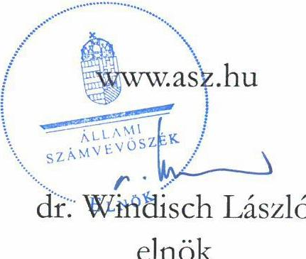
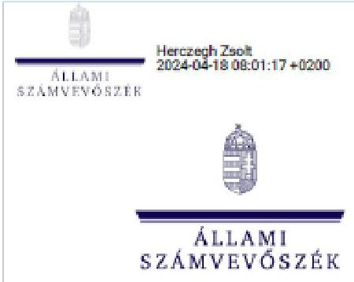

# JELENTÉS 

A többségi állami tulajdonban lévő gazdasági társaságok informatikai célú beszerzéseinek célzott ellenőrzése

MÁV Központi Felépítményvizsgáló Kft.

2024.

---

# JELENTÉS 

A többségi állami tulajdonban lévő gazdasági társaságok informatikai célú beszerzéseinek célzott ellenőrzése

MÁV Központi Felépítményvizsgáló Kft.

2024. 

24016

---

# ELLENŐRZÉSI IGAZGATÓSÁG: 

ÁLLAMI VAGYONGAZDÁLKODÁST ELLENŐRZŐ IGAZGATÓSÁG

## ELLENŐRZÉSI IGAZGATÓ:

HERCZEGH ZSOLT ellenőrzési igazgató

## ELLENŐRZÉSVEZETŐ:

Jelentéseink az interneten a www.asz.hu címen olvashatók.

DABISNÉ NYIKOS MELINDA ellenőrzésvezető

IKTATÓSZÁM: EL-3950-002/2024
TÉMASZÁM: 2709
ELLENŐRZÉS-AZONOSÍTÓ SZÁM: V1053

---

# TARTALOMJEGYZÉK 

AZ ELLENŐRZÉS ALAPADATAI ..... 5
AZ ELLENŐRZÖTT SZERVEZET ..... 7
ÖSSZEFOGLALÁS ..... 9
AZ ELLENŐRZÉS FÓKUSZKÉRDÉSE ..... 10
MEGÁLLAPÍTÁSOK ..... 11
JAVASLATOK ..... 13
MELLÉKLETEK ..... 14
I. sz. melléklet: Értelmező szótár ..... 14
II. sz. melléklet: Az ellenőrzött szervezetek jegyzéke ..... 15
III. sz. melléklet: Ellenőrzési kritériumok ..... 16
FÜGGELÉK: ÉSZREVÉTELEK ..... 17
RÖVIDÍTÉSEK JEGYZÉKE ..... 22

---

.

---

# AZ ELLENŐRZÉS ALAPADATAI 

## AZ ELLENŐRZÉS CÉLJA

Az ellenőrzés célja annak értékelése volt, hogy az ellenőrzött szervezet informatikai célú - ellenőrzés során kiválasztott mintatételre vonatkozó - beszerzésére szabályszerűen került-e sor, a kapcsolódó döntéshozatal megalapozott volt-e, valamint érvényesült-e a célszerűség.

## AZ ELLENŐRZÉS TÍPUSA

Megfelelőségi ellenőrzés.

## AZ ELLENŐRZÖTT IDŐSZAK

A 2021., 2022. évek.

## AZ ELLENŐRZÉS TÁRGYA

Az ÁSZ ${ }^{1}$ ellenőrzése kiterjedt a MÁV KFV Kft. ${ }^{2}$ 2021., 2022. években megvalósult, lezárult informatikai célú beszerzésére vonatkozóan hozott döntések szabályszerűségének, megalapozottságának és célszerűségének ellenőrzésére.

A döntés megalapozottságának ellenőrzése kiterjedt a beszerzés előkészítésének és a beszerzésre vonatkozó megrendelés, szerződés megkötésének, valamint az informatikai célú beszerzés aktiválásának (használatbavételének) ellenőrzésére is, és arra, hogy a megvalósult beszerzés, fejlesztés, beruházás alkalmazásra került-e, betöltötte-e az eredetileg elvárt funkcióját.

Az ellenőrzés kiterjedt továbbá minden olyan körülményre és adatra, amely az ÁSZ jogszabályban meghatározott feladatainak teljesítéséhez, valamint a program végrehajtása folyamán felmerült újabb összefüggések feltárásához volt szükséges.

## AZ ELLENŐRZÉS JOGALAPJA

Az ellenőrzés jogszabályi alapját az ÁSZ tv. ${ }^{3} 1 . \int$ (3) bekezdés és az 5. § (4) bekezdés előírásai képezték.

## AZ ELLENŐRZÉS MÓDSZERE

Az ellenőrzés végrehajtása a nemzetközi standardokat irányadónak tekintve az ellenőrzési program szempontjai, az ellenőrzött időszakban hatályos jogszabályok, az ellenőrzés szakmai szabályok és a jelen ellenőrzésre irányadó ÁSZ módszertan figyelembevételével történt.

---

Az ellenőrzési kérdések megválaszolásához szükséges bizonyítékok megszerzése az ellenőrzött szervezet által rendelkezésre bocsátott dokumentumokra és adatokra alapozva, továbbá megfigyelés, szemrevételezés, kérdésfeltevés (információkérés), valamint elemző eljárás útján valósult meg.

Az ellenőrzés lefolytatásához az ellenőrzött szervezet a 2021. és 2022. évben megvalósult, lezárult informatikai beszerzéseiről a tanúsítvány kitöltésével, valamint az ÁSZ által kért dokumentumok, adatok, információk megküldésével és a helyszíni ellenőrzés során szolgáltatott adatokat. A tanúsítvány adatai alapján a MÁV KFV Kft. a 2021., 2022. évek vonatkozásában 34 lezárult informatikai beszerzést bonyolított le. A mintavételezés keretében egy informatikai beszerzés került kiválasztásra.

Az ÁSZ jelentése a mintatétel (továbbiakban: mintatétel vagy zajmérő szoftver) vonatkozásában ad véleményt.

Az ellenőrzési bizonyítékként felhasználható adatforrások közé tartoztak egyrészt az ellenőrzéshez kért dokumentumok, adatforrások, másrészt adatforrás volt még minden - az ellenőrzés folyamán - feltárt, az ellenőrzés szempontjából információkat tartalmazó dokumentum.

---

# AZ ELLENŐRZÖTT SZERVEZET

A MÁV KFV KFT-t 1996.09.01-én egyszemélyes korlátolt felelősségű társaságként alapította a MÁV Zrt. ${ }^{4}$, amely 2017.03.09-én többszemélyes gazdasági társasággá vált, miután az Alapító 0,02\%-os üzletrészt a MÁVHÉV Helyiérdekű Vasút Zrt. részére átruházott. A MÁV KFV Kft. legfőbb szerve a taggyűlés, amelynek összehívása a Társaság ügyvezetőjének a feladata. A jelenlegi ügyvezető megbízatásának kezdő időpontja 2022.03.16.

A MÁV KFV Kft. fő tevékenységi köre: műszaki vizsgálat és elemzés. További tevékenységei: vasúti pályák pályafelügyeleti vizsgálata és vágánygeometriai mérése, ultrahangos sínvizsgálata, valamint hidak időszakos vizsgálata, vasúti pályákba bekerülő új és használt anyagok minősítése, mérési és vizsgálati eredmények kiértékelése, mérésekhez használt mérőeszközök, mérőműszerek fejlesztése, és járművizsgálati tevékenység. A Társaság a feladatok elvégzéséhez vágánymérő kocsikat, síndiagnosztikai szerelvényeket üzemeltetett, valamint számos kézi mérő-, és vizsgáló berendezéssel, továbbá egyéb informatikai eszközökkel is rendelkezett az ellenőrzött időszakban.

|  MÁV KFV KFT. FŐBB BESZÁMOLÓ ADATAI |  |   |
| --- | --- | --- |
|  adatok 1: 1-t-ban | 2021. év | 2022. év  |
|  Értékesítés nettó árbevétele | 3142897 | 3543443  |
|  Üzemi eredmény | 769152 | 991825  |
|  Adózott eredmény | 782851 | 1050484  |
|  Immateriális javak | 64402 | 63928  |
|  Tárgyi eszközök | 1821493 | 1848394  |
|  Pénzeszközök | 1614249 | 2465593  |
|  Saját tőke | 4197962 | 4873446  |

A MÁV KFV Kft. a MÁV-Csoport ${ }^{5}$ tagja, így a beszámolója a MÁV Zrt. konszolidált éves beszámolójába kerül bevonásra, az ellenőrzött időszakban pozitív adózott eredménnyel rendelkezett. 2. táblázat

A MÁV KFV KFT. ÜZLETI TERVÉNEK RÉSZLETE A BERUHÁZÁS, FEJLESZTÉSI TERV ADATOK VONATKOZÁSÁBAN

|  adatok 1: 1-t-ban | 2021. év | 2022. év  |
| --- | --- | --- |
|  Összes beruházás | 253000 | 306000  |
|  ebből: informatikai eszközök | 11000 | 13000  |

Forrás: az ellenőrzött szervezet adataiból ASZ saját szerkesztés

---

A MÁV KFV Kft. üzleti tervében szereplő adatok alapján az informatikai eszközök beruházásának tervezett értéke az összes beruházás értékének a $4 \%$-át tette ki a 2021., valamint a 2022. évben is.

A Társaság ellenőrzésre kiválasztott informatikai beszerzési igénye egy MÁV-Csoporttagtól 2022. év elején beérkező fék-, és zajmérési feladatellátásra vonatkozó megrendelés alapján merült fel, melynek következtében szükségessé vált a már meglévő mérőrendszerének a bővítése. A 2022. évi üzleti terv informatikai eszköz beruházási tétel sora (13000 E Ft) az érintett beszerzést nem tartalmazta, a beruházás üzleti terven kívüli beszerzési igény volt.
3. táblázat

# AZ ELLENŐRZÉSRE KIVÁLASZTOTT MINTATÉTEL BESZERZÉSRE VONATKOZÓ ADATAI 

| TELJESÍTÉs NAPJA | BESZERZETT INFORMATIKALESZKÖZ | NETTÖ ÉRTÉK   (EUR) | NETTÖ ÉRTÉK   (HUF*) |
| :--: | :--: | :--: | :--: |
| 2022.08.18. | 1 db mérőegység meghajtó és FFT elemző   szoftver licence (lejárat nélkül) | 9272 | 3755624 |
|  | 1 db mérőegység meghajtó- és FFT elemző   szoftverre egy éves szoftverkövetés | 1391 | 563424 |
|  | 1 db akusztikai szoftver licence (lejárat nélküli) | 4984 | 2018769 |
| Összesen |  | 15647 | 6337817 |

---

# ÖSSZEFOGLALÁS 

A Magyar Államnak az állami tulajdonú gazdasági társaságokban lévő részesedései a nemzeti vagyon, ezen belül az állami vagyon részét képezik. Az állami vagyon értékének megőrzésére, növelésére alapvető befolyást gyakorol a gazdasági társaságok gazdálkodási tevékenysége. Az ellenőrzés a felelős gazdálkodás kritériumának vizsgálata keretében értékelte, hogy a MÁV KFV Kft. a zajmérő szoftver beszerzése során szabályszerűen járte el, a beszerzésekor a Társaság döntéshozatala megalapozott volt-e, valamint érvényesült-e a célszerűség.

A gazdasági társaságokkal szemben elvárás, hogy beruházásaikat, beszerzéseiket megfelelő tervezéssel hajtsák végre, mérjék fel annak szükségességét, pénzügyi vonzatát, valamint értékeljék a beszerzés gazdálkodásra vonatkozó várható hatásait, elemezzék azok következményeit, és alapozzák meg döntésüket. Magyarország Alaptörvénye ${ }^{6}$ is rögzíti ezeket a feltételeket azzal, hogy az állam tulajdonában álló gazdálkodó szervezetek törvényben meghatározott módon, önállóan és felelősen gazdálkodnak a törvényesség, célszerűség és eredményesség követelményei szerint.
AZ ELLENŐRZÉS MEGÁLLAPÍTOTTA, hogy a MÁV KFV Kft. zajmérő szoftver beszerzése MÁVCsoporton belüli célokat szolgált, mivel azt egy MÁV-Csoporttag részére ellátandó fék-, és zajmérési feladat vonatkozásában vásárolta meg. A MÁV KFV Kft. zajmérő szoftver beszerzésére irányuló döntése - a MÁV-Csoporton belül, dokumentáltan felmerült igény által - megalapozott és célszerű volt.

A MÁV-Csoporttag részére ellátandó fék-, és zajmérési feladat az ellenőrzött időszakban a MÁVCsoporttag oldaláról felmerült ütemezési, halasztási problémák (a mérési feltételek biztosításának hiánya) miatt nem valósult meg, így a MÁV KFV Kft-nek e tekintetben árbevétele nem realizálódott. A fék-, és zajmérési feladatok teljesítésének hiánya miatt a beszerzett zajmérő szoftver tényleges használatba vételére nem került sor.

A MÁV KFV Kft. informatikai beszerzése a jogszabályoknak megfelelt, azonban a beszerzési eljárása során a belső szabályozóiban foglalt részletes szabályokat több tekintetben is megsértette.

---

# AZ ELLENŐRZÉS FÓKUSZKÉRDÉSE 

1- A gazdasági társaság informatikai célú beszerzésére szabályszerűen került-e sor és a gazdasági társaság informatikai célú beszerzésére vonatkozó döntései megalapozottak voltak-e, a döntéshozatalnál érvényesült-e a célszerüség?

---

# MEGÁLLAPÍTÁSOK 

## 1. A gazdasági társaság informatikai célú beszerzésére szabályszerűen került-e sor és a gazdasági társaság informatikai célú beszerzésére vonatkozó döntései megalapozottak voltak-e, a döntéshozatalnál érvényesült-e a célszerűség?

Összegző megállapítás A MÁV KFV Kft. érintett informatikai célú beszerzésére a jogszabályi rendelkezések alapján szabályszerűen került sor, azonban a beszerzési folyamat a belső szabályozókban foglaltaknak nem teljeskörűen felelt meg. A Társaság zajmérő szoftver beszerzésére irányuló döntése - a MÁVCsoporton belül, dokumentáltan felmerült igény által megalapozott és célszerű volt, azonban a beszerzett szoftver tényleges használatára az ellenőrzött időszakban nem került sor, így abból a Társaságnak árbevétele nem származott.

A MÁV KFV Kft. informatikai célú beszerzésének belső szabályozását a Társasági szerződés ${ }_{1,3}{ }^{7}$, az SZMSZ ${ }^{8}$, a Szerződéskötési szabályzat ${ }^{9}$, Beszerzési szabályzat ${ }^{10}$, Beszerzési utasítás ${ }^{11}$, a Beruházási szabályzat ${ }^{12}$, valamint a Számviteli politika ${ }^{13}$, az Értékelési szabályzat ${ }^{14}$, továbbá a Számlarend ${ }^{15}$, Bizonylati rend ${ }^{16}$, és a Szállítói előminősítés utasítás ${ }^{17}$ szabályozta. A Társaságra - mint konszolidációba teljeskörűen bevont, MÁV-Csoportba tartozó társaságra - irányadók voltak a MÁV Zrt. által kiadott utasítások, szabályozások, feltételrendszerek, MÁV premisszák ${ }^{18}$.
A Társaság zajmérő szoftver beszerzéséről szóló döntése a Beszerzési szabályzatnak megfelelt. Az érintett informatikai beszerzés igény DKÜ részére történő megküldése a DKÜ rendeletnek ${ }^{19}$ megfelelően történt. A DKÜ a MÁV KFV Kft. részére a beszerzési igény kielégítésére szolgáló beszerzési eljárást saját hatáskörben történő lefolytatásra visszaadta.
A Beszerzési utasítás előírásaival összhangban, a beszerzés során versenyeztetésre nem került sor, mivel a zajmérő szoftvernek kizárólagos magyarországi forgalmazója volt. A megrendelés a Társasági szerződés ${ }_{1}$, valamint az SZMSZ előírásainak megfelelt. Ugyanakkor a Szállítói előminősítés utasítás 2.3. fejezet és a Beszerzési szabályzat 4.4.3.6. alfejezet ellenére a Társaság a beszerzési eljárás során nem alkalmazta a szállítói előminősítést, a kizárólagos forgalmazó esetében csak regisztráció történt.
A Szerződéskötési szabályzat rendelkezéseivel összhangban került elkészítésre a szerződés döntéselőkészítő dokumentuma, valamint a szabályzatnak megfelelően, írásban kötötte meg a Társaság a zajmérő szoftver beszerzéséről szóló Szállítási szerződést. Azonban a Szerződéskötési szabályzat 4.5.1. alfejezetben megadottak ellenére a Szállítói szerződés nem tartalmazta azt, hogy a partner megismerte, elfogadja a MÁV KFV Kft. etikai kódexét, az alvállalkozó, közreműködő igénybevételének szabályait, valamint a cégkivonat sem került csatolásra.
A kiválasztott informatikai beszerzés teljesítésének igazolása nem a Szállítási szerződés 2. számú mellékletét képező teljesítésigazolás dokumentummal, hanem az átadás-átvételi jegyzőkönyvvel valósult meg, amely nem tartalmazta a megrendelés összegét, valamint a szerződés számát. A teljesítés igazolása

---

nem a Szerződéskötési szabályzat 4.5.1. alfejezet, valamint 4.17.1. alfejezet előírásai szerint valósult meg, mivel a MÁV KFV Kft. részéről az átadás-átvételi jegyzőkönyvet aláíró személy nem rendelkezett felhatalmazással a szerződésben vállalt szolgáltatás megfelelő és hibátlan teljesítésének igazolására, valamint a Szállítási szerződés sem tartalmazta a Társaság részéről a teljesítés igazolására jogosult adatait. A beszerzéssel érintett eszköz bekerülési értéke a Számv.tv ${ }^{20}$, valamint a Számviteli politika alapján került megállapításra, továbbá az Állományba vételi bizonylat a Bizonylati album ${ }^{21}$ és a Bizonylati rend rendelkezései szerinti tartalommal készült el. Azonban a Számv.tv. 165. § (2) bekezdés ellenére a Társaság könyvelése nem egyezett meg a Fejlesztési Igény Nyilvántartó Lapon rögzített adatokkal. A Fejlesztési Igény Nyilvántartó Lap azt tartalmazta, hogy a MÁV KFV Kft. fejlesztési tartalékot vett igénybe a kiválasztott informatikai beszerzés vonatkozásában, azonban a bizonylat nem támasztotta alá a 2022. évi Kiegészítő melléklet II.1.4.3. A lekötött tartalék jogcím szerinti bontás tárgyú alpontját, mivel az a zajmérő szoftverre vonatkozóan nem tartalmazott lekötött tartalék feloldást.
A MÁV KFV Kft. 2022. évi üzleti terve ${ }^{22}$ a zajmérő szoftver beszerzését nem tartalmazta. A Társaság a 2022. évi üzleti tervhez képest történt változásokat a 73/2019. sz. ${ }^{23}$ MÁV utasítás 4.2., valamint a 66/2019. sz. ${ }^{24}$ MÁV utasítás 4.3. pontjában foglaltak ellenére a negyedéves várható teljesítményekről szóló beszámolók keretében nem mutatta be.
A MÁV KFV Kft. a szerződéssel kapcsolatosan a Taktv. ${ }^{25}$ és az Info tv. ${ }^{26}$ szerinti közzétételi kötelezettségének eleget tett, azonban a közzététel során nem tartotta be a 18/2005 IHM rendelet ${ }^{27}$ 2. § (1) bekezdés előírásaiban foglaltakat, mivel azok nem megfelelően kerültek feltüntetésre a Társaság honlapján. A 18/2005 IHM rendelet értelmében a közzétételre szolgáló honlap megnyitásakor megjelenő oldalon az adatközlő köteles elhelyezni a közzétételi listák által előírt adatokat tartalmazó jegyzékre vagy felületre mutató hivatkozást. A hivatkozást jól látható módon kell elhelyezni, „Közérdekủ adatok" elnevezéssel.
Az ellenörzött beszereést megalapozó, fék-, és zajmérésre vonatkozó cégcsoporton belüli ajánlatkérés a MÁV KFV Kftbez 2022.01.24-én érkezett, az ehbez kapcsolódó megrendelés 2022.03.23-án kelt. A Társaság zajmérő szoftver beszereésére irányuló döntése - a MÁV-Csoporton belül, dokumentáltan felmerült igény által - megalapozott és célszerü volt. A MÁV KFV Kft. a megrendelés teljesitéséhez szükséges informatikai eszközt a zajmérő szoftver kizárólagos forgalmazójától 2022.07.07-én megrendelte, a Szállítási szerzödéskötésre 2022.08.04-én került sor. A zajmérő szoftver a Társaság részére 2022.08.18-án átadásra került, valamint a teljes vételár pénzügyi rendezése 2022.09.26-án megtörtént. A MÁV-Csoporttag felé ellátandó fék-, és zajmérési feladatok ellátásához (a zajmérési adatok hitelesitéséhez) akkreditáció megszerzése is szükséges volt, amellyel a zajmérő szoftver beszerezésének elindításakor a MÁV KFV Kft. még nem rendelkezett. A zajmérési feladatokhoz szükséges akkreditációt a Társaság 2022.12.13-án szerezte meg. Az akkreditáció megszerzését követöen a MÁV KFV Kft. és a MÁV-Csoporttag megrendelö, a fék-, és zajmérésre vonatkozó Vállalkozási szerzödést 2023.02.28-án megkötötte. A Vállalkozási szerzödés teljesitésére a MÁV-Csoporttag oldaláról felmerült ütemezési, balasztási problémák (mérési feltételek biztositásának biánya) miatt nem került sor, a Vállalkozási szerzödést egyszer meg is bosszabbitották. Ezek után 2023.11.09-én a MÁV-Csoporttag a Vállalkozási szerzödés rendes felmondását kezdeményezte (azzal, bogy későbbiekben új Vállalkozási szerzödéskötés keretében, változatlan feltételek mellett szeretné a MÁV KFV Kft-vel a vizsgálatokat elvégeztetni).

---

# JAVASLATOK 

Az ÁSZ tv. 33. § (1) bekezdésében foglaltak értelmében az ellenőrzött szervezet vezetője köteles a jelentésben foglalt megállapításokhoz kapcsolódó intézkedési tervet összeállítani és azt a jelentés kézhezvételétől számított 30 napon belül az ÁSZ részére megküldeni. Amennyiben az ellenőrzött szervezet vezetője nem küldi meg határidőben az intézkedési tervet, vagy továbbra sem elfogadható intézkedési tervet küld, az Állami Számvevőszék elnöke az ÁSZ tv. 33. § (3) bekezdése a) és b) pontjaiban foglaltakat érvényesítheti.

## MÁV KFV KFT. ÜGYVEZETŐJE RÉSZÉRE

1. Alakítson ki és müködtessen kontrollt annak biztositására, hogy a Társaság belső szabályozóiban meghatározott, a beszerzési eljárások ügymenetére vonatkozó feltételek betartásra kerüljenek, a kapcsolódó dokumentációk rendelkezésre álljanak.
2. Vizsgálja felül a közérdekü adatok honlapon való közzétételét a 18/2005. (XII. 27.) IHM rendelet elöirásának megfelelően.

---

# MELLÉKLETEK 

## I. SZ. MELLÉKLET: ÉRTELMEZŐ SZÓTÁR

gazdasági társaság

többségi állami tulajdon
vagyongazdálkodás alapelvei
informatikai célú beszerzés

A gazdasági társaságok üzletszerű közös gazdasági tevékenység folytatására, a tagok vagyoni hozzájárulásával létrehozott, jogi személyiséggel rendelkező vállalkozások, amelyekben a tagok a nyereségből közösen részesednek, és a veszteséget közösen viselik.
(Ptk. ${ }^{28}$ 3:88. § (1) bekezdése)
Az állam tulajdonában lévő tagsági jogviszonyt megtestesítő értékpapír, illetve az államot megillető egyéb társasági részesedés, amennyiben a társaságban a Magyar Állam a szavazatok több mint $50 \%$-ával vagy meghatározó befolyással rendelkezik.
A nemzeti vagyon alapvető rendeltetése a közfeladat ellátásának biztosítása, ideértve a lakosság közszolgáltatásokkal való ellátását és e feladatok ellátásához szükséges infrastruktúra biztosítását. A nemzeti vagyonnal felelős módon, rendeltetésszerűen kell gazdálkodni.
A nemzeti vagyongazdálkodás feladata a nemzeti vagyon megőrzése, értékének és állagának védelme, rendeltetésének megfelelő, az állam, az önkormányzat mindenkori teherbíró képességéhez igazodó, elsődlegesen a közfeladatok ellátásához és a mindenkori társadalmi szükségletek kielégítéséhez szükséges, egységes elveken alapuló, átlátható, hatékony és költségtakarékos múködtetése, értéknövelő használata, hasznosítása, gyarapítása, továbbá az állam vagy a helyi önkormányzat feladatának ellátása szempontjából feleslegessé váló vagyontárgyak elidegenítése, azzal, hogy a nemzeti vagyon megőrzése érdekében végzett bontás vagy átalakítás nem minősül az állag védelmi kötelezettség megszegésének.
(Nvtv. 7. § (1)-(2) bekezdése)
Az informatikai eszköz, szoftver, alkalmazásfejlesztés és az ezekhez kapcsolódó szolgáltatások beszerzésére irányuló keretmegállapodás vagy más keretjellegủ szerződés, továbbá visszterhes szerződés létrehozását célzó beszerzési eljárás.

---

# II. SZ. MELLÉKLET: AZ ELLENŐRZÖTT SZERVEZETEK JEGYZÉKE 

## ELLENŐRZÖTT SZERVEZET NEVE

MÁV KFV Kft.

TÚLÁJDONOS
MÁV Magyar Államvasutak Zártkörűen Működő Részvénytársaság, valamint a MÁV-HÉV Helyiérdekủ Vasút Zártkörűen Müködő Részvénytársaság

---

# III. SZ. MELLÉKLET: ELLENŐRZÉSI KRITÉRIUMOK 

## FOKUSZKÉRDÉS

1. A gazdasági társaság informatikai célú beszerzésére szabályszerűen került-e sor és a gazdasági társaság informatikai célú beszerzésére vonatkozó döntései megalapozottak voltak-e, a döntéshozatalnál érvényesült-e a célszerűség?

## ELLENŐRZÉSI KRITÉRIUMOK

Gbkr. ${ }^{29}$ 3. $\S, 4 . \S, 6 . \S$
Gbkr. IRÁNYELV ${ }^{30}$
Gbkr. KÉZIKÖNYV ${ }^{31}$
Nvtv. 7. § (1)-(2) bek.
Taktv. 2. $\S, 7 / \mathrm{J} . \S(1),(3)$ bek. a) pont
Ptk. 3:4. $\S$ (1) bek.
Kbt. ${ }^{32}$ 5. $\S$ (1) bek. e) pont, (4) bek., 2. $\S, 8 . \S$ (1)-(4) bek., 27. $\S(1)-(2)$ bek., 76-77. $\S$

Számv. tv. 4. § (1) bek., 14. § (3) bek., 25. § (6) bek., 159. $\mathbb{\$}, 160 . \S(3 \mathrm{a})$ és (3b) bek., 161-161/A., 164. § (2) bek., 165. $\mathbb{\$}(1)-(2), 166 . \S(1)-(2)$ bek., 165. $\mathbb{\$}$ (2) bek., 169. $\mathbb{\$}$ (1)-(2) bek.
301/2018. (XII. 27.) Korm. rendelet 1. § (2) bek. d) pont, 7. $\S, 13 . \S$ (1) bek. b)

Info tv. 33. §
18/2005 IHM rendelet
belső szabályozók (Társasági szerződés ${ }_{1-3}$, SZMSZ, Szerződéskötési szabályzat, Beszerzési szabályzat, Beszerzési utasítás, a Beruházási szabályzat, Számviteli politika, Értékelési szabályzat, Számlarend, Bizonylati rend, Szállítói előminősítés utasítás, MÁV Zrt. által kiadott utasítások, szabályozások, feltételrendszerek, MÁV premisszák, 73/2019. sz. MÁV utasítás, 66/2019. sz. MÁV utasítás)

---

# FÜGGELÉK: ÉSZREVÉTELEK 

A jelentéstervezetet a Számvevőszék 15 napos észrevételezésre megküldte az ellenőrzött szervezet vezetőjének az ÁSZ tv. 29. §* (1) bekezdése előírásának megfelelően.

A jelentéstervezet 2. javaslatára és az ahhoz kapcsolódó megállapításra a MÁV KFV Kft. észrevételt tett. Az ÁSZ tv. 29. § (3) bekezdésével összhangban az ÁSZ a Függelékben feltünteti a megállapítással kapcsolatban tett, el nem fogadott észrevételt, illetve az el nem fogadott észrevétel indoklását.

[^0]
[^0]:    * 29. § (1) Az Állami Számvevőszék az ellenőrzési megállapításait megküldi az ellenőrzött szervezet vezetőjének vagy az általa megbízott személynek, és annak, akinek személyes felelősségét állapította meg.
    (2) Az ellenőrzött szervezet vezetője és a felelősként megjelölt személy az ellenőrzés megállapításaira tizenöt napon belül írásban észrevételt tehet.
    (3) Az Állami Számvevőszék az észrevételre a beérkezésétől számított harminc napon belül írásban válaszol. A figyelembe nem vett észrevételeket köteles a jelentésben feltüntetni, és megindokolni, hogy azokat miért nem fogadta el.

---

# MÁV Központi Felépítményvizsgáló Kft.

Ikt.sz.: 674/2024

|  Hivatkozási szám: | EL-3947-118/2024  |
| --- | --- |
|  Tárgy: | Jelentéstervezet véleményezése  |
|  Előadó: | Zsigó Mária  |
|  E-mail: | mzsigo@mavkfv.hu  |
|  Telefon: | $06-1-347-4010$  |

## Állami Számvevőszék

## Állami vagyongazdálkodást ellenőrző igazgatóság

Herczegh Zsolt ellenőrzési igazgató részére

## Tisztelt Igazgató Úr!

Hivatkozva az EL-3947-118/2024 ikt. számú levelére, „A többségi állami tulajdonban lévő gazdasági társaságok informatikai célú beszerzéseinek célzott ellenőrzése" című jelentésre vonatkozóan (a továbbiakban: Jelentés) az alábbi észrevételeket teszem. A Jelentés 12. oldalán megállapításra került, hogy a közzétételi kötelezettség teljesítése során a MÁV Központi Felépítményvizsgáló Kft. (a továbbiakban: MÁV KFV) nem tartotta be a közzétételi listákon szereplő adatok közzétételéhez szükséges közzétételi mintákról szóló 18/2005. (XII. 27.) IHM rendelet (a továbbiakban: IHM rendelet) 2. § (1) bekezdésében foglaltakat. Álláspontunk szerint az IHM rendelet hatálya nem terjed ki társaságunkra, így az adatok közzététele során annak rendelkezéseit nem kell alkalmaznunk. AZ IHM rendelet 1. § (1) bekezdése a személyi hatály meghatározásánál utal az információs önrendelkezési jogról és az információszabadságról szóló 2011. évi CXII. törvény (a továbbiakban: Infotv.) 33. §-ának (2) és (3) bekezdésére. Az Infotv. 33. §-ának (2) bekezdésében rögzített felsorolásban a MÁV KFV nem szerepel. A (3) bekezdés alapján az Infotv. hatálya a (2) bekezdésben felsoroltakon túl a közfeladatot ellátó szervekre terjed ki. Az Infotv. 3. § 5. pontja rendelkezik közérdekű adat fogalmáról, amely szerint közérdekű adat az állami vagy helyi önkormányzati feladatot, valamint jogszabályban meghatározott egyéb közfeladatot ellátó szerv vagy személy kezelésében lévő és tevékenységére vonatkozó vagy közfeladatának ellátásával összefüggésben keletkezett, a személyes adat fogalma alá nem eső, bármilyen módon vagy formában rögzített információ vagy ismeret, (...). Továbbá az Infotv. 26. § (1) bekezdése meg is határozza a közfeladatot ellátó szerv fogalmát „Az állami vagy helyi önkormányzati feladatot, valamint jogszabályban meghatározott egyéb közfeladatot ellátó szervnek vagy személynek (...)." A MÁV KFV részére azonban jogszabály nem határoz meg közfeladatot, ezért a MÁV KFV nem minősül közfeladatot ellátó szervezetnek, így az IHM rendelet hatálya nem terjed ki rá. A fentiek alapján a MÁV KFV nem köteles az IHM rendelet által előírt közzétételi egységek honlapján történő elhelyezésére, hanem a társaságra kizárólag a köztulajdonban álló gazdasági társaságok takarékosabb müködéséről szóló 2009.évi CXXII. törvény (a továbbiakban: Taktv.) közzétételre

---

vonatkozó rendelkezései vonatkoznak. Ennek megfelelően honlapunk „Törvényi megfelelés" aloldalán a Taktv. bemutatása mellett annak elvárásai szerinti információkat tesszük közzé.
Tekintettel arra, hogy a MÁV KFV a közzétételi kötelezettségét a jogszabályokban előírt módon végzi, kérjük a Jelentés véglegesítése során a megállapítást korngálni, és a 2. számú javaslatot törölni szíveskedjenek.

A fentieken túl egyéb észrevételt nem teszünk.

Budapest, 2024. március 28.

Üdvözlettel,

Kemény Ágnes
ügyvezető

---

ÁLLAMI VAGYONGAZDÁLKODÁST ELLENŐRZŐ IGAZGATÓSÁG

Ikt. szám: EL-3947-121/2024
Ügyintéző: Dabisné Nyilkos Melinda
Telefonszám: 06-20-336-8073

## Kemény Ágnes

Úgyvezető
MÁV Központi Felépítményvizsgáló Korlátolt Felelősségű Társaság

## Budapest

Tárgyi Válaszlevél „A többségi állami tulajdonban lévő gazdasági társaságok informatikai célú beszerzéseinek célzott ellenőrzése - MÁV Központi Felépítményvizsgáló Kft.” című ellenőrzéssel kapcsolatos észrevétel kezeléséről

## Tisztelt Ügyvezető Asszony!

„A többségi állami tulajdonban lévő gazdasági társaságok informatikai célú beszerzéseinek célzott ellenőrzése - MÁV Központi Felépítményvizsgáló Kft.” című ellenőrzéssel kapcsolatos, 2024.03.28-án kelt észrevételét köszönettel megkaptam.

Az Állami Számverőszék észrevételére vonatkozó álláspontjáról az alábbi tájékoztatást adom:

Az észrevétel a jelentéstervezet közérdekű adatok honlapon való közzétételét a 18/2005. (XII. 27.) IHM rendelet előírásának megfelelő teljesítéséhez a megállapítások 12. oldal 3. bekezdéséhez, valamint a jelentéstervezet 1-számú javaslatához kapcsolódik.

Az észrevételében foglaltak szerint, a MÁV Központi Felépítményvizsgáló Korlátolt Felelősségű Társaságra (a továbbiakban: Társaság) a 18/2005. (XII. 27.) IHM rendelet - a közzétételi listákon szereplő adatok közzétételéhez szükséges közzétételi mintákról (a továbbiakban: IHM rendelet) hatálya nem terjed ki, így az adatok közzététele során annak rendelkezéseit nem kell alkalmazniuk.

Tájékoztatom Ügyvezető asszonyt, hogy az információs önrendelkezési jogról és az információszabadságról szóló 2011. évi CXII. törvény (Info. tv.) 26. § (1) bekezdése alapján – az

1052 Budapest, Ágúszó, Csere János 6. 10. | www.asz.hu
aveig@asz.hu | 1364 Budapest 4., Pf. 54 | telefon: +36 1 484 9100

---

Info tv-re alkalmazhatóan - egyéb közfeladatot ellátó szerv a jogszabályban meghatározott egyéb közfeladatot ellátó szerv.

Az állami vagyonról szóló 2007. évi CVI. törvény (a továbbiakban: Vtv.) 5. § (2) bekezdése szerint az állami vagyonnal gazdálkodó vagy azzal rendelkező szerv az Info. törvény szerinti közfeladatot ellátó szervnek minősül.

A Vtv. 5. § (2) bekezdése az Info tv. 26. § (1) bekezdésben rögzített, jogszabályban meghatározott egyéb közfeladatot ellátó szerv szerinti jogszabályi rendelkezés.

A MÁV Központi Felépítményvizsgáló Korlátolt Felelősségű Társaság állami vagyonnal rendelkezik és gazdálkodik, a Vtv. 5. § (2) bekezdése alapján az Info tv. 26. § (1) bekezdése szerinti közfeladatot ellátó szerv.

A fentiek alapján a Társaság az Info tv. 26. § (1) bekezdésben foglalt közfeladatot ellátó szerv fogalmának megfelelő közfeladatot ellátó szerv, ezért az Info tv. 33. § (3) bekezdésében a közfeladat ellátó szervre vonatkozó rendelkezést a Társaság vonatkozásában is alkalmazni kell.

Az IHM rendelet 1. § (1) bekezdése szerint az IHM rendelet hatálya az Info tv. 33. §-ának (3) bekezdésében meghatározott szervre terjed ki, ezért az IHM rendelet hatálya a Társaságra is kiterjed.

A fentiekze tekintettel a jelentéstervezet módosítása nem indokolt.
Tájékoztatom Ügvezető asszonyt, hogy a számverőszéki jelentésben a figyelembe nem vett észrevételeket szerepeltetjük az elutasítás indokának feltüntetésével.

Kelt: Budapest, időbélyegző szerint

Tisztelettel:
az Állami Számverőszék elnöke nevében:
Herceggh Zsolt
ellenőrzési igazgató, kiadmányozó
Állami Számverőszék
Állami vagyongazdálkodást ellenőrző igazgatóság

---

# RÖVIDÍTÉSEK JEGYZÉKE 

${ }^{1}$ ÁSZ
${ }^{2}$ MÁV KFV Kft. vagy Társaság
${ }^{3}$ ÁSZ tv.
${ }^{4}$ MÁV Zrt.
${ }^{5}$ MÁV-Csoport
${ }^{6}$ Magyarország Alaptörvénye
${ }^{7}$ Társasági szerződés ${ }_{1-3}$
${ }^{8}$ SZMSZ
${ }^{9}$ Szerződéskötési szabályzat
${ }^{10}$ Beszerzési szabályzat
${ }^{11}$ Beszerzési utasítás
${ }^{12}$ Beruházási szabályzat
${ }^{13}$ Számviteli politika
${ }^{14}$ Értékelési szabályzat
${ }^{15}$ Számlarend
${ }^{16}$ Bizonylati rend
${ }^{17}$ Szállítói előminősítés utasítás
${ }^{18}$ MÁV premisszák
${ }^{19}$ DKÜ rendelet
${ }^{20}$ Számv.tv.
${ }^{21}$ Bizonylati album
${ }^{22}$ 2022. évi üzleti terv
${ }^{23}$ 73/2019. sz. MÁV utasítás
${ }^{24}$ 66/2019. sz. MÁV utasítás
${ }^{25}$ Taktv.
${ }^{26}$ Info tv.

Állami Számvevőszék
MÁV Központi Felépítményvizsgáló Korlátolt Felelősségű Társaság
2011. évi LXVI. törvény az Állami Számvevőszékről

MÁV Magyar Államvasutak Zrt.
A MÁV Zrt. és a teljes körű konszolidációba bevont társaságok
Magyarország Alaptörvénye (2011.04.25.)
A MÁV Központi Felépítményvizsgáló Kft. egységes szerkezetbe foglalt Társasági szerződése a 2021.10.22., 2022.10.27., 2022.11.08. dátumú módosításokkal
Az 1/2021. (01.27.) sz. taggyűlési határozattal jóváhagyott MÁV Központi Felépítményvizsgáló Kft. Szervezeti és Működési Szabályzata - 2021.01.27-én lépett hatályba
15/2021. (10.18.) számú taggyűlés tartása nélkül hozott határozattal jóváhagyott MÁV Központi Felépítményvizsgáló Kft. Szabályzat a szerződéskötések rendjéről kiadásának időpontja 2021.10.26.
MÁV KFV Kft. Beszerzési szabályzata - ügyvezető által 2021.12.22-én került jóváhagyásra
51/2021. (X.08. MÁV Ért. 17.) EVIG sz. utasítás a MÁV-csoport Beszerzési utasítása MÁV Központi Felépítményvizsgáló Kft. Beruházási szabályzata - 2017.05.29-én került kiadásra, ügyvezetői jóváhagyással
64/2020. (V.01. MÁV Ért. 13.) EVIG sz. utasítás a MÁV-csoport számviteli politikája (az 1. (8/2021. (III.12. MÁV Ért.3.) EVG sz.)-2. (22/2021. (IV.23. MÁV Ért. 7.) EVIG sz.)-3. (26/2022. (VII.01. MÁV Ért. 7.) ÉVIG sz.) módosításokkal egységes szerkezetben)
65/2020. (V.01. MÁV Ért. 13.) EVIG sz. utasítás a MÁV-csoport értékelési szabályzata 1. (7/2021. (III.12. MÁV Ért. 3.) ÉVIG sz.)-2. (21/2021. (IV.23. MÁV ÉRT. 7.) EVIG sz.)-3. módosításokkal egységes szerkezetben
Számlarend - MÁV Központi Felépítményvizsgáló Kft. - az ügyvezető által 2019.04. 02-án került jóváhagyásra
MÁV Központi Felépítményvizsgáló Kft. Számviteli bizonylatok kezelési szabályzata, kiadás jóváhagyás ügyvezető által 2020. 07. 28-ai dátummal
71/2019. (XI. 01. MÁV Ért. 25.) ÉVIG sz. utasítás A MÁV-csoport szállítói előminősítésre vonatkozó utasítása
A MÁV Csoport 2022-2024. évi üzleti tervezésének feltételrendszere, premisszái
301/2018. (XII. 27.) Korm. rendelet a Nemzeti Hírközlési és Informatikai Tanácsról, valamint a Digitális Kormányzati Ügynökség Zártkörűen Müködő Részvénytársaság és a kormányzati informatikai beszerzések központosított közbeszerzési rendszeréről 2000. évi C. törvény a számvitelről

MÁV KFV Kft 2020.01.01-től hatályos Számviteli bizonylatok kezelési szabályzatának 2. számú melléklete
MÁV KFV Kft. 2022. évi üzleti terve a 2023. és 2024. évi kitekintéssel
73/2019 (XI.01. MÁV Ért. 25.) EVIG sz. utasítás A MÁV Zrt. tervezési, várhatókészítési és beszámolási tevékenységének csoportszintű szabályai
66/2019 (X.18. MÁV Ért. 23.) EVIG sz. utasítás A MÁV Zrt. tervezési és beszámolási szabályzata
2009.évi CXXII. törvény a köztulajdonban álló gazdasági társaságok takarékosabb müködéséről
2011. évi CXII. törvény az információs önrendelkezési jogról és az információszabadságról

---

|  27 18/2005 IHM rendelet | 18/2005. (XII. 27.) IHM rendelet a közzétételi listákon szereplő adatok  |
| --- | --- |
|  28 Ptk. | közzétételéhez szükséges közzétételi mintákról  |
|  29 Gbkr. | 2013. évi V. törvény a Polgári Törvénykönyvről  |
|  30 Gbkr. IRÁNYELV | 339/2019. (XII. 23.) Korm. rendelet a köztulajdonban álló gazdasági társaságok belső kontrollrendszeréről  |
|  31 Gbkr. KÉZIKÖNYV | 2020. decemberében a Nemzeti Vagyon Kezeléséért Felelős tárca nélküli miniszter és a pénzügyminiszter által kiadott IRÁNYELV a köztulajdonban álló gazdasági társaságok részére a belső kontrollrendszer kialakításához és működtetéséhez  |
|  32 Kbt. | 2021. februárban, a Nemzeti Vagyon Kezeléséért Felelős tárca nélküli miniszter és a pénzügyminiszter által kiadott KÉZIKÖNYV a köztulajdonban álló gazdasági társaságok részére  |
|   | 2015. évi CXLIII. törvény a közbeszerzésekről  |

---

1052 Budapest, Apáczai Csere János u. 10. | 1364 Budapest 4., Pf. 54
www.asz.hu | szamvevoszek@asz.hu
telefon: +36 14849100