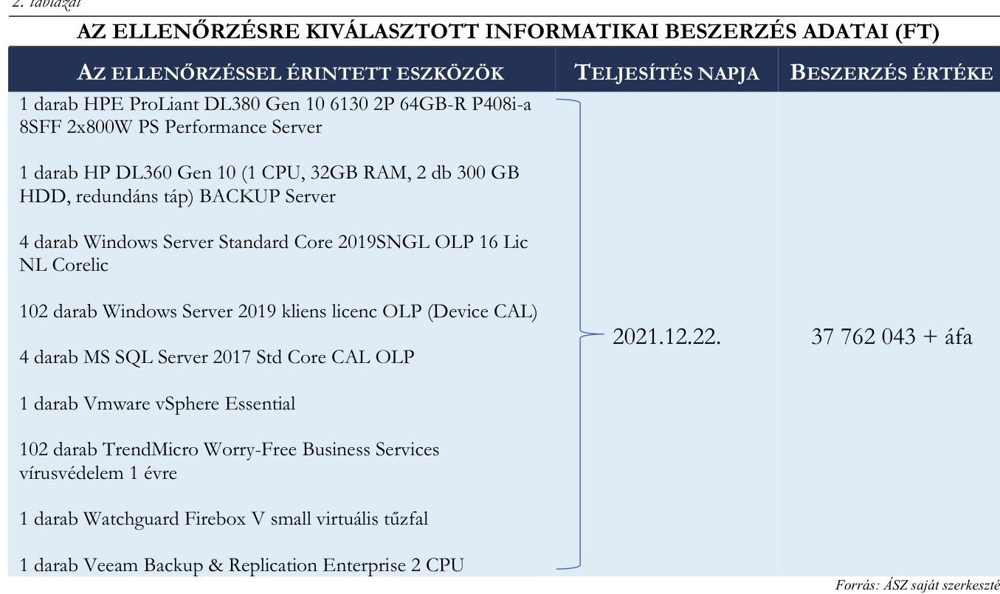

# JELENTÉS 

A többségi állami tulajdonban lévő gazdasági társaságok informatikai célú beszerzéseinek célzott ellenőrzése

KIVING Ingatlangazdálkodó és Beruházásszervező Kft.

2024.

---

# JELENTÉS 

## A többségi állami tulajdonban lévő gazdasági társaságok informatikai célú beszerzéseinek célzott ellenőrzése

KIVING Ingatlangazdálkodó és Beruházásszervező Kft.

2024.

---

# ELLENŐRZÉSI IGAZGATÓSÁG: 

ÁLLAMI VAGYONGAZDÁLKODÁST ELLENŐRZŐ IGAZGATÓSÁG

## ELLENŐRZÉSI IGAZGATÓ:

HERCZEGH ZSOLT ellenőrzési igazgató

## ELLENŐRZÉSVEZETŐ:

Jelentéseink az interneten a www.asz.hu címen olvashatók.

DABISNÉ NYIKOS MELINDA ellenőrzésvezető

IKTATÓSZÁM: EL-3950-004/2024
TÉMASZÁM: 2709
ELLENŐRZÉS-AZONOSÍTÓ SZÁM: V1053

---

# TARTALOMJEGYZÉK 

AZ ELLENŐRZÉS ALAPADATAI ..... 5
AZ ELLENŐRZÖTT SZERVEZET ..... 7
ÖSSZEFOGLALÁS ..... 8
AZ ELLENŐRZÉS FÓKUSZKÉRDÉSE ..... 9
MEGÁLLAPÍTÁSOK ..... 10
JAVASLATOK ..... 13
MELLÉKLETEK ..... 14
I. sz. melléklet: Értelmező szótár ..... 14
II. sz. melléklet: Az ellenőrzött szervezetek jegyzéke ..... 15
III. sz. melléklet: Ellenőrzési kritériumok ..... 16
FÜGGELÉK: ÉSZREVÉTELEK ..... 17
RÖVIDÍTÉSEK JEGYZÉKE ..... 18

---

.

---

# AZ ELLENŐRZÉS ALAPADATAI 

## AZ ELLENŐRZÉS CÉLJA

Az ellenőrzés célja annak értékelése volt, hogy az ellenőrzött szervezet informatikai célú - ellenőrzés során kiválasztott mintatételre vonatkozó - beszerzésére szabályszerűen került-e sor, a kapcsolódó döntéshozatal megalapozott volt-e, valamint érvényesült-e a célszerűség.

## AZ ELLENŐRZÉS TÍPUSA

Megfelelőségi ellenőrzés.

## AZ ELLENŐRZÖTT IDŐSZAK

A 2021., 2022. évek.

## AZ ELLENŐRZÉS TÁRGYA

Az ÁSZ ${ }^{1}$ ellenőrzése kiterjedt a KIVING Kft²-nél a 2021., 2022. években megvalósult, lezárult informatikai célú beszerzésére vonatkozóan hozott döntések szabályszerűségének, megalapozottságának és célszerűségének ellenőrzésére.

A döntés megalapozottságának ellenőrzése kiterjedt a beszerzés előkészítésének és a beszerzésre vonatkozó megrendelés visszaigazolásának, szerződés megkötésének, valamint az informatikai célú beszerzés aktiválásának (használatbavételének) ellenőrzésére is, és arra, hogy a megvalósult beszerzés, fejlesztés, beruházás alkalmazásra került-e, betöltötte-e az eredetileg elvárt funkcióját.

Az ellenőrzés kiterjedt továbbá minden olyan körülményre és adatra, amely az ÁSZ jogszabályban meghatározott feladatainak teljesítéséhez, valamint a program végrehajtása folyamán felmerült újabb összefüggések feltárásához volt szükséges.

## AZ ELLENŐRZÉS JOGALAPJA

Az ellenőrzés jogszabályi alapját az ÁSZ tv. ${ }^{3} 1 . \int(3)$ bekezdés és az 5. $\int(4)$ bekezdés előírásai képezték.

## AZ ELLENŐRZÉS MÓDSZERE

Az ellenőrzés végrehajtása a nemzetközi standardokat irányadónak tekintve az ellenőrzési program szempontjai, az ellenőrzött időszakban hatályos jogszabályok, az ellenőrzés szakmai szabályok és a jelen ellenőrzésre irányadó ÁSZ módszertan figyelembevételével történt.

---

Az ellenőrzési kérdések megválaszolásához szükséges bizonyítékok megszerzése az ellenőrzött szervezet által rendelkezésre bocsátott dokumentumokra és adatokra alapozva, továbbá megfigyelés, szemrevételezés, kérdésfeltevés (információkérés), valamint elemző eljárás útján valósult meg.

Az ellenőrzés lefolytatásához az ellenőrzött szervezet a 2021. és 2022. évben megvalósult, lezárult informatikai beszerzéseiről a tanúsítvány kitöltésével, valamint az ÁSZ által kért dokumentumok, adatok, információk megküldésével és a helyszíni ellenőrzés során szolgáltatott adatokat. A tanúsítvány adatai alapján a KIVING Kft. a 2021., 2022. évek vonatkozásában 22 lezárult informatikai beszerzést bonyolított le. A mintavételezés keretében egy informatikai beszerzés került kiválasztásra. Az ÁSZ jelentése a kiválasztott mintatétel vonatkozásában ad véleményt.

Az ellenőrzési bizonyítékként felhasználható adatforrások közé tartoztak egyrészt az ellenőrzéshez kért dokumentumok, adatforrások, másrészt adatforrás volt még minden - az ellenőrzés folyamán - feltárt, az ellenőrzés szempontjából információkat tartalmazó dokumentum.

---

# AZ ELLENŐRZÖTT SZERVEZET

A KIVING Kft. a '96 Beruházásszervező és Fővállalkozó Korlátolt Felelősségű Társaságból 2001.06.12én kiválás útján jött létre, fő tevékenysége ingatlankezelés, üzemeltetés. A KIVING Kft. a 2021. és 2022. üzleti években a Taktv. ${ }^{4}$ 7/J.§ (1) bekezdésben meghatározott mutatóértékek alapján a Gbkr. ${ }^{5}$ hatálya alá tartozott, belső kontrollrendszer működtetetésére volt kötelezett.

A KIVING Kft. a Magyar Állam tulajdonában álló egyszemélyes gazdasági társaság, a tulajdonosi joggyakorlója a Magyar Nemzeti Vagyonkezelő Zártkörűen Működő Részvénytársaság. A KIVING Kft. beruházások szervezésével, bonyolításával foglalkozik, továbbá gondnokolással kapcsolatos feladatokat lát el és ezen tevékenységével szorosan összefüggő egyéb feladatokat végez. Az ellenőrzött időszaki ügyvezető megbízatása 2019.01.11.-től 2024.01.31.-ig tartott.

1. táblázat

KIVING KFT. FŐBB BESZÁMOLÓ ADATAI (E FT)

|   | 2021. ev | 2022. ev  |
| --- | --- | --- |
|  Értékesítés nettó árbevétele | 8262054 | 8928502  |
|  Üzemi eredmény* | 3862 | 20513  |
|  Adózott eredmény | 2992 | 16015  |
|  Immateriális javak | 37437 | 30151  |
|  Tárgyi eszközök* | 1443827 | 2438403  |
|  Pénzeszközök | 2239003 | 300058  |
|  Saját tőke* | 3338427 | 3184588  |

[^0] [^0]: * A KIVING Kft. 2022. évi beszámolója három oszlopos mérleget és eredménykimutatást tartalmazott, az előző évek módosításai alapján az Üzemi eredmény soron -165 589 E Ft, a Tárgyi eszközök soron +18244 E Ft, a Saját tőke soron -169 853 E Ft korrekció került feltüntetésre.

---

# ÖSSZEFOGLALÁS 

A Magyar Államnak az állami tulajdonú gazdasági társaságokban lévő részesedései a nemzeti vagyon, ezen belül az állami vagyon részét képezik. Az állami vagyon értékének megőrzésére, növelésére alapvető befolyást gyakorol a gazdasági társaságok gazdálkodási tevékenysége. Az ellenőrzés a jogszabályban foglalt, felelős gazdálkodás kritériumának vizsgálata keretében értékelte, hogy a KIVING Kft. az érintett beszerzése során szabályszerűen járt-e el, az informatikai beszerzésekor a KIVING Kft. döntéshozatala megalapozott volt-e, valamint érvényesült-e a célszerűség.

A gazdasági társaságokkal szemben elvárás, hogy beruházásaikat, beszerzéseiket megfelelő tervezéssel hajtsák végre, mérjék fel annak szükségességét, pénzügyi vonzatát, valamint értékeljék a beszerzés gazdálkodásra vonatkozó várható hatásait, elemezzék azok következményeit, alapozzák meg döntéseiket. Magyarország Alaptörvénye ${ }^{6}$ is rögzíti e követelményeket azzal, hogy az állam tulajdonában álló gazdálkodó szervezetek törvényben meghatározott módon, önállóan és felelősen gazdálkodnak a törvényesség, célszerűség és eredményesség követelményei szerint.

AZ ELLENŐRZÉS MEGÁLLAPÍTOTTA, hogy a KIVING Kft. mintatételként kiválasztott informatikai eszközbeszerzése jogszabályban meghatározott feladatok végrehajtása érdekében merült fel, ezáltal a beszerzési igény tekintetében érvényesült a célszerűség. A KIVING Kft. kiválasztott informatikai beszerzése azonban nem volt szabályszerű, valamint megalapozott, mivel a DKÜ rendeletben ${ }^{7}$ foglalt előírások ellenére a beszerzést központosított közbeszerzési eljárás mellőzésével, saját hatáskörben, meghívásos ajánlattétel keretében bonyolította le. A központosított közbeszerzési eljárás elmulasztása miatt a beszerzett eszközök ára nem a közbeszerzési eljárás biztosította garanciális keretek között került meghatározásra, ezáltal nem érvényesült a nemzeti vagyonnal történő felelős gazdálkodás elve.

---

# AZ ELLENŐRZÉS FÓKUSZKÉRDÉSE 

1.- A gazdasági társaság informatikai célú beszerzésére szabályszerűen került-e sor és a gazdasági társaság informatikai célú beszerzésére vonatkozó döntései megalapozottak voltak-e, a döntéshozatalnál érvényesült-e a célszerüség?

---

# MEGÁLLAPÍTÁSOK 

## 1. A gazdasági társaság informatikai célú beszerzésére szabályszerűen került-e sor és a gazdasági társaság informatikai célú beszerzésére vonatkozó döntései megalapozottak voltak-e, a döntéshozatalnál érvényesült-e a célszerűség?

Összegző megállapítás A KIVING Kft. informatikai beszerzése nem volt szabályszerű, valamint megalapozott, mert a beszerzési eljárását a DKÜ rendeletben foglalt előírások ellenére központosított közbeszerzés helyett saját hatáskörben folytatta le. A DKÜ rendelet megsértésével a beszerzett eszközök ára nem a központosított közbeszerzési eljárás biztosította garanciális keretek között került meghatározásra. A KIVING Kft. informatikai eszközbeszerzése jogszabályban meghatározott feladatok kötelező ellátása érdekében merült fel, ezáltal e tekintetben a beszerzés szükségességére vonatkozó döntése során érvényesült a célszerűség.

A KIVING Kft. a 2021., 2022. évek vonatkozásában 22 informatikai beszerzést bonyolított le. Az ÁSZ ellenőrzése a KIVING Kft. 2021., 2022. években megvalósult, lezárult informatikai célú beszerzései közül egy, az ellenőrzés során kiválasztott beszerzés szabályszerűségének, megalapozottságának és célszerűségének ellenőrzésére irányult.
A KIVING Kft. érintett beszerzésére a Kbt. ${ }^{8}$-ben, DKÜ rendeletben, valamint a belső szabályozóiban előírt rendelkezések voltak az irányadóak. A KIVING Kft. informatikai célú beszerzéseit az Alapító okirat ${ }^{9}{ }^{1-7}$, a Beszerzési szabályzat ${ }^{10}{ }^{1-3}$, a Köt.vállalási és utalványozási szabályzat ${ }^{11}{ }^{1-2}$, az SZMSZ ${ }^{12}{ }^{1-2}$, a Közbeszerzési szabályzat ${ }^{13}{ }^{1-2}$, a Számviteli politika ${ }^{14}$, a Bizonylati rend ${ }^{15}$, Számlarend ${ }^{16}$, valamint az ügyvezetői utasítás a szerződéskötés rendjéről ${ }^{17}$ tárgyú belső irányító eszközök szabályozták.
A KIVING Kft. az ellenőrzött időszakban a 361/2021. (VI.24.) Korm. rendelet ${ }^{18}$, valamint a 274/2018. (XII.21.) Korm. rendelet ${ }^{19}$ alapján 2021.06.30. napjától, mint kijelölt szolgáltató kizárólagos jogot kapott a Lakástörvény ${ }^{20} 10 . \S$ (1) bekezdésében meghatározott feladatok - a 26. §-ban meghatározott kivétellel lebonyolítására.
A KIVING Kft. mintatételként kiválasztott informatikai eszközbeszerzése a fenti jogszabályokban meghatározott új feladatainak kötelezö ellátása érdekében merült fel, ezáltal e tekintetben a beszerzés szükségességére vonatkozó döntése során érvényesült a célszerüség követelménye.

---

A kiválasztott informatikai eszközbeszerzésre a Kbt.-ben, valamint a DKÜ rendeletben meghatározott központosított közbeszerzési eljárás szabályai voltak az irányadóak.
A KIVING Kft. a kiválasztott informatikai beszerzésében szereplő eszközöket a DKÜ ${ }^{21}$ részére benyújtott, a DKÜ rendelet $7 . \S$ a) pont szerinti 2021. évi informatikai beszerzési és fejlesztési tervében nem szerepeltette, valamint a későbbiekben a DKÜ rendelet $8 . \S$ (15) bekezdés szerinti tervmódosítási kezdeményezéssel sem élt. Mindezek következtében a KIVING Kft-nek az érintett beszerzési igénye vonatkozásában rendkívüli informatikai beszerzésre vonatkozó igényt kellett volna a felmerülést követő 5 munkanapon belül a DKÜ Portálon ${ }^{22}$ keresztül megküldeni, amely kötelezettségét a DKÜ rendelet $7 . \S$ c) pontja ellenére elmulasztott megtenni.

A KIVING Kft. a kiválasztott informatikai eszközök beszerzési eljárását szabálytalanul, saját hatáskörben, meghívásos ajánlattételi eljárással folytatta le, amely során megsértette a DKÜ rendelet $1 . \S$ (2) bekezdés d) pontját.

A kö̉pontosított köz̧beszerzési eljárás elmulasztása miatt a beszerzett eszközök ára nem a közbeszerzési eljárás biztositotta garanciális keretek között került meghatározásra, ezáltal nem érvényesült a nemzeti vagyonnal történő felelős gazdálkodás elve az Nstv. ${ }^{23}$ 7. § (1)-(2) bekezdés alapján. Az informatikai eszközbeszerzést a KIVING Kft. tulajdonosi támogatásból finanszirozzta. A KIVING Kft. informatikai beszerzése nem volt szabályszerü, döntése a feltárt hiányosságok miatt nem volt megalapozott. Ezt támasztja alá az is, hogy az ÁsZ tv. 25. § (3) bekezdése alapján a Nemzeti Adó- és Vámbivatal által rendelkezésre bocsátott, a KIVING Kft. szállitóira vonatkozó online számlaadat szolgáltatás szerint, a kiválasztott informatikai beszerzésben szereplő eszközök ára - amig az a KIVING Kft. részére kiszámlázásra került - a beszerzésben résztvevő társaságokon keresztül több, mint hatszorosára növekedett egy hét alatt. A beszerzési eljárás során a vonatkozó jogszabályi elöírásokban rögzített feltételek nem kerültek betartásra, a KIVING Kft. az informatikai eszközöket túlárazottan szerez̧te be.

---

Az érintett informatikai eszközök tekintetében a fedezet a KIVING Kft. rendelkezésére állt. A kiválasztott informatikai eszközöket a KIVING Kft. tulajdonosi támogatásból finanszírozta, a 2021. évi üzleti tervben ${ }^{24}$ a költségvetésből származó forrás összege rögzítésre került.
A KIVING Kft. elszámolása a kiválasztott informatikai beszerzés vonatkozásában a Számv. tv. ${ }^{25}$, valamint a Számlarend előírásai alapján történt, az eszközök 2021.12.22-én aktiválásra kerültek.
A KIVING Kft. nem megfelelő adattartalommal nyújtotta be a DKÜ-nek a 2021. évi informatikai fejlesztéseinek és beszerzéseinek tapasztalatairól szóló beszámolóját, mivel abban nem kerültek feltüntetésre a 2021. évi informatikai beszerzései. Ezzel a KIVING Kft. a DKÜ rendelet 5. § (10) bekezdésének nem tett eleget, a rendelkezésre bocsátott dokumentum alapján „nulla" darab lezárult eljárásról számolt be. A kiválasztott tételeket szabálytalanul, az egy évvel későbbi, 2022. évi beszámolójában rögzítette.

---

# JAVASLATOK 

Az ÁSZ tv. 33. § (1) bekezdésében foglaltak értelmében az ellenőrzött szervezet vezetője köteles a jelentésben foglalt megállapításokhoz kapcsolódó intézkedési tervet összeállítani és azt a jelentés kézhezvételétől számított 30 napon belül az ÁSZ részére megküldeni. Amennyiben az ellenőrzött szervezet vezetője nem küldi meg határidőben az intézkedési tervet, vagy továbbra sem elfogadható intézkedési tervet küld, az Állami Számvevőszék elnöke az ÁSZ tv. 33. § (3) bekezdése a) és b) pontjaiban foglaltakat érvényesítheti.

## KIVING KFT. ÜGYVEZETŐJE RÉSZÉRE

1. Alakítson ki és müködtessen kontrollt a Kbt. és a DKÜ rendeletben foglalt rendelkezések alapján annak biztositására, hogy a KIVING Kft. informatikai beszerzései a jogszabályban meghatározott elöírásoknak megfeleljenek.

---

# MELLÉKLETEK 

## I. SZ. MELLÉKLET: ÉRTELMEZŐ SZÓTÁR

gazdasági társaság

többségi állami tulajdon
vagyongazdálkodás alapelvei
informatikai célú beszerzés

A gazdasági társaságok üzletszerű közös gazdasági tevékenység folytatására, a tagok vagyoni hozzájárulásával létrehozott, jogi személyiséggel rendelkező vállalkozások, amelyekben a tagok a nyereségből közösen részesednek, és a veszteséget közösen viselik.
(Ptk. ${ }^{26}$ 3:88. § (1) bekezdése)
Az állam tulajdonában lévő tagsági jogviszonyt megtestesítő értékpapír, illetve az államot megillető egyéb társasági részesedés, amennyiben a társaságban a Magyar Állam a szavazatok több mint $50 \%$-ával vagy meghatározó befolyással rendelkezik.
A nemzeti vagyon alapvető rendeltetése a közfeladat ellátásának biztosítása, ideértve a lakosság közszolgáltatásokkal való ellátását és e feladatok ellátásához szükséges infrastruktúra biztosítását. A nemzeti vagyonnal felelős módon, rendeltetésszerűen kell gazdálkodni.
A nemzeti vagyongazdálkodás feladata a nemzeti vagyon megőrzése, értékének és állagának védelme, rendeltetésének megfelelő, az állam, az önkormányzat mindenkori teherbíró képességéhez igazodó, elsődlegesen a közfeladatok ellátásához és a mindenkori társadalmi szükségletek kielégítéséhez szükséges, egységes elveken alapuló, átlátható, hatékony és költségtakarékos múködtetése, értéknövelő használata, hasznosítása, gyarapítása, továbbá az állam vagy a helyi önkormányzat feladatának ellátása szempontjából feleslegessé váló vagyontárgyak elidegenítése, azzal, hogy a nemzeti vagyon megőrzése érdekében végzett bontás vagy átalakítás nem minősül az állag védelmi kötelezettség megszegésének.
(Nvtv. 7. § (1)-(2) bekezdése)
Az informatikai eszköz, szoftver, alkalmazásfejlesztés és az ezekhez kapcsolódó szolgáltatások beszerzésére irányuló keretmegállapodás vagy más keretjellegủ szerződés, továbbá visszterhes szerződés létrehozását célzó beszerzési eljárás.

---

# II. SZ. MELLÉKLET: AZ ELLENŐRZÖTT SZERVEZETEK JEGYZÉKE 

## ELLENŐRZÖTT SZERVEZET NEVE

KIVING Kft.

TULAJDONOSI JOGGYÁKÓRLO
Magyar Nemzeti Vagyonkezelő Zártkörűen Működő
Részvénytársaság

---

# III. SZ. MELLÉKLET: ELLENŐRZÉSI KRITÉRIUMOK 

## FOKUSZKÉRDÉS

1. A gazdasági társaság informatikai célú beszerzéseire szabályszerűen került-e sor és a gazdasági társaság informatikai célú beszerzéseire vonatkozó döntései megalapozottak voltak-e, a döntéshozatalnál érvényesült-e a célszerűség?

## ELLENŐRZÉSI KRITÉRIUMOK

Gbkr. 3. $\S, 4 . \S, 6 . \S$
Gbkr. IRÁNYELV ${ }^{27}$
Gbkr. KÉZIKÖNYV ${ }^{28}$
Nvtv. 7. § (1)-(2) bek.
Taktv. 7/J. § (1), (3) bek. a) pont
Ptk. 3:4. $\S$ (1) bek.
Kbt. 5. § (1) bek. e) pont, (4) bek., 2. §, 8.§ (1)-(4) bek., 9. $\int(8)$ bek. k) pont, 27. § (1)-(2) bek., 76-77. §
Számv. tv. 4. § (1) bek., 14. § (3) bek., 25. § (6) bek., 159. $\int, 160 . \S$ (3a) és (3b) bek., 161-161/A., 164. § (2) bek., 165. $\int(1)-(2), 166 . \S(1)-(2)$ bek., 169. § (1)-(2) bek.
301/2018. (XII. 27.) Korm. rendelet (DKÜ rendelet) 1. § (2) bek. d) pont, 5. § (10), 7. §, 8. § (15) bek., 13. § (1) bek.
361/2021. (VI. 24.) Korm. rendelet
274/2018. (XII.21.) Korm. rendelet
Lakástörvény 10. § (1)
343/2020. (VII.14.) Korm. rendelet ${ }^{29} 1 . \S$
belső szabályozók (Alapító okirat ${ }_{1-3}$, Beszerzési szabályzat ${ }_{1-}$
3, Köt.vállalási és utalványozási szabályzat ${ }_{1-2}$, SZMSZ ${ }_{1-2}$.
Közbeszerzési szabályzat ${ }_{1-2}$, Számviteli politika, Bizonylati
rend, Számlarend, ügyvezetői utasítás a szerződéskötés rendjéről)

---

# FÜGGELÉK: ÉSZREVÉTELEK 

A jelentéstervezetet a Számvevőszék 15 napos észrevételezésre megküldte az ellenőrzött szervezet vezetőjének az ÁSZ tv. 29. §* (1) bekezdése előírásának megfelelően.

Az ellenőrzött szervezet vezetője a jelentéstervezet megállapításaira észrevételt nem tett.

[^0]
[^0]:    * 29. § (1) Az Állami Számvevőszék az ellenőrzési megállapításait megküldi az ellenőrzött szervezet vezetőjének vagy az általa megbízott személynek, és annak, akinek személyes felelősségét állapította meg.
    (2) Az ellenőrzött szervezet vezetője és a felelősként megjelölt személy az ellenőrzés megállapításaira tizenöt napon belül írásban észrevételt tehet.
    (3) Az Állami Számvevőszék az észrevételre a beérkezésétől számított harminc napon belül írásban válaszol. A figyelembe nem vett észrevételeket köteles a jelentésben feltüntetni, és megindokolni, hogy azokat miért nem fogadta el.

---

# RÖVIDÍTÉSEK JEGYZÉKE 

${ }^{1}$ ÁSZ ${ }^{2}$ KIVING Kft. ${ }^{3}$ ÁSZ tv. ${ }^{4}$ Taktv. ${ }^{5}$ Gbkr. ${ }^{6}$ Magyarország Alaptörvénye ${ }^{7}$ DKÜ rendelet ${ }^{8} \mathrm{Kbt}$. ${ }^{9}$ Alapító okirat ${ }_{1-7}$

${ }^{10}$ Beszerzési szabályzat ${ }_{1-3}$
${ }^{11}$ Köt.vállalási és utalványozási szabályzat ${ }_{1-2}$

## ${ }^{12} \mathrm{SZMSZ}_{1-2}$

${ }^{13}$ Közbeszerzési szabályzat ${ }_{1-2}$
${ }^{14}$ Számviteli politika
${ }^{15}$ Bizonylati rend
${ }^{16}$ Számlarend
${ }^{17}$ Ügyvezetői utasítás a szerződéskötés rendjéről

Állami Számvevőszék
KIVING Ingatlangazdálkodó és Beruházásszervező Korlátolt Felelősségű Társaság 2011. évi LXVI. törvény az Állami Számvevőszékről
2009. évi CXXII. törvény a köztulajdonban álló gazdasági társaságok takarékosabb müködéséről
339/2019. (XII. 23.) Korm. rendelet a köztulajdonban álló gazdasági társaságok belső kontrollrendszeréről
Magyarország Alaptörvénye (2011. április 25.)
301/2018. (XII. 27.) Korm. rendelet a Nemzeti Hírközlési és Informatikai Tanácsról, valamint a Digitális Kormányzati Ügynökség Zártkörűen Müködő Részvénytársaság és a kormányzati informatikai beszerzések központosított közbeszerzési rendszeréről 2015. évi CXLIII. törvény a közbeszerzésekről

A KIVING Kft. többször módosított egységes szerkezetbe foglalt Alapító okirat ${ }_{1}$ (2020.10.20-i kiadmányozású, hatályos 2020.10.20.-2021.08.05. napja között),
A KIVING Kft. többször módosított egységes szerkezetbe foglalt Alapító okirat ${ }_{2}$ (2021.08.06-i kiadmányozású, hatályos 2021.08.06.-2021.08.31. napja között),
A KIVING Kft. többször módosított egységes szerkezetbe foglalt Alapító okirat ${ }_{3}$ (2021.09.01-i kiadmányozású, hatályos 2021.09.01.-2021.11.07. napja között),
A KIVING Kft. többször módosított egységes szerkezetbe foglalt Alapító okirat ${ }_{4}$ (2021.11.08-i kiadmányozású, hatályos 2021.11.08.-2021.12.21. napja között),
A KIVING Kft. többször módosított egységes szerkezetbe foglalt Alapító okirat ${ }_{5}$ (az ellenőrzéshez felhasznált okirat 2021.12.22-i kiadmányozású, hatályos 2021.12.22.2022.07.12. napja között),
A KIVING Kft. többször módosított egységes szerkezetbe foglalt Alapító okirat ${ }_{6}$ (2022.07.13-i kiadmányozású, hatályos 2022.07.13.-2022.11.04. napja között),
A KIVING Kft. többször módosított egységes szerkezetbe foglalt Alapító okirat ${ }_{7}$ (2022.11.05-i kiadmányozású, hatályos 2022.11.05-től)
KIVING Ingatlangazdálkodó és Beruházásszervező Korlátolt Felelősségű Társaság Beszerzési szabályzata ${ }_{1}$ (hatályos: 2019.04.10-től), KIVING Ingatlangazdálkodó és Beruházásszervező Korlátolt Felelősségű Társaság Beszerzési szabályzata ${ }_{2}$ (hatályos: 2022.02.28-tól), KIVING Ingatlangazdálkodó és Beruházásszervező Korlátolt Felelősségű Társaság Beszerzési szabályzata ${ }_{3}$ (hatályos: 2022.08.18-tól)
5/2019 sz. ügyvezetői utasítás a KIVING Kft. Kötelezettségvállalási és utalványozási szabályzatáról ${ }_{1}$ (hatályos: 2019.07.01.-2021.04.26.), 2/2021 sz. ügyvezetői utasítás a KIVING Kft. Kötelezettségvállalási és utalványozási szabályzatáról ${ }_{2}$ (hatályos: 2021.04.27-től)
3./2019. számú ügyvezetői utasítás a KIVING Kft. Szervezeti és Működési Szabályzatáról ${ }_{1}$ (hatályos 2019.04.11.-2022.07.27.), 5/2022. számú ügyvezetői utasítás a KIVING Kft. Szervezeti és Müködési Szabályzatáról ${ }_{2}$ (hatályos 2022.07.28-től)
A KIVING Kft. Közbeszerzési szabályzata ${ }_{1}$ (hatályos: 2020.06.22.-2023.06.29.), 25/2023. sz. ügyvezetői utasítás a KIVING Kft. Közbeszerzési szabályzatáról ${ }_{2}$ (hatályos: 2023.06.30-tól)
A KIVING Kft. Számviteli politikája (hatályos: 2021.01.01-től)
11/2021 sz. ügyvezetői utasítás a KIVING Kft. Bizonylati rendjéről (hatályos: 2021.12.30-tól)

A KIVING Kft. Számlarendje (hatályos: 2020.01.01-től)
7/2021 sz. ügyvezetői utasítás a KIVING Kft. szerződéskötés rendjéről (hatályos: 2021.09.30-től)

---

${ }^{18} 361 / 2021$. (VI. 24.) Korm. rendelet
${ }^{19} 274 / 2018$. (XII.21.) Korm. rendelet
${ }^{20}$ Lakástörvény
${ }^{21}$ DKÜ
${ }^{22}$ DKÜ Portál
${ }^{23}$ Nvtv.
${ }^{24} 2021$. évi üzleti terv
${ }^{25}$ Számv. tv.
${ }^{26}$ Ptk.
${ }^{27}$ Gbkr. IRÁNYELV
${ }^{28}$ Gbkr. KÉZIKÖNYV
${ }^{29} 343 / 2020$. (VII.14.) Korm. rendelet
361/2021. (VI. 24.) Korm. rendelet a Nemzeti Eszközkezelő Programban részt vevő természetes személyek otthonteremtésének biztosításával kapcsolatos egyes kormányrendeletek módosításáról
274/2018. (XII.21.) Korm. rendelet a Nemzeti Eszközkezelő Programban részt vevő természetes személyek otthonteremtésének biztosításával kapcsolatos egyes szabályokról
1993. évi LXXVIII. törvény a lakások és helyiségek bérletére, valamint az elidegenítésükre vonatkozó egyes szabályokról
Digitális Kormányzati Ügynökség Zártkörűen Müködő Részvénytársaság
A DKÜ által működtetett, a DKÜ rendeletben meghatározott kapcsolattartásra és a DKÜ rendeletben meghatározott adatszolgáltatási és tájékoztatási kötelezettség teljesítésére alkalmas, internetes felületen keresztül elérhető alkalmazások és az ezt támogató adatforrások összessége
2011. évi CXCVI. törvény a nemzeti vagyonról

A KIVING Kft. 107/2021. (IV.21) AH Alapítói határozattal elfogadott 2021. évi Üzleti terve
2000. évi C. törvény a számvitelről
2013. évi V. törvény a Polgári Törvénykönyvről
2020. decemberében a Nemzeti Vagyon Kezeléséért Felelős tárca nélküli miniszter és a pénzügyminiszter által kiadott IRÁNYELV a köztulajdonban álló gazdasági társaságok részére a belső kontrollrendszer kialakításához és működtetéséhez
2021. februárban, a Nemzeti Vagyon Kezeléséért Felelős tárca nélküli miniszter és a pénzügyminiszter által kiadott KÉZIKÖNYV a köztulajdonban álló gazdasági társaságok részére
A hitelszerződésből eredő kötelezettségeiknek eleget tenni nem tudó természetes személyek lakhatásának biztosításával összefüggő lebonyolítói feladatok ellátásáról szóló 343/2020. (VII.14.) Korm. rendelet

---

1052 Budapest, Apáczai Csere János u. 10. | 1364 Budapest 4., Pf. 54
www.asz.hu | szamvevoszek@asz.hu
telefon: +36 14849100