# JELENTÉS 

## A Vidékfejlesztési Program keretében nyújtott uniós támogatások célzott ellenőrzése

2024.

---

# ÁLLAMI   SZÁMVEVÔSZÉK 

## JELENTÉS

## A Vidékfejlesztési Program keretében nyújtott uniós támogatások célzott ellenőrzése

2024.

---

# ELLENŐRZÉSI IGAZGATÓSÁG: 

## ÁLLAMHÁZTARTÁS KÖZPONTI SZINTJÉT ELLENŐRZŐ IGAZGATÓSÁG

ELLENŐRZÉSI IGAZGATÓ:
SINKÁNÉ DR. CSENDES ÁGNES igazgató

ELLENŐRZÉSVEZETŐ:
HUSZÁR ANNA ellenőrzésvezető

Jelentéseink az interneten a www.asz.hu címen olvashatók.

IKTATÓSZÁM: EL-4077-001/2024
TÉMASZÁM: 2691
ELLENŐRZÉS-AZONOSÍTÓ SZÁM: V1035

---

# TARTALOMJEGYZÉK 

AZ ELLENŐRZÉS ALAPADATAI ..... 5
AZ ELLENŐRZÉS HATÓKÖRE ÉS TERÜLETE ..... 7
ÖSSZEFOGLALÁS ..... 10
AZ ELLENŐRZÉS FÓKUSZKÉRDÉSEI ..... 13
MEGÁLLAPÍTÁSOK ..... 14
JAVASLATOK ..... 30
MELLÉKLETEK ..... 31
I. sz. melléklet: Értelmező szótár ..... 31
II. sz. melléklet: Az ellenőrzött szervezetek jegyzéke ..... 35
III. sz. melléklet: Ellenőrzési kritériumok ..... 36
IV. sz. melléklet: Az ÁSZ által ellenőrzött 20 projekt és ezek főbb adatai ..... 38
V. sz. melléklet: A támogatási kérelmek ellenőrzési és elbírálási ideje a 20 projektnél ..... 39
VI. sz. melléklet: Határidőtúllépés a kifogások elbírálásában a 9 releváns projektnél ..... 40
VII. sz. melléklet: A változásbejelentéseket érintő határidő túllépések a releváns 7 projektnél ..... 41
VIII. sz. melléklet: A kifizetési igényléseket érintő határidő túllépések a releváns 7 projektnél ..... 42
IX. sz. melléklet: A támogatói okirat jogerőre emelkedésének és az abban szereplő mérföldkövek dátumainak bemutatása a beszámolási kötelezettséggel érintett 7 projektnél. ..... 43
X. sz. melléklet: A projekt-megvalósítási helyszínek és a tervezett erdei közjóléti létesítmény főbb adatai a 9 támogatott projektnél ..... 44
FÜGGELÉK: ÉSZREVÉTELEK ..... 45
RÖVIDÍTÉSEK JEGYZÉKE ..... 56

---

.

---

# AZ ELLENŐRZÉS ALAPADATAI 

## AZ ELLENŐRZÉS CÉLJA

Az ellenőrzés célja annak értékelése volt, hogy a Miniszterelnökség, illetve az Agrárminisztérium, mint irányító hatóság ${ }^{1}$ és kifogást elbíráló szerv², valamint a Magyar Államkincstár, mint kifizető ügynökség ${ }^{3}$ és közbenső szervezet ${ }^{4}$ részéről a Vidékfejlesztési Program keretében meghirdetett VP4-8.5.2-17 kódszámú „Az erdei ökoozisztémák, téritésmentesen nyújtott közjöléti funkcióinak, fejlesztése" című pályázati felhíváshoz kapcsolódó pályázati rendszer kialakítása, valamint az abból nyújtott támogatásokról való döntés, a támogatások kifizetése és felhasználásának ellenőrzése megfelelő volt-e.

## AZ ELLENŐRZÉS TÍPUSA

Megfelelőségi ellenőrzés

## AZ ELLENŐRZÖTT IDŐSZAK

2016. június 1-től 2023. szeptember 30-ig tartó időszak.

## AZ ELLENŐRZÉS TÁRGYA

Az ellenőrzés kiterjedt a VP4-8.5.2-17 „Az erdei ökoozisztémák, téritésmentesen nyújtott közjöléti funkcióinak, fejlesztése" című szakmai program vonatkozásában a kialakított pályázati rendszernek, a támogatási kérelmekről való döntésnek, a támogatások kifizetésének és az ellenőrzési tevékenység ellátásának megfelelőségére.

## AZ ELLENŐRZÉS JOGALAPJA

Az ellenőrzés jogszabályi alapját az Állami Számvevőszékről szóló 2011. évi LXVI. törvény 1. § (3) bekezdés és az 5. § (2)-(3) bekezdés előírásai képezték.

## AZ ELLENŐRZÉS MÓDSZERE

Az ellenőrzést a nemzetközi standardokat irányadónak tekintve az ellenőrzési program szempontjai, az ellenőrzött időszakban hatályos jogszabályok, az ellenőrzés szakmai szabályok és módszertanok figyelembevételével végezte az ÁSZ ${ }^{5}$.

Az ellenőrzési kérdések megválaszolásához szükséges bizonyítékok megszerzése az ellenőrzött szervezetek által rendelkezésre bocsátott dokumentumokra és adatokra alapozva, továbbá megfigyelés, szemle (szemrevételezés), kérdésfeltevés (információkérés), valamint elemző eljárás útján történt.

---

Az ellenőrzés lefolytatásához az ellenőrzött szervezetek a tanúsítványok kitöltésével, valamint az ÁSZ által kért dokumentumok, adatok, információk megküldésével szolgáltattak adatokat.

Az ellenőrzési bizonyítékként felhasználható adatforrások közé tartoztak egyrészt az ellenőrzéshez kért dokumentumok, adatforrások, a nyilvánosan hozzáférhető adatok, dokumentumok (www.palyazat.gov.hu és a www.mvh.allamkincstar.gov.hu oldalakon), másrészt adatforrás volt még minden, az ellenőrzés folyamán feltárt, az ellenőrzés szempontjából releváns információt tartalmazó dokumentum.

A támogatási kérelmekről való döntés, a támogatások kifizetésének és az ellenőrzési tevékenység ellátásának megfelelőségét 11 véletlen és 9 kockázat alapú mintavételi eljárással kiválasztott támogatási kérelem tekintetében ellenőrizte az ÁSZ. A tények feltárása és azok összegzése során a megállapítások az ellenőrzött támogatási kérelmekre/projektekre vonatkozóan kerültek megfogalmazásra.

A támogatói okirattal rendelkező projektek megvalósítása a számvevőszéki ellenőrzés megkezdésekor (2023. július 25.) különböző szakaszban tartott. Az ÁSZ helyszíni ellenőrzésének lezárásáig (2023. szeptember 30.) egy kedvezményezett esetében került sor a projekt fizikai befejezésére és pénzügyi zárására. Erre figyelemmel az irányító hatósági feladatokat ellátó Agrárminisztérium és a kifizető ügynökségi/közbenső szervezeti feladatokat ellátó Kincstár ${ }^{6}$ feladatellátását 2023. szeptember 30-ig ellenőrizte az ÁSZ.

---

# AZ ELLENŐRZÉS HATÓKÖRE ÉS TERÜLETE 

Magyarország 2014-2020-ra vonatkozó Vidékfejlesztési Programja - amelyet 2015. augusztus 10-én fogadott el az Európai Bizottság, és azóta többször módosításra került - meghatározza a 7 éves uniós költségvetési periódusban Magyarország számára elérhető összesen 4,2 Mrd EUR (3,4 Mrd EUR uniós és 737 M EUR nemzeti társfinanszírozási) költségvetési forrás felhasználásának prioritásait. A forrásokat az Európai Unió hat vidékfejlesztési prioritásával összhangban kell felhasználni.

A Vidékfejlesztési Program 4-es prioritás „8." intézkedéséhez tartozó VP4-8.5.2-17 kódszámú „Az erdei ökooziziztémák, térítésmentesen nyújtott közjióléti funkcióinak, fejlesztése" című pályázati felhívást erdőgazdálkodók számára, a magyar erdők közjóléti, turisztikai funkciójának fejlesztése, az erdők közjavainak minden erdőlátogató számára ingyenesen történő elérésének megvalósítása érdekében hirdették meg 2017. március 29-én. Erdőgazdálkodónak minősül az erdő tulajdonosa vagy az erdőgazdálkodási tevékenységet folytató jogszerű használó is. A támogatási kérelmek benyújtási határideje 2017. május 31. - 2018. április 13. közötti időszak volt. A pályázati felhívás szerint a kitűzött cél: „A fejlesztések megvalósulása esetén a magyar erdök, közjavainak ingyenes elérhetőségének, lehetösége jelentősen bővül." Két célterületre lehetett pályázni: 1. célterület erdei pihenőhely kialakítása vagy továbbfejlesztése, 2. célterület erdei kirándulóhely és településkörnyéki kirándulóhely kialakítása vagy továbbfejlesztése volt. A pályázati felhívás 4. számú mellékletében a két célterület tekintetében meghatározták az egyes kategóriákban (alap, közepes, emelt, emelten túlmutató) elvárt berendezés-tartalmakat. Erdei kirándulóhely esetén például az alap tartalomnál ( 4 db erdei bútorgarnitúra, 4 db pad, 1 db tájékoztató tábla, 2 db tűzrakóhely, 1 db védőház) elvártakon túl kettővel több tűzrakóhelyet, 2-2 db erdei játszószert és tornaszert, 10 db kerékpártámaszt, 3 db interaktív tájékoztató táblát és 2 db illemhelyet kellett létesíteni az emelt berendezés-tartalomhoz. Erdei kirándulóhely esetén lehetőség volt az emelt berendezés-tartalomnál többet tartalmazó, egyedi engedéllyel rendelkező berendezéseket is megvalósítani. (Ilyen volt pl.: a lombkoronaösvény.) A támogatás feltétele volt, hogy a projektmegvalósítás befejezésétől számított 5 évig a támogatást igénylő biztosítja az erdei közjóléti berendezések ingyenes látogathatóságát, a berendezések megfelelő állapotban tartását, megközelíthetőségét és környezetének rendezettségét.

A forrás biztosítására az EMVA ${ }^{7}$ és a hazai költségvetés társfinanszírozásában került sor, a pályázati felhívás meghirdetésekor a támogatásra rendelkezésre álló tervezett keretösszeg 1,61 Mrd Ft volt. A támogatás formája vissza nem térítendő támogatás, mértéke $80 \%$ volt. A projekt megvalósítására a kedvezményezetteknek a támogatói okirat hatálybalépését követően 24 hónap állt rendelkezésre.

Az irányító hatóság a pályázati felhívás összeállításakor és meghirdetésekor a Miniszterelnökség Agrárvidékfejlesztési Programokért Felelős Helyettes Államtitkársága volt, majd 2018. május 22-től - a 94/2018. (V. 22.) Korm. rendelet erejénél fogva bekövetkezett jogutódlás miatt - az Agrárminisztérium Vidékfejlesztési Programok Végrehajtásáért Felelős Helyettes Államtitkársága lett. Az 1305/2013/EU rendelet alapján az irányító hatóság a vidékfejlesztési műveletek irányítására és végrehajtására kijelölhet egy vagy több közbenső szervezetet, ugyanakkor továbbra is kizárólag az irányító hatóság felel a feladatok irányításának és végrehajtásának hatékonyságáért, valamint szabályszerűségéért. Az 1305/2013/EU rendeletben biztosított lehetőséggel élve az irányító hatóság igénybe vett közbenső szervezetet, amely először a Mezőgazdasági és Vidékfejlesztési Hivatal volt, majd 2017. január 1-jétől a Kincstár kapta meg a közbenső szervezettel és a kifizető ügynökséggel járó feladatokat a 2016. december 31-ével beolvadásos különválással megszűnő

---

Mezőgazdasági és Vidékfejlesztési Hivataltól, általános jogutódlással. A Kincstár kijelölt közbenső szervezetként az irányító hatóság nevében, annak felügyelete mellett és felelősségi körébe tartozóan hajtotta végre a közbenső szervként ellátandó feladatokat. Az átruházott feladatok közé tartozott többek között a támogatási kérelem tekintetében a jogosultsági feltételek ellenőrzése, a hiánypótoltatás, a rangsorállítási javaslat elkészítése, a támogatási döntések rögzítése az IIER ${ }^{\circledR}$-ben, a támogatási jogviszony folyamatos figyelemmel kísérése. Emellett a Kincstár a Vidékfejlesztési Programok akkreditált kifizető ügynökségi feladatait is ellátta, amely feladattal összefüggésben a hivatali szervezet vezetőjének a - Kincstár elnöke által szakmai kérdésekben nem utasítható - mezőgazdasági és vidékfejlesztési támogatásokért felelős elnökhelyettes minősül. Az irányító hatóság az EMVA keretében biztosított uniós források kezeléséért és kontrolljáért, a kifizető ügynökség az EMVA kiadásokkal való gazdálkodásért és azok kontrolljáért felelős. A tanúsító szervezet 2017. február 3-ig az Európai Támogatásokat Auditáló Főigazgatóság volt, 2017. február 4-től a KPMG könyvvizsgáló, adó- és üzleti tanácsadó cég. A támogatást igénylő vagy a kedvezményezett a kifizető ügynökség, illetve az irányító hatóság döntése ellen az agrárminiszternek címzett kifogást terjeszthetett elő. A kifogás elbírálása során az agrárminiszter nevében és megbízásából az Agrárminisztérium EU-s és Nemzeti Támogatások Jogorvoslati Főosztálya járt el, mint kifogást kezelő szerv. A programok végrehajtásának minőségét európai uniós előírások alapján a Vidékfejlesztési Programok Monitoring Bizottsága nyomon követte, amelynek feladata volt - többek között - véleményt alkotni a finanszírozott műveletek kiválasztási szempontjairól. A Monitoring Bizottságnak állandó, tanácskozási joggal rendelkező tagja az Európai Bizottság.

A pályázati rendszer kialakításának ellenőrzése keretében a Vidékfejlesztési Program 8.5.2 „Az erdei ökoozisztémák térítésmentesen nyújtott közjöléti funkcióinak fejlesztése" című művelet és a VP4-8.5.2-17 „Az erdei ökoozisztémák térítésmentesen nyújtott közjöléti funkcióinak fejlesztése" című pályázati felhívás közötti összhang ellenőrzésére, továbbá a pályázati felhívásnak az 1305/2013/EU rendeletnek ${ }^{9}$ való megfelelése ellenőrzésére került sor az erdei ökoszisztémák környezeti értékének növelését célzó beruházásokkal szembeni követelmények tekintetében. Emellett a jogszabályok által előírt együttműködési megállapodások meglétét és a támogatások odaítéléséhez, nyújtásához kapcsolódó gazdálkodási jogkörgyakorlók kijelölését is ellenőrizte az ÁSZ.

A pályázati felhívásban meghatározott támogatási jogcímet, valamint az irányító hatóság és a közbenső szervezet/kifizető ügynökség feladatát a 2014-2020 programozási időszakban az egyes európai uniós alapokból származó támogatások felhasználásának rendjéről szóló 272/2014. (XI. 5.) Korm. rendelet határozza meg. EMVA források esetén a Támogatási rendelet ${ }^{10}$ 55. §-a, valamint az 1. melléklete 97/A. és a 209/A. pontja értelmében, a Támogatási rendelet meghatározott fejezetei és pontjai esetében az irányító hatóság megjelölésen a kifizető ügynökséget (is) kell érteni.

A VP4-8.5.2-17 kódszámú pályázati felhívásra 63 támogatási kérelem érkezett, amelyek feldolgozására, majd a támogatások lebonyolítására és ellenőrzésére az IIER-ben került sor. A projektmegvalósítás 12 kedvezményezett ( 1 önkormányzat, 2 gazdasági társaság és 9 magánszemély) részéről kezdődött meg 2019. év végétől, amelyre az irányító hatóság támogatói okiratokkal összesen 546,2 M Ft értékben kötött le forrást. Az eredetileg tervezett keretösszeg több mint $66 \%$-a átcsoportosításra került más pályázati felhívásra.

A pályázatokról való döntés megfelelőségének ellenőrzéséhez összesen 20 (11 nyertes és 9 nem nyertes) támogatási kérelem esetében került sor a jogosultság, a tartalmi értékelés, nyertes pályázat esetén a támogatói okirat, illetve a támogatói okiratra irányuló változásbejelentések ellenőrzésére. Az ellenőrzés kiterjedt a kifogáskezelések szabályszerűségére is.

---

A támogatások kifizetésének ellenőrzése során a projektet megvalósító 9 magánszemély erdőgazdálkodó kedvezményezett által benyújtott (előleg/időközi/záró) kifizetésre irányuló kérelmek teljesítésének szabályszerűségét ellenőrizte az ÁSZ.

A szabálytalanságok megelőzése érdekében a közbenső szervezet feladata a támogatási kérelmek benyújtását követően a támogatási kérelem adatai helyénvalóságának ellenőrzése, valamint a támogatói okirat kibocsátását megelőzően az előzetes helyszíni szemlék lefolytatása a beruházási jellegű projektek támogatói okiratainak megalapozásához. A kifizető ügynökségnek az éves helyszíni ellenőrzési tervben kockázati alapon meghatározott és lefolytatott helyszíni ellenőrzéseken, illetve helyszíni szemléken túl - jogszabály alapján legalább egy alkalommal fel kell keresnie a beruházás helyszínét a beruházás megvalósulásának ellenőrzése céljából. Más eljárási cselekmények esetében a helyszínen történő ellenőrzést csak lehetőségként rögzíti a jogszabály. A szemléket, valamint az ellenőrzéseket a Kincstár és a megyei kormányhivatalok végzik megállapodások alapján. Mivel a projektek megvalósítása az ÁSZ helyszíni ellenőrzésének lezárásakor még folyamatban volt, a beruházás helyszínének legalább egy alkalommal történő felkeresésére valamennyi projekt esetében nem kerülhetett sor.

Az ellenőrzési tevékenység tekintetében az ÁSZ a kifizető ügynökségnél a kedvezményezettek szakmai beszámolási kötelezettsége teljesítésének ellenőrzését, valamint a projektek tekintetében fennálló helyszíni ellenőrzési kötelezettség teljesítését ellenőrizte. Az irányító hatóság közbenső szervezetre vonatkozó ellenőrzési kötelezettsége teljesítésének ellenőrzésére nem került sor.

A Kincstár adatszolgáltatása alapján a számvevőszéki ellenőrzéssel érintett kedvezményezetteknek 2023. szeptember 30-ig 60,8 M Ft összegben fizettek ki támogatást. Az ÁSZ helyszíni ellenőrzésének lezárásáig egy kedvezményezett esetében került sor a projekt fizikai befejezésére és pénzügyi zárására.

---

# ÖSSZEFOGLALÁS 

A magyar erdők közjöléti, turisztikai funkciójának fejlesztését, illetve annak keretében lombkoronasétányberuházást támogató VP4-8.5.2-17 kódszámú „Az erdei ökoozisztémák, téritésmentesen nyújtott közjöléti funkcióinak, fejlesztése" című pályázati felhíváshoz kapcsolódóan az ÁSZ terven felüli ellenőrzést folytatott le. A felhívással érintett támogatás Magyarország 2014-2020-ra vonatkozó Vidékfejlesztési Programjához kapcsolódik, mellyel összefüggésben számvevőszéki ellenőrzésre korábban nem került sor.

A vidékfejlesztési program megvalósításában a Miniszterelnökség, illetve az Agrárminisztérium irányító hatóságként és kifogást elbíráló szervként vettek részt. A Kincstár a pályázatokról való döntés folyamatában az irányító hatóság nevében, annak felügyelete mellett és felelősségi körébe tartozóan közbenső szervezeti feladatokat látott el. Emellett a Kincstár a támogatások kifizetése és ellenőrzése kapcsán kifizető ügynökségi feladatokat is végzett.

A Miniszterelnökség, mint irányító hatóság a pályázati rendszer kereteit kialakította, ugyanakkor a pályázati felhívás részleteit érintően meghatározott kiválasztási kritériumok nem támogatták kellően az uniós előírások teljesülését, a kitűzött célok megvalósítását. Az irányító hatóság nem határozott meg olyan - a projekt funkcionalitását és annak fenntarthatóságát biztosító - követelményeket, mint a megvalósítási hely elérhetősége, területi koncentráltsága, az erdők természetes adottsága, az erdőgazdálkodás üzemmódja, a fák vágásérettsége. Ezek hiánya miatt

- a támogatott 9 projektből 7 esetében a projekt megvalósítási helyszínei a diverzifikált erdei ökoszisztémájú és biológiai sokféleséggel bíró természetes erdőrészletek helyett monokultúrás, mesterségesen telepített akácosból álló erdőrészletek lettek;
- a támogatott projektek helyszínei Hajdú-Bihar Vármegyében, azon belül pedig néhány településre koncentrálódtak;
- a támogatói okirat hatályba lépését követően 2 kedvezményezett esetében a megvalósítás helyszínén tarvágás történt (a 3. és a 8. projektnél).
Mindezek következtében a pályázati felhívásban megfogalmazott cél nem teljesülhet maradéktalanul, a projektek keretében megvalósuló erdei közjöléti létesítmények csak korlátozott mértékben járulnak hozzá a magyar erdők közjöléti funkcióinak bővítéséhez.

A pályázatok elbírálása és a projektek megvalósítása során jellemző volt a jogszabályban előírt határidők be nem tartása, az egyszeri hiánypótlási lehetőségre vonatkozó rendelkezés figyelmen kívül hagyása, a támogatási kérelmek egységes elvek szerinti elbírálásának megsértése, és a projektmegvalósítás nyomon követésének elmaradása.

Az Agrárminisztérium Vidékfejlesztési Programok Végrehajtásáért Felelős Helyettes Államtitkársága, mint irányító hatóság tevékenységében több szabálytalanságot tárt fel az ÁSZ ellenőrzése:

- késedelmesen bocsátotta ki a támogatói okiratokat 9 támogatást igénylőnek;
- változás kezelését szolgáló intézkedést nem kezdeményezett azon 6 kedvezményezett esetében, ahol a mérföldkövek teljesítési határideje a támogatói okirat hatálybalépésekor már lejárt;
- határidőn túl hozott döntése hozzájárult ahhoz, hogy 1 kedvezményezett lemondott a megítélt támogatási összegről, mert a projektet a közel 2 évvel korábban tervezett költségeken nem tudta volna megvalósítani.

---

Az agrárminiszter nevében és megbízásából eljáró, az Agrárminisztérium EU-s és Nemzeti Támogatások Jogorvoslati Főosztálya, mint kifogást kezelő szerv tevékenységében több szabálytalanságot tárt fel az ÁSZ ellenőrzése:

- késedelmesen járt el a kifogások elbírálása során;
- nem egységesen járt el a kifogások elbírálása során az egyszeri hiánypótlás tekintetében.

A Kincstár, mint közbenső szervezet feladatellátása a pályázatok elbírálási szakaszában az alábbiak tekintetében szabálytalan volt:

- a támogatási kérelmek jogosultsági ellenőrzését több hónapos késéssel folytatta le;
- az egyszeri hiánypótlási lehetőségre vonatkozó rendelkezés ellenére 12 támogatási kérelmet többször hiánypótoltatott.

A Kincstár, mint kifizető ügynökség feladatellátása a projektek megvalósításának szakaszában az alábbiak tekintetében szabálytalan volt:

- 5 projekt esetében a támogatások kifizetése során két alkalommal szólította fel hiánypótlásra a kedvezményezettet;
- a támogatások kifizetése során a hiánypótlási felhívásokat 6 projekt esetében késedelmesen küldte el, 5 projekt kifizetési kérelméről nem határidőben döntött, illetve 1 projekt esetében - annak időszerűsége ellenére - a számvevőszéki ellenőrzés lezárásáig nem döntött;
- 4 projekt tekintetében a támogatásokat a jogszabály által előírt határidőt követően fizette ki;
- 5 projekt fizikai előrehaladását, különösen a mérföldkövek - és az ezzel járó beszámolási kötelezettség - teljesítését nem követte nyomon;
- 2 projekt esetében a beszámoló benyújtásának elmulasztása ellenére nem függesztette fel a támogatás folyósítását.
A számvevőszéki ellenőrzés keretében sor került a Nyírmártonfalván megvalósuló, sajtófigyelmet kapott 3. projekt ellenőrzésére is. A projekt esetében az irányító hatóság a támogatói okiratot 2023 júliusában visszavonta, mivel a projekt megvalósítási helyszínéül szolgáló erdőrészletben történt tarvágás következtében a megépített erdei közjóléti létesítmény (lombkoronaösvény) a továbbiakban nem tudta betölteni a kedvezményezett által a támogatási kérelemben vállalt funkcióját. Az ÁSZ a projektmegvalósítás ezen kockázatát még a számvevőszéki ellenőrzés előkészítése során jelezte a Kincstárnak és javasolta a támogatás kifizetésének felfüggesztését a számvevőszéki ellenőrzés lezárásáig. A Kincstár az ÁSZ jelzését figyelembe vette, az érintett projektben kifizetés nem történt. (A másik tarvágással érintett projektnél a kedvezményezett elállt a szerződéstől, kifizetés a projektben nem történt.)

Az Agrárminisztérium a jelentéstervezet megállapításaira tett észrevételében arról tájékoztatta az ÁSZ-t, hogy több intézkedést is tett az ügyintézési határidő csökkentése érdekében, valamint az 1., 2., 4., 5., 6., 7., 9., 14., 17. projektek kapcsán mind a támogatási kérelemben foglaltak ellenőrzése mind a közbeszerzési eljárások esetleges szabálytalanságainak feltárása érdekében szabálytalansági eljárást indított. Ezzel az ÁSZ megállapítása az ellenőrzés során már hasznosult.

A Vidékfejlesztési Program 8.5.2 Az erdei ökooziziztémák térítésmentesen nyújtott közjöléti, turisztikai funkcióinak fejlestése múveletre megfogalmazott VP4-8.5.2-17 kódszámú pályázati felhívásban megfogalmazott cél teljesülését akadályozta, hogy a korábbi irányító hatóság, a Miniszterelnökség nem elég körültekintően és gondosan fogalmazta meg a pályázati felhívást, az Agrárminisztérium nem felelősen és nem határidőben döntött a támogatási kérelmekről, a Kincstár a projektek nyomon követését és helyszíni ellenőrzési tevékenységét nem

---

megfelelően végezte. A támogatói okiratok kiadására és ezáltal a projektek megvalósítására negatív hatással voltak a Kincstár feladatellátásában és az irányító hatósági szerepkörben bekövetkezett változások.

Az Európai Uniós források pályáztatási és megvalósítási szakaszában a jogszabályban előírt határidők figyelmen kívül hagyása, és ezáltal a projektek időbeli elhúzódása kockázatot hordoz a 2014-2020-as uniós ciklus keretében támogatott projektek időben történő megvalósíthatóságában, ezáltal veszélyezteti az EU-s támogatások abszorpcióját. A támogatásokról való döntésekkel kapcsolatos szabálytalanságok miatt felmerül annak kockázata, hogy az Európai Bizottság nem hagyja jóvá a támogatott projektek finanszírozását, így a kifizetett támogatások a hazai költségvetést fogják terhelni.

---

# AZ ELLENŐRZÉS FÓKUSZKÉRDÉSEI 

1. A pályázati rendszer kialakítása és a pályázatokról való döntés megfelelően történt-e?
2. A támogatások kifizetése szabályszerűen történt-e?
3. Az ellenőrzési tevékenység ellátása megfelelő volt-e?

---

# 1. A pályázati rendszer kialakítása és a pályázatokról való döntés megfelelően történt-e? 

Összegző megállapítás Az irányító hatóság a pályázati rendszer kereteit kialakította, ugyanakkor a meghatározott kiválasztási kritériumok nem kellően támogatták az uniós előirások teljesülését. A pályázatokról való döntés nem volt megfelelő az egyszeri hiánypótlási lehetőségre vonatkozó rendelkezés megsértése és a támogatási kérelmekről hozott döntés késedelme miatt.

## Együttmüködési megállapodások megkötése

A Miniszterelnökség és a Kincstár között létrejött, 2017. január 1-jétől hatályos, határozatlan időre szóló együttműködési megállapodásban részletezett kifizető ügynökségi feladatok összhangban vannak a Támogatási rendeletben foglaltakkal.
A Miniszterelnökség, valamint a Kincstár között 2017. január 1-től hatályos, VPSZ/2-2017. számon létrejött közbenső szervezeti megállapodás az irányító hatósági feladatok ellátására az 1305/2013/EU rendeletben, valamint a Támogatási rendeletben előírtaknak megfelelő tartalommal készült.
Az irányító hatóság és a magánjogi szervként működő tanúsító szerv (KPMG) közötti, az 1306/2013/EU rendelet előírásai szerinti közbeszerzési eljárás eredményeként megkötött vállalkozói keretszerződés rendelkezésre állt. A keretszerződés az EMVA tekintetében a kifizető ügynökség feletti tanúsító szervi feladatok ellátására 2025. május 31-ig, az illetékes hatósági közreműködés keretében akkreditációs felügyeleti vizsgálatok elvégzésére 2025. december 31-ig hatályos.

## Jogkörgyakorlók kijelölése

Az 549/2013. (XII. 30.) Korm. rendelet ${ }^{11}$, a 481/2021. (VIII. 13.) Korm. rendelet ${ }^{12}$, illetőleg az 590/2022. (XII. 28.) Korm. rendelet ${ }^{13}$ a Vidékfejlesztési Programok tekintetében meghatározta a gazdálkodási jogkörök gyakorlására jogosultakat. Az irányító hatóságnál a kötelezettségvállalás és pénzügyi ellenjegyzés gazdálkodási jogköröket a jogszabályban felhatalmazott személyek gyakorolták a pályázatokról való döntés során.
A kifizető ügynökség a Vidékfejlesztési Programok keretében nyújtott támogatásokkal kapcsolatos pénzügyi lebonyolítás esetében alkalmazandó érvényesítésre és utalványozásra jogosult szervezeti egységek kijelölésének rendjét 2018. április 21-i hatállyal elkészítette, amely a Mezőgazdasági és Vidékfejlesztési Támogatások Pénzügyi Főosztálya felelősségi körébe utalta az érvényesítési és az utalványozási feladatok végrehajtását. Az 549/2013. (XII. 30.) Korm. rendelet 49/F. § (1) bekezdés d) pontjában, a 481/2021. (VIII. 13.) Korm. rendelet 49. § d) pontjában, és az 590/2022. (XII. 28.) Korm. rendelet $67 . \int \mathrm{d}$ ) pontjában foglaltak ellenére azonban az érvényesítésre kijelölési feladatot a 2021. május 28-i keltezésű, ellenőrzött időszakban hatályos felhatalmazásban nem az akkreditált SZMSZ ${ }^{14}$-ben kijelölt, gazdasági vezetői jogokat gyakorló Főosztályvezető, hanem a Kincstár elnöke gyakorolta.

---

A támogatásokkal kapcsolatban, az ellenőrzött időszakban alkalmazandó teljesítésigazolás rendje 2018. július 24-én lépett hatályba, amely a teljesítésigazolás végrehajtását az egyes jogcímekért felelős szakmai főosztályvezetők jogkörébe utalta az 549/2013. (XII. 30.) Korm. rendeletben, a 481/2021. (VIII. 13.) Korm. rendeletben és az 590/2022. (XII. 28.) Korm. rendeletben rögzítetteknek megfelelően.

# A pályázati felhívás elkészitése, összhangja az uniós és a hazai elöirásokkal 

A 2014-2020-as Vidékfejlesztési Program végleges változatát 2015. július 22-én küldte meg az irányító hatóság az Európai Bizottság részére, melyet az 1305/2013/EU rendeletben előírtak alapján hagyott jóvá az Európai Bizottság 2015. augusztus 10-én. A Vidékfejlesztési Program Magyarország részéről javasolt későbbi módosításairól az Európai Bizottság megállapította, hogy azok összhangban vannak az 1303/2013/EU rendelettel és az 1305/2013/EU rendelettel, így az Európai Bizottság végrehajtási határozataiban az 1305/2013/EU rendeletben előírtak szerint elfogadta a módosításokat.
Az irányító hatóság elkészítette a Támogatási rendeletben előírtaknak megfelelően a pályázati felhívás tervezetét és a támogatói okirat mintáját. Az irányító hatóság a pályázati felhívás elkészítése során a Támogatási rendeletben rögzítetteknek megfelelően vizsgálta a 2014-2020-as Vidékfejlesztési Program és a pályázati felhívás egymáshoz való illeszkedését, illetve a felhívás kiválasztási kritériumait és módosításait megküldte a Monitoring Bizottságnak. A kiválasztási kritériumokra vonatkozóan a Monitoring Bizottság nem tett észrevételt.
Az irányító hatóság a pályázati felhívás tervezetét a Támogatási rendeletben előírtaknak megfelelve társadalmi egyeztetésre bocsátotta 2017. február 3-án, 2017. március 29-én a végleges felhívást meghirdette, majd annak módosításait közzétette a www.palyazat.gov.hu. oldalon.
A VP4-8.5.2-17 „Az erdei ökozzisztémák térítésmentesen nyújtott közjöléti funkcióinak fejlesztése" című pályázati felhívás tekintetében az 1305/2013/EU rendelet 25. cikke (Az erdei ökozzisztémák ellenálló képességének és környezeti értékének növelését célzó beruházások) előírta, hogy a beruházásoknak erdő vagy erdős terület közjóléti értékének növelésére vonatkozóan vállalt kötelezettségek teljesítésére kell irányulniuk, nem zárva ki a hosszú távon jelentkező gazdasági előnyöket. Az 1305/2013/EU rendelet 25. cikke rögzíti továbbá, hogy a támogatás természetes személyeknek, magán- és közjogi erdőgazdálkodóknak, valamint egyéb magán- és közjogi szervezeteknek és társulásaiknak ítélhető oda. Ezen keretfeltételeknek a pályázati felhívás megfelelt.
Az ÁSZ értékelése szerint ugyanakkor a pályázati felhívásban meghatározott kiválasztási kritériumok, és így az annak keretében nyújtott uniós támogatások felhasználása korlátozottan járult hozzá a pályázati felhívásban rögzített cél eléréséhez, a magyar erdők közjóléti funkcióinak bővítéséhez, és nem biztosította az 1305/2013/EU rendeletben meghatározott, az erdei ökoszisztémák állapotának helyreállítására, megőrzésére és erősítésére irányuló célok teljesítésülését, az erdők komplex környezeti funkcióinak bemutatását. A pályázati felhívás az 1305/2013/EU rendelet (20) és (28) bekezdéseiben foglaltak ellenére nem teremti meg a feltételeit annak, hogy azokat a támogatási kérelmeket támogassa, amelyeknél a támogatást igénylők a biológiai sokféleség fokozására, a nagy értékű erdei ökoszisztémák megőrzésére törekednek, valamint olyan beruházásokat valósítsanak meg, amelyek javítják az ökoszisztémák ellenálló képességét, az éghajlatváltozáshoz való alkalmazkodóképességet, illetve az erdei ökoszisztémák környezeti értékét.
A pályázati felhívásban rögzített, projektekkel kapcsolatos elvárások, a támogatási kérelmek benyújtásának és finanszírozásának feltételei megfelelnek a Vidékfejlesztési Program 8.2.8.3.6. pontjában szereplő, 8.5.2. Az erdei ökozzisztémák térítésmentesen nyújtott közjöléti, turisztikai funkcióinak fejlesztése művelet paramétereinek

---

(pl. a fejlesztések célterületeinek, a támogatás típusának, a kedvezményezettek körének, a támogathatóság feltételeinek stb.).
Az irányító hatóság a 2018. április 5. és 2019. április 4. között hatályos pályázati felhívásokhoz kapcsolódó támogatói okirat mintákban a projektmegvalósítás, illetve a projekt költségek elszámolhatóságának kezdő időpontjaként a támogatói okirat kézbesítésének/hatályba lépésének napját határozta meg. Ez nem felelt meg a pályázati felhívás 3.5.1., illetve az ÁÚF ${ }^{15}$ 8.6.1. pontjaiban rögzített előírásoknak, amelyek szerint a projekt megvalósítása a támogatási kérelem benyújtását követő napon megkezdhető és a projekt költségei ettől a naptól elszámolhatók.

# A PÁLYÁZATI FELHÍVÁS SZÁMVEVŐSZÉKI ÉRTÉKELÉSE 

Az irányító batóság a funkcionalitás, a célszerüség és a fenntarthatóság kockázatainak kezelését biztosító elemeket nem épített be a pályázati felhívásba, mivel a jogosultsági kritériumok és a tartalmi értékelési szempontok között nem határozott meg a projektcél megvalósulása, illetve annak fenntarthatósága szempontjából lényeges elöírásokat. Az irányító hatóság nem rögzített olyan funkcionalitást biztositó követelményeket, mint az erdörészlet fellelhetösége, elérhetősége. A pályázati felhívás nem tett különbséget az erdők természetes adottságát, természetességi állapotát illetően, azaz az idösebb,

Az irányító hatóság a projekt funkcionalitását, célszerüségét és fenntarthatóságát biztosító követelményeket nem határozott meg a pályázati felhívásban, ami növeli a pályázati cél meghiúsulásának kockázatát.
diverzifikált erdei ökozzisztémájú és biológiai sokféleséggel biró természetes erdörészletek, valamint a fiatal, monokultúrás, mesterségesen telepített faültetvények között. A pályázati felhívás nem vette figyelembe a meglévő faállomány záródását, az erdőgazdálkodás üzemmódját és az erdőtervben meghatározott vágásérettséget, kizárólag az erdörészlet rendeltetését. Így történbetett meg, bogy a támogatói okirat batályba lépését követöen 2 kedvezményezett esetében a projektmegvalósitás befyszínén tarvágás történt (a 3. és 8. projektnél).

## A pályázati feltételeknek való megfeleltetés - jogosultsági ellenőrzés

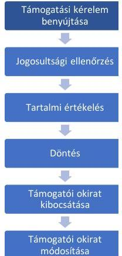

A 20 támogatást igénylő a támogatási kérelmet a benyújtásra nyitva álló határidőben, azaz a Felhívás ${ }_{1-4}{ }^{16}$-ben meghatározott 2017. május 31-2019. március 29., valamint a Felhívás ${ }_{5}{ }^{17}$-ben előírt 2017. május 31-2018. április 13. közötti időszakban nyújtotta be ügyfélkapus azonosítással, elektronikus kérelembenyújtó felületen elektronikus űrlap kitöltésével és mellékletek csatolásával. A kérelmek jogosultsági ellenőrzését a Kincstár elvégezte, ugyanakkor az ellenőrzést a Támogatási rendelet 1. melléklet 13.1. pontjában foglaltak ellenére a kérelem beérkezését követően nem haladéktalanul folytatta le, mivel a támogatási kérelmek hiánypótlására vonatkozó felhívását a Kincstár a támogatási kérelmek beérkezését követően jellemzően 7 hónappal később küldte meg a támogatást igénylők részére. (A határidő túllépéseket az egyes ellenőrzött projekteknél az V. sz. melléklet tartalmazza.)

---

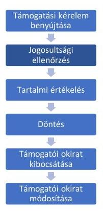

A Kincstár a támogatási kérelmek jogosultsági ellenőrzését 9 támogatást igénylő tekintetében (az 1., 2., 7., 9., 11., 12., 15., 19. és 20. projektnél) a pályázati felhívásban előírt feltételek vizsgálatával végezte el.
Ugyanakkor 11 támogatást igénylő esetében (a 3., 4., 5., 6., 8., 10., 13., 14., 16., 17. és 18. projektnél) a támogatási kérelmek jogosultsági ellenőrzését nem a pályázati felhívás 4.4.2 1.) pontjában, valamint az ÁÚF-ben előírtak szerint hajtotta végre.

A pályázati felhívás 4.1. a) pontja előírta, hogy támogatási kérelmet csak jogerősen nyilvántartásba vett erdőgazdálkodó nyújthat be, amely jogosultsági kritérium igazolása a pályázati felhívás 4.4.2. 1.) pontja alapján nem hiánypótoltatható jogosultsági kritérium. Az irányító hatóság a pályázati felhívásban annak ellenére írta elő a támogatást igénylők számára jogosultsági kritériumként az erdőgazdálkodói státusz igazolását, hogy az aktuális erdőgazdálkodói státusz, vagyis a jogosultság (a kritérium) fennállása közhiteles nyilvántartásban ellenőrizhető volt. 11 támogatást igénylő (a 3., 4., 5., 6., 8., 10., 13., 14., 16., 17. és 18. projektél) nem igazolta, hogy jogerősen nyilvántartásba vett erdőgazdálkodó. A Kincstár esetükben a jogosultsági kritériumok ellenőrzése során nem a pályázati felhívás 4.4.2. 1.) d) pontjában rögzítettek szerint járt el, mivel az erdőgazdálkodói státusz fennállását nem annak igazolása, hanem a NÉBIH ${ }^{18}$ által rendelkezésre bocsátott közhiteles nyilvántartás alapján ellenőrizte. A NÉBIH nyilvántartásában a 11 támogatást igénylő jogerősen nyilvántartásba vett erdőgazdálkodóként szerepelt.
A 11 támogatást igénylő közül 1 esetében (8. projekt) a támogatási kérelem jogosultsági ellenőrzése során a hiánypótlási eljárást követően meghozott irányító hatósági elutasító döntés nem volt szabályszerű, mivel a Kincstár az ÁÚF 8. oldal 1. és 2. bekezdésében rögzített előírások ellenére a támogatási kérelmet a jogosult rész tekintetében nem bocsátotta a Támogatási rendelet 61. § (1) bekezdésében szabályozott tartalmi értékelésre. A támogatást igénylő által benyújtott kifogás Támogatási rendelet 153. § (3a) bekezdése szerinti saját hatáskörben történt elbírálásának eredményeként a független állami projektértékelők elvégezték a tartalmi értékelést a jogosult rész tekintetében.

A Kincstár jogosultsági ellenőrzések elvégzése során alkalmazott nem egységes eljárása megsértette a támogatási kérelmek egységes elbírálására vonatkozó elvet.

A Kincstár 12 támogatási kérelem esetében (az 1., 2., 4., 5., 6., 7., 9., 10., 13., 14., 15. és 18. projektnél) a jogosultsági ellenőrzés során a Támogatási rendelet 60. § (3) bekezdésében, valamint a Támogatási rendelet 1. mellékletének 14.1. b) pontjában előírtakkal ellentétben nem az összes hiány, vagy hiba megjelölésével szólította fel hiánypótlásra a támogatást igénylőket. Az egyszeri hiánypótlási lehetőségre vonatkozó rendelkezést megszegve a Kincstár a Támogatási rendelet 60. § (3) bekezdésében előírtakkal ellentétben - több alkalommal - adminisztratív hibára történő hivatkozással hiánypótlás kiegészítésre szólította fel a támogatást igénylőket. Az irányító hatóság az ÁÚF 8. oldal 1. és 2. bekezdésében foglaltak ellenére 12 támogatást igénylő közül 9 esetében (az 1., 2., 4., 5., 6., 7., 9., 10. és 15. projektnél) a támogatási kérelmet a jogalap nélküli hiánypótlások keretében benyújtott dokumentumokat figyelembe véve bírálta el, és bocsátotta ki a támogatói okiratot.
A Kincstár 13 támogatási kérelem esetében (az 1., 2., 4., 5., 6., 7., 8., 9., 10., 14., 15., 16., és 18. projektnél) a Támogatási rendeletben foglaltaknak megfelelően értesítette a támogatást igénylőt a kérelem jogosultsági szempontoknak való megfelelőségéről és a tartalmi értékelés megkezdéséről.
Az irányító hatóság 6 támogatási kérelem esetében (a 11., 12., 13., 17., 19. és 20. projektnél) a Támogatási rendeletben előírtaknak megfelelően értesítette a támogatást igénylőt a támogatási kérelem elutasításáról.

---

A 6 elutasított támogatási kérelemből

- 3 támogatási kérelem (a 11., 12. és 19. projektnél) - szabályszerűen - a támogatást igénylő nem megfelelő hiánypótlása miatt került elutasításra.
- További 1 támogatási kérelem esetében is (a 13. projektnél) - helytállóan - a nem megfelelő hiánypótlás volt az irányító hatóság részéről az elutasítás indoka, ugyanakkor a támogatási kérelem elutasításáról szóló értesítő levélben szereplő indokolás nem volt egyértelmű abban a tekintetben, hogy „más forgalmazó" alatt nem kizárólag magyarországi forgalmazó értendő. Ez a probléma a Felhívás: 2. sz. mellékletében orvosolható lett volna a kizárólagos forgalmazói jog értelmezésének magyarázatával.
- 1 támogatási kérelem elutasítására (a 17. projektnél) - szabályszerűen - azért került sor, mert a támogatást igénylő ugyanezen VP4-8.5.2-17 „Az erdei ökoozzisztémák térítésmentesen nyújtott közjióléti funkcióinak fejlesztése" című pályázati felhívásra korábban már nyújtott be támogatási kérelmet, amely alapján időközben az irányító hatóság kiadta a hatályos támogatói okiratot.
- 1 támogatási kérelem elutasítására (a 20. projektnél) - szabályszerűen - azért került sor, mert a támogatási kérelemben tervezett közjóléti létesítmény-típus nem felelt meg a Felhívás: 4. számú mellékletének.
A Kincstár a 3. projekt támogatást igénylőjét a Támogatási rendelet $60 . \S$ (2) bekezdését megsértve a jogosultsági szempontoknak való megfeleléséről annak ellenére nem tájékoztatta, hogy 2021. június 2-án támogatói okirat kibocsátására került sor, amelynek előfeltétele volt a jogosultsági feltételek teljesülése.

# A pályázati feltételeknek való megfeleltetés - tartalmi értékelés 

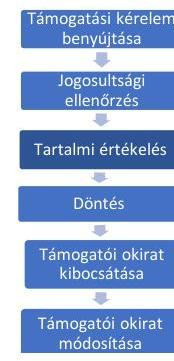

A Támogatási rendeletben előírt, pontozással történő tartalmi értékelésre 14 támogatási kérelem esetében került sor (az 1., 2., 3., 4., 5., 6., 7., 8., 9., 10., 14., 15., 16. és 18. projektnél).
A támogatási kérelmek pontozással történő tartalmi értékelését a Támogatási rendeletben előírtak alapján külső értékelők végezték. A támogatási kérelmek értékelése és pontozása megfelelt a pályázati felhívásban, valamint a „Képzési anyag támogatási kérelem elbírálásához" elnevezésű dokumentumban meghatározott tartalmi értékelési szempontoknak.

## Kifogások kezelése a pályáztatás során

Az agrárminiszter nevében és megbízásából eljáró, az Agrárminisztérium EU-s és Nemzeti Támogatások Jogorvoslati Főosztálya nem tett eleget a Támogatási rendelet 153. § (2) bekezdésében és a kifogáskezelési segédlet 2.2. pontjában előírtaknak, mivel 9 támogatást igénylő kifogását (a 3., 5., 6., 7., 8., 9., 14., 16. és 20. projektnél) a beérkezését követő naptól számított 30 napon belül annak ellenére nem bírálta el, hogy határidőhosszabbításra nem került sor. A legrövidebb késedelem 10 nap, a leghosszabb késedelem 20 hónap volt, a késedelmek jellemzően meghaladták a 16 hónapot. (A határidő túllépéseket az egyes projekteknél a VI. sz. melléklet tartalmazza.)
Az irányító hatóság a Támogatási rendelet 153. § (4b) bekezdésében rögzített előírás ellenére 3 esetben (az 5., 7. és 14. projektnél) az ismételt döntéshozatal tekintetében megsértette a Támogatási rendelet 68. § (1) bekezdésében előírt határidőt, mivel az irányító hatóság a kifogásnak helyt adó, az agrárminiszter nevében és megbízásából eljáró, az Agrárminisztérium EU-s és Nemzeti Támogatások Jogorvoslati Főosztálya által hozott döntés meghozatalától számított 30 napon belül nem döntött.

---

1 támogatást igénylő esetében (a 3. projektnél) az agrárminiszter nevében és megbízásából eljáró, az Agrárminisztérium EU-s és Nemzeti Támogatások Jogorvoslati Főosztálya a kifogásról való döntés során nem vette figyelembe a Támogatási rendelet $60 . \S$ (4) bekezdésében rögzített előírást - amely szerint a jogosultsági ellenőrzéshez kapcsolódó hiánypótlás hibás vagy hiányos teljesítése esetén az irányító hatóság a támogatási kérelmet köteles elutasítani - és az irányító hatóság jogosultsági ellenőrzéshez kapcsolódó hibás hiánypótlás miatti jogszerú elutasító döntésével szembeni kifogásnak helyt adott. Az agrárminiszter nevében és megbízásából eljáró, az Agrárminisztérium EU-s és Nemzeti Támogatások Jogorvoslati Főosztálya a kifogáshoz csatolt, a korábbi jogosultsági ellenőrzéshez kapcsolódó hiánypótlás keretében be nem küldött dokumentumok értékeléséről döntött, ennek elvégzésére szólította fel az irányító hatóságot.
Az irányító hatóság jogosultsági kritériumok ellenőrzése alapján született elutasító döntéssel szemben benyújtott 2 kifogás elbírálásával kapcsolatban hozott döntése (a 2., és 4. projektnél) nem volt megfelelő. A 2 támogatást igénylő esetében (a 2. és 4. projektnél) az irányító hatóság a kifogások Támogatási rendelet 153. § (3a) bekezdésében szabályozott saját hatáskörben történő elbírálásáról döntött. Az irányító hatóság döntése alapján a Kincstár a Támogatási rendelet 60. § (3) bekezdésében előírt, a jogosultsági ellenőrzés keretében alkalmazható egyszeri hiánypótlási lehetőség ellenére ismételt hiánypótlásra szólította fel a támogatást igénylőket. Ezáltal az irányító hatóság a kifogáskezeléshez kapcsolódó, jogalap nélküli hiánypótlások figyelembevételével bocsátotta ki a támogatói okiratokat.

- Az irányító hatóság 3 támogatási kérelmet arra való hivatkozással utasított el, hogy a támogatási kérelem mellékleteként benyújtott árajánlatokat nem az ÉNGY ${ }^{19}$ struktúrájának megfelelő részletezettséggel, építési tételekre lebontva készítették el. A támogatást igénylők kifogást nyújtottak be az irányító hatóság döntése ellen. A kifogások indokolása tartalmazta, hogy a 3 árajánlatot munkanemre lebontva nyújtották be, továbbá, hogy a Vidékfejlesztési Programok eljárásaiban a Támogatási rendeletben előírtak ellenére gyakorlat a többszöri hiánypótoltatás, ami esetükben nem történt meg, ezáltal véleményük szerint sérült az egyenlő elbánás elve. A kifogás a megszokott (és szabálytalan), többszöri hiánypótóltatás hiányát, és ezáltal az egyszeri hiánypótlást lehetővé tevő jogszabályi előírás betartását sérelmezte. Az újabb ÉNGY struktúrájának megfelelő árajánlatok benyújtása pedig azt támasztotta alá, hogy a pályáztatás korábbi szakaszában benyújtott árajánlatok nem voltak megfelelőek. A kifogások eredményeként a Kincstár a Támogatási rendelet 60 . $\$ (3) bekezdésében előírtakat figyelmen kívül hagyva 2 támogatást igénylő esetében (a 2. és 4. projektnél) adminisztratív hiánypótlásra hivatkozva ismételten bekérte az ÉNGY struktúrája szerinti részletezettségủ árajánlatokat. Az agrárminiszter részére felterjesztett 1 kifogás kezelése során (a 3. projektnél) a Támogatási rendelet 60 . § (3) és (4) bekezdéseiben elöírtakat nem vette figyelembe, a kifogást nem utasította el, hanem az annak mellékleteként csatolt, a jogosultsági ellenőrzéshez kapcsolódó hiánypótlás keretében be nem küldött dokumentumokat értékelve döntött a kifogásról.

Az Agrárminisztérium EU-s és Nemzeti Támogatások Jogorvoslati Főosztálya, valamint az irányító hatóság a kifogáskezelés során nem egységes eljárást alkalmazott, amellyel megsértették a támogatási kérelmek azonos módon történő kezelésének elvét.

Az irányító hatóság a kifogások kezelése során nem egységesen járt el, mivel az azonos tárgyban benyújtott 4 kifogás közül (a 2., 3., 4. és 6. projektnél) 2 esetében (a 2. és 4. projektnél) a kifogások saját hatáskörben történő elbírálásáról döntött, 2 kifogást (a 3. és 6. projektnél) megküldött az agrárminiszternek elbírálásra. Az agrárminiszter nevében és megbízásából eljáró, az Agrárminisztérium EU-s és Nemzeti Támogatások Jogorvoslati Főosztálya a felterjesztett 2 kifogás (a 3. és 6. projektnél) elbírálása során nem egységesen járt el. Az

---

azonos indokkal benyújtott kifogások közül az egyiknek helyt adott (3. projekt) és elrendelte az irányító hatóság döntésének felülvizsgálatát, a másik azonos tárgyú kifogást (6. projekt) elutasította. Az elutasítás indokaként az irányító hatóság felé korábban teljesített hiánypótlás nem megfelelőségét, illetve a megfelelő dokumentumok késedelmes, hiánypótlást követő csatolását jelölte meg. Megállapította továbbá, hogy a hiánypótlási határidő leteltét követően benyújtott dokumentumok az irányító hatóság által nem voltak figyelembe vehetők, illetve, hogy egyszeri hiánypótlásra van lehetőség, ezáltal az irányító hatóság elutasító döntése megalapozott volt. Az agrárminiszter nevében és megbízásából eljáró, az Agrárminisztérium EU-s és Nemzeti Támogatások Jogorvoslati Főosztálya a 6. projekthez kapcsolódóan benyújtott kifogás elbírálása során biztosította a Támogatási rendelet 60. § (3) bekezdésében rögzített előírás érvényesülését, a 3. projekthez kapcsolódó kifogás elbírálása során ugyanezen előírást figyelmen kívül hagyta.
1 támogatást igénylő kifogáskezelési eljárása során a Kincstár nem az agrárminiszter nevében és megbízásából eljáró, az Agrárminisztérium EU-s és Nemzeti Támogatások Jogorvoslati Főosztálya döntésében foglaltaknak megfelelően járt el, mivel a Támogatási rendelet 63. § (1) bekezdésében szabályozott tisztázó kérdés alkalmazása helyett, a Támogatási rendelet 60. § (3) bekezdése alapján újabb hiánypótlási eljárást folytatott le (7. projekt).

# Döntés a támogatási kérelmekről 

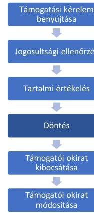

Az irányító hatóság a Támogatási rendeletben foglaltak szerint összehívta a döntéselőkészítő bizottságot a támogatási kérelmekről hozott döntés megalapozásához. A döntés-előkészítő bizottság üléseiről a jelenléti ívek a Támogatási rendeletben előírtaknak megfelelően rendelkezésre álltak. A jelenléti ívek alapján a háromtagú bizottság valamennyi tagja részt vett az üléseken, így a döntés-előkészítő bizottság a Támogatási rendeletben előírtak alapján minden alkalommal határozatképes volt.
A döntésre bocsátott 14 támogatási kérelem esetében az ülésen résztvevő tagok által kitöltött titoktartási és összeférhetetlenségi nyilatkozatok a Támogatási rendeletben előírtak szerint rendelkezésre álltak. Az irányító hatóság a Támogatási rendeletben foglaltak alapján összeállította a döntési javaslatokat.
Az irányító hatóság a 14 támogatási kérelem közül 12 kérelmet támogatásra alkalmasnak ítélt, 2 kérelmet elutasított (a 16. és 18. projekt), mivel nem érték el a minimális 55 pontos értékhatárt.
Az irányító hatóság nem tett eleget a Támogatási rendelet 68. § (1)-(2) bekezdésében foglaltaknak, mivel a 14 támogatási kérelemről a Felhívás ${ }_{1-5}$-ben rögzített szakasz zárásától számított 40 napon belül nem döntött. A legrövidebb késedelem 14 hónap, a leghosszabb 44 hónap volt, jellemzően 20 hónapot meghaladó volt a késedelem. (A határidő túllépéseket az egyes projekteknél az V. sz. melléklet tartalmazza.)
Az irányító hatóság határidőn túl hozott döntése az egyik támogatási kérelemről - az ÁSZ értékelése szerint - hozzájárult ahhoz, hogy a kedvezményezett a projektet (15. projekt) nem tudta megvalósítani. A

Az eljárási határidők túllépése kockázatot jelent a támogatott projektek megvalósítása szempontjából, amely veszélyezteti a rendelkezésre álló uniós források lehívását.
kedvezményezett a támogatási kérelmet 2018. január 31-én nyújtotta be 17 megvalósítási helyszínre vonatkozóan, ahol többek között erdei asztalokat, padokat, játszószereket, tűzrakóhelyeket, védőházakat tervezett megvalósítani. Az irányító hatóság döntésére 2019. november 4. napján, a támogatói okirat megkötésére a támogatási kérelem

---

benyújtásától számítva közel 2 év múlva, 2019. november 13-án került sor. A Felhívás 2. sz. melléklet i) pontja rögzíti, hogy a támogatási kérelemben benyújtott árajánlatok kötelező tartalmi elemeként azok érvényességét meg kell jelölni. A szabályozás célja, hogy a támogatási kérelem benyújtását követően a támogatói okirat megkötéséig tartó időszakra az árajánlattevő kötelezettséget vállaljon az árajánlatban szereplő árak fenntartására. A támogatói okirat birtokában a kedvezményezett részéről már megkezdődhet a projekt megvalósítása, így az árajánlatban rögzített árakon megvalósítható a beruházás, a megemelkedett költségek miatti plusz forrás bevonása nélkül. A kedvezményezett árajánlatai a támogatási kérelem benyújtási határidejétől számított 30 napig voltak érvényesek. Tekintettel arra, hogy a támogatói okirat megkötésére közel 2 éves késedelemmel került sor, a nyertes árajánlatot tevő árajánlata érvényét veszítette és a kedvezményezett a megvalósítást kizárólag a megemelkedett kivitelezési árak mellett tudta volna megvalósítani. Az előbbieket a kedvezményezett 2020. május 13-án kelt levelében jelezte a Kincstárnak és egyben kérte a műszaki tartalom csökkentését vagy a támogatási összeg megnövelését. A Kincstár válasza alapján a támogatási összeg megemelésére nincs lehetőség, a műszaki tartalom csökkentését pedig kizárólag a támogatási összeg arányos csökkentése mellett engedélyezte volna, amely nem biztosított megoldást az irányító hatóság jelentős késedelme miatt bekövetkezett probléma kezelésére. Tekintettel arra, hogy a kedvezményezett a támogatói okiratban vállalt feltételekkel nem tudta megvalósítani a projektet, lemondott a megítélt támogatás összegéről 2020. június 17-i dátummal.
Az irányító hatóság a Támogatási rendeletben előírtaknak megfelelően szerepeltette a támogatói okiratokban a támogatási kérelmekben szereplő mérföldköveket. A támogathatóságról jelentős késedelemmel meghozott döntések miatt azonban a támogatói okiratokban rögzített mérföldkövek határideje a támogatói okiratok kibocsátási dátumánál korábbi dátumban került megállapításra, így azok betartása a kedvezményezettek részéről nem volt lehetséges. A projektek ütemezés szerinti megvalósíthatóságát az irányító hatóság határidőt követően jelentős késedelemmel meghozott döntése akadályozta.

# AZ ELBÍRÁLÁS ÉS A DÖNTÉS SZÁMVEVŐSZÉKI ÉRTÉKELÉSE 

A pályázati felhivás kritériumainak „A pályázati felhivás számvevōszéki értékelése" címü részben felsorolt hiányosságai a támogatási kérelmek elbírálását és a döntéshozatalt egyaránt negatívan befolyásolták.
Az irányító hatóság a pályázati felhívás szerint a projekt megvalósítási belyszénével összefüggésben kizárólag az országos túraútvonalhoz vagy más, országos vagy regionális jelentöségü, kiemelt turisztikai desztinációboz való közvetlen kapcsolódást és a 290/2014. (XI. 26.) Korm. rendelet ${ }^{20}$ alapján a kedvezményezett járás, illetve a 105/2015. (VI. 23) Korm. rendelet ${ }^{21}$ alapján a kedvezményezett település szerinti besorolást pontozta. A pályázati felhívás erdörészletek fellelhetöségére, elérhetőségére vonatkozó kritériumának biánya megteremti annak a lehetőségét, hogy olyan támogatási kérelmeket támogassanak, amelyeknél a projekt megvalósításának helyszíne nehezen megtalálható vagy a nyilvánosság számára nem elérhető, ezáltal közjöléti funkcióját nem tölti be. A pályázati felhívásban a területi elhelyezkedésre vonatkozó mérlegelési szempont biánya azt eredményezte, hogy a támogatott projektek egy szük területre (Hajdó-Bibar Vármegyére), azon belül néhány településre koncentrálódtak. Ez korlátozta annak a lehetőségét, hogy hazánk többféle erdejének erdei közjöléti funkciója bővöljön és az állampolgárok szélesebb rétege érje el és használja a közjöléti berendezéseket.

---

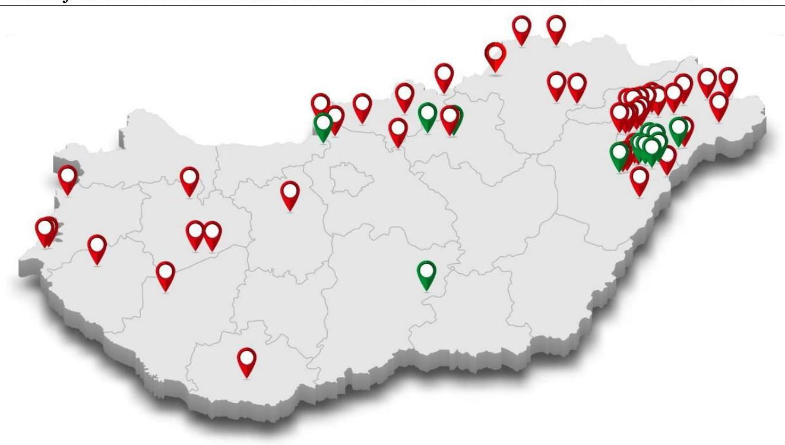

Fonrás: Kincstár adatai alapján ÁsZ saját szerkesztés
Az irányító hatóság részéről nem támogatott megvalósítási helyszínek.
Az irányító hatóság részéről támogatott megvalósítási helyszínek.
Az Evt. ${ }^{22}$ nem zárja ki annak a lehetőségét, hogy egy közjióléti rendeltetésü erdörészlet vágásos üzemmódban kerïljön rögzitésre az erdőtervben. Mivel az irányitó hatóság a pályázati felhivás elkészitése során nem vette figyelembe az Evt. rendelkezéséét és nem határozott meg az erdőgazdálkodás üzemmódjára vonatkozó kritériumot, igy fordulhatott elö, hogy 8 kedvezményezett esetében a projektmegvalósitás belyszínéül szolgáló erdörészlet közjióléti/ védelmi rendeltetésü volt, miközben valamennyi erdörészlet üzemmódja a vágásos kategóriába tartozott. A támogatási kérelmek benyüjtását megelözö idöszakban a 8 támogatást igénylö közül 7 támogatást igénylő kérelmezte az erdörészlet rendeltetésének módositását az eredetileg gazdasági rendeltetésüröl - a faanyagtermelő üzemmód változatlanul hagyása mellett - közjióléti rendeltetésüre. A módositás következtében a támogatási kérelmek elbírálása során a támogatást igénylök az erdő rendeltetésére vonatkozó szempont esetében a maximális pontszámot kaphatták meg, amely elönyt biztositott számukra.
Mivel az irányitó hatóság a pályázati felhivás pontozásának kialakítása során nem vette figyelembe az erdők természetességi állapotát, igy monokultúrás, mesterségesen telepített faültetvényekben megvalósitani tervezett közjióléti létesítmények nyertek el támogatást, amelyek közyl $80 \%$-a nem öshonos, hanem idegenbonos, intenzíven terjedő fafajtával telepített. A bivatkozott megvalósitási belyszínekken telepített fafajták szerepeltnek az Evt. vbr. ${ }^{23}$ 3. melléklete szerinti termesztésbe vonható, ugyanakkor idegenbonos, és intenziven terjedő fa- és cserjefajok jegyzékében. Az 1143/2014 EU rendelet ${ }^{24}$ (2)-(3) bekezdése rögziti, hogy az idegenbonos inváziós (intenziven terjedő) fajok jelentik az egyik legföbb veszélyforrást a biológiai sokféleségre és a kapcsolódó ökoozisztéma-szolgáltatásokra az élőhelyek átalakítása, versengés és az öshonos fafajok kiszoritása miatt. Az irányitó hatóság az elöbbieket figyelmen kivïl

---

bagyva olyan projektek megvalósitását támogatta, amelyek megvalósitására az erdei ökoszisztémát veszélyeztető intenzíven terjedő fafajtával telepített erdőrézztetben került sor.
Az 1305/2013/EU rendeletben rögzített, az erdei ökoszisztémák környezeti értékének növelését célzó beruházásokkal szembeni elvárások teljesülését támogathatta volna mérlegelést igénylő értékelési szempont(ok) beépítése a pályázati felhívásba és alkalmazása a döntés-előkészités során. Például az erdők természetes adottságának, az erdőrézztet fellelhetőségének, az erdőgazdálkodás üzemmódjának, a faállomány vágásérettségének stb. ismeretében lett volna célszerü értékelni a megvalósítási helyet a területi fejlettség tekintetében. Az uniós elöírásokban kitüzött cél elérésével szemben nagyobb prioritást kapott, bogy a megvalósítási hely milyen besorolású kedvezményezett járásba tartozik (kedvezményezett/fejlesztendő/komplex programmal fejlesztendő járás). (A támogatott projekteknél a projekt-megvalósítási hely és a tervezett közjöléti létesítmény fontosabb adatait a X. sz. melléklet mutatja be.)
Összegzés: A Vidékfejlesztési Program 4-es prioritásába tartozó jelen pályázati felhívás összeállítása során az irányító hatóságnak az Evt.-ben meghatározott elöírásokon túli, azokon túlmutató uniós elvárásokat is figyelembe kellett volna vennie. Az 1305/2013/EU rendelet a mezőgazdasággal és az erdőgazdálkodással kapcsolatos ökoszisztémák állapotának helyreállítása, megőrzése és javítása (mint 4-es prioritás) tekintetében „a biológiai sokféleség helyreállítása, megőrzése és javítása, beleértve a Natura 2000 területeken,..., valamint az európai tájak állapotának helyreállítása, megőrzése és javítása" egyik célt határoztta meg. A nemzeti jogszabályokban meghatározott elöírások tágabbak és sok esetben eltérő szempontok érvényesülését helyezik elötérbe, mint az EU rendeletben rögzítettek. Az Evt. például gazdasági célból lehetővé teszi a fakitermelést közjöléti rendeltetésű erdőben is, ez azonban az 1305/2013/EU rendelet 5. cikk (4) bekezdés a) pontjával - jelen pályázati felhívás tekintetében - összeegyeztethetetlen. A pályázati felhívásban rögzített elöírások, kritériumok bivatottak a hazai és az uniós szabályozások közötti eltérésék kezelésére, ellentmondások feloldására. Az irányító hatóság azonban a pályázati felhívás elkészitése során ezeket az eltéréseket nem kezelte, nem bangolta össze.

# A támogatói okiratok kibocsátása, módosítása 

Támogatói okiratok
benyújtása
B
Bogosultság ellenőrzés
B
Tartalmi értékeik
B
Elővítés
B
Támogatói okirat
kibocsátása
B
Támogatói okirat
módosítása

Az irányító hatóság 12 támogatást igénylő által benyújtott és elfogadott támogatási kérelem közül 11 támogatást igénylővel (az 1., 2., 3., 4., 5., 6., 7., 8., 9., 10. és 15. projektnél) kötött támogatói okiratot. A támogatói okiratokat a Támogatási rendeletben előírt tartalommal bocsátották ki. 1 támogatást igénylő esetében (a 14. projektnél) a támogatói okirattal kapcsolatos kifogás miatt a támogatói okirat ismételt kibocsátására 30 napon belül, a Támogatási rendelet 1. melléklet 49.4. pontjában foglaltak ellenére - az ÁSZ helyszíni ellenőrzésének befejezéséig - nem került sor.
A Kinestár a támogatói okiratok megkötését megelőzően a Támogatási rendeletben, a pályázati felhívásban és az ÁÚF-ben foglaltaknak eleget téve a kizáró okok ellenőrzését elvégezte, amely alapján kizáró ok egy esetben sem állt fenn. A támogatói okiratok tartalmazták a Támogatási rendeletben előírt tartalmi elemeket.

---

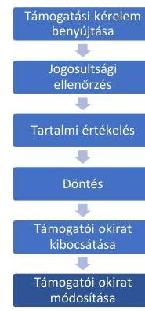

A Kincstár a Támogatási rendelet 86. § (3) bekezdésben foglaltak ellenére 7 kedvezményezett (az 1., 2., 3., 4., 5., 9. és 10. projektnél) 14 változásbejelentési kérelmével kapcsolatban 30 napon belül nem intézkedett, továbbá 3 kedvezményezett (a 2., 3. és 4. projektnél) 7 változásbejelentési kérelemének elbírálására nem került sor azok időszerűsége ellenére - az ÁSZ helyszíni ellenőrzésének lezárásáig. Azokban az esetekben, amikor a Kincstár intézkedett, a legrövidebb késedelem 4 nap volt, a leghosszabb 148 nap, jellemzően 30 nap volt a késedelem. (A határidő túllépéseket az egyes kedvezményezetteknél a VII. sz. melléklet tartalmazza.)
A Kincstár részéről 2 kedvezményezett változásbejelentési kérelmének elfogadása (a 4. és 10. projektnél) ellentétes volt a pályázati felhívás 3.5.2 pontjában foglaltakkal, mivel a projekt fizikai befejezési határidejét érintően olyan határidőhosszabbítást fogadott el, amely a kedvezményezett támogatói okiratának hatálybalépését követő 24 hónapon túli volt.
A Kincstár a Támogatási rendelet 1. melléklet 61.4. pontjában foglaltakkal ellentétben 1 kedvezményezett változásbejelentési kérelmét (a 9. projektnél) a hiánypótlás beérkezését követően annak tartalmi hiányossága miatt részben vagy egészben nem utasította el, hanem újabb hiánypótlásra szólította fel a kedvezményezettet.

# 2. A támogatások kifizetése szabályszerűen történt-e? 

Összegző megállapítás

A támogatások kifizetése során a Kincstár nem a jogszabályi előírások szerint járt el, mivel az időközi kifizetési kérelmekhez kapcsolódó hiánypótlási felhívásokat 6 projekt esetében késedelmesen küldte meg, illetve az egyszeri hiánypótlási lehetőséget figyelmen kívül hagyva 5 projekt tekintetében 2 alkalommal szólította fel hiánypótlásra a kedvezményezetteket. A Kincstár késedelmesen döntött a kifizetési kérelmekről és határidőt követően fizette ki a jogosultak részére a támogatásokat.

A 11 nyertes projekt közül 3 projekt (a 8., 10. és 15. projekt) tekintetében a projektmegvalósítás megkezdésére 1 esetben (a 10. projektnél) támogatói, illetve 2 esetben (a 8. és 15. projektnél) kedvezményezetti elállás miatt nem került sor. A 8 folyamatban lévő projekt (az 1., 2., 3., 4., 5., 6., 7. és 9. projekt) tekintetében 1 kedvezményezett nyújtott be támogatási előleg folyósítására irányuló kérelmet, 6 kedvezményezett időközi kifizetési igénylést, 1 kedvezményezett záró kifizetési igénylést nyújtott be, 1 kedvezményezett kifizetési igényléssel a helyszíni ellenőrzés lezárásáig nem élt.

## Támogatási elóleg kifizetése

A kedvezményezettek részére támogatási előleg kifizetésére nem került sor. Támogatási előleg folyósítására irányuló kérelmet 1 kedvezményezett (az 5. projekt) nyújtott be, azonban kérelmét a Kincstár a Támogatási rendeletben előírtaknak megfelelően elutasította, mivel a biztosítékadásra kötelezett kedvezményezett legkésőbb az előlegigénylési kérelem benyújtásáig nem igazolta a Támogatási rendelet XV. Fejezetében meghatározott összegű biztosíték rendelkezésre állását.

---

# Időközi kifizetés teljesítése 

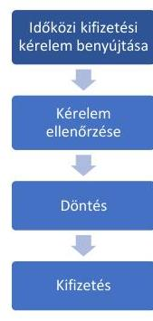

Időközi kifizetési igénylést 6 kedvezményezett (a 2., 3., 4., 5., 7. és 9. projektnél) nyújtott be a Támogatási rendeletben foglaltaknak megfelelően ügyfélkapus azonosítással, elektronikus kérelembenyújtó felületen elektronikus űrlap kitöltésével.
A Kincstár a Támogatási rendeletben előírtaknak megfelelően, a monitoring és információs rendszerbe feltöltött egységes ellenőrzési lista segítségével elvégezte a kedvezményezettek által benyújtott időközi kifizetési igénylések általános és bizonylati szintű tartalmi és formai ellenőrzését. Ennek keretében ellenőrizte a Számv. tv.-ben foglalt, a számviteli bizonylatok megfelelőségére vonatkozó rendelkezések teljesülését, illetve a Támogatási rendeletben előírt, az igényelt támogatás összegére és a záradékolásra vonatkozó követelmények érvényesülését, valamint a
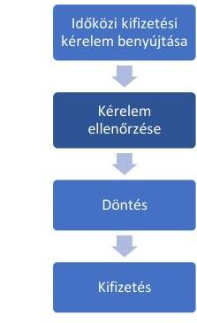
támogatás folyósításának feltételeként meghatározott, a fizikai és pénzügy teljesítés kedvezményezett általi igazolásának meglétét. A Kincstár a Támogatási rendeletben előírtaknak megfelelően meggyőződött az időközi kifizetési igénylésnek a támogatói okiratban vállalt kötelezettségekkel való összhangjáról, és a közbeszerzési dokumentáció rendelkezésre állásáról.
A Kincstár az időközi kifizetési igénylésekhez kapcsolódó hiánypótlási felhívásokban 15 napos határidőt tűzött ki a Támogatási rendeletben foglaltaknak megfelelően. A hiánypótlási felhívásokat ugyanakkor a Támogatási rendelet 132. § (1) bekezdésében foglaltak ellenére az előírt 30 napos határidőt követően küldte meg a kedvezményezettek részére. A kifizetési igénylésekhez kapcsolódó hiánypótlási felhívások késedelme a kifizetések késedelmes teljesítését eredményezte, ami kockázatot hordoz a projektek finanszírozása és ütemezett megvalósítása tekintetében. A legrövidebb késedelem 9 nap, a leghosszabb késedelem 84 nap volt, többségében 30 nap feletti volt a késedelem.
A 6 kedvezményezett közül 5 kedvezményezett tekintetében (a 3., 4., 5., 7. és 9. projektnél) a Kincstár a Támogatási rendelet 132. § (1) bekezdésében foglaltak ellenére a hiánypótlási felhívásokban az igénylésben szereplő valamennyi hiányt, illetve hibát nem jelölte meg. A Támogatási rendelet 132. § (2) bekezdésében előírt egyszeri hiánypótlási lehetőséget figyelmen kívül hagyva 2 alkalommal szólította fel hiánypótlásra a kedvezményezetteket.
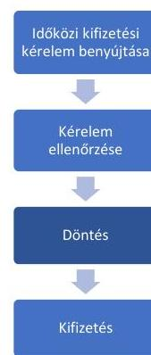

A 6 kedvezményezett közül (a 2., 3., 4., 5., 7. és 9. projektnél)
$\cdot$ 3 kedvezményezett tekintetében került sor időközi kifizetésre (az 5. 7. és 9. projektnél),
$\cdot$ 1 kedvezményezett tekintetében a támogatás folyósításának felfüggesztése (a 2. projektnél),
$\cdot$ 1 kedvezményezett tekintetében elutasító döntés (a 3. projektnél),
$\cdot$ 1 kedvezményezett tekintetében az időközi kifizetési igény - számvevőszéki ellenőrzés lezárásáig történő - elbírálásának hiánya miatt nem történt kifizetés (a 4. projektnél).
A 2. projekt esetében a Kincstár a kedvezményezett 2022. december 30-án benyújtott időközi kifizetési igényléséhez kapcsolódóan a támogatás folyósítását a Támogatási rendelet 133. § (1) bekezdésében a kifizetés teljesítésére előírt 45 napos határidőt követően, 101 nap késedelemmel függesztette fel az elszámoló bizonylathoz kapcsolódó közbeszerzési dokumentációról való döntés (közbeszerzési utóellenőrzési jelentés) hiánya miatt. A Kincstár a Támogatási rendelet 134. §

---

(2) bekezdésében előírtak ellenére a felfüggesztésről és annak okáról a kedvezményezettet a helyszíni ellenőrzés lezárásáig nem tájékoztatta.
A 3. projekt esetében a Kincstár a kedvezményezett által 2022. november 11-én benyújtott időközi kifizetési igényt 2023. augusztus 17-én a Támogatási rendeletben foglaltaknak megfelelően elutasította, mivel a kedvezményezettel szemben 2023. június 28-án indított szabálytalansági eljárás eredményének jogkövetkezményeként a támogatói okiratot az irányító hatóság 2023. július 7-én visszavonta. A Kincstár az időközi kifizetési igénylés elutasításának tényéről és annak okairól történő tájékoztatási kötelezettségének a Támogatási rendelet 1. melléklet 143.5. pontjában foglaltak ellenére az időközi kifizetési kérelem beérkezésétől számított 45 napon belül nem tett eleget, mivel az időközi kifizetési kérelmet az értesítésre rendelkezésre álló 45 napon túl bírálta el. Az értesítési késedelem 233 nap volt.
A 4. projekt esetében a Kincstár a Támogatási rendelet 133. § (1) bekezdésében előírtak ellenére a támogatást az időközi kifizetési kérelem beérkezésétől számított 45 napon belül nem fizette ki, mivel a kedvezményezett által benyújtott időközi kifizetési igényt a számvevőszéki ellenőrzés lezárásáig, 2023. szeptember 30-ig nem bírálta el. (Kifizetési késedelem 2023. szeptember 30-ig 329 nap volt.)
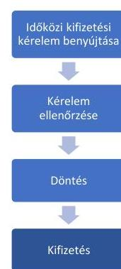

3 kedvezményezett tekintetében (az 5., 7. és 9. projektnél) a Kincstár az időközi kifizetési igényléssel igényelt támogatásokat a Támogatási rendelet 133. § (1) bekezdés és (2) bekezdés a) pontjában foglaltak ellenére - a jogszabály által hiánypótlásra rendelkezésre álló időszakot is figyelembe véve - határidőt követően fizette ki a kedvezményezettek részére. A legrövidebb késedelem 31 nap, a leghosszabb késedelem 229 nap volt, a késedelem átlagosan meghaladta a 100 napot. A Kincstár a Támogatási rendeletben foglaltakkal összhangban a támogatást a kedvezményezett fizetési számlájára történő utalással teljesítette. A kiutalt összeg megegyezett az időközi kifizetési igénylés alapján jóváhagyott támogatással.

# Záró kifizetés teljesítése 

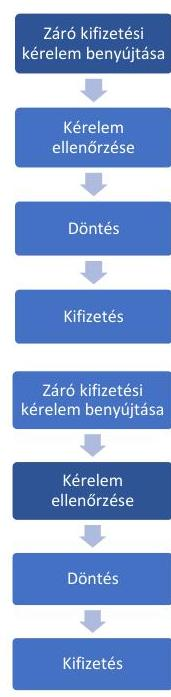

Záró kifizetési kérelem benyújtására 1 kedvezményezett esetében (az 1. projektnél, mint egyszeri elszámolónál) került sor.
A Kincstár a Támogatási rendeletben előírtaknak megfelelően a kedvezményezett által benyújtott záró kifizetési igénylést a támogatói okiratban meghatározott finanszírozási arányra is kiterjedően, a monitoring és információs rendszerbe feltöltött egységes ellenőrzési lista segítségével teljes körűen ellenőrizte. Ennek keretében ellenőrizte a kedvezményezett Támogatási rendeletben szabályozott, fel nem használt támogatásról történő lemondó nyilatkozatának meglétét, a Számv. tv.-ben foglalt, a számviteli bizonylatok megfelelőségére vonatkozó rendelkezések teljesülését, valamint a Támogatási rendeletben előírt, a záradékolásra vonatkozó követelmény érvényesülését, és a támogatás folyósításának feltételeként meghatározott, a fizikai és pénzügyi teljesítés kedvezményezett általi igazolásának meglétét. A Kincstár a Támogatási rendeletben előírtaknak megfelelően meggyőződött a záró kifizetési igénylésnek a támogatói okiratban vállalt kötelezettségekkel való összhangjáról, a benyújtott elszámoló bizonylaton szereplő költségnek a kedvezményezett keretében való elszámolhatóságáról.

---

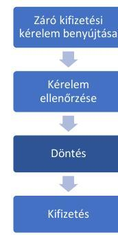

A Kincstár a Támogatási rendeletben előírtaknak megfelelően a záró kifizetési igényléssel kapcsolatos hiányosságok megszüntetése érdekében a Támogatási rendeletben előírt 30 napos határidőn belül hiánypótlásra szólította fel a kedvezményezettet. A Kincstár élt a Támogatási rendeletben biztosított többszöri hiánypótlás lehetőségével. A Kincstár a Támogatási rendelet 132. § (7) bekezdésében előírtak ellenére a többszöri hiánypótlásra irányuló eljárását az első hiánypótlási felhívásának a kedvezményezett általi kézhezvételét követő 60 napon belül nem zárta le. A Kincstár a záró kifizetési igénylést 52 nappal később hagyta jóvá.
A Kincstár a Támogatási rendeletben előírtaknak megfelelően a záró kifizetési igény elfogadásáról és a záró kifizetés összegéről tájékoztatta a kedvezményezettet.
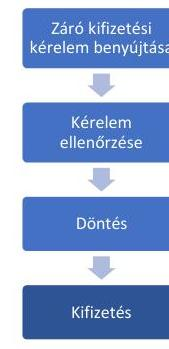

A Kincstár a záró kifizetési igényléssel igényelt támogatást a Támogatási rendelet 133. § (1) bekezdés és (2) bekezdés a) pontjában foglaltak ellenére, a kifizetésre rendelkezésre álló határidőt felfüggesztő tényezők figyelembevételével megállapított határidőt követően fizette ki a kedvezményezett részére. A kifizetési késedelem 42 nap volt. A Kincstár a Támogatási rendeletben foglaltakkal összhangban a támogatást a kedvezményezett fizetési számlájára történő utalással teljesítette. A kiutalt összeg megegyezett a záró kifizetési igénylés alapján jóváhagyott támogatással. (A határidő túllépeseket az egyes kedvezményezetteknél a VIII. sz. melléklet tartalmazza.)

# A közbeszerzési eljárások utóellenórzése 

A Kincstár a közbeszerzéssel érintett kifizetési igényléseknél - a Támogatási rendeletben előírtakkal összhangban - kizárólag abban az esetben teljesített kifizetést, amennyiben a közbeszerzési utóellenőrzés megtörtént, amíg az utóellenőrzés nem zárult le, a kifizetési igénylésben szereplő közbeszerzéssel érintett tételek felfüggesztésre kerültek. Az irányító hatóság a kifizetési igénylést benyújtó kedvezményezettek esetében - a Támogatási rendeletben előírtaknak megfelelően - utóellenőrzés keretében ellenőrizte a közbeszerzési eljárás során keletkezett dokumentumokat közbeszerzési-jogi, támogathatósági, elszámolhatósági, valamint műszaki szempontok szerint.

## 3. Az ellenőrzési tevékenység ellátása megfelelő volt-e?

Összegző megállapítás

A Kincstár a jogszabályi előírások szerint elkészítette az éves helyszíni ellenőrzési tervét. A Kincstár 5 projekt fizikai előrehaladását a mérföldkövek teljesítéséhez kapcsolódó beszámolási kötelezettségek teljesítésének ellenőrzésével nem követte nyomon. A Kincstár a támogatás folyósítását a beszámoló benyújtásának elmulasztása ellenére 2 projekt esetében nem függesztette fel.

## Ellenörzések tervezése, megalapozása

A Kincstár - a megkezdett projektekhez igazodóan - a Támogatási rendeletben rögzítetteknek megfelelőn a 2019-2023. évek vonatkozásában minden évre elkészítette az éves helyszíni ellenőrzési tervet, amelyekben pályázati felhívásonként határozta meg a tervezett helyszíni ellenőrzések és helyszíni szemlék

---

számát. Az ellenőrzési tervek a VP4-8.5.2-17 kódszámú pályázati felhíváshoz kapcsolódóan is tartalmaztak tervezett helyszíni ellenőrzéseket és helyszíni szemléket.
A Kincstár a helyszíni ellenőrzések tervezéséhez kapcsolódóan a 809/2014/EU rendeletben ${ }^{25}$ és a Támogatási rendeletben előírtaknak megfelelően rendelkezett kockázatelemzési módszertannal. A módszertan alapját a kiválasztási eljárás követelményeit meghatározó dokumentum képezte, amelyet alkalmazva rögzítették az egyes kiválasztások eredményeit. A Kincstár rendelkezett olyan elnökhelyettesi utasítás formájában kiadott helyszíni ellenőrzési kézikönyvvel és módszertani útmutatókkal helyszíni ellenőrzésre és helyszíni szemlére vonatkozóan, amelyek tartalmazták a Támogatási rendeletben előírt eljárásrendi előírásokat és jegyzőkönyvmintákat.

# Helyszíni ellenörzések, helyszíni szemlék 

A Támogatási rendeletben foglaltaknak megfelelően a Kincstár 4 kedvezményezett esetében (a 2., 3., 4. és 5. projektnél) a helyszínen ellenőrzést végzett, amelyről a Támogatási rendeletben előírtak szerint jegyzőkönyvet vett fel. A Kincstár 3 esetben (a 2., 3. és 4. projektnél) élt a Támogatási rendelet előírása szerinti lehetőséggel és a helyszíni ellenőrzés jegyzőkönyvében rögzítette a kedvezményezett által teljesítendő intézkedéseket, valamint azok határidejét. A Kincstár a Támogatási rendeletben előírtaknak megfelelően ellenőrizte az intézkedések teljesítését és a teljesítés elfogadásáról értesítette a kedvezményezettet.
A Kincstár 1 esetben (a 3. projektnél) a támogatás folyósítását megelőzően lefolytatott helyszíni szemle során nem állapította meg az ÁSZF ${ }^{26} 7.1$ pontjában szabályozott szerződésszegést eredményező tényhelyzet (tarvágás) fennállását annak ellenére, hogy a 2023. május 3-i helyszíni szemle alkalmával tudomására jutott a projektmegvalósítás helyszínéül szolgáló erdőrészletben történt tarvágás, amely következtében a megépített közjóléti létesítmény a továbbiakban nem tudja betölteni a kedvezményezett által a támogatási kérelemben vállalt funkcióját. A helyszíni ellenőrzés jegyzőkönyvében kizárólag az újratelepített fafajok típusát és mennyiségét rögzítették.
Az ÁSZ a projektmegvalósítás ezen kockázatát még a számvevőszéki ellenőrzés előkészítése során jelezte a Kincstárnak 2023. május 31-i levelében, és kérte a támogatás kifizetésének felfüggesztését a számvevőszéki ellenőrzés lezárásáig. A Kincstár a helyszíni ellenőrzést követően a kifizetési igénylés ellenőrzése folyamatában 2023. június 28 -án indította meg a Támogatási rendeletben foglalt szabálytalansági eljárást. A Kincstár a szabálytalansági eljárás eredményeként a Támogatási rendelet előírásai szerint szabálytalanságot állapított meg. Az irányító hatóság a szabálytalanság jogkövetkezményeként a Támogatási rendeletben meghatározottak szerinti jogkövetkezményt rendelte el és a támogatói okiratot a 2023. július 7-én kelt levelében visszavonta. Az irányító hatóság - helytállóan a Támogatási rendeletben előírtakra hivatkozva vonta vissza a támogatói okiratot, amely szerint, ha a kedvezményezett megszegi a támogatási szerződésben (támogatói okiratban) foglalt kötelezettségeit vagy jogszabályi kötelezettségét, akkor az irányító hatóság jogosult a támogatási jogviszonyt megszüntetni. A 3. projekt esetében a tarvágás következtében a projekt céljának megfelelő megvalósítása - rövid időn belül - nem lehetséges. A fakivágással bekövetkezett a műveletek tartósságára vonatkozó 1303/2013/EU rendelet 71. cikk (1) bekezdés c) pontjában megfogalmazott tényállás, vagyis a projekt célkitűzéseiben olyan lényeges változás következett be, amely az eredeti célkitűzéseket veszélyeztette. A támogatói okirat visszavonása nélkül fennállt volna annak a kockázata, hogy kifizetés teljesítése esetén a kedvezményezettnek nyújtott támogatást vissza kell fizetni az Európai Bizottságnak.

---

# A projektmegvalósítás nyomon követése 

Az irányító hatóság a Támogatási rendelet 86. § (2) bekezdése alapján változás kezelését szolgáló intézkedést annak ellenére nem kezdeményezett, hogy a mérföldkőhöz kapcsolódó beszámolási kötelezettséggel érintett 7 kedvezményezett közül (az 1., 2., 3., 4., 5., 7. és 9. projektnél) 6 kedvezményezett esetében (a 2., 3., 4., 5., 7. és 9. projektnél) fennállt, hogy a támogatói okirat kibocsátásakor a támogatói okirat közlésének napját követő naptól számítva az abban meghatározott mérföldkövek teljesítési határideje lejárt. (A támogatói okirat jogerőre emelkedésének és az abban meghatározott mérföldkövek dátumait az egyes projekteknél a IX. sz. melléklet tartalmazza.)
A Kincstár a Támogatási rendelet 26. § (4) bekezdésében előírtak ellenére a támogatott projektek nyomon követésére irányuló együttműködési kötelezettségének nem tett eleget, mivel a támogatott projektek előrehaladását, különös tekintettel a mérföldkövek teljesítésére nem követte nyomon.
A Kincstár a Támogatási rendelet 144. § (1) bekezdés a) pontjában előírtak ellenére a projekt támogatói okiratnak megfelelő fizikai előrehaladását nem ellenőrizte. A mérföldkőhöz kapcsolódó beszámolási kötelezettséggel érintett 7 kedvezményezett közül 5 kedvezményezett esetében (a 2., 3., 4., 5. és 7. projektnél) nem állt rendelkezésre a Támogatási rendelet 120. § (1) bekezdésében, az ÁSZF 3.2. pontjában, illetve az ÁÚF 8.1. és 8.3. pontjában előírt, a projekt fizikai teljesítését, műszaki-szakmai előrehaladását, eredményességét, valamint hatékonyságát bemutató szakmai beszámoló. 1 kedvezményezett (a 7. projekt) mérföldkőhöz nem kapcsolódó kifizetési igénylést nyújtott be, 4 kedvezményezett tekintetében (a 2., 3., 4. és 5. projektnél) a projekt keretében felmerült költségek elszámolása érdekében benyújtott, mérföldkőhöz kapcsolódó kifizetési igénylések 8. pontja tartalmazott a mérföldkövek teljesítésére vonatkozó információkat, azonban a feltüntetett adatok a projekt műszaki-szakmai előrehaladásának, eredményességének és hatékonyságának bemutatására nem voltak alkalmasak, a részletes szakmai beszámolás követelményét nem teljesítették. A mérföldkövek teljesítésére vonatkozó adatok kifizetési igénylésekben való megjelenítése a 4 kedvezményezett esetében nem felelt meg az ÁÚF 8.3. pontjában előírt követelménynek, amely szerint a kedvezményezett „köteies idöközi, illetve az utolsó mérföldkö elérését követöen záró kifizetési igénylésben beszámolni a projekt keretében felmerült és elszámolni kivánt költségekröl, valamint a szakmai beszámolóban a projekt pénzügyi és múszaki, szakmai elörehaladásának bemutatásával a projekt eredményességéröl, illetve hatékonyságáról".
A Kincstár a kedvezményezettek Támogatási rendelet 120. § (1) bekezdésében előírt beszámolási kötelezettsége teljesítésének elmaradását a mérföldkőhöz kapcsolódóan benyújtott kifizetési kérelmek ellenőrzése során nem kifogásolta. A Kincstár a Támogatási rendelet 120. § (5) bekezdésében, az ÁÚF 8.4., valamint az ÁSZF 3.3.8. pontjaiban előírtak ellenére a támogatás folyósítását a beszámoló benyújtásának elmulasztására tekintettel nem függesztette fel és 2 kedvezményezett részére (az 5. projektnél az 1. kifizetési igénylést és a 7. projektnél) szabálytalanul kifizette az igényelt támogatást összesen 16846320 Ft összegben.
A Kincstár a Támogatási rendeletben előírtaknak megfelelően 2 kedvezményezett tekintetében (az 1. és 9. projektnél) a kifizetési kérelemhez kapcsolódó szakmai beszámoló ellenőrzését elvégezte, a szakmai beszámolót a kifizetési kérelem jóváhagyása keretében elfogadta.

---

# JAVASLATOK 

Az ÁSZ tv. 33. § (1) bekezdésében foglaltak értelmében az ellenőrzött szervezet vezetője köteles a jelentésben foglalt megállapításokhoz kapcsolódó intézkedési tervet összeállítani és azt a jelentés kézhezvételétől számított 30 napon belül az ÁSZ részére megküldeni. Amennyiben az ellenőrzött szervezet vezetője nem küldi meg határidőben az intézkedési tervet, vagy továbbra sem elfogadható intézkedési tervet küld, az Állami Számvevőszék elnöke az ÁSZ tv. 33. § (3) bekezdése a) és b) pontjaiban foglaltakat érvényesítheti.

## AZ AGRÁRMINISZTERNEK

1. 

Vizsgálja felül a támogatási kérelmek, valamint a benyújtott kifogások elbírálásának folyamatát, figyelembe véve a jogszabályi és belső előirásokat, a számvevőszéki jelentésben foglalt megállapításokat a feltárt szabálytalanságok jövőbeni előfordulásának kiküszöbölése érdekében. Tegyen intézkedéseket a felülvizsgálat során feltárt szabálytalanságok megszüntetésére a források hatékony és célszerü felhasználása érdekében.
2. Intézkedjen valamennyi VP4-8.5.2-17 „Az erdei ökoszisztémák térítésmentesen nyújtott közjóléti funkcióinak fejlesztése" címü pályázati felhívás keretében támogatott projekt kivizsgálása érdekében, figyelembe véve a jogszabályi és belső előirásokat, a számvevőszéki jelentésben foglalt megállapításokat. Tegyen intézkedéseket a feltárt szabálytalanságok megszüntetése érdekében.

## A MAGYAR ÁLLAMKINCSTÁr ELNÖKÉNEK

1. 

Tegyen intézkedéseket az ellenőrzési rendszer azon elemeinek müködtetésére, valamint azon kontrolltevékenységek kiépítésére és megfelelő müködtetésére, amelyek biztosítják a támogatási kérelmek egységes elvek szerinti jogosultsági ellenőrzését, az azokhoz kapcsolódó, saját hatáskörben kezelt kifogások azonos módon történő kezelését, a támogatások határidőben történő kifizetését, valamint a projektelőrehaladás nyomon követését és beszámoltatását.

## A MAGYAR ÁLLAMKINCSTÁr MEZŐGAZDASÁGI ÉS VIDÉKFEJLESZTÉSI TÁMOGATÁSOKÉRT FELELŐS ELNÖKHELYETTESÉNEK

1. Kezdeményezze a Kormányhivataloknál a VP4-8.5.2-17 „Az erdei ökoszisztémák térítésmentesen nyújtott közjóléti funkcióinak fejlesztése" címü pályázati felhívás keretében kedvezményezett erdőgazdálkodók esetében a projekt megvalósítási helyszínéül szolgáló erdőrészletek erdőterveinek felülvizsgálatát annak érdekében, hogy a Kormányhivatal a fenntartási időszak végéig a projektsél elérését veszélyeztető változtatást (pl. fakivágások) lehetőség szerint ne engedélyezzen.

---

# MELLÉKLETEK 

## I. SZ. MELLÉKLET: ÉRTELMEZŐ SZÓTÁR

Alap közjóléti berendezés tartalom

Az erdei ökoszisztémák ellenálló képességének és környezeti értékének növelését célzó beruházások

Emelt közjóléti berendezés tartalom

Emelt plusz berendezés tartalom

## EMVA

EMVA kiadások

Erdei életközösség természetességi állapota

Erdei közjóléti berendezés

Erdei közjóléti létesítmény

Erdei kirándulóhely

Erdei pihenőhely

Erdőgazdálkodó

A támogatható közjóléti létesítmény típusa szerint meghatározott, minimálisan elvárt közjóléti berendezés tartalom. (Forrás: Pályázati felhívás 4. számú melléklete) Olyan beruházások, amelyeknek környezetvédelmi célokra, ökoszisztémaszolgáltatások nyújtására és/vagy az érintett területen lévő erdő vagy erdős terület közjóléti értékének növelésére vonatkozóan vállalt kötelezettségek teljesítésére, illetve az ökoszisztémák éghajlatváltozás-mérséklési potenciáljának javítására kell irányulniuk, nem zárva ki a hosszú távon jelentkező gazdasági előnyöket. (Forrás: 1305/2013/EU rendelet 25. cikk (2) bekezdése)
A támogatható közjóléti létesítmény típusa szerint meghatározott, a minimálisan elvárt közjóléti berendezés tartalmon túlmutató, többlet funkcióval bíró berendezés tartalom. (Forrás: Pályázati felhívás 4. számú melléklete)
A támogatható közjóléti létesítmény típusa szerint meghatározott, az emelt közjóléti berendezés tartalomnál többet tartalmazó, egyedi engedéllyel rendelkező berendezés tartalom. (Forrás: Pályázati felhívás 4. számú melléklete)
Európai Mezőgazdasági Vidékfejlesztési Alap
Az EMVA végrehajtása a tagállamok és az Unió között fennálló megosztott irányítás keretében történik. Az EMVA uniós pénzügyi hozzájárulást biztosít a vidékfejlesztési támogatásra vonatkozó uniós jogszabályoknak megfelelően végrehajtott vidékfejlesztési programokhoz. (Forrás: 1306/2013/EU európai parlamenti és tanácsi rendelet ${ }^{27} 5$. cikk)
A természetes folyamatok és a korábbi erdőgazdálkodás együttes hatására kialakult, vagy kialakított állapot a termőhelynek megfelelő természetes erdőtársuláshoz történő viszonyítása. (Forrás: Evt. 7. § (1) bekezdés alapján)
Az erdei közjóléti létesítményben, illetve erdőben vagy erdőgazdálkodási tevékenységet közvetlenül szolgáló földterületen önállóan elhelyezett, közjóléti célú, ingyenesen használható eszköz, építmény. (Forrás: Evt. vhr. 1. § (1) bekezdés 5. pont)
Az erdei közjóléti berendezés, valamint az erdő látogatását, bemutatását, illetve az erdő közjóléti - turisztikai, üdülési, sportolási - szolgáltatásait biztosító fejlesztését szolgáló, erdei közjóléti berendezésből álló, erdőben vagy erdőgazdálkodási tevékenységet közvetlenül szolgáló földterületen kialakított erdészeti létesítmény. (Forrás: Evt. vhr. 1. § (1) bekezdés 6. pont)
Intenzíven látogatott, huzamosabb ott tartózkodást biztosító vagy kirándulási célt szolgáló közjóléti létesítmény, amely a kirándulók számára pihenési, rekreációs lehetőséget biztosít. (Forrás: 61/2017 FM rendelet 4. melléklet 2. tábla 7. pont)
Rövid, legfeljebb néhány órás pihenésre szolgáló, jellemzően gyalogosan megközelíthető közjóléti létesítmény. (Forrás: 61/2017 FM rendelet 4. melléklet 2. tábla 8. pont)
Az erdészeti hatóság által vezetett erdőgazdálkodói nyilvántartásban szereplő tulajdonos vagy jogszerú használó. (Forrás: Pályázati felhívás 1. számú melléklete)

---

Erdőgazdálkodás üzemmódja

Erdőgazdálkodás - vágásos üzemmód

Erdő rendeltetése

Faállomány záródása

Faültetvény
Fenntartási időszak

Funkcionalitás

Helyszíni ellenőrzés

Helyszíni szemle

Integrált Igazgatási és Ellenőrzési Rendszer (IIER)

Idegenhonos faj

Az erdőgazdálkodás üzemmódja az erdő faállományával való gazdálkodás során az erdő természetességi állapotra vonatkozó alapelvárásával, rendeltetéseivel, valamint az erdőgazdálkodás korlátozásaival összhangban - alkalmazandó erdőművelési és faállomány-gazdálkodási módszerek és eljárások átfogó rendszere. Az erdőgazdálkodás üzemmódja lehet: vágásos üzemmód, örökerdő üzemmód, átmeneti üzemmód és faanyagtermelést nem szolgáló üzemmód. (Forrás: Evt. 29. § (1)-(2) bekezdés)

Az erdőgazdálkodás során az erdőben közel egykorú faállomány fenntartása és nevelése valósul meg, amely faállomány térben és időben rendszeres ciklikussággal véghasználatra és erdőfelújításra kerül. (Forrás: Evt. 29. § (2) bekezdés a) pontja)
A fenntartható erdőgazdálkodás hosszú távú célját, lehetőségeit, illetve korlátozásait - egymással megfelelően összehangolva - az erdő rendeltetései határozzák meg. Az erdő rendeltetéseként védelmi, közjóléti és gazdasági rendeltetések határozhatók meg. (Forrás: Evt. 22. § (1)-(2) bekezdés)
A faállományt alkotó fák koronavetületének és a faállomány által elfoglalt területnek százalékban kifejezett viszonyszáma. (Forrás: Evt. 5. § 12. pont)
Jellemzően idegenhonos fafajokból vagy azok mesterséges hibridjeiből álló, szabályos hálózatban ültetett, intenzíven kezelt erdő. (Forrás: Evt. 7. § (1) bekezdés f) pont)
A projektmegvalósítás befejezésétől számított 5 év, amely alatt - a támogatás visszafizetésének terhe mellett - a kedvezményezett vállalja, hogy a projekt megfelel az 1303/2013/EU európai parlamenti és tanácsi rendelet ${ }^{28}$ 71. cikk (1) bekezdésében foglaltaknak. (Forrás: Támogatási rendelet 178. § (1) bekezdés alapján)
Egy dolog működőképességére utal, amelyet adott szerep, vagy cél betöltésére terveztek meg, annak érdekében, hogy a dolog a rendeltetési céljának megfeleljen. (Forrás: ÁSZ saját meghatározás)
A helyszíni ellenőrzés a támogatási szerződés megkötése után elrendelhető, a projektmegvalósítás szakaszában, a záró kifizetési igénylés jóváhagyását megelőzően, illetve a fenntartási időszakban, a projektmegvalósítás helyszínén végzett ellenőrzés, tárgya a támogatást nyert projekt. (Forrás: Támogatási rendelet 1. melléklet 307.2., 313.1. pontok) A helyszíni ellenőrzés teljes körű, az adott projekttel összefüggő minden részletre kiterjedő tételes vizsgálatot jelent. (Forrás: ÁSZ saját meghatározás)
A támogatási kérelem adatai helyénvalóságának ellenőrzése és a szabálytalanságok megelőzése érdekében a projektmegvalósítás tervezett helyszínének felkeresése. EMVA támogatások esetén a helyszíni szemle célja a beruházás megtörténtéről, létezéséről, működéséről történő meggyőződés és a beruházási cél megvalósulásának igazolása. (Forrás: Korm rendelet 1. melléklet 15.1., 327/B.1. pontok) A helyszíni szemlén a beazonosításhoz tartozó dokumentumok és az elszámolásokat bizonyító, szúrópróbaszerűen kiválasztott bizonylatok vizsgálata történik. (Forrás: ÁSZ saját meghatározás)
A Vidékfejlesztési Programok tekintetében a Kincstár által a kifizető ügynökségi feladataival összefüggésben működtetett, az egyes intézkedések és kapcsolódó támogatások igazgatási és ellenőrzési feladatait támogató információtechnológiai rendszer. Az IIER továbbfejlesztéséről a Kincstár gondoskodik. (Forrás: VPSZ/12017 számú Együttmüködési megállapodás)
A Kárpát-medence területén behurcolás vagy betelepítés következményéként megtelepedett - az Evt. vhr. 3. mellékletében meghatározott - erdei fafaj. (Forrás: Evt. 5. § 48. pont)

---

Intenzíven terjedő fafaj

Irányító hatóság

Kedvezményezett

Kifizető ügynökség

Kifogáskezelési eljárás

Közbenső szervezet

Külső értékelő

Pályázati felhívás

Projekt fizikai befejezése

Az adott termőhelyen, a környezetében lévő fás szárú növényeknél gyorsabban terjedő, és a többi faállomány alkotó fafajt növekedésével és térfoglalásával jellemzően kiszorító - az Evt. vhr. 3. mellékletében meghatározott - idegenhonos fafaj. (Forrás: Evt. 5. § 49. pont)
A tagállam által a megfelelő szinten kijelölt, az uniós források kezeléséért és kontrollááért felelős szerv. (Forrás: (EU, Euratom) 2018/1046 európai parlamenti és tanácsi rendelet ${ }^{29} 63$. cikk (3) bekezdés alapján)
A támogatásban részesített támogatást igénylő. (Forrás: Támogatási rendelet 3. § (1) bekezdés 14. pont)

1. Az 1306/2013/EU európai parlamenti és tanácsi 7. cikke szerinti szervezet. (Forrás: Támogatási rendelet 3. $\$ (1)$ bekezdés 18. pont);
2. A kifizető ügynökségek a tagállamok olyan szervezeti egységei vagy szervei, amelyek felelnek a 4. cikk (1) bekezdésében és az 5. cikkben említett kiadásokkal való gazdálkodásért és azok kontrollááért. (Forrás: 1306/2013/EU európai parlamenti és tanácsi rendelet 7. cikk (1) bekezdés)
A támogatást igénylő vagy a kedvezményezett a kifizető ügynökség, illetve az irányító hatóság döntése ellen az agrárpolitikáért felelős miniszternek címzett kifogást terjeszthetett elő a döntéshozó szervnél. A kifogás kezelése során a döntéshozó szerv a kifogást megvizsgálta, amelynek eredményeként két módon járhatott el. Amennyiben a kifogás alapján megállapította, hogy korábbi döntése jogszabálysértő volt, úgy azt saját hatáskörben felülvizsgálta, ennek során a kifogásban foglaltaknak részben vagy egészben helyt adott és gondoskodott a jogszerű állapot helyreállításáról. Amennyiben a kifogás alapján korábbi döntése jogszerűségét állapította meg, úgy a benyújtott kifogást, az azzal kapcsolatos szakmai álláspontját és az ügyben keletkezett dokumentációt 15 napon belül köteles volt megküldeni az agrárpolitikáért felelős miniszternek elbírálásra. A kifogás elbírálása az agrárminiszter jogorvoslatai feladatai körébe tartozott, annak során az Agrárminisztérium EU-s és Nemzeti Támogatások Jogorvoslati Főosztálya az agrárminiszter nevében és megbízásából járt el. A kifogást - a kezelésének módjától függetlenül - a beérkezésétől számított 30 napon belül el kellett bírálni. (Forrás: Támogatási rendelet 153. § (2)-(3) bekezdései alapján ÁSZ saját meghatározás)
A vidékfejlesztési műveletek irányítására és végrehajtására az irányító hatóság által kijelölt szervezet, amely átruházott feladatait az irányító hatóság nevében, annak felügyelete mellett és felelősségi körébe tartozóan végzi. A közbenső szervezet átruházott feladatainak ellátásáról írásbeli megállapodásban kell rendelkezni. (Forrás: Támogatási rendelet 3. § 22. pont. 27. §, 1305/2013/EU rendelet 66. cikk (2) bekezdés)

Olyan állami projektértékelői jogviszonyban álló személy, aki keretszerződés alapján, annak megkötését követően szaktudása alapján végzi a tartalmi értékelést vagy a közbeszerzési értékelést. (Forrás: 2016. évi XXXIII. törvény az állami projektértékelői jogviszonyról, valamint egyes kapcsolódó törvények módosításáról 2. § 3. pont)

VP4-8.5.2-17 „Az erdei ökoozzisztémák térítésmentesen nyújtott közpöléti funkcióinak, fejlesztése" című Felhívás ${ }_{1-5}$ változatai együttesen
Az az állapot, amikor a projekt keretében támogatott tevékenységeket a felhívásban és a támogatási szerződésben meghatározottak szerint elvégezték. (Forrás: Támogatási rendelet 3. § (1) bekezdés 40. pont)

---

Projekt pénzügyi befejezése

Projektmegvalósítás befejezése

Tanúsító szerv

Vidékfejlesztési Program

VP4-8.5.2-17 kódszámú pályázat

Az az állapot, amikor a projekt fizikai befejezése megtörtént, valamint a projektmegvalósítás során keletkezett elszámoló bizonylatok - szállítói kifizetés esetén az előírt önrész szállítók részére történő - kiegyenlítése megtörtént. A projekt pénzügyi befejezésének dátuma a projekt megvalósítási ideje alatt felmerült, a kedvezményezett által megfelelően elszámolt költségek közül a legkésőbbi kiegyenlítés dátuma. (Forrás: Támogatási rendelet 3. § (1) bekezdés 42. pont)
Az az állapot, amikor a projekt fizikailag és pénzügyileg is befejezett, valamint a kedvezményezettnek valamennyi támogatott tevékenysége befejezését igazoló és alátámasztó kifizetési igénylését a kifizető ügynökség jóváhagyta és a támogatás folyósítása megtörtént. (Forrás: Támogatási rendelet 3. § (1) bekezdés 41. pont alapján) A tanúsító szerv a tagállam által kijelölt köz- vagy magánjogi auditáló szerv. Amennyiben a tanúsító szerv magánjogi auditáló szerv, és az alkalmazandó uniós vagy nemzeti jog azt előírja, úgy a tagállam a szervet közbeszerzési eljárással választja ki. A tanúsító szerv nemzetközileg elfogadott auditszabványoknak megfelelően elkészített véleményt ad a kifizető ügynökség éves számláinak teljességéről, pontosságáról és valódiságáról, valamint belső ellenőrzési rendszerének megfelelő működéséről, és azon kiadások jogszerűségéről és szabályosságáról, amelyek tekintetében a Bizottságtól visszatérítést igényeltek. (Forrás: Támogatási rendelet 28/B. §, 1306/2013/EU rendelet 9. cikk (1) bekezdése)
Magyarország 2014-2020-ra vonatkozó Vidékfejlesztési Programja, amely meghatározza a 7 éves időszakban Magyarország számára elérhető 4,2 Mrd EUR (3,4 Mrd EUR uniós és 737 M EUR nemzeti társfinanszírozási) költségvetési forrás felhasználásának prioritásait. (Forrás: ÁSZ meghatározás)
A Vidékfejlesztési Program 4-es prioritás „8." intézkedéséhez tartozó VP4-8.5.2-17 „Az erdei ökoozisztémák: téritésmentesen nyújtott közjöléti funkcióinak: fejlesztése" című szakmai programot erdőgazdálkodók számára, a magyar erdők közjóléti, turisztikai funkciójának fejlesztése, az erdők közjavainak minden erdőlátogató számára ingyenesen történő elérésének megvalósítása érdekében hirdették meg 2017. március 29-én. A támogatási kérelmek benyújtási határideje 2017. május 31. - 2018. április 13. közötti időszak volt. A pályázati felhívás szerint a kitűzött cél: „A fejesztések: megvalósulása esetén a magyar erdök: közjavainak, ingyenes elérbetöééének, lehetösége jelentösen bơvül." Két célterületre lehetett pályázni: 1. erdei pihenőhely kialakítása vagy továbbfejlesztése, 2. erdei kirándulóhely és településkörnyéki kirándulóhely kialakítása vagy továbbfejlesztése. A támogatás vissza nem térítendő, a projekt megvalósítására a támogatói okirat hatálybalépését követően 24 hónap állt rendelkezésre. (Forrás: VP4-8.5.2-17 kódszámú pályázati felhívások)

---

# II. SZ. MELLÉKLET: AZ ELLENŐRZÖTT SZERVEZETEK JEGYZÉKE 

## ELLENŐRZÖTT SZERVEZETEK MEGNEVEZÉSE

Agrárminisztérium
Magyar Államkincstár
Miniszterelnökség

---

# III. SZ. MELLÉKLET: ELLENŐRZÉSI KRITÉRIUMOK 

## FOKUSZKÉRDÉS

1. A pályázati rendszer kialakítása és a pályázatokról való döntés megfelelően történt-e?

## ELLENŐRZÉSI KRITÉRIUMOK

Együttmüködési megállapodások megkötése:
1305/2013/EU rendelet 66. cikk (2) bekezdés
1306/2013 EU rendelet 9. cikk (1) bekezdés, 65. cikk (3) bekezdés
Támogatási rendelet 26. $\$ (3) bekezdés, 27 § (7) bekezdés
Jogkörgyakorlók kijelölése:
481/2021. Korm. rendelet 49. § a)-e) pont
549/2013. Korm. rendelet 49/F. § (1) bekezdés a)-e) pont
590/2022. Korm. rendelet 67. § a)-e) pont
A pályázati felhívás elkészítése, összhanga az uniós és a bazai elöirásokkal:
1305/2013/EU rendelet (20) és (28) bekezdés, 10. cikk (2) bekezdés, 11. cikk, 25. cikk
Támogatási rendelet 20. § 3. pont, 46. § (1) bekezdés, 47. § (3) bekezdés, 48. § (1) bekezdés

Vidékfejlesztési Program 8.2.8.3.6. pont
Pályázati felhívás 3.5.1. pont
ÁÚF 8.6.1. pont
„Képzési anyag támogatási kérelem elbírálásához" elnevezésű dokumentum 5. pont

A pályázati feltételeknek való megfeleltetés - jogosultsági ellenörzés:
Támogatási rendelet 60. § (1)-(4) bekezdés, 61. § (1) bekezdés, 153. § (3a) bekezdés

Támogatási rendelet 1. melléklet 13.1. pont, 14.1. b) pont
Pályázati felhívás 4.1. a) pont, 4.4.2. 1-3. pont
ÁÚF 8. oldal 1. és 2. bekezdés
A pályázati feltételeknek való megfeleltetés - tartalmi ellenörzés:
Támogatási rendelet 61. § (1) bekezdés, 63. § (1) bekezdés, 70/A. § (1) bekezdés
Pályázati felhívás 4.4.2. 3. pont
„Képzési anyag támogatási kérelem elbírálásához" elnevezésű dokumentum 5. pont

Kifogások kezelése a pályáztatás során:
Támogatási rendelet 60. § (3)-(4) bekezdés, 63. § (1) bekezdés, 68. § (1) bekezdés, 153. § (2), (3a), (4b) bekezdés

Kifogáskezelési segédlet 2.2. pont
Döntés a támogatási kérelmekról:
1143/2014/EU rendelet (2)-(3) bekezdés
290/2014. (XI. 26.) Korm. rendelet 3. melléklet
105/2015. (VI. 23.) Korm. rendelet
Támogatási rendelet 64. § (1)-(2) bekezdés, 68. § (1)-(2) bekezdés, 79. § (1) bekezdés a)-k) pont
Támogatási rendelet 1. melléklet 42.2. a)-b) pont, 42.2. c) pont, 44.1. pont

---

|  | A támogatói okiratok kibocsátása, módosítása:   Támogatási rendelet 78. §, 86. § (3) bekezdés   Támogatási rendelet 1. melléklet 49.4. pont, 61.4. pont, 63. pont   ÁÚF 2. pont   Pályázati felhívás 3.5.2. pont, 4.2. pont |
| :--: | :--: |
| 2. A támogatások kifizetése szabályszerűen történt-e? | Támogatási elöleg kifizetése:   Támogatási rendelet 115. § (4) bekezdés c) pont   Támogatási rendelet 1. melléklet 105.1. pont   Időkézé kifizetés teljesitése:   Számv. tv. 166. § (1) bekezdés, 167. § (1) bekezdés   Támogatási rendelet 120. § (3) bekezdés, 122. § (2) bekezdés, 123. § (1) bekezdés, 129. § (1)-(2) bekezdés, 132. § (1)(2) bekezdés, 133. § (1) bekezdés, 133. § (2) bekezdés a) pont, 134. § (2) bekezdés   Támogatási rendelet 1. melléklet 135.1. pont, 137.1.139.3. pont, 143.1. c) pont, 143.5. pont, 183.2. a) pont |
|  | Záró kifizetés teljesitése:   Számv. tv. 166. § (1) bekezdés, 167. § (1) bekezdés   Támogatási rendelet 122. § (2) bekezdés, 129. § (1)(2) bekezdés, 132. § (1) bekezdés, 132. § (7) bekezdés, 133. § (1) bekezdés, 133. § (2) bekezdés a) pont   Támogatási rendelet 1. melléklet 168.2. pont, 168.3. pont, 137.1.-139.3. pontjai, 170.1. pont, 171.1. pont, 173. pont, 175. pont, 183.2. a) pont |
|  | A közbeszerzési eljárások utóellenörzése:   Támogatási rendelet 98. § (4)-(5) bekezdés   Támogatási rendelet 1. melléklet 139.1 pont |
| 3. Az ellenőrzési tevékenység ellátása megfelelő volt-e? | Ellenörzések tervezése, megalapozása:   809/2014/EU rendelet 48. cikk (1) és (5) bekezdés, 4950. cikk, 52. cikk   Támogatási rendelet 1. melléklet 311.1. pont, 310.1. a) pont, 318.2. c) pont, 318.2. d) pont |
|  | Hetszéini ellenörzések, hetszéini szemlék:   1303/2013/EU rendelet 71. cikk (1) bekezdés c) pont   Támogatási rendelet 90. § (1) bekezdés e) pont, 146. § (5) bekezdés, 164. § (2) bekezdés a) pont, 164. § (3) bekezdés b) pont   Támogatási rendelet 1. melléklet 212.2. pont, 323.1. h) pont, 326.2. pont   ÁSZF 7.1 pont |
|  | A projektmegsalósitás nymmon követése:   Támogatási rendelet 20. § 16. pont, 26. § (4) bekezdés, 86. § (2) bekezdés, 120. § (1)-(2) bekezdés, 120. § (5) bekezdés, 144. $\S$ (1) bekezdés a) pont   ÁSZF 3.2. pont, 3.3.8. pont, 8.1. pont, 8.3. pont, 8.4. pont |

---

| PROJEKT-   AZONOSÍTÓ | MEGVALÓsíTÁsi HELYSzín | A MEGítÉlt TÁMOGATÁs NAGYSÁGA |
| :--: | :--: | :--: |
| 1. projekt | Encsencs | $5-10 \mathrm{M}$ Ft közötti |
| 2. projekt | Nyíradony | $60-65 \mathrm{M}$ Ft közötti |
| 3. projekt | Nyírmártonfalva | $60-65 \mathrm{M}$ Ft közötti |
| 4. projekt | Nyíradony | $60-65 \mathrm{M}$ Ft közötti |
| 5. projekt | Nyírmártonfalva | $65-70 \mathrm{M}$ Ft közötti |
| 6. projekt | Nyíracsád | $0-5 \mathrm{M}$ Ft közötti |
| 7. projekt | Debrecen | $55-60 \mathrm{M}$ Ft közötti |
| 8. projekt | Nyíracsád | $5-10 \mathrm{M}$ Ft közötti |
| 9. projekt | Gyöngyöspata | $65-70 \mathrm{M}$ Ft közötti |
| 10. projekt | Vasszentmihály | $35-40 \mathrm{M}$ Ft közötti |
| 11. projekt | Kőszeg | - |
| 12. projekt | Encsencs | - |
| 13. projekt | Gyöngyös | - |
| 14. projekt | Monostorpályi | - |
| 15. projekt | Mecsek | $35-40 \mathrm{M}$ Ft közötti |
| 16. projekt | Letkés | - |
| 17. projekt | Lendvajakabfa | - |
| 18. projekt | Vaja | - |
| 19. projekt | Sajóvelezd | - |
| 20. projekt | Pásztó | - |
|  | összesen: | 473151952 Ft |

---

# V. SZ. MELLÉKLET: A TÁMOGATÁSI KÉRELMEK ELLENŐRZÉSI ÉS ELBÍRÁLÁSI IDEJE A 20 PROJEKTNÉL

|  ELLENŐRZÓTT
PATÁRIDÓK | 1.
PROJEKT | 2.
PROJEKT | 3.
PROJEKT | 4.
PROJEKT | 5.
PROJEKT | 6.
PROJEKT | 7.
PROJEKT | 8.
PROJEKT | 9.
PROJEKT | 10.
PROJEKT  |
| --- | --- | --- | --- | --- | --- | --- | --- | --- | --- | --- |
|  A támogatási kérelem jogosultsági ellenőrzésének elvégzése, késedelme* | 7 hónap | 7 hónap | 7 hónap | 7 hónap | 5 hónap | 7 hónap | 3 hónap | 6 hónap | 2 hónap | 4 hónap  |
|  A támogatási kérelemről hozott döntés késedelme** | 17 hónap | 34 hónap | 38 hónap | 34 hónap | 27 hónap | 20 hónap | 20 hónap | 43 hónap | 23 hónap | 21 hónap  |

Forrás: A Kincstár adatai alapján ÁSZ saját szerkesztés

|  ELLENŐRZÓTT
PATÁRIDÓK | 11.
PROJEKT | 12.
PROJEKT | 13.
PROJEKT | 14.
PROJEKT | 15.
PROJEKT | 16.
PROJEKT | 17.
PROJEKT | 18.
PROJEKT | 19.
PROJEKT | 20.
PROJEKT  |
| --- | --- | --- | --- | --- | --- | --- | --- | --- | --- | --- |
|  A támogatási kérelem jogosultsági ellenőrzésének elvégzése, késedelme * | 4 hónap | 2 hónap | 2 hónap | 7 hónap | 9 hónap | 2 hónap | 7 hónap | 8 hónap | 7 hónap | 8 hónap  |
|  A támogatási kérelemről hozott döntés késedelme** | x | x | x | 44 hónap | 20 hónap | 14 hónap | x | 18 hónap | x | x  |

Forrás: A Kincstár adatai alapján ÁSZ saját szerkesztés Jelmagyarázat „x" Az eljárási cselekmény nem volt releváns az adott projektnél.

- A Támogatási rendelet 1. sz. melléklet 13.1 pontjában foglaltakat figyelembe véve a támogatási kérelem beérkezését követően elvégzett jogosultsági ellenőrzés (amely alatt a hiánypótlásra való felhívás elkészítésének napját értjük) esetében a késedelemmel érintett hónapok száma. ** A Támogatási rendelet 68. § (1)-(2) bekezdésében foglaltakat figyelembe véve a pályázati felhívásban rögzített szakasz zárásától számított 40 napon túl meghozott döntés esetében a késedelemmel érintett hónapok száma. Tekintettel arra, hogy a Támogatási rendelet 68. § (5) bekezdésében rögzített döntési határidőt felfüggesztő tényezők alkalmazására a Támogatási rendelet 68. § (1)-(2) bekezdése szerinti határidő lejárta után került sor, a határidőt felfüggesztő szerepük már nem érvényesülhetett, így a késedelmes napok meghatározásánál az ÁSZ nem vette figyelembe.

---

# V1. SZ. MELLÉKLET: HATÁRIDŐTÜLLÉPÉS A KIFOGÁSOK ELBÍRÁLÁSÁBAN A 9 RELEVÁNS PROJEKTNÉL

|  ELLENÖRZÖTT HATÁRIDÓK | 1
PROJEKT | 2
PROJEKT | 3
PROJEKT | 4
PROJEKT | 5
PROJEKT | 6
PROJEKT | 7
PROJEKT | 8
PROJEKT | 9
PROJEKT  |
| --- | --- | --- | --- | --- | --- | --- | --- | --- | --- |
|  A kifogás elbírálása * | 19 hónap | 17 hónap | 20 hónap | 20 hónap | 10 nap | 14 hónap | 2 hónap | 20 hónap | 16 hónap  |

*Forrás: A Kincstár adatai alapján ÁSZ saját szerkestés* A Támogatási rendelet 153. § (2) bekezdésében foglaltakat figyelembe véve a kifogás beérkezését követő 30 napon túli elbírálás esetében a késedelemmel érintett hónapok száma.

---

# VIL SZ. MELLÉKLET: A VÁLTOZÁSBEJELENTÉSEKET ÉRINTŐ HATÁRIDŐ TÜLLÉPÉSEK A RELEVÁNS? PROJEKTNÉL

|  ÉLLENÖRZÖTT HATÁRIDÓK * | 1.
PROJEKT | 2.
PROJEKT | 3.
PROJEKT | 4.
PROJEKT | 5.
PROJEKT | 9.
PROJEKT | 10.
PROJEKT  |
| --- | --- | --- | --- | --- | --- | --- | --- |
|  1. számú változásbejelentés elbírálása | 9 nap | 17 nap | 65 nap | 141 nap | 50 nap | 114 nap | 38 nap  |
|  2. számú változásbejelentés elbírálása | 20 nap | 191 nap
(NE) | 352 nap
(NE) | 396 nap
(NE) | igen | $x$ | 33 nap  |
|  3. számú változásbejelentés elbírálása | 4 nap | 92 nap
(NE) | 321 nap
(NE) | 382 nap
(NE) | igen | $x$ | 12 nap  |
|  4. számú változásbejelentés elbírálása | $x$ | $x$ | 57 nap | 356 nap
(NE) | igen | $x$ | $x$  |
|  5. számú változásbejelentés elbírálása | $x$ | $x$ | $x$ | 148 nap | igen | $x$ | $x$  |
|  6. számú változásbejelentés elbírálása | $x$ | $x$ | $x$ | 46 nap | $x$ | $x$ | $x$  |

Forrás: A Kincstár adatai alapján ÁSZ saját szerkecstés. Jelmagyarázat „igen" Az elbírálás határidőben megtörtént. „NE" A változásbejelentés elbírálására nem került sor az ÁSZ ellenőrzésének lezárásáig, 2023. szeptember 30-ig, azonban eddig az időpontig eltelt késedelmes napok száma meghatározásra került. „x" Az eljárási cselekmény nem volt releváns az adott projektnél. *A Támogatási rendelet 86. § (3) bekezdésében foglaltakat figyelembe véve változásbejelentési kérelem beérkezését követő 30 napon túl meghozott döntés esetében a késedelemmel érintett napok száma, amelybe a Támogatási rendelet 1. melléklet 61.8 pontja alapján a hiánypótlási határidő nem számít bele.

---

# VIII. SZ. MELLÉKLET: A KIFIZETÉSI IGÉNYLÉSEKET ÉRINTŐ HATÁRIDŐ TÜLLÉPÉSEK A RELEVÁNS 7 PROJEKTNÉL

|  ÉLLENŐRZÓTT HATÁRIDŐK/
PROJEKT-SZÓXOSÍTÓ | 1.
PROJEKT | 2.
PROJEKT | 3.
PROJEKT | 4.
PROJEKT | 5.
PROJEKT | 6.
PROJEKT | PROJEKT  |
| --- | --- | --- | --- | --- | --- | --- | --- |
|  Időközi/záró kifizetési igény ellenőrzése során a hiánypótlásra való felszólítás. (beérkezéstől számított 30 nap) | igen | 9 nap | 45 nap | 84 nap | 1. igen
2. 32 nap | 83 nap | 22 nap  |
|  Záró kifizetési igényléshez kapcsolódó hiánypótlási eljárás lezárása. (első hiánypótlási felhívás átvételét követő 60 nap) | 52 nap | $x$ | $x$ | $x$ | $x$ | $x$ | $x$  |
|  Időközi/záró kifizetési igénylésben szereplő összeg kifizetése.
(beérkezéstől számított 45 nap + felfüggesztő tényezők időtartama) | 42 nap | 228 nap | $x$ | 329 nap | 1. 31 nap
2. 229 nap | 119 nap | 45 nap  |
|  Időközi kifizetési igénylés elutasításáról tájékoztatás.
(beérkezéstől számított 45 nap + felfüggesztő tényezők időtartama) | $x$ | $x$ | 233 nap | $x$ | $x$ | $x$ | $x$  |

Forrás: A Kincstár adatai alapján ÁSZ saját szerkesztés

## Jelmagyarázat

„igen" Az eljárási cselekmény a Támogatási rendeletben előírt határidőn belül történt. pl.: 84 nap Az eljárási cselekmény késedelmesen, a Támogatási rendeletben előírt határidőt követő 84. napon történt, vagy az ÁSZ helyszíni ellenőrzésének befejezéséig, 2023. szeptember 30-ig már 84 nap késedelemben volt az eljárási cselekmény. „x" Az eljárási cselekmény nem volt releváns az adott projektnél.

---

#### *Mellékletek*

|  IX. SZ. MELLÉKLET: A TÁMOGATÓI OKIRAT JOGERÓRE EMELKEDÉSÉNEK ÉS AZ ABBAN SZEREPLŐ MÉRFŐLDKÖVEK DÁTUMAINAK BEMUTATÁSA A BESZÁMOLÁSI KÖTELEZETTSÉGGEL ÉRINTETT ? PROJEKTNÉL |  |  |  |  |  |  |   |
| --- | --- | --- | --- | --- | --- | --- | --- |
|  MEGNEVEZŐS/
PROJEKT- AZONOSÍVÓ | 1
PROJEKT | 2
PROJEKT | 3
PROJEKT | 4
PROJEKT | 5
PROJEKT | 6
PROJEKT | 7
PROJEKT  |
|  Támogatói okirat jogerőre emelkedésének dátuma | 2019.11.22. | 2021.02.18. | 2021.06.12. | 2021.02.21. | 2021.09.30. | 2021.10.29. | 2019.11.06.  |
|  Támogatói okiratban meghatározott mérföldkövek elérési dátumai | 2019.12.31. | 2019.08.15. | 2019.03.31. | 2019.05.31. | 1. mérföldkő:
2018.07.20.
2. mérföldkő:
2018.11.30.
3. mérföldkő:
2019.03.31. | 1. mérföldkő:
2018.07.27.
2. mérföldkő:
2018.11.30.
3. mérföldkő:
2019.03.08. | 1. mérföldkő:
2018.07.27.
2. mérföldkő:
2018.11.30.
3. mérföldkő:
2019.03.08.  |

*Forrás: A Kincstár adatai alapján ÁSZ saját szerkesztés*

---

# 9 TÁMOGATOTT PROJEKTNÉL

|   | 1
PROJEKT | 2
PROJEKT | 3
PROJEKT | 4
PROJEKT | 5
PROJEKT | 6
PROJEKT | 7
PROJEKT | 8
PROJEKT | 9
PROJEKT  |
| --- | --- | --- | --- | --- | --- | --- | --- | --- | --- |
|  A projekt-megvalósítási hely elhelyezkedése (erdészeti táj) | Nyírség | Nyírség | Nyírség | Nyírség | Nyírség | Nyírség | Nyírség | Nyírség | Mátra  |
|  A projekt-megvalósítási hely erdőállományának típusa a 2023. júniusi erdőterv alapján | akác | akác | akác* | akác | akác | akác | erdei fenyő | akác | kocsánytalan-, csertölgy  |
|  A fák kora a projektmegvalósítási helyen a 2023. júniusi erdőterv alapján (év) | 10 | 8 | 0 | 14 | 10 | 8 | 54 | 2 | 94 (alsó szinten 43 a kocsánytalan)  |
|  A vágásérettség ideje erdőterv alapján (év) | 30 | 35 | n.a. | 35 | 35 | 30 | 80 | 35 | 110  |
|  A projekt-megvalósítási helyen a támogatási kérelem tartalmazott lombkoronaösvény beruházást | nem | igen | igen | igen | igen | igen | igen | nem | nem  |
|  A közjóléti létesítményt tervező mérnök | "A"
építészmérnök | "B"
építészmérnök | "B"
építészmérnök | "B"
építészmérnök | "B"
építészmérnök | "B"
építészmérnök | "C"
építészmérnök | "B"
építészmérnök | "D"
építészmérnök  |
|  A közjóléti létesítmény létesítési engedélyezési tervet készítő mérnök | "A"
erdőmérnök | "B"
erdőmérnök | "B"
erdőmérnök | "B"
erdőmérnök | "B"
erdőmérnök | "B"
erdőmérnök | "C"
erdőmérnök | "B"
erdőmérnök | "D"
erdőmérnök  |
|  A közjóléti létesítményt kivitelező vállalkozó | "A" vállalkozó | "B" vállalkozó | "B" vállalkozó | "B" vállalkozó | "B" vállalkozó | "B" vállalkozó | "C", "D" vállalkozók | "E" vállalkozó | "E" vállalkozó  |

*Forrás: A Kincstár és a Nemzeti Földügyi Központ adatai alapján ÁSZ saját szerkesztés* A támogatási kérelem benyújtása időpontjában.

---

# FÜGGELÉK: ÉSZREVÉTELEK 

A jelentéstervezetet a Számvevőszék 15 napos észrevételezésre megküldte az ellenőrzött szervezet vezetőjének az ÁSZ tv. 29. §* (1) bekezdése előírásának megfelelően.

A jelentéstervezet megállapításaira az agrárminiszter és a Magyar Államkincstár elnöke észrevételt tett. Az ÁSZ tv. 29. § (3) bekezdésével összhangban az Állami Számvevőszék a Függelékben feltünteti a megállapításokkal kapcsolatban tett, el nem fogadott észrevételeket, és megindokolja, hogy azokat miért nem fogadta el.

## Az Agrárminisztérium el nem fogadott észrevételei:

1. „A jelentéstervezetben szereplő 1. javaslattal kapcsolatban arról tájékoztatom, bogy jelenleg is nyomon követbetöek a jogosultsági ellenörzések során végzett ügyintézői és az ügyintézési felülvizsgáló vezetői-ellenörzési lépések a Magyar Államkincstár által müködttetett Integrált Igazgatási és Ellenörzési Rendszerben (továbbiakban: IIER). Az IIER folyamatos fejlesztés alatt áll annak érdekében, bogy a jogszabályi elöírások abban naprakészen megjelenjenek. Ennek megfelelően a közbenső szervezetként és emellett kifizető ügynökségként is eljáró Magyar Államkincstár belső eljárásrendjeit folyamatosan frissíti, amennyiben pedig egyes eljárásrendeknél a Vidékfejlesztési Program Irányító Hatóságának (a továbbiakban: IH) jóváhagyása szükséges, akkor a jóváhagyás beszereése a Magyar Államkincstár feladatai közé tartozik. Az IIER-ben batáridő figyelés is müködik, ugyanakkor egyes esetekben elöfordulhat az, bogy az ügyintézési batáridő tüllépése megtörténik, elsősorban a bumán eröforrás biánya miatt."
Az észrevétel a jelentés 30. oldalán, az Agrárminiszternek címzett 1. számú javaslatra vonatkozik.
Az el nem fogadás indokolása: A számvevőszéki javaslat nem az IIER rendszerre vonatkozik, hanem a jogosultsági ellenőrzés folyamatának felülvizsgálatára és a javításra vonatkozó intézkedések megtételére. Az egyértelműség érdekében az 1. számú javaslatban megjelölésre kerültek a felülvizsgálati javaslattal érintett folyamatok.
2. „Tájékoztatom, bogy jelenleg a Vidékfejlesztési Program (a továbbiakban: VP) zárása zajlik (2025. december 31-ig pénzügyileg zárni kell a projekteket), így külön intézkedési terv készítése az 1. pontban foglalt ajánlással kapcsolatban nem szükséges, hiszen jelenleg nyitva lévő pályázati felbivás nincs, új felbivás várhatóan már nem kerül megbirdetésre, a beadott, de még el nem bírált támogatási kérelmek száma elenyésző (kevesebb, mint 1\% az eddig a VP során benyújtott közel 472 ezer kérelembez képest)."
Az észrevétel a jelentés 30. oldalán, az Agrárminiszternek címzett 1. számú javaslatra vonatkozik.
Az el nem fogadás indokolása: Az intézkedési terv készítése az ellenőrzött szervezet vezetőjének ÁSZ törvényben rögzített kötelezettsége, így attól eltekinteni jogszerűen nem lehet. Továbbá a 2023-2027-ig tartó
[^0]
[^0]:    * 29. § (1) Az Állami Számvevőszék az ellenőrzési megállapításait megküldi az ellenőrzött szervezet vezetőjének vagy az általa megbízott személynek, és annak, akinek személyes felelősségét állapította meg.
    (2) Az ellenőrzött szervezet vezetője és a felelősként megjelölt személy az ellenőrzés megállapításaira tizenöt napon belül írásban észrevételt tehet.
    (3) Az Állami Számvevőszék az észrevételre a beérkezésétől számított harminc napon belül írásban válaszol. A figyelembe nem vett észrevételeket köteles a jelentésben feltüntetni, és megindokolni, hogy azokat miért nem fogadta el.

---

Vidékfejlesztési Program keretében rendelkezésre álló források felhasználása során is szükséges csökkenteni az ÁSZ által feltárt szabálytalanságok esetleges bekövetkezésének kockázatát.
3. „A jegyzökönyv 11. oldalán szereplö azon megállapítás, amely szerint a támogatói okirat hatálybalépésekor lejárt teljesitési határidők módosítását nem kezdeményezte az IH nem belytálló, biszen ilyen lehetősége („bivatalbóli kezdeményezés") nincs az IH-nak, az IH a támogatói okirat kibocsátásakor a támogatási kérelemben rögzítettékbez van kötve. Módosítás kizárólag az ügyfél kérelmére lehetséges, amely változás-bejelentés IH jóváhagyáshoz kötött. Rögzíteni szükséges, hogy uniós támogatások program szintü felhasználására a vizsgált pályázati felbivás nem volt kibatással."
Az észrevétel az Összefoglalás részben a jelentés 10. oldal 6. bekezdés 2. francia bekezdésében rögzített megállapításra vonatkozik.
Az el nem fogadás indokolása: A Támogatási rendelet 86. § (2) bekezdése megteremti a lehetőségét, hogy az irányító hatóság indokolt esetben változás kezelését szolgáló intézkedést tegyen. A kedvezményezettek általi megvalósítás ütemezésének egyértelmű meghatározása, ezáltal a projektek nyomon követhetőségének biztosítása érdekében a Támogatási rendeletben biztosított felhatalmazással élve a változás kezelése az irányító hatóság részéről indokolt és szükséges lett volna tekintve, hogy a 6 kedvezményezett esetében a támogatói okirat kibocsátásakor valamennyi mérföldkő teljesítési dátuma eltelt és a támogatási kérelmekben megjelölt ütemezés avulását a késedelmes támogatói döntés eredményezte. Az uniós támogatások program szintű felhasználásának értékelésére az ÁSZ ellenőrzése nem terjedt ki.
4. „A pályázati felbivás elkészitése, összhangja az uniós és hazai elörásokkal c. fejezetben (14. oldal) maga a jelentés írója is elismeri, hogy minden olyan förumon keresztül ment a pályázati felbivás, amely förumnak szükséges a pályázati felbivások minöségbiztosítása és véleményezése is. Ezek a förumok - amelyekben nemcsak közigazgatási szakemberek, hanem a pályázati felbivás tématerületét felölelő külsős szakemberek is belyet kaptak - minden esetben támogatták a pályázati felbivás megjelenését, még a kifogásolt kiválasztásai kritériumok vizsgálatakor is, igy elmondható, bogy szakmai konszenzzussal jelent meg a pályázati felbivás."
Az észrevétel a jelentés 15. oldalának 2. és 3. bekezdésében rögzített megállapításokra vonatkozik.
Az el nem fogadás indokolása: A pályázati felhívás elkészítési folyamatának vizsgálata nem képezte az ÁSZ ellenőrzés tárgyát.
5. „Hibásnak tartom a jelentéstervezet 15. oldalának 1 bekezdésében leírtakat, mert mind a pályázati felbivás, mind a támogatói okirat megfelel a batályos jogszabályokban és az Általános Útmutatóban (ÁÚF) rögzítetteknek. Az összes pályázati felbivás esetében a projekt megvalósítási határideje a támogatói okirat hatályba lépésétől kezdődik, ettől az időponttól tudja az IH a megvalósitást ellenőrizni, esetleges jogkövetkezményeket alkalmazni. De nem is kezdődhet máshonnan a megvalósítási határidő számitása, hiszen ekkor jön létre támogatási jogviszony az ügyfél és az IH között. Mindezekkel párbuzamosan lebetnek már olyan elszámolandó költségek, amelyek a támogatói okirat kibocsátása előtt keletkeztek (ezek jellemzöen tervezői és egyes beruházási, projektmenedzsment költségek). Ezek a költségek a pályázathoz szorosan kapcsolódnak, a pályázat keretein belül elszámolhatóak."
Az észrevétel a jelentés 16. oldalának 1. bekezdésében rögzített megállapításra vonatkozik.
Az el nem fogadás indokolása: A kifogásolt számvevőszéki megállapítás nem az Agrárminisztérium észrevételében szereplő, a projekt megvalósítás határidejéhez kapcsolódik, hanem a projektmegvalósítás, illetve a projekt költségek elszámolhatóságának kezdő időpontjához, amit az irányító hatóság a támogatói okirat mintában nem a pályázati felhívás 3.5.1., illetve az ÁÚF 8.6.1. pontjaiban rögzített előírásoknak megfelelően határozott meg.
6. „Jelzem Tisztelt Alelnök Úr felé, hogy a jelentéstervezet 15. oldalán biányolt funkcionalitás, célszerüség, fenntarthatóság fogalmak egzakt jelentését nem határozzák meg, igy nem eldönthető részemről, hogy ezen követelmények megjelennek-e

---

pályázati felbivásban. A fejezetben felsorolt követelmények meglétét, annak pályázati felbivásban történő szerepetetését sem maga a Vidékfejlesztési Program, sem egyéb más uniós jogi aktus nem határozott meg, sőt az Európai Bizottság sem kötelezte Magyarországot a jelentéstervezetben rögzített követelmények alkalmazására."
Az észrevétel a jelentés 16. oldalán, $A$ pályázati felbivás számvevôszéki értékelése részben rögzített megállapításokra vonatkozik.
Az el nem fogadás indokolása: Az észrevétellel érintett számvevőszéki értékelés nem az előírt követelményeknek való megfelelést minősíti, hanem a támogatások célszerű, hatékony és társadalmilag hasznos felhasználása érdekében kialakított kritériumokat, előírásokat értékeli, azt, hogy a pályázati felhívásban megfogalmazottak, hogyan járultak hozzá a pályázati célok eléréséhez, biztosították-e a támogatott projektek fenntarthatóságát, támogatták-e az erdei ökoszisztémák térítésmentesen nyújtott közjöléti funkcióinak fejlesztését, mint pályázati cél elérését. Továbbá az értékelés 2. mondatában példálózó jelleggel felsorolásra kerültek a funkcionalitást biztosító követelmények.
7. „A jelentéstervezetben rögzítettek ellenére a hiánypótlások kezelése egységesen zajlik, mind a közbensõ szervezetnél, mind a kifizetö ügynökségnél, figyelemmel arra is, bogy a hiánypótlások kibocsátásának lehetősége, illetve az azzal kapcsolatos ügyintézó és vezetői feladatok úgy az általános, mint a felbivás specifikus eljárásrendekben szerepelnek. Ugyanakkor a hiánypótlások, adategyeztetések kibocsátásakor különösen figyelemmel kell lenni arra, bogy a támogatói döntés megalapozott, az uniós forrás kibelyezése pedig teljes egészében az elörásoknak megfelelő legyen."
Az észrevétel a jelentés 17. oldalán a négyzetbe foglalt és az 5. bekezdésben rögzített megállapításokra vonatkozik.
Az el nem fogadás indokolása: Az ÁSZ ellenőrzés megállapította, hogy az ellenőrzött 20 projekt közül 12 projekt esetében a Támogatási rendelet 60. § (3) bekezdésében előírtakat figyelmen kívül hagyva a jogosultsági ellenőrzés során többszöri hiánypótlást alkalmaztak, ezáltal a támogatási kérelemről nem a jogszabályban rögzített egyszeri hiánypótlás figyelembevételével döntöttek. Ezekben az esetekben a többszöri hiánypótlás lehetőségének biztosítása miatt a hiánypótlási eljárás eltért a többi, szabályszerű hiánypótlási eljárástól, azaz a hiánypótlási eljárások során nem egységes eljárást alkalmaztak, amivel megsértették a támogatási kérelmek egységes elbírálására vonatkozó elvet.
8. „A jelentéstervezet 21. oldalán szereplő állítással ellentétben a projektek megvalósítási belyszinéül szolgaló erdörészletek esetében az erdögazdálkodás üzemmódjának figyelmen kivül hagyása nem jelent kockázatot, hiszen a beruházást a fenntartási idöszak végéig köteles fenntartani a pályázó."
Az észrevétel a jelentés 22. oldalán, $A z$ elbírálás és a döntés számvevôszéki értékelése részben a négyzetbe foglalt megállapításra vonatkozik.
Az el nem fogadás indokolása: Az Agrárminisztérium észrevétele téves következtetést tartalmaz. Az erdőben alkalmazható erdőfelújítási eljárásokat és a fakitermelés módját az erdőgazdálkodás üzemmódja határozza meg, ezáltal annak figyelmen kívül hagyása kockázatot jelent a projektcél teljesülésére, a megvalósítási és fenntartási szakaszban egyaránt. Az erdőgazdálkodás üzemmódja az Evt. alapján lehet vágásos, örökerdő, átmeneti, faanyagtermelő, amely üzemmódok nem mindegyike biztosítja a projektcél teljesülését, továbbá a hosszú távú fenntarthatóságot, A VP4-8.5.2-17 „Az erdei ökoszisztémák térítésmentesen nyújtott közjöléti funkcióinak fejlesztése" című pályázati felhívás tekintetében az 1305/2013/EU rendelet 25. cikke (Az erdei ökoszisztémák ellenálló képességének és környezeti értékének növelését célzó beruházások) előírta, hogy a beruházásoknak erdő vagy erdős terület közjöléti értékének növelésére vonatkozóan vállalt kötelezettségek teljesítésére kell irányulniuk, azaz önmagában a beruházás keretében beszerzett eszközök elhelyezése és fenntartása nem biztosítja a projektcél megvalósulását, a

---

kedvezményezetteknek az erdei környezetet is szükséges fenntartaniuk, mivel a beruházásoknak az erdei ökoszisztémák térítésmentesen nyújtott közjöléti funkcióinak fejlesztését kell szolgálniuk.
9. „A 22. oldalon szereplö öszegzésben megjelent egyéb feltételek alkalmazása nem ezen pályázati felhivás keretében, hanem egyéb az erdőtelepítésre, fenntartásra vonatkozó pályázati felhívások során kerïlt figyelembevételre."
Az észrevétel a jelentés 23. oldalán, $A z$ elbírálás és a döntés számvevözéki értékelése rész Összegzés bekezdésében rögzített megállapításokra vonatkozik.
Az el nem fogadás indokolása: A VP4-8.5.2.-17 kódszámú, "Az erdei ökoszisztémák térítésmentesen nyújtott közjöléti funkcióinak fejlesztése" című pályázati felhívás a Vidékfejlesztési Program 4-es prioritásába tartozik, ezáltal az 1305/2013/EU rendelet 5. cikk (4) bekezdés a) pontjában rögzített, a 4. prioritáshoz kapcsolódó cél érvényesülését a pályázati felhívásban szükséges volt biztosítani.

# A Magyar Államkincstár el nem fogadott észrevételei: 

1. a) „A projektek fizikai megvalósulásának elörehaladását a kifizetö ügynökség a benyüjtott kifizetési igénylések ellenörzése ütján követi nyomon. Azon projektek tekintetében, amelyekbez kapcsolódóan az első kifizetési igénylés 12 hónapos határideje eredménytelenül eltelik, továbbá amelyeknél a projekt megvalósitásának 24 hónapos határideje lejártát követöen nem kerïl benyüjtásra záró kifizetési igénylés, az irányitó hatóság kezdeményezésére felszólitásra kerülnek kifizetési igénylés benyüjtására. Amennyiben a felszólitást követöen sem kerül benyüjtásra kifizetési igénylés, a kifizetö ügynökség javaslatot tesz az irányitó hatóság felé a támogatási jogviszony megszüntetésére. A megállapitás téves, törlése szükséges."
b) „A beszámoló a kifizetési igénylésben elszámolni kivánt kiadások és csatolt alátámasztó dokumentumok összessége. Amennyiben kifizetési igénylés nem kerïlt benyüjtásra, úgy a támogatás folyósitásának felfüggesztése sem releváns. A téves megállapitás törlése szükséges."
c) „A szakmai beszámoló rögzítése és beküldése a kifizetési igénylés részként az elektronikus ügyintézés felületen a „Mérföldkö" elnevezésü panelon történhet, vagy amennyiben a beszámoló terjedelme ezt indokolja, akkor a kifizetési igényléssel egyidejüleg csatolt dokumentumként nyüjtandó be. Tehát amennyiben benyüjtásra került a kifizetési igénylés, azzal teljesítette a kedvezményezett a beszámoló benyüjtásának kötelezettségét is. A téves megállapitás törlése szükséges."
d) „A projekt pénzügyi és müszaki, szakmai előrehaladásáról a kedvezményezett a projekt megvalósitása során felmerült költségekről kiállított számlák és a teljesítést alátámasztó dokumentumok benyüjtásával teljesíti. A téves megállapitás törlése szükséges."
Az észrevételek az Összefoglalás részben, a jelentés 11. oldalán a 3. bekezdés 4. és 5. francia bekezdéseiben, valamint a jelentés 29. oldalának 3. bekezdésében rögzített megállapításokra vonatkoznak.
Az el nem fogadás indokolása: A Támogatási rendelet 120. § (1) bekezdésében, az ÁSZF 3.2. pontjában, illetve az ÁÚF 8.1. és 8.3. pontjaiban előírt szakmai beszámoló, amelyet a kedvezményezettnek a mérföldkövek elérését követően a projekt műszaki-szakmai előrehaladásáról szükséges benyújtania nem azonos a Támogatási rendelet 120. § (2a) bekezdésében nevesített kifizetési igényléssel, amelyet a projektköltségek elszámolása érdekében mérföldkövek között is be lehet nyújtani. A Támogatási rendelet 120. § (1) bekezdése alapján a kedvezményezetteknek lehetőségük volt mérföldkőhöz nem kötődő kifizetési igénylést is benyújtaniuk, amely esetekben a szakmai beszámoló benyújtása nem volt releváns. Az ÁÚF 8.3. pontja egyértelműen meghatározza, hogy a kifizetési kérelemben a felmerült költségekkel szükséges elszámolni (pénzügyi megvalósítás), a szakmai beszámolóban pedig a projekt műszaki, szakmai előrehaladását, elért eredményeit (fizikai megvalósítás) kell bemutatni. A Támogatási rendelet 120. § (2) bekezdése rögzíti, hogy az irányító hatóság a beszámolót ellenőrizni köteles, a 120. § (5) bekezdése értelmében az irányító hatóság a beszámoló benyújtásának elmulasztása esetén felfüggeszti a támogatás folyósítását. A 2., 3., 4., 5. és 7. projektekhez kapcsolódó kifizetési igénylések a projekt műszaki-szakmai

---

előrehaladását, a projekt eredményességét, valamint hatékonyságát bemutató szakmai beszámolót nem tartalmaztak.
2. „A kifizetö ügynökség nem az ÁSZ jelzése alapján, hanem az ügyintézési folyamat részként 2023.05.03-án elvégzett befyszini vizsgálat eredménye alapján döntött szabálytalanságkezelési eljárás lefolytatásáról, amely a támogatási jogosultság megszüntetésével zárult. A bibás megfogalmazás javitása szüiksséges."
Az észrevétel az Összefoglalás részben, a jelentés 11. oldalának 4. bekezdésében rögzített megállapításra vonatkozik.
Az el nem fogadás indokolása: A számvevőszéki megállapításban az "ÁSZ jelzését figyelembe vette" megfogalmazás szerepel és nem "ÁSZ jelzése alapján" megfogalmazás. A Magyar Államkincstár részéről 2023. május 3-án elvégzett helyszíni szemle jegyzőkönyvében kizárólag az erdőfelújítás ténye került rögzítésre, a jegyzőkönyv nem tartalmazott elmarasztaló megállapítást, nem rögzítette a tarvágás tényét. Az ÁSZ Elnöke a 2023. május 31-én kiadmányozott levelében javasolta a támogatás folyósításának felfüggesztését, amely levelet a Magyar Államkincstár 2023. június 5-én vette át. A szabálytalansági gyanú bejelentésére 2023. június 28-án került sor a Magyar Államkincstár ügyintézője részéről.
3. „A felbivás az alacsony keretösszege miatt kis mértékü veszélyt okozhatna csak. A jelentéstervezetböl nem derül ki, hogy az ÁSZ a vizsgálata során áttekintette-e az eredményességi keret teljesülését, ám tudomásunk szerint a releváns P4 indikátor teljesülése enélkiil a felbivás nélkül is igen magas."
Az észrevétel az Összefoglalás részben, a jelentés 12. oldalának utolsó bekezdésében rögzített megállapításra vonatkozik.
Az el nem fogadás indokolása: Észrevételében a Magyar Államkincstár a számvevőszéki megállapítást (a veszélyeztetés tényét) nem vitatja, hanem a veszély mértékét magyarázza, amelyre vonatkozóan a jelentéstervezet nem tartalmaz értékelést tekintve, hogy az eredményességi keret teljesülésének vizsgálata nem képezte az ÁSZ ellenőrzés tárgyát.
4. a) „A ténylegesen kibocsátott TO-kban nem szerepelt ilyen kitétel, csak a sablonokban, kérjük törölni, mert nem belytálló az állitás."
b) „Nincs ellentmondás, hiszen az 1305/2013/EU rendelet (60. cikk (2) bek. második albekezdés) biztositja az IH számára a lehetőséget annak meghatározására, már a TK benyújtását követöen megkezdheti a támogatást igénylö a beruházást a saját kockázatára"
Az észrevételek a jelentés 16. oldalának 1. bekezdésében rögzített megállapításokra vonatkoznak.
Az el nem fogadás indokolása: A számvevőszéki megállapítás a támogatói okirat minták nem megfelelőségére irányul, ami a Magyar Államkincstár észrevételeben foglaltak alapján is helytálló. A támogatói okirat mintában alkalmazott határnapok nem voltak összhangban a pályázati felhívás és az ÁÚF előírásaival.
5. a) „a Felhivás 4.4.2 pontja szerint:
„1.) Nem biánypótoltatható jogosultsági kritériumok:
a) a támogatást igénylő átlátható szervezetnek minősül az állambáztartásról szóló 2011. évi CXCV. törvény (a továbbiakban: Abt.) 1. § 4. pontja és 50. § (1) bekezdés c) pontja szerint,
b) A támogatási kérelem a Felhivásban meghatározott határidőn belül került beadásra.
c) A támogatási kérelem a Felhivásban meghatározott felületen került beadásra.
d) a jelen felhívás 4.1. fejezetében leirt jogosultsági kritériumok igazolása. "

A bivatkozott rendelkezést tévesen értelmezik az ÁSZ ellenőrei, ugyanis nem dokumentumokról, hanem jogosultsági kritériumokról van szó. A téves megállapítás törlése szükséges."

---

b) „A felhívás alapján nem a dokumentum nem biánypótolható, hanem a jogosultsági kritérium. Vagyis nem lehet megfelelni a jogosultsági kritériumnak oly módon, hogy a kérelmezö utólagosan nyilvántartásba veteti magát erdögazdálkodóként. A téves megállapítás törlése szükséges."
c) „A felhívás nem írta elő az erdőgazdálkodói nyilvántartásba vételről szóló igazolás benyújtását. A téves megállapítás törlése szükséges."
d) „Nem is kellett csatolni, mivel azt nem írta elő semmi. A téves megállapítás törlése szükséges."
e) „A pályázati felhívás 4.4.2. 1.) d) pontjában rögzítettek nem írták elő dokumentum benyújtását. A téves megállapítás törlése szükséges."
Az észrevételek a jelentés 17. oldalának 2. és 3. bekezdésében rögzített megállapításokra vonatkoznak.
Az el nem fogadás indokolása: A pályázati felhívás 4.4.2. 1.) d) pontja rögzíti, hogy a nem hiánypótoltatható jogosultsági kritériumok közé tartozik a "felhívás 4.1 fejezetében leírt jogosultsági kritériumok igazolása". A felhívás 4.1. fejezet a) pontja alapján támogatási kérelmet a "jogerősen nyilvántartásba vett erdőgazdálkodó" nyújthat be. A felhívás az erdőgazdálkodói státusz fennállásának igazolását előírta. A jogosultsági kritérium nem az erdőgazdálkodói státusz fennállása, hanem annak igazolása volt.
6. a.) „3. Többszöri biánypótlás kérdésköre

A Tervezet általános megállapítást tesz annak tekintetében, hogy mind a támogatási kérelmek jogosultsági vizsgálata, mind az időközi kifizetési igénylések vizsgálata során megszegte a Támogató az egyszeri biánypótlás követelményét. Az, hogy egy támogatási kérelem esetében több alkalommal is biánypótlásra kerül sor, több okra vezethető vissza. Egyrészt az EMVA kedvezményezetti köre egy nagyjából változatlannak mondható balmazt jelent. A támogatást igénylők jelentősebb része már a megelöző programozási időszakban is ügyféli minőséggel bírt, támogatást vett igénybe az Új Magyarország Vidékfejlesztési Program keretében is. A 2007-2013-as programozási időszak végrehajtási keretrendszere a mezőgazdasági, agrárvidékfejlesztési, valamint balászati támogatásokhoz és egyéb intézkedésekhez kapcsolódó eljárás egyes kérdéseiről szóló 2007. évi XVII. törvényre épült, bättéijogszabálya annak batályon kívül helyezéséig a közigazgatási batósági eljárás és szolgáltatás általános szabályairól szóló 2004. évi CXL. törvény volt. A 2007. évi XVII. törvény az általános közigazgatási elvekkel összhangban mindössze ugyanazon tárgyban tilalmazta az ismételt biánypótlási felhívást. A támogatást igénylők oldaláról érkező, előző idöszakbeli tapasztalatokra épülő igény indukálta a VP követendő eljárás finombangolását. A korábbi idöszaknak megfelelő eljárást azonban az EMVA sajátosságait egyáltalán nem ismerő, szabályozásért felelős tárca (Miniszterelnökség) nem engedte beépíteni a Támogatási rendeletbe, mondván, hogy az operatív programok irányító batóságai felé nem kívánt gyakorlatot indíthatna el. A fentieket tudomásul véve a VP Irányító Hatósága az EMVA esetében az ÚMVP gyakorlatán nem kívánt változatani. Álláspontunk szerint a diszkriminatív eljárás problémája sem merül fel, mivel minden ügyben minden ügyfelet érintően egységes eljárás kerül alkalmazásra. Másrészt, amennyiben a VP berubázási jellegü támogatásainak pályázati rendszerét szemléljük, úgy egyértelmüen felfedezhetö az a mintázat, hogy a pályázati felhívások szakaszos, új metódusa arra (az egyébként téves útra) kényszerítette a pályázókat, hogy - tartva a keretkimerüléstől, így a forráshiány miatti elutasítástól - minél hamarabb beadják a támogatási kérelmeiket, és ez minőségi romlást eredményezett. A pályázati felhívások - föként a ciklus első felében, de sajnos azóta is időnként jellemző - időbeli balmozódása miatt összeterlódott pályázatok komoly munkacsúcsokat eredményeztek, amelyek az egyébként is állandó erőforrás-biány miatt a bírálatot végző kollégákra nagy nyomást helyeztek. A két tényező egyben váltotta ki azt, hogy egyrészt annak érdekében, hogy kimutatható forrás allokáció történbessen, másrészt azért, mert az apparátus esetleges bibázása miatt a támogatást igénylöket bátvány nem érheti, biánypótlásokra és biánypótlás kiegészitésekre egyaránt sor került. Harmadrészt, a támogatási kérelmek jogosultsági értékelésénél a beérkezett biánypótlást követő dokumentum-vizsgálat feltárbat olyan szempontokat, amelyek nem ugyanabban a tárgyban - ismételt biánypótlást indokolnak. Amely eljárási lépéseknél a Támogatási rendelet alapján tisztázó kérdés lehetséges, abban az esetben sem kérhető már be további dokumentum. Mivel általános jogelvként a minden kétséget kizáróan nem bizonyított tény a támogatást igénylő terbére nem eshet, alapos okkal nyújtja be a kifogását az a

---

támogatást-igénylő, akivel a kérelem bírálata során meg sem kísérelték feloldatni az ellentmondást. Negyedrészt, egy bibás támogatói okirat a kifizető ügynökség feladatkörébe tartozó elszámolás alkalmával sokkal összetettebb problémát okoz, ezért a bibák alapjául szolgáló szempontokat a lehetőségekhez mérten már a támogatási kérelem jogosultsági ellenőrzésének szakaszában meg kell próbálni orvosolni. Az uniós szabályok egyébként sem tartalmaznak megkötéseket az eljárás során a biánypótlások lebetséges számára nézve, és az elmúlt közel tíz év egyetlen auditja (DG AGRI, ECA, KPMG, mint tanúsító szerv) sem kérdőjelezte meg az életszerütlen hazai szabály miatti, a Támogatási rendelettel összhangban nem lévő, ugyanakkor uniós jogot nem sértő, következetes és a fentiek szerint kialakított eljárási gyakorlatot. A fentiek összegzéseként kérjük, bogy a Tervezet térjen ki azokra a szempontokra is, amelyek a többszörí biánypótlást indukálták, ennek biányában ugyanis téves következtetés vonható le a VP egészére tekintve, továbbá a biánypótlás kiegészítés alkalmazása nélkül nem vált volna lehetővé a Vidékfejlesztési Program forrásainak ( $\mathrm{N}+3$ szabály miatt történő forrásvesztést is elkerülve) a kormányzati színten kijelölt mértékü lekötése és felhasználása."
b.) „A Jelentés tervezetére tett általános észrevételben részletesebben is kifejtésre kerül a kérdéskör. A biánypótlás kiegészítés alkalmazása nem ütközik jogszabályba, amennyiben nem azonos tárgyban történik, vagy amennyiben a korábban nem megfelelően részletezett biánypótlásra felszólítást orvosolja."
c.) „A többszörí biánypótlás alkalmazására vonatkozóan a jelentéshez füzött általános észrevételben adott a Kincstár részletesebb leírást."

Az észrevételek az Összefoglalás részben, a jelentés 11. oldalának 2. bekezdése 2. francia bekezdésében, illetve 3. bekezdése 1. francia bekezdésében, továbbá a jelentés 17. oldalának 5. bekezdésében és 24. oldalán a 2. fókuszkérdés Összegzö megállapításában rögzített megállapításokra vonatkoznak.
Az el nem fogadás indokolása: A Támogatási rendelet 60. § (3) bekezdése, 115/A. § (2) bekezdése, valamint 132. § (2) bekezdése egyértelműen rendelkezik az egyszeri hiánypótlás lehetőségéről.
7. a) „5. Kizárólagos forgalmazói nyilatkozat

A Tervezet megállapítása szerint a 13. számú támogatási kérelem elutasítása a kizárólagos forgalmazási nyilatkozat tekintetében nem volt helytálló. A Kincstár - közbenső szervezetként - fenntartja azon álláspontját, miszerint helytállóan került sor a támogatási kérelem elutasítására, s az elutasításban helytálló indoklás szerepel a kizárólagos forgalmazói nyilatkozat nem megfelelőségével kapcsolatban, miszerint nem felel meg azon követelménynek, bogy azonos funkcióval rendelkező eszköz, berendezés más forgalmazótól nem szerezhető be, vagy más gyártó nem lenne képes azonos funkciót ellátó berendezések gyártására. Lásd EU Bizottsági audit RD1R/2021/801/HU: 2.1 A „kizárólagossági nyilatkozat" alkalmazása a tagállamban. A megállapítás téves, törlése szükséges.
Részlet a vizsgálatot lezáró határozatból:
„Az M04.1.1.5. sz. projektet (Sertéstartó telepek korszerüsítése) illetően a TSz mintája 11. elemének elemzése során a DG AGRI megállapította, bogy nem teljesül az a követelmény, miszerint a költségek értékelését három összebasonlitható, független ajánlatra kell alapozni. A kedvezményezett „kizárólagossági nyilatkozatot" nyújtott be az „univerzális minirakodó" eszközre vonatkozóan, amelyben a szállító tanúsította, bogy ő az egyetlen olyan vállalkozás, amely ezt az eszközt forgalmazza. Ily módon az eszköz finanszírozása egyetlen ajánlaton alapult, ami nem felelt meg annak a pályázati felbivásban foglalt követelménynek, miszerint három - külső, független vállalatoktól származó - összebasonlitható árajánlatot kell benyújtani.
A projektpályázati felbivás IV. része biztosít egy eltérést rendkívüli körülmények fennállásának esetére: ennek értelmében abban az esetben, ha a beszereendő eszköz „egyedi" és „különleges" jellemzőkkel bír, és a kedvezményezettnek nincs módja három ajánlatot beszerezni, lehetősége van arra, bogy az adott eszközre vonatkozóan egy, a forgalmazó/kereskedő által kiadott „kizárólagossági nyilatkozatot", illetve egyetlen árajánlatot nyújtson be. Ennek eredményeképpen az említett müszaki eszközökre vonatkozó döntés és azok költségének értékelése olyan mentességen alapult, amelyről az alkalmazandó uniós

---

rendeletek nem rendelkeznek. Ennek következtében biányzott a költségek észzzerüségének megfelelő értékelése, mivel nem alkalmaztak egyéb referenciaköltséget, és nem végeztek piackutatást.
A magyar hatóságok nem nyújtottak be bizonyitékot arra vonatkozóan, bogy az adminisztrativ ellenörzések keretében megtörtént a költségek észzzerüségének a 809/2014/EU rendelet 48. cikke (2) bekezdésének e) pontja szerinti, bármilyen egyéb módon történő ellenörzése. Ezen túlmenően a szóban forgó eltérés korlátozza a versenyt, és a piacot pusztán nemzeti szintre szïkiti le, igy ellentétes lehet néhány alapvető uniós elvvel, például a batékony és eredményes pénzgazdálkodás elvével és az egyenlő bánásmód elvével.
A DG AGRI megállapította, bogy „A költségek észzzerüségének megfelelő értékelése" kulcsfontosságú ellenörzés müködésében biányosság állt fenn. Ez kockázatot jelentett az Alap számára."."
b) „A Kincstár, mint közbenső szervezet továbbra is fenntartja azon álláspontját, miszerint belytállóan került sor a támogatási kérelem elutasítására, s az elutasításban belytálló indoklás szerepel a kizárólagos forgalmazói nyilatkozat nem felelöségével kapcsolatban, miszerint nem felel meg azon követelménynek, bogy azonos funkcióval rendelkezö eszköz, berendezés más forgalmazótól nem szerezhető be, vagy más gyártó nem lenne képes azonos funkciót ellátó berendezések gyártására. Lásd. EU Bizottsági audit RD1R/2021/801/HU: 2.1 A „kizárólagossági nyilatkozat" alkalmazása a tagállamban. A megállapítás téves, törlése szükséges."
Az észrevételek a jelentés 18. oldal 2. francia bekezdésében rögzített megállapításra vonatkoznak.
Az el nem fogadás indokolása: A támogatási kérelem elutasításáról szóló értesítő levélben szereplő indokolás nem volt egyértelmű abban a tekintetben, hogy „más forgalmazó" alatt nem kizárólag magyarországi forgalmazó értendő.
8. „A fentiek alapján az Agrárminisztérium"

Az észrevétel a jelentés 18. oldalának 5. bekezdésében rögzített megállapításra vonatkozik.
Az el nem fogadás indokolása: Az 5., 7. és 14. projekteknél a számvevőszéki megállapítás nem a kifogás elbírálása eredményeként hozott döntésre, hanem annak alapján a támogatási kérelemről való döntésre irányul, ami az irányító hatóság feladata. A 2. és 4. projekteknél az irányító hatóság döntött a saját hatáskörben történő elbírálásról, ezért ezeknél a projekteknél helytálló az irányító hatóság megnevezés.
9. „Ezekben az esetekben nem rendelt el újraértékelést az Agrárminisztérium, mint másodfok. A 14. projektnél azért történt újbóli projektértékelés, mert a megismételt eljárás érdemben bathatott a pontszámra. A 14. projekt esetében a másodfokú hatóság bizonyos tételek esetében további tisztázást rendelt el, mely meg kellett elözze az újbóli projektértékelést. A megismételt eljárásban a jogosultsági vizsgálat 2022.06.21-én zárult, a harmadik értékelö pedig 2022.07.11-én végezte el a projektértékelést. A közremüködő szervezet 2022.07.13. napján átadta a kérelmet az IH számára."
Az észrevétel a jelentés 18. oldalának 5. bekezdésében rögzített megállapításra vonatkozik.
Az el nem fogadás indokolása: A Támogatási rendelet 153. § (4b) bekezdése alapján a kifogásban foglaltaknak helyt adó döntés végrehajtása során az ismételt döntéshozatalra a kifogással támadott döntés meghozatalára vonatkozó eredeti határidő vonatkozik. Ez a döntési határidő a Támogatási rendelet 68. § (1) bekezdése alapján 30 nap. Az 5., 7. és 14. projektek esetében az irányító hatóság a jogszabályban előírt határidőben nem döntött. A 14. projekt esetében irányító hatósági döntés a számvevőszéki ellenőrzés lezárásáig nem született.
10. „A Kincstár közbenső szervezetként eljárva a kifogások felterjesztésekor nem értett egyet a kifogásokban foglaltakkal, ezért azokat elutasításra javasolta. Ez a tény nem került rögzitésre a megállapításban, igy az ellenörzési jelentés fontos tényeket mellöz, ezáltal torzit."
Az észrevétel a jelentés 19. oldalának 1. francia bekezdésében rögzített megállapításra vonatkozik.

---

Az el nem fogadás indokolása: A 2. és 4. projekteknél a Kincstár, mint az irányító hatóság nevében eljáró közbenső szervezet a Támogatási rendelet 153. § (3a) bekezdése alapján saját hatáskörben járt el és a Támogatási rendelet 60. § (3) bekezdését figyelmen kívül hagyva ismételt hiánypótlást alkalmazott. A Támogatási rendelet 153. § (3) bekezdésében szabályozott, a kifogások agrárminiszter részére történő felterjesztésére nem került sor. Az észrevételben foglaltakkal kapcsolatos dokumentumokat a Kincstár az ÁSZ részére nem adott át.
11. a.) „A bivatkozott rendelkezés az értékelésre vonatkozik. A másodfokú döntés tételekkel kapcsolatos tisztázást írt elő, mely a jogosultsági vizsgálathoz kapcsolódik, igy ezt hiánypótlás kiegészités keretében volt lehetséges tisztázni."
b.) „A 7. projektbez benyüjtott kifogást a másodfokú hatóság bírálta el EUJF/1995/2021 ügyiratszámú döntésében. A döntés nem tartalmazza tisztázó kérdés elöirását, és nem is írbatta elő a Támogatási rendelet eljárási szabályaira tekintettel. Tisztázó kérdés a támogatási kérelmek jogosultság vizsgálata során nem, csupán tartalmi értékelése során alkalmazható. $A z$ ÁSZ ellenőre tévesen értelmezte a másodfokú döntést, a téves megállapítás törlése szükséges."
Az észrevételek a jelentés 20. oldalának 2. bekezdésében rögzített megállapításra vonatkoznak.
Az el nem fogadás indokolása: A másodfokú hatóság (az agrárminiszter) EUJF/1995/2021 ügyszámú döntésében a támogatói okirat felülvizsgálatát rendelte el azzal, hogy az irányító hatóság a Támogatási rendelet 63. § (1) bekezdésében foglaltak szerint tisztázza, hogy az Ácsmunka tételek pontosan mit tartalmaznak. A támogatást igénylő kérelme a jogosultsági ellenőrzés alapján nem került elutasításra, hanem a tartalmi értékelés során az "Ácsmunka" tételt nem minősítették támogathatónak, azaz a tisztázandó kérdés a tartalmi értékeléshez kapcsolódott, amely értékelési szakaszban a Támogatási rendelet 63. § (1) bekezdése alapján a tisztázó kérdés alkalmazása a jogszerű, ahogyan az a másodfokú hatóság kifogásnak helyt adó döntésében is szerepel.
12. „Az állítás az ÁSZ álláspontját tükrözi, ugyanakkor fontos lenne rögzíteni, bogy a lemondó nyilatkozatban a kedvezményezett leirta azt is, bogy a globális virusjárvány miatt kénytelen szigorú takarékossági intézkedéseket végrebajtani, bogy az alapvető feladatainak ellátása maradéktalanul teljesülbessen. A végkonklúziió is tartalmazza, bogy az adott gazdasági belvzetben nem tudja vállalni a megnövekedett önerőt."
Az észrevétel a jelentés 20. oldalának 7. bekezdésében rögzített megállapításra vonatkozik.
Az el nem fogadás indokolása: A megnövekedett önerő annak következménye, hogy a megvalósítás nem tudott időben megkezdődni a támogatási kérelem elbírálásának késedelme miatt (a támogatási kérelmet közel 2 év alatt bírálták el). Az eltelt idő az árak emelkedését eredményezték, a támogatási kérelem benyújtásakor meglévő feltételek már nem álltak fenn a megvalósításhoz. A Kincstár által jelzett kiegészítés logikailag nem kapcsolódik a megállapításban rögzített tényekhez. A megállapítás az irányító hatósági döntés időpontját és a támogatói okirat megkötésének időpontját, mint tényt rögzíti. Továbbá nem a kedvezményezett általi lemondás időpontja, hanem annak oka releváns a jelentéstervezetben szereplő megállapítás tekintetében.
13. „Szükséges megjegyezni, bogy nem azonnal a támogatói okirat kézbezvetelét követöen mondott le a kedvezményezett."
Az észrevétel a jelentés 20. oldalának 7. bekezdésében rögzített megállapításra vonatkozik.
Az el nem fogadás indokolása: A kiegészítés logikailag nem kapcsolódik a megállapításban rögzített tényekhez. A megállapítás az irányító hatósági döntés időpontját és a támogatói okirat megkötésének időpontját, mint tényt rögzíti. Továbbá nem a kedvezményezett általi lemondás időpontja, hanem annak oka releváns a jelentéstervezetben szereplő megállapítás tekintetében.
14. „Kérjük a megállapítás ezen részének törlését, mert minden tekintetben a jogszabályi rendelkezések maradéktalan betartásával végzi a Kincstár a belyszini vizsgálatra történő kijelölést (legyen az elözetes belyszini szemle, belyszini szemle,

---

belyszini ellenörzés és fenntartási ellenörzés) valamint a vizsgálatokat. A kifizetö ügynökség a 809/2014/EU bizottsági végrehajtási rendeletben elöirt szabályoknak megfelelöen végzett belyszini ellenörzést és belyszini szemlét. (A BIZOTTSAG 2014. július 17-i 809/2014/EU VÉGREHAJTÁSI RENDELETE az 1306/2013/EU európai parlamenti és tanácsi rendelet alkalmazási szabályainak az integrált igazgatási és kontrollrendszer, a vidékfejlesztési intézkedések és a kölcsönös megfelelités tekintetében történő megállapításáról)."
Az észrevétel a jelentés 27. oldalán, a 3. fókuszkérdés Összegzö megállapításában rögzített megállapításra vonatkozik.
Az el nem fogadás indokolása: A Kincstár a 2., 3., 4., 5., 7. projektekhez kapcsolóan benyújtott kifizetési kérelmek esetén kizárólag a pénzügyi előrehaladást alátámasztó bizonylatok megfelelőségének ellenőrzését végezte el, a projekt műszaki-szakmai előrehaladását, a projekt eredményességét, valamint hatékonyságát bemutató szakmai beszámoló hiányát nem kifogásolta.
15. „A 3. projekt esetében nem került sor támogatás folyósitására, igy olyan költség sem került elszámolásra az EU felé, amelyet vissza kellett volna fizetni."
Az észrevétel a jelentés 28. oldalának 4. bekezdésében rögzített megállapításra vonatkozik.
Az el nem fogadás indokolása: A megállapítás nem az észrevételben jelzettekről szól, hanem a támogatói okirat visszavonása elmaradásának kockázatát ismerteti. Az egyértelműség érdekében a megállapítás feltételes módban került megfogalmazásra.
16. „A támogatói okirat tartalmazza az alábbi rendelkezést, amellyel az irányitó batóság orvosolta az ütemezés avulását: "Tekintettel arra, hogy a támogatási kérelemben rögzített első mérföldkö időpontja a támogatói okirat közléséig eltelt, így a támogatási kérelemben ütemezett mérföldkövek időbeli teljesitése várhatóan nem lehetséges, a támogatási kérelemben megjelölt, jelen Támogatói Okirat 4. számú mellékletében megjelenített ütemezés az egyes mérföldkövek tekintetében a megjelölt időpontokboz képest automatikusan 6 hónappal megbosszabbodik a Támogatói Okirat közlésének napját követő naptól számítva, kivéve, ha kifogás kerül benyújtásra. Abban az esetben, ha a Kedvezményezett számára ez a módositott ütemezés nem felel meg, akkor a Támogatási rendelet 86. § (1) bekezdése szerinti bejelentéssel eltérő ütemezést kérhet. A megállapítás törlése szükséges."
Az észrevétel a jelentés 29. oldalának 1. bekezdésében rögzített megállapításra vonatkozik.
Az el nem fogadás indokolása: A támogatói okirat kibocsátásakor valamennyi mérföldkő teljesítési időpontja eltelt, közel két évvel korábbi volt. A támogatói okiratban szereplő rendelkezés alkalmazása esetén is fennállt, hogy a mérföldkövek teljesítési időpontjai korábbiak voltak, mint a támogatói okirat kibocsátásának dátuma. Ezáltal a támogatói okiratban rögzített általános rendelkezés nem volt alkalmas az ütemezés avulásának kezelésére. Tekintettel arra, hogy a támogatási kérelemben megjelölt ütemezés avulását a késedelmes támogatói döntés eredményezte, így a Támogatási rendelet 86. § (2) bekezdésében rögzített felhatalmazással élve a kedvezményezettek általi megvalósítás ütemezésének egyértelmű meghatározása, ezáltal nyomon követhetőségének biztosítása indokolt lett volna az irányító hatóság részéről. Az egyértelműség érdekében a megállapításban megjelölésre került a határidő kezdő időpontja.
17. „A megállapítás nem belytálló, ugyanis a kifizetési igénylések ügyintézése minden esetben a 2014-2020-as programozási idöszakban a Vidékfejlesztési Program keretében megvalósuló beruházási jellegü intézkedésekbez benyújtott kifizetési igénylések IIER-ben történő adminisztrativ ellenörzésének eljárásrendje alapján történik, amely többek között az alábbiakat írja elő.

---

# Ellenőrizni kell, hogy 

- a projekt részét képező beszerzéséről szóló megrendelés/ szerzödés, az azokboz kapcsolódó számla, egyszerüsitett számla, elölegszámla vagy elölegbekérő kiállításának, teljesitésének és kiegyenlitésének dátuma megfelel-e a vonatkozó pályázati felbivásban rögzitetteknek;
- tervezési költségek esetén a kapcsolódó dokumentáció kiállitási dátuma megfelel-e a vonatkozó felbivásban elöirtaknak;
- az adott beszerzés müszaki, szakmai tartalma megegyezik-e a támogatói okirat alapján jóváhagyott támogatási kérelem mïszaki, szakmai tartalma szerinti projekt tartalmával;
- az elszámolni kivánt kiadások a támogatói okirattal jóváhagyott projekt megvalósitása érdekében merültek-e fel;
- az elszámolni kivánt kiadások a pályázati felbivás alapján elszámolható kiadásnak minösülnek-e
- a felsorolás nem teljes körü, iránymutatásként szolgál, minden, a vonatkozó felbivásban, AÜF-ben, vagy egyéb jogszabályban, és különösen a 272/2014. (XI. 5.) Korm. rendelet 6. mellékletében elöirt feltételeknek való megfelelést szükséges vizsgálni."
Az észrevétel a jelentés 29. oldalának 3. bekezdésében rögzített megállapításra vonatkozik.
Az el nem fogadás indokolása: A megállapítás nem az észrevételben ismertetett pénzügyi elszámolást alátámasztó dokumentumok vizsgálatára vonatkozik, hanem a projekt műszaki-szakmai (fizikai) előrehaladását bemutató, a Támogatási rendelet 120. § (1) bekezdésében szabályozott szakmai beszámoló benyújtása ellenőrzésének elmaradására. A 2014-2020-as programozási időszakban a Vidékfejlesztési Program keretében megvalósuló beruházási jellegű intézkedésekhez benyújtott kifizetési igénylések IIERben történő adminisztratív ellenőrzésének eljárásrendje észrevételben idézett szakasza is rögzíti, hogy " $a$ felsorolás nem teljes körü, iránymutatásként szoolgál, minden, a vonatkozó felbivásban, AÜF-ben, vagy egyéb jogszabályban, és különösen a 272/2014. (XI. 5.) Korm. rendelet 6. mellékletében elöirt feltételeknek való megfelelést szükséges vizsgálni". Azaz a Támogatási rendelet 144. § (1) bekezdés a) pontjában foglaltakkal összhangban "a projekt támogatási szerzödésnek megfelelő fizikai és pénzügyi elörehaladását és azok összhangáát" is.

18. „2., és 4. projektnél nem történt utalás."

Az észrevétel a jelentés 42. oldalán szereplő táblázatban foglalt megállapításokra vonatkozik.
Az el nem fogadás indokolása: A VIII. számú mellékletben szereplő táblázat nem az utalások késedelmeit szemlélteti, hanem a kifizetési késedelmeket mutatja be az ellenőrzés lezárásig, azaz 2023. szeptember 30ig. A 2. és 4. projekt esetén 2023. szeptember 30-ig már 228, illetve 329 nap volt a késedelmes napok száma a kifizetések tekintetében.

---

# RÖVIDÍTÉSEK JEGYZÉKE 

${ }^{1}$ irányító hatóság
${ }^{2}$ kifogást elbíráló szerv
${ }^{3}$ kifizető ügynökség
${ }^{4}$ közbenső szervezet
${ }^{5}$ ÁSZ
${ }^{6}$ Magyar Államkincstár
${ }^{7}$ EMVA
${ }^{8}$ IIER
${ }^{9}$ 1305/2013/EU rendelet
${ }^{10}$ Támogatási rendelet
${ }^{11}$ 549/2013. (XII. 30.) Korm. rendelet
${ }^{12}$ 481/2021. (VIII. 13.) Korm. rendelet
${ }^{13}$ 590/2022. (XII. 28.) Korm. rendelet
${ }^{14}$ SZMSZ
${ }^{15}$ ÁÚF

A Miniszterelnökség Agrár-vidékfejlesztési Programokért Felelős Helyettes Államtitkársága, majd 2018. május 22 -től, a minisztériumok közötti jogutódlás következtében az Agrárminisztérium Vidékfejlesztési Programok Végrehajtásáért Felelős Helyettes Államtitkársága
az agrárminiszter nevében és megbízásából eljáró, az Agrárminisztérium EU-s és Nemzeti Támogatások Jogorvoslati Főosztálya
A kifizető ügynökségi feladatok ellátásáért a Kincstár mezőgazdasági és vidékfejlesztési támogatásokért felelős elnökhelyettese felel. A közös agrárpolitika finanszírozásáról, irányításáról és monitoringjáról és a 352/78/EGK, a 165/94/EK, a 2799/98/EK, a 814/2000/EK, az 1290/2005/EK és a 485/2008/EK tanácsi rendelet hatályon kívül helyezéséről szóló, 2013. december 17-i 1306/2013/EU európai parlamenti és tanácsi rendelet 7. cikke szerinti kifizető ügynökségi feladatok ellátásáért felelős vezetői álláshelyen foglalkoztatott kormánytisztviselő szakmai kérdésekben önállóan jár el, akit a Kincstár elnöke a kifizető ügynökségi feladatok ellátásával összefüggésben nem utasíthat. A kifizető ügynökségi feladatok ellátásáért felelős vezetői álláshelyen foglalkoztatott kormánytisztviselő a kifizető ügynökségi feladatok ellátása során a hivatali szervezet vezetőjének minősül, a kifizető ügynökségi feladatok ellátásához szükséges mértékben más szervezeti egységek vezetőinek utasítást adhat. (Forrás: 310/2017. (X. 31.) Korm. rendelet 8. § (6) bekezdése, valamint $7 / 2021$. (VIII. 13.) PM utasítás $7 \S(1)$, (12) és (13) bekezdései alapján)
A vidékfejlesztési műveletek irányítására és végrehajtására az irányító hatóság által kijelölt szervezet, amely átruházott feladatait az irányító hatóság nevében, annak felügyelete mellett és felelősségi körébe tartozóan végzi. A közbenső szervezet átruházott feladatainak ellátásáról írásbeli megállapodásban kell rendelkezni. (Forrás: Támogatási rendelet 3. § 22. pont., 27. §, 1305/2013/EU rendelet 66. cikk (2) bekezdés)
Állami Számvevőszék
Kincstár
Európai Mezőgazdasági Vidékfejlesztési Alap
Integrált Igazgatási és Ellenőrzési Rendszer: a támogatások igazgatási és ellenőrzési feladatait támogató információtechnológiai rendszer
AZ EURÓPAI PARLAMENT ÉS A TANÁCS 2013. december 17-i 1305/2013/EU RENDELETE az Európai Mezőgazdasági Vidékfejlesztési Alapból (EMVA) nyújtandó vidékfejlesztési támogatásról és az 1698/2005/EK tanácsi rendelet hatályon kívül helyezéséről európai parlamenti és tanácsi rendelet
272/2014. (XI. 5.) Korm. rendelet a 2014-2020 programozási időszakban az egyes európai uniós alapokból származó támogatások felhasználásának rendjéről
549/2013. (XII. 30.) Korm. rendelet az Uniós fejlesztések fejezetbe tartozó fejezeti kezelésű előirányzatok felhasználásának rendjéről; hatályos 2014.01.01-2021.08.13.
481/2021. (VIII. 13.) Korm. rendelet a Gazdaság-újraindítási Alap uniós fejlesztései fejezetbe tartozó fejezeti és központi kezelésű előirányzatok felhasználásának rendjéről; hatályos 2021.08.14-2022.12.31.
590/2022. (XII. 28.) Korm. rendelet az Uniós fejlesztések fejezetbe tartozó fejezeti és központi kezelésű előirányzatok felhasználásának rendjéről; hatályos 2023.01.01től
7/2021. (VIII. 13.) PM utasítás a Magyar Államkincstár Szervezeti és Működési Szabályzatáról
ÁLTALÁNOS ÚTMUTATÓ az EMVA forrásból finanszírozásra kerülő intézkedésekre vonatkozó felhívásokhoz

---

${ }^{16}$ Felhívás ${ }_{1-4}$
${ }^{17}$ Felhívás ${ }_{5}$
${ }^{18}$ NÉBIH
${ }^{19}$ ÉNGY
${ }^{20}$ 290/2014. (XI. 26.) Korm. rendelet
${ }^{21}$ 105/2015. (VI. 23) Korm. rendelet
${ }^{22}$ Evt.
${ }^{23}$ Evt. vhr.
${ }^{24} 1143 / 2014$ EU rendelet
${ }^{25} 809 / 2014 /$ EU rendelet
${ }^{26}$ ÁSZF
${ }^{27} 1306 / 2013 /$ EU rendelet
${ }^{28} 1303 / 2013 /$ EU rendelet
${ }^{29} 2018 / 1046 /$ EU rendelet

A VP4-8.5.2.-17 kódszámú „Az erdei ökoszisztémák térítésmentesen nyújtott közjóléti funkcióinak fejlesztése" pályázati felhívás módosított változatai: Felhívás ${ }_{3}$ hatályos: 2017.03.29-2017.09.26. között; Felhívás ${ }_{2}$ hatályos: 2017.09.26-2017.12.21. között; Felhívás ${ }_{3}$ hatályos 2017.12.21-2018.01.15. között, Felhívás ${ }_{4}$ hatályos 2018.01.15-2018.04.05. között.

A VP4-8.5.2.-17 kódszámú „Az erdei ökoszisztémák térítésmentesen nyújtott közjóléti funkcióinak fejlesztése" pályázati felhívás 2018.04.05-2019.02.19. között hatályos változata.
Nemzeti Élelmiszerlánc-biztonsági Hivatal
Építési Normagyűjtemény
290/2014. (XI. 26.) Korm. rendelet a kedvezményezett járások besorolásáról
105/2015. (VI. 23) Korm. rendelet a kedvezményezett települések besorolásáról és a besorolás feltételrendszeréről
Az erdőről, az erdő védelméről és az erdőgazdálkodásról szóló 2009. évi XXXVII. törvény
61/2017. (XII.21.) FM rendelet az erdőről, az erdő védelméről és az erdőgazdálkodásról szóló 2009. évi XXXVII. törvény végrehajtásáról
AZ EURÓPAI PARLAMENT ÉS A TANÁCS 2014. október 22-i 1143/2014/EU RENDELETE az idegenhonos inváziós fajok betelepítésének vagy behurcolásának és terjedésének megelőzéséről és kezeléséről
A BIZOTTSÁG 809/2014/EU VÉGREHAJTÁSI RENDELETE (2014. július 17.) az 1306/2013/EU európai parlamenti és tanácsi rendelet alkalmazási szabályainak az integrált igazgatási és kontrollrendszer, a vidékfejlesztési intézkedések és a kölcsönös megfeleltetés tekintetében történő megállapításáról
Általános Szerződési Feltételek a Vidékfejlesztési Program keretében támogatásban részesített kedvezményezettekkel kötendő támogatási szerződésekhez
AZ EURÓPAI PARLAMENT ÉS A TANÁCS 2013. december 17-i 1306/2013/EU RENDELETE a közös agrárpolitika finanszírozásáról, irányításáról és monitoringjáról és a 352/78/EGK, a 165/94/EK, a 2799/98/EK, a 814/2000/EK, az 1290/2005/EK és a 485/2008/EK tanácsi rendelet hatályon kívül helyezéséről
AZ EURÓPAI PARLAMENT ÉS A TANÁCS 2013. december 17-i 1303/2013/EU RENDELETE az Európai Regionális Fejlesztési Alapra, az Európai Szociális Alapra, a Kohéziós Alapra, az Európai Mezőgazdasági Vidékfejlesztési Alapra és az Európai Tengerügyi és Halászati Alapra vonatkozó közös rendelkezések megállapításáról, az Európai Regionális Fejlesztési Alapra, az Európai Szociális Alapra és a Kohéziós Alapra és az Európai Tengerügyi és Halászati Alapra vonatkozó általános rendelkezések megállapításáról és az 1083/2006/EK tanácsi rendelet hatályon kívül helyezéséről
AZ EURÓPAI PARLAMENT ÉS A TANÁCS 2018. július 18-i (EU, Euratom) 2018/1046 RENDELETE az Unió általános költségvetésére alkalmazandó pénzügyi szabályokról, az 1296/2013/EU, az 1301/2013/EU, az 1303/2013/EU, az 1304/2013/EU, az 1309/2013/EU, az 1316/2013/EU, a 223/2014/EU és a 283/2014/EU rendelet és az 541/2014/EU határozat módosításáról, valamint a 966/2012/EU, Euratom rendelet hatályon kívül helyezéséről

---

1052 Budapest, Apáczai Csere János u. 10. | 1364 Budapest 4., Pf. 54
www.asz.hu | szamvevoszek@asz.hu
telefon: +36 14849100