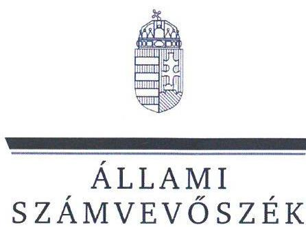
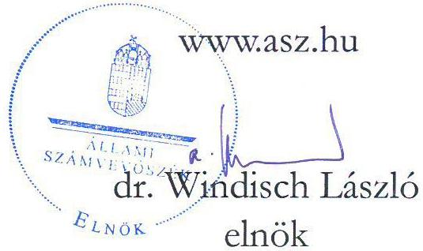
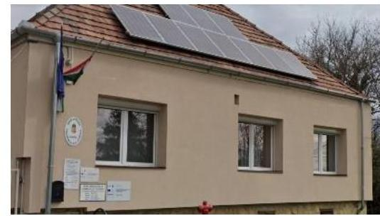
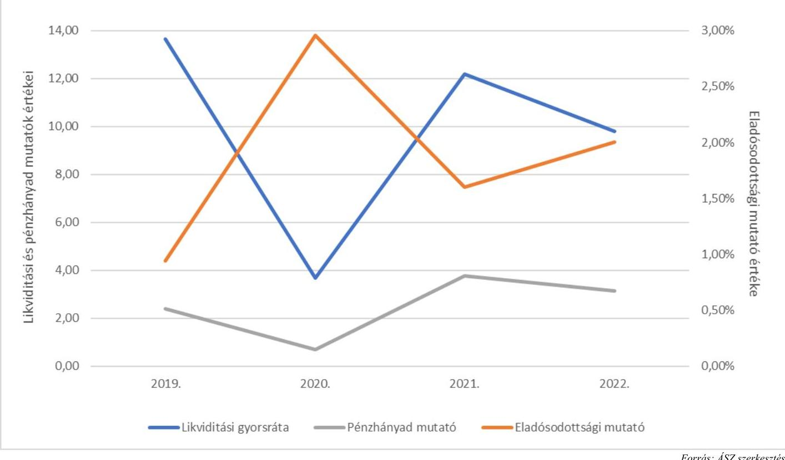
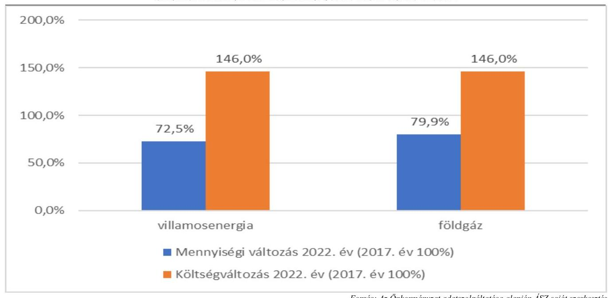
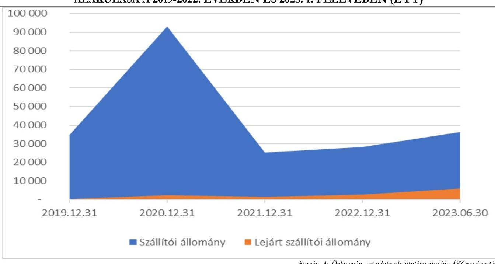

# JELENTÉS 

## Az önkormányzatok energiahatékonysági intézkedéseinek ellenőrzése

Üröm Község Önkormányzata

2024.

---

ÁLLAMI
SZÁMVEVŐSZÉK

# JELENTÉS 

## Az önkormányzatok energiahatékonysági intézkedéseinek ellenőrzése

Üröm Község Önkormányzata

2024. 

24020

---

# ELLENŐRZÉSI IGAZGATÓSÁG: 

## ÁLLAMHÁZTARTÁS HELYI SZINTJÉT ELLENŐRZŐ IGAZGATÓSÁG

## ELLENŐRZÉSI IGAZGATÓ:

DR. BAFFIA GERGELY GÁBOR igazgató

## ELLENŐRZÉSVEZETŐ:

Jelentéseink az interneten a www.asz.hu címen olvashatók.

HUDÁK MAGDOLNA ellenőrzésvezető

IKTATÓSZÁM: EL-3978-006/2024.
TÉMASZÁM: 2676
ELLENŐRZÉS-AZONOSÍTÓ SZÁM: V102002

---

# TARTALOMJEGYZÉK 

- AZ ELLENŐRZÉS ALAPADATAI ..... 5
- AZ ELLENŐRZÖTT SZERVEZET ..... 7
- ÖSSZEFOGLALÁS ..... 8
- AZ ELLENŐRZÉS FÓKUSZTERÜLETEI ..... 11
- MEGÁLLAPÍTÁSOK ..... 12
- JAVASLATOK ..... 25
- MELLÉKLETEK ..... 27
I. sz. melléklet: Értelmező szótár ..... 27
II. sz. melléklet: Az ellenőrzött szervezetek jegyzéke ..... 30
III. sz. melléklet: Ellenőrzési kritériumok ..... 31
IV. sz. melléklet: Tájékoztató adatok ..... 32
- FÜGGELÉK: ÉSZREVÉTELEK ..... 38
- RÖVIDÍTÉSEK JEGYZÉKE ..... 39

---

.

---

# AZ ELLENŐRZÉS ALAPADATAI 

## AZ ELLENŐRZÉS CÉLJA

Az ellenőrzés célja annak vizsgálata volt, hogy az Önkormányzat ${ }^{1}$ értékelte-e az energiaárak változásának a költségvetése végrehajtására, a gazdálkodására, valamint a kötelező és önként vállalt feladatainak ellátására gyakorolt hatását. Az ellenőrzés kiterjedt arra, hogy az Önkormányzat és a költségvetési szervei az energiaköltségek csökkentése érdekében tettek-e energiahatékonysági intézkedéseket, továbbá az Önkormányzat által tett intézkedések hozzájárultak-e a költségvetés pénzügyi egyensúlyának, a kötelező feladatok ellátásának a biztosításához.

## AZ ELLENŐRZÉS TÍPUSA

Megfelelőségi és teljesítmény ellenőrzés.

## AZ ELLENŐRZÖTT IDŐSZAK

A 2022. év és a 2023. év I. féléve.
Ezen túlmenően elemzési céllal a 3. fókuszterületnél a megkezdett és lebonyolított beruházások adatainak tanúsítványon történő bekérése tekintetében a 2017-2021. évek, továbbá a 4. fókuszterületnél a pénzügyi, egyensúlyi mutatók számítása esetében a 2019-2023. I. félévének időszaka.

## AZ ELLENŐRZÉS TÁRGYA

Az ellenőrzés tárgyát képezte az Önkormányzat és költségvetési szervei gazdálkodásának biztonsága és a kötelező feladatok ellátása érdekében - az energiaárak 2022. évi változásának ellensúlyozására - tett energiahatékonyságot növelő, energiamegtakarítást célzó, a pénzügyi egyensúly fenntartására tett intézkedések megfelelőségének és eredményességének értékelése a 2022. évben és a 2023. I. félévben.

Elemzési módszerrel a 2017-2021. években végrehajtott energiahatékonysági beruházások, fejlesztések, szakpolitikai intézkedésekben való részvétel értékelése a tekintetben, hogy azok megelőző intézkedést jelentettek-e, illetve befolyásolták-e az energiaköltségek csökkentése érdekében a 2022. évben és a 2023. I. félévében megtett intézkedéseket.

## AZ ELLENŐRZÉS JOGALAPJA

Az ellenőrzés jogszabályi alapját az ÁSZ tv. ${ }^{2} 5 . \S$ (2) bekezdés előírásai képezték.

---

# AZ ELLENŐRZÉS MÓDSZERE 

Az ellenőrzést az Alaptörvény ${ }^{3}$ 43. cikk (1) bekezdésében meghatározott törvényességi, célszerűségi szempontok, valamint a nemzetközi standardokat irányadónak tekintve az ellenőrzési program szempontjai, az ellenőrzött időszakban hatályos jogszabályok, az ellenőrzés szakmai szabályok és módszertanok figyelembevételével végezte az ÁSZ ${ }^{4}$.

Az ellenőrzési kérdések megválaszolásához szükséges bizonyítékok megszerzése az ellenőrzött szervezet által rendelkezésre bocsátott dokumentumokra és adatokra, valamint az ellenőrzést támogató szervezetektől ${ }^{5}$ kapott adatokra alapozva, továbbá megfigyelés, szemle (szemrevételezés), kérdésfeltevés (információkérés), valamint elemző eljárás útján történt.

Az ellenőrzés során bizonyítékként felhasználható adatforrások közé tartoztak egyrészt az ellenőrzéshez kért dokumentumok, adatforrások, másrészt adatforrás volt még a közhiteles (Elektronikus Közbeszerzési rendszer) és egyéb adatbázisból (Önkormányzati rendelettár) származó, az ellenőrzés szempontjából információkat tartalmazó dokumentum.

Az ellenőrzés lefolytatásához az ellenőrzött szervezet a tanúsítványok kitöltésével, valamint az ÁSZ által kért dokumentumok, adatok, információk megküldésével és a helyszíni ellenőrzés során interjú keretében szolgáltatott adatokat. A rendelkezésre bocsátott adatok, információk kontrolljára helyszíni ellenőrzés keretében is sor került. Ellenőrzést támogató szervezetként adatot kértünk a $\mathrm{BM}^{6}$-től, a $\mathrm{PM}^{7}$-től, az $\mathrm{EM}^{8}$-től, a $\mathrm{HM}^{9}$-től és a $\mathrm{ME}^{10}$-től az energiaáremelkedéssel kapcsolatos intézkedések keretében nyújtott állami támogatásokról, továbbá az EMIT-ek teljesítésére vonatkozóan a MEKH ${ }^{11}$-től, amely szervezet az Energetikusi Hálózaton keresztül támogatta a közintézmények Ehat. tv. ${ }^{12}$-ben foglalt adatszolgáltatási kötelezettségeinek teljesítését.

Az ellenőrzés során egy kockázati alapon kiválasztott önkormányzati beruházás előkészítése, megvalósítása, elszámolása, nyilvántartása tételes ellenőrzésre került.

Elemzési módszerrel tanúsítványon szolgáltatott adatok alapján értékeltük, hogy a 2017-2021 között végrehajtott (indított, illetve befejezett) energiahatékonyságot növelő, energiamegtakarítást célzó beruházások mennyiben befolyásolták, milyen hatással voltak a rendkívüli energiaár növekedések következtében a 2022. évben és a 2023. I. félévben megtett intézkedésekre.

A tanúsítványokon szolgáltatott adatok, az Önkormányzat által rendelkezésre bocsátott dokumentumok alapján értékeltük, hogy a meghozott takarékossági intézkedések hogyan érintették az Önkormányzat kötelező, illetve önként vállalt feladatainak ellátását, öt mutatószám (likviditási gyorsráta változása, eladósodottsági mutató, lejárt szállítói állomány változása, pénzhányad mutató alakulása) segítségével értékeltük az Önkormányzatnál a pénzügyi egyensúly fenntartására tett intézkedések eredményességét.

Az ellenőrzés kiterjedt minden olyan körülményre és adatra, amely az ÁSZ jogszabályban meghatározott feladatainak teljesítéséhez, valamint a program végrehajtása folyamán felmerült újabb összefüggések feltárásához szükséges volt.

---

# AZ ELLENŐRZÖTT SZERVEZET

Üröm község Pest vármegyében, a Pilisvörösvári járásban, a budapesti agglomerációban helyezkedik el. Lakóinak száma a KSH ${ }^{13}$ adata alapján 2023. január 1-jén 8 571 fő volt.

A település polgármestere 2002-től látta el tisztségét, a képviselő-testületnek a polgármesteren kívül nyolc fő képviselő tagja volt. Az Önkormányzat működésével kapcsolatos feladatokat a Hivatal ${ }^{14}$ végezte, a jegyző 2020. március 29-től vezette a Hivatalt.

Az Önkormányzat fenntartásában a Hivatalon kívül öt költségvetési szerv működött, az Ürömi Napraforgó Óvoda, Ürömi Hóvirág Bölcsőde, a Kossuth Lajos Közösségi Ház és Könyvtár, az Idősek Klubja, valamint az Ürömi Családsegítő és Gyermekjóléti Szolgálat. Az Önkormányzat tulajdonában az ellenőrzött időszakban nyolc közfeladat ellátását szolgáló épület volt.

Az Önkormányzat 2022. évi konszolidált beszámolójának főbb adatait az 1. táblázat mutatja be:

|  AZ ÖNKORMÁNYZAT 2022. ÉVI KONSZOLIDÁLT BESZÁMOLÓJÁNAK FŐBB ADATAI | 2022. ÉVI KONSZOLIDÁLT ÖNKORMÁNYZATI BESZÁMOLÓ (M Ft)  |
| --- | --- |
|  **MEGNEVEZÉS** | **1500,5**  |
|  **Költségvetési bevétel** |   |
|  **Ebből:** |   |
|  Működési célú támogatások államháztartáson belülről | 725,6  |
|  Felhalmozási célú támogatások államháztartáson belülről | 356,2  |
|  Közhatalmi bevételek | 311,9  |
|  **Költségvetési kiadás** | **1681,0**  |
|  **Ebből:** |   |
|  Dologi kiadások | 509,5  |
|  Ebből: közüzemi díjak | 35,3  |
|  Beruházások | 416,1  |
|  Felújítások | 49,0  |
|  **Finanszírozási bevételek** | **495,7**  |
|  **Ebből:** |   |
|  Belföldi értékpapír bevételei | 180,7  |
|  Maradvány igénybevétele | 291,3  |
|  **Államháztartáson belüli megelőlegezések** | **23,7**  |
|  **Finanszírozási kiadások** | **19,2**  |
|  **Ebből:** |   |
|  **Államháztartáson belüli megelőlegezések visszafizetése** | **19,2**  |

*Forrás: Az Önkormányzat 2022. évi konszolidált beszámolójának adatai 2019. 2020. 2021. 2022. 2023. 2024. 2025. 2026. 2027. 2028. 2029. 2030. 2031. 2032. 2033. 2034. 2035. 2036. 2037. 2038. 2039. 2040. 2041. 2042. 2043. 2044. 2045. 2046. 2047. 2048. 2049. 2050. 2051. 2052. 2053. 2054. 2055. 2056. 2057. 2058. 2059. 2060. 2061. 2062. 2063. 2064. 2065. 2066. 2067. 2068. 2069. 2070. 2071. 2072. 2073. 2074. 2075. 2076. 2077. 2078. 2079. 2080. 2081. 2082. 2083. 2084. 2085. 2086. 2087. 2088. 2089. 2090. 2091. 2092. 2093. 2094. 2095. 2096. 2097. 2098. 2099. 2010. 2011. 2012. 2013. 2014. 2015. 2016. 2017. 2018. 2019. 2020. 2021. 2022. 2023. 2024. 2025. 2026. 2027. 2028. 2029. 2030. 2031. 2032. 2033. 2034. 2035. 2036. 2037. 2038. 2039. 2040. 2041. 2042. 2043. 2044. 2045. 2046. 2047. 2048. 2049. 2050. 2051. 2052. 2053. 2054. 2055. 2056. 2057. 2058. 2059. 2060. 2061. 2062. 2063. 2064. 2065. 2066. 2067. 2068. 2069. 2070. 2071. 2072. 2073. 2074. 2075. 2076. 2077. 2078. 2079. 2080. 2081. 2082. 2083. 2084. 2085. 2086. 2087. 2088. 2089. 2090. 2091. 2092. 2093. 2094. 2095. 2096. 2097. 2098. 2099. 2010. 2011. 2012. 2013. 2014. 2015. 2016. 2017. 2018. 2019. 2020. 2021. 2022. 2023. 2024. 2025. 2026. 2027. 2028. 2029. 2030. 2031. 2032. 2033. 2034. 2035. 2036. 2037. 2038. 2039. 2040. 2041. 2042. 2043. 2044. 2045. 2046. 2047. 2048. 2049. 2050. 2051. 2052. 2053. 2054. 2055. 2056. 2057. 2058. 2059. 2060. 2061. 2062. 2063. 2064. 2065. 2066. 2067. 2068. 2069. 2070. 2071. 2072. 2073. 2074. 2075. 2076. 2077. 2078. 2079. 2080. 2081. 2082. 2083. 2084. 2085. 2086. 2087. 2088. 2089. 2090. 2091. 2092. 2093. 2094. 2095. 2096. 2097. 2098. 2099. 2010. 2011. 2012. 2013. 2014. 2015. 2016. 2017. 2018. 2019. 2020. 2021. 2022. 2023. 2024. 2025. 2026. 2027. 2028. 2029. 2030. 2031. 2032. 2033. 2034. 2035. 2036. 2037. 2038. 2039. 2040. 2041. 2042. 2043. 2044. 2045. 2046. 2047. 2048. 2049. 2050. 2051. 2052. 2053. 2054. 2055. 2056. 2057. 2058. 2059. 2060. 2061. 2062. 2063. 2064. 2065. 2066. 2067. 2068. 2069. 2070. 2071. 2072. 2073. 2074. 2075. 2076. 2077. 2078. 2079. 2080. 2081. 2082. 2083. 2084. 2085. 2086. 2087. 2088. 2089. 2090. 2091. 2092. 2093. 2094. 2095. 2096. 2097. 2098. 2099. 2010. 2011. 2012. 2013. 2014. 2015. 2016. 2017. 2018. 2019. 2020. 2021. 2022. 2023. 2024. 2025. 2026. 2027. 2028. 2029. 2030. 2031. 2032. 2033. 2034. 2035. 2036. 2037. 2038. 2039. 2040. 2041. 2042. 2043. 2044. 2045. 2046. 2047. 2048. 2049. 2040. 2041. 2042. 2043. 2045. 2046. 2047. 2048. 2049. 2040. 2042. 2043. 2044. 2045. 2046. 2047. 2048. 2049. 2040. 2041. 2042. 2043. 2045. 2046. 2047. 2048. 2049. 2040. 2042. 2043. 2045. 2046. 2047. 2048. 2049. 2040. 2041. 2042. 2043. 2045. 2046. 2047. 2048. 2049. 2040. 2042. 2043. 2045. 2046. 2047. 2048. 2049. 2040. 2041. 2042. 2043. 2045. 2046. 2047. 2048. 2049. 2040. 2042. 2043. 2045. 2046. 2047. 2048. 2049. 2040. 2042. 2043. 2045. 2046. 2047. 2048. 2049. 2040. 2042. 2043. 2045. 2046. 2047. 2048. 2049. 2040. 2042. 2043. 2045. 2046. 2047. 2048. 2049. 2040. 2042. 2043. 2045. 2046. 2047. 2048. 2049. 2040. 2042. 2043. 2045. 2046. 2047. 2048.
 2049. 2040. 2042. 2043. 2045. 2046. 2047. 2048. 2049. 2040. 2042. 2043. 2045. 2046. 2047. 2048. 2049. 2040. 2042. 2043. 2045. 2046. 2047. 2048. 2049. 2040. 2042. 2043. 2045. 2046. 2047. 2048. 2049. 2040. 2042. 2043. 2045. 2046. 2047. 2048. 2049. 2040. 2042. 2043. 2045. 2046. 2047. 2048. 2049. 2040. 2042. 2043. 2045. 2046. 2047. 2048. 2049. 2040. 2042. 2043. 2045. 2046. 2047. 2048. 2049. 2040. 2042. 2043. 2045. 2046. 2047. 2048. 2049. 2040. 2042. 2043. 2045. 2046. 2047. 2048. 2049. 2040. 2042. 2043. 2045. 2046. 2047. 2048. 2049. 2040. 2042. 2043. 2045. 2046. 2047. 2048. 2040. 2042. 2043. 2045. 2046. 2047. 2048. 2048. 2049. 2040. 2042. 2043. 2045. 2046. 2047. 2048. 2049. 2040. 2042. 2043. 2045. 2046. 2047. 2048. 2049. 2040. 2042. 2043. 2045. 2046. 2047. 2048. 2040. 2042. 2043. 2045. 2046. 2047. 2048. 2049. 2040. 2042. 2043. 2045. 2046. 2047. 2048. 2049. 2040. 2042. 2043. 2045. 2046. 2047. 2048. 2040. 2042. 2043. 2045. 2046. 2047. 2048. 2040. 2042. 2043. 2045. 2046. 2047. 2048. 2040. 2042. 2043. 2045. 2046. 2047. 2048. 2040. 2042. 2043. 2045. 2046. 2047. 2048. 2040. 2042. 2043. 2045. 2046. 2047. 2048. 2040. 2040. 2042. 2043. 2045. 2046. 2047. 2048. 2040. 2040. 2040. 2042. 2043. 2045. 2046. 2047. 2048. 2040. 2040. 2042. 2043. 2045. 2046. 2047. 2048. 2040. 2042. 2043. 2045. 2046. 2047. 2048. 2040. 2042. 2043. 2045. 2046. 2047. 2048. 2040. 2040. 2040. 2040. 2040. 2040. 2040. 2040. 2040. 2040. 2040. 2040. 2040. 2040. 2040. 2040. 2040. 2040. 2040. 2040. 2040. 2040. 2040. 2040. 2040. 2040. 2040. 2040. 2040. 2040. 2040. 2040. 2040. 2040. 2040. 2040. 2040. 2040. 2040. 2040. 2040. 2040. 2040. 2040. 2040. 2040. 2040. 2040. 2040. 2040. 2040. 2040. 2040. 2040. 2040. 2040. 2040. 2040. 2040. 2040. 2040. 2040. 2040. 2040. 2040. 2040. 2040. 2040. 2040. 2040. 2040. 2040. 2040. 2040. 2040. 2040. 2040. 2040. 2040. 2040. 2040. 2040. 2040. 2040. 2040. 2040. 2040. 2040. 2040. 2040. 2040. 2040. 2040. 2040. 2040. 2040. 2040. 2040. 2040. 2040. 2040. 2040. 2040. 2040. 2040. 2040. 2040. 2040. 2040. 2040. 2040. 2040. 2040. 2040. 2040. 2040. 2040. 2040. 2040. 2040. 2040. 2040. 2040. 2040. 2040. 2040. 2040. 2040. 2040. 2040. 2040. 2040. 2040. 2040. 2040. 2040. 2040. 2040. 2040. 2040. 2040. 2040. 2040. 2040. 2040. 2040. 2040. 2040. 2040. 2040. 2040. 2040. 2040. 2040. 2040. 2040. 2040. 2040. 2040. 2040. 2040. 2040. 2040. 2040. 2040. 2040. 2040. 2040. 2040. 2040. 2040. 2040. 2040. 2040. 2040. 2040. 2040. 2040. 2040. 2040. 2040. 2040. 2040. 2040. 2040. 2040. 2040. 2040. 2040. 2040. 2040. 2040. 2040. 2040. 2040. 2040. 2040. 2040. 2040. 2040. 2040. 2040. 2040. 2040. 2040. 2040. 2040. 2040. 2040. 2040. 2040. 2040. 2040. 2040. 2040. 2040. 2040. 2040. 2040. 2040. 2040. 2040. 2040. 2040. 2040. 2040. 2040. 2040. 2040. 2040. 2040. 2040. 2040. 2040. 2040. 2040. 2040. 2040. 2040. 2040. 2040. 2040. 2040. 2040. 2040. 2040. 2040. 2040. 2040. 2040. 2040. 2040. 2040. 2040. 2040. 2040. 2040. 2040. 2040. 2040. 2040. 2040. 2040. 2040. 2040. 2040. 2040. 2040. 2040. 2040. 2040. 2040. 2040. 2040. 2040. 2040. 2040. 2040. 2040. 2040. 2040. 2040. 2040. 2040. 2040. 2040. 2040. 2040. 2040. 2040. 2040. 2040. 2040. 2040. 2040. 2040. 2040. 2040. 2040. 2040. 2040. 2040. 2040. 2040. 2040. 2040. 2040. 2040. 2040. 2040. 2040. 2040. 2040. 2040. 2040. 2040. 2040. 2040. 2040. 2040. 2040. 2040. 2040. 2040. 2040. 2040. 2040. 2040. 2040. 2040. 2040. 2040. 2040. 2040. 2040. 2040. 2040. 2040. 2040. 2040. 2040. 2040. 2040. 2040. 2040. 2040. 2040. 2040. 2040. 2040. 2040. 2040. 2040. 2040. 2040. 2040. 2040. 2040. 2040. 2040. 2040. 2040. 2040. 2040. 2040. 2040. 2040. 2040. 2040. 2040. 2040. 2040. 2040. 2040. 2040. 2040. 2040. 2040. 2040. 2040. 2040. 2040. 2040. 2040. 2040. 2040. 2040. 2040. 2040. 2040. 2040. 2040. 2040. 2040. 2040. 2040. 2040. 2040. 2040. 2040. 2040. 2040. 2040. 2040. 2040. 2040. 2040. 2040. 2040. 2040. 2040. 2040. 2040. 2040. 2040. 2040. 2040. 2040. 2040. 2040. 2040. 2040. 2040. 2040. 2040. 2040. 2040. 2040. 2040. 2040. 2040. 2040. 2040. 2040. 2040. 2040. 2040. 2040. 2040. 2040. 2040. 2040. 2040. 2040. 2040. 2040. 2040. 2040. 2040. 2040. 2040. 2040. 2040. 2040. 2040. 2040. 2040. 2040. 2040. 2040. 2040. 2040. 2040. 2040. 2040. 2040. 2040. 2040. 2040. 2040. 2040. 2040. 2040. 2040. 2040. 2040. 2040. 2040. 2040. 2040. 2040. 2040. 2040. 2040. 2040. 2040. 2040. 2040. 2040. 2040. 2040. 2040. 2040. 2040. 2040. 2040. 2040. 2040. 2040. 2040. 2040. 2040. 2040. 2040. 2040. 2040. 2040. 2040. 2040. 2040. 2040. 2040. 2040. 2040. 2040. 2040. 2040. 2040. 2040. 2040. 2040. 2040. 2040. 2040. 2040. 2040. 2040. 2040. 2040. 2040. 2040. 2040. 2040. 2040. 2040. 2040. 2040. 2040. 2040. 2040. 2040. 2040. 2040. 2040. 2040. 2040. 2040. 2040. 2040. 2040. 2040. 2040. 2040. 2040. 2040. 2040. 2040. 2040. 2040. 2040. 2040. 2040. 2040. 2040. 2040. 2040. 2040. 2040. 2040. 2040. 2040. 2040. 2040. 2040. 2040. 2040. 2040. 2040. 2040. 2040. 2040. 2040. 2040. 2040. 2040. 2040. 2040. 2040. 2240. 2040. 2040. 2040. 2040. 2040. 2040. 2040. 2040. 2040. 2040. 2040. 2040. 2040. 2040. 2040. 2040. 2040. 2040. 2040. 2040. 2040. 2040. 2040. 2040. 2040. 2040. 2040. 2040. 2040. 2040. 2040. 2040. 2040. 2040. 2040. 2040. 2040. 2040. 2040. 2040. 2040. 2040. 2040. 2040. 2040. 2040. 2040. 2040. 2040. 2040. 2040. 2040. 2040. 2040. 2040. 2040. 2040. 2040. 2040. 2040. 2040. 2040. 2040. 2040. 2040. 2040. 2040. 2040. 2040. 2040. 2040. 2040. 2040. 2040. 2040. 2040. 2040. 2040. 2040. 2040. 2040. 2040. 2040. 2040. 2040. 2040. 2040. 2040. 2040. 2040. 2040. 2040. 2040. 2040. 2040. 2040. 2040. 2040. 2040. 2040. 2040. 2040. 2040. 2040. 2040. 2040. 2040. 2040. 2040. 2040. 2040. 2040. 2040. 2040. 2040. 2040. 2040. 2040. 2040. 2040. 2040. 2040. 2040. 2040. 2040. 2040. 2040. 2040. 2040. 2040. 2040. 2040. 2040. 2040. 2040. 2040. 2040. 2040. 2040. 2040. 2040. 2040. 2040. 2040. 2040. 2040. 2040. 2040. 2040. 2040. 2040. 2040. 2040. 2040. 2040. 2040. 2040. 2040. 2040. 2040. 2040. 2040. 2040. 2040. 2040. 2040. 2040. 2040. 2040. 2040. 2040. 2040. 2040. 2040. 2040. 2040. 2040. 2040. 2040. 2040. 2040. 2040. 2040. 2040. 2040. 2040. 2040. 2040. 2040. 2040. 2040. 2040. 2040. 2040. 2040. 2040. 2040. 2040. 2040. 2040. 2040. 2040. 2040. 2040. 2040. 2040. 2040. 2040. 2040. 2040. 2040. 2040. 2040. 2040. 2040. 2040. 2040. 2040. 2040. 2040. 2040. 2040. 2040. 2040. 2040. 2040. 2040. 2040. 2040. 2040. 2040. 2040. 2040. 2040. 2040. 2040. 2040. 2040. 2040. 2040. 2040. 2040. 2040. 2040. 2040. 2040. 2040. 2040. 2040. 2040. 2040. 2040. 2040. 2040. 2040. 2040. 2040. 2040. 2040. 2040. 2040. 2040. 2040. 2040. 2040. 2040. 2040. 2040. 2040. 2040. 2040. 2040. 2040. 2040. 2040. 2040. 2040. 2040. 2040. 2040. 2040. 2040. 2040. 2040. 2040. 2040. 2040. 2040. 2040. 2040. 2040. 2040. 2040. 2040. 2040. 2040. 2040. 2040. 2040. 2040. 2040. 2040. 2040. 2040. 2040. 2040. 2040. 2040. 2040. 2040. 2040. 2040. 2040. 2040. 2040. 2040. 2040. 2040. 2040. 2040. 2040. 2040. 2040. 2040. 2040. 2040. 2040. 2040. 2040. 2040. 2040. 2040. 2040. 2040. 2040. 2040. 2040. 2040. 2040. 2040. 2040. 2040. 2040. 2040. 2040. 2040. 2040. 2040. 2040. 2040. 2040. 2040. 2040. 2040. 2040. 2040. 2040. 2040. 2040. 2040. 2040. 2040. 2040. 2040. 2040. 2040. 2040. 2040. 2040. 2040. 2040. 2040. 2040. 2040. 2040. 2040. 2040. 2040. 2040. 2040. 2040. 2040. 2040. 2040. 2040. 2040. 2040. 2040. 2040. 2040. 2040. 2040. 2040. 2040. 2040. 2040. 2040 Application felelt meg a jogszabályi előírásoknak, mivel nem készítették el az EMIT-eket, az épületekkel kapcsolatos energiahatékonysági feladatok ellátására energetikai felelőst nem jelöltek ki, az energiafogyasztási adatokra vonatkozó adatszolgáltatási kötelezettséget nem teljesítették. Az Önkormányzat tulajdonában álló nyolc közfeladat ellátását szolgáló épületből négynek kellett energetikai tanúsítvánnyal rendelkeznie, amelyeket az Önkormányzat elkészíttetett. A polgármester a jogszabályi előírások ellenére nem határozta meg a Hivatal, a jegyző, valamint az intézményvezetők energiahatékonyságról szóló törvényből eredő kötelezettségek teljesítésében való közreműködéssel kapcsolatos feladatait, a jegyző nem kísérte figyelemmel az energiahatékonyságról szóló törvényben foglalt feladatok végrehajtását.

Az Önkormányzat az ellenőrzött időszakban nagyösszegű befektetett pénzügyi eszközei miatt (a 2019–2022. évek között év végén az értékpapírok állománya 397,5-736,7 M Ft között alakult) az energiaárak jelentős emelkedése mellett is fenn tudta tartani működőképességét. Az energiakiadások csökkentése, a pénzügyi egyensúly fenntartása érdekében a 2022. évben a Képviselő-testület több, az intézményi körre is kiterjedő intézkedést hozott (pl. intézmények fűtési hőmérsékletének maximalizálása, az épületek időszakos zárva tartása), amelynek költségvetési hatását azonban nem számszerűsítették. Az Önkormányzat minden saját erőből megvalósított beruházása energiahatékonysági célokat szolgált, azonban azok 2023-ban záródtak le, ezért hatásuk visszamérésére az ellenőrzés 2023 november végi lezárásig még nem került sor. A Képviselő-testület a kiadáscsökkentő intézkedések mellett 2023. január 1-jei hatállyal módosította a helyi adó rendeletét is, amely alapján az építményadó alapterülethez kapcsolódó sávos megállapításával a 2023. I. félévében 80,0 M Ft-tal növelték a bevételeket. Az Önkormányzat által megtett intézkedések támogatták a kötelező feladatok ellátását, azonban az energiaárak emelkedésének ellensúlyozásában ezen intézkedéseknél jelentősebb hatással bírtak az Önkormányzat nagyösszegű befektetett pénzügyi eszközei.

A jogszabályi előírások szerint az államháztartásért felelős miniszter döntése alapján külön kérelem benyújtása nélkül közvilágítás kiegészítő támogatás címen 10,9 MFt, óvoda működtetési támogatás-üzemeltetési támogatás címen 1,8 MFt, intézményi gyermekétkeztetés-üzemeltetési támogatás címen 16,9 MFt központi támogatásban részesült az Önkormányzat. Az Önkormányzat nem készített menedzsmenttervet és ez alapján többlettámogatási kérelmet nem nyújtott be, nem tett nyilatkozatokat a kedvezményes árszabású

---

energiavásárlásra vonatkozóan. Három költségvetési szerv esetében a megkötött energiavásárlási szerződés nem felelt meg a jogszabályi előírásoknak, mivel a szerződést az arra jogosult intézményvezető helyett a polgármester kötötte meg. Az Önkormányzat által a 2022. évben a közvilágításra megkötött szerződés sem felelt meg a jogszabályi előírásoknak, mivel a szerződést a beszerzés értékét figyelmen kívül hagyva a közbeszerzési eljárás mellőzésével kötötték meg.

Az Önkormányzat pénzügyi helyzete - jelentős megtakarításai miatt - a 2019-2023. I. féléve között stabil volt, azonban az áremelkedések miatti többletkiadások, valamint saját erőből megvalósított energetikai célú beruházások finanszírozása érdekében az Önkormányzatnak a 2022. és 2023. évben fel kellett használnia megtakarításai egy részét is. Az értékpapírok állománya a 2021. évi 736,7 M Ft-ról 2022-re 556,0 M Ft-ra, 2023. I. félévére 431,0 M Ft-ra csökkent. Az értékpapír állomány csökkenésére vezethető vissza a 2021. évtől 2023. I félévéig a likviditási gyorsráta, a pénzhányad mutató és az eladósodottsági mutató értékeinek romlása is, amelyek azonban még így is a kedvező referencia tartományban maradtak. A saját megtakarítások felhasználása az energiaárak emelkedését ellensúlyozó kormányzati támogatások igénybevételével mérsékelhető lett volna.

A mutatószámok alakulását az 1. ábra szemlélteti.
1. ábra

ÜRÖM KÖZSÉG ÖNKORMÁNYZATA PÉNZÜGYI MUTATÓSZÁMAI (2019-2022. ÉVEK KÖZÖTT)

Forrás: ÁSZ szerkesztés
Az Önkormányzat által végrehajtott energiahatékonyságot növelő, energiamegtakarítást célzó fejlesztésekkel kapcsolatos döntések előkészítése részben volt megfelelő, mivel a fejlesztések forrásait a költségvetésben tervezték, a jogszabályban foglaltak ellenére azonban a fejlesztési döntések előkészítése vonatkozásában nem építettek ki a szervezeti célok elérését veszélyeztető kockázatok csökkentésére irányuló kontrollokat a döntések célszerűségi, gazdaságossági, hatékonysági és eredményességi szempontú megalapozottsága érdekében. Nem vizsgálták a létrejövő tárgyi eszközök, berendezések üzemeltetésével,

---

működtetésével, karbantartásával kapcsolatos várható kiadásokat, amelyek kockázatot jelenthetnek az önkormányzat stabil pénzügyi egyensúlyi helyzetének szinten tartására.

A beruházás elért eredményeit, hatását a pályázati forrásból megvalósított beruházás esetében a záró beszámolóban számszerűsítették, azonban a pályázatban meghatározott indikátorok teljesítését valós mérési adatokkal nem támasztották alá. Ugyanakkor a fejlesztésekkel érintett intézmények villamosenergia- és földgázfogyasztása az aktiválást megelőző évekhez képest csökkent, amelyhez a végrehajtott energiahatékonysági beruházások is hozzájárultak.

A tételes ellenőrzésre kiválasztott Közvilágítás korszerűsítés tárgyú, bruttó 44,2 M Ft összegű beruházás lebonyolítása során - a következő kivételektől eltekintve - a jogszabályok, valamint a belső szabályzatok előírásait betartották. A beruházással kapcsolatos kötelezettségvállalás nyilvántartásba vétele a jogszabályi előírások ellenére nem történt meg, az eszközök üzembe helyezése, valamint a számviteli elszámolása és nyilvántartásba vétele nem a számviteli szabályoknak megfelelően történt.

A belső ellenőrzési tevékenység az energiagazdálkodást, energiahatékonyságot az ellenőrzött időszakban közvetlenül nem érintette, a jelen ellenőrzés fókuszterületeihez kapcsolódóan egy, az Önkormányzat beruházási tevékenységére vonatkozó szabályszerűségi ellenőrzést végzett. A belső ellenőrzés által megfogalmazott, a beruházás megvalósításának előkészítésére vonatkozó javaslat összhangban volt a jelen ÁSZ ellenőrzés megállapításaival. Az Önkormányzatnál az ellenőrzött időszakban a belső ellenőrzés hozzájárult a beruházási tevékenység szabályszerűségéhez.

Az ÁSZ az ellenőrzés során feltárt hiányosságok felszámolása, a szabályszerű működés feltételeinek megteremtése érdekében a polgármesternek öt, a jegyzőnek nyolc javaslatot tett.

---

# AZ ELLENŐRZÉS FÓKUSZTERÜLETEI 

1.- Az önkormányzat és költségvetési szervei tulajdonában, illetve használatában álló, közfeladat ellátását szolgáló épületekkel kapcsolatos energetikai üzemeltetési és fenntartási feladatellátás
2.- Az energiaárak változására tekintettel a gazdálkodás biztonsága érdekében a központi intézkedések adta lehetőségek önkormányzat általi hasznosítása
3.- Az energiaköltségek csökkentése, az energiahatékonyság növelése érdekében kezdeményezett, illetve folyamatban lévő energetikai beruházások értékelése
4.- Az energiaárak hatásának kezelésére, a kötelező feladatok ellátására, a pénzügyi egyensúly fenntartására tett intézkedések értékelése

---

# 1. Az önkormányzat és költségvetési szervei tulajdonában, illetve használatában álló, közfeladat ellátását szolgáló épületekkel kapcsolatos energetikai üzemeltetési és fenntartási feladatellátás 

Összegző megállapítás Az Önkormányzat és költségvetési szervei tulajdonában, illetve használatában álló, közfeladat ellátását szolgáló épületekkel kapcsolatos energetikai üzemeltetési és fenntartási feladatellátás nem felelt meg az Ehat. tv., az Mötv. ${ }^{15}$, valamint a 122/2015. (V. 26.) Korm. rendelet ${ }^{16}$ előírásainak.

Az ellenőrzött időszakban az Önkormányzat és költségvetési szervei tulajdonában, illetve használatában nyolc közfeladat ellátásban érintett épület volt, amelyből négyre nem kellett energetikai tanúsítványt, illetve az energetikai jellemzőket tartalmazó nyilvántartást készíteni, mivel alapterületük nem haladta meg az 500 m$^{2}$-t. További négy közfeladat ellátást szolgáló épület (Óvoda ${ }^{17}$, a Bölcsőde ${ }^{18}$, a Hivatal és az egészségház épülete) rendelkezett a 176/2008. (VI. 30.) Korm. rendelet ${ }^{19}$ 1. § (3) bekezdés szerinti energetikai tanúsítvánnyal.
Az Önkormányzat és költségvetési szervei vezetői az Ehat. tv. 11/A. §-ában előírt, közfeladat ellátását szolgáló épületekkel kapcsolatos energiahatékonysági feladatait nem látták el.

- Az Ehat. tv. 11/A. § a) pontjának előírása ellenére a közfeladat ellátását szolgáló épületekre vonatkozóan nem készítették el az energiamegtakarítási intézkedési terveket.
- az Ehat. tv. 11/A. § c) pontjának, valamint a 122/2015. (V. 26.) Korm. rendelet 7/F. § előírásának ellenére nem jelentették be havi rendszerességgel az épületekre, illetve épületrészekre vonatkozó energiafogyasztási adatokat.
- Az Ehat. tv. 11/A. § i) pontjában foglaltak ellenére az épületekkel kapcsolatos energiahatékonysági feladatok ellátása és a Nemzeti Energetikusi Hálózattal történő kapcsolattartás céljából nem jelöltek ki energetikai felelőst.
- A közfeladat ellátását szolgáló, energetikai tanúsítvánnyal rendelkező épületek energetikai tanúsítványait az Ehat. tv. 11/A. § f) pontjának előírása ellenére a Nemzeti Energetikusi Hálózat által üzemeltetett online felületre nem töltötték fel.
Az ellenőrzött időszakban a polgármester az Ehat. tv. 11/A. §-ában foglalt felelőssége körében, a közfeladat ellátását szolgáló épületek tulajdonosának képviseletében az üzemeltetéséért és fenntartásáért felelős vezetőként, valamint az Mötv. 67. § a), f) és g) pontjai ellenére irányítási és munkáltatói jogkörében nem határozta meg a Hivatal, a jegyző, továbbá az intézményvezetők Ehat. tv.-ből eredő kötelezettségek teljesítésében való közreműködéssel kapcsolatos feladatait. A jegyző, az Mötv. 81. § (3) bekezdés c) pont előírása ellenére nem kísérte figyelemmel az Önkormányzat és

---

költségvetési szervei vezetőinek a közfeladat ellátásában érintett épületekkel kapcsolatos Ehat. tv. 11/A. §-ában foglalt feladatainak végrehajtását.

# 2. Az energiaárak változására tekintettel a gazdálkodás biztonsága érdekében a központi intézkedések adta lehetőségek önkormányzat általi hasznosítása 

| Összegző megállapítás | Az Önkormányzat nem élt az energiaárak változására   tekintettel hozott központi intézkedések adta   lehetőségekkel, az energiaszolgáltatás biztonsága, valamint   a kedvezményes árak érvényesítése érdekében   nyilatkozatokat nem tett, a közüzemi szerződések megkötése   több esetben nem felelt meg a jogszabályi előírásoknak. |
| :-- | :-- |

Az energiaárak jelentős emelkedésével párhuzamosan a Kormány több olyan intézkedést hozott, amelyeknek célja volt az energiaválság kezelésének megkönnyítése az önkormányzatok és intézményeik számára. A kormányzati intézkedéseket és az azokhoz kapcsolódó önkormányzati nyilatkozatokat az alábbi táblázat mutatja be.

## 2. táblázat

A KORMÁNY ÁLTAL BIZTOSÍTOTT LEHETŐSÉGEKHEZ KAPCSOLÓDÓAN MEGTETT NYILATKOZATOK SZÁMA (DB)

| KORMÁNYZATI INTÉZKEDÉS | ÖNKORMÁNYZAT |  | KÖLTSÉGVETÉSI SZERVEK |  |
| :--: | :--: | :--: | :--: | :--: |
|  | IGEN | NEM | IGEN | NEM |
| Végső menedékes jogintézmény keretében biztosított villamosenergia-ellátás - 217/2022. (VI.17) Korm. rendelet ${ }^{20} 3 . \S$ | 0 | 1 | 0 | 6 |
| Végső menedékes jogintézmény keretében biztosított földgázellátás 217/2022. (VI.17) Korm. rendelet 8. § | 0 | 1 | 0 | 6 |
| Teljes ellátás alapú veszélyhelyzeti átmeneti villamosenergia-ellátás biztosítása 520/2022. (XII. 13.) Korm. rendelet ${ }^{21} 5 . \S$ | 0 | 1 | 0 | 6 |
| Veszélyhelyzeti átmeneti földgázellátás biztosítása 388/2022. (X.14.) Korm. rendelet ${ }^{22} 4 . \S$ | 0 | 1 | 0 | 6 |
| Fixált áras árképzésű villamosenergia vásárlás 41/2023. (II. 20) Korm. rendelet ${ }^{23} 2 . \S$ | 0 | 1 | 0 | 6 |
| Fixált áras árszabású földgáz vásárlás 12/2023. (I. 20) Korm. rendelet ${ }^{24} 2 . \S$ | 0 | 1 | 0 | 6 |
| Földgáz-kereskedelmi szerződésben rögzített minimális mennyiség érvényesítése - 354/2022. (IX.19) Korm. rendelet ${ }^{25} 2 . \S$ | 0 | 1 | 0 | 6 |

Forrás: ÁSZ szerkesztés az ellenőrzött által szolgáltatott adatok alapján
Az Önkormányzat a villamosenergia és földgáz ellátás biztosítása céljából meghozott központi intézkedések lehetőségeivel nem élt, az önkormányzati költségvetési szervek vezetőinek figyelmét sem hívta fel ezekre a lehetőségekre.
Az Önkormányzat és intézményei energiaellátása az ellenőrzött időszakban biztosított volt, azonban az ellátás biztosításáról szóló hatályos szerződéseket az ellenőrzés során nem tudták hiánytalanul bemutatni. Ezzel megsértették az Ávr. ${ }^{26}$ 52. §(1) bekezdésében foglaltakat, mivel

---

ezekben az esetekben a közüzemi díjak kifizetéséhez kapcsolódó kötelezettségvállalás dokumentuma nem állt rendelkezésre. A villamosenergia és földgáz szerződések rendelkezésre állására vonatkozó információkat a IV. számú melléklet 6. táblázata foglalja össze.
Az energiaköltségek emelkedése ellenére az Önkormányzat nem élt azokkal a lehetőségekkel, amelyeket a Kormány az energiaárak növekedésének ellensúlyozására érdekében bevezetett. Ugyanakkor az energiaszolgáltató által közzétett végső menedékes, illetve fixált áras tarifákat összevetve az Önkormányzat által ténylegesen fizetett villamosenergia és földgáz beszerzési egységárak alapján megállapítható, hogy az Önkormányzat - a 2022. év elején megkötött új közüzemi szerződéseinek köszönhetően - az energiát nem vásárolta magasabb egységáron, mintha élt volna a kormányzati intézkedések adta lehetőségekkel.
Az energiaárak változása miatt, illetve az energiaellátás folyamatosságának biztosítása érdekében az Önkormányzat és a Hivatal - részben még az ellenőrzött időszak előtt - az energiaszolgáltatásra vonatkozó egyes szerződéseit újrakötötte. Az Önkormányzat saját szerződésein túl a Hivatal, az Óvoda, a Bölcsőde és a Közösségi ház ${ }^{27}$ villamosenergia ellátására vonatkozó szerződéseket is megkötötte. Ezen intézményi szerződések esetében a kötelezettségvállaló a polgármester volt, amivel megsértette az Ávr. 52. § (1) a) pontjában foglalt előírást, amely szerint költségvetési szerv vonatkozásában kötelezettségvállalásra a kötelezettséget vállaló szerv vezetője, vagy az általa írásban felhatalmazott, a kötelezettséget vállaló szerv alkalmazásában álló személy jogosult.

- Az ÁSZ ellenőrzés ideje alatt nem állt rendelkezésre az Önkormányzat, a Bölcsőde, az Óvoda és a Kossuth Lajos Közösségi Ház és Könyvtár földgáz vásárlásra, az Óvoda, és az Idősek Klubja villamosenergia vásárlásra vonatkozó hatályos szerződése. Az Önkormányzat tájékoztatása szerint a helyszíni ellenőrzés ideje alatt a szolgáltatóktól a hiányzó szerződések másolatait megkérték.
- A szerződések hiányában nem volt ismert, hogy a költségvetési szervek közül melyik kötött önállóan szerződést a villamosenergia és a földgáz vásárlásra, és mely intézmények ellátását biztosították a polgármester által aláírt, Önkormányzat nevében kötött szerződésekkel.
Az egyes szerződések hiánya a felhasznált villamosenergia és földgáz számlák kiegyenlítése során szabálytalanságot eredményezett. A hiányzó szerződések (kötelezettségvállalási dokumentumok) esetében a felhasznált villamosenergia és földgáz számlák kiegyenlítése során a teljesítésigazolási és érvényesítési feladatok ellátása nem felelt meg az Ávr. 57. § (1) bekezdésében és az 58. § (1) bekezdésében előírtaknak.
A helyszíni ellenőrzés során a Hivatal Pénzügyi irodavezetője által tett nyilatkozat szerint a villamosenergia és földgáz beszerzésre vonatkozó szerződések megkötése előtt a közbeszerzési eljárás lefolytatásának szükségességét nem vizsgálták, közbeszerzési eljárást nem folytattak le. Ezzel - az ellenőrzött időszakban (2022. januárjában) az Önkormányzat által a közvilágításra kötött határozatlan idejű villamosenergia vásárlási szerződések esetében - megsértették a Kbt. ${ }^{28}$ 4. § (1) bekezdés előírásait.
- A Kbt. 17. § (2) bekezdés a) pontja és a (3) bekezdés b) pontjának előírásai alapján az árubeszerzés vagy szolgáltatás becsült értéke határozatlan időre kötött szerződés esetében a havi ellenszolgáltatás negyvennyolcszorosa. Az Önkormányzat által a közvilágításra teljesített villamosenergia beszerzés 2021. évi kiadásainak négy évre vetített összege 48 540,1 E Ft volt, így az Önkormányzat által a közvilágításra teljesített villamosenergia beszerzés becsült értéke meghaladta a Kbt. 15. § (1) bekezdés b) pontja és a Magyarország 2021. évi központi költségvetéséről szóló 2021. évi XC. törvény 74. § (1) bekezdés d) pontja szerinti 15 000,0 E Ft-os közbeszerzési értékhatárt.

---

Az Önkormányzat a 449/2022. (XI. 9.) Korm. rendelet ${ }^{29}$ 1. § (1) bekezdésében foglaltak ellenére a közvilágítás korlátozására vonatkozó rendeletet nem alkotott és a közvilágítást nem korlátozta, mivel annak időszakos lekapcsolása műszakilag nem volt lehetséges.

- Az Önkormányzat az energiafelhasználás csökkentése és az energiaköltségek mérséklése érdekében hozott 117/2022. (X. 26.) számú képviselő-testületi határozatban döntött arról, hogy egyeztetni kell a közvilágítást biztosító szolgáltatóval a közvilágítás időszakos lekapcsolásának lehetőségéről. A szolgáltató válasza alapján a közvilágítás korlátozására, időszakos lekapcsolására nem volt lehetőség, erről a polgármester tájékoztatta a képviselő-testületet, így nem került sor a közvilágítás korlátozására.
Az Önkormányzat és intézményei 2022. évi energiaköltségei az előző évi adathoz képest 75,9 %-kal voltak magasabbak, a 2023. I. félévben pedig már a 2022. teljes évi kiadásoknak a 137,0 %-a teljesült az elfogyasztott energiamennyiség csökkenése mellett. Az összes költségnövekedéshez hozzájárult, hogy a - teljes energiaköltségből legnagyobb összeget kitevő - Óvoda villamosenergia és földgáz kiadásai 2022-ben az előző évi összeghez képest összességében 61,0 %-kal, 2023. I. félévében az előző évi egész éves kiadásnak több mint kétszeresére (122,8 %-kal) emelkedtek, amely növekedés azonban nem az áremelkedésre, hanem egy 2023-ban kiszámlázott 2022. évre vonatkozó számla kiegyenlítésére vezethető vissza. Az Óvodánál 2022. október 2-től szerződés nélkül történt a földgáz ellátás. Az intézmény 2023. I. félévi energiaköltségének ugrásszerű emelkedését egy utólag kiszámlázott 10 115,7 E Ft összegű számla 2023. április 4-ei kiegyenlítése okozta. Ezt az utólagos, 2022. évre vonatkozó számlát figyelmen kívül hagyva a 2023. I. félévében a gázenergia költségei nem érték el a 2022. évi időarányos értéket, az az előző évhez képest 42,8 % volt.
Az Önkormányzat és költségvetési szervei 2017-2023. I. félévi energiafelhasználási költségeit részletesen a IV. számú melléklet 1. táblázata, az energiafogyasztás mennyiségének és költségeinek 2017-2022. évek közötti változását a 2. ábra mutatja be.
2. ábra

AZ ENERGIAMENNYISÉG ÉS AZ ENERGIAKÖLTSÉG VÁLTOZÁSA AZ ÖNKORMÁNYZATNÁL 2017. ÉVRŐL 2022. ÉVRE

(Az Önkormányzat és költségvetési szervei energiafelhasználásának naturális adatait és költségeit a 20172022. években és 2023. I. félévében a IV. számú melléklet 2. táblázata tartalmazza.)

---

# 3. Az energiaköltségek csökkentése, az energiahatékonyság növelése érdekében kezdeményezett, illetve folyamatban lévő energetikai beruházások értékelése

Összegző megállapítás Az ellenőrzött időszakban az Önkormányzat által megvalósított energiahatékonysági fejlesztések elősegítették az energiaárak emelkedése miatti többletköltségek ellensúlyozását, azonban a Bkr. ${ }^{30}$-ben foglaltak ellenére nem építették ki a beruházási döntések megalapozottsága érdekében a szervezeti célok elérését veszélyeztető kockázatok csökkentésére irányuló kontrollokat. A tételes ellenőrzésre kiválasztott beruházás esetében a nyilvántartásba vétel nem felelt meg a jogszabályi előírásoknak.

Az Önkormányzat a 2017-2023. I. féléve közötti időszakban négy energetikai célú beruházást valósított meg összesen 138 553,0 E Ft értékben, amelyeket a 4. táblázat mutat be.
4. táblázat

ÜRÖM KÖZSÉG ÖNKORMÁNYZATA ENERGIAHATÉKONYSÁG NÖVELÉSÉT CÉLZÓ FEJLESZTÉSEI

| Ssz. | Év | FEJLESZTÉS | TERVEZETT   FEJLESZTÉSI   KIADÁS   (E-Ft) | EBBŐL:   PÁLYÁZATI   FORRÁS   (E-Ft) | TELJESÍTETT   FEJLESZTÉSI   KIADÁS   (E-Ft) | EBBŐL:   PÁLYÁZATI   FORRÁS   (E-Ft) |
| :--: | :--: | :--: | :--: | :--: | :--: | :--: |
| 1. | $\begin{aligned} & 2017- \\ & 2018 . \end{aligned}$ | Önkormányzat tulajdonában lévő épületek energetikai felújítása* | 85361,0 | 85361,0 | 85361,0 | 85361,0 |
| 2. | 2019. | LED világítás korszerűsítés (Hivatal, Óvoda) | 2664,0 | 0 | 2664,0 | 0 |
| 3. | 2022. | Hivatal energiahatékonysági fejlesztése | 6350,0 | 0 | 6350,0 | 0 |
| 4. | $\begin{aligned} & 2023 . \\ & \text { I. félév } \end{aligned}$ | Üröm közvilágítási lámpatestek korszerűsítése | 44178,0 | 0 | 44178,0 | 0 |
|  |  | Összesen: | 138 553,0 | 85361,0 | 138 553,0 | 85361,0 |
| Teljesítés a tervezettbes: |  |  |  |  | $100 \%$ |  |

*A Támogatási szerződésben a projekt elszámolható összköltsége 86216,5 E Ft, a pályázati portál szerint a szerződésben megítélt támogatás összege 85361,7 E Ft volt.

A fejlesztésekről az Mötv., az SZMSZ ${ }^{31}$ és a költségvetési rendeletek ${ }^{3233}$ előírásait betartva az arra jogosult képviselő-testület, illetve egy esetben a polgármester döntött. A fejlesztési döntések előkészítése vonatkozásában, a Bkr. 8. § (2) bekezdés b) pontjában foglaltak ellenére, nem építettek ki a szervezeti célok elérését veszélyeztető kockázatok csökkentésére irányuló kontrollokat a döntések célszerűségi, gazdaságossági, hatékonysági és eredményességi szempontú megalapozottsága tekintetében. Nem vizsgálták a beruházások megvalósításához igénybe vehető egyéb forráslehetőségeket, a létrejövő tárgyi eszközök által elérhető energiamegtakarításokat, valamint a létrejövő eszközök üzemeltetésével, működtetésével, karbantartásával kapcsolatos várható kiadásokat.

---

A 2017. évben indult, a KEHOP-5.2.9-16-2017-00165 azonosító számú, uniós támogatásból megvalósult, Önkormányzat tulajdonában lévő épületek energetikai felújítását célzó beruházás a Hivatal, a Bölcsőde, valamint az Óvoda épületét érintette, amely a 2018. évben került aktiválásra. A beruházás keretében sor került az épületek hőszigetelésére, nyílászárók cseréjére és a napelemes rendszer kiépítésére. A fejlesztés a középületek éves elsődleges energiafogyasztásának csökkentését, a megújuló energiaforrásból előállított energiamennyiség növekedését, az üvegházhatást okozó gázok éves csökkenését és megújuló energia előállítására további kapacitás kiépítését tűzte ki célul. A beruházás elvárt eredményeit a pályázat benyújtására vonatkozó képviselő-testületi döntés előterjesztése nem tartalmazta, azonban a támogatási szerződés dokumentációjában a pályázati kiírással összhangban már feltüntették a fejlesztés eredményeként elérni kívánt indikátorok célértékeit. Az Önkormányzat a beruházás fenntartási időszakában benyújtott beszámolójában a beruházás célértékei teljesítésénél a támogatott tevékenység megvalósítása eredményességének elemzését nem valós méréseken alapuló adatokkal támasztotta alá ezért az az Ávr. 93. § (1) bekezdésében foglaltak ellenére nem volt alkalmas a támogatás eredményességének ellenőrzésére.

- Az Önkormányzat támogatás felhasználásáról készített szakmai beszámolója szerint a beruházás megvalósításakor a támogatási szerződésben vállalt indikátorok célértékeit teljesítették. Azonban a fejlesztés során vállalt (247690,0 kWh), és a pályázati beszámolóban bemutatott (274596,2 kWh) 20182021. évi villamosenergia megtakarítás lényegesen magasabb értéket mutatott, mint az Önkormányzat által az ellenőrzéshez a közüzemi számlákból kigyűjtött adatok szerinti tényleges megtakarítás (22538,0 kWh) volt, az azonban nem ismert, hogy ezt a megtakarítást mennyiben eredményezték az energiahatékonysági fejlesztések, és mennyiben az egyéb körülmények (pl. enyhe időjárás miatti alacsonyabb energiafelhasználás.) Az Önkormányzat nyilatkozata alapján az energiamegtakarítások visszajelentése megfelelő szakember hiányában nem valós méréseken alapult.
Az Önkormányzat tulajdonában lévő épületek energetikai felújítását célzó beruházással érintett épületek villamosenergia felhasználását, a fogyasztás változását, valamint a támogatási szerződésben meghatározott és a záró szakmai beszámolóban kimutatott kapcsolódó indikátort a IV. számú melléklet 5. táblázata mutatja be.
Az Önkormányzatnál a 2018-2019. években történt energetikai fejlesztések eredményeképpen korszerűbb épületek jöttek létre, az épületek energetikai besorolása javult.
Az Önkormányzat tulajdonában lévő épületek 2018. évi energetikai felújításában és a 2019. évi LED világítás korszerűsítésben érintett intézmények villamosenergia és földgáz felhasználásának naturális adataiban bekövetkezett változást az 5. táblázat mutatja be.

---

# 5. táblázat

ENERGIAHATÉKONYSÁG NÖVELÉSÉT CÉLZÓ 2018. ÉS 2019. ÉVI BERUHÁZÁSOKBAN ÉRINTETT ÉPÜLETEK ENERGIAFOGYASZTÁSA

| Ssz. IDŐSZAK |  | ENERGIAFOGYASZTÁS NATURÁLIS ADATOK VÁLTOZÁSA - 2017. ÉVHEZ VISZONYÍTVA |  |  |  |  |  |  |  |
| :--: | :--: | :--: | :--: | :--: | :--: | :--: | :--: | :--: | :--: |
|  |  | BÖLCSŐDE* |  | Hivatal** |  | Óvoda** |  | ÖSSZESEN |  |
|  |  | ÁRAM   (KWH) | FÖLDGÁZ   $\left(\mathrm{M}^{3}\right)$ | ÁRAM   (KWH) | FÖLDGÁZ   $\left(\mathrm{M}^{3}\right)$ | ÁRAM   (KWH) | FÖLDGÁZ   $\left(\mathrm{M}^{3}\right)$ | ÁRAM   (KWH) | FÖLDGÁZ   $\left(\mathrm{M}^{3}\right)$
 |
| 1. | 2017. év | - | - | - | - | - | - | - | - |
| 2. | 2018. év | 49,0 | $-563,0$ | 130,0 | 120,0 | 1315,0 | $-481,0$ | $-1494,0$ | $-924,0$ |
| 3. | 2019. év | $-4129,0$ | $-2320,0$ | 414,0 | $-797,0$ | $-9174,0$ | $-1281,0$ | $-12889,0$ | $-4398,0$ |
| 4. | 2020. év | $-9445,0$ | $-4790,0$ | $-1267,0$ | 570,0 | $-9121,0$ | $-3763,0$ | $-19833,0$ | $-7983,0$ |
| 5. | 2021. év | $-8643,0$ | $-2059,0$ | $-5285,0$ | $-1820,0$ | $-8610,0$ | $-345,0$ | $-22538,0$ | $-4224,0$ |
| 6. | 2022. év | $-4553,0$ | $-3031,0$ | $-4916,0$ | 551,0 | $-8743,0$ | $-2278,0$ | $-18212,0$ | $-4758,0$ |
| 7. | 2023. I. félév | 1392,0 | $-5516,0$ | $-1678,0$ | $-1296,0$ | $-3362,0$ | 1104,5 | $-3647,0$ | $-7916,5$ |

* Önkormányzat tulajdonában lévő épületek energetikai felújítása aktiválása 2018.08.17.
** Önkormányzat tulajdonában lévő épületek energetikai felújítása aktiválása 2018.08.17. és LED világítás korszerűsítése (Hivatal, Óvoda) aktiválása 2019.12.31.

A beruházásokkal érintett szervezetek villamosenergia fogyasztása a 2018. évi beruházások aktiválását követő évben (2019-ben) a 2017. teljes évi adathoz viszonyítva összességében 25,5\%-kal, a 2019. évi aktiválást követően (2020-ra) már 39,3\%-kal csökkentek. A földgáz fogyasztási adatok a hőszigetelést, nyílászárók cseréjét is magában foglaló fejlesztést, az önkormányzati épületek energetikai felújítását követő évben minden érintett intézményben csökkenést mutattak.
Az energiafogyasztás alakulását a beruházások eredménye mellett egyéb intézkedések és az időjárás alakulása is befolyásolták, különösen igaz ez a 2020-2022. években a COVID járvány miatti, szokásostól eltérő igénybevétel hatására (pl. az Óvoda, Bölcsőde és az Idősek Klubja épületeinek járvány miatti, hosszabb ideig történő zárva tartása). Emellett az Önkormányzat által bevezetett kiadáscsökkentő intézkedések (épületek fűtési hőmérsékletének csökkentése, további épületek időszakos zárva tartása) is hozzájárultak az energiafogyasztás csökkenéséhez.
Az energiafogyasztásban kimutatható megtakarítás azonban nem ellensúlyozta az áremelkedések hatását, a közüzemi költségek emelkedését.
2022. évben és 2023. I. félévében önkormányzati saját forrásból valósult meg a Hivatal épületének energiahatékonysági fejlesztése $6350,0 \mathrm{E} \mathrm{Ft}$ értékben. A beruházásra vonatkozó döntésnél az Önkormányzat teherbíró képességére figyelemmel voltak. A Hivatal épületéhez kapcsolódó beruházás megvalósulását követően annak eredménye még nem volt mérhető, számszerűsíthető, így a fejlesztésből eredő költségvetési megtakarítást az Önkormányzat nem mutatott ki.

- A Hivatal fűtési rendszerének korszerűsítésére - az Önkormányzat Beszerzési szabályzatában ${ }^{34}$ foglaltaknak megfelelően - három árajánlatot kértek be, amelyek közül a legalacsonyabb összegű ajánlatot választották. A beruházást teljes mértékben saját forrásból finanszírozta az Önkormányzat, sem pályázat benyújtására, sem hitel felvételére nem került sor.
Az ellenőrzés során az ÁSZ az Önkormányzat közvilágításának korszerűsítése keretében a lámpatestek cseréje I. ütemének előkészítését, megvalósítását és elszámolását ellenőrizte tételesen.

---

Az Mötv., valamint az SZMSZ előírásának megfelelően, a Képviselő-testület 125/2022. (XI. 23.) Kt. számú határozatával - az Önkormányzat lehetőségeit is figyelembe véve - döntött arról, hogy Üröm Község közvilágításának korszerűsítése két ütemben valósuljon meg.

- Az Önkormányzat indikatív árajánlatot kért a közvilágítás korszerűsítésre. Az árajánlat 73 327,1 E Ft összegű volt, amely a teljes beruházás költségét tartalmazta. Mivel ennek fedezete nem állt az Önkormányzat rendelkezésére, ezért a beruházás két ütemben történő megvalósítására vonatkozóan kértek árajánlatot, melynek alapján az I. ütem nettó költsége 34 786,2 E Ft (bruttó 44 178,5 E Ft) volt.

Az Önkormányzat a lámpatestek cseréjét árubeszerzés és szolgáltatás megrendelésként határozta meg, így annak ellenértéke megvalósítási ütemenként is meghaladta a nemzeti közbeszerzési értékhatárt.
A beruházásra vonatkozóan a közbeszerzési eljárást lefolytatták. Az Önkormányzat - a Kbt. előírása szerint - az adásvételi szerződést a nyertes ajánlattevővel kötötte meg, az árajánlatban szereplő 34 786,2 E Ft nettó vételár kikötésével. A szerződést az Ávr. és az Önkormányzat Gazdálkodási szabályzatának ${ }^{35}$ előírásait betartva írta alá a polgármester.
Az Ávr. 56. § (1) bekezdésének előírása ellenére azonban a kötelezettségvállalást követően nem gondoskodtak annak nyilvántartásba vételéről, amelyet az Ávr. 58. § (1) bekezdésében foglaltak ellenére az érvényesítő nem kifogásolt. A teljesítésigazolás és az utalványozás az Ávr. előírásait betartva szabályszerűen történt. A kifizetést az Önkormányzat az arra jogosult részére, a szerződés szerinti összegben teljesítette.
A tárgyi eszköz egyedi nyilvántartó lap alapján az értékcsökkenési leírási kulcs a Számviteli politika ${ }^{36}$ és az Áhsz. ${ }^{37}$ előírásainak megfelelően az egyéb gép, berendezés és felszerelés eszközcsoportra vonatkozóan került megállapításra. Az eszközök üzembe helyezése nem volt szabályszerűen dokumentált, mert a Számviteli politika 6. pontjában előírt kapcsolódó dokumentumok nem álltak rendelkezésre.

- A kapcsolódó műszaki átadás-átvételi jegyzőkönyv rendelkezésre állt, az azonban - a Számv. tv. 52. § (2) bekezdésében, valamint a Számviteli politikában foglaltak ellenére - önmagában nem igazolta a szabályszerűen dokumentált üzembe helyezést, mivel nem állt rendelkezésre az üzembe helyezési jegyzőkönyv, illetve az eszközök állományba vételi bizonylata.
A vásárolt lámpatesteket egyedi tárgyi eszköz nyilvántartó lapon nyilvántartásba vették. Az eszközök nyilvántartása azonban nem felelt meg az Áhsz. 20. § (2) bekezdésében foglalt előírásoknak, mert az eszközöket csoportosan, az összes lámpatestet egy tárgyi eszköz nyilvántartó lapon tartották nyilván annak ellenére, hogy az egyidejűleg beszerzett, egyidejűleg használatba vett lámpatestetek esetében az egységár és a műszaki paraméterek tekintetében is eltérés volt.
- Az árajánlat, az adásvételi szerződés és az átadás-átvételi jegyzőkönyv alapján 37 db 39 W teljesítményű és 327 db 16 W teljesítményű LED lámpatest beszerzése és beszerelése történt meg. Az árajánlat tartalmazta a beruházás költségének a különböző teljesítményű lámpatestekre eső összegét, amely szerint az eltérő teljesítményű lámpatestek ára is eltérő (a 37 db 39 W-os lámpatest ára $3633,9 \mathrm{E} \mathrm{Ft}+\mathrm{ÁFA}$, a 327 db 16 W-os lámpatest ára $31152,3 \mathrm{E} \mathrm{Ft}+\mathrm{ÁFA})$ volt.
A 2022. évben és 2023. I. félévében végrehajtott beruházás megvalósulását követően annak eredménye az ellenőrzött időszakban még nem volt mérhető, számszerűsíthető, így a fejlesztésekből eredő költségvetési megtakarítást az Önkormányzat nem mutatott ki.
- Ennek oka részben az volt, hogy még csak a beruházás I. üteme készült el, a teljes beruházás az ellenőrzött időszakban nem fejeződött be. Másrészt az új lámpatestek műszaki átadása 2023. április 29-én, aktiválása 2023. június 23-án történt meg, így a megtakarítások még nem voltak kimutathatók.

---

# 4. Az energiaárak hatásának kezelésére, a kötelező feladatok ellátására, a pénzügyi egyensúly fenntartására tett intézkedések értékelése 

Összegző megállapítás Az Önkormányzat energiahatékonysággal kapcsolatos döntései hozzájárultak a működőképességének fenntartásához, kötelező feladatainak ellátásához. A növekvő energiaárak az Önkormányzat kötelező és önként vállalt feladatainak ellátását nem veszélyeztették, tekintettel arra, hogy az Önkormányzat jelentős tartalékokkal, megtakarításokkal rendelkezett.

Az energiaáremelkedés hatásának mérséklése érdekében a Képviselő-testület több, az intézményi körre is kiterjedő energiafogyasztást csökkentő intézkedéseket hozott (többek között intézmények fűtési hőmérsékletének maximalizálása, az épületek időszakos zárva tartása), amelynek költségvetési hatását azonban nem számszerűsítették. Az intézkedéscsomagot a Képviselő-testület 117/2022. (X. 26.) számú határozata tartalmazta, amely 11 pontban határozta meg az intézkedéseket.

- A Képviselő-testület 117/2022. (X. 26.) számú határozathozatalát megelőzte az intézményvezetők 2022. szeptember 7-én történt egyeztetése az intézmények energiafogyasztásának csökkentésére és a zárva tartás módosítására vonatkozóan.
A döntés előkészítése során a Hivatal összehasonlította a megelőző és aktuális évi (becsült) energiafogyasztását, valamint prognosztizálta a jövőbelit. Ennek során figyelembe vette valamennyi intézményének és a közvilágításnak is a költségadatait.
- Tekintettel arra, hogy az előterjesztés időpontjáig az Önkormányzat emelt tarifájú közüzemi számlával nem rendelkezett, a villamosenergia vonatkozásában kétszeres, a földgáznál hétszeres árral kalkulált. Az energiaköltségek tekintetében a 2022. évben a 2021. évhez viszonyítva 127\%-os, 2023-ban a 2021. évhez viszonyítva 319%-os emelkedéssel számoltak.
A döntés hat szervezet ${ }^{38}$ esetében az engedélyezett léghőmérséklete maximális értékének meghatározására, négy intézménynél ${ }^{39}$ a korlátozott nyitvatartási idő meghatározására vonatkozott, továbbá az Önkormányzat vizsgálta a közvilágítás időszakos lekapcsolásának lehetőségét is.
A döntés előkészítésében a főbb beavatkozási területek azonosításra kerültek, azonban a feladatok végrehajtásának határidőit négy intézkedés esetében nem állapították meg egyértelműen, ezáltal nem érvényesülhet a Bkr. 9. § (2) bekezdésben foglalt előírás, mely szerint a beszámolási rendszereket úgy kell működtetni, hogy azok hatékonyak, megbízhatóak, pontosak és összehasonlíthatóak legyenek, a beszámolási szintek, határidők és módok világosan meg legyenek határozva.
- A Kossuth Lajos Közösségi Ház és Könyvtár, a Hivatal, az Önkormányzat Közterület-fenntartási részlege telephelye, valamint az Egészségház maximális léghőmérsékletére vonatkozóan nem került meghatározásra a fűtési hőmérséklet csökkentésének kezdő időpontja és időtartama.
Az intézkedés csomaghoz kapcsolódóan a Képviselő-testület 131/2022. (XII.14.) sz. határozatában (versenyeztetési eljárást követően) a villanyvezeték-rendszer $5000,0 \mathrm{E} \mathrm{Ft}+\mathrm{ÁFA}$ összegű felújításáról döntött, amely új elosztóvezetékek, valamint új hűtő-fűtő klímák telepítését foglalta magában.

---

- Az intézkedési csomag szerint a Hivatal $18{ }^{\circ} \mathrm{C}$ fokban maximalizált hőmérsékletét villanyradiátorok egészítették ki, azonban ezen intézkedés további felújítás szükségességét generálta, mivel az ezzel járó megnövekedett hálózati terhelést az épület régi elavult elektromos hálózata nem bírta el.
A 117/2022. (X. 26.) számú határozat végrehajtásáról az SZMSZ 21. § 3. pontja előírása ellenére a Képviselő-testületnek nem számoltak be.
Az Önkormányzat az 535/2020. (XII. 1.) Korm. rendelet ${ }^{40}$ előírásainak megfelelően a helyi adók mértékét 2022. december 31-ig nem emelte. Azonban a 14/2022. (XI.23.) rendelete ${ }^{41}$ alapján 2023. január 1-től a lakás, valamint nem lakás céljára szolgáló önálló rendeltetési egységekre korábban egységesen, a Htv. ${ }^{42}$ előírásával összhangban az építmény hasznos alapterülete alapján kivetett adó mértéke differenciáltan, sávosan került megállapításra, és a korábbi adómentességekre vonatkozó kitételek is módosultak. A helyi adórendelet módosítására az áremelkedések hatásainak csökkentése érdekében került sor.
- Az Önkormányzat 2/2023. (II.15.) rendeletében a vagyoni típusú adók (építményadó és telekadó) előirányzata a 2022. évi tervezett 90000,0 E Ft-hoz képest 170 000,0 E Ft összegű volt, azaz annak 88,9\%-os növekedésével számoltak, amelyből a 2022. évben összesen 101 315,0 E Ft realizálódott. Az intézkedés következtében az Önkormányzat saját számításai alapján 2023. I. félévében 80000,0 E Ft többletbevételt teljesített.
Az Önkormányzat az 1473/2022. (X. 5.) Korm. határozatban ${ }^{43}$ foglalt, az energia-áremelkedés miatt megnövekedett működési költségei kapcsán a Kormánnyal történő egyeztetés lehetőségével nem élt, menedzsmenttervet nem készített.
Az energiaáremelkedésből eredő megnövekedett működési költségek finanszírozására az Önkormányzat külön kérelem benyújtása nélkül, az 580/2022. (XII. 23.) Korm. rendelet ${ }^{44}$ alapján az ellenőrzött időszakban összesen 29 543,0 E Ft költségvetési támogatásban részesült.
Az Önkormányzat részére jogszabályi előírások alapján biztosított költségvetési forrásokat a 6. táblázat összegzi.
6. táblázat

# AZ ENERGIAÁRAK VÁLTOZÁSÁHOZ KAPCSOLÓDÓ, MEGÍTÉLT KÖZPONTI TÁMOGATÁSOK 2022-2023. I. FÉLÉV KÖZÖTT 

| SSZ. | TÁMOGATÁs JOGCÍME | DB | 2022. EV | 2023. I. FÉLEV |
| :-- | :--: | :--: | :--: | :--: |
|  |  |  | ÖSSZEG (E Ft) |  |
| 1. | Közvilágítás kiegészítő támogatása | 1 | 0,0 | 10910,0 |
| 2. | Intézményi gyermekétkeztetés - üzemeltetési támogatás | 1 | 0,0 | 16876,0 |
| 3. | Óvoda működtetési támogatás - üzemeltetési támogatás | 1 | 0,0 | 1757,0 |
|  | Összesen | 3 | 0,0 | 29543,0 |

A pénzügyi egyensúly fenntartása érdekében hozott és megtett kiadáscsökkentő és bevételnövelő intézkedések hozzájárultak az Önkormányzat működőképességének fenntartásához, a kötelező feladatai ellátásához, azonban az Önkormányzat nem használta ki azokat a kormányzati intézkedéseket, amelyekkel többletforrásokhoz juthatott volna. Az Önkormányzat pénzügyi helyzete - a korábbi évekhez hasonlóan - kedvező volt, bár a mutatók értéke a 2022. évben és 2023. I. félévében romlott, azonban likviditását biztosítani tudta. A főbb pénzügyi mutatók alakulását a 7. táblázat mutatja be.

---

| A PÉNZÜGYI EGYENSÚLY ALAKULÁSA - MUTATÓSZÁMOK |  |  |  |  |  |  |  |
| :--: | :--: | :--: | :--: | :--: | :--: | :--: | :--: |
|  | MEGNEVEZÉS | KEDVEZŐ   REFERENC   IAÉRTÉK | 2019.12.31. | 2020.12.31. | 2021.12.31. | 2022.12.31. | 2023.06.30. |
| 1. | Likviditási gyorsráta: a likvid eszközök és a rövid időn belül esedékes kötelezettségek hányadosa | $>1,00$ | 13,65 | 3,67 | 12,18 | 9,79 | 6,07 |
| 2. | Likviditási gyorsráta változása az előző évhez képest | $>0$ | - | $-9,98$ | 8,51 | $-2,39$ | $-3,72$ |
| 3. | Eladósodottsági mutató: a kötelezettségek és az összes forrás hányadosa (\%) | $\begin{gathered} \max .50- \\ 60 \% \end{gathered}$ | 0,94 | 2,96 | 1,60 | 2,01 | 2,55 |
| 4. | Lejárt szállítói állomány aránya az összes szállítói állományon belül (\%) | aránya nem növekvő | 0,71 | 2,65 | 6,15 | 9,76 | 16,43 |
| 5. | Pénzhányad mutató: a pénzeszközök és a rövid időn belül esedékes kötelezettségek hányadosa | $\begin{gathered}>=0,4 \text { és az } \\ \text { előző } \\ \text { időszakhoz } \\ \text { képest nem } \\ \text { csökken } \end{gathered}$ | 2,40 | 0,69 | 3,76 | 3,13 | 2,12 |

Forrás: ÁSZ szerkezés és az ellenőrzött tanúsítványon szolgáltatott adatai alapján

Az Önkormányzat likviditása az ellenőrzött időszakban mind a likviditási gyorsráta, mind az eladósodottsági mutató tekintetében kedvezően, a mutatók referencia tartományában alakult. A likvid eszközök 2022. évi 1 209 164,9 E Ft összegű állománya közel tízszeresen, a pénzeszközök állománya pedig több mint háromszorosan meghaladta a rövid időn belül esedékes kötelezettségek 123 555,5 E Ft-os összegét, köszönhetően a pénzeszközök 386 396,8 E Ft-os, valamint az értékpapírok 555 960,6 E Ft-os állományának. A likviditási gyorsráta, a pénzhányad mutató és az eladósodottsági mutató értékeinek 2021-ről 2022. évre történő romlását az okozta, hogy a saját erőből megvalósított beruházások növekvő kiadásai és az áremelkedések okozta működési többletkiadások miatt az Önkormányzat igénybe vette megtakarításait, így az értékpapír-állomány csökkent. Az értékpapírok beváltása 2023. I. félévében is folytatódott a közvilágítás korszerűsítési beruházásra történő kifizetések miatt. A mutatók értékei az Önkormányzat rendelkezésére álló tartalékoknak köszönhetően azonban még így is a kedvező referencia tartományban maradtak. A saját megtakarítások felhasználása az energiaárak emelkedését ellensúlyozó kormányzati intézkedések igénybevételével mérsékelhető lett volna.

- Az Önkormányzat jelentős mennyiségű forgatási célú értékpapírral rendelkezett, annak mértéke 2021-ben mutatta a legmagasabb értéket 736 660,6 E Ft-tal, amely 2022-re 555 960,6 E Ft-ra csökkent. 2021-ben 339 158,0 E Ft értékben vásároltak belföldi értékpapírt forgatási céllal, amelynek forrása túlnyomórészt (315 000,0 E Ft értékben) ingatlanértékesítésből származó bevétel volt. 2023. I. félév végére további értékpapírokat váltott be az Önkormányzat, így azok értéke 430 960,6 E Ft-ot tett ki. Az értékpapírok beváltásából származó bevételek felhasználása főként beruházási számlák kifizetéséhez kapcsolódott, 2021-ben csapadékvíz-elvezetéssel, 2022-ben és 2023 elején a közvilágítás korszerűsítése beruházással összefüggésben történt.

---

Összességében az Önkormányzat által megtett intézkedések támogatták a kötelező feladatok ellátását, azonban az energiahatékonysági intézkedéseknél jelentősebb hatással bírt, hogy az Önkormányzat az ellenőrzött időszakban nagyösszegű befektetett pénzügyi eszközökkel rendelkezett. Így döntően a befektetett pénzügyi eszközei értékesítése, és nem a megtett energiahatékonysági intézkedések biztosították működőképességének és pénzügyi egyensúlyának fenntartását.
Az Önkormányzat eladósodottsági szintje az ellenőrzött időszakban kedvező volt, azonban a 2019. évi $0,94 \%$-ról 2022-re enyhén, $2,01 \%$-ra emelkedett, kötelezettségei a forrásállományhoz viszonyítva az utóbbi négy évben egyszer sem haladták meg a 3,0\%-ot. A kötelezettségek állománya a 2019. évi 66 639,4 E Ft-ról a 2022. évre 80 586,9 E Ft-tal 120,93\%-kal nőtt, miközben forrásainak állománya 279 059,5 E Ft-tal, 3,95\%-kal emelkedett. A kötelezettségek 2022. évi mérlegértékének jelentős részét a kötelezettség jellegű sajátos elszámolások, azon belül a helyi iparűzési adó túlfizetésének összege tette ki. Az eladósodottsági mutató és a pénzhányad mutató 2020. évi romlása a kötelezettségeken belül a felújításokkal összefüggő kötelezettségek adott évben megnövekedett összege miatt következett be.
(A pénzügyi egyensúly mutatószámaihoz kapcsolódó adatokat a IV. számú melléklet 4. táblázata tartalmazza.)
A kötelezettségeken belül a szállítói állomány alakulását a 3. ábra szemlélteti.
3. ábra

AZ ÖNKORMÁNYZAT ÉS INTÉZMÉNYEI DECEMBER 31-EI SZÁLLÍTÓI ÁLLOMÁNYÁNAK ALAKULÁSA A 2019-2022. ÉVEKBEN ÉS 2023. I. FÉLÉVÉBEN (E FT)

A szállítói állomány közel 95\%-a az Önkormányzatnál mutatkozott, a lejárt szállítói állomány teljes egészében 30 napon belüli tartozás volt, ebből 2023. I. félévében az Önkormányzat és költségvetési szervei szállítói állományának (36 439,0 E Ft) 16,4\%-a, 5987,0 E Ft volt lejárt szállítói tartozás. A szállítói kötelezettségállomány 2020. évi kiemelkedően magas, 93 102,0 E Ft-os összege elsősorban az abban az évben esedékes felújítási kötelezettségekből adódott. A szállítói állomány változása az ellenőrzött időszakban nem volt negatív hatással az Önkormányzat pénzügyi helyzetére.
(A szállítói állomány alakulását a IV. számú melléklet 3. táblázata tartalmazza.)

---

A belső ellenőrzési tevékenység az energiagazdálkodást, energiahatékonyságot az ellenőrzött időszakban közvetlenül nem érintette, a belső ellenőrzés jelen ÁSZ ellenőrzés fókuszterületeihez kapcsolódóan egy, az Önkormányzat beruházási tevékenységére vonatkozó szabályszerűségi ellenőrzést végzett, amelyben vizsgálta a beruházással kapcsolatos kiadások teljesítésének szabályszerűségét.
Az Önkormányzatnál az ellenőrzött időszakban a belső ellenőrzés hozzájárult a beruházási tevékenység szabályszerűségéhez, a belső ellenőrzés által megfogalmazott - a beruházás megvalósításának megfelelő előkészítésére vonatkozó - javaslat összhangban volt az ÁSZ ellenőrzésének megállapításaival.

- Az ellenőrzött időszakon belül a belső ellenőrzés az intézményeket érintően összesen 18, az Önkormányzatra vonatkozóan összesen négy ellenőrzést tervezett. A belső ellenőrzés 2022-ben összesen három, a jelen ellenőrzés fókuszterületeihez kapcsolódóan egy, az Önkormányzat beruházási tevékenységére vonatkozó szabályszerűségi ellenőrzést végzett.
A belső ellenőrzési terv az Önkormányzat és költségvetési szervei tekintetében 2023. II. félévére jelen ÁSZ ellenőrzés témájához kapcsolódó ellenőrzést nem tartalmazott, az a kötelezettségvállalás nyilvántartására és a befektetett eszközök mérlegértékének megállapítására vonatkozóan tartalmazott ellenőrzéseket.

---

# JAVASLATOK 

Az ÁSZ tv. 33. § (1) bekezdésében foglaltak értelmében az ellenőrzött szervezet vezetője köteles a jelentésben foglalt megállapításokhoz kapcsolódó intézkedési tervet összeállítani és azt a jelentés kézhezvételétől számított 30 napon belül az ÁSZ részére megküldeni. Amennyiben az ellenőrzött szervezet vezetője nem küldi meg határidőben az intézkedési tervet, vagy továbbra sem elfogadható intézkedési tervet küld, az Állami Számvevőszék elnöke az ÁSZ tv. 33. § (3) bekezdése a) és b) pontjaiban foglaltakat érvényesítheti.

## ÜRÖM KÖZSÉG ÖNKORMÁNYZATÁNAK POLGÁRMESTERE RÉSZÉRE

1.  Intézkedjen az Állami Számvevőszék nyilvánosságra hozott jelentésének a kézhezvételt követő 30 napon belül a Képviselő-testület elé terjesztéséről. A jelentést a napirend tárgyalásáról szóló jegyzőkönyvvel együtt tájékoztatásul küldje meg a Kormányhivatal részére is.
2.  Az Ehat. tv. 11/A. §-ában foglalt felelőssége körében, a közfeladat ellátását szolgáló épületek üzemeltetéséért és fenntartásáért felelős vezetőként, továbbá a Mötv. 67. § (1) bekezdés a), f) és g) pontjaiban foglaltakra tekintettel a jegyző javaslatainak figyelembevételével határozza meg a Hivatal, a jegyző és az intézmények vezetőinek feladatait az Ehat. tv. 11/A. § a), c), f) és i) pontjában foglalt feladatok szervezésében és végrehajtásában.
3.  Az Ehat. tv. 11/A. §-ában foglalt felelőssége körében, a közfeladat ellátását szolgáló épületek tulajdonosának képviseletében az üzemeltetéséért és fenntartásáért felelős vezetőként gondoskodjon az energiamegtakarítási intézkedési tervek és éves beszámolók elkészítéséről, a havi fogyasztási adatokkal kapcsolatos adatszolgáltatás teljesítéséről.
4.  Az Ehat. tv. 11/A.§ i) pontjában foglaltakra tekintettel intézkedjen az Önkormányzatnál energetikai felelős kijelöléséről és a jegyző közreműködésével írja elő az energetikai felelős számára az Ehat. tv. 11/A. §-a szerinti feladatok ellátását.
5.  Vizsgálja felül az Önkormányzat által a költségvetési szervei villamosenergia és a földgáz ellátására vonatkozóan megkötött szerződéseket és gondoskodjon olyan kontrollok kialakításáról, amelyek biztosítják, hogy azokat minden esetben az Ávr. 52. § (1) a) pontjában előírtak alapján arra jogosult a kötelezettséget vállaló szerv vezetője vagy az általa írásban felhatalmazott, a kötelezettséget vállaló szerv alkalmazásában álló - személy kösse meg.

---

# ŰRÖMI POLGÁRMESTERI HIVATAL JEGYZŐJE RÉSZÉRE 

1.  A Mötv. 41. § (2) bekezdésében foglaltakra tekintettel, a polgármesteri hivatal vezetőjeként intézkedjen a Bkr. 8. § (1) bekezdésében foglalt olyan kontrolltevékenységek kialakításáról, amelyek biztosítják az Ehat. tv. 11/A. § a), c), f) és i) pontjában foglalt dokumentumok elkészítését és adatszolgáltatási kötelezettségek teljesítését.
2.  A Bkr. 8. § (2) bekezdés b) pontjában foglaltakra tekintettel az energetikai célú fejlesztésekre irányuló döntések megalapozottsága, a létrehozott tárgyi eszközök hosszú távú üzemeltethetősége érdekében gondoskodjon arról, hogy az előterjesztésekben mutassák be a beruházások megvalósításának célszerűségi szempontjait, azokat gazdaságossági számításokkal támasszák alá, valamint mutassák ki az eszközök, berendezések fenntartásával, működtetésével kapcsolatos várható kiadásokat, továbbá tegyen javaslatot a beruházások eredményeképpen elért megtakarítások folyamatos figyelemmel kísérésére.
3.  Gondoskodjon arról, hogy az Önkormányzat, a Hivatal és az intézmények kifizetéseihez az Ávr. 52. § (1) bekezdésében előírtak szerinti kötelezettségvállalási dokumentumok minden esetben rendelkezésre álljanak, valamint biztosítsa a Számv. tv. 169. § (2) bekezdésében foglalt határidőig a számviteli bizonylatok megőrzését.
4.  A Bkr. 8. § (1) bekezdésében foglaltakra tekintettel gondoskodjon olyan kontrolltevékenységek kialakításáról, amelyek biztosítják, hogy az kötelezettségvállalások nyilvántartásba vétele az Ávr. 56. § (1) bekezdésében előírtak szerinti a kötelezettségvállalások aláírását követően haladéktalanul megtörténjen.
5.  Gondoskodjon a beruházások üzembe helyezésének - a Számv. tv. 52. § (2) bekezdésében és az Önkormányzat számviteli politikájának 6. pontjában foglaltak szerinti - szabályszerű dokumentálásáról.
6.  Gondoskodjon arról, hogy a csoportosan nyilvántartott tárgyi eszközök nyilvántartása megfeleljen az Áhsz. 20. § (2) bekezdésében foglalt előírásoknak.
7.  Gondoskodjon az Önkormányzat, a Hivatal és - az intézmények gazdálkodási feladatait ellátó szerv vezetőjeként - az intézmények villamosenergia és földgáz ellátását biztosító szerződések felülvizsgálatáról, szükség esetén tegyen javaslatot a polgármester és az intézményvezetők felé.
 - a Kbt. 4. § (1) bekezdése és az Ávr. 52. § (1) bekezdésében foglalt, kötelezettségvállalásra jogosultakra vonatkozó előírásainak betartásával - új szerződések megkötésére.
8. Kezdeményezzen a Bkr. 31. § (6) bekezdése alapján soron kívüli belső ellenőrzést a jelen ellenőrzés során feltárt szabálytalanság - a közvilágításra kötött határozatlan idejű villamos energia vásárlási szerződések esetében megsértették a Kbt. 4. § (1) bekezdés előírásait - kialakulása okainak feltárására, majd a belső ellenőrzés megállapításait és javaslatait is figyelembe véve a Bkr. 3. § c) pontja és a Bkr. 8. § (1) bekezdése alapján tegyen intézkedéseket azon kontrolltevékenységek kiépítésére és megfelelő működtetésére, amelyek megelőzik a jelentésben leírt szabálytalanság ismételt előfordulását.

---

# MELLÉKLETEK 

## I. SZ. MELLÉKLET: ÉRTELMEZŐ SZÓTÁR

beruházás
egyetemes szolgáltatás
egyetemes szolgáltatásra jogosultak
eladósodottsági mutató
energia
energiahatékonyság
energiahatékonyság javulása
energia megtakarítás
energiamegtakarítási intézkedési terv EMIT

A tárgyi eszköz beszerzése, létesítése, saját vállalkozásban történő előállítása, a beszerzett tárgyi eszköz üzembe helyezése, rendeltetésszerű használatbavétele érdekében az üzembe helyezésig, a rendeltetésszerű használatbavételig végzett tevékenység (szállítás, vámkezelés, közvetítés, alapozás, üzembe helyezés, továbbá mindaz a tevékenység, amely a tárgyi eszköz beszerzéséhez hozzákapcsolható, ideértve a tervezést, az előkészítést, a lebonyolítást, a hiteligénybevételt, a biztosítást is); beruházás a meglévő tárgyi eszköz bővítését, rendeltetésének megváltoztatását, átalakítását, élettartamának, teljesítőképességének közvetlen növelését eredményező tevékenység is, az előbbiekben felsorolt, e tevékenységhez hozzákapcsolható egyéb tevékenységekkel együtt. (Forrás: Számv.tv. 3. § (4) bek. 7. pont)
A gáz- és villamosenergia-kereskedelem körébe tartozó sajátos gáz- és villamosenergia-értékesítési mód, amely Magyarország területén bárhol, meghatározott minőségben a jogosult felhasználó számára méltányos, összehasonlítható, átlátható ár ellenében igénybe vehető. (Forrás: Vet. ${ }^{45}$ 3. § (7.) pont; Get. ${ }^{46}$ tr. 3. § (8) pont)
2022. augusztus 1-jétől villamosenergia egyetemes szolgáltatásra jogosult a lakossági fogyasztó, valamint kis és középvállalkozásokról, fejlődésük támogatásáról szóló 2004. évi XXXIV. törvény 3. § (3) bekezdése szerinti mikrovállalkozásnak minősülő, kisfeszültségen vételező, összes felhasználási helye tekintetében együttesen 3*63 A-nál nem nagyobb csatlakozási teljesítményű felhasználó 4606 kWh/év/összes felhasználási hely fogyasztásig.
2022. augusztus 1-jétől földgázellátás egyetemleges szolgáltatásra jogosult a lakossági felhasználó, valamint a 20 m3/óra kapacitást meg nem haladó vásárolt kapacitással rendelkező mikrovállalkozás 54810 MJ/év/összes felhasználási hely mértékig. (Forrás: 217/2022. (VI. 17.) Korm. rendelet 2. § (1) bekezdés, 7. § (1) bekezdés)
A mutató az eladósodottság mértékét fejezi ki százalékos formában. A kötelezettségek arányát mutatja az összes forráson belül. Kedvező, ha az eladósodottságot jelző mutatószám 50-60\% körül van, magas, ha 60\% és 100% között van, kedvezőtlen a helyzet, ha 100% vagy e felett helyezkedik el. (Forrás Zéman Zoltán, Béhm Imre A pénzügyi menedzsment controll elemzési eszköztára, https://mersz.hu/dokumentum/dj242apmcee_152/)
Az energiastatisztikáról szóló, 2008. október 22-i 1099/2008/EK európai parlamenti és tanácsi rendelet 2. cikk d) pontja szerinti energiatermékek minden formája, éghető üzemanyagok, hő, megújuló energiák, villamosenergia vagy az energia bármely más formája. (Forrás: Ebat. tv. 1. § 3. pont)
A teljesítményben, a szolgáltatásban, a termékben vagy az energiában kifejezett eredmény és a befektetett energia hányadosa (Forrás: Ebat. tv. 1. § 6. pont)
Az energiahatékonyság növekedése a technológiai, magatartásbeli, vagy gazdasági változások vagy ezek kombinációjának eredményeképpen. (Forrás: Ebat. tv. 1. § 10. pont)

Az az energiamennyiség, amellyel csökkent valamely energiahatékonyság-javító intézkedés végrehajtása után a mért vagy becsült fogyasztás az intézkedést megelőzőhöz képest, biztosítva az energiafogyasztást befolyásoló külső feltételeknek megfelelő normalizálást. (Forrás: Ebat. tv. 1. § 11. pont)
A közintézményi tulajdonban és használatban álló, közfeladat ellátását szolgáló épület vagy épületrész üzemeltetéséért és fenntartásáért felelős szervezet vezetője ötévente a MEKH0 által elkészített és az energiahatékonysági tájékoztató honlapon közzétett minta szerinti energiamegtakarítási intézkedési tervet készít, amit a készítés évében március 31-ig köteles feltölteni a Nemzeti Energetikusi Hálózat által üzemeltetett online felületre. A teljesítésről évente jelentést készít, amit a tárgyévet követő év március 31-ig köteles feltölteni az online felületre. (Forrás: Ebat. tv.11/A. § a); b) bekezdés)

---

építmény
épület
épületrész
felújítás
költségvetési
szerv
közfeladat
közintézmény

Építési tevékenységgel létrehozott, illetve késztermékként az építési helyszínre szállított, - rendeltetésére, szerkezeti megoldására, anyagára, készültségi fokára és kiterjedésére tekintet nélkül - minden olyan helyhez kötött műszaki alkotás, amely a terepszint, a víz vagy az azok alatti talaj, illetve azok feletti légtér megváltoztatásával, beépítésével jön létre, az építmény, az épület és műtárgy gyűjtőfogalma. (Forrás: Étr. tr. ${ }^{47}$ 2. § 8. pontja)
Jellemzően emberi tartózkodás céljára szolgáló építmény, amely szerkezeteivel részben vagy egészben teret, helyiséget vagy ezek együttesét zárja körül meghatározott rendeltetés vagy rendeltetésével összefüggő tevékenység, avagy rendszeres munkavégzés, illetve tárolás céljából. (Forrás: Étr. tr. 2. § 10. pontja)
Az épület önálló rendeltetésű, a szabadból vagy az épület közös közlekedőjéből nyíló önálló bejárattal ellátott helyisége vagy helyiség-csoportja, amely azzal a feltétellel felel meg lakásnak, üdülőnek, kereskedelmi egységnek, egyéb nem lakás céljára szolgáló épületnek, hogy az ingatlan-nyilvántartásban önálló ingatlanként nem szerepel. (Forrás: Htv. 52. § 6. pontja)
Az elhasználódott tárgyi eszköz eredeti állaga (kapacitása, pontossága) helyreállítását szolgáló, időszakonként visszatérő olyan tevékenység, amely mindenképpen azzal jár, hogy az adott eszköz élettartama megnövekszik, eredeti műszaki állapota, teljesítőképessége megközelítően vagy teljesen visszaáll, az előállított termékek minősége vagy az adott eszköz használata jelentősen javul és így a felújítás pótlólagos ráfordításából a jövőben gazdasági előnyök származnak; felújítás a korszerűsítés is, ha az a korszerű technika alkalmazásával a tárgyi eszköz egyes részeinek az eredetitől eltérő megoldásával vagy kicserélésével a tárgyi eszköz üzembiztonságát, teljesítőképességét, használhatóságát vagy gazdaságosságát növeli; a tárgyi eszközt akkor kell felújítani, amikor a folyamatosan, rendszeresen elvégzett karbantartás mellett a tárgyi eszköz oly mértékben elhasználódott (szerkezeti elemei elöregedtek), amely elhasználódottság már a rendeltetésszerű használatot veszélyezteti; nem felújítás az elmaradt és felhalmozódó karbantartás egyidőben való elvégzése, függetlenül. a költségek nagyságától. (Forrás: Vzámr.tr. 3. § (4) bekezdés 8. pont)
A költségvetési szerv az államháztartás sajátos jogi személyiségtípusa. A költségvetési szerv jogszabályban vagy alapító okiratban meghatározott közfeladat ellátására létrejött jogi személy. A költségvetési szerv jogi személyiségéből adódóan bármilyen olyan jogot megszerezhet és kötelezettséget vállalhat, amely megszerzését vagy vállalását törvény kifejezetten nem tiltja. A költségvetési szerv tevékenysége lehet a nem haszonszerzés céljából végzett alaptevékenység, valamint államháztartáson kívüli forrásból, haszonszerzés céljából, nem kötelezően végzett vállalkozási tevékenység (Forrás: Ábt. ${ }^{48}$ 7. § (1)-(2) bekezdés
https://allambaztartas.kormany.hu/koltsegvetesi-szervek)
Közfeladat a jogszabályban meghatározott állami vagy önkormányzati feladat. A közfeladatok ellátása költségvetési szervek alapításával és működtetésével vagy az azok ellátásához szükséges pénzügyi fedezet az Áht-ban meghatározott eszközökkel, részben vagy egészben történő biztosításával valósul meg. A közfeladatok ellátásában államháztartáson kívüli szervezet jogszabályban meghatározott rendben közreműködhet. A közfeladatot meghatározó jogszabályban meg kell határozni a közfeladat ellátásának módját és egyidejűleg rendelkezni kell az annak ellátásához szükséges pénzügyi fedezet biztosításáról. Új közfeladat kizárólag az annak ellátásához megfelelő pénzügyi fedezet rendelkezésre állása esetén írható elő vagy vállalható. Ha a pénzügyi fedezet már nem áll rendelkezésre, intézkedni kell a pénzügyi fedezet biztosításáról vagy a közfeladat megszüntetéséről. (Forrás: Ábt. 3/A. §)
A közbeszerzésekről szóló törvényben meghatározott ajánlatkérő szervezet. Az ajánlatkérő szervezeteket a Kbt. 5. § (1) bekezdés határozza meg. (Forrás: Ebat. tr. 1. § 23. pont)

Közbeszerzési eljárás lefolytatására kötelezett a költségvetési szerv, a helyi önkormányzat, a jogképes szervezet, amelyet kifejezetten közérdekű tevékenység céljából hoztak létre, vagy amely bármilyen mértékben ilyen tevékenységet lát el. (Forrás: Kbt. 5. § (1) bekezdés (b), (d, e) pont)

Kormányrendeletben meghatározott állami vagy önkormányzati feladatot ellátó szociális, gyermekjóléti, gyermekvédelmi, egészségügyi, köznevelési vagy szakképző intézmény. (Forrás: Vet. tr. 63/A. § (1) bekezdés)

---

közüzemi díjak
lejárt szállítói állomány
likviditási gyorsráta
megújuló energiaforrás
menedzsmentterv
önkormányzat
önkormányzati vagyon
pénzhányad mutató
végső menedékes státusz
veszélyhelyzeti átmeneti földgázellátás
veszélyhelyzeti átmenti villamosenergia ellátás

Villamosenergia szolgáltatás díja, gázenergia szolgáltatás díja, távhő- és melegvízszolgáltatás díja, víz- és csatorna szolgáltatás díja (Áhsz. 15. melléklet K331)

A számlán rögzített fizetési határidőn túli (lejárt) szállítói állomány. A pénzügyi egyensúly szempontjából magas kockázatú, kedvezőtlen, ha a lejárt szállítói állomány aránya az összes szállítói állományon belül emelkedett. (Forrás: ÁSZ)

Mutatja, hogy a likvid eszközök hányszorosát teszik ki a likvid forrásoknak, vagyis a forgóeszközök mekkora mértékben fedezik a rövid lejáratú kötelezettségeket. Kedvező, ha a mutató értéke 1-nél nagyobb értéket ér el. Ha kisebb, mint 1 akkor fizetőképtelenség fenyeget, vagy bekövetkezett (Forrás: Zéman Zoltán, Béhm Imre A pénzügyi menedzsment controll elemzési eszköztára, https://mersz.hu/dokumentum/dj242apmcee_152/)
Nem fosszilis és nem nukleáris energiaforrás, amelyből nap-, szél-, légtermikus, geotermikus, hidrotermikus energia, vízenergia, biomasszából nyert energia - beleértve a biogázból (hulladéklerakóból, illetve szennyvízkezelő létesítményből származó, valamint az egyéb szerves anyagokból előállított éghető gázból) nyert energiát - állítható elő. (Forrás: Vet.tr. 3. § 45. pont)

A menedzsmentterv olyan dokumentum, amelyben az önkormányzat bemutatja, milyen intézkedéseket tesz a megnövekedett működési költségek fedezetének biztosítása, illetve a kiadások csökkentése érdekében, amennyiben szükséges a rendelkezésre álló tartalékok felhasználásának ütemezését, illetve a vagyonértékesítés kapcsán megtenni tervezet intézkedéseket. (Forrás: 1473/2022. (X. 5.) Korm. határozat 3. pont)
A helyi önkormányzat jogi személy. Az önkormányzati feladatok ellátását a képviselő-testület és szervei biztosítják. A képviselőtestület szervei: a polgármester, a főpolgármester, a vármegyei közgyűlés elnöke, a képviselő-testület bizottságai, a részönkormányzat testülete, a polgármesteri hivatal, a vármegyei önkormányzati hivatal, a közös önkormányzati hivatal, a jegyző, továbbá a társulás. A képviselő-testület a feladatkörébe tartozó közszolgáltatások ellátására - jogszabályban meghatározottak szerint - költségvetési szervet, a Polgári perrendtartásról szóló 2016. évi CXXX. törvény szerinti gazdálkodó szervezetet (a továbbiakban: gazdálkodó szervezet), nonprofit szervezetet és egyéb szervezetet (a továbbiakban együtt: intézmény) alapíthat, továbbá szerződést köthet természetes és jogi személlyel vagy jogi személyiséggel nem rendelkező szervezettel. (Forrás: Mötv. 41. § (1), (2), (6) bekezdései)
A helyi önkormányzat vagyona a tulajdonából és a helyi önkormányzatot megillető vagyoni értékű jogokból áll, amelyek az önkormányzati feladatok és célok ellátását szolgálják. (Forrás: Mötv. 106. § (2) bekezdés)
A mobilizálható pénzeszközöket veti össze a rövid lejáratú kötelezettségekkel. Megfelelő az értéke, ha értéke 0,4 vagy magasabb. (Forrás: Zéman Zoltán, Béhm Imre A pénzügyi menedzsment controll elemzési eszköztára https://mersz.hu/dokumentum/dj242apmcee_152/)
Ideiglenes földgáz- és villamosenergiaellátás, amelyet a Hivatal által kijelölt földgáz- és villamosenergiakereskedő biztosít azon egyetemes szolgáltatók vagy egyetemes szolgáltatásra jogosult felhasználók részére, akiket földgáz- és villamosenergiakereskedőjük valamilyen okból nem képes ellátni. (Forrás: Get tv. 3. § 69. fogalommeghatározás alapján ÁSZ szerkesztés)
Azon egyetemes szolgáltatásra nem jogosult felhasználók, akik számára az őket 2022. október végéig ellátó földgázkereskedő a továbbiakban egyéb módon nem biztosítja a szolgáltatást. (Forrás: MVM hírek https://mvmenergiakereskedo.hu/aktualitasok/11409)
Azon egyetemes szolgáltatásra nem jogosult felhasználók, akik villamosenergia-ellátása 2022. december 12. napján semmilyen formában nem volt biztosított, nem rendelkeztek ezen időpontban elfogadott ajánlattal, megkötött villamosenergia-vásárlási szerződéssel, továbbá a végző villamosenergia-menedékes ellátást követően nem került automatikusan az MVM Next versenypiaci ellátásába. (Forrás: MVM hírek https://www.mvmenergiakereskedo.hu/aktualitasok/31311)

---

II. SZ. MELLÉKLET: AZ ELLENŐRZÖTT SZERVEZETEK JEGYZÉKE

# MEGNEVEZÉS 

Üröm Község Önkormányzata
Ürömi Polgármesteri Hivatal
Ürömi Napraforgó
 Óvoda
Ürömi Hóvirág Bölcsőde
Kossuth Lajos Közösségi Ház és Könyvtár
Idősek Klubja
Ürömi Családsegítő és Gyermekjóléti Szolgálat

---

## FOKUSZTERÜLET/FOKUSZKERDÉS

1. Az önkormányzat és költségvetési szervei tulajdonában, illetve használatában álló, közfeladat ellátását szolgáló épületekkel kapcsolatos energetikai üzemeltetési és fenntartási feladatellátás
2. Az energiaárak változására tekintettel a gazdálkodás biztonsága érdekében a központi intézkedések adta lehetőségek önkormányzat általi hasznosítása
3. Az energiaköltségek csökkentése, az energiahatékonyság növelése érdekében kezdeményezett, illetve folyamatban lévő energetikai beruházások értékelése
4. Az energiaárak hatásának kezelésére, a kötelező feladatok ellátására, a pénzügyi egyensúly fenntartására tett intézkedések értékelése

## ELLENŐRZÉSI KRITÉRIUMOK

Ehat. tv., Mötv., 176/2008. (VI. 30.) Korm.rendelet, 122/2015. (V. 26.) Korm. rendelet
2023. évi Kvtv. ${ }^{49}$., Kbt., 217/2022. (VI.17) Korm. rendelet, 354/2022. (IX. 19). Korm. rendelet, 380/2022. (X. 5.) Korm. rendelet ${ }^{50}, 388 / 2022$. (X. 14.) Korm. rendelet, 449/2022. (XI. 9.) Korm. rendelet, 520/2022. (XII. 13.) Korm. rendelet, 580/2022 (XII. 23.) Korm. rendelet, 12/2023.(I. 20) Korm. rendelet, 41/2023. (II. 20) Korm. rendelet, 84/2023. (III.16.) Korm. rendelet ${ }^{51}, 126 / 2023$. (IV. 17.) Korm. rendelet ${ }^{52}, 1473 / 2022$. (X. 5.) Korm. határozat, Közgyűlési/Képviselő-testületi határozat

Alaptörvény, Nvtv. ${ }^{53}$., Mötv., Számv.tv., Kbt., Áht., Áhsz., Ávr., Bkr., Közgyűlési/Képviselő-testületi határozat, SZMSZ, Számviteli politika, Beszerzési szabályzat, Gazdálkodás szabályzat

Alaptörvény, Nvtv., Mötv., 2023. évi Kvtv., Számv.tv., Hatásköri tv. ${ }^{54}$, Stabilitási tv. ${ }^{55}$, 2021. évi XCIX. törvény ${ }^{56}$, Helyi adó tv., Bkr., Áht., Áhsz., Ávr., 641/2021. (XI. 25.) Korm. rendelet ${ }^{57}$, 353/2011. (XII.30.) Korm.rendelet ${ }^{58}, 442 / 2022$. (XI. 7.) Korm. rendelet ${ }^{59}, 353 / 2022$. (IX.19) Korm. rendelet ${ }^{60}, 449 / 2022$. (XI. 9.) Korm. rendelet, 641/2021. (XI. 25.) Korm. rendelet, 580/2022 (XII. 23.) Korm. rendelet, 1473/2022. (X. 5.) Korm. határozat

Az ellenőrzés során alkalmazott mutatószámok és referencia értékük:
Likviditási gyorsráta: Kedvező volt, ha a mutató értéke 1-nél nagyobb értéket ért el.
Likviditási gyorsráta változása: Kedvező, ha a mutató az előző időszakhoz képest nem csökken.
Eladósodottsági mutató: Kedvező, ha a mutatószám 50-60\% körül volt, magas, ha $60,0 \%$ és $100,0 \%$ között volt, kedvezőtlen, ha $100 \%$ vagy e felett helyezkedett el.
Lejárt szállítói állomány változása: Kedvező, ha a lejárt szállítói állomány aránya az összes szállítói állományon belül nem emelkedett.
Pénzhányad mutató alakulása: A mutatószám akkor megfelelő, ha értéke 0,4 vagy 0,4 -nél magasabb. Kedvező, ha a mutató az előző időszakhoz képest nem csökkent.
A pénzügyi egyensúly fenntartására tett intézkedések eredményesek voltak, ha az öt mutatószámból (likviditási gyorsráta, likviditási gyorsráta változása, eladósodottsági mutató, lejárt szállítói állomány változása, pénzhányad mutató alakulása) három mutató értéke a kedvezőnek minősített tartományban van.

---

# IV. SZ. MELLÉKLET: TÁJÉKOZTATÓ ADATOK 

1. táblázat

## AZ ÖNKORMÁNYZAT ÉS KÖLTSÉGVETÉSI SZERVEI VILLAMOSENERGIA ÉS FÖLDGÁZ KÖLTSÉGEI A 2017-2022. ÉVEKBEN ÉS 2023. I. FÉLÉVÉBEN

| SSZ. | MEGNEVEZÉS |  | AZ ÖNKORMÁNYZAT ÉS INTÉZMÉNYEI VILLAMOSENERGIA ÉS FÖLDGÁZ KÖLTSÉG ADATAI (E Ft) |  |  |  |  |  |  |  |
| :--: | :--: | :--: | :--: | :--: | :--: | :--: | :--: | :--: | :--: | :--: |
|  |  |  | 2017 | 2018 | 2019 | 2020 | 2021 | 2022 | 2023.   I. FÉLÉV | Összesen |
| 1. | Önkormányzat | vill. energia | 1842,0 | 1662,0 | 2606,0 | 1968,0 | 1449,0 | 3012,0 | 2251,0 | 14790,0 |
|  |  | földgáz | 1327,0 | 800,0 | 818,0 | 1019,0 | 1208,0 | 2365,0 | 1976,0 | 9513,0 |
|  |  | összesen | 3169,0 | 2462,0 | 3424,0 | 2987,0 | 2657,0 | 5377,0 | 4227,0 | 24 303,0 |
| 2. | Hivatal | vill. energia | 648,0 | 664,0 | 579,0 | 777,0 | 128,0 | 515,0 | 631,0 | 3942,0 |
|  |  | földgáz | 821,0 | 813,0 | 679,0 | 547,0 | 435,0 | 574,0 | 247,0 | 4 116,0 |
|  |  | összesen | 1469,0 | 1477,0 | 1258,0 | 1324,0 | 563,0 | 1089,0 | 878,0 | 8058,0 |
| 3. | Óvoda | vill. energia | 1674,0 | 2233,0 | 1852,0 | 2043,0 | 1093,0 | 2437,0 | 3326,0 | 14658,0 |
|  |  | földgáz | 3801,0 | 3685,0 | 3262,0 | 2986,0 | 4150,0 | 6003,0 | 15478,0 | 39 365,0 |
|  |  | összesen | 5475,0 | 5918,0 | 5114,0 | 5029,0 | 5243,0 | 8440,0 | 18 804,0 | 54023,0 |
| 4. | Bölcsőde | vill. energia | 654,0 | 740,0 | 387,0 | 450,0 | 381,0 | 896,0 | 559,0 | 4067,0 |
|  |  | földgáz | 2248,0 | 1140,0 | 1000,0 | 1659,0 | 1568,0 | 3651,0 | 2226,0 | 13492,0 |
|  |  | összesen | 2902,0 | 1880,0 | 1387,0 | 2109,0 | 1949,0 | 4547,0 | 2785,0 | 17559,0 |
| 5. | Közösségi Ház | vill. energia | 452,0 | 406,0 | 768,0 | 328,0 | 823,0 | 878,0 | 758,0 | 4413,0 |
|  |  | földgáz | 3159,0 | 1703,0 | 1957,0 | 2335,0 | 2467,0 | 3982,0 | 6000,0 | 21603,0 |
|  |  | összesen | 3611,0 | 2109,0 | 2725,0 | 2663,0 | 3290,0 | 4860,0 | 6758,0 | 26 016,0 |
| 6. | Idősek Klubja | vill. energia | 151,0 | 225,0 | 152,0 | 137,0 | 220,0 | 174,0 | 105,0 | 1164,0 |
|  |  | földgáz | 0,0 | 0,0 | 0,0 | 0,0 | 0,0 | 0,0 | 0,0 | 0,0 |
|  |  | összesen | 151,0 | 225,0 | 152,0 | 137,0 | 220,0 | 174,0 | 105,0 | 1164,0 |
| 7. | Családsegítő Szolgálat ${ }^{61}$ | vill. energia | 0,0 | 0,0 | 0,0 | 0,0 | 0,0 | 0,0 | 0,0 | 0,0 |
|  |  | földgáz | 0,0 | 0,0 | 0,0 | 0,0 | 0,0 | 0,0 | 0,0 | 0,0 |
|  |  | összesen | 0,0 | 0,0 | 0,0 | 0,0 | 0,0 | 0,0 | 0,0 | 0,0 |
| 8. | Összesen | vill. energia | 5421,0 | 5930,0 | 6344,0 | 5703,0 | 4094,0 | 7912,0 | 7630,0 | 43034,0 |
|  |  | földgáz | 11356,0 | 8141,0 | 7716,0 | 8546,0 | 9828,0 | 16575,0 | 25 927,0 | 88 089,0 |
|  |  | összesen | 16777,0 | 14071,0 | 14060,0 | 14249,0 | 13922,0 | 24487,0 | 33557,0 | 131 123,0 |

Forrás: ÁSZ szerkesztés az ellenőrzött tanúsítványon szolgáltatott adatai alapján.

---

# 2. táblázat

AZ ÖNKORMÁNYZAT ÉS KÖLTSÉGVETÉSI SZERVEI ENERGIAFELHASZNÁLÁSÁNAK NATURÁLIS ADATAI ÉS KÖLTSÉGEI A 2017-2022. ÉVEKBEN ÉS 2023. I. FÉLÉVBEN

|  IDŐSZAK | NATURÁLIS ADATOK |  | KÖLTSÉG ADATOK |   |
| --- | --- | --- | --- | --- |
|   | VILLAMOSENERGIA | FÖLDGÁZ | VILLAMOSENERGIA | FÖLDGÁZ  |
|   | (KWH) | $\left(\mathbf{M}^{3}\right)$ | (E Ft) | (E Ft)  |
|  2017. év | 91303 | 71193 | 5421 | 11356  |
|  2018. év | 87420 | 58561 | 5930 | 8141  |
|  2019. év | 70753 | 55953 | 6344 | 7716  |
|  2020. év | 62216 | 52674 | 5703 | 8546  |
|  2021. év | 60570 | 57477 | 4094 | 9828  |
|  2022. év | 66185 | 56871 | 7912 | 16575  |
|  2023. I. félév | 35010 | 21464 | 7630 | 25927  |
|  Változás 2021. év (2017. év 100\%) | 66,3\% | 80,7\% | 75,5\% | 86,5\%  |
|  Változás 2022. év (2017. év 100\%) | 72,5\% | 79,9\% | 146,0\% | 146,0\%  |

Forrás: ÁSZ szerkesztés az ellenőrzött tanúsítványon szolgáltatott adatai alapján.

---

# 3. táblázat

## AZ ÖNKORMÁNYZAT ÉS KÖLTSÉGVETÉSI SZERVEI SZÁLLÍTÓI TARTOZÁSAINAK ALAKULÁSÁRÓL A 2019-2022. ÉVEKBEN ÉS 2023. I. FÉLÉVÉBEN (E FT)

|  MEGNEVEZÉS | 2019.12.31. | 2020.12.31 | 2021.12.31 | 2022.12.31 | 2023.06.30  |
| --- | --- | --- | --- | --- | --- |
|  Önkormányzat |  |  |  |  |   |
|  Szállítói kötelezettség összesen | 32928 | 90246 | 24773 | 25875 | 32889  |
|  Ebből lejárt szállítói tartozás | 42 | 1964 | 1369 | 689 | 3513  |
|  Lejárt szállítói tartozás aránya az összes szállítói kötelezettségből | $0,1 \%$ | $2,2 \%$ | $5,5 \%$ | $2,7 \%$ | $10,7 \%$  |
|  Költségvetési szervek |  |  |  |  |   |
|  Szállítói kötelezettség összesen | 1910 | 2856 | 625 | 2328 | 3550  |
|  Ebből lejárt szállítói tartozás | 205 | 501 | 194 | 2065 | 2474  |
|  Lejárt szállítói tartozás aránya az összes szállítói kötelezettségből | $10,7 \%$ | $17,5 \%$ | $31,0 \%$ | $88,7 \%$ | $69,7 \%$  |

Forrás: ÁSZ szerkesztés az ellenőrzött tanúsítványon szolgáltatott adatai alapján.

---

4. táblázat

A PÉNZÜGYI EGYENSÚLY ALAKULÁSÁT MEGALAPOZÓ BESZÁMOLÓ ADATOK (FT)

|  | MÉRLEGSOR | 2019. | 2020. | 2021. | 2022. | 2023. I. FÉLÉV |
| :--: | :--: | :--: | :--: | :--: | :--: | :--: |
| Likviditási gyorsrátához |  |  |  |  |  |  |
| 1. | B/II -Értékpapírok | 501980670 | 397502939 | 736660586 | 555960586 | 430960586 |
| 2. | C-Pénzeszközök | 122326602 | 127622741 | 349565307 | 386396771 | 394089062 |
| 3. | C/I/1 -Éven túli lejáratú forint lekötött bankbetétek | 0 | 0 | 0 | 0 | 0 |
| 4. | C/I/2 - Éven túli lejáratú deviza lekötött bankbetétek | 0 | 0 | 0 | 0 | 0 |
| 5. | D/I - Költségvetési évben esedékes követelések | 69988619 | 151871998 | 46610029 | 266807592 | 301260075 |
| 6. | Likvid eszközök (1+2-3+4+5. sor) | 694295891 | 676997678 | 1132835922 | 1209164949 | 1126309723 |
| 7. | H/I - Költségvetési évben esedékes kötelezettségek | 39304966 | 76279327 | 6950776 | 26148027 | 54446657 |
| 8. | H/III - Kötelezettség jellegű sajátos elszámolások | 11564552 | 108117147 | 86018997 | 97407508 | 131220582 |
| 9. | Rövid időn belül esedékes kötelezettségek (7+8) | 50869518 | 184396474 | 92969773 | 123555535 | 185667239 |
| Eladósodottsági mutatóhoz: Összes kötelezettség/Összes forrás |  |  |  |  |  |  |
| 1. | H) Kötelezettségek | 66639450 | 203900665 | 112189125 | 147226342 | 185587159 |
| 2. | FORRÁSOK ÖSSZESEN $(=\mathrm{G}+\mathrm{H}+\mathrm{I}+\mathrm{J})$ | 7059968869 | 6888311995 | 7015245367 | 7339028316 | 7274597956 |
| Pénzhányad mutatóhoz |  |  |  |  |  |  |
| 1. | Pénzeszközök (Mérleg C) | 122326602 | 127622741 | 349565307 | 386396771 | 394089062 |
| 2. | Költségvetési évben esedékes kötelezettségek (Mérleg H/I) | 39304966 | 76279327 | 6950776 | 26148027 | 54446657 |
| 3. | Kötelezettség jellegű sajátos elszámolások (Mérleg H/III) | 11564552 | 108117147 | 86018997 | 97407508 | 131220582 |
| 4. | Rövid időn belül esedékes kötelezettségek (2+3. sor) | 50869518 | 184396474 | 92969773 | 123555535 | 185667239 |

Forrás: ÁSZ szerkesztés az ellenőrzött által szolgáltatott adatok alapján.

---

5. táblázat

**AZ ÖNKORMÁNYZAT TULAJDONÁBAN LÉVŐ ÉPÜLETEK ENERGETIKAI FELÚJÍTÁSÁT CÉLZÓ BERUHÁZÁSSAL ÉRINTETT ÉPÜLETEK VILLAMOSENERGIA FELHASZNÁLÁSA, A FOGYASZTÁS VÁLTOZÁSA, VALAMINT A TÁMOGATÁSI SZERZŐDÉSBEN MEGHATÁROZOTT ÉS A ZÁRÓ SZAKMAI BESZÁMOLÓBAN KIMUTATOTT KAPCSOLÓDÓ INDIKÁTOR (KWH)**

|   | BÖLCSÖDE* | HIVATAL** | ÓVODA** | ÖSSZESEN | ÖSSZESEN FOGYASZTÁS VÁLTOZÁS ELŐZŐ ÉVHEZ KÉPEST | A KÖZÉPÜLETEK ÉVES ELSŐDLEGES ENERGIA-FOGYASZTÁSÁNAK ELVÁRT CSÖKKENÉSE A TÁMOGATÁSI SZERZŐDÉS ALAPJÁN | A KÖZÉPÜLETEK ÉVES ELSŐDLEGES ENERGIA-FOGYASZTÁSÁNAK CSÖKKENÉSE A ZÁRÓ SZAKMAI BESZÁMOLÓ ALAPJÁN  |
| --- | --- | --- | --- | --- | --- | --- | --- |
|  2017. év | 14 927,0 | 7 210,0 | 28 372,0 | 50 509,0 | - | - | -  |
|  2018. év | 14 976,0 | 7 340,0 | 29 687,0 | 52 003,0 | 1 494,0 | -247 690,0 | -274 596,2  |
|  2019. év | 10 798,0 | 7 624,0 | 19 198,0 | 37 620,0 | -14 383,0 | - | -  |
|  2020. év | 5 482,0 | 5 943,0 | 19 251,0 | 30 676,0 | -6 944,0 | - | -  |
|  2021. év | 6 284,0 | 1 925,0 | 19 762,0 | 27 971,0 | -2 705,0 | - | -  |
|  2022. év | 10 374,0 | 2 294,0 | 19 629,0 | 32 297,0 | - | - | -  |
|  2023. I. félév | 8 856,0 | 1 927,0 | 10 824,0 | 21 607,0 | - | - | -  |
|  Összesen: | 71 697,0 | 34 263,0 | 146 723,0 | 252 683,0 | -22 538,0 | -247 690,0 | -274 596,2  |

*Forrás: ÁSZ szerkesztés az ellenőrzött által szolgáltatott adatok alapján.*

---

KIMUTATÁS AZ ÖNKORMÁNYZAT A HIVATAL ÉS AZ INTÉZMÉNYEK VILLAMOSENERGIA- ÉS GÁZ ELLÁTÁSÁT BIZTOSÍTÓ SZERZŐDÉSEK RENDELKEZÉSRE ÁLLÁSÁRÓL

|  Ssz. | FOGYASZTÓ | VILLAMOSENERGIA SZERZŐDÉS | FÖLDGÁZ SZERZŐDÉS  |
| --- | --- | --- | --- |
|  1. | Önkormányzat | 2022.01.13. egészségház (határozatlan idejű, szerződő: önkormányzat, polgármester) | nem tudtak rendelkezésre bocsátani hatályos szerződést  |
|   |  | 2022.01.13. közvilágítás I. (határozatlan idejű, szerződő: önkormányzat, polgármester) |   |
|   |  | 2022.01.12. közvilágítás II. (határozatlan idejű, szerződő: önkormányzat, polgármester) |   |
|   |  | 2022.01.13. sportpálya (határozatlan idejű, szerződő: önkormányzat, polgármester) |   |
|  2. | Hivatal | 2016.02.18. (határozatlan idejű, szerződő: önkormányzat, polgármester) | 2017.10.20. (határozatlan idejű, szerződő: jegyző)  |
|  3. | Óvoda | nem tudtak rendelkezésre bocsátani hatályos szerződést |   |
|  4. | Bölcsőde | 2014.06.13. (határozatlan idejű, szerződő: önkormányzat, polgármester) | 2020.09.30.-2021.10.01. (szerződő: intézmény, intézményvezető)  |
|  5. | Közösségi Ház | 2016.02.18. (határozatlan idejű, szerződő: önkormányzat, polgármester)
2023.02.16-2023.06.30.(szerződő: intézmény, intézményvezető) | nem tudtak rendelkezésre bocsátani hatályos szerződést  |
|  6. | Idősek Klubja | nem tudtak rendelkezésre bocsátani hatályos szerződést | a fűtést a Kossuth Lajos Közösségi Ház és Könyvtár biztosította, nem volt külön szerződés  |
|  7. | Családsegítő Szolgálat | a Polgármesteri Hivatallal közös épületben van, nem volt külön szerződés |   |

---

# FÜGGELÉK: ÉSZREVÉTELEK 

A jelentéstervezetet a Számvevőszék 15 napos észrevételezésre megküldte az ellenőrzött szervezetek vezetőinek az ÁSZ tv. 29. § (1) bekezdése előírásának megfelelően.

Az ellenőrzött szervezetek a jelentéstervezet megállapításaira észrevételt nem tettek.

* 29. § (1) Az Állami Számvevőszék az ellenőrzési megállapításait megküldi az ellenőrzött szervezet vezetőjének vagy az általa megbízott személynek, és annak, akinek személyes felelősségét állapította meg.
(2) Az ellenőrzött szervezet vezetője és a felelősként megjelölt személy az ellenőrzés megállapításaira tizenöt napon belül írásban észrevételt tehet.
(3) Az Állami Számvevőszék az észrevételre a beérkezésétől számított harminc napon belül írásban válaszol. A figyelembe nem vett észrevételeket köteles a jelentésben feltüntetni, és megindokolni, hogy azokat miért nem fogadta el.

---

# RÖVIDÍTÉSEK JEGYZÉKE 

${ }^{1}$ Önkormányzat
${ }^{2}$ ÁSZ tv.
${ }^{3}$ Alaptörvény
${ }^{4}$ ÁSZ
${ }^{5}$ ellenőrzést támogató szervezetek
${ }^{6}$ BM
${ }^{7}$ PM
${ }^{8}$ EM
${ }^{9} \mathrm{HM}$
${ }^{10} \mathrm{ME}$
${ }^{11}$ MEKH
${ }^{12}$ Ehat. tv.
${ }^{13} \mathrm{KSH}$
${ }^{14}$ Hivatal
${ }^{15}$ Mötv.
${ }^{16}$ 122/2015. (V. 26.) Korm. rendelet
${ }^{17}$ Óvoda
${ }^{18}$ Bölcsőde
${ }^{19}$ 176/2008. (VI. 30.) Korm. rendelet
${ }^{20}$ 217/2022. (VI. 17.) Korm. rendelet
${ }^{21}$ 520/2022. (XII. 13.) Korm. rendelet
${ }^{22}$ 388/2022. (X. 14.) Korm. rendelet
${ }^{23}$ 41/2023. (II.20.) Korm. rendelet
${ }^{24}$ 12/2023. (I. 20) Korm. rendelet
${ }^{25}$ 354/2022. (IX.19) Korm. rendelet
${ }^{26}$ Ávr.
${ }^{27}$ Közösségi ház
${ }^{28} \mathrm{Kbt}$.
${ }^{29}$ 449/2022. (XI. 9.) Korm. rendelet
${ }^{30}$ Bkr.
${ }^{31}$ SZMSZ

Üröm Község Önkormányzata
2011. évi LXVI. törvény az Állami Számvevőszékről

Magyarország Alaptörvénye (2011. április 25.)
Állami Számvevőszék
Belügyminisztérium, Energiaügyi Minisztérium, Honvédelmi Minisztérium, Miniszterelnökség, Pénzügyminisztérium, Magyar Energetikai és Közműszabályozási Hivatal
Belügyminisztérium
Pénzügyminisztérium
Energiaügyi Minisztérium
Honvédelmi Minisztérium
Miniszterelnökség
Magyar Energetikai és Közmű-szabályozási Hivatal
2015. évi LVII. törvény az energiahatékonyságról (hatályos: 2015. június 7-től)

Központi Statisztikai Hivatal
Ürömi Polgármesteri Hivatal
2011. évi CLXXXIX. törvény Magyarország helyi önkormányzatairól

122/2015. (V. 26.) Korm. rendelet az energiahatékonyságról szóló törvény végrehajtásáról
Ürömi Napraforgó Óvoda
Ürömi Hóvirág Bölcsőde
176/2008. (VI. 30.) Korm. rendelet az épületek energetikai jellemzőinek tanúsításáról 217/2022. (VI. 17.) Korm. rendelet a veszélyhelyzet ideje alatt az egyetemes szolgáltatásra jogosultak körének meghatározásáról
520/2022. (XII. 13.) Korm. rendelet a veszélyhelyzeti átmeneti villamosenergia-ellátás biztosításáról és egyetemes szolgáltatási árszabások meghatározásával kapcsolatos szabályokról
388/2022. (X. 14.) Korm. rendelet a veszélyhelyzeti átmeneti földgázellátás biztosításáról
41/2023. (II. 20.) Korm. rendelet az intézmények villamosenergia-beszerzéseivel kapcsolatos veszélyhelyzeti szabályokról
12/2023. (I. 20.) Korm. rendelet egyes intézmények földgázbeszerzéseivel kapcsolatos veszélyhelyzeti szabályokról
354/2022. (IX.19.) Korm. rendelet egyes intézmények földgázfelhasználásának szabályozásáról
368/2011. (XII. 31.) Korm. rendelet az államháztartásról szóló törvény végrehajtásáról
Kossuth Lajos Közösségi Ház és Könyvtár
2015. évi CXLIII. törvény a közbeszerzésekről
449/2022. (XI. 9.) Korm. rendelet a veszélyhelyzet során a közvilágítás üzemeltetésével kapcsolatos szabályokról
370/2011. (XII. 31.) Korm. rendelet a költségvetési szervek belső kontrollrendszeréről és belső ellenőrzéséről
Üröm Község Önkormányzat Képviselő-testületének 2/2015. (II. 13.) számú rendelete az Önkormányzat Szervezeti és Működési Szabályzatáról (hatályos: 2015. III.1.)

---

${ }^{32}$ költségvetési rendelet
${ }^{33}$ 2/2023. (II.15.) rendelet
${ }^{34}$ Beszerzési szabályzat
${ }^{35}$ Gazdálkodási szabályzat
${ }^{36}$ Számviteli politika
${ }^{37}$ Áhsz.
${ }^{38}$ hat szervezet
${ }^{39}$ négy intézmény
${ }^{40}$ 535/2020. (XII. 1.) Korm. rendelet
${ }^{41}$ 14/2022. (XI.23.) rendelet
${ }^{42}$ Htv.
${ }^{43}$ 1473/2022. (X. 5.) Korm. határozat
${ }^{44}$ 580/2022. (XII. 23.) Korm. rendelet
${ }^{45}$ Vet. tv.
${ }^{46}$ Get. tv.
${ }^{47}$ Étv. tv.
${ }^{48}$ Áht.
${ }^{49}$ 2023. évi Kvtv.
${ }^{50}$ 380/2022. (X. 5.) Korm. rendelet
${ }^{51}$ 84/2023. (III. 16.) Korm. rendelet
${ }^{52}$ 126/2023. (IV. 17.) Korm. rendelet
${ }^{53}$ Nvtv.
${ }^{54}$ Hatásköri tv.
${ }^{55}$ Stabilitási tv.
${ }^{56}$ 2021. évi XCIX. törvény
${ }^{57}$ 641/2021. évi (XI. 25.) Korm. rendelet
${ }^{58}$ 353/2011. (XII. 30.) Korm.rendelet

Üröm Község Önkormányzat Képviselő-testületének 2/2019. (II. 28.); önkormányzati rendelete az önkormányzat 2019. évi költségvetéséről, 3/2022. (II.23.) önkormányzati rendelete az önkormányzat 2022. évi költségvetéséről
Üröm Község Önkormányzat Képviselő-testületének 2/2023. (II. 15.) önkormányzati rendelete az önkormányzat 2023. évi költségvetéséről
Üröm Község Önkormányzata Beszerzések lebonyolításával kapcsolatos eljárásrendről szóló szabályzata (hatályos: 2019. január 2-től)
Üröm Község Önkormányzata Operatív gazdálkodás jogkörök gyakorlásáról szóló szabályzat (hatályos 2020. november 1-től)
Üröm Község Önkormányzata Számviteli politika (hatályos 2020. november 1-től) 4/2013. (I. 11.) Korm. rendelet az államháztartás számviteléről
Üröm Község Önkormányzata, Ürömi Polgármesteri Hivatal, Ürömi Napraforgó Óvoda, Ürömi Hóvirág Bölcsőde, Kossuth Lajos Közösségi Ház és Könyvtár, Idősek Klubja
Ürömi Napraforgó Óvoda, Ürömi Hóvirág Bölcsőde, Közösségi Ház és Könyvtár, Idősek Klubja
535/2020. (XII. 1.) Korm. rendelet a koronavírus-világjárvány nemzetgazdaságot érintő hatásának enyhítése érdekében szükséges helyi adó intézkedésről
Üröm Község Önkormányzat Képviselő-testületének 14/2022.(XI.23.) önkormányzati rendelete a helyi adókról szóló 16/2017 (XI.30) és 16/2019(XI.28) valamint 9/2021(06.30) önkormányzati rendelettel módosított 14/2016(XII.01) önkormányzati rendelet módosításáról
1990. évi C. törvény a helyi adókról
1473/2022. (X. 5.) Korm. határozat az önkormányzatokkal folytatandó tárgyalások eljárásrendjéről
580/2022. (XII. 23.) Korm. rendelet az energia-áremelkedés hatásai enyhítése érdekében meghozott első intézkedés keretében a Magyarország 2023. évi központi költségvetéséről szóló 2022. évi XXV. törvény helyi önkormányzatok támogatására vonatkozó egyes rendelkezéseinek a veszélyhelyzettel összefüggő eltérő szabályairól
2007. évi LXXXVI. törvény a villamos energiáról
2008. évi XL. törvény a földgázellátásról
1997. évi LXXVIII. törvény az épített környezet alakításáról és védelméről
2011. évi CXCV. törvény az államháztartásról
2022. évi XXV. törvény Magyarország 2023. évi költségvetéséről
380/2022. (X. 5.) Korm. rendelet az egyes intézmények földgázfelhasználásának szabályozásáról szóló 354/2022. (IX. 19.) Korm. rendelet módosításáról
84/2023. (III. 16.) Korm. rendelet az egyes intézmények földgázfelhasználásának szabályozásáról szóló 354/2022. (IX. 19.) Korm. rendelet módosításról
126/2023. (IV. 17.) Korm. rendelet a veszélyhelyzet ideje alatt az egyetemes szolgáltatásra jogosultak körének meghatározásáról szóló 217/2022. (VI. 17.) Korm. rendelet módosításáról
2011. évi CXCVI. törvény a nemzeti vagyonról
1991. évi XX. törvény a helyi önkormányzatok és szerveik, a köztársasági megbízottak, valamint egyes centrális alárendeltségű szervek feladat- és hatásköreiről 2011. évi CXCIV. törvény Magyarország gazdasági stabilitásáról
2021. évi XCIX. törvény a veszélyhelyzettel összefüggő átmeneti szabályokról

641/2021. (XI. 25.) Korm. rendelet a koronavírus-világjárvány nemzetgazdaságot érintő hatásának enyhítése érdekében szükséges helyi adó intézkedésekről szóló 535/2020. (XII. 1.) Korm. rendelet módosításáról
353/2011. (XII. 30.) Korm. rendelet az adósságot keletkeztető ügyletekhez történő hozzájárulás részletes szabályairól

---

${ }^{59} 442 / 2022$. (XI. 7.) Korm. rendelet
${ }^{60} 353 / 2022$. (IX. 19.) Korm. rendelet
${ }^{61}$ Családsegítő Szolgálat
442/2022. (XI. 7.) Korm. rendelet a veszélyhelyzet idején az önkormányzatok és gazdasági társaságaik energiahatékonyság javítását szolgáló fejlesztésekhez történő adósságot keletkeztető ügyleteinek eltérő szabályairól
353/2022. (IX. 19.) Korm. rendelet egyes intézmények veszélyhelyzeti működéséről Ürömi Családsegítő és Gyermekjóléti Szolgálat

---

1052 Budapest, Apáczai Csere János u. 10. | 1364 Budapest 4., Pf. 54
www.asz.hu | szamvevoszek@asz.hu
telefon: +36 1 484 9100
