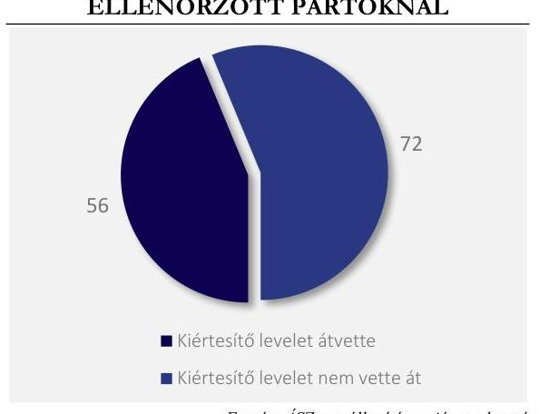

# JELENTÉS 

## Nyilvánosság tájékoztatásának ellenőrzése a rendszeres központi költségvetési támogatásban nem részesülő pártoknál

2024.

---

# JELENTÉS 

## Nyilvánosság tájékoztatásának ellenőrzése a rendszeres központi költségvetési támogatásban nem részesülő pártoknál

2024.

---

# ELLENŐRZÉSI IGAZGATÓSÁG: 

## ÁLLAMHÁZTARTÁSON KÍVÜLI SZERVEZETEKET ELLENŐRZŐ IGAZGATÓSÁG

## ELLENŐRZÉSI IGAZGATÓ:

## KLINGA LÁSZLÓ igazgató

## ELLENŐRZÉSVEZETŐ:

Jelentéseink az interneten a www.asz.hu címen olvashatók.

DR. NAGY IMRE ellenőrzésvezető

IKTATÓSZÁM: EL-3955-003/2024.
TÉMASZÁM: 2712
ELLENŐRZÉS-AZONOSÍTÓ SZÁM: V-1056.

---

# TARTALOMJEGYZÉK 

AZ ELLENŐRZÉS ALAPADATAI ..... 5
AZ ELLENŐRZÉS HATÓKÖRE ÉS TERÜLETE ..... 7
ÖSSZEFOGLALÁS ..... 10
ÖSSZEFÜGGÉSEK, KÖVETKEZTETÉSEK. ..... 12
AZ ELLENŐRZÉS FÓKUSZKÉRDÉSEI ..... 16
MEGÁLLAPÍTÁSOK ..... 17
MELLÉKLETEK ..... 22
I. sz. melléklet: Értelmező szótár ..... 22
II. sz. melléklet: Az ellenőrzött szervezetek jegyzéke ..... 23
FÜGGELÉK: ÉSZREVÉTELEK ..... 27
RÖVIDÍTÉSEK JEGYZÉKE ..... 32

---

.

---

# AZ ELLENŐRZÉS ALAPADATAI 

## AZ ELLENŐRZÉS CÉLJA

Az ellenőrzés célja annak értékelése volt, hogy a rendszeres központi költségvetési támogatásban nem részesülő pártok szabályszerűen eleget tettek-e

1. a Párttörvény ${ }^{1}$ 9. § (1) bekezdésében és 1. számú mellékletében a pénzügyi kimutatással kapcsolatban előírt közzétételi kötelezettségüknek, továbbá a
2. a Kampányfinanszírozási törvény ${ }^{2}$ 9. $\mathbb{S}$ (1) bekezdésében előírtak szerint a választásra fordított állami és más pénzeszközök, anyagi támogatások összegét, forrását és felhasználásának módját tartalmazó kampányelszámolás ${ }^{3}$ nyilvánosságra hozatalával kapcsolatban előírt kötelezettségüknek.
Az ellenőrzés célja volt továbbá a pénzügyi kimutatás és a kampányelszámolás szabályozásával, közzétételének gyakorlatával és mindezek számvevőszéki ellenőrzésével kapcsolatos összefüggések bemutatása, következtetések megfogalmazása.

## AZ ELLENŐRZÉS TÍPUSA

Szabályszerüségi ellenőrzés

## AZ ELLENŐRZŐTT IDŐSZAK

A 2022. év, továbbá a pénzügyi kimutatás közzététele tekintetében a 2023. május 31-ig tartó időszak, illetve ezt követő közzététel esetén a jelentés kiadmányozásáig terjedő időszak. A kampányelszámolás tekintetében a 2022. június 4-ig tartó időszak, illetve ezt követő nyilvánosságra hozatal esetén a jelentés kiadmányozásáig terjedő időszak. A pénzügyi kimutatással és a kampányelszámolással kapcsolatos összefüggések bemutatása, következtetések megfogalmazása tekintetében a 2014-2022. közötti időszak.

## AZ ELLENŐRZÉS TÁRGYA

A rendszeres költségvetési támogatásban nem részesülő pártok ellenőrzése során az ellenőrzés tárgyát képezte a 2022. évre vonatkozó pénzügyi kimutatások Párttörvény szerinti közzététele, továbbá a 2022. évi országgyűlési képviselő választáshoz kapcsolódó kampányelszámolások Kampányfinanszírozási törvény szerinti nyilvánosságra hozatala szabályszerűségének ellenőrzése. A pénzügyi kimutatással és a kampányelszámolással kapcsolatos összefüggések bemutatása, következtetések megfogalmazása a 2014-2022. évekre.

---

# AZ ELLENŐRZÉS JOGALAPJA 

Az ellenőrzés jogalapját az ÁSZ tv. ${ }^{4}$ 5. § (11) bekezdés a) pontja, és a Párttörvény 10. § (1) bekezdése képezték.

## AZ ELLENŐRZÉS MÓDSZERE

Az ellenőrzés az ellenőrzött időszakban hatályos jogszabályok, az ellenőrzés szakmai szabályai, a jelen ellenőrzésre irányadó ÁSZ ${ }^{5}$ módszertanok, az ellenőrzési programban foglalt értékelési szempontok szerint került végrehajtásra.

Az ellenőrzési kérdések megválaszolásához szükséges bizonyítékok megszerzése nyilvánosan elérhető adatokra (civil szervezetek Országos Bírósági Hivatal által vezetett országos névjegyzéke, Nemzeti Választási Iroda honlapja, Magyar Közlöny), az Országos Bírósági Hivatal, továbbá a Magyar Államkincstár adatszolgáltatására alapozva történt. Az ellenőrzési bizonyítékként felhasznált adatforrások közé tartoztak az Országos Bírósági Hivatal által a Civil nyilvántartási törvény ${ }^{6}$ alapján vezetett nyilvántartás adatai, a Magyar Közlönyök tartalma, a Nemzeti Választási Iroda honlapja (www.valasztas.hu), valamint a MÁK ${ }^{7}$ adatszolgáltatása.

Az ellenőrzési bizonyítékként felhasznált adatforrások közé tartoztak egyrészt az ellenőrzéshez kért dokumentumok, adatforrások, másrészt adatforrás lehetett még minden - az ellenőrzés folyamán - feltárt, az ellenőrzés szempontjából információkat tartalmazó dokumentum.

---

# AZ ELLENŐRZÉS HATÓKÖRE ÉS TERÜLETE 

A jogalkotó már a rendszerváltáskor elfogadott jogszabályokban kifejezte a nyilvánosság rendszeres tájékoztatásának szükségességét mind a pártok gazdálkodása, mind a pártok választási költései tekintetében. A pénzügyi kimutatás és a kampányelszámolás tartalmára, közzétételének idejére és helyére vonatkozó előírások a rendszerváltás óta eltelt több mint 30 év alatt többször változtak, de a nyilvánosság tájékoztatásának előírása folyamatosan fennmaradt.

## PÉNZÜGYI KIMUTATÁs

Az 1989-ben elfogadott Párttörvény előírta, hogy a pártok kötelesek az előző évi gazdálkodásukról szóló pénzügyi kimutatást március 31-ig a Magyar Közlönyben közzétenni a törvény 1. számú mellékletében meghatározott minta szerint. A pénzügyi kimutatásnak a párt adott évi tényleges bevételeit és kiadásait, valamint a párt tényleges pénzügyi helyzetére vonatkozó adatokat kellett tartalmaznia a törvény mellékletében rögzített részletezésben.

A Párttörvény szabályozása 1993-ban változott, a pártoknak ezentúl - kisebb változásokkal egészen 2014ig - beszámolót kellett készíteniük pénzügyi kimutatás helyett. A beszámolási kötelezettség törvényben rögzített tartalma is módosult, a törvény 1. számú mellékletéből a pénzügyi helyzetre vonatkozó adatok bemutatása kikerült. A beszámoló közzétételének határideje április 30-ára módosult.

2014-ben a Párttörvény több helyen jelentősen módosult, amely a pártok beszámolójának megnevezését és közzétételét is érintette. A 2014-től alkalmazandó és jelenleg is hatályos szabályozás szerint a pártok a Magyar Közlönyben kötelesek pénzügyi kimutatást közzétenni immár május 31-ig a Párttörvény 1. számú melléklete szerint. A pénzügyi kimutatás tartalmi követelményeit az 1. számú táblázat mutatja be.
1. táblázat

PÉNZÜGYI KIMUTATÁS TARTALMA A PÁRTTÖRVÉNY 1. SZÁMÚ MELLÉKLETE SZERINT

## BEVÉTELEK

1. Tagdíjak
2. Központi költségvetésből származó támogatás
3. A párt országgyúlési képviselöcsoportjának nyújtott támogatás
4. Egyéb hozzájárulások adományok (az 500000 forint feletti hozzájárulás nevesítve)
5. A párt által alapított korlátolt felelősségű társaság nyereségéből származó bevétel
6. Egyéb bevételek

Összes bevétel

## KiADÁSOK

1. Támogatás a párt országgyúlési csoportja számára
2. Támogatás egyéb szervezeteknek
3. Vállalkozások alapítására fordított összegek
4. Müködési kiadások
5. Eszközbeszerzés
6. Politikai tevékenység kiadása
7. Egyéb kiadások

Összes kiadás
Forrás: Párttörvény 2022.08.01. szerinti állapot, ÁSZ saját szerkesztés

## KAMPÁNYELSZÁMOLÁs

A rendszerváltáskor a választási eljáráshoz kapcsolódó szabályokat az országgyúlési képviselők választásáról szóló 1989. évi XXXIV. törvény tartalmazta. A törvény úgy rendelkezett, hogy minden pártnak a választásokra fordított állami és más pénzeszközök, anyagi támogatások mértékét és a felhasználás módját a sajtóban (1994-től országos napilapokban) nyilvánosságra kell hoznia. A nyilvánosságra hozatal határidejét a törvény nem határozta meg.

A választási eljárás szabályozása az első két országgyúlési választást követően újult meg. 1997-ben fogadták el a választási eljárásról szóló 1997. évi C. törvényt, amely a kampányköltések korlátozása mellett bevezette a kampányelszámolás jelenlegi formában történő szabályozását, amikor előírta, hogy minden jelölő

---

szervezetnek és független jelöltnek a választás második fordulóját követő 60 napon belül a Magyar Közlönyben nyilvánosságra kell hoznia a választásra fordított állami és más pénzeszközök, anyagi támogatások összegét, forrását és felhasználásának módját. A régi Ve. ${ }^{8}$ írta elő első alkalommal a választásra fordított állami és más pénzeszközök felhasználásának ellenőrzését az ÁSZ részére. Ezt megelőzően a választási kampányköltések vizsgálata nem volt az ÁSZ külön nevesített feladata; az ÁSZ a pártok gazdálkodását értékelte a Párttörvényben előírt kétévenkénti ellenőrzés során, amely a választási években a választási kampányra fordított pénzek ellenőrzését is jelentette.

A 2014-es választásokra megújult a választási kampány jogszabályi környezete.
Az országgyűlési képviselők választásáról szóló 2011. évi CCIII. törvény a 2014-ben megválasztott országgyűlés létszámát 386 főről 199 főre csökkentette. Új választási eljárási törvényt fogadtak el, a választási eljárásról szóló 2013. évi XXXVI. törvényt. A Ve. ${ }^{9}$ más lényeges változások mellett meghatározta a kampányeszköz és a kampánytevékenység fogalmát és új előírásokat rögzített a sajtótermékekben megjelenő politikai hirdetések szabályozására.

Az országgyűlési választási kampányok finanszírozását is érintő lényeges jogszabályi változást jelentett emellett, hogy módosult a Párttörvény. A Párttörvény 2014-től hatályba lépő módosítása szigorította a pártok által elfogadható támogatások körét, amely a politikai élet és a választások tisztaságának erősítését célozta. A pártok 2014-től csak magyarországi magánszemélyektől kaphatnak adományt, külföldi szervezettől vagy személytől, vagy magyarországi jogi személytől vagy jogi személyiséggel nem rendelkező szervezettől nem részesülhetnek támogatásban, és névtelen adományt sem fogadhatnak el. Ez a rendelkezés a választási kampány tekintetében is korlátozta a kampányköltések forrásait.

Lényeges változást jelentett, hogy külön törvényt fogadtak el a választási kampánytámogatások és kampányköltések szabályozására. A Kampányfinanszírozási törvény jelentős újításokat vezetett be az országgyűlési választások kampányának finanszírozása és a kampányköltések tekintetében. A Kampányfinanszírozási törvény jelentősen megnövelte mind az egyéni jelöltek, mind a jelölő szervezetek költségvetési támogatását, amelynek keretösszege addig 1990. óta nem változott. Emellett 5 millió forintra emelte az 1998-as választások óta fennálló, jelöltenkénti 1 millió forintos költési keretet is. A Kampányfinanszírozási törvény tartalmában megtartotta a régi Ve. szabályozását a kampányelszámolás tekintetében, amely szerint minden jelöltnek és jelölő szervezetnek az országgyűlési választást követő 60 napon belül a Magyar Közlönyben nyilvánosságra kell hoznia a választásra fordított állami és más pénzeszközök, anyagi támogatások összegét, forrását és felhasználásának módját.

A jelölő szervezeteknek biztosított költségvetési támogatással kapcsolatos visszaélések lehetőségének kizárása érdekében a jogalkotó több alkalommal módosította a Kampányfinanszírozási törvényt.

2017 novemberében a Kampányfinanszírozási törvény kiegészült azzal a rendelkezéssel, hogy a pártlistát állító párt köteles a kincstárnak visszafizetni a támogatást, ha a pártlista nem éri el a pártlistákra leadott összes érvényes szavazat legalább 1\%-át. Garanciális elemként bekerült még a szabályozásba, hogy a támogatás csak akkor folyósítható, ha a pártlistát állító párt nyilatkozik arról, hogy ha visszafizetési kötelezettségét határidőben nem teljesíti, és az tőle nem hajtható be, a párt vezető tisztségviselői állnak helyt egyetemlegesen a támogatás visszafizetéséért. 2018 szeptemberétől a kampánytámogatás visszafizetéséért egyetemlegesen felelős személyek köre kibővült a vezető tisztségviselők mellett a párt listán állított, valamint egyéni választókerületi jelöltjeivel.

2021 januárjától megváltoztak a kampánytámogatáshoz jutás feltételei, az addigi 27 helyett már legalább 71 egyéni választókerületben kellett jelöltet állítania a pártoknak a jelölő szervezetet megillető kampánytámogatáshoz. A törvénymódosítás indokolása szerint a módosítás célja az volt, hogy „csak valós

---

társadalmi támogatottságú pártok állíthassanak pártlistát, ezáltal fellép azon jelölő szervezetekkel szemben, melyek indulásának csupán az a célja, bogy a választási szabályokkal visszaélve a választási támogatások megszerzése érdekében indítsanak jelölteket."

Az ÁSZ ellenőrzése kiterjedt a pártok gazdálkodásának átláthatóságát veszélyeztető kockázatok bemutatására, annak érdekében, hogy előmozdítsa a pártok jogkövető magatartását, erősítse a pártok felkészültségét a közpénzek felhasználására, és hozzájáruljon a pártoknál a közpénzügyi helyzet javulásához.

Mindezek mellett az ellenőrzés hatókörébe tartozott, hogy a pénzügyi kimutatásra és a kampányelszámolásra vonatkozó törvényi előírások bemutatásával, érvényesülésük átfogó értékelésével és elemzésével rávilágítson a pártok gazdálkodásának átláthatóságát, a választópolgárok és a párttagok tájékoztatását szolgáló alapvető dokumentumok, a pénzügyi kimutatás és a kampányelszámolás szabályozásának fejlesztési lehetőségeire. Az ellenőrzés kiterjedt arra is, hogy bemutassa a 2014., 2018. és 2022. évi országgyűlési választások kampányköltései tekintetében azonosítható tendenciákat és visszajelzést adjon arról, hogy a kampányfinanszírozásra vonatkozó jogszabályi előírások szigorítása milyen hatással volt a jogkövető magatartás erősítésére a választási kampányköltések terén.

# ELLENŐRZÖTT SZERVEZETEK 

Az ellenőrzés azoknak a pártoknak a 2022. évre vonatkozó ellenőrzését tűzte ki célul, amelyeknél érdemi visszajelzést tud adni a nyilvánosság tájékoztatására szolgáló törvényi előírások betartásáról, illetve jogszabálysértés esetén hatással lehet a jogkövető magatartás előmozdítására.

Ezért a pénzügyi kimutatás közzététele tekintetében ellenőrzött szervezetként kerültek kijelölésre a civil szervezetek bírósági nyilvántartásáról és az ezzel összefüggő eljárási szabályokról szóló 2011. évi CLXXXI. törvény 4. § b) pontja alapján a bírósági nyilvántartásban szereplő, a Civil törvény ${ }^{10}$ alapján létrehozott és a Párttörvény szerint működő, 2022. évben és jelenleg is nyilvántartott pártok, amelyek nem állnak végrehajtás, felszámolás vagy megszüntetés alatt és a 2022. évben nem részesültek rendszeres költségvetési támogatásban.

Ezen túlmenően a kampányelszámolás nyilvánosságra hozatala tekintetében ellenőrzött szervezetek voltak a 2022. évi országgyűlési képviselő választásra a választási bizottság által jelölő szervezetként nyilvántartásba vett pártok, amelyek a bírósági nyilvántartásban jelenleg is szerepelnek és nem állnak végrehajtás, felszámolás vagy megszüntetés alatt, valamint a 2022. évben nem részesültek rendszeres költségvetési támogatásban.

Az Országos Bírósági Hivatal által vezetett, nyilvánosan elérhető névjegyzék szerint a fent felsorolt feltételeknek a pénzügyi kimutatás nyilvánosságra hozatalával kapcsolatban 133 párt, míg a kampányelszámolás közzétételével összefüggésben 30 párt felelt meg az ellenőrzés előkészítő szakaszában, ezek a szervezetek kerültek kiértesítésre ellenőrzött szervezetként. Az Országos Bírósági Hivatal ezt követő adatszolgáltatása alapján az ÁSZ aktualizálta az ellenőrzött szervezetek körét, amelynek következtében az ellenőrzésre kijelölt pártok közül 5 szervezetnél az ellenőrzés lefolytatása okafogyottá vált: négy szervezet pártból egyesületté alakult, egy párt esetében pedig megszüntetési eljárás indult. Így a számvevőszéki jelentésben a pénzügyi kimutatásra vonatkozóan 128 párt, a kampányelszámolás tekintetében 29 párt értékelése jelenik meg. Az ellenőrzött pártok listáját a II. melléklet tartalmazza.

Az ellenőrzött pártokon túl további 11 pártnak volt közzétételi kötelezettsége. Ugyanakkor ezek a pártok rendszeres költségvetési támogatásban részesültek a 2022. évi országgyűlési választáson elért eredményük alapján. A rendszeres költségvetési támogatásban részesülő pártok gazdálkodását az ÁSZ kétévente ellenőrzi, ezért erre a 11 pártra jelen ellenőrzés nem terjedt ki.

---

# ÖSSZEFOGLALÁS 

A magyarországi pártok többsége nem jogosult rendszeres központi költségvetési támogatásra, mivel az országgyűlési képviselőválasztáson részt vett választók szavazatának $1 \%$-át nem szerezték meg. Ugyanakkor a törvényi feltételek teljesítése esetén a pártok a későbbiekben a választási kampányukhoz és a múködésükhöz is költségvetési támogatásban részesülhetnek, továbbá a választási eredménytől függően központi vagy helyi szinten a képviselőik útján részt vehetnek a közhatalom gyakorlásában. Ezért kulesfontosságú, hogy a pártok a törvényi előírások betartásával járjanak el, gazdálkodásuk átlátható és más szervezetek számára is példamutató legyen. A pártoknak emellett a tagságuk és a támogatóik felé is nyilvánossá kell tenniük, milyen forrásból, mennyi bevételük származott, és azokat milyen célokra használták fel.

Az ellenőrzés azt tapasztalta, hogy a pártok több mint fele a bejegyzett székhelyén nem volt elérhető. A Ptk. ${ }^{11}$ előírja, hogy minden jogi személynek, így a pártoknak is biztosítaniuk kell a székhelyükön a részükre címzett jognyilatkozatok fogadását. Ennek ellenére 128 pártból 72 párt a bejegyzett székhelyén nem volt elérhető, az ellenőrzés megkezdéséről szóló kiértesítő levelet nem vette át. Ez hasonlóságot mutat a 2021-ben nyilvánosságra hozott 21078. számú számvevőszéki jelentés tapasztalataival, amely a rendszeres költségvetési támogatásban nem részesülő pártoknál a 2017-2019. évi pénzügyi kimutatások közzétételének ellenőrzése kapcsán megállapította, hogy 60 párt a bejegyzett székhelyén nem volt elérhető.

A kiértesítő levél kézbesítése során tapasztalt alacsony jogkövetési hajlandóságot az ellenőrzési megállapítások is visszaigazolták mind a pénzügyi kimutatás, mind a kampányelszámolás közzététele tekintetében.

Az ellenőrzött pártok 87,5 \%-a, 128-ból 112 párt a 2022. évre pénzügyi kimutatást nem tett közzé, így nem tett eleget az éves gazdálkodás nyilvánosságát szolgáló törvényi előírásnak.

A fennmaradó 16 párt közül 11 párt a törvényben előírt határidőben teljesítette a közzétételi kötelezettségét. Egy párt néhány napos késéssel, négy párt pedig az ellenőrzés megkezdése után tette közzé a pénzügyi kimutatását. A közzétett pénzügyi kimutatások mindegyike megfelelt a Párttörvény 1. számú mellékletében meghatározott tartalmi követelményeknek, a jogszabályban előírt bevételi és kiadási adatokat tartalmazta.

Az ÁSZ legutóbb a 2017-2019. évi pénzügyi kimutatások közzétételét ellenőrizte a magyarországi pártoknál, amelynek tapasztalatait a 21077. és a 21078. számú jelentésben ${ }^{12}$ hozta nyilvánosságra. A jelenleg ellenőrzött 128 pártból 70 párt a korábbi ellenőrzéssel is érintett volt. A mindkét ellenőrzéssel érintett 70 pártból 60 párt 2017-2019. évekre az ÁSZ korábbi felhívására sem tett eleget a közzétételi kötelezettségének. A 2017-

---

2019. évi közzétételről nem intézkedő 60 pártból 58 párt a 2022. év tekintetében sem tett közzé pénzügyi kimutatást, így elmondható, hogy a rendszeres költségvetési támogatásban nem részesülő magyarországi pártok $45 \%$-a az ellenőrzések hatására sem tett lépéseket a jogszabályi előírások betartása irányába.

Az ellenőrzött pártok 2022. évben költségvetési támogatást nem használtak fel a működésükhöz, így közpénz felhasználásának átláthatósága nem került veszélybe. Ugyanakkor a közzététel elmulasztása miatt más kockázatok merülhetnek fel. A jogszabályi előírások be nem tartása a pénzügyi kimutatás közzététele esetében elsősorban azt a kockázatot hordozza magában, hogy sem a választópolgárok, sem a pártok tagjai, támogatói számára nem látható, hogy a közzétételt elmulasztó pártoknak milyen bevételei keletkeztek, milyen kiadásokat teljesítettek, ennek során törvényben engedélyezett forrásokból gazdálkodtak-e, és mire fordították a tagdíj, támogatás vagy más címen szerzett bevételeiket.

Kampányelszámolást a 2022. évi országgyúlési képviselő választásra nyilvántartásba vett jelölő szervezetek egyike sem hozott nyilvánosságra a Magyar Közlönyben az ellenőrzött 29 párt közül.

A 2022. évi országgyűlési választáson jelölő szervezetként nyilvántartásba vett pártok nem használtak fel közpénzt a választási kampányukhoz. Ugyanakkor a Kampányfinanszírozási törvény nem tesz különbséget a kampányelszámolás szempontjából a költségvetési támogatásban részesülő vagy nem részesülő pártok között: a törvényi előírás szerint a kampányelszámolás közzététele minden jelölő szervezet részére kötelező.

A kampányelszámolás közzétételét elmulasztó pártok esetében nem ismerhető meg, hogy az érintett pártok folytattak-e választási kampányt, ha igen, akkor milyen kampányeszközre, kampánytevékenységre mennyit költöttek, a kampányköltéseiket törvényes forrásokból fedezték-e, illetve nem lépték-e túl a törvényben meghatározott költési keretet.

---

# ÖSSZEFÜGGÉSEK, KÖVETKEZTETÉSEK 

## I. TÖRVÉNYES MÜKÖDÉS HELYREÁLLÍTÁSÁNAK SZABÁLYOZÁSI KÉRDÉSEI A PÁRTOKNÁL

Az ellenőrzési tapasztalatok kapcsán felmerült, hogy a hatályos jogszabályok nem biztosítják a pártok székhelyükön való elérhetőségének, továbbá a pénzügyi kimutatás és a kampányelszámolás közzétételére vonatkozó kötelezettség teljesítésének, a törvényes működés helyreállításának kikényszeríthetőségét arra az esetre, ha a pártok önkéntes jogkövetése nem valósul meg.

Ennek egyik oka, hogy sem a Párttörvény, sem a Kampányfinanszírozási törvény nem ír elő szankciót arra az esetre, ha a pártok nem elérhetőek a székhelyükön, illetve ha nem teszik közzé a pénzügyi kimutatást vagy a kampányelszámolást a Magyar Közlönyben.

Ha szankciót nem is tartalmaz, de a Párttörvény jogsértés esetén felhatalmazást ad az Állami Számvevőszéknek az ügyészség megkeresésére. Ugyanakkor akadályt jelent, hogy az ügyészség Párttörvényben rögzített törvényességi ellenőrzési jogköre 2017 márciusától kiüresedett. A Párttörvény 2. § (5) bekezdése szerint az ügyész törvényességi ellenőrzési jogkörét a pártok múködése felett a Párttörvényben meghatározottak szerint gyakorolja. A párt törvénysértése esetén az ügyész keresetet indít a párt ellen. A Párttörvény 10. § (4) bekezdése szerint, ha az ÁSZ azt észleli, hogy a párt gazdálkodása körében jogellenesen járt el, felhívja a törvényes állapot helyreállítására. Súlyosabb törvénysértés esetén, vagy ha a párt nem tesz eleget a felhívásnak, az ÁSZ elnöke az ügyész Civil törvény 11. § (3) bekezdésének megfelelő eljárását indítványozza.

Ugyanakkor 2017-ben a civil szervezetek feletti általános ügyészi törvényességi ellenőrzés megszűnt, de a Párttörvény előírásai a pártok feletti törvényességi ellenőrzés tekintetében nem változtak. 2017-ig a Civil törvény 11. § (3) bekezdése előírta, hogy ha a civil szervezet működésének törvényessége másképpen nem biztosítható, az ügyész törvényességi ellenőrzési jogkörében eljárva keresettel a bírósághoz fordulhat. A hivatkozott rendelkezés ugyanakkor 2017. március 1-jétől nem hatályos, a Párttörvény azonban továbbra is a Civil törvény hatályon kívül helyezett, nem alkalmazható rendelkezésére hivatkozik. Ezzel megszűnt az Állami Számvevőszék ellenőrzése és az ügyészség eljárási kötelezettsége közötti szabályozási kapcsolat, így 2017. óta hiányzik a számvevőszéki ellenőrzés során feltárt súlyos törvénysértések orvoslásának egyik legfontosabb eszköze.

Már a korábbi, 2021-ben lefolytatott, 21077. és 21078. számú jelentésekkel lezárt számvevőszéki ellenőrzés során feltárt tények, körülmények felvetették annak a gyanúját, hogy a rendszeres költségvetési támogatásban nem részesülő pártok esetében a törvényes múködés nem biztosított. Emiatt az ÁSZ az ellenőrzés során feltárt tényekről, körülményekről tájékoztatta az ügyészséget. Az ügyészség válasza szerint az ügyészi eljárás a hatályos jogi szabályozásra tekintettel kizárólag a civil szervezetek bírósági nyilvántartásának adatait érintő nyilvántartási törvénysértésekre terjedt ki, illetve a hatályos törvényi rendelkezések szerint a pártok gazdálkodása körében feltárt szabálytalanságok alapján ügyészi fellépésre nincs törvényes alap. Ezt követően a 21078. számú jelentésében az ÁSZ felvetette a pártok múködésének törvényességi ellenőrzésére és felügyeletére vonatkozó jogszabályi előírások felülvizsgálatának mérlegelését. A vonatkozó jogszabályi előírások azóta nem változtak.

## II. NYILVÁNOSSÁG TÁJÉKOZTATÁSÁRA SZOLGÁLÓ TÖRVÉNYI ELŐÍRÁSOK ELEMZÉSE A PÁRTOKNÁL

Az ellenőrzés végrehajtása során kérdésként merült fel, hogy vajon a pénzügyi kimutatásra és a kampányelszámolásra vonatkozóan jogszabályban előírt formai és tartalmi követelmények valóban biztosítják-e a pártok gazdálkodásának és kampányköltéseinek alap szintű nyilvánosságát és összevethetőségét. Ez a kérdés természetesen nem kizárólag a jelen ellenőrzésben értékelt rendszeres költségvetési támogatásban nem

---

részesülő pártokat érinti, hanem a rendszeres költségvetési támogatásban részesülő, kétévente ellenőrzött pártokra is vonatkozik.

A pártok beszámolási kötelezettsége tekintetében az ÁSZ 2012-ig több alkalommal javasolta a pártellenőrzésről készített jelentéseiben a Párttörvény módosítását. Az ÁSZ jelezte, hogy a pénzügyi kimutatás (beleértve a korábbi szabályozásokban nevesített beszámolót) egyes sorainak tartalma a jogszabályi rendelkezés pontosabb megfogalmazása, vagy külön kitöltési útmutató hiányában nem egyértelmű, a kitöltő egyéni belátásától és értelmezésétől függ a könyvelési adatok csoportosítása, és szerepeltetése a pénzügyi kimutatás soraiban. Az egyes pártok pénzügyi kimutatásai egymással nem összehasonlíthatók, és ha egy párt változtat az adatösszeállítás módszerén, akkor az egyes évek azonos adatait sem lehet egymással összevetni. A Párttörvényben rögzített, pénzforgalmi szemléletű, bevételekre és kiadásokra szűkített beszámolási előírások nincsenek összhangban a Számv.tv.-ben meghatározott nyilvántartási és beszámolási szabályokkal, a pártok által alkalmazott kettős könyvvitel követelményeivel. A pénzügyi kimutatás emellett nem tartalmazza a számviteli törvény szerinti eszközöket és forrásokat, ezen belül pl. a párt vagyonára, illetve az esetleges pénzmaradványra vonatkozó információkat, így nem ad valós képet a párt pénzügyi és vagyoni helyzetének alakulásáról.

Ilyen formában a Párttörvény - a pénzügyi kimutatás Magyar Közlönyben történő közzétételének előírásával - a pártok gazdálkodása tekintetében a tényleges gazdálkodás nyilvánosságának alapjait nem teljeskörűen biztosítja.

Emellett az ÁSZ 1998-tól visszatérően javasolta a választási eljárási szabályok oly módon való módosítását, amely biztosítja a kampányfinanszírozás átláthatóságát, ellenőrizhetőségét. A 2014-ben történt jogszabályi változások az ÁSZ javaslatainak többségét kezelték. Ugyanakkor a 2014-ben elfogadott Kampányfinanszírozási törvény sem határozza meg, milyen legyen az országgyűlési választásra fordított állami és más pénzeszközök, anyagi támogatások összegét, forrását és a felhasználás módját bemutató, a Magyar Közlönyben megjelentetett választási beszámoló formája és részletes tartalma. Az ÁSZ az 1998-as választások előtt a Választási füzetekben közzétett egy kampányelszámolás mintát, ugyanakkor kötelező alkalmazásának előírása hiányában ennek használata a jelölő szervezetek között nem vált általánossá, azóta pedig a jogszabályi előírások is jelentősen változtak.

# III. KAMPÁNYFINANSZíROZÁSI SZABÁLYOK VÁLTOZÁSÁNAK HATÁSA A PÁRTOKNAK BIZTOSÍTOTT ÁLLAMI KAMPÁNYTÁMOGATÁSOK MÉRTÉKÉRE 

A kampányelszámolás ellenőrzésének tapasztalatai rámutattak, hogy 2022-ben jelentősen csökkent a választási kampányban részt vevő pártok támogatására fordított állami kiadások mértéke és a támogatáshoz kapcsolódó visszaélések lehetősége, amely az alábbiak szerint összefüggésben van a jogszabályi előírások elmúlt években bekövetkezett szigorításával.

1990-től 2014-ig az éves költségvetési törvények „Országgyülési képeiselö-választási kampány kiadásai" jogcímen minden országgyűlési választásra 100 millió Ft kiadást terveztek, amely 2014-re az infláció hatása miatt 6,4 millió Ft vásárlóértéknek felelt volna meg 1990-es értéken számolva. A 2014. évben bevezetett jogszabályi változásokkal a pártok jelentős költségvetési forrásokhoz jutottak a választási kampányuk finanszírozásához. A Kampányfinanszírozási törvény alapján olyan pártok is jelentős támogatást kaptak, amelyek végül nem érték el a választáson a szavazatok $1 \%$-át (kisebb támogatottságú pártok).

A 2014-es országgyűlési választási kampányra az $1 \%$ alatti eredményt elérő 14 párt összesen több mint 3,4 milliárd forint jelölő szervezetnek járó költségvetési támogatást kapott. Mivel a visszafizetési kötelezettség előírása csak 2017-ben került bele a Kampányfinanszírozási törvénybe, a pártoknak a támogatást 2014-ben nem

---

kellett visszafizetnie. Így a kisebb támogatottságú pártok közvetlen támogatására az állam 3,4 milliárd Ft-ot fordított 2014-ben.

A 2018. évi választásokra 16 olyan párt részesült összesen mintegy 2,9 milliárd Ft támogatásban, amelyek a választáson az $1 \%$-os eredményt nem érték el. A Kampányfinanszírozási törvényben addigra előírt kötelezettség ellenére az érintett pártoktól csak 927 millió Ft került visszafizetésre vagy behajtásra. Ez alapján a kisebb támogatottsággal rendelkező pártok támogatására a visszafizetett összegeket figyelembe véve közel 2,0 milliárd Ft támogatást költött az állam. Ez azt mutatja, hogy a 2018-as választás előtt 2017-ben bevezetett jogszabályi változások (visszafizetési kötelezettség előírása és a vezető tisztségviselők felelősségvállalása) nem érték el céljukat az esetleges visszaélések visszaszorításában és a közpénz védelmében.

A 2022. évi választásokra a pártlistát állító és ezáltal jelölő szervezeti támogatásban részesülő pártok száma jelentősen lecsökkent a szigorított jogszabályi követelmények miatt (egyéni jelöltek állítása 27 helyett 71 egyéni választókerületben), így mindössze egy olyan párt igényelt és kapott támogatást, amely végül nem érte el az $1 \%$ os választási eredményt. Az érintett párt a támogatást visszafizette, így a kisebb támogatottságú pártok támogatása nem jelentett kiadást a központi költségvetésnek.

Ez alapján a 2021-ben bevezetett jogszabályi szigorítások hatásosak voltak a közpénz védelme szempontjából, mivel a pártok választási kampányára fordított állami kiadások 2014-hez képest $48 \%$-kal, 2018hoz képest $38 \%$-kal csökkentek, és nem maradt visszafizetendő, de nem visszafizetett támogatás a pártoknál. A 2014-2022. évi országgyűlési képviselő választások kampánytámogatásának adatait a 3. számú táblázat foglalja össze.
3. táblázat

2014-2022. ÉVI ORSZÁGGYŰLÉSI KÉPVISELŐ VÁLASZTÁSOK KAMPÁNYTÁMOGATÁSÁNAK ADATAI (KAMPÁNYFINANSZÍROZÁSI TÖRVÉNY 3. § SZERINTI TÁMOGATÁSOK)

| Választás | 1\%-ot elérő pártok TÁMOGATÁsA |  | 1\%-ot el nem érő pártok TÁMOGATÁsA |  | PÁrtoknak nyújtott KAMPÁNY TÁMOGATÁS ÖsszéSEN |  | Visszafizetett TÁMOGATÁSSÁL CSÖKKENTETT TÉNYLEGES KAMPÁNYTÁMOGATÁS |  |
| :--: | :--: | :--: | :--: | :--: | :--: | :--: | :--: | :--: |
|  | PÁrtok   SZÁMA | TÁMOGATÁS ÖssZEGE (EZER Í*) | PÁrtok   SZÁMA | TÁMOGATÁS ÖssZEGE (EZER Í*) | PÁrtok   SZÁMA | TÁMOGATÁS ÖssZEGE (EZER Í*) | PÁrtok   SZÁMA | TÁMOGATÁS ÖssZEGE (EZER Í*) |
| 2014. | 7 | 2388000,0 | 14 | 3432750,0 | 21 | 5820750,0 | 21 | 5820750,0 |
| 2018. | 7 | 2906682,8 | 16 | 2906682,8 | 23 | 5813365,6 | 23 | 4886028,9 |
| 2022. | 11 | 3060080,3 | 1 | 470792,4 | 12 | 3530872,7 | 12 | 3021043,9 |

# IV. JOGSZABÁLY MÓDOSÍTÁSI FELVETÉSEK 

Az ellenőrzési tapasztalatok, továbbá a jelen számvevőszéki jelentésben megfogalmazott összefüggések és következtetések alapján az ÁSZ felvetéseket fogalmazott meg az Országgyűlés részére:

1. Az ÁSZ felvetette a pénzügyi kimutatásra és a kampányelszámolásra vonatkozó kötelezettség teljesítésének elmulasztása esetére szankció előírását, továbbá a pártok törvényességi ellenőrzésére és törvényességi felügyeletére vonatkozó törvényi előírások felülvizsgálatát annak érdekében, hogy a vonatkozó jogszabályok biztosítsák a pártok gazdálkodása és kampányköltései esetében a nyilvánosság tájékoztatására szolgáló előírások teljesítésének, a törvényes működés helyreállításának kikényszeríthetőségét.
2. Az ÁSZ felvetette a pártok beszámolási kötelezettségére, a jelenlegi pénzügyi kimutatásra vonatkozó törvényi előírások felülvizsgálatát annak érdekében, hogy a pártoknak előírt közzétételi kötelezettség teljesítése esetén a választópolgárok, a párt tagjai és támogatói valós képet kapjanak a pártok

---

gazdálkodásáról, vagyoni és pénzügyi helyzetéről. Az ÁSZ ennek érdekében felveti a Párttörvény módosítását, a pártok esetében a Számv.tv. ${ }^{13}$ szerinti beszámoló készítésének és közzétételének előírását a pénzügyi kimutatás helyett.
3. Az ÁSZ felvetette a kampányelszámolás formai és tartalmi követelményeire vonatkozó törvényi előírások felülvizsgálatát, a Kampányfinanszírozási törvény módosítását, kiegészítését annak érdekében, hogy a kampányelszámolás formai és tartalmi követelményeinek meghatározásával a pártoknak előírt közzétételi kötelezettség teljesítése esetén az választópolgárok, a párt tagjai és támogatói minden pártnál egységes, összehasonlítható képet kapjanak a párt kampányának forrásairól és a kampányköltésekről, az országgyűlési választásra fordított állami és más pénzeszközök, anyagi támogatások összegéről, forrásáról és a felhasználásának módjáról.

---

# AZ ELLENŐRZÉS FÓKUSZKÉRDÉSEI 

1- A párt a pénzügyi kimutatás közzétételi kötelezettségét szabályszerűen teljesítette-e?
2- A párt a kampányelszámolás nyilvánosságra hozatali kötelezettségét szabályszerűen teljesítette-e?

---

# 1. A párt a pénzügyi kimutatás közzétételi kötelezettségét szabályszerűen teljesítette-e?

## Összegző megállapítás

A pártok 16 párt kivételével a 2022. évre nem tettek közzé pénzügyi kimutatást a Párttörvény előírása ellenére.

A pártok a Párttörvény 9. § (1) bekezdésének megfelelően kötelesek minden év május 31-ig a Párttörvény 1. számú melléklet szerinti pénzügyi kimutatást a Magyar Közlönyben közzétenni.

Az ellenőrzött 128 párt közül a 2022. évre 16 párt tett közzé pénzügyi kimutatást a Magyar Közlönyben, ami az ellenőrzött pártok 12,5 %-a. A 16 párt közül 11 párt a közzétételre vonatkozó törvényi kötelezettségének határidőben tett eleget. Egy párt néhány napos késéssel teljesítette kötelezettségét (Tisztességes Ország Párt), négy párt pedig az ellenőrzés megkezdését követően tette közzé a pénzügyi kimutatást (A Magyar Vállalkozók és Munkaadók Pártja, Értelmes Magyarok Pártja, Új Kezdet Párt, Közösen Építő Polgárok Pártja). A közzététel adatait a 4. táblázat mutatja be.

|  4. táblázat |  |   |
| --- | --- | --- |
|   | **PÉNZÜGYI KIMUTATÁS KÖZZÉTÉTELÉNEK ADATAI A KÖZZÉTÉTELI KÖTELEZETTSÉGET TELJESÍTŐ ELLENŐRZÖTT PÁRTOKNÁL** |   |
|  **Ssz.** | **PÁRT NEVE** | **KÖZZÉTÉTEL IDŐPONTJA**  |
|   | **KÖZZÉTÉTELI KÖTELEZETTSÉGET HATÁRIDŐBEN TELJESÍTŐ PÁRTOK** |   |
|  1. | A Haza Pártja | 2023.V.12.  |
|  2. | Alternatíva Párt | 2023.V.31.  |
|  3. | Élő Magyarország Párt | 2023.V.31.  |
|  4. | Igen Szolidaritás Magyarországért Mozgalom | 2023.V.31.  |
|  5. | Magyar Környezetvédők Pártja | 2023.V.31.  |
|  6. | Magyar Liberális Párt - Liberálisok | 2023.V.31.  |
|  7. | Magyar Munkáspárt | 2023.IV.20.  |
|  8. | Magyarország Munkáspárt 2006 - Európai Baloldal | 2023.IV.20.  |
|  9. | Összefogás a Civilekért Párt | 2023.IV.28.  |
|  10. | Szociáldemokraták Pártja | 2023.IV.28.  |
|  11. | Zöldek, a Normális Emberek Pártja | 2023.V.31.  |
|   | **KÖZZÉTÉTELI KÖTELEZETTSÉGET NÉHÁNY NAP KÉSÉSSEL TELJESÍTŐ PÁRT** |   |
|  1. | Tisztességes Ország Párt | 2023.VI.9.  |
|   | **KÖZZÉTÉTELI KÖTELEZETTSÉGET AZ ELLENŐRZÉS MEGKEZDÉSE UTÁN TELJESÍTŐ PÁRTOK** |   |
|  1. | A Magyar Vállalkozók és Munkaadók Pártja | 2023.X.31.  |
|  2. | Értelmes Magyarok Pártja | 2023.XII.28.  |
|  3. | Közösen Építő Polgárok Pártja | 2024.I.31.  |
|  4. | Új Kezdet Párt | 2023.XII.28.  |

*Forrás: Magyar Közlönyök adatai alapján, ÁSZ saját szerkesztés*

---

A közzétett pénzügyi kimutatások mind a 16 esetben megfeleltek a Párttörvény 1. számú mellékletében meghatározott kimutatásnak, a törvényben előírt bevételi és kiadási adatokat tartalmazták.
Az ellenőrzött 128 párt közül a többi 112 párt a Párttörvény 9. § (1) bekezdésében foglaltak ellenére nem tett közzé pénzügyi kimutatást a 2022. évi gazdálkodásáról, ami a rendszeres költségvetési támogatásban nem részesülő pártok $87,5 \%$-a. A pénzügyi kimutatás közzétételére vonatkozó kötelezettség teljesítését elmulasztó pártokat az 5. táblázat tartalmazza.
5. táblázat

PÉNZÜGYI KIMUTATÁS KÖZZÉTÉTELÉT ELMULASZTÓ PÁRTOK

| SSZ. | PÁRT NEVE |
| :-- | :-- |
| 1. | 3-Együtt az Egységért Párt |
| 2. | A Második 1000 Év Egysége Polgári Párt |
| 3. | A MI Pártunk - IMA |
| 4. | A Párturalom Felszámolásáért! - Hunmagyar Vérszövetség |
| 5. | Állatvédő Párt |
| 6. | Arany Oroszlán Párt |
| 7. | Civil Mozgalom |
| 8. | Demokrata Népmozgalom és Ipar Párt |
| 9. | Demokrata Párt |
| 10. | Demokratikus Karta Párt |
| 11. | Demokratikus Roma Párt |
| 12. | Direkt Digitális Demokrácia Pártja |
| 13. | Egészséges Magyarországért Választási Párt |
| 14. | Egyetemes Jogok Pártja |
| 15. | EGYIKRE SEM Párt |
| 16. | Elkötelezettség, Társadalmi Igazságosság Korrupcióellenesség Alapelveinek Pártja |
| 17. | Ember az Emberekért Párt |
| 18. | Emberek Magyarországi Pártja |
| 19. | Emigrációban Élő Magyarok Szövetsége |
| 20. | Európai Független-Centrum Párt |
| 21. | Fehér Holló Rend Párt |
| 22. | Felelős Társadalom Párt |
| 23. | Fordulat Párt - Szövetség Magyarországért |
| 24. | Földművelők,- Gazdálkodók, és az Új Élet Rendszerváltó Pártja |
| 25. | Független Liberális Párt |
| 26. | Független Vidéki Demokrata Párt |
| 27. | Függetlenek Magyarországért Párt |
| 28. | Függetlenek Választási Pártja |
| 29. | Hajrá Magyarország! Párt |
| 30. | Hátrányos Helyzetű Emberek Pártja |
| 31. | Hátrányos Helyzetűek Pártja |
| 32. | Hitelesen A Magyarországi Romákért Párt |
| 33. | HUXIT Tisztességes Európáért Párt |
| 34. | IRÁNYTŰ Párt |
| 35. | Jó Út Magyar Polgári Párt |
| 36. | Jóléti Magyarországot Párt |
| 37. | Kirekesztett Magyar Hazafiak Pártja |
| 38. | Kontroll Csoport |
|  |  |

---

|  Ssz. | PÁRT NEVE  |
| --- | --- |
|  39. | Korrupció Nélküli Magyarországért Párt  |
|  40. | Középen Állók Pártja  |
|  41. | Közösen Magyarországért Párt  |
|  42. | Le az Adók 75\%-ával Párt  |
|  43. | Lehetőség Magyarország Jövőjéért Párt  |
|  44. | Libertárius Párt  |
|  45. | Magyar Agrár és Gazdaság Néppárt  |
|  46. | MAGYAR DEMOKRATA EGYSÉGPÁRT  |
|  47. | Magyar Feltörekvés Párt  |
|  48. | Magyar Fiatalságért Párt  |
|  49. | Magyar Gondolkodók Politikai Pártja  |
|  50. | Magyar Igazság és Élet Pártja  |
|  51. | Magyar Nemzeti Rend Párt  |
|  52. | Magyar Nyugdíjas Képviseleti Párt  |
|  53. | Magyar Összhang Párt  |
|  54. | Magyar Reform Párt  |
|  55. | Magyar Republikánus Politikai Párt  |
|  56. | Magyar Sport és Egészség Párt  |
|  57. | Magyar Szegények és Dolgozók Demokratikus Szervezete  |
|  58. | Magyar Szociális Párt  |
|  59. | Magyar Szociális Zöld Párt  |
|  60. | Magyarok a Demokráciáért Párt  |
|  61. | Magyarok Alternatíva Pártja  |
|  62. | Magyarországi Nemzetiségek Pártja  |
|  63. | Magyarországi Ötesillag Mozgalom  |
|  64. | Mindenkor a Magyarokért Mozgalom  |
|  65. | Mindent a Cigányokért Fórum Párt  |
|  66. | MKM Magyar Közösségi Mozgalom Párt  |
|  67. | Modern Magyarország Mozgalom Párt  |
|  68. | Mozdulj Magyarország Párt  |
|  69. | Nemzetegyesítő Mozgalom  |
|  70. | Nemzeti Baloldal Párt  |
|  71. | Nép Oldali Párt  |
|  72. | NÉPPÁRT.HU  |
|  73. | Normális Élet Pártja  |
|  74. | Nyugdíjasok Pártja 50+  |
|  75. | Online Marketing Hálózat  |
|  76. | Opre Roma - Cigány Demokrata Néppárt  |
|  77. | ORIGÓ Párt  |
|  78. | Öreg Demokraták Szövetsége  |
|  79. | Párt a Magyar Szabadságért  |
|  80. | Polgári Válasz Mozgalom  |
|  81. | REFORMEREK Nemzeti Párt  |
|  82. | ROMA SZOCIÁLDEMOKRATA PÁRT  |
|  83. | Romajó Független Demokratikus Szövetség  |
|  84. | Romák a Romákért Párt  |
|  85. | SMS DEMOKRATA Párt  |

---

|  Ssz. | PÁRT NEVE  |
| --- | --- |
|  86. | Sportos és Egészséges Magyarországért Párt  |
|  87. | Szabad Magyar Demokratikus Párt  |
|  88. | Szabadság Egyenlőség Testvériség Párt  |
|  89. | Szabadságpárt  |
|  90. | Szakmaiság és Demokrácia Pártja  |
|  91. | Székelyek Világszövetsége  |
|  92. | Színes Demokratikus Párt  |
|  93. | Szociáldemokrata Reform Párt  |
|  94. | Szociáldemokraták Történelmi Pártja  |
|  95. | Társadalmi Béke Párt  |
|  96. | Társadalmi Felzárkozók Magyarországi Pártja  |
|  97. | Tea Párt Közösség  |
|  98. | Tenni Akarók Magyarországi Pártja  |
|  99. | Tenni Akarók Országos Szövetsége  |
|  100. | Tisztelet és Szabadság Párt  |
|  101. | Új Alternatíva Párt  |
|  102. | Új Élet Párt  |
|  103. | ÚJ MAGYARORSZÁGÉRT TÖREKVÉS 2018  |
|  104. | Ütőképes Demokraták a Változásért Néppárt  |
|  105. | Vállalkozók Szövetsége a Reformokért  |
|  106. | Valódi Demokrata Párt  |
|  107. | Változás Kell Mozgalom Párt  |
|  108. | Változást Akaró Szavazók Pártja  |
|  109. | Végső Esély Párt  |
|  110. | Velünk Van Jövője Párt  |
|  111. | Volner Párt  |
|  112. | Zöld Mozgalom  |

# 2. A párt a kampányelszámolás nyilvánosságra hozatali kötelezettségét szabályszerűen teljesítette-e?

| Összegző megállapítás | A 2022. évi országgyűlési képviselő választásra jelölő   szervezetként nyilvántartásba vett ellenőrzött pártok nem   tettek eleget a kampányelszámolás nyilvánosságra hozatalára   vonatkozó kötelezettségüknek. |
| :-- | :-- | :-- |

A 2022. évben tartott országgyűlési képviselő választásra a Nemzeti Választási Iroda 43 pártot vett nyilvántartásba, melyből 32 párt nem érte el a pártlistákra leadott összes érvényes szavazat legalább $1 \%$ át, így a választási eredménye alapján nem részesült rendszeres költségvetési támogatásban. A 32 pártból a választások óta 2 párt megszűnt, egy párt pedig egyesületté alakult, így 29 pártnál került sor a kampányelszámolás nyilvánosságra hozatalának ellenőrzésére.
Az ellenőrzött 29 pártból a Kampányfinanszírozási törvény 9. § (1) bekezdésében foglaltak ellenére egy párt sem hozta nyilvánosságra a választásra fordított állami és más pénzeszközök, anyagi támogatások összegét, forrását és felhasználásának módját.

---

A 29 párt közül 21 pártnak nem volt a választási bizottság által nyilvántartásba vett jelöltje, így sem jelölő szervezetként, sem az egyéni jelöltek lemondása után nem részesülhettek költségvetési támogatásban.
Az egyéni jelöltet állító 8 pártból 7 párt esetében az egyéni jelöltek nem mondtak le a költségvetési támogatás felhasználásáról a párt javára. Az érintett 7 párt az egyéni jelöltek száma alapján pártlistát nem állíthatott, így jelölő szervezetként sem kapott kampánytámogatást. (Pártlistát az a párt állíthat, amely legalább 14 vármegyében és a fővárosban - legalább 71 egyéni választókerületben önállóan jelöltet állított. Jelölő szervezetként az a párt kaphat kampánytámogatást, amely az országgyűlési képviselők általános választásán legalább 71 egyéni választókerületben jelöltet állított.)
További egy párt pártlistát állított, amely után a jelölő szervezetnek járó költségvetési támogatásra lett jogosult. Ugyanakkor az érintett párt a kampánytámogatást visszafizette a Magyar Államkincstárnak, mivel a pártlista nem érte el a pártlistákra leadott összes érvényes szavazat legalább 1\%-át. Az érintett párt javára nem történt lemondás az egyéni jelöltek részéről.

---

# MELLÉKLETEK 

## I. SZ. MELLÉKLET: ÉRTELMEZŐ SZÓTÁR

pénzügyi kimutatás
költségvetési támogatás
kampányelszámolás
egyéni jelölt
országos lista (pártlista)

A Párttörvény 9. § (1) bekezdésében meghatározott, a törvény 1. számú melléklete szerinti pénzügyi kimutatás (hatályos 2014. május 6-ától), amelyet a pártok kötelesek minden év május 31-ig a Magyar Közlönyben, valamint saját honlappal rendelkező pártok a honlapjukon is közzétenni.
A Párttörvény 5. § (2) bekezdése szerinti támogatás („A párt e törvény rendelkezései szerint támogatásra jogosult. A központi költségvetésről szóló törvényben a pártok támogatására fordítható összeg $25 \%$-át - egyenlő arányban - az Országgyűlésben az országos listán mandátumot szerzett pártok között kell felosztani. A fennmaradó $75 \%$-nak megfelelő összeg, az országgyűlési választások eredménye alapján a pártra, illetőleg a párt jelöltjeire leadott szavazatok arányában illeti meg a pártokat. Nem jogosult támogatásra az a párt, amely a szavazáson részt vett választók szavazatának 1\%-át nem szerzi meg.")
A Kampányfinanszírozási törvény 9. § (1) bekezdésében meghatározott, a választásra fordított állami és más pénzeszközök, anyagi támogatások összegét, forrását és felhasználásának módját tartalmazó dokumentum, amelyet a jelölő szervezetnek az országgyűlési választást követő 60 napon belül a Magyar Közlönyben nyilvánosságra kell hoznia.
Az országgyűlési választásokon az egyéni választókerületben független jelöltként, vagy párt jelöltjeként, illetve két vagy több párt közös jelöltjeként induló személy (forrás: az országgyűlési képviselők választásáról szóló 2011. évi CCIII. tv. 5. §-a).
Az országgyűlési választásokon pártlistát az a párt állíthat, amely - legalább tizennégy vármegyében és a fővárosban - legalább hetvenegy egyéni választókerületben önállóan jelöltet állított. Két vagy több párt közös egyéni választókerületi jelöltek alapján - ugyanazon pártok részvételével - közös pártlistát állíthat, viszont egy párt csak egy - önálló vagy közös - pártlista állításában vehet részt. Pártlistán legfeljebb háromszor annyi jelölt szerepelhet, mint az országos listán megszerezhető mandátumok száma. (forrás: az országgyűlési képviselők választásáról szóló 2011. évi CCIII. tv. 8. §-a).

---

# 1. PÉNZÜGYI KIMUTATÁS KÖZZÉTÉTELE TEKINTETÉBEN ELLENŐRZÖTT PÁRTOK LISTÁJA 

| Ssz. | PÁrt NEVE |
| :--: | :--: |
| 1. | 3-Együtt az Egységért Párt |
| 2. | A Haza Pártia |
| 3. | A Magyar Vállalkozók és Munkaadók Pártia |
| 4. | A Második 1000 Év Egysége Polgári Párt |
| 5. | A MI Pártunk - IMA |
| 6. | A Párturalom Felszámolásáért! - Hunmagyar Vérszövetség |
| 7. | Állatvédő Párt |
| 8. | Alternatíva Párt |
| 9 . | Arany Oroszlán Párt |
| 10. | Civil Mozgalom |
| 11. | Demokrata Népmozgalom és Ipar Párt |
| 12. | Demokrata Párt |
| 13. | Demokratikus Karta Párt |
| 14. | Demokratikus Roma Párt |
| 15. | Direkt Digitális Demokrácia Pártia |
| 16. | Egészséges Magyarországért Választási Párt |
| 17. | Egyetemes Jogok Pártia |
| 18. | EGYIKRE SEM Párt |
| 19. | Elkötelezettség, Társadalmi Igazságosság Korrupcióellenesség Alapelveinek Pártia |
| 20. | Élő Magyarország Párt |
| 21. | Ember az Emberekért Párt |
| 22. | Emberek Magyarországi Pártia |
| 23. | Emigrációban Élő Magyarok Szövetsége |
| 24. | Értelmes Magyarok Pártia |
| 25. | Európai Független-Centrum Párt |
| 26. | Fehér Holló Rend Párt |
| 27. | Felelős Társadalom Párt |
| 28. | Fordulat Párt - Szövetség Magyarországért |
| 29. | Földművelők,- Gazdálkodók, és az Új Élet Rendszerváltó Pártia |
| 30. | Független Liberális Párt |
| 31. | Független Vidéki Demokrata Párt |
| 32. | Függetlenek Magyarországért Párt |
| 33. | Függetlenek Választási Pártia |
| 34. | Hajrá Magyarország! Párt |
| 35. | Hátrányos Helyzetű Emberek Pártia |
| 36. | Hátrányos Helyzetűek Pártia |
| 37. | Hitelesen A Magyarországi Romákért Párt |
| 38. | HUXIT Tisztességes Európáért Párt |
| 39. | Igen Szolidaritás Magyarországért Mozgalom |
| 40. | IRÁNYTŰ Párt |
| 41. | Jó Út Magyar Polgári Párt |
| 42. | Jóléti Magyarországot Párt |
| 43. | Kirekesztett Magyar Hazafiak Pártia |
| 44. | Kontroll Csoport |

---

|  Ssz. | PÁRT NEVE  |
| --- | --- |
|  45. | Korrupció Nélküli Magyarországért Párt  |
|  46. | Középen Állók Pártja  |
|  47. | Közösen Építő Polgárok Pártja  |
|  48. | Közösen Magyarországért Párt  |
|  49. | Le az Adók 75\%-ával Párt  |
|  50. | Lehetőség Magyarország Jövőjéért Párt  |
|  51. | Libertárius Párt  |
|  52. | Magyar Agrár és Gazdaság Néppárt  |
|  53. | MAGYAR DEMOKRATA EGYSÉGPÁRT  |
|  54. | Magyar Feltörekvés Párt  |
|  55. | Magyar Fiatalságért Párt  |
|  56. | Magyar Gondolkodók Politikai Pártja  |
|  57. | Magyar Igazság és Élet Pártja  |
|  58. | Magyar Környezetvédők Pártja  |
|  59. | Magyar Liberális Párt - Liberálisok  |
|  60. | Magyar Munkáspárt  |
|  61. | Magyar Nemzeti Rend Párt  |
|  62. | Magyar Nyugdíjas Képviseleti Párt  |
|  63. | Magyar Összhang Párt  |
|  64. | Magyar Reform Párt  |
|  65. | Magyar Republikánus Politikai Párt  |
|  66. | Magyar Sport és Egészség Párt  |
|  67. | Magyar Szegények és Dolgozók Demokratikus Szervezete  |
|  68. | Magyar Szociális Párt  |
|  69. | Magyar Szociális Zöld Párt  |
|  70. | Magyarok a Demokráciáért Párt  |
|  71. | Magyarok Alternatíva Pártja  |
|  72. | Magyarországi Munkáspárt 2006 - EURÓPAI BALOLDAL  |
|  73. | Magyarországi Nemzetiségek Pártja  |
|  74. | Magyarországi Ötesillag Mozgalom  |
|  75. | Mindenkor a Magyarokért Mozgalom  |
|  76. | Mindent a Cigányokért Fórum Párt  |
|  77. | MKM Magyar Közösségi Mozgalom Párt  |
|  78. | Modern Magyarország Mozgalom Párt  |
|  79. | Mozdulj Magyarország Párt  |
|  80. | Nemzetegyesítő Mozgalom  |
|  81. | Nemzeti Baloldal Párt  |
|  82. | Nép Oldali Párt  |
|  83. | NÉPPÁRT.HU  |
|  84. | Normális Élet Pártja  |
|  85. | Nyugdíjasok Pártja 50+  |
|  86. | Online Marketing Hálózat  |
|  87. | Opre Roma - Cigány Demokrata Néppárt  |
|  88. | ORIGÓ Párt  |
|  89. | Öreg Demokraták Szövetsége  |
|  90. | Összefogás a Civilekért Párt  |
|  91. | Párt a Magyar Szabadságért  |

---

| Ssz. | PÁRT NEVE |
| :--: | :--: |
| 92. | Polgári Válasz Mozgalom |
| 93. | REFORMEREK Nemzeti Párt |
| 94. | ROMA SZOCIÁLDEMOKRATA PÁRT |
| 95. | Romajó Független Demokratikus Szövetség |
| 96. | Romák a Romákért Párt |
| 97. | SMS DEMOKRATA Párt |
| 98. | Sportos és Egészséges Magyarországért Párt |
| 99. | Szabad Magyar Demokratikus Párt |
| 100. | Szabadság Egyenlőség Testvériség Párt |
| 101. | Szabadságpárt |
| 102. | Szakmaiság és Demokrácia Pártja |
| 103. | Székelyek Világszövetsége |
| 104. | Színes Demokratikus Párt |
| 105. | Szociáldemokrata Reform Párt |
| 106. | Szociáldemokraták Pártja |
| 107. | Szociáldemokraták Történelmi Pártja |
| 108. | Társadalmi Béke Párt |
| 109. | Társadalmi Felzárkozók Magyarországi Pártja |
| 110. | Tea Párt Közösség |
| 111. | Tenni Akarók Magyarországi Pártja |
| 112. | Tenni Akarók Országos Szövetsége |
| 113. | Tisztelet és Szabadság Párt |
| 114. | Tisztességes Ország Párt |
| 115. | Új Alternatíva Párt |
| 116. | Új Élet Párt |
| 117. | Új Kezdet Párt |
| 118. | ÚJ MAGYARORSZÁGÉRT TÖREKVÉS 2018 |
| 119. | Ütőképes Demokraták a Változásért Néppárt |
| 120. | Vállalkozók Szövetsége a Reformokért |
| 121. | Valódi Demokrata Párt |
| 122. | Változás Kell Mozgalom Párt |
| 123. | Változást Akaró Szavazók Pártja |
| 124. | Végső Esély Párt |
| 125. | Velünk Van Jóvője Párt |
| 126. | Volner Párt |
| 127. | Zöld Mozgalom |
| 128. | Zöldek, a Normális Emberek Pártja |

---

# 2. KAMPÁNYELSZÁMOLÁS NYILVÁNOSSÁGRA HOZATALA TEKINTETÉBEN ELLENŐRZÖTT PÁRTOK LISTÁJA 

| SZ. | PÁRT NEVE |
| :--: | :--: |
| 1. | A Haza Pártia |
| 2. | A MI Pártunk - IMA |
| 3. | Demokrata Párt |
| 4. | Demokratikus Karta Párt |
| 5. | Egészséges Magyarországért Választási Párt |
| 6. | Értelmes Magyarok Pártia |
| 7. | Független Vidéki Demokrata Párt |
| 8 . | Hátrányos Helyzetú Emberek Pártia |
| 9 . | Fehér Holló Rend Párt |
| 10. | Igen Szolidaritás Magyarországért Mozgalom |
| 11. | Közösen Magyarországért Párt |
| 12. | Le az Adók 75\%-ával Párt |
| 13. | Magyar Igazság és Élet Pártia |
| 14. | Magyar Liberális Párt - Liberálisok |
| 15. | Magyar Munkáspárt |
| 16. | Magyar Reform Párt |
| 17. | Magyar Szegények és Dolgozók Demokratikus Szervezete |
| 18. | Magyarországi Munkáspárt 2006 - EURÓPAI BALOLDAL |
| 19. | Mindent a Cigányokért Fórum Párt |
| 20. | Normális Élet Pártia |
| 21. | Polgári Válasz Mozgalom |
| 22. | REFORMEREK Nemzeti Párt |
| 23. | Szabad Magyar Demokratikus Párt |
| 24. | Szociáldemokrata Reform Párt |
| 25. | Szociáldemokraták Történelmi Pártia |
| 26. | Tisztelet és Szabadság Párt |
| 27. | Vállalkozók Szövetsége a Reformokért |
| 28. | Valódi Demokrata Párt |
| 29. | Zöldek, a Normális Emberek Pártia |

---

# FÜGGELÉK: ÉSZREVÉTELEK 

A jelentéstervezetet a Számvevőszék 15 napos észrevételezésre megküldte az ellenőrzött szervezet vezetőjének az ÁSZ tv. 29. §* (1) bekezdése elöírásának megfelelően.

Az ellenőrzés megállapításaira A Haza Pártja, az Értelmes Magyarok Pártja, a Magyar Liberális Párt - Liberálisok, a Magyarországi Munkáspárt 2006 - EURÓPAI BALOLDAL, a Magyar Igazság és Élet Pártja, a REFORMEREK Nemzeti Párt, és az Új Alternatíva Párt elnöke észrevételt küldött.

A függelék tartalmazza az ellenőrzöttek észrevételeit, illetve az el nem fogadott észrevételek elutasitásának indoklását.

## A Haza Pártja elnökének észrevétele:

Hivatkozva a 2024. január 16- án kelt, 3960-008/2024 iktatószámú levelükre nyilatkozom, hogy a 2022. évi országgyűlési képviselő választáson A Haza Pártja nem vett részt, kampánycélra pénzeszközt nem fordított, ezért nem is tettük közzé a párt választásra fordított összegét.

## Az észrevétellel érintett megállapítás:

A Kampanyfinanszirozási törvény 9. § (1) bekezdésében foglaltak ellenére A Haza Pártja nem bozta nyilvánosságra a választásra fordított állami és más pénzeszközök, anyagi támogatások, összegét, forrását és felbasználásának módját a 2022. évi országgyúlési kćpviselő választásboz kapcsolódóan.

## Az el nem fogadott észrevétel indoklása:

A Nemzeti Választási Iroda a honlapján elérhető adatok szerint 2022. január 17-én jelölő szervezetként nyilvántartásba vette A Haza Pártját a 2022. évi országgyűlési képviselő választásra. A Kampányfinanszírozási törvény 9. § (1) bekezdés előírása szerint a kampányelszámolás közzététele minden jelölő szervezet részére kötelező. A kampányelszámolás célja, hogy a jelölő szervezetek a nyilvánosság felé bemutassák: folytattak-e választási kampányt, ha igen, akkor milyen kampányeszközre, kampánytevékenységre mennyit költöttek, a kampányköltéseiket törvényes forrásokból fedezték-e, illetve nem lépték-e túl a törvényben meghatározott költési keretet. Ezek alapján a jelentéstervezetben rögzített megállapítás helytálló, annak módosítása nem indokolt.

[^0]
[^0]:    * 29. § (1) Az Állami Számvevőszék az ellenőrzési megállapításait megküldi az ellenőrzött szervezet vezetőjének vagy az általa megbízott személynek, és annak, akinek személyes felelősségét állapította meg.
    (2) Az ellenőrzött szervezet vezetője és a felelősként megjelölt személy az ellenőrzés megállapításaira tizenöt napon belül írásban észrevételt tehet.
    (3) Az Állami Számvevőszék az észrevételre a beérkezésétől számított harminc napon belül írásban válaszol. A figyelembe nem vett észrevételeket köteles a jelentésben feltüntetni, és megindokolni, hogy azokat miért nem fogadta el.

---

# Az Értelmes Magyarok Pártja elnökének észrevétele: 

A Kampányfinanszírozási Törvénnyel nem foglalkoztunk, mivel nem indítottunk képviselőjelöltet a 2022. évi választáson, a választási kampányra egyetlen fillért sem fordítottunk és ahhoz semmiféle külső forrást nem vettünk igénybe.

## Az észrevétellel érintett megállapítás:

A Kampányfinanszirozási törvény 9. § (1) bekezdésében foglaltak, ellenére az Értelmes Magyarok Pártja nem bozta nyilvánosságra a választásra fordított állami és más pénzeszközök, anyagi támogatások, összegét, forrását és felhasználásának, módját a 2022. évi országgyölési képeiseló választáshoz kapcsolódóan.

## Az el nem fogadott észrevétel indoklása:

A Nemzeti Választási Iroda a honlapján elérhető adatok szerint 2022. február 20-án jelölő szervezetként nyilvántartásba vette az Értelmes Magyarok Pártját a 2022. évi országgyűlési képviselő választásra. A Kampányfinanszírozási törvény 9. § (1) bekezdés előírása szerint a kampányelszámolás közzététele minden jelölő szervezet részére kötelező. A kampányelszámolás célja, hogy a jelölő szervezetek a nyilvánosság felé bemutassák: folytattak-e választási kampányt, ha igen, akkor milyen kampányeszközre, kampánytevékenységre mennyit költöttek, a kampányköltéseiket törvényes forrásokból fedezték-e, illetve nem lépték-e túl a törvényben meghatározott költési keretet. Ezek alapján a jelentéstervezetben rögzített megállapítás helytálló, annak módosítása nem indokolt.

## A Magyar Liberális Párt - Liberálisok elnökének észrevétele:

A Kampányfinanszírozási törvény 9. § (1) bekezdésében foglalt, választásra fordított állami és más pénzeszközökben, anyagi támogatásokban a Magyar Liberális Párt - Liberálisok a 2022. évi országgyűlési választásokhoz kapcsolódóan nem részesült, ezért álláspontunk szerint közzétételi kötelezettsége nem keletkezett.

## Az észrevétellel érintett megállapítás:

A Kampányfinanszirozási törvény 9. § (1) bekezdésében foglaltak, ellenére a Magyar Liberális Párt - Liberálisok nem bozta nyilvánosságra a választásra fordított állami és más pénzeszközök, anyagi támogatások, összegét, forrását és felhasználásának, módját a 2022. évi országgyölési képeiseló választáshoz kapcsolódóan.

## Az el nem fogadott észrevétel indoklása:

A Nemzeti Választási Iroda a honlapján elérhető adatok szerint 2022. január 23-án jelölő szervezetként nyilvántartásba vette a Magyar Liberális Párt - Liberálisok szervezetet a 2022. évi országgyűlési képviselő választásra. A Kampányfinanszírozási törvény 9. § (1) bekezdés előírása szerint a kampányelszámolás közzététele minden jelölő szervezet részére kötelező. A kampányelszámolás célja, hogy a jelölő szervezetek a nyilvánosság felé bemutassák: folytattak-e választási kampányt, ha igen, akkor milyen kampányeszközre, kampánytevékenységre mennyit költöttek, a kampányköltéseiket törvényes forrásokból fedezték-e, illetve nem lépték-e túl a törvényben meghatározott költési keretet.

---

# A Magyarországi Munkáspárt 2006 - EURÓPAI BALOLDAL elnökének észrevétele: 

A "Választási alap"-ba befizetett pénzösszeg nem került felhasználásra, mivel a szervezett részéről közvetlen kampányfinanszírozás nem történt. Ezért nem tüntettük fel a 2022. évi beszámolóban a választásra fordított összeget a 2022. évi országgyűlési képviselők választásához kapcsolódóan.

## Az észrevétellel érintett megállapítás:

A Kampányfinanszirozási törvény 9. § (1) bekezdésében foglaltak ellenére a Magyarország Munkáspárt 2006 - EURÓPAI BALOLDAL nem bozta nyilvánosságra a választásra fordított állami és más pénzeszközök, anyagi támogatások összegét, forrását és felhasználásának módját a 2022. évi országgyúlési képviselö választáshoz kapcsolódóan.

## Az el nem fogadott észrevétel indoklása:

a Nemzeti Választási Iroda a honlapján elérhető adatok szerint 2022. január 23-án jelölő szervezetként nyilvántartásba vette a Magyarországi Munkáspárt 2006 - EURÓPAI BALOLDAL szervezetet a 2022. évi országgyűlési képviselő választásra. A Kampányfinanszírozási törvény 9. § (1) bekezdés előírása szerint a kampányelszámolás közzététele minden jelölő szervezet részére kötelező. A kampányelszámolás célja, hogy a jelölő szervezetek a nyilvánosság felé bemutassák: folytattak-e választási kampányt, ha igen, akkor milyen kampányeszközre, kampánytevékenységre mennyit költöttek, a kampányköltéseiket törvényes forrásokból fedezték-e, illetve nem lépték-e túl a törvényben meghatározott költési keretet. Ezek alapján a jelentéstervezetben rögzített megállapítás helytálló, annak módosítása nem indokolt.

## A Magyar Igazság és Élet Pártja elnökének észrevétele:

A MIÉP a 2011. évi CLXXV. törvény 30.§ (1) bek. rendelkezése alapján köteles az Elnöksége által elfogadott beszámolóját, az adott üzleti év mérlegfordulónapját követő ötödik hónap utolsó napjáig letétbe helyezni és közzétenni. E jogszabály 30.§ (2) bek. rendelkezése szerint a párt letétbe helyezési és közzétételi kötelezettségének törvényben meghatározott módon tesz eleget.
A 2011. évi CLXXXI. törvény 39.§ (1) bek. rendelkezésének értelmében a párt a beszámolót letétbe helyezésre (és közzétételre) az OBH részére küldi meg, elektronikus úton. A törvény 40.§ (1) bek. rendelkezése értelmében a párt a beszámolónak az OBH részére történő megküldésével a letétbe helyezési és közzétételi kötelezettségének is eleget tesz. A törvény 39.§ (2) bek. rendelkezésének értelmében az elektronikus úton küldött beszámoló közzétételére az országos névjegyzékben, napi feltöltéssel kerül sor. A törvény 84. § (1) bek. rendelkezésének értelmében az országos névjegyzék a törvényszéki nyilvántartások adatainak közhiteles gyűjteménye, a 64.§ (1) bek. rendelkezésének értelmében az országos névjegyzék az OBH által működtetett internetes felületen azonosítás nélkül elérhető.
A MIÉP mind a 2022., mind a 2023. üzleti év vonatkozásában törvényes határidőben letétbe helyezte, így a törvény szerint közzétette beszámolóját, erről az OBH 710254715202205301309047240 és 710254715202305260356346270 érkeztetési számokon 2022. és 2023. év május hó 31. napján részére igazolást is kiállított, amelyeket a jelen véleményhez mellékelek.
Az országos névjegyzékből, mint közhiteles nyilvántartásból bárki által elérhető módon lekérdezhetők a párt beszámolói a két üzleti év vonatkozásában, ezek közzététele megtörtént, ezen lekérdezésekből mindenki számára nyilvánvaló kell legyen, hogy a MIÉP a 2022. évi országgyűlési képviselő választás kampányköltségei tekintetében a választásra semminemű állami vagy nem állami pénzeszközt, anyagi támogatást nem fordított, lévén azon érdemben részt sem vett, nem folytatott kampányt sem jelöltekre, sem a pártra (vagy más pártra) nézve, így ilyen költsége sem lehetett.

---

# Az észrevétellel érintett megállapítás: 

A Magyar Igazsság és Élet Pártia a Párttörvény 9. § (1) bekezdésében foglaltak, ellenére nem tett kö̃̃é pénzügyi kimutatást a 2022. évi gazdálkodásáról. A Kampányfinanszirozási törvény 9. § (1) bekezdésében foglaltak, ellenére a párt nem bozta nyilvánosságra a választásra fordított állami és más pénzeszközök, anyagi támogatások, összegét, forrását és felhasználásának, módját a 2022. évi országgyilési képeiseló választáshoz kapcsolódóan.

## Az el nem fogadott észrevétel indoklása:

A Civil törvény 1. $\int$ (2) bekezdésében foglaltak szerint a törvény II-X. fejezetét a pártokra nem kell alkalmazni. Ez alapján a Civil törvény VI. fejezetében (Civil szervezetek könyvvezetésének, beszámolási rendjének szabályai), azon belül a törvény 28. § (1) bekezdésében és az észrevételében hivatkozott 30. § (1)-(2) bekezdéseiben előírt, beszámoló készítésére, letétbe helyezésére és közzétételére vonatkozó rendelkezéseket a pártok esetében nem kell alkalmazni. Az Eszkr. ${ }^{14}$ 2. § (1) bekezdés a) pontja szerinti civil szervezetek közé tartozó párt beszámoló készítési és könyvvezetési kötelezettségének Párttörvény előírásai szerint tesz eleget. A Párttörvény 9. § (1) bekezdésében foglaltak szerint „a pártok kötelesek minden év május 31-ig az 1. számú melléklet szerinti pénzügyi kimutatást a Magyar Közlönyben, valamint saját bonlappal rendelkező pártok a bonlapjukon is közzétenni." Ezen túlmenően az észrevételben hivatkozott Civil nyilvántartási törvény 39. § (1) bekezdésében foglaltak szerint a beszámolót abban az esetben kell az Országos Bírósági Hivatalnak megküldeni, ha a szervezet külön törvény rendelkezése alapján a beszámoló letétbe helyezésére köteles. Mivel a pártok esetében a Civil törvény beszámoló készítését és letétbe helyezését nem írja elő, ezért a pártokra a Civil nyilvántartási törvény 39. § (1) bekezdésében előírt kötelezettség sem vonatkozik.
A Nemzeti Választási Iroda a honlapján elérhető adatok szerint 2022. február 13-án jelölő szervezetként nyilvántartásba vette a Magyar Igazság és Élet Pártját a 2022. évi országgyűlési képviselő választásra. Kampányfinanszírozási törvény 9. § (1) bekezdés előírása szerint a kampányelszámolás közzététele minden jelölő szervezet részére kötelező. A kampányelszámolás célja, hogy a jelölő szervezetek a nyilvánosság felé bemutassák: folytattak-e választási kampányt, ha igen, akkor milyen kampányeszközre, kampánytevékenységre mennyit költöttek, a kampányköltéseiket törvényes forrásokból fedezték-e, illetve nem lépték-e túl a törvényben meghatározott költési keretet. Ezek alapján a jelentéstervezetben rögzített megállapítások helytállóak, azok módosítása nem indokolt.

## A REFORMEREK Nemzeti Párt elnökének észrevétele:

A 2013. évi LXXXVII. törvény 9. § (1) bekezdésében foglaltak a következőt mondják ki: „Minden jelöltnek és jelölő szervezetnek az országgyűlési választást követő 60 napon belül a Magyar Közlönyben nyilvánosságra kell hoznia a választásra fordított állami és más pénzeszközök, anyagi támogatások összegét, forrását és felhasználásának módját."
Ez azt jelenti, hogy egy pártnak, vagy annak jelöltjének akkor kell közzétenni a kampányra fordított költségeit, ha indult az országgyűlési választáson, hiszen akkor lesz jelölt egy párt, vagy egy természetes személy, ha összegyűjtötte az induláshoz szükséges aláírásokat. Sem pártunk nem indult a 2022-es országgyűlési választáson, sem nem volt pártunknak egyetlen jelöltje sem a 2022- es országgyűlési választáson, aki indult volna azon, hiszen nem adtunk le az induláshoz szükséges, érvényes aláírásokat. Miután pedig sem pártunk, sem jelöltünk nem indult semmilyen formában a 2022-es országgyűlési választáson, értelemszerűen nem fordítottunk sem állami támogatásból, sem semmilyen összegből a választásra pénzeszközt. Ezért pedig ránk nem vonatkozik a fent megjelölt jogszabályhely.

---

# Az észrevétellel érintett megállapítás: 

A Kampányfinanszirozási törvény 9. § (1) bekezdésében foglaltak ellenére a REFORMEREK Nemzeti Párt nem bozta nyilvánosságra a választásra fordított állami és más pénzeszközök, anyagi támogatások összegét, forrását és felhasználásának módját a 2022. évi országgyúlési kćpviselő választáshoz kapcsolódóan.

## Az el nem fogadott észrevétel indoklása:

A Nemzeti Választási Iroda a honlapján elérhető adatok szerint 2022. február 10-én jelölő szervezetként nyilvántartásba vette a REFORMEREK Nemzeti Pártot a 2022. évi országgyűlési képviselő választásra. A Kampányfinanszírozási törvény 9. § (1) bekezdés előírása szerint a kampányelszámolás közzététele minden jelölő szervezet részére kötelező. A kampányelszámolás célja, hogy a jelölő szervezetek a nyilvánosság felé bemutassák: folytattak-e választási kampányt, ha igen, akkor milyen kampányeszközre, kampánytevékenységre mennyit költöttek, a kampányköltéseiket törvényes forrásokból fedezték-e, illetve nem lépték-e túl a törvényben meghatározott költési keretet.

## Az Új Alternatíva Párt elnökének észrevétele:

Jelzem, hogy észrevételt kívánok tenni, és tájékoztatom, hogy a törvényi előírásoknak megfelelően a 2022-es évre vonatkozó pénzügyi beszámolónkat a Magyar Közlönynek megküldtük (postai „kézbesítési igazolást" mellékelem), illetve weboldalunkon megjelentettük.

## Az észrevétellel érintett megállapítás:

Az Új Alternatíva Párt a Párttörvény 9. § (1) bekezdésében foglaltak ellenére nem tett közzé pénzügyi kimutatást a 2022. évi gazdálkodásáról.

## Az el nem fogadott észrevétel indoklása:

A Magyar Közlöny számainak ismételt áttekintése megerősítette, hogy az Új Alternatíva Párt 2022. évi pénzügyi kimutatása a Magyar Közlönyben 2023 májusában, és azóta sem jelent meg. Ezen túlmenően az észrevételben hivatkozott pénzügyi beszámoló értékelése során megállapításra került, hogy a Magyar Közlöny Szerkesztőségének küldött és az Állami Számvevőszékhez is eljuttatott dokumentum az Új Alternatíva Párt 2022. évre vonatkozó éves beszámolója, nem a Párttörvény 1. számú mellékletében foglalt tartalommal elkészítendő pénzügyi kimutatás. Az E2. § (1) bekezdés a) pontja szerinti civil szervezetek közé tartozó párt beszámoló készítési és könyvvezetési kötelezettségének a Párttörvény előírásai szerint tesz eleget. A Párttörvény 9. § (1) bekezdésében foglaltak szerint „a pártok kötelesek minden év május 31-ig az 1. számú melléklet szerinti pénzügyi kimutatást a Magyar Közlönyben, valamint saját honlappal rendelkező pártok a honlapjukon is közzétenni." Ezek alapján a jelentéstervezetben rögzített megállapítás helytálló, annak módosítása nem indokolt.

---

# RÖVIDÍTÉSEK JEGYZÉKE 

${ }^{1}$ Párttörvény
${ }^{2}$ Kampányfinanszírozási törvény
${ }^{3}$ kampányelszámolás
${ }^{4}$ ÁSZ tv.
${ }^{5}$ ÁSZ
${ }^{6}$ Civil nyilvántartási törvény
${ }^{7}$ MÁK
${ }^{8}$ Régi Ve.
${ }^{9}$ Ve.
${ }^{10}$ Civil törvény
${ }^{11}$ Ptk.
${ }^{12} 21077$. és 21078 . számú jelentés
${ }^{13}$ Számv.tv
${ }^{14}$ Eszkr.

A pártok működéséről és gazdálkodásáról szóló 1989. évi XXXIII. törvény
Az országgyűlési képviselők választása kampányköltségeinek átláthatóvá tételéről szóló 2013. évi LXXXVII. törvény
Az országgyűlési képviselők választása kampányköltségeinek átláthatóvá tételéről szóló 2013. évi LXXXVII. törvény 9. § (1) bekezdése szerinti dokumentum
Az Állami Számvevőszékről szóló - 2011. évi LXVI. törvény -
Állami Számvevőszék
A civil szervezetek bírósági nyilvántartásáról és az ezzel összefüggő eljárási szabályokról szóló 2011. évi CLXXXI. törvény
Magyar Államkincstár
A választási eljárásról szóló 1997. évi C. törvény
A választási eljárásról szóló 2013. évi XXXVI. törvény
Az egyesülési jogról, a közhasznú jogállásról, valamint a civil szervezetek müködéséről és támogatásáról szóló 2011. évi CLXXV. törvény
A Polgári Törvénykönyvről szóló 2013. évi V. törvény
21077. számú Jelentés - A rendszeres költségvetési támogatásban nem részesülő pártok ellenőrzése - 13 párt
21078. számú Jelentés - A rendszeres költségvetési támogatásban nem részesülő pártok ellenőrzése - 160 párt
A számvitelről szóló 2000. évi C. törvény
A számviteli törvény szerinti egyes egyéb szervezetek beszámoló készítési és könyvvezetési kötelezettségének sajátosságairól szóló 479/2016. (XII. 28.) Kormányrendelet

---

1052 Budapest, Apáczai Csere János u. 10. | 1364 Budapest 4., Pf. 54
www.asz.hu | szamvevoszek@asz.hu
telefon: +36 14849100