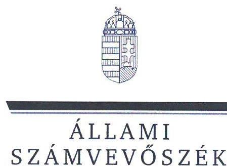
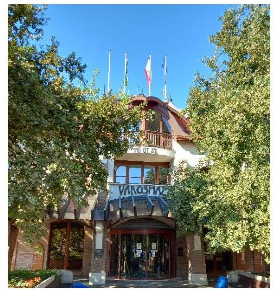
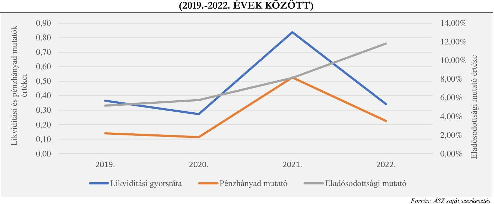
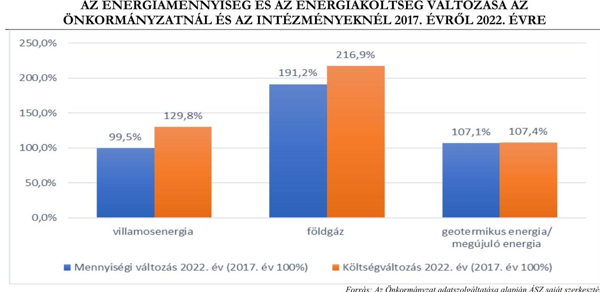
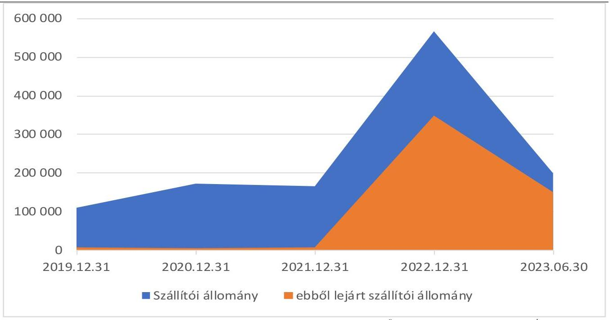
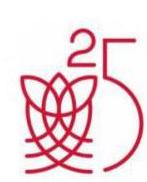
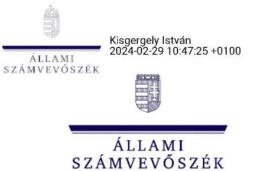

# JELENTÉS 

## Az önkormányzatok energiahatékonysági intézkedéseinek ellenőrzése

Veresegyház Város Önkormányzata

2024.

---

ÁLLAMI
SZÁMVEVŐSZÉK

# JELENTÉS 

## Az önkormányzatok energiahatékonysági intézkedéseinek ellenőrzése

Veresegyház Város Önkormányzata

2024.

---

# ELLENŐRZÉSI IGAZGATÓSÁG: 

## ÁLLAMHÁZTARTÁS HELYI SZINTJÉT ELLENŐRZŐ IGAZGATÓSÁG

## ELLENŐRZÉSI IGAZGATÓ:

DR. BAFFIA GERGELY GÁBOR igazgató

## ELLENŐRZÉSVEZETŐ:

Jelentéseink az interneten a www.asz.hu címen olvashatók.

HUDÁK MAGDOLNA ellenőrzésvezető

IKTATÓSZÁM: EL-3979-009/2024.
TÉMASZÁM: 2676
ELLENŐRZÉS-AZONOSÍTÓ SZÁM: V102004

---

# TARTALOMJEGYZÉK 

- AZ ELLENŐRZÉS ALAPADATAI ..... 5
- AZ ELLENŐRZÖTT SZERVEZET ..... 7
- ÖSSZEFOGLALÁS ..... 9
- AZ ELLENŐRZÉS FÓKUSZTERÜLETEI ..... 12
- MEGÁLLAPÍTÁSOK ..... 13
- JAVASLATOK ..... 29
- MELLÉKLETEK ..... 31
I. sz. melléklet: Értelmező szótár ..... 31
II. sz. melléklet: Az ellenőrzött szervezetek jegyzéke ..... 34
III. sz. melléklet: Ellenőrzési kritériumok ..... 35
IV. sz. melléklet: Tájékoztató adatok ..... 36
- FÜGGELÉK: ÉSZREVÉTELEK ..... 42
- RÖVIDÍTÉSEK JEGYZÉKE ..... 48

---

.

---

# AZ ELLENŐRZÉS ALAPADATAI 

## AZ ELLENŐRZÉS CÉLJA

Az ellenőrzés célja annak ellenőrzése volt, hogy az Önkormányzat ${ }^{1}$ értékelte-e az energiaárak változásának a költségvetése végrehajtására, a gazdálkodására, valamint a kötelező és önként vállalt feladatainak ellátására gyakorolt hatását. Az ellenőrzés kiterjedt arra, hogy az Önkormányzat és a költségvetési szervei az energiaköltségek csökkentése érdekében tettek-e energiahatékonysági intézkedéseket. Az Önkormányzat által tett intézkedések hozzájárultak-e a költségvetés pénzügyi egyensúlyának, a kötelező feladatok ellátásának a biztosításához.

## AZ ELLENŐRZÉS TÍPUSA

Megfelelőségi és teljesítmény ellenőrzés.

## AZ ELLENŐRZÖTT IDŐSZAK

A 2022. év és a 2023. év I. féléve.
Ezen túl elemzési céllal a 3. fókuszterületnél a megkezdett és lebonyolított beruházások adatainak tanúsítványon történő bekérése tekintetében a 2017-2021. évek, továbbá a 4. fókuszterületnél a pénzügyi egyensúlyi mutatók számítása esetében a 2019-2023. I. félévének időszaka.

## AZ ELLENŐRZÉS TÁRGYA

Az ellenőrzés tárgyát képezte az Önkormányzat és költségvetési szervei gazdálkodásának biztonsága és a kötelező feladatok ellátása érdekében - az energiaárak 2022. évi változásának ellensúlyozására - tett energiahatékonyságot növelő, energiamegtakarítást célzó, a pénzügyi egyensúly fenntartására tett intézkedések megfelelőségének és eredményességének értékelése a 2022. évben és a 2023. I. félévben. A gazdasági társaságok és vagyonkezelő szervek EMIT ${ }^{2}$ készítési kötelezettségére az ellenőrzés nem terjedt ki.

Elemzési módszerrel a 2017-2021. években végrehajtott energiahatékonysági beruházások, fejlesztések, szakpolitikai intézkedésekben való részvétel értékelése a tekintetben, hogy azok megelőző intézkedést jelentettek-e, illetve befolyásolták-e az energiaköltségek csökkentése érdekében a 2022. évben és a 2023. év I. félévében megtett intézkedéseket.

## AZ ELLENŐRZÉS JOGALAPJA

Az ellenőrzés jogszabályi alapját az ÁSZ tv. ${ }^{3}$ 5. § (2) bekezdés előírásai képezték.

---

# AZ ELLENŐRZÉS MÓDSZERE 

Az ellenőrzést az Alaptörvény ${ }^{4}$ 43. cikk (1) bekezdésében meghatározott törvényességi, célszerűségi, eredményességi szempontok, valamint a nemzetközi standardokat irányadónak tekintve az ellenőrzési program szempontjai, az ellenőrzött időszakban hatályos jogszabályok, az ellenőrzés szakmai szabályok és módszertanok figyelembevételével végezte az ÁSZ ${ }^{5}$.

Az ellenőrzési kérdések megválaszolásához szükséges bizonyítékok megszerzése az ellenőrzött szervezet által rendelkezésre bocsátott dokumentumokra és adatokra, valamint az ellenőrzést támogató szervezetektől ${ }^{6}$ kapott adatokra alapozva, továbbá megfigyelés, szemle (szemrevételezés), kérdésfeltevés (információkérés), valamint elemző eljárás útján történt.

Az ellenőrzés során bizonyítékként felhasználható adatforrások közé tartoztak egyrészt az ellenőrzéshez kért dokumentumok, másrészt adatforrás volt még a közhiteles (Elektronikus Közbeszerzési rendszer) és egyéb (Önkormányzati rendelettár) nyilvántartásból származó, az ellenőrzés szempontjából releváns információkat tartalmazó dokumentum.

Az ellenőrzés lefolytatásához az ellenőrzött szervezetek a tanúsítványok kitöltésével, valamint az ÁSZ által kért dokumentumok, adatok, információk megküldésével és a helyszíni ellenőrzés során interjú keretében szolgáltattak adatokat. A rendelkezésre bocsátott adatok, információk kontrolljára helyszíni ellenőrzés keretében is sor került. Ellenőrzést támogató szervezetként adatot kértünk a $\mathrm{BM}^{7}$-től, a $\mathrm{PM}^{8}$-től, az $\mathrm{EM}^{9}$-től, a $\mathrm{HM}^{10}$-től és a $\mathrm{ME}^{11}$-től az energiaáremelkedéssel kapcsolatos intézkedések keretében nyújtott állami támogatásokról, továbbá az EMIT ${ }^{12}$-ek teljesítésére vonatkozóan a $\mathrm{MEKH}^{13}$-től, amely szervezet az Energetikusi Hálózaton keresztül támogatta a közintézmények Ehat. tv. ${ }^{14}$-ben foglalt adatszolgáltatási kötelezettségeinek teljesítését.

Az ellenőrzés során két kockázati alapon kiválasztott önkormányzati beruházás előkészítése, megvalósítása, elszámolása, nyilvántartása tételes ellenőrzésre került.

Elemzési módszerrel tanúsítványon szolgáltatott adatok alapján értékeltük, hogy a 2017-2021. évek között végrehajtott (indított, folyamatban lévő, vagy befejezett) energiahatékonyságot növelő, energiamegtakarítást célzó beruházások mennyiben befolyásolták, milyen hatással voltak a rendkívüli energiaár növekedések következtében a 2022. évben és a 2023. év I. félévben megtett intézkedésekre.

A tanúsítványokon szolgáltatott adatok, az Önkormányzat által rendelkezésre bocsátott dokumentumok alapján értékeltük, hogy a meghozott takarékossági intézkedések hogyan érintették az Önkormányzat kötelező, illetve önként vállalt feladatainak ellátását, öt mutatószám (likviditási gyorsráta változása, eladósodottsági mutató, lejárt szállítói állomány változása, pénzhányad mutató alakulása) segítségével értékeltük az önkormányzatnál a pénzügyi egyensúly fenntartására tett intézkedések eredményességét.

Az ellenőrzés kiterjedt minden olyan körülményre és adatra, amely az ÁSZ jogszabályban meghatározott feladatainak teljesítéséhez, valamint a program végrehajtása folyamán felmerült újabb összefüggések feltárásához szükséges volt.

---

# AZ ELLENŐRZÖTT SZERVEZET 

Veresegyház város a közép-magyarországi régióban, Pest vármegyében, a gödöllői járásban, Budapesttől 25 kilométerre található. A város területe $28,56 \mathrm{~km}^{2}$, lakónépessége 2022. január 1-jén a $\mathrm{KSH}^{15}$ adata szerint 20634 fő volt.

A település polgármestere ${ }_{2}^{16}$ a korábbi polgármester ${ }_{1}^{17}$ lemondása miatt 2023. március 1-jétől megbízással látta el a tisztségét, 2023. május 21-jétől megválasztották polgármesternek. A Képviselő-testületnek ${ }^{18}$ a polgármesteren kívül 11 képviselő tagja volt, a polgármester munkáját két alpolgármester segítette.

A Hivatal ${ }^{19}$ látta el az Önkormányzat, a Hivatal, a Veresegyházi Kistérség Önkormányzatainak Többcélú Társulása, valamint az Esély Szociális Alapellátási Központ gazdasági feladatait. A Hivatalt az ellenőrzött időszakban 2023. augusztus 15-ig a jegyző ${ }_{1}{ }^{20}$, 2023. augusztus 16-tól a jegyző ${ }_{2}{ }^{21}$ vezette.

Az Önkormányzat tagja volt a Veresegyház és Környéke Szennyvízközmű Társulásnak (szennyvízközmű fejlesztésére), valamint az Észak-Kelet Pest és Nógrád megyei Regionális Hulladékgazdálkodási és Környezetvédelmi Önkormányzati Társulásnak (hulladékgyűjtésre, azok hasznosítására, ártalmatlanítására). Az Önkormányzat kizárólagos tulajdonában álló gazdasági társasága a Veresegyházi Városfejlesztő Korlátolt Felelősségű Társaság, melynek fő tevékenysége az ingatlankezelés volt.

Az Önkormányzat kötelező és önként vállalt feladatai ellátására alapított hat költségvetési intézménye közül a GAMESZ ${ }^{22}$ rendelkezett önálló gazdasági szervezettel, a geotermikus hőszolgáltatási feladatot is a GAMESZ végezte. Az Önkormányzat tulajdonában 2022. december 31-én 19 közfeladat ellátását szolgáló épület volt.

Az Önkormányzat a 2019. évben elnyerte az energiahatékonysági és megújuló energetikai fejlesztések támogatására létrejött Virtuális Erőmű program ${ }^{23}$ keretében az „Energiabatékony Önkormányzat" díjat.

Az Önkormányzat a 2022. évi költségvetési beszámolója szerint a TOP_Plusz-2.1.1-21. ${ }^{24}$ számú „Széchényi téri óvoda energetikai korszerűsítése" pályázatból 92,9 M Ft összegű támogatásban részesült. Az 580/2022 (XII. 23.) Korm. rendelet ${ }^{25}$ alapján a 10000 lakos feletti önkormányzatok energiaáremelkedés miatti támogatása jogcímen a 2023. évre 365,0 M Ft támogatást kapott.

---

Az Önkormányzat 2022. évi konszolidált beszámolójának főbb adatait az 1. táblázat mutatja be: 1. táblázat

# AZ ÖNKORMÁNYZAT 2022. ÉVI KONSZOLIDÁLT BESZÁMOLÓJÁNAK FŐBB ADATAI 

| MEGNEVEZÉS | 2022. ÉVI KONSZOLIDÁLT ÖNKORMÁNYZATI BESZÁMOLÓ (M Ft) |
| :--: | :--: |
| Költségvetési bevételek | 7660,0 |
| Ebből: |  |
| Működési célú támogatások államháztartáson belülről | 2364,1 |
| Felhalmozási célú támogatások államháztartáson belülről | 542,0 |
| Közhatalmi bevételek | 2298,5 |
| Működési bevételek | 1637,1 |
| Finanszírozási bevételek | 5952,3 |
| Ebből: |  |
| Hitel-, kölcsönfelvétel pénzügyi vállalkozásoktól | 5024,9 |
| Maradvány igénybevétele | 569,7 |
| Államháztartáson belüli megelőlegezések | 357,6 |
| Költségvetési kiadások | 9046,7 |
| Ebből: |  |
| Dologi kiadások | 2736,6 |
| Ebből közüzemi díjak | 238,3 |
| Beruházások | 1874,0 |
| Felújítások | 180,6 |
| Finanszírozási kiadások | 4879,9 |
| Ebből: |  |
| Hitel-, kölcsöntörlesztések államháztartáson kívülre | 4531,8 |
| Államháztartáson belüli megelőlegezések visszafizetése | 348,1 |

Forrás: Az Önkormányzat 2022. évi konszolidált beszámolójáa alapján ÁSZ saját szerkesztés
Az Önkormányzat 2017. év és 2023. I. féléve között 30 energiahatékonyság növelést, energiamegtakarítást célzó beruházás megvalósítását tervezte, amelyek összértéke 1754,0 MFt volt. A ténylegesen elindított 28 beruházás 89,3 %-a településen működő - a GAMESZ által üzemeltetett - geotermikus hőszolgáltatási rendszer bővítését és karbantartását érintette, amelyből 2023. I. félévéig 794,8 M Ft került teljesítésre.

---

# ÖSSZEFOGLALÁS 

Az energiaárak 2022. évben bekövetkezett jelentős emelkedése, a források korlátozott rendelkezésre állása új fókuszba helyezte az önkormányzatoknál az energiával történő gazdálkodás kérdését. Az energia változatlan mennyiségben történő felhasználása a magas költségkitettség miatt jelentős kockázatokat eredményezett az önkormányzatok pénzügyi-gazdasági egyensúlyára, valamint a közfeladatok ellátásának biztonságára. Az energiaárak emelkedéséből eredő kockázatok önkormányzati kezelésének támogatása érdekében kormányzati intézkedések történtek. Az európai uniós irányelveken alapuló, az energiahatékonyságról szóló törvény a települési önkormányzatok, mint a közfeladat ellátását szolgáló épületek tulajdonosai, használói, az üzemeltetésért és fenntartásért felelős szervezetek vezetői számára több energiahatékonysági feladatot is meghatározott. Az ellenőrzés rávilágított az önkormányzatok törvényben foglalt energiagazdálkodással kapcsolatos feladatainak ellátásával kapcsolatos problémákra, az energiagazdálkodási feladatok és a pénzügyi-gazdálkodási feladatok közötti összefüggésekre, hozzájárult a szabályszerű és felelős gazdálkodásához, a közpénzek szabályos, cél szerinti felhasználásához, a közvagyon védelméhez.

Az Önkormányzat és a költségvetési szervek vezetőinek az Önkormányzat tulajdonában, illetve használatában álló, közfeladat ellátását szolgáló épületekkel kapcsolatos energetikai üzemeltetési és fenntartási feladatellátása nem felelt meg teljeskörűen a jogszabályi előírásoknak, mivel a 17 EMIT készítési kötelezettséggel érintett közfeladat ellátását szolgáló épületből 2022-ben csak 12-re álltak rendelkezésre az EMIT-ek. Hat ingatlanra vonatkozóan nem készítették el, egyre pedig nem volt hatályos az energetikai tanúsítvány, továbbá az energiafelhasználási adatokra vonatkozó havi adatszolgáltatási kötelezettségnek nem tettek eleget. A 2023. évben az ellenőrzés lezárásáig, 2023. november végéig - a lejárt és hiányzó EMIT-ek helyett - a 17 új EMIT nem készült el, azok pótlása folyamatban volt.

Az Önkormányzat pénzügyi helyzete a 2017-2022. években nem volt stabil, amelyhez hozzájárultak a geotermikus hőszolgáltatással kapcsolatos nagy ütemű - a közintézményi feladatellátáshoz csak 25%-os mértékben kapcsolható - fejlesztések is. Likviditása, közfeladat ellátása csak folyószámlahitelek és rövidlejáratú hitelek igénybevételével volt biztosított. Ezt jól mutatja az Önkormányzat pénzügyi mutatószámainak alakulása is. Az ellenőrzött időszakban a likviditási gyorsráta és a pénzhányad mutatók alakulása a fizetőképtelenség kockázatát jelezte, és az eladósodottsági mutató alakulásának tendenciája is kedvezőtlen volt. Az Önkormányzat az ellenőrzött időszakban nehéz likviditási helyzete ellenére megőrizte és fenn tudta tartani a működőképességét, kötelező feladatait el tudta látni, amelyet segítettek a 2022. évben és a 2023. I. félévében meghozott energiahatékonysági intézkedései is. 2023. I. félévében az Önkormányzatnál a pénzügyi egyensúlyi helyzet helyreállt, a likvid hiteleket visszafizették egy nagyobb iparűzési adóbevételnek köszönhetően.

Az Önkormányzat pénzügyi mutatóinak alakulását az 1. ábra mutatja be.

---

A Képviselő-testület a 2017. év és 2023. I. féléve között összesen 28, az Önkormányzat és intézményei által ténylegesen elindított energetikai célú fejlesztésről hozott döntést, amelynek értéke 1669,2 M Ft volt. A fejlesztések közvilágításra, óvoda energetikai korszerűsítésére irányultak, valamint a geotermikus hőszolgáltatási rendszerhez kapcsolódtak. Az Önkormányzatnál a jogszabályban foglaltak ellenére a fejlesztési döntések előkészítése vonatkozásában nem építették ki a

 szervezeti célok elérését veszélyeztető kockázatok csökkentésére irányuló kontrollokat a döntések célszerűségi, gazdaságossági, hatékonysági és eredményességi szempontú megalapozottsága tekintetében. Így például az előterjesztések nem tartalmazták a beruházások indokoltságának, szükségességének bemutatását, megtérülési számításokat, továbbá a geotermikus hőszolgáltatásra irányuló fejlesztések esetében nem mutatták be, hogy az milyen mértékben szolgálja a közintézményi feladatellátást, és milyen mértékben más szereplőket (pl. lakosság, vállalkozások). Nem vizsgálták a létrejövő tárgyi eszközök, berendezések üzemeltetésével, működtetésével, karbantartásával kapcsolatos várható kiadásokat sem. Ez az üzemeltetés során kockázatot jelenthet az önkormányzat pénzügyi egyensúlyi helyzetére, ezáltal kötelező feladatai ellátásának finanszírozhatóságára. A fejlesztések megtérülését utólag sem vizsgálták, erre adatot nem gyűjtöttek, emiatt azok eredményessége utólag sem mérhető.

A tételes ellenőrzésre kiválasztott - 309,7 M Ft összértékű - Termálkút fúrás beruházás ${ }^{26}$ során a döntéseket az arra jogosultak hozták meg. A Termálkút fúrás beruházás lebonyolításánál nem tartotta be sem az Önkormányzat, sem a vállalkozó a jogszabályban és a vállalkozási szerződésben foglaltakat a teljesítési határidő, a vállalkozó a megvalósítási ütemek építési naplóban való dokumentálása, valamint az Önkormányzat a fizetési ütemek és a teljesítésigazolások tekintetében.

Az Önkormányzat folyamatos likviditási problémáihoz hozzájárultak a Képviselő-testület döntése alapján a GAMESZ által a 2017-2023. I. féléve között mindösszesen 1573,0 M Ft összegben elindított geotermikus fejlesztések, amelyek eredményeképpen létrejött eszközökkel nyújtott szolgáltatásokat nagy részben (több, mint 75%-os arányban) nem a közfeladatellátásban érintett szervezetek, hanem a vállalkozások és a lakosság vették igénybe. A fejlesztések megvalósításához a befolyt szolgáltatási díjbevételek a 2020-2022. években nem voltak elegendőek, azokat az Önkormányzat költségvetéséből, illetve likvid hitelekből egészítette ki, a 2020. évben 39,3 M Ft, a 2021. évben 189,0 M Ft, a 2022. évben 167,3 M Ft összegben. Tekintettel arra, hogy az Önkormányzatnak már működőképességének fenntartásához is hitelekre volt szüksége, a likvid hitelekkel finanszírozott fejlesztésekkel kötelező feladatainak ellátását, fizetőképességének fenntartását veszélyeztette.

---

Emellett a geotermikus hőszolgáltatással kapcsolatos bevételek és kiadások elszámolása sem felelt meg a jogszabályi előírásoknak, mivel azokat a GAMESZ annak ellenére teljes egészében az alaptevékenység körében számolta el, hogy a szolgáltatás több, mint 75%-át (a 45 szerződött partnerből 34 nem közfeladatot ellátó partner) vállalkozásoknak nyújtotta és a szolgáltatásból vállalkozási bevétele származott.

A 2023. I. negyedévében a belső ellenőrzés által lefolytatott GAMESZ átfogó vizsgálat az ÁSZ megállapításaival összhangban, azt megelőzően megállapította mind a vállalkozási tevékenységből eredő bevételek és kiadások elszámolásának szabálytalanságát, mind a vállalkozási tevékenység kockázatát az önkormányzat gazdálkodására. A Képviselő-testület a belső ellenőri jelentés alapján 2023. októberében döntött arról, hogy egyes piaci alapon végzett tevékenységeit - közötte a geotermikus hőszolgáltatást is - 2024. január 1-jétől kezdődően gazdasági társasági formában látja el, ezáltal a jogszabályi előírásokkal összhangban lépéseket tettek a szabályszerű és biztonságos gazdálkodás megteremtése érdekében.

Az Önkormányzatnak az ellenőrzött időszakban 2017-től 2023-ig a december 31-i fordulónapon folyamatosan volt banki folyószámlahitele, és pénzügyi szolgáltatótól felvett éven belüli hitele, úgy, hogy minden évben új kölcsönszerződéseket kötöttek, és az új kölcsönszerződés alapján folyósított összegből került visszafizetésre a korábbi kölcsönből adott időpontban még fennálló tartozás is. A rövidlejáratú és a likvid hitelállomány folyamatos fenntartásával megkerülték azon törvényi előírást, hogy az önkormányzatok kizárólag a Kormány előzetes hozzájárulásával köthetnek adósságot keletkeztető ügyletet. A rövidlejáratú kölcsön- és a folyószámlahitel szerződéseket a Kormány engedélye nélkül is megköthető éven belüli ügyletként kezelték, azonban ezek a hitelek a december 31-ei beszámoló fordulónapon minden évben fennálltak. Az éven belüli lejárattal megkötött rövidlejáratú kölcsönszerződésből és a folyószámlahitel szerződésekből fennálló tartozások összegei a 2017-2022. évek végén 700,0-2505,5 M Ft között mozogtak.

Az Önkormányzat 2021. november 10-én különböző fejlesztési célokra 3000,0 M Ft fejlesztési hitelt vett fel, amelynek része volt az 556,4 M Ft összegben termálkút fúrásra és csővezeték rendszer kiépítésére felvett összeg is. A hitel teljes összegének 2021. évi folyósítása ellenére az Önkormányzat a 2022. májusában benyújtott Termálkút fúrás beruházás végszámlára szükséges 75,2 M Ft-os fedezetet nem tudta megfelelő időben a GAMESZ részére biztosítani, likviditási gondjai miatt a hitelrészt átmenetileg nem a hitelszerződésben meghatározott célra fordította. Emiatt a végszámla határidőn túl, és több részletben került kifizetésre. Késedelmi kamatot a GAMESZ-szal szemben a beruházást végző vállalkozás nem érvényesített. A fejlesztési hitel átmeneti, a termálkút fúrási beruházástól eltérő célra való felhasználása nem felelt meg az annak engedélyezéséről szóló Korm. határozatban foglaltaknak, miszerint a hitelt csak a meghatározott fejlesztésre lehetett fordítani.

A Képviselő-testület az energiaköltségek csökkentése, a pénzügyi egyensúly fenntartása érdekében 2022 októberében a jogszabályi előírásoknak megfelelően menedzsmenttervet ${ }^{27}$ fogadott el, amely alapján az Önkormányzat és a költségvetési szervei a 2022. évben és 2023. I. félévében 17 bevételnövelő és 42 kiadást csökkentő intézkedést tettek. A menedzsmentterv alapján a miniszteri biztossal ${ }^{28}$ tárgyalást folytattak, melynek eredményeként az Önkormányzat 365,0 M Ft állami támogatást kapott. Az energiamegtakarító intézkedések, és energiahatékonyságot célzó fejlesztések ellenére azonban az Önkormányzat energiafogyasztási adataiban csak minimális csökkenés volt kimutatható, mivel a geotermikus hőszolgáltatásra irányuló fejlesztések az ellenőrzött időszakban nem az Önkormányzat fenntartásában lévő költségvetési szervekre irányultak, ezért a geotermikus hőszolgáltatással kiváltott egyéb energiahordozóknál (pl. földgáz) jelentkező megtakarítás sem az Önkormányzatnál jelentkezett.

Az ÁSZ az ellenőrzés során feltárt hiányosságok felszámolása, a szabályszerű működés feltételeinek megteremtése érdekében a polgármesternek öt, a jegyzőnek kettő javaslatot tett.

---

# AZ ELLENŐRZÉS FÓKUSZTERÜLETEI 

1.- Az önkormányzat és költségvetési szervei tulajdonában, illetve használatában álló, közfeladat ellátását szolgáló épületekkel kapcsolatos energetikai üzemeltetési és fenntartási feladatellátás
2.- Az energiaárak változására tekintettel a gazdálkodás biztonsága érdekében a központi intézkedések adta lehetőségek önkormányzat általi hasznosítása
3.- Az energiaköltségek csökkentése, az energiahatékonyság növelése érdekében kezdeményezett, illetve folyamatban lévő energetikai beruházások értékelése
4.- Az energiaárak hatásának kezelésére, a kötelező feladatok ellátására, a pénzügyi egyensúly fenntartására tett intézkedések értékelése

---

# MEGÁLLAPÍTÁSOK 

## 1. Az önkormányzat és költségvetési szervei tulajdonában, illetve használatában álló, közfeladat ellátását szolgáló épületekkel kapcsolatos energetikai üzemeltetési és fenntartási feladatellátás

Összegző megállapítás Az Önkormányzat és költségvetési szervei tulajdonában, illetve használatában álló, közfeladat ellátását szolgáló épületekkel kapcsolatos energetikai üzemeltetési és fenntartási feladatellátás csak részben felelt meg az Ehat. tv., az Mötv. ${ }^{29}$, valamint a 176/2008. (VI. 30.) Korm. rendelet ${ }^{30}$ előírásainak, mivel 2022-re csak az érintett ingatlanok 70,6%-ára álltak rendelkezésre az EMIT-ek, 53,3%-ára az energetikai tanúsítványok, valamint az Önkormányzat nem tett eleget a havi energiafogyasztási adatokkal kapcsolatos adatszolgáltatási kötelezettségeknek. A 2023. évre a megújított EMIT-eket egyetlen egy ingatlanra sem készítették el.

Az Önkormányzat, költségvetési szervei vezetői a tulajdonukban, illetve használatukban álló, közfeladat ellátását szolgáló 19 épületből az EMIT készítésre kötelezett 17 épület esetében csak részben tettek eleget az Ehat. tv. 11/A. § előírásainak az ellenőrzött időszakban.

- A 19 épületből 3 épületben (Gyermekorvosi rendelők, Orvosi rendelők és Praxis Ház) az Önkormányzati tulajdonú Városfejlesztési Kft. által üzemeltetett intézmények, egy épületben (Esély Szociális Alapellátási Központ) a Veresegyházi Kistérségi Társulás által üzemeltetett intézmény került elhelyezésre. Az épületekkel kapcsolatosan az Ehat. tv.-ből eredő feladatokat azonban az Önkormányzat látta el, azokat nem ruházta át az intézmény üzemeltetőkre.
- A 2022. évben az Ehat. tv. 11/A. § a) pontjának előírása ellenére öt ingatlan (Orvosi rendelők, Csonkási Óvoda, Zöld Óvoda, Váci Mihály Művelődési Ház, Tájház Luther úti épület) vonatkozásában nem rendelkeztek az EMIT-ekkel, a 2023. évben pedig - a 2022. évben lejárt, illetve hiányzó EMIT-ek helyett - a 17 épületből egyre sem készítették el az új dokumentumokat. Az Ehat. tv. 11/A. § b) pontjában foglaltak ellenére a 2022. évre vonatkozóan az EMIT-ek teljesítéséről nem készítették el az éves jelentést.
- A mintavételes ellenőrzésre kiválasztott négy ingatlan vonatkozásában (Hivatal, Széchenyi téri Óvoda, Gyermekligeti Óvoda, Veresegyházi Városi Múzeum) az Ehat. tv. 11/A. § a) pontja előírása ellenére az EMIT-ek nem feleltek meg a MEKH által kiadott mintának, mert hiányzott az EMIT-ek valamennyi előírt melléklete (pl.: az épületenergetikai tanúsítványok másolatai, fotódokumentációk, intézkedési terv elkészítésében közreműködő szakemberek felsorolása), továbbá a Széchenyi Téri Óvoda és a Gyermekliget Óvoda EMIT-jei nem tartalmazták a beruházást igénylő intézkedések esetén a határidő és felelős megjelölését.

---

- A 19 épületből négy épületre vonatkozóan - azok kis mérete (500 m² hasznos alapterület alatti épület) miatt - nem voltak kötelezettek energetikai tanúsítvány készítésére. Az energetikai tanúsítvány készítésre kötelezett 15 épületből 6 ingatlanra (Orvosi rendelők, GAMESZ székhely, Váci Mihály Művelődési Ház, Szabadidős és Gazdasági Innovációs Központ, Piros Óvoda, Veresegyház Város Önkormányzat Idősek Otthona) a 176/2008. (VI. 30.) Korm. rendelet 1. § (3) bekezdés c) pontjában foglaltak ellenére nem készítették el az energetikai tanúsítványokat, továbbá a Hivatal épületére vonatkozó energetikai tanúsítvány hatálya 2021. május 10-én lejárt, újat az ÁSZ ellenőrzés lezártáig nem készítettek.
- Az Önkormányzat az Ehat tv-ben foglaltaknak megfelelően az Ehat tv. 11/A. §-ában foglalt feladatok ellátására 2018. március 1-től a műszaki beruházási ügyintézőt jelölte ki, akinek munkaköri leírása azonban az ellátandó konkrét feladatokról nem rendelkezett. A műszaki beruházási ügyintéző jogviszonya 2022. november 16-án megszűnt. Ezt követően az ÁSZ ellenőrzés megkezdéséig új energetikai felelőst nem jelöltek ki.
- Az EMIT-ek elkészítésével, az éves jelentéstételi kötelezettséggel és adatszolgáltatással kapcsolatos Ehat. tv. 11/A. §-ában megjelölt feladatokat a megfelelő szakértelem biztosítása érdekében 2018. április 16-2022. március 31-e között külső vállalkozási szerződés keretében látták el, amelyet az Önkormányzat a polgármester döntése alapján 2022. március 31-vel felmondott. Az Önkormányzat az energiagazdálkodás monitoringjára és az energiabeszerzésekben való részvételre 2022. szeptember 1-jével, az EMIT-ek készítésére és a kapcsolódó adatszolgáltatásokra 2023. augusztus 22-én új szerződéseket kötött.
- Az Önkormányzat és költségvetési szervei az ellenőrzött időszakban nem tettek eleget az energiahatékonyságról szóló törvény végrehajtásáról szóló 122/2015. (V.26.) Korm. rend. 7/F.§-ában foglalt energiafelhasználási adatokkal kapcsolatos havi adatszolgáltatási kötelezettségüknek.
(Az Önkormányzat tulajdonában lévő épületek számát, az EMIT-ek, valamint az energetikai tanúsítványok számának alakulását részletesen a IV. számú melléklet 1. táblázata tartalmazza.)
Az ellenőrzött időszakot követően, a helyszíni ellenőrzés ideje alatt a polgármester ${ }_{2}$ nyilatkozata szerint az Önkormányzat és költségvetési szervei mind a 19 közfeladat ellátását szolgáló épületére vonatkozóan folyamatban volt az EMIT-ek elkészítése. Az Önkormányzat az EMIT-ek hiányában is tett energiamegtakarító intézkedéseket.

---

# 2. Az energiaárak változására tekintettel a gazdálkodás biztonsága érdekében a központi intézkedések adta lehetőségek önkormányzat általi hasznosítása 

## Összegző megállapítás

A gazdálkodás biztonsága érdekében az Önkormányzat az energiaárak hatásának mérséklését célzó központi intézkedések adta lehetőségek közül a villamosenergia vásárlásnál a fixált áras árképzésű beszerzési lehetőséget vette igénybe. A végső menedékes jogintézménnyel csak az önkormányzati lakások vonatkozásában éltek. A fütési költségek nagy részét a kormányzati intézkedésekben nem érintett termálvizes hőenergia tette ki.

Az Önkormányzatnál az ellenőrzött időszakban az energiaárak
 változására tekintettel az energiaellátás folyamatos biztosítása érdekében tett kormányzati intézkedéseket és az azokhoz kapcsolódó önkormányzati nyilatkozatokat a 2. táblázat mutatja be.
2. táblázat

A KORMÁNY ÁLTAL BIZTOSÍTOTT LEHETŐSÉGEKHEZ KAPCSOLÓDÓAN MEGTETT NYILATKOZATOK SZÁMA (DB)

| KORMÁNYZATI INTÉZKEDÉS | ÖNKORMÁNYZAT |  | KÖLTSÉGVETÉSI SZERVEK |  |
| :--: | :--: | :--: | :--: | :--: |
|  | IGEN | NEM | IGEN | NEM |
| Végső menedékes jogintézmény keretében biztosított villamosenergia-ellátás - 217/2022. (VI.17) Korm. rendelet ${ }^{31} 3 . \S$ | 1 | 0 | 0 | 7 |
| Végső menedékes jogintézmény keretében biztosított földgázellátás 217/2022. (VI.17) Korm. rendelet 8. § | 1 | 0 | 0 | 7 |
| Teljes ellátás alapú veszélyhelyzeti átmeneti villamosenergia-ellátás biztosítása 520/2022. (XII. 13.) Korm. rendelet ${ }^{32} 5 . \S$ | 0 | 1 | 0 | 7 |
| Veszélyhelyzeti átmeneti földgázellátás biztosítása 388/2022. (X.14.) Korm. rendelet ${ }^{33} 4 . \S$ | 0 | 1 | 0 | 7 |
| Fixált áras árképzésű villamosenergia vásárlás 41/2023. (II. 20) Korm. rendelet ${ }^{34} 2 . \S$ | 1 | 0 | 7 | 0 |
| Fixált áras árszabású földgáz vásárlás 12/2023. (I. 20) Korm. rendelet ${ }^{35} 2 . \S$ | 0 | 1 | 0 | 7 |
| Földgáz-kereskedelmi szerződésben rögzített minimális mennyiség érvényesítése - 354/2022 (IX.19) Korm. rendelet ${ }^{36} 2 . \S$ | 0 | 1 | 0 | 7 |

A villamosenergia és a gázenergia esetében a végső menedékes státusz lehetőségével csak az önkormányzati bérlakások esetében éltek (a villamosenergia ellátás kapcsán kilenc, a földgázellátás kapcsán 14 önkormányzati bérlakás felhasználási helyre). A tarifaváltás 2022. augusztus 1-jétől történt meg, ezzel a lakossági bérlők továbbra is jogosultak voltak az egyetemes szolgáltatásra. Egyéb felhasználási helyek (Önkormányzat tulajdonában álló közfeladatellátásban érintett épületek) vonatkozásában a közbeszerzés útján kötött, - kedvezőbb árú - hatályos szerződéseire tekintettel az Önkormányzat nem élt a végső menedékes státusz lehetőségével.

---

A veszélyhelyzeti átmeneti villamosenergia- és földgázellátás igénybevételének lehetőségével, valamint a fixált áras árszabású földgázenergia vásárlás lehetőségével az Önkormányzat nem élt.

- A 2022. évre a villamosenergia tekintetében a közfeladatellátásban érintett épületekre rendelkeztek hatályos szerződéssel. A 2023. évre közbeszerzési eljárás alapján megkötött szerződés útján gondoskodtak a villamosenergia ellátásáról.
- A földgáz esetében az Önkormányzat hatályos földgáz kereskedelmi szerződése kedvezőbb árakat tartalmazott, mint a szolgáltató által meghirdetett fix ár. (Az MVM Next Zrt. közleménye szerint a fix ár 2023. április 30-ig nettó 21,215 Ft/MJ, 2023. május 1-jétől nettó 10,183 Ft/MJ volt, míg az Önkormányzat földgáz kereskedelmi szerződése alapján az Önkormányzatnak ettől kedvezőbb, 3,498 Ft/MJ egységárat kellett megfizetnie.)
Az Önkormányzat és költségvetési szervei éltek a 2023. április 1-től 2023. december 31-ig tartó időszakra a fixált áras árszabású villamosenergia vásárlás lehetőségével, mivel az kedvezőbb volt, mint a 2023. január 1-jei hatállyal megkötött villamosenergia vásárlási szerződés. A szerződés szerinti egységár 204,7 Ft/Kwh volt, míg a fixált ár ettől alacsonyabb, 55,19-64,32 Ft/KWh között mozgott, amely az euro árához igazodva módosulhatott. Az Önkormányzatnál a fütési költségek nagy részét a termálvizes energia adta, amelyet a GAMESZ szolgáltatott az önkormányzati intézményeknek, a lakosságnak és a gazdasági társaságoknak.
A Képviselő-testület az 5/2016. (II. 29.) számú rendeletében döntött a geotermikus hőszolgáltatás díjáról és egyéb szabályairól, amelyben meghatározták, hogy a geotermikus energia ára a földgáz versenypiaci költségeket tükröző árának a 70%-a ott, ahol az Önkormányzat építette ki a hálózatot, és 60% ahol a fogyasztó építette ki a primer szolgáltatói kört. A fogyasztói egységár kialakításának alapja nem az önköltségszámítás, hanem a földgáz nettó árának alakulása volt. A GAMESZ Önköltségszámítási szabályzata ${ }^{37}$ előírta a termálfütési rendszer kalkulációs egységére (1MJ) az utókalkuláció készítését, amelyet a GAMESZ 2022. év végén elkészített. (A kalkulációs egységre jutó önköltségi ár 1,696 Ft/MJ volt.) A 2022. évi szolgáltatás díjának módosításához nem állt rendelkezésre önköltségszámítás, azonban a 2022. év végi kalkulációt figyelembevéve a 2023. évben magasabb egységárat szabtak ki, mint az önköltség. A GAMESZ-nak, mint szolgáltatónak az Önkormányzat 5/2016. (II. 29.) számú rendeletének 5. § (3) bekezdése alapján lehetősége volt egyedi ármegállapításra, amelynek lehetőségével élt a lakosságra, illetve a gazdasági társaságokra vonatkozóan, amely azonban nem lehetett alacsonyabb az önköltségi árnál. Az Önkormányzat a 449/2022. (XI. 9.) Korm. rendelet ${ }^{38}$ előírásai szerint nem élt a közvilágítás korlátozására szóló rendelet alkotási lehetőségével.

---

# 3. Az energiaköltségek csökkentése, az energiahatékonyság növelése érdekében kezdeményezett, illetve folyamatban lévő energetikai beruházások értékelése 

Összegző megállapítás Az ellenőrzött időszakban Önkormányzat által végrehajtott fejlesztések elősegítették az energiaárak emelkedése miatti intézkedések teljesülését, azonban a Bkr. ${ }^{39}$-ben foglaltak ellenére nem építették ki a szervezeti célok elérését veszélyeztető kockázatok csökkentésére irányuló kontrollokat a beruházási döntések megalapozottsága érdekében. Ez az üzemeltetés során kockázatot jelent az Önkormányzat kötelező feladatainak finanszírozhatóságára.

Az Önkormányzat 2017. év és 2023. I. féléve között 30 - 1 754 032,0 E Ft összegű - energiahatékonyság növelést, energiamegtakarítást célzó fejlesztés megvalósítását tervezte, amelyből két fejlesztés 84 836,0 E Ft összegben forráshiány miatt meghiúsult. A Képviselő-testület az energetikai célú fejlesztések forrásait a költségvetésben tervezte. Egy esetben (óvoda fejlesztése) európai uniós pályázati forrást is elnyertek 92 949,0 E Ft összegben. A 2022. évben a saját források kiegészítésére fejlesztési hitel felvételére kötöttek szerződést. A 2017-2021. években a fejlesztésekhez hitel felvételt nem terveztek, azonban rövid lejáratú és likvid hiteleket az időszakban folyamatosan igénybe vettek oly módon, hogy a likvid hitelek egy része év végén sem került visszafizetésre. A hitelt rulírozó módon vették igénybe, a visszatörlesztett összegeket az újabb kifizetésekhez újra lehívták. Így a beruházásokat is részben likvid hitelből finanszírozták. A fejlesztési döntések előkészítése vonatkozásában, a Bkr. 8. § (2) bekezdés b) pontjában foglaltak ellenére, nem építettek ki a szervezeti célok elérését veszélyeztető kockázatok csökkentésére irányuló kontrollokat a döntések célszerűségi, gazdaságossági, hatékonysági és eredményességi szempontú megalapozottsága tekintetében. Így például nem határozták meg a fejlesztés elvárt eredményét és nem számszerűsítették az elvárt energia megtakarítást sem.
Az Önkormányzat által megvalósított, illetve megvalósítani tervezett fejlesztések főbb adatait a 3. táblázat mutatja be.

---

# 3. táblázat

AZ ÖNKORMÁNYZATNÁL ÉS KÖLTSÉGVETÉSI SZERVEINÉL A 2017-2022. ÉVEKBEN, VALAMINT 2023. I. FÉLÉVÉBEN TERVEZETT, INDÍTOTT, FOLYAMATBAN LÉVŐ, MEGHIÚSULT, ILLETVE BEFEJEZETT ENERGIAHATÉKONYSÁGOT CÉLZŐ FEJLESZTÉSI FELADATOK (BERUHÁZÁSOK, FELÚJÍTÁSOK) FÖBB ADATAI (E FT)

|  MÉGNEVEZÉS | PROJEK-
TEK
SZÁMA | FEJLESZTÉS CÉLJA | TERVEZETT FEJLESZTÉSI KIADÁS | EBBÖL |  | 2023. I. FÉLÉVEIG TEÚJIMÍTETT KIADÁS | EBBÖL |   |
| --- | --- | --- | --- | --- | --- | --- | --- | --- |
|   |  |  |  | PÁLYÁZATI FORRÁS | SAJÁT FORRÁS |  | PÁLYÁZATI FORRÁS | SAJÁT FORRÁS  |
|  2017-2022. években, valamint 2023. I. félévében tervezett és befejezett fejlesztési feladatok |  |  |  |  |  |  |  |   |
|  Önkormányzat | 2 | közvilágítás korszerűsítése (napelem) | 3288,0 | 0,0 | 3288,0 | 3288,0 | 0,0 | 3288,0  |
|  GAMESZ | 5 | geotermikus hőszolgáltatási rendszer bővítése, karbantartása | 59746,0 | 0,0 | 59746,0 | 30411,0 | 0,0 | 30411,0  |
|  Összesen | 7 |  | 63034,0 |  | 63034,0 | 33699,0 | 0,0 | 33699,0  |
|  2017-2022. években, valamint 2023. I. félévében indított, folyamatban lévő fejlesztési feladatok |  |  |  |  |  |  |  |   |
|  Önkormányzat | 1 | Széchenyi téri óvoda energetikai korszerűsítése | 92 949,0 | 92 949,0 | 0,0 | 0,0 | 0,0 | 0,0  |
|  GAMESZ | 13 | geotermikus hőszolgáltatási rendszer bővítése, karbantartása | 1 393 071,0 | 0,0 | 1 393 071,0 | 764 402,0 | 0,0 | 764 402,0  |
|  Összesen | 14 |  | 1 486 020,0 | 92 949,0 | 1 393 071,0 | 764 402,0 | 0,0 | 764 402,0  |
|  2017-2022. években, valamint 2023. I. félévében tervezett, de még nem indított fejlesztési feladatok |  |  |  |  |  |  |  |   |
|  GAMESZ | 7 | geotermikus hőszolgáltatási rendszer bővítése, karbantartása | 120 142,0 | 0,0 | 120 142,0 | 0,0 | 0,0 | 0,0  |
|  Összesen | 7 |  | 120 142,0 | 0,0 | 120 142,0 | 0,0 | 0,0 | 0,0  |
|  2017-2022. években, valamint 2023. I. félévében tervezett, de meghiúsult fejlesztési feladatok |  |  |  |  |  |  |  |   |
|  GAMESZ | 2 | geotermikus hőszolgáltatási rendszer bővítése, karbantartása | 84 836,0 | 0,0 | 84 836,0 | 0,0 | 0,0 | 0,0  |
|  Összesen | 2 |  | 84 836,0 | 0,0 | 84 836,0 | 0,0 | 0,0 | 0,0  |
|  Mindösszesen | 30 |  | 1 754 032,0 | 92 949,0 | 1 661 083,0 | 798 101,0 | 0,0 | 798 101,0  |

Forrás: Az Önkormányzat adatszolgáltatása alapján ÁSZ saját szerkesztés A GAMESZ által végrehajtott energetikai célú beruházások és felújítások a város területén működtetett geotermikus hőszolgáltatási rendszer bővítéséhez és karbantartásához kapcsolódtak, amelyekhez uniós támogatást nem vettek igénybe.

---

- A GAMESZ 2017. év és 2023. I. féléve között 25 - 1 572 959,0 E Ft összegű - energiahatékonyság növelő, energiamegtakarítást célzó fejlesztés megvalósítását indította el. Az elindított fejlesztésekből 2023. I. félévéig 794 813,0 E Ft értékű kifizetés történt, amely 18 beruházást érintett. A 18 tervezett fejlesztésből 13 volt folyamatban 2023. I. félév végéig.
A GAMESZ által végrehajtott fejlesztésekről az éves zárszámadások keretében számoltak be a Képviselő-testületnek.
A beruházásokkal kapcsolatos döntések előkészítése során, a Bkr. 8. § (2) bekezdés b) pontjában foglaltak ellenére nem építettek ki a szervezeti célok elérését veszélyeztető kockázatok csökkentésére irányuló kontrollokat a döntések célszerűségi, gazdaságossági, hatékonysági és eredményességi szempontú megalapozottsága tekintetében. Így például nem vizsgálták a létrejövő tárgyi eszközök, berendezések üzemeltetésével, működtetésével, karbantartásával kapcsolatos várható kiadásokat.
Ez az üzemeltetés során kockázatot jelent az önkormányzat pénzügyi egyensúlyi helyzetére, ezáltal kötelező feladatai ellátásának finanszírozhatóságára.
Az Önkormányzat és szervei 2017-2022.
 évek közötti energiafogyasztásának alakulását a 2. ábra mutatja be. 2. ábra

Az Önkormányzatnál és költségvetési szerveinél a földgáz és a geotermikus energia esetében az energiafogyasztási adatok a 2017. évhez képest a megtakarítást célzó intézkedések ellenére sem csökkentek. Az Önkormányzat hét költségvetési szervének 16 telephelyéből a 2022. évig kilencnek, a 2023. évben 10-nek a fűtését biztosította a geotermikus energia. Többi telephelyen földgázzal fűtöttek. Az ellenőrzött időszakban a geotermikus hőszolgáltatásra irányuló fejlesztések nem az önkormányzati fenntartású költségvetési szervekre irányultak, ezért az egyéb energiahordozókban való megtakarítás sem az önkormányzatnál jelentkezett.

- A 2017-2023. évek között a geotermikus energiafogyasztásba bekapcsolódó újabb fogyasztási helyek voltak: Kálvin Téri Református Általános iskola tornacsarnoka, Veresegyház Katolikus Gimnázium, Veresegyházi Városi Sportkör (kosárlabdacsarnok nagyhőközpont, kosárlabdacsarnok kishőközpont, kézilabdacsarnok). Az újonnan belépő fogyasztási helyek egyikénél sem az Önkormányzat volt a fenntartó.

---

A geotermikus energia felhasználása a 2017. évi 8.624,5 GJ-ról, 2022-re 9.233,1 GJ-ra emelkedett, melynek oka a fogyasztási helyek számának 81-ről 86-ra történő emelkedése volt, amellett, hogy 2021-2022. években a Hivatalt a geotermikus energia helyett földgázzal fűtötték annak érdekében, hogy az egyéb fogyasztók geotermikus energia igényét ki tudják szolgálni. A villamosenergia fogyasztásban 2021-ről 2022-re minimális csökkenés történt, amelynek oka, hogy az energiafogyasztás részben áttevődött a geotermikus energiára. Az Önkormányzat a megnövekedett energiaköltségeket rendelkezésre álló forrásaiból (előző évi maradvány, saját bevételek és támogatások, likvid hitelek) finanszírozni tudta.
Az Önkormányzat a geotermikus energia fejlesztéseivel, a város megújuló energiára való folyamatos átállításával törekedett arra, hogy az Unió éghajlat- és energiapolitikai céljai ${ }^{40}$ között meghatározott, illetve a Nemzeti Energiastratégiában ${ }^{41}$ megfogalmazott célok közül a megújuló energiafelhasználás részarányának növekedése a lehető legszélesebb körben érvényesüljön.

- Az Önkormányzatnál a kedvező tarifájú földgáz szerződés és „áramdíj fixálás" mellett is emelkedtek a költségek a 2017. évtől 2022. év végéig, amelynek oka, hogy az előállított geotermikus hőenergia nem volt elegendő minden fogyasztó kiszolgálására, és a szerződéses partnerek felé történő teljesítés érdekében a 2020-2022. években a Hivatal épületét ideiglenesen földgázenergiával fűtötték. A megemelkedett földgázfogyasztás többletköltségei a 2020. évben még nem jelentkeztek, a 2021-2022. években a többletfogyasztás miatt az egyes években az előző évhez képest 9999,4 E Ft és 21970,9 E Ft többletköltség jelentkezett. A geotermikus energia értékesítéséből befolyt bevétel az előző évhez képest a 2021. évben 50 980,1 E Ft-tal nőtt, a 2022. évben 43 546,0 E Ft-tal csökkent. Tehát a 2021. évi többletbevétel elméletben fedezetet nyújtott volna a 2021-2022. évi többletkiadásokra, azonban a gyakorlatban a folyamatban lévő geotermikus fejlesztések költségei miatt a GAMESZ költségvetését a többletbevételek felhasználása mellett is ki kellett egészíteni. (Az Önkormányzat tájékoztatása szerint a bevétel csökkenés oka az enyhébb időjárás miatti alacsonyabb energiafelhasználás, valamint a partnerek rossz fizetési hajlandósága, amelyet alátámaszt, hogy a 2022. évben a GAMESZ lejárt vevő követelésállománya az összes 192 687,6 E Ft követelés 53,8%-a volt.)
- A villamosenergia egységára 2022. év végén $19,78 \mathrm{Ft} / \mathrm{kWh}$ volt, amely az árfixálás mellett is $65,457 \mathrm{Ft} / \mathrm{kWh}$-ra emelkedett 2023. I. félév végére. Az áram költségei a 2017. évi 155 363,5 E Ft-ról, 2023. I. félév végére 212 467,9 E Ft-ra nőttek az áram árának rögzítése mellett is. Az áram díjában jelentkező emelkedés kihatott a geotermikus energia felhasználásának költségeire is.
(Az energiafogyasztási, valamint energiaköltség adatok alakulását a 2017-2023. I. féléve között a IV. számú melléklet 2. számú táblázata mutatja be.)
Az ellenőrzés keretében két beruházás - Termálkút fúrás, illetve búvárszivattyú motor beszerzés előkészítését, megvalósítását és elszámolását tételesen ellenőriztük.
A termálkutak fúrásával kapcsolatos beruházás lebonyolítása nem felelt meg a vállalkozási szerződés 4.1. és 10.3.2. pontjában foglaltaknak, mivel a GAMESZ a munkaterületet 71 nap késedelemmel adta át a vállalkozónak, a kivitelezés a munkaterület tényleges átadásához képest is késedelmesen történt, és a GAMESZ a végszámla összegéből 50000,0 E Ft-ot a számla kézhezvételétől számított harminc napon belül nem egyenlített ki. A késedelemért sem a vállalkozó, sem a GAMESZ nem számolt fel késedelmi kamatot.
A kiadások teljesítése és elszámolása nem felelt meg az Ávr. ${ }^{42}$ 57. § (1) bekezdésében foglalt előírásoknak sem, mivel a teljesítésigazolást annak ellenére elvégezték, hogy dokumentumokkal nem volt alátámasztott a kifizetési ütemekhez előírt készültségi fok. A GAMESZ vezetője a Bkr. 8. § (2)

---

bekezdés d) pontjában foglaltak ellenére nem alakította ki azon kontrollokat, amelyek a gazdasági események elszámolásával kapcsolatos kockázatokat csökkentették volna.

- A Képviselő-testület az Önkormányzat 2021. évi költségvetéséről szóló 5/2021. (III. 12.) számú rendeletében jóváhagyta a termálkutak fúrásával kapcsolatos beruházási feladatot ( $300000,0 \mathrm{E}$ Ft-ban), amelynek teljesítése áthúzódott 2022. évre. A beszerzési eljárást a GAMESZ a Kbt. szerinti nyílt közbeszerzési eljárás keretében lefolytatta, a legjobb ajánlat alapján a vállalkozási szerződést nettó 300 983,0 E Ft-ra 2021. június 10-én megkötötte. A vállalkozási szerződés szerint a befejezési határidő 2021. december 16-a volt, azonban a munkaterület átadása a GAMESZ részéről 71 napos késéssel történt meg, így a teljesítési határidő 2022. február 25-ére tolódott.
- A beruházás lezárására - a 100%-os teljesítést igazoló műszaki ellenőri teljesítés igazolás szerint 2022. május 31-én, a munkaterület átadásához képest számított szerződés szerinti 6 hónap helyett 95 napos késedelemmel került sor.
- A teljesítésigazoló aláírásával a teljesítést a II., III. részszámláknál és a végszámlánál (összesen 225 737,3 E Ft kifizetésénél) annak ellenére igazolta, hogy az egyes pénzügyi teljesítésekhez kapcsolódó műszaki teljesítési ütemek tényleges megvalósulását (50-75-100%) a szerződés 9.2.4. pontjában foglaltakkal szemben - a 25%-os teljesítési ütemet kivéve - alátámasztó dokumentumokkal nem igazolták, valamint, hogy a beruházás befejezésének készre jelentése a vállalkozási szerződés 7.1. pontjában foglaltak ellenére írásban nem történt meg, a műszaki átadás-átvételi eljárást a szerződés 7.4. pontjában foglaltakkal ellentétben műszaki átadás-átvételi jegyzőkönyvben nem rögzítették. Ezáltal a teljesítésigazolás formális volt, a teljesítésigazoló az Ávr. 57. § (1) bekezdésében foglaltak ellenére nem ellenőrizte az ellenszolgáltatás teljesítését. Az ellenőrzés jogosulatlan kifizetést nem tárt fel.
- A végszámla egyösszegű 75 245,8 E Ft-os érvényesítése és utalványozása ellenére a pénzügyi teljesítés öt részösszegben (25 245,8 E Ft; 10000 E Ft; 10000 E Ft; 20000 E Ft; 10000 E Ft) történt, a fizetési határidőhöz képest négy, 70, 74, 85 és 109 napos késedelemmel.
A GAMESZ vezetőjének nyilatkozata szerint a végszámla több ütemben történő kifizetését annak ellenére likviditási, finanszírozási problémákkal indokolták, hogy az Önkormányzat részére 2021. november 10-én folyósított fejlesztési célú hitel tartalmazta a termálkút fúrás beruházás teljes összegét is, így a finanszírozási probléma csak a Termálkút fúrással kapcsolatos beruházáshoz biztosított fejlesztési hitel más célra fordítása esetén állhatott fenn.
(A termálkutak fúrásához kapcsolódó feladatokra kötött vállalkozási szerződéstől való eltéréseket a IV. számú melléklet 5. táblázata mutatja be.)
A búvárszivattyú motor beszerzését követően a teljesítés igazolása és az eszköz elszámolása, nyilvántartásba vétele szabályszerűen megtörtént, azonban az Ávr. 56. § (1) bekezdésében foglaltak, valamint a Gazdálkodási szabályzat ${ }^{43}$ VII. pontjában foglaltak ellenére nem történt meg az előzetes kötelezettségvállalás nyilvántartásba vétele.
- Az Önkormányzat 2/2022. (III. 7.) számú éves költségvetési rendeletében kapott felhatalmazás alapján a GAMESZ vezető 2022. február 21-én kötelezettséget vállalt egy geotermikus fütési rendszer rendeltetésszerű üzemeléséhez szükséges búvárszivattyú motorjának beszerzésére. A kötelezettségvállalásra a Beszerzési szabályzat ${ }^{44}$ I.3.d) pontjában foglaltak alapján Vis maior esetre hivatkozva, egy árajánlatot követően 2022. február 25-én került sor bruttó 7988,9 E Ft értékben.

---

# 4. Az energiaárak hatásának kezelésére, a kötelező feladatok ellátására, a pénzügyi egyensúly fenntartására tett intézkedések értékelése 

## Összegző megállapítás

Az Önkormányzat pénzügyi helyzete a 2017-2022. években nem volt stabil, amelyhez hozzájárultak a geotermikus hőszolgáltatással kapcsolatos nagy ütemű fejlesztések is. Nehéz likviditási helyzete ellenére azonban megőrizte és fenn tudta tartani működőképességét, el tudta látni kötelező feladatait, amelyet segítettek a 2022-2023. évben meghozott energiahatékonysági intézkedései is. Az Önkormányzat pénzügyi egyensúlyi helyzete a 2023. I. félévére stabilizálódott.

Az energiaköltségek csökkentése, a pénzügyi egyensúly fenntartása érdekében a Képviselő-testület a 293/2022. (X. 20.) számú határozatával elfogadta a menedzsmenttervet és korlátozó intézkedések bevezetéséről döntött. A menedzsmentterv döntései összhangban voltak az 1473/2022. Korm. határozatban ${ }^{45}$ foglaltakkal, mert kiadások csökkentéséről és bevételek növeléséről döntöttek. Az Önkormányzat költségvetése végrehajtásának biztonsága érdekében az energiaáremelkedés kezelése céljából hozott döntések megfelelőek voltak. Az Önkormányzat az ellenőrzött időszakban megőrizte és fenn tudta tartani a működőképességét, a kötelező feladatait el tudta látni, intézmények bezárására, feladatok átadására nem került sor.
Az energiaárak változásának kezelésére tett intézkedéseket és azok tervezett pénzügyi hatását a 4. táblázat mutatja be. 4. táblázat

AZ ENERGIAÁRAK VÁLTOZÁSÁNAK KEZELÉSÉRE TETT INTÉZKEDÉSEK BEMUTATÁSA AZ ÖNKORMÁNYZATNÁL ÉS KÖLTSÉGVETÉSI SZERVEINÉL - 2022. ÉVBEN ÉS 2023. I. FÉLÉVÉBEN ÖSSZESEN

|  | 2022. ÉV |  |  |  | 2023. I. FÉLÉV |  |  |  |
| :--: | :--: | :--: | :--: | :--: | :--: | :--: | :--: | :--: |
| MEGTETT   INTÉZKEDÉSEK | ÖNKORMÁNYZAT |  | KÖLTSÉGVETÉSI SZERVEK |  | ÖNKORMÁNYZAT |  | KÖLTSÉGVETÉSI SZERVEK |  |
|  | SZÁMA   (DB) | TERVEZETT MEGTA-   KARÍTÁS ÖSSZEGE (E Ft) | SZÁMA   (DB) | TERVEZETT MEGTAKARÍTÁS ÖSSZEGE (E Ft) | SZÁMA   (DB) | TERVEZETT MEGTAKARÍTÁS ÖSSZEGE (E Ft) | SZÁMA   (DB) | TERVEZETT MEGTAKARÍTÁS ÖSSZEGE (E Ft) |
| Bevételt növelő intézkedések Ebből: | 0 | 0,0 | 3 | 127698,0 | 6 | 109 173,0 | 8 | 262 845,0 |
| helyi adókkal kapcsolatos intézkedések | 0 | 0,0 | 0 | 0,0 | 4 | 109 173,0 | 0 | 0,0 |
| térítési díjakkal kapcsolatos intézkedések | 0 | 0,0 | 2 | 27000,0 | 0 | 0,0 | 6 | 61625,0 |
| egyéb intézkedések | 0 | 0,0 | 1 | 100698,0 | 2 | 0,0 | 2 | 201 220,0 |

---

| MEGTETT   INTÉZKEDÉSEK | 2022. ÉV |  |  |  | 2023. I. FÉLÉV |  |  |  |
| :--: | :--: | :--: | :--: | :--: | :--: | :--: | :--: | :--: |
|  | ÖNKORMÁNYZAT |  | KÖLTSÉGVETÉSI SZERVEK |  | ÖNKORMÁNYZAT |  | KÖLTSÉGVETÉSI SZERVEK |  |
|  | SZÁMA   (DB) | TERVEZETT MEGTA-   KARÍTÁS   ÖSSZEGE   (E Ft) | SZÁMA   (DB) | TERVEZETT MEGTA-   KARÍTÁS   ÖSSZEGE   (E Ft) | SZÁMA   (DB) | TERVEZETT MEGTA-   KARÍTÁS ÖSSZEGE (E Ft) | SZÁMA   (DB) | TERVEZETT MEGTA-   KARÍTÁS ÖSSZEGE (E Ft) |

 (EFF) |
| Kiadáscsökkentő intézkedések | 0 | 0,0 | 9 | 7703,8 | 5 | 88742,5 | 28 | 502336,9 |
| Ebből:   személyi jellegű kiadásokhoz kapcsolódó intézkedések | 0 | 0,0 | 6 | 5809,8 | 3 | 6152,0 | 15 | 148572,9 |
| beszerzéseket érintő intézkedések | 0 | 0,0 | 1 | 354,0 | 1 | 76782,5 | 7 | 200418,0 |
| működést, üzemeltetést érintő intézkedések | 0 | 0,0 | 1 | 786,0 | 1 | 5808,0 | 4 | 171,0 |
| egyéb intézkedések | 0 | 0,0 | 1 | 754,0 | 0 | 0,0 | 2 | 153175,0 |

A 293/2022. (X. 20.) számú határozatban foglaltak alapján az Önkormányzat és a költségvetési szervek az ellenőrzött időszakban összesen 17 bevételnövelő és 42 kiadáscsökkentő intézkedést tettek, amelyek alapján a 2022. évben 127 698,0 E Ft, a 2023. I. félévében 372 018,0 E Ft bevételi többletet, valamint a 2022. évben 7703,8 E Ft, 2023. I. félévében 591 079,4 E Ft kiadásmegtakarítást terveztek.

- A Képviselő-testület Költségvetési rendeleteiben döntött az energiaárak növekedését ellensúlyozandó bevételt növelő intézkedésekről, növelte a kommunális-, építmény-, telek-, és idegenforgalmi adó bevételeit. Bevételnövelő intézkedést hozott a geotermikus hőszolgáltatási, a bérleti és használati díjak emelésére, valamint a vagyonértékesítési bevétel növelése érdekében megemelte az eladásra tervezett ingatlanok (elsősorban ipari területek) eladási árait.
- A Képviselő-testület az energiafelhasználás csökkentése érdekében döntött épületek, épületrészek bezárásáról, nyitvatartási idő korlátozásáról, egyes helyiségek hőmérsékletének maximalizálásáról, városi szökőkút leállításáról, városi ünnepi díszkivilágítás csökkentéséről, a személyi jellegű kiadásoknál a cafetéria juttatások összegének mérsékléséről, továbbá hat főt (két kormánytisztviselő, két közalkalmazott, két munkavállaló) érintő létszámcsökkentésről.
Az Önkormányzat által szolgáltatott naturális adatok alapján, valamint az intézkedésekben megfogalmazott fogyasztás mértékének csökkentése érdekében hozott intézkedések ellenére a villamosenergia fogyasztási adatokban érdemi csökkenés nem volt kimutatható, a földgázfogyasztás $\mathrm{m}^{3}$ ben mért mennyisége majdnem kétszeresére, GJ-ban mért mennyisége másfélszeresére nőtt, amelyhez hozzájárult, hogy a 2021-2022. években a Hivatal fűtését átmenetileg a geotermikus energiáról átállították földgáz energiára.
(Az ellenőrzött időszakban az Önkormányzat és költségvetési szervei energiafelhasználásának naturális adatai és költségei bemutatását részletesen a IV. számú melléklet 2. táblázata tartalmazza.)

---

Az Önkormányzat a geotermikus energiaellátással kapcsolatos feladatait az SZMSZ ${ }^{46}$ IX. fejezete szerint önként vállalt feladatként látta el a GAMESZ útján. Az ÁSZ ellenőrzés rendelkezésére álló Képviselőtestületi előterjesztések alapján azonban ellentmondásos annak a megítélése, hogy a szolgáltatás távhőszolgáltatásnak, vagy kiegészítő hőszolgáltatásnak minősül-e, amely befolyásolja a feladat kötelező, vagy önként vállalt feladatként való kezelését.

- A Tszt. ${ }^{47}$ 1. § (3) bekezdés b) pontjában foglaltak szerint a törvény hatálya alá tartozik a geotermikus energia távhőszolgáltatás céljára történő kitermelésére szolgáló létesítmény. A 2012. évben a MEKH jogelődje felszólította a GAMESZ-t a távhőtermelői- és szolgáltatói engedély megkérésére. A GAMESZ az engedélyeket nem kérte meg, azonban az Önkormányzat 2016. évben átalakította rendeletét, törölte a távhő és távhőszolgáltatás kifejezést.
- Az Önkormányzat 2017. évben ismételten vizsgálta, hogy a geotermikus energiaszolgáltatása távhőszolgáltatásnak felel-e meg, ennek eldöntéséhez szakértőt is felkért. A szakértői vélemény szerint a rendszer nem felelt meg a távhőszolgáltatás követelményeinek. Az Önkormányzat a szakértői vélemény birtokában 2017. szeptemberében döntött arról, hogy a geotermikus energia újrahasznosításával működő fűtési rendszer csak kiegészítő hőszolgáltatás, nem távhőszolgáltatás.
- A Mötv. 13. § (1) bekezdés 20. pontjában foglaltak alapján a kiegészítő hőszolgáltatás nem, csak a távhőszolgáltatás az önkormányzat kötelező feladata.
A geotermikus szolgáltatásokat igénybe vevő partnerek számát és a befolyt bevételek összetételét az 5. táblázat mutatja be.

5. táblázat

# AZ ÖNKORMÁNYZAT GEOTERMIKUS SZOLGÁLTATÁSÁHOZ KAPCSOLÓDÓ BEVÉTELEK ÖSSZETÉTELE A 2022. ÉVBEN ÉS A 2023. ÉV I. FÉLÉVÉBEN

|  MEGNEVEZÉS | 2022. ÉV |  | 2023. ÉV I. FÉLÉV |   |
| --- | --- | --- | --- | --- |
|   | SZERZŐDÖTT
PARTNER | PÉNZFORGALMI
BEVÉTELEK (E Ft) | SZERZŐDÖTT
PARTNER | PÉNZFORGALMI
BEVÉTELEK (E Ft)  |
|  Közfeladatot ellátó vevő | 11 | 66758,3 | 11 | 120713,4  |
|  Ebből: önkormányzati intézmények | 7 | 26416,5 | 7 | 54371,4  |
|  Egyéb, közfeladatellátásban nem érintett vevők | 34 | 200535,5 | 33 | 352614,7  |
|  Ebből: gazdasági társaságok | 11 | 168349,3 | 12 | 303671,8  |
|  MINDÖSSZESEN: | 45 | 267293,8 | 44 | 473328,1  |
|  Közfeladat ellátáshoz kapcsolódó arány | $24,6 \%$ |  | $25,0 \%$ |   |
|  Közfeladatellátáshoz nem kapcsolódó arány | $75,6 \%$ |  | $75,0 \%$ |   |

Forrás: ÁSZ szerkesztés az ellenőrzött által szolgáltatott adatok alapján. A geotermikus hőszolgáltatást az Önkormányzat több, mint 75%-ban nem a saját tulajdonában lévő, illetve nem közfeladat ellátásban részt vevő épületek fűtésére fordította. Az Önkormányzat a geotermikus hőszolgáltatási tevékenységét nyereségorientáltan végezte, tekintettel arra, hogy a nagyobb vállalkozásokkal az 5/2016. (II. 29.) számú önkormányzati rendeletben meghatározott szolgáltatási árnál (2022-ben a 259/2022. (VII. 21.) Korm. rendelet ${ }^{48}$ alapján számított egységár az Önkormányzat által kiépített primer kört használóknál 2,4066 Ft/MJ) magasabb értéken kötöttek szerződést (pl. 7,957 Ft/MJ). A nem önkormányzati költségvetési szerveknek nyújtott szolgáltatással kapcsolatos bevételei és kiadásait azonban a főkönyvi könyvelésben az Áhsz. 3. számú mellékletében foglaltak ellenére - amely szerint az alaptevékenység és vállalkozási tevékenység bevételeit és kiadásait elkülönítetten kell nyilvántartani - nem

---

vállalkozási tevékenységként, hanem az alaptevékenységek között számolták el a 2022. évben és a 2023. év I. félévében is.

A GAMESZ a 2017-2023. I. féléve között mindösszesen 1630 109,0 E Ft összegű beruházást indított a geotermikus hőszolgáltatás biztosítása érdekében, amelyet többségében - a befolyt bevételek összetételére tekintettel több, mint 75%-os arányban - vállalkozások és a lakosság vették igénybe. A geotermikus hőszolgáltatással kapcsolatos kiadásokat viszont a folyamatos fejlesztések miatt a befolyt bevételek a 2020-2022. években csak 86,8%-os, 62,2%-os és 61,5%-os mértékekben finanszírozták. A beruházásokhoz a szükséges fedezetet az Önkormányzat a szolgáltatási bevételek mellett költségvetési forrásokból, illetve folyószámlahitelekből, a 2022. évben részben fejlesztési hitelből egészítette ki.
A 2017-2019-es években a befolyt szolgáltatási bevételek fedezetet nyújtottak mind a működési, mind a fejlesztési kiadásokra, bevételi többlet keletkezett, amelyet a GAMESZ egyéb kötelező és önként vállalt feladatok ellátására használt fel. A 2020-2022. években a GAMESZ ellenőrzés részére adott adatszolgáltatása alapján a folyamatos fejlesztések miatt a geotermikus hőszolgáltatással kapcsolatos bevételek nem fedezték a kiadásokat. Az adatokat a 6. táblázat mutatja be.
6. táblázat

# A GEOTERMIKUS HŐSZOLGÁLTATÁSHOZ KAPCSOLÓDÓ PÉNZFORGALMI BEVÉTELEK ÉS KIADÁSOK EGYENLEGE A 2017-2022. ÉVEKBEN (E FT) 

| MEGNÉVEZÉS | 2017. év | 2018. év | 2019. év | 2020. év | 2021. év | 2022. év |
| :-- | :--: | :--: | :--: | :--: | :--: | :--: |
| Bevételek összesen | 203176,5 | 205496,7 | 218801,8 | 259859,7 | 310839,8 | 267293,8 |
| Kiadások összesen | 115109,2 | 128347,4 | 169802,4 | 299107,8 | 499807,9 | 434571,3 |
| Kiadásokból fejlesztési   kiadások összesen | 9470,7 | 18417,9 | 28767,8 | 111335,9 | 344705,4 | 256737,8 |
| Egyenleg (bevétel-kiadás   fejlesztéssel együtt) | 88067,3 | 77149,3 | 48999,4 | -39248,1 | -188968,1 | -167277,5 |
| Egyenleg (bevétel-kiadás,   fejlesztés nélkül) | 97538,0 | 95567,2 | 77767,2 | 72087,8 | 155737,3 | 89460,3 |

A Képviselő-testület a GAMESZ által a geotermikus hőszolgáltatás érdekében végzett fejlesztéseit az Önkormányzat költségvetési rendeleteiben jóváhagyta, azokra a forrást biztosította, azonban a döntéshozatal során a Bkr. 8. § (2) bekezdés b) pontjában foglaltak ellenére, nem építettek ki a szervezeti célok elérését veszélyeztető kockázatok csökkentésére irányuló kontrollokat a döntések célszerűségi, gazdaságossági, hatékonysági és eredményességi szempontú megalapozottsága tekintetében. Így például a döntésekre vonatkozó előterjesztések a beruházásokkal kapcsolatos megtérülési számításokat nem tartalmaztak.

- A GAMESZ tájékoztatása szerint a beruházási döntések meghozatalakor a 2017-2023. évek között nem vizsgálták, és utólag sem gyűjtöttek arra adatokat, hogy a geotermikus energiára állítanak át intézményeket és a Hivatalt, más energiahordozónál értek-e el mennyiségi, vagy kiadásmegtakarítást.
A Képviselő-testület a 2020-2022. években az Alaptörvény 32. cikk (1) bekezdés g) pontjában foglaltakat megsértve kötelező feladatainak ellátását, fizetőképességének fenntartását veszélyeztetve vállalkozott, mivel fennálló nagyösszegű likvid hitelei ellenére, többségében a vállalkozási tevékenység érdekében engedélyezte fejlesztések elvégzését.
A 2023. I. negyedévében a belső ellenőrzés által lefolytatott GAMESZ átfogó vizsgálat az ÁSZ megállapításaival összhangban megállapította mind a vállalkozási tevékenységből eredő bevételek és

---

kiadások elszámolásának szabálytalanságát, mind a vállalkozási tevékenység kockázatát az önkormányzat gazdálkodására.
A Képviselő-testület a belső ellenőri jelentésben foglalt megállapításokra hozott intézkedések keretében az ellenőrzés lezárását megelőzően döntést hozott a GAMESZ megszüntetéséről és a geotermikus hőenergia szolgáltatási feladatok 2024. január 1-vel történő 100%-os tulajdonú gazdasági társaságba való kiszervezéséről. A Veresegyházi Városgazda Korlátolt Felelősségű Társaság alapító okiratát a Képviselőtestület 2023. október 18-án a 304/2023. (X. 18.) Kt. határozatával elfogadta. Ezáltal a Mötv. 115. § (1) bekezdésében foglaltakkal összhangban lépéseket tettek a szabályszerű és biztonságos gazdálkodás megteremtése érdekében, mivel a gazdasági társasági formában való működés esetén a vállalkozási tevékenység ténylegesen vállalkozási tevékenységként kerül elszámolásra, valamint a vállalkozásból eredő kockázatok nem az Önkormányzat költségvetését terhelik.
Az Önkormányzat pénzügyi helyzete a 2017-2022. években nem volt stabil, amelyhez hozzájárultak a geotermikus hőszolgáltatással kapcsolatos nagy ütemű - a közintézményi feladatellátáshoz csak maximum 25%-os mértékben kapcsolható - fejlesztések is. Likviditása, közfeladat ellátása csak folyószámlahitelek és rövidlejáratú hitelek igénybevételével volt biztosított. Az Önkormányzat az ellenőrzött időszakban nehéz likviditási helyzete ellenére megőrizte és fenn tudta tartani a működőképességét, kötelező feladatait el tudta látni, amelyet segítettek a 2022. évben és a 2023. I. félévében meghozott energiahatékonysági intézkedései is. és az előző időszakhoz képest nem csökken
A működtetéshez szükséges források között a likvid hitel a pénzügyi egyensúlyra kedvezőtlen hatást gyakorolt, a hitelek miatti eladósodottság 2022. december 31-ig nőtt. A főbb pénzügyi mutatók alakulását a 7. táblázat mutatja be.
7. táblázat

# A PÉNZÜGYI EGYENSÚLY ALAKULÁSA - MUTATÓSZÁMOK 

|  | MEGNEVEZÉS | KEDVEZŐ   REFERENCIA-ÉRTÉK | 2019.12.31 | 2020.12.31 | 2021.12.31 | 2022.12.31 |
| :--: | :--: | :--: | :--: | :--: | :--: | :--: |
| 1. | Likviditási gyorsráta: a likvid eszközök és a rövid időn belül esedékes kötelezettségek hányadosa | >1,00 | 0,37 | 0,27 | 0,84 | 0,34 |
| 2. | Likviditási gyorsráta változása az előző évhez képest | >0 | - | -0,10 | 0,57 | -0,50 |
| 3. | Eladósodottsági

 mutató: a kötelezettségek és az összes forrás hányadosa (\%) | $\max .50-60 \%$ | $5,15 \%$ | $5,75 \%$ | $8,13 \%$ | $11,82 \%$ |
| 4. | Lejárt szállítói állomány aránya az összes szállítói állományon belül (\%) | aránya nem növekvő | $6,39 \%$ | $3,12 \%$ | $4,11 \%$ | $61,43 \%$ |
| 5. | Pénzhányad mutató: a pénzeszközök és a rövid időn belül esedékes kötelezettségek hányadosa | $>=0,4$ és az előző időszakhoz képest nem csökken | 0,14 | 0,11 | 0,53 | 0,23 |

Forrás: ÁSZ szerkesztés az ellenőrzött által szolgáltatott adatok alapján
Az Önkormányzatnál egy pénzügyi szolgáltatótól felvett éven belüli hitel, valamint egy banki folyószámlahitel 2017-től kezdődően 2022-ig a december 31-i fordulónapon minden évben fennállt úgy, hogy minden évben új kölcsönszerződést kötöttek, és az új kölcsönszerződés alapján folyósított összegből került visszafizetésre a korábbi kölcsönből adott időpontban még fennálló tartozás is.

---

A rövidlejáratú és a likvid hitel éveken átnyúló fenntartásával megkerülték a Stabilitási tv. 10. $\int(1)$ bekezdésében foglalt azon előírást, hogy önkormányzat kizárólag a Kormány előzetes hozzájárulásával köthet adósságot keletkeztető ügyletet. A rövidlejáratú kölcsön- és a folyószámlahitel szerződéseket a Stabilitási tv. 10. § (3) bekezdés b) pontjában foglaltak szerinti, a Kormány engedélye nélkül is megköthető éven belüli ügyletnek tekintették, azonban az éves beszámolókat alátámasztó leltárak alapján ezek a hitelek a december 31-ei fordulónappal nem kerültek kiegyenlítésre. Az éven belüli lejárattal megkötött rövidlejáratú kölcsönszerződésből és a folyószámlahitel szerződésekből fennálló tartozások összegei 2017-ben 2 505 531,0 E Ft, 2018-ban 2 358 944,9 E Ft, 2019-ben 2 088 013,5 E Ft, 2020-ban 2 326 190,7 E Ft, 2021-ben 700 000 E Ft, 2022-ben 1 343 144,2 E Ft voltak év végén.
A 2023. év I. félévében az éven belüli lejáratú és a folyószámlahiteleket (a 2022. december 31-én fennálló likvid hitel tartozást és a 2023. január 16-án felvett további 850 000 E Ft tartozást, összesen 2 193 144,2 E Ft-ot) teljes egészében visszafizették, 2023. június 30-án már likvid hiteltartozás nem volt, csak a 2022. novemberében kifolyósított 3 000 000,0 E Ft beruházási hitelből állt fenn 2 700 000,0 E Ft tartozás.
(Az Önkormányzat adósságot keletkeztető ügyleteinek alakulását a 2017-2023. I. féléve között a IV. számú melléklet 6. táblázata mutatja be.)
A 2019-2022. évek között a likviditási gyorsráta a rendszeresen felvett rövid lejáratú hitelek következtében a referencia érték (1) alatt maradt, amely a fizetőképtelenség kockázatát mutatta. A pénzhányad mutató értéke csak a 2021. évben volt megfelelő, meghaladta a 0,4-es referencia értéket, mivel ebben az évben a rövid lejáratú hitelek év végi állománya a korábbi évek 2-2,5 Mrd Ft-os összegéhez képest 700 000,0 E Ftra csökkent. Az eladósodottsági mutató értékei az egyes években megfelelően, a referencia tartományban ( $60 \%$-ot meg nem haladó mértékben) 5,15-11,82\% között alakultak, azonban tendenciájuk kedvezőtlen, növekvő volt. (A pénzügyi egyensúly mutatószámaihoz kapcsolódó adatokat a IV. számú melléklet 3. és 4.táblázatai tartalmazzák.) A kötelezettségeken belül a szállítói állomány alakulását a 3. ábra szemlélteti.
3. ábra

# AZ ÖNKORMÁNYZAT ÉS INTÉZMÉNYEI DECEMBER 31-EI SZÁLLÍTÓI ÁLLOMÁNYÁNAK ALAKULÁSA A 2019-2022. ÉVEKBEN ÉS 2023. I. FÉLÉVÉBEN 

---

A lejárt szállítói állomány a 2022. évre kedvezőtlenül alakult, az előző évhez képest csaknem 51-szeresére emelkedett, és a teljes szállítói állomány 64,4\%-át tette ki. A kedvezőtlen tendencia a 2023. év I. félévében is folytatódott, a lejárt szállítói állomány a teljes állományon belül még mindig jelentős mértékű, 57,1\% volt, azonban összegében csökkent. 2023. júliusában a szállítói kötelezettségek nagy része kifizetésre került. A késedelmes pénzügyi teljesítések miatt az Önkormányzatnak a 2022. évben 367,0 E Ft, a 2023. I. félévében 633,7 E Ft késedelmi kamatfizetési kötelezettsége keletkezett.

Az Önkormányzatnál 2023. I. félévében egy nagyobb adóbevételnek köszönhetően (egy helyi iparűzési adó fizetésére kötelezett vállalkozás 2023. év májusában a tervezettől nagyobb adót fizetett be) a pénzügyi egyensúlyi helyzet helyreállt, mivel a rövidlejáratú hiteleket 2023. I. félévében visszafizették, valamint a II. félév elején a nagyobb szállítói tartozásokat is rendezték.
Az ellenőrzött időszakban a belső ellenőrzési feladatokról külső szolgáltatókkal kötött megbízási szerződés keretében gondoskodtak. A Képviselő-testület az éves belső ellenőrzési terveket - a 2022. és 2023. évekre - tárgyalta és elfogadta.
2023. januárjában a GAMESZ-nál végrehajtott „Termálkútfúrás beruházás" tárgyú belső ellenőrzés - a beruházási tevékenységet érintő szabályszerűségi és pénzügyi ellenőrzés - során tett, az ÁSZ ellenőrzésének fókuszterületeit (beruházások szabályszerű lebonyolítása, gazdálkodási jogkörök gyakorlása) érintő megállapításai az ÁSZ megállapításaival nem voltak összhangban. A belső ellenőrzési jelentés szerint a jogszabályi előírásokat betartották, hiányosságokat a GAMESZ szabályzataira és a beruházások kontrollkörnyezetének kialakítására vonatkozóan állapítottak meg.
A 2023. február és március hónapban az Önkormányzat belső ellenőre elvégezte a GAMESZ átfogó vizsgálatát, szabályszerűségi, rendszer és pénzügyi ellenőrzés keretében, amelynek során javaslatot tett a GAMESZ tevékenységének (kötelező és önként vállalt feladatainak) felülvizsgálatára. Megállapította, hogy a geotermikus hőszolgáltatási tevékenység nem alaptevékenységnek, hanem vállalkozási tevékenységnek minősül, és javasolta annak vállalkozási formában való kiszervezését. Megállapításai összhangban voltak az ÁSZ megállapításaival. A Képviselő-testület a belső ellenőrzés megállapításaira intézkedett és döntött a 2024. évtől kezdődően a geotermikus hőszolgáltatás gazdasági társasági formában való biztosításáról.

---

# JAVASLATOK 

Az ÁSZ tv. 33. § (1) bekezdésében foglaltak értelmében az ellenőrzött szervezet vezetője köteles a jelentésben foglalt megállapításokhoz kapcsolódó intézkedési tervet összeállítani és azt a jelentés kézhezvételétől számított 30 napon belül az ÁSZ részére megküldeni. Amennyiben az ellenőrzött szervezet vezetője nem küldi meg határidőben az intézkedési tervet, vagy továbbra sem elfogadható intézkedési tervet küld, az Állami Számvevőszék elnöke az ÁSZ tv. 33. § (3) bekezdése a) és b) pontjaiban foglaltakat érvényesítheti.

## VERESEGYHÁZ VÁROS ÖNKORMÁNYZATA POLGÁRMESTERE RÉSZÉRE

1. Intézkedjen az Állami Számvevőszék nyilvánosságra hozott jelentésének a kézhezvételt követő 30 napon belül a Képviselő-testület elé terjesztéséről. A jelentést a napirend tárgyalásáról szóló jegyzőkönyvvel együtt tájékoztatásul küldje meg a Kormányhivatal részére is.
2. Az Ehat. tv. 11/A. §-ában foglalt felelőssége körében, a közfeladat ellátását szolgáló épületek tulajdonosának képviseletében az üzemeltetéséért és fenntartásáért felelős vezetőként gondoskodjon az energiamegtakarítási intézkedési tervek és éves beszámolók elkészítéséről, a havi fogyasztási adatokkal kapcsolatos adatszolgáltatás teljesítéséről. Kísérje figyelemmel az ezen feladatok ellátására kötött szerződésben foglaltak teljesítését.
3. Az Ehat. tv. 11/A.§ i) pontjában foglaltakra tekintettel intézkedjen az Önkormányzatnál energetikai felelős kijelöléséről és a jegyző közreműködésével írja elő az energetikai felelős számára az Ehat. tv. 11/A. §-a szerinti feladatok ellátását.
4. Folyamatosan kísérje figyelemmel az Önkormányzat likviditási helyzetét, és amennyiben a rövidlejáratú hitelre az Önkormányzat pénzügyi helyzete miatt éven túl is szükség van, a hitelfelvételt megelőzően a Stabilitási tv. 10. § (1) bekezdésében foglaltak szerint kezdeményezze ezen adósságot keletkeztető ügyletek esetében is a Kormány hozzájárulásának megkérését.
5. Kérjen állásfoglalást a Magyar Energetikai és Közmű-szabályozási Hivatalról szóló 2013. évi XXII. törvény 3. § (2) bekezdés d) pontja alapján a MEKH-tól arra vonatkozóan, hogy a kiépített geotermikus energia újrahasznosításával működő fütési rendszer távhőszolgáltatásnak minősül-e, az a Tszt. hatálya alá esik-e. Amennyiben a MEKH állásfoglalása alapján a geotermikus energia újrahasznosításával működő fütési rendszer távhőszolgáltatásnak minősül, úgy kérje meg a MEKH-től a szükséges engedélyeket, továbbá módosítsa a geotermikus hőszolgáltatási díjáról és egyéb szabályairól szóló 5/2016. (II.29.) számú önkormányzati rendeletét, valamint terjessze a Képviselő-testület elé az SZMSZ módosítását, hogy a geotermikus hőszolgáltatással kapcsolatos feladatok az Önkormányzat kötelező feladatai között jelenjenek meg.

---

# VERESEGYHÁZ VÁROS POLGÁRMESTERI HIVATAL JEGYZŐJE RÉSZÉRE 

1. A Mötv. 41. § (1) bekezdésében foglaltakra tekintettel, a Polgármesteri hivatalnak, a Képviselő-testület szervének vezetőjeként intézkedjen a Bkr. 8. § (1) bekezdésében foglalt olyan kontrolltevékenységek kialakításáról, amelyek biztosítják az Ehat. tv. 11/A. § a), b), f) és i) pontjában foglalt dokumentumok elkészítését és adatszolgáltatási kötelezettségek teljesítését.
2. A Bkr. 8. § (2) bekezdés b) pontjában foglaltakra tekintettel az energetikai célú fejlesztésekre irányuló döntések megalapozottsága, a létrehozott tárgyi eszközök hosszú távú üzemeltethetősége érdekében gondoskodjon arról, hogy az előterjesztésekben mutassák be a beruházások megvalósításának célszerűségi szempontjait, azokat gazdaságossági számításokkal támasztsák alá, valamint mutassák ki az eszközök, berendezések fenntartásával, működtetésével kapcsolatos várható kiadásokat, illetve tegyen javaslatot a beruházások eredményeképpen elért megtakarítások folyamatos figyelemmel kísérésére.

---

# MELLÉKLETEK 

## I. SZ. MELLÉKLET: ÉRTELMEZŐ SZÓTÁR

beruházás
egyetemes szolgáltatás jogosultak
eladósodottsági mutató
energia
energiahatékonyság
energiahatékonyság javulása
energia megtakarítás
energiamegtakarítási intézkedési terv - EMIT
épület

A tárgyi eszköz beszerzése, létesítése, saját vállalkozásban történő előállítása, a beszerzett tárgyi eszköz üzembe helyezése, rendeltetésszerű használatbavétele érdekében az üzembe helyezésig, a rendeltetésszerű használatbavételig végzett tevékenység (szállítás, vámkezelés, közvetítés, alapozás, üzembe helyezés, továbbá mindaz a tevékenység, amely a tárgyi eszköz beszerzéséhez hozzákapcsolható, ideértve a tervezést, az előkészítést, a lebonyolítást, a hiteligénybevételt, a biztosítást is); beruházás a meglévő tárgyi eszköz bővítését, rendeltetésének megváltoztatását, átalakítását, élettartamának, teljesítőképességének közvetlen növelését eredményező tevékenység is, az előbbiekben felsorolt, e tevékenységhez hozzákapcsolható egyéb tevékenységekkel együtt. (Forrás: Számv.tv. 3. § (4) bek. 7. pont)
A gáz- és villamosenergia-kereskedelem körébe tartozó sajátos gáz- és villamosenergia-értékesítési mód, amely Magyarország területén bárhol, meghatározott minőségben a jogosult felhasználó számára méltányos, összehasonlítható, átlátható ár ellenében igénybe vehető. (Forrás: Vet. ${ }^{49}$ 3. § (7.) pont; Get. ${ }^{50}$ tv. 3. § (8) pont)
2022. augusztus 1-jétől villamosenergia egyetemes szolgáltatásra jogosult a lakossági fogyasztó, valamint kis- és középvállalkozásokról, fejlődésük támogatásáról szóló 2004. évi XXXIV. törvény 3. § (3) bekezdése szerinti mikrovállalkozásnak minősülő, kisfeszültségen vételező, összes felhasználási helye tekintetében együttesen 3*63 A-nál nem nagyobb csatlakozási teljesítményű felhasználó 4606 kWh/év/összes felhasználási hely fogyasztásig.
2022. augusztus 1-jétől földgázellátás egyetemleges szolgáltatásra jogosult a lakossági felhasználó, valamint a 20 m³/óra kapacitást meg nem haladó vásárolt kapacitással rendelkező mikrovállalkozás 54810 MJ/év/összes felhasználási hely mértékig. (Forrás: 217/2022. (VI. 17.) Korm. rendelet 2. § (1) bekezdés, 7. § (1) bekezdés)
A mutató az eladósodottság mértékét fejezi ki százalékos formában. A kötelezettségek arányát mutatja az összes forráson belül. Kedvező, ha az eladósodottságot jelző mutatószám 50-60% körül van, magas, ha 60% és 100% között van, kedvezőtlen a helyzet, ha 100% vagy e felett helyezkedik el. (Forrás: Zéman Zoltán, Bébm Imre A pécságyi menedzsment controli elemezési eszközitára, https://mervz.hu/dokumentum/dj242apmsw__152/)
Az energiastatisztikáról szóló, 2008. október 22-i 1099/2008/EK európai parlamenti és tanácsi rendelet 2. cikk d) pontja szerinti energiatermékek minden formája, éghető üzemanyagok, hő, megújuló energiák, villamos energia vagy az energia bármely más formája. (Forrás: Ebat. tv. 1. § 3. pont)
A teljesítményben, a szolgáltatásban, a termékben vagy az energiában kifejezett eredmény és a befektetett energia hányadosa (Forrás: Ebat. tv. 1. § 6. pont)
Az energiahatékonyság növekedése a technológiai, magatartásbeli, vagy gazdasági változások vagy ezek kombinációjának eredményeképpen. (Forrás: Ebat. tv. 1. § 10. pont)
Az a
 megtakarított energiamennyiség, amely valamely energiahatékonyság-javító intézkedés végrehajtása előtt és után mért és/vagy becsült fogyasztás alapján kerül meghatározásra, biztosítva az energiafogyasztást befolyásoló külső feltételeknek megfelelő normalizálást. (Forrás: EP és a Tanács 2012/27/EU irányelve ${ }^{53}$ )
Az az energiamennyiség, amellyel csökkent valamely energiahatékonyság-javító intézkedés végrehajtása után a mért vagy becsült fogyasztás az intézkedést megelőzőhöz képest, biztosítva az energiafogyasztást befolyásoló külső feltételeknek megfelelő normalizálást. (Forrás: Ebat. tv. 1. § 11. pont)
A közintézményi tulajdonban és használatban álló, közfeladat ellátását szolgáló épület vagy épületrész üzemeltetéséért és fenntartásáért felelős szervezet vezetője ötévente a MEKH által elkészített és az energiahatékonysági tájékoztató honlapon közzétett minta szerinti energiamegtakarítási intézkedési tervet készít, amit a készítés évében március 31-ig köteles feltölteni a Nemzeti Energetikusi Hálózat által üzemeltetett online felületre. A teljesítésről évente jelentést készít, amit a tárgyévet követő év március 31-ig köteles feltölteni az online felületre. (Forrás: Ebat. tv.11/A. § a); b) bekezdés)
Jellemzően emberi tartózkodás céljára szolgáló építmény, amely szerkezeteivel részben vagy egészben teret, helyiséget vagy ezek együttesét zárja körül meghatározott rendeltetésű vagy rendeltetésével összefüggő tevékenység, avagy rendszeres munkavégzés, illetve tárolás céljából. (Forrás: Étv. tv. 2. § 10. pontja)

---

épületrész Az épület önálló rendeltetésű, a szabadból vagy az épület közös közlekedőjéből nyíló önálló bejárattal ellátott helyisége vagy helyiség-csoportja, amely azzal a feltétellel felel meg lakásnak, üdülőnek, kereskedelmi egységnek, egyéb nem lakás céljára szolgáló épületnek, hogy az ingatlan-nyilvántartásban önálló ingatlanként nem szerepel. (Forrás: Helyi adó tv ${ }^{22}$. 52. § 6. pontja)
felújítás Az elhasználódott tárgyi eszköz eredeti állaga (kapacitása, pontossága) helyreállítását szolgáló, időszakonként visszatérő olyan tevékenység, amely mindenképpen azzal jár, hogy az adott eszköz élettartama megnövekszik, eredeti műszaki állapota, teljesítőképessége megközelítőleg vagy teljesen visszaáll, az előállított termékek minősége vagy az adott eszköz használata jelentősen javul és így a felújítás pótlólagos ráfordításából a jövőben gazdasági előnyök származnak; felújítás a korszerűsítés is, ha az a korszerű technika alkalmazásával a tárgyi eszköz egyes részeinek az eredetitől eltérő megoldásával vagy kicserélésével a tárgyi eszköz üzembiztonságát, teljesítőképességét, használhatóságát vagy gazdaságosságát növeli; a tárgyi eszközt akkor kell felújítani, amikor a folyamatosan, rendszeresen elvégzett karbantartás mellett a tárgyi eszköz oly mértékben elhasználódott (szerkezeti elemei elöregedtek), amely elhasználódottság már a rendeltetésszerű használatot veszélyezteti; nem felújítás az elmaradt és felhalmozódó karbantartás egyidőben való elvégzése, függetlenül a költségek nagyságától. (Forrás: Számv.tv. 3. § (4) bek. 8. pont)
költségvetési szerv

A költségvetési szerv az államháztartás sajátos jogi személyiségtípusa. A költségvetési szerv jogszabályban vagy alapító okiratban meghatározott közfeladat ellátására létrejött jogi személy. A költségvetési szerv jogi személyiségéből adódóan bármilyen olyan jogot megszerezhet és kötelezettséget vállalhat, amely megszerzését vagy vállalását törvény kifejezetten nem tiltja. A költségvetési szerv tevékenysége lehet a nem haszonszerzés céljából végzett alaptevékenység, valamint államháztartáson kívüli forrásból, haszonszerzés céljából, nem kötelezően végzett vállalkozási tevékenység. (Forrás: Abt. 7. § (1)-(2) bekezdés https://allambaztartas.kommany.bu/koltszgyetesi-szervek)
közfeladat

Közfeladat a jogszabályban meghatározott állami vagy önkormányzati feladat. A közfeladatok ellátása költségvetési szervek alapításával és működtetésével vagy az azok ellátásához szükséges pénzügyi fedezet az Áhtban meghatározott eszközökkel, részben vagy egészben történő biztosításával valósul meg. A közfeladatok ellátásában államháztartáson kívüli szervezet jogszabályban meghatározott rendben közreműködhet. A közfeladatot meghatározó jogszabályban meg kell határozni a közfeladat ellátásának módját és egyidejűleg rendelkezni kell az annak ellátásához szükséges pénzügyi fedezet biztosításáról. Új közfeladat kizárólag az annak ellátásához megfelelő pénzügyi fedezet rendelkezésre állása esetén írható elő vagy vállalható. Ha a pénzügyi fedezet már nem áll rendelkezésre, intézkedni kell a pénzügyi fedezet biztosításáról vagy a közfeladat megszüntetéséről. (Forrás: Abt. 3/A. §)
közintézmény

A közbeszerzésekről szóló törvényben meghatározott ajánlatkérő szervezet. Az ajánlatkérő szervezeteket a Kbt. 5. § (1) bekezdés határozza meg. (Forrás: Ebat. tv. 1. § 23. pont)

Közbeszerzési eljárás lefolytatására kötelezett a költségvetési szerv, a helyi önkormányzat, a jogképes szervezet, amelyet kifejezetten közérdekű tevékenység céljából hoztak létre, vagy amely bármilyen mértékben ilyen tevékenységet lát el. (Forrás: Kbt. 5. § (1) bekezdés ch), cd, e) pont)

Kormányrendeletben meghatározott állami vagy önkormányzati feladatot ellátó szociális, gyermekjóléti, gyermekvédelmi, egészségügyi, köznevelési vagy szakképző intézmény. (Forrás: Vet. tv. 63/A. § (1) bekezdés)
közüzemi díjak Villamosenergia szolgáltatás díja, gázenergia szolgáltatás díja, távhő- és melegvízszolgáltatás díja, víz- és csatorna szolgáltatás díja (Forrás: Abszz. 15. melléklet K531)
lejárt szállítói A számlán rögzített fizetési határidőn túli (lejárt) szállítói állomány. A pénzügyi egyensúly szempontjából magas állomány
likviditási kockázatú, kedvezőtlen, ha a lejárt szállítói állomány aránya az összes szállítói állományon belül emelkedett. (Forrás: $A SZ$ )
gyorsráta

Mutatja, hogy a likvid eszközök hányszorosát teszik ki a likvid forrásoknak, vagyis a forgóeszközök mekkora mértékben fedezik a rövid lejáratú kötelezettségeket. Kedvező, ha a mutató értéke 1-nél nagyobb értéket ér el. Ha kisebb, mint 1 akkor fizetőképtelenség fenyeget, vagy bekövetkezett. (Forrás: Zéman Zoltán, Bébm Imre $A$ pénzügyi menedzsment controll elemzési eszköztára, https:// mersz.bu/dokumentum/dj242apmcee__152/)
megújuló
energiaforrás

Nem fosszilis és nem nukleáris energiaforrás, amelyből nap-, szél-, légtermikus, geotermikus, hidrotermikus energia, vízenergia, biomasszából nyert energia - beleértve a biogázból (hulladéklerakóból, illetve szennyvízkezelő létesítményből származó, valamint az egyéb szerves anyagokból előállított éghető gázból) nyert energiát - állítható elő. (Forrás: Vet.tv. 3. § 45. pont)

---

menedzsmentterv
önkormányzat
önkormányzati vagyon
pénzhányad mutató
végső
menedékes státusz
veszélyhelyzeti átmeneti
földgázellátás
veszélyhelyzeti átmenti
villamosenergia ellátás

A menedzsmentterv olyan dokumentum, amelyben az önkormányzat bemutatja, milyen intézkedéseket tesz a megnövekedett működési költségek fedezetének biztosítása, illetve a kiadások csökkentése érdekében, amennyiben szükséges a rendelkezésre álló tartalékok felhasználásának ütemezését, illetve a vagyonértékesítés kapcsán megtenni tervezett intézkedéseket. (Forrás: 1473/2022. (X. 5.) Korm. határozat 3. pont)
A helyi önkormányzat jogi személy. Az önkormányzati feladatok ellátását a képviselő-testület és szervei biztosítják. A képviselőtestület szervei: a polgármester, a főpolgármester, a vármegyei közgyűlés elnöke, a képviselő-testület bizottságai, a részönkormányzat testülete, a polgármesteri hivatal, a vármegyei önkormányzati hivatal, a közös önkormányzati hivatal, a jegyző, továbbá a társulás. A képviselő-testület a feladatkörébe tartozó közszolgáltatások ellátására - jogszabályban meghatározottak szerint - költségvetési szervet, a Polgári perrendtartásról szóló 2016. évi CXXX. törvény szerinti gazdálkodó szervezetet (a továbbiakban: gazdálkodó szervezet), nonprofit szervezetet és egyéb szervezetet (a továbbiakban együtt: intézmény) alapíthat, továbbá szerződést köthet természetes és jogi személlyel vagy jogi személyiséggel nem rendelkező szervezettel. (Forrás: Möte. 41. § (1), (2), (6) bekezdései)
A helyi önkormányzat vagyona a tulajdonából és a helyi önkormányzatot megillető vagyoni értékű jogokból áll, amelyek az önkormányzati feladatok és célok ellátását szolgálják. (Forrás: Möte. 106. § (2) bekezdés)
A mobilizálható pénzeszközöket veti össze a rövid lejáratú kötelezettségekkel. Megfelelő az értéke, ha értéke 0,4 vagy magasabb. (Forrás: Zéman Zoltán, Bébm Imre A pénzügyi menedzsment controll elemzési eszköztára https://mersz.hu/dokumentum/dj242apmce_152/)
Ideiglenes földgáz-; villamosenergiaellátás, amelyet a Hivatal által kijelölt földgáz-; villamosenergiakereskedő biztosít azon egyetemes szolgáltatók vagy egyetemes szolgáltatásra jogosult felhasználók részére, akiket földgáz-; villamosenergiakereskedőjük valamilyen okból nem képes ellátni. (Forrás: Get tv. 3. § 69.)
Azon egyetemes szolgáltatásra nem jogosult felhasználók, akik számára az őket 2022. október végéig ellátó földgázkereskedő a továbbiakban egyéb módon nem biztosítja a szolgáltatást. (Forrás: MVM bérek https://memenergiakereskedo.hu/aktualitasok/11409)
Azon egyetemes szolgáltatásra nem jogosult felhasználók, akik villamosenergia-ellátása 2022. december 12. napján semmilyen formában nem volt biztosított, nem rendelkeztek ezen időpontban elfogadott ajánlattal, megkötött villamosenergia-vásárlási szerződéssel, továbbá a végző villamosenergia-menedékes ellátást követően nem került automatikusan az MVM Next versenypiaci ellátásába. (Forrás: MVM bérek https://www.memenergiakereskedo.hu/aktualitasok/31311)

---

# II. SZ. MELLÉKLET: AZ ELLENŐRZÖTT SZERVEZETEK JEGYZÉKE 

## ELLENŐRZÖTT SZERVEZET

Veresegyház Város Önkormányzata
Veresegyház Városi Polgármesteri Hivatal
Gazdasági Műszaki Ellátó Szervezet

---

## FOKUSZTERÜLET/FOKUSZKÉRDÉS

1. Az önkormányzat és költségvetési szervei tulajdonában, illetve használatában álló, közfeladat ellátását szolgáló épületekkel kapcsolatos energetikai üzemeltetési és fenntartási feladatellátás
2. Az energiaárak változására tekintettel a gazdálkodás biztonsága érdekében a központi intézkedések adta lehetőségek önkormányzat általi hasznosítása
3. Az energiaköltségek csökkentése, az energiahatékonyság növelése érdekében kezdeményezett, illetve folyamatban lévő energetikai beruházások értékelése
4. Az energiaárak hatásának kezelésére, a kötelező feladatok ellátására, a pénzügyi egyensúly fenntartására tett intézkedések értékelése

## ÉLLENŐRZÉSI KRITÉRIUMOK

Ehat. tv., Mötv.
176/2008. (VI. 30.) Korm.rendelet 122/2015. (V. 26.) Korm. rendelet
2023. évi Kvtv. ${ }^{53}$, Kbt.
217/2022. (VI.17) Korm. rendelet
354/2022. (IX. 19). Korm. rendelet
380/2022. (X. 5.) Korm. rendelet ${ }^{54}$
388/2022. (X. 14.) Korm. rendelet
449/2022. (XI. 9.) Korm. rendelet
520/2022. (XII. 13.) Korm. rendelet
580/2022 (XII. 23.) Korm. rendelet
12/2023.(I. 20) Korm. rendelet
41/2023. (II. 20) Korm. rendelet
84/2023. (III.16.) Korm. rendelet ${ }^{55}$
126/2023. (IV. 17.) Korm. rendelet ${ }^{56}$
1473/2022. (X. 5.) Korm. határozat
Közgyűlési/Képviselő-testületi határozat
Alaptörvény, Nvtv. ${ }^{57}$, Mötv., Számv.tv., Kbt., Kttv., Áht., Áhsz., Ávr., Bkr.
Közgyűlési/Képviselő-testületi határozat, SZMSZ
Beszerzési szabályzat, Gazdálkodás szabályzat
Alaptörvény, Nvtv., Mötv., 2023. évi Kvtv., Számv.tv.
Hatásköri tv ${ }^{58}$, Stabilitási tv. ${ }^{59}$, 2021. évi XCIX. törvény ${ }^{60}$
Helyi adó tv., Bkr., Áht., Áhsz., Ávr.
641/2021. (XI. 25.) Korm. rendelet ${ }^{61}$
353/2011. (XII.30.) Korm.rendelet ${ }^{62}$
442/2022. (XI. 7.) Korm. rendelet ${ }^{63}$
353/2022. (IX.19) Korm. rendelet ${ }^{64}$
449/2022. (XI. 9.) Korm. rendelet
580/2022 (XII. 23.) Korm. rendelet
1473/2022. (X. 5.) Korm. határozat
Az ellenőrzés során alkalmazott mutatószámok és referencia értékük:
Likviditási gyorsráta: Kedvező volt, ha a mutató értéke 1-nél nagyobb értéket ért el.
Likviditási gyorsráta változása: Kedvező, ha a mutató az előző időszakhoz képest nem csökken.
Eladósodottsági mutató: Kedvező, ha a mutatószám 50-60% körül volt, vagy annál alacsonyabb, magas, ha 60,0% és 100,0% között volt, kedvezőtlen, ha 100% vagy e felett helyezkedett el.
Lejárt szállítói állomány változása: Kedvező, ha a lejárt szállítói állomány aránya az összes szállítói állományon belül nem emelkedett.
Pénzhányad mutató alakulása: A mutatószám akkor megfelelő, ha értéke 0,4 vagy 0,4-nél magasabb. Kedvező, ha a mutató az előző időszakhoz képest nem csökkent.
A pénzügyi egyensúly fenntartására tett intézkedések eredményesek voltak, ha az öt mutatószámból (likviditási gyorsráta, likviditási gyorsráta változása, eladósodottsági mutató, lejárt szállítói állomány változása, pénzhányad mutató alakulása) három mutató értéke a kedvezőnek minősített tartományban van.

---

# IV. SZ. MELLÉKLET: TÁJÉKOZTATÓ ADATOK

## 1. táblázat

A KÖZFELADATELLÁTÁSBAN ÉRINTETT ÉPÜLETEKRE AZ EHAT. TV. ALAPJÁN ELKÉSZÍTETT DOKUMENTUMOK BEMUTATÁSA 2022. ÉVBEN ÉS 2023. I. FÉLÉVÉBEN

|  KÖZFELADAT
ELLÁTÁSÁBAN
ÉRINTETT
SZERVEZET-CSOPORT
MEGNEVEZÉSE | KÖZFELADAT
ELLÁTÁSBAN
ÉRINTETT
ÉPÜLETEK SZÁMA
(DB) | 2022. ÉVBEN VOLT
EMIT, VAGY NEM
VOLT KÉSZÍTÉSÉRE
KÖTELEZETT* (DB) | 2023. ÉV
I. FÉLÉVÉBEN VOLT
EMIT, VAGY NEM
VOLT KÖTELEZETT*
(DB) | ARÁNYA AZ
ÖSSZES
ÉPÜLETEN
BELÜL 2022-
BEN (\%) | 2022-BEN ÉS 2023.
I. FÉLÉVÉBEN
MEGLÉVŐK (DB) | 2022-BEN ÉS 2023.
I. FÉLÉVÉBEN
NEM VOLT
KÖTELEZETT
(DB) | ENERGETIKAI
TANÚSÍTVÁNYOK
ARÁNYA AZ
ÖSSZES
ÉPÜLETEN BELÜL
2022-BEN (\%)  |
| --- | --- | --- | --- | --- | --- | --- | --- |
|  Önkormányzat | 1 | 1* | 1* | 100,0% | 0 | 1 | 100,0%  |
|  Polgármesteri Hivatal | 1 | 1 | 0 | 100,0% | 0 | 0 | 0,0%  |
|  Intézmények | 14 | 10 | 0 | 71,4% | 6 | 3 | 64,3%  |
|  Önkormányzati
tulajdonú
Veresegyház
Városfejlesztő Kft.
használatában lévő
épületek | 3 | 2* | 1* | 66,7% | 2 | 1 |  |

 0 | 66,7\%  |
|  Összesen: | 19 | 14 | 2 | 73,7\% | 8 | 4 | 63,2\%  |
|  Ebből
készítésre kötelezett
épület | 17 | 12 | 0 | 70,6\% |  |  |   |
|  Ebből energetikai
tanúsítvány
készítése | 15 |  |  |  | 8 | 4 | 53,4%  |

Forrás: ÁSZ saját szerkesztés az ellenőrzött tanúsítványon szolgáltatott adatai alapján. *Nem volt kötelezett az Önkormányzat a 2022. évben és 2023. I. félévében EMIT készítésére az Esély Szociális Alapellátási Központ esetében (az intézmény fenntartója a Veresegyházi Kistérség Önkormányzatainak Társulása, az épület az Önkormányzatnál szerepel), mert az ingatlan használatba vétele a központ által 2023. augusztus 1-jével történt. Továbbá a Gyermekorvosi rendelő esetében (intézményfenntartó az Önkormányzati tulajdonú Veresegyházi Városfejlesztő Kft.), mert új építés miatt annak átadására 2023. augusztus 30-án került sor.

---

1. táblázat

# AZ ÖNKORMÁNYZAT ÉS KÖLTSÉGVETÉSI SZERVEI ENERGIAFELHASZNÁLÁSÁNAK NATURÁLIS ADATAI ÉS KÖLTSÉGEI A 2017-2022. ÉVEKBEN ÉS 2023. I. FÉLÉVBEN

|   | NATURÁLIS ADATOK |  |  |  | KÖLTSÉG ADATOK |  |   |
| --- | --- | --- | --- | --- | --- | --- | --- |
|  IDŐSZAK | VILLAMOS-
ENERGIA | FÖLDGÁZ |  | GEOTERMIKUS/
MEGÚJULÓ
ENERGIA | VILLAMOS-
ENERGIA | FÖLDGÁZ | GEOTERMIKUS/
MEGÚJULÓ
ENERGIA  |
|   | KWH | GJ | $\mathrm{M}^{3}$ | GJ | E ET | E ET | E ET  |
|  2017. év | 3644420,0 | 5872,4 | 136655,1 | 8624,5 | 155363,5 | 24553,4 | 22190,9  |
|  2018. év | 3224272,0 | 4865,0 | 128644,1 | 9096,6 | 181310,6 | 19868,5 | 24888,8  |
|  2019. év | 3603474,0 | 6062,1 | 161416,0 | 9067,8 | 181859,7 | 22835,4 | 22758,0  |
|  2020. év | 3433632,0 | 5090,6 | 135475,4 | 9530,0 | 133107,6 | 21296,7 | 24762,3  |
|  2021. év | 3810342,0 | 7849,0 | 212823,0 | 8268,0 | 165672,1 | 31296,0 | 21678,3  |
|  2022. év | 3624522,0 | 9645,1 | 261291,9 | 9233,1 | 201720,0 | 53266,9 | 23838,6  |
|  2023. I. félév | 1743103,0 | 2358,0 | 63009,4 | 4398,0 | 212467,9 | 49913,2 | 67880,6  |
|  Változás 2021. év (2017. év 100\%) | 104,6\% | 133,7\% | 155,7\% | 95,9\% | 106,6\% | 127,5\% | 97,67\%  |
|  Változás 2022. év (2017. év 100\%) | 99,5\% | 164,2\% | 191,2\% | 107,1\% | 129,8\% | 216,9\% | 107,4\%  |

Forrás: ÁSZ szerkesztés az ellenőrzött tanúsítványon szolgáltatott adatai alapján

---

# 3. táblázat

## AZ ÖNKORMÁNYZAT ÉS KÖLTSÉGVETÉSI SZERVEI SZÁLLÍTÓI TARTOZÁSAINAK ALAKULÁSÁRÓL A 2019-2022. ÉVEKBEN ÉS 2023. I. FÉLÉVÉBEN (E FT)

|  MEGNEVEZÉS | 2019-12-31. | 2020-12-31. | 2021-12-31. | 2022-12-31. | 2023-06-30.  |
| --- | --- | --- | --- | --- | --- |
|  Önkormányzat |  |  |  |  |   |
|  Szállítói kötelezettség összesen | 61989 | 114637 | 90521 | 502462 | 200512  |
|  Ebből lejárt szállítói tartozás | 393 | 203 | 2329 | 337177 | 149599  |
|  Lejárt szállítói tartozás aránya az összes szállítói kötelezettségből | 0,6% | 0,2% | 2,6% | 67,1% | 74,6%  |
|  Költségvetési szervek |  |  |  |  |   |
|  Szállítói kötelezettség összesen | 48861 | 57277 | 76620 | 65083 | 76405  |
|  Ebből lejárt szállítói tartozás | 6688 | 5160 | 4540 | 11471 | 8448  |
|  Lejárt szállítói tartozás aránya az összes szállítói kötelezettségből | 13,7% | 9,0% | 5,9% | 17,6% | 11,1%  |

Forrás: ÁSZ szerkesztés az ellenőrzött tanúsítványon szolgáltatott adatai alapján 4. táblázat

## A PÉNZÜGYI EGYENSÚLY ALAKULÁSÁT MEGALAPOZÓ BESZÁMOLÓ ADATOK (FT)

|  MÉRLEGSOR | 2019. | 2020. | 2021. | 2022.  |
| --- | --- | --- | --- | --- |
|  Likviditási gyorsrátához |  |  |  |   |
|  1. B/II -Értékpapírok | 0 | 0 | 0 | 0  |
|  2. C-Pénzeszközök | 345841426 | 308291898 | 536418701 | 631023966  |
|  3. C/I/1 -Éven túli lejáratú forint lekötött bankbetétek | 0 | 0 | 0 | 0  |
|  4. C/I/2 - Éven túli lejáratú deviza lekötött bankbetétek | 0 | 0 | 0 | 0  |
|  5. D/I - Költségvetési évben esedékes követelések | 559957645 | 432350202 | 319275287 | 328049605  |
|  6. Likvid eszközök (1+2-3-4+5 sor) | 905799071 | 740642100 | 855693988 | 959073571  |
|  7. H/I - Költségvetési évben esedékes kötelezettségek | 2157375570 | 2362314660 | 822719454 | 1720403568  |
|  8. H/III - Kötelezettség jellegű sajátos elszámolások | 324043102 | 355980669 | 198297965 | 1082409624  |
|  9. Rövid időn belül esedékes kötelezettségek $(7+8)$ | 2481418672 | 2718295329 | 1021017419 | 2802813192  |
|  Eladósodottsági mutatóhoz: Összes kötelezettség/Összes forrás |  |  |  |   |
|  1. H) Kötelezettségek | 2643367774 | 2980592818 | 4207885942 | 5915852978  |
|  2. FORRÁSOK ÖSSZESEN $(=\mathrm{G}+\mathrm{H}+\mathrm{I}+\mathrm{J})$ | 51339159181 | 51838007805 | 51759170977 | 50042148576  |
|  Pénzhányad mutatóhoz |  |  |  |   |
|  1. Pénzeszközök (Mérleg C) | 345841426 | 308291898 | 536418701 | 631023966  |
|  2. Költségvetési évben esedékes kötelezettségek (Mérleg H/I) | 2157375570 | 2362314660 | 822719454 | 1720403568  |
|  3. Kötelezettség jellegű sajátos elszámolások (Méreg H/III) | 324043102 | 355980669 | 198297965 | 1082409624  |
|  4. Rövid időn belül esedékes kötelezettségek (2+3 sor) | 2481418672 | 2718295329 | 1021017419 | 2802813192  |

---

# A TERMÁLKUTAK FÚRÁSÁHOZ KAPCSOLÓDÓ FELADATOKRA KÖTÖTT VÁLLALKOZÁSI SZERZŐDÉSTŐL VALÓ ELTÉRÉSEK 

| MEGNEVEZÉS | SZERZŐDÉS SZERINT | TÉNYLEGSEN | MEGJEGYZÉS |
| :--: | :--: | :--: | :--: |
| Vallalkozói szerződés aláírása | 2021.06.10. |  |  |
| Munkaterület átadása | Szerződés 4.1. pont, legkésőbb a szerződés hatályba lépését követő 5 napon belül, (2021.06.16.) | 2021.08.26. (építési napló szerint) | Munkaterület átadása a szerződésben foglaltakhoz képest 71 napot késett |
| Befejezési határidő | Szerződés 4.1. pont, munkaterület átadását követő 6 hónapon belül (nem számít bele a műszaki átadás-átvételi eljárás, ami legfeljebb 30 nap) | 100\%-os teljesítés 2022. május 31, azonban intézményvezető nyilatkozata alapján nincs dokumentuma a beruházás lezárásának. | Szerződés szerint legkésőbb 2021. december 16.   Tényleges munkaterület átadáshoz képest a teljesítési határidő 2022. február 25. |
| Teljesítési ütemek | Szerződés 9.1.2 pont: 25%; 50%; 75%; 100% | Teljesítésigazolások szerint 25%, 50%, 75%, 100% az alábbi időpontokban:   2021.09.22; 2021.11.11;   2022.01.26; 2022.05.31. | Építési naplóból az első résszámla kivételével a készültségi fok nem állapítható meg.   Utolsó teljesítés igazolás a munkaterület átadásához képest számított teljesítési határidőhöz (2022. február 25.) képest 95 napos késedelem. |
| Fizetési ütemek: előleg | Szerződés 10.1.3 pont: munkaterület átadását követő 15 napon belül | Nem került előleg bekérésre | az első számla a teljes összeget tartalmazza, előleg visszavétel nincs |
| Fizetési ütemek I., II., III. rész | Szerződés 10.1.1 pont | Számla kiáll. dátuma: 2021. 09. 22.   Teljesítési határidő: 2021. 10.22.; 2021.12. 12.; 2022.03.02.   Összeg:75 245 750.-Ft   Tényleges pénzügyi teljesítés: 2021.10.13.; 2021.12.11.; 2022.02.16. | Fizetés késedelem számla telj. határidőhöz képest: 0 nap |
| Fizetési ütemek IV. rész 25% (végszámla) | Szerződés 10.1.1: 100% műszaki teljesítéskor | Számla kiáll. dátuma: 2022.05.31.   Teljesítési határidő: 2022.06.30.   Összeg:75 245 750.-Ft   Kifizetések:   2022.07.04.: 25245 750.-Ft   2022.09.08.: 10000 000.-Ft   2022.09.12.: 10000 000.-Ft   2022.09.23.: 20000 000.-Ft   2022.10.17.: 10000 000.-Ft   Összesen: 75245 750.-Ft | Fizetési késedelem számla telj. határidőhöz képest:   4 nap;   70 nap;   74 nap;   85 nap;   109 nap |

Forrás: ÁSZ szerkesztés az ellenőrzött által szolgáltatott adatok alapján

---

|  6. táblázat |   |
| --- | --- |
|  |   |

## **AZ ÖNKORMÁNYZAT ADÓSSÁGOT KELETKEZTETŐ ÜGYLETEIRŐL A 2017-2022. ÉVEKBEN ÉS A 2023. ÉV I. FÉLÉVÉBEN (E FT)**

|  SOR-
SZÁM | ADÓSSÁGOT KELETKEZTETŐ
ÜGYLET
MEGNEVEZÉSE / AZONOSÍTÓJA | HOZZÁJÁRULÁS
AZONOSÍTÓJA /
KORM. HAT.
SZÁMA | ADÓSSÁGOT
KELETKEZTETŐ
ÜGYLET
TÁRGYA, CÉLJA | ADÓSSÁGOT KELETKEZTETŐ ÜGYLET |  |  | TÁRGYÉV
VÉGÉN
FENNÁLLÓ
TARTOZÁS | KIEGYENLÍTÉS
ÉS DÁTUMA | 2023.06.30-ig
TELJESÍTETT
ÖSSZES
KÖTELEZETTSÉG  |
| --- | --- | --- | --- | --- | --- | --- | --- | --- | --- |
|   |  |  |  | KEZDETE | LEJÁRATA | ÖSSZEGE |  |  |   |
|   |  |  |  | ÉV/HÓ/NAP | ÉV/HÓ/NAP |  |  |  |   |
|   |  |  |  |  |  |  | 2 468 682,0 |  |   |
|   |  |  |  |  |  |  | 2 468 682,0 |  |   |
|  1. | Travill Invest Zrt. Működési célú hitel
31013/Ú/562/2016. | - | Folyamatos
működés
biztosítása | 2016.05.23 | 2016.12.31 | 0,0 | 1 000 000,0 | 2018.09.17-én
600M | 1 000 000,0  |
|   |  |  |  |  |  |  |  | 2019.09.18-án
200M |   |
|   |  |  |  |  |  |  |  | 2020.01.02
200M |   |
|  2. | K&H Bank Zrt. Likvid kölcsön
szerződés IBD-MUN-15-0161/1 | - | Folyamatos
működés
biztosítása | 2016.01.06 | 2016.12.29 | 0,0 | 1 000 000,0 | 2017.01.02 | 1 000 000,0  |
|  3. | K&H Bank Zrt. Likvid kölcsön
szerződés IBD-MUN-15-0161/2 | - |

 Folyamatos
működés
biztosítása | 2016.02.03 | 2016.12.29 | 0,0 | 468 682,0 | 2017.01.02 | 468 682,0  |
|  4. | K&H Bank Zrt. Évente megújuló
folyószámla hitel keret IBD-MUN-14-
0022-FSZLA-1 | - | Folyamatos
működés
biztosítása | 2017.12.30 |  | 5 531,0 | 5 531,0 | 2018.01.02 | 5 531,0  |
|  5. | K&H Bank Zrt. Likvid kölcsön
szerződés IBD-MUN-16-0120/1 | - | Folyamatos
működés
biztosítása | 2017.01.02 | 2017.12.28 | 1 500 000,0 | 1 500 000,0 | 2018.01.30 | 1 500 000,0  |
|  6. | K&H Bank Zrt. Likvid kölcsön
szerződés IBD-MUN-17-0091/1 | - | Folyamatos
működés
biztosítása | 2018.02.01 | 2018.12.27 | 1 500 000,0 | 1 500 000,0 | 2019.01.02 | 1 500 000,0  |
|  7. | K&H Bank Zrt. Évente megújuló
folyószámla hitel keret IBD-MUN-14-
0022-FSZLA-1 | - | Folyamatos
működés
biztosítása | 2018.12.30 |  | 458 944,9 | 458 944,9 | 2019.03.20 | 458 944,9  |
|  8. | K&H Bank Zrt. Éven belül lejáró
kölcsön IBD-MUN-18-0072/2 | - | Folyamatos
működés
biztosítása | 2019.01.02 | 2019.12.30 | 1 500 000,0 | 1 500 000,0 | 2020.01.02 | 1 500 000,0  |
|  9. | K&H Bank Zrt. Évente megújuló
folyószámla hitel keret IBD-MUN-14-
0022-FSZLA-1 | - | Folyamatos
működés
biztosítása | 2019.12.30 |  | 388 013,5 | 388 013,5 | 2020.01.30 | 388 013,5  |
|  10. | K&H Bank Zrt. Éven belül lejáró
kölcsön IBD-MUN-19-0033/2 | - | Folyamatos
működés
biztosítása | 2020.01.02 | 2020.12.31 | 1 500 000,0 | 1 474 518,9 | 2021.01.04 | 1 500 000,0  |

---

|  SOR-
SZÁM | Adósságot keletkeztető ÜGYLET MEGNEVEZÉSE/AZONOSÍTÓJA | Hozzájárulás Azonosítója / KORM. HAT. SZÁMA | Adósságot keletkeztető ÜGYLET TÁRGYA, CÉLJA | Adósságot keletkeztető ÜGYLET |  |  | TÁRGYÉV VEGÉN FENNÁLLÓ TÁRTOZÁS | KIEGYENLÍT ÉS DÁTUMA | 2023.06.30-IG
TELJESÍTETT
ÖSSZES
KÖTELEZETTSÉG  |
| --- | --- | --- | --- | --- | --- | --- | --- | --- | --- |
|   |  |  |  | KEZDETE | LEJÁRATA | ÖSSZEGE |  |  |   |
|   |  |  |  | ÉD/HÖ/NAP | ÉD/HÖ/NAP |  |  |  |   |
|  11. | Travill Invest Zrt. Működési célú hitel 31013/K/1/2020. | - | Folyamatos működés biztosítása | 2020.01.02 | 2020.12.31 | 500 000,0 | 500 000,0 | 2021.01.14 | 500 000,0  |
|  12. | K&H Bank Zrt. Évente megújuló folyószámla hitel keret IBD-MUN-14-0022-FSZLA-1 | - | Folyamatos működés biztosítása | 2020.12.30 |  | 351 671,7 | 351 671,7 | 2021.01.25 | 351 671,7  |
|  13. | K&H Bank Zrt. Éven belül lejáró kölcsön IBD-MUN-20-0119/1 | - | Folyamatos működés biztosítása | 2021.01.04 | 2021.12.31 | 1 500 000,0 | 0,0 | 2021.11.11 | 1 500 000,0  |
|  14. | Travill Invest Zrt. Működési célú hitel 31016/K/28/2021. | - | Folyamatos működés biztosítása | 2021.01.14 | 2021.12.31 | 700 000,0 | 700 000,0 | 2022.01.14 | 700 000,0  |
|  15. | Travill Invest Zrt. Működési célú hitel 31016/K/19/2022. | - | Folyamatos működés biztosítása | 2022.01.10 | 2022.12.31 | 700 000,0 | 650 000,0 | 2023.01.16 | 700 000,0  |
|  16. | Travill Invest Zrt. Működési célú hitel 31016/K/648/2022. | - | Folyamatos működés biztosítása | 2022.07.28 | 2022.12.31 | 200 000,0 | 200 000,0 | 2023.01.16 | 200 000,0  |
|  17. | K&H Bank Zrt. Évente megújuló folyószámla hitel keret IBD-MUN-114-0022-FSZLA-1 | - | Folyamatos működés biztosítása | 2022.12.30 |  | 493 144,2 | 493 144,2 | 2023.03.17 | 493 144,2  |
|  18. | Travill Invest Zrt. Működési célú hitel 31016/K/47/2023. | - | Folyamatos működés biztosítása | 2023.01.16 | 2023.12.31 | 850 000,0 | 0,0 | 2023.06.08 | 850 000,0  |
|   | Adósságot keletkeztető működési célú ügyletek összesen: |  |  |  |  | 14 915 987,4 |  |  | 14 915 987,4  |
|  1. | K&H Bank Zrt. Beruházási/fejlesztési hitel | 1752/2021.(X.27.) Korm. Hat. | Fejlesztési célú hitel* | 2021.11.10 | 2032.03.19 | 3 000 000,0 | 2 700 000,0 | 2023.03.20 | 300 000,0  |
|   | EGYENLEG |  |  |  |  |  |  |  | 2 700 000,0  |

*A K&H Bank Zrt.-től felvett beruházási/fejlesztési hitel – 1752/2021.(X.27.) Korm. határozattal, az következő fejlesztési célokra került engedélyezésre: Kézilabda Munkaesamok megvalósításához önkormányzati hozzájárulás biztosítása; Gyermekorvosi rendelő építése I. ütem; Kösvilágítási fejlesztések; Parkolók építése a város belterületén; Buszvárók építése a város belterületén; Beltéri utak, járdák építése, aszfaltozása; Új termelő termálkút és visszasajtoló kút fúrása, illetve meglévő termálvezeték csőrendszer bővítése az intézmények fűtéséhez; Álomhegyi-tó víztározó és 10-10 m gátrész építése, mederépítési munkálatokkal; Szennyvízcsatorna hálózat építése, bővítése; Ivóvíz hálózat építése a Ligetek városrészén.

---

# FÜGGELÉK: ÉSZREVÉTELEK 

A jelentéstervezetet a Számvevőszék 15 napos észrevételezésre megküldte az ellenőrzött szervezet vezetőjének az ÁSZ tv. 29. § (1) bekezdése előírásának megfelelően.

A jelentéstervezet megállapításaira Veresegyház Város Önkormányzatának polgármestere észrevételt tett. Az Állami Számvevőszék az észrevételeket részben fogadta el. A függelék tartalmazza az ellenőrzött észrevételeit, illetve az ÁSZ tv. 29. § (3) bekezdése előírásával összhangban az el nem fogadott észrevételek elutasításának indoklását.

[^0]
[^0]:    * 29. § (1) Az Állami Számvevőszék az ellenőrzési megállapításait megküldi az ellenőrzött szervezet vezetőjének vagy az általa megbízott személynek, és annak, akinek személyes felelősségét állapította meg.
    (2) Az ellenőrzött szervezet vezetője és a felelősként megjelölt személy az ellenőrzés megállapításaira tizenöt napon belül írásban észrevételt tehet.
    (3) Az Állami Számvevőszék az észrevételre a beérkezésétől számított harminc napon belül írásban válaszol. A figyelembe nem vett észrevételeket köteles a jelentésben feltüntetni, és megindokolni, hogy azokat miért nem fogadta el.

---

# Veresegyház Város Önkormányzata

**Ügyiratszám:** K/971-3/2024.
**Ügyintéző:** Valkó Zoltánné

**Tárgy:** Véleményadás jelentéstervezetre
**Hivatkozási szám:** EL-3979-004/2024.
**Ügyintéző:** Lajterné Hudák Magdolna ellenőrzésvezető

**Állami Számvevőszék**

Államháztartás Helyi Szintjét Ellenőrző Igazgatóság
Kisgergely István Igazgató úr részére

**Budapest 4.**
**Pf.: 54.**
**1364**

Tisztelt Igazgató Úr!

„Az önkormányzatok energiahatékonysági intézkedéseinek ellenőrzése - Veresegyház Város Önkormányzata” című számvevőszéki jelentéstervezetet köszönettel megkaptam.

Az ellenőrzés megállapításai tekintetében biztosított észrevételezési jogommal élve az alábbiakról nyilatkozom.

A Jelentéstervezet 23. oldalán „Az Önkormányzat a geotermikus energiaellátással kapcsolatos feladatait az SZMSZ” IX. fejezete szerint a Mötv. 13. § (1) bekezdés 20. pontjában foglaltak ellenére önként vállalt feladatként látta el a GAMESZ útján. A Tszt. 1. § (3) bekezdés b) pontjában foglaltak szerint a törvény hatálya alá tartozik a geotermikus energia távhőszolgáltatás céljára történő kitermelésére szolgáló létesítmény.”, valamint a polgármester részére tett javaslatok 5. pontjában tett megállapítás tekintetében álláspontunk szerint a hőszolgáltatással kapcsolatos korábbi eljárások során is jelentkező anomáliák jelenleg is fennállnak.

A városban a geotermikus hőszolgáltatás vízjogi engedély alapján létesült és működik.

A rendszer kiépítéséhez vízjogi létesítési, használatához vízjogi üzemeltetési engedéllyel rendelkezünk. A termálvíz hasznosító rendszer műszaki kialakítása az, hogy a termálvizet vezetik el valamennyi fogyasztóhoz, majd onnan a hőjét leadott vizet összegyűjtve egy visszatápláló kúton keresztül visszahelyezik egy földalatti hévíztárolóba. Ezért a rendszer vízi létesítménynek minősül és a vízjogi engedélyezés hatálya alá tartozik.

A geotermikus energiát szolgáltató, illetve az azt fogyasztó felek között nem távhőszolgáltatási, hanem geotermikus energiaszolgáltatási szerződés jön létre.

A távhőszolgáltatás feltétele, hogy képes az igények teljes körű kielégítésére, ezzel szemben a geotermikus energiaellátás alternatív, kiegészítő szolgáltatásként működik.

A termálvíz hőmérsékleti és mennyiségi korlátai miatt nem tudja a -2,1 ˚C napi középhőmérséklet alatt biztosítani a szükséges hőfokot, így ez a fogyasztók számára kisegítő hőszolgáltatásként értelmezhető, minden fogyasztónknak elsődleges energiahasználatról kell gondoskodnia. (Pl.: földgáz)

Mindezen korlátok miatt az önkormányzat nem tudja a távhőszolgáltatási előírásoknak megfelelően működtetni a rendszert, ezért SZMSZ-e a geotermikus hőszolgáltatással kapcsolatos feladatokat önként vállalt feladatként rögzíti.

---

**Polgármesteri és Jegyzői Kabinet**

2112 Veresegyház, Fő út 35.
📞 +36-28-588-600
🌐 KRID: 309048361 VHAZPH

www.veresegyhaz.hu

---

Kérem a tisztelt igazgató urat, hogy a számvevőszéki jelentés véglegesítésekor észrevételemet szíveskedjék figyelembe venni.

Veresegyház, 2024. január 31.

Munkájukat megköszönve, tisztelettel:

Cserháti
Ferenc Attila
Cserháti Ferenc Attila
Dátum: 2024.02.01
16:55:39 +01'00'

Cserháti Ferenc Attila
polgármester

---

ÁLLAMHÁZTARTÁS HELYI SZINTJÉT ELLENŐRZŐ IGAZGATÓSÁG

Ikt. szám: EL-3979-008/2024.
Úgintéző: Hudák Magdolna
Telefonszám: +36 1 484-9190

# Cserháti Ferenc Attila 

polgármester
Veresegyház Város Önkormányzata

## Veresegyház

Tárgy: Válaszlevél „Az önkormányzatok energiabatékonysági intézkedéseinek ellenőrzése - Veresegyház Várus Önkormányzata" című jelentéstervezettel kapcsolatos észrevétel kezeléséről

## Tisztelt Polgármester Úr!

„Az önkormányzatok energiabatékonysági intézkedéseinek ellenőrzése - Veresegyház Várus Önkormányzata" című jelentéstervezetre tett, 2024. január 31-ei keltezésű véleményadását köszönettel megkaptam. A jelentéstervezet 23. oldalának utolsó előtti bekezdése szerinti megállapításhoz és Polgármester úr részére tett 5. számú javaslathoz kapcsolódó észrevételét köszönettel vettem.
Az észrevétellel érintett megállapítás és a kapcsolódó javaslat:
Megállapítás: „Az Önkormányzat a geotermikus energiaellátással kapcsolatos feladatait az SZMSZ ${ }^{66}$ IX. fejezete szerint a Mótv. 13. § (1) bekezdés 20. pontjában foglaltak ellenére önként vállalt feladatként látta el a GAMESZ útján.

- A Tszt. ${ }^{67}$ 1. § (3) bekezdés b) pontjában foglaltak szerint a törvény hatálya alá tartozik a geotermikus energia távhőszolgáltatás céljára történő kitermelésére szolgáló létesítmény."
Javaslat: „A Mótv. 13. § (1) bekezdés 20. pontjában, valamint a Tszt. 1. § (3) bekezdés b) pontjában foglaltakra tekintettel terjeszse a Képviselő-testület elé az SZMSZ módosítását, hogy a geotermikus hőszolgáltatással kapcsolatos feladatok az Önkormányzat kötelező feladatai között jelenjenek meg."

## Az észrevétel:

„A városban a geotermikus hőszolgáltatás vízjogi engedély alapján létesült és működik. A rendszer kiépítéséhez vízjogi létesítési, használatához vízjogi üzemeltetési engedéllyel rendelkezünk. A termálvíz hasznosító rendszer műszaki kialakítása az, hogy a termálvizet vezetik el valamennyi fogyasztóhoz, majd onnan a hőjét leadott vizet összegyűjtve egy visszatápláló kúton keresztül visszahelyezik egy földalatti hévíztárolóba. Ezért a rendszer vízi létesítménynek minősül és a vízjogi engedélyezés hatálya alá tartozik.
A geotermikus energiát szolgáltató, illetve az azt fogyasztó felek között nem távhőszolgáltatási, hanem geotermikus energiaszolgáltatási szerződés jön létre.
A távhőszolgáltatás feltétele, hogy képes az igények teljes körű kielégítésére, ezzel szemben a geotermikus energiaellátás alternatív, kiegészítő szolgáltatásként működik. A termálvíz

1052 Budapest, Apáczai Csere János u. 10. | www.asz.hu ahszei@asz.hu | 1364 Budapest 4., Pf. 54 | telefon: +36 14849100

---

hőmérsékleti és mennyiségi korlátai miatt nem tudja a $-2,1^{\circ} \mathrm{C}$ napi középhőmérséklet alatt biztosítani a szükséges hőfokot, így ez a fogyasztók számára kisegítő hőszolgáltatásként értelmezhető, minden fogyasztónknak elsődleges energiahasználatról kell gondoskodnia. (Pl.: földgáz).
Mindezen korlátok miatt az önkormányzat nem tudja a távhőszolgáltatási előírásoknak megfelelően
 működtetni a rendszert, ezért SZMSZ-e a geotermikus hőszolgáltatással kapcsolatos feladatokat önként vállalt feladatként rögzíti."
Polgármester úr észrevételét részben fogadjuk el, figyelemmel arra, hogy az önkormányzat honlapján fellelhető dokumentumok alapján az önkormányzat és a MEKH jogelődje között már 2012-ben volt egy levelezés arra vonatkozóan, hogy a szolgáltatás távhőszolgáltatásnak minősül-e, és akkor a MEKH jogelődje - aki egyébként a távhőszolgáltatási engedélyek kiadására jogosult szervezet volt - a szolgáltatást távhőszolgáltatásnak minősítette. Az önkormányzat 2017. szeptember 29-ei ülésének dokumentumai alapján 2017. augusztusában szakértő bevonásával vizsgálta a geotermikus energiaszolgáltatás távhőszolgáltatásnak való megfelelőségét, és ez alapján úgy döntött, hogy azt nem tekinti távhőszolgáltatásnak, azonban a Képviselő-testületi anyagban ezzel ellentétes vélemények, indokok is megjelentek. A Képviselő-testület a távhőszolgáltatás lakossági szolgáltatási díjáról és egyéb szabályairól szóló 1/2010. (L 20.) számú rendeletét már a szakértői véleményt megelőzően, 2016-ban hatályon kívül helyezte. Mindezen okok miatt a kérdéskör megítélése ellentmondásos, annak tisztázása szükséges.
Az észrevétel alapján az érintett megállapítást és javaslatot módosítottuk a következők szerint:

- Megállapítás, 23-24. oldal:

Az Önkormányzat a geotermikus energiaellátással kapcsolatos feladatait az SZMSZ IX. fejezete szerint önként vállalt feladatként látta el a GAMESZ útján. Az ÁSZ ellenőrzés rendelkezésére álló Képviselő-testületi előterjesztések alapján azonban ellentmondásos annak a megítélése, hogy a szolgáltatás távhőszolgáltatásnak, vagy kiegészítő hőszolgáltatásnak minősül-e, amely befolyásolja a feladat kötelező, vagy önként vállalt feladatként való kezelését.

- A Tszt. 1. § (3) bekezdés b) pontjában foglaltak szerint a törvény hatálya alá tartozik a geotermikus energia távhőszolgáltatás céljára történő kitermelésére szolgáló létesítmény. 2012. évben a MEKH jogelődje felszólította a GAMESZ-t a távhőtermelői- és szolgáltatói engedély megkérésére. A GAMESZ az engedélyeket nem kérte meg, azonban az Önkormányzat 2016. évben átalakította rendeletét, törölte a távhő és távhőszolgáltatás kifejezést.
- Az Önkormányzat 2017. évben ismételten vizsgálta, hogy a geotermikus energiaszolgáltatása távhőszolgáltatásnak felel-e meg, ennek eldöntéséhez szakértőt is felkért. A szakértői vélemény szerint a rendszer nem felelt meg a távhőszolgáltatás követelményeinek. Az Önkormányzat a szakértői vélemény birtokában 2017. szeptemberében döntött arról, hogy a geotermikus energia újrahasznosításával működő fűtési rendszer csak kiegészítő hőszolgáltatás, nem távhőszolgáltatás.
- A Mötv. 13. § (1) bekezdés 20. pontjában foglaltak alapján a kiegészítő hőszolgáltatás nem, csak a távhőszolgáltatás az önkormányzat kötelező feladata.
- A Polgármester részére tett 5. számú javaslat:

Kérjen állásfoglalást a Magyar Energetikai és Közmű-szabályozási Hivatalról szóló 2013. évi XXII. törvény 3. § (2) bekezdés d) pontja alapján a MEKH-től arra vonatkozóan, hogy a kiépített geotermikus energia újrahasznosításával működő fűtési rendszer távhőszolgáltatásnak minősül-e, az a Tszt. hatálya alá esik-e. Amennyiben a MEKH állásfoglalása alapján a geotermikus energia újrahasznosításával működő fűtési rendszer távhőszolgáltatásnak minősül, úgy kérje meg a

---

MEKH-től a szükséges engedélyeket, továbbá módosítsa a geotermikus hőszolgáltatási díjáról és egyéb szabályairól szóló 5/2016. (II.29.) számú önkormányzati rendeletét, valamint terjessze a Képviselő-testület elé az SZMSZ módosítását, hogy a geotermikus hőszolgáltatással kapcsolatos feladatok az Önkormányzat kötelező feladatai között jelenjenek meg.

Budapest, időbélyegző szerint
Tisztelettel:
az Állami Számvevőszék elnöke nevében:
Kisgergely István
igazgató, kiadmányozó
Állami Számvevőszék
Államháztartás helyi szintjét ellenőrző igazgatóság

---

# RÖVIDÍTÉSEK JEGYZÉKE 

${ }^{1}$ Önkormányzat ${ }^{2}$ EMIT ${ }^{3}$ ÁSZ tv. ${ }^{4}$ Alaptörvény ${ }^{5}$ ÁSZ ${ }^{6}$ ellenőrzést támogató szervezetek ${ }^{7}$ BM ${ }^{8} \mathrm{PM}$ ${ }^{9} \mathrm{EM}$ ${ }^{10} \mathrm{HM}$ ${ }^{11} \mathrm{ME}$ ${ }^{12}$ EMIT ${ }^{13}$ MEKH ${ }^{14}$ Ehat.tv. ${ }^{15} \mathrm{KSH}$ ${ }^{16}$ polgármester $_{2}$

${ }^{17}$ polgármester $_{1}$
${ }^{18}$ Képviselő-testület
${ }^{19}$ Hivatal
${ }^{20}$ jegyző:
${ }^{21}$ jegyző:
${ }^{22}$ GAMESZ
${ }^{23}$ Virtuális Erőmú program
${ }^{24}$ TOP_Plusz-2.1.1-21
${ }^{25}$ 580/2022. (XII. 23.) Korm. rendelet
${ }^{26}$ Termálkút fúrás beruházás
${ }^{27}$ menedzsmentterv
${ }^{28}$ miniszteri biztos
${ }^{29}$ Mötv.
${ }^{30}$ 176/2008. (VI. 30.) Korm. rendelet

Veresegyház Város Önkormányzata
Energiamegtakarítási intézkedési terv
2011. évi LXVI. törvény az Állami Számvevőszékről

Magyarország Alaptörvénye - (2011. április 25.)
Állami Számvevőszék
Belügyminisztérium, Energiaügyi Minisztérium, Honvédelmi Minisztérium, Miniszterelnökség, Pénzügyminisztérium, Magyar Energetikai és Közmúszabályozási Hivatal
Belügyminisztérium
Pénzügyminisztérium
Energiaügyi Minisztérium
Honvédelmi Minisztérium
Miniszterelnökség
Energiamegtakarítási intézkedési terv
Magyar Energetikai és Közmű-szabályozási Hivatal
2015. évi LVII. törvény az energiahatékonyságról

Központi Statisztikai Hivatal
2023. május 21 -ei, az időközi választást követően megválasztott polgármester, 2023. március 1. és 2021. május 21 között megbízással
2023. május 21 -ei, az időközi választást megelőző polgármester

Veresegyház Város Önkormányzatának Képviselő-testülete
Veresegyházi Polgármesteri Hivatal
Veresegyház Polgármesteri Hivatalának jegyzője, 2023. augusztus 15-ig
Veresegyház Polgármesteri Hivatalának jegyzője, 2023. augusztus 16-tól
Veresegyház Város Önkormányzatának Gazdasági Műszaki Ellátó Szervezete
A Virtuális Erőmú Program (VEP), mint prevenciós program célja, hogy az energiahatékonysági és megújuló energia alapú jó gyakorlatok gyűjtésével és disszeminációjával, ill. projektek generálásával és megvalósítás-támogatásával elősegítse a hazai vállalati, intézményi, önkormányzati és lakossági szektor energetikai szükséglet racionalizálását, ill. ezen keresztül a fenntarthatatlan, fosszilis bázisú energiatermelő rendszerek kiváltását és megszüntetését egy olyan virtuálisan vizualizált építéssel (ún. energia és CO 2 megtakarítás behankolással) ami a sikeresen megvalósított zöld energetikai projektek energiamegtakarításaiból felépítve épít fel egy olyan fosszilis erőművet, aminek a VEP sikere esetén sosem kell felépülnie.
Széchényi Terv Plusz - Terület- és Településfejlesztési Operatív Program Plusz „Önkormányzati épületek energetikai korszerűsítése"
580/2022. (XII. 23.) Korm. rendelet az energia-áremelkedés hatásai enyhítése érdekében meghozott első intézkedés keretében a Magyarország 2023. évi központi költségvetéséről szóló 2022. évi XXV. törvény helyi önkormányzatok támogatására vonatkozó egyes rendelkezéseinek a veszélyhelyzettel összefüggő eltérő szabályairól) „Veresegyház - Termálkút fúrás" tárgyú közbeszerzési eljárással megvalósuló az új termelő és visszasajtoló kút fúrása, EKR000449452021 azonosító számú 293/2022. (X. 20.) Kt. határozat az energia veszélyhelyzeti intézkedési terv elfogadásáról
Az 1473/2022. (X. 5.) Korm. határozat szerinti egyedi egyeztetés koordináló személy 2011. évi CLXXXIX. törvény Magyarország helyi önkormányzatairól
176/2008. (VI. 30.) Korm. rendelet - az épületek energetikai jellemzőinek tanúsításáról

---

${ }^{31}$ 217/2022. (VI. 17.) Korm. rendelet
${ }^{32}$ 520/2022. (XII. 13.) Korm. rendelet
${ }^{33} 388 / 2022$. (X. 14.) Korm. rendelet
${ }^{34} 41 / 2023$. (II. 20.) Korm. rendelet
${ }^{35} 12 / 2023$. (I. 20.) Korm. rendelet
${ }^{36} 354 / 2022$. (IX. 19.) Korm. rendelet
${ }^{37}$ Önköltségszámítási szabályzat
${ }^{38} 449 / 2022$. (XI. 9.) Korm. rendelet
${ }^{39}$ Bkr.
${ }^{40}$ Az Unió éghajlat- és energiapolitikai céljai
${ }^{41}$ Nemzeti Energiastratégia
${ }^{42}$ Ávr.
${ }^{43}$ Gazdálkodási szabályzat
${ }^{44}$ Beszerzési szabályzat
${ }^{45} 1473 / 2022$. (X. 5.) Korm. határozat
${ }^{46}$ SZMSZ
${ }^{47}$ Tszt.
${ }^{48}$ 259/2022. (VII. 21.) Korm. rendelet
${ }^{49}$ Vet. tv.
${ }^{50}$ Get. tv.
${ }^{51}$ EP és a Tanács 2012/27/EU irányelve
${ }^{52}$ Helyi adó tv.
${ }^{53}$ 2023. évi Kvtv.
${ }^{54}$ 380/2022. (X. 5.) Korm. rendelet
${ }^{55} 84 / 2023$. (III. 16.) Korm. rendelet
${ }^{56} 126 / 2023$. (IV. 17.) Korm. rendelet
${ }^{57}$ Nvtv.
${ }^{58}$ Hatásköri tv.
${ }^{59}$ Stabilitási tv.
${ }^{60}$ 2021. évi XCIX. törvény

217/2022. (VI. 17.) Korm. rendelet a veszélyhelyzet ideje alatt az egyetemes szolgáltatásra jogosultak körének meghatározásáról
520/2022. (XII. 13.) Korm. rendelet a veszélyhelyzeti átmeneti villamosenergia-ellátás biztosításáról és egyetemes szolgáltatási árszabások meghatározásával kapcsolatos szabályokról
388/2022. (X. 14.) Korm. rendelet a veszélyhelyzeti átmeneti földgázellátás biztosításáról
41/2023. (II. 20.) Korm. rendelet az intézmények villamosenergia-beszerzéseivel kapcsolatos veszélyhelyzeti szabályokról
12/2023. (I. 20.) Korm. rendelet egyes intézmények földgázbeszerzéseivel kapcsolatos veszélyhelyzeti szabályokról
354/2022. (IX. 19.) Korm. rendelet az egyes intézmények földgázfelhasználásának szabályozásáról
A GAMESZ Önköltségszámítási szabályzata, (hatályos: 2020. január 6-tól)
449/2022. (XI. 9.) Korm. rendelet a veszélyhelyzet során a közvilágítás üzemeltetésével kapcsolatos szabályokról
370/2011. (XII. 31.) Korm. rendelet a költségvetési szervek belső kontrollrendszeréről és belső ellenőrzéséről
Európai Számvevőszék, Különjelentés - Az Unió éghajlat- és energiapolitikai céljai
Nemzeti Energiastratégia 2030
368/2011. (XII. 31.) Korm. rendelet - az államháztartásról szóló törvény végrehajtásáról
A GAMESZ Gazdálkodási szabályzata (hatályos: 2021. augusztus 1-jétől)
A GAMESZ Beszerzési szabályzata (hatályos: 2021. július 1-jétől)
1473/2022. (X. 5.) Korm. határozat az önkormányzatokkal folytatandó tárgyalások eljárásrendjéről
Veresegyház Város Önkormányzat Képviselő-testületének 15/2013.(IV. 17.) önkormányzati rendelete az Önkormányzat Képviselő-testületének Szervezeti és Működési Szabályzatáról
2005. évi XVIII. törvény a távhőszolgáltatásról
az egyetemes szolgáltatás keretében vételezett földgáz versenypiaci költségeket tükröző árának meghatározásáról szóló 259/2022. (VII. 21.) Korm. rendelet
2007. évi LXXXVI. törvény a villamos energiáról
2008. évi XL. törvény a földgázellátásról

Az Európai Parlament és a Tanács 2012/27/EU irányelve az energiahatékonyságról, a 2009/125/EK és a 2010/30/EU irányelv módosításáról, valamint a 2004/8/EK és a 2006/32/EK irányelv hatályon kívül helyezéséről
1990. évi C. törvény a helyi adókról
2022. évi XXV. törvény Magyarország 2023. évi költségvetéséről
380/2022. (X. 5.) Korm. rendelet az egyes intézmények földgázfelhasználásának szabályozásáról szóló 354/2022. (IX. 19.) Korm. rendelet módosításáról
84/2023. (III. 16.) Korm. rendelet az egyes intézmények földgázfelhasználásának szabályozásáról szóló 354/2022. (IX. 19.) Korm. rendelet módosításáról
126/2023. (IV. 17.) Korm. rendelet a veszélyhelyzet ideje alatt az egyetemes szolgáltatásra jogosultak körének meghatározásáról szóló 217/2022. (VI. 17.) Korm. rendelet módosításáról
2011. évi CXCVI. törvény a nemzeti vagyonról
1991. évi XX. törvény a helyi önkormányzatok és szerveik, a köztársasági megbízottak, valamint egyes centrális alárendeltségű szervek feladat- és hatásköreiről
2011. évi CXCIV. törvény Magyarország gazdasági stabilitásáról
2021. évi XCIX. törvény a veszélyhelyzettel összefüggő átmeneti szabályokról

---

${ }^{61}$ 641/2021. évi (XI. 25.) Korm. rendelet
${ }^{62}$ 353/2011. (XII. 30.) Korm.rendelet
${ }^{63} 442 / 2022$. (XI. 7.) Korm. rendelet
${ }^{64}$ 353/2022. (IX. 19.) Korm.rendelet
641/2021. (XI. 25.) Korm. rendelet a koronavírus-világjárvány nemzetgazdaságot érintő hatásának enyhítése érdekében szükséges helyi adó intézkedésekről szóló 535/2020. (XII. 1.) Korm. rendelet módosításáról
353/2011. (XII. 30.) Korm. rendelet az adósságot keletkeztető ügyletekhez történő hozzájárulás részletes szabályairól
442/2022. (XI. 7.) Korm. rendelet a veszélyhelyzet idején az önkormányzatok és gazdasági társaságaik energiahatékonyság javítását szolgáló fejlesztésekhez történő adósságot keletkeztető ügyleteinek eltérő szabályairól
353/2022. (IX. 19.) Korm. rendelet egyes intézmények veszélyhelyzeti működéséről

---

1052 Budapest, Apáczai Csere János u. 10. | 1364 Budapest 4., Pf. 54
www.asz.hu | szamvevoszek@asz.hu
telefon: +36 1 4849100

