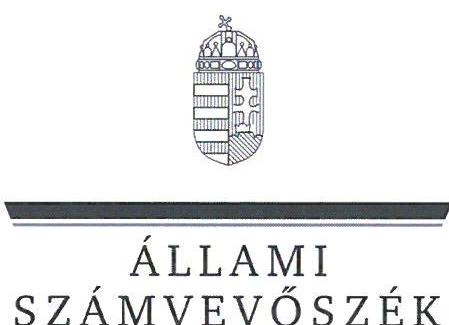
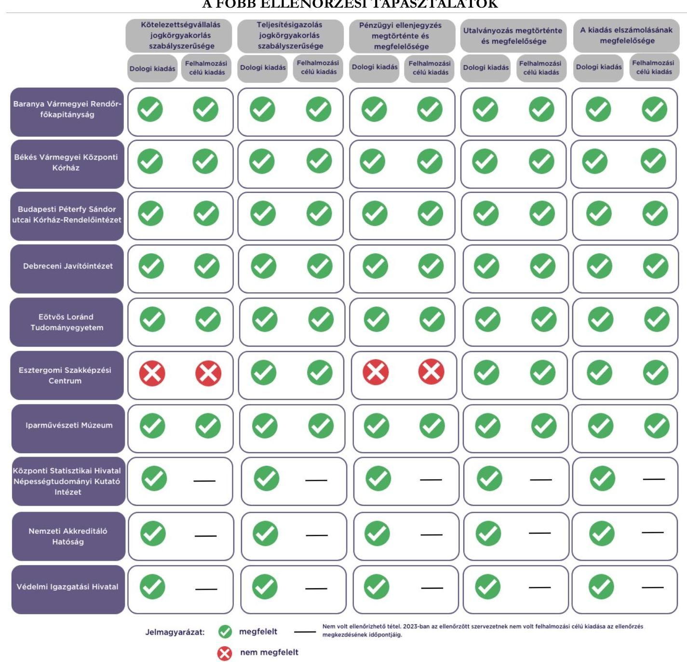

# JELENTÉS 

Az államháztartás központi alrendszerébe tartozó költségvetési szerv által teljesített dologi és felhalmozási célú kiadás szabályszerűségének rapid ellenőrzése
2024.

---

ÁLLAMI
SZÁMVEVŐSZÉK

# JELENTÉS 

Az államháztartás központi alrendszerébe tartozó költségvetési szerv által teljesített dologi és felhalmozási célú kiadás szabályszerűségének rapid ellenőrzése
2024.

---

# ELLENŐRZÉSI IGAZGATÓSÁG: 

## ÁLLAMHÁZTARTÁS KÖZPONTI SZINTJÉT ELLENŐRZŐ IGAZGATÓSÁG

## ELLENŐRZÉSI IGAZGATÓ:

SINKÁNÉ DR. CSENDES ÁGNES igazgató

## ELLENŐRZÉSVEZETŐ:

Jelentéseink az interneten a www.asz.hu címen olvashatók.

RENKÓ ZSUZSANNA ellenőrzésvezető

IKTATÓSZÁM: EL-3949-011/2024.
TÉMASZÁM: 2685
ELLENŐRZÉS-AZONOSÍTÓ SZÁM: V102905

---

# TARTALOMJEGYZÉK 

AZ ELLENŐRZÉS ALAPADATAI ..... 5
AZ ELLENŐRZÖTT SZERVEZETEK ..... 7
ÖSSZEFOGLALÁS ..... 11
AZ ELLENŐRZÉS FÓKUSZKÉRDÉSEI ..... 13
MEGÁLLAPÍTÁSOK ..... 14
JAVASLATOK ..... 17
MELLÉKLETEK ..... 18
I. sz. melléklet: Értelmező szótár ..... 18
II. sz. melléklet: Az ellenőrzött szervezetek jegyzéke ..... 19
III. sz. melléklet: Ellenőrzési kritériumok ..... 20
FÜGGELÉK: ÉSZREVÉTELEK ..... 21
RÖVIDÍTÉSEK JEGYZÉKE ..... 25

---

.

---

# AZ ELLENŐRZÉS ALAPADATAI 

## AZ ELLENŐRZÉS CÉLJA

Az államháztartás központi alrendszerébe tartozó költségvetési szerv által teljesített dologi és felhalmozási célú kiadások egy-egy kiválasztott tételének szabályszerűségi szempontból történő értékelése.

## AZ ELLENŐRZÉS TÍPUSA

Megfelelőségi ellenőrzés.

## AZ ELLENŐRZÖTT IDŐSZAK

| Ssz. | ELLENŐRZÖTT SZERVEZETEK | DOLOGI   KIADÁSOK   ESETÉBEN | FELHALMOZÁSI   CÉLÚ KIADÁSOK   ESETÉBEN |
| :-- | :-- | :--: | :--: |
| 1. | Baranya Vármegyei Rendőr-főkapitányság | 2023. augusztus 29. | 2023. augusztus 29. |
| 2. | Békés Vármegyei Központi Kórház | 2023. augusztus 30. | 2023. szeptember 14. |
| 3. | Budapesti Péterfy Sándor utcai Kórház-Rendelőintézet | 2023. szeptember 5. | 2023. augusztus 24. |
| 4. | Debreceni Javítóintézet | 2023. szeptember 14. | 2023. július 31. |
| 5. | Eötvös Loránd Tudományegyetem | 2023. szeptember 18. | 2023. szeptember 4. |
| 6. | Esztergomi Szakképzési Centrum | 2023. szeptember 5. | 2023. szeptember 15. |
| 7. | Iparművészeti Múzeum | 2023. szeptember 18. | 2023. január 18. |
| 8. | Központi Statisztikai Hivatal Népességtudományi Kutató Intézet | 2023. szeptember 7. | - |
| 9. | Nemzeti Akkreditáló Hatóság | 2023. augusztus 23. | - |
| 10. | Védelmi Igazgatási Hivatal | 2023. szeptember 1. | - |

## AZ ELLENŐRZÉS TÁRGYA

Az államháztartás központi alrendszerébe tartozó költségvetési szerv által teljesített, ellenőrzésre kiválasztott dologi és felhalmozási célú kiadás szabályszerű teljesítése, ezen belül a gazdálkodási jogkörök szabályszerű gyakorlása. Az ellenőrzés kiterjedt minden olyan körülményre és adatra, amely az ÁSZ ${ }^{1}$ jogszabályban meghatározott feladatainak teljesítéséhez, valamint a program végrehajtása folyamán felmerült újabb összefüggések feltárásához szükséges.

---

Az ellenőrzés során az ÁSZ

- a Baranya Vármegyei Rendőr-főkapitányság, a Békés Vármegyei Központi Kórház, az Eötvös Loránd Tudományegyetem, az Iparművészeti Múzeum esetében a dologi kiadások körébe tartozó Egyéb szolgáltatások; a Debreceni Javítóintézet, az Esztergomi Szakképzési Centrum esetében a Karbantartási, kisjavítási szolgáltatások; a Budapesti Péterfy Sándor utcai Kórház-Rendelőintézet, a Központi Statisztikai Hivatal Népességtudományi Kutató Intézet esetében a Szakmai tevékenységet segítő szolgáltatások; a Nemzeti Akkreditáló Hatóság, a Védelmi Igazgatási Hivatal esetében az Informatikai szolgáltatások igénybevétele;
- a Baranya Vármegyei Rendőr-főkapitányság esetében a felhalmozási célú kiadások körébe tartozó Informatikai eszközök beszerzése, létesítése; a Békés Vármegyei Központi Kórház esetében az Ingatlanok beszerzése, létesítése; az Eötvös Loránd Tudományegyetem, az Esztergomi Szakképzési Centrum esetében az Ingatlanok felújítása; a Debreceni Javítóintézet, a Budapesti Péterfy Sándor utcai Kórház-Rendelőintézet, az Iparművészeti Múzeum esetében az Egyéb tárgyi eszközök beszerzése, létesítése
rovatokon elszámolt kiadások egy-egy kiválasztott mintatételének szabályszerűségét értékelte.
A Központi Statisztikai Hivatal Népességtudományi Kutató Intézetnél, a Nemzeti Akkreditáló Hatóságnál és a Védelmi Igazgatási Hivatalnál az ellenőrzésre történő kijelölést megelőzően 2023. évben nem volt olyan értéknap, amelyen felhalmozási célú kiadás teljesítése történt.

# AZ ELLENŐRZÉS JOGALAPJA 

Az ellenőrzés jogszabályi alapját az ÁSZ tv. ${ }^{2} 1 . \int(3)$ bekezdés és az 5. § (6) bekezdés előírásai képezték.

## AZ ELLENŐRZÉS MÓDSZERE

Az ellenőrzést az ÁSZ az ellenőrzött időszakban hatályos jogszabályok, az ellenőrzés szakmai szabályai alapján, „Az állambáztartás központi alrendszerébe tartozó költségvetési szerv által teljesített dologi kiadás szabályszerűségének rapid ellenőrzéséről" és „Az állambáztartás központi alrendszerébe tartozó költségvetési szerv által teljesített felhalmozási célú kiadás szabályszerűségének rapid ellenőrzéséről" című ellenőrzési programok (továbbiakban: ellenőrzési programok) kérdéseire adott válaszok kiértékelésével, az ellenőrzési programokban megjelölt adatforrások figyelembevételével folytatta le. Amennyiben az adott mintatétel ellenőrzési program szerinti értékelése során további kapcsolódó szabálytalanságot tárt fel az ÁSZ, a szabálytalansághoz tartozó kritériummal bővült az ellenőrzés.

Az ellenőrzési kérdések megválaszolásához szükséges bizonyítékok megszerzése a következő ellenőrzési eljárások alkalmazásával történt: megfigyelés, összehasonlítás, elemző eljárás, a dologi kiadások, felhalmozási célú kiadások ellenőrzéssel érintett rovatairól történő mintavétel. Az ellenőrzési bizonyítékként felhasználható adatforrások közé tartoztak egyrészt az ellenőrzéshez kért dokumentumok, adatforrások, másrészt adatforrás volt még minden - az ellenőrzés folyamán - feltárt, az ellenőrzés szempontjából információkat tartalmazó dokumentum.

Az ÁSZ az ellenőrzés során a kiválasztott mintatételek ellenőrzési programokban meghatározott szempontok szerinti szabályszerűségét értékelte, így a kötelezettségvállalás és a teljesítésigazolás gazdálkodási jogkörök tekintetében a jogkörgyakorlás szabályszerűségét, a pénzügyi ellenjegyzés és az utalványozás gazdálkodási jogkörök tekintetében ezek megtörténtét és az ellenőrzési kritériumoknak való megfelelőségét.

---

# AZ ELLENŐRZÖTT SZERVEZETEK 

Az ellenőrzés a Baranya Vármegyei Rendőr-főkapitányság, a Békés Vármegyei Központi Kórház, a Budapesti Péterfy Sándor utcai Kórház-Rendelőintézet, a Debreceni Javítóintézet, az Eötvös Loránd Tudományegyetem, az Esztergomi Szakképzési Centrum, az Iparművészeti Múzeum, a Központi Statisztikai Hivatal Népességtudományi Kutató Intézet, a Nemzeti Akkreditáló Hatóság és a Védelmi Igazgatási Hivatal elnevezésű szervezetekre, mint az államháztartás központi alrendszerébe tartozó költségvetési szervekre terjedt ki.

## BARANYA VÁRMEGYEI RENDŐR-FŐKAPITÁNYSÁG

A Baranya VMRFK ${ }^{3}$ közfeladatát a Rendőrségről szóló 1994. XXXIV. törvény és a Rendőrség szerveiről és a Rendőrség szerveinek feladat- és hatásköréről szóló 329/2007. (XII. 13.) Korm. rendelet határozza meg. Alaptevékenysége a bűncselekmények megakadályozása, felderítése, a közbiztonság, a közrend és az államhatár rendjének védelme, a határforgalom ellenőrzése, a jogellenes bevándorlás megakadályozása, valamint a bűncselekményből származó vagyon visszaszerzése.

## BARANYA VÁRMEGYEI RENDŐR-FŐKAPITÁNYSÁG FŐBB ADATAINAK BEMUTATÁSA

Alapításának éve:
Irányító szerve:
Középirányító szerve:
Gazdasági szervezettel való rendelkezés:
Illetékessége, működési területe:
Általános képviseletét ellátó vezetője:
Vezetői kinevezés kezdete:
2022. évben teljesített bevételek összege:
2022. évben teljesített kiadások összege:

1991.
Belügyminisztérium
Országos Rendőr-főkapitányság
Gazdasági szervezettel rendelkezik
Baranya Vármegye
rendőrfőkapitány
2022.12.01.
$16984,1 \mathrm{M} \mathrm{Ft}$
$16978,7 \mathrm{M} \mathrm{Ft}$

## BÉKÉS VÁRMEGYEI KÖZPONTI KÓRHÁZ

A BVKK ${ }^{4}$ közfeladata az Eütv. ${ }^{5}$ alapján ellátási területére kiterjedően a járó- és fekvőbetegek diagnosztikus és terápiás szakorvosi ellátása, rehabilitációja és követéses gondozása, valamint az egészségügyi alapellátásról szóló 2015. évi CXXIII. törvény alapján a védőnői ellátás biztosítása. Ennek keretében végzi a fekvőbetegek aktív és krónikus ellátását, rehabilitációját, a járóbetegek gyógyító és rehabilitációs szakellátását és egynapos ellátását, az egyén gyógykezelését, az életveszély elhárítását, a megbetegedés következtében kialakult állapot javítása vagy a további állapotromlás megelőzése céljából. Alaptevékenységébe tartozik a gyógyszer és az egyéb gyógyászati termék kiskereskedelme, valamint a gyógyászati segédeszközök és felszerelések kereskedelme.

## BÉKÉS VÁRMEGYEI KÖZPONTI KÓRHÁZ FŐBB ADATAINAK BEMUTATÁSA

Alapításának éve:
Irányító szerve:
Középirányító szerve:
Gazdasági szervezettel való rendelkezés:
Illetékessége, működési területe:
Általános képviseletét ellátó vezetője:
Vezetői kinevezés kezdete:
2022. évben teljesített bevételek összege:
2022. évben teljesített kiadások összege:

2016.
Belügyminisztérium
Országos Kórházi Főigazgatóság
Gazdasági szervezettel rendelkezik
2006. évi CXXXII. törvény ${ }^{6}$ alapján vezetett közhiteles kapacitásnyilvántartásban szereplő ellátási terület
főigazgató
2021.03.01.
$39225,8 \mathrm{M} \mathrm{Ft}$
$37721,3 \mathrm{M} \mathrm{Ft}$

---

# BUDAPESTI PÉTERFY SÁNDOR UTCAI KÓRHÁZ-RENDEŁŐINTÉZET 

A Péterfy Kórház ${ }^{7}$ közfeladata az Eütv. alapján ellátási területére kiterjedően a járó- és fekvőbetegek diagnosztikus és terápiás szakorvosi ellátása, rehabilitációja és követéses gondozása. Ennek keretében végzi a fekvőbetegek aktív és krónikus ellátását, rehabilitációját, a járóbetegek gyógyító és rehabilitációs szakellátását és egynapos ellátását, az egyén gyógykezelését, az életveszély elhárítását, a megbetegedés következtében kialakult állapot javítása vagy a további állapotromlás megelőzése céljából.

## BUDAPESTI PÉTERFY SÁNDOR UTCAI KÓRHÁZ-RENDEŁŐINTÉZET FŐBB ADATAINAK BEMUTATÁSA

Alapításának éve:
Irányító szerve:
Középirányító szerve:
Gazdasági szervezettel való rendelkezés:
Illetékessége, működési területe:
Általános képviseletét ellátó vezetője:
Vezetői kinevezés kezdete:
2022. évben teljesített bevételek összege:
2022. évben teljesített kiadások összege:

1980.
Belügyminisztérium
Országos Kórházi Főigazgatóság
Gazdasági szervezettel rendelkezik
2006. évi CXXXII. törvény alapján vezetett közhiteles kapacitásnyilvántartásban szereplő ellátási terület
főigazgató
2023.06.26.
$24929,1 \mathrm{M} \mathrm{Ft}$
$24901,1 \mathrm{M} \mathrm{Ft}$

## DEBRECENI JAVÍTÓINTÉZET

A Javítóintézet ${ }^{8}$ közfeladata a büntetések, az intézkedések, egyes kényszerintézkedések és a szabálysértési elzárás végrehajtásáról szóló 2013. évi CCXL. törvényben és a Gyvt. ${ }^{9}$ 66/M. $\int$ (1) bekezdésében meghatározott keretek között teljes körű ellátás biztosítása a fiatalkorú számára, ellátja a fiatalkorú gondozását, nevelését, felügyeletét, továbbá az oktatásával, képzésével és munkafoglalkoztatásával kapcsolatos feladatokat, valamint a Gyvt. 66/Q. $\int$-ában meghatározottak szerint biztosítja a javítóintézet utógondozó részlegén történő ellátást.

## DEBRECENI JAVÍTÓINTÉZET FŐBB ADATAINAK BEMUTATÁSA

Alapításának éve:
Irányító szerve:
Középirányító szerve:
Gazdasági szervezettel való rendelkezés:
Illetékessége, működési területe:
Általános képviseletét ellátó vezetője:
Vezetői kinevezés kezdete:
2022. évben teljesített bevételek összege:
2022. évben teljesített kiadások összege:

1972.
Belügyminisztérium
Szociális és Gyermekvédelmi Főigazgatóság
Gazdasági szervezettel nem rendelkezik, egyes pénzügyi-gazdasági feladatait munkamegosztási megállapodás alapján a Szociális és Gyermekvédelmi Főigazgatóság látja el.
országos
igazgató
2021.10.01.
$1087,2 \mathrm{M} \mathrm{Ft}$
$1064,5 \mathrm{M} \mathrm{Ft}$

---

# EÖTVÖS LORÁND TUDOMÁNYEGYETEM 

Az ELTE ${ }^{10}$ közfeladata a nemzeti felsőoktatásról szóló 2011. évi CCIV. törvény 2. § (1) bekezdése alapján az oktatási, a tudományos kutatási és a művészeti alkotótevékenység.

## EÖTVÖS LORÁND TUDOMÁNYEGYETEM FŐBB ADATAINAK BEMUTATÁSA

Alapításának éve:
Irányító szerve:
Középirányító szerve:
Gazdasági szervezettel való rendelkezés:
Illetékessége, működési területe:
A törvényes és szakszerű működésért felelős vezetője:
Vezetői kinevezés kezdete:
2022. évben teljesített bevételek összege:
2022. évben teljesített kiadások összege:

1635.
Kulturális és Innovációs Minisztérium
-
Gazdasági szervezettel rendelkezik
országos
rektor
2021.08.01.
$86916,9 \mathrm{M} \mathrm{Ft}$
$63402,4 \mathrm{M} \mathrm{Ft}$

## ESZTERGOMI SZAKKÉPZÉSI CENTRUM

Az Esztergomi SZC ${ }^{11}$ közfeladata a szakképzésről szóló 2019. évi LXXX. törvény szerinti szakképzési és a nemzeti köznevelésről szóló 2011. évi CXC. törvény szerinti köznevelési feladatok ellátása. Alaptevékenysége a technikumi szakmai oktatás, a szakképző iskolai szakmai oktatás, és a többi gyermekkel, tanulóval együtt nevelhető, oktatható sajátos nevelési igényű gyermekek, tanulók iskolai nevelése-oktatása, a nevelő és oktató munkához kapcsolódó nem köznevelési tevékenység. Tervezi és szervezi az Európai Unió pénzügyi alapjaiból és más külföldi, illetőleg hazai alapokból támogatott egyes fejlesztési programok megvalósítását.

## ESZTERGOMI SZAKKÉPZÉSI CENTRUM FŐBB ADATAINAK BEMUTATÁSA

Alapításának éve:
Irányító szerve:
Középirányító szerve:
Gazdasági szervezettel való rendelkezés:
Illetékessége, működési területe:
Általános képviseletét ellátó vezetője:
Vezetői kinevezés kezdete:
2022. évben teljesített bevételek összege:
2022. évben teljesített kiadások összege:

2020.
Kulturális és Innovációs Minisztérium
Nemzeti Szakképzési és Felnőttképzési Hivatal
Gazdasági szervezettel rendelkezik
Komárom-Esztergom Vármegye
kancellár
2023.02.15.
$3648,1 \mathrm{M} \mathrm{Ft}$
$2008,2 \mathrm{M} \mathrm{Ft}$

## IPARMŰVÉSZETI MÚZEUM

Az IMM ${ }^{12}$ közfeladata a muzeális intézményekről, nyilvános könyvtári ellátásról és a közművelődésről szóló 1997. évi CXL. törvény alapján a múzeumi tevékenység, valamint a kulturális örökség védelméről szóló 2001. évi LXIV. törvény értelmében az örökségvédelem.

## IPARMŰVÉSZETI MÚZEUM FŐBB ADATAINAK BEMUTATÁSA

Alapításának éve:
Irányító szerve:
Középirányító szerve:
Gazdasági szervezettel való rendelkezés:
Illetékessége, működési területe:
Általános képviseletét ellátó vezetője:
Vezetői kinevezés kezdete:
2022. évben teljesített bevételek összege:
2022. évben teljesített kiadások összege:

1983.
Kulturális és Innovációs Minisztérium
-
Gazdasági szervezettel rendelkezik
országos
főigazgató
2014.11.03.
$2434,6 \mathrm{M} \mathrm{Ft}$
$2379,4 \mathrm{M} \mathrm{Ft}$

---

# KÖZPONTI STATISZTIKAI HIVATAL NÉPESSÉGTUDOMÁNYI KUTATÓ INTÉZET 

A KSH NKI ${ }^{13}$ közfeladata a hivatalos statisztikáról szóló 2016. évi CLV. törvény alapján az alap- és alkalmazott demográfiai kutatások, alaptevékenysége a társadalomtudományi és humán alapkutatás.

| KÖZPONTI STATISZTIKAI HIVATAL NÉPESSÉGTUDOMÁNYI KUTATÓ INTÉZET FŐBB ADATAINAK BEMUTATÁSA |  |
| :-- | :-- |
| Alapításának éve: | 1963. |
| Irányító szerve: |

 Központi Statisztikai Hivatal |
| Középirányító szerve: | - |
| Gazdasági szervezettel való rendelkezés: | Gazdasági szervezettel rendelkezik |
| Illetékessége, működési területe: | országos |
| Általános képviseletét ellátó vezetője: | igazgató |
| Vezetői kinevezés kezdete: | 2023.10.27. |
| 2022. évben teljesített bevételek összege: | 473,3 M Ft |
| 2022. évben teljesített kiadások összege: | 411,3 M Ft |

## Nemzeti Akkreditáló Hatóság

A NAH ${ }^{14}$ közfeladatát a nemzeti akkreditálásról szóló 2015. évi CXXIV. törvény határozza meg. A NAH akkreditálással kapcsolatos feladata az akkreditálási eljárás lefolytatása, az akkreditált szervezetek és akkreditált természetes személyek tevékenységének és alkalmasságának felügyeleti vizsgálata, valamint a külföldi akkreditált státusz elismerése. Részt vesz és képviseletet lát el az európai és a nemzetközi akkreditálási szervezetekben. Közreműködik az akkreditálással összefüggő nemzeti, európai és nemzetközi szabványosítási tevékenységben.

## Nemzeti Akkreditáló Hatóság főbb adatainak bemutatása

Alapításának éve:
Irányító szerve:
Középirányító szerve:
Gazdasági szervezettel való rendelkezés:
Illetékessége, működési területe:
Általános képviseletét ellátó vezetője:
Vezetői kinevezés kezdete:
2022. évben teljesített bevételek összege:
2022. évben teljesített kiadások összege:

2016.
Gazdaságfejlesztési Minisztérium
Gazdasági szervezettel nem rendelkezik
a világ bármely államának területén eljárhat
elnök
2022.09.01.
$896,7 \mathrm{M} \mathrm{Ft}$
$760,5 \mathrm{M} \mathrm{Ft}$

## Védelmi Igazgatási Hivatal

A VIH ${ }^{15}$ közfeladata a védelmi és biztonsági tevékenységek összehangolásáról szóló 2021. évi XCIII. törvény alapján a védelmi, a biztonsági, az igazgatási és a szabályozási reform szakmai folyamatainak koordinációja, a védelmi és a biztonsági igazgatás központi szerve feladatainak ellátása.

## Védelmi Igazgatási Hivatal főbb adatainak bemutatása

Alapításának éve:
Irányító szerve:
Középirányító szerve:
Gazdasági szervezettel való rendelkezés:
Illetékessége, működési területe:
Általános képviseletét ellátó vezetője:
Vezetői kinevezés kezdete:
2022. évben teljesített bevételek összege:
2022. évben teljesített kiadások összege:

2022.
Miniszterelnöki Kabinetiroda
Gazdasági szervezettel nem rendelkezik
országos
főigazgató
2022.10.01.
$110,9 \mathrm{M} \mathrm{Ft}$
$43,3 \mathrm{M} \mathrm{Ft}$

---

# Összefoglalás 

Az ellenőrzött kiadások tekintetében az ellenőrzött szervezetek vonatkozásában egy intézménynél a kötelezettségvállalás sem a dologi, sem a felhalmozási tételnél nem a jogszabályi előírásoknak megfelelően történt, mivel a kötelezettségvállalásra pénzügyi ellenjegyzés nélkül került sor. A teljesítésigazolások az ellenőrzött kiadások tekintetében a jogszabályi előírások szerint történtek. A kifizetések elrendelésére szabályszerűen, utalványozás alapján került sor. Az ellenőrzött kiadásokat a megfelelő rovatokon számolták el.

Egy-egy dologi kiadás esetében két intézménynél nem folytattak le közbeszerzési eljárást. A megtörtént pénzügyi ellenjegyzések és utalványozások megfelelőek voltak.
1. ábra

## A főbb ellenőrzési tapasztalatok

---

Az Esztergomi Szakképzési Centrum vezetője az ÁSZ tv. 29. § (2) bekezdés szerinti, a jelentéstervezet megállapításaira tett észrevételében arról tájékoztatta az ÁSZ-t, hogy intézkedéseket tett a Bkr. ${ }^{16}$ 31. § (6) bekezdése alapján soron kívüli belső ellenőrzés lefolytatására az ÁSZ ellenőrzés során feltárt szabálytalanságok kialakulása okainak feltárása, illetve a szabálytalanság megszüntetése érdekében.

---

# Az ellenőrzés fókuszk kérdései 

1.- Az államháztartás központi alrendszerébe tartozó költségvetési szervnél a kiválasztott dologi kiadás teljesítése az egyes jogszabályi rendelkezések alapján szabályszerű volt-e?
2.- Az államháztartás központi alrendszerébe tartozó költségvetési szervnél a kiválasztott felhalmozási célú kiadás teljesítése az egyes jogszabályi rendelkezések alapján szabályszerű volt-e?

---

# 1. Az államháztartás központi alrendszerébe tartozó költségvetési szervnél a kiválasztott dologi kiadás teljesítése az egyes jogszabályi rendelkezések alapján szabályszerű volt-e? 

Összegző megállapítás Az ellenőrzött 10 dologi kiadás teljesítése hét esetben az ellenőrzés keretében vizsgált jogszabályi előírásoknak megfelelt. Egy dologi kiadás esetében a kötelezettségvállalási jogkörgyakorlás nem volt szabályszerű, mert pénzügyi ellenjegyzés nélkül történt. Két kiadás esetében nem folytattak le közbeszerzési eljárást.

A Baranya VMRFK-nál, a BVKK-nál, a Péterfy Kórháznál, a Javítóintézetnél, az ELTE-nél, az IMM-nél, a KSH NKI-nél, a NAH-nál és a VIH-nél az ellenőrzött mintatételek esetében a kötelezettségvállalási és a teljesítésigazolási jogkörgyakorlás, a kiadás elszámolása az Áht. ${ }^{17}$, az Ávr. ${ }^{18}$ és az Áhsz. ${ }^{19}$ előírásai szerint szabályszerűen történt, a pénzügyi ellenjegyzés és az utalványozás megfelelő volt:

- Kötelezettséget az Áht.-ben és az Ávr.-ben foglaltakkal összhangban az arra jogosultsággal rendelkező személy vállalt.
- A kötelezettségvállalásra az Áht.-ben foglaltak szerint, a pénzügyi ellenjegyzés után került sor.
- A teljesítésigazoló az Ávr.-ben előírt írásbeli kijelöléssel rendelkezett.
- A teljesítésigazolás során az Ávr.-ben foglaltak szerint ellenőrizhető okmányok alapján ellenőrizték és igazolták a kiadás teljesítésének jogosságát, összegszerűségét, valamint az ellenszolgáltatás teljesítését.
- A teljesítésigazoló a teljesítést az Ávr.-ben foglaltakkal összhangban, az igazolás dátumának és a teljesítés tényére történő utalás megjelölésével, aláírásával igazolta.
- Az utalványozásra az Áht.-ben, valamint az Ávr.-ben foglaltakkal összhangban, a teljesítésigazolást és az érvényesítést követően került sor.
- A kiadás számviteli elszámolása a megfelelő rovaton történt az Áhsz.-ben előírtakkal összhangban.

Az Esztergomi SZC-nél az ellenőrzött mintatétel esetében a teljesítésigazolási jogkörgyakorlás és a kiadás elszámolása az Áht., az Ávr. és az Áhsz. előírásai szerint szabályszerűen történt, az utalványozás megfelelő volt, a kötelezettségvállalási jogkörgyakorlás nem volt szabályszerű:

- Kötelezettséget az Áht.-ben és az Ávr.-ben foglaltakkal összhangban az arra jogosultsággal rendelkező személy vállalt.
- A kötelezettségvállalás dokumentuma (szerződés) az Ávr. 50. § (1) bekezdés d) pontjában foglaltak ellenére nem tartalmazta a pénzügyi ellenjegyzés tényét és a pénzügyi ellenjegyző keltezéssel ellátott aláírását, ezáltal a 2692400 Ft értékű kötelezettségvállalásra az Áht. 37. § (1) bekezdésében foglaltak ellenére pénzügyi ellenjegyzés nélkül került sor.

---

- A teljesítésigazolás során az Ávr.-ben foglaltak szerint ellenőrizhető okmányok alapján ellenőrizték és igazolták a kiadás teljesítésének jogosságát, összegszerűségét, valamint az ellenszolgáltatás teljesítését.
- A teljesítésigazoló a teljesítést az Ávr.-ben foglaltakkal összhangban, az igazolás dátumának és a teljesítés tényére történő utalás megjelölésével, aláírásával igazolta.
- Az utalványozásra az Áht.-ben, valamint az Ávr.-ben foglaltakkal összhangban, a teljesítésigazolást és az érvényesítést követően került sor.
- A kiadás számviteli elszámolása a megfelelő rovaton történt az Áhsz.-ben előírtakkal összhangban.

# Az ellenőrzés során feltárt szabálytalanság: 

- Az IMM 2022. május 31-én őrzés-védelmi feladatok ellátására közbeszerzési eljárás lefolytatása nélkül kötött szerződést, ami az ÁSZ értékelése szerint felveti a Kbt. ${ }^{20}$ 4. § (1) bekezdésében és 111. § d) pontjában foglaltak megsértésének lehetőségét. A vállalkozói szerződés 2022. június 1-jétől lépett hatályba, lejárata határozatlan, illetve addig marad hatályban amíg a vállalkozói szerződés II.4. pontban rögzített közbeszerzési eljárás szerződéskötéssel nem zárul. Közbeszerzési eljárás lefolytatására nem került sor, ugyanakkor a szerződést 2023. január 2-án módosították. A Kbt. 17. § (3) bekezdés b) pontja alapján a szolgáltatás becsült értéke olyan szerződés esetében, amely nem tartalmazza a teljes díjat és a szerződés megszűnésének időpontja az eljárás megindításakor pontosan nem határozható meg, a havi ellenszolgáltatás negyvennyolcszorosa. A Közbeszerzési Hatóság honlapján közzétett, 2022. január 1-jétől irányadó közbeszerzési értékhatárok alapján a nettó 718940352 Ft becsült érték eléri és meghaladja a Kbt. 3. mellékletében szereplő szociális és egyéb szolgáltatás esetében érvényes 262485000 Ft-os uniós értékhatárt.
- A Péterfy Kórház 2019. szeptember 1-jétől egészségügyi szolgáltatások ellátására közbeszerzési eljárás lefolytatása nélkül kötött szerződést határozatlan időre, ami az ÁSZ értékelése szerint felveti a Kbt. 4. § (1) bekezdésében és 111. § d) pontjában foglaltak megsértésének lehetőségét. A szerződés (keret)összeget nem tartalmazott. Az ÁSZ ezért a szolgáltatás becsült értékét a 2019. október 15-től a szerződésre teljesített kifizetések alapján határozta meg. A Közbeszerzési Hatóság honlapján közzétett, 2019. január 1-jétől irányadó közbeszerzési értékhatárok alapján a 962593717 Ft kifizetett összeg eléri és meghaladja az uniós, a Kbt. 3. mellékletében szereplő szociális és egyéb szolgáltatás esetében érvényes 232995000 Ft-os értékhatárt.

---

# 2. Az államháztartás központi alrendszerébe tartozó költségvetési szervnél a kiválasztott felhalmozási célú kiadás teljesítése az egyes jogszabályi rendelkezések alapján szabályszerű volt-e? 

Összegző megállapítás

Az ellenőrzött hét felhalmozási célú kiadás teljesítése hat esetben az ellenőrzés keretében vizsgált jogszabályi előírásoknak megfelelt. Egy felhalmozási célú kiadás esetében a kötelezettségvállalási jogkörgyakorlás nem volt szabályszerű, mert a kötelezettségvállalásra pénzügyi ellenjegyzés nélkül került sor.

A Baranya VMRFK-nál, a BVKK-nál, a Péterfy Kórháznál, a Javítóintézetnél, az ELTE-nél, és az IMM-nél, ellenőrzött mintatételek esetében a kötelezettségvállalási és a teljesítésigazolási jogkörgyakorlás, továbbá a kiadás elszámolása az Áht., az Ávr. és az Áhsz. előírásai szerint szabályszerűen történt, a pénzügyi ellenjegyzés és az utalványozás megfelelő volt:

- Kötelezettséget az Áht.-ben és az Ávr.-ben foglaltakkal összhangban az arra jogosultsággal rendelkező személy vállalt.
- A kötelezettségvállalásra az Áht.-ben foglaltak szerint, a pénzügyi ellenjegyzés után került sor.
- A teljesítésigazoló az Ávr.-ben előírt írásbeli kijelöléssel rendelkezett.
- A teljesítésigazolás során az Ávr.-ben foglaltak szerint ellenőrizhető okmányok alapján ellenőrizték és igazolták a kiadás teljesítésének jogosságát, összegszerűségét, valamint az ellenszolgáltatás teljesítését.
- A teljesítésigazoló a teljesítést az Ávr.-ben foglaltakkal összhangban, az igazolás dátumának és a teljesítés tényére történő utalás megjelölésével, aláírásával igazolta.
- Az utalványozásra az Áht.-ben, valamint az Ávr.-ben foglaltakkal összhangban, a teljesítésigazolást és az érvényesítést követően került sor.
- A kiadás számviteli elszámolása a megfelelő rovaton történt az Áhsz.-ben előírtakkal összhangban.

Az Esztergomi SZC-nél az ellenőrzött mintatétel esetében a teljesítésigazolási jogkörgyakorlás és a kiadás elszámolása az Áht., az Ávr. és az Áhsz. előírásai szerint szabályszerűen történt, az utalványozás megfelelő volt, a kötelezettségvállalási jogkörgyakorlás nem volt szabályszerű:

- Kötelezettséget az Áht.-ben és az Ávr.-ben foglaltakkal összhangban az arra jogosultsággal rendelkező személy vállalt.
- A kötelezettségvállalás dokumentuma (szerződés) az Ávr. 50. § (1) bekezdés d) pontjában foglaltak ellenére nem tartalmazta a pénzügyi ellenjegyzés tényét és a pénzügyi ellenjegyző keltezéssel ellátott aláírását, ezáltal a 45578522 Ft értékű kötelezettségvállalásra az Áht. 37. § (1) bekezdésében foglaltak ellenére pénzügyi ellenjegyzés nélkül került sor.
- A teljesítésigazolás során az Ávr.-ben foglaltak szerint ellenőrizhető okmányok alapján ellenőrizték és igazolták a kiadás teljesítésének jogosságát, összegszerűségét, valamint az ellenszolgáltatás teljesítését.
- A teljesítésigazoló a teljesítést az Ávr.-ben foglaltakkal összhangban, az igazolás dátumának és a teljesítés tényére történő utalás megjelölésével, aláírásával igazolta.
- Az utalványozásra az Áht.-ben, valamint az Ávr.-ben foglaltakkal összhangban, a teljesítésigazolást és az érvényesítést követően került sor.
- A kiadás számviteli elszámolása a megfelelő rovaton történt az Áhsz.-ben előírtakkal összhangban.

---

# Javaslatok 

Az ÁSZ tv. 33. § (1) bekezdésében foglaltak értelmében az ellenőrzött szervezet vezetője köteles a jelentésben foglalt megállapításokhoz kapcsolódó intézkedési tervet összeállítani és azt a jelentés kézhezvételétől számított 30 napon belül az ÁSZ részére megküldeni. Amennyiben az ellenőrzött szervezet vezetője nem küldi meg határidőben az intézkedési tervet, vagy továbbra sem elfogadható intézkedési tervet küld, az Állami Számvevőszék elnöke az ÁSZ tv. 33. § (3) bekezdés a) és b) pontjaiban foglaltakat érvényesítheti.

## Esztergomi Szakképzési Centrum kancellárjának

1. A Bkr. 13. § (2) bekezdésében foglaltak alapján, valamint a belső ellenőrzés megállapításait és javaslatait is figyelembe véve tegyen intézkedéseket azon kontrolltevékenységek kiépítésére és/vagy megfelelő működtetésére, amelyek megelőzik a jelentésben leírt szabálytalanságok ismételt előfordulását.

## Iparművészeti Múzeum főigazgatójának

1. Kezdeményezzen a Bkr. 31. § (6) bekezdése alapján soron kívüli belső ellenőrzést a jelen ellenőrzés során feltárt szabálytalanság kialakulása okainak feltárása és a közbeszerzés elmulasztásával kapcsolatos kockázati tényezők feltárása, illetve a szabálytalanság megszüntetése érdekében.
2. A Bkr. 13. § (2) bekezdésében foglaltak alapján, valamint az 1. számú javaslat szerinti belső ellenőrzés megállapításait
 és javaslatait is figyelembe véve tegyen intézkedéseket azon kontrolltevékenységek kiépítésére és/vagy megfelelő működtetésére, amelyek megelőzik a jelentésben leírt szabálytalanság ismételt előfordulását.

## BUDAPESTI PÉTERFY SÁNDOR UTCAI KÓRHÁZRENDELŐINTÉZET FŐIGAZGATÓJÁNAK

1. Kezdeményezzen a Bkr. 31. § (6) bekezdése alapján soron kívüli belső ellenőrzést a jelen ellenőrzés során feltárt szabálytalanság kialakulása okainak feltárása és a közbeszerzés elmulasztásával kapcsolatos kockázati tényezők feltárása, illetve a szabálytalanság megszüntetése érdekében.
2. A Bkr. 13. § (2) bekezdésében foglaltak alapján, valamint a 1. számú javaslat szerinti belső ellenőrzés megállapításait és javaslatait is figyelembe véve tegyen intézkedéseket azon kontrolltevékenységek kiépítésére és/vagy megfelelő működtetésére, amelyek megelőzik a jelentésben leírt szabálytalanság ismételt előfordulását.

---

# MELLÉKLETEK 

## I. SZ. MELLÉKLET: ÉRTELMEZŐ SZÓTÁR

kötelezettségvállalás
pénzügyi ellenjegyzés
teljesítésigazolás
utalványozás

A költségvetési szerv által a kiadási előirányzatok és - ha jogszabály lehetővé teszi - a kijelölt lebonyolító szerv számára a Kormány rendeletében meghatározottak szerinti rendelkezésre bocsátott összeg terhére fizetési kötelezettség vállalásáról szóló - így különösen a foglalkoztatásra irányuló jogviszony létesítésére, szerződés megkötésére, költségvetési támogatás biztosítására irányuló - szabályszerűen megtett jognyilatkozat.
Forrás: Áht. 1. § 15. pont
A kötelezettségvállalást megelőző művelet, amelynek során a pénzügyi ellenjegyzőnek meg kell győződnie arról, hogy a szükséges szabad előirányzat - több évet érintő kötelezettségvállalás esetén minden egyes évben rendelkezésre áll, a tervezett kifizetési időpontokban a pénzügyi fedezet biztosított, valamint a kötelezettségvállalás nem sérti a gazdálkodásra vonatkozó szabályokat. Kötelezettséget vállalni a Kormány rendeletében foglalt kivételekkel csak pénzügyi ellenjegyzés után, a pénzügyi teljesítés esedékességét megelőzően, írásban lehet.
Forrás: Áht. 37. § 1. (1) bekezdés
A kötelezettségvállalásban a másik fél által vállalt feltételek teljesítéséhez kapcsolódó igazolás, amely a kiadási előirányzat terhére vállalt utalványozást előzi meg. A teljesítés igazolása során ellenőrizhető okmányok alapján ellenőrizni és igazolni kell a kiadások teljesítésének jogosságát, összegszerűségét, ellenszolgáltatást is magában foglaló kötelezettségvállalás esetében - ha a kifizetés vagy annak egy része az ellenszolgáltatás teljesítését követően esedékes - annak teljesítését. A teljesítést az igazolás dátumának és a teljesítés tényére történő utalás megjelölésével, az arra jogosult személy aláírásával kell igazolni.
Forrás: Áht. 38. § (1) bekezdés; Ávr. 57. § (1) és (3) bekezdések
A bevételek és kiadások elszámolására utalványozás alapján kerülhet sor. A kiadási előirányzatok terhére történő utalványozás esetén az utalványozásra csak azután kerülhet sor, ha a kiadás alapjául szolgáló kötelezettségvállalásban meghatározott feltételeket a másik szerződő fél már teljesítette. A kiadási előirányzatok terhére történő utalványozásra a teljesítés igazolását és az érvényesítést követően, a bevételi előirányzatok esetén a belső szabályzatban a bevételek meghatározott körére esetlegesen elrendelt teljesítés igazolását követően kerülhet sor.
Forrás: Áht. 38. § (1) bekezdés; Ávr. 57. § (2) bekezdés és 59. § (1b) bekezdés

---

# II. SZ. MELLÉKLET: AZ ELLENŐRZÖTT SZERVEZETEK JEGYZÉKE 

## ELLENŐRZÖTT SZERVEZETEK MEGNEVEZÉSE

Baranya Vármegyei Rendőr-főkapitányság
Békés Vármegyei Központi Kórház
Budapesti Péterfy Sándor utcai Kórház-Rendelőintézet
Debreceni Javítóintézet
Eötvös Loránd Tudományegyetem
Esztergomi Szakképzési Centrum
Iparművészeti Múzeum
Központi Statisztikai Hivatal Népességtudományi Kutató Intézet
Nemzeti Akkreditáló Hatóság
Védelmi Igazgatási Hivatal

---

# III. SZ. MELLÉKLET: ELLENŐRZÉSI KRITÉRIUMOK 

## FOKUSZKÉRDÉS

1. Az államháztartás központi alrendszerébe tartozó költségvetési szervnél a kiválasztott dologi kiadás teljesítése az egyes jogszabályi rendelkezések alapján szabályszerű volt-e?

Kötelezettségvállalás

Pénzügyi ellenjegyzés
Teljesítésigazolás

Utalványozás

Kiadások elszámolása
Közbeszerzési eljárás lefolytatása
2. Az államháztartás központi alrendszerébe tartozó költségvetési szervnél a kiválasztott felhalmozási célú kiadás teljesítése az egyes jogszabályi rendelkezések alapján szabályszerű volt-e?

Kötelezettségvállalás

Pénzügyi ellenjegyzés
Teljesítésigazolás

Utalványozás

Kiadások elszámolása

## ELLENŐRZÉSI KRITÉRIUMOK

Áht. 36. § 7. (7), 37. § 1. (1) bekezdések
Ávr. 50. § 1. (1) bekezdés d) pont, 52. § 1. (1), (9), 53. § 1. (1), 60. § (3) bekezdések
belső szabályzat
Ávr. 55. § 1. (1), (4) bekezdések
Áht. 38. § 1. (1), (2) bekezdések
Ávr. 57. § 1. (1), (3)-(5), 60. § 3. bekezdések
Áht. 38. § 1. (1) bekezdés
Ávr. 59. § 1. b), (2) bekezdések, (3) bekezdés g) pont, (4) bekezdés

Áhsz. 40. § 1. bekezdés, 15. melléklet I. pont
Kbt. 4. § 1. (1) bekezdés, 17. § 3. (3) bekezdés b) pont, 111. § d) pont

Áht. 36. § 7. (7), 37. § 1. (1) bekezdések
Ávr. 50. § 1. (1) bekezdés d) pont, 52. § 1. (1), (9), 53. § 1. (1), 60. § (3) bekezdések
belső szabályzat
Ávr. 55. § 1. (1), (4) bekezdések
Áht. 38. § 1. (1), (2) bekezdések
Ávr. 57. § 1. (1), (3)-(5), 60. § 3. bekezdések
Áht. 38. § 1. (1) bekezdés
Ávr. 59. § 1. b), (2) bekezdések, (3) bekezdés g) pont, (4) bekezdés

Áhsz. 40. § 1. bekezdés, 15. melléklet I. pont

---

# FÜGGELÉK: ÉSZREVÉTELEK 

A jelentéstervezetet a Számvevőszék 15 napos észrevételezésre megküldte az ellenőrzött szervezet vezetőjének az ÁSZ tv. 29. § (1) bekezdése előírásának megfelelően.

A Baranya Vármegyei Rendőr-főkapitányság, a Békés Vármegyei Központi Kórház, a Budapesti Péterfy Sándor utcai Kórház-Rendelőintézet, a Debreceni Javítóintézet, az Eötvös Loránd Tudományegyetem, a Központi Statisztikai Hivatal Népességtudományi Kutató Intézet, a Nemzeti Akkreditáló Hatóság és a Védelmi Igazgatási Hivatal ellenőrzött szervezetek vezetői a jelentéstervezet megállapításaira érdemi észrevételt nem tettek.

A jelentéstervezet megállapításaira az Esztergomi Szakképzési Centrum kancellárja és az Iparművészeti Múzeum főigazgatója észrevételt tett. Az ÁSZ tv. 29. § (3) bekezdésével összhangban az Állami Számvevőszék a Függelékben feltünteti a megállapításokkal kapcsolatban tett, el nem fogadott észrevételeket, és megindokolja, hogy azokat miért nem fogadta el.

Esztergomi Szakképzési Centrum kancellárjának észrevétele: „A pénzügyi ellenjegyzés hiányát személyi változás okozta, emiatt nem volt lehetséges intézkedni a felelős ellen, távozása után. A beszerzés érdemében lezajlott, de az előző Gazdasági vezető elmulasztotta aláirni, enélkül küldte tovább intézkedésre. Az eltelt időszakban új belső szabályzatok születtek a gazdasági joggyakorlás vonatkozásában, amelyek megfelelnek az Áht., az Ávr. és az Áhsz. rendelkezéseinek. Emellett a jogosultságok és aláírásminták nyilvántartását naprakésszé tette az ESzC.

Mindezek alapján a javaslat okafogyottá vált, ennek alapján javasoljuk a javaslat helyett ÁSz figyelemfelhívás alkalmazását.

Mindemellett a Bkr. 31. § (6) bekezdése alapján soron kívüli belső ellenőrzést kezdtünk a jelen ellenőrzés során feltárt szabálytalanságok kialakulása okainak feltárása, illetve a szabálytalanság megszüntetése érdekében."

[^0]
[^0]:    * 29. § (1) Az Állami Számvevőszék az ellenőrzési megállapításait megküldi az ellenőrzött szervezet vezetőjének vagy az általa megbízott személynek, és annak, akinek személyes felelősségét állapította meg.
    (2) Az ellenőrzött szervezet vezetője és a felelősként megjelölt személy az ellenőrzés megállapításaira tizenöt napon belül írásban észrevételt tehet.
    (3) Az Állami Számvevőszék az észrevételre a beérkezésétől számított harminc napon belül írásban válaszol. A figyelembe nem vett észrevételeket köteles a jelentésben feltüntetni, és megindokolni, hogy azokat miért nem fogadta el.

---

# Az észrevétellel érintett megállapítás: 

Dologi kiadáshoz kapcsolódóan:
„A kötelezettségvállalás dokumentuma (szerződés) az Ávr. 50. § (1) bekezdés d) pontjában foglaltak ellenére nem tartalmazta a pénzügyi ellenjegyzés tényét és a pénzügyi ellenjegyző keltezéssel ellátott aláírását, ezáltal a 2692400 Ft értékű kötelezettségvállalásra az Áht. 37. § (1) bekezdésében foglaltak ellenére pénzügyi ellenjegyzés nélkül került sor." (13. oldal utolsó bekezdés).

Felhalmozási célú kiadáshoz kapcsolódóan:
„A kötelezettségvállalás dokumentuma (szerződés) az Ávr. 50. § (1) bekezdés d) pontjában foglaltak ellenére nem tartalmazta a pénzügyi ellenjegyzés tényét és a pénzügyi ellenjegyző keltezéssel ellátott aláírását, ezáltal a 45578522 Ft értékű kötelezettségvállalásra az Áht. 37. § (1) bekezdésében foglaltak ellenére pénzügyi ellenjegyzés nélkül került sor." (15. oldal 11. bekezdés).

El nem fogadás indoka: A válaszlevelében leírtak megerősítették a pénzügyi ellenjegyzés nélküli kötelezettségvállalás szabálytalanságának tényét. A megtett intézkedéseiről, amely szerint új belső szabályzatok születtek, a jogosultságok és aláírásminták nyilvántartását naprakésszé tették, valamint soron kívüli belső ellenőrzést kezdeményezett köszönettel vettem, azonban a megtett intézkedések nem befolyásolják az ellenőrzött időszakra tett megállapításokat.

Iparművészeti Múzeum főigazgatójának észrevétele: „1. A belügyminiszter évente kiadott közleménye állapította meg a minimális vagyonvédelmi szolgáltatási rezsióradíj 2023. évi összegét. A vagyonvédelmi szolgáltatási rezsióradíj éves változásáról és a megállapítására vonatkozó eljárási szabályokról szóló 374/2021. (VI. 30.) Korm. rendelet (a továbbiakban: Korm. rendelet) 2. § (1) bekezdése szerint „A rezsióradíj tárgyévre számított összege - ha kormányrendelet eltérően nem rendelkezik - a 2022. évtől minden évben az előző évben irányadó rezsióradíjának a tárgyévi garantált bérminimum órabér alkalmazására irányadó összegének előző évhez viszonyított növekménye arányában növelt összege." A Korm. rendelet 2. § (3) bekezdése alapján „A tárgyévre irányadó rezsióradíj (1) bekezdés szerinti összegéről az élet és vagyonbiztonság védelméért felelős miniszter (a továbbiakban: miniszter) a Magyar Közlönyben közleményt tesz közzé. " A kötelező legkisebb munkabér (minimálbér) és a garantált bérminimum megállapításáról szóló 703/2021. (XII. 15.) Korm. rendelet 2. § (2) bekezdés, valamint a kötelező legkisebb munkabér (minimálbér) és a garantált bérminimum megállapításáról szóló 573/2022. (XII. 23.) Korm. rendelet 2. § (2) bekezdése alapján a 2023. évi garantált bérminimum összege a 2022. évi összeghez képest 14%-kal megemelkedett, ezért a fentiekre tekintettel - a Korm. rendelet 2. § (1) bekezdésében rögzített, a fentiekben idézett jogszabályi automatizmus alapján - a belügyminiszter megállapította, hogy a 2023. évre vonatkozó, a személy- és vagyonvédelmi, valamint a magánnyomozói tevékenység szabályairól szóló törvény szerinti minimális vagyonvédelmi szolgáltatási rezsióradíj általános forgalmi adó nélküli legkisebb mértéke 3349 forint/óra.

---

Az Iparművészeti Múzeum és az őrzés-védelmi feladatokat ellátó vállalkozó kizárólag a belügyminiszter közleményében foglalt árváltozást foglalta írásba, és ennek során hivatkozott arra, hogy az árváltozásra a belügyminiszter közleménye alapján és jogszabályban foglalt előírásra figyelemmel került sor. Ez a módosítás azonban nem hagyta érintetlenül a szerződés megszünésének időpontját, mert azt legfeljebb 12 hónapban korlátozta, ilyen módon a 2023.01.01. napjától 12 hónapra számított ellenérték díja a vállalkozási szerződésben foglalt ellenérték alapján nettó 179.735.088,- Ft értékű, ilyen módon nem haladta meg a Kbt. 3. mellékletében szereplő szociális és egyéb szolgáltatás esetében érvényes 262485000 Ft-os uniós értékhatárt, és az ellenérték növekedése jelen szolgáltatás esetén az eredeti szerződés értékének 10%-át sem éri el.

Az Iparművészeti Múzeum, tekintettel arra, hogy a szerződés határidejét lerövidítette, a közbeszerzést előkészítette, azonban, a közpénzekkel való hatékony és takarékos gazdálkodás jegyében előterjesztést tett a fenntartó felé, amelyben az Intézmény jelezte, hogy az őrzés-védelmi szolgáltatás a 1091 Budapest, Üllői út 33-37. szám alatti telephelyen, az Intézmény által munkaviszonyban alkalmazandó munkavállalókkal gazdaságosabban, a vállalkozási szerződés keretében, külső személy által végzett szolgáltatás dijához képest, mintegy 50%-kal kedvezőbb összegben teljesíthető, és kérte, hogy a fenntartó a javaslatát megvizsgálni, és abban döntést hozni szíveskedjen. Az Iparművészeti Múzeum ebben a fenntartó válaszát várja, egyéb telephelyén a közbeszerzést kiírta, és az ajánlattétel folyamatban van.

Mindezek alapján az Iparművészeti Múzeum kéri, hogy a t. Állami Számvevőszék a Közbeszerzési Döntőbizottság hivatalból indított eljárásának kezdeményezését mellőzni szíveskedjen, tekintettel arra, hogy az Iparművészeti Múzeum a jogszabályoknak, és a közpénzekkel való hatékony, takarékos gazdálkodás elveinek megfelelően, és a fenntartó felhívásának megfelelően járt el.

Kérelem a megállapítás módosítására:
Az Iparművészeti Múzeum kéri, hogy
 az Állami Számvevőszék ellenőrzési megállapításainak és javaslatainak véglegesítése során a jelen észrevételben foglalt nyilatkozatokat és okiratokat figyelembe venni, és annak megfelelően módosítani vagy törölni szíveskedjen.

Az észrevétellel érintett megállapítás: „Az IMM 2022. május 31-én őrzés-védelmi feladatok ellátására a Kbt. 4. § (1) bekezdésében és 111. § d) pontjában foglaltakat megsértve közbeszerzési eljárás lefolytatása nélkül kötött szerződést, emiatt az ÁSZ indokoltnak látja a Közbeszerzési Döntőbizottság hivatalból indított eljárásának kezdeményezését. A vállalkozói szerződés 2022. június 1-jétől lépett hatályba, lejárata határozatlan, illetve addig marad hatályban amíg a vállalkozói szerződés II.4. pontban rögzített közbeszerzési eljárás szerződéskötéssel nem zárul. Közbeszerzési eljárás lefolytatására nem került sor, ugyanakkor a szerződést 2023. január 2-án módosították. A Kbt. 17. § (3) bekezdés b) pontja alapján a szolgáltatás becsült értéke olyan szerződés esetében, amely nem tartalmazza a teljes díjat és a szerződés megszünésének időpontja az eljárás megindításakor pontosan nem határozható meg, a havi ellenszolgáltatás negyvennyolcszorosa. A Közbeszerzési Hatóság honlapján közzétett, 2022. január 1-jétől irányadó közbeszerzési értékhatárok alapján a nettó 718 940 352 Ft

---

becsült érték eléri és meghaladja a Kbt. 3. mellékletében szereplő szociális és egyéb szolgáltatás esetében érvényes 262 485 000 Ft-os uniós értékhatárt." (14. oldal 6. bekezdés).

El nem fogadás indoka: „Az Állami Számvevőszék által tett megállapítás a 2022. május 31-én őrzés-védelmi feladatok ellátására megkötött vállalkozói szerződésre vonatkozik. A megállapítás értelmében az Iparművészeti Múzeum 2022. május 31-én őrzés-védelmi feladatok ellátására a közbeszerzésekről szóló 2015. évi CXLIII. törvény (továbbiakban: Kbt.) 4. § (1) bekezdésében és 111. § d) pontjában foglaltakat megsértve közbeszerzési eljárás lefolytatása nélkül kötött szerződést és ezt észrevétele sem vitatja. A közbeszerzés nélkül kötött szerződés belügyminiszteri közlemény általi módosítása a közbeszerzés elmaradásának tényén nem változtat.

Észrevételében jelezte, hogy a közbeszerzési eljárást előkészítette, de a fenntartó válaszát várja egy gazdaságilag kedvező javaslatra vonatkozóan, amely szintén nem befolyásolja a közbeszerzési kötelezettség elmulasztását. "

---

# RÖVIDÍTÉSEK JEGYZÉKE 

${ }^{1}$ ÁSZ
${ }^{2}$ ÁSZ tv.
${ }^{3}$ Baranya VMRFK
${ }^{4}$ BVKK
${ }^{5}$ Eütv.
${ }^{6}$ 2006. évi CXXXII. törvény
${ }^{7}$ Péterfy Kórház
${ }^{8}$ Javítóintézet
${ }^{9}$ Gyvt.
${ }^{10}$ ELTE
${ }^{11}$ Esztergomi SZC
${ }^{12}$ IMM
${ }^{13}$ KSH NKI
${ }^{14}$ NAH
${ }^{15}$ VIH
${ }^{16}$ Bkr.
${ }^{17}$ Áht.
${ }^{18}$ Ávr.
${ }^{19}$ Áhsz.
${ }^{20} \mathrm{Kbt}$.

Állami Számvevőszék
2011. évi LXVI. törvény az Állami Számvevőszékről

Baranya Vármegyei Rendőr-főkapitányság
Békés Vármegyei Központi Kórház
1997. évi CLIV. törvény az egészségügyről
2006. évi CXXXII. törvény az egészségügyi ellátórendszer fejlesztéséről

Budapesti Péterfy Sándor utcai Kórház-Rendelőintézet
Debreceni Javítóintézet
1997. évi XXXI. törvény a gyermekek védelméről és a gyámügyi igazgatásról

Eötvös Loránd Tudományegyetem
Esztergomi Szakképzési Centrum
Iparművészeti Múzeum
Központi Statisztikai Hivatal Népességtudományi Kutató Intézet
Nemzeti Akkreditáló Hatóság
Védelmi Igazgatási Hivatal
370/2011. (XII. 31.) Korm. rendelet a költségvetési szervek belső kontrollrendszeréről és belső ellenőrzéséről
2011. évi CXCV. törvény az államháztartásról

368/2011. (XII. 31.) Korm. rendelet az államháztartásról szóló törvény végrehajtásáról
4/2013. (I. 11.) Korm. rendelet az államháztartás számviteléről
2015. évi CXLIII. törvény a közbeszerzésekről

---

1052 Budapest, Apáczai Csere János u. 10. | 1364 Budapest 4., Pf. 54
www.asz.hu | szamvevoszek@asz.hu
telefon: +36 1 484 9100
