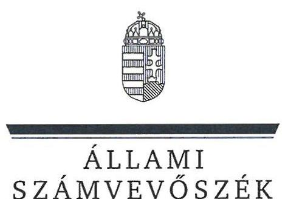
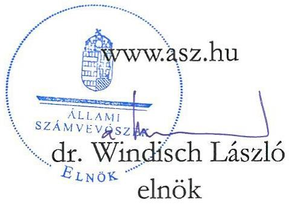
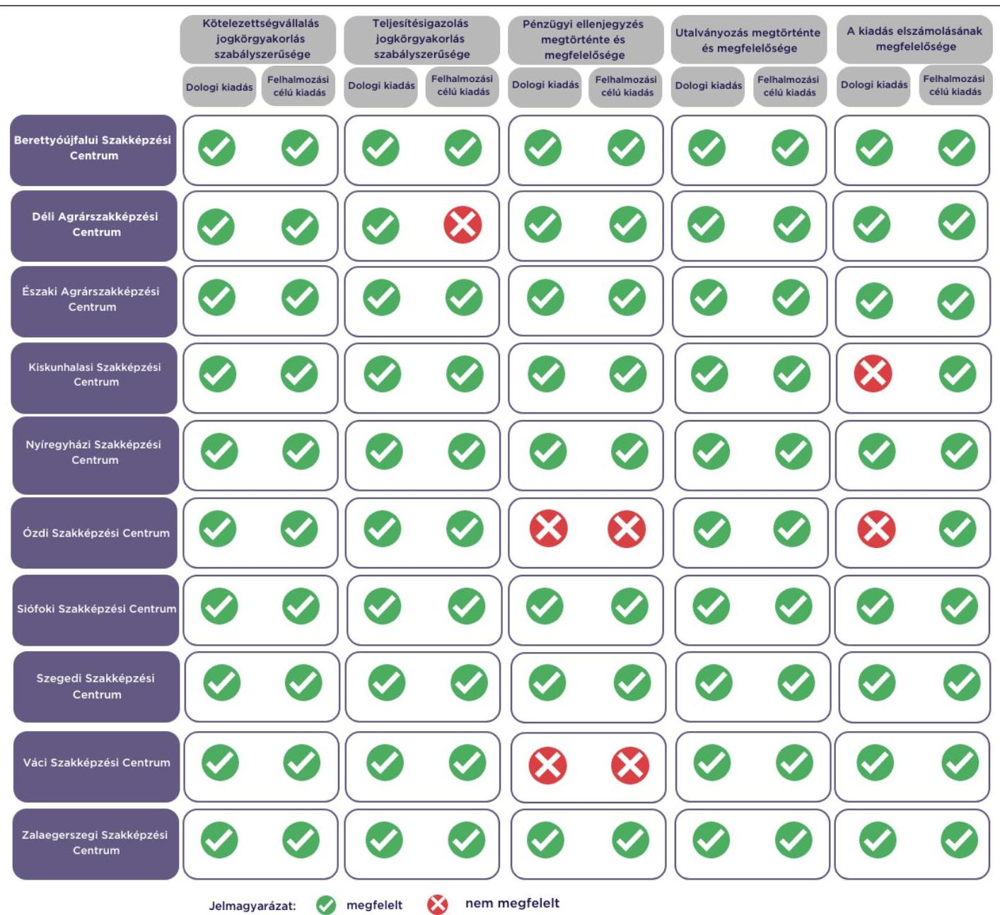

# JELENTÉS 

Az államháztartás központi alrendszerébe tartozó költségvetési szerv által teljesített dologi és felhalmozási célú kiadás szabályszerűségének rapid ellenőrzése
2024.

---

ÁLLAMI
SZÁMVEVŐSZÉK

# JELENTÉS 

Az államháztartás központi alrendszerébe tartozó költségvetési szerv által teljesített dologi és felhalmozási célú kiadás szabályszerűségének rapid ellenőrzése
2024.

24025

---

# ELLENŐRZÉSI IGAZGATÓSÁG: 

## ÁLLAMHÁZTARTÁS KÖZPONTI SZINTJÉT ELLENŐRZŐ IGAZGATÓSÁG

## ELLENŐRZÉSI IGAZGATÓ:

SINKÁNÉ DR. CSENDES ÁGNES igazgató

## ELLENŐRZÉSVEZETŐ:

Jelentéseink az interneten a www.asz.hu címen olvashatók.

RENKÓ ZSUZSANNA ellenőrzésvezető

IKTATÓSZÁM: EL-3949-012/2024.
TÉMASZÁM: 2685

ELLENŐRZÉS-AZONOSÍTÓ SZÁM: V102907

---

# TARTALOMJEGYZÉK 

AZ ELLENŐRZÉS ALAPADATAI ..... 5
AZ ELLENŐRZÖTT SZERVEZETEK ..... 7
ÖSSZEFOGLALÁS ..... 12
AZ ELLENŐRZÉS FÓKUSZKÉRDÉSEI ..... 13
MEGÁLLAPÍTÁSOK ..... 14
JAVASLATOK ..... 18
MELLÉKLETEK ..... 19
I. sz. melléklet: Értelmező szótár ..... 19
II. sz. melléklet: Az ellenőrzött szervezetek jegyzéke ..... 20
III. sz. melléklet: Ellenőrzési kritériumok ..... 21
FÜGGELÉK: ÉSZREVÉTELEK ..... 22
RÖVIDÍTÉSEK JEGYZÉKE ..... 23

---

.

---

# AZ ELLENŐRZÉS ALAPADATAI 

## AZ ELLENŐRZÉS CÉLJA

Az államháztartás központi alrendszerébe tartozó költségvetési szerv által teljesített dologi és felhalmozási célú kiadások egy-egy kiválasztott tételének szabályszerűségi szempontból történő értékelése.

## AZ ELLENŐRZÉS TÍPUSA

Megfelelőségi ellenőrzés.

## AZ ELLENŐRZÖTT IDŐSZAK

| Ssz. | ELLENŐRZÖTT SZERVEZETEK | $\begin{gathered} \text { DOLOGI } \\ \text { KIADÁSOK } \\ \text { ESETEBEN } \end{gathered}$ | FELHALMOZÁSI CÉLÚ KIADÁSOK ESETEBEN |
| :--: | :--: | :--: | :--: |
| 1. | Berettyóújfalui Szakképzési Centrum | 2023. október 9. | 2023. szeptember 18. |
| 2. | Déli Agrárszakképzési Centrum | 2023. szeptember 18. | 2023. szeptember 20. |
| 3. | Északi Agrárszakképzési Centrum | 2023. október 3. | 2023. október 5. |
| 4. | Kiskunhalasi Szakképzési Centrum | 2023. október 5. | 2023. október 3. |
| 5. | Nyíregyházi Szakképzési Centrum | 2023. szeptember 22. | 2023. október 9. |
| 6. | Özdi Szakképzési Centrum | 2023. szeptember 25. | 2023. október 17. |
| 7. | Siófoki Szakképzési Centrum | 2023. szeptember 21. | 2023. szeptember 18. |
| 8. | Szegedi Szakképzési Centrum | 2023. október 5. | 2023. október 9. |
| 9. | Váci Szakképzési Centrum | 2023. szeptember 22. | 2023. szeptember 28. |
| 10. | Zalaegerszegi Szakképzési Centrum | 2023. október 18. | 2023. szeptember 28. |

## AZ ELLENŐRZÉS TÁRGYA

Az államháztartás központi alrendszerébe tartozó költségvetési szerv által teljesített, ellenőrzésre kiválasztott dologi és felhalmozási célú kiadás szabályszerű teljesítése, ezen belül a gazdálkodási jogkörök szabályszerű gyakorlása. Az ellenőrzés kiterjedt minden olyan körülményre és adatra, amely az ÁSZ ${ }^{1}$ jogszabályban meghatározott feladatainak teljesítéséhez, valamint a program végrehajtása folyamán felmerült újabb összefüggések feltárásához szükséges.

---

Az ellenőrzés során az ÁSZ

- a Zalaegerszegi Szakképzési Centrum esetében a dologi kiadások körébe tartozó Üzemeltetési anyagok beszerzése; a Berettyóújfalui Szakképzési Centrum, a Kiskunhalasi Szakképzési Centrum, az Özdi Szakképzési Centrum, a Siófoki Szakképzési Centrum, a Váci Szakképzési Centrum esetében a dologi kiadások körébe tartozó Karbantartási, kisjavítási szolgáltatások; a Déli Agrárszakképzési Centrum esetében a dologi kiadások körébe tartozó Szakmai tevékenységet segítő szolgáltatások; az Északi Agrárszakképzési Centrum, a Nyíregyházi Szakképzési Centrum, a Szegedi Szakképzési Centrum esetében a dologi kiadások körébe tartozó Egyéb szolgáltatások;
- a Váci Szakképzési Centrum esetében a felhalmozási kiadások körébe tartozó Ingatlanok beszerzése, létesítése; a Déli Agrárszakképzési Centrum, a Kiskunhalasi Szakképzési Centrum, a Zalaegerszegi Szakképzési Centrum esetében a felhalmozási célú kiadások körébe tartozó Informatikai eszközök beszerzése, létesítése; az Északi Agrárszakképzési Centrum, a Siófoki Szakképzési Centrum esetében a felhalmozási célú kiadások körébe tartozó Egyéb tárgyi eszközök beszerzése, létesítése; a Berettyóújfalui Szakképzési Centrum, a Nyíregyházi Szakképzési Centrum, az Özdi Szakképzési Centrum, a Szegedi Szakképzési Centrum esetében a felhalmozási célú kiadások körébe tartozó Ingatlanok felújítása
rovatokon elszámolt kiadások egy-egy kiválasztott mintatételének szabályszerűségét értékelte.

# AZ ELLENŐRZÉS JOGALAPJA 

Az ellenőrzés jogszabályi alapját az ÁSZ tv. ${ }^{2} 1 . \int(3)$ bekezdés és az 5. § (6) bekezdés előírásai képezték.

## AZ ELLENŐRZÉS MÓDSZERE

Az ellenőrzést az ÁSZ az ellenőrzött időszakban hatályos jogszabályok, az ellenőrzés szakmai szabályai alapján, „Az államháztartás központi alrendszerébe tartozó költségvetési szerv által teljesített dologi kiadás szabályszerűségének rapid ellenőrzéséről" és „Az államháztartás központi alrendszerébe tartozó költségvetési szerv által teljesített felhalmozási célú kiadás szabályszerűségének rapid ellenőrzéséről" című ellenőrzési programok (továbbiakban: ellenőrzési programok) kérdéseire adott válaszok kiértékelésével, az ellenőrzési programokban megjelölt adatforrások figyelembevételével folytatta le.

Az ellenőrzési kérdések megválaszolásához szükséges bizonyítékok megszerzése a következő ellenőrzési eljárások alkalmazásával történt: megfigyelés, összehasonlítás, elemző eljárás, a dologi kiadások, felhalmozási célú kiadások ellenőrzéssel érintett rovatairól történő mintavétel. Az ellenőrzési bizonyítékként felhasználható adatforrások közé tartoztak egyrészt az ellenőrzéshez kért dokumentumok, adatforrások, másrészt adatforrás volt még minden - az ellenőrzés folyamán - feltárt, az ellenőrzés szempontjából információkat tartalmazó dokumentum.

Az ÁSZ az ellenőrzés során a kiválasztott mintatételek ellenőrzési programokban meghatározott szempontok szerinti szabályszerűségét értékelte, így a kötelezettségvállalás és a teljesítésigazolás gazdálkodási jogkörök tekintetében a jogkörgyakorlás szabályszerűségét, a pénzügyi ellenjegyzés és az utalványozás gazdálkodási jogkörök tekintetében ezek megtörténtét és az ellenőrzési kritériumoknak való megfelelőségét.

---

# AZ ELLENŐRZÖTT SZERVEZETEK 

Az ellenőrzés a Berettyóújfalui Szakképzési Centrumra; a Déli Agrárszakképzési Centrumra; az Északi Agrárszakképzési Centrumra; a Kiskunhalasi Szakképzési Centrumra; a Nyíregyházi Szakképzési Centrumra; az Özdi Szakképzési Centrumra; a Siófoki Szakképzési Centrumra, a Szegedi Szakképzési Centrumra; a Váci Szakképzési Centrumra; a Zalaegerszegi Szakképzési Centrumra, mint az államháztartás központi alrendszerébe tartozó költségvetési szervekre terjedt ki.

## BERETTYÓÚJFALUI SZAKKÉPZÉSI CENTRUM

A Berettyóújfalui $\mathrm{SZC}^{3}$ közfeladata az Szkt. ${ }^{4}$ szerinti szakképzési és a 2011. évi CXC. tv. ${ }^{5}$ szerinti köznevelési feladatok ellátása. Alaptevékenysége: fő feladataként technikumi szakmai oktatást, szakképző iskolai szakmai oktatást, szakiskolai nevelés-oktatást és a többi gyermekkel, tanulóval együtt nevelhető, oktatható sajátos nevelési igényű gyermekek, tanulók iskolai nevelését, oktatását folytatja, valamint kollégiumi ellátást, az Arany János Tehetséggondozó Programmal, Arany János Kollégiumi-Szakközépiskolai Programmal és az Arany János Kollégiumi Programmal kapcsolatos feladatokat, továbbá nevelő és oktató munkához kapcsolódó, nem köznevelési tevékenységet is ellát.

## BERETTYÓÚJFALUI SZAKKÉPZÉSI CENTRUM FÖBB ADATAINAK BEMUTATÁSA

Alapításának éve:
Irányító szerve:
Középirányító szerve:
Gazdasági szervezettel való rendelkezés:
Illetékessége, működési területe:
A törvényes és szakszerű működésért felelős vezetője:
Vezetői kinevezés kezdete:
2022. évben teljesített bevételek összege:
2022. évben teljesített kiadások összege:

2015.
Kulturális és Innovációs Minisztérium
Nemzeti Szakképzési és Felnőttképzési Hivatal
Gazdasági szervezettel rendelkezik
Hajdú-Bihar vármegye
kancellár
2020.07.01.
$4126,9 \mathrm{M} \mathrm{Ft}$
$4100,1 \mathrm{M} \mathrm{Ft}$

## DÉLI AGRÁRSZAKKÉPZÉSI CENTRUM

A Déli $\mathrm{ASzC}^{6}$ közfeladata az Szkt. szerinti szakképzési és a 2011. évi CXC. tv. szerinti köznevelési feladatok ellátása. Alaptevékenysége: fő feladatként a szakképző intézményein keresztül a szakmajegyzékben meghatározott szakmára felkészítő szakmai oktatást és szakképesítésre felkészítő szakmai képzést folytat. Kollégiumi alapfeladatot, valamint a nevelő és oktató munkához kapcsolódó, nem szakképzési és köznevelési tevékenységet is ellát.

## DÉLI AGRÁRSZAKKÉPZÉSI CENTRUM FÖBB ADATAINAK BEMUTATÁSA

Alapításának éve:
Irányító szerve:
Középirányító szerve:
Gazdasági szervezettel való rendelkezés:
Illetékessége, működési területe:
A törvényes és szakszerű működésért felelős vezetője:
Vezetői kinevezés kezdete:
2022. évben teljesített bevételek összege:
2022. évben teljesített kiadások összege:

2000.
Agrárminisztérium
Gazdasági szervezettel rendelkezik
országos
kancellár
2020.11.01.
$8181,9 \mathrm{M} \mathrm{Ft}$
$7705,9 \mathrm{M} \mathrm{Ft}$

---

# ÉSZAKI AGRÁRSZAKKÉPZÉSI CENTRUM 

Az Északi ASzC ${ }^{9}$ közfeladata az Szkt. szerinti szakképzési és a 2011. évi CXC. tv. szerinti köznevelési feladatok ellátása. Alaptevékenysége: fő feladatként a szakképző intézményein keresztül a szakmajegyzékben meghatározott szakmára felkészítő szakmai oktatást és szakképesítésre felkészítő szakmai képzést folytat. Kollégiumi alapfeladatot, valamint a nevelő és oktató munkához kapcsolódó, nem szakképzési és köznevelési tevékenységet is ellát.

## ÉSZAKI AGRÁRSZAKKÉPZÉSI CENTRUM FÖBB ADATAINAK BEMUTATÁSA

Alapításának éve:
Irányító szerve:
Középirányító szerve:
Gazdasági szervezettel való rendelkezés:
Illetékessége, működési területe:
A törvényes és szakszerű működésért felelős vezetője:
Vezetői kinevezés kezdete:
2022. évben teljesített bevételek összege:
2022. évben teljesített kiadások összege:

2013.
Agrárminisztérium
-
Gazdasági szervezettel rendelkezik
országos
kancellár
2020.07.01.
$7007,8 \mathrm{M} \mathrm{Ft}$
$6464,0 \mathrm{M} \mathrm{Ft}$

## KISKUNHALASI SZAKKÉPZÉSI CENTRUM

A Kiskunhalasi SZC ${ }^{9}$ közfeladata az Szkt. szerinti szakképzési és a 2011. évi CXC. tv. szerinti köznevelési feladatok ellátása. Alaptevékenysége: fő feladataként technikumi szakmai oktatást, szakképző iskolai szakmai oktatást, szakgimnáziumi nevelést-oktatást (kifutó), a többi gyermekkel, tanulóval együtt nevelhető, oktatható sajátos nevelési igényű gyermekek, tanulók iskolai nevelését, oktatását folytatja, valamint azoknak a sajátos nevelési igényű gyermekeknek, tanulóknak a szakiskolai nevelése-oktatása, kollégiumi ellátása, akik az e célra létrehozott gyógypedagógiai iskolai osztályban eredményesebben oktathatók, nevelhetők, valamint kollégiumi alapfeladatot, továbbá nevelő és oktató munkához kapcsolódó, nem köznevelési tevékenységet is ellát.

## KISKUNHALASI SZAKKÉPZÉSI CENTRUM FÖBB ADATAINAK BEMUTATÁSA

Alapításának éve:
Irányító szerve:
Középirányító szerve:
Gazdasági szervezettel való rendelkezés:
Illetékessége, működési területe:
A törvényes és szakszerű működésért felelős vezetője:
Vezetői kinevezés kezdete:
2022. évben teljesített bevételek összege:
2022. évben teljesített kiadások összege:

2015.
Kulturális és Innovációs Minisztérium
Nemzeti Szakképzési és Felnőttképzési Hivatal
Gazdasági szervezettel rendelkezik
Bács-Kiskun vármegye
kancellár
2020.07.01.
$5407,4 \mathrm{M} \mathrm{Ft}$
$4688,5 \mathrm{M} \mathrm{Ft}$

---

# Nyíregyházi Szakképzési CENTRUM 

A Nyíregyházi SZC ${ }^{9}$ közfeladata az Szkt. szerinti szakképzési és a 2011. évi CXC. tv. szerinti köznevelési feladatok ellátása. Alaptevékenysége: fő feladataként technikumi szakmai oktatást, szakképző iskolai szakmai oktatást, szakgimnáziumi nevelést-oktatást, és a többi gyermekkel, tanulóval együtt nevelhető, oktatható sajátos nevelési igényű gyermekek, tanulók iskolai nevelését, oktatását folytatja, valamint kollégiumi alapfeladatot, továbbá nevelő és oktató munkához kapcsolódó, nem köznevelési tevékenységet végez.

## Nyíregyházi Szakképzési CENTRUM FÖBB ADATAINAK BEMUTATÁSA

Alapításának éve:
Irányító szerve:
Középirányító szerve:
Gazdasági szervezettel való rendelkezés:
Illetékessége, működési területe:
A törvényes és szakszerű működésért felelős vezetője:
Vezetői kinevezés kezdete:
2022. évben teljesített bevételek összege:
2022. évben teljesített kiadások összege:

2015.
Kulturális és Innovációs Minisztérium
Nemzeti Szakképzési és Felnőttképzési Hivatal
Gazdasági szervezettel rendelkezik
Szabolcs-Szatmár-Bereg vármegye
kancellár
2020.07.01.
$7862,9 \mathrm{M} \mathrm{Ft}$
$7394,3 \mathrm{M} \mathrm{Ft}$

## ÓZDI SZAKKÉPZÉSI CENTRUM

Az Ózdi SZC ${ }^{10}$ közfeladata az Szkt. szerinti szakképzési és a 2011. évi CXC. tv. szerinti köznevelési feladatok ellátása. Alaptevékenysége: fő feladataként technikumi szakmai oktatást, szakképző iskolai szakmai oktatást, szakgimnáziumi nevelést-oktatást, és a többi gyermekkel, tanulóval együtt nevelhető, oktatható sajátos nevelési igényű gyermekek, tanulók iskolai nevelését, oktatását folytatja, valamint kollégiumi alapfeladatot, továbbá nevelő és oktató munkához kapcsolódó, nem köznevelési tevékenységet is ellát.

## ÓZDI SZAKKÉPZÉSI CENTRUM FÖBB ADATAINAK BEMUTATÁSA

Alapításának éve:
Irányító szerve:
Középirányító szerve:
Gazdasági szervezettel való rendelkezés:
Illetékessége, működési területe:
A törvényes és szakszerű működésért felelős vezetője:
Vezetői kinevezés kezdete:
2022. évben teljesített bevételek összege:
2022. évben teljesített kiadások összege:

2015.
Kulturális és Innovációs Minisztérium
Nemzeti Szakképzési és Felnőttképzési Hivatal
Gazdasági szervezettel rendelkezik
Borsod-Abaúj-Zemplén vármegye
kancellár
2020.07.01.
$3297,6 \mathrm{M} \mathrm{Ft}$
$2882,4 \mathrm{M} \mathrm{Ft}$

---

# Siófoki SZAKKÉPZÉSI CENTRUM 

A Siófoki SZC ${ }^{11}$ közfeladata az Szkt. szerinti szakképzési és a 2011. évi CXC. tv. szerinti köznevelési feladatok ellátása. Alaptevékenysége: fő feladataként technikumi szakmai oktatást, szakképző iskolai szakmai oktatást, szakgimnáziumi nevelést-oktatást, a többi gyermekkel, tanulóval együtt nevelhető, oktatható sajátos nevelési igényű gyermekek, tanulók iskolai nevelését-oktatását folytatja, de kollégiumi alapfeladatot, továbbá nevelő és oktató munkához kapcsolódó, nem köznevelési tevékenységet is ellát. A szakképzési centrum az állami intézményfenntartó központtól átvett gimnáziumi intézményegységekben gimnáziumi nevelés-oktatás alapfeladatot is ellát.

## Siófoki SZAKKÉPZÉSI CENTRUM FÖBB ADATAINAK BEMUTATÁSA

Alapításának éve:
Irányító szerve:
Középirányító szerve:
Gazdasági szervezettel való rendelkezés:
Illetékessége, működési területe:
A törvényes és szakszerű működésért felelős vezetője:
Vezetői kinevezés kezdete:
2022. évben teljesített bevételek összege:
2022. évben teljesített kiadások összege:

2015.
Kulturális és Innovációs Minisztérium
Nemzeti Szakképzési és Felnőttképzési Hivatal
Gazdasági szervezettel rendelkezik
Somogy vármegye
kancellár
2020.07.01.
$2429,6 \mathrm{M} \mathrm{Ft}$
$2272,0 \mathrm{M} \mathrm{Ft}$

## SZEGEDI SZAKKÉPZÉSI CENTRUM

A Szegedi SZC ${ }^{12}$ közfeladata az Szkt. szerinti szakképzési és a 2011. évi CXC. tv. szerinti köznevelési feladatok ellátása. Alaptevékenysége: fő feladataként

 szakiskolai nevelést-oktatást, technikumi szakmai oktatást, szakképző iskolai szakmai oktatást, szakgimnáziumi nevelést-oktatást és a többi gyermekkel, tanulóval együtt nevelhető, oktatható sajátos nevelési igényű gyermekek, tanulók iskolai nevelését-oktatását folytatja, valamint kollégiumi alapfeladatot, továbbá nevelő és oktató munkához kapcsolódó, nem köznevelési tevékenységet is ellát. Az állami intézményfenntartó központtól átvett általános iskolai intézményegységben általános iskolai nevelés-oktatás feladatot is ellát.

## SZEGEDI SZAKKÉPZÉSI CENTRUM FŐBB ADATAINAK BEMUTATÁSA

Alapításának éve:
Irányító szerve:
Középirányító szerve:
Gazdasági szervezettel való rendelkezés:
Illetékessége, működési területe:
A törvényes és szakszerű működésért felelős vezetője:
Vezetői kinevezés kezdete:
2022. évben teljesített bevételek összege:
2022. évben teljesített kiadások összege:

2015.
Kulturális és Innovációs Minisztérium
Nemzeti Szakképzési és Felnőttképzési Hivatal
Gazdasági szervezettel rendelkezik
Csongrád-Csanád vármegye
kancellár
2020.07.01.
$7716,9 \mathrm{M} \mathrm{Ft}$
$7317,5 \mathrm{M} \mathrm{Ft}$

---

# VÁCI SZAKKÉPZÉSI CENTRUM 

A Váci SZC ${ }^{13}$ közfeladata az Szkt. szerinti szakképzési és a 2011. évi CXC. tv. szerinti köznevelési feladatok ellátása. Alaptevékenysége: fő feladataként technikumi szakmai oktatást, szakképző iskolai szakmai oktatást, gimnáziumi nevelést-oktatást, szakgimnáziumi nevelést-oktatást (kifutó), kollégiumi alapfeladatot, a többi gyermekkel, tanulóval együtt nevelhető, oktatható sajátos nevelési igényű gyermekek, tanulók iskolai nevelését-oktatását folytatja, továbbá nevelő és oktató munkához kapcsolódó, nem köznevelési tevékenységet is ellát.

## VÁCI SZAKKÉPZÉSI CENTRUM FŐBB ADATAINAK BEMUTATÁSA

Alapításának éve:
Irányító szerve:
Középirányító szerve:
Gazdasági szervezettel való rendelkezés:
Illetékessége, működési területe:
A törvényes és szakszerű működésért felelős vezetője:
Vezetői kinevezés kezdete:
2022. évben teljesített bevételek összege:
2022. évben teljesített kiadások összege:

2015.
Kulturális és Innovációs Minisztérium
Nemzeti Szakképzési és Felnőttképzési Hivatal
Gazdasági szervezettel rendelkezik
Pest vármegye
kancellár
2020.07.01.
$5102,2 \mathrm{M} \mathrm{Ft}$
$4994,2 \mathrm{M} \mathrm{Ft}$

## ZALAEGERSZEGI SZAKKÉPZÉSI CENTRUM

A Zalaegerszegi SZC ${ }^{14}$ közfeladata az Szkt. szerinti szakképzési és a 2011. évi CXC. tv. szerinti köznevelési feladatok ellátása. Alaptevékenysége: fő feladataként technikumi szakmai oktatást, szakképző iskolai szakmai oktatást, szakgimnáziumi nevelést-oktatást, és a többi gyermekkel, tanulóval együtt nevelhető, oktatható sajátos nevelési igényű gyermekek, tanulók iskolai nevelését-oktatását folytatja, valamint kollégiumi alapfeladatot, továbbá nevelő és oktató munkához kapcsolódó, nem köznevelési tevékenységet is ellát.

## ZALAEGERSZEGI SZAKKÉPZÉSI CENTRUM FŐBB ADATAINAK BEMUTATÁSA

Alapításának éve:
Irányító szerve:
Középirányító szerve:
Gazdasági szervezettel való rendelkezés:
Illetékessége, működési területe:
A törvényes és szakszerű működésért felelős vezetője:
Vezetői kinevezés kezdete:
2022. évben teljesített bevételek összege:
2022. évben teljesített kiadások összege:

2015.
Kulturális és Innovációs Minisztérium
Nemzeti Szakképzési és Felnőttképzési Hivatal
Gazdasági szervezettel rendelkezik
Zala vármegye
kancellár
2020.07.01.
$6789,9 \mathrm{M} \mathrm{Ft}$
$6071,0 \mathrm{M} \mathrm{Ft}$

---

# ÖSSZEFOGLALÁS 

Az ellenőrzött szervezetek ellenőrzött kiadásai tekintetében a teljesítésigazolás egy esetben nem volt szabályszerű, a pénzügyi ellenjegyzés négy esetben nem volt megfelelő. Az ellenőrzött kiadást két esetben nem a megfelelő rovaton számolták el.

Az Özdi Szakképzési Centrum vezetője az ÁSZ tv. 29. § (2) bekezdés szerinti, a jelentéstervezet megállapításaira tett észrevételében arról tájékoztatta az ÁSZ-t, hogy a dologi kiadás esetében a kifizetés átkönyvelése a helyes rovatra megtörtént 2023. december 31-i dátummal, ezzel az ÁSZ megállapítása az ellenőrzés során hasznosult.

1. ábra

## A FŐBB ELLENŐRZÉSI TAPASZTALATOK

Forrás: ÁSZ saját szerkesztés

---

# AZ ELLENŐRZÉS FÓKUSZKÉRDÉSEI 

1.- Az államháztartás központi alrendszerébe tartozó költségvetési szervnél a kiválasztott dologi kiadás teljesítése az egyes jogszabályi rendelkezések alapján szabályszerű volt-e?
2.- Az államháztartás központi alrendszerébe tartozó költségvetési szervnél a kiválasztott felhalmozási célú kiadás teljesítése az egyes jogszabályi rendelkezések alapján szabályszerű volt-e?

---

# MEGÁLLAPÍTÁSOK 

## 1. Az államháztartás központi alrendszerébe tartozó költségvetési szervnél a kiválasztott dologi kiadás teljesítése az egyes jogszabályi rendelkezések alapján szabályszerű volt-e?

Összegző megállapítás Az ellenőrzött 10 dologi kiadás teljesítése hét esetben az ellenőrzés keretében vizsgált jogszabályi előírásoknak megfelelt. Egy dologi kiadás esetében a pénzügyi ellenjegyzés nem volt megfelelő, valamint a kiadás elszámolása nem volt szabályszerű. Egy dologi kiadás esetében a kiadás elszámolása nem volt szabályszerű, további egy dologi kiadásnál a pénzügyi ellenjegyzés nem volt megfelelő.

A Berettyóújfalui SZC-nél, a Déli ASzC-nél, az Északi ASzC-nél, a Nyíregyházi SZC-nél, a Siófoki SZC-nél, a Szegedi SZC-nél és a Zalaegerszegi SZC-nél az ellenőrzött mintatétel esetében a kötelezettségvállalási és teljesítésigazolási jogkörgyakorlás, a kiadás elszámolása az Áht. ${ }^{15}$, az Ávr. ${ }^{16}$ és az Áhsz. ${ }^{17}$ előírásai szerint szabályszerűen történt, a pénzügyi ellenjegyzés és az utalványozás megfelelő volt:

- Kötelezettséget az Áht.-ben és az Ávr.-ben foglaltakkal összhangban az arra jogosultsággal rendelkező személy vállalt.
- A kötelezettségvállalásra az Áht.-ben foglaltak szerint, a pénzügyi ellenjegyzés után került sor.
- A teljesítésigazoló az Ávr.-ben előírt írásbeli kijelöléssel rendelkezett.
- A teljesítésigazolás során az Ávr.-ben foglaltak szerint ellenőrizhető okmányok alapján ellenőrizték és igazolták a kiadás teljesítésének jogosságát, összegszerűségét, valamint az ellenszolgáltatás teljesítését.
- A teljesítésigazoló a teljesítést az Ávr.-ben foglaltakkal összhangban, az igazolás dátumának és a teljesítés tényére történő utalás megjelölésével, aláírásával igazolta.
- Az utalványozásra az Áht.-ben, valamint az Ávr.-ben foglaltakkal összhangban, a teljesítésigazolás és az alapján végrehajtott érvényesítést követően került sor.
- A kiadás számviteli elszámolása a megfelelő rovaton történt az Áhsz.-ben előírtakkal összhangban.

A Kiskunhalasi SZC-nél az ellenőrzött mintatétel esetében a kötelezettségvállalási és a teljesítésigazolási jogkörgyakorlás az Áht.-ben, az Ávr.-ben foglalt előírások alapján szabályszerűen történt, a pénzügyi ellenjegyzés és az utalványozás megfelelő volt, azonban a kiadás elszámolása nem volt szabályszerű:

- Kötelezettséget az Áht.-ben és az Ávr.-ben foglaltakkal összhangban az arra jogosultsággal rendelkező személy vállalt.
- A kötelezettségvállalásra az Áht.-ben foglaltak szerint, a pénzügyi ellenjegyzés után került sor.
- A teljesítésigazoló az Ávr.-ben előírt írásbeli kijelöléssel rendelkezett.

---

- A teljesítésigazolás során az Ávr.-ben foglaltak szerint ellenőrizhető okmányok alapján ellenőrizték és igazolták a kiadás teljesítésének jogosságát, összegszerűségét, valamint az ellenszolgáltatás teljesítését.
- A teljesítésigazoló a teljesítést az Ávr.-ben foglaltakkal összhangban, az igazolás dátumának és a teljesítés tényére történő utalás megjelölésével, aláírásával igazolta.
- Az utalványozásra az Áht.-ben, valamint az Ávr.-ben foglaltakkal összhangban, a teljesítésigazolás és az alapján végrehajtott érvényesítést követően került sor.
- A kiadás elszámolása nem felelt meg az Áhsz. 40. § (1) bekezdésben és a 15. melléklet I. pontban foglaltaknak, mert az elszámolt kifizetésnek a nettó 1141500 Ft értékű, a bontások, válaszfalak építése, gipszkarton falak és pótlások gipszelése, valamint ajtók helyének beépítése része helytelenül a K334 Karbantartási, kisjavítási szolgáltatások rovaton került elszámolásra, a K71 Ingatlanok felújítása rovat helyett.
Az Özdi SZC-nél az ellenőrzött mintatétel esetében a kötelezettségvállalási és a teljesítésigazolási jogkörgyakorlás az Áht.-ben, az Ávr.-ben foglalt előírások alapján szabályszerű volt, az utalványozás megfelelő volt. A pénzügyi ellenjegyzés nem volt megfelelő, valamint a kiadás elszámolása nem volt szabályszerű:
- A kötelezettségvállaló az Áht.-ben és az Ávr.-ben foglaltak szerinti jogosultsággal rendelkezett.
- A pénzügyi ellenjegyzés az Ávr. 55. § (1) bekezdésében foglaltak ellenére nem tartalmazta az ellenjegyzés dátumát. A dátum hiányában nem lehetett megítélni, hogy a nettó 4969671 Ft értékű kötelezettségvállalásra az Áht. 37. § (1) bekezdésében foglalt előírás szerint a pénzügyi ellenjegyzés után került sor.
- A teljesítésigazoló az Ávr.-ben előírt írásbeli kijelöléssel rendelkezett. A teljesítésigazolás során az Ávr.-ben foglaltak szerint ellenőrizhető okmányok alapján ellenőrizték és igazolták a kiadás teljesítésének jogosságát, összegszerűségét, valamint az ellenszolgáltatás teljesítését.
- A teljesítésigazoló a teljesítést az Ávr.-ben foglaltakkal összhangban, az igazolás dátumainak és a teljesítés tényére történő utalás megjelölésével, aláírásával igazolta.
- Az utalványozásra az Áht.-ben, valamint az Ávr.-ben foglaltakkal összhangban, a teljesítésigazolást követően került sor.
- A kiadás elszámolása nem felelt meg az Áhsz. 40. § (1) bekezdésben és a 15. melléklet I. pontban foglaltaknak, mert a tornaterem padlójának felújítására tekintettel elszámolt nettó 4969671 Ft értékű kifizetés helytelenül a K334 Karbantartási, kisjavítási szolgáltatások rovaton került elszámolásra, a K71 Ingatlanok felújítása rovat helyett.
A Váci SZC-nél az ellenőrzött mintatétel esetében a kötelezettségvállalási és a teljesítésigazolási jogkörgyakorlás, valamint a kiadás elszámolása az Áht.-ben, az Ávr.-ben és az Áhsz.-ben foglalt előírások szerint szabályszerűen történt, az utalványozás megfelelő volt, azonban a pénzügyi ellenjegyzés nem volt megfelelő:
- A kötelezettségvállaló az Áht.-ben és az Ávr.-ben foglaltak szerinti jogosultsággal rendelkezett.
- A pénzügyi ellenjegyzés az Ávr. 55. § (1) bekezdésében foglaltak ellenére nem tartalmazta az ellenjegyzés dátumát. A dátum hiányában nem lehetett megítélni, hogy a nettó 2252838 Ft értékű kötelezettségvállalásra az Áht. 37. § (1) bekezdésében foglalt előírás szerint a pénzügyi ellenjegyzés után került sor.

---

- A teljesítésigazoló az Ávr.-ben előírt írásbeli kijelöléssel rendelkezett. A teljesítésigazolás során az Ávr.-ben foglaltak szerint ellenőrizhető okmányok alapján ellenőrizték és igazolták a kiadás teljesítésének jogosságát, összegszerűségét, valamint az ellenszolgáltatás teljesítését.
- A teljesítésigazoló a teljesítést az Ávr.-ben foglaltakkal összhangban, az igazolás dátumainak és a teljesítés tényére történő utalás megjelölésével, aláírásával igazolta.
- Az utalványozásra az Áht.-ben, valamint az Ávr.-ben foglaltakkal összhangban, a teljesítésigazolás és az alapján végrehajtott érvényesítést követően került sor.
- A kiadás számviteli elszámolása a megfelelő rovaton történt az Áhsz.-ben előírtakkal összhangban.

# 2. Az államháztartás központi alrendszerébe tartozó költségvetési szervnél a kiválasztott felhalmozási célú kiadás teljesítése az egyes jogszabályi rendelkezések alapján szabályszerű volt-e? 

Összegző megállapítás Az ellenőrzött 10 felhalmozási célú kiadás teljesítése hét esetben az ellenőrzés keretében vizsgált jogszabályi előírásoknak megfelelt. Egy felhalmozási célú kiadás esetében a teljesítésigazolási jogkörgyakorlás nem volt szabályszerű, valamint két felhalmozási célú kiadás esetében a pénzügyi ellenjegyzés nem volt megfelelő.
A Berettyóújfalui SZC-nél, az Északi ASzC-nél, a Kiskunhalasi SZC-nél, a Nyíregyházi SZC-nél, a Siófoki SZC-nél, a Szegedi SZC-nél, és a Zalaegerszegi SZC-nél az ellenőrzött mintatétel esetében a kötelezettségvállalási és teljesítésigazolási jogkörgyakorlás, továbbá a kiadás elszámolása az Áht., az Ávr. és az Áhsz. előírásai szerint szabályszerűen történt, a pénzügyi ellenjegyzés és az utalványozás megfelelő volt:

- Kötelezettséget az Áht.-ben és az Ávr.-ben foglaltakkal összhangban arra jogosultsággal rendelkező személy vállalt.
- A kötelezettségvállalásra az Áht.-ben foglaltak szerint, a pénzügyi ellenjegyzés után került sor.
- A teljesítésigazoló az Ávr.-ben előírt írásbeli kijelöléssel rendelkezett. A teljesítésigazolás során az Ávr.-ben foglaltak szerint ellenőrizhető okmányok alapján ellenőrizték és igazolták a kiadás teljesítésének jogosságát, összegszerűségét, valamint az ellenszolgáltatás teljesítését.
- A teljesítésigazoló a teljesítést az Ávr.-ben foglaltakkal összhangban, az igazolás dátumának és a teljesítés tényére történő utalás megjelölésével, aláírásával igazolta.
- Az utalványozásra az Áht.-ben, valamint az Ávr.-ben foglaltakkal összhangban, a teljesítésigazolás és az alapján végrehajtott érvényesítést követően került sor.
- A kiadás számviteli elszámolása a megfelelő rovaton történt az Áhsz.-ben előírtakkal összhangban.

A Déli ASzC-nél az ellenőrzött mintatétel esetében a kötelezettségvállalási jogkörgyakorlás, továbbá a kiadás elszámolása az Áht., az Ávr. és Áhsz. előírásai szerint szabályszerűen történt, a pénzügyi ellenjegyzés és utalványozás megfelelő volt, azonban a teljesítésigazolási jogkörgyakorlás nem volt szabályszerű:

---

- Kötelezettséget az Áht.-ben és az Ávr.-ben foglaltakkal összhangban arra jogosultsággal rendelkező személy vállalt.
- A kötelezettségvállalásra az Áht.-ben foglaltak szerint, a pénzügyi ellenjegyzés után került sor.
- A teljesítésigazoló az Ávr.-ben előírt írásbeli kijelöléssel rendelkezett.
- A teljesítésigazoló a teljesítést a számlán az Ávr.-ben foglaltakkal összhangban, a teljesítés tényére történő utalás megjelölésével és aláírásával igazolta.
- A teljesítésigazoló az Ávr. 57. § (3) bekezdésében foglaltak ellenére nem tüntette fel az igazolás dátumát, így nem volt igazolt, hogy az utalványozásra az Áht. 38. § (1) bekezdésében foglaltakkal összhangban a teljesítés igazolását követően került

 sor.
- A kiadás számviteli elszámolása a megfelelő rovaton történt az Áhsz.-ben előírtakkal összhangban.

Az Özdi SZC-nél és a Váci SZC-nél az ellenőrzött mintatétel esetében a kötelezettségvállalási és a teljesítésigazolási jogkörgyakorlás, továbbá a kiadás elszámolása az Áht.-ben, az Ávr.-ben és Áhsz.-ben foglalt előírások szerint szabályszerűen történt, az utalványozás megfelelő volt, azonban a pénzügyi ellenjegyzés nem megfelelően történt:

- A kötelezettségvállaló az Áht.-ben és az Ávr.-ben foglaltak szerinti jogosultsággal rendelkezett.
- A pénzügyi ellenjegyzés az Ávr. 55. § (1) bekezdésében foglaltak ellenére nem tartalmazta az ellenjegyzés dátumát. A dátum hiányában nem lehetett megítélni, hogy az Özdi SZC esetében nettó 21488700 Ft értékű, a Váci SZC esetében nettó 1503000 Ft értékű kötelezettségvállalásra (az Özdi SZC és a Váci SZC esetében is szerződés) az Áht. 37. § (1) bekezdésében foglalt előírás szerint a pénzügyi ellenjegyzés után került sor.
- A teljesítésigazoló az Ávr.-ben előírt írásbeli kijelöléssel rendelkezett. A teljesítésigazolás során az Ávr.-ben foglaltak szerint ellenőrizhető okmányok alapján ellenőrizték és igazolták a kiadás teljesítésének jogosságát, összegszerűségét, valamint az ellenszolgáltatás teljesítését.
- A teljesítésigazoló a teljesítést az Ávr.-ben foglaltakkal összhangban, az igazolás dátumainak és a teljesítés tényére történő utalás megjelölésével, aláírásával igazolta.
- Az utalványozásra az Áht.-ben, valamint az Ávr.-ben foglaltakkal összhangban, a teljesítésigazolás és az alapján végrehajtott érvényesítést követően került sor.
- A kiadás számviteli elszámolása a megfelelő rovaton történt az Áhsz.-ben előírtakkal összhangban.

---

# JAVASLATOK 

Az ÁSZ tv. 33. § (1) bekezdésében foglaltak értelmében az ellenőrzött szervezet vezetője köteles a jelentésben foglalt megállapításokhoz kapcsolódó intézkedési tervet összeállítani és azt a jelentés kézhezvételétől számított 30 napon belül az ÁSZ részére megküldeni. Amennyiben az ellenőrzött szervezet vezetője nem küldi meg határidőben az intézkedési tervet, vagy továbbra sem elfogadható intézkedési tervet küld, az Állami Számvevőszék elnöke az ÁSZ tv. 33. § (3) bekezdése a) és b) pontjaiban foglaltakat érvényesítheti.

## Özdi Szakképzési Centrum Kancelláriájának

1. Kezdeményezzen a Bkr. ${ }^{18}$ 31. § (6) bekezdése alapján soron kívüli belső ellenőrzést a jelen ellenőrzés során feltárt szabálytalanságok kialakulása okainak feltárása, illetve a szabálytalanságok megszüntetése érdekében.
2. A Bkr. 13. § (2) bekezdésében foglaltak alapján, valamint a 1. számú javaslat szerinti belső ellenőrzés megállapításait és javaslatait is figyelembe véve tegyen intézkedéseket azon kontrolltevékenységek kiépítésére és/vagy megfelelő működtetésére, amelyek megelőzik a jelentésben leírt szabálytalanságok ismételt előfordulását.

---

# MELLÉKLETEK 

## I. SZ. MELLÉKLET: ÉRTELMEZŐ SZÓTÁR

kötelezettségvállalás
pénzügyi ellenjegyzés
teljesítésigazolás
utalványozás

A költségvetési szerv által a kiadási előirányzatok és - ha jogszabály lehetővé teszi - a kijelölt lebonyolító szerv számára a Kormány rendeletében meghatározottak szerinti rendelkezésre bocsátott összeg terhére fizetési kötelezettség vállalásáról szóló - így különösen a foglalkoztatásra irányuló jogviszony létesítésére, szerződés megkötésére, költségvetési támogatás biztosítására irányuló - szabályszerűen megtett jognyilatkozat.
Forrás: Áht. 1. § 15. pont
A kötelezettségvállalást megelőző művelet, amelynek során a pénzügyi ellenjegyzőnek meg kell győződnie arról, hogy a szükséges szabad előirányzat - több évet érintő kötelezettségvállalás esetén minden egyes évben rendelkezésre áll, a tervezett kifizetési időpontokban a pénzügyi fedezet biztosított, valamint a kötelezettségvállalás nem sérti a gazdálkodásra vonatkozó szabályokat. Kötelezettséget vállalni a Kormány rendeletében foglalt kivételekkel csak pénzügyi ellenjegyzés után, a pénzügyi teljesítés esedékességét megelőzően, írásban lehet.
Forrás: Áht. 37. § (1) bekezdés
A kötelezettségvállalásban a másik fél által vállalt feltételek teljesítéséhez kapcsolódó igazolás, amely a kiadási előirányzat terhére vállalt utalványozást előzi meg. A teljesítés igazolása során ellenőrizhető okmányok alapján ellenőrizni és igazolni kell a kiadások teljesítésének jogosságát, összegszerűségét, ellenszolgáltatást is magában foglaló kötelezettségvállalás esetében - ha a kifizetés vagy annak egy része az ellenszolgáltatás teljesítését követően esedékes - annak teljesítését. A teljesítést az igazolás dátumának és a teljesítés tényére történő utalás megjelölésével, az arra jogosult személy aláírásával kell igazolni.
Forrás: Áht. 38. § (1) bekezdés; Ávr. 57. § (1) és (3) bekezdések
A bevételek és kiadások elszámolására utalványozás alapján kerülhet sor. A kiadási előirányzatok terhére történő utalványozás esetén az utalványozásra csak azután kerülhet sor, ha a kiadás alapjául szolgáló kötelezettségvállalásban meghatározott feltételeket a másik szerződő fél már teljesítette. A kiadási előirányzatok terhére történő utalványozásra a teljesítés igazolását és az érvényesítést követően, a bevételi előirányzatok esetén a belső szabályzatban a bevételek meghatározott körére esetlegesen elrendelt teljesítés igazolását követően kerülhet sor.
Forrás: Áht. 38. § (1) bekezdés; Ávr. 57. § (2) bekezdés és 59. § (1b) bekezdés

---

# II. SZ. MELLÉKLET: AZ ELLENŐRZÖTT SZERVEZETEK JEGYZÉKE 

## ELLENŐRZÖTT SZERVEZETEK MEGNEVEZÉSE

Berettyóújfalui Szakképzési Centrum
Déli Agrárszakképzési Centrum
Északi Agrárszakképzési Centrum
Kiskunhalasi Szakképzési Centrum
Nyíregyházi Szakképzési Centrum
Özdi Szakképzési Centrum
Siófoki Szakképzési Centrum
Szegedi Szakképzési Centrum
Váci Szakképzési Centrum
Zalaegerszegi Szakképzési Centrum

---

# III. SZ. MELLÉKLET: ELLENŐRZÉSI KRITÉRIUMOK 

## FOKUSZKÉRDÉS

1. Az államháztartás központi alrendszerébe tartozó költségvetési szervnél a kiválasztott dologi kiadás teljesítése az egyes jogszabályi rendelkezések alapján szabályszerű volt-e?

Kötelezettségvállalás

Pénzügyi ellenjegyzés
Teljesítésigazolás

Utalványozás

Kiadások elszámolása
2. Az államháztartás központi alrendszerébe tartozó költségvetési szervnél a kiválasztott felhalmozási célú kiadás teljesítése az egyes jogszabályi rendelkezések alapján szabályszerű volt-e?

Kötelezettségvállalás

Pénzügyi ellenjegyzés
Teljesítésigazolás

Utalványozás

Kiadások elszámolása

## ELLENŐRZÉSI KRITÉRIUMOK

Áht. 36. § (7), 37. § (1) bekezdések
Ávr. 50. § (1) bekezdés d) pont, 52. § (1),(9), 53. § (1), 60. § (3) bekezdések
belső szabályzat
Ávr. 55. § (1),(4) bekezdések
Áht. 38. § (1),(2) bekezdések
Ávr. 57. § (1),(3)-(5), 60. § (3) bekezdések
Áht. 38. § (1) bekezdés
Ávr. 59. § (1b),(2) bekezdések, (3) bekezdés g) pont, (4) bekezdés

Áhsz. 40. § (1) bekezdés, 15. melléklet I. pont

Áht. 36. § (7), 37. § (1) bekezdések
Ávr. 50. § (1) bekezdés d) pont, 52. § (1), (9), 53. § (1), 60. § (3) bekezdések
belső szabályzat
Ávr. 55. § (1), (4) bekezdések
Áht. 38. § (1), (2) bekezdések
Ávr. 57. § (1), (3)-(5), 60. § (3) bekezdések
Áht. 38. § (1) bekezdés
Ávr. 59. § (1b), (2) bekezdések, (3) bekezdés g) pont, (4) bekezdés

Áhsz. 40. § (1) bekezdés, 15. melléklet I. pont

---

# FÜGGELÉK: ÉSZREVÉTELEK 

A jelentéstervezetet a Számvevőszék 15 napos észrevételezésre megküldte az ellenőrzött szervezet vezetőjének az ÁSZ tv. 29. § (1) bekezdése előírásának megfelelően.

A Berettyóújfalui Szakképzési Centrum, a Déli Agrárszakképzési Centrum, az Északi Agrárszakképzési Centrum, a Kiskunhalasi Szakképzési Centrum, a Nyíregyházi Szakképzési Centrum, a Siófoki Szakképzési Centrum, a Szegedi Szakképzési Centrum, a Váci Szakképzési Centrum és a Zalaegerszegi Szakképzési Centrum ellenőrzött szervezetek vezetői a jelentéstervezet megállapításaira észrevételt nem tettek.
A jelentéstervezet megállapításaira az Özdi Szakképzési Centrum kancellárja észrevételt tett. Az ÁSZ tv. 29. § (3) bekezdésével összhangban az Állami Számvevőszék a Függelékben feltünteti a megállapításokkal kapcsolatban tett, el nem fogadott észrevételeket, és megindokolja, hogy azokat miért nem fogadta el.
Özdi Szakképzési Centrum kancellárjának észrevétele: „„Az államháztartás központi alrendszerébe tartozó költségvetési szerv által teljesített dologi kiadás rapid ellenőrzése során" az ellenőrzési jelentés tervezet 16. oldalán az Özdi SZC-nél ellenőrzött mintatétel esetében a megállapítások 6. bekezdése tartalmazza, hogy a „tornaterem padlójának felújítására elszámolt nettó 4969 671,- Ft értékű kifizetés helytelenül a K334 Karbantartás, kisjavítási szolgáltatások rovaton került elszámolásra a K71 Ingatlanok felújítása rovat helyett. A tévesen rögzített kifizetés átkönyvelése a K334-es rovatról - a K71-es rovatra megtörtént. "
Az észrevétellel érintett megállapítás: „A kiadás elszámolása nem felelt meg az Áhsz. 40. § (1) bekezdésben és a 15. melléklet I. pontban foglaltaknak, mert a tornaterem padlójának felújítására tekintettel elszámolt nettó 4969671 Ft értékű kifizetés helytelenül a K334 Karbantartási, kisjavítási szolgáltatások rovaton került elszámolásra, a K71 Ingatlanok felújítása rovat helyett." (16. oldal 11. bekezdés).
El nem fogadás indoka: „A válaszlevelében leírtak megerősítették a kiadás nem megfelelő rovatra történő elszámolásának tényét, ezért a megállapítás módosítása nem indokolt."

[^0]
[^0]:    * 29. § (1) Az Állami Számvevőszék az ellenőrzési megállapításait megküldi az ellenőrzött szervezet vezetőjének vagy az általa megbízott személynek, és annak, akinek személyes felelősségét állapította meg.
    (2) Az ellenőrzött szervezet vezetője és a felelősként megjelölt személy az ellenőrzés megállapításaira tizenöt napon belül írásban észrevételt tehet.
    (3) Az Állami Számvevőszék az észrevételre a beérkezésétől számított harminc napon belül írásban válaszol. A figyelembe nem vett észrevételeket köteles a jelentésben feltüntetni, és megindokolni, hogy azokat miért nem fogadta el.

---

# RÖVIDÍTÉSEK JEGYZÉKE 

${ }^{1}$ ÁSZ
${ }^{2}$ ÁSZ tv.
${ }^{3}$ Berettyóújfalui SZC
${ }^{4}$ Szkt.
${ }^{5}$ 2011. évi CXC. tv.
${ }^{6}$ Déli ASzC
${ }^{7}$ Északi ASzC
${ }^{8}$ Kiskunhalasi SZC
${ }^{9}$ Nyíregyházi SZC
${ }^{10}$ Özdi SZC
${ }^{11}$ Siófoki SZC
${ }^{12}$ Szegedi SZC
${ }^{13}$ Váci SZC
${ }^{14}$ Zalaegerszegi SZC
${ }^{15}$ Áht.
${ }^{16}$ Ávr.
${ }^{17}$ Áhsz.
${ }^{18}$ Bkr.

Állami Számvevőszék
2011. évi LXVI. törvény az Állami Számvevőszékről

Berettyóújfalui Szakképzési Centrum
2019. évi LXXX. törvény a szakképzésről
2011. évi CXC törvény a nemzeti köznevelésről

Déli Agrárszakképzési Centrum
Északi Agrárszakképzési Centrum
Kiskunhalasi Szakképzési Centrum
Nyíregyházi Szakképzési Centrum
Özdi Szakképzési Centrum
Siófoki Szakképzési Centrum
Szegedi Szakképzési Centrum
Váci Szakképzési Centrum
Zalaegerszegi Szakképzési Centrum
2011. évi CXCV. törvény az államháztartásról

368/2011. (XII. 31.) Korm. rendelet az államháztartásról szóló törvény végrehajtásáról
4/2013. (I. 11.) Korm. rendelet az államháztartás számviteléről
370/2011. (XII. 31.) Korm. rendelet a költségvetési szervek belső kontrollrendszeréről és belső ellenőrzéséről

---

1052 Budapest, Apáczai Csere János u. 10. | 1364 Budapest 4., Pf. 54
www.asz.hu | szamvevoszek@asz.hu
telefon: +36 1 4849100

