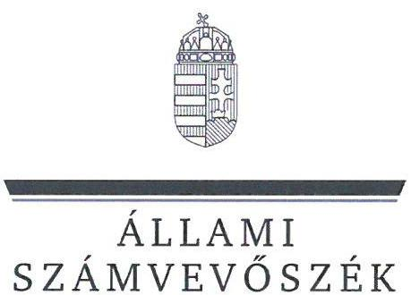
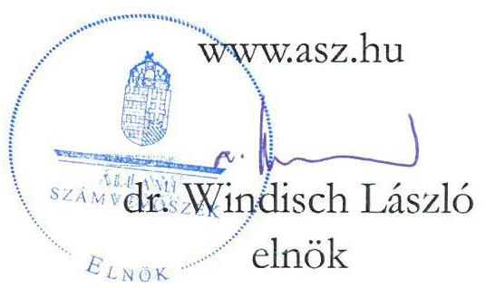
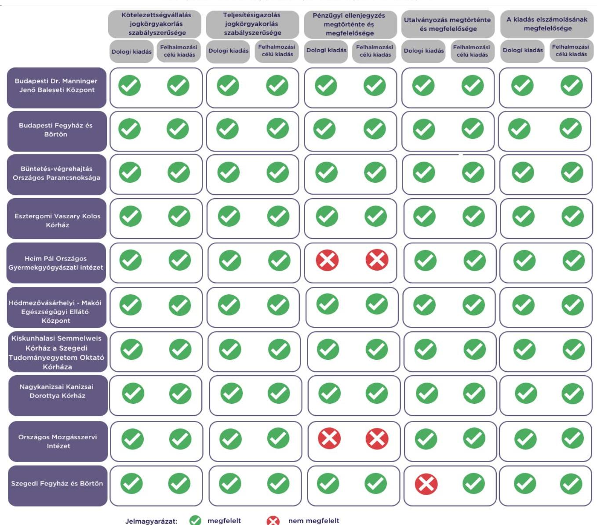

# JELENTÉS 

Az államháztartás központi alrendszerébe tartozó költségvetési szerv által teljesített dologi és felhalmozási célú kiadás szabályszerűségének rapid ellenőrzése
2024.

---

# JELENTÉS 

Az államháztartás központi alrendszerébe tartozó költségvetési szerv által teljesített dologi és felhalmozási célú kiadás szabályszerűségének rapid ellenőrzése
2024.

24026

---

# ELLENŐRZÉSI IGAZGATÓSÁG: 

## ÁLLAMHÁZTARTÁS KÖZPONTI SZINTJÉT ELLENŐRZŐ IGAZGATÓSÁG

ELLENŐRZÉSI IGAZGATÓ:
SINKÁNÉ DR. CSENDES ÁGNES igazgató

ELLENŐRZÉSVEZETŐ:
Jelentéseink az interneten a www.asz.hu címen olvashatók.

RENKÓ ZSUZSANNA ellenőrzésvezető

IKTATÓSZÁM: EL-3949-013/2024.
TÉMASZÁM: 2685

ELLENŐRZÉS-AZONOSÍTÓ SZÁM: V102911

---

# TARTALOMJEGYZÉK 

AZ ELLENŐRZÉS ALAPADATAI ..... 5
AZ ELLENŐRZÖTT SZERVEZETEK ..... 7
ÖSSZEFOGLALÁS ..... 12
AZ ELLENŐRZÉS FÓKUSZKÉRDÉSEI ..... 13
MEGÁLLAPÍTÁSOK ..... 14
JAVASLATOK ..... 18
MELLÉKLETEK ..... 19
I. sz. melléklet: Értelmező szótár ..... 19
II. sz. melléklet: Az ellenőrzött szervezetek jegyzéke ..... 20
III. sz. melléklet: Ellenőrzési kritériumok ..... 21
FÜGGELÉK: ÉSZREVÉTELEK ..... 22
RÖVIDÍTÉSEK JEGYZÉKE ..... 24

---

.

---

# AZ ELLENŐRZÉS ALAPADATAI 

## AZ ELLENŐRZÉS CÉLJA

Az államháztartás központi alrendszerébe tartozó költségvetési szerv által teljesített dologi és felhalmozási célú kiadások egy-egy kiválasztott tételének szabályszerűségi szempontból történő értékelése.

## AZ ELLENŐRZÉS TÍPUSA

Megfelelőségi ellenőrzés.

## AZ ELLENŐRZŐTT IDŐSZAK

| Ssz. | ELLENŐRZŐTT SZERVEZETEK | DOLOGI   KIADÁSOK   ESETEBEN | FELHALMOZÁSI   CÉLU KIADÁSOK   ESETEBEN |
| :--: | :--: | :--: | :--: |
| 1. | Budapesti Dr. Manninger Jenő Baleseti Központ | 2023. október 4. | 2023. október 5. |
| 2. | Budapesti Fegyház és Börtön | 2023. október 3. | 2023. augusztus 8. |
| 3. | Büntetés-végrehajtás Országos Parancsnoksága | 2023. szeptember 18. | 2023. október 16. |
| 4. | Esztergomi Vaszary Kolos Kórház | 2023. október 9. | 2023. szeptember 20. |
| 5. | Heim Pál Országos Gyermekgyógyászati Intézet | 2023. szeptember 25. | 2023. október 3. |
| 6. | Hódmezővásárhelyi - Makói Egészségügyi Ellátó Központ | 2023. október 5. | 2023. szeptember 22. |
| 7. | Kiskunhalasi Semmelweis Kórház a Szegedi Tudományegyetem Oktató Kórháza | 2023. október 2. | 2023. szeptember 29. |
| 8. | Nagykanizsai Kanizsai Dorottya Kórház | 2023. szeptember 26. | 2023. április 6. |
| 9. | Országos Mozgásszervi Intézet | 2023. október 10. | 2023. október 3. |
| 10. | Szegedi Fegyház és Börtön | 2023. szeptember 29. | 2023. május 17. |

## AZ ELLENŐRZÉS TÁRGYA

Az államháztartás központi alrendszerébe tartozó költségvetési szerv által teljesített, ellenőrzésre kiválasztott dologi és felhalmozási célú kiadás szabályszerű teljesítése, ezen belül a gazdálkodási jogkörök szabályszerű gyakorlása. Az ellenőrzés kiterjedt minden olyan körülményre és adatra, amely az ÁSZ ${ }^{1}$ jogszabályban meghatározott feladatainak teljesítéséhez, valamint a program végrehajtása folyamán felmerült újabb összefüggések feltárásához szükséges volt.

---

Az ellenőrzés során az ÁSZ

- a Budapesti Dr. Manninger Jenő Baleseti Központ, a Budapesti Fegyház és Börtön és a Nagykanizsai Kanizsai Dorottya Kórház esetében a Szakmai tevékenységet segítő szolgáltatások; a Büntetés-végrehajtás Országos Parancsnoksága esetében a dologi kiadások körébe tartozó Egyéb szolgáltatások; az Esztergomi Vaszary Kolos Kórház, a Heim Pál Országos Gyermekgyógyászati Intézet és a Kiskunhalasi Semmelweis Kórház a Szegedi Tudományegyetem Oktató Kórház esetében a Karbantartási, kisjavítási szolgáltatások; a Hódmezővásárhelyi - Makói Egészségügyi Ellátó Központ és az Országos Mozgásszervi Intézet esetében az Árubeszerzés; a Szegedi Fegyház és Börtön esetében az Üzemeltetési anyagok beszerzése;
- a Budapesti Dr. Manninger Jenő Baleseti Központ, az Esztergomi Vaszary Kolos Kórház, a Kiskunhalasi Semmelweis Kórház a Szegedi Tudományegyetem Oktató Kórház, a Nagykanizsai Kanizsai Dorottya Kórház, az Országos Mozgásszervi Intézet és a Szegedi Fegyház és Börtön esetében a felhalmozási célú kiadások körébe tartozó Egyéb tárgyi eszközök beszerzése, létesítése; a Budapesti Fegyház és Börtön, a Büntetés-végrehajtás Országos Parancsnoksága és a Heim Pál Országos Gyermekgyógyászati Intézet esetében az Ingatlanok felújítása; a Hódmezővásárhelyi Makói Egészségügyi Ellátó Központ esetében az Ingatlanok beszerzése, létesítése;
rovatokon elszámolt kiadások egy-egy kiválasztott mintatételének szabályszerűségét értékelte.

# AZ ELLENŐRZÉS JOGALAPJA 

Az ellenőrzés jogszabályi alapját az ÁSZ tv. ${ }^{2} 1 . \int(3)$ bekezdés és az 5. § (6) bekezdés előírásai képezték.

## AZ ELLENŐRZÉS MÓDSZERE

Az ellenőrzést az ÁSZ az ellenőrzött időszakban hatályos jogszabályok, az ellenőrzés szakmai szabályai alapján, „Az állambázztartás központi alrendszerébe tartozó költségvetési szerv által teljesitett dologi kiadás szabályszerűségének rapid ellenörzéséről" és „Az állambázztartás központi alrendszerébe tartozó költségvetési szerv által teljesitett felhalmozzási célú kiadás szabályszerüségének rapid ellenörzéséről" című ellenőrzési programok (továbbiakban: ellenőrzési programok) kérdéseire adott válaszok kiértékelésével, az ellenőrzési programokban megjelölt adatforrások figyelembevételével folytatta le.

Az ellenőrzési kérdések megválaszolásához szükséges bizonyítékok megszerzése a következő ellenőrzési eljárások alkalmazásával történt: megfigyelés, összehasonlítás, elemző eljárás, a dologi kiadások, felhalmozási célú kiadások ellenőrzéssel érintett rovatairól történő mintavétel. Az ellenőrzési bizonyítékként felhasználható adatforrások közé tartoztak egyrészt az ellenőrzéshez kért dokumentumok, adatforrások, másrészt adatforrás volt még minden - az ellenőrzés folyamán - feltárt, az ellenőrzés szempontjából információkat tartalmazó dokumentum.

Az ÁSZ az ellenőrzés során a kiválasztott mintatételek ellenőrzési programokban meghatározott szempontok szerinti szabályszerűségét értékelte, így a kötelezettségvállalás és a teljesítésigazolás gazdálkodási jogkörök tekintetében a jogkörgyakorlás szabályszerűségét, a pénzügyi ellenjegyzés és az utalványozás gazdálkodási jogkörök tekintetében ezek megtörténtét és az ellenőrzési kritériumoknak való megfelelőségét.

---

# AZ ELLENŐRZÖTT SZERVEZETEK 

Az ellenőrzés a Budapesti Dr. Manninger Jenő Baleseti Központ, a Budapesti Fegyház és Börtön, a Büntetés-végrehajtás Országos Parancsnoksága, az Esztergomi Vaszary Kolos Kórház, a Heim Pál Országos Gyermekgyógyászati Intézet, a Hódmezővásárhelyi - Makói Egészségügyi Ellátó Központ, a Kiskunhalasi Semmelweis Kórház a Szegedi Tudományegyetem Oktató Kórház, a Nagykanizsai Kanizsai Dorottya Kórház, az Országos Mozgásszervi Intézet és a Szegedi Fegyház és Börtön elnevezésű szervezetekre, mint az államháztartás központi alrendszerébe tartozó költségvetési szervekre terjedt ki.

## BudAPESti Dr. MANNINGER JENŐ BAlESETI KÖZPONT

A BMJ $\mathrm{BK}^{3}$ közfeladata az Eütv. ${ }^{4}$ alapján ellátási területére kiterjedően a járó- és fekvőbetegek diagnosztikus és terápiás szakorvosi ellátása, rehabilitációja és követéses gondozása. Alaptevékenysége keretében feladata a baleseti sérült fekvő- és járóbetegek komplex szakorvosi ellátása, a sebészeti, mellkassebészeti, kéz- és plasztikai, valamint mikrosebészeti, ortopédiai, szeptikus sebészeti, idegsebészeti és maxillofaciális sebészeti, belgyógyászati ellátások. Ennek keretében végzi fekvőbetegek aktív ellátását, járóbetegek gyógyító és rehabilitációs szakellátását és egynapos ellátását az egyén gyógykezelése, életveszély elhárítása, a megbetegedés következtében kialakult állapot javítása vagy a további állapotromlás megelőzése céljából.

## BudAPESti Dr. MANNINGER JENŐ BAlESETI KÖZPONT FÖBB ADATAINAK BEMUTATÁSA

Alapításának éve:
Irányító szerve:
Középirányító szerve:
Gazdasági szervezettel való rendelkezés
Illetékessége, múködési területe:
Általános képviseletét ellátó vezetője:
Vezetői kinevezés kezdete:
2022. évben teljesített bevételek összege
2022. évben teljesített kiadások összege

2022.
Belügyminisztérium
Országos Kórházi Főigazgatóság
Gazdasági szervezettel rendelkezik
2006. évi CXXXII. törvény ${ }^{5}$ alapján vezetett közhiteles kapacitásnyilvántartásban szereplő ellátási terület
főigazgató
2022.03.01.
$11785,3 \mathrm{M} \mathrm{Ft}$
$11677,0 \mathrm{M} \mathrm{Ft}$

## BudAPESti FEGYHÁz És BÖRTÖN

A $\mathrm{BFB}^{6}$ rendvédelmi szerv, közfeladatát 1995. évi CVII. törvény ${ }^{7}$ határozza meg. Alaptevékenysége letartóztatással, szabadságvesztéssel, elzárással összefüggő büntetés-végrehajtási feladatok ellátása.

## BudAPESti FEGYHÁz És BÖRTÖN FÖBB ADATAINAK BEMUTATÁSA

Alapításának éve:
Irányító szerve:
Középirányító szerve:
Gazdasági szervezettel való rendelkezés
Illetékessége, múködési területe:
Általános képviseletét ellátó vezetője:
Vezetői kinevezés kezdete:
2022. évben teljesített bevételek összege
2022. évben teljesített kiadások összege

1997.
Belügyminisztérium
Büntetés-végrehajtás Országos Parancsnoksága
Gazdasági szervezettel rendelkezik
országos
parancsnok
2023.09.01.
$6568,2 \mathrm{M} \mathrm{Ft}$
$6520,7 \mathrm{M} \mathrm{Ft}$

---

# BÜNTETÉS-VÉGREHAJTÁs ORSZÁGOS PARANCSNOKSÁGA 

A BVOJ ${ }^{\circledR}$ rendvédelmi szerv, közfeladatát a 1995. évi CVII. törvény határozza meg. Alaptevékenysége a büntetés-végrehajtási szervek szolgálati feladatai végrehajtásának - így különösen a fogva tartás biztonságával, a fogvatartottak nevelésével, foglalkoztatásával, egészségügyi ellátásával, szállításával és nyilvántartásával kapcsolatos tevékenységeknek - felügyelete, ellenőrzése és szakmai irányítása, a büntetés-végrehajtási szervek központi anyagi-technikai ellátása, a büntetés-végrehajtási szervezet költségvetésének keretei között a büntetésvégrehajtási szervek feladatainak ellátásához szükséges feltételek biztosítása.

## BÜNTETÉS-VÉGREHAJTÁs ORSZÁGOS PARANCSNOKSÁGA FÖRB ADATAINAK BEMUTATÁSA

Alapításának éve:
Irányító szerve:
Középirányító szerve:
Gazdasági szervezettel való rendelkezés
Illetékessége, müködési területe:
Általános képviseletét ellátó vezetője:
Vezetői kinevezés kezdete:
2022. évben teljesített bevételek összege
2022. évben teljesített kiadások összege

1997.
Belügyminisztérium
-
Gazdasági szervezettel rendelkezik
országos
országos parancsnok
2016.11.01.
$49268,0 \mathrm{M} \mathrm{Ft}$
$28108,5 \mathrm{M} \mathrm{Ft}$

## EsZtergomi VasZary Kolos KórháZ

Az Esztergomi Kórház ${ }^{9}$ közfeladata az Eütv. alapján ellátási területére kiterjedően a járó- és fekvőbetegek diagnosztikus és terápiás szakorvosi ellátása, rehabilitációja és követéses gondozása. Ennek keretében végzi fekvőbetegek aktív és krónikus ellátását, rehabilitációját, járóbetegek gyógyító és rehabilitációs szakellátását és egynapos ellátását az egyén gyógykezelése, életveszély elhárítása, a megbetegedés következtében kialakult állapot javítása vagy a további állapotromlás megelőzése céljából. Tevékenysége közé tartozik továbbá a gyógyszer és egyéb gyógyászati termékek kiskereskedelme is.

## ESZTERGOMI VASZARY KOLOS KÓRHÁZ FÖRB ADATAINAK BEMUTATÁSA

Alapításának éve:
Irányító szerve:
Középirányító szerve:
Gazdasági szervezettel való rendelkezés:
Illetékessége, müködési területe:
Általános képviseletét ellátó vezetője:
Vezetői kinevezés kezdete:
2022. évben teljesített bevételek összege:
2022. évben teljesített kiadások összege:

1902.
Belügyminisztérium
Országos Kórházi Főigazgatóság
Gazdasági szervezettel rendelkezik
2006. évi CXXXII. törvény alapján vezetett közhiteles kapacitásnyilvántartásban szereplő ellátási terület
főigazgató
2021.02.01.
$11895,7 \mathrm{M} \mathrm{Ft}$
$11175,9 \mathrm{M} \mathrm{Ft}$

---

# HEIM PÁL ORSZÁGOS GYERMEKGYÓGYÁSZATI IntÉZET 

A HOGYI ${ }^{10}$ közfeladata az Eütv. alapján ellátási területére kiterjedően a 18 év alatti járó- és fekvőbetegek diagnosztikus és terápiás szakorvosi ellátása, rehabilitációja és követéses gondozása. Ennek keretében végzi fekvőbetegek aktív és krónikus ellátását, rehabilitációját, járóbetegek gyógyító és rehabilitációs szakellátását és egynapos ellátását az egyén gyógykezelése, életveszély elhárítása, a megbetegedés következtében kialakult állapot javítása vagy a további állapotromlás megelőzése céljából. Alaptevékenységébe tartozik továbbá az egészségüggyel kapcsolatos kutatások végzése, gyógyszer és gyógyászati termék kiskereskedelme, egészségügyi szakmai képzések végzése, valamint a gyermekgyógyászat területén gyógyító-megelőző, szervezési-módszertani, továbbképző és tudományos alapintézmény.

## HEIM PÁL ORSZÁGOS GYERMEKGYÓGYÁSZATI INTÉZET FÖBB ADATAINAK BEMUTATÁSA

Alapításának éve:
Irányító szerve:
Középirányító szerve:
Gazdasági szervezettel való rendelkezés:
Illetékessége, múködési területe:
Általános képviseletét ellátó vezetője:
Vezetői kinevezés kezdete:
2022. évben teljesített bevételek összege:
2022. évben teljesített kiadások összege:

1980.
Belügyminisztérium
Országos Kórházi Főigazgatóság
Gazdasági szervezettel rendelkezik
2006. évi CXXXII. törvény alapján vezetett közhiteles kapacitásnyilvántartásban szereplő ellátási terület
főigazgató
2021.01.01.
$22126,9 \mathrm{M} F \mathrm{t}$
$21484,3 \mathrm{M} F \mathrm{t}$

## HÓDMEZŐVÁSÁRHELYI - MAKÓI EGÉSZSÉGÜGYI ELLÁTÓ KÖZPONT

A HMEK ${ }^{11}$ közfeladata az Eütv. alapján ellátási területére kiterjedően a járó- és fekvőbetegek diagnosztikus és terápiás szakorvosi ellátása, rehabilitációja és követéses gondozása, valamint az egészségügyi alapellátásról szóló 2015. évi CXXIII. törvény alapján a védőnői ellátás biztosítása. Ennek keretében végzi fekvőbetegek aktív és krónikus ellátását, rehabilitációját, ápolását, járóbetegek gyógyító és rehabilitációs szakellátását és egynapos ellátását az egyén gyógykezelése, életveszély elhárítása, a megbetegedés következtében kialakult állapot javítása vagy a további állapotromlás megelőzése céljából. Feladata továbbá a védőnői ellátás keretében az egészségmegőrzés, tanácsadás, gondozás, betegségmegelőzés-szűrés, felvilágosítás, egészségnevelés.

## HÓDMEZŐVÁSÁRHELYI - MAKÓI EGÉSZSÉGÉGYI ELLÁTÓ KÖZPONT FÖBB ADATAINAK BEMUTATÁSA

Alapításának éve:
Irányító szerve:
Középirányító szerve:
Gazdasági szervezettel való rendelkezés:
Illetékessége, múködési területe:
Általános képviseletét ellátó vezetője:
Vezetői kinevezés kezdete:
2022. évben teljesített bevételek összege:
2022. évben teljesített kiadások összege:

1979.
Belügyminisztérium
Országos Kórházi Főigazgatóság
Gazdasági szervezettel rendelkezik
2006. évi CXXXII. törvény alapján vezetett közhiteles kapacitásnyilvántartásban szereplő ellátási terület
főigazgató
2021.03.01.
$16251,7 \mathrm{M} F \mathrm{t}$
$14996,7 \mathrm{M} F \mathrm{t}$

---

# KISKUNHALASI SEMMELWEIS KÓRHÁZ A SZEGEDI TUDOMÁNYEGYETEM OKTATÓKÓRHÁZA

A Kiskunhalasi Semmelweis Kórház ${ }^{12}$ közfeladata az Eütv. alapján ellátási területére kiterjedően a járóés fekvőbetegek diagnosztikus és terápiás szakorvosi ellátása, rehabilitációja és követéses gondozása. Ennek keretében végzi fekvőbetegek aktív és krónikus ellátását, rehabilitációját, járóbetegek gyógyító és rehabilitációs szakellátását és egynapos ellátását az egyén gyógykezelése, életveszély elhárítása, a megbetegedés következtében kialakult állapot javítása vagy a további állapotromlás megelőzése céljából. Alaptevékenységébe tartozik a gyógyszer és gyógyászati termék kiskereskedelme, egészségüggyel kapcsolatos orvostudományi kutatások végzése, szakmai gyakorlati oktatás és továbbképzések végzése.

|  KISKUNHALASI SEMMELWEIS KÓRHÁZ FÖRB ADATAINAK REMUTATÁSA |   |
| --- | --- |
|  Alapításának éve: | 2013.  |
|  Irányító szerve: | Belügyminisztérium  |
|  Középirányító szerve: | Országos Kórházi Főigazgatóság  |
|  Gazdasági szervezettel való rendelkezés: | Gazdasági szervezettel nem rendelkezik  |
|  Illetékessége, múködési területe: | 2006. évi CXXXII. törvény alapján vezetett közhiteles kapacitás-
nyilvántartásban szereplő ellátási terület  |
|  Általános képviseletét ellátó vezetője: | főigazgató  |
|  Vezetői kinevezés kezdete: | 2021.02.01.  |
|  2022. évben teljesített bevételek összege: | $12905,3 \mathrm{M} \mathrm{Ft}$  |
|  2022. évben teljesített kiadások összege: | $12592,6 \mathrm{M} \mathrm{Ft}$  |

## NAGYKANIZSAI KANIZSAI DOROTTYA KÓRHÁZ

A Nagykanizsai Kórház ${ }^{13}$ közfeladata az Eütv. alapján ellátási területére kiterjedően a járó- és fekvőbetegek diagnosztikus és terápiás szakorvosi ellátása, rehabilitációja és követéses gondozása. Ennek keretében végzi fekvőbetegek aktív és krónikus ellátását, rehabilitációját, járóbetegek gyógyító és rehabilitációs szakellátását és egynapos ellátását az egyén gyógykezelése, életveszély elhárítása, a megbetegedés következtében kialakult állapot javítása vagy a további állapotromlás megelőzése céljából.

|  NAGYKANIZSAI KANIZSAI DOROTTYA KÓRHÁZ FÖRB ADATAINAK REMUTATÁSA |   |
| --- | --- |
|  Alapításának éve: | 1979.  |
|  Irányító szerve: | Belügyminisztérium  |
|  Középirányító szerve: | Országos Kórházi Főigazgatóság  |
|  Gazdasági szervezettel való rendelkezés: | Gazdasági szervezettel rendelkezik  |
|  Illetékessége, múködési területe: | 2006. évi CXXXII. törvény alapján vezetett közhiteles kapacitás-
nyilvántartásban szereplő ellátási terület  |
|  Általános képviseletét ellátó vezetője: | főigazgató  |
|  Vezetői kinevezés kezdete: | 2021.03.01.  |
|  2022. évben teljesített bevételek összege: | $12450,4 \mathrm{M} \mathrm{Ft}$  |
|  2022. évben teljesített kiadások összege: | $12396,3 \mathrm{M} \mathrm{Ft}$  |

---

# Országos Mozgásszervi IntÉzet 

Az OMINT ${ }^{14}$ közfeladata az Eütv. alapján ellátási területére kiterjedően a járó- és fekvőbetegek diagnosztikus és terápiás szakorvosi ellátása, rehabilitációja és követéses gondozása. Országos gyógyintézetként fekvőbeteg osztályokon, részlegeken, járóbeteg szakrendeléseken és nappali kórházként végzi a mozgásszervi szakmai profilját jelentő feladatait az egyének gyógykezelése, az életveszély elhárítása, a megbetegedések következtében kialakuló állapotok javítása, a további állapotromlás megelőzése és a betegségek prevenciója céljából. Működteti a reumatológiai és rehabilitációs országos regisztereket, részt vesz nemzeti egészségprogramok vezetésében és végrehajtásában. Alaptevékenységéhez tartoznak továbbá az orvostudományi kutatások és a klinikai vizsgálatok végzése, az egészségügyi szakmai továbbképzések, a középés felsőfokú szakképzés, a gyógyszer, gyógyászati termékek és gyógyászati segédeszközök kiskereskedelme, valamint a járó- és fekvőbetegek diagnosztikai, fogászati és ortopéd-technikai ellátása.

## Országos MozgásszerVi IntÉzet főbb adatainak bemutatása

| Alapításának éve: | 2021. |
| :-- | :-- |
| Irányító szerve: | Belügyminisztérium |
| Középirányító szerve: | Országos Kórházi Főigazgatóság |
| Gazdasági szervezettel való rendelkezés | Gazdasági szervezettel rendelkezik |
| Illetékessége, múködési területe: | 2006. évi CXXXII. törvény alapján vezetett közhiteles kapacitás-   nyilvántartásban szereplő ellátási terület |
| Általános képviseletét ellátó vezetője: | főigazgató |
| Vezetői kinevezés kezdete: | 2024.01 .01 . |
| 2022. évben teljesített bevételek összege | $13886,3 \mathrm{M} \mathrm{Ft}$ |
| 2022. évben teljesített kiadások összege | $13574,3 \mathrm{M} \mathrm{Ft}$ |

## Szegedi FegYHÁz És BÖRTÖN

A Szegedi $\mathrm{BV}^{15}$ rendvédelmi szerv, közfeladatát a 1995. évi CVII. törvény határozza meg. Alaptevékenysége letartóztatással, szabadságvesztéssel, elzárással, a krónikus betegségben szenvedő fogvatartottak folyamatos intézményi tartózkodása mellett - a Büntetés-végrehajtás Egészségügyi Központ szakmai irányításával - végzett, hosszú ápolási idejű diagnosztikus, gyógykezelési vagy ápolási célú általános fekvőbeteg-gyógyintézeti ellátással, valamint az anya és a 0-1 éves gyermek védőnői gondozásával összefüggő büntetés-végrehajtási feladatok ellátása.

## SZEGEDI FEGYHÁZ És BÖRTÖN FÖBB ADATAINAK BEMUTATÁSA

| Alapításának éve: | 1997. |
| :-- | :-- |
| Irányító szerve: | Belügyminisztérium |
| Középirányító szerve: | BVOP |
| Gazdasági szervezettel való rendelkezés | Gazdasági szervezettel rendelkezik |
| Illetékessége, múködési területe: | országos |
| Általános képviseletét ellátó vezetője: | parancsnok |
| Vezetői kinevezés kezdete: | 2023.01 .01 . |
| 2022. évben teljesített bevételek összege | $8977,4 \mathrm{M} \mathrm{Ft}$ |
| 2022. évben teljesített kiadások összege | $8943,7 \mathrm{M} \mathrm{Ft}$ |

---

# ÖSSZEFOGLALÁS 

Két intézménynél a dologi és felhalmozási célú kiadásnál a pénzügyi ellenjegyzés nem a jogszabályi előírásoknak megfelelően történt. Az utalványozási jogkörgyakorlás nem szabályszerűen történt egy intézménynél, mivel a dologi kiadás esetében az utalványozásra érvényesítés hiányában került sor. A kötelezettségvállalások és a teljesítésigazolások az ellenőrzött kiadások tekintetében a jogszabályi előírások szerint történtek. Az ellenőrzött kiadásokat a megfelelő rovatokon számolták el.

1. ábra

## A FŐBB ELLENŐRZÉSI TAPASZTALATOK

Forrás: ÁSZ saját szerkesztés

---

# AZ ELLENŐRZÉS FÓKUSZKÉRDÉSEI 

1.- Az államháztartás központi alrendszerébe tartozó költségvetési szervnél a kiválasztott dologi kiadás teljesitése az egyes jogszabályi rendelkezések alapján szabályszerű volt-e?
2.- Az államháztartás központi alrendszerébe tartozó költségvetési szervnél a kiválasztott felhalmozási célú kiadás teljesitése az egyes jogszabályi rendelkezések alapján szabályszerű volt-e?

---

# MEGÁLLAPÍTÁSOK 

## 1. Az államháztartás központi alrendszerébe tartozó költségvetési szervnél a kiválasztott dologi kiadás teljesítése az egyes jogszabályi rendelkezések alapján szabályszerű volt-e?

Összegző megállapítás Az ellenőrzött 10 dologi kiadás teljesítése hét esetben az ellenőrzés keretében vizsgált jogszabályi előírásoknak megfelelt. Két dologi kiadás esetében a pénzügyi ellenjegyzési jogkörgyakorlás nem volt szabályszerű. Egy dologi kiadás esetében az utalványozási jogkörgyakorlás nem szabályszerűen történt.

A BMJ BK-nál, a BFB-nél, a BVOP-nál, az Esztergomi Kórháznál, a HMEK-nél, a Kiskunhalasi Semmelweis Kórháznál és a Nagykanizsai Kórháznál az ellenőrzött mintatétel esetében a kötelezettségvállalási, teljesítésigazolási, utalványozási jogkörgyakorlás, továbbá a kiadás elszámolása az Áht. ${ }^{16}$, az Ávr. ${ }^{17}$ és az Áhsz. ${ }^{18}$ előírásai szerint szabályszerűen történt, a pénzügyi ellenjegyzés és az utalványozás megfelelő volt:

- Kötelezettséget az Áht.-ben és az Ávr.-ben foglaltakkal összhangban az arra jogosultsággal rendelkező személy vállalt.
- A kötelezettségvállalásra az Áht.-ben foglaltak szerint, a pénzügyi ellenjegyzés után került sor.
- A teljesítésigazoló az Ávr.-ben előírt írásbeli kijelöléssel rendelkezett.
- A teljesítésigazolás során az Ávr.-ben foglaltak szerint ellenőrizhető okmányok alapján ellenőrizték és igazolták a kiadás teljesítésének jogosságát, összegszerűségét, valamint az ellenszolgáltatás teljesítését.
- A teljesítésigazoló a teljesítést az Ávr.-ben foglaltakkal összhangban, az igazolás dátumának és a teljesítés tényére történő utalás megjelölésével, aláírásával igazolta.
- Az utalványozásra az Áht.-ben, valamint az Ávr.-ben foglaltakkal összhangban, a teljesítésigazolást és az érvényesítést követően került sor.
- A kiadás számviteli elszámolása a megfelelő rovaton történt az Áhsz.-ben előírtakkal összhangban.

A HOGYI-nál az ellenőrzött mintatétel esetében a kötelezettségvállalási, teljesítésigazolási és az utalványozási jogkörgyakorlás, valamint a kiadás elszámolása az Áht.-ben, az Ávr.-ben és az Áhsz.-ben foglalt előírások alapján szabályszerűen történt, az utalványozás megfelelő volt. A pénzügyi ellenjegyzés nem a jogszabályi előírásoknak megfelelően történt:

- Kötelezettséget az Áht.-ben és az Ávr.-ben foglaltakkal összhangban az arra jogosultsággal rendelkező személy vállalt.
- A kötelezettségvállalás dokumentuma (szerződés) az Ávr. 50. § (1) bekezdés d) pontban és az Ávr. 55. § (1) bekezdésben foglaltak ellenére nem tartalmazta a pénzügyi ellenjegyzés tényét.
- A teljesítésigazoló az Ávr.-ben előírt írásbeli kijelöléssel rendelkezett.

---

- A teljesítésigazolás során az Ávr.-ben foglaltak szerint ellenőrizhető okmányok alapján ellenőrizték és igazolták a kiadás teljesítésének jogosságát, összegszerűségét, valamint az ellenszolgáltatás teljesítését.
- A teljesítésigazoló a teljesítést az Ávr.-ben foglaltakkal összhangban, az igazolás dátumának és a teljesítés tényére történő utalás megjelölésével, aláírásával igazolta.
- Az utalványozásra az Áht.-ben, valamint az Ávr.-ben foglaltakkal összhangban, a teljesítésigazolást és az érvényesítést követően került sor.
- A kiadás számviteli elszámolása a megfelelő rovaton történt az Áhsz.-ben előírtakkal összhangban.

Az OMINT-nél az ellenőrzött mintatétel esetében a kötelezettségvállalási, teljesítésigazolási és az utalványozási jogkörgyakorlás, valamint a kiadás elszámolása az Áht.-ben, az Ávr.-ben és az Áhsz.-ben foglalt előírások alapján szabályszerűen történt, az utalványozás megfelelő volt. A pénzügyi ellenjegyzés nem a jogszabályi előírásoknak megfelelően történt:

- Kötelezettséget az Áht.-ben és az Ávr.-ben foglaltakkal összhangban az arra jogosultsággal rendelkező személy vállalt.
- A kötelezettségvállalás dokumentuma (megrendelés) az Ávr. 55. § (1) bekezdésében foglaltak ellenére nem tartalmazta a pénzügyi ellenjegyzés dátumát. A dátum hiányában nem lehetett megítélni, hogy a nettó 6495969 Ft értékű kötelezettségvállalásra az Áht. 37. § (1) bekezdésében foglalt előírás szerint a pénzügyi ellenjegyzés után került-e sor.
- A teljesítésigazoló az Ávr.-ben előírt írásbeli kijelöléssel rendelkezett.
- A teljesítésigazolás során az Ávr.-ben foglaltak szerint ellenőrizhető okmányok alapján ellenőrizték és igazolták a kiadás teljesítésének jogosságát, összegszerűségét, valamint az ellenszolgáltatás teljesítését.
- A teljesítésigazoló a teljesítést az Ávr.-ben foglaltakkal összhangban, az igazolás dátumának és a teljesítés tényére történő utalás megjelölésével, aláírásával igazolta.
- Az utalványozásra az Áht.-ben, valamint az Ávr.-ben foglaltakkal összhangban, a teljesítésigazolást és az érvényesítést követően került sor.
- A kiadás számviteli elszámolása a megfelelő rovaton történt az Áhsz.-ben előírtakkal összhangban.

A Szegedi BV-nél az ellenőrzött mintatétel esetében a kötelezettségvállalási és teljesítésigazolási jogkörgyakorlás, valamint a kiadás elszámolása az Áht-ben, Ávr.-ben és az Áhsz.-ben foglalt előírások alapján szabályszerű volt, az utalványozási jogkörgyakorlás nem szabályszerűen történt:

- Kötelezettséget az Áht.-ben és az Ávr.-ben foglaltakkal összhangban az arra jogosultsággal rendelkező személy vállalt.
- A kötelezettségvállalásra az Áht.-ben foglaltak szerint, a pénzügyi ellenjegyzés után került sor.
- A teljesítésigazoló az Ávr.-ben előírt írásbeli kijelöléssel rendelkezett.
- A teljesítésigazolás során az Ávr.-ben foglaltak szerint ellenőrizhető okmányok alapján ellenőrizték és igazolták a kiadás teljesítésének jogosságát, összegszerűségét, valamint az ellenszolgáltatás teljesítését.
- A teljesítésigazoló a teljesítést az Ávr.-ben foglaltakkal összhangban, az igazolás dátumának és a teljesítés tényére történő utalás megjelölésével, aláírásával igazolta.

---

- Az utalványozási jogkörgyakorlásra az Áht.-ben, valamint az Ávr.-ben foglaltakkal összhangban a teljesítés igazolását követően került sor.
- Az Áht. 38. § (1) bekezdését megsértve az utalványozásra - az utalványozást követő érvényesítési időpontra tekintettel - érvényesítés hiányában került sor.
- A kiadás számviteli elszámolása a megfelelő rovaton történt az Áhsz.-ben előírtakkal összhangban.

# 2. Az államháztartás központi alrendszerébe tartozó költségvetési szervnél a kiválasztott felhalmozási célú kiadás teljesítése az egyes jogszabályi rendelkezések alapján szabályszerű volt-e? 

| Összegző megállapítás | Az ellenőrzött 10 felhalmozási célú kiadás teljesítése   nyolc esetben az ellenőrzés keretében vizsgált jogszabályi   előírásoknak megfelelt. Két felhalmozási célú kiadás   esetében a pénzügyi ellenjegyzési jogkörgyakorlás nem volt   szabályszerű. |
| :-- | :-- |

A BMJ BK-nál, BFB-nél, a BVOP-nál, az Esztergomi Kórháznál, a HMEK-nél, a Kiskunhalasi Semmelweis Kórháznál, a Nagykanizsai Kórháznál és a Szegedi BV-nél az ellenőrzött mintatétel esetében a kötelezettségvállalási, teljesítésigazolási, utalványozási jogkörök gyakorlása, továbbá a kiadás elszámolása az Áht., az Ávr. és az Áhsz. előírásai szerint szabályszerűen történt, a pénzügyi ellenjegyzés és az utalványozás megfelelő volt:

- Kötelezettséget az Áht.-ben és az Ávr.-ben foglaltakkal összhangban az arra jogosultsággal rendelkező személy vállalt.
- A kötelezettségvállalásra az Áht.-ben foglaltak szerint, a pénzügyi ellenjegyzés után került sor.
- A teljesítésigazoló az Ávr.-ben előírt írásbeli kijelöléssel rendelkezett.
- A teljesítésigazolás során az Ávr.-ben foglaltak szerint ellenőrizhető okmányok alapján ellenőrizték és igazolták a kiadás teljesítésének jogosságát, összegszerűségét, valamint az ellenszolgáltatás teljesítését.
- A teljesítésigazoló a teljesítést az Ávr.-ben foglaltakkal összhangban, az igazolás dátumának és a teljesítés tényére történő utalás megjelölésével, aláírásával igazolta.
- Az utalványozásra az Áht.-ben, valamint az Ávr.-ben foglaltakkal összhangban, a teljesítésigazolást és az érvényesítést követően került sor.
- A kiadás számviteli elszámolása a megfelelő rovaton történt az Áhsz.-ben előírtakkal összhangban.

A HOGYI-nál az ellenőrzött mintatétel esetében a kötelezettségvállalási, a teljesítésigazolási jogkörgyakorlás, valamint a kiadás elszámolása az Áht.-ben, az Ávr.-ben és az Áhsz.-ben foglalt előírások alapján szabályszerűen történt, az utalványozás szabályszerű volt. A pénzügyi ellenjegyzés nem a jogszabályi előírásoknak megfelelően történt:

- Kötelezettséget az Áht.-ben és az Ávr.-ben foglaltakkal összhangban az arra jogosultsággal rendelkező személy vállalt.

---

- A kötelezettségvállalás dokumentuma (szerződés) az Ávr. 50. § (1) bekezdés d) pontban és az Ávr. 55. $\S$ (1) bekezdésben foglaltak ellenére nem tartalmazta a pénzügyi ellenjegyzés tényét.
- A teljesítésigazoló az Ávr.-ben előírt írásbeli kijelöléssel rendelkezett.
- A teljesítésigazolás során az Ávr.-ben foglaltak szerint ellenőrizhető okmányok alapján ellenőrizték és igazolták a kiadás teljesítésének jogosságát, összegszerűségét, valamint az ellenszolgáltatás teljesítését.
- A teljesítésigazoló a teljesítést az Ávr.-ben foglaltakkal összhangban, az igazolás dátumának és a teljesítés tényére történő utalás megjelölésével, aláírásával igazolta.
- Az utalványozásra az Áht.-ben, valamint az Ávr.-ben foglaltakkal összhangban, a teljesítésigazolást és az érvényesítést követően került sor.
- A kiadás számviteli elszámolása a megfelelő rovaton történt az Áhsz.-ben előírtakkal összhangban. Az OMINT-nél az ellenőrzött mintatétel esetében a kötelezettségvállalási, teljesítésigazolási és az utalványozási jogkörgyakorlás, valamint a kiadás elszámolása az Áht.-ben, az Ávr.-ben és az Áhsz.-ben foglalt előírások alapján szabályszerűen történt, az utalványozás megfelelő volt. A pénzügyi ellenjegyzés nem a jogszabályi előírásoknak megfelelően történt:
- Kötelezettséget az Áht.-ben és az Ávr.-ben foglaltakkal összhangban az arra jogosultsággal rendelkező személy vállalt.
- A kötelezettségvállalás dokumentuma (szerződés) az Ávr. 55. § (1) bekezdésében foglaltak ellenére nem tartalmazta a pénzügyi ellenjegyzés dátumát. A dátum hiányában nem lehetett megítélni, hogy a nettó 5900000 Ft értékű kötelezettségvállalásra az Áht. 37. § (1) bekezdésében foglalt előírás szerint a pénzügyi ellenjegyzés után került-e sor.
- A teljesítésigazoló az Ávr.-ben előírt írásbeli kijelöléssel rendelkezett.
- A teljesítésigazolás során az Ávr.-ben foglaltak szerint ellenőrizhető okmányok alapján ellenőrizték és igazolták a kiadás teljesítésének jogosságát, összegszerűségét, valamint az ellenszolgáltatás teljesítését.
- A teljesítésigazoló a teljesítést az Ávr.-ben foglaltakkal összhangban, az igazolás dátumának és a teljesítés tényére történő utalás megjelölésével, aláírásával igazolta.
- Az utalványozásra az Áht.-ben, valamint az Ávr.-ben foglaltakkal összhangban, a teljesítésigazolást és az érvényesítést követően került sor.
- A kiadás számviteli elszámolása a megfelelő rovaton történt az Áhsz.-ben előírtakkal összhangban.

---

# JAVASLATOK 

Az ÁSZ tv. 33. § (1) bekezdésében foglaltak értelmében az ellenőrzött szervezet vezetője köteles a jelentésben foglalt megállapításokhoz kapcsolódó intézkedési tervet összeállítani és azt a jelentés kézhezvételétől számított 30 napon belül az ÁSZ részére megküldeni. Amennyiben az ellenőrzött szervezet vezetője nem küldi meg határidőben az intézkedési tervet, vagy továbbra sem elfogadható intézkedési tervet küld, az Állami Számvevőszék elnöke az ÁSZ tv. 33. § (3) bekezdése a) és b) pontjaiban foglaltakat érvényesítheti.

## HEIM PÁL ORSZÁGOS GYERMEKGYÓGYÁSZATI INTÉZET FÓIGAZGATÓJÁNAK

1. Kezdeményezzen a Bkr. ${ }^{19}$ 31. § (6) bekezdése alapján soron kívüli belső ellenőrzést a jelen ellenőrzés során feltárt szabálytalanságok kialakulása okainak feltárása, illetve a szabálytalanságok megszüntetése érdekében.
2. A Bkr. 13. § (2) bekezdésében foglaltak alapján, valamint az 1. számú javaslat szerinti belső ellenőrzés megállapításait és javaslatait is figyelembe véve tegyen intézkedéseket azon kontrolltevékenységek kiépítésére és/vagy megfelelő müködtetésére, amelyek megelőzik a jelentésben leírt szabálytalanságok ismételt előfordulását.

---

# MELLÉKLETEK 

## I. SZ. MELLÉKLET: ÉRTELMEZŐ SZÓTÁR

kötelezettségvállalás
pénzügyi ellenjegyzés
teljesítésigazolás
utalványozás

A költségvetési szerv által a kiadási előirányzatok és - ha jogszabály lehetővé teszi - a kijelölt lebonyolító szerv számára a Kormány rendeletében meghatározottak szerinti rendelkezésre bocsátott összeg terhére fizetési kötelezettség vállalásáról szóló - így különösen a foglalkoztatásra irányuló jogviszony létesítésére, szerződés megkötésére, költségvetési támogatás biztosítására irányuló - szabályszerűen megtett jognyilatkozat.
Forrás: Áht. 1. § 15. pont
A kötelezettségvállalást megelőző múvelet, amelynek során a pénzügyi ellenjegyzőnek meg kell győződnie arról, hogy a szükséges szabad előirányzat - több évet érintő kötelezettségvállalás esetén minden egyes évben rendelkezésre áll, a tervezett kifizetési időpontokban a pénzügyi fedezet biztosított, valamint a kötelezettségvállalás nem sérti a gazdálkodásra vonatkozó szabályokat. Kötelezettséget vállalni a Kormány rendeletében foglalt kivételekkel csak pénzügyi ellenjegyzés után, a pénzügyi teljesítés esedékességét megelőzően, írásban lehet.
Forrás: Áht. 37. § (1) bekezdés
A kötelezettségvállalásban a másik fél által vállalt feltételek teljesítéséhez kapcsolódó igazolás, amely a kiadási előirányzat terhére vállalt utalványozást előzi meg. A teljesítés igazolása során ellenőrizhető okmányok alapján ellenőrizni és igazolni kell a kiadások teljesítésének jogosságát, összegszerűségét, ellenszolgáltatást is magában foglaló kötelezettségvállalás esetében - ha a kifizetés vagy annak egy része az ellenszolgáltatás teljesítését követően esedékes - annak teljesítését. A teljesítést az igazolás dátumának és a teljesítés tényére történő utalás megjelölésével, az arra jogosult személy aláírásával kell igazolni.
Forrás: Áht. 38. § (1) bekezdés; Ávr. 57. § (1) és (3) bekezdések
A bevételek és kiadások elszámolására utalványozás alapján kerülhet sor. A kiadási előirányzatok terhére történő utalványozás esetén az utalványozásra csak azután kerülhet sor, ha a kiadás alapjául szolgáló kötelezettségvállalásban meghatározott feltételeket a másik szerződő fél már teljesítette. A kiadási előirányzatok terhére történő utalványozásra a teljesítés igazolását és az érvényesítést követően, a bevételi előirányzatok esetén a belső szabályzatban a bevételek meghatározott körére esetlegesen elrendelt teljesítés igazolását követően kerülhet sor.
Forrás: Áht. 38. § (1) bekezdés; Ávr. 57. § (2) bekezdés és 59. § (1b) bekezdés

---

# II. SZ. MELLÉKLET: AZ ELLENŐRZÖTT SZERVEZETEK JEGYZÉKE 

## ELLENŐRZÖTT SZERVEZETEK MEGNEVEZÉSE

Budapesti Dr. Manninger Jenő Baleseti Központ
Budapesti Fegyház és Börtön
Büntetés-végrehajtás Országos Parancsnoksága
Esztergomi Vaszary Kolos Kórház
Heim Pál Országos Gyermekgyógyászati Intézet
Hódmezővásárhelyi - Makói Egészségügyi Ellátó Központ
Kiskunhalasi Semmelweis Kórház a Szegedi Tudományegyetem Oktató Kórháza
Nagykanizsai Kanizsai Dorottya Kórház
Országos Mozgásszervi Intézet
Szegedi Fegyház és Börtön

---

# III. SZ. MELLÉKLET: ELLENŐRZÉSI KRITÉRIUMOK 

## FOKUSZKÉRDÉS

1. Az államháztartás központi alrendszerébe tartozó költségvetési szervnél a kiválasztott dologi kiadás teljesítése az egyes jogszabályi rendelkezések alapján szabályszerű volt-e?

Kötelezettségvállalás

Pénzügyi ellenjegyzés
Teljesítésigazolás

Utalványozás

Kiadások elszámolása
2. Az államháztartás központi alrendszerébe tartozó költségvetési szervnél a kiválasztott felhalmozási célú kiadás teljesítése az egyes jogszabályi rendelkezések alapján szabályszerű volt-e?

Kötelezettségvállalás

Pénzügyi ellenjegyzés
Teljesítésigazolás

Utalványozás

Kiadások elszámolása

## ELLENŐRZÉSI KRITÉRIUMOK

Áht. 36. $\$ (7), 37 . \S$ (1) bekezdések
Ávr. 50. $\$ (1) bekezdés d) pont, 52. $\$ (1),(9), 53 . \S(1), 60 . \S$
(3) bekezdések
belső szabályzat
Ávr. 55. $\$ (1),(4)$ bekezdés
Áht. 38. $\$ (1),(2)$ bekezdések
Ávr. 57. $\$ (1),(3)-(5), 60 . \S$ (3) bekezdések
Áht. 38. $\$ (1)$ bekezdés
Ávr. 59. $\$ \quad(1 b),(2)$ bekezdések, (3) bekezdés g) pont, (4) bekezdés
Áhsz. 40. $\$ (1) bekezdés, 15. melléklet I. pont

Áht. 36. $\$ (7), 37 . \S$ (1) bekezdések
Ávr. 50. $\$ \quad(1)$ bekezdés d) pont, 52. $\$ \quad(1),(9), 53 . \S(1), 60 . \S$
(3) bekezdések

Ávr. 55. $\$ (1),(4)$ bekezdés
Áht. 38. $\$ (1), (2)$ bekezdések
Ávr. 57. $\$ (1),(3)-(5), 60 . \S$ (3) bekezdések
Áht. 38. $\$ (1) bekezdés
Ávr. 59. $\$ \quad(1 b),(2)$ bekezdések, (3) bekezdés g) pont, (4) bekezdés
Áhsz. 40. § (1) bekezdés, 15. melléklet I. pont

---

# FÜGGELÉK: ÉSZREVÉTELEK 

A jelentéstervezetet a Számvevőszék 15 napos észrevételezésre megküldte az ellenőrzött szervezet vezetőjének az ÁSZ tv. 29. §* (1) bekezdése előírásának megfelelően.

A Budapesti Dr. Manninger Jenő Baleseti Központ, a Budapesti Fegyház és Börtön, a Büntetés-végrehajtás Országos Parancsnoksága, az Esztergomi Vaszary Kolos Kórház, a Hódmezővásárhelyi - Makói Egészségügyi Ellátó Központ, a Kiskunhalasi Semmelweis Kórház a Szegedi Tudományegyetem Oktató Kórháza, a Nagykanizsai Kanizsai Dorottya Kórház, az Országos Mozgásszervi Intézet, valamint a Szegedi Fegyház és Börtön ellenőrzött szervezetek vezetői a jelentéstervezet megállapításaira érdemi észrevételt nem tettek.
A jelentéstervezet megállapításaira a Heim Pál Országos Gyermekgyógyászati Intézet föigazgatója észrevételt tett. Az ÁSZ tv. 29. § (3) bekezdésével összhangban az Állami Számvevőszék a Függelékben feltünteti a megállapításokkal kapcsolatban tett, el nem fogadott észrevételeket, és megindokolja, hogy azokat miért nem fogadta el.

1. Észrevétel: „A pénzügyi ellenjegyzésre sor került. A kötelezettségvállalás dokumentuma (szerződés) az Ávr. 50. § (1) bekezdés d) pontban és az Ávr. 55. § (1) bekezdésben foglaltak alapján a pénzügyi ellenjegyző keltezéssel ellátott aláírását tartalmazta. Kérésükre feltöltésre kerültek, a kötelezettségvállalásról az aláírás nyilvántartások mind 2023.10.31-én az EL-3971020/2023 iktatószámú bekérő levélre, mind 2023.11.13-án az EL-3971-038/2023 iktatószámú bekérő levélre hivatkozva, ezért pénzügyi ellenjegyzésre jogosult személye igazolva lett. Ennek megfelelően véleményünk szerint a nettó 164430000 Ft értékű kötelezettségvállalásra az Áht. 37. § (1) bekezdésében foglaltak alapján a pénzügyi ellenjegyzés szabályosan megvalósult."

Az észrevétellel érintett megállapítás: „A kötelezettségvállalás dokumentuma (szerződés) az Ávr. 50. § (1) bekezdés d) pontban és az Ávr. 55. § (1) bekezdésben foglaltak ellenére nem tartalmazta a pénzügyi ellenjegyzés tényét és a pénzügyi ellenjegyzö keltezéssel ellátott aláírását, ezáltal a nettó 164430000 Ft értékü kötelezettségvállalásra az Áht. 37. § (1) bekezdésében foglaltak ellenére pénzügyi ellenjegyzés nélkül került sor." (14. oldal utolsó és 15. oldal első bekezdései).

El nem fogadás indoka: „Észrevételében nem vitatta, hogy a kötelezettségvállalás dokumentumai (szerződések) az államháztartásról szóló törvény végrehajtásáról szóló 368/2011. (XII. 31.) Korm. rendelet (továbbiakban: Ávr.) 50. § (1) bekezdés d) pontjában és az Ávr. 55. § (1) bekezdésében előirtak ellenére nem tartalmazta a pénzügyi ellenjegyzés tényére

[^0]
[^0]:    * 29. § (1) Az Állami Számvevőszék az ellenőrzési megállapításait megküldi az ellenőrzött szervezet vezetőjének vagy az általa megbízott személynek, és annak, akinek személyes felelősségét állapította meg.
    (2) Az ellenőrzött szervezet vezetője és a felelősként megjelölt személy az ellenőrzés megállapításaira tizenöt napon belül írásban észrevételt tehet.
    (3) Az Állami Számvevőszék az észrevételre a beérkezésétől számított harminc napon belül írásban válaszol. A figyelembe nem vett észrevételeket köteles a jelentésben feltüntetni, és megindokolni, hogy azokat miért nem fogadta el.

---

történő utalást. Emiatt a pénzügyi ellenjegyzés a dologi kiadás tekintetében továbbra sem értékelhető szabályszerűnek. A 12. oldalon található ábra pénzügyi ellenjegyzés oszlopának módosítása nem indokolt, mert a pénzügyi ellenjegyzés nem felelt meg a jogszabályi előírásnak."
2. Észrevétel: „A pénzügyi ellenjegyzésre sor került. A kötelezettségvállalás dokumentuma (szerződés) az Ávr. 50. § (1) bekezdés d) pontban és az Ávr. 55. § (1) bekezdésben foglaltak alapján a pénzügyi ellenjegyző keltezéssel ellátott aláírását tartalmazta. Kérésükre feltöltésre kerültek, a kötelezettségvállalásról az aláírás nyilvántartások mind 2023.10.31-én az EL-3971-020/2023 iklatószámú bekérő levélre, mind 2023.11.13-án az EL-3971-038/2023 iktatószámú bekérő levélre hivatkozva, ezért pénzügyi ellenjegyzésre jogosult személye igazolva lett. Ennek megfelelően véleményünk szerint a nettó 13272613 Ft értékű kötelezettségvállalásra az Áht. 37. § (1) bekezdésében foglaltak alapján a pénzügyi ellenjegyzés szabályosan megvalósult."

Az észrevétellel érintett megállapítás: „A kötelezettségvállalás dokumentuma (szerződés) az Ávr. 50. § (1) bekezdés d) pontban és az Ávr. 55. § (1) bekezdésben foglaltak ellenére nem tartalmazta a pénzügyi ellenjegyzés tényét és a pénzügyi ellenjegyző keltezéssel ellátott aláírását, ezáltal a nettó 13272613 Ft értékü kötelezettségvállalásra az Áht. 37. § (1) bekezdésében foglaltak ellenére pénzügyi ellenjegyzés nélkül került sor." (17. oldal 3. bekezdés).

El nem fogadás indoka: „Észrevételében nem vitatta, hogy a kötelezettségvállalás dokumentumai (szerződések) az államháztartásról szóló törvény végrehajtásáról szóló 368/2011. (XII. 31.) Korm. rendelet (továbbiakban: Ávr.) 50. § (1) bekezdés d) pontjában és az Ávr. 55. § (1) bekezdésében előírtak ellenére nem tartalmazta a pénzügyi ellenjegyzés tényére történő utalást. Emiatt a pénzügyi ellenjegyzés a felhalmozási célú kiadás tekintetében továbbra sem értékelhető szabályszerűnek. A 12. oldalon található ábra pénzügyi ellenjegyzés oszlopának módosítása nem indokolt, mert a pénzügyi ellenjegyzés nem felelt meg a jogszabályi előírásnak."

---

# RÖVIDÍTÉSEK JEGYZÉKE 

${ }^{1}$ ÁSZ
${ }^{2}$ ÁSZ tv.
${ }^{3}$ BMJ BK
${ }^{4}$ Eürv.
${ }^{5}$ 2006. évi CXXXII. törvény
${ }^{6}$ BFB
${ }^{7}$ 1995. évi CVII. törvény
${ }^{8}$ BVOP
${ }^{9}$ Esztergomi Kórház
${ }^{10}$ HOGYI
${ }^{11}$ HMEK
${ }^{12}$ Kiskunhalasi Semmelweis Kórház
${ }^{13}$ Nagykanizsai Kórház
${ }^{14}$ OMINT
${ }^{15}$ Szegedi BV
${ }^{16}$ Áht.
${ }^{17}$ Ávr.
${ }^{18}$ Áhsz.
${ }^{19}$ Bkr.

Állami Számvevőszék
2011. évi LXVI. törvény az Állami Számvevőszékről

Budapesti Dr. Manninger Jenő Baleseti Központ
1997. évi CLIV. törvény az egészségügyről
2006. évi CXXXII. törvény az egészségügyi ellátórendszer fejlesztéséről

Budapesti Fegyház és Börtön
1995. évi CVII. törvény a büntetés-végrehajtási szervezetről

Büntetés-végrehajtás Országos Parancsnoksága
Esztergomi Vaszary Kolos Kórház
Heim Pál Országos Gyermekgyógyászati Intézet
Hódmezővásárhelyi - Makói Egészségügyi Ellátó Központ
Kiskunhalasi Semmelweis Kórház a Szegedi Tudományegyetem Oktató Kórháza
Nagykanizsai Kanizsai Dorottya Kórház
Országos Mozgásszervi Intézet
Szegedi Fegyház és Börtön
2011. évi CXCV. törvény az államháztartásról

368/2011. (XII. 31.) Korm. rendelet az államháztartásról szóló törvény végrehajtásáról
4/2013. (I. 11.) Korm. rendelet az államháztartás számviteléről
370/2011. (XII. 31.) Korm. rendelet a költségvetési szervek belső kontrollrendszeréről és belső ellenőrzéséről

---

1052 Budapest, Apáczai Csere János u. 10. | 1364 Budapest 4., Pf. 54
www.asz.hu | szamvevoszek@asz.hu
telefon: +36 14849100