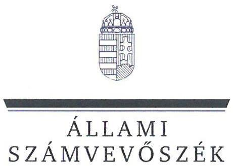
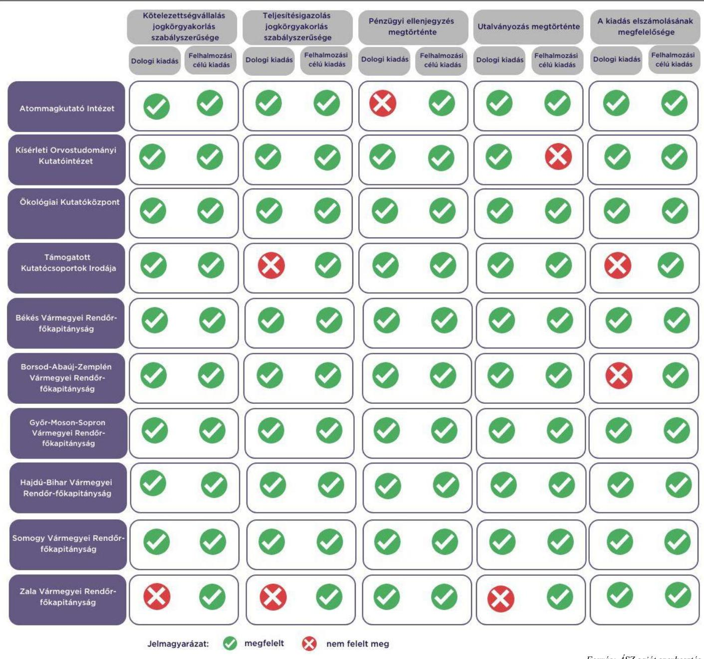

# JELENTÉS 

Az államháztartás központi alrendszerébe tartozó költségvetési szerv által teljesített dologi és felhalmozási célú kiadás szabályszerűségének rapid ellenőrzése

2024.

---

# JELENTÉS 

Az államháztartás központi alrendszerébe tartozó költségvetési szerv által teljesített dologi és felhalmozási célú kiadás szabályszerűségének rapid ellenőrzése
2024.

---

# ELLENŐRZÉSI IGAZGATÓSÁG: 

## ÁLLAMHÁZTARTÁS KÖZPONTI SZINTJÉT ELLENŐRZŐ IGAZGATÓSÁG

## ELLENŐRZÉSI IGAZGATÓ:

## SINKÁNÉ DR. CSENDES ÁGNES igazgató

## ELLENŐRZÉSVEZETŐ:

Jelentéseink az interneten a www.asz.hu címen olvashatók.

RENKÓ ZSUZSANNA ellenőrzésvezető

IKTATÓSZÁM: EL-3949-014/2024.
TÉMASZÁM: 2685
ELLENŐRZÉS-AZONOSÍTÓ SZÁM: V102913

---

# TARTALOMJEGYZÉK 

AZ ELLENŐRZÉS ALAPADATAI ..... 5
AZ ELLENŐRZÖTT SZERVEZETEK ..... 7
ÖSSZEFOGLALÁS ..... 12
AZ ELLENŐRZÉS FÓKUSZKÉRDÉSEI ..... 13
MEGÁLLAPÍTÁSOK ..... 14
JAVASLATOK ..... 19
MELLÉKLETEK ..... 20
I. sz. melléklet: Értelmező szótár ..... 20
II. sz. melléklet: Az ellenőrzött szervezetek jegyzéke ..... 21
III. sz. melléklet: Ellenőrzési kritériumok ..... 22
FÜGGELÉK: ÉSZREVÉTELEK ..... 23
RÖVIDÍTÉSEK JEGYZÉKE ..... 25

---

.

---

# AZ ELLENŐRZÉS ALAPADATAI 

## AZ ELLENŐRZÉS CÉLJA

Az államháztartás központi alrendszerébe tartozó költségvetési szerv által teljesített dologi és felhalmozási célú kiadások egy-egy kiválasztott tételének szabályszerűségi szempontból történő értékelése.

## AZ ELLENŐRZÉS TÍPUSA

Megfelelőségi ellenőrzés.

## AZ ELLENŐRZŐTT IDŐSZAK

| Ssz. | ELLENŐRZŐTT SZERVEZETEK | DOLOGI   KIADÁSOK   ESETÉREN | PELHALMOZÁSI   CÉLÚ KIADÁSOK   ESETÉREN |
| :-- | :-- | :--: | :--: |
| 1. | Atommagkutató Intézet | 2023. október 5. | 2023. szeptember 27. |
| 2. | Kísérleti Orvostudományi Kutatóintézet | 2023. szeptember 18. | 2023. szeptember 25. |
| 3. | Ökológiai Kutatóközpont | 2023. október 10. | 2023. szeptember 22. |
| 4. | Támogatott Kutatócsoportok Irodája | 2023. október 4. | 2023. október 4. |
| 5. | Békés Vármegyei Rendőr-főkapitányság | 2023. szeptember 25. | 2023. július 14. |
| 6. | Borsod-Abaúj-Zemplén Vármegyei Rendőr-főkapitányság | 2023. október 4. | 2023. október 17. |
| 7. | Győr-Moson-Sopron Vármegyei Rendőr-főkapitányság | 2023. szeptember 27. | 2023. augusztus 28. |
| 8. | Hajdú-Bihar Vármegyei Rendőr-főkapitányság | 2023. szeptember 21. | 2023. július 31. |
| 9. | Somogy Vármegyei Rendőr-főkapitányság | 2023. október 5. | 2023. július 12. |
| 10. | Zala Vármegyei Rendőr-főkapitányság | 2023. szeptember 26. | 2023. szeptember 18. |

## AZ ELLENŐRZÉS TÁRGYA

Az államháztartás központi alrendszerébe tartozó költségvetési szerv által teljesített, ellenőrzésre kiválasztott dologi és felhalmozási célú kiadás szabályszerű teljesítése, ezen belül a gazdálkodási jogkörök szabályszerű gyakorlása. Az ellenőrzés kiterjedt minden olyan körülményre és adatra, amely az ÁSZ ${ }^{1}$ jogszabályban meghatározott feladatainak teljesítéséhez, valamint a program végrehajtása folyamán felmerült újabb összefüggések feltárásához szükséges.

---

Az ellenőrzés során az ÁSZ

- a Támogatott Kutatócsoportok Irodája, a Borsod-Abaúj-Zemplén Vármegyei Rendőrfőkapitányság esetében a dologi kiadások körébe tartozó Szakmai anyagok beszerzése; a Kísérleti Orvostudományi Kutatóintézet esetében Informatikai szolgáltatások igénybevétele; az Atommagkutató Intézet, a Somogy Vármegyei Rendőr-főkapitányság, a Zala Vármegyei Rendőrfőkapitányság esetében Karbantartási, kisjavítási szolgáltatások; a Hajdú-Bihar Vármegyei Rendőrfőkapitányság esetében Szakmai tevékenységet segítő szolgáltatások; az Ökológiai Kutatóközpont, a Békés Vármegyei Rendőr-főkapitányság, a Győr-Moson-Sopron Vármegyei Rendőrfőkapitányság esetében Egyéb szolgáltatások;
- az Atommagkutató Intézet, az Ökológiai Kutatóközpont, a Borsod-Abaúj-Zemplén Vármegyei Rendőr-főkapitányság, a Győr-Moson-Sopron Vármegyei Rendőr-főkapitányság, a Hajdú-Bihar Vármegyei Rendőr-főkapitányság esetében a felhalmozási kiadások körébe tartozó Egyéb tárgyi eszközök beszerzése, létesítése; a Békés Vármegyei Rendőr-főkapitányság, a Somogy Vármegyei Rendőr-főkapitányság esetében Ingatlanok felújítása; a Támogatott Kutatócsoportok Irodája, a Kísérleti Orvostudományi Kutatóintézet, a Zala Vármegyei Rendőr-főkapitányság esetében az Informatikai eszközök beszerzése, létesítése
rovatokon elszámolt kiadások egy-egy kiválasztott mintatételének szabályszerűségét értékelte. A Zala Vármegyei Rendőr-főkapitányság esetében az ellenőrzésre kiválasztott dologi mintatétel számviteli elszámolása 2023. november 16-án felhalmozási célú kiadásra módosult, és az Ingatlanok létesítése, beszerzése rovaton került elszámolásra.

# AZ ELLENŐRZÉS JOGALAPJA 

Az ellenőrzés jogszabályi alapját az ÁSZ tv. ${ }^{2} 1 . \int(3)$ bekezdés és az 5. $\int(6)$ bekezdés előírásai képezték.

## AZ ELLENŐRZÉS MÓDSZERE

Az ellenőrzést az ÁSZ az ellenőrzött időszakban hatályos jogszabályok, az ellenőrzés szakmai szabályai alapján, „Az állambáztartás központi alrendszerébe tartozó költségvetési szerv által teljesitett dologi kiadás szabályszerűségének rapid ellenörzéséről" és „Az állambáztartás központi alrendszerébe tartozó költségvetési szerv által teljesitett felhalmozzási célú kiadás szabályszerüségének rapid ellenörzéséről" című ellenőrzési programok (továbbiakban: ellenőrzési programok) kérdéseire adott válaszok kiértékelésével, az ellenőrzési programokban megjelölt adatforrások figyelembevételével folytatta le. Amennyiben az adott mintatétel ellenőrzési programok szerinti értékelése során további kapcsolódó szabálytalanságot tárt fel az ÁSZ, a szabálytalansághoz tartozó kritériummal bővült az ellenőrzés.

Az ellenőrzési kérdések megválaszolásához szükséges bizonyítékok megszerzése a következő ellenőrzési eljárások alkalmazásával történt: megfigyelés, összehasonlítás, elemző eljárás, a dologi kiadások, felhalmozási célú kiadások ellenőrzéssel érintett rovatairól történő mintavétel. Az ellenőrzési bizonyítékként felhasználható adatforrások közé tartoztak egyrészt az ellenőrzéshez kért dokumentumok, adatforrások, másrészt adatforrás volt még minden - az ellenőrzés folyamán - feltárt, az ellenőrzés szempontjából információkat tartalmazó dokumentum.

Az ÁSZ az ellenőrzés során a kiválasztott mintatételek ellenőrzési programokban meghatározott szempontok szerinti szabályszerűségét értékelte, így a kötelezettségvállalás és a teljesítésigazolás gazdálkodási jogkörök tekintetében a jogkörgyakorlás szabályszerűségét, a pénzügyi ellenjegyzés és az utalványozás gazdálkodási jogkörök tekintetében ezek megtörténtét és az ellenőrzési kritériumoknak való megfelelőségét.

---

# AZ ELLENŐRZÖTT SZERVEZETEK 

Az ellenőrzés az Atommagkutató Intézet, a Kísérleti Orvostudományi Kutatóintézet, az Ökológiai Kutatóközpont, a Támogatott Kutatócsoportok Irodája, a Békés Vármegyei Rendőr-főkapitányság, a Borsod-Abaúj-Zemplén Vármegyei Rendőr-főkapitányság, a Győr-Moson-Sopron Vármegyei Rendőr-főkapitányság, a Hajdú-Bihar Vármegyei Rendőr-főkapitányság, a Somogy Vármegyei Rendőr-főkapitányság és a Zala Vármegyei Rendőr-főkapitányság elnevezésű szervezetekre, mint az államháztartás központi alrendszerébe tartozó költségvetési szervekre terjedt ki.

## Atommagkutató IntÉzet

Az ATOMKI ${ }^{3}$ az Innovációs tv. ${ }^{4}$-ben megjelölt közfeladatokat látja el. Alaptevékenységként alap- és alkalmazott kutatásokat folytat az atommagfizikában, az atom- és molekulafizikában és a részecskefizikában, továbbá fizikai ismereteket és módszereket alkalmaz más tudományágakban (anyagtudomány és anyagvizsgálat, földtudományok és környezetkutatás, űrkutatás, orvosi-biológiai kutatások, örökségtudomány) és a gyakorlatban.

## ATOMMAGKUTATÓ INTÉZET FÖBB ADATAINAK BEMUTATÁSA

Alapításának éve:
Irányító szerve:
Középirányító szerve:
Gazdasági szervezettel való rendelkezés:
Illetékessége, müködési területe:
Általános képviseletét ellátó vezetője:
Vezetői kinevezés kezdete:
2022. évben teljesített bevételek összege:
2022. évben teljesített kiadások összege:
1954.
Magyar Kutatási Hálózat Titkársága
-
-
igazgató
2019.01.01.
5945,0 M Ft
4341,8 M Ft

---

# KísÉrLETI ORVOSTUDOMÁNYI KUTATÓINTÉZET 

A KOKI ${ }^{5}$ az Innovációs tv.-ben megjelölt közfeladatokat látja el. Alaptevékenységként alapkutatást folytat az idegtudományok területén, azzal a céllal, hogy egyes törvényszerűségek feltárásával, illetőleg feltárásukhoz való hozzájárulással elősegítse az ember egészségének megóvását, betegségeinek eredményes gyógyítását, továbbá a korszerű kutatás módjának, módszertanának fejlesztését végzi a művelt tudományterületeken (elmélet, módszertan, klinikai gyakorlat és gyógyszerkutatás).

## KísÉrLETI ORVOSTUDOMÁNYI KUTATÓINTÉZET FÖBB ADATAINAK BEMUTATÁSA

Alapításának éve:
Irányító szerve:
Középirányító szerve:
Gazdasági szervezettel való rendelkezés:
Illetékessége, múködési területe:
Általános képviseletét ellátó vezetője:
Vezetői kinevezés kezdete:
2022. évben teljesített bevételek összege:
12544,1 M Ft
2022. évben teljesített kiadások összege: $4324,9 \mathrm{M} \mathrm{Ft}$

## ÖKOLÓGIAI KUTATÓKÖZPONT

Az ÖK ${ }^{6}$ az Innovációs tv.-ben megjelölt közfeladatokat látja el. Alaptevékenysége az evolúciós alap- és alkalmazott kutatások művelése a szerveződés minden releváns szintjén a biológiai, kulturális, technológiai és gazdasági folyamatok ilyen alapú konceptuális és dinamikai analízisével, illetve az evolúciós technikák művelése és alkalmazása.

## ÖKOLÓGIAI KUTATÓKÖZPONT FÖBB ADATAINAK BEMUTATÁSA

Alapításának éve:
Irányító szerve:
Középirányító szerve:
Gazdasági szervezettel való rendelkezés:
Illetékessége, múködési területe:
Általános képviseletét ellátó vezetője:
Vezetői kinevezés kezdete:
2022. évben teljesített bevételek összege:
2022. évben teljesített kiadások összege:
1926.
Magyar Kutatási Hálózat Titkársága
$-$
Gazdasági szervezettel rendelkezik
Gazdasági szervezettel rendelkezik
országos
főigazgató
2022.01.01.
$6951,4 \mathrm{M} \mathrm{Ft}$
$3311,5 \mathrm{M} \mathrm{Ft}$

---

# TÁMOGATOTT KUTATÓCSOPORTOK IRODÁJA 

A TKI ${ }^{7}$ az Innovációs tv.-ben megjelölt közfeladatokat látja el. Alaptevékenysége a szervezeti egységeiként működő támogatott kutatócsoportok adott pályázati ciklusra meghatározott kutatási tervei végrehajtásának koordinálása és ellenőrzése, a kutatási tervek végrehajtása érdekében a támogatott kutatócsoportok működésével és gazdálkodásával összefüggő operatív feladatok ellátása.

## TÁMOGATOTT KUTATÓCSOPORTOK IRODÁJA FÖRB ADATAINAK BEMUTATÁSA

Alapításának éve:
Irányító szerve:
Középirányító szerve:
Gazdasági szervezettel való rendelkezés:
Illetékessége, múködési területe:
Általános képviseletét ellátó vezetője:
Vezetői kinevezés kezdete:
2022. évben teljesített bevételek összege:
6835,6 M Ft
2022. évben teljesített kiadások összege:
$6028,7 \mathrm{M} \mathrm{Ft}$

A Békés VMRFK ${ }^{8}$, a Borsod-Abaúj-Zemplén VMRFK ${ }^{9}$, a Hajdú-Bihar VMRFK ${ }^{10}$, a Győr-MosonSopron VMRFK ${ }^{11}$, a Somogy VMRFK ${ }^{12}$ és a Zala VMRFK ${ }^{13}$ közfeladatait a Rendőrségről szóló 1994. évi XXXIV. törvény és a Rendőrség szerveiről és a Rendőrség szerveinek feladat- és hatásköréről szóló 329/2007. (XII. 13.) Korm. rendelet határozza meg. Alaptevékenységük a bűncselekmények megakadályozása, felderítése, a közbiztonság, a közrend és az államhatár rendjének védelme, a határforgalom ellenőrzése, a jogellenes bevándorlás megakadályozása, valamint a bűncselekményből származó vagyon visszaszerzése.

## BÉKÉs VÁRMEGYEI RENDŐR-FŐKAPITÁNYSÁG

## BÉKÉs VÁRMEGYEI RENDŐR-FŐKAPITÁNYSÁG FÖRB ADATAINAK BEMUTATÁSA

Alapításának éve:
Irányító szerve:
Középirányító szerve:
Gazdasági szervezettel való rendelkezés:
Illetékessége, múködési területe:

Általános képviseletét ellátó vezetője:
Vezetői kinevezés kezdete:
2022. évben teljesített bevételek összege:
2022. évben teljesített kiadások összege:

1991.
Belügyminisztérium
Országos Rendőr-főkapitányság
Gazdasági szervezettel rendelkezik
az általános rendőrségi feladatok tekintetében Békés vármegye; a határrendészet, határvédelem és egyéb rendészeti, bűnüldözési tevékenységek tekintetében Budapest-Lőkösháza-Curtici (Kürtös) vasútvonal
rendőrfőkapitány
2022.11.01.
$19367,2 \mathrm{M} \mathrm{Ft}$
$19352,9 \mathrm{M} \mathrm{Ft}$

---

# BORSOD-ABAÚJ-ZEMPLÉN VÁRMEGYEI RENDŐR-FŐKAPITÁNYSÁG 

## BORSOD-ABAÚJ-ZEMPLÉN VÁRMEGYEI RENDŐR-FŐKAPITÁNYSÁG FŐBB ADATAINAK BEMUTATÁSA

Alapításának éve:
Irányító szerve:
Középirányító szerve:
Gazdasági szervezettel való rendelkezés:
Illetékessége, müködési területe:
Általános képviseletét ellátó vezetője:
Vezetői kinevezés kezdete:
2022. évben teljesített bevételek összege:
2022. évben teljesített kiadások összege:
1991.
Belügyminisztérium
Országos Rendőr-főkapitányság
Gazdasági szervezettel rendelkezik
Borsod-Abaúj-Zemplén vármegye
rendőrfőkapitány
2022.07.01.
$26142,4 \mathrm{M} \mathrm{Ft}$
$26068,7 \mathrm{M} \mathrm{Ft}$

## GyŐR-MOSON-SOPRON VÁRMEGYEI RENDŐR-FŐKAPITÁNYSÁG

## GYŐR-MOSON-SOPRON VÁRMEGYEI RENDŐR-FŐKAPITÁNYSÁG FŐBB ADATAINAK BEMUTATÁSA

Alapításának éve:
Irányító szerve:
Középirányító szerve:
Gazdasági szervezettel való rendelkezés:
Illetékessége, müködési területe:
Általános képviseletét ellátó vezetője:
Vezetői kinevezés kezdete:
2022. évben teljesített bevételek összege:
2022. évben teljesített kiadások összege:
1991.
Belügyminisztérium
Országos Rendőr-főkapitányság
Gazdasági szervezettel rendelkezik
Győr-Moson-Sopron vármegye
rendőrfőkapitány
2022.11.01.
$15660,2 \mathrm{M} \mathrm{Ft}$
15660,2 M Ft

---

# Hajdú-Bihar VÁrmegyei Rendőr-Főkapitányság 

## Hajdú-Bihar Vármegyei Rendőr-Főkapitányság főbb adatainak bemutatása

Alapításának éve:
Irányító szerve:
Közepirányító szerve:
Gazdasági szervezettel való rendelkezés:
Illetékessége, müködési területe:
Általános képviseletét ellátó vezetője:
Vezetői kinevezés kezdete:
2022. évben teljesített bevételek összege:
2022. évben teljesített kiadások összege:

1991.
Belügyminisztérium
Országos Rendőr-főkapitányság
Gazdasági szervezettel rendelkezik
Hajdú-Bihar vármegye
rendőrfőkapitány
2012.09.01.
$24588,8 \mathrm{M} \mathrm{Ft}$
$24588,8 \mathrm{M} \mathrm{Ft}$

## Somogy VÁrmegyei Rendőr-Főkapitányság

## Somogy Vármegyei Rendőr-Főkapitányság főbb adatainak bemutatása

Alapításának éve:
Irányító szerve:
Közepirányító szerve:
Gazdasági szervezettel való rendelkezés:

Illetékessége, müködési területe:

Általános képviseletét ellátó vezetője:
Vezetői kinevezés kezdete:
2022. évben teljesített bevételek összege:
2022. évben teljesített kiadások összege:

1991.
Belügyminisztérium
Országos Rendőr-főkapitányság
Gazdasági szervezettel rendelkezik
az általános rendőrségi feladatok vonatkozásában Somogy vármegye; a vízirendészeti, valamint az ahhoz kapcsolódó egyéb közigazgatási, rendészeti, büntető és szabálysértési eljárási hatáskörök tekintetében a Balaton vízterülete a siófoki Sió-zsilipig; az M7 autópálya $86+050-90+570$ kilométer szelvények közötti Veszprém vármegyei szakasza a közlekedésrendészeti és balesethelyszínelői feladatok vonatkozásában
rendőrfőkapitány
2023.01.16.
$17323,2 \mathrm{M} \mathrm{Ft}$
$17319,5 \mathrm{M} \mathrm{Ft}$

## Zala Vármegyei Rendőr-Főkapitányság

## Zala Vármegyei Rendőr-Főkapitányság főbb adatainak bemutatása

Alapításának éve:
Irányító szerve:
Közepirányító szerve:
Gazdasági szervezettel való rendelkezés:
Illetékessége, müködési területe:
Általános képviseletét ellátó vezetője:
Vezetői kinevezés kezdete:
2022. évben teljesített bevételek összege:
2022. évben teljesített kiadások összege:

1991.
Belügyminisztérium
Országos Rendőr-főkapitányság
Gazdasági szervezettel rendelkezik
Zala vármegye
rendőrfőkapitány
2020.12.01.
$13832,2 \mathrm{M} \mathrm{Ft}$
$13602,8 \mathrm{M} \mathrm{Ft}$

---

# ÖSSZEFOGLALÁS 

Az ellenőrzött kiadások tekintetében az ellenőrzött szervezetek vonatkozásában a kötelezettségvállalások egy eset kivételével a jogszabályi előírásoknak megfelelően történtek. Egy esetben a kötelezettségvállalásra a pénzügyi teljesítést követően került sor, míg a teljesítés igazolása és az utalványozás előzetes írásbeli kötelezettségvállalás hiányban történt. Egy esetben a pénzügyi ellenjegyzés nem volt megfelelő, egy esetben pedig a teljesítés igazolása nem volt szabályszerű, mert a jogkörgyakorlás dátuma nem került feltüntetésre a vonatkozó dokumentumon. Egy esetben az utalványozásra a teljesítés igazolását megelőzően került sor. Az ellenőrzött kiadásokat két esetben nem a megfelelő rovatokon számolták el.

Egy felhalmozási célú kiadás esetében nem folytattak le közbeszerzési eljárást.
1. ábra

## A FŐBB ELLENŐRZÉSI TAPASZTALATOK

---

# AZ ELLENŐRZÉS FÓKUSZKÉRDÉSEI 

1. Az államháztartás központi alrendszerébe tartozó költségvetési szervnél a kiválasztott dologi kiadás teljesitése az egyes jogszabályi rendelkezések alapján szabályszerű volt-e?
2. Az államháztartás központi alrendszerébe tartozó költségvetési szervnél a kiválasztott felhalmozási célú kiadás teljesitése az egyes jogszabályi rendelkezések alapján szabályszerű volt-e?

---

# 1. Az államháztartás központi alrendszerébe tartozó költségvetési szervnél a kiválasztott dologi kiadás teljesítése az egyes jogszabályi rendelkezések alapján szabályszerű volt-e? 

Összegző megállapítás

Az ellenőrzött 10 dologi kiadás teljesítése hat esetben az ellenőrzés keretében vizsgált jogszabályi előírásoknak megfelelt. Egy kiadás esetében a pénzügyi ellenjegyzés nem volt megfelelő, egy kiadás esetében a teljesítésigazolási jogkör gyakorlása és a kiadás elszámolása, illetve egy kiadás esetében a kiadás elszámolása nem volt szabályszerű. További egy kiadás esetében a kötelezettségvállalási és a teljesítésigazolási jogkör gyakorlása nem volt szabályszerű, valamint az utalványozás nem volt megfelelő.

A KOKI-nél, az ÖK-nál, a Békés VMRFK-nál, a Győr-Moson-Sopron VMRFK-nál, a Hajdú-Bihar VMRFK-nál és a Somogy VMRFK-nál az ellenőrzött mintatételek esetében a kötelezettségvállalási és a teljesítésigazolási jogkörgyakorlás, valamint a kiadás elszámolása az Áht. ${ }^{14}$, az Ávr. ${ }^{15}$ és az Áhsz. ${ }^{16}$ előírásai szerint szabályszerűen történt, a pénzügyi ellenjegyzés és az utalványozás megfelelő volt:

- Kötelezettséget az Áht.-ben és az Ávr.-ben foglaltakkal összhangban az arra jogosultsággal rendelkező személy vállalt.
- A kötelezettségvállalásra az Áht.-ben foglaltak szerint a pénzügyi ellenjegyzés után került sor.
- A teljesítésigazoló az Ávr.-ben előírt írásbeli kijelöléssel rendelkezett.
- A teljesítésigazolás során az Ávr.-ben foglaltak szerint ellenőrizhető okmányok alapján ellenőrizték és igazolták a kiadás teljesítésének jogosságát, összegszerűségét, valamint az ellenszolgáltatás teljesítését.
- A teljesítésigazoló a teljesítést az Ávr.-ben foglaltakkal összhangban az igazolás dátumának és a teljesítés tényére történő utalás megjelölésével, aláírásával igazolta.
- Az utalványozásra az Áht.-ben, valamint az Ávr.-ben foglaltakkal összhangban a teljesítésigazolást és az érvényesítést követően került sor.
- A kiadás számviteli elszámolása a megfelelő rovaton történt az Áhsz.-ben előírtakkal összhangban. Az ATOMKI-nél az ellenőrzött mintatétel esetében a kötelezettségvállalási és a teljesítésigazolási jogkörgyakorlás, valamint a kiadás elszámolása az Áht., az Ávr. és az Áhsz. előírásai szerint szabályszerűen történt, az utalványozás megfelelő volt, a pénzügyi ellenjegyzés azonban nem volt megfelelő:
- Kötelezettséget az Áht.-ben és az Ávr.-ben foglaltakkal összhangban az arra jogosultsággal rendelkező személy vállalt.

---

- A kötelezettségvállalás dokumentuma (megrendelés) tartalmazta a pénzügyi ellenjegyzés tényét és a pénzügyi ellenjegyző aláírását.
- A pénzügyi ellenjegyzés az Ávr. 50. § (1) bekezdés d) pontjában és az 55. § (1) bekezdésében foglaltak ellenére nem tartalmazta az ellenjegyzés dátumát. Ennek hiányában nem lehetett megállapítani, hogy a kötelezettségvállalásra az Áht. 37. § (1) bekezdésében foglaltaknak megfelelően a pénzügyi ellenjegyzést követően került sor.
- A teljesítésigazolás során az Ávr.-ben foglaltak szerint ellenőrizhető okmányok alapján ellenőrizték és igazolták a kiadás teljesítésének jogosságát, összegszerűségét, valamint az ellenszolgáltatás teljesítését.
- A teljesítésigazoló a teljesítést az Ávr.-ben foglaltakkal összhangban az igazolás dátumának és a teljesítés tényére történő utalás megjelölésével, aláírásával igazolta.
- Az utalványozásra az Áht.-ben, valamint az Ávr.-ben foglaltakkal összhangban a teljesítésigazolást és az érvényesítést követően került sor.
- A kiadás számviteli elszámolása a megfelelő rovaton történt az Áhsz.-ben előírtakkal összhangban.

A TKI-nél az ellenőrzött mintatétel esetében a kötelezettségvállalási jogkörgyakorlás az Áht. és az Ávr. előírásai szerint szabályszerűen történt, a pénzügyi ellenjegyzés és az utalványozás megfelelő volt, a teljesítésigazolási jogkörgyakorlás és a kiadás elszámolása azonban nem volt szabályszerű:

- Kötelezettséget az Áht.-ben és az Ávr.-ben foglaltakkal összhangban az arra jogosultsággal rendelkező személy vállalt.
- A kötelezettségvállalásra az Áht.-ben foglaltak szerint a pénzügyi ellenjegyzés után került sor.
- A teljesítésigazoló az Ávr.-ben előírt írásbeli kijelöléssel rendelkezett.
- A teljesítésigazolás során az Ávr.-ben foglaltak szerint ellenőrizhető okmányok alapján ellenőrizték és igazolták a kiadás teljesítésének jogosságát, összegszerűségét, valamint az ellenszolgáltatás teljesítését.
- A teljesítésigazoló a teljesítést a számlán az Ávr.-ben foglaltakkal összhangban, a teljesítés tényére történő utalás megjelölésével és aláírásával igazolta.
- A teljesítésigazoló az Ávr. 57. § (3) bekezdésében foglaltak ellenére nem tüntette fel az igazolás dátumát, így nem volt igazolt, hogy az utalványozásra az Áht. 38. § (1) bekezdésében foglaltakkal összhangban a teljesítés igazolását követően került sor.
- A kiadás elszámolása nem felelt meg az Áhsz. 40. § (1) bekezdésben és a 15. melléklet I. pontban foglaltaknak, mert az elszámolt kifizetésnek a szállítási költség része - nettó 30000 Ft - helytelenül a K311 Szakmai anyagok beszerzése rovaton került elszámolásra a K337 Egyéb szolgáltatások rovat helyett.
A Borsod-Abaúj-Zemplén VMRFK-nál a kötelezettségvállalási és a teljesítésigazolási jogkörgyakorlás az Áht. és az Ávr. előírásai szerint szabályszerűen történt, a pénzügyi ellenjegyzés és az utalványozás megfelelő volt, a kiadás elszámolása azonban nem volt szabályszerű:
- Kötelezettséget az Áht.-ben és az Ávr.-ben foglaltakkal összhangban az arra jogosultsággal rendelkező személy vállalt.
- A kötelezettségvállalásra az Áht.-ben foglaltak szerint a pénzügyi ellenjegyzés után került sor.
- A teljesítésigazoló az Ávr.-ben előírt írásbeli kijelöléssel rendelkezett.

---

- A teljesítésigazolás során az Ávr.-ben foglaltak szerint ellenőrizhető okmányok alapján ellenőrizték és igazolták a kiadás teljesítésének jogosságát, összegszerűségét, valamint az ellenszolgáltatás teljesítését.
- A teljesítésigazoló a teljesítést az Ávr.-ben foglaltakkal összhangban az igazolás dátumának és a teljesítés tényére történő utalás megjelölésével, aláírásával igazolta.
- Az utalványozásra az Áht.-ben, valamint az Ávr.-ben foglaltakkal összhangban, a teljesítésigazolást és az érvényesítést követően került sor.
- A kiadás elszámolása nem felelt meg az Áhsz. 40. § (1) bekezdésben és a 15. melléklet I. pontban foglaltaknak, mert az elszámolt kifizetés helytelenül a K311 Szakmai anyagok beszerzése rovaton került elszámolásra a K312 Üzemeltetési anyagok beszerzése rovat helyett.
A Zala VMRFK-nál az ellenőrzött mintatétel esetében a a kiadás elszámolása az Áhsz. előírásai szerint szabályszerűen történt, a pénzügyi ellenjegyzés megfelelő volt, a kötelezettségvállalási és a teljesítésigazolási jogkörgyakorlás nem szabályszerűen történt, az utalványozás nem volt megfelelő:
- Kötelezettséget az Áht.-ben és az Ávr.-ben foglaltakkal összhangban az arra jogosultsággal rendelkező személy vállalt.
- A kötelezettségvállalásra az Áht.-ben foglaltak szerint a pénzügyi ellenjegyzés után került sor.
- Az elvégzett pótmunka - nettó 349500 Ft - vonatkozásában az írásbeli kötelezettségvállalásra az Áht. 37. § (1) bekezdésében foglaltak ellenére a pénzügyi teljesítést követően, 2023. szeptember 28-án került sor a meglévő szerződés módosításával.
- A teljesítésigazoló az Ávr.-ben előírt írásbeli kijelöléssel rendelkezett.
- A teljesítésigazoló a teljesítést az Ávr.-ben foglaltakkal összhangban, az igazolás dátumának és a teljesítés tényére történő utalás megjelölésével, aláírásával igazolta.
- Az elvégzett pótmunka teljesítésének jogosságát és összegszerűségét az Ávr. 57. § (1) bekezdésében foglaltak ellenére a teljesítésigazoló 2023. szeptember 22-én úgy igazolta, hogy a pótmunka elvégzésére vonatkozóan az Áht. 37. § (1) bekezdése és az Ávr. 52. § (1) bekezdése szerinti írásbeli kötelezettségvállalás nem állt rendelkezésre.
- Az elvégzett pótmunka tekintetében az utalványozásra 2023. szeptember 26-án, a kiadás alapjául szolgáló, az Áht. 37. § (1) bekezdése és az Ávr. 52. § (1) bekezdése szerinti írásbeli kötelezettségvállalás, valamint a teljesítés Áht. 38. § (1) bekezdése és az Ávr. 57. § (1) bekezdése szerinti szabályszerű igazolásának hiányában került sor.
- A kiadás (Kerítésfal építés) számviteli elszámolása eredetileg az Áhsz. 40. § (1) bekezdésben és a 15. melléklet I. pontban foglaltak ellenére nem a megfelelő rovaton történt, hanem a K334 Karbantartási, kisjavítási szolgáltatások rovaton került elszámolásra. Az ellenőrzött szervezet a hibát észlelte és intézkedett ennek megszüntetése érdekében. A beruházás elszámolása 2023. november 16-án az Áhsz.-nek megfelelő K62 Ingatlanok beszerzése, létesítése rovaton megtörtént.

---

# 2. Az államháztartás központi alrendszerébe tartozó költségvetési szervnél a kiválasztott felhalmozási célú kiadás teljesítése az egyes jogszabályi rendelkezések alapján szabályszerű volt-e? 

## Összegző megállapítás

Az ellenőrzött 10 felhalmozási célú kiadás teljesítése kilenc esetben az ellenőrzés keretében vizsgált jogszabályi előírásoknak megfelelt. Egy esetben az utalványozás nem volt megfelelő, emellett nem folytattak le közbeszerzési eljárást az ellenőrzött mintatétel vonatkozásában.

Az ATOMKI-nél, az ÖK-nál, a TKI-nél, a Békés VMRFK-nál, a Borsod-Abaúj-Zemplén VMRFK-nál, a Győr-Moson-Sopron VMRFK-nál, a Hajdú-Bihar VMRFK-nál, a Somogy VMRFK-nál, valamint a Zala VMRFK-nál ellenőrzött mintatételek esetében a kötelezettségvállalási, a teljesítésigazolási és az utalványozási jogkörgyakorlás, továbbá a kiadás elszámolása az Áht., az Ávr. és az Áhsz. előírásai szerint szabályszerűen történt, a pénzügyi ellenjegyzés és az utalványozás megfelelő volt:

- Kötelezettséget az Áht.-ben és az Ávr.-ben foglaltakkal összhangban az arra jogosultsággal rendelkező személy vállalt.
- A kötelezettségvállalásra az Áht.-ben foglaltak szerint a pénzügyi ellenjegyzés után került sor.
- A teljesítésigazoló az Ávr.-ben előírt írásbeli kijelöléssel rendelkezett.
- A teljesítésigazolás során az Ávr.-ben foglaltak szerint ellenőrizhető okmányok alapján ellenőrizték és igazolták a kiadás teljesítésének jogosságát, összegszerűségét, valamint az ellenszolgáltatás teljesítését.
- A teljesítésigazoló a teljesítést az Ávr.-ben foglaltakkal összhangban, az igazolás dátumának és a teljesítés tényére történő utalás megjelölésével, aláírásával igazolta.
- Az utalványozásra az Áht.-ben, valamint az Ávr.-ben foglaltakkal összhangban a teljesítésigazolást és az érvényesítést követően került sor.
- A kiadás számviteli elszámolása a megfelelő rovaton történt az Áhsz.-ben előírtakkal összhangban.
A KOKI-nél az ellenőrzött mintatétel esetében a kötelezettségvállalási és a teljesítésigazolási jogkörgyakorlás, valamint a kiadás elszámolása az ellenőrzés keretében vizsgált jogszabályi előírások alapján szabályszerű volt, azonban az utalványozás nem volt megfelelő:
- Kötelezettséget az Áht.-ben és az Ávr.-ben foglaltakkal összhangban az arra jogosultsággal rendelkező személy vállalt.
- A kötelezettségvállalásra az Áht.-ben foglaltak szerint a pénzügyi ellenjegyzés után került sor.
- A teljesítésigazoló az Ávr.-ben előírt írásbeli kijelöléssel rendelkezett.
- A teljesítésigazolás során az Ávr.-ben foglaltak szerint ellenőrizhető okmányok alapján ellenőrizték és igazolták a kiadás teljesítésének jogosságát, összegszerűségét, valamint az ellenszolgáltatás teljesítését.
- A teljesítésigazoló a teljesítést az Ávr.-ben foglaltakkal összhangban, az igazolás dátumának és a teljesítés tényére történő utalás megjelölésével, aláírásával igazolta.

---

- Az utalványozásra az Áht. 38. § (1) bekezdésében foglaltak ellenére, a teljesítés igazolását megelőzően, 2023. augusztus 28 -án került sor. A teljesítést 2023. szeptember 12-én igazolták.
- A kiadás számviteli elszámolása a megfelelő rovaton történt az Áhsz.-ben előírtakkal összhangban.

# Az ellenőrzés során feltárt szabálytalanság: 

A KOKI a 2023. július 12-i, informatikai eszköz beszerzésére vonatkozó szállítási keretszerződését az ÁSZ értékelése szerint a Kbt. ${ }^{17}$ 4. § (1) bekezdésében és 15. § (1) bekezdés b) pontjában foglaltakat megsértve közbeszerzési eljárás lefolytatása nélkül kötötte meg. A szállítási keretszerződés EURO-ban tartalmazta a beszerzés árát ( 39850 EURO+áfa). A számla szerint fizetett nettó ellenérték összege 15464910 Ft volt, amely meghaladta a Magyarország 2023. évi központi költségvetéséről szóló 2022. évi XXV. törvény 77. § (1) bekezdés a) pontjában megállapított nemzeti értékhatárt ( 15000000 Ft$)$.

---

# JAVASLATOK 

Az ÁSZ tv. 33. § (1) bekezdésében foglaltak értelmében az ellenőrzött szervezet vezetője köteles a jelentésben foglalt megállapításokhoz kapcsolódó intézkedési tervet összeállítani és azt a jelentés kézhezvételétől számított 30 napon belül az ÁSZ részére megküldeni. Amennyiben az ellenőrzött szervezet vezetője nem küldi meg határidőben az intézkedési tervet, vagy továbbra sem elfogadható intézkedési tervet küld, az Állami Számvevőszék elnöke az ÁSZ tv. 33. § (3) bekezdése a) és b) pontjaiban foglaltakat érvényesítheti.

## HUN-REN KÍSÉRLETI ORVOSTUDOMÁNYI KUTATÓINTÉZET IGAZGATÓJÁNAK

1. Kezdeményezzen a Bkr. ${ }^{18}$ 31. § (6) bekezdése alapján soron kívüli belső ellenőrzést a jelen ellenőrzés során feltárt szabálytalanságok kialakulása okainak feltárása és a közbeszerzés elmulasztásával kapcsolatos kockázati tényezők feltárása, illetve a szabálytalanságok megszüntetése érdekében.
2. A Bkr. 13. § (2) bekezdésében foglaltak alapján, valamint a 1. számú javaslat szerinti belső ellenőrzés megállapításait és javaslatait is figyelembe véve tegyen intézkedéseket azon kontrolltevékenységek kiépítésére és/vagy megfelelő müködtetésére, amelyek megelőzik a jelentésben leírt szabálytalanságok ismételt előfordulását.

## HUN-REN TÁMOGATOTT KUTATÓCSOPORTOK IRODÁJA IGAZGATÓJÁNAK

1. Kezdeményezzen a Bkr. 31. § (6) bekezdése alapján soron kívüli belső ellenőrzést a jelen ellenőrzés során feltárt szabálytalanságok kialakulása okainak feltárása, illetve a szabálytalanságok megszüntetése érdekében.
2. A Bkr. 13. § (2) bekezdésében foglaltak alapján, valamint a 1. számú javaslat szerinti belső ellenőrzés megállapításait és javaslatait is figyelembe véve tegyen intézkedéseket azon kontrolltevékenységek kiépítésére és/vagy megfelelő müködtetésére, amelyek megelőzik a jelentésben leírt szabálytalanságok ismételt előfordulását.

## ZALAVÁRMEGYEIRENDŐR-FŐKAPITÁNYSÁGRENDŐR-FŐKAPITÁNYÁNAK

1. Kezdeményezzen a Bkr. 31. § (6) bekezdése alapján soron kívüli belső ellenőrzést a jelen ellenőrzés során feltárt szabálytalanságok kialakulása okainak feltárása, illetve a szabálytalanságok megszüntetése érdekében.
2. A Bkr. 13. § (2) bekezdésében foglaltak alapján, valamint a 1. számú javaslat szerinti belső ellenőrzés megállapításait és javaslatait is figyelembe véve tegyen intézkedéseket azon kontrolltevékenységek kiépítésére és/vagy megfelelő müködtetésére, amelyek megelőzik a jelentésben leírt szabálytalanságok ismételt előfordulását.

---

# MELLÉKLETEK 

## I. SZ. MELLÉKLET: ÉRTELMEZŐ SZÓTÁR

kötelezettségvállalás
pénzügyi ellenjegyzés
teljesítésigazolás
utalványozás

A költségvetési szerv által a kiadási előirányzatok és - ha jogszabály lehetővé teszi - a kijelölt lebonyolító szerv számára a Kormány rendeletében meghatározottak szerinti rendelkezésre bocsátott összeg terhére fizetési kötelezettség vállalásáról szóló - így különösen a foglalkoztatásra irányuló jogviszony létesítésére, szerződés megkötésére, költségvetési támogatás biztosítására irányuló - szabályszerűen megtett jognyilatkozat.
Forrás: Áht. 1. $\$ 15$. pont
A kötelezettségvállalást megelőző múvelet, amelynek során a pénzügyi ellenjegyzőnek meg kell győződnie arról, hogy a szükséges szabad előirányzat - több évet érintő kötelezettségvállalás esetén minden egyes évben rendelkezésre áll, a tervezett kifizetési időpontokban a pénzügyi fedezet biztosított, valamint a kötelezettségvállalás nem sérti a gazdálkodásra vonatkozó szabályokat. Kötelezettséget vállalni a Kormány rendeletében foglalt kivételekkel csak pénzügyi ellenjegyzés után, a pénzügyi teljesítés esedékességét megelőzően, írásban lehet.
Forrás: Áht. 37. § (1) bekezdés
A kötelezettségvállalásban a másik fél által vállalt feltételek teljesítéséhez kapcsolódó igazolás, amely a kiadási előirányzat terhére vállalt utalványozást előzi meg. A teljesítés igazolása során ellenőrizhető okmányok alapján ellenőrizni és igazolni kell a kiadások teljesítésének jogosságát, összegszerűségét, ellenszolgáltatást is magában foglaló kötelezettségvállalás esetében - ha a kifizetés vagy annak egy része az ellenszolgáltatás teljesítését követően esedékes - annak teljesítését. A teljesítést az igazolás dátumának és a teljesítés tényére történő utalás megjelölésével, az arra jogosult személy aláírásával kell igazolni.
Forrás: Áht. 38. § (1) bekezdés; Ávr. 57. § (1) és (3) bekezdések
A bevételek és kiadások elszámolására utalványozás alapján kerülhet sor. A kiadási előirányzatok terhére történő utalványozás esetén az utalványozásra csak azután kerülhet sor, ha a kiadás alapjául szolgáló kötelezettségvállalásban meghatározott feltételeket a másik szerződő fél már teljesítette. A kiadási előirányzatok terhére történő utalványozásra a teljesítés igazolását és az érvényesítést követően, a bevételi előirányzatok esetén a belső szabályzatban a bevételek meghatározott körére esetlegesen elrendelt teljesítés igazolását követően kerülhet sor.
Forrás: Áht. 38. § (1) bekezdés; Ávr. 57. § (2) bekezdés és 59. § (1b) bekezdés

---

# II. SZ. MELLÉKLET: AZ ELLENŐRZÖTT SZERVEZETEK JEGYZÉKE 

## ELLENŐRZÖTT SZERVEZETEK MEGNEVEZÉSE

Atommagkutató Intézet (2024. január 1-jétől HUN-REN Atommagkutató Intézet)
Kísérleti Orvostudományi Kutatóintézet (2024. január 1-jétől HUN-REN Kísérleti Orvostudományi Kutatóintézet)
Ökológiai Kutatóközpont (2024. január 1-jétől HUN-REN Ökológiai Kutatóközpont)
Támogatott Kutatócsoportok Irodája (2024. január 1-jétől HUN-REN Támogatott Kutatócsoportok Irodája)
Békés Vármegyei Rendőr-főkapitányság
Borsod-Abaúj-Zemplén Vármegyei Rendőr-főkapitányság
Győr-Moson-Sopron Vármegyei Rendőr-főkapitányság
Hajdú-Bihar Vármegyei Rendőr-főkapitányság
Somogy Vármegyei Rendőr-főkapitányság
Zala Vármegyei Rendőr-főkapitányság

---

# III. SZ. MELLÉKLET: ELLENŐRZÉSI KRITÉRIUMOK 

## FOKUSZKÉRDÉS

1. Az államháztartás központi alrendszerébe tartozó költségvetési szervnél a kiválasztott dologi kiadás teljesítése az egyes jogszabályi rendelkezések alapján szabályszerű volt-e?

Kötelezettségvállalás

Pénzügyi ellenjegyzés
Teljesítésigazolás

Utalványozás

Kiadások elszámolása
2. Az államháztartás központi alrendszerébe tartozó költségvetési szervnél a kiválasztott felhalmozási célú kiadás teljesítése az egyes jogszabályi rendelkezések alapján szabályszerű volt-e?

Kötelezettségvállalás

Pénzügyi ellenjegyzés
Teljesítésigazolás

Utalványozás

Kiadások elszámolása
Közbeszerzési eljárás lefolytatása

## ELLENŐRZÉSI KRITÉRIUMOK

Áht. 36. $\$ 7$ (7), 37. $\$ 1$ (1) bekezdések
Ávr. 50. $\$ 1$ (1) bekezdés d) pont, 52. $\$ 1$ (1), (9), 53. $\$ 1$ (1), 60. $\$$
(3) bekezdések
belső szabályzat
Ávr. 55. $\$ 1$ (1), (4) bekezdések
Áht. 38. $\$ 1$ (1), (2) bekezdések
Ávr. 57. $\$ 1$ (1), (3)-(5), 60. $\$ 3$ bekezdések
Áht. 38. $\$ 1$ (1) bekezdés
Ávr. 59. § (1b), (2) bekezdések, (3) bekezdés g) pont, (4) bekezdés

Áhsz. 40. § (1) bekezdés, 15. melléklet I. pont

Áht. 36. $\$ 7$ (7), 37. $\$ 1$ (1) bekezdések
Ávr. 50. § (1) bekezdés d) pont, 52. § (1), (9), 53. § (1), 60. §
(3) bekezdések
belső szabályzat
Ávr. 55. § (1), (4) bekezdések
Áht. 38. § (1), (2) bekezdések
Ávr. 57. § (1), (3)-(5), 60. § (3) bekezdések
Áht. 38. § (1) bekezdés
Ávr. 59. § (1b), (2) bekezdések, (3) bekezdés g) pont, (4) bekezdés

Áhsz. 40. § (1) bekezdés, 15. melléklet I. pont
Kbt. 4. § (1) bekezdés, 15. § (1) bekezdés b) pont

---

# FÜGGELÉK: ÉSZREVÉTELEK 

A jelentéstervezetet a Számvevőszék 15 napos észrevételezésre megküldte az ellenőrzött szervezet vezetőjének az ÁSZ tv. 29. §* (1) bekezdése elöírásának megfelelően.

Az Atommagkutató Intézet, az Ökológiai Kutatóközpont, a Támogatott Kutatócsoportok Irodája, a Békés Vármegyei Rendőr-főkapitányság, a Győr-Moson-Sopron Vármegyei Rendőrfőkapitányság, a Hajdú-Bihar Vármegyei Rendőr-főkapitányság, a Somogy Vármegyei Rendőrfőkapitányság és a Zala Vármegyei Rendőr-főkapitányság ellenőrzött szervezetek vezetői a jelentéstervezet megállapításaira érdemi észrevételt nem tettek.
A jelentéstervezet megállapításaira a HUN-REN Kísérleti Orvostudományi Kutatóintézet igazgatója és a Borsod-Abaúj-Zemplén Vármegyei Rendőr-főkapitányság rendőrfőkapitánya észrevételt tett. Az ÁSZ tv. 29. § (3) bekezdésével összhangban az Állami Számvevőszék a Függelékben feltünteti a megállapításokkal kapcsolatban tett, el nem fogadott észrevételeket, és megindokolja, hogy azokat miért nem fogadta el.
HUN-REN Kísérleti Orvostudományi Kutatóintézet igazgatójának észrevétele: „A megállapításokkal kapcsolatosan soron kívüli belső ellenőrzést fogok kezdeményezni annak érdekében, hogy az intézet megfeleljen a vonatkozó törvényi előírásoknak. Az Állami Számvevőszék értékelését, amelynek keretében megállapítja a beszerzési eljárás eredményeképpen az árfolyamhatás következményeképpen nemzeti értékhatárt meghaladó számla értéket tájékoztatom, hogy a továbbiakban mindent megteszünk, hogy amennyiben lehetséges, a szállító partnereinkkel csak forintban kössünk szerződést. Azonban, a kutatóintézeti feladatok speciális jellegére tekintettel előreláthatóan további devizás szerződéseket is kell kötnünk, amelyek keretében az árfolyamhatás az értékhatárhoz közeli beszerzéseknél eredményezheti az értékhatár átlépését. Ilyen esetekben, a nemzeti értékhatár 90\%áig kötünk majd szerződést közbeszerzési eljárás lefolytatása nélkül, bízva abban, hogy az árfolyamingadozás nem haladja meg a becsült érték 10\%-át."
Az észrevétellel érintett megállapítás: „A KOKI a 2023. július 12-i, informatikai eszköz beszerzésére vonatkozó szállítási keretszerződését az ÁSZ értékelése szerint a Kbt. 4. § (1) bekezdésében és 15. § (1) bekezdés b) pontjában foglaltakat megsértve közbeszerzési eljárás lefolytatása nélkül kötötte meg. A szállítási keretszerződés EURO-ban tartalmazta a beszerzés árát (39 850 EURO+áfa). A számla szerint fizetett nettó ellenérték összege 15464910 Ft volt, amely meghaladta a Magyarország 2023. évi központi költségvetéséről szóló

[^0]
[^0]:    * 29. § (1) Az Állami Számvevőszék az ellenőrzési megállapításait megküldi az ellenőrzött szervezet vezetőjének vagy az általa megbízott személynek, és annak, akinek személyes felelősségét állapította meg.
    (2) Az ellenőrzött szervezet vezetője és a felelősként megjelölt személy az ellenőrzés megállapításaira tizenöt napon belül írásban észrevételt tehet.
    (3) Az Állami Számvevőszék az észrevételre a beérkezésétől számított harminc napon belül írásban válaszol. A figyelembe nem vett észrevételeket köteles a jelentésben feltüntetni, és megindokolni, hogy azokat miért nem fogadta el.

---

2022. évi XXV. törvény 77. § (1) bekezdés a) pontjában megállapított nemzeti értékhatárt (15 000000 Ft ). " (19. oldal 4. bekezdés).

El nem fogadás indoka: „A válaszlevelében leírtak megerősítették a közbeszerzés elmulasztása szabálytalanságának tényét ezért a megállapítás módosítása nem indokolt."

Borsod-Abaúj-Zemplén Vármegyei Rendőr-főkapitányság rendőrfőkapitányának észrevétele: „A dologi kiadások elszámolásának szabályszerüsége tekintetében az alábbiakról tájékoztatom. Az anyagok, készletek felhasználásának könyvelése a Forrás.Net program Készletnyilvántartási moduljában történik. A modulban használt cikktörzs kialakítása központi, az Országos Rendőr-főkapitányság (a továbbiakban: ORFK) jogosult új cikkszám létrehozására, a meglévők módosítására, megszüntetésére.

Az ORFK-tól kért állásfoglalás alapján a D008086/23V. sorszámú számlán szereplő, AlphaVet Kft-től vásárolt kutyatáp besorolható a 4/2013. (I.11) Korm. rendelet (a továbbiakban: Áhsz.) 15. melléklet I. pontja szerinti tápszer kategóriába, így a felhasználás K311 rovaton történő kimutatása megfelel az Áhsz.-ben foglaltaknak.

Az ORFK álláspontja szerint a K312 Üzemeltetési anyagok között kimutatott élelmiszer, élelmezési nyersanyag rovaton kizárólag emberi fogyasztásra alkalmas élelmiszerek, nyersanyagok mutathatók ki."

Az észrevétellel érintett megállapítás: „A kiadás elszámolása nem felelt meg az Áhsz. 40. § (1) bekezdésben és a 15. melléklet I. pontban foglaltaknak, mert az elszámolt kifizetés helytelenül a K311 Szakmai anyagok beszerzése rovaton került elszámolásra a K312 Üzemeltetési anyagok beszerzése rovat helyett." (17. oldal 4. bekezdés).

El nem fogadás indoka: „Az államháztartás számviteléről szóló 4/2013. (I. 11.) Korm. rendelet 15. melléklet I. pontja alapján a K311. Szakmai anyagok beszerzése rovaton, annak a) pontja szerint a gyógyszerek, gyógyszernek nem minősülő gyógyhatású készítmények, tápszerek, vérés vérkészítmények, a gyógyászati diagnosztikai segédanyagok beszerzése után fizetett vételárat kell elszámolni. A tápszer különleges táplálkozási igényt kielégítő élelmiszer, amely kategóriába a kutyatáp nem tartozik bele.

Észrevételében jelezte, hogy „Az ORFK álláspontja szerint a K312 Üzemeltetési anyagok között kimutatott élelmiszer, élelmezési nyersanyag rovaton kizárólag emberi fogyasztásra alkalmas élelmiszerek, nyersanyagok mutathatók ki." Ezzel kapcsolatban tájékoztatom, hogy a K312. Üzemeltetési anyagok beszerzése rovaton szükséges elszámolni annak f) pontja előirása szerint mindazon anyagok (a kutyatáp az f) pontba sorolható) beszerzése után fizetett vételárat, amelyek nem számolhatók el szakmai anyag beszerzéseként. Az előzőekben leírtak alapján a kutyatápot helyesen a K311. Szakmai anyagok beszerzése rovat helyett a K312. Üzemeltetési anyagok beszerzése rovaton kellett volna elszámolni."

---

# RÖVIDÍTÉSEK JEGYZÉKE 

${ }^{1}$ ÁSZ
${ }^{2}$ ÁSZ tv.
${ }^{3}$ ATOMKI
${ }^{4}$ Innovációs tv.
${ }^{5}$ KOKI
${ }^{6}$ ÖK
${ }^{7}$ TKI
${ }^{8}$ Békés VMRFK
${ }^{9}$ Borsod-Abaúj-Zemplén VMRFK
${ }^{10}$ Hajdú-Bihar VMRFK
${ }^{11}$ Győr-Moson-Sopron VMRFK
${ }^{12}$ Somogy VMRFK
${ }^{13}$ Zala VMRFK
${ }^{14}$ Áht.
${ }^{15}$ Ávr.
${ }^{16}$ Áhsz.
${ }^{17}$ Kbt.
${ }^{18}$ Bkr.

Állami Számvevőszék
2011. évi LXVI. törvény az Állami Számvevőszékről

Atommagkutató Intézet
2014. évi LXXVI. törvény a tudományos kutatásról, fejlesztésről és innovációról

Kísérleti Orvostudományi Kutatóintézet
Ökológiai Kutatóközpont
Támogatott Kutatócsoportok Irodája
Békés Vármegyei Rendőr-főkapitányság
Borsod-Abaúj-Zemplén Vármegyei Rendőr-főkapitányság
Hajdú-Bihar Vármegyei Rendőr-főkapitányság
Győr-Moson-Sopron Vármegyei Rendőr-főkapitányság
Somogy Vármegyei Rendőr-főkapitányság
Zala Vármegyei Rendőr-főkapitányság
2011. évi CXCV. törvény az államháztartásról

368/2011. (XII. 31.) Korm. rendelet az államháztartásról szóló törvény
végrehajtásáról
4/2013. (I. 11.) Korm. rendelet az államháztartás számviteléről
2015. évi CXLIII. törvény a közbeszerzésekről
370/2011. (XII. 31.) Korm. rendelet a költségvetési szervek belső kontrollrendszeréről és belső ellenőrzéséről

---

1052 Budapest, Apáczai Csere János u. 10. | 1364 Budapest 4., Pf. 54
www.asz.hu | szamvevoszek@asz.hu
telefon: +36 14849100