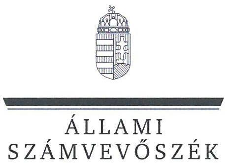
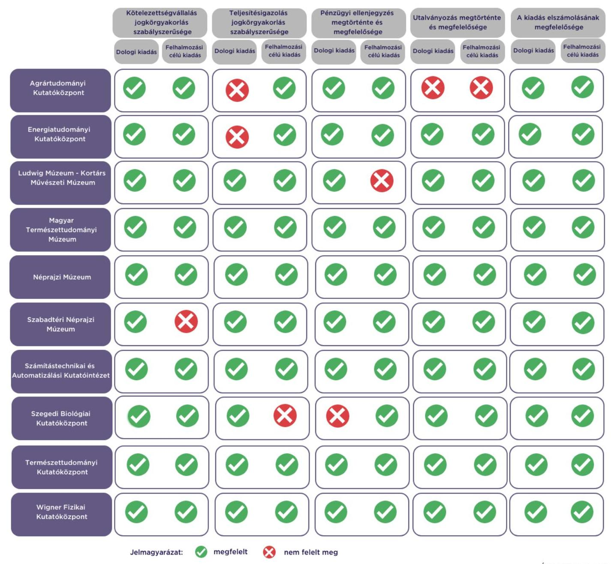

# JELENTÉS 

Az államháztartás központi alrendszerébe tartozó költségvetési szerv által teljesített dologi és felhalmozási célú kiadás szabályszerűségének rapid ellenőrzése
2024.

---

# JELENTÉS 

Az államháztartás központi alrendszerébe tartozó költségvetési szerv által teljesített dologi és felhalmozási célú kiadás szabályszerűségének rapid ellenőrzése
2024.

---

# ELLENŐRZÉSI IGAZGATÓSÁG: 

## ÁLLAMHÁZTARTÁS KÖZPONTI SZINTJÉT ELLENŐRZŐ IGAZGATÓSÁG

## ELLENŐRZÉSI IGAZGATÓ:

SINKÁNÉ DR. CSENDES ÁGNES igazgató

## ELLENŐRZÉSVEZETŐ:

Jelentéseink az interneten a www.asz.hu címen olvashatók.

RENKÓ ZSUZSANNA ellenőrzésvezető

IKTATÓSZÁM: EL-3949-015/2024.
TÉMASZÁM: 2685
ELLENŐRZÉS-AZONOSÍTÓ SZÁM: V102914

---

# TARTALOMJEGYZÉK 

AZ ELLENŐRZÉS ALAPADATAI ..... 5
AZ ELLENŐRZÖTT SZERVEZETEK ..... 7
ÖSSZEFOGLALÁS ..... 13
AZ ELLENŐRZÉS FÓKUSZKÉRDÉSEI ..... 14
MEGÁLLAPÍTÁSOK ..... 15
JAVASLATOK ..... 21
MELLÉKLETEK ..... 23
I. sz. melléklet: Értelmező szótár ..... 23
II. sz. melléklet: Az ellenőrzött szervezetek jegyzéke ..... 24
III. sz. melléklet: Ellenőrzési kritériumok ..... 25
FÜGGELÉK: ÉSZREVÉTELEK ..... 26
RÖVIDÍTÉSEK JEGYZÉKE ..... 28

---

.

---

# AZ ELLENŐRZÉS ALAPADATAI 

## AZ ELLENŐRZÉS CÉLJA

Az államháztartás központi alrendszerébe tartozó költségvetési szerv által teljesített dologi és felhalmozási célú kiadások egy-egy kiválasztott tételének szabályszerűségi szempontból történő értékelése.

## AZ ELLENŐRZÉS TÍPUSA

Megfelelőségi ellenőrzés.

## AZ ELLENŐRZŐTT IDŐSZAK

| Ssz. | ELLENŐRZÖTT SZERVEZETEK | DOLOGI   KIADÁSOK   ESETEBEN | FELHALMOZÁSI   CÉLÚ KIADÁSOK   ESETEBEN |
| :--: | :--: | :--: | :--: |
| 1. | Agrártudományi Kutatóközpont | 2023. október 9. | 2023. szeptember 18. |
| 2. | Energiatudományi Kutatóközpont | 2023. október 5. | 2023. október 5. |
| 3. | Ludwig Múzeum - Kortárs Művészeti Múzeum | 2023. szeptember 21. | 2023. szeptember 26. |
| 4. | Magyar Természettudományi Múzeum | 2023. szeptember 22. | 2023. október 2. |
| 5. | Néprajzi Múzeum | 2023. október 16. | 2023. október 3. |
| 6. | Szabadtéri Néprajzi Múzeum | 2023. szeptember 20. | 2023. szeptember 21. |
| 7. | Számítástechnikai és Automatizálási Kutatóintézet | 2023. szeptember 27. | 2023. szeptember 27. |
| 8. | Szegedi Biológiai Kutatóközpont | 2023. október 10. | 2023. szeptember 29. |
| 9. | Természettudományi Kutatóközpont | 2023. október 9. | 2023. október 12. |
| 10. | Wigner Fizikai Kutatóközpont | 2023. október 16. | 2023. szeptember 21. |

## AZ ELLENŐRZÉS TÁRGYA

Az államháztartás központi alrendszerébe tartozó költségvetési szerv által teljesített, ellenőrzésre kiválasztott dologi és felhalmozási célú kiadás szabályszerű teljesítése, ezen belül a gazdálkodási jogkörök szabályszerű gyakorlása. Az ellenőrzés kiterjedt minden olyan körülményre és adatra, amely az ÁSZ ${ }^{1}$ jogszabályban meghatározott feladatainak teljesítéséhez, valamint a program végrehajtása folyamán felmerült újabb összefüggések feltárásához szükséges.

---

Az ellenőrzés során az ÁSZ

- az Energiatudományi Kutatóközpont és az Agrártudományi Kutatóközpont esetében a dologi kiadások körébe tartozó Szakmai tevékenységet segítő szolgáltatások; a Ludwig Múzeum Kortárs Művészeti Múzeum, a Magyar Természettudományi Múzeum, a Néprajzi Múzeum, a Számítástechnikai és Automatizálási Kutatóintézet és a Természettudományi Kutatóközpont esetében a dologi kiadások körébe tartozó Egyéb szolgáltatások; a Szabadtéri Néprajzi Múzeum és a Wigner Fizikai Kutatóközpont esetében a dologi kiadások körébe tartozó Karbantartási, kisjavítási szolgáltatások; a Szegedi Biológiai Kutatóközpont esetében a dologi kiadások körébe tartozó Szakmai anyagok beszerzése;
- az Energiatudományi Kutatóközpont és a Számítástechnikai és Automatizálási Kutatóintézet esetében a felhalmozási célú kiadások körébe tartozó Ingatlanok felújítása; az Agrártudományi Kutatóközpont, a Ludwig Múzeum - Kortárs Művészeti Múzeum, a Szegedi Biológiai Kutatóközpont, a Természettudományi Kutatóközpont és a Wigner Fizikai Kutatóközpont esetében a felhalmozási célú kiadások körébe tartozó Egyéb tárgyi eszközök beszerzése, létesítése; a Magyar Természettudományi Múzeum esetében a felhalmozási célú kiadások körébe tartozó Informatikai eszközök beszerzése, létesítése; a Néprajzi Múzeum esetében a felhalmozási célú kiadások körébe tartozó Ingatlanok beszerzése, létesítése; a Szabadtéri Néprajzi Múzeum esetében a felhalmozási célú kiadások körébe tartozó Immateriális javak beszerzése, létesítése
rovatokon elszámolt kiadások egy-egy kiválasztott mintatételének szabályszerűségét értékelte.

# AZ ELLENŐRZÉS JOGALAPJA 

Az ellenőrzés jogszabályi alapját az ÁSZ tv. ${ }^{2} 1 . \int(3)$ bekezdés és az 5. $\int(6)$ bekezdés előírásai képezték.

## AZ ELLENŐRZÉS MÓDSZERE

Az ellenőrzést az ÁSZ az ellenőrzött időszakban hatályos jogszabályok, az ellenőrzés szakmai szabályai alapján, „Az állambáztartás központi alrendszerébe tartozó költségvetési szerv által teljesitett dologi kiadás szabályszerűségének rapid ellenörzéséről" és „Az állambáztartás központi alrendszerébe tartozó költségvetési szerv által teljesitett felhalmozzási célú kiadás szabályszerüségének rapid ellenörzéséről" című ellenőrzési programok (továbbiakban: ellenőrzési programok) kérdéseire adott válaszok kiértékelésével, az ellenőrzési programokban megjelölt adatforrások figyelembevételével folytatta le. Amennyiben az adott mintatétel ellenőrzési program szerinti értékelése során további kapcsolódó szabálytalanságot tárt fel az ÁSZ, a szabálytalansághoz tartozó kritériummal bővült az ellenőrzés.

Az ellenőrzési kérdések megválaszolásához szükséges bizonyítékok megszerzése a következő ellenőrzési eljárások alkalmazásával történt: megfigyelés, összehasonlítás, elemző eljárás, a dologi kiadások, felhalmozási célú kiadások ellenőrzéssel érintett rovatairól történő mintavétel. Az ellenőrzési bizonyítékként felhasználható adatforrások közé tartoztak egyrészt az ellenőrzéshez kért dokumentumok, adatforrások, másrészt adatforrás volt még minden - az ellenőrzés folyamán - feltárt, az ellenőrzés szempontjából információkat tartalmazó dokumentum.

Az ÁSZ az ellenőrzés során a kiválasztott mintatételek ellenőrzési programokban meghatározott szempontok szerinti szabályszerűségét értékelte, így a kötelezettségvállalás és a teljesítésigazolás gazdálkodási jogkörök tekintetében a jogkörgyakorlás szabályszerűségét, a pénzügyi ellenjegyzés és az utalványozás gazdálkodási jogkörök tekintetében ezek megtörténtét és az ellenőrzési kritériumoknak való megfelelőségét.

---

# AZ ELLENŐRZÖTT SZERVEZETEK 

Az ellenőrzés az Agrártudományi Kutatóközpont, az Energiatudományi Kutatóközpont, a Ludwig Múzeum - Kortárs Művészeti Múzeum, a Magyar Természettudományi Múzeum, a Néprajzi Múzeum, a Szabadtéri Néprajzi Múzeum, a Számítástechnikai és Automatizálási Kutatóintézet, a Szegedi Biológiai Kutatóközpont, a Természettudományi Kutatóközpont és a Wigner Fizikai Kutatóközpont elnevezésű szervezetekre, mint az államháztartás központi alrendszerébe tartozó költségvetési szervekre terjedt ki.

## AGRÁRTUDOMÁNYI KUTATÓKÖZPONT

Az ATK ${ }^{3}$ a Tkfi. tv. ${ }^{4}$-ben megjelölt közfeladatokat látja el: alapkutatásokat, alkalmazott kutatásokat és fejlesztéseket végez az agrár- és környezettudományok területén (növénytermesztés, -nemesítés és agrotechnika, növényvédelem, talajtan), valamint tudományos és szakmai ismereteket ad át a társadalom részére. Kiemelten foglalkozik többek között a következő területekkel: növényi alkalmazkodóképesség, stresszrezisztenciakutatások, növényi génbank gyűjtemény létrehozása, fenntartása, az egészséges humán táplálkozást, állati takarmányozást elősegítő növényi genotípusok szelekciója, új növényfajták, beltenyésztett törzsek és hibridek nemesítése, a fenntartható mezőgazdaság kérdéskörének kutatása, növénykárosító szervezetek és gyomnövények biológiája, a talaj-növény-környezet kölcsönhatásai, a talajok víz-, anyag- és energiaforgalma, a talajbiom környezeti indikációs célra való felhasználása, a talajjavításra vagy alternatív tápanyag utánpótlásra is megfelelő biohulladékok, szennyvíziszapok hasznosítása, a talaj szerepének tisztázása az üvegházhatást okozó gázok forgalmában eltérő földhasználat és gazdálkodás mellett.

## AGRÁRTUDOMÁNYI KUTATÓKÖZPONT FÖBB ADATÁINAK REMUTATÁSA

Alapításának éve:
Irányító szerve:
Középirányító szerve:
Gazdasági szervezettel való rendelkezés:
Illetékessége, müködési területe:
Általános képviseletét ellátó vezetője:
Vezetői kinevezés kezdete:
2022. évben teljesített bevételek összege:
2022. évben teljesített kiadások összege:

1949.
Magyar Kutatási Hálózat Titkársága
Gazdasági szervezettel rendelkezik
országos
főigazgató
2023.11.16.
$15366,0 \mathrm{M} \mathrm{Ft}$
$5734,5 \mathrm{M} \mathrm{Ft}$

---

# ENERGIATUDOMÁNYI KUTATÓKÖZPONT 

Az ETK ${ }^{5}$ a Tkfi. tv.-ben megjelölt közfeladatokat látja el: nemzetközi színvonalú tudományos kutatásokat folytat a magyar nukleáris biztonsági szaktudás folyamatos elmélyítése érdekében, a magyarországi atomerőmű blokkok biztonsága, az üzemanyagciklus zárása, az új atomerőmủ generáció kifejlesztése, a magfúzión alapuló nukleáris energiatermelési eljárások fejlesztése, a sugárzások és az anyag kölcsönhatása, valamint az izotóp- és nukleáris kémia, a sugárhatás-kémia, a sugárvédelem és nukleáris védettség, a reakciókinetika, a heterogén katalízis, a komplex funkcionális anyagok, a mikro- és nanométeres méretű szerkezetek interdiszciplináris kutatása, és az ún. „megújuló" energiaforrások területén.

## ENERGIATUDOMÁNYI KUTATÓKÖZPONT FÖBB ADATAINAK BEMUTATÁSA

Alapításának éve:
1991.
Irányító szerve:
Magyar Kutatási Hálózat Titkársága
Közepirányító szerve:
Gazdasági szervezettel való rendelkezés:
Gazdasági szervezettel rendelkezik
Illetékessége, múködési területe:
országos
Általános képviseletét ellátó vezetője:
főigazgató
Vezetői kinevezés kezdete:
2021.03.01.
2022. évben teljesített bevételek összege:
$18937,4 \mathrm{M} \mathrm{Ft}$
2022. évben teljesített kiadások összege:
$9464,4 \mathrm{M} \mathrm{Ft}$

## LUDWIG MÚZEUM - KORTÁRS MÚVÉSZETI MÚZEUM

A Ludwig Múzeum ${ }^{6}$ közfeladata az örökségvédelem a Kult. tv. ${ }^{7}$ 37/A. § (1)-(6) bekezdései és 42. §-a, valamint a 2001. évi LXIV. törvény ${ }^{8}$ értelmében. Alaptevékenysége a gyűjtőkörébe tartozó kulturális javak felkutatása, gyűjtése, őrzése, szakszerű nyilvántartása, kezelése, állagmegóvása és védelme, tudományos feldolgozása, a gyűjtőkörébe tartozó témákban és a muzeológia területén folytatott tudományos módszertani kutató- és publikációs munka végzése, a külső kutatók szakmai támogatása, kutatószolgálat működtetése, részvétel a közép- és felsőfokú oktatásban, valamint a szakmuzeológus-képzésben és továbbképzésben. Kiemelt feladata a magyar és a nemzetközi kortárs képzőművészet törekvéseinek párhuzamos bemutatása, módszertani központként ellátja a kortárs képzőművészet bemutatásával, értelmezésével és a közönség felé történő közvetítésével összefüggő szakmai tevékenységet.

## LUDWIG MÚZEUM - KORTÁRS MÚVÉSZÉTI MÚZEUM FÖBB ADATAINAK BEMÚTATÁSA

Alapításának éve:
1996.
Irányító szerve:
Kulturális és Innovációs Minisztérium
Közepirányító szerve:
Gazdasági szervezettel való rendelkezés:
Gazdasági szervezettel rendelkezik
Illetékessége, múködési területe:
országos
Általános képviseletét ellátó vezetője:
igazgató
Vezetői kinevezés kezdete:
2023.06.01.
2022. évben teljesített bevételek összege:
$738,2 \mathrm{M} \mathrm{Ft}$
2022. évben teljesített kiadások összege:
$591,9 \mathrm{M} \mathrm{Ft}$

---

# MAGYAR TERMÉSZETTUDOMÁNYI MÚZEUM 

Az MTM ${ }^{9}$ közfeladata az örökségvédelem a Kult.tv. 37/A. $\int$ (1)-(6) bekezdése és 42. $\int$-a értelmében. A múzeum alapfeladata a gyűjtőkörébe tartozó kulturális javak felkutatása, gyűjtése, őrzése, nyilvántartása, kezelése, állagmegóvása és védelme, továbbá tudományos feldolgozása. Kulturális szolgáltatásaival, állandó és időszaki kiállításokkal és múzeumpedagógiai tevékenységgel, családi- és közösségi programokkal, szakmai rendezvényekkel, digitális és online ismeretterjesztő és oktatási tartalmaival szolgálja a társadalom tagjainak művelődését, az oktatás céljait. Kiemelt feladata többek között a természeti örökség kutatása, továbbá a hazai és nemzetközi tudományos intézményekkel való együttműködések építése.

## MAGYAR TERMÉSZETTUDOMÁNYI MÚZEUM FÖBB ADATAINAK BEMUTATÁSA

Alapításának éve:
Irányító szerve:
Középirányító szerve:
Gazdasági szervezettel való rendelkezés:
Illetékessége, múködési területe:
Általános képviseletét ellátó vezetője:
Vezetői kinevezés kezdete:
2022. évben teljesített bevételek összege:
2022. évben teljesített kiadások összege:

1983.
Kulturális és Innovációs Minisztérium
Gazdasági szervezettel rendelkezik
országos
főigazgató
2019.08.01.
$1862,0 \mathrm{M} \mathrm{Ft}$
$1643,6 \mathrm{M} \mathrm{Ft}$

## NÉPRAJZI MÚZEUM

Az $\mathrm{NM}^{10}$ közfeladata az örökségvédelem a Kult.tv. 37/A. $\int$ (1)-(6) bekezdései és 42. $\int$-a és a 2001. évi LXIV. törvény értelmében, valamint az NKT. tv. ${ }^{11}$ 4. $\int$ (1) bekezdés db) pontja alapján kultúrstratégiai intézményi tevékenység a népi hagyományok ágazatban. Muzeológiai alapfeladata a gyűjtőkörébe tartozó kulturális javak felkutatása, gyűjtése, őrzése, nyilvántartása, kezelése, állagmegóvása és védelme, tudományos feldolgozása. Közreműködik a gyűjtőkörébe tartozó kulturális javakkal összefüggő örökségvédelmi hatósági feladatokban: szakvéleményt ad a kulturális javak védetté nyilvánítási eljárásaiban, és a kulturális javak külföldre történő kivitelének engedélyezési eljárásai során adatokat szolgáltat a hatósági nyilvántartás számára. Feladata a jelenkor kutatásának és dokumentálásának országos szintű koordinálása, információs központjának és adatbázisának működtetése, a néprajzi muzeológia szakági együttműködésének országos szintű koordinálása, a néprajzi muzeológia területén keletkezett digitális tartalmak fejlesztésének gondozása, a megelőző műtárgyvédelemmel kapcsolatos elméleti és gyakorlati tevékenységek összehangolása, és az ezzel összefüggő muzeológiai és pénzügyi feladatok.

## NÉPRAJZI MÚZEUM FÖBB ADATAINAK BEMUTATÁSA

Alapításának éve:
Irányító szerve:
Középirányító szerve:
Gazdasági szervezettel való rendelkezés:
Illetékessége, múködési területe:
Általános képviseletét ellátó vezetője:
Vezetői kinevezés kezdete:
2022. évben teljesített bevételek összege:
2022. évben teljesített kiadások összege:

1983.
Kulturális és Innovációs Minisztérium
Gazdasági szervezettel rendelkezik
országos
főigazgató
2023.02.01.
$4842,5 \mathrm{M} \mathrm{Ft}$
$4213,0 \mathrm{M} \mathrm{Ft}$

---

# SzabadtÉri NÉPRAJZI MÚZEUM 

A Skanzen ${ }^{12}$ közfeladata az örökségvédelem a Kult.tv. 37/A. $\int(1)$-(6) bekezdései és 42. $\int$-a és a 2001. évi LXIV. törvény értelmében, valamint az NKT.tv. alapján kultúrstratégiai intézményi tevékenység. Alaptevékenysége között muzeológiai alapfeladata a gyűjtőkörébe tartozó kulturális javak és az ehhez kapcsolódó kulturális értékkel bíró információk felkutatása, gyűjtése, őrzése, szakszerű nyilvántartása, kezelése, állagmegóvása, védelme, ezek tudományos feldolgozása, valamint a tudományos eredmények közzététele. Kulturális szolgáltatásaival, az állandó és időszaki kiállításokkal, valamint a hozzájuk kapcsolódó ismeretátadási tevékenységgel, családi- és közösségi programokkal, szakmai rendezvényekkel szolgálja a társadalom művelődését és szórakozását. Üzemelteti a múzeumi vasutat, a Skanzen Vasutat.

## Szabadtéri NÉPrajzi MúzeUM FÖBB ADATAINAK BEMUTATÁSA

Alapításának éve:
Irányító szerve:
Középirányító szerve:
Gazdasági szervezettel való rendelkezés:
Illetékessége, müködési területe:
Általános képviseletét ellátó vezetője:
Vezetői kinevezés kezdete:
2022. évben teljesített bevételek összege:
2022. évben teljesített kiadások összege:

1983.
Kulturális és Innovációs Minisztérium
-
Gazdasági szervezettel rendelkezik
országos
főigazgató
2020.07.09.
$4801,8 \mathrm{M} \mathrm{Ft}$
$4612,9 \mathrm{M} \mathrm{Ft}$

## SZÁMÍTÁSTECHNIKAI ÉS AUTOMATIZÁLÁSI KUTATÓINTÉZET

A SZTAKI ${ }^{13}$ a Tkfi. tv.-ben megjelölt közfeladatokat látja el: alap- és alkalmazott kutatási tevékenység, kísérleti fejlesztés az informatika, az információ-technológia és a számítástechnikai-alkalmazás területén, valamint a kutatáshoz és kísérleti fejlesztéshez kapcsolódó egyedi hardver- és szoftvertermékek, rendszerek (prototípusok) létrehozása. A SZTAKI kutatási feladataihoz kapcsolódó egyéb feladatok keretében kutatási tevékenységével összefüggésben tudományos, szak- és ismeretterjesztő kiadványokat jelentet meg, segíti a tudomány eredményeinek széles körű kommunikációját, tudománykommunikációs feladatokat lát el, hazai és nemzetközi tudományos programokat, konferenciákat és kiállításokat szervez, segíti a tudományos kutatások eredményeinek társadalmi és gazdasági hasznosítását.

## SZÁMÍTÁSTECHNIKAI ÉS AUTOMATIZÁLÁSI KUTATÓINTÉZET FÖBB ADATAINAK BEMUTATÁSA

Alapításának éve:
Irányító szerve:
Középirányító szerve:
Gazdasági szervezettel való rendelkezés:
Illetékessége, müködési területe:
Általános képviseletét ellátó vezetője:
Vezetői kinevezés kezdete:
2022. évben teljesített bevételek összege:
2022. évben teljesített kiadások összege:

1973.
Magyar Kutatási Hálózat Titkársága
-
Gazdasági szervezettel rendelkezik
országos
igazgató
2023.01.01.
$17455,9 \mathrm{M} \mathrm{Ft}$
$8097,1 \mathrm{M} \mathrm{Ft}$

---

# SZEGEDI BIOLÓGIAI KUTATÓKÖZPONT 

Az SZBK ${ }^{14}$ a Tkfi. tv.-ben megjelölt közfeladatokat látja el: az élettudományok területén kutatásokat folytat természettudományi alapkutatások, alkalmazott kutatások és kísérleti fejlesztések végzésével a biológiai tudományok (biofizika, biokémia, genetika és növénybiológia) területein. A kutatási alaptevékenység körében kiemelten foglalkozik az alábbi területekkel: a biomolekulák, a szerkezet-működés kapcsolata, a biológiai energiaátalakítás alapvető lépései, a nanobiotechnológia, a neurobiológia kérdései, a mikrobiális és enzimatikus rendszerek kutatása és fejlesztése környezetvédelmi alkalmazásokhoz, a genomikai technológiákhoz kapcsolódó bioinformatika, a rendszer- és szintetikus biológiai génhálózatok, a molekuláris stresszkutatás, a neurobiológiai receptorkutatás, a génműködés-szabályozás, a sejtcikluskutatás, az örökítő anyag szerkezeti hibáinak vizsgálata, az egyedfejlődést irányító mechanizmusok genetikája, a funkcionális genomika, az immunológia, a növényi stresszválaszok molekuláris háttere és a gazdasági növények stressztűrése, a fotoszintetikus fényenergiaátalakítás és hasznosítás, a növényi fényérzékelés, az egyedfejlődés és sejtciklusszabályozás mechanizmusa, a biotechnológiai eljárások kidolgozása irányított tulajdonságú növények előállítására.

## SZEGEDI BIOLOGIAI KUTATÓKÖZPONT FÖBB ADATAINAK REMUTATÁSA

Alapításának éve:
Irányító szerve:
Középirányító szerve:
Gazdasági szervezettel való rendelkezés:
Illetékessége, múködési területe:
Általános képviseletét ellátó vezetője:
Vezetői kinevezés kezdete:
2022. évben teljesített bevételek összege:
2022. évben teljesített kiadások összege:

1971.
Magyar Kutatási Hálózat Titkársága
Gazdasági szervezettel rendelkezik
országos
főigazgató
2021.03.01.
$11920,9 \mathrm{M} \mathrm{Ft}$
$7687,7 \mathrm{M} \mathrm{Ft}$

## TERMÉSZETTUDOMÁNYI KUTATÓKÖZPONT

A TTK ${ }^{15}$ a Tkfi. tv.-ben megjelölt közfeladatokat látja el: multidiszciplináris élő és élettelen természettudományi kutatások végzése a molekuláris élettudományok, a szerves kémia, a kismolekulák és a molekuláris farmakológia, az anyag- és környezetkémia, a kognitív idegtudományok és a pszichológia, az orvosbiológiai képalkotás, a szerkezetkutatás, a gyógyszerinnováció területén, valamint kommunikációs tevékenységet végez, hazai és nemzetközi együttműködésekben vesz részt.

## TERMÉSZETTUDOMÁNYI KUTATÓKÖZPONT FÖBB ADATAINAK REMUTATÁSA

Alapításának éve:
Irányító szerve:
Középirányító szerve:
Gazdasági szervezettel való rendelkezés:
Illetékessége, múködési területe:
Általános képviseletét ellátó vezetője:
Vezetői kinevezés kezdete:
2022. évben teljesített bevételek összege:
2022. évben teljesített kiadások összege:

1997.
Magyar Kutatási Hálózat Titkársága
Gazdasági szervezettel rendelkezik
országos
főigazgató
2021.03.01.
$14705,5 \mathrm{M} \mathrm{Ft}$
$7327,6 \mathrm{M} \mathrm{Ft}$

---

# WIGNER FIZIKAI KUTATÓKÖZPONT 

A Wigner FK ${ }^{16}$ a Tkfi. tv.-ben megjelölt közfeladatokat látja el: felfedező jellegű kísérleti fizikai kutatásokat folytat hazai bázisú, valamint külföldi kutató berendezések mellett, elméleti fizikai kutatásokat folytat, koordinálja a magyar erőfeszítéseket a nemzetközi kutatásokban. Alaptevékenységként a következő fő tudományterületekkel foglalkozik: kísérleti és elméleti részecskefizika, asztrorészecske-fizika, általános relativitáselmélet és gravitáció, plazmafizika, űrfizika, magfizika és magfizikai jellegű módszereket alkalmazó anyagtudomány, kísérleti és elméleti szilárdtest-fizika, statisztikus fizika, atomfizika, optika és anyagtudomány.

## WIGNER FIZIKAI KUTATÓKÖZPONT FÖBB ADATAINAK REMUTATÁSA

Alapításának éve:
1992.
Irányító szerve:
Magyar Kutatási Hálózat Titkársága
Középirányító szerve:
Gazdasági szervezettel való rendelkezés:
Gazdasági szervezettel rendelkezik
Illetékessége, múködési területe:
országos
Általános képviseletét ellátó vezetője:
főigazgató
Vezetői kinevezés kezdete:
2021.03.01.
2022. évben teljesített bevételek összege:
$12171,9 \mathrm{M} \mathrm{Ft}$
2022. évben teljesített kiadások összege:
$8177,9 \mathrm{M} \mathrm{Ft}$

---

# ÖSSZEFOGLALÁS 

Egy kiadás esetében a kötelezettségvállalási jogkörgyakorlás nem volt szabályszerű, mert a kötelezettségvállaló nem rendelkezett a jogkörgyakorlásra felhatalmazással. A pénzügyi ellenjegyzés két esetben nem a jogszabályi előírásoknak megfelelően történt, mert a pénzügyi ellenjegyzés dátumot nem tartalmazott. Három kiadásnál a teljesítésigazolás nem volt szabályszerű, mert egy esetben nem állt rendelkezésre az igazolás alapjául szolgáló dokumentum, egy esetben a teljesítésigazolás nem tartalmazta a jogkörgyakorlás dátumát, és egy esetben a teljesítésigazoló nem rendelkezett a jogkörgyakorlásra kijelöléssel. Két kifizetésre szabálytalanul, utalványozás hiányában került sor.

Egy dologi kiadás esetében nem folytattak le közbeszerzési eljárást.
1. ábra

## A FŐBB ELLENŐRZÉSI TAPASZTALATOK

---

# AZ ELLENŐRZÉS FÓKUSZKÉRDÉSEI 

1- Az államháztartás központi alrendszerébe tartozó költségvetési szervnél a kiválasztott dologi kiadás teljesitése az egyes jogszabályi rendelkezések alapján szabályszerű volt-e?
2- Az államháztartás központi alrendszerébe tartozó költségvetési szervnél a kiválasztott felhalmozási célú kiadás teljesitése az egyes jogszabályi rendelkezések alapján szabályszerű volt-e?

---

# MEGÁLLAPÍTÁSOK 

## 1. Az államháztartás központi alrendszerébe tartozó költségvetési szervnél a kiválasztott dologi kiadás teljesítése az egyes jogszabályi rendelkezések alapján szabályszerű volt-e?

Összegző megállapítás Az ellenőrzött 10 dologi kiadás teljesítése hét esetben az ellenőrzés keretében vizsgált jogszabályi előírásoknak megfelelt. Egy kiadásnál a teljesítésigazolás szabálytalan volt. Egy kiadás esetében nem állt rendelkezésre a teljesítésigazolást megalapozó dokumentum, és a kifizetés elrendelése utalványozás nélkül történt. Egy kiadásnál a pénzügyi ellenjegyzés nem volt megfelelő. Egy kiadás esetében nem folytattak le közbeszerzési eljárást.

A TTK-nál, a Wigner FK-nál, a SZTAKI-nál, az NM-nál, a Skanzennél, az MTM-nél és a Ludwig Múzeumnál az ellenőrzött mintatételek esetében a kötelezettségvállalási és a teljesítésigazolási jogkörgyakorlás, valamint a kiadás elszámolása az Áht. ${ }^{17}$, az Ávr. ${ }^{18}$ és az Áhsz. ${ }^{19}$ előírásai szerint szabályszerűen történt, a pénzügyi ellenjegyzés és az utalványozás megfelelő volt:

- Kötelezettséget az Áht.-ben és az Ávr.-ben foglaltakkal összhangban az arra jogosultsággal rendelkező személy vállalt.
- A kötelezettségvállalásra az Áht.-ben foglaltak szerint, a pénzügyi ellenjegyzés után került sor.
- A teljesítésigazoló az Ávr.-ben előírt írásbeli kijelöléssel rendelkezett.
- A teljesítésigazolás során az Ávr.-ben foglaltak szerint ellenőrizhető okmányok alapján ellenőrizték és igazolták a kiadás teljesítésének jogosságát, összegszerűségét, valamint az ellenszolgáltatás teljesítését.
- A teljesítésigazoló a teljesítést az Ávr.-ben foglaltakkal összhangban, az igazolás dátumának és a teljesítés tényére történő utalás megjelölésével, aláírásával igazolta.
- Az utalványozásra az Áht.-ben, valamint az Ávr.-ben foglaltakkal összhangban, a teljesítésigazolást és az érvényesítést követően került sor.
- A kiadás számviteli elszámolása a megfelelő rovaton történt az Áhsz.-ben előírtakkal összhangban.

Az ETK-nál az ellenőrzött mintatétel esetében a kötelezettségvállalási jogkörgyakorlás és a kiadás elszámolása az Áht., az Ávr. és az Áhsz. előírásai szerint szabályszerűen történt, a pénzügyi ellenjegyzés és az utalványozás megfelelő volt, a teljesítésigazolás nem volt szabályszerű:

- Kötelezettséget az Áht.-ben és az Ávr.-ben foglaltakkal összhangban az arra jogosultsággal rendelkező személy vállalt.
- A kötelezettségvállalásra az Áht.-ben foglaltak szerint a pénzügyi ellenjegyzés után került sor.

---

- A teljesítésigazolás során az Ávr.-ben foglaltak szerint ellenőrizhető okmányok alapján ellenőrizték és igazolták a kiadás teljesítésének jogosságát, összegszerűségét, valamint az ellenszolgáltatás teljesítését.
- A teljesítésigazoló az Ávr.-ben előírt írásbeli kijelöléssel rendelkezett.
- A teljesítésigazoló a teljesítést az Ávr.-ben foglaltakkal összhangban a teljesítés tényére történő utalás megjelölésével, aláírásával igazolta, azonban az Ávr. 57. § (3) bekezdés ellenére a teljesítésigazolás dátuma nem szerepelt.
- Az utalványozási jogkörgyakorlásra az Áht.-ben, valamint az Ávr.-ben foglaltakkal összhangban az érvényesítést követően került sor. A teljesítésigazolás dátumának hiányában nem lehetett megítélni, hogy az utalványozásra az Áht. 38. § (1) bekezdésében foglalt előírásnak megfelelően a teljesítésigazolást követően került-e sor.
- A kiadás számviteli elszámolása a megfelelő rovaton történt az Áhsz.-ben előírtakkal összhangban. Az SZBK-nál az ellenőrzött mintatétel esetében a kötelezettségvállalási és teljesítésigazolási jogkörgyakorlás és a kiadás elszámolása az Áht., az Ávr. és az Áhsz. előírásai szerint szabályszerűen történt, az utalványozás megfelelő volt. A pénzügyi ellenjegyzés nem volt megfelelő.
- Kötelezettséget az Áht.-ben és az Ávr.-ben foglaltakkal összhangban az arra jogosultsággal rendelkező személy vállalt.
- A kötelezettségvállalás dokumentuma (szerződés) az Ávr. 55. § (1) bekezdésében foglaltak ellenére nem tartalmazta a pénzügyi ellenjegyzés dátumát. A dátum hiányában nem lehetett megítélni, hogy a nettó 2329890 Ft értékű kötelezettségvállalásra az Áht. 37. § (1) bekezdésében foglalt előírás szerint a pénzügyi ellenjegyzés után került-e sor.
- A teljesítésigazoló az Ávr.-ben előírt írásbeli kijelöléssel rendelkezett.
- A teljesítésigazolás során az Ávr.-ben foglaltak szerint ellenőrizhető okmányok alapján ellenőrizték és igazolták a kiadás teljesítésének jogosságát, összegszerűségét, valamint az ellenszolgáltatás teljesítését.
- A teljesítésigazoló a teljesítést az Ávr.-ben foglaltakkal összhangban, az igazolás dátumának és a teljesítés tényére történő utalás megjelölésével, aláírásával igazolta.
- Az utalványozásra az Áht.-ben, valamint az Ávr.-ben foglaltakkal összhangban, a teljesítésigazolást és az érvényesítést követően került sor.
- A kiadás számviteli elszámolása a megfelelő rovaton történt az Áhsz.-ben előírtakkal összhangban. Az ATK-nál az ellenőrzött mintatétel esetében a kötelezettségvállalási jogkörgyakorlás és a kiadás elszámolása az Áht., az Ávr. és az Áhsz. előírásai szerint szabályszerűen történt, a pénzügyi ellenjegyzés megfelelő volt. A teljesítésigazolás nem volt szabályszerű. A kifizetés elrendelése szabálytalan volt.
- Kötelezettséget az Áht.-ben és az Ávr.-ben foglaltakkal összhangban az arra jogosultsággal rendelkező személy vállalt.
- A kötelezettségvállalásra az Áht.-ben foglaltak szerint, a pénzügyi ellenjegyzés után került sor.
- A teljesítésigazoló az Ávr.-ben előírt írásbeli kijelöléssel rendelkezett.
- A teljesítésigazoló a teljesítést az Ávr.-ben foglaltakkal összhangban, az igazolás dátumának és a teljesítés tényére történő utalás megjelölésével, aláírásával igazolta. Azonban a szolgáltatás teljesítését igazoló dokumentumok (a szerződésben vállaltak tényleges elvégzése során

---

keletkezett dokumentumok) nem álltak rendelkezésre, így nem volt igazolt, hogy az Ávr. 57. § (1) bekezdésben foglaltaknak megfelelően a teljesítésigazolás során okmányok alapján ellenőrizték és igazolták a kiadás teljesítésének jogosságát, összegszerűségét, valamint az ellenszolgáltatás teljesítését.

- A kifizetés elrendelése az Áht. 38. § (1) bekezdésében előírtak ellenére nem utalványozás alapján történt, az utalványrendelet az Ávr. 59. § (3) bekezdés g) pontjában foglaltak ellenére nem tartalmazta az utalványozó keltezéssel ellátott aláírását.
- A kiadás számviteli elszámolása a megfelelő rovaton történt az Áhsz.-ben előírtakkal összhangban.

# Az ellenőrzés során feltárt szabálytalanság: 

- A SZTAKI közbeszerzési eljárás lefolytatása nélkül 2000. október 17-én portaszolgálati feladatok ellátására határozatlan időre megbízási szerződést kötött. Az ÁSZ értékelése szerint a szolgáltatás - szerződés megkötésekor számított - becsült értéke 11016000 Ft volt, ami meghaladta az akkor hatályos, 8000000 Ft összegű közbeszerzési értékhatárt. A megbízási szerződést a hatálya alatt többször módosították a megbízási díj tekintetében, a 15. számú módosítása 2023. június 1-jétől hatályos. Ezen utolsó módosítás alapján a portaszolgáltatások becsült értéke 370137600 Ft , ami meghaladja a szerződés módosítás időpontjában hatályos uniós értékhatárt, a 75245700 Ft-ot. A szerződést közbeszerzési eljárás mellőzésével módosították, annak ellenére, hogy a szerződés módosítás eredményeként az ellenérték növekedése a Kbt. 141. § (2) bekezdés b) pontjában rögzített feltételnek nem felelt meg.

---

# 2. Az államháztartás központi alrendszerébe tartozó költségvetési szervnél a kiválasztott felhalmozási célú kiadás teljesítése az egyes jogszabályi rendelkezések alapján szabályszerű volt-e? 

Összegző megállapítás

Az ellenőrzött 10 felhalmozási célú kiadás teljesítése hat esetben az ellenőrzés keretében vizsgált jogszabályi előírásoknak megfelelt. Egy kiadás esetében a teljesítésigazolási jogkörgyakorlás nem volt szabályszerű. Egy kiadás esetében a kötelezettségvállalási jogkörgyakorlás nem volt szabályszerű. Egy kiadásnál a pénzügyi ellenjegyzés nem volt megfelelő. Egy kifizetés elrendelése utalványozás nélkül történt.

Az ETK-nál, a Wigner FK-nál, a TTK-nál, a SZTAKI-nál, az NM-nél, és az MTM-nél az ellenőrzött mintatételek esetében a kötelezettségvállalási, és a teljesítésigazolási jogkörgyakorlás, továbbá a kiadás elszámolása az Áht., az Ávr. és az Áhsz. előírásai szerint szabályszerűen történt, a pénzügyi ellenjegyzés és az utalványozás megfelelő volt:

- Kötelezettséget az Áht.-ben és az Ávr.-ben foglaltakkal összhangban az arra jogosultsággal rendelkező személy vállalt.
- A kötelezettségvállalásra az Áht.-ben foglaltak szerint, a pénzügyi ellenjegyzés után került sor.
- A teljesítésigazoló az Ávr.-ben előírt írásbeli kijelöléssel rendelkezett.
- A teljesítésigazolás során az Ávr.-ben foglaltak szerint ellenőrizhető okmányok alapján ellenőrizték és igazolták a kiadás teljesítésének jogosságát, összegszerűségét, valamint az ellenszolgáltatás teljesítését.
- A teljesítésigazoló a teljesítést az Ávr.-ben foglaltakkal összhangban, az igazolás dátumának és a teljesítés tényére történő utalás megjelölésével, aláírásával igazolta.
- Az utalványozásra az Áht.-ben, valamint az Ávr.-ben foglaltakkal összhangban, a teljesítésigazolást és az érvényesítést követően került sor.
- A kiadás számviteli elszámolása a megfelelő rovaton történt az Áhsz.-ben előírtakkal összhangban.

Az SZBK-nál az ellenőrzött mintatétel esetében a kötelezettségvállalási jogkörgyakorlás, továbbá a kiadás elszámolása az Áht., az Ávr. és az Áhsz. előírásai szerint szabályszerűen történt, az utalványozás megfelelő volt, a teljesítésigazolási jogkörgyakorlás nem volt szabályszerű:

- Kötelezettséget az Áht.-ben és az Ávr.-ben foglaltakkal összhangban az arra jogosultsággal rendelkező személy vállalt.
- A kötelezettségvállalásra az Áht.-ben foglaltak szerint, a pénzügyi ellenjegyzés után került sor.
- A teljesítésigazoló az Ávr. 57. § (4) bekezdésében előírt írásbeli kijelöléssel nem rendelkezett.
- A teljesítésigazolás során az Ávr.-ben foglaltak szerint ellenőrizhető okmányok alapján ellenőrizték és igazolták a kiadás teljesítésének jogosságát, összegszerűségét, valamint az ellenszolgáltatás teljesítését.
- A teljesítésigazoló a teljesítést az Ávr.-ben foglaltakkal összhangban, az igazolás dátumának és a teljesítés tényére történő utalás megjelölésével, aláírásával igazolta.

---

- Az utalványozásra az Áht.-ben, valamint az Ávr.-ben foglaltakkal összhangban, a teljesítésigazolást és az érvényesítést követően került sor.
- A kiadás számviteli elszámolása a megfelelő rovaton történt az Áhsz.-ben előírtakkal összhangban.

Az ATK-nál az ellenőrzött mintatétel esetében a kötelezettségvállalási és a teljesítésigazolási jogkörgyakorlás, valamint a kiadás elszámolása az Áht., az Ávr. és az Áhsz. előírásai szerint szabályszerűen történt, a pénzügyi ellenjegyzés megfelelő volt, a kifizetés elrendelése szabálytalan volt:

- Kötelezettséget az Áht.-ben és az Ávr.-ben foglaltakkal összhangban az arra jogosultsággal rendelkező személy vállalt.
- A kötelezettségvállalásra az Áht.-ben foglaltak szerint, a pénzügyi ellenjegyzés után került sor.
- A teljesítésigazoló az Ávr.-ben előírt írásbeli kijelöléssel rendelkezett.
- A teljesítésigazolás során az Ávr.-ben foglaltak szerint ellenőrizhető okmányok alapján ellenőrizték és igazolták a kiadás teljesítésének jogosságát, összegszerűségét, valamint az ellenszolgáltatás teljesítését.
- A teljesítésigazoló a teljesítést az Ávr.-ben foglaltakkal összhangban, az igazolás dátumának és a teljesítés tényére történő utalás megjelölésével, aláírásával igazolta.
- A kifizetés elrendelése az Áht. 38. § (1) bekezdésében előírtak ellenére nem utalványozás alapján történt, az utalványrendelet az Ávr. 59. § (3) bekezdés g) pontjában foglaltak ellenére nem tartalmazta az utalványozó keltezéssel ellátott aláírását.
- A kiadás számviteli elszámolása a megfelelő rovaton történt az Áhsz.-ben előírtakkal összhangban.

A Skanzennél az ellenőrzött mintatétel esetében a teljesítésigazolási jogkörgyakorlás és a kiadás elszámolása az Áht., az Ávr. és az Áhsz. előírásai szerint szabályszerűen történt, az utalványozás és a pénzügyi ellenjegyzés megfelelő volt, a kötelezettségvállalási jogkörgyakorlás nem volt szabályszerű:

- A kötelezettségvállaló az Ávr. 52. § (1) bekezdésében foglalt írásbeli felhatalmazással nem rendelkezett.
- A kötelezettségvállalásra az Áht.-ben foglaltak szerint, a pénzügyi ellenjegyzés után került sor.
- A teljesítésigazoló az Ávr.-ben előírt írásbeli kijelöléssel rendelkezett.
- A teljesítésigazolás során az Ávr.-ben foglaltak szerint ellenőrizhető okmányok alapján ellenőrizték és igazolták a kiadás teljesítésének jogosságát, összegszerűségét, valamint az ellenszolgáltatás teljesítését.
- A teljesítésigazoló a teljesítést az Ávr.-ben foglaltakkal összhangban, az igazolás dátumának és a teljesítés tényére történő utalás megjelölésével, aláírásával igazolta.
- Az utalványozásra az Áht.-ben, valamint az Ávr.-ben foglaltakkal összhangban, a teljesítésigazolást és az érvényesítést követően került sor.
- A kiadás számviteli elszámolása a megfelelő rovaton történt az Áhsz.-ben előírtakkal összhangban.

A Ludwig Múzeumnál az ellenőrzött mintatétel esetében a kötelezettségvállalási, és a teljesítésigazolási jogkörgyakorlás és a kiadás elszámolása az Áht., az Ávr. és az Áhsz. előírásai szerint szabályszerűen történt, az utalványozás megfelelő volt. A pénzügyi ellenjegyzés nem volt megfelelő..

- Kötelezettséget az Áht.-ben és az Ávr.-ben foglaltakkal összhangban az arra jogosultsággal rendelkező személy vállalt.

---

- A kötelezettségvállalás dokumentuma (szerződés) az Ávr. 55. § (1) bekezdésében foglaltak ellenére nem tartalmazta a pénzügyi ellenjegyzés dátumát. A dátum hiányában nem lehetett megítélni, hogy a nettó 247874 Ft értékű kötelezettségvállalásra az Áht. 37. § (1) bekezdésében foglalt előírás szerint a pénzügyi ellenjegyzés után került-e sor.
- A teljesítésigazoló az Ávr.-ben előírt írásbeli kijelöléssel rendelkezett.
- A teljesítésigazolás során az Ávr.-ben foglaltak szerint ellenőrizhető okmányok alapján ellenőrizték és igazolták a kiadás teljesítésének jogosságát, összegszerűségét, valamint az ellenszolgáltatás teljesítését.
- A teljesítésigazoló a teljesítést az Ávr.-ben foglaltakkal összhangban, az igazolás dátumának és a teljesítés tényére történő utalás megjelölésével, aláírásával igazolta.
- Az utalványozásra az Áht.-ben, valamint az Ávr.-ben foglaltakkal összhangban, a teljesítésigazolást és az érvényesítést követően került sor.
- A kiadás számviteli elszámolása a megfelelő rovaton történt az Áhsz.-ben előírtakkal összhangban.

---

# JAVASLATOK 

Az ÁSZ tv. 33. § (1) bekezdésében foglaltak értelmében az ellenőrzött szervezet vezetője köteles a jelentésben foglalt megállapításokhoz kapcsolódó intézkedési tervet összeállítani és azt a jelentés kézhezvételétől számított 30 napon belül az ÁSZ részére megküldeni. Amennyiben az ellenőrzött szervezet vezetője nem küldi meg határidőben az intézkedési tervet, vagy továbbra sem elfogadható intézkedési tervet küld, az Állami Számvevőszék elnöke az ÁSZ tv. 33. § (3) bekezdése a) és b) pontjaiban foglaltakat érvényesítheti.

## AGRÁRTUDOMÁNYI KUTATÓKÖZPONT FŐIGAZGATÓJÁNAK

1. Kezdeményezzen a Bkr. ${ }^{20}$ 31. § (6) bekezdése alapján soron kívüli belső ellenőrzést a jelen ellenőrzés során feltárt szabálytalanságok kialakulása okainak feltárása, illetve a szabálytalanságok megszüntetése érdekében.
2. A Bkr. 13. § (2) bekezdésében foglaltak alapján, valamint az 1. számú javaslat szerinti belső ellenőrzés megállapításait és javaslatait is figyelembe véve tegyen intézkedéseket azon kontrolltevékenységek kiépítésére és/vagy megfelelő müködtetésére, amelyek megelőzik a jelentésben leírt szabálytalanságok ismételt előfordulását.

## ENERGIATUDOMÁNYI KUTATÓKÖZPONT FŐIGAZGATÓJÁNAK

1. Kezdeményezzen a Bkr. 31. § (6) bekezdése alapján soron kívüli belső ellenőrzést a jelen ellenőrzés során feltárt szabálytalanság kialakulása okainak feltárása, illetve a szabálytalanság megszüntetése érdekében.
2. A Bkr. 13. § (2) bekezdésében foglaltak alapján, valamint az 1. számú javaslat szerinti belső ellenőrzés megállapításait és javaslatait is figyelembe véve tegyen intézkedéseket azon kontrolltevékenységek kiépítésére és/vagy megfelelő müködtetésére, amelyek megelőzik a jelentésben leírt szabálytalanság ismételt előfordulását.

## SZABADTÉRI NÉPRAJZI MÚZEUM FŐIGAZGATÓJÁNAK

1. Kezdeményezzen a Bkr. 31. § (6) bekezdése alapján soron kívüli belső ellenőrzést a jelen ellenőrzés során feltárt szabálytalanság kialakulása okainak feltárása, illetve a szabálytalanság megszüntetése érdekében.
2. A Bkr. 13. § (2) bekezdésében foglaltak alapján, valamint az 1. számú javaslat szerinti belső ellenőrzés megállapításait és javaslatait is figyelembe véve tegyen intézkedéseket azon kontrolltevékenységek kiépítésére és/vagy megfelelő müködtetésére, amelyek megelőzik a jelentésben leírt szabálytalanság ismételt előfordulását.

---

# SZÁMÍTÁSTECHNIKAI ÉS AUTOMATIZÁLÁSI KUTATÓINTÉZET IGAZGATÓJÁNAK 

1. Kezdeményezzen a Bkr. 31. § (6) bekezdése alapján soron kívüli belső ellenőrzést a jelen ellenőrzés során feltárt szabálytalanság kialakulása okainak feltárása és a közbeszerzés elmulasztásával kapcsolatos kockázati tényezők feltárása, illetve a szabálytalanság megszüntetése érdekében.
2. A Bkr. 13. § (2) bekezdésében foglaltak alapján, valamint az 1. számú javaslat szerinti belső ellenőrzés megállapításait és javaslatait is figyelembe véve tegyen intézkedéseket azon kontrolltevékenységek kiépítésére és/vagy megfelelő müködtetésére, amelyek megelőzik a jelentésben leírt szabálytalanság ismételt előfordulását.

## SZEGEDI BIOLÓGIAI KUTATÓKÖZPONT FŐIGAZGATÓJÁNAK

1. Kezdeményezzen a Bkr. 31. § (6) bekezdése alapján soron kívüli belső ellenőrzést a jelen ellenőrzés során feltárt szabálytalanságok kialakulása okainak feltárása, illetve a szabálytalanságok megszüntetése érdekében.
2. A Bkr. 13. § (2) bekezdésében foglaltak alapján, valamint a 1. számú javaslat szerinti belső ellenőrzés megállapításait és javaslatait is figyelembe véve tegyen intézkedéseket azon kontrolltevékenységek kiépítésére és/vagy megfelelő müködtetésére, amelyek megelőzik a jelentésben leírt szabálytalanságok ismételt előfordulását.

---

# MELLÉKLETEK 

## I. SZ. MELLÉKLET: ÉRTELMEZŐ SZÓTÁR

kötelezettségvállalás
pénzügyi ellenjegyzés
teljesítésigazolás
utalványozás

A költségvetési szerv által a kiadási előirányzatok és - ha jogszabály lehetővé teszi - a kijelölt lebonyolító szerv számára a Kormány rendeletében meghatározottak szerinti rendelkezésre bocsátott összeg terhére fizetési kötelezettség vállalásáról szóló - így különösen a foglalkoztatásra irányuló jogviszony létesítésére, szerződés megkötésére, költségvetési támogatás biztosítására irányuló - szabályszerűen megtett jognyilatkozat. Forrás: Áht. 1. § 15. pont
A kötelezettségvállalást megelőző művelet, amelynek során a pénzügyi ellenjegyzőnek meg kell győződnie arról, hogy a szükséges szabad előirányzat - több évet érintő kötelezettségvállalás esetén minden egyes évben - rendelkezésre áll, a tervezett kifizetési időpontokban a pénzügyi fedezet biztosított, valamint a kötelezettségvállalás nem sérti a gazdálkodásra vonatkozó szabályokat. Kötelezettséget vállalni a Kormány rendeletében foglalt kivételekkel csak pénzügyi ellenjegyzés után, a pénzügyi teljesítés esedékességét megelőzően, írásban lehet. Forrás: Áht. 37. § (1) bekezdés
A kötelezettségvállalásban a másik fél által vállalt feltételek teljesítéséhez kapcsolódó igazolás, amely a kiadási előirányzat terhére vállalt utalványozást előzi meg. A teljesítés igazolása során ellenőrizhető okmányok alapján ellenőrizni és igazolni kell a kiadások teljesítésének jogosságát, összegszerűségét, ellenszolgáltatást is magában foglaló kötelezettségvállalás esetében - ha a kifizetés vagy annak egy része az ellenszolgáltatás teljesítését követően esedékes - annak teljesítését. A teljesítést az igazolás dátumának és a teljesítés tényére történő utalás megjelölésével, az arra jogosult személy aláírásával kell igazolni. Forrás: Áht. 38. § (1) bekezdés; Ávr. 57. § (1) és (3) bekezdések
A bevételek és kiadások elszámolására utalványozás alapján kerülhet sor. A kiadási előirányzatok terhére történő utalványozás esetén az utalványozásra csak azután kerülhet sor, ha a kiadás alapjául szolgáló kötelezettségválla-lásban meghatározott feltételeket a másik szerződő fél már teljesítette. A kiadási előirányzatok terhére történő utalványozásra a teljesítés igazolását és az érvényesítést követően, a bevételi előirányzatok esetén a belső szabályzatban a bevételek meghatározott körére esetlegesen elrendelt teljesítés igazolását követően kerülhet sor.
Forrás: Áht. 38. § (1) bekezdés; Ávr. 57. § (2) bekezdés és 59. § (1b) bekezdés

---

# II. SZ. MELLÉKLET: AZ ELLENŐRZÖTT SZERVEZETEK JEGYZÉKE 

## ELLENŐRZÖTT SZERVEZETEK MÉGNEVEZÉSE

Agrártudományi Kutatóközpont (2024. január 1-jétől HUN-REN Agrártudományi Kutatóközpont)
Energiatudományi Kutatóközpont (2024. január 1-jétől HUN-REN Energiatudományi Kutatóközpont)
Ludwig Múzeum - Kortárs Művészeti Múzeum
Magyar Természettudományi Múzeum
Néprajzi Múzeum
Szabadtéri Néprajzi Múzeum
Számítástechnikai és Automatizálási Kutatóintézet (2024. január 1-jétől HUN-REN Számítástechnikai és Automatizálási Kutatóintézet)

Szegedi Biológiai Kutatóközpont (2024. január 1-jétől HUN-REN Szegedi Biológiai Kutatóközpont)
Természettudományi Kutatóközpont (2024. január 1-jétől HUN-REN Természettudományi Kutatóközpont)
Wigner Fizikai Kutatóközpont (2024. január 1-jétől HUN-REN Wigner Fizikai Kutatóközpont)

---

# III. SZ. MELLÉKLET: ELLENŐRZÉSI KRITÉRIUMOK 

## FOKUSZKÉRDÉS

1. Az államháztartás központi alrendszerébe tartozó költségvetési szervnél a kiválasztott dologi kiadás teljesítése az egyes jogszabályi rendelkezések alapján szabályszerű volt-e?

## Kótelezettségvállalás

Pénzügyi ellenjegyzés
Teljesítésigazolás

Utalványozás

Kiadások elszámolása
Közbeszerzési eljárás lefolytatása
2. Az államháztartás központi alrendszerébe tartozó költségvetési szervnél a kiválasztott felhalmozási célú kiadás teljesítése az egyes jogszabályi rendelkezések alapján szabályszerű volt-e?

Kötelezettségvállalás

Pénzügyi ellenjegyzés
Teljesítésigazolás

Utalványozás

Kiadások elszámolása

## ELLENŐRZÉSI KRITÉRIUMOK

Áht. 36. $\$ (7), 37 . \S$ (1) bekezdések
Ávr. 50. $\$ (1)$ bekezdés d) pont, 52. $\$ (1),(9), 53 . \S(1), 60 . \S$ (3) bekezdések
belső szabályzat
Ávr. 55. $\$ (1),(4)$ bekezdések
Áht. 38. $\$ (1),(2)$ bekezdések
Ávr. 57. $\$ (1),(3)-(5), 60 . \S$ (3) bekezdések
Áht. 38. $\$ (1)$ bekezdés
Ávr. 59. $\$ (1b),(2)$ bekezdések, (3) bekezdés g) pont, (4) bekezdés

Áhsz. 40. § (1) bekezdés, 15. melléklet I. pont
Kbt. 141. § (2) bekezdés b) pont

Áht. 36. $\$ (7), 37 . \S$ (1) bekezdések
Ávr. 50. § (1) bekezdés d) pont, 52. § (1), (9), 53. § (1), 60. § (3) bekezdések
belső szabályzat
Ávr. 55. § (1), (4) bekezdések
Áht. 38. § (1), (2) bekezdések
Ávr. 57. § (1), (3)-(5), 60. § (3) bekezdések
Áht. 38. § (1) bekezdés
Ávr. 59. § (1b), (2) bekezdések, (3) bekezdés g) pont, (4) bekezdés

Áhsz. 40. § (1) bekezdés, 15. melléklet I. pont

---

# FÜGGELÉK: ÉSZREVÉTELEK 

A jelentéstervezetet a Számvevőszék 15 napos észrevételezésre megküldte az ellenőrzött szervezet vezetőjének az ÁSZ tv. 29. §* (1) bekezdése előírásának megfelelően.

Az Agrártudományi Kutatóközpont, a Ludwig Múzeum - Kortárs Müvészeti Múzeum, a Magyar Természettudományi Múzeum, a Néprajzi Múzeum, a Szabadtéri Néprajzi Múzeum, a Számitástechnikai és Automatizálási Kutatóintézet, a Természettudományi Kutatóközpont és a Wigner Fizikai Kutatóközpont ellenőrzött szervezetek vezetői a jelentéstervezet megállapításaira érdemi észrevételt nem tettek.
A jelentéstervezet megállapításaira az Energiatudományi Kutatóközpont föigazgatója és a Szegedi Biológiai Kutatóközpont föigazgatója észrevételt tett. Az ÁSZ tv. 29. § (3) bekezdésével összhangban az Állami Számvevőszék a Függelékben feltünteti a megállapításokkal kapcsolatban tett, el nem fogadott észrevételeket, és megindokolja, hogy azokat miért nem fogadta el.
Energiatudományi Kutatóközpont főigazgatójának észrevétele: „Az Energiatudományi Kutatóközpont és az AEDUS Space Kft. között létrejött EK-G-Sz-0006/2023 számú Vállalkozási szerződés szerint Vállalkozó köteles a fejlesztésre vonatkozó előzetes és teljes, végleges dokumentációt elkészíteni és azt elektronikus formában Megrendelő rendelkezésére bocsátani.
Vállalkozónak a dokumentációt a Megrendelő által definiált elektronikus adatbázis rendszerbe kell feltölteni.
A teljesítési igazolás mellékleteként megküldött elektronikus adatbázis rendszer képernyőnyomtatásának utolsó öt sora mutatja a rendszer által rögzített feltöltési időpontot. (2023.09.14.)
A 2023.09.14-én feltöltött dokumentáció a Szerződő Felek által már egy egyeztetett, véglegesnek tekintett verzió, így részemről ekkor történt meg a számla mellékletét képező teljesítési igazolás aláírása. Ezt igazolandó levelem mellékleteként megküldött levelezés is, melyet aznap küldtem illetékes kollégáimnak.
Amennyiben a teljesítésigazolás aláírásának dátuma eltért volna a teljesítésigazoláson feltüntetett dátumtól, természetesen akkor szerepelne rajta az aláírás dátuma is.
Az Aedus Space Kft. AS2023/00007/Ft sorszámú számláján szereplő teljesítési dátum 2023.09.14. valamint a kiállítást megalapozó Teljesitési igazoláson található dátum is 2023.09.14. "

[^0]
[^0]:    * 29. § (1) Az Állami Számvevőszék az ellenőrzési megállapításait megküldi az ellenőrzött szervezet vezetőjének vagy az általa megbízott személynek, és annak, akinek személyes felelősségét állapította meg.
    (2) Az ellenőrzött szervezet vezetője és a felelősként megjelölt személy az ellenőrzés megállapításaira tizenöt napon belül írásban észrevételt tehet.
    (3) Az Állami Számvevőszék az észrevételre a beérkezésétől számított harminc napon belül írásban válaszol. A figyelembe nem vett észrevételeket köteles a jelentésben feltüntetni, és megindokolni, hogy azokat miért nem fogadta el.

---

Az észrevétellel érintett megállapítás: „A teljesítésigazoló a teljesitést az Ávr.-ben foglaltakkal összhangban a teljesités tényére történő utalás megjelölésével, aláirásával igazolta, azonban az Ávr. 57. § (3) bekezdés ellenére a teljesitésigazolás dátuma nem szerepelt." (17. oldal 3. bekezdés).

El nem fogadás indoka: „Az ellenőrzés részére megküldött teljesitésigazolás dokumentuma a „Teljesitési dátum/Időtartam"-ot tartalmazza, amelynél nem szerepel a teljesités igazolásának dátuma megnevezés. A „Teljesitési dátum/Időtartam" a partner teljesitési határiáejét rögzíti és nem egyenlő fogalom a teljesités igazolásának dátumával. Tekintettel arra, hogy ez utóbbit az ellenőrzés részére átadott teljesitésigazolás nem tartalmazza, ezért észrevételét nem fogadjuk el.

Észrevétele mellékleteként megküldött levelezés nem támasztja alá, hogy a teljesitésigazolás dokumentumán a teljesités tényére történő utalás megjelölése és az arra jogosult személy aláírása mellett a teljesités igazolásának dátumát is igazolta volna a teljesitésigazoló."

Szegedi Biológiai Kutatóközpont föigazgatójának észrevétele: „Véleményünk szerint a teljesitésigazolási joggyakorlás szabályszerüen történt, ugyanis a 368/2011. (XII. 31.) Korm. rendelet 57. § (4) szerint a 57. § (1) A teljesités igazolása során ellenőrizhető okmányok alapján ellenőrizni és igazolni kell a kiadások teljesitésének jogosságát, összegszerűségét, ellenszolgáltatást is magában foglaló kötelezettségvállalás esetében - ha a kifizetés vagy annak egy része az ellenszolgáltatás teljesitését követően esedékes - annak teljesitését. (4) A teljesités igazolására a kötelezettségvállaló vagy az általa - az adott kötelezettségvállaláshoz vagy a kötelezettségvállalások előre meghatározott csoportjaihoz kapcsolódóan - írásban kijelölt személy jogosult. Harmados Attila müszaki osztályvezető kötelezettségvállalásra és szakmai teljesitésigazolásra is jogosult az SZBK Kötelezettségvállalás, pénzügyi ellenjegyzés, utalványozás és érvényesités szabályzata alapján (a 368/2011. (XII. 31.) Korm. rendelet 57. § (4)-a, a szabályzat szövegezése és a 2. számú melléklet, megbizás egységes kezelésével). A szabályzat 1. sz. melléklete alapján 8 m Ft feletti beruházási kiadás esetén kötelezettségvállalás kizárólag föigazgató által történhet, de a szakmai teljesitésigazolására ilyen kitétel nincs."

Az észrevétellel érintett megállapítás: „A teljesítésigazoló az Ávr. 57. § (4) bekezdésében előirt írásbeli kijelöléssel nem rendelkezett." (19. oldal 12. bekezdés).

El nem fogadás indoka: „Az észrevételében hivatkozott jogszabályhely, az államháztartásról szóló törvény végrehajtásáról szóló 368/2011. (XII. 31.) Korm. rendelet 57. § (4) bekezdése alapján egy adott gazdasági esemény teljesités igazolására a kötelezettségvállalásra felhatalmazott személy akkor jogosult, amennyiben ő maga látta el a kötelezettségvállalói jogkört is. Amennyiben az adott gazdasági esemény tekintetében más személy volt a kötelezettségvállaló, úgy a teljesités igazolására az adott kötelezettségvállaláshoz kapcsolódóan a kötelezettségvállaló által írásban kijelölt személy jogosult. Tekintettel arra, hogy az ellenőrzött gazdasági esemény esetén a kötelezettségvállaló és a teljesitést igazoló személye nem egyezett meg, igy a teljesitésigazolónak rendelkeznie kellett volna a teljesitésigazolás jogkörgyakorlásra vonatkozó kijelöléssel. Az észrevételében leírtak is megerősítették, hogy a teljesitésigazoló írásbeli kijelöléssel nem rendelkezett az ellenőrzött kifizetés esetében, ezért megalapozott a számvevőszéki megállapítás, módosítása nem indokolt."

---

# RÖVIDÍTÉSEK JEGYZÉKE 

${ }^{1}$ ÁSZ
${ }^{2}$ ÁSZ.tv.
${ }^{3}$ ATK
${ }^{4}$ Tkfi.tv.
${ }^{5}$ ETK
${ }^{6}$ Ludwig Múzeum
${ }^{7}$ Kult.tv.
${ }^{8}$ 2001. évi LXIV. törvény
${ }^{9}$ MTM
${ }^{10}$ NM
${ }^{11}$ NKT.tv.
${ }^{12}$ Skanzen
${ }^{13}$ SZTAKI
${ }^{14}$ SZBK
${ }^{15}$ TTK
${ }^{16}$ Wigner FK
${ }^{17}$ Áht.
${ }^{18}$ Ávr.
${ }^{19}$ Áhsz.
${ }^{20} \mathrm{Bkr}$.

Állami Számvevőszék
2011. évi LXVI. törvény az Állami Számvevőszékről

Agrártudományi Kutatóközpont
2014. évi LXXVI. törvény a tudományos kutatásról, fejlesztésről és innovációról

Energiatudományi Kutatóközpont
Ludwig Múzeum - Kortárs Művészeti Múzeum
1997. évi CXL. törvény a múzeumi tevékenység, a muzeális intézményekről, a nyilvános könyvtári ellátásról és a közművelődésről
2001. évi LXIV. törvény a kulturális örökség védelméről

Magyar Természettudományi Múzeum
Néprajzi Múzeum
2019. évi CXXIV. törvény a Nemzeti Kulturális Tanácsról, a kultúrstratégiai intézményekről, valamint egyes kulturális vonatkozású törvények módosításáról
Szabadtéri Néprajzi Múzeum
Számítástechnikai és Automatizálási Kutatóintézet
Szegedi Biológiai Kutatóközpont
Természettudományi Kutatóközpont
Wigner Fizikai Kutatóközpont
2011. évi CXCV. törvény az államháztartásról

368/2011. (XII. 31.) Korm. rendelet az államháztartásról szóló törvény végrehajtásáról
4/2013. (I. 11.) Korm. rendelet az államháztartás számviteléről
370/2011. (XII. 31.) Korm. rendelet a költségvetési szervek belső kontrollrendszeréről és belső ellenőrzéséről

---

1052 Budapest, Apáczai Csere János u. 10. | 1364 Budapest 4., Pf. 54
www.asz.hu | szamvevoszek@asz.hu
telefon: +36 14849100