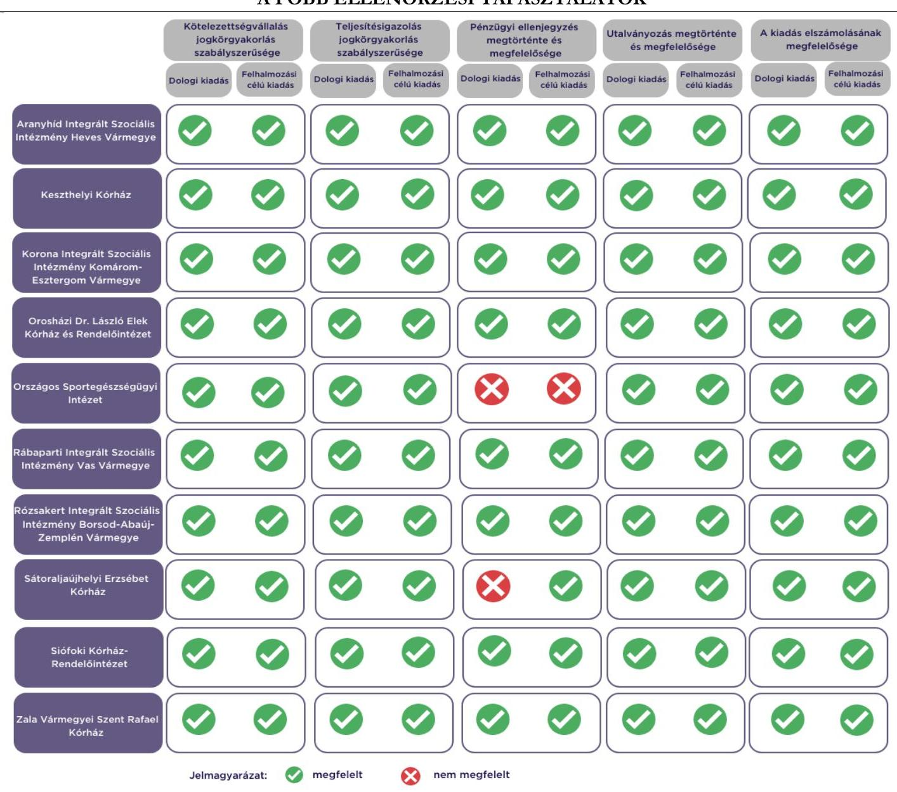

# JELENTÉS 

Az államháztartás központi alrendszerébe tartozó költségvetési szerv által teljesített dologi és felhalmozási célú kiadás szabályszerűségének rapid ellenőrzése
2024.

---

# JELENTÉS 

Az államháztartás központi alrendszerébe tartozó költségvetési szerv által teljesített dologi és felhalmozási célú kiadás szabályszerűségének rapid ellenőrzése

2024.

---

# ELLENŐRZÉSI IGAZGATÓSÁG: 

## ÁLLAMHÁZTARTÁS KÖZPONTI SZINTJÉT ELLENŐRZŐ IGAZGATÓSÁG

## ELLENŐRZÉSI IGAZGATÓ:

## SINKÁNÉ DR. CSENDES ÁGNES igazgató

## ELLENŐRZÉSVEZETŐ:

Jelentéseink az interneten a www.asz.hu címen olvashatók.

RENKÓ ZSUZSANNA ellenőrzésvezető

IKTATÓSZÁM: EL-3949-017/2024.
TÉMASZÁM: 2685

ELLENŐRZÉS-AZONOSÍTÓ SZÁM: V102912

---

# TARTALOMJEGYZÉK 

AZ ELLENŐRZÉS ALAPADATAI ..... 5
AZ ELLENŐRZÖTT SZERVEZETEK ..... 7
ÖSSZEFOGLALÁS ..... 12
AZ ELLENŐRZÉS FÓKUSZKÉRDÉSEI ..... 13
MEGÁLLAPÍTÁSOK ..... 14
JAVASLATOK ..... 17
MELLÉKLETEK ..... 18
I. sz. melléklet: Értelmező szótár ..... 18
II. sz. melléklet: Az ellenőrzött szervezetek jegyzéke ..... 19
III. sz. melléklet: Ellenőrzési kritériumok ..... 20
FÜGGELÉK: ÉSZREVÉTELEK ..... 21
RÖVIDÍTÉSEK JEGYZÉKE ..... 22

---

.

---

# AZ ELLENŐRZÉS ALAPADATAI 

## AZ ELLENŐRZÉS CÉLJA

Az államháztartás központi alrendszerébe tartozó költségvetési szerv által teljesített dologi és felhalmozási célú kiadások egy-egy kiválasztott tételének szabályszerűségi szempontból történő értékelése.

## AZ ELLENŐRZÉS TÍPUSA

Megfelelőségi ellenőrzés.

## AZ ELLENŐRZŐTT IDŐSZAK

| Ssz. | ELLENÖRZÖTT SZERVEZETEK | DOLOGI KIADÁSOK ESETEIREN | FELHALMOZÁSI CÉLÚKIADASOK ESETEIREN |
| :--: | :--: | :--: | :--: |
| 1. | Aranyhíd Integrált Szociális Intézmény Heves Vármegye | 2023. szeptember 22. | 2023. szeptember 18. |
| 2. | Keszthelyi Kórház | 2023. szeptember 22. | 2023. március 23. |
| 3. | Korona Integrált Szociális Intézmény Komárom-Esztergom Vármegye | 2023. október 16. | 2023. szeptember 25. |
| 4. | Orosházi Dr. László Elek Kórház és Rendelőintézet | 2023. október 16. | 2023. szeptember 29. |
| 5. | Országos Sportegészségügyi Intézet | 2023. szeptember 28. | 2023. május 3. |
| 6. | Rábaparti Integrált Szociális Intézmény Vas Vármegye | 2023. szeptember 28. | 2023. szeptember 27. |
| 7. | Rózsakert Integrált Szociális Intézmény   Borsod-Abaúj-Zemplén Vármegye | 2023. szeptember 28. | 2023. szeptember 27. |
| 8. | Sátoraljaújhelyi Erzsébet Kórház | 2023. szeptember 20. | 2023. október 3. |
| 9. | Siófoki Kórház-Rendelőintézet | 2023. október 17. | 2023. szeptember 12. |
| 10. | Zala Vármegyei Szent Rafael Kórház | 2023. október 5. | 2023. október 2. |

## AZ ELLENŐRZÉS TÁRGYA

Az államháztartás központi alrendszerébe tartozó költségvetési szerv által teljesített, ellenőrzésre kiválasztott dologi és felhalmozási célú kiadás szabályszerű teljesítése, ezen belül a gazdálkodási jogkörök szabályszerű gyakorlása. Az ellenőrzés kiterjedt minden olyan körülményre és adatra, amely az ÁSZ ${ }^{1}$ jogszabályban meghatározott feladatainak teljesítéséhez, valamint a program végrehajtása folyamán felmerült újabb összefüggések feltárásához szükséges.

---

Az ellenőrzés során az ÁSZ

- az Aranyhíd Integrált Szociális Intézmény Heves Vármegye, az Orosházi Dr. László Elek Kórház és Rendelőintézet, a Rábaparti Integrált Szociális Intézmény Vas Vármegye, a Rózsakert Integrált Szociális Intézmény Borsod-Abaúj-Zemplén Vármegye, a Zala Vármegyei Szent Rafael Kórház esetében a dologi kiadások körébe tartozó Egyéb szolgáltatások; a Keszthelyi Kórház esetében a dologi kiadások körébe tartozó Szakmai anyagok beszerzése; a Korona Integrált Szociális Intézmény Komárom-Esztergom Vármegye esetében a dologi kiadások körébe tartozó Karbantartási, kisjavítási szolgáltatások; az Országos Sportegészségügyi Intézet, a Sátoraljaújhelyi Erzsébet Kórház, a Siófoki Kórház-Rendelőintézet esetében a dologi kiadások körébe tartozó Szakmai tevékenységet segítő szolgáltatások;
- az Aranyhíd Integrált Szociális Intézmény Heves Vármegye, a Keszthelyi Kórház, a Korona Integrált Szociális Intézmény Komárom-Esztergom, az Orosházi Dr. László Elek Kórház és Rendelőintézet, az Országos Sportegészségügyi Intézet, a Rábaparti Integrált Szociális Intézmény Vas Vármegye, a Rózsakert Integrált Szociális Intézmény Borsod-Abaúj-Zemplén Vármegye, a Sátoraljaújhelyi Erzsébet Kórház, a Siófoki Kórház-Rendelőintézet esetében a felhalmozási célú kiadások körébe tartozó Egyéb tárgyi eszközök beszerzése, létesítése; a Zala Vármegyei Szent Rafael Kórház esetében a felhalmozási célú kiadások körébe tartozó Ingatlanok felújítása
rovatokon elszámolt kiadások egy-egy kiválasztott mintatételének szabályszerűségét értékelte.

# AZ ELLENŐRZÉS JOGALAPJA 

Az ellenőrzés jogszabályi alapját az ÁSZ tv. ${ }^{2} 1 . \int(3)$ bekezdés és az 5. $\int(6)$ bekezdés előírásai képezték.

## AZ ELLENŐRZÉS MÓDSZERE

Az ellenőrzést az ÁSZ az ellenőrzött időszakban hatályos jogszabályok, az ellenőrzés szakmai szabályai alapján, „Az állambáztartás központi alrendszerébe tartozó költségeetési szerv által teljesitett dologi kiadás szabályszerűségének rapid ellenörzéséről" és „Az állambáztartás központi alrendszerébe tartozó költségeetési szerv által teljesitett felhalmozzási célú kiadás szabályszerüségének rapid ellenörzéséről" című ellenőrzési programok (továbbiakban: ellenőrzési programok) kérdéseire adott válaszok kiértékelésével, az ellenőrzési programokban megjelölt adatforrások figyelembevételével folytatta le. Amennyiben az adott mintatétel ellenőrzési program szerinti értékelése során további kapcsolódó szabálytalanságot tárt fel az ÁSZ, a szabálytalansághoz tartozó kritériummal bővült az ellenőrzés.

Az ellenőrzési kérdések megválaszolásához szükséges bizonyítékok megszerzése a következő ellenőrzési eljárások alkalmazásával történt: megfigyelés, összehasonlítás, elemző eljárás, illetve a dologi kiadások, felhalmozási célú kiadások ellenőrzéssel érintett rovatairól történő mintavétel. Az ellenőrzési bizonyítékként felhasználható adatforrások közé tartoztak egyrészt az ellenőrzéshez kért dokumentumok, adatforrások, másrészt adatforrás volt még minden - az ellenőrzés folyamán - feltárt, az ellenőrzés szempontjából információkat tartalmazó dokumentum.

Az ÁSZ az ellenőrzés során a kiválasztott mintatételek ellenőrzési programokban meghatározott szempontok szerinti szabályszerűségét értékelte, így a kötelezettségvállalás és a teljesítésigazolás gazdálkodási jogkörök tekintetében a jogkörgyakorlás szabályszerűségét, a pénzügyi ellenjegyzés és az utalványozás gazdálkodási jogkörök tekintetében ezek megtörténtét és az ellenőrzési kritériumoknak való megfelelőségét.

---

# AZ ELLENŐRZÖTT SZERVEZETEK 

Az ellenőrzés az Aranyhíd Integrált Szociális Intézmény Heves Vármegye, a Keszthelyi Kórház, a Korona Integrált Szociális Intézmény Komárom-Esztergom Vármegye, az Orosházi Dr. László Elek Kórház és Rendelőintézet, az Országos Sportegészségügyi Intézet, a Rábaparti Integrált Szociális Intézmény Vas Vármegye, a Rózsakert Integrált Szociális Intézmény Borsod-Abaúj-Zemplén Vármegye, a Sátoraljaújhelyi Erzsébet Kórház, a Siófoki Kórház-Rendelőintézet és a Zala Vármegyei Szent Rafael Kórház elnevezésű szervezetekre, mint az államháztartás központi alrendszerébe tartozó költségvetési szervekre terjedt ki.

## ARANYHÍD INTEGRÁLT SZOCIÁLIS INTÉZMÉNY HEVES VÁRMEGYE FÖBB ADATAINAK BEMUTATÁSA

Az Aranyhíd ISZI HVM ${ }^{3}$ közfeladata a Szoctv. ${ }^{4}$ szerinti jelzőrendszeres házi segítségnyújtás, támogató szolgáltatás és nappali ellátás szociális alapszolgáltatások, támogatott lakhatás és támogatott lakhatás szakosított ellátás, valamint az ápolást, gondozást nyújtó ellátás idősek otthonában, fogyatékos személyek otthonában, pszichiátriai betegek otthonában és bentlakásos szociális ellátás biztosítása lakóotthonban.

## ARANYHÍD INTEGRÁLT SZOCIÁLIS INTÉZMÉNY HEVES VÁRMEGYE FÖBB ADATAINAK BEMUTATÁSA

Alapításának éve:
Irányító szerve:
Középirányító szerve:
Gazdasági szervezettel való rendelkezés:
Illetékessége, múködési területe:
Általános képviseletét ellátó vezetője:
Vezetői kinevezés kezdete:
2022. évben teljesített bevételek összege:
2022. évben teljesített kiadások összege:

1997.
Belügyminisztérium
Szociális és Gyermekvédelmi Főigazgatóság
Gazdasági szervezettel nem rendelkezik
Heves vármegye
intézményvezető
2021.04.15.
$1681,0 \mathrm{M} \mathrm{Ft}$
$1673,7 \mathrm{M} \mathrm{Ft}$

## KESZTHELYI KÓRHÁZ

A Keszthelyi Kórház közfeladata az Eütv. ${ }^{5}$ alapján ellátási területére kiterjedően a járó- és fekvőbetegek diagnosztikus és terápiás szakorvosi ellátása, rehabilitációja és követéses gondozása. Ennek keretében végzi a járóbetegek gyógyító, rehabilitációs szakellátását, valamint egynapos ellátását az egyén gyógykezelése, életveszély elhárítása, a megbetegedés következtében kialakult állapot javítása vagy a további állapotromlás megelőzése céljából.

## KESZTHELYI KÓRHÁZ FÖBB ADATAINAK BEMUTATÁSA

Alapításának éve:
Irányító szerve:
Középirányító szerve:
Gazdasági szervezettel való rendelkezés:
Illetékessége, múködési területe:
Általános képviseletét ellátó vezetője:
Vezetői kinevezés kezdete:
2022. évben teljesített bevételek összege:
2022. évben teljesített kiadások összege:

1979.
Belügyminisztérium
Országos Kórházi Főigazgatóság
Gazdasági szervezettel nem rendelkezik
2006. évi CXXXII. törvény ${ }^{6}$ alapján vezetett közhiteles kapacitásnyilvántartásban szereplő ellátási terület
főigazgató
2024.01.01.
$4990,0 \mathrm{M} \mathrm{Ft}$
$4941,8 \mathrm{M} \mathrm{Ft}$

---

# Korona Integrált Szociális Intézmény Komárom-Esztergom Vármegye 

A Korona ISZI KEVM ${ }^{7}$ közfeladata a Szoctv. szerinti szociális konyha, házi segítségnyújtás, jelzőrendszeres házi segítségnyújtás, idősek, pszichiátriai betegek és fogyatékos személyek részére nyújtott nappali ellátás szociális alapszolgáltatások, fogyatékos személyek ápolást-gondozást nyújtó otthona, pszichiátriai betegek ápolást-gondozást nyújtó otthona, pszichiátriai betegek átmeneti otthona, pszichiátriai betegek rehabilitációs lakóotthona szakosított szociális szolgáltatások és fejlesztő foglalkoztatás, valamint a gyermekek védelméről és a gyámügyi igazgatásról szóló 1997. évi XXXI. törvény szerinti otthont nyújtó ellátás biztosítása.

## Korona Integrált Szociális Intézmény Komárom-Esztergom Vármegye FÖBB ADATADIAK REMUTATÁSA

Alapításának éve:
Irányító szerve:
Középirányító szerve:
Gazdasági szervezettel való rendelkezés:

Illetékessége, müködési területe:

Általános képviseletét ellátó vezetője:
Vezetői kinevezés kezdete:
2022. évben teljesített bevételek összege:
2022. évben teljesített kiadások összege:

1950.
Belügyminisztérium
Szociális és Gyermekvédelmi Főigazgatóság
Gazdasági szervezettel nem rendelkezik
Idősek nappali ellátása, étkeztetés, házi segítségnyújtás esetén Esztergom város közigazgatási területe.
Jelzőrendszeres házi segítségnyújtás esetén Komárom-Esztergom vármegye, Budapest XVII. kerület, valamint Rétság és kistérsége közigazgatási területei.
Minden egyéb tevékenység tekintetében Komárom-Esztergom vármegye közigazgatási területe.
intézményvezető
2022.09.01.
$1578,8 \mathrm{M} \mathrm{Ft}$
$1578,8 \mathrm{M} \mathrm{Ft}$

## Orosházi Dr. LÁszló Elek KórHÁz És RendelóintÉzet

Az Orosházi Kórház ${ }^{8}$ közfeladata az Eütv. alapján ellátási területére kiterjedően a járó- és fekvőbetegek diagnosztikus és terápiás szakorvosi ellátása, rehabilitációja és követéses gondozása. Ennek keretében végzi fekvőbetegek aktív és krónikus ellátását, rehabilitációját, járóbetegek gyógyító és rehabilitációs szakellátását és egynapos ellátását az egyén gyógykezelése, életveszély elhárítása, a megbetegedés következtében kialakult állapot javítása vagy a további állapotromlás megelőzése céljából. Alaptevékenységébe tartozik a gyógyszerkiskereskedelem, egészségüggyel kapcsolatos kutatások, szakirányú továbbképzések végzése.

## Orosházi Dr. LÁszló Elek KórháZ És RendelóintÉzet FÖBB ADATADIAK REMUTATÁSA

Alapításának éve:
Irányító szerve:
Középirányító szerve:
Gazdasági szervezettel való rendelkezés:
Illetékessége, müködési területe:
Általános képviseletét ellátó vezetője:
Vezetői kinevezés kezdete:
2022. évben teljesített bevételek összege:
2022. évben teljesített kiadások összege:

1979.
Belügyminisztérium
Országos Kórházi Főigazgatóság
Gazdasági szervezettel nem rendelkezik
2006. évi CXXXII. törvény alapján vezetett közhiteles kapacitásnyilvántartásban szereplő ellátási terület
főigazgató
2023.11.13.
$8693,8 \mathrm{M} \mathrm{Ft}$
$8481,8 \mathrm{M} \mathrm{Ft}$

---

# Országos Sportegészségügyi Intézet 

Az OSEI ${ }^{9}$ közfeladata az Eütv. alapján egészségfejlesztési, népegészségügyi és sportegészségügyi tevékenységgel kapcsolatos szakértői feladatok ellátása. Az amatőr és hivatásos sportolók számára járóbeteg és fekvőbeteg szakellátást biztosít. Az OSEI a sportorvoslás szabályairól és a sportegészségügyi hálózatról szóló 215/2004. (VII. 13.) Korm. rendelet alapján végzi kiterjedt sportegészségügyi tevékenységét. Az olimpiai és paralimpiai felkészüléssel, az élsportolók kiemelt ellátásával kapcsolatos sportegészségügyi feladatok megvalósításáról szóló 1381/2011. (XI. 10.) Korm. határozat szerinti ellátások szervezését végzi.

## Országos Sportegészségügyi Intézet főbb adatainak bemutatása

Alapításának éve:
Irányító szerve:
Középirányító szerve:
Gazdasági szervezettel való rendelkezés:
Illetékessége, múködési területe:
Általános képviseletét ellátó vezetője:
Vezetői kinevezés kezdete:
2022. évben teljesített bevételek összege:
2022. évben teljesített kiadások összege:

1983.
Honvédelmi Minisztérium
-
2006. évi CXXXII. törvény alapján vezetett közhiteles nyilvántartásban szereplő ellátási terület
főigazgató
2009.07.16.
$4969,3 \mathrm{M} \mathrm{Ft}$
$4626,9 \mathrm{M} \mathrm{Ft}$

## RÁbAPARTI INTEGRÁLT SZOCIÁLIS INTÉZMÉNY VAS VÁRMEGYE

A Rábaparti ISZI VM ${ }^{10}$ közfeladata a Szoctv. alapján nyújtott szakosított ellátás. Alaptevékenysége pszichiátriai betegek ápolása, gondozást nyújtó ellátása és rehabilitációs célú ellátása, fejlesztő foglalkoztatása, fejlesztő foglalkoztatás során előállított termékek értékesítése, egészségügyi ápolás bentlakással és jelzőrendszeres házi segítségnyújtás.

## RÁbAPARTI INTEGRÁLT SZOCIÁLIS INTÉZMÉNY VAS VÁRMEGYE FÖBB ADATAINAK BEMUTATÁSA

Alapításának éve:
Irányító szerve:
Középirányító szerve:
Gazdasági szervezettel való rendelkezés:
Illetékessége, múködési területe:
Általános képviseletét ellátó vezetője:
Vezetői kinevezés kezdete:
2022. évben teljesített bevételek összege:
2022. évben teljesített kiadások összege:

1980.
Belügyminisztérium
Szociális és Gyermekvédelmi Főigazgatóság
Gazdasági szervezettel nem rendelkezik
Budapest
intézményvezető
2023.09.01.
$2006,4 \mathrm{M} \mathrm{Ft}$
$2006,1 \mathrm{M} \mathrm{Ft}$

---

# RózSAKERT INTEGRÁLT SZOCIÁLIS INTÉZMÉNY BORSOD-ABAÚJ-ZEMPLÉN VÁRMEGYE 

A Rózsakert ISZI BAZVM ${ }^{11}$ közfeladata a Szoctv. szerinti házi segítségnyújtás, jelzőrendszeres házi segítségnyújtás, fogyatékos személyek otthonában, pszichiátriai betegek otthonában, szenvedélybetegek otthonában a személyes gondoskodást nyújtó tartós bentlakásos szociális ellátás keretében fogyatékos személyek, pszichiátriai betegek, szenvedélybetegek teljes körű ápolása, gondozása, fogyatékos személyek rehabilitációs ellátása, támogatott lakhatás, átmeneti elhelyezést nyújtó intézmények, pszichiátriai betegek rehabilitációs célú lakóotthoni ellátása, valamint fejlesztő foglalkoztatás. Alaptevékenységébe tartozik a szakképző iskolai tanulók szakmai gyakorlati oktatásával összefüggő működtetési feladatok, megváltozott munkaképességủ személyek foglalkoztatását elősegítő képzések, támogatások.

## RÓzSAKERT INTEGRÁLT SZOCIÁLIS INTÉZMÉNY BORSOD-ABAÚJ-ZEMPLÉN VÁRMEGYE FÖRB ADATAINAK BEMUTATÁSA

Alapításának éve:
Irányító szerve:
Középirányító szerve:
Gazdasági szervezettel való rendelkezés:
Illetékessége, müködési területe:
Általános képviseletét ellátó vezetője:
Vezetői kinevezés kezdete:
2022. évben teljesített bevételek összege:
2022. évben teljesített kiadások összege:

1980.
Belügyminisztérium
Szociális és Gyermekvédelmi Főigazgatóság
Gazdasági szervezettel nem rendelkezik
Borsod-Abaúj-Zemplén vármegye
intézményvezető
2022.02.15.
$2268,5 \mathrm{M} \mathrm{Ft}$
$2263,3 \mathrm{M} \mathrm{Ft}$

## SÁTORALJAÚJHELYI ERZSÉBET KÓRHÁZ

A Sátoraljaújhelyi Kórház ${ }^{12}$ közfeladata az Eütv. alapján ellátási területére kiterjedően a járó- és fekvőbetegek diagnosztikus és terápiás szakorvosi ellátása, rehabilitációja és követéses gondozása. Ennek keretében végzi az egyén egészségének megőrzése, a megbetegedések megelőzése, korai felismerése, megállapítása, gyógykezelése, életveszély elhárítása, a megbetegedés következtében kialakult állapot javítása vagy a további állapotromlás megelőzése céljából a beteg vizsgálatára és kezelésére, gondozására, ápolására, egészségügyi rehabilitációjára, a fájdalom és a szenvedés csökkentésére, továbbá a fentiek érdekében a beteg vizsgálati anyagainak feldolgozására irányuló egészségügyi tevékenységeket, halottvizsgálattal és a halottakkal kapcsolatos orvosi eljárásokkal összefüggő tevékenységeket, emberen végzett orvostudományi kutatásokat, egészségügyi szakmai képzéseket és továbbképzéseket.

## SÁTORALJAÚJHELYI ERZSÉBET KÓRHÁZ FÖRB ADATAINAK BEMUTATÁSA

Alapításának éve:
Irányító szerve:
Középirányító szerve:
Gazdasági szervezettel való rendelkezés:
Illetékessége, müködési területe:
Általános képviseletét ellátó vezetője:
Vezetői kinevezés kezdete:
2022. évben teljesített bevételek összege:
2022. évben teljesített kiadások összege:

1979.
Belügyminisztérium
Országos Kórházi Főigazgatóság
Gazdasági szervezettel nem rendelkezik
2006. évi CXXXII. törvény alapján vezetett közhiteles kapacitásnyilvántartásban szereplő ellátási terület
főigazgató
2023.04.11.
$4978,3 \mathrm{M} \mathrm{Ft}$
$4969,7 \mathrm{M} \mathrm{Ft}$

---

# SiÓFOKI KÓRHÁZ-RENDELŐINTÉZET 

A Siófoki Kórház ${ }^{13}$ közfeladata az Eütv. alapján ellátási területére kiterjedően a járó- és fekvőbetegek diagnosztikus és terápiás szakorvosi ellátása, rehabilitációja és követéses gondozása. Ennek keretében végzi a járó- és fekvőbetegek aktív és krónikus ellátását, rehabilitációját, járóbetegek gyógyító, rehabilitációs szakellátását, valamint egynapos ellátását az egyén gyógykezelése, életveszély elhárítása, a megbetegedés következtében kialakult állapot javítása vagy a további állapotromlás megelőzése céljából. Alaptevékenységébe tartozik a gyógyszer és gyógyászati termék kiskereskedelme, orvostudományi kutatások végzése, egészségügyi szakmai képzések és továbbképzések végzése.

## SiÓFOKI KÓRHÁZ-RENDELÓINTÉZET FÖRB ADATAINAK BEMUTATÁSA

Alapításának éve:
Irányító szerve:
Középirányító szerve:
Gazdasági szervezettel való rendelkezés:
Illetékessége, múködési területe:
Általános képviseletét ellátó vezetője:
Vezetői kinevezés kezdete:
2022. évben teljesített bevételek összege:
2022. évben teljesített kiadások összege:

1979.
Belügyminisztérium
Országos Kórházi Főigazgatóság
Gazdasági szervezettel nem rendelkezik
2006. évi CXXXII. törvény alapján vezetett közhiteles kapacitásnyilvántartásban szereplő ellátási terület
főigazgató
2023.04.11.
$7343,8 \mathrm{M} \mathrm{Ft}$
$7196,2 \mathrm{M} \mathrm{Ft}$

## Zala VÁrmegyei Szent Rafael KórHÁz

A Zala Vármegyei Kórház ${ }^{14}$ közfeladata az Eütv. alapján ellátási területére kiterjedően a járó- és fekvőbetegek diagnosztikus és terápiás szakorvosi ellátása, rehabilitációja és követéses gondozása, valamint az egészségügyi alapellátásról szóló 2015. évi CXXIII. törvény alapján a védőnői ellátás biztosítása. Ennek keretében végzi a járó- és fekvőbetegek aktív és krónikus ellátását, rehabilitációját, nappali kórházi ellátását, egynapos sebészeti ellátását, járóbetegek gyógyító és rehabilitációs szakellátását, diagnosztikáját az egyén gyógykezelése, életveszély elhárítása, a megbetegedés következtében kialakult állapot javítása vagy további állapotromlás megelőzése céljából. Feladata továbbá a védőnői ellátás keretében az egészségmegőrzés, tanácsadás, gondozás, betegségmegelőzés-szűrés, felvilágosítás, egészségnevelés.

## Zala Vármegyei Szent Rafael KórHÁz FÖRB ADATAINAK BEMUTATÁSA

Alapításának éve:
Irányító szerve:
Középirányító szerve:
Gazdasági szervezettel való rendelkezés:
Illetékessége, múködési területe:
Általános képviseletét ellátó vezetője:
Vezetői kinevezés kezdete:
2022. évben teljesített bevételek összege:
2022. évben teljesített kiadások összege:

1979.
Belügyminisztérium
Országos Kórházi Főigazgatóság
Gazdasági szervezettel rendelkezik
2006. évi CXXXII. törvény alapján vezetett közhiteles kapacitásnyilvántartásban szereplő ellátási terület
főigazgató
2021.01.09.
$26953,8 \mathrm{M} \mathrm{Ft}$
$26586,1 \mathrm{M} \mathrm{Ft}$

---

# ÖSSZEFOGLALÁS 

Az ellenőrzött kiadások tekintetében az ellenőrzött szervezetek vonatkozásában a kötelezettségvállalás, a teljesítésigazolás és az utalványozás a jogszabályi előírásoknak megfelelően történt. Három esetben a pénzügyi ellenjegyzés nem a jogszabályi előírásoknak megfelelően történt. Az ellenőrzött kiadásokat a megfelelő rovatokon számolták el.

Kettő dologi kiadás esetében nem folytattak le közbeszerzési eljárást.
1. ábra

## A FŐBB ELLENŐRZÉSI TAPASZTALATOK

Forrás: ÁSZ saját szerkesztés
Az Aranyhíd ISZI HVM vezetője az ÁSZ tv. 29. § (2) bekezdés szerinti, a jelentéstervezet megállapításaira tett észrevételében arról tájékoztatta az ÁSZ-t, hogy intézkedéseket tett az ÁSZ ellenőrzés során felmerült hiányosságok megszüntetése érdekében, amelynek keretében az őrzés-védelmi feladatok ellátására irányuló megbízási szerződés megszüntetésre került és a szolgáltatás beszerzése iránti eljárást indított, ezzel az ÁSZ megállapítása az ellenőrzés során hasznosult.

---

# AZ ELLENŐRZÉS FÓKUSZKÉRDÉSEI 

1.- Az államháztartás központi alrendszerébe tartozó költségvetési szervnél a kiválasztott dologi kiadás teljesitése az egyes jogszabályi rendelkezések alapján szabályszerű volt-e?
2.- Az államháztartás központi alrendszerébe tartozó költségvetési szervnél a kiválasztott felhalmozási célú kiadás teljesitése az egyes jogszabályi rendelkezések alapján szabályszerű volt-e?

---

# MEGÁLLAPÍTÁSOK 

## 1. Az államháztartás központi alrendszerébe tartozó költségvetési szervnél a kiválasztott dologi kiadás teljesítése az egyes jogszabályi rendelkezések alapján szabályszerű volt-e?

Összegző megállapítás Az ellenőrzött 10 dologi kiadás teljesítése nyolc esetben az ellenőrzés keretében vizsgált jogszabályi előírásoknak megfelelt. Két dologi kiadás esetében a pénzügyi ellenjegyzési jogkörgyakorlás nem volt megfelelő. Kettő dologi kiadás esetében nem folytattak le közbeszerzési eljárást.

Az Aranyhíd ISZI HVM-nél, a Keszthelyi Kórháznál, a Korona ISZI KEVM-nél, az Orosházi Kórháznál, a Rábaparti ISZI VM-nél, a Rózsakert ISZI BAZVM-nél, a Siófoki Kórháznál és a Zala Vármegyei Kórháznál az ellenőrzött mintatételek esetében a kötelezettségvállalási, a teljesítésigazolási jogkörgyakorlás, illetve a kiadás elszámolása az Áht. ${ }^{15}$, az Ávr. ${ }^{16}$ és az Áhsz. ${ }^{17}$ előírásai szerint szabályszerűen történt, a pénzügyi ellenjegyzés és az utalványozás megfelelő volt:

- Kötelezettséget az Áht.-ben és az Ávr.-ben foglaltakkal összhangban az arra jogosultsággal rendelkező személy vállalt.
- A kötelezettségvállalásra az Áht.-ben foglaltak szerint, a pénzügyi ellenjegyzés után került sor.
- A teljesítésigazoló az Ávr.-ben előírt írásbeli kijelöléssel rendelkezett.
- A teljesítésigazolás során az Ávr.-ben foglaltak szerint ellenőrizhető okmányok alapján ellenőrizték és igazolták a kiadás teljesítésének jogosságát, összegszerűségét, valamint az ellenszolgáltatás teljesítését.
- A teljesítésigazoló a teljesítést az Ávr.-ben foglaltakkal összhangban, az igazolás dátumának és a teljesítés tényére történő utalás megjelölésével, aláírásával igazolta.
- Az utalványozásra az Áht.-ben, valamint az Ávr.-ben foglaltakkal összhangban, a teljesítésigazolást és az érvényesítést követően került sor.
- A kiadás számviteli elszámolása a megfelelő rovaton történt az Áhsz.-ben előírtakkal összhangban.

Az OSEI-nél és a Sátoraljaújhelyi Kórháznál az ellenőrzött mintatétel esetében a kötelezettségvállalási és a teljesítésigazolási jogkörgyakorlás, valamint a kiadás elszámolása az Áht., az Ávr. és az Áhsz. előírásai szerint szabályszerűen történt, az utalványozás megfelelő volt. A pénzügyi ellenjegyzés nem volt megfelelő:

- Kötelezettséget az Áht.-ben és az Ávr.-ben foglaltakkal összhangban az arra jogosultsággal rendelkező személy vállalt.
- A pénzügyi ellenjegyzés az Ávr. 55. § (1) bekezdésében foglaltak ellenére nem tartalmazta az ellenjegyzés dátumát. A dátum hiányában nem lehetett megállapítani, hogy a kötelezettségvállalásra az Áht. 37. § (1) bekezdésében foglalt előírás szerint a pénzügyi ellenjegyzés után került sor.

---

- A teljesítésigazoló az Ávr.-ben előírt írásbeli kijelöléssel rendelkezett.
- A teljesítésigazolás során az Ávr.-ben foglaltak szerint ellenőrizhető okmányok alapján ellenőrizték és igazolták a kiadás teljesítésének jogosságát, összegszerűségét, valamint az ellenszolgáltatás teljesítését.
- A teljesítésigazoló a teljesítést az Ávr.-ben foglaltakkal összhangban, az igazolás dátumának és a teljesítés tényére történő utalás megjelölésével, aláírásával igazolta.
- Az utalványozásra az Áht.-ben, valamint az Ávr.-ben foglaltakkal összhangban, a teljesítésigazolást és az érvényesítést követően került sor.
- A kiadás számviteli elszámolása a megfelelő rovaton történt az Áhsz.-ben előírtakkal összhangban.

# Az ellenőrzés során feltárt szabálytalanság: 

- Az Aranyhíd ISZI HVM 2022. szeptember 1-jén határozatlan időtartamra őrzés-védelmi feladatok ellátására a Kbt. ${ }^{18} 4 . \S$ (1) bekezdésében és 111. § d) pontjában foglaltakat megsértve közbeszerzési eljárás lefolytatása nélkül kötött megbízási szerződést az ÁSZ értékelés szerint. A 2022. szeptember 1-jén határozatlan időtartamra megkötött megbízási szerződés (keret)összeget nem tartalmazott. A Kbt. 17. § (3) bekezdés b) pontja alapján a szolgáltatás becsült értéke a havi ellenszolgáltatás negyvennyolcszorosa. A megrendelt szolgáltatás nettó 61516800 Ft becsült értéke eléri és meghaladja a Kbt. 111. § d) pontjában meghatározott 18000000 Ft összegű nemzeti értékhatárt.
- A Keszthelyi Kórház 2021. augusztus 25-én reagens, fogyó anyagok beszerzésére a Kbt. 4. § (1) bekezdésében foglaltakat megsértve közbeszerzési eljárás lefolytatása nélkül kötött határozatlan idejű adásvételi szerződést az ÁSZ értékelése szerint. Az adásvételi szerződés (keret)összeget nem tartalmazott. Az ÁSZ ezért az árubeszerzés becsült értékét a 2021. augusztus 25-től a szerződésre teljesített kifizetések alapján határozta meg. A nettó 47971200 Ft összegű kifizetés eléri és meghaladja a Kbt. 15. § (1) bekezdés b) pontjában és a 2022. évi Kvtv. ${ }^{19} 74 . \S$ (1) bekezdés a) pontjában meghatározott 15000000 Ft összegű nemzeti értékhatárt.

## 2. Az államháztartás központi alrendszerébe tartozó költségvetési szervnél a kiválasztott felhalmozási célú kiadás teljesítése az egyes jogszabályi rendelkezések alapján szabályszerű volt-e?

## Összegző megállapítás

Az ellenőrzött 10 felhalmozási célú kiadás teljesítése kilenc esetben az ellenőrzés keretében vizsgált jogszabályi előírásoknak megfelelt. Egy felhalmozási célú kiadás esetében a pénzügyi ellenjegyzés nem volt megfelelő.

Az Aranyhíd ISZI HVM-nél, a Keszthelyi Kórháznál, a Korona ISZI KEVM-nél, a Rábaparti ISZI VMnél, a Rózsakert ISZI BAZVM-nél, az Orosházi Kórháznál, a Sátoraljaújhelyi Kórháznál, a Siófoki Kórháznál és a Zala Vármegyei Kórháznál az ellenőrzött mintatételek esetében a kötelezettségvállalási, a teljesítésigazolási jogkörgyakorlás, továbbá a kiadás elszámolása az Áht., az Ávr. és az Áhsz. előírásai szerint szabályszerűen történt, a pénzügyi ellenjegyzés és az utalványozás megfelelő volt:

- Kötelezettséget az Áht.-ben és az Ávr.-ben foglaltakkal összhangban az arra jogosultsággal rendelkező személy vállalt.

---

- A kötelezettségvállalásra az Áht.-ben foglaltak szerint, a pénzügyi ellenjegyzés után került sor.
- A teljesítésigazoló az Ávr.-ben előírt írásbeli kijelöléssel rendelkezett.
- A teljesítésigazolás során az Ávr.-ben foglaltak szerint ellenőrizhető okmányok alapján ellenőrizték és igazolták a kiadás teljesítésének jogosságát, összegszerűségét, valamint az ellenszolgáltatás teljesítését.
- A teljesítésigazoló a teljesítést az Ávr.-ben foglaltakkal összhangban, az igazolás dátumának és a teljesítés tényére történő utalás megjelölésével, aláírásával igazolta.
- Az utalványozásra az Áht.-ben, valamint az Ávr.-ben foglaltakkal összhangban, a teljesítésigazolást és az érvényesítést követően került sor.
- A kiadás számviteli elszámolása a megfelelő rovaton történt az Áhsz.-ben előírtakkal összhangban.

Az OSEI-nél az ellenőrzött mintatétel esetében a kötelezettségvállalási, a teljesítésigazolási jogkörgyakorlás, valamint a kiadás elszámolása az Áht.-ben, az Ávr.-ben és az Áhsz.-ben foglalt előírások alapján szabályszerűen történt, az utalványozás megfelelő volt. A pénzügyi ellenjegyzés nem a jogszabályi előírásoknak megfelelően történt:

- Kötelezettséget az Áht.-ben és az Ávr.-ben foglaltakkal összhangban az arra jogosultsággal rendelkező személy vállalt.
- A pénzügyi ellenjegyzés az Ávr. 55. § (1) bekezdésében foglaltak ellenére nem tartalmazta az ellenjegyzés dátumát. A dátum hiányában nem lehetett megállapítani, hogy a kötelezettségvállalásra az Áht. 37. § (1) bekezdésében foglalt előírás szerint a pénzügyi ellenjegyzés után került sor.
- A teljesítésigazoló az Ávr.-ben előírt írásbeli kijelöléssel rendelkezett.
- A teljesítésigazolás során az Ávr.-ben foglaltak szerint ellenőrizhető okmányok alapján ellenőrizték és igazolták a kiadás teljesítésének jogosságát, összegszerűségét, valamint az ellenszolgáltatás teljesítését.
- A teljesítésigazoló a teljesítést az Ávr.-ben foglaltakkal összhangban, az igazolás dátumának és a teljesítés tényére történő utalás megjelölésével, aláírásával igazolta.
- Az utalványozásra az Áht.-ben, valamint az Ávr.-ben foglaltakkal összhangban, a teljesítésigazolást és az érvényesítést követően került sor.
- A kiadás számviteli elszámolása a megfelelő rovaton történt az Áhsz.-ben előírtakkal összhangban.

---

# JAVASLATOK 

Az ÁSZ tv. 33. § (1) bekezdésében foglaltak értelmében az ellenőrzött szervezet vezetője köteles a jelentésben foglalt megállapításokhoz kapcsolódó intézkedési tervet összeállítani és azt a jelentés kézhezvételétől számított 30 napon belül az ÁSZ részére megküldeni. Amennyiben az ellenőrzött szervezet vezetője nem küldi meg határidőben az intézkedési tervet, vagy továbbra sem elfogadható intézkedési tervet küld, az Állami Számvevőszék elnöke az ÁSZ tv. 33. § (3) bekezdése a) és b) pontjaiban foglaltakat érvényesítheti.

## ARANYHÍD INTEGRÁLT SZOCIÁLIS INTÉZMÉNY HEVES VÁRMEGYE INTÉZMÉNYVEZETŐJÉNEK

1. Kezdeményezzen a Bkr. ${ }^{20}$ 31. § (6) bekezdése alapján soron kívüli belső ellenőrzést a jelen ellenőrzés során feltárt szabálytalanság kialakulása okainak feltárása és a közbeszerzés elmulasztásával kapcsolatos kockázati tényezők feltárása, illetve a szabálytalanság megszüntetése érdekében.
2. A Bkr. 13. § (2) bekezdésében foglaltak alapján, valamint az 1. számú javaslat szerinti belső ellenőrzés megállapításait és javaslatait is figyelembe véve tegyen intézkedéseket azon kontrolltevékenységek kiépítésére és/vagy megfelelő müködtetésére, amelyek megelőzik a jelentésben leírt szabálytalanság ismételt előfordulását.

## KESZTHELYI KÓRHÁZ FŐIGAZGATÓJÁNAK

1. Kezdeményezzen a Bkr. 31. § (6) bekezdése alapján soron kívüli belső ellenőrzést a jelen ellenőrzés során feltárt szabálytalanság kialakulása okainak feltárása, a közbeszerzés elmulasztásával kapcsolatos kockázati tényezők feltárása, illetve a szabálytalanság megszüntetése érdekében.
2. A Bkr. 13. § (2) bekezdésében foglaltak alapján, valamint az 1. számú javaslat szerinti belső ellenőrzés megállapításait és javaslatait is figyelembe véve tegyen intézkedéseket azon kontrolltevékenységek kiépítésére és/vagy megfelelő müködtetésére, amelyek megelőzik a jelentésben leírt szabálytalanság ismételt előfordulását.

---

# MELLÉKLETEK 

## I. SZ. MELLÉKLET: ÉRTELMEZŐ SZÓTÁR

kötelezettségvállalás
pénzügyi ellenjegyzés
teljesítésigazolás
utalványozás

A költségvetési szerv által a kiadási előirányzatok és - ha jogszabály lehetővé teszi - a kijelölt lebonyolító szerv számára a Kormány rendeletében meghatározottak szerinti rendelkezésre bocsátott összeg terhére fizetési kötelezettség vállalásáról szóló - így különösen a foglalkoztatásra irányuló jogviszony létesítésére, szerződés megkötésére, költségvetési támogatás biztosítására irányuló - szabályszerűen megtett jognyilatkozat.
Forrás: Áht. 1. $\$ 15$. pont
A kötelezettségvállalást megelőző múvelet, amelynek során a pénzügyi ellenjegyzőnek meg kell győződnie arról, hogy a szükséges szabad előirányzat - több évet érintő kötelezettségvállalás esetén minden egyes évben rendelkezésre áll, a tervezett kifizetési időpontokban a pénzügyi fedezet biztosított, valamint a kötelezettségvállalás nem sérti a gazdálkodásra vonatkozó szabályokat. Kötelezettséget vállalni a Kormány rendeletében foglalt kivételekkel csak pénzügyi ellenjegyzés után, a pénzügyi teljesítés esedékességét megelőzően, írásban lehet.
Forrás: Áht. 37. § (1) bekezdés
A kötelezettségvállalásban a másik fél által vállalt feltételek teljesítéséhez kapcsolódó igazolás, amely a kiadási előirányzat terhére vállalt utalványozást előzi meg. A teljesítés igazolása során ellenőrizhető okmányok alapján ellenőrizni és igazolni kell a kiadások teljesítésének jogosságát, összegszerűségét, ellenszolgáltatást is magában foglaló kötelezettségvállalás esetében - ha a kifizetés vagy annak egy része az ellenszolgáltatás teljesítését követően esedékes - annak teljesítését. A teljesítést az igazolás dátumának és a teljesítés tényére történő utalás megjelölésével, az arra jogosult személy aláírásával kell igazolni.
Forrás: Áht. 38. § (1) bekezdés; Ávr. 57. § (1) és (3) bekezdések
A bevételek és kiadások elszámolására utalványozás alapján kerülhet sor. A kiadási előirányzatok terhére történő utalványozás esetén az utalványozásra csak azután kerülhet sor, ha a kiadás alapjául szolgáló kötelezettségvállalásban meghatározott feltételeket a másik szerződő fél már teljesítette. A kiadási előirányzatok terhére történő utalványozásra a teljesítés igazolását és az érvényesítést követően, a bevételi előirányzatok esetén a belső szabályzatban a bevételek meghatározott körére esetlegesen elrendelt teljesítés igazolását követően kerülhet sor.
Forrás: Áht. 38. § (1) bekezdés; Ávr. 57. § (2) bekezdés és 59. § (1b) bekezdés

---

# II. SZ. MELLÉKLET: AZ ELLENŐRZÖTT SZERVEZETEK JEGYZÉKE 

## ELLENÖRZÖTT SZERVEZETEK MEGNEVEZÉSE

Aranyhíd Integrált Szociális Intézmény Heves Vármegye
Keszthelyi Kórház
Korona Integrált Szociális Intézmény Komárom-Esztergom Vármegye
Orosházi Dr. László Elek Kórház és Rendelőintézet
Országos Sportegészségügyi Intézet
Rábaparti Integrált Szociális Intézmény Vas Vármegye
Rózsakert Integrált Szociális Intézmény Borsod-Abaúj-Zemplén Vármegye
Sátoraljaújhelyi Erzsébet Kórház
Siófoki Kórház-Rendelőintézet
Zala Vármegyei Szent Rafael Kórház

---

# III. SZ. MELLÉKLET: ELLENŐRZÉSI KRITÉRIUMOK 

## FOKUSZKÉRDÉS

1. Az államháztartás központi alrendszerébe tartozó költségvetési szervnél a kiválasztott dologi kiadás teljesítése az egyes jogszabályi rendelkezések alapján szabályszerű volt-e?

Kötelezettségvállalás

Pénzügyi ellenjegyzés
Teljesítésigazolás

Utalványozás

Kiadások elszámolása
Közbeszerzési eljárás lefolytatása
2. Az államháztartás központi alrendszerébe tartozó költségvetési szervnél a kiválasztott felhalmozási célú kiadás teljesítése az egyes jogszabályi rendelkezések alapján szabályszerű volt-e?

Kötelezettségvállalás

Pénzügyi ellenjegyzés
Teljesítésigazolás

Utalványozás

Kiadások elszámolása

## ELLENŐRZÉSI KRITÉRIUMOK

Áht. 36. $\$ 7$ (7), 37. $\$ 1$ (1) bekezdések
Ávr. 50. $\$ 1$ (1) bekezdés d) pont, 52. $\$ 1$ (1), (9), 53. $\$ 1$ (1), 60. $\$$ (3) bekezdések
belső szabályzat
Ávr. 55. $\$ 1$ (1), (4) bekezdés
Áht. 38. $\$ 1$ (1), (2) bekezdések
Ávr. 57. $\$ 1$ (1), (3)-(5), 60. $\$ 3$ bekezdések
Áht. 38. $\$ 1$ (1) bekezdés
Ávr. 59. $\$ 1$ b), (2) bekezdések, (3) bekezdés g) pont, (4) bekezdés
Áhsz. 40. $\$ 1$ (1) bekezdés, 15. melléklet I. pont
Kbt. 4. $\$ 1$ (1) bekezdés, 15. $\$ 1$ (1) bekezdés b) pont, 17. $\$ 3$ bekezdés b) pont, 111. $\$ \mathrm{~d}$ ) pont

Áht. 36. $\$ 7$ (7), 37. $\$ 1$ (1) bekezdések
Ávr. 50. $\$ 1$ (1) bekezdés d) pont, 52. $\$ 1$ (1), (9), 53. $\$ 1$ (1), 60. $\$$ (3) bekezdések
Ávr. 55. $\$ 1$ (1), (4) bekezdés
Áht. 38. $\$ 1$ (1), (2) bekezdések
Ávr. 57. $\$ 1$ (1), (3)-(5), 60. $\$ 3$ bekezdések
Áht. 38. $\$ 1$ (1) bekezdés
Ávr. 59. $\$ 1$ b), (2) bekezdések, (3) bekezdés g) pont, (4) bekezdés
Áhsz. 40. $\$ 1$ (1) bekezdés, 15. melléklet I. pont

---

# FÜGGELÉK: ÉSZREVÉTELEK 

A jelentéstervezetet a Számvevőszék 15 napos észrevételezésre megküldte az ellenőrzött szervezet vezetőjének az ÁSZ tv. 29. §* (1) bekezdése előírásának megfelelően.

A Keszthelyi Kórház, a Korona Integrált Szociális Intézmény Komárom-Esztergom Vármegye, az Orosházi Dr. László Elek Kórház és Rendelőintézet, az Országos Sportegészségügyi Intézet, a Rábaparti Integrált Szociális Intézmény Vas Vármegye, a Rózsakert Integrált Szociális Intézmény Borsod-Abaúj-Zemplén Vármegye, a Sátoraljaújhelyi Erzsébet Kórház, a Siófoki KórházRendelőintézet és a Zala Vármegyei Szent Rafael Kórház ellenőrzött szervezetek vezetői a jelentéstervezet megállapításaira észrevételt nem tettek.
A jelentéstervezet megállapításaira az Aranyhíd Integrált Szociális Intézmény Heves Vármegye intézményvezetője észrevételt tett. Az ÁSZ tv. 29. § (3) bekezdésével összhangban az Állami Számvevőszék a Függelékben feltünteti a megállapításokkal kapcsolatban tett, el nem fogadott észrevételeket, és megindokolja, hogy azokat miért nem fogadta el.
Aranyhíd Integrált Szociális Intézmény Heves Vármegye intézményvezetőjének észrevétele: „Az őrzés-védelmi feladatok ellátására irányuló megbizási szerződés felmondás okán 2023. december 2. napján megszünt és az Intézményünk a szolgáltatás beszerzése iránti eljárást folyamatba helyezte."
Az észrevétellel érintett megállapítás: „Az Aranyhíd ISZI HVM 2022. szeptember 1-jén határozatlan időtartamra őrzés-védelmi feladatok ellátására a Kbt. 4. § (1) bekezdésében és 111. § d) pontjában foglaltakat megsértve közbeszerzési eljárás lefolytatása nélkül kötött megbizási szerződést az ÁSZ értékelés szerint. A 2022. szeptember 1-jén határozatlan időtartamra megkötött megbizási szerződés (keret)összeget nem tartalmazott. A Kbt. 17. § (3) bekezdés b) pontja alapján a szolgáltatás becsült értéke a havi ellenszolgáltatás negyvennyolcszorosa. A megrendelt szolgáltatás nettó 61516800 Ft becsült értéke eléri és meghaladja a Kbt. 111. § d) pontjában meghatározott 18000000 Ft összegü nemzeti értékhatárt." (16. oldal utolsó előtti bekezdés)
El nem fogadás indoka: „A közbeszerzési eljárás elmulasztásával kapcsolatos észrevétele nem vitatja, hogy a 2022. szeptember 1-jén őrzés-védelmi feladatok ellátására vonatkozó megbizási szerződést közbeszerzési eljárás nélkül kötötték meg. A tájékoztatásában szerepelő intézkedései nem befolyásolják a közbeszerzési kötelezettség elmulasztásának tényét, azonban az intézkedések, miszerint az őrzés-védelmi feladatok ellátására irányuló megbizási szerződés megszüntetésre került és a szolgáltatás beszerzése iránti eljárást indított, a jelentés összefoglalójában bemutatásra kerülnek."

[^0]
[^0]:    * 29. § (1) Az Állami Számvevőszék az ellenőrzési megállapításait megküldi az ellenőrzött szervezet vezetőjének vagy az általa megbízott személynek, és annak, akinek személyes felelősségét állapította meg.
    (2) Az ellenőrzött szervezet vezetője és a felelősként megjelölt személy az ellenőrzés megállapításaira tizenöt napon belül írásban észrevételt tehet.
    (3) Az Állami Számvevőszék az észrevételre a beérkezésétől számított barminc napon belül írásban válaszol. A figyelembe nem vett észrevételeket köteles a jelentésben feltüntetni, és megindokolni, hogy azokat miért nem fogadta el.

---

# RÖVIDÍTÉSEK JEGYZÉKE 

${ }^{1}$ ÁSZ
${ }^{2}$ ÁSZ tv.
${ }^{3}$ Aranyhíd ISZI HVM
${ }^{4}$ Szoctv.
${ }^{5}$ Eütv.
${ }^{6}$ 2006. évi CXXXII. törvény
${ }^{7}$ Korona ISZI KEVM
${ }^{8}$ Orosházi Kórház
${ }^{9}$ OSEI
${ }^{10}$ Rábaparti ISZI VM
${ }^{11}$ Rózsakert ISZI BAZVM
${ }^{12}$ Sátoraljaújhelyi Kórház
${ }^{13}$ Siófoki Kórház
${ }^{14}$ Zala Vármegyei Kórház
${ }^{15}$ Áht.
${ }^{16}$ Ávr.
${ }^{17}$ Áhsz.
${ }^{18}$ Kbt.
${ }^{19}$ 2022. évi Kvtv.
${ }^{20}$ Bkr.

Állami Számvevőszék
2011. évi LXVI. törvény az Állami Számvevőszékről

Aranyhíd Integrált Szociális Intézmény Heves Vármegye
1993. évi III. törvény a szociális igazgatásról és szociális ellátásokról
1997. évi CLIV. törvény az egészségügyről
2006. évi CXXXII. törvény az egészségügyi ellátórendszer fejlesztéséről

Korona Integrált Szociális Intézmény Komárom-Esztergom Vármegye
Orosházi Dr. László Elek Kórház és Rendelőintézet
Országos Sportegészségügyi Intézet
Rábaparti Integrált Szociális Intézmény Vas Vármegye
Rózsakert Integrált Szociális Intézmény Borsod-Abaúj-Zemplén Vármegye
Sátoraljaújhelyi Erzsébet Kórház
Siófoki Kórház-Rendelőintézet
Zala Vármegyei Szent Rafael Kórház
2011. évi CXCV. törvény az államháztartásról

368/2011. (XII. 31.) Korm. rendelet az államháztartásról szóló törvény végrehajtásáról
4/2013. (I. 11.) Korm. rendelet az államháztartás számviteléről
2015. évi CXLIII. törvény a közbeszerzésekről
2021. évi XC. törvény Magyarország 2022. évi központi költségvetéséről
370/2011. (XII. 31.) Korm. rendelet a költségvetési szervek belső kontrollrendszeréről és belső ellenőrzéséről

---

1052 Budapest, Apáczai Csere János u. 10. | 1364 Budapest 4., Pf. 54
www.asz.hu | szamvevoszek@asz.hu
telefon: +36 14849100