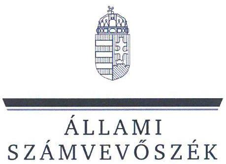
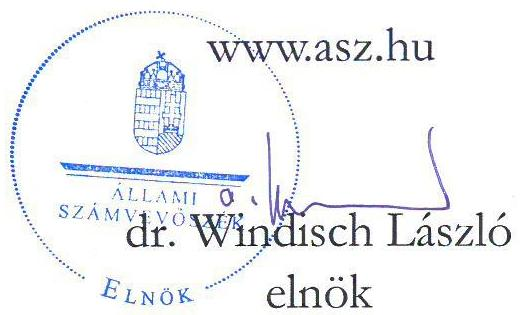
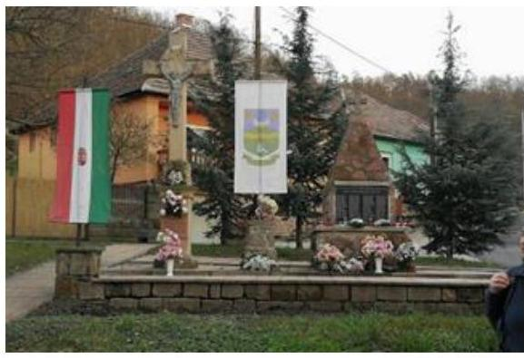
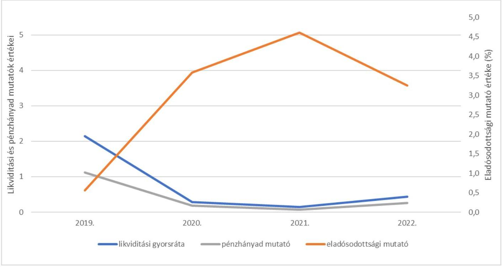
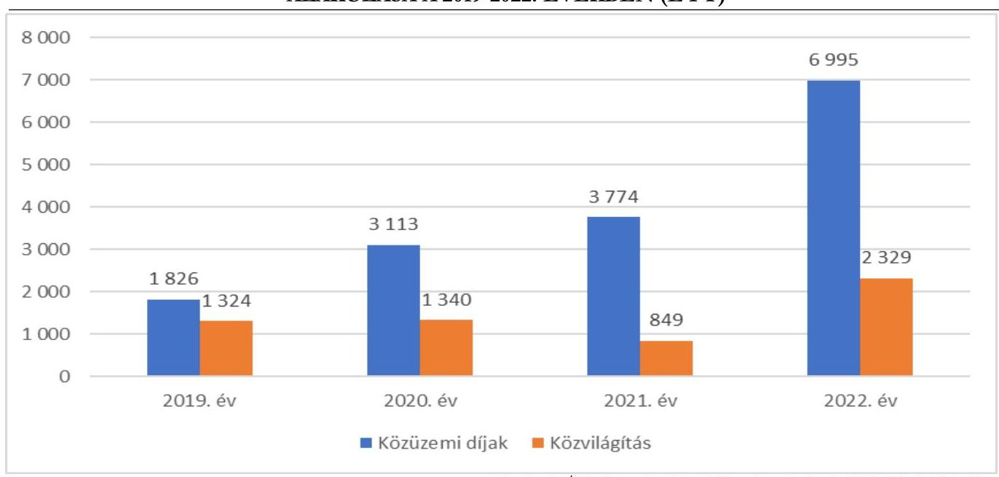
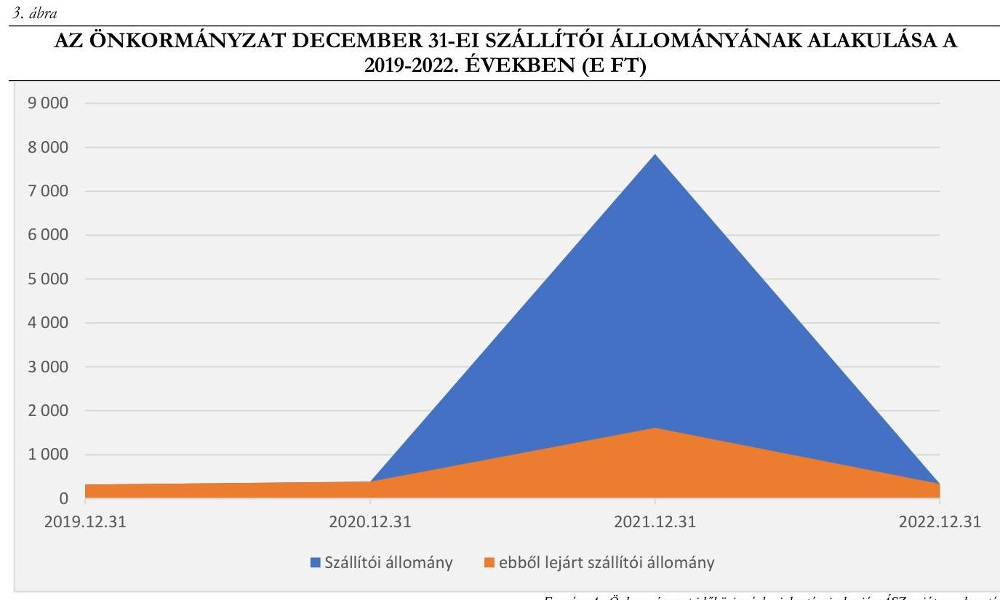

# JELENTÉS 

## Az önkormányzatok energiahatékonysági intézkedéseinek ellenőrzése

Cserépváralja Község Önkormányzata

2024.

---

ÁLLAMI
SZÁMVEVŐSZÉK

# JELENTÉS 

## Az önkormányzatok energiahatékonysági intézkedéseinek ellenőrzése

Cserépváralja Község Önkormányzata

2024. 

24030

---

# ELLENŐRZÉSI IGAZGATÓSÁG: 

## ÁLLAMHÁZTARTÁS HELYI SZINTJÉT ELLENŐRZŐ IGAZGATÓSÁG

## ELLENŐRZÉSI IGAZGATÓ:

DR. BAFFIA GERGELY GÁBOR igazgató

## ELLENŐRZÉSVEZETŐ:

Jelentéseink az interneten a www.asz.hu címen olvashatók.

HUDÁK MAGDOLNA ellenőrzésvezető

IKTATÓSZÁM: EL-3977-006/2024.
TÉMASZÁM: 2676

ELLENŐRZÉS-AZONOSÍTÓ SZÁM: V102001

---

# TARTALOMJEGYZÉK 

- AZ ELLENŐRZÉS ALAPADATAI ..... 5
- AZ ELLENŐRZÖTT SZERVEZET ..... 7
- ÖSSZEFOGLALÁS ..... 9
- AZ ELLENŐRZÉS FÓKUSZTERÜLETEI ..... 12
- MEGÁLLAPÍTÁSOK ..... 13
- JAVASLATOK ..... 28
- MELLÉKLETEK ..... 30
I. sz. melléklet: Értelmező szótár ..... 30
II. sz. melléklet: Az ellenőrzött szervezetek jegyzéke ..... 33
III. sz. melléklet: Ellenőrzési kritériumok ..... 34
IV. sz. melléklet: Tájékoztató adatok ..... 35
- FÜGGELÉK: ÉSZREVÉTELEK ..... 42
- RÖVIDÍTÉSEK JEGYZÉKE ..... 43

---

.

---

# AZ ELLENŐRZÉS ALAPADATAI 

## AZ ELLENŐRZÉS CÉLJA

Az ellenőrzés célja annak vizsgálata volt, hogy az Önkormányzat ${ }^{1}$ értékelte-e az energiaárak változásának a költségvetése végrehajtására, a gazdálkodására, valamint a kötelező és önként vállalt feladatainak ellátására gyakorolt hatását. Az ellenőrzés kiterjedt arra, hogy az Önkormányzat és a költségvetési szerve az energiaköltségek csökkentése érdekében tettek-e energiahatékonysági intézkedéseket, továbbá az Önkormányzat által tett intézkedések hozzájárultak-e a költségvetés pénzügyi egyensúlyának, a kötelező feladatok ellátásának a biztosításához.

## AZ ELLENŐRZÉS TÍPUSA

Megfelelőségi és teljesítmény ellenőrzés.

## AZ ELLENŐRZÖTT IDŐSZAK

A 2022. év és a 2023. év I. féléve.
Ezen túl elemzési céllal a 3. fókuszterületnél a megkezdett és lebonyolított beruházások adatainak tanúsítványon történő bekérése tekintetében a 2017-2021. évek, továbbá a 4. fókuszterületnél a pénzügyi, egyensúlyi mutatók számítása esetében a 2019-2023. I. félévének időszaka.

## AZ ELLENŐRZÉS TÁRGYA

Az ellenőrzés tárgyát képezte az Önkormányzat és költségvetési szerve gazdálkodásának biztonsága és a kötelező feladatok ellátása érdekében - az energiaárak 2022. évi változásának ellensúlyozására - tett energiahatékonyságot növelő, energiamegtakarítást célzó, a pénzügyi egyensúly fenntartására tett intézkedések megfelelőségének és eredményességének értékelése a 2022. évben és a 2023. I. félévben.

Elemzési módszerrel a 2017-2021. években végrehajtott energiahatékonysági beruházások, fejlesztések, szakpolitikai intézkedésekben való részvétel értékelése a tekintetben, hogy azok megelőző intézkedést jelentettek-e, illetve befolyásolták-e az energiaköltségek csökkentése érdekében a 2022. évben és a 2023. I. félévében megtett intézkedéseket.

## AZ ELLENŐRZÉS JOGALAPJA

Az ellenőrzés jogszabályi alapját az ÁSZ tv. ${ }^{2}$ 5. § (2) bekezdés előírásai képezték.

---

# AZ ELLENŐRZÉS MÓDSZERE 

Az ellenőrzést az Alaptörvény ${ }^{3}$ 43. cikk (1) bekezdésében meghatározott törvényességi, célszerűségi, eredményességi szempontok, valamint a nemzetközi standardokat irányadónak tekintve az ellenőrzési program szempontjai, az ellenőrzött időszakban hatályos jogszabályok, az ellenőrzés szakmai szabályok és módszertanok figyelembevételével végezte az ÁSZ ${ }^{4}$.

Az ellenőrzési kérdések megválaszolásához szükséges bizonyítékok megszerzése az ellenőrzött szervezet által rendelkezésre bocsátott dokumentumokra és adatokra, valamint az ellenőrzést támogató szervezetektől ${ }^{5}$ kapott adatokra alapozva, továbbá megfigyelés, szemle (szemrevételezés), kérdésfeltevés (információkérés), valamint elemző eljárás útján történt.

Az ellenőrzés során bizonyítékként felhasználható adatforrások közé tartoztak egyrészt az ellenőrzéshez kért dokumentumok, másrészt adatforrás volt még a közhiteles (Elektronikus Közbeszerzési rendszer) és egyéb (Önkormányzati rendelettár) nyilvántartásból származó, az ellenőrzés szempontjából releváns információkat tartalmazó dokumentum.

Az ellenőrzés lefolytatásához az ellenőrzött szervezet a tanúsítványok kitöltésével, valamint az ÁSZ által kért dokumentumok, adatok, információk megküldésével és a helyszíni ellenőrzés során interjú keretében szolgáltatott adatokat. A rendelkezésre bocsátott adatok, információk kontrolljára helyszíni ellenőrzés keretében is sor került. Ellenőrzést támogató szervezetként adatot kértünk a BM${ }^{6}$-től, a PM${ }^{7}$-től, az EM${ }^{8}$-től, a HM${ }^{9}$-től és a ME${ }^{10}$-től az energiaáremelkedéssel kapcsolatos intézkedések keretében nyújtott állami támogatásokról, továbbá az EMIT${ }^{11}$-ek teljesítésére vonatkozóan a MEKH${ }^{12}$-től, amely szervezet az Energetikusi Hálózaton keresztül támogatta a közintézmények Ehat. tv.${ }^{13}$-ben foglalt adatszolgáltatási kötelezettségeinek teljesítését.

Az ellenőrzés során egy kockázati alapon kiválasztott önkormányzati beruházás előkészítése, megvalósítása, elszámolása, nyilvántartása tételes ellenőrzésre került.

Elemzési módszerrel tanúsítványon szolgáltatott adatok alapján értékeltük, hogy a 2017-2021 között végrehajtott (indított, illetve befejezett) energiahatékonyságot növelő, energiamegtakarítást célzó beruházások mennyiben befolyásolták, milyen hatással voltak a rendkívüli energiaár növekedések következtében a 2022. évben és a 2023. I. félévben megtett intézkedésekre.

A tanúsítványokon szolgáltatott adatok, az Önkormányzat által rendelkezésre bocsátott dokumentumok alapján értékeltük, hogy a meghozott takarékossági intézkedések hogyan érintették az Önkormányzat kötelező, illetve önként vállalt feladatainak ellátását, öt mutatószám (likviditási gyorsráta változása, eladósodottsági mutató, lejárt szállítói állomány változása, pénzhányad mutató alakulása) segítségével értékeltük az Önkormányzatnál a pénzügyi egyensúly fenntartására tett intézkedések eredményességét.

Az ellenőrzés kiterjedt minden olyan körülményre és adatra, amely az ÁSZ jogszabályban meghatározott feladatainak teljesítéséhez, valamint a program végrehajtása folyamán felmerült újabb összefüggések feltárásához szükséges volt.

---

# AZ ELLENŐRZÖTT SZERVEZET 

Cserépváralja község az Észak-Magyarországi régióban, Borsod-Abaúj-Zemplén vármegyében, a Mezőkövesdi járásban található. Lakónépessége a KSH${ }^{14}$ adata szerint 2022. január 1-jén 325 fő volt.

A település polgármestere ${ }^{15}$ 2002. év óta látta el tisztségét, a Képviselő-testületnek ${ }^{16}$ a polgármesteren kívül négy fő képviselő tagja volt. Az Önkormányzat gazdálkodásával kapcsolatos feladatokat a Hivatal ${ }^{17}$ látta el. A jegyző ${ }^{18}$ 2013. március 1-jétől töltötte be tisztségét. A Hivatalnál az Önkormányzattal kapcsolatos gazdálkodási feladatokat 2023. július 31-éig egy fő szakképzett gazdálkodási előadó végezte. Jogviszonya megszűnése miatt 2023. augusztus 1-jétől a könyvelési feladatokra a jegyző megbízási szerződést kötött, az ÁSZ helyszíni ellenőrzés ideje alatt (2023. augusztus 16-2023. december 31. között) a Hivatalnál gazdálkodási előadót nem foglalkoztattak. A megfelelő szakértelem hiánya miatt az ellenőrzéssel kapcsolatos adatszolgáltatás nem volt megfelelő.

Az Önkormányzat költségvetési szervet nem tartott fenn. Az Önkormányzat a gyermekjóléti, családsegítő szolgáltatásokat a Mezőkövesdi Többcélú Kistérségi Társulás, a hulladékgazdálkodási feladatait a Mezőkövesdi Regionális Hulladékgazdálkodási Önkormányzati Társulás útján látta el, a belső ellenőrzési feladatok ellátására külső vállalkozóval kötött szerződést. Az Önkormányzat kizárólagos tulajdonába egy gazdasági társaság (önkormányzati Kft. ${ }^{19}$ ) tartozott, amely fő tevékenysége - üdülési, egyéb átmeneti szálláshely-szolgáltatás mellett többek között éttermi, mozgó vendéglátást és szociális étkeztetést is végzett.
Az Önkormányzat tulajdonában 2022. december 31-én hat közfeladat ellátását szolgáló épület volt.
Az Önkormányzat 2022. évi konszolidált beszámolójának főbb adatait az 1. táblázat mutatja be:

## 1. táblázat

AZ ÖNKORMÁNYZAT 2022. ÉVI KONSZOLIDÁLT BESZÁMOLÓJÁNAK FŐBB ADATAI

| MEGNEVEZÉS | 2022. ÉVI KONSZOLIDÁLT ÖNKORMÁNYZATI BESZÁMOLÓ (M Ft) |
| :--: | :--: |
| Költségvetési bevétel | 146,1 |
| Ebből: Működési célú támogatások államháztartáson belülről |  |
| Felhalmozási célú támogatások államháztartáson belülről | 31,5 |
| Közhatalmi bevételek | 13,3 |
| Költségvetési kiadás | 142,9 |
| Ebből: Dologi kiadások | 60,1 |
| Ebből: közüzemi díjak | 7,0 |
| Beruházások | 3,4 |
| Felújítások | 20,0 |
| Finanszírozási bevételek | 113,4 |
| Ebből: Hitel-, kölcsönfelvétel pénzügyi vállalkozástól | 108,8 |
| Finanszírozási kiadások | 110,2 |
| Ebből: Hitel-, kölcsöntörlesztés államháztartáson kívülre | 109,3 |

---

Az Önkormányzat a közüzemi és egyéb szolgáltatók felé fennálló kötelezettségeinek kiegyenlítése érdekében 2022. évben 2,4 M Ft, 2023. évben 0,5 M Ft központi költségvetési forrásból rendkívüli támogatást kapott.

Az Önkormányzat az energiaárak emelkedésének ellensúlyozására 2023. I. félévében 3,1 M Ft közvilágításhoz kapcsolódó kiegészítő támogatásban részesült.

---

# ÖSSZEFOGLALÁS 

Az energiaárak 2022. évben bekövetkezett jelentős emelkedése, a források korlátozott rendelkezésre állása új fókuszba helyezte az önkormányzatoknál az energiával történő gazdálkodás kérdését. Az energia változatlan mennyiségben történő felhasználása a magas költségkitettség miatt jelentős kockázatokat eredményezett az önkormányzatok pénzügyi-gazdasági egyensúlyára, valamint a közfeladatok ellátásának biztonságára. Az energiaárak emelkedéséből eredő kockázatok önkormányzati kezelésének támogatása érdekében kormányzati intézkedések történtek. Az európai uniós irányelveken alapuló, az energiahatékonyságról szóló törvény a települési önkormányzatok, mint a közfeladat ellátását szolgáló épületek tulajdonosai, használói, az üzemeltetésért és fenntartásért felelős szervezetek vezetői számára több energiahatékonysági feladatot is meghatározott. Az ellenőrzés rávilágított az Önkormányzat törvényben foglalt energiagazdálkodással kapcsolatos feladatainak ellátásával kapcsolatos problémákra, az energiagazdálkodási- és a pénzügyi-gazdálkodási feladatok közötti összefüggésekre, hozzájárult a szabályszerű és felelős gazdálkodásához, a közpénzek szabályos, cél szerinti felhasználásához, a közvagyon védelméhez.

Az Önkormányzatnál a pénzügyi kihatással járó döntések az előkészítés hiánya miatt nem voltak megalapozottak. Egyes döntések - pl. az önkormányzati Kft. közüzemi díjainak átvállalása, illetve a közvilágítás fejlesztése - meghozatalakor nem vették figyelembe az Önkormányzat teherbíró képességét. Az Önkormányzat pénzügyi helyzete instabil, a működés, a gazdálkodás szabálytalan volt. A megalapozatlan döntéshozatal, a szabálytalan gazdálkodás és az instabil pénzügyi helyzet előre vetítik a fizetőképtelenség kockázatát, veszélyeztetik a közfeladatellátást.

Az Önkormányzat és a Hivatal vezetőjének az Önkormányzat tulajdonában, illetve használatában álló, közfeladat ellátását szolgáló épületekkel kapcsolatos energetikai üzemeltetési és fenntartási feladatellátása nem felelt meg a jogszabályi előírásoknak, mivel a 2022. évben és 2023. I. félévében a jogszabályi előírások ellenére a hat közfeladatellátásban érintett épület közül egyetlen ingatlanra sem készítették el az EMIT-eket, energetikai felelőst nem foglalkoztattak, az energiafelhasználási adatokra vonatkozó havi adatszolgáltatási kötelezettségnek nem tettek eleget. A polgármester és a jegyző az EMIT készítési kötelezettségről az ÁSZ ellenőrzés során szerzett tudomást.

Az Önkormányzat pénzügyi-gazdasági helyzete az ellenőrzött időszakban nem volt stabil. Működőképességének megőrzése érdekében a 2022-2023. években az energiaszámlák kifizetésére három REKI${ }^{20}$ kérelmet nyújtott be, amely alapján 2,9 M Ft támogatásban részesült, ezen túl a közvilágítási kiadások fedezetére 3,1 M Ft támogatást kapott, azonban a gazdálkodás pénzügyi egyensúlya a támogatásokkal együtt sem volt biztosított. A Képviselő-testület - a gazdálkodás biztonságáért való felelőssége ellenére - nem értékelte az energiaárak változásának hatását a költségvetésre, valamint a kötelező és önként vállalt feladatok végrehajtására vonatkozóan. Az Önkormányzat a 2019-2022. években és 2023. I. félévében is folyószámlahitelekkel tudta működőképességét fenntartani, amelynek éves keretösszegei 6,0 M Ft és 15,6 M Ft között alakultak. Az Önkormányzatnál a folyószámlahitel szerződéseket a Kormány engedélye nélkül is megköthető éven belüli ügyletként kezelték, azonban a bankszámlakivonatok alapján ezek a hitelek a december 31-ci fordulónapon minden évben fennálltak (a 2019-2022. évek végén 4,3-14,6 M Ft között mozogtak). A likvid hitelállomány folyamatos fenntartásával megkerülték azon törvényi előírást, hogy az önkormányzatok kizárólag a Kormány előzetes hozzájárulásával köthetnek adósságot keletkeztető ügyletet. A likviditási nehézségeket alátámasztják az Önkormányzat pénzügyi mutatói is.

---

Az Önkormányzatnál a likviditási gyorsráta, a pénzhányad mutató és az eladósodottsági mutató alakulását az 1. ábra szemlélteti.

# 1. ábra 

CSERÉPVÁRALJA KÖZSÉG ÖNKORMÁNYZATA PÉNZÜGYI MUTATÓSZÁMAI (2019-2022. ÉVEK KÖZÖTT)

Forrás: ÁSZ saját szerkesztés az Önkormányzat 2019-2022. évi beszámoló adatai alapján
Az Önkormányzat nehéz pénzügyi helyzete ellenére - amelyet az energiaárak jelentős emelkedése még tovább rontott - kizárólag a végső menedékes villamosenergia és földgáz vásárlási lehetőséggel élt, valamint a földgáz esetében a minimális mennyiség érvényesítését vette igénybe.

A lehetséges többletforrások megszerzése érdekében az Önkormányzat nem kezdeményezett tárgyalást a Kormánnyal, mivel a kiadáscsökkentő menedzsmenttervet a jegyző nem készítette elő és a polgármester nem terjesztette a Képviselő-testület elé.

A Képviselő-testület a 2017-2022. években egy energetikai célú fejlesztésről döntött 5,7 M Ft összegben, amelyre 100%-ban vissza nem térítendő támogatást nyert.

 el a közösségi terek felújítása, energetikai korszerűsítése, ifjúsági klubhely kialakítása céljára, amely az ÁSZ helyszíni ellenőrzésének lezárásakor folyamatban volt. A beruházás előkészítésénél, a megvalósult részek pénzügyi elszámolásánál nem tartották be a jogszabályokban és a belső szabályzatban foglaltakat, mivel nem álltak rendelkezésre a kivitelezői ajánlatok, a beruházási pályázat benyújtásáról szóló képviselő-testületi előterjesztés, a képviselő-testületi ülés jegyzőkönyve, valamint nem rendelkeztek a kötelezettségvállalások nyilvántartásával, a kötelezettségvállalás dokumentumán a pénzügyi ellenjegyzés nem szerepelt, az érvényesítő és az utalványozó nem szabályszerűen végezte el a feladatát, mivel az utólag, a kifizetést követően történt meg.

A 2020. évben a Képviselő-testület a közvilágítási hálózat teljes korszerűsítésének megvalósításáról döntött, amelyet $\mathrm{ESCO}^{21}$ konstrukcióban, külső beruházó által valósított meg. A döntés előkészítése során a Képviselő-testület nem vizsgálta a szolgáltatási díj összetételét és nagyságát, illetve a beruházás megvalósításának egyéb alternatíváit (pl. saját erős beruházás, hitelfelvétellel vagy anélkül). A 2020. július 15-ei Képviselő-testületi ülésen az ESCO konstrukció bemutatásra került, de ennek költségkihatása a képviselők

---

számára nem volt világos, amelyre vonatkozóan képviselői kérdést is feltettek. A Képviselő-testület döntését a 2020. július 15-ei ülésen elhangzott azon téves információ alapján hozta meg, hogy a beruházás nem kerül semmibe az Önkormányzat számára. Valójában azonban a Szerződésben ${ }^{22}$ a polgármester arra vállalt kötelezettséget, hogy a beruházás költségeit a Szolgáltató ${ }^{23}$ által felvett banki kölcsön kamataival együtt 180 hónap alatt megfizeti. Ennek bruttó összege az inflációs hatást figyelmen kívül hagyva is meghaladta a 14,4 M Ft-ot. Ezen túl a polgármester által 2020. október 15-én aláirt, a Képviselő-testület által 2020. szeptember 30-án elfogadott Szerződés tartalma nem egyezett meg a Képviselő-testület számára 2020. július 15-ei ülésén bemutatott ajánlattal, az az Önkormányzat számára kedvezőtlenebb feltételeket tartalmazott a szerződés lejártával és a lámpatestek önkormányzati tulajdonba kerülésével kapcsolatban. Az Önkormányzat a Szerződésben foglaltak ellenére utólag sem vizsgálta, hogy a közvilágítás korszerűsítése eredményezett-e, és ha igen, mekkora mértékű költségmegtakarítást, illetve, hogy az valóban fedezetet nyújtott-e a szolgáltatási díjra. A jogszabályi előírások ellenére a 2022. évre vonatkozóan a villamosenergia végszámlát az Önkormányzatnál nem őrizték meg. A számla hiánya következtében az Önkormányzat nem tudott élni azzal a lehetőséggel, hogy amennyiben a beruházás eredményeként a szerződésben vállalt megtakarítás nem valósul meg, a Szolgáltató kárpótlást fizet a megrendelőnek.

Az Önkormányzat a szociális étkeztetést az önkormányzati Kft.-vel kötött vállalkozási szerződés keretében biztosította az Önkormányzat tulajdonát képező ingatlanban. A kizárólagos használatba adott helyiségek közüzemi díjainak költségét a Bérleti szerződés ${ }^{24}$ szerint a bérlő önkormányzati Kft-nek kellett viselnie, azonban azokat 2020. évtől az Önkormányzat átvállalta. A költségek átvállalásáról a döntést a polgármester hozta, amelyről a Képviselő-testületet tájékoztatta, azonban erről az Önkormányzat és a bérlő között írásbeli megállapodás nem született. Az Önkormányzat nem rendelkezett olyan dokumentumokkal, amelyekből megállapítható lett volna, hogy a bérelt ingatlan hasznosítása során milyen arányban merültek fel az önkormányzati Kft. szociális étkeztetéssel, valamint az egyéb vállalkozási tevékenységeivel kapcsolatos közüzemi díjai, továbbá az sem volt megállapítható, hogy az Önkormányzat által az önkormányzati Kft-nek a szociális étkeztetésért fizetett térítési díj tartalmazta-e a közüzemi költségeket is. Az Önkormányzatnál az önkormányzati Kft. közüzemi költségeinek átvállalása következtében 2020-2022. között nettó 1,3-3,5 M Ft, 2023. I. félévében $0,3 \mathrm{M}$ Ft többletkiadás keletkezett. Az önkormányzati Kft. közüzemi kiadásainak az önkormányzat kiadásai között történő elszámolásával a 2020-2022. években és 2023. I. félévében megsértették azon jogszabályi előírást, mely szerint a tervezés, gazdálkodás és beszámolás során a bevételeket és kiadásokat közgazdasági osztályozás és felmerülésük helye szerint kell kimutatni.

A belső ellenőrzési tevékenység az energiagazdálkodást, energiahatékonyságot az ellenőrzött időszakban nem vizsgálta.

Az ÁSZ az ellenőrzés során feltárt hiányosságok megszüntetése, a szabályszerű működés feltételeinek megteremtése érdekében a polgármesternek és a jegyzőnek hét-hét javaslatot tett.

---

# AZ ELLENŐRZÉS FÓKUSZTERÜLETEI 

1. Az Önkormányzat és költségvetési szervei tulajdonában, illetve használatában álló, közfeladat ellátását szolgáló épületekkel kapcsolatos energetikai üzemeltetési és fenntartási feladatellátás
2. Az energiaárak változására tekintettel a gazdálkodás biztonsága érdekében a központi intézkedések adta lehetőségek Önkormányzat általi hasznosítása
3. Az energiaköltségek csökkentése, az energiahatékonyság növelése érdekében kezdeményezett, illetve folyamatban lévő energetikai beruházások értékelése
4. Az energiaárak hatásának kezelésére, a kötelező feladatok ellátására, a pénzügyi egyensúly fenntartására tett intézkedések értékelése

---

# MEGÁLLAPÍTÁSOK 

## 1. Az Önkormányzat és költségvetési szervei tulajdonában, illetve használatában álló, közfeladat ellátását szolgáló épületekkel kapcsolatos energetikai üzemeltetési és fenntartási feladatellátás

Összegző megállapítás Az Önkormányzat közfeladatellátását szolgáló, a tulajdonában, illetve használatában álló épületekkel kapcsolatos energetikai üzemeltetési és fenntartási feladatainak ellátása nem felelt meg az Ehat. tv., az Mötv. ${ }^{25}$, valamint a 176/2008. (VI. 30.) Korm. rendelet ${ }^{26}$ előírásainak.

A polgármester az Önkormányzat tulajdonában, illetve használatában álló, hat közfeladat ellátását szolgáló épület esetében nem tett eleget az Ehat. tv. 11/A. § előírásainak.

- Az Ehat. tv. 11/A. § a) pontjának előírása ellenére 2022-2023. I. félévében nem készítették el és töltötték fel a Nemzeti Energetikusi Hálózat által üzemeltetett felületre az energiamegtakarítási intézkedési terveket. Az Önkormányzat az EMIT készítési kötelezettségről az ÁSZ ellenőrzés során szerzett tudomást.
- Az Ehat. tv. 11/A. § c) pontjában foglaltak ellenére a Nemzeti Energetikusi Hálózat által üzemeltetett online felületen nem jelentették be havi rendszerességgel az épületekre, illetve épületrészekre vonatkozó energiafogyasztási adatokat.
- Az Ehat. tv. 11/A. § i) pontjában foglaltak ellenére az épületekkel kapcsolatos energiahatékonysági feladatok ellátása és a Nemzeti Energetikusi Hálózattal történő kapcsolattartás céljából nem jelöltek ki energetikai felelőst.
- A közfeladat ellátást szolgáló épületek egyikére vonatkozóan sem rendelkeztek a 176/2008. (VI. 30.) Korm. rendelet 1. § (3) bekezdése szerinti energetikai tanúsítvánnyal, az épületek energetikai jellemzőit tartalmazó nyilvántartással.
Az ellenőrzött időszakban a polgármester az Ehat. tv. 11/A. §-ában meghatározott felelőssége körében, a közfeladat ellátását szolgáló épületek tulajdonosának képviseletében az üzemeltetéséért és fenntartásáért felelős vezetőként, valamint az Mötv. 67. § (1) bekezdés a) és f) pontjai ellenére irányítási és munkáltatói jogkörében nem határozta meg a Hivatal és a jegyző Ehat. tv-ből eredő kötelezettségek teljesítésében való közreműködéssel kapcsolatos feladatait. A jegyző nem kísérte figyelemmel az Ehat. tv. 11/A. §-a szerinti feladatok végrehajtását.
A jegyző nem tett eleget a 147/1992. (XI. 6.) Korm. rendelet ${ }^{27}$ 3. §-ában és 4. § (1) bekezdésében foglaltaknak, mert az ingatlanvagyon katasztert nem vezette folyamatosan, illetve az ingatlanok valóságos állapotában, értékében bekövetkezett változást a kataszteren 90 napon belül nem vezette át, az ingatlanvagyon kataszter programban rögzített adatok a hat közfeladat ellátását szolgáló épületre vonatkozóan pontatlanok voltak.

---

- A helyszíni ellenőrzés során megtekintett ingatlanvagyon kataszter programban a tanúsítványi adatszolgáltatáson szereplő hat ingatlanra vonatkozó adatok megnevezés alapján fellelhetők voltak, azonban az épületek címei házszámozást nem tartalmaztak. A „Tűzoltó szertár" megnevezésű ingatlan beépítetlen területként szerepelt az ingatlanvagyon kataszter programban.

# 2. Az energiaárak változására tekintettel a gazdálkodás biztonsága érdekében a központi intézkedések adta lehetőségek Önkormányzat általi hasznosítása 

## Összegző megállapítás

Az energiaárak jelentős változása és az Önkormányzat nehéz pénzügyi helyzete ellenére nem élt valamennyi központi intézkedés adta lehetőséggel.

Az ellenőrzött időszakban az energiaárak változására tekintettel az energiaellátás folyamatos biztosítása érdekében a Kormány által biztosított lehetőségeket és az Önkormányzat azokhoz való csatlakozását a 2. táblázat mutatja be.
2. táblázat

A KORMÁNY ÁLTAL BIZTOSÍTOTT LEHETŐSÉGEKHEZ VALÓ CSATLAKOZÁS AZ ÖNKORMÁNYZATNÁL

## KORMÁNYZATI INTÉZKEDÉS

ÖNKORMÁNYZAT CSATLAKOZÁSA
JóEN
NEM

Végső menedékes jogintézmény keretében biztosított
villamosenergia-ellátás - 217/2022. (VI.17) Korm. rendelet ${ }^{28} 3 . \S$
Végső menedékes jogintézmény keretében biztosított földgázellátás

- 217/2022. (VI.17) Korm. rendelet 8. §

Teljes ellátás alapú veszélyhelyzeti átmeneti villamosenergia-ellátás
biztosítása - 520/2022. (XII. 13.) Korm. rendelet ${ }^{29} 5 . \S$
Veszélyhelyzeti átmeneti földgázellátás biztosítása -
388/2022. (X.14.) Korm. rendelet ${ }^{30} 4 . \S$
Fixált áras árképzésű villamosenergia vásárlás -
41/2023. (II. 20) Korm. rendelet ${ }^{31} 2 . \S$
Fixált áras árszabású földgáz vásárlás -
12/2023. (I. 20) Korm. rendelet ${ }^{32} 2 . \S$
Földgáz-kereskedelmi szerződésben rögzített minimális mennyiség
érvényesítése - 354/2022 (IX.19) Korm. rendelet ${ }^{33} 2 . \S$
A 2022. évben az Önkormányzat az energiaellátás folyamatos biztosítását célzó kormányzati intézkedések közül mind a villamosenergia, mind a gázenergia tekintetében a végső menedékes státuszra vonatkozóan nyilatkozott. A 2023. évben az Önkormányzat nem élt a fixált áras árképzésű villamosenergia vásárlás lehetőségével, mert a villamosenergia esetében határozott idejű szerződéssel rendelkezett. A fixált áras árképzésű földgáz vásárlás lehetőségével sem éltek. A gázenergia vásárlására vonatkozó érvényes szerződést a 2022. évre és a 2023. I. félévére vonatkozóan az ÁSZ ellenőrzés részére nem tudtak bemutatni, ezzel az Önkormányzat megsértette a Számv. tv. ${ }^{34}$ 169. § (2) bekezdésében foglalt számviteli

---

bizonylatok megőrzésére vonatkozó szabályokat, mivel ebben az esetben a közüzemi díjak kifizetéséhez kapcsolódó kötelezettségvállalás dokumentumát visszakereshető módon nem őrizte meg.
(Az intézkedéseket és a megtett nyilatkozatokat a IV. melléklet 1. táblázata részletezi.)
Az Önkormányzat élt a földgáz-kereskedelmi szerződésben lekötött földgázmennyiségnél kisebb (75%, majd 2022. december 16-tól 60%) mennyiségű földgáz felhasználására biztosított lehetőséggel.
A Képviselő-testület a 449/2022. (XI. 9.) Korm. rendelet ${ }^{35}$ 1. § (1) bekezdésében szereplő felhatalmazás alapján nem élt a rendeletalkotás lehetőségével a közvilágítás korlátozása tekintetében.

# 3. Az energiaköltségek csökkentése, az energiahatékonyság növelése érdekében kezdeményezett, illetve folyamatban lévő energetikai beruházások értékelése 

## Összegző megállapítás Az Önkormányzatnál folyamatban lévő fejlesztés lebonyolítása és számviteli részelszámolása során nem tartották be a jogszabályi előírásokat.

A 2022-2023. I. félévében az Önkormányzat nem kezdeményezett energiahatékonysági, energiamegtakarítást eredményező beruházást.
A Képviselő-testület a 2017-2021. években egy - saját beruházás keretein belül megvalósuló - energetikai célú fejlesztésről hozott döntést, amelyre a Magyar Falu Program 2021. ${ }^{36}$ pályázat keretében 2021. évben 5694,2 E Ft összegű vissza nem térítendő költségvetési támogatást nyert el közösségi terek felújítása, korszerűsítése, Ifjúsági klub ${ }^{37}$ kialakítása céljára. A pályázati forrás elkülönített kezelésére külön bankszámlát nem nyitottak, azt az Önkormányzat fizetési számláján kezelték. Az ÁSZ ellenőrzés lezárásáig a beruházás még nem fejeződött be, ezért csak a pénzügyileg teljesült 30%-os részének pénzügyi-számviteli ellenőrzésére került sor.
Az Ifjúsági klub beruházás előkészítése, és a 30,0% pénzügyileg teljesült részének lebonyolítása, számviteli részelszámolása nem volt szabályszerű, mert nem tartották be a Bkr. ${ }^{38}$ 8. § (2) bekezdés b) pontjában, az Ávr. ${ }^{39}$ 55. § (1) bekezdésében, 56. § (1) bekezdésében, 57. § (1) bekezdésében, az Áht. 38. § (1) bekezdésében és 58. § (3) bekezdésében, valamint a Beszerzési szabályzat ${ }^{40}$ II. fejezet 1. pontjában, foglalt előírásokat. A pályázatból fel nem használt 4000,0 E Ft a 2022. év végén nem állt rendelkezésre, azt az Önkormányzat a Támogató okirat ${ }^{41}$-ban foglaltak ellenére pályázati céltól eltérő célra használta, mivel az év végén az Önkormányzat fizetési számlája folyószámlahitel tartozást mutatott.

- A polgármester
 és a jegyző helyszíni nyilatkozata alapján - a polgármester részére átruházott hatáskörökkel kapcsolatban az SzMSz 1. számú mellékletében foglaltaknak megfelelően - a Képviselő-testület döntött a pályázat benyújtásáról, azonban a pályázattal kapcsolatos képviselő-testületi előterjesztést, a Képviselőtestület ülésének jegyzőkönyvét a MÖtv. 52. § (3) bekezdésében foglalt nyilvánosság biztosításának kötelezettsége ellenére nem tudták rendelkezésre bocsájtani.
- A döntés előkészítése során nem határoztak meg a beruházással kapcsolatban energiamegtakarítási elvárást, ezzel kapcsolatos előírást a pályázati felhívás sem tartalmazott. A fejlesztési döntések előkészítése vonatkozásában Bkr. 8. § (2) bekezdés b) pontjában foglaltak ellenére nem építettek ki a szervezeti célok elérését veszélyeztető kockázatok csökkentésére irányuló kontrollokat a döntések célszerűségi, gazdaságossági, hatékonysági és eredményességi szempontú megalapozottsága tekintetében. Így például

---

nem vizsgálták a létrejövő tárgyi eszközök, berendezések üzemeltetésével, működtetésével, karbantartásával kapcsolatos várható kiadásokat sem.

- Az Önkormányzat nem tett eleget az Ávr. 56. § (1) bekezdésében foglaltaknak, mivel az Áhsz. ${ }^{42}$ 14. melléklet II. pontja szerinti kötelezettségvállalások nyilvántartásával nem rendelkezett.
- Az Ávr. 55. § (1) bekezdésben foglaltak ellenére a pénzügyi ellenjegyzést nem végezték el, mivel a kötelezettségvállalás dokumentumán (vállalkozási szerződés) a pénzügyi ellenjegyző keltezéssel ellátott aláírása és a pénzügyi ellenjegyzésre utaló megjelölés nem szerepelt.
- A beruházás megvalósításának tervezett fizikai befejezési határideje 2022. augusztus 31. napja volt. A szerződésben foglalt határidőig egy 30,0%-os részszámla került kifizetésre 2022. augusztus 4-én bruttó 1694,2 E Ft értékben. A kifizetéssel kapcsolatos teljesítésigazolás nem felelt meg az Ávr. 57. § (1) bekezdésében foglaltaknak. A szerződés 3. pontja ugyan tartalmazott arra vonatkozó előírást, hogy a kifizetés több részletben fog történni, azonban nem tartalmazta a konkrét fizetési ütemeket és az azokhoz tartozó műszaki készültségi fokot, így nem volt alkalmas az összegszerűség ellenőrzésére. Továbbá a teljesítésigazolási jegyzőkönyv nem tartalmazta, hogy a 30%-os készültségben pontosan milyen munkák elvégzése történt meg, ezért nem volt alkalmas az ellenszolgáltatás teljesítésének ellenőrzésére. A polgármester nyilatkozata szerint az elvégzett munkáról építési napló, egyéb dokumentum nem állt rendelkezésre.
- Az Ávr. 58. § (3) bekezdésében foglaltak ellenére a kifizetést követően végezték el az érvényesítést, így a kifizetés utalványozása nem az Ávr. 59. § (1b) bekezdésben foglalt érvényesített okmány alapján, és az Áht. ${ }^{43} 38. §$ (1) bekezdésében foglaltak ellenére nem a pénzügyi teljesítést megelőzően történt.
- A Beszerzési szabályzat II. fejezet 1. pontjában foglaltaktól eltérően nem állt rendelkezésre három kivitelezői ajánlat.
- A vállalkozási szerződés szerint a beruházást 2022. augusztus 31-ig kellett volna befejezni, amely nem történt meg. A polgármester 2022. december 15-én - a támogatási szerződés szerinti befejezési határidőt követő 106. napon - a hideg időjárásra, valamint a kivitelező vállalkozás munkaerő-hiányára hivatkozva kérelemmel fordult a modern települések fejlesztéséért felelős Kormánybiztoshoz a befejezési határidő 2023. augusztus 31. napjáig történő meghosszabbítására. Az Önkormányzat nyilatkozata alapján a kérelmet 2022. december 19-én visszavonták, majd 2023. augusztus 29-én új egyedi kérelmet nyújtottak be a befejezési határidő módosítására. A kérelmek benyújtásának időpontjában a vállalkozási szerződés már lejárt, szerződés módosítás nem történt, az önkormányzat kötbérigénnyel a vállalkozó felé nem élt. Arra vonatkozóan, hogy 2022. augusztus 31-e és december 15-e között miért nem történt előrehaladás a kivitelezésben, az Önkormányzat nyilatkozatában érdemi választ nem tudott adni. A támogatási szerződés módosítására a polgármester nyilatkozata szerint nem került sor. A kérelem visszavonásával és az új kérelem benyújtásával kapcsolatos dokumentumokat az Önkormányzat nem bocsátott az ÁSZ ellenőrzés rendelkezésére.
- 2022. december 31-én a támogatásból fel nem használt (5694,2 E Ft - 1 694,2 E Ft) 4000,0 E Ft nem állt az önkormányzat bankszámláján rendelkezésre, mivel a bankszámla egyenlege 11613,7 E Ft-os folyószámlahitel tartozást mutatott. Ebből következően a 4000,0 E Ft pályázati forrás nem pályázati célra történő felhasználása valósult meg.
A 2020. évben a Képviselő-testület a közvilágítási hálózat teljes korszerűsítésének megvalósításáról döntött, amelyet ESCO konstrukcióban, külső beruházó által valósított meg.

---

Az Önkormányzat a beruházó Szolgáltatóval 2020. október 15-én kötött energiahatékonysági szolgáltatási szerződést annak 2020. június 16-ai ajánlata alapján. A kivitelezés Cserépváralja közvilágítási hálózat teljes korszerűsítésére és bővítésére irányult, 79 lámpatestre vonatkozóan, amelynek műszaki átadása 2021. július 29-én megtörtént.

- A közvilágítási hálózat teljes korszerűsítéséhez kapcsolódó ajánlat szerint a Szolgáltatónak fizetendő szolgáltatási díjra a fedezetet az Önkormányzat korábbi és a beruházás utáni energiafogyasztás költségének különbözetéből származó megtakarítás biztosította volna. Az ESCO ajánlat ${ }^{44}$ szerinti szolgáltatási díj bérleti díjat és üzemeltetési költséget foglalt magában. A bérleti díjban a beruházás előkészítésével kapcsolatos tervezési, engedélyezési költségeket, a Szolgáltató működési költségeit, a beruházáshoz felvett hitel törlesztését, a hitel miatt fizetendő vagyonbiztosítás költségét kívánták érvényesíteni. Az üzemeltetési költségben a közvilágítási hálózat karbantartási és egyéb üzemeltetési költségei jelentek volna meg. Azonban az árajánlat ezen költségek tételes, számszaki bemutatását nem tartalmazta. A megkötött szerződésben nem rögzítették, hogy a szolgáltatási díjon belül milyen arányt képviselt a bérleti díj és a szolgáltatási díjrész. Ez a Szolgáltató által az ÁSZ ellenőrzés részére adott tájékoztatás alapján 90%-10%-os arányt mutatott.
A beruházó Szolgáltató ajánlatának előzetes költségbecslését a 3. táblázat mutatja be.
3. táblázat

| A BERUHÁZÓ SZOLGÁLTATÓ AJÁNLATÁNAK ELŐZETES KÖLTSÉGBECSLÉSE |  |  |  |
| :--: | :--: | :--: | :--: |
| BERUHÁZÁS ELÖTT |  | BERUHÁZÁS UTÁN |  |
| éves energia fogyasztás ( kWh ) | 15692,67 | éves energia fogyasztás ( kWh ) | 5550,09 |
| energia egységára ( $\mathrm{Ft} / \mathrm{kWh})$ | 46,69 | energia egységára ( $\mathrm{Ft} / \mathrm{kWh})$ | 46,69 |
| éves nettó karbantartási költség (E Ft) | 284,4 | éves nettó ESCO díj (E Ft) | 757,3 |
| Összes éves nettó költség (E Ft) | 1017,1 | Összes éves nettó költség (E Ft) | 1016,5 |
| lámpák száma (darab) | 79 | lámpák száma (darab) | 79 |
| Futamidő alatt elérhető megtakarítás (\%) | 0,1 |  |  |
| Futamidő alatt elérhető energia megtakarítás (\%) | 64,5 |  |  |
| ESCO futamidő (év) | 15 |  |  |

- Az ESCO konstrukcióra vonatkozó ajánlat 5. pontja szerint a villamosenergia vételezés 10 142,58 kWh-val való csökkenésével számoltak éves szinten, az előző évekhez viszonyítva, amely a 2020. évi érvényes energia árak mellett évente nettó 473,6 E Ft energiaköltség megtakarítást jelentett volna az Önkormányzatnak. Szolgáltatási díjként 180 hónap alatt az inflációs hatást figyelmen kívül hagyva nettó 11 359,9 E Ft-ot (bruttó 14 427,1 E Ft-ot) kellett volna kifizetnie az Önkormányzatnak úgy, hogy az eszközök legfeljebb a 180. hónap után, kötelezettségmentesen kerülhettek volna a tulajdonába. Az ÁSZ számításai szerint ugyanez a kötelezettségvállalás az inflációs hatást is figyelembe véve - az $\mathrm{MNB}^{45}$ inflációs előrejelzését tekintve - a felmondási tilalmi időszak (180 hónap) alatt nettó 19 317,0 E Ft összeget jelentett, amelyből 17 385,0 E Ft-ot tett volna ki a bérleti díj összege. Az ajánlat az infláció miatti szolgáltatási díj emelésére nem tért ki, de azt a szerződés tartalmazta.

---

(A szolgáltatási díj inflációs előrejelzés szerinti alakulását 180 hónap vonatkozásában a IV. melléklet 4. táblázata mutatja be.)

A polgármester által 2020. október 15-én aláírt, a Képviselő-testület által 2020. szeptember 30-án elfogadott Szerződés tartalma nem egyezett meg a Képviselő-testület számára 2020. július 15-ei ülésén bemutatott ajánlatban szereplővel, az kedvezőtlenebb feltételeket tartalmazott a szerződés lejártával és a lámpatestek önkormányzati tulajdonba kerülésével kapcsolatban. Továbbá a kötelezettségvállalás az Ávr. 55. § (1) bekezdésében foglaltak ellenére nem tartalmazott pénzügyi ellenjegyzést.
Az ajánlat és a Szerződés közötti eltéréseket a 4. táblázat mutatja be.
4. táblázat

# KÖZVILÁGÍTÁSI HÁLÓZAT TELJES KORSZERŰSÍTÉSÉRE VONATKOZÓ AJÁNLAT ÉS A MEGKÖTÖTT SZERZŐDÉS KÖZÖTTI ELTÉRÉSEK 

|  | 2020. JÚNIUS 16-AI AJÁNLAT SZERINT | 2020. OKTÓBER 15-EI SZERZŐDÉS SZERINT |
| :--: | :--: | :--: |
| 3.   pont | A beruházás ESCO finanszírozásban történő elvégzését tartalmazza 180 hónapos határozott időtartamú szerződést feltételezve. | 1.2.   pont   7.1.   pont   8.6.1.   pont | A korszerűsítéssel létrejött eszközöket a szerződés szerint határozatlan időtartamra bérbe adja.   A bérleti jogviszony határozatlan időre szól. (A 7.2. pont szerint a felmondási tilalmi időszak 180 hónap.)   Az üzemeltetési jogviszony határozatlan időre szól. (A 8.7. pont szerint a felmondási tilalmi időszak 180 hónap.) |
| 3.1.   pont | A berendezések tulajdonjoga a szerződéses szolgáltatási idő végén a fogyasztóra száll kötelezettségmentesen.   Az ESCO cégek általában csak a szolgáltatási idő végén adják át az adott eszköz tulajdonjogát. | 12.2.   pont   12.2.   pont | Ha a szerződés nem az önkormányzat felmondásával, elállásával szűnik meg, az Önkormányzat telepített eszközöket a szolgáltató könyveiben nyilvántartott értéken, vagy a szolgáltató döntése alapján annál kedvezőbb áron vásárolhatja meg. (A 8.7. pont szerint a felmondási tilalmi időszakot, 180 hónapot követően.) |

- A Szerződést 180 hónap helyett határozatlan időtartamra kötötték, 180 hónapos felmondási tilalommal, valamint az ajánlatban foglaltak ellenére a megkötött Szerződés szerint az eszközök 180 hónap elteltével nem kerülnek automatikusan az Önkormányzat tulajdonába, azokat az Önkormányzat a 180 hónap után könyv szerinti, vagy a Szolgáltató döntése alapján annál kedvezőbb értéken vásárolhatja meg. A polgármester nyilatkozata szerint a Szerződés „azért nem az ajánlatban szereplő kondíciókkal köttetett meg, mivel ezek nagy részét a képviselő-testület nem tartotta szükségesnek". A polgármester az ÁSZ ellenőrzés részére nem bocsátott rendelkezésre olyan dokumentumot, amely ténylegesen igazolta volna, hogy az árajánlat és a Szerződés eltéréseit a Képviselő-testület ténylegesen megtárgyalta volna.
A Szerződés 6.2. pontja szerint a szolgáltatási díj évente, a tárgyévet megelőző év KSH által közzétett fogyasztói árindex mértékével minden év január 1-jével változtatásra került. A Szerződés módosítására 2022. márciusában került sor, amelyben többek között a lámpatestek száma 79-ről 84-re nőtt, illetve a havi 63,1 E Ft szolgáltatási díj helyett 66,9 E Ft bérleti díjat határoztak meg.
- A szerződésmódosítás előkészítése során a Bkr. 8. § (2) bekezdés b) pontjában foglaltak ellenére nem építettek ki a szervezeti célok elérését veszélyeztető kockázatok csökkentésére irányuló kontrollokat a döntések célszerűségi, gazdaságossági, hatékonysági és eredményességi szempontú megalapozottsága tekintetében, mivel a polgármester nem vizsgálta a szolgáltatási díjjal kapcsolatos várható kiadásokat, ugyanis

---

nem vette figyelembe, hogy a módosítás során a szolgáltatási díj helyett a bérleti díj emelkedett, amely a szolgáltatási díjnak 90%-át tette ki. (A Szolgáltató ugyanakkor a módosítást követő számláiban a 10%-os eltérést nem érvényesítette, azokban csak a fogyasztó árindex szerinti emelkedés jelent meg.)
Az Önkormányzat nem őrizte meg a 2022. évre vonatkozó villamosenergia elszámoló számlát, amivel megsértette a Számv. tv.
 169. § (2) bekezdésében foglaltakat, ennek következtében nem tudott élni azzal a lehetőséggel, hogy amennyiben a beruházás eredményeként a szerződésben vállalt megtakarítás nem valósul meg, a Szolgáltató kárpótlást fizet a megrendelőnek. Ezáltal a jegyző nem működtette a Bkr. 9. § (1) bekezdésében foglalt információs és kommunikációs rendszert sem, amely biztosítja a megfelelő információk megfelelő időben az illetékes szervezethez történő eljutását.

- Az Önkormányzat nem vizsgálta, hogy a közvilágítás korszerűsítése eredményezett-e, és ha igen, mekkora mértékű költségmegtakarítást, illetve a költségmegtakarítás valóban fedezetet nyújtott-e a szolgáltatási díjra. Ezt bizonylat hiányában az ÁSZ ellenőrzés sem tudta megállapítani.
- Az Önkormányzat nem tett eleget a Szerződés 9. mellékletében foglaltaknak, mert az elszámoló számlát a Szolgáltató részére nem küldte meg. Az elszámoló számla hiányában nem valósulhatott meg annak nyomon követése sem, hogy a Szerződés 2.3. és 9.8. pontja szerinti garantált beépített teljesítmény-csökkenés megvalósult-e, illetve köteles-e a Szolgáltató az Önkormányzat felé kötbér fizetésére.
A Szolgáltató által végzett fejlesztési feladat megvalósulásáról, a célok teljesítéséről szóló, a Képviselőtestület részére történő beszámolóval, számszerűsíthető költségvetési megtakarítást tartalmazó dokumentummal az Önkormányzat nem rendelkezett. A végrehajtott külső fejlesztés során elért energiamegtakarítást az Önkormányzat nem követte nyomon. A Szerződésben foglaltak hatékonyságát és eredményességét az Önkormányzat nem mérte vissza, azt utólagosan nem értékelte.
A Szolgáltató beruházásának hatására a LED világítótestek üzembehelyezésével a településen korszerűbb közvilágítás jött létre, azonban ez nem enyhítette az Önkormányzat pénzügyi nehézségeit. A Szolgáltató tájékoztatása alapján az Önkormányzat 2023. áprilisától októberig nem tett eleget 639,0 E Ft összegű fizetési kötelezettségének. A Szolgáltató a Szerződésben foglalt lehetséges intézkedéseket (többek között szankciós felmondás, beszedés, korlátozás, szüneteltetés) 2023. októberéig nem foganatosította. (Az Önkormányzat részére kiszámlázott szolgáltatási díjakat és annak teljesítését a IV. melléklet 4. táblázata mutatja be.)
(Az Önkormányzat saját és külső beruházó által végzett fejlesztéseinek főbb adatait a IV. melléklet 2. táblázata tartalmazza.)

Az ÁSZ ellenőrzés ideje alatt az Önkormányzatnál nem volt megfelelő gazdálkodási szakértelemmel rendelkező ügyintéző, az ÁSZ ellenőrzés részére szolgáltatott adatok hiányosságai miatt azok nem voltak megfelelőek.

- Az energiamennyiség és a kapcsolódó kiadások vonatkozásában az Önkormányzat tanúsítványon a 2017-2022. évekre, a 42 főkönyvi számlák esetében a 2019-2020. és 2022. évek, illetve a 2023. I. félévére vonatkozóan szolgáltatott adatot. Az Önkormányzat által az ÁSZ ellenőrzés részére szolgáltatott, az energiafelhasználásra és a kiadásokra vonatkozó 2021. évi adatok ellentmondóak voltak, nem voltak ellenőrizhetők.
(Az Önkormányzat energiafelhasználásának naturális adatait és kiadásait a IV. melléklet 3. táblázata tartalmazza.)

---

# 4. Az energiaárak hatásának kezelésére, a kötelező feladatok ellátására, a pénzügyi egyensúly fenntartására tett intézkedések értékelése 

Összegző megállapítás A Képviselő-testület a 2022-2023. években az energiaárak növekedése hatásának mérséklése érdekében - az Önkormányzat súlyos pénzügyi helyzete ellenére - saját bevételt növelő, kiadást csökkentő intézkedésekről nem döntött, csupán a REKI pályázati lehetőségekkel élt. Pénzügyi helyzetét nehezítette, hogy az önkormányzati Kft. működési költségeinek egy részét - köztük a közüzemi díjait is - szabálytalanul átvállalta, amelyre pénzügyi fedezettel az Önkormányzat nem rendelkezett, hiszen kiadásait csak rendszeres folyószámlahitel igénybevételével tudta teljesíteni.

Az Önkormányzat az energiaárak változásának hatását a költségvetés végrehajtására, a gazdálkodásra, a kötelező és önként vállalt feladatokra vonatkozóan nem értékelte. Az energiaáremelkedésből eredő megnövekedett működési költségek finanszírozása érdekében az Önkormányzat nem élt az 1473/2022. (X. 5.) Korm. határozatban ${ }^{46}$ foglalt miniszteri biztossal történő tárgyalás lehetőségével, mivel a kiadáscsökkentő menedzsmentterv javaslatát a jegyző nem készítette elő és a polgármester nem terjesztette a Képviselő-testület elé. Az Önkormányzat a 2022. évi energiaáremelkedés miatt saját bevételeket növelő intézkedéseket nem tett, a kiadáscsökkentő intézkedések megtörténtét (a fűtés 18 fokon történő biztosítására, a helységek időszakos nyitvatartására, illetve a karácsonyi díszkivilágítás mellőzésére) írásos dokumentummal nem tudták alátámasztani, és hatásukat nem számszerűsítették.
A Képviselő-testület az Önkormányzat gazdálkodásának biztonsága érdekében a 2022-2023. években REKI pályázati támogatás benyújtásáról döntött. A 2022. évi elnyert REKI támogatás 13,3%-a volt közüzemi tartozásra fordítható, a 2023. évben az igényelt REKI támogatás 61,0%-át kívánták közüzemi tartozásra fordítani, melyből csak 485,0 E Ft-ot nyertek el. Ezt teljes egészében a közüzemi díjtartozásokra fordították. A 2023. évi REKI támogatás benyújtása során az Önkormányzat bemutatta a növekvő energiaárak ellentételezésére megtett 2022. évi intézkedéseket, amelyekről azonban a 2022. évben a Képviselő-testület nem döntött, azokat csak utólag, 2023. márciusi határozatokkal fogadták el.

- A 2022. évi pályázati kiírás még nem tartalmazott előírást az energia-áremelés miatti takarékossági intézkedések bemutatására, amely a 2023. évi pályázati adatlap III. pontjában már szerepelt.
Az Önkormányzat REKI keretében 2022-2023. évben igényelt és elnyert támogatásait az 5. táblázat mutatja be.

---

# 5. táblázat

A HELYI ÖNKORMÁNYZATOK RENDKÍVÜLI TÁMOGATÁSA KERETÉBEN IGÉNYELT ÉS ELNYERT TÁMOGATÁSOK 2022. ÉVBEN ÉS 2023. I. FÉLÉVÉBEN (E FT)

|  MEGNEVEZÉS | 2022. ÉV | 2023. I. FÉLÉV  |
| --- | --- | --- |
|  Önkormányzatok rendkívüli támogatása (igényelt) | 3956,7 | 8067,2*  |
|  ebből: közüzemi díjakra: | 683,2 | 4922,1  |
|  szállítói tartozásra: | 2994,1 | 2174,9  |
|  Önkormányzatok rendkívüli támogatása (elnyert) | 2384,4 | 485,0  |
|  ebből: közüzemi díjakra: | 397,4 | 485,0  |
|  szállítói tartozásra: | 1987,0 | 0  |

*Az igénylés szöveges indoklásában 8067,2 E Ft, a pályázati adatlapon igényelt összegként 7716,1 E Ft szerepelt.

- Az Önkormányzat a 2019-2021. években is rendszeresen igényelt és nyert el a központi költségvetésből REKI támogatást, amelynek összege 2019. évben 704,0 E Ft, 2020. évben 621,7 E Ft, 2021. évben 807,3 E Ft volt.

Az Önkormányzat az energiaáremelések hatásainak csökkentése, a működési költségek finanszírozása érdekében az ellenőrzött időszakban 5959,4 E Ft költségvetési támogatásban részesült, amelynek részletezését a 6. táblázat mutatja be.

## 6. táblázat

AZ ÖNKORMÁNYZATNÁL AZ ENERGIAÁRAK VÁLTOZÁSÁHOZ KAPCSOLÓDÓAN MEGÍTÉLT KÖZPONTI TÁMOGATÁSOK (E FT)

|  JOGCÍMEI | TÁMOGATÁSI IGÉNY
BENYÚJTÁSA SZÜKSÉGES
VOLT-E?
IGEN (I)/NEM (N) | ELNYERT TÁMOGATÁS
2022. ÉVBEN ÉS
2023. I. FÉLÉVBEN
ÖSSZESEN  |
| --- | --- | --- |
|  Önkormányzatok rendkívüli támogatása | I | 2869,4  |
|  Közvilágítás kiegészítő támogatása (BM, PM) | N | 3090,0  |

Forrás: Az Önkormányzat, valamint az ellenőrzést támogató szervezetek adatszolgáltatása alapján ÁSZ saját szerkesztés

Az Önkormányzat a 2023. I. félévében - külön kérelem benyújtása nélkül - a 2023. évi Kvtv. ${ }^{47}$ 2. melléklet 1.1.5. Közvilágítás kiegészítő támogatása jogcímen, összesen 3090,0 E Ft vissza nem térítendő központi támogatásban részesült. A közüzemi kiadások a 2020. évtől kezdődően folyamatosan emelkedtek, amelyet nagyrészt az okozott, hogy az önkormányzati Kft. közüzemi számláinak kifizetését az Önkormányzat 2020. évtől átvállalta, amelyről a polgármester döntött, azonban a megemelt közüzemi kiadásokat tartalmazó költségvetési rendeleteket a Képviselő-testület elfogadta. Az Önkormányzat költségvetési beszámolója szerint a 2017. évben és az azt követő években is az önkormányzati Kft. által üzemeltetett konyha dolgozóinak bér és járulékkiadásai (öt fő), valamint a 2021. évtől a konyha üzemeltetéséhez kapcsolódó közüzemi díjak nem a Kft.-nél, hanem az Önkormányzatnál a szociális étkeztetés kormányzati funkción kerültek megtervezésre és elszámolásra. Ezzel megsértették az Áht. 6. § (1) bekezdésében foglalt azon előírást, hogy a tervezés, gazdálkodás és beszámolás során a bevételeket és kiadásokat közgazdasági osztályozás és felmerülésük helye szerint kell kimutatni.

- Az önkormányzati Kft. a szociális étkeztetési tevékenységet az Önkormányzat tulajdonát képező ingatlanban végezte, arra vonatkozóan 2018. október 2-án kötött Bérleti szerződést az Önkormányzattal. A

---

kizárólagos használatba adott helyiségek közüzemi díjainak költségét a Bérleti szerződés 9. pontja alapján a bérlőnek kellett viselnie, azonban azokat 2020. évtől az Önkormányzat átvállalta, de erről a Ptk. ${ }^{48}$ 6:6. § (2) és 6:191. $\S$ (3) bekezdése ellenére az Önkormányzat és a bérlő között írásbeli megállapodás nem született. A közüzemi díjak átvállalásáról szóló képviselő-testületi előterjesztést, a Képviselő-testület ülésének jegyzőkönyvét, illetve döntést dokumentumokkal nem tudták alátámasztani, azonban a megemelt közüzemi kiadásokat a költségvetési rendeletekben jóváhagyták.

- A szociális étkeztetést ellátó munkavállalók a Bérleti szerződés 8. pontja alapján az Önkormányzat alkalmazásában álltak, létszámuk 2022-ben öt fő volt (négy közalkalmazott jogviszonyban foglalkoztatott, illetve egy Mt. ${ }^{49}$ hatálya alá tartozó munkavállaló).
- Az Önkormányzat által megküldött dokumentumokból nem volt megállapítható, hogy a bérelt ingatlan hasznosítása során milyen arányt képviseltek az önkormányzati Kft. szociális étkeztetéssel, valamint az egyéb tevékenységeivel kapcsolatosan felmerült közüzemi díjai.
Az Önkormányzat szociális étkeztetéshez kapcsolódó 2017-2022. évi bevételeit és kiadásait a 7. táblázat mutatja be.

7. táblázat

# AZ ÖNKORMÁNYZAT SZOCIÁLIS ÉTKEZTETÉSHEZ KAPCSOLÓDÓ 2017-2022. ÉVI BEVÉTELEI ÉS KIADÁSAI (E FT)

|  BJ/USI SZOCIALIS ÉTKEZTETES SZOCIÁLIS KONYHÁN | 2017. ÉV | 2018. ÉV | 2019. ÉV | 2020. ÉV | 2021. ÉV | 2022. ÉV  |
| --- | --- | --- | --- | --- | --- | --- |
|  KÖLTSÉGVETÉSI ÉVBEN ELSZÁMOLT BEVÉTELEK |  |  |  |  |  |   |
|  Működési célú támogatások állambáztartáson belülről | 0 | 0 | 98,2 | 0 | 0 | 293,8  |
|  Ellátási díjak | 3304,9 | 3419,8 | 2879,7 | 5629,0 | 8108,2 | 10468,1  |
|  Kiszámlázott ÁFA | 892,4 | 923,4 | 777,5 | 1519,8 | 2189,3 | 2826,4  |
|  Összesen | 4197,3 | 4343,2 | 3755,4 | 7148,8 | 10297,5 | 13588,3  |
|  KÖLTSÉGVETÉSI ÉVBEN ELSZÁMOLT KIADÁSOK |  |  |  |  |  |   |
|  Személyi juttatások | 1419,5 | 1208,4 | 2970,2 | 11063,2 | 13361,2 | 15651,3  |
|  Munkaadókat terhelő járulékok és szociális hozzájárulási adó | 326,3 | 249,3 | 545,0 | 1854,3 | 2168,8 | 1885,7  |
|  Dologi kiadások | 4182,7 | 6095,1 | 5131,1 | 6186,6 | 14707,0 | 20741,1  |
|  ebből: vásárolt élelmezés | 3293,5 | 4743,5 | 4040,2 | 4587,9 | 10435,5 | 12840,2  |
|  ebből: közüzemi díjak | 0,0 | 0,0 | 0,0 | 0,0 | 1607,6 | 3456,3  |
|  Összesen | 5928,5 | 7552,8 | 8646,3 | 19104,1 | 30237,0 | 38278,1  |
|  Bevételek és kiadások különbözete | -1731,2 | -3209,6 | -4890,9 | -11955,3 | -19939,5 | -24689,8  |

- A polgármester nyilatkozata szerint a magasabb közüzemi számlák kifizetésének átvállalása 2021 januárjától történt, de Képviselő-testület 2020. szeptember 30-án megtartott ülésének jegyzőkönyve szerint az önkormányzati Kft. 2020. I. félévi beszámolója már nem tartalmazta a közüzemi díjakat és az alkalmazotti béreket. A 2020. évben az önkormányzati Kft. helyett megfizetett közüzemi díjak még
 nem a szociális étkeztetés kormányzati funkción kerültek elszámolásra, azonban azok 2021. évtől az Önkormányzat beszámolójában a 107051 Szociális étkeztetés szociális konyhán kormányzati funkción jelentek meg.

---

A 2017-2022. évi konszolidált beszámoló, illetve a 2023. I. félévi időközi költségvetési jelentés alapján az Önkormányzat közüzemi díjai - amely a villamosenergia és a földgáz mellett a vízdíjakat is tartalmazta - a 2019. évhez képest 2020. évben az önkormányzati Kft. közüzemi díjainak átvállalása miatt 70,5%-kal, a 2019. évhez képest 2021. évben 106,7%-kal, emelkedtek. A 2022. évben 2019. évhez képest az emelkedés 283,1%-os volt, amelyben az önkormányzati Kft. közüzemi díjai mellett már megjelent a 2022. évi energiaáremelkedés hatása is. A szociális étkeztetés kormányzati funkción elszámolt közüzemi díjak az Önkormányzat által kifizetett közüzemi díjaknak a 2021. évben a 42,6%-át, a 2022. évben a 49,4%-át, 2023. I. félévében a 14,9%-át tette ki. (Az Önkormányzat szociális étkeztetéshez kapcsolódó 2019-2023. I. félévi költségvetési kiadásait és közüzemi díjait a IV. melléklet 6. táblázata tartalmazza.)

Az Önkormányzat 2019-2022. évi közüzemi és közvilágításhoz kapcsolódó kiadásainak alakulását a 2. ábra mutatja be.
2. ábra

# AZ ÖNKORMÁNYZAT KÖZÜZEMI ÉS KÖZVILÁGÍTÁSHOZ KAPCSOLÓDÓ KIADÁSAINAK ALAKULÁSA A 2019-2022. ÉVEKBEN (E FT) 

Forrás: Az ASZ saját szerkesztése a SAS rendszer, továbbá a KGR-K11 adatai alapján

A közvilágítás költségei a 2021. évi korszerűsítést követően 36,6%-kal mérséklődtek, azonban az energiaválság következtében 2022-re 174,2%-kal emelkedtek. 2023. I. félév végén villamosenergia-fogyasztással kapcsolatosan felmerült kötelezettségei 32,7%-át, míg a földgáz-fogyasztásra vonatkozóan 33,8%-át tették ki a 2022. évben felmerült kiadásoknak.
A 2023. évben a villamosenergia szolgáltató két fogyasztási hely vonatkozásában is a kikapcsolást helyezte kilátásba a számlák kifizetésének elmaradása miatt, továbbá a gázszolgáltató részéről is rendszeresek voltak a fizetési felszólítások.
Az Önkormányzat a 2022. évi költségvetéséről szóló rendeletét $^{50}$ az Áht. előírásaival összhangban kétszer módosította.

- Költségvetésének bevételi és kiadási főösszegét 228 882,1 E Ft-ról először a 13/2022. (XI. 23.) számú rendeletével $^{51}$ 296 687,7 E Ft-ra, majd 1/2023. (II. 15.) számú rendeletével $^{52}$ 271 048,5 E Ft-ra módosította. Dologi kiadásait 59 975,0 E Ft-ról 68 679,5 E Ft-ra, azon belül Közüzemi díjait 5000,0 E Ft-ról 6995,1 E Ft-ra emelte. Költségvetési rendeleteiben tartalékot nem tervezett.

---

Az Önkormányzat beruházásai 2022. évben elmaradtak a tervezettől, mivel azok a 10 500,0 E Ft-hoz képest annak 32,1%-ában, 3374,9 E Ft értékben valósultak meg, amelyben közrejátszott az Ifjúsági klub kialakításához kapcsolódó fejlesztés befejezésének elhúzódása is.
A növekvő energiaárak ellentételezése érdekében megtett 2022. évi intézkedések hatását az Önkormányzat pénzügyi helyzetére azok számszerúsítésének hiánya miatt nem lehetett megállapítani. A működőképességét, kötelező feladatai ellátását csak folyószámlahitelekkel tudta biztosítani.
A főbb pénzügyi mutatók alakulását a 8. táblázat mutatja be.
8. táblázat

| A PÉNZÜGYI EGYENSÚLY ALAKULÁSA - MUTATÓSZÁMOK |  |  |  |  |  |  |  |
| :--: | :--: | :--: | :--: | :--: | :--: | :--: | :--: |
|  | MEGNEVEZÉS | KEDVEZŐ   REFERENCIA-   ÉRTÉK | 2019.12.31 | 2020.12.31 | 2021.12.31 | 2022.12.31 | 2023.06.30 |
| 1. | Likviditási gyorsráta: a likvid eszközök és a rövid időn belül esedékes kötelezettségek hányadosa | $>1,00$ | 2,15 | 0,28 | 0,15 | 0,43 | 0,30 |
| 2. | Likviditási gyorsráta változása az előző évhez képest | $>0$ | - | $-1,87$ | $-0,13$ | 0,28 | $-0,13$ |
| 3. | Eladósodottsági mutató: a kötelezettségek és az összes forrás hányadosa (\%) | $\max .50-60 \%$ | $0,56 \%$ | $3,58 \%$ | $4,61 \%$ | $3,25 \%$ | $2,72 \%$ |
| 4. | Lejárt szállítói állomány aránya az összes szállítói állományon belül (\%) | aránya nem növekvő | $99,85 \%$ | $99,87 \%$ | $20,53 \%$ | $99,85 \%$ | $99,93 \%$ |
| 5. | Pénzhányad mutató: a pénzeszközök és a rövid időn belül esedékes kötelezettségek hányadosa | $>=0,4$ és az előző időszakhoz képest nem csökkent | 1,12 | 0,19 | 0,07 | 0,27 | 0,12 |

Forrás: A 2019-2022. évi éves költségvetési beszámoló adatai alapján ÁSZ szerkesztés

Az Önkormányzat likviditása az ellenőrzött időszakban mind a likviditási gyorsráta, mind a pénzhányad mutató tekintetében kedvezőtlenül alakult. A rövid időn belüli kötelezettségek 2022. évi 18 867,6 E Ft összegű állománya több mint kétszeresen meghaladta a likvid eszközök 8119,6 E Ft-os összegét, ez az arány 2023. I. félévében már több, mint háromszorosára emelkedett.
Az Önkormányzat eladósodottsági szintje az ellenőrzött időszakban a referencia tartományban maradt, azonban a 2019. évi 0,56%-ról 2022-re 3,25%-ra nőtt. Tendenciája a 2020-2021. években különösen romlott, amelyhez az is hozzájárult, hogy az Önkormányzat 2020. év végén 14,6 M Ft-os rövid lejáratú hiteltartozással rendelkezett a folyószámlahitel tartozás mellett az önkormányzati Kft. 9,0 M Ft-os tartozásának átvállalása miatt.

- A kötelezettségek állománya a 2019. és 2022. évekhez képest kiemelkedő volt a 2020-2021. években, 2020. évben 22 413,4 E Ft-ot, 2021. évben 28 680,4 E Ft-ot tett ki.
(A pénzügyi egyensúly mutatószámaihoz kapcsolódó adatokat a IV. melléklet 7. és 8. táblázatai tartalmazzák.)

---

Az Önkormányzat a 2019-2022. években és 2023. I. félévében folyószámlahitelekkel tudta fenntartani működőképességét, 2019-ben 6000,0 E Ft összegben, míg 2022-ben már 14 500,0 E Ft összegben kötött szerződést éven belül visszafizetendő, folyószámlahitel igénybevételére.
Az Önkormányzat által kötött 2019-2023. évi folyószámlahitel szerződések főbb adatait a 9. táblázat mutatja be.
9. táblázat

AZ ÖNKORMÁNYZAT ÁLTAL KÖTÖTT 2019-2023. ÉVI FOLYÓSZÁMLAHITEL SZERZŐDÉSEK FÖBB ADATAI

| Év | 2019. |  | 2020. | 2021. | 2022. |  | 2023. |
| :--: | :--: | :--: | :--: | :--: | :--: | :--: | :--: |
| Hitelszerződés dátuma | 2019.01.25 | 2020.01.31 | 2020.05.12 | 2021.01.13 | 2021.12.31 | 2022.03.30 | 2022.12.29 |
| Likvid hitel szerződés időszaka | $\begin{aligned} & 2019.01.25- \\ & 2019.12.31 \end{aligned}$ | $\begin{aligned} & 2020.01.31- \\ & 2020.12.31 \end{aligned}$ | $\begin{aligned} & 2020.05.12- \\ & 2020.12.31 \end{aligned}$ | $\begin{aligned} & 2021.01.13- \\ & 2021.12.31 \end{aligned}$ | $\begin{aligned} & 2022.01.03- \\ & 2022.03.31 \end{aligned}$ | $\begin{aligned} & 2022.03.30- \\ & 2022.12.29 \end{aligned}$ | $\begin{aligned} & 2023.01.31- \\ & 2023.12.28 \end{aligned}$ |
| Hitelkeret   (E Ft) | 6000,0 | 6000,0 | 15600,0 | 14500,0 | 14500,0 | 14500,0 | 13500,0 |
| Kamat | egy havi   BUBOR   Referencia-   kamatáb,   valamint   5% p.a.   Kamatfelár | egy havi   BUBOR   Referencia-   kamatáb,   valamint   3,90% p.a.   Kamatfelár | egy havi   BUBOR   Referencia-   kamatáb,   valamint   3,90% p.a.   Kamatfelár | egy havi   BUBOR   Referencia-   kamatáb,   valamint   3,90% p.a.   Kamatfelár | egy havi   BUBOR   Referencia-   kamatáb,   valamint   3,90% p.a.   Kamatfelár | egy havi   BUBOR   Referencia-   kamatáb,   valamint   3,90% p.a.   Kamatfelár | egy havi   BUBOR   Referencia-   kamatáb,   valamint   3,90% p.a.   Kamatfelár |
| Szerződés-   kötési díj   (E Ft) | - | 54 | 50,0 | 130,5 | 130,5 | 130,5 | 121,5 |
| Keretbeállítási díj (E Ft) | - | 54 | - | 130,5 | 130,5 | - | - |
| Rendelkezésre tartási díj (\%) | 1,5 | 0,9 | 1,5 | 0,9 | 0,9 | 0,9 | 0,9 |

Forrás: Az Önkormányzat adatszolgáltatása alapján ÁSZ saját szerkesztés
Az Önkormányzat éves költségvetési beszámolóiban a likviditási célú hitelek bevételi és kiadási oldala 2019-ben 35 582,5 E Ft, 2020-ban 76 840,3 E Ft, 2021-ben 54 139,1 E Ft, 2022-ben 97 236,7 E Ft összeget tartalmazott annak ellenére, hogy az Önkormányzatnál a banki folyószámlahitel a 2019-2022. években a bankszámlakivonatok szerint a december 31-i fordulónapon minden évben fennállt. A folyószámlahitel vissza nem fizetett egyenlegei az éves költségvetési beszámolókban rövid lejáratú hiteltartozásként kerültek kimutatásra a 2019-2022. években. Ezzel megsértették az Áhsz. 15. melléklet K9-es Finanszírozási kiadások, valamint B8-as Finanszírozási bevételek fejezetében előírtakat, mivel a folyószámlahitelekkel kapcsolatos bevételeket és tőketörlesztéseket a rövidlejáratú hitelek között és nem a likviditási célú hitelek között számolták el.
Az Önkormányzat finanszírozási bevételeinek és kiadásainak alakulását, valamint az egyes évek végén fennálló likvid hitelállományt a 10. táblázat mutatja be.

---

10. táblázat

AZ ÖNKORMÁNYZAT FINANSZÍROZÁSI BEVÉTELEINEK ÉS KIADÁSAINAK ALAKULÁSA A 2019-2022. ÉVEKBEN (E FT)

|  | 2019. ÉV | 2020. ÉV | 2021. ÉV | 2022. ÉV |
| :--: | :--: | :--: | :--: | :--: |
| Finanszírozási bevételek (B8) | 46680,6 | 100880,2 | 72506,6 | 113400,4 |
| ebből: Hitel-, kölcsönfelvétel pénzügyi vállalkozástól (B811) | 39933,4 | 95791,2 | 66203,3 | 108 850,3 |
| Likviditási célú hitelek, kölcsönök felvétele pénzügyi vállalkozástól (B8112) | 35582,5 | 76840,3 | 54139,1 | 97236,7 |
| Rövid lejáratú hitelek, kölcsönök felvétele pénzügyi vállalkozástól (B8113) | 4350,9 | 18950,9 | 12064,2 | 11613,7 |
| Finanszírozási kiadások (K9) | 40915,4 | 82 198,4 | 69695,1 | 110215,2 |
| ebből: Hitel-, kölcsöntörlesztés államháztartáson kívülre (K911) | 39933,4 | 81 191,2 | 68744,1 | 109 295,9 |
| Likviditási célú hitelek, kölcsönök törlesztése pénzügyi vállalkozásnak (K9112) | 35582,5 | 76840,3 | 54139,1 | 97236,7 |
| Rövid lejáratú hitelek, kölcsönök törlesztése pénzügyi vállalkozásnak (K9113) | 4350,9 | 4350,9 | 14605,0 | 12059,2 |
| Bankszámla kivonat szerinti hitelállomány | 4350,9 | 14600,0 | 12059,2 | 11613,7 |

Az Önkormányzat minden évben új hitelszerződést kötött, és az új hitelszerződés alapján folyósított összegből került visszafizetésre - a december 31-ei fordulónapot követően - a korábbi hitelből adott időpontban még fennálló tartozás is.
Az Önkormányzat finanszírozási bevételeinek és kiadásainak 2020-2022. évi összege a 2019. évhez képest több, mint kétszeresére emelkedett.
A likvid hitel éveken átnyúló fenntartásával megkerülték a Stabilitási tv. 10. § (1) bekezdésében foglalt azon előírást, hogy önkormányzat kizárólag a Kormány előzetes hozzájárulásával köthet adósságot keletkeztető ügyletet. A folyószámlahitel szerződéseket a Stabilitási tv. 10. § (3) bekezdés b) pontjában foglaltak szerinti, a Kormány engedélye nélkül is megköthető éven belüli ügyletként kezelték, azonban az éves beszámolókat alátámasztó bankszámlakivonatok szerint ezek a hitelek a december 31-ei fordulónappal nem kerültek kiegyenlítésre.
Az Önkormányzat szállítói állománya a 2019-2020, valamint a 2022. évben nagyságrendileg azonosan 0,3-0,4 M Ft között alakult,
 amely teljes egészében lejárt szállítói állomány volt. 2021-ben a szállítói állomány a hússzorosára emelkedett négy Magyar Falu Program keretében elnyert pályázat beruházásának kivitelezése következtében, amelynek 20,5%-át tette ki a lejárt szállítói állomány.
A kötelezettségeken belül a szállítói állomány alakulását a 3. ábra szemlélteti.

---

- A Képviselő-testület 2021. július 14-ei jegyzőkönyve szerint az ajánlattételi felhívásokat követően több elnyert pályázat lépett 2021-ben kivitelezési szakaszba (Dobó út, Tájház, Építési telkek, Temető).
A belső ellenőrzés a 2022. évben nem végzett energiahatékonyságot, energiamegtakarítást célzó beruházásra vonatkozó ellenőrzést és ilyen ellenőrzést a 2023. évi belső ellenőrzési terv sem tartalmazott.
A 2022. évben a belső ellenőrzés egy ellenőrzést végzett az Önkormányzat 2021. évi szociális ellátás feladatfinanszírozásának szabályszerű igényléséről és elszámolásáról. A belső ellenőrzés 2023. III. negyedévére az Önkormányzat 2021-2022. évi saját működési bevételi előirányzatainak teljesítésére, a hátralékok beszedésére tett intézkedések hatékonyságára és eredményességére vonatkozó ellenőrzést irányozta elő.

---

# JAVASLATOK 

Az ÁSZ tv. 33. § (1) bekezdésében foglaltak értelmében az ellenőrzött szervezet vezetője köteles a jelentésben foglalt megállapításokhoz kapcsolódó intézkedési tervet összeállítani és azt a jelentés kézhezvételétől számított 30 napon belül az ÁSZ részére megküldeni. Amennyiben az ellenőrzött szervezet vezetője nem küldi meg határidőben az intézkedési tervet, vagy továbbra sem elfogadható intézkedési tervet küld, az Állami Számvevőszék elnöke az ÁSZ tv. 33. § (3) bekezdése a) és b) pontjaiban foglaltakat érvényesítheti.

## CSERÉPVÁRALJA KÖZSÉG ÖNKORMÁNYZATÁNAK POLGÁRMESTERE RÉSZÉRE

1. Intézkedjen az Állami Számvevőszék nyilvánosságra hozott jelentésének a kézhezvételt követő 30 napon belül a Képviselő-testület elé terjesztéséről. A jelentést a napirend tárgyalásáról szóló jegyzőkönyvvel együtt tájékoztatásul küldje meg a Kormányhivatal részére is.
2. Intézkedjen az Ehat. tv. 11/A. §-ában foglalt felelősége körében, a közfeladat ellátását szolgáló épületekre vonatkozóan az Ehat. tv. 11/A. § a), c), f) és i) pontjában foglalt feladatok ellátásáról, továbbá a Mötv. 67. § (1) bekezdés a), f) és g) pontjaiban foglalt irányítási és munkáltatói jogkörében - a jegyző javaslatainak figyelembevételével - határozza meg a Hivatal és a jegyző erre vonatkozó feladatait.
3. Az Ehat. tv. 11/A.§ i) pontjában foglaltakra tekintettel intézkedjen az Önkormányzatnál energetikai felelős kijelöléséről és a jegyző közreműködésével írja elő az energetikai felelős számára az Ehat. tv. 11/A. §-a szerinti feladatok ellátását.
4. Gondoskodjon arról, hogy a belső szabályzat előírása szerint, az 5 millió Ft összeghatárt meghaladó beszerzések esetében legalább három ajánlattevőtől történő árajánlat bekérésére kerüljön sor.
5. Folyamatosan kísérje figyelemmel az Önkormányzat likviditási helyzetét, és amennyiben a rövidlejáratú hitelre az Önkormányzat pénzügyi helyzete miatt éven túl is szükség van, a hitelfelvételt megelőzően a Stabilitási tv. 10. § (1) bekezdésében foglaltak szerint kezdeményezze ezen adósságot keletkeztető ügyletek esetében is a Kormány hozzájárulásának megkérését.
6. Az Energiahatékonysági szolgáltatási szerződés 9. mellékletében foglaltaknak megfelelően az elszámoló számla Szolgáltatónak való megküldésével tegyen intézkedéseket a közvilágítási rendszernél elért megtakarítás ellenőrzése és nyomon követése érdekében.
7. Intézkedjen a Váralja-Kaptárkő Kft. és az Önkormányzat közötti bérleti szerződés Ptk. 6:6. § (2) bekezdése és 6:191. § (3) bekezdése szerinti módosításáról.

---

# CSERÉPFALUI KÖZÖS ÖNKORMÁNYZATI HIVATAL JEGYZŐJE RÉSZÉRE 

1. A Mötv. 81. § (1) bekezdésében foglaltakra tekintettel, a Polgármesteri hivatal vezetőjeként intézkedjen a Bkr. 8. § (1) bekezdésében foglalt olyan kontrolltevékenységek kialakításáról, amelyek biztosítják az Ehat. tv. 11/A. § a), b), f) és i) pontjában foglalt dokumentumok elkészítését és adatszolgáltatási kötelezettségek teljesítését.
2. Intézkedjen a 147/1992. (XI. 6.) Korm. rendelet 3.§-ában meghatározott kataszter és kataszternapló folyamatos vezetéséről, továbbá az ingatlan valóságos állapotában, értékében bekövetkezett változás 4. § (1) bekezdése szerinti átvezetéséről.
3. A Bkr. 8. § (2) bekezdés b) pontjában foglaltakra tekintettel az energetikai célú fejlesztésekre irányuló döntések megalapozottsága, a létrehozott tárgyi eszközök hosszú távú üzemeltethetősége érdekében gondoskodjon arról, hogy az előterjesztésekben mutassák be a beruházások megvalósításának célszerűségi szempontjait, azokat gazdaságossági számításokkal támasztsák alá, valamint mutassák ki az eszközök, berendezések fenntartásával, működtetésével kapcsolatos várható kiadásokat, továbbá tegyen javaslatot a beruházások eredményeképpen elért megtakarítások folyamatos figyelemmel kísérésére.
4. A kötelezettségvállalásokat követően haladéktalanul gondoskodjon azoknak az Ávr. 56. § (1) bekezdésében előírtak szerinti nyilvántartásba vételéről.
5. Tegyen intézkedéseket az Áht. 37. § (1) és 38. § (1) bekezdésében foglalt kontrolltevékenységek kiépítésére és megfelelő működtetésére, amelyek megelőzik a jelentésben leírt, az Ávr. 55. §-ában, valamint 58. §-ában foglalt pénzügyi ellenjegyzési és érvényesítési jogkörök gyakorlásával összefüggő szabálytalanságok ismételt előfordulását.
6. Az Energiahatékonysági szolgáltatási szerződésben foglaltaknak nyomon követése érdekében gondoskodjon olyan - a Bkr. 9. § (1) bekezdése szerinti - információs és kommunikációs rendszer működtetéséről, amely biztosítja a megfelelő információk megfelelő időben az illetékes szervezethez történő eljutását.
7. Intézkedjen a könyvelést és kifizetést alátámasztó bizonylatok Számv. tv. 169. § (2) bekezdése előírása szerinti 8 évig, visszakereshető módon történő megőrzéséről.

---

# MELLÉKLETEK 

## I. SZ. MELLÉKLET: ÉRTELMEZŐ SZÓTÁR

beruházás
egyetemes szolgáltatás
egyetemes szolgáltatásra jogosultak
eladósodottsági mutató
energia
energiahatékonyság
energiahatékonyság javulása
energia
megtakarítás
energia-
megtakarítási intézkedési terv EMIT

A tárgyi eszköz beszerzése, létesítése, saját vállalkozásban történő előállítása, a beszerzett tárgyi eszköz üzembe helyezése, rendeltetésszerű használatbavétele érdekében az üzembe helyezésig, a rendeltetésszerű használatbavételig végzett tevékenység (szállítás, vámkezelés, közvetítés, alapozás, üzembe helyezés, továbbá mindaz a tevékenység, amely a tárgyi eszköz beszerzéséhez hozzákapcsolható, ideértve a tervezést, az előkészítést, a lebonyolítást, a hiteligénybevételt, a biztosítást is); beruházás a meglévő tárgyi eszköz bővítését, rendeltetésének megváltoztatását, átalakítását, élettartamának, teljesítőképességének közvetlen növelését eredményező tevékenység is, az előbbiekben felsorolt, e tevékenységhez hozzákapcsolható egyéb tevékenységekkel együtt. (Forrás: Számv. tv. 3. § (4) bek. 7. pont)

A gáz- és villamosenergia-kereskedelem körébe tartozó sajátos gáz- és villamosenergia-értékesítési mód, amely Magyarország területén bárhol, meghatározott minőségben a jogosult felhasználó számára méltányos, összehasonlítható, átlátható ár ellenében igénybe vehető. (Forrás: Vet. ${ }^{13}$ 3. § (7.) pont; Get. ${ }^{14}$ tv. 3. § (8) pont)
2022. augusztus 1-jétől villamosenergia egyetemes szolgáltatásra jogosult a lakossági fogyasztó, valamint kis és középvállalkozásokról, fejlődésük támogatásáról szóló 2004. évi XXXIV. törvény 3. § (3) bekezdése szerinti mikrovállalkozásnak minősülő, kisfeszültségen vételező, összes felhasználási helye tekintetében együttesen 3*63 A-nál nem nagyobb csatlakozási teljesítményű felhasználó $4606 \mathrm{kWh} /$ év/összes felhasználási hely fogyasztásig.
2022. augusztus 1-jétől földgázellátás egyetemleges szolgáltatásra jogosult a lakossági felhasználó, valamint a 20 m³/óra kapacitást meg nem haladó vásárolt kapacitással rendelkező mikrovállalkozás 54810 MJ/év/összes felhasználási hely mértékig. (Forrás: 217/2022. (VI. 17.) Korm. rendelet 2. § (1) bekezdés, 7. § (1) bekezdés)

A mutató az eladósodottság mértékét fejezi ki százalékos formában. A kötelezettségek arányát mutatja az összes forráson belül. Kedvező, ha az eladósodottságot jelző mutatószám 50-60% körül van, magas, ha 60% és 100% között van, kedvezőtlen a helyzet, ha 100% vagy e felett helyezkedik el. (Forrás Zéman Zoltán, Bébm Imre A pénzügyi menedzsment controll elemzési eszköztára, https:// mersz.hu/dokumentum/dj242ajomcee 152/)

Az energiantatisztikáról szóló, 2008. október 22-i 1099/2008/EK európai parlamenti és tanácsi rendelet 2. cikk d) pontja szerinti energiatermékek minden formája, éghető üzemanyagok, hő, megújuló energiák, villamos energia vagy az energia bármely más formája. (Forrás: Ebat. tv. 1. § 3. pont)

A teljesítményben, a szolgáltatásban, a termékben vagy az energiában kifejezett eredmény és a befektetett energia hányadosa (Forrás: Ebat. tv. 1. § 6. pont)

Az energiahatékonyság növekedése a technológiai, magatartásbeli, vagy gazdasági változások vagy ezek kombinációjának eredményeképpen. (Forrás: Ebat. tv. 1. § 10. pont)

Az az energiamennyiség, amellyel csökkent valamely energiahatékonyság-javító intézkedés végrehajtása után a mért vagy becsült fogyasztás az intézkedést megelőzőhöz képest, biztosítva az energiafogyasztást befolyásoló külső feltételeknek megfelelő normalizálást. (Forrás: Ebat. tv. 1. § 11. pont)

A közintézményi tulajdonban és használatban álló, közfeladat ellátását szolgáló épület vagy épületrész üzemeltetéséért és fenntartásáért felelős szervezet vezetője ötévente a MEKH által elkészített és az energiahatékonysági tájékoztató honlapon közzétett minta szerinti energiamegtakarítási intézkedési tervet készít, amit a készítés évében március 31-ig köteles feltölteni a Nemzeti Energetikusi Hálózat által üzemeltetett online felületre. A teljesítésről évente jelentést készít, amit a tárgyévet követő év március 31-ig köteles feltölteni az online felületre. (Forrás: Ebat. tv.11/A. § a); b) bekezdés)

---

építmény
épület
épületrész
felújítás
költségvetési szerv
közfeladat
közintézmény

Építési tevékenységgel létrehozott, illetve késztermékként az építési helyszínre szállított, - rendeltetésére, szerkezeti megoldására, anyagára, készültségi fokára és kiterjedésére tekintet nélkül - minden olyan helyhez kötött műszaki alkotás, amely a terepszint, a víz vagy az azok alatti talaj, illetve azok feletti légtér megváltoztatásával, beépítésével jön létre, az építmény, az épület és műtárgy gyűjtőfogalma. (Forrás: Étv. tv. ${ }^{55}$ 2. § 8. pontja)
Jellemzően emberi tartózkodás céljára szolgáló építmény, amely szerkezeteivel részben vagy egészben teret, helyiséget vagy ezek együttesét zárja körül meghatározott rendeltetés vagy rendeltetésével összefüggő tevékenység, avagy rendszeres munkavégzés, illetve tárolás céljából. (Forrás: Étv. tv. 2. § 10. pontja)
Az épület önálló rendeltetésű, a szabadból vagy az épület közös közlekedőjéből nyíló önálló bejárattal ellátott helyisége vagy helyiség-csoportja, amely azzal a feltétellel felel meg lakásnak, üdülőnek, kereskedelmi egységnek, egyéb nem lakás céljára szolgáló épületnek, hogy az ingatlan-nyilvántartásban önálló ingatlanként nem szerepel. (Forrás: Helyi adó tv ${ }^{56}$. 52. § 6. pontja)
Az elhasználódott tárgyi eszköz eredeti állaga (kapacitása, pontossága) helyreállítását szolgáló, időszakonként visszatérő olyan tevékenység, amely mindenképpen azzal jár, hogy az adott eszköz élettartama megnövekszik, eredeti műszaki állapota, teljesítőképessége megközelítőleg vagy teljesen visszaáll, az előállított termékek minősége vagy az adott eszköz használata jelentősen javul és így a felújítás pótlólagos ráfordításából a jövőben gazdasági előnyök származnak; felújítás a korszerűsítés is, ha az a korszerű technika alkalmazásával a tárgyi eszköz egyes részeinek az eredetitől eltérő megoldásával vagy kicserélésével a tárgyi eszköz üzembiztonságát, teljesítőképességét, használhatóságát vagy gazdaságosságát növeli; a tárgyi eszközt akkor kell felújítani, amikor a folyamatosan, rendszeresen elvégzett karbantartás mellett a tárgyi eszköz oly mértékben elhasználódott (szerkezeti elemei elöregedtek), amely elhasználódottság már a rendeltetésszerű használatot veszélyezteti; nem felújítás az elmaradt és felhalmozódó karbantartás egyidőben való elvégzése, függetlenül a költségek nagyságától. (Forrás: Számv. tv. 3. § (4) bekezdés 8. pont)
A költségvetési szerv az államháztartás sajátos jogi személyiségtípusa. A költségvetési szerv jogszabályban vagy alapító okiratban meghatározott közfeladat ellátására létrejött jogi személy. A költségvetési szerv jogi személyiségéből adódóan bármilyen olyan jogot megszerezhet és kötelezettséget vállalhat, amely megszerzését vagy vállalását törvény kifejezetten nem tiltja. A költségvetési szerv tevékenysége lehet a nem haszonszerzés céljából végzett alaptevékenység, valamint államháztartáson kívüli forrásból, haszonszerzés céljából, nem kötelezően végzett vállalkozási tevékenység (Forrás: Abt. 7. § (1)-(2) bekezdés
https://allambaztartas.kormany.hu/koltscgvetesi-szervek)
Közfeladat a jogszabályban meghatározott állami vagy önkormányzati feladat. A közfeladatok ellátása költségvetési szervek alapításával és működtetésével vagy az azok ellátásához szükséges pénzügyi fedezet az Ábt-ban meghatározott eszközökkel, részben vagy egészben történő biztosításával valósul meg. A közfeladatok ellátásában államháztartáson kívüli szervezet jogszabályban meghatározott rendben közreműködhet. A közfeladatot meghatározó jogszabályban meg kell határozni a közfeladat ellátásának módját és egyidejűleg

 rendelkezni kell az annak ellátásához szükséges pénzügyi fedezet biztosításáról. Új közfeladat kizárólag az annak ellátásához megfelelő pénzügyi fedezet rendelkezésre állása esetén írható elő vagy vállalható. Ha a pénzügyi fedezet már nem áll rendelkezésre, intézkedni kell a pénzügyi fedezet biztosításáról vagy a közfeladat megszüntetéséről. (Forrás: Abt. 3/A. §)
A közbeszerzésekről szóló törvényben meghatározott ajánlatkérő szervezet. Az ajánlatkérő szervezeteket a Kbt. ${ }^{57}$ 5. § (1) bekezdés határozza meg. (Forrás: Ebat. tv. 1. § 23. pont)

Közbeszerzési eljárás lefolytatására kötelezett a költségvetési szerv, a helyi önkormányzat, a jogképes szervezet, amelyet kifejezetten közérdekű tevékenység céljából hoztak létre, vagy amely bármilyen mértékben ilyen tevékenységet lát el. (Forrás: Kbt. 5. § (1) bekezdés cb), cd), e) pont)

Kormányrendeletben meghatározott állami vagy önkormányzati feladatot ellátó szociális, gyermekjóléti, gyermekvédelmi, egészségügyi, köznevelési vagy szakképző intézmény. (Forrás: Vet. tv. 63/A. § (1) bekezdés)

---

lejárt szállítói állomány
likviditási gyorsráta
megújuló energiaforrás
menedzsmentterv

Nemzeti energiastratégia
önkormányzat
vagyon
pénzhányad
mutató
végső menedékes státusz
zöldenergiás beruházás

A számlán rögzített fizetési határidőn túli (lejárt) szállítói állomány. A pénzügyi egyensúly szempontjából magas kockázatú, kedvezőtlen, ha a lejárt szállítói állomány aránya az összes szállítói állományon belül emelkedett. (Forrás: $\dot{A}SZ$)

Mutatja, hogy a likvid eszközök hányszorosát teszik ki a likvid forrásoknak, vagyis a forgóeszközök mekkora mértékben fedezik a rövid lejáratú kötelezettségeket. Kedvező, ha a mutató értéke 1-nél nagyobb értéket ér el. Ha kisebb, mint 1 akkor fizetőképtelenség fenyeget, vagy bekövetkezett (Forrás: Zéman Zoltán, Bébm Imre A pénzügyi menedzsment controll elemzési eszköztára, https://merez.hu/dokumentum/dj242apmcee 152/)
Nem fosszilis és nem nukleáris energiaforrás, amelyből nap-, szél-, légtermikus, geotermikus, hidrotermikus energia, vízenergia, biomasszából nyert energia - beleértve a biogázból (hulladéklerakóból, illetve szennyvízkezelő létesítményből származó, valamint az egyéb szerves anyagokból előállított éghető gázból) nyert energiát - állítható elő. (Forrás: Vet. tv. 3. § 45. pont)

A menedzsmentterv olyan dokumentum, amelyben az önkormányzat bemutatja, milyen intézkedéseket tesz a megnövekedett működési költségek fedezetének biztosítása, illetve a kiadások csökkentése érdekében, amennyiben szükséges a rendelkezésre álló tartalékok felhasználásának ütemezését, illetve a vagyonértékesítés kapcsán megtenni tervezett intézkedéseket. (Forrás: 1473/2022. (X. 5.) Korm. határozat 3. pont)

A hazai energiaellátás hosszú távú fenntarthatóságát, biztonságát és gazdasági versenyképességét biztosítja. Az elsődleges nemzeti érdekeket szolgálva garantálja az ellátásbiztonságot, figyelembe veszi a legkisebb költség elvét, érvényesíti a környezeti szempontokat és lehetővé teszi, hogy hazánk nemzetközi súlyának és erőforrásai mértékének megfelelő arányában hozzájárulhasson a globális problémák megoldásához. (Forrás: Nemzeti energiastratégia 2030 Összefoglaló, https://2010.2014.kornaury.hu/download/4/ft//70000/Nemzeti%20Energiastrat%C3%A9gia%202030%20teljes%20e%C3%A1ltozaat.pdf)
A helyi önkormányzat jogi személy. Az önkormányzati feladatok ellátását a képviselő-testület és szervei biztosítják. A képviselőtestület szervei: a polgármester, a főpolgármester, a vármegyei közgyűlés elnöke, a képviselő-testület bizottságai, a részönkormányzat testülete, a polgármesteri hivatal, a vármegyei önkormányzati hivatal, a közös önkormányzati hivatal, a jegyző, továbbá a társulás. A képviselő-testület a feladatkörébe tartozó közszolgáltatások ellátására - jogszabályban meghatározottak szerint - költségvetési szervet, a Polgári perrendtartásról szóló 2016. évi CXXX. törvény szerinti gazdálkodó szervezetet (a továbbiakban: gazdálkodó szervezet), nonprofit szervezetet és egyéb szervezetet (a továbbiakban együtt: intézmény) alapíthat, továbbá szerződést köthet természetes és jogi személlyel vagy jogi személyiséggel nem rendelkező szervezettel. (Forrás: Mötv. 41. § (1), (2), (6) bekezdései)
A helyi önkormányzat vagyona a tulajdonából és a helyi önkormányzatot megillető vagyoni értékű jogokból áll, amelyek az önkormányzati feladatok és célok ellátását szolgálják. (Forrás: Mötv. 106. § (2) bekezdés)
A mobilizálható pénzeszközöket veti össze a rövid lejáratú kötelezettségekkel. Megfelelő az értéke, ha értéke 0,4 vagy magasabb. (Forrás: Zéman Zoltán, Bébm Imre A pénzügyi menedzsment controll elemzési eszköztára https://merzz.hu/dokumentum/dj242apmcee 152/)
Ideiglenes földgáz és villamosenergia-ellátás, amelyet a Hivatal által kijelölt földgáz és villamosenergiakereskedő biztosít azon egyetemes szolgáltatók vagy egyetemes szolgáltatásra jogosult felhasználók és egyetemes szolgáltatásra nem jogosult felhasználók részére, akiket földgáz és villamosenergiakereskedőjük valamilyen okból nem képes ellátni. (Forrás: Get. tv. 3. § 69. alapján)
Minden olyan energetikai beruházás, amelynek létrejöttével a környezet ökológiai terhelése csökken. (Forrás: ÁSZ meghatározás az Európai zöld megállapodás, a tiszta energiára való átállás keretében prioritásként kezelt, az épületek energiatakarékosságának növelésére irányuló célkitűzés alapján: https://commission.europa.eu/strategy-and-policy/priorities-2019-2024/european-green-deall energy-and-green-deal_hu)

---

# II. SZ. MELLÉKLET: AZ ELLENŐRZÖTT SZERVEZETEK JEGYZÉKE 

## MEGNEVEZÉS

Cserépváralja Község Önkormányzata
Cserépfalu Közös Önkormányzati Hivatal

---

## FOKUSZTERÜLET/FOKUSZKERDÉS

1. Az önkormányzat és költségvetési szervei tulajdonában, illetve használatában álló, közfeladat ellátását szolgáló épületekkel kapcsolatos energetikai üzemeltetési és fenntartási feladatellátás
2. Az energiaárak változására tekintettel a gazdálkodás biztonsága érdekében a központi intézkedések adta lehetőségek önkormányzat általi hasznosítása
3. Az energiaköltségek csökkentése, az energiahatékonyság növelése érdekében kezdeményezett, illetve folyamatban lévő energetikai beruházások értékelése
4. Az energiaárak hatásának kezelésére, a kötelező feladatok ellátására, a pénzügyi egyensúly fenntartására tett intézkedések értékelése

## ELLENŐRZÉSI KRITÉRIUMOK

Ehat. tv., Mötv., 176/2008. (VI. 30.) Korm.rendelet, 122/2015. (V. 26.) Korm. rendelet
2023. évi Kvtv., Kbt., 217/2022. (VI.17) Korm. rendelet, 354/2022. (IX. 19). Korm. rendelet, 380/2022. (X. 5.) Korm. rendelet, 388/2022. (X. 14.) Korm. rendelet, 449/2022. (XI. 9.) Korm. rendelet, 520/2022. (XII. 13.) Korm. rendelet, 580/2022 (XII. 23.) Korm. rendelet, 12/2023.(I. 20) Korm. rendelet, 41/2023. (II. 20) Korm. rendelet, 84/2023. (III.16.) Korm. rendelet, 126/2023. (IV. 17.) Korm. rendelet, 1473/2022. (X. 5.) Korm. határozat, Közgyűlési/Képviselő-testületi határozat
Alaptörvény, Nvtv., Mötv., Számv.tv., Kbt., Áhsz., Ávr., Bkr., Közgyűlési/Képviselő-testületi határozat

Alaptörvény, Nvtv., Mötv., 2023. évi Kvtv., Számv.tv., Hatásköri tv., Stabilitási tv., 2021. évi XCIX. törvény, Helyi adó tv., Bkr., Ábt., Áhsz., Ávr., 641/2021. (XI. 25.) Korm. rendelet, 353/2011. (XII.30.) Korm. rendelet, 442/2022. (XI. 7.) Korm. rendelet, 353/2022. (IX.19) Korm. rendelet, 449/2022. (XI. 9.) Korm. rendelet, 641/2021. (XI. 25.) Korm. rendelet, 580/2022 (XII. 23.) Korm. rendelet, 1473/2022. (X. 5.) Korm. határozat

## Az ellenőrzés során alkalmazott mutatószámok és referencia értékük:

Likviditási gyorsráta: Kedvező volt, ha a mutató értéke 1-nél nagyobb értéket ért el.
Likviditási gyorsráta változása: Kedvező, ha a mutató az előző időszakhoz képest nem csökken.
Eladósodottsági mutató: Kedvező, ha a mutatószám 50-60% körül volt, magas, ha 60,0% és 100,0% között volt, kedvezőtlen, ha 100% vagy e felett helyezkedett el.
Lejárt szállítói állomány változása: Kedvező, ha a lejárt szállítói állomány aránya az összes szállítói állományon belül nem emelkedett.
Pénzhányad mutató alakulása: A mutatószám akkor megfelelő, ha értéke 0,4 vagy 0,4-nél magasabb. Kedvező, ha a mutató az előző időszakhoz képest nem csökkent.
A pénzügyi egyensúly fenntartására tett intézkedések eredményesek voltak, ha az öt mutatószámból (likviditási gyorsráta, likviditási gyorsráta változása, eladósodottsági mutató, lejárt szállítói állomány változása, pénzhányad mutató alakulása) három mutató értéke a kedvezőnek minősített tartományban van.

---

# IV. SZ. MELLÉKLET: TÁJÉKOZTATÓ ADATOK

## 1. táblázat

AZ ÖNKORMÁNYZAT NYILATKOZATAI A KORMÁNYZATI INTÉZKEDÉSEKHEZ KAPCSOLÓDÓAN

|  MEGNEVEZÉS | VÉGSŐ MENEDÉKES JOGINTÉZMÉNY |  | VESZÉLYHELYZETI ÁTMENETI ELLÁTÁS |  | FIXÁLT ÁRAS ÁRKÉPZÉSŰ VÁSÁRLÁSI LEHETŐSÉG |   |
| --- | --- | --- | --- | --- | --- | --- |
|   | ELEKTROMOS ÁRAM (I/N/NR) | FÖLDGÁZ (I/N/NR) | ELEKTROMOS ÁRAM (I/N/NR) | FÖLDGÁZ (I/N/NR) | ELEKTROMOS ÁRAM (I/N/NR) | FÖLDGÁZ (I/N/NR)  |
|  Cserépváralja Község Önkormányzata | I | I | NR | NR | N | N  |
|  Összesen | I | I | - | - | 0 | 0  |
|  Nem | 0 | 0 | - | - | 0 | 0  |
|  Igen | I | I | - | - | 0 | 0  |
|  Nem releváns | - | - | NR | NR | - | -  |

---

# 2. táblázat

CSERÉPVÁRALJA KÖZSÉG ÖNKORMÁNYZATÁNÁL 2017-2023. I. FÉLÉVE KÖZÖTT INDÍTOTT, MEGVALÓSÍTOTT, FOLYAMATBAN LÉVŐ ENERGETIKAI CÉLÚ FEJLESZTÉSEK

|  Ssz. | Év | FEJLESZTÉS | ÖNKORMÁNYZAT TERVEZETT FEJLESZTÉSI SZADÁS (E FT) | ÖNKORMÁNYZAT TELJESÍTETT FEJLESZTÉSI SZADÁS (E FT)  |
| --- | --- | --- | --- | --- |
|  1. | 2020. | Közvilágítási hálózat teljes korszerűsítése és bővítése (külső beruházás) | - | -  |
|  2. | 2021. | Magyar Falu Program 2021.-"Önkormányzati tulajdonban lévő ingatlanok fejlesztése" (saját beruházás) | 5694,2 | 1694,2  |
|   |  | Összesen: | 5694,2 | 1694,2  |
|   |  | Teljesülés a tervezetthez: |  | 29,8%  |

---

1. táblázat

# AZ ÖNKORMÁNYZAT ENERGIAFELHASZNÁLÁSÁNAK NATURÁLIS ADATAI ÉS KIADÁSAI A 2017-2022. ÉVEKBEN ÉS 2023. I. FÉLÉVBEN

|  IDŐSZAK | NATURÁLIS ADATOK |  | KIADÁSOK (BRUTTÓ) |  |  |  | KÖZÜZEMI DÍJ (BESZÁMOLÓ)  |
| --- | --- | --- | --- | --- | --- | --- | --- |
|   | VILLAMOS- ENERGIA | FÖLDGÁZ | TANÚSÍTVÁNYI ADATSZOLGÁLTATÁS ALAPJÁN |  | 42 FÖKÖNYVI SZÁMLA ALAPJÁN |  |   |
|   |  |  | VILLAMOS- ENERGIA | FÖLDGÁZ | VILLAMOS- ENERGIA | FÖLDGÁZ |   |
|   | KWH | M³ | E FT | E FT | E FT | E FT | E FT  |
|  2017. év | 3541 | NA | 79,1 | NA | NA | NA | 1808,0  |
|  2018. év | 3357 | 1717 | 90,3 | 278,4 | NA | NA | 1735,4  |
|  2019. év | 2690 | 2419 | 90,6 | 391,0 | 439,8 | 442,4 | 1826,0  |
|  2020. év | 14748 | 3207 | 762,6 | 499,0 | 1113,6 | 825,0 | 3112,6  |
|  2021. év | NA | NA | NA | NA | NA | NA | 3774,4  |
|  2022. év | NA | NA | NA | NA | 3771,4 | 2413,0 | 6995,1  |
|  2023. I. félév | NA | NA | NA | NA | 1233,0 | 815,0 | 2222,4  |
|  Változás 2021. év (2017. év 100%) | NA | NA | NA | NA | NA | NA | 208,8%  |
|  Változás 2022. év (2017. év 100%) | NA | NA | NA | NA | NA | NA | 387,1%  |

Forrás: az ellenőrzött adatszolgáltatása és az éves konszolidált beszámolói alapján ÁSZ saját szerkesztés.

---

# 4. táblázat

## AZ ENERGIAHATÉKONYSÁGI SZOLGÁLTATÁSI SZERZŐDÉS ALAPJÁN A SZOLGÁLTATÁSI DÍJ INFLÁCIÓS ELŐREJELZÉS SZERINTI ALAKULÁSA 180 HÓNAP VONATKOZÁSÁBAN (E FT)

|  IDŐSZAK | SZOLGÁLTATÁSI DÍJ (NETTÓ) | EBBŐL: BÉRLETI DÍJ (90%) | EBBŐL: ÜZEMÉLTETÉSI DÍJ (90%) | SZOLGÁLTATÁSI DÍJ (BRUTTÓ) | EBBŐL: BÉRLETI DÍJ (90%) | EBBŐL: ÜZEMÉLTETÉSI DÍJ (90%) | MINI INFLÁCIÓS ELŐREJELZÉS (%)  |
| --- | --- | --- | --- | --- | --- | --- | --- |
|  2022. év | 1095
 | 985 | 109 | 1390 | 1251 | 139 | -  |
|  2023. év | 955 | 860 | 96 | 1213 | 1092 | 121 | -  |
|  2024. év | 1138 | 1024 | 114 | 1445 | 1301 | 145 | 17,6-18,1%  |
|  2025. év | 1195 | 1075 | 119 | 1517 | 1366 | 152 | 4,0-6,0%  |
|  2026. év | 1231 | 1108 | 123 | 1563 | 1407 | 156 | 2,5-3,5%  |
|  2027. év | 1268 | 1141 | 127 | 1610 | 1449 | 161 | 2,5-3,5%  |
|  2028. év | 1306 | 1175 | 131 | 1658 | 1492 | 166 | 2,5-3,5%  |
|  2029. év | 1345 | 1210 | 134 | 1708 | 1537 | 171 | 2,5-3,5%  |
|  2030. év | 1385 | 1247 | 139 | 1759 | 1583 | 176 | 2,5-3,5%  |
|  2031. év | 1427 | 1284 | 143 | 1812 | 1631 | 181 | 2,5-3,5%  |
|  2032. év | 1469 | 1322 | 147 | 1866 | 1680 | 187 | 2,5-3,5%  |
|  2033. év | 1513 | 1362 | 151 | 1922 | 1730 | 192 | 2,5-3,5%  |
|  2034. év | 1559 | 1403 | 156 | 1980 | 1782 | 198 | 2,5-3,5%  |
|  2035. év | 1606 | 1445 | 161 | 2039 | 1835 | 204 | 2,5-3,5%  |
|  2036. év | 827 | 744 | 83 | 1050 | 945 | 105 | 2,5-3,5%  |
|  Összesen | 19317 | 17385 | 1932 | 24532 | 22079 | 2453 | -  |

Forrás: Az ellenőrzött adatszolgáltatás alapján ÁSZ saját szerkesztés

---

5. táblázat

# AZ ÖNKORMÁNYZAT RÉSZÉRE KISZÁMLÁZOTT SZOLGÁLTATÁSI DÍJAK ÉS AZOK TELJESÍTÉSE 

| SSZ | ÖSSZEG   (BRUTTÓ)   FT | FIZETÉSI   HATÁRIDŐ | PÉNZÜGYI   TELJESÍTÉS DÁTUMA | RÉSZLETFIZETÉSSEL MEGÁLLAPÍTOTT |  | FIZETÉSI KÉSEDELEM NAPOKBAN | MEGJEGYZÉS |
| :--: | :--: | :--: | :--: | :--: | :--: | :--: | :--: |
|  |  |  |  | FIZETÉSI   HATÁRIDŐ | ÖSSZEG   (BRUTTÓ)   FT |  |  |
| 1. | 496778 | 2022.02.23 | 2022.04.25 | 2022.04.30 | 82798 | - | Egyösszegben került kiszámlázásra 2021. |
|  |  |  | 2022.05.09 | 2022.05.15 | 82798 | - | 2021.  augusztus 101   2022. januárig tartó szolgáltatási díj. |
|  |  |  | 2022.06.01 | 2022.06.15 | 82798 | - |  |
|  |  |  | 2022.06.29 | 2022.07.15 | 82798 | - |  |
|  |  |  | 2022.08.12 | 2022.08.15 | 82798 | - | Az Önkormányzat részletfizetést kért és kapott. |
|  |  |  | 2022.09.02 | 2022.09.15 | 82798 | - |  |
| 2. | 82796 | 2022.03.16 | 2022.04.25 |  |  | -40 |  |
| 3. | 96613 | 2022.04.19 | 2022.04.25 |  |  | -6 |  |
| 4. | 89244 | 2022.12.16 | 2023.02.21 |  |  | -67 |  |
| 5. | 89244 | 2023.02.16 | 2023.02.20 |  |  | -4 |  |
| 6. | 89244 | 2023.03.16 | 2023.03.21 |  |  | -5 |  |
| 7. | 128066 | 2023.04.18 |  | A számla 2023. október 5-ig nem került rendezésre. |  |  |  |
| 8. | 102184 | 2023.05.19 |  | A számla 2023. október 5-ig nem került rendezésre. |  |  |  |
| 9. | 102184 | 2023.06.16 |  | A számla 2023. október 5-ig nem került rendezésre. |  |  |  |
| 10. | 102184 | 2023.07.16 |  | A számla 2023. október 5-ig nem került rendezésre. |  |  |  |
| 11. | 102184 | 2023.08.16 |  | A számla 2023. október 5-ig nem került rendezésre. |  |  |  |
| 12. | 102184 | 2023.09.16 |  | A számla 2023. október 5-ig nem került rendezésre. |  |  |  |

Forrás: A Szolgáltató adatai alapján ÁSZ szerkesztés

---

# 6. táblázat

## AZ ÖNKORMÁNYZAT SZOCIÁLIS ÉTKEZTETÉSHEZ KAPCSOLÓDÓ 2019-2023. I. FÉLÉVI KÖZÜZEMI KIADÁSAI (E FT)

| KÖLTSÉGVEZETÉSI ÉVREN ELSZÁMOLT KIADÁSOK (E FT) |  |  |  |  |   |
| --- | --- | --- | --- | --- | --- |
| IDŐSZAK | 2019 | 2020 | 2021 | 2022 | 2023. I. FÉLÉV  |
| Összesen | 78 992,3 | 141 093,3 | 121 500,3 | 142 940,5 | 50 614,0  |
| ebből: Közüzemi díjak (K331) | 1826,0 | 3112,6 | 3774,4 | 6995,1 | 2222,4  |
|   | 2,3% | 2,2% | 3,1% | 4,9% | 4,4%  |
| Közüzemi díjból szociális étkeztetés szociális konyhán COFOG-on elszámolt közüzemi díjak aránya az összes közüzemi díjon belül | - | - | 1607,6 | 3456,3 | 332,2  |
| Szociális étkeztetésre vonatkozó létszámadatok | NA | NA | 4,0 | 5,0 | NA  |

Forrás: Az Önkormányzat 2019-2022 éves és 2023. I. félévi költségvetési beszámolói alapján ÁSZ saját szerkesztés 7. táblázat

## AZ ÖNKORMÁNYZAT SZÁLLÍTÓI TARTOZÁSAINAK ALAKULÁSÁRÓL A 2019-2022. ÉVEKBEN ÉS 2023. I. FÉLÉVÉBEN (E FT)

| MEGNEVEZÉS | 2019.12.31. | 2020.12.31 | 2021.12.31 | 2022.12.31 | 2023.06.30  |
| --- | --- | --- | --- | --- | --- |
| Önkormányzat |  |  |  |  |   |
| Szállítói kötelezettség összesen | 318,0 | 386,1 | 7850,2 | 334,3 | 701,3  |
| Ebből lejárt szállítói tartozás | 317,5 | 385,6 | 1611,9 | 333,8 | 700,8  |
| Lejárt szállítói tartozás aránya az összes szállítói kötelezettségből | 99,84% | 99,87% | 20,53% | 99,85% | 99,93%  |

Forrás: Az ellenőrzött időközi mérlegjelentései adatai alapján ÁSZ saját szerkesztés

---

# A PÉNZÜGYI EGYENSÚLY ALAKULÁSÁT MEGALAPOZÓ BESZÁMOLÓ ADATOK (FT)

| MÉRLEGSOR |  | 2019. | 2020. | 2021. | 2022.  |
| --- | --- | --- | --- | --- | --- |
| Likviditási gyorsrátához |  |  |  |  |   |
| 1. | B/II -Értékpapírok | 0 | 0 | 0 | 0  |
| 2. | C-Pénzeszközök | 2773766 | 3972150 | 2032074 | 5003047  |
| 3. | C/I/1 -Éven túli lejáratú forint lekötött bankbetétek | 0 | 0 | 0 | 0  |
| 4. | C/I/2 - Éven túli lejáratú deviza lekötött bankbetétek | 0 | 0 | 0 | 0  |
| 5. | D/I - Költségvetési évben esedékes követelések | 2525041 | 2135503 | 2108187 | 3116517  |
| 6. | Likvid eszközök (1+2-3-4+5 sor) | 5298807 | 6107653 | 4140261 | 8119564  |
| 7. | H/I - Költségvetési évben esedékes kötelezettségek | 1406875 | 20336985 | 26760289 | 17798880  |
| 8. | H/III - Kötelezettség jellegű sajátos elszámolások | 1058865 | 1125390 | 1090672 | 1068727  |
| 9. | Rövid időn belül esedékes kötelezettségek (7+8) | 2465740 | 21462375 | 27850961 | 18867607  |
| Eladósodottsági mutatóhoz: Összes kötelezettség/Összes forrás |  |  |  |  |   |
| 1. | H) Kötelezettségek | 3472915 | 22413417 | 28680437 | 19973363  |
| 2. | FORRÁSOK ÖSSZESEN (=G+H+I+J) | 623655492 | 625932645 | 622192168 | 615300662  |
| Pénzhányad mutatóhoz |  |  |  |  |   |
| 1. | Pénzeszközök (Mérleg C) | 2773766 | 3972150 | 2032074 | 5003047  |
| 2. | Költségvetési évben esedékes kötelezettségek (Mérleg H/I) | 1406875 | 20336985 | 26760289 | 17798880  |
| 3. | Kötelezettség jellegű sajátos elszámolások (Mérleg H/III) | 1058865 | 1125390 | 1090672 | 1068727  |
| 4. | Rövid időn belül esedékes kötelezettségek (2+3 sor) | 2465740 | 21462375 | 27850961 | 18867607  |

---

# FÜGGELÉK: ÉSZREVÉTELEK 

A jelentéstervezetet a Számvevőszék 15 napos észrevételezésre megküldte az ellenőrzött szervezetek vezetőinek az ÁSZ tv. 29. § (1) bekezdése előírása szerint.

Az ellenőrzött szervezetek a jelentéstervezet megállapításaira észrevételt nem tettek.

* 29. § (1) Az Állami Számvevőszék az ellenőrzési megállapításait megküldi az ellenőrzött szervezet vezetőjének vagy az általa megbízott személynek, és annak, akinek személyes felelősségét állapította meg.
(2) Az ellenőrzött szervezet vezetője és a felelősként megjelölt személy az ellenőrzés megállapításaira tizenöt napon belül írásban észrevételt tehet.
(3) Az Állami Számvevőszék az észrevételre a beérkezésétől számított harminc napon belül írásban válaszol. A figyelembe nem vett észrevételeket köteles a jelentésben feltüntetni, és megindokolni, hogy azokat miért nem fogadta el.

---

# RÖVIDÍTÉSEK JEGYZÉKE 

${ }^{1}$ Önkormányzat ${ }^{2}$ ÁSZ tv. ${ }^{3}$ Alaptörvény ${ }^{4}$ ÁSZ ${ }^{5}$ ellenőrzést támogató szervezetek ${ }^{6}$ BM ${ }^{7}$ PM ${ }^{8}$ EM ${ }^{9} \mathrm{HM}$ ${ }^{10} \mathrm{ME}$ ${ }^{11}$ EMIT ${ }^{12}$ MEKH ${ }^{13}$ Ehat.tv. ${ }^{14} \mathrm{KSH}$ ${ }^{15}$ polgármester ${ }^{16}$ Képviselő-testület ${ }^{17}$ Hivatal ${ }^{18}$ jegyző ${ }^{19}$ önkormányzati Kft. ${ }^{20}$ REKI ${ }^{21}$ ESCO konstrukció

[^0]
[^0]:    ${ }^{22}$ Szerződés
    ${ }^{23}$ Szolgáltató
    ${ }^{24}$ Bérleti szerződés
    ${ }^{25}$ Mötv.
    ${ }^{26}$ 176/2008. (VI. 30.) Korm. rendelet
    ${ }^{27}$ 147/1992. (XI. 6.) Korm. rendelet
    ${ }^{28}$ 217/2022. (VI.17) Korm. rendelet

    Cserépváralja Község Önkormányzata
    2011. évi LXVI. törvény az Állami Számvevőszékről
    Magyarország Alaptörvénye - (2011. április 25.)
    Állami Számvevőszék

 Belügyminisztérium, Energiaügyi Minisztérium, Honvédelmi Minisztérium, Miniszterelnökség, Pénzügyminisztérium, Magyar Energetikai és Közmű-szabályozási Hivatal
    Belügyminisztérium
    Pénzügyminisztérium
    Energiaügyi Minisztérium
    Honvédelmi Minisztérium
    Miniszterelnökség
    Energiamegtakarítási intézkedési terv
    Magyar Energetikai és Közmű-szabályozási Hivatal
    2015. évi LVII. törvény az energiahatékonyságról
    Központi Statisztikai Hivatal
    Cserépváralja Község Önkormányzatának polgármestere
    Cserépváralja Község Önkormányzatának Képviselő-testülete
    Cserépfalui Közös Önkormányzati Hivatal
    Cserépfalui Közös Önkormányzati Hivatal jegyzője
    VÁRALJA-KAPTÁRKÓ Turisztikai és Egyéb Szolgáltató Korlátolt Felelősségű Társaság
    rendkívüli támogatási kérelem
    A korlátozott befektetési lehetőségekkel rendelkező állami vagy magánmegrendelők részére nyújthatnak segítséget az energiahatékonysági szolgáltató cégek (ESCO Energy Services Company) - NEG Nemzeti Energiagazdálkodási Zrt.. Energiahatékonysági szolgáltató az a gazdálkodó szervezet, amely energiahatékonysági szolgáltatást nyújt vagy egyéb energiahatékonyság-javító intézkedést hajt végre a végső felhasználó létesítményében vagy helyiségében. Energiahatékonyság-alapú szerződések esetén az energiahatékonysági szolgáltató a szakmai tudást és a beruházáshoz szükséges pénzügyi fedezetet biztosítja a projektekhez, ezáltal olyan, energiahatékonyságot növelő és költséghatékony beruházás valósul meg, amely egy előre meghatározott mértékű energiamegtakarítást eredményez. Amennyiben a beruházás eredményeként a szerződésben vállalt megtakarítás nem valósul meg, az ESCO cég kárpótlást fizet a megrendelőnek. energiahatékonysági szolgáltatási szerződés Cserépváralja Község Önkormányzata és a NEG Nemzeti Energiagazdálkodási Zrt. között, kelt.: 2020. október 15-én
    NEG Nemzeti Energiagazdálkodási Zrt.
    Bérleti és üzemeltetési szerződés Cserépváralja Községi Önkormányzat és a VÁRALJA-KAPTÁRKÓ Kft. között, kelt.: 2018. október 2-án.
    2011. évi CLXXXIX. törvény Magyarország helyi önkormányzatairól
    176/2008. (VI. 30.) Korm. rendelet az épületek energetikai jellemzőinek tanúsításáról
    147/1992. (XI. 6.) Korm. rendelet az önkormányzatok tulajdonában lévő ingatlanvagyon nyilvántartási és adatszolgáltatási rendjéről
    217/2022. (VI. 17.) Korm. rendelet a veszélyhelyzet ideje alatt az egyetemes szolgáltatásra jogosultak körének meghatározásáról

---

${ }^{29}$ 520/2022. (XII. 13.) Korm. rendelet
${ }^{30}$ 388/2022. (X.14.) Korm. rendelet
${ }^{31}$ 41/2023. (II. 20) Korm. rendelet
${ }^{32}$ 12/2023. (I. 20) Korm. rendelet
${ }^{33}$ 354/2022 (IX.19) Korm. rendelet
${ }^{34}$ Számv. tv.
${ }^{35}$ 449/2022. (XI. 9.) Korm. rendelet
${ }^{36}$ Magyar Falu Program 2021.
${ }^{37}$ Ifjúsági klub
${ }^{38}$ Bkr.
${ }^{39}$ Ávr.
${ }^{40}$ Beszerzési szabályzat
${ }^{41}$ Támogató okirat
${ }^{42}$ Áhsz.
${ }^{43}$ Ábt.
${ }^{44}$ ESCO ajánlat
${ }^{45}$ MNB
${ }^{46}$ 1473/2022. (X. 5.) Korm. határozat
${ }^{47}$ 2023. évi Kvtv.
${ }^{48}$ Ptk.
${ }^{49} \mathrm{Mt}$.
${ }^{50}$ 1/2022. (II. 14.) rendelet
${ }^{51}$ 13/2022. (XI.23.) rendelet
${ }^{52}$ 1/2023. (II.15.) rendelet
${ }^{53}$ Vet. tv.
${ }^{54}$ Get. tv.
${ }^{55}$ Étv. tv.
${ }^{56}$ Helyi adó tv.
${ }^{57}$ Kbt.

520/2022. (XII. 13.) Korm. rendelet a veszélyhelyzeti átmeneti villamosenergia-ellátás biztosításáról és egyetemes szolgáltatási árszabások meghatározásával kapcsolatos szabályokról
388/2022. (X. 14.) Korm. rendelet a veszélyhelyzeti átmeneti földgázellátás biztosításáról
41/2023. (II. 20.) Korm. rendelet az intézmények villamosenergia-beszerzéseivel kapcsolatos veszélyhelyzeti szabályokról
12/2023. (I. 20.) Korm. rendelet egyes intézmények földgázbeszerzéseivel kapcsolatos veszélyhelyzeti szabályokról
354/2022. (IX. 19.) Korm. rendelet egyes intézmények földgázfelhasználásának szabályozásáról
2000. évi C. törvény a számvitelről
449/2022. (XI. 9.) Korm. rendelet a veszélyhelyzet során a közvilágítás üzemeltetésével kapcsolatos szabályokról
„Önkormányzati tulajdonban lévő ingatlanok fejlesztése" pályázat
Magyar Falu Program 2021. keretében közösségi terek felújítása, korszerűsítése, ifjúsági klub kialakítása
370/2011. (XII. 31.) Korm. rendelet a költségvetési szervek belső kontrollrendszeréről és belső ellenőrzéséről
368/2011. (XII. 31.) Korm. rendelet az államháztartásról szóló törvény végrehajtásáról
Cserépfalui Közös Önkormányzati Hivatal Beszerzési Szabályzata, kiterjesztve Cserépváralja Község Önkormányzatára, hatályos 2015. május 4-től, 2. számú melléklet módosítva 2023. augusztus 1-jén
Cserépváralja Község Önkormányzata mint kedvezményezett, valamint a Magyar Államkincstár mint Lebonyolító szerv között 2021. 07. 19-én 3284596289 azonosítószámon létrejött támogató okirat
4/2013. (I. 11.) Korm. rendelet az államháztartás számviteléről
2011. évi CXCV. törvény az államháztartásról

A Képviselő-testület 2020. július 15-ei ülésén a közvilágítás korszerűsítésére bemutatott finanszírozási konstrukció és árajánlat.
Magyar Nemzeti Bank
1473/2022. (X. 5.) Korm. határozat az önkormányzatokkal folytatandó tárgyalások eljárásrendjéről
2022. évi XXV. törvény Magyarország 2023. évi központi költségvetéséről szóló
2013. évi V. törvény a Polgári Törvénykönyvről
2012. évi I. törvény a munka törvénykönyvéről

Cserépváralja Község Önkormányzata Képviselő-testületének 1/2022. (II. 14.) önkormányzati rendelete az önkormányzat 2022. évi költségvetéséről
Cserépváralja Község Önkormányzata Képviselő-testületének 13/2022. (XI. 23.) önkormányzati rendelete az önkormányzat 2022. évi költségvetéséről szóló 1/2022. (II. 14.) önkormányzati rendelet módosításáról

Cserépváralja Község Önkormányzata Képviselő-testületének 1/2023. (II. 15.) önkormányzati rendelete a 2022. évi költségvetéséről szóló 1/2022. (II. 14.) önkormányzati rendelet módosításáról
2007. évi LXXXVI. törvény a villamos energiáról
2008. évi XL. törvény a földgázellátásról
1997. évi LXXVIII. törvény az épített környezet alakításáról és védelméről
1990. évi C. törvény a helyi adókról
2015. évi CXLIII. törvény a közbeszerzésekről

---

1052 Budapest, Apáczai Csere János u. 10. | 1364 Budapest 4., Pf. 54
www.asz.hu | szamvevoszek@asz.hu
telefon: +36 14849100
