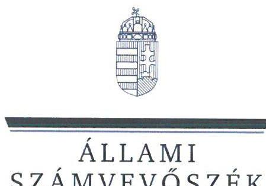
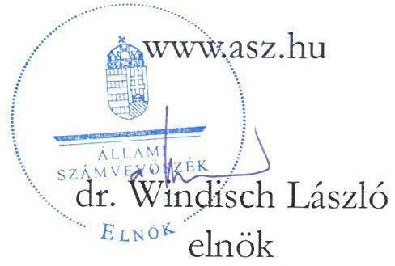
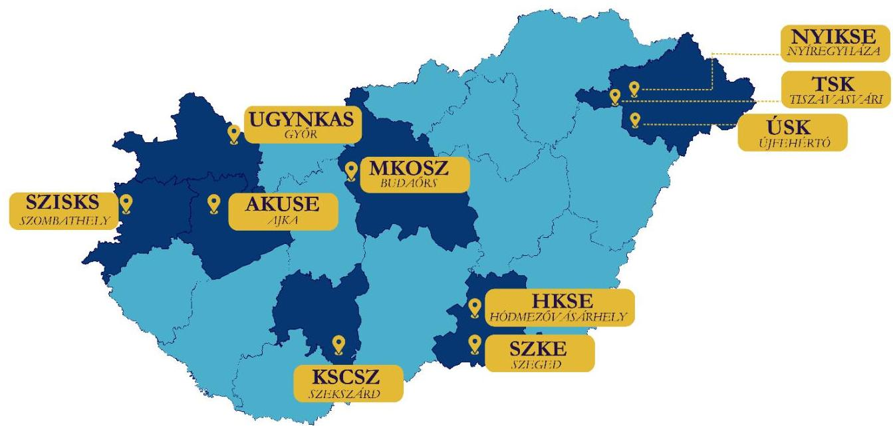
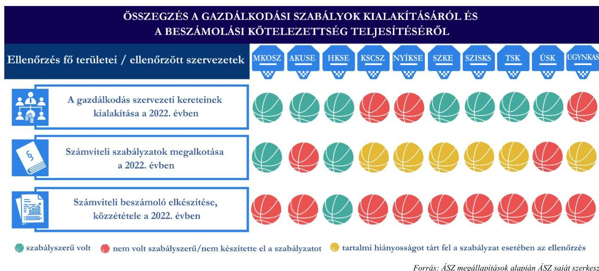
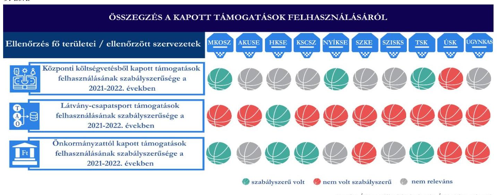
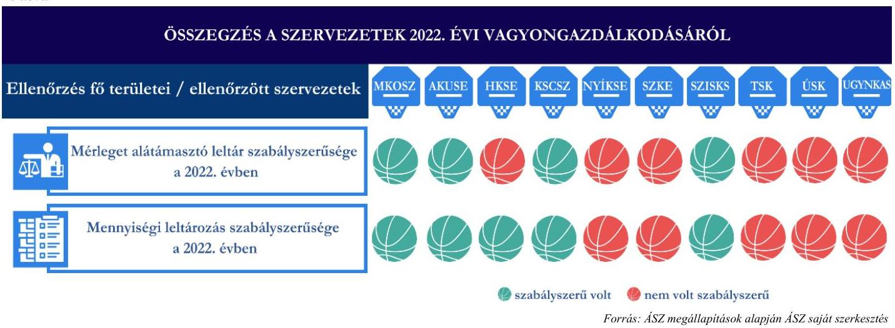

# JELENTÉS 

Támogatásban részesülő sportszövetségek és sportegyesületek gazdálkodásának ellenőrzése

## KOSÁRLABDA

2024.

---

ÁLLAMI
SZÁMVEVŐSZÉK

# JELENTÉS 

## Támogatásban részesülő sportszövetségek és sportegyesületek gazdálkodásának ellenőrzése

## KOSÁRLABDA

2024. 

24031

---

# ELLENŐRZÉSI IGAZGATÓSÁG: 

## ÁLLAMHÁZTARTÁSON KÍVÜLI SZERVEZETEKET ELLENŐRZŐ IGAZGATÓSÁG

## ELLENŐRZÉSI IGAZGATÓ:

## KLINGA LÁSZLÓ igazgató

## ELLENŐRZÉSVEZETŐ:

Jelentéseink az interneten a www.asz.hu címen olvashatók.

## KAKAS SÁNDOR ellenőrzésvezető

IKTATÓSZÁM: EL-4060-001/2024.
TÉMASZÁM: 2682
ELLENŐRZÉS-AZONOSÍTÓ SZÁM: V1026

---

# TARTALOMJEGYZÉK 

AZ ELLENŐRZÉS ALAPADATAI ..... 5
AZ ELLENŐRZÖTT SZERVEZETEK ..... 7
ÖSSZEFOGLALÁS ..... 12
AZ ELLENŐRZÉS FÓKUSZKÉRDÉSEI ..... 16
MEGÁLLAPÍTÁSOK ..... 17
JAVASLATOK ..... 44
MELLÉKLETEK ..... 52
I. sz. melléklet: Értelmező szótár ..... 52
II. sz. melléklet: Az ellenőrzött szervezetek jegyzéke ..... 54
III. sz. melléklet: Ellenőrzési kritériumok ..... 55
IV. sz. melléklet: Az ellenőrzött szervezetek főbb gazdálkodási adatai ..... 56
FÜGGELÉK: ÉSZREVÉTELEK ..... 57
RÖVIDÍTÉSEK JEGYZÉKE ..... 82

---

.

---

# AZ ELLENŐRZÉS ALAPADATAI 

## AZ ELLENŐRZÉS CÉLJA

Az ellenőrzés célja az államháztartásból nyújtott támogatással, vagy az államháztartásból meghatározott célra ingyenesen juttatott vagyon felhasználásával érintett sportszövetségek és sportegyesületek gazdálkodása szabályozottságának, gazdálkodási tevékenységének, ezen belül a beszámolási kötelezettség teljesítésének, a támogatások elkülönített nyilvántartásának, valamint a támogatások felhasználásának ellenőrzése.

## AZ ELLENŐRZÉS TÍPUSA

Szabályszerűségi ellenőrzés.

## AZ ELLENŐRZÖTT IDŐSZAK

Az 1. fókuszkérdés esetében a 2022. év.
A 2-3. fókuszkérdés vonatkozásában a 2021-2022. évek.
A 4. fókuszkérdés vonatkozásában a 2022. év, a mennyiségi felvétellel történő leltározás dokumentumai tekintetében a 2020-2022. évek.

## AZ ELLENŐRZÉS TÁRGYA

Az ellenőrzés tárgya a támogatásban részesülő sportszövetségek, sportegyesületek gazdálkodása szabályozottságának, gazdálkodási tevékenységén belül a beszámolási kötelezettség teljesítésének, a vagyonnyilvántartásának, a támogatások elkülönített nyilvántartásának, valamint az államháztartási forrásból származó közvetlen vagy közvetett támogatások és a meghatározott célra ingyenesen juttatott vagyon felhasználásának a vizsgálata volt. Az ellenőrzés a támogatások vonatkozásában kiterjedt továbbá a támogató felé történő beszámolási és elszámolási kötelezettségek teljesítésére, a költségvetésből kapott támogatások továbbadásának szabályszerűségére, az ezekkel kapcsolatos jogszabályi és belső előírások betartására.

Az ellenőrzés kiterjedt minden olyan körülményre és adatra, amely az ÁSZ¹ jogszabályban meghatározott feladatainak teljesítéséhez, valamint az ellenőrzés program végrehajtása során felmerülő újabb összefüggések feltárásához szükséges.

Az ÁSZ tv.² 25. § (3) bekezdésében meghatározottak alapján, amennyiben a rendelkezésre bocsátott dokumentumok, adatok, illetve tájékoztatás hitelességének, megalapozottságának, teljességének megállapítása vagy egyes ellenőrzési megállapítások alátámasztása, kiegészítése indokolta, az ellenőrzés tárgyát képezték az összefüggő tények vizsgálatához más szervezetek (ellenőrzést támogató szervezetek) által rendelkezésre bocsátott adatok, dokumentációk, megadott tájékoztatások, illetve az ott végzett ellenőrzés is.

---

# Az ellenőrzés jogalapja 

Az ellenőrzés jogszabályi alapját az ÁSZ tv. 1. § (3) bekezdése, az 5. § (3) bekezdése, valamint a Civil tv.³ 47. § előírásai képezték.

## Az ELLENŐRZÉS MÓDSZERE

Az ellenőrzést a nemzetközi standardokat irányadónak tekintve az ellenőrzési program szempontjai, az ellenőrzött időszakban hatályos jogszabályok, az ellenőrzés általános szakmai szabályai, az ellenőrzésre irányadó ÁSZ módszertanok figyelembevételével végezte az ÁSZ.

Az ellenőrzési kérdések megválaszolásához szükséges bizonyítékok megszerzése az ellenőrzött szervezet által rendelkezésre bocsátott dokumentumokra, adatokra alapozva kérdésfeltevés (információkérés), interjú, mintavételezés útján történt. A támogatásból beszerzett tárgyi eszközök használatára, fizikai fellelhetőségére irányulóan az érintett vagyontárgyak helyszíni szemle keretében történő szemrevételezésére indokolt esetben sor került.

Az ellenőrzési bizonyítékként felhasználható adatforrások közé tartoztak egyrészt az ellenőrzés során az ellenőrzött szervezettől bekért dokumentumok, másrészt adatforrás lehetett minden további, az ellenőrzés folyamán feltárt, az ellenőrzés szempontjából információt tartalmazó dokumentum.

Az ellenőrzés lefolytatásához az ellenőrzött szervezet tanúsítványok kitöltésével, hitelesítésével, adatok, dokumentumok rendelkezésre bocsátásával, valamint az ellenőrzés során interjú, helyszíni szemrevételezés keretében szolgáltatott adatokat, dokumentumokat.

A támogatásokkal, azok felhasználásával, a továbbadott támogatásokkal kapcsolatos kötelezettségek vizsgálatára mintavételi eljárások kerültek alkalmazásra. Támogatás-típusok szerint nagyságrend alapján 1-3 darab támogatás került részletes vizsgálat alá. Ezen támogatások felhasználásának szabályszerűsége támogatásonként kockázatértékelés alapján kiválasztott mintatételekkel került ellenőrzésre. A kiválasztott támogatási szerződésekhez kapcsolódó elszámolásokból 30-30 db mintatétel került ellenőrzésre, ahol az elszámolás nem érte el a 30 db -ot, ott tételes ellenőrzésre került sor. Ezen felül a vagyongazdálkodás szabályszerűségének ellenőrzéséhez is kockázatalapú mintavétel kapcsolódott. A támogatások felhasználása és a vagyongazdálkodás területén a minták ellenőrzése kiterjedt a könyvvezetési kötelezettség vizsgálatára is. A tárgyi eszközök tekintetében 30 db került kiválasztásra a 2022. évben állományban lévő eszközök közül azok nyilvántartásának, elszámolásának szabályszerűsége ellenőrzése céljából. A kiválasztott mintatételek ellenőrzésének eredménye nem került kivetítésre a teljes sokaságra, a megállapítások az adott ellenőrzött mintatételek vonatkozásában kerültek megjelenítésre.

---

# **AZ ELLENŐRZÖTT SZERVEZETEK**

Az ellenőrzött szervezetek a Cnytv.⁴ 4. § c), d) pontjai alapján a bírósági nyilvántartásban szereplő, a Civil tv. és a Ptk.⁵ alapján létrehozott olyan egyesületek, amelyek a Sport tv. szerinti országos sportági szakszövetségnek, illetve sportszövetségnek vagy sportegyesületnek és a Számv. tv.⁶ 3. § (1) bekezdés 4. a) pontja szerinti egyéb szervezeteknek minősülnek, és amelyek az ellenőrzött időszakban költségvetési, és/vagy önkormányzati és/vagy látvány-csapatsport támogatásban részesültek.

Az ellenőrzött szervezetek területi elhelyezkedését az 1. ábra mutatja:

*1. ábra*

*Forrás: ÁSZ saját szerkesztés*

## **Magyar Kosárlabdázók Országos Szövetsége**

A Magyar Kosárlabdázók Országos Szövetsége (MKOSZ) az 1942-ben alapított és az Ifjúsági és Sportminisztérium által az 1996. évi LXIV. törvény alapján nyilvántartásba vett szervezet jogutódja. Sportági szakszövetségként 1998-ban vette nyilvántartásba az Ifjúsági és Sportminisztérium. Egyesületi formában, közhasznú jogállású szervezetként működik. Alapvető célja az alapszabálya szerint a FIBA⁷ versenyszabályainak megfelelő, a "*fair play*" szellemű kosárlabda sport irányítása, szervezése, fejlesztése és népszerűsítése, vallási, faji és politikai diszkrimináció nélkül, mindkét nemben, minden korosztályban és bajnoki osztályban, valamint a sportág nemzetközi szereplésének elősegítése.

|  AZ MKOSZ ÁLTAL IGÉNYBE VETT TÁMOGATÁSOK (ADATOK M FT-BAN) |  |   |
| --- | --- | --- |
|   | 2021. év | 2022. év  |
|  Központi költségvetési | 998,0 | 70,8  |
|  Helyi önkormányzati | 3,9 | 3,3  |
|  Látvány-csapatsport | 3 218,3 | 4 989,7  |

*Forrás: Az ellenőrzött szervezet főkönyvi adatai alapján ÁSZ saját szerkesztés*

---

# AJKAI UTÁNPÓTLÁS KOSÁRLABDA SPORTEGYESÜLET

A 2015-ben alapított Ajkai Utánpótlás Kosárlabda Sportegyesület (AKUSE) célja a kosárlabda sport népszerűsítése, a sportág iránti érdeklődés felkeltése, a játék megszerettetése, utánpótlás csapatainak bemutatkozása, a tehetséges fiatalok kiválasztása, a kosárlabda iskolai oktatásba való beépítésének elősegítése. 2. táblázat

|  AZ AKUSE ÁLTAL IGÉNYBE VETT TÁMOGATÁSOK (ADATOK M FT-BAN) |  |   |
| --- | --- | --- |
|   | 2021. év | 2022. év  |
|  Központi költségvetési | - | -  |
|  Helyi önkormányzati | - | -  |
|  Látvány-csapatsport | 79,3 | 35,5  |

Forrás: Az ellenőrzött szervezet főkönyvi adatai alapján ÁSZ saját szerkesztés

## HÓDMEZŐVÁSÁRHELYI KOSÁRSULI SPORTEGYESÜLET

A Hódmezővásárhelyi Kosársuli Sportegyesületet (HKSE) 1994-ben 31 fő magánszemély alapította. Célja a sporttevékenység, a kosárlabda sport népszerűsítése, Hódmezővásárhely férfi élsportoló utánpótlásának saját nevelésű fiatalokkal való biztosítása, a fiú általános- és középiskolás korosztály, valamint a felnőttek rendszeres sportolásának, testmozgásának biztosítása, illetőleg versenyeztetése. 3. táblázat

|  A HKSE ÁLTAL IGÉNYBE VETT TÁMOGATÁSOK (ADATOK M FT-BAN) |  |   |
| --- | --- | --- |
|   | 2021. év | 2022. év  |
|  Központi költségvetési | - | -  |
|  Helyi önkormányzati | 1,6 | 0,5  |
|  Látvány-csapatsport | 67,1 | 80,4  |

Forrás: Az ellenőrzött szervezet főkönyvi adatai alapján ÁSZ saját szerkesztés

## KOSÁRLABDA SPORT CLUB SZEKSZÁRD

A Kosárlabda Sport Club Szekszárd (KSCSZ) 1988-ban kezdte meg tevékenységét. Alapszabályában foglaltak alapján sportolási és testedzési lehetőséget biztosít, a működési területén található nevelési, oktatási intézmények tanulóit, hallgatóit megismerteti és bevonja a kosárlabda sportba, ennek során tehetségkutatást, tehetséggondozást végez, továbbá a kosárlabda sportot, mint versenysportot és mint szabadidős sporttevékenységet népszerűsíti. 4. táblázat

|  A KSCSZ ÁLTAL IGÉNYBE VETT TÁMOGATÁSOK (ADATOK M FT-BAN) |  |   |
| --- | --- | --- |
|   | 2021. év | 2022. év  |
|  Központi költségvetési | 84,4 | 6,7  |
|  Helyi önkormányzati | 52,3 | 22,3  |
|  Látvány-csapatsport | 168,4 | 169,1  |

Forrás: Az ellenőrzött szervezet főkönyvi adatai alapján ÁSZ saját szerkesztés

---

# Nyíregyházi Kosárlabdát Szeretők Közhasznú Sportegyesülete

A Nyíregyházi Kosárlabdát Szeretők Közhasznú Sportegyesületet (NYÍKSE) 2011-ben alapították. Alapvető célja az alapszabálya szerint, a sporttevékenységek feltételeinek megteremtése, szervezése, az egyesület tagjaival és igazolt versenyzőivel részvétel sportrendezvényeken, bajnokságokon. Célja továbbá Nyíregyháza sportéletének színesítése, valamint a korosztályosan egymásra épülő utánpótlás kosárlabda-csapatok nevelésének támogatása. 5. táblázat

|  A NYÍKSE ÁLTAL IGÉNYBE VETT TÁMOGATÁSOK (ADATOK M FT-BAN) |  |   |
| --- | --- | --- |
|   | 2021. év | 2022. év  |
|  Központi költségvetési | 10,4 | 2,4  |
|  Helyi önkormányzati | - | -  |
|  Látvány-csapatsport | 67,1 | 43,6  |

Forrás: Az ellenőrzött szervezet főkönyvi adatai alapján ÁSZ saját szerkesztés

## Szegedi Kosárlabda Egylet

A Szegedi Kosárlabda Egyletet (SZKE) 1996-ban alapították. Célja a tagok részére rendszeres sportolási, testedzési és versenyzési lehetőség biztosítása, az utánpótlásnevelés és a versenysport feltételeinek megteremtése, a sporteredményesség ösztönzése. 6. táblázat

|  AZ SZKE ÁLTAL IGÉNYBE VETT TÁMOGATÁSOK (ADATOK M FT-BAN) |  |   |
| --- | --- | --- |
|   | 2021. év | 2022. év  |
|  Központi költségvetési | - | -  |
|  Helyi önkormányzati | 2,0 | 3,0  |
|  Látvány-csapatsport | 131,8 | 18,7  |

Forrás: Az ellenőrzött szervezet főkönyvi adatai alapján ÁSZ saját szerkesztés

## Szombathelyi Ifjú Sólymok Kosárlabda Sportegyesület

A Szombathelyi Ifjú Sólymok Kosárlabda Sportegyesületet (SZISKS) 1999-ben alapították. Alapszabályában rögzített elsődleges célja a kosárlabda sport népszerűsítése Szombathelyen és vonzáskörzetében, a férfi élsportoló utánpótlásnak saját nevelésű fiatalokkal való biztosítása Az általános- és középiskolás korosztály rendszeres sportolásának, testmozgásának biztosítása, majd versenyeztetése. Kiemelt feladatának tekinti elsődlegesen a széles tömegbázis kialakítását (Szombathelyen kívül a megye további hat településén működtet csoportot), valamint 15 éves korig a folyamatos oldalági beiskolázást. Másodlagosan azoknak a gyerekeknek, akik nem kerültek az akadémia csoportjaiba, az edzési és versenyzési lehetőség megteremtését 18 éves korig. A SZIKS célja egy nemzetközi szintű utánpótlásközpont létrehozása. 7. táblázat

A SZISKS ÁLTAL IGÉNYBE VETT TÁMOGATÁSOK (ADATOK M FT-BAN)

|   | 2021. év | 2022. év  |
| --- | --- | --- |
|  Központi költségvetési | - | -  |
|  Helyi önkormányzati | - | -  |
|  Látvány-csapatsport | 110,7 | 35,3  |

Forrás: Az ellenőrzött szervezet főkönyvi adatai alapján ÁSZ saját szerkesztés

---

# TISZAVASVÁRI SPORT KLUB

A Tiszavasvári Sport Klub (TSK) 2006-ban alakult. Kiemelten foglalkozik a hátrányos helyzetű emberek sportolásának szervezésével. Alapszabálya szerint elsődleges célja tagjai és sportolói részére a rendszeres sportolás, versenyzés, testedzés, felüdülés biztosítása,

 az ilyen igények felkeltése, szervezett formában. 8. táblázat

|  A TSK ÁLTAL IGÉNYBE VETT TÁMOGATÁSOK (ADATOK M FT-BAN) |  |   |
| --- | --- | --- |
|   | 2021. év | 2022. év  |
|  Központi költségvetési | - | 4,2  |
|  Helyi önkormányzati | - | -  |
|  Látvány-csapatsport | 17,4 | 19,5  |

Forrás: Az ellenőrzött szervezet főkönyvi adatai alapján ÁSZ saját szerkesztés

## Újfehértói Sportklub

Az Újfehértói Sportklub (ÚSK), mint sportegyesület 2016. szeptember 13-tól látja el a versenysport szervezésével, a helyi sportértékek ápolásával, a sport-hagyományőrzéssel, sportrendezvények szervezésével, közösségépítéssel, a fiatalok sportolási lehetőségének szervezésével, sporttáborok szervezésével, valamint sportvetélkedők szervezésével kapcsolatos feladatait. A 2016. szeptember 13. előtti időszakban egyesületi formában működő szociális tevékenységet ellátó szervezet volt, amelyet 2008-ban alapítottak; Együtt a jövőnkért Szociális Egyesület, majd 2011. október 21-től Generációk Szövetsége elnevezéssel. 9. táblázat

|  AZ ÚSK ÁLTAL IGÉNYBE VETT TÁMOGATÁSOK (ADATOK M FT-BAN) |  |   |
| --- | --- | --- |
|   | 2021. év | 2022. év  |
|  Központi költségvetési | - | -  |
|  Helyi önkormányzati | 2,5 | 1,9  |
|  Látvány-csapatsport* | 84,6 | 38,9  |

## UNI Győr Nemzeti Kosárlabda Akadémia Sportegyesület

Az UNI Győr Nemzeti Kosárlabda Akadémia Sportegyesület (UGYNKAS) (korábbi neve a 2010. március 26. - 2023. június 28. közötti időszakban Széchenyi Kosárlabda Akadémia Sport Egyesület) alapszabályában meghatározott alapvető célja a kosárlabda sport népszerűsítése, a győri kosárlabdázók baráti kapcsolatának ápolása. Továbbá szervezett keretek biztosítása különböző nemű és korosztályú sport- és kulturális rendezvények szervezése, kosárlabda oktatása, táborok szervezése, a győri kosárlabda fejlődését megalapozó utánpótlás nevelés.

Az UGYNKAS a 2002-2022. közötti időszakban kilenc db korlátolt felelősségű társaságot, 2023-ban egy zártkörűen működő részvénytársaságot alapított, „Egyéb sporttevékenység", mint főtevékenység végzésére.

[^0] [^0]: * Az ÚSK esetében a labdarúgás és a kosárlabda szakágak vonatkozásában igénybevett látvány-csapatsport támogatásokat is tartalmazza.

---

10. táblázat

# AZ UGYNKAS ÁLTAL IGÉNYBE VETT TÁMOGATÁSOK (ADATOK M FT-BAN) 

|  |  |  |  |  |  |  |  |  |  |  |  |  |  |  |  |  |  |  |  |  |  |  |  |  |  |  |  |  |  |  |  |  |  |  |  |  |  |  |  |  |  |  |  |  |  |  |   |
| --- | --- | --- | --- | --- | --- | --- | --- | --- | --- | --- | --- | --- | --- | --- | --- | --- | --- | --- | --- | --- | --- | --- | --- | --- | --- | --- | --- | --- | --- | --- | --- | --- | --- | --- | --- | --- | --- | --- | --- | --- | --- | --- | --- | --- | --- | --- | --- | --- | --- | --- | --- | --- | --- | --- | --- | --- | --- | --- | --- | --- | --- | --- | --- | --- | --- | --- | --- | --- | --- | --- | --- | --- | --- | --- | --- | --- | --- | --- | --- | --- | --- | --- | --- | --- | --- | --- | --- | --- | --- | --- | --- | --- | --- | --- | --- | --- | --- | --- | --- | ---

---

# ÖSSZEFOGLALÁS 

Magyarország Alaptörvényének XX. cikke kimondja, hogy mindenkinek joga van a testi és lelki egészséghez, melynek érvényesülését Magyarország többek között a sportolás és a rendszeres testedzés támogatásával segíti elő. Az Országgyűlés a Sport tv. ${ }^{8}$-ban kinyilvánította, hogy a nemzet közössége a test művelését, a sportot, a nemzet alapértékének, kívánatos célnak tekinti. A sport a közjó része. Erősíti a közösség tagjainak egymáshoz tartozását, miként az egyén testi és lelki egészségét.

A sportegyesületek, sportszövetségek működésükre és szakmai tevékenységük ellátására költségvetési támogatásban, önkormányzati támogatásban, ingyenes vagyonjuttatásban, valamint látvány-csapatsport támogatásban részesülhetnek, amelyekre fokozott figyelem irányul.

A társadalom részéről jogosan felmerülő elvárás, hogy a közpénzeket kezelő, azzal gazdálkodó szervezetek működéséről, tevékenységéről átfogó képet kapjon, a közpénzek rendeltetésszerű és átlátható módon történő felhasználásának értékelésére időről-időre sor kerüljön az ellenőrzések keretében.

A gazdálkodási szabályok kialakítása, valamint a könyvvezetési és beszámolási kötelezettség teljesítése a 2022. évben egy szervezet tekintetében volt szabályszerű, kilenc esetében nem volt szabályszerű.

A könyvviteli szolgáltatás személyi feltételeit minden ellenőrzött szervezet biztosította. A könyvvizsgálatra kötelezett három ellenőrzött szervezetből egy gondoskodott, kettő a jogszabályi előírás ellenére nem gondoskodott a 2022. évi beszámoló vonatkozásában a könyvvizsgálat elvégzéséről. Felügyelőbizottságot, felügyelő szervet az annak létrehozására kötelezett hat ellenőrzött szervezet közül négy szabályszerűen létrehozta, kettő szervezet a jogszabályi előírás ellenére nem hozta létre. A jogszabályban előírt számviteli szabályzatokat két ellenőrzött szervezet készítette el szabályszerűen, két szervezet nem készített el minden, a törvényben előírt szabályzatot. Hat ellenőrzött szervezetnél a kialakított számviteli szabályzatok esetében az ellenőrzés tartalmi hiányosságokat tárt fel. A számviteli beszámolót az ellenőrzöttek közül mindössze egy készítette el és tette közzé szabályszerűen. Kilenc ellenőrzött szervezet esetében az ellenőrzés hiányosságokat tárt fel, többek között a számviteli beszámoló közzétételének hiánya, a beszámoló tartalmi hibái miatt.

Az UGYNKAS esetében súlyos szabálytalanságokat tárt fel az ellenőrzés a könyvvezetési kötelezettség teljesítése területén, mert a 2022. évben a jogszabályi előírásokat megsértve bizonylat nélkül könyvelt gazdasági eseményeket, indokolatlanul engedett el kölcsönt az általa létrehozott gazdasági társaság részére, bizonylatok nélkül rögzített követeléseket a számviteli nyilvántartásába. Az esettel kapcsolatban az ÁSZ a törvényi kötelezettségének eleget téve megkereste az illetékes hatóságot.

---

# 2. ábra 

A központi költségvetésből kapott támogatások felhasználása a 2021-2022. években a négy érintett szervezet közül egynél nem volt szabályszerű, a felhasználás jogszabályban előírt elkülönített könyvviteli nyilvántartásának hiánya miatt.

A látvány-csapatsport támogatások felhasználása a 2021-2022. években az érintett tíz ellenőrzött szervezetből kilenc esetében nem volt szabályszerű, többek között a jogszabályban előírt támogatás felhasználás könyvvitelben való elkülönítésének hiánya, valamint a jogszabályban előírt könyvvizsgálat, illetve a támogatás felhasználását igazoló számviteli bizonylatok záradékolásának elmaradása miatt.

Az UGYNKAS esetében súlyos szabálytalanságot tárt fel az ellenőrzés a látvány-csapatsport támogatások felhasználásával kapcsolatban, mivel két sportfejlesztési program meghosszabbításának kérelméhez a fel nem használt összegek bankszámlán történő rendelkezésre állásának igazolásához valótlan tartalmú dokumentumokat (bankszámlakivonatok) nyújtott be a támogató felé. A valótlan tartalmú bankszámlakivonatokkal összesen $405,7 \mathrm{M}$ Ft összegű fel nem használt támogatás rendelkezésre állását igazolta a támogató felé, azonban a bankszámlakivonatokon szereplő pénzösszegek az ellenőrzött szervezet bankszámláin valójában teljeskörűen nem álltak rendelkezésre. Az esettel kapcsolatban az ÁSZ a törvényi kötelezettségének eleget téve megkereste az illetékes hatóságot.

Az önkormányzati támogatások felhasználása a 2021-2022. években nem volt szabályszerű a hét önkormányzati támogatással érintett ellenőrzött szervezet közül három esetében a könyvviteli nyilvántartásban való elkülönített nyilvántartás hiányossága, hiánya miatt. A támogatások felhasználásának könyvviteli rendszerben való elkülönített nyilvántartásának hiánya miatt a támogatások felhasználásának ellenőrizhetősége korlátozott.

Az SZKE 0,9 M Ft összegben jogellenesen használt fel támogatást, mivel a 2022. évben egy gazdasági eseményről kiállított számlát teljes összegben mind a látvány-csapatsport támogatás elszámolásához, mind az önkormányzati támogatás elszámolásához is benyújtott a támogató szervezetek felé. Ez kettős finanszírozásnak minősül, így az esettel kapcsolatban az ÁSZ a törvényi kötelezettségének eleget téve megkeresi az illetékes hatóságot.

---

Az ellenőrzött időszakban az MKOSZ adott tovább költségvetésből kapott támogatást egy sportvállalkozás részére. A költségvetésből kapott támogatás továbbadása nem volt szabályszerű. Az MKOSZ olyan szervezet számára adott tovább 478,4 M Ft költségvetési támogatást, amely a jogszabályban előírtak alapján arra nem volt jogosult.

Hét ellenőrzött szervezet vagyongazdálkodása nem volt szabályszerű a 2022. évben, elsősorban a mérlegtételeket alátámasztó év végi leltár hiánya, hiányossága miatt, valamint a tárgyi eszközök mennyiségi felvétellel történő leltározásának hiánya miatt. Egy szervezet nem szabályszerűen tett eleget a selejtezési kötelezettségének a 2022. évben.

Három szervezet esetében az ÁSZ ellenőrzés a Számv. tv. szerinti jelentős összegű hibát tárt fel a 2022. évi beszámoló vonatkozásában, így a beszámoló nem mutat megbízható, valós képet a szervezetek vagyoni helyzetéről.
4. ábra

Az ÁSZ az ellenőrzések során feltárt hiányosságok megszüntetése érdekében a főtitkárnak négy, az elnökök részére 77 javaslatot fogalmazott meg.

Az SZKE elnöke az ÁSZ tv. 29. § (2) bekezdés szerinti, a jelentéstervezet megállapításaira tett észrevételében arról tájékoztatta az ÁSZ-t, hogy intézkedéseket tett az ÁSZ ellenőrzés során felmerült

---

hiányosságok megszüntetése érdekében, melynek eredményeként a számlarend a 2023. évben javításra került, továbbá gondoskodott a 2022. évi beszámoló honlapon történő megjelenítéséről.

Az UGYNKAS elnöke az ÁSZ tv. 29. § (2) bekezdés szerinti, a jelentéstervezet megállapításaira tett észrevételében arról tájékoztatta az ÁSZ-t, hogy intézkedéseket tett az ÁSZ ellenőrzés során felmerült hiányosságok megszüntetése érdekében, melynek eredményeként a 2023 évi beszámoló könyvvizsgáló által hitelesítve lesz, továbbá a 2023. évben létrehozta a Felügyelőbizottságot.

Az ellenőrzés folyamatában megtett intézkedések hozzájárultak az ÁSZ megállapításainak hasznosulásához.

Az ÁSZ véleménye a tíz szervezet ellenőrzése során feltárt számos hiányosság alapján, hogy az államháztartási forrásokból származó sportcélú támogatásokat felelőtlenül kezelik. A feltárt szabálytalanságok a támogatási összegek nem cél szerinti felhasználására utalnak, ami a kitűzött támogatási célok elérését veszélyeztetheti. Azon esetekben, ahol súlyos szabálytalanságokat tárt fel az ellenőrzés indokolt lehet a támogató szervezetek részéről a megítélt és elszámolt támogatások vonatkozásában átfogó ellenőrzést lefolytatni és a jövőbeni támogatások odaítélése során az ellenőrzés eredményeit figyelembe venni. A kettős finanszírozás megelőzéséhez egy átfogó támogatási nyomonkövetési rendszer kialakítása lehet indokolt. A vagyongazdálkodás területén feltárt szabálytalanságok azt mutatják, hogy az ellenőrzött szervezetek nem járnak el felelősen a vagyonelemek nyilvántartása és használata kapcsán, ezért indokolt lehet olyan szabályozás megalkotása, amely rögzíti, hogy az államháztartási forrásokból beszerzett eszközök (gépjárművek) esetében a cél szerinti felhasználást igazoló nyilvántartást szükséges vezetni. A beszámolók és a könyvvezetés kapcsán feltárt szabálytalanságok miatt felmerül a kockázata, hogy a beszámolók adatai nem megbízhatóak, a támogatásból megvalósult eszközök megléte, cél szerinti felhasználásának ellenőrzése nem biztosított.

---

# AZ ELLENŐRZÉS FÓKUSZKÉRDÉSEI 

1.     - A gazdálkodási szabályok
 kialakítása, a könyvvezetési és beszámolási kötelezettség teljesítése szabályszerű volt-e?
2.     - A kapott támogatások felhasználása szabályszerű volt-e
3.     - A költségvetésből kapott támogatások továbbadása szabályszerűen valósult-e meg?
4.     - Az ellenőrzött szervezet vagyongazdálkodása szabályszerű volt-e?

---

# 1. A gazdálkodási szabályok kialakítása, a könyvvezetési és beszámolási kötelezettség teljesítése szabályszerű volt-e? 

Összegző megállapítás

A gazdálkodási szabályok kialakítása, a könyvvezetési és beszámolási kötelezettség teljesítése a 2022. évben egy szervezet esetében szabályszerű volt, kilenc szervezet esetében nem volt szabályszerű.
1.1. számú megállapítás

A 2022. évben hét szervezet a gazdálkodásának szervezeti kereteit szabályszerűen kialakította, három szervezet nem szabályszerűen alakította ki.
12. táblázat

ÖSSZEFOGLALÓ A GAZDÁLKODÁS SZERVEZETI KERETEINEK KIALAKÍTÁSÁRÓL A 2022. ÉV VONATKOZÁSÁBAN

|  | MKOSZ | AKUSE | HESZ | KICSZ | NYIKSE | SZKE | SZISKS | TSK | CSK | UGYNKAS |
| :--: | :--: | :--: | :--: | :--: | :--: | :--: | :--: | :--: | :--: | :--: |
| Könyvviteli szolgáltatás személyi feltételeinek megteremtése | I | I | I | I | I | I | I | I | I | I |
| Könyvvizsgálati kötelezettség teljesítése a beszámoló vonatkozásában | I | - | - | N | - | - | - | - | - | N |
| Felügyelőbizottság/felügyelő szerv létrehozása | I | I | I | I | N | - | - | - | - | N |
| Jelmagyarázat: $I=$ szabályszerű volt, $N=$ nem volt szabályszerű, $=$ nem releváns |  |  |  |  |  | Forrás: $\triangle SZ$ megállapítások alapján $\triangle SZ$ saját szerkesztés |  |  |  |  |

## MAGYAR KOSÁRLABDÁZÓK ORSZÁGOS SZÖVETSÉGE

A 2022. évben az MKOSZ a Számv. tv. és a Civilszr. ${ }^{\circ}$-ben foglalt jogszabályi előírások betartásával gondoskodott a könyvviteli szolgáltatás személyi feltételeinek megteremtéséről, a könyvviteli szolgáltatás körébe tartozó feladatok ellátásával megbízott személy és szervezet megfelelt a jogszabályi előírásoknak.
Az MKOSZ a 2022. évben a Civilszr.-ben előírtaknak megfelelően a könyvvizsgálati kötelezettségének eleget tett.
A Ptk. előírása szerint létrehozta a felügyelőbizottságot, a felügyelőbizottság tagjainak száma megfelelt a Ptk. előírásainak, közhasznú jogállására tekintettel a Civil tv.-nek megfelelően a felügyelőbizottság megállapította ügyrendjét.

## AJKAI UTÁNPÓTLÁS KOSÁRLABDA SPORTEGYESÜLET

A 2022. évben az AKUSE a Számv. tv. és a Civilszr.-ben foglalt jogszabályi előírások betartásával gondoskodott a könyvviteli szolgáltatás személyi feltételeinek megteremtéséről, a könyvviteli szolgáltatás körébe tartozó feladatok ellátásával megbízott személy megfelelt a jogszabályi előírásoknak.
A Ptk. előírása szerint létrehozta a felügyelőbizottságot, a felügyelőbizottság tagjainak száma megfelelt a Ptk. előírásainak.

---

# HÓDMEZŐVÁSÁRHELYI KOSÁRSULI SPORTEGYESÜLET 

A 2022. évben a HKSE a Számv. tv. és a Civilszr.-ben foglalt jogszabályi előírások betartásával gondoskodott a könyvviteli szolgáltatás személyi feltételeinek megteremtéséről, a könyvviteli szolgáltatás körébe tartozó feladatok ellátásával megbízott személy megfelelt a jogszabályi előírásoknak.
A Ptk. előírása szerint létrehozta a felügyelőbizottságot, a felügyelőbizottság tagjainak száma megfelelt a Ptk. előírásainak.

## KOSÁRLABDA SPORT CLUB SZEKSZÁRD

A 2022. évben a KSCSZ a Számv. tv. és a Civilszr.-ben foglalt jogszabályi előírások betartásával gondoskodott a könyvviteli szolgáltatás személyi feltételeinek megteremtéséről, a könyvviteli szolgáltatás körébe tartozó feladatok ellátásával megbízott szervezet megfelelt a jogszabályi előírásoknak.
A KSCSZ a 2022. évben a Civilszr. 16. § (1) bekezdésében előírtak ellenére könyvvizsgálati kötelezettségének nem tett eleget, mert a beszámolót nem vizsgáltatta felül könyvvizsgálóval, annak ellenére, hogy éves bevétele az üzleti évet megelőző két üzleti év átlagában meghaladta a 300 M Ft -ot.
A Ptk. előírása szerint létrehozta a felügyelőbizottságot, a felügyelőbizottság tagjainak száma megfelelt a Ptk. előírásainak, közhasznú jogállására tekintettel a Civil tv.-nek megfelelően a felügyelőbizottság megállapította ügyrendjét.

## NYÍREGYHÁZI KOSÁRLABDÁT SZERETŐK KÖZHASZNÚ SPORTEGYESÜLETE

A 2022. évben a NYÍKSE a Számv. tv. és a Civilszr.-ben foglalt jogszabályi előírások betartásával gondoskodott a könyvviteli szolgáltatás személyi feltételeinek megteremtéséről, a könyvviteli szolgáltatás körébe tartozó feladatok ellátásával megbízott szervezet megfelelt a jogszabályi előírásoknak.
A NYÍKSE a 2022. évben a Civil tv. 40. § (1) bekezdésében előírtak ellenére nem gondoskodott a vezető szervtől elkülönült felügyelő szerv létrehozásáról.

## SZEGEDI KOSÁRLABDA EGYLET

A 2022. évben az SZKE a Számv. tv. és a Civilszr.-ben foglalt jogszabályi előírások betartásával gondoskodott a könyvviteli szolgáltatás személyi feltételeinek megteremtéséről, a könyvviteli szolgáltatás körébe tartozó feladatok ellátásával megbízott személy megfelelt a jogszabályi előírásoknak.

## SZOMBATHELYI IFJÚ SÓLYMOK KOSÁRLABDA SPORTEGYESÜLET

A 2022. évben a SZISKS a Számv. tv. és a Civilszr.-ben foglalt jogszabályi előírások betartásával gondoskodott a könyvviteli szolgáltatás személyi feltételeinek megteremtéséről, a könyvviteli szolgáltatás körébe tartozó feladatok ellátásával megbízott szervezet megfelelt a jogszabályi előírásoknak.

## TISZAVASVÁRI SPORT KLUB

A 2022. évben a TSK a Számv. tv. és a Civilszr.-ben foglalt jogszabályi előírások betartásával gondoskodott a könyvviteli szolgáltatás személyi feltételeinek megteremtéséről, a könyvviteli szolgáltatás körébe tartozó feladatok ellátásával megbízott személy megfelelt a jogszabályi előírásoknak.

## ÚJFEHÉRTÓI SPORTKLUB

A 2022. évben az ÜSK a Számv. tv. és a Civilszr.-ben foglalt jogszabályi előírások betartásával gondoskodott a könyvviteli szolgáltatás személyi feltételeinek megteremtéséről, a könyvviteli szolgáltatás körébe tartozó feladatok ellátásával megbízott személy megfelelt a jogszabályi előírásoknak.

---

# UNI GYŐR NEMZETI KOSÁRLABDA AKADÉMIA SPORTEGYESÜLET 

A 2022. évben az UGYNKAS a Számv. tv.-ben és a Civilszr.-ben foglalt jogszabályi előírások betartásával gondoskodott a könyvviteli szolgáltatás személyi feltételeinek megteremtéséről, a könyvviteli szolgáltatás körébe tartozó feladatok ellátásával megbízott szervezet megfelelt a jogszabályi előírásoknak.
Az UGYNKAS a 2022. évben a Civilszr. 16. § (1) bekezdésében előírtak ellenére könyvvizsgálati kötelezettségének nem tett eleget, mert a beszámolót nem vizsgáltatta felül könyvvizsgálóval, annak ellenére, hogy éves bevétele az üzleti évet megelőző két üzleti év átlagában meghaladta a 300 M Ft -ot.
Az UGYNKAS a Ptk. 3:82. § (1) bekezdésében előírtak ellenére a 2022. évben nem hozott létre felügyelőbizottságot.
1.2. számú megállapítás

Két szervezet a számviteli szabályzatokat a 2022. évben szabályszerűen megalkotta. Nyolc szervezet a számviteli szabályzatokat nem szabályszerűen alakította ki.
13. táblázat

## ÖSSZEFOGLALÓ A SZÁMV. TV.-BEN ELŐÍRT SZABÁLYOZATOKRÓL A 2022. ÉV VONATKOZÁSÁBAN

|  | MKOSZ | AKUSE | HKSE | KSCSZ | NYIKSE | SZKE | SZISKS | TSK | ÜSK | UGYNKAS |
| :--: | :--: | :--: | :--: | :--: | :--: | :--: | :--: | :--: | :--: | :--: |
| Számviteli politika | I | I | I | I | I | I | I | I | I | I |
| Eszközök és a források értékelési szabályzata | I | I | I | I | I | I | I | I | I | I |
| Pénzkezelési szabályzat | I | I | I | R | R | I | R | I | R | I |
| Eszközök és a források leltárkészítési és leltározási szabályzata | I | I | I | I | I | I | R | I | I | I |
| Számlarend | I | N | I | R | R | R | R | R | N | R |

Jelmagyarázat: $I=$ szabályszerű volt, $N=$ nem készítette el a szabályzatot, $R=$ tartalmi hiányosságot tárt fel a szabályzat esetében az ellenőrzés Forrás: $ASZ$ megállapítások alapján $ASZ$ saját szerkesztés

## MAGYAR KOSÁRLABDÁZÓK ORSZÁGOS SZÖVETSÉGE

Az MKOSZ a 2022. évben rendelkezett a Számv. tv.-ben előírt számviteli politikával, az eszközök és a források értékelési szabályzatával, pénzkezelési szabályzattal, az eszközök és a források leltárkészítési és leltározási szabályzatával, amelyek az ellenőrzött tartalmi kritériumoknak megfeleltek. Az MKOSZ a Számv. tv. szerint a számlarendet elkészítette.

## AJKAI UTÁNPÓTLÁS KOSÁRLABDA SPORTEGYESÜLET

Az AKUSE a 2022. évben rendelkezett a Számv. tv.-ben előírt számviteli politikával, az eszközök és a források értékelési szabályzatával, pénzkezelési szabályzattal, az eszközök és a források leltárkészítési és leltározási szabályzatával, amelyek az ellenőrzött tartalmi kritériumoknak megfeleltek.
A Számv. tv. 161. § (1) bekezdésében előírtak ellenére az AKUSE a 2022. évben számlarenddel nem rendelkezett.

## HÓDMEZŐVÁSÁRHELYI KOSÁRSULI SPORTEGYESÜLET

A HKSE a 2022. évben rendelkezett a Számv. tv.-ben előírt számviteli politikával, az eszközök és a források értékelési szabályzatával, pénzkezelési szabályzattal, az eszközök és a források leltárkészítési és leltározási szabályzatával, amelyek az ellenőrzött tartalmi kritériumoknak megfeleltek. A HKSE a Számv. tv. szerint a számlarendet elkészítette.

---

# KOSÁRLABDA SPORT CLUB SZEKSZÁRD 

A KSCSZ a 2022. évben rendelkezett a Számv. tv.-ben előírt számviteli politikával, az eszközök és a források értékelési szabályzatával, pénzkezelési szabályzattal, az eszközök és a források leltárkészítési és leltározási szabályzatával, amelyek - a pénzkezelési szabályzat kivételével - az ellenőrzött tartalmi kritériumoknak megfeleltek.
A KSCSZ pénzkezelési szabályzata nem teljeskörűen felelt meg a Számv. tv. 14. § (8) bekezdésében előírtaknak a 2022. évben, mert nem tartalmazta a napi készpénz záró állomány maximális mértékét.
A KSCSZ a Számv. tv. szerint a számlarendet elkészítette, azonban a számlarend nem tartalmazta

- a Számv. tv. 161. § (2) bekezdés a) pontjában előírtak ellenére minden alkalmazott számla számjelét, és megnevezését (pl.: 954 Egyéb szervezettől kapott támogatás),
- a Számv. tv. 161. § (2) bekezdés b) pontjában előírtak ellenére a számla tartalmát, továbbá a számla értéke növekedésének, csökkenésének jogcímeit, a számlát érintő gazdasági eseményeket, azok más számlákkal való kapcsolatát,
- a Számv. tv. 161. § (2) bekezdés c) pontjában előírtak ellenére a főkönyvi számla és az analitikus nyilvántartás kapcsolatát.

## NYÍREGYHÁZI KOSÁRLABDÁT SZERETŐK KÖZHASZNÚ SPORTEGYESÜLETE

A NYÍKSE a 2022. évben rendelkezett a Számv. tv.-ben előírt számviteli politikával, az eszközök és a források értékelési szabályzatával, pénzkezelési szabályzattal, az eszközök és a források leltárkészítési és leltározási szabályzatával, amelyek - a pénzkezelési szabályzat kivételével - az ellenőrzött tartalmi kritériumoknak megfeleltek.
A NYÍKSE pénzkezelési szabályzata nem teljeskörűen felelt meg a Számv. tv. 14. § (8) bekezdésében előírtaknak a 2022. évben, mert nem tartalmazta a napi készpénz záró állomány maximális mértékét.
A NYÍKSE a Számv. tv. szerint a számlarendet elkészítette, azonban a számlarend

- a Számv. tv. 161. § (2) bekezdés b) pontjában előírtak ellenére nem tartalmazta a számla értéke növekedésének, csökkenésének jogcímeit, a számlák más számlákkal való kapcsolatát,
- a Számv. tv. 161. § (2) bekezdés c) pontjában előírtak ellenére az eszköz számlák esetében az immateriális javak kivételével nem tartalmazta a főkönyvi számla és az analitikus nyilvántartások kapcsolatát.

## SZEGEDI KOSÁRLABDA EGYLET

Az SZKE a 2022. évben rendelkezett a Számv. tv.-ben előírt számviteli politikával, az eszközök és a források értékelési szabályzatával, pénzkezelési szabályzattal, az eszközök és a források leltárkészítési és leltározási szabályzatával, amelyek az ellenőrzött tartalmi kritériumoknak megfeleltek.
Az SZKE a Számv. tv. szerint a számlarendet elkészítette, azonban

 a számlarend

- a Számv. tv. 161. § (2) bekezdés a) pontjában előírtak ellenére nem tartalmazta minden alkalmazott számla számjelét és megnevezését (pl.: 921 Tagdíj bevétel).

## Szombathelyi Ifjúsólymok Kosárlabda Sportegyesület

A SZISKS a 2022. évben rendelkezett a Számv. tv.-ben előírt számviteli politikával, az eszközök és a források értékelési szabályzatával, pénzkezelési szabályzattal, az eszközök és a források leltárkészítési és

---

leltározási szabályzatával, amelyek - a pénzkezelési szabályzat, valamint a leltárkészítési és leltározási szabályzat kivételével - az ellenőrzött tartalmi kritériumoknak megfeleltek.
A SZISKS pénzkezelési szabályzata nem teljeskörűen felelt meg a Számv. tv. 14. § (8) bekezdésében előírtaknak a 2022. évben, mert

- nem rögzítette a készpénzállomány ellenőrzésekor követendő eljárást,
- nem tartalmazta az ellenőrzés gyakoriságát,
- a pénzforgalom bankszámlán történő lebonyolításának rendjét, a pénzkezelés személyi és tárgyi feltételeit, felelősségi szabályait.
A SZISKS leltárkészítési és leltározási szabályzata a Számv. tv.-vel ellentétesen szabályozta a tárgyi eszközök esetében a mennyiségi felvétellel történő leltározás gyakoriságát, mert azt a Számv. tv. 69. § (3) bekezdésében rögzített három évnél hosszabb időtartamban határozta meg.
A SZISKS Számv.tv. szerint a számlarendet elkészítette, azonban a számlarend nem tartalmazta
- a Számv. tv. 161. § (2) bekezdés a) pontjában előírtak ellenére minden alkalmazott számla számjelét és megnevezését (pl.: 9692 Magánszemélyek működési hozzájárulása),
- a Számv. tv. 161. § (2) bekezdés d) pontjában előírtak ellenére a bizonylati rendet.

# Tiszafüredi Sport Klub 

A TSK a 2022. évben rendelkezett a Számv. tv.-ben előírt számviteli politikával, az eszközök és a források értékelési szabályzatával, pénzkezelési szabályzattal, az eszközök és a források leltárkészítési és leltározási szabályzatával, amelyek az ellenőrzött tartalmi kritériumoknak megfeleltek.
A TSK a Számv. tv. szerint a számlarendet elkészítette, azonban a számlarend nem tartalmazta

- a Számv. tv. 161. § (2) bekezdés b) pontjában előírtak ellenére a számlák más számlákkal való kapcsolatát,
- a Számv. tv. 161. § (2) bekezdés c) pontjában előírtak ellenére a főkönyvi számlák és az analitikus nyilvántartások kapcsolatát,
- a Számv. tv. 161. § (2) bekezdés d) pontjában előírtak ellenére a bizonylati rendet.

## Újfehértói Sportklub

Az ÚSK a 2022. évben rendelkezett a Számv. tv.-ben előírt számviteli politikával, az eszközök és a források értékelési szabályzatával, pénzkezelési szabályzattal, az eszközök és a források leltárkészítési és leltározási szabályzatával, amelyek - a pénzkezelési szabályzat kivételével - az ellenőrzött tartalmi kritériumoknak megfeleltek.
Az ÚSK pénzkezelési szabályzata nem teljeskörűen felelt meg a Számv. tv. 14. § (8) bekezdésében előírtaknak a 2022. évben, mert abban nem rögzítették

- a pénzforgalom bankszámlán történő lebonyolításának rendjét,
- a bankszámlán történő pénzforgalommal kapcsolatos nyilvántartási szabályokra vonatkozó előírásokat;
továbbá a pénzkezelési szabályzat nem tartalmazta
- a napi készpénz záró állomány maximális mértékét,
- a készpénzállomány ellenőrzésének gyakoriságát.

---

Az ÚSK a Számv. tv. 161. § (1) bekezdésében előírtak ellenére a 2022. évben számlarenddel nem rendelkezett. Az ÁSZ által végzett 2023. július 17-ei helyszíni szemle során az ÚSK képviselője azt nyilatkozta, hogy számlarenddel a szervezet nem rendelkezett. A helyszíni szemlét követően 2023. július 19-én az ÚSK a számlarendjét az ÁSZ részére megküldte.

# UNI Győr Nemzeti Kosárlabda Akadémia Sportegyesület 

Az UGYNKAS a 2022. évben rendelkezett a Számv. tv.-ben előírt számviteli politikával, az eszközök és a források értékelési szabályzatával, pénzkezelési szabályzattal, az eszközök és a források leltárkészítési és leltározási szabályzatával, amelyek az ellenőrzött tartalmi kritériumoknak megfeleltek.
Az UGYNKAS a Számv. tv. szerint a számlarendet elkészítette, azonban a számlarend

- nem tartalmazta a Számv. tv. 161. § (2) bekezdés a)-b) pontjaiban előírtak ellenére valamennyi általa használt főkönyvi számla számjelét és megnevezését, illetve a számla tartalmát.
1.3. számú megállapítás

Három szervezet kivételével az ellenőrzött szervezetek a 2022. évben a jogszabályoknak megfelelően teljesítették könyvvezetési kötelezettségüket. Számviteli beszámoló készítési kötelezettségének hat szervezet nem tett eleget szabályszerűen. A beszámoló közzétételi kötelezettségét hét szervezet nem a jogszabályi előírásoknak megfelelően teljesítette.
14. táblázat

## ÖSSZEFOGLALÓ A KÖNYVVEZETÉSI KÖTELEZETTSÉG TELJESÍTÉSÉRŐL A 2022. ÉVBEN

|  | MÉGSZ | AKUSE | HKSE | KSCSZ | NYIKSE | SZKE | SZISKS | TSK | ÚSK | UGYNKÁS |
| :--: | :--: | :--: | :--: | :--: | :--: | :--: | :--: | :--: | :--: | :--: |
| A választott könyvvezetési forma megfelelt a jogszabályoknak | I | I | I | I | I | I | I | I | I | I |
| Az alaptevékenységgel és vállalkozási tevékenységgel kapcsolatos bevételek, ráfordítások kimutatása szabályszerű volt | - | - | I | I | - | - | - | N | - | - |
| A nyilvántartását úgy vezette, hogy a beszámolóban az egyéb bevételeken belül részletezni tudta a tagdíjakat, a kapott támogatások összegeit | I | I | I | I | I | I | I | I | N | N |

## ÖSSZEFOGLALÓ A SZÁMVITELI BESZÁMOLÓ- ÉS KÖZHASZNÚSÁGI MELLÉKLET KÉSZÍTÉSI KÖTELEZETTSÉG TELJESÍTÉSÉRŐL A 2022. ÉVBEN

|  | MÉGSZ | AKUSE | HKSE | KSCSZ | NYIKSE | SZKE | SZISKS | TSK | ÚSK | UGYNKÁS |
| :--: | :--: | :--: | :--: | :--: | :--: | :--: | :--: | :--: | :--: | :--: |
| Számviteli beszámolója a meghatározott formában készült | N | I | I | I | I | I | I | I | I | I |
| Kiegészítő mellékletet elkészítette | R | I | I | I | I | I | I | N | I | R |
| Közhasznúsági mellékletet elkészítette | I | I | I | I | I | I | I | I | I | I |
| Felügyelőbizottság a beszámolót véleményezte | R | I | I | N | N | - | - | - | - | N |
| A beszámolót a közgyűlés jóváhagyta   A beszámolót könyvvizsgáló felülvizsgálta | R | I | I | I | I | I | N | I | I | I |

## ÖSSZEFOGLALÓ A KÖZZÉTÉTELI KÖTELEZETTSÉG TELJESÍTÉSÉRŐL A 2022. ÉVBEN

|  | MÉGSZ | AKUSE | HKSE | KSCSZ | NYIKSE | SZKE | SZISKS | TSK | ÚSK | UGYNKÁS |
| :--: | :--: | :--: | :--: | :--: | :--: | :--: | :--: | :--: | :--: | :--: |
| A számviteli beszámolóhoz kapcsolódó közzétételi kötelezettségét szabályszerűen teljesítette | I | N | I | I | N | N | N | N | N | N |
| Jelmagyarázat: I=Igen volt, N=Nem, R=Tartalmi hiányosságot tárt fel az ellenőrzés, -=Nem releváns |  |  |  |  |  |  |  |  |  |  |

---

# Magyar Kosárlabdázók Országos Szövetsége 

Az MKOSZ a Civilszr. előírásainak megfelelően kettős könyvvitel vezetésével teljesítette könyvvezetési kötelezettségét a 2022. évben. A könyvviteli nyilvántartásait a Számv. tv. és a Civilszr. rendelkezéseinek megfelelően úgy alakította ki, hogy a beszámolóban az egyéb bevételeken belül a tagdíjakat és a kapott támogatások összegét részletezni tudta.
Az MKOSZ a 2022. évre vonatkozóan a Civilszr. 8. § (3) bekezdésében előírtak ellenére éves beszámoló helyett egyszerűsített éves beszámolót készített annak ellenére, hogy a mérlegfőösszege és az összes bevétele is meghaladta a jogszabályban rögzített határértéket az üzleti évet megelőző két üzleti év mérlegfordulónapján.
A beszámoló részeként elkészítette a kiegészítő mellékletet, azonban a Számv. tv. 91. § a) pontjában előírtak ellenére a kiegészítő mellékletben nem adta meg a tárgyévben foglalkoztatott munkavállalók bérköltségét és személyi jellegű egyéb kifizetéseit állománycsoportonként, valamint a bérjárulékokat jogcímenként megbontva. Az MKOSZ a Civil tv.-nek megfelelően a beszámolóval egyidejűleg a Civil vhr. ${ }^{10}$ melléklete szerinti tartalommal elkészítette a közhasznúsági mellékletet.
Az MKOSZ esetében a felügyelőbizottság megvizsgálta és véleményezte a 2022. évi beszámolót. A Civil tv. előírása szerint sor került a 2022. évi beszámoló könyvvizsgálatára, azonban a beszámolóra vonatkozó formai kifogás hiányában az MKOSZ közgyűlése a nem megfelelő formában elkészített beszámolót hagyta jóvá. A jogszabályok által előírt kontrollok nem érvényesültek.
A 2022. évi beszámolóját, valamint közhasznúsági mellékletét a Civil tv. szerinti határidőben letétbe helyezte és közzétette.

## Ajkai Utánpótlás Kosárlabda Sportegyesület

Az AKUSE a Civilszr. előírásainak megfelelően kettős könyvvitel vezetésével teljesítette könyvvezetési kötelezettségét a 2022. évben. A könyvviteli nyilvántartásait a Számv. tv. és a Civilszr. rendelkezéseinek megfelelően úgy alakította ki, hogy a beszámolóban az egyéb bevételeken belül a kapott támogatások összegét részletezni tudta.
A jogszabályi előírásoknak megfelelő formában készítette el beszámolóját a 2022. évre vonatkozóan. A beszámoló részeként elkészítette a kiegészítő mellékletet, illetve a Civil tv.-nek megfelelően a beszámolóval egyidejűleg a Civil vhr. melléklete szerinti tartalommal elkészítette a közhasznúsági mellékletet.
Az AKUSE esetében a felügyelőbizottság megvizsgálta és véleményezte a 2022. évi beszámolót. A 2022. évre vonatkozó beszámolót a szervezet közgyűlése a Civil tv.-nek megfelelően jóváhagyta.
Az AKUSE a 2022. évi beszámolóját, valamint közhasznúsági mellékletét a Civil tv. 30. § (1) bekezdésében előírtak ellenére 12 nappal a jogszabályi határidőn túl helyezte letétbe és tette közzé.

## Hódmezővásárhelyi Kosársuli Sportegyesület

A HKSE Civilszr. előírásainak megfelelően kettős könyvvitel vezetésével teljesítette könyvvezetési kötelezettségét a 2022. évben. A 2022. évben a HKSE végzett vállalkozási tevékenységet, melynek bevételeit és ráfordításait a könyvvezetése során a Civil tv.-nek megfelelően az alaptevékenységtől elkülönítetten tartotta nyilván és mutatta ki beszámolójában. A könyvviteli nyilvántartásait a Számv. tv. és a Civilszr. rendelkezéseinek megfelelően úgy alakította ki, hogy a beszámolóban az egyéb bevételeken belül a tagdíjakat és a kapott támogatások összegét részletezni tudta.

---

A jogszabályi előírásoknak megfelelő formában készítette el beszámolóját a 2022. évre vonatkozóan. A beszámoló részeként elkészítette a kiegészítő mellékletet, illetve a Civil tv.-nek megfelelően a beszámolóval egyidejűleg a Civil vhr. melléklete szerinti tartalommal elkészítette a közhasznúsági mellékletet.
A HKSE esetében a felügyelőbizottság megvizsgálta és véleményezte a 2022. évi beszámolót. A 2022. évre vonatkozó beszámolót a szervezet közgyűlése a Civil tv.-nek megfelelően jóváhagyta.
A 2022. évi beszámolóját, valamint közhasznúsági mellékletét a Civil tv.-nek megfelelően letétbe helyezte és közzétette.

# Kosárlabda Sport Club Szekszárd 

A KSCSZ a Civilszr. előírásainak megfelelően kettős könyvvitel vezetésével teljesítette könyvvezetési kötelezettségét a 2022. évben. A 2022. évben a KSCSZ végzett vállalkozási tevékenységet, melynek bevételeit és ráfordításait a könyvvezetése során a Civil tv.-nek megfelelően az alaptevékenységtől elkülönítetten tartotta nyilván és mutatta ki beszámolójában. A könyvviteli nyilvántartásait a Számv. tv. és a Civilszr. rendelkezéseinek megfelelően úgy alakította ki, hogy a beszámolóban az egyéb bevételeken belül a tagdíjakat és a kapott támogatások összegét részletezni tudta.
A
 KSCSZ a jogszabályi előírásoknak megfelelő formában készítette el beszámolóját a 2022. évre vonatkozóan. A beszámoló részeként elkészítette a kiegészítő mellékletet, illetve a Civil tv.-nek megfelelően a beszámolóval egyidejűleg a Civil vhr. melléklete szerinti tartalommal elkészítette a közhasznúsági mellékletet.
A Ptk. 3:27. § (1) bekezdésében előírtak ellenére a KSCSZ felügyelőbizottsága nem vizsgálta meg a közgyűlés elé terjesztett 2022. évi beszámolót, így a felügyelőbizottság a beszámolóval kapcsolatos álláspontját nem ismertette a közgyűléssel. Ennek okán a 2022. évre vonatkozó beszámolót a KSCSZ közgyűlése nem szabályszerűen hagyta jóvá.
A 2022. évi beszámolót, valamint közhasznúsági mellékletét a Civil tv.-nek megfelelően letétbe helyezte és közzétette.

## Nyíregyházi Kosárlabdát Szeretők Közhasznú Sportegyesülete

A NYÍKSE a Civilszr. előírásainak megfelelően kettős könyvvitel vezetésével teljesítette könyvvezetési kötelezettségét a 2022. évben. A könyvviteli nyilvántartásait a Számv. tv. és a Civilszr. rendelkezéseinek megfelelően úgy alakította ki, hogy a beszámolóban az egyéb bevételeken belül a tagdíjakat és a kapott támogatások összegét részletezni tudta.
A NYÍKSE a jogszabályi előírásoknak megfelelő formában készítette el beszámolóját a 2022. évre vonatkozóan. A beszámoló részeként elkészítette a kiegészítő mellékletet, illetve a Civil tv.-nek megfelelően a beszámolóval egyidejűleg a Civil vhr. melléklete szerinti tartalommal elkészítette a közhasznúsági mellékletet. A 2022. évre vonatkozó beszámolót a NYÍKSE közgyűlése a Civil tv.-nek megfelelően jóváhagyta.
A NYÍKSE a Civil tv. 30.§ (1) bekezdésében előírtak ellenére nem a jogszabályi előírás szerint tette közzé a 2022. évi beszámolóját, mert a közzétett beszámoló a Civil tv. 29. § (2) bekezdés c) pontjában előírtak ellenére a kiegészítő mellékletet nem tartalmazta.

---

# SZEGEDI Kosárlabda Egyesület

Az SZKE a Civilszr. előírásainak megfelelően kettős könyvvitel vezetésével teljesítette könyvvezetési kötelezettségét a 2022. évben. A könyvviteli nyilvántartásait a Számv. tv. és a Civilszr. rendelkezéseinek megfelelően úgy alakította ki, hogy a beszámolóban az egyéb bevételeken belül a tagdíjakat és a kapott támogatások összegét részletezni tudta.
Az SZKE a jogszabályi előírásoknak megfelelő formában készítette el beszámolóját a 2022. évre vonatkozóan. A beszámoló részeként elkészítette a kiegészítő mellékletet, illetve a Civil tv.-nek megfelelően a beszámolóval egyidejűleg a Civil vhr. melléklete szerinti tartalommal elkészítette a közhasznúsági mellékletet.
A 2022. évre vonatkozó beszámolót az SZKE közgyűlése a Civil tv.-nek megfelelően jóváhagyta.
Az SZKE a Civil tv. 30.§ (4) bekezdésében előírtak ellenére nem a letétbe helyezett és közzétett 2022. évi beszámolóját helyezte el a saját honlapján.

## SZOMBATHELYI IFJÚ SÓLYMOK KOSÁRLABDA SPORTEGYESÜLET

A SZISKS a Civilszr. előírásainak megfelelően kettős könyvvitel vezetésével teljesítette könyvvezetési kötelezettségét a 2022. évben. A könyvviteli nyilvántartásait a Számv. tv. és a Civilszr. rendelkezéseinek megfelelően úgy alakította ki, hogy a beszámolóban az egyéb bevételeken belül a kapott támogatások összegét részletezni tudta.
A SZISKS a jogszabályi előírásoknak megfelelő formában készítette el beszámolóját a 2022. évre vonatkozóan. A beszámoló részeként elkészítette a kiegészítő mellékletet, illetve a Civil tv.-nek megfelelően a beszámolóval egyidejűleg a Civil vhr. melléklete szerinti tartalommal elkészítette a közhasznúsági mellékletet.
A SZISKS közgyűlése a Civil tv. 30.§ (1) bekezdésében előírtak ellenére a 2022. évi közzétett beszámolóját nem hagyta jóvá.
A SZISKS a 2022. évi beszámolóját a jogszabályi előírás szerint határidőben letétbe helyezte és közzétette, azonban a Civil tv. 30. § (4) bekezdésében előírtak ellenére a saját honlapján nem helyezte el.

## Tiszafüredi Sport Klub

A TSK a Civilszr. előírásainak megfelelően kettős könyvvitel vezetésével teljesítette könyvvezetési kötelezettségét a 2022. évben. A TSK 2022. évi beszámolóban a Civilszr. 12. § (5) bekezdésében előírtak ellenére a vállalkozási tevékenység bevételeként nyilvántartott összeggel ( $13,1 \mathrm{MFt}$ ) szemben a vállalkozási tevékenységhez kapcsolódó ráfordításokat, kiadásokat nem állapította meg.
A könyvviteli nyilvántartásait a Számv. tv. és a Civilszr. rendelkezéseinek megfelelően úgy alakította ki, hogy a beszámolóban az egyéb bevételeken belül a tagdíjakat és a kapott támogatások összegét részletezni tudta.
A TSK a jogszabályi előírásoknak megfelelő formában készítette el beszámolóját a 2022. évre vonatkozóan, azonban a 2022. évi egyszerűsített éves beszámoló a Civil tv. 29. § (2) bekezdés c) pontjában előírtak ellenére nem tartalmazta a kiegészítő mellékletet. A Civil tv.-nek megfelelően a beszámolóval egyidejűleg a Civil vhr. melléklete szerinti tartalommal elkészítette a közhasznúsági mellékletet.
A 2022. évre vonatkozó beszámolót a TSK közgyűlése a Civil tv.-nek megfelelően jóváhagyta.

---

A TSK a 2022. évi beszámolóját a jogszabályi előírás szerint határidőben letétbe helyezte és közzétette, azonban a Civil tv. 30. § (4) bekezdésében előírtak ellenére a saját honlapján nem helyezte el.

# Újfehértói Sportklub

Az ÚSK a Civilszr. előírásainak megfelelően kettős könyvvitel vezetésével teljesítette könyvvezetési kötelezettségét a 2022. évben.
Az ÚSK Civilszr. 24. § (2) bekezdésében előírtak ellenére a beszámoló eredménykimutatásában az önkormányzati támogatásokat az egyéb bevételeken belül nem részletezte.
Az ÚSK a jogszabályi előírásoknak megfelelő formában készítette el beszámolóját a 2022. évre vonatkozóan. A beszámoló részeként elkészítette a kiegészítő mellékletet, illetve a Civil tv.-nek megfelelően a beszámolóval egyidejűleg a Civil vhr. melléklete szerinti tartalommal elkészítette a közhasznúsági mellékletet.
A 2022. évre vonatkozó beszámolót az ÚSK közgyűlése a Civil tv.-nek megfelelően jóváhagyta.
Az ÚSK a 2022. évi beszámolóját, valamint közhasznúsági mellékletét a Civil tv. 30. § (1) bekezdésében előírtak ellenére 12 nappal a jogszabályi határidőn túl helyezte letétbe és tette közzé, továbbá a Civil tv. 30. § (4) bekezdésében előírtak ellenére a beszámolót saját honlapján nem helyezte el. A Civil tv. 29. § (2) bekezdés c) pontjában foglaltak ellenére a letétbe helyezett és közzétett 2022. évi beszámoló a kiegészítő mellékletet nem tartalmazta.

## UNI Győr Nemzeti Kosárlabda Akadémia Sportegyesület

Az UGYNKAS a Civilszr. előírásainak megfelelően kettős könyvvitel vezetésével teljesítette könyvvezetési kötelezettségét a 2022. évben.
Az UGYNKAS a Számv. tv. 16. § (3) bekezdésében előírtak ellenére a 2022. évben a könyvvezetés során olyan gazdasági eseményeket is elszámolt (összesen 2,2 M Ft összegben) a tagdíjbevételek között, amelyek tényleges gazdasági tartalma nem tagdíjbevétel volt (tábor díjak).
Az UGYNKAS jogszabályi előírásoknak megfelelő formában készítette el beszámolóját a 2022. évre vonatkozóan. A beszámoló részeként elkészítette a kiegészítő mellékletet, illetve a Civil tv.-nek megfelelően a beszámolóval egyidejűleg a Civil vhr. melléklete szerinti formában elkészítette a közhasznúsági mellékletet.
Az UGYNKAS a 2022. évi beszámoló kiegészítő mellékletében a Számv. tv. 89. § (4) bekezdés b) pontjában előírtak ellenére nem mutatta ki a vezető tisztségviselőknek folyósított előlegek és kölcsönök összegét, a nevükben vállalt garanciákat, a kamat, a lényeges egyéb feltételek, a visszafizetett összegek és a visszafizetés feltételei egyidejű közlésével. Továbbá a kiegészítő mellékletben Számv. tv. 90. § (3) bekezdés c) pont előírása ellenére nem szerepeltette azon mérlegen kívüli tételek és mérlegben nem szereplő megállapodások jellegét, üzleti célját és pénzügyi kihatásait, amelyek bemutatásáról a számviteli törvény külön nem rendelkezik, de e tételekből és megállapodásokból származó kockázatok vagy előnyök lényegesek, és bemutatásuk szükséges a szervezet pénzügyi helyzetének megítéléséhez.
Az UGYNKAS a 2022. évi beszámolóját, valamint közhasznúsági mellékletét a Civil tv. 30. § (1) bekezdésében előírtak ellenére 12 nappal a jogszabályi határidőn túl helyezte letétbe és tette közzé.

---

Az UGYNKAS a 2022. évben a Számv. tv. 165. § (2) bekezdésében előírtak ellenére a számviteli nyilvántartásaiba bizonylat nélkül jegyzett be adatokat. Az UGYNKAS a 2021. és 2022. években az általa létrehozott gazdasági társaságok részére „tagi kölcsön" címen kölcsönöket nyújtott. A főkönyvi kivonatok alapján a 2022. év nyitó állománya szerint (2021. évi záró állomány) összesen 358,8 M Ft volt az általa alapított gazdasági társaságokkal szembeni követelése és 512,6 M Ft a (rövid és hosszú lejáratú) kötelezettsége. A 2022. év végén 186,8 M Ft volt az általa alapított gazdasági társaságokkal szembeni követelése, és a főkönyv szerint már nem volt velük szembeni kötelezettsége. Az UGYNKAS könyvelőjének nyilatkozata szerint az UGYNKAS elnökének szóbeli utasítása szerint történtek a „tagi kölcsönök" kifizetései a gazdasági társaságok részére. A könyvelési adatok alapján az UGYNKAS által az általa alapított egyik kft. részére nyújtott kölcsön összege a 2021. évben összesen 200,0 M Ft összeggel csökkent, ebből 185,0 M Ft összeg „Tartozás elengedés, Támogatás", 15,0 M Ft pedig kompenzálás gazdasági esemény elnevezéssel. Az UGYNKAS könyvelőjének nyilatkozata szerint az UGYNKAS elnökének szóbeli utasítása szerint történt a gazdasági események könyvelése. A tagi kölcsönök nyújtásáról, a kölcsönök elengedéséről, kompenzálásáról, illetve mindezen gazdasági események indokoltságáról alátámasztó dokumentumok, bizonylatok nem álltak rendelkezésre.
Az UGYNKAS könyvvezetési nyilvántartásában rögzített „3689. Egyéb követelések" főkönyvi számla 2021. évi záró egyenlegét képező 234,7 M Ft összegről, továbbá a 2022. évi záró egyenlegét képező 199,3 M Ft összegről analitikus nyilvántartás, tételes leltár nem állt rendelkezésre. Az UGYNKAS könyvelőjének nyilatkozata szerint a „3689. Egyéb követelések" főkönyvi számla egyenlege szerinti összeg az UGYNKAS elnöknél volt kihelyezve, a pénz részére volt kiadva. Az évvégi egyenleget az UGYNKAS elnöke elfogadta, az elfogadott év végi egyenlegek alapján történt az egyéb követelések rendezése és a mérlegben szerepeltetése.

---

# 2. A kapott támogatások felhasználása szabályszerű volt-e

## Összegző megállapítás

2.1. számú megállapítás

A 2021. és a 2022. években az ellenőrzött támogatások felhasználása egy ellenőrzött szervezet esetében szabályszerű volt, kilenc szervezet esetében nem volt szabályszerű.
Az ellenőrzött szervezetek a 2021. és 2022. években a Civil tv.-nek megfelelően számolták el a központi költségvetésből számukra juttatott sportcélú támogatások bevételeit, valamint egy szervezet kivételével a Civil tv.-nek megfelelően elkülönítetten tartották nyilván a támogatásból származó bevételeket és a támogatások felhasználását.

Az ellenőrzött időszakban az MKOSZ, a NYÍKSE, a TSK és az ÚSK használt fel a központi költségvetésből kapott sportcélú támogatást.
15. táblázat

## Összefoglaló a központi költségvetési támogatások felhasználásáról

|  | MKOSZ | NYÍKSE | TSK | ÚSK |
| :-- | :--: | :--: | :--: | :--: |
| A kapott központi költségvetési támogatásból származó   bevételeket elkülönítetten tartotta nyilván | I | I | I | N |
| Beszámolt a támogatás felhasználásáról a támogató felé | I | I | I | I |
| A központi költségvetési támogatás felhasználását elkülönítetten   tartotta nyilván | I | I | I | N |
| Jelmagyarázat: I=Igen, N=Nem, -«Nem releváns |  |  |  |  |

## MAGYAR KOSÁRLABDÁZÓK ORSZÁGOS SZÖVETSÉGE

Az MKOSZ a központi költségvetésből kapott támogatás bevételeit a Civil tv. előírásai alapján elkülönítetten mutatta ki a könyveiben, a Civil tv. rendelkezéseinek megfelelően a központi költségvetésből részére juttatott támogatás felhasználásáról rendelkezett a támogatás felhasználásának elkülönített számviteli nyilvántartásával. A 2021. évben a ráfordítások ellentételezésére a kapott, pénzügyileg rendezett, egyéb bevételként elszámolt központi költségvetési támogatások összegéből, az üzleti évben költséggel, ráfordítással nem ellentételezett összeg elszámolásával kapcsolatban alkalmazta a Számv. tv. által előírt passzív időbeli elhatárolást.
A támogatás felhasználásáról a támogató felé benyújtott beszámolót és annak részeként

 az összesített elszámolási táblázatot a támogatási szerződésekben előírt formában és tartalommal elkészítette. Az MKOSZ háromból két központi költségvetési támogatás esetében a pénzügyi elszámolást a támogatási szerződésben meghatározott határidőn túl nyújtotta be (egy esetben 4 hónap késéssel, egy esetben pedig 30 nap késéssel) a támogató felé. A támogató felé benyújtott elszámolásokat alátámasztó számviteli bizonylatok a Számv. tv-ben foglalt alaki és tartalmi követelményeknek megfeleltek, a támogató felé benyújtott számlák a 474/2016. (XII. 27.) Korm. rendeletben ${ }^{11}$ előírtaknak megfelelően záradékolásra kerültek.

[^0]
[^0]:    ${ }^{1}$ Az ÚSK nem kapott központi költségvetési támogatást a 2021-2022. években, a 2020. december 30. napján folyósított támogatást a 2021. évben használta fel.

---

Közhasznú szervezetként a Számv. tv. és a Civil tv. rendelkezéseinek megfelelően a 2021. és 2022. évekre vonatkozó beszámolójának kiegészítő mellékletében bemutatta a támogatási program keretében végleges jelleggel felhasznált összegeket támogatásonként és az üzleti évben végzett főbb tevékenységeket és programokat.

# NYÍREGYHÁZI KOSÁRLABDÁT SZERETŐK KÖZHASZNÚ SPORTEGYESÜLETE 

A NYÍKSE a központi költségvetésből kapott támogatás bevételeit a Civil tv. előírásai alapján elkülönítetten mutatta ki a könyveiben, a Civil tv. rendelkezéseinek megfelelően a központi költségvetésből részére juttatott támogatás felhasználásáról rendelkezett a támogatás felhasználásának elkülönített számviteli nyilvántartásával.
A Civil tv. 29. § (5) bekezdésében előírtak ellenére a 2021. és 2022. években végzett főbb tevékenységeket és programokat nem mutatta be a 2021. és 2022. évi beszámoló kiegészítő mellékletében.
A támogatás felhasználásáról a támogató felé benyújtott beszámolót és annak részeként az összesített elszámolási táblázatot a támogatási szerződésekben előírt formában és tartalommal elkészítette. A támogató felé benyújtott elszámolásokat alátámasztó számviteli bizonylatok a Számv. tv.-ben foglalt alaki és tartalmi követelményeknek megfeleltek, a támogató felé benyújtott számlák a 474/2016. (XII. 27.) Korm. rendeletben előírtaknak megfelelően záradékolásra kerültek.

## TISZAVASVÁRI SPORT KLUB

A TSK a központi költségvetésből kapott támogatás bevételeit a Civil tv. előírásai alapján elkülönítetten mutatta ki a könyveiben, a Civil tv. rendelkezéseinek megfelelően a központi költségvetésből részére juttatott támogatás felhasználásáról rendelkezett a támogatás felhasználásának elkülönített számviteli nyilvántartásával.
A támogatás felhasználásáról a támogató felé benyújtott beszámolót és annak részeként az összesített elszámolási táblázatot a támogatási szerződésekben előírt formában és tartalommal elkészítette.
A támogató felé benyújtott elszámolásokat alátámasztó számviteli bizonylatok a Számv. tv.-ben foglalt alaki és tartalmi követelményeknek megfeleltek, a támogató felé benyújtott számlák a 474/2016. (XII. 27.) Korm. rendeletben előírtaknak megfelelően záradékolásra kerültek.

## ÚJFEHÉRTÓI SPORTKLUB

Az ÚSK nem kapott központi költségvetési támogatást a 2021-2022. években, a 2020. december 30. napján folyósított támogatást a 2021. évben használta fel.
A Civil tv. 20. § (4) bekezdésében foglaltak ellenére nem vezetett elkülönített számviteli nyilvántartást a kapott központi költségvetési támogatások felhasználásáról.
A támogatás felhasználásáról a támogató felé benyújtott beszámolót és annak részeként az összesített elszámolási táblázatot a támogatási szerződésekben előírt formában és tartalommal elkészítette.
A támogató felé benyújtott elszámolásokat alátámasztó számviteli bizonylatok a Számv. tv.-ben foglalt alaki és tartalmi követelményeknek megfeleltek, a támogató felé benyújtott számlák a 474/2016. (XII. 27.) Korm. rendeletben előírtaknak megfelelően záradékolásra kerültek.

---

2.2. számú megállapítás

Az ellenőrzött tíz szervezet közül egy teljesítette, kilenc nem teljesítette a jogszabályoknak megfelelően a részére juttatott látvány-csapatsport támogatás, valamint a kiegészítő sportfejlesztési támogatás felhasználásával és elszámolásával kapcsolatos kötelezettségeit a 2021. és a 2022. évben.
16. táblázat

# ÖSSZEFOGLALÓ A LÁTVÁNY-CSAPATSPORT TÁMOGATÁSOK FELHASZNÁLÁSÁRÓL 

MKOSZ ÁKÉSE HRSE KSCSZ NYÍKSE SZKE SZISKS TSK USK EGYNKAS
A látvány-csapatsport támogatás
felhasználásáról negyedévente az
előrehaladási jelentéseket benyújtotta az
illetékes ellenőrző szervezet felé
A látvány-csapatsport támogatás
felhasználásáról szóló szöveges, szakmai
beszámolót a támogató felé benyújtotta
A látvány-csapatsport támogatás által ellenőrzött bizonylatokkal történt
A látvány-csapatsport támogatás felhasználását elkülönítetten, ellenőrizhető módon tartotta nyilván
Jelmagyarázat: 1=Igen, $N=$ Nem, $-=$ Nem releváns
A látvány-csapatsport támogatások esetében a 107/2011. (VI. 30.) Korm. rendelet ${ }^{12}$ 11. $\S$ (2) bekezdésében előírtak ellenére a 2022. évben a negyedéves előrehaladási jelentést nem nyújtotta be az illetékes ellenőrző szervezet részére.
Az MKOSZ a számára nyújtott látvány-csapatsport támogatásról és kiegészítő támogatásról a 107/2011. (VI. 30.) Korm. rendeletnek megfelelően határidőben benyújtotta az elszámolást a támogató felé. A támogatási időszak lezárultát követően a támogatás felhasználását a jogszabályban előírtak szerint összesített elszámolási táblázattal és szöveges szakmai beszámolóval igazolta. A 107/2011. (VI. 30.) Korm. rendeletnek megfelelően könyvvizsgáló által ellenőrzött számviteli bizonylatokkal számolt el a támogató felé, melyhez a könyvvizsgálatot végző könyvvizsgáló felelősségbiztosítási kötvénye is benyújtásra került.
A 107/2011. (VI. 30.) Korm. rendeletben foglaltaknak megfelelően a látvány-csapatsport támogatás és a kiegészítő sportfejlesztési támogatás felhasználását elkülönítetten, ellenőrizhető módon tartotta nyilván.
Közhasznú szervezetként a Számv. tv. és a Civil tv. rendelkezéseinek megfelelően a 2021. és 2022. évekre vonatkozó beszámolójának kiegészítő mellékletében bemutatta a támogatási program keretében végleges jelleggel felhasznált összegeket támogatásonként és az üzleti évben végzett főbb tevékenységeket és programokat.
A 2021-2022. években a ráfordítások ellentételezésére a kapott, pénzügyileg rendezett, egyéb bevételként elszámolt látvány-csapatsport-, valamint a kiegészítő sportfejlesztési támogatások összegéből, az üzleti évben költséggel, ráfordítással nem ellentételezett összeg elszámolásával kapcsolatban alkalmazta a Számv. tv. által előírt passzív időbeli elhatárolást.

---

# AJKAI UTÁNPÓTLÁS KOSÁRLABDA SPORTEGYESÜLET 

Az AKUSE a látvány-csapatsport támogatások esetében a 2021-2022. években eleget tett a 107/2011. (VI. 30.) Korm. rendeletben foglaltaknak és az illetékes ellenőrző szerv felé negyedévente előrehaladási jelentést nyújtott be a támogatás felhasználásáról.
Az AKUSE a számára nyújtott látvány-csapatsport támogatásról és kiegészítő támogatásról a 107/2011. (VI. 30.) Korm. rendeletnek megfelelően határidőben benyújtotta az elszámolást a támogató felé. A támogatási időszak lezárultát követően a támogatás felhasználását a jogszabályban előírtak szerint összesített elszámolási táblázattal és szöveges szakmai beszámolóval igazolta. A 107/2011. (VI. 30.) Korm. rendeletnek megfelelően könyvvizsgáló által ellenőrzött számviteli bizonylatokkal számolt el a támogató felé, melyhez a könyvvizsgálatot végző könyvvizsgáló felelősségbiztosítási kötvénye is benyújtásra került.
A 107/2011. (VI. 30.) Korm. rendelet 9. § (9) bekezdésében előírtak ellenére a látvány-csapatsport támogatás, illetve a kiegészítő sportfejlesztési támogatás felhasználását nem tartotta elkülönítetten nyilván. Az AKUSE a 2021-2022. években a Számv. tv. 44. § (2) bekezdésében előírtak ellenére a költségek, ráfordítások ellentételezésére visszafizetési kötelezettség nélkül kapott, pénzügyileg rendezett, egyéb bevételként elszámolt látvány-csapatsport-, valamint a kiegészítő sportfejlesztési támogatás összegéből az üzleti évben költséggel, ráfordítással nem ellentételezett összeget passzív időbeli elhatárolásként nem mutatta ki.

## HÓDMEZŐVÁSÁRHELYI KOSÁRSULI SPORTEGYESÜLET

A HKSE a látvány-csapatsport támogatások esetében a 2021-2022. években eleget tett a 107/2011. (VI. 30.) Korm. rendeletben foglaltaknak és az illetékes ellenőrző szerv felé negyedévente előrehaladási jelentést nyújtott be a támogatás felhasználásáról.
A HKSE a számára nyújtott látvány-csapatsport támogatásról és kiegészítő támogatásról a 107/2011. (VI. 30.) Korm. rendeletnek megfelelően határidőben benyújtotta az elszámolást a támogató felé. A támogatási időszak lezárultát követően a támogatás felhasználását a jogszabályban előírtak szerint összesített elszámolási táblázattal és szöveges szakmai beszámolóval igazolta. A 107/2011. (VI. 30.) Korm. rendeletnek megfelelően könyvvizsgáló által ellenőrzött számviteli bizonylatokkal számolt el a támogató felé, melyhez a könyvvizsgálatot végző könyvvizsgáló felelősségbiztosítási kötvénye is benyújtásra került. A 107/2011. (VI. 30.) Korm. rendelet 11. § (5) bekezdésében előírtak ellenére a HKSE egy esetben az elszámolt számviteli bizonylatot (0,6 MFt) nem záradékolta.
A 107/2011. (VI. 30.) Korm. rendeletben foglaltaknak megfelelően a látvány-csapatsport támogatás és a kiegészítő sportfejlesztési támogatás felhasználását elkülönítetten, ellenőrizhető módon tartotta nyilván. A 2021-2022. években a ráfordítások ellentételezésére a kapott, pénzügyileg rendezett, egyéb bevételként elszámolt látvány-csapatsport-, valamint a kiegészítő sportfejlesztési támogatások összegéből, az üzleti évben költséggel, ráfordítással nem ellentételezett összeg elszámolásával kapcsolatban alkalmazta a Számv. tv. által előírt passzív időbeli elhatárolást.

---

# KOSÁRLABDA SPORT CLUB SZEKSZÁRD 

A KSCSZ a látvány-csapatsport támogatások esetében a 2021-2022. években eleget tett a 107/2011. (VI. 30.) Korm. rendeletben foglaltaknak és az illetékes ellenőrző szerv felé negyedévente előrehaladási jelentést nyújtott be a támogatás felhasználásáról.
A KSCSZ a számára nyújtott látvány-csapatsport támogatásról és kiegészítő támogatásról a 107/2011. (VI. 30.) Korm. rendeletnek megfelelően határidőben benyújtotta az elszámolást a támogató felé. A támogatási időszak lezárultát követően a támogatás felhasználását a jogszabályban előírtak szerint összesített elszámolási táblázattal és szöveges szakmai beszámolóval igazolta. A 107/2011. (VI. 30.) Korm. rendeletnek megfelelően könyvvizsgáló által ellenőrzött számviteli bizonylatokkal számolt el a támogató felé, melyhez a könyvvizsgálatot végző könyvvizsgáló felelősségbiztosítási kötvénye is benyújtásra került.
A 107/2011. (VI. 30.) Korm. rendelet 9. § (9) bekezdésében előírtak ellenére a tárgyi eszközök beszerzésére kapott látvány-csapatsport támogatás, illetve a kiegészítő sportfejlesztési támogatás felhasználását nem tartotta elkülönítetten nyilván.
A 2021-2022. években a Számv. tv. 44. § (2) bekezdésében előírtak ellenére a költségek, ráfordítások ellentételezésére visszafizetési kötelezettség nélkül kapott, pénzügyileg rendezett, egyéb bevételként elszámolt látvány-csapatsport-, valamint a kiegészítő sportfejlesztési támogatás összegéből az üzleti évben költséggel, ráfordítással nem ellentételezett összegeket nem teljeskörűen mutatta ki passzív időbeli elhatárolásként, mert a támogatásból beszerzett tárgyi eszközök vonatkozásában a még el nem számolt értékcsökkenés összegét nem határolta el.
Közhasznú szervezetként a Számv. tv. és a Civil tv. rendelkezéseinek megfelelően a 2021. és 2022. évekre vonatkozó beszámolójának kiegészítő mellékletében bemutatta a támogatási program keretében végleges jelleggel felhasznált összegeket támogatásonként és az üzleti évben végzett főbb tevékenységeket és programokat.

## NYÍREGYHÁZI KOSÁRLABDÁT SZERETŐK KÖZHASZNÚ SPORTEGYESÜLETE

A NYÍKSE a látvány-csapatsport támogatások esetében a 2021-2022. években eleget tett a 107/2011. (VI. 30.) Korm. rendeletben foglaltaknak és az illetékes ellenőrző szerv felé negyedévente előrehaladási jelentést nyújtott be a támogatás felhasználásáról.
A NYÍKSE a számára nyújtott látvány-csapatsport támogatásról és kiegészítő támogatásról a 107/2011. (VI. 30.) Korm. rendeletnek megfelelően határidőben benyújtotta az elszámolást a támogató felé. A támogatási időszak lezárultát követően a támogatás felhasználását a jogszabályban előírtak szerint összesített elszámolási táblázattal és szöveges szakmai beszámolóval igazolta. A 107/2011. (VI. 30.) Korm. rendeletnek megfelelően könyvvizsgáló által ellenőrzött számviteli bizonylatokkal számolt el a támogató felé, melyhez a könyvvizsgálatot végző könyvvizsgáló felelősségbiztosítási kötvénye is benyújtásra került. A 107/2011. (VI. 30.) Korm. rendelet 11. § (5) bekezdésében előírtak ellenére a NYÍKSE két tétel esetében az elszámolt számviteli bizonylatot (összesen 0,5 MFt) nem záradékolta. A Számv. tv. 167. § (1) bekezdésének h) pontjában előírtak ellenére a NYÍKSE-nél a 2022. évben négy elszámolt számviteli bizonylat nem tartalmazta az érintett könyvviteli számlákra történő hivatkozást.
A 107/2011. (VI. 30.) Korm. rendelet 9. § (9) bekezdésében előírtak ellenére a látvány-csapatsport támogatás, illetve a kiegészítő sportfejlesztési támogatás felhasználását nem tartotta elkülönítetten nyilván.

---

A 2021-2022. években a Számv. tv. 44. § (2) bekezdésében előírtak ellenére a költségek, ráfordítások ellentételezésére visszafizetési kötelezettség nélkül kapott, pénzügyileg rendezett, egyéb bevételként elszámolt látvány-csapatsport-, valamint a kiegészítő sportfejlesztési támogatás összegéből az üzleti évben költséggel, ráfordítással nem ellentételezett összeget passzív időbeli elhatárolásként nem mutatta ki.
A NYÍKSE közhasznú szervezetként a Civil tv. 29. § (4) bekezdésében előírtak ellenére a támogatási program keretében végleges jelleggel felhasznált összegeket támogatásonként a 2021. és
 2022. évi beszámoló kiegészítő mellékletében nem mutatta be.
A Civil tv. 29. § (5) bekezdésében előírtak ellenére a 2021. és 2022. években végzett főbb tevékenységeket és programokat nem mutatta be a 2021. és 2022. évi beszámoló kiegészítő mellékletében.

# SZEGEDI KosÁrLABDA EGYLET 

Az SZKE a látvány-csapatsport támogatások esetében a 2021-2022. években eleget tett a 107/2011. (VI. 30.) Korm. rendeletben foglaltaknak és az illetékes ellenőrző szerv felé negyedévente előrehaladási jelentést nyújtott be a támogatás felhasználásáról.
Az SZKE a számára nyújtott látvány-csapatsport támogatásról és kiegészítő támogatásról a 107/2011. (VI. 30.) Korm. rendeletnek megfelelően határidőben benyújtotta az elszámolást a támogató felé. A támogatási időszak lezárultát követően a támogatás felhasználását a jogszabályban előírtak szerint összesített elszámolási táblázattal és szöveges szakmai beszámolóval igazolta. A 107/2011. (VI. 30.) Korm. rendeletnek megfelelően könyvvizsgáló által ellenőrzött számviteli bizonylatokkal számolt el a támogató felé, melyhez a könyvvizsgálatot végző könyvvizsgáló felelősségbiztosítási kötvénye is benyújtásra került.
A 107/2011. (VI. 30.) Korm. rendelet 9. § (9) bekezdésében előírtak ellenére a látvány-csapatsport támogatás, illetve a kiegészítő sportfejlesztési támogatás felhasználását nem tartotta elkülönítetten nyilván.
A 2022. évben elszámolt számviteli bizonylatokon feltüntetett számlakijelölés nem felelt meg a számlarendjében ${ }^{13}$ előírtaknak, mert a bizonylatokon az SZKE által a 2021. évben az egyszeres könyvvezetésnél alkalmazott könyvelési számokra történt a számlakijelölés.
A 2021-2022. évben a ráfordítások ellentételezésére a kapott, pénzügyileg rendezett, egyéb bevételként elszámolt látvány-csapatsport-, valamint a kiegészítő sportfejlesztési támogatások összegéből, az üzleti évben költséggel, ráfordítással nem ellentételezett összeg elszámolásával kapcsolatban alkalmazta a Számv. tv. által előírt passzív időbeli elhatárolást.

Az SZKE a 2022. évben az SFP-16093/2021/MKOSZ számú kiegészítő sportfejlesztési támogatás terhére olyan számlával számolt el 0,9 M Ft összeget, amelyet korábban a 176633/2021 számú támogatási szerződés terhére a helyi önkormányzat felé is elszámolt. A számla teljes összegben ( $0,9 \mathrm{MFt}$ ) benyújtásra került a helyi önkormányzat és az MKOSZ felé elszámolásra. Az MKOSZ felé benyújtott számlán nem szerepelt az önkormányzati támogatásra vonatkozó záradékolás. Ezek alapján a látvány-csapatsport támogatás elszámolásához az MKOSZ felé benyújtott bizonylat valótlan tartalmú dokumentum.

---

# SZOMBATHELYi IFJÚ SÓLYMOK KOSÁrLABDA SPORTEGYESÜLET 

A SZISKS a látvány-csapatsport támogatások esetében a 2021-2022. években eleget tett a 107/2011. (VI. 30.) Korm. rendeletben foglaltaknak és az illetékes ellenőrző szerv felé negyedévente előrehaladási jelentést nyújtott be a támogatás felhasználásáról.
A SZISKS a számára nyújtott látvány-csapatsport támogatásról és kiegészítő támogatásról a 107/2011. (VI. 30.) Korm. rendeletnek megfelelően határidőben benyújtotta az elszámolást a támogató felé. A támogatási időszak lezárultát követően a támogatás felhasználását a jogszabályban előírtak szerint összesített elszámolási táblázattal és szöveges szakmai beszámolóval igazolta. A 107/2011. (VI. 30.) Korm. rendeletnek megfelelően könyvvizsgáló által ellenőrzött számviteli bizonylatokkal számolt el a támogató felé, melyhez a könyvvizsgálatot végző könyvvizsgáló felelősségbiztosítási kötvénye is benyújtásra került.
A 107/2011. (VI. 30.) Korm. rendelet 9. § (9) bekezdésében előírtak ellenére a látvány-csapatsport támogatás, illetve a kiegészítő sportfejlesztési támogatás felhasználását nem tartotta elkülönítetten nyilván.
A SZISKS a 2021-2022. években a Számv. tv. 44. § (2) bekezdésében előírtak ellenére a költségek, ráfordítások ellentételezésére visszafizetési kötelezettség nélkül kapott, pénzügyileg rendezett, egyéb bevételként elszámolt látvány-csapatsport-, valamint a kiegészítő sportfejlesztési támogatás összegéből az üzleti évben költséggel, ráfordítással nem ellentételezett összeget passzív időbeli elhatárolásként nem mutatta ki.

## TisZavASVÁri SPORT Klub

A TSK a látvány-csapatsport támogatások esetében a 2021-2022. években eleget tett a 107/2011. (VI. 30.) Korm. rendeletben foglaltaknak és az illetékes ellenőrző szerv felé negyedévente előrehaladási jelentést nyújtott be a támogatás felhasználásáról.
A TSK a számára nyújtott látvány-csapatsport támogatásról és kiegészítő támogatásról a 107/2011. (VI. 30.) Korm. rendeletnek megfelelően határidőben benyújtotta az elszámolást a támogató felé. A támogatási időszak lezárultát követően a támogatás felhasználását a jogszabályban előírtak szerint összesített elszámolási táblázattal és szöveges szakmai beszámolóval igazolta.
A 107/2011. (VI. 30.) Korm. rendelet 9. § (9) bekezdésében előírtak ellenére a látvány-csapatsport támogatás, illetve a kiegészítő sportfejlesztési támogatás felhasználását nem tartotta elkülönítetten nyilván.
A 2021-2022. években Számv. tv. 44. § (2) bekezdésében előírtak ellenére a költségek, ráfordítások ellentételezésére visszafizetési kötelezettség nélkül kapott, pénzügyileg rendezett, egyéb bevételként elszámolt látvány-csapatsport-, valamint a kiegészítő sportfejlesztési támogatás összegéből az üzleti évben költséggel, ráfordítással nem ellentételezett összegeket nem teljeskörűen mutatta ki passzív időbeli elhatárolásként, mert a támogatásból beszerzett tárgyi eszközök vonatkozásában a még el nem számolt értékcsökkenés összegét nem határolta el.

## ÚJFEHÉRTÓi SPORTKLUB

Az ÚSK a látvány-csapatsport támogatások esetében a 2021-2022. években eleget tett a 107/2011. (VI. 30.) Korm. rendeletben foglaltaknak és az illetékes ellenőrző szerv felé negyedévente előrehaladási jelentést nyújtott be a támogatás felhasználásáról.
Az ÚSK a számára nyújtott látvány-csapatsport támogatásról és kiegészítő támogatásról a 107/2011. (VI. 30.) Korm. rendeletnek megfelelően határidőben benyújtotta az elszámolást a támogató felé. A támogatási időszak lezárultát követően a támogatás felhasználását a jogszabályban előírtak szerint összesített elszámolási táblázattal igazolta, azonban a 107/2011. (VI. 30.) Korm. rendelet 11. § (1) bekezdésében előírtak ellenére szöveges szakmai beszámolót a támogatás felhasználásáról nem nyújtott be a támogató felé.

---

A 107/2011. (VI. 30.) Korm. rendelet 11. § (6) bekezdésében előírtak ellenére az ellenőrző szervezet felé a SFP-13371/2019/MKOSZ számú sportfejlesztési program vonatkozásában olyan elszámolást nyújtott be, amelyet könyvvizsgáló nem hitelesített. A 107/2011. (VI. 30.) Korm. rendelet 11. § (1a) bekezdésében előírtak ellenére az SFP-13371/2019/MKOSZ sportfejlesztési programhoz kapcsolódó elszámolás esetében három elszámolt gazdasági esemény pénzügyi teljesítését bizonylattal nem támasztotta alá.
A 107/2011. (VI. 30.) Korm. rendelet 9. § (9) bekezdésében előírtak ellenére a látvány-csapatsport támogatás, illetve a kiegészítő sportfejlesztési támogatás felhasználását nem tartotta elkülönítetten nyilván.
A 2021-2022. években a Számv. tv. 44. § (2) bekezdésében előírtak ellenére a költségek, ráfordítások ellentételezésére visszafizetési kötelezettség nélkül kapott, pénzügyileg rendezett, egyéb bevételként elszámolt látvány-csapatsport-, valamint a kiegészítő sportfejlesztési támogatás összegéből az üzleti évben költséggel, ráfordítással nem ellentételezett összeget passzív időbeli elhatárolásként nem mutatta ki.

# UNI GyŐR NEMZETI KOSÁRLABDA AKADÉMIA SPORTEGYESÜLET 

Az UGYNKAS a látvány-csapatsport támogatások esetében a 107/2011. (VI. 30.) Korm. rendelet 11. § (2) bekezdésében előírtak ellenére a 2021. és 2022. években a negyedéves előrehaladási jelentéseket nem nyújtotta be az illetékes ellenőrző szervezet részére.
A 107/2011. (VI. 30.) Korm. rendeletnek megfelelően könyvvizsgáló által ellenőrzött számviteli bizonylatokkal számolt el a támogató felé, melyhez a könyvvizsgálatot végző könyvvizsgáló felelősségbiztosítási kötvénye is benyújtásra került.
A 107/2011. (VI. 30.) Korm. rendelet 9. § (9) bekezdésében előírtak ellenére a látvány-csapatsport támogatás, illetve a kiegészítő sportfejlesztési támogatás felhasználását nem tartotta elkülönítetten nyilván.

Az UGYNKAS esetében a ki/JH01-14212/2020/MKOSZ (2020/2021) és a ki/JH0116212/2021/MKOSZ (2021/2022) látvány-csapatsport támogatások 2022. december 31.-ig nem kerültek teljes összegben felhasználásra. Annak ellenére, hogy a nevezett támogatások felhasználására nem került sor, az UGYNKAS 2022. december 31-én a bankszámlakivonatok tanúsága szerint a fel nem használt támogatásoknak megfelelő $301,6 \mathrm{M}$ Ft összeggel nem rendelkezett. Ez alapján a költségvetésből származó pénzeszközöknek a jóváhagyott céltól eltérő felhasználása merült fel, amellyel a költségvetésnek vagyoni hátránya keletkezett.
Az UGYNKAS a 107/2011. (VI. 30.) Korm. rendelet előírása szerint a fel nem használt látvány-csapatsport támogatások felhasználásának meghosszabbításához a benyújtott hosszabbítási kérelmek mellékleteként köteles volt benyújtani és ezáltal igazolni az MKOSZ, mint támogató felé a fel nem használt támogatás rendelkezésre állását a bankszámlakivonatok csatolásával. A ki/JH01-14212/2020/MKOSZ (2020/2021), a ki/JH01-16212/2021/MKOSZ (2021/2022) számú sportfejlesztési programok meghosszabbításának kérelméhez a fel nem használt összegek bankszámlán történő rendelkezésre állásának igazolásához valótlan tartalmú dokumentumokat (bankszámlakivonatok) nyújtott be az MKOSZ, mint támogató felé. A valótlan tartalmú bankszámlakivonatokkal a ki/JH01-14212/2020/MKOSZ számú sportfejlesztési program esetében összesen 257,2 M Ft összegű, a ki/JH0116212/2021/MKOSZ számú sportfejlesztési program esetében összesen 148,5 M Ft összegű fel nem használt támogatás rendelkezésre állását igazolta, azonban a bankszámlakivonatokon szereplő pénzösszegek az UGYNKAS bankszámláin valójában nem álltak rendelkezésre.

---

2.3. számú megállapítás

Négy ellenőrzött szervezet szabályszerűen, három ellenőrzött szervezet nem szabályszerűen teljesítette a helyi önkormányzatok költségvetéséből számára juttatott sportcélú támogatás felhasználásával és elszámolásával kapcsolatos kötelezettségeit a 2021. és a 2022. évben.

Az ellenőrzött időszakban az MKOSZ, a HKSE, a KSCSZ, az SZKE, a TSK, az ÚSK és az UGYNKAS részesült helyi önkormányzatok költségvetéséből sportcélú támogatásban.
17. táblázat

# ÖSSZEFOGLALÓ AZ ÖNKORMÁNYZATI FORRÁSBÓL KAPOTT TÁMOGATÁSOK FELHASZNÁLÁSÁRÓL 

|  | MKOSZ | HKSE | KSCSZ | SZKE | TSK | ÚSK | UGYNKAS |
| :--: | :--: | :--: | :--: | :--: | :--: | :--: | :--: |
| Az önkormányzati forrásból kapott támogatásokat elkülönítetten tartotta nyilván | I | I | I | I | I | N | I |
| Rendelkezett az önkormányzati támogatás felhasználásának elkülönített számviteli nyilvántartásával | I | I | I | N | I | N | N |
| Teljesítette beszámolási kötelezettségét a támogatás rendeltetésszerű felhasználásáról az önkormányzat felé | I | I | I | I | I | I | - |
| Jelmagyarázat: $I=$ Igen, $N=$ Nem, $-=$ Nem releváns |  |  |  | Forrás: ÁSZ megállapítások alapján ÁSZ saját szerkesztésű |  |  |  |

## MAGYAR KOSÁRLABDÁZÓK ORSZÁGOS SZÖVETSÉGE

Az MKOSZ a 2021. és 2022. év könyvvezetése során az alapcél szerinti tevékenysége költségei, ráfordításai ellentételezésére visszafizetési kötelezettség nélkül kapott támogatásokon belül a Civil tv. előírásainak megfelelően elkülönítetten mutatta ki a helyi önkormányzat költségvetéséből számára juttatott sportcélú támogatásokat.
Az alapcél szerinti tevékenysége költségei, ráfordításai ellentételezésére kapott helyi önkormányzati támogatásokról a Civil tv.-nek megfelelően elkülönített számviteli nyilvántartást vezetett.
Az Áht. ${ }^{14}$-nak megfelelően teljesítette beszámolási kötelezettségét a támogatás rendeltetésszerű felhasználásáról a helyi önkormányzat felé.
Közhasznú szervezetként a Számv. tv. és a Civil tv. rendelkezéseinek megfelelően a 2021. és 2022. évekre vonatkozó beszámolójának kiegészítő mellékletében bemutatta a támogatási program keretében végleges jelleggel felhasznált összegeket támogatásonként és az üzleti évben végzett főbb tevékenységeket és programokat.

## HÓDMEZŐVÁSÁRHELYI KOSÁRSULI SPORTEGYESÜLET

A HKSE a 2021. és 2022. évi könyvvezetése során az alapcél szerinti tevékenysége költségei, ráfordításai ellentételezésére visszafizetési kötelezettség nélkül kapott támogatásokon belül elkülönítetten mutatta ki a helyi önkormányzat költségvetéséből számára juttatott sportcélú támogatásokat.
Az alapcél szerinti tevékenysége költségei, ráfordításai ellentételezésére kapott helyi önkormányzati támogatásokról a Civil tv.-nek megfelelően elkülönített számviteli nyilvántartást vezetett.

[^0]
[^0]:    ${ }^{1}$ A beszámolási kötelezettség teljesítésének határideje az ellenőrzött időszakon túli.

---

A HKSE beszámolt a támogatás rendeltetésszerű felhasználásáról a helyi önkormányzat felé, azonban a helyi önkormányzat által A-05-1910-77/2021 számú támogatási szerződéssel 2021-ben nyújtott 1,6 M Ft összegű, illetve a KAB/15-66/2022 számú támogatási szerződéssel 2022-ben nyújtott 0,5 M Ft összegű támogatás elszámolásakor a támogatás felhasználását igazoló számviteli bizonylatokat a támogatási szerződések 7. pontjában foglaltak ellenére nem látta el záradékkal.

# KOSÁrLABDA SPORT CLUB SZEKSZÁrd 

A KSCSZ a 2021. és 2022.
 évi könyvvezetése során az alapcél szerinti tevékenysége költségei, ráfordításai ellentételezésére visszafizetési kötelezettség nélkül kapott támogatásokon belül elkülönítetten mutatta ki a helyi önkormányzat költségvetéséből számára juttatott sportcélú támogatásokat.
A KSCSZ az ellenőrzött három önkormányzati támogatás esetében az Áht.-ben előírtak szerint teljesítette beszámolási kötelezettségét a támogatás rendeltetésszerű felhasználásáról a helyi önkormányzat felé.
Az alapcél szerinti tevékenysége költségei, ráfordításai ellentételezésére kapott helyi önkormányzati támogatásokról a Civil tv.-nek megfelelően elkülönített számviteli nyilvántartást vezetett.
Közhasznú szervezetként a Számv. tv. és a Civil tv. rendelkezéseinek megfelelően a 2021. és 2022. évekre vonatkozó beszámolójának kiegészítő mellékletében bemutatta a támogatási program keretében végleges jelleggel felhasznált összegeket támogatásonként és az üzleti évben végzett főbb tevékenységeket és programokat.

## SZEGEDI KOSÁRLABDA EGYLET

Az SZKE a Civil tv. előírásainak megfelelően mutatta ki a helyi önkormányzat költségvetéséből számára juttatott sportcélú támogatásokat.
A 2022. évben a ráfordítások ellentételezésére a kapott, pénzügyileg rendezett, egyéb bevételként elszámolt támogatások összegéből, az üzleti évben költséggel, ráfordítással nem ellentételezett összeg elszámolásával kapcsolatban alkalmazta a Számv. tv. által előírt passzív időbeli elhatárolást.
A Civil tv. 20. § (4) bekezdésben előírtak ellenére a költségei, ráfordításai ellentételezésére kapott támogatásokról nem vezetett elkülönített számviteli nyilvántartást.

Az SZKE a 2022. évben a beszámolási kötelezettségét a támogatás rendeltetésszerű felhasználásáról teljesítette a helyi önkormányzat felé, azonban a számára juttatott sportcélú helyi önkormányzati támogatás felhasználásáról benyújtott elszámoláshoz olyan számviteli bizonylatot számolt el, amelyet a látvány-csapatsport támogatás felhasználásáról szóló elszámoláshoz is benyújtott a támogató felé. Az ehhez kapcsolódó megállapítás a számvevőszéki jelentés 2.3. pontjában került rögzítésre

## TISZAVASVÁRI SPORT Klub

A TSK a Civil tv. előírásainak megfelelően mutatta ki a helyi önkormányzat költségvetéséből számára juttatott sportcélú támogatásokat.
Az alapcél szerinti tevékenysége költségei, ráfordításai ellentételezésére kapott helyi önkormányzati támogatásokról a Civil tv.-nek megfelelően elkülönített számviteli nyilvántartást vezetett.
Az Áht.-nak megfelelően teljesítette beszámolási kötelezettségét a támogatás rendeltetésszerű felhasználásáról a helyi önkormányzat felé.

---

# Újfehértói SPORTKLUB 

Az ÚSK a 2022. évben a helyi önkormányzattól kapott támogatásokat a Civil tv.-ben előírt részletezettségben, de nem a valóságnak megfelelően mutatta ki, mivel a könyvvezetésben kimutatott támogatások összege nem egyezett meg az önkormányzat által folyósított támogatások összegével.
A 2022. évi beszámoló eredménykimutatásában a Civilszr. 24. § (2) bekezdésében előírtak ellenére az önkormányzati támogatásokat az egyéb bevételeken belül nem mutatták ki.
A Civil tv. 20. § (4) bekezdésben előírtak ellenére a költségei, ráfordításai ellentételezésére kapott támogatásokról nem vezetett elkülönített számviteli nyilvántartást.
Az Áht.-nak megfelelően teljesítette beszámolási kötelezettségét a támogatás rendeltetésszerű felhasználásáról a helyi önkormányzat felé.

## UNI GYŐR NEMZETI KOSÁRLABDA AKADÉMIA SPORTEGYESÜLET

Az UGYNKAS a Civil tv. előírásainak megfelelően mutatta ki a helyi önkormányzat költségvetéséből számára juttatott sportcélú támogatásokat.
A Civil tv. 20. § (4) bekezdésben előírtak ellenére a költségei, ráfordításai ellentételezésére kapott támogatásokról nem vezetett elkülönített számviteli nyilvántartást.

## 3. A költségvetésből kapott támogatások továbbadása szabályszerűen valósult-e meg?

## Összegző megállapítás Az MKOSZ a költségvetésből kapott támogatást nem szabályszerűen adta tovább.

Az ellenőrzött szervezetek közül az MKOSZ adott tovább költségvetésből kapott támogatást a 2021. évben egy alkalommal egy sportvállalkozás részére 478,4 M Ft összegben.
Az MKOSZ egy kft. ${ }^{15}$, mint végső kedvezményezett részére nem szabályszerűen adott tovább 478,4 MFt központi költségvetésből kapott támogatási összeget.

- $\mathbb{S}$ A 474/2016. (XII. 27.) Korm. rendelet 17. § (1) bekezdés 13. pontjában foglaltak alapján a végső kedvezményezettnek a támogató részére a támogatási szerződés előkészítése érdekében be kell nyújtania a nyilatkozatát arról, hogy a nemzeti sportinformációs rendszer részére történő adatszolgáltatási kötelezettségének a jogszabályban foglaltaknak megfelelően eleget tesz.
Az MKOSZ a kft 474/2016. (XII. 27.) Korm. rendelet 17. § (1) bekezdés 13. pontjában előírt nyilatkozata hiányában kötötte meg 2021. május 11-én a támogatási szerződést.
A kft. 2021. május 28-án, az MKOSZ részére tett nyilatkozata alapján a Sport tv. 57. § (2) bekezdés d) pontjában foglalt adatszolgáltatási kötelezettségét nem teljesítette, tekintettel arra, hogy nyilatkozata alapján nem tartozott a 166/2004. (V. 21.) Korm. rendelet ${ }^{16}$ hatálya alá, azaz nem minősült sportszervezetnek.
- $\mathbb{S}$ A Sport tv. 57. § (2) bekezdés d) pontjában foglaltak alapján nem kaphat állami sportcélú támogatást a sportszervezet, a sportszövetség, a sportköztestület, valamint a helyi önkormányzat, ha nem tesz eleget a nemzeti sportinformációs rendszer részére való adatszolgáltatási kötelezettségének.
- $\mathbb{S}$ A Sport tv. 15. § (1) bekezdése alapján sportszervezetek a sportegyesületek, a sportvállalkozások, a sportiskolák, valamint az utánpótlásnevelés fejlesztését végző alapítványok.

---

Fentiek alapján az MKOSZ olyan szervezet számára adott tovább 478,4 M Ft költségvetési támogatást, amely a Sport tv. 57. § (2) bekezdés d) pontjában előírtak alapján nem volt arra jogosult. Az MKOSZ a 474/2016. (XII. 27.) Korm. rendeletnek megfelelően határozta meg a végső kedvezményezett általi beszámoló benyújtásának határidejét. Az MKOSZ a 474/2016. (XII. 27.) Korm. rendeletben meghatározottak szerinti tartalommal elszámoltatta a támogatás végső kedvezményezettjét a költségvetési támogatásról összesített elszámolási táblázattal.
Az MKOSZ felé a végső kedvezményezett a 474/2016. (XII. 27.) Korm. rendeletnek megfelelően a támogatás teljes összegével elszámolt. A beszámoló elfogadásáról az MKOSZ a végső kedvezményezettet határidőben tájékoztatta.
Az MKOSZ Civilszr. rendelkezéseinek megfelelően a továbbutalási céllal kapott támogatást az egyéb bevételek között mutatta ki, a támogatás továbbadott összegét az egyéb ráfordítások között tartotta nyilván.
Az MKOSZ a 2021. évi közhasznúsági mellékletében a Civil tv. 29. § (7) bekezdésében előírtak ellenére nem mutatta be a cél szerinti juttatások között a továbbadott támogatást.

# 4. Az ellenőrzött szervezet vagyongazdálkodása szabályszerű volt-e? 

Összegző megállapítás A 2022. évben két szervezet vagyongazdálkodása szabályszerű volt, nyolc szervezeté nem volt szabályszerű.

## 18. táblázat

ÖSSZEGZÉS AZ ELLENŐRZŐTT SZERVEZETEK VAGYONA NYILVÁNTARTÁSÁNAK ÉS BESZÁMOLÓBAN TÖRTÉNŐ MEGJELENÍTÉSÉNEK ELLENŐRZÉSÉRŐL

|  | MKOSZ | AKUSE | HKSE | KSCSZ | NYÍRSE | SZKE | SZISKS | TSK | ÚSK | UGYNKAS |
| :--: | :--: | :--: | :--: | :--: | :--: | :--: | :--: | :--: | :--: | :--: |
| A 2022. évi mérleget a Számv. tv. szerint leltárral alátámasztotta | I | I | N | I | N | N | I | N | N | N |
| A mennyiségi felvétellel történő leltározást a 2020-2022. közötti időszakban szabályszerűen elvégezte | I | I | I | I | N | N | I | N | N | N |
| Jelmagyarázat: 1=Igen, N=Nem |  |  |  |  |  |  |  |  |  |  |

## MAGYAR KOSÁRLABDÁZÓK ORSZÁGOS SZÖVETSÉGE

Az MKOSZ a Számv. tv.-nek megfelelően a 2022. évi beszámolójának mérleg tételeit alátámasztotta szabályszerű leltárral, elvégezte a főkönyvi könyvelés és az analitikus nyilvántartások adatai közötti egyeztetést.
Az MKOSZ a Számv. tv.-nek megfelelően a 2022. évre vonatkozóan a mennyiségi felvétellel történő leltározást elvégezte.
Az MKOSZ esetében 30 db tárgyi eszköz ellenőrzésére került sor. Az ellenőrzött tárgyi eszközökből 2022-ben három esetben került sor selejtezésre. A selejtezés nem felelt meg az MKOSZ selejtezési szabályzata ${ }^{17}$ 3. pontjában előírtaknak, mert a selejtezési szabályzat mellékletében rögzített selejtezési

---

jegyzőkönyvet nem készítették el. Az elkészített selejtezési jegyzőkönyvek nem tartalmazták teljeskörűen a selejtezési szabályzatban előírt tartalmi elemeket (pl.: selejtezés oka és végrehajtásának módja, hasznosítás módja, megsemmisítés módja).
Az MKOSZ a 2022. évi könyvvitelében a Számv. tv. 15. § (3) bekezdésében rögzített valódiság elve sérült, mert a 2022. évi tárgyi eszköz nyilvántartásában olyan tárgyi eszközt (gépjármű) szerepeltetett, amelyet a 2020. évben értékesített.

Az MKOSZ-nél a tárgyi eszközök bekerülési értékét a jogszabályi előírás szerint határozták meg, az értékcsökkenés elszámolása szabályszerű volt, az üzembe helyezést a tárgyi eszközök vonatkozásában hitelt érdemlő módon dokumentálták.

# AJKAI UTÁNPÓTLÁS KOSÁRLABDA SPORTEGYESÜLET 

Az AKUSE a Számv. tv.-nek megfelelően a 2022. évi beszámolójának mérleg tételeit alátámasztotta szabályszerű leltárral, elvégezte a főkönyvi könyvelés és az analitikus nyilvántartások adatai közötti egyeztetést.
A Számv. tv.-nek megfelelően a 2022. évre vonatkozóan a mennyiségi felvétellel történő leltározást elvégezte.
Az AKUSE esetében tárgyi eszközök (10 db) tételes ellenőrzésére került sor. Az AKUSE-nél a tárgyi eszközök bekerülési értékét a jogszabályi előírás szerint határozták meg, az értékcsökkenés elszámolása szabályszerű volt, az üzembe helyezést a tárgyi eszközök vonatkozásában hitelt érdemlő módon dokumentálták.

## HÓDMEZŐVÁSÁRHELYI KOSÁRSULI SPORTEGYESÜLET

A HKSE a Számv. tv. 69. § (1) bekezdésében előírtak ellenére a 2022. év beszámolójának mérlegét nem támasztotta alá szabályszerű, teljeskörű leltárral, mert a passzív időbeli elhatárolás mérlegsor esetében nem készült leltár.
A Számv. tv.-nek megfelelően a 2022. évre vonatkozóan a mennyiségi felvétellel történő leltározást elvégezte.
A HKSE esetében 30 db tárgyi eszköz ellenőrzésére került sor. A HKSE-nél a tárgyi eszközök bekerülési értékét a jogszabályi előírás szerint határozták meg, az értékcsökkenés elszámolása szabályszerű volt, az üzembe helyezést a tárgyi eszközök vonatkozásában hitelt érdemlő módon dokumentálták.

## KOSÁRLABDA SPORT CLUB SZEKSZÁRD

A KSCSZ a Számv. tv.-nek megfelelően a 2022. évi beszámolójának mérleg tételeit alátámasztotta szabályszerű leltárral, elvégezte a főkönyvi könyvelés és az analitikus nyilvántartások adatai közötti egyeztetést.
A Számv. tv.-nek megfelelően a 2021. évre vonatkozóan a mennyiségi felvétellel történő leltározást elvégezte.
A KSCSZ esetében 30 db tárgyi eszköz ellenőrzésére került sor. Négy db nullára leírt tárgyi eszköz esetében a bekerülési érték szabályszerű meghatározását alátámasztó számviteli bizonylat nem állt rendelkezésre, mert a KSCSZ nem tett eleget a Számv. tv. 169. § (2) bekezdésében előírtak ellenére a bizonylat megőrzési kötelezettségének.

---

# NYÍREGYHÁZI KOSÁRLABDÁT SZERETŐK KÖZHASZNÚ SPORTEGYESÜLETE 

A NYÍKSE a Számv. tv. 69. § (1) bekezdésében előírtak ellenére a 2022. évi beszámolójának mérleg tételeit nem támasztotta alá leltárral. Ez alapján a mérlegben kimutatott eszközök és források mennyisége és értéke nem volt alátámasztott, valódisága nem volt bizonyított.
A NYÍKSE a Számv. tv. 69. § (3) bekezdésében előírtak ellenére a 2020-2022. közötti időszakban egyik évben sem végezte el a mennyiségi felvétellel történő leltározást.
A NYÍKSE esetében a tárgyi eszközök (29 db) tételes ellenőrzésére került sor.

| A | NYÍKSE | a | 2022. | évben | a | tárgyi | eszközök | vonatkozásában | a |
| :-- | :-- | :-- | :-- | :-- | :-- | :-- | :-- | :-- | :-- |

Számv. tv. 52. § (7) bekezdésében előírtak ellenére 25 M Ft értékben nem számolt el terv szerinti értékcsökkenést, ezért ezen összeget a Számv. tv. 46. § (4) bekezdésében előírtak ellenére a 2022. évi mérlegben kimutatott eredmény meghatározásakor nem vette figyelembe. A NYÍKSE 2022. évi mérlegfőösszege $155,3 \mathrm{M}$ Ft volt, a 25 M Ft összegű el nem számolt értékcsökkenés meghaladta az ellenőrzött üzleti év mérlegfőösszegének 2\%-át, vagyis a 2022. évi beszámolóban a Számv. tv. 3. § (3) bekezdés 3. pontjában meghatározott jelentős összegű
 hiba keletkezett.

Öt tárgyi eszköz esetében a bekerülési érték szabályszerű meghatározását alátámasztó számviteli bizonylat nem állt rendelkezésre, mert a NYÍKSE nem tett eleget a Számv. tv. 169. § (2) bekezdésében előírtak ellenére a bizonylat megőrzési kötelezettségének.
Egy tárgyi eszköz esetében a bekerülési érték meghatározása nem szabályszerűen történt, mert a Számv. tv. 47. § (1) bekezdésében előírtak ellenére a tárgyi eszköz bekerülési értékébe nem számították be az üzembe helyezésig felmerült 0,7 M Ft összegű közreműködői szolgáltatás díját, valamint 0,1 M Ft összegben műszaki ellenőri tevékenység díját.
Négy tárgyi eszköz esetében a Számv. tv. 52. § (2) bekezdésében előírtak ellenére az üzembe helyezést hitelt érdemlő módon nem dokumentálták.
A NYÍKSE a 2022. évi könyvvitelében a Számv. tv. 15. § (3) bekezdésében rögzített valódiság elve sérült, mert a 2022. évi tárgyi eszköz nyilvántartásában három olyan tárgyi eszközt (gépjármű, laptop, hangfal) szerepeltetett, amelyet a 2022. évet megelőzően értékesített, illetve leselejtezett, továbbá egy 2022. évben üzembe helyezett tárgyi eszközt a könyvvitelében befejezetlen beruházásként is nyilván tartott.

## SZEGEDI KOSÁRLABDA EGYLET

Az SZKE a Számv. tv. 69. § (1) bekezdésében előírtak ellenére a 2022. év beszámolójának mérlegét nem támasztotta alá szabályszerű, teljeskörű leltárral, mert a követelések, a saját tőke és a kötelezettségek mérlegsorok esetében nem készült leltár.
Az SZKE az eszközök és források leltárkészítési és leltározási szabályzat 2.3. pontjában évenként írta elő magának a mennyiségi leltárfelvétellel történő leltározás gyakoriságát, azonban a 2021. és 2022. években a mennyiségi felvétellel történő leltározást a Számv. tv. 69. § (3) bekezdésében előírtak ellenére nem végezte el.
Az SZKE a 2020. évben a mennyiségi felvétellel történő leltározást a Számv. tv. alapján elvégezte, azonban a leltárban két olyan tárgyi eszközt is szerepeltetett, amelyek beszerzésére a 2021. illetve a 2022. évben került sor, így sérült a valódiság elve.

---

Az SZKE esetében a tárgyi eszközök (19 db) tételes ellenőrzésére került sor. Az SZKE-nél a tárgyi eszközök bekerülési értékét a jogszabályi előírás szerint határozták meg, az értékcsökkenés elszámolása szabályszerű volt, az üzembe helyezést a tárgyi eszközök vonatkozásában hitelt érdemlő módon dokumentálták.

# SZOMBATHELYI ÍFJÚ SÓLYMOK KOSÁRLABDA SPORTEGYESÜLET 

A SZISKS a Számv. tv.-nek megfelelően a 2022. évi beszámolójának mérleg tételeit alátámasztotta szabályszerű leltárral, elvégezte a főkönyvi könyvelés és az analitikus nyilvántartások adatai közötti egyeztetést. A Számv. tv.-nek megfelelően a 2022. évre vonatkozóan a mennyiségi felvétellel történő leltározást elvégezte. A SZISKS esetében 30 db tárgyi eszköz ellenőrzésére került sor. A SZISKS-nél a tárgyi eszközök bekerülési értékét a jogszabályi előírás szerint határozták meg, az értékcsökkenés elszámolása szabályszerű volt, az üzembe helyezést a tárgyi eszközök vonatkozásában hitelt érdemlő módon dokumentálták.

## TISZAVASVÁRI SPORT KLUB

A TSK a Számv. tv. 69. § (1) bekezdésében előírtak ellenére a 2022. évi beszámolójának mérleg tételeit nem támasztotta alá leltárral. Ez alapján a mérlegben kimutatott eszközök és források mennyisége és értéke nem volt alátámasztott, valódisága nem volt bizonyított.
A TSK a 2022. évben a mennyiségi felvétellel történő leltározást a Számv. tv. alapján elvégezte, azonban a leltárban olyan tárgyi eszközt is szerepeltetett, amelyet már 2019-ben értékesített, így sérült a valódiság elve.
A TSK esetében 30 db tárgyi eszköz ellenőrzésére került sor. A TSK a 2022. évi könyvvitelében a Számv. tv. 15. § (3) bekezdésében rögzített valódiság elve nem érvényesült teljeskörűen, mert 2022. évi tárgyi eszköz nyilvántartásában olyan tárgyi eszközt (gépjármű) szerepeltetett, amelyet a 2019. évben értékesített.

A TSK egy 2022-ben 12,6 M Ft összegben beszerzett tárgyi eszköz (gépjármű) esetében a Számv. tv. 52. § (2) bekezdésében előírtak ellenére az értékcsökkenést nem a fizikai elhasználódás figyelembevételével számolta el, mert a beszerzési értékből a tárgyi eszköz beszerzésének napján 12,1 M Ft összeget értékcsökkenésként elszámolt. A TSK 2022. évi mérlegfőösszege 71,5 M Ft volt, a szabálytalanul elszámolt értékcsökkenés összege meghaladta az ellenőrzött üzleti év mérlegfőösszegének 2%-át, így a 2022. évi beszámolóban a Számv. tv. 3. § (3) bekezdés 3. pontjában meghatározott jelentős összegű hiba keletkezett.

A TSK az ÁSZ által végzett helyszíni szemle során egy db látvány-csapatsport támogatásból beszerzett tárgyi eszközt (kisbusz) nem tudott az ellenőrzés számára bemutatni, mert az ellenőrzött szervezet képviselőjének nyilatkozata szerint egy magánszemélynek került kölcsönadásra. A kölcsönadásról dokumentum nem készült. Az egyesületi vagyon - azon belül a támogatásból beszerzett tárgyi eszközök - egyesületi céltól eltérő használata a Ptk. 3:63. § (4) bekezdése szerint nem lehetséges. A látvány-csapatsport támogatásból beszerzett nagyértékű tárgyi eszköz a TSK vagyonát képezte, ezért a Ptk. 3:63. § (4) bekezdése alapján kizárólag egyesületi célra volt felhasználható. Így ebben az esetben felmerült, hogy a TSK látvány-csapatsport támogatásból beszerzett eszközt a támogatási céltól eltérő módon használta.

---

Négy tárgyi eszköz esetében a bekerülési érték szabályszerű meghatározását alátámasztó számviteli bizonylat nem állt rendelkezésre, mert a TSK nem tett eleget a Számv. tv. 169. § (2) bekezdésében előírtak ellenére a bizonylat megőrzési kötelezettségének. A számviteli bizonylatok hiányában a négy tárgyi eszköz esetében nem igazolt, hogy az értékcsökkenés a Számv. tv.-nek megfelelően került elszámolásra.

# Újfehértói Sportklub 

Az ÚSK a Számv. tv. 69. § (1) bekezdésében előírtak ellenére a 2022. évi beszámolójának mérleg tételeit nem támasztotta alá leltárral. Ez alapján a mérlegben kimutatott eszközök és források mennyisége és értéke nem volt alátámasztott, valódisága nem volt bizonyított.
Az ÚSK a Számv. tv. 69. § (3) bekezdésében előírtak ellenére a 2020-2022. években mennyiségi felvétellel történő leltározást nem végzett.
Az ÚSK esetében 30 db tárgyi eszköz ellenőrzésére került sor. Az ÚSK a 2022. évi könyvvitelében a Számv. tv. 15. § (3) bekezdésében rögzített valódiság elve sérült, mert a 2022. évi tárgyi eszköz nyilvántartásában két tárgyi eszközt (gépjármű) kétszer mutatott ki.
Két tárgyi eszköz esetében a bekerülési érték meghatározása nem szabályszerűen történt, mert a Számv. tv. 47. § (1) bekezdésében előírtak ellenére a tárgyi eszköz bekerülési értékét nem az eszközök megszerzése érdekében felmerült tételek összegeként határozták meg. Az egyik tárgyi eszköz (kamerarendszer) bekerülési értékét alátámasztó bizonylat összege 0,5 M Ft volt, azonban a tárgyi eszköz nyilvántartásban az eszköz bekerülési értékeként 8,6 M Ft-ot mutattak ki. A másik tárgyi eszköz (öltöző bútor szett) bekerülési értékét alátámasztó bizonylat összege 1,2 M Ft volt, azonban a tárgyi eszköz nyilvántartásban az eszköz bekerülési értékeként 0,8 M Ft-ot mutattak ki.
Három tárgyi eszköz esetében tárgyi eszköz esetében a Számv. tv. 52. § (2) bekezdésében előírtak ellenére az üzembe helyezést hitelt érdemlő módon nem dokumentálták.
Hét tárgyi eszköz esetében a Számv. tv. 52. § (7) bekezdésében előírtak ellenére a 2022. évben a terv szerinti értékcsökkenés nem került elszámolásra.

Az ÚSK a tárgyi eszköz nyilvántartó lapok szerint 2022. évben 16 db tárgyi eszköz vonatkozásában összesen 22,0 M Ft amortizációt számolt el. A 2022. évi beszámolóban az ÚSK 14,8 M Ft elszámolt értékcsökkenést mutatott ki, 7,2 M Ft-tal kevesebbet, mint a tárgyi eszköz nyilvántartó lapokon. A feltárt hibahatás összege meghaladta az ÚSK 2022. évi mérlegfőösszegének (121,8 M Ft) 2%-át, így a 2022. évi beszámolóban a Számv. tv. 3. § (3) bekezdés 3. pontjában meghatározott jelentős összegű hiba keletkezett.

Az ÚSK a 16 db tárgyi eszköz esetében az értékcsökkenést a számviteli politikájának $^{18}$ 2.a pontjában előírtak ellenére nem negyedévente számolta el, hanem évente.

## UNI Győr Nemzeti Kosárlabda Akadémia Sportegyesület

Az UGYNKAS a Számv. tv. 69. § (1) bekezdésében előírtak ellenére a 2022. évi beszámolójának mérleg tételeit nem támasztotta alá leltárral, ezért a mérlegben kimutatott eszközök és források mennyisége és értéke nem volt alátámasztott, valódisága nem volt bizonyított. Az UGYNKAS könyvelőjének nyilatkozata szerint év végén leltározásra nem került sor, analitikus nyilvántartás nem áll rendelkezésre, szóban történt a leltár egyeztetése az UGYNKAS elnökével.
Az UGYNKAS 2022. évi számviteli beszámolója nem volt megbízható, az nem a valós pénzügyi- vagyoni helyzetét mutatta a Számv. tv. 4. § (2) bekezdésének előírása ellenére.

---

# JAVASLATOK 

Az ÁSZ tv. 33. § (1) bekezdésében foglaltak értelmében az ellenőrzött szervezet vezetője köteles a jelentésben foglalt megállapításokhoz kapcsolódó intézkedési tervet összeállítani és azt a jelentés kézhezvételétől számított 30 napon belül az ÁSZ részére megküldeni. Amennyiben az ellenőrzött szervezet vezetője nem küldi meg határidőben az intézkedési tervet, vagy továbbra sem elfogadható intézkedési tervet küld, az Állami Számvevőszék elnöke az ÁSZ tv. 33. § (3) bekezdés a) és b) pontjaiban foglaltakat érvényesítheti.

## A Magyar Kosárlabdázók Országos Szövetsége főtitkárának

1. Gondoskodjon arról, hogy a jövőben a jogszabályi előírásnak megfelelő típusú beszámoló készítésére kerüljön sor.
2. Intézkedjen arra, hogy a jövőben csak olyan szervezet részére adjon tovább költségvetési támogatást, amely a jogszabályi előírások alapján arra jogosult.
3. Gondoskodjon arról, hogy a selejtezés a belső szabályoknak megfelelően kerüljön végrehajtásra.
4. Gondoskodjon arról, hogy tárgyi eszköz nyilvántartás a jövőben a valóságnak megfelelően tartalmazza az MKOSZ tárgyi eszközeit.

## Az Ajkai Utánpótlás Kosárlabda Sportegyesület elnökének

1. Gondoskodjon a számlarend elkészítéséről a Számv. tv.-ben előírtak szerint.
2. Gondoskodjon a költségek, ráfordítások ellentételezésére - visszafizetési kötelezettség nélkül - kapott, pénzügyileg rendezett, egyéb bevételként elszámolt támogatás összegéből az üzleti évben költséggel, ráfordítással nem ellentételezett összeg időbeli elhatárolásáról a számviteli nyilvántartásaiban a Számv. tv.-ben foglaltaknak megfelelően.
3. Gondoskodjon a 107/2011. (VI.30) Korm. rendeletben előírtaknak megfelelő elkülönített nyilvántartás vezetéséről a látvány-csapatsport támogatások felhasználására vonatkozóan.

---

# A Hódmezővásárhelyi Kosársuli Sportegyesület elnökének 

1. Gondoskodjon arról, hogy a jövőben a látvány-csapatsport támogatás felhasználását alátámasztó számviteli bizonylatokon minden esetben rögzítésre kerüljön a 107/2011. (VI.30) Korm. rendeletben előírt záradékolás.
2. Gondoskodjon arról, hogy a jövőben az önkormányzati támogatás felhasználását alátámasztó számviteli bizonylatokon minden esetben rögzítésre kerüljön a támogatási szerződésekben előírt záradékolás.
3. Gondoskodjon a jövőben a beszámoló mérlegtételeinek leltárral történő alátámasztásáról a Számv. tv. előírásainak megfelelően.

## A Kosárlabda Sport Club Szekszárd elnökének

1. Gondoskodjon a jövőben a számviteli beszámoló könyvvizsgálóval történő felülvizsgálatáról a Civilszr.-ben előírtak alapján.
2. Gondoskodjon a pénzkezelési szabályzat Számv. tv.-ben előírtaknak megfelelő tartalommal való elkészítéséről.
3. Gondoskodjon a számlarend Számv. tv.-ben előírtaknak megfelelő tartalommal való elkészítéséről.
4. Intézkedjen arra, hogy a jövőben a felügyelőbizottság a beszámolót az elfogadást megelőzően a Ptk.-ban előírtaknak megfelelően véleményezze.
5. Gondoskodjon a költségek, ráfordítások ellentételezésére - visszafizetési kötelezettség nélkül - kapott, pénzügyileg rendezett, egyéb bevételként elszámolt támogatás összegéből az üzleti évben költséggel, ráfordítással nem ellentételezett összeg időbeli elhatárolásáról a számviteli nyilvántartásaiban a Számv. tv.-ben foglaltaknak megfelelően.
6. Gondoskodjon a 107/2011. (VI.30) Korm. rendeletben előírtaknak megfelelő elkülönített nyilvántartás vezetéséről a látvány-csapatsport támogatások felhasználására vonatkozóan.
7. Gondoskodjon a bizonylat megőrzési kötelezettségének teljesítéséről a Számv. tv.-ben előírtak szerint.

---

# A Nyíregyházi Kosárlabdát Szeretők Közhasznú Sportegyesülete elnökének 

1. Gondoskodjon a Civil tv.-ben előírtak szerint a vezető szervtől elkülönült felügyelő
 szerv létrehozásáról.
2. Gondoskodjon a pénzkezelési szabályzat Számv. tv.-ben előírtaknak megfelelő tartalommal való elkészítéséről.
3. Gondoskodjon a számlarend Számv. tv.-ben előírtaknak megfelelő tartalommal való elkészítéséről.
4. Gondoskodjon a jövőben a beszámoló Civil tv.-nek megfelelő közzétételéről.
5. Gondoskodjon a költségek, ráfordítások ellentételezésére - visszafizetési kötelezettség nélkül - kapott, pénzügyileg rendezett, egyéb bevételként elszámolt támogatás összegéből az üzleti évben költséggel, ráfordítással nem ellentételezett összeg időbeli elhatárolásáról a számviteli nyilvántartásaiban a Számv. tv.-ben foglaltaknak megfelelően.
6. Gondoskodjon arról, hogy a jövőben a Civil tv. előírásainak megfelelően a támogatási program keretében végleges jelleggel kapott és elszámolt összegek, továbbá az elvégzett tevékenységek és programok kerüljenek bemutatásra a kiegészítő mellékletben.
7. Gondoskodjon arról, hogy a jövőben a látvány-csapatsport támogatás felhasználását alátámasztó számviteli bizonylatokon minden esetben rögzítésre kerüljön a 107/2011. (VI.30) Korm. rendeletben előírt záradékolás.
8. Gondoskodjon arról, hogy a jövőben a könyvviteli elszámolást közvetlenül alátámasztó bizonylatok a Számv. tv.-ben előírtak szerint tartalmazzák az érintett könyvviteli számlákra történő hivatkozást.
9. Gondoskodjon a 107/2011. (VI.30) Korm. rendeletben előírtaknak megfelelő elkülönített nyilvántartás vezetéséről a látvány-csapatsport támogatások felhasználására vonatkozóan.
10. Gondoskodjon a jövőben a beszámoló mérlegtételeinek leltárral történő alátámasztásáról a Számv. tv. előírásainak megfelelően.
11. Gondoskodjon a mennyiségi felvétellel történő leltározás elvégzéséről a Számv. tv. előírásainak megfelelően.

---

12. Gondoskodjon az értékcsökkenés elszámolásáról a Számv. tv. előírásainak megfelelően.
13. Gondoskodjon a bizonylat megőrzési kötelezettségének teljesítéséről a Számv. tv.-ben előírtak szerint.
14. Gondoskodjon a jövőben a tárgyi eszközök bekerülési értékének szabályszerű meghatározásáról a Számv. tv. előírásainak megfelelően.
15. Gondoskodjon a jövőben tárgyi eszközök esetében az üzembe helyezés hitelt érdemlő dokumentálásáról a Számv. tv. előírásainak megfelelően.
16. Gondoskodjon arról, hogy a tárgyi eszköz nyilvántartásban csak a valóságban megtalálható eszközök kerüljenek kimutatásra a Számv. tv. előírásainak megfelelően.

# A SZEGEDI KOSÁRLABDA EGYLET ELNÖKÉNEK 

1. Gondoskodjon a 107/2011. (VI.30) Korm. rendeletben előírtaknak megfelelő elkülönített nyilvántartás vezetéséről a látvány-csapatsport támogatások felhasználására vonatkozóan.
2. Gondoskodjon arról, hogy a könyvviteli elszámolást közvetlenül alátámasztó bizonylatok a számlarendnek megfelelően tartalmazzák az érintett könyvviteli számlákra történő hivatkozásokat.
3. Gondoskodjon arról, hogy egy gazdasági eseményt alátámasztó számviteli bizonylat csak egy támogatás terhére kerüljön elszámolásra.
4. Gondoskodjon a jövőben a beszámoló mérlegtételeinek leltárral történő alátámasztásáról a Számv. tv. előírásainak megfelelően.
5. Gondoskodjon a mennyiségi felvétellel történő leltározás elvégzéséről a Számv. tv. előírásainak megfelelően.

---

# A SZOMBATHELYI IFJÚ SÓLYMOK KOSÁRLABDA SPORTEGYESÜLET ELNÖKÉNEK 

1. Gondoskodjon a pénzkezelési szabályzat Számv. tv.-ben előírtaknak megfelelő tartalommal való elkészítéséről.
2. Gondoskodjon arról, hogy az eszközök és a források leltárkészítési és leltározási szabályzata a Számv. tv.-vel összhangban tartalmazza a mennyiségi felvétellel történő leltározás gyakoriságát.
3. Gondoskodjon a számlarend a Számv. tv.-ben előírtaknak megfelelő tartalommal való elkészítéséről.
4. Gondoskodjon a jövőben a beszámoló Civil tv.-nek megfelelő közzétételéről.
5. Gondoskodjon a beszámoló saját honlapon való megjelenítéséről a Civil tv.-ben előírtaknak megfelelően.
6. Gondoskodjon a 107/2011. (VI.30) Korm. rendeletben előírtaknak megfelelő elkülönített nyilvántartás vezetéséről a látvány-csapatsport támogatások felhasználására vonatkozóan.
7. Gondoskodjon a költségek, ráfordítások ellentételezésére - visszafizetési kötelezettség nélkül - kapott, pénzügyileg rendezett, egyéb bevételként elszámolt támogatás összegéből az üzleti évben költséggel, ráfordítással nem ellentételezett összeg időbeli elhatárolásáról a számviteli nyilvántartásaiban a Számv. tv.-ben foglaltaknak megfelelően.

## A TISZAVASVÁRI SPORT KLUB ELNÖKÉNEK

1. Gondoskodjon a számlarend Számv. tv.-ben előírtaknak megfelelő tartalommal való elkészítéséről.
2. Gondoskodjon a jövőben a beszámolóban a vállalkozási tevékenységgel kapcsolatos kiadások, ráfordítások megállapításáról a Civilszr. előírásai alapján.
3. Gondoskodjon a beszámoló saját honlapon való megjelenítéséről a Civil tv.-ben előírtaknak megfelelően.
4. Gondoskodjon a jövőben arról, hogy a beszámoló részeként a kiegészítő melléklet is kerüljön elkészítésre a Civil tv.-ben előírtaknak megfelelően.

---

5. Gondoskodjon a 107/2011. (VI.30) Korm. rendeletben előírtaknak megfelelő elkülönített nyilvántartás vezetéséről a látvány-csapatsport támogatások felhasználására vonatkozóan.
6. Gondoskodjon a költségek, ráfordítások ellentételezésére - visszafizetési kötelezettség nélkül - kapott, pénzügyileg rendezett, egyéb bevételként elszámolt támogatás összegéből az üzleti évben költséggel, ráfordítással nem ellentételezett összeg időbeli elhatárolásáról a számviteli nyilvántartásaiban a Számv. tv.-ben foglaltaknak megfelelően.
7. Gondoskodjon a jövőben a beszámoló mérlegtételeinek leltárral történő alátámasztásáról a Számv. tv. előírásainak megfelelően.
8. Gondoskodjon a mennyiségi felvétellel történő leltározás elvégzéséről a Számv. tv. előírásainak megfelelően.
9. Gondoskodjon arról, hogy a tárgyi eszköz nyilvántartásban csak a valóságban megtalálható eszközök kerüljenek kimutatásra a Számv. tv. előírásainak megfelelően.
10. Gondoskodjon a jövőben az értékcsökkenés szabályszerű elszámolásáról a Számv. tv. előírásainak megfelelően.
11. Gondoskodjon a jövőben arról, hogy a Ptk. előírásainak megfelelően az egyesület tulajdonában lévő tárgyi eszközök az egyesületi célokkal összhangban kerüljenek felhasználásra.
12. Gondoskodjon a bizonylat megőrzési kötelezettségének teljesítéséről a Számv. tv.-ben előírtak szerint.

# AZ ÚJFEHÉRTÓI SPORTKLUB ELNÖKÉNEK 

1. Gondoskodjon a pénzkezelési szabályzat Számv. tv.-ben előírtaknak megfelelő tartalommal való elkészítéséről.
2. Gondoskodjon a jövőben a beszámoló eredménykimutatásának a Civilszr. előírásainak megfelelő elkészítéséről.
3. Gondoskodjon a jövőben a beszámoló Civil tv.-nek megfelelő közzétételéről.
4. Gondoskodjon a beszámoló saját honlapon való megjelenítéséről a Civil tv.-ben előírtaknak megfelelően.

---

5. | Gondoskodjon a Civil tv. előírásoknak megfelelő elkülönített nyilvántartás vezetéséről a központi |
| :-- |
| költségvetési támogatások felhasználására vonatkozóan. |

6. | Gondoskodjon a jövőben arról, hogy a látvány-csapatsport támogatások esetében a beszámolás a |
| :-- |
| támogató felé a 107/2011. (VI. 30.) Korm. rendeletben meghatározott módon történjen. |

7. | Gondoskodjon a 107/2011. (VI.30) Korm. rendeletben előírtaknak megfelelő elkülönített nyilvántartás |
| :-- |
| vezetéséről a látvány-csapatsport támogatások felhasználására vonatkozóan. |

8. | Gondoskodjon a költségek, ráfordítások ellentételezésére - visszafizetési kötelezettség nélkül - kapott, |
| :-- |
| pénzügyileg rendezett, egyéb bevételként elszámolt támogatás összegéből az üzleti évben költséggel, |
| ráfordítással nem ellentételezett összeg időbeli elhatárolásáról a számviteli nyilvántartásaiban a |
| Számv. tv.-ben foglaltaknak megfelelően. |

9. | Gondoskodjon arról, hogy az önkormányzati támogatások a Civil tv. szerint kerüljenek kimutatásra a |
| :-- |
| könyvekben. |

10. | Gondoskodjon a Civil tv. előírásoknak megfelelő elkülönített nyilvántartás vezetéséről az önkormányzati |
| :-- |
| támogatások felhasználására vonatkozóan. |

11. | Gondoskodjon a jövőben a beszámoló mérlegtételeinek leltárral történő alátámasztásáról a Számv. tv. |
| :-- |
| előírásainak megfelelően. |

12. | Gondoskodjon a mennyiségi felvétellel történő leltározás elvégzéséről a Számv. tv. előírásainak megfelelően. |
| :-- |
|  |

13. | Gondoskodjon arról, hogy a tárgyi eszköz nyilvántartásban csak a valóságban megtalálható eszközök |
| :-- |
| kerüljenek kimutatásra a Számv. tv. előírásainak megfelelően. |

14. | Gondoskodjon a jövőben a tárgyi eszközök bekerülési értékének szabályszerű meghatározásáról a |
| :-- |
| Számv. tv. előírásainak megfelelően. |

15. | Gondoskodjon a jövőben tárgyi eszközök esetében az üzembe helyezés hitelt érdemlő dokumentálásáról |
| :-- |
| a Számv. tv. előírásainak megfelelően. |

16. | Gondoskodjon az értékcsökkenés elszámolásáról a Számv. tv. előírásainak megfelelően.

---

# AZ UNI GYŐR NEMZETI KOSÁRLABDA AKADÉMIA SPORTEGYESÜLET ELNÖKÉNEK 

1. Gondoskodjon a számlarend Számv. tv.-ben előírtaknak megfelelő tartalommal való elkészítéséről.
2. Gondoskodjon arról, hogy a gazdasági események a valós tartalmuknak megfelelően kerüljenek elszámolásra a Számv. tv. előírásai szerint.
3. Gondoskodjon arról, hogy a jövőben a kiegészítő mellékletben rögzítésre kerüljenek a Számv. tv.-ben előírt tartalmi elemek.
4. Gondoskodjon a jövőben a beszámoló Civil tv.-ben előírt határidőben történő közzétételéről.
5. Gondoskodjon a 107/2011. (VI. 30.) Korm. rendeletben előírtak szerint látvány-csapatsport támogatások esetében az előrehaladási jelentések benyújtásáról.
6. Gondoskodjon a 107/2011. (VI.30) Korm. rendeletben előírtaknak megfelelő elkülönített nyilvántartás vezetéséről a látvány-csapatsport támogatások felhasználására vonatkozóan.
7. Gondoskodjon a Civil tv. előírásoknak megfelelő elkülönített nyilvántartás vezetéséről az önkormányzati támogatások felhasználására vonatkozóan.
8. Gondoskodjon a jövőben a beszámoló mérlegtételeinek leltárral történő alátámasztásáról a Számv. tv. előírásainak megfelelően.

---

# MELLÉKLETEK 

## I. SZ. MELLÉKLET: ÉRTELMEZŐ SZÓTÁR

Látvány-csapatsportban működő hivatásos sportszervezet

Országos sportági szakszövetség

Sportági szövetség

Sportegyesület

Sportegyesületeknek, sportszövetségeknek nyújtott költségvetési támogatás

A látvány-csapatsportágak országos sportági szakszövetsége által kiírt versenyrendszer legmagasabb felnőtt bajnoki osztályában - a veterán korosztályokra kiírt versenyrendszer kivételével - részt vevő (indulási jogot elnyert) sportszervezet, vagy alsóbb bajnoki osztályaiban részt vevő (indulási jogot elnyert) sportszervezet abban az esetben, ha az ilyen sportszervezet hivatásos sportolót alkalmaz. Több látvány-csapatsportban több jogi személy szervezeti egységgel (szakosztállyal) működő sportszervezet esetén csak az a jogi személy szervezeti egység (szakosztály), amely a fent részletezett versenyrendszerek bajnoki osztályaiban részt vesz. (Forrás: Tao. tv. 4. § 43. pont)

Olyan sportszövetség, amely sportágában kizárólagos jelleggel az e törvényben, valamint más jogszabályokban meghatározott feladatokat lát el és e törvényben megállapított különleges jogosítványokat gyakorol. Olyan sportágban hozható létre, amelyet vagy a Nemzetközi Olimpiai Bizottság elismert, vagy amely sportág nemzetközi szövetségét felvették a Nemzetközi Sportszövetségek Szövetségébe (GAISF). (Forrás: Sport tv. 20. § (1), (4) bekezdés)
A Civil. tv. és a Ptk. előírásai alapján - a Sport tv.-ben meghatározott eltérésekkel - működő szövetség, amelynek tagjai kizárólag sportszervezetek lehetnek. Sportági szövetség országos jelleggel is működhet. Egy sportágban csak egy országos sportági szövetség működhet. Törvényi feltételek teljesülése esetén szakszövetségi feladatokat is elláthat. (Forrás: Sport tv. 28. §)
A Civil. tv. és a Ptk. szabályai szerint működő olyan egyesület, amelynek alaptevékenysége a sporttevékenység szervezése, valamint a sporttevékenység feltételeinek megteremtése. A sportegyesületek a Sport. tv. 15. § (1) bekezdésében meghatározott sportszervezetek körébe tartoznak. A sportegyesületeken kívül sportszervezet még a sportvállalkozás, a sportiskola, valamint az utánpótlás-nevelés fejlesztését végző alapítvány. (Forrás: Sport tv. 16. $\S$ (1) bekezdés)

Az állami sport célú támogatások felhasználásáról és elosztásáról szóló 474/2016. (XII. 27.) Kormány rendelet és a 27/2013. (III. 29.) EMMI rendelet ${ }^{15}$ 1. §-ában meghatározott fejezeti kezelésű előirányzatokból nyújtott támogatás.

---

Sportszövetség

Sporttevékenység

Versenyző (amatőr vagy hivatásos sportoló)

Meghatározott sporttevékenységek körében a sportversenyek szervezésére, a tagok érdekvédelmére és a részükre való szolgáltatásokra, valamint a nemzetközi kapcsolatok lebonyolítására létrehozott, jogi személyiséggel és önkormányzattal rendelkező, a Civil. tv. és a Ptk. alapján - az e törvényben foglalt eltérésekkel - különös formában működő egyesületek. A Sport tv. 19. § (3) bekezdése szerint a sportszövetségeknek az alábbi típusai léteznek: országos sportági szakszövetségek, sportági szövetségek, szabadidősport szövetségek, fogyatékosok sportszövetségei, diákés egyetemi-főiskolai sport sportszövetségei, nemzetközi sportszövetségek. (Forrás: Sport tv. 19. § (1), (3) bekezdés)
Meghatározott szabályok szerint, a szabadidő eltöltéseként kötetlenül vagy szervezett formában, illetve versenyszerűen végzett testedzés vagy szellemi sportágban kifejtett tevékenység, amely a fizikai erőnlét és a szellemi teljesítőképesség megtartását, fejlesztését szolgálja. (Forrás: Sport tv. 1. § (2) bekezdés)
Az a természetes személy, aki a sportszövetség által kiírt, szervezett vagy engedélyezett versenyeken, vagy versenyrendszerben vesz részt. A versenyző vagy amatőr vagy hivatásos sportoló. Hivatásos sportoló az a versenyző, aki jövedelemszerzési céllal foglalkozásszerűen folytat sporttevékenységet. Minden más versenyző amatőr sportolónak minősül. (Forrás: Sport tv. 1. § (3), (4) bekezdés)

---

II. SZ. MELLÉKLET: AZ ELLENŐRZÖTT SZERVEZETEK JEGYZÉKE

| ELLENŐRZÖTT SZERVEZET NEVE | ELLENŐRZÖTT SZERVEZET SZÉKHELYE |
| :-- | :-- |
| Magyar Kosárlabdázók Országos Szövetsége | 2040 Budaörs, Liget utca 12. |
| Ajkai Utánpótlás Kosárlabda Sportegyesület | 8400 Ajka, Sport utca 23. |
| Hódmezővásárhelyi Kosársuli Sportegyesület | 6800 Hódmezővásárhely, Németh László utca 18. |
| Kosárlabda Sport

 Club Szekszárd | 7100 Szekszárd, Keselyűsi út 3. |
| Nyíregyházi Kosárlabdát Szeretők Közhasznú Sportegyesülete | 4481 Nyíregyháza-Sóstóhegy, Muskotály út 25. b |
| Szegedi Kosárlabda Egylet | 6726 Szeged, Temesvári körút 33. |
| Szombathelyi Ifjú Sólymok Kosárlabda Sportegyesület | 9700 Szombathely, Sugár utca 18. |
| Tiszavasvári Sport Klub | 4440 Tiszavasvári, Kossuth utca 2. I/8. |
| Újfehértói Sportklub | 4244 Újfehértó, Síp utca 10. |
| UNI Győr Nemzeti Kosárlabda Akadémia Sportegyesület | 9026 Győr, Egyetem tér 1. |

---

# III. SZ. MELLÉKLET: ELLENŐRZÉSI KRITÉRIUMOK 

## FOKUSZKÉRDÉS

## 1. fókuszkérdés:

A gazdálkodási szabályok kialakítása, a könyvvezetési és beszámolási kötelezettség teljesítése szabályszerű volt-e?

## 2. fókuszkérdés:

A kapott támogatások felhasználása szabályszerű volt-e?

## 3. fókuszkérdés:

A költségvetésből kapott támogatások továbbadása szabályszerűen valósult-e meg?

## 4. fókuszkérdés:

Az ellenőrzött szervezet vagyongazdálkodása szabályszerű volt-e?

## ELLENŐRZÉSI KRITÉRIUMOK

Számv. tv. 14. § (3) bekezdés, (5) bekezdés a), b), d) pont, (8) bekezdés, 69. § (3) bekezdés, 89. § (4) bekezdés b) pont, 90. § (3) bekezdés c) pont, 161. § (1) bekezdés, (2) bekezdés a)-d) pont, (3)-(4) bekezdés, 161/A. § (2) bekezdés, 165. § (2) bekezdés
Civilszr. 7. § (1) bekezdés, (4) bekezdés b), c) pont, 8. § (2), (3) bekezdés, 9. § (4), (5), (8) bekezdés, 12. § (4), (5) bekezdés, 15. § (1) bekezdés a), b) pont, 16. § (1) bekezdés, 24. § (2) bekezdés
Ptk. 3:26. § (1) bekezdés, 3:27. § (1) bekezdés, 3:82. § (1) bekezdés,
Civil tv. 28.§ (1) bekezdés, 29. § (2) bekezdés c) pont, (3), (6), (7) bekezdés, 30. § (1)-(4) bekezdés 40. § (1), (2) bekezdés, 41. § (1) bekezdés
Sport tv. 23. § (1) bekezdés f) pont
Számv. tv. 4. § (1) bekezdés, 44. § (2) bekezdés, 93. § (3) bekezdés, 159. §,
165. § (2) bekezdés, 167. § (1) bekezdés a), d), e), h) pont

Civil tv. 20. § (2) bekezdés a) pont, (3) bekezdés a), c) pont, (4) bekezdés, 29. § (4), (5) bekezdés
Civilszr. 24. § (2) bekezdés
27/2013. (III.29.) EMMI rend. 18. § (2) bekezdés
474/2016. (XII. 27.) Korm. rend. 22. § (2) bekezdés, 24. § (2) bekezdés
107/2011. (VI. 30.) Korm. rend. 9. § (9) bekezdés, 11. § (1), (2), (4), (4a), (5), (6) bekezdés, 14. § (1) bekezdés, Áht. 53. §,
474/2016. (XII. 27.) Korm. rend. 14. §, 17. § (1) bekezdés 13. pont, 23. § (1) bekezdés, 24. § (1) bekezdés, 25. § (1) bekezdés
Sport tv. 57. § (2) bekezdés d) pont
Civil tv. 29. § (7), 166/2004. (V.21.) Korm.rend. 4. § (1) bekezdés,
Civilszr. 13. § (4) bekezdés
Ptk. 3:63. § (4) bekezdés
Számv. tv. 3. § (3) bekezdés 3. pont, 15. § (3) bekezdés, 46. § (3), (4) bekezdés, 47-51. §, 52. § (1)-(7) bekezdés, 69. § (1), (3) bekezdés, 169. § (2) bekezdés

---

# IV. SZ. MELLÉKLET: AZ ELLENŐRZÖTT SZERVEZETEK FŐBB GAZDÁLKODÁSI ADATAI

|   | MÉGSZ |  | AKUSE |  | HÉSE |  | KÖSZ |  | NYÍKSE |  | SZÉE |  | SZÍSKS |  | TÖK |  | ÜSK |  | EGYNÉAS |   |
| --- | --- | --- | --- | --- | --- | --- | --- | --- | --- | --- | --- | --- | --- | --- | --- | --- | --- | --- | --- | --- |
|   | 2021 | 2022 | 2021 | 2022 | 2021 | 2022 | 2021 | 2022 | 2021 | 2022 | 2021 | 2022 | 2021 | 2022 | 2021 | 2022 | 2021 | 2022 | 2021 | 2022  |
|  Adatok M Ft-ban |  |  |  |  |  |  |  |  |  |  |  |  |  |  |  |  |  |  |  |   |
|  Mérlegfőösszeg | 22960,0 | 24724,3 | 62,9 | 46,0 | 59,8 | 73,6 | 328,6 | 148,2 | 167,8 | 155,3 | 37,2 | 9,6 | 117,9 | 106,2 | 75,3 | 71,5 | 125,9 | 121,8 | 1049,9 | 861,2  |
|  Összes bevétel | 6333,2 | 7528,6 | 103,9 | 61,8 | 110,4 | 111,2 | 713,3 | 453,3 | 81,8 | 72,3 | 139,7 | 29,0 | 119,9 | 44,3 | 28,4 | 45,1 | 98,8 | 56,7 | 462,0 | 303,6  |
|  Központi költségvetési támogatás | 998,0 | 70,8 | 0 | 0 | 0 | 0 | 84,4 | 6,7 | 10,4 | 2,4 | 0 | 0 | 0 | 0 | 0 | 4,2 | 0 | 0 | 0 | 0  |
|  Önkormányzati támogatás | 3,9 | 3,3 | 0 | 0 | 1,6 | 0,5 | 52,3 | 22,3 | 0 | 0 | 2,0 | 3,0 | 0 | 0 | 0 | 0,04 | 2,5 | 1,9 | 0 | 90,0  |
|  Látvány-csapatsport támogatás | 3218,3 | 4989,7 | 79,3 | 35,5 | 67,1 | 80,4 | 168,4 | 169,1 | 67,1 | 43,6 | 131,8 | 18,7 | 110,7 | 35,3 | 17,4 | 19,5 | 84,6 | 38,9 | 433,0 | 165,4  |
|  Vállalkozási tevékenység bevételt | 0 | 0 | 0 | 0 | 0 | 10,4 | 85,4 | 41,0 | 0 | 0 | 0 | 0 | 0 | 0 | 0,2 | 13,1 | 0 | 0 | 0 | 0  |
|  Összes ráfordítás | 6340,1 | 6859,6 | 87,5 | 78,0 | 114,5 | 119,5 | 667,1 | 596,8 | 85,2 | 84,5 | 141,2 | 69,7 | 43,6 | 55,6 | 27,7 | 52,4 | 64,3 | 56,6 | 202,7 | 300,6  |
|  Adózott eredmény | -6,9 | 669,0 | 16,4 | -16,2 | -4,1 | -8,9 | 45,4 | -144,4 | -3,3 | -12,2 | -1,5 | -40,6 | 76,3 | -11,3 | 0,7 | -7,3 | 34,5 | 0,1 | 3,4 | 3,0  |
|  Teljes reglenzám (Fő) | 477 | 492 | 186 | 243 | 221 | 245 | 142 | 148 | 13 | 13 | 12 | 12 | 14 | 14 | 12 | 12 | 12 | 12 | 247 | 291  |

Forrás: Ellenőrzött szervezetek beszámolói, fékönyvi adatai, ellenőrzési dokumentumok alapján ÁSZ saját szerkesztésű

---

# FÜGGELÉK: ÉSZREVÉTELEK 

A jelentéstervezetet a Számvevőszék 15 napos észrevételezésre megküldte az ellenőrzött szervezet vezetőjének az ÁSZ tv. 29. § (1) bekezdése előírásának megfelelően.

Az Ajkai Utánpótlás Kosárlabda Sportegyesület, a Hódmezővásárhelyi Kosársuli Sportegyesület, a Kosárlabda Sport Club Szekszárd, a Nyíregyházi Kosárlabdát Szeretők Közhasznú Sportegyesülete, a Szombathelyi Ifjú Sólymok Kosárlabda Sportegyesület, a Tiszavasvári Sport Klub, valamint az Újfehértói Sportklub elnökei a jelentéstervezetre nem tettek észrevételt.

A Magyar Kosárlabdázók Országos Szövetsége főtitkára, Szegedi Kosárlabda Egylet elnöke, valamint az UNI Győr Nemzeti Kosárlabda Akadémia Sportegyesület elnöke a jelentéstervezetre észrevételt tettek. Az elfogadott észrevételek alapján a Számvevőszék módosította a jelentéstervezetet. A függelék tartalmazza a Magyar Kosárlabdázók Országos Szövetsége főtitkárának, a Szegedi Kosárlabda Egylet elnökének, valamint az UNI Győr Nemzeti Kosárlabda Akadémia Sportegyesület elnökének észrevételeit, illetve az el nem fogadott észrevételek elutasításának indoklását.

1. A Magyar Kosárlabdázók Országos Szövetsége főtitkárának észrevételei:
1.1. „A megállapítást nem vitatjuk, ugyanakkor megjegyezzük, hogy a 2022. évi egyszerűsített beszámolóból a helytelen forma ellenére sem maradt ki olyan érdemi adat, információ, amelyet éves beszámoló készítése esetén kellett volna nyilvánosságra hozni. Ennek az az oka, hogy az éves beszámolóban szerepeltetendő többlet adatok, információk zöme Szövetségünknél nem releváns, vagy azokat jelenleg csak a kiegészítő melléklet tartalmazza. Például az éves beszámoló mérlegében részletezni kell a tárgyi eszközök összetevőit, amelyet az MKOSZ 2022. évi egyszerűsített éves beszámolójának mérlege az egyszerűsített forma miatt ugyan nem tartalmazza, de azok megjelennek a kiegészítő mellékletben. Az MKOSZ a jelzett követelménynek a 2023. év tekintetében már eleget fog tenni."

## Az észrevétellel érintett megállapítás:

„Az MKOSZ a 2022. évre vonatkozóan a Civilszr. 8. § (3) bekezdésében előírtak ellenére éves beszámoló helyett egyszerűsített éves beszámolót készített annak ellenére, hogy a mérlegfőösszege

[^0]
[^0]:    * 29. § (1) Az Állami Számvevőszék az ellenőrzési megállapításait megküldi az ellenőrzött szervezet vezetőjének vagy az általa megbízott személynek, és annak, akinek személyes felelősségét állapította meg.
    (2) Az ellenőrzött szervezet vezetője és a felelősként megjelölt személy az ellenőrzés megállapításaira tizenöt napon belül írásban észrevételt tehet.
    (3) Az Állami Számvevőszék az észrevételre a beérkezésétől számított harminc napon belül írásban válaszol. A figyelembe nem vett észrevételeket köteles a jelentésben feltüntetni, és megindokolni, hogy azokat miért nem fogadta el.

---

és az összes bevétele is meghaladta a jogszabályban rögzített határértéket az üzleti évet megelőző két üzleti év mérlegfordulónapján."

# El nem fogadás indoklása: 

Főtitkár úr észrevételében tájékoztatást adott arról, hogy a megállapítást nem vitatják és a 2023. évben a Magyar Kosárlabdázók Országos Szövetsége már eleget fog tenni a jogszabályban előírt beszámoló készítési kötelezettségének, ennek okán a megállapítást nem szükséges módosítani.
1.2. "A megállapítást pontosítani kívánjuk, mert abból az derül ki, hogy ezeket az adatokat a kiegészítő melléklet egyáltalán nem tartalmazza, amely nem helytálló. A kiegészítő melléklet 19. oldala összesítve tartalmazza a bérköltségeket és a (személyi jellegű) egyéb kifizetéseket. A hiányosság csak annyi, hogy azokat nem bontottuk meg állománycsoportonként. A bérjárulékokat szintén tartalmazza ugyanott a kiegészítő melléklet, ahol hasonlóan csak az a hiányosság, hogy elmaradt a jogcímenkénti megbontás."

## Az észrevétellel érintett megállapítás:

„A beszámoló részeként elkészítette a kiegészítő mellékletet, azonban a Számv. tv. 91. § a) pontjában előírtak ellenére a kiegészítő mellékletben nem adta meg a tárgyévben foglalkoztatott munkavállalók bérköltségét és személyi jellegű egyéb kifizetéseit állománycsoportonként, valamint a bérjárulékokat jogcímenként megbontva."

## El nem fogadás indoklása:

Főtitkár úr a megállapítás pontosítását kérte, mert álláspontja szerint az nem helytálló, véleménye szerint a megállapításból az derül ki, hogy a kiegészítő melléklet egyáltalán nem tartalmazza a bérköltségeket és a (személyi jellegű) egyéb kifizetéseket, illetve a bérjárulékokat.

Az Állami Számvevőszék megállapítása nem azt rögzíti, hogy a törvényben
 előírt adatokat egyáltalán nem tartalmazta a kiegészítő melléklet. Az Állami Számvevőszék azt állapította meg, hogy a kiegészítő mellékletben a Magyar Kosárlabdázók Országos Szövetsége nem állománycsoportonként adta meg a tárgyévben foglalkoztatott munkavállalók bérköltségét és személyi jellegű egyéb kifizetéseit, valamint a jogcímenként megbontva bérjárulékokat, ennek okán a megállapítást nem szükséges módosítani.
1.3. „A jelentésben szereplő, az ellenőrzés 3. számú fókuszkérdése (,,A költségvetésből kapott támogatások továbbadása szabályszerűen valósult-e meg? ") vonatkozásában tett megállapításokra az alábbi észrevételeket teszem: A sportról szóló 2004. évi I. törvény (a továbbiakban: Stv.) 15. § (1) bekezdése alapján, sportszervezetek a sportegyesületek, a sportvállalkozások, a sportiskolák, valamint az utánpótlás-nevelés fejlesztését végző alapítványok. A 18. § (1)-(2) bekezdései szerint, sportvállalkozásnak minősül az a gazdasági társaság, amelynek a cégnyilvántartásról, a cégnyilvánosságról és a bírósági cégeljárásról szóló törvény alapján a cégjegyzékbe bejegyzett tevékenysége sporttevékenység, továbbá a gazdasági társaság célja sporttevékenység szervezése, valamint a sporttevékenység feltételeinek megteremtése egy vagy több sportágban. Sportvállalkozás korlátolt felelősségű társasági, illetve részvénytársasági formában alapítható, illetve működhet a gazdasági társaságokról szóló törvény szabályai szerint.

---

A CÍVIS-KOSÁRLABDA-KLUB Kft. teljes neve: CÍVIS-KOSÁRLABDA-KLUB Sportvállalkozás Korlátolt Felelősségű Társaság. A cégjegyzékben szereplő adatai között az egyéb sporttevékenység (9319'08) főtevékenységként van megjelölve 2013 óta. Ezen kívül még a tevékenységei körei közé tartozik: sportlétesítmény működtetése (9311'08); sport, szabadidős képzés (8551'08); szabadidős, sporteszköz kölcsönzése (7721'08).

A vállalkozás korlátolt felelősségű társasági formában működik, tevékenységi körre vonatkozó előírásoknak megfelel, amely alapján az Stv. hivatkozott előírásai alapján sportszervezetnek minősül.

Az Stv. 20. § (2) bekezdése alapján a szakszövetség nyilvántartott tagsággal rendelkező szervezet, amelyet a sportág versenyrendszerében részt vevő sportszervezetek hozhatnak létre. A sportág versenyrendszerében részt vevő sportszervezetek tagként való felvétele a szakszövetségbe nem tagadható meg, ha azok a szakszövetség alapszabályát magukra nézve kötelezőnek fogadják el.

Az MKOSZ 2021. évben hatályos Alapszabályának 1. § (1) bekezdése kimondja, hogy a Magyar Kosárlabdázók Országos Szövetsége a Magyarországon működő, kosárlabdával foglalkozó olyan, az önkormányzattság elvén alapuló, közhasznú szervezetként tevékenykedő országos szakszövetség, amely a sportágban sporttevékenységet folytató jogi és magánszemélyek tevékenységét összehangoló, munkájukat segítő és a sportágat irányító, a sportág versenyrendszerében részt vevő sportszervezetek által létrehozott országos sportági szakszövetség. Továbbá a 6. § (1) bekezdése szerint A Magyar Kosárlabdázók Országos Szövetsége tagja lehet valamennyi a hazai bajnoki rendszerben részt vevő sportszervezet, sportiskola és utánpótlás-nevelés fejlesztését végző alapítvány, amelyet az illetékes bíróság nyilvántartásba vett, a Magyar Kosárlabdázók Országos Szövetsége Alapszabályát, szabályzatait elfogadja, tagdíjfizetési kötelezettségének eleget tesz és tagként történő felvételét az MKOSZ Elnöksége jóváhagyja.

A CÍVIS-KOSÁRLABDA-KLUB Kft. a 2013. évtől kezdve tagja az MKOSZ-nak, így 2021. évben is a szövetség tagszervezete volt.

A CÍVIS-KOSÁRLABDA-KLUB Kft. a 2020/2021-es támogatási időszakban látvány-csapatsport támogatást vett igénybe. Sportfejlesztési programjainak száma: be/SFP-15355/2020/MKOSZ és be/SFPMOD02-15272/2020/MKOSZ.

A látvány-csapatsport támogatását biztosító támogatási igazolás kiállításáról, felhasználásáról, a támogatás elszámolásának és ellenőrzésének, valamint visszafizetésének szabályairól szóló 107/2011. (VI.30.) Korm. rendelet (a továbbiakban: Kormányrendelet) 2. § (1) bekezdésének 6. pontja szerint, a rendelet alkalmazásában támogatás igénybevételére jogosult szervezet: a szakszövetség, a tagjaként működő sportszervezet, a látvány-csapatsport fejlesztése érdekében létrejött alapítvány, az Stv. 15. § (2) bekezdés c) pontja alapján az Stv. szerinti sportiskola, továbbá a sport stratégiai fejlesztését szolgáló, a költségvetési törvényben meghatározott állami sportcélú támogatás felhasználásában döntéshozatali jogkörrel rendelkező és a támogatást folyósító sportköztestület. A 7. pont szerint támogatott szervezet: a jóváhagyást végző szervezet által e rendeletben foglaltak szerint kiállított igazolás vagy támogatási igazolás alapján támogatás igénybevételére jogosult szervezet.

---

A látvány-csapatsport támogatás rendszerében sportfejlesztési program jóváhagyására kizárólag a jogszabályi előírásoknak megfelelő, a szakszövetség tagjaként működő sportszervezet (továbbá a látvány-csapatsport fejlesztése érdekében létrejött alapítvány, sportiskola) részére hagyható jóvá a szakszövetség által támogatás. Az eljárás során egyrészt e kérelemhez benyújtott dokumentumok, másrészt a szakszövetség nyilvántartásaiban rendelkezésre álló információk alapján állapítható meg a feltételek fennállása. A 2020/2021-es támogatási időszakra vonatkozó sportfejlesztési program benyújtása során a CÍVIS-KOSÁRLABDA-KLUB Kft. által tett nyilatkozat alapján amatőr sportszervezetnek minősült. Emellett pedig húsz utánpótlás-korú csapatot versenyeztetett az MKOSZ által kiírt különböző bajnokságokban. Ezen nyilatkozat és nevezések, szintén a sportszervezeti jogállását támasztják alá. Az Emberi Erőforrások Minisztériuma (a továbbiakban: EMMI) által kibocsájtott IX/1833-2/2021 iktatószámú támogatói okirat (a továbbiakban: Támogatói Okirat) alapján a támogatás többek között a 2021. évi női és férfi $3 \times 3$ kosárlabda olimpiai kvalifikációs torna megrendezésére volt felhasználható. A Támogatói Okirat I. számú mellékletében az is külön nevesítésre került, hogy az MKOSZ a támogatás egy részét engedményezni kívánja a CÍVIS-KOSÁRLABDA-KLUB Kft. részére. Az Emberi Erőforrások Minisztériuma előtt tehát ismert volt a végső kedvezményezett (CÍVIS-KOSÁRLABDA-KLUB Kft.) személye.

A támogatás továbbadása vonatkozásában az MKOSZ és a CÍVIS-KOSÁRLABDA-KLUB Kft. között létrejött támogatási szerződés mellékletében szereplő nyilatkozat 1. pontjában arról nyilatkozott, hogy sportvállalkozásnak minősül. A nyilatkozat 4. pontjában a CÍVIS-KOSÁRLABDA-KLUB Kft. tévesen jelölte meg azt, hogy nem tartozik az állami sportinformációs rendszerről 166/2004. (V.21.) Korm. rendelet hatálya alá. A 166/2004. (V.21.) Korm. rendelet 5. § (7) bekezdése szerint az adatszolgáltató adatváltozás esetén adatszolgáltatási kötelezettségét a bíróság változást bejegyző végzésének jogerőre emelkedésétől számított tizenöt napon belül köteles teljesíteni. A cégjegyzékben szereplő adatok alapján megállapítható, hogy a CÍVIS-KOSÁRLABDA-KLUB Kft. esetében a 2020. december 31. napjáig az 1. számú mellékletben meghatározott, gazdasági társaság kapcsán értelmezhető adataiban változás nem következett be, így az ezzel kapcsolatos adatszolgáltatásra nem volt kötelezett. A CÍVIS-KOSÁRLABDA-KLUB Kft. MKOSZ felé történt tájékoztatása alapján 2020. december 31. napjáig nem volt tulajdonosa sportlétesítménynek, így a 166/2004. (V.21.) Korm. rendelet 6. számú melléklet szerinti adatszolgáltatásra sem volt kötelezett. A 4. számú mellékletben meghatározott adatokat a szakszövetség a Kft. által kitöltött nevezési rendszerből, a nyilvántartási rendszerből, valamint a látvány-csapatsport támogatással kapcsolatos elektronikus kérelmi rendszerből érte el, így ezzel kapcsolatban külön adatszolgáltatást a sportszervezettől nem kért benyújtani.

Mindezek alapján megállapítható, hogy a CÍVIS-KOSÁRLABDA-KLUB Kft. a 2021. évben sportszervezetnek minősült. A szakszövetség nemcsak a nyilatkozatot, hanem az egyéb szakmai és látvány-csapatsport támogatás rendszereiben szereplő információkat is figyelembe véve jutott arra a következtetésre, hogy a sportszervezet eleget tett az adatszolgáltatási kötelezettségének és ez alapján minősítette a Kft-t a támogatás továbbadására jogosultnak. A CÍVIS-KOSÁRLABDA-KLUB Kft. részére továbbadott támogatás a Támogatói Okiratban foglalt célra és feltételekkel került felhasználásra. A Támogatói Okiratban szereplő támogatás teljes összegéről szóló szakmai beszámolót és pénzügyi elszámolást, mind az MKOSZ, mind pedig később az EMMI elfogadta.

---

Kérem, hogy a fenti indokok alapján a jelentéstervezet támogatás továbbadására vonatkozó megállapításait a végleges jelentésében pontosítani szíveskedjen."

Az észrevétellel érintett megállapítás:
„Az ellenőrzött szervezetek közül az MKOSZ adott tovább költségvetésből kapott támogatást a 2021. évben egy alkalommal egy sportvállalkozás részére 478,4 M Ft összegben.

Az MKOSZ egy Kft., mint végső kedvezményezett részére nem szabályszerűen adott tovább 478,4 MFt központi költségvetésből kapott támogatási összeget.

- § A 474/2016. (XII. 27.) Korm. rendelet 17. § (1) bekezdés 13. pontjában foglaltak alapján a végső kedvezményezettnek a támogató részére a támogatási szerződés előkészítése érdekében be kell nyújtania a nyilatkozatát arról, hogy a nemzeti sportinformációs rendszer részére történő adatszolgáltatási kötelezettségének a jogszabályban foglaltaknak megfelelően eleget tesz.

Az MKOSZ a Kft. 474/2016. (XII. 27.) Korm. rendelet 17. § (1) bekezdés 13. pontjában előírt nyilatkozata hiányában kötötte meg 2021. május 11-én a támogatási szerződést.

A Kft. 2021. május 28-án, az MKOSZ részére tett nyilatkozata alapján a Sport tv. 57. § (2) bekezdés d) pontjában foglalt adatszolgáltatási kötelezettségét nem teljesítette, tekintettel arra, hogy nyilatkozata alapján nem tartozott a 166/2004. (V. 21.) Korm. rendelet hatálya alá, azaz nem minősült sportszervezetnek.

- § A Sport tv. 57. § (2) bekezdés d) pontjában foglaltak alapján nem kaphat állami sportcélú támogatást a sportszervezet, a sportszövetség, a sportköztestület, valamint a helyi önkormányzat, ha nem tesz eleget a nemzeti sportinformációs rendszer részére való adatszolgáltatási kötelezettségének.
- § A Sport tv. 15. § (1) bekezdése alapján sportszervezetek a sportegyesületek, a sportvállalkozások, a sportiskolák, valamint az utánpótlás-nevelés fejlesztését végző alapítványok.

Fentiek alapján az MKOSZ olyan szervezet számára adott tovább 478,4 M Ft költségvetési támogatást, amely a Sport tv. 57. § (2) bekezdés d) pontjában előírtak alapján nem volt arra jogosult.

Az MKOSZ a 474/2016. (XII. 27.) Korm. rendeletnek megfelelően határozta meg a végső kedvezményezett általi beszámoló benyújtásának határidejét. Az MKOSZ a 474/2016. (XII. 27.) Korm. rendeletben meghatározottak szerinti tartalommal elszámoltatta a támogatás végső kedvezményezettjét a költségvetési támogatásról összesített elszámolási táblázattal.

Az MKOSZ felé a végső kedvezményezett a 474/2016. (XII. 27.) Korm. rendeletnek megfelelően a támogatás teljes összegével elszámolt. A beszámoló elfogadásáról az MKOSZ a végső kedvezményezettet határidőben tájékoztatta.

---

Az MKOSZ Civil szr. rendelkezéseinek megfelelően a továbbutalási céllal kapott támogatást az egyéb bevételek között mutatta ki, a támogatás továbbadott összegét az egyéb ráfordítások között tartotta nyilván.

Az MKOSZ a 2021. évi közhasznúsági mellékletében a Civil tv. 29. § (7) bekezdésében előírtak ellenére nem mutatta be a cél szerinti juttatások között a továbbadott támogatást."

# El nem fogadás indoklása: 

Főtitkár úr a jelentéstervezethez tett észrevételében a megállapítások pontosítását kérte tekintettel arra, hogy álláspontja szerint az észrevételben kifejtett indokok alapján a Cívis-Kosárlabda-Klub Sportvállalkozás Kft. sportvállalkozásnak minősült, a Magyar Kosárlabdázók Országos Szövetsége a Cívis-Kosárlabda-Klub Sportvállalkozás Kft. által adott nyilatkozat mellett az „egyéb szakmai és látvány-csapatsport támogatás rendszereiben szereplő információkat figyelembe véve jutott arra a következtetésre", hogy az adatszolgáltatási kötelezettségeinek eleget tett és ez alapján minősítette a szervezetet „a támogatás továbbadására jogosultnak".

A 474/2016. (XII. 27.) Korm. rendelet 17. § (1) bekezdés 13. pontjában foglaltak alapján a végső kedvezményezettnek a támogató részére a támogatási szerződés előkészítése érdekében be kell nyújtania a nyilatkozatát arról, hogy a nemzeti sportinformációs rendszer részére történő adatszolgáltatási kötelezettségének a jogszabályban foglaltaknak megfelelően eleget tesz. Az Magyar Kosárlabdázók Országos Szövetsége 2021. május 11-én a támogatási szerződést a Cívis-Kosárlabda-Klub Sportvállalkozás Kft. 474/2016. (XII. 27.) Korm. rendelet 17. § (1) bekezdés 13. pontjában előírt nyilatkozata hiányában kötötte meg, amely tényt az észrevételében Főtitkár úr is megerősítette.

A Cívis-Kosárlabda-Klub Sportvállalkozás Kft. 2021. május 28-án, a támogatási szerződés megkötését követően a Magyar Kosárlabdázók Országos Szövetsége részére tett nyilatkozata alapján a 2004. évi I. törvény 57. § (2) bekezdés d) pontjában foglalt adatszolgáltatási kötelezettségét nem teljesítette tekintettel arra, hogy nyilatkozata alapján nem tartozott a 166/2004. (V. 21.) Korm. rendelet hatálya alá.

A 166/2004.(V.21.) Korm. rendelet 4. § (1) bekezdése a sportszervezetek részére a 4. számú melléklet szerinti adatszolgáltató lapok sportszövetség részére történő megküldését írja elő. A 166/2004.(V.21.) Korm. rendelet 5. § (3) bekezdése szerint a sportszervezetnek a sportszövetség felé történő adatszolgáltatási kötelezettségét minden év december 31-éig kell teljesítenie. A
 Magyar Kosárlabdázók Országos Szövetsége az Állami Számvevőszék részére sem az ellenőrzés során sem az észrevételéhez mellékelve nem küldte meg a Cívis-Kosárlabda-Klub Sportvállakozás Kft. által, a szerződéskötés időpontját megelőzően (2020. december 31-ig) kitöltött 166/2004.(V.21.) Korm. rendelet 4. számú melléklete szerinti, adatszolgáltató lapot az adatszolgáltatási kötelezettség teljesítésére vonatkozóan, amely igazolná, hogy a Magyar Kosárlabdázók Országos Szövetsége a szerződéskötést megelőzően meggyőződhetett az adatszolgáltatási kötelezettség teljesítéséről. Az észrevétel alapján a jelentéstervezetet nem szükséges módosítani.
1.4. "Az érintett gépjárművet valóban 2020. évben értékesítettük, amelynek könyv szerinti értéke addigra 0-ra leírásra került. A nyilvántartásból történő kivezetés tévedésből csak a 2022. évi

---

beszámoló készítés időszakában, 2023-ban történt meg, de a kivezetés csúszása a nullás érték miatt a beszámolók adatait és azok valódiságát a 2020. évtől kezdődően nem befolyásolta."

Az észrevétellel érintett megállapítás:
„Az MKOSZ a 2022. évi könyvvitelében a Számv. tv. 15. § (3) bekezdésében rögzített valódiság elve sérült, mert a 2022. évi tárgyi eszköz nyilvántartásában olyan tárgyi eszközt (gépjármű) szerepeltetett, amelyet a 2020. évben értékesített."

# El nem fogadás indoklása: 

Főtitkár úr a jelentéstervezethez tett észrevételében megerősítette az Állami Számvevőszék megállapítását, azaz a Magyar Kosárlabdázók Országos Szövetsége a 2022. évi tárgyi eszköz nyilvántartásában olyan tárgyi eszközt (gépjármű) szerepeltetett, amelyet a 2020. évben már értékesített. Továbbá tájékoztatást adott arról, hogy ez az eszköz korábban nullára leírásra került és a nyilvántartásból a 2023. évben került kivezetésre és álláspontja szerint a beszámolók adatait és valódiságát a 2020. évtől kezdődően nem befolyásolta.

Az Állami Számvevőszék megállapítása nem azt rögzíti, hogy a tárgyi eszköz értéke a beszámolók adatait és valódiságát befolyásolta. Az Állami Számvevőszék azt állapította meg, hogy a Magyar Kosárlabdázók Országos Szövetsége a 2022. évi tárgyi eszköz nyilvántartásában olyan tárgyi eszközt (gépjármű) szerepeltetett, amelyet a 2020. évben már értékesített, és ennek következtében a 2022. évi könyvvitelében a Számv. tv. 15. § (3) bekezdésében rögzített valódiság elve sérült, ennek okán a megállapítást nem szükséges módosítani.
2. A Szegedi Kosárlabda Egylet elnökének észrevételei:
2.1. „A SZKE 2022. évi számlarendje javításra került. A SZKE 2023. évi és a jövőbeni számlarendjei a Számv. tv.-ben előírtaknak megfelelően került és kerülnek elkészítésre."

## Az észrevétellel érintett megállapítás:

„Az SZKE a Számv. tv. szerint a számlarendet elkészítette, azonban a számlarend a Számv. tv. 161. § (2) bekezdés a) pontjában előírtak ellenére nem tartalmazta minden alkalmazott számla számjelét és megnevezését (pl.: 921 Tagdíj bevétel)."

## El nem fogadás indoklása:

Elnök úr levelében a jelentéstervezet 1. javaslati pontjaira vonatkozóan arról ad tájékoztatást, hogy az Állami Számvevőszék által az ellenőrzés során feltárt szabálytalanságokat, hiányosságokat javította. Tekintettel arra, hogy Elnök úr a jelentéstervezetben megfogalmazott megállapítások helytállóságát nem vitatta a módosítás nem indokolt.
2.2. „A SZKE honlapján, www.szeged-ke.hu oldalon az Egylet, a letétbe helyezett 2022. évi beszámolója megjelenítésre került."

---

# Az észrevétellel érintett megállapítás: 

„Az SZKE a Civil tv. 30.§ (4) bekezdésében előírtak ellenére nem a letétbe helyezett és közzétett 2022. évi beszámolóját helyezte el a saját honlapján."

## El nem fogadás indoklása:

Elnök úr levelében a jelentéstervezet 2. javaslati pontjaira vonatkozóan arról ad tájékoztatást, hogy az Állami Számvevőszék által az ellenőrzés során feltárt szabálytalanságokat, hiányosságokat javította. Tekintettel arra, hogy Elnök úr a jelentéstervezetben megfogalmazott megállapítások helytállóságát nem vitatta a módosítás nem indokolt.
2.3. „A SZKE a 107/2011. (VI:30) Korm. rendeletben előírtaknak megfelelő elkülönített nyilvántartást vezetett a látvány-csapatsport támogatások felhasználására vonatkozóan a hivatkozott rendeletben előírt táblázatok, összesítő elszámolások vezetésével. A Civil. tv. 20.§ (4) bekezdésében előírtak: „A civil szervezet az alapcél szerinti (közhasznú) tevékenysége költségei, ráfordításai ellentételezésére kapott támogatásokról olyan elkülönített számviteli nyilvántartást vezet, amelynek alapján támogatásonként megállapítható és ellenőrizhető a kapott támogatás felhasználása."

A SZKE a kapott támogatásokkal a támogató és a jogalkotó előírásait figyelembe véve minden esetben elszámolt és elszámol. Az elszámolási bizonylatok és dokumentációk elkülönített számviteli nyilvántartások, így a SZKE mind a 107/2011. (VI.30) Korm. rendeletben előírtaknak megfelelő valamint a Civil. tv. 20.§ (4) bekezdésében előírtaknak megfelelő nyilvántartással rendelkezik.

A Támogatók részéről a támogatási szerződésekben foglaltak alapján külön igény nem merült fel a támogatási összeg további akár FIFO módszerrel történő költségnemenkénti ráfordítások kimutatása. A támogatások felhasználásának ezen szempontrendszer szerinti nyilvántartása nem képviselnek egyéb vagy eltérő számviteli és gazdasági információt, ezért annak vezetését a többletmunka súlya miatt nem tartom indokoltnak. Erre a könyvelési program sem alkalmas."

## Az észrevétellel érintett megállapítás:

„A 107/2011. (VI. 30.) Korm. rendelet 9. § (9) bekezdésében előírtak ellenére a látvány-csapatsport támogatás, illetve a kiegészítő sportfejlesztési támogatás felhasználását nem tartotta elkülönítetten nyilván."

## El nem fogadás indoklása:

Elnök úr észrevételében leírta, hogy a Szegedi Kosárlabda Egylet „a 107/2011. (VI.30.) Korm. rendeletben előírtaknak megfelelő elkülönített nyilvántartást vezetett a látvány-csapatsport támogatások felhasználására vonatkozóan a hivatkozott rendeletben előírt táblázatok, összesítő elszámolások vezetésével".

Az ellenőrzés során a Szegedi Kosárlabda Egylet az Állami Számvevőszék rendelkezésére bocsátotta, az Egylet elnöke által 2023. július 4. dátummal aláirt nyilatkozatot, amelyben az Egylet elnöke többek között arról nyilatkozott, hogy „a 2021. és 2022. években elszámolt ráfordítások

---

támogatásonkénti elkülönített számviteli nyilvántartása a 107/2011. (VI.30.) Kormányrendeletben előírt elszámolási táblázat alkalmazásával történik." A Szegedi Kosárlabda Egylet az ellenőrzés során az Állami Számvevőszék rendelkezésére bocsátotta továbbá a látványcsapat-sport támogatások elszámolásához készített táblázatokat, mint elkülönített számviteli nyilvántartást. A 107/2011. (VI.30.) Korm. rendelet 11. § (1) szerinti elszámoláshoz előírt és használt összesítő táblák nem egyenlőek a 9. § (9) bekezdése szerinti, könyvviteli nyilvántartásban vezetett elkülönített nyilvántartással, az Egylet nem tett eleget a jogszabályban előírt elkülönített számviteli nyilvántartás vezetési kötelezettségének. Ezek alapján a jelentéstervezetben rögzített megállapítás helytálló, annak módosítása nem indokolt.
2.4. „A SZKE álláspontja szerint a Számv. tv. rendelkezéseit is figyelembe véve, nem kötelező a bizonylatokon feltüntetni a számlakijelölést, kontírozást a Számv. tv. 167§ (7):A gazdálkodó az (1) bekezdés h) és i) pontjában, illetve a 166. § (4) bekezdésében foglalt kötelezettségnek oly módon is eleget tehet, hogy a megjelölt adatokat, információkat és igazolásokat az eredeti bizonylathoz egyértelmű hozzárendeléssel, elválaszthatatlan módon, az utólagos módosítás lehetőségét kizárva csatolja."

# Az észrevétellel érintett megállapítás: 

„A 2022. évben elszámolt számviteli bizonylatokon feltüntetett számlakijelölés nem felelt meg a számlarendjében előírtaknak, mert a bizonylatokon az SZKE által a 2021. évben az egyszeres könyvvezetésnél alkalmazott könyvelési számokra történt a számlakijelölés."

## El nem fogadás indoklása:

Az ellenőrzés során a Szegedi Kosárlabda Egylet által - az Állami Számvevőszék által a 2022. évre vonatkozóan kiválasztott mintatételekhez - rendelkezésére bocsátott könyvviteli elszámolást közvetlenül alátámasztó bizonylatok egyetlen egy esetben sem tartalmazták a hatályos számlarendben rögzítetteknek megfelelő, könyvviteli számlákra történő hivatkozást. Az Állami Számvevőszék részére megküldött bizonylatokon az Egylet által a 2021. évben az egyszeres könyvvezetésnél alkalmazott könyvelési számokra történt számlakijelölések kerültek rögzítésre. Ennek a megállapításnak a helytállóságát az Egylet elnöke az észrevételében nem vitatta.

A Számv. tv. 167. § (7) bekezdése szerint: „A gazdálkodó az (1) bekezdés h) és i) pontjában, illetve a 166. § (4) bekezdésében foglalt kötelezettségnek oly módon is eleget tehet, hogy a megjelölt adatokat, információkat és igazolásokat az eredeti (elektronikus vagy papíralapú) bizonylathoz egyértelmű, az utólagos módosítás lehetőségét kizáró módon fizikailag vagy logikailag hozzárendeli. A logikai hozzárendelés elektronikus nyilvántartással is teljesíthető."

Az Egylet az ellenőrzés és az észrevételezés során nem bocsátott az Állami Számvevőszék részére semmilyen olyan dokumentumot, amely igazolja, hogy a Számv. tv. 167. § (1) bekezdés h) pontjában előírt kötelezettségének milyen egyéb módon tett eleget, illetve bizonyítja, hogy a megjelölt adatokat, információkat és igazolásokat az eredeti bizonylathoz egyértelmű, az utólagos módosítás lehetőségét kizáró módon fizikailag vagy logikailag hozzárendelte. Ezek alapján a jelentéstervezetben rögzített megállapítás helytálló, annak módosítása nem indokolt.

---

2.5. „A SZKE a 2022. évben az SFP-16093/2021/MKOSZ számú kiegészítő sportfejlesztési támogatás terhére elszámolt 0,9 MFt összegű számlát az elszámolás hiánypótlásának keretén belül javítani fogja."

# Az észrevétellel érintett megállapítás: 

„Az SZKE a 2022. évben az SFP-16093/2021/MKOSZ számú kiegészítő sportfejlesztési támogatás terhére olyan számlával számolt el 0,9 MFt összeget, amelyet korábban a 17663-3/2021 számú támogatási szerződés terhére a helyi önkormányzat felé is elszámolt. A számla teljes összegben (0,9 MFt) benyújtásra került a helyi önkormányzat és az MKOSZ felé elszámolásra. Az MKOSZ felé benyújtott számlán nem szerepelt az önkormányzati támogatásra vonatkozó záradékolás. Ezek alapján a látvány-csapatsport támogatás elszámolásához az MKOSZ felé benyújtott bizonylat valótlan tartalmú dokumentum."

## El nem fogadás indoklása:

Elnök úr levelében arról ad tájékoztatást, hogy az Állami Számvevőszék által az ellenőrzés során feltárt szabálytalanságokat, hiányosságokat a jövőben javítani fogja. Tekintettel arra, hogy Elnök úr a jelentéstervezetben megfogalmazott megállapítások helytállóságát nem vitatta, a jelentéstervezeten nem szükséges módosítani.
2.6. "A SZKE a jövőbeni beszámolóinak mérleg sorait a követelések, a saját tőke és a kötelezettségek mérlegsorok esetében is - leltárral fogja alátámasztani."

## Az észrevétellel érintett megállapítás:

„Az SZKE a Számv. tv. 69. § (1) bekezdésében előírtak ellenére a 2022. év beszámolójának mérlegét nem támasztotta alá szabályszerű, teljeskörű leltárral, mert a követelések, a saját tőke és a kötelezettségek mérlegsorok esetében nem készült leltár."

## El nem fogadás indoklása:

Elnök úr levelében arról ad tájékoztatást, hogy az Állami Számvevőszék által az ellenőrzés során feltárt szabálytalanságokat, hiányosságokat a jövőben javítani fogja. Tekintettel arra, hogy Elnök úr a jelentéstervezetben megfogalmazott megállapítások helytállóságát nem vitatta, a jelentéstervezeten nem szükséges módosítani.
2.7. „A SZKE a jelzett értesítésig a jelentésben megnevezett eszközök vonatkozásában a 2020. évi mennyiségi leltáríven az eltéréseket javította."

## Az észrevétellel érintett megállapítás:

„Az SZKE a 2020. évben a mennyiségi felvétellel történő leltározást a Számv. tv. alapján elvégezte, azonban a leltárban két olyan tárgyi eszközt is szerepeltetett, amelyek beszerzésére a 2021. illetve a 2022. évben került sor, így sérült a valódiság elve."

---

# El nem fogadás indoklása: 

Elnök úr levelében arról ad tájékoztatást, hogy az Állami Számvevőszék által az ellenőrzés során feltárt, 2020. évi leltárral kapcsolatos szabálytalanságot javította, azonban visszamenőleg korrigálni egy korábbi évi leltárt nem lehet, ezért az intézkedés nem megfelelő.

Tekintettel arra, hogy Elnök úr a jelentéstervezetben megfogalmazott megállapítások helytállóságát nem vitatta a jelentéstervezeten nem szükséges módosítani.
3. Az UNI Győr Nemzeti Kosárlabda Akadémia Sportegyesület elnökének észrevételei:
3.1. „Az egyesület minden TAO programjának elszámolását könyvvizsgáló hitelesíti, a vizsgált időszaki programokkal kapcsolatban is minden esetben megtörtént a könyvvizsgálat. A 2022. évi egyszerűsített éves beszámolónkat valóban nem hitelesítette könyvvizsgáló, ezt a hiányosságot saját hatáskörben pótoltuk, 2023. július 10-én Könyvvizsgálói szerződést kötöttünk, így a 2023. évi beszámoló már könyvvizsgáló által is hitelesítve lesz. A szerződés 1 példányát csatoljuk levelünkhöz. Kérem a fentiek figyelembevételét."

## Az észrevétellel érintett megállapítás:

„Az UGYNKAS a 2022. évben a Civilszr.
 16. § (1) bekezdésében előírtak ellenére könyvvizsgálati kötelezettségének nem tett eleget annak ellenére, hogy éves bevétele az üzleti évet megelőző két üzleti év átlagában meghaladta a 300 M Ft-ot.

## El nem fogadás indoklása:

Elnök úr az észrevétel 1. pontjában a számvevőszéki jelentésben tett megállapítás helytállóságát megerősíti, a megállapítás módosítása nem indokolt.
3.2. „Az Egyesület módosította az Alapszabályát 2023.06.03.-án, melyben Felügyelőbizottság létrehozásáról döntött, és ugyanekkor meg is választotta a felügyelőbizottsági tagokat, vagyis a hiányosságot saját hatáskörben pótoltuk.”

## Az észrevétellel érintett megállapítás:

„Az UGYNKAS a Ptk. 3:82. § (1) bekezdésében előírtak ellenére a 2022. évben nem hozott létre felügyelőbizottságot.”

## El nem fogadás indoklása:

Az ellenőrzött szervezet észrevételében írt tájékoztatása, miszerint „Egyesület módosította az Alapszabályát 2023.06.03.-án, melyben Felügyelőbizottság létrehozásáról döntött, vagyis a hiányosságot saját hatáskörben pótoltuk.” az ellenőrzésről készült jelentésben tett - „a 2022. évben nem hozott létre felügyelőbizottságot” - megállapítást megerősíti, a jelentéstervezet módosítása nem indokolt.
3.3. „Egyesületünk által az 1. adatbekérésben csatolt 2022 évre vonatkozó számlarend (SZKA_Számlarend.pdf) 1.-es számú melléklete a sajátosságoknak megfelelően tartalmazta a teljes főkönyvi számla rendszerünket, a számlarendben a számviteli törvénnyel összhangban bemutatásra kerültek mindazok a főkönyvi számok tartalmának a magyarázatai, melyek nem állapíthatóak meg egyértelműen a számlaszám elnevezéséből. A számlarend ezen kívül a sajátosságoknak megfelelően tartalmazta a számlák értéke növekedésének, csökkenésének jogcímeit, a számlákat érintő gazdasági eseményeket, azok más számlákkal való kapcsolatát, illetve a főkönyvi számlák és az analitikus nyilvántartások kapcsolatát. A 3. (hiánypótlási adatbekérési) körben pedig csatoltuk a 2021 évre vonatkozó számlarendünket is hasonló tartalommal (5ZKA_Számlarend_2021_01_01). Kérem a fenti megállapítás felülvizsgálatát.”

Az észrevétellel érintett megállapítás:
„Az UGYNKAS a Számv. tv. szerint a számlarendet elkészítette, azonban a számlarend nem tartalmazta a Számv. tv. 161. § (2) bekezdés a)-b) pontjaiban előírtak ellenére valamennyi általa használt főkönyvi számla számjelét és megnevezését, illetve a számla tartalmát.”

# El nem fogadás indoklása: 

Elnök úr az észrevétel 3. pontjában a számvevőszéki jelentésben tett megállapítás felülvizsgálatát kérte, mert álláspontja szerint az UNI Győr Nemzeti Kosárlabda Akadémia Sportegyesület 2022. évre vonatkozó számlarendje a sajátosságoknak megfelelően tartalmazta a teljes főkönyvi számla rendszerüket, a számlarendben a számviteli törvénnyel összhangban bemutatásra kerültek mindazok a főkönyvi számok tartalmának a magyarázatai, melyek nem állapíthatóak meg egyértelműen a számlaszám elnevezéséből.

Az ellenőrzés megállapította, hogy az UNI Győr Nemzeti Kosárlabda Akadémia Sportegyesület Állami Számvevőszék rendelkezésére bocsátott 2022. évi számlarendje - többek között - nem tartalmazta a 2022. évben alkalmazott - a 2022. évi főkönyvi kivonatban szereplő - alábbi főkönyvi számlák számjelét és megnevezését, valamint, melyek megnevezéséből az egyértelműen nem következett, azok tartalmát:
„1718 - TSE Basket”, „3641 - Tét kölcsön”, „3642 - Mizse kölcsön”, „3643 - Lővér kölcsön”, „3644 - MHL kölcsön”, „3645 - Raab Aréna Kölcsön”, „3646 - Pér Sport kölcsön”, „3647 - Sopronkövesd kölcsön”, „3648 - Abda kölcsön”, „3649 - Kapusport kölcsön”, „3650 - TFSE BASKET kft. kölcsön”, „3651 - Exim Vector kölcsön”, „3652 - Gut Imre kölcsön”, „3653 - Számla nélküli utalások”, „3656 - Civil kölcsön”, „3658 - Füzy András Kölcsön”, „3697 Civil Inveszt elszámolás”, „4413 - Abda-Projekt kölcsön”, „4414 - MIZSE Kölcsön”, „4415 - RAAB kölcsön”, „4416 - Kapu kölcsön”, „4511 - Civil Invest kölcsön”, „4514 - Kapusport Projekt elsz”, „4517 - Sopronkövesd kölcsön”, „44502 - Universitas nonprofit kölcsön”. A megállapítás a fentiek alapján helytálló, módosítása nem indokolt.
3.4. „Egyesületünk azért nem mutatta be a fentieket, mert a Számv. tv. 89. § (4) bekezdés b) pontja gazdasági társaságokra vonatkozik, egyesületekre nem. Kérem a fenti megállapítás felülvizsgálatát.”

Az észrevétellel érintett megállapítás:
„Az UGYNKAS a 2022. évi beszámoló kiegészítő mellékletében a Számv. tv. 89. § (4) bekezdés b) pontjában előírtak ellenére nem mutatta ki a vezető tisztségviselőknek folyósított előlegek és kölcsönök összegét, a nevükben vállalt garanciákat, a kamat, a lényeges egyéb feltételek, a visszafizetett összegek és a visszafizetés feltételei egyidejű közlésével.”

# El nem fogadás indoklása: 

Elnök úr az észrevétel 4. pontjában a számvevőszéki jelentésben tett megállapítás felülvizsgálatát kérte, mert álláspontja szerint a UNI Győr Nemzeti Kosárlabda Akadémia Sportegyesület a beszámoló kiegészítő mellékletében azért nem mutatta be a fentieket, mert a Számv. tv. 89. § (4) bekezdés b) pontja gazdasági társaságokra vonatkozik, egyesületekre nem.

A 479/2016. (XII. 28.) Korm. rendelet a számviteli törvény szerinti egyes egyéb szervezetek beszámoló készítési és könyvvezetési kötelezettségének sajátosságairól 7. § (6) bekezdése rögzíti, hogy az egyéb szervezet egyszerűsített éves beszámolója a 3. melléklet szerinti mérlegből és a 4. melléklet szerinti eredménykimutatásból, valamint a Számv. tv. szerinti kiegészítő mellékletből áll. A kiegészítő melléklet tartalmára vonatkozó főszabályt a Számv. tv. 88. § (1) bekezdése rögzíti, miszerint „A kiegészítő mellékletbe azokat a számszerű adatokat és szöveges magyarázatokat kell felvenni, amelyeket e törvény előír, továbbá mindazokat, amelyek a vállalkozó vagyoni, pénzügyi helyzetének, működése eredményének megbízható és valós bemutatásához a tulajdonosok, a befektetők, a hitelezők számára - a mérlegben, az eredménykimutatásban szereplőkön túlmenően - szükségesek. A kiegészítő mellékletben be kell mutatni a sajátos tevékenységgel kapcsolatos - más jogszabályban előírt - információkat is.” A Számv. tv. 96. § (1) bekezdése értelmében az egyszerűsített éves beszámoló készítésénél az éves beszámoló készítésére vonatkozó szabályok az irányadók a Számv. tv. IV. fejezetben foglalt eltérésekkel. A Számv. tv. IV. fejezet 96. § (4) bekezdése kimondja, hogy az egyszerűsített éves beszámoló kiegészítő mellékletének a 88. § (4), (4a) és (5) bekezdése, a 89. § (4) bekezdés b) pontja, 89. § (6) bekezdése, a 90. § (2) bekezdése, a 90. § (3) bekezdés a)-c) pontja, a 90. § (7) bekezdése és a 90. § (9) bekezdés a)-e), és g) pontja szerinti adatokat kell tartalmaznia. Elnök úr észrevételében megerősítette, hogy a Számv. tv. 89. § (4) bekezdés b) pontjában előírt adatokat a kiegészítő melléklet nem tartalmazta, így a megállapítás helytálló, módosítása nem indokolt.
3.5. „Egyesületünk azért nem mutatta be a kiegészítő mellékletben mérlegen kívüli tételeket, mert az Egyesületünknek nincsenek olyan tételei, melyek ne szerepelnének a mérlegben. Erre vonatkozó konkrét megállapításra jelen ellenőrzés során sem találtunk utalást ÁSZ részéről, amelynek hiányában a megállapítás véleményünk szerint nem megalapozott. Megjegyzendő, hogy Egyesületünk által a számviteli elszámolás, értékelés szempontjából lényegesnek és nem lényegesnek tekintett tételeket a számviteli politika 16. oldala tartalmazza, de Egyesületünknek a fentiek alapján még nem lényegesnek minősülő mérlegen kívüli tételei sincsenek. Kérem a fenti megállapítás felülvizsgálatát.”

## Az észrevétellel érintett megállapítás:

„Továbbá a kiegészítő mellékletben Számv.tv. 90.§ (3) bekezdés c) pont előírása ellenére nem szerepeltette azon mérlegen kívüli tételek és mérlegben nem szereplő megállapodások jellegét, üzleti célját és pénzügyi kihatásait, amelyek bemutatásáról a számviteli törvény külön nem rendelkezik, de e tételekből és megállapodásokból származó kockázatok vagy előnyök lényegesek, és bemutatásuk szükséges a szervezet pénzügyi helyzetének megítéléséhez.”

# El nem fogadás indoklása: 

Elnök úr az észrevétel 5. pontjában a számvevőszéki jelentésben tett megállapítás felülvizsgálatát kérte, mert álláspontja szerint az UNI Győr Nemzeti Kosárlabda Akadémia Sportegyesület azért nem mutatta be a kiegészítő mellékletben mérlegen kívüli tételeket, mert nincsenek olyan tételek, melyek ne szerepelnének a mérlegben.

Az UNI Győr Nemzeti Kosárlabda Akadémia Sportegyesület az Állami Számvevőszék rendelkezésére bocsátotta az adatszolgáltatás során azt az elnökségi döntést, melyben felhatalmazást kapott az Elnök arra, hogy „kövessen el mindent annak érdekében, hogy az akadémia, valamint a tulajdonában lévő sportszervezetek likviditása fennmaradjon.” Az Állami Számvevőszék rendelkezésére bocsátott főkönyvi adatok, valamint a bankszámlák alapján az UNI Győr Nemzeti Kosárlabda Akadémia Sportegyesület (tagi kölcsön címén) az általa alapított gazdasági társaságok részére rendszeresen pénzt adott, illetve kapott az ellenőrzött időszakban, amelyet az UNI Győr Nemzeti Kosárlabda Akadémia Sportegyesületnél folytatott helyszíni ellenőrzés során a képviseletre jogosult személy, valamint a szervezet gazdasági vezetője által tett nyilatkozatok is megerősítettek. Elnök úr az észrevételéhez megküldte az erről szóló írásos megállapodást is. Ezen megállapodás alapján az UNI Győr Nemzeti Kosárlabda Akadémia Sportegyesület és a tulajdonában álló gazdasági társaságok között a 2022. évben 1 Mrd Ft feletti kölcsönforgalom bonyolódott a fizetőképesség fenntartása érdekében. A hivatkozott, megküldött megállapodás olyan mérlegben nem szereplő megállapodás, melynek jellegét, üzleti célját és pénzügyi kihatásait, valamint az abból származó lényeges kockázatok és előnyök bemutatását a kiegészítő mellékletben szerepeltetni kell, mivel ezek az információk szükségesek a szervezet pénzügyi helyzetének megítéléséhez. Fentiek alapján a megállapítás módosítása nem indokolt.
3.6. „A fenti mondat szerinti megállapítás vélhetően ugyanebben a bekezdésben írt további megállapítások alapján született. Ezeket a megállapításokat a következő pontokban (7., 8., 9. észrevétel) tett észrevételek alapján kérem felülvizsgálni. Álláspontom szerint ugyanis nem helytálló a bizonylatok teljes hiányát megállapítani. Ezen túlmenően legelőször itt is meg kell jegyezni, hogy a következő észrevételekhez kapcsolódóan mellékelt bizonylatok átadására az Egyesület irodájában tartott ÁSZ helyszíni szemle során nem volt lehetőség, mert azok az Egyesület székhelyén voltak tárolva, és bizonyos dokumentumok nálam voltak, de sajnos akkor külföldön tartózkodtam.

Megjegyzem továbbá, hogy csak az évközi egyeztetések és a zárási folyamat során észlelt hibás, vagy nem megfelelő helyre rögzített tételek lettek szóbeli egyeztetés alapján javítva, átvezetve a tartalmának megfelelő főkönyvi számra, vagy megegyező tartalmú főkönyvi számlák egyenlegei lettek egy főkönyvi számlára átvezetve a jobb átláthatóság miatt. Ezeken kívül, szóbeli utasításra sem bevétel, sem pedig költségelszámolás nem történt, erre vonatkozóan konkrétumot ellenőrzésük nem tárt fel. Kérem a fenti pont felülvizsgálatát.”

## Az észrevétellel érintett megállapítás:

„Az UGYNKAS a 2022. évben a Számv. tv. 165. § (2) bekezdésében előírtak ellenére a számviteli nyilvántartásaiba bizonylat nélkül jegyzett be adatokat.”

# El nem fogadás indoklása: 

Elnök úr az észrevétel 6. pontjában a számvevőszéki jelentésben tett megállapítás felülvizsgálatát kérte az észrevétel 7., 8., 9. pontjaiban rögzítettek alapján, mert álláspontja szerint UNI Győr Nemzeti Kosárlabda Akadémia Sportegyesület vonatkozásában nem helytálló a bizonylatok teljes hiányát megállapítani. Elnök úr továbbá megjegyzi az észrevételben, hogy csak az évközi egyeztetések és a zárási folyamat során észlelt hibás, vagy nem megfelelő helyre rögzített tételek lettek szóbeli egyeztetés alapján javítva, átvezetve a tartalmának megfelelő főkönyvi számra, vagy megegyező tartalmú főkönyvi számlák egyenlegei lettek egy főkönyvi számlára átvezetve a jobb átláthatóság miatt. Ezeken kívül szóbeli utasításra sem bevétel, sem pedig költségelszámolás nem történt, erre vonatkozóan konkrétumot az ellenőrzés nem tárt fel.

A Számv. tv. 165. § (2) bekezdésében előírtak szerint „A számviteli (könyvviteli) nyilvántartásokba csak szabályszerűen kiállított bizonylat alapján szabad adatokat bejegyezni. Szabályszerű az a bizonylat, amely az adott gazdasági műveletre (eseményre) vonatkozóan a könyvvitelben rögzítendő és a más jogszabályban előírt adatokat a valóságnak megfelelően, hiánytalanul tartalmazza, megfelel a bizonylat általános alaki és tartalmi
 követelményeinek, és amelyet - hiba esetén - előírásszerűen javítottak." Elnök úr észrevételében is megerősíti, hogy az UNI Győr Nemzeti Kosárlabda Akadémia Sportegyesület könyvelésében történtek bizonylat nélkül könyvelések. A jelentéstervezetben a megállapítás további részében rögzítésre került, hogy mi alapján állapította meg az Állami Számvevőszék azt, hogy az UNI Győr Nemzeti Kosárlabda Akadémia Sportegyesület a 2022. évben a Számv. tv. 165. § (2) bekezdésében előírtak ellenére a számviteli nyilvántartásaiba bizonylat nélkül jegyzett be adatokat. Fentiek alapján a megállapítás módosítása nem indokolt.
3.7. „A saját tulajdonosi körbe tartozó gazdasági társaságok egymás közötti kölcsönadásaival kapcsolódó Elnökségi jegyzőkönyvet csatoltuk a 4. adatbekérés 9.b pontjához (SZKA_Elnökségi_Döntések.pdf - első oldal utolsó bekezdés), mely felhatalmaz engem likviditás biztosítására az egyesület tulajdonában lévő sportszervezetek vonatkozásában, amely a tagi kölcsönök legfontosabb alapbizonylatának minősült. Ezt követően kötöttünk likviditási kölcsön keretszerződést az érintett cégekkel, melyet most csatolok. Mivel ez a szerződés keretszerződés volt, és a kölcsönök egymás közötti adásának a célja a kölcsönös likviditás biztosítása volt, így tartalmából eredően - nem egyösszegű kölcsönfolyósításról volt szó, hanem mindig a likviditási igények szerint történt folyósítás. Ezt a megállapodást évente felülvizsgáltuk és hosszabbítottuk; ezeket is csatolom. Tehát amit a könyvelőm nyilatkozott, az a folyósításokra vonatkozott, azaz az én szóbeli utasításom alapján történtek mind a folyósítások, mind a visszafizetések, melyeket teljeskörűen kontrolláltam. Ezek a kölcsön folyósítások kizárólag banki átutalások voltak, melyekről értelemszerűen bankszámlakivonat készült, így minden ilyen pénzmozgásról a bankszámlakivonatok, mint számviteli bizonylat rendelkezésre áll (csatoltuk is a teljes bankszámlakivonat állományt a 4. adatbekérés során). Ezen bankszámlakivonatok alapján történt a kölcsönök rögzítése a főkönyvi könyvelésben. Az év végi egyeztetést és a szükséges kompenzációk, átvezetések elvégzését követően létrejött kölcsönök záróegyenlege cégenként ellenőrizve, egyeztetve lett és a másik fél az egyenlegeket elfogadta, és megegyező összegben tartotta nyilván a saját könyvvezetésében. Az év végi záróegyenleg alapján készült aláírt egyenlegközlőket ezúton csatoljuk. Kérem tehát a fenti pont felülvizsgálatát."

---

# Az észrevétellel érintett megállapítás: 

„Az UGYNKAS könyvelőjének nyilatkozata szerint az UGYNKAS elnökének szóbeli utasítása szerint történtek a „tagi kölcsönök" kifizetései a gazdasági társaságok részére."

## El nem fogadás indoklása:

Elnök úr az észrevétel 7. pontjában a számvevőszéki jelentésben tett megállapítás felülvizsgálatát kérte, mert jelzi, hogy az adatbekérés során megküldték az elnökségi döntéseket tartalmazó dokumentumot (SZKA_Elnökségi_Döntések.pdf), mely felhatalmazást biztosít az Elnök részére a likviditás biztosítására, s ez egyben a tagi kölcsönök kifizetésének legfontosabb bizonylata. Az észrevételhez csatolta továbbá az UNI Győr Nemzeti Kosárlabda Akadémia Sportegyesület tulajdonában, résztulajdonában lévő gazdasági társaságokkal likviditási kölcsön keretszerződés megkötésére vonatkozó megállapodást. Az Állami Számvevőszék értékelése szerint az Ön által az észrevételhez továbbított megállapodás nem tekinthető az UNI Győr Nemzeti Kosárlabda Akadémia Sportegyesület és a gazdasági társaságok közötti, a tagi kölcsön folyósításokat alátámasztó dokumentumnak, mert a megállapodás a folyósított kölcsön összegére, lejáratára vonatkozóan nem tartalmaz előírást. Továbbá Elnök úr észrevételében megerősíti, hogy a tagi kölcsönök folyósítása az Ön szóbeli utasítása alapján történtek. Előzőek okán a megállapítás módosítása nem indokolt.
3.8. „A helyszíni ellenőrzés során kollégáim többször hangsúlyozták, hogy az Egyesület irodájában sajnos nem áll rendelkezésre minden dokumentum egy helyen, mert bizonyos iratok nálam maradtak, vagy az Egyesület székhelyén, de mivel a TAO elszámolási kollégák is sokszor otthonról, távmunkában dolgoznak, dolgoztak, valamint a könyvelőm is egy külsős gazdasági társaság, akik szintén sok esetben távolról dolgoznak. Ez főleg így volt a Covid időszak alatt, de utána is rendszeres nálunk a távmunka. Azt is hangsúlyozták a kollégáim, és az ellenőrzési jegyzőkönyv is tartalmazza, hogy kérésük esetén minden szükséges dokumentumot kikeresünk és elküldjük Önöknek. Habár a helyszíni ellenőrzés 2023. október 5-én lezárult, az azóta eltelt több mint három hónap alatt nem érkezett Önök részéről semmilyen kérés, hogy valamely dokumentumot pótoljunk. A tartozás elengedési ügylet az Egyesület saját, szabad vagyonából történt, az erről szóló alapbizonylatnak minősülő szerződést is csatoljuk. Egészen pontosan 15.098.611 forint kompenzáció történt 2021.09.01-én, csatolom az ehhez kapcsolódó megállapodást. Azt is hangsúlyozni szeretném, hogy sok mindent egyeztetünk szóban, sokszor átbeszélem a kollégáimmal a döntéseimet megbeszéléseink során, de minden olyan tételről, mely a könyvelésben rögzítésre kerül, készítünk írásos dokumentumot, feljegyzést. Mint ahogyan a 6. észrevételben is jeleztem, az erre a pontra is vonatkozik, amikor az egyeztetések során eltérést találtam a rögzített könyvelési tétel és a valós tartalom között, akkor kijavítottuk a tételeket, erre külön nem készültek írásos utasítások, de a szükséges dokumentációt mindig áttekintettük, a kapcsolódó esetleg kompenzációs megállapodásokat pedig mindig elkészítették a kollégáim, melyeket alá is írtunk.

A főkönyvi könyvelés a kölcsönökkel kapcsolatban is, mint minden más, bizonylatok alapján történt, melyek a bankszámlakivonatok alapján is nyomon követhetőek, melyeket hiánytalanul becsatoltunk, és a havi pénztárjelentéseket is 2021 és 2022 évre vonatkozóan csatoltuk (4. Adatbekérési kör 3. pont SZKA_Havi_pénztárleltár_2021.pdf és SZKA_Havi_pénztárleltár_2022.pdf), melyek szintén egyeznek a főkönyvi könyveléssel.

---

Az előzőek alapján szeretném felhívni az ÁSZ figyelmét arra, hogy a jelentéstervezet 11. oldalának kék színű keretes részének bizonylatok hiányára vonatkozó megállapításait (1. bekezdés 1. és utolsó mondata) az ÁSZ olyan dokumentumok hiányára alapozta, amelyekhez nem biztosított az ÁSZ tv. 28. § (2) bekezdése alapján legalább 5 munkanapos adatszolgáltatási határidőt. A Ptk. 3:7. §-a alapján az Egyesület székhelyén vagyunk kötelesek biztosítani a részünkre címzett jognyilatkozatok fogadását és az Egyesület jogszabályban meghatározott iratainak elérhetőségét. Mivel az ÁSZ által az Egyesület egyik irodájában, tehát nem a székhelyén végzett helyszíni szemle idején külföldön tartózkodtam, ezért az előzőek alapján az Egyesület törvényes képviselőjeként arra adtam szóbeli felhatalmazást a könyvelőmnek, hogy a helyszíni szemle során az ÁSZ részére a már beküldött dokumentumok vonatkozásában adhasson tájékoztatást, és azokba igény esetén betekintést biztosítson.

Megjegyzendő, hogy az ÁSZ tv. 28. § (3) bekezdése alapján helyszíni ellenőrzés során az ellenőrzött szervezet, illetve munkatársai kötelesek a számvevő részére a szervezet helyiségeibe való belépést, valamint a papír alapú és informatikai eszközökkel kezelt adatnyilvántartó rendszerekbe való betekintést biztosítani, az azokról való másolat- és kivonatkészítést lehetővé tenni, valamint a kért felvilágosítást, illetve tájékoztatást megadni. Úgy gondolom, hogy ennek a jogszabályi előírásnak az Egyesület telephelyén végzett ellenőrzés során maximálisan eleget tettünk azzal, hogy a könyvelőm megadta a szükséges tájékoztatást arról, hogy a tagi kölcsönökkel összefüggésben a bizonylatok az Egyesület székhelyén vannak. Az ÁSZ az adatszolgáltatásra vonatkozó jegyzőkönyvben is rögzített - szándékunk ellenére azonban nem biztosította az adatszolgáltatás törvényes lehetőségét. A szervezet képviselőjeként csak az ÁSZ hivatalos adatbekérései szerinti dokumentumokhoz írtam alá teljességi és hitelességi nyilatkozatot, a tagi kölcsönökre, egyenlegközlőkre, kompenzációkra, belső utasításokra, egyéb szerződésekre, egyéb dokumentumokra stb. vonatkozóan tehát az ÁSZ nem biztosította, hogy az Egyesület törvényes képviselőjeként eleget tegyek az adatszolgáltatási kötelezettségemnek. Mindezek alapján kérem a fenti megállapítás és a jelentéstervezet 11. oldalának kék színű keretes rész teljes 1. bekezdésének felülvizsgálatát."

# Az észrevétellel érintett megállapítás: 

„A könyvelési adatok alapján az UGYNKAS által az általa alapított egyik kft. részére nyújtott kölcsön összege a 2021. évben összesen 200,0 M Ft összeggel csökkent, ebből 185,0 M Ft összeg „Tartozás elengedés, Támogatás", 15,0 M Ft pedig kompenzálás gazdasági esemény elnevezéssel. Az UGYNKAS könyvelőjének nyilatkozata szerint az UGYNKAS elnökének szóbeli utasítása szerint történt a gazdasági események könyvelése. A tagi kölcsönök nyújtásáról, a kölcsönök elengedéséről, kompenzálásáról, illetve mindezen gazdasági események indokoltságáról alátámasztó dokumentumok, bizonylatok nem álltak rendelkezésre."

## El nem fogadás indoklása:

Elnök úr az észrevétel 8. pontjában a számvevőszéki jelentésben tett megállapítás felülvizsgálatát kéri, az észrevételhez csatolt, a Lövér Sport Kft. és az UNI Győr Nemzeti Kosárlabda Akadémia Sportegyesület között 2021.12.31. dátumú, 185.000.000 Ft összegű kölcsön elengedéséről szóló „Megállapodás", valamint a Lövér Sport Kft. és az UNI Győr Nemzeti Kosárlabda Akadémia Sportegyesület között 2021.09.01. dátumú 42.895 EUR összegű engedményezésről szóló „Megállapodás" alapján. A 185,0 M Ft összegű "Tartozás elengedés, Támogatás", valamint a 15,0 M Ft kompenzálás könyvelési tételek alátámasztása céljából most megküldött dokumentumokat, az azokban szereplő adatokat az ÁSZ összevetette egymással és a korábban megküldött ellenőrzési bizonyítékok adataival. A Lövér Sport Kft.-vel szembeni tartozás elengedéséről, valamint a kölcsönkompenzációról megküldött megállapodások nem tekinthetők a Számv. tv. 165. § (2) bekezdésében rögzített szabályszerű bizonylatnak, mivel azok nem felelnek meg a Számv. tv. 167. § (1) bekezdésben meghatározott minden kritériumnak. A Számv. tv. 165. § (2) bekezdése előírása szerint „A számviteli (könyvviteli) nyilvántartásokba csak szabályszerűen kiállított bizonylat alapján szabad adatokat bejegyezni. Szabályszerű az a bizonylat, amely az adott gazdasági műveletre (eseményre) vonatkozóan a könyvvitelben rögzítendő és a más jogszabályban előírt adatokat a valóságnak megfelelően, hiánytalanul tartalmazza, megfelel a bizonylat általános alaki és tartalmi követelményeinek, és amelyet - hiba esetén - előírásszerűen javítottak." A főkönyvi könyvelésben a 185,0 M Ft-os kölcsöncsökkentés bizonylathivatkozásaként „Tartozás elengedés Támogatás" szerepelt, a 15,0 M Ft összegű esetében „2021.09.01. Komp Lővér/SZKA". A most megküldött megállapodásokon ezek az azonosítók nem szerepelnek és - többek között - nyilvántartási számok, de a könyvelés módjára, az érintett könyvviteli számlákra történő hivatkozás; a könyvviteli nyilvántartásokban történt rögzítés időpontja, igazolása sem. Egyebekben a 15,0 M Ft összegű kompenzálás könyvelési tételhez küldött dokumentum önmagában nem támasztja alá az elszámolt kölcsön csökkentés 15.098.611 Ft összegét, a 185,0 M Ft kölcsön elengedés (támogatás) dokumentuma azt nem igazolja, hogy a támogatás az UNI Győr Nemzeti Kosárlabda Akadémia Sportegyesület szabad vagyonából történt. A Számv. tv. 165. § (2) bekezdése azt is rögzíti, hogy a számviteli (könyvviteli) nyilvántartásokba csak szabályszerűen kiállított bizonylat alapján szabad adatokat bejegyezni. Az észrevételhez megküldött megállapodások adatai nincsenek összhangban az UNI Győr Nemzeti Kosárlabda Akadémia Sportegyesület által beküldött több, 2021. üzleti évvel kapcsolatos dokumentumokban szereplő adatokkal. Az ÁSZ rendelkezésére bocsátott dokumentumok alapján az állapítható meg, hogy a kölcsön elengedése könyvelési tételhez, valamint a többi "Kölcsön kompenzálás" bizonylat hivatkozású gazdasági eseményekhez, alátámasztó, azt megalapozó bizonylatok a könyvelésekor nem álltak rendelkezésre. A tételekhez a könyvelésben bizonylat számok nincsenek rögzítve, a könyvelési adatok is arra utalnak, hogy a könyveléskor a bizonylatok nem álltak rendelkezésre, továbbá a helyszínen tett könyvelői nyilatkozatok is ezt igazolják.

Tájékoztatom továbbá, hogy az UNI Győr Nemzeti Kosárlabda Akadémia Sportegyesület székhelyén 2023.10.05-én felvett helyszíni ellenőrzési jegyzőkönyv nem tartalmaz arra való utalást, amire Elnök úr az észrevételében hivatkozik, "A helyszíni ellenőrzés során kollégáim többször hangsúlyozták, hogy az Egyesület irodájában sajnos nem áll rendelkezésre minden dokumentum egy helyen", illetve „a tagi kölcsönökkel összefüggésben a bizonylatok az Egyesület székhelyén vannak."

Elnök úr észrevételében tett figyelemfelhívására miszerint - „a jelentéstervezet 11. oldalának kék
 színű keretes részének bizonylatok hiányára vonatkozó megállapításait (1. bekezdés 1. és utolsó mondata) az ÁSZ olyan dokumentumok hiányára alapozta, amelyekhez nem biztosított az ÁSZ tv. 28. § (2) bekezdése alapján legalább 5 munkanapos adatszolgáltatási határidőt. A Ptk. 3:7. §-a alapján az Egyesület székhelyén vagyunk kötelesek biztosítani a részünkre címzett jognyilatkozatok

---

fogadását és az Egyesület jogszabályban meghatározott iratainak elérhetőségét. Mivel az ÁSZ által az Egyesület egyik irodájában, tehát nem a székhelyén végzett helyszíni szemle idején külföldön tartózkodtam, ezért az előzőek alapján az Egyesület törvényes képviselőjeként arra adtam szóbeli felhatalmazást a könyvelőmnek, hogy a helyszíni szemle során az ÁSZ részére a már beküldött dokumentumok vonatkozásában adhasson tájékoztatást, és azokba igény esetén betekintést biztosítson." - tájékoztatom, hogy az Állami Számvevőszék az EL-3837-030/2023. iktatószámú adatbekérő levélben kérte, többek között a következő dokumentumok ellenőrzés részére történő megküldését:

- 5. pont "2021. és 2022. évek számviteli beszámolóit alátámasztó főkönyvi kivonat/naplófőkönyv";
- 21. pont „A 2022. év számviteli beszámoló mérlegét alátámasztó leltár dokumentumai (főkönyvi könyvelés és az analitikus nyilvántartások egyeztetésének dokumentumai)";
- 22. pont „2020. és 2022. évek között végzett utolsó mennyiségi leltárfelvételt alátámasztó dokumentumok (leltár kiértékelések, leltárzáró jegyzőkönyvek, eszközönkénti tételes zárójegyzőkönyv)".

Az adatszolgáltatásra az UNI Győr Nemzeti Kosárlabda Akadémia Sportegyesületnek 2023.06.02-2023.06.12 közötti időszakban volt lehetősége (hét munkanap). Az ÁSZ tv. 28. § (1) bekezdése szerint „Az Állami Számvevőszék ellenőrzéseinek lefolytatása, illetve az ellenőrzések megtervezése érdekében az ellenőrzött, illetve törvény alapján ellenőrizhető szervezet (a továbbiakban együtt: ellenőrzött szervezet) és annak munkavállalója közreműködésre köteles. Az ellenőrzött szervezet és annak munkavállalója közreműködési kötelezettsége a (2), (3) és (7) bekezdés, a 31. §, valamint a 33. § (1) bekezdése szerinti kötelezettségeket foglalja magában.", illetve a (2) bekezdés szerint „A közreműködésre felhívott szervezet az Állami Számvevőszék által meghatározott - legalább 5 munkanapos - adatszolgáltatási határidőn belül az ellenőrzés tervezhetősége, meghatározása, illetve lefolytatása érdekében szükséges adatokat és dokumentumokat köteles rendelkezésre bocsátani, illetve a kapcsolódó tájékoztatást megadni."

Az UNI Győr Nemzeti Kosárlabda Akadémia Sportegyesület az adatbekérő levélben kért 2022. évi leltárt alátámasztó dokumentumok között a Követelések mérlegsoron kimutatott 437.399 E Ft összeg alátámasztására dokumentumot - így analitikus nyilvántartást, leltárdokumentumot, leltárt alátámasztó dokumentumot, követelések elismert összegére vonatkozó egyeztetés dokumentumot az ellenőrzés részére nem küldött. A 2023.10.05-én történt helyszíni ellenőrzés a mérlegben a Követelések között kimutatott állományok 2021. és 2022. évi nyilvántartásának, mérleg alátámasztását igazoló dokumentum bemutatását kérte többek között a 3643. Lővér-Sport Kereskedelmi és Szolgáltató Kft. részére tagi kölcsön főkönyvi számlán nyilvántartott összeg vonatkozásában is. A helyszíni ellenőrzés során az UNI Győr Nemzeti Kosárlabda Akadémia Sportegyesület képviselője a követelések, tagi kölcsönök nyilvántartását alátámasztó dokumentumot bemutatni nem tudott, továbbá a helyszíni ellenőrzéskor a könyvelő nyilatkozata szerint ezen főkönyvi számlán történt könyvelések esetében az Elnök szóbeli utasítására történt a tagi kölcsönök kifizetése. Tehát nem helytálló Elnök úr észrevétele, mert az Állami Számvevőszék a törvényben rögzített határidőt biztosította Önök részére az adatszolgáltatásra. A helyszíni

---

ellenőrzés során az adatszolgáltatás keretében korábban be nem küldött dokumentumokat kérte ismételten. A fentiek alapján a megállapítás helytálló, annak módosítása nem indokolt.
3.9. „A 4. adatbekérési körben beküldtük a teljes főkönyvi karton kimutatásainkat .xls formátumban, melyben ennek a főkönyvi számnak is a teljes és részletes kimutatása benne volt, tehát az ÁSZ rendelkezésére állt. Ez a részletes főkönyvi karton kimutatás tekinthető egyben analitikus nyilvántartásnak is, hiszen minden, ezen a főkönyvi számon lévő mozgást tartalmazza. Ezt a helyszíni ellenőrzés során a könyvelő kollégám is jelezte, valamint azt is, hogy ezeket az egyenlegeket a zárás folyamán elfogadtam, csak az aláírt egyenlegközlők nálam maradtak. Ahogy a fenti 8.-as észrevételben kifejtettem, nem kaptunk lehetőséget ennek pótlására sem, így most csatolom a 3689 „Egyéb követelések" főkönyvi számon nyilvántartott, részemre kiadott elszámolási előlegről a 2021. és 2022. év végi aláírt egyenlegközlőket. Kérem a fenti megállapítás felülvizsgálatát."

# Az észrevétellel érintett megállapítás: 

„Az UGYNKAS könyviteli nyilvántartásában rögzített „3689. Egyéb követelések" főkönyvi számla 2021. évi záró egyenlegét képező 234,7 M Ft összegről, továbbá a 2022. évi záró egyenlegét képező 199,3 M Ft összegről analitikus nyilvántartás, tételes leltár nem állt rendelkezésre. Az UGYNKAS könyvelőjének nyilatkozata szerint a „3689. Egyéb követelések" főkönyvi számla egyenlege szerinti összeg az UGYNKAS elnöknél volt kihelyezve, a pénz részére volt kiadva. Az évvégi egyenleget az UGYNKAS elnöke elfogadta, az elfogadott év végi egyenlegek alapján történt az egyéb követelések rendezése és a mérlegben szerepeltetése."

## El nem fogadás indoklása:

Elnök úr az észrevétel 9. pontjában a számvevőszéki jelentésben tett megállapítás felülvizsgálatát kéri, az észrevételhez csatolt 3689 „Egyéb követelések" főkönyvi számon nyilvántartott, az Elnök úr részére kiadott elszámolási előlegről a 2021. és 2022. év végi aláírt egyenlegközlő dokumentumok alapján.

A Számv. tv. 69. § (1) bekezdése szerint „A könyvek üzleti év végi zárásához, a beszámoló elkészítéséhez, a mérleg tételeinek alátámasztásához olyan leltárt kell összeállítani és e törvény előírásai szerint megőrizni, amely tételesen, ellenőrizhető módon tartalmazza - az (5) bekezdés figyelembevételével - a vállalkozónak a mérleg fordulónapján meglévő eszközeit és forrásait mennyiségben és értékben." Az észrevételhez benyújtott egyenlegközlők nem helyettesítik az analitikus nyilvántartást és az abban szereplő adatok nincsenek összhangban a főkönyvi adatokkal, ugyanakkor alátámasztják a jelentéstervezetben szerepeltetett, Elnök úrral szembeni követelések elismerését, mely a 2021. év végén 234,7 MFt, a 2022. év végén 199,3 M Ft összegben állt fenn. A hivatkozott „főkönyvi karton kimutatás" önmagában nem tekinthető analitikus nyilvántartásnak. Az UNI Győr Nemzeti Kosárlabda Akadémia Sportegyesület 2021. és 2022. évben hatályos számlarendje 3.1.10. Követelések Analitikus Nyilvántartása pontja, valamint a Pénzkezelési szabályzat 4.10. Elszámolásra kiadott pénzeszközök rész rögzítik, az előlegekkel, illetve követelésekkel kapcsolatos analitikus nyilvántartás adattartalmát, mely adatokat a hivatkozott „főkönyvi karton kimutatás" nem tartalmaz. A megküldött egyenlegközlő dokumentumok nem felelnek meg a Számv. tv. 69. § (1) bekezdésében előírt leltárnak. Továbbá Elnök úr észrevételének

---

14. pontjában leírtak megerősítik a megállapítás helytállóságát: „A többi, egyeztetéses módon leltározandó eszköz és forrás, illetve azt megalapozó mérlegsor tekintetében valóban nem készült egyedi leltárfelvételi ív", így a megállapítás módosítása nem indokolt.
3.10. „Mint ahogy az adatszolgáltatás során nyilatkozatban jeleztük, a folyamatban lévő hosszabbítási kérelem esetén nem engedi a TAO rendszer a már feltöltött előrehaladási jelentések letöltését. Azóta a program már nincs hosszabbítás alatt, így ki tudtuk nyerni a rendszerből ezeket a jelentéseket, melyeket most csatolunk. A 2021. év vonatkozásában pedig nem kerültek feltöltésre ezek a jelentések, ezeket azért nem pótoltunk mert minden ilyen programunk már lezárult, és a teljes program beszámolóit pedig átadtuk. Kérem a fenti megállapítás felülvizsgálatát."

# Az észrevétellel érintett megállapítás: 

„Az UGYNKAS a látvány-csapatsport támogatások esetében a 107/2011. (VI. 30.) Korm. rendelet 11. § (2) bekezdésében előírtak ellenére a 2021. és 2022. években a negyedéves előrehaladási jelentéseket nem nyújtotta be az illetékes ellenőrző szervezet részére."

## El nem fogadás indoklása:

Elnök úr az észrevétel 10. pontjában a számvevőszéki jelentésben tett megállapítás felülvizsgálatát kéri.

Az észrevétel a 2021. év vonatkozásában megerősíti a megállapítás helytállóságát, mert abban az került rögzítésre, hogy a 2021. év vonatkozásában nem kerültek feltöltésre az előrehaladási jelentések. Az észrevételhez csatolt dokumentumok szerint a 2022. 10. 08. beadási határidejű előrehaladási jelentés 2023. 02. 16-án került beküldésre, azaz nem a 2022. évben. A megállapítás helytálló, annak módosítása nem indokolt.
3.11. „Egyesületünk a rendelet hatályos előírásai, valamint az Ectv. 20. § (4) bekezdése alapján elkülönítetten tartotta nyilván, és tartja nyilván jelenleg is a látvány-csapatsport támogatásokat, illetve az egyéb támogatásokat. Az ellenőrzés során az 1. adatszolgáltatás 15. pontjához benyújtásra kerültek a kapott támogatások és azok felhasználásának elkülönített nyilvántartása 4 db Excel fájlban; (2021. évi kapott, 2022. évi kapott, 2021. felhasznált, 2022. évi felhasznált támogatások nyilvántartásai), az ÁSZ kérésével összhangban. A nyilvántartások a 107/2011. (VI.30.) Korm.rendelet 9. § (9) bekezdésében, valamint az Ectv. 20. § (4) bekezdésével összhangban, az Ectv. 20. § (1)-(3) bekezdései szerinti tagolásban, illetve a TAO támogatások esetében jogcímenként.

Részben ezen adatszolgáltatás alapján történt a 2. körös adatbekérésben a mintatételek Önök általi kiválasztása is, ezért a nyilvántartások hiányára vonatkozó megállapítás véleményünk szerint nem megalapozott. Kérem a fenti megállapítás törlését."

## Az észrevétellel érintett megállapítás:

„A 107/2011.(VI.30.) Korm.rendelet 9. § (9) bekezdésében előírtak ellenére a látvány-csapatsport támogatás, illetve a kiegészítő sportfejlesztési támogatás felhasználását nem tartotta elkülönítetten nyilván."

---

# El nem fogadás indoklása: 

Elnök úr az észrevétel 11. pontjában a számvevőszéki jelentésben tett megállapítás törlését kérte, mert álláspontja szerint az UNI Győr Nemzeti Kosárlabda Akadémia Sportegyesület a hivatkozott rendelet hatályos előírásai, valamint a Civil tv. 20. § (4) bekezdése alapján elkülönítetten tartotta nyilván, és tartja nyilván jelenleg is a látvány-csapatsport támogatásokat, illetve az egyéb támogatásokat. Továbbá észrevételében jelzi, hogy az ellenőrzés során az 1. adatszolgáltatás 15. pontjához benyújtásra kerültek a kapott támogatások és azok felhasználásának elkülönített nyilvántartása 4 db excel fájlban; (2021. évi kapott, 2022. évi kapott, 2021. felhasznált, 2022. évi felhasznált támogatások nyilvántartásai). A 107/2011. (VI.30.) Korm. rendelet 9. § (9) bekezdésében előírtak szerint „A támogatott szervezet a támogatás felhasználását elkülönítetten és naprakészen, az 2. § (1) bekezdés 1. pontja szerint illetékes ellenőrző szervezet vagy más ellenőrző hatóság által bármikor ellenőrizhető módon tartja nyilván." Az Állami Számvevőszék a rendelkezésére bocsátott fenti dokumentumok alapján megállapította, hogy a megküldött táblázatok nem tartalmaztak információt arra vonatkozóan, hogy a támogatások terhére elszámolt kiadási tételek melyik könyvviteli számlákon kerültek elszámolásra. A kiválasztott mintatételek alapján a nyilvántartást nem vezették folyamatosan, az nem volt naprakész, mivel a 2023. évben beküldött 2022. évre vonatkozó excel fájlban nem szerepelt több olyan kiadási tétel, mely a látványcsapatsport támogatás terhére került elszámolásra. A kiegészítő támogatás terhére elszámolt mintatételek között volt olyan, amelynél a bizonylaton szerepeltetett támogatás terhére elszámolt összeg, eltért a nyilvántartásban szereplő összegtől. Fentiek alapján a jelentéstervezetben rögzített megállapítás helytálló, annak módosítása nem indokolt.
3.12. ,,A ki/JH01-14212/2020/MKOSZ (2020/2021) és a ki/JH01-16212/2021/MKOSZ (2021/2022) programok 2023. év során teljeskörűen felhasználásra és elszámolásra kerültek, csatolom ezen elszámolásokat, valamint az MKOSZ TAO szakrendszerből az igazolást az elszámolás benyújtásáról. Ezen dokumentumok igazolják a támogatások jóváhagyott célnak megfelelő felhasználását. A csatolt dokumentumok alapján tehát nem keletkezett vagyoni hátránya a költségvetésnek, ezért kérem a fenti megállapítás törlését."

## Az észrevétellel érintett megállapítás:

„Az UGYNKAS esetében a ki/JH01-14212/2020/MKOSZ (2020/2021) és a ki/JH01-16212/2021/MKOSZ (2021/2022) látvány csapatsport támogatások 2022. december 31.-ig nem kerültek teljes összegben felhasználásra. Annak ellenére, hogy a nevezett támogatások felhasználására nem került sor, az UGYNKAS 2022. december 31-én a bankszámlakivonatok tanúsága szerint a fel nem használt támogatásoknak megfelelő $301,6 \mathrm{M}$
 Ft összeggel nem rendelkezett. Ez alapján a költségvetésből származó pénzeszközöknek a jóváhagyott céltól eltérő felhasználása merült fel, amellyel a költségvetésnek vagyoni hátránya keletkezett."

## El nem fogadás indoklása:

Elnök úr az észrevétel 12. pontjában a számvevőszéki jelentésben tett megállapítás törlését kéri, mert álláspontja szerint „a ki/JH01-14212/2020/MKOSZ (2020/2021) és a ki/JH0116212/2021/MKOSZ (2021/2022) programok 2023. év során teljeskörűen felhasználásra és elszámolásra kerültek."

---

Elnök úr észrevétele a megállapítás helytállóságát megerősíti, azzal, hogy a támogatások 2022. december 31-ig nem kerültek teljes összegben felhasználásra, így azok összege az UNI Győr Nemzeti Kosárlabda Akadémia 2022. évi bankszámláin kellett volna rendelkezésre állni. A megállapítás módosítása a fentiek okán nem indokolt.
3.13. „Ahogy azt a 11.-es észrevételünkben részletesen kifejtettük, Egyesületünk a nevezett nyilvántartásokat az előírások alapján vezette, vezeti. Ezen dokumentációk átadásra kerültek az ellenőrzés 1. adatszolgáltatása során annak 15. pontjához., ahogy azt a 11.-es észrevételünkben is jeleztem. Ennek megfelelően kérjük a megállapítás törlését."

# Az észrevétellel érintett megállapítás: 

„A Civiltv. 20.§ (4) bekezdésben előírtak ellenére a költségei, ráfordításai ellentételezésére kapott támogatásokról nem vezetett elkülönített számviteli nyilvántartást."

## El nem fogadás indoklása:

Elnök úr az észrevétel 13. pontjában a számvevőszéki jelentésben tett megállapítás törlését kéri, mert álláspontja szerint a UNI Győr Nemzeti Kosárlabda Akadémia Sportegyesület „a nevezett nyilvántartásokat az előírások alapján vezette, vezeti".

A Civil tv. 20. § (4) bekezdése szerint „A civil szervezet az alapcél szerinti (közhasznú) tevékenysége költségei, ráfordításai ellentételezésére kapott támogatásokról olyan elkülönített számviteli nyilvántartást vezet, amelynek alapján támogatásonként megállapítható és ellenőrizhető a kapott támogatás felhasználása." Az Állami Számvevőszék a rendelkezésére bocsátott fenti dokumentumok alapján megállapította, hogy az észrevétel 11. pontjában megküldött táblázatok nem tartalmaztak információt arra vonatkozóan, hogy a támogatások terhére elszámolt kiadási tételek melyik könyvviteli számlákon kerültek elszámolásra. A támogatások nyilvántartására összevont adatokat tartalmazó - hiányos számadatokkal feltöltött - táblázatok kerültek megküldésre. A főkönyvi könyvelésben, analitikában elkülönítés nem történt. Fentiek alapján a jelentéstervezetben rögzített megállapítás helytálló, annak módosítása nem indokolt.
3.14. „Egyesületünk az adatbekérések során a csatolta a Tárgyi Eszközök és a Pénzeszközök leltárát és leltározási jegyzőkönyveit (1. adatbekérés 22. pont; 3. adatbekérés 2-3. pontok). A többi, egyeztetéses módon leltározandó eszköz és forrás, illetve azt megalapozó mérlegsor tekintetében valóban nem készült egyedi leltárfelvételi ív. Ezeket a mérlegtételeket azonban egyeztetéssel leltározták, átnéztük a követelésekkel kapcsolatos egyenlegközlőket, szerződéseket, egyéb dokumentumokat, stb. Ezt követően a leltár elvégzéséről egy Elnöki utasítás készült, melyben nyilatkoztam arról, hogy a leltározást elvégeztük és nem találtunk eltérést a főkönyvi könyvelésben szereplő adatokkal, mely alapján engedélyeztem a mérleg végleges összeállítását. Ezt a nyilatkozatot is jelen levőnkhöz csatolom. Ennek megfelelően kérjük a megállapítás pontosítását, illetve törlését."

## Az észrevétellel érintett megállapítás:

„Az UGYNKAS a Számv. tv. 69. § (1) bekezdésében előírtak ellenére a 2022. évi beszámolójának mérleg tételeit nem támasztotta alá leltárral, ezért a mérlegben kimutatott eszközök és források

---

mennyisége és értéke nem volt alátámasztott, valódisága nem volt bizonyított. Az UGYNKAS könyvelőjének nyilatkozata szerint év végén leltározásra nem került sor, analitikus nyilvántartás nem áll rendelkezésre, szóban történt a leltár egyeztetése az UGYNKAS elnökével."

# El nem fogadás indoklása: 

Elnök úr az észrevétel 14. pontjában a számvevőszéki jelentésben tett megállapítás pontosítását, illetve törlését kérte, mert álláspontja szerint a UNI Győr Nemzeti Kosárlabda Akadémia Sportegyesület az adatbekérések során a csatolta a Tárgyi Eszközök és a Pénzeszközök leltárát és leltározási jegyzőkönyveit (1. adatbekérés 22. pont; 3. adatbekérés 2-3. pontok), illetve a többi, egyeztetéses módon leltározandó eszköz és forrás, illetve azt megalapozó mérlegsor tekintetében valóban nem készült egyedi leltárfelvételi ív. Továbbá tájékoztatást ad arról, hogy a mérlegtételeket azonban egyeztetéssel leltározták, átnézték a követelésekkel kapcsolatos egyenlegközlőket, szerződéseket, egyéb dokumentumokat, stb. Ezt követően a leltár elvégzéséről egy Elnöki utasítás készült, melyben nyilatkozott arról, hogy a leltározást elvégezték és nem találtak eltérést a főkönyvi könyvelésben szereplő adatokkal, mely alapján engedélyezte a mérleg végleges összeállítását.

Az Állami Számvevőszék az EL-3837-030/2023. iktatószámú adatbekérő levélben kérte a következő dokumentumok ellenőrzés részére történő megküldését:

21. pont „A 2022. év számviteli beszámoló mérlegét alátámasztó leltár dokumentumai (főkönyvi könyvelés és az analitikus nyilvántartások egyeztetésének dokumentumai)"
22. pont „2020. és 2022. évek között végzett utolsó mennyiségi leltárfelvételt alátámasztó dokumentumok (leltár kiértékelések, leltárzáró jegyzőkönyvek, eszközönkénti tételes zárójegyzőkönyvek)".

Továbbá az EL-3837-154/2023. számú hiánypótlásra felszólító levélben a 2022. évi Pénzeszközök mérlegsor leltár kiértékelő jegyzőkönyve és a 2022. évi Tárgyi eszközök leltár kiértékelő jegyzőkönyve dokumentumok megküldését kérte. Az UNI Győr Nemzeti Kosárlabda Akadémia Sportegyesület az adatszolgáltatás során a 2022. évi Tárgyi eszköz lista és 2023.05.05-én kelt Tárgyi eszköz leltár dokumentumot, Tárgyi eszköz leltár jegyzőkönyvet, leltárfelvételi jegyzék tárgyi eszközökről dokumentumot, továbbá a Leltárfelvételi jegyzék pénzeszközökről és Pénzeszközök leltára jegyzőkönyve dokumentumokat bocsátotta az ellenőrzés rendelkezésére. Az Állami Számvevőszék az ellenőrzés során megállapította, hogy a tárgyi eszközök és a pénzeszközök leltára nem felelt meg a jogszabályi előírásnak. A 2022. évi egyszerűsített éves beszámoló mérleg további mérlegsoraihoz - III. Befektetett pénzügyi eszközök (19.170 ezer Ft), II. Követelések (437.399 ezer Ft), C. Aktív időbeli elhatárolások (2.100 ezer Ft), D. Saját tőke (241.158 ezer Ft), F. Kötelezettségek (49.248 ezer Ft), G. Passzív időbeli elhatárolások (570.821 ezer Ft) mérlegsorokat alátámasztó leltár az ellenőrzés részére nem került továbbításra. A Számv. tv. 69. § (1) előírása szerint „A könyvek üzleti év végi zárásához, a beszámoló elkészítéséhez, a mérleg tételeinek alátámasztásához olyan leltárt kell összeállítani és e törvény előírásai szerint megőrizni, amely tételesen, ellenőrizhető módon tartalmazza - az (5) bekezdés figyelembevételével - a vállalkozónak a mérleg fordulónapján meglévő eszközeit és forrásait mennyiségben és értékben." Elnök úr észrevételében leírta, hogy „A többi, egyeztetéses módon leltározandó eszköz és forrás, illetve azt megalapozó mérlegsor tekintetében valóban nem készült egyedi leltárfelvételi ív.", - ami a

---

fentiekben rögzítetteken túl - a megállapítás helytállóságát megerősíti, így a megállapítás módosítása nem indokolt.
3.15. „Az előző észrevételünkben foglaltak alapján a leltározás nem maradt el Egyesületünknél, csak az egyeztetéssel történő egyedi leltárfelvételi ívek elkészítése maradt el. Ebből eredően a mérlegben kimutatott eszközök és források mennyisége és értéke alátámasztott volt, így a 2022. évi beszámoló megbízhatóságának hiányára vonatkozó megállapítás nem megalapozott.

Indokolt megjegyezni, hogy az ÁSZ az ellenőrzés megkezdéséről szóló 2023. június 1-én kelt értesítő levelében küldte meg az ellenőrzés programját, amely alapján az ellenőrzés típusa szabályszerűségi ellenőrzés. Az ÁSZ honlapján is elérhető INTOSAI nemzetközi standardok szerint a beszámoló egészének minősítése pénzügyi ellenőrzés keretében történhet a könyvvizsgálati módszerekhez hasonlóan. Tehát szabályszerűségi ellenőrzés keretében véleményünk szerint az ÁSZ nem állapíthatja meg a beszámoló egésze megbízhatóságának hiányát, kivéve, ha a Számv. tv. 3. § (3) bekezdés 3. pontja szerinti jelentős összegű hibát tár fel. Mivel Egyesületünknél az ÁSZ ilyet nem tárt fel, és a vagyongazdálkodás területén a leltárra vonatkozó megállapításnak is kértük a felülvizsgálatát az előző észrevételünkben, ezért kérjük a megállapítás törlését"

# Az észrevétellel érintett megállapítás: 

„Az UGYNKAS 2022. évi számviteli beszámolója nem volt megbízható, az nem a valós pénzügyi vagyoni helyzetét mutatta a Számv. tv. 4. § (2) bekezdésének előírása ellenére."

## El nem fogadás indoklása:

Elnök úr az észrevétel 15. pontjában a számvevőszéki jelentésben tett megállapítás törlését kérte, mivel álláspontja szerint UNI Győr Nemzeti Kosárlabda Akadémia Sportegyesületnél a leltározás nem maradt el, csak az egyeztetéssel történő egyedi leltárfelvételi ívek elkészítése maradt el, ebből eredően a mérlegben kimutatott eszközök és források mennyisége és értéke alátámasztott volt, így a 2022. évi beszámoló megbízhatóságának hiányára vonatkozó megállapítás nem megalapozott.

A Számv. tv. 4. § (2) bekezdésének előírása szerint „Az (1) bekezdés szerinti beszámolónak megbízható és valós összképet kell adnia a gazdálkodó vagyonáról, annak összetételéről (eszközeiről és forrásairól), pénzügyi helyzetéről és tevékenysége eredményéről.", továbbá a 69. § (1) bekezdés előírása szerint „A könyvek üzleti év végi zárásához, a beszámoló elkészítéséhez, a mérleg tételeinek alátámasztásához olyan leltárt kell összeállítani és e törvény előírásai szerint megőrizni, amely tételesen, ellenőrizhető módon tartalmazza - az (5) bekezdés figyelembevételével - a vállalkozónak a mérleg fordulónapján meglévő eszközeit és forrásait mennyiségben és értékben." Az Állami Számvevőszék az ellenőrzés során megállapította, hogy a tárgyi eszközök és a pénzeszközök leltára nem felelt meg a jogszabályi előírásnak. Elnök úr észrevételének 14. és 15. pontjában is megerősíti, hogy az Egyesület 2022. évi beszámolójának mérleg tételeit nem támasztotta alá leltárral, ezért a mérlegben kimutatott eszközök és források mennyisége és értéke nem volt alátámasztott, valódisága nem volt bizonyított, a számviteli beszámoló nem volt megbízható, az nem a valós pénzügyi vagyoni helyzetet mutatta. A jelentéstervezet megállapításának módosítása nem indokolt.

---

# RÖVIDÍTÉSEK JEGYZÉKE 

${ }^{1}$ ÁSZ
${ }^{2}$ ÁSZ tv.
${ }^{3}$ Civil tv.
${ }^{4}$ Cnytv.
${ }^{5}$ Ptk.
${ }^{6}$ Számv. tv.
${ }^{7}$ FIBA
${ }^{8}$ Sport tv.
${ }^{9}$ Civilszr.
${ }^{10}$ Civil vhr.
${ }^{11}$ 474/2016. (XII. 27.) Korm. rendelet
${ }^{12}$ 107/2011. (VI. 30.) Korm. rendelet
${ }^{13}$ számlarend
${ }^{14}$ Áht.
${ }^{15} \mathrm{kft}$.
${ }^{16}$ 166/2004. (V. 21.) Korm. rendelet
${ }^{17}$ selejtezési szabályzat
${ }^{18}$ számviteli politika
${ }^{19}$ 27/2013. (III.29.) EMMI rendelet

Állami Számvevőszék
2011. évi LXVI. törvény az Állami Számvevőszékről
2011. évi CLXXV. törvény az egyesülési jogról, a közhasznú jogállásról, valamint a civil szervezetek működéséről és támogatásáról
2011. évi CLXXXI. törvény a civil szervezetek bírósági nyilvántartásáról és az ezzel összefüggő eljárási szabályokról
2013. évi V. törvény a Polgári Törvénykönyvről
2000. évi C. törvény a számvitelről

Nemzetközi Kosárlabda-szövetség (International Basketball Federation)
2004. évi I. törvény a sportról

479/2016. (XII. 28.) Korm. rendelet a számviteli törvény szerinti egyes egyéb szervezetek beszámoló készítési és könyvvezetési kötelezettségének sajátosságairól
350/2011. (XII. 30.) Korm. rendelet a civil szervezetek gazdálkodása, az adománygyűjtés és a közhasznúság egyes kérdéseiről
474/2016. (XII. 27.) Korm. rendelet az állami sport célú támogatások felhasználásáról és elosztásáról
107/2011. (VI. 30.) Korm. rendelet a látvány-csapatsport támogatását biztosító támogatási igazolás kiállításáról, felhasználásáról, a támogatás elszámolásának és ellenőrzésének, valamint visszafizetésének szabályairól
Szegedi Kosárlabda Egylet 2022. január 01-től hatályos számlarendje
2011. évi CXCV. törvény az államháztartásról

Cívis-Kosárlabda Klub Sportvállalkozás Kft.
166/2004. (V. 21.) Korm. rendelet az állami sportinformációs rendszerről
Magyar Kosárlabdázók Országos Szövetségének 2019. január 01-től hatályos selejtezési szabályzata
Újfehértói Sportklub 2020. február 01-től hatályos számviteli politikája
27/2013. (III. 29.) EMMI rendelet az állami sport célú támogatások felhasználásáról és elosztásáról

---

1052 Budapest, Apáczai Csere János u. 10. | 1364 Budapest 4., Pf. 54
www.asz.hu | szamvevoszek@asz.hu
telefon: +36 14849100
