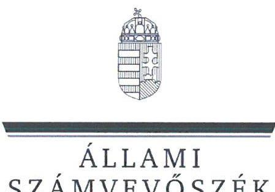
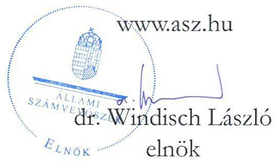
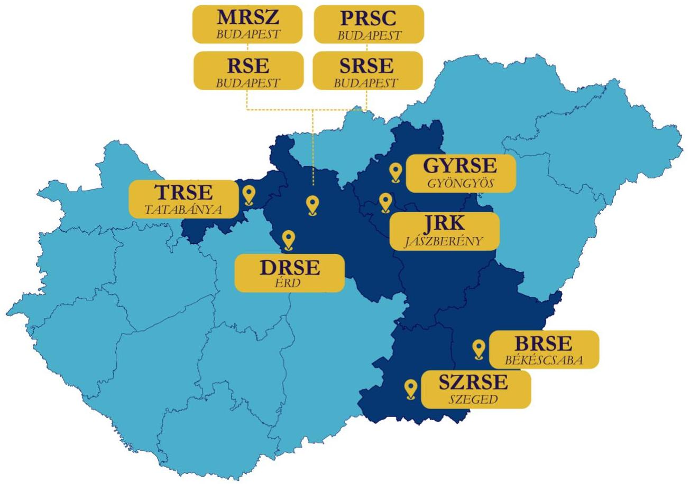
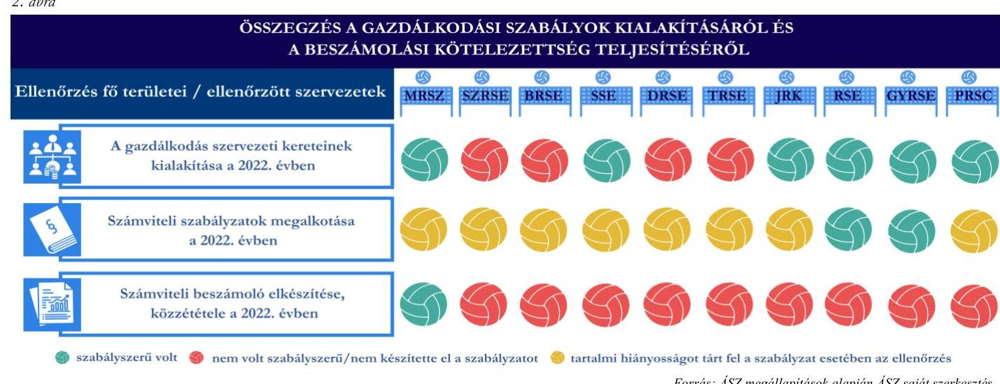
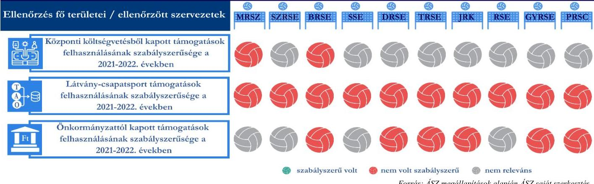
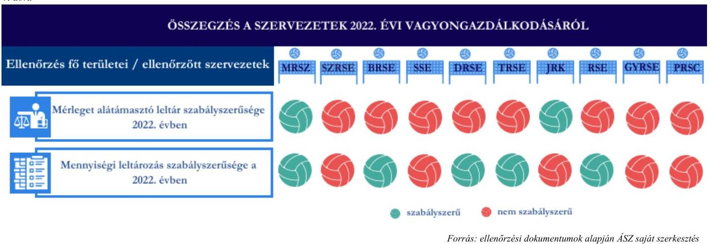

# JELENTÉS 

Támogatásban részesülő sportszövetségek és sportegyesületek gazdálkodásának ellenőrzése

RÖPLABDA

2024.

---

ÁLLAMI
SZÁMVEVŐSZÉK

# JELENTÉS 

## Támogatásban részesülő sportszövetségek és sportegyesületek gazdálkodásának ellenőrzése

## RÖPLABDA

2024. 

24032

---

# ELLENŐRZÉSI IGAZGATÓSÁG: 

## ÁLLAMHÁZTARTÁSON KÍVÜLI SZERVEZETEKET ELLENŐRZŐ IGAZGATÓSÁG

## ELLENŐRZÉSI IGAZGATÓ:

KLINGA LÁSZLÓ igazgató

## ELLENŐRZÉSVEZETŐ:

SALAMIN VIKTOR ellenőrzésvezető
KAKAS SÁNDOR ellenőrzésvezető

IKTATÓSZÁM: EL-4060-002/2024.
TÉMASZÁM: 2682
ELLENŐRZÉS-AZONOSÍTÓ SZÁM: V1026

---

# TARTALOMJEGYZÉK 

AZ ELLENŐRZÉS ALAPADATAI ..... 4
AZ ELLENŐRZÖTT SZERVEZETEK ..... 6
ÖSSZEFOGLALÁS ..... 10
AZ ELLENŐRZÉS FÓKUSZKÉRDÉSEI ..... 13
MEGÁLLAPÍTÁSOK ..... 14
JAVASLATOK ..... 41
MELLÉKLETEK ..... 51
I. sz. melléklet: Értelmező szótár ..... 51
II. sz. melléklet: Az ellenőrzött szervezetek jegyzéke ..... 53
III. sz. melléklet: Ellenőrzési kritériumok ..... 54
IV. sz. melléklet: Ellenőrzött szervezetek főbb gazdálkodási adatai ..... 55
FÜGGELÉK: ÉSZREVÉTELEK ..... 56
RÖVIDÍTÉSEK JEGYZÉKE ..... 63

---

# AZ ELLENŐRZÉS ALAPADATAI 

## AZ ELLENŐRZÉS CÉLJA

Az ellenőrzés célja az államháztartásból nyújtott támogatással, vagy az államháztartásból meghatározott célra ingyenesen juttatott vagyon felhasználásával érintett sportszövetségek és sportegyesületek gazdálkodása szabályozottságának, gazdálkodási tevékenységének, ezen belül a beszámolási kötelezettség teljesítésének, a támogatások elkülönített nyilvántartásának, valamint a támogatások felhasználásának ellenőrzése.

## AZ ELLENŐRZÉS TÍPUSA

Szabályszerűségi ellenőrzés.

## AZ ELLENŐRZÖTT IDŐSZAK

Az 1. fókuszkérdés esetében a 2022. év.
A 2. fókuszkérdés vonatkozásában a 2021-2022. évek.
A 3. fókuszkérdés vonatkozásában a 2022. év, a mennyiségi felvétellel történő leltározás dokumentumai tekintetében a 2020-2022. évek.

## AZ ELLENŐRZÉS TÁRGYA

Az ellenőrzés tárgya a támogatásban részesülő sportszövetségek, sportegyesületek gazdálkodása szabályozottságának, gazdálkodási tevékenységén belül a beszámolási kötelezettség teljesítésének, a vagyonnyilvántartásának, a támogatások elkülönített nyilvántartásának, valamint az államháztartási forrásból származó közvetlen vagy közvetett támogatások, és a meghatározott célra ingyenesen juttatott vagyon felhasználásának a vizsgálata volt. Az ellenőrzés a támogatások vonatkozásában kiterjedt továbbá a támogató felé történő beszámolási és elszámolási kötelezettségek teljesítésére, a jogszabályi és belső előírások betartására.

Az ellenőrzés kiterjedt minden olyan körülményre és adatra, amely az ÁSZ ${ }^{1}$ jogszabályban meghatározott feladatainak teljesítéséhez, valamint az ellenőrzés program végrehajtása során felmerülő újabb összefüggések feltárásához szükséges.

Az ÁSZ tv. ${ }^{2}$ 25. § (3) bekezdésében meghatározottak alapján, amennyiben a rendelkezésre bocsátott dokumentumok, adatok, illetve tájékoztatás hitelességének, megalapozottságának, teljességének megállapítása vagy egyes ellenőrzési megállapítások alátámasztása, kiegészítése indokolta, az ellenőrzés tárgyát képezték az összefüggő tények vizsgálatához más szervezetek (ellenőrzést támogató szervezetek) által rendelkezésre bocsátott adatok, dokumentációk, megadott tájékoztatások, illetve az ott végzett ellenőrzés is.

---

# Az ellenőrzés jogalapja 

Az ellenőrzés jogszabályi alapját az ÁSZ tv. 1. § 3. bekezdése, az 5. § 3. bekezdése, valamint a Civil tv. ${ }^{5}$ 47. § előírásai képezik.

## AZ ELLENŐRZÉS MÓDSZERE

Az ellenőrzést a nemzetközi standardokat irányadónak tekintve az ellenőrzési program szempontjai, az ellenőrzött időszakban hatályos jogszabályok, az ellenőrzés általános szakmai szabályai, az ellenőrzésre irányadó ÁSZ módszertanok figyelembevételével végezte az ÁSZ.

Az ellenőrzési kérdések megválaszolásához szükséges bizonyítékok megszerzése az ellenőrzött szervezet által rendelkezésre bocsátott dokumentumokra, adatokra alapozva kérdésfeltevés (információkérés), interjú, mintavételezés útján történt. Indokolt esetben támogatásból beszerzett tárgyi eszközök használatára, fizikai fellelhetőségére irányulóan az érintett vagyontárgyak helyszíni szemle keretében történő szemrevételezésére is sor került.

Az ellenőrzési bizonyítékként felhasználható adatforrások közé tartoztak egyrészt az ellenőrzés során az ellenőrzött szervezettől bekért dokumentumok, másrészt adatforrás lehetett minden további az ellenőrzés folyamán feltárt, az ellenőrzés szempontjából információt tartalmazó dokumentum.

Az ellenőrzés lefolytatásához az ellenőrzött szervezet tanúsítványok kitöltésével, hitelesítésével, adatok, dokumentumok rendelkezésre bocsátásával, valamint az ellenőrzés során interjú, helyszíni szemrevételezés keretében szolgáltatott adatokat, dokumentumokat.

A támogatásokkal, azok felhasználásával kapcsolatos kötelezettségek vizsgálatára mintavételi eljárások kerültek alkalmazásra. Támogatás-típusok szerint nagyságrend alapján 1-3 darab támogatás került részletes vizsgálat alá. Ezen támogatások felhasználásának szabályszerűsége támogatásonként kockázatértékelés alapján kiválasztott mintatételekkel került ellenőrzésre. A kiválasztott támogatási szerződésekhez kapcsolódó elszámolásokból 30-30 db mintatétel került ellenőrzésre, ahol az elszámolás nem érte el a 30 db -ot, ott tételes ellenőrzésre került sor. Ezen felül a vagyongazdálkodás szabályszerűségének ellenőrzéséhez is kockázatalapú mintavétel kapcsolódott. A támogatások felhasználása és a vagyongazdálkodás területén a minták ellenőrzése kiterjedt a könyvvezetési kötelezettség vizsgálatára is. A tárgyi eszközök tekintetében 30 db került kiválasztásra a 2022. évben állományban lévő eszközök közül azok nyilvántartásának, elszámolásának szabályszerűsége ellenőrzése céljából. A kiválasztott mintatételek ellenőrzésének eredménye nem került kivetítésre a teljes sokaságra, a megállapítások az adott ellenőrzött mintatételek vonatkozásában kerültek megjelenítésre.

---

# AZ ELLENŐRZÖTT SZERVEZETEK 

Az ellenőrzött szervezetek a Cnytv. ${ }^{4}$ 4. § c), d) pontjai alapján a bírósági nyilvántartásban szereplő, a Civil tv. és a Ptk. ${ }^{5}$ alapján létrehozott olyan egyesületek, amelyek a Sport tv. ${ }^{6}$ szerinti országos sportági szakszövetségnek, illetve sportszövetségnek vagy sportegyesületnek és a Számv. tv. ${ }^{7}$ 3. § (1) bekezdés 4. a) pontja szerinti egyéb szervezeteknek minősülnek, és amelyek az ellenőrzött időszakban költségvetési és/vagy önkormányzati és/vagy látvány-csapatsport támogatásban részesültek.

Az ellenőrzött szervezetek területi elhelyezkedését az 1. ábra mutatja:
1. ábra

Forrás: ÁSZ saját szerkesztés

## MAGYAR RÖPLABDA SZÖVETSÉG

A Magyar Röplabda Szövetség (MRSZ) 1946-ban alakult meg. Az MRSZ Magyarországon működő, a röplabda sport - annak minden ágát, azaz a teremröplabdázást, strandröplabdázást, hóröplabdázást, ülő, illetve pararöplabdázást, valamint egyéb szabadidős és amatőr röplabdázást beleértve - irányítására, feladatainak ellátására létrehozott, a röplabdasport bármely ágában sporttevékenységet folytató sportszervezetekre és magánszemélyekre épülő, munkájukat összehangoló, segítő és támogató, önkormányzati elven működő civil szervezet, országos sportági szakszövetség. Az MRSZ kizárólagosan jogosult Magyarországon röplabdasport tevékenységet és a röplabdasport bármely ágának, bármely változatát szervezni és irányítani. Az MRSZ nyilvántartásában a 2022. évi beszámoló alapján 197 nyilvántartott tagszervezet szerepelt.

---

1. táblázat

AZ MRSZ ÁLTAL IGÉNYBE VETT TÁMOGATÁSOK (ADATOK M FT-BAN)

|   | 2021. év | 2022. év  |
| --- | --- | --- |
|  Központi költségvetési | 254,8 | 123,8  |
|  Önkormányzati | 0 | 0  |
|  Látvány-csapatsport | 1157,6 | 1552,2  |

Forrás: ellenőrzött szervezet fékönyvi adatai alapján ÁSZ saját szerkesztés

# SZEGEDI RÖPLABDA SPORTEGYESÜLET

A Szegedi Röplabda Sportegyesület (SZRSE) 2005-ben alakult meg. Az SZRSE Alapszabályában szereplő célja a fiatalság és a polgárok szabadidejének tartalmasabb kitöltése sporttevékenységgel, kulturális és szabadidős programokkal. 2. táblázat

|  AZ SZRSE ÁLTAL IGÉNYBE VETT TÁMOGATÁSOK (ADATOK M FT-BAN) |  |   |
| --- | --- | --- |
|   | 2021. év | 2022. év  |
|  Központi költségvetési | 0 | 0  |
|  Önkormányzati | 0 | 0  |
|  Látvány-csapatsport | 286,3 | 147,4  |

Forrás: ellenőrzött szervezet fékönyvi adatai alapján ÁSZ saját szerkesztés

## BÉKÉSCSABAI RÖPLABDA SPORTEGYESÜLET

A Békéscsabai Röplabda Sportegyesület (BRSE) 2000-ben alakult. Célja a röplabdasport mint sporttevékenység szervezése, népszerűsítése, rendszeres testedzési lehetőség biztosítása a BRSC tagjai számára, a hazai és a nemzetközi élsport követelményeinek megfelelő versenyzők nevelése, a versenyzés feltételeinek megteremtése, tartalmas klubélet kialakításával tevékenység részvétel az ifjúság nevelésében. 3. táblázat

|  A BRSE ÁLTAL IGÉNYBE VETT TÁMOGATÁSOK (ADATOK M FT-BAN) |  |   |
| --- | --- | --- |
|   | 2021. év | 2022. év  |
|  Központi költségvetési | 14,3 | 49,6  |
|  Önkormányzati | 9,1 | 10,5  |
|  Látvány-csapatsport | 186,0 | 163,1  |

Forrás: ellenőrzött szervezet fékönyvi adatai alapján ÁSZ saját szerkesztés

## STRANDRÖPLABDÁZÁSÉRT SPORTEGYESÜLET

A Strandröplabdázásért Sportegyesület (SRSE) 1995-ben jött létre. Az Alapszabálya szerint az SRSE célja az önkéntes tagság igényeinek és a mindennapi élet követelményeinek megfelelő egészséges sporttevékenység végzése, terjesztése, szervezése, a szabadidő kulturált és hasznos eltöltése, elsődlegesen a felnőtt- és utánpótlás strandröplabda sport végzése céljából. 4. táblázat

|  AZ SRSE ÁLTAL IGÉNYBE VETT TÁMOGATÁSOK (ADATOK M FT-BAN) |  |   |
| --- | --- | --- |
|   | 2021. év | 2022. év  |
|  Központi költségvetési | 0 | 0  |
|  Önkormányzati | 0 | 0  |
|  Látvány-csapatsport | 109,3 | 135,1  |

Forrás: ellenőrzött szervezet fékönyvi adatai alapján ÁSZ saját szerkesztés

---

# DELTA RÖPLABDA SPORTEGYESÜLET

A Delta Röplabda Sportegyesületet (DRSE) 2008-ban alapították meg, amely szervezet 2016. óta minősül közhasznú szervezetnek az Országos Bírósági Hivatal adatai alapján. Az DRSE tevékenysége keretében az egészséges életmód és a szabadidősport gyakorlása feltételeinek megteremtése, részvétel a versenysport, az utánpótlás-nevelés, az iskolai és diáksport, a főiskolai-egyetemi sport, a szabadidősport és a fogyatékosok sportja támogatásában, a gyermek- és ifjúsági sportot, a nők és családok sportját, a hátrányos helyzetű társadalmi csoportok, valamint a fogyatékosok sportja támogatása tevékenységeket végzi. 5. táblázat

|  A DRSE ÁLTAL IGÉNYBE VETT TÁMOGATÁSOK (ADATOK M FT-BAN) |  |   |
| --- | --- | --- |
|   | 2021. év | 2022. év  |
|  Központi költségvetési | 0 | 0  |
|  Önkormányzati | 5,0 | 5,8  |
|  Látvány-csapatsport | 67,1 | 61,8  |

Forrás: ellenőrzött szervezet fékönyvi adatai alapján ÁSZ saját szerkesztés

## TATABÁNYAI RÖPLABDA SPORT EGYESÜLET

A Tatabányai Röplabda Sport Egyesület (TRSE) 2014-ben alakult. Megalakulása óta fő feladata, a női röplabda sportág népszerűsítése, az utánpótlás nevelés és eredményes szereplés a MRSZ által kiírt utánpótlás bajnokságokban. 6. táblázat

|  A TRSE ÁLTAL IGÉNYBE VETT TÁMOGATÁSOK (ADATOK M FT-BAN) |  |   |
| --- | --- | --- |
|   | 2021. év | 2022. év  |
|  Központi költségvetési | 0 | 0  |
|  Önkormányzati | 3,0 | 4,0  |
|  Látvány-csapatsport | 85,7 | 79,6  |

Forrás: ellenőrzött szervezet fékönyvi adatai alapján ÁSZ saját szerkesztés

## JÁSZBERÉNYI RÖPLABDA KLUB

A Jászberényi Röplabda Klub (JRK) 1993-ban alakult meg. A JRK célja az alapszabályában megfogalmazottak alapján, a sporttevékenység, a röplabda sport népszerűsítése, Jászberény női élsportoló utánpótlásának saját nevelésű fiatalokkal való biztosítása, a leány általános- és középiskolás korosztály, valamint a felnőttek rendszeres sportolásának, testmozgásának biztosítása, illetőleg versenyeztetése. 7. táblázat

|  A JRK ÁLTAL IGÉNYBE VETT TÁMOGATÁSOK (ADATOK M FT-BAN) |  |   |
| --- | --- | --- |
|   | 2021. év | 2022. év  |
|  Központi költségvetési | 0 | 0  |
|  Önkormányzati | 18,0 | 34,0  |
|  Látvány-csapatsport | 118,4 | 48,3  |

Forrás: ellenőrzött szervezet fékönyvi adatai alapján ÁSZ saját szerkesztés

---

# RÖPPALÁNTA SPORTEGYESÜLET

A Röppalánta Sportegyesület (RSE) 2018-ban jött létre. Az RSE elsődlegesen a rendszeres sportolás, versenyzés, a testedzés, — különösen a röplabdázás, strandröplabdázás és ülőröplabdázás — iránti igények felkeltése, tagjainak egészségre nevelése céljából létrehozott társadalmi szervezet.

|  AZ RSE ÁLTAL IGÉNYBE VETT TÁMOGATÁSOK (ADATOK M FT-BAN) |  |   |
| --- | --- | --- |
|   | 2021. év | 2022. év  |
|  Központi költségvetési | 0 | 0  |

 Önkormányzati | 0 | 0  |
|  Látvány-csapatsport | 39,5 | 27,9  |

*Forrás: ellenőrzött szervezet főkönyvi adatai alapján ÁSZ saját szerkesztés*

# GYÖNGYÖSI RÖPLABDA SPORTEGYESÜLET

A Gyöngyösi Röplabda Sportegyesület (GYRSE) 1995-ben alakult meg. A GYRSE célja a rendszeres sportolás (versenyzés), testedzés, felüdülés biztosítása, az ilyen igények felkeltése, tagjainak nevelése, a társadalmi öntevékenység és a közösségi élet kibontakoztatása.

|  A GYRSE ÁLTAL IGÉNYBE VETT TÁMOGATÁSOK (ADATOK M FT-BAN) |  |   |
| --- | --- | --- |
|   | 2021. év | 2022. év  |
|  Központi költségvetési | 0 | 0  |
|  Önkormányzati | 1,2 | 3,3  |
|  Látvány-csapatsport | 31,2 | 29,5  |

*Forrás: ellenőrzött szervezet főkönyvi adatai alapján ÁSZ saját szerkesztés*

# PALOTA RÖPLABDA SPORT CLUB

A Palota Röplabda Sport Club (PRSC) 1994-ben alakult meg. A PRSC alapcélja a sportolási és versenyzési, valamint a minél szélesebb körű testedzési és egyészséges életmódot elősegítő sportolási lehetőségek biztosítása, az ilyen igények felkeltése és népszerűsítése, a szabadidő eltöltéseként kötetlenül, vagy szervezett formában, illetve versenyszerűen végzett testedzéshez a röplabda sportág jellege szerinti biztonságos sporttevékenység folytatásához szükséges feltételek biztosítása.

|  A PRSC ÁLTAL IGÉNYBE VETT TÁMOGATÁSOK (ADATOK M FT-BAN) |  |  |  |  |  |  |  |  |   |
| --- | --- | --- | --- | --- | --- | --- | --- | --- | --- |
|  A PRSC igénybe vett támogatásai a főkönyvi adatok alapján / adatok M FT-ban megadva |  |  |  |  |  | 2021. év |  | 2022. év |   |
|  Központi költségvetési |  |  |  |  |  | 0 |  | 0 |   |
|  Önkormányzati |  |  |  |  |  | 6,0 |  | 6,0 |   |
|  Látvány-csapatsport |  |  |  |  |  | 9,4 |  | 16,1 |   |

*Forrás: ellenőrzött szervezet főkönyvi adatai alapján ÁSZ saját szerkesztés*

Az ellenőrzött szervezetekre 2022-ben vonatkozó egyéb működési jellemzőket a 11. táblázat, az ellenőrzött szervezetek főbb gazdálkodási adatait a IV. melléklet tartalmazza.

|  AZ ELLENŐRZÖTT SZERVEZETEK MŰKÖDÉSI JELLEMZŐI A 2022. ÉVBEN |  |  |  |  |  |  |  |  |  |   |
| --- | --- | --- | --- | --- | --- | --- | --- | --- | --- | --- |
|   | MRSZ | SZRSE | BRSE | SRSE | DRSE | TRSE | RSE | JRK | GYRSE | PRSC  |
|  Közhasznú jogállású volt | I | N | N | N | I | N | N | N | N | N  |
|  Könyvvizsgálatra kötelezett volt | I | I | I | N | N | N | N | N | N | N  |
|  Felügyelőbizottság/ felügyelő szerv létrehozására kötelezett volt | I | N | I | N | I | I | N | N | N | N  |
|  Vállalkozási tevékenységet végzett | N | I | N | I | I | N | N | N | I | N  |

*Forrás: Ellenőrzött szervezetek ellenőrzési dokumentációja alapján ÁSZ saját szerkesztés*

---

# ÖSSZEFOGLALÁS 

Magyarország Alaptörvényének XX. cikke kimondja, hogy mindenkinek joga van a testi és lelki egészséghez, melynek érvényesülését Magyarország többek között a sportolás és a rendszeres testedzés támogatásával segíti elő. Az Országgyűlés a Sport tv.-ben kinyilvánította, hogy a nemzet közössége a test művelését, a sportot, a nemzet alapértékének, kívánatos célnak tekinti. A sport a közjó része. Erősíti a közösség tagjainak egymáshoz tartozását, miként az egyén testi és lelki egészségét.

A sportegyesületek, sportszövetségek működésükre és szakmai tevékenységük ellátására költségvetési támogatásban, önkormányzati támogatásban, ingyenes vagyonjuttatásban, valamint látvány-csapatsport támogatásban részesülhetnek, amelyekre fokozott figyelem irányul.

A társadalom részéről jogosan felmerülő elvárás, hogy a közpénzeket kezelő, azzal gazdálkodó szervezetek működéséről, tevékenységéről átfogó képet kapjon, a közpénzek rendeltetésszerű és átlátható módon történő felhasználásának értékelésére időről-időre sor kerüljön az ellenőrzések keretében.

A gazdálkodási szabályok kialakítása, a könyvvezetési és beszámolási kötelezettség teljesítése a 2022. évben egyetlen ellenőrzött szervezet tekintetében sem volt szabályszerű.

A könyvviteli szolgáltatás személyi feltételeit az ellenőrzött szervezetek biztosították. A jogszabály alapján könyvvizsgálatra kötelezett három ellenőrzött szervezetből két szervezet szabályszerűen járt el, egy szervezet nem biztosította a könyvvizsgálatot a 2022. évi számviteli beszámoló vonatkozásában. A jogszabályban, valamint az ellenőrzött szervezetek alapszabályában előírt felügyelőbizottságot, felügyeleti szervet az arra kötelezett négy ellenőrzött szervezet közül egy szabályszerűen létrehozta, három szervezet nem tartotta be a vonatkozó jogszabályi előírásokat. A jogszabályban rögzített összeférhetetlenségi szabályt megsértve, egy személy úgy volt egy ellenőrzött szervezet felügyelő szervének a tagja, hogy közben az ellenőrzött szervezettel egyéb jogviszonyban is állt, továbbá a felügyelő szerv tagjai közeli hozzátartozói voltak az ellenőrzött szervezet elnökség tagjainak, ezáltal a felügyelő szerv függetlensége nem volt biztosított.

A jogszabályban előírt számviteli szabályzatokat a tíz ellenőrzött szervezet közül kettő készítette el szabályszerűen a 2022-es évben. Nyolc ellenőrzött szervezet a jogszabálynak megfelelő szabályzatok hiányában nem teremtette meg a szabályszerű gazdálkodás feltételeit, így a számviteli szabályzatok a támogatások szabályszerű könyvviteli nyilvántartását nem támogatták.

A könyvvezetés formája a 2022-es évben az ellenőrzött szervezetek mindegyikénél megfelelt a jogszabályi előírásoknak. A 2022-es évi számviteli beszámoló elkészítésének szabályszerűségét a tíz ellenőrzött szervezet közül egy biztosította. Kilenc ellenőrzött szervezet nem teljesítette a jogszabályi előírásokat, többek között a számviteli beszámoló közzétételének hiánya, a beszámoló tartalmi hiányosságai, valamint a könyvviteli nyilvántartásból hiányzó elkülönített adatok miatt.

Szabályszerű beszámoló és könyvvezetés hiányában a támogatások felhasználásának ellenőrzése teljes körűen nem volt biztosított.

---

A központi költségvetésből kapott támogatások felhasználása a 2021-2022. években a két érintett szervezetnél nem volt szabályszerű elsősorban a felhasználás jogszabályban előírt elkülönített könyvviteli nyilvántartásának hiánya miatt.

A látvány-csapatsport támogatás felhasználása egyik ellenőrzött szervezet esetében sem valósult meg szabályszerűen, többek között a jogszabályban előírt támogatás felhasználás könyvvitelben való elkülönítésének hiánya, a jogszabályban előírt kötelező könyvvizsgálat, valamint a támogatások felhasználásának elszámolásához kapcsolódó bizonylatok záradékolásának elmaradása miatt.

Az önkormányzati támogatások felhasználása a 2021-2022. években nem volt szabályszerű az önkormányzati támogatást felhasználó hat ellenőrzött szervezetnél, többek között a könyvviteli nyilvántartásban a támogatás felhasználás elkülönített nyilvántartásának hiánya, hiányossága, valamint egy ellenőrzött szervezetnél a támogatás felhasználásáról készített elszámolás, beszámolás hiánya miatt.

Jogosulatlan támogatás felhasználást a tíz ellenőrzött szervezet közül kettő szervezetnél tárt fel az ellenőrzés, mindösszesen 34,1 M Ft értékben, amelyekkel kapcsolatban az ÁSZ - törvényi kötelezettségének eleget téve - megkereste az illetékes hatóságot.

A támogatások felhasználása során feltárt hiányosságok, szabálytalanságok miatt a támogatási összegek célnak megfelelő felhasználása nem volt biztosított, azok veszélyeztették a támogatók által kitűzött célok elérését.
3. ábra

# ÖSSZEGZÉS A KAPOTT TÁMOGATÁSOK FELHASZNÁLÁSÁRÓL 

Ellenőrzés fő területei / ellenőrzött szervezetek

---

A tíz ellenőrzött szervezet közül kilenc szervezet vagyongazdálkodása a 2022. évben nem volt szabályszerű. A vagyongazdálkodás elsősorban a könyvviteli nyilvántartás, illetve mérlegtételeinek adatait alátámasztó év végi leltár hiánya, hiányossága, valamint a tárgyi eszközök mennyiségi felvétellel történő leltározásának hiánya miatt nem felelt meg a jogszabályi előírásoknak. Az ellenőrzés során feltárt hiányosságok miatt a 2022. évi számviteli beszámoló mérlegadatai nem voltak tételes leltárral alátámasztva, így kilenc ellenőrzött szervezetnél a beszámoló adatainak valódisága nem volt biztosított.

Szabályszerű vagyongazdálkodás hiányában a támogatásból beszerzett eszközök megléte, a támogatások cél szerinti felhasználása nem volt igazolt, annak ellenőrizhetősége nem volt biztosított.

Az ÁSZ az ellenőrzések során feltárt hiányosságok megszüntetése érdekében az ellenőrzött sportegyesületek elnökei részére 101 javaslatot fogalmazott meg.

A PRSC elnöke az ÁSZ tv. 29. § (2) bekezdés szerinti, a jelentéstervezet megállapításaira tett észrevételében arról tájékoztatta az ÁSZ-t, hogy intézkedéseket tett az ÁSZ ellenőrzés során felmerült hiányosságok megszüntetése érdekében, ezzel az ÁSZ megállapításai az ellenőrzés során hasznosultak.

Az ÁSZ véleménye a tíz szervezet ellenőrzése során feltárt számos hiányosság alapján, hogy az államháztartási forrásokból származó sportcélú támogatásokat felelőtlenül kezelik. A feltárt szabálytalanságok a támogatási összegek nem cél szerinti felhasználására utalnak, ami a kitűzött támogatási célok elérését veszélyeztetheti. Azon esetekben, ahol súlyos szabálytalanságokat tárt fel az ellenőrzés indokolt lehet a támogató szervezetek részéről a megítélt és elszámolt támogatások vonatkozásában átfogó ellenőrzést lefolytatni és a jövőbeni támogatások odaítélése során az ellenőrzés eredményeit figyelembe venni. A kettős finanszírozás megelőzéséhez egy átfogó támogatási nyomonkövetési rendszer kialakítása lehet indokolt. A vagyongazdálkodás területén feltárt szabálytalanságok azt mutatják, hogy az ellenőrzött szervezetek nem járnak el felelősen a vagyonelemek nyilvántartása és használata kapcsán, ezért indokolt lehet olyan szabályozás megalkotása, amely rögzíti, hogy az államháztartási forrásokból beszerzett eszközök esetében a cél szerinti felhasználást igazoló nyilvántartást szükséges vezetni. A beszámolók és a könyvvezetés kapcsán feltárt szabálytalanságok miatt felmerül a kockázata, hogy a beszámolók adatai nem megbízhatóak, a támogatásból megvalósult eszközök megléte, cél szerinti felhasználásának ellenőrzése nem biztosított.

---

# AZ ELLENŐRZÉS FÓKUSZKÉRDÉSEI 

1. A gazdálkodási szabályok kialakítása, a könyvvezetési és beszámolási kötelezettség teljesítése szabályszerű volt-e?
2. A kapott támogatások felhasználása szabályszerű volt-e?
3. Az ellenőrzött szervezet vagyongazdálkodása szabályszerű volt-e?

---

# 1. A gazdálkodási szabályok kialakítása, a könyvvezetési és beszámolási kötelezettség teljesítése szabályszerű volt-e? 

Összegző megállapítás

1.1. számú megállapítás

A gazdálkodási szabályok kialakítása, a könyvvezetési és a beszámolási kötelezettség teljesítése a 2022-es évben az ellenőrzött szervezeteknél nem volt szabályszerű.
Gazdálkodásának szervezeti feltételeit a 2022. évben öt szervezet szabályszerűen kialakította, öt szervezet nem alakította ki szabályszerűen.

Ellenőrzött szervezetenként a gazdálkodás szervezeti feltételeinek teljesítését a 2022. évben az 12. táblázat tartalmazza.
12. táblázat

ÖSSZEFOGLALÓ A GAZDÁLKODÁS SZERVEZETI KERETEINEK KIALAKÍTÁSÁRÓL A 2022. ÉV VONATKOZÁSÁBAN

| TEMAKÖR / ELLENŐRZÖTTEK | MRSZ | SZRSE | BRSE | SRSE | DRSE | TRSE | JRK | RSE | GYRSE | PRSC |
| :--: | :--: | :--: | :--: | :--: | :--: | :--: | :--: | :--: | :--: | :--: |
| Könyvviteli szolgáltatás személyi feltételeinek megteremtése | I | I | I | I | I | I | I | I | I | I |
| Könyvvizsgálati kötelezettség teljesítése a beszámoló vonatkozásában | I | N | I | - | - | - | - | - | - | - |
| Felügyelőbizottság/felügyelő szerv létrehozása (* alapszabályban előírt, ** összeférhetetlenség miatt

 nem szabályszerű) | I | - | N* | - | N** | N | - | - | - | - |

## MAGYAR RÖPLABDA SZÖVETSÉG

Az MRSZ a 2022. évben a Számv. tv., valamint a Civilszr. ${ }^{8}$ előírásaiban foglaltaknak megfelelően gondoskodott a könyvviteli szolgáltatás személyi feltételeinek teljesüléséről.
Az MRSZ a 2022. évben a Számv. tv.-ben, valamint a Civilszr.-ben előírtaknak megfelelően könyvvizsgálót bízott meg a beszámoló felülvizsgálatára. Az MRSZ a 2022. évben a Ptk., valamint a Civil tv. előírásainak betartásával gondoskodott az előírt felügyelőbizottság, felügyelő szerv létrehozásáról, a felügyelőbizottság elkészítette a jogszabályban előírt ügyrendjét, valamint a 2022. évi számviteli beszámolót véleményezte.

## SZEGEDI RÖPLABDA SPORTEGYESÜLET

Az SZRSE a 2022. évben a Számv. tv., valamint a Civilszr. előírásaiban foglaltaknak megfelelően gondoskodott a könyvviteli szolgáltatás személyi feltételeinek teljesüléséről.
A Civilszr. 16. § (1) bekezdésében foglaltak ellenére az SZRSE-nél a 2022. évben nem végeztek könyvvizsgálatot, nem kötöttek szerződést a számviteli beszámoló könyvvizsgálóval való felülvizsgálatára, miközben a jogszabályban meghatározott 300 M Ft-os éves bevétel értékhatárt az üzleti évet megelőző két üzleti év (2020: 320 M Ft, 2021: 309 M Ft /átlag: 314,5 M Ft) átlagában meghaladta.

---

# BÉKÉSCSABAI RÖPLABDA SPORTEGYESÜLET 

A BRSE a 2022. évben a Számv. tv., valamint a Civilszr. előírásaiban foglaltaknak megfelelően gondoskodott a könyvviteli szolgáltatás személyi feltételeinek teljesüléséről.
A BRSE a 2022. évben a Számv. tv.-ben, valamint a Civilszr.-ben előírtaknak megfelelően könyvvizsgálót bízott meg a beszámoló felülvizsgálatára. A BRSE 2022-ben nem volt kötelezett a Ptk., valamint a Civil tv. előírásai alapján felügyelő szerv, felügyelőbizottság létrehozására, azonban az Alapszabályában előírta a három tagú felügyelőbizottság létrehozását, amit ezen előírások ellenére nem hozott létre.

## STRANDRÖPLABDÁZÁSÉRT SPORTEGYESÜLET

Az SRSE a 2022. évben a Számv. tv., valamint a Civilszr. előírásaiban foglaltaknak megfelelően gondoskodott a könyvviteli szolgáltatás személyi feltételeinek teljesüléséről.

## DELTA RÖPLABDA SPORTEGYESÜLET

A DRSE a 2022. évben a Számv. tv., valamint a Civilszr. előírásaiban foglaltaknak megfelelően gondoskodott a könyvviteli szolgáltatás személyi feltételeinek teljesüléséről.
A DRSE a Civil tv. előírása alapján 2022-ben rendelkezett felügyelő szervvel, amely három tagból állt, azonban a Civil tv. 40. § (2) bekezdésében foglaltak ellenére a felügyelő szerv nem alkotta meg az ügyrendjét.
A Civil tv. 38. § (3) bekezdés b) pontjában foglaltak ellenére 2022-ben a DRSE felügyelő szerv egy tagja olyan személy volt, aki a DRSE-vel a felügyelő szervi tagsági megbízatásán kívül a könyvelési feladatok végzésére vonatkozó megbízási jogviszonyban is állt. A DRSE felügyelő szervének (Ellenőrző bizottság) mindhárom tagja a 2022. évben a Civil tv. 38. § (1) bekezdés d) pontjában foglaltak ellenére, a Ptk. 8:1. § 1. pontja szerinti közeli hozzátartozói voltak a DRSE Elnökség tagjainak, ezáltal a DRSE felügyelőbizottságának működése nem volt szabályszerű.

## TATABÁNYAI RÖPLABDA SPORTEGYESÜLET

A TRSE a 2022. évben a Számv. tv., valamint a Civilszr. előírásaiban foglaltaknak megfelelően gondoskodott a könyvviteli szolgáltatás személyi feltételeinek teljesüléséről.
A TRSE-nél a 2022. évben fennállt a felügyelőbizottság létrehozásának kötelezettsége, mivel taglétszáma meghaladta a 100 főt, azonban a Ptk. 3:82 § (1) bekezdésében előírtak ellenére a TRSE nem hozott létre felügyelőbizottságot.

## JÁSZBERÉNYI RÖPLABDA KLUB

A JRK a 2022. évben a Számv. tv., valamint a Civilszr. előírásaiban foglaltaknak megfelelően gondoskodott a könyvviteli szolgáltatás személyi feltételeinek teljesüléséről.

## RÖPPALÁNTA SPORTEGYESÜLET

Az RSE a 2022. évben a Számv. tv., valamint a Civilszr. előírásaiban foglaltaknak megfelelően gondoskodott a könyvviteli szolgáltatás személyi feltételeinek teljesüléséről.

---

# GYÖNGYÖSI RÖPLABDA SPORTEGYESÜLET 

A GYRSE a 2022. évben a Számv. tv., valamint a Civilszr. előírásaiban foglaltaknak megfelelően gondoskodott a könyvviteli szolgáltatás személyi feltételeinek teljesüléséről.

## Palota Röplabda Sport Club

A PRSC a 2022. évben a Számv. tv., valamint a Civilszr. előírásaiban foglaltaknak megfelelően gondoskodott a könyvviteli szolgáltatás személyi feltételeinek teljesüléséről.
1.2. számú megállapítás

Két szervezet számviteli szabályzatait a 2022. évben a jogszabályoknak megfelelően megalkotta. Nyolc szervezetnél a számlarend, két szervezetnél a pénzkezelési szabályzat nem felelt meg a jogszabályi előírásoknak.

A számviteli szabályzatok szabályszerűségével kapcsolatban az ellenőrzés értékelését a 13. táblázat tartalmazza ellenőrzött szervezetenként.
13. táblázat

ÖSSZEFOGLALÓ A SZÁMV. TV.-BEN ELŐÍRT SZABÁLYOZATOKRÓL A 2022. ÉV VONATKOZÁSÁBAN

| TEMAKÖR / ELLENŐRZÖTTEK | MRSZ | SZRSE | BRSE | SRSE | DRSE | TRSE | JRK | RSE | GYRSE | PRSC |
| :-- | :--: | :--: | :--: | :--: | :--: | :--: | :--: | :--: | :--: | :--: |
| Számviteli politika | I | I | I | I | I | I | I | I | I | I |
| Eszközök és a források értékelési   szabályzata | I | I | I | I | I | I | I | I | I | I |
| Pénzkezelési szabályzat | I | R | I | I | R | I | I | I | I | I |
| Eszközök és a források   leltárkészítési és leltározási   szabályzata | I | I | I | I | I | I | I | I | I | I |
| Számlarend | R | R | R | N | R | R | R | I | I | R |
| Jelmagyarázat: $I=$ szabályszerű volt, $N=$ nem készítette el a szabályzatot,   $R=$ tartalmi hiányosságot tárt fel a szabályzat esetében az ellenőrzés |  |  |  |  |  |  |  |  |  |  |

## MAGYAR RÖPLABDA SZÖVETSÉG

Az MRSZ 2022-ben rendelkezett a Számv. tv-ben előírt számviteli politikával, azon belül az eszközök és a források leltárkészítési és leltározási szabályzatával, az eszközök és a források értékelési szabályzatával, pénzkezelési szabályzattal, valamint számlarenddel, amelyek - a számlarend kivételével - az ellenőrzött tartalmi kritériumoknak megfeleltek. Az MRSZ 2022. évben hatályos számlarendje nem felelt meg a Számv. tv. 161. § (2) bekezdés a) pontjában foglaltaknak, mert nem tartalmazta minden alkalmazott számla számjelét és megnevezését.

## SZEGEDI RÖPLABDA SPORTEGYESÜLET

Az SZRSE 2022-ben rendelkezett a Számv. tv-ben előírt számviteli politikával, azon belül az eszközök és a források leltárkészítési és leltározási szabályzatával, az eszközök és a források értékelési szabályzatával, pénzkezelési szabályzattal, valamint számlarenddel, amelyek - a pénzkezelési szabályzat és a számlarend kivételével - az ellenőrzött tartalmi kritériumoknak megfeleltek. Az SZRSE a 2022. évben hatályos pénzkezelési szabályzata a Számv. tv. 14. § (8) bekezdésében foglaltakkal ellentétben nem tartalmazta a napi készpénz záró állomány maximális mértékét. Az SZRSE 2022. évben hatályos számlarendje nem felelt meg a Számv. tv. 161. § (2) bekezdés a) pontjában foglaltaknak, mert nem tartalmazta minden alkalmazott számla számjelét és megnevezését.

---

# BÉKÉSCSABAI RÖPLABDA SPORTEGYESÜLET 

A BRSE 2022-ben rendelkezett a Számv. tv-ben előírt számviteli politikával, azon belül az eszközök és a források leltárkészítési és leltározási szabályzatával, az eszközök és a források értékelési szabályzatával, pénzkezelési szabályzattal, valamint számlarenddel, amelyek - a számlarend kivételével - az ellenőrzött tartalmi kritériumoknak megfeleltek. A BRSE 2022. évben hatályos számlarendje nem felelt meg a Számv. tv. 161. § (2) bekezdés a), b) pontjaiban foglaltaknak, mert nem tartalmazta minden alkalmazott számla számjelét és megnevezését, a számla tartalmát, ha az a számla megnevezéséből egyértelműen nem következik.

## STRANDRÖPLABDÁZÁSÉRT SPORTEGYESÜLET

Az SRSE 2022-ben rendelkezett a Számv. tv-ben előírt számviteli politikával, azon belül az eszközök és a források leltárkészítési és leltározási szabályzatával, az eszközök és a források értékelési szabályzatával, pénzkezelési szabályzattal, amelyek az ellenőrzött tartalmi kritériumoknak megfeleltek. Az SRSE a Számv. tv. 161. § (1) bekezdésben foglaltak ellenére a 2022. évben nem rendelkezett számlarenddel.

## DELTA RÖPLABDA SPORTEGYESÜLET

A DRSE 2022-ben rendelkezett a Számv. tv-ben előírt számviteli politikával, azon belül az eszközök és a források leltárkészítési és leltározási szabályzatával, az eszközök és a források értékelési szabályzatával, pénzkezelési szabályzattal, valamint számlarenddel, amelyek - a pénzkezelési szabályzat és a számlarend kivételével - az ellenőrzött tartalmi kritériumoknak megfeleltek. A DRSE 2022-ben hatályos pénzkezelési szabályzata a Számv. tv. 14. § (8) bekezdésében foglalt előírások ellenére nem tartalmazta a pénzforgalom készpénzben, illetve bankszámlán történő lebonyolításának rendjét, a készpénzállományt érintő pénzmozgások jogcímeit és eljárási rendjét, a napi készpénz záró állomány maximális mértékét, a készpénzállomány ellenőrzésekor követendő eljárást, valamint a pénztárellenőrzés gyakoriságát. A DRSE 2022. évben hatályos számlarendje a Számv. tv. 161. § (2) bekezdés a)-c) pontjaiban foglaltak ellenére a DRSE 2022. évben hatályos számlarendje nem tartalmazta minden alkalmazásra kijelölt számla számjelét, megnevezését, a számla tartalmát, amennyiben az a számla megnevezéséből egyértelműen nem következett, továbbá nem tartalmazta minden számla tekintetében a számla értéke növekedésének, csökkenésének jogcímeit, azok más számlákkal és az analitikus nyilvántartásokkal való kapcsolatát, valamint a Számv. tv. 161. § (2) bekezdés d) pontjában foglaltak ellenére nem tartalmazta a számlarendben foglaltakat alátámasztó bizonylati rendet.

## TATABÁNYAI RÖPLABDA SPORTEGYESÜLET

A TRSE 2022-ben rendelkezett a Számv. tv-ben előírt számviteli politikával, azon belül az eszközök és a források leltárkészítési és leltározási szabályzatával, az eszközök és a források értékelési szabályzatával, pénzkezelési szabályzattal, valamint számlarenddel, amelyek - a számlarend kivételével - az ellenőrzött tartalmi kritériumoknak megfeleltek. A TRSE 2022. évben hatályos számlarendje a Számv. tv. 161. § (2) bekezdés a)-c) pontjában foglaltak ellenére nem tartalmazta minden alkalmazásra kijelölt számla számát, megnevezését, a számla tartalmát, ha az a számla megnevezéséből egyértelműen nem következik, továbbá nem tartalmazta minden számla tekintetében a számla értéke növekedésének, csökkenésének jogcímeit, azok más számlákkal és az analitikával való kapcsolatát, valamint a Számv. tv. 161. § (2) bekezdés d) pontjában foglaltak ellenére nem tartalmazta a számlarendben foglaltakat alátámasztó bizonylati rendet.

---

# JÁSZBERÉNYI RÖPLABDA KLUB 

A JRK 2022-ben rendelkezett a Számv. tv-ben előírt számviteli politikával, azon belül az eszközök és a források leltárkészítési és leltározási szabályzatával, az eszközök és a források értékelési szabályzatával, pénzkezelési szabályzattal, valamint számlarenddel, amelyek - a számlarend kivételével - az ellenőrzött tartalmi kritériumoknak megfeleltek. A JRK 2022. évben hatályos számlarendje nem felelt meg a Számv. tv. 161. § (2) bekezdés a) pontjában foglaltaknak, mert nem tartalmazta minden alkalmazott számla számjelét és megnevezését, valamint a Számv. tv. 161. § (2) bekezdés d) pontjában foglaltak ellenére nem tartalmazta a számlarendben foglaltakat alátámasztó bizonylati rendet.

## RÖPLABDA SPORTEGYESÜLET

Az RSE 2022-ben rendelkezett a Számv. tv-ben előírt számviteli politikával, azon belül az eszközök és a források leltárkészítési és leltározási szabályzatával, az eszközök és a források értékelési szabályzatával, pénzkezelési szabályzattal, valamint számlarenddel.

## GYÖNGYÖSI RÖPLABDA SPORTEGYESÜLET

A GYRSE 2022-ben rendelkezett a Számv. tv-ben előírt számviteli politikával, azon belül az eszközök és a források leltárkészítési és leltározási szabályzatával, az eszközök és a források értékelési szabályzatával, pénzkezelési szabályzattal, valamint
 számlarenddel.

## Palota RÓPLABDA SPORT CLUB

A PRSC 2022-ben rendelkezett a Számv. tv-ben előírt számviteli politikával, azon belül az eszközök és a források leltárkészítési és leltározási szabályzatával, az eszközök és a források értékelési szabályzatával, pénzkezelési szabályzattal, valamint számlarenddel, amelyek - a számlarend kivételével - az ellenőrzött tartalmi kritériumoknak megfeleltek. A PRSC 2022. évben hatályos számlarendje a Számv. tv. 161. § (2) bekezdés a) pontjában foglaltak ellenére nem tartalmazta minden alkalmazásra kijelölt számla számát, megnevezését, továbbá a Számv. tv. 161. § (2) bekezdés d) pontjában foglaltak ellenére nem tartalmazta a számlarendben foglaltakat alátámasztó bizonylati rendet.
1.3. számú megállapítás

Az ellenőrzött szervezetek 2022-ben könyvvezetési kötelezettségüknek az előírások szerint eleget tettek. A számviteli beszámoló és közhasznúsági melléklet készítési, valamint közzétételi kötelezettségét az előírások alapján egy szervezet szabályszerűen teljesítette, kilenc szervezet nem teljesítette teljes körűen.

A könyvvezetéssel és a számviteli beszámolóval kapcsolatban az ellenőrzés értékelését a 14. táblázat tartalmazza ellenőrzött szervezetenként.

---

1. táblázat

# ÖSSZEFOGLALÓ A KÖNYVVEZETÉSI KÖTELEZETTSÉG TELJESÍTÉSÉRŐL A 2022. ÉVBEN 

|  | MRSZ | SZRSK | BRSE | SRSE | DRSE | TRSE | JRK | RSE | GYRSE | PRSC |
| :--: | :--: | :--: | :--: | :--: | :--: | :--: | :--: | :--: | :--: | :--: |
| A választott könyvvezetési forma megfelel a jogszabályoknak | I | I | I | I | I | I | I | I | I | I |
| Az alaptevékenységgel és vállalkozási tevékenységgel kapcsolatos bevételek, ráfordítások kimutatása szabályszerű volt | - | I | - | N | N | - | - | - | N | - |
| A nyilvántartását úgy vezette, hogy a beszámolóban az egyéb bevételeken belül részletezni tudta a tagdijakat, a kapott támogatások összegeit | I | N | I | I | I | I | I | I | I | N |

## ÖSSZEFOGLALÓ A SZÁMVITELI BESZÁMOLÓ- ÉS KÖZHASZNÚSÁGI MELLÉKLET KÉSZÍTÉSI KÖTELEZETTSÉG TELJESÍTÉSÉRŐL A 2022. ÉVBEN

|  | MRSZ | SZRSK | BRSE | SRSE | DRSE | TRSE | JRK | RSE | GYRSE | PRSC |
| :--: | :--: | :--: | :--: | :--: | :--: | :--: | :--: | :--: | :--: | :--: |
| Számviteli beszámolója a meghatározott formában készült | I | I | I | I | I | I | I | I | I | I |
| Kiegészítő mellékletet elkészítette | I | I | I | I | N | I | N | I | N | I |
| Közhasznúsági mellékletet elkészítette | I | I | I | I | I | I | I | I | I | N |
| Felügyelőbizottság a beszámolót véleményezte (* alapszabályban előírt felügyelőbizottság) | I | - | $\mathrm{N}^{\text {v }}$ | - | I | N | - | - | - | N |
| A beszámolót a közgyűlés jóváhagyta | I | I | I | I | I | I | I | I | I | I |
| A beszámolót könyvvizsgáló felülvizsgálta | I | N | I | - | - | - | - | - | - | - |

## ÖSSZEFOGLALÓ A KÖZZÉTÉTELI KÖTELEZETTSÉG TELJESÍTÉSÉRŐL A 2022. ÉVBEN

|  | MRSZ | SZRSK | BRSE | SRSE | DRSE | TRSE | JRK | RSE | GYRSE | PRSC |
| :--: | :--: | :--: | :--: | :--: | :--: | :--: | :--: | :--: | :--: | :--: |
| A számviteli beszámolóhoz kapcsolódó közzétételi kötelezettségét szabályszerűen teljesítette | I | N | I | N | N | I | N | N | N | N |
| Jelmagyarázat: $I=$ Igen volt, $N=Nem$, $\rightarrow$ nem releváns |  |  |  |  |  |  |  |  |  |  |

## MAGYAR RÖPLABDA SZÓVETSÉG

Az MRSZ a Számv. tv.-ben, Civil. tv.-ben, valamint a Civilszr.-ben előírtak szerinti könyvvitelt vezetett. Az MRSZ 2022-ben a könyvviteli nyilvántartását úgy vezette, hogy a Számv. tv., valamint a Civilszr. előírásainak megfelelően a számviteli beszámolóban az egyéb bevételeken belül részletezni tudta a tagdijakat, az alapítótól kapott befizetéseket, a kapott támogatások összegeit.
Az MRSZ a Civil tv.-ben, valamint a Számv. tv. előírásai alapján előírt könyvvitellel alátámasztott egyszerűsített éves beszámolóját, továbbá a Civil tv.-ben előírtak alapján a közhasznúsági mellékletét elkészítette. Az MRSZ 2022. évi egyszerűsített éves beszámolóját a Ptk., valamint a Civil tv. alapján a legfőbb döntéshozó szerv hagyta jóvá, a Civilszr. előírása alapján könyvvizsgáló felülvizsgálta, valamint a felügyelőbizottság véleményezte. Az MRSZ 2022. évi elfogadott számviteli beszámolóját, valamint közhasznúsági mellékletét a Számv. tv.-ben, valamint a Civil tv.-ben előírtaknak megfelelően letétbe helyezte, közzétette.

---

# SZEGEDI RÖPLABDA SPORTEGYESÜLET 

Az SZRSE a Számv. tv.-ben, Civil. tv.-ben, valamint a Civilszr.-ben előírtak szerinti könyvvitelt vezetett. Az SZRSE a vállalkozási és az alaptevékenység bevételeinek és költségeinek Civilszr. előírása szerinti elkülönítését a könyviteli rendszerében teljesítette. Az SZRSE a Számv. tv. 161/A. § (2) bekezdésében és a Civilszr. 24. § (2) bekezdésében foglaltak ellenére 2022-ben a könyvvezetési rendszerét nem részletezte tovább úgy, hogy a tagdíjakat és a támogatásokat a beszámolóban az egyéb bevételeken belül elkülönítve kimutathassa. A főkönyvi nyilvántartásában a belföldi értékesítés árbevételén belül nyilvántartott, és az eredménykimutatásban tagdíjként szerepeltetett összeg nem csak tagdíjbevételeket, hanem egyéb más bevételeket, többek között egyéb támogatásokat, hozzájárulásokat is magában foglalt.
Az SZRSE a Civil tv.-ben, valamint a Számv. tv. előírásai alapján előírt könyvvitellel alátámasztott egyszerűsített éves beszámolóját, valamint a Civil. tv.-ben előírtak alapján a közhasznúsági mellékletét elkészítette, amit a Ptk., valamint a Civil tv. alapján a legfőbb döntéshozó szerv hagyott jóvá. Az SZRSE 2022. évi beszámolóját - megbízott könyvvizsgáló hiányában - a Civilszr. 16. § 1) bekezdés előírása ellenére könyvvizsgáló nem vizsgálta felül. Az SZRSE 2022. évi jóváhagyott számviteli beszámolóját, valamint közhasznúsági mellékletét a Civil tv. 30. § (1) bekezdésében előírtak ellenére könyvvizsgálói jelentés nélkül helyezte letétbe, illetve tette közzé. Az SZRSE a Civil tv. 30. § (4) bekezdésében előírtak ellenére a 2022. évi beszámolóját és közhasznúsági mellékletét a saját honlapján nem helyezte el.

## BÉKÉSCSABAI RÖPLABDA SPORTEGYESÜLET

A BRSE a Számv. tv.-ben, Civil. tv.-ben, valamint a Civilszr.-ben előírtak szerinti könyvvitelt vezetett. A BRSE 2022-ben a könyvviteli nyilvántartását úgy vezette, hogy a Számv. tv., valamint a Civilszr. előírásainak megfelelően a számviteli beszámolóban az egyéb bevételeken belül részletezni tudta a tagdíjakat, az alapítótól kapott befizetéseket, a kapott támogatások összegeit.
A BRSE a Civil tv.-ben, valamint a Számv. tv. előírásai alapján előírt könyvvitellel alátámasztott egyszerűsített éves beszámolóját, továbbá a Civil. tv.-ben előírtak alapján a közhasznúsági mellékletét elkészítette. A BRSE 2022. évi egyszerűsített éves beszámolóját a Ptk., valamint a Civil tv. alapján a legfőbb döntéshozó szerv hagyta jóvá, valamint a Civilszr. előírási alapján könyvvizsgáló felülvizsgálta, azonban felügyelőbizottság hiányában azt a felügyelőbizottság nem véleményezte, mivel a BRSE Alapszabályában előírt felügyelő bizottságot nem hozták létre (megállapítás az 1.1. pont alatt). A BRSE 2022. évi elfogadott számviteli beszámolóját, valamint közhasznúsági mellékletét a Számv. tv.-ben, valamint a Civil tv.-ben előírtaknak megfelelően letétbe helyezte, közzétette.

## STRANDRÖPLABDÁZÁSÉRT SPORTEGYESÜLET

Az SRSE a Számv. tv.-ben, Civil. tv.-ben, valamint a Civilszr.-ben előírtak szerinti könyvvitelt vezetett. Az SRSE a Civilszr. 9. § (8) bekezdésében foglaltak ellenére a könyvvezetés során nem mutatta ki elkülönítetten az alaptevékenységgel, valamint a vállalkozási tevékenységgel kapcsolatos költségeket, ráfordításokat. Az SRSE 2022-ben a könyvviteli nyilvántartását úgy vezette, hogy a Számv. tv., valamint a Civilszr. előírásainak megfelelően a számviteli beszámolóban az egyéb bevételeken belül részletezni tudta a tagdíjakat és a kapott támogatások összegeit.
Az SRSE a Civil tv.-ben, valamint a Számv. tv. előírásai alapján előírt könyvvitellel alátámasztott egyszerűsített éves beszámolóját, valamint a Civil. tv.-ben előírtak alapján a közhasznúsági mellékletét elkészítette. Az SRSE 2022. évi egyszerűsített éves beszámolóját a Ptk., valamint a Civil tv. alapján a legfőbb döntéshozó szerv hagyta jóvá. Az SRSE a Civil tv. 30.§ (1)-(4) bekezdéseiben foglaltak ellenére a

---

közhasznúsági mellékletét, illetve a 2022. évi számviteli beszámolóját a beszámoló részét képező kiegészítő melléklet nélkül tette közzé, illetve helyezte letétbe.

# DELTA RÓPLABDA SPORTEGYESÜLET 

A DRSE a Számv. tv.-ben, Civil. tv.-ben, valamint a Civilszr.-ben előírtak szerinti könyvvitelt vezetett. A DRSE a Civilszr. 9.§ (8) bekezdésében foglaltak ellenére a könyvvezetés során nem mutatta ki elkülönítetten az alaptevékenységgel, valamint a vállalkozási tevékenységgel kapcsolatos költségeket, ráfordításokat. A DRSE 2022-ben a könyvviteli nyilvántartását úgy vezette, hogy a Számv. tv., valamint a Civilszr. előírásainak megfelelően a számviteli beszámolóban az egyéb bevételeken belül részletezni tudta a kapott támogatások összegeit.
A DRSE a 2022. évre vonatkozó egyszerűsített éves beszámolóját a Civil tv.-ben, valamint a Számv. tv.ben előírtak alapján könyvvitellel alátámasztotta. A DRSE a Civil tv. 29. § (2) bekezdés c) pontjában foglaltak ellenére a 2022. évi beszámolóját kiegészítő melléklet nélkül készítette el, így a beszámoló hiányos volt. A DRSE a Civil tv.-ben előírtak alapján a közhasznúsági mellékletét elkészítette. A DRSE 2022. évi egyszerűsített éves beszámolóját a Ptk., valamint a Civil tv. alapján a legfőbb döntéshozó szerv hagyta jóvá, valamint felügyelő szerve véleményezte. A DRSE 2022. évi közhasznúsági mellékletét és az elfogadott számviteli beszámolóját, a beszámoló részét képező kiegészítő melléklet hiányában tette közzé, illetve helyezte letétbe a Civil tv. 30. § (1)-(4) bekezdéseiben előírtak ellenére.

## TATABÁNYAI RÓPLABDA SPORTEGYESÜLET

A TRSE a Számv. tv.-ben, Civil. tv.-ben, valamint a Civilszr.-ben előírtak szerinti könyvvitelt vezetett. A TRSE 2022-ben a könyvviteli nyilvántartását úgy vezette, hogy a Számv. tv., valamint a Civilszr. előírásainak megfelelően a számviteli beszámolóban az egyéb bevételeken belül részletezni tudta a tagdíjakat, valamint a kapott támogatások összegeit.
A TRSE a Civil tv.-ben, valamint a Számv. tv. előírásai alapján előírt könyvvitellel alátámasztott egyszerűsített éves beszámolóját és közhasznúsági mellékletét elkészítette a 2022. évre vonatkozóan. A TRSE 2022. évi egyszerűsített éves beszámolóját a Ptk., valamint a Civil tv. alapján a legfőbb döntéshozó szerv hagyta jóvá, felügyelőbizottság azt a felügyelőbizottság létrehozásának hiányában nem véleményezte (megállapítás: 1.1. pont alatt). A TRSE 2022. évi elfogadott számviteli beszámolóját és közhasznúsági mellékletét a Civil tv.-ben előírtaknak megfelelően letétbe helyezte, közzétette.

## JÁSZBERÉNYI RÓPLABDA Klub

A JRK a Számv. tv.-ben, Civil. tv.-ben, valamint a Civilszr.-ben előírtak szerinti könyvvitelt vezetett. A JRK 2022-ben a könyvviteli nyilvántartását
 úgy vezette, hogy a Számv. tv., valamint a Civilszr. előírásainak megfelelően a számviteli beszámolóban az egyéb bevételeken belül részletezni tudta a tagdíjakat, valamint a kapott támogatások összegeit.
A JRK a 2022. évre vonatkozó egyszerűsített éves beszámolóját a Civil tv.-ben, valamint a Számv. tv.-ben előírtak alapján könyvvitellel alátámasztotta. A JRK a Civil tv. 29. § (2) bekezdés c) pontjában foglaltak ellenére a 2022. évi beszámolóját kiegészítő melléklet nélkül készítette el, így a beszámoló hiányos volt. A JRK 2022. évi egyszerűsített éves beszámolóját a Ptk., valamint a Civil tv. alapján a legfőbb döntéshozó szerv hagyta jóvá. A JRK 2022. évi közhasznúsági mellékletét és az elfogadott számviteli beszámolóját a beszámoló részét képező kiegészítő melléklet hiányában tette közzé, illetve helyezte letétbe a Civil tv. 30. § (1)-(3) bekezdéseiben előírtak ellenére. A JRK a Civil tv. 30. § (4) bekezdésében foglaltak ellenére beszámolóját és közhasznúsági mellékletét saját honlapján nem helyezte el.

---

# RÖPPALÁNTA SPORTEGYESÜLET 

Az RSE a Számv. tv.-ben, Civil tv.-ben, valamint a Civilszr.-ben előírtak szerinti könyvvitelt vezetett. Az RSE 2022-ben a könyvviteli nyilvántartását úgy vezette, hogy a Számv. tv., valamint a Civilszr. előírásainak megfelelően a számviteli beszámolóban az egyéb bevételeken belül részletezni tudta a tagdíjakat, valamint a kapott támogatások összegeit.
Az RSE a Civil tv.-ben, valamint a Számv. tv. előírásai alapján előírt könyvvitellel alátámasztott egyszerűsített éves beszámolóját, valamint a Civil tv.-ben előírtak alapján a közhasznúsági mellékletét elkészítette. Az RSE 2022. évi egyszerűsített éves beszámolóját a Ptk., valamint a Civil tv. alapján a legfőbb döntéshozó szerv hagyta jóvá. Az RSE a Civil tv. 30.§ (1)-(4) bekezdéseiben foglaltak ellenére a 2022. évi közhasznúsági mellékletét és az elfogadott számviteli beszámolóját a beszámoló részét képező kiegészítő melléklet nélkül helyezte letétbe, tette közzé.

## GYÖNGYÖSI RÖPLABDA SPORTEGYESÜLET

A GYRSE a Számv. tv.-ben, Civil tv.-ben, valamint a Civilszr.-ben előírtak szerinti könyvvitelt vezetett. A GYRSE a Civilszr. 9. § (8) bekezdésében foglaltak ellenére a könyvvezetés során nem mutatta ki elkülönítetten az alaptevékenységgel, valamint a vállalkozási tevékenységgel kapcsolatos költségeket, ráfordításokat a 2022. évben. A GYRSE 2022-ben a könyvviteli nyilvántartását úgy vezette, hogy a Számv. tv., valamint a Civilszr. előírásainak megfelelően a számviteli beszámolóban az egyéb bevételeken belül részletezni tudta a tagdíjakat, valamint a kapott támogatások összegeit.
A GYRSE a 2022. évre vonatkozó egyszerűsített éves beszámolóját a Civil tv.-ben, valamint a Számv. tv.-ben előírtak alapján könyvvitellel alátámasztotta. A GYRSE a Civil tv. 29. § (2) bekezdés c) pontjában foglaltak ellenére a 2022. évi beszámolóját kiegészítő melléklet nélkül készítette el, így a beszámoló hiányos volt. A GYRSE 2022. évi egyszerűsített éves beszámolóját a Ptk., valamint a Civil tv. alapján a legfőbb döntéshozó szerv hagyta jóvá. A GYRSE a 2022. évi közhasznúsági mellékletét és az elfogadott számviteli beszámolóját a beszámoló részét képező kiegészítő melléklet nélkül tette közzé, illetve helyezte letétbe a Civil tv. 30. § (1)-(4) bekezdéseiben előírtak ellenére.

## Palota Röplabda Sport Club

A PRSC a Számv. tv.-ben, Civil tv.-ben, valamint a Civilszr.-ben előírtak szerinti könyvvitelt vezetett. A PRSC a Számv. tv., valamint a Civilszr. előírásainak megfelelően a számviteli beszámolóban az egyéb bevételeken belül részletezni tudta a kapott támogatások összegeit. A PRSC 2022-ben a Számv. tv. 161/A. § (2) bekezdés és a Civilszr. 24. § (2) bekezdésében foglaltak ellenére a tagdíjbevételek összegét a könyvvezetésében belföldi értékesítés árbevételeként tartotta nyilván, amit a számviteli beszámolójában az értékesítés nettó árbevétele soron szerepeltette az egyéb bevételek helyett, így a tagdíj összege nem került elkülönítetten kimutatásra a beszámolóban.
A PRSC a Civil tv.-ben, valamint a Számv. tv.-ben előírt, a 2022. évre vonatkozó könyvvitellel alátámasztott egyszerűsített éves beszámolóját a Civil tv. alapján elkészítette. A PRSC a Civil tv. 29. § (3) bekezdésben foglaltak ellenére a 2022-re vonatkozóan a számviteli beszámolóval egyidejűleg nem készítette el a közhasznúsági mellékletét. A PRSC 2022. évi egyszerűsített éves beszámolóját a Ptk., valamint a Civil tv. alapján a legfőbb döntéshozó szerv hagyta jóvá, felügyelőbizottság azt a felügyelőbizottság létrehozásának hiányában nem véleményezte (megállapítás az 1.1. pont alatt). A PRSC a Civil tv. 30.§ (1) bekezdésében foglaltak ellenére a 2022. évi számviteli beszámolóját nem helyezte letétbe, illetve nem tette közzé. A Civil tv. előírása alapján a PRSC a beszámolóját a saját honlapján elhelyezte.

---

# 2. A kapott támogatások felhasználása szabályszerű volt-e? 

## Összegző megállapítás

2.1. számú megállapítás

A kapott támogatások felhasználása a 2021-2022. években egyetlen ellenőrzött szervezet esetében sem volt szabályszerű az ellenőrzött támogatások tekintetében.

A két központi költségvetésből juttatott támogatással érintett ellenőrzött szervezet a jogszabályoknak megfelelően teljesítette a számukra juttatott sportcélú támogatások bevételeinek elszámolását a 2021-2022. években, a támogatás felhasználását azonban nem a jogszabályoknak megfelelően tartották nyilván.

Az ellenőrzött időszakban az MRSZ és a BRSE részesült a központi költségvetésből sportcélú támogatásban. A központi költségvetésből kapott támogatások felhasználásának szabályszerűségét a 15. táblázat tartalmazza ellenőrzött szervezetenként és témakörönként.

## 15. táblázat

ÖSSZEFOGLALÓ A KÖZPONTI KÖLTSÉGVETÉSI TÁMOGATÁSOK FELHASZNÁLÁSÁRÓL

| TÉMAKÖR (ELLENŐRZÖTT TÁMOGATÁSI PROGRAMOK TEKINTÉBEN) / ELLENŐRZÖTTEK | MRSZ | BRSE |
| :-- | :--: | :--: |
| A kapott központi költségvetési támogatásból származó bevételeket elkülönítetten tartotta nyilván | I | I |
| Beszámolt a támogatás felhasználásáról a támogató felé | I | I |
| A központi költségvetési támogatás felhasználását elkülönítetten tartotta nyilván | N | N |
| Jelmagyarázat "I" = igen, "N" = nem |  |  |

## MAGYAR RÖPLABDA SZÖVETSÉG

Az MRSZ a 2021-2022. években a Számv. tv. 161/A § (2) bekezdésében foglaltak ellenére a Civil tv. 20. § (4) bekezdésében előírt alapcél szerinti tevékenysége költségei, ráfordításai ellentételezésére kapott támogatásokról nem vezetett olyan elkülönített számviteli nyilvántartást, amelynek alapján támogatásonként megállapítható és ellenőrizhető lett volna a kapott támogatás felhasználása. Ez alapján az egyes támogatások felhasználásáról készített elszámolások könyvviteli nyilvántartással, az abban szereplő támogatásonkénti elkülönített adatokkal nem voltak alátámasztottak.
Az MRSZ az ellenőrzött támogatási szerződésekben foglaltak alapján, a központi költségvetésből kapott támogatás bevételeit a Civil tv. előírásai alapján elkülönítette a számviteli rendszerében. Az MRSZ a támogatás felhasználásáról a támogató által előírt formában elkészítette az előírt beszámolókat és az összesített elszámolási táblázatokkal együtt a támogatási szerződésekben foglaltak alapján benyújtotta a támogatónak.
Az MRSZ a központi költségvetés támogatás felhasználásának elkülönített számviteli nyilvántartását a 2021-2022. években a számviteli rendszerében kialakította, azonban a központi költségvetésből kapott támogatások elszámolásában szereplő, ellenőrzött ráfordítások közül ( 71 db tételből) 31 db tétel nem szerepelt az elkülönített nyilvántartásban. A nyilvántartás hiányossága miatt a központi költségvetési támogatások elszámolásaiban szereplő felhasználások a főkönyvben vezetett elkülönített nyilvántartással nem voltak alátámaszthatók.

---

# BÉKÉSCSABAI RÖPLABDA SPORTEGYESÜLET 

A BRSE a 2021-2022. években a Számv. tv. 161/A § (2) bekezdésében foglaltak ellenére a Civil tv. 20. § (4) bekezdésében előírt alapcél szerinti tevékenysége költségei, ráfordításai ellentételezésére kapott támogatásokról nem vezetett olyan elkülönített számviteli nyilvántartást, amelynek alapján támogatásonként megállapítható és ellenőrizhető lett volna a kapott támogatás felhasználása. Ez alapján az egyes támogatások felhasználásáról készített elszámolások könyvviteli nyilvántartással, az abban szereplő támogatásonkénti elkülönített adatokkal nem voltak alátámasztottak.
A BRSE az ellenőrzött támogatási szerződésekben foglaltak alapján, a központi költségvetésből kapott támogatás bevételeit a Civil tv. előírásai alapján elkülönítette a számviteli rendszerében. A BRSE a támogatás felhasználásáról a támogató által előírt formában elkészítette az előírt beszámolókat és az összesített elszámolási táblázatokkal együtt a támogatási szerződésekben foglaltak alapján benyújtotta a támogatónak.
A központi támogatás terhére elszámolt, ellenőrzött ( 31 db ) tételből 30 db esetében a 474/2016. (XII.27.) Korm. rend. 24. § (2) bekezdésében foglaltak ellenére a támogatás felhasználásának számviteli bizonylatán a BRSE nem szerepeltetett záradékolást, így nem volt megállapítható, hogy az adott támogatás terhére mekkora összeg került elszámolásra. A támogatás felhasználásának ellenőrzött tételei a BRSE számviteli rendszerében nem a központi támogatások, hanem a látvány-csapatsport támogatások elkülönített nyilvántartásában szerepeltek, valamint az adott központi támogatás elkülönített nyilvántartása más támogatás terhére elszámolt költségtételt is tartalmazott. A BRSE a Számv. tv. 4. § (1) bekezdésében foglaltak ellenére a 2021. évi egyszerűsített éves beszámoló, eredménykimutatás 2. A) jelű űrlapon a Központi költségvetési támogatás elnevezésű sorban a főkönyvben szereplő $3,0 \mathrm{M}$ Ft központi támogatást nem szerepeltette, így az abban szereplő adatok könyvvezetéssel nem voltak alátámasztottak. A 2022. évben a főkönyvi adatokkal egyezően szerepeltette a beszámolóban az adatokat.
2.2. számú megállapítás

Az ellenőrzött szervezetek részére juttatott látvány-csapatsport támogatás felhasználása, elszámolása a 2021-2022. években nem felelt meg a jogszabályi előírásoknak.

Az ellenőrzés látvány-csapatsport támogatások felhasználásával kapcsolatos értékeléseket ellenőrzött szervezetenként a 16. táblázat szemlélteti.
16. táblázat

ÖSSZEFOGLALÓ A LÁTVÁNY-CSAPATSPORT TÁMOGATÁSOK FELHASZNÁLÁSÁRÓL

| TÉMAKÖR (ELLENŐRZÖTT TÁMOGATÁSI PROGRAMOK TEKINTÉBEN) / ELLENŐRZÖTTEK | MRSZ | SZRSE | BRSE | SRSE | DRSE | TRSE | JRK | RSE | GYRSE | PRSC |
| :--: | :--: | :--: | :--: | :--: | :--: | :--: | :--: | :--: | :--: | :--: |
| A látvány-csapatsport támogatás felhasználásáról negyedévente az előrehaladási jelentéseket benyújtotta az illetékes ellenőrző szervezet felé | N | N | N | N | N | N | N | N | I | N |
| A látvány-csapatsport támogatás felhasználásáról szóló szöveges, szakmai beszámolót a támogató felé benyújtotta | I | I | I | I | I | I | I | I | I | I |
| Az elszámolás könyvvizsgáló által ellenőrzött bizonylatokkal történt | I | N | N | I | I | I | I | I | N | I |
| A látvány-csapatsport támogatás felhasználását elkülönítetten, ellenőrizhető módon tartotta nyilván | N | N | N | N | N | N | N | N | N | N |
| Jelmagyarázat "I" = igen, "N" = nem |  |  |  |  |  |  |  |  |  |  |

---

# MAGYAR RÖPLABDA SZÖVETSÉG 

Az MRSZ a 2021-2022. években a Számv. tv. 161/A. § (2) bekezdésében foglaltak ellenére a Civil tv. 20. § (4) bekezdésében előírt alapcél szerinti tevékenysége költségei, ráfordításai ellentételezésére kapott támogatásokról nem vezetett olyan elkülönített számviteli nyilvántartást, amelynek alapján támogatásonként megállapítható és ellenőrizhető a kapott támogatás felhasználása. Ez alapján az egyes támogatások felhasználásáról készített elszámolások könyvviteli nyilvántartással, az abban szereplő támogatásonkénti elkülönített adatokkal nem voltak alátámasztottak. Az
 MRSZ a 2021-2022. években a ráfordítások ellentételezésére kapott pénzügyileg rendezett, egyéb bevételként elszámolt támogatások összegéből az üzleti évben költséggel, ráfordítással nem ellentételezett összeg elszámolásával kapcsolatban alkalmazta a Számv. tv. által előírt passzív időbeli elhatárolást.
Az MRSZ a 2021-2022. években rendelkezett a 107/2011. (VI. 30.) Korm. rend.-ben ${ }^{9}$ előírt látványcsapatsport támogatással érintett, jóváhagyott sportfejlesztési programmal. Az ellenőrzött SFP ${ }^{10}$-vel kapcsolatban kapott látvány-csapatsport és kiegészítő látvány-csapatsport támogatással az MRSZ a 107/2011. (VI. 30.) Korm. rend.-ben foglaltak szerint elszámolt. Az MRSZ a 2021-2022. években a 107/2011. (VI. 30.) Korm. rend. 11. § (2) bekezdésében foglaltak ellenére a látvány-csapatsport támogatás felhasználásáról negyedévente az előrehaladási jelentéseket nem nyújtotta be az illetékes ellenőrző szervezet felé. Az MRSZ a 2022. évben a látvány-csapatsport és kiegészítő látvány-csapatsport támogatás felhasználását igazoló szakmai szöveges beszámolóját a 107/2011. (VI. 30.) Korm. rend.-ben foglaltak alapján elkészítette. A 107/2011. (VI. 30.) Korm. rend.-ben foglaltak alapján az MRSZ a 2021-2022. évben az ellenőrzött látvány-csapatsport támogatások tekintetében könyvvizsgáló által ellenőrzött számviteli bizonylatokkal számolt el az illetékes ellenőrző szervezet felé.
Az MRSZ a 2021-2022. években felhasznált látvány-csapatsport támogatások tekintetében a Számv. tv.-ben előírtaknak megfelelően számviteli bizonylattal alátámasztottak voltak az ellenőrzött tételek. Az MRSZ 2021-2022-ben a Számv. tv. 161/A (2) bekezdésében foglaltak ellenére 107/2011. (VI. 30.) Korm. rend. 9. § (9) bekezdésében előírtak szerint a látvány-csapatsport támogatás felhasználását nem tartotta nyilván a számviteli rendszerükben elkülönítetten és naprakészen úgy, hogy az illetékes ellenőrző szervezet vagy más ellenőrző hatóság által bármikor támogatási programonként, valamint támogatási jogcímenként ellenőrizhető legyen. Az MRSZ a látvány-csapatsport támogatás felhasználásának számviteli elkülönített nyilvántartását a könyvviteli rendszerében kialakította, azonban az alkalmazott gyakorlat következtében az elszámolt tételek nem mindegyike szerepelt az elkülönítésben, ezért az elkülönített nyilvántartás nem volt összhangban a támogatás elszámolásának adataival, így azt nem támasztotta alá. A látvány-csapatsport támogatások elszámolásában szereplő ellenőrzött ráfordítások közül (60 db) 2 tétel nem szerepelt az elkülönített nyilvántartásban. Az MRSZ a 107/2011. (VI.30.) Korm. rend.-ben előírtaknak megfelelően látvány-csapatsport támogatás felhasználását alátámasztó ellenőrzött számviteli bizonylatokat záradékkal ellátta.

## SZEGEDI RÓPLABDA SPORTEGYESÜLET

Az SZRSE a 2021-2022. években a Számv. tv. 161/A. § (2) bekezdésében foglaltak ellenére a Civil tv. 20. § (4) bekezdésében előírt alapcél szerinti tevékenysége költségei, ráfordításai ellentételezésére kapott támogatásokról nem vezetett olyan elkülönített számviteli nyilvántartást, amelynek alapján támogatásonként megállapítható és ellenőrizhető a kapott támogatás felhasználása. Ez alapján az egyes támogatások felhasználásáról készített elszámolások könyvviteli nyilvántartással, az abban szereplő támogatásonkénti elkülönített adatokkal nem voltak alátámasztottak. A Számv. tv. 44. § (2) bekezdésében

---

foglaltak ellenére 2021-2022. években az SZRSE nem határolta el (passzív időbeli elhatárolásként) a költségek, ráfordítások ellentételezésére - visszafizetési kötelezettség nélkül - kapott, pénzügyileg rendezett, egyéb bevételként elszámolt támogatás összegéből az üzleti évben költséggel, ráfordítással nem ellentételezett összeget.
Az SZRSE a 2021-2022. években rendelkezett a 107/2011. (VI. 30.) Korm. rend.-ben előírt látványcsapatsport támogatással érintett, jóváhagyott sportfejlesztési programmal. Az ellenőrzött SFP-vel kapcsolatban kapott látvány-csapatsport és kiegészítő látvány-csapatsport támogatással az SZRSE a 107/2011. (VI. 30.) Korm. rend.-ben foglaltak szerint elszámolt. Az SZRSE a 2021-2022. években a 107/2011. (VI. 30.) Korm. rend. 11. § (2) bekezdésében foglaltak ellenére a látvány-csapatsport támogatás felhasználásáról negyedévente az előrehaladási jelentéseket nem nyújtotta be az illetékes ellenőrző szervezet felé. Az SZRSE a 2022. évben a látvány-csapatsport és kiegészítő látvány-csapatsport támogatás felhasználását igazoló szakmai szöveges beszámolóját a 107/2011. (VI. 30.) Korm. rend.-ben foglaltak alapján elkészítette. A 107/2011. (VI. 30.) Korm. rend. 11. § (6) bekezdésében foglaltak ellenére az ellenőrzött látvány-csapatsport kiegészítő támogatások tekintetében az SZRSE könyvvizsgáló által nem ellenőrzött számviteli bizonylatokkal számolt el az illetékes ellenőrző szervezet felé, miközben az elszámolt támogatások összértéke meghaladta a hivatkozott jogszabályban előírt 20 M Ft-ot.
Az SZRSE 2021-2022-ben a Számv. tv. 161/A (2) bekezdésében foglaltak ellenére 107/2011. (VI. 30.) Korm. rend. 9. § (9) bekezdésében előírtak szerint a látvány-csapatsport támogatás felhasználását nem tartotta nyilván a számviteli rendszerében elkülönítetten és naprakészen úgy, hogy az illetékes ellenőrző szervezet vagy más ellenőrző hatóság által bármikor támogatási programonként, valamint támogatási jogcímenként ellenőrizhető legyen. A látvány-csapatsport támogatás felhasználásának ellenőrzött tételei (30 db) közül 11 tétel nem szerepelt az SFP szerinti elkülönített nyilvántartásban, a kiegészítő látvány-csapatsport támogatás elkülönítése nem történt meg, így a látvány-csapatsport támogatás elszámolásában szereplő adatokat könyvviteli nyilvántartás nem támasztotta alá. Az ellenőrzött tételek közül 1 esetben a 107/2011. (VI.30.) Korm. rend. 11. § (5) bekezdésben előírtak ellenére a látványcsapatsport támogatás elszámolását alátámasztó számviteli bizonylatot záradékkal nem látták el, ezáltal a számviteli bizonylaton nem szerepel, hogy az SZRSE mely SFP program részeként, a Tao tv. ${ }^{11}$ 22/C. § (1) bekezdésében szereplő melyik támogatási jogcímre, mekkora összeget számolt el a számla összegéből.

# BÉKÉSCSABAI RÓPLABDA SPORTEGYESÜLET 

A BRSE a 2021-2022. években a Számv.tv. 161/A § (2) bekezdésében foglaltak ellenére a Civil tv. 20. § (4) bekezdésében előírt alapcél szerinti tevékenysége költségei, ráfordításai ellentételezésére kapott támogatásokról nem vezetett olyan elkülönített számviteli nyilvántartást, amelynek alapján támogatásonként megállapítható és ellenőrizhető a kapott támogatás felhasználása. Ez alapján az egyes támogatások felhasználásáról készített elszámolások könyvviteli nyilvántartással, az abban szereplő támogatásonkénti elkülönített adatokkal nem voltak alátámasztottak. A BRSE a 2021-2022. években a ráfordítások ellentételezésére kapott pénzügyileg rendezett, egyéb bevételként elszámolt támogatások összegéből az üzleti évben költséggel, ráfordítással nem ellentételezett összeg elszámolásával kapcsolatban alkalmazta a Számv. tv. által előírt passzív időbeli elhatárolást.
A BRSE a 2021-2022. években rendelkezett a 107/2011. (VI. 30.) Korm. rend.-ben előírt látványcsapatsport támogatással érintett, jóváhagyott sportfejlesztési programmal. Az ellenőrzött SFP-vel kapcsolatban kapott látvány-csapatsport és kiegészítő látvány-csapatsport támogatással a BRSE a 107/2011. (VI. 30.) Korm. rend.-ben foglaltak szerint elszámolt. A BRSE a 2021-2022. években a

---

107/2011. (VI. 30.) Korm. rend. 11. § (2) bekezdésében foglaltak ellenére a látvány-csapatsport támogatás felhasználásáról negyedévente az előrehaladási jelentéseket nem nyújtotta be az illetékes ellenőrző szervezet felé. A BRSE a 2022. évben a látvány-csapatsport és kiegészítő látvány-csapatsport támogatás felhasználását igazoló szakmai szöveges beszámolóját a 107/2011. (VI. 30.) Korm. rend.-ben foglaltak alapján elkészítette. A BRSE a 107/2011. (VI. 30.) Korm. rend. 11. § (6) bekezdésében foglaltak ellenére az ellenőrzött látvány-csapatsport támogatások tekintetében könyvvizsgáló által nem ellenőrzött számviteli bizonylatokkal számolt el az illetékes ellenőrző szervezet felé, miközben az elszámolt támogatások összértéke meghaladta a jogszabályban előírt 20 M Ft-ot.
A BRSE 2021-2022-ben a Számv. tv. 161/A. (2) bekezdésében foglaltak ellenére 107/2011. (VI. 30.) Korm. rend. 9. § (9) bekezdésében előírtak szerint a látvány-csapatsport támogatás felhasználását nem tartotta nyilván a számviteli rendszerében elkülönítetten és naprakészen úgy, hogy az illetékes ellenőrző szervezet vagy más ellenőrző hatóság által bármikor támogatási programonként, valamint támogatási jogcímenként ellenőrizhető legyen. A látvány-csapatsport támogatás felhasználásához kapcsolódó ellenőrzött ráfordítások (30 db) közül 9 db tétel esetében a záradékolt összeg nem szerepelt az adott támogatással kapcsolatos számviteli elkülönített nyilvántartásban. Az ellenőrzött tételek közül 4 esetben a 107/2011. (VI.30.) Korm. rendelet 11.§ (5) bekezdésben előírtak ellenére a látvány-csapatsport támogatás elszámolását alátámasztó számviteli bizonylatot záradékkal nem látták el, valamint 24 db tétel esetében nem szerepelt a záradékban, hogy a bizonylat összegének egy része kiegészítő sporttámogatás terhére is felhasználásra került, ezáltal a számviteli bizonylaton nem került jelzésre, hogy a BRSE mely SFP program részeként, a Tao tv. 22/C. § (1) bekezdésében szereplő melyik támogatási jogcímre, mekkora összeget számolt el a számla összegéből.

# STRANDRÓPLABDÁZÁSÉRT SPORTEGYESÜLET 

Az SRSE a 2021-2022. években a Számv. tv. 161/A. § (2) bekezdésében foglaltak ellenére a Civil tv. 20. § (4) bekezdésében előírt alapcél szerinti tevékenysége költségei, ráfordításai ellentételezésére kapott támogatásokról nem vezetett olyan elkülönített számviteli nyilvántartást, amelynek alapján támogatásonként megállapítható és ellenőrizhető a kapott támogatás felhasználása. Ez alapján az egyes támogatások felhasználásáról készített elszámolások könyvviteli nyilvántartással, az abban szereplő támogatásonkénti elkülönített adatokkal nem voltak alátámasztottak. A Számv. tv. 44. § (2) bekezdésében foglaltak ellenére 2021-2022. években az SRSE nem határolta el (passzív időbeli elhatárolásként) a költségek, ráfordítások ellentételezésére - visszafizetési kötelezettség nélkül - kapott, pénzügyileg rendezett, egyéb bevételként elszámolt támogatás összegéből az üzleti évben költséggel, ráfordítással nem ellentételezett összeget.
Az SRSE a 2021-2022. években rendelkezett a 107/2011. (VI. 30.) Korm. rend.-ben előírt látványcsapatsport támogatással érintett, jóváhagyott sportfejlesztési programmal. Az ellenőrzés alá vont SFP-vel kapcsolatban kapott látvány-csapatsport és kiegészítő látvány-csapatsport támogatással az SRSE a 107/2011. (VI. 30.) Korm. rend.-ben foglaltak szerint elszámolt. Az SRSE a 2021-2022. években a 107/2011. (VI. 30.) Korm. rend. 11. § (2) bekezdésében foglaltak ellenére a látvány-csapatsport támogatás felhasználásáról negyedévente az előrehaladási jelentéseket nem nyújtotta be az illetékes ellenőrző szervezet felé. Az SRSE a 2022. évben a látvány-csapatsport és kiegészítő látvány-csapatsport támogatás felhasználását igazoló szakmai szöveges beszámolóját a 107/2011. (VI. 30.) Korm. rend.-ben foglaltak alapján elkészítette. A 107/2011. (VI. 30.) Korm. rend.-ben foglaltak alapján az SRSE a 2021-2022. évben

---

az ellenőrzött látvány-csapatsport támogatások tekintetében könyvvizsgáló által ellenőrzött számviteli bizonylatokkal számolt el az illetékes ellenőrző szervezet felé.
Az SRSE 2021-2022-ben a Számv.tv. 161/A (2) bekezdésében foglaltak ellenére a 107/2011. (VI. 30.) Korm. rend. 9. § (9) bekezdésében előírtak szerint a látvány-csapatsport támogatás felhasználását nem tartotta nyilván a számviteli rendszerében elkülönítetten és naprakészen úgy, hogy az illetékes ellenőrző szervezet vagy más ellenőrző hatóság által bármikor támogatási programonként, valamint támogatási jogcímenként ellenőrizhető legyen. Az ellenőrzött 30 db tétel könyvvitelben való elkülönítése SFP programonként nem valósult meg, a kiegészítő látvány-csapatsport támogatás felhasználása nem került elkülönítésre, így a látvány-csapatsport támogatás felhasználásának elszámolása nem volt könyvviteli adatokkal alátámasztott. Az SRSE a 107/2011. (VI.30.) Korm. rend.-ben előírtaknak megfelelően az ellenőrzött, látvány-csapatsport támogatás felhasználását alátámasztó számviteli bizonylatokat záradékkal ellátta.

# DELTA RÓPLABDA SPORTEGYESÜLET 

A DRSE a 2021-2022. években a Számv. tv. 161/A. § (2) bekezdésében foglaltak ellenére a Civil tv. 20. § (4) bekezdésében előírt alapcél szerinti tevékenysége költségei, ráfordításai ellentételezésére kapott támogatásokról nem vezetett olyan elkülönített számviteli nyilvántartást, amelynek alapján támogatásonként megállapítható és ellenőrizhető a kapott támogatás felhasználása. Ez alapján az egyes támogatások felhasználásáról készített elszámolások könyvviteli nyilvántartással, az abban szereplő támogatásonkénti elkülönített adatokkal nem voltak alátámasztottak. A Számv. tv. 44. § (2) bekezdésében foglaltak ellenére a 2021-2022. években a DRSE nem határolta el (passzív időbeli elhatárolásként) a költségek, ráfordítások ellentételezésére - visszafizetési kötelezettség nélkül - kapott, pénzügyileg rendezett, egyéb bevételként elszámolt támogatás összegéből az üzleti évben költséggel, ráfordítással nem ellentételezett összeget.
A DRSE a 2021-2022. években rendelkezett a 107/2011. (VI. 30.) Korm. rend.-ben előírt látványcsapatsport támogatással érintett, jóváhagyott sportfejlesztési programmal.
 Az ellenőrzött SFP-vel kapcsolatban kapott látvány-csapatsport és kiegészítő látvány-csapatsport támogatással a DRSE a 107/2011. (VI. 30.) Korm. rend.-ben foglaltak szerint elszámolt. A DRSE a 2021-2022. években a 107/2011. (VI. 30.) Korm. rend. 11. § (2) bekezdésében foglaltak ellenére a látvány-csapatsport támogatás felhasználásáról negyedévente az előrehaladási jelentéseket nem nyújtotta be az illetékes ellenőrző szervezet felé. A DRSE a 2022. évben a látvány-csapatsport és kiegészítő látvány-csapatsport támogatás felhasználását igazoló szakmai szöveges beszámolóját a 107/2011. (VI. 30.) Korm. rend.-ben foglaltak alapján elkészítette. A 107/2011. (VI. 30.) Korm. rend.-ben foglaltak alapján a DRSE a 2021-2022. évben az ellenőrzött látvány-csapatsport támogatások tekintetében könyvvizsgáló által ellenőrzött számviteli bizonylatokkal számolt el az illetékes ellenőrző szervezet felé, azonban a DRSE olyan könyvvizsgálót bízott meg a számviteli bizonylatok ellenőrzésére, aki a 107/2011. (VI. 30.) Korm. rend. 11. § (6) bekezdésében előírtak ellenére nem rendelkezett az igénybe vett támogatás összértékét elérő, de legfeljebb 50 millió forint értékű felelősségbiztosítással.
A DRSE 2021-2022-ben a Számv.tv. 161/A. § (2) bekezdésében foglaltak ellenére a 107/2011. (VI. 30.) Korm. rend. 9. § (9) bekezdésében előírtak szerint a látvány-csapatsport támogatás felhasználását nem tartotta nyilván a számviteli rendszerében elkülönítetten és naprakészen úgy, hogy az illetékes ellenőrző szervezet vagy más ellenőrző hatóság által bármikor támogatási programonként, valamint támogatási jogcímenként ellenőrizhető legyen. A látvány-csapatsport támogatás felhasználásának

---

ellenőrzött tételei a könyvvitelben elkülönített nyilvántartásban nem szerepeltek, a kiegészítő látványcsapatsport támogatás felhasználása nem került elkülönítésre. Így a látvány-csapatsport támogatás felhasználásához kapcsolódó elszámolások adatai nem voltak könyvviteli nyilvántartási adatokkal alátámasztottak. A DRSE a 107/2011. (VI.30.) Korm. rend.-ben előírtaknak megfelelően az ellenőrzött, látvány-csapatsport támogatás felhasználását alátámasztó számviteli bizonylatokat záradékkal ellátta.

# TATABÁNYAI RÖPLABDA SPORTEGYESÜLET 

A TRSE a 2021-2022. években a Számv. tv. 161/A. § (2) bekezdésében foglaltak ellenére a Civil tv. 20. § (4) bekezdésében előírt alapcél szerinti tevékenysége költségei, ráfordításai ellentételezésére kapott támogatásokról nem vezetett olyan elkülönített számviteli nyilvántartást, amelynek alapján támogatásonként megállapítható és ellenőrizhető a kapott támogatás felhasználása. Ez alapján az egyes támogatások felhasználásáról készített elszámolások könyvviteli nyilvántartással, az abban szereplő támogatásonkénti elkülönített adatokkal nem voltak alátámasztottak. A Számv. tv. 44. § (2) bekezdésében foglaltak ellenére a 2021-2022. években a TRSE nem határolta el (passzív időbeli elhatárolásként) a költségek, ráfordítások ellentételezésére - visszafizetési kötelezettség nélkül - kapott, pénzügyileg rendezett, egyéb bevételként elszámolt támogatás összegéből az üzleti évben költséggel, ráfordítással nem ellentételezett összeget.
A TRSE a 2021-2022. években rendelkezett a 107/2011. (VI. 30.) Korm. rend.-ben előírt látványcsapatsport támogatással érintett, jóváhagyott sportfejlesztési programmal. Az ellenőrzött SFP-vel kapcsolatban kapott látvány-csapatsport és kiegészítő látvány-csapatsport támogatással a TRSE a 107/2011. (VI. 30.) Korm. rend.-ben foglaltak szerint elszámolt. A TRSE a 2021-2022. években a 107/2011. (VI. 30.) Korm. rend. 11. § (2) bekezdésében foglaltak ellenére a látvány-csapatsport támogatás felhasználásáról negyedévente az előrehaladási jelentéseket nem nyújtotta be az illetékes ellenőrző szervezet felé. A TRSE a 2022. évben a látvány-csapatsport és kiegészítő látvány-csapatsport támogatás felhasználását igazoló szakmai szöveges beszámolóját a 107/2011. (VI. 30.) Korm. rend.-ben foglaltak alapján elkészítette. A 107/2011. (VI. 30.) Korm. rend.-ben foglaltak alapján a TRSE a 2021-2022. évben az ellenőrzött látvány-csapatsport támogatások tekintetében könyvvizsgáló által ellenőrzött számviteli bizonylatokkal számolt el az illetékes ellenőrző szervezet felé.
A TRSE 2021-2022-ben a Számv. tv. 161/A. § (2) bekezdésében foglaltak ellenére a 107/2011. (VI. 30.) Korm. rend. 9. § (9) bekezdésében előírtak szerint a látvány-csapatsport támogatás felhasználását nem tartotta nyilván a számviteli rendszerében elkülönítetten és naprakészen úgy, hogy az illetékes ellenőrző szervezet vagy más ellenőrző hatóság által bármikor támogatási programonként, valamint támogatási jogcímenként ellenőrizhető legyen. A látvány-csapatsport támogatás felhasználásának ellenőrzött tételei a könyvvitelben elkülönített nyilvántartásban nem szerepeltek, a kiegészítő látványcsapatsport támogatás felhasználása nem került elkülönítésre. Így a látvány-csapatsport támogatás felhasználásához kapcsolódó elszámolások adatai nem voltak könyvviteli nyilvántartási adatokkal alátámasztottak. A látvány-csapatsport támogatás felhasználásához kapcsolódó ellenőrzött ráfordítások (30 db) közül 3 esetben a 107/2011. (VI. 30.) Korm. rend. 11. § (5) bekezdés előírásai ellenére a számviteli bizonylatot nem látták el záradékkal, ezáltal a számviteli bizonylaton nem szerepel, hogy a TRSE mely SFP program részeként, a Tao tv. 22/C. $\S$ (1) bekezdésében szereplő melyik támogatási jogcímre, mekkora összeget számolt el a számla összegéből. A Számv. tv. 4. § (1) bekezdésében előírtak ellenére a TRSE 2022. évi számviteli beszámolójában kimutatott támogatási adatokat a könyvvezetésben szereplő támogatási adatok nem támasztották alá, mivel a beszámoló eredménykimutatás 1. elnevezésű űrlapon

---

szereplő támogatási összeg a főkönyvben nyilvántartott támogatás összegének csak a 6,5 %-át tette ki, illetve az eredménykimutatás 2. elnevezésű űrlapon a főkönyvben szereplő összeg ellenére a támogatás értéke nulla volt.

# JÁSZBERÉNYI RÖPLABDA KLUB 

A JRK a 2021-2022. években a Számv. tv. 161/A. § (2) bekezdésében foglaltak ellenére a Civil tv. 20. § (4) bekezdésében előírt alapcél szerinti tevékenysége költségei, ráfordításai ellentételezésére kapott támogatásokról nem vezetett olyan elkülönített számviteli nyilvántartást, amelynek alapján támogatásonként megállapítható és ellenőrizhető a kapott támogatás felhasználása. Ez alapján az egyes támogatások felhasználásáról készített elszámolások könyvviteli nyilvántartással, az abban szereplő támogatásonkénti elkülönített adatokkal nem voltak alátámasztottak. A JRK a 2021-2022. években a ráfordítások ellentételezésére kapott pénzügyileg rendezett, egyéb bevételként elszámolt támogatások összegéből az üzleti évben költséggel, ráfordítással nem ellentételezett összeg elszámolásával kapcsolatban alkalmazta a Számv. tv. által előírt passzív időbeli elhatárolást.
A JRK a 2021-2022. években rendelkezett a 107/2011. (VI. 30.) Korm. rend.-ben előírt látványcsapatsport támogatással érintett, jóváhagyott sportfejlesztési programmal. Az ellenőrzött SFP-vel kapcsolatban kapott látvány-csapatsport és kiegészítő látvány-csapatsport támogatással a JRK a 107/2011. (VI. 30.) Korm. rend.-ben foglaltak szerint elszámolt. A JRK a 2021-2022. években a 107/2011. (VI. 30.) Korm. rend. 11. § (2) bekezdésében foglaltak ellenére a látvány-csapatsport támogatás felhasználásáról negyedévente az előrehaladási jelentéseket nem nyújtotta be az illetékes ellenőrző szervezet felé. A JRK a 2022. évben a látvány-csapatsport és kiegészítő látvány-csapatsport támogatás felhasználását igazoló szakmai szöveges beszámolóját a 107/2011. (VI. 30.) Korm. rend.-ben foglaltak alapján elkészítette. A 107/2011. (VI. 30.) Korm. rend.-ben foglaltak alapján a JRK a 2021-2022. évben az ellenőrzött látvány-csapatsport támogatások tekintetében könyvvizsgáló által ellenőrzött számviteli bizonylatokkal számolt el az illetékes ellenőrző szervezet felé.
A JRK 2021-2022-ben a Számv. tv. 161/A. § (2) bekezdésében foglaltak ellenére a 107/2011. (VI. 30.) Korm. rend. 9. § (9) bekezdésében előírtak szerint a látvány-csapatsport támogatás felhasználását nem tartotta nyilván a számviteli rendszerében elkülönítetten és naprakészen úgy, hogy az illetékes ellenőrző szervezet vagy más ellenőrző hatóság által bármikor támogatási programonként, valamint támogatási jogcímenként ellenőrizhető legyen. A látvány-csapatsport támogatás felhasználásának ellenőrzött tételei a könyvvitelben elkülönített nyilvántartásban nem szerepeltek, a kiegészítő látványcsapatsport támogatás felhasználása nem került elkülönítésre. Így a látvány-csapatsport támogatás felhasználásához kapcsolódó elszámolások adatai nem voltak könyvviteli nyilvántartási adatokkal alátámasztottak. A JRK a 107/2011. (VI.30.) Korm. rend.-ben előírtaknak megfelelően az ellenőrzött, látvány-csapatsport támogatás felhasználását alátámasztó számviteli bizonylatokat záradékkal ellátta.

## RÖPPALÁNTA SPORTEGYESÜLET

Az RSE a 2021-2022. években a Számv. tv. 161/A. § (2) bekezdésében foglaltak ellenére a Civil tv. 20. § (4) bekezdésében előírt alapcél szerinti tevékenysége költségei, ráfordításai ellentételezésére kapott támogatásokról nem vezetett olyan elkülönített számviteli nyilvántartást, amelynek alapján támogatásonként megállapítható és ellenőrizhető a kapott támogatás felhasználása. Ez alapján az egyes támogatások felhasználásáról készített elszámolások könyvviteli nyilvántartással, az abban szereplő támogatásonkénti elkülönített adatokkal nem voltak alátámasztottak. Az RSE a 2021-2022. években a ráfordítások ellentételezésére kapott pénzügyileg rendezett, egyéb bevételként elszámolt támogatások

---

összegéből az üzleti évben költséggel, ráfordítással nem ellentételezett összeg elszámolásával kapcsolatban alkalmazta a Számv. tv. által előírt passzív időbeli elhatárolást.
Az RSE a 2021-2022. években rendelkezett a 107/2011. (VI. 30.) Korm. rend-ben előírt látványcsapatsport támogatással érintett, jóváhagyott sportfejlesztési programmal. Az ellenőrzött SFP-vel kapcsolatban kapott látvány-csapatsport és kiegészítő látvány-csapatsport támogatással az RSE a 107/2011. (VI. 30.) Korm. rend.-ben foglaltak szerint elszámolt. Az RSE a 2021-2022. években a 107/2011. (VI. 30.) Korm. rend. 11. § (2) bekezdésében foglaltak ellenére a látvány-csapatsport támogatás felhasználásáról negyedévente az előrehaladási jelentéseket nem nyújtotta be az illetékes ellenőrző szervezet felé. Az RSE a 2022. évben a látvány-csapatsport és kiegészítő látvány-csapatsport támogatás felhasználását igazoló szakmai szöveges beszámolóját a 107/2011. (VI. 30.) Korm. rend.-ben foglaltak alapján elkészítette. A 107/2011. (VI. 30.) Korm. rend.-ben foglaltak alapján az RSE a 2021-2022. évben az ellenőrzött látvány-csapatsport támogatások tekintetében könyvvizsgáló által ellenőrzött számviteli bizonylatokkal számolt el az illetékes ellenőrző szervezet felé.
Az RSE 2021-2022-ben a Számv. tv. 161/A. § (2) bekezdésében foglaltak ellenére a 107/2011. (VI. 30.) Korm. rend. 9. § (9) bekezdésében előírtak szerint a látvány-csapatsport támogatás felhasználását nem tartotta nyilván a számviteli rendszerében elkülönítetten és naprakészen úgy, hogy az illetékes ellenőrző szervezet vagy más ellenőrző hatóság által bármikor támogatási programonként, valamint támogatási jogcímenként ellenőrizhető legyen. Az RSE a látvány-csapatsport támogatás felhasználásának számviteli elkülönített nyilvántartását a könyvviteli rendszerében kialakította, azonban az elkülönített nyilvántartás adatai nem támasztották alá a látvány-csapatsport elszámolásban szereplő adatokat. A látvány-csapatsport támogatás felhasználásának ellenőrzött tételei (30 db) közül 25 esetben, a kiegészítő látvány-csapatsport támogatás felhasználásának ellenőrzött tételei (13 db) közül 9 esetben nem szerepelt az elkülönített könyvviteli nyilvántartásban. Az RSE a 107/2011. (VI.30.) Korm. rend.-ben előírtaknak megfelelően az ellenőrzött, látvány-csapatsport támogatás felhasználását alátámasztó számviteli bizonylatokat záradékkal ellátta.

# GYÖNGYÖSI RÖPLABDA SPORTEGYESÜLET 

A GYRSE a 2021-2022. években a Számv. tv. 161/A. § (2) bekezdésében foglaltak ellenére a Civil tv. 20. § (4) bekezdésében előírt alapcél szerinti tevékenysége költségei, ráfordításai ellentételezésére kapott támogatásokról nem vezetett olyan elkülönített számviteli nyilvántartást, amelynek alapján támogatásonként megállapítható és ellenőrizhető a kapott támogatás felhasználása. Ez alapján az egyes támogatások felhasználásáról készített elszámolások könyvviteli nyilvántartással, az abban szereplő támogatásonkénti elkülönített adatokkal nem voltak alátámasztottak. A Számv. tv. 44. § (2) bekezdésében foglaltak ellenére a 2021-2022. években a GYRSE nem határolta el (passzív időbeli elhatárolásként) a költségek, ráfordítások ellentételezésére - visszafizetési kötelezettség nélkül - kapott, pénzügyileg rendezett, egyéb bevételként elszámolt támogatás összegéből az üzleti évben költséggel, ráfordítással nem ellentételezett összeget.
A GYRSE a 2021-2022. években rendelkezett a 107/2011. (VI. 30.) Korm. rend.-ben előírt látványcsapatsport támogatással érintett, jóváhagyott sportfejlesztési programmal. Az ellenőrzött SFP-vel kapcsolatban kapott látvány-csapatsport támogatással a GYRSE a 107/2011. (VI. 30.) Korm. rend.-ben foglaltak szerint elszámolt. A GYRSE a 2021-2022. években a 107/2011. (VI. 30.) Korm. rend.-ben foglaltak szerint a látvány-csapatsport támogatás felhasználásáról negyedévente az előrehaladási jelentéseket benyújtotta az illetékes ellenőrző szervezet felé. A GYRSE a 2022. évben a látvány-

---

csapatsport támogatás felhasználását igazoló szakmai szöveges beszámolóját a 107/2011. (VI. 30.) Korm. rend.-ben foglaltak alapján elkészítette. A
 GYRSE a 107/2011. (VI. 30.) Korm. rend. 11. § (6) bekezdésében foglaltak ellenére az ellenőrzött látványcsapatsport támogatások tekintetében könyvvizsgáló által nem ellenőrzött számviteli bizonylatokkal számolt el az illetékes ellenőrző szervezet felé, miközben az elszámolt támogatások összértéke meghaladta a jogszabályban előírt 20 M Ft-ot.
A GYRSE 2021-2022-ben a Számv. tv. 161/A. § (2) bekezdésében foglaltak ellenére 107/2011. (VI. 30.) Korm. rend. 9. § (9) bekezdésében előírtak szerint a látványcsapatsport támogatás felhasználását nem tartotta nyilván a számviteli rendszerében elkülönítetten és naprakészen úgy, hogy az illetékes ellenőrző szervezet vagy más ellenőrző hatóság által bármikor támogatási programonként, valamint támogatási jogcímenként ellenőrizhető legyen. A látványcsapatsport támogatás felhasználásának ellenőrzött tételei a könyvvitelben elkülönített nyilvántartásban nem szerepeltek, a támogatás felhasználása nem került elkülönítésre. Így a látványcsapatsport támogatás felhasználásához kapcsolódó elszámolások adatai nem voltak könyvviteli nyilvántartási adatokkal alátámasztottak.

# Palota RÓplabda Sport Club 

A PRSC a 2021-2022. években a Számv. tv. 161/A. § (2) bekezdésében foglaltak ellenére a Civil tv. 20. § (4) bekezdésében előírt alapcél szerinti tevékenysége költségei, ráfordításai ellentételezésére kapott támogatásokról nem vezetett olyan elkülönített számviteli nyilvántartást, amelynek alapján támogatásonként megállapítható és ellenőrizhető a kapott támogatás felhasználása. Ez alapján az egyes támogatások felhasználásáról készített elszámolások könyvviteli nyilvántartással, az abban szereplő támogatásonkénti elkülönített adatokkal nem voltak alátámasztottak. A Számv. tv. 44. § (2) bekezdésében foglaltak ellenére a 2022. évben a PRSC nem határolta el (passzív időbeli elhatárolásként) a költségek, ráfordítások ellentételezésére - visszafizetési kötelezettség nélkül - kapott, pénzügyileg rendezett, egyéb bevételként elszámolt támogatás összegéből az üzleti évben költséggel, ráfordítással nem ellentételezett összeget.
A PRSC a 2021-2022. években rendelkezett a 107/2011. (VI. 30.) Korm. rend.-ben előírt látványcsapatsport támogatással érintett, jóváhagyott sportfejlesztési programmal. Az ellenőrzött SFP-vel kapcsolatban kapott látványcsapatsport és kiegészítő látványcsapatsport támogatással a PRSC a 107/2011. (VI. 30.) Korm. rend.-ben foglaltak szerint elszámolt. A PRSC a 2021-2022. években a 107/2011. (VI. 30.) Korm. rend. 11. § (2) bekezdésében foglaltak ellenére a látványcsapatsport támogatás felhasználásáról negyedévente az előrehaladási jelentéseket nem nyújtotta be az illetékes ellenőrző szervezet felé. A PRSC a 2022. évben a látványcsapatsport és kiegészítő látványcsapatsport támogatás felhasználását igazoló szakmai szöveges beszámolóját a 107/2011. (VI. 30.) Korm. rend.-ben foglaltak alapján elkészítette. A 107/2011. (VI. 30.) Korm. rend.-ben foglaltak alapján a PRSC a 2021-2022. évben az ellenőrzött látványcsapatsport támogatások tekintetében könyvvizsgáló által ellenőrzött számviteli bizonylatokkal számolt el az illetékes ellenőrző szervezet felé, azonban a PRSC olyan könyvvizsgálót bízott meg a számviteli bizonylatok ellenőrzésére, aki a 107/2011. (VI. 30.) Korm. rend. 11. § (6) bekezdésében előírtak ellenére nem rendelkezett az igénybe vett támogatás összértékét elérő, de legfeljebb 50 millió forint értékű felelősségbiztosítással.
A PRSC 2021-2022-ben a Számv. tv. 161/A. § (2) bekezdésében foglaltak ellenére 107/2011. (VI. 30.) Korm. rend. 9. § (9) bekezdésében előírtak szerint a látványcsapatsport támogatás felhasználását nem tartotta nyilván a számviteli rendszerében elkülönítetten és naprakészen úgy, hogy az

---

illetékes ellenőrző szervezet vagy más ellenőrző hatóság által bármikor támogatási programonként, valamint támogatási jogcímenként ellenőrizhető legyen. A PRSC által vezetett látványcsapatsport támogatás felhasználásának számviteli elkülönített nyilvántartása más támogatási programok elszámolási tételeit is tartalmazta. A látványcsapatsport támogatás felhasználásához kapcsolódó elszámolások adatai a hibásan vezetett elkülönített számviteli nyilvántartás következtében nem voltak könyvviteli nyilvántartással alátámasztottak. A látványcsapatsport támogatások elszámolásához kapcsolódó 39 ellenőrzött ráfordítás közül 5 esetben a 107/2011. (VI. 30.) Korm. rend. 11. § (5) bekezdés előírásai ellenére a számviteli bizonylaton a záradékolt összeg nem került feltüntetésre annak ellenére, hogy a számlán szereplő összeg nem teljes körűen került felhasználásra. Az ellenőrzött tételek közül további 6 esetben a 107/2011. (VI. 30.) Korm. rend. 11. § (5) bekezdés előírásai ellenére a számviteli bizonylatot nem látták el záradékkal, ezáltal a számviteli bizonylaton nem szerepelt, hogy a PRSC mely SFP program részeként, a Tao tv. 22/C. § (1) bekezdésében szereplő melyik támogatási jogcímre, mekkora összeget használt fel a számla összegéből.

A PRSC esetében a 2021/2022. évi látványcsapatsport támogatás (be/SFP03268/2021/MRSZ) felhasználásának ellenőrzött költségtételei közül 13 tétel esetében, mindösszesen 1,9 M Ft összegben más támogatási programmal (önkormányzattól kapott támogatás) kapcsolatban elszámolt összegek is szerepeltek. A költség számlák támogatás terhére való dupla elszámolása miatt a támogatás jogosulatlan felhasználása valósult meg (a részletes megállapítás a 2.3. pont alatt található).
2.3. számú megállapítás

Az ellenőrzött szervezetek a 2021-2022. években az önkormányzatok költségvetéséből számukra juttatott sportcélú támogatás felhasználásával és elszámolásával kapcsolatos kötelezettségeiket nem a jogszabályoknak megfelelően teljesítették.

Az ellenőrzött időszakban a BRSE, a DRSE, a TRSE, a JRK, a GYRSE, és a PRSC részesült helyi önkormányzatok költségvetéséből sportcélú támogatásban. Az önkormányzati támogatás felhasználásának szabályszerűségével kapcsolatos ellenőrzési értékelést ellenőrzött szervezetenként a 17. táblázat szemlélteti.
17. táblázat

# ÖSSZEFOGLALÓ AZ ÖNKORMÁNYZATI TÁMOGATÁSOK FELHASZNÁLÁSÁRÓL 

| TÉMAKÓR (ELLENŐRZÖTZ TÁMOGATÁS) PROGRAMOK | BRSE | DRSE | TRSE | JRK | GYRSE | PRSC |
| :-- | :--: | :--: | :--: | :--: | :--: | :--: |
| TÉRISÍTETÉRENŐ (ELLENŐRZÖTTÉK |  |  |  |  |  |  |
| Az önkormányzati forrásból kapott támogatásokat   elkülönítetten tartotta nyilván | I | N | I | I | N | N |
| Rendelkezett az önkormányzati támogatás felhasználásának   elkülönített számviteli nyilvántartásával | N | N | N | N | N | N |
| Teljesítette beszámolási kötelezettségét a támogatás   rendeltetésszerű felhasználásáról az önkormányzat felé | I | I | I | N | I | I |
| Jelmagyarázat "T"= igen, "N" = nem |  |  |  |  |  |  |

## BÉKÉSCSABAI RÓPLABDA SPORTEGYESÜLET

A BRSE az Áht. ${ }^{12}$-ban foglalt előírások alapján teljesítette a beszámolási kötelezettségét az önkormányzati támogatás rendeltetésszerű felhasználásáról a 2021-2022. években. A BRSE a 2021-2022. években elszámolt önkormányzati támogatások ellenőrzött tételeit a Számv. tv.-ben előírtaknak megfelelő, szabályszerű számviteli bizonylattal alátámasztotta.

---

A Számv. tv., valamint a Civil tv. előírásainak megfelelően a BRSE az ellenőrzött támogatási szerződésben meghatározott támogatási bevételeket az ellenőrzött évekre vonatkozóan elkülönítetten mutatta ki a számviteli nyilvántartásában. A BRSE az ellenőrzött önkormányzati támogatások közül két támogatási program esetében a Számv. tv. és Civil tv. előírásai szerint az önkormányzati támogatás felhasználását elkülönítette a számviteli rendszerében, azonban egy ellenőrzött önkormányzati támogatás esetében a 161/A. § (2) bekezdésben foglaltak ellenére, a Civil tv. 20. § (4) bekezdésében foglalt támogatás felhasználásának elkülönített számviteli nyilvántartása nem tartalmazta az összes felhasznált és elszámolt tételt, így az nem támasztotta alá a támogatás elszámolásának adatait. Az Ávr. 93. § (5) bekezdésében, valamint az önkormányzati támogatások szerződéseiben foglaltak ellenére az önkormányzati támogatással szemben elszámolt ráfordításokat a BRSE nem látta el záradékkal egyik ellenőrzött tétel esetében sem, így nem jelezte, hogy a számviteli bizonylaton szereplő összegből mennyit számolt el a szerződésszámmal hivatkozott támogatási szerződés terhére.

# DELTA RÓPLABDA SPORTEGYESÜLET 

A DRSE az Áht.-ban foglalt előírások alapján teljesítette a beszámolási kötelezettségét az önkormányzati támogatás rendeltetésszerű felhasználásáról a 2021-2022. években. A DRSE a Számv. tv. 161/A. § (2) bekezdésében foglaltak ellenére a Civil tv. 20. § (3) bekezdés c) pontjában foglaltak szerint az önkormányzattól kapott támogatást a könyvviteli rendszerében nem vezette elkülönítetten a 2021-2022. években. A DRSE a Számv. tv. 161/A. § (2) bekezdésben foglaltak ellenére, a Civil tv. 20. § (4) bekezdésében foglalt önkormányzati támogatás felhasználásának elkülönített számviteli nyilvántartásával nem rendelkezett, így a kapott támogatások 2021-2022. évi felhasználása a könyvviteli nyilvántartásban nem volt megállapítható és ellenőrizhető. A 2021-2022. évi önkormányzati támogatások beszámolója a 2021. évi (2671 azonosító számú) támogatási szerződésben (II. 1. pont), illetve a 2022. évi (3116 azonosító számú) támogatási szerződésben (III.1. pont), valamint az Ávr. 93. § (3) bekezdésben foglaltak ellenére nem tartalmazta az összes előírt tartalmi elemet, többek között a költséget igazoló számviteli bizonylatok tekintetében a kiállítás keltét, a gazdasági esemény nettó összegét, valamint több esetben hiányzott a számviteli bizonylat kiállítójának adószáma.
Az ellenőrzött önkormányzati támogatás felhasználásának elszámolásában szerepelt egy olyan tétel (18 E Ft), amely a DRSE könyvelésében nem került nyilvántartásba vételre, könyvelésre, kifizetésre. Ezzel a DRSE az önkormányzati támogatási szerződés (3116 azonosító számú) II.5. pontjában foglaltak ellenére pénzügyileg nem teljesített, számviteli bizonylattal alá nem támasztott összeggel számolt el az önkormányzat felé.

## TATABÁNYAI RÓPLABDA SPORTEGYESÜLET

A TRSE az Áht.-ban foglalt előírások alapján teljesítette a beszámolási kötelezettségét az önkormányzati támogatás rendeltetésszerű felhasználásáról a 2021-2022. években. A TRSE a 2021-2022. években elszámolt önkormányzati támogatások ellenőrzött tételeit a Számv. tv.-ben előírtaknak megfelelő, szabályszerű számviteli bizonylattal alátámasztotta. A Számv. tv., valamint a Civil tv. előírásainak megfelelően a TRSE az ellenőrzött támogatási szerződésben meghatározott támogatási bevételeket az ellenőrzött évekre vonatkozóan elkülönítetten mutatta ki a számviteli nyilvántartásában. A TRSE a Számv. tv. 161/A. § (2) bekezdésben foglaltak ellenére, a Civil tv. 20. § (4) bekezdésében foglalt önkormányzati támogatás felhasználásának elkülönített számviteli nyilvántartásával nem rendelkezett, így a kapott támogatások 2021-2022. évi felhasználása a könyvviteli nyilvántartásban nem volt megállapítható

---

és ellenőrizhető. A TRSE az Ávr., valamint az önkormányzati támogatások szerződéseiben foglaltak alapján a támogatások felhasználását alátámasztó számviteli bizonylatot záradékkal ellátta.

# JÁSZBERÉNYI RÓPLABDA KLUB 

A JRK az Áht. 53. §-ának előírása ellenére az ellenőrzött támogatások közül egy támogatás tekintetében nem teljesítette a beszámolási kötelezettségét az önkormányzati támogatás rendeltetésszerű felhasználásáról a 2021-2022. években. A Számv. tv., valamint a Civil tv. előírásainak megfelelően a JRK az ellenőrzött támogatási szerződésben meghatározott támogatási bevételeket az ellenőrzött évekre vonatkozóan elkülönítetten mutatta ki a számviteli nyilvántartásában. A JRK a Számv. tv. 161/A. § (2) bekezdésben foglaltak ellenére, a Civil tv. 20. § (4) bekezdésében foglalt önkormányzati támogatás felhasználásának elkülönített számviteli nyilvántartásával nem rendelkezett, így a kapott támogatások 2021-2022. évi felhasználása a könyvviteli nyilvántartásban nem volt megállapítható és ellenőrizhető. A JRK a 2021. évben egy 6 M Ft összegű önkormányzati támogatással kapcsolatban az Áht. 53. §-ában, valamint a támogatási szerződésben foglaltak ellenére elszámolási dokumentációval nem rendelkezett. A támogatás felhasználásának elkülönített számviteli nyilvántartása, valamint a beszámolásának hiánya miatt a támogatás felhasználása nem volt ellenőrizhető.

A JRK az önkormányzattól kapott további három támogatás felhasználását a támogatási szerződések 3.2. pontjában foglaltak ellenére, olyan számviteli bizonylatokkal támasztotta alá, amelyek nem a JRK nevére és címére lettek kiállítva, nem a JRK tevékenységével kapcsolatban merültek fel. Az elszámolásban egyéb gazdasági társaságok nevére és címére kiállított számviteli bizonylatok szerepeltek, amelyek az egyéb gazdasági társaságok tevékenységével kapcsolatos ráfordításokat tartalmazták. A JRK és az önkormányzat között létrejött támogatási szerződésekben foglaltak alapján a támogatott
 fél a JRK volt, és a támogatás felhasználása a JRK tevékenységéhez kapcsolódó gazdasági események költségeinek, ráfordításainak ellentételezésére vonatkozott. Az egyéb gazdasági társaságok nevére kiállított számviteli bizonylatok alapján jogosulatlanul, összesen 32,2 M Ft összegben számolt el költségeket az önkormányzati támogatások terhére a JRK a 2021-2022. években.

## GYÖNGYÖSI RÓPLABDA SPORTEGYESÜLET

A GYRSE az Áht.-ban foglalt előírások alapján teljesítette a beszámolási kötelezettségét az önkormányzati támogatás rendeltetésszerű felhasználásáról a 2021-2022. években. A GYRSE a 2021-2022. években elszámolt önkormányzati támogatások ellenőrzött tételeit a Számv. tv.-ben előírtaknak megfelelő, szabályszerű számviteli bizonylattal alátámasztotta. A GYRSE a Számv. tv. 161/A. § (2) bekezdésében foglaltak ellenére a Civil tv. 20. § (3) bekezdés c) pontjában foglaltak szerint az önkormányzattól kapott támogatást a könyvviteli rendszerében nem vezette elkülönítetten a 2021-2022. években. A GYRSE a Számv. tv. 161/A. § (2) bekezdésben foglaltak ellenére, a Civil tv. 20. § (4) bekezdésében foglalt önkormányzati támogatás felhasználásának elkülönített számviteli nyilvántartásával nem rendelkezett, így a kapott támogatások 2021-2022. évi felhasználása a könyvviteli nyilvántartásban nem volt megállapítható és ellenőrizhető. Az Ávr. 93. § (5) bekezdése alapján a GYRSE ellátta a támogatás felhasználásának számviteli bizonylatait záradékkal, azonban az ellenőrzött önkormányzati támogatások felhasználásához kapcsolódó két számviteli bizonylaton a záradékkal jelölt összeg nem egyezett meg a támogatás elszámolásában szereplő összeggel.

---

# Palota RÓPLABDA Sport Club 

A PRSC az Áht.-ban foglalt előírások alapján teljesítette a beszámolási kötelezettségét az önkormányzati támogatás rendeltetésszerű felhasználásáról a 2021-2022. években. A PRSC a Számv. tv. 161/A. § (2) bekezdésében foglaltak ellenére a Civil tv. 20. § (3) bekezdés c) pontjában foglaltak szerint az önkormányzattól kapott támogatást a könyvviteli rendszerében nem vezette elkülönítetten a 2021-2022. években. A PRSC által vezetett elkülönített számviteli nyilvántartásban a Számv. tv. 161/A. § (2) bekezdésben foglaltak ellenére, a Civil tv. 20. § (4) bekezdésében előírt elkülönített nyilvántartás hiányos volt, mivel az nem tartalmazta az önkormányzati támogatás felhasználásának minden tételét, így a könyvviteli nyilvántartás a 2021-2022. években nem támasztotta alá az elszámolásban szereplő adatokat.

A PRSC az önkormányzati támogatások felhasználását olyan számviteli bizonylatokkal támasztotta alá, amely bizonylatok a látvány-csapatsport támogatásokkal kapcsolatosan záradékolásra (felhasználásra), azaz a látvány-csapatsport támogatás terhére is elszámolásra kerültek. A 2021. évben 1,1 M Ft értékben, a 2022. évben 0,8 M Ft értékben került jogosulatlanul elszámolásra olyan számviteli bizonylat, amely az önkormányzati, valamint a látvány-csapatsport támogatás terhére is érvényesítésre került. Az ÁSZ - törvényi kötelezettségének eleget téve - az esettel kapcsolatban az illetékes hatóság felé jelzéssel élt.

## 3. Az ellenőrzött szervezet vagyongazdálkodása szabályszerű volt-e?

## Összegző megállapítás

Az ellenőrzött szervezetek vagyongazdálkodása a 2022. évben egy szervezet esetében összességében szabályszerű volt, kilenc szervezetnél nem volt szabályszerű.

A vagyongazdálkodással kapcsolatos ellenőrzési eredményeket ellenőrzött szervezetenként a 18. táblázat tartalmazza.
18. táblázat

ÖSSZEGZÉS AZ ELLENŐRZÖTT SZERVEZETEK VAGYONA NYILVÁNTARTÁSÁNAK ÉS BESZÁMOLÓBAN TÖRTÉNŐ MEGJELENÍTÉSÉNEK ELLENŐRZÉSÉRŐL

| TÉMÁKÓR / ELLENŐRZÖTTÉK | MRSZ | SZRSÉ | BRSÉ | SRSÉ | DRSÉ | TRSÉ | JRK | RSÉ | GYRSÉ | PRSC |
| :-- | :--: | :--: | :--: | :--: | :--: | :--: | :--: | :--: | :--: | :--: |
| A 2022. évi mérleget a Számv. tv.   szerint leltárral alátámasztotta | I | N | N | N | N | N | I | N | N | N |
| A mennyiségi felvétellel történő   leltározást a 2020-2022. közötti   időszakban elvégezte | I | N | I | N | I | I | N | I | N | N |

Jelmagyarázat: I=igen, N=nem
ÁSZ megállapítás alapján ÁSZ saját szerkesztés

## MAGYAR RÓPLABDA SZÖVETSÉG

Az MRSZ a Számv. tv. előírásai alapján a 2021-2022. években az ellenőrzött tárgyi eszközök tekintetében rendelkezett a beszerzést alátámasztó számviteli bizonylattal, valamint az üzembehelyezést dokumentáltan elvégezte. Az MRSZ a 2022. évi beszámolójának mérlegtételeit a Számv. tv. alapján szabályszerű leltárral, mennyiségi felvétellel elvégzett leltározással alátámasztotta.

---

Az ellenőrzött tárgyi eszközök közül egy támogatás terhére beszerzett tárgyi eszköz a Számv. tv. 165. § (1) bekezdésben foglaltak ellenére bizonylat nélkül került a nyilvántartásból kivezetésre.

# SZEGEDI RÓPLABDA SPORTEGYESÜLET 

Az SZRSE a Számv. tv. előírásai alapján a 2021-2022. években az ellenőrzött tárgyi eszközök tekintetében rendelkezett a beszerzést alátámasztó számviteli bizonylattal, valamint az üzembehelyezést dokumentáltan elvégezte. Az SZRSE a 2022. év beszámolójának mérlegtételeit a Számv. tv. 69. § (1) bekezdésében, valamint a leltározási szabályzatában foglaltak ellenére nem támasztotta alá szabályszerű leltárral, nem végezte el a főkönyvi könyvelés és az analitikus nyilvántartások adatai közötti egyeztetést. Az SZRSE a 2022. évben a Számv. tv. 69. § (3) bekezdésében, valamint a leltározási szabályzatában foglaltak ellenére a mérlegben szerepelő adatok valódiságát mennyiségi felvétellel lefolytatott leltározással nem támasztotta alá.
Az SZRSE az ellenőrzött számítástechnikai eszközök vonatkozásában a leltározási szabályzatának 3. számú mellékletében előírt egyedi, az eszköz konfigurációját és egyedi azonosítóit tartalmazó nyilvántartó lapot nem vezette. A helyszínen szemrevételezett eszközök közül 8 db eszköz esetében a leltározási szabályzatának 10. pontjában foglaltak ellenére a dolgozóknak való egyedi használatba adásról nem készítették el a személyes használatba adás átadás-átvételi dokumentumát.
Az SZRSE tárgyi eszközeinek 2022. évi értékcsökkenés elszámolása nem a Számv. tv. 52. § előírásai szerint történt, mivel 2022-ben a főkönyvi könyvelésben költségként elszámolt értékcsökkenés összesen összege magasabb volt, mint a tárgyi eszköz nyilvántartásban szereplő eszközök számított értékcsökkenésének összesen összege. Az SZRSE a 2022. évben a Számv. tv. 165. § (2) bekezdésében foglaltak ellenére a számviteli nyilvántartásban nem szabályszerűen kiállított számviteli bizonylat alapján jegyzett be adatot, mivel a bizonylaton szereplő költségként elszámolt értékcsökkenés összege a valós (számított) értékcsökkenésnél magasabb összeget tartalmazott. Ez alapján a Számv. tv. 57. § (1) bekezdésében foglaltak ellenére a 2022. évi számviteli beszámolóban a tárgyi eszközök a Számv. tv. 52-53. § előírásai szerint számított értékcsökkenéssel csökkentett bekerülési értéknél alacsonyabb értéken szerepelnek (az eltérés a 2022. évi beszámolóban 4.185 E Ft, ami nem haladja meg a mérlegfőösszeg 2%-át). A fentiek következtében a Számv. tv. 15. § (3) bekezdésében rögzített valódiság elve sérült, mivel 15 ellenőrzött eszköz értékelése nem felelt meg az előírt értékelési elveknek és az azokhoz kapcsolódó értékelési eljárásoknak, azok nem a valós értéken szerepeltek a könyvvitelben, valamint a mérlegben.

## BÉKÉSCSABAI RÓPLABDA SPORTEGYESÜLET

A BRSE a Számv. tv. előírásai alapján a 2021-2022. években az ellenőrzött tárgyi eszközök tekintetében rendelkezett a beszerzést alátámasztó számviteli bizonylattal, valamint az üzembehelyezést dokumentáltan elvégezte. A BRSE a 2022. év beszámolójának mérlegtételeit a Számv. tv. 69. § (1) bekezdésben, valamint a leltározási szabályzatában foglaltak ellenére nem támasztotta alá szabályszerű leltárral, nem végezte el a főkönyvi könyvelés és az analitikus nyilvántartások adatai közötti egyeztetést. A tárgyi eszközök és immateriális javak tekintetében a mérlegben szerepelő adatok valódiságát 2022-ben a Számv. tv.-ben foglaltaknak megfelelően mennyiségi felvétellel lefolytatott leltározással, leltár egyeztetéssel alátámasztotta.

## STRANDRÓPLABDÁZÁSÉRT SPORTEGYESÜLET

Az SRSE a Számv. tv. előírásai alapján a 2021-2022. években az ellenőrzött tárgyi eszközök tekintetében rendelkezett a beszerzést alátámasztó számviteli bizonylattal. Az SRSE a 2022. év beszámolójában szereplő mérlegtételeit a Számv. tv. 69. § (1) bekezdésében, valamint a leltározási szabályzatában foglaltak

---

ellenére a befektetett eszközök kivül nem támasztotta alá szabályszerű leltárral, nem végezte el a főkönyvi könyvelés és az analitikus nyilvántartások adatai közötti egyeztetést. A Számv. tv. 69. § (3) bekezdésében foglaltak ellenére a 2022. évben a mérlegben szerepelő adatok valódiságát mennyiségi felvétellel lefolytatott leltározással nem támasztotta alá a tárgyi eszközök tekintetében.
A Számv. tv. 52. § (2) bekezdésében foglaltak ellenére az SRSE az ellenőrzött (30 db) tárgyi eszköz közül 28 esetben az üzembehelyezést hitelt érdemlően nem dokumentálta.

# DELTA RÓPLABDA SPORTEGYESÜLET 

A DRSE a Számv. tv. előírásai alapján a 2021-2022. években az ellenőrzött tárgyi eszközök tekintetében rendelkezett a beszerzést alátámasztó számviteli bizonylattal, valamint az üzembehelyezést dokumentáltan elvégezte. A DRSE a 2022. év beszámolójának mérlegtételeit az immateriális javak és tárgyi eszközök kivételével a Számv. tv. 69. § (1) bekezdésben, valamint a leltározási szabályzatában foglaltak ellenére nem támasztotta alá szabályszerű leltárral, nem végezte el a főkönyvi könyvelés és az analitikus nyilvántartások adatai közötti egyeztetést. A tárgyi eszközök és immateriális javak tekintetében a mérlegben szereplő adatok valódiságát 2022-ben a Számv. tv.-ben foglaltaknak megfelelően mennyiségi felvétellel lefolytatott leltározással, leltár egyeztetéssel alátámasztotta.
Az ellenőrzött tárgyi eszközök (30 tétel) közül 6 esetben 100 E Ft-nál magasabb (200 E Ft-nál alacsonyabb) beszerzési értékű tárgyi eszközt a DRSE a számviteli politikájának 6. pontjában foglaltak ellenére (100 E Ft-nál magasabb beszerzési értékű eszközök egyösszegű leírása nem engedélyezett) a használatbavételkor értékcsökkenési leírásként egy összegben számolta el.

## TATABÁNYAI RÓPLABDA SPORTEGYESÜLET

A TRSE a Számv. tv. előírásai alapján a 2021-2022. években az ellenőrzött tárgyi eszközök tekintetében rendelkezett a beszerzést alátámasztó számviteli bizonylattal, valamint az üzembehelyezést dokumentáltan elvégezte. A TRSE a 2022. év beszámolójának mérlegtételeit a tárgyi eszközök, a pénztár és a saját tőke kivételével a Számv. tv. 69. § (1) bekezdésben, valamint a TRSE leltározási szabályzatában foglaltak ellenére nem támasztotta alá szabályszerű leltárral, nem végezte el a főkönyvi könyvelés és az analitikus nyilvántartások adatai közötti egyeztetést. A TRSE a tárgyi eszközök tekintetében 2022-re vonatkozóan a mérlegben szereplő adatok valódiságát mennyiségi felvétellel lefolytatott leltározással alátámasztotta.

## JÁSZBERÉNYI RÓPLABDA KLUB

A JRK a 2022. év beszámolójának mérlegtételeit a Számv. tv.-ben foglaltak alapján leltárral alátámasztotta, azonban a tárgyi eszközök tekintetében a mérlegben szereplő adatok valódiságát a Számv. tv. 69. § (3) bekezdésben, valamint a leltározási szabályzatában évente előírt mennyiségi felvétellel elvégzett leltározással nem támasztotta alá.
A Számv. tv. 165. § (2) bekezdésében foglaltak ellenére az ellenőrzött tételek közül 2 esetben nem állt rendelkezésre a támogatásból megvalósult tárgyi eszköz beszerzését alátámasztó számviteli bizonylat.

---

A JRK-nál a tárgyi eszközök helyszíni szemrevételezése során megállapítást nyert, hogy az ellenőrzött tárgyi eszközök egyikén sem volt megtalálható a leltári azonosító, vagy más egyéb azonosító, így az eszközök nyilvántartással való egyeztetése nem volt biztosított. A tárgyi eszközök fizikai tárolása más szervezetek eszközeivel egy helyen valósult meg, de a különböző szervezetek eszközei nem voltak szervezetenként beazonosíthatóak. Ez alapján az eszköz fizikai megléte, a támogatás felhasználásának cél szerinti megvalósulása a 107/2011. (VI. 30.) Korm. rend. 9. § (9) bekezdésében foglaltak ellenére nem ellenőrizhető.

A Számv. tv. 24. § (1) bekezdésében foglaltakkal ellentétben a JRK a látvány-csapatsport támogatásból a 2018-as évben beszerzett 32,2 M Ft összértékű tárgyi eszközöket nem vette a tárgyi eszközök között nyilvántartásba, hanem a beszerzéskor az anyagköltségek között számolta azokat el. A számla alapján olyan típusú eszközöket vásárolt
 a JRK, amelyeket a működése során más szállítóktól is beszerzett, azonban azokat a tárgyi eszközök nyilvántartásában, éven túl használatos eszközökként szerepeltette, azok a befektetett eszközök részét képezték. A számla alapján kifizetett tárgyi eszközök helyszíni ellenőrzése során a JRK az eszközöket nem tudta beazonosítható módon bemutatni, mivel azok semmilyen nyilvántartásban, leltárban nem szerepeltek, fizikai fellelhetőségük ellenőrzése nem volt biztosított. A számlán szereplő támogatásból megvalósult eszközökkel kapcsolatban a cél szerinti felhasználás nem volt igazolt, a 107/2011. (VI. 30.) Korm. rend. 9. § (9) bekezdésében foglaltak ellenére nem ellenőrizhető.

# RÖPPALÁNTA SPORTEGYESÜLET 

Az RSE a Számv. tv. előírásai alapján a 2021-2022. években az ellenőrzött tárgyi eszközök tekintetében rendelkezett a beszerzést alátámasztó számviteli bizonylattal, valamint az üzembehelyezést dokumentáltan elvégezte. Az RSE a 2022. év beszámolójának mérlegtételeit a Számv. tv. 69. § (1) bekezdésben, valamint a leltározási szabályzatában foglaltak ellenére a befektetett eszközök, pénzeszközök és a passzív időbeli elhatárolások kivételével nem támasztotta alá szabályszerű leltárral, nem végezte el a főkönyvi könyvelés és az analitikus nyilvántartások adatai közötti egyeztetést. Az RSE a tárgyi eszközök tekintetében 2022-re vonatkozóan a mérlegben szereplő adatok valódiságát mennyiségi felvétellel lefolytatott leltározással alátámasztotta.
Az RSE a beszámolóban egyes követeléseket nem a követelések között, hanem a kötelezettségek csökkentett összegében (a kötelezettségeket csökkentette a követelésekkel) érvényesítette a mérlegben, ezzel a Számv. tv. 15. § (9) bekezdésében szereplő bruttó elszámolás elve nem teljesült.

## GYÓNGYÖSI RÖPLABDA SPORTEGYESÜLET

A GYRSE a Számv. tv. előírásai alapján a 2021-2022. években az ellenőrzött tárgyi eszközök tekintetében rendelkezett a beszerzést alátámasztó számviteli bizonylattal, valamint az üzembehelyezést dokumentáltan elvégezte. A GYRSE a Számv. tv. 69. § (1) bekezdésben foglaltak ellenére a 2022. év beszámolójának mérlegtételeit nem támasztotta alá szabályszerű leltárral. A GYRSE a leltározási szabályzatában előírt évente esedékes mennyiségi felvétellel lefolytatandó leltározást a pénzeszközök tekintetében nem végezte el a 2022. évben. A GYRSE a tárgyi eszközök leltár egyeztetését és a mennyiségi felvétellel való leltározását a Számv. tv.-ben és a leltározási szabályzatában előírtak alapján lefolytatta 2022-ben, azonban az ellenőrzött tárgyi eszközök közül két eszköz nem került kimutatásra a mennyiségi felvétellel végzett leltárban. Így a mennyiségi felvétellel készült leltár és a vonatkozó analitikus nyilvántartás adatai közötti egyezőség nem állt fenn.

---

# Palota RÓplabda Sport Club 

A PRSC a Számv. tv. előírásai alapján a 2021-2022. években az ellenőrzött tárgyi eszközök tekintetében rendelkezett a beszerzést alátámasztó számviteli bizonylattal, valamint az üzembehelyezést dokumentáltan elvégezte. A PRSC a Számv. tv. 69. § (1) bekezdésben foglaltak ellenére a 2022. év beszámolójának mérlegtételeit a készletek és pénzeszközök kivételével nem támasztotta alá szabályszerű leltárral. A PRSC a Számv. tv. 69. § (3) bekezdésében és a leltározási szabályzatában foglaltak ellenére az évente esedékes mennyiségi felvétellel előírt leltározást a tárgyi eszközök tekintetében nem végezte el, a készletek és pénzeszközök tekintetében az előírt mennyiségi leltározást elvégezte a 2022. évben.

---

# JAVASLATOK 

Az ÁSZ tv. 33. § (1) bekezdésében foglaltak értelmében az ellenőrzött szervezet vezetője köteles a jelentésben foglalt megállapításokhoz kapcsolódó intézkedési tervet összeállítani és azt a jelentés kézhezvételétől számított 30 napon belül az ÁSZ részére megküldeni. Amennyiben az ellenőrzött szervezet vezetője nem küldi meg határidőben az intézkedési tervet, vagy továbbra sem elfogadható intézkedési tervet küld, az Állami Számvevőszék elnöke az ÁSZ tv. 33. § (3) bekezdése a) és b) pontjaiban foglaltakat érvényesítheti.

## A MAGYAR RÖPLABDA SZÖVETSÉG ELNÖKÉNEK

1. Gondoskodjon a Számv. tv.-ben foglaltaknak megfelelő számlarend elkészítéséről.
2. Gondoskodjon az alapcél szerinti tevékenysége költségei, ráfordításai ellentételezésére kapott támogatások elkülönített számviteli nyilvántartásának vezetéséről, amely alapján támogatásonként megállapítható és ellenőrizhető a kapott támogatás felhasználása, a Civil tv. és a Számv. tv. előírásai alapján.
3. Gondoskodjon arról, hogy a 107/2011. (VI.30) Korm. rend.-ben előírt negyedéves előrehaladási jelentések a jövőben az illetékes ellenőrző szerv felé benyújtásra kerüljenek.
4. Gondoskodjon a 107/2011. (VI.30) Korm. rend.-ben előírtaknak megfelelő olyan nyilvántartás vezetéséről, amely alkalmas a látvány-csapatsport támogatás felhasználásának támogatási programonként, valamint támogatási jogcímenként történő ellenőrzésére.
5. Gondoskodjon a támogatásból megvalósult eszköz nyilvántartásból való kivezetésének dokumentálásáról a Számv. tv. előírásai alapján.

## A SZEGEDI RÖPLABDA SPORTEGYESÜLET ELNÖKÉNEK

1. Gondoskodjon a számviteli beszámoló könyvvizsgálóval való felülvizsgálatáról a Civilszr.-ben előírtak alapján.
2. Gondoskodjon a pénzkezelési szabályzat, valamint a számlarend Számv. tv.-ben előírtaknak megfelelő tartalommal való elkészítéséről.
3. Gondoskodjon a tagdíjbevételek és a támogatások számviteli rendszerben való elkülönítéséről oly módon, hogy az az egyéb bevételeken belül részletezésre kerüljön a Civilszr.-ben foglaltaknak megfelelően.

---

4. |Gondoskodjon a számviteli beszámolók saját honlapon való megjelenítéséről a Civil tv.-ben előírtaknak |
| :-- |
| megfelelően. |
5. |Gondoskodjon az alapcél szerinti tevékenysége költségei, ráfordításai ellentételezésére kapott |
| :-- |
| támogatások elkülönített számviteli nyilvántartásának vezetéséről, amely alapján támogatásonként |
| megállapítható és ellenőrizhető a kapott támogatás felhasználása, a Civil tv. és a Számv. tv. előírásai |
| :alapján. |
6. |Gondoskodjon a költségek, ráfordítások ellentételezésére - visszafizetési kötelezettség nélkül - kapott, |
| :-- |
| pénzügyileg rendezett, egyéb bevételként elszámolt támogatás összegéből az üzleti évben költséggel, |
| ráfordítással nem ellentételezett összeg időbeli elhatárolásáról a számviteli nyilvántartásaiban a |
| Számv. tv.-ben foglaltaknak megfelelően. |
7. |Gondoskodjon arról, hogy a 107/2011. (VI.30) Korm. rend.-ben előírt negyedéves előrehaladási |
| :-- |
| jelentések a jövőben az illetékes ellenőrző szerv felé benyújtásra kerüljenek. |
8. |Gondoskodjon a látvány-csapatsport kiegészítő támogatások elszámolása során a benyújtott számviteli |
| :-- |
| bizonylatok könyvvizsgáló általi ellenőrzéséről a 107/2011. (VI.30) Korm. rend.-ben előírtaknak |
| megfelelően. |
9. |Gondoskodjon a 107/2011. (VI.30) Korm. rend.-ben előírtaknak megfelelő olyan nyilvántartás |
| :-- |
| vezetéséről, amely alkalmas a látvány-csapatsport támogatás felhasználásának támogatási |
| :programonként, valamint támogatási jogcímenként történő ellenőrzésére. |
10. |Gondoskodjon arról, hogy a jövőben a látvány-csapatsport támogatás felhasználását alátámasztó |
| :-- |
| számviteli bizonylaton a 107/2011. (VI.30) Korm. rend.-ben előírt záradékolás minden esetben |
| :szerepeljen. |
11. |Gondoskodjon a jövőben a beszámoló mérlegtételeinek leltárral való alátámasztásáról, valamint a |
| :-- |
| mennyiségi felvétellel való tételes leltározás elvégzéséről a Számv. tv.-ben, valamint a leltározási |
| :szabályzatban előírtaknak megfelelően. |
12. |Gondoskodjon a leltározási szabályzatában előírtaknak megfelelően a tárgyi eszközökkel kapcsolatos |
| :-- |
| egyedi nyilvántartások vezetéséről, valamint a tárgyi eszközök átadás-átvételi dokumentumainak |
| :kiállításáról. |
13. |Gondoskodjon a tárgyi eszközök értékcsökkenésének Számv. tv. szerinti szabályszerű elszámolásáról. |

---

# A BÉKÉSCSABAI RÖPLABDA SPORTEGYESÜLET ELNÖKÉNEK 

1. Gondoskodjon az Alapszabályban előírt felügyelőbizottság létrehozásáról.
2. Gondoskodjon a számlarend Számv. tv.-ben előírtaknak megfelelő tartalommal való elkészítéséről.
3. Gondoskodjon az alapcél szerinti tevékenysége költségei, ráfordításai ellentételezésére kapott támogatások elkülönített számviteli nyilvántartásának vezetéséről, amely alapján támogatásonként megállapítható és ellenőrizhető a kapott támogatás felhasználása, a Civil tv. és a Számv. tv. előírásai alapján.
4. Gondoskodjon arról, hogy a jövőben a támogatás felhasználását alátámasztó számviteli bizonylaton a 107/2011. (VI.30) Korm. rend.-ben, a 474/2016. (XII.27.) Korm. rend.-ben, valamint az Ávr. 93. § (5) bekezdése alapján a támogatási szerződésekben előírt záradékolás minden esetben szerepeljen.
5. Gondoskodjon a beszámoló könyvvezetéssel való alátámasztásáról a Számv. tv.-ben előírtak szerint.
6. Gondoskodjon arról, hogy a 107/2011. (VI.30) Korm. rend.-ben előírt negyedéves előrehaladási jelentések a jövőben az illetékes ellenőrző szerv felé benyújtásra kerüljenek.
7. Gondoskodjon a látvány-csapatsport támogatások elszámolása során a benyújtott számviteli bizonylatok könyvvizsgáló általi ellenőrzéséről a 107/2011. (VI.30) Korm. rend.-ben előírtaknak megfelelően.
8. Gondoskodjon a 107/2011. (VI.30) Korm. rend.-ben előírtaknak megfelelő olyan nyilvántartás vezetéséről, amely alkalmas a látvány-csapatsport támogatás felhasználásának támogatási programonként, valamint támogatási jogcímenként történő ellenőrzésére.
9. Gondoskodjon a jövőben a beszámoló mérlegtételeinek leltárral való alátámasztásáról a Számv. tv.-ben, valamint a leltározási szabályzatban előírtaknak megfelelően.

## A STRANDRÖPLABDÁZÁSÉRT SPORTEGYESÜLET ELNÖKÉNEK

1. Gondoskodjon a számlarend elkészítéséről a Számv. tv. előírásainak megfelelően.
2. Gondoskodjon a könyvvezetésében az alaptevékenységgel, valamint a vállalkozási tevékenységgel kapcsolatos költségek, ráfordítások elkülönítéséről a Civilszr. előírásai alapján.
3. Gondoskodjon a számviteli beszámoló részét képező kiegészítő melléklet közzétételéről a Civil tv.-ben előírtak szerint.

---

4. Gondoskodjon az alapcél szerinti tevékenysége költségei, ráfordításai ellentételezésére kapott támogatások elkülönített számviteli nyilvántartásának vezetéséről, amely alapján támogatásonként megállapítható és ellenőrizhető a kapott támogatás felhasználása, a Civil. tv és a Számv. tv. előírásai alapján.
5. Gondoskodjon a költségek, ráfordítások ellentételezésére - visszafizetési kötelezettség nélkül - kapott, pénzügyileg rendezett, egyéb bevételként elszámolt támogatás összegéből az üzleti évben költséggel, ráfordítással nem ellentételezett összeget időbeli elhatárolásáról a számviteli nyilvántartásaiban a Számv. tv.-ben foglaltaknak megfelelően.
6. Gondoskodjon arról, hogy a 107/2011. (VI.30) Korm. rend.-ben előírt negyedéves előrehaladási jelentések a jövőben az illetékes ellenőrző szerv felé benyújtásra kerüljenek.
7. Gondoskodjon a 107/2011. (VI.30) Korm. rend.-ben előírtaknak megfelelő olyan nyilvántartás vezetéséről, amely alkalmas a látvány-csapatsport támogatás felhasználásának támogatási programonként, valamint támogatási jogcímenként történő ellenőrzésére.
8. Gondoskodjon a jövőben a beszámoló mérlegtételeinek leltárral való alátámasztásáról, valamint a mennyiségi felvétellel való tételes leltározás elvégzéséről a Számv. tv.-ben, valamint a leltározási szabályzatban előírtaknak megfelelően.
9. Gondoskodjon a tárgyi eszközök üzembehelyezésének hitelt érdemlő dokumentálásáról a Számv. tv.-ben előírtak szerint.

# A DELTA RÖPLABDA SPORTEGYESÜLET ELNÖKÉNEK 

1. Gondoskodjon arról, hogy a felügyelő szerv alkossa meg az ügyrendjét a Civil tv.-ben előírtak alapján.
2. Gondoskodjon arról, hogy kizárólag a Civil tv.-ben előírt feltételeknek megfelelő személy legyen a felügyelő szerv tagja.
3. Gondoskodjon a pénzkezelési szabályzat, valamint a számlarend Számv. tv.-ben előírtaknak megfelelő tartalommal való elkészítéséről.
4. Gondoskodjon a könyvvezetésében az alaptevékenységgel, valamint a vállalkozási tevékenységgel kapcsolatos költségek, ráfordítások elkülönítéséről a Civilszr. előírásai alapján.
5. Gondoskodjon a beszámoló részét képező kiegészítő melléklet elkészítéséről a Civil. tv., valamint a Számv. tv.-ben előírtak alapján.

---

6. Gondoskodjon az alapcél szerinti tevékenysége költségei, ráfordításai ellentételezésére kapott támogatások elkülönített számviteli nyilvántartásának vezetéséről, amely alapján támogatásonként megállapítható és ellenőrizhető a kapott támogatás felhasználása, a Civil tv. és a Számv. tv. előírásai alapján.
7. Gondoskodjon a költségek, ráfordítások ellentételezésére - visszafizetési kötelezettség nélkül - kapott, pénzügyileg rendezett, egyéb bevételként elszámolt támogatás összegéből az üzleti évben költséggel, ráfordítással nem ellentételezett összeget időbeli elhatárolásáról a számviteli nyilvántartásaiban a Számv. tv.-ben foglaltaknak megfelelően.
8. Gondoskodjon arról, hogy a 107/2011. (VI.30) Korm. rend.-ben előírt negyedéves előrehaladási jelentések a jövőben az illetékes ellenőrző szerv felé benyújtásra kerüljenek.
9. Gondoskodjon arról, hogy a látvány-csapatsport támogatások elszámolásában szereplő számviteli bizonylatokat olyan könyvvizsgáló ellenőrizze, aki rendelkezik a 107/2011. (VI.30) Korm. rend.-ben előírt felelősségbiztosítással.
10. Gondoskodjon a 107/2011. (VI.30) Korm. rend.-ben előírtaknak megfelelő olyan nyilvántartás vezetéséről, amely alkalmas a látvány-csapatsport támogatás felhasználásának támogatási programonként, valamint támogatási jogcímenként történő ellenőrzésére.
11. Gondoskodjon arról, hogy az önkormányzattól kapott támogatás a könyvviteli rendszerében a Civil. tv.-ben előírtaknak megfelelő részletezettségben kerüljön nyilvántartásba vételre.
12. Gondoskodjon róla, hogy az önkormányzattal kötött támogatási szerződésekben foglaltaknak, valamint az Ávr.-ben előírtaknak megfeleljen a támogatások felhasználásáról készített beszámoló tartalma.
13. Gondoskodjon az önkormányzati támogatások felhasználásának a könyvviteli nyilvántartásban szereplő számviteli bizonylattal való
 alátámasztásáról minden elszámolt tétel esetében a támogatási szerződésekben foglaltaknak megfelelően.
14. Gondoskodjon a jövőben a beszámoló mérlegtételeinek leltárral való alátámasztásáról a Számv. tv.-ben, valamint a leltározási szabályzatban előírtaknak megfelelően.
15. Gondoskodjon a tárgyi eszközök értékcsökkenésének elszámolásáról a számviteli politikában előírtaknak megfelelően.

# A TATABÁNYAI RÖPLABDA SPORTEGYESÜLET ELNÖKÉNEK 

1. Gondoskodjon a Ptk.-ban előírt felügyelőbizottság létrehozásáról.
2. Gondoskodjon a számlarend Számv. tv.-ben előírtaknak megfelelő tartalommal való elkészítéséről.

---

3. Gondoskodjon az alapcél szerinti tevékenysége költségei, ráfordításai ellentételezésére kapott támogatások elkülönített számviteli nyilvántartásának vezetéséről, amely alapján támogatásonként megállapítható és ellenőrizhető a kapott támogatás felhasználása, a Civil tv. és a Számv. tv. előírásai alapján.
4. Gondoskodjon a költségek, ráfordítások ellentételezésére - visszafizetési kötelezettség nélkül - kapott, pénzügyileg rendezett, egyéb bevételként elszámolt támogatás összegéből az üzleti évben költséggel, ráfordítással nem ellentételezett összeget időbeli elhatárolásáról a számviteli nyilvántartásaiban a Számv. tv.-ben foglaltaknak megfelelően.
5. Gondoskodjon arról, hogy a 107/2011. (VI.30) Korm. rend.-ben előírt negyedéves előrehaladási jelentések a jövőben az illetékes ellenőrző szerv felé benyújtásra kerüljenek.
6. Gondoskodjon a 107/2011. (VI.30) Korm. rend.-ben előírtaknak megfelelő olyan nyilvántartás vezetéséről, amely alkalmas a látvány-csapatsport támogatás felhasználásának támogatási programonként, valamint támogatási jogcímenként történő ellenőrzésére.
7. Gondoskodjon arról, hogy a jövőben a támogatás felhasználását alátámasztó számviteli bizonylaton a 107/2011. (VI.30) Korm. rend.-ben foglaltak alapján a záradékolás minden esetben szerepeljen.
8. Gondoskodjon arról, hogy a beszámolóban szereplő támogatási adatok a könyvvezetésben nyilvántartott adatokkal alátámasztottak legyenek a Számv. tv.-ben előírtaknak megfelelően.
9. Gondoskodjon a jövőben a beszámoló mérlegtételeinek leltárral való alátámasztásáról a Számv. tv.-ben, valamint a leltározási szabályzatban előírtaknak megfelelően.

# A JÁSZBERÉNYI RÖPLABDA KLUB ELNÖKÉNEK 

1. Gondoskodjon a számlarend Számv. tv.-ben előírtaknak megfelelő tartalommal való elkészítéséről.
2. Gondoskodjon a számviteli beszámoló részét képező kiegészítő melléklet elkészítéséről a Civil tv.-ben előírtak szerint.
3. Gondoskodjon a számviteli beszámoló saját honlapon való közzétételéről a Civil. tv.-ben előírtak alapján.
4. Gondoskodjon az alapcél szerinti tevékenysége költségei, ráfordításai ellentételezésére kapott támogatások elkülönített számviteli nyilvántartásának vezetéséről, amely alapján támogatásonként megállapítható és ellenőrizhető a kapott támogatás felhasználása, a Civil tv. és a Számv. tv. előírásai alapján.

---

5. Gondoskodjon arról, hogy a 107/2011. (VI.30) Korm. rend.-ben előírt negyedéves előrehaladási jelentések a jövőben az illetékes ellenőrző szerv felé benyújtásra kerüljenek.
6. Gondoskodjon a 107/2011. (VI.30) Korm. rend.-ben előírtaknak megfelelő olyan nyilvántartás vezetéséről, amely alkalmas a látvány-csapatsport támogatás felhasználásának támogatási programonként, valamint támogatási jogcímenként történő ellenőrzésére.
7. Gondoskodjon az önkormányzattól kapott támogatások elszámolásával kapcsolatos beszámolójának elkészítéséről a támogatási szerződésben, valamint az Áht.-ban előírtaknak megfelelően.
8. Gondoskodjon arról, hogy az önkormányzattól kapott támogatások felhasználása feleljen meg a támogatási szerződésben foglalt előírásoknak, mind a cél szerinti felhasználásra, mind az elszámolás tartalmi, formai előírásaira figyelemmel.
9. Gondoskodjon a jövőben arról, hogy a leltározási szabályzatban, valamint a Számv. tv.-ben előírt mennyiségi leltározást lefolytassák.
10. Gondoskodjon róla, hogy a tárgyi eszközök nyilvántartásba vétele minden esetben alá legyen támasztva a Számv. tv.-ben előírt számviteli bizonylattal.
11. Gondoskodjon róla, hogy a tárgyi eszközök nyilvántartásában szereplő egyedi azonosítók alapján az eszközök a valóságban megtalálhatók, ellenőrizhetők legyenek a 107/2011. (VI. 30.) Korm. rend.-ben előírtaknak megfelelően.
12. Gondoskodjon arról, hogy a tárgyi eszközök a Számv. tv.-ben foglaltaknak megfelelően kerüljenek nyilvántartásba vételre.

# A RÖPPALÁNTA SPORTEGYESÜLET ELNÖKÉNEK 

1. Gondoskodjon a számviteli beszámoló részét képező kiegészítő melléklet közzétételéről a Civil tv.-ben előírtak szerint.
2. Gondoskodjon az alapcél szerinti tevékenysége költségei, ráfordításai ellentételezésére kapott támogatások elkülönített számviteli nyilvántartásának vezetéséről, amely alapján támogatásonként megállapítható és ellenőrizhető a kapott támogatás felhasználása, a Civil tv. és a Számv. tv. előírásai alapján.
3. Gondoskodjon arról, hogy a 107/2011. (VI.30) Korm. rend.-ben előírt negyedéves előrehaladási jelentések a jövőben az illetékes ellenőrző szerv felé benyújtásra kerüljenek.

---

4. Gondoskodjon a 107/2011. (VI.30) Korm. rend.-ben előírtaknak megfelelő olyan nyilvántartás vezetéséről, amely alkalmas a látvány-csapatsport támogatás felhasználásának támogatási programonként, valamint támogatási jogcímenként történő ellenőrzésére.
5. Gondoskodjon a jövőben a beszámoló mérlegtételeinek leltárral való alátámasztásáról a Számv. tv.-ben, valamint a leltározási szabályzatban előírtaknak megfelelően.
6. Gondoskodjon arról, hogy a beszámolóban a követelések és kötelezettségek a Számv. tv.-ben előírtaknak megfelelően szerepeljenek.

# A GYÖNGYÖSI SPORTEGYESÜLET ELNÖKÉNEK 

1. Gondoskodjon a könyvvezetésében az alaptevékenységgel, valamint a vállalkozási tevékenységgel kapcsolatos költségek, ráfordítások elkülönítéséről a Civilszr. előírásai alapján.
2. Gondoskodjon a számviteli beszámoló részét képező kiegészítő melléklet elkészítéséről a Civil tv.-ben előírtak szerint.
3. Gondoskodjon az alapcél szerinti tevékenysége költségei, ráfordításai ellentételezésére kapott támogatások elkülönített számviteli nyilvántartásának vezetéséről, amely alapján támogatásonként megállapítható és ellenőrizhető a kapott támogatás felhasználása, a Civil tv. és a Számv. tv. előírásai alapján.
4. Gondoskodjon a költségek, ráfordítások ellentételezésére - visszafizetési kötelezettség nélkül - kapott, pénzügyileg rendezett, egyéb bevételként elszámolt támogatás összegéből az üzleti évben költséggel, ráfordítással nem ellentételezett összeget időbeli elhatárolásáról a számviteli nyilvántartásaiban a Számv. tv.-ben foglaltaknak megfelelően.
5. Gondoskodjon a jövőben a látvány-csapatsport támogatások elszámolása során a benyújtott számviteli bizonylatok könyvvizsgáló általi ellenőrzéséről a 107/2011. (VI.30) Korm. rend.-ben előírtaknak megfelelően.
6. Gondoskodjon a 107/2011. (VI.30) Korm. rend.-ben előírtaknak megfelelő olyan nyilvántartás vezetéséről, amely alkalmas a látvány-csapatsport támogatás felhasználásának támogatási programonként, valamint támogatási jogcímenként történő ellenőrzésére.
7. Gondoskodjon arról, hogy az önkormányzattól kapott támogatás a könyvviteli rendszerében a Civil. tv.-ben előírtaknak megfelelő részletezettségben kerüljön nyilvántartásba vételre.
8. Gondoskodjon arról, hogy az önkormányzati támogatás felhasználása során a számviteli bizonylaton szereplő záradékolt összeg összhangban legyen a támogatás elszámolásában szereplő összeggel, az Ávr.-ben előírtak szerint.

---

9. Gondoskodjon a jövőben a beszámoló mérlegtételeinek leltárral való alátámasztásáról, valamint a mennyiségi felvétellel elvégzendő leltározásáról a Számv. tv.-ben, valamint a leltározási szabályzatban előírtaknak megfelelően.
10. Gondoskodjon arról, hogy a jövőben a tárgyi eszközök mennyiségi leltározását a tárgyi eszköz nyilvántartásban szereplő összes eszköz tekintetében elvégezzék.

# A PALOTA RÖPLABDA SPORT CLUB ELNÖKÉNEK 

1. Gondoskodjon a számlarend Számv. tv.-ben előírtaknak megfelelő tartalommal való elkészítéséről.
2. Gondoskodjon tagdíjbevételek számviteli rendszerben való elkülönítéséről oly módon, hogy az az egyéb bevételeken belül részletezésre kerüljön a Civilszr.-ben foglaltaknak megfelelően.
3. Gondoskodjon a közhasznúsági melléklet elkészítéséről a Civil. tv.-ben előírtak alapján.
4. Gondoskodjon a számviteli beszámolók közzétételéről a Civil. tv.-ben előírtaknak megfelelően.
5. Gondoskodjon az alapcél szerinti tevékenysége költségei, ráfordításai ellentételezésére kapott támogatások elkülönített számviteli nyilvántartásának vezetéséről, amely alapján támogatásonként megállapítható és ellenőrizhető a kapott támogatás felhasználása, a Civil tv. és a Számv. tv. előírásai alapján.
6. Gondoskodjon a költségek, ráfordítások ellentételezésére - visszafizetési kötelezettség nélkül - kapott, pénzügyileg rendezett, egyéb bevételként elszámolt támogatás összegéből az üzleti évben költséggel, ráfordítással nem ellentételezett összeget időbeli elhatárolásáról a számviteli nyilvántartásaiban a Számv. tv.-ben foglaltaknak megfelelően.
7. Gondoskodjon arról, hogy a 107/2011. (VI.30) Korm. rend.-ben előírt negyedéves előrehaladási jelentések a jövőben az illetékes ellenőrző szerv felé benyújtásra kerüljenek.
8. Gondoskodjon, hogy a látvány-csapatsport támogatások elszámolásában szereplő számviteli bizonylatokat a jövőben olyan könyvvizsgáló ellenőrizze, aki rendelkezik a 107/2011. (VI.30) Korm. rend.-ben előírt felelősségbiztosítással.
9. Gondoskodjon a 107/2011. (VI.30) Korm. rend.-ben előírtaknak megfelelő olyan nyilvántartás vezetéséről, amely alkalmas a látvány-csapatsport támogatás felhasználásának támogatási programonként, valamint támogatási jogcímenként történő ellenőrzésére.
10. Gondoskodjon arról, hogy a jövőben a támogatás felhasználását alátámasztó számviteli bizonylaton a 107/2011. (VI.30) Korm. rend.-ben foglaltak alapján a záradékolás minden esetben szerepeljen.

---

11. Gondoskodjon a támogatások tekintetében az Áht.-ban előírtak szerint a beszámolási kötelezettség teljesítéséről.
12. Gondoskodjon arról, hogy az önkormányzattól kapott támogatás a könyvviteli rendszerében a Civil. tv.-ben előírtaknak megfelelő részletezettségben kerüljön nyilvántartásba vételre.
13. Gondoskodjon a jövőben a beszámoló mérlegtételeinek leltárral való alátámasztásáról, valamint a mennyiségi felvétellel való tételes leltározás elvégzéséről a Számv. tv.-ben, valamint a leltározási szabályzatban előírtaknak megfelelően.

---

# MELLÉKLETEK 

## I. SZ. MELLÉKLET: ÉRTELMEZŐ SZÓTÁR

Civil szervezet

Egyesület

Költségvetési támogatás

Közhasznú szervezet

Közhasznú tevékenység

Látvány-csapatsport támogatás

Látvány-csapatsportban működő amatőr sportszervezet

Látvány-csapatsportban működő hivatásos sportszervezet

A civil társaság; a Magyarországon nyilvántartásba vett egyesület - a párt, a szakszervezet és a kölcsönös biztosító egyesület kivételével és - a közalapítvány és a pártalapítvány kivételével - az alapítvány. (Forrás: Civil. tv. 2. § 6. a) -c) pontjai)

Az egyesület a tagok közös, tartós, alapszabályban meghatározott céljának folyamatos megvalósítására létesített, nyilvántartott tagsággal rendelkező jogi személy. (Forrás: Ptk. 3:63. § (1) bek.)
A Számv. tv. szempontjából egyéb szervezet. (Számv. tv. 3. § 4. a) pont)
A társadalombiztosítás pénzügyi alapjai kivételével az államháztartás központi alrendszeréből ellenérték nélkül, pénzben nyújtott támogatások. (Forrás: Áht. 1. § 14. pont)

Közhasznú szervezetté minősíthető a Magyarországon nyilvántartásba vett közhasznú tevékenységet végző szervezet, amely a társadalom és az egyén közös szükségleteinek kielégítéséhez megfelelő erőforrásokkal rendelkezik, továbbá amelynek megfelelő társadalmi támogatottsága kimutatható, és amely:
a) civil szervezet (ide nem értve a civil társaságot), vagy
b) olyan egyéb szervezet, amelyre vonatkozóan a közhasznú jogállás megszerzését törvény lehetővé teszi. (Forrás: Civil. tv. 32. § (1) bek.)

Minden olyan tevékenység, amely a létesítő okiratban megjelölt közfeladat teljesítését közvetlenül vagy közvetve szolgálja, ezzel hozzájárulva a társadalom és az egyén közös szükségleteinek kielégítéséhez. (Forrás: Civil. tv. 2. § 20. pont)

Az adóévben visszafizetési kötelezettség nélkül nyújtott támogatás, juttatás, véglegesen átadott pénzeszköz és térítés nélkül átadott eszköz könyv szerinti értéke, az adóévben térítés nélkül nyújtott szolgáltatás bekerülési értéke a Tao. tv.-ben meghatározott jogcímeken. (Forrás: Tao. tv. 4. § 44. pont)

Minden olyan, a sportról szóló törvényben meghatározott szabályok szerint a látvány-csapatsportban működő sportegyesület vagy sportvállalkozás, amelyik nem minősül a látvány-csapatsportban működő hivatásos sportszervezetnek. (Forrás: Tao. tv. 4. § 42. pont)

A látvány-csapatsportágak országos sportági szakszövetsége által kiírt versenyrendszer legmagasabb felnőtt bajnoki osztályában - a veterán korosztályokra kiírt versenyrendszer kivételével - részt vevő (indulási jogot elnyert) sportszervezet, vagy alsóbb bajnoki osztályaiban részt vevő (indulási jogot elnyert) sportszervezet abban az esetben, ha az ilyen sportszervezet hivatásos sportolót alkalmaz. Több látvány-csapatsportban több jogi személy szervezeti egységgel (szakosztállyal) működő sportszervezet esetén csak az a jogi személy szervezeti egység (szakosztály), amely a fent részletezett versenyrendszerek bajnoki osztályaiban részt vesz. (Forrás: Tao. tv. 4. § 43. pont)

---

Országos sportági szakszövetség

Sportági szövetség

Sportegyesület

Sportegyesületeknek, sportszövetségeknek nyújtott költségvetési támogatás

Sportszövetség

Sporttevékenység

Versenyző (amatőr vagy hivatásos sportoló)

Olyan sportszövetség, amely sportágában kizárólagos jelleggel az e törvényben, valamint más jogszabályokban meghatározott feladatokat lát el és e törvényben megállapított különleges jogosítványokat gyakorol. Olyan sportágban hozható létre, amelyet vagy a Nemzetközi Olimpiai Bizottság elismert, vagy amely sportág nemzetközi szövetségét felvették a Nemzetközi Sportszövetségek Szövetségébe (GAISF). (Forrás: Sport tv. 20. § (1), (4) bek.)
A Civil. tv. és a Ptk. előírásai alapján - a Sport tv.-ben meghatározott eltérésekkel - működő szövetség, amelynek tagjai kizárólag sportszervezetek lehetnek. Sportági szövetség országos jelleggel is működhet. Egy sportágban csak egy országos sportági szövetség működhet. Törvényi feltételek teljesülése esetén szakszövetségi feladatokat is elláthat. (Forrás: Sport tv. 28. §)
A Civil. tv. és a Ptk. szabályai szerint működő olyan egyesület, amelynek alaptevékenysége a sporttevékenység szervezése, valamint a sporttevékenység feltételeinek megteremtése. A sportegyesületek a Sport tv. 15. §

 (1) bekezdésében meghatározott sportszervezetek körébe tartoznak. A sportegyesületeken kívül sportszervezet még a sportvállalkozás, a sportiskola, valamint az utánpótlás-nevelés fejlesztését végző alapítvány. (Forrás: Sport tv. 16. $\S$ (1) bek.)

Az állami sport célú támogatások felhasználásáról és elosztásáról szóló 474/2016. (XII. 27.) Kormány rendelet és a 27/2013. (III. 29.) EMMI rendelet 1. $\S$-aiban meghatározott fejezeti kezelésű előirányzatokból nyújtott támogatás.
Meghatározott sporttevékenységek körében a sportversenyek szervezésére, a tagok érdekvédelmére és a részükre való szolgáltatásokra, valamint a nemzetközi kapcsolatok lebonyolítására létrehozott, jogi személyiséggel és önkormányzattal rendelkező, a Civil tv. és a Ptk. alapján - az e törvényben foglalt eltérésekkel - különös formában működő egyesületek. A Sport tv. 19. § (3) bekezdése szerint a sportszövetségeknek az alábbi típusai léteznek: országos sportági szakszövetségek, sportági szövetségek, szabadidősport szövetségek, fogyatékosok sportszövetségei, diák- és egyetemi-főiskolai sport sportszövetségei, nemzetközi sportszövetségek. (Forrás: Sport tv. 19. § (1), (3) bek.)

Meghatározott szabályok szerint, a szabadidő eltöltéseként kötetlenül vagy szervezett formában, illetve versenyszerűen végzett testedzés vagy szellemi sportágban kifejtett tevékenység, amely a fizikai erőnlét és a szellemi teljesítőképesség megtartását, fejlesztését szolgálja. (Forrás: Sport tv. 1. § (2) bek.)
Az a természetes személy, aki a sportszövetség által kiírt, szervezett vagy engedélyezett versenyeken, vagy versenyrendszerben vesz részt. A versenyző vagy amatőr vagy hivatásos sportoló. Hivatásos sportoló az a versenyző, aki jövedelemszerzési céllal foglalkozásszerűen folytat sporttevékenységet. Minden más versenyző amatőr sportolónak minősül. (Forrás: Sport tv. 1. § (3), (4) bek.)

---

# II. SZ. MELLÉKLET: AZ ELLENŐRZÖTT SZERVEZETEK JEGYZÉKE 

| ELLENŐRZÖTT SZERVEZET NEVE | ELLENŐRZÖTT SZERVEZET CÍME |
| :-- | :-- |
| Magyar Röplabda Szövetség | 1134 Budapest, Váci út 19. |
| Szegedi Röplabda Sportegyesület | 6723 Szeged, Hüvelyk utca 7. C. 3/10. |
| Békéscsabai Röplabda Sportegyesület | 5600 Békéscsaba, Dobozi út 1. |
| Strandröplabdázásért Sportegyesület | 1213 Budapest, Mária királyné útja 225. |
| Delta Röplabda Sportegyesület | 2030 Érd, Botond utca 21. |
| Tatabányai Röplabda Sport Egyesület | 2800 Tatabánya, Babér utca 28. |
| Jászberényi Röplabda Klub | 5100 Jászberény, Békés utca 4. |
| Röppalánta Sportegyesület | 1147 Budapest, Huszt utca 10. A. 1/2. |
| Gyöngyösi Röplabda Sportegyesület | 3200 Gyöngyös, Kócsag utca 16. IV/29. |
| Palota Röplabda Sport Club | 1151 Budapest, Sződliget utca 24-30. |

---

# III. SZ. MELLÉKLET: ELLENŐRZÉSI KRITÉRIUMOK 

## FÓKUSZTERÜLET / FÓKUSZKÉRDÉS

1. fókuszkérdés: A gazdálkodási szabályok kialakítása, a könyvvezetési és beszámolási kötelezettség teljesítése szabályszerű volt-e?
2. fókuszkérdés: A kapott támogatások felhasználása szabályszerű volt-e?
3. fókuszkérdés: Az ellenőrzött szervezet vagyongazdálkodása szabályszerű volt-e?

## ELLENŐRZÉSI KRITÉRIUMOK

107/2011. (VI.30.) Korm. rend. 9. § (9) bek.
Civil tv. 2. § 11. pont, 29. § (1) bek., 20. § (3)-(4) bek. a), c) pont, 27. § (2) bek., 28. § (1)-(3) bek., 29. § (2), (4) bek. c) pont, (3), (6)-(7) bek., 30. § (1)-(6) bek., 38. § (3) bek., 40. § (1)-(2) bek., 41. § (1) bek.

Civil vhr. 12. §
Civilszr. 7. § (1)-(2), (6) bek., 8. § (1)-(3) bek., 9. § (2), (4)-(5), (8) bek., 12. § (4)-(6) bek., 14. § bek., 15. § (1) bek. a)-b) pont, (2) bek., 16. §, 22. § (1) bek., 24. § (1)-(2) bek., 25.§

Cnytv. 39. § (1), (4) bek., 40. § (2) bek.
Ptk. 3:26. §, 3:27. § (1) bek., 3:71. § (1) bek., 3:80. § b) pont, 3:82. § (1)-(2) bek.
Sport tv. 23. § (1) bek. f) pont, 24. § (1) bek. d) pont
Számv. tv. 4. §, 6. § (2) bek., 12.§, 13.§, 14. § (3), (5) bek. a)b) pont, (8) bek., (11)-(12) bek., 19. § (1) bek., 20. § (2) bek., 69. § (1) és (3) bek., 93.§ (3) bek., 95. § - 95/B. §, 150. § (2) bek., 153.§ (1) bek., 154. § (1) bek., 155. § (6)-(7) bek., 156. § (5) bek. f), g) pontok, 161 § (1), (2) bek. a)-d) pont, (3)- (4) bek., 161/A. § (1)-(2) bek.,
Tao. tv. 22/C. §
107/2011. (VI. 30.) Korm. rend. 2. § (3b) bek., 4. § (11) bek., 5. § (1) bek., 6. § (1) bek. e) pont, 9. § (8)-(10) bek., 10. § (2), (2a), (2b), (4), (5a), (6) bek., 11. § (1), (1a), (1d), (1e), (2), (4), (4a), (5), (6) bek., 13. § (1), (2a) bek., 14. § (1), (4), (4b), (4c), (6c) bek.
166/2004. (V.21.) Korm. rendelet 4.§ (1), (4)-(5), (7) bek.
27/2013. (III. 29.) EMMI rendelet 16. § (2) bek., 17. § (1) bek., 18. § (1)-(2) bek.
275/2022. (VII.29.) Korm. rendelet 1.§ (3)
444/2022. (XI.7.) Korm.rendelet 2.§
474/2016. (XII.27.) Korm. rendelet
474/2016. (XII.27.) Korm. rend. 22. § (2) bek., 23. § (1) bek., 24. § (1)-(2), (4)-(5) bek., 25.§ (1)-(2) bek., 26. §, 29/A. §

765/2021.(XII.23.) Korm.rendelet
Áht. 52. § (1) bek., 53. §
Ávr. 76. § (1) bek. c) pont, 93. § (1)-(5) bek.
Civil tv. 20. § (1) bek. c) pont, (2) bek. a), c) pont, (3) bek. a), c) pont, 29. § (4)-(5) bek., 33. §

Civilszr. 13. § (3) bek. 24. § (1)-(2) bek.
Sport tv. 57.§ (2) bek. d) pont
Számv. tv. 4. § (1) bek., 16. § (3) bek., 25-26. §, 44. § (2) bek., 77. § (3) bek. b) pont, 78-81. §, 93. § (3) bek. 96. § (4) bek., 159. §, 162. § (1) bek., 165. § (1)-(2) bek., 166. § (1) bek., 167. § (1) bek. a), d), e) pont
Tao. tv. 22/C. § (3a), (3c) bek., 24/A. § (9) bek.
Számv. tv. 15. § (7)-(8) bek., 16. § (2) bek., 18. §, 23. § (2) bek., 32. § (1) bek., 42. § (5) bek., 44. § (1) bek. a) pont, (7) bek., 46. § (3) bek., 52-53. §, 69. § (1)-(6) bek., 72. §, 73. §, 75. §, 93. § (1) bek. b) pont, 100. § (1) bek., 109. § (1) bek., 160. § (3c) bek., 161. §, 165. § (1)-(2), Tao. tv. 22/C. §.

---

# IV. SZ. MELLÉKLET: ELLENŐRZÖTT SZERVEZETEK FŐBB GAZDÁLKODÁSI ADATAI

|  Adatok millió Ft-ban megadva | MRSZ |  | SZRSE |  | BRSE |  | SRSE |  | DRSE |  | TRSE |  | JRK |  | RSE |  | GYRSE |  | PRSC |   |
| --- | --- | --- | --- | --- | --- | --- | --- | --- | --- | --- | --- | --- | --- | --- | --- | --- | --- | --- | --- | --- |
|   | 2021. | 2022. | 2021. | 2022. | 2021. | 2022. | 2021. | 2022. | 2021. | 2022. | 2021. | 2022. | 2021. | 2022. | 2021. | 2022. | 2021. | 2022. | 2021. | 2022.  |
|   | \% | \% | \% | \% | \% | \% | \% | \% | \% | \% | \% | \% | \% | \% | \% | \% | \% | \% | \% | \%  |
|  Mérlegösszeg | 3341,1 | 3068,6 | 303,3 | 322,8 | 2209,4 | 2184,0 | 252,6 | 264,8 | 99,7 | 114,5 | 43,6 | 104,3 | 75,7 | 96,5 | 36,8 | 36,5 | 35,7 | 28,2 | 4,9 | 14,9  |
|  Összes bevétel | 2086,8 | 2312,2 | 309,5 | 189,3 | 428,8 | 342,4 | 136,1 | 154,5 | 98,7 | 93,5 | 103,8 | 94,5 | 145,1 | 85,9 | 41,3 | 29,7 | 33,2 | 35,2 | 17,0 | 24,3  |
|  Központi költségvetési támogatás | 254,8 | 123,8 | 0 | 0 | 14,3 | 49,6 | 0 | 0 | 0 | 0 | 0 | 0 | 0 | 0 | 0 | 0 | 0 | 0 | 0 | 0  |
|  Önkormányzati támogatás | 0 | 0 | 0 | 0 | 9,1 | 10,5 | 0 | 0 | 5,0 | 5,8 | 3,0 | 4,0 | 18,0 | 34,0 | 0 | 0 | 1,2 | 3,3 | 6,0 | 6,0  |
|  Látvány-
csapatspont
támogatás | 1157,6 | 1552,2 | 286,3 | 147,4 | 186,0 | 163,1 | 109,3 | 135,1 | 67,1 | 61,8 | 85,7 | 79,6 | 118,4 | 48,3 | 39,5 | 27,9 | 31,2 | 29,5 | 9,4 | 16,1  |
|  Vállalkozási tevékenység bevételre | 0 | 0 | 0 | 0,001 | 0 | 0 | 16,4 | 8,5 | 3,5 | 5,6 | 0 | 0 | 0 | 0 | 0 | 0 | 0,4 | 0,2 | 0 | 0  |
|  Összes
pofortítás | 2068,9 | 2290,5 | 219,3 | 177,0 | 262,3 | 294,5 | 116,7 | 141,3 | 75,7 | 79,2 | 103,6 | 94,4 | 144,6 | 95,2 | 39,2 | 29,0 | 32,6 | 43,5 | 28,9 | 27,0  |
|  Adózott
eredmény | 17,9 | 21,8 | 90,2 | 12,3 | 166,5 | 47,9 | 19,5 | 13,2 | 23,0 | 14,3 | 0,1 | 0,1 | 0,5 | -9,3 | 2,1 | 0,7 | 0,6 | -8,3 | -12,0 | -2,7  |
|  Teljes taglétszám (Fő) | 197 | 197 | 17 | 10 | 10 | 10 | 11 | 11 | 10 | 10 | 102 | 111 | 15 | 15 | 12 | 12 | 15 | 18 | 100 | 115  |

Forrás: Ellenőrzött szervezetek beszámolói, főkönyvi adatai, ellenőrzési dokumentumok alapján ÁSZ saját szerkesztés

---

# FÜGGELÉK: ÉSZREVÉTELEK 

A jelentéstervezetet a Számvevőszék 15 napos észrevételezésre megküldte az ellenőrzött szervezet vezetőjének az ÁSZ tv. 29. § (1) bekezdése előírásának megfelelően.

A Magyar Röplabda Szövetség, a Szegedi Röplabda Sportegyesület, a Békéscsabai Röplabda Sportegyesület, a Strandröplabdázásért Sportegyesület, a Delta Röplabda Sportegyesület, a Tatabányai Röplabda Sport Egyesület, a Röppalánta Sportegyesület, valamint a Gyöngyösi Röplabda Sportegyesület elnökei a jelentéstervezetre nem tettek észrevételt.
A Palota Röplabda Sport Club, valamint a Jászberényi Röplabda Klub elnöke a jelentéstervezetre észrevételt tettek. Az elfogadott észrevételek alapján a Számvevőszék módosította a jelentéstervezetet. A függelék

 tartalmazza Palota Röplabda Sport Club, valamint a Jászberényi Röplabda Klub elnökének észrevételeit, illetve az el nem fogadott észrevételek elutasításának indoklását.

## 1. A Palota Röplabda Sport Club elnökének észrevételei

1.1. „Egyesületünk baladéktalanul helyre kívánja hozni a megállapításokban foglalt hibákat annak érdekében, hogy a törvényes és szabályos működés előírásainak megfeleljen. Felvettük a kapcsolatot a vizsgálat alá vont időszakban Egyesületünk részére támogatást nyújtókkal, azaz a XV. Kerület Rákospalota-Pestújhely-Újpalota Önkormányzatának támogatásokat kezelő irodájával, valamint a Magyar Röplabda Szövetség TAO irodájával (értesítő levelek az 1. és 2. sz. mellékletben találhatók). Jeleztük nekik a megállapításokban foglaltakat, továbbá kérelemmel fordultunk a Magyar Röplabda Szövetség TAO Irodájához, hogy az Egyesületnél be/ SFP-02268/2020/MRSZ és be/ SFP-03268/2021/MRSZ ügyszámon jóváhagyott sportfejlesztési programok már benyújtott, de az MRSZ TAO Iroda által még nem vizsgált elszámolását kívánjuk módosítani, amelyet a TAO Iroda már tudomásul is vett és lehetővé tette a javítást (3. sz. melléklet). Továbbá elkezdjük az Egyesület Számviteli Politikájának módosítását, kiemelten a támogatások kezelésére és elszámolására vonatkozó rendelkezések szigorítását."

## Az észrevétellel érintett megállapítás:

„A PRSC 2022. évben hatályos számlarendje a Számv. tv. 161. § (2) bekezdés a) pontjában foglaltak ellenére nem tartalmazta minden alkalmazásra kijelölt számla számát, megnevezését, továbbá a Számv. tv. 161. § (2) bekezdés d) pontjában foglaltak ellenére nem tartalmazta a számlarendben foglaltakat alátámasztó bizonylati rendet."

[^0]
[^0]:    * 29. §(1) Az Állami Számvevőszék az ellenőrzési megállapításait megküldi az ellenőrzött szervezet vezetőjének vagy az általa megbízott személynek, és annak, akinek személyes felelősségét állapította meg.
    (2) Az ellenőrzött szervezet vezetője és a felelősként megjelölt személy az ellenőrzés megállapításaira tizenöt napon belül írásban észrevételt tehet.
    (3) Az Állami Számvevőszék az észrevételre a beérkezésétől számított harminc napon belül írásban válaszol. A figyelembe nem vett észrevételeket köteles a jelentésben feltüntetni, és megindokolni, hogy azokat miért nem fogadta el.

---

# El nem fogadás indoklása: 

Elnök asszony levelében jelezte, hogy a jelentéstervezetben szereplő, önkormányzattól kapott, illetve látvány-csapatsport támogatások felhasználásával kapcsolatos szabálytalanságokat, hibákat helyre kívánja hozni. Ennek érdekében felvették a kapcsolatot a támogatást nyújtó önkormányzattal és a Magyar Röplabda Szövetség TAO irodájával. Jelezte továbbá, hogy megkezdték az egyesület Számviteli politikájának módosítását, a támogatások kezelésére és elszámolására vonatkozó rendelkezések szigorítását. Ezek alapján a jelentéstervezetben rögzített megállapítás helytálló, annak módosítása nem indokolt.
1.2. „Felvettük a kapcsolatot az Egyesületnél a TAO támogatások elszámolásakor közreműködő könyvvizsgálóval a látvány-csapatsport támogatását biztosító támogatási igazolás kiállításáról, felhasználásáról, a támogatás elszámolásának és ellenőrzésének, valamint visszafizetésének szabályairól szóló 107/2011. (VI. 30.) Korm. rendelet 11.§ (6) bek-ben előírt felelősségbiztosítás vonatkozásában."

## Az észrevétellel érintett megállapítás:

„A 107/2011. (VI. 30.) Korm. rend.-ben foglaltak alapján a PRSC a 2021-2022. évben az ellenőrzött látvány-csapatsport támogatások tekintetében könyvvizsgáló által ellenőrzött számviteli bizonylatokkal számolt el az illetékes ellenőrző szervezet felé, azonban a PRSC olyan könyvvizsgálót bízott meg a számviteli bizonylatok ellenőrzésére, aki a 107/2011. (VI. 30.) Korm. rend. 11. § (6) bekezdésében előírtak ellenére nem rendelkezett az igénybe vett támogatás összértékét elérő, de legfeljebb 50 millió forint értékű felelősségbiztosítással."

## El nem fogadás indoklása:

Elnök asszony észrevételében leírta, hogy felvették a kapcsolatot a TAO-elszámolások ellenőrzésében közreműködő könyvvizsgálóval annak érdekében, hogy a látvány-csapatsport támogatását biztosító támogatási igazolás kiállításáról, felhasználásáról, a támogatás elszámolásának és ellenőrzésének, valamint visszafizetésének szabályairól szóló 107/2011. (VI. 30.) Korm. rendelet 11. § (6) bekezdésében előírt felelősségbiztosítás vonatkozásában. Tekintettel arra, hogy Elnök asszony a jelentéstervezetben megfogalmazott megállapítás helytállóságát nem vitatta, a jelentéstervezeten a fentiek miatt nem szükséges módosítani.
1.3. „Személyes egyeztetést folytattunk az Egyesület Sportfejlesztési Programokat segítő közreműködőjével, hogy módosítani kívánjuk a vele kötött Közreműködő Megbízási szerződést, ahol a negyedéves jelentések határidőben történő beküldésében történő közreműködés külön feladatként jelentkezik, valamint elkezdjük egy belső szabályzó létrehozását a Sportfejlesztési Programok végrehajtása és elszámolása során alkalmazandó belső eljárásrendről, feladatokról és kötelezettségekről."

## Az észrevétellel érintett megállapítás:

„A PRSC a 2021-2022. években a 107/2011. (VI. 30.) Korm. rend. 11. § (2) bekezdésében foglaltak ellenére a látvány-csapatsport támogatás felhasználásáról negyedévente az előrehaladási jelentéseket nem nyújtotta be az illetékes ellenőrző szervezet felé."

---

# El nem fogadás indoklása: 

Elnök asszony észrevételében leírta, hogy felvették a kapcsolatot az egyesület sportfejlesztési programokat segítő közreműködőjével annak érdekében, hogy a negyedéves előrehaladási jelentések határidőben beküldésre kerüljenek. Tájékoztatott továbbá arról, hogy megkezdték egy belső szabályzó megalkotását a sportfejlesztési programok végrehajtása és elszámolása során alkalmazandó eljárásrendről, feladatokról és kötelezettségekről. Tekintettel arra, hogy Elnök asszony a jelentéstervezetben megfogalmazott megállapítás helytállóságát nem vitatta, a jelentéstervezeten a fentiek miatt nem szükséges módosítani.
1.4. „Utasítottuk az Egyesület számviteli feladatait ellátó Megbízott könyvelőt a már elfogadott beszámolók haladéktalan feltöltése érdekében, valamint az egyesülési jogról, a közhasznú jogállásról, valamint gondoskodjon a civil szervezetek működéséről és támogatásáról szóló 2011. évi CLXXV. törvény 29.§ (3) bek-ben előírt közhasznúsági mellékletek elkészítésére, továbbá az Egyesület számviteli nyilvántartásában foglalt hibák/ hiányosságok kijavítására és/vagy pótlására."

## Az észrevétellel érintett megállapítás:

„A PRSC a Civil. tv. 29. § (3) bekezdésben foglaltak ellenére a 2022-re vonatkozóan a számviteli beszámolóval egyidejűleg nem készítette el a közhasznúsági mellékletét. .... A PRSC a Civil tv. 30.§ (1) bekezdésében foglaltak ellenére a 2022. évi számviteli beszámolóját nem helyezte letétbe, illetve nem tette közzé."

## El nem fogadás indoklása:

Elnök asszony levelében tájékoztatott arról, hogy utasították az egyesület számviteli feladatait ellátó könyvelőt a már elfogadott beszámolók haladéktalan feltöltésére, a közhasznúsági melléklet elkészítésére, valamint a számviteli nyilvántartásban feltárt szabálytalanságok kijavítására, pótlására. Ezek alapján a jelentéstervezetben rögzített megállapítás helytálló, annak módosítása nem indokolt.

## 2. A Jászberényi Röplabda Club elnökének észrevételei

2.1. „Számlarend: a számlarend egy keret, amelyben meghatározzuk, hogy a szervezet a költségeit és bevételeit milyen számlaosztályokon tartja nyilván. 14 számlaosztály: eszközök, források, nyilvántartására, 5-9 számlaosztály: a bevételek és költségek nyilvántartására szolgál. Tehát a számlarend csak egy általános tájékoztató, hogy hogyan kell nyilvántartani a bevételeket és kiadásokat. A számlatükör is ugyanezen a keretrendszeren keresztül van kialakítva, csak az egy könyvelő programnak a része, amelyen belül az egyes gazdasági események könyvelése során ha szükséges új főkönyvi számokat hozunk létre. Lehetséges, hogy a számlarend és a számlatükör eltér, mert a könyvelés során újabb főkönyvi számot kellett létrehozni, de attól még a számlarend fő szabályaitól nem tértünk el."

## Az észrevétellel érintett megállapítás:

„A JRK 2022. évben hatályos számlarendje nem felelt meg a Számv. tv. 161. § (2) bekezdés a) pontjában foglaltaknak, mert nem tartalmazta minden alkalmazott számla számjelét és megnevezését, valamint a Számv. tv. 161. § (2) bekezdés d) pontjában foglaltak ellenére nem tartalmazta a számlarendben foglaltakat alátámasztó bizonylati rendet."

---

# El nem fogadás indoklása: 

Elnök úr levelének 1. pontjában a jelentéstervezet 1.2. alkérdésében szereplő számlarenddel kapcsolatban leírta, hogy a számlarendjük csak egy általános tájékoztató arról, hogy hogyan kell nyilvántartani a bevételeket és kiadásokat. A leírtak alapján Elnök úr nem vitatta azt, hogy a főkönyvi könyvelésben alkalmazott számlaszámok nem minden esetben szerepelnek a számlarendben, de észrevételében jelezte, hogy ettől még a számlarend fő szabályaitól nem tértek el. Az ellenőrzés nem a számlarend fő szabályaitól való eltérést vizsgálta, hanem a számlarendre vonatkozóan a Számv. tv. 161. (2) bekezdésében előírt tartalmi elemek szabályszerűségét. Ez alapján került a jelentéstervezetben megállapításra az, hogy a JRK 2022. évben hatályos számlarendje nem tartalmazta minden alkalmazott számla számjelét és megnevezését, valamint a számlarendben foglaltakat alátámasztó bizonylati rendet. Tekintettel arra, hogy Elnök úr a jelentéstervezetben megfogalmazott megállapítás helytállóságát nem vitatta, a jelentéstervezeten a fentiek miatt nem indokolt módosítani.
2.2. „kiegészítő melléklet: a 2020-ig a Bíróság felé benyújtandó beszámoló része volt a kiegészítő melléklet, de 2021-től már nem tartalmazta. Ez alapján attól az évtől kezdve már nincs csatolva ilyen a beszámolóhoz. A Bíróság elfogadta a beszámolóinkat, nem hívta fel a figyelmünket arra, hogy ilyenre szükség lenne."

## Az észrevétellel érintett megállapítás:

„A JRK a Civil tv. 29. § (2) bekezdés c) pontjában foglaltak ellenére a 2022. évi beszámolóját kiegészítő melléklet nélkül készítette el, így a beszámoló hiányos volt. ...A JRK 2022. évi közhasznúsági mellékletét és az elfogadott számviteli beszámolóját a beszámoló részét képező kiegészítő melléklet hiányában tette közzé, illetve helyezte letétbe a Civil tv. 30. § (1)-(3) bekezdéseiben előírtak ellenére."

## El nem fogadás indoklása:

Elnök úr levelének 1. pontjában leírtak alapján megerősíti azt a tényt, miszerint a 2021. évtől a beszámolójának nem volt része a kiegészítő melléklet. Álláspontja szerint 2021-2022-ben a kiegészítő melléklet már nem része a beszámolónak. Az észrevételben a megállapítást alátámasztó tényeket befolyásoló bizonyíték nem szerepelt, így a jelentéstervezet 1.3 számú alkérdésében szereplő, beszámolóval kapcsolatos megállapítás megalapozott, mivel a 2021-2022. évben is hatályban lévő Civil tv. 29. § (2) bekezdés c) pontjában foglaltak ellenére a JRK a 2022. évi beszámolóját kiegészítő melléklet nélkül készítette el, így a beszámoló hiányos volt. Tekintettel arra, hogy Elnök úr a jelentéstervezetben megfogalmazott megállapítás helytállóságát nem vitatta, a jelentéstervezeten a fentiek miatt nem indokolt módosítani.
2.3. „támogatásonkénti elszámolás: külön főkönyvi számon szerepelnek az önkormányzattól és a látvány-csapatsport támogatás keretében kapott pénzösszegek, amely még szégenként is külön van bontva, hogy kitől érkezett a támogatás. A kapott támogatásokat és azok felhasználását egy egységes rendszerben kell elszámolni, de azt a könyvelés nem látja, hogy az egyes pénzeszközök melyik befolyt támogatáshoz kapcsolódnak. A támogatási bevételeket, a bankba érkező pénzeszközöket banki kivonatok alapján könyveljük, a felhasználásukról szóló bizonylatok alapján pedig a költségek könyvelése történik."

---

# Az észrevétellel érintett megállapítások: 

„A JRK a 2021-2022. években a Számv. tv. 161/A. § (2) bekezdésében foglaltak ellenére a Civil tv. 20. § (4) bekezdésében előírt alapcél szerinti tevékenysége költségei, ráfordításai ellentételezésére kapott támogatásokról nem vezetett olyan elkülönített számviteli nyilvántartást, amelynek alapján támogatásonként megállapítható és ellenőrizhető a kapott támogatás felhasználása.

A JRK 2021-2022-ben a Számv. tv. 161/A. § (2) bekezdésében foglaltak ellenére 107/2011. (VI. 30.) Korm. rend. 9. § (9) bekezdésében előírtak szerint a látvány-csapatsport támogatás felhasználását nem tartotta nyilván a számviteli rendszerében elkülönítetten és naprakészen úgy, hogy az illetékes ellenőrző szervezet vagy más ellenőrző hatóság által bármikor támogatási programonként, valamint támogatási jogcímenként ellenőrizhető legyen. A látvány-csapatsport támogatás felhasználásának ellenőrzött tételei a könyvvitelben elkülönített nyilvántartásban nem szerepeltek, a kiegészítő látvány-csapatsport támogatás felhasználása nem került elkülönítésre.

A Számv. tv., valamint a Civil tv. előírásainak megfelelően a JRK az ellenőrzött támogatási szerződésben meghatározott támogatási bevételeket az ellenőrzött évekre vonatkozóan elkülönítetten mutatta ki a számviteli nyilvántartásában. A JRK a Számv. tv. 161/A. § (2) bekezdésben foglaltak ellenére, a Civil tv. 20. § (4)
 bekezdésében foglalt önkormányzati támogatás felhasználásának elkülönített számviteli nyilvántartásával nem rendelkezett, így a kapott támogatások 2021-2022. évi felhasználása a könyvviteli nyilvántartásban nem volt megállapítható és ellenőrizhető."

## Az el nem fogadás indoklása:

Elnök úr levelének 2. pontjában a jelentéstervezet 2. fókuszkérdésben szereplő támogatásonkénti elszámolással kapcsolatban az általa vezetett nyilvántartások gyakorlatához kapcsolódóan általános kiegészítő információkat szerepeltetett, melyek a megállapítást nem befolyásolják. Elnök úr a leírásában a jelentéstervezetben tett megállapításokat, azok megalapozottságát nem vitatta, a jelentéstervezeten a fentiek miatt nem indokolt módosítani.
2.4. „előrehaladási jelentések: az előrehaladási jelentések beadása a 2021-22-es években még nem volt kötelező, 2022-23-tól lett ezek beadása a TIG-ek kiállításának a feltétele. Azért is nehézkes ezek kitöltése, mivel a szezon folyamán még nem tudjuk, hogy egy adott számla az éppen futó év alapidőszakához, vagy az előző év elszámolási időszakához lesz-e beadva, innentől pedig az egész értelmetlenné és feleslegessé is válik, semmi garancia nincs rá, hogy a beadott előrehaladási jelentésben szereplő számok lesznek az elszámolás végszámai is. 2022-23-tól már kitöltjük minden negyedév végén ezt a jelentést, de ahogy fent is jeleztem, nem feltétlenül tükrözi a valóságot."

## Az észrevétellel érintett megállapítás:

„A JRK a 2021-2022. években a 107/2011. (VI. 30.) Korm. rend. 11. § (2) bekezdésében foglaltak ellenére a látvány-csapatsport támogatás felhasználásáról negyedévente az előrehaladási jelentéseket nem nyújtotta be az illetékes ellenőrző szervezet felé."

## El nem fogadás indoklása:

Elnök úr a levelének 2. pontjában a jelentéstervezet 2.2. alkérdésben szereplő előrehaladási jelentéssel kapcsolatban leírta, hogy annak benyújtása 2021-2022. években nem volt kötelező. Ezzel szemben a negyedéves előrehaladási jelentés benyújtásának kötelezettségét a 107/2011. (VI. 30.) Korm. rendelet 11. § (2) bekezdése 2021-2022. évekre vonatkozóan is előírta. Elnök úr észrevételében nem vitatja az

---

előrehaladási jelentés hiányát, annak meglétére vonatkozó dokumentumot nem küldött be. Fentiek miatt a jelentéstervezetben szereplő megállapítást - miszerint a JRK a látvány-csapatsport támogatások esetében a 107/2011. (VI. 30.) Korm. rendelet 11. § (2) bekezdésében előírtak ellenére a 2022. évben a negyedéves előrehaladási jelentést nem nyújtotta be az illetékes ellenőrző szervezet részére - nem indokolt módosítani.
2.5. „önkormányzati támogatás: ezt a támogatást a jászberényi sportágak kapják, nem a szervezeti egységek. Az, hogy mi három külön szervezetben működünk, éppen a TAO támogatások jobb elszámolása miatt van. Az MRYZ-ben kaptuk ezt a javaslatot, hogy ha egy háromoldalú együttműködéssel dolgozunk, hivatalossá tesszük azt, hogy más névre kérünk bizonyos számlákat. Mivel a Jászberényi Önkormányzattól sem kaptunk semmilyen ellentmondást ebben a kérdésben, fel sem merült bennünk, hogy gond lehet ezzel a fajta elszámolással. A nálunk sportoló kb. 250 gyerek leigazolása, hogy ki melyik szervezeti egységbe kerül, több szempont figyelembevételével történt."

# Az észrevétellel érintett megállapítás: 

„A JRK az önkormányzattól kapott további három támogatás felhasználását a támogatási szerződések 3.2. pontjában foglaltak ellenére, olyan számviteli bizonylatokkal támasztotta alá, amelyek nem a JRK nevére és címére lettek kiállítva, nem a JRK tevékenységével kapcsolatban merültek fel. Az elszámolásban egyéb gazdasági társaságok nevére és címére kiállított számviteli bizonylatok szerepeltek, amelyek az egyéb gazdasági társaságok tevékenységével kapcsolatos ráfordításokat tartalmazták. A JRK és az önkormányzat között létrejött támogatási szerződésekben foglaltak alapján a támogatott fél a JRK volt, és a támogatás felhasználása a JRK tevékenységéhez kapcsolódó gazdasági események költségeinek, ráfordításainak ellentételezésére vonatkozott. Az egyéb gazdasági társaságok nevére kiállított számviteli bizonylatok alapján jogosulatlanul, összesen 32,2 M Ft összegben számolt el költségeket az önkormányzati támogatások terhére a JRK a 2021-2022. években. Az ÁSZ - törvényi kötelezettségének eleget téve - az esettel kapcsolatban az illetékes hatóság felé jelzéssel élt."

## El nem fogadás indoklása:

Elnök úr a levelének 2. pontjában a jelentéstervezet 2.3. alkérdésében szereplő önkormányzati támogatással kapcsolatban megerősítette azt a tényt, hogy az önkormányzattól kapott támogatások felhasználása során nem csak a Jászberényi Röplabda Klub nevére szóló, hanem további két szervezet nevére szóló számlákat is elszámoltak. A megállapítást nem vitatják, a megállapítást megalapozó tényeket az észrevétel nem módosította, ennek okán a megállapítást nem indokolt módosítani.
2.6. „2018-as tárgyi eszköz beszerzés: a könyvelés a számla alapján történt, amely sportruházat, sportfelszerelés vásárlásáról szól (mellékelve). Ez alapján ezek az eszközök egy éven túl nem szolgálják a szervezet tevékenységét, ezért a befektetett eszközök között nem kellett nyilvántartásba venni, egyösszegben, anyagköltségként lett elszámolva."

## Az észrevétellel érintett megállapítás:

„A Számv. tv. 24. § (1) bekezdésében foglaltakkal ellentétben a JRK a látvány-csapatsport támogatásból a 2018-as évben beszerzett 32,2 M Ft összértékű tárgyi eszközöket nem vette a tárgyi eszközök között nyilvántartásba, hanem a beszerzéskor az anyagköltségek között számolta azokat el. A számla alapján olyan típusú eszközöket vásárolt a JRK, amelyeket a működése során más szállítóktól is beszerzett, azonban azokat a tárgyi eszközök nyilvántartásában, éven túl használatos eszközökként szerepeltette, azok a befektetett eszközök részét képezték. A számla alapján kifizetett tárgyi eszközök helyszíni ellenőrzése során a JRK az eszközöket nem tudta beazonosítható módon bemutatni, mivel azok

---

semmilyen nyilvántartásban, leltárban nem szerepeltek, fizikai fellelhetőségük ellenőrzése nem volt biztosított. A számlán szereplő támogatásból megvalósult eszközökkel kapcsolatban a cél szerinti felhasználás nem volt igazolt, a 107/2011. (VI. 30.) Korm. rend. 9. § (9) bekezdésében foglaltak ellenére nem ellenőrizhető."

# El nem fogadás indoklása: 

Elnök úr a levelének 3. pontjában a jelentéstervezet 3. fókuszkérdésében szereplő 2018. évi eszközbeszerzéssel kapcsolatos megállapításhoz kapcsolódóan leírja, hogy a látvány-csapatsport támogatás terhére elszámolt sporteszközök (sportruházat, sportfelszerelés, sporteszközök) egy éven túl nem szolgálják a szervezetet, ezért az anyagköltségek között kellett elszámolni azokat. Elnök úr az észrevételéhez mellékelten megküldte az ellenőrzés részére a már rendelkezésre álló 2 db előleg és 1 db végszámlát. Mivel az észrevétel új tényekkel, bizonyítékokkal nem szolgált, a jelentéstervezetben szereplő megállapítást nem indokolt módosítani.

---

# RÖVIDÍTÉSEK JEGYZÉKE 

${ }^{1}$ ÁSZ
${ }^{2}$ ÁSZ tv.
${ }^{3}$ Civil. tv.
${ }^{4}$ Cnytv.
${ }^{5}$ Ptk.
${ }^{6}$ Sport tv.
${ }^{7}$ Számv. tv.
${ }^{8}$ Civilszr.
${ }^{9}$ 107/2011. (VI. 30.) Korm. rend.
${ }^{10}$ SFP
${ }^{11}$ Tao. tv.
${ }^{12}$ Áht.

Állami Számvevőszék
2011. évi LXVI. törvény az Állami Számvevőszékről
2011. évi CLXXV. törvény az egyesülési jogról, a közhasznú jogállásról, valamint a civil szervezetek működéséről és támogatásáról
2011. évi CLXXXI. törvény a civil szervezetek bírósági nyilvántartásáról és az ezzel összefüggő eljárási szabályokról
2013. évi V. törvény a Polgári Törvénykönyvről
2004. évi I. törvény a sportról
2000. évi C. törvény a számvitelről
479/2016. (XII. 28.) Korm. rendelet a számviteli törvény szerinti egyes egyéb szervezetek beszámoló készítési és könyvvezetési kötelezettségének sajátosságairól
107/2011. (VI. 30.) Korm. rendelet a látvány-csapatsport támogatását biztosító támogatási igazolás kiállításáról, felhasználásáról, a támogatás elszámolásának és ellenőrzésének, valamint visszafizetésének szabályairól
Sportfejlesztési program
1996. évi LXXXI. törvény a társasági adóról és az osztalékadóról
2011. évi CXCV. törvény az államháztartásról

---

1052 Budapest, Apáczai Csere János u. 10. | 1364 Budapest 4., Pf. 54
www.asz.hu | szamvevoszek@asz.hu
telefon: +36 1 4849100
