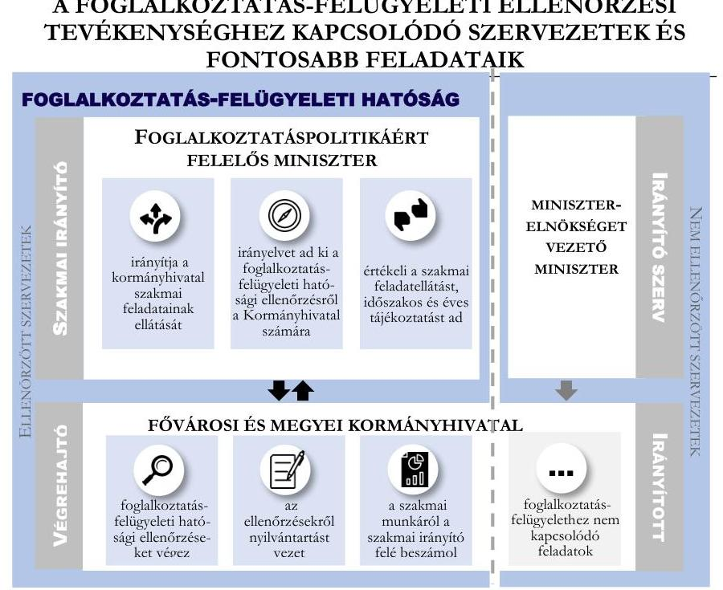
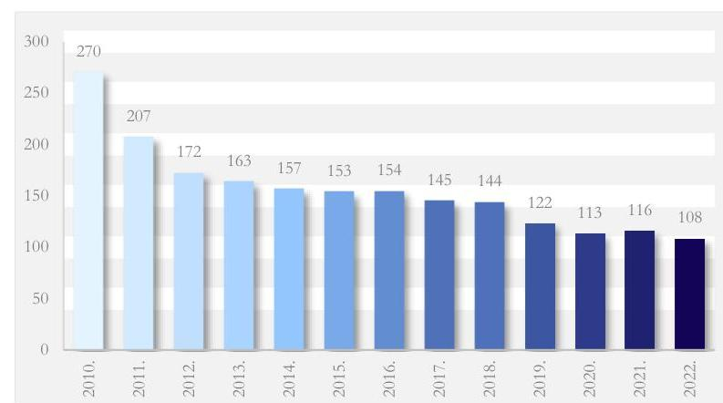
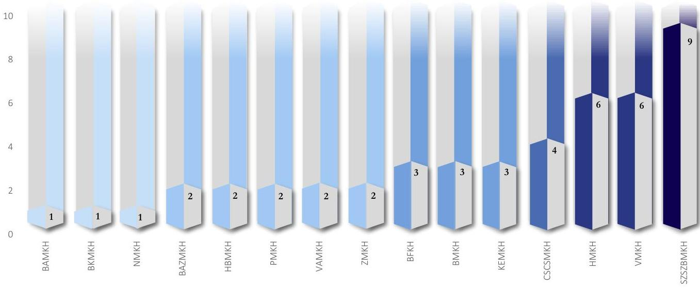
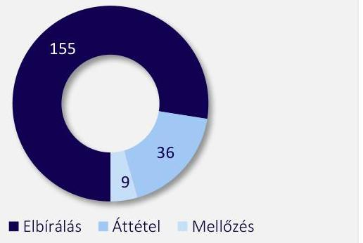
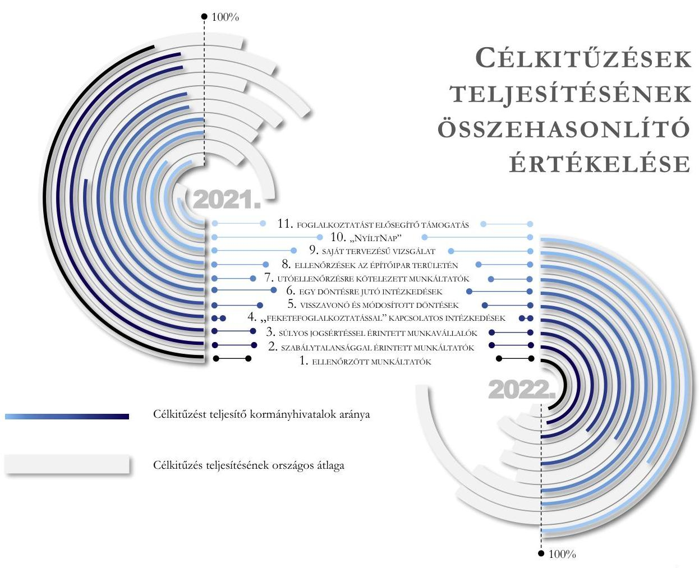
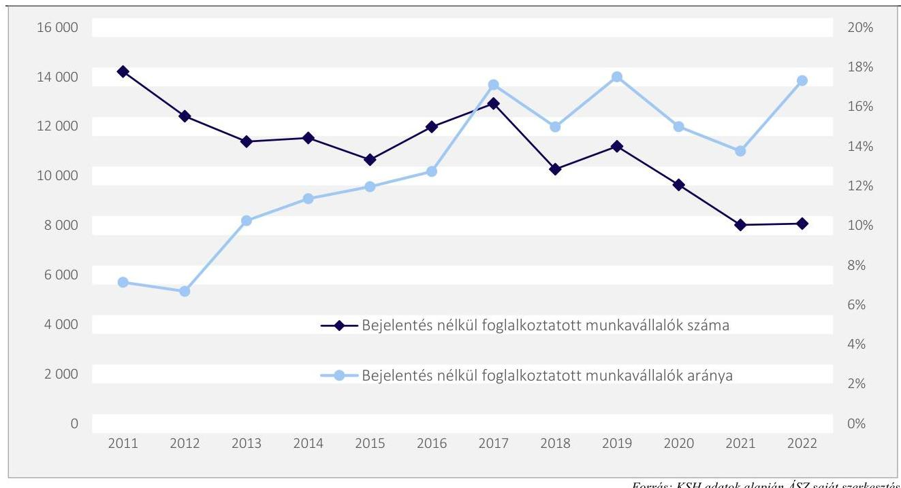
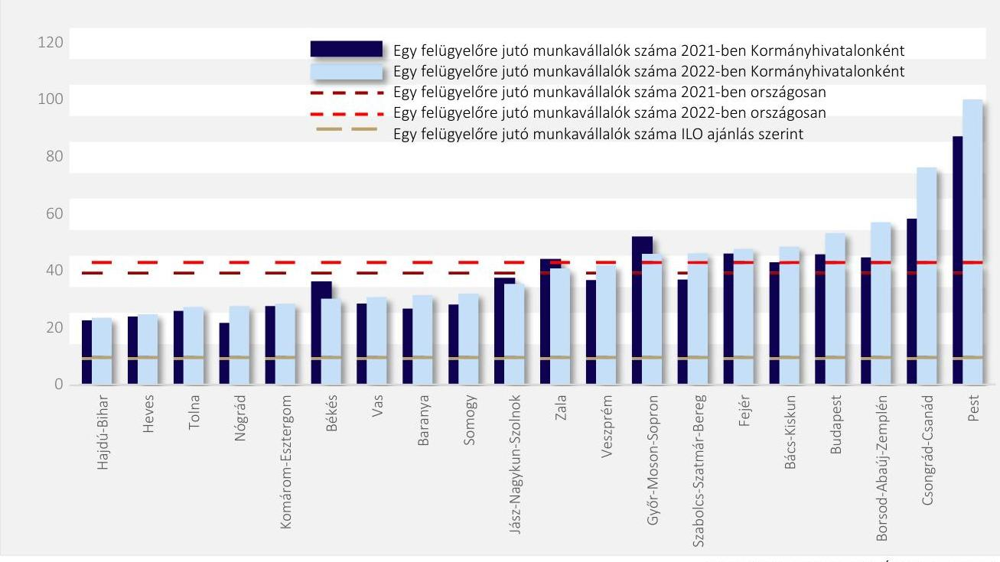
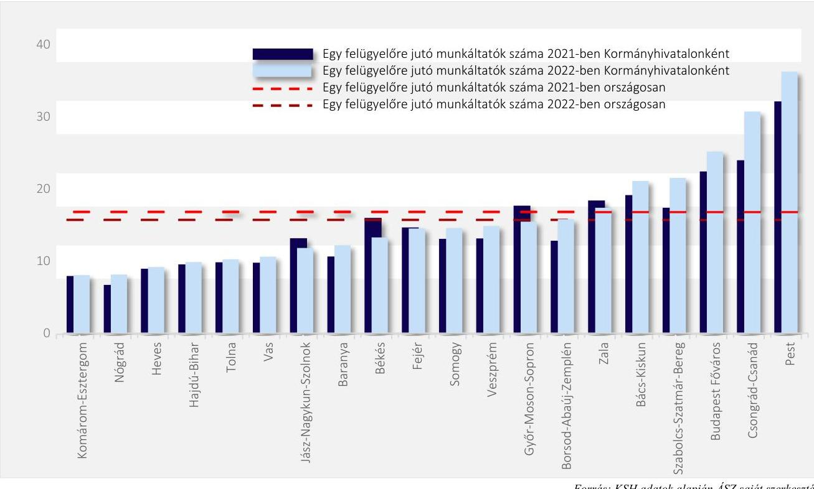
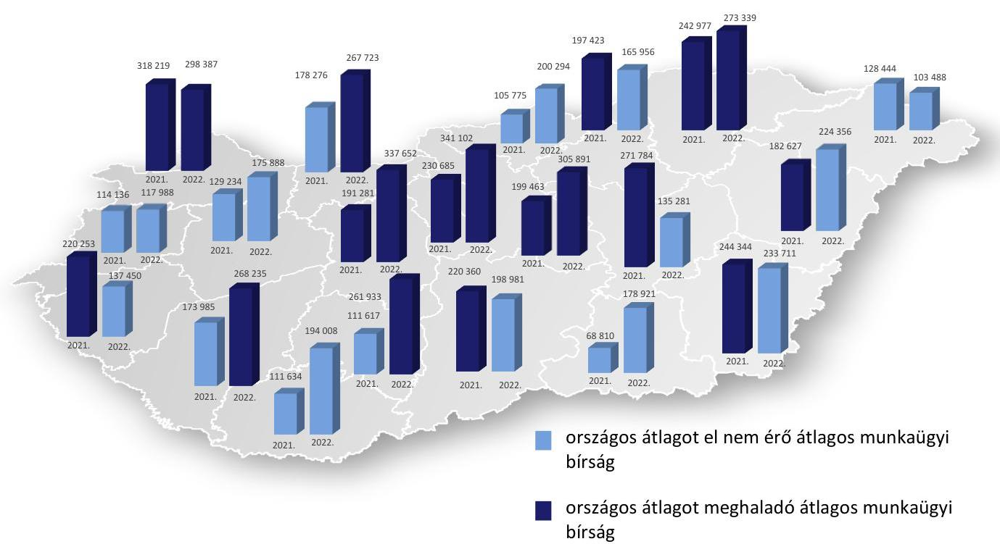
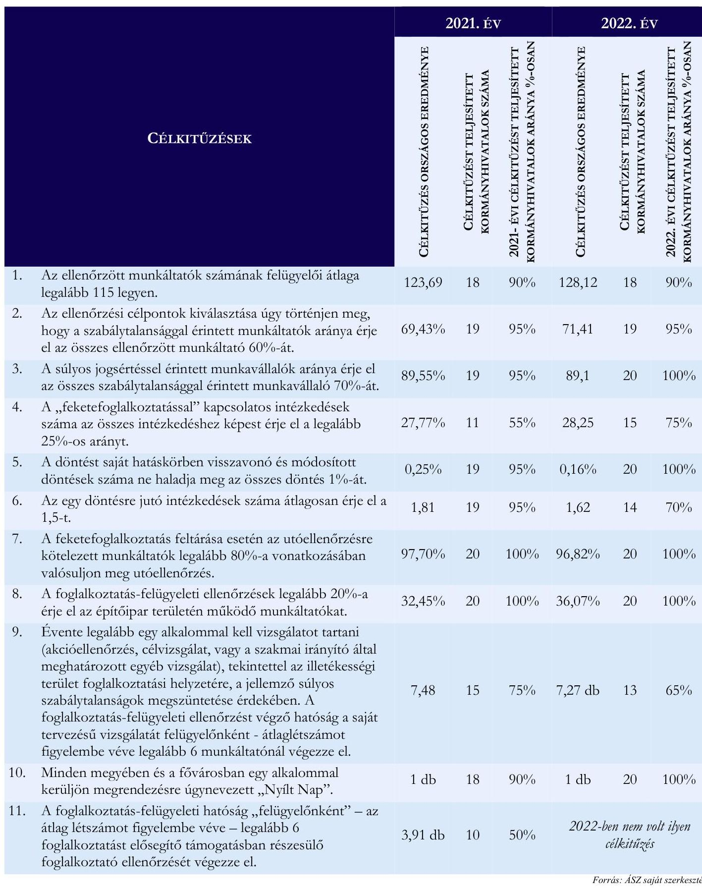

# JELENTÉS 

## Foglalkoztatás-felügyelet hatósági tevékenységének ellenőrzése

2024.

---

ÁLLAMI
SZÁMVEVŐSZÉK

# JELENTÉS 

## Foglalkoztatás-felügyelet hatósági tevékenységének ellenőrzése

2024.

---

# ELLENŐRZÉSI IGAZGATÓSÁG: 

## ÁLLAMHÁZTARTÁS KÖZPONTI SZINTJÉT ELLENŐRZŐ IGAZGATÓSÁG

## TELJESÍTMÉNYELLENŐRZÉSI IGAZGATÓSÁG

## ELLENŐRZÉSI IGAZGATÓ:

SINKÁNÉ DR. CSENDES ÁGNES ellenőrzési igazgató
DR. JAKAB KORNÉL ellenőrzési igazgató
Jelentéseink az interneten a www.asz.hu címen olvashatók.

## ELLENŐRZÉSVEZETŐ:

DR. KOVÁCS DIÁNA ellenőrzésvezető
SZAPPANOS JÚLIA ellenőrzésvezető

IKTATÓSZÁM: EL-4061-001/2024
TÉMASZÁM: 2621
ELLENŐRZÉS-AZONOSÍTÓ SZÁM: V0965

---

# TARTALOMJEGYZÉK 

AZ ELLENŐRZÉS ALAPADATAI ..... 5
AZ ELLENŐRZÖTT SZERVEZETEK ..... 7
ÖSSZEFOGLALÁS ..... 8
AZ ELLENŐRZÉS FÓKUSZTERÜLETEI ..... 11
MEGÁLLAPÍTÁSOK ..... 12
JAVASLATOK ..... 34
MELLÉKLETEK ..... 38
I. sz. melléklet: Értelmező szótár ..... 38
II. sz. melléklet: Az ellenőrzött szervezetek jegyzéke ..... 39
III. sz. melléklet: Ellenőrzési kritériumok ..... 40
IV. sz. melléklet: A panaszosok és közérdekű bejelentők felé fennálló tájékoztatási kötelezettség megsértése kormányhivatalonként. ..... 41
V. sz. melléklet: A foglalkoztatás-felügyeleti hatósági tevékenységre vonatkozó teljesítménycélok ..... 42
VI. sz. melléklet: A foglalkoztatás-felügyeleti hatósági tevékenységre vonatkozó teljesítménycélok és eredmények ..... 43
FÜGGELÉK: ÉSZREVÉTELEK ..... 44
RÖVIDÍTÉSEK JEGYZÉKE ..... 58

---

.

---

# AZ ELLENŐRZÉS ALAPADATAI 

## AZ ELLENŐRZÉS CÉLJA

Az ellenőrzés célja annak értékelése volt, hogy megfelelő volt-e a foglalkoztatás-felügyeleti hatósági tevékenység szakmai irányítása, a hatósági tevékenység kialakítása és ellátása, különös tekintettel a hatósági tevékenységhez kapcsolódó nyilvántartást érintő feladatellátásra. Az ellenőrzés kiterjedt továbbá a foglalkoztatás-felügyeleti hatósági tevékenység eredményességének értékelésére.

## AZ ELLENŐRZÉS TÍPUSA

Megfelelőségi és teljesítményellenőrzés

## AZ ELLENŐRZÖTT IDŐSZAK

2021. március 1. napjától 2022. december 31. napjáig, kitekintéssel a helyszíni ellenőrzés lezárásának időpontjáig, ami a megfelelőségi ellenőrzésben 2023. május 19., a teljesítményellenőrzésben 2023. július 15. napja volt.

## AZ ELLENŐRZÉS TÁRGYA

Az ellenőrzés tárgyát képezte a szakmai irányító szerv irányítói tevékenysége, a foglalkoztatás-felügyeleti hatóság szakmai, szervezeti kereteinek kialakítása, a hatósági tevékenység szabályszerű végrehajtása, továbbá a foglalkoztatás-felügyeleti hatósági tevékenység eredményessége.

## AZ ELLENŐRZÉS JOGALAPJA

Az ellenőrzés jogszabályi alapját az Állami Számvevőszékről szóló 2011. évi LXVI. törvény 5. § (2)-(3) bekezdéseiben foglalt előírások képezték.

## AZ ELLENŐRZÉS MÓDSZERE

Az ellenőrzést az Alaptörvény 43. cikk (1) bekezdésében meghatározott törvényességi, célszerűségi, eredményességi szempontok, a nemzetközi standardokat irányadónak tekintve az ellenőrzési program szempontjai, az ellenőrzött időszakban hatályos jogszabályok, az ellenőrzés-szakmai szabályok és módszertanok figyelembevételével végezte az ÁSZ ${ }^{1}$.

Az ellenőrzési kérdések megválaszolásához szükséges bizonyítékok megszerzése az ellenőrzött által rendelkezésre bocsátott, valamint nyilvánosan elérhető dokumentumokra, adatokra alapozva megfigyelés,

---

szemle (szemrevételezés), kérdésfelvetés (információkérés), mintavételezés, valamint elemző eljárás és személyes interjúk útján történt.

Az ellenőrzési bizonyítékként felhasználható adatforrások közé tartoztak egyrészt az ellenőrzési programban felsorolt adatforrások, másrészt minden, az ellenőrzés folyamán feltárt, az ellenőrzés szempontjából információt tartalmazó dokumentum.

Mintavételezésre a panaszok és közérdekű bejelentések kezelésének, a foglalkoztatás-felügyeleti hatósági ellenőrzések szabályszerűsége, valamint a foglalkoztatás-felügyeleti feladatellátást támogató informatikai rendszerben nyilvántartott adatok megbízhatóságának megítélésénél került sor.

A 2021. március 1. és 2022. december 31. közötti időszakban a foglalkoztatás-felügyeleti hatósági tevékenységhez kapcsolódó elbírált panaszok, közérdekű bejelentések, valamint a 2021. március 1. és 2022. december 31. közötti időszakban a kormányhivataloknál lezárult foglalkoztatás-felügyeleti hatósági ellenőrzések közül 200-200 minta kiválasztására került sor. Mindkét területen elemszámmal arányos rétegzett véletlen mintavétel történt, ahol a rétegeket a 20 ellenőrzött kormányhivatal képezte.

A foglalkoztatás-felügyelet ellenőrzési tevékenységet támogató információs rendszer osztályba sorolás és védelmi intézkedés közül 30 elemű, az adminisztratív védelmi intézkedésekhez, a fizikai védelmi intézkedésekhez, valamint a logikai védelmi intézkedésekhez kapcsolódó kritériumok közül elemszámmal arányos rétegzett véletlen mintavétel történt.

A kiválasztott mintatételek ellenőrzésének eredménye nem került kivetítésre a teljes sokaságra, a megállapítások az adott ellenőrzött mintatételek vonatkozásában kerültek megjelenítésre.

A bejelentés nélküli foglalkoztatás adatainak elemzéséhez az ÁSZ felhasználta az MNB${ }^{2}$ 2000. évtől rendelkezésre álló információit. Az adatok elemzésébe beletartozott a különböző forrásokból származó adatok összekapcsolása és összevetése is.

---

# AZ ELLENŐRZÖTT SZERVEZETEK 

A foglalkoztatásra irányuló jogviszonyokból eredő jogok és kötelezettségek érvényesülésének ellenőrzését az állam a foglalkoztatás-felügyeleti hatóság szervezetén keresztül biztosítja.

Az ellenőrzött időszakban az általános hatáskörű foglalkoztatás-felügyeleti hatóság a foglalkoztatáspolitikáért felelős miniszter - 2021 márciusától az ITM${ }^{3}$ minisztere, majd 2022. május 24-től a TIM${ }^{4}$ minisztere, 2022. november 22-től a gazdaságfejlesztési miniszter -, valamint a fővárosi és megyei kormányhivatalok voltak.

A foglalkoztatás-felügyelet területének jogi szabályozása a 2021. évben megváltozott, az állami hatósági ellenőrzés új szabályait a 2021. március 1-től hatályos Ffvv.${ }^{5}$-ben, végrehajtási szabályait a 2021. március 11-ével hatályos Ffvr.-ben${ }^{6}$ és a 320/2014. (XII. 13.) Korm. rendeletben${ }^{7}$ rögzítették.

Az ellenőrzött időszakban a 320/2014. (XII. 13.) Korm. rendelet alapján a fővárosi és megyei kormányhivatalokhoz rendelt foglalkoztatás-felügyeleti hatósági feladatokat az SZMSZ${ }_{1-2}$${ }^{8}$-ben foglaltak szerint, azok Foglalkoztatási, Munkaügyi és Munkavédelmi Főosztályai látták el. A megyei kormányhivatal illetékessége a székhelye szerinti megyére, Budapest Főváros Kormányhivatalának illetékessége Budapest területére terjedt ki. A kormányhivatal, mint foglalkoztatás-felügyeleti hatóság ellenőrizte a foglalkoztatásra irányuló jogviszonyt szabályozó jogszabályok minimumkövetelményeinek foglalkoztató általi megtartását, ennek keretében valamennyi foglalkoztatási helyszínen külön engedély és előzetes értesítési kötelezettség nélkül helyszíni ellenőrzést tarthatott. A foglalkoztatás-felügyeleti hatósági ellenőrzési feladatokat a 2021. évben 116 fő, a 2022. évben 108 fő felügyelői átlaglétszámmal látták el a fővárosi és megyei kormányhivatalok.

Az ellenőrzött szervezetek jegyzékét a jelentéstervezet II. sz. melléklete tartalmazza. 2023. január 1-től a megyei kormányhivatalok vármegyei kormányhivatalok lettek. A foglalkoztatás-felügyeleti ellenőrzési tevékenységhez kapcsolódó szervezeteket és fontosabb feladataikat az 1. ábra mutatja be.

Forrás: Az ellenőrzött időszakban hatályos jogszabályok alapján ÁSZ saját szerkesztés

---

# ÖSSZEFOGLALÁS 

2011 augusztusában jelent meg az ÁSZ 1111. sz. jelentése${ }^{9}$ a munkaügyi és munkavédelmi ellenőrzés rendszerének értékeléséről, amelynek középpontjában a 2006 és 2010 közötti munkaügyi és munkavédelmi folyamatok álltak. A gazdasági és jogi környezet változása, az ellenőrzött terület szempontjából kiemelt jelentőségű foglalkoztatási viszonyok átalakulása, fejlődése indokolta az ÁSZ újabb ellenőrzését, amely a foglalkoztatás-felügyeleti hatósági tevékenységre koncentrált.
Az ÁSZ jelen ellenőrzése két szempontból vizsgálta meg a foglalkoztatás-felügyeleti hatósági tevékenységet: egyrészt a szabályszerűség, másrészt a teljesítmény szempontjából.

A megfelelőségi ellenőrzés során megállapította az ÁSZ, hogy a foglalkoztatáspolitikáért felelős miniszter, mint szakmai irányító${ }^{10}$ a foglalkoztatás-felügyeleti hatósági tevékenység kereteit a jogszabályi előírások szerint kialakította, a foglalkoztatás-felügyeleti hatósági feladatkörben eljáró kormányhivatalok hatósági tevékenységének szakmai irányítását ellátta az ellenőrzött időszakban. Hiányosság volt, hogy a jogalkalmazási gyakorlatra irányadó módszertani útmutatók, tájékoztatók, normatív utasítások közül több felülvizsgálata és aktualizálása elmaradt.

A szakmai irányító a jogszabályi előírások szerint kialakította és a kormányhivatalok bevonásával működtette a foglalkoztatás-felügyeleti feladatok ellátásához, az adatok nyilvántartásához szükséges egységes informatikai rendszert. Az ellenőrzés során az informatikai rendszer működésével kapcsolatban kontrollhiányosságként került azonosításra, hogy a hatósági nyilvántartásba történő közzétételre kijelölt és a hatósági nyilvántartásban ténylegesen közzétett szervezetek egyezőségének kontrollja nem volt biztosított, ezzel összefüggésben adatbázis anomáliákat tárt fel az ellenőrzés. Előfordult, hogy a hatósági nyilvántartásban közzétételre kijelölt szervezet a ténylegesen közzétett szervezetek között nem volt megtalálható, illetve fordítva, a ténylegesen közzétett szervezet nem volt megtalálható a hatósági nyilvántartásban közzétételre kijelöltek között. Az elektronikus információs rendszerre érvényes biztonsági osztályhoz rendelt, kiválasztott biztonsági kritériumok érvényesülése nem volt alátámasztott. Az informatikai rendszer nem megfelelő működtetése kockázatot hordoz a közhiteles nyilvántartás megbízhatósága és a költségvetési támogatásokra vonatkozó speciális szabályok érvényesülése tekintetében, miszerint költségvetési támogatás - többek között - annak nyújtható, aki megfelel a rendezett munkaügyi kapcsolatok követelményeinek.

A kormányhivatalok foglalkoztatás-felügyeleti hatósági tevékenységének szervezeti és működési keretei a jogszabályi előírásoknak megfelelően kialakításra kerültek. A továbbképzési kötelezettségének a foglalkoztatás-felügyeleti hatósági ellenőrzési feladatkörben eljáró kormánytisztviselők közül 2021. évben 15 kormányhivatalban összesen 47 fő, 2022. évben 6 kormányhivatalnál egy-egy fő nem tett eleget.

A kormányhivatalok foglalkoztatás-felügyeleti hatósági tevékenységi körébe tartozó panaszok és közérdekű bejelentések kezelése során - az ellenőrzött esetekben - a panaszosok, illetve bejelentők felé fennálló tájékoztatási, értesítési kötelezettség teljesítése nem felelt meg a jogszabályi előírásoknak. Az ellenőrzött esetek 85,2%-ában a tájékoztatás során vagy nem rögzítették az elintézés várható időpontját és a vizsgálat meghosszabbodása indokait, vagy tájékoztatás egyáltalán nem történt. További hiányosság volt, hogy a panasz vagy a közérdekű bejelentés elbírálásának eredményéről, a megtett intézkedéssel vagy annak mellőzésével kapcsolatos értesítési kötelezettségének nem, vagy nem a jogszabályi előírásoknak megfelelően tettek eleget a kormányhivatalok. A panaszok nem jogszabályi előírásoknak megfelelő kezelése kockázatot jelent

---

a foglalkoztatás-felügyeleti hatósági tevékenység iránti társadalmi bizalom, illetve a bejelentett esetekben tett intézkedések átláthatósága szempontjából.

A kormányhivatalok foglalkoztatás-felügyeleti hatósági ellenőrzéseinek tervezése - a 2021. évben 11, a 2022. évben 10, míg a 2023. évben 13 kormányhivatal esetében - tartalmi hiányosságok miatt nem felelt meg a jogszabályi előírásoknak, illetve határidőn túl készültek el, továbbá egy kormányhivatal a 2021-2023. évekre ellenőrzési tervet nem készített.

A kormányhivatalok szabályszerűen dokumentálták a foglalkoztatás-felügyeleti hatósági ellenőrzéseiket. Hiányosság volt, hogy az ÁSZ által ellenőrzött eljárást lezáró 166 határozatból összesen 111 esetben a határozatok nem tartalmaztak a felmerült eljárási költséggel kapcsolatos rendelkezést.

A szakmai irányító évente a foglalkoztatás-felügyeleti ellenőrzésekre vonatkozóan ellenőrzési irányelveket adott ki a legsúlyosabb jogsértés, a bejelentés nélküli foglalkoztatás feltárása, ezáltal a feketegazdaság visszaszorítása, a munkavállalók, az állam, illetve a tisztességes vállalkozások alapvető érdekeinek védelme érdekében. A szakmai irányító nem rendelkezett átfogó, az ellenőrzési feladatokra is kiterjedő stratégiai tervvel az ellenőrzött időszakban, amelyben meghatározásra kerültek volna a bejelentés nélküli foglalkoztatás feltárása, a gazdaság fehérítése elveinek érvényesülése céljából szükséges intézkedések, feladatok, felelősök, határidők, illetve az, hogy hogyan határozható meg a rendelkezésre álló erőforrások, kapacitások eredményes felhasználása, az eredményes feladatellátás.

A szakmai irányító évente, számszerűsített formában meghatározta a kormányhivatalok részére a foglalkoztatás felügyeleti hatósági tevékenységre vonatkozó teljesítménycélokat. A kormányhivatalok, valamint a felügyelők részére meghatározott fajlagos teljesítmény-mutatók az egész országban egységesek voltak. A kormányhivatalok a foglalkoztatás-felügyeleti hatósági feladataik ellátása során a szakmai irányító által kitűzött teljesítménycélokat országos szinten összességében - 2021-ben egy kivételével mindegyiket, 2022-ben mindegyiket - teljesítették, a kormányhivatalokat egyenként vizsgálva a célkitűzések 2021-ben 85,5%-ban, 2022-ben 89,5%-ban teljesültek. A szakmai irányító a kormányhivatalok tevékenységét a kitűzött célmutatók alapján évente értékelte. A nem teljesített célkitűzések esetében, a foglalkoztatás-felügyeleti hatósági tevékenység hatékonyságának, eredményességének növelése érdekében az elmaradások okainak feltárására irányuló értékelésre nem került sor.

A kormányhivatalok széles információs bázisra támaszkodó, rendszerszerű kockázatelemzést nem alkalmaztak a foglalkoztatás-felügyeleti hatósági ellenőrzésre történő kiválasztás eredményességének növelése érdekében.

A munkáltatók ellenőrzésre való kiválasztásának valószínűsége, a jogsértés esetén alkalmazható bírság mértéke, továbbá a rendes munkaidőn kívül elvégzett ellenőrzések szempontjából a foglalkoztatás-felügyeleti hatósági feladatkörben eljáró kormányhivatalok gyakorlata nem volt egységes. Az ellenőrzésre történő kijelölés szempontjából kockázatot jelent, ha az ellenőrzés-végrehajtási lefedettségben területi eltérések jelentkeznek. Az egy felügyelőre jutó munkavállalók és munkáltatók számában több, mint négyszeres eltérés volt a kormányhivatalok között 2022-ben. Az ellenőri jelenlét területi elosztása nem biztosította, hogy az egyes megyék gazdálkodóinál hasonló eséllyel induljon ellenőrzés. A bírságolási gyakorlat területi eltéréseit mutatja, hogy az egyes kormányhivatalok esetében az egy határozatra jutó munkaügyi bírság összege átlagában 2021-ben 4,6-szoros volt az eltérés a legalacsonyabb és a legmagasabb érték között, míg 2022-ben 3,3-szoros.

A
 lefolytatott foglalkoztatás-felügyeleti ellenőrzések a 2021. évben 66,9%-ban, a 2022. évben 74,1%-ban mindössze három ágazatot (a be nem jelentett foglalkoztatással leginkább érintett építőipar, kereskedelem és vendéglátás) érintettek, ugyanakkor ezekben az ágazatokban országos szinten 2021-ben és 2022-ben a

---

munkavállalóknak csupán 24,1%-a és 24,7%-a dolgozott. A nem egységes ellenőrzési lefedettség, az országosan nem egyenletes ellenőri jelenlét mellett az ellenőrzések eltérő időbeli eloszlása is kedvezőtlenül befolyásolhatja az ellenőrzések eredményességét. 2021-ben öt, 2022-ben nyolc kormányhivatal nem hajtott végre ellenőrzést hivatali munkaidőn kívüli időpontokban.

A KEMKH ${ }^{11}$ és a BAMKH ${ }^{12}$ az ÁSZ tv. 29. § (2) bekezdés szerinti, a jelentéstervezet megállapításaira tett észrevételében arról tájékoztatta az ÁSZ-t, hogy intézkedéseket tesz az ÁSZ ellenőrzés során felmerült hiányosságok megszüntetése érdekében. Ennek keretében a KEMKH az elmaradt továbbképzéseket pótolja, a BAMKH a bejelentők tájékoztatására alkalmazott iratmintát kiegészíti, továbbá az Ákr. ${ }^{13}$ előírásait következetesen fogja alkalmazni, továbbá a véglegessé vált határozatot megküldte a NAV ${ }^{14}$ részére, ezzel az ÁSZ megállapításai az ellenőrzés során hasznosultak.

A BKMKH ${ }^{15}$ az ÁSZ tv. 29. § (2) bekezdés szerinti, a jelentéstervezet megállapításaira tett észrevételében arról tájékoztatta az ÁSZ-t, hogy intézkedéseket tett az ÁSZ ellenőrzés során felmerült hiányosságok megszüntetése érdekében, melynek keretében az értesítési kötelezettség teljesítése érdekében osztályvezetői utasítás került kiadásra, továbbá az 1/2022. osztályvezetői utasítás betartása érdekében figyelemfelhívás történt, valamint a 2024. évi ellenőrzési tervet módosították a jelentéstervezetben foglalt javaslatnak megfelelően, továbbá az Ákr. előírásait következetesen fogja alkalmazni, ezzel az ÁSZ megállapításai az ellenőrzés során hasznosultak.

Az NGM ${ }^{16}$ az ÁSZ tv. 29. § (2) bekezdés szerinti, a jelentéstervezet megállapításaira tett észrevételében arról tájékoztatta az ÁSZ-t, hogy intézkedéseket tesz az ÁSZ ellenőrzés során felmerült hiányosságok megszüntetése érdekében, melynek keretében megalkotásra kerül a Nemzetgazdasági Minisztérium stratégiai tartalmú dokumentuma, továbbá - a bírságalkalmazás szigorítását tartalmazó - jogszabálymódosítási kezdeményezésről döntött, ezzel az ÁSZ megállapításai az ellenőrzés során hasznosultak.

---

# AZ ELLENŐRZÉS FÓKUSZTERÜLETEI 

1. A foglalkoztatás-felügyeleti hatósági tevékenység szakmai irányítása
2. A foglalkoztatás-felügyeleti hatósági tevékenység működési feltételeinek kialakítása a kormányhivataloknál
3. A foglalkoztatás-felügyeleti hatósági tevékenység ellátása a kormányhivataloknál
4. A foglalkoztatás-felügyeleti hatósági tevékenység eredményességének értékelése

---

# 1. A foglalkoztatás-felügyeleti hatósági tevékenység szakmai irányítása 

Összegző megállapítás

A foglalkoztatás-felügyeleti hatósági tevékenység szakmai irányítása megfelelt a jogszabályi előírásoknak. Az informatikai rendszerrel kapcsolatban a közhiteles hatósági nyilvántartásra kiható működési hiányosság került feltárásra.

A szakmai irányító a foglalkoztatás-felügyeleti hatósági tevékenység kereteit, azaz a foglalkoztatásfelügyeleti feladatokat ellátó minisztérium szervezetét, feladatai ellátásának részletes belső rendjét és módját, a szakmai felelős szervezeti egység vezetőinek és alkalmazottainak feladat- és hatáskörét, továbbá a szervezeti egység minisztériumon belüli belső és azon kívüli külső kapcsolattartásának módját, szabályait - az Ávr. ${ }^{17}$ előírásainak megfelelően - az ITM SZMSZ-ben ${ }^{18}$ és a TIM SZMSZ-ben ${ }^{19}$ alakította ki az ellenőrzött időszakban.
A szakmai irányító a foglalkoztatás-felügyeleti hatósági feladatai ellátásának szakmai irányítására a foglalkoztatáspolitikáért felelős államtitkárt és a Foglalkoztatás-felügyeleti Irányítási Főosztályt jelölte ki. A szakmai irányító főosztály Ügyrend$_{1-2}$-jében ${ }^{20}$ - az Ávr. előírásai szerint - meghatározták a munkafolyamatokat, a feladatellátás, valamint a helyettesítés rendjét.
A foglalkoztatás-felügyeleti hatósági feladatkörben eljáró kormányhivatalok hatósági tevékenységének szakmai irányítását a szakmai irányító a 320/2014. (XII. 13.) Korm. rendelet és a 86/2019. (IV. 23.) Korm. rendelet ${ }^{21}$ előírásainak megfelelően látta el az ellenőrzött időszakban. A kormányhivatalok szakmai feladatellátását a szakmai irányító módszertani útmutatók, tájékoztató anyagok, normatív utasítások kiadásával támogatta. A kormányhivatalok foglalkoztatás-felügyeleti hatósági tevékenységének egységes jogalkalmazási gyakorlatát elősegítve - a megváltozott jogszabályi környezethez igazodóan - a szakmai irányító 2021. március 11-én Kézikönyv²2-et állított össze, amely tartalmazta többek között a foglalkoztatás-felügyeleti hatósági eljárásra vonatkozó szakmai és eljárási szabályokat. A Kézikönyv mellett az ellenőrzött időszakban további 10 módszertani útmutató, 21 tájékoztató és 3 normatív utasítás volt alkalmazásban. Az alkalmazásban lévő, 2012. és 2017. között kiadott, tartalmilag a jogalkalmazási gyakorlatra irányadó módszertani útmutatók közül 8 és a tájékoztatók közül 10 a foglalkoztatás-felügyeleti hatósági feladatellátást csak részben tudta támogatni. A módszertani útmutatókban és tájékoztatókban szereplő jogszabályi hivatkozások az ellenőrzött időszakban már nem voltak hatályosak, valamint az útmutatókban előírt kötelező éves, illetve a jogszabályváltozáshoz kötött felülvizsgálatot a szakmai irányító nem végezte el. A normatív utasítások - a 7/2012. (XI. 13.) NMH utasítás ${ }^{23}$ és a 9/2012. (XI. 23.) NMH utasítás ${ }^{24}$ - alapját jelentő felhatalmazó rendelkezések az ellenőrzési időszakra hatályukat vesztették*.

[^0]
[^0]:    * A 7/2012. (XI. 13.) NMH utasításban szabályozott vizsgáztatás részletes szabályait a 320/2014. (XII. 13.) Korm. rendelet 15/A. § (2) bekezdése alapján 2021. március 11-étől a szakmai irányítónak vizsgaszabályzatban kell megállapítania.
    A 9/2012. (XI. 23.) NMH utasítás tárgyi hatályára utaló jogszabályhely - a biztonsági okmányok védelméről szóló 86/1996. (VI. 14.) Korm. rendelet 1. számú mellékletének III. része 1.93. pontja - 2017. január 1-jétől hatálytalan, személyi hatálya 2015. január 1-je óta nem létező szervezetre utal.

---

A szakmai irányító - a 320/2014. (XII. 13.) Korm. rendelet előírásainak megfelelően - elkészítette a foglalkoztatás-felügyeleti feladatkörben eljáró kormánytisztviselők vizsgára való felkészítését, a záróvizsgát, valamint a vizsgakötelezettség alóli mentesülést tartalmazó részletes Vizsgaszabályzatot ${ }^{25}$. Az ellenőrzött időszakban a szakmai irányító gondoskodott a 2021. március 11-ét követően létesített foglalkoztatás-felügyelői kormánytisztviselői jogviszonyok esetében a hatósági ellenőrzésre jogosító vizsga lebonyolításáról.
A 320/2014. (XII. 13.) Korm. rendelet alapján a szakmai irányító 2021. és 2022. években biztosította a foglalkoztatás-felügyeleti hatósági tevékenységgel kapcsolatos szakmai képzéseket és továbbképzéseket. A képzéseket, továbbképzéseket a szakmai irányító 2021-ben online formában, míg 2022-ben online és jelenléti oktatással biztosította. Az ellenőrzött időszakban a képzések a munkabérre vonatkozó szabályokra, az egyszerűsített foglalkoztatásra vonatkozó szabályok ismertetésére, a foglalkoztatásfelügyeleti ellenőrzés eljárási szabályaira, valamint a szövetkezetek és a munkaerőkölcsönzés, kiküldetés és harmadik országbeliek foglalkoztatására vonatkozó szabályokra irányultak. A szakmai irányító a meghirdetett képzésekről a kormányhivatalokat tájékoztatta.
A szakmai irányító a foglalkoztatás-felügyeleti hatósági ellenőrzésekről a 320/2014. (XII. 13.) Korm. rendeletben foglaltak szerint évente Ellenőrzési irányelvet ${ }^{26}$ adott ki, valamint gondoskodott az Ellenőrzési irányelvek minisztérium honlapján történő közzétételéről. A szakmai irányító a 2021., 2022. és 2023. évi Ellenőrzési irányelvekben a foglalkoztatás-felügyeleti ellenőrzés elsődleges feladataként határozta meg a legsúlyosabb jogsértés, a bejelentés nélküli foglalkoztatás feltárását, emellett kiemelt cél volt a munkához kapcsolódó garanciális jogok - a munkabér, a pihenőidő, az éves szabadság, illetve a munkaidő nyilvántartására vonatkozó jogszabályok - biztosításának ellenőrzése. A miniszter a foglalkoztatás-felügyeleti Ellenőrzési irányelvekben előírta, hogy a kormányhivatalok területi sajátosságaikat értékelve évente legalább egy alkalommal tartsanak vizsgálatot az illetékességi területükön, valamint az ellenőrzési célpontok kiválasztási szempontjaként rögzítette a munkajogi jogsértésekkel leginkább érintett ágazatok vizsgálatát, a területi sajátosságok figyelembevételét, az ellenőrzésbe a megelőző időszakban be nem vont ágazatok kiválasztását.
A kormányhivatalok foglalkoztatás-felügyeleti hatósági ellenőrzéseinek tervezéséhez a szakmai irányító a 2021-2023. évekre vonatkozóan Országos hatósági ellenőrzési terveket ${ }^{27}$ készített a 86/2019. (IV. 23.) Korm. rendeletben foglaltak szerint, amelyeket a minisztérium honlapján közzétett. A 2021-2023. évi foglalkoztatás-felügyeleti Országos hatósági ellenőrzési tervek alapján a szakmai irányító különböző ágazatok és tevékenységek célvizsgálatát és akcióellenőrzését írta elő, amelyet az 1. táblázat mutat be.

# 1. táblázat 

AZ ORSZÁGOS HATÓSÁGI ELLENŐRZÉSI TERVEKBEN SZEREPLŐ ELLENŐRIZENDŐ ÁGAZATOK, TEVÉKENYSÉGEK

| 2021. | 2022. | 2023. |
| :--: | :--: | :--: |
| - építőipari ágazat   - személy- és vagyonvédelmi tevékenység   - takarítási tevékenység   - a harmadik országbeli állampolgárok foglalkoztatása | - a kereskedelmi ágazatban működő piacok, vásárok   - mezőgazdasági, erdőgazdálkodási, halászati ágazat   - feldolgozóiparon belül az élelmiszergyártási és italgyártási alágazatok   - élelmiszergyártási és italgyártási alágazatok | - mezőgazdasági, erdőgazdálkodási, halászati ágazat   - feldolgozóiparon belül az élelmiszergyártási és italgyártási alágazatok   - a szabadsággal kapcsolatos szabályok |

A 2021-2023. évi Országos hatósági ellenőrzési tervekben szereplő ágazatok, tevékenységek kiválasztása az ellenőrzési tapasztalatok, a jogsértések elterjedtsége alapján történt. A szakmai irányító az Országos

---

hatósági ellenőrzési tervek elkészítésekor nem működtetett kockázatkezelési rendszert a további kockázatok azonosítása érdekében, az Országos hatósági ellenőrzési tervekben szereplő ágazatok, tevékenységek kiválasztását rendszerszerű kockázatelemzés és ahhoz szükséges adatbázis nem támasztotta alá annak ellenére sem, hogy ennek jelentőségére az ÁSZ 1111. sz. jelentésében felhívta a figyelmet.
A 320/2014. (XII. 13.) Korm. rendelet előírásainak megfelelően a szakmai irányító a foglalkoztatásfelügyeleti hatósági feladatkörében eljáró kormányhivatalok által lefolytatott hatósági ügyekben hozott valamennyi határozatot - azok véglegessé válása előtt - felülvizsgálta, kontrollálta. A 320/2014. (XII. 13.) Korm. rendelet és az Ákr. szerinti felügyeleti eljárás a foglalkoztatás-felügyeleti hatósági feladatkörében eljáró kormányhivatalok által lefolytatott hatósági ügyekben 2021-ben hozott határozatok 0,2%-át, 2022-ben 0,1%-át érintette. Ennek keretében a szakmai irányító 3 esetben megsemmisítette a foglalkoztatásfelügyeleti hatósági feladatkörben eljáró kormányhivatal hatósági döntését, 18 esetben megsemmisítette és a kormányhivatalt új eljárásra utasította, 4 esetben megváltoztatta a kormányhivatal hatósági döntését és további 4 esetben intézkedést tett - közigazgatási hatósági eljárás lefolytatására utasította a kormányhivatalt - a jogszabálysértő mulasztás felszámolására az ellenőrzött években.
A szakmai irányító a beszámolási és tájékoztatási kötelezettségének eleget tett az ellenőrzött években: elkészítette az országos beszámolót a 2021. évi és a 2022. évi foglalkoztatás-felügyeleti hatósági ellenőrzésekről a kormányhivatalok ellenőrzési jelentései alapján területi és hatásköri bontásban, továbbá gondoskodott azok minisztérium honlapján történő közzétételéről a 86/2019. (IV. 23.) Korm. rendelet és 568/2022. (XII. 23.) Korm. rendelet ${ }^{28}$ előírásainak megfelelően. A 2021. és 2022. évre vonatkozó országos beszámoló tartalmazta az Országos hatósági ellenőrzési tervekben szereplő és a kormányhivatalok saját kezdeményezésű akcióellenőrzéseit és célvizsgálatait, valamint a társhatóságok kezdeményezésére, illetve bevonásával lefolytatott ellenőrzések adatait, ellenőrzési tapasztalatokat. A szakmai irányító negyedéves és éves tájékoztatást tett közzé az Ellenőrzési irányelvek végrehajtásáról a 320/2014. (XII. 13.) Korm. rendelet előírásainak megfelelően.
A szakmai irányító foglalkoztatás-felügyelethez kapcsolódó jogszabály módosításában, észrevételezésében közreműködött a 94/2018. (V. 22.) Korm. rendeletben ${ }^{29}$ és a 182/2022. (V. 24.) Korm. rendeletben ${ }^{30}$ meghatározott feladatkörében eljárva az ellenőrzött időszakban; az egyes foglalkoztatási tárgyú kormányrendeletek, az Fftv., a panaszokról, közérdekű bejelentésekről szóló jogszabály, a veszélyhelyzet ideje alatt külföldiek magyarországi foglalkoztatására vonatkozó különleges szabályok módosítását véleményezte.
A szakmai irányító a foglalkoztatás-felügyeleti hatósági feladatkörben eljáró kormányhivataloknál cél- és átfogó ellenőrzést folytatott le az ellenőrzött években a 86/2019. (IV. 23.) Korm. rendeletben foglaltak szerint. A célellenőrzések - 2021-ben JNSZMKH ${ }^{31}$-nál, NMKH ${ }^{32}$-nál, ZMKH ${ }^{33}$-nál és 2022-ben BAMKH-nál, SZSZBMKH ${ }^{34}$-nál, SMKH ${ }^{35}$-nál - a foglalkoztatás-felügyeleti hatósági eljárás során alkalmazható legsúlyosabb közigazgatási szankció, a munkaügyi bírság alkalmazásának gyakorlatára irányultak. A 2021-2022. években lefolytatott célellenőrzések összefoglaló jelentéseiben intézkedést igénylő hiányosságot a szakmai irányító nem tárt fel, intézkedési
 terv készítésére nem volt szükség. A szakmai irányító 2023. évre vonatkozóan újabb három kormányhivatal célellenőrzését tervezte.
Az ellenőrzött időszakban átfogó ellenőrzés keretében került sor - 2021-ben BKMKH-nál és $\mathrm{HMKH}^{36}$ nál, 2022-ben $\mathrm{TMKH}^{37}$-nál - a foglalkoztatás-felügyeleti hatósági ellenőrzési tevékenységére vonatkozó ellenőrzés lefolytatására. Az átfogó ellenőrzések eredményeként a szakmai irányító BKMKH-nál és HMKH-nál a Panasztv.-ben ${ }^{38}$ és a kapcsolódó Panaszok és közérdekű bejelentésekről szóló módszertani

---

útmutatóban ${ }^{39}$ foglalt előírások - a panaszos vagy a közérdekű bejelentő tájékoztatásának, értesítésének be nem tartása miatt, míg a TMKH-nál a hatósági döntések Ákr. 81. § (1) bekezdés szerinti hiányos adattartalma és nem jogszerű kiadmányozása, valamint a kényszerbejelentések elmaradása miatt írt elő intézkedési kötelezettséget. A feltárt hibák, hiányosságok kiküszöbölése érdekében a BKMKH és a HMKH intézkedett, a megtett intézkedések végrehajtásáról a szakmai irányítónak beszámoltak. A TMKH-nál az átfogó ellenőrzés az ÁSZ megfelelőségi ellenőrzésének helyszíni szakaszának befejezéséig nem zárult le.
A foglalkoztatás-felügyeleti hatósági ellenőrzéssel kapcsolatos állami irányítási feladatait a szakmai irányító a 320/214. (XII. 13.) Korm. rendelet előírásainak megfelelően látta el. A szakmai irányító a munkaügyi jogszabályok alkalmazásának elősegítését szolgáló tájékoztató és felvilágosító tevékenységét részben a foglalkoztatás-felügyeleti hatósági feladatkörben eljáró kormányhivatalok közreműködésével, részben a minisztérium honlapján keresztül biztosította az ellenőrzött években. A foglalkoztatás-felügyeleti ellenőrzések éves ellenőrzési tapasztalatairól szóló beszámoló alapján a szakmai irányítóhoz 2021-ben több, mint 300, 2022-ben közel 200 megkeresés érkezett.
A szakmai irányító magyar és angol nyelven elérhető egységes hivatalos nemzeti honlapot hozott létre annak érdekében, hogy a Magyarország területére kiküldött munkavállalókra vonatkozó foglalkoztatási szabályokról és szociális feltételekről díjmentes tájékoztatásnyújtás megvalósuljon. A szakmai irányító a honlap működtetésével biztosította, hogy hozzáférhető és átlátható módon rendelkezésre álljanak a foglalkoztatási szabályokra és feltételekre vonatkozó jogszabályok, kollektív szerződések az Európai Unió más tagállamából származó szolgáltatók és a Magyarország területére kiküldött munkavállalók számára, illetve tájékoztatást nyújtott a honlapon azokról a szervekről és hatóságokról, amelyekhez információért fordulhatnak.
A 320/2014. (XII. 13.) Korm. rendelet szerinti, az Európai Unió, valamint az EGT-tagállamok munkaügyi feladatokat ellátó hatóságaival való együttműködéshez a kapcsolattartó személy kijelöléséről a szakmai irányító gondoskodott.
A szakmai irányító a foglalkoztatás-felügyeleti hatóság nemzetközi feladatait az Ffvr. előírásai szerint látta el az ellenőrzött években. A külföldi hatóságoktól ${ }^{40} 560$ megkeresés érkezett az ellenőrzött időszakban, amelyeknek eleget téve a szakmai irányító tájékoztatást nyújtott az elvégzett hatósági ellenőrzések megállapításairól, ellenőrzést folytatott le a foglalkoztatás-felügyeleti hatósági feladatkörben eljáró kormányhivatalok útján a munkavállalók kiküldetésére alkalmazandó szabályok be nem tartásának vagy azokkal való visszaéléseknek a kivizsgálására, információt szolgáltatott a foglalkoztatókkal szemben alkalmazott közigazgatási szankciók és bírságok végrehajtásával kapcsolatban, és gondoskodott az illetékes külföldi hatóságok által megküldött iratok továbbításáról. A nemzetközi együttműködés keretében a külföldi hatóság a magyar foglalkoztatás-felügyeleti hatóság megkeresését - amelyek a munkavállalók kiküldetésével kapcsolatos információkérések voltak - minden esetben teljesítette.
A nemzetközi feladatellátáshoz kapcsolódóan a szakmai irányító az Ffvr. előírásainak megfelelően magyar és angol nyelven, korlátozásmentesen és ingyenesen, a fogyatékossággal élők számára is hozzáférhető módon működtette az egységes nemzeti honlapot, a határokon átnyúló szolgáltatásnyújtást végző munkáltatók és az általuk kiküldött munkavállalók jogaival és kötelezettségeivel összefüggő lényeges információkhoz való hozzáférés biztosítása érdekében. Ennek keretében a honlap az Ffvr.-ben meghatározottak szerint tartalmazta a szolgáltatásnyújtás keretében történő kiküldetés megfelelőségének értékelési szempontjait, a határokon átnyúló szolgáltatásnyújtás megkezdéséről szóló bejelentés adattartalmát, valamint a határokon átnyúló szolgáltatásnyújtást végző foglalkoztatók és az általuk

---

kiküldött foglalkoztatottak jogaival és kötelezettségeivel összefüggő lényeges információkat, továbbá a foglalkoztatás-felügyeleti hatóság határozatának külföldön történő végrehajtása iránti megkeresés adattartalmát. A nemzetközi kötelezettség tekintetében az információk a magyar és angol nyelv mellett 12 (francia, német, orosz, cseh, spanyol, horvát, olasz, holland, lengyel, román, szlovák és szlovén) nyelven is elérhetőek voltak.
A szakmai irányító kialakította és a 320/2014. (XII. 13.) Korm. rendeletben előírtaknak megfelelően a kormányhivatalok bevonásával működtette a foglalkoztatás-felügyeleti feladatok ellátásához, az adatok nyilvántartásához szükséges egységes informatikai rendszert, a FEIR ${ }^{41}$-t. A FEIR kezelésével kapcsolatos, valamint a munkaügyi nyilvántartásokhoz való hozzáférésre vonatkozó részletes feladatokat a szakmai irányító a Kézikönyvben határozta meg. A FEIR támogatta a hatósági, irányítási és felügyeleti feladatok ellátását, tartalmazta az egyes foglalkoztatás-felügyeleti jogsértésekkel kapcsolatos hatósági nyilvántartással összefüggő, és a hatósági ellenőrzések és eljárások során keletkezett iratok, illetve hatósági döntések adatait.
A FEIR almoduljaként működött az Fftv.-ben előírt, a foglalkoztatók munkaügyi kapcsolatai rendezettségével kapcsolatos adatok - más szervek eljárásában történő felhasználása céljából vezetett közhiteles hatósági nyilvántartása. A foglalkoztatók munkaügyi kapcsolatai rendezettségével kapcsolatos hatósági nyilvántartás - az Fftv.-ben előírtakkal összhangban - a foglalkoztató adatain felül tartalmazta a jogsértést megállapító határozat keltét és számát, véglegessé és végrehajthatóvá válásának időpontját, a jogsértés megjelölését, az alkalmazott jogkövetkezményt és mértékét az annak alapjául szolgáló jogszabályhelyre történő utalással, közigazgatási per esetén a jogerős bírósági határozat keltét és számát, jogerőssé és végrehajthatóvá válásának időpontját, valamint azt, hogy a bíróság milyen döntést hozott.
A FEIR és a foglalkoztatók munkaügyi kapcsolatai rendezettségével kapcsolatos hatósági nyilvántartásban nyilvánosságra hozott adattartalom egyezőségének ellenőrizhetősége nem volt biztosított, mivel a FEIR rendszer alkalmazási felületén keresztül nem volt biztosított a hatósági nyilvántartásba történő közzétételre kijelölt és a hatósági nyilvántartásban ténylegesen közzétett szervezetek egyezőségének kontrollálása; nem volt lekérdezhető, hogy

- az adott napon mely foglalkoztatók adatai érhetők el a foglalkoztatók munkaügyi kapcsolatai rendezettségével kapcsolatos közhitelesnek minősülő hatósági nyilvántartásban, valamint
- az adott napon mely foglalkoztatók kerültek kijelölésre a munkaügyi kapcsolatai rendezettségével kapcsolatos hatósági nyilvántartásban történő nyilvánosságra hozatalra.
A helyszíni ellenőrzés során a FEIR adatbázisból - alkalmazási felületén kívüli - közvetlen hozzáféréssel lekérdezésre került azon foglalkoztatók listája, amelyek 2021. március 1. napjától kijelölésre kerültek a foglalkoztatók munkaügyi kapcsolatai rendezettségével kapcsolatos hatósági nyilvántartásban történő közzétételre. A helyszíni ellenőrzés során a FEIR alkalmazási felületén keresztül lekérdezésre került továbbá azon foglalkoztatók listája, amelyek az Ffvr. 22. § előírásai szerint kérték adatainak a honlapról történő törlését. A két lista összevetésre került a foglalkoztatók munkaügyi kapcsolatai rendezettségével kapcsolatos hatósági nyilvántartásban 2023. április 25-én közzétett foglalkoztatókkal.

A foglalkoztató naptári évenként egy alkalommal jogosult kérni, hogy a foglalkoztatás-felügyeleti hatóság - a harmadik országbeli állampolgárnak a munkavégzésre jogosító engedély nélküli foglalkoztatása miatt kiszabott munkaügyi bírság kivételével - a nyilvánosságra hozatali időtartam leteltét megelőzően törölje a közzétett és végrehajtott határozattal kapcsolatos adatokat a honlapjáról, amennyiben a kérelem benyújtásával egyidejűleg teljesíti a jogszabályban meghatározott mértékű befizetést. (Ffvr. 22. § (1) bekezdés)

---

Az adatbázisok összehasonlítása alapján:

- Az ellenőrzés 55 olyan szervezetet azonosított, amelyek a hatósági nyilvántartás alapján a közzétételre kijelölésre kerültek, azonban a hatóság honlapján nem kerültek megjelenítésre, annak ellenére, hogy a foglalkoztatók munkaügyi kapcsolatai rendezettségével kapcsolatos hatósági nyilvántartásban történő nyilvánosságra hozatal törlését nem kérték.
- Az ellenőrzés 60 olyan foglalkoztatót azonosított, amelyeknek az adatai a foglalkoztatók munkaügyi kapcsolatai rendezettségével kapcsolatos hatósági nyilvántartás honlapján elérhetőek voltak a nyilvánosság számára, azonban a FEIR-ben nem kerültek közzétételre kijelölésre.
- Az ellenőrzés 11 esetben azonosított olyan foglalkoztatót, amely 2021. március 1-jét követően teljesítette a Ffvr.-ben meghatározott mértékű befizetést és kérte nyilvánosságra hozott adatainak törlését a foglalkoztatók munkaügyi kapcsolatai rendezettségével kapcsolatos hatósági nyilvántartásból, azonban a FEIR nem tartalmazott adatot a 2023. március 1-jét megelőző két évre vonatkozó jogerős határozatok figyelembevételével a hatóság honlapján történő közzétételre vonatkozóan.
A feltárt adatbázis anomáliák a rendszer nem megfelelő működését jelzik, ami kockázatot jelent a foglalkoztatók munkaügyi kapcsolatai rendezettségével kapcsolatos közhiteles hatósági nyilvántartásban közzétett adatok adattartalmának megbízhatóságára, ezáltal az Áht. 50. § (1) bekezdés a) pontjában foglalt követelmény - miszerint költségvetési támogatás többek között annak nyújtható, aki megfelel a rendezett munkaügyi kapcsolatok követelményeinek - teljesülése sem volt biztosított.
A FEIR-ben kezelt adatok és információk bizalmasságának, sértetlenségének és rendelkezésre állásának osztályba sorolását OVI ${ }^{42}$ űrlap tartalmazta. Az űrlap alapján a FEIR 2021. január 1-jével teljesítette a 3-as osztályba soroláshoz tartozó biztonsági kritériumokat. A biztonsági kritériumok érvényesülésének ellenőrzésére véletlenszerűen kiválasztott 30 biztonsági kritériumból mindösszesen 4 kontroll működése volt igazolt, 25 kritérium érvényesülése nem volt alátámasztott, illetve egy kritérium nem volt releváns a FEIR esetében (a kritérium más technológiára vonatkozott, mint ami FEIR rendszer esetében kiépítésre került). Az OVI űrlapon nevesített, biztonsági kritériumok teljesülését igazolni hivatott dokumentumok jellemzően nem a biztonsági kritériumok megvalósulását támasztották alá, hanem belső szabályozó előírásokra utaltak. A szakmai irányító nem tett eleget a Vhr. ${ }^{43} 4$. mellékletében előírt, a FEIR elektronikus információs rendszerére érvényes biztonsági osztályhoz rendelt, kiválasztott biztonsági kritériumokban meghatározott követelményeknek.

# 2. A foglalkoztatás-felügyeleti hatósági tevékenység működési feltételeinek kialakítása a kormányhivataloknál 

Összegző megállapítás A foglalkoztatás-felügyeleti hatósági tevékenység működési feltételeinek kialakítása a kormányhivataloknál megfelelt a jogszabályi előírásoknak.

Az ellenőrzött időszakban a kormányhivatalok a foglalkoztatás-felügyeleti hatósági tevékenységének szervezeti kereteit az Áht. ${ }^{44}$-ban előírtak szerint SZMSZ${ }_{1,2}$-ben állapították meg. Az SZMSZ${ }_{1,2}$-ben foglaltak szerint a kormányhivatalok foglalkoztatás-felügyeleti hatósági tevékenységét a kormányhivatalok Foglalkoztatási, Munkaügyi és Munkavédelmi Főosztályai látták el.

---

A főosztályok foglalkoztatás-felügyeleti hatósági feladatellátásának részletes belső rendjét és módját, azaz a munkafolyamatok leírását, a feladat- és hatásköröket, valamint kapcsolattartás szabályait - az Áht.-ban és az Ávr.-ben előírtak szerint - a kormányhivatalok vezetői által kiadmányozott, az ellenőrzött időszakban hatályos ügyrendekben, ellenőrzési nyomvonalakban, a helyettesítés rendjét rögzítő szabályzatokban rögzítették, valamint a foglalkoztatás-felügyeleti feladatkörben eljáró kormánytisztviselők feladatleírásaiban, feladatjegyzékeiben írták elő.
A kormányhivatalok foglalkoztatás-felügyeleti hatósági feladatai ellátásának további működési kereteit a szakmai irányító által kiadott normatív utasítások, módszertani útmutatók és tájékoztatók határozták meg.
A foglalkoztatás-felügyeleti hatósági ellenőrzési feladatokat a 2021. évben 116 fő, a 2022. évben 108 fő felügyelői átlaglétszámmal látták el a fővárosi és megyei kormányhivatalok szervezeti keretei között. A felügyelői átlaglétszám 2010 óta folyamatosan csökkenő tendenciáját a 2. ábra mutatja be. Az ellenőrzött időszakban a kormányhivataloknál foglalkoztatás-felügyeleti hatósági ellenőrzési feladatkörben eljáró kormánytisztviselőnek 2021-ben 11 főt, 2022-ben 14 főt neveztek ki. A hatósági ellenőrzésre jogosító önálló munkavégzéshez a 320/2014. (XII. 13.) Korm. rendeletben és a Vizsgaszabályzatban előírt záróvizsgát 20 fő a kinevezésétől számított hat hónapon belül teljesítette, három fő (BAZMKH ${ }^{45}$-nál, CSCSMKH ${ }^{46}$-nál és GYMSMKH ${ }^{47}$-nál egy-egy-egy fő) kinevezéstől számított hat hónapon túl tett eleget. A három esetben a
2. ábra

# A FOGLALKOZTATÁS-FELÜGYELETI HATÓSÁGI ELLENŐRZÉSI FELADATOKAT ELLÁTÓ FELÜGYELŐK ÁTLAGLÉTSZÁMA (FŐ) 

Forrás: Kormányhivatalok foglalkoztatás-felügyeleti hatósági ellenőrzési tevékenységének szakmai értékelése 2022., ITM
záróvizsga kinevezéstől számított hat hónapon túli teljesítéséhez a Vizsgaszabályzat ellenére nem állt rendelkezésre a szakmai irányító engedélye. További egy fő a hatósági ellenőrzésre jogosító önálló munkavégzéshez előírt záróvizsga alól, kérelme alapján - a Vizsgaszabályzatban foglaltakat figyelembe véve, egy éven belül történt újbóli felügyelői kinevezésére tekintettel - mentességet kapott. ZMKH-nál egy 2021. június 1-jén kinevezett kormánytisztviselő a záróvizsga
 kötelezettségét nem teljesítette, jogviszonya 2022. március 15-én megszűnt.
A 320/2014. (XII. 13.) Korm. rendelet 15/A. § (1) bekezdésében foglaltak ellenére a továbbképzési kötelezettségének a foglalkoztatás-felügyeleti hatósági ellenőrzési feladatkörben eljáró kormánytisztviselők közül 2021. évben 47 – amelynek megoszlását a 3. ábra mutatja be – 2022-ben hat kormánytisztviselő (BAMKH-nál, $\mathrm{BMKH}^{48}$-nál, KEMKH-nál, NMKH-nál, $\mathrm{PMKH}^{49}$-nál és $\mathrm{VMKH}^{50}$-nál egy-egy fő) nem tett eleget.

---

# 3. A foglalkoztatás-felügyeleti hatósági tevékenység ellátása a kormányhivataloknál 

Összegző megállapítás

A foglalkoztatás-felügyeleti hatósági tevékenység ellátása kapcsán – a panaszok, közérdekű bejelentések kezelése során a tájékoztatási, értesítési kötelezettség teljesítése, valamint a kormányhivatalok foglalkoztatás-felügyeleti hatósági ellenőrzéseinek tervezése kivételével – a kormányhivataloknál jogszabálysértés nem került feltárásra.
A kormányhivatalok az ellenőrzött időszakban – a 320/2014. (XII. 13.) Korm. rendeletben előírtak szerint – közreműködtek a szakmai irányító munkaügyi jogszabályok alkalmazásának elősegítését szolgáló tájékoztató és felvilágosító tevékenységének ellátásában. A kormányhivatalok foglalkoztatás-felügyeleti hatósági feladatellátáshoz kapcsolódó tájékoztató és felvilágosító tevékenységben való közreműködésével kapcsolatos előírásokat a Munkaügyi módszertani útmutató ${ }^{51}$ rögzítette.
A szakmai irányító a 2021., 2022. és 2023. évre megállapított Ellenőrzési irányelvekben rögzítette, hogy a foglalkoztatás-felügyeleti hatóság tájékoztató, felvilágosító tevékenységének fő célja a prevenció, melynek érdekében közvetlen tájékoztatási kötelezettséget írt elő a kormányhivataloknak a foglalkoztatási szabályokról, azok változásairól.
A kormányhivatalok Foglalkoztatási, Munkaügyi és Munkavédelmi Főosztályai ellenőrzött időszaki tájékoztatási tevékenységének részét képezte továbbá a foglalkoztatók és a foglalkoztatottak személyesen, telefonon és írásos formában feltett kérdéseinek megválaszolása is, amelynek az ellenőrzött időszakban eleget tettek. A beérkezett kérdések 2021-ben és 2022-ben leggyakrabban a foglalkoztatási jogviszony megszűnésével összefüggő munkáltatói kötelezettségekről, a munkaidő- és pihenőidő, rendkívüli munkavégzés szabályairól szóltak, de történt tájékoztatás kérés külföldi munkavállaló foglalkoztatásával,

---

munkaidő nyilvántartásával, munkabérrel, szabadság kiadásával, nők, fiatalkorú és megváltozott munkaképességű munkavállaló foglalkoztatásával kapcsolatos szabályokra vonatkozóan is.
A kormányhivatalok negyedéves és éves jelentéseikben – a 320/2014. (XII. 13.) Korm. rendeletben, az ITM Körlevél ${ }_{1,2}{ }^{52}$-ben és az Ellenőrzési irányelvekben foglaltaknak megfelelően – beszámoltak a munkaügyi jogszabályok alkalmazásának elősegítését szolgáló tájékoztató és felvilágosító tevékenységük ellátásáról a szakmai irányítónak.
A kormányhivatalok foglalkoztatás-felügyeleti hatósági tevékenységi körébe tartozó panaszok és közérdekű bejelentések kezelése összességében megfelelt a Panasztv. előírásainak. A panaszosok, illetve bejelentők felé fennálló tájékoztatási kötelezettség teljesítése nem felelt meg a Panasztv. 2. § (2) bekezdésében előírtaknak.
A kormányhivatalok a foglalkoztatás-felügyeleti hatósági tevékenység vonatkozásában beérkezett – ellenőrzött – 200 panaszt, közérdekű bejelentést a Panasztv. szerint kezelték. Az ellenőrzött panaszokkal, közérdekű bejelentésekkel kapcsolatban megállapításra került, hogy 155 esetben az eljárásra jogosult kormányhivatal elbírálta a bejelentést, 36 esetben a bejelentést nem az eljárásra jogosult kormányhivatalhoz tették meg, ezért annak az eljárásra jogosult szervhez történő áttétele vált szükségessé. Az érintett kormányhivatal az eljárást mellőzte, mert hét esetben a bejelentést beazonosíthatatlan személy tette, egy esetben azonos tartalmú, ismételt bejelentés és egy esetben egy éven túli bejelentés miatt. Az ellenőrzött bejelentések megoszlását a 4. ábra mutatja be.

# 4. ábra 

## ELLENŐRZÖTT PANASZOK ÉS KÖZÉRDEKŰ BEJELENTÉSEK (DB)

A kormányhivatalok azon 36 panasz vagy közérdekű bejelentésből, amelyekben eljárásra nem voltak jogosultak, 25 panaszt, illetve közérdekű bejelentést a beérkezésétől számított nyolc napon belül az eljárásra jogosult szervhez áttettek a Panasztv.-ben előírtak szerint. 11 bejelentés esetében nem a Panasztv. 1. § (5) bekezdésében foglaltak szerint jártak el az érintett kormányhivatalok, mivel a bejelentést nem annak beérkezésétől számított nyolc napon belül tették át az eljárásra jogosult szervhez. Késedelmes áttételre a $\mathrm{BFKH}^{53}$-nál 7 esetben – a beérkezéstől számított – 12., 128., 13., 16., 38., 12. és 12. napon és egy-egy esetben a GYMSMKH-nál a 9. napon, a HBMKH ${ }^{54}$-nál a 24. napon, a HMKH-nál – a jelen ellenőrzés időszaka alatt – a 218. napon és a TMKH-nál a 36. napon került sor. A kormányhivatalok a panasz vagy a közérdekű bejelentés áttételéről a Panasztv.-ben előírtak szerint, az áttétellel egyidejűleg – ha a bejelentő ismert volt, akkor – minden esetben értesítették a bejelentőt.
Az eljárásra jogosult kormányhivatalok az ellenőrzött panaszokból és közérdekű bejelentésekből 15-öt – a Panasztv.-ben előírtak szerint – beérkezésétől számított harminc napon belül elbíráltak. Az elbírálást megalapozó vizsgálat 122 bejelentés esetében harminc napnál hosszabb ideig tartott, erről a panaszost vagy a közérdekű bejelentőt 19 esetben – a Panasztv.-ben előírtaknak megfelelően – az elintézés várható időpontjának és a vizsgálat meghosszabbodása indokainak egyidejű közlésével, teljes körűen tájékoztatták a kormányhivatalok. A kormányhivatalok 64 esetben tájékoztatták ugyan a bejelentőt arról, hogy az elbírálást megalapozó vizsgálat előreláthatólag harminc napnál hosszabb ideig tart, azonban a tájékoztatásokban a Panasztv. 2. § (2) bekezdésében előírtak ellenére nem rögzítették az elintézés várható

---

időpontját és a vizsgálat meghosszabbodásának indokait, további 40 esetben a Panasztv. 2. § (2) bekezdésében előírt tájékoztatás nem történt. A kormányhivatalok panaszosok és közérdekű bejelentők felé fennálló tájékoztatási kötelezettsége az érintett 122 bejelentésből 104 esetben, vagyis az esetek 85,2%-ában nem felelt meg a jogszabályi előírásnak. A Panasztv. szerinti tájékoztatási kötelezettséggel kapcsolatos információkat kormányhivatalonként a IV. sz. melléklet tartalmazza.
A kormányhivatalok a „feketemunkára” vagy súlyos veszélyeztetésre irányuló panasz, közérdekű bejelentés megalapozottságát minden ilyen eset felmerülésekor ellenőrizték a Munkaügyi módszertani útmutató előírásainak megfelelően.
Az ellenőrzött panaszok és közérdekű bejelentések közül a kormányhivatalok egy bejelentés vizsgálatát, a Panasztv.-ben foglaltaknak megfelelő indokokkal – azonos tartalmú, ugyanazon panaszos vagy közérdekű bejelentő által tett ismételt panasz miatt – mellőzték.
Az ellenőrzött bejelentések között a sérelmezett tevékenység vagy mulasztás bekövetkeztétől számított egy éven túl előterjesztett panasz kettő volt, ebből az egyik bejelentést a Panasztv.-ben foglaltaknak megfelelően érdemi vizsgálat nélkül elutasították, a másik bejelentést a KEMKH a Panasztv. 2/A. § (2) bekezdésében előírtak ellenére – érdemi vizsgálat nélküli elutasítás helyett – érdemben kivizsgálta.
Azonosíthatatlan személy által tett panasz vagy közérdekű bejelentés 16 volt az ellenőrzöttek között, ebből hét esetben a panasz vagy közérdekű bejelentés vizsgálatát az eljárásra jogosult kormányhivatal a Panasztv.-ben előírtaknak megfelelően mellőzte. Az azonosíthatatlan személy által tett bejelentést kilenc esetben – mivel a panasz vagy a közérdekű bejelentés alapjául súlyos jog- vagy érdeksérelem szolgált, ezért a Panasztv.-ben előírtakat figyelembevéve – az érintett kormányhivatalok kivizsgálták.
A panasz vagy közérdekű bejelentés elbírálásának eredményéről, a megtett intézkedéssel vagy annak mellőzésével kapcsolatos értesítési kötelezettsége 146 bejelentés esetében volt a kormányhivataloknak. A kormányhivatalok a 146-ból 124 esetben a Panasztv.-ben előírtak szerint eleget tettek a bejelentők felé fennálló értesítési kötelezettségüknek, 5 esetben azonban (FMKH 1, BKMKH 1, HBMKH 1, KEMKH 1, SZSZBMKH 1) az ellenőrzés eredményéről a bejelentőt a Panasztv. 2. § (4) bekezdésében előírtak ellenére nem értesítették. További 17 esetben az ellenőrzés eredményéről a bejelentőt ugyan értesítették, az értesítés azonban nem felelt meg a Panasztv. 2. § (4) bekezdésében előírtaknak, mivel 11 esetben (FMKH 4, BMKH 1, SMKH 3, TMKH 1, VAMKH 2) a megtett intézkedésről vagy annak mellőzéséről az indokok megjelölése nélkül, 4 esetben (BAZMKH 2, BKMKH 1, BMKH 1) nem haladéktalanul – hanem jelentős, akár több hónapos késedelemmel, egy esetben a jelen ellenőrzés időszaka alatt – és 2 esetben (GYMSMKH) az intézkedés megtételét – a lezáró határozat meghozatalát – megelőzően került sor a bejelentő értesítésére.
A kormányhivatalok minden kivizsgált és alaposnak bizonyult panasz vagy közérdekű bejelentés esetében – a Panasztv.-ben előírtak figyelembevételével – gondoskodtak a jogszerű vagy a közérdeknek megfelelő állapot helyreállításáról, a szükséges intézkedések megtételéről, a feltárt hibák okainak megszüntetéséről és az okozott sérelem orvoslásáról.
A kormányhivatalok foglalkoztatás-felügyeleti hatósági ellenőrzéseinek tervezése – a 2021. évben 11, a 2022. évben 10, míg a 2023. évben 13 kormányhivatal esetében – nem felelt meg az előírásoknak, egy kormányhivatal a 2021-2023. évekre ellenőrzési tervet nem készített.
A kormányhivatalok a foglalkoztatás-felügyeleti hatósági ellenőrzésekhez a 2021. évre – a PMKH, a TMKH, a VAMKH, a ZMKH kivételével –, a 2022. évre – a PMKH, a VAMKH, a ZMKH kivételével –,

---

a 2023. évre – a PMKH, az SZSZBMKH, a TMKH, a VAMKH, a ZMKH kivételével – éves hatósági ellenőrzési terveket készítettek a 86/2019. (IV. 23.) Korm. rendeletben előírtak szerint. A 2021-2023. évi éves hatósági ellenőrzési tervek a szakmai irányító által kiadott Országos hatósági ellenőrzési tervekben foglaltak – az abban megjelölt ellenőrzés tárgya, ütemezése és az ellenőrzési időszak teljes körű – figyelembevételével készültek.
A VAMKH a 2021-2023. évekre vonatkozóan a szakmai irányító által kiadott éves Országos hatósági ellenőrzési tervek és Ellenőrzési irányelvek alapján – a 86/2019. (IV. 23.) Korm. rendelet 29. § (2) bekezdésében előírtak ellenére – foglalkoztatás-felügyeleti hatósági ellenőrzési tervet nem készített.
A PMKH 2021-2023. évi éves hatósági ellenőrzési tervei csak az Ffvr. 5. § (2) bekezdése szerinti minimumkövetelményeket tartalmazták, azonban a 86/2019. (IV. 23.) Korm. rendelet 29. § (2) bekezdésében előírtak ellenére azokban a szakmai irányító által kiadott 2021-2023. évi Országos hatósági ellenőrzési tervekben meghatározott szempontok – az abban megjelölt ellenőrzés tárgya, ütemezése és az ellenőrzési időszak – nem szerepeltek.
A 86/2019. (IV. 23.) Korm. rendelet 29. § (2) bekezdésében előírtak ellenére nem szerepelt a TMKH 2021. évi összevont ellenőrzési tervében a 2021. évi Országos hatósági ellenőrzési terv 2.2.3. pontja szerinti ellenőrzési téma, továbbá a TMKH 2023. évi összevont ellenőrzési tervében nem szerepelt a 2023. évi Országos hatósági ellenőrzési terv 2.2.1. pontja szerinti ellenőrzési téma, továbbá nem tervezték be a munkaügyi szabályokból kiemelten a szabadsággal kapcsolatos szabályok célvizsgálatát.
A ZMKH 2021., 2022. és 2023. évi foglalkoztatás-felügyeleti hatósági ellenőrzéseit csak a kormányhivatal 2021-2023. évi éves összevont ellenőrzési terveiben rögzítette. A ZMKH által elkészített 2021-2023. évi összevont ellenőrzési tervek a 86/2019. (IV. 23.) Korm. rendelet 29. § (2) bekezdésében előírtak ellenére nem tartalmazták a 2021-2023. évi Országos hatósági ellenőrzési tervek 2.2.1., 2.2.2., 2.2.3. pontjai szerinti ellenőrzési témákat, továbbá a 2021.-2022. évi összevont ellenőrzési tervek nem tartalmazták a tervezett ellenőrzések típusát és eszközét a 2021-2022. évi Országos hatósági ellenőrzési tervek 2.3. pontja tekintetében.
Az SZSZBMKH 2023. évi éves hatósági ellenőrzési tervében – a 86/2019. (IV. 23) Korm. rendelet 29. § (2) bekezdésében előírtak ellenére – nem szerepeltek a 2023. évre az Országos hatósági ellenőrzési tervben meghatározott szempontok.
A kormányhivatalok a 2021-2022. évekre – a PMKH, a ZMKH kivételével – és a 2023. évre – a PMKH, az SZSZBMKH, a ZMKH kivételével – a 2021-2023. évi ellenőrzési terveiket a szakmai irányító által kiadott Ellenőrzési irányelvek figyelembevételével készítették el, és az abban előírtak szerint terveztek saját kezdeményezésű célellenőrzéseket. A 2021. évre a BKMKH, az FMKH, a GYMSMKH, a HBMKH, a JNSZMKH, az NMKH, 2022. év tekintetében a BKMKH, az FMKH, a GYMSMKH, a HBMKH, a JNSZMKH, az NMKH, a VMKH, 2023. év vonatkozásában a BMKH,
 a BKMKH, az FMKH, a GYMSMKH, a HBMKH, a JNSZMKH, az NMKH az ellenőrzési terveikben saját kezdeményezésű célellenőrzéseket terveztek, ágazat és tevékenység megnevezése nélkül, emiatt az Ellenőrzési irányelvek 3. és 6. pontjaival a 2021-2023. évi ellenőrzési terveik nem voltak összhangban.
A ZMKH által készített 2021-2023. évi éves összevont ellenőrzési tervek, továbbá a PMKH 2021-2023. évi éves hatósági tervei a szakmai irányító által kiadott Országos hatósági ellenőrzési tervekben előírtakat hiányosan tartalmazták, azokban - az Ellenőrzési irányelvek 3. és 6. pontjaiban előírtak ellenére - saját kezdeményezésű célellenőrzéseket nem rögzítettek. Az SZSZBMKH 2023. évi éves hatósági

---

ellenőrzési tervében nem szerepeltek 2023. évre a 2023. évi Ellenőrzési Irányelv 3. és 6. pontjaiban meghatározott szempontok.
A 2021. évre - a BAMKH, a BFKH, a HBMKH, a PMKH kivételével - 15, 2022. év tekintetében - a BFKH, a HBMKH, a PMKH kivételével - 16, 2023. év vonatkozásában - a BFKH, PMKH kivételével - 17 kormányhivatalnál a 2021-2023. évi éves foglalkoztatás-felügyeleti hatósági ellenőrzési terveket a 86/2019. (IV. 23.) Korm. rendeletben előírtak szerint az ellenőrzési időszakokat megelőző 15. napig készítették el.
A BAMKH 2021. évi ellenőrzési tervét a 86/2019. (IV. 23.) Korm. rendelet 29. § (2) bekezdésének előírása ellenére nem készítette el az ellenőrzési időszakot megelőző 15. napig, azt a BAMKH-nál 2021. január 14-én készítették el.
A BFKH éves összevont ellenőrzési tervét 2021. évben 2021. január 20-án, 2022. évben 2022. január 17-én, 2023. évben 2023. január 23-án hagyták jóvá, az előbbiek következtében a 2021-2023. években nem teljesültek a 86/2019. (IV. 23.) Korm. rendelet 29. § (2) bekezdésében előírtak, miszerint a fővárosi kormányhivatal az ellenőrzési időszakot megelőző 15. napig készíti el a hatósági ellenőrzési terveit.
A kormányhivatalok az ellenőrzött időszakban - a jogszabályi előírások figyelembevételével - szabályszerűen dokumentálták foglalkoztatás-felügyeleti hatósági ellenőrzéseiket.
A kormányhivatalok - az ellenőrzött 200 mintatétel esetén - foglalkoztatás-felügyeleti hatósági ellenőrzéseik során a tényállás tisztázása érdekében lefolytatott eljárási cselekménnyel összefüggésben az Fftv.-ben és az Ákr.-ben előírtak figyelembevételével az ügyfél vagy az eljárás más résztvevője részvétele esetén jegyzőkönyvet, résztvevő hiánya esetében feljegyzést készítettek. A jegyzőkönyvek - az Ákr.-ben előírtak szerint - tartalmazták a jegyzőkönyv készítésének helyét és idejét, az eljárási cselekményen részt vevő személyek azonosításához szükséges adatokat, a cselekmény lefolytatása során a tényállás tisztázásával összefüggő ténymegállapításokat és - annak minden oldalán - az eljárási cselekményen részt vevő személyek aláírását, továbbá nyilatkozattétel rögzítése esetén tartalmazták a nyilatkozatok lényegét, és a jogokra és kötelezettségekre való figyelmeztetést. A feljegyzések minden esetben tartalmazták az Ákr.-ben az eljárási cselekmény rögzítésével kapcsolatban előírtakat.
A kormányhivatalok - a jelen ellenőrzés keretében megvizsgált - foglalkoztatás-felügyeleti hatósági ellenőrzéseikből 59-et érdemi döntés nélkül zártak le, mert a hatósági ellenőrzés szabálytalanságot nem tárt fel, vagy mert az ügy illetékességből más kormányhivatalhoz áttételre került, illetve mert - társhatósági megkeresés alapján - csak tanúmeghallgatásra került sor. Az ellenőrzött további 141 foglalkoztatás-felügyeleti hatósági ellenőrzés során közigazgatási hatósági eljárást indítottak a kormányhivatalok.
A kormányhivatalok az ellenőrzött közigazgatási hatósági eljárások során az egy eljárásban megállapított jogszabálysértések miatt alkalmazandó jogkövetkezményekről - a munkaügyi bírság kiszabása kivételével - együttesen rendelkeztek, ami megfelelt az Ffvr.-ben előírtaknak. Az Ffvr.-ben előírtakkal összhangban külön határozatban rendelkeztek a bejelentési kötelezettség elmulasztása esetén kiszabott munkaügyi bírságról. A jogkövetkezményeket megállapító döntéseket - a külön határozatok esetében is - egyidejűleg kiadmányozták. Az ellenőrzött 141 közigazgatási hatósági eljárásban a kormányhivatalok összesen 166 határozatot hoztak, ebből 120 esetben a jogkövetkezményekről együttesen rendelkeztek, 46 esetben a munkaügyi bírságról külön határozatban döntöttek; a határozatok meghozatala összhangban volt az Ffvr.-ben előírtakkal.
A kormányhivatalok közigazgatási hatósági eljárások során jogszabálysértést megállapító, eljárást lezáró döntései - felmerült eljárási költséggel kapcsolatos rendelkezések kivételével - az Ákr.-ben előírt kötelező

---

tartalmi elemeket tartalmazták. A határozatok tartalmazták többek között az eljáró kormányhivatal, az ügyfelek és az ügy azonosításához szükséges adatokat, a hatóság döntését, a jogorvoslat igénybevételével kapcsolatos tájékoztatással összefüggő rendelkezéseket, a megállapított tényállásra, a bizonyítékokra, a mérlegelés és a döntés indokaira, valamint az azt megalapozó jogszabályhelyek megjelölésére is kiterjedő indokolást. A kormányhivatalok által meghozott, eljárást lezáró 166 határozatból összesen 111 esetben BMKH (7), a JNSZMKH (5), a HMKH (5), a BKMKH (6), a CSCSMKH (4), a BAMKH (6), a BAZMKH (9), a VMKH (4), a HBMKH (12), a TMKH (5), a PMKH (9), a BFKH (20), FMKH (6), a NMKH (5) és a SZSZBMKH (8) - az Ákr. 81. § (1) bekezdésében előírtak ellenére - a határozatok nem tartalmaztak a felmerült eljárási költséggel kapcsolatos rendelkezést.
A kormányhivatalok a foglalkoztatás-felügyeleti hatósági ellenőrzéseik során az ellenőrzés tárgykörére vonatkozó jogszabályi előírásokat betartották.
A kormányhivatalok ellenőrzött foglalkoztatás-felügyeleti hatósági ellenőrzései minden esetben a foglalkoztatásra irányuló jogviszonyt szabályozó jogszabályok Ffvr.-ben előírtak szerinti minimumkövetelményeinek foglalkoztató általi megtartásának ellenőrzésére irányultak.
A kormányhivatalok a foglalkoztatás-felügyeleti ellenőrzéseik során feltárt jogszabálysértések esetén a jogszabályi előírásoknak megfelelően intézkedtek.
A kormányhivatalok foglalkoztatás-felügyeleti hatósági ellenőrzései alapján lefolytatott közigazgatási hatósági eljárás során meghozott határozataikban - a feltárt tényállás, valamint az Fftv.-ben és az Ffvr.-ben előírtak figyelembevételével - a foglalkoztatót a jogszabálysértés, a hiányosság megszüntetésére vagy az elmulasztott foglalkoztatói kötelezettség teljesítésére kötelezték.
A kormányhivatalok az ellenőrzött foglalkoztatás-felügyeleti hatósági ellenőrzéseik alapján a jogszabálysértés feltárása esetében szankcióként - a Szankciótv.-ben és az Ffvr.-ben előírtak figyelembevételével - figyelmeztetést 107 esetben alkalmaztak. További, foglalkoztatás megtiltása és tevékenység végzésétől eltiltás szankciók alkalmazásának szükségessége - az ellenőrzött foglalkoztatás-felügyeleti hatósági ellenőrzések vonatkozásában - nem merült fel.
A kormányhivatalok 46 esetben állapították meg, hogy a foglalkoztató a foglalkoztatásra irányuló jogviszony létesítésével kapcsolatos bejelentési kötelezettségének nem tett eleget, ezekben az esetekben - az Fftv.-ben és az Ffvr.-ben előírtaknak megfelelően - a foglalkoztatás-felügyeleti hatóság megállapította a foglalkoztatásra irányuló jogviszony fennállását, és ahol ez szükséges volt - 21 esetben - kötelezte a foglalkoztatót a bejelentési kötelezettség teljesítésére. A kormányhivatalok a foglalkoztatás-felügyeleti hatósági ellenőrzés keretében tett megállapítások alapján - foglalkoztatásra irányuló jogviszony létesítésével kapcsolatos bejelentési kötelezettség megsértésével összefüggésben - mind a 46 esetben alkalmaztak munkaügyi bírságot, amelyeket a Szankciótv.-ben, az Fftv.-ben és az Ffvr.-ben előírtak figyelembevételével, mérlegelési jogkörüket gyakorolva szabtak ki. Tételes munkaügyi bírság alkalmazásának szükségessége - az ellenőrzött mintatételek vonatkozásában - nem merült fel. A 46 foglalkoztatás-felügyeleti hatósági ellenőrzés során 45 esetben a véglegessé vált határozatot elektronikus úton megküldték a NAV részére, a véglegessé vált határozatok megküldésére azonban 18 esetben (HMKH 2, KEMKH 3, CSCSMKH 1, BAZMKH 1, HBMKH 3, BFKH 7, NMKH 1) nem az Ffvr. 14. §-ában előírtak szerint, a tárgyhónapot követő hónap tizedik napjáig, hanem ezt követő időpontban késedelmesen - került sor. Egy esetben (BAMKH) a véglegessé vált határozat NAV részére történő megküldése az Ffvr. 14. §-ában előírtak ellenére nem történt meg.

---

Az ellenőrzött időszakban a kormányhivatalok által lefolytatott és ellenőrzött foglalkoztatás-felügyeleti hatósági ellenőrzés öt (GYMSKH 1, BAZMKH 1, CSCSMKH 1, HMKH 2) esetben terjedt ki - állami foglalkoztatási szerv által kezdeményezetten - foglalkoztatást elősegítő támogatásban részesülő foglalkoztatóra. Az ellenőrzés eredményéről kettő esetben (GYMSKH 1, CSCSMKH 1) az Ffvr.-ben előírtak szerint tájékoztatták az állami foglalkoztatási szervet. Három esetben (BAZMKH 1, HMKH 2) az Ffvr. 5. § (5) bekezdésében előírtak ellenére az ellenőrzés eredményéről nem tájékoztatták az állami foglalkoztatási szervet.
A kormányhivatalok a foglalkoztatás-felügyeleti ellenőrzéseik során feltárt végrehajtásának teljesítését ellenőrizték.
A kormányhivatalok 21 ellenőrzött közigazgatási hatósági eljárás során (HVKH és PMKH 2-2 esetben, KEMKH, BKMKH, BAMKH, VMKH, ZMKH és NMKH 1-1 esetben, BAZMKH és BFKH 4-4 esetben, HBMKH 3) állapították meg foglalkoztatásra irányuló jogviszony létesítésével kapcsolatos bejelentési kötelezettség megsértését és kötelezték a foglalkoztatót bejelentési kötelezettsége teljesítésére. Az érintett kormányhivatalok utóellenőrzés keretében - az Ákr.-ben előírtak szerint - mind a 21 határozat esetében ellenőrizték a bejelentésre kötelezés végrehajtásának teljesítését. A foglalkoztatók 12 esetben bejelentési kötelezettségüknek utólag sem tettek eleget, ezért azt az érintett kormányhivatal (HVKH 2, KEMKH 1, BKMKH 1, BAMKH 1, BAZMKH 1, ZMKH 1, PMKH 1, BFKH 4) - az Fftv.-ben és az Ákr.-ben előírtak figyelembevételével - hivatalból tette meg.
A kormányhivataloknál a FEIR rendszer használata - a feltárt hiányosságok mellett - szabályszerű volt. Az ellenőrzött időszakban a kormányhivatalok foglalkoztatás-felügyeleti hatósági tevékenységet ellátó szervezeti egységei a FEIR informatikai rendszer kezelését végző személyeket kijelölték, akik felelősek voltak a nyilvántartás Felhasználói kézikönyvben foglaltaknak megfelelő vezetéséért. A kormányhivatalok a FEIR informatikai rendszer kezelését végző személyeket - az FMKH kivételével - a Felhasználói kézikönyvben foglaltaknak megfelelően jelölték ki.
A FMKH-nál a FEIR informatikai rendszer működésével kapcsolatos feladatok ellátására történt kijelölést az érintett foglalkoztatás-felügyeleti ellenőrzési feladatokat ellátó kormánytisztviselők munkaköri leírásaiban általánosságban rögzítették. A Felhasználói kézikönyv 3. Függelék 8.1 pontban előírt pontos feladatok (ellenőrzés és eljárás során keletkezett iratok, illetve a hatósági döntések rögzítése a FEIR rendszerben) ellátására történő kijelölés nem volt beazonosítható. A Felhasználói kézikönyv 3. Függelék 7.2 pontjában előírtak - az egyes FEIR jogosultságok terjedelmének, valamint a helyettesítési rendjének meghatározásáról az FMKH-nál nem gondoskodtak, mivel a FEIR működésével kapcsolatos jogosultságok terjedelme, (jogosultságok az egyes menüpontokhoz, a jogosultságok visszavonása), valamint a helyettesítések szabályozása nem volt nyilvántartva.
A kormányhivatalok foglalkoztatás-felügyeleti hatósági ellenőrzéseikkel kapcsolatos beszámolási kötelezettségüket a 86/2019. (IV. 23.) Korm. rendeletben előírtaknak megfelelően teljesítették.
A kormányhivatalok a 2021. és 2022. évre vonatkozó foglalkozás-felügyeleti hatósági ellenőrzéseikről szóló éves ellenőrzési jelentéseiket a 86/2019. (IV. 23.) Korm. rendeletben előírtaknak megfelelően elkészítették és megküldték a szakmai irányítónak.
A kormányhivatalok a 2021. és 2022. évi éves ellenőrzési jelentéseikben a szakmai irányító által kiadott Ellenőrzési Irányelvekben foglaltak figyelembevételével megtervezett saját kezdeményezésű célellenőrzéseik teljesítéséről - a GYMSMKH kivételével - beszámoltak.

---

# 4. A foglalkoztatás-felügyeleti hatósági tevékenység eredményességének értékelése 

| Összegző megállapítás | Az ellenőrzött 2021-2022. években hazai stratégiai   dokumentum nem készült, amely megfogalmazta volna a   gazdaságfehérítés, a bejelentés nélküli foglalkoztatás   feltárása nemzetgazdasági szintű célkitűzéseit. A szakmai   irányító meghatározta a foglalkoztatás-felügyeleti hatósági   ellenőrzési tevékenységre vonatkozó irányelveket és   teljesítménycélokat. A kitűzött teljesítménycélokat a   kormányhivatalok országos szinten összességében   teljesítették. Az ellenőrzésre történő kiválasztást   rendszerszerű kockázatelemzés nem támogatta. |
| :--: | :--: |

A szakmai irányító évente meghatározta az Ellenőrzési irányelveket a kormányhivatalok számára, de a foglalkoztatás-felügyeleti hatósági tevékenységre vonatkozóan nem rendelkezett átfogó, az ellenőrzési feladatokra is kiterjedő stratégiai tervvel, amelyben meghatározásra kerültek volna a bejelentés nélküli foglalkoztatás feltárása, a gazdaság fehérítése elveinek érvényesülése céljából szükséges intézkedések, feladatok, felelősök, határidők, illetve az, hogy hogyan határozható meg a rendelkezésre álló erőforrások, kapacitások eredményes felhasználása, az eredményes feladatellátás. Stratégiai célkitűzések hiányában az előrehaladás értékelésére, célkitűzések korrekciójára, az elmaradások, hiányok azonosítására nem adódott lehetőség.
A szakmai irányító a kormányhivatalok részére a foglalkoztatás-felügyeleti
 hatósági tevékenységükre vonatkozóan 2021-ben 11, 2022-ben és 2023-ban 10-10 pontban, a kormányhivatalokra vonatkozóan országosan egységes Teljesítménycélkitűzéseket ${ }_{1,2,3,4}{ }^{55}$-öt határozott meg. A célkitűzések meghatározását évente megelőzte a korábbi adatok elemzése, a várható kockázatok értékelése. Ezzel összefüggésben a kitűzött célokat évente egy-egy változás érintette a többi célkitűzés változatlanul hagyása mellett (V. számú melléklet).
A szakmai irányító a teljesítménycélok teljesülésének évközi és éves alakulását nyomon követte, az elért eredményeket negyedévente és évente értékelte. A célkitűzésekben foglalt követelményeket egyenként és kormányhivatalonként értékelték, azonban a nem teljesített célkitűzések esetében a foglalkoztatás-felügyeleti hatósági tevékenység hatékonyságának, eredményességének növelése érdekében az elmaradások okainak feltárására irányuló értékelésre nem került sor.
A kitűzött teljesítménycélokat országos szinten a kormányhivatalok összességében - 2021-ben egy kivételével mindegyiket, 2022-ben mindegyiket - teljesítették. Az országos átlagot tekintve 2021-ben egy célkitűzés nem teljesült; a foglalkoztatás-felügyeleti hatóság „felügyelőnként" - az átlag létszámot figyelembe véve - a legalább hat ellenőrzéséhez képest 3,9 db ellenőrzést végzett el foglalkoztatást elősegítő támogatásban részesülő foglalkoztatónál, hét kormányhivatal nem végzett foglalkoztatást elősegítő támogatásban részesülő foglalkoztatónál ellenőrzést. E cél teljesülését befolyásolhatta azonban a támogatásban részesülő foglalkoztatók számának vármegyénkénti alakulása. 2021-ben a 11 célkitűzést 85,5%-ban teljesítették a kormányhivatalok, két célkitűzést valamennyi kormányhivatal teljesített.

---

2022-ben az országos átlagot tekintve minden célkitűzés teljesült, a kormányhivatalokat egyenként vizsgálva, 89,5%-ban teljesítették a 10 célkitűzést. Öt célkitűzést minden kormányhivatal teljesített. A 2022. évben foglalkoztatást elősegítő támogatások ellenőrzése már nem szerepelt célként.
A 2021. és 2022. évekre meghatározott célkitűzéseket, illetve azok teljesülésének országos átlagát és a célkitűzést teljesítő kormányhivatalok arányát a VI. sz. melléklet foglalja össze, illetve a célkitűzések teljesítésének összehasonlító értékelését az 5. ábra szemlélteti.
5. ábra

KORMÁNYHIVATALOK 2021. ÉS 2022. ÉVI CÉLKITŰZÉSEINEK ÉRTÉKELÉSE

Forrás: Gazdaságfejlesztési Minisztérium adatszolgáltatása alapján ÁSZ saját szerkesztés
A szakmai irányító által meghatározott 2021. és 2022. évi teljesítmény-célkitűzések alapján a foglalkoztatás-felügyeleti ellenőrzések legalább 20%-a (2023-ban 15%-a) az építőipar területén működő munkáltatókat kellett elérje. A célkitűzéseken felül a szakmai irányító meghatározott a kormányhivatalok számára további ellenőrizendő ágazatokat, munkáltatói és munkavállalói köröket (akcióellenőrzések, célvizsgálatok és egyéb meghatározott vizsgálatok) is. A kormányhivatalok továbbá társhatósági jelzések alapján is végeztek ellenőrzéseket.
A kormányhivatalok az ellenőrzött munkáltatók 47,0%-át nem az irányító által elrendelt akcióellenőrzés, célvizsgálat, vagy a szakmai irányító által meghatározott egyéb vizsgálat és nem társhatósági ellenőrzés keretében végzett ellenőrzésekkel, hanem saját tervezésű vizsgálatokkal érték el, ezért lett volna fontos, hogy a kormányhivatalok - szélesebb információs bázisra támaszkodva - határozzák meg az ellenőrzésre történő kiválasztást megalapozó kockázati tényezőket és kockázatos területeket.

---

A kormányhivatalok az ellenőrzési célok elérése érdekében kockázatelemzési rendszert nem működtettek, a kockázati tényezők és kockázatos területek meghatározását nem támogatta rendszerszerű kockázatelemzés.
Az ellenőrzésre történő kiválasztás folyamatába épített - rendszerszerű - kockázatelemzés az ellenőrzési tapasztalatok és a környezeti változások hatásainak figyelembevételével aktualizált foglalkoztatási jellemzők szükséges, releváns és megbízható információira alapozva a lehetséges veszélyek azonosítása, elemzése és értékelése által támogathatja a hatékonyabb feladatellátást. A kockázatosabb ágazatok, munkáltatói és munkavállalói körök feltérképezése, a potenciálisan ellenőrizhető munkáltatóknál meglévő kockázatok azonosítása és értékelése hozzájárulhatna az ellenőrzési hatékonyság növekedéséhez. A kockázatelemzés eredményeinek felhasználása lehetőséget adhatna továbbá az ellenőrzési lefedettség kiszélesítésére, ezáltal a foglalkoztatás-felügyeleti ellenőrzések eredményesebben járulhatnának hozzá a bejelentés nélküli foglalkoztatás feltárása, a gazdaság fehérítése célkitűzések megvalósításához.
A kormányhivatalok ellenőrzéseiket a minisztériumi irányelvekkel, az országos ellenőrzési tervekkel és a megyei hatósági ellenőrzési tervekkel összhangban, a felügyelők személyes tapasztalatai és a közérdekű és panaszbejelentések alapján tervezték meg az ellenőrzött időszakban. A foglalkoztatás-felügyeleti hatósági tevékenység tekintetében kockázatelemzési feladatot az ellenőrzöttek kiválasztása tekintetében nem írt elő belső szabályzat vagy belső utasítás a kormányhivatalok számára.
A foglalkoztatás-felügyeleti ellenőrzések adataiból megállapítható volt, hogy az alkalmazott kiválasztási gyakorlat alapján lefolytatott foglalkoztatás-felügyeleti ellenőrzések 2021-ben 66,9%-ban, 2022-ben 74,1%-ban összesen három ágazatot (építőipar, kereskedelem és vendéglátás) érintettek, ugyanakkor ezekben az ágazatokban 2021-ben és 2022-ben a munkavállalóknak mindössze 24,1%-a és 24,7%-a dolgozott. A magas ellenőrzési gyakoriságot indokolta a gyakrabban ellenőrzött ágazatok kockázatossága, azonban az alacsonyabb intenzitással ellenőrzött területeken tevékenykedő munkáltatók szabálytalansággal való érintettsége tekintetében így csak részben rendelkezett információkkal a hatóság.
A 2021. és 2022. években a kormányhivatalok foglalkoztatás-felügyeleti hatósági ellenőrzései által összesen 104939 munkavállaló foglalkoztatásának ellenőrzése történt meg, amelyből 16102 munkavállaló (15,3%) bejelentés nélküli alkalmazására derült fény.
A foglalkoztatás-felügyeleti hatósági ellenőrzések következtében összesen 1458097592 Ft (2021. évben: 619645770 Ft, 2022. évben 838451822 Ft) összegű munkaügyi bírság kiszabására került sor.
A foglalkoztatás-felügyeleti hatósági ellenőrzések adatait 2021-2022. évek szerinti bontásban a 2. táblázat tartalmazza.
2. táblázat

FOGLALKOZTATÁS-FELÜGYELETI HATÓSÁGI ELLENŐRZÉSEK ADATAI

|  | 2021 | 2022 |
| :-- | --: | --: |
| Ellenőrzött munkáltatók száma (db) | 14335 | 13889 |
| Ellenőrzött munkavállalók száma (fő) | 58307 | 46632 |
| Ellenőrzés során feltárt, bejelentés nélkül alkalmazott munkavállalók száma (fő) | 8025 | 8077 |
| Ellenőrzés során feltárt, bejelentés nélkül alkalmazott munkavállalók aránya az   összes ellenőrzéssel érintett munkavállalókhoz (%) | 13,8 | 17,3 |
| Ellenőrzést végrehajtó felügyelői létszám (fő) | 116 | 108 |
| Határozat alapján kiszabott munkaügyi bírságok összege (Ft) | 619645770 | 838451822 |

---

A 2022. évben a 2021. évhez képest 3,1%-kal csökkent az ellenőrzött munkáltatók száma, továbbá 20,0%-kal csökkent az ellenőrzött munkavállalók száma. A jelentős eltérés oka az ellenőrzött munkavállalók számát tekintve, hogy az ellenőrzésre kiválasztott munkáltatók által foglalkoztatott, ellenőrzéssel érintett munkavállalók átlagos száma kevesebb volt a 2022. évben (2021-ben 4,1/ellenőrzés, 2022-ben 3,4/ellenőrzés).
A 6. ábra a foglalkoztatás-felügyeleti ellenőrzéseken feltárt bejelentés nélkül foglalkoztatott munkavállalók számát, és ennek az összes ellenőrzött munkavállalóhoz viszonyított arányát mutatja be.

# 6. ábra 

A FOGLALKOZTATÁS-FELÜGYELETI ELLENŐRZÉSEK SORÁN FELTÁRT BEJELENTÉS NÉLKÜL FOGLALKOZTATOTT MUNKAVÁLLALÓK SZÁMA ÉS ARÁNYA AZ ÖSSZES ELLENŐRZÖTT MUNKAVÁLLALÓHOZ MÉRVE

A foglalkoztatás-felügyeleti hatósági ellenőrzés elsődleges feladata a legsúlyosabb jogsértés, a bejelentés nélküli foglalkoztatás feltárása, ezáltal a feketegazdaság visszaszorítása, a munkavállalók, az állam, illetve a tisztességes vállalkozások alapvető érdekeinek védelme megvalósuljon. A szakmai irányító 2022. évi nyilatkozata alapján, a foglalkoztatás-felügyeleti hatóságok nem rendelkeznek nemzetgazdasági szinten a bejelentés nélküli foglalkoztatással kapcsolatos adatokkal, kizárólag a foglalkoztatás-felügyeleti ellenőrzések során feltárt bejelentés nélküli foglalkoztatás adatai állnak rendelkezésre. A Magyar Nemzeti Bank 2022 májusában publikált, a személyi jövedelemeltitkolás becsléséről szóló kiadványában 2017. évben 4,18 millió munkavállalóra 497 ezer (11,9%) illegálisan foglalkoztatott munkavállalót becsültek ${ }^{\dagger}$. 2017-ben 12929 bejelentés nélkül foglalkoztatott munkavállalót állapítottak meg a foglalkoztatásfelügyeleti ellenőrzések során, ami a Magyar Nemzeti Bank általi becsült adat 2,6%-át jelenti. 2017-hez képest 2022-re 37,5%-kal csökkent a foglalkoztatás-felügyeleti ellenőrzéseken feltárt bejelentés nélkül foglalkoztatott munkavállalók száma (12 929-ről 8 077-re), ugyanakkor országos szinten 12,3%-kal nőtt a munkavállalók száma, ami az ellenőrzések intenzitásának növelését indokolhatja.

[^0]
[^0]:    † Pálma Filep-Mosberger - Ádám Reiff: Income Tax Evasion Estimation In Hungary 15.o.
    https://www.mnh.hu/en/publications/studies-publications-statistics/working-papers-1-1/wp-2022-4-palma-filep-mosberger-adam-reiff-income-tax-evasion-estimation-in-hungary

---

A foglalkoztatás-felügyeleti hatósági tevékenység monitoring adatai alapján 2021. évben a 2020. évhez képest 2,6%-kal - 113 főről 116 főre - emelkedett a felügyelői átlaglétszám, ugyanakkor 2022. évben 108 főre csökkent. A szakmai irányító szerv a foglalkoztatás-felügyeleti tevékenység területén nem rendelkezik hatáskörrel a kormányhivatalok létszámgazdálkodásával kapcsolatban.
A foglalkoztatás-felügyeleti hatóság csökkenő felügyelői átlaglétszáma mellett a felderített bejelentés nélküli foglalkoztatással érintettek aránya nőtt (2021-ben 13,8%, 2022-ben 17,3%). 2021. évben 58307 fő ellenőrzött munkavállalóból 8025 fő, míg 2022. évben 46632 fő ellenőrzött munkavállalóból 8077 fő esetében tártak fel bejelentés nélküli foglalkoztatást.
Az ILO ${ }^{36}$ által készített nemzetközi ajánlások az egy felügyelőre jutó munkavállalók számát 10 ezer főben állapítják meg. Magyarországon 2021-ben egy felügyelőre átlagosan 38,9 ezer munkavállaló és 16,0 ezer munkáltató, míg 2022-ben 42,4 ezer munkavállaló és 16,9 ezer munkáltató jutott.
2021-ben az egy felügyelőre jutó munkavállalók és munkáltatók száma a PMKH esetében volt a legmagasabb, 87,4 ezer munkavállaló és 32,3 ezer munkáltató jutott egy felügyelőre. Az egy felügyelőre jutó munkavállalók száma a HBMKH esetében (22,8 ezer munkavállaló/felügyelő), az egy felügyelőre jutó munkáltatók száma a HMKH esetében volt (6,8 ezer munkáltató/felügyelő) a legalacsonyabb. Mindez azt jelenti, hogy az ellenőrzésre történő kiválasztás valószínűsége a munkavállalók számát tekintve 3,8-szorosa a HBMKH esetében, mint a PMKH esetében, illetve a munkáltatók számát tekintve 4,8-szoros a HMKH esetében, mint a PMKH esetében.
Az ellenőrzésre történő kiválasztás valószínűsége 2022-ben a PMKH esetében volt a legkisebb, ahol egy felügyelőre 100,1 ezer munkavállaló és 36,2 ezer munkáltató jutott, míg a legmagasabb a munkavállalók számát tekintve a HBMKH esetében (23,4 ezer munkavállaló/felügyelő), a munkáltatók számát tekintve a KEMKH esetében volt (8,0 ezer munkáltató/felügyelő). Az ellenőrzésre történő kiválasztás valószínűsége a munkavállalók számát tekintve 4,3-szorosa a HBMKH esetében, mint a PMKH esetében, illetve a munkáltatók számát tekintve 4,5-szöröse a KEMKH esetében, mint a PMKH esetében.

---

Az egy felügyelőre jutó munkavállalók és munkáltatók számának alakulását a 7. és 8. ábra mutatja be.
7. ábra

EGY FELÜGYELŐRE JUTÓ MUNKAVÁLLALÓK SZÁMA 2021-2022. (EZER FŐ)

Forrás: KSH adatok alapján ÁSZ saját szerkesztés
8. ábra

EGY FELÜGYELŐRE JUTÓ MUNKÁLTATÓK SZÁMA 2021-2022. (EZER FŐ)

Forrás: KSH adatok alapján ÁSZ saját szerkesztés

---

A felügyelők létszámának megoszlása eltért a munkáltatók és a munkavállalók területi megoszlásától, ezért a felügyelői létszám területi elosztása nem biztosította, hogy az egyes vármegyék gazdálkodóinál hasonló eséllyel induljon ellenőrzés.
Az egy határozatra jutó munkaügyi bírság összege 2021-ben országos szinten átlagosan 180760 Ft volt, a megyénkénti átlagot tekintve a CSCSMKH esetében volt a legalacsonyabb (68800 Ft) és a GYMSMKH esetében a legmagasabb (318219 Ft). 2022-ben az egy határozatra jutó munkaügyi bírság összege országos szinten átlagosan 237656 Ft volt, a megyénkénti átlagot tekintve a SZSZBMKH esetében volt a legalacsonyabb (103488 Ft) és a BFKH esetében a legmagasabb (341102 Ft). Az egy határozatra jutó munkaügyi bírság összege átlagában 2021-ben 4,6-szoros volt az eltérés a legalacsonyabb és a legmagasabb érték között, míg 2022-ben 3,3-szoros, ami a szankcionálási gyakorlat megyei szintű eltéréseit mutatta.
Az egy határozatra jutó munkaügyi bírság összegének vármegyénkénti alakulását a 2021. (1. oszlop) és 2022. (2. oszlop) években a 9. ábra szemlélteti.
9. ábra

AZ EGY HATÁROZATRA JUTÓ MUNKAÜGYI BÍRSÁG ÖSSZEGE 2021-2022. ÉVEKBEN AZ ORSZÁGOS ÁTLAG VISZONYÁBAN, VÁRMEGYÉNKÉNT (FT/DB)

Forrás: Gazdaságfejlesztési Minisztérium adatszolgáltatása alapján ÁSZ saját szerkesztés
Az ellenőrzésre történő kiválasztás valószínűsége, az ellenőrzéseket követően kiszabott bírságok területi eloszlása mellett az ellenőrzések nem egyenletes időbeli eloszlása is kockázatot jelent. Az ellenőrzés rendelkezésre bocsátott adatok alapján 2021-ben 5 megyében (JNSZMKH, SZSZBMKH, VAMKH, VMKH, ZMKH), 2022-ben 8 megyében (CSCSMKH, FMKH ${ }^{37}$, HMKH, SZSZBMKH, TMKH, VAMKH, VMKH, ZMKH) nem volt rendkívüli munkaidőben (hivatali munkaidőn kívüli időben) végrehajtott ellenőrzés. Azokban a megyékben, ahol végrehajtottak foglalkoztatás-felügyeleti ellenőrzéseket rendkívüli munkaidőben, 2021-ben az ellenőrzések 1,3%-át, 2022-ben a 3,1%-át folytatták le
 ily módon.
2021-ben azoknál a kormányhivataloknál, ahol volt rendkívüli munkaidőben végrehajtott ellenőrzés, annak keretében az összes megállapított szabálytalanság 1,6%-át állapították meg a felügyelők. A rendes munkaidőben (hivatali munkaidőben) történt ellenőrzéseken átlagosan 1,0 db szabálytalanságot állapítottak meg, míg a rendkívüli munkaidőben történt ellenőrzéseken 1,2 db szabálytalanságot, azaz átlagosan 20,0%-kal több szabálytalanságot tártak fel a rendkívüli munkaidőben lefolytatott ellenőrzéseken. 2021-ben a rendkívüli munkaidőben lefolytatott ellenőrzéseken átlagosan 42,4%-kal több bírságot szabtak ki, mint a rendes munkaidőben lefolytatott ellenőrzéseken.
2022-ben azoknál a kormányhivataloknál, ahol volt rendkívüli munkaidőben végrehajtott ellenőrzés, annak keretében az összes megállapított szabálytalanság 3,1%-át állapították meg. A rendes munkaidőben történt ellenőrzéseken átlagosan 1,0 db szabálytalanságot állapítottak meg, míg a rendkívüli munkaidőben történt ellenőrzéseken 0,9 db szabálytalanságot. 2022. év adatai PMKH kiugró adata miatt tért el jelentősen 2021-től (rendkívüli munkaidőben az ellenőrzések 12,4%-át hajtották végre, amelyeken a szabálytalanságok 5,6%-át állapították meg).
A foglalkoztatás felügyeleti ellenőrzések országos adatai alapján megállapítható, hogy a rendkívüli munkaidőben foglalkoztatott munkavállalókra nézve az ellenőrzésre történő kijelölés valószínűsége 2021. és 2022. években alacsony volt, az ellenőrzések időbeli egyenletesebb elosztásával az ellenőrzések visszatartó ereje tovább növelhető.

---

# JAVASLATOK 

Az ÁSZ tv. 33. § (1) bekezdésében foglaltak értelmében az ellenőrzött szervezet vezetője köteles a jelentésben foglalt megállapításokhoz kapcsolódó intézkedési tervet összeállítani és azt a jelentés kézhezvételétől számított 30 napon belül az ÁSZ részére megküldeni. Amennyiben az ellenőrzött szervezet vezetője nem küldi meg határidőben az intézkedési tervet, vagy továbbra sem elfogadható intézkedési tervet küld, az Állami Számvevőszék elnöke az ÁSZ tv. 33. § (3) bekezdése a) és b) pontjaiban foglaltakat érvényesítheti.

## A NEMZETGAZDASÁGI MINISZTER RÉSZÉRE

1. |Gondoskodjon a módszertani útmutatók, tájékoztatók és normatív utasítások aktualizálásáról.
2. | Intézkedjen a FEIR rendszerben feltárt kockázatok megszüntetése érdekében.
3. Intézkedjen a foglalkoztatás-felügyeleti hatósági ellenőrzés közép- és hosszútávú stratégiai tervdokumentuma kidolgozásáról.
4. Intézkedjen a foglalkoztatás-felügyeleti hatósági ellenőrzés kiválasztási folyamatába épített rendszerszerű kockázatelemzés, illetve az ahhoz szükséges adatbázis kialakításáról.
5. |Gondoskodjon további intézkedések megtételéről a hatékonyság és eredményesség növelése érdekében a teljesítmény célkitűzésekben foglalt követelmények kiértékelését követően az elmaradások okainak feltárására és amennyiben szükséges, azok kezelésére irányulóan.
6. | Mérlegelje az országos bírságolási gyakorlat egységesítésének további lehetőségeit.

---

# BARANYA VÁRMEGYEI KORMÁNYHIVATAL, BÁCS-KISKUN VÁRMEGYEI KORMÁNYHIVATAL, BÉKÉS VÁRMEGYEI KORMÁNYHIVATAL, BORSOD-ABAÚJ-ZEMPLÉN VÁRMEGYEI KORMÁNYHIVATAL, BUDAPEST FÖVÁROS KORMÁNYHIVATALA, CSONGRÁD-CSANÁD VÁRMEGYEI KORMÁNYHIVATAL, HAJDÚ-BIHAR VÁRMEGYEI KORMÁNYHIVATAL, HEVES VÁRMEGYEI KORMÁNYHIVATAL, NÓGRÁD VÁRMEGYEI KORMÁNYHIVATAL, PEST VÁRMEGYEI KORMÁNYHIVATAL, SZABOLCS-SZATMÁRBEREG VÁRMEGYEI KORMÁNYHIVATAL, VAS VÁRMEGYEI KORMÁNYHIVATAL, VESZPRÉM VÁRMEGYEI KORMÁNYHIVATAL, ZALA VÁRMEGYEI KORMÁNYHIVATAL FŐISPÁNJA RÉSZÉRE 

1. Intézkedjen a foglalkoztatás-felügyeleti hatósági ellenőrzési feladatkörben eljáró kormánytisztviselők továbbképzési kötelezettségének teljesítéséről.

Baranya Vármegyei Kormányhivatal, Békés Vármegyei Kormányhivatal, Borsod-Abaúj-Zemplén Vármegyei Kormányhivatal, Budapest Főváros Kormányhivatala, Csongrád-Csanád Vármegyei Kormányhivatal, Fejér Vármegyei Kormányhivatal, Győr-Moson-Sopron Vármegyei Kormányhivatal, Hajdú-Bihar Vármegyei Kormányhivatal, Heves Vármegyei Kormányhivatal, Jász-Nagykun-Szolnok Vármegyei Kormányhivatal, Komárom-Esztergom Vármegyei Kormányhivatal, Nógrád Vármegyei Kormányhivatal, Pest Vármegyei Kormányhivatal, Somogy Vármegyei Kormányhivatal, Szabolcs-Szatmár-Bereg Vármegyei Kormányhivatal, Tolna Vármegyei Kormányhivatal, Vas Vármegyei Kormányhivatal, Veszprém Vármegyei Kormányhivatal, Zala Vármegyei Kormányhivatal Főispánja részére

1. Gondoskodjon a panaszosok, illetve bejelentők felé fennálló tájékoztatási kötelezettség teljesítéséről a Panasztv.-ben előírtaknak megfelelően.

---

Békés Vármegyei Kormányhivatal, Borsod-Abaúj-Zemplén Vármegyei Kormányhivatal, Fejér Vármegyei Kormányhivatal, Győr-Moson-Sopron Vármegyei Kormányhivatal, Hajdú-Bihar Vármegyei Kormányhivatal, Komárom-Esztergom Vármegyei Kormányhivatal, Somogy Vármegyei Kormányhivatal, Szabolcs-Szatmár-Bereg Vármegyei Kormányhivatal, Tolna Vármegyei Kormányhivatal, Vas Vármegyei Kormányhivatal Főispánja részére

1. |Gondoskodjon a panaszosok, illetve bejelentők felé fennálló értesítési kötelezettség teljesítéséről a Panasztv.-ben előírtaknak megfelelően.

Békés Vármegyei Kormányhivatal, Fejér Vármegyei Kormányhivatal, Győr-Moson-Sopron Vármegyei Kormányhivatal, Hajdú-Bihar Vármegyei Kormányhivatal, Jász-Nagykun-Szolnok Vármegyei Kormányhivatal, Nógrád Vármegyei Kormányhivatal, Pest Vármegyei Kormányhivatal, Szabolcs-Szatmár-Bereg Vármegyei Kormányhivatal, Tolna Vármegyei Kormányhivatal, Vas Vármegyei Kormányhivatal, Veszprém Vármegyei Kormányhivatal, Zala Vármegyei Kormányhivatal Főispánja részére

1. |Gondoskodjon az éves hatósági ellenőrzési tervek jogszabályi előírásoknak megfelelő elkészítéséről.

---

# BARANYA VÁRMEGYEI KORMÁNYHIVATAL, BÉKÉS VÁRMEGYEI KORMÁNYHIVATAL, BORSOD-ABAÚJ-ZEMPLÉN VÁRMEGYEI KORMÁNYHIVATAL, BUDAPEST FÖVÁROS KORMÁNYHIVATALA, CSONGRÁD-CSANÁD VÁRMEGYEI KORMÁNYHIVATAL, FEJÉR VÁRMEGYEI KORMÁNYHIVATAL, HAJDÚ-BIHAR VÁRMEGYEI KORMÁNYHIVATAL, HEVES VÁRMEGYEI KORMÁNYHIVATAL, JÁSZ-NAGYKUN-SZOLNOK VÁRMEGYEI KORMÁNYHIVATAL, NÓGRÁD VÁRMEGYEI KORMÁNYHIVATAL, PEST VÁRMEGYEI KORMÁNYHIVATAL, SZABOLCS-SZATMÁR-BEREG VÁRMEGYEI KORMÁNYHIVATAL, TOLNA VÁRMEGYEI KORMÁNYHIVATAL, VESZPRÉM VÁRMEGYEI KORMÁNYHIVATAL FŐISPÁNJA RÉSZÉRE 

1. Intézkedjen, hogy az eljárást lezáró határozatok tartalmazzák a felmerült eljárási költséggel kapcsolatos rendelkezést az Ákr. 81. § (1) bekezdésben előírtaknak megfelelően.

Borsod-Abaúj-Zemplén Vármegyei Kormányhivatal, Heves Vármegyei Kormányhivatal Főispánja részére

1. Intézkedjen az állami foglalkoztatási szerv ellenőrzés eredményéről történő tájékoztatásáról az Ffvr. 5. § (5) bekezdésében előírtak szerint.

---

# MELLÉKLETEK 

I. SZ. MELLÉKLET: ÉRTELMEZŐ SZÓTÁR
foglalkoztatás-felügyeleti hatóság
közérdekű bejelentés
munkaügyi bírság
panasz
feketemunka
illegális foglalkoztatás

A foglalkoztatáspolitikáért felelős miniszter, továbbá a fővárosi és vármegyei kormányhivatal. (Forrás: 320/2014. (XII. 13) Korm. rendelet 2. §)
A közérdekű bejelentés olyan körülményre hívja fel a figyelmet, amelynek orvoslása vagy megszüntetése a közösség vagy az egész társadalom érdekét szolgálja. A közérdekű bejelentés javaslatot is tartalmazhat. (Forrás: Panasztv. 1. § (3) bekezdés)

A foglalkoztatás-felügyeleti hatóság munkaügyi bírságot alkalmazhat, ha a hatáskörét érintő jogszabálysértést tár fel, és törvény vagy kormányrendelet szerint egyéb szankció nem alkalmazható. Kormányrendelet a munkaügyi bírság kötelező alkalmazását írhatja elő. (Forrás: Fftv. 9. § (2) bekezdés)
A panasz olyan kérelem, amely egyéni jog- vagy érdeksérelem megszüntetésére irányul, és elintézése nem tartozik más - így különösen bírósági, közigazgatási eljárás hatálya alá. A panasz javaslatot is tartalmazhat. (Forrás: Panasztv. 1. § (2) bekezdés)
„A feketemunka igen sok kifejezéssel illetődik. A legegyszerűbben úgy határozható meg, hogy olyan fizetett tevékenység, amely adó-, társadalombiztosítási és/vagy munkajogi célból nem kerül bejelentésre. Másként fogalmazva a feketefoglalkoztatás megjelenési formái általában a hatályos jogszabályoknak megfelelő engedély vagy bejelentési kötelezettség elmulasztásával, valamint a foglalkoztatás tényét bizonyító, a munkáltató számára kötelezően előírt nyilvántartások vezetésének elmulasztásával járnak együtt." (Forrás: A feketemunka hosszú távú szociális hatásai tanulmány GINOP-5.3.7-17-2017-00001 projekt keretében, 3. oldal)
Az illegális foglalkoztatást (amire gyakran feketefoglalkoztatásként hivatkoznak) megkülönböztetjük a részben legális foglalkoztatástól (amire gyakran szürkefoglalkoztatásként hivatkoznak). A be nem jelentett munkavállaló az illegális foglalkoztatáshoz tartozik. Ebben a kategóriában az emberek deklarált munkaszerződés nélkül vannak foglalkoztatva, nem fizetnek adót és járulékot a megszerzett jövedelmük után, következésképpen nem rendelkeznek társadalombiztosítással és nyugdíjjárulékkal, tevékenységük teljes mértékben rejtve van a hatóságok elől.
Forrás: MNB Pálma Filep-Mosberger - Ádám Reiff: Income Tax Evasion Estimation In Hungary című kiadvány, 12. oldal)

---

# II. SZ. MELLÉKLET: AZ ELLENŐRZÖTT SZERVEZETEK JEGYZÉKE 

## ELLENŐRZÖTT SZERVEZET MEGNEVEZÉSE

## Foglalkoztatáspolitikáért felelős miniszter

innovációs és technológiai miniszter és Innovációs és Technológiai Minisztérium 2022. május 23-ig
technológiai és ipari miniszter és Technológiai és Ipari Minisztérium 2022. május 24-től 2022. november 21-ig
gazdaságfejlesztési miniszter és Miniszterelnöki Kabinetiroda 2022. november 22-től 2022. december 31-ig
gazdaságfejlesztési miniszter és Gazdaságfejlesztési Minisztérium 2023. január 1-jétől

## Kormányhivatalok

Budapest Főváros Kormányhivatala
Baranya Vármegyei Kormányhivatal
Bács-Kiskun Vármegyei Kormányhivatal
Békés Vármegyei Kormányhivatal
Borsod-Abaúj-Zemplén Vármegyei Kormányhivatal
Csongrád-Csanád Vármegyei Kormányhivatal
Fejér Vármegyei Kormányhivatal
Győr-Moson-Sopron Vármegyei Kormányhivatal
Hajdú-Bihar Vármegyei Kormányhivatal
Heves Vármegyei Kormányhivatal
Jász-Nagykun-Szolnok Vármegyei Kormányhivatal
Komárom-Esztergom Vármegyei Kormányhivatal
Nógrád Vármegyei Kormányhivatal
Pest Vármegyei Kormányhivatal
Somogy Vármegyei Kormányhivatal
Szabolcs-Szatmár-Bereg Vármegyei Kormányhivatal
Tolna Vármegyei Kormányhivatal
Vas Vármegyei Kormányhivatal
Veszprém Vármegyei Kormányhivatal
Zala Vármegyei Kormányhivatal

---

## FOKUSZTERÜLET/FOKUSZKERDÉS

1. A miniszter a jogszabályi előírásoknak megfelelően látta-e el a foglalkoztatás-felügyeleti hatósági tevékenység irányítását?
2. A kormányhivatalok a jogszabályi előírásoknak megfelelően alakították-e ki a foglalkoztatás-felügyeleti hatósági tevékenység működésének feltételeit?
3. A kormányhivatalok a jogszabályi előírásoknak megfelelően látták-e el a foglalkoztatás-felügyeleti hatósági tevékenységüket?

## 4. A foglalkoztatás-felügyeleti tevékenység eredményessége hogyan értékelhető?

## ELLENŐRZÉSI KRITÉRIUMOK

Áht.; Ávr.; Ffiv.; Ffvr.; Ibtv. ${ }^{58}$; Bkr. ${ }^{59}$; Vhr.;
320/2014. (XII. 13.) Korm. rendelet;
86/2019. (IV. 23.) Korm. rendelet;
94/2018. (V. 22.) Korm. rendelet;
182/2022. (V. 24.) Korm. rendelet;
187/2015. (VII. 13.) Korm. rendelet
Áht.; Ávr.; Kit. ${ }^{60}$;
320/2014. (XII. 13.) Korm. rendelet

320/2014. (XII. 13.) Korm. rendelet;
86/2019. (IV. 23.) Korm. rendelet;
Panasztv.; Szankciótv. ${ }^{61}$;
Ffiv.; Ffvr.; Ákr.; Mt. ${ }^{62}$ Vizsgaszabályzat, Felhasználói kézikönyv
Stratégiai dokumentum határozza meg célkitűzésként a bejelentés nélküli foglalkoztatás feltárását, a gazdaság fehérítését.
A stratégiai dokumentumban a bejelentés nélküli foglalkoztatás feltárása, a gazdaság fehérítése elveinek érvényesülése céljából meghatároztak feladatokat, felelősöket, határidőket.
A foglalkoztatáspolitikáért felelős miniszter által kiadott foglalkoztatás-felügyeleti ellenőrzési irányelv a bejelentés nélküli foglalkoztatás feltárása, a gazdaság fehérítése elveit figyelembe véve készült.
A foglalkoztatáspolitikáért felelős miniszter értékelte a kormányhivatalok szakmai feladatainak ellátását, a teljesítménycélok teljesülését.
A foglalkoztatás-felügyeleti ellenőrzésre történő kiválasztáshoz meghatároztak kockázati tényezőket, továbbá kockázatos ágazatokat, munkáltatói és munkavállalói köröket. A kockázatos területek kiválasztását, a súlyozásokat elemzésekkel és számításokkal alátámasztották.
A foglalkoztatás-felügyeleti ellenőrzésre történő kiválasztást kockázatkezelési rendszer támogatja.
A foglalkoztatás-felügyeleti ellenőrzések megállapításai alapján értékelik a kockázati tényezők alakulását, számításokkal és elemzésekkel nyomon követik a környezeti változásokat, amelyek alapján folyamatosan aktualizálják a kockázati tényezők körét és súlyozását.
Az ellenőrzésekről történő döntéseket a bejelentés nélküli foglalkoztatás feltárása, a gazdaság fehérítése elveinek érvényesülésére tekintettel hozzák meg, a döntéseket a kockázati tényezők és a kiválasztási módszertan megalapozza. Az eljárást belső szabályzat vagy belső utasítás tartalmazza.
A foglalkoztatás-felügyeleti hatósági ellenőrzések az éves jelentések adatai alapján, és az adatokra vonatkozóan meghatározott célkitűzések teljesítésével hozzájárultak a bejelentés nélküli foglalkoztatás feltárásához.

---

IV. SZ. MELLÉKLET: A PANASZOSOK ÉS KÖZÉRDEKŰ BEJELENTŐK FELÉ FENNÁLLÓ TÁJÉKOZTATÁSI KÖTELEZETTSÉG MEGSÉRTÉSE KORMÁNYHIVATALONKÉNT

| KORMÁNY HIVATALOK | TÁJÉKOZTATÁSI KÖTELEZETTSÉGGEL ÉRINTETT BEJELENTÉSEK SZÁMA (DB) | TÁJÉKOZTATÁS   NEM TÖRTÉNT   (BEJELENTÉSEK   SZÁMA DB) | TÁJÉKOZTATÁS HIÁNYOS VOLT   (BEJELENTÉSEK   SZÁMA DB) | TÁJÉKOZTATÁSI KÖTELEZETTSÉG MEGSÉRTÉSE ÖSSZESEN AZ ÉRINTETT BEJELENTÉSEKHEZ VISZONYÍTVA %-BAN |
| :--: | :--: | :--: | :--: | :--: |
| BFKH | 39 | 7 | 32 | $100 \%$ |
| FMKH | 8 | 7 | 1 | $100 \%$ |
| BAMKH | 4 | 0 | 4 | $100 \%$ |
| BMKH | 7 | 2 | 0 | $29 \%$ |
| BKMKH | 8 | 4 | 1 | $63 \%$ |
| BAZMKH | 5 | 0 | 5 | $100 \%$ |
| CSCSMKH | 4 | 0 | 4 | $100 \%$ |
| GYMSMKH | 3 | 2 | 0 | $67 \%$ |
| HBMKH | 2 | 1 | 0 | $50 \%$ |
| HMKH | 3 | 0 | 0 | $0 \%$ |
| JNSZMKH | 3 | 0 | 2 | $67 \%$ |
| KEMKH | 8 | 2 | 5 | $88 \%$ |
| NMKH | 1 | 1 | 0 | $100 \%$ |
| PMKH | 5 | 2 | 0 | $40 \%$ |
| SMKH | 4 | 2 | 2 | $100 \%$ |
| SZSZBMKH | 6 | 4 | 2 | $100 \%$ |
| TMKH | 1 | 0 | 1 | $100 \%$ |
| VMKH | 3 | 0 | 3 | $100 \%$ |
| VAMKH ${ }^{63}$ | 2 | 2 | 0 | $100 \%$ |
| ZMKH | 6 | 4 | 2 | $100 \%$ |
| Mindösszesen | 122 | 40 | 64 | 85\% |

Forrás: ÁSZ saját szerkesztés

---

# V. SZ. MELLÉKLET: A FOGLALKOZTATÁS-FELÜGYELETI HATÓSÁGI TEVÉKENYSÉGRE VONATKOZÓ TELJESÍTMÉNYCÉLOK 

| Ssz. | TELJESÍTMÉNYCÉLOK | 2021. év |

 GELÉRTÉKEK   2022.6v | 2023.6v |
| :--: | :--: | :--: | :--: | :--: |
| 1. | Az ellenőrzött munkáltatók számának felügyelői átlaga |  | minimum 115 |  |
| 2. | A szabálytalansággal érintett munkáltatók aránya az összes ellenőrzött munkáltatóhoz képest |  | minimum $60 \%$ |  |
| 3. | A súlyos jogsértéssel érintett munkavállalók aránya az összes szabálytalansággal érintett munkavállalóhoz képest |  | minimum $70 \%$ |  |
| 4. | A „feketefoglalkoztatással" kapcsolatos intézkedések száma az összes intézkedéshez képest |  | minimum $25 \%$ |  |
| 5. | A saját hatáskörben visszavonó és módosított döntések aránya |  | maximum $1 \%$ |  |
| 6. | Az egy döntésre jutó intézkedések száma átlagosan |  | minimum 1,5 |  |
| 7. | A feketefoglalkoztatás feltárása esetén az utóellenőrzésre kötelezett munkáltatók utóellenőrzésének aránya |  | minimum $80 \%$ |  |
| 8. | A foglalkoztatás-felügyeleti ellenőrzések legalább aránya az építőipar területén | minimum $20 \%$ | minimum $15 \%$ |  |
| 9. | A foglalkoztatás-felügyeleti ellenőrzést végző hatóság a területi sajátosságai alapján saját tervezésű vizsgálatát felügyelőnként - átlaglétszámot figyelembe véve legalább 6 munkáltatónál végezze el |  | minimum 6 |  |
| 10. | Minden megyében és a fővárosban egy alkalommal kerüljön megrendezésre úgynevezett „Nyílt Nap" |  | minimum 1 |  |
| 11. | Egy felügyelőre jutó foglalkoztatást elősegítő támogatásban részesülő munkáltató | 6 | ----- | ----- |

---

# VI. SZ. MELLÉKLET: A FOGLALKOZTATÁS-FELÜGYELETI HATÓSÁGI TEVÉKENYSÉGRE VONATKOZÓ TELJESÍTMÉNYCÉLOK ÉS EREDMÉNYEK 

---

# FÜGGELÉK: ÉSZREVÉTELEK 

A jelentéstervezetet a Számvevőszék 15 napos észrevételezésre megküldte az ellenőrzött szervezet vezetőjének az ÁSZ tv. 29. § 5. (1) bekezdése előírásának megfelelően.

A jelentéstervezet megállapításaira az NGM, a TMKH, a KEMKH, a BAMKH, a BKMKH, a HBMKH és a BAZMKH észrevételt tett.

Az NGM, a BKMKH, a HBMKH és a BAZMKH elfogadott észrevételei alapján a Számvevőszék módosította a jelentést.

Az ÁSZ tv. 29. § (3) bekezdésével összhangban az Állami Számvevőszék a Függelékben feltünteti az NGM, a TMKH, a KEMKH, a BAMKH és a HBMKH által, a megállapításokkal kapcsolatban tett, el nem fogadott észrevételeket, és megindokolja, hogy azokat miért nem fogadta el.

## Az NGM el nem fogadott észrevételei:

1. Észrevétel: „1. Gondoskodjon a módszertani útmutatók, tájékoztatók és normatív utasítások aktualizálásáról.

A jelentés 12. oldalán szereplő megállapításra, miszerint - „Az alkalmazásban lévő, 2012. és 2017. között kiadott, tartalmilag a jogalkalmazási gyakorlatra irányadó módszertani útmutatók közül 8 és a tájékoztatók közül 10 a foglalkoztatás-felügyeleti hatósági feladatátellátást csak részben tudta támogatni. A módszertani útmutatókban és tájékoztatókban szereplő jogszabályi hivatkozások az ellenőrzött időszakban már nem voltak hatályosak, valamint az útmutatókban előírt kötelező éves, illetve a jogszabályváltozáshoz kötött felülvizsgálatot a szakmai irányító nem végezte el." észrevételt kívánunk tenni, de annak megtételében akadályt jelent a kifogásolt tételek ÁSZ általi konkrét megjelölésének hiánya. ${ }^{18}$
Az ÁSZ az észrevételben foglaltakat figyelembe véve 2024.02.16-án megküldte a Módszertani útmutatók és tájékoztatók hiányosságainak tételes kigyűjtését az ellenőrzött részére, az észrevételezés biztosítása érdekében.
Az NGM 2024.02.21-i beérkezéssel az észrevételét kiegészítette, abban a Módszertani útmutatók és tájékoztatók hiányosságainak tételes kigyűjtésében szereplő, Módszertani útmutatók aktualizálásával összefüggésben kiadott - az ellenőrzés részére teljességi és hitelességi nyilatkozattal átadott dokumentumok között nem szereplő - közleményeket, tájékoztatókat és útmutatókat, valamint a jogszabályi hivatkozások aktualizálása végett 2014-2023. évek között kiadott tájékoztatókat sorolta fel, majd ezekre hivatkozással összefoglalta álláspontját a következő kivonat szerint: „...a módszertani útmutatók aktualizálására vonatkozó

[^0]
[^0]:    §29. §(1) Az Állami Számvevőszék az ellenőrzési megállapításait megküldi az ellenőrzött szervezet vezetőjének vagy az általa megbízott személynek, és annak, akinek személyes felelősségét állapította meg.
    (2) Az ellenőrzött szervezet vezetője és a felelősként megjelölt személy az ellenőrzés megállapításaira tizenöt napon belül írásban észrevételt tehet.
    (3) Az Állami Számvevőszék az észrevételre a beérkezésétől számított harminc napon belül írásban válaszol. A figyelembe nem vett észrevételeket köteles a jelentésben feltüntetni, és megindokolni, hogy azokat miért nem fogadta el.

---

megállapítással összefüggésben szükséges kiemelni, hogy a táblázat szerinti valamennyi módszertani útmutató/ tájékoztató esetében - ahol a táblázat a felülvizsgálat elmaradását jelöli - az NGM észrevételek szerint megtörtént a szükséges tartalmi felülvizsgálat, legalább a kapcsolódó jogszabály-módosítások vagy a megváltozott jogalkalmazási, bírósági gyakorlat bemutatása mértékéig.
A „Hatályon kívül helyezett jogszabályi hivatkozások a dokumentumban" című oszlopban jelölt jogszabályi hivatkozások aktualizálása is minden évben megvalósult egy jellemzően év elején közzétett közleményben, a 2014. év és 2023. év között 13 alkalommal, figyelemmel arra, hogy egy-egy évben a jogszabályok változása miatt évközi közlemény is megjelent..."
„...Az előzőek alapján az NGM kéri az ÁSZ a jelentéstervezetének pontosítását az Összegzés, Megállapítások és Javaslatok cím alatt található oldalakon..." Az észrevétel kiegészítéséhez dokumentumokat, azok elérését biztosító hivatkozást nem csatoltak.
Az észrevétellel érintett megállapítás: A jelentéstervezet 12. oldal 3. bekezdés 5-7. mondatai: „Az alkalmazásban lévő, 2012. és 2017. között kiadott, tartalmilag a jogalkalmazási gyakorlatra irányadó módszertani útmutatók közül 8 és a tájékoztatók közül 10 a foglalkoztatás-felügyeleti hatósági feladatátellátást csak részben tudta támogatni. A módszertani útmutatókban és tájékoztatókban szereplő jogszabályi hivatkozások az ellenőrzött időszakban már nem voltak hatályosak, valamint az útmutatókban előírt kötelező éves, illetve a jogszabályváltozáshoz kötött felülvizsgálatot a szakmai irányító nem végezte el. A normatív utasítások - a 7/2012. (XI. 13.) NMH utasítás és a 9/2012. (XI. 23.) NMH utasítás - alapját jelentő felhatalmazó rendelkezések az ellenőrzési időszakra hatályukat vesztették"

A jelentéstervezet 8. oldal 3. bekezdés 2. mondata: „Hiányosság volt, hogy a jogalkalmazási gyakorlatra irányadó módszertani útmutatók, tájékoztatók, normatív utasítások közül több felülvizsgálata és aktualizálása elmaradt."

A jelentéstervezet 35. oldalának nemzetgazdasági miniszterre vonatkozó 1. javaslata: „Gondoskodjon a módszertani útmutatók, tájékoztatók és normatív utasítások aktualizálásáról."

El nem fogadás indoka: Az észrevételben foglaltak figyelembevételével felülvizsgáltuk az NGM-től az ellenőrzés során bekért adatokat, ami alapján megállapítást nyert, hogy a jelentéstervezet - NGM által észrevételezett - megállapítása megalapozott, ugyanakkor az észrevételben foglaltak alapján indokolt annak pontosítása. Az ÁSZ az ellenőrzött szervezetek által szolgáltatott adatok, dokumentumok alapján folytatja le ellenőrzési tevékenységét, amelyek teljeskörűségéről az ellenőrzött szervezet vezetője teljességi és hitelességi nyilatkozatot állít ki. Az észrevételben hivatkozott - az ellenőrzés rendelkezésére bocsátott dokumentumok között nem szereplő - dokumentumok a Módszertani útmutatók tartalmával kapcsolatos, jogszabályi és módszertani változásokat rögzítettek. A Módszertani útmutatókat azonban, az azokban előírtak ellenére - a jogszabályi és módszertani változások figyelembevételével - nem módosították. Az ellenőrzés a jelentéstervezet észrevétellel érintett megállapításait és javaslatát fenntartja, mivel azok megalapozottságát befolyásoló tényt az észrevétel nem tartalmazott.

# 2. Észrevétel: „Intézkedjen a FEIR rendszerben feltárt kockázatok megszüntetése érdekében. 

A jelentés 17. oldalán szereplő megállapításra, miszerint "Az ellenőrzés 55 olyan szervezetet azonosított, amelyek a hatósági nyilvántartás alapján a közzétételre kijelölésre kerültek, azonban a hatóság honlapján nem kerültek megjelenítésre, annak ellenére, hogy a foglalkoztatók munkaügyi kapcsolatai rendezettségével kapcsolatos hatósági nyilvántartásban történő nyilvánosságra hozatal törlését nem kérték. " - észrevételt kívánunk tenni, de annak megtételében akadályt jelent a kifogásolt tételek ÁSZ általi konkrét megjelölésének hiánya.

---

Megjegyezzük, hogy az ÁSZ nem közölte, melyik 55 szervezetről van szó, így az NGM nem tud érdemben reagálni. Jelezzük továbbá, hogy az ÁSZ nem kérte el azon cégek listáját, amelyek az adott időszakban az adott határozat ellen keresettel éltek. Kereset érkezése esetén az Ffvr. 21. § (4) bekezdése alapján a hatóság köteles a törlést elvégezni a per befejezéséig.

A jelentés 17. oldalán szereplő megállapításra, miszerint "Az ellenőrzés 60 olyan foglalkoztatót azonosított, amelyeknek az adatai a foglalkoztatók munkaügyi kapcsolatai rendezettségével kapcsolatos hatósági nyilvántartás honlapján elérhetőek voltak a nyilvánosság számára, azonban a FEIR-ben nem kerültek közzétételre kijelölésre." - észrevételt kívánunk tenni, de annak megtételében akadályt jelent a kifogásolt tételek ÁSZ általi konkrét megjelölésének hiánya.

Megjegyezzük, hogy az ÁSZ 2023 áprilisában a 2021 márciusa utáni ügykezdettel rendelkező határozatok adatait kérte átadni, azonban lehetnek olyan határozatok a nyilvánosságra hozott hatósági nyilvántartásban, amelyek esetében az ügykezdet 2021 márciusánál régebbi (pl. elbújódott az ellenőrzés, vagy a munkáltató keresettel élt és a peres eljárás tartott évekig). Mivel az ÁSZ nem közölte melyik 60 szervezetről van, így az NGM nem tud érdemben reagálni.

A jelentés 17. oldalán szereplő megállapításra, miszerint "Az ellenőrzés 11 esetben azonosított olyan foglalkoztatót, amely 2021. március 1-jét követően teljesítette a Ffvr.-ben meghatározott mértékű befizetést és kérte nyilvánosságra hozott adatainak törlését a foglalkoztatók munkaügyi kapcsolatai rendezettségével kapcsolatos hatósági nyilvántartásból, azonban a FEIR nem tartalmazott adatot a 2023. március 1-jét megelőző két évre vonatkozó jogerős határozatok figyelembevételével a hatóság honlapján történő közzétételre vonatkozóan." - észrevételt kívánunk tenni, de annak megtételében akadályt jelent a kifogásolt tételek ÁSZ általi konkrét megjelölésének hiánya.

Megjegyezzük, hogy az ÁSZ 2023 áprilisában a 2021 márciusa utáni ügykezdettel rendelkező határozatok adatait kérte átadni, így az átadott adatok között nem szerepeltek a 2021 márciusánál régebbi döntések. Az Ffvr. 20. §-a szerinti törlést viszont bármelyik időpontban (így akár a 2021 márciusánál régebben) bírságot kapott munkáltató is igényelhette az Ffvr. 29. §-nak felhatalmazása alapján, így mivel az ÁSZ nem közölte, hogy melyik 11 cégről van szó, az NGM nem tud érdemben reagálni.

Összegezve a 2. pont kapcsán kérjük az Állami Számvevőszék tájékoztatását a kifogásolt tételek konkrét megjelölésével a fenti 4 észrevétel kapcsán az első, a harmadik és a negyedik megállapításával összefüggésben, az érdemi válaszunk megadásához."

Az ÁSZ az észrevételben foglaltakat figyelembe véve 2024.02.16-án megküldte a kért adatokat az ellenőrzött részére, az észrevételezés biztosítása érdekében.

Az NGM 2024.02.21-i beérkezéssel az észrevételét kiegészítette, abban 55 a hatósági nyilvántartás alapján a közzétételre kijelölésre került, azonban a hatóság honlapján nem került megjelenítésre minősítésű szervezetre vonatkozóan jelölte meg annak okát, majd rögzítette álláspontját: „Amint kimutattuk, egyetlen kifogásolt határozatnak sem kellett volna a külső hatósági nyilvántartásban szerepelni (kivétel természetesen a lista utolsó 11 határozata, amelyek nyilvánosságra hozatala megtörtént 2023. áprilisában), vagy azért, mert a határozatra nézve kereset érkezett, vagy azért mert az ügy a Met. ${ }^{64}$ hatálya alá tartozott. Erre tekintettel kétséget kizáróan bizonyítottuk, hogy a belső és külső nyilvántartás adatai között nincs ellentmondás." Az észrevétel kiegészítése a továbbiakban - a szervezet adatai a hatóság honlapján elérhetőek a nyilvánosság számára, azonban a FEIR rendszer hatósági nyilvántartásában nem kerültek közzétételre kijelölésre (2023.04.25.) - megjelölésű szervezetek tekintetében az ügykezdet dátumát és az ügy kódját sorolta fel, majd ezekre hivatkozással foglalta össze álláspontját a
 következők szerint: „A fenti ügyek mindegyike a Met. hatálya alá tartozott (2021. márciusánál régebbi), ezért nem voltak érintve az adatátadással. Amint kimutattuk, ezen határozatok mindegyike vagy ismételt eset volt, vagy 50-es KÓD (amely első esetben történő elkövetéskor is nyilvánosságra hozatallal járt), így valamennyi határozatnak szerepelnie kellett a külső hatósági nyilvántartásban, s ebből

---

következésképpen ezért szerepeltek a „230405_hatósági" elnevezésű excelben, mert aznap még nem járt le nekik a 2 éves nyilvánosságra hozatal határidő. Erre tekintettel kétséget kizáróan bizonyítottuk, hogy a belső és külső nyilvántartás adatai között nincs ellentmondás." Az észrevétel kiegészítés tartalmazta még - a szervezet 2021.03.01-et követően végzett öntisztázási eljárást (teljesítette a jogszabályban meghatározott mértékű befizetést), azonban a FEIR rendszer hatósági nyilvántartásában a 2023.03.01. megelőző két évre vonatkozó jogerős határozatok figyelembevételével nem került kijelölésre a hatóság honlapján történő közzétételre (2023.04.25.) - megjelölésű szervezetek vonatkozásában az ügyszámot és az ügykezdet dátumát, valamint az NGM álláspontját: „Amint korábban jeleztük, az Ffvr. 20. §-a szerinti törlést bármelyik törvény (Met. vagy Fftv.) hatálya alá tartozó, megbírságolt munkáltató kérhette, így a fenti munkáltatók is, akiknek az ügye még a Met. hatálya alá tartozott. Erre tekintettel kétséget kizáróan bizonyítottuk, hogy a belső és külső nyilvántartás adatai között nincs ellentmondás." Az észrevétel kiegészítés további részében az NGM összefoglaló álláspontja a következő volt: „...a fentiekből következően az ÁSZ egyetlen határozat kapcsán sem tudta bizonyítani, hogy a hatósági nyilvántartást működtető szoftver hibásan működik, ugyanis tételesen kimutattuk:

- azok a határozatok, amelyeknek kint kellett lennie, kint voltak a külső honlapon,
- azok a határozatok, amelyeknek nem kellett kint lennie, nem voltak kint a külső honlapon.

Ilyeténképpen az NGM kéri, hogy az ÁSZ a jelentéstervezet 16-17. oldalán a hatósági nyilvántartással összefüggésben tett megállapításait teljes egészében törölje, mivel azok nem felelnek meg a valóságnak.
A valóság - a jelentésben leírtakkal szemben - az, hogy a FEIR-ben nyilvántartott adatok és a nyilvánosságra hozott adatok között semmilyen anomália nem volt fellelhető.
A fentiek okán szükségesnek tartjuk és kezdeményezzük annak rögzítését, hogy a FEIR hiba nélkül, tökéletesen végrehajtotta a hatósági nyilvántartás vezetésével kapcsolatos feladatait.
Kérjük továbbá törölni a jelentéstervezet 12. oldalán szereplő „összegzö megállapítás" 2. mondatát, mert az nem felel meg a valóságnak.
Kérjük továbbá törölni a jelentéstervezet 35. oldalán szereplő, 2. számú javaslatot, mert arra a fentiekből következően nincs szükség, hiszen az ÁSZ nem tudott a FEIR rendszerben kockázatot feltárni." Az észrevétel kiegészítéséhez dokumentumokat, azok elérését biztosító hivatkozást nem csatoltak.
Az észrevétellel érintett megállapítás: A jelentéstervezet 12. oldal Összefoglaló megállapítás 1. bekezdés 2. mondata: „Az informatikai rendszerrel kapcsolatban a közhiteles hatósági nyilvántartásra kiható működési hiányosság került feltárásra."
A jelentéstervezet 16. oldal 3-4. bekezdései és 17. oldal 1. bekezdése: „A FEIR és a foglalkoztatók munkaügyi kapcsolatai rendezettségével kapcsolatos hatósági nyilvántartásban nyilvánosságra hozott adattartalom egyezőségének ellenőrizhetősége nem volt biztosított, mivel a FEIR rendszer alkalmazási felületén keresztül nem volt biztosított a hatósági nyilvántartásba történő közzétételre kijelölt és a hatósági nyilvántartásban ténylegesen közzétett szervezetek egyezőségének kontrollálása; nem volt lekérdezhető, hogy
$\square$ az adott napon mely foglalkoztatók adatai érhetők el a foglalkoztatók munkaügyi kapcsolatai rendezettségével kapcsolatos közhitelesnek minősülő hatósági nyilvántartásban, valamint
$\square$ az adott napon mely foglalkoztatók kerültek kijelölésre a munkaügyi kapcsolatai rendezettségével kapcsolatos hatósági nyilvántartásban történő nyilvánosságra hozatalra.
A helyszíni ellenőrzés során a FEIR adatbázisból - alkalmazási felületén kívüli - közvetlen hozzáféréssel lekérdezésre került azon foglalkoztatók listája, amelyek 2021. március 1. napjától kijelölésre kerültek a foglalkoztatók munkaügyi kapcsolatai rendezettségével kapcsolatos hatósági nyilvántartásban történő közzétételre. A helyszíni ellenőrzés során a FEIR alkalmazási felületén keresztül lekérdezésre került

---

továbbá azon foglalkoztatók listája, amelyek az Ffvr. 22. § előírásai szerint kérték adatainak a honlapról történő törlését. A két lista összevetésre került a foglalkoztatók munkaügyi kapcsolatai rendezettségével kapcsolatos hatósági nyilvántartásban 2023. április 25-én közzétett foglalkoztatókkal.
Az adatbázisok összehasonlítása alapján:

- Az ellenőrzés 55 olyan szervezetet azonosított, amelyek a hatósági nyilvántartás alapján a közzétételre kijelölésre kerültek, azonban a hatóság honlapján nem kerültek megjelenítésre, annak ellenére, hogy a foglalkoztatók munkaügyi kapcsolatai rendezettségével kapcsolatos hatósági nyilvántartásban történő nyilvánosságra hozatal törlését nem kérték.
- Az ellenőrzés 60 olyan foglalkoztatót azonosított, amelyeknek az adatai a foglalkoztatók munkaügyi kapcsolatai rendezettségével kapcsolatos hatósági nyilvántartás honlapján elérhetőek voltak a nyilvánosság számára, azonban a FEIR-ben nem kerültek közzétételre kijelölésre.
- Az ellenőrzés 11 esetben azonosított olyan foglalkoztatót, amely 2021. március 1-jét követően teljesítette a Ffvr.-ben meghatározott mértékű befizetést és kérte nyilvánosságra hozott adatainak törlését a foglalkoztatók munkaügyi kapcsolatai rendezettségével kapcsolatos hatósági nyilvántartásból, azonban a FEIR nem tartalmazott adatot a 2023. március 1-jét megelőző két évre vonatkozó jogerős határozatok figyelembevételével a hatóság honlapján történő közzétételre vonatkozóan."

A jelentéstervezet 8. oldal 4. bekezdés 2-5. mondata: „Az ellenőrzés során az informatikai rendszer működésével kapcsolatban kontrollhiányosságként került azonosításra, hogy a hatósági nyilvántartásba történő közzétételre kijelölt és a hatósági nyilvántartásban ténylegesen közzétett szervezetek egyezőségének kontrollja nem volt biztosított, ezzel összefüggésben adatbázis anomáliákat tárt fel az ellenőrzés. Előfordult, hogy a hatósági nyilvántartásban közzétételre kijelölt szervezet a ténylegesen közzétett szervezetek között nem volt megtalálható, illetve fordítva, a ténylegesen közzétett szervezet nem volt megtalálható a hatósági nyilvántartásban közzétételre kijelöltek között. Az elektronikus információs rendszerre érvényes biztonsági osztályhoz rendelt, kiválasztott biztonsági kritériumok érvényesülése nem volt alátámasztott. Az informatikai rendszer nem megfelelő működtetése kockázatot hordoz a közhiteles nyilvántartás megbízhatósága és a költségvetési támogatásokra vonatkozó speciális szabályok érvényesülése tekintetében, miszerint költségvetési támogatás - többek között - annak nyújtható, aki megfelel a rendezett munkaügyi kapcsolatok követelményeinek."

A jelentéstervezet 35. oldalának nemzetgazdasági miniszterre vonatkozó 2. javaslata: „Intézkedjen a FEIR rendszerben feltárt kockázatok megszüntetése érdekében."

El nem fogadás indoka: Az észrevételben foglaltak figyelembevételével felülvizsgáltuk a jelentéstervezet 17. oldal 1. bekezdés 1. mondatában tett megállapítást. A felülvizsgálat alapján megállapítást nyert, hogy a jelentéstervezet - NGM által észrevételezett - megállapítása megalapozott, annak módosítása nem indokolt, mivel az észrevétel a jelentéstervezetben tett megállapítást nem cáfolja.
Az ellenőrzés a megállapításait az ellenőrzött részéről átadott - a FEIR rendszerből előállított - 2021.03.01-jét követően jogerős, közzétételre kijelölt határozatok listája (230425_asz_select_pont_2), illetve az ellenőrzési időszakban a közzétételi felületen elérhető adatok alapján tette. Amennyiben a tételek a felsorolt indokok alapján (kereseten volt, Met.tv. hatálya alatt indult első esetes, stb.) nem kerültek közzétételre, úgy a FEIR rendszer működési anomáliája, hogy a tételeket jogerősnek és közzétételre kijelöltként kezelte.

---

Az észrevételben foglaltak figyelembevételével felülvizsgáltuk a jelentéstervezet 17. oldal 1. bekezdés 3. mondatában tett megállapítást. A felülvizsgálat alapján megállapítást nyert, hogy a jelentéstervezet - NGM által észrevételezett - megállapítása megalapozott, annak módosítása nem indokolt, mivel az észrevétel a jelentéstervezetben tett megállapítást nem cáfolja. Az ellenőrzés a megállapításait az ellenőrzött részéről átadott - a FEIR rendszerből előállított - 2021.03.01-jét követően jogerős, közzétételre kijelölt határozatok listája (230425_asz_select_pont_2), illetve az ellenőrzési időszakban a közzétételi felületen elérhető adatok alapján tette. A felsorolt tételek jogerőre emelkedése minden esetben - a közzétételi felületen elérhető adatok alapján - 2021.03.01-jét követően valósult meg, ezért megalapozott a FEIR rendszer azon működési anomáliája, hogy az észrevételben felsorolt tételeket nem jogerősnek és közzétételre nem kijelöltként kezelte a FEIR rendszer.
Az észrevételben foglaltak figyelembevételével felülvizsgáltuk a jelentéstervezet 17. oldal 1. bekezdés 4. mondatában tett megállapítást. A felülvizsgálat alapján megállapítást nyert, hogy a jelentéstervezet - NGM által észrevételezett - megállapítása megalapozott, annak módosítása nem indokolt, mivel az észrevétel a jelentéstervezetben tett megállapítást nem cáfolja. Az ellenőrzés a megállapításait az ellenőrzött részéről átadott - a FEIR rendszerből előállított - 2021.03.01-jét követően jogerős, közzétételre kijelölt határozatok listája (230425_asz_select_pont_2), öntisztázási listája (Öntisztázáslista.xlsx), illetve az ellenőrzési időszakban a közzétételi felületen elérhető adatok alapján tette. A felsorolt tételek jogerőre emelkedése minden esetben - az öntisztázási lista alapján - 2021.03.01-jét követően valósult meg, ezért megalapozott a FEIR rendszer azon működési anomáliája, hogy az észrevételben felsorolt tételeket nem jogerősnek és közzétételre nem kijelöltként kezelte a FEIR rendszer.
Az előbbiekben rögzített indokok alapján a jelentéstervezet NGM 2. észrevételével érintett megállapításait és a kapcsolódó javaslatot a Számvevőszék változatlan formában fenntartja.
3. Észrevétel kivonata: „Intézkedjen a foglalkoztatás-felügyeleti hatósági ellenőrzés közép- és hosszútávú stratégiai tervdokumentuma kidolgozásáról.

Egyetértve a közép- és hosszútávú stratégia szükségességével, kérem az ellenőrzött időszakkal (2021-2022. évek) kapcsolatban a következő tények figyelembevételét.

Amint az a jelentésben is rögzítésre került, az ellenőrzött időszakban 2021 márciusától gyökeres jogszabályváltozások mellett, folyamatos szervezeti változások is érintették a foglalkoztatás-felügyeleti hatóságot (jelentés 40. o.).

# „Foglalkoztatáspolitikáért felelős miniszter 

innovációs és technológiai miniszter és Innovációs és Technológiai Minisztérium 2022. május 23-ig
technológiai és ipari miniszter és Technológiai és Ipari Minisztérium 2022. május 24-től 2022. november 21-ig
gazdaságfejlesztési miniszter és Miniszterelnöki Kabinetiroda 2022. november 22-től 2022. december 31-ig
gazdaságfejlesztési miniszter és Gazdaságfejlesztési Minisztérium 2023. január 1-jétől."
Ezeknek a körülményeknek volt a következménye, hogy több stratégiai tartalmú dokumentum sem került véglegesen elfogadásra.

Jelenleg megalkotás alatt áll az azóta 2024.01.01-től új megnevezésű Nemzetgazdasági Minisztérium stratégiai tartalmú dokumentuma, így kérem a jelentés észrevételem alapján történő korrigálását, illetve a javaslat elhagyását.

---

A jelentés megállapítása, miszerint - „Stratégiai célkitűzések hiányában az előrehaladás értékelésére, célkitűzések korrekciójára, az elmaradások, hiányok azonosítására nem adódott lehetőség." - nem pontos, mivel az elvégzett munka folyamatosan, negyedévente értékelésre került, ahol az elmaradások, hiányok azonosítására sor került, valamint a célkitűzések korrekciójára is volt példa (2021.05.18-án Irányelv, Hatósági Ellenőrzési Terv, Teljesítménycélkitűzések).

# A hosszú és középtávú stratégiai célkitűzések hiánya tehát nem akadályozta a hatóságot a rövid távú tervek végrehajtásában, így kérjük a jelentés pontosítását, illetve a megállapítás elhagyását. 

Az észrevétellel érintett megállapítás: Jelentéstervezet 9. oldal harmadik bekezdés 2. mondata: „A szakmai irányító nem rendelkezett átfogó, az ellenőrzési feladatokra is kiterjedő stratégiai tervvel az ellenőrzött időszakban, amelyben meghatározásra kerültek volna a bejelentés nélküli foglalkoztatás feltárása, a gazdaság fehérítése elveinek érvényesülése céljából szükséges intézkedések, feladatok, felelősök, határidők, illetve az, hogy hogyan határozható meg a rendelkezésre álló erőforrások, kapacitások eredményes felhasználása, az eredményes feladatellátás."
Jelentéstervezet 26. oldal Összegzö megállapítása: „Az ellenőrzött 2021-2022. években hazai stratégiai dokumentum nem készült, amely megfogalmazta volna a gazdaságfehérítés, a bejelentés nélküli foglalkoztatás feltárása nemzetgazdasági szintű célkitűzéseit. A szakmai irányító meghatározta a foglalkoztatás-felügyeleti hatósági ellenőrzési tevékenységre vonatkozó irányelveket és teljesítménycélokat. A kitűzött teljesítménycélokat a kormányhivatalok országos szinten összességében teljesítették. Az ellenőrzésre történő kiválasztást rendszerszerű kockázatelemzés nem támogatta."
Jelentéstervezet 26. oldal utolsó bekezdése: „A szakmai irányító évente meghatározta az Ellenőrzési irányelveket a kormányhivatalok számára, de a foglalkoztatás-felügyeleti hatósági tevékenységre vonatkozóan nem rendelkezett átfogó, az ellenőrzési feladatokra is kiterjedő stratégiai tervvel, amelyben meghatározásra kerültek volna a bejelentés nélküli foglalkoztatás feltárása, a gazdaság fehérítése elveinek érvényesülése céljából szükséges intézkedések, feladatok,
 felelősök, határidők, illetve az, hogy hogyan határozható meg a rendelkezésre álló erőforrások, kapacitások eredményes felhasználása, az eredményes feladatellátás. Stratégiai célkitűzések hiányában az előrehaladás értékelésére, célkitűzések korrekciójára, az elmaradások, hiányok azonosítására nem adódott lehetőség."
A jelentéstervezet 35. oldalának nemzetgazdasági miniszterre vonatkozó 3. javaslata: „Intézkedjen a foglalkoztatás-felügyeleti hatósági ellenőrzés közép- és hosszútávú stratégiai tervdokumentuma kidolgozásáról."

El nem fogadás indoka: Az észrevétel a stratégiai dokumentum elkészítése és jóváhagyása tekintetében konkrét információkat nem tartalmazott, így nem tekinthető megtett vagy tervezett intézkedésnek, ezért a javaslatot változatlan formában fenntartjuk.
A jelentéstervezet megállapításával, miszerint „Stratégiai célkitűzések hiányában az előrehaladás értékelésére, célkitűzések korrekciójára, az elmaradások, hiányok azonosítására nem adódott lehetőség." kapcsolatban tett észrevételt nem találtuk megalapozottnak, mivel a jelentéstervezet megállapítása a stratégiai célkitűzések előrehaladásának értékelése és a szükségszerű korrekciók elmaradása tekintetében tett megállapítást, nem az elvégzett munka és a teljesítménycélok teljesítésének értékelése tekintetében. Nem tartalmazott továbbá olyan megállapítást a jelentéstervezet, hogy a hosszú és középtávú stratégiai célkitűzések hiánya akadályozta volna a hatóságot a rövid távú - stratégiától független - tervek végrehajtásában.

---

4. Észrevétel kivonata: „Intézkedjen a foglalkoztatás-felügyeleti hatósági ellenőrzés kiválasztási folyamatába épített rendszerszerű kockázatelemzés, illetve az ahhoz szükséges adatbázis kialakításáról.

# A jelentés 13-14. oldalán szereplő megállapításra...az alábbi észrevételt teszem. 

A 2021-2023. évi Országos hatósági ellenőrzési tervekben szereplő ágazatok, tevékenységek kiválasztása az ellenőrzési tapasztalatok, a jogsértések elterjedtsége mellett figyelembe vette, hogy a kijelölt ágazatban a megelőző időszakban történt-e célvizsgálat az adott területen. Ezzel biztosítja az adott terület időszakosan visszatérő vizsgálatának lehetőségét, és ennek nyomán a korábbi és későbbi vizsgálatok eredményeinek összehasonlíthatóságát, amit a foglalkoztatásfelügyeleti (korábban: munkaügyi) hatóság évek óta folyamatosan el is végez, mivel a jelentéseiben összehasonlítja az eredményeket, és figyelembe veszi azt következő időszak tervezésénél. Erre a tényre a 2022. évi Országos hatósági ellenőrzési terv utal is.
Mindezeken túlmenően Országos hatósági ellenőrzési tervek meghatározásánál a rendelkezésre álló, valamennyi korábbi ellenőrzési adat, jelentés, illetve az aktuális helyzet is figyelembevételre kerül (pl. COVID-19 hatásai, stb.).

Álláspontom szerint, tehát a kockázatkezelési rendszer jelenlegi hiánya, nem azonos a kockázatelemzés hiányával, mivel minden esetben történt kockázatelemzés, ugyanúgy, ahogy azt a jelentés a 27. oldalon a teljesítmény-célkitűzésekkel kapcsolatban elismeri.
„A célkitűzések meghatározását évente megelőzte a korábbi adatok elemzése, a várható kockázatok értékelése."

A kockázatkezelési rendszerrel kapcsolatos megállapításokra az alábbi észrevételt teszem. Az ÁSZ 1111. sz. jelentésében megfogalmazottakkal kapcsolatosan, figyelembe kell venni, hogy az akkor vizsgált szervezet (OMMF)...még ugyanabban az évben megszűnt.
Ezt követően a munkaügyi / foglalkoztatás-felügyeleti hatóság 2011-2023 között számos (tizenkét év alatt hét) szervezeti átalakuláson esett át, létszáma és erőforrásai jelentősen, a korábbiak töredékére csökkentek, és teljesen más irányítási rendszerben működik, így a korábbi OMMF vizsgálata után előírt javaslatokra történő utalás csak az azt követő, tények, körülmények figyelembevételével értékelhetőek.

Bár az elmúlt 12 év alatt több alkalommal is felmerült a kockázatkezelési rendszer kialakításának szükségessége és meg is kezdődtek a rendszer kialakítására irányuló tevékenységek, belátható, hogy ezek az átalakulások nem segítették egy - többéves felkészülést, elemzést, beszerezési eljárást lefolytatását, majd a rendszer bevezetését megelőző teljes körű tesztelést igénylő - kockázatkezelési rendszer kialakításának végigvitelét.

2022 februárjában - amióta újabb átalakulások érintették a szervezetet - kezdődött meg az érdemi munka a GINOP 5.3.7. program keretein belül a „KOCKA" elnevezésű kockázatkezelő rendszer kifejlesztésére. A rendszer kifejlesztése és tesztelése még folyamatban van. Reményeink szerint a bevezetés után a program valószínűleg nagymértékben bővíteni tudja a foglalkoztatás-felügyeleti hatóság adatelemzési kapacitását."

Az észrevétellel érintett megállapítás: A jelentéstervezet 13. oldal 5. bekezdése és 14. oldal 1. bekezdése: „A 2021-2023. évi Országos hatósági ellenőrzési tervekben szereplő ágazatok, tevékenységek kiválasztása az ellenőrzési tapasztalatok, a jogsértések elterjedtsége alapján történt. A szakmai irányító az Országos hatósági ellenőrzési tervek elkészítésekor nem működtetett kockázatkezelési rendszert a további kockázatok azonosítása érdekében, az Országos hatósági ellenőrzési tervekben szereplő ágazatok, tevékenységek kiválasztását kockázatelemzés nem támasztotta alá annak ellenére sem, hogy ennek jelentőségére az ÁSZ 1111. sz. jelentésében felhívta a figyelmet."

---

A jelentéstervezet 9. oldal 5. bekezdése: „A kormányhivatalok széles információs bázisra támaszkodó, rendszerszerű kockázatelemzést nem alkalmaztak a foglalkoztatás-felügyeleti hatósági ellenőrzésre történő kiválasztás eredményességének növelése érdekében."
A jelentéstervezet 35. oldalának nemzetgazdasági miniszterre vonatkozó 4. javaslata: „Intézkedjen a foglalkoztatás-felügyeleti hatósági ellenőrzés kiválasztási folyamatába épített rendszerszerű kockázatelemzés, illetve az ahhoz szükséges adatbázis kialakításáról."

El nem fogadás indoka: Az észrevételben foglaltak figyelembevételével felülvizsgáltuk az NGM-től az ellenőrzés során bekért adatokat. A felülvizsgálat során megállapításra került, hogy - az észrevételben foglaltaknak megfelelően - történt kockázatelemzés a 2021-2023. évi Országos hatósági ellenőrzési tervek készítésével összefüggésben, azonban az nem rendszerszerű kockázatelemzés volt és ahhoz szükséges adatbázis nem került kialakításra. Az ellenőrzés az észrevételben rögzítettek figyelembevételével a jelentéstervezet 13. oldal 5. bekezdés 2. mondatában tett megállapítását pontosítja, egyebekben az észrevétellel érintett megállapításait és javaslatát fenntartja, mivel azok megalapozottságát befolyásoló tényt az észrevétel nem tartalmazott.
5. Észrevétel kivonata: „Gondoskodjon a hatékonyság és eredményesség növelése érdekében a teljesítmény-célkitűzésekben foglalt követelmények kiértékelését követően az elmaradások, hiányosságok okainak feltárásáról és amennyiben szükséges, azok kezeléséről.

A jelentés 27. oldalán szereplő megállapításra, miszerint - „A szakmai irányító a teljesítménycélok teljesülésének évközi és éves alakulását nyomon követte, az elért eredményeket negyedévente és évente értékelte. A célkitűzésekben foglalt követelményeket egyenként és kormányhivatalonként értékelték, azonban a nem teljesített célkitűzések esetében a foglalkoztatás-felügyeleti hatósági tevékenység hatékonyságának, eredményességének növelése érdekében intézkedések megtételére nem került sor." - az alábbi észrevételt teszem.

A megállapítás a szakmai irányító tekintetében nem helytálló, mivel a kérdéses intézkedések megtétele az érintett kormányhivatalok feladatkörébe tartozik.
A szakmai irányító a nem teljesített célkitűzések esetében a foglalkoztatás-felügyeleti hatósági tevékenység hatékonyságának, eredményességének növelése érdekében intézkedett, hiszen az értékeléseket valamennyi kormányhivatalnak megküldte, azokról a főispánokat értesítette. Ezen túlmenően az értékelések minden jelenléti értekezleten is írásban rögzített fő napirendi pontként szerepeltek, vagyis a szakmai irányító oldaláról valamennyi intézkedés végrehajtásra került. Valamennyi kormányhivatal megkapta ugyanazt a támogatást a szakmai irányító részéről, hiszen áttekintve az értékeléseket, látható, hogy az egyes negyedévek között ott, ahol odafigyeltek a szakmai irányító értékeléseire, pozitív változás volt tapasztalható.
A helyi elmaradások, hiányosságok okainak feltárását és amennyiben szükséges, azok kezelését, valamint minden további intézkedést, amely közvetlen beavatkozást jelent a konkrét ellenőrzések végrehajtásába, a jelenlegi helyzetben csak az adott kormányhivatalon belül lehet megtenni, ideértve az ellenőrzések megfelelő végrehajtásához szükséges összes egyéb feltétel biztosítását (személyi, eszköz, anyagi, esetleges rendkívüli munkavégzés elrendelése munkaidőn túli ellenőrzések lefolytatása céljából, stb.).

Az észrevétellel érintett megállapítás: A jelentéstervezet 9. oldal 4. bekezdés 5. mondata: "A nem teljesített célkitűzések esetében, a foglalkoztatás-felügyeleti hatósági tevékenység hatékonyságának, eredményességének növelése érdekében az elmaradások okainak feltárására irányuló értékelésre nem került sor."

---

A jelentéstervezet 27. oldal 3. bekezdés 2. mondata: "A célkitűzésekben foglalt követelményeket egyenként és kormányhivatalonként értékelték, azonban a nem teljesített célkitűzések esetében a foglalkoztatás-felügyeleti hatósági tevékenység hatékonyságának, eredményességének növelése érdekében az elmaradások okainak feltárására irányuló értékelésre nem került sor."
A jelentéstervezet 35. oldalának nemzetgazdasági miniszterre vonatkozó 5. javaslata: "Gondoskodjon további intézkedések megtételéről a hatékonyság és eredményesség növelése érdekében a teljesítmény-célkitűzésekben foglalt követelmények kiértékelését követően az elmaradások okainak feltárására és amennyiben szükséges, azok kezelésére irányulóan."

El nem fogadás indoka: Az észrevételben foglaltak figyelembevételével felülvizsgáltuk a jelentéstervezetet. A felülvizsgálat alapján indokoltnak találtuk a jelentéstervezet megállapításainak és javaslatának fenntartását, mivel a teljesítménycélkitűzésekben foglalt követelmények értékelése, egyben az esetleges elmaradások okainak feltárása a szakmai irányító számára is információt, támogatást ad az irányítói feladatok ellátására, ezáltal a célkitűzések teljesítettsége, a foglalkoztatás-felügyeleti hatóság tevékenységének eredményessége tovább javulhat.

# 6. Észrevétel kivonata: „Mérlegelje az országos bírságolási gyakorlat egységesítésének, további lehetőségeit. 

Az országos egységes bírságolási gyakorlat kialakítása érdekében, néhány nappal az új jogszabályok hatálybalépését követően, 2021.03.17-én az Innovációs és Technológiai Minisztérium és a Miniszterelnökség közös szabályzatot adott ki a foglalkoztatásfelügyeleti hatóság bírságalkalmazásáról. Ezt a dokumentumot az ÁSZ vizsgálata során rendelkezésre bocsátottuk, feltöltésre került a rendszerbe a vizsgálat során, de a jelentés nem tesz róla említést, és nem veszi figyelembe az eredmények értékelése során. A dokumentum azért is bír nagy jelentőséggel, mivel azt a szakmai és a „funkcionális" irányító közösen adta ki dr. György István és Bodó Sándor államtitkárok kiadmányozásával.

## Kérem ennek a ténynek a figyelembevételét, értékelését és szerepeltetését a jelentésben.

Mindezen túlmenően, egyéb szempontok mellett a jelentésben is rögzített tapasztalatok birtokában, a szakmai irányító, jogszabály-módosítási kezdeményezésről döntött, melynek eredményeként heteken belül módosul a 115/2021 Kormányrendelet, amely a bírságalkalmazás szigorítását tartalmazza.

Fentiekre tekintettel megfontolásra javaslom a 6. pont törlését."
Az észrevétellel érintett megállapítás: A jelentéstervezet 9. oldal 6. bekezdés 5. mondata "A bírságolási gyakorlat területi eltéréseit mutatja, hogy az egyes kormányhivatalok esetében az egy határozatra jutó munkaügyi bírság összege átlagában 2021-ben 4,6-szoros volt az eltérés a legalacsonyabb és a legmagasabb érték között, míg 2022-ben 3,3-szoros."
A jelentéstervezet 35. oldalának nemzetgazdasági miniszterre vonatkozó 6. javaslata: „Mérlegelje az országos bírságolási gyakorlat egységesítésének további lehetőségeit."

El nem fogadás indoka: Az ellenőrzési bizonyítékok azt támasztották alá, hogy a kiadott szabályzat rendelkezései ellenére a bírságolási gyakorlat az ellenőrzött időszakban nem volt egységes. A területi eltéréseket mutatja, hogy az egyes kormányhivatalok esetében az egy határozatra jutó munkaügyi bírság összege átlagában 2021-ben 4,6-szoros volt az eltérés a legalacsonyabb és a legmagasabb érték között, míg 2022-ben 3,3-szoros. A kapcsolódó javaslatot fenntartjuk, tekintettel arra, hogy az észrevétel a bírságolási gyakorlat egységesítése érdekében a jogszabálymódosítási kezdeményezésen felül konkrétumokat nem tartalmazott.

---

# A TMKH el nem fogadott észrevétele: 

Észrevétel: „A Tervezet IV. számú melléklete (42. oldal) tartalmazza a panaszosok és közérdekű bejelentők felé fennálló tájékoztatási kötelezettség megsértésére vonatkozó adatokat kormányhivatalonként azokban az esetekben, amikor a panasz, illetve a közérdekű bejelentés elbírálását megalapozó vizsgálat a beérkezéstől számított 30 napnál tovább tartott. A melléklet alapján a Tolna Vármegyei Kormányhivatal, mint ellenőrzött szervezet vonatkozásában a Panasz tv. 2.§ (2) bekezdése szerinti tájékoztatási kötelezettséggel érintett bejelentések száma: 1. A számvevőszéki ellenőrzés ezen bejelentés vonatkozásában - a hivatkozott melléklet adatai alapján - nem állapította meg a Panasz tv-ben előírt tájékoztatás elmulasztását, továbbá a tájékoztatás hiányos voltát sem. Annak ellenére, hogy a Tervezet hivatkozott melléklete alapján a Tolna Vármegyei Kormányhivatal tekintetében a tájékoztatási kötelezettség megsértése nem nyert megállapítást, a Tervezet „Javaslatok" címet viselő fejezete (36. oldal) a Tolna Vármegyei Kormányhivatal számára is javaslatként fogalmazza meg, hogy „Gondoskodjon a panaszosok, illetve a bejelentők felé fennálló tájékoztatási kötelezettség teljesítéséről a Panasztv.-ben előírtaknak megfelelően. Álláspontom szerint ez a javaslat a Tolna Vármegyei Kormányhivatalra nem irányadó."

Az észrevétellel érintett megállapítás: A jelentéstervezet IV. sz., A panaszosok és közérdekű bejelentők felé fennálló tájékoztatási kötelezettség megsértése kormányhivatalonként
 című mellékletének TMKH-ra vonatkozó sora (42. oldal).
A jelentéstervezet 36. oldalának TMKH-ra vonatkozó javaslata: 1. Gondoskodjon a panaszosok, illetve bejelentők felé fennálló tájékoztatási kötelezettség teljesítéséről a Panasztv.-ben előírtaknak megfelelően.
El nem fogadás indoka: Az észrevétel alapján felülvizsgáltuk a jelentéstervezetben foglaltakat, amelynek során megállapításra került, hogy a Számvevőszék megállapítása megalapozott, azonban a IV. sz. melléklet kitöltése a TMKH vonatkozásában hibás volt. A IV. melléklet 4. „A tájékoztatás hiányos volt" megnevezésű oszlopában, a jelentéstervezet 21. oldal 6. bekezdésében rögzített megállapítás ellenére - mely szerint a TMKH-nál 1 esetben az értesítés nem felelt meg a Panasztv. 2. § (4) bekezdésében előírtaknak, mert a megtett intézkedésről vagy annak mellőzéséről az indokok megjelölése nélkül értesítették a bejelentőt - nem került feltüntetésre, hogy a TMKH-nak 1 értesítése hiányos volt. A jelentés megállapításainak összhangja érdekében - az észrevételben foglaltakat figyelembe véve - a IV. sz. melléklet 4. oszlopában a TMKH-ra vonatkozó sorában a 0 értéket 1-re módosítottuk, valamint annak figyelembevételével a IV. sz. melléklet összesítései is módosításra kerültek. Az előbbiek alapján - a hiba javítását követően - a jelentés TMKH által észrevételezett megállapítása és javaslata megalapozott, annak módosítása nem indokolt.

## A KEMKH el nem fogadott észrevétele:

Észrevétel: „A jelentéstervezetben (25. oldal) megállapításra került, hogy a KEMKH 3 esetben az Ffvr. 14. §-ában előírtakat késve hajtotta végre, azaz a bejelentési kötelezettség megsértését megállapító és véglegessé vált határozatokat késve küldte meg a NAV részére. Az Állami Számvevőszék által bekért ügyiratokat foglalkoztatás-felügyeleti hatóságunk átnézte, illetve a szakrendszerben 2021-2023. időszak NAV felé történt expediálás dátumait ellenőrizte, tárgyhónapot követő bő tizedik napját követő kiküldést nem tapasztalt. A Komárom-Esztergom Vármegyei Adóigazgatóság felé viszont kérésük alapján több esetben történt újraküldés, mivel vagy nem tudták megnyitni a dokumentumokat, vagy saját szakrendszerükben nem találták, de adataink szerint ezekben az esetekben is az első megküldés minden hónap tizedike előtt, azaz határidőn belül megtörtént." Az észrevételhez alátámasztó dokumentumokat nem csatoltak.

---

Az észrevétellel érintett megállapítás: A jelentéstervezet 25. oldal, 1. bekezdés 2. mondata, mely szerint „A 46 foglalkoztatás-felügyeleti hatósági ellenőrzés során 45 esetben a véglegessé vált határozatot elektronikus úton megküldték a NAV részére, a véglegessé vált határozatok megküldésére azonban 18 esetben (HMKH 2, KEMKH 3, CSCSMKH 1, BAZMKH 1, HBMKH 3, BFKH 7, NMKH 1) nem az Ffvr. 14. §-ában előírtak szerint, a tárgyhónapot követő hónap tizedik napjáig, hanem ezt követő időpontban - késedelmesen - került sor".

El nem fogadás indoka: Az észrevételben foglaltak figyelembevételével felülvizsgáltuk a KEMKH-tól az ellenőrzés során bekért adatokat, ami alapján megállapítást nyert, hogy a jelentéstervezet - KEMKH által észrevételezett - megállapítása megalapozott, annak módosítása nem indokolt. A felülvizsgálat során a KEMKH-nál kifogásolt mintatételekkel kapcsolatban megállapításra került, hogy a véglegessé vált határozatokat a NAV részére nem az Ffvr. 14. §-ában előírtak szerint, a tárgyhónapot követő hónap tizedik napjáig, hanem ezt követő időpontban - késedelmesen - küldték meg. A KEMKH által beküldött dokumentumok szerint a 231401 azonosítójú mintatételnél a munkaügyi bírságot megállapító határozat 2022.02.14-én vált véglegessé, azt a NAV-nak 2022.04.07-én küldték meg; a 241942 azonosítójú mintatételnél a munkaügyi bírságot megállapító határozat 2022.08.29-én vált véglegessé, azt a NAV-nak 2022.10.03-án küldték meg; a 244300 azonosítójú mintatételnél a munkaügyi bírságot megállapító határozat 2022.08.24-én vált véglegessé, azt a NAV-nak 2022.12.01-én küldték meg. Az előbbiek alapján a jelentéstervezet észrevételezett megállapítása és a kapcsolódó javaslat megalapozott, annak módosítása nem indokolt.

# A BAMKH el nem fogadott észrevétele: 

Észrevétel: „A 320/2014 (XII. 13.) Korm. rendelet 15/A. § (1) bekezdésében foglaltak ellenére a továbbképzési kötelezettségének a foglalkoztatás-felügyeleti hatósági ellenőrzési feladatkörben eljáró kormánytisztviselők közül 2021. évben 47 - amelynek megoszlását a 3. ábra mutatja be - 2022-ben hét kormánytisztviselő (BAMKH-nál (...) egy fő) nem tett eleget." megállapítással (19. oldal) és „A Baranya Vármegyei Kormányhivatal ... intézkedjen a foglalkoztatás-felügyeleti hatósági ellenőrzési feladatkörben eljáró kormánytisztviselők továbbképzési kötelezettségének teljesítéséről." - javaslattal (36. oldal) kapcsolatban. A megállapítás a Baranya Vármegyei Kormányhivatal (a továbbiakban: BAVKH) esetében a 2021. évre vonatkozó 3. ábra alapján egy főt, továbbá a 2022. évre vonatkozó felsorolás szerint ugyancsak egy főt érint. Erre tekintettel és a 2023. március 3. napján kelt „A foglalkoztatás-felügyeleti feladatkörben eljáró kormánytisztviselők vizsgakötelezettségének és a 2021. és 2022. évi szakmai továbbképzés teljesítéséről" szóló 6. számú tanúsítványban foglaltakra figyelemmel vélelmezhető, hogy a megállapítás Kondi Gyulára, a BAVKH Foglalkoztatási, Foglalkoztatás-felügyeleti és Munkavédelmi Főosztály Foglalkoztatás-felügyeleti és Munkavédelmi Osztálya foglalkoztatás-felügyeleti hatósági ellenőrzési feladatkörben eljáró kormánytisztviselőjére vonatkozik. Kondi Gyula kormánytisztviselő előreláthatólag 2025. év február hónapjában nyugdíjba vonul. Erre tekintettel a közszolgálati tisztviselők továbbképzéséről szóló 273/2012. (IX. 28.) Korm. rendelet 11. § (3) bekezdése, a fővárosi és megyei kormányhivatalokról, valamint a járási (fővárosi kerületi) hivatalokról szóló 86/2019. (IV. 23.) Korm. rendelet 13. § (5) bekezdése, valamint a fővárosi és vármegyei kormányhivatalokról, valamint a járási (fővárosi kerületi) hivatalokról szóló 568/2022. (XII. 23.) Korm. rendelet 15. § (5) bekezdése alapján nem vett részt továbbképzésen. A jogszabályi előírások szerint a kormánytisztviselő továbbképzési kötelezettsége ugyanis megszűnik, ha a rá irányadó öregségi nyugdíjkorhatár eléréséhez öt évnél rövidebb idő van hátra. Egyebekben 2021. és 2022. évben valamennyi foglalkoztatás-felügyeleti hatósági feladatkörben eljáró kormánytisztviselő eleget tett a továbbképzési kötelezettségének." Az észrevételhez a 00064-06_2024_NAV tájékoztatás határozatokról_baranya_aláírt.pdf és a 00064-06_2024_elküldeéséről képernyőfotó.pdf file nevű dokumentumokat csatolták.

---

Az észrevétellel érintett megállapítás: A jelentéstervezet 19. oldal első bekezdése: „A 320/2014. (XII. 13.) Korm. rendelet 15/A. § (1) bekezdésében foglaltak ellenére a továbbképzési kötelezettségének a foglalkoztatásfelügyeleti hatósági ellenőrzési feladatkörben eljáró kormánytisztviselők közül 2021. évben 47 - amelynek megoszlását a 3. ábra mutatja be - 2022-ben hét kormánytisztviselő (BAMKH-nál, BKMKH-nál, BMKH-nál, KEMKH-nál, NMKH-nál, PMKH-nál és VMKH-nál egy-egy fő) nem tett eleget."

A jelentéstervezet 19. oldal, Képzési, továbbképzési kötelezettséget nem teljesítők száma 2021-ben című 3. ábra első oszlopdiagrammjában szereplő adat: BAMKH 1 fő.

A jelentéstervezet 36. oldalának BAMKH-ra vonatkozó javaslata: 1. Intézkedjen a foglalkoztatás-felügyeleti hatósági ellenőrzési feladatkörben eljáró kormánytisztviselők továbbképzési kötelezettségének teljesítéséről.
El nem fogadás indoka: Az észrevételben foglaltak nem megalapozottak, ezért a jelentéstervezet vonatkozó megállapítását és javaslatát a Számvevőszék változatlan formában fenntartja, amelynek indokai a következők. Az észrevételben hivatkozott 273/2012. (IX. 28.) Korm. rendelet 11. § (3) bekezdése a közszolgálati, valamint belső továbbképzési programokkal teljesíthető továbbképzési kötelezettséggel kapcsolatban rögzíti, hogy a kormánytisztviselő, köztisztviselő továbbképzési kötelezettsége megszűnik, ha a rá irányadó öregségi nyugdíjkorhatár eléréséhez öt évnél rövidebb idő van hátra. Az észrevételben hivatkozott 2022.12.31-ig hatályos 86/2019. (IV. 23.) Korm. rendelet 13. § (5) bekezdése és a 2023.01.01-től hatályos 568/2022. (XII. 23.) Korm. rendelet 15. § (5) bekezdése a kormányhivatali kormánytisztviselők közszolgálati, valamint belső továbbképzésekkel teljesíthető továbbképzési kötelezettségével kapcsolatban rögzíti, hogy a kormánytisztviselő továbbképzési kötelezettsége megszűnik, ha a rá irányadó öregségi nyugdíjkorhatár eléréséhez öt évnél rövidebb idő van hátra. A jelentéstervezet megállapítása azonban nem az előbbiekben hivatkozott jogszabályi helyeken, hanem a foglalkoztatás-felügyeleti feladatkörben eljáró kormányhivatali kormánytisztviselőkre vonatkozó 320/2014 (XII. 13.) Korm. rendelet 15/A. § (1) bekezdésén alapul, amely szakmai továbbképzésen való évenkénti részvételt ír elő a foglalkoztatás-felügyeleti hatósági ellenőrzési feladatkörben eljáró kormánytisztviselők részére. A 320/2014 (XII. 13.) Korm. rendelet továbbképzési kötelezettség alóli mentesülésre vonatkozó előírást nem tartalmaz - annak 15/A. § (2) bekezdése csak a vizsgakötelezettség alóli mentesülés feltételeire vonatkozóan rendelkezik - emiatt a jelentéstervezet észrevétellel érintett megállapításait és a kapcsolódó javaslatot a Számvevőszék változatlan formában fenntartja.

# A HBMKH el nem fogadott észrevétele: 

Észrevétel: „1) A jelentés tervezet Megállapítások c. fejezetének 3. pontja (A foglalkoztatás-felügyeleti hatósági tevékenység ellátása a kormányhivataloknál) alapján (24. oldal) „A kormányhivatalok által meghozott, eljárást lezáró 166 határozatból összesen 111 esetben - BMKH (7), a JNSZMKH (5), a HMKH (5), a BKMKH (6), a CSCSMKH (4), a BAMKH (6), a BAZMKH (9), a VMKH (4), a HBMKH (12), a TMKH (5), a PMKH (9), a BFKH (20), FMKH (6), a NMKH (5) és a SZSZBMKH (8) - az Ákr. 81. § (1) bekezdésében előírtak ellenére a határozatok nem tartalmaztak a felmerült eljárási költséggel kapcsolatos rendelkezést." A foglalkoztatás-felügyeleti hatósági ellenőrzések során eljárási költség nem merült fel, ezért a szakmai irányító szerv által kibocsátott iratmintával, valamint az általános közigazgatási rendtartásról szóló 2016. évi CL. törvény 81. § (1) bekezdésével összhangban az eljárási költséggel kapcsolatban az érdemi döntések nem tartalmaznak rendelkezést."

---

Az észrevétellel érintett megállapítás: A jelentéstervezet 24. oldal 2. bekezdés 3. mondata: A kormányhivatalok által meghozott, eljárást lezáró 166 határozatból összesen 111 esetben - BMKH (7), a JNSZMKH (5), a HMKH (5), a BKMKH (6), a CSCSMKH (4), a BAMKH (6), a BAZMKH (9), a VMKH (4), a HBMKH (12), a TMKH (5), a PMKH (9), a BFKH (20), FMKH (6), a NMKH (5) és a SZSZBMKH (8) az Ákr. 81. § (1) bekezdésében előírtak ellenére a határozatok nem tartalmaztak a felmerült eljárási költséggel kapcsolatos rendelkezést.
El nem fogadás indoka: Az észrevételben foglaltak nem megalapozottak, ezért a jelentéstervezet vonatkozó megállapítását és kapcsolódó javaslatát a Számvevőszék változatlan formában fenntartja, amelynek indokai a következők. Az Ákr. 81. § (1) bekezdésében előírtak szerint a hatóság döntése - egyebek mellett - tartalmazza a rendelkező részt a hatóság döntésével, a szakhatóság állásfoglalásával, a jogorvoslat igénybevételével kapcsolatos tájékoztatással és a felmerült eljárási költséggel. A felmerült eljárási költséggel kapcsolatban a rendelkező rész jogszabályban felsorolt tartalmát az Ákr. nem feltételhez kötötten határozza meg, amiből következően a hatóságnak minden döntésében rendelkeznie kell a felmerült eljárási költséggel kapcsolatban, még abban az esetben is, ha nem merült fel eljárási költség a hatósági eljárás során. Az előbbiekben rögzítettek alapján a HBMKH vizsgált döntéseiből 12 - az észrevétel 2. bekezdésében leírtakkal szemben - nem volt összhangban az Ákr. 81. § (1) bekezdésében előírtakkal, mert a határozatok nem tartalmaztak a felmerült eljárási költséggel kapcsolatos rendelkezést.

---

# RÖVIDÍTÉSEK JEGYZÉKE 

${ }^{1}$ ÁSZ
${ }^{2}$ MNB
${ }^{3}$ ITM
${ }^{4}$ TIM
${ }^{5}$ Ffiv.
${ }^{6}$ Ffvr.
${ }^{7}$ 320/2014. (XII. 13.) Korm. rendelet
${ }^{8}$ SZMSZ${ }_{1}$
SZMSZ${ }_{2}$
${ }^{9}$ az ÁSZ 1111. sz. jelentése
${ }^{10}$ szakmai irányító
${ }^{11}$ KEMKH
${ }^{12}$ BAMKH
${ }^{13}$ Ákr.
${ }^{14}$ NAV
${ }^{15}$ BKMKH
${ }^{16}$ NGM
${ }^{17}$ Ávr.
${ }^{18}$ ITM SZMSZ
${ }^{19}$ TIM SZMSZ
${ }^{20}$ Ügyrend
${ }^{21}$ 86/2019. (IV. 23.) Korm. rendelet
${ }^{22}$ Kézikönyv
${ }^{23}$ 7/2012. (XI. 13.) NMH utasítás
${ }^{24}$ 9/2012. (XI. 23.) NHM utasítás

Állami Számvevőszék
Magyar Nemzeti Bank
Innovációs és Technológiai Minisztérium
Technológiai és Ipari Minisztérium
2020. évi CXXXV. törvény a foglalkoztatást elősegítő szolgáltatásokról és támogatásokról, valamint a foglalkoztatás felügyeletéről (hatályos: 2021.03.01-től)
115/2021. (III. 10.) Korm. rendelet
 a foglalkoztatás-felügyeleti hatóság tevékenységéről (hatályos: 2021.03.11-től)
320/2014. (XII. 13.) Korm. rendelet az állami foglalkoztatási szerv, a munkavédelmi és munkaügyi hatóság kijelöléséről, valamint e szervek hatósági és más feladatainak ellátásáról (hatályos: 2014.12.15-től)
3/2020. (II. 28.) MvM utasítás a fővárosi és megyei kormányhivatalok szervezeti és működési szabályzatáról (hatályos: 2020.03.01-től 2022.09.22-ig)
10/2022. (IX. 22.) MvM utasítás a fővárosi és megyei kormányhivatalok szervezeti és működési szabályzatáról (hatályos: 2022.09.23-től)
Jelentés a munkaügyi és munkavédelmi ellenőrzés rendszerének értékeléséről
foglalkoztatáspolitikáért felelős miniszter
Komárom-Esztergom Megyei Kormányhivatal, 2023.01.01-től Komárom-Esztergom Vármegyei Kormányhivatal
Baranya Megyei Kormányhivatal, 2023.01.01-től Baranya Vármegyei Kormányhivatal 2016. évi CL. törvény az általános közigazgatási rendtartásról (hatályos 2018. január 1-jétől)
Nemzeti Adó- és Vámhivatal
Bács-Kiskun Megyei Kormányhivatal, 2023.01.01-től Bács-Kiskun Vármegyei Kormányhivatal
2023.12.31-ig Gazdaságfejlesztési Minisztérium, 2024.01.01-től Nemzetgazdasági Minisztérium
368/2011. (XII. 31.) Korm. rendelet - az államháztartásról szóló törvény végrehajtásáról (hatályos 2012. január 1-jétől)
4/2019. (II.28.) ITM utasítás Innovációs és Technológiai Minisztérium Szervezeti és Működési Szabályzatáról (hatályos: 2019. március 1-től 2022. december 31-ig)
1/2022. (VI. 28.) TIM utasítás Technológiai és Ipari Minisztérium szervezeti és működési rendjének ideiglenes meghatározásáról (hatályos: 2022. június 29-től 2022. december 31-ig)
Pénzügyminisztérium Foglalkoztatás-felügyeleti Főosztályának ügyrendje (hatályos: 2019. október 15-től 2021. október 12-ig)

Innovációs és Technológiai Minisztérium Foglalkoztatás-felügyeleti Irányítási Főosztályának ügyrendje (hatályos: 2021. október 13-től)
86/2019. (IV. 23.) Korm. rendelet a fővárosi és megyei kormányhivatalokról, valamint a járási (fővárosi kerületi) hivatalokról (hatályos 2019. április 24-től 2022. december 31-ig)
Innovációs és Technológiai Minisztérium Foglalkoztatáspolitikáért Felelős Államtitkárság FOF/38151-18/2021-ITM KÉZIKÖNYV A foglalkoztatásfelügyeleti Hatósági eljárásra vonatkozó szabályokról (hatályos 2021. március 11-től) 7/2012. (XI. 13.) NMH utasítás az újonnan belépő munkavédelmi és munkaügyi felügyelők vizsgáztatásáról (hatályos 2012. november 14-től)
9/2012. (XI. 23.) NHM utasítás a fővárosi és megyei kormányhivatalok munkavédelmi és munkaügyi szakigazgatási szerveinél alkalmazott biztonsági okmányokkal kapcsolatos eljárásrendről (hatályos 2012. november 24-től)

---

${ }^{25}$ Vizsgaszabályzat
${ }^{26}$ Ellenőrzési irányelv
${ }^{27}$ Országos hatósági ellenőrzési terv
${ }^{28} 568/2022$. (XII. 23.) Korm. rendelet
${ }^{29} 94/2018$. (V. 22.) Korm. rendelet
${ }^{30} 182/2022$. (V. 24.) Korm. rendelet
${ }^{31}$ JNSZMKH
${ }^{32}$ NMKH
${ }^{33}$ ZMKH
${ }^{34}$ SZSZBMKH
${ }^{35}$ SMKH
${ }^{36}$ HMKH
${ }^{37}$ TMKH
${ }^{38}$ Panasztv.
${ }^{39}$ Panaszok és közérdekű bejelentésekről szóló módszer útmutató
${ }^{40}$ külföldi hatóság
${ }^{41}$ FEIR
${ }^{42}$ OVI
${ }^{43}$ Vhr.
${ }^{44}$ Áht.
${ }^{45}$ BAZMKH

Innovációs és Technológiai Minisztérium Foglalkoztatáspolitikáért Felelős Államtitkárság FOF/38151-18/2021-ITM KÉZIKÖNYV A foglalkoztatásfelügyeleti Hatósági eljárásra vonatkozó szabályokról 1. függelék VIZSGASZABÁLYZAT a foglalkoztatás-felügyeleti hatósági ellenőrzésre jogosító képzés és vizsga szabályairól (hatályos 2021. március 11-től)
Az Innovációs és Technológiai Minisztérium Közleménye a 2021. évre szóló munkavédelmi és munkaügyi ellenőrzési irányelvekről, 2020. november 10.
Az Innovációs és Technológiai Minisztérium Közleménye a 2022. évre szóló munkavédelmi és foglalkoztatás-felügyeleti ellenőrzési irányelvekről, 2021. november 16.
A Technológiai és Ipari Minisztérium Közleménye a 2023. évre szóló munkavédelmi és foglalkoztatás-felügyeleti ellenőrzési irányelvekről, 2022. november 21.
Az Innovációs és Technológiai Minisztérium munkavédelmi és munkaügyi ellenőrzésekre vonatkozó 2021. évi országos hatósági ellenőrzési terve, 2020. november 10.
Az Innovációs és Technológiai Minisztérium munkavédelmi és módosított foglalkoztatás-felügyeleti ellenőrzésekre vonatkozó 2021. évi országos hatósági ellenőrzési terve, 2021. május 17.
Az Innovációs és Technológiai Minisztérium munkavédelmi és foglalkoztatásfelügyeleti ellenőrzésekre vonatkozó 2022. évi országos hatósági ellenőrzési terve, 2021. november 16.

Az Innovációs és Technológiai Minisztérium munkavédelmi és módosított foglalkoztatás-felügyeleti ellenőrzésekre vonatkozó 2023. évi országos hatósági ellenőrzési terve, 2022. november 21.
a fővárosi és megyei kormányhivatalokról, valamint a járási (fővárosi kerületi) hivatalokról szóló 568/2022. (XII. 23.) Korm. rendelet (hatályos: 2023. január 1-jétől)
94/2018. (V. 22.) Korm. rendelet a Kormány tagjainak feladat- és hatásköréről (hatályos 2018. május 22-től 2022. május 24-ig)
182/2022. (V. 24.) Korm. rendelet a Kormány tagjainak feladat- és hatásköréről (hatályos 2022. május 25-től)
Jász-Nagykun-Szolnok Megyei Kormányhivatal, 2023.01.01-től Jász-Nagykun-Szolnok Vármegyei Kormányhivatal
Nógrád Megyei Kormányhivatal, 2023.01.01-től Nógrád Vármegyei Kormányhivatal
Zala Megyei Kormányhivatal, 2023.01.01-től Zala Vármegyei Kormányhivatal
Szabolcs-Szatmár-Bereg Megyei Kormányhivatal, 2023.01.01-től Szabolcs-Szatmár-Bereg Vármegyei Kormányhivatal
Somogy Megyei Kormányhivatal, 2023.01.01-től Somogy Vármegyei Kormányhivatal
Heves Megyei Kormányhivatal, 2023.01.01-től Heves Vármegyei Kormányhivatal
Tolna Megyei Kormányhivatal, 2023.01.01-től Tolna Vármegyei Kormányhivatal
2013. évi CLXV. törvény a panaszokról és a közérdekű bejelentésekről (hatályos 2014. január 1. - 2023. július 23.)

2023. évi XXV. törvény a panaszokról és a közérdekű bejelentésekről, valamint a visszaélések bejelentésével összefüggő szabályokról (hatályos: 2023. július 24-től)
1/2019. FoFe módszertani útmutató a munkavédelmi és munkaügyi hatóság hatáskörébe tartozó panaszok és közérdekű bejelentések kivizsgálásának egyes kérdéseiről
Európai Unió és az EGT államok munkaügyi feladatokat ellátó szervei
Felügyelői Ellenőrzések Informatikai és Iktató Rendszere
Osztályba sorolás és védelmi intézkedés űrlap
41/2015. (VII. 15.) BM rendelet az állami és önkormányzati szervek elektronikus információbiztonságáról szóló 2013. évi L. törvényben meghatározott technológiai biztonsági, valamint a biztonságos információs eszközökre, termékekre, továbbá a biztonsági osztályba és biztonsági szintbe sorolásra vonatkozó követelményekről 2011. évi CXCV. törvény az államháztartásról (hatályos: 2011.12.31-től)

Borsod-Abaúj-Zemplén Megyei Kormányhivatal, 2023.01.01-től Borsod-Abaúj-Zemplén Vármegyei Kormányhivatal

---

${ }^{46}$ CSCSMKH
${ }^{47}$ GYMSMKH
${ }^{48}$ BMKH
${ }^{49}$ PMKH
${ }^{50}$ VMKH
${ }^{51}$ Munkaügyi módszertani útmutató
${ }^{52}$ Körlevél $_{1}$

Körlevél $_{2}$
${ }^{53}$ BFKH
${ }^{54}$ HBMKH
${ }^{55}$ Teljesítménycélkitűzés $_{1}$

Teljesítménycélkitűzés $_{2}$

Teljesítménycélkitűzés $_{3}$

Teljesítménycélkitűzés $_{4}$
${ }^{56}$ ILO
${ }^{57}$ FMKH
${ }^{58}$ Ibtv.
${ }^{59}$ Bkr.
${ }^{60}$ Kit.
${ }^{61}$ Szankciótv.
${ }^{62}$ Mt.
${ }^{63}$ VAMKH
${ }^{64}$ Met.
Csongrád-Csanád Megyei Kormányhivatal, 2023.01.01-től Csongrád-Csanád Vármegyei Kormányhivatal
Győr-Moson-Sopron Megyei Kormányhivatal, 2023.01.01-től Győr-Moson-Sopron Vármegyei Kormányhivatal
Békés Megyei Kormányhivatal, 2023.01.01-től Békés Vármegyei Kormányhivatal
Pest Megyei Kormányhivatal, 2023.01.01-től Pest Vármegyei Kormányhivatal
Veszprém Megyei Kormányhivatal, 2023.01.01-től Veszprém Vármegyei Kormányhivatal
2012/53-01/Ú sz. Munkaügyi módszertani útmutató a munkaügyi hatóságok tájékoztató és felvilágosító tevékenységének ellátásáról
ITM MVF/19775-1/2021-ITH iktatószámú „Jelentések a munkavédelmi, valamint a munkaügyi hatósági tevékenységről" című, 2021.02.09-i keltezésű körlevele
ITM MVIF/32390-1/2022-ITM iktatószámú „Jelentések a munkavédelmi, valamint a foglalkoztatás-felügyeleti hatósági tevékenységről" című, 2022.03.31-i keltezésű körlevele
Budapest Főváros Kormányhivatala
Hajdú-Bihar Megyei Kormányhivatal, 2023.01.01-től Hajdú-Bihar Vármegyei Kormányhivatal
A munkavédelmi és a munkaügyi ellenőrzést végző hatóságok tevékenységére vonatkozó teljesítmény-célkitűzések 2021 (ITM által kiadva 2020.11.10-én)
A munkavédelmi és a foglalkoztatás-felügyeleti ellenőrzést végző hatóságok tevékenységére vonatkozó módosított teljesítmény-célkitűzések 2021 (ITM által kiadva 2021.05.17-én)
A munkavédelmi és a foglalkoztatás-felügyeleti ellenőrzést végző hatóságok tevékenységére vonatkozó teljesítmény-célkitűzések 2022 (ITM által kiadva 2021.11.16-án)

A munkavédelmi és a foglalkoztatás-felügyeleti ellenőrzést végző hatóságok tevékenységére vonatkozó teljesítmény-célkitűzések 2023 (ITM által kiadva 2022.11.21-én)

International Labour Organization, Nemzetközi Munkaügyi Szervezet, az ENSZ szakosított szerve
Fejér Megyei Kormányhivatal, 2023.01.01-től Fejér Vármegyei Kormányhivatal
2013. évi L. törvény az állami és önkormányzati szervek elektronikus információbiztonságáról (hatályos 2013. július 1-jétől)
370/2011. (XII.31.) Korm.rendelet a költségvetési szervek belső kontrollrendszeréről és belső ellenőrzéséről (hatályos 2012. január 1-jétől)
2018. évi CXXV. törvény a kormányzati igazgatásról (hatályos 2019. január 1-jétől)
2017. évi CXXV. törvény a közigazgatási szabályszegések szankcióiról (hatályos 2019. január 1-jétől)
2012. évi I. törvény a munka törvénykönyvéről (hatályos 2012. július 1-jétől)

Vas Megyei Kormányhivatal, 2023.01.01-től Vas Vármegyei Kormányhivatal
1996. évi LXXV. törvény a munkaügyi ellenőrzésről (hatályos: 2021. február 28-ig)

---

1052 Budapest, Apáczai Csere János u. 10. | 1364 Budapest 4., Pf. 54
www.asz.hu | szamvevoszek@asz.hu
telefon: +36 14849100
