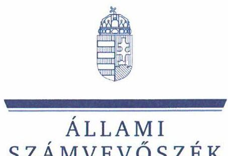
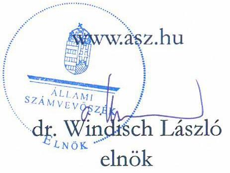
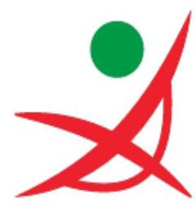
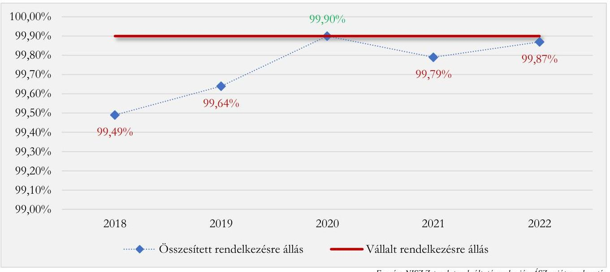
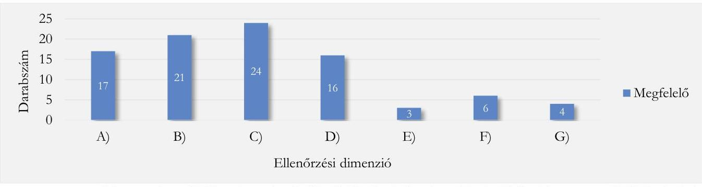
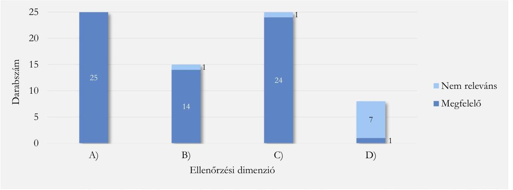
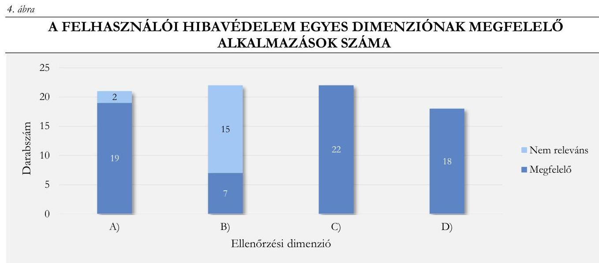
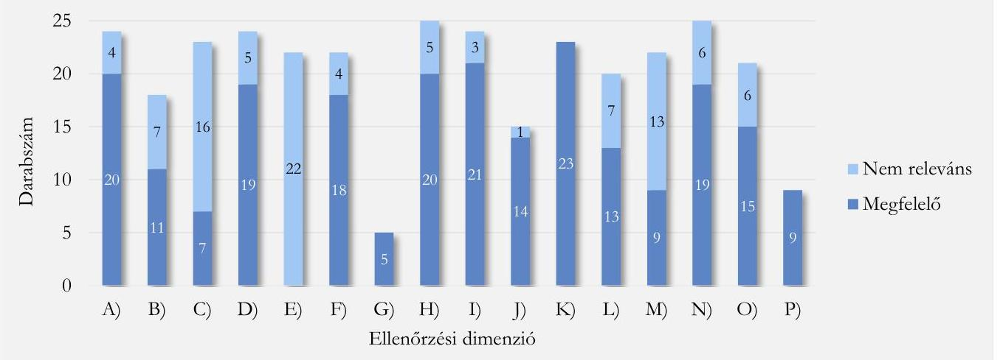
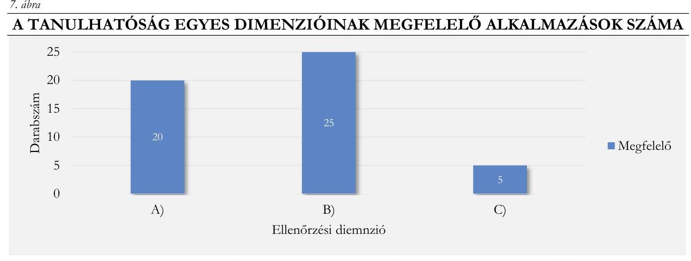
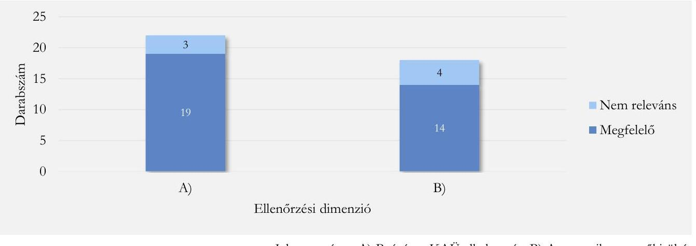

# JELENTÉS 

## Ügyfélbarát elektronikus ügyintézés érdekében tett intézkedések értékelése

2024.

---

ÁLLAMI
SZÁMVEVŐSZÉK

# JELENTÉS 

## Ügyfélbarát elektronikus ügyintézés érdekében tett intézkedések értékelése

2024. 

24034

---

# ELLENŐRZÉSI IGAZGATÓSÁG: 

## TELJESÍTMÉNYELLENŐRZÉSI IGAZGATÓSÁG

## ELLENŐRZÉSI IGAZGATÓ:

DR. JAKAB KORNÉL igazgató

## ELLENŐRZÉSVEZETŐ:

## CSEH ÁRPÁD ellenőrzésvezető

Jelentéseink az interneten a www.asz.hu címen olvashatók.

IKTATÓSZÁM: EL-3834-006/2024.
TÉMASZÁM: 2661
ELLENŐRZÉS-AZONOSÍTÓ SZÁM: V-1005

---

# TARTALOMJEGYZÉK 

AZ ELLENŐRZÉS ALAPADATAI ..... 5
AZ ELLENŐRZÉS HATÓKÖRE ÉS TERÜLETE ..... 7
ÖSSZEFOGLALÁS ..... 9
AZ ELLENŐRZÉS FÓKUSZTERÜLETEI ..... 11
MEGÁLLAPÍTÁSOK ..... 12
JAVASLATOK ..... 29
MELLÉKLETEK ..... 31
I. melléklet: Értelmező szótár ..... 31
II. melléklet: Az ellenőrzött szervezetek jegyzéke ..... 33
III. melléklet: Ellenőrzési kritériumok ..... 34
IV. melléklet: Tesztelési eredmények összefoglalása ..... 40
V. melléklet: A tesztelési eredményekhez kapcsolódó részletes kritériumok ..... 44
FÜGGELÉK: ÉSZREVÉTELEK ..... 51
RÖVIDÍTÉSEK JEGYZÉKE ..... 54

---

.

---

# AZ ELLENŐRZÉS ALAPADATAI 

## AZ ELLENŐRZÉS CÉLJA

Az ellenőrzés célja annak értékelése volt, hogy az e-ügyintézés informatikai rendszerei miképpen támogatták a közigazgatás hatékonyságát, ügyfélbarát jellegét, az e-ügyintézési lehetőségek egyszerűbbé, gyorsabbá tették-e az ügyintézést.

## AZ ELLENŐRZÉS TÍPUSA

Teljesítményellenőrzés

## AZ ELLENŐRZÖTT IDŐSZAK

Az 1. fókuszterületre vonatkozóan: 2022. december 1-jétől az ellenőrzés megkezdéséről szóló kiértesítő levél kiküldésének napjáig (2023. július 26.) tartó időszak.

A 2. fókuszterületre vonatkozóan: 2018. január 1-jétől az ellenőrzés megkezdéséről szóló kiértesítő levél kiküldésének napjáig (2023. július 26.) tartó időszak.

A 3. fókuszterületre vonatkozóan: az e-ügyintézést biztosító felületek tesztelésének időszaka (2023. június 29. - 2023. július 17.).

## AZ ELLENŐRZÉS TÁRGYA

Az ellenőrzés tárgyát képezték az e-ügyintézést biztosító informatikai rendszerek kialakítása és működtetése során hozott döntések és végrehajtott intézkedések, valamint azok hozzájárulásának értékelése az e-ügyintézés egyszerűsítéséhez, gyorsaságához és a felületek felhasználóbarát jellegéhez.

Az ellenőrzés kiterjedt minden olyan körülményre és adatra, amely az ÁSZ jogszabályban meghatározott feladatainak teljesítéséhez, valamint a program végrehajtása folyamán felmerült újabb összefüggések feltárásához szükséges volt.

## AZ ELLENŐRZÉS JOGALAPJA

Az ellenőrzés jogszabályi alapját az Állami Számvevőszékről szóló 2011. évi LXVI. törvény 1. § (3) bekezdése képezte.

---

# AZ ELLENŐRZÉS MÓDSZERE 

Az ellenőrzést - a nemzetközi standardokat irányadónak tekintve - az ellenőrzési program szempontjai, az ellenőrzött időszakban hatályos jogszabályok, az ellenőrzés-szakmai szabályok és módszertanok figyelembevételével végezte az ÁSZ.

Az ellenőrzési kérdések megválaszolásához szükséges bizonyítékok megszerzése az ellenőrzött és az ellenőrzést támogató szervezetek által rendelkezésre bocsátott dokumentumokra és adatokra alapozva megfigyelés, szemle (szemrevételezés), kérdésfeltevés (információkérés), interjú, valamint elemző (teszteléses) eljárás útján történt.

Az ellenőrzés során feltárt tényeket a III. mellékletben részletezett, a teljesítményellenőrzés keretében felállított, ellenőrzött szervezetekkel egyeztetett ellenőrzési kritériumokhoz viszonyította az ÁSZ.

A 3. fókuszterület Usability.gov ${ }^{2}$ és WCAG $^{3}$ alapján felállított kritériumok szerinti ellenőrzése a forgalmi adatok alapján kiválasztott, közérdeklődésre leginkább számot tartó, e-közigazgatási ügyek kezelését biztosító alkalmazások felhasználói felületeinek tesztelésével történt. A próbavásárlás alapú tesztelés a magyarorszag.hu, mint központi portál 25 ügytípusára, valamint azon - IV. mellékletben tételesen szereplő - alkalmazásokra terjedt ki, amelyek ugyanezen ügytípusok ügyintézését tették lehetővé (pl. a Takarnet alkalmazás esetében az ingatlankereső online földhivatali szolgáltatás tulajdoni lap lekérdezéssel kapcsolatos eljárása). Az ügytípusok tesztelésre történő kiválasztása során az alábbi elveket érvényesítettük:

- Az ügytípus a magyarorszag.hu portálról elektronikusan elindítható.
- A kizárólag nem lakosági ügyfelek által használt ügytípusokat kivettük a mintavétel adatbázisából.
- A mintavételezés időszakában önálló ügyet nem képező központi támogató alkalmazásokat (pl. $\mathrm{KAÜ}^{4}$ ) kivettük a mintavétel adatbázisából.
- A nem e-közigazgatási ügyintézéshez kapcsolódó szolgáltatásokat (pl. közüzemi szolgáltatások) kivettük a mintavétel adatbázisából.
- Kiemelt szempont volt, hogy gyakran használt ügytípusok kerüljenek a mintába, hiszen az itt előforduló hibák nagyobb felhasználói kört érintenek.

---

# AZ ELLENŐRZÉS HATÓKÖRE ÉS TERÜLETE 

## ügyintézés szabadon

A közigazgatási e-ügyintézés központi logója

A technológiai és információs forradalom felgyorsulásával párhuzamosan az egyre dinamikusabban jelentkező digitalizációs folyamatok az állampolgárok mindennapi életének szinte minden területét érintik. A digitális fejlődés alapjaiban változtatja meg a nemzetgazdaság működését is, ami többek között jelentős hatással bír a közigazgatási folyamatokra. Ezek e-ügyintézés irányába történő terelésével összhangban alapvető elvárás a bizalom, az elégedettség és a komfortérzet növekedése, mivel a kapcsolódó keretrendszer ügyfélbarát szempontokat figyelembe vevő kialakítása hozzájárulhat a közigazgatási folyamatok eredményes és hatékony működtetéséhez. Ezzel összefüggésben törekvés, hogy az e-közigazgatási szolgáltatások kialakítása, illetve fejlesztése eredményeként minden állampolgár számára hozzáférhető, egységesen elérhető és egyszerűen használható felület álljon rendelkezésre az e-ügyintézés igénybevételéhez. Ennek fontosságát figyelembe véve az ellenőrzés fókuszában az ellenőrzött szervezetek által kialakított stratégiai és operatív döntések e-ügyintézéshez való eredményes, illetve hatékony hozzájárulásának, valamint az e-ügyintézést biztosító alkalmazások felhasználóbarát kialakításának értékelése állt.

Az e-ügyintézés általános szabályait az ellenőrzött időszakban a 2016-ban hatályba lépett Eüsztv. ${ }^{5}$, részletszabályait a 2017-ben hatályba lépett Eüszvhr. ${ }^{6}$ határozta meg. Az Eüsztv. kijelölte az e-ügyintézést biztosító szervek körét és előírta a feladatkörükbe tartozó szolgáltatások biztosításának kötelezettségét. A 2022-ben hatályba lépett Statútumr. ${ }^{7}$ alapján a Miniszterelnöki Kabinetirodát vezető miniszter feladat- és hatáskörébe tartozott az e-közigazgatás, az informatika, az e-közigazgatási és informatikai fejlesztések egységesítése, továbbá a közigazgatási informatika infrastrukturális megvalósíthatóságának biztosítása. A DMÜr. ${ }^{8}$ hatályba lépésével, 2022. augusztus 12-től a Kormány a Miniszterelnöki Kabinetirodát vezető miniszter felelősségébe tartozó fenti állami feladatok ellátására a DMÜ Zrt. ${ }^{9}$-t jelölte ki.

A DMÜ Zrt. feladata volt ennek keretében a DMÜr.-ben foglaltakhoz kapcsolódó középtávú nemzeti digitalizációs stratégia előkészítése, a nemzeti informatikai és e-közigazgatási tevékenység körében a Kormány irányítása vagy felügyelete alá tartozó szervek munkájának összehangolása, továbbá az informatika, az e-közigazgatás, valamint az ezen területek fejlesztésére vonatkozó feladatok ellátásának meghatározása.

A közszféra e-ügyintézési szolgáltatásainak üzemeltetésében és fejlesztésében a DMÜ Zrt. mellett az ellenőrzött időszakban a NISZ Zrt. ${ }^{10}$ feladatellátása bírt kiemelt jelentőséggel. A NISZ Zrt.-nek, mint központi infrastruktúra és infokommunikációs szolgáltató szervezetnek, felelőssége volt - többek között - a magyarorszag.hu központi portál és az Ügyfélkapu üzemeltetése. Ezzel az e-ügyintézés folyamatainak egyik kulcsszereplője volt.

A 2020 februárjában tartalmában és formájában is megújult magyarorszag.hu portált illette a NISZ Zrt. a SZÜF ${ }^{11}$ megnevezéssel (amely a KEÜSZ ${ }^{12}$-t váltotta fel 10 év után). Az Eüsztv. alapján a SZÜF a jogszabályban kijelölt szolgáltató által nyújtott olyan, az ügyfél által személyre szabható internetes alkalmazás, amely az azonosított ügyfél számára lehetőséget biztosít az e-ügyintézéshez szükséges nyilatkozatok, eljárási cselekmények és egyéb kötelezettségek teljesítésére, az ügyfél által igénybe vehető e-ügyintézési szolgáltatások használatára. Az ellenőrzött időszakban az Eüszvhr. szabályozta a NISZ Zrt. SZÜF nyújtásával összefüggő feladatait, valamint a szolgáltatás során teljesítendő követelményeket. Ennek alapján a NISZ Zrt. felelősségi körébe tartozott a SZÜF, mint keretrendszer működéséhez kapcsolódó fejlesztések megtervezése, ütemezett

---

megvalósítása és nyomon követése. A SZEÜSZ-KEÜSZr. ${ }^{13}$ 2024. január 1-jétől hatályos módosítása alapján a kapcsolódó fejlesztési feladatok vonatkozásában az IdomSoft Zrt. vette át a NISZ Zrt. helyét.

Az e-ügyintézés folyamatát támogató funkciók terén az ellenőrzött időszakban a NISZ Zrt. biztosította a szolgáltatások technikai elérését a csatlakozott szervezetek számára. A NISZ Zrt. a szolgáltatást a SZÜF Csatlakozási és szolgáltatási szabályzatban meghatározott műszaki, biztonsági és informatikai biztonsági feltételek mellett nyújtotta. A SZÜF keretrendszer többek között menedzsment szolgáltatásokat (ügyleírás szerkesztő, fejlesztői környezet, iForm ${ }^{14}$ űrlaptervező), profil, naptár, levelezés és tárhely funkciókat, naplózást, biztonsági szolgáltatást (vírusellenőrzést) és felhasználói ügyfélszolgálati támogatást (1818 e-ügyféltámogatási kompetenciaközpont) foglalt magában.

A 2020-ban begyűrűző COVID-19 járvány is megerősítette az igényt az érintés, illetve érintkezésmentes ügyintézésre. A magyarorszag.hu portál látogatottsága 2020-ban jelentősen emelkedett a megelőző évhez képest, 28 millióról 51 millióra, ezen belül a portált rendszeresen látogatók aránya is nőtt. 2022. december 31-i állapot szerint több mint 5,5 millió érvényes jelszóval rendelkező Ügyfélkapu regisztráltat tartottak nyilván (2020-ban 4,2 millió fő volt az Ügyfélkapu regisztráltak száma).

---

# ÖSSZEFOGLALÁS 

Az e-ügyintézés stratégiai keretrendszerének kialakításában, a releváns informatikai rendszerek fejlesztési irányainak meghatározásában és a kapcsolódó tevékenységek részletes kidolgozásában összességében érvényesültek az ügyfélbarát szempontok, ugyanakkor a stratégiai célok megvalósulásának nyomonkövetési és visszamérési rendszerét teljeskörűen nem alakították ki.

Az e-ügyintézés keretrendszerének alapjait a DMÜ Zrt. az NDS $^{15}$ és az NDÁP ${ }^{16}$ kialakítása során az ügyfélbarát szempontok figyelembevételével határozta meg. Az operatív szintű feladat- és célmeghatározásban érvényesültek a stratégiai szinthez igazodó ügyfélbarát szempontok, ami megfelelő alapot szolgáltatott az e-közigazgatás fejlesztéséhez, azonban nem valósult meg a felhasználók e-ügyintézési szolgáltatások fejlesztésébe történő közvetlen bevonása. A stratégiai célok megvalósulása eredményességének és hatékonyságának mérésére szolgáló mutatószámrendszert, valamint a kapcsolódó operatív nyomon követési szabályokat a DMÜ Zrt. teljeskörűen nem határozta meg. Az e-ügyintézést biztosító alkalmazásokat az ügyfélbarát jelleg szempontjaira irányulóan nem tesztelték. Ezen hiányosságok miatt a kapcsolódó fejlesztések során nem vették figyelembe az NDS-ből és az NDÁP-ból levezethető összes releváns szempontot, illetve nem volt maradéktalanul visszamérhető a stratégiai és operatív célkitűzések megvalósulása.

Az e-ügyintézés felületeinek kialakítása és üzemeltetése során alkalmazott módszerek és intézkedések, amelyek eredményeképpen nőtt az elektronikusan intézhető ügyek száma is, összességében hozzájárultak az e-ügyintézés széleskörű térnyeréséhez. Az e-közigazgatás kínálati oldalának megteremtése, illetve fejlesztése során azonban a felhasználói élmény is meghatározó szempont. Ehhez kapcsolódóan történtek előremutató lépések, viszont a fejlesztésekben érintett szervezetek nagy számossága, a rendszer elaprózottsága, valamint a központi szereplők, így kiemelten a NISZ Zrt. esetenként korlátozottabb ráhatása miatt a magyarorszag.hu portálon és az ellenőrzött alkalmazások felületein a felhasználóbarát szempontok nem érvényesültek teljeskörűen. A felhasználók számára több szempontból is korlátozott volt az e-ügyintézési felületek hozzáférhetősége, az ügyintézési cél megfelelőségének felismerhetősége. Az ellenőrzött ügytípusok felületei több esetben nem nyújtottak megfelelő védelmet a hibák ellen, illetve nem biztosították az egyszerű kezelhetőséget. A felhasználók az e-ügyintézés felületein eltérő struktúrával, vizuális megjelenéssel és ügyintézési nyelvezettel találkoztak. Ezen hiányosságok negatívan hatottak az e-ügyintézés eredményességére és hatékonyságára.

Az e-ügyintézést igénybe vevő felhasználók ügyfélelégedettségének növelését alapvetően támogatták a NISZ Zrt. által elsősorban az elektronikusan intézhető ügyek számának növekedése érdekében megtett intézkedések, azonban további fejlesztések szükségesek az ügyfélbarát szempontok egységes érvényesülésének, valamint az ügyfélélmény további javulásának biztosítása érdekében.

---

Az ügyfélelégedettség mérése, a felhasználói statisztikák elemzése, valamint az e-közigazgatási szolgáltatások rendelkezésre állása kapcsán további intézkedések szükségesek az e-ügyintézés széleskörű térnyerésének támogatásához, amelynek kulcsa a felhasználói élmény javítása, növelése.

Az ellenőrzött időszakban a NISZ Zrt. több felmérést is végzett a felhasználók e-ügyintézési felületek minőségével, illetve működésével kapcsolatos elégedettségének feltérképezése érdekében, amelyek alapján konkrét feladatokat határoztak meg. Ezek azonban nem minden esetben érték el a céljukat. A magyarorszag.hu portálon azonnali felhasználói visszajelzést lehetővé tevő megoldás nem állt rendelkezésre, amelynek következtében nem volt biztosított kulcsfontosságú információk valós idejű rendelkezésre állása a további fejlesztések teljeskörű megalapozásához.

Az ellenőrzött időszakban ugyan a NISZ Zrt. rendelkezett a magyarorszag.hu portál használatát összegző alapvető statisztikai adatokkal, azok azonban a felhasználók ügyintézési szokásaira vonatkozó információkat teljeskörűen nem tartalmazták. Nem állt rendelkezésre átfogó kép a rendszerek állapotáról, illetve a rendszerekben bekövetkező fennakadások okairól, ezáltal nem voltak teljeskörűen feltárhatók az e-ügyintézési folyamatokat akadályozó tényezők, valamint a felhasználók
 számára problémát okozó területek.

A magyarorszag.hu rendelkezésre állási adatait nyomon követték, azonban a teljesítési értékek követelményektől való elmaradását teljeskörűen nem kezelték. Az ellenőrzött időszak döntő hányadában a vállalt rendelkezésre állási mértéket nem érték el. A rendelkezésre állás elvárt szintjétől történő elmaradás negatívan befolyásolta a felhasználói élményt, valamint az e-ügyintézés eredményességét és hatékonyságát.

Az ellenőrzött időszakban összességében nem valósult meg az e-ügyintézés felületeinek ügyfélbarát kialakítására és működtetésére irányuló fejlesztésekről készített visszajelzések, valamint az e-ügyintézési felületek minőségével kapcsolatosan végzett felmérések és adatgyűjtések eredményeinek stratégiai és operatív tervezési folyamatba illesztett visszacsatolása. Az iteratív stratégiai és operatív tervezés hiányosságai a fejlesztésekre fordított források hatékony és célszerű felhasználására nézve kockázatot jelenthetnek.

A DMÜ Zrt. és a NISZ Zrt. vezérigazgatója a számvevőszéki jelentéstervezet megállapításaira az ÁSZ tv. 29. § (2) bekezdése alapján tett észrevételeiben arról tájékoztatták az ÁSZ-t, hogy intézkedéseket tettek a számvevőszéki ellenőrzés során felmerült hiányosságok megszüntetése érdekében, amelynek keretében - a Függelékben feltüntetettek szerint - beszámoltak az NDS és az NDÁP érdemi feladatainak végrehajtásáról, többek között az állampolgárok bevonásáról, a kapcsolódó fejlesztésekről, illetve a nyomon követésről, ezzel az ÁSZ megállapításai az ellenőrzés során hasznosultak.

---

# AZ ELLENŐRZÉS FÓKUSZTERÜLETEI 

1. Az e-ügyintézés keretrendszerének kialakítása, a kapcsolódó informatikai alkalmazások fejlesztési irányainak meghatározása a stratégiaalkotás és a kapcsolódó operatív feladatok kialakítása során az ügyfélbarát szempontok figyelembevételével.
2. Az e-ügyintézést igénybe vevők ügyfélelégedettségének növelése érdekében tett intézkedések, alkalmazott módszerek.
3. A magyarorszag.hu és az ellenőrzésre kiválasztott alkalmazások e-ügyintézési felületein a felhasználóbarát szempontok érvényesülése az ÁSZ tesztelési eredményei alapján.

---

# MEGÁLLAPÍTÁSOK 

## 1. Az e-ügyintézés keretrendszerének kialakítása, a kapcsolódó informatikai alkalmazások fejlesztési irányainak meghatározása a stratégiaalkotás és a kapcsolódó operatív feladatok kialakítása során az ügyfélbarát szempontok figyelembevételével.

Összegző megállapítás A DMÜ Zrt. stratégia alkotási tevékenysége és operatív szintű feladatellátása összességében támogatta az ügyfélbarát szempontok érvényesülését az e-ügyintézés keretrendszerének kialakítása és a kapcsolódó informatikai rendszerek fejlesztési irányainak meghatározása során, azonban a célok visszamérését támogató folyamatokat teljeskörűen nem alakították ki.

Az ügyfélbarát e-ügyintézés érdekében ellátandó feladatok meghatározásához a DMÜ Zrt. a DMÜr.-ben és a $\mathrm{KSI}^{\mathrm{IT}}$-ben foglalt előírásoknak megfelelően elkészítette az NDS-t, mint a 2022-2030. közötti időszakra vonatkozó, középtávú nemzeti digitalizációs stratégiát. Az NDS értékelte a hazai digitalizáció helyzetét, meghatározta a Magyarország által 2022-2030. között elérendő célokat és az azok megvalósításához szükséges intézkedéseket a digitális infrastruktúra, a digitális kompetencia, a digitális gazdaság, valamint a digitális állam pillérek mentén.
A DMÜ Zrt. a KSI-ben foglalt előírásoknak megfelelően az NDS-ben - a digitális állam pillérhez kapcsolódóan - meghatározta az ügyfélbarát e-ügyintézés érdekében elérendő célokat, valamint az azokhoz kötődően ellátandó feladatokat. Ennek keretében az NDS-ben definiált intézkedéscsoportok az állami digitalizáció különböző területeit érintve az alábbi főbb célkitűzéseket tartalmazták az ügyfélbarát ügyintézés kapcsán:

- ügyfélélmény általános javítása a hazai e-ügyintézésben;
- tesztközpont létrehozása az ügyfélélmény javítására vonatkozó javaslatok megfogalmazása, illetve az élesítés előtti fejlesztések - felhasználói élmény tervezés, használhatóság és ügyfélélmény szempontú - ellenőrzése érdekében;
- papírmentes, teljesen elektronikus háttérműködés megvalósítása, illetve elektronikus működésre való áttérés támogatása az e-közigazgatást biztosító alkalmazások továbbfejlesztése révén;
- központi e-közigazgatási szolgáltatások ügyfélközpontú továbbfejlesztése, illetve használatának kiterjesztése;
- gyakran használt közigazgatási szolgáltatások megújítása, amelyek nem rendelkeznek intelligens űrlappal vagy önálló SZÜF kisalkalmazással;
- e-ügyintézést biztosító intézmények eljárásainak fejlesztése, gyorsítva a folyamatokat, javítva a transzparenciát, illetve az ellenőrizhetőséget.
A DMÜ Zrt. elkészítette a 2022-2026. közötti időszakra szóló NDÁP-t, mint az NDS-ben foglalt - az e-közigazgatás optimalizálására és az ügyfélélmény növelésére irányuló - célokat támogató

---

stratégiai dokumentumot. Az NDÁP keretében a DMÜ Zrt. egy egységes arculatú és a felhasználói élményt fókuszba helyező e-közigazgatási rendszer kidolgozását alapozta meg. Az NDÁP által meghatározott feladatok kitértek többek között a felhasználói élmény fokozása érdekében az ügyfélérintkezési pontok és a háttértechnológia tervezésére, az ügyfélközpontú navigáció és az életesemény koncepció megtervezésére, az egyszerűsített és felhasználóbarát navigációs logika, illetve a vizuális és nyelvezeti megjelenéssel kapcsolatos alapelvek megfogalmazására, valamint az állampolgári igények felmérésére.
A DMÜ Zrt. intézkedéseket tett az NDS-ben és az NDÁP-ban megfogalmazott stratégiai célok elérésének támogatásához kapcsolódó NEKS ${ }^{18}$ előkészítésére is annak érdekében, hogy az e-ügyintézés felületeinek korszerűsítése során a felhasználó-központúság és a használhatóság kiemelt prioritást élvezzen. A NEKS kialakításának elsődleges célja az volt, hogy a digitális állampolgárság megalapozásához és az e-közigazgatási szolgáltatások használatának széleskörű elterjesztéséhez szükséges központi eszközrendszer és technológiai alap megfelelő támogatást élvezzen.
Az NDS és az NDÁP alapján az e-közigazgatás fejlesztésének, illetve kiterjesztésének legfőbb célja, hogy az állampolgárok a közigazgatás körébe tartozó valamennyi ügyet elektronikus úton el tudják intézni. A DMÜ Zrt. által megalkotott stratégiai dokumentumok megfelelő alapot szolgáltattak az e-közigazgatás keretrendszerének fejlesztéséhez.
A DMÜ Zrt. az NDS keretében a stratégiai célokhoz rendelve meghatározta a kulcsindikátorokat. A kialakított indikátorrendszer az NDS pilléreihez igazítva határozta meg a célokhoz rendelt célértékeket. Az NDS-ben a digitális állam pillérhez meghatározott indikátorok (1. táblázat) igazodva az NDS célkitűzéseihez - elsődlegesen az Európai Bizottság által 2014 óta követett, a tagállamok digitális fejlődését, a digitális gazdaság és társadalom fejlettségét mérő DESI ${ }^{19}$ mutatószámrendszerével álltak összhangban. A DESI 4 dimenzión keresztül vizsgálta és rangsorolta az Európai Unió tagállamainak digitális fejlettségét, ezek a humán tőke, az internethozzáférés, a digitális technológiák integráltsága és a digitális közszolgáltatások voltak.

# 1. táblázat 

AZ NDS KERETÉBEN A STRATÉGIAI CÉLOKHOZ RENDELVE MEGHATÁROZOTT KULCSINDIKÁTOROK

| KULCSINDIKÁTOROK | BÁZISÉRTÉK   (EYSZAM) | CÉLÉRTÉK   (EYSZAM) |
| :-- | :--: | :--: |
| DESI Digitális közszolgáltatások mutató (alindex) éves értéke | $57,4(2022)$ | $75(2030)$ |
| E-közigazgatási szolgáltatások felhasználói (az űrlapokat benyújtó   internethasználók aránya) | $81,5 \%(2021)$ | $90 \%(2030)$ |
| Űrlapok automatikus kitöltése (0-100 pont - DESI módszertan szerint   normalizált érték az e-Government Benchmark eredményei, mint   adatforrások alapján) | 59,7 pont (2021) | 90 pont (2030) |
| Polgároknak nyújtott digitális közszolgáltatások (0-100 pont) | 64,4 pont (2021) | 95 pont (2030) |
| Vállalkozásoknak nyújtott digitális közszolgáltatások (0-100 pont) | 73,8 pont (2021) | 95 pont (2030) |
| Digitális állampolgársághoz szükséges e-közigazgatási szolgáltatások és   az ehhez szükséges adatok hazai felhőinfrastruktúrán keresztül történő   nyújtásának aránya (nem DESI módszertan szerinti, hanem nemzeti   indikátor) | - | $67 \%(2030)$ |
| Nyílt hozzáférésű adatok | $58 \%(2021)$ | $90 \%(2030)$ |

---

A DMÜ Zrt. a DESI-től független, a nemzeti sajátosságokat is figyelembe vevő indikátorokat egy kivételtől eltekintve nem határozott meg. Az NDS-ben feltüntetett nemzeti mutatószám a „Digitális állampolgársághoz szükséges e-közigazgatási szolgáltatások és az ehhez szükséges adatok hazai felhőinfrastruktúrán keresztül történő nyújtásának aránya". A nemzeti indikátor bázisértékkel nem rendelkezett, célértéke a 2030. évre 67% volt. A DESI-vel szinkronban kialakított indikátorok alkalmasak voltak a stratégiai célok megvalósításának értékelésére. A DMÜ Zrt. a DESI-től független - az e-közigazgatási szolgáltatások ügyfélközpontú továbbfejlesztésének, illetve az ügyfélélmény alakulásának a mérésére alkalmas - nemzeti indikátorok kialakításának hiányában a hazai sajátosságok maradéktalan figyelembevételét ugyanakkor nem biztosította.
A DMÜ Zrt. a stratégiai célokhoz rendelt kulcsindikátorok mellett a KSI 20. § 1 (1) és (2) bekezdésében foglaltakat figyelmen kívül hagyva nem alakított ki olyan mutatószámrendszert, amely az operatív feladatok végrehajtásának mérhetővé tételével hozzájárult volna az NDS-hez kapcsolódó működési folyamatok nyomon követéséhez, ezzel a stratégiai célok és feladatok hatékony és eredményes megvalósításához. A DMÜ Zrt. az NDÁP kialakítása során nem határozott meg olyan kulcsfontosságú célkitűzésekhez kapcsolódó indikátor- és operatív megvalósítást támogató mutatórendszert sem, amely az elvégzett feladatok hatását mérhetővé tette volna. Az NDÁP-hoz kapcsolódó célok és operatív feladatok megvalósulása eredményességének és hatékonyságának mérésére szolgáló indikátor- és mutatószámrendszer meghatározásának hiányában a céloktól, illetve azok időarányos teljesülésétől való eltérések felismerése, és a szükséges beavatkozások megtétele nem biztosítható.
A DMÜ Zrt. működési rendszere támogatta a stratégiai feladatok operatív szintre történő lebontását és megvalósítását. A DMÜ Zrt. elkészítette a feladatokat tartalmazó 2023. évi üzleti tervét, amit a Miniszterelnöki Kabinetiroda, mint a DMÜ Zrt. irányítószerve jóváhagyott. Az üzleti tervben meghatározott, DMÜ Zrt.-re vonatkozó célkitűzések összhangban álltak az NDS-ben és az NDÁP-ban megfogalmazott célokkal. A DMÜ Zrt. az operatív feladatellátás támogatása érdekében munkacsoportot hozott létre. Az OPM ${ }^{20}$ az NDÁP struktúrájához kapcsolódva havi feladattűzés alapján végzett előkészítő, tervező és döntéstámogató munkát az ellenőrzött időszakban. Ennek a munkának az eredményei hasznosultak az NDÁP megvalósításának első szakaszához kapcsolódó feladatok és felelősök meghatározásában.
A DMÜ Zrt. felhívással élt a stratégiai célok megvalósításában közreműködő, az e-Government Benchmark felmérésben érintett ügyekért felelős minisztériumok $\left(\mathrm{PM}^{21}, \mathrm{BM}^{22}, \mathrm{IM}^{23}\right)$ irányába a DESI keretében alkalmazott mutatók értékei javításához szükséges intézkedések megvalósítása érdekében. A DMÜ Zrt. által javasolt intézkedések között elsősorban a magyarorszag.hu-ról hiányzó magyar és angol nyelvű ügyleírások pótlása, valamint az alkalmazásokban az eIDAS ${ }^{24}$ szerinti azonosítás lehetővé tétele szerepelt. Az elektronikus személyazonosságra vonatkozó rendelkezések az eIDAS-hálózat létrehozásához vezettek, amelynek célja, hogy lehetővé tegye a bejelentett elektronikus azonosítási rendszer birtokosai számára az online közszolgáltatásokhoz való - az országonként eltérően használt egyedi azonosítók miatt korlátozott - határokon átnyúló hozzáférést.

---

# Egységes ügyfélazonosító 

Az Európai Unió kapcsolódó szabályozási keretrendszere alapján az elektronikus azonosítás egy olyan eszköz, amely biztosítja az online szolgáltatásokhoz való biztonságos hozzáférést és az e-ügyintézés biztonságosabb végrehajtását. Az azonosítás megvalósításának módja számottevően befolyásolhatja az e-ügyintézési szolgáltatást igénybe vevők ügyfélélményét.
A hazai közigazgatásban gyakorlat az ügyek intézéséhez több különböző azonosító használata (pl. adóazonosító jel, társadalombiztosítási azonosító jel, személyi szám, lakcímet igazoló hatósági igazolvány száma, személyazonosító igazolvány száma, születési dátum és hely, állandó lakcím). A közigazgatási ügyintézést, és ezen belül az e-ügyintézést jelentősen megkönnyítené és hatékonyabbá tenné egyetlen - a személyes adatok védelmét biztosító - univerzális azonosítószám alkalmazása.
Az Alkotmánybíróság 15/1991. (IV.13.) határozata lefektette a személyes adatok védelmére vonatkozó alapelveket, ami fontos hivatkozási pontként szolgált az e-ügyintézés jogszabályi keretrendszerében és technikai megvalósításában. Az alkotmánybírósági határozat ${ }^{25}$ az állampolgárok egységes „személyiségprofil” kialakításával szembeni védelme érdekében, továbbá az információs önrendelkezési jog gyakorlásának feltételeként a célhoz kötöttség elvének érvényesülését határozta meg, egyúttal az osztott információs rendszerek elve alapján az egységes személyi azonosító tilalmát fogalmazta meg.
A hivatkozott alkotmánybírósági határozatot az Alaptörvény ${ }^{26}$ hatályba lépése előtt hozták meg, az az Alaptörvény záró és vegyes rendelkezéseinek 5. pontja alapján hatályát vesztette azzal, hogy ez az alaptörvényi rendelkezés nem érinti az alkotmánybírósági határozat által kifejtett joghatásokat. A hatályát vesztett alkotmánybírósági határozat nem állít alkotmányjogi akadályt a személyes adatok védelmével kapcsolatos jogszabályok módosítása elé.
Mindezekre tekintettel az e-közigazgatás területén egy egységes, a személyes adatok védelmét messzemenőkig figyelembe vevő személyi azonosító alkalmazására vonatkozó jogszabálymódosítási javaslat kezdeményezése nem ütközik az Alkotmánybíróság korábbi határozatába. A
 számvevőszéki ellenőrzés ezzel kapcsolatban adatvédelmi, személyiségi jogi aspektusokat nem vizsgált, ugyanakkor fentiek alapján az Országgyűlés és az ellenőrzött szervezetek munkájának támogatása érdekében az ÁSZ felhívja a figyelmet a jogszabálymódosítás lehetőségére egy e-ügyintézést támogató, egységes személyes azonosító alkalmazása tárgyában, amely az eIDAS szerinti egyik kiemelt cél, az elektronikus interakciók végrehajtásának zökkenőmentes megvalósítását is támogatná.
A stratégiai feladatok operatív szintű lebontásának keretében készült el a „Felhasználói élmény elemzés" című kutatási terv. Az elemzés az NDÁP releváns céljai elérésének támogatása érdekében megalapozta az e-ügyintézéshez kapcsolódó felhasználói élmény definiálását. A felhasználóbarát szempontrendszer kialakításának támogatása érdekében egy „Állami Publikus Front-end Útmutató" készítését tűzte ki célul a DMÜ Zrt., amelynek megvalósítása érdekében közbeszerzési eljárást folytattak le. A sikeres közbeszerzési eljárás lefolytatását követően a nyertes ajánlattevővel szerződést kötöttek a hivatkozott útmutató elkészítésére. A megkötött szerződés műszaki leírása tartalmazta az útmutató témaköreit, az azokhoz kapcsolódó követelményeket és ajánlásokat a felhasználói élmény kiemelt szempontjainak kialakítása érdekében.
A DMÜ Zrt. az informatikai rendszerek fejlesztési irányait az ügyfélbarát szempontok érvényesülését szem előtt tartva határozta meg. A DMÜ Zrt. által elkészített NDS-ben és NDÁP-ban hangsúlyt kapott a felhasználói élmény fejlesztése. Az egyedi alkalmazásokra, illetve ügyekre vonatkozó fejlesztési igények meghatározása az NDÁP megvalósításának keretében életesemény alapon történt. Az életesemények kezdeti felsorolását és rangsorolását a DMÜ Zrt. előkészítette, amelynek keretén belül a megkezdett fejlesztések státuszát is feltüntették, ami támogatta a nyomon követés kialakítását.

---

A DMÜ Zrt. az informatikai rendszerek fejlesztéséhez egyrészt javaslatokat kért be az érintett szervezetektől, másrészt lényeges szempontként kezelte az e-Government Benchmark és a DESI mutatószámrendszer digitális közszolgáltatások dimenziójának javításához szükséges intézkedéseket. A DMÜ Zrt. által a fejlesztési prioritások meghatározása és az operatív tervek elkészítésének megalapozása érdekében végzett megkeresések alapján 2023 első negyedévében 5 szervezet adott szakmai javaslatot. A DMÜ Zrt. a beküldött javaslatokat feldolgozta, azok kiértékelését a szakmai terület által vezetett OPM tematikus módon végezte. Az OPM fókuszterületei lefedték az NDÁP szempontjából kritikusnak tekinthető azon technológiai és igazgatási szegmenseket (pl. funkcionális alapszolgáltatások kialakításának támogatása, alaprendszerek üzemeltetési környezetének felülvizsgálata, mobilra optimalizált keretrendszer és a kapcsolódó háttérrendszerek további fejlesztési irányainak meghatározása, életeseményekkel kapcsolatos logikai megközelítés előkészítése, informatikai biztonság felülvizsgálata), amelyek a beérkezett javaslatokkal kapcsolódást mutattak. Az OPM a felmerült témákhoz kötődően konkrét feladatokat, határidőket jelölt meg, a meghatározott dokumentumok, illetve eredménytermékek - az NDÁP előkészítéséhez szükséges tervezési és vizsgálati feladatokkal összefüggő munkaanyagok - elkészültek, ami támogatta az érintett informatikai rendszerek ügyfélbarát szempontú továbbfejlesztését.
Mindezek mellett azonban az informatikai rendszerek fejlesztési irányainak meghatározása során a DMÜ Zrt. nem vonta be az állampolgárokat a felhasználóbarát szempontok meghatározásának folyamatába. A magyarorszag.hu portálon a NISZ Zrt. által már 2022-ben megvalósítani tervezett ügyfélvisszajelzési lehetőség az ellenőrzött időszak végén sem állt rendelkezésre. A visszajelzési lehetőség pótlása érdekében a DMÜ Zrt. határidő megjelölésével felhívta az érintett szervezeteket a szükséges intézkedések megtételére, intézkedést kérő levelet küldött „Magyarország e-Government Benchmark és DESI digitális közszolgáltatások eredményeinek javításához szükséges intézkedések" tárgymegjelöléssel a NISZ Zrt., a PM, a BM, és az IM részére.
A DMÜ Zrt. nem gondoskodott arról, hogy az e-ügyintézést biztosító alkalmazásokat az ügyfélbarát jelleg szempontjaira irányulóan teszteljék. A felhasználói tesztelés az ellenőrzés végrehajtásának időszakában tervezés szintjén állt. A tervek szerint a rendszerek éles üzembe helyezése előtt történik általános és célzott felhasználói tesztelés. Az informatikai rendszerek minőségbiztosítási feladatainak ellátásáért felelős szervezet az ellenőrzött időszakban a Kopint-Datorg Kft. volt. A feladatellátás alapja az ÁAFKr. ${ }^{27}$, valamint a SZEÜSZ-KEÜSZr. volt. Minőségbiztosítási feladatok az ellenőrzött időszakban az e-ügyintézés ügyfélbarát jellegére nem terjedtek ki. A Kopint-Datorg Kft. elsősorban funkcionális tesztelést végzett. A DMÜ Zrt. a DMÜr.-ben foglalt feladatköre alapján eseti jelleggel, a záró minőségbiztosítói jelentéseken keresztül kapott információt a minőségbiztosítási feladatok ellátásáról.
A DMÜ Zrt. az NDS monitoringrendszerének elveit, illetve eszközeit meghatározta. A monitoringrendszer elsődleges feladata a stratégiában megjelenített célkitűzések teljesülésének vizsgálata volt. A nyomon követés célja az állami beavatkozás lehetővé tétele volt azokon a területeken, ahol az ütemezéstől eltérő előrehaladás vagy azzal ellentétes folyamatok voltak tapasztalhatók. A DMÜ Zrt. az NDÁP ütemezését meghatározta, a nyomon követést alapelvek szintjén rögzítette, azonban a KSI 20. § (1)-(2) bekezdésében foglaltakat figyelmen kívül hagyva az NDÁP monitoringrendszerére vonatkozó módszereket és eszközöket maradéktalanul nem alakította ki. Az NDÁP - az NDS-sel szemben - a nyomon követés részletes megtervezését nem tartalmazta, nem a stratégiai dokumentum biztosította az iteratív stratégiai tervezést, mivel az NDÁP végrehajtását és annak nyomon követését a DMÜ Zrt. rövidebb időszakok feladatait rögzítő operatív munkaanyagok fokozatos

---

kidolgozásával tervezte biztosítani. Az ellenőrzött időszakban az NDÁP megvalósításának előkészítésén volt a hangsúly, így olyan konkrét fejlesztések sem történtek, amelyek indokolttá tették volna a folyamatos nyomon követést.
A KSI 20. § (2) bekezdésében foglaltakat figyelmen kívül hagyva a DMÜ Zrt. nem alakította ki az NDS megvalósulásának nyomon követése keretében az adatgyűjtés módjára, gyakoriságára, feldolgozására, az NDS kapcsán meghatározott monitoringrendszerbe tartozó szervezetek és szervezeti egységek feladataira, valamint az azok ütemezésére vonatkozó részletszabályokat és eljárásokat. A DMÜ Zrt. az NDS 7.1.3.1. pontjában foglaltak ellenére nem alakított ki részletes indikátorrendszert és információs portált sem. Továbbá a DMÜ Zrt. az NDÁP monitoringrendszerére vonatkozó elvek, módszerek és eszközök rögzítésének hiányában nem alakította ki az NDÁP megvalósulásának nyomon követése érdekében az adatgyűjtés módjára, gyakoriságára, feldolgozására vonatkozó részletszabályokat és eljárásokat sem.
A DMÜ Zrt. a monitoringfeladatok ellátásának, illetve az operatív nyomon követés szabályrendszere kialakításának elmaradása ellenére végzett adat- és információgyűjtést az operatív szinten meghatározott feladatok, célok megvalósításának nyomon követése keretében, ezáltal hozzájárult a feladatok, célok, egyúttal a stratégia időarányosan eredményes megvalósításához. Ennek keretében az egyik kiemelt stratégiai dimenzió - az e-ügyintézés kínálati oldalának bővülése kapcsán a magyarorszag.hu-n elektronikusan intézhető ügyek számának alakulása is megállapítható volt a SZÜF riportból.

# 2. Az e-ügyintézést igénybe vevők ügyfélelégedettségének növelése érdekében tett intézkedések, alkalmazott módszerek. 

| Összegző megállapítás | A NISZ Zrt. az e-ügyintézést igénybe vevők |
| :-- | :-- |
|  | ügyfélelégedettségének növelése érdekében tett |
|  | intézkedéseket, azonban a fejlesztési feladatok |
|  | koncentráltságának és a tudatos nyomon követésnek a |
|  | hiánya nem támogatta a felhasználóbarát szempontok |
|  | egységes érvényesülését. |

A $\mathrm{KSH}^{28}$ adatai alapján a 2018-2021. évek között az internethasználó lakosságon belül közel 15, míg a teljes lakosság 16-74 éves korosztályában közel 20 százalékponttal nőtt a közhivatalokkal elektronikus kapcsolatfelvételt kezdeményezők aránya. Emellett az internethasználó lakosságon belül, illetve a teljes lakosság 16-74 éves korosztályában közel 30 százalékponttal magasabb arányban vették igénybe az e-közigazgatási portált űrlap letöltése céljából, amivel egyidejűleg közel 30 százalékponttal nagyobb arányban nyújtottak be elektronikusan űrlapot. Ennek keretén belül 2020-ról 2021-re következett be ugrásszerű növekedés a közhivatalokkal szembeni elektronikus kapcsolat különböző dimenzióiban, ami a COVID-19 járvány kitörésének és elhúzódó hatásainak is a következménye.
Az e-ügyintézés széleskörű térnyerését támogatták a NISZ Zrt. által végrehajtott fejlesztések, amelyek eredményeképpen nőtt az elektronikusan intézhető ügyek száma. Az e-közigazgatási ügyintézés kínálati oldalának bővítése (2. táblázat) hozzájárult az ügyintézés ügyfélbarát jellegének erősödéséhez, mivel egyre több ügytípus kapcsán teremtette meg a térben és időben kötetlen ügyintézés lehetőségét. A COVID-19 járvány időszakában megvalósított fejlesztések megnyitották a társadalom

---

egésze számára az e-ügyintézés lehetőségét. Ez a felhasználók többségénél attitűdváltozást is eredményezett, a lezárások feloldását követően az ügyfelek az esetek zömében nem tértek vissza a nehézkesebb, több időt igénylő, papír alapú, személyes ügyintézéshez. Ez arra utal, hogy a felhasználók részéről van igény és hajlandóság a közigazgatási ügyek elektronikus módon történő kezelésére, amely egyértelműen támogatja az NDS fő stratégiai célkitűzéseit.
2. táblázat

ELEKTRONIKUSAN INTÉZHETŐ ÜGYEK SZÁMÁNAK ALAKULÁSA

| DÁTUM | $\begin{aligned} & \text { SZÜF } \\ & \text { PUBLIKÁLT } \\ & \text { ÜGYEK } \\ & \text { SZÁMA } \\ & \text { ÖSSZESEN } \end{aligned}$ | DIREKT   LINKKEL   ELÉRHETŐ   ÜGYEK   SZÁMA | EKEIDR ${ }^{20}$   ÜRLAPPAL   ELÉRHETŐ   ÜGYEK   SZÁMA | KÖZVETLE   N ÜRLAPPAL   ELÉRHETŐ   ÜGYEK   SZÁMA | E-PAPIR-   RAL ELÉR-   HETŐ   ÜGYEK   SZÁMA | $\begin{aligned} & \text { ÁNYE } 90 \text {-VAL } \\ & \text { ELÉRHETŐ } \\ & \text { ÜGYEK } \\ & \text { SZÁMA } \end{aligned}$ | TÁJÉKOZ-   TÁTÁSOK   SZÁMA   (ELEKT-   RONIKUSAN   NEM   INTÉZHETŐ   ÜGYEK) | KISALKAL-   MAZÁSOK   SZÁMA |
| :--: | :--: | :--: | :--: | :--: | :--: | :--: | :--: | :--: |
| 2022. dec. | 4616 | 2023 | 210 | 867 | 828 | 157 | 508 | 23 |
| 2023. jan. | 4769 | 2080 | 210 | 940 | 850 | 157 | 508 | 24 |
| 2023. febr. | 4789 | 2089 | 210 | 947 | 854 | 156 | 509 | 24 |
| 2023. márt. | 4821 | 2092 | 210 | 950 | 860 | 156 | 514 | 39 |
| 2023. apr. | 4910 | 2126 | 210 | 953 | 896 | 156 | 530 | 39 |
| 2023. máj. | 4975 | 2161 | 210 | 957 | 914 | 156 | 538 | 39 |
| 2023. jún. | 5084 | 2223 | 210 | 1001 | 915 | 156 | 539 | 40 |
| 2023. júl. | 5092 | 2223 | 210 | 1008 | 917 | 155 | 539 | 40 |

Forrás: NISZ Zrt. adatszolgáltatása alapján ÁSZ saját szerkesztés
Az e-közigazgatási ügyintézés során szerzett felhasználói élmény meghatározó szempont az e-ügyintézés térnyerése kapcsán, amelyre a NISZ Zrt.-nek az ellenőrzött időszakban korlátozottabb ráhatása volt, mivel az adott ügytípusok tartalmi elemeinek meghatározása és kialakítása a csatlakozott szolgáltató szervezetek hatáskörébe tartozott. A NISZ Zrt. a SZÜF Csatlakozási és szolgáltatási szabályzatban megfogalmazott tudásbázis, azaz irányelvek és ajánlások útján biztosította, hogy a magyarorszag.hu portál felületén található ügytípus struktúra felépítése, az ügycsoportok kialakítása, valamint a tartalmi elemek kezelése szinkronizált legyen az alkalmazásokkal.
A NISZ Zrt. a magyarorszag.hu portál és az alkalmazások ügyleírásainál a tartalmi összehangolás érdekében nyújtott támogatást. Ennek keretében online elérhető módon publikálta az ügyleírások elkészítését és szerkezeti elemeit bemutató támogató dokumentumot az érintett szervezetek felé. Elősegítette az e-közigazgatási ügyintézés felületeinek egységes szempontrendszer szerinti kialakítását, ami a felhasználóbarát jelleg tekintetében is lényeges elem. A SZÜF Csatlakozási és szolgáltatási szabályzat 4. melléklete meghatározta
 azokat a tartalmi elvárásokat, tudáselemeket, amelyek szükségesek az ügyfelek és az ügyintézők hatékony és szakszerű informálásához.
A NISZ Zrt., mint a SZÜSZ ${ }^{31}$ / KEÜSZ szolgáltatója, az e-ügyintézési folyamatokat az ellenőrzött időszakban technikai eszközökkel támogatta. Az ügyleírások, iForm űrlapok és kisalkalmazások módosítása, frissítése és fejlesztése az igénybevevő, tehát az e-ügyintézést biztosító szervezetek feladatkörébe tartozott. A fejlesztésekhez a NISZ Zrt. készített üzleti specifikációt, a műszaki specifikációt azonban már a fejlesztő állította össze, a fejlesztési és hibajavítási feladatok nyomon követése pedig a fejlesztő jegykezelő rendszerében történt. A NISZ Zrt. részéről az egyes ügytípusokhoz hatáskör hiányában – nem kapcsolódott fejlesztési feladat. A fejlesztési feladatok végrehajtása és közvetlen monitorozása nem koncentráltan, hanem az egyes szervezetek szintjén valósult meg, ami az ügyfélelégedettség növelése érdekében tett intézkedések megvalósítása során az összehangoltság hiányát eredményezte. A fejlesztések hatékony és eredményes megvalósítását nem

---

támogatta az, hogy a NISZ Zrt.-nél nem álltak rendelkezésre az ügyfélelégedettség növelését célzó fejlesztések megtervezését és priorizálását rendszerező információk.
Az ellenőrzött időszakban a NISZ Zrt. 3 alkalommal végzett ügyfélelégedettségre vonatkozó – nem reprezentatív – felmérést. A magyarorszag.hu portál felhasználóinak – a SZÜF felületen elérhető szolgáltatások minőségével kapcsolatos – elégedettségére vonatkozóan a 2019-2020., illetve a 2021. években készült felmérés a KÖFOP ${ }^{32}$-1.0.0-VEKOP ${ }^{33}$-15-2016-0025 számú projekt keretében. Emellett a 2021-2022. években az $\mathrm{AVDH}^{34}$ szolgáltatás elégedettségi felmérése zajlott le.
A 2019-2020. és a 2021. években végrehajtott ügyfélelégedettség-méréseket azonos paraméterek és eljárás szerint, azonos kérdőívvel hajtották végre. A felmérések során az ellenőrzött időszakot megelőzően készült, hasonló tartalmú elégedettségi felmérés adatait tekintették bázisértékeknek. A felmérések 5 fokozatú Likert-skálát alkalmaztak, ahol az 5 a legjobb, maximális értéket jelentette.
A 2019-2020. évi felméréshez kapcsolódóan célkitűzésként fogalmazták meg, hogy az aggregált elégedettségi mutató értéke a bázisértékhez viszonyítva 5%-kal növekedjen. Ez a célkitűzés a felmérés alapján teljesült, mivel a 3,05 bázisértékhez képest az aggregált elégedettségi mutató 3,49 lett, ami 14,4%-os növekedést jelentett (3. táblázat). Emellett egy kivétellel minden részmutatóban javulás történt a bázisértékhez képest. A felhasználók a felületet, a szolgáltatásokat, az elérhetőséget és a biztonságot, illetve a segítségnyújtást is közepesnél jobb színvonalúra értékelték.
3. táblázat

ÜGYFÉLELÉGEDETTSÉGRE VONATKOZÓ FELMÉRÉSEK EREDMÉNYEI

| KÉRDÉS | BÁZISÉRTÉK | PONTSZÁM   (2019-2020) | PONTSZÁM   (2021) |
| :-- | :--: | :--: | :--: |
| PORTÁL (aggregált elégedettségi mutató) | $\mathbf{3 , 0 5}$ | $\mathbf{3 , 4 9}$ | $\mathbf{3 , 5 0}$ |
| FELÜLET | $\mathbf{2 , 7 7}$ | $\mathbf{3 , 2 3}$ | $\mathbf{3 , 3 2}$ |
| A portálon az információk jól rendszerezettek. | 2,93 | 3,37 | 3,42 |
| Egyszerű használni az oldalt. | 2,75 | 3,17 | 3,24 |
| A portál segítségével könnyen megtalálom, amit keresek. | 2,71 | 3,11 | 3,12 |
| A portálon könnyű navigálni. | 2,76 | 3,19 | 3,24 |
| Az aloldalak gyorsan betöltődnek. | 3,02 | 3,46 | 3,70 |
| A felület látványvilága tetszik. | 2,76 | 3,31 | 3,53 |
| A portál felülete az igényeimre szabható. | 2,44 | 2,94 | 2,93 |
| SZOLGÁLTATÁSOK | $\mathbf{3 , 0 1}$ | $\mathbf{3 , 4 5}$ | $\mathbf{3 , 4 9}$ |
| A portál lehetővé teszi, hogy gyorsan intézzem az ügyeimet. | 3,08 | 3,59 | 3,64 |
| Minden, általam keresett ügyben találok információt a portálon. | 2,90 | 3,29 | 3,25 |
| Minden, általam keresett szolgáltatást megtalálok a portálon. | 2,85 | 3,26 | 3,22 |
| A portál lehetővé teszi, hogy kényelmesen intézzem az ügyeimet. | 3,22 | 3,72 | 3,83 |
| A portál pontos információkkal szolgál az általam keresett ügyről. | 3,09 | 3,47 | 3,55 |
| A portál magas színvonalon nyújtja a szolgáltatásokat. | 2,88 | 3,36 | 3,46 |
| ELÉRHETŐSÉG ÉS BIZTONSÁG | $\mathbf{3 , 4 5}$ | $\mathbf{3 , 5 3}$ | $\mathbf{3 , 7 6}$ |
| A portált könnyű megtalálni. | 3,95 | 3,78 | 3,90 |
| A portál mindig elérhető. | 3,36 | 3,44 | 3,75 |
| Szolgáltatás-kiesés esetén megfelelő tájékoztatást kapok. | 3,28 | 3,40 | 3,56 |
| A portál nem omlik össze, nem fagy le. | 3,16 | 3,26 | 3,62 |
| A portálon megadott adataim biztonságban vannak. | 3,45 | 3,76 | 3,97 |
| SEGÍTSÉGNYÚJTÁS | $\mathbf{3 , 1 8}$ | $\mathbf{3 , 9 8}$ | $\mathbf{3 , 5 4}$ |
| Az ügyfélszolgálat azonnal foglalkozik a felmerülő problémákkal. | 3,07 | 4,02 | 3,46 |
| A portálon egyértelmű információk vannak az ügyfélszolgálatról. | 3,51 | 4,06 | 3,82 |
| Az ügyfélszolgálat könnyen elérhető. | 3,06 | 3,87 | 3,32 |
| A felmerülő problémákra kielégítő választ ad az ügyfélszolgálat. | 3,00 | 3,95 | 3,51 |

Megjegyzés: A táblázatban piros színnel szerepelnek azok a mutatók, amelyek a megelőző időszaki felméréshez képest romlottak.

---

A válaszadók javaslatokat fogalmaztak meg a felület fejlesztésére, változtatására, a legtöbb javaslat a portál átláthatósága, a tájékoztatók nyelvezetének egyszerűsítése, az információk könnyebb fellelhetősége kapcsán érkezett. Problémaként azonosították az ügyfelek, hogy az egyes ügyintézési felületek működése nem egységes. Magasnak találták az üzemkiesések össz-idejét, valamint nehézségeket jeleztek az ügyek megtalálhatósága kapcsán. A beérkezett javaslatokat a NISZ Zrt. összegezte, csoportosította, majd kiértékelte, amelynek során megállapította, hogy a felhasználói javaslatok többsége a Kormány stratégiájával, a jogalkotó szándékaival megegyező irányt mutatott. A kiértékelés alapján a NISZ Zrt. intézkedéseket fogalmazott meg az ügyfélélmény, illetve -elégedettség, valamint a használhatóság növelése érdekében. A megfogalmazott intézkedéseknél rögzítették a kapcsolódó indoklást, továbbá a végrehajtásért felelős szervezeteket, azonban megvalósítási céldátumot nem jelöltek meg, így nem volt biztosított a teljesítési feltételek teljeskörű megszabása.
A 2021. évi felméréshez célkitűzésként fogalmazták meg, hogy az aggregált elégedettségi mutató értéke a bázisértékhez viszonyítva 10%-kal növekedjen. A célkitűzés a felmérés alapján teljesült, mivel a 3,05 bázisértékhez képest az aggregált elégedettségi mutató 3,50 lett, amely 14,7%-os növekedést jelentett, mindazonáltal a 2021. évi felmérés célértékét már a 2019-2020. évi felmérés során teljesítették. A 2021. évi felmérés eredményeit a 2019-2020. évivel összehasonlítva azonban az látható, hogy az eredmények összességében stagnáltak (3. táblázat), mindössze egy század pontnyi javulás történt az aggregált elégedettségi mutatóban (3,49-ről 3,50-re). Összességében megállapítható, hogy egy olyan értéket tűztek ki célként, amelyet korábban már elértek, így ez nem járult hozzá ahhoz, hogy a teljesítmény értékelése és a tendenciák értelmezése valós és reális képet mutasson.
A 2021. évi felmérés részeredményeit tekintve az tapasztalható, hogy 8 mutató esetében a mért érték romlott a 2019-2020. évi felméréssel összehasonlítva, jelentősebb javulás jellemzően a felület látványvilágával, az oldalak betöltődésének gyorsaságával, az ügyintézés kényelmességével, valamint az elérhetőséggel és biztonsággal kapcsolatos mutatók tekintetében történt (3. táblázat). Mindezek alapján a 2019-2020. évi felmérést követően tett intézkedések nem érték el a kívánt hatást az ügyfélelégedettség növelése terén.
Az egyéb, szabad szöveges észrevételek között a válaszadók az előző, 2019-2020. évi felméréshez hasonlóan ezúttal is javaslatokat fogalmazhattak meg, illetve problémákat vethettek fel. Ezek tartalmukban többségében megegyeztek a korábbi felmérés során jelzettekkel. A NISZ Zrt. a beérkezett javaslatokat részletesen bemutatta, összegezte, csoportosította, majd kiértékelte. Ahol már folyamatban lévő fejlesztés zajlott, vagy a fejlesztési terv, illetve megoldási javaslat kidolgozása folyamatban volt, azt rögzítették. Emellett a NISZ Zrt. intézkedéseket fogalmazott meg a felmerült problémák kezelése érdekében.
Az AVDH szolgáltatás elégedettségi felmérését a 2021-2022. években hajtotta végre a NISZ Zrt., amelynek eredményét 2022 szeptemberében foglalta össze. Az elégedettségi felmérés mellett a felhasználói szokások feltérképezésére is hangsúlyt fektettek arra tekintettel, hogy a felmérési időszak alatt nagy számú, átlagosan havi 1,5 millió dokumentumhitelesítési tranzakciót bonyolítottak le az ügyfelek. A felmérés céljaként megfogalmazott 1.000 db érvényes űrlapkitöltés teljesült, 1.037 érvényes űrlap érkezett be a NISZ Zrt.-hez. Az AVDH felmérés eredményeinek értékeléséhez bázisértékek nem álltak rendelkezésre, és célértékeket sem határoztak meg, az egyes mutatókat a felmérés keretében képzett összesített szubjektív elégedettségi mutatóhoz viszonyították. Értékelték, hogy az adott mutatók értéke átlagos, átlag alatti vagy átlag feletti lett-e.
A felmérés eredményei alapján a NISZ Zrt. 6 pontos intézkedési tervet fogalmazott meg, amelyben meghatározta a javasolt intézkedéseket, azok felelősét és határidejét. Az intézkedési terv összeállításakor

---

figyelembe vették a felmérés keretében érkezett mennyiségi (pontszámok) és minőségi (egyéb, szabad szöveges észrevételek) mutatókat. A NISZ Zrt. többek között a használati útmutató GYIK${ }^{35}$ résszel történő bővítésére, valamint a hibaüzenetek kiegészítésére és feltűnőbbé tételére fogalmazott meg javaslatokat. Az intézkedési terv 6 pontjából 2 intézkedés végrehajtása megtörtént, 4 intézkedés elmaradását a támogatási szerződés, illetve a fejlesztési források hiánya mellett az okozta, hogy a prioritások változásával az ellenőrzött időszakban a hangsúly az NDÁP előkészítésére helyeződött.
A különálló felmérések mellett az ellenőrzött időszakban a NISZ Zrt. által üzemeltetett 1818 elektronikus ügyféltámogatási kompetenciaközpont játszott szerepet az ügyfelek visszajelzéseinek kezelésében. Az ügyfélszolgálat folyamatosan gyűjtötte, feldolgozta és a megfelelő fórumokon, csatornákon keresztül továbbította az érintett szervezetek, fejlesztők, döntéshozók és szolgáltatók számára az ügyfelektől beérkező, szolgáltatásokra vonatkozó észrevételeket és javaslatokat. A NISZ Zrt. az általa közvetlenül vagy közvetve nyújtott e-közigazgatási szolgáltatásokkal kapcsolatos észrevételeket és javaslatokat folyamatosan összesítette, feldolgozta, kiértékelte és figyelembe vette az e-ügyintézés felhasználóbarát továbbfejlesztése során. Külön kategóriát képviseltek a kritikus hibák, amelyek kivizsgálását haladéktalanul megkezdte a NISZ Zrt., majd továbbította azokat a megoldásban érintett szervek felé.
A NISZ Zrt. az ügyfélelégedettség folyamatos monitorozása érdekében – a különálló felmérések elvégzése, illetve a 1818 e-ügyféltámogatási kompetenciaközpont üzemeltetése mellett – a magyarorszag.hu portálon nem biztosított lehetőséget a felhasználóknak az adott ügyek intézéséhez kapcsolódó felületeken történő azonnali visszajelzésekre. Az azonnali visszajelzések hiánya a további fejlesztések megalapozásához fontos, hiszen valós idejű, azonnali és gyors lehetőséget biztosít az ügyfelek számára a tapasztalatuk megosztására, esetleges problémájuk, illetve panaszuk közlésére. Ez az információ támogatást biztosít ahhoz, hogy olyan megoldásokat alakítsanak ki, amelyek hozzájárulnak az ügyfelek elégedettségének növeléséhez. Az azonnali visszajelzések hiánya miatt nem álltak rendelkezésre naprakész, pontos és reprezentatív információk a problémák kezeléséhez és a további fejlesztések megalapozásához.
A NISZ Zrt. az e-közigazgatást érintő fejlesztések előrehaladását folyamatosan monitorozta. A rendszerhasználati adatokból havi gyakorisággal készült kimutatás a felület látogatottsági adataira és az adott ügytípusokhoz beküldött űrlapokra vonatkozóan. Az e-ügyintézés lehetőségeivel élő felhasználók tevékenységének eseménynaplózása, valamint a rendszerhasználati adatok rögzítése fontos tényező a felhasználói szokások, illetve tevékenységek időrendi rögzítése és regisztrálása miatt. Ez egyrészt a jövőbeli fejlesztési irányok meghatározásában, másrészt az illegális vagy nem megfelelő tevékenységek feltárásában játszik jelentős szerepet. A NISZ Zrt. által készített naplóstatisztika nem tartalmazta a
 tevékenységek, a felhasználók és a felhasználók által használt eszközök azonosítását, a bejelentkezés és a kijelentkezés dátumát és időpontját, valamint a sikeres, illetve sikertelen rendszer-, adat- és erőforrás-elérési kísérleteket, így a további fejlesztési irányok megalapozásához szükséges valamennyi információ nem állt rendelkezésre.
A NISZ Zrt. összesített rendszer-, ügyintézési és felhasználói felület statisztikákkal nem rendelkezett, így nem kapott átfogó képet a rendszerek állapotáról, a rendszerekben bekövetkező fennakadások okairól. A NISZ Zrt. nem rendelkezett adatokkal a folyamatot akadályozó tényezőkről, nem követte nyomon a felhasználók számára problémát okozó elemeket, ezek hiányában nem támogatta az e-ügyintézési környezet továbbfejlesztése során az ügyfélbarát szempontok maradéktalan

---

figyelembevételét. Az e-közigazgatással kapcsolatos fejlesztéseket koordináló DMÜ Zrt., felismerve a rendszerhasználati adatok elemzésének fontosságát, célkitűzésként fogalmazta meg, hogy pontos és friss képet kapjon a rendszerek és ügyintézések állapotáról, mivel ezek fontos részei az üzemeltetésnek, illetve alapul szolgálhatnak a további fejlesztési irányok meghatározásához. A célkitűzés megvalósítása az ellenőrzött időszakon kívül esik.
A SZÜF portál rendelkezésre állása befolyásolta a SZÜF szolgáltatásokhoz való hozzáféréssel kapcsolatos információáramlást. A SZÜF portálhoz csatlakozott szervezetek az üzemszünetekről (tervezett karbantartások, bekövetkezett üzemzavarok) az előírásoknak megfelelő időben, tartalommal és csatornákon - a magyarorszag.hu portálon és e-mailben egyaránt - tájékoztatást kaptak. A magyarorszag.hu portál üzemszünete esetén az ügyféloldali felhasználói kör tájékoztatása a 1818 e-ügyféltámogatási kompetenciaközponton keresztül volt lehetséges.
Az ellenőrzött időszakban a NISZ Zrt. a magyarorszag.hu-ra vonatkozóan szolgáltatási szintként a hét minden napján, 0-24 órás elérhetőség mellett 99,9%-os éves rendelkezésre állást vállalt a SZÜF ÁSZF ${ }^{36}$ 8. pontjában rögzítettek szerint. Az e-közszolgáltatások nyújtásának részletes tartalmi, mennyiségi és minőségi leírását a NISZ Zrt. Szolgáltatáskatalógusa rögzítette. A 2018-2019. és a 2021-2022. években a NISZ Zrt. nem biztosította az ÁSZF 8. pontjában vállalt mértékben a magyarorszag.hu portál éves rendelkezésre állását (1. ábra).
1. ábra

# A SZÜF SZOLGÁLTATÁS ÉVES RENDELKEZÉSRE ÁLLÁSI MUTATÓJÁNAK ALAKULÁSA 

A megfelelő szolgáltatási szint biztosítása érdekében a rendelkezésre állási mutató mértékének nyomonkövetése szükséges. A NISZ Zrt. a rendelkezésre állási mutatót az ellenőrzött időszakban nyomon követte, a rendelkezésre állás elvárt szintjének elmaradását eredményező tényezőket és okokat feltárta, azonban nem határozta meg teljeskörűen a szükséges intézkedéseket az elvárástól történő elmaradások elkerülése érdekében.

---

# 3. A magyarorszag.hu és az ellenőrzésre kiválasztott alkalmazások e-ügyintézési felületein a felhasználóbarát szempontok érvényesülése az ÁSZ tesztelési eredményei alapján. 

## Összegző megállapítás

A magyarorszag.hu portálon és az ellenőrzött alkalmazások felületein a felhasználóbarát szempontok maradéktalanul nem érvényesültek, alkalmazásonként eltérő struktúra, nyelvezet és vizuális megjelenés volt azonosítható, ami nem támogatta a megfelelő ügyfélélmény elérését és az e-ügyintézés gördülékenységének biztosítását.

A magyarorszag.hu portál és az ellenőrzött alkalmazások hozzáférhetősége több esetben korlátozott volt kereshetőség, reszponzivitás, akadálymentesség és információszerzés szempontjából.

- A magyarorszag.hu ellenőrzött ügytípusai közül 20 esetében, az ellenőrzött alkalmazásoknál 8 esetben gyorsan és egyszerűen nem volt megtalálható az adott ügytípus, mivel az „elektronikus ügyintézés" és a „keresett ügytípus" keresőkifejezés használatával nem szerepeltek a Google kereső első 5 találatában. (A)
- A magyarorszag.hu ellenőrzött ügytípusai és az ellenőrzött alkalmazások esetében is 4-4 kapcsán nem teljesült az a követelmény, hogy az ügyintézés kezdőfelületéről legfeljebb 4 egérkattintással elindítható legyen az e-ügyintézés. (B)
- Az ellenőrzött alkalmazások közül 1-nél szükség volt segédprogram telepítésére. (C)
- A magyarorszag.hu ügyindító felületei mobiltelefonra optimalizáltak, az ellenőrzött alkalmazásoknál azonban 9 esetben nem valósult meg a reszponzivitás. (D)
- A magyarorszag.hu portálon elérhető volt az akadálymentes felület, az ellenőrzött alkalmazások közül azonban 22 nem biztosította teljeskörűen, valamennyi releváns szempont érvényesítésével az akadálymentes felület elérhetőségét az e-nyomtatvány kitöltése során. (E)
- A magyarorszag.hu portálon csak meghatározott ügytípusok esetében volt lehetőség információszerzésre idegen nyelven, az ellenőrzött alkalmazások oldalain 19-nél, az e-nyomtatványok kitöltése során pedig 21-nél nem volt elérhető az ügyintézést támogató információ legalább egyetlen idegen nyelven. (F és G)

## 2. ábra

A HOZZÁFÉRHETŐSÉG EGYES DIMENZIÓINAK MEGFELELŐ ALKALMAZÁSOK SZÁMA

Jelmagyarázat: A) Keresés-optimalizálás; B) Kattintások száma űrlapig; C) Segédprogram nélküli ügyintézés; D) Mobil-optimalizáció; E) Akadálymentes felület; F) Idegen nyelvű tájékozódás; G) Idegen nyelvű nyomtatvány

---

A magyarorszag.hu portál és az ellenőrzött alkalmazások egyes ügytípusainál nem volt teljeskörűen biztosított az ügyintézési cél megfelelőségének felismerhetősége, így a felhasználók nem minden esetben tudták azonosítani, hogy az adott ügyintézés megfelel-e a céljaiknak.

- A magyarorszag.hu portálon az ellenőrzött ügytípusok közül 2 esetében nem, de az ellenőrzött alkalmazások mindegyikénél egyértelműen felismerhető volt az elnevezések alapján, hogy az ügytípus tartalmilag milyen célt szolgált. (A)
- A magyarorszag.hu portálon 10 ellenőrzött ügytípus esetében az ügytípus elnevezése különbözött az ügyintézésben eljáró szervezet alkalmazásának felületén található elnevezéstől. (B)
- A magyarorszag.hu portál 2 ellenőrzött ügytípusa esetében nem, de az ellenőrzött alkalmazások mindegyikénél kaptak a felhasználók információt arról, hogy elektronikusan intézhető-e az adott ügytípus. (C)
- A magyarorszag.hu portál ellenőrzött ügytípusai esetében 21-nél, az ellenőrzött alkalmazások esetében 17-nél nem tudtak a felhasználók előzetesen tájékozódni arról, hogy az e-ügyintézés várhatóan mennyi időt vesz igénybe. (D)
3. ábra

AZ ÜGYINTÉZÉSI CÉL FELISMERHETŐSÉGE EGYES DIMENZIÓINAK MEGFELELŐ ALKALMAZÁSOK SZÁMA

Jelmagyarázat: A) Beazonosítható ügytípus; B) Azonos ügytípus-megnevezés; C) Tájékoztatás e-ügyintézés lehetőségéről; D) Tájékoztatás az ügyintézés időigényéről

Forrás: Az ellenőrzésben végrehajtott tesztelés eredményei alapján ÁSZ saját szerkesztés
A magyarorszag.hu portál és az ellenőrzött alkalmazások több esetben nem védték megfelelően a hibázástól a felhasználókat.

- A magyarorszag.hu portál esetében az ellenőrzött ügytípusok mindegyikénél szerepelt, az ellenőrzött alkalmazásoknál 4 esetben azonban nem szerepelt kezdő információként az, hogy az adott ügytípushoz kapcsolódóan milyen feltételek megléte szükséges az ügyintézéshez. (A)
- A magyarorszag.hu portálon az ellenőrzött ügytípusok közül 2, az ellenőrzött alkalmazások közül 3 esetében nem volt a letöltött fájlok elnevezése egyértelmű, ezáltal a felhasználók nem tudták egyértelműen azonosítani a letöltéseiket. (B)
- Az ellenőrzött alkalmazások közül 3 nem fordított figyelmet az űrlap kitöltési hibáinak elkerülésére a mezők kitöltése során, illetve a teljes űrlapkitöltést követően sem. (C)
- A magyarorszag.hu portálon az ellenőrzött ügytípusok közül 7 ügy leírásának nem volt a felhasználók számára könnyen értelmezhető nyelvezete. (D)

---

Jelmagyarázat: A) Feltételek ismertetése; B) Egyértelmű fájl-elnevezések; C) Hibajelzés; D) Érthető ügytípus leírás
Forrás: Az ellenőrzésben végrehajtott tesztelés eredményei alapján ÁSZ saját szerkesztés
A magyarorszag.hu portál és az ellenőrzött alkalmazások az e-ügyintézés során több esetben nem biztosítottak egyszerű kezelést és vezérlést a felhasználók számára.

- A magyarorszag.hu oldal esetében az ellenőrzött ügytípusok mindegyikénél voltak, az ellenőrzött alkalmazások közül viszont 1-nél nem volt navigációs lehetőség az ügyintézést biztosító felületeken. (A)
- A magyarorszag.hu portál rendelkezett keresővel, az ellenőrzött alkalmazások közül azonban 7 nem biztosította az ügytípusok kereshetőségét. (B)
- A magyarorszag.hu portálon az ellenőrzött ügytípusok mindegyike szerepelt, az ellenőrzött alkalmazások keresőjében azonban 2 ügytípus nem szerepelt az elnevezésének beírásával a keresési találatok között. (C)
- A magyarorszag.hu portálon az ellenőrzött ügytípusok esetében 22-nél, az ellenőrzött alkalmazások esetében 1-nél a keresett ügytípus 10-nél több számú ügytípusból volt kiválasztható. (D)
- A magyarorszag.hu portálon minden esetben biztosított volt, az ellenőrzött alkalmazások esetében azonban 3-nál nem volt biztosított a megfelelő szempontok szerinti csoportosítás. (E)
- A magyarorszag.hu portálon az ellenőrzött ügytípusoknál nem fordult elő, az ellenőrzött alkalmazások esetében azonban 3-nál előfordult az, hogy nem volt egyértelmű az ügyindításra szolgáló felületen a linkek kiemelése. (F)
- A magyarorszag.hu portálon az élő chat szolgáltatás nem volt elérhető a kapcsolat menüpontban, valamint az ügytípusok megnyitásánál sem jelent meg, az ellenőrzött alkalmazások közül 20-nál nem állt rendelkezésre chatszolgáltatás. (G)
- Az ellenőrzött alkalmazások e-nyomtatványainál minden esetben volt navigációs tájékoztatás, vagyis a felhasználók láthatták, hogyan jutottak el az adott helyre (pl. oldaltérkép, morzsamenü használatával). (H)
- Az ellenőrzött alkalmazások az adatmezők kitöltésekor 1 kivétellel lehetőséget nyújtottak logikus választási lehetőségek használatára a felhasználóknak. (I)

---

- Az ellenőrzött alkalmazások közül 10 esetében nehezen megjegyezhető azonosítók megadására volt szükség, illetve olyan adatokat kértek, amelyek dokumentumok előkeresését igényelték a felhasználók részéről. (J)
- Az ellenőrzött alkalmazások közül 2 esetében szükség volt képernyőváltásra, illetve új ablak megjelenítésére az űrlap kitöltése során. (K)
- Az ellenőrzött alkalmazások közül 5-nél a megkezdett űrlap nem volt piszkozatként elmenthető. (L)
- Az űrlap adatainak mentési lehetőségével rendelkező ellenőrzött alkalmazások közül 3-nál a mentett űrlapok kitöltése rövid idő alatt, legfeljebb 1 egérkattintással nem volt folytatható az ügyintézési felületre történő újbóli bejelentkezést követően. (M)
- Az ellenőrzött alkalmazások mindegyikénél kaptak tájékoztatást a felhasználók az ügyintézés sikeres befogadásáról, vagyis az e-nyomtatvány benyújtásáról. (N)
- Az ellenőrzött alkalmazások közül 4 esetében nem volt lehetőség az ügyek nyomon követésére. (O)
- Az ellenőrzött alkalmazások esetében 16-nál nem volt lehetőség felhasználói visszajelzésre. (P)
5. ábra

A MÜKÖDÖKÉPESSÉG EGYES DIMENZIÓINAK MEGFELELŐ ALKALMAZÁSOK SZÁMA

Jelmagyarázat: A) Navigációs lehetőség az alkalmazás főoldalán; B) Keresési lehetőség az alkalmazás főoldalán; C) Megfelelő keresési eredmények a webhelyen; D) Rövid ügytípuslista; E) Ügytípusok rendezhetősége; F) Linkek megjelenítése; G) Chatbot alkalmazása; H) Navigációs tájékoztatás; I) Kitöltéstámogatás; J) E-ügyintézés dokumentumigény nélkül; K) Képernyőváltás kerülése az űrlapon; L) Munkamenet-megszakítási és -mentési lehetőség; M) Mentett űrlap folytathatósága; N) Tájékoztatás sikeres űrlapbenyújtásról; O) Ügy nyomon követési lehetősége; P) Könnyű értékelési lehetőség

Forrás: Az ellenőrzésben végrehajtott tesztelés eredményei alapján ÁSZ saját szerkesztés
A magyarorszag.hu portál és az ellenőrzött alkalmazások a felhasználók számára eltérő funkciókat tartalmaztak a tanulhatóság tekintetében, néhány akadályozó tényező is azonosítható volt.

- A kérdezési és kapcsolattartási lehetőségekről szóló információ a
 magyarorszag.hu portálon elérhető volt 1 egérkattintással, az ügyintézést biztosító felületeken azonban 5 alkalmazásnál nem volt 1 egérkattintással elérhető. (A)
- Az ellenőrzött alkalmazások mindegyikénél rendelkezésre állt az e-nyomtatvány kitöltéséhez egyszerűen értelmezhető, egyértelmű információkat tartalmazó kitöltési útmutató, illetve segédlet. (B)
- A magyarorszag.hu portálon egyik ellenőrzött ügytípusnál sem segítették elő a szöveg értelmezését képpel vagy szimbólummal, az e-nyomtatványok esetében 20 alkalmazás nem tartalmazott a szövegértést segítő képet vagy szimbólumot. (C)

---

Jelmagyarázat: A) Kérdezési lehetőségek könnyű elérése; B) Útmutató, illetve segédlet elérése; C) Szövegértelmezési segédletek

Forrás: Az ellenőrzésben végrehajtott tesztelés eredményei alapján ÁSZ saját szerkesztés
Az ellenőrzött alkalmazások nem minden esetben biztosítottak automatikus kitöltési lehetőséget a felhasználók számára abban az esetben, ha egyéb nyilvántartásokból a kért adat rendelkezésre állt.

- Az ellenőrzött alkalmazások közül 3 nem támogatta a KAÜ-vel történő azonosítást és belépést. (A)
- Az ellenőrzött alkalmazások közül az e-nyomtatványok kitöltése során 7-nél kellett olyan adatot vagy azonosítót ismételten megadni, amelyek esetében elvárható lett volna, hogy azok automatikusan kitöltésre kerüljenek. (B)
8. ábra

AZ EGYÉB NYILVÁNTARTÁSOKKAL VALÓ KAPCSOLAT EGYES DIMENZIÓINAK MEGFELELŐ ALKALMAZÁSOK SZÁMA

Jelmagyarázat: A) Beépített KAÜ alkalmazás; B) Automatikus mezőkitöltés
Forrás: Az ellenőrzésben végrehajtott tesztelés eredményei alapján ÁSZ saját szerkesztés
Az ellenőrzésre kiválasztott alkalmazások e-ügyintézési felületein a felhasználóbarát szempontok érvényesülését bemutató tételes teszteredményeket és azokhoz kapcsolódó részletes kritériumokat a IV. és V. mellékletben szereplő táblázat foglalja össze.

---

# JAVASLATOK 

Az ÁSZ tv. 33. § (1) bekezdésében foglaltak értelmében az ellenőrzött szervezet vezetője köteles a jelentésben foglalt megállapításokhoz kapcsolódó intézkedési tervet összeállítani és azt a jelentés kézhezvételétől számított 30 napon belül az ÁSZ részére megküldeni. Amennyiben az ellenőrzött szervezet vezetője nem küldi meg határidőben az intézkedési tervet, vagy továbbra sem elfogadható intézkedési tervet küld, az Állami Számvevőszék elnöke az ÁSZ tv. 33. § (3) bekezdése a) és b) pontjaiban foglaltakat érvényesítheti.

## A DMÜ ZRT. VEZÉRIGAZGATÓJA RÉSZÉRE

1. Gondoskodjon az NDS stratégiai céljaihoz rendelt, hazai specifikumokat, illetve nemzeti sajátosságokat is figyelembe vevő kulcsindikátorok kialakításáról az e-ügyintézés fejlesztési irányainak megalapozottabb meghatározásához.
2. Fejlesztési fokozatonként gondoskodjon a KSI 20. § (1)-(2) bekezdését figyelembe véve az NDS stratégiai céljaihoz rendelt kulcsindikátorok mellett az NDÁP kulcsindikátorainak a definiálásáról, az NDS-hez és az NDÁP-hoz kapcsolódó operatív feladatok és célok megvalósulása eredményességének és hatékonyságának mérésére szolgáló mutatószámrendszer meghatározásáról, valamint az operatív nyomon követési rendszer kialakításáról, illetve működtetéséről.
3. Gondoskodjon arról, hogy az állampolgárok e-közigazgatási folyamatok tervezésébe, illetve fejlesztésébe történő bevonása megvalósuljon.
4. Gondoskodjon az e-ügyintézést biztosító alkalmazások felhasználóbarát jellegére irányuló - a Usability.gov irányelvei és a WCAG szabvány mentén végrehajtott - rendszeres teszteléséről.
5. Gondoskodjon arról, hogy az e-közigazgatás különböző felületein a felhasználóbarát szempontok egységesen, a nemzetközi sztenderdek és iránymutatások szerint érvényesüljenek.

## AZ IDOMSOFT ZRT. VEZÉRIGAZGATÓJA RÉSZÉRE

1. Gondoskodjon olyan mérési keretrendszer kialakításáról, amely biztosítja az ügyfélelégedettségi felmérések eredményeinek reális értékelését.
2. Gondoskodjon arról, hogy az ügyfélelégedettségi felmérések alapján azonosított problémák megoldása érdekében a feladatok és felelősök rögzítése mellett a határidőket is egyértelműen meghatározó intézkedési tervek készüljenek.

---

3. Gondoskodjon olyan beszámoltatási keretrendszer kialakításáról, amelynek keretében az ügyfélelégedettségi felmérések eredménye alapján meghatározott intézkedési tervben foglalt feladatok megvalósításának előrehaladásáról a felelősök rendszeresen beszámolnak.
4. Gondoskodjon arról, hogy a magyarorszag.hu portálon biztosított legyen az egyes ügyek intézéséhez kapcsolódóan az azonnali felhasználói visszajelzés lehetősége.
5. Gondoskodjon az e-ügyintézést igénybe vevő felhasználók eszközhasználati, időbeli, várakozási, illetve ügyintézés-megszakítási szokásaihoz kapcsolódó statisztikai adatok gyűjtéséről.
6. Gondoskodjon az e-ügyintézés informatikai rendszerei állapotának, továbbá a rendszerekben bekövetkező fennakadásoknak a folyamatos monitorozásáról annak érdekében, hogy az e-ügyintézési folyamatokat akadályozó tényezőkről valós idejű és átfogó információk álljanak rendelkezésre.
7. Gondoskodjon olyan vészhelyzet-kezelési, illetve -elhárítási keretrendszer kialakításáról, amely biztosítja a magyarorszag.hu SZÜF ÁSZF-ben vállalt éves rendelkezésre állási mértékét. A rendelkezésre állás vállalt szintjének elmaradása esetén gondoskodjon a problémát eredményező tényezők és okok feltárására mellett a kapcsolódó problémák maradéktalan elhárítása és jövőbeni felmerülésének elkerülése érdekében szükséges intézkedések megtételéről.

---

# MELLÉKLETEK 

## I. MELLÉKLET: ÉRTELMEZŐ SZÓTÁR

alkalmazás (szakrendszer)
átláthatóság
digitális állam
e-ügyintézés
e-ügyintézési felület
életesemény koncepció
felhasználó
felhasználóbarát informatikai alkalmazás
iteratív stratégiai és operatív tervezés
jegykezelő rendszer

Likert-skála

Az állam működése, a közfeladatok ellátásának támogatása érdekében egy jól körülhatárolható feladat vagy feladatcsoport kezelésére, elvégzésére létrehozott szoftver, szoftverrendszer - ide nem értve a dobozos szoftvert -, amely a felhasználókkal, más alkalmazásokkal tart kapcsolatot, ennek keretében adatokat, információkat gyűjt, feldolgoz, szolgáltat. (ÁAFKr. 1. § 1. pont)
Az átláthatóság előfeltétele az elszámoltathatóságnak, fő sarokköve, hogy a célok elérése érdekében folytatott tevékenységekről, folyamatokról a fontos információk közzé vagy hozzáférhetővé legyenek téve. (ÁSZ elemzés a számviteli szabályzatok szerepéről)
A kormányzat működését támogató belső IT, a lakossági és vállalkozói célcsoportnak szóló e-közigazgatási szolgáltatások, illetve az állami érdekkörbe tartozó egyéb elektronikus (pl. egészségügyi, oktatási, könyvtári, kulturális örökséghez kapcsolódó vagy az állami adat- és információs vagyon megosztását célzó) szolgáltatások, valamint e-szolgáltatások biztonsági hátterének biztosítása. A digitális állam a digitális ökoszisztéma egyik összetevője (pillére). (NIS ${ }^{37}$ II.2.4. fejezet)
A közszféra kapcsolatrendszerének tudás alapú átalakítását és racionalizált, szolgáltató jellegű újraszervezését jelenti, az infokommunikációs technológiai alkalmazások közműszerű használata révén. (Budai B. (2017) ${ }^{38}$ )
Olyan internetes alkalmazás felülete, amely lehetőséget biztosít az ügyfél által igénybe vehető e-ügyintézési szolgáltatások igénybevételére. (EÜF ${ }^{39}$ meghatározás)
Az életesemények alapján történő ügyintézési logika kialakítására irányuló megközelítés, amelynek eredményeként biztosított a felhasználók különböző élethelyzetében felmerülő eseményekhez kapcsolódó, releváns ügycsoportok megjelenítése, egyszerűsítve a tájékozódást és a navigációt. Ilyen lehet többek között a családalapítás ügytípusainak összerendezése (pl. társas kapcsolatokhoz kötődő bejelentések, gyermekvállalással összefüggő közszolgáltatások igénybevétele és a releváns hivatalos eljárások kezelése, családi kedvezmények érvényesítése). (ÁSZ fogalommeghatározás a DMÜ Zrt. adatszolgáltatása alapján)
Az a személy, aki egy számítógépes szolgáltatás eseti vagy rendszeres használója, igénybe vevője. A számvevőszéki ellenőrzés kapcsán nem tekinthető felhasználónak az e-ügyintézést biztosító szerv és annak tagja vagy alkalmazottja. (ÁSZ fogalommeghatározás a BM E-közigazgatási keretrendszer koncepciója (2015) alapján)
Olyan informatikai alkalmazás, amely könnyen, gyorsan és teljeskörűen kielégíti a felhasználók igényeit, használatuk elégedettséget és élményt okoz. (ÁSZ fogalommeghatározás a BusinessDictionary.com alapján)
A stratégiai és operatív tervezés olyan, agilis szemléletű folyamata, amely biztosítja a rendszeres visszacsatolást, és az annak alapján történő kiigazítást. (ÁSZ fogalommeghatározás)
Olyan szoftvereszköz, amely a folyamatban lévő fejlesztésekhez kapcsolódó információk (pl. hibajelzések) rendezését és kezelését támogatja. (ÁSZ fogalommeghatározás a NISZ Zrt. adatszolgáltatása alapján)
A Likert-skála két szélső érték (jellemzően kvantitatív pontszám) közötti olyan tartomány, amely elsősorban valamilyen attitűd mérésére szolgál. A skála alja a negatív, teteje pedig a pozitív megítélést hivatott reprezentálni a felmérés tárgya vonatkozásában. (ÁSZ fogalommeghatározás a britannica.com alapján)

---

metatartalom
próbavásárlás alapú
tesztelés
reszponzivitás
stratégiai és operatív döntéshozatali rendszer
teljesítményellenőrzés
ügyfélbarát e-ügyintézés

HTML címke, amely az adott weboldalhoz rövid leírást ad a kereső (Google) találati oldalán. (ÁSZ fogalommeghatározás a BusinessDictionary.com alapján)
Az ellenőrzésben résztvevő számvevők által végrehajtott tesztelés, amelynek során átlagos ügyfélként viselkedve mérték fel a kiválasztott ügytípusokhoz kapcsolódó felületek felhasználóbarát jellegét az ellenőrzési kritériumok alapján. (ÁSZ fogalommeghatározás)
A reszponzivitás egy olyan megközelítés érvényesítésére utal, amelynek a célja az, hogy egy elektronikusan elérhető felület (pl. weboldal) optimálisan jelenjen meg (pl. könnyű olvashatóság, illetve egyszerű navigáció a lehető legkevesebb átméretezéssel és görgetéssel) a legkülönfélébb eszközökön (pl. asztali számítógép, mobiltelefon). (ÁSZ fogalommeghatározás a BusinessDictionary.com alapján)
A stratégiai és operatív döntéshozatali rendszer az a keretrendszer és folyamat, amely meghatározza egy szervezet hosszú távú céljait és prioritásait (stratégiai döntéshozatal), valamint az ehhez kapcsolódó rövid távú tevékenységeket és operatív döntéseket (operatív döntéshozatal). (ÁSZ fogalommeghatározás a BusinessDictionary.com alapján)
A teljesítményellenőrzés a számvevőszéki ellenőrzés azon típusa, amely annak megállapítására irányul, hogy a közpénzekkel és a nemzeti vagyonnal való gazdálkodás megfelel-e az eredményesség, hatékonyság, gazdaságosság elveinek, illetve vannak-e lehetőségek a teljesítmény javítására. (ÁSZ: A teljesítményellenőrzés alapelvei (2015))
Ügyfélbarátnak minősülnek az e-ügyintézés rendszerei, ha a természetes személy ügyfelek a céljaiknak megfelelő ügyintézési utat képesek beazonosítani, és céljaikat eredményesen, hatékonyan, biztonságosan és elégedettséggel képesek megvalósítani, olyan módon, hogy amennyiben ahhoz interaktív támogatásra van szükségük, azt elérhetik (ÁSZ elemzés az e-közszolgáltatások igénybe vevőinek elégedettségéről (2022))

---

# II. MELLÉKLET: AZ ELLENŐRZÖTT SZERVEZETEK JEGYZÉKE 

## ELLENŐRZÖTT SZERVEZETEK MEGNEVEZÉSE

Digitális Magyarország Ügynökség Zrt.
NISZ Nemzeti Infokommunikációs Szolgáltató Zrt.
IdomSoft Informatikai Zrt.

## ELLENŐRZÉST TÁMOGATÓ SZERVEZETEK MEGNEVEZÉSE

Miniszterelnökség
Nemzeti Adó- és Vámhivatal
Pro-M Professzionális Mobilszolgáltató Zrt.
Kopint-Datorg Informatikai és Vagyonkezelő Kft.
DATRAK Digitális Adattranzakciós Központ Kft.
Digitális Kormányzati Ügynökség Zrt.
Kormányzati Szoftverlicenc-gazdálkodási Kft.
Digitális Kormányzati Fejlesztés és Projektmenedzsment Kft.
Nemzeti Üzleti Szolgáltató Zrt.
Digitális Jólét Nonprofit Kft.
Nemzeti Adatvagyon Ügynökség Kft.

---

# 111. MELLÉKLET: ELLENŐRZÉSI KRITÉRIUMOK 

## FOKUSZTERÜLET

## 1. fókuszterület

Az
keretrendszerének kialakítása, a kapcsolódó informatikai alkalmazások fejlesztési irányainak meghatározása a stratégiaalkotás és a kapcsolódó operatív feladatok kialakítása során az ügyfélbarát szempontok figyelembevételével.

## 2. fókuszterület

Az e-ügyintézést igénybe vevők ügyfélelégedettségének növelése érdekében tett intézkedések, alkalmazott módszerek.

## 3. fókuszterület

A magyarorszag.hu és az ellenőrzésre kiválasztott alkalmazások e-ügyintézési felületein a felhasználóbarát szempontok érvényesülése.

## ELLENŐRZÉSI KRITÉRIUMOK

A stratégiaalkotás és az operatív feladatok meghatározása során az ügyfélbarát e-ügyintézés keretrendszerének kialakítása, valamint a kapcsolódó informatikai alkalmazások fejlesztési irányainak megszabása érdekében a célok, tevékenységek, mutatószámok meghatározása, a célok időarányos teljesítése. A megvalósítás során a feladatokkal kapcsolatos adatok, információk gyűjtése, nyomon követése és értékelése.
Mindezekhez kapcsolódóan ellenőrzési kritériumok voltak a DMÜ 2. §, 3. §, 5. § és a KSI 10. §, 20-22. §, 27. § előírásai, valamint az NDS-ben és az NDÁP-ban meghatározott szempontok.
Az e-ügyintézésre vonatkozó, ügyfélelégedettséggel kapcsolatos információk tervezett és rendszerszinten történő hasznosítása (nyomon követés, gyűjtés, mérés, értékelés) a stratégiai tervdokumentumok, valamint a kapcsolódó fejlesztési irányok meghatározása, illetve az ügyfélelégedettség növekedésének támogatása érdekében.

A hazai stratégiai keretrendszer releváns célkitűzései alapján a felhasználóbarát jelleg fogalma alatt az ügyfelekkel kapcsolatba kerülő alkalmazások (szakrendszerek) kialakításának minőségét értjük, e minőség ellenőrzésére az ügyfelek szempontjából értelmezett használhatóság és akadálymentesség követelményei vehetők számba.
Az alkalmazások akadálymentességének és használhatóságának kialakítását szabványok, szakmai irányelvek segítik, amelyek az ellenőrzés értékelési szempontjainak építőköveit adták.
Az informatikai alkalmazásokra vonatkozó akadálymentesség tekintetében a WCAG ad ajánlásokat a webtartalom minél könnyebb eléréséhez. Ezek implementálásával javítható az adott alkalmazás használhatósága, továbbá annak tartalma elérhetővé tehető a különböző (fizikai, érzékszervi vagy értelmi) fogyatékkal élők számára is.
A WCAG 4 fő alapelv köré építve, összesen 11 csoportba rendezett 61 irányelv mentén csoportosítja a kapcsolódó ajánlásokat, amelyeknek a sarkalatos elemei a következők:

1. Észlelhetőség - Az információk és a felhasználói felület egyes elemeinek olyan módon történő megjelenítése a felhasználók számára, ami biztosítja, hogy azokat érzékelni tudják.
2. Működtethetőség - A felhasználói felület részei és a navigáció működőképességének biztosítása.
3. Érthetőség - Az információk és a felhasználói felület kezelési módja érthetőségének biztosítása.
4. Robusztusság - A tartalom robusztusságának biztosítása annak érdekében, hogy az a különböző alkalmazások által - beleértve a kisegítő technológiákat is - megbízhatóan értelmezhető legyen.
Az akadálymentesség követelménye a hazai közigazgatásban ugyanakkor nemcsak ajánlás, mivel a közszférabeli szervezetek honlapjainak és mobilalkalmazásainak akadálymentesítéséről szóló 2018. évi LXXV. törvény rendelkezési értelmében a közszférabeli szervezetek az

 üzemeltetésükben lévő honlapokat és mobilalkalmazásokat úgy kötelesek kialakítani és folyamatosan működtetni, hogy azok a felhasználók számára akadálymentesen érzékelhetők, kezelhetők, érthetők és informatikai szempontból stabilak legyenek. Ehhez az EN 301549 V2.1.2 szabvány vonatkozó követelményei nyújtanak támpontot. Az EN 301549 V2.1.2 szabvány mindazonáltal részben visszavezethető a WCAG-ra.

---

Az ellenőrzés szempontjából érvényesíthető másik lényeges minőségi kritérium a használhatóság, ami a webdesign egy fontos tényezője. Ebben a tekintetben az Amerikai Egyesült Államok Egészségügyi és Humánszolgáltatási Minisztériumának kutatásalapú webtervezési és használhatósági irányelve, a Usability.gov útmutatóként szolgáló alapvetései kínálnak értékelő szempontrendszert, ami az alkalmazások tervezésére és tesztelésére vonatkozó elveket is tartalmaz. A használhatóságra vonatkozó kritériumok megmutatják, hogy hogyan lehet egy weboldalt eredményesen, hatékonyan és egyszerűen kezelhetővé tenni. A használhatóság fogalmába minden olyan dolog beletartozik, amelyet a felhasználó az oldalon tartózkodva megtapasztalhat.
Ennek keretében a használhatósági szempontok figyelembevételével a felületet úgy kell kialakítani, hogy a felhasználók minél gyorsabban és egyszerűbben megtalálják, illetve elvégezzék azt, amiért az adott weboldalra látogattak. A Usability.gov iránymutatásai 18 téma (tervezési folyamat és értékelés; felhasználói élmény optimalizálása; megközelíthetőség; hardver és szoftver; kezdőlap; oldal elrendezése; navigáció; görgetés és lapozás; fejlécek, címek és címkék; linkek; szöveg megjelenése; listák; képernyőalapú vezérlők; grafika, képek és multimédia; webtartalom írása; tartalomszervezés; keresés; használhatóság tesztelése) mentén összesen 210 elvet ismertetnek.
Az alkalmazások felhasználóbarát jellegének értékelését az ellenőrzés - a fentiekben bemutatott szempontrendszerre építve - a szolgáltatások tényleges igénybevételével, használatával végezte el. Az ellenőrzési lista nem tartalmaz olyan elemeket, amelyek speciális problémákat vizsgálnak, illetve amelyekkel a hétköznapi felhasználók nem találkoznak (pl. felolvasó előtét rendszerekhez szükséges kódolási megfelelőség).
Az ellenőrzési lista az e-közigazgatás gerincét adó központi portál, a magyarorszag.hu esetében 6 fő kategóriába (hozzáférhetőség; megfelelősség felismerhetősége; felhasználók hibáktól való védettsége; működőképesség; felhasználói felület esztétikai követelményei; tanulhatóság) rendezett, összesen 32 ellenőrzött szempontot tartalmazott.
Mivel a magyarorszag.hu, mint központi portál, nem az ügyintézés teljeskörű lebonyolítására szolgál, azt a kapcsolódó, e-közigazgatási ügyek kezelését biztosító alkalmazások teszik lehetővé, így az elemzésre szolgáló kérdéslista az alkalmazások esetén bővebb (pl. az űrlapok működésére vonatkozó kérdések a magyarorszag.hu oldal esetén nem relevánsak, mivel az űrlap az alkalmazásokon érhető el).
Az alkalmazások esetében szerepelt 1 további fő kategória az ellenőrzési listában (egyéb nyilvántartásokkal való kapcsolat), illetve az egyes fő kategóriák több kérdést tartalmaztak, mivel további releváns kérdések ellenőrzésére is lehetőség nyílt az akadálymentesség és használhatóság kapcsán. Az alkalmazásokhoz kapcsolódóan összesen 61 ellenőrzött szempont került meghatározásra.
Mindezek alapján az ellenőrzés fő kritériumai az alábbiak voltak:

- a magyarorszag.hu és az alkalmazások felületén a felhasználó azonosítani tudja, hogy az adott ügytípus megfelel-e a céljainak;
- a magyarorszag.hu és az alkalmazások felülete a felhasználók számára kellemes és kielégítő interakciót tesz lehetővé;
- a magyarorszag.hu és az alkalmazások felülete egyszerű ügyintézési folyamatokat biztosít a felhasználók számára úgy, hogy a digitális fejlődés legújabb technológiai megoldásaira épülő szolgáltatásokat nyújt;
- a magyarorszag.hu és az alkalmazások a használat során védik a felhasználókat a hibáktól;
- a magyarorszag.hu és az alkalmazások felülete biztosítja azt, hogy a felhasználók megtanulják az informatikai rendszert hatékonyan, eredményesen, kockázatmentesen használni.

---

# FELHASZNÁLÓBARÁT SZEMPONTOK (TELJESÍTMÉNY-KRITÉRIUMOK A 3. FÓKUSZTERÜLETHEZ) 

Hozzáférhetőség: A felület a társadalom széles köre számára elérhető és használható.
Ügyintézési cél megfelelőségének felismerhetősége: A felhasználó azonosítani tudja, hogy egy rendszer megfelel-e a céljainak.
Felhasználói hibavédelem: Az informatikai rendszer használata során védi a felhasználókat a hibáktól.
Működőképesség: Az informatikai rendszer olyan tulajdonságokkal rendelkezik, amelyek megkönnyítik a kezelést és a vezérlést a felhasználók számára.

Felhasználói felület esztétikája: A felhasználói felület kellemes és kielégítő interakciót tesz lehetővé a felhasználók számára.

Tanulhatóság: A felhasználók megtanulják az informatikai rendszert hatékonyan, eredményesen, kockázatmentesen használni.

Kapcsolat egyéb nyilvántartásokkal: Az informatikai rendszer automatikus kitöltési lehetőséget biztosít a felhasználók számára abban az esetben, ha egyéb nyilvántartásokból a kért adat rendelkezésre áll.

## ELLENŐRZÉSI LISTA A Magyarorszag.hu ESETÉBEN

## Hozzáférhetőség

- Az „e-ügyintézés" + „ügytípus" kulcsszavakra a Google kereső első 5 találata között a magyarorszag.hu kezdőfelülete jelenik-e meg?
- Legfeljebb 4 egérkattintást követően elindítható-e a magyarorszag.hu kezdőfelületéről az ügyintézés felhasználói azonosítás nélkül (a felhasználói azonosításhoz szükséges kattintásokat nem számítva)?
- A magyarorszag.hu oldalon az ügyintézés indítófelülete optimalizálva van-e mobiltelefonra?
- A magyarorszag.hu oldalon az ügyintézés indítófelületén elérhető-e az akadálymentes felület?
- A magyarorszag.hu oldalon van-e lehetőség idegen nyelv használatára az ügyindítási felület eléréséig?

## Ügyintézési cél megfelelőségének felismerhetősége

- A felhasználó azonosítani tudja-e, hogy az adott ügycsoport megfelel-e a céljainak? Az e-ügyintézéshez szükséges tájékoztatást az ügyfél önállóan, mobileszközön is képes-e megjeleníteni és tárolni?
- Közvetlenül a magyarorszag.hu oldalról elindul-e az ügyintézés?
- Egyértelműen beazonosítható-e a magyarorszag.hu felületén a keresett ügytípus?
- A magyarorszag.hu oldalon az ügyintézési indítófelületén jól látható módon szerepel-e az, hogy az adott ügytípus esetében lehetséges / nem lehetséges az e-ügyintézés?
- A magyarorszag.hu oldal ad-e tájékoztatást arról, hogy az adott ügytípus esetében mennyi időt vesz igénybe az e-ügyintézés?
- A magyarorszag.hu oldal ad-e tájékoztatást arról, hogy ki az igényelbíráló szerv?
- A magyarorszag.hu oldal ad-e tájékoztatást arról, hogy várhatóan mikor teljesül a kérelem / szolgáltatás?

## Felhasználói hibavédelem

- Azonos-e az ügyintézésben eljáró szervezet alkalmazásának felületén, valamint a magyarorszag.hu felületen megjelenő ügytípus megnevezése, csoportosítása?
- Egyértelmű, érthető mondatokat tartalmaz-e a magyarorszag.hu oldalon az ügytípus leírása?
- A magyarorszag.hu oldalon az ügyintézés indítófelületén a letölthető fájl nevéből egyértelműen következtetni lehet-e a tartalmára?
- A magyarorszag.hu oldalon kezdő információként szerepel-e az, hogy az adott ügytípus esetében milyen feltételek megléte szükséges az ügyintézéshez (pl. azonosítás, szükséges okmányok és dokumentumok, díjfizetés)?

---

# Működőképesség 

- A magyarorszag.hu oldalon az egyes ügycsoportokon belül 10-nél kevesebb ügytípusból választható ki a keresett ügytípus?
- A magyarorszag.hu oldalon az ügyintézés indítófelületén a linkek kiemelése egyértelmű-e (pl. aláhúzással van kiemelve)?
- A magyarorszag.hu oldalon az ügyintézés indítófelületén létezik-e navigációs tájékoztatás (a felhasználó látja, hogy hogyan jutott el az adott helyre, és könnyen vissza tud-e navigálni (pl. oldaltérkép, morzsamenü használatával))?

## Felhasználói felület esztétikája

- A magyarorszag.hu oldalon az ügyintézés indítófelületén a címek, alcímek logikus sorrendben, egyértelműen elkülönülnek-e egymástól?
- A magyarorszag.hu oldalon az ügyintézés indítófelülete alkalmazkodik-e a hierarchikus adatszerkezeti struktúrához?
- A magyarorszag.hu oldalon az ügyintézés indítófelületén szereplő törzsszöveg betűmérete megfelel-e a WCAG-ban szereplő standardoknak?
- A magyarorszag.hu oldalon az ügyintézés indítófelületén szereplő törzsszöveg betűtípusa megfelel-e a WCAG-ban szereplő standardoknak?
- A magyarorszag.hu oldalon az ügyintézés indítófelülete kerüli-e a különleges szövegszerkesztést (pl. árnyékolt vagy körvonalas betűk)?
- A magyarorszag.hu oldalon az ügyintézés indítófelületén a törzsszöveg és a háttér megfelelően elkülönül-e?
- A magyarorszag.hu oldalon az ügyintézés indítófelületén az interaktív felületek (pl. gombok, jelölőnégyzetek, menüpontok) jól olvashatók-e és el vannak-e választva a weboldal egyéb elemeitől?

## Tanulhatóság

- A magyarorszag.hu oldalon az ügyintézés indítófelületén a szövegértelmezést segítik-e fényképpel, képpel, esetleg szimbólummal?
- A magyarorszag.hu oldalon a kérdezési lehetőségekről szóló információ legfeljebb 1 egérkattintással elérhető-e?
- A magyarorszag.hu oldalon működik-e chatbot alapú ügyfélszolgálat?
- A magyarorszag.hu oldalon üzemeltetett chatbot automatikusan átirányít-e online ügyintézőhöz, ha nem tud érdemi segítséget nyújtani?
- A magyarorszag.hu oldalon van-e lehetőség e-mail formájában választ kapni a feltett kérdésekre?
- A magyarorszag.hu oldalon van-e lehetőség telefonos úton választ kapni a feltett kérdésekre?

## ELLENŐRZÉSI LISTA AZ ALKALMAZÁSOK ESETÉBEN

## Hozzáférhetőség

- Az „e-ügyintézés" + „ügytípus" kulcsszavakra a Google kereső első 5 találata között a releváns alkalmazás kezdőfelülete jelenik-e meg?
- Legfeljebb 4 egérkattintást igényelt-e az ügyintézést biztosító alkalmazás kezdőfelületéről az ügyintézés elindítása (az e-nyomtatványig / űrlapig történő eljutás)?
- Igaz-e, hogy az e-ügyintézési lehetőség használatához nincs szükség segédprogram letöltésére és telepítésére?
- Az e-nyomtatvány optimalizálva van-e mobiltelefonra?
- Az e-nyomtatvány kitöltése során elérhető-e akadálymentes felület?
- A végrehajtást, teljesülést igazoló dokumentum optimalizálva van-e mobiltelefonra?
- A végrehajtást, teljesülést igazoló dokumentum esetében biztosított-e az akadálymentes üzemmód?
- Az ügyintézést biztosító alkalmazás oldalain van-e lehetőség információszerzésre idegen nyelven?

---

- Az ügyintézést biztosító alkalmazás e-nyomtatványán van-e lehetőség az e-nyomtatvány kitöltésére idegen nyelven?

# Ügyintézési cél megfelelőségének felismerhetősége 

- Egyértelműen beazonosítható-e az ügyintézést biztosító alkalmazás felületén a keresett ügytípus?
- Az ügyintézést biztosító alkalmazás oldala felhívja-e jól látható módon a felhasználó figyelmét arra, hogy az adott ügytípus esetében lehetséges / nem lehetséges az e-ügyintézés?
- Az ügyintézést biztosító alkalmazás oldala ad-e tájékoztatást arról, hogy az adott ügytípus esetében várhatóan mennyi időt vesz igénybe az e-ügyintézés?

## Felhasználói hibavédelem

- Az ügyintézést biztosító alkalmazás oldalán kezdő információként szerepel-e az, hogy az adott ügytípus esetében milyen feltételek megléte szükséges az ügyintézéshez (pl. azonosítás, szükséges okmányok és dokumentumok, díjfizetés)?
- Az e-nyomtatványon a letölthető fájl nevéből egyértelműen következtetni lehet-e a tartalmára?
- Az adatmező kitöltésekor figyelmeztet-e az e-nyomtatvány, amennyiben hibásan kerül kitöltésre az adott mező?
- Az e-ügyintézést követően kapott végrehajtást, teljesülést igazoló dokumentum információtartalma logikus-e, egyszerűen értelmezhető-e, egyértelmű-e?

## - Működőképesség

- Van-e az ügyintézést biztosító alkalmazás főoldalán navigációs lehetőség az ügyintézést biztosító felületre?
- Az ügyintézést biztosító alkalmazás főoldalán van-e lehetőség keresésre?
- Az ügyintézést biztosító alkalmazás keresőjébe a keresett ügytípus beírásával a keresett ügytípus szerepel-e találatok között?
- Az ügyintézést biztosító alkalmazás kezdőfelületén az egyes ügycsoportokon belül 10-nél kevesebb ügytípusból választható-e ki a keresett ügytípus?
- Biztosít-e lehetőséget az alkalmazás azon aloldala, amelyen az ügytípusok listája is van, különböző szempontok szerinti csoportosításra (pl. ABC sorrendbe, vagy egyéb logikai sorrendbe rendezés)?
- Az ügyintézést biztosító alkalmazás oldalán az ügyintézés indítófelületén a linkek kiemelése egyértelmű-e (pl. aláhúzással van kiemelve)?
- Az e-ügyintézés során (az e-nyomtatvány kitöltésekor) a chat használatakor látható és szerkeszthető marad-e az ügyintézés képernyője?
- Az e-nyomtatványon a linkek kiemelése egyértelmű-e (pl. aláhúzással vannak kiemelve)?
- Az e-nyomtatványon létezik-e navigációs tájékoztatás (a felhasználó látja, hogy hogyan jutott el az adott helyre, és könnyen vissza tud navigálni (pl. oldaltérkép, morzsamenü használatával))?
- Az adatmezők kitöltésekor automatikusan felkínál-e az e-nyomtatvány logikus választási lehetőségeket?
- Igaz-e, hogy az adatbevitel során nem szükséges olyan adatokat megadni, amelyek csak dokumentum(ok)ból adhatók meg (az emberi emlékezet nem elegendő rá)?
- Igaz-e, hogy az űrlap kitöltése során nem szükségesek képernyőváltások?
- Az e-nyomtatvány kitöltése során rendelkezésre áll-e automatikus ellenőrző funkció (pl. valamilyen ellentmondás, nem megfelelő adattartalom, adathiány kiküszöbölésére)?
- Az e-nyomtatványon van-e lehetőség a bevitt adatok elmentésére, és a későbbi folytatásra?
- Az elmentett adatok esetében legfeljebb 1 egérkattintással folytatható-e (az ügyintézési felületre történő újbóli bejelentkezést követően) ott a folyamat, ahol abbahagyásra került?
- A felhasználó az ügyintézés sikeres befogadásáról (e-nyomtatvány benyújtásáról) kap-e tájékoztatást?
- A felhasználó nyomon tudja-e követni az ügye előrehaladását?
- A felhasználó kap-e külön tájékoztatást az igénye teljesüléséről?
- Van-e közvetlen lehetősége az ügyintézést követően a felhasználóknak (keresés nélkül könnyen elérhető és azonnali módon) értékelést adni az elvégzett e-ügyintézéssel kapcsolatosan?

---

- A felhasználói értékelés teljeskörű-e (kiterjed-e többek között az információk elérhetőségére, az e-nyomtatvány kitöltésének egyszerűségére, a teljesülés megfelelőségére)?
- A felhasználó kap-e tájékoztatást valamennyi felhasználói értékelés összesítéséről?
- Van-e lehetősége a felhasználóknak egyedi szöveges véleményt, fejlesztési
 javaslatot adni az e-ügyintézéssel kapcsolatban?

# Felhasználói felület esztétikája 

- Az ügyintézést biztosító alkalmazás indítófelületén az interaktív felületek (pl. gombok, jelölőnégyzetek, menüpontok) jól olvashatók-e és el vannak-e választva a weboldal egyéb elemeitől?
- Az e-nyomtatvány logikusan (az általános és szokásos következtetésen alapuló gondolkodásformának megfelelően) került-e kialakításra?
- Az űrlapon szereplő törzsszöveg betűmérete megfelel-e a WCAG-ban szereplő standardoknak?
- Az űrlapon szereplő törzsszöveg betűtípusa megfelel-e a WCAG-ban szereplő standardoknak?
- Az e-nyomtatvány kerüli-e a különleges szövegszerkesztést (pl. árnyékolt vagy körvonalas betűk)?
- Az e-nyomtatványon a törzsszöveg és a háttér megfelelően elkülönül-e?
- Az e-nyomtatványon az interaktív felületek (pl. gombok, jelölőnégyzetek, menüpontok) jól olvashatók-e és el vannak-e választva a weboldal egyéb elemeitől?
- Az e-nyomtatvány mezői megfelelően méretezettek-e (pl. a kitöltendő e-nyomtatvány mezői elegendő karakterhelyet biztosítanak)?
- A végrehajtást, teljesülést igazoló elektronikus dokumentum betűmérete megfelel-e a WCAG-ban szereplő standardoknak?
- A végrehajtást, teljesülést igazoló elektronikus dokumentum betűtípusa megfelel-e a WCAG-ban szereplő standardoknak?
- A végrehajtást, teljesülést igazoló elektronikus dokumentum vizuális kialakítása megfelel-e a WCAG-ban szereplő standardoknak (kerüli-e az olvashatóságot gátló, különleges szövegszerkesztést (pl. árnyékolt vagy körvonalas betűket))?
- Az e-ügyintézést követően kapott, végrehajtást, illetve teljesülést igazoló dokumentumnál a szöveg és a háttér egyértelműen elkülönül-e egymástól?

## Tanulhatóság

- Az ügyintézést biztosító alkalmazás oldalán elérhető-e chatbot alapú ügyfélszolgálat?
- Az ügyintézést biztosító alkalmazás oldalán üzemeltetett chatbot automatikusan átirányít-e online ügyintézőhöz, ha nem tud érdemi segítséget nyújtani?
- Az ügyintézést biztosító alkalmazás oldalán van-e lehetőség e-mail formában választ kapni a feltett kérdésekre?
- Az ügyintézést biztosító alkalmazás oldalán van-e lehetőség telefonos úton választ kapni a feltett kérdésekre?
- Az ügyintézést biztosító alkalmazás oldalán a kérdezési lehetőségekről szóló információ elérhető-e legfeljebb 1 egérkattintással?
- Nem KAÜ-n keresztüli azonosítás esetén kap-e a felhasználó könnyen elérhető (1 egérkattintással elérhető) tájékoztatást a regisztrálás folyamatáról?
- Az e-nyomtatvány kitöltéséhez rendelkezésre áll-e egyszerűen értelmezhető, egyértelmű információkat tartalmazó kitöltési útmutató, segédlet?
- Az e-nyomtatványon a szöveg értelmezését segítik-e fényképpel, képpel, esetleg szimbólummal?
- A végrehajtást, teljesülést igazoló dokumentumnál a szöveg értelmezést segítik-e fényképpel, képpel, esetleg szimbólummal?

## Kapcsolat egyéb nyilvántartásokkal

- Az ügyintézést biztosító alkalmazás felületén az e-ügyintézés megkezdéséhez szükséges azonosítás KAÜ-n keresztül történik-e?
- Az alkalmazás felületének használata során biztosított-e automatikus kitöltési lehetőség a felhasználók számára abban az esetben, ha egyéb nyilvántartásokból a kért adat rendelkezésre áll?

---

# IV. MELLÉKLET: TESZTELÉSI EREDMÉNYEK ÖSSZEFOGLALÁSA

|  TESZTELÉSI EREDMÉNYEK ÖSSZEFOGLALÁSA | e-Keita | EESZT | BM Nyilvántartó | eSZJA | Fehi | iFORM üdap | NAV ÚPO | Takarnet | e-Cégjegyzék | Webex Ügysegéd | E-papír | NAV EÁF | Ester/Hungary | Bírósági ETFR | e-Napló | NSZFH bonlapja | iNNOVA portál | NEAK online rendszer | MÁK e-Ügyfél portál | e-Önkormányzati PORTÁL | ÉTDR | Konzinfo Ügysegéd rendszer | ÁNYK | SZTNH E-ügyintézés | e-Bejelendő | Húnyosságok száma kérdések szerint (ált)  |
| --- | --- | --- | --- | --- | --- | --- | --- | --- | --- | --- | --- | --- | --- | --- | --- | --- | --- | --- | --- | --- | --- | --- | --- | --- | --- | --- |
|  Az „e-ügyintézés" + „ügytípus" kulcsszavakra a Google kereső első 5 találata között a releváns alkalmazás kezdőfelülete jelenik-e meg? | 1 | 1 | 1 | 1 | N | N | 1 | 1 | 1 | 1 | N | 1 | N | 1 | 1 | 1 | N | 1 | N | N | N | N | 1 | 1 | 1 | 1  |
|  Legfeljebb 4 egérkattintást igényelt-e az ügyintézést biztosító alkalmazás kezdőfelületéről az ügyintézés elindítása (az e-nyomtatványig / űrlapig történő eljutás)? | 1 | 1 | 1 | 1 | 1 | 1 | 1 | 1 | 1 | 1 | 1 | 1 | 1 | 1 | 1 | N | 1 | N | 1 | N | 1 | 1 | N | 1 | 1 | 4  |
|  Igaz-e, hogy az e-ügyintézési lehetőség használatához nincs szükség segédprogram letöltésére és telepítésére? | 1 | 1 | 1 | 1 | 1 | 1 | 1 | 1 | 1 | 1 | 1 | 1 | 1 | 1 | 1 | 1 | 1 | 1 | 1 | 1 | 1 | 1 | N | 1 | 1 | 1  |
|  Az e-nyomtatvány optimalizálva van-e mobiltelefonra? | 1 | 1 | 1 | 1 | 1 | 1 | 1 | N | 1 | 1 | 1 | N | 1 | 1 | N | 1 | N | N | N | N | N | N | 1 | N | 1 | 1 | 9  |
|  Az e-nyomtatvány kitöltése során elérhető-e akadálymentes felület? | 1 | 1 | N | 1 | N | N | N | N | N | N | N | N | N | N | N | N | N | N | N | N | N | N | N | N | N | N | 22  |
|  Az ügyintézést biztosító alkalmazás oldalain van-e lehetőség információszerzésre idegen nyelven? | N | N | N | N | N | N | 1 | N | N | N | N | N | 1 | N | N | N | 1 | N | N | N | N | N | 1 | 1 | 1 | 19  |
|  Az ügyintézést biztosító alkalmazás e-nyomtatványán van-e lehetőség az e-nyomtatvány kitöltésére idegen nyelven? | N | N | N | N | N | N | 1 | N | N | N | N | N | 1 | N | N | N | N | N | N | N | N | N | 1 | N | N | 1 | 21  |
|  Egyértelműen beazonosítható-e az ügyintézést biztosító alkalmazás felületén a keresett ügytípus? | 1 | 1 | 1 | 1 | 1 | 1 | 1 | 1 | 1 | 1 | 1 | 1 | 1 | 1 | 1 | 1 | 1 | 1 | 1 | 1 | 1 | 1 | 1 | 1 | 1 | 0  |
|  Azonos-e az ügyintézésben eljáró szervezet alkalmazásának felületén, valamint a magyarorszag.hu felületen megjelenő ügytípus megnevezése, csoportosítása? | 1 | N | 1 | 1 | 1 | NR | N | N | 1 | 1 | N | 1 | N | N | 1 | 1 | N | 1 | 1 | N | N | 1 | N | 1 | 1 | 10  |
|  Az ügyintézést biztosító alkalmazás oldala felhívja-e jól látható módon a felhasználó figyelmét arra, hogy az adott ügytípus esetében lehetséges / nem lehetséges az e-ügyintézés? | 1 | 1 | 1 | 1 | 1 | NR | 1 | 1 | 1 | 1 | 1 | 1 | 1 | 1 | 1 | 1 | 1 | 1 | 1 | 1 | 1 | 1 | 1 | 1 | 1 | 0  |
|  Az ügyintézést biztosító alkalmazás oldala ad-e tájékoztatást arról, hogy az adott ügytípus esetében várhatóan mennyi időt vesz igénybe az e-ügyintézés? | N | N | NR | 1 | NR | N | NR | N | NR | N | NR | NR | N | N | N | N | N | NR | N | N | N | N | N | N | N | 17  |

---

|  TESZTELÉSI EREDMÉNYEK ÖSSZEFOGLALÁSA | e-Keita | EESZT | BM Nyilvántartó | eSZJA | Felvi | iFORM útlap | NAV ÜPO | Takamet | e-Cégjegyzék | Webes Ügysegéd | E-papír | NAV EÁF | EnterHungary | Bírósági ETFR | e-Napló | NSZFH honlapja | iNNOVA portál | NEAK online rendszer | MÁK e-Ügyfél portál | e-Önkormányzati PORTÁL | ETDR | Konzinfo Ügysegéd rendszer | ÁNYK | kETNH E-ügyintézés | e-Bejelentő | Hiányosságok száma kérdések szerint (dib)  |
| --- | --- | --- | --- | --- | --- | --- | --- | --- | --- | --- | --- | --- | --- | --- | --- | --- | --- | --- | --- | --- | --- | --- | --- | --- | --- | --- |
|  3. | Az ügyintézés biztosító alkalmazás oldalán kezdő információként szerepel-e az, hogy az adott ügytípus esetében milyen feltételek megléte szükséges az ügyintézéshez (pl. azonosítás, szükséges okmányok és dokumentumok, díjfizetés)? | N | I | I | I | I | N | NR | I | I | I | N | I | I | I | I | I | N | NR | I | I | I | I | I | I | I | 4  |
|  3. | Az e-nyomtatványon a letölthető fájl nevéből egyértelműen következtetni lehet-e a tartalmára? | I | N | NR | I | NR | N | NR | N | NR | NR | NR | NR | I | NR | NR | NR | I | NR | NR | I | NR | NR | NR | I | I | 3  |
|  3. | Az adatmező kitöltésekor figyelmeztet-e az e-nyomtatvány, amennyiben hibásan kerül kitöltésre az adott mező? | I | I | I | I | I | I | I | I | I | I | I | N | I | N | I | I | N | I | I | I | I | I | I | I | I | 3  |

 |
|  3. | Egyértelmű, érthető mondatokat tartalmaz-e a magyarorszag.hu oldalon az ügytípus leírása? | I | I | I | N | I | I | I | I | I | I | I | I | N | N | N | I | I | I | N | I | I | N | I | N | 7 |   |
|  3. | Van-e az ügyintézés biztosító alkalmazás főoldalán navigációs lehetőség az ügyintézési biztosító felületre? | I | I | NR | I | I | NR | I | I | I | I | NR | I | I | I | I | N | I | I | I | I | I | I | NR | I | I | 1  |
|  3. | Az ügyintézés biztosító alkalmazás főoldalán van-e lehetőség keresésre? | NR | NR | NR | NR | I | NR | I | N | I | N | I | N | N | NR | I | I | I | NR | N | I | N | N | I | I | I | 7  |
|  3. | Az ügyintézés biztosító alkalmazás keresőjébe a keresett ügytípus beírásával a keresett ügytípust szerepelheti-e találatok között? | NR | NR | NR | NR | NR | NR | I | NR | NR | NR | I | NR | NR | NR | I | I | I | NR | NR | N | NR | NR | I | N | I | 2  |
|  4. | Az ügyintézés biztosító alkalmazás kezdőfelületén az egyes ügycsoportokon belül IS-nél kevesebb ügytípusból választható-e ki a keresett ügytípus? | I | I | NR | I | I | NR | NR | I | I | I | NR | NR | I | I | I | I | N | I | I | I | I | I | I | I | I | 7  |
|  4. | Biztosít-e lehetőséget az alkalmazás azon aloldala, amelyen az ügytípusok listája is van, különböző szempontok szerinti csoportosításra (pl. ABC sorrendbe, vagy egyéb logikai sorrendbe rendezés)? | NR | NR | NR | NR | NR | NR | NR | NR | NR | N | NR | NR | NR | NR | NR | NR | N | NR | NR | NR | NR | N | NR | NR | NR | 3  |
|  4. | Az ügyintézési biztosító alkalmazás oldalán az ügyintézés indítófelületén a linkek kiemelése egyértelmű-e (pl. aláhúzásmal van kiemelve)? | I | I | NR | I | I | NR | I | N | I | I | I | N | I | NR | I | I | I | NR | I | I | I | I | I | N | I | 3  |
|  4. | Az ügyintézési biztosító alkalmazás oldalán elérhető-e chatbot alapú ügyfélszolgálat? | N | N | N | N | N | N | N | N | I | I | N | N | N | N | I | N | N | N | I | N | N | N | N | I | 20 |   |

---

|  TESZTELÉSI ERDEMÉNYEK ÖSSZEFOGLALÁSA | e-Keita | EESZT | BM Nyilvántartó | eSZJA | Felvi | iFORM űrlap | NAV ÜPO | Takamet | e-Cégjegyzék | Webes Ügysegéd | E-papír | NAV EÁF | EmerHungary | Bírósági ETFR | e-Napló | NSZFH honlapja | iNNOVA portál | NEAK online rendszer | MÁK e-Ügyfél portál | e-Önkormányzati PORTÁL | ETDR | Konzinfo Ügysegéd rendszer | ÁNYK | SZTNH E-ügyintézés | e-Bejelentő | Hiányosságok száma kérdések szerint (dib)  |
| --- | --- | --- | --- | --- | --- | --- | --- | --- | --- | --- | --- | --- | --- | --- | --- | --- | --- | --- | --- | --- | --- | --- | --- | --- | --- | --- |
|  Az e-nyomtatványon létezik-e navigációs tájékoztatás (a felhasználó látja, hogy hogyan jutott el az adott helyre, és könnyen vissza tud navigálni (pl. oldaltérkép, morzsamenű használatával))? | 1 | 1 | NR | 1 | 1 | 1 | NR | 1 | 1 | 1 | 1 | NR | 1 | NR | 1 | 1 | 1 | 1 | 1 | 1 | 1 | 1 | 1 | 1 | 1 | 1  |
|  Az adatmezők kitöltésekor automatikusan felkínál-e az e-nyomtatvány logikus választási lehetőségeket? | 1 | 1 | 1 | NR | 1 | 1 | 1 | 1 | NR | 1 | 1 | NR | 1 | N | 1 | 1 | 1 | 1 | 1 | 1 | 1 | 1 | 1 | 1 | 1 | 1  |
|  Igaz-e, hogy az adatbevitel során nem szükséges olyan adatokat megadni, amelyek csak dokumentum(ok)ból adhatók meg (az emberi emlékezet nem elegendő rá)? | 1 | 1 | 1 | NR | N | 1 | 1 | 1 | 1 | N | N | 1 | 1 | 1 | N | 1 | N | 1 | N | N | N | 1 | N | 1 | N | 10  |
|  Igaz-e, hogy az űrlap kitöltése során nem szükségesek képernyőváltások? | 1 | 1 | 1 | 1 | 1 | 1 | 1 | 1 | 1 | 1 | 1 | 1 | 1 | 1 | 1 | 1 | 1 | 1 | 1 | 1 | N | 1 | N | 1 | 1 | 2  |
|  Az e-nyomtatványon van-e lehetőség a bevitt adatok elmentésére, és a későbbi folytatásra? | 1 | NR | NR | 1 | NR | 1 | NR | N | N | 1 | 1 | NR | 1 | NR | 1 | 1 | 1 | NR | N | 1 | 1 | N | 1 | 1 | N | 5  |
|  Az elmentett adatok esetében legfeljebb 1 egérkattintással folytatható-e (az ügyintézési felületre történő újbóli bejelentkezési követően) ott a folyamat, ahol abbahagyásra került? | 1 | NR | NR | 1 | NR | N | NR | NR | NR | 1 | 1 | NR | 1 | NR | N | 1 | 1 | NR | NR | 1 | 1 | NR | N | NR | NR | 3  |
|  A felhasználó az ügyintézés sikeres befogadásáról (e-nyomtatvány benyújtásáról) kap-e tájékoztatást? | 1 | 1 | NR | 1 | NR | 1 | NR | 1 | NR | 1 | 1 | 1 | 1 | NR | 1 | 1 | 1 | NR | 1 | 1 | 1 | 1 | 1 | 1 | 1 | 0  |
|  A felhasználó nyomon tudja-e követni az ügye előrehaladását? | 1 | 1 | NR | 1 | NR | 1 | 1 | NR | NR | 1 | N | 1 | 1 | NR | 1 | N | 1 | NR | 1 | 1 | 1 | 1 | N | N | 1 | 4  |
|  Van-e közvetlen lehetősége az ügyintézési követően a felhasználóknak (keresés nélkül könnyen elérhető és azonosítódóan) értékelést adni az elvégzett e-ügyintézéssel kapcsolatosan? | N | N | N | N | N | N | N | 1 | N | N | 1 | 1 | 1 | 1 | 1 | 1 | N | N | N | 1 | N | N | N | 1 | N | 16  |
|  Az ügyintézési biztosító alkalmazás indítófelületén az interaktív felületek (pl. gombok, jelölőnégyzetek, menüpontok) jól olvashatók-e és el vannak-e választva a weboldal egyéb elemeitől? | 1 | 1 | 1 | 1 | 1 | 1 | 1 | 1 | 1 | 1 | 1 | N | N | 1 | 1 | 1 | 1 | N | 1 | 1 | N | 1 | 1 | N | 1 | 5  |
|  Az e-nyomtatványon az interaktív felületek (pl. gombok, jelölőnégyzetek, menüpontok) jól olvashatók-e és el vannak-e választva a weboldal egyéb elemeitől? | 1 | 1 | 1 | 1 | 1 | 1 | 1 | N | 1 | 1 | 1 | 1 | N | 1 | 1 | 1 | N | N | 1 | 1 | N | 1 | 1 | 1 | 1 | 5  |

---

|  TESZTELÉSI ERDEMÉNYEK ÖSSZEFOGLALÁSA | e-Keira | EESZT | BM Nyilvántartó | eSZJA | Felvi | iFORM űrlap | NAV ÜPO | Takamet | e-Cégjegyzék | Webes Ügysegéd | E-papír | NAV EÁF | EmerHungary | Bírósági ETFR | e-Napló | NSZFH honlapja | iNNOVA portál | NEAK online rendszer | MÁK e-Ügyfél portál | e-Önkormányzati PORTÁL | ETDR | Konzinfo Ügysegéd rendszer | ÁNYK | SZTNH E-ügyintézés | e-Bejelentő | Hiányosságok száma kérdések szerint (dib)  |
| --- | --- | --- | --- | --- | --- | --- | --- | --- | --- | --- | --- | --- | --- | --- | --- | --- | --- | --- | --- | ---

 | --- | --- | --- | --- | --- | --- |
|  3. | Az e-nyomtatvány logikusan (az általános és szokásos következtetésen alapuló gondolkodásformának megfelelően) került-e kialakításra? | I | I | I | I | I | I | I | I | I | I | I | I | I | I | I | I | I | I | I | I | I | I | I | 1 | 0  |
|   | Az űrlapon szereplő törzsszöveg betűmérete megfelel-e a WCAG standardoknak? | N | N | N | N | I | N | N | N | N | I | N | N | N | N | I | N | I | N | N | I | I | I | I | N | I  |
|   | Az űrlapon szereplő törzsszöveg betűtípusa megfelel-e a WCAG standardoknak? | I | I | I | I | I | I | I | I | I | I | I | I | I | I | I | I | I | I | I | I | I | I | I | I | 0  |
|   | Az e-nyomtatvány kerül-e a különleges szövegszerkesztést (pl. árnyékolt vagy körvonalas betűk)? | I | I | I | I | I | I | I | I | I | I | I | I | I | I | I | I | I | I | I | I | I | I | I | I | I  |
|   | Az e-nyomtatványon a törzsszöveg és a háttér megfelelően elkülönül-e? | I | I | I | I | I | I | I | I | I | I | I | I | I | I | I | I | I | I | I | I | I | I | I | I | 0  |
|   | Az e-nyomtatvány mezői megfelelően méretezettek-e (pl. a kitöltendő e-nyomtatvány mezői elegendő karakterhelyet biztosítanak)? | I | I | I | I | I | I | I | I | I | I | I | I | I | I | I | I | I | I | I | I | I | I | I | I | 0  |
|  4. | Az ügyintézési biztosító alkalmazás oldalán a kérdezési lehetőségekről szóló információ elérhető-e legfeljebb 1 egérkattintással? | N | I | I | I | I | I | I | I | N | N | I | I | N | I | I | I | I | N | I | I | I | I | I | I | I  |
|   | Az e-nyomtatvány kitöltéséhez rendelkezésre áll-e egyszerűen értelmezhető, egyértelmű információkat tartalmazó kitöltési útmutató, segédlet? | I | I | I | I | I | I | I | I | I | I | I | I | I | I | I | I | I | I | I | I | I | I | I | I | I  |
|   | Az e-nyomtatványon a szöveg értelmezését segítik-e fényképpel, képpel, esetleg szimbólummal? | N | N | I | I | N | I | I | N | N | N | N | N | N | I | N | N | N | N | N | N | N | N | N | N | 20  |
|  5. | Az ügyintézési biztosító alkalmazás felületén az e-ügyintézés megkezdéséhez szükséges azonosítás KAÜ-n keresztül történik-e? | I | I | I | I | N | I | I | I | NR | I | I | I | NR | N | I | I | I | I | I | I | I | N | NR | I | I | I  |
|   | Az alkalmazás felületének használata során biztosított-e automatikus kitöltési lehetőség a felhasználók számára abban az esetben, ha egyéb nyilvántartásokból a kért adat rendelkezésre áll? | I | I | I | NR | N | I | I | I | NR | N | I | I | NR | N | N | I | I | I | N | I | I | NR | N | N | I  |
|   | Hiányosságok száma alkalmazások szerint (dib) | 9 | 9 | 6 | 6 | 10 | 11 | 5 | 14 | 9 | 11 | 10 | 10 | 12 | 12 | 11 | 10 | 14 | 13 | 14 | 12 | 16 | 9 | 15 | 13 | 7  |

Jelmagyarázat:

1. – Hozzáférhetőség; 2. – Ügyintézési cél megfelelőségének felismerhetősége; 3. – Felhasználói hibavédelem; 4. – Működőképesség; 5. – Felhasználói felület esztétikája; 6. – Tanulhatóság; 7. – Kapcsolat egyéb nyilvántartásokkal
2. I – Igen; N – Nem; NR – Nem releváns

---

# V. MELLÉKLET: A TESZTELÉSI EREDMÉNYEKHEZ KAPCSOLÓDÓ RÉSZLETES KRITÉRIUMOK 

Az „e-ügyintézés" + „ügytípus" kulcsszavakra a Google kereső első 5 találata között a releváns alkalmazás kezdőfelülete jelenik-e meg?

A Usability.gov 1:8 irányelve alapján a felületnek könnyen megtalálhatónak kell lennie, mivel a felhasználók általában nem látogatják azokat a webhelyeket, amelyek egy bizonyos darabszámon belül nem érhetők el a keresőmotorok találatai között. A megfelelő keresési eredmény elérését befolyásolhatja az adott oldal metatartalma, illetve oldalcíme, valamint az ott elhelyezett linkek. A felületek keresőmotorokra való nem megfelelő paraméterezése találati hiányhoz vagy téves találatokhoz vezet, amely rontja az alkalmazások elérhetőségét, ezzel hátráltatva az e-ügyintézés térnyerését és hatékonyságát, illetve a felhasználók számára többlet feladatot jelent.
Az NDÁP célként fogalmazta meg a tranzakciós idő csökkentése céljából intelligens keresőmotor kialakítását, amellyel a felhasználók - akár egyszerűen a keresőbe beírva - azonnal megtalálják a kívánt ügyintézési felületet és ügytípust. Ennek célja, hogy a felhasználók adott esetben a platformon keresztül vagy külső keresőmotorok segítségével azonnal a megfelelő felületre tudjanak navigálni.

A felhasználóbarát ügyintézés eléréséhez fontos, hogy az ügyintézés során kitöltendő e-nyomtatvány gyorsan és könnyen elérhető legyen a felhasználók számára. Ha az ügyintézés elindítása viszonylag sok időt vesz igénybe, vagy bonyolultnak érzik a felhasználók, akkor az csökkenti az e-ügyintézésre való hajlandóságot. A Usability.gov 16:5 irányelve alapján célszerű a kattintások, valamint az oldalak számának minimalizálása, mivel minél több kattintásra van szüksége a felhasználóknak a kívánt oldal eléréséhez, annál nagyobb a valószínűsége, hogy nem a megfelelő lehetőséget választják ki.

Az ügyintézéséhez szükséges segédprogramok letöltése rontja az e-ügyintézés hozzáférhetőségét, mivel nem minden felhasználó tudja önállóan telepíteni őket. A segédprogramok letöltése és telepítése növeli az ügyintézési időt, valamint többlet figyelmet igényel, amely a felhasználók szempontjából negatív hatással lehet az e-ügyintézés megkezdésére és lefolytatására. Az ügyintézés során az tekinthető megfelelőnek, ha az ügyintézési felületbe integrált alkalmazásban a felhasználó közvetlenül el tudja végzeni a teljes folyamatot.

Az e-nyomtatvány optimalizálva van-e mobiltelefonra?

A hozzáférhetőség szempontjából fontos, hogy az e-ügyintézéshez használt alkalmazás, valamint a hozzá kapcsolódó nyomtatványok többféle eszközre legyenek optimalizálva. A több eszközös optimalizáció nagyobb teret nyújt az eügyintézés végrehajtásához. A mobil eszközökre történő optimalizálás fő szempontja, hogy az adott oldal minden operációs rendszerű és méretű mobiltelefon képernyőjéhez megfelelően igazodjon úgy, hogy a törzsszövegek és az interaktív felületek megfelelően kövessék a megváltozott képarányokat. A mobiltelefonra nem, vagy rosszul optimalizált oldalak és alkalmazások a felhasználók egyes csoportjait kizárhatják az e-ügyintézés végrehajtásából.

Az e-nyomtatvány kitöltése során elérhető-e akadálymentes felület?

A hozzáférhetőség egyik alapja, hogy az adott ügyintézési felület kialakítása megfelelő legyen minden korosztályú, fogyatékkal élő és eltérő digitális kompetenciájú felhasználó számára annak érdekében, hogy könnyen tudjanak a felhasználók az adott felületen navigálni.

---

|  1. | Az ügyintézést biztosító alkalmazás | A hozzáférhetőség szempontjából fontos, hogy az alkalmazások ne csak magyar nyelven legyenek elérhetők. Az ellenőrzött ügytípusok többségének feltétele a magyar állampolgárság, amelyből következik a magyar nyelv ismerete, ugyanakkor vannak kivételek. Abban az esteben pedig, ha az adott felhasználó nyelvismerete hiányos, vagy a hivatalos ügyek elintézéséhez nem elégséges, akkor az nehézséget és hibalehetőséget eredményezhet.  |
| --- | --- | --- |
|   | nyelven? |   |
|   | Egyértelműen beazonosítható-e az
ügyintézést biztosító alkalmazás
felületén a keresett ügytípus? | Az e-ügyintézés során a felhasználók számára biztosítani kell azt a bizonyosságot az ügytípusok elnevezése alapján, hogy az intézendő problémára az adott ügytípus szolgál megoldásként, illetve azonosítani lehet, hogy a felület tartalmilag milyen probléma megoldásának lehetőségét nyújtja.  |
|   | Azonos-e az ügyintézésben eljáró
szervezet alkalmazásának felületén,
valamint a magyarorszag.hu felületen
megjelenő ügytípus megnevezése,
csoportosítása? | Az e-ügyintézés iránti felhasználói bizalom érdekében fontos, hogy a különböző helyekről származó információk konzisztensek legyenek. A Usability.gov 2:2 irányelve alapján a webhelyeknek hiteleseknek kell lenniük. Így elvárható, hogy a magyarorszag.hu portál és az alkalmazásokban szereplő megnevezések (pl. az ügytípus elnevezése) azonosak legyenek, ellenkező esetben a felhasználók elbizonytalanodhatnak azzal kapcsolatban, hogy megfelelő ügyet intéznek-e.  |
|  2. | Az ügyintézést biztosító alkalmazás
oldala felhívja-e jól látható módon a
felhasználó figyelmét arra, hogy az
adott ügytípus esetében lehetséges /
nem lehetséges az e-ügyintézés? | A felhasználók eligazítása kapcsán lényeges szempont, hogy az adott ügytípus ügyintézési módjáról tájékoztatást kapjanak. Ennek keretében lényeges információ, hogy az adott ügy elektronikusan intézhető-e vagy személyes ügyintézést igényel, esetleg lehetőség van mindkét ügyintézési módra. A Usability.gov 5:4 irányelve alapján a webhely céljának bemutatása kapcsán nem elegendő az, ha a webhely ezt az információt tartalmazza, a felhasználóknak könnyen meg is kell ezt találniuk. Ennek hiányában az e-ügyintézés lehetőségének megállapítása felhasználói keresést és értelmezést igényel, ami rontja a felhasználói élményt és csökkenti az ügyintézési hatékonyságot.  |
|   | Az ügyintézést biztosító alkalmazás
oldala ad-e tájékoztatást arról, hogy az
adott ügytípus esetében várhatóan
mennyi időt vesz igénybe az e-
ügyintézés? | A Usability.gov 1:1 irányelvének a hasznos tartalom biztosítására

 vonatkozó ajánlásai alapján a felhasználók eligazítása során lényeges információ, hogy az e-ügyintézés mennyi időt vesz igénybe, ennek alapján tudnak ugyanis döntést hozni arról, hogy rendelkezésükre áll-e elegendő idő az ügyintézésre, vagyis megkezdjék-e a munkamenetet. Ennek az információnak a hiányában a felhasználók az ügyintézési időigénnyel csak a kitöltés során szembesülnek. Ez az elindított, de be nem fejezett ügyek számának növekedését eredményezheti, ami rontja a felhasználói élményt.  |
|   | Az ügyintézést biztosító alkalmazás oldalán kezdő információként szerepel-e az, hogy az adott ügytípus esetében milyen feltételek megléte szükséges az ügyintézéshez (pl. azonosítás, szükséges okmányok és dokumentumok, díjfizetés)? | Az ügyintézés lebonyolításához a felhasználóknak számos esetben szükségük van személyes okmányok, dokumentumok adataira. Az ezzel kapcsolatos előzetes információ fontos, hasznos és elvárható tartalom a felhasználók számára. A Usability.gov 1:1 irányelve alapján az ügyleírásban, tájékoztatóban jól láthatóan szerepelnie kell a szükséges feltételek felsorolásának, így a felhasználók elő tudják készíteni okmányaikat, dokumentumaikat az e-ügyintézéshez. Az információ hiányában az ügyintézés megszakítása, vagy időbeli elhúzódása lehet jellemző, illetve amennyiben a kitöltött űrlap piszkozatként nem menthető, úgy a felhasználóknak még többletmunkával is jár.  |

---

|   | Az e-nyomtatványon a letölthető fájl nevéből egyértelműen következtetni lehet-e a tartalmára? | Az ügyintézés lebonyolításához a felhasználóknak gyakran szükségük van dokumentumok letöltésére. Amennyiben a letöltött fájl automatikus elnevezése nem értelmezhető, nem utal egyértelműen a tartalomra, akkor a fájl elnevezése akadályozza a letöltött dokumentumok utólagos visszakereshetőségét, így a felhasználót többlet feladatokra kényszeríti (pl. szükséges lehet a fájl átnevezése, illetve megnyitása is), ami a felhasználói élményt rontja.  |
| --- | --- | --- |
|   | Az adatmező kitöltésekor figyelmeztet-e az e-nyomtatvány, amennyiben hibásan kerül kitöltésre az adott mező? |   |
|  3. | Egyértelmű, érthető mondatokat tartalmaz-e a magyarorszag.hu oldalon az ügytípus leírása? | A felhasználóktól nem várható el, hogy az e-űrlapok kitöltése során a mezőkbe mindig helyesen írják be bejegyzéseiket. A Usability.gov tipikus felhasználói hibák előrejelzésére vonatkozó 13:11, illetve hosszú adatelemek particionálására vonatkozó 13:12 irányelve alapján az űrlap kitöltése során ki kell küszöbölni, vagy jelezni kell a tipikus felhasználói hibákat, illetve abban az esetben, ha lehetséges, akkor az alkalmazásnak javaslatot kell tennie a javításokra, vagy a programnak biztosítania kell, hogy az adott mezőbe csak helyesen beírt adatok kerülhessenek. A mezőszintű kontroll (pl. mező kitöltését azonnal követő ellenőrzés, adat azonnali kontrollja) a felhasználók számára követhetőbb, mint a teljes űrlap kitöltését követően generált hibalista típusú megoldás, mivel utóbbi a felhasználóktól többlet figyelmet, illetve visszakeresést igényel.  |
|   | Egyértelmű, érthető mondatokat tartalmaz-e a magyarorszag.hu oldalon az ügytípus leírása? | A felhasználók számára fontos, hogy eligazodjanak az ügytípusok leírásának olvasása során. A Usability.gov 15:2, illetve 15:3 irányelve alapján kerülni kell az olyan szavakat, amelyeket a tipikus felhasználók nem értenek, mert szakzsargon jellegűek, vagy használatuk nem köznyelvi. Kerülni kell továbbá a mozaikszavakat, illetve rövidítéseket is, mivel ezek akadályozhatják azokat a felhasználókat, akik nem járatosak a témában, illetve nem ismerik ezeket a rövidítéseket. A Usability.gov 15:7 irányelve alapján célszerű korlátozni a szavak és mondatok számát is. Ha az oldal rákényszeríti a felhasználókat, hogy nagy mennyiségű prózai szöveget olvassanak el, az jelentősen lelassíthatja az ügyintézést, ezáltal rontja a felhasználói élményt is.  |
|   | Egyértelmű, érthető mondatokat tartalmaz-e a magyarorszag.hu oldalon az ügytípus leírása? | Mindezek mellett a webhely minden szintjén úgy kell rendszerezni az információkat, hogy azok világos és logikus szerkezetet mutassanak a tipikus felhasználók számára. Az információnak jól szervezettnek kell lennie a webhely, illetve az oldal, valamint a bekezdés vagy lista szintjén is. A Usability.gov 16:1, illetve 16:2 irányelve alapján a világos, jól elhelyezett címsorok, a rövid kifejezések és mondatok, illetve a tömör, olvasható bekezdések segíthetnek a felhasználóknak megtalálni a kívánt információkat. Fontos az érthető köznapi nyelvezet, a felhasználók számára előnyös az egyszerű, közvetlen nyelvhasználat, valamint a releváns és aktuális információk kizárólagos megjelenítése.  |
|  4. | Van-e az ügyintézést biztosító alkalmazás főoldalán navigációs lehetőség az ügyintézést biztosító felületre? | A Usability.gov navigációs lehetőségek biztosítására vonatkozó 7:1, illetve megkülönböztető és csoportos navigációs elemek használatára vonatkozó 7:2 irányelve alapján az alkalmazások navigációs rendszereinek lehetővé kell tenniük a felhasználók számára, hogy hatékonyan találjanak és érjenek el információkat a navigációs elemek világos megkülönböztetésével, illetve következetes és könnyen megtalálható helyen történő elrendezésével. Ezeknek kell ugyanis biztosítani a felhasználók számára, hogy az alkalmazáson belül egyszerűen elérjék az e-űrlapot. Az e-közigazgatás rendszerében az eltérő navigációs megoldások (pl. szöveges link, parancsgomb, menüsor, oldaltérkép) alkalmazása, illetve az e-ügyintézés egészét jellemző inkonzisztens megoldások megléte a Usability.gov 2:3 és 10:8 irányelve alapján rontják az ügyintézési felületek felhasználóbarát jellegét, ezáltal az ügyintézés hatékonyságát. A felhasználók akkor kezelik hatékonyan a különböző alkalmazásokat, ha megtanulnak bizonyos, megbízhatóan megismételhető viselkedési mintákat (pl. a felhasználók megszokják, hogy a bal, vagy a jobb oldali panelen keressenek további információkat). Ebben a tekintetben az e-ügyintézést szolgáló felületek egységesítése szükséges az új fejlesztések során.  |

---

|   | Az ügyintézést biztosító alkalmazás főoldalán van-e lehetőség keresésre? | A keresőmezős lehetőségek azon alkalmazások esetén szükségesek, amelyeknél az ügytípusok száma, vagy az információgazdagság a weboldal átláthatóságát nehezíti. A Usability.gov: 17:4 irányelve alapján ilyen esetekben célszerű, hogy minden oldalon rendelkezésre álljon egy keresési lehetőség. Nagyszámú ügy esetén a felhasználóknak ugyanis keresési lehetőségek hiányában az adott oldal teljes tartalmát végig kell kutatniuk, ami időigényes feladat, így ronthatja a felhasználói élményt.  |
| --- | --- | --- |
|   | Az ügyintézést biztosító alkalmazás keresőjébe a keresett ügytípus beírásával a keresett ügytípust szerepelteti-e találatok között? | A Usability.gov használható keresési eredmények biztosítására vonatkozó 17:1 irányelve alapján a használhatóság szempontjából a weboldalon meglévő kereshetőséghez a megfelelő találati listák előállását is biztosítani kell. Fontos, hogy a felhasználói keresések eredményei a keresett információt adják, így a keresés eredményét felhasználva folytatható legyen az ügyintézés.  |
|   | Az ügyintézést biztosító alkalmazás kezdőfelületén az egyes ügycsoportokon belül 10-nél kevesebb ügytípusból választható-e ki a keresett ügytípus? | A Usability.gov 1:9 irányelve alapján a webhely használhatóságának és a felhasználók elégedettségének növeléséhez fontos, hogy a webhely teljesítménycéljai között szerepeljen, hogy a keresett ügytípus a lehető legkevesebb idő alatt megtalálható legyen. A Usability.gov 12:3 irányelve alapján jó megoldás, ha nagyszámú ügytípus ügyintézésére szolgáló alkalmazás esetében a keresési időt rövidítik azáltal, hogy a tételek megfelelő hosszúságú és formátumú listákba rendezettek (pl. többszintű kategóriaképzéssel), így a felhasználók a keresést követően az ügytípus kategóriájában áttekinthető számú listaelemmel találkoznak.  |
|  4. | Biztosít-e lehetőséget az alkalmazás azon aloldala, amelyen az ügytípusok listája is van, különböző szempontok szerinti csoportosításra (pl. ABC sorrendbe, vagy egyéb logikai sorrendbe rendezés)? | A Usability.gov 12:1 irányelve alapján célszerű az ügytípusok megtalálhatóságát segíteni a felhasználók számára – különösen a hosszú listák esetében – azzal, hogy a felsorolások, illetve keresési eredmények többféle szempont szerint rendezhetők (pl. ABC sorrendbe, vagy egyéb logikai sorrendbe rendezés). A listákat és feladatokat olyan sorrendbe célszerű rendezni, amely a legjobban elősegíti a hatékony és sikeres felhasználói teljesítményt.  |
|   | Az ügyintézést biztosító alkalmazás oldalán az ügyintézés indítófelületén a linkek kiemelése egyértelmű-e (pl. aláhúzással van kiemelve)? | Az alkalmazások felületén fontos elemek a linkek, amelyek különböző célokat szolgálnak. Ezek segítségével megtekinthető, vagy letölthető egy tájékoztató, továbbá a webhelyen belső navigációs lehetőség érhető el, illetve aloldalak kereshetők fel. A Usability.gov 10:8 irányelve alapján a szövegben alkalmazott linkek tekintetében a felhasználók számára lényeges a linkek megfelelő kezelése, azok interaktív képességének jelzése (pl. színjelöléssel, aláhúzással), mivel a felhasználóktól nem várható el, hogy a kurzort egy webhely körül mozgassák ("aknakeresés") annak érdekében, hogy meghatározzák, mi kattintható és mi nem az. A Usability.gov 10:7 irányelve alapján továbbá fontos még a linkek színének megváltoztatása is a fókuszba kerülés (kattintás) után annak jelzéseként, hogy a linket a munkamenetben már meglátogatták.  |
|   | Az ügyintézést biztosító alkalmazás oldalán elérhető-e chatbot alapú ügyfélszolgálat? | A Usability.gov 2:16 irányelve alapján az e-ügyintézéshez szükséges biztosítani segítségnyújtási lehetőségeket a felhasználók számára. Ennek érdekében alkalmazhatók a chatbotok, így az ügyintézési munkamenetben elakadó felhasználók gyors segítséget kaphatnak. Ez a megoldás egy speciális hivatkozás, amely lehetővé teszi, hogy a felhasználók további információkat kapjanak az oldal tartalmáról. Nem felhasználóbarát megoldás ugyanakkor a Usability.gov 7:1 irányelve alapján, ha a chatbot alkalmazás meggátolja a munkamenetet, vagy a felhasználó nem tud visszalépni az űrlapra, amelyen dolgozott.  |

---

|   | Az e-nyomtatványon létezik-e navigációs tájékoztatás (a felhasználó látja, hogy hogyan jutott el az adott helyre, és könnyen vissza tud navigálni (pl. oldaltérkép, morzsamenü használatával))? | A Usability.gov 5:1, illetve 7:4 irányelve alapján az e-nyomtatványokon belüli navigációs lehetőségek biztosítása alapvetően az űrlapokon való mozgást támogatja. Fontos, hogy a felhasználó az űrlapról képes legyen visszanavigálni a korábbi kontextusokra, így a főoldal, vagy az ügyleírás, illetve
 az űrlap elejére. Az egyszerű – kevés kitöltendő mezőt igénylő – lekérdezések esetén az űrlapi belső navigációra ugyanakkor nincs szükség.  |
| --- | --- | --- |
|   | Az adatmezők kitöltésekor automatikusan felkínál-e az e-nyomtatvány logikus választási lehetőségeket? | A Usability.gov 13:11, illetve 13:9 irányelve alapján az alkalmazások felhasználóbarát jellegét erősíti, ha az adatmezők kitöltése támogatott, ami megkönnyíti a felhasználók számára az űrlap hibamentes és gyorsabb kitöltését. Jó megoldások lehetnek a lenyíló listák (fejlettebb megoldásként dinamikus kereséssel), vagy a választási lehetőségek megjelölésére szolgáló rádiógombok, illetve a mezők dinamikus kitöltéskiegészítése.  |
|   | Igaz-e, hogy az adatbevitel során nem szükséges olyan adatokat megadni, amelyek csak dokumentum(ok)ból adhatók meg (az emberi emlékezet nem elegendő rá)? | Az e-ügyintézés felhasználóbarát jellegét erősíti, ha a felhasználóknak nem szükséges olyan adatokat megadniuk, amelyek dokumentumokat igényelnek. A bonyolultabb ügyek esetében ez nem várható el az alkalmazástól, hiszen az ügyintézéshez hozzátartozhat azonosítók és egyéb adatok (pl. szerződéses adatok) megadásának szükségessége, ugyanakkor ezek esetében is célszerű a felhasználókra nézve terhet jelentő folyamatokat minimalizálni. Hazai viszonylatban az azonosító adatok megadásához kapcsolódó problémakör megoldását jelenthetné egy egységes ügyfélazonosító bevezetése, vagy az alkalmazott azonosítók körének szűkítése, ez azonban jogszabálymódosítást, illetve a nyilvántartási rendszerek átalakítását igényelheti.  |
|  4. | Igaz-e, hogy az űrlap kitöltése során nem szükségesek képernyőváltások? | A weboldalak tartalmazhatnak olyan hivatkozásokat, amelyek ténylegesen (pl. új böngészőablak megnyitásával), vagy látszólag elhagyják azt a kontextust, amelyben a felhasználók tevékenykedtek. A Usability.gov navigációs lehetőségek biztosítására vonatkozó 7:1 irányelve alapján abban az esetben, ha a megnyíló felület elrendezésében eltér a megelőzőtől, akkor elbizonytalaníthatja a felhasználókat abban, hogy megfelelő műveletet hajtottak-e végre.  |
|   | Az e-nyomtatványon van-e lehetőség a bevitt adatok elmentésére, és a későbbi folytatásra? | A Usability.gov felhasználói adatok bevitelének minimalizálására vonatkozó 13:6 irányelve alapján az alkalmazások ügyfélbarát jellegét erősítő tényező, ha az űrlap kitöltése megszakítható, és a be nem fejezett űrlapok piszkozatként elmenthetők, így az elmentett adatok megőrződnek. Különösen akkor lényeges ez a felhasználók számára, ha az adatmezők száma nagy, így jelentős ráfordított idő veszne el a mentési lehetőség hiányában.  |
|   | Az elmentett adatok esetében legfeljebb 1 egérkattintással folytatható-e (az ügyintézési felületre történő újbóli bejelentkezést követően) ott a folyamat, ahol abbahagyásra került? | A Usability.gov 16:5 irányelve alapján az alkalmazások ügyfélbarát jellegénél lényeges szempont, hogy az elmentett űrlap (piszkozat) könnyen, néhány kattintással elérhető legyen. Ha a felhasználók a félbehagyott űrlapot csak nehezen érik el, az rontja a felhasználói élményt. Minél több kattintást kell ugyanis megtenniük a felhasználóknak a kívánt információ megtalálásához, annál nagyobb a lehetősége, hogy helytelenül választanak.  |
|   | A felhasználó az ügyintézés sikeres befogadásáról (e-nyomtatvány benyújtásáról) kap-e tájékoztatást? | Az alkalmazások ügyfélbarát jellegéhez kapcsolódó fontos szempont, hogy a felhasználók visszajelzést kapjanak a sikeres űrlapbenyújtásról annak érdekében, hogy megerősítés álljon rendelkezésükre arról, hogy eredményesen tevékenykedtek-e. Ennek különösen azon alkalmazások esetében van ennek jelentősége, amelyeknél nem azonnal teljesül a felhasználók igénye.  |

---

|   | A felhasználó nyomon tudja-e követni az ügye előrehaladását? | Az alkalmazások ügyfélbarát jellegéhez kapcsolódó szempont, hogy a felhasználók a nem azonnal teljesülő ügyek esetén, amelyeknél az ügyintézési idő nem a munkamenetben teljesül, nyomon tudják követni az ügyeik alakulását. A lekérdezésekre szolgáló alkalmazások esetén azonnal teljesül az igény, így az ügy különálló nyomon követésére ezeknél nincs szükség.  |
| --- | --- | --- |
|  4. | Van-e közvetlen lehetősége az ügyintézési követően a felhasználóknak (keresés nélkül könnyen elérhető és azonnali módon) értékelést adni az elvégzett e-ügyintézéssel kapcsolatosan? | A Usability.gov 1:2, 1:3, illetve 1:4 irányelve alapján minél több információcsere történik a felhasználókkal, a fejlesztők és az üzemeltetők annál jobban megértik a felhasználók igényeit, ezáltal növekszik a lehetősége annak, hogy hatékonyan működő alkalmazást hozzanak létre, illetve üzemeltessenek. A felhasználók véleményének bevonására lehetőség mutatkozik az ügyfélszolgálati vonalak, felmérések, értékelési felületek alkalmazásával, ahol a felhasználók megoszthatják a fejlesztőkkel, üzemeltetőkkel a tapasztalataikat és elvárásaikat. A felhasználói visszajelzések relevanciáját növeli, ha a visszajelzési lehetőség az ügyintézési követően azonnali, könnyen elérhető, illetve strukturált, de szöveges értékelési lehetőség is rendelkezésre áll.  |
|   | Az ügyintézést biztosító alkalmazás indítófelületén az interaktív felületek (pl. gombok, jelölőnégyzetek, menüpontok) jól olvashatók-e és el vannak-e választva a weboldal egyéb elemeitől? | A Usability.gov 7:2 irányelve alapján az interaktív felületek (pl. parancsgombok, menüsorok) kiemelése és elkülönítése lényeges a felhasználók webhelyen való navigációja szempontjából. A navigációs elemeket egyértelműen meg kell különböztetni egymástól, valamint azokat úgy kell csoportosítani, hogy következetesen és könnyen beazonosíthatók legyenek a felhasználók számára.  |
|   | Az e-nyomtatvány jogikusan (az általános és szokásos következtetésen alapuló gondolkodásformának megfelelően) került-e kialakításra? | A Usability.gov 16:1 irányelve alapján az információkat minden szinten úgy kell rendezni, hogy azok világos és logikus képet alkossanak a felhasználók számára. Az e-nyomtatványok szempontjából fontos, hogy az adott mezőcímek megfelelően társíthatók legyenek a hozzájuk tartozó mezőkkel, valamint az egyes mezők jól elkülönüljenek egymástól. Az űrlap felépítésénél elengedhetetlen a kitöltendő mezők, címek és alcímek szerinti tagolás, illetve logikai sorba rendezés. Különösen fontos tényező ez akkor, ha a kitöltéshez emlékezetből nem megadható adatok szükségesek.  |
|   | Az űrlapon szereplő törzsszöveg betűmérete megfelel-e a WCAG standardoknak? | A Usability.gov 11:8 irányelve alapján célszerű, hogy minden weboldalon legalább 12 pontos betűméretet használjanak, mivel az ennél kisebb betűtípus rontja az olvasási teljesítményt. A kicsi betűméret egyes felhasználók számára akadályozhatja az ügyintézési is, azonban mind az ügyintézéshez használt eszköz típusa, mind pedig a kijelző mérete befolyásolja az olvashatóságot. Az adott weboldal szolgáltatói beállításai is hatással vannak arra, hogy egy adott méretű betű mennyire olvasható.  |
|   | Az űrlapon szereplő törzsszöveg betűtípusa megfelel-e a WCAG standardoknak? | A Usability.gov 11:7 irányelve alapján a szövegek kialakításánál olyan betűtípusokat érdemes alkalmazni, amelyek ismerősek a felhasználók számára, jól láthatók és növelik az olvasási sebességet (pl. Serif, Sans-serif betűtípusok).  |

---

|   | Az e-nyomtatvány kerüli-e különleges szövegszerkesztést? | A Usability.gov 11:5 irányelve alapján hibaként azonosított jelenség, ha a felületen túl sokféle háttérszín és betűszín kombinációja, valamint betűméret és stílus van, mivel ez akadályozhatja a felhasználókat a navigációban, illetve az eligazodásban.  |
| --- | --- | --- |
|  5. | Az e-nyomtatványon a törzsszöveg és a háttér megfelelően elkülönül-e? | A nem megfelelő háttér és szövegszín használata rontja az olvashatóságot, ezáltal befolyásolja az adott alkalmazás esztétikai megjelenését, valamint az e-ügyintézési felület használhatóságát. A megfelelő kontraszt értékeket a WCAG határozza meg.  |
|   | Az e-nyomtatvány mezői megfelelően méretezettek-e (pl. a kitöltendő e-nyomtatvány mezői elegendő karakterhelyet biztosítanak)? | A Usability.gov 13:8 irányelve alapján a felhasználók számára célszerű lehetővé tenni, hogy lássák a bevitt adataikat. Olyan beviteli mezőket kell létrehozni, amelyek elég nagyok ahhoz, hogy görgetés nélkül megjelenjen az összes bevitt adat. Amennyiben egy mezőben karakterkorlát van, célszerű azt a beviteli mező közelében feltüntetni.  |
|   | Az ügyintézést biztosító alkalmazás oldalán a kérdezési lehetőségekről szóló információ elérhető-e legfeljebb 1 egérkattintással? | A Usability.gov 16:5 irányelve alapján célszerű biztosítani azt, hogy a felhasználók a lehető legkevesebb kattintással elérjék a fontos információkat. Az ügyintézés során lényeges, hogy a felhasználók szükség esetén könnyen és gyorsan elérjék a végrehajtásához szükséges támogatásokat, lehetőleg 1 egérkattintással. Problémát jelent, ha a kérdezési lehetőségekről szóló információ elhelyezése az egyes alkalmazásokon belül nem egységes (pl. főoldal, tájékoztató, felugró súgó, kézikönyv, űrlapba ágyazott megoldás).  |
|  6. | Az e-nyomtatvány kitöltéséhez rendelkezésre áll-e egyszerűen értelmezhető, egyértelmű információkat tartalmazó kitöltési útmutató, segédlet? | Az e-ügyintézés során a kitöltési útmutatók, segédletek elengedhetetlenek az ügyintézés lefolytatása kapcsán, mivel a felhasználók ezek alapján tudják végrehajtani az ügy benyújtásához szükséges lépéseket. Ilyen segédlet lehet a felhasználói kézikönyv, az ügyindítás kezdőlapján szereplő tájékoztató, az általános súgó, valamint az egyes mezőkhöz rendelt felugró súgóablak. Fontos, hogy ezeket anélkül is meg tudják nyitni és használhassák a felhasználók, hogy meg kellene szakítaniuk a már megkezdett ügyintézést.  |
|   | Az e-nyomtatványon a szöveg értelmezését segítik-e fényképpel, képpel, esetleg szimbólummal? | A képek és szimbólumok elősegíthetik a felhasználók tájékozódását, továbbá átlátható és gyors információt adhatnak az adott ügytípusokról. Ennek hiánya ronthatja a felhasználói élményt, valamint egyes felhasználói csoportokat (pl. fogyatékkal élők) akadályozhat az e-ügyintézés végrehajtásában.  |
|   | Az alkalmazás felületén az e-ügyintézés megkezdéséhez szükséges azonosítás KAÚ-n keresztül történik-e? | A felhasználók azonosítása során célszerű, ha egységes belépési adatokkal elérhető az elektronikusan intézhető ügyek összes ügytípusa. Az egységes belépési azonosító biztosítja az egységesített, egyszerű és könnyen elérhető e-ügyintézés egyik alapkövét.  |
|  7. | Az alkalmazás felületének használata során biztosított-e automatikus kitöltési lehetőség a felhasználók számára abban az esetben, ha egyéb nyilvántartásokból a kért adat rendelkezésre áll? | Az egyes nyilvántartások közötti kapcsolat kiépítése segíti a felhasználókat az e-ügyintézés során, csökkenti a kitöltési hibalehetőségeket, illetve jelentősen lerövidítheti az ügyintézés végrehajtását felhasználói oldalról.  |

Jelmegyezzárat: 1. – Hozzáférhetőség; 2. – Ügyintézési cél megfelelőségének felismerhetősége; 3. – Felhasználói hibavédelem; 4. – Működőképesség; 5. – Felhasználói felület esztétikája; 6. – Tanulhatóság; 7. – Kapcsolat egyéb nyilvántartásokkal

---

# FÜGGELÉK: ÉSZREVÉTELEK 

A jelentéstervezetet az ÁSZ 15 napos észrevételezésre megküldte az ellenőrzött szervezet vezetőjének az ÁSZ tv. 29. § (1) bekezdése előírásának megfelelően.
A jelentéstervezet megállapításaira a Digitális Magyarország Ügynökség Zrt. és a NISZ Nemzeti Infokommunikációs Szolgáltató Zrt. vezérigazgatója észrevételt tett. A Digitális Magyarország Ügynökség Zrt. vezérigazgatója által tett észrevételek közül egyet részben, a NISZ Nemzeti Infokommunikációs Szolgáltató Zrt. vezérigazgatója által tett észrevételek közül kettőt az ÁSZ elfogadott, ezeket a számvevőszéki jelentés véglegesítése során figyelembe vette.
A függelék tartalmazza az el nem fogadott észrevételeket, illetve az el nem fogadott észrevételek indoklását.

## A Digitális Magyarország Ügynökség Zrt. el nem fogadott észrevételei:

1. Észrevétel (a 14. oldal 1. és 2. bekezdése kapcsán): „A DMÜ küldetése, hogy megteremtse a magyar állampolgárok és a magyar közigazgatás számára azt az egységes és kiváló felhasználói élményt nyújtó online rendszert, amely radikálisan leegyszerűsíti az állampolgár és kormányzat különböző szervei közt történő kommunikációt (pl.: ügyintézés, tájékoztatás), és egyenlő mértékben járul hozzá mind
 az állampolgárok elégedettségéhez, mind a közigazgatási ügyintézés optimalizálásához. A DMÜ kialakítja továbbá azokat az informatikai fejlesztési, adatmenedzsment és kiberbiztonsági alapelveket, módszertanokat és sztenderdeket, amelyek biztosítják a jövőbeli közigazgatási fejlesztések fenti céloknak való megfelelését. Ezen célok elérése érdekében a DMÜ kidolgozta a Nemzeti Digitális Állampolgárság Programot.

El nem fogadás indoka: A 14. oldal 1. és 2. bekezdésében rögzített megállapításokhoz kapcsolódóan érdemi információt nem tartalmaz az észrevétel.
2. Észrevétel (a 14. oldal 2. és a 17. oldal 1. bekezdése kapcsán): „Az NDS megvalósulásának nyomon követéséhez kapcsolódó adatgyűjtési és feldolgozási módszereket, továbbá az NDS kapcsán meghatározott monitoringrendszerbe tartozó szervezetek és szervezeti egységek feladatait, valamint az azok ütemezésére vonatkozó részletszabályokat és eljárásokat a DMÜ az ellenőrzés lefolytatásának időszakában alakította ki, tekintettel arra, hogy az NDS 2023-as (első teljes) évre vonatkozó felülvizsgálata a 2024. év első negyedévében valósítható meg."

[^0]
[^0]:    * 29. § (1) Az Állami Számvevőszék az ellenőrzési megállapításait megküldi az ellenőrzött szervezet vezetőjének vagy az általa megbízott személynek, és annak, akinek személyes felelősségét állapította meg.
    (2) Az ellenőrzött szervezet vezetője és a felelősként megjelölt személy az ellenőrzés megállapításaira tizenöt napon belül írásban észrevételt tehet.
    (3) Az Állami Számvevőszék az észrevételre a beérkezésétől számított harminc napon belül írásban válaszol. A figyelembe nem vett észrevételeket köteles a jelentésben feltüntetni, és megindokolni, hogy azokat miért nem fogadta el.

---

El nem fogadás indoka: Az érintett megállapítások helytállóságát észrevételében a DMÜ Zrt. vezérigazgatója nem vitatta, abban az ellenőrzött időszakot követően megkezdett feladatok végrehajtásáról adott tájékoztatást.
3. Észrevétel (a 16. oldal 2. és 3. bekezdése kapcsán): „A vizsgált időszakban a program felmérési és előkészítési feladatai történtek (beleértve a legacy rendszereket is). Az előkészítést és az alappillérek meghatározását követően a megvalósítás első szakaszában nyílt lehetőség az állampolgárok bevonására, amely már Állami Számvevőszék által vizsgált időszakon kívül esett. Ennek keretében a DMÜ Digitális Állampolgárság Program megvalósításáért felelős vezérigazgatói területe és az IdomSoft Zrt. több körben végzett olyan kutatásokat (legutóbbi körben ezer fő bevonásával), amelynek során az állampolgárokat bevonta, az igényeket felmérte és azokat becsatornázta a fejlesztési folyamatokba. Sor került az okmányhasználati szokások és az ehhez kapcsolódó igények megismerésére irányuló, forgatókönyv mentén vezetett, fél-strukturált interjúkra épülő kvalitatív kutatásra. A kutatásban résztvevők kiválasztása úgy történt, hogy három korosztályban (18-29 év; 30-49 év és 50 év feletti) gyermeket nevelő és nem nevelő férfiak és nők vegyesen vegyenek részt. Hasonló módon történt a gyermeket tervező, váró vagy kisgyermeket nevelő szülők születés-életeseménnyel kapcsolatos nehézségeinek és igényeinek felmérése. A kutatások eredményeképpen - a jelenlegi tervezési szakaszban - elkészült a DÁP Mobilapplikáció állampolgári prototípusa, valamint egy kifejezetten fiatalokat megszólító alternatív prototípus is. A Mobilapplikáció felületére, működésére vonatkozó kutatásban eddig már több, mint 1000 állampolgár mondta el véleményét a különböző verziókról. A kutatásba bevont személyek nem, életkor, lakóhely és iskolai végzettség szerint lettek kiválasztva annak érdekében, hogy minden releváns perszóna képviselve legyen. Az IdomSoft Zrt. a keretszolgáltatások és a Mobilapplikáció kialakítása során mind a tervezési, mind a megvalósítási szakaszban a továbbiakban is kiemelt figyelmet fog fordítani a végfelhasználó állampolgárok igényeire. Tekintettel az NDÁP előkészítésére a legacy rendszerek tekintetében lényeges fejlesztések már nem történtek a vizsgált időszakban (pl.: nem került megvalósításra a pénzintézetek hivatali kapu csatlakozása), kizárólag a jogszabályváltozásokból eredő és egyéb halaszthatatlan fejlesztéseket rendelte meg a DMÜ és valósította meg a NISZ (pl.: vármegyék bevezetéséből eredő fejlesztések). Az eseti fejlesztések során a NISZ figyelembe vette az NDÁP ügyfélbarát tájékoztatásának elveit, illetőleg a publikált NDÁP szempontú fejlesztési megközelítéseket (közérthető megfogalmazások, egyszerű ügymenetek)."
El nem fogadás indoka: Az érintett megállapítások helytállóságát észrevételében a DMÜ Zrt. vezérigazgatója nem vitatta, abban az ellenőrzött időszakot követően megkezdett feladatok végrehajtásáról adott tájékoztatást.

# A NISZ Nemzeti Infokommunikációs Szolgáltató Zrt. el nem fogadott észrevételei: 

1. Észrevétel (a 16. oldal 2. bekezdése kapcsán): „A projekthez kapcsolódó közbeszerzés csúszása miatt a fejlesztés megvalósítása és publikálása át lett ütemezve 2023-ra, jelenleg üzemszerűen működik."
El nem fogadás indoka: Az érintett megállapítás helytállóságát észrevételében a NISZ Zrt. vezérigazgatója nem vitatta, abban az ellenőrzött időszakot követően megkezdett feladatok végrehajtásáról adott tájékoztatást.
2. Észrevétel (a 20. oldal 2. bekezdése kapcsán): „Az adott elégedettségmérés a KÖFOP-1.0.0-VEKOP-15-2016-00025 azonosító számú projekt 3. számú Jó Állam Projekt Mutatójához (JÁMP) köthető

---

vállaláshoz és ennek kapcsán a projekt hatásainak méréséhez kapcsolódóan ügyfél-elégedettségi felmérés volt, melynek mutatói a projekt kezdetén (2019) lettek meghatározva, attól eltérni nem lehetett."

El nem fogadás indoka: A hivatkozott projekttől függetlenül célszerű lett volna, a következõen megelőző időszakhoz viszonyítva is értékelni az előrehaladást. Az ellenőrzés célja egyebekben nem a projekt végrehajtásának, hanem az e-közigazgatási ügyintézéshez kapcsolódó ügyfélelégedettség alakulásának értékelése volt. Erre tekintettel továbbra is releváns az ÁSZ megállapítása, miszerint míg 2019-2020-ban a bázisértékekhez képest az ügyfélelégedettség több szempont alapján is nőtt, addig 2021-ben további javulás nem következett be.
3. Észrevétel (a 21. oldal 3. bekezdése kapcsán): „A projekthez kapcsolódó közbeszerzés csúszása miatt a fejlesztés megvalósítása és publikálása át lett ütemezve 2023-ra, jelenleg üzemszerűen működik."

El nem fogadás indoka: Az érintett megállapítás helytállóságát észrevételében a NISZ Zrt. vezérigazgatója nem vitatta, abban az ellenőrzött időszakot követően megkezdett feladatok végrehajtásáról adott tájékoztatást.
4. Észrevétel (a 21. oldal 4-5. bekezdése kapcsán): „A Google Analytics programot technológiai okok miatt a magyarorszag.hu portálon nem lehetett bekapcsolni teljeskörűen és zökkenőmentesen. Ennek alkalmazhatósága nagyfokú segítséget nyújtott"
El nem fogadás indoka: Az érintett megállapítások helytállóságát észrevételében a NISZ Zrt. vezérigazgatója nem vitatta, abban csak háttérinformációt szolgáltatott ahhoz, hogy miért nem lehetett a Google Analytics programot alkalmazni.
5. Észrevétel (a 22. oldal 4. bekezdése kapcsán): „A NISZ Zrt.-n belül hivatalos folyamatok vannak a rendelkezésre állás valós idejű követésére és értékelésére. Az utólagos vizsgálatok dokumentálása megtörtént, amelyek preventív intézkedést is tartalmaznak a jövőbeli kockázatok kezelésére. Ennek háttere, kezelése tehát biztosított és a NISZ Zrt. megteszi a szükséges intézkedéseket. Minden hiba esetén „post mortem" jelentés készül, amely az intézkedéseket is tartalmazza."

El nem fogadás indoka: A NISZ Zrt. által megküldött „post mortem" jelentésekre vonatkozó információk alapján az incidensek nagy részében jellemzően csak eseti hibaelhárítás történt (pl. érintett szolgáltatáselemek újraindítása). A kisebb számban meghatározott preventív jellegű intézkedések maradéktalanul nem támogatták a vállalt szolgáltatási szinttől történő jövőbeni elmaradások elkerülését.
6. Észrevétel (a 23. oldal 1. bekezdése kapcsán): „Az ellenőrzéskor folyamatban volt egy fejlesztés, mely a Google találati listán jobb helyezés elérését szolgálta."

El nem fogadás indoka: Az érintett megállapítás helytállóságát észrevételében a NISZ Zrt. vezérigazgatója nem vitatta, abban az ellenőrzött időszakot követően megkezdett feladatok végrehajtásáról adott tájékoztatást.
7. Észrevétel (a 24. oldal 1. és 2., a 25. oldal 1., a 26. oldal 1., a 27. oldal 1. és a 28. oldal 1. bekezdése kapcsán): „A 4. melléklet szerinti ellenőrzött alkalmazásokra a NISZ Zrt.-nek nincs ráhatása, az ellenőrzött időszakban a NISZ kizárólag a magyarorszag.hu felületének fejlesztéséért volt felelős."

El nem fogadás indoka: Az alkalmazásokra vonatkozó megállapítások esetén nem a NISZ Zrt. az érintett, ahogy ez „Az ellenőrzés hatóköre és területe" fejezetből, valamint a 18. oldal 4. bekezdésében található megállapításokból is egyértelműen kitűnik.

---

# RÖVIDÍTÉSEK JEGYZÉKE 

${ }^{1}$ ÁSZ
${ }^{2}$ Usability.gov
${ }^{3}$ WCAG
${ }^{4}$ KAÜ
${ }^{5}$ Eüsztv.
${ }^{6}$ Eüszvhr.
${ }^{7}$ Statútumr.
${ }^{8}$ DMÜr.
${ }^{9}$ DMÜ Zrt.
${ }^{10}$ NISZ Zrt.
${ }^{11}$ SZÜF
${ }^{12}$ KEÜSZ
${ }^{13}$ SZEÜSZ-KEÜSZr.
${ }^{14}$ iForm
${ }^{15}$ NDS
${ }^{16}$ NDÁP
${ }^{17}$ KSI
${ }^{18}$ NEKS
${ }^{19}$ DESI
${ }^{20}$ OPM
${ }^{21}$ PM
${ }^{22}$ BM
${ }^{23}$ IM
${ }^{24}$ eIDAS
${ }^{25}$ alkotmánybírósági határozat
${ }^{26}$ Alaptörvény
${ }^{27}$ ÁAFKr.
${ }^{28} \mathrm{KSH}$
${ }^{29}$ EKEIDR
${ }^{30}$ ÁNYK
${ }^{31}$ SZEÜSZ
${ }^{32}$ KÖFOP

Állami Számvevőszék
az Amerikai Egyesült Államok Egészségügyi és Humánszolgáltatási Minisztériumának kutatásalapú webtervezési és használhatósági irányelve
Web Content Accessibility Guidelines (Webtartalom Hozzáférhetőségére Vonatkozó Irányelvek)
Központi Azonosítási Ügynök
2015. évi CCXXII. törvény az elektronikus ügyintézés és a bizalmi szolgáltatások általános szabályairól
451/2016. (XII. 19.) Korm. rendelet az elektronikus ügyintézés részletszabályairól 182/2022. (V. 24.) Korm. rendelet a Kormány tagjainak feladat- és hatásköréről 307/2022. (VIII. 11.) Korm. rendelet a Digitális Magyarország Ügynökség Zártkörűen Működő Részvénytársaság kijelöléséről és egyes feladatainak meghatározásáról, valamint a nemzeti informatikai és e-közigazgatási tevékenység összehangolt biztosításával összefüggő részletszabályokról
Digitális Magyarország Ügynökség Zrt.
NISZ Nemzeti Infokommunikációs Szolgáltató Zrt.
Személyre Szabott Ügyintézési Felület
központi elektronikus ügyintézési szolgáltatások
84/2012. (IV.21.) Korm. rendelet egyes, az elektronikus ügyintézéshez kapcsolódó szervezetek kijelöléséről
az online, elektronikus űrlaptechnológiát megvalósító számítógépi programalkotás 3 komponensből álló (űrlapszerkesztő, űrlapkitöltő és űrlapmenedzsment) szoftvere 1582/2022. (XI. 30.) számú Korm. határozattal elfogadott Nemzeti Digitalizációs Stratégia 2022-2030
1665/2022. (XII. 23.) Korm. határozattal elfogadott Nemzeti Digitális Állampolgárság Program
38/2012. (III. 12.) Korm. rendelet a kormányzati stratégiai irányításról
előkészített Nemzeti Elektronikus Közigazgatási Stratégia 2022-2030, amelyet az ellenőrzött időszak végéig nem véglegesítettek, illetve fogadtak el
Digitális Gazdaság és Társadalom Index
Operatív Munkacsoport
Pénzügyminisztérium
Belügyminisztérium
Igazságügyi Minisztérium
az Európai Parlament és a Tanács 910/2014/EU rendelete (2014. július 23.) a belső piacon történő elektronikus tranzakciókhoz kapcsolódó elektronikus azonosításról és bizalmi szolgáltatásokról, valamint az 1999/93/EK irányelv hatályon kívül helyezéséről
az Alkotmánybíróság 15/1991. (IV.13.) határozata
Magyarország Alaptörvénye (2011. április 25.)
314/2018. (XII.27.) Korm. rendelet az egységes Állami Alkalmazás-fejlesztési Környezetről és az Állami Alkalmazás-katalógusról, valamint az egyes kapcsolódó kormányrendeletek módosításáról
Központi Statisztikai Hivatal
Egységes Központi Elektronikus Irat- és Dokumentumkezelési Rendszer
Általános Nyomtatványkitöltő
szabályozott elektronikus ügyintézési szolgáltatások
Közszolgáltatás-fejlesztés Operatív Program

---

${ }^{33}$ VEKOP
${ }^{34}$ AVDH
${ }^{35}$ GYIK
${ }^{36}$ SZÜF ÁFSZ
${ }^{37}$ NIS
${ }^{38}$ Budai B. (2017)
${ }^{39}$ EÜF

Versenyképes Közép-magyarországi Operatív Program
Azonosításra Visszavezetett Dokumentum Hitelesítés
gyakran ismételt kérdések
Személyre Szabott Ügyintézési Felület általános szerződési feltételei
Nemzeti Infokommunikációs Stratégia 2014-2020
Budai Balázs: Az e-közigazgatás fogalma, jogi és stratégiai keretei (Dialóg Campus Kiadó, Budapest, 2017)
E-ügyintézési Felügyelet

---

1052 Budapest, Apáczai Csere János u. 10. | 1364 Budapest 4., Pf. 54
www.asz.hu | szamvevoszek@asz.hu
telefon: +36 1 4849100

