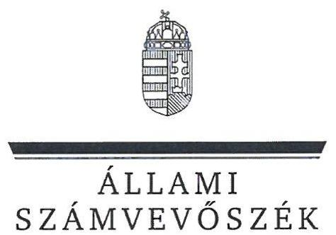
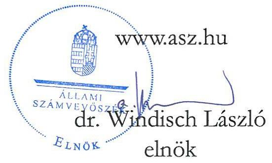
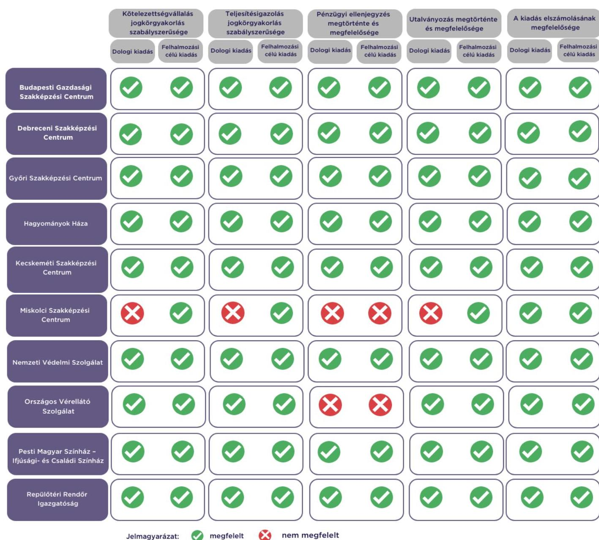

# JELENTÉS 

Az államháztartás központi alrendszerébe tartozó költségvetési szerv által teljesített dologi és felhalmozási célú kiadás szabályszerűségének rapid ellenőrzése
2024.

---

# JELENTÉS 

Az államháztartás központi alrendszerébe tartozó költségvetési szerv által teljesített dologi és felhalmozási célú kiadás szabályszerűségének rapid ellenőrzése
2024.

24035

---

# ELLENŐRZÉSI IGAZGATÓSÁG: 

## ÁLLAMHÁZTARTÁS KÖZPONTI SZINTJÉT ELLENŐRZŐ IGAZGATÓSÁG

## ELLENŐRZÉSI IGAZGATÓ:

## SINKÁNÉ DR. CSENDES ÁGNES igazgató

## ELLENŐRZÉSVEZETŐ:

Jelentéseink az interneten a www.asz.hu címen olvashatók.

RENKÓ ZSUZSANNA ellenőrzésvezető

IKTATÓSZÁM: EL-3949-023/2024.
TÉMASZÁM: 2685
ELLENŐRZÉS-AZONOSÍTÓ SZÁM: V102906

---

# TARTALOMJEGYZÉK 

AZ ELLENŐRZÉS ALAPADATAI ..... 5
AZ ELLENŐRZÖTT SZERVEZETEK ..... 7
ÖSSZEFOGLALÁS ..... 13
AZ ELLENŐRZÉS FÓKUSZKÉRDÉSEI ..... 14
MEGÁLLAPÍTÁSOK ..... 15
JAVASLATOK ..... 19
MELLÉKLETEK ..... 20
I. sz. melléklet: Értelmező szótár ..... 20
II. sz. melléklet: Az ellenőrzött szervezetek jegyzéke ..... 21
III. sz. melléklet: Ellenőrzési kritériumok ..... 22
FÜGGELÉK: ÉSZREVÉTELEK ..... 23
RÖVIDÍTÉSEK JEGYZÉKE ..... 26

---

.

---

# AZ ELLENŐRZÉS ALAPADATAI 

## AZ ELLENŐRZÉS CÉLJA

Az államháztartás központi alrendszerébe tartozó költségvetési szerv által teljesített dologi és felhalmozási célú kiadások egy-egy kiválasztott tételének szabályszerűségi szempontból történő értékelése.

## AZ ELLENŐRZÉS TÍPUSA

Megfelelőségi ellenőrzés.

## AZ ELLENŐRZÖTT IDŐSZAK

| Ssz. | ELLENŐRZÖTT SZERVEZETEK | $\begin{gathered} \text { DOLOGI } \\ \text { KIADÁSOK } \\ \text { ESETÉBEN } \end{gathered}$ | FELHALMOZÁSI CÉLÚ KIADÁSOK ESETÉBEN |
| :--: | :--: | :--: | :--: |
| 1. | Budapesti Gazdasági Szakképzési Centrum | 2023. október 6. | 2023. szeptember 29. |
| 2. | Debreceni Szakképzési Centrum | 2023. október 11. | 2023. október 11. |
| 3. | Győri Szakképzési Centrum | 2023. október 16. | 2023. szeptember 29. |
| 4. | Hagyományok Háza | 2023. szeptember 21. | 2023. szeptember 19. |
| 5. | Kecskeméti Szakképzési Centrum | 2023. szeptember 26. | 2023. október 17. |
| 6. | Miskolci Szakképzési Centrum | 2023. október 18. | 2023. szeptember 27. |
| 7. | Nemzeti Védelmi Szolgálat | 2023. szeptember 28. | 2023. szeptember 28. |
| 8. | Országos Vérellátó Szolgálat | 2023. október 12. | 2023. szeptember 22. |
| 9. | Pesti Magyar Színház - Ifjúsági- és Családi Színház | 2023. szeptember 25. | 2023. szeptember 27. |
| 10. | Repülőtéri Rendőr Igazgatóság | 2023. október 3. | 2023. október 10. |

## AZ ELLENŐRZÉS TÁRGYA

Az államháztartás központi alrendszerébe tartozó költségvetési szerv által teljesített, ellenőrzésre kiválasztott dologi és felhalmozási célú kiadás szabályszerű teljesítése, ezen belül a gazdálkodási jogkörök szabályszerű gyakorlása. Az ellenőrzés kiterjedt minden olyan körülményre és adatra, amely az ÁSZ ${ }^{1}$ jogszabályban meghatározott feladatainak teljesítéséhez, valamint a program végrehajtása folyamán felmerült újabb összefüggések feltárásához szükséges.

---

Az ellenőrzés során az ÁSZ

- a Budapesti Gazdasági Szakképzési Centrum, a Győri Szakképzési Centrum, a Kecskeméti Szakképzési Centrum, a Nemzeti Védelmi Szolgálat, a Pesti Magyar Színház - Ifjúsági- és Családi Színház esetében a dologi kiadások körébe tartozó Egyéb szolgáltatások; a Debreceni Szakképzési Centrum esetében a dologi kiadások körébe tartozó Informatikai szolgáltatások igénybevétele; az Országos Vérellátó Szolgálat esetében a dologi kiadások körébe tartozó Szakmai anyagok beszerzése; a Hagyományok Háza, a Repülőtéri Rendőr Igazgatóság esetében a dologi kiadások körébe tartozó Szakmai tevékenységet segítő szolgáltatások; a Miskolci Szakképzési Centrum esetében a dologi kiadások körébe tartozó Üzemeltetési anyagok beszerzése;
- a Budapesti Gazdasági Szakképzési Centrum, a Győri Szakképzési Centrum, a Kecskeméti Szakképzési Centrum, a Nemzeti Védelmi Szolgálat, a Pesti Magyar Színház - Ifjúsági- és Családi Színház, az Országos Vérellátó Szolgálat, a Repülőtéri Rendőr Igazgatóság esetében a felhalmozási célú kiadások körébe tartozó Egyéb tárgyi eszközök beszerzése, létesítése; a Debreceni Szakképzési Centrum, a Hagyományok Háza esetében a felhalmozási célú kiadások körébe tartozó Informatikai eszközök beszerzése, létesítése; a Miskolci Szakképzési Centrum esetében a felhalmozási célú kiadások körébe tartozó Ingatlanok felújítása
rovatokon elszámolt kiadások egy-egy kiválasztott mintatételének szabályszerűségét értékelte.

# AZ ELLENŐRZÉS JOGALAPJA 

Az ellenőrzés jogszabályi alapját az ÁSZ tv. ${ }^{2} 1 . \int(3)$ bekezdés és az 5. § (6) bekezdés előírásai képezték.

## AZ ELLENŐRZÉS MÓDSZERE

Az ellenőrzést az ÁSZ az ellenőrzött időszakban hatályos jogszabályok, az ellenőrzés szakmai szabályai alapján, „Az államalapítvány központi alrendszerébe tartozó költségvetési szerv által teljesített dologi kiadás szabályszerűségének rapid ellenőrzéséről" és „Az államalapítvány központi alrendszerébe tartozó költségvetési szerv által teljesített felhalmozási célú kiadás szabályszerűségének rapid ellenőrzéséről" című ellenőrzési programok (továbbiakban: ellenőrzési programok) kérdéseire adott válaszok kiértékelésével, az ellenőrzési programokban megjelölt adatforrások figyelembevételével folytatta le. Amennyiben az adott mintatétel ellenőrzési program szerinti értékelése során további kapcsolódó szabálytalanságot tárt fel az ÁSZ, a szabálytalansághoz tartozó kritériummal bővült az ellenőrzés.

Az ellenőrzési kérdések megválaszolásához szükséges bizonyítékok megszerzése a következő ellenőrzési eljárások alkalmazásával történt: megfigyelés, összehasonlítás, elemző eljárás, illetve a dologi kiadások, felhalmozási célú kiadások ellenőrzéssel érintett rovatairól történő mintavétel. Az ellenőrzési bizonyítékként felhasználható adatforrások közé tartoztak egyrészt az ellenőrzéshez kért dokumentumok, adatforrások, másrészt adatforrás volt még minden - az ellenőrzés folyamán - feltárt, az ellenőrzés szempontjából információkat tartalmazó dokumentum.

Az ÁSZ az ellenőrzés során a kiválasztott mintatételek ellenőrzési programokban meghatározott szempontok szerinti szabályszerűségét értékelte, így a kötelezettségvállalás és a teljesítésigazolás gazdálkodási jogkörök tekintetében a jogkörgyakorlás szabályszerűségét, a pénzügyi ellenjegyzés és az utalványozás gazdálkodási jogkörök tekintetében ezek megtörténtét és az ellenőrzési kritériumoknak való megfelelőségét.

---

# AZ ELLENŐRZÖTT SZERVEZETEK 

Az ellenőrzés a Budapesti Gazdasági Szakképzési Centrum, a Debreceni Szakképzési Centrum, a Győri Szakképzési Centrum, a Hagyományok Háza, a Kecskeméti Szakképzési Centrum, a Miskolci Szakképzési Centrum, a Nemzeti Védelmi Szolgálat, az Országos Vérellátó Szolgálat, a Pesti Magyar Színház - Ifjúsági- és Családi Színház, a Repülőtéri Rendőr Igazgatóság elnevezésű szervezetekre, mint az államháztartás központi alrendszerébe tartozó költségvetési szervekre terjedt ki.

## Budapesti Gazdasági Szakképzési Centrum főbb adatainak bemutatása

A Budapesti Gazdasági $\mathrm{SZC}^{3}$ közfeladata az Szkt. ${ }^{4}$ szerinti szakképzési és a 2011. évi CXC. tv. ${ }^{5}$ szerinti köznevelési feladatok ellátása. Alaptevékenysége fő feladataként technikumi szakmai oktatást, szakképző iskolai szakmai oktatást, szakgimnáziumi nevelést-oktatást, a többi gyermekkel, tanulóval együtt nevelhető, oktatható sajátos nevelési igényű és együtt nem nevelhető, oktatható sajátos nevelési igényű gyermekek, tanulók iskolai nevelését-oktatását folytatja. Ellát továbbá kollégiumi alapfeladatot, illetve nevelő és oktató munkához kapcsolódó, nem köznevelési tevékenységet.

## Budapesti Gazdasági Szakképzési Centrum főbb adatainak bemutatása

Alapításának éve:
Irányító szerve:
Középirányító szerve:
Gazdasági szervezettel való rendelkezés:
Illetékessége, működési területe:
A törvényes és szakszerű működésért felelős vezetője:
Vezetői kinevezés kezdete:
2022. évben teljesített bevételek összege:
2022. évben teljesített kiadások összege:

2015.
Kulturális és Innovációs Minisztérium
Nemzeti Szakképzési és Felnőttképzési Hivatal
Gazdasági szervezettel rendelkezik
Budapest
kancellár
2022.06.01.
$11641,5 \mathrm{M} \mathrm{Ft}$
$11296,9 \mathrm{M} \mathrm{Ft}$

---

# Debreceni Szakképzési Centrum 

A Debreceni $\mathrm{SZC}^{6}$ közfeladata az Szkt. szerinti szakképzési és a 2011. évi CXC. tv. szerinti köznevelési feladatok ellátása. Alaptevékenysége fő feladataként technikumi szakmai oktatást, szakképző iskolai szakmai oktatást, szakiskolai nevelést-oktatást, szakgimnáziumi nevelést-oktatást és a többi gyermekkel, tanulóval együtt nevelhető, oktatható sajátos nevelési igényű gyermekek, tanulók iskolai nevelését-oktatását folytatja, valamint kollégiumi ellátást, továbbá nevelő és oktató munkához kapcsolódó, nem köznevelési tevékenységet is ellát. Részt vesz az Arany János Tehetséggondozó Program, az Arany János Kollégiumi-Szakközépiskolai Program és az Arany János Kollégiumi Program keretében folytatott nevelés-oktatásban.

## Debreceni Szakképzési Centrum főbb adatainak bemutatása

Alapításának éve:
Irányító szerve:
Középirányító szerve:
Gazdasági szervezettel való rendelkezés:
Illetékessége, működési területe:
A törvényes és szakszerű működésért felelős vezetője:
Vezetői kinevezés kezdete:
2022. évben teljesített bevételek összege:
2022. évben teljesített kiadások összege:

2015.
Kulturális és Innovációs Minisztérium
Nemzeti Szakképzési és Felnőttképzési Hivatal
Gazdasági szervezettel rendelkezik
Hajdú-Bihar vármegye
kancellár
2020.07.01.
$9277,0 \mathrm{M} \mathrm{Ft}$
$8896,0 \mathrm{M} \mathrm{Ft}$

## Győri Szakképzési Centrum

A Győri $\mathrm{SZC}^{7}$ közfeladata az Szkt. szerinti szakképzési és a 2011. évi CXC. tv. szerinti köznevelési feladatok ellátása. Alaptevékenysége fő feladataként technikumi szakmai oktatást, szakképző iskolai szakmai oktatást, szakiskolai és szakgimnáziumi nevelést-oktatást, a többi gyermekkel, tanulóval együtt nevelhető, oktatható sajátos nevelési igényű gyermekek, tanulók, valamint beilleszkedési, tanulási, magatartási nehézséggel küzdő tanulók iskolai nevelését-oktatását folytatja. Ellát továbbá kollégiumi alapfeladatot, illetve nevelő és oktató munkához kapcsolódó, nem köznevelési tevékenységet.

## Győri Szakképzési Centrum főbb adatainak bemutatása

Alapításának éve:
Irányító szerve:
Középirányító szerve:
Gazdasági szervezettel való rendelkezés:
Illetékessége, működési területe:
A törvényes és szakszerű működésért felelős vezetője:
Vezetői kinevezés kezdete:
2022. évben teljesített bevételek összege:
2022. évben teljesített kiadások összege:

2015.
Kulturális és Innovációs Minisztérium
Nemzeti Szakképzési és Felnőttképzési Hivatal
Gazdasági szervezettel rendelkezik
Győr-Moson-Sopron vármegye
kancellár
2020.07.01.
$16163,5 \mathrm{M} \mathrm{Ft}$
$12962,1 \mathrm{M} \mathrm{Ft}$

---

# Hagyományok Háza 

A $\mathrm{HH}^{8}$ közfeladata a 2008. évi XCIX. tv. ${ }^{9}$ hatálya alá tartozó Magyar Állami Népi Együttes, továbbá a muzeális intézményekről, a nyilvános könyvtári ellátásról és a közművelődésről szóló 1997. évi CXL. törvényben, illetve a hagyományőrzéssel és a néphagyomány gondozásával kapcsolatos állami szerv kijelöléséről, valamint a népi iparművészeti és a népművészeti alkotások minősítéséről szóló 530/2017. (XII. 29.) Korm. rendeletben meghatározott egyes, különösen a magyar néphagyományok, a hazai népművészet, a népi kultúra közművelődési, közgyűjteményi feladatainak ellátása, hatósági minősítő rendszerek működtetése.

## Hagyományok Háza főbb adatainak bemutatása

Alapításának éve:
Irányító szerve:
Középirányító szerve:
Gazdasági szervezettel való rendelkezés:
Illetékessége, működési területe:
Általános képviseletét ellátó vezetője:
Vezetői kinevezés kezdete:
2022. évben teljesített bevételek összege:
2022. évben teljesített kiadások összege:

1951.
Kulturális és Innovációs Minisztérium
Gazdasági szervezettel rendelkezik
országos, nemzetközi
főigazgató
2021.11.20.
$4114,3 \mathrm{M} \mathrm{Ft}$
$3727,2 \mathrm{M} \mathrm{Ft}$

## Kecskeméti Szakképzési Centrum

A Kecskeméti $\mathrm{SZC}^{10}$ közfeladata az Szkt. szerinti szakképzési és a 2011. évi CXC. tv. szerinti köznevelési feladatok ellátása. Alaptevékenysége fő feladataként általános iskolai nevelés-oktatás, szakiskolai nevelés-oktatás, technikumi szakmai oktatást, szakképző iskolai szakmai oktatást, szakgimnáziumi nevelést-oktatást, és a többi gyermekkel, tanulóval együtt nevelhető, oktatható sajátos nevelési igényű gyermekek, tanulók iskolai nevelését-oktatását folytatja. Ellát továbbá kollégiumi alapfeladatot, illetve nevelő és oktató munkához kapcsolódó, nem köznevelési tevékenységet.

## Kecskeméti Szakképzési Centrum főbb adatainak bemutatása

Alapításának éve:
Irányító szerve:
Középirányító szerve:
Gazdasági szervezettel való rendelkezés:
Illetékessége, működési területe:
A törvényes és szakszerű működésért felelős vezetője:
Vezetői kinevezés kezdete:
2022. évben teljesített bevételek összege:
2022. évben teljesített kiadások összege:

2015.
Kulturális és Innovációs Minisztérium
Nemzeti Szakképzési és Felnőttképzési Hivatal
Gazdasági szervezettel rendelkezik
Bács-Kiskun vármegye
kancellár
2020.07.01.
$10615,1 \mathrm{M} \mathrm{Ft}$
$5929,8 \mathrm{M} \mathrm{Ft}$

---

# Miskolci Szakképzési Centrum 

A Miskolci SZC ${ }^{11}$ közfeladata az Szkt. szerinti szakképzési és a 2011. évi CXC. tv. szerinti köznevelési feladatok ellátása. Alaptevékenysége: fő feladataként technikumi szakmai oktatást, szakképző iskolai szakmai oktatást, szakiskolai és szakgimnáziumi nevelést-oktatást, a többi gyermekkel, tanulóval együtt nevelhető, oktatható sajátos nevelési igényű gyermekek, tanulók, valamint beilleszkedési, tanulási, magatartási nehézséggel küzdő tanulók iskolai nevelését-oktatását folytatja. Ellát továbbá kollégiumi alapfeladatot, illetve nevelő és oktató munkához kapcsolódó, nem köznevelési tevékenységet.

## Miskolci Szakképzési Centrum főbb adatainak bemutatása

Alapításának éve:
Irányító szerve:
Középirányító szerve:
Gazdasági szervezettel való rendelkezés:
Illetékessége, működési területe:
A törvényes és szakszerű működésért felelős vezetője:
Vezetői kinevezés kezdete:
2022. évben teljesített bevételek összege:
2022. évben teljesített kiadások összege:

2015.
Kulturális és Innovációs Minisztérium
Nemzeti Szakképzési és Felnőttképzési Hivatal
Gazdasági szervezettel rendelkezik
Borsod-Abaúj-Zemplén vármegye
kancellár
2020.07.01.
$13918,6 \mathrm{M} \mathrm{Ft}$
$9389,5 \mathrm{M} \mathrm{Ft}$

## Nemzeti Védelmi Szolgálat

Az NVSZ ${ }^{12}$ közfeladata az Rtv. ${ }^{13}$ alapján a belső bűnmegelőzési és bűnfelderítési célú ellenőrzés. Alaptevékenységeként ellátja a rendvédelmi feladatokat ellátó szervek hivatásos állományának szolgálati jogviszonyáról szóló törvényben meghatározott kifogástalan életvitel ellenőrzését, elvégzi az Rtv. 7. § (1) bekezdés b) pontjában meghatározott személyi kör megbízhatósági vizsgálatát, illetve az Rtv. 7. § (1) bekezdés c) pontjában foglaltak
 szerint végzi a védett állománnyal összefüggő, jogszabályban meghatározott bűncselekmények megelőzését, továbbá a büntetőeljárásról szóló törvényben meghatározottak szerint végzi ezen bűncselekmények felderítését.

## NEMZETI VÉDELMI SZOLGÁLAT FŐBB ADATAINAK BEMUTATÁSA

Alapításának éve:
Irányító szerve:
Középirányító szerve:
Gazdasági szervezettel való rendelkezés:
Illetékessége, működési területe:
Általános képviseletét ellátó vezetője:
Vezetői kinevezés kezdete:
2022. évben teljesített bevételek összege:
2022. évben teljesített kiadások összege:

2002.
Belügyminisztérium
-
Gazdasági szervezettel rendelkezik
országos
főigazgató
2022.05.25.
$12678,2 \mathrm{M} \mathrm{Ft}$
$12535,9 \mathrm{M} \mathrm{Ft}$

---

# Országos Vérellátó Szolgálat 

Az OVSZ ${ }^{14}$ közfeladata az egészségügyről szóló 1997. évi CLIV. törvény, az Országos Vérellátó Szolgálatról szóló 323/2006. (XII. 23.) Korm. rendelet, illetve a várólista alapján nyújtható ellátások részletes szabályairól szóló 287/2006. (XII. 23.) Korm. rendelet alapján az ország egész területén biztosítani a vérellátás megtervezését és megszervezését, az egészségügyi intézmények vér és vérkészítményekkel való ellátását, továbbá működtetni a központi várólistát. Alaptevékenysége többek között a vérellátással kapcsolatos stratégiai tervezés, országos vérkészlet nyilvántartás működtetése, a szakmailag indokolt mennyiségű és minőségű vérkészítmény előállításához, valamint tárolásához szükséges véradások szervezése, a levett vér kivizsgálása, vérkészítmények előállítása, osztása, ellenőrzése.

## Országos Vérellátó Szolgálat főbb adatainak bemutatása

| Alapításának éve: | 1996. |
| :-- | :-- |
| Irányító szerve: | Belügyminisztérium |
| Középirányító szerve: | Országos Kórházi Főigazgatóság |
| Gazdasági szervezettel való rendelkezés: | Gazdasági szervezettel rendelkezik |
| Illetékessége, működési területe: | országos |
| Általános képviseletét ellátó vezetője: | főigazgató |
| Vezetői kinevezés kezdete: | 2021.03.01. |
| 2022. évben teljesített bevételek összege: | $21511,9 \mathrm{M} \mathrm{Ft}$ |
| 2022. évben teljesített kiadások összege: | $21441,1 \mathrm{M} \mathrm{Ft}$ |

## Pesti Magyar Színház - Ifjúsági- és Családi Színház

A PMSZ ${ }^{15}$ közfeladata színházművészeti tevékenység folytatása a 2008. évi XCIX. tv. alapján. Alaptevékenysége keretében a színpadi műfajok sokszínűségének változatos megjelenítésével széles közönségréteg érdeklődésére számot tartó, közönségnevelő-megtartó funkciót valósít meg; klasszikus, félklasszikus drámai műveket, magyar és külföldi kortárs színdarabokat mutat be. A polgári színházeszmény megvalósítására törekedve műsorára tűzi és repertoárján tartja Európa és a világ korszerű, a polgári eszmeiséget tükröző színpadi műveit.

## Pesti Magyar Színház - Ifjúsági- és Családi Színház főbb adatainak bemutatása

| Alapításának éve: | 1837. |
| :-- | :-- |
| Irányító szerve: | Kulturális és Innovációs Minisztérium |
| Középirányító szerve: | - |
| Gazdasági szervezettel való rendelkezés: | Gazdasági szervezettel rendelkezik |
| Illetékessége, működési területe: | országos |
| Általános képviseletét ellátó vezetője: | igazgató |
| Vezetői kinevezés kezdete: | 2024.02.01. |
| 2022. évben teljesített bevételek összege: | $2376,3 \mathrm{M} \mathrm{Ft}$ |
| 2022. évben teljesített kiadások összege: | $2322,5 \mathrm{M} \mathrm{Ft}$ |

---

# REPÜLŐTÉRI RENDŐR IGAZGATÓSÁG 

Az RRI ${ }^{16}$ közfeladata az Rtv. 1. fejezetében, továbbá a Rendőrség szerveiről és a Rendőrség szerveinek feladat- és hatásköréről szóló 329/2007. (XII. 13.) Korm. rendeletben foglalt feladatok elvégzése. Alaptevékenysége a határellenőrzéssel, a határrend fenntartásával kapcsolatosan a jogszabályokban és a közjogi szervezetszabályozó eszközeiben meghatározott szakmai feladatok; a nemzetközi és belföldi polgári repülés jogellenes cselekmények elleni védelmével kapcsolatos feladatok; a repülőtereken a rendőrség hatáskörébe utalt légközlekedés védelmi feladatok szakmai felügyelete; a polgári repüléssel összefüggő, külön rendelkezések szerinti feladatok; a közbiztonsági, közrendvédelmi és bűnüldözési feladatok; a rendőrség működésének biztosításával kapcsolatos, a jogszabályokban és a közjogi szervezetszabályozó eszközökben meghatározott funkcionális feladatok; a jogszabályban meghatározott idegenrendészeti feladatok és a menekültügyi részfeladatok, valamint a jogellenes bevándorlás megakadályozása.

## A REPÜLŐTÉRI RENDŐR IGAZGATÓSÁG FŐBB ADATAINAK BEMUTATÁSA

Alapításának éve:
Irányító szerve:
Középirányító szerve:
Gazdasági szervezettel való rendelkezés:
Illetékessége, működési területe:
Általános képviseletét ellátó vezetője:
Vezetői kinevezés kezdete:
2022. évben teljesített bevételek összege:
2022. évben teljesített kiadások összege:

2008.
Belügyminisztérium
Országos Rendőr-főkapitányság
Gazdasági szervezettel rendelkezik
országos
igazgató
2010.09.01.
$7346,1 \mathrm{M} \mathrm{Ft}$
$7346,1 \mathrm{M} \mathrm{Ft}$

---

# ÖSSZEFOGLALÁS 

Az ellenőrzött kiadások tekintetében az ellenőrzött szervezetek vonatkozásában a kötelezettségvállalások egy eset kivételével a jogszabályi előírásoknak megfelelően történtek. Egy esetben nem történt írásbeli kötelezettségvállalás és pénzügyi ellenjegyzés, így a teljesítés igazolása és az utalványozás előzetes írásbeli kötelezettségvállalás hiányában történt. További három esetben a pénzügyi ellenjegyzés nem a jogszabályi előírásoknak megfelelően történt. Az ellenőrzött kiadásokat a megfelelő rovatokon számolták el.

Két dologi kiadás esetében nem folytattak le közbeszerzési eljárást, egy dologi kiadás esetében nem a központosított közbeszerzési rendszeren keresztül történt a beszerzés.

1. ábra

## A FŐBB ELLENŐRZÉSI TAPASZTALATOK

Forrás: ÁSZ saját szerkesztés

---

# AZ ELLENŐRZÉS FÓKUSZKÉRDÉSEI 

1- Az államháztartás központi alrendszerébe tartozó költségvetési szervnél a kiválasztott dologi kiadás teljesítése az egyes jogszabályi rendelkezések alapján szabályszerű volt-e?
2- Az államháztartás központi alrendszerébe tartozó költségvetési szervnél a kiválasztott felhalmozási célú kiadás teljesítése az egyes jogszabályi rendelkezések alapján szabályszerű volt-e?

---

# MEGÁLLAPÍTÁSOK 

## 1. Az államháztartás központi alrendszerébe tartozó költségvetési szervnél a kiválasztott dologi kiadás teljesítése az egyes jogszabályi rendelkezések alapján szabályszerű volt-e?

Összegző megállapítás

Az ellenőrzött 10 dologi kiadás teljesítése nyolc esetben az ellenőrzés keretében vizsgált jogszabályi előírásoknak megfelelt. Egy dologi kiadás esetében a kötelezettségvállalás és teljesítésigazolás jogkörgyakorlás nem volt szabályszerű, a pénzügyi ellenjegyzés nem történt meg, valamint az utalványozás nem volt megfelelő. További egy dologi kiadás esetében a pénzügyi ellenjegyzés nem volt megfelelő. Két dologi kiadás esetében nem folytattak le közbeszerzési eljárást, egy dologi kiadás esetében a beszerzés nem a központosított közbeszerzési rendszeren keresztül történt.

A Budapesti Gazdasági SZC-nél, a Debreceni SZC-nél, a Győri SZC-nél, a HH-nál, a Kecskeméti SZC-nél, az NVSZ-nél, a PMSZ-nél és az RRI-nél az ellenőrzött mintatételek esetében a kötelezettségvállalási és a teljesítésigazolási jogkörgyakorlás, illetve a kiadás elszámolása az Áht. ${ }^{17}$, az Ávr. ${ }^{18}$ és az Áhsz. ${ }^{19}$ előírásai szerint szabályszerűen történt, a pénzügyi ellenjegyzés és az utalványozás megfelelő volt:

- Kötelezettséget az Áht.-ben és az Ávr.-ben foglaltakkal összhangban az arra jogosultsággal rendelkező személy vállalt.
- A kötelezettségvállalásra az Áht.-ben foglaltak szerint, a pénzügyi ellenjegyzés után került sor.
- A teljesítésigazolást az Ávr.-ben előírtaknak megfelelően az arra jogosultsággal rendelkező személy végezte.
- A teljesítésigazolás során az Ávr.-ben foglaltak szerint ellenőrizhető okmányok alapján ellenőrizték és igazolták a kiadás teljesítésének jogosságát, összegszerűségét, valamint az ellenszolgáltatás teljesítését.
- A teljesítésigazoló a teljesítést az Ávr.-ben foglaltakkal összhangban, az igazolás dátumának és a teljesítés tényére történő utalás megjelölésével, aláírásával igazolta.
- Az utalványozásra az Áht.-ben, valamint az Ávr.-ben foglaltakkal összhangban, a teljesítésigazolást és az érvényesítést követően került sor.
- A kiadás számviteli elszámolása a megfelelő rovaton történt az Áhsz.-ben előírtakkal összhangban.

---

A Miskolci SZC-nél az ellenőrzött mintatétel esetében a kiadás elszámolása az Áhsz. előírásai szerint szabályszerűen történt, a teljesítésigazolási jogkörgyakorlás nem volt szabályszerű, az utalványozás nem volt megfelelő, a kötelezettségvállalás és a pénzügyi ellenjegyzés nem történt meg:

- Az Áht. 37. § (1) bekezdésében foglaltak ellenére nettó 2709030 Ft értékben nem történt írásbeli kötelezettségvállalás.
- Az Áht. 37. § (1) bekezdésében foglaltak ellenére nettó 2709030 Ft értékben pénzügyi ellenjegyzés nem történt.
- A munkaruha beszerzés teljesítésének jogosságát és összegszerűségét az Ávr. 57. § (1) bekezdésében foglaltak ellenére az Ávr.-ben előírt kijelöléssel rendelkező teljesítésigazoló úgy igazolta, hogy arra vonatkozóan az Áht. 37. § (1) bekezdése és az Ávr. 52. § (1) bekezdése szerinti írásbeli kötelezettségvállalás nem állt rendelkezésre.
- A munkaruha beszerzés tekintetében az utalványozásra a kiadás alapjául szolgáló, az Áht. 37. § (1) bekezdése és az Ávr. 52. § (1) bekezdése szerinti írásbeli kötelezettségvállalás, valamint a teljesítés Áht. 38. § (1) bekezdése és az Ávr. 57. § (1) bekezdése szerinti szabályszerű igazolásának hiányában került sor.
- A kiadás számviteli elszámolása a megfelelő rovaton történt az Áhsz.-ben előírtakkal összhangban. Az OVSZ-nél az ellenőrzött mintatétel esetében a kötelezettségvállalási, a teljesítésigazolási jogkörgyakorlás és a kiadás elszámolása az Áht., az Ávr. és az Áhsz. előírásai szerint szabályszerűen történt, az utalványozás megfelelő volt. A pénzügyi ellenjegyzés nem volt megfelelő:
- Kötelezettséget az Áht.-ben és az Ávr.-ben foglaltakkal összhangban az arra jogosultsággal rendelkező személy vállalt.
- A pénzügyi ellenjegyzés az Ávr. 55. § (1) bekezdésben foglaltak ellenére nem tartalmazta az ellenjegyzés dátumát. A dátum hiányában nem lehetett megállapítani, hogy a kötelezettségvállalásra az Áht. 37. § (1) bekezdésében foglalt előírás szerint a pénzügyi ellenjegyzés után került sor.
- A teljesítésigazolást az Ávr.-ben előírtaknak megfelelően az arra jogosultsággal rendelkező személy végezte.
- A teljesítésigazolás során az Ávr.-ben foglaltak szerint ellenőrizhető okmányok alapján ellenőrizték és igazolták a kiadás teljesítésének jogosságát, összegszerűségét, valamint az ellenszolgáltatás teljesítését.
- A teljesítésigazoló a teljesítést az Ávr.-ben foglaltakkal összhangban, az igazolás dátumának és a teljesítés tényére történő utalás megjelölésével, aláírásával igazolta.
- Az utalványozásra az Áht.-ben, valamint az Ávr.-ben foglaltakkal összhangban, a teljesítésigazolást és az érvényesítést követően került sor.
- A kiadás számviteli elszámolása a megfelelő rovaton történt az Áhsz.-ben előírtakkal összhangban.

# Az ellenőrzés során feltárt szabálytalanságok: 

- A Budapesti Gazdasági SZC az ÁSZ értékelése szerint közbeszerzési eljárás lefolytatása nélkül, 2023. augusztus 31-én takarítási feladatok ellátására, 2023. szeptember 1-2024. június 30-ig tartó időszakra szolgáltatási szerződést kötött. A szolgáltatási szerződés becsült értéke a 10 hónapra nettó 16600000 Ft volt, ami meghaladta a Kbt. ${ }^{20}$ 15. § (1) bekezdés b) pontjában foglaltak alapján a 2022. évi XXV. tv. ${ }^{21}$ 77. § (1) bekezdés d) pontjában meghatározott

---

15000000 Ft összegű nemzeti közbeszerzési értékhatárt, ami felveti a Kbt. 4. § (1) bekezdésében foglaltak megsértésének lehetőségét.

- A HH 2023. május 12-én etno-muzikológiai kutatások terepmunkájának előkészítésére kötött nettó 6000000 Ft értékű szerződést. Ennek során - az ÁSZ értékelése szerint - a központosított közbeszerzési rendszerről, valamint a központi beszerző szervezet feladat- és hatásköréről szóló 168/2004. (V. 25.) Korm. rendelet 1. § (1) bekezdés e) pontjában foglaltak alapján a központi közbeszerzési rendszer hatálya alá tartozó HH nem a központosított közbeszerzési rendszeren belül szerezte be a 2. § (1) bekezdésében hivatkozott 1. melléklet 5.1. pontja szerinti nemzetközi utazásszervezési szolgáltatást.
- Az OVSZ az ÁSZ értékelése szerint 2023. május 24-én közbeszerzési eljárás lefolytatása nélkül, beteg és donor vérminták kivizsgálásához szükséges vércsoport-szerológiai diagnosztikai tartozékok beszerzésére adott le megrendelést. A megrendelés értéke nettó 64110940 Ft volt, ami meghaladta a Kbt. 15. § (1) bekezdés b) pontjában foglaltak alapján a 2022. évi XXV. törvény 77. § (1) bekezdés a) pontjában meghatározott 15000000 Ft összegű nemzeti közbeszerzési értékhatárt, ami felveti a Kbt. 4. § (1) bekezdésében foglaltak megsértésének lehetőségét.

# 2. Az államháztartás központi alrendszerébe tartozó költségvetési szervnél a kiválasztott felhalmozási célú kiadás teljesítése az egyes jogszabályi rendelkezések alapján szabályszerű volt-e? 

## Összegző megállapítás Az ellenőrzött 10 felhalmozási célú kiadás teljesítése nyolc esetben az ellenőrzés keretében vizsgált jogszabályi előírásoknak megfelelt. Két felhalmozási célú kiadás esetében a pénzügyi ellenjegyzés nem volt megfelelő.

A Budapesti GSZC-nél, a Debreceni SZC-nél, a Győri SZC-nél, a HH-nál, a Kecskeméti SZC-nél, az NVSZ-nél, a PMSZ-nél és az RRI-nél ellenőrzött mintatételek esetében a kötelezettségvállalási és a teljesítésigazolási jogkörgyakorlás, továbbá a kiadás elszámolása az

 Áht., az Ávr. és az Áhsz. előírásai szerint szabályszerűen történt, a pénzügyi ellenjegyzés és az utalványozás megfelelő volt:

- Kötelezettséget az Áht.-ben és az Ávr.-ben foglaltakkal összhangban az arra jogosultsággal rendelkező személy vállalt.
- A kötelezettségvállalásra az Áht.-ben foglaltak szerint, a pénzügyi ellenjegyzés után került sor.
- A teljesítésigazolást az Ávr.-ben előírtaknak megfelelően az arra jogosultsággal rendelkező személy végezte.
- A teljesítésigazolás során az Ávr.-ben foglaltak szerint ellenőrizhető okmányok alapján ellenőrizték és igazolták a kiadás teljesítésének jogosságát, összegszerűségét, valamint az ellenszolgáltatás teljesítését.
- A teljesítésigazoló a teljesítést az Ávr.-ben foglaltakkal összhangban, az igazolás dátumának és a teljesítés tényére történő utalás megjelölésével, aláírásával igazolta.

---

- Az utalványozásra az Áht.-ben, valamint az Ávr.-ben foglaltakkal összhangban, a teljesítésigazolást és az érvényesítést követően került sor.
- A kiadás számviteli elszámolása a megfelelő rovaton történt az Áhsz.-ben előírtakkal összhangban. A Miskolci SZC-nél és az OVSZ-nél az ellenőrzött mintatételek esetében a kötelezettségvállalási és a teljesítésigazolási jogkörgyakorlás, valamint a kiadás elszámolása az Áht., az Ávr. és az Áhsz. előírásai szerint szabályszerűen történt, az utalványozás megfelelő volt. A pénzügyi ellenjegyzés nem volt megfelelő:
- Kötelezettséget az Áht.-ben és az Ávr.-ben foglaltakkal összhangban az arra jogosultsággal rendelkező személy vállalt.
- A pénzügyi ellenjegyzés az Ávr. 55. § (1) bekezdésben foglaltak ellenére nem tartalmazta az ellenjegyzés dátumát. A dátum hiányában nem lehetett megállapítani, hogy a kötelezettségvállalásra az Áht. 37. § (1) bekezdésében foglalt előírás szerint a pénzügyi ellenjegyzés után került sor.
- A teljesítésigazolást az Ávr.-ben előírtaknak megfelelően az arra jogosultsággal rendelkező személy végezte.
- A teljesítésigazolás során az Ávr.-ben foglaltak szerint ellenőrizhető okmányok alapján ellenőrizték és igazolták a kiadás teljesítésének jogosságát, összegszerűségét, valamint az ellenszolgáltatás teljesítését.
- A teljesítésigazoló a teljesítést az Ávr.-ben foglaltakkal összhangban, az igazolás dátumának és a teljesítés tényére történő utalás megjelölésével, aláírásával igazolta.
- Az utalványozásra az Áht.-ben, valamint az Ávr.-ben foglaltakkal összhangban, a teljesítésigazolást és az érvényesítést követően került sor.
- A kiadás számviteli elszámolása a megfelelő rovaton történt az Áhsz.-ben előírtakkal összhangban.

---

# JAVASLATOK 

Az ÁSZ tv. 33. § (1) bekezdésében foglaltak értelmében az ellenőrzött szervezet vezetője köteles a jelentésben foglalt megállapításokhoz kapcsolódó intézkedési tervet összeállítani és azt a jelentés kézhezvételétől számított 30 napon belül az ÁSZ részére megküldeni. Amennyiben az ellenőrzött szervezet vezetője nem küldi meg határidőben az intézkedési tervet, vagy továbbra sem elfogadható intézkedési tervet küld, az Állami Számvevőszék elnöke az ÁSZ tv. 33. § (3) bekezdése a) és b) pontjaiban foglaltakat érvényesítheti.

## BUDAPESTI GAZDASÁGI SZAKKÉPZÉSI CENTRUM KANCELLÁRJÁNAK

1. Kezdeményezzen a Bkr. 31. § (6) bekezdése alapján soron kívüli belső ellenőrzést a jelen ellenőrzés során feltárt szabálytalanság kialakulása okainak feltárása és a közbeszerzés elmulasztásával kapcsolatos kockázati tényezők feltárása, illetve a szabálytalanság megszüntetése érdekében.
2. A Bkr. 13. § (2) bekezdésében foglaltak alapján, valamint a 1. számú javaslat szerinti belső ellenőrzés megállapításait és javaslatait is figyelembe véve tegyen intézkedéseket azon kontrolltevékenységek kiépítésére és/vagy megfelelő működtetésére, amelyek megelőzik a jelentésben leírt szabálytalanság ismételt előfordulását.

## MISKOLCI SZAKKÉPZÉSI CENTRUM KANCELLÁRJÁNAK

1. Kezdeményezzen a Bkr. 31. § (6) bekezdése alapján soron kívüli belső ellenőrzést a jelen ellenőrzés során feltárt szabálytalanságok kialakulása okainak feltárása, illetve a szabálytalanságok megszüntetése érdekében.
2. A Bkr. 13. § (2) bekezdésében foglaltak alapján, valamint a 1. számú javaslat szerinti belső ellenőrzés megállapításait és javaslatait is figyelembe véve tegyen intézkedéseket azon kontrolltevékenységek kiépítésére és/vagy megfelelő működtetésére, amelyek megelőzik a jelentésben leírt szabálytalanságok ismételt előfordulását.

## ORSZÁGOS VÉRELLÁTÓ SZOLGÁLAT FŐIGAZGATÓJÁNAK

1. Kezdeményezzen a Bkr. 31. § (6) bekezdése alapján soron kívüli belső ellenőrzést a jelen ellenőrzés során feltárt szabálytalanságok kialakulása okainak feltárása és a közbeszerzés elmulasztásával kapcsolatos kockázati tényezők feltárása, illetve a szabálytalanságok megszüntetése érdekében.
2. A Bkr. 13. § (2) bekezdésében foglaltak alapján, valamint a 1. számú javaslat szerinti belső ellenőrzés megállapításait és javaslatait is figyelembe véve tegyen intézkedéseket azon kontrolltevékenységek kiépítésére és/vagy megfelelő működtetésére, amelyek megelőzik a jelentésben leírt szabálytalanságok ismételt előfordulását.

---

# MELLÉKLETEK 

## I. SZ. MELLÉKLET: ÉRTELMEZŐ SZÓTÁR

kötelezettségvállalás
pénzügyi ellenjegyzés
teljesítésigazolás
utalványozás

A költségvetési szerv által a kiadási előirányzatok és - ha jogszabály lehetővé teszi - a kijelölt lebonyolító szerv számára a Kormány rendeletében meghatározottak szerinti rendelkezésre bocsátott összeg terhére fizetési kötelezettség vállalásáról szóló - így különösen a foglalkoztatásra irányuló jogviszony létesítésére, szerződés megkötésére, költségvetési támogatás biztosítására irányuló - szabályszerűen megtett jognyilatkozat.
Forrás: Áht. 1. § 15. pont
A kötelezettségvállalást megelőző művelet, amelynek során a pénzügyi ellenjegyzőnek meg kell győződnie arról, hogy a szükséges szabad előirányzat - több évet érintő kötelezettségvállalás esetén minden egyes évben rendelkezésre áll, a tervezett kifizetési időpontokban a pénzügyi fedezet biztosított, valamint a kötelezettségvállalás nem sérti a gazdálkodásra vonatkozó szabályokat. Kötelezettséget vállalni a Kormány rendeletében foglalt kivételekkel csak pénzügyi ellenjegyzés után, a pénzügyi teljesítés esedékességét megelőzően, írásban lehet.
Forrás: Áht. 37. § (1) bekezdés
A kötelezettségvállalásban a másik fél által vállalt feltételek teljesítéséhez kapcsolódó igazolás, amely a kiadási előirányzat terhére vállalt utalványozást előzi meg. A teljesítés igazolása során ellenőrizhető okmányok alapján ellenőrizni és igazolni kell a kiadások teljesítésének jogosságát, összegszerűségét, ellenszolgáltatást is magában foglaló kötelezettségvállalás esetében - ha a kifizetés vagy annak egy része az ellenszolgáltatás teljesítését követően esedékes - annak teljesítését. A teljesítést az igazolás dátumának és a teljesítés tényére történő utalás megjelölésével, az arra jogosult személy aláírásával kell igazolni.
Forrás: Áht. 38. § (1) bekezdés; Ávr. 57. § (1) és (3) bekezdések
A bevételek és kiadások elszámolására utalványozás alapján kerülhet sor. A kiadási előirányzatok terhére történő utalványozás esetén az utalványozásra csak azután kerülhet sor, ha a kiadás alapjául szolgáló kötelezettségvállalásban meghatározott feltételeket a másik szerződő fél már teljesítette. A kiadási előirányzatok terhére történő utalványozásra a teljesítés igazolását és az érvényesítést követően, a bevételi előirányzatok esetén a belső szabályzatban a bevételek meghatározott körére esetlegesen elrendelt teljesítés igazolását követően kerülhet sor.
Forrás: Áht. 38. § (1) bekezdés; Ávr. 57. § (2) bekezdés és 59. § (1b) bekezdés

---

# II. SZ. MELLÉKLET: AZ ELLENŐRZÖTT SZERVEZETEK JEGYZÉKE 

## ELLENŐRZÖTT SZERVEZETEK MEGNEVEZÉSE

Budapesti Gazdasági Szakképzési Centrum
Debreceni Szakképzési Centrum
Győri Szakképzési Centrum
Hagyományok Háza
Kecskeméti Szakképzési Centrum
Miskolci Szakképzési Centrum
Nemzeti Védelmi Szolgálat
Országos Vérellátó Szolgálat
Pesti Magyar Színház - Ifjúsági- és Családi Színház
Repülőtéri Rendőr Igazgatóság

---

# III. SZ. MELLÉKLET: ELLENŐRZÉSI KRITÉRIUMOK 

## FOKUSZKÉRDÉS

1. Az államháztartás központi alrendszerébe tartozó költségvetési szervnél a kiválasztott dologi kiadás teljesítése az egyes jogszabályi rendelkezések alapján szabályszerű volt-e?

Kötelezettségvállalás

Pénzügyi ellenjegyzés
Teljesítésigazolás

Utalványozás

Kiadások elszámolása

Közbeszerzési eljárás lefolytatása
2. Az államháztartás központi alrendszerébe tartozó költségvetési szervnél a kiválasztott felhalmozási célú kiadás teljesítése az egyes jogszabályi rendelkezések alapján szabályszerű volt-e?

Kötelezettségvállalás

Pénzügyi ellenjegyzés
Teljesítésigazolás

Utalványozás

Kiadások elszámolása

## ELLENŐRZÉSI KRITÉRIUMOK

Áht. 36. § 7 (7), 37. § 1 (1) bekezdések
Ávr. 50. § 1 (1) bekezdés d) pont, 52. § 1 (1), (9), 53. § 1 (1), 60. § (3) bekezdések
belső szabályzat
Ávr. 55. § 1 (1), (4) bekezdések
Áht. 38. § 1 (1), (2) bekezdések
Ávr. 57. § 1 (1), (3)-(5), 60. § 3 bekezdések
Áht. 38. § 1 (1) bekezdés
Ávr. 59. § (1b), (2) bekezdések, (3) bekezdés g) pont, (4) bekezdés

Áhsz. 40. § (1) bekezdés, 15. melléklet I. pont
Kbt. 4. § (1) bekezdés, 15. § (1) bekezdés b) pont
168/2004. (V. 25.) Korm. rendelet 1. § (1) bekezdés e) pont, a 2. § (1) bekezdés, és az 1. melléklet 5.1. pont

Áht. 36. § 7 (7), 37. § 1 (1) bekezdések
Ávr. 50. § (1) bekezdés d) pont, 52. § (1), (9), 53. § (1), 60. § (3) bekezdések
belső szabályzat
Ávr. 55. § (1), (4) bekezdések
Áht. 38. § (1), (2) bekezdések
Ávr. 57. § (1), (3)-(5), 60. § (3) bekezdések
Áht. 38. § (1) bekezdés
Ávr. 59. § (1b), (2) bekezdések, (3) bekezdés g) pont, (4) bekezdés

Áhsz. 40. § (1) bekezdés, 15. melléklet I. pont

---

# FÜGGELÉK: ÉSZREVÉTELEK 

A jelentéstervezetet a Számvevőszék 15 napos észrevételezésre megküldte az ellenőrzött szervezet vezetőjének az ÁSZ tv. 29. § (1) bekezdése előírásának megfelelően.

A Budapesti Gazdasági Szakképzési Centrum, a Debreceni Szakképzési Centrum, a Győri Szakképzési Centrum, a Hagyományok Háza, a Kecskeméti Szakképzési Centrum, a Nemzeti Védelmi Szolgálat, az Országos Vérellátó Szolgálat, a Pesti Magyar Színház - Ifjúsági- és Családi Színház, a Repülőtéri Rendőr Igazgatóság ellenőrzött szervezetek vezetői a jelentéstervezet megállapításaira észrevételt nem tettek.
A jelentéstervezet megállapításaira a Miskolci Szakképzési Centrum kancellárja észrevételt tett. Az ÁSZ tv. 29. § (3) bekezdésével összhangban az Állami Számvevőszék a Függelékben feltünteti a megállapításokkal kapcsolatban tett, el nem fogadott észrevételeket, és megindokolja, hogy azokat miért nem fogadta el.
Miskolci Szakképzési Centrum kancellárjának észrevétele: „A dologi kiadások szabályszerű teljesítésének ellenőrzésére, ezen belül a gazdálkodási jogkörök szabályszerű gyakorlásának ellenőrzésére, egy tanulói munkaruha beszerzésével kapcsolatos kiadás került kiválasztásra. A tanulói munkaruha beszerzése a beszerzési szabályzat keretein belül került lefolytatásra. Az árajánlat kérésben meghatározásra került a beszerzendő termékek pontos specifikációja (műszaki leírása, beszerzendő mennyiség). A beszerzési eljárással szóló döntés és az erről készült jegyzőkönyv 2023. augusztus 8-án került lezárásra.
A lefolytatott eljárást követően 2023. augusztus 11-én a ténylegesen beszerzendő munkaruha mennyiségre az érintett szakképzési intézmény igazgatója kötelezettségvállalási kérelmet nyújtott be, amely a pénzügyi ellenjegyző által aláírásra és a kancellár által engedélyezésre került.
Az eredeti, aláírt kötelezettségvállalási engedély alapján a beszerzési szakügyintéző 2023. augusztus 18-án e-mailen megrendelte az adott termékeket. Véleményünk szerint a megrendelés tartalmazza mindazon alaki kellékeket, amelyek az írásbeli kötelezettségvállaláshoz is szükségesek. Az aláírt kötelezettségvállalási engedély alapján elküldött megrendelés nem felelt meg pontosan az írásbeli kötelezettségvállalás kritériumainak, de a már a korábban a munkaruha beszerzésével kapcsolatosan keletkező és jelen levelemben hivatkozott dokumentumokkal kiegészítve, azokkal együtt, kiterjesztően értelmezve alkalmas volt arra, hogy a teljesítésigazoló - aki ugyanaz a személy, aki a kötelezettségvállalási kérelmet is indította - a teljesítést leigazolja. A teljesítést igazoló személy a beszerzési eljárás során keletkezett dokumentumok alapján ellenőrizni és igazolni tudta a kiadás elszámolásának szabályszerűségét, és összegszerűségét, a leszállított

[^0]
[^0]:    * 29. § (1) Az Állami Számvevőszék az ellenőrzési megállapításait megküldi az ellenőrzött szervezet vezetőjének vagy az általa megbízott személynek, és annak, akinek személyes felelősségét állapította meg.
    (2) Az ellenőrzött szervezet vezetője és a felelősként megjelölt személy az ellenőrzés megállapításaira tizenöt napon belül írásban észrevételt tehet.
    (3) Az Állami Számvevőszék az észrevételre a beérkezésétől számított harminc napon belül írásban válaszol. A figyelembe nem vett észrevételeket köteles a jelentésben feltüntetni, és megindokolni, hogy azokat miért nem fogadta el.

---

termékek mennyiségét és műszaki leírásnak megfelelő voltát. Az utalványozásra a teljesítésigazolással ellátott számla alapján került sor.
A felelős gazdálkodás elvének érvényre juttatása érdekében a gazdálkodási jogkörök kialakítása megfelelő volt, mindösszesen az írásbeli kötelezettségvállalás nem
 felelt meg maradéktalanul az Áht.-ban foglaltaknak.”
Az észrevétellel érintett megállapítás: „A Miskolci SZC-nél az ellenőrzött mintatétel esetében a kiadás elszámolása az Áhsz. előírásai szerint szabályszerűen történt, a teljesítésigazolási jogkörgyakorlás nem volt szabályszerű, az utalványozás nem volt megfelelő, a kötelezettségvállalás és a pénzügyi ellenjegyzés nem történt meg:

- Az Áht. 37. § (1) bekezdésében foglaltak ellenére nettó 2709030 Ft értékben nem történt írásbeli kötelezettségvállalás.
- Az Áht. 37. § (1) bekezdésében foglaltak ellenére nettó 2709030 Ft értékben pénzügyi ellenjegyzés nem történt.
- A munkaruha beszerzés teljesítésének jogosságát és összegszerűségét az Ávr. 57. § (1) bekezdésében foglaltak ellenére az Ávr.-ben előírt kijelöléssel rendelkező teljesítésigazoló úgy igazolta, hogy arra vonatkozóan az Áht. 37. § (1) bekezdése és az Ávr. 52. § (1) bekezdése szerinti írásbeli kötelezettségvállalás nem állt rendelkezésre.
- A munkaruha beszerzés tekintetében az utalványozásra a kiadás alapjául szolgáló, az Áht. 37. § (1) bekezdése és az Ávr. 52. § (1) bekezdése szerinti írásbeli kötelezettségvállalás, valamint a teljesítés Áht. 38. § (1) bekezdése és az Ávr. 57. § (1) bekezdése szerinti szabályszerű igazolásának hiányában került sor.”
El nem fogadás indoka: „Az államháztartásról szóló 2011. évi CXCV. törvény (továbbiakban: Áht.) 1. § (15) pontjában megfogalmazottak szerint az államháztartásban csak a szabályszerűen megtett jognyilatkozat minősül kötelezettségvállalásnak. Az államháztartás rendszerén belül az Áht. meghatározott alakot rendel a kötelezettségvállalásra, az Áht. 37. § (1) bekezdése kötelezően előírja, hogy kötelezettséget vállalni csak írásban lehet. A kötelezettségvállalás vonatkozásában az Áht. ugyanezen jogszabályhelye a kötelezettségvállalás előfeltételeként előírja, hogy kötelezettséget vállalni csak pénzügyi ellenjegyzés után lehet. Az államháztartásról szóló törvény végrehajtásáról szóló 368/2011. (XII. 31.) Korm. rendelet (továbbiakban: Ávr.) 55. § (1) bekezdés rögzíti, hogy a pénzügyi ellenjegyzést a kötelezettségvállalás dokumentumán az arra jogosult személy aláírásával kell igazolni.
A dologi kiadási mintatételhez kapcsolódóan megküldött elektronikus levelezés az előzőekben leírtakra és a következőkre tekintettel nem minősül az Áht. 37. § (1) bekezdés szerinti érvényes írásbeli kötelezettségvállalásnak, valamint az Ávr. 52. § (9) bekezdés szerinti elektronikus dokumentumnak. Az ellenőrzés részére átadott elektronikus levél nem tartalmaz semmilyen aláírást: sem a kötelezettségvállaló, sem a pénzügyi ellenjegyző, sem a szállító képviselője nem írta alá, továbbá legalább fokozott biztonságú elektronikus aláírásokat sem tartalmaz. Az észrevételében is hivatkozott, a kötelezettségvállalást megelőzően lefolytatott beszerzési eljárás nem helyettesíti az írásbeli kötelezettségvállalást.
Ezúton tájékoztatom, hogy az észrevételében hivatkozott 2023. augusztus 11-ei keltezésű kötelezettségvállalási kérelmet nem bocsátották az ÁSZ rendelkezésére. Az ellenőrzés során megküldött, az érintett szakképzési intézmény igazgató által aláírt kötelezettségvállalási kérelem 2023. szeptember 11-ei keltezésű. A dokumentum alapján a kötelezettségvállalásra jogosult vezető (kancellár) az engedélyezést szintén 2023. szeptember 11-én írta alá. Ezen ellenőrzési bizonyíték alapján a kérelemre és annak engedélyezésére a 2023. augusztus 16-ai megrendelés után került sor.
Az Ávr. 13. § (2) bekezdés a) pontja alapján belső szabályzatban meghatározták a kötelezettségvállalás, ellenjegyzés, teljesítés igazolás, érvényesítés és utalványozás gyakorlásának módját, eljárási és dokumentációs részletszabályait. A kötelezettségvállalási szabályzat 16. oldal 16. pont 3. bekezdésében foglaltak szerint a Miskolci Szakképzési Centrum előírta, hogy „Érvényes kötelezettségvállalás esetén írásban kiadott igazolás szükséges a kötelezettségvállalásban foglaltak teljesítésére vonatkozóan (szakmai igazolás).” Továbbá az Ávr. 57. § (1) bekezdése a teljesítés igazolásával kapcsolatban azt írja elő, hogy a teljesítés igazolása során ellenőrizhető okmányok alapján ellenőrizni és igazolni kell a kiadások teljesítésének jogosságát, összegszerűségét, ellenszolgáltatást is magában foglaló kötelezettségvállalás esetében - ha a kifizetés vagy annak egy része az ellenszolgáltatás teljesítését követően esedékes - annak teljesítését. A teljesítés igazolásának szükséges előfeltétele az érvényes kötelezettségvállalás. Az Áht. szerinti kötelezettségvállalás hiányában az Ávr. szerinti teljesítés igazolás szabályszerűen nem hajtható végre. A teljesítés igazolására az elektronikus levél alapján sem kerülhetett volna sor megfelelően, mivel a szállító a válaszlevelében nem igazolta vissza egyértelműen a megrendelést, mert az egyik szervezeti egység vonatkozásában az adatok pótlását (méretsor) kérte.
Utalványozás esetén az utalványozásra csak azután kerülhet sor, ha a kiadás alapjául szolgáló kötelezettségvállalásban meghatározott feltételeket a másik szerződő fél már teljesítette, amelyet teljesítés igazolással kell igazolni, majd érvényesíteni. Az Áht. szerinti kötelezettségvállalás és az Ávr. előírásainak megfelelő teljesítés igazolás hiányában az Ávr. előírásainak az utalványozói jogkörgyakorlás sem lehetett megfelelő.
A fent leírtak alapján észrevételét nem fogadjuk el, a jelentéstervezet megállapításainak módosítása nem indokolt.”

---

# RÖVIDÍTÉSEK JEGYZÉKE 

${ }^{1}$ ÁSZ
${ }^{2}$ ÁSZ tv.
${ }^{3}$ Budapesti Gazdasági SZC
${ }^{4}$ Szkt.
${ }^{5}$ 2011. évi CXC. tv.
${ }^{6}$ Debreceni SZC
${ }^{7}$ Győri SZC
${ }^{8} \mathrm{HH}$
${ }^{9}$ 2008. évi XCIX. tv.
${ }^{10}$ Kecskeméti SZC
${ }^{11}$ Miskolci SZC
${ }^{12}$ NVSZ
${ }^{13}$ Rtv.
${ }^{14}$ OVSZ
${ }^{15}$ PMSZ
${ }^{16}$ RRI
${ }^{17}$ Áht.
${ }^{18}$ Ávr.
${ }^{19}$ Áhsz.
${ }^{20}$ Kbt.
${ }^{21}$ 2022. évi XXV. tv.
${ }^{22}$ Bkr.

Állami Számvevőszék
2011. évi LXVI. törvény az Állami Számvevőszékről

Budapesti Gazdasági Szakképzési Centrum
2019. évi LXXX. törvény a szakképzésről
2011. évi CXC törvény a nemzeti köznevelésről

Debreceni Szakképzési Centrum
Győri Szakképzési Centrum
Hagyományok Háza
2008. évi XCIX. törvény az előadó-művészeti szervezetek támogatásáról és sajátos foglalkoztatási szabályairól
Kecskeméti Szakképzési Centrum
Miskolci Szakképzési Centrum
Nemzeti Védelmi Szolgálat
1994. évi XXXIV. törvény a Rendőrségről

Országos Vérellátó Szolgálat
Pesti Magyar Színház - Ifjúsági- és Családi Színház
Repülőtéri Rendőr Igazgatóság
2011. évi CXCV. törvény az államháztartásról

368/2011. (XII. 31.) Korm. rendelet az államháztartásról szóló törvény végrehajtásáról
4/2013. (I. 11.) Korm. rendelet az államháztartás számviteléről
2015. évi CXLIII. törvény a közbeszerzésekről
2022. évi XXV. törvény a Magyarország 2023. évi központi költségvetéséről
370/2011. (XII. 31.) Korm. rendelet a költségvetési szervek belső kontrollrendszeréről és belső ellenőrzéséről

---

1052 Budapest, Apáczai Csere János u. 10. | 1364 Budapest 4., Pf. 54
www.asz.hu | szamvevoszek@asz.hu
telefon: +36 1 4849100

