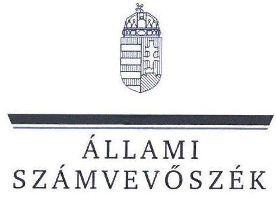
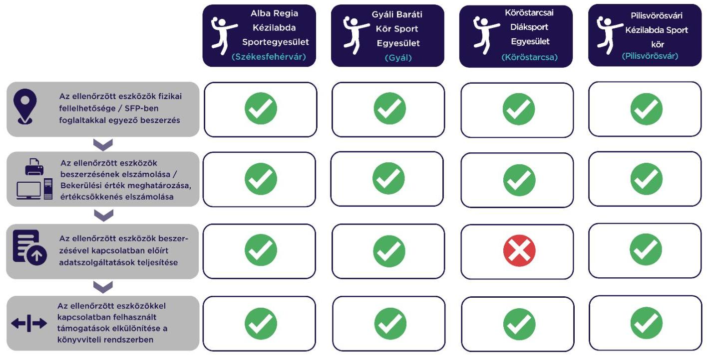

# JELENTÉS 

## Sportegyesületek eszközbeszerzésre kapott támogatás felhasználása szabályszerűségének ellenőrzése

Alba Regia Kézilabda Sportegyesület, Gyáli Baráti Kör Sportegyesület, Köröstarcsai Diáksport Egyesület, Pilisvörösvári Kézilabda Sport Kör

2024.

---

ÁLLAMI
SZÁMVEVŐSZÉK

# JELENTÉS 

## Sportegyesületek eszközbeszerzésre kapott támogatás felhasználása szabályszerűségének ellenőrzése

Alba Regia Kézilabda Sportegyesület, Gyáli Baráti Kör Sportegyesület, Köröstarcsai Diáksport Egyesület, Pilisvörösvári Kézilabda Sport Kör

2024.

---

# ELLENŐRZÉSI IGAZGATÓSÁG: 

## ÁLLAMHÁZTARTÁSON KÍVÜLI SZERVEZETEKET ELLENŐRZŐ IGAZGATÓSÁG

ELLENŐRZÉSI IGAZGATÓ:
KLINGA LÁSZLÓ igazgató

ELLENŐRZÉSVEZETŐ:
Jelentéseink az interneten a www.asz.hu címen olvashatók.

KAKAS SÁNDOR ellenőrzésvezető

IKTATÓSZÁM: EL-3870-266/2024.
TÉMASZÁM: 2638.
ELLENŐRZÉS-AZONOSÍTÓ SZÁM: V1027

---

# TARTALOMJEGYZÉK 

AZ ELLENŐRZÉS ALAPADATAI ..... 5
AZ ELLENŐRZÖTT SZERVEZET ..... 6
ÖSSZEFOGLALÁS ..... 7
AZ ELLENŐRZÉS FÓKUSZKÉRDÉSE ..... 8
MEGÁLLAPÍTÁSOK ..... 9
JAVASLATOK ..... 11
MELLÉKLETEK ..... 12
I. sz. melléklet: Értelmező szótár ..... 12
II. sz. melléklet: Az ellenőrzött szervezetek jegyzéke ..... 13
III. sz. melléklet: Ellenőrzési kritériumok ..... 14
FÜGGELÉK: ÉSZREVÉTELEK ..... 15
RÖVIDÍTÉSEK JEGYZÉKE ..... 16

---

.

---

# AZ ELLENŐRZÉS ALAPADATAI 

## AZ ELLENŐRZÉS CÉLJA

Annak ellenőrzése, hogy az ellenőrzött sportegyesületnél a $\mathrm{TAO}^{1}$ támogatásból megvalósult kiválasztott eszközbeszerzés szabályszerűen történt-e.

## AZ ELLENŐRZÉS TÍPUSA

Szabályszerúségi ellenőrzés.

## AZ ELLENŐRZÖTT IDŐSZAK

A kiválasztott sportfejlesztési támogatás felhasználásáról szóló döntéstől a helyszíni ellenőrzés napjáig tartó időszak.

## AZ ELLENŐRZÉS TÁRGYA

A sportegyesületeknél a TAO támogatásból megvalósult kiválasztott eszközbeszerzések ellenőrzése.

## AZ ELLENŐRZÉS JOGALAPJA

Az ellenőrzés jogalapját az ÁSZ tv. ${ }^{2} 1 . \S$ (3), valamint az 5. $\S$ (3) bekezdése képezi.

## AZ ELLENŐRZÉS MÓDSZERE

Az ellenőrzést az ellenőrzési program szempontjai, az ellenőrzött időszakban hatályos jogszabályok, előírások, az ellenőrzés általános szakmai szabályai, az ellenőrzésre irányadó ÁSZ ${ }^{3}$ módszertan figyelembevételével végezte az ÁSZ.

Az ellenőrzési kérdések megválaszolásához szükséges bizonyítékok megszerzése az ellenőrzött szervezet által rendelkezésre bocsátott dokumentumokra, adatokra alapozva kérdésfeltevés (információkérés), helyszíni szemle, interjú, mintavételezés útján történt. A helyszíni szemle során a sportfejlesztési program alapján beszerzett eszközök közül legalább 3 - a legnagyobb értékű - eszköz került kiválasztásra.

Az ellenőrzési bizonyítékként felhasználható adatforrások közé tartoztak egyrészt az ellenőrzési programban felsorolt adatforrások, másrészt adatforrás lehetett még az ellenőrzés folyamán feltárt, az ellenőrzés szempontjából releváns információt tartalmazó dokumentum.

---

# AZ ELLENŐRZÖTT SZERVEZET 

## ALBA REGIA KÉZILABDA SPORTEGYESÜLET

Az ellenőrzés a kézilabda sportágat érintő SFPMOD01-10260/2022/MKSZ számú, 2023.08.01-jén határozattal jóváhagyott sportfejlesztési program megvalósításra eszközbeszerzés jogcímen kapott TAO támogatásból 2022-2023. években megvalósult eszközbeszerzések elszámolásának szabályszerűségére és a helyszíni ellenőrzés során a kiválasztott, beszerzett eszközök fizikai szemrevételezésére terjedt ki.

Az ellenőrzött SFPMOD01-10260/2022/MKSZ számú sportfejlesztési program keretében négy db eszközt szerzett be az ellenőrzés megkezdéséig. A beszerzett eszközök beszerzési árából a támogatott összeg 10783 E Ft volt. A helyszíni ellenőrzés keretében a dokumentáltan telephelyen kívül használt kettő db eszköz kivételével az eszközök szemrevételezésre kerültek.

## GYÁLI BARÁTI KÖR SPORTEGYESÜLET

Az ellenőrzés a kézilabda sportágat érintő SFPMOD01-10601/2022/MKSZ számú, 2023.07.20-án határozattal jóváhagyott sportfejlesztési program megvalósításra eszközbeszerzés jogcímen kapott TAO támogatásból 2022-2023. években megvalósult eszközbeszerzések elszámolásának szabályszerűségére és a helyszíni ellenőrzés során a kiválasztott, beszerzett eszközök fizikai szemrevételezésére terjedt ki.

Az ellenőrzött SFPMOD01-10601/2022/MKSZ számú sportfejlesztési program keretében kettő db eszközt szerzett be az ellenőrzés megkezdéséig. A beszerzett eszközök beszerzési árából a támogatott összeg 9224 E Ft volt. A helyszíni ellenőrzés keretében valamennyi eszköz szemrevételezésre került.

## KÖRÖSTARCSAI DIÁKSPORT EGYESÜLET

Az ellenőrzés a kézilabda sportágat érintő SFP01-10340/2022/MKSZ számú, 2022.04.28-án határozattal jóváhagyott sportfejlesztési program megvalósításra eszközbeszerzés jogcímen kapott TAO támogatásból 2022-2023. években megvalósult eszközbeszerzések elszámolásának szabályszerűségére és a helyszíni ellenőrzés során a kiválasztott, beszerzett eszközök fizikai szemrevételezésére irányult.

Az ellenőrzött SFP01-10340/2022/MKSZ számú sportfejlesztési program keretében négy eszközt szerzett be az ellenőrzés megkezdéséig. A beszerzett eszközök beszerzési árából a támogatott összeg 9491 E Ft volt. A helyszíni ellenőrzés keretében valamennyi eszköz szemrevételezésre került.

## PILISVÖRÖSVÁRI KÉZILABDA SPORT KÖR

Az ellenőrzés a kézilabda sportágat érintő SFPMOD02-10365/2022/MKSZ számú, 2023.06.23-án határozattal jóváhagyott sportfejlesztési program megvalósításra eszközbeszerzés jogcímen kapott TAO támogatásból 2022-2023. években megvalósult eszközbeszerzések elszámolásának szabályszerűségére és a helyszíni ellenőrzés során a kiválasztott, beszerzett eszközök fizikai szemrevételezésére irányult.

Az ellenőrzött SFPMOD02-10365/2022/MKSZ számú sportfejlesztési program keretében egy db eszközt szerzett be az ellenőrzés megkezdéséig. A beszerzett eszköz beszerzési árából a támogatott összeg 12011 E Ft volt. A helyszíni ellenőrzés keretében az eszköz szemrevételezésre került.

---

# ÖSSZEFOGLALÁS 

A Sportegyesület ${ }_{1,2,4}$-nél ${ }^{4}$ az ellenőrzött eszközbeszerzésre kapott TAO támogatások felhasználása szabályszerűen valósult meg. A Sportegyesület ${ }_{3}$-nél az egyszerűsített beszámoló nem felelt meg a Számv. tv.nek, továbbá az előírt adatszolgáltatások teljesítése tekintetében is szabálytalanságot tárt fel az ellenőrzés.

A Sportegyesület ${ }_{1-4}$ a sportfejlesztési program ${ }_{1-4}{ }^{5}$-ben meghatározott támogatások felhasználásával a sportfejlesztési program ${ }_{1-4}$-ben szereplő eszközöket vásárolta meg. A sportfejlesztési program ${ }_{1,2,4}$-ben jóváhagyott eszközök egy részének megvásárlására nem került sor a helyszíni ellenőrzés időpontjáig, mert az elszámolási határidő meghosszabbításra került.

A sportfejlesztési program ${ }_{2,3,4}$-ben a TAO támogatásból beszerzett eszközök a nyilvántartással összhangban a helyszíni szemrevételezés során fellelhetőek voltak, a sportfejlesztési program ${ }_{1}$-ben beszerzett eszközök egy része használatra kiadott sportfelszerelés volt. Az ellenőrzési bizonyítékok alapján a beszerzett eszközök esetében nem merült fel az egyesületi céltól való eltérő felhasználás.

A Sportegyesület ${ }_{1-4}$-nél a sportfejlesztési program ${ }_{1-4}$ keretében beszerzett eszközök vonatkozásában a bekerülési érték meghatározása, az értékcsökkenés elszámolása szabályszerű volt. A Sportegyesület ${ }_{5}$-nél a 2022. évi egyszerűsített beszámoló esetében sérült a Számv. tv. 15. § (3) bekezdésében rögzített valódiság elve.

Az előírt elszámolási, adatszolgáltatási kötelezettségét a Sportegyesület ${ }_{1,2,4}$ a 107/2011. Korm. rendeletben ${ }^{6}$ előírtaknak megfelelően teljesítette. A Sportegyesület ${ }_{3}$ a 107/2011. Korm. rendeletben foglaltak ellenére a támogatás felhasználásáról negyedéves előrehaladási jelentést nem nyújtott be az MKSZ ${ }^{7}$ felé.

A sportfejlesztési program ${ }_{1-4}$ keretében beszerzett eszközökkel kapcsolatos támogatások és azok felhasználásának könyvvitelben való elkülönítése a Sportegyesület ${ }_{1-4}$-nél a jogszabályoknak megfelelően történt.

Az 1. ábra a főbb ellenőrzési tapasztalatokat szemlélteti sportegyesületenként:
1. ábra

---

# AZ ELLENŐRZÉS FÓKUSZKÉRDÉSE 

- Szabályszerü volt-e a Sportegyesületek eszközbeszerzésre kapott támogatásának felhasználása?

---

# 1. Szabályszerú volt-e a Sportegyesületek eszközbeszerzésre kapott támogatásának felhasználása? 

Összegző megállapítás A Sportegyesület ${ }_{1,2,4}$-nél az ellenőrzött eszközbeszerzésre kapott TAO támogatások felhasználása szabályszerűen valósult meg. A Sportegyesület ${ }_{3}$-nél az egyszerúsített beszámoló tartalma és az előírt adatszolgáltatások teljesítése tekintetében szabálytalanságot tárt fel az ellenőrzés.

Az ellenőrzött eszközök fizikai fellelhetősége, sportfejlesztési program ${ }_{1-4}$-ben foglaltakkal egyező tartalma

A TAO támogatásból beszerzett ellenőrzött eszközök a Sportegyesület ${ }_{1-4}$-nél a helyszíni szemrevételezés során - két, dokumentáltan a telephelyen kívül használt eszköz kivételével - fizikailag fellelhetőek voltak. A helyszíni szemle során az ellenőrzött támogatásból beszerzett eszközök az eszköz típusa, megnevezése, illetve gyári száma alapján beazonosíthatók voltak.
A Sportegyesület ${ }_{1-4}$ a sportfejlesztési program ${ }_{1-4}$-ben meghatározott támogatásokat a sportfejlesztési program ${ }_{1-4}$-ben jóváhagyott eszközök beszerzésére fordította. A sportfejlesztési program ${ }_{1,2,4}$-ban meghatározott eszközök egy részének beszerzése az ellenőrzött időszakban nem történt meg, a sportfejlesztési program ${ }_{1,2,4}$-ben rögzített elszámolási határidő meghosszabbításra került.
A beszerzett eszközök esetén az ellenőrzés során megszerzett bizonyítékok alapján nem merült fel a Sportegyesület ${ }_{1-4}$ céljaitól eltérő felhasználás.

Az ellenőrzött eszközök beszerzésének elszámolása, a bekerülési érték és az értékcsökkenés meghatározása

A Sportegyesület ${ }_{1-4}$ a 2022-2023. években sportfejlesztési program ${ }_{1-4}$ keretében megvalósult tárgyi eszközök beszerzését a Számv. tv. ${ }^{8}$-ben előírtak szerint számolta el, az ellenőrzött eszközök bekerülési értékének megállapítása, az értékcsökkenés elszámolása a Számv. tv.-ben előírtaknak megfelelően történt.

A Sportegyesület ${ }_{3}$ a 2022. évi egyszerúsített beszámoló egyszerűsített mérlegében a Számv. tv. 100. § (3) bekezdésében előírtak ellenére nem szerepeltette a sportfejlesztési program ${ }_{3}$ keretében beszerzett, a leltárba értékkel felvett tárgyi eszközöket, valamint a Számv. tv. 110. § (3) bekezdésében előírtak ellenére az egyszerűsített eredménylevezetésben nem mutatta ki az értékcsökkenési leírást a ráfordítást jelentő elszámolások között, ennek okán sérült a Számv. tv. 15. § (3) bekezdésében rögzített valódiság elve.

## Az ellenőrzött eszközökkel kapcsolatos előírt adatszolgáltatások teljesítése

A sportfejlesztési program ${ }_{1-4}$ vonatkozásában a 107/2011. Korm. rendeletben előírt elszámolási és adatszolgáltatási kötelezettségének a Sportegyesület ${ }_{1,2,4}$ eleget tett, az előrehaladási jelentések, záró elszámolások beküldésre kerültek az MKSZ részére. A Sportegyesület ${ }_{3}$ a

---

107/2011. Korm. rendelet 11. § (2) bekezdésében foglaltak ellenére a támogatás felhasználásáról negyedéves előrehaladási jelentést nem nyújtott be az MKSZ felé.

# Az ellenőrzött eszközökkel kapcsolatban felhasznált támogatások elkülönítése a könyvviteli rendszerben 

A Sportegyesület ${ }_{1-4}$ a 107/2011. Korm. rendeletben, illetve a Civil tv. ${ }^{9}$-ben foglaltakkal összhangban az alapcél szerinti tevékenysége költségei, ráfordításai ellentételezésére visszafizetési kötelezettség nélkül kapott támogatásokat forrásonként, illetve azok felhasználását elkülönítetten kimutatta, melyek alapján támogatásonként megállapítható és ellenőrizhető a kapott támogatás felhasználása.

---

# JAVASLATOK 

Az ÁSZ tv. 33. § (1) bekezdésében foglaltak értelmében az ellenőrzött szervezet vezetője köteles a jelentésben foglalt megállapításokhoz kapcsolódó intézkedési tervet összeállítani és azt a jelentés kézhezvételétől számított 30 napon belül az ÁSZ részére megküldeni. Amennyiben az ellenőrzött szervezet vezetője nem küldi meg határidőben az intézkedési tervet, vagy továbbra sem elfogadható intézkedési tervet küld, az Állami Számvevőszék elnöke az ÁSZ tv. 33. § (3) bekezdése a) és b) pontjaiban foglaltakat érvényesítheti.

## A KÖRÖSTARCSAI DIÁKSPORT EGYESÜLET ELNÖKE RÉSZÉRE

1. Gondoskodjon arról, hogy az egyszerüsített mérleg és az egyszerüsített eredménylevezetés feleljen meg Számv. tv. 100. § (3) bekezdésében, illetve 110. § (3) bekezdésében elöirtaknak.

---

# MELLÉKLETEK 

## I. SZ. MELLÉKLET: ÉRTELMEZŐ SZÓTÁR

költségvetési támogatás

TAO támogatás
kiválasztott eszköz
sportfejlesztési program
sportegyesület
a társadalombiztosítás pénzügyi alapjai kivételével az államháztartás központi alrendszeréből ellenérték nélkül, pénzben nyújtott támogatások (Áht. ${ }^{10}$ 1. $\S 14$. pont)
látvány-csapatsport támogatása: az adóévben visszafizetési kötelezettség nélkül nyújtott támogatás, juttatás, véglegesen átadott pénzeszköz és térítés nélkül átadott eszköz könyv szerinti értéke, az adóévben térítés nélkül nyújtott szolgáltatás bekerülési értéke az e törvényben meghatározott jogcímeken (Tao tv. ${ }^{11}$ 4. $\$ 44$. pont)
az ÁSZ által ellenőrzésre kiválasztott tárgyi eszköz, forgóeszköz
a támogatás igénybevételére jogosult szervezet által készített, a sportpolitikáért felelős miniszter, illetve az országos sportági szakszövetség által jóváhagyott, a látvány-csapatsport támogatás igénybevételének feltételét képező, tervezett támogatással érintett sportfejlesztési program (Tao tv. 22/C. § (3e) bekezdés)
a sportegyesület olyan egyesület, amelynek alaptevékenysége a sporttevékenység szervezése, valamint a sporttevékenység feltételeinek megteremtése (Sport tv. ${ }^{12}$ 16. § (1) bekezdés)

---

II. SZ. MELLÉKLET: AZ ELLENŐRZÖTT SZERVEZETEK JEGYZÉKE

|  Ssz. | Sportegyesület Megnevezése | Székhels  |
| --- | --- | --- |
|  1. | Alba Regia Kézilabda Sportegyesület | Székesfehérvár  |
|  2. | Gyáli Baráti Kör Sportegyesület | Gyál  |
|  3. | Köröstarcsai Diáksport Egyesület | Köröstarcsa  |
|  4. | Pilisvörösvári Kézilabda Sport Kör | Pilisvörösvár  |

---

# III. SZ. MELLÉKLET: ELLENŐRZÉSI KRITÉRIUMOK 

## FOKUSZKÉRDÉS

Szabályszerú volt-e a sportegyesület eszközbeszerzésre kapott támogatásának felhasználása?

## KRITÉRIUMOK

Számv. tv. 14. § (4) bekezdés, (5) bekezdés b) pont, 15. § (3) bekezdés, 23. $\S, 24-33 . \S, 26 \S, 47-51 . \S, 52-53 . \S, 57-66 . \S, 80 . \S$, 100. § (3) bekezdés, 110. § (3) bekezdés, 165. § (1)-(3) bekezdés Civil tv. 20. § (4) bekezdés
479/2016. (XII. 28.) Korm. rendelet 9. § (9)-(10), 13. § (3) bekezdés, 14. § (1) bekezdés
107/2011 (VI.30) Korm. rendelet 9. § (9) bekezdés, 11. § (2)-(5) bekezdés,
sportfejlesztési program

---

# FÜGGELÉK: ÉSZREVÉTELEK 

A jelentéstervezetet a Számvevőszék 15 napos észrevételezésre megküldte az ellenőrzött szervezet vezetőjének az ÁSZ tv. 29. §* (1) bekezdése előírásának megfelelően.

Az Alba Regia Kézilabda Sportegyesület, a Gyáli Baráti Kör Sportegyesület, a Köröstarcsai Diáksport Egyesület, valamint a Pilisvörösvári Kézilabda Sport Kör elnökei a jelentéstervezetre nem tettek észrevételt.

[^0]
[^0]:    * 29. § (1) Az Állami Számvevőszék az ellenőrzési megállapításait megküldi az ellenőrzött szervezet vezetőjének vagy az általa megbízott személynek, és annak, akinek személyes felelősségét állapította meg.
    (2) Az ellenőrzött szervezet vezetője és a felelősként megjelölt személy az ellenőrzés megállapításaira tizenöt napon belül írásban észrevételt tehet.
    (3) Az Állami Számvevőszék az észrevételre a beérkezésétől számított harminc napon belül írásban válaszol. A figyelembe nem vett észrevételeket köteles a jelentésben feltüntetni, és megindokolni, hogy azokat miért nem fogadta el.

---

# RÖVIDÍTÉSEK JEGYZÉKE 

${ }^{1}$ TAO
${ }^{2}$ ÁSZ tv.
${ }^{3}$ ÁSZ
${ }^{4}$ Sportegyesület ${ }_{1-4}$
${ }^{5}$ sportfejlesztési program ${ }_{1-4}$
${ }^{6}$ 107/2011. Korm. rendelet
${ }^{7}$ MKSZ
${ }^{8}$ Számv. tv.
${ }^{9}$ Civil tv.
${ }^{10}$ Áht.
${ }^{11}$ Tao tv.
${ }^{12}$ Sport tv.

Társasági adó
2011. évi LXVI. törvény az Állami Számvevőszékről

Állami Számvevőszék
${ }_{1}$ Alba Regia Kézilabda Sportegyesület
${ }_{2}$ Gyáli Baráti Kör Sportegyesület
${ }_{3}$ Köröstarcsai Diáksport Egyesület
${ }_{4}$ Pilisvörösvári Kézilabda Sport Kör
${ }_{1}$ SFPMOD01-10260/2022/MKSZ
${ }_{2}$ SFPMOD01-10601/2022/MKSZ
${ }_{3}$ SFP01-10340/2022/MKSZ
${ }_{4}$ SFPMOD02-10365/2022/MKSZ
107/2011. (VI. 30.) Korm. rendelet a látvány-csapatsport támogatását biztosító támogatási igazolás kiállításáról, felhasználásáról, a támogatás elszámolásának és ellenőrzésének, valamint visszafizetésének szabályairól

Magyar Kézilabda Szövetség
2000. évi C. törvény a számvitelről
2011. évi CLXXV. törvény az egyesülési jogról, a közhasznú jogállásról, valamint a civil szervezetek müködéséről és támogatásáról

2011 évi CXCV. törvény az államháztartásról
1996. évi LXXXI. törvény a társasági adóról és az osztalékadóról
2004. évi I. törvény a sportról

---

1052 Budapest, Apáczai Csere János u. 10. | 1364 Budapest 4., Pf. 54
www.asz.hu | szamvevoszek@asz.hu
telefon: +36 14849100