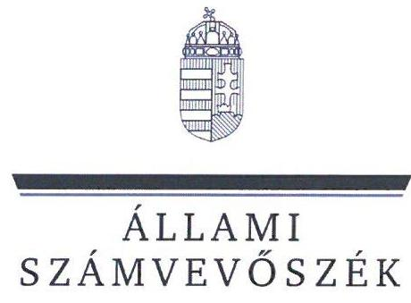
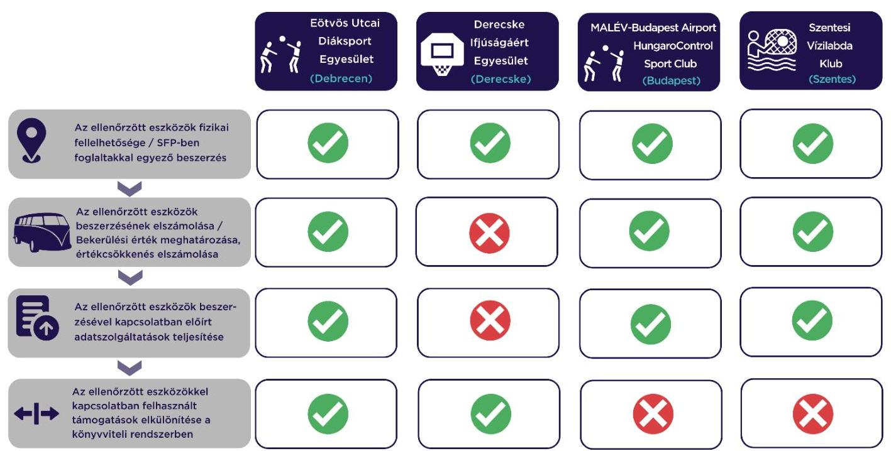

# JELENTÉS 

## Sportegyesületek eszközbeszerzésre kapott támogatás felhasználása szabályszerűségének ellenőrzése

Eötvös Utcai Diáksport Egyesület, Derecske Ifjúságáért Egyesület, MALÉV-Budapest Airport HungaroControl Sport Club, Szentesi Vízilabda Klub

2024.

---

ÁLLAMI
SZÁMVEVŐSZÉK

# JELENTÉS 

## Sportegyesületek eszközbeszerzésre kapott támogatás felhasználása szabályszerűségének ellenőrzése

Eötvös Utcai Diáksport Egyesület, Derecske Ifjúságáért Egyesület, MALÉV-Budapest Airport HungaroControl Sport Club, Szentesi Vízilabda Klub

2024.

---

# ELLENŐRZÉSI IGAZGATÓSÁG: 

## ÁLLAMHÁZTARTÁSON KÍVÜLI SZERVEZETEKET ELLENŐRZŐ IGAZGATÓSÁG

## ELLENŐRZÉSI IGAZGATÓ:

## KLINGA LÁSZLÓ igazgató

## ELLENŐRZÉSVEZETŐ:

Jelentéseink az interneten a www.asz.hu címen olvashatók.

## KAKAS SÁNDOR ellenőrzésvezető

IKTATÓSZÁM: EL-3870-267/2024.
TÉMASZÁM: 2638.
ELLENŐRZÉS-AZONOSÍTÓ SZÁM: V1027

---

# TARTALOMJEGYZÉK 

AZ ELLENŐRZÉS ALAPADATAI ..... 5
AZ ELLENŐRZÖTT SZERVEZET ..... 6
ÖSSZEFOGLALÁS ..... 7
AZ ELLENŐRZÉS FÓKUSZKÉRDÉSE ..... 8
MEGÁLLAPÍTÁSOK ..... 9
JAVASLATOK ..... 10
MELLÉKLETEK ..... 11
I. sz. melléklet: Értelmező szótár ..... 11
II. sz. melléklet: Az ellenőrzött szervezetek jegyzéke ..... 12
III. sz. melléklet: Ellenőrzési kritériumok ..... 13
FÜGGELÉK: ÉSZREVÉTELEK ..... 14
RÖVIDÍTÉSEK JEGYZÉKE ..... 16

---

.

---

# AZ ELLENŐRZÉS ALAPADATAI 

## AZ ELLENŐRZÉS CÉLJA

Annak ellenőrzése, hogy az ellenőrzött sportegyesületnél a $\mathrm{TAO}^{1}$ támogatásból megvalósult kiválasztott eszközbeszerzés szabályszerűen történt-e.

## AZ ELLENŐRZÉS TÍPUSA

Szabályszerűségi ellenőrzés.

## AZ ELLENŐRZÖTT IDŐSZAK

A kiválasztott sportfejlesztési támogatás felhasználásáról szóló döntéstől a helyszíni ellenőrzés napjáig tartó időszak.

## AZ ELLENŐRZÉS TÁRGYA

A sportegyesületeknél a TAO támogatásból megvalósult kiválasztott eszközbeszerzések ellenőrzése.

## AZ ELLENŐRZÉS JOGALAPJA

Az ellenőrzés jogalapját az ÁSZ tv. ${ }^{2} 1. §$ (3), valamint az 5. § (3) bekezdése képezi.

## AZ ELLENŐRZÉS MÓDSZERE

Az ellenőrzést az ellenőrzési program szempontjai, az ellenőrzött időszakban hatályos jogszabályok, előírások, az ellenőrzés általános szakmai szabályai, az ellenőrzésre irányadó ÁSZ ${ }^{3}$ módszertan figyelembevételével végezte az ÁSZ.

Az ellenőrzési kérdések megválaszolásához szükséges bizonyítékok megszerzése az ellenőrzött szervezet által rendelkezésre bocsátott dokumentumokra, adatokra alapozva kérdésfeltevés (információkérés), helyszíni szemle, interjú, mintavételezés útján történt. A helyszíni szemle során a sportfejlesztési program alapján beszerzett eszközök közül legalább 3 - a legnagyobb értékű - eszköz került kiválasztásra.

Az ellenőrzési bizonyítékként felhasználható adatforrások közé tartoztak egyrészt az ellenőrzési programban felsorolt adatforrások, másrészt adatforrás lehetett még az ellenőrzés folyamán feltárt, az ellenőrzés szempontjából releváns információt tartalmazó dokumentum.

---

# AZ ELLENŐRZÖTT SZERVEZET 

## EÖTVÖS UTCAI DIÁKSPORT EGYESÜLET

Az ellenőrzés a röplabda sportágat érintő SFP-04250/2022/MRSZ számú, 2022.03.29-én határozattal jóváhagyott sportfejlesztési program megvalósítására eszközbeszerzés jogcímen kapott TAO támogatásból a 2022-2023. években megvalósult eszközbeszerzések elszámolásának szabályszerűségére és a helyszíni ellenőrzés során a kiválasztott, beszerzett eszközök fizikai szemrevételezésére terjedt ki.

Az ellenőrzött SFP-04250/2022/MRSZ SZÁMÚ sportfejlesztési program keretében az egyesület egy eszközt szerzett be az ellenőrzés megkezdéséig. A beszerzett eszköz beszerzési árából a támogatott összeg 10468 E Ft volt. A helyszíni ellenőrzés keretében az eszköz szemrevételezésre került.

## DERECSKE IFJÚSÁGÁÉRT EGYESÜLET

Az ellenőrzés a kosárlabda sportágat érintő SFP-18186/2022/MKOSZ számú, 2022.04.04-én határozattal jóváhagyott sportfejlesztési program megvalósítására eszközbeszerzés jogcímen kapott TAO támogatásból a 2022-2023. években megvalósult eszközbeszerzések elszámolásának szabályszerűségére és a helyszíni ellenőrzés során a kiválasztott, beszerzett eszközök fizikai szemrevételezésére terjedt ki.

Az ellenőrzött SFP-18186/2022/MKOSZ számú sportfejlesztési program keretében az egyesület nyolc féle eszközt szerzett be az ellenőrzés megkezdéséig. A beszerzett eszközök beszerzési árából a támogatott összeg 16058 E Ft volt. A helyszíni ellenőrzés keretében öt eszköz szemrevételezésre került.

## Malév-Budapest Airport Hungarocontrol Sport Club

Az ellenőrzés a röplabda sportágat érintő SFP-04228/2022/MRSZ számú, 2022.03.29-én határozattal jóváhagyott sportfejlesztési program megvalósítására eszközbeszerzés jogcímen kapott TAO támogatásból a 2022-2023. években megvalósult eszközbeszerzések elszámolásának szabályszerűségére és a helyszíni ellenőrzés során a kiválasztott, beszerzett eszköz fizikai szemrevételezésére terjedt ki.

Az ellenőrzött SFP-04228/2022/MRSZ számú sportfejlesztési program keretében az ellenőrzött egy eszközt szerzett be az ellenőrzés megkezdéséig. A beszerzett eszköz beszerzési árából a támogatott összeg 13000 E Ft volt. Az eszköz a helyszíni ellenőrzés keretében szemrevételezésre került. A további tervezett eszközbeszerzésekre nem került sor az elszámolási határidőig, ezért a fennmaradó összeg tekintetében hosszabbítási kérelmet adtak be a Sportszövetséghez, amelyet a szövetség határozatban jóváhagyott.

## SZENTESI VÍZILABDA KLUB

Az ellenőrzés a vízilabda sportág SFP-10015/2022/MVLSZ számú, 2022.04.01-én határozattal jóváhagyott sportfejlesztési program megvalósítására eszközbeszerzés jogcímen kapott TAO támogatásból a 2022-2023. években megvalósult eszközbeszerzések elszámolásának szabályszerűségére és a helyszíni ellenőrzés során a kiválasztott, beszerzett eszközök fizikai szemrevételezésére terjedt ki.

Az ellenőrzött az SFP-10015/2022/MVLSZ számú sportfejlesztési program keretében nyolc féle tárgyi eszközt szerzett be az ellenőrzés megkezdéséig. A beszerzett eszközök beszerzési árából a támogatott összeg 27268 E Ft volt. A helyszíni ellenőrzés keretében hét eszköz került szemrevételezésre.

---

# ÖSSZEFOGLALÁS 

Az ellenőrzött eszközbeszerzésre kapott TAO támogatások felhasználása a Sportegyesület$_{1}$-nél szabályszerűen valósult meg, a Sportegyesület$_{2-4}$-nél nem volt szabályszerű.

A Sportegyesület$_{1-4}$ a sportfejlesztési program$_{1-4}$-ben meghatározott támogatások felhasználásával a sportfejlesztési program$_{1-4}$-ben szereplő eszközöket vásárolta meg. A TAO támogatásból beszerzett eszközök a nyilvántartással összhangban a helyszíni szemrevételezés során fellelhetőek voltak. Az ellenőrzési bizonyítékok alapján a beszerzett eszközök esetében nem merült fel az egyesületi céltól eltérő felhasználás.

A bekerülési érték meghatározása, az értékcsökkenés elszámolása a Sportegyesület$_{1,3,4}$-nél szabályszerűen történt. A Sportegyesület$_{2}$-nél a sportfejlesztési program$_{2}$ keretében beszerzett kisbusz esetében az értékcsökkenés elszámolása nem volt szabályszerű.

Az előírt elszámolási, adatszolgáltatási kötelezettségét a Sportegyesület$_{1,3,4}$ szabályszerűen teljesítette. A Sportegyesület$_{2}$ esetében az elszámoláshoz kapcsolódó számlák záradékolása nem felelt meg a 107/2011. Korm. rendeletben előírtaknak, ezért az elszámolási és adatszolgáltatási kötelezettségét nem szabályszerűen teljesítette.

A sportfejlesztési program$_{1-4}$ keretében beszerzett eszközökkel kapcsolatos támogatások és azok felhasználásának könyvvitelben való elkülönítése a Sportegyesület$_{1,2}$-nél a jogszabályi előírásoknak megfelelően történt. A Sportegyesület$_{3,4}$ a támogatásokról és azok felhasználásáról a jogszabályi előírások ellenére elkülönített nyilvántartást nem vezetett.

Az 1. ábra a főbb ellenőrzési tapasztalatokat szemlélteti sportegyesületenként:
1. ábra

---

# AZ ELLENŐRZÉS FÓKUSZKÉRDÉSE 

- Szabályszerű volt-e a Sportegyesületek eszközbeszerzésre kapott támogatásának felhasználása?

---

# 1. Szabályszerű volt-e a Sportegyesületek eszközbeszerzésre kapott támogatásának felhasználása? 

Összegző megállapítás Az ellenőrzött eszközbeszerzésre kapott TAO támogatások felhasználása a Sportegyesület$_{1}$-nél szabályszerűen valósult meg, a Sportegyesület$_{2-4}$-nél nem volt szabályszerű.
Az ellenőrzött eszközök fizikai fellelhetősége, sportfejlesztési program$_{1-4}$-ben foglaltakkal egyező tartalma A TAO támogatásból beszerzett ellenőrzött eszközök a Sportegyesület$_{1-4}$-nél a helyszíni szemrevételezés során fizikailag fellelhetőek voltak. A helyszíni szemle során az ellenőrzött támogatásból beszerzett eszközök az eszköz típusa, megnevezése, illetve gyári száma alapján beazonosíthatók voltak.
A Sportegyesület$_{1-4}$ a sportfejlesztési program$_{1-4}$-ben meghatározott támogatásokat a sportfejlesztési program$_{1-4}$-ben jóváhagyott eszközök beszerzésére fordította. A beszerzett eszközök esetén az ellenőrzés során megszerzett bizonyítékok alapján nem merült fel a Sportegyesület$_{1-4}$ céljaitól eltérő felhasználás.
Az ellenőrzött eszközök beszerzésének elszámolása, a bekerülési érték és az értékcsökkenés meghatározása
A Sportegyesület$_{1,3,4}$ a 2022-2023. években a sportfejlesztési program$_{1,3,4}$ keretében megvalósult eszközbeszerzését a Számv. tv. $^{8}$-ben előírtak szerint számolta el, az ellenőrzött eszközök bekerülési értékének megállapítása a Számv. tv.-ben előírtak szerint történt. A Sportegyesület$_{1,3,4}$ az értékcsökkenést a Számv. tv. előírásainak megfelelően számolta el. A Sportegyesület$_{2}$ a 2022-2023. években a sportfejlesztési program$_{2}$ keretében megvalósult eszközbeszerzések közül egy kisbusz bekerülési értékét nem a Számv. tv. 47. § (1) bekezdésében foglaltak szerint számolta el, mert a bekerülési érték megállapításakor a forgalomba helyezés költségeit nem vette figyelembe. Az értékcsökkenés összegének megállapítása a téves bekerülési érték miatt nem volt szabályszerű.

## Az ellenőrzött eszközökkel kapcsolatos előírt adatszolgáltatások teljesítése

A sportfejlesztési program$_{1,3,4}$ vonatkozásában a 107/2011. Korm. rendeletben előírt elszámolási és adatszolgáltatási kötelezettségének a Sportegyesület$_{1,3,4}$ eleget tett, az előrehaladási jelentések, záró elszámolások beküldésre kerültek a Sportszövetség$_{1-3}$-ek felé. A 107/2011. Korm. rendeletben előírt elszámolási és adatszolgáltatási kötelezettségének a Sportegyesület$_{2}$ nem szabályszerűen tett eleget, mert a záró elszámolás során a beszerzésről szóló számlát a 107/2011. (VI. 30.) Korm. rendelet 11. § (5) bekezdésében foglalt előírások ellenére nem látta el záradékkal.
Az ellenőrzött eszközökkel kapcsolatban felhasznált támogatások elkülönítése a könyvviteli rendszerben
A Sportegyesület$_{3,4}$ a 107/2011. Korm. rendelet 9. § (9) bekezdésében, illetve a Civil tv. $^{9}$ 20. § (4) bekezdésében foglaltakat nem tartotta be, mert az alapcél szerinti tevékenysége költségei, ráfordításai ellentételezésére visszafizetési kötelezettség nélkül kapott támogatásokat forrásonként, illetve azok felhasználását elkülönítetten nem mutatta ki, így támogatásonként nem állapítható meg és nem ellenőrizhető a kapott támogatás felhasználása. A Sportegyesület$_{3,2}$ az elkülönített nyilvántartást a jogszabályi előírásoknak megfelelően vezette.

---

# JAVASLATOK 

Az ÁSZ tv. 33. § (1) bekezdésében foglaltak értelmében az ellenőrzött szervezet vezetője köteles a jelentésben foglalt megállapításokhoz kapcsolódó intézkedési tervet összeállítani és azt a jelentés kézhezvételétől számított 30 napon belül az ÁSZ részére megküldeni. Amennyiben az ellenőrzött szervezet vezetője nem küldi meg határidőben az intézkedési tervet, vagy továbbra sem elfogadható intézkedési tervet küld, az Állami Számvevőszék elnöke az ÁSZ tv. 33. § (3) bekezdés a) és b) pontjaiban foglaltakat érvényesítheti.

## A DERECSKE IFJÚSÁGÁÉRT EGYESÜLET ELNÖKE RÉSZÉRE

1. Gondoskodjon arról, hogy az eszközök bekerülési értéke a Számv. tv. 47. (1) bekezdésében előírtak szerint kerüljön megállapításra.
2. Gondoskodjon a sportfejlesztési programokhoz kapcsolódó támogatások elszámolásánál a számviteli bizonylatok záradékolásáról a 107/2011. (VI. 30.) Korm. rendelet 11. § (5) bekezdésében előírtak szerint.

## A MALÉV-BUDAPEST AIRPORT HUNGAROCONTROL SPORT CLUB ELNÖKE RÉSZÉRE

1. Gondoskodjon a támogatásokról és azok felhasználásáról elkülönített nyilvántartás vezetéséről a Civil tv. 20. § (4) bekezdésében előírtak szerint.

## A SZENTESI VÍZILABDA KLUB ELNÖKE RÉSZÉRE

1. Gondoskodjon a támogatásokról és azok felhasználásáról elkülönített nyilvántartás vezetéséről a Civil tv. 20. § (4) bekezdésében előírtak szerint.

---

# MELLÉKLETEK 

## I. SZ. MELLÉKLET: ÉRTELMEZŐ SZÓTÁR

költségvetési támogatás

TAO támogatás
kiválasztott eszköz
sportfejlesztési program
sportegyesület
a társadalombiztosítás pénzügyi alapjai kivételével az államháztartás központi alrendszeréből ellenérték nélkül, pénzben nyújtott támogatások (Áht. $^{10} 1. § 14. pont)
látvány-csapatsport támogatása: az adóévben visszafizetési kötelezettség nélkül nyújtott támogatás, juttatás, véglegesen átadott pénzeszköz és térítés nélkül átadott eszköz könyv szerinti értéke, az adóévben térítés nélkül nyújtott szolgáltatás bekerülési értéke az e törvényben meghatározott jogcímeken (Tao tv. $^{11} 4. § 44. pont)
az ÁSZ által ellenőrzésre kiválasztott tárgyi eszköz, forgóeszköz
a támogatás igénybevételére jogosult szervezet által készített, a sportpolitikáért felelős miniszter, illetve az országos sportági szakszövetség által jóváhagyott, a látvány-csapatsport támogatás igénybevételének feltételét képező, tervezett támogatással érintett sportfejlesztési program (Tao. tv. 22/C. § (3e) bekezdés)
a sportegyesület olyan egyesület, amelynek alaptevékenysége a sporttevékenység szervezése, valamint a sporttevékenység feltételeinek megteremtése (Sport tv. $^{12}$ 16. § (1) bekezdés)

---

II. SZ. MELLÉKLET: AZ ELLENŐRZÖTT SZERVEZETEK JEGYZÉKE

|  Ssz. | SPORTEGYESÜLET MEGNEVEZÉSE | SZÉKHELY  |
| --- | --- | --- |
|  1. | Eötvös Utcai Diáksport Egyesület | Debrecen  |
|  2. | Derecske Ifjúságáért Egyesület | Derecske  |
|  3. | MALÉV-Budapest Airport HungaroControl Sport Club | Budapest  |
|  4. | Szentesi Vízilabda Klub | Szentes  |

  |

---

# III. SZ. MELLÉKLET: ELLENŐRZÉSI KRITÉRIUMOK 

## FOKUSZKÉRDÉS

Szabályszerű volt-e a sportegyesület eszközbeszerzésre kapott támogatásának felhasználása?

## KRITÉRIUMOK

Számv. tv. 14. § (4) bekezdés, (5) bekezdés b) pont, 23. §, 24-33. §, 26. §, 47-51. §, 52-53. §, 57-66. §, 80. §, 165. § (1)-(3) bekezdés Civil tv. 20. § (4) bekezdés
479/2016. (XII. 28.) Korm. rendelet 9. § (9)-(10) bekezdés, 13. § (3) bekezdés, 14. § (1) bekezdés

107/2011 (VI.30) Korm. rendelet 9. § (9) bekezdés, 11. § (2)-(5) bekezdés,
sportfejlesztési program

---

# FÜGGELÉK: ÉSZREVÉTELEK 

A jelentéstervezetet a Számvevőszék 15 napos észrevételezésre megküldte az ellenőrzött szervezet vezetőjének az ÁSZ tv. 29. § (1) bekezdése előírásának megfelelően.

Az Eötvös Utcai Diáksport Egyesület, a MALÉV-Budapest Airport HungaroControl Sport Club, valamint a Szentesi Vízilabda Klub elnökei a jelentéstervezetre nem tettek észrevételt.
A Derecske Ifjúságáért Egyesület elnöke a jelentéstervezetre észrevételt tett. A függelék tartalmazza a Derecske Ifjúságáért Egyesület elnökének észrevételét, illetve az el nem fogadott észrevétel elutasításának indoklását.

1. A Derecske Ifjúságáért Egyesület elnökének észrevétele:
1.1. „A Sportegyesület ${ }_{1,3,4}$ a 2022-2023. években a sportfejlesztési program ${ }_{1,3,4}$ keretében megvalósult eszközbeszerzését a Számv. tv.-ben előírtak szerint számolta el, az ellenőrzött eszközök bekerülési értékének megállapítása a Számv. tv.-ben előírtak szerint történt. A Sportegyesület ${ }_{1,3,4}$ az értékcsökkenést a Számv. tv. előírásainak megfelelően számolta el. A Sportegyesület ${ }_{2}$ a 2022-2023. években a sportfejlesztési program ${ }_{2}$ keretében megvalósult eszközbeszerzések közül egy kisbusz bekerülési értékét nem a Számv. tv. 47. § (1) bekezdésében foglaltak szerint számolta el, mert a bekerülési érték megállapításakor a forgalomba helyezés költségeit nem vette figyelembe. Az értékcsökkenés összegének megállapítása a téves bekerülési érték miatt nem volt szabályszerű.
Ezzel kapcsolatban kívánunk észrevételt tenni:
2024. január 10-én végzett ellenőrzéskor Egyesületünk még nem rendelkezett 2023 év tekintetében lezárt működési évvel. Kisbusz végszámlája 2023. június 19-én került kiállításra. Értékcsökkenésünk elszámolására egy évben egyszer, a beszámoló készítésekor kerül sor. Tekintettel arra, hogy a forgalomba helyezés költsége nem került elszámolásra a be/SFP-18186/2022/MKOSZ jelű sportfejlesztési támogatásban, így nem került benyújtásra sem. Természetesen a forgalomba helyezés költsége ráaktiválásra került az érintett tárgyi eszközön zárás során. Erről a tárgyi eszköz nyilvántartó kartont mellékelten megküldjük.
A Számvevőszék javaslata érvényesítésre került. Erről szóló dokumentumokat mellékelten megküldjük, valamint kérjük, hogy a végleges jelentés elkészítését a fentiek figyelembevételével szíveskedjenek módosítani."

## Az észrevétellel érintett megállapítás:

„Az ellenőrzött eszközök beszerzésének elszámolása, a bekerülési érték és az értékcsökkenés meghatározása A Sportegyesület ${ }_{1,3,4}$ a 2022-2023. években a sportfejlesztési program ${ }_{1,3,4}$ keretében megvalósult eszközbeszerzését a Számv. tv.-ben előírtak szerint számolta el, az ellenőrzött eszközök bekerülési értékének megállapítása a Számv. tv.-ben előírtak szerint történt. A Sportegyesület ${ }_{1,3,4}$ az

[^0]
[^0]:    * 29. § (1) Az Állami Számvevőszék az ellenőrzési megállapításait megküldi az ellenőrzött szervezet vezetőjének vagy az általa megbízott személynek, és annak, akinek személyes felelősségét állapította meg.
    (2) Az ellenőrzött szervezet vezetője és a felelősként megjelölt személy az ellenőrzés megállapításaira tizenöt napon belül írásban észrevételt tehet.
    (3) Az Állami Számvevőszék az észrevételre a beérkezésétől számított harminc napon belül írásban válaszol. A figyelembe nem vett észrevételeket köteles a jelentésben feltüntetni, és megindokolni, hogy azokat miért nem fogadta el.

---

értékcsökkenést a Számv. tv. előírásainak megfelelően számolta el. A Sportegyesület 2 a 2022-2023. években a sportfejlesztési program ${ }_{2}$ keretében megvalósult eszközbeszerzések közül egy kisbusz bekerülési értékét nem a Számv. tv. 47. § (1) bekezdésében foglaltak szerint számolta el, mert a bekerülési érték megállapításakor a forgalomba helyezés költségeit nem vette figyelembe. Az értékcsökkenés összegének megállapítása a téves bekerülési érték miatt nem volt szabályszerű."

# El nem fogadás indoklása: 

Elnök úr levelében a jelentéstervezet "Az ellenőrzött eszközök beszerzésének elszámolása, a bekerülési érték és az értékcsökkenés meghatározása" pontjában leírtakra tett észrevételében jelezte, hogy "2024. január 10-én végzett ellenőrzéskor Egyesületünk még nem rendelkezett 2023 év tekintetében lezárt müködési évvel. Kisbusz végszámlája 2023. június 19-én került kiállításra. Értékcsökkenésünk elszámolására egy évben egyszer, a beszámoló készítésekor kerül sor." Az Egyesületnél 2024. január 10-én lefolytatott helyszíni ellenőrzés során a be/SFP- 18186/2022/MKOSZ támogatási szerződés keretében megvásárolt Ford Custom MCA M1 Kombi Trend AEHC-265 megnevezésű kisbusz tárgyi eszköz állományba vételi bizonylatát és értékcsökkenés elszámolás kimutatását is tartalmazó egyedi nyilvántartó lapját az ellenőrzés rendelkezésére bocsátották. Az átadott tárgyi eszköz karton alapján a kisbusz aktivált összege 14900000 Ft, a tárgyi eszköz kartonon a 2023. évi értékcsökkenési leírás elszámolt összegét az aktivált összeg alapján kimutatták. Továbbá a helyszíni ellenőrzés során átadták a jármű forgalomba és üzembehelyezésének költségeit tartalmazó 241500 Ft-os számlát is, mely a kisbusz egyedi nyilvántartó lapja szerint a bekerülési értéket növelő tételként nem került elszámolásra.
Az Egyesület által a helyszíni ellenőrzés során rendelkezésre bocsátott beszámolót alátámasztó 2023. évi főkönyvi kivonat és 2023. évi főkönyvi karton dokumentumok alapján a kisbusz a tárgyi eszközök között helytelen bekerülési értékkel szerepel. A helyszíni ellenőrzésről készült EL-3870-167/2024. számú jegyzőkönyv nem tartalmaz az Önök részéről nyilatkozatot arra vonatkozóan, hogy a 2023. év tekintetében nem rendelkeztek lezárt könyveléssel.
A Számv. tv. 47. § (1) bekezdése szerint "Az eszköz bekerülési (beszerzési, előállítási) értéke az eszköz megszerzése, létesítése, üzembe helyezése érdekében az üzembe helyezésig, a raktárba történő beszállításig felmerült, az eszközhöz egyedileg hozzákapcsolható tételek együttes összege. A bekerülési (beszerzési) érték az engedményekkel csökkentett, felárakkal növelt vételárat, továbbá az eszköz beszerzésével, üzembe helyezésével, raktárba történt beszállításával kapcsolatban felmerült szállítási és rakodási, alapozási, szerelési, üzembe helyezési, közvetítői tevékenység ellenértékét, dijait (ezen tevékenységeknek saját vállalkozásban történt végzése esetén az 51. § szerinti közvetlen önköltség aktivált értékét), a bizományi díjat, a beszerzéshez kapcsolódó adókat és adójellegű tételeket, a vámterheket foglalja magában."
A helyszíni ellenőrzés során átadott dokumentumok szerint a kisbusz tárgyi eszköz 14900000 Ft nyilvántartott értéke alapján 2023. december 31-ei időponttal az értékcsökkenés elszámolásra került. Az Állami Számvevőszék az Elnök úr észrevételével megküldött kisbusz egyedi nyilvántartó lap dokumentumot összevetette a helyszíni ellenőrzés időpontjában átadott egyedi nyilvántartó lap adataival, melyeknél az egyezőség nem áll fenn a bekerülési érték és az elszámolt értékcsökkenés vonatkozásában az azon utólagosan a 2023. évre történő bejegyzések miatt.
Fentiek miatt az észrevétel nem kerül elfogadásra, a jelentéstervezet módosítása nem indokolt.

---

# RÖVIDÍTÉSEK JEGYZÉKE 

${ }^{1}$ TAO
${ }^{2}$ ÁSZ tv.
${ }^{3}$ ÁSZ
${ }^{4}$ Sportszövetség ${ }_{1,2,3}$
${ }^{5}$ sportegyesület $_{1-4}$
${ }^{6}$ sportfejlesztési program $_{1-4}$
${ }^{7}$ 107/2011. Korm. rendelet
${ }^{8}$ Számv. tv.
${ }^{9}$ Civil tv.
${ }^{10}$ Áht.
${ }^{11}$ Tao tv.
${ }^{12}$ Sport tv.

Társasági adó
2011. évi LXVI. törvény az Állami Számvevőszékről

Állami Számvevőszék
Sportszövetség: Magyar Kosárlabdázók Országos Szövetsége
Sportszövetség: Magyar Röplabda Szövetség
Sportszövetség: Magyar Vízilabda Szövetség
${ }_{1}$ Eötvös Utcai Diáksport Egyesület
${ }_{2}$ Derecske Ifjúságáért Egyesület
${ }_{3}$ MALÉV-Budapest Airport HungaroControl Sport Club
${ }_{4}$ Szentesi Vízilabda Klub
${ }_{1}$ SFP-04250/2022/MRSZ
${ }_{2}$ SFP-18186/2022/MKOSZ
${ }_{3}$ SFP-04228/2022/MRSZ
${ }_{4}$ SFP-10015/2022/MVLSZ
107/2011. (VI. 30.) Korm. rendelet a látvány-csapatsport támogatását biztosító támogatási igazolás kiállításáról, felhasználásáról, a támogatás elszámolásának és ellenőrzésének, valamint visszafizetésének szabályairól
2000. évi C. törvény a számvitelről
2011. évi CLXXV. törvény az egyesülési jogról, a közhasznú jogállásról, valamint a civil szervezetek működéséről és támogatásáról
2011 évi CXCV. törvény az államháztartásról
1996. évi LXXXI. törvény a társasági adóról és az osztalékadóról
2004. évi I. törvény a sportról

---

1052 Budapest, Apáczai Csere János u. 10. | 1364 Budapest 4., Pf. 54
www.asz.hu | szamvevoszek@asz.hu
telefon: +36 14849100

