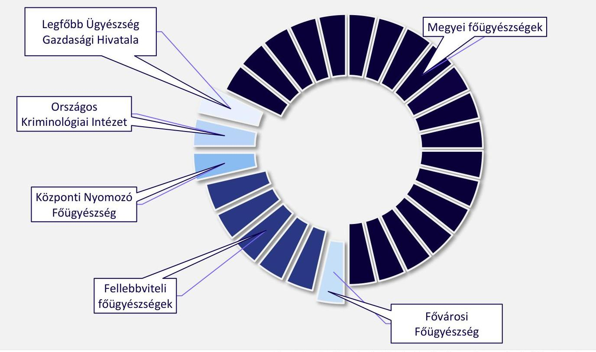
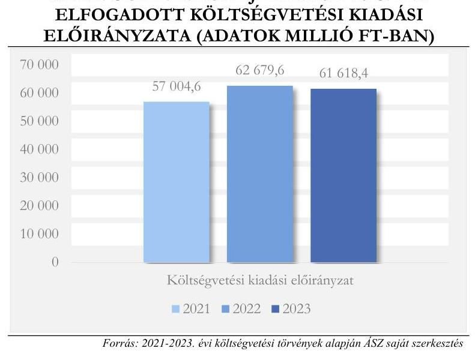
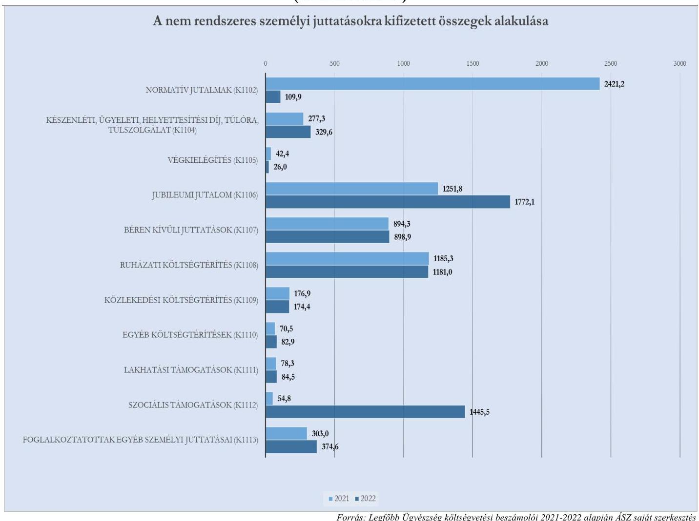
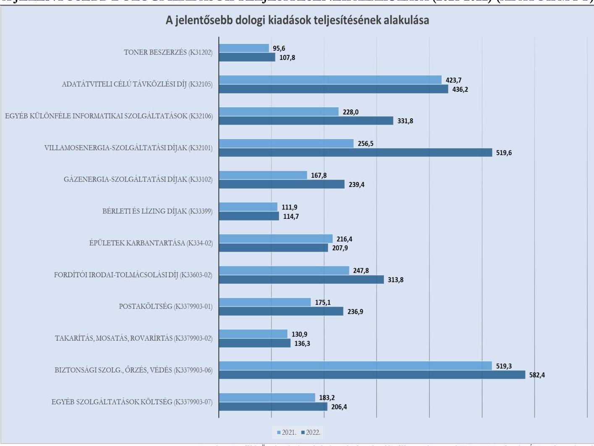

# JELENTÉS 

## Az államháztartás központi alrendszere fejezeteinek ellenőrzése

## Ügyészség

2024.

---

# JELENTÉS 

## Az államháztartás központi alrendszere fejezeteinek ellenőrzése

## Ügyészség

2024.

---

# ELLENŐRZÉSI IGAZGATÓSÁG: 

## ÁLLAMHÁZTARTÁS KÖZPONTI SZINTJÉT ELLENŐRZŐ IGAZGATÓSÁG

## ELLENŐRZÉSI IGAZGATÓ:

SINKÁNÉ DR. CSENDES ÁGNES ellenőrzési igazgató

## ELLENŐRZÉSVEZETŐ:

Jelentéseink az interneten a www.asz.hu címen olvashatók.

DR. KOVÁCS DIÁNA ellenőrzésvezető

IKTATÓSZÁM: EL-4067-001/2024
TÉMASZÁM: 2638
ELLENŐRZÉS-AZONOSÍTÓ SZÁM: V0982

---

# TARTALOMJEGYZÉK 

AZ ELLENŐRZÉS ALAPADATAI ..... 5
AZ ELLENŐRZÖTT SZERVEZET ..... 7
ÖSSZEFOGLALÁS ..... 9
AZ ELLENŐRZÉS FÓKUSZTERÜLETEI ..... 11
MEGÁLLAPÍTÁSOK ..... 12
JAVASLATOK ..... 33
MELLÉKLETEK ..... 36
I. sz. melléklet: Értelmező szótár ..... 36
II. sz. melléklet: Az ellenőrzött szervezetek jegyzéke ..... 40
III. sz. melléklet: VIII. Ügyészség fejezet 2021-2023. évi költségvetése előirányzatai. ..... 41
IV. sz. melléklet: A központilag kezelt és a részelőirányzatokkal rendelkező szervezeti egységek előirányzatai ..... 42
V. sz. melléklet: A Legfőbb Ügyészség kiadási előirányzatainak alakulása ..... 43
FÜGGELÉK: ÉSZREVÉTELEK ..... 49
RÖVIDÍTÉSEK JEGYZÉKE ..... 54

---

.

---

# AZ ELLENŐRZÉS ALAPADATAI 

## AZ ELLENŐRZÉS CÉLJA

Az ellenőrzés célja annak értékelése volt, hogy a VIII. Ügyészség költségvetési fejezet, a fejezeti kezelésű előirányzat, valamint a Legfőbb Ügyészség mint a fejezethez tartozó költségvetési szerv működése és gazdálkodása szabályszerű és megfelelő volt-e.

## AZ ELLENŐRZÉS TÍPUSA

Megfelelőségi ellenőrzés

## AZ ELLENŐRZÖTT IDŐSZAK

2021-2022. évek, kitekintéssel a helyszíni ellenőrzés lezárásának időpontjáig, 2023. június 3-ig.

## AZ ELLENŐRZÉS TÁRGYA

Az ellenőrzés tárgyát képezte az ügyészség működésének és gazdálkodásának szabályozottsága, a költségvetésének tervezési folyamata, a pénzügyi gazdálkodása és vagyongazdálkodása, valamint a beszámolási kötelezettség teljesítése. Az ÁSZ ${ }^{1}$ ellenőrzése nem terjedt ki az ügyészség szakmai feladatellátásának ellenőrzésére.

Az ellenőrzés kiterjedt minden olyan körülményre és adatra, amely az ÁSZ jogszabályban meghatározott feladatainak teljesítéséhez, valamint a program végrehajtása folyamán felmerült újabb összefüggések feltárásához szükséges volt.

## AZ ELLENŐRZÉS JOGALAPJA

Az ellenőrzés jogszabályi alapját az ÁSZ tv. ${ }^{2}$ 1. § (3) bekezdés, 5. § (2)-(3) bekezdései, (4) bekezdés a) pont és a (6) bekezdés, valamint az Áht. ${ }^{3} 61 . \S$ (2) bekezdésének előírásai képezték.

## AZ ELLENŐRZÉS MÓDSZERE

Az ellenőrzést a nemzetközi standardokat irányadónak tekintve az ellenőrzési program szempontjai, az ellenőrzött időszakban hatályos jogszabályok, az ellenőrzés szakmai szabályok és az ÁSZ megfelelőségi ellenőrzési módszertana figyelembevételével végezte el az ÁSZ.

Az ellenőrzési kérdések megválaszolásához szükséges bizonyítékok megszerzése az ellenőrzött szervezet által rendelkezésre bocsátott dokumentumokra és adatokra alapozva, továbbá megfigyelés, szemle (szemrevételezés), kérdésfeltevés (információkérés), valamint elemző eljárás útján történt.

---

Mintavételi eljárást alkalmazott az ÁSZ az előirányzat-átcsoportosítások és -módosítások, a maradványelszámolás, a pénzügyi gazdálkodás és vagyongazdálkodás területén évente 30 mintatétel kiválasztásával. A kiválasztott mintatételek ellenőrzésének eredménye nem került kivetítésre a teljes sokaságra, a megállapítások az adott ellenőrzött mintatételek vonatkozásában kerültek megjelenítésre.

Az ellenőrzési bizonyítékként felhasználható adatforrások közé tartoznak egyrészt az ellenőrzéshez kért dokumentumok, másrészt adatforrás minden - az ellenőrzés folyamán - feltárt, az ellenőrzés szempontjából információkat tartalmazó dokumentum.

Az ellenőrzés lefolytatásához az ellenőrzött szervezet tanúsítványok kitöltésével, valamint az ÁSZ által kért dokumentumok, információk megküldésével és az ellenőrzés során szolgáltatott adatokat.

---

# AZ ELLENŐRZÖTT SZERVEZET 

## VIII. ÜGYÉSZSÉG FEJEZET IRÁNYÍTÓ SZERVE, A LEGFŐBB ÜGYÉSZSÉG

Az Alaptörvény ${ }^{4}$ 29. cikkében foglaltak szerint a legfőbb ügyész és az ügyészség független, az igazságszolgáltatás közremúködőjeként mint közvádló az állam büntetőigényének kizárólagos érvényesitője. Az ügyészség üldözi a bűncselekményeket, fellép más jogsértő cselekményekkel és mulasztásokkal szemben, valamint elősegíti a jogellenes cselekmények megelőzését.

Az ügyészség csak a törvényeknek alárendelt önálló alkotmányos szervezet, a központi költségvetésről szóló törvényben önálló költségvetési fejezetet alkot. A VIII. Ügyészség költségvetési fejezet irányító szerve a Legfőbb Ügyészség, annak vezetője a legfőbb ügyész. A költségvetési fejezethez egy központi költségvetési szerv, a Legfőbb Ügyészség és egy fejezeti kezelésű előirányzat - a „Jogerősen megállapított kártérítések céle1őirányzata" - tartozik.

Magyarország ügyészi szervei a Legfőbb Ügyészség, 5 fellebbviteli főügyészség (főváros, Debrecen, Győr, Pécs, Szeged), 21 főügyészség (Fővárosi Főügyészség, (vár)megyei főügyészségek, Központi Nyomozó Főügyészség), valamint 124 járási és járási szintű ügyészség (járási ügyészségek, fővárosi kerületi ügyészségek, nyomozó ügyészségek, Fővárosi Nyomozó Ügyészség, Budapesti Közérdekvédelmi Ügyészség).

A Legfőbb Ügyészség központi költségvetési szerv, jogi személy. Az ügyészség szervezetéről és müködéséről szóló utasítás mellékletében foglaltak szerint a költségvetési szerv területileg, feladatellátásában elkülönült, a gazdálkodás keretéül szolgáló részelőirányzatokkal rendelkező, nem jogi személyiségű, alárendelt egységei a fellebbviteli főügyészségek és a főügyészségek, a Legfőbb Ügyészség Gazdasági Hivatala, valamint az ügyészség tudományos és kutató intézménye, az Országos Kriminológiai Intézet. A járási és a járási szintű ügyészségek a főügyészségek szervezetébe és költségvetésébe tagozódnak.

---

1. ábra

# LEGFŐBB ÜGYÉSZSÉG RÉSZELŐIRÁNYZATOKKAL RENDELKEZŐ SZERVEZETI EGYSÉGEI 

Forrás: Legfőbb Ügyészség SZMSZ-e és Gazdálkodási szabályzata alapján ÁSZ saját szerkesztés
Az ellenőrzés kiterjedt a VIII. Ügyészség fejezetre, a Legfőbb Ügyészségre mint központi költségvetési szervre és a VIII. Ügyészség fejezethez tartozó fejezeti kezelésű előirányzatra. Az ellenőrzés során az ÁSZ értékelte a fejezet gazdálkodása szabályozottságának, a költségvetési szerv működésének és gazdálkodásának, valamint a fejezeti kezelésű előirányzat felhasználásának megfelelőségét. Az ellenőrzési megállapítások alapján az ÁSZ értékelte a Legfőbb Ügyészség belső kontrollrendszere működésének megfelelőségét.

Az ügyészség jogállását, szervezetét az ügyészségről szóló törvény (Ütv. ${ }^{5}$ ) határozza meg, illetve személyi feltételeire a legfőbb ügyész, az ügyészek és más ügyészségi alkalmazottak jogállásáról és az ügyészi életpályáról szóló törvény (Üjt. ${ }^{6}$ ) vonatkozik. Az ügyészség költségvetésének tervezésére és költségvetési gazdálkodására vonatkozó alapvető jogszabályi előírásokat az Áht. és annak végrehajtásáról szóló kormányrendelet (Ávr. ${ }^{7}$ ), a könyvvezetésére és beszámolására vonatkozó szabályokat a számviteli törvény (Számv. tv. ${ }^{8}$ ) és az államháztartás számviteléről szóló kormányrendelet (Áhsz. ${ }^{9}$ ), míg a vagyon kezelésére és hasznosítására vonatkozó jogszabályi előírásokat a nemzeti vagyonról szóló törvény (Nvtv. ${ }^{10}$ ) mellett az állami vagyonról szóló törvény (Vtv. ${ }^{11}$ ), illetve annak végrehajtási rendelete (Vtvr. ${ }^{12}$ ) tartalmazza.

---

# ÖSSZEFOGLALÁS 

Az ÁSZ 2003-ban végezte a VIII. Magyar Köztársaság Ügyészsége fejezet 1998-2002. évi múködésének átfogó ellenőrzését. Az ügyészségnél az elmúlt 20 évben jelentős, a szervezetet és a gazdálkodást érintő változások történtek, az államháztartás központi alrendszere fejezeteinek ellenőrzése keretében ez alapján került sor a VIII. Ügyészség fejezet ellenőrzésére, a 2021-2022. évekre kiterjedően.

A Legfőbb Ügyészség múködésének szabályait kialakította, azonban egyes szabályzatok esetén hiányosságokat tárt fel az ellenőrzés. Az ellenőrzés tartalmi hiányosságokat állapított meg a Legfőbb Ügyészség alapító okiratában, valamint szervezeti és múködési szabályzatában. A Legfőbb Ügyészség rendelkezett ellenőrzési nyomvonallal, azonban az a jogszabályi előírás ellenére nem a teljes költségvetési szervre vonatkozott. A szervezeti integritást sértő események kezelésének eljárásrendje tartalmi hiányosságai miatt nem felelt meg a Bkr.-ben előírtaknak, mivel nem tartalmazta a szervezeti integritást sértő események bekövetkezésének megelőzésére kialakított eljárási szabályokat. A Legfőbb Ügyészség az integrált kockázatkezelés eljárásrendjével a jogszabályi előírás ellenére nem rendelkezett. A Legfőbb Ügyészség meghatározta a vagyonnyilatkozat nyilvántartására vonatkozó szabályokat.

A Legfőbb Ügyészség a gazdálkodása szabályozottságának kialakításáról gondoskodott, azonban egyes szabályzatok esetén hiányosságokat tárt fel az ellenőrzés. A Legfőbb Ügyészség a fejezeti kezelésű előirányzat gazdálkodási folyamatairól a jogszabályi előírás szerint ellenőrzési nyomvonallal rendelkezett. A fejezeti kezelésű előirányzat tervezési, gazdálkodási, finanszírozási, adatszolgáltatási és beszámolási feladatainak, továbbá a költségvetési kiadási előirányzatai felhasználásának szabályozása nem volt megfelelő, mivel azokat a 2021-2022. évekre vonatkozóan a jogszabályi előírások ellenére nem szabályozta.

A jogszabályi előírásoknak megfelelően a Legfőbb Ügyészség a gazdasági szervezetére vonatkozó szabályokat az SZMSZ-ben és az Ügyrendben határozta meg. A Legfőbb Ügyészség rendelkezett a számviteli jogszabályoknak megfelelően számviteli politikával, továbbá a számviteli politika keretében elkészítendő szabályzatokkal, melyek hatálya a fejezeti kezelésű előirányzatra is kiterjedt.

A szabályszerű gazdálkodási jogkörgyakorlás kialakításához a Legfőbb Ügyészség meghatározta a gazdálkodási jogkörgyakorlás módját, eljárási és dokumentációs részletszabályait. A Legfőbb Ügyészségnél az ellenőrzés több, gazdálkodási jogkörgyakorlást érintő szabálytalanságot tárt fel a személyi juttatások, a dologi kiadások és a felhalmozási kiadások felhasználása során. Rendszerszintű hiba volt, hogy a kinevezések módosításain nem történtek meg a pénzügyi ellenjegyzések; pénzügyi ellenjegyzés hiányában a kötelezettségvállalás nem felelt meg a jogszabályi előírásnak. Ezen túl több olyan, kötelezettségvállalást, pénzügyi ellenjegyzést, teljesítésigazolást, érvényesítést, valamint utalványozást érintő szabálytalanság fordult elő, ami a kontrolltevékenységek múködtetésének hiányosságaira mutat rá.

Az ügyészség személyügyi kereteinek, így az ügyészi alkalmazottak képzésének, minősítésének és teljesítményértékelésének kötelezően előírt szabályozását a legfőbb ügyész az Üjt. előírásainak megfelelően megalkotta, a jogszabályi változásokkal összhangban módosította.

A Legfőbb Ügyészség a költségvetési bevételeinek és kiadásainak három évre tervezett összegét az Áht.ban és Ávr.-ben foglaltak szerint elkészítette. A költségvetés tervezésének folyamatában a VIII. Ügyészség fejezet 2021-2023. évekre tervezett bevételeit és kiadásait, valamint a 2021. évi költségvetési törvényben érvényesített, az ügyészi illetményalap 2021. január 1-től történő emeléséhez kapcsolódó fejezeti költségvetési többlet igényt megalapozó részletes számítások a jogszabályi előírások ellenére nem álltak rendelkezésre. Tekintettel arra, hogy a VIII. Ügyészség fejezet költségvetését a Kormány a központi költségvetésről szóló

---

törvényjavaslat részeként változtatás nélkül terjeszti az Országgyűlés elé, a tervadatok megalapozottsága kiemelt jelentőséggel bír.

A költségvetési szerv előirányzatairól a Legfőbb Ügyészség részletező nyilvántartást vezetett, azonban az a jogszabályi előírások ellenére nem tartalmazta az előirányzat-módosításokat és -átcsoportosításokat elrendelő dokumentum azonosításához szükséges adatokat. Az előirányzat-átcsoportosítások írásbeli elrendelésére és pénzügyi ellenjegyzésére az ellenőrzött időszakban 17 esetben nem került sor.

A Legfőbb Ügyészség pénzügyi gazdálkodása tekintetében az ÁSZ hiányosságként állapította meg, hogy öt esetben a megbízási szerződések megkötésére a részelőirányzattal nem rendelkező járási ügyészség nevében került sor.

A bevételi előirányzatok teljesítése és a fejezeti kezelésű előirányzat felhasználása és elszámolása szabályszerű volt.

A Legfőbb Ügyészség a vagyonelemek év végi értékelését, a vagyonnövekedéshez és vagyoncsökkenéshez kapcsolódó döntéseket szabályszerűen hajtotta végre, a gazdasági események lebonyolítása és elszámolása, illetve nyilvántartása megfelelő volt.

A Legfőbb Ügyészség a feladatellátáshoz használt állami vagyon kezelésére vagyonkezelési szerződést kötött, azonban a vagyonelemekre vonatkozó vagyonbiztosítások hiánya kockázatot jelentett a vagyon állagának és értékének megőrzése szempontjából.

A Legfőbb Ügyészség a vagyonkezelésében lévő ingatlanok és tárgyi eszközök hasznosításához önköltségszámítást készített. A vagyonelemek hasznosítása során megállapított térítési díj több esetben nem felelt meg a Legfőbb Ügyészség belső szabályozásának.

Az ügyészség a beszámolási kötelezettségét megfelelően teljesítette. A legfőbb ügyész beszámolt a 2021. évi tevékenységről az Országgyűlés felé. A legfőbb ügyész a VIII. Ügyészség 2021. és 2022. évi költségvetése végrehajtásáról szabályszerűen számolt be. Az ellenőrzött időszakban a Legfőbb Ügyészség és a fejezeti kezelésű előirányzat maradványkimutatása szabályszerű volt.

---

# AZ ELLENŐRZÉS FÓKUSZTERÜLETEI 

1. Az ügyészség müködésének, gazdálkodásának szabályozottsága
2. Az ügyészség költségvetésének tervezési folyamata, előirányzatgazdálkodása
3. Az ügyészség pénzügyi gazdálkodása
4. Az ügyészség vagyongazdálkodása
5. Az ügyészség beszámolási kötelezettségének teljesitése

---

# 1. Az ügyészség múködésének, gazdálkodásának szabályozottsága 

## Összegző megállapítás Az ügyészség múködésének és gazdálkodásának szabályozottsága - a feltárt hiányosságoktól eltekintve megfelelte a jogszabályi elöírásoknak.

A Legfőbb Ügyészség rendelkezett az ellenőrzött időszakban hatályos alapító okirat ${ }_{1-2}$-tal ${ }^{13}$ az Áht. és az Ávr. előírásai alapján. Az alapító okirat nem tartalmazta az Ávr. 5. § (1) bekezdés b) pontja ellenére a 167/A. $\S$ (2) bekezdés 3. pontja szerinti telephelyek között a fizikailag elkülönült, ügyészi tevékenységet végző, az Útv. 8. §-a szerinti ügyészi szervnek minősülő járási és a járási szintű ügyészségeket.
A Legfőbb Ügyészség rendelkezett az arra jogosult által jóváhagyott SZMSZ ${ }^{14}$-szel az Áht. előírásainak megfelelően. Az SZMSZ-ben az Ávr. 13. § (1) bekezdés e) pontjában foglaltak ellenére az SZMSZ 3. melléklete kizárólag a Legfőbb Ügyészség mint ügyészi szerv, és nem mint költségvetési szerv szervezeti ábráját tartalmazta. A szervezeti ábra nem tartalmazta a Legfőbb Ügyészség mint költségvetési szerv szervezeti felépítését, a fellebbviteli főügyészségek, a megyei főügyészségek, a járási és járási szintű ügyészségek nem jelentek meg a szervezeti ábrán.
A Legfőbb Ügyészség rendelkezett ellenőrzési nyomvonallal, azonban az a Bkr. ${ }^{15}$ 6. § (3) bekezdésében foglaltak ellenére az nem a teljes költségvetési szervre, hanem kizárólag a Költségvetési Fejezeti Osztály múködési folyamataira vonatkozott. A Költségvetési Fejezeti Osztály ellenőrzési nyomvonala nem tartalmazta a felelősségi és az információs szinteket és kapcsolatokat, az irányítási és az ellenőrzési folyamatokat a Bkr. 6. § (3) bekezdése ellenére.
A Legfőbb Ügyészség az engedélyezési, jóváhagyási és kontrolleljárásokat a Bkr.-ben előírtak szerint szabályozta.
A Vagyonnyilatkozat-tételi kötelezettséggel kapcsolatos szabályzat ${ }^{16}$-ban megállapították a vagyonnyilatkozat átadására, nyilvántartására és a vagyonnyilatkozatban foglalt személyes adatok védelmére vonatkozó szabályokat a Vnytv. ${ }^{17}$ előírásainak megfelelően.
A Legfőbb Ügyészség minden szintjén meghatározták az etikai elvárásokat a Bkr.-ben foglaltaknak megfelelően.
A legfőbb ügyész a Bkr. előírásának eleget téve kiadta a Szervezeti integritást sértő események kezelésének eljárásrendjét ${ }^{18}$, amely azonban a Bkr. 6. § (4a) bekezdés h) pontjában foglaltak ellenére nem tartalmazta a szervezeti integritást sértő események bekövetkezésének megelőzésére kialakított eljárási szabályokat.
A legfőbb ügyész nem szabályozta az integrált kockázatkezelés eljárásrendjét a Bkr. 6. § (4) bekezdése ellenére.
A legfőbb ügyész információs és kommunikációs rendszert alakított ki és működtetett a Bkr.-nek megfelelően, ennek keretében meghatározta a beszámolási szinteket, határidőket és módokat, az SZMSZ tartalmazta az egyes szervezeti egységekre vonatkozó beszámolási vagy tájékoztatási kötelezettség szabályait feladat- és hatáskörük részeként.

---

A Közérdekű adatok megismerésére irányuló igények teljesítésének és a kötelezően közzéteendő adatok nyilvánosságra hozatalának rend ${ }^{19}$-jét a legfőbb ügyész szabályozta az Info tv. ${ }^{20}$, az Ávr. és a 305/2005. (XII. 25.) Korm. rendelet ${ }^{21}$ előírásai szerint. A Közérdekű adatok megismerésére irányuló igények teljesítésének és a kötelezően közzéteendő adatok nyilvánosságra hozatalának rendjében meghatározták a közzététellel kapcsolatos feladatok ellátásának részletes rendjét, a helyesbítéssel, frissítéssel és eltávolítással kapcsolatos feladatok ellátásának részletes rendjét és a feladatok ellátására kijelölt munkaköröket, a munkakörök közötti együttműködés rendjét.
A Legfőbb Ügyészség rendelkezett Iratkezelési szabályzattal ${ }^{22}$ az Ltv. ${ }^{23}$ előírásai szerint, amelyet a Magyar Nemzeti Levéltárral egyetértésben adott ki. Az Iratkezelési szabályzat az Ikr. ${ }^{24}$-nek eleget téve tartalmazta az iratok nyilvántartásának, kiadmányozásának rendjét, valamint az irattárban történő elhelyezés és az irattári kezelés szabályait.
A Legfőbb Ügyészség rendelkezett Adatvédelmi és adatbiztonsági szabályzat ${ }^{25}$-tal az Info tv. előírása szerint, valamint a legfőbb ügyész kiadta az ügyészség Informatikai biztonsági szabályzatát ${ }^{26}$ az Ibtv. ${ }^{27}$-ben foglaltak alapján.
A legfőbb ügyész gondoskodott a független belső ellenőrzés kialakításáról az Áht. és a Bkr. előírásainak megfelelően. Az SZMSZ szerint a Belső Ellenőrzési Önálló Osztály a legfőbb ügyész közvetlen felügyelete alatt állt. Az SZMSZ-ben határozták meg a belső ellenőrzés feladatait a Bkr.-ben foglaltaknak megfelelően. A Legfőbb Ügyészség belső ellenőrzési vezetője, ellenőre rendelkezett a 22/2019. (XII. 23.) PM rendelet ${ }^{28}$ szerinti általános és szakmai követelmények szerinti képesítéssel, gyakorlattal.
A Legfőbb Ügyészség rendelkezett a belső ellenőrzés működéséhez Belső ellenőrzési kézikönyv ${ }^{29}$-vel a Bkr. rendelkezésének megfelelően. A belső ellenőrzési vezető a belső ellenőrzési kézikönyv kétévente kötelező felülvizsgálatát a Bkr. 17. § (4) bekezdésében foglaltak ellenére nem végezte el, annak utolsó felülvizsgálatára 2020 februárjában került sor.
A Legfőbb Ügyészség rendelkezett a 2018-2022. évekre vonatkozó stratégiai ellenőrzési tervvel, valamint jóváhagyott, tárgyévre vonatkozó éves belső ellenőrzési tervvel a Bkr. rendelkezéseinek megfelelően. A legfőbb ügyész a Bkr. előírása szerint határidőben megküldte az államháztartásért felelős miniszter részére a 2021. évi és a 2022. évi éves ellenőrzési terveket.
A belső ellenőrzési vezető nyilvántartást vezetett az elvégzett belső ellenőrzésekről, az ellenőrzési jelentésben szereplő megállapításokról, javaslatokról, az elfogadott intézkedési tervekről, az intézkedési terv alapján végrehajtott intézkedésekről, a végre nem hajtott intézkedések okairól, továbbá gondoskodott a külső ellenőrzések alapján készített intézkedési tervek végrehajtásának nyilvántartásáról a Bkr.-ben előírtaknak eleget téve.
A Bkr.-ben foglaltak szerint a Legfőbb Ügyészség vezetője gondoskodott a lezárt ellenőrzési jelentések vagy azok kivonatának a megküldéséről az ellenőrzött szervezeti egységek vezetőinek, illetve annak, akire vonatkozóan megállapítást vagy javaslatot tartalmazott a jelentés.
A belső ellenőrzési vezető által előterjesztett 2021. és 2022. évi összefoglaló éves ellenőrzési jelentést a legfőbb ügyész jóváhagyta, és a Bkr. előírásainak megfelelően határidőben megküldte az államháztartásért felelős miniszter részére.
A legfőbb ügyész a Bkr.-nek megfelelően nyilatkozatban értékelte a Legfőbb Ügyészség belső kontrollrendszerének minőségét, amely nyilatkozatot mindkét ellenőrzött évben határidőben megküldött az államháztartásért felelős miniszternek.

---

Az ügyészség személyügyi kereteinek, így az ügyészi alkalmazottak képzésének, minősítésének és teljesítményértékelésének kötelezően előírt szabályozását a legfőbb ügyész az Üjt. előírásainak megfelelően megalkotta, a jogszabályi változásoknak megfelelően módosította, továbbá - az Üjt.-ben kapott felhatalmazás alapján - a tisztviselői és az írnoki munkakörökben is előírt az ügyészségi munkavégzéshez kapcsolódó, kötelező alapképzéseket.
Az ügyészségi alkalmazottak utánpótlása rendszerének kereteit a legfőbb ügyész az SZMSZ 12. §ában és 58. §-ában határozta meg, melyben előírta, hogy évente személyügyi és továbbképzési tervet kell készíteni, rögzítette annak tartalmát, az előkészítés, jóváhagyás és az arról való beszámolás rendjét, határidőit, felelőseit.
A Legfőbb Ügyészség évente elkészített személyügyi és továbbképzési tervei ${ }^{30}$ két önálló dokumentumból, a személyügyi tervből, valamint a képzési és továbbképzési tervből álltak. A személyügyi tervek részét képező, tárgyévet megelőző év beszámolói a tervvel összevethető szerkezetben készültek, az SZMSZ-ben előírt témákat tartalmazták.
Az ügyészségi munkakörök betöltésére irányuló pályázatok kiírásának felelősét a legfőbb ügyész az ügyészségi alkalmazottak jogállásával kapcsolatos egyes kérdésekről szóló szabályzatban ${ }^{31}$ jelölte ki az SZMSZ-szel összhangban. A személyügyi tervek beszámolói alapján az ügyészi álláshelyeken túl az ügyészségi fogalmazói és az alügyészi helyekre is pályázatot írtak ki.
Az ügyészi munkakörre kiírt pályázatokat az Üjt. előírásainak megfelelően a Legfőbb Ügyészség weboldalán, valamint az Ügyészségi Közlönyben is hozzáférhetővé tették. A pályázati kiírásokban az elvárt szakmai gyakorlati időt a különböző ügyészi szervek és munkakörök esetében egységesen és az ügyészi szerv, illetve munkakör sajátosságainak megfelelően határozták meg. A pályázatok a munkakör betöltéséhez az Üjt.-nek megfelelően jogszabályban nem szereplő pályázati feltételt csak a munkakörhöz szükséges speciális szakismeret esetén, ahhoz kapcsolódóan írtak elő (pl. gyakorlat az adott szakterületen, vezetői tapasztalat).
Az ügyészségi alkalmazottak képzési rendszerének és a képzési kötelezettség teljesítésének szabályait az Üjt. előírásainak megfelelően a legfőbb ügyész az ügyészekre ${ }^{32}$, az alügyészekre ${ }^{33}$, az ügyészségi fogalmazókra ${ }^{34}$ vonatkozóan, valamint a tisztviselők és az írnokok továbbképzését ${ }^{35}$ illetően utasításokban határozta meg.
A legfőbb ügyész az Üjt.-ben kapott felhatalmazás alapján egyes tisztviselői és írnoki munkakörök betöltéséhez az ügyészségi munka sajátos adminisztratív ismereteit értékelő vizsgakötelezettségeket ügyészségi ügyviteli vizsgát ${ }^{36}$, ügyészségi statisztikai vizsgát ${ }^{37}$, titkos ügykezelői vizsgát - írt elő az ügyészségi alkalmazottak jogállásával kapcsolatos egyes kérdésekről szóló szabályzatban.
A legfőbb ügyész az Ütv.-ben kapott felhatalmazás alapján utasítás ${ }^{38}$-ban írta elő a jogi szakvizsgára felkészülés érdekében a kötelező joggyakorlatot és szakmai képzést az ügyészségi fogalmazóknak és az Országos Kriminológiai Intézet jogász szakképzettségű segédmunkatársainak.
A 2021. évi és a 2022. évi képzési és továbbképzési terv tartalmazott célirányos képzéseket minden ügyészi szakterületnek és ügyészségi alkalmazotti típusnak a fizikai alkalmazottak kivételével. A képzési és továbbképzési terv végrehajtásáról az SZMSZ előírásainak megfelelően minden esetben a tárgyévet követő év tervének keretében beszámoltak, abban bemutatták a megvalósított képzéseket, a résztvevők számát, valamint az elmaradt képzéseket is.
Az ügyészségi alkalmazottak Üjt. szerinti minősítésének megszervezését, valamint a minősítés megalapozása érdekében elrendelt iratvizsgálat eljárását és szempontrendszerét az ügyészségi

---

alkalmazottak jogállásával kapcsolatos egyes kérdésekről szóló szabályzatban határozta meg a legfőbb ügyész. Eszerint a minősítés során alkalmazott iratvizsgálatnak alkalmasnak kellett lenni az ügyész anyagi és eljárásjogi jogszabály-alkalmazási gyakorlatának, vezető esetén revíziós tevékenységének értékelésére. A vizsgálatot a vizsgált ügyész kinevezése szerinti közvetlen felettes ügyészség ügyésze végezte.
Az iratvizsgálati Értékelő lapon öt szempont szerint kellett az ügyek százalékában megadni a vizsgált személy tevékenységének értékelését: a határidők betartása; a jogi problémák felismerése és a szükséges intézkedések megtétele; a tényállás megállapításának teljessége; a jogi minősítések pontossága és az intézkedések indokolásának szakszerűsége.
A legfőbb ügyész az Újt. előírásainak megfelelően működtette a minősítések rendszerét.
A legfőbb ügyész az Újt. előírásainak megfelelően a teljesítményértékelésről szóló utasításban ${ }^{39}$ határozta meg az ügyészségi fogalmazó, az alügyész, valamint a tisztviselő és az írnok teljesítményértékelésének részletes szabályait, így az eljárás felelőseit, határidőit, kompetenciaalapú munkamagatartás értékelő lap formájában az értékelés formai követelményeit és munkakörtől függő szempontrendszerét. A teljesítményértékelés elvégzését 2022. évtől a Teljesítményértékelési Informatikai Rendszer támogatta, amely lehetővé tette a teljesítményértékelések hatékony, szervezeti szintű összesítését, elemzését és értékelését. A legfőbb ügyész az Újt. előírásainak megfelelően működtette a teljesítményértékelés rendszerét.
Az Áht. és az Ávr. előírásainak megfelelően a Legfőbb Ügyészség gazdasági szervezetére vonatkozó szabályokat az SZMSZ-ben és az Ügyrend ${ }^{40}$-ben határozták meg. A gazdasági szervezet SZMSZ-ben meghatározott feladatait a Gazdasági Főigazgatóság szervezeti egységein túl a részelőirányzatokkal rendelkező szervezeti egységeknél működő gazdasági osztályok hajtották végre.
A Legfőbb Ügyészség gazdasági vezetője - a gazdasági főigazgató ${ }^{41}$ - rendelkezett az Ávr.-ben meghatározott képesítéssel és a tevékenység ellátására jogosító engedéllyel.
A Legfőbb Ügyészség elkészítette az Áht. szerint a gazdálkodás részletes rendjét meghatározó Gazdálkodási szabályzat ${ }^{42}$-ot, melynek hatálya kiterjedt egyrészt a Legfőbb Ügyészségre mint fejezetet irányító költségvetési szervre, másrészt a Legfőbb Ügyészség területileg, feladatellátásában elkülönült, a gazdálkodás keretéül szolgáló részelőirányzatokkal rendelkező, nem jogi személyiségű alárendelt egységeire.
Az Ávr.-ben előírt, a kötelezettségvállalás, pénzügyi ellenjegyzés, teljesítés igazolás, érvényesítés, utalványozás gyakorlásának módját, eljárási és dokumentációs részletszabályait, valamint az ezeket végző személyek kijelölésének rendjét a Gazdálkodási szabályzat, a Pénzkezelési szabályzat ${ }^{43}$ és az Ügyrend határozta meg.
A Legfőbb Ügyészségnél a gazdálkodási jogkör gyakorlására jogosult személyekről és aláírás-mintájukról vezetett nyilvántartás megfelelt az Ávr. előírásainak.
A Legfőbb Ügyészségnél az Ávr.-ben foglaltakat betartva a Gazdálkodási szabályzatban és a Pénzkezelési szabályzatban rögzítették a 200 ezer Ft alatti kifizetések előzetes írásbeli kötelezettségvállalás nélküli teljesítés eseteire vonatkozó szabályokat.
Az Ávr.-ben előírtak szerint a Legfőbb Ügyészség belső szabályzatban rendezte a tervezési, ellenőrzési, adatszolgáltatási és beszámolási feladatok teljesítésével kapcsolatos belső előírásokat, feltételeket.
A Legfőbb Ügyészség az Ávr. előírásainak megfelelve rendelkezett a belföldi és külföldi kiküldetések elszámolásával kapcsolatos belső szabályzattal, a reprezentációs kiadások felosztásának, azok

---

teljesítésének és elszámolásának szabályzatával, a gépjárművek igénybevételének és használatának rendjét tartalmazó szabályzattal, valamint a vezetékes és mobiltelefonok használatának szabályzatával.
A Legfőbb Ügyészség a Kbt. ${ }^{44}$ előírásai szerint rendelkezett Közbeszerzési szabályzat ${ }^{45}$-tal, valamint az Ávr.-ben foglaltak alapján a beszerzések lebonyolításával kapcsolatos eljárásrendet tartalmazó Beszerzési szabályzat ${ }^{46}$-tal.
A Legfőbb Ügyészség rendelkezett a Számv. tv. és az Áhsz. szerinti Számviteli politiká ${ }^{47}$-val, valamint a számviteli politika keretében elkészítendő szabályzatokkal, melyek hatálya a fejezeti kezelésű előirányzatra is kiterjedt.
A Számviteli politikában rögzítették a Számv. tv. és az Áhsz. előírásainak megfelelően, hogy mit tekintenek a számviteli elszámolás, értékelés szempontjából lényegesnek, jelentősnek, nem lényegesnek, nem jelentősnek, kivételes nagyságú vagy előfordulású bevételnek, költségnek, ráfordításnak.
Az Eszközök és források leltározási és leltárkészítési szabályzata ${ }^{48}$ tartalmazta a mennyiségi felvétellel történő leltározás gyakoriságát, valamint a használt, de a mérlegben értékkel nem szereplő immateriális javak, tárgyi eszközök, készletek leltározásának módját a Számv. tv. és az Áhsz. előírásainak megfelelően. Az Eszközök és források értékelési szabályzata ${ }^{49}$ az Áhsz. 50. § (2) bekezdés b) pontjában előírtak ellenére nem szabályozta követeléstípusonként a kis összegű követelések év végi meghatározásának elveit, dokumentálásának szabályait. A Pénzkezelési szabályzat megfelelt a Számv. tv. tartalmi előírásainak.
A Legfőbb Ügyészség rendelkezett az Áhsz.-ben foglaltak szerint Számlarenddel ${ }^{50}$, amelynek hatálya kiterjedt a fejezeti kezelésű előirányzatra is. A Számlarend tartalmazta a Számv. tv.-ben és az Áhsz.-ben előírt kötelező tartalmi elemeket. A Legfőbb Ügyészség a Számv. tv. szerinti bizonylati rendet önálló Bizonylati szabályzat ${ }^{51}$-ban határozta meg.
A vagyonkezelési feladatok végrehajtásának módját és felelőseit az Ügyrendben szabályozták. Az Ügyrenden kívül a vagyonkezelés szabályozásával összefüggésben a Selejtezési szabályzat ${ }_{1-2}{ }^{52}$ és a Beruházási szabályzat ${ }^{53}$ állt rendelkezésre.
A Legfőbb Ügyészség fejezeti kezelésű előirányzatok felhasználásáról szóló szabályzata ${ }^{54}$ kizárólag a 2016. évi költségvetési kiadási előirányzatokról rendelkezett, az Áht. 28. §-ában előírtak ellenére a 2021-2022. évi fejezeti kezelésű előirányzat költségvetési kiadási előirányzatai felhasználásának szabályait a legfőbb ügyész nem szabályozta.
A Legfőbb Ügyészség a fejezeti kezelésű előirányzata tervezési, gazdálkodási, finanszírozási, adatszolgáltatási és beszámolási feladataira a 2021-2022. évekre vonatkozóan az Ávr. 13. § (3) bekezdése ellenére nem készített szabályzatot.
A Legfőbb Ügyészség a fejezeti kezelésű előirányzat gazdálkodási folyamatainak megfelelő ellenőrzési nyomvonallal rendelkezett, azonban az ellenőrzési nyomvonal nem felelt meg a Bkr. 6. § (3) bekezdésének, mert nem tartalmazta a gazdálkodási folyamatokkal kapcsolatos felelősségi és információs szinteket és kapcsolatokat, valamint az irányítási és ellenőrzési folyamatokat.

---

# 2. Az ügyészség költségvetésének tervezési folyamata, előirányzatgazdálkodása 

## Összegző megállapítás

Az ügyészség költségvetésének tervezési folyamata, az előirányzat-módosítások és -átcsoportosítások nyilvántartása, végrehajtása tekintetében hiányosságokat tárt fel az ellenőrzés.

A Legfőbb Ügyészség költségvetés tervezésével összefüggő feladatait - az Ávr.-ben előírtakkal összhangban - a Gazdálkodási szabályzat, az Ügyrend, valamint a Költségvetési Fejezeti Osztály 1. számú ellenőrzési nyomvonala határozta meg az ellenőrzött időszakban. A fejezeti kezelésű előirányzat tervezési feladatait a Legfőbb Ügyészség az Ávr. 13. § (3) bekezdése ellenére nem határozta meg.
A Legfőbb Ügyészség az Ávr.-ben foglaltaknak megfelelően az ellenőrzött időszakot is magába foglaló három éves szakmai és költségvetési tervét elkészítette. A szakmai és középtávú tervek tartalmazták a közfeladatokban tervezett változásokat, a tervezett bevételi és kiadási főösszegeket.
A Legfőbb Ügyészség 2021-2023. évben a tervezett bevételi és kiadási előirányzatot a $\mathrm{PM}^{55}$ által - a $\mathrm{KAR}^{56}$-ben - előre tervezett, szerkezeti változásokkal és a szintrehozásokkal módosított összegként határozta meg. A szerkezeti változás a szociális hozzájárulási adó csökkentéséből adódó megtakarítás, a szintrehozás a bérintézkedések bázisba építéséből, valamint a minimálbér és a garantált bérminimum emeléséből eredő többlet volt.

1. táblázat

## A LEGFŐBB ÜGYÉSZSÉG 2021-2023. ÉVI KÖLTSÉGVETÉSÉNEK PM ÁLTAL TERVEZETT KIADÁSI ELŐIRÁNYZATAI (M FT)

| MEGSEVEZÉs | TERVEZETT ELŐIRÁNYZAT |  |  |
| :--: | :--: | :--: | :--: |
|  | 2021 | 2022 | 2023 |
| Előző évi eredeti kiadási előirányzat | 49526,3 | 56974,6 | 62649,6 |
| Szerkezeti változás - szociális hozzájárulási adó csökkentéséből adódó megtakaritás | $-612,3$ | - | $-1096,8$ |
| Szintrehozás | 3279,7 | 5675,0 | 35,6 |
| - bérintézkedések bázisba építése | 3259,4 | 5675,0 | 35,6 |
| - minimálbér és garantált bérminimum emelés korrekciója | 20,3 | - | - |
| Tervezett kiadási előirányzat | 52 193,7 | 62649,6 | 61588,4 |

A 2021. évre vonatkozó PM által tervezett kiadási előirányzathoz az ügyészi illetményalap 12\%-kal történő megemelése miatt a Legfőbb Ügyészség 4780,9 M Ft többlet igényt nyújtott be még a költségvetési törvény elfogadása előtt a PM-nek. A többlet igény 4139,3 M Ft-tal növelte meg a személyi juttatásokat, a kapcsolódó munkaadókat terhelő járulékokat pedig 641,6 M Ft-tal. A Legfőbb Ügyészség javasolt kiadási előirányzata így 2021. évre vonatkozóan 56 974,6 M Ft-ra módosult. A 2022-re, illetve 2023-ra vonatkozó költségvetés tervezett kiadási előirányzataihoz többlet igény nem került benyújtásra. A Legfőbb Ügyészség 2021-re, 2022-re és 2023-ra évente 102 M Ft bevételi előirányzatra tett javaslatot.
A fejezeti kezelésű előirányzat költségvetési kiadásait 2021-2023. évekre vonatkozóan a Legfőbb Ügyészség - a PM által a KAR-ban előre tervezett - évente 30 M Ft-ban tervezte, bevételi előirányzatra nem tett javaslatot. Az ügyészség 2021. évi hároméves szakmai és költségvetési tervében rögzítette, hogy

---

az ügyészséggel szemben az igazságszolgáltatás során, a szakmai tévedések, hibák miatt keletkezett kártérítési igény előre nem tervezhető.
A VIII. Ügyészség fejezet 2021-2023. évekre tervezett bevételeit és kiadásait, valamint a 2021. évi költségvetési törvényben érvényesített, az ügyészi illetményalap 2021. január 1-től történő emeléséhez kapcsolódó fejezeti költségvetési többlet igényt megalapozó részletes számításokat nem készítettek. A Legfőbb Ügyészség nem tett eleget az Áht. 4. § (2) bekezdés előírásának, a tervezés során nem biztosította a tervezett bevételek közgazdasági megalapozottságát, és azt, hogy csak annyi kiadás kerüljön megtervezésre, amennyi a közfeladatok ellátásához indokoltan szükséges.
A VIII. Ügyészség fejezet 2021-2023. évekre vonatkozó költségvetési javaslatait - az Ütv. előírásával összhangban - a Kormány a központi költségvetésről szóló törvényjavaslat részeként változtatás nélkül terjesztette az Országgyűlés elé. A VIII. Ügyészség fejezet 2021-2023. évi elfogadott költségvetési kiadási előirányzatát a 2. ábra mutatja.

A 2022. évben a VIII. Ügyészség fejezet kiadási előirányzata $10 \%$-kal növekedett a 2021. évihez képest, melynek oka az ügyészi illetményalap $11,6 \%$-os emelkedése és ezáltal az ügyészségi

Forrás: 2021-2023. évi költségvetési törvények alapján A5Z saját szerkesztés
alkalmazottak személyi juttatásainak, valamint a kapcsolódó munkaadókat terhelő járulék és szociális hozzájárulási adó növekedése (báziskorrekció) volt. A 2023. évben a fejezet kiadási előirányzata 1,7\%-os csökkenést mutatott az előző évihez képest, amit a szociális hozzájárulási adó csökkentés bázisba építése (-1096,8 M Ft) eredményezett. A VIII. Ügyészség fejezet 2021-2023. évi kiemelt előirányzatok szerinti költségvetését a III. számú melléklet tartalmazza.
A költségvetés tervezési folyamatában a Legfőbb Ügyészség - az Ávr.-ben előírtak szerint - a PM által megadott határidőre elkészítette a VIII. Ügyészség fejezeti indokolását, amely tartalmazta a szakmai, működtetési, alkalmazási, feltételekben érvényesítendő változásokat a közfeladat ellátása körében.
A Legfőbb Ügyészség elkészítette a 2021. évi Kvtv. ${ }^{57}$, a 2022. évi Kvtv. ${ }^{58}$ és a 2023. évi Kvtv. ${ }^{59}$ jóváhagyását követően, az azokban elfogadott előirányzatokkal egyező összegben a Legfőbb Ügyészség és a fejezeti kezelésű előirányzat 2021-2023. évi elemi költségvetését az Áht. és az Ávr. előírásai, valamint a Gazdálkodási szabályzat előírásai szerint. A 2021-2023. évi elemi költségvetésekről a Legfőbb Ügyészség az Ávr. szerint határidőre adatot szolgáltatott a Kincstár ${ }^{60}$ által működtetett elektronikus adatszolgáltató rendszerben.
A Legfőbb Ügyészség 2021., 2022. és 2023. évi elemi költségvetéseinek elkészítése a Gazdasági Főigazgatóság koordinációjában, a részelőirányzatokkal rendelkező szervezeti egységek bevonásával történt. A 2021-2023. évi elemi költségvetések tervezésével összefüggő feladatokról és határidőkről, a tervezés során alkalmazandó szempontokról, a részletes formai és tartalmi követelményekről a gazdasági főigazgató levélben tájékoztatta a részelőirányzatokkal rendelkező szervezeti egységeket.

---

A részelőirányzatokkal rendelkező szervezeti egységek által megküldött költségvetési tervjavaslatokat a Gazdasági Főigazgatóság összesítette, felülvizsgálta és kialakította a végleges keretszámokat. A részelőirányzatokkal rendelkező szervezeti egységek tervezési feladatai a szakmai feladatellátással összefüggő egyes személyi juttatások, a működési feltételek biztosításával kapcsolatos dologi kiadások, intézményi beruházások, működési, felhalmozási és támogatásértékű bevételek, valamint az átvett pénzeszközök tervezésére terjedt ki. A Legfőbb Ügyészség a részelőirányzatokkal rendelkező szervezeti egységek részére a költségvetési előirányzatokat az igényelt előirányzatokhoz viszonyítva 2021. évre vonatkozóan 4,6\%-kal, 2022. évre vonatkozóan 9,5\%-kal, 2023. évre vonatkozóan 25,9\%-kal alacsonyabb összegben határozta meg.
2. táblázat

# A RÉSZELŐIRÁNYZATOK ÖSSZEGE ÉS AZ ÖSSZES ELŐIRÁNYZATHOZ VISZONYÍTOTT ARÁNYA (ADATOK M FT-BAN) 

| ELÖIRÁNYZAT | 2021 |  | 2022 |  | 2023 |  |
| :--: | :--: | :--: | :--: | :--: | :--: | :--: |
|  | ÖssZEG | ARÁNY | ÖssZEG | ARÁNY | ÖssZEG | ARÁNY |
| Személyi juttatások | 34,4 | $0,1 \%$ | 35,9 | $0,1 \%$ | 36,9 | $0,1 \%$ |
| Dologi kiadások | 3206,1 | 74,5\% | 3470,3 | 80,6\% | 4078,0 | 94,8\% |
| Beruházások | 122,5 | 4,5\% | 117,9 | 4,4\% | 115,3 | 4,3\% |
| Összesen | 3363,0 | 5,9\% | 3624,1 | 5,8\% | 4230,2 | 6,9\% |

A részelőirányzatokkal rendelkező szervezeti egységek jóváhagyott költségvetéseinek meghatározó részét - 2021-ben 93,8\%-át, 2022-ben a 93\%-át és 2023-ban 93,8\%-át - a K33 rovaton tervezett közüzemi és egyéb szolgáltatási kiadások (2021-ben 3154,7 M Ft, 2022-ben 3371,9 M Ft, 2023-ban 3969, 9 M Ft) tették ki. A központilag kezelt és a részelőirányzatokkal rendelkező szervezeti egységek kiemelt előirányzatait a IV. számú melléklet tartalmazza.

A részelőirányzatokkal rendelkező szervezeti egységek az általuk tervezett személyi juttatásokat - tanúk költségtérítését, ügyészségi szolgálati jogviszonyban álló nyugdíjasoknak adható juttatásokat, a személyi és hivatali reprezentáció kiadásait, védői díjakat, szakértői díjakat - dologi előirányzatokat és felhalmozási kiadásokat részletesen alátámasztották. A nem rendszeres személyi juttatások - közlekedési költségtérítés, egyéb költségtérítések, lakhatási támogatások, szociális támogatások, napidíj, egyéb külső személyi juttatások - várható éves összegét az érintett létszám megjelölésével mutatták be.
A Legfőbb Ügyészség a költségvetési szervet és a fejezeti kezelésű előirányzatot érintő előirányzatmódosításokról, átcsoportosításokról részletező nyilvántartást vezetett az ellenőrzött időszakban, melyben kimutatták az előirányzat gazdálkodás keretében végrehajtott előirányzat-módosításokat és előirányzat átcsoportosításokat.

---

A Kormány a minimálbér, garantált bérminimum emelése és a bérkompenzáció miatt a Legfőbb Ügyészség személyi juttatások kiadási előirányzatait 2021-ben 8,6 M Ft-tal, 2022-ben 33,3 M Ft-tal, a munkaadókat terhelő járulékok és szociális hozzájárulási adó előirányzatait 2021-ben 1,3 M Ft-tal, 2022-ben 4,3 M Ft-tal emelte meg.
A legfőbb ügyész mint a VIII. Ügyészség fejezet irányító szervének vezetője, a kiadási és bevételi előirányzatokat 2021-ben 624,9 M Fttal, 2022-ben 116,1 M Ft-tal csökkentette (3. táblázat).

Saját hatáskörben előirányzat-módosításra és átcsoportosításra is sor került. A saját hatáskörű előirányzat módosítások közül kiemelkedett az előző évi költségvetési maradvány igénybevétele 2021. évben 2998,8 M Ft, 2022. évben 4960,5 M Ft összegben, melynek során 2021. évben teljes
3. táblázat

| IRÁNYÍTÓ SZERVI HATÁSKÖRÜ ELÖIRÁNYZAT MÓDOSÍTÁSOK (MILLIÓ FT) |  |  |
| :--: | :--: | :--: |
| MÉGNEVEZÉS | 2021 | 2022 |
| Előirányzat átadás   Országos Bírósági Hivatalnak | $-614,5$ | $-121,5$ |
| Előirányzat átadás   Országos Rendőr-főkapitányságnak | $-23,0$ | $-5,8$ |
| Többletbevétel igénybevétele | 20,0 | 13,6 |
| Bevétel rendezés | $-6,3$ | 0,0 |
| Fedezetbiztosítás | $-1,1$ | 0,0 |
| Bevétel elmaradás | 0,0 | $-2,4$ |
| Összesen | $-624,9$ | $-116,1$ |

Fonrás: Legföbb Ügyészség elöirányzat nyilvántartásai alapján ÁSZ saját szerkesztés
egészében a felhalmozási kiadások előirányzatait emelték meg, míg 2022. évben a felhalmozási kiadások mellett a múködési, finanszírozási kiadások előirányzatait is növelték.
A 2021. évi 4585,7 M Ft előirányzat-módosítás 8,0\%-kal, a 2022. évi 5175,9 M Ft előirányzat-módosítás 8,3\%-kal növelte az ügyészi szervek előirányzat gazdálkodási lehetőségeit.
A fejezeti kezelésű előirányzatnál az előirányzatok módosítására mindkét ellenőrzött évben bevételi oldalon a maradvány igénybevétele jogcímen, a kiadási oldalon az egyéb múködési célú kiadások (ezen belül egyéb elvonások és befizetések) esetében került sor.
A Legfőbb Ügyészség és a fejezeti kezelésű előirányzat előirányzatainak részletező nyilvántartását az egységes rovatrend szerinti bontásban vezették, az előirányzatok változását a változást követően feljegyezték a nyilvántartásba. Az Áhsz. 14. melléklete I/2. b) pontjában foglaltak ellenére a Legfőbb Ügyészségnél a nyilvántartás nem tartalmazta az előirányzat-módosításokat és -átcsoportosításokat elrendelő dokumentum azonosításához szükséges adatokat, a fejezeti kezelésű előirányzatnál az előirányzatok módosításait elrendelő dokumentum azonosításához szükséges adatokat.
Az ellenőrzött időszakban az előirányzat-átcsoportosítások végrehajtása nem volt szabályszerű, mivel a Legfőbb Ügyészséget érintő előirányzat-átcsoportosítások végrehajtásának elrendelésére, valamint az intézkedés pénzügyi ellenjegyzésére 17 esetben az Ávr. 44. § (2) bekezdésében foglaltak ellenére nem került sor.
Az ellenőrzött előirányzat-módosításokról, illetve -átcsoportosításokról a Kincstár értesítése határidőben történt, megfelelve az Ávr. előírásainak. Az előirányzat változások számviteli információs rendszerben való elszámolása megfelelőségét biztosították. A Legfőbb Ügyészségnél és a fejezeti kezelésű előirányzatnál az előirányzatok részletező nyilvántartása adatainak és az éves költségvetési beszámolók előirányzat adatainak egyezősége biztosított volt.

---

# 3. Az ügyészség pénzügyi gazdálkodása 

## Összegző megállapítás A Legfőbb Ügyészség pénzügyi gazdálkodásában hiányosságokat tárt fel az ellenőrzés.

A kiadási előirányzatok felhasználása során a Legfőbb Ügyészségnél a Pénzkezelési szabályzat V.1.5. pontjában foglaltaknak megfelelően a kötelezettségvállalásokat a Forrás programban vették nyilvántartásba a Gazdasági Főigazgatóság Költségvetési Fejezeti Osztályán, illetve a részelőirányzatokkal rendelkező szervezeti egységeken.
A rendszeres és nem rendszeres személyi juttatások előirányzatainak felhasználása során a következő szabálytalanságok fordultak elő:

- Rendszerszintű hiba volt, hogy az Áht. 37. § (1) bekezdése és az Ávr. 55. § (1) bekezdésében foglaltak ellenére a kinevezés-módosításokra pénzügyi ellenjegyzés hiányában került sor, így a kötelezettségvállalások nem feleltek meg az Áht. 37. § (1) bekezdésében foglaltaknak.
- Tíz ellenőrzött esetben a kiadási utalványokon nem szerepelt az utalványozás kelte az Ávr. 59. § (3) bekezdésének g) pontjában foglaltak ellenére. Mivel az utalványozás időpontja nem ismert, nem állapítható meg, hogy az utalványozásra a kifizetést megelőzően került sor.
A Legfőbb Ügyészségnél a foglalkoztatottak személyi juttatásai előirányzata felhasználásának számviteli elszámolása nem volt szabályszerű.
- Rendszerszintű hiba volt, hogy a 2021. évi Kvtv. 61. § (5) bekezdése és a 2022. évi Kvtv. 62. § (5) bekezdése szerint meghatározott, foglalkoztatottnak havonta adható bankszámla-hozzájárulást az Áhsz. 15. mellékletében foglaltak ellenére a K1110 - egyéb költségtérítések rovaton számolták el a K1113 rovat helyett.
- A Legfőbb Ügyészség 2022. évi személyügyi terv beszámolója szerint az ügyészségi alkalmazottak a megnövekedett rezsiköltségek kompenzálására 2022. évben egységesen nettó 140 ezer Ft egyszeri rezsitámogatásban részesültek. A rezsitámogatást a K1112 rovaton számolták el szociális támogatásként a K1113 rovat helyett. Az egyszeri rezsitámogatást minden ügyészségi alkalmazott megkapta kérelem nélkül és jövedelemtől függetlenül, így a költségtérítésről és juttatásról szóló szabályzat ${ }^{61} 24 . \S$-a ${ }^{1}$ értelmében nem minősült szociális támogatásnak.
A külső személyi juttatások előirányzatainak felhasználása és elszámolása során a következő szabálytalanságok fordultak elő:
- A megbízási díjak ellenőrzése során öt esetben saját foglalkoztatottal kötött megbízási szerződésnél a megbízó szervezeti egység a járási ügyészség volt, kötelezettségvállalóként a járási vezető ügyész járt el. A Gazdálkodási szabályzat 1. § (2) bekezdés b) pontja alapján a járási ügyészségek részelőirányzattal nem rendelkeztek, emiatt a kötelezettségvállalás nem felelt meg az Áht. 36. § (7) bekezdése, az Ávr. 52. § (2) bekezdés b) pontja és a Gazdálkodási szabályzat 6. § (2) pontjában foglaltaknak.

[^0]
[^0]:    ${ }^{1}$ Az ügyészségi alkalmazottak részére szociális segély kérelemre nyújtható, illetve a legfőbb ügyész eseti szociális juttatásban részesítheti az ügyészségi alkalmazottat, ha illetménye nem haladja meg jelentősen a minimálbér kétszeresét.

---

- Három megbízási szerződés esetében a pénzügyi ellenjegyzésre az Ávr. 55. § (2) bekezdés a) pontját megsértve került sor, mert a jogkört nem a gazdasági főigazgató, vagy az általa írásban kijelölt személy gyakorolta.
- Négy esetben a tanúk részére készpénzben kifizetett költségtérítéseket alátámasztó pénztárbizonylaton az Ávr. 58. § (1) bekezdésében foglaltak ellenére nem történt meg az érvényesítés. Ebből következően a Legfőbb Ügyészség nem az Ávr. 59. § (2) bekezdése szerint járt el, mert készpénzes fizetési mód esetén nem érvényesített pénztárbizonylat alapján történt meg az utalványozás, majd azt követően a kifizetés.
- A reprezentációs kiadások számláinak teljesítés igazolása során megsértették az Ávr. 57. § (1) bekezdésében foglalt előírásokat, mert 21 esetben nem került sor a teljesítés igazolására, illetve megsértették az Ávr. 57. § (3) bekezdésében foglalt előírásokat, mert 10 esetben hiányzott a teljesítés igazolás dátuma.
- A reprezentációs kiadások érvényesítésére nem az Ávr. 58. § (3)-(4) bekezdéseiben foglalt előírások szerint került sor. Négy esetben az érvényesítő nem rendelkezett kijelöléssel, illetve egy esetben hiányzott az érvényesítés dátuma.
- A reprezentációs kiadások utalványozására nem az Ávr. 59. § (1) bekezdése szerint került sor három esetben, mert az aláíró nem rendelkezett felhatalmazással.
- Az Ávr. 51. § (2) bekezdésében foglaltak ellenére a Legfőbb Ügyészség állományába tartozó személlyel kötött megbízási szerződésekben nem kötötték ki, hogy a díj kizárólag abban az esetben illeti meg a költségvetési szerv állományába tartozó személyt, ha a szerződésben rögzített feladat mellett a munkakörébe tartozó feladatainak is maradéktalanul eleget tett.
- A megbízási díjak tekintetében az Ávr. 56. § (1) bekezdésében foglaltak ellenére nem történt meg a kötelezettségvállalások nyilvántartásba vétele.
- Az Áhsz. 15. számú mellékletében foglaltak ellenére a saját dolgozónak fizetett megbízási díjakat a K1113 rovat helyett a K122 rovaton tartották nyilván.
A nem saját dolgozóval kötött szerződések vonatkozásában betartották az Ávr. 50. § (2) bekezdésében foglaltakat, mert a szerződés tárgyát képező szolgáltatások egyedi, időszakos, vagy időben rendszertelenül ellátandó feladatok voltak.
A Legfőbb Ügyészség a 14/2008. (VI. 27.) IRM rendelet ${ }^{62}$ alapján a tanúk részére megtérítette a kihallgatáson történő megjelenés kapcsán felmerült költségeket. A Be. ${ }^{63}$ szerint a tanúk költsége bűnügyi költségnek minősült, amelynek megállapításáról és viseléséről az ügyészség a Be. szerint határozatot hozott.
A dologi kiadások előirányzatának felhasználása során a következő szabálytalanságok kerültek feltárásra:
- Öt esetben az Áht. 37. § (1) bekezdésében foglaltak ellenére írásbeli kötelezettségvállalás nélkül került sor kiadás elszámolására.
- Négy esetben az Ávr. 52. § (1) bekezdésében előírtak ellenére került sor a kötelezettségvállalásra, mivel a kötelezettséget vállaló személy nem rendelkezett felhatalmazással a gazdálkodási jogkörgyakorlás végzésére.
- 22 esetben az Ávr. 56. § (1) bekezdésében foglaltak ellenére nem megfelelően történt meg a kötelezettségvállalások Áhsz. 14. számú melléklete II. pontja szerinti nyilvántartásba vétele.

---

- Az Áht. 36. § (1) bekezdésében foglaltak ellenére nyolc esetben a kötelezettségvállalás nem a kiadás finanszírozására szolgáló szabad előirányzat terhére történt, mivel a kötelezettségvállalások nyilvántartásba vételi bizonylatain az eredeti, illetve a módosított előirányzat összege 0 Ft volt, így a kötelezettségvállalás rögzítése után a lekötetlen szabad előirányzat összege negatív értéket mutatott.
- Az Áht. 37. § (1) bekezdése és az Ávr. 55. § (1) bekezdésében foglaltakat figyelmen kívül hagyva öt esetben nem történt meg a pénzügyi ellenjegyzés, 12 esetben az Ávr. 55. § (2) bekezdés a) pont előírásai ellenére a pénzügyi ellenjegyző nem rendelkezett kijelöléssel a gazdálkodási jogkör gyakorlására, egy esetben a pénzügyi ellenjegyzőnek a jogkör gyakorlás időpontjában nem volt érvényes kijelölése, azt a joggyakorlást követően, visszamenőleges hatállyal kapta meg, négy esetben nem került feltüntetésre a pénzügyi ellenjegyzés dátuma, valamint egy esetben a pénzügyi ellenjegyzésre a kötelezettségvállalást követően került sor.
- Az Ávr. 57. § (4) bekezdéseiben foglaltak ellenére került sor három esetben a teljesítés igazolására, mivel a teljesítés igazoló nem rendelkezett kijelöléssel a gazdálkodási jogkörgyakorlás végzésére.
- Az Ávr. 58. § (4) bekezdéseiben foglaltak ellenére tizenkét esetben az érvényesítő nem rendelkezett kijelöléssel a gazdálkodási jogkörgyakorlás végzésére.
- Egyedi szabálytalanság volt, hogy az Ávr. 60. § (1) bekezdésében foglalt összeférhetetlenségi követelmény ellenére az érvényesítő személye ugyanazon gazdasági esemény tekintetében azonos volt a teljesítést igazoló személlyel.
- Az Ávr. 59. (1) bekezdésének előirrása ellenére nyolc esetben az utalványozási jogkör gyakorlója nem rendelkezett kijelöléssel a gazdálkodási jogkörgyakorlás végzésére.
A felhalmozási kiadások felhasználása, elszámolása során az alábbiak állapította meg az ÁSZ:
- Az ellenőrzött költségvetési évek felhalmozási kiadási előirányzataira vonatkozó kötelezettségvállalások az Áht. és az Ávr. általános és speciális előírásainak, az Ütv. releváns előírásainak, valamint a kötelezettségvállaláshoz kapcsolódó belső szabályoknak megfelelően történtek.
- Két esetben a pénzügyi ellenjegyzésre az Ávr. 55. § (2) bekezdés a) pont előírásai megsértésével került sor, mivel a pénzügyi ellenjegyzést végzőnek nem volt kijelölése.
- Az Ávr. 57. § (1) bekezdés előírásai ellenére két esetben nem történt meg a teljesítés igazolása, az Ávr. 57. § (4) bekezdésben foglaltak ellenére egy esetben a jogkört gyakorló személy nem rendelkezett felhatalmazással a gazdálkodási jogkörgyakorlás végzésére, további két esetben az Ávr. 57. § (3) bekezdés előírásai ellenére nem volt utalás a teljesítésigazolás tényére. Az Ávr. 60. § (1) bekezdésében foglalt összeférhetetlenségi szabályok ellenére egy esetben a teljesítést igazoló azonos volt az érvényesítést végző személlyel.
- Hét esetben az Ávr. 58. § (4) bekezdése ellenére az érvényesítést végző személy nem rendelkezett kijelöléssel a gazdálkodási jogkörgyakorlásra.
- Az utalványrendeletek kiállítása, az utalványozás minden esetben megtörtént, amelyet - négy eset kivételével - az arra jogosultak az előírásoknak megfelelően gyakoroltak. Az Ávr. 59. § (1) bekezdései előírásai ellenére három esetben a jogkörgyakorló nem rendelkezett a gazdálkodási jogkörgyakorlásra szóló kijelöléssel, míg egy esetben az Ávr. 59. § (1b)-(2) bekezdésben előírtak ellenére az utalványozás érvényesített okmány hiányában történt.

---

- A Legfőbb Ügyészség a közbeszerzési értékhatárt el nem érő beszerzéseit a Beszerzési szabályzatban foglaltak alapján bonyolította, a legelőnyösebb ajánlat kiválasztási kritériumainak megfelelő döntéseket hozott. A felhalmozási kiadási előirányzat terhére kötött szerződések, megbízások, megrendelések, illetve „Beszerzést megindító lapok" az általános adatokon túl - az Ávr. előírásai szerint - tartalmazták a szakmai, műszaki teljesítés mennyiségi, minőségi jellemzőinek meghatározását, a teljesítés fizetés határidejét és a pénzügyi ellenjegyzést a fedezet rendelkezésre állásáról.
- A Számv. tv., az Áhsz. és Számviteli politika vonatkozó előírásai szerint a felhalmozási kiadások kifizetése során az elszámolt összege (részösszege) megegyezett az elszámolást megalapozó számviteli bizonylatban, a kötelezettségvállalás dokumentumában és a kiállított számlában szereplő összeggel, a gazdasági esemény számviteli (könyvviteli) nyilvántartásba vétele szabályszerű volt.
A bevételek teljesülése, azok elszámolása szabályszerű volt.
A bevételi előirányzatokat, a követeléseket, ezek teljesítését a Legfőbb Ügyészség az Áhsz.-ben meghatározott egységes rovatrend szerint tartotta nyilván. A bevételek teljesülése, azok elszámolása, könyvviteli nyilvántartásba vétele szabályszerű volt, mivel a Számv. tv. előírásaira figyelemmel rendelkezésre álltak a bevételek elszámolását alátámasztó, a Számv. tv. és az Áht. előírásai szerinti szabályszerűen kiállított számviteli bizonylatok. A kontrolltevékenység végrehajtása, azaz a gazdálkodási jogkörgyakorlások közül az ellenőrzött utalványozás és teljesítés igazolás az Áht. és az Ávr. előírásaira figyelemmel szabályszerű volt.
A VIII. Ügyészség fejezet saját kezelésű előirányzataként számolták el a bíróságok által az ügyészséget elmarasztaló ítéletekben megállapított, az ügyészség jogkörében felmerült kártérítési kiadásokat és az előző költségvetési időszak maradványösszegeinek befizetéseit. Az ügyészség fejezeti kezelésű előirányzata a 2021. évi Kvtv. és a 2022. évi Kvtv. 4. melléklete szerint felülről nyitott előirányzat, túllépéséhez a kormány jóváhagyása szükséges.
A fejezeti kezelési előirányzaton mindkét ellenőrzött évben 30,0 M Ft működési célú kiadás volt, amelynek forrása központi, irányítószervi támogatás volt. A pénzbeli kárpótlás, kártérítés, egyéb elvonás elszámolt összege 2021. évben 0,9 M Ft, míg 2022. évben 3,3 M Ft volt.
A gazdálkodási jogkörgyakorlás a kiadások és a bevételek vonatkozásában is szabályszerű volt a fejezeti kezelésű előirányzatnál, a belső szabályozás előírása szerint megtörtént a pénzbeli kárpótlás, kártérítés egyéb elvonás nyilvántartásba vétele az adott kiadás finanszírozására szolgáló szabad előirányzat terhére.
Az érvényesítés és az utalványozás jogkörgyakorlói az Áht. és az Ávr. előírásai szerint jártak el, mind a kiadások, mind a befolyt bevételek esetében.
A Számv. tv. és a belső szabályozások előírásai szerint a pénzbeli kárpótlás, kártérítés, egyéb elvonás elszámolt összege (részösszege) megegyezett az elszámolást megalapozó számviteli bizonylatban (bírósági határozatban) szereplő összeggel, a jogosultak számára és határidőben történtek a kifizetések. A kiadások könyvviteli nyilvántartásba vétele szabályszerűen kiállított bizonylat alapján történt.

---

# 4. Az ügyészség vagyongazdálkodása 

## Összegző megállapítás A Legfőbb Ügyészség vagyongazdálkodásában hiányosságokat tárt fel az ellenőrzés.

A Legfőbb Ügyészség nemzeti vagyonba tartozó befektetett eszközeinek értéke 2021-ben és 2022-ben a mérlegfőösszeg $79,7 \%$, illetve $90,4 \%$-át tette ki, a főbb adatokat a 4. táblázat mutatja:

## 4. táblázat

A LEGFŐBB ÜGYÉSZSÉG BEFEKTETETT ESZKÖZEINEK ALAKULÁSA (2021., 2022. DECEMBER 31-ÉN) (ADATOK M FT-BAN)

| Ssz. | MEGNEVEZÉS | 2021 |  | 2022 |  |
| :--: | :--: | :--: | :--: | :--: | :--: |
|  |  | ÉrTEK | MEGOSZLAS | ÉrTEK | MEGOSZLAS |
| 1. | Vagyoni értékú jogok | 477,2 | 2,1\% | 479,1 | 2,1\% |
| 2. | Ingatlanok és kapcsolódó vagyoni értékủ jogok | 19726,9 | 87,9\% | 19547,1 | 85,4\% |
| 3. | Gépek, berendezések, felszerelések, jármúvek | 1905,7 | 8,5\% | 1432,2 | 6,3\% |
| 4. | Beruházások, felújítások | 328,9 | 1,5\% | 1414,8 | 6,2\% |
| 5. | Nemzeti vagyonba tartozó befektetett eszközök | 22438,7 | 100,0\% | 22873,2 | 100,0\% |

Forrás: 2021, 2022. évi költségvetési beszámolók alapján ÁSZ saját szerkesztés
A Legfőbb Ügyészség a 2021. és a 2022. évi éves költségvetési beszámoló 15/A űrlapján mutatta ki az immateriális javak és a tárgyi eszközök állománynövekedéseinek, valamint állománycsökkenésének alakulását. A beszámoló 15/A űrlapján az Alapításkori átvétel, vagyonkezelésbe vétel miatti átvétel, vagyonkezelői jog visszavétele, valamint a Vagyonkezelésbe adás miatti átadás, vagyonkezelői jog visszaadása soron kimutatott értékek az Áhsz. 8. mellékletében és a Kincstár által az elemi költségvetés és éves költségvetési beszámoló űrlapokhoz készített kitöltési útmutatóban foglaltak ellenére a szervezeti egységek közötti mozgásokat is tartalmazták.
Az 5. táblázat mutatja a költségvetési beszámoló 15/A űrlap vagyonnövekedésre és vagyoncsökkenésre vonatkozó adatainak, valamint a belső eszközmozgások nélküli adatok összehasonlítását.

---

# 5. táblázat 

A BEFEKTETETT ESZKÖZÖK ÁLLOMÁNYNÖVEKEDÉSI ÉS -CSÖKKENÉSI ADATAI A BESZÁMOLÓ SZERINTI ÉS A BELSŐ ESZKÖZMOZGÁSOK NÉLKÜLI ADATOK ÖSSZEHASONLÍTÁSÁVAL (2021-2022) (ADATOK M FT-BAN)

| MEGNEVEZÉS | BESZÁMOLÓ 15/A ÚBLÁB | 2021   BELSŐ MOZGÁS | BELSŐ MOZGÁS NÉLKÜL | BESZÁMOLÓ 15/A ÚBLÁB | 2022   BELSŐ MOZGÁS | BELSŐ MOZGÁS NÉLKÜL |
| :--: | :--: | :--: | :--: | :--: | :--: | :--: |
| Immateriális javak beszerzése, nem aktivált beruházások | 1847,2 | 0 | 1847,2 | 2115,0 | 0 | 2115,0 |
| Nem aktivált felújítások | 2,3 | 0 | 2,3 | 31,2 | 0 | 31,2 |
| Beruházásokból, felújításokból aktivált érték | 1339,2 | 0 | 1339,2 | 525,9 | 0 | 525,9 |
| Alapításkori átvétel, vagyonkezelésbe vétel miatti átvétel, vagyonkezelői jog visszavétele | 1734,4 | 1603,0 | 131,4 | 1006,8 | 842,6 | 164,2 |
| Egyéb növekedés | 6,7 | 0 | 6,7 | 20,8 | 0 | 20,8 |
| Bruttó érték növekedés | 4929,8 | 1603,0 | 3326,8 | 3699,7 | 842,6 | 2857,1 |
| Értékesítés | 124,3 | 0 | 124,3 | 63,2 | 0 | 63,2 |
| Hiány, selejtezés, megsemmisülés | 183,5 | 0 | 183,5 | 988,8 | 0 | 988,8 |
| Vagyonkezelésbe adás miatti átadás, vagyonkezelői jog visszaadása | 1757,9 | 1603,0 | 154,9 | 1241,1 | 842,6 | 398,5 |
| Egyéb csökkenés | 1345,8 | 0 | 1345,8 | 546,7 | 0 | 546,7 |
| Bruttó érték csökkenése | 3411,5 | 1603,0 | 1808,5 | 2839,8 | 842,6 | 1997,2 |

Forrás: Legfőbb Ügyészség 2021. és 2022. évi éves költségvetési beszámoló 15/A űrlap alapján ÁSZ saját szerkesztés
A belső eszközmozgások értékének kiszűrésével a bruttó érték növekedése 2021-ben és 2022-ben a beszámoló szerinti érték közel kétharmadára csökkent. A bruttó érték csökkenésének valós összege 2021ben majdnem a fele, 2022-ben közel kétharmada a 15/A űrlapon kimutatott összegnek.
A Legfőbb Ügyészségnél 2021. évben 36 db szoftver, illetve szoftver licence beszerzése valósult meg 166,3 M Ft értékben, valamint 1680,9 M Ft értékben 6518 db eszközberuházás történt. A beruházások $28 \%$-a meglévő eszközre, míg $72 \%$-a új eszköz vásárlására vonatkozott. 2022-ben 135,9 M Ft értékben szereztek be immateriális javakat, továbbá 5164 db eszközberuházás valósult meg 1979,1 M Ft értékben, melyek 3\%-a meglévő eszközre, $97 \%$-a új beszerzésre vonatkozott.
A 2021. évben két budapesti, 2022. évben két vidéki ingatlanon végeztek felújítást 2,3 M Ft és 31,2 M Ft értékben.
A Legfőbb Ügyészség 2021. évben 8 db , összesen 113,8 M Ft bruttó értékủ ingatlant, 10 db gépet, berendezést, felszerelést $9,7 \mathrm{M} \mathrm{Ft}$, valamint egy telek beruházást $7,9 \mathrm{M} \mathrm{Ft}$ bruttó értékben vett vagyonkezelésbe. 2022-ben 5 db ingatlan vagyonkezelésbe vétele történt meg 164,2 M Ft bruttó értékben. Az ügyészi szervezet centralizációja következtében a korábbi megyei és városi ügyészségek önálló vagyonkezelési szerződései megszűntek, 2006. május 24-én a Kincstári Vagyoni Igazgatóság és a Legfőbb

---

Ügyészség között megkötött vagyonkezelési szerződés szerint a kincstári vagyon tekintetében a Legfőbb Ügyészség vált vagyonkezelővé a Magyar Állam tulajdonosi joggyakorlása mellett. A vagyonkezelési szerződés többszöri módosítására jellemzően ingatlanok vagyonkezelői jogának megszerzése miatt került sor. Az ügyészség által megküldött szerződés-módosítások I/2. pontjaiban foglaltak szerint a vagyonkezelő vagyonkezelői jogainak és kötelezettségeinek Nvtv. szerinti újraszabályozását a 2013. április 17. napján létrejött, SZT-39661. számú vagyonkezelési szerződés-módosítás tartalmazta.
A Legfőbb Ügyészségnél a 2021. és 2022. években az ellenőrzött, vagyonnövekedéshez kapcsolódó döntéseket szabályszerűen hajtották végre, a gazdasági események lebonyolítása, elszámolása és nyilvántartása az Áhsz., a Számv. tv. szerint megfelelő volt. A vagyonkezelői jog átvétele minden esetben az MNV Zrt. ${ }^{64}$-vel kötött vagyonkezelési szerződés módosításával történt. A vagyonkezelői jog az Nvtv. és a Vtvr. előírásait figyelembe véve, szabályszerűen jött létre.
Az ügyészség mindkét évben elvégezte a feleslegessé vagy használhatatlanná vált vagyontárgyak felmérését. A felmérés eredményeként az eszközök selejtezésére, valamint a még használható, de elavult eszközök esetében értékesítésre került sor.
Az ügyészségnél 2021. évben 167 db gép, berendezés, felszerelés és 20 db jármű értékesítése valósult meg 20,3 M Ft, illetve 104,0 M Ft bruttó nyilvántartási értékben. 2022. évben 1 db járművet és 282 db gépet, berendezést, felszerelést értékesítettek, melyek bruttó nyilvántartási értéke 8,4 M Ft, és 54,8 M Ft volt. Az értékesített eszközök mindegyike nullára leírt, használhatatlan, vagy feleslegessé vált eszköz volt.
Selejtezésre jellemzően azon feleslegessé vált, vagy használhatatlan eszközök esetében került sor, amelyek további értékesítésre, hasznosításra nem voltak alkalmasak. 2021. évben 285 db vagyoni értékủ jog, 1783 db gép, berendezés selejtezése történt meg 10,7 M Ft és 172,8 M Ft bruttó nyilvántartási értéken. Káresemény címén 1 db eszköz kivezetésére került sor 9700 Ft értékben. 2022. évben 146 db , összesen 641,1 M Ft értékủ vagyoni értékủ jogot, 2472 db , összesen 347,3 M Ft bruttó értékủ gépet, berendezést, felszerelést selejteztek. Káresemény címén $7 \mathrm{db} 0,4 \mathrm{M}$ Ft bruttó összértékủ eszköz kivezetésére került sor. Az egyéb csökkenések között a vagyonkezelői jog visszaadása címen kimutatott összeg 2021. évben 3 db kiskőrösi ingatlan, 2022. évben két győri és egy vásárosnaményi ingatlan értékéből állt össze.
A Selejtezési szabályzat ${ }_{1-2}$-ban részletesen meghatározták a feleslegessé vált, vagy rendeltetésszerű használatra alkalmatlan, elhasználódott eszközök selejtezésének, hasznosításának, értékesítésének folyamatát.
A 2021. és 2022. években a vagyoncsökkenések lebonyolítása, elszámolása, nyilvántartása a feltárt egyedi hiányosságok mellett a Vtv., Vtvr. és Áhsz., Számv. tv. szerint szabályszerű volt. Az értékesítések során a versenyeztetés mellőzése az Nvtv. szerint szabályszerű volt. Az elidegenítés minden esetben átlátható szervezet, vagy természetes személyek részére történt. A számviteli nyilvántartásból történő kivezetések bizonylatai megfeleltek a Számv. tv.-ben előírt általános alaki és tartalmi követelményeknek. Az értékesítésekre vonatkozó szerződéseket minden esetben az arra jogosult kiadmányozta. A selejtezések során kijelölték a selejtezési bizottság tagjait, a selejtezési javaslatot a bizottság elkészítette, melyet az arra jogosult vezető hagyott jóvá. A selejtezést alátámasztó, és a selejtezés számviteli elszámolását igazoló dokumentumokat elkészítették.
A Legfőbb Ügyészség a 2021. június 4. előtti értékesítéseket a Vtv. 33. § (2) bekezdése ellenére a tulajdonosi joggyakorlóval kötött megbízási szerződés hiányában végezte, mivel a megbízási szerződés 2021. június 4 -től volt hatályban.

---

A Legfőbb Ügyészség a vagyonkezelésében lévő Balatonlellei Továbbképzési Központ, vendégszobák, nagytermek, továbbá személygépjárművek, tehergépjárművek és fénymásolók magáncélú használatát, nem haszonszerzés céljából biztosította, melyek használatáért térítési díjat állapított meg. A Legfőbb Ügyészség ezen kívül italautomaták és büfé üzemeltetésére, valamint lakás céljára bérbe adás útján is hasznosította az ingatlanvagyonát.
A Legfőbb Ügyészség - az Önköltségszámítási szabályzat ${ }_{1-2}{ }^{65}$ előírásaival összhangban - mindkét ellenőrzött évben elkészítette az egyes szolgáltatások kalkulációs sémák szerinti önköltségszámítását. A költségkalkulációkban a dologi kiadásokra megfizetett áfá ${ }^{66}$-t is figyelembe vették. Az önköltségszámítások elvégzése után a legfőbb ügyész a Gazd.: 171/9/2021, és a Gazd.: 387/2/2022. számú előterjesztés alapján a 2021. és 2022. évekre jóváhagyta a Balatonlellei Továbbképzési Központ, a vendégszobák, a nagytermek, a személygépjárművek és tehergépjárművek igénybevételének, valamint a fénymásolók magáncélú használatának térítési díjait.
Az italautomaták és a büfé bérleti díját az érintett főügyészségek saját hatáskörben, a bérbevevővel kötött szerződésben állapították meg, melyekhez az Önköltségszámítási szabályzat szerinti előkalkulációt készítettek.
A Budapest, Szugló u. 14. szám alatti irodaházban üzemelő büfé bérbe adására 2017. július 20-án kelt szerződésben45000 Ft/hó bérleti díjat határoztak meg. A koronavírus járvány miatti forgalomcsökkenés hatására a büfé üzemeltetésének ellehetetlenülését elkerülendő, a bérlő kezdeményezésére történt szerződésmódosítás értelmében a bérleti díjat 2020. október 1-től a felére csökkentették, mely díjat a bérlő a bérbeadó eltérő rendelkezéséig volt köteles fizetni. A szerződés és a bérleti díj felülvizsgálatára az ellenőrzött időszakban annak ellenére nem került sor, hogy a 2021. évi és a 2022. évi önköltség is magasabb volt a csökkentett és beszedett bérleti díjnál, a járványhelyzet megszűnését követően 157.500 Ft bevételkiesést jelentett 2022. évre.
A Legfőbb Ügyészség az önköltségi ár alatt nyújtott szolgáltatások tekintetében nem felelt meg a költségtérítésről és juttatásról szóló szabályzat 35. § (3) bekezdés ba) pontjának, mert az üdülőket és a vendégszobákat nem az önköltséggel azonos térítési díj ellenében hasznosították. Nem tartották be továbbá az Önköltségszámítási szabályzat ${ }_{1} 10$. pontjában, valamint az Önköltségszámítási szabályzat ${ }_{2} 11$. pontjában foglaltakat, mivel nem a teljes önköltség összege alapján kerültek a térítési díjak megállapításra. A vagyonelemek hasznosítása nem volt versenyeztetéshez kötött az Nvtv. 11. § (16) bekezdésben foglaltak szerint. A bérleti szerződések időtartamát - az Nvtv. előírásainak megfelelve - jellemzően határozatlan időre, egy esetben két évre állapították meg. A bérleti szerződésekben meghatározták a bérbevevőt megillető jogokat és terhelő kötelezettségeket.
A bérleti szerződések az Nvtv. 11. § (11) bekezdésében foglaltak ellenére nem tartalmazták, hogy a hasznosításban - a hasznosítóval közvetlen vagy közvetett módon jogviszonyban álló harmadik félként kizárólag természetes személyek vagy átlátható szervezetek vesznek részt.
A bérbeadáshoz kapcsolódóan minden esetben elkészítették az önköltségszámítási kalkulációt. A kalkulációkban azonban nem vették figyelembe az italautomaták tényleges víz és áramfogyasztását, mivel közvetlen költségként az elhelyezésül szolgáló épület $1 \mathrm{~m}^{2}$-ére jutó önköltségét vették figyelembe. Így előfordult, hogy a teljes évi vízdiiból 76 Ft -ot, éves áramdíjra 3036 Ft -ot vettek figyelembe az önköltség számításánál, figyelmen kívül hagyva az italautomaták névleges és várható fogyasztását.
A vagyonelemek év végi értékeléseinek szabályait az Értékelési szabályzatban határozták meg. A vagyonelemek bekerülési értékének meghatározásánál betartották az Áhsz. és a Számv. tv. előírásait,

---

valamint az Értékelési szabályzatban előírtakat. Az eszközök értékcsökkenésének elszámolása szabályszerű volt.
A Legfőbb Ügyészség a rendelkezésére álló ingatlanok 63\%-át kizárólagosan használta, melyek döntő többsége vagyonkezelt ingatlan volt. A bérelt ingatlanok köre igen változatos volt, irodák, irattár és gépkocsi tárolás céljára is béreltek ingatlant. A nem kizárólagosan használt ingatlanok jellemzően ingyenes használatban voltak.
A Legfőbb Ügyészség a feladatellátáshoz használt állami vagyon védelme érdekében megtette a szükséges intézkedéseket Nvtv. szerint, a használatában lévő ingatlanok 84\%-ának őrzését biztosította. Az őrzésvédelem nélküli ingatlanok nagyobb része bérelt ingatlan, garázs, szolgálati lakás volt.
A Legfőbb Ügyészségnél 2023. évben elkezdődött folyamat eredményeként felmérésre és felülvizsgálatra kerülnek a hatályos őrzés-védési szerződések, új őrzés-védelmi koncepció készül az épületek őrzési tevékenységének racionalizálására a költséghatékonyság figyelembevételével.
A 2006. augusztus 23-án kelt vagyonkezelési szerződés 10.12. pontja szerint a Legfőbb Ügyészség mint vagyonkezelő vállalta, hogy az $1 / 1$ hányadban kezelt ingatlanvagyonra teljes körű biztosítási szerződést köt költségvetési forrásainak függvényében, oly módon, hogy káresemény esetén a biztosítás a vagyonkezelő által vállalt önrész figyelembevételével fedezze az adott vagyontárgy vagyonkezelő megítélése szerinti újraelőállítási értékét. Ez vonatkozott azokra az esetekre is, ahol több vagyonkezelő működteti a kezelt vagyont, ekkor a többi vagyonkezelővel egyeztetve a kezelt hányad arányában szükséges biztosítási szerződést kötni, és a terheket arányosan viselni a költségvetésük biztosította kereteken belül.
A Legfőbb Ügyészség a vagyonkezelt ingatlanokra vonatkozó vagyonbiztosítással - a KomáromEsztergom Megyei Főügyészség épületére vonatkozó tűz és elemi kár biztosítást kivéve - nem rendelkezett.
A vagyonbiztosítások hiánya kockázatot jelentett az Nvtv. 7. § (2) bekezdésben előírtak, továbbá a vagyonkezelési szerződés 1. pontjában deklarált cél, így a vagyon állagának és értékének megőrzése teljesítése szempontjából.

# 5. Az ügyészség beszámolási kötelezettségének teljesítése 

## Összegző megállapítás Az ügyészség a beszámolási kötelezettségét megfelelően teljesítette.

A legfőbb ügyész 2021. évi tevékenységéről szóló, Alaptörvény szerinti beszámoló benyújtása 2022. október 12. napján történt. Az Igazságügyi Bizottság 2022. november 15. napján vitatta meg a beszámolót, annak elfogadásáról határozati javaslatot nyújtott be. Az Országgyűlés plenáris ülése a 11/2023. (IV. 12.) OGY határozatával fogadta el az ügyészség 2021. évi tevékenységéről szóló beszámolót.
A legfőbb ügyész által kiadott szempontoknak megfelelően elkészített 2021. évi beszámoló az Ütv.-ben meghatározott feladatok végrehajtásával kapcsolatosan részletesen ismertette a büntetőjogi ügyészségi tevékenységet, a közjogi ügyészi tevékenységet, a legfőbb ügyész tevékenységét, az ügyészség nemzetközi tevékenységét, valamint az ügyészség szervezetét, személyügyi helyzetét, kommunikációs tevékenységét, informatikai és statisztikai tevékenységét, a müködés gazdasági feltételeit, továbbá a beszámoló kitért az alkalmazottak tudományos tevékenységére és az Országos Kriminológiai Intézetre is.

---

A Legfőbb Ügyészség az Áhsz.-ben foglaltak alapján elkészítette a költségvetési szerv 2021. és 2022. évi éves költségvetési beszámolóit, amit a legfőbb ügyész és a gazdasági főigazgató a hely és a kelet feltüntetésével írt alá. A 2021. évi és a 2022. évi beszámoló kincstári rendszerbe való feltöltése megtörtént az Áhsz. előírásai szerint.
A Legfőbb Ügyészség a tárgyi eszközökről a számviteli alapelveknek megfelelő folyamatos mennyiségi nyilvántartást vezetett, így a Leltározási szabályzatban a mennyiségi felvétellel végzett leltározást a Számv. tv. 69. § (3) bekezdésében előírtaknak megfelelően háromévenkénti gyakorisággal írta elő.
A Leltározási utasítás az ügyészség által használt, de nem az ügyészség tulajdonát képező eszközök elkülönített leltározását és azok tulajdonosával való egyeztetését mindkét ellenőrzött évben elrendelte.
2021. évben a tárgyi eszközök leltározását egyeztetés módszerével, a főkönyvi kivonat és a Forrás rendszer eszköz moduljában vezetett analitikus nyilvántartás egyeztetésével hajtották végre. A tárgyi eszközök 2022. évben esedékes mennyiségi felvétellel történő leltározását szabályszerűen elvégezték. A Leltározási szabályzatban a készletekre mennyiségi felvétel módszerével végzett leltározást éves gyakorisággal írták elő, melyet 2021. és 2022. évben elvégeztek. A házipénztári pénzkészletet a belső szabályzatban előírtaknak megfelelően minden évben tényleges számbavétellel leltározták. Minden egyéb eszközt és forrást, ideértve a saját tőke elemeit is, a leltározási szabályzatnak megfelelően évente egyeztetéssel leltározták.
A mérlegtételeket alátámasztó leltározási bizonylatokat elkészítették, a beszámoló, az analitikus nyilvántartások és a főkönyvi kivonat között az egyezőség fennállt. Az áfa elszámolások egyenlege a főkönyv és az adófolyószámla között mindkét évben a kerekítési különbözetekkel tért el, melyeket megindokoltak és jegyzőkönyvben rögzítettek.
A 2021. és a 2022. évi saját tőke egyeztetéséről készült leltározási bizonylatok a leltározási szabályzat IV/3. pontjában rögzített előírások ellenére nem tartalmazták a szervezeti egység megnevezését, a „leltár" megjelölést, a leltározás napját, fordulónapját, a leltározásért felelős személyek aláírását.
A zárójegyzőkönyvekben rögzítették, hogy valamennyi eszköz és forrás értékelése a Számviteli politikában rögzített szabályok szerint történt, a mérlegben kimutatott eszközök és források értéke leltárral alátámasztott volt.
A fejezeti kezelésű előirányzat éves költségvetési beszámolóját szabályszerűen, leltárral alátámasztottan készítették el. A Legfőbb Ügyészség a 2021. és a 2022. évekre vonatkozóan a fejezeti kezelésű előirányzatról az Áhsz. előírásainak megfelelően címenként és alcímenként is elkészítette a beszámolót, és az azokat alátámasztó főkönyvi kivonatokkal együtt a Kincstár által működtetett elektronikus adatszolgáltató rendszerbe március 20 -áig feltöltötte.
A fejezeti kezelésű előirányzat 2021. és 2022. évi beszámolójában lévő mérleget az Áhsz. előírásai szerint leltárral alátámasztották. A leltározást a saját tőke elemeire és a Kincstárban vezetett forintszámla egyenlegére az egyeztetés módszerével elvégezték, más leltározandó tétel nem volt.
A központi költségvetés zárszámadásához az adatszolgáltatást szabályszerűen elkészítették. A gazdasági főigazgató meghatározta a szervezeti egységek számára a 2021. évi és 2022. évi éves költségvetési beszámolók és a zárszámadáshoz kapcsolódó adatszolgáltatás elkészítéséhez szükséges könyvviteli zárlati munkák előkészítésével kapcsolatos feladatokat és határidőket.
A legfőbb ügyész a zárszámadáshoz kapcsolódó adatszolgáltatás keretében a 2021. évi zárszámadás szöveges részét (fejezeti indokolás) elkészítette és az egyeztetett fejezeti indokolásokat szeptember 5-én

---

kelt levelében az államháztartásért felelős miniszter részére PM ZT ${ }^{67}$-ben meghatározott határidőben megküldte. A 2022. évi fejezeti indokolás elkészítése az ellenőrzés időszakában volt folyamatban.
A 2021. évi zárszámadáshoz kapcsolódó szöveges indokolás a PM ZT-ben előírtaknak - kisebb hiányosságok mellett - tartalmilag megfelelt. A Legfőbb Ügyészség bemutatta azokat a PM ZT-ben előírt tételeket, melyek a közfeladatellátás megítéléséhez lényegesek. A szöveges indokolás a PM ZT (B/I/a) pontjában foglaltak ellenére nem tartalmazta, hogy a fejezetnek az Útv.-ben meghatározott feladatait, küldetését milyen konkrét célok elérésén keresztül sikerült megvalósítania. A bűncselekmények, feljelentések, nyomozások számát az indokolás tartalmazta. A szakmai munkát jellemző adatok közül a váderedményesség és a nyomozó hatóságok határozatai és gyanúsításai elleni panaszok száma, számszaki mutatókkal bemutatásra kerültek. Az alkalmazott mutatószámok a feladatellátás mennyiségi teljesítményeit írták le.

| 7. táblázat |  |  |
| :--: | :--: | :--: |
| LEGFŐBB ÜGYÉSZSÉG MARADVÁNYA (ADATOK M FT) |  |  |
| MEGNEVEZÉS | 2021 | 2022 |
| összes maradvány | 4960,5 | 1153,5 |
| kötelezettségvállalással terhelt maradvány | 4960,5 | 1152,5 |
| ebböl: |  |  |
| Megöllegcsett 2021. decemberi illetmény | 2143,4 | 0,0 |
| Munkáltatói kölesön | 7,9 | 13,1 |
| Felajitások | 40,3 | 0,0 |
| Berubazzások | 2768,9 | 1139,4 |

Forrás: 2021., 2022. évi költségvetési beszámolók alapján, ÁSZ saját szerkesztés

Az Ávr. rendelkezéseinek megfelelően a Legfőbb Ügyészség 2021. és 2022. évi éves költségvetési beszámolói részét képezte a maradványkimutatás, melyek felépítése megfelelt az Áhsz.-ben meghatározottaknak. A maradványkimutatások adattartalmát a főkönyvi kivonat alátámasztotta.
A 2021. év végén jelentős összegű, közel 5 milliárd Ft-os maradvány keletkezett, 2022ben ez közel 1,2 milliárd Ft volt. A 2021. évi kimagasló maradványértéket a 2021. december havi bérkifizetés megelőlegezése okozta. Mindkét ellenőrzött évben minimális (2021-ben 1006 Ft, 2022-ben 961,6 ezer Ft) volt a költségvetési beszámolók szerinti szabad maradvány összege. A Legfőbb Ügyészség mindkét ellenőrzött évi szabad maradvány befizetéséről gondoskodott.
A pénzügyminiszter 2022. július 19-kelt levelében arról tájékoztatta a legfőbb ügyészt, hogy a költségvetési fejezeteket érintő államháztartási stabilizációs intézkedésekről szóló 1325/2022. (VII. 11.) Korm. határozat 3. pontja szerint a Kormány felkéri azon fejezetet irányító szervek vezetőit, amelyeknél az előirányzati főösszeg csökkentése az Országgyűlés kizárólagos hatáskörébe tartozik, hogy tegyék meg felajánlásukat a 2022. évi államháztartási egyensúly megőrzésének biztosításához. A felajánlás javasolt összegét 1392,9 M Ft-ban jelölte meg. A legfőbb ügyész a javasolt összeg befizetését elfogadta, egyidejűleg kérelmezte az ügyészség 2020. évi kötelezettségvállalással terhelt pénzmaradványából 782,8 M Ft, a 2021. évi kötelezettségvállalással terhelt pénzmaradványából 266,2 M Ft más célra történő felhasználásának lehetővé tételét, tekintettel arra, hogy a közüzemi díjak rendkívül jelentős mértékủ növekedése 2022-ben várhatóan 900,0 M Ft többletkiadást fog jelenteni. A 1454/2022. (IX. 19) Korm. határozat ${ }^{68}$ 6. pontja alapján az ügyészség részére

---

engedélyezésre került 782,7 M Ft felhasználása, a 266,1 M Ft pedig befizetésre került a Központi Maradványelszámolási Alap számlájára. A befizetést követően a 1515/2022. (X. 26.) Korm. határozat ${ }^{69}$ 1. pont c) alpontja alapján a VIII. Ügyészség fejezet kiadási és támogatási előirányzatát a befizetett összeggel - 266,1 M Ft-tal - a Központi Maradványelszámolási Alap cím terhére megnövelték. A 2022. évben a Legfőbb Ügyészséget a szociális hozzájárulási adó csökkenése miatt 1005,4 M Ft befizetési kötelezettség is terhelte.
A Legfőbb Ügyészség kötelezettségvállalással terhelt maradványaként kimutatott összegek nem mindegyikéhez rendelkeztek szabályszerű kötelezettségvállalással, a következők miatt:

- 2021-ben az Ávr. 53. § (1) bekezdésében foglaltak ellenére egy esetben nem állt rendelkezésre a pótmunka elrendeléséhez kapcsolódó írásbeli kötelezettségvállalás dokumentuma,
- 2021-ben az Áht. 37. § (1) bekezdésében foglaltak ellenére egy esetben az írásbeli kötelezettségvállalást nem előzte meg a pénzügyi ellenjegyzés, mert a megbízási szerződés kötelezettségvállaló részéről való aláírásra 2021. június 4. napján került sor, a pénzügyi ellenjegyzésre pedig 2021. június 7. napján, így a pénzügyi ellenjegyző a kötelezettségvállalást megelőzően nem tudta elvégezni a pénzügyi fedezet vizsgálatát, nem tudott meggyőződni arról, hogy a tervezett kifizetési időpontokban megfelelő mennyiségű pénzeszköz, likvid fedezet áll rendelkezésre.
A fejezeti kezelésű előirányzat vonatkozásában mindkét ellenőrzött évre elkészítették az éves költségvetési beszámoló keretében a maradványkimutatást. Az egyes ellenőrzött évek maradványkimutatásainak felépítése megfelelt az Áhsz.-ben meghatározottaknak, adatait főkönyvi kivonat alátámasztotta. A beszámolókban kimutatott maradvány teljes egészében szabad maradvány volt, 2021. évben 29,1 M Ft, 2022. évben pedig 26,6 M Ft volt. A Legfőbb Ügyészség az alaptevékenység szabad maradványait mindkét évben határidőben befizette a Központi Maradványelszámolási Alap előirányzat javára.

---

# JAVASLATOK 

Az ÁSZ tv. 33. § (1) bekezdésében foglaltak értelmében az ellenőrzött szervezet vezetője köteles a jelentésben foglalt megállapításokhoz kapcsolódó intézkedési tervet összeállítani és azt a jelentés kézhezvételétől számított 30 napon belül az ÁSZ részére megküldeni. Amennyiben az ellenőrzött szervezet vezetője nem küldi meg határidőben az intézkedési tervet, vagy továbbra sem elfogadható intézkedési tervet küld, az Állami Számvevőszék elnöke az ÁSZ tv. 33. § (3) bekezdése a) és b) pontjaiban foglaltakat érvényesítheti.

## LEGFŐBB ÜGYÉSZ MINT IRÁNYÍTÓ SZERV VEZETŐJE RÉSZÉRE

1. Intézkedjen a Legfőbb Ügyészség alapító okiratának felülvizsgálatáról és kiegészítéséről annak érdekében, hogy az tartalmazza az Ávr. 5. § (1) bekezdés b) pontjában elöírtaknak megfelelően a fizikailag elkülönült, ügyészi tevékenységet végző, az Ütv. 8. §-a szerinti ügyészi szervnek minősülő járási ügyészségeket a 167/A. § (2) bekezdés 3. pont szerinti telephelyek között.

## LEGFŐBB ÜGYÉSZ MINT KÖLTSÉGVETÉSI SZERV VEZETŐJE RÉSZÉRE

1. Intézkedjen a Legfőbb Ügyészség szervezeti és müködési szabályzatának módosításáról annak érdekében, hogy az tartalmazza az Ávr. 13. § (1) bekezdés e) pontjában foglaltaknak megfelelve a Legfőbb Ügyészség mint költségvetési szerv szervezeti ábráját.
2. Intézkedjen a Legfőbb Ügyészség és a fejezeti kezelésű előirányzat ellenőrzési nyomvonalainak a Bkr. 6. § (3) bekezdése rendelkezéseinek megfelelő elkészítéséről, illetve a meglévő ellenőrzési nyomvonalaknak a megjelölt jogszabályi rendelkezésnek megfelelő kiegészítéséről.
3. Intézkedjen a Legfőbb Ügyészség a szervezeti integritást sértő események kezelése eljárásrendjének módosításáról, annak érdekében, hogy az tartalmazza a Bkr. 6. § (4a) bekezdés h) pontjában foglaltak alapján a szervezeti integritást sértő események bekövetkezésének megelőzésére kialakított eljárási szabályokat.
4. Intézkedjen a Legfőbb Ügyészség integrált kockázatkezelés eljárásrendjének a Bkr. 6. § (4) bekezdése rendelkezésének megfelelő elkészítéséről.
5. Intézkedjen a Legfőbb Ügyészség belső ellenőrzési kézikönyve kötelező felülvizsgálatának a Bkr. 17. § (4) bekezdésében foglaltak szerinti végrehajtásáról.

---

6. 

Intézkedjen a Legfőbb Ügyészség eszközök és források értékelési szabályzata módosításáról annak érdekében, hogy az tartalmazza az Áhsz. 50. § (2) bekezdés b) pontjában elöirtak alapján követeléstípusonként a kis összegü követelések év végi meghatározásának elveit, dokumentálásának szabályait.
7. Intézkedjen a fejezeti kezelésű előirányzat tervezési, gazdálkodási, finanszírozási, adatszolgáltatási és beszámolási feladatainak szabályozásáról az Ávr. 13. § (3) bekezdésében elöirtak szerint.
8. Biztosítsa az Áht. 4. § (2) bekezdés előirásának eleget téve a tervezett bevételek közgazdasági megalapozottságát, és azt, hogy csak annyi kiadás kerüljön megtervezésre, amennyi a közfeladatok ellátásához indokoltan szükséges. Ennek érdekében írja elő részletes megalapozó számítások elvégzését

- a tervezett bevételek és kiadások, továbbá
- a fejezeti költségvetési többletigények kapcsán.

9. Intézkedjen, hogy a Legfőbb Ügyészség előirányzatainak részletező nyilvántartása az Áhsz. 14. melléklete 1/2. b) pontjában foglaltak szerint tartalmazza az előirányzat-módosításokat és átcsoportosításokat elrendelő dokumentum azonosításához szükséges adatokat.
10. 

Tegyen intézkedéseket az Ávr. 44. § (2) bekezdésében foglaltak érvényesülése érdekében, hogy a Legfőbb Ügyészséget érintő előirányzat-átcsoportosítások végrehajtásának elrendelésére minden esetben sor kerüljön.
11. 

Tegyen intézkedéseket az Áht. 37. § (1) és 38. § (1) bekezdésében foglalt kontrolltevékenységek megfelelő müködtetésére, amelyek megelőzik a jelentésben leírt, az Ávr. 52. §-ában, 55. §-ában, 57. §-ában, 58. §ában, valamint 59. §-ában foglalt kötelezettségvállalási, pénzügyi ellenjegyzési, teljesítésigazolási, érvényesítési és utalványozási jogkörök gyakorlásával és az Ávr. 60. §-ában foglalt összeférhetetlenségi követelményekkel összefüggő szabálytalanságok ismételt előfordulását.
12. 

Tegyen intézkedéseket, hogy az Ávr. 52. § (2) bekezdés b) pontja és a belső szabályzatok előírásai alapján, kötelezettséget kizárólag az arra jogosultsággal rendelkező személy vállaljon.
13. 

Intézkedjen, hogy a Legfőbb Ügyészség állományába tartozó személlyel kötött megbizási szerződésekben kerüljön kikötésre az Ávr. 51. § (2) bekezdésében foglaltak alapján, hogy a díj kizárólag abban az esetben illeti meg a költségvetési szerv állományába tartozó személyt, ha a szerződésben rögzített feladat mellett a munkakörébe tartozó feladatainak is maradéktalanul eleget tett.
14. Intézkedjen a megbizási díjak és a dologi kiadások tekintetében a kötelezettségvállalások nyilvántartásba vételéről az Ávr. 56. § (1) bekezdésében foglaltak szerint.

---

15. 

Tegye meg a szükséges intézkedéseket az éves költségvetési beszámoló összeállítása során tapasztalt hiba - miszerint a 15/A űrlapján kimutatott immateriális javak és a tárgyi eszközök állománynövekedéseinek, illetve állománycsökkenéseinek értékei a Legfőbb Ügyészségen mint költségvetési szerven belüli eszközmozgásokat is tartalmazták - jövőbeni előfordulásának megakadályozása érdekében.
16. Az Önköltségszámitási szabályzat alapján vizsgálja felül a vagyonelemek hasznosítása során alkalmazott önköltségszámitási gyakorlatát, valamint a teljes önköltség és a megállapított bérleti díjak egymáshoz való viszonyát.
17. Végezzen kockázatelemzést a vagyonkezelt ingatlanokra vonatkozó vagyonbiztosítások hiánya következtében fellépő kockázatok tekintetében és határozza meg az egyes kockázatokkal kapcsolatban szükséges intézkedéseket.
18. Kezdeményezzen a Bkr. 31. § (6) bekezdése alapján soron kívüli belső ellenőrzést a jelen ellenőrzés során feltárt szabálytalanságok kialakulása okainak feltárása és a pénzügyi joggyakorlással, a számviteli elszámolással, valamint a vagyonhasznosítással kapcsolatos kockázati tényezők feltárása, illetve a szabálytalanságok megszüntetése érdekében.

---

# MELLÉKLETEK 

## I. SZ. MELLÉKLET: ÉRTELMEZŐ SZÓTÁR

állami vagyon
A Vtv. alkalmazásában állami vagyonnak minősül:
a) az állam tulajdonában lévő dolog, valamint a dolog módjára hasznosítható természeti erő,
b) az a) pont hatálya alá nem tartozó mindazon vagyon, amely vonatkozásában törvény az állam kizárólagos tulajdonjogát nevesíti,
c) az állam tulajdonában lévő tagsági jogviszonyt megtestesítő értékpapír, illetve az államot megillető egyéb társasági részesedés,
d) az államot megillető olyan immateriális, vagyoni értékkel rendelkező jogosultság, amelyet jogszabály vagyoni értékű jogként nevesít,
e) az állam tulajdonában lévő pénzügyi eszközök.
f) azon országgyúlési képviselőről, aki más, Alaptörvényben nevesített közjogi tisztséget is betöltve közfeladatot lát el, e közfeladata ellátása körében vagy ezzel összefüggésben, költségvetési forrásból készített, szerzői vagy szomszédos jogi védelmet élvező műhöz vagy teljesítményhez, különösen kép-, illetve hangfelvételhez kapcsolódó, felhasználási szerződés útján vagy a szerzői jogról szóló törvény alapján megszerzett felhasználási engedély, illetve vagyoni jog. (Forrás: Vtv. 1. § (2) bekezdés)
alügyész
Alügyésszé azt az egyetemi jogi végzettséggel rendelkező magyar állampolgárt lehet kinevezni, aki nem áll cselekvőképességet érintő gondnokság vagy támogatott döntéshozatal hatálya alatt továbbá három év joggyakorlattal és jogi szakvizsgával rendelkezik. Az alügyészt a legfőbb ügyész nevezi ki és menti fel. (Forrás: Új́t. 109-110. §)
Az ügyészi jogkörben eljáró alügyészt az eljárási cselekménye tekintetében - a vád képviseletében - az ügyész kötelezettségei terhelik, és az ügyésszel azonos jogok illetik meg. (Ütv. 15. § (2) bekezdés) Az alügyészt az ügyészi jogok törvényben meghatározottak szerint illetik meg. (Forrás: SZMSZ 49. § (1) bekezdés)
előirányzat
A központi költségvetésről szóló törvényben a költségvetési bevételi előirányzatok és a költségvetési kiadási előirányzatok központi kezelésű előirányzatként, fejezeti kezelésű előirányzatként, társadalombiztosítás pénzügyi alapjai előirányzataiként, elkülönített állami pénzalapok előirányzataiként, az államháztartás központi alrendszerébe tartozó költségvetési szervek előirányzataiként jelennek meg. (Forrás: Áht. 6/A. § (1) bekezdés)
éves költségvetési beszámoló

A vagyonról és a költségvetés végrehajtásáról a számviteli jogszabályok szerinti éves költségvetési beszámolót kell készíteni. (Forrás: Áht. 87. § a) pont)
A költségvetési év zárását követően az államháztartás központi alrendszerében a költségvetési szerv, valamint a központi kezelésű előirányzat, fejezeti kezelésű előirányzat, elkülönített állami pénzalap, társadalombiztosítás pénzügyi alapja kezelő szerve éves költségvetési beszámolót és zárszámadáshoz kapcsolódó adatszolgáltatást készít. (Forrás: Ávr. 157. § a) pont)
A költségvetési év kezdetétől a mérleg fordulónapjáig - az év utolsó napja - terjedő időszakról a könyvek zárását követően bizonylatokkal, szabályszerű könyvvezetéssel, e rendelet szabályai szerint folyamatosan vezetett részletező nyilvántartásokkal, a könyvviteli zárlat során készített főkönyvi kivonattal, valamint leltárral alátámasztott éves költségvetési beszámolót kell készíteni. (Forrás: Áhsz. 5. § (1) bekezdés)

---

| fejezeti kezelésű előirányzat | A fejezeti kezelésű előirányzatok a fejezetet irányító szerv sajátos szakmai, ágazati feladatai ellátása vagy az államnak a fejezethez tartozó költségvetési szervek tevékenységével kapesolatban felmerülő, illetve szakmailag ahhoz kapcsolódó sajátos kötelezettségei teljesítése során felmerülő költségvetési bevételek és költségvetési kiadások elszámolására szolgálnak. (Forrás: Áht. 6/A. § (3) bekezdés) |
| :--: | :--: |
| irányító szerv | A fejezeti kezelésű előirányzatok fejezetenként egy címet alkotnak. (Forrás: Áht. 15. § (3) bekezdés) |
| írnok | A fejezeti kezelésű előirányzatok jogi személyiséggel nem bírnak, munkáltatóként munkaerőt nem foglalkoztathatnak, saját tulajdonnal nem rendelkezhetnek. (Forrás: Ávr. 1/A. §) |
|  | A költségvetési szerv tekintetében az Áht-ben meghatározott irányítási hatáskört gyakorló szerv (Forrás: Áht. 1. §9. pontja) |
| írnok | Az írnok ügyviteli feladatot ellátó ügyészségi alkalmazott. (Forrás: SZMSZ. 50. § (2) bekezdés). Írnokká azt a személyt lehet kinevezni, aki magyar állampolgár vagy a szabad mozgás és tartózkodás jogával rendelkező személyek beutazásáról és tartózkodásáról szóló törvény szerint a szabad mozgás és tartózkodás jogával rendelkezik, vagy az előzőekben meghatározott személyeknek a szabad mozgás és tartózkodás jogával rendelkező személyek beutazásáról és tartózkodásáról szóló törvény szerinti családtagja, ha a feladatkör ellátásához szükséges mértékủ magyar nyelvismerettel, továbbá legalább középfokú végzettséggel rendelkezik, és nem áll cselekvőképességet érintő gondnokság vagy támogatott döntéshozatal hatálya alatt. (Forrás: Újt. 122. § (2) bekezdés). Írnoki munkakör különösen a beosztott irodai alkalmazott, valamint a gépíró, szövegszerkesztő munkaköre. (Forrás: Az ügyészségi alkalmazottak jogállásáról szóló szabályzat 2. § (2) bekezdés) |
| költségvetés | Az államháztartásban a tervezést, a gazdálkodást és a beszámolást középtávú tervezés és ezen alapuló éves költségvetés alapján kell folytatni. (Forrás: Áht. 4. § (1) bekezdés) |
| költségvetési szerv | Jogszabályban vagy alapító okiratban meghatározott közfeladat ellátására létrejött jogi személy (Forrás: Áht. 7. § (1) bekezdés) |
| közfeladat | Jogszabályban meghatározott állami vagy önkormányzati feladat, amelynek ellátása költségvetési szervek alapításával és működtetésével vagy az ellátáshoz szükséges pénzügyi fedezet részben vagy egészben közpénzből történő biztosításával valósul meg. A közfeladatot meghatározó jogszabályban rendelkezni kell a közfeladat ellátásának módjáról és egyidejűleg az annak ellátásához szükséges pénzügyi fedezet biztosításáról. Közfeladat kizárólag az ellátását biztosító pénzügyi fedezet rendelkezésre állása esetén írható elő vagy vállalható. (Forrás: Áht. 3/A. §) |
| maradványkimutatás | A maradványkimutatás a 3. melléklet szerinti formában az alaptevékenység és a vállalkozási tevékenység bevételeit és kiadásait tartalmazza, továbbá bemutatja a kötelezettségvállalással terhelt maradványt, a szabad maradványt és a vállalkozási maradványt terhelő befizetési kötelezettséget. A 6. § (1) bekezdés c) pontja szerinti éves költségvetési beszámolókban fejezeti kezelésű előirányzatonként kell elkészíteni a maradványkimutatást. (Forrás: Áhsz. 8. § (3) bekezdés) |
| megfelelőségi ellenőrzés | A számvevőszéki ellenőrzés azon típusa, amely annak megállapítására irányul, hogy az ellenőrzés tárgyát képező tevékenységek, pénzügyi műveletek, információk és adatok minden lényeges szempontból megfelelnek-e az ellenőrzött szervezetre vonatkozó szabályozásoknak és követelményeknek. (Forrás: A számvevőszéki ellenőrzés általános alapelvei) |
| minősítés | A minősítés az ügyész szakmai tevékenységének tényeken alapuló átfogó értékelése, amely alapján lehetőség nyílhat az előmenetel gyorsítására, vezetői kinevezésre, de az ügyészségi szolgálati viszony felmentéssel történő megszüntetésére is. (Újt. indokolás) |

---

nemzeti vagyon Nemzeti vagyonba tartozik:
a) az állam vagy a helyi önkormányzat kizárólagos tulajdonában álló dolgok,
b) az a) pont hatálya alá nem tartozó, az állam vagy a helyi önkormányzat tulajdonában lévő dolog,
c) az állam vagy a helyi önkormányzat tulajdonában lévő pénzügyi eszközök, továbbá az államot vagy a helyi önkormányzatot megillető társasági részesedések,
d) az államot vagy a helyi önkormányzatot megillető bármely vagyoni értékkel rendelkező jogosultság, amelyet jogszabály vagyoni értékủ jogként nevesít,
e) Magyarország határa által körbezárt terület feletti légtér,
f) az üvegházhatású gázok kibocsátási egységeinek kereskedelméről szóló törvény szerinti kibocsátási egység és légiközlekedési kibocsátási egység, valamint az ENSZ Éghajlatváltozási Keretegyezménye és annak Kiotói Jegyzőkönyv végrehajtási keretrendszeréről szóló törvény szerinti kiotói egység,
g) állami vagy helyi önkormányzati fenntartású közgyűjtemény (muzeális intézmény, levéltár, közgyűjteményként müködő kép- és hangarchívum, valamint könyvtár) saját gyűjteményében nyilvántartott kulturális javak körébe tartozó dolog, kivéve, ha a dolog más tulajdonában áll,
h) a régészeti lelet,
i) a nemzeti adatvagyon körébe tartozó állami nyilvántartások fokozottabb védelméről szóló törvény szerinti nemzeti adatvagyon (Forrás: Nvtv. 1. § (2) bekezdés a)-i) pontok).
tisztviselő

A tisztviselő közép- vagy felsőfokú végzettségű, érdemi feladatot végző ügyintéző. (Forrás: SZMSZ. 50. § (1) bekezdés) Tisztviselővé azt a legalább középfokú végzettséggel rendelkező magyar állampolgárt lehet kinevezni, aki nem áll cselekvőképességet érintő gondnokság vagy támogatott döntéshozatal hatálya alatt. Tisztviselő a szakirányú felsőfokú iskolai végzettséggel rendelkező ügyészségi megbízott is, aki az ügyész irányítása és felügyelete mellett, önálló felelősséggel ügyészi részjogosítványokat gyakorol. Tisztviselői munkakör különösen: az ügyészségi megbízott, az ügyészségi kezelőirodát vezető, valamint az egyszemélyes kezelőiroda teljes tevékenységét egyedül ellátó ügyészségi alkalmazott, az informatikus, a statisztikus, a bűnügyi technikus, a könyvtáros, a müszaki ügyintéző, a gazdasági ügyintéző, ideértve a pénzügyi, az adóügyi, a társadalombiztosítási, a költségvetési ügyintéző, a bérelszámoló, a számviteli ügyintéző, a belső ellenőr, a személyügyi, a továbbképzési ügyintéző, a nemzetközi ügyintéző, a fordító, az irattáros, a gépjármú ügyintéző, az asszisztens, a személyi asszisztens, a titkárnő, a minősített irat kezelő, a létesítmény üzemeltető, a gondnok, a recepciós, a munkabiztonsági- és tűzvédelmi referens munkaköre. (Forrás: Az ügyészségi alkalmazottak jogállásáról szóló szabályzat 2. § (1) bekezdés)
ügyész

Ügyészzé azt az egyetemi jogi végzettséggel és jogi szakvizsgával rendelkező magyar állampolgárt lehet kinevezni, aki nem áll cselekvőképességet érintő gondnokság vagy támogatott döntéshozatal hatálya alatt. Ügyésszé történő kinevezés feltétele még, hogy a jogi szakvizsga letételét követően alügyészként, bírósági titkárként, közjegyzőként, ügyvédként, jogtanáesosként, az Országos Kriminológiai Intézetben kutatóként, nyomozó hatóságnál nyomozóként legalább egy évig ténylegesen dolgozott, vagy a Kit. ${ }^{70}$ 2. §-ában meghatározott szervnél közigazgatási, illetve jogi szakvizsgához kötött álláshelyen, valamint a Kttv. ${ }^{71}$ 2. §-a szerinti szervnél, az Állami Számvevőszéknél, valamint a rendőrség, a büntetés-végrehajtás és a hivatásos katasztrófavédelmi szerv központi, területi és helyi szervénél közigazgatási, illetve jogi szakvizsgához kötött munkakörben legalább egy évig ténylegesen dolgozott, ügyészként, alkotmánybíróként, bíróként müködött, vagy nemzetközi szervezetnél, az Európai Unió valamely szervénél ítélkezett, az igazságszolgáltatással összefüggő tevékenységet legalább egy évig ténylegesen folytatott. (Forrás: Új. 11. §)
Az ügyészi tevékenységgel összefüggésben az ügyész jogait és kötelességeit csak törvény állapíthatja meg. Az ügyészek a részükre jogszabályban megállapított jogokat akadálytalanul gyakorolhatják. Az ügyészek a legfőbb ügyésznek alárendelten müködnek, számukra utasítást csak a legfőbb ügyész és a felettes ügyész adhat. (Forrás: Útv. 3. § (4) bek, 4. § (1) bek, 12. § (1) bekezdés)
ügyészségi alkalmazott az ügyész; az alügyész; az ügyészségi fogalmazó; az érdemi feladatot végző ügyintéző (tisztviselő); az ügyviteli feladatot végző foglalkoztatott (írnok) és az előzőekben nem említett más ügyészségi dolgozó (fizikai alkalmazott).

---

ügyészségi fogalmazó
ügyészségi megbízott

Ügyészségi fogalmazóvá azt az egyetemi jogi végzettséggel rendelkező magyar állampolgárt lehet kinevezni, aki nem áll cselekvőképességet érintő gondnokság vagy támogatott döntéshozatal hatálya alatt. A katonai ügyészségi fogalmazóvá történő kinevezés további feltétele, hogy a kinevezendő személy a Magyar Honvédség hivatásos állományú tisztje legyen. Az ügyészségi fogalmazót a legfőbb ügyész nevezi ki és menti fel.
(Forrás: Üjt. 109-110. §)
Az ügyészi jogkörben eljáró ügyészségi fogalmazót az eljárási cselekménye tekintetében - a vád képviselete során - az ügyész kötelezettségei terhelik, és az ügyésszel azonos jogok illetik meg. (Forrás: Útv. 15. § (2) bekezdés). Az ügyészségi fogalmazó ügyészi jogokat törvényben meghatározottak szerint - ellenőrzés mellett gyakorolhat. Kiadmányozási jog kizárólag a vádképviselet ellátása során, a bíróság előtt tett és írásba foglalt - kiadását megelőzően a vezetői jogkörben eljáró felettes ügyész által jóváhagyott - nyilatkozatai tekintetében illeti meg. (Forrás: SZMSZ 49. § (2) bekezdés)
Az ügyészségi megbízott olyan felsőfokú szakirányú iskolai végzettségű tisztviselő, aki az ügyész irányítása és felügyelete mellett önálló felelősséggel ügyészi részjogosítványokat gyakorol (Forrás: Üjt. 122. § (1) bekezdés).

---

II. SZ. MELLÉKLET: AZ ELLENŐRZÖTT SZERVEZETEK JEGYZÉKE

# ELLENŐRZÖTT SZERVEZET MEGNEVEZÉSE 

VIII. Ügyészség fejezet irányító szerve, a Legfőbb Ügyészség

---

# III. SZ. MELLÉKLET: VIII. ÜGYÉSZSÉG FEJEZET 2021-2023. ÉVI KÖLTSÉGVETÉSE ELŐIRÁNYZATAI 

## VIII. ÜGYÉSZSÉG FEJEZET 2021-2023. ÉVI KÖLTSÉGVETÉSE ELŐIRÁNYZATAI (M FT)

| ELÖIRÁNYZAT NEVE | KÖLTSÉGVETÉSI ELŐIRÁNYZAT |  |  | ELŐZŐ ÉVHEZ VISZONYÍTOTT VÁLTOZÁS (\%) |  |
| :--: | :--: | :--: | :--: | :--: | :--: |
|  | 2021 | 2022 | 2023 | 2022 | 2023 |
| Személyi juttatások | 42981,7 | 47895,1 | 47926,6 | $11,4 \%$ | $0,1 \%$ |
| Munkaadókat terhelő jár. és szoc. hozzáj. adó | 6883,3 | 7644,9 | 6552,2 | $11,1 \%$ | $-14,3 \%$ |
| Dologi kiadások | 4303,2 | 4303,2 | 4303,2 | $0,0 \%$ | $0,0 \%$ |
| Egyéb múködési célú kiadások | 6,8 | 6,8 | 6,8 | $0,0 \%$ | $0,0 \%$ |
| Múködési költségvetés kiadásai | 54175,0 | 59850,0 | 58788,8 | 10,5\% | $-1,8 \%$ |
| Beruházások | 2699,6 | 2699,6 | 2699,6 | $0,0 \%$ | $0,0 \%$ |
| Felújítások | 30,0 | 30,0 | 30,0 | $0,0 \%$ | $0,0 \%$ |
| Egyéb felhalmozási célú kiadások | 70,0 | 70,0 | 70,0 | $0,0 \%$ | $0,0 \%$ |
| Felhalmozási költségvetés kiadásai | 2799,6 | 2799,6 | 2799,6 | 0,0\% | 0,0\% |
| Jogerősen megállapított kártérítések | 30,0 | 30,0 | 30,0 | $0,0 \%$ | $0,0 \%$ |
| Fejezeti kezelésű előirányzatok | 30,0 | 30,0 | 30,0 | 0,0\% | 0,0\% |
| Költségvetési kiadások összesen | 57004,6 | 62679,6 | 61618,4 | 10,0\% | $-1,7 \%$ |
| Múködési bevételek | 37,0 | 37,0 | 37,0 | $0,0 \%$ | $0,0 \%$ |
| Felhalmozási bevételek | 5,0 | 5,0 | 5,0 | $0,0 \%$ | $0,0 \%$ |
| Felhalmozási célú átvett pénzeszközök | 60,0 | 60,0 | 60,0 | $0,0 \%$ | $0,0 \%$ |
| Intézményi bevételek | 102,0 | 102,0 | 102,0 | 0,0\% | 0,0\% |
| Múködési költségvetés támogatása | 54138,0 | 59813,0 | 58751,8 | 10,5\% | $-1,8 \%$ |
| Felhalmozási költségvetés támogatása | 2734,6 | 2734,6 | 2734,6 | $0,0 \%$ | $0,0 \%$ |
| Fejezeti kezelésű előirányzatok támogatása | 30,0 | 30,0 | 30,0 | $0,0 \%$ | $0,0 \%$ |
| Előző évi kv. mrdv. igénybe vétele | 0,0 | 0,0 | 0,0 | $0,0 \%$ | $0,0 \%$ |
| Finanszírozási bevételek | 56902,6 | 62577,6 | 61516,4 | 10,0\% | $-1,7 \%$ |
| Költségvetési bevételek összesen | 57004,6 | 62679,6 | 61618,4 | 10,0\% | $-1,7 \%$ |

Forrás: Legfőbb Ügyészség adatszolgáltatása alapján ÁSZ saját szerkesztés

---

# IV. SZ. MELLÉKLET: A KÖZPONTILAG KEZELT ÉS A RÉSZELŐIRÁNYZATOKKAL RENDELKEZŐ SZERVEZETI EGYSÉGEK ELŐIRÁNYZATAI

## A KÖZPONTILAG KEZELT ELŐIRÁNYZATOK ÉS A RÉSZELŐIRÁNYZATOKKAL RENDELKEZŐ SZERVEZETI EGYSÉGEK ELŐIRÁNYZATAINAK MEGOSZLÁSA (M FT)

|  MEGNEVEZÉS | 2021 |  |  |  | 2022 |  |  |  | 2023 |  |  |   |
| --- | --- | --- | --- | --- | --- | --- | --- | --- | --- | --- | --- | --- |
|   | Előirányzat | Központilag
kezel
előirányzat | Részjogkörü
egységek
előirányzatai | Részjogkörü
egységek
előirányzatai
(\%) | Előirányzat | Központilag
kezel
előirányzat | Részjogkörü
egységek
előirányzatai
(\%) | Részjogkörü
egységek
előirányzatai
(\%) | Előirányzat | Központilag
kezel
előirányzat | Részjogkörü
egységek
előirányzatai
(\%) | Részjogkörü
egységek
előirányzatai
(\%)  |
|  Személyi juttatások (K1) | 42 981,7 | 42 947,4 | 34,3 | 0,1\% | 47 895,1 | 47 859,2 | 35,9 | 0,1\% | 47 926,6 | 47 889,7 | 36,9 | 0,1\%  |
|  Munkaadókat terhelő
járulékok és szociális
hozzájárulási adó (K2) | 6 883,3 | 6 883,3 |  |  | 7 644,9 | 7 644,9 |  |  | 6 552,2 | 6 552,2 |  |   |
|  Dologi kiadások (K3) | 4 303,2 | 1 097,1 | 3 206,1 | 74,5\% | 4 303,2 | 832,9 | 3 470,3 | 80,6\% | 4 303,2 | 225,2 | 4 078,0 | 94,8\%  |
|  Ellátottak pénzbeli
juttatásai (K4) |  |  |  |  |  |  |  |  |  |  |  |   |
|  Egyéb működési célú
kiadások (K5) | 6,8 | 6,8 |  |  | 6,8 | 6,8 |  |  | 6,8 | 6,8 |  |   |
|  MÜKÖDÉSI
KIADÁSOK
(K1-K5) | 54 175,0 | 50 934,5 | 3 240,5 | 6,0\% | 59 850,0 | 56 343,8 | 3 506,2 | 5,9\% | 58 788,8 | 54 673,9 | 4 114,9 | 7,0\%  |
|  Beruházások (K6) | 2 699,6 | 2 577,1 | 122,5 | 4,5\% | 2 699,6 | 2 581,7 | 117,9 | 4,4\% | 2 699,6 | 2 584,3 | 115,3 | 4,3\%  |
|  Felújítások (K7) | 30,0 | 30,0 |  |  | 30,0 | 30,0 |  |  | 30,0 | 30,0 |  |   |
|  Egyéb felhalmozási célú
kiadások (K8) | 70,0 | 70,0 |  |  | 70,0 | 70,0 |  |  | 70,0 | 70,0 |  |   |
|  FELHALMOZÁSI
KIADÁSOK (K6-K8) | 2 799,6 | 2 677,1 | 122,5 | 4,4\% | 2 799,6 | 2 681,7 | 117,9 | 4,2\% | 2 799,6 | 2 684,3 | 115,3 | 4,1\%  |
|  Finanszírozási kiadások
(K9) | 0,0 | 0,0 | 0,0 |  | 0 | 0,0 |  |  |  |  |  |   |
|  KIADÁSOK
ÖSSZESEN | 56 974,6 | 53 611,6 | 3 363,0 | 5,9\% | 62 649,6 | 59 025,5 | 3 624,1 | 5,8\% | 61 588,4 | 57 358,2 | 4 230,2 | 6,9\%  |

---

# V. SZ. MELLÉKLET: A LEGFŐBB ÜGYÉSZSÉG KIADÁSI ELŐIRÁNYZATAINAK ALAKULÁSA 

A Legfőbb Ügyészség költségvetési kiadási előirányzatának pénzügyi teljesítése 2021-ben az eredeti előirányzat 99,3\%-a, 2022. évben 103,0\%-a volt. A módosított előirányzat 2021. évben 95,3\%-ra, a 2022. évben 98,2\%-ra teljesült.
9. táblázat

A LEGFŐBB ÜGYÉSZSÉG KIEMELT KIADÁSI ELŐIRÁNYZATAINAK TELJESÍTÉSE (2021-2022) (ADATOK M FT)

| MEGNEVEZÉS | 2021 |  |  | 2022 |  |  |
| :--: | :--: | :--: | :--: | :--: | :--: | :--: |
|  | EREdETI   ELŐIRÁNYZAT | MódosítOTT   ELŐIRÁNYZAT | TEljesítés | EREdETI   ELŐIRÁNYZAT | MódosítOTT   ELŐIRÁNYZAT | TElJESítés |
| Személyi juttatások (K1) | 42 981,7 | 42850,4 | 42850,4 | 47895,1 | 46772,4 | 46772,4 |
| Munkaadókat terhelő járulékok és szociális hozzájárulási adó (K2) | 6883,3 | 6744,8 | 6744,8 | 7644,9 | 6615,3 | 6615,3 |
| Dologi kiadások (K3) | 4303,2 | 4744,1 | 4744,1 | 4303,2 | 5867,3 | 5866,3 |
| Ellátottak pénzbeli juttatásai (K4) | - | - | - | - | 2,0 | 2,0 |
| Egyéb múködési célú kiadások (K5) | 6,8 | 0,9 | 0,9 | 6,8 | 2667,2 | 2667,2 |
| Beruházások (K6) | 2699,6 | 4922,9 | 2154,0 | 2699,6 | 3574,6 | 2435,2 |
| Felújítások (K7) | 30,0 | 43,2 | 2,9 | 30,0 | 39,6 | 39,6 |
| Egyéb felhalmozási célú kiadások (K8) | 70,0 | 110,6 | 102,7 | 70,0 | 143,8 | 130,7 |
| Költségvetési kiadások (K1-K8) | 56974,6 | 59 416,9 | 56599,8 | 62649,6 | 65682,2 | 64528,7 |

A Legfőbb Ügyészségnél a költségvetési kiadásoknál 2021. évben az eredeti előirányzathoz képest 374,8 M Ft-tal kevesebb volt a pénzügyi teljesítés. A beruházásokra 545,6 M Ft-tal, a személyi juttatásokra és járulékaikra 269,8 M Ft-tal kevesebb kifizetést teljesítettek, a dologi kiadásokra 440,9 M Ft-tal többet költöttek. Az évközi előirányzat-módosítások hatására 2442,3 M Ft-tal nagyobb összegű költségvetési kiadási előirányzat állt rendelkezésre 2021. évben, amelyre döntően az előző évi maradvány felhasználás nyújtott fedezetet.
A 2022. évben a Legfőbb Ügyészség eredetileg jóváhagyott előirányzatát 1879,1 M Ft-tal meghaladta a pénzügyi teljesítés. A dologi kiadások 1563,1 M Ft-tal lépték túl az eredetileg tervezettet. Ezzel szemben a személyi juttatásokra és annak járulékaira teljesített kiadások 2152,3 M Ft-tal elmaradtak a tervezettől. A beruházásokra 264,4 M Ft-tal kevesebbet fizettek ki, mint amit eredetileg előirányoztak. A legjelentősebb összeggel az „Egyéb működési célú kiadások" jogcímen belül a központi elvonások és befizetések összege (2664,4 M Ft) tért el a tervezettől. A Legfőbb Ügyészségnél 2021. évhez hasonlóan a felhalmozási kiadások esetében keletkezett maradvány, amelynek összege 1152,5 M Ft volt.

---

10. táblázat

A LEGFŐBB ÜGYÉSZSÉG KIEMELT ELŐIRÁNYZATAI PÉNZÜGYI TELJESÍTÉSÉNEK VÁLTOZÁSA

| KIEMELT ELŐIRÁNYZATOK | 2021. |  | 2022. |  | VÁLTOZÁS |  |
| :--: | :--: | :--: | :--: | :--: | :--: | :--: |
|  | Összeg   (M FT) | Megoszlás   (\%) | Összeg   (M FT) | Megoszlás   (\%) | Összeg   (M FT) | $\%$ |
| Személyi juttatások | 42850,4 | 75,7 | 46772,4 | 72,5 | 3922,0 | 109,2 |
| Munkaadókat terhelő járulékok és szociális hozzájárulási adó | 6744,8 | 11,9 | 6615,3 | 10,2 | $-129,4$ | 98,1 |
| Dologi kiadások | 4744,1 | 8,4 | 5866,3 | 9,1 | 1122,2 | 123,7 |
| Ellátottak pénzbeli juttatásai | - | - | 2,0 | 0,0 | 2,0 | - |
| Egyéb múködési célú kiadások | 0,9 | 0,0 | 2667,2 | 4,1 | 2666,3 | 296355,6 |
| Beruházások | 2154,0 | 3,8 | 2435,2 | 3,8 | 281,2 | 113,1 |
| Felújítások | 2,9 | 0,0 | 39,6 | 0,1 | 36,6 | 1365,5 |
| Egyéb felhalmozási célú kiadások | 102,7 | 0,2 | 130,7 | 0,2 | 28,0 | 127,3 |
| Költségvetési kiadások | 56599,8 | 100,0 | 64 528,7 | 100,0 | 7928,9 | 114,0 |
| Finanzgirozási kiadások | 0 | - | 2 143,4 | - | 2 143,4 | - |
| Kiadások | 56599,8 | - | 66 672,1 | - | 10 072,3 | 117,8 |
| Felhalmozási célú támogatások államháztartások belülről | 16,5 | 9,5 | 0 | - | $-16,5$ | - |
| Múködési bevételek | 25,1 | 14,5 | 46,4 | 32,9 | 21,3 | 185,2 |
| Felhalmozási bevételek | 29,5 | 17,1 | 9,2 | 6,6 | $-20,3$ | 31,4 |
| Múködési célú átvett pénzeszközök | 20,0 | 11,6 | 3,2 | 2,2 | $-16,8$ | 16,0 |
| Felhalmozási célú átvett pénzeszközök | 81,8 | 47,3 | 82,2 | 58,3 | 0,4 | 100,5 |
| Költségvetési bevételek | 172,9 | 100,0 | 141,0 | 100,0 | $-31,9$ | 81,6 |
| Finanzgirozási bevételek | 61387,4 | - | 67 684,5 | - | 6297,2 | 110,3 |
| Bevételek | 61560,3 | - | 67 825,6 | - | 6265,3 | 110,2 |
| Maradvány | 4960,5 | - | 1153,5 | - | $-3807,0$ | 23,3 |

A Legfőbb Ügyészség költségvetési kiadásai 2021. évhez képest 2022. évre 14,0\%-kal emelkedtek, amelynek eredményeként 7928,9 M Ft-tal növekedtek a kifizetések. Finanszírozási kiadás 2021-ben nem volt, míg 2022. évben 2143,4 M Ft összegben teljesült. Mindezek eredményeként az összes kiadás 17,8\%-kal növekedett az ellenőrzött időszakban.
Az ügyészség költségvetésének meghatározó hányadát tették ki a személyi juttatások és járulékaik az ellenőrzött években. 2021. évben a költségvetési kiadások 87,6\%-át, 2022. évben pedig 82,7\%-át fizette ki a Legfőbb Ügyészség ezeken a jogcímeken.
A személyi juttatásokra történő kifizetések - a költségvetési kiadásokon belüli arányának csökkenése ellenére -2022-ben 9,2\%-kal haladták meg az előző évi teljesítést. A munkaadókat terhelő járulékokra és szociális hozzájárulási adóra teljesített kifizetések viszont 129,4 M Ft-tal elmaradtak 2022-ben a 2021. évben fizetetthez képest. Ennek fő oka a munkáltatót terhelő közterhek mértékének csökkenése volt².

[^0]
[^0]:    ${ }^{2}$ A szociális hozzájárulási adóról szóló 2018. évi LII. törvény 2. § (1) bekezdése szerint a szociális hozzájárulási adó mértéke 2022. január 1-jétől 15,5\%-ról 13,0\%-ra csökkent.

---

A foglalkoztatottak személyi juttatásaira 2021. évben 42 705,6 M Ft kifizetés történt, ami az éves költségvetési kiadás 75,5\%-a volt. Bár a 2022. évben a jogcímen történő kifizetések 3930,1 M Ft-tal, 9,2\%-kal növekedtek, a költségvetési kiadásokon belüli részarányuk 72,3\%-ra mérséklődött.
A törvény szerinti illetményekre és munkabérekre a 2021-ben teljesített 35 949,9 M Ft-hoz képest 4206,4 M Fttal több kifizetést teljesítettek 2022. évben, ennek eredményeként a foglalkoztatottak személyi juttatásain belül a törvény szerinti illetményekre, munkabérekre kifizetett összeg részaránya 84,2\%-ról 86,1\%-ra emelkedett az ellenőrzött évek alatt. Az előirányzat fedezetet biztosított az ügyészségi alkalmazottaknak járó illetmények kifizetéséhez.
A nem rendszeres személyi juttatásokra fordított kiadások 6755,7 M Ft-ról 6479,3 M Ft-ra csökkentek 2021. évről 2022. évre. A foglalkoztatottak személyi juttatásain belüli részarányuk 15,8\%-ról 13,9\%-ra mérséklődött. A jogcímen kifizetett összeg 2021. évben 4129,7 M Ft-tal, míg 2022. évben 2980,9 M Ft-tal haladta meg az eredeti előirányzatot. A 2021. évben tervezettől legjelentősebben a normatív jutalmakra és a ruházati költségtérítésekre kifizetett összegek, míg a 2022. évben a ruházati költségtérítésekre és a szociális támogatásokra kifizetett összegek tértek el. A 2021. évben az eredetileg nem tervezett normatív jutalmakra 2421,2 MFt, a ruházati költségtérítésre összesen 1185,3 MFt pénzügyi teljesítés történt. A 2021. évi személyügyi terv teljesítéséről szóló beszámoló szerint a legfőbb ügyész 2021. évben egyszeri alkalommal 300 ezer Ft ruházati költségtérítés kifizetését engedélyezte, továbbá a bérmegtakarítás terhére egy alkalommal, 2021 novemberében részesültek a kiemelkedő teljesítményt nyújtó ügyészségi alkalmazottak pénzbeli elismerésben. 2022. évben az eredetileg nem tervezett ruházati költségtérítésre összesen 1181,0 M Ft-ot költöttek, illetve a szociális támogatások jogcímen a tervezett 55,0 M Ft előirányzatához képest 1445,5 M Ft kifizetést teljesítettek. A 2022. évi személyügyi terv teljesítéséről szóló beszámoló szerint a legfőbb ügyész 2022. évben egyszeri alkalommal 300 ezer Ft ruházati költségtérítés kifizetését engedélyezte, illetve eseti szociális juttatás kifizetését engedélyezte. A legfeljebb havi bruttó 500000 Ft illetményben részesülő ügyészségi alkalmazottak egyszeri bruttó 300000 Ft , az 500001 Ft és 600000 Ft közötti illetményben részesülő ügyészségi alkalmazottak egyszeri bruttó 250000 Ft összegű szociális juttatásban részesültek.
Az ellenőrzött időszakban a nem rendszeres személyi juttatások jogcímein kifizetett összegeken belüli preferencia sorrend megváltozott. 2022. évben a nem rendszeres személyi juttatásokra rendelkezésre álló előirányzatok felhasználásánál az ügyészségi alkalmazottak szociális helyzetének javítása, a megnövekedett megélhetési költségek kompenzálása élvezett prioritást a kiemelkedő teljesítmény anyagi elismerésével szemben.

---

11. táblázat

# A NEM RENDSZERES SZEMÉLYI JUTTATÁSOK KIFIZETÉSEINEK ALAKULÁSA (2021-2022) (ADATOK M FT) 

A külső személyi juttatásokra 2021. évben 144,8 M Ft kifizetés történt, ami az éves költségvetési kiadás 0,3\%a volt. 2022. évben 8,1 M Ft-tal, 5,6\%-kal csökkent az előirányzat terhére kifizetett összeg. A 2022. évben teljesített 136,8 M Ft 0,2\%-os részarányt képvisel az összes költségvetési kiadáson belül.
A külső személyi juttatásokra kifizetett összeg 2021-ben az eredeti előirányzatot 73,4 M Ft-tal haladta meg. A 2022. évben a külső személyi juttatások pénzügyi teljesítése mindössze $0,2 \%$-kal maradt el az eredeti előirányzattól. Az ellenőrzött időszakban jelentős átrendeződés nem volt megfigyelhető a külső személyi juttatások jogcímein kifizetett összegek preferencia sorrendjében.
A dologi kiadásokra az ügyészi szervek éves szinten az összes költségvetési kiadásainak a 8,4\%-át fordították 2021. évben. 2022. évben ezen kiemelt előirányzaton teljesített pénzügyi kifizetések aránya a kiadásokon belül 9,1\%-ra növekedett. A Legfőbb Ügyészség dologi kiadásai 1122,2 M Ft-tal haladták meg a 2021. évi teljesítést, így ezen kiemelt előirányzatra teljesített kifizetések átlag felett, 23,7\%-kal növekedtek. Az energiaárak megemelkedése következtében a dologi kiadásokon belül a közüzemi díjakra 346,4 M Ft-tal fizettek többet 2022-ben, mint az előző évben, ami 69,4\%-os növekedést jelentett.
A dologi kiadásokra teljesített kifizetések minden jogcímesoportnál növekedtek 2022-ben. A dologi kiadások előirányzaton teljesített kiadások 51,1\%-át a szolgáltatási kiadások tették ki, amelyekre 612,7 M Ft-tal költöttek többet, mint az előző évben. Kiemelkedően, 102,6\%-kal növekedtek a villamosenergia díjakra kifizetett

---

összegek, emiatt 2022-ben 263,1 M Ft-tal fizettek többek az ügyészségnél, mint előző évben. A gázenergiaszolgáltatási díjak növekedése 42,7\%-os mértékủ volt, ami 71,7 M Ft-tal növelte meg a kiadásokat. A dologi kiadások mintegy tíz százalékát adó biztonsági szolgálat és az őrzés-védelem kiadásai 2022-ben 63,2 M Ft-tal növekedtek. A dologi kiadások 2021. éves előirányzata 74,5\%-ának, míg a 2022. évi éves előirányzat 80,6\%ának felhasználása a részelőirányzatokkal rendelkező szervezeti egységek gazdálkodási jogkörébe tartozott a Gazdálkodási szabályzat 3. § (5) bekezdése alapján.
12. táblázat

A JELENTŐSEBB DOLOGI KIADÁSOK TELJESÍTÉSÉNEK ALAKULÁSA (2021-2022) (ADATOK M FT)

A felhalmozási kiadások összességében 15,3\%-kal nőttek 2021-hez képest. A felhalmozási kiadásokon belül az ingatlanok beszerzésére és létesítésére költött összegek növekedtek a legjelentősebben, a 2022. évi kifizetések 902,8 M Ft-tal haladták meg a 2021-ben teljesített kifizetéseket jellemzően az előző évben megkezdett fejlesztések folytatása eredményeképpen.

---

13. táblázat

A LEGFŐBB ÜGYÉSZSÉG FELHALMOZÁSI KIADÁSI ELŐIRÁNYZATAINAK TELJESÍTÉSE (2021-2022) (ADATOK M FT)

| MEGNEVEZÉS | 2021 |  |  | 2022 |  |  |
| :--: | :--: | :--: | :--: | :--: | :--: | :--: |
|  | EREdETI   ELÓIRÁNYZAT | MódosítotT   ELÓIRÁNYZAT | TELJESÍTÉs | EREdETI   ELÓIRÁNYZAT | MódosítotT   ELÓIRÁNYZAT | TELJESÍTÉs |
| Immateriális javak beszerzése, létesítése | 180,0 | 317,1 | 166,4 | 180,0 | 135,9 | 135,9 |
| Ingatlanok beszerzése, létesítése | 1445,7 | 2305,4 | 686,9 | 1445,7 | 1652,0 | 1589,6 |
| Informatikai eszközök beszerzése, létesítése | 300,0 | 986,1 | 825,4 | 300,0 | 924,0 | 176,8 |
| Egyéb tárgyi eszközök beszerzése, létesítése | 200,0 | 246,7 | 152,9 | 200,0 | 318,9 | 231,2 |
| Beruházási célú előzetesen felszámított áfa | 573,9 | 1067,6 | 322,5 | 573,9 | 543,8 | 301,7 |
| Beruházások | 2699,6 | 4922,9 | 2154,0 | 2699,6 | 3574,6 | 2435,2 |
| Ingatlanok felújítása | 23,6 | 34,0 | 2,3 | 23,6 | 31,2 | 31,2 |
| Felújítási célú előzetesen felszámított áfa | 6,4 | 9,2 | 0,6 | 6,4 | 8,4 | 8,4 |
| Felújítások | 30,0 | 43,2 | 2,9 | 30,0 | 39,6 | 39,6 |
| Egyéb felhalmozási célú kiadások | 70,0 | 110,6 | 102,7 | 70,0 | 143,8 | 130,7 |
| FELHALMOZÁSI   KIAD (K6-K8) | 2799,6 | 5076,7 | 2259,6 | 2799,6 | 3757,9 | 2605,4 |

2021. évben a Legfőbb Ügyészség 2259,6 M Ft felhalmozási kiadást teljesített, amely az összes kiadás 4,0\%-át adta. Az immateriális javak közel 72,0\%-ában új szoftver licencek beszerzése történt 120,1 M Ft értékben. A beruházási kiadások 45,1\%-át kitevő informatikai beruházások közül kétezres nagyságrendben munkaállomások - jellemzően laptopok - beszerzésére közel 600,0 M Ft-ot, szerverekre és digitális tárolóeszközökre 47,2 M Ft-ot, míg egyéb informatikai eszközökre közel 183,0 M Ft-ot fordítottak.

---

# FÜGGELÉK: ÉSZREVÉTELEK 

A jelentéstervezetet a Számvevőszék 15 napos észrevételezésre megküldte az ellenőrzött szervezet vezetőjének az ÁSZ tv. 29. §5 (1) bekezdése előírásának megfelelően.

Az elfogadott észrevételek alapján a Számvevőszék módosította a jelentést.
A függelék tartalmazza az ellenőrzött észrevételeit, illetve az el nem fogadott észrevételek elutasításának indoklását.

1. A jelentés 12. oldalán szereplő megállapítás vonatkozásában, miszerint „...a Legfőbb Ügyészség alapító okirata az Ávr. 5. § (1) bekezdés b) pontja ellenére nem tartalmazta a 167/A. § (2) bekezdés 3. pontja szerinti telephelyek között a fizikailag elkülönült, ügyészi tevékenységet végző, az Ütv. 8. §-a szerinti ügyészi szervnek minősülő járási és a járási szintű ügyészségeket.", a Legfőbb Ügyészség észrevételében kérte a jelentés vonatkozó része, valamint a vonatkozó javaslat törlését. Az észrevételben a törléshez indokolást a Legfőbb Ügyészség nem adott, így az ÁSZ a megállapítását, és az ahhoz kapcsolódó javaslatát fenntartja.
2. A jelentés 12. oldalán szereplő, ,,az SZMSZ 3. melléklete az Ávr. 13. § (1) bekezdés e) pontjában foglaltak ellenére kizárólag a Legfőbb Ügyészség mint ügyészi szerv, és nem mint költségvetési szerv szervezeti ábráját tartalmazta. A szervezeti ábra nem tartalmazta a Legfőbb Ügyészség, mint költségvetési szerv szervezeti felépítését, a fellebbviteli főügyészségek, a megyei főügyészségek, a járási és járási szintű ügyészségek nem jelentek meg a szervezeti ábrán." megállapításra a Legfőbb Ügyészség az alábbi észrevételt tette: ,,az SZMSZ 3. melléklete a Legfőbb Ügyészség mindenkori szervezeti ábráját jeleníti meg fóosztályokra és osztályokra lebontva. Álláspontjuk szerint - a vonatkozó törvényi rendelkezésekkel összhangban, azokból egyértelmüen levezethetöen - ennek a kritériumnak az SZMSZ 3. melléklete mindenben megfelel, ugyanis költségvetési szervként a teljes ügyészi szervezet nem, kizárólag a Legfőbb Ügyészség értékelhető. Az Ütv. 9. §ának: (1) bekezdése azt mondja ki, hogy a Legfőbb Ügyészség központi költségvetési szerv; jogi személy. Az Ütv. 6. §ának: (1) bekezdése szerint az ügyészség a központi költségvetésről szóló törvényben önálló fejezetet alkot. A fenti törvényi rendelkezésekeböl egyértelmüen levezethető, hogy a Legföbb Ügyészség az Országgyülés által alapított központi költségvetési szerv. A fellebbviteli föügyészségek, a föügyészségek, a járási és járási szintü ügyészségek nem tekinthetők költségvetési szervnek, hiszen az Ábt. ilyen költségvetési szervek alapítását nem teszi lehetővé. Az Ütv. 8. §-ának: (3) bekezdése alapján az ügyészség szervezetét törvényi keretek között a legföbb ügyész utasítással szabályozza, tehát az egyes füügyészségek, járási és járási szintü ügyészségek alapításáról a legföbb ügyész dönt, azonban a legföbb ügyész, költségvetési szervet nem alapíthat. Amennyiben a jogalkotó célja az lett volna, hogy az egész ügyészi szervezet szervezeti
[^0]
[^0]:    § 29. § (1) Az Állami Számvevőszék az ellenőrzési megállapításait megküldi az ellenőrzött szervezet vezetőjének vagy az általa megbízott személynek, és annak, akinek személyes felelősségét állapította meg.
    (2) Az ellenőrzött szervezet vezetője és a felelősként megjelölt személy az ellenőrzés megállapításaira tizenöt napon belül írásban észrevételt tehet.
    (3) Az Állami Számvevőszék az észrevételre a beérkezésétől számított harminc napon belül írásban válaszol. A figyelembe nem vett észrevételeket köteles a jelentésben feltüntetni, és megindokolni, hogy azokat miért nem fogadta el.

---

ábrája kötelezöen megjelenjen az SZMSZ-ben, úgy az Av̉r. bivatkozott rendelkezésé úgy szólna, bogy a költségvetési fejezet szervezeti ábráját tartalmazza az SZMSZ. Kizárólag ebben az esetben lehetne megalapozott a jelentéstervezet megállapitása és javaslata. Kiemelendő továbbá, bogy az SZMSZ 1. melléklete valamennyi ügyészi szervet felsorolja." A fenti indokok alapján a megállapítás, valamint a vonatkozó javaslat törlését kérte a Legfőbb Ügyészség.

Az ÁSZ véleménye szerint az észrevétel nem megalapozott, ezért a megállapítását fenntartja. A költségvetési törvények a VIII. fejezet Ügyészség Ügyészségek címszám alatt egy összegben (egy soron) tartalmazzák mind a Legfőbb Ügyészség, mint ügyészi szerv, mind az Útv-ben nevesített további ügyészi szervek (fellebviteli főügyészségek, főügyészségek, járási ügyészségek) költségvetését. Az Útv. az ügyészi szervezetet illetően rendelkezik arról, hogy az ügyészi szervezeten belül a Legfőbb Ügyészség a költségvetési szerv [és mint ilyen, a Ptk. 36. §-ának (1) bekezdése alapján jogi személy is]. A törvény kimondja, hogy az ügyészi szervezetben a Legfőbb Ügyészség a jogi személy. A teljes körű szervezeti ábra biztosítja a költségvetési törvényekben Ügyészségek cím alatt szereplő működési és felhalmozási kiadások felhasználására kialakított szervezeti struktúra átláthatóságát, amelynek a Legfőbb Ügyészségen, mint ügyészi szerven túl a további ügyészi szervek is szerves részét képezik. Mindebből következően a Legfőbb Ügyészség, mint költségvetési szerv szervezeti ábrája akkor teljeskörű, ha valamennyi ügyészi szervet, és azok egymáshoz kapcsolódását bemutatja. Az ügyészség belső szabályzatai szerint is a költségvetési szerv területileg, feladatellátásában elkülönült, a gazdálkodás keretéül szolgáló részelőirányzatokkal rendelkező, nem jogi személyiségű, alárendelt egységei - többek között - a fellebbviteli főügyészségek és a főügyészségek.
3. A jelentés 29. oldala a következőket tartalmazza: „A 2006. augusztus 23-án kelt vagyonkezelési szerződés 10.12. pontja szerint a Legfőbb Ügyészség mint vagyonkezelő vállalta, hogy az 1/1 hányadban kezelt ingatlanvagyonra teljes körű biztosítási szerződést köt költségvetési forrásainak függvényében, oly módon, hogy káresemény esetén a biztosítás a vagyonkezelő által vállalt önrész figyelembevételével fedezze az adott vagyontárgy vagyonkezelő megítélése szerinti újraelőállítási értékét. Ez vonatkozott azokra az esetekre is, ahol több vagyonkezelő működteti a kezelt vagyont, ekkor a többi vagyonkezelővel egyeztetve a kezelt hányad arányában szükséges biztosítási szerződést kötni, és a terheket arányosan viselni a költségvetésük biztosította kereteken belül. A 2006. augusztus 23-án kelt vagyonkezelési szerződés 10.12. pontjában foglaltak ellenére a Legfőbb Ügyészség a vagyonkezelt ingatlanokra vonatkozó vagyonbiztosítással - a Komárom-Esztergom Megyei Főügyészség épületére vonatkozó tűz és elemi kár biztosítást kivéve - nem rendelkezett. A vagyonbiztosítások hiánya kockázatot jelentett az Nvtv. 7. § (2) bekezdésben előírtak, továbbá a vagyonkezelési szerződés 1. pontjában deklarált cél, így a vagyon állagának és értékének megőrzése teljesítése szempontjából."

A Legfőbb Ügyészség fenti megállapításra tett észrevétele szerint: „A 2006-ban kötött vagyonkezelési szerzödés 10.12. pontja a belyes értelmezés szerint az ingatlanokra kötelezö jelleggel vagyonbiztosítás kötési kötelezettséget nem ír elő. Ennek oka az, bogy a bivatkozott pont szerint a biztositáskötési kötelezettség a költségvetési forrás rendelkezésre állásának függvénye: a V agyonkezelő csak akkor köteles biztositási szerzödést kötni, ha arra megfelelő fedezettel rendelkezik. Költségvetési forrás biján azonban ezirányú kötelezettség nem terbeli, és nyilvánvalóan nem is terbelbeti. A vagyonkezelési szerzödés megkötése óta eltelt években az éves költségvetések nem tartalmaztak célzottan a kezelt ingatlanvagyonra vonatkozó biztositások megkötésére, sem az ingatlan-állomány fenntartására átadott fedezetet. Ebből követezzöen felelösségre vonás sem kezdeményezhetö olyan, feltételbez kötött kötelezettségvállalás kapcsán, amely esetében a feltétel nem áll fenn, mert a feltételt, azaz a költségvetési forrást az állam nem biztositotta. A

---

2006-ban kötött vagyonkezelési szerzödés vizsgált pontja 2013-ig változatlan volt. A vagyonkezelési szerzödés Netv. szerinti követelményeknek való megfeleltetése érdekében a 2013. április 17. napján létrejött, SZT-39661. számú vagyonkezelési szerzödés-módositás azonban már azt tartalmazza, hogy a szerzödésmódositással érintett ingatlanokra a vagyonkezelö saját hatáskörben jogosult a biztositás megkötéséröl dönteni. Ugyanezt tartalmazzák a biztositásköttési kötelezettség körében az ezt követően vagyonkezelésbe került ingatlanok miatt szükségessé vált szerzödésmódositások is. A vagyonkezelö a vagyonkezelöi jog megszerzését követöen nem döntött úgy, hogy biztositási szerzödést köt, ezért a feltétel bekövetkezése hiányában 2013 évtöl vagyonkezelésbe vett ingatlanok tekintetében sem áll fenn a szerzödésköttési kötelezettség. Tekintettel arra, hogy a vagyonkezelö részére sem jogszabály, sem a batályos vagyonkezelési szerzödés nem írja elő kötelezö jelleggel a vagyonkezelt ingatlanra vonatkozó biztositási szerzödés-kötést." A Legföbb Ügyészség így az erre vonatkozó megállapítással nem ért egyet, egyúttal kérte a 4. pont - erre vonatkozó utolsó három bekezdésének törlését.

A Legföbb Ügyészség észrevétele nem vitatja azt a megállapítást, hogy a vagyonkezelt ingatlanokra egy kivételével nem rendelkeztek biztosítással, valamint azt sem, hogy ennek ténye kockázatot hordoz. Az Ütv. 6. § (2) bekezdése szerint: „A legfőbb ügyész összeállítja az ügyészség költségvetésére vonatkozó javaslatát és az annak végrehajtására vonatkozó beszámolóját, amelyet a Kormány a központi költségvetésről szóló törvényjavaslat és az annak végrehajtására vonatkozó törvényjavaslat részeként változtatás nélkül terjeszt az Országgyűlés elé." Észrevételében a Legfőbb Ügyészség arra hivatkozott, hogy az éves költségvetések nem tartalmaztak célzottan a kezelt ingatlanvagyonra vonatkozó biztosítások megkötésére, sem az ingatlan-állomány fenntartására átadott fedezetet. Mivel az ügyészség költségvetését annak vezetője állítja össze, így a fedezet meglétének a hiánya önmagában nem alapozza meg a biztosítások hiányát.

Mindezekre tekintettel a vitatott bekezdések közül az ÁSZ az első és a harmadik bekezdés változatlanul hagyása mellett, a második bekezdésben szereplő megállapítását a következőképpen módosította: „A Legfőbb Ügyészség a vagyonkezelt ingatlanokra vonatkozó vagyonbiztosítással - a Komárom-Esztergom Megyei Főügyészség épületére vonatkozó tűz és elemi kár biztosítást kivéve nem rendelkezett."
4. A jelentés 32. oldalán szereplő megállapításra, miszerint „...a kötelezettségvállalással terhelt maradványaként kimutatott összegek közül Ávr. 53. § (1) bekezdésében foglaltak ellenére egy esetben nem állt rendelkezésre a pótmunka elrendeléséhez kapcsolódó írásbeli kötelezettségvállalás dokumentuma." a Legfőbb Ügyészség észrevételében előadta, „...bogy az elözetes egyeztetések során tájékoztatást adtak arról, hogy a beruházási tevékenység során fellépő pótmunkák jóváhagyásáról minden esetben írásos anyag késziül. Ez történhet levél, elektronikus levél formájában vagy a pót- és elmaradó munkák összestitése megnevezéssö okiraton kézzrel történő rávezetéssel." A személyes egyeztetés alapján ezen dokumentumokat a pót adatszolgáltatás keretében a Legföbb Ügyészség megküldte, ezért kérte, hogy a vonatkozó szövegrész a jelentéstervezetből kerüljön törlésre.

Az ÁSZ véleménye szerint az észrevétel nem megalapozott. A Budapest, Markó u. 16. sz. alatti ingatlan világítás korszerűsítéséhez elszámolt pótmunka megrendelésére vonatkozó kötelezettségvállalás dokumentumát sem az eredeti, sem a későbbi adatszolgáltatások során nem küldte meg a Legfőbb Ügyészség az ÁSZ részére. Mindezekre tekintettel a jelentésben megfogalmazott megállapítás helytálló, annak módosítása az ÁSZ véleménye szerint nem indokolt.

---

5. A jelentéstervezet 16. és 17. számú javaslata a következőket tartalmazta:
„16. Az Önköltségszámítási szabályzat alapján vizsgálja felül a vagyonelemek hasznosítása során alkalmazott önköltségszámítási gyakorlatát.
5. Kezdeményezzen vizsgálatot és szükség esetén személyes felelősségre vonást a vagyonkezelési szerződés 10.12. pontjában meghatározott, a Legfőbb Ügyészség által vagyonkezelt ingatlanokra vonatkozó vagyonbiztosítások megkötésének elmulasztása, valamint a bérleti díj nem megfelelő megállapítása miatt."

A Legfőbb Ügyészség észrevételének 4. oldal 5-7. bekezdéseiben a 17. számú javaslatra vonatkozóan kérte a vagyonbiztosításra vonatkozó rész törlését, illetve a vagyonbiztosításra és a bérleti díj nem megfelelő megállapítására vonatkozó felelősségre vonás kezdeményezésének elhagyását az alábbiak alapján. „Az Állami Számvevöszékeröl szóló 2011. évi LXVI. törvény 30. §-ának második mondata szerint egyéb jogellenes cselekmény esetén az Állami Számvevöszék a felelősség tisztázását, érvényesitését kezdeményezoeti. Álláspontunk szerint a vagyonkezelési szerzödés 10.12. pontja nem tartalmaz olyan jellegü elöirást, amelynek be nem tartása jogellenes cselekményként értékelhető, mivel ezen elöirás - a feltételek fennállása esetén is - legfeljebb szerzödéses kötelezettséget jelent, melynek következményeit a Ptk. szerzödésszegésre vonatkozó rendelkezései szerint lehetne levonni. Mindezzek mellett a legfőbb ügyész, az ügyészek és más ügyészségi alkalmazottak jogállásáról és az ügyész életpályáról szóló 2011. évi CL.XIV. törvény (a továbbiakban: Újt.) fegyelmi felelösségre vonatkozó rendelkezései szerint a bivatali kötelezettségek vétkes megszegése esetében inditbató fegyelmi eljárás, amely feltételezi egyrészzt a bivatali kötelezettség jogszabályi vagy belső szabályzatban rögzített elöirását, másrészt annak megszegését, barmadrészt legalább a felróbatóság valamilyen szintjét. A három konjunktiv feltétel közül a már kifejtettek szerint sem a kötelezettség, sem annak megszegése a költségvetési fedezet, illetve a saját döntés biánya miatt nem állapitható meg, ezért az Újt. szerinti eljárás sem kezdeményezoető. Megjegyezték továbbá, bogy az Újt. értelmében nem inditbató fegyelmi eljárás, ha a fegyelmi vétség felfedezése óta három hónap vagy annak elkövetése óta három év telt el (83. § (1) bekezdés). A fentiekben bemutatottak szerint a fegyelmi felelösség kizárólag a 2013- ban vagy az előtt kötött vagyonkezelési szerzödés vagy szerzödésmódosítások esetében lenne vizsgálható, azonban a fegyelmi felelösségre vonás objektiv határideje ezekben az esetekben már évekkel ezelőtt eltelt."

A Legfőbb Ügyészség észrevétele alapján az ÁSZ felülvizsgálta az érintett javaslatokat, ennek eredményeként eltekint a személyes felelősségre vonásra vonatkozó javaslattól. Emellett azonban fenntartja a bérleti díjak felülvizsgálatára vonatkozó javaslatát, mely a 16. számú javaslatba került beépítésre, továbbá fenntartja a vagyonbiztosítások hiánya miatti kockázatelemzés szükségességét is, melyet a 17. számú javaslat tartalmaz.

# A jelentésben szereplő 16. és 17. számú javaslatok az alábbiak szerint módosultak: 

„16. Az Önköltségszámítási szabályzat alapján vizsgálja felül a vagyonelemek hasznosítása során alkalmazott önköltségszámítási gyakorlatát, valamint a teljes önköltség és a megállapított bérleti díjak egymáshoz való viszonyát.
17. Végezzen kockázatelemzést a vagyonkezelt ingatlanokra vonatkozó vagyonbiztosítások hiánya következtében fellépő kockázatok tekintetében és határozza meg az egyes kockázatokkal kapcsolatban szükséges intézkedéseket."
6. A jelentés 18. oldalán leírtak szerint „a VIII. Ügyészség fejezet 2021-2023. évekre tervezett bevételeit és kiadásait megalapozó részletes számításokat nem készítettek." Ehhez kapcsolódóan a jelentés 8. számú javaslata tartalmazza, hogy „biztosítsa az Áht. 4. § (2) bekezdés előírásának eleget téve a tervezett

---

bevételek közgazdasági megalapozottságát, és azt, hogy csak annyi kiadás kerüljön megtervezésre, amennyi a közfeladatok ellátásához indokoltan szükséges. Ennek érdekében írja elő részletes megalapozó számítások elvégzését a tervezett bevételek és kiadások kapcsán."
A Legfőbb Ügyészség észrevételének 5. oldal 1. bekezdésében „arra tekintettel, bogy az ellenörzés a bevételek és kiadások tervezésénél nem tárt fel biányosságokat, továbbá a jelentés 18. oldalán jelzettek szerint is az ügyészi illetményalap emelésével járó költségvetési többlet igény külön tervezési csoportot képez" a 8. számú javaslatból „a tervezett-bevételek és kiadások" szövegrész törlését kérte.
Az ÁSZ az észrevételt nem tekinti megalapozottnak. A jelentés 18. oldalán szerepeltetett hiányosságot, mely szerint „a VIII. Ügyészség fejezet 2021-2023. évekre tervezett bevételeit és kiadásait megalapozó részletes számításokat nem készítettek", a Legfőbb Ügyészség észrevételében nem vitatta, ezért az ÁSZ a kapcsolódó javaslat fenntartását továbbra is indokoltnak tartja.
7. A jelentés 18. számú javaslata a következő: „Kezdeményezzen a Bkr. 31. § (6) bekezdése alapján soron kívüli belső ellenőrzést a jelen ellenőrzés során feltárt szabálytalanságok kialakulása okainak feltárása és a pénzügyi joggyakorlással, a számviteli elszámolással, valamint a vagyonhasznosítással kapcsolatos kockázati tényezők feltárása, illetve a szabálytalanságok megszüntetése érdekében."

A Legfőbb Ügyészség által tett észrevétel 5. oldal 2. bekezdése szerint „a javaslatok utolsó, 18. pontjával nem értünk egyet, a nem jelentős kategóriába tartozó biba okainak, feltárására nem javasoljuk, külön belsö ellenörzés lefolytatását. Ezek olyan apró, technikai bibák, melyek keletkezésének, okaira a belső ellenörzés nem tud érdemi választ adni. Véleményünk szerint ezek mind olyan emberi figyelmetlenségböl adódó bibák, melyek okainak, felkutatására nem indokolt belső ellenörzési eljárást indítani, azokra az intézkedési terv elkészitése során fordítanak kiemelt figyelmet." Fentikre tekintettel a Legfőbb Ügyészség kérte a 18. javaslati pont elhagyását.
Az ÁSZ fontosnak tartja a feltárt szabálytalanságok megismétlődési kockázatának alacsonyra csökkentését, azok okainak feltárásával. A jelentésben feltárt hiányosságok általánosságban nem tekinthetők "apró, technikai hibáknak". Ennek egyik eszköze lehet a belső ellenőrzés által elvégzett vizsgálat. Mindezekre tekintettel az észrevétel nem megalapozott, az ÁSZ a javaslatot továbbra is fenntartja.

---

# RÖVIDÍTÉSEK JEGYZÉKE 

${ }^{1}$ ÁSZ
${ }^{2}$ ÁSZ tv.
${ }^{3}$ Áht.
${ }^{4}$ Alaptörvény
${ }^{5}$ Útv.
${ }^{6}$ Új.
${ }^{7}$ Ávr.
${ }^{8}$ Számv. tv.
${ }^{9}$ Áhsz.
${ }^{10}$ Nvtv.
${ }^{11}$ Vtv.
${ }^{12}$ Vtvr.
${ }^{13}$ Alapító okirat ${ }_{1-2}$
${ }^{14}$ SZMSZ
${ }^{15}$ Bkr.
${ }^{16}$ Vagyonnyilatkozat-tételi kötelezettséggel kapcsolatos szabályzat
${ }^{17}$ Vnytv.
${ }^{18}$ Szervezeti integritást sértő események kezelésének eljárásrendje
${ }^{19}$ Közérdekủ adatok megismerésére irányuló igények teljesítésének és a kötelezően közzéteendő adatok nyilvánosságra hozatalának rendje
${ }^{20}$ Info tv.
${ }^{21}$ 305/2005. (XII. 25.) Korm. rendelet
${ }^{22}$ Iratkezelési szabályzat
${ }^{23}$ Ltv.
${ }^{24}$ Ikr.
${ }^{25}$ Adatvédelmi és adatbiztonsági szabályzat
${ }^{26}$ Informatikai biztonsági szabályzat
${ }^{27}$ Ibtv.
${ }^{28}$ 22/2019. (XII. 23.) PM rendelet

Állami Számvevőszék
az Állami Számvevőszékről szóló 2011. évi LXVI. törvény
az államháztartásról szóló 2011. évi CXCV. törvény
Magyarország Alaptörvénye (2011. április 25.)
az ügyészségről szóló 2011. évi CLXIII. törvény
a legfőbb ügyész, az ügyészek és más ügyészségi alkalmazottak jogállásáról és az ügyészi életpályáról szóló 2011. évi CLXIV. törvény
az államháztartásról szóló törvény végrehajtásáról szóló 368/2011. (XII. 31.) Korm. rendelet
a számvitelről szóló 2000 . évi C. törvény
az államháztartás számviteléről szóló 4/2013. (I. 11.) Korm. rendelet
a nemzeti vagyonról szóló 2011. évi CXCVI. törvény
az állami vagyonról szóló 2007. évi CVI. törvény
az állami vagyonnal való gazdálkodásról szóló 254/2007. (X. 4.) Korm. rendelet
a Legfőbb Ügyészség alapító okirata, 805/2/2020. sz. (hatályos 2022.december 31-ig), 1972/2/2022. sz. (hatályos 2023. január 1-től)
az ügyészség szervezetéről és müködéséről szóló 12/2012. (VI. 8.) LÚ utasítás
a költségvetési szervek belső kontrollrendszeréről és belső ellenőrzéséről szóló 370/2011. (XII. 31.) Korm. rendelet
a vagyonnyilatkozat-tételi kötelezettséggel kapcsolatos egyes kérdésekről szóló 6/2008. (ÚK. 4.) LÚ utasítás
egyes vagyonnyilatkozat-tételi kötelezettségekről szóló 2007. évi CLII. törvény
a szervezeti integritást sértő események kezelésének eljárási szabályairól szóló 2/2018. (II. 28.) LÚ utasítás (hatályos: 2018. március 1-től)
a közérdekű adatok és a közérdekből nyilvános adatok elektronikus közzétételének, valamint a megismerésükre irányuló igények teljesítésének rendjéről szóló 14/2020. (VII. 24.) LÚ utasítás
az információs önrendelkezési jogról és az információszabadságról szóló 2011. évi CXII. törvény
a közérdekű adatok elektronikus közzétételére, az egységes közadatkereső rendszerre, valamint a központi jegyzék adattartalmára, az adatintegrációra vonatkozó részletes szabályokról szóló 305/2005. (XII. 25.) Korm. rendelet
az ügyészi szervezet iratkezelési szabályzatáról szóló 26/2018. (XII. 28.) LÚ utasítás
a köziratokról, a közlevéltárakról és a magánlevéltári anyag védelméről szóló 1995. évi LXVI. törvény
a közfeladatot ellátó szervek iratkezelésének általános követelményeiről szóló 335/2005. (XII. 29.) Korm. rendelet
az Adatkezelési Szabályzat kiadásáról szóló 8/2012. (II. 16.) LÚ utasítás (hatályos: 2021.1.28-ig), az Adatkezelési Szabályzatról 1/2021. (I. 21.) LÚ utasítás (hatályos: 2021.1.29-től)
az ügyészség Informatikai Biztonsági Szabályzatáról szóló 1/2013. (I. 14.) LÚ utasítás
az állami és önkormányzati szervek elektronikus információbiztonságáról szóló 2013. évi L. törvény
a költségvetési szervnél és köztulajdonban álló gazdasági társaságnál belső ellenőrzési tevékenységet végzők nyilvántartásáról és kötelező szakmai továbbképzéséről, valamint a költségvetési szervek vezetőinek és gazdasági vezetőinek belső

---

29 Belső ellenőrzési kézikönyv
${ }^{30}$ személyügyi és továbbképzési terv
${ }^{31}$ ügyészségi alkalmazottak jogállásával kapcsolatos egyes kérdésekről szóló szabályzat
${ }^{32}$ ügyészek továbbképzéséről szóló utasítás
${ }^{33}$ alügyészek szakmai képzéséről szóló utasítás
${ }^{34}$ ügyészségi fogalmazók képzési szabályzata
${ }^{35}$ tisztviselők és írnokok továbbképzési szabályzata
${ }^{36}$ ügyészségi ügyviteli vizsgáról szóló utasítás
${ }^{37}$ az ügyészségi statisztikai vizsgáról szóló utasítás
${ }^{38}$ az ügyészségi fogalmazók joggyakorlatáról és szakmai képzéséről szóló utasítás
${ }^{39}$ teljesítményértékelésről szóló szabályzat
${ }^{40}$ Ügyrend
${ }^{41}$ gazdasági főigazgató
${ }^{42}$ Gazdálkodási szabályzat
${ }^{43}$ Pénzkezelési szabályzat
${ }^{44} \mathrm{Kbt}$.
${ }^{45}$ Közbeszerzési Szabályzat
${ }^{46}$ Beszerzési szabályzat
${ }^{47}$ Számviteli politika
${ }^{48}$ Eszközök és források leltározási és leltárkészittési szabályzata
kontrollrendszer témájú kötelező továbbképzéséről szóló 22/2019. (XII. 23.) PM rendelet
Az Ügyészség Belső Ellenőrzési Kézikönyve, BEOIGA/36-1/2020. sz. (hatályos a 2020-ban induló ellenőrzésekre)
2020-2021. évi személyügyi terv; 2021-2022. évi személyügyi terv (SZEM. 156/1/2022.); 2022-2023. évi személyügyi terv (SZEM. 117/1/2023.); A 2020. évi képzési és továbbképzési tevékenység, valamint a 2021. évi képzési és továbbképzési terv (TKO. 1233/48/2020.); A 2021. évi képzési és továbbképzési tevékenység, valamint a 2022. évi képzési és továbbképzési terv (TKO//1411-51/2021.); A 2022. évi képzési és továbbképzési tevékenység, valamint a 2023. évi képzési és továbbképzési terv (TKO//1310-66/2022.)
az ügyészségi alkalmazottak jogállásával kapcsolatos egyes kérdésekről szóló 4/2012. (I. 6.) LÜ utasítás
az ügyészek továbbképzéséről szóló 25/2012. (XI. 16.) LÜ utasítás
az alügyészek szakmai képzéséről szóló 13/2017. (VIII. 17.) LÜ utasítás
az ügyészségi fogalmazók joggyakorlatáról és szakmai képzéséről szóló 16/2014. (VIII. 29.) LÜ utasítás
a tisztviselők és írnokok továbbképzéséről szóló 14/2017. (VIII. 17.) LÜ utasítás
az ügyészségi ügyviteli vizsgáról szóló 12/2019. (VI. 28.) LÜ utasítás
az ügyészségi statisztikai vizsgáról szóló 13/2019. (VI. 28.) LÜ utasítás
az ügyészségi fogalmazók joggyakorlatáról és szakmai képzéséről szóló 16/2014. (VIII. 29.) LÜ utasítás

24/2018. (XI. 30.) LÜ utasítás az alügyészek, az ügyészségi fogalmazók, a tisztviselők és az írnokok teljesítményértékeléséről
Ügyrend, Gazd.: 2181/1/2016. sz. (hatályos 2016. november 1-től)
Legfőbb Ügyészség gazdasági főigazgatója
a Legfőbb Ügyészség egyes gazdálkodási szabályairól szóló 6/2010. (ÜK. 6.) LÜ utasítás
A Legfőbb Ügyészség, az irányítása alá tartozó részelőirányzatokkal rendelkező szervezeti egységek, valamint a VIII. Ügyészség fejezet 3. cím Fejezeti kezelésű előirányzatok Pénzkezelési szabályzata, Gazd.: 905/1/2018. sz. (hatályos 2018. január 1-től)
a közbeszerzésekről szóló 2015. évi CXLIII. törvény
Gazd.: 2355/1/2019. sz., A Legfőbb Ügyészség Közbeszerzési szabályzata (hatályos 2020.01.01. napjától)

Gazd.: 889/20/2020. sz., A Legfőbb Ügyészség Beszerzési szabályzata (hatályos 2021.01.01. napjától);

Gazd.: 61/7/2022. sz., A Legfőbb Ügyészség Beszerzési szabályzata (hatályos 2022.03.01. napjától)

A Legfőbb Ügyészség, az irányítása alá tartozó részelőirányzatokkal rendelkező szervezeti egységek, valamint a VIII. Ügyészség fejezet 3. cím Fejezeti kezelésű előirányzatok Számviteli politikája, Gazd.: 906/1/2018. sz. (hatályos 2018. január 1től)
A Legfőbb Ügyészség, az irányítása alá tartozó részelőirányza tokkal rendelkező egységek, valamint a VIII. Ügyészség fejezet 3. cím Fejezeti kezelésű előirányzatok Eszközök és források leltározási és leltárkészittési szabályzata, Gazd.: 2816/2014. sz. (hatályos 2014. szeptember 1-től)

---

${ }^{49}$ Eszközök és források értékelési szabályzata
${ }^{50}$ Számlarend
${ }^{51}$ Bizonylati szabályzat
${ }^{52}$ Selejtezési szabályzat ${ }_{1-2}$
${ }^{53}$ Beruházási szabályzat
${ }^{54}$ Fejezeti kezelésű előirányzatok felhasználásáról szóló szabályzat
${ }^{55} \mathrm{PM}$
${ }^{56}$ KAR
${ }^{57}$ 2021.évi Kvtv.
${ }^{58}$ 2022.évi Kvtv.
${ }^{59}$ 2023.évi Kvtv.
${ }^{60}$ Kincstár
${ }^{61}$ költségtérítésről és juttatásról szóló szabályzat
${ }^{62}$ 14/2008. (VI. 27.) IRM rendelet
${ }^{63} \mathrm{Be}$.
${ }^{64}$ MNV Zrt.
${ }^{65}$ Önköltségszámítási szabályzat ${ }_{1-2}$
${ }^{66}$ áfa
${ }^{67}$ PM ZT
${ }^{68}$ 1454/2022. (IX. 19) Korm. határozat
${ }^{69}$ 1515/2022. (X. 26.) Korm. határozat
${ }^{70}$ Kit.
${ }^{71}$ Kttv.

A Legfőbb Ügyészség, az irányítása alá tartozó részelőirányzatokkal rendelkező szervezeti egységek, valamint a VIII. Ügyészség fejezet 3. cím Fejezeti kezelésű előirányzatok Eszközeinek és forrásainak értékelési szabályzata, Gazd.: 2953/1/2014. sz. (hatályos 2014. január 1-től)
A Legfőbb Ügyészség, az irányítása alá tartozó részelőirányzatokkal rendelkező egységek, valamint a VIII. Ügyészség fejezet 3. cím Fejezeti kezelésű előirányzatok Számlarendje, Gazd.: 1679/1/2016. sz. (hatályos 2016. január 1-től)
A Legfőbb Ügyészség, az irányítása alá tartozó részelőirányzatokkal rendelkező szervezeti egységek, valamint a VIII. Ügyészség fejezet 3. cím Fejezeti kezelésű előirányzatok Bizonylati szabályzata, Gazd.: 740/1/2015. sz. (hatályos 2015. január 1-től)
A felesleges és elhasználódott eszközök hasznosításának és selejtezésének szabályzata, Gazd.: 29-6/2012. sz. (hatályos 2022. április 30-ig), Gazd.: 811/1/2022. sz. (hatályos 2022. május 1-től)

Beruházási, felújítási szabályzat, Gazd.: 784/2004. sz. (hatályos 2004. január 1-től)
a VIII. Ügyészség fejezet fejezeti kezelésű előirányzatok felhasználásáról szóló 4/2016. (II. 15.) LÚ utasítás (hatályos: 2023. február 24-ig)
Pénzügyminisztérium
Költségvetési Adatcserélő Rendszer
Magyarország 2021. évi központi költségvetéséről szóló 2020. évi XC. törvény
Magyarország 2022. évi központi költségvetéséről szóló 2021. évi XC. törvény
Magyarország 2023. évi központi költségvetéséről szóló 2022. évi XXV. törvény
Magyar Államkincstár
az ügyészségi alkalmazottak egyes költségtérítéseiről és juttatásairól szóló 17/2016.
(XII. 23.) LÚ utasítás
a tanúk költségtérítéséről szóló 14/2008. (VI. 27.) IRM rendelet
a büntetőeljárásról szóló 2017. évi XC. törvény
Magyar Nemzeti Vagyonkezelő Zártkörűen Müködő Részvénytársaság
Gazd.: 859/1/2014. sz., A Legfőbb Ügyészség, az irányítása alá tartozó részelőirányzatokkal rendelkező egységek, valamint a VIII. Ügyészség fejezet 3. cím Fejezeti kezelésű előirányzatok Önköltségszámítási szabályzata (hatályos 2014.01.01. napjától);
Gazd.: 1201/1/2021. sz., A Legfőbb Ügyészség, az irányítása alá tartozó részelőirányzatokkal rendelkező egységek, valamint a VIII. Ügyészség fejezet 3. cím Fejezeti kezelésű előirányzatok Önköltségszámítási szabályzata (hatályos 2021.11.01. napjától)
általános forgalmi adó
Pénzügyminisztérium Zárszámadási tájékoztató
címrendi kiegészítésről, a Központi Maradványelszámolási Alap előirányzatból, a rendkívüli kormányzati intézkedésekre szolgáló tartalékból, a Járvány Elleni Védekezés Központi Tartaléka előirányzatból történő előirányzat-átcsoportosításról, fejezetek közötti előirányzat-átcsoportosításról, a 2020. évi kötelezettségvállalással terhelt költségvetési maradványok felhasználásáról, valamint kormányhatározat végrehajtása során alkalmazandó eltérő intézkedésről szóló 1454/2022. (IX. 19) Korm. határozat
címrendi módosításról és kiegészítésről, a Központi Maradványelszámolási Alap előirányzatból, a Rezsivédelmi Alap központi kiadása előirányzatból, a Gazdaságújraindítási programok előirányzatból, a Járvány Elleni Védekezés Központi Tartaléka előirányzatból történő előirányzat-átcsoportosításról, fejezetek közötti és fejezeten belüli előirányzat-átcsoportosításról, kormányhatározat módosításáról és kötelezettségvállalás engedélyezéséről szóló 1515/2022. (X. 26.) Korm. határozat
a kormányzati igazgatásról szóló 2018. évi CXXV. törvény
a közszolgálati tisztviselőkről szóló 2011. évi CXCIX. törvény

---

1052 Budapest, Apáczai Csere János u. 10. | 1364 Budapest 4., Pf. 54
www.asz.hu | szamvevoszek@asz.hu
telefon: +36 14849100