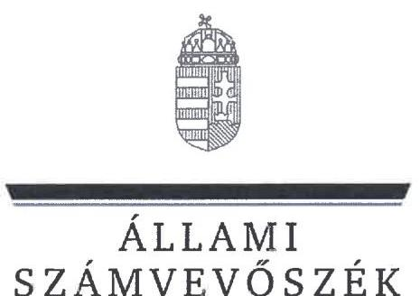
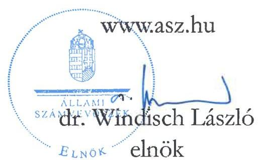
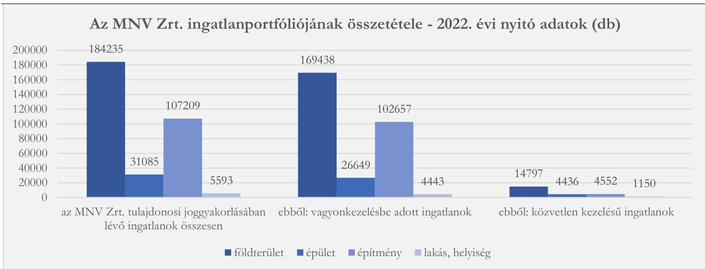
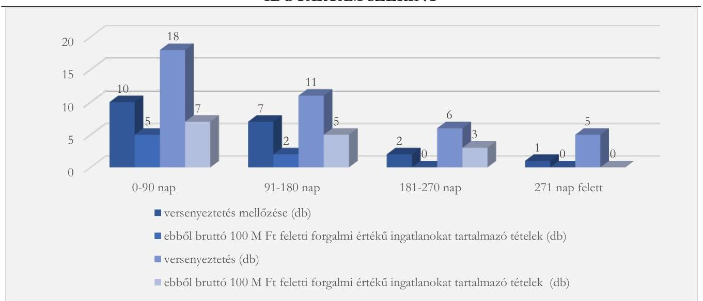
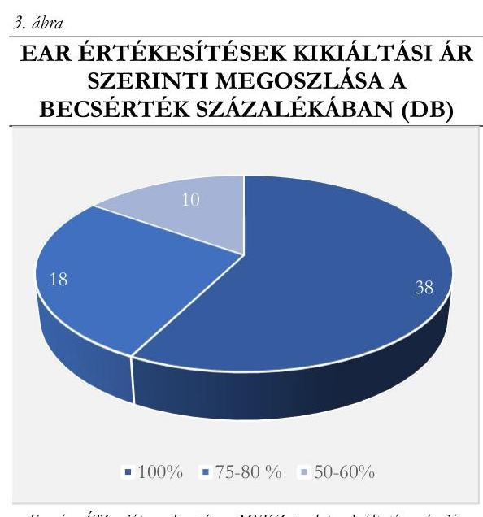
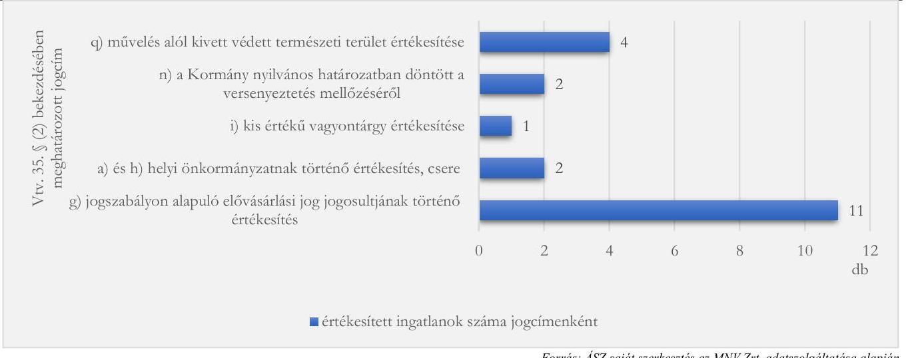
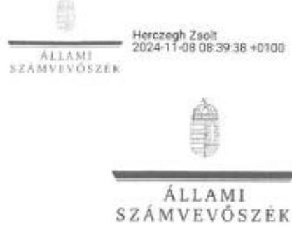

# JELENTÉS 

## Az állami tulajdonú vagyonelemek értékesítésének ellenőrzése a Magyar Nemzeti Vagyonkezelő Zrt.-nél

2024.

---

# JELENTÉS 

## Az állami tulajdonú vagyonelemek értékesítésének ellenőrzése a Magyar Nemzeti Vagyonkezelő Zrt.-nél

2024. 

24039

---

# ELLENŐRZÉSI IGAZGATÓSÁG: 

## ÁLLAMI VAGYONGAZDÁLKODÁST ELLENŐRZŐ IGAZGATÓSÁG

## ELLENŐRZÉSI IGAZGATÓ:

HERCZEGH ZSOLT ellenőrzési igazgató

## ELLENŐRZÉSVEZETŐ:

Jelentéseink az interneten a www.asz.hu címen olvashatók.

VEREBESNÉ SZABÓ ERZSÉBET ellenőrzésvezető

IKTATÓSZÁM: EL-3851-003/2024
TÉMASORSZÁM: 25/2023
ELLENŐRZÉS-AZONOSÍTÓ SZÁM: V1022

---

# TARTALOMJEGYZÉK 

AZ ELLENŐRZÉS ALAPADATAI ..... 5
AZ ELLENŐRZÉS HATÓKÖRE ÉS TERÜLETE ..... 7
ÖSSZEFOGLALÁS ..... 9
AZ ELLENŐRZÉS FÓKUSZKÉRDÉSEI ..... 11
MEGÁLLAPÍTÁSOK ..... 12
JAVASLATOK ..... 31
MELLÉKLETEK ..... 32
I. sz. melléklet: Értelmező szótár ..... 32
II. sz. melléklet: Az ellenőrzött szervezetek jegyzéke ..... 34
III. sz. melléklet: Ellenőrzési kritériumok ..... 35
FÜGGELÉK: ÉSZREVÉTELEK ..... 37
RÖVIDÍTÉSEK JEGYZÉKE ..... 59

---

.

---

# AZ ELLENŐRZÉS ALAPADATAI 

## AZ ELLENŐRZÉS CÉLJA

Az ellenőrzés célja annak értékelése volt, hogy az MNV Zrt. ${ }^{1}$-nél az ingatlanok értékesítése megfelelt-e a jogszabályi előírásoknak, a vonatkozó döntések előkészítettek, megalapozottak voltak-e, azoknál érvényesült-e a célszerűség és eredményesség.

## AZ ELLENŐRZÉS TÍPUSA

Kombinált ellenőrzés

## AZ ELLENŐRZÖTT IDŐSZAK

2022. január 1. - 2023. június 30. Az állami tulajdonú vagyonelemek értékesítésének a szerződéskötést követő folyamatai tekintetében az ellenőrzött időszak kiterjedt az utolsó adatbekérő levél kézhezvételének időpontjáig, azaz 2023. december 11-ig.

## AZ ELLENŐRZÉS TÁRGYA

Az ellenőrzés tárgya az állami ingatlanvagyon tulajdonjogának átruházását megelőző döntéselőkészítési, döntési, versenyeztetési, szerződéskötési folyamat, az adásvételi szerződések tartalmi kialakítása, az adásvételi szerződések megvalósulása, az értékesített állami vagyonelemek nyilvántartásokból történt kivezetése, valamint az ingatlanértékesítési tevékenység célszerűsége és eredményessége volt.

## AZ ELLENŐRZÉS JOGALAPJA

Az ellenőrzés jogszabályi alapját az ÁSZ tv. ${ }^{2}$ 1. § (3) bekezdése, az 5. § (4) bekezdés a) pontja, valamint a Vtv. ${ }^{3}$ 3. § (4) bekezdése képezték.

## AZ ELLENŐRZÉS MÓDSZERE

Az ellenőrzés végrehajtása a nemzetközi standardokat irányadónak tekintve az ellenőrzési program szempontjai, az ellenőrzött időszakban hatályos jogszabályok, az ellenőrzés szakmai szabályok és módszertanok figyelembevételével történt.

Az ellenőrzési kérdések megválaszolásához szükséges bizonyítékok megszerzése az ellenőrzött szervezet által rendelkezésre bocsátott dokumentumokra és adatokra alapozva, továbbá megfigyelés, szemrevételezés, információkérés, interjú, összehasonlítás, mintavételezés, valamint elemző eljárás útján történt.

---

Az ellenőrzés lefolytatásához az ellenőrzött szervezet tanúsítvány kitöltésével, valamint az ÁSZ ${ }^{4}$ által kért dokumentumok, adatok, információk megküldésével szolgáltatott adatokat.

Az ellenőrzési bizonyítékként felhasználható adatforrások közé tartoztak az ellenőrzési program részletes szempontjainál felsorolt adatforrások, valamint minden egyéb - az ellenőrzés folyamán feltárt, az ellenőrzés szempontjából információt tartalmazó - dokumentum.

Az ÁSZ az állami ingatlanvagyon tulajdonjogának átruházásához kapcsolódó folyamatokat, dokumentumokat és nyilvántartásokat az ellenőrzött szervezet által a 2022. január 1. - 2023. június 30. között megkötött ingatlan adásvételi szerződésekről kitöltött tanúsítvány adataiból kiválasztott mintatételek alapján ellenőrizte. Az ingatlanértékesítési tevékenység ellenőrzése során az ÁSZ egyfelől érték alapján történő kiválasztást alkalmazott. Ennek keretében tételesen került ellenőrzésre

- a legalább százmillió forint becsült forgalmi értékű ingatlanok értékesítése (30 mintatétel),
- a legalább ötmillió forinttal a becsült forgalmi érték alatti áron történt értékesítések (22 mintatétel), valamint
- a legalább ötmillió forinttal a könyv szerinti érték alatti áron történt értékesítések (7 mintatétel). Egyes mintatételekre több kiválasztási feltétel is teljesült, így a tanúsítvány adatai alapján a fenti szempontoknak összesen ötvenhat ingatlanértékesítési ügylet felelt meg. Másfelől a 2022. évi ingatlan adásvételi szerződések tekintetében az értékalapú kiválasztást követően a sokaság fennmaradó elemeiből véletlenszerű rétegzett mintavétellel került ellenőrzésre további harminc mintatétel. A rétegek képzése az alábbi szempontok szerint történt:
- versenyeztetés mellőzésével történt értékesítések (10 mintatétel),
- versenyeztetéssel történt értékesítések, amelyek esetében a becsült forgalmi érték kisebb vagy egyenlő volt az eladási árral (13 mintatétel),
- versenyeztetéssel történt értékesítések, amelyek esetében a becsült forgalmi érték nagyobb volt, mint az eladási ár (7 mintatétel).
A 2023. első félévi értékesítések állományából véletlenszerű mintavétel nem történt.
Az ellenőrzést az ÁSZ szabályszerűségi, célszerűségi és eredményességi szempontok alapján folytatta le. A tények feltárása és azok összegzése során tett megállapítások az ellenőrzött mintatételekre vonatkoznak, kivetítés nem történt.

Az ellenőrzés kitért minden olyan körülményre, amely a program végrehajtása kapcsán felmerült és az ellenőrzés céljaival összhangban volt.

---

# AZ ELLENŐRZÉS HATÓKÖRE ÉS TERÜLETE 

Az MNV Zrt. a Magyar Állam által alapított egyszemélyes részvénytársaság, melyben az állam részvényesi jogait az állami vagyon felügyeletéért felelős miniszter gyakorolja. Az MNV Zrt. feladata a Kormány által meghatározott irányelveknek és a hatályos jogszabályoknak megfelelő stratégiai szemléletű, felelős vagyongazdálkodással a rábízott állami vagyon megőrzése és gyarapítása. Az MNV Zrt. tulajdonosi joggyakorlása alá tartozó állami vagyon társasági részesedésekből, ingatlanokból és ingóságokból áll. Az állami tulajdonban lévő ingatlanok kezelése tekintetében az MNV Zrt. fő feladata az állami feladatellátáshoz és a társadalmi szükségletek kielégítéséhez szükséges ingatlanok biztosítása. Az állami vagyon költségtakarékos, értékmegőrző felhasználása mellett fontos feladata az MNV Zrt.-nek az állami feladat ellátásához nem szükséges vagyonelemek - így az ingatlanok - hatékony, átlátható, eredményes értékesítése. Az értékesítési folyamatban a célszerűség szempontjait is szükséges érvényesíteni. Az értékesítésre irányuló döntéseknek a társadalom széles köre, a köz érdekeit kell szolgálniuk.

## Az ÁSZ ellenőrzése annak értékelésére terjedt ki, hogy

- szabályszerűek, megalapozottak és célszerűek voltak-e az ingatlanok értékesítésre történő kijelölésére irányuló döntések;
- szabályszerű volt-e az ingatlanértékesítések lebonyolítása;
- az adásvételi szerződések tartalmi feltételei a belső és a jogszabályi előírásokkal összhangban, az állam érdekeinek szem előtt tartásával kerültek-e kialakításra;
- az adásvételi szerződések megvalósulásához kapcsolódó folyamatok szabályszerűen zajlottak-e le, és az értékesített állami vagyonelemek nyilvántartásokból való kivezetése szabályszerűen megtörtént-e.
Nem tartoztak az ellenőrzés hatókörébe a Zrínyi 2026 Korm. határozat ${ }^{5}$ keretében értékesített ingatlanok. Az ellenőrzés a 2023. év tekintetében a legkésőbb 2023. június 30. napjáig megkötött ingatlan adásvételi szerződésekhez kapcsolódó folyamatokra terjedt ki. Az 1. ábra szemlélteti az MNV Zrt. ingatlanportfóliójának összetételét az ellenőrzött időszak kezdő napján fennállt adatok alapján.
1. ábra

INGATLANPORTFÓLIÓ SZÁMOKBAN

---

A Vtv. 2022. január 1. napján hatályba lépő rendelkezéseire tekintettel az MNV Zrt. tulajdonosi joggyakorlása alatt álló ingatlanok közül 2022. január 1. napjával 20776 db, a 2022. január 1. és 2022. december 31. közötti időszakban 2099 db, a 2023. január 1. és 2023. június 30. közötti időszakban további 1266 db ingatlan átadásra került az MVH Zrt. ${ }^{6}$ részére.

A 2023. január 1-jén hatályba lépett 2022. évi LL törvény ${ }^{7}$ rendelkezései alapján az MNV Zrt. tulajdonosi joggyakorlása alá került az Egészségbiztosítási és a Nyugdíjbiztosítási Alap részeként nyilvántartott ingatlan vagyon, valamint az Országos Kórházi Főigazgatóság és a Magyar Államkincstár helyett az MNV Zrt. került tulajdonosi joggyakorlóként kijelölésre. E szervezetektől az MNV Zrt. 2023. január 1. napjával közel 1000 db ingatlant vett át.

A 2022. évi LL törvény jogalkotói indokolása szerint a hatékonyabb és egységes vagyongazdálkodás megteremtése céljából szükséges volt az „MNV Zrt. pozíciójának megerősítése a tulajdonosi joggyakorlói státuszok szakmai alapon történő centralizációjával. A költséghatékony vagyongazdálkodás biztosítása érdekében a törvénymódosítás megalkotásának célja, hogy a feladatellátást közvetlenül szolgáló és stratégiai szempontból jelentős vagyon állami portfólióban tartása mellett, a hatékony értékesítési és hasznosítási stratégia mentén megteremtse annak lehetőségét, hogy a feladatellátást közvetlenül nem szolgáló vagyonelemek hasznosításával, értékesítésével elérhető bevételek a kritikus gazdasági helyzetben növelhetőek legyenek.”

A Vtv. 34. § (4) bekezdése értelmében „törvény eltérő rendelkezése hiányában az e törvény hatálya alá tartozó, Magyarország határa által körülzárt területen lévő állami ingatlan értékesítésére - kivéve a 35. § (2) bekezdése szerinti versenyeztetés mellőzésével történő értékesítést - kizárólag az MNV Zrt. által működtetett elektronikus árverési rendszer útján kerülhet sor.” Az MNV Zrt. által bevezetett Elektronikus Aukciós Rendszer (EAR) alkalmazása biztosítja az értékesítések nyilvánosságát és transzparenciáját.

Az MNV Zrt. által teljesített tanúsítványi adatszolgáltatás alapján a 2022. évben 257 db, 2023. első félévében 145 db - az ellenőrzés hatókörébe tartozó - ingatlan adásvételi szerződés került megkötésre, mintegy 21000 M Ft nettó értékben. Az 1. táblázat tartalmazza az ellenőrzött időszakban megkötött ingatlan adásvételi szerződések összesített adatait az értékesített ingatlanok becsült forgalmi értéke, az értékesítés módja és a nettó eladási ár szerinti tagolásban.

# 1. táblázat 

A 2022. JANUÁR 1-2023. JÚNIUS 30. KÖZÖTTI IDŐSZAKBAN KÖTÖTT INGATLAN ADÁSVÉTELI SZERZŐDÉSEK FÖBB ADATAI

| BECSÜLT   FORGALMI   ÉRTÉK   (M Ft) | 2022. ÉV (DB) |  | 2023. I. FÉLÉV (DB) |  | SZERZŐDÉS SZERINTI NETTÓ ELADÁSI ÁR ÖSSZESEN (M Ft) |  |
| :--: | :--: | :--: | :--: | :--: | :--: | :--: |
|  | VERSENYEZTETÉS MELLŐZÉSE | ELEKTRONIKUS AUKCIÓ | VERSENYEZTETÉS MELLŐZÉSE | ELEKTRONIKUS AUKCIÓ | VERSENYEZTETÉS MELLŐZÉSE | ELEKTRONIKUS AUKCIÓ |
| 1001- | 2 | 3 | 0 | 1 | 3253 | 6137 |
| 501-1000 | 0 | 1 | 0 | 0 | - | 821 |
| 101-500 | 5 | 11 | 0 | 7 | 977 | 5003 |
| 51-100 | 3 | 6 | 0 | 14 | 156 | 1466 |
| 0-50 | 76 | 150 | 24 | 99 | 479 | 2690 |
| összesen | 86 | 171 | 24 | 121 | 4865 | 16117 |

Forrás: ÁSZ saját szerkesztés az MNV Zrt. adatszolgáltatása alapján

---

# ÖSSZEFOGLALÁS 

Törvényi előírás alapján a rábízott állami vagyon felett az államot megillető tulajdonosi jogok és kötelezettségek összességét tulajdonosi joggyakorlóként - ha törvény vagy miniszteri rendelet eltérően nem rendelkezik - az MNV Zrt. gyakorolja. Az MNV Zrt. ezért az állami vagyonnal való gazdálkodás kulcsfontosságú szereplője. Az állami vagyon jelentős részét az ingatlanvagyon alkotja. Az MNV Zrt.-nek az állami tulajdonú ingatlanok értékesítésének növekvő intenzitása mellett is gondoskodnia kell az értékesítésre irányuló döntések kellő megalapozottságáról, a közfeladatok ellátását közvetlenül szolgáló és stratégiai szempontból jelentős vagyon állami portfólióban tartásáról, az állami ingatlanok értékarányos elidegenítéséről és ezzel az értékesítéssel elérhető eredmény maximalizálásáról.

AZ ELLENŐRZÉS MEGÁLLAPÍTOTTA, hogy az MNV Zrt. végrehajtotta a Kormány egyedi ingatlanok értékesítésére vonatkozó döntéseit és az értékesítésre történő kijelöléseknél figyelemmel volt a Kormány által meghatározott, az állami ingatlanvagyont érintő stratégiai irányokra. A rendelkezésre álló dokumentumok alapján az MNV Zrt. az ingatlanok értékesítésre történő kijelölésére irányuló döntéseit az állam érdekeinek szem előtt tartásával, a célszerűség szempontjainak, valamint a jogszabályi és belső előírásoknak az érvényesítésével hozta meg. Az értékesítés volumene és az elért bevételek tekintetében meghatározott célkitűzések teljesültek. Az általa kitűzött célok és teljesítménymutatók értéke alapján az MNV Zrt. ingatlanértékesítési tevékenysége eredményesnek minősült.

Az ingatlanértékesítések esetében a versenyeztetés lebonyolítása a jogszabályi előírásoknak megfelelően történt. Versenyeztetés mellőzésével történő értékesítésre kizárólag a jogszabályban megjelölt esetekben került sor. Az MNV Zrt. az ingatlan adásvételi szerződéseket a jogszabályi előírásoknak megfelelően, forgalmi értékbecslés alapján meghatározott, illetőleg versenyeztetéssel kialakult áron, az arra jogot szerző vevővel kötötte meg. A szerződésekbe beépítésre kerültek a vevő
 szerződésszegése esetére irányadó garanciális elemek, és az ellenőrzött szerződések egyike sem tartalmazott az állam számára előnytelen feltételeket. A szerződések tartalmi feltételei az állam érdekeinek szem előtt tartásával kerültek kialakításra. Az ingatlan adásvételi szerződések megvalósulásához kapcsolódó folyamatok - számlázás, vételár megfizetése, birtokba adás, tulajdonjog bejegyzési engedély vevő részére történő kiadása, valamint az értékesített vagyonelem nyilvántartásokból való kivezetése és a kapcsolódó bevétel elszámolása - szabályszerűen zajlottak le.

## AZ ELLENŐRZÉS AZ ALÁBBI TERÜLETEKEN TÁRT FEL HIÁNYOSSÁGOT:

- Tekintve, hogy az ellenőrzött időszakban az értékbecslések meghatározó befolyást gyakoroltak az ingatlanértékesítésből származó bevételekre, az értékbecslések szakmai megfelelősége a döntéselőkészítés kulcsfontosságú tényezője volt. Ennek ellenére az ingatlan értékbecslések és az értékbecslés aktualizálások szakmai kontrollja a belső előírások ellenére a gyakorlatban csak részben valósult meg, és a kontroll értékbecslések alkalmazási kritériumai a belső szabályozó eszközökben nem kerültek kialakításra. Mindez negatív hatást gyakorolt az értékbecslésekben felhasznált adatok utólagos ellenőrizhetőségére, az értékbecslés felülvizsgálatok megalapozottságára és több mintatétel esetében alulértékelési kockázatokat hordozott.
- Annak ellenére, hogy jogszabályi előírás alapján a nemzeti vagyon tulajdonjogát átruházni kizárólag természetes személy vagy átlátható szervezet részére lehet, az MNV Zrt. nem a belső és jogszabályi előírásoknak megfelelően dokumentálta, hogy a vevő az átláthatóság jogszabályi kritériumainak megfelelt. Az értékesítési dokumentációnak a releváns mintatételek mintegy kétharmada esetében nem képezte részét a jogszabályi és belső előírásnak megfelelő, a tulajdonosi szerkezetet és a tényleges tulajdonost,

---

valamint az egyéb feltételeknek való megfelelést bemutató átláthatósági nyilatkozat. Az MNV Zrt. által a vevő átláthatóságának dokumentálásához kapcsolódóan kiépített kontrollok működése nem volt megfelelő.

- Annak ellenére, hogy jogszabályi előírás alapján nem lehetett ingatlan adásvételi szerződést kötni olyan személlyel, aki többségi befolyáson alapuló kapcsolatban állt az EAR-ból kizárt árverezővel, ennek a kapcsolatnak az ellenőrzésére kiépített kontroll nem volt teljeskörű. Amennyiben a vevő tulajdonosi struktúrája, végső tulajdonosa nem volt megismerhető a cégkivonat, a nyilvánosan elérhető cégadatok és az átláthatósági nyilatkozat alapján, akkor az sem volt megállapítható, hogy fennállt-e a nyertes árverező és az EAR-ból kizárt árverező között többségi befolyáson alapuló kapcsolat. A fent megjelölt okokból több mintatétel esetében nem volt biztosított a jogszabályi előírás dokumentált érvényesülése.

# AZ MNV ZRT. INGATLANÉRTÉKESÍTÉSI TEVÉKENYSÉGÉVEL KAPCSOLATOS ÁLLAMI SZÁMVEVŐSZÉKI VÉLEMÉNY 

Az ellenőrzés véleménye szerint a kiválasztott mintatételek esetében az MNV Zrt. a jelzett hiányosságoktól eltekintve alapvetően szabályszerűen végezte az állami tulajdonú ingatlanok értékesítését, azonban értékesítési gyakorlatának a jogszabály adta keretek közötti észszerűbb kialakítása, a belső szabályozások egyes területeken történő felülvizsgálata és a kontrollok megerősítése elősegíthetné az alulértékelési kockázatok csökkentését, a verseny erőteljesebb kibontakozását és ezzel az állami bevételek maximalizálását.
A tényleges piaci érték alatti értékesítés kockázatának minimalizálása érdekében indokolt az értékbecslések és aktualizálások szakmai kontrolljának megerősítése, valamint az értékbecslések időszerűségének biztosítása.
A versenyeztetés optimális feltételeit megteremtő elektronikus aukciós rendszer működtetésében rejlő lehetőségek jobb kihasználása érdekében nagyobb hangsúlyt szükséges fektetni az állami tulajdonú ingatlanok lehetséges vevőinek információhoz juttatására, a megalapozott döntéshez szükséges idő biztosítására és az árverési regisztráció kedvező feltételeinek megteremtésére.
Az ellenőrzés véleménye szerint a Taktv. 7/J. § (3) bekezdés a) és c) pontjában, valamint a Gbkr. 4. § (3) bekezdésében és 6. § (2) bekezdés b) pontjában előírtak érvényesülése érdekében indokolt a belső szabályozás és a versenyeztetés lebonyolítására kialakított gyakorlat fenti célzatú felülvizsgálata.

Az MNV Zrt. az ÁSZ tv. 32. § (5) bekezdése szerinti záró megbeszélés keretében tájékoztatást adott a vevő átláthatóságának dokumentálása érdekében megkezdett intézkedésekről. Ezzel az ellenőrzött szervezetnél az ÁSZ megállapítása az ellenőrzés során hasznosult.

---

# AZ ELLENŐRZÉS FÓKUSZKÉRDÉSEI 

1.- Az ingatlanok értékesítésre történő kijelölésére irányuló döntések szabályszerűek, megalapozottak voltak-e, a döntéshozatalnál érvényesült-e a célszerűség?
2.- Az ingatlanértékesítések lebonyolítására szabályszerűen került-e sor?
3.- A szerződéskötés folyamata szabályszerű volt-e, és az adásvételi szerződések tartalmi feltételei az állam érdekeinek szem előtt tartásával kerültek-e kialakításra?
4.- Az adásvételi szerződés megvalósulásához kapcsolódó folyamatok szabályszerűen zajlottak-e le?

---

# MEGÁLLAPÍTÁSOK 

## 1. Az ingatlanok értékesítésre történő kijelölésére irányuló döntések szabályszerűek, megalapozottak voltak-e, a döntéshozatalnál érvényesült-e a célszerűség?

Összegző megállapítás Az ingatlanok értékesítésre történő kijelölése megfelelt a jogszabályban és a belső szabályzatokban előírtaknak. Az MNV Zrt. az ingatlanok értékesítésére irányuló döntéseket a forgalmi értékbecslések területén megállapított hiányosságok kivételével - megalapozottan, a célszerűség szempontjainak érvényesítésével hozta meg.

## INGATLANÉRTÉKESÍTÉSI STRATÉGIA ÉS TERVEZÉS

Az MNV Zrt. ellenőrzött időszaki ingatlanértékesítési tevékenységét a kijelölt stratégiai irányok keretei között alapvetően a költségvetési tervezés, azon belül pedig a költségvetési értékesítési előirányzatok határozták meg. „Az MNV Zrt. 2022-2026. évekre vonatkozó értékesítési stratégiája" című dokumentumban a jövőbeni stratégiai célok az Nvtv. ${ }^{8}$ szerinti felelős vagyongazdálkodás alapelveinek és az állam érdekeinek szem előtt tartásával kerültek megfogalmazásra: „Az állami feladatellátáshoz nem szükséges ingatlanok értékesítése kapcsán az elvárt eredmény kettős. Egyrészt a központi költségvetés bevételeit szükséges növelni, másrészt pedig az állami feladatellátáshoz közvetlenül nem szükséges vagyonelemek fenntartásával járó költségeket csökkenteni. Egységesen szükséges érvényre juttatni azon elvet, hogy az állami oldalon rendelkezésre álló vagyon kellő mértékben szolgálja ki az állami (köz)feladatokat, stratégiai célokat, de a kevéssé használt, vagy a feladatellátáshoz nem szükséges, ahhoz közvetlenül nem kapcsolódó vagyonelemek (főként ingatlanok) ne okozzanak az állam oldalán indokolatlan költséget (nem használt részek üzemeltetése, karbantartása, állagmegóvása, ingóságok esetében a tárolás költsége) ahelyett, hogy azok bevételt is generálhatnak a költségvetésnek. Emellett a piaci viszonyokhoz képest alacsony hasznosítási bevételeket generáló ingatlanok állami portfolióban tartása sem célravezető hosszútávon."
A dokumentumban stratégiai irányként került megjelölésre a vagyonkezelt vagy állami elhelyezési célú ingatlanhasználati jogviszony keretében a Kormány felügyelete vagy irányítása alá tartozó központi költségvetési szervek által használt ingatlanállomány felülvizsgálata, és annak keretében a feladatellátáshoz nem feltétlenül szükséges, nem stratégiai és közfeladatellátást szolgáló ingatlanok feltérképezése és értékesítésre alkalmassá tétele. A felülvizsgálat kiterjedt valamennyi rekreációs célú ingatlanra és megkezdődött az ipari jellegű ingatlanok értékesíthetőségi célú felülvizsgálata is. Az értékesítések tervezésekor figyelemmel voltak a vagyonkezelőktől érkezett értékesítési kezdeményezésekre. A költségek optimalizálása érdekében felülvizsgálták az őrzött ingatlanok állományát. Stratégiai célokat fogalmaztak meg a bérleti szerződéssel érintett ingatlanokkal, valamint az állami lakásportfolio tisztításával kapcsolatban is. Ugyanezen célkitűzések jelentek meg a Kormány számára az állami vagyon összetételének és kezelésének felülvizsgálatáról, valamint a kapcsolódó vagyonjogi intézkedésekről 2023. márciusban készített jelentésben is.

---

Az MNV Zrt. a rábízott vagyon tekintetében az $\mathrm{SzMSz}_{1,2,3,4}{ }^{9}$, valamint a Hatásköri Szabályzat ${ }_{1,2,3,4,5}{ }^{10}$ előírásainak megfelelően rendelkezett mind a 2022., mind a 2023. évre a tulajdonosi joggyakorló által jóváhagyott éves vagyonkezelési tervvel. Az MNV Zrt. tájékoztatása szerint a tervezés során az értékesítendő ingatlanok között - a teljesség igénye nélkül - azon nagy értékű ingatlanokat szerepeltették e dokumentumokban, amelyekről azok elkészítésekor ismert volt társaságuk értékesítési szándéka, illetve amely ingatlanok tervezett értékesítésével teljesíthetők voltak a bevételi előirányzat célszámai. Az MNV Zrt. a rábízott vagyon vagyonkezelési tervei keretében a Gbkr. ${ }^{11}$ rendelkezéseinek megfelelően mérhető teljesítménycélokat határozott meg az ingatlanértékesítési tevékenységhez kapcsolódóan. A vagyonkezelési tervek az MNV Zrt. közvetlen kezelésében álló ingatlanok értékesítéséből származó bevételek célértékét 2022. évre 4950 M Ft-ban, 2023. évre 5300 M Ft-ban jelölték meg. Az MNV Zrt. meghatározta továbbá az értékesítési döntéshozatalra előkészített ingatlanok tervezett darabszámát is, melynek elérendő értéke 2022-ben 350 db, 2023-ban 850 db volt. A Gbkr. és a Hatásköri Szabályzat ${ }_{1,2,3,4,5}$ előírásai alapján a kontrolling szakterület útján gondoskodott a teljesítménycélok nyomon követéséről, és az MNV Zrt. igazgatóságának rendszeres tájékoztatásáról. A 2022. évre és a 2023. I. félévre kitűzött célok a rendelkezésre álló dokumentumok alapján mind az értékesítési döntéshozatalra előkészített ingatlanok darabszáma, mind a tervezett bevételek tekintetében teljesültek. A rábízott vagyonról készített 2022. évi költségvetési beszámoló szerint az ingatlanértékesítés bevétele 25611 M Ft volt. Az MNV Zrt. rábízott vagyoni tevékenységéről az igazgatóság részére készített tájékoztatók alapján a 2023. I. félévi ingatlanértékesítési bevétel elérte a 6000 M Ft -ot, továbbá az értékesítésre előkészített ingatlanok darabszáma 2022-ben 457 db, 2023. I. félévben 1166 db volt. A rábízott vagyonnal kapcsolatos tevékenységről az MNV Zrt. igazgatósága számára készített tájékoztatás adatai alapján a 2023. évi tervek teljesítése már az ellenőrzött 2023. I. félév végén biztosított volt. Az MNV Zrt. ellenőrzött ingatlanértékesítései 2022. év és 2023. I. féléve vonatkozásában összhangban álltak a rábízott vagyonának éves vagyonkezelési terveiben meghatározott, elsődlegesen bevételcentrikus, valamint „Az MNV Zrt. 2022-2026. évekre vonatkozó értékesítési stratégiája" című dokumentumban és a Kormány számára az állami vagyon összetételének és kezelésének felülvizsgálatáról, valamint a kapcsolódó vagyonjogi intézkedésekről készített jelentésben meghatározott ingatlan értékesítési célokkal.
Az általa kitűzött célok és teljesítménymutatók értéke alapján az MNV Zrt. ingatlanértékesítési tevékenysége eredményesnek minősült.

# DÖNTÉSELŐKÉSZÍTÉS ÉS DÖNTÉSHOZATAL 

Az MNV Zrt. a Taktv. ${ }^{12}$ és a Gbkr., valamint a Belső Kontroll Kézikönyv ${ }_{1,2}{ }^{13}$ előírásainak megfelelően az $\mathrm{SzMSz}_{1,2,3,4}$-ben, az Állami Vagyon Értékesítési Szabályzatában ${ }^{14}{ }_{1,2}$-ban, a Hatásköri Szabályzat ${ }_{1,2,3,4,5}$-ban, az Értékbecslések és vagyonértékelések eljárásrendjé ${ }^{15}{ }_{1,2,3}$-ben, valamint a Döntéselőkészítési Utasítás ${ }^{16}{ }_{1,2,3}$-ban szabályozta az ingatlan értékesítés döntéselőkészítési és döntési folyamatait, valamint kialakította a területre vonatkozó belső kontrollokat. Az $\mathbf{S zMSz}_{1,2,3,4}$-ben szabályozták az ingatlan értékesítéshez kapcsolódó alapvető felelősségi, hatásköri viszonyokat, az MNV Zrt. igazgatóságának és vezérigazgatójának a vagyonelem értékétől és az értékesítés módjától függő döntési jogköreit. A Hatásköri Szabályzat ${ }_{1,2,3,4,5}$-ban a legfeljebb ötvenmillió, illetve versenyeztetés mellőzése esetén a legfeljebb tízmillió forint értékű ingatlanok értékesítésére irányuló döntéseket értékhatártól és/vagy az ingatlan földrajzi elhelyezkedésétől függően az ingó- és ingatlanvagyonért felelős vezérigazgatóhelyettesre, illetve a vagyonszerzési és vagyonátruházási igazgatóra vagy a területi irodavezetőre delegálták. Az Állami Vagyon Értékesítési Szabályzata ${ }_{1,2}$ értelmében az értékesítési döntést előkészítő szervezeti egységnek döntés-előkészítő előterjesztést kellett készítenie és azt a hatáskörrel rendelkező döntéshozó

---

elé terjesztenie. Feladatát képezte az ingatlan értékesítéséhez elengedhetetlen külső jóváhagyások és belső egyeztetések lefolytatása is. A Döntéselőkészítési Utasítás ${ }_{1,2,3}$-ban határozták meg a döntésekre vonatkozó tartalmi és formai követelményeket, szabályozták továbbá a döntések véleményezésének folyamatát. A döntéseket a Döntéselőkészítési Utasítás ${ }_{1,2,3}$ értelmében részletes előterjesztéssel kellett kezdeményezni. Az Állami Vagyon Értékesítési Szabályzat ${ }_{1,2}$-a az értékesítésre vonatkozó döntés megalapozásához előírta, hogy az értékbecslésekre és vagyonértékelésekre vonatkozó külön szabályzat szerint független vagy belső szakértő útján el kell végeztetni az érintett ingatlan forgalmi értékbecslését. Az Értékbecslések és vagyonértékelések eljárásrendje ${ }_{1,2,3}$ tartalmazta a forgalmi értékbecslések elvégzésére vonatkozó részletszabályokat.
Az MNV Zrt. az ingatlanok értékesítését megelőzően a Vtv. vhr. ${ }^{17}$ rendelkezéseinek, valamint az Állami Vagyon Értékesítési Szabályzatában ${ }_{1,2}$ előírtaknak megfelelően minden mintatétel esetében megvizsgálta, hogy az adott vagyontárgyra szüksége van-e valamely központi költségvetési szervnek állami feladatai ellátásához. Védett természetvédelmi területnek minősített ingatlan esetében
 gondoskodott a Vtv. és a Vtv. vhr. által előírt, a védettség jellege szerint felelős miniszter előzetes egyetértésének, illetőleg a természetvédelmi kezeléséért felelős szerv jóváhagyásának beszerzéséről.
Az ingatlanok értékesítésére irányuló döntéseket a Vtv-ben, valamint az $\mathrm{SzMSz}_{1,2,3,4}$-ben és a Hatásköri Szabályzat ${ }_{1,2,3,4,5}$-ban foglaltaknak megfelelően - az ingatlan forgalmi értékétől függően - az igazgatóság, a vezérigazgató, az ingó- és ingatlanvagyonért felelős vezérigazgató-helyettes, a vagyonszerzési és vagyonátruházási igazgató, illetve a területi irodavezető hozta meg.
Az ingatlanértékesítésre vonatkozó döntéshozatal az Állami Vagyon Értékesítési Szabályzata ${ }_{1,2}$ és a Döntéselőkészítési Utasítás ${ }_{1,2,3}$ rendelkezéseinek megfelelően minden mintatétel esetében részletes előterjesztésen alapult. Az előterjesztés tartalmazta többek között az értékesítésre irányadó jogszabályi rendelkezéseket, az értékesíthetőség vizsgálatának tényezőit (indokolt-e az állami tulajdonban tartás, felmerült-e értékesítést akadályozó tényező, vannak-e az értékesítésnek előfeltételei), a döntési hatáskörre vonatkozó szabályokat, az értékbecslésre vonatkozó információkat, a döntés esetleges költségkihatását, gazdasági, pénzügyi vonatkozásait. Az előterjesztéseket véleményezte az MNV Zrt. jogi, gazdasági, vagyonkezelési, vagyonhasznosítási, vagyonnyilvántartási szakterülete. Az értékesítési döntést megelőzően megvizsgálták az MNV Zrt. nyilvántartásaiban rendelkezésre álló, az adott ingatlan hasznosíthatóságára vonatkozó adatokat, állapotfelméréseket, bérleti szándéknyilatkozatokat is és ezek figyelembevételével alakították ki a véleményt az értékesíthetőségről. Amennyiben az ingatlan funkciója vagy egyéb szempont alapján könnyen megítélhető volt, hogy az adott ingatlan állami tulajdonban tartása a hasznosíthatóság alapján nem indokolt, úgy erre vonatkozóan külön elemzés - bevétel és költségkimutatás - nem történt (például felújítandó vagy romos ingatlanok, állami résztulajdonban álló örökölt lakóingatlanok, üdülők, hétvégi házak, beépítetlen területek). Az MNV Zrt. nyilatkozata szerint a bevételek és költségek bemutatására abban az esetben került sor részletesen az előterjesztésben, ha a döntéshozó részéről mérlegelni volt szükséges, hogy vagyongazdálkodási szempontból milyen hasznosítási stratégia (aktuális hasznosítás fenntartása vagy értékesítés) volt követendő. Az MNV Zrt. a kormányhatározatokban foglaltaknak megfelelően végrehajtotta a Kormány egyedi ingatlanok értékesítésére vonatkozó döntéseit és az értékesítésre történő kijelöléseknél figyelemmel volt a Kormány által meghatározott, az állami ingatlanvagyont érintő stratégiai irányokra.
Az ellenőrzésre kiválasztott 86 mintatétel közül 2022. évben hat, a 2023. évben egy tétel esetében az ingatlan értékesítéséről a Kormány egyedi határozatban döntött. A 2023. évi ellenőrzött tételek közül további tizenkettő, a döntéselőkészítő előterjesztés szerint vagyonkezelt, vagy más jogcímen használt ingatlan a Kormány által határozatban kijelölt stratégiai szempontok alapján, célszerűségi és közvetlen állami feladatellátáshoz való szükségességi felülvizsgálatot követően került értékesítésre kiválasztásra.
Ötvenhét ellenőrzött tétel esetében az ingatlan adottságai (például felújítandó vagy romos ingatlan, illetve résztulajdon) vagy jellege (például lakás, lakóépület, üdülő, hétvégi ház, kivett beépítetlen terület) miatt az értékesítés célszerű döntés volt.
Tíz, jellege alapján hasznosítható ingatlan (például társasüdülő, szálloda, irodaház) esetében az ingatlan értékesítési döntést megalapozó értékbecslés a piaci összehasonlító adatok alapján végzett forgalmi értékmeghatározás mellett tartalmazta a hozamszámításon alapuló forgalmi értéket is. Az értékbecslésekben ezáltal összevetették az értékesítés várható - azonnali - eredményét az ingatlan hasznosításának várható - jövőbeni - eredményével. Az érintett ingatlanok mindegyikénél alacsonyabb volt a hozamszámításon alapuló forgalmi érték, mint a piaci összehasonlító adatok felhasználásával meghatározott, ezért az ingatlan értékesítése volt az állam számára a kedvezőbb megoldás.
Mindezek alapján az MNV Zrt. az ingatlanok értékesítésre történő kijelölésére irányuló döntéseket az Nvtv. és a Vtv. rendelkezéseivel összhangban, a belső szabályozásának megfelelően az állam érdekeinek szem előtt tartásával hozta meg, és a döntéshozatalnál érvényesültek a célszerűség szempontjai.

# A NYILVÁNTARTÁSOK DÖNTÉSTÁMOGATÓ SZEREPÉVEL KAPCSOLATOS ÁLLAMI SZÁMVEVŐSZÉKI VÉLEMÉNY 

Az ellenőrzés véleménye szerint az MNV Zrt.-nél az ingatlan értékesítési döntések megalapozottságának és célszerűségének támogatására komplex, integrált, minden releváns kiválasztási szempontot tartalmazó nyilvántartás nem állt rendelkezésre. Az MNV Zrt. egyes szakterületei egyedi nyilvántartások alapján vizsgálták az ingatlanok értékesíthetőségének különféle szempontjait. A kezelt ingatlanportfólió nagysága és összetettsége miatt ugyanakkor a Taktv. 7/J. § (3) bekezdés d) pontjában és a Gbkr. 4. § (3) bekezdésében előírtak érvényesülése érdekében kiemelkedő fontosságú, hogy az MNV Zrt. naprakész információkkal rendelkezzen az ingatlanállományra vonatkozóan, ideértve az egyes egyedi ingatlanokra, illetve ingatlanok különféle szempontok szerint kiválasztott, rendszerezett csoportjaira vonatkozó összesített adatokat is. A rendelkezésre álló adatok és információk szerint az MNV Zrt. az ingó- és ingatlan portfólió tekintetében stratégiai célként tűzte ki az erősen számviteli fókuszú nyilvántartási rendszerének kiszélesítését a hatékony portfóliókezeléshez szükséges információs elemekkel (műszaki, vizuális, térképészeti, jogi, ügykezelési, stratégiai osztályozás). Ennek megvalósítása hatékonyan szolgálná az Nvtv. szerinti felelős vagyongazdálkodás további megerősítését, ezért a jövőbeni informatikai fejlesztéseknél célszerű az ingatlan portfólió feletti tisztánlátás megteremtésének szempontjaira figyelemmel lenni.

## FORGALMI ÉRTÉKBECSLÉSEK

Az értékesítésre irányuló döntések megalapozásához a jogszabályi és belső előírásoknak megfelelően minden esetben rendelkezésre álltak a kapcsolódó forgalmi értékbecslések.
Amennyiben az ingatlan könyv szerinti értéke elérte a Vtv. vhr-ben meghatározott - 2022-ben ötmillió, 2023-ban ötvenmillió forint könyv szerinti - értéket, az értékesítésre irányuló döntés megalapozásához az MNV Zrt. a Vtv. vhr., az Állami Vagyon Értékesítési Szabályzata ${ }_{1,2}$, valamint az Értékbecslések és Vagyonértékelések Eljárásrendje ${ }_{1,2,3}$ rendelkezéseinek megfelelően független szakértővel minden esetben elvégeztette az érintett vagyonelem forgalmi értékbecslését.

---

Az értékesítésre vonatkozó döntés megalapozásához az MNV Zrt. az Állami Vagyon Értékesítési Szabályzata ${ }_{1,2}$, valamint az Értékbecslések és Vagyonértékelések Eljárásrendje ${ }_{1,2,3}$ előírásai szerint eljárva, az Nvtv. szerinti felelős gazdálkodás elvének megfelelően az értékesítésre vonatkozó döntés megalapozásához belső vagy független szakértővel abban az esetben is forgalmi értékbecslést készíttetett, amennyiben az ingatlan könyv szerinti értéke nem érte el a jogszabályban meghatározott értéket.
A Vtv. vhr.-ben, valamint az Értékbecslések és Vagyonértékelések Eljárásrendje ${ }_{1,2,3}$ rendelkezéseiben foglaltaknak megfelelően az értékesítési eljárás megindítására vonatkozó döntést minden esetben a szakvéleményben meghatározott érvényességi időn belül hozták meg.
Az Értékbecslések és Vagyonértékelések Eljárásrendje ${ }_{1,2,3}$ értelmében a „szabályzat szerint elkészített értékbecslés a szakvéleményben rögzített érvényességi időn belül, de legfeljebb az értékbecslés fordulónapját követő 365 napon belül tekinthető érvényesnek. Kivételt képeznek ez alól Budapesten és megye jogú városokban elhelyezkedő ingatlanok, melyek esetében az értékbecslések érvényessége 180 nap."
Az MNV Zrt. a Vtv. előírásainak megfelelve húsz ellenőrzött tételt versenyeztetés mellőzésével, hatvanhat ellenőrzött tételt elektronikus árverés útján, versenyeztetéssel értékesített. A versenyeztetés során negyven ellenőrzött tétel esetében csupán egyetlen licitáló volt, így nem alakult ki piaci licitverseny. Ezek közül harminchét licitáló kikiáltási áron vásárolta meg az aukcióra bocsátott ingatlant, három licitáló pedig néhány ezer forinttal a kikiáltási ár felett. Versenyeztetés mellőzése esetén az értékesítés a Vtv. vhr. rendelkezésére figyelemmel a becsült forgalmi értéknek megfelelő eladási áron történt. Versenyeztetés esetén a Vtv. vhr. rendelkezéseivel összhangban a kikiáltási ár megegyezett a becsült forgalmi értékkel, illetőleg második vagy harmadik árverés esetén annak a jogszabályi előírásoknak megfelelő árlejtés szerinti hányadával. Mindezek alapján hatvan ellenőrzött tétel esetében az értékesítési árat az értékbecslő szakvéleménye szerinti forgalmi érték határozta meg. A 2. ábra szemlélteti a hatvan ellenőrzött tételre vonatkozóan az értékbecslések érvényességének kezdete és az ingatlan értékesítési döntés között eltelt időtartam hosszát, külön kiemelve a százmillió forint feletti forgalmi értékű ingatlanokat érintő ellenőrzött tételeket.
2. ábra

# AZ INGATLAN ÉRTÉKESÍTÉSI DÖNTÉSEK MEGOSZLÁSA AZ ÉRTÉKBECSLÉSEK ÉRVÉNYESSÉGÉNEK KEZDETE ÉS A DÖNTÉSHOZATAL KÖZÖTT ELTELT IDŐTARTAM SZERINT 

Forrás: ÁSZ saját szerkesztés az MNV Zrt. adatszolgáltatása alapján

---

A fentiek alapján hatvanból harminckét ellenőrzött tétel esetében az ingatlanok eladási árára vonatkozó döntés kilencven napnál régebbi értékbecsléseken alapult. Ezek között tíz olyan tétel is szerepelt, amelyek egyedi forgalmi értéke meghaladta a százmillió forintot, és amelyek ezáltal az ingatlanértékesítési bevételekre jelentős hatást gyakoroltak.

# AZ ÉRTÉKESÍTÉSRE IRÁNYULÓ DÖNTÉSEK ALAPJÁT KÉPEZŐ ÉRTÉKBECSLÉSEK ÉRVÉNYESSÉGI IDŐTARTAMÁVAL KAPCSOLATOS ÁLLAMI SZÁMVEVŐSZÉKI VÉLEMÉNY 

Az ellenőrzés véleménye szerint az értékesítési döntéseknek minden esetben kellően aktuális értékbecsléseken kell alapulnia, mivel az értékbecslő szakvéleményében meghatározott forgalmi érték az ingatlan - állami bevételt biztosító - értékesítése során meghatározott eladási ár kiindulópontja. Olyan gazdasági környezetben, melyben az ingatlanpiaci árak emelkedő tendenciát mutatnak, az elérhető bevételekhez kapcsolódó alulértékelési kockázatok minimális szintre történő leszorítása érdekében különösen fontos az értékbecslések időszerűségének biztosítása.
Az Értékbecslések és Vagyonértékelések Eljárásrendje ${ }_{1,2,3}$ az ingatlanok értékelése során, különösen a módszertan vonatkozásában alkalmazni rendelte a 25/1997. (VIII. 1.) PM rendelet ${ }^{18}$-nek a piaci forgalmi érték meghatározására vonatkozó fejezetét.
Az MNV Zrt. belső szabályozásában hivatkozott, és az ingatlan értékbecslések során részben alkalmazott 25/1997. (VIII. 1.) PM rendelet 5. §-a az értékelési szakvélemények időbeli hatályát azok készítésének időpontjától számítva legfeljebb kilencven napban határozta meg.
Az ellenőrzés véleménye alapján az állami bevételeket biztosító ingatlanértékesítéseknél - az állam érdekeinek védelmében - a forgalmi értékbecslések maximálisan elfogadható érvényességi időtartama tekintetében indokolt legalább olyan óvatossággal eljárni, mint amit a jogalkotó a hitelezési tevékenység során a pénzügyi szektor vállalkozásaitól elvár. A belső szabályozásnak az értékbecslések érvényességi időtartamát érintő, az értékesítési döntések megalapozottságát támogató célzatú felülvizsgálata hozzájárulhat az állami tulajdonú ingatlanok értékesítésével elérhető bevételek maximalizálásához, elősegítve ezzel az Nvtv.-ben foglalt felelős gazdálkodásra vonatkozó alapelvek érvényesülését.

Az MNV Zrt az értékbecslést készítő külső vállalkozókat közbeszerzési eljárás lefolytatásával választotta ki. A belső értékbecslőkről az MNV Zrt. az Értékbecslések és vagyonértékelések eljárásrendje ${ }_{1,2,3}$ rendelkezésének megfelelően nyilvántartást vezetett, melyben feltüntette az értékbecslések készítésére jogosult alkalmazottak szakképesítését és bizonyítványának sorszámát is. A Hatásköri Szabályzat ${ }_{1,2,3,4,5}$, valamint az Értékbecslések és vagyonértékelések eljárásrendje ${ }_{1,2,3}$ előírása szerint az Értékelési Csoport szakmai megfelelőség szempontjából köteles volt hivatalos feljegyzés készítése mellett felülvizsgálni a külső és belső értékbecsléseket, és indokolt esetben intézkednie kellett a pótlás, kiegészítés bekérésére. Az Értékelési Csoport külső, független értékbecslőt is megbízhatott a benyújtott értékbecslések felülvizsgálatával. Amennyiben az Értékelési Csoport vagy az igénylő szakterület szükségesnek tartotta, az Értékelési Csoport ésszerű határidőn belül kontroll értékbecslés beszerzését kezdeményezhette, lehetőség szerint igazságügyi minősítéssel rendelkező szakértő bevonásával, ennek kritériumai azonban nem kerültek meghatározásra. A kontroll értékbecslést az Értékelési Csoportnak szakmai megfelelőség szempontjából szintén felül kellett vizsgálnia. A kontroll értékbecslés felülvizsgálatának eredményéről hivatalos feljegyzést kellett készítenie.

---

A Hatásköri Szabályzat ${ }_{1,2,3,4,5}$, valamint az Értékbecslések és vagyonértékelések eljárásrendje ${ }_{1,2,3}$ előírásai alapján minden ellenőrzött mintatétel esetében megtörtént az ingatlan értékbecslések szakmai megfelelőség szempontjából történő felülvizsgálata. A felülvizsgálat fogalma alatt az Értékbecslések és vagyonértékelések eljárásrendje ${ }_{1,2,3}$ értelmében a beérkező értékbecslések formai és tartalmi, valamint az értékelés módszertanára és annak megalapozottságára, jogszabályi megfelelőségére vonatkozó ellenőrzés volt értendő. Kontroll értékbecslés beszerzésének kezdeményezésére az ellenőrzött tételek esetében nem került sor. Az Értékbecslések és vagyonértékelések eljárásrendje ${ }_{1,2,3}$ szabályozta az értékbecslések aktualizálását is. Az aktualizálás fogalma alatt az értékbecslő által korábban megállapított érték szakértői felülvizsgálata volt értendő, melynek során az aktualizált érték az aktuális gazdasági, illetve piaci körülményeket veszi figyelembe és számítással kerül alátámasztásra.
Az ellenőrzött időszakban az Értékbecslések és vagyonértékelések eljárásrendje ${ }_{1,2,3}$ előírásainak megfelelően az értékbecslések elkészítése,
 felülvizsgálata és elfogadása a következők szerint történt: A külső szakértők által készített értékbecslések tartalmaztak összesített értékelési lapot, az ingatlan paramétereit bemutató ingatlanadatlapot, a szakértői szemle leírását, az értékelés módszertani alapjait, feltételeit, az ingatlan általános jellemzőit, az értékelés módszerét, az érték meghatározását, valamint mellékletként a helyszínen készített fotókat, a tulajdoni lapot, és térképmásolatot. Az értékbecslések tartalmazták az érték alátámasztásául szolgáló, a szakértő által összehasonlítónak tekintett - elsősorban az interneten eladásra kínált - ingatlanok adatait. Az összehasonlító ingatlanoknak a szakértő által hivatkozott adatait tartalmazó hirdetések/egyéb források jellemzően nem kerültek nyomtatott mellékletként csatolásra a szakvéleményhez. Amennyiben a várható döntés már nem esett volna bele az értékbecslés érvényességi időtartamába vagy az értékbecslés érvényessége már lejárt, az MNV Zrt. megrendelte a vállalkozóktól az értékbecslés aktualizálását. A belső értékbecslések szűkített tartalommal készültek a külső szakértők által készített értékbecslésekhez képest. Azokban a helyszíni szemlén tapasztaltak, a tulajdoni lap, valamint a fényképmelléklet mellett az érték meghatározása szerepelt. Az érték megállapítása az Értékbecslések és vagyonértékelések eljárásrendje ${ }_{1,2,3}$ előírásainak megfelelve jellemzően a NAV ${ }^{19}$ adatbázisában lévő átlagos négyzetméterár és az ingatlan alapterületének szorzatán alapult, de előfordult a NAV négyzetméterár, valamint az aktuális piaci adatok átlaga vagy piaci összehasonlító adatok alapján történt forgalmiérték meghatározás is.
A belső és külső értékbecslések felülvizsgálatát az ellenőrzött tételek döntő többségében ugyanaz a külső szakértő végezte el az MNV Zrt. megbízása alapján. A felülvizsgálat elvégzését tanúsító szakértői jelentést a külső szakértő az Értékbecslések és vagyonértékelések eljárásrendje; hatálybalépése előtt a Kontrolling Igazgatóságnak, azt követően pedig a Kabinetnek továbbította. A felülvizsgálatról szóló dokumentum egyszerre több értékbecslésről szóló összefoglaló véleményt tartalmazott. A felülvizsgáló minden esetben elfogadásra javasolta a belső vagy külső szakértők által készített értékbecsléseket. A MNV Zrt. címzett szervezeti egységei - a szakmai szempontú felülvizsgálat kapcsán fenntartva az értékbecslést készítő és a felülvizsgálatot végző külső szakértő felelősségét - a külső szakértő megállapításai alapján az értékbecsléseket elfogadták.
Az MNV Zrt. az ingatlan értékbecslésekhez kapcsolódóan kialakított kontrollokat nem a belső szabályozásaiban meghatározottaknak megfelelően működtette, mert a Hatásköri Szabályzat ${ }_{1,2,3}$ III.E.1.2.1. pontjában, a Hatásköri Szabályzat ${ }_{4,5}$ III.D.1.3. pontjában, valamint az Értékbecslések és vagyonértékelések eljárásrendje ${ }_{1,2,3}$ III.1. és III.5.8. pontjában foglaltak ellenére az értékbecslések és aktualizálások szakmai kontrollja az alábbi mintatételek esetében nem volt megfelelő:

---

- A felülvizsgáló a 2022_I_09 számú ellenőrzött tétel esetében nem jelezte, hogy a forgalmi érték számítása kockázatot hordozott, mivel az ingatlanon található építmények egy részének bontási költségei hiteles dokumentumokkal alá nem támasztott adatok alapján kerültek meghatározásra, valamint az értékbecslésben foglalt információkhoz képest (még annak elkészültét megelőzően) az ingatlan értékét jelentősen befolyásoló változás következett be az ingatlan fekvése szerinti helyi önkormányzati szabályozásban. A mintatételt az MNV Zrt. az EAR rendszeren keresztül értékesítette, azonban licitverseny hiányában az eladási ár megegyezett a becsült forgalmi értékkel.
- A felülvizsgáló a 2022. évi ellenőrzött tételek közül tizenhét esetben, a 2023. évi ellenőrzött tételek közül öt esetben az értékbecslés aktualizálásról adott véleményében annak ellenére megállapította, hogy az értékbecslő személyesen megvizsgálta az ingatlant, annak műszaki állapotáról és jellemzőiről szemrevételezéssel meggyőződött, azokat fotókkal dokumentálta, hogy az értékbecslés aktualizálás során helyszíni szemle nem történt. (Érintett tételek: 2022_I_01, 2022_I_03, 2022_I_05, 2022_I_06, 2022_I_08, 2022_I_20, 2022_I_26, 2022_I_27, 2022_I_28, 2022_II_01, 2022_II_04, 2022_II_05, 2022_II_08, 2022_II_09, 2022_II_14, 2022_II_15, 2022_II_28, 2023_III_12, 2023_III_18, 2023_III_21, 2023_III_28, 2023_III_29)
- A 2022. évben kilenc ellenőrzött tétel esetében az Értékbecslések és vagyonértékelések eljárásrendje ${ }_{1,2}$ III.1. pontjában foglaltak ellenére az értékbecslés aktualizálások a gazdasági és piaci körülményekre vonatkozó számítással nem kerültek alátámasztásra. A hiányosság az aktualizálások felülvizsgálata során sem került jelzésre, így a felülvizsgálat nem töltötte be a belső szabályozás szerinti funkcióját. (Érintett tételek: 2022_I_01, 2022_I_11, 2022_I_16, 2022_I_20, 2022_I_26, 2022_II_05, 2022_II_14, 2022_II_15, 2022_II_28)
- Az Értékbecslések és vagyonértékelések eljárásrendje ${ }_{1,2,3}$ III. 5. pontjában előírtak ellenére hetvenkilenc ellenőrzött tétel esetében az értékbecslések egyáltalán nem, egy ellenőrzött tétel esetében a csomagban értékesítendő három értékelt ingatlan közül kettőnél nem tartalmazták a piaci összehasonlításra kiválasztott ingatlanok értékbecslés során felhasznált adatait tartalmazó dokumentumokat (ingatlanhirdetéseket, egyéb dokumentumokat) vagy azok kivonatát. Az összehasonlító elemzésekben az adatok forrását megjelölték ugyan, azonban az értékbecslések készítése során felhasznált hirdetések az ÁSZ ellenőrzés időpontjában már nem voltak elérhetők, így az utólagos ellenőrizhetőség nem volt biztosított.
A feltárt hiányosságok miatt az MNV Zrt. az ingatlan értékbecslésekhez kapcsolódóan kialakított kontrollokat nem a belső szabályozásaiban meghatározottaknak megfelelően működtette.
Az MNV Zrt. belső szabályozó eszközeiben nem kerültek kialakításra kritériumok a kontroll értékbecslések alkalmazási köréhez kapcsolódóan. Az MNV Zrt. ellenőrzött 86 mintatétel közül 8 esetében annak ellenére nem élt az Értékbecslések és vagyonértékelések eljárásrendje ${ }_{1,2,3}$ III. 5 a) 10. pontjában meghatározott kontroll értékbecslés beszerzésének a lehetőségével, hogy a rendelkezésre álló vagy nyilvános adatbázisokból megismerhető információk alapján és/vagy az ingatlan értéke alapján az az ellenőrzés véleménye szerint a felelős vagyongazdálkodás elveinek az Nvtv-ben megkövetelt érvényesítése érdekében - célszerű lett volna:
- Öt ellenőrzött tétel (2022_I_01, 2022_I_24, 2023_III_25, 2023_III_27, 2023_III_29) esetében az ingatlan könyv szerinti értéke több mint harminc százalékkal, de legalább ötmillió forinttal magasabb volt, mint a becsült forgalmi értéke. A könyv szerinti értékek és a becsült forgalmi értékek különbségének összesített értéke e tételek esetében meghaladta a 225 M Ft-ot. A 2022_I_24 mintatétel esetében a különbség önmagában nagyobb volt, mint 150 M Ft. Az érintett

---

ingatlanok egy kivétellel - versenyeztetés mellőzésével vagy egyetlen ajánlattevő részvételével lefolytatott árverést követően - a becsült forgalmi értéken kerültek értékesítésre. Tekintettel arra, hogy a könyv szerinti érték az ingatlan értékcsökkenéssel, valamint beruházásokkal, felújításokkal korrigált bekerülési értékét tartalmazza, és a könyv szerinti érték alatti áron történő értékesítés veszteséget eredményezett, célszerű lett volna kontroll értékbecslés alkalmazása.

- A 2022_I_14 számú ellenőrzött tétel esetében az ingatlant az MNV Zrt. határozott időtartamra bérbe adta. Az értékbecslő az értékesítéskor hátralévő 11 év bérleti jogviszonyra tekintettel az ingatlan bérlettel terhelt forgalmi értékét a tehermentes piaci értéknek mindössze az 52%-ában határozta meg. Tekintettel az ingatlan korrigált forgalmi értéke és piaci értéke közötti közel kétszeres eltérésre, a bérleti jogviszony csökkentő tényezőként történő figyelembevételének mértéke kapcsán célszerű lett volna kontroll értékbecslés alkalmazása.
- A 2022_I_19 és a 2022_I_26 számú ellenőrzött tétel ugyanazon településen, azonos városrészben, egymáshoz közel helyezkedett el. Az ingatlanok építési ideje, az épületek jellege, a telek és a felépítmény nagysága, valamint a kapcsolódó helyi korlátozások hasonlóak voltak. A 2022_I_19 számú ellenőrzött tétel értékbecslése 2022. március 29-én, míg a 2022_I_26 számú ellenőrzött tétel értékbecslése 2022. január 4-én, vagyis egymáshoz közeli időpontokban készült. A 2022_I_19 számú ellenőrzött tétel esetében az értékelt ingatlan becsült négyzetméter ára kevesebb mint a fele volt a három hónappal korábban a 2022_I_26 számú ellenőrzött tétel esetében megállapított értéknek. Az MNV Zrt. sem az értékbecslés felülvizsgálata, sem a döntéselőkészítés során nem észlelte a négyzetméter árakban tapasztalható jelentős eltérést, nem élt kontroll értékbecslés beszerzésének a lehetőségével.

# AZ INGATLANÉRTÉKESÍTÉSI DÖNTÉSEK ELŐKÉSZÍTÉSÉNEK TERÜLETÉN KIALAKÍTOTT KONTROLLOKKAL KAPCSOLATOS ÁLLAMI SZÁMVEVŐSZÉKI VÉLEMÉNY 

Az ellenőrzés véleménye szerint az állami tulajdonú ingatlanok értékesítéséből elérhető bevételek maximalizálása és ezzel a Taktv. 7/J. § (3) bekezdés a) és c) pontjában, valamint a Gbkr. 4. § (3) bekezdésében előírtak érvényesülése, valamint az esetleges veszteségek elkerülése érdekében a belső szabályozó eszközökben lehetővé tett, de az ellenőrzött mintatételek egyike esetében sem alkalmazott kontroll értékbecslések beszerzése tekintetében indokolt a szabályozás felülvizsgálata, és annak keretében kritériumok meghatározása az intézkedés alkalmazására vonatkozóan. A tényleges piaci érték alatti értékesítés kockázatának minimalizálása érdekében indokolt továbbá az értékbecslések és aktualizálások szakmai kontrolljának megerősítése.

---

# 2. Az ingatlanértékesítések lebonyolítására szabályszerűen került-e sor? 

| Összegző megállapítás | Az MNV Zrt. betartotta a versenyeztetéssel történő értékesítési eljárásokra vonatkozó jogszabályi és belső előírásokat. Versenyeztetés mellőzésével történő értékesítésre kizárólag a jogszabályban megjelölt esetekben került sor. |
| :--: | :--: |

Az MNV Zrt. a Taktv. és a Gbkr., valamint a Belső Kontroll Kézikönyv ${ }_{1,2}$ előírásainak megfelelően az $\mathrm{SzMSz}_{1,2,3,4}$-ben, az Állami Vagyon Értékesítési Szabályzatá ${ }_{1,2}$-ban, a Hatásköri Szabályzat ${ }_{1,2,3,4,5}$-ban, valamint az EAR Felhasználási Szabályzat ${ }_{1,2}$-ban szabályozta az ingatlan értékesítés lebonyolításának folyamatait, meghatározta a feladatokhoz kapcsolódó felelősségi és hatásköri viszonyokat, döntési jogköröket, valamint kialakította a területre vonatkozó belső kontrollokat.

## VERSENYEZTETÉSSEL TÖRTÉNŐ ÉRTÉKESÍTÉS

Az MNV Zrt. a Vtv.-ben előírtaknak megfelelően az állami tulajdonú ingatlanokat - kivéve a Vtv. szerinti versenyeztetés mellőzésével történő értékesítést - kizárólag elektronikus árverés keretében, az EAR útján értékesítette.
Az Állami Vagyon Értékesítési Szabályzata ${ }_{1,2}$ előírta, hogy a versenyeztetés során az MNV Zrt. köteles biztosítani a versenyeztetés tisztaságát, nyilvánosságát és - az utólagos ellenőrzés lehetővé tétele céljából - a megfelelő dokumentáltságát. Az MNV Zrt. a versenyeztetés során valamennyi árverező számára egyenlő esélyt volt köteles biztosítani az ajánlat megtételéhez szükséges információhoz jutás és az eljárási feltételek tekintetében.
Az MNV Zrt. az EAR Felhasználási Szabályzat ${ }_{1,2}$-ban határozta meg az elektronikus aukciós rendszer felhasználási és működési feltételeit, az árverés kitűzésének, lebonyolításának, az árverési biztosíték megfizetésének, az ajánlattételnek és a vásárlásnak a folyamatait. Az árverésen a licitálás az előírás szerint bruttó értéken történt. Az EAR útján történő értékesítésekhez a hatályos jogszabályoknak és belső szabályzatoknak megfelelő árverési hirdetmény minta készült a Jogi Ügyvezető Igazgatóság bevonásával. A döntés előkészítő szervezeti egység ezen minta alapján készítette el a konkrét ügylethez kapcsolódó hirdetményt.
Az árverési hirdetmény tartalmát az MNV Zrt. a Vtv. vhr., az Állami Vagyon Értékesítési Szabályzata ${ }_{1,2}$ és az EAR Felhasználási Szabályzat ${ }_{1,2}$ előírásaival, valamint a rendelkezésre álló dokumentumokkal és döntésekkel összhangban alakította ki.

---

Forrás: ÁSZ saját szerkesztés az MNV Zrt. adatszolgáltatása alapján

Az MNV Zrt. az ellenőrzött mintatételek vonatkozásában a kikiáltási árat a Vtv. vhr. előírásainak megfelelve az első árverés során az árverési tétel becsértékének megfelelő összegben határozta meg. Amennyiben az első árverés eredménytelen volt, a kikiáltási ár a második árverés során a becsérték 75-80 százaléka között, a harmadik árverés alkalmával a becsérték 50-60 százalékában került megállapításra. A megismételt árverések esetében az MNV Zrt. az EAR Felhasználási Szabályzat ${ }_{1}$ rendelkezésének megfelelően minden esetben biztosította az árverés eredménytelenné nyilvánítása és a megismételt árverés közzététele közötti legalább öt munkanapos időtartam meglétét. Az elektronikus aukció útján értékesített 66 ellenőrzött tétel közül 38 egy alkalommal, 18 két alkalommal és 10 három alkalommal került meghirdetésre.

Az MNV Zrt. az árverési biztosíték összegét - a Vtv. vhr. szerinti 5-25 százalékos mértéket figyelembe véve - minden esetben az árverési tétel kikiáltási árának 25 százalékában határozta meg.
 A Vtv. vhr. előírása alapján biztosította továbbá, hogy kizárólag az árverési biztosítékot határidőben és az árverési hirdetményben meghatározott összegben megfizető árverezők vehessenek részt az aukciókon. Az árverési biztosíték összegének befizetésére rendelkezésre álló határidőt az MNV Zrt. az esetek túlnyomó részében (59 ellenőrzött tétel) az árverési hirdetmény közzétételének napját követő harmadik munkanapban határozta meg. Négy esetben négy munkanapot, egy-egy esetben öt, nyolc, illetve huszonnégy munkanapot biztosított az árverezők részére a regisztrációra és az árverési biztosíték megfizetésére. A licitlépcső minden ellenőrzött esetben a Vtv. vhr. és az EAR Felhasználási Szabályzat ${ }_{1}$ rendelkezéseivel összhangban került meghatározásra.
Az értékesítési folyamat szabályozásának lényeges pontja volt az árverés időtartamának meghatározása. Ehhez kapcsolódóan az Állami Vagyon Értékesítési Szabályzata ${ }_{1}$ előírta, hogy az EAR-ban történő rögzítés során az árverés időtartamát úgy kell meghatározni, hogy az elektronikus árverési hirdetmény közzétételének napját követő tíz munkanap elteltével kerüljön az árverés lezárásra. Az Állami Vagyon Értékesítési Szabályzata ${ }_{2}$ az ötszázmillió forint vagy az azt meghaladó kikiáltási árral rendelkező ingatlanok esetében lehetővé tette, hogy az árverés lezárásának határnapja egyedi mérlegelés alapján hosszabb időtartammal is meghatározásra kerülhet.
Az árverési hirdetmény közzétételének időpontja tekintetében az MNV Zrt. betartotta a Vtv. vhr., az Állami Vagyon Értékesítési Szabályzata ${ }_{1,2}$, valamint az EAR Felhasználási Szabályzat ${ }_{1}$ előírásait. Az egyedileg értékesített ingatlanok esetében az árverési hirdetményt minden alkalommal a Vtv. vhr. által minimálisan megkövetelt időtartammal, azaz tíz munkanappal az árverés befejezésének a hirdetményben megjelölt időpontját megelőzően tette közzé. Csomagban történő értékesítésre öt alkalommal került sor. Ezekben az esetekben a hirdetmény közzététele az értékesítendő ingatlanok számától függően 11, 12, illetőleg egyetlen esetben 31 munkanappal az árverés befejezésének a hirdetményben megjelölt időpontját megelőzően került sor. A Vtv. vhr. rendelkezése szerinti szabályszerű licitnapló az árverezett tételek mindegyikéhez rendelkezésre állt. Az árverések a licitnapló adatai szerint a kikiáltási ár, a licitlépcső alkalmazása és a licitálás kezdő időpontja vonatkozásában az árverési hirdetményben előzetesen meghatározott feltételek szerint zajlottak le. Az MNV Zrt. a Vtv. vhr. előírásával összhangban minden esetben biztosította az elektronikus árverés licitálási szakaszának hosszára vonatkozó legalább 48 órás időtartam teljesülését, valamint az árverés időtartamának automatikus meghosszabbodását, ha az árverés lezárásának időpontja előtti öt percben érkezett érvényes vételi ajánlat. A több mint 1 órás vagy a licitálás határidejének lezárását megelőző 1 órán belül keletkezett üzemzavar, illetve rendszerkarbantartás miatt a licitálásra rendelkezésre álló idő minden esetben meghosszabbításra került a Vtv. vhr. által előírt 24 órás időtartammal. Az árverés eredményének közlése a Vtv. vhr. és az EAR Felhasználási Szabályzat; előírásainak megfelelően legkésőbb az árverés lezárását követő nyolc napon belül megtörtént. A versenyeztetéssel értékesített 66 ellenőrzött tételre vonatkozó lényeges adatok összesítését a 2. számú táblázat mutatja be a licitálók száma szerint rendezve és minden sorban külön kiemelve a legalább bruttó százmillió forint becsült forgalmi értékű ingatlanok összesített adatait.
2. táblázat

| AZ EAR ÚTJÁN TÖRTÉNT ÉRTÉKESÍTÉSEK ÖSSZESÍTETT ADATAI |  |  |  |  |  |  |  |
| :--: | :--: | :--: | :--: | :--: | :--: | :--: | :--: |
| LICITÁLÓK   SZÁMA   (FŐ) | MINTATÉTEL   (DB) | MEGHÍRDETÉSEK   SZÁMA SZERINTI   MEGOSZLÁS   1./2./3. | BECSLÜLT   FORGALMI   ÉRTÉK   (M FT) | KIKIÁLTÁSI   ÁR   (M FT) | NYERTES   LICIT   (BRUTTÓ ÁR)   (M FT) | ÁR   NÖVEKMÉNY   % | BEVÉTEL   (NETTÓ ÁR)   (M FT) |
| 1 | 40 | 22/14/4 | 6553 | 6340 | 6340 | 0,0 | 5133 |
| ebből f.ć. $>100$ | 15 | 12/3/0 | 6015 | 5889 | 5889 | 0,0 | 4759 |
| 2 | 13 | 8/2/3 | 2599 | 2536 | 3105 | 22,4 | 2466 |
| ebből f.ć. $>100$ | 5 | 5/0/0 | 2418 | 2418 | 2965 | 22,6 | 2335 |
| 3 | 7 | 3/2/2 | 433 | 352 | 471 | 33,8 | 384 |
| ebből f.ć. $>100$ | 1 | 1/0/0 | 198 | 198 | 281 | 41,9 | 221 |
| 4 | 6 | 5/0/1 | 4059 | 4058 | 6268 | 54,4 | 5201 |
| ebből f.ć. $>100$ | 4 | 4/0/0 | 4014 | 4014 | 6176 | 53,9 | 5110 |
| összesen | 66 | 38/18/10 | 13644 | 13286 | 16184 | 21,8 | 13004 |
| ebből f.ć. $>100$ | 25 | 22/3/0 | 12645 | 12519 | 15311 | 22,3 | 12425 |

Az ellenőrzött időszakban a nagyértékű ingatlanok meghatározó szerepet töltöttek be az ingatlanértékesítésből származó állami bevételek keletkezésében. Az EAR útján történt értékesítésekből keletkezett árbevétel 95,5 százalékban a legalább bruttó százmillió forint becsült forgalmi értékű ingatlanok eladásából származott. Ezen ingatlanok 88 százaléka az első meghirdetés alkalmával elkelt, a fennmaradó 12 százalékuk a második árverésen került értékesítésre. Ezzel szemben a kisebb értékű ingatlanok 61 százalékban csak a második vagy harmadik árverésen találtak gazdára. Ehhez a szignifikáns eltéréshez hozzájárult, hogy a 25 nagyértékű ingatlanból csak 1, míg a 41 kisebb értékű ingatlanból 14 esetében tulajdoni hányad került aukcióra bocsátásra, mivel az ingatlanok nem voltak 1/1 arányban a Magyar Állam tulajdonában. A tulajdoni viszonyok erős hatással voltak a licitálók számára is. Ingatlan tulajdoni hányadára 13 esetben csak egyetlen, 2 esetben két árverező licitált. A licitálók száma jelentősen befolyásolta az árverseny kialakulását, és az annak során a kikiáltási árhoz képest elért ár-növekményt is. A nagyértékű ingatlanok 60 százalékára csupán egyetlen licitáló jelentkezett, így azok a becsértéken keltek el. Négy vagy annál több licitáló esetében azonban a kikiáltási árhoz képest átlagosan 53,9 százalékos ár növekedést sikerült elérni.
Az MNV Zrt. az árverési hirdetmény közzétételének és az árverés befejezésének a hirdetményben megjelölt időpontja közötti időtartam tekintetében egy kivétellel a jogszabályban meghatározott minimumhoz (egyedi ingatlan esetében 10 munkanap), az árverési biztosíték mértéke tekintetében pedig minden esetben a jogszabályi maximumhoz (kikiáltási ár 25 százaléka) tartotta magát. Az árverési hirdetményeket hatvanhatból negyvenkilenc esetben kedvezőtlen időpontban, a hét utolsó munkanapján - jellemzően délután 14-18 óra között - hozta nyilvánosságra. Így a nagyértékű ingatlanokat megvásárolni képes, jellemzően jogi személy vevők a hirdetményeket nagy eséllyel csak a következő hét első munkanapján észlelhették, amely már az általában három munkanapos regisztrációs időszak első napja volt. Mindemellett az árverezett ingatlanok megtekintésére az MNV Zrt. kevés kivétellel mindössze fél- vagy egy órát biztosított.
Az MNV Zrt. által szolgáltatott információk szerint az ellenőrzött tételek tervezett értékesítéséhez kapcsolódóan célzott sajtómegjelenések nem történtek. Az EAR felület általános népszerűsítése érdekében 2023. márciusban kerestek meg több sajtóorgánumot és azokon keresztül felhívták a figyelmet arra, hogy 2023-ban közel 1000 ingatlan meghirdetését tervezik.

# A VERSENYEZTETÉSSEL TÖRTÉNŐ ÉRTÉKESÍTÉSEK SORÁN KIALAKÍTOTT GYAKORLATTAL KAPCSOLATOS ÁLLAMI SZÁMVEVŐSZÉKI VÉLEMÉNY 

Az MNV Zrt.-nek a rábízott állami ingatlanok tulajdonjogának átruházását - ha törvény kivételt nem tesz - versenyeztetéssel kell megkísérelnie. Értékesítési tevékenysége során a jó gazda gondosságával eljárva a lehető legmagasabb bevétel elérésére kell törekednie. Az ellenőrzés véleménye szerint mindazon intézkedések ebbe az irányba hatnak, amelyek a verseny megerősítését segítik elő. A verseny kialakulása szorosan összefügg a meghirdetett árverésekre regisztrálók számával. Az ezt befolyásoló főbb tényezők az információhoz jutás, a megalapozott döntéshez szükséges idő biztosítása és a regisztrálás kedvező feltételeinek megteremtése.
A potenciális árverezők információhoz jutását elősegítheti az EAR felület rendszeres népszerűsítése, a széles vagy a szakmai közvélemény figyelmének célzott felhívása konkrét ingatlan vagy ingatlanok egy tematikus csoportjának tervezett értékesítésére, az EAR „Ingatlan kínálat" menüpontjának széleskörű alkalmazása, a meghirdetett ingatlanok megtekintésére biztosított lehetőségek bővítése.
Az ingatlanvásárlás, különösen a százmillió forintnál értékesebb ingatlanokba történő befektetés egyrészt komoly üzleti megfontolást, másrészt jelentős anyagi erőforrásokat és azok mozgósítását igényli. A lehetséges vásárlók tényleges licitálóvá válását elősegítheti az árverési hirdetmény közzétételének és az árverés befejezésének a hirdetményben megjelölt időpontja közötti időtartamnak a jogszabályban meghatározott minimumtól eltérő, annál akár lényegesen hosszabb időtartamban való meghatározása. Támogathatja a versenyhez való csatlakozást az árverési biztosíték jogszabályi maximumnál alacsonyabb mértékben történő megállapítása és a befizetésére rendelkezésre álló határidő hosszának optimálisra növelése is.
Az ellenőrzés véleménye szerint az állami tulajdonú ingatlanok értékesítéséből elérhető bevételek maximalizálása és ezzel a Taktv. 7/J. § (3) bekezdés a) és c) pontjában, valamint a Gbkr. 4. § (3) bekezdésében és 6. $\int$ (2) bekezdés b) pontjában előírtak érvényesülése érdekében indokolt a belső szabályozás és a versenyeztetés lebonyolítására kialakított gyakorlat fenti célzatú felülvizsgálata.

# VERSENYEZTETÉS MELLŐZÉSÉVEL TÖRTÉNŐ ÉRTÉKESÍTÉS 

Versenyeztetés mellőzésével történő értékesítésre húsz ellenőrzött tétel esetében került sor. A 2022_I_12 számú ellenőrzött tétel esetében a vevő nemfizetése miatt az MNV Zrt. egyoldalú írásbeli nyilatkozattal elállt a szerződéstől, így az adásvételi ügylet nem valósult meg. Az MNV Zrt. minden esetben betartotta a Vtv. előírásait, és kizárólag a 35. § (2) bekezdése szerinti esetekben mellőzte a versenyeztetést a 4. ábra szerint.
4. ábra

VERSENYEZTETÉS MELLŐZÉSE JOGCÍMEK SZERINT

Többek között nyolc esetben kifejezetten kisértékű, állami résztulajdonban álló lakóház vagy kivett beépítetlen terület került ily módon értékesítésre elővásárlásra jogosult magánszemélyek számára (2022_I_01, 2022_II_04-2022_II_10 számú tételek). Két alkalommal helyi önkormányzattal kötött adásvételi vagy adásvétellel vegyes csereszerződést az MNV Zrt. (2022_I_03, 2022_I_07 számú tételek). A versenyeztetés mellőzésével történt értékesítésekből keletkezett 2444 M Ft árbevétel 92,9 százaléka a legalább százmillió forint becsült forgalmi értékű, összesen hat ingatlan eladásából származott (2022_I_13, 2022_I_14, 2022_I_18, 2022_I_19, 2022_I_21, 2022_I_26 számú tételek).

# 3. A szerződéskötés folyamata szabályszerű volt-e, és az adásvételi szerződések tartalmi feltételei az állam érdekeinek szem előtt tartásával kerültek-e kialakításra? 

Összegző megállapítás A szerződéskötés - a vevő átláthatóságának és az EAR-ból kizárt árverezővel fennálló többségi befolyáson alapuló kapcsolatának dokumentált ellenőrzése tekintetében feltárt hiányosságok kivételével - a belső és jogszabályi előírásoknak megfelelően történt. Az ellenőrzött szerződések egyike sem tartalmazott az állam számára előnytelen feltételeket, azok az állam érdekeinek szem előtt tartásával kerültek kialakításra.

Az MNV Zrt. a Taktv. és a Gbkr., valamint a Belső Kontroll Kézikönyv ${ }_{1,2}$ előírásainak megfelelően az Állami Vagyon Értékesítési Szabályzata ${ }_{1,2}$, az EAR Felhasználási Szabályzat ${ }_{1,2}$ és a Szerződéskötési Utasítás ${ }_{1,2}{ }^{21}$ kiadásával kialakította az ingatlanértékesítéshez kapcsolódó szerződéskötés folyamatának belső szabályait. A szabályzatokban meghatározásra kerültek a szerződéskötéshez kapcsolódó feladatok, a Hatásköri szabályzat ${ }_{1,2,3,4,5}$-ban a feladatok szervezeti egységhez lettek rendelve. A szabályozás kiterjedt a folyamat lényeges lépéseire.
A Szerződéskötési Utasítás ${
 }_{1,2}-ban rögzítette az MNV Zrt. a szerződéskötés folyamatát, azon belül a szerződéstervezet elkészítését, a jogszabály által előírt nyilatkozatok meglétének vizsgálatát, valamint a szerződések aláírásának rendjét. Az aláírási jogosultság vonatkozásában a Hatásköri szabályzat ${ }_{1,2,3,4,5}$ rendelkezett a cégjegyzésre jogosultak köréről. A szerződés aláírására vonatkozó határidőt az EAR Felhasználási Szabályzat ${ }_{1,2}$ tartalmazta. Az Állami Vagyon Értékesítési Szabályzata ${ }_{1,2}$ és az EAR Felhasználási Szabályzat ${ }_{1,2}$ rendelkezett az elővásárlási joggal érintett ingatlanok esetén szükséges tájékoztatási és eljárási rendről. Az Állami Vagyon Értékesítési Szabályzata ${ }_{1,2}$ és a Szerződéskötési Utasítás ${ }_{1,2}$ írta elő a szerződéskötéshez szükséges, az MNV Zrt.-vel szembeni tartozásmentesség igazolásának rendjét, továbbá az EAR Felhasználási Szabályzat ${ }_{1,2}$ is részletesen felsorolta azokat az igazolásokat és nyilatkozatokat, amelyek megléte esetén volt lehetséges az adásvételi szerződés megkötése. A Szerződéskötési Utasítás ${ }_{1,2}$ előírta, hogy az ingatlan vagyonelemek értékesítésére vonatkozó, elektronikus árverés alapján kötött szerződések esetén a szerződéseket a Jogi Ügyvezető Igazgatóság által rendelkezésre bocsájtott szerződésminta alapján az MNV Zrt.-vel megbízási szerződéses jogviszonyban lévő ügyvédek készítik el és jegyzik ellen.

## A VEVŐ KIVÁLASZTÁSA

Az ellenőrzött, versenyeztetési eljárással értékesített tételek esetében a Vtv. vhr. előírásaival összhangban a vevő - három kivétellel - a lezárt licitnapló szerint a legmagasabb vételi ajánlatot tevő árverező, ha pedig képviselőként árverezett, az a személy lett, akinek a képviseletében ajánlatot tett. Három ellenőrzött tétel (2022_I_05, 2022_II_31, 2022_II_33) esetében a vevő nem a nyertes árverező, hanem az ingatlan esetében a Ptk. ${ }^{22}$ alapján elővásárlásra jogosult személy (tulajdonostárs) lett, akiket az eredményes árverést követően a Ptk. rendelkezéseivel összhangban az MNV Zrt. keresett meg az elővásárlási joguk gyakorlására vonatkozó kérdéssel. Az elővásárlásra jogosultak éltek elővásárlási jogukkal és a nyertes licit összegének megfelelő vételáron jogszerűen vásárolták meg az ingatlanokat. Azon ellenőrzött tételek

---

esetében, ahol az értékesítés versenyeztetési eljárás mellőzésével zajlott le, a szerződéses vevő kiválasztása minden esetben a Vtv. és a Vtv. vhr. rendelkezéseinek megfelelően történt.
Az Nvtv. értelmében „nemzeti vagyon tulajdonjogát átruházni természetes személy vagy átlátható szervezet részére lehet." Az Nvtv. előírja továbbá, hogy az átláthatósági „feltételeknek való megfelelésről a szerződő félnek cégszerűen aláírt módon nyilatkoznia kell". Az MNV Zrt., mint az állam nevében eljáró, a rábízott ingatlanügyletekkel kapcsolatos tevékenységet végző, a Pmtv. ${ }^{23}$ alanyi hatálya alá tartozó szolgáltató volt. Az MNV Zrt. a Pmtv. előírásai alapján ügyfél-átvilágítás keretében történő azonosításra volt köteles. Az MNV Zrt. 43 ellenőrzött tétel esetében magánszemélyekkel, további 43 ellenőrzött tétel esetében jogi személyekkel – 40 magántulajdonban állt gazdasági társasággal, 2 helyi önkormányzattal, 1 alapítvánnyal – kötött ingatlan adásvételi szerződéseket. A helyi önkormányzatok az Nvtv. alapján a törvény erejénél fogva átlátható szervezetnek minősültek, így az MNV Zrt. összesen 41 esetben volt köteles a vevő átláthatóságát dokumentálni. Az MNV Zrt. ennek érvényesítésére a Szerződéskötési Utasítás ${ }_{1,2}$ 2. számú mellékletében elhelyezett „Átláthatósági nyilatkozat minta" alkalmazását írta elő. Ennek tartalma összhangban állt az Nvtv-ben foglalt előírással, azaz kitöltésével a vevő cégszerűen aláírt módon nyilatkozni volt köteles a jogszabályban meghatározott átláthatósági feltételeknek való megfelelésről (annak módjáról). A kialakított iratminta alkalmas volt a vevő átláthatóságának alátámasztására, mivel szabályszerű kitöltése biztosította többek között a tényleges tulajdonos megismerését.
A 2022. évben 14, a 2023. évben 12 ellenőrzött tétel esetében az értékesítési dokumentációnak nem képezte részét az Nvtv. 3. § (1) bekezdés 1. pontjában és (2) bekezdésben foglalt előírásnak megfelelő, a tulajdonosi szerkezetet és a Pmtv. szerint meghatározott tényleges tulajdonost, valamint az egyéb feltételeknek való megfelelést bemutató, a Szerződéskötési Utasítás ${ }_{1,2}$ 2. mellékletében szereplő vagy annak tartalmát tekintve megfelelő átláthatósági nyilatkozat. Ezekben az esetekben az MNV Zrt. olyan nyilatkozatokat fogadott be az ingatlanok vevőitől, amelyekben csupán annak kijelentése szerepelt, hogy a vevő az Nvtv. 3. § (1) bekezdés 1. pontja (vagy annak megjelölt alpontja) szerinti átlátható szervezetnek minősül vagy ugyanez a nyilatkozat az adásvételi szerződésbe került belefoglalásra. Ezekben a nyilatkozatokban azonban nem kerültek bemutatásra a vevő átláthatóságának az Nvtv. szerinti szempontjait részletesen bemutató tények. A 2023. évben egy ellenőrzött tétel esetében (2023_III_21) a Szerződéskötési Utasítás ${ }_{1,2}$ 2. számú mellékletében foglalt átláthatósági nyilatkozatot töltötte ki a vevő, ugyanakkor a kitöltés hiányos volt, a nyilatkozat alapján csak a 20 százalékos tulajdonos volt megismerhető. Így az MNV Zrt. az érintett tételek esetében a Pmtv. 3. § 3. pontjában és 42. pont a) alpontjában, 6. § (1) bekezdés a) pontjában, 6/A. §-ában, 7. § (1) bekezdésében, 9. § (7) bekezdésében, valamint a Szerződéskötési Utasítás ${ }_{1,2}$ VIII. 10. pontjában és 2. számú mellékletében foglaltak ellenére nem az Nvtv. 3. § 1. pontjában meghatározott adattartalommal dokumentálta, hogy a vevő átlátható szervezetnek minősült, ezzel nem biztosította az Nvtv. 13. § (2) bekezdésében foglalt előírás dokumentált érvényesülését (érintett tételek: 2022_I_06, 2022_I_08, 2022_I_10, 2022_I_11, 2022_I_21-2022_I_23, 2022_I_27-2022_I_29, 2022_II_14, 2022_II_22, 2022_II_24, 2022_II_34, 2023_III_01-2023_III_03, 2023_III_05, 2023_III_08, 2023_III_09, 2023_III_12, 2023_III_21, 2023_III_24-2023_III_27, 2023_III_29).
Az MNV Zrt. a vevő átláthatóságának dokumentálásához kapcsolódóan kiépített kontrollokat a Gbkr. 3. § (1) bekezdés c) pontjában foglaltak ellenére 27 ellenőrzött tétel esetében nem működtette megfelelően, mivel azok nem biztosították a Taktv. 7/J. § (3) bekezdés e) pontjában és a Gbkr. 4. § (3) bekezdésében foglalt előírások érvényesülését.

---

A Vtv. vhr. 47/C. § 2 (3) bekezdése értelmében „nem köthető szerződés olyan személlyel, aki a Ptk. 8:2. § (1) bekezdése szerinti többségi befolyáson alapuló kapcsolatban áll a (2) bekezdés alapján az EAR-ból kizárt árverezővel." Az MNV Zrt. az EAR rendszerbe épített automatikus ellenőrzés keretében szűrte ki a Vtv. vhr. 47/C. § 2 (2) bekezdésének hatálya alá tartozó, az EAR-ból kizárt árverezőket. A kizárt árverezők listáját az ellenőrzött időszakra vonatkozóan az MNV Zrt. megküldte az ellenőrzés részére. Az ellenőrzés nem talált átfedést a mintatételek vevői, valamint a kizárt árverezők között. MNV Zrt. nyilatkozata szerint az EAR-ból kizárt árverezővel fennálló többségi befolyáson alapuló kapcsolat ellenőrzésére szerződéskötéskor is sor került, a nyertes árverező cégkivonatának megvizsgálása keretében. Az EAR rendszerbe beépített szűrővizsgálat, valamint a szerződéskötéskor történő cégkivonat ellenőrzés révén az MNV Zrt. érvényt szerzett a Vtv. vhr. 47/C. § (3) bekezdésben foglalt előírásoknak a magánszemély vevők, valamint a közvetlenül magánszemélyek által tulajdonolt jogi személy vevők esetében, mivel ezek tekintetében az MNV Zrt. által megjelölt eljárások alkalmasak voltak a végső tulajdonos személyének azonosítására.
Amennyiben a vevő tulajdonosi struktúrája, végső tulajdonosa nem volt megismerhető a cégkivonat, a nyilvánosan elérhető cégadatok és az átláthatósági nyilatkozat alapján, akkor az sem volt megállapítható, hogy fennállt-e a nyertes árverező és az EAR-ból kizárt árverező között többségi befolyáson alapuló kapcsolat. Az ellenőrzés megállapítása szerint a fent megjelölt okokból a 2022_I_08, 2022_I_10, 2022_I_27, 2023_III_01 számú ellenőrzött tételek esetében az MNV Zrt. a nyilatkozatában megjelölt eljárásokkal nem tudta érvényre juttatni a Vtv. vhr. 47/C. § (3) bekezdésben foglaltakat. Így a Gbkr. 4. § (3) bekezdésében, valamint 6. § (1) bekezdésében és (2) bekezdés a) pontjában foglalt előírás ellenére a kiépített kontroll nem volt teljeskörű, és ezáltal 4 ellenőrzött mintatétel tekintetében nem volt biztosított a Taktv. 7/J. § (3) bekezdés e) pontjában foglaltak érvényesülése.

# A SZERZŐDÉSKÖTÉS 

A szerződéskötésre a jogszabályi előírásoknak megfelelően, forgalmi értékbecslés alapján meghatározott, vagy versenyeztetéssel kialakult áron került sor, összhangban a Vtv. és a Vtv. vhr. előírásaival. Az ingatlan adásvételi szerződéseket a Ptk. rendelkezéseinek megfelelően az arra jogosult személyek - az MNV Zrt. együttes cégjegyzési joggal rendelkező munkavállalói és a vevők, illetőleg a vevők cégjegyzési joggal rendelkező vagy meghatalmazott képviselői - írták alá.
Az MNV Zrt. által megkötött ingatlan adásvételi szerződések tartalmazták a vevő számára előírt fizetési feltételeket és határidőt, annak kikötését, hogy a vevő tulajdonjogának az ingatlannyilvántartásba történő bejegyzéséhez az MNV Zrt. kizárólag a vételár hiánytalan megfizetését követően járul hozzá, valamint a vevő fizetési késedelme esetén érvényesítendő szankciókat és/vagy a vevő szerződésszegése esetére biztosított elállási jogot.
Művelés alól kivett védett természeti terület értékesítése során az MNV Zrt. a szerződések megkötésekor a Vtv. 37. § (2) bekezdésében foglaltakkal összhangban érvényesítette a természetvédelmi kezeléséért felelős szerv által az ingatlan védettségi szintjének fenntartása érdekében meghatározott feltételeket. Az ellenőrzött időszakban négy esetben értékesített az MNV Zrt. védett természeti területen fekvő ingatlant. A 2022_I_13 és 2022_I_14 számú ellenőrzött tételek esetében a természetvédelmi kezeléséért felelős szerv a védettségi szint fenntartása érdekében nem írt elő speciális feltételeket, így a szerződést erre vonatkozóan nem kellett kiegészíteni. A 2022_I_19 számú ellenőrzött tétel esetében az Agrárminisztérium által kiadott engedély részletesen leírta a terület gondozásának módját, amely beépítésre került a

---

szerződésbe a be nem tartás esetén érvényesítendő pénzügyi szankcióval együtt, ahogy a 2022_II_03 számú ellenőrzött tétel esetében is szerződésbe foglalták a kiadott engedélyben foglalt feltételeket.
A létrejött szerződések egyike sem tartalmazott az állam számára előnytelen feltételeket, összhangban az Nvtv. 7. § (1)-(2) bekezdésében és a Vtv. 2. § (1) bekezdésben foglalt vagyongazdálkodási alapelvekkel. Az ellenőrzött adásvételi szerződések nem tértek el az állam számára hátrányos módon az MNV Zrt. által szokásosan alkalmazott adásvételi szerződés mintától, azok az egyes ingatlanértékesítések körülményeiből fakadó eltéréseket tartalmazzák. Az adásvételhez kapcsolódóan felmerülő kockázatokat egy szerződés esetén sem viselte egyoldalúan vagy döntően az állam. Az adásvételi szerződések nem tartalmaztak az ingatlan értékesítésből származó bevétel realizálását időben indokolatlanul késleltető feltételeket.

# 4. Az adásvételi szerződés megvalósulásához kapcsolódó folyamatok szabályszerűen zajlottak-e le? 

Összegző megállapítás Az ingatlan adásvételi szerződések megvalósulásához kapcsolódó folyamatok - számlázás, vételár megfizetése, birtokba adás, tulajdonjog bejegyzési engedély vevő részére történő kiadása, valamint az értékesített vagyonelem nyilvántartásokból való kivezetése és a kapcsolódó bevétel elszámolása - szabályszerűen zajlottak le.

Az MNV Zrt. a Taktv. és a Gbkr., valamint a Belső Kontroll Kézikönyv ${ }_{1,2}$ előírásainak megfelelően kialakította az ingatlan adásvételi szerződések megvalósításának folyamataihoz kapcsolódó kontrollokat. Az MNV Zrt. az adásvételi szerződés megvalósulásához tartozó főbb feladatokat az SzMSz ${ }_{1,2,3,4}$-ben és a Hatásköri szabályzat ${ }_{1,2,3,4,5}$-ban írta elő. A Számviteli politika ${ }^{24}{ }_{1,2}$-ban és a keretében elkészítendő szabályzatokban rögzítette a megbízható és valós vagyoni, pénzügyi és jövedelmi helyzet bemutatásához szükséges előírásokat, módszereket. Az ingatlan adásvételi szerződések megvalósításához kapcsolódó folyamatok végrehajtásáról az Állami Vagyon Értékesítési Szabályzatá ${ }_{1,2}$-ban, a Szerződéskötési Utasítás ${ }_{1,2}$-ban, a Szerződéstár Szabályzat ${ }^{25}$-ban, a Szerződésmenedzselési Szabályzat ${ }^{26}$-ban, a Számlázási Szabályzat ${ }_{1,2}{ }^{27}$-ban, a Nyilvántartási Szabályzat ${ }^{28}$-ban és a Birtokbaadási Szabályzat ${ }^{29}$-ban rendelkezett.
Az Állami Vagyon Értékesítési Szabályzata ${ }_{1,2}$
 tartalmazta az EAR értékesítések tekintetében a szerződés megkötését követő intézkedések alapvető szabályait a számlázásra, a harmadik fél által teljesített befizetések kezelésére, a tulajdonjog bejegyzési engedély kiadására és a birtok-átruházási eljárásra vonatkozóan. A Szerződéskötési Utasítás ${ }_{1,2}$ rendelkezett az aláírt szerződés eredeti példányának Szerződéstár részére történő leadásának szabályairól. A Szerződéstár Szabályzat rendelkezett a szerződések nyilvántartásba vételéről, adatainak rögzítéséről. A Számlázási Szabályzat ${ }_{1,2}$ a számlázási folyamat támogatása érdekében előírta a számlázásért felelős szakterület értesítését a szerződés létrejöttéről. Tartalmazta továbbá a számlázásra vonatkozó szabályokat. A Szerződésmenedzselési Szabályzat meghatározta a szerződésben rögzített pénzügyi követelések teljesülése nyomon követésének, a teljesítés igazolásának, a kapcsolódó információk és dokumentumok rögzítésének, nyilvántartásának, a szerződő fél által vállalt kötelezettségek teljesítése ellenőrzésének fő szabályait, a kapcsolódó főbb feladatokat és azok felelőseit. A Birtokbaadási Szabályzat meghatározta a birtokátruházás során eljárni köteles, valamint a birtokátruházás végrehajthatóságáért felelős szervezeti egységeket, a birtokbaadási eljárások lefolytatásának szabályait és az annak során alkalmazandó jegyzőkönyv mintát. A Nyilvántartási

---

szabályzat meghatározta az ingatlanok nyilvántartásba vételhez és a kivezetéshez szükséges dokumentumokat.

# A SZÁMLÁZÁS 

Az ellenőrzött mintatételek vonatkozásában a Számlázási Szabályzat ${ }_{1,2}$ rendelkezéseinek megfelelően és az Áfa tv. ${ }^{30}$ előírásaival összhangban, amennyiben a vevő a teljesítést megelőzően az ellenértékbe beszámító pénzösszeget fizetett, az MNV Zrt. a vevő részére előlegszámlát állított ki. Ha az értékesítési folyamatban ellenérték részeként árverési biztosíték került megfizetésre, akkor az árverésről szóló végleges eredményhirdetés napjával, mint teljesítési időponttal kellett a nyertes árverező részére a befizetett biztosítékról szóló előlegszámlát kiállítani. A Számlázási szabályzat ${ }_{1,2}$ alapján a birtokba adással érintett ingatlanok értékesítése során az árverési biztosíték mellett a vételár megfizetéséről is előlegszámla készült, és a birtokba adás napjával, mint teljesítési időponttal történt a végszámla kiállítása. Birtokba adás nem volt szükséges azokban az esetekben, ahol a vevő „birtokon belül" volt (például tulajdonostárs). Ezekben az esetekben a végszámla teljesítési időpontját a szerződéskötés időpontja határozza meg. A számlázott összeg minden ellenőrzött esetben megfelelt a szerződésben rögzített vételárnak.

## A VÉTELÁR MEGFIZETÉSE

Az ellenőrzött adásvételi szerződésekben rögzített vételár - egy eset kivételével - befolyt az MNV Zrt. bankszámlájára. A 2022_I_12 számú ellenőrzött tétel esetében a versenyeztetés mellőzésével kötött adásvételi szerződés szerinti vételárat nem fizette meg a vevő, így MNV Zrt. élt az adásvételi szerződés III. 4 pontjában rögzített elállás jogával. Az elállás lehetősége a vételár megfizetésével történő 30 napos fizetési késedelmet követően (2022.06.14.) megnyílt. Az elállás joghatása az MNV Zrt. egyoldalú nyilatkozatának 2022. december 27-i postázását követően 2023. január 03-án beállt. Az MNV Zrt. az adásvételi szerződés III. 3 és III. 5 pontjai alapján 185363872 Ft késedelmi kamatigényt fogalmazott meg szerződést szegő partnerével szemben.

## AZ INGATLAN ÁTADÁSA ÉS KIVEZETÉSE

A tulajdonjog bejegyzési engedély kiadása az Állami Vagyon Értékesítési szabályzata ${ }_{1,2}$ rendelkezéseinek megfelelve minden ellenőrzött tétel esetében a teljes vételár megfizetését követően történt meg. Az értékesített ingatlanok birtokátruházása a Birtokbaadási Szabályzat előírása szerinti jegyzőkönyv felvétele mellett történt.
Az MNV Zrt. az Áhsz. ${ }^{31}$ előírásaival összhangban határozta meg Számviteli Politikájában ${ }_{1,2}$, hogy az értékesítésre szánt eszközöket az értékesítési döntés napjával minden esetben átsorolja a befektetett eszközök közül a készletek közé. Az értékesítési döntéssel érintett ingatlanok készletek közé történő átsorolása minden esetben megtörtént. A Számlázási szabályzat ${ }_{1,2}$ előírása alapján az ingatlan adásvételi szerződésekben fel kellett tüntetni az értékesített vagyonelemek egyedi belső azonosítóját. Az ingatlan azonosítók szerződésben történő rögzítése támogatta, hogy a készletcsökkenést eredményező mozgás a megfelelő eszközkartonon kerüljön nyilvántartásba vételre, a megfelelő vagyonnyilvántartással is támogatva az állami vagyonnal történő felelős gazdálkodást.
Az értékesített ingatlanokat az MNV Zrt. az Áhsz. előírásainak megfelelően kivezette a könyveiből és a kapcsolódó bevételt elszámolta.

---

# JAVASLATOK 

Az ÁSZ tv. 33. § (1) bekezdésében foglaltak értelmében az ellenőrzött szervezet vezetője köteles a jelentésben foglalt megállapításokhoz kapcsolódó intézkedési tervet összeállítani és azt a jelentés kézhezvételétől számított 30 napon belül az ÁSZ részére megküldeni. Amennyiben az ellenőrzött szervezet vezetője nem küldi meg határidőben az intézkedési tervet, vagy továbbra sem elfogadható intézkedési tervet küld, az Állami Számvevőszék elnöke az ÁSZ tv. 33. § (3) bekezdése a) és b) pontjaiban foglaltakat érvényesítheti.

## AZ MNV ZRT. VEZÉRIGAZGATÓJÁNAK

1. Az állami tulajdonú ingatlanokból elérhető értékesítési bevételekhez kapcsolódó alulértékelési kockázatok minimalizálása érdekében vizsgálja felül az értékesítési döntések alapját képező ingatlan értékbecslések maximálisan elfogadható érvényességi időtartama tekintetében kialakított belső szabályozást, elősegítve ezzel az Nvtv. 7. § (1) bekezdésében foglalt felelős gazdálkodásra vonatkozó alapelvek érvényesülését.
2. A belső szabályozásban előírtak és az Nvtv. 7. § (1) bekezdésében foglalt felelős gazdálkodásra vonatkozó alapelvek érvényesülése érdekében vizsgálja felül az értékbecslések és aktualizálások szakmai kontrollja tekintetében kialakított gyakorlatot. Tegyen intézkedéseket annak érdekében, hogy az értékbecslésekben alkalmazott összehasonlító piaci adatok, valamint a felülvizsgáló szakértő tevékenysége a dokumentáció alapján utólagosan is ellenőrizhető legyen és az értékbecslés felülvizsgálata hatékonyabban töltse be elvárt funkcióját.
3. A Taktv. 7/J. § (3) bekezdés a) és c) pontjában, a Gbkr. 4. § (3) bekezdésében és 6. § (2) bekezdés b) pontjában előírtak érvényesülése érdekében vizsgálja felül a kontroll értékbecslések beszerzése tekintetében kialakított belső szabályozást, és alakítson ki egyértelmű kritériumokat az intézkedés alkalmazására vonatkozóan.
4. A Taktv. 7/J. § (3) bekezdés a) és c) pontjában, valamint a Gbkr. 4. § (3) bekezdésében és, 6. § (2) bekezdés b) pontjában előírtak érvényesülése érdekében az értékesítésre szánt állami tulajdonú ingatlanok iránti piaci érdeklődés felkeltésének és ezzel az elérhető bevételek növelésének szempontjából vizsgálja felül a versenyeztetés lebonyolítására kialakított gyakorlatot és a vonatkozó belső szabályozást, különös tekintettel a potenciális árverezők információhoz juttatásának, a megalapozott döntéshez szükséges idő biztosításának és a regisztrálás feltételeinek szempontjaira.
5. A Vtv. vhr. 47/C. § (3) bekezdésében és a Gbkr. 3. § (1) bekezdés c) pontjában foglalt előírások érvényesítése érdekében tegyen intézkedéseket olyan kontrollok kialakítására és/vagy a kialakított kontrollok hatékonyabb működtetésére, fejlesztésére, amelyek biztosítják az állami tulajdonú ingatlanok vevőire vonatkozó jogszabályi kritériumnak - EAR-ból kizárt árverezővel fennálló többségi befolyáson alapuló kapcsolat tilalma - legkésőbb a szerződéskötésig történő dokumentált érvényesítését.

---

# MELLÉKLETEK 

## I. SZ. MELLÉKLET: ÉRTELMEZŐ SZÓTÁR

nemzeti vagyon

A nemzeti vagyonba tartozik:
a) az állam vagy a helyi önkormányzat kizárólagos tulajdonában álló dolgok,
b) az a) pont hatálya alá nem tartozó, az állam vagy a helyi önkormányzat tulajdonában lévő dolog,
c) az állam vagy a helyi önkormányzat tulajdonában lévő pénzügyi eszközök, továbbá az államot vagy a helyi önkormányzatot megillető társasági részesedések,
d) az államot vagy a helyi önkormányzatot megillető bármely vagyoni értékkel rendelkező jogosultság, amelyet jogszabály vagyoni értékű jogként nevesít,
e) Magyarország határa által körbezárt terület feletti légtér,
f) az üvegházhatású gázok kibocsátási egységeinek kereskedelméről szóló törvény szerinti kibocsátási egység és légiközlekedési kibocsátási egység, valamint az ENSZ Éghajlat-változási Keretegyezménye és annak Kiotói Jegyzőkönyve végrehajtási keretrendszeréről szóló törvény szerinti kiotói egység,
g) állami vagy helyi önkormányzati fenntartású közgyűjtemény (muzeális intézmény, levéltár, közgyűjteményként működő kép- és hangarchívum, valamint könyvtár) saját gyűjteményében nyilvántartott kulturális javak körébe tartozó dolog, kivéve, ha a dolog más tulajdonában áll,
h) a régészeti lelet,
i) a nemzeti adatvagyon körébe tartozó állami nyilvántartások fokozottabb védelméről szóló törvény szerinti nemzeti adatvagyon.
(Nvtv. 1. § (2) bekezdése)
A Vtv. alkalmazásában állami vagyonnak minősül:
a) az állam tulajdonában lévő dolog, valamint dolog módjára hasznosítható természeti erő;
b) az a) pont hatálya alá tartozó mindazon vagyon, amely vonatkozásában törvény az állam kizárólagos tulajdonjogát nevesíti;
c) az állam tulajdonában lévő tagsági jogviszonyt megtestesítő értékpapír, illetve az állam tulajdonában lévő egyéb társasági részesedés;
d) az államot megillető olyan immateriális, vagyoni értékkel rendelkező jogosultság, amelyet jogszabály vagyoni értékű jogként nevesít;
e) az állam tulajdonában álló a befektetési vállalkozásokról és az árutőzsdei szolgáltatókról, valamint az általuk végezhető tevékenységek szabályairól szóló 2007. évi CXXXVIII. törvény szerinti pénzügyi eszköz;
f) azon országgyűlési képviselőről, aki más, Alaptörvényben nevesített közjogi tisztséget is betöltve közfeladatot lát el, e közfeladata ellátása körében vagy ezzel összefüggésben, költségvetési forrásból készített, szerzői vagy szomszédos jogi védelmet élvező műhöz vagy teljesítményhez, különösen kép-, illetve hangfelvételhez kapcsolódó, felhasználási szerződés útján vagy a szerzői jogról szóló törvény alapján megszerzett felhasználási engedély, illetve vagyoni jog.
(Vtv. 1. § (2) bekezdése)

---

vagyongazdálkodás alapelvei
tulajdonosi joggyakorlás és vagyongazdálkodás feladata
tulajdonosi joggyakorló
vagyonkezelt ingatlan:

A nemzeti vagyon alapvető rendeltetése a közfeladat ellátásának biztosítása, ideértve a lakosság közszolgáltatásokkal való ellátását és e feladatok ellátásához szükséges infrastruktúra biztosítását. A nemzeti vagyonnal felelős módon, rendeltetésszerűen kell gazdálkodni.
A nemzeti vagyongazdálkodás feladata a nemzeti vagyon megőrzése, értékének és állagának védelme, rendeltetésének megfelelő, az állam, az önkormányzat mindenkori teherbíró képességéhez igazodó, elsődlegesen a közfeladatok ellátásához és a mindenkori társadalmi szükségletek kielégítéséhez szükséges, egységes elveken alapuló, átlátható, hatékony és költségtakarékos működtetése, értéknövelő használata, hasznosítása, gyarapítása, továbbá az állam vagy a helyi önkormányzat feladatának ellátása szempontjából feleslegessé váló vagyontárgyak elidegenítése, azzal, hogy a nemzeti vagyon megőrzése érdekében végzett bontás vagy átalakítás nem minősül az állagvédelmi kötelezettség megszegésének. A kiemelt kulturális örökségvédelmi és természetvédelmi szempontok - kulturális és természeti értékek jövő nemzedékek számára való megőrzése érdekében történő érvényesítésének nem akadálya a vagyon értékváltozása.
(Nvtv. 7. § (1)-(2) bekezdése)
Az állami vagyon rendeltetésének megfelelő - az állami feladatok ellátásához, a társadalmi szükségletek kielégítéséhez, valamint a Kormány gazdaságpolitikája megvalósításának elősegítéséhez szükséges, egységes elveken alapuló, önálló ágazatként megjelenő - hatékony, költségtakarékos, értékmegőrző, értéknövelő felhasználásának biztosítása (közvetlen felhasználás), illetve közvetett hasznosítása (beleértve a vagyoni kör változását eredményező értékesítést), valamint az állami vagyon gyarapítása (ideértve a vagyoni kör bővítését is).
(Vtv. 2. § (1) bekezdése)
Aki a nemzeti vagyon felett az államot vagy a helyi önkormányzatot megillető tulajdonosi jogok és kötelezettségek összességének gyakorlására jogosult.
(Nvtv. 3. § (1) bekezdés 17. pontja)
Az Nvtv-ben vagyonkezelőként meghatározott személy által az MNV Zrt.vel, annak jogelődjével vagy az állami vagyon tulajdonosi joggyakorlójával kötött vagyonkezelési szerződés alapján, illetőleg törvény által vagyonkezelőnek kijelölt személy által használt/hasznosított ingatlan.
(ÁSZ definíció a Vtv. vhr. 1. § (7) bekezdés b) pontja alapján)

---

II. SZ. MELLÉKLET: AZ ELLENŐRZÖTT SZERVEZETEK JEGYZÉKE

# ELLENŐRZÖTT SZERVEZET NEVE 

Magyar Nemzeti Vagyonkezelő Zártkörűen működő Részvénytársaság

---

# FOKUSZKÉRDÉS 

1. Az ingatlanok értékesítésre történő kijelölésére irányuló döntések szabályszerűek, megalapozottak voltak-e, a döntéshozatalnál érvényesült-e a célszerűség?
2. Az ingatlanértékesítések lebonyolítására szabályszerűen került-e sor?
3. A szerződéskötés folyamata szabályszerű volt-e, és az adásvételi szerződések tartalmi feltételei az állam érdekeinek szem előtt tartásával kerültek-e kialakításra?

## ELLENŐRZÉSI KRITÉRIUMOK

Nvtv. 7. § (1)-(2) bek.
Vtv. 2. § 1 (1) bek., 3. § 1 (1)-(1a) bek., 20. § 4 (4) bek. b), e) pont, 33. § 1 (1) bek., 37. § 2 (2)-(3) bek.,
Vtv. vhr. 24. § 2 (2)-(3) bek., 25. § 1 (1),

 (3), (5), (6) bek.,
Taktv. 7/J. § 3. bek.,
Gbkr. 3. § 1. (1) bek. c) pont, 4. § 1. (1) bek. c) pont, 4. § 3. (3)-(4) bek., 6. § 2. (2) bek. a)-c) pont, 8. § 2.,
Belső Kontroll Kézikönyv ${ }_{1,2}$
SzMSz ${ }_{1,2,3,4}$, Állami Vagyon Értékesítési Szabályzata ${ }_{1,2}$, Hatásköri Szabályzat ${ }_{1,2,3,4,5}$, Értékbecslések és vagyonértékelések eljárásrendje ${ }_{1,2,3}$, a Döntéselőkészítési Utasítás ${ }_{1,2,3}$
Vtv. 34. § (4) bek., Vtv. 35. § (2) bek.
Vtv. vhr 1. § (6) bek., 24. § (1) bek., 44. § (1) bek., 45. §, 46. § (1)-(6) bek., 47. § (2) bek., 47/D. § (1) bek. c-d) pont, 47/E. § 1. (1), (3) bek., 47/I. § 1. (1)-(4) bek., 47/J. § (1)-(3) bek., 47/K. § (1) bek., 47/L. § (3), (5)-(9) bek, 47/M. § (3)-(6) bek., 47/N. § (1)-(2) bek., 47/O. § (3) bek
Taktv. 7/J. § (3) bek.,
Gbkr. 3. § (1) bek. c) pont, 4. § (3), (4) bek., 6. § (1)-(3) bek.
Belső Kontroll Kézikönyv ${ }_{1,2}$,
SzMSz ${ }_{1,2,3,4}$, Állami Vagyon Értékesítési Szabályzata ${ }_{1,2}$, Hatásköri Szabályzat ${ }_{1,2,3,4,5}$, EAR Felhasználási Szabályzat ${ }_{1,2}$
ingatlanértékesítési döntések
Nvtv. 3. § (1) bek. 1. pont b-c) alpont és (2) bek., 7. § (1)(2) bek., 13. § (2) bek.,
Vtv. 2. § (1) bek., 34. § (4) bek., 35. § (2) bek.,
Vtv. vhr. 27. § (1)-(3) bek., 42. § (1) bek. a) pont, 45. § (3) bek. c) pont, 46. § (5)-(6) bek., 47. § (1)-(2) bek., 47/A. § (1)-(2) bek., 47/C. § (2)-(3) bek., 47/I. § (2) bek. a)-c) pont, 47/L. § (5) és (9) bek., 47/M. § (1)-(3) bek., 48. §
Ptk. 5:20. §, 5:81. §, 6:11. §, 6. Könyv XXII-XXIII. Fejezet, XXXII. Fejezet,
Pmtv. 3. § 3. pont, 3. § 42. pont a) alpont, 6. § (1) bek. a) pont, 6/A. §, 7. § (1) bek., 9. § (7) bek.,
Taktv. 7/J. § (3) bek.,
Gbkr. 3. § (1) bek. c) pont, 4. § (3)-(4) bek., 6. § (1)-(3) bek. Belső Kontroll Kézikönyv ${ }_{1,2}$
Állami Vagyon Értékesítési Szabályzata ${ }_{1,2}$, EAR Felhasználási Szabályzat ${ }_{1,2}$ Szerződéskötési Utasítás ${ }_{1,2}$, Hatásköri Szabályzat ${ }_{1,2,3,4,5}$

---

4. Az adásvételi szerződés megvalósulásához kapcsolódó folyamatok szabályszerűen zajlottak-e le?

Számv. tv. 165.-167. §,
Áhsz. 2. § (2) bek., 12. § (6) bek., 13. § (5) bek., 25. § (3) bek, 26. §, 52. §, 53. § (5) bek. c) pont,
Ptk. 6:48. § (1) bek., 6:154. § (1) bek., 6:215. § (1)-(2) bek., 6:579. § (1) bekezdés,
Áfa tv. 9. § (1) bek., 55. § (1) bek., 59. § (1) bek., 163. §
Vtv. 33. § (1) bek.,
Vtv. vhr. 1. § (5) bek., 13. § (2) bek., 47. § (1) bek., 47/E. § (4) bek., 46. § (7) bek.,
Taktv. 7/J. § (3) bek.,
Gbkr. 3. § (1) bek. c) pont, 4. § (3)-(4) bek., 6. § (1)-(3) bek. Belső Kontroll Kézikönyv ${ }_{1,2}$
SzMSz ${ }_{1,2,3,4}$, Hatásköri Szabályzat ${ }_{1,2,3,4,5}$, Állami Vagyon Értékesítési Szabályzata ${ }_{1,2}$, Szerződéskötési Utasítás ${ }_{1,2}$, a Szerződéstár Szabályzat, Szerződésmenedzselési Szabályzat, Számlázási Szabályzat ${ }_{1,2}$, Nyilvántartási Szabályzat
ingatlan adásvételi szerződések

---

# FÜGGELÉK: ÉSZREVÉTELEK 

A jelentéstervezetet a Számvevőszék 15 napos észrevételezésre megküldte az ellenőrzött szervezet vezetőjének az ÁSZ tv. 29. § (1) bekezdése előírásának megfelelően.
A jelentéstervezet megállapításaira az MNV Zrt. vezérigazgatója észrevételt tett.
Az ÁSZ tv. 29. § (3) bekezdésével összhangban az ÁSZ a Függelékben feltünteti a megállapításokkal kapcsolatban tett, el nem fogadott észrevételeket, illetve az el nem fogadott észrevételek indokolását.

[^0]
[^0]:    * 29. § (1) Az Állami Számvevőszék az ellenőrzési megállapításait megküldi az ellenőrzött szervezet vezetőjének vagy az általa megbízott személynek, és annak, akinek személyes felelősségét állapította meg.
    (2) Az ellenőrzött szervezet vezetője és a felelősként megjelölt személy az ellenőrzés megállapításaira tizenöt napon belül írásban észrevételt tehet.
    (3) Az Állami Számvevőszék az észrevételre a beérkezésétől számított harminc napon belül írásban válaszol. A figyelembe nem vett észrevételeket köteles a jelentésben feltüntetni, és megindokolni, hogy azokat miért nem fogadta el.

---

# Herczegh Zsolt ellenőrzési igazgató részére 

## Állami Számvevőszék

1052 Budapest
Apáczai Csere János u. 10.
Tárgy: Jelentés-tervezet véleményezése - „Az állami tulajdonú vagyonelemek értékesítésének ellenőrzése a Magyar Nemzeti Vagyonkezelő Zrt.-nél" vizsgálat tárgyában

Ikt. sz.: MNV/01/33030/ /2024.
Hiv. sz.: EL-3868-065/2024.

## Tisztelt Igazgató Úr!

Hivatkozással „Az állami tulajdonú vagyonelemek értékesítésének ellenőrzése a Magyar Nemzeti Vagyonkezelő Zrt.-nél" tárgyú vizsgálat vonatkozásában, 2024. szeptember 26. napján az Magyar Nemzeti Vagyonkezelő Zrt.-hez (a továbbiakban: MNV Zrt./Társaság) érkezett EL-3868-065/2024. iktatószámú megkeresésére, mely tartalmazta a tárgyi vizsgálat vonatkozásában készült 24039. számú jelentés-tervezetet (a továbbiakban: Jelentés-tervezet), a Jelentés-tervezetre az alábbi észrevételeket teszem:

Az Állami Számvevőszéki (a továbbiakban: ÁSZ) ellenőrzés megállapította, hogy az MNV Zrt. a Kormány ingatlanok értékesítésre történő kijelölésére irányuló döntéseit az állam érdekeinek szem előtt tartásával, a célszerűség szempontjainak, valamint a jogszabályi és belső előírásoknak az érvényesítésével hajtotta végre.
Az ingatlanértékesítések esetében a versenyeztetés lebonyolítása a jogszabályi előírásoknak megfelelően történt. Versenyeztetés mellőzésével történő értékesítésre kizárólag a jogszabályban megjelölt esetekben került sor. Az MNV Zrt. az ingatlan adásvételi szerződéseket a jogszabályi előírásoknak megfelelően, forgalmi értékbecslés alapján meghatározott, illetőleg versenyeztetéssel kialakult áron, az arra jogot szerző vevővel kötötte meg. A szerződésekbe beépítésre kerültek a vevő szerződésszegése esetére irányadó garanciális elemek, és az ellenőrzött szerződések egyike sem tartalmazott az állam számára előnytelen feltételeket. A szerződések tartalmi feltételei az állam érdekeinek szem előtt tartásával kerültek kialakításra. Az ingatlan adásvételi szerződések megvalósulásához kapcsolódó folyamatok - számlázás, vételár megfizetése, birtokba adás, tulajdonjog bejegyzési engedély vevő részére történő kiadása, valamint az értékesített vagyonelem nyilvántartásokból való kivezetése és a kapcsolódó bevétel elszámolása - szabályszerűen zajlottak le.

Az ellenőrzés azonban hiányosságként tárta fel az alábbiakat, illetve néhány esetben véleményt és javaslatot fogalmazott meg, melyekre az alábbi észrevételeket tesszük:

## 1. ÁSZ megállapítása

„Annak ellenére, hogy jogszabályi előírás alapján a nemzeti vagyon tulajdonjogát átruházni kizárólag természetes személy vagy átlátható szervezet részére lehet, az MNV Zrt. nem a belső

---

# MNV MAGYAR NEMZETI   VAGYONKEZELŐ ZRT.

## VEZÉRIGAZGATÓ

és jogszabályi előírásoknak megfelelően dokumentálta, hogy a vevő az átláthatóság jogszabályi kritériumainak megfeleli-e. Az értékesítési dokumentációnak a releváns mintatételek mintegy kétharmada esetében nem képezte részét a jogszabályi és belső előírásnak megfelelő, a tulajdonosi szerkezetet és a tényleges tulajdonost, valamint az egyéb feltételeknek való megfelelést bemutató átláthatósági nyilatkozat. Az MNV Zrt. által a vevő átláthatóságának dokumentálásához kapcsolódóan kiépített kontrollok működése nem volt megfelelő." (Jelentéstervezet 9. oldal)

## Az MNV Zrt. észrevétele

Az ÁSZ megállapításával egyetértünk, a Jelentés 10. oldalán is rögzítésre került, hogy az ÁSZ ellenőrzés során feltárt hiányosság miatti helytelen gyakorlatot a 2023. július 18. napján az MNV Zrt. székházában tartott helyszíni megbeszélést követően módosítottuk, és az azt követően kötött adásvételi szerződések mellékletei között minden esetben elhelyezésre kerül az átláthatósági nyilatkozat a vonatkozó szabályozók szerint.

## 2. ÁSZ megállapítása

„Annak ellenére, hogy jogszabályi előírás alapján nem lehetett ingatlan adásvételi szerződést kötni olyan személlyel, aki többségi befolyáson alapuló kapcsolatban állt az EAR-ból kizárt árverezővel, ennek a kapcsolatnak az ellenőrzésére kiépített kontroll nem volt teljeskörű. Amennyiben a vevő tulajdonosi struktúrája, végső tulajdonosa nem volt megismerhető a cégkivonat, a nyilvánosan elérhető cégadatok és az átláthatósági nyilatkozat alapján, akkor az sem volt megállapítható, hogy fennállt-e a nyertes árverező és az EAR-ból kizárt árverező között többségi befolyáson alapuló kapcsolat. A fent megjelölt okokból több mintatétel esetében nem volt biztosított a jogszabályi előírás dokumentált érvényesülése." (Jelentés-tervezet 10. oldal)

## Az MNV Zrt. észrevétele

A fenti megállapítást helytállónak tekintjük, ugyanakkor megjegyezzük, hogy az állami vagyonnal való gazdálkodásról szóló 254/2007. (X. 4.) Korm. rendelet (a továbbiakban: Vhr.) 2022. január 1-jén hatályba lépett rendelkezése egészítette ki a meglévő kizárási szabályokat az alábbiak szerint:
„Vhr. 47/C. § (3) Az (1) bekezdésben foglaltaktól eltérően nem köthető szerződés olyan személlyel, aki a Ptk. 8:2. § (1) bekezdése szerinti többségi befolyáson alapuló kapcsolatban áll a (2) bekezdés alapján az EAR-ból kizárt árverezővel."

A fenti rendelkezés az MNV Zrt. portfóliós szakterülete javaslatára került a Vhr-be, azonban szakterületünk a jogi és portfóliós szakterülettel történő egyeztetést követően kezdeményezni fogja a Vhr. idézett rendelkezésének módosítását - vagy a teljes rendelkezés törlését.

## 3. ÁSZ vélemény

„A versenyeztetés optimális feltételeit megteremtő elektronikus aukciós rendszer működtetésében rejlő lehetőségek jobb kihasználása érdekében nagyobb hangsúlyt szükséges

---

# MNV MAGYAR NEMZETI   VAGYONKEZELŐ ZRT.

## Vezérigazgató

fektetni az állami tulajdonú ingatlanok lehetséges vevőinek információhoz juttatására, a megalapozott döntéshez szükséges idő biztosítására és az árverési regisztráció kedvező feltételeinek megteremtésére." (Jelentés-tervezet 10. oldal)

## Az MNV Zrt. észrevétele

Az MNV Zrt. a jogszabályokban biztosított határidők maradéktalan betartásával teszi közzé árveréseit és biztosítja a feltételeket az árverés résztvevőinek. Az EAR rendszer felületén kínálati menüpontot működtetünk, ahol a döntéssel érintett, és rövidesen meghirdetésre kerülő, vagy a várhatóan szélesebb körű érdeklődésre számot tartó ingatlanok közzétételéről gondoskodunk árverésen kívül tájékoztatás, figyelemfelkeltés céljából, illetve külön e-mail cím szolgál az itt közzétett vagyonelemekre vonatkozó érdeklődő e-mailek, vételi kérelmek fogadására. Előzőeken túlmenően a 2024. évtől az MNV Zrt. egyes, értékesítés alatt álló ingatlanjait az ingatlan.com felületén is hirdeti. Elkészült a nagyértékű ingatlanokat bemutató prospektus, melyet az MNV Zrt. honlapján és az EAR felület honlapján közzétettünk, továbbá széles körben megküldésre került beruházók részére.

## 4. ÁSZ vélemény

„Az ingatlanvásárlás, különösen a százmillió forintnál értékesebb ingatlanokba történő befektetés egyrészt komoly üzleti megfontolást, másrészt jelentős anyagi erőforrásokat és azok mozgósítását igényli. A lehetséges vásárlók tényleges licitálává válását elősegítheti az árverési hirdetmény közzétételének és az árverés befejezésének a hirdetményben megjelölt időpontja közötti időtartamnak a jogszabályban meghatározott minimumtól eltérő, annál akár lényegesen hosszabb időtartamban való meghatározása. Támogathatja a versenyhez való csatlakozást az árverési biztosíték jogszabályi maximumnál alacsonyabb mértékben történő megállapítása és a befizetésére rendelkezésre álló határidő hosszának optimálisra növelése is." (Jelentéstervezet 24. oldala)

## Az MNV Zrt. észrevétele

A fenti megállapítás kapcsán az MNV Zrt. megtette a szükséges intézkedést és gyakorlatát módosítva jelenleg a biztosíték fizetésre rendelkezésre álló határidőt a jogszabály által meghatározott maximum időre növelte, ugyanakkor megítélésünk szerint az árverési biztosíték alacsonyabb összegben történő meghatározása nem jelentene kellő visszatartó erőt a sikeres árveréstől történő elállás esetére, így ez a szerződéskötések elmaradását indukálná, illetve ezáltal az árverezők által befizetett és elveszített biztosíték összegének csökkenéséhez vezetne, amely kedvezőtlen hatással lenne az MNV Zrt. saját vagyonára is. Ugyanakkor azzal egyetértünk, hogy egyes ajánlattevő gazdasági társaságok döntéshozatali folyamatai és a szükséges forrás biztosításához szükséges időigény meghaladhatja az árverésekre
 biztosított időtartamot. Az időtartam meghatározása során viszont figyelemmel kell lenni a központi költségvetésről szóló törvényben előírt ingatlanértékesítési bevételi tervszámok teljesítésére vonatkozó elvárásra is.

---

# 5. ÁSZ megállapítása 

„Az értékesítésre irányuló döntések megalapozásához a jogszabályi és belső előírásoknak megfelelően minden esetben rendelkezésre álltak a kapcsolódó forgalmi értékbecslések. Amennyiben az ingatlan könyv szerinti értéke elérte a Vtv. Vhr-ben meghatározott - 2022-ben ötmillió, 2023-ban ötvenmillió forint könyv szerinti - értéket, az értékesítésre irányuló döntés megalapozásához az MNV Zrt., a Vtv. vhr. az Állami Vagyon Értékesítési Szabályzata, valamint az Értékbecslések és Vagyonértékelések Eljárásrendje rendelkezéseinek megfelelően független szakértővel minden esetben elvégeztette az érintett vagyonelem forgalmi értékbecslését. Az értékesítésre vonatkozó döntés megalapozásához az MNV Zrt. az Állami Vagyon Értékesítési Szabályzata, valamint az Értékbecslések és Vagyonértékelések Eljárásrendje előírásai szerint eljárva, az Nvtv. szerinti felelős gazdálkodás elvének megfelelően az értékesítésre vonatkozó döntés megalapozásához belső vagy független szakértővel abban az esetben is forgalmi értékbecslést készíttetett, amennyiben az ingatlan könyv szerinti értéke nem érte el a jogszabályban meghatározott értéket." (Jelentés-tervezet 15. és 16. oldala)

## Az MNV Zrt. észrevétele

Annak megítélése, hogy egy adott ingatlan külső vagy belső szakértő értékelésével történik, az a társaságunk Értékelési Csoportja mérlegelési körébe tartozik, amely során nem csak az ingatlan piaci értékét veszik alapul, hanem figyelembe veszik a rendelkezésre álló szakértők szakmai kompetenciáját és az ügyhöz tartozó kockázatokat is.
A belső vagy külső szakértő általi értékelés megítélése nem, vagy nem feltétlenül a könyvekben szereplő értékeken alapul, ugyanis a könyvekben szereplő érték a legtöbb esetben meg sem közelíti az ingatlanok valós piaci értékét (több nagyértékű ingatlan 1 Ft értéken szerepel) ezért a szakterület valamennyi értékelésre kezdeményezett ingatlan esetében egyrészt áttekinti az előzményértékeléseket, ennek hiányában pedig megbecsüli az adott ingatlan várható forgalmi értékét és annak alapján tesz javaslatot a szakterületnek az értékbecslés belső vagy a külső független szakértő általi értékelésére.

## 6. ÁSZ véleménye

„Az ellenőrzés véleménye szerint az értékesítési döntések minden esetben kellően aktuális értékbecsléseken kell alapulnia, mivel az értékbecslő szakvéleményben meghatározott forgalmi érték az ingatlan - állami bevételt biztosító - értékesítése során meghatározott eladási ár kiindulópontja. Olyan gazdasági környezetben, melyben az ingatlanpiaci árak emelkedő tendenciát mutatnak, az elérhető bevételekhez kapcsolódó alulértékelési kockázatok minimális szintre történő leszorítása érdekében különösen fontos az értékbecslések időszerűségének biztosítása. Az Értékbecslések és Vagyonértékelések Eljárásrendje az ingatlanok értékelése során, különösen a módszertan vonatkozásában alkalmazni rendelet a 25/1997. (VIII.1.) PM rendeletnek a piaci forgalmi érték meghatározására vonatkozó fejezetét. Az MNV Zrt. belső szabályozásában hivatkozott, és az ingatlan értékbecslések során részben alkalmazott 25/1997. (VIII.1.) PM rendelet 5.-§-a az értékelési szakvélemények időbeli hatályát azok készítésének időpontjától számítva legfeljebb kilencven napban határozta meg. Az ellenőrzés véleménye alapján az állami bevételeket biztosító ingatlan értékesítéseknél - az állam érdekeinek

---

# MNV   MAGYAR NEMZETI   VAGYONKEZELŐ ZRT.

## VEZÉRIGAZGATÓ

védelmében - a forgalmi értékbecslések maximálisan elfogadható érvényességi időtartama tekintetében indokolt legalább olyan óvatossággal eljárni, mint amit a jogalkotó a hitelezési tevékenység során a pénzügyi szektor vállalkozásaitól elvár. A belső szabályozásnak az értékbecslések érvényességi időtartamát érintő, az értékesítési döntések megalapozottságát támogató célzatú felülvizsgálata hozzájárulhat az állami tulajdonú ingatlanok értékesítésével elérhető bevételek maximalizálásához, elősegítve ezzel az Nvrv-ben foglalt felelős gazdálkodásra vonatkozó alapelvek érvényesülését. (Jelentés-tervezet 17. oldala)

## Az MNV Zrt. észrevétele

A termőföldnek nem minősülő ingatlanok hitelbiztosítéki értékének meghatározására vonatkozó módszertani elvekről szóló 25/1997 (VIII.1.) PM rendelet az alábbiakat tartalmazza
„A jelzálog-hitelintézetről és a jelzáloglevélről szóló 1997. évi XXX. törvény 27. §-ának b) pontjában foglalt felhatalmazás alapján a következőket rendelem el:

1. § A hitelezőnek a jelzáloghitel, az ingatlanra vonatkozó pénzügyi lízing, illetve a kezesség és bankgarancia, valamint az egyéb bankári kötelezettségvállalás fedezetéül felajánlott, termőföldnek nem minősülő ingatlanok értékét az e rendeletben, illetőleg e rendelet alapján készített hitelbiztosítéki érték-megállapítási szabályzatban (a továbbiakban: Szabályzat) meghatározottak szerint kell megállapítania."

Társaságunk a szakvélemények készítésére vonatkozóan alapvetően a hivatkozott rendeletben, valamint a pénzügyi szervezetek ingatlanokkal összefüggő kockázatainak kezeléséről szóló MNB 18/2022. számú ajánlásban szereplő szakmai szabályokat tartja meghatározónak és követendőnek.
A két említett dokumentum alapvetően a pénzügyi szervezetek, hitelintézetek részére készítendő értékbecslések szakmai szabályait tartalmazzák, így társaságunkra a szabályok, noha nem kötelező érvényűek, ugyanakkor mégis önkéntesen alkalmaztatja azokat a szakvélemények elkészítése során, tekintettel arra, hogy más hazai szabály, vagy jogszabály nincs, ami az ingatlan értékbecslések készítését szabályozná.

Tekintve a gazdasági események hatására bekövetkező hazai ingatlanpiaci trendek alakulását és a társaságunk döntési mechanizmusára vonatkozó jellemzőket, sok évvel ezelőtt a szakértőkkel történt megállapodás alapján került meghatározásra az a „szabály", amely szerint megyeszékhelyeken, megyei jogú városokban 180 nap, egyéb esetekben 365 nap kerül érvényesség megjelölésre a szakvéleményekben. Ez alól a szakértő természetesen kivételt tehet, de a gyakorlatban nem jellemző a fenti időtartamoktól való eltérés.
A két főcsoport tekintetében egy jelentősebb gazdasági esemény hatására az ingatlan piaci mozgások, árváltozások megyeszékhelyek és megyei jogú városok tekintetében jellemzően fél év egy év, míg a kisebb településeken több, mint 1 év után érzékelhetők.
Megjegyzendő, hogy a szakvélemények az értékelés időpontjában az adott piaci szegmensre vonatkozó részletes leírást adnak, valamint a jövőre vonatkozóan piaci előrejelzések, trendek alapján következtetéseket vonnak le. Az ismertetett szempontok figyelembevételével a szakértő a fenti „szabály" mentén határozza meg a vélemény érvényességét azzal, hogy ha indokoltnak látja a szakvéleménybe rögzítheti az érvényességre vonatkozó kockázatot, vagy ajánlást tehet a szakvélemény rövidebb időn belüli aktualizálására.

---

# 7. ÁSZ megállapítása 

„A Hatásköri Szabályzat, valamint az Értékbecslések és vagyonértékelések eljárásrendje előírása szerint az Értékelési Csoport szakmai felelősség szempontjából köteles volt hivatalos feljegyzés készítése mellett felülvizsgálni a külső és belső értékbecsléseket, és indokolt esetben intézkednie kellett a pótlás, kiegészítés bekérésére. Az Értékelési Csoport külső, független értékbecslőt bízott meg a benyújtott értékbecslések felülvizsgálatával. Amennyiben az Értékelési Csoport vagy az igénylő szakterület szükségesnek tartotta, az Értékelési Csoport ésszerű határidőn belül kontroll értékbecslés beszerzését kezdeményezhette, lehetőség szerint igazságügyi minősítéssel rendelkező szakértő bevonásával, ennek kritériumai azonban nem kerültek meghatározásra. A kontroll értékbecslés felülvizsgálatának eredményéről hivatalos feljegyzést kellett készítenie. " (Jelentés-tervezet 17. oldala)

## Az MNV Zrt. észrevétele

A kontroll értékbecslések megrendelésének esetköreit a belső szabályzatunk nem szabályozza. A korábbi években néhány alkalommal fordult elő pl. nagyobb értékkülönbség, vagy ügyfél általi panasz esetén kontroll értékelés megrendelésére.

A szerződött partnereink által készített szakvélemények valamennyi esetben külső szakértő partnerünk általi felülvizsgálatra került, melynek keretében az értékelés, illetve az abban felhasznált adatok is vizsgálat alá kerülnek. A szakértők által becsült értékekkel szemben panasz, vagy észrevétel nem jellemző, így általánosságban nem látjuk indokoltnak a kontroll szakvélemények beszerzését.
Amíg egy szakvélemény elfogadható állapotba kerül, az SAP felületen látható, hogy milyen okból, hányszor küldi vissza a felülvizsgáló szakértő az ingatlan értékbecsléseket javításra, kiegészítésre. A felülvizsgálatok eredménye ilyen módon nyomon követhető, ellenőrizhető. A nem megfelelően készített értékbecslések tehát a felülvizsgálat során kiszűrésre kerül, illetve az addig kerül javításra, kiegészítésre, amíg az elfogadható állapotba kerül.
A külső szakértő elfogadó javaslatában már csak olyan értékelések szerepelnek, amelyek javítással, kiegészítéssel vagy mindezek nélkül szakmailag elfogadhatóak.

## 8. ÁSZ megállapítása

„Az összehasonlító ingatlanoknak a szakértő által hivatkozott adatait tartalmazó hirdetések/egyéb források jellemzően nem kerültek nyomtatott mellékletként csatolásra a szakvéleményhez." (Jelentés-tervezet 18. oldala)

## Az MNV Zrt. észrevétele

Tekintettel arra, hogy a szakvélemények vezérigazgatói engedéllyel harmadik fél részére kiadásra kerülhetnek, az összehasonlító adatok a szakvéleményben való szerepeltetése az ügyfél általi vitára adhat okot, amely összehasonlító adatok alkalmazása és az azok szerinti korrekciók alkalmazása a szakértői függetlenség, szakértői kompetenciába, a szakértő felelősségi körébe tartozik. Az összehasonlító adatok a természetesen szerződött partnereinknél rendelkezésre álltak, azok elérhetők, visszakövethetők.

---

# MNV   MAGYAR NEMZETI   VAGYONKEZELŐ ZRT.

## VEZÉRIGAZGATÓ

A szakvélemények elkészülését követően azok az SAP rendszerben azonnal feltöltésre kerülnek, melyek felülvizsgálatára 10 munkanapon belül kerül sor. A felülvizsgálat során a külső szakértő ellenőrzi a kalkulációkban szereplő, azonosító számok alapján visszakereshető összehasonlító adatokat, melyek a vizsgálat időpontjában még elérhetők, így az ellenőrzések e tekintetben is elvégezhetők voltak. Amennyiben a hirdetés nem elérhető, a felülvizsgáló szakértő bekérte a szakvéleményben hivatkozott összehasonlító adatokat.
Egyetértve azonban az ÁSZ megállapítással, az Értékelési Csoportunk 2024.09.11-én kelt levelében már kérte a szakértőpartnereit arra, hogy a szakvélemények SAP rendszerbe való feltöltésével együtt gondoskodjanak az értékeléshez alkalmazott módszertanok esetében alkalmazott valamennyi összehasonlító adatoknak pdf formátumban való eléréséről, feltöltéséről, melyet a szakértők teljesítenek, illetve az összehasonlító adatok elérhetőségét az Értékelési Csoport kontrollálja.

## 9. ÁSZ megállapítás:

„Az MNV Zrt. az ingatlan értékbecslésekhez kapcsolódóan kialakított kontrollokat a Gbkr. 3. § (1) bekezdése c) pontját megsértve nem a belső szabályozásban meghatározottaknak megfelelően működtette, mert a Hatásköri Szabályzat III.E.1.2.1. pontjában, a Hatásköri Szabályzat III.D.1.3 pontjában, valamint az Értékbecslések és vagyonértékelések eljárásrendje III.1. és III. 5.8 pontjában foglaltak ellenére az értékbecslések és aktualizálások szakmai kontrollja az alábbi mintatételek esetében nem volt megfelelő:

- A felülvizsgáló a 2022_1_09 számú ellenőrzött tétel esetében nem jelezte, hogy a forgalmi érték számítása kockázatot hordozott, mivel az ingatlanon található építmények egy részének bontási költségei hiteles dokumentumokkal alá nem támasztott adatok alapján kerültek meghatározásra, valamint az értékbecslésben foglalt információkhoz képest (még annak elkészültét megelőzően) az ingatlan értékét jelentősen befolyásoló változás következett be az ingatlan fekvése szerinti helyi önkormányzat szabályozásában. A mintatételt az MNV Zrt. az EAR rendszeren keresztül értékesítette, azonban licitverseny hiányában az eladási ár megegyezett a becsült forgalmi értékkel. (Jelentés-tervezet 18. és 19. oldala)

## Az MNV Zrt. észrevétele

A vizsgálat a
ingatlanra vonatkozott, ami
beruházási célterület lett az értékelés időpontjában. Az ingatlan könyv szerinti értéke: 79 233 450 Ft , az ingatlan végül 1 210 000 000 Ft -on kelt el.

A bontási költségeket a szakértő a szakvéleményében részletezte, melynek kalkulációja az Építőipari Költségbecslési Segédletben (ÉKS) szereplő fajlagos értékek alapján történt. Az ÉKS-re hivatkozás megtalálható a szakvéleményben.
Az ingatlan értékesítése nyílt árverésen való értékesítés keretén belül történt, így az ingatlan valós piaci értéke nyílt versenyeztetést követően maga a kikiáltási ár lett.

---

# 10. ÁSZ megállapítása 

...- A felülvizsgáló a 2022. évi ellenőrzött tételek közül 17 esetben, a 2023. évi ellenőrzött tételek közül öt esetben az értékbecslés aktualizálásáról adott véleményében annak ellenére megállapította, hogy az értékbecslő személyesen megvizsgálta az ingatlant, annak műszaki állapotáról és jellemzőiről szemrevételezéssel meggyőződött, azokat fotókkal dokumentálta, hogy az értékbecslés aktualizálása során helyszíni szemle nem történt. (Érintett tételek: 2022_I_01, 2022_I_05, 2022_I_05, 2022_I_06, 2022_I_08, 2022_I_20, 2022_I_26, 2022_I_27, 2022_I_28, 2022_II_01, 2022_II_04, 2022_II_05, 2022_II_08, 2022_II_09, 2022_II_14, 2022_II_15, 2022_II_28, 2023_III_12, 2023_III_18, 2023_III_21, 2023_III_28, 2023_III_29) (Jelentés-tervezet 19. oldala)

## Az MNV Zrt. észrevétele

A felülvizsgálatot végző szakértő alapvetően sablonszerű nyilatkozatokat, javaslatokat ad ki, melyek között szerepelnek ténylegesen helyszínelt, vagy nem helyszíni szemlével megrendelt
 és készített értékbecslések, vagy értékbecslés-aktualizálások.
Az értékbecsléseket a kezdeményező szakterület jelöli meg az értékbecsléshez tartozó helyszíni szemle igények jelölésével, melyek minden esetben dokumentálva vannak, illetve a szakvélemények a megrendeléseknek megfelelően helyszíni szemlével, vagy anélkül készülnek el.
Lényeges, hogy a helyszíni szemlék valamennyi esetben plusz szolgáltatásként anyagi ellentételezéssel járnak, ezért a költségtakarékosság szem előtt tartása miatt, amennyiben az adott ügyintézőnek információja van arról, hogy az utolsó értékelés óta az ingatlan fizikai állapotában és környezetében állapotváltozás nem történt, az értékbecslést kezdeményező szakterület az értékbecslés aktualizálását helyszíni szemle nélkül kezdeményezi és a társaságunk akként rendeli meg.
De ez csak az aktualizálásoknál fordulhat elő, az eredeti értékbecslés készítésénél a helyszíni szemle minden esetben kötelező.

A jelölt minta esetekben a felülvizsgálatot végző szakértő a szövegrészt helytelenül általános értelemben fogalmazta meg, ugyanakkor a vonatkozó értékelések a megrendelésekkel szinkronban vagy azokkal megegyezően készültek el.

Egyetértve az észrevétellel, jeleztük a külső szakértőnek a szöveg pontosítását és a feljegyzések már a kiegészítéssel készülnek.

## 11. ÁSZ megállapítása

...- A 2022. évben kilenc ellenőrzött tétel esetében az Értékbecslések és vagyonértékelések eljárásrendjének III. 1. pontjában foglaltak ellenére az értékbecslés-aktualizálások a gazdasági és piaci körülményekre vonatkozó számítással nem kerültek alátámasztásra. A hiányosság az aktualizálások felülvizsgálata során sem került jelzésre, így a felülvizsgálat nem töltötte be a belső szabályozás szerinti funkcióját. (Érintett tételek: 2022_I_01, 2022_I_11, 2022_I_16, 2022_I_20, 2022_I_26, 2022_II_05, 2022_II_14, 2022_II_15, 2022_II_28) (Jelentés-tervezet 19. oldala)

---

# Az MNV Zrt. észrevétele 

Az aktualizálások valamennyi esetben piaci értékszámítással készülnek. Korábban a szakértők egyszerű nyilatkozat formájában küldték a forgalmi értéket aktualizáló nyilatkozatukat, azonban az MNV Zrt. a nyilatkozat mellett kérte a szakértőket az elvégzett értékszámítások megküldésére is.

A jelzett tételek esetében azon nyilatkozatok kerülhettek megküldésre, melyek számítási melléklettel nem rendelkeztek, de a szakértők azokat megküldték az MNV Zrt. részére felülvizsgálatra.

## 12. ÁSZ megállapítása

...- Az Értékbecslések és vagyonértékelések eljárásrendje III.9. 5. pontjában előírtak ellenére hetvenkilenc ellenőrzött tétel esetében az értékbecslések egyáltalán nem, egy ellenőrzött tétel esetében a csomagban értékesítendő három értékelt ingatlan közül kettőnél nem tartalmazták a piaci összehasonlításra kiválasztott ingatlanok értékbecslés során felhasznált adatait tartalmazó dokumentumokat (ingatlanhirdetéseket, egyéb dokumentumokat) vagy azok kivonatát. Az összehasonlító elemzésekben az adatok forrását megjelölték ugyan, azonban az értékbecslések készítése során felhasznált hirdetések az ÁSZ ellenőrzés időpontjában már nem voltak elérhetők, így az utólagos ellenőrizhetőség nem volt biztosított. (Jelentés-tervezet 19. oldala)

## Az MNV Zrt. észrevétele

A 8. számú ÁSZ megállapításhoz tett észrevételeink az irányadóak.

## 13. ÁSZ megállapítás

..Öt ellenőrzött tétel (2022_I_01, 2022_I_24, 2023_III_24, 2023_III_25, 2023_III_27, 2023_III_29) esetében az ingatlan könyv szerinti értéke több mint harminc százalékkal, de legalább ötmillió forinttal magasabb volt, mint a becsült forgalmi értéke. A könyv szerinti értékek és a becsült forgalmi értékek különbségének értéke e tételek esetében meghaladta a 225 M Ft-ot. A 2022_I_24 mintatétel esetében a különbség önmagában nagyobb volt, mint 150 M Ft. Az érintett ingatlanok egy kivétellel - versenyeztetés mellőzésével vagy egyetlen ajánlattevő részvételével lefolytatott árverést követően - a becsült forgalmi értéken kerültek értékesítésre. Tekintettel arra, hogy a könyv szerinti érték az ingatlan értékcsökkenéssel, valamint beruházásokkal, felújításokkal korrigált bekerülési értékét tartalmazza, és a könyv szerinti érték alatti áron történő értékesítés veszteséget eredményezett, célszerű lett volna kontroll értékbecslés alkalmazása. (Jelentés-tervezet 19. és 20. oldala)

## Az MNV Zrt. észrevétele

Az érintett tételekkel összefüggésben az alábbiakat jegyezzük meg:

---

# MNV   MAGYAR Nemzeti   VAGYONKEZELŐ ZRT   VEZÉRIGAZGATÓ 

A külső és belső szakértő egy adott ingatlan értékelése során könyv szerinti értéket nem veszik figyelembe. Valamennyi esetben a szakértő elsődleges feladata és célja az ingatlan tulajdonjogának per-, teher- és igénymentes forgalmi (piaci) értékének becslése.
A szakértő összhangban az MNV Zrt. elvárásával arra törekszik, hogy az értékelések során a szakértő független legyen és ne befolyásolja az értékelést pl. annak körülménye, hogy az adott ingatlant a társaságunk milyen összegen tartja nyilván a könyvekben.

Ennél fogva előfordulhat az is, hogy a nyilvántartási érték akár nagyságrenddel magasabb, vagy alacsonyabb lehet, mint a szakértő által, az adott időpontban becsült forgalmi (piaci) érték. Ilyen lehet pl.: öröklésnél a magas, vagy irreális értéken megállapított hagyatéki érték. Jellemzően ezekben az esetekben a helyi önkormányzat alkalmazottja állapítja meg az ingatlan „forgalmi értékét”, akik nem, vagy nem feltétlenül értékbecslőként végzik a tevékenységüket. Ehhez hasonló az a helyzet, ha a piaci értéknél jóval magasabb értéken nyilvántartott ingatlant vesz át az MNV Zrt. külsős társaságtól.

Különbséget kell tenni egy adott ingatlan könyv szerinti értéke és a forgalmi (piaci) értéke között. Egy ingatlan könyv szerinti értéke az ötlettől a megvalósulásig felmerült teljes bekerülési értéke (bruttó bekerülési érték) és az eltelt időszak alatt elszámolt amortizáció (értékcsökkenés) különbözeteként határozható meg, míg az ingatlan piaci értéke egészen más szempontok figyelembevétele szerint alakul. A könyv szerinti érték megállapítása nem értékbecslői feladat, de a helyesbítése igen.

Az

1. oszlop: az ingatlan könyv szerinti értéke,
2. oszlop: a becsült forgalmi piaci érték
3. oszlop: szerződött ár
4. oszlop: ingatlan adatai
5. oszlop: a szakértést készítő cég
6. a szakértés készítésének dátuma.

## 2022_I_01 tétel

Az ingatlan egy erősen elhanyagolt, gazos, bokros parkerdő az erdőszélen, 1/4-ed rész állami tulajdonnal, mely értéke nettó 75.000 Ft. Az ingatlan nem beépíthető, a rendbetétele (hogy parkerdő legyen) több százezer forintba kerülne. A becsült piaci érték az értékelés időpontjában véleményünk szerint reális volt.
Az adatok az alábbiak:

## 2022_I_24 tétel:

Az ingatlan egy épület, mely bányatelek, gyógyüdülő volt a háború után, végül idősotthon lett. Az ingatlan rossz műszaki állapota miatt (vizesedés, dohos falak, beszakadt födém, hulló vakolat, stb.) 2008-ban bezárták és azóta folyamatosan jelentős mértékben tovább romlott az állapota. Többször meg volt hirdetve árverésen való értékesítésre, de az érdeklődők mindig visszaléptek. Az eladási (kikiáltási) ár lett végül az ingatlan piaci ára, amelyért végül az ingatlan megvették.
Az adatok az alábbiak:

---

# MNV | MAGYAR NEMZETI

## VAGYONKEZELŐ ZRT

### VEZÉRIGAZGATÓ

|  290 773 550 | 139 000 000 | 139 000 000 | 2020.09.15  |
| --- | --- | --- | --- |
|  |   |   |   |

### 2023. III. 25. tétel

A szóban forgó ingatlan egy 130 m²-es üdülő, amelynek forgalmi értékét alapvetően az határozza meg és alakítja, hogy a lokációban szinte nincs, vagy elenyésző a piaci kereslet.

Az adatok az alábbiak:

|  20 232 233 | 22 400 000 | 22 400 000 | 2021.06.07  |
| --- | --- | --- | --- |
|  |   |   |   |

### 2023. III. 27. tétel

Az ingatlan egy telek, melyre egy csarnokszerkezet került telepítésre, de az nincs befejezve, hiányos a szigetelés és nyílászárók is részben pótlást igényelnek. A félkész 207,6 m²-es csarnok értéke az adott környezetben a piaci összehasonlító adatok alapján csupán annyira volt értékelhető, melyet a piac hajlandó meg is fizetni.

Az adatok az alábbiak:

|  33 989 870 | 9 400 000 | 9 400 000 | 2022.08.31  |
| --- | --- | --- | --- |
|  |   |   |   |

### 2023. III. 29. tétel

Az ingatlan egy telephely, melynél nincs megközelítést biztosító út, így csak akkor lesz beépíthető, ha a tulajdonosa kiépíti az önkormányzat által kijelölt utat több millió forint költségen. Ez egy NIF Zrt.-s ingatlan volt a vasút mellett, mely rendezést igényel.

Az adatok az alábbiak:

|  29 366 862 | 2 800 000 | 5 571 604 | 2022.03.31  |
| --- | --- | --- | --- |
|  |   |   |   |

## 14. ÁSZ megállapítás

A 2022. I. 14 számú ellenőrzött tétel esetében az ingatlant az MNV Zrt. határozott időtartamra bérbe adta. Az értékbecslő az értékesítéskor hátralévő 11 év bérleti jogviszonyra tekintettel az ingatlan bérlettel terhelt forgalmi értékét a tehermentes piaci értéknek mindössze az 52 %ában határozta meg. Tekintettel az ingatlan korrigált forgalmi értéke és piaci értéke közötti közel kétszeres eltérésére, a bérleti jogviszony csökkenő tényezőjeként történő figyelembe vételének mértéke kapcsán célszerű lett volna kontroll értékbecslés alkalmazása. (Jelentéstervezet 20. oldala)

### Az MNV Zrt. észrevétele

A 2022-I-14 mintatétel egy bérlettel terhelt ingatlan. Az ingatlan egy szálloda, melyet az értékeléskor 11 év bérleti jog terhelt. A szakértő a piaci érték 52 %ában állapította meg a terhelt ingatlan forgalmi értékét.

Felmerül a kérdés, hogy ki az, aki ennél többet adna egy ingatlanért, ami csak 11 év múlva lesz a sajátja. Addig nem kerül a birtokába és szedi az ingatlan hasznait, mindemellett ezen időszak alatt az ingatlant a bérlő lelakja, ami teljes felújítást, korszerűsítést igényel majd a bérleti időszak végén. Hasonló esetekben a bérleti jog értéke az ingatlan forgalmi értékének az 50 % szokott lenni a gyakorlatban. A szakértő a véleménye kialakításában figyelembe veszi azt is, hogy a 11 év alatt a befektetőnek milyen alternatív lehetőségei vannak, ami a jelen esetet tekintve pl. állampapírban való befektetéssel nagyobb hozamnövekedést érhet el.

---

# 15. ÁSZ megállapítás 

„A 2022_I_19 és a 2022_I_26 számú ellenőrzött tétel ugyanazon településen, azonos városrészben, egymáshoz közel helyezkedett el. Az ingatlanok építési ideje, az épületek jellege, a telek és a felépítmény nagysága, valamint a kapcsolódó helyi korlátozások hasonlóak voltak. A 2022_I_19 számú ellenőrzött tétel értékbecslése 2022. március 29-én, míg a 2022_I_26 számú ellenőrzött tétel értékbecslése 2022. január 4-én, vagyis egymáshoz közeli időpontokban készült. A 2022_I_19 számú ellenőrzött tétel esetében az értékelt ingatlan becsült négyzetméter ára kevesebb, mint a fele volt a három hónappal korábban a 2022_I_26 számú ellenőrzött tétel esetében megállapított értéknek. Az MNV Zrt. sem az értékbecslés felülvizsgálata, sem a döntéselőkészítés során nem észlelte a négyzetméter árakban tapasztalható jelentős eltérést, nem élt kontroll értékbecslés beszerzésének lehetőségével.” (Jelentés-tervezet 20. oldala)

## Az MNV Zrt. észrevétele

- 2022-I-19: A található üdülőépület, mely műemlék és csak víz közművel rendelkezik. Korábban a szomszédos BM üdülőből kapott fütést és más közművet, de ez 15 éve megszűnt és azóta romlik az ingatlan állaga. Felújításnál figyelembe kell venni, hogy műemlék és így sokkal többe kerül a felújítása, nem szólva az új közműcsatlakozások és fűtés kiépítéséről. Az ingatlan becsült forgalmi értéke nettó 100.700.000 Ft volt.
- 2022_I_26: A alatti lakóház udvar üzlet megnevezésű ingatlan. Ez 178 m2 alapterületű, vízes, hulló vakolatú falakkal. Gáz, illetve fűtés nincs, évek óta használaton kívüli és a Magyar Állam csak 1/2-ed tulajdoni hányaddal rendelkezik, melynek becsült értéke 72 mFt volt.

---

# Függelék: Észrevételek

 ## MNV   MAGYAR NEMZETI   VAGYONKEZELŐ   VEZÉRIGAZGATÓ

Dátum: „Időbélyegző szerint”

## Üdvözlettel:

Dr. Lakner
Zsuzsa
Dr. Lakner Zsuzsa
vezérigazgató

---

ÁLLAMI VAGYONGAZDÁLKODÁST ELLENŐRZŐ IGAZGATÓSÁG

Ikt. szám: EL-3868 067/2024. Ügyintéző: Vésztőmé Szabó Erzsébet Telefonszám: +36 1 484 9388, +36 20 481 2883

Dr. Lakner Zsuzsa
vezérigazgató
Magyar Nemzeti Vagyonkezelő Zártkörűen működő Részvénytársaság

Budapest

Tárgy: Válaszlevél ellenőrzéssel kapcsolatos észrevételek kezeléséről

Tisztelt Vezérigazgató Asszony!

„Az állami tulajdonú vagyon elenének értékesítésének elnevezése a Magyar Nemzeti Vagyonkezelő Zrt.-nél” című ellenőrzéssel kapcsolatos, 2024. október 11-én kelt észrevételét köszönettel megkaptam.

Az Állami Számvevőszék (a továbbiakban: ÁSZ) észrevételekre vonatkozó álláspontjáról az alábbi tájékoztatást adom:

Az észrevétel 1. pontja a jelentéstervezet „Összefoglalás” alcím 9. oldal utolsó bekezdéséhez kapcsolódik.

A Magyar Nemzeti Vagyonkezelő Zártkörűen működő Részvénytársaság (a továbbiakban: MNV Zrt.) a vevők átláthatóságának a jogszabályi és a belső előírások szerinti dokumentálása és a kapcsolódó kontrollok működése körében feltárt hiányosságokra tett megállapítást észrevételében nem vitatta. Az Állami Számvevőszékről szóló 2011. évi LXVI. törvény 32. § (5) bekezdése szerinti záró megbeszélés keretében tájékoztatást adott a vevő átláthatóságának dokumentálása érdekében megkezdett intézkedésekről. Tekintettel arra, hogy az MNV Zrt. az ÁSZ megállapításával egyetértett, az abban foglaltakkal kapcsolatban intézkedett, a jelentéstervezet módosítása nem indokolt.

Az észrevétel 2. pontja a jelentéstervezet „Összefoglalás” alcím 10. oldal első bekezdéséhez kapcsolódik.

A vevő EAR-ból kizárt árverezővel fennálló többségi befolyáson alapuló kapcsolatának ellenőrzésére kialakított kontrollok hiányosságára vonatkozó megállapítást az MNV Zrt. észrevételében nem vitatta. Jelezte azonban, hogy az állami vagyonnal való gazdálkodásról szóló

1052 Budapest, Apáczai Csere János u. 10. | www.asz.hu
aveig@asz.hu | 1364 Budapest 4., Pf. 54 | telefon: +36 1 484 9100

---

254/2007. (X. 4.) Korm. rendelet (a továbbiakban: Vtv. vhr.) 47/C. § (3) bekezdése az MNV Zrt. javaslatára került be a jogszabályba, melynek módosítását vagy a teljes rendelkezés törlését fogják kezdeményezni. A témához az észrevételben előadott információkkal kapcsolatban megjegyzendő, hogy függetlenül attól, hogy a vonatkozó jogszabályi előírás kinek a kezdeményezésére került be az ellenőrzött időszakban hatályos normaszövegbe, annak betartása kötelező volt az MNV Zrt. számára. Továbbá mindaddig annak megfelelően szükséges az eljárásait kialakítania és működtetnie, amíg a Vtv. vhr. hivatkozott rendelkezése hatályban van. Tekintettel arra, hogy az MNV Zrt. az ÁSZ megállapításával egyetértett, a jelentéstervezet módosítása nem indokolt.

Az észrevétel 3. pontja a jelentéstervezet 10. oldal „Összefoglalás” alcím alatt az MNV Zrt. ingatlanértékesítési tevékenységével kapcsolatban megfogalmazott állami számvevőszéki véleményhez kapcsolódik.

Az MNV Zrt. észrevételében bemutatta, hogy jelenleg milyen módon tájékoztatja a nyilvánosságot az értékesítésre szánt ingatlanokról, a versenyeztetési gyakorlatához kapcsolódóan feltárt és a jelentéstervezetben rögzített tények helytállóságát azonban nem vitatta. A feltárt tényeken alapuló számvevőszéki vélemény és a kapcsolódóan megfogalmazott javaslat az MNV Zrt. versenyeztetés lebonyolítására kialakított gyakorlatának és vonatkozó belső szabályozásának több szempontból történő komplex felülvizsgálatára hívta fel az MNV Zrt. vezérigazgatóját:
„A Taktr. 7/J. § (3) bekezdés a) és c) pontjában, valamint a Gbkr. 4. § (3) bekezdésében és 6. § (2) bekezdés b) pontjában elírt érvényesülése érdekében az értékesítésre szánt állami tulajdonú ingatlanok iránti piaci érdeklődés felkelésének és ezzel az elérhető bevételek növelésének szempontjából vizsgálja felül a versenyeztetés lebonyolítására kialakított gyakorlatot és a vonatkozó belső szabályozást, különös tekintettel a potenciális árverezők információhoz juttatásának, a megalapozott döntéshez szükséges idő biztosításának és a regisztrálás feltételeinek szempontjaira.”

Tájékoztatom Vezérigazgató asszonyt, hogy az észrevételben vázolt intézkedések ugyan a potenciális árverezők információhoz juttatása tekintetében előrelépést jelentenek az ellenőrzött időszaki gyakorlathoz képest, azonban a jelentéstervezet 24. oldalán részletesen kifejtett véleményre és a kapcsolódó javaslatra csupán részlegesen reflektálnak. Mindezek alapján a jelentéstervezet módosítása nem indokolt.

Az észrevétel 4. pontja a jelentéstervezet 24. oldal „Versenyeztetéssel történő értékesítés” alcím alatt az MNV Zrt. versenyeztetéssel történő értékesítések során kialakított gyakorlatával kapcsolatban megfogalmazott állami számvevőszéki véleményhez kapcsolódik.

Az MNV Zrt. észrevételében azt jelezte, hogy megtette a szükséges intézkedést, és gyakorlatát módosítva jelenleg a biztosíték fizetésre rendelkezésre álló határidőt a jogszabály által meghatározott maximum időre növelte. Jelezte továbbá a többi között, hogy megítélése szerint az árverési biztosíték alacsonyabb összegben történő meghatározása nem jelentene kellő visszatartó erőt a sikeres árveréstől történő elállás esetére, így ez a szerződéskötések elmaradását indukálná. Egyetértett azzal, hogy egyes ajánlattevő gazdasági társaságok számára az árverésekre biztosított időtartam szűkös lehet, azonban álláspontja szerint figyelemmel kell lenni a központi

---

# Függelék: Észrevételek

költségvetésről szóló törvényben előírt ingatlanértékesítési bevételi tervszámok teljesítésére vonatkozó elvárásra is.

Tájékoztatom Vezérigazgató asszonyt, hogy az észrevételben előadottakkal szemben az árverési biztosíték befizetésére sem az állami vagyonról szóló 2007. évi CVI. törvény (a továbbiakban: Vtv.), sem a Vtv. vhr. nem határoz meg az észrevételben hivatkozott „maximum” időtartamot. Az árverési hirdetmények EAR rendszeren történő elektronikus közzétételére vonatkozó eljárási szabályokat a Vtv. vhr. 47/1. § (4) bekezdése tartalmazza. A hivatkozott jogszabályi rendelkezés első mondata a „legalább” szó alkalmazásával egyértelműen az elektronikus árverési hirdetmény közzétételének és az árverés befejezésének a hirdetményben megjelölt időpontja közötti minimális időtartamot határozza meg. Ez az időtartam az ellenőrzött időszakban tíz munkanap vagy annál hosszabb lehetett, tíz munkanapnál rövidebb azonban nem. A 2024. március 1-től hatályos szabályozás szerint az elektronikus árverési hirdetmény közzétételének legalább hat munkanappal meg kell előznie az árverés befejezésének a hirdetményben megjelölt időpontját. Tekintettel arra, hogy az elektronikus árverési hirdetmény közzétételének és az árverés befejezésének a hirdetményben megjelölt időpontja közötti időtartam maximuma nincs meghatározva, így az előbbi részét képező, a biztosíték befizetésére rendelkezésre álló idő tekintetében sem határoz meg maximális időtartamot jogszabály.

Az árverési biztosíték összegéről a Vtv. vhr. 47/E. § (1) bekezdése rendelkezik. Eszerint az árverési biztosíték az árverési tétel kikiáltási árának legalább 5%-a, de legfeljebb 25%-a. A 25%-os mérték alkalmazása kizárólag csomagban történő értékesítés esetében előírt, egyéb esetekben a versenyeztetés optimális kereteinek kialakítása érdekében a jogszabály mérlegelésre ad lehetőséget. Az árverési biztosíték jogszabályi maximumnál alacsonyabb, de kellő visszatartó erőt képviselő mértékben történő megállapítása támogathatja a szélesebb versenyt, ezzel növelve az ingatlan értékesítésből elérhető bevételeket.

Az észrevétel a kialakított versenyeztetési gyakorlat megfontolásra javasolt elemeinek megváltoztatását a központi költségvetésről szóló törvényben előírt ingatlanértékesítési bevételi tervszámok teljesítésére vonatkozó elvárásra hivatkozva utasította el. A jelentéstervezetben megjelenő számvevőszéki vélemény azonban éppen az ingatlanértékesítésből származó állami bevételek maximalizálását helyezi előtérbe, amikor az értékesítésre szánt állami ingatlanokért folyó piaci verseny megerősítésére tett intézkedéseket szorgalmaz. Az ellenőrzött mintatételek alapján az ingatlanok értékesítési folyamatában az árverési hirdetmény közzétételének és az árverés befejezésének a hirdetményben megjelölt időpontja közötti, azaz a versenyeztetésre szánt időtartam lényegesen rövidebb volt, mint például a jelentéstervezet 16. oldalán bemutatott – az értékbecslések érvényességének kezdete és a döntéshozatal közötti, sokszor 90 napot meghaladó – időszak. A bevételi tervszámok teljesítése szempontjából az észrevételben foglaltakkal szemben arra kell figyelemmel lenni, hogy az értékesítési folyamat teljes időtartamán belül a versenyeztetés időtartama, és annak kialakított feltételei optimálisan kerüljenek meghatározásra. Fentiek alapján az ÁSZ véleménye megalapozott, annak módosítása az észrevétel alapján nem indokolt.

---

Az észrevétel 5. pontja a jelentéstervezet „Forgalmi értékbecslések” alcím 15-16. oldal 1-3. bekezdéseihez kapcsolódik.

A jelentéstervezet pozitív megállapításként tartalmazza, hogy az MNV Zrt. az értékesítésre irányuló döntések megalapozásához minden esetben gondoskodott a forgalmi értékbecslések elkészítéséről, függetlenül attól, hogy arra jogszabályi előírás kötelezte-e vagy sem. Az észrevétel az értékbecslések készítésének hátterét részletezi, mely azonban az ÁSZ megállapításának helytállóságát nem érinti. Tekintettel arra, hogy az MNV Zrt. az észrevételében nem vitatta az ÁSZ megállapításait, a jelentéstervezet módosítása nem indokolt.

Az észrevétel 6. pontja a jelentéstervezet 17. oldal „Forgalmi értékbecslések” alcím alatt az értékesítésre irányuló döntések alapját képező értékbecslések érvényességi időtartamával kapcsolatban megfogalmazott állami számvevőszéki véleményhez kapcsolódik.

Az MNV Zrt. az észrevételben jelezte, hogy az értékbecslési szakvélemények készítésére vonatkozóan alapvetően a termőföldnek nem minősülő ingatlanok hitelbiztosítéki értékének meghatározására vonatkozó módszertani elvekről szóló 25/1997 (VIII.1.) PM rendeletben, valamint a pénzügyi szervezetek ingatlanokkal összefüggő kockázatainak kezeléséről szóló MNB 18/2022. számú ajánlásban szereplő szakmai szabályokat tartja meghatározónak és követendőnek. Sok évvel ezelőtt a szakértőkkel történt megállapodás alapján került meghatározásra az a „szabály”, amely szerint megyeszékhelyeken, megyei jogú városokban 180 nap, egyéb esetekben 365 nap kerül érvényességként megjelölésre a szakvéleményekben. Ez alól a szakértő természetesen kivételt tehet, de a gyakorlatban nem jellemző a fenti időtartamoktól való eltérés. Ha indokoltnak látja, a szakértő a szakvéleményben rögzítheti az érvényességre vonatkozó kockázatot, vagy ajánlást tehet a szakvélemény rövidebb időn belüli aktualizálására.

Az ellenőrzés megállapította, hogy hatvan ellenőrzött tétel esetében az értékesítési árat az értékbecslő szakvéleménye szerinti forgalmi érték határozta meg, melyből harminc esetben az ingatlanok eladási árára vonatkozó döntés kilencven napnál régebbi értékbecsléseken alapult (jelentéstervezet 16-17. oldal). Az ÁSZ véleménye alapján az állami bevételeket biztosító ingatlan értékesítéseknél - az állam érdekeinek védelmében - a forgalmi értékbecslések maximálisan elfogadható érvényességi időtartama tekintetében indokolt legalább olyan óvatossággal eljárni, mint amit a jogalkotó a hitelezési tevékenység során a pénzügyi szektor vállalkozásaitól elvár. Az ÁSZ javaslata alapján a belső szabályozásnak az értékbecslések érvényességi időtartamát érintő, az értékesítési döntések megalapozottságát támogató célzatú felülvizsgálata hozzájárulhat az állami tulajdonú ingatlanok értékesítésével elérhető bevételek maximalizálásához, elősegítve ezzel a nemzeti vagyontól szóló 2011. évi CXCVI. törvényben (a továbbiakban: Nvtv.) foglalt felelős gazdálkodásra vonatkozó alapelvek érvényesülését. Függetlenül attól, hogy az értékbecslést készítő szakértő meddig tekinti érvényesnek a szakvéleményében foglaltakat, az MNV Zrt.-nek a felelős gazdálkodás jegyében lehetősége van szigorúbb követelményeket felállítani és érvényesíteni. Tekintettel arra, hogy az MNV Zrt. az ÁSZ véleményének alapját képező megállapítást nem vitatta, a jelentéstervezet módosítása nem indokolt.

Az észrevétel 7. pontja a jelentéstervezet „Forgalmi értékbecslések” alcím 17. oldal utolsó bekezdéséhez kapcsolódik.

---

Az észrevételben foglaltak szerint az értékbecslési szakvéleményeket minden esetben felülvizsgálta az MNV Zrt. külső szakértő partnere. Az értékbecslésekkel szemben panasz vagy észrevétel nem jellemző, így általánosságban nem látják indokoltnak a kontroll szakvélemények beszerzését. A nem megfelelően készített értékbecslések a felülvizsgálat során kiszűrésre kerülnek. A külső szakértő elfogadó javaslatában már csak olyan értékelések szerepelnek, amelyek javítással, kiegészítéssel vagy mindezek nélkül szakmailag elfogadhatóak.

Az észrevételben foglaltakkal szemben a jelentéstervezet nem tartalmaz sem olyan megállapítást, sem olyan véleményt, amely szerint általános érvényű elvárás lenne kontroll értékbecslés készíttetése. Az ÁSZ megállapítása arra vonatkozik, hogy az MNV Zrt. belső szabályozó eszközeiben nem kerültek kialakításra kritériumok a kontroll értékbecslések alkalmazási köréhez kapcsolódóan, valamint az MNV Zrt. azokban az esetekben nem élt a kontroll értékbecslés beszerzésének lehetőségével, amikor az az ellenőrzés véleménye szerint a felelős gazdálkodás elveinek érvényesítése érdekében célszerű lett volna. Az ÁSZ számára átadott dokumentumok alapján az értékbecslések felülvizsgálatával megbízott szakértő sablonszerű nyilatkozatokat adott ki, mint ahogy azt a 10. számú észrevétel is megerősíti. A felülvizsgáló külső szakértő elfogadó javaslatában esetenként tárgyi tévedések fordultak elő, valamint
 olyan értékbecslésekre is elfogadó nyilatkozatokat adott ki, amelyek az észrevételben foglaltakkal szemben különféle hiányosságokban szenvedtek, mely esetekben az értékbecslések és aktualizálások szakmai kontrollja nem volt megfelelő. Mindezek alapján a jelentéstervezet módosítása nem indokolt.

Az észrevétel 8. pontja a jelentéstervezet „Forgalmi értékbecslések" alcím 18. oldal második bekezdéséhez kapcsolódik, melyben megállapításra került, hogy az összehasonlító ingatlanoknak a szakértő által hivatkozott adatait tartalmazó hirdetések/egyéb források jellemzően nem kerültek nyomtatott mellékleteként csatolásra a szakvéleményhez.

Tekintettel arra, hogy az MNV Zrt. az észrevételében egyetértett az ÁSZ megállapításával, a jelentéstervezet módosítása nem indokolt.

Az észrevétel 9. pontja a jelentéstervezet „Forgalmi értékbecslések" alcím 18. oldal utolsó bekezdéséhez és 19. oldal első francia bekezdéséhez kapcsolódik.

Az MNV Zrt. észrevételében jelezte, hogy a 2022_1_09 számú ellenőrzött tétel esetében a bontási költségeket a szakértő a szakvéleményében részletezte, melynek kalkulációja az Építőipari Költségbecslési Segédletben (ÉKS) szereplő fajlagos értékek alapján történt. Az ingatlan értékesítése nyílt árverés keretében zajlott, így az ingatlan valós piaci értéke nyílt versenyeztetést követően maga a kikiáltási ár lett, mely jelentősen meghaladta az ingatlan könyv szerinti értékét.

Tájékoztatom Vezérigazgató asszonyt, hogy az észrevétellel érintett ingatlan esetében a külső szakértő az értékbecslésben rögzítette, hogy az általa meghatározott piaci érték jelentős kockázatot tartalmaz. Ennek oka az volt, hogy a földfelszín alatti építmények esetében felhasznált adatok a vagyonkezelő szóbeli tájékoztatásán és a helyszíni szemle során szemrevételezéssel meghatározott adatokon alapultak. Az adatokat a szakértőnek nem állt módjában ellenőrizni és hiteles dokumentumok sem álltak rendelkezésre azok alátámasztására. Az értékbecslésben emellett rögzítésre került, hogy az értékelt ingatlanon található épületek részletes felmérése nem képezte a megbízás tárgyát. Az értékbecslő összesen 64 db épületet azonosított, és ezek alapterületét térinformatikai rendszerről állapította meg. Az értékelt telek beépítettsége ennek alapján 2,8 százalékos volt. Az értékbecslő feltételezte, hogy az épületek nagy részét fedő hullámpala azbeszttartalmú. Mindezen - hiteles dokumentumokkal alá nem támasztott adatok és feltételezések alapján - az értékbecslő az épületek bontási költsége jogcímén 26 százalékkal, az építmények bontási költsége jogcímén 15 százalékkal, azaz mindösszesen 41 százalékkal csökkentette a telek piaci értékét. Mindezeken túl az értékbecslésben rögzítésre került, hogy az ingatlan fekvése szerinti település rendezési terve alapján az ingatlan különleges honvédségi terület, amely az ingatlan beépíthetőségét befolyásolja. Ezt a tényt az értékbecslő a forgalmi érték kialakításánál értékcsökkentő tényezőként vette figyelembe, holott az ingatlan területét a település önkormányzat polgármestere már az értékbecslés elkészültét megelőzően határozattal kiemelt fejlesztési területté nyilvánította, a településrendezési eszközök módosítására vonatkozó eljárást a kiemelt fejlesztési területekre tekintettel megindította. Az MNV Zrt. a hirdetmény megjelentetését követően mindössze 3 munkanapot biztosított a 25%-os mértékben meghatározott árverési biztosíték befizetésére, azaz a licitáláshoz történő csatlakozásra, mely nem kedvezett a verseny kialakulásának, ahogy arra az ÁSZ a jelentéstervezet 24. oldalán található véleményében általános jelleggel rávilágított. Mindezek alapján a jelentéstervezet megállapítása megalapozott, annak módosítása az észrevétel alapján nem indokolt.
Az észrevétel 10. pontja a jelentéstervezet „Forgalmi értékbecslések" alcím 19. oldal második francia bekezdéséhez kapcsolódik, melyben megállapításra került, hogy a felülvizsgálatot végző szakértő az értékbecslés aktualizálásokról adott véleményében összesen 22 ellenőrzött tétel esetében annak ellenére megállapította, hogy az értékbecslő személyesen megvizsgálta az ingatlant, annak műszaki állapotáról és jellemzőiről szemrevételezéssel meggyőződött, azokat fotókkal dokumentálta, hogy az értékbecslés aktualizálások során helyszíni szemle nem történt.

Tekintettel arra, hogy az MNV Zrt. az észrevételében egyetértett az ÁSZ megállapításával, a jelentéstervezet módosítása nem indokolt.
Az észrevétel 11. pontja a jelentéstervezet „Forgalmi értékbecslések" alcím 19. oldal harmadik francia bekezdéséhez kapcsolódik, melyben megállapításra került, hogy az értékbecslés aktualizálások kilenc esetben a gazdasági és piaci körülményekre vonatkozó számítással nem kerültek alátámasztásra. A hiányosság az aktualizálások felülvizsgálata során sem került jelzésre, így a felülvizsgálat nem töltötte be a belső szabályozás szerinti funkcióját.
Az MNV Zrt. észrevételében előadta, hogy az aktualizálások valamennyi esetben piaci értékszámítással készülnek. Korábban a szakértők egyszerű nyilatkozat formájában küldték a forgalmi értéket aktualizáló nyilatkozatukat, azonban az MNV Zrt. a nyilatkozat mellett kérte a szakértőket az elvégzett értékszámítások megküldésére is. Az észrevételben foglaltak szerint a jelzett tételek esetében azon nyilatkozatok kerülhettek megküldésre, melyek számítási melléklettel nem rendelkeztek, de a szakértők azokat megküldték az MNV Zrt. részére felülvizsgálatra.

Az MNV Zrt. az ellenőrzés végrehajtása során nem bocsátotta az ÁSZ rendelkezésére az érintett kilenc ellenőrzött tétel esetében az értékbecslés aktualizálások gazdasági és piaci körülményekre vonatkozó számítási mellékleteit, és a hiányzó dokumentumokat észrevételéhez sem csatolta. Mindezek alapján a jelentéstervezet megállapítása megalapozott, annak módosítása az észrevétel alapján nem indokolt.

Az észrevétel 12. pontja a jelentéstervezet „Forgalmi értékbecslések" alcím 19. oldal harmadik francia bekezdéséhez kapcsolódik, melyben megállapításra került, hogy hetvenkilenc ellenőrzött tétel esetében az értékbecslések egyáltalán nem, egy ellenőrzött tétel esetében a csomagban értékesítendő három értékelt ingatlan közül kettőnél nem tartalmazták a piaci összehasonlításra kiválasztott ingatlanok értékbecslés során felhasznált adatait tartalmazó dokumentumokat.

Tekintettel arra, hogy az MNV Zrt. észrevételében - visszautalva a 8. számú észrevételében előadottakra - egyetértett az ÁSZ megállapításával, a jelentéstervezet módosítása nem indokolt.

Az észrevétel 13. pontja a jelentéstervezet „Forgalmi értékbecslések" alcím 19. oldal utolsó bekezdésének első francia bekezdéséhez kapcsolódik, melyben az ÁSZ öt ellenőrzött tétel kapcsán megállapította, hogy esetükben célszerű lett volna kontroll értékbecslés alkalmazása.

Az MNV Zrt. észrevételében többek között jelezte, hogy az értékbecslők egy adott ingatlan értékelése során a könyv szerinti értéket nem veszik figyelembe. Egy ingatlan nyilvántartási értéke akár nagyságrenddel magasabb vagy alacsonyabb lehet, mint a szakértő által az adott időpontban becsült forgalmi (piaci) érték. A könyv szerinti és a piaci érték közötti különbségre vonatkozó eszmefuttatást követően az észrevételben röviden bemutatásra került továbbá az öt érintett ingatlan.

Tájékoztatom Vezérigazgató asszonyt, hogy az észrevétellel érintett ingatlanok esetében az ellenőrzés nem vitatta az értékbecslések szakszerűségét vagy a forgalmi érték megállapítás helytállóságát, ezért az ingatlanok állapotának észrevételben történő bemutatása a megállapítás szempontjából irreleváns. Az ÁSZ a jelentéstervezetben arra mutatott rá, hogy olyan esetekben, amikor a becsült forgalmi érték jelentősen alatta marad a könyv szerinti értéknek, a felelős gazdálkodás követelményének érvényesülése érdekében célszerű kontroll értékbecslés alkalmazása, hiszen a becsült forgalmi értéken történő értékesítés esetében a bevétel nem biztosítja a kivezetett nyilvántartási érték miatt elszámolandó ráfordítás megtérülését. A jelentéstervezet 19-20. oldalain jelzett esetekben a kontroll értékbecslések megrendelése alkalmas lett volna a valós piaci érték alatt történő értékesítés fokozott kockázatának mérséklésére. Mindezek alapján a jelentéstervezet módosítása nem indokolt.

Az észrevétel 14. pontja a jelentéstervezet „Forgalmi értékbecslések" alcím 20. oldal második francia bekezdéséhez kapcsolódik, melyben a bérlettel terhelt 2022_1_14 számú ellenőrzött tétel esetében megállapításra került, hogy a bérleti jogviszony csökkentő tényezőként történő figyelembevételének mértéke kapcsán célszerű lett volna kontroll értékbecslés alkalmazása.

Az MNV Zrt. észrevétele az ingatlan becsült piaci értékének megalapozottságára vonatkozik. Az ÁSZ nem vitatta az értékbecslésben foglaltakat, hanem a feltárt tények alapján megállapította, hogy az ingatlan korrigált forgalmi értéke és piaci értéke közötti közel kétszeres eltérés miatt a felelős vagyongazdálkodás elveinek az Nvtv-ben megkövetelt érvényesítése érdekében célszerű lett volna kontroll értékbecslés alkalmazása. Megjegyzendő továbbá, hogy az észrevétellel érintett ingatlan vevője és bérlője nem voltak egymástól független vállalkozások, lévén, hogy az értékesítés időszakában a vevő a bérlő többségi befolyással rendelkező tulajdonosa volt. Így az észrevételbeli okfejtés nem megalapozott. Mindezek alapján jelentéstervezet módosítása az észrevétel alapján nem indokolt.

Az észrevétel 15. pontja a jelentéstervezet „Forgalmi értékbecslések" alcím 20. oldal harmadik francia bekezdéséhez kapcsolódik, melyben az ugyanazon településen, azonos várostérségben, egymáshoz közel fekvő, hasonló jellemzőkkel bíró 2022_I_19 és 2022_I_26 számú ellenőrzött tételek esetében megállapításra került, hogy a becsült négyzetméteráruk jelentős eltérése miatt értékesítésük előtt célszerű lett volna kontroll értékbecslés alkalmazása.

Az MNV Zrt. észrevétele az érintett ingatlanok becsült piaci értékének megalapozottságára vonatkozik. Tekintettel arra, hogy az ÁSZ nem alkotott véleményt az ingatlanok piaci értékével kapcsolatban, hanem a feltárt tények alapján megállapította, hogy „az MNV Zrt. sem az értékbecslés felülvizsgálata, sem a döntéselőkészítés során nem észlelte a négyzetméterárakban tapasztalható jelentős eltérést, nem élt kontroll értékbecslés beszerzésének lehetőségével", a jelentéstervezet megállapítása megalapozott, annak módosítása az észrevétel alapján nem indokolt. Megjegyzendő továbbá, hogy a 2022_I_26 számú ellenőrzött ingatlan 1/2 tulajdoni hányadára meghatározott forgalmi érték 116 M Ft volt, szemben az észrevételben közölt 72 M Fttal.

Tájékoztatom továbbá Vezérigazgató asszonyt, hogy a számvevőszéki jelentésben a figyelembe nem vett észrevételeket szerepeltetjük az elutasítás indokának feltüntetésével.

Budapest, időbélyegző szerint
Tisztelettel:

Herczegh Zsolt
ellenőrzési igazgató

# RÖVIDÍTÉSEK JEGYZÉKE 

${ }^{1}$ MNV Zrt.
${ }^{2}$ ÁSZ tv.
${ }^{3}$ Vtv.
${ }^{4}$ ÁSZ
${ }^{5}$ Zrínyi 2026 Korm. határozat
${ }^{6}$ MVH Zrt.
${ }^{7}$ 2022. évi LI. törvény
${ }^{8}$ Nvtv.
${ }^{9} \mathrm{SzMSz}_{1,2,3,4}$
${ }^{10}$ Hatásköri Szabályzat ${ }_{1,2,3,4,5}$
${ }^{11}$ Gbkr.
${ }^{12}$ Taktv.
${ }^{13}$ Belső Kontroll Kézikönyv 1,2
${ }^{14}$ Állami Vagyon Értékesítési Szabályzata ${ }_{1,2}$

Magyar Nemzeti Vagyonkezelő Zártkörűen Működő Részvénytársaság
2011. évi LXVI. törvény az Állami Számvevőszékről
2007. évi CVI. törvény az állami vagyonról

Állami Számvevőszék
Zrínyi 2026 Honvédelmi és Haderőfejlesztési Program kiemelt humánpolitikai célkitűzéseinek megvalósítását szolgáló egyes intézkedésekről szóló 1689/2018. (XII. 17.) Korm. határozat

Maradványhasznosító Zártkörűen Működő Részvénytársaság
2022. évi LI. törvény az állami vagyonnal való gazdálkodás hatékonyságának növelése érdekében egyes vagyongazdálkodást érintő törvények módosításáról
2011. évi CXCVI. törvény a nemzeti vagyonról

Az MNV Zrt.

1. 495/2021. (XII.22.) IG sz. határozattal jóváhagyott (hatályos 2022.01.01-2022.01.31.),
2. 14/2022. (I. 26.) IG sz. határozattal jóváhagyott (hatályos 2022.02.01-2022.10.31.),
3. 366/2022. (X.19.) IG sz. határozattal jóváhagyott (hatályos 2022.11.01-2023.05.01.)
4. 132/2023. (IV. 28.) IG sz. határozattal jóváhagyott (hatályos: 2023.05.02-tól) Szervezeti és Működési szabályzata
Az MNV Zrt. szervezeti egységeinek feladatköreiről, a hatáskörök átruházásáról, valamint az aláírási jog gyakorlásáról szóló
5. 776/2021. VIG sz. határozattal kiadott 20/2021. számú (hatályos: 2022. 01.01-2022.01.31.),
6. 58/2022. VIG sz. határozattal kiadott 2/2022. számú (hatályos: 2022. 02.01-2022.05.19.),
7. 275/2022. VIG sz. határozattal kiadott 4/2022. számú (hatályos: 2022. 05.-2022.10.31.),
8. 455/2022. VIG sz. határozattal kiadott 15/2022. számú (hatályos: 2022. 11.01-2023.05.01.),
9. 151/2023. VIG sz. határozattal kiadott 45/2023. számú (hatályos: 2023.05.02) vezérigazgatói utasítás
10. 339/2019. (XII. 23.) Korm. rendelet a köztulajdonban álló gazdasági társaságok belső kontrollrendszeréről
11. 2009. évi CXXII. törvény a köztulajdonban álló gazdasági társaságok takarékosabb működéséről

Az MNV Zrt.

1. 10/2020. számú (hatályos: 2020.10.14.-2023.03.14.)
2. 7/2023. számú (hatályos 2023.03.15.-)
vezérigazgatói utasítással kiadott Belső Kontroll Kézikönyve
Az MNV Zrt.
1. 158/2021. (IV.28.) IG sz. határozatával jóváhagyott 10/2021. számú (hatályos: 2021.05.03-2023.04.11.)
2. 106/2023. (IV.05.) IG sz. határozattal jóváhagyott 13/2023. számú (hatályos: 2023.04.12-től) állami vagyon értékesítési szabályzata

${ }^{15}$ Értékbecslések és vagyonértékelések eljárásrendje ${ }_{1,2,3}$

16 Döntéselőkészítési Utasítás ${ }_{1,2,3}$
${ }^{17}$ Vtv.vhr.
18 25/1997. (VIII. 1.) PM rendelet
${ }^{19}$ NAV
${ }^{20}$ EAR Felhasználási Szabályzat ${ }_{1,2}$
${ }^{21}$ Szerződéskötési Utasítás ${ }_{1,2}$
${ }^{22}$ Ptk.
${ }^{23}$ Pmtv.
${ }^{24}$ Számviteli Politika ${ }_{1,2}$
${ }^{25}$ Szerződéstár Szabályzat
${ }^{26}$ Szerződésmenedzselési Szabályzat
${ }^{27}$ Számlázási Szabályzat ${ }_{1,2}$
${ }^{28}$

 Nyilvántartási Szabályzat
${ }^{29}$ Birtokbaadási Szabályzat
${ }^{30}$ Áfa tv.
${ }^{31}$ Áhsz.

Az MNV Zrt. érdekkörében elvégzendő értékbecslések és vagyonértékelések eljárásrendje tárgyú

1. 198/2021. (V.19.) IG sz. határozattal jóváhagyott 13/2021. számú (hatályos 2021.05.22-2022.07.02.),
2. 243/2022. (VI.30.) IG sz. határozattal jóváhagyott 8/2022. számú (hatályos 2022.07.03.-2023.01.27.),
3. 8/2023. (I.25.) IG sz. határozattal jóváhagyott 2/2023. számú (hatályos: 2023.01.28-) szabályzat
a döntések előkészítésének és a döntésekkel kapcsolatos iratok kezelésének rendjéről szóló
4. 21/2019. számú (hatályos: 2019.06.21.-2022.05.19.),
5. 5/2022. számú (hatályos 2022.05.20.-2023.03.30.),
6. 19/2023. számú (hatályos: 2023.03.31.-) vezérigazgatói utasítás

254/2007. (X. 4.) Korm. rendelet az állami vagyonnal való gazdálkodásról
25/1997. (VIII. 1.) PM rendelet a termőföldnek nem minősülő ingatlanok hitelbiztosítéki értékének meghatározására vonatkozó módszertani elvekről
Nemzeti Adó- és Vámhivatal
Az MNV Zrt.
1. 79/2019. számú (hatályos: 2019.07.24.-2023.06.07.)
2. 17/2023. számú (hatályos 2023.06.08.-)

Elektronikus Aukciós Rendszer felhasználási szabályzata
Az MNV Zrt. szerződéseire vonatkozó általános szabályokról szóló

1. 1/2020. számú (hatályos: 2020.02.01-2022.12.22.)
2. 20/2022. számú (hatályos: 2022.12.23-)
vezérigazgatói utasítás
2013. évi V. törvény a Polgári Törvénykönyvről
2017. évi LIII. törvény a pénzmosás és a terrorizmus finanszírozása megelőzéséről és megakadályozásáról
Az MNV Zrt. rábízott vagyonára vonatkozó számviteli politikájáról szóló
1. 3/2022. számú (alkalmazási hatálya: 2022.01.01.-2022.12.31.)
2. 3/2023. számú (alkalmazási hatálya: 2023.01.01.-)
szabályzat
Az MNV Zrt. Szerződéstárának működési rendjéről szóló 34/2019. számú vezérigazgatói utasítás (hatályos: 2019.06.29-)
Az MNV Zrt. és jogelődei által kötött szerződésekben foglalt követelések és kötelezettségek nyilvántartásáról, teljesülésük nyomon követéséről, valamint az adatszolgáltatásról szóló 44/2019. számú vezérigazgatói utasítás (hatályos: 2019.07.04-)

Az MNV Zrt. Számlázási Szabályzatáról szóló
1. 21/2018. számú (hatályos: 2019.01.01.-2023.04.05.)
2. 28/2023. számú (hatályos 2023.04.06.-)
vezérigazgatói utasítás
Az MNV Zrt. 27/2019. számú vezérigazgatói utasítással kiadott, rábízott vagyonába tartozó, közvetlen kezelésű immateriális javak, tárgyi eszközök és készletek nyilvántartási szabályzata (hatályos: 2019.07.01-)
Az MNV Zrt. 82/2019. számú vezérigazgatói utasítással kiadott, rábízott vagyonába tartozó vagyonelemek birtokba adására és birtokba vételére vonatkozó eljárási rend
2007. évi CXXVII. törvény az általános forgalmi adóról

4/2013. (I. 11.) Korm. rendelet az államháztartás számviteléről

---

1052 Budapest, Apáczai Csere János u. 10. | 1364 Budapest 4., Pf. 54
www.asz.hu | szamvevoszek@asz.hu
telefon: +36 14849100
