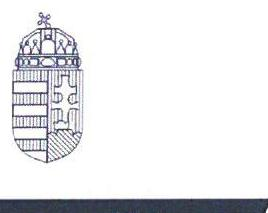
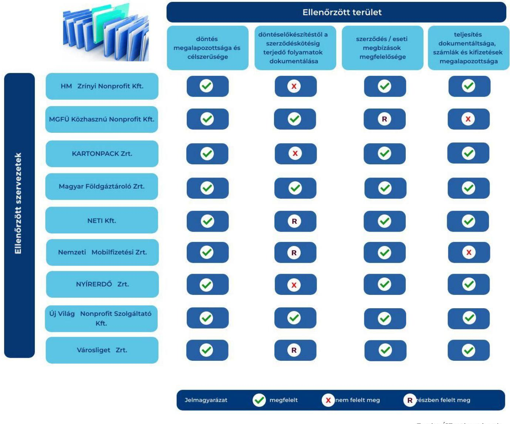
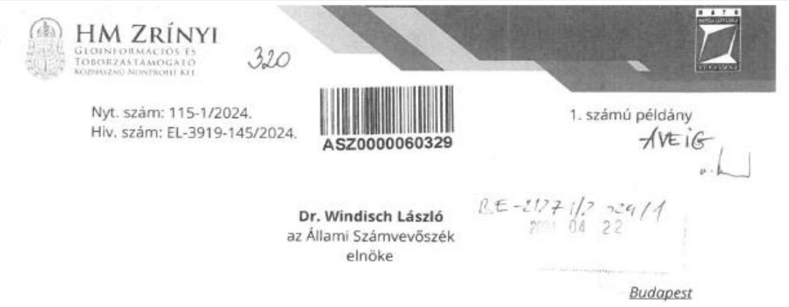
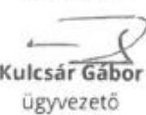
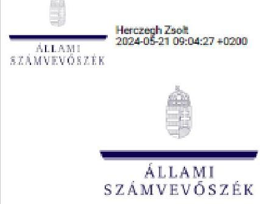
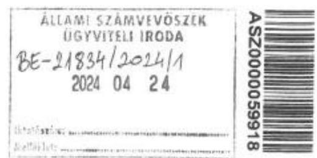
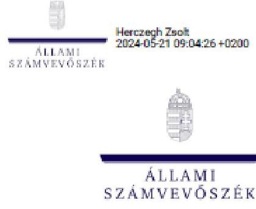
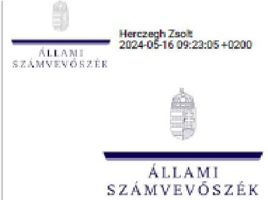
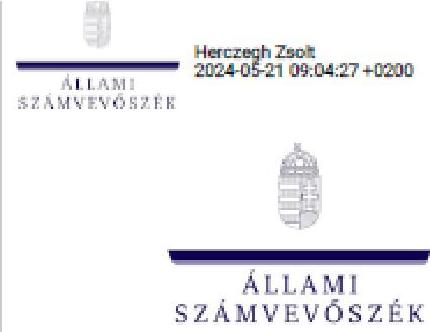

# JELENTÉS 

A többségi állami tulajdonban lévő gazdasági társaságok által kötött tanácsadási szerződések célzott ellenőrzése

2024.

---

ÁLLAMI
SZÁMVEVŐSZÉK

# JELENTÉS 

## A többségi állami tulajdonban lévő gazdasági társaságok által kötött tanácsadási szerződések célzott ellenőrzése

2024.

---

# ELLENŐRZÉSI IGAZGATÓSÁG: 

## ÁLLAMI VAGYONGAZDÁLKODÁST ELLENŐRZŐ IGAZGATÓSÁG

## ELLENŐRZÉSI IGAZGATÓ:

HERCZEGH ZSOLT ellenőrzési igazgató

## ELLENŐRZÉSVEZETŐ:

Jelentéseink az interneten a www.asz.hu címen olvashatók.

VEREBESNÉ SZABÓ ERZSÉBET ellenőrzésvezető

IKTATÓSZÁM: EL-3918-003/2024
TÉMASZÁM: 2701
ELLENŐRZÉS-AZONOSÍTÓ SZÁM: V1045

---

# TARTALOMJEGYZÉK 

AZ ELLENŐRZÉS ALAPADATAI ..... 5
AZ ELLENŐRZÖTT SZERVEZETEK ..... 7
ÖSSZEFOGLALÁS ..... 12
AZ ELLENŐRZÉS FÓKUSZKÉRDÉSE ..... 15
MEGÁLLAPÍTÁSOK ..... 16
JAVASLATOK ..... 27
MELLÉKLETEK ..... 29
I. sz. melléklet: Értelmező szótár ..... 29
II. sz. melléklet: Az ellenőrzött szervezetek jegyzéke ..... 31
III. sz. melléklet: Ellenőrzési kritériumok ..... 32
FÜGGELÉK: ÉSZREVÉTELEK ..... 33
RÖVIDÍTÉSEK JEGYZÉKE ..... 61

---

.

---

# AZ ELLENŐRZÉS ALAPADATAI 

## AZ ELLENŐRZÉS CÉLJA

Az ellenőrzés célja annak értékelése volt, hogy a gazdasági társaságok által szakértői és tanácsadási jellegű szolgáltatások igénybevételére vonatkozóan megkötött szerződések (a továbbiakban: tanácsadási szerződés) tekintetében érvényesült-e az állami vagyonnal való felelős és költségtakarékos gazdálkodás elve.

## AZ ELLENŐRZÉS TÍPUSA

Megfelelőségi ellenőrzés

## AZ ELLENŐRZÖTT IDŐSZAK

2022. január 1-2022. december 31.

## AZ ELLENŐRZÉS TÁRGYA

Az ellenőrzés tárgya a többségi állami tulajdonban lévő gazdasági társaságok által kötött, az ellenőrzött időszakban hatályban lévő tanácsadási szerződések szabályszerűségének, az azok megkötésére irányuló döntés megalapozottságának és célszerűségének, valamint a szerződések teljesítésének és a kapcsolódó kifizetéseknek az ellenőrzése volt. A döntés megalapozottságának ellenőrzése kiterjedt a szerződés előkészítésének és a szerződés megkötésének ellenőrzésére is.

Az ellenőrzés kiterjedt minden olyan körülményre és adatra, amely az ÁSZ ${ }^{1}$ jogszabályban meghatározott feladatainak teljesítéséhez, valamint a program végrehajtása folyamán felmerült újabb összefüggések feltárásához szükséges volt.

## AZ ELLENŐRZÉS JOGALAPJA

Az ellenőrzés jogszabályi alapját az ÁSZ tv. ${ }^{2}$ 1. § (3) bekezdésének és 5. § (4) bekezdésének előírásai képezték.

## AZ ELLENŐRZÉS MÓDSZERE

Az ellenőrzés végrehajtása a nemzetközi standardokat irányadónak tekintve az ellenőrzési program szempontjai, az ellenőrzött időszakban hatályos jogszabályok, az ellenőrzés szakmai szabályok és módszertanok figyelembevételével történt.

---

Az ellenőrzési kérdések megválaszolásához szükséges bizonyítékok megszerzése az ellenőrzött szervezetek által rendelkezésre bocsátott dokumentumokra és adatokra alapozva, továbbá szemrevételezés, kérdésfeltevés (információkérés), elemző eljárás és mintavétel útján történt.

Az ellenőrzés lefolytatásához az ellenőrzött szervezetek tanúsítvány kitöltésével, valamint az ÁSZ által kért dokumentumok, adatok, információk megküldésével szolgáltattak adatokat.

Az ellenőrzési bizonyítékként felhasználható adatforrások közé tartoztak az ellenőrzési program részletes szempontjainál felsorolt adatforrások, valamint minden egyéb - az ellenőrzés folyamán feltárt, az ellenőrzés szempontjából információt tartalmazó - dokumentum.

Az ÁSZ az állami vagyonnal való felelős és költségtakarékos gazdálkodás elvének a tanácsadási szerződések tekintetében történő érvényesülését az ellenőrzött gazdasági társaságok által kitöltött tanúsítvány adataiból kiválasztott mintatétel alapján ellenőrizte.

Az ellenőrzést az ÁSZ szabályszerűségi és célszerűségi szempontok alapján folytatta le. A tények feltárása és azok összegzése során a megállapítások az ellenőrzött mintatételre vonatkozóan kerültek megfogalmazásra.

Az ellenőrzés kitért minden olyan körülményre, amely a program végrehajtása kapcsán felmerült és az ellenőrzés céljaival összhangban volt.

---

# AZ ELLENŐRZÖTT SZERVEZETEK 

Az ÁSZ kilenc többségi állami tulajdonban álló gazdasági társaságnál ellenőrizte a kiválasztott mintatételeken keresztül a szakértői és tanácsadási jellegű szolgáltatások igénybevételére vonatkozóan hozott döntések megalapozottságát, célszerűségét, a megkötött tanácsadási szerződések szabályszerűségét, a teljesítéseket és a kifizetések szabályszerűségét és megalapozottságát. Az ellenőrzött szervezetek az ellenőrzés alá vont időszakban a Gbkr. ${ }^{3}$ hatálya alá tartoztak. Az ellenőrzött szervezetek jegyzékét a II. sz. melléklet tartalmazza.
A HM ZRÍNYI NONPROFIT KFT. ${ }^{4}$ a Magyar Állam kizárólagos tulajdonában álló gazdasági társaság, melyben az ellenőrzött időszakban a tulajdonosi jogokat 2022. május 26-ig az 1/2018. (VI. 25.) NVTNM rendelet ${ }^{5}$ alapján, ezt követően az 1/2022. (V. 26.) GFM rendelet ${ }^{6}$ alapján a Honvédelmi Minisztérium gyakorolta. Cégjegyzékbe bejegyzett fő tevékenysége könyvkiadás volt. Fő feladatait képezte emellett az állami térképészeti alapadatok előállítása, szolgáltatása, a védelmi célú térképellátás biztosítása, a Honvédelmi Minisztérium és a Magyar Honvédség kommunikációs feladatainak ellátása, működésükhöz szükséges grafikai tervek, nyomtatványok, nyomdaipari termékek előállítása, projektek támogatása, valamint a feladatokhoz kapcsolódó készenléti kapacitás biztosítása. A 2022. évi számviteli beszámoló szerint az értékesítés nettó árbevétele 176397 E Ft, az egyéb bevételek összege 3475830 E Ft, az igénybe vett szolgáltatások értéke 787698 E Ft, az adózás előtti eredmény 33251 E Ft volt. A társaság 2022-ben 243 fős átlagos állományi létszámmal működött. A HM Zrínyi Nonprofit Kft. a tanúsítvány adatai alapján 2022. évben 28 darab hatályban lévő tanácsadási szerződéssel rendelkezett.

## ELLENŐRZÖTT SZERZŐDÉS ADATAI

Szerződéskötést megelőző eljárás típusa: 3 szereplős meghívásos versenyeztetés
Szerződés típusa: Megbízási keretszerződés
Szerződés tárgya: Jogi tanácsadói és szakértői tevékenység ellátása
2020. november 2-től határozatlan időtartamra kötötték a
felek, majd a szerződés 2022. december 8-án történt
módosításában a 429/2022. (X. 28.) Korm. rendelet ${ }^{7}$ 2. §
(1) bekezdésében foglaltak alapján rendelkeztek annak
2022. december 31-én történő automatikus
megszünéséről
AZ MGFÜ KÖZHASZNÚ NONPROFIT KFT. ${ }^{8}$ a Magyar Állam kizárólagos tulajdonában álló gazdasági társaság, melyben az ellenőrzött időszakban a tulajdonosi jogokat 2022. május 26-ig az 1/2018. (VI. 25.) NVTNM rendelet alapján az Innovációs és Technológiai Minisztérium, ezt követően az 1/2022. (V. 26.) GFM rendelet alapján 2022. november 21-ig a Kulturális és Innovációs Minisztérium, majd a Gazdaságfejlesztési Miniszter gyakorolta. Cégjegyzékbe bejegyzett fő tevékenysége üzletviteli, egyéb vezetési tanácsadás volt. Feladatait képezte többek között az ipar műszaki-gazdasági fejlesztésének támogatása, fejlesztési tevékenységek végzése, szervezése, a kutatás-fejlesztési és innovációs tevékenység fokozása, támogatása, a kis- és középvállalkozások szerepének erősítése, a releváns nemzeti stratégiákhoz kapcsolódó feladatok végrehajtása, pályázatok kiírása, kutatás támogatása, az alapító szakmai kezelésébe tartozó előirányzatokból finanszírozott pályázatok kezeléséhez kapcsolódó és háttérintézményi feladatok ellátása. A 2022. évi számviteli beszámoló szerint az értékesítés nettó árbevétele 4894 E Ft, az egyéb bevételek összege 25860375 E Ft, az igénybe vett szolgáltatások értéke 707509 E Ft, az adózás előtti eredmény 3034 E Ft volt. A társaság 2022-ben 147 fős

---

átlagos állományi létszámmal működött. Az MGFÜ Közhasznú Nonprofit Kft. a tanúsítvány adatai alapján 2022. évben 22 darab hatályban lévő tanácsadási szerződéssel rendelkezett.

# ELLENŐRZÖTT SZERZŐDÉS ADATAI 

Szerződéskötést megelőző eljárás típusa:
Szerződés típusa:
Szerződés tárgya:

Szerződés hatálya:

3 szereplős meghívásos versenyeztetés
Megbízási keretszerződés
Vállalkozáskutatási és Elemző Hálózat működtetése és a vállalkozások megerősítését támogató javaslatok konzultációkra épülő kidolgozása
2020. december 14-től 2022. augusztus 31-ig vagy amennyiben az előbb következik be - a szerződés szerinti keretösszeg kimerüléséig terjedő időszakra kötötték a felek

A KARTONPACK ZRT. ${ }^{9}$ a Magyar Állam kizárólagos tulajdonában álló gazdasági társaság, melyben az ellenőrzött időszakban a tulajdonosi jogokat a Vtv. ${ }^{10}$ 3. § (1) bekezdése alapján az MNV Zrt. ${ }^{11}$ gyakorolta. Cégjegyzékbe bejegyzett fő tevékenysége papír csomagolóeszköz gyártása volt. Ennek keretében nyomtatott kartondoboz, hullám- és mikrohullámlemez dobozok, kasírozott dobozok gyártását végezte elsődlegesen a gyógyszeripar részére. A 2022. évi IFRS ${ }^{12}$ szerinti pénzügyi kimutatása alapján az értékesítés nettó árbevétele 3428227 E Ft, az igénybe vett szolgáltatások értéke 417991 E Ft, az adózás előtti eredmény 56857 E Ft volt. A társaság 2022-ben 93 fős átlagos állományi létszámmal működött. A KARTONPACK Zrt. a tanúsítvány adatai alapján 2022. évben 19 darab hatályban lévő tanácsadási szerződéssel rendelkezett.

## ELLENŐRZÖTT SZERZŐDÉS ADATAI

Szerződéskötést megelőző eljárás típusa:
Szerződés típusa:
Szerződés tárgya:

Szerződés hatálya:

Versenyeztetés mellőzése
Megbízási szerződés
Üzemi, termelési és üzleti tanácsadás
2021. október 15-ei hatályba lépéssel határozatlan időtartamra kötötték a felek, annak rögzítésével, hogy a megbízott 2021. július 1. napjától látja el tanácsadói feladatait

A MAGYAR FÖLDGÁZTÁROLÓ ZRT. ${ }^{13}$ egyedüli tulajdonosa az ellenőrzött időszakban a Magyar Állam kizárólagos tulajdonában álló MVM Zrt. ${ }^{14}$ volt. Cégjegyzékbe bejegyzett fő tevékenysége raktározás, tárolás volt. Alapfeladatát képezte Magyarország téli gázellátásának hosszú távú biztosítása, a tranzit és belföldi igények várható változása alapján a megfelelő tároló kapacitások kiépítése és működtetése, a meglévő tárolói kapacitások hatékony kihasználása. A 2022. évi számviteli beszámoló szerint az értékesítés nettó árbevétele 53395 M Ft, az egyéb bevételek összege 1173 M Ft, az igénybe vett szolgáltatások értéke 4806 M Ft, az adózás előtti eredmény 18020 M Ft volt. A társaság 2022-ben 201 fős átlagos állományi létszámmal működött. A Magyar Földgáztároló Zrt. a tanúsítvány adatai alapján 2022. évben 24 darab hatályban lévő tanácsadási szerződéssel rendelkezett.

---

# ELLENŐRZÖTT SZERZŐDÉS ADATAI 

Szerződéskötést megelőző eljárás típusa:
Szerződés típusa:
Szerződés tárgya:

Szerződés hatálya:

3 szereplős meghívásos versenyeztetés
Megbízási keretszerződés
Tanácsadói tevékenység nyújtása
2020. december 21-től 24 havi határozott időtartamra kötötték a felek, majd a szerződés 2022. december 12-én történt módosításában a határozott időtartam végét 2024. január 31. napjában jelölték meg

A NETI KFT. ${ }^{15}$ a Magyar Állam kizárólagos tulajdonában álló gazdasági társaság, melyben az ellenőrzött időszakban a tulajdonosi jogokat 2022. május 26-ig az 1/2018. (VI. 25.) NVTNM rendelet alapján a Belügyminisztérium, ezt követően az 1/2022. (V. 26.) GFM rendelet alapján a Nemzetbiztonsági Szakszolgálat gyakorolta. Cégjegyzékbe bejegyzett fő tevékenysége információ-technológiai szaktanácsadás volt. A társaság foglalkozott szoftverfejlesztéssel, információtechnológiai tanácsadói tevékenységgel, rendszerintegrációval, üzemeltetési, rendszertámogatási tevékenységgel, hálózatbiztonsági, illetve információtechnológiai biztonsági tanácsadással. A 2022. évi számviteli beszámoló szerint az értékesítés nettó árbevétele 3278196 E Ft, az egyéb bevételek összege 129276 E Ft, az igénybe vett szolgáltatások értéke 159064 E Ft, az adózás előtti eredmény 87560 E Ft volt. A társaság 2022-ben 65 fős átlagos állományi létszámmal működött. A NETI Kft. a tanúsítvány adatai alapján 2022. évben 19 darab hatályban lévő tanácsadási szerződéssel rendelkezett.

## ELLENŐRZÖTT SZERZŐDÉS ADATAI

Szerződéskötést megelőző eljárás típusa:
Szerződés típusa:
Szerződés tárgya:

Szerződés hatálya:

3 szereplős meghívásos versenyeztetés
Megbízási szerződés
Hálózati architect tanácsadás
2022. január 17. napjától határozott időtartamra, a szerződésben rögzített feladatok elvégzéséig, de legfeljebb 2022. december 31-ig tartó hatállyal kötötték a felek

A NEMZETI MOBILFIZETÉSI ZRT. ${ }^{16}$ tulajdonosa 2022. április 22-ig a Magyar Állam kizárólagos tulajdonában álló Nemzeti Útdíjfizetési Szolgáltató Zrt. ${ }^{17}$ volt. 2022. április 22-től a Magyar Állam kizárólagos tulajdonába került, a tulajdonosi jogokat az ellenőrzött időszakban 2022. május 26-ig az 1/2018. (VI. 25.) NVTNM rendelet alapján a Nemzeti vagyon kezeléséért felelős tárca nélküli miniszter, ezt követően az 1/2022. (V. 26.) GFM rendelet alapján a Miniszterelnöki Kabinetiroda gyakorolta. Cégjegyzékbe bejegyzett fő tevékenysége máshová nem sorolt egyéb szakmai, tudományos, műszaki tevékenység volt. A társaság az általa üzemeltetett Nemzeti Mobilfizetési Rendszer útján biztosította saját ügyfelei és viszonteladó partnerei részére a mobilfizetési termékek megvásárlásának lehetőségét. A szolgáltató partnerek részére biztosította a Nemzeti Mobilfizetési Rendszerben megvásárolt termékek és szolgáltatások teljeskörű ellenőrzési lehetőségét, elvégezte továbbá a partnerek közötti pénzügyi elszámolást. A 2022. évi számviteli beszámoló szerint az értékesítés nettó árbevétele 52096893 E Ft, az egyéb bevételek összege 89738 E Ft, az igénybe vett szolgáltatások értéke 990516 E Ft, az adózás előtti eredmény 1705465 E Ft volt. A társaság 2022-ben 52 fős átlagos állományi létszámmal működött. A Nemzeti Mobilfizetési Zrt. a tanúsítvány adatai alapján 2022. évben 18 darab
 hatályban lévő tanácsadási szerződéssel rendelkezett.

---

# ELLENÖRZÖTT SZERZŐDÉS ADATAI 

Szerződéskötést megelőző eljárás típusa
Szerződés típusa
Szerződés tárgya
Szerződés hatálya

Versenyeztetés mellőzése
Megbízási szerződés
Szakmai tanácsadói feladatok
2022. január 1-jétől 2022. december 31-ig tartó határozott időtartamra kötötték a felek

A NYÍRERDŐ ZRT. ${ }^{18}$ a Magyar Állam kizárólagos tulajdonában álló gazdasági társaság, melyben az ellenőrzött időszakban a tulajdonosi jogokat az Erdőtv. ${ }^{19}$ 9/A. §-a alapján az Agrárminisztérium gyakorolta. Cégjegyzékbe bejegyzett főtevékenysége erdészeti, egyéb erdőgazdálkodási tevékenység volt. A NYÍRERDŐ Zrt. Magyarország észak-keleti részén, mintegy 61 ezer hektár állami tulajdonú erdőterületet kezelt. A vagyonkezelésben lévő terület Szabolcs-Szatmár-Bereg és Hajdú-Bihar vármegyékben több mint 1200000 hektáron szétszórva helyezkedett el. A működési területet képező erdőterület a két vármegye erdeinek mintegy egyharmadát tette ki. Legfontosabb tevékenysége a hagyományos erdőgazdálkodás: az erdőtelepítés és erdőfelújítás, az erdészeti szaporítóanyag termelés és értékesítés, a fafeldolgozás, valamint az ebből származó termékek értékesítése volt. A 2022. évi számviteli beszámoló szerint az értékesítés nettó árbevétele 8934109 E Ft, az egyéb bevételek összege 726029 E Ft, az igénybe vett szolgáltatások értéke 3834637 E Ft, az adózás előtti eredmény 993367 E Ft volt. A társaság 2022-ben 474 – közfoglalkoztatottak nélkül 224 – fős átlagos állományi létszámmal működött. A NYÍRERDŐ Zrt. a tanúsítvány adatai alapján 2022. évben 27 darab hatályban lévő tanácsadási szerződéssel rendelkezett.

## ELLENÖRZÖTT SZERZŐDÉS ADATAI

Szerződéskötést megelőző eljárás típusa
Szerződés típusa
Szerződés tárgya
Szerződés hatálya

Versenyeztetés mellőzése
Megbízási szerződés
Üzletviteli tanácsadás és jogi szolgáltatás
2022. január 1-jétől 2022. december 31-ig tartó határozott időtartamra kötötték a felek

AZ Új VILÁG NONPROFIT SZOLGÁLTATÓ KFT. ${ }^{20}$ a Magyar Állam kizárólagos tulajdonában álló gazdasági társaság, melyben az ellenőrzött időszakban a tulajdonosi jogokat 2022. május 26-ig az 1/2018. (VI. 25.) NVTNM rendelet alapján a Miniszterelnökség, ezt követően az 1/2022. (V. 26.) GFM rendelet alapján a Területfejlesztési miniszter gyakorolta. Cégjegyzékbe bejegyzett fő tevékenysége információ-technológiai szaktanácsadás volt. A társaság egyedi informatikai rendszereket tervezett, amelyek támogatják a fejlesztéspolitikát és a közbeszerzési eljárásokat. Rendszereik több ezer milliárd forint felhasználását biztosítják, így a hazai információtechnológiai szektorban kiemelt helyet foglalnak el. A 13/2021. (XI. 29.) MvM. rendelet ${ }^{21}$ alapján az Új Világ Nonprofit Szolgáltató Kft. feladata az Elektronikus Közbeszerzési Rendszer üzemeltetése és fenntartása. A 2022. évi számviteli beszámoló szerint az értékesítés nettó árbevétele 418564 E Ft, az egyéb bevételek összege 4512123 E Ft, az igénybe vett szolgáltatások értéke 1417044 E Ft, az adózás előtti eredmény 9939 E Ft volt. A társaság 2022-ben 204 fős átlagos állományi létszámmal működött. Az Új Világ Nonprofit Szolgáltató Kft. a tanúsítvány adatai alapján 2022. évben 32 darab hatályban lévő tanácsadási szerződéssel rendelkezett.

---

# ELLENÖRZÖTT SZERZŐDÉS ADATAI 

Szerződéskötést megelőző eljárás típusa
Szerződés típusa
Szerződés tárgya

Szerződés hatálya

Versenyeztetés mellőzése
Megbízási szerződés
Európai Uniós források felhasználásával kapcsolatos stratégiai dokumentumok előkészítésére, valamint azok végrehajtására vonatkozó szakmai tanácsadási feladatok ellátása
2022. április 1-jétől 2023. március 31-ig tartó határozott időtartamra kötötték a felek

A VÁROSLIGET ZRT. ${ }^{22}$ a Magyar Állam kizárólagos tulajdonában álló gazdasági társaság, melyben az ellenőrzött időszakban a tulajdonosi jogokat 2022. május 26-ig a 2013. évi CCXLII. törvény ${ }^{23}$ alapján a Nemzeti vagyon kezeléséért felelős tárca nélküli miniszter, ezt követően a 187/2022. (V. 26.) Korm. rendeletre ${ }^{24}$ is figyelemmel a Kultúráért felelős miniszter gyakorolta. Cégjegyzékbe bejegyzett fő tevékenysége épületépítési projekt szervezése volt. Feladatát képezte a Városliget megújításához és fejlesztéséhez kapcsolódóan a vagyonkezelésében lévő ingatlanokon értékmegőrző, valamint értéknövelő fejlesztések és beruházások megvalósítása. A 2022. évi számviteli beszámoló szerint az értékesítés nettó árbevétele 1724 M Ft, az egyéb bevételek összege 18741 M Ft, az igénybe vett szolgáltatások értéke 5787 M Ft, az adózás előtti eredmény 27 M Ft volt. A társaság 2022-ben 209 fős átlagos állományi létszámmal működött. A Városliget Zrt. a tanúsítvány adatai alapján 2022. évben 24 darab hatályban lévő tanácsadási szerződéssel rendelkezett.

## ELLENÖRZÖTT SZERZŐDÉS ADATAI

Szerződéskötést megelőző eljárás típusa
Szerződés típusa
Szerződés tárgya

Szerződés hatálya

Versenyeztetés mellőzése
Megbízási szerződés
beszerzési szaktanácsadás és minőségbiztosítási feladatok ellátása
2022. január 1-jétől 2022. december 31-ig tartó határozott időtartamra kötötték a felek

---

# ÖSSZEFOGLALÁS 

A Magyar Állam gazdasági társaságokban lévő részesedései a nemzeti vagyon, ezen belül az állami vagyon részét képezik. E részesedések értékére, ezáltal az állami vagyon értékének megőrzésére, növelésére alapvető befolyást gyakorol az állami tulajdonban álló gazdasági társaságok gazdálkodási tevékenysége. A különféle szakértői és tanácsadási jellegű szolgáltatások igénybevétele jelentős kiadási tételt jelenthet a gazdasági társaságoknál. A külső tanácsadó által nyújtott szolgáltatásokhoz kapcsolódóan vagyonvesztési kockázat merülhet fel, ha nem megfelelő a szolgáltatás értékének és elvárt minőségének meghatározása, a szállítók kiválasztása, a beszerzés lebonyolítása, a szerződéses feltételek kialakítása, a teljesítések megvalósulása és dokumentálása, a kifizetések nem szabályszerűek és megalapozottak, illetve a döntéshozatal során nem érvényesül a célszerűség.

Az Alaptörvény ${ }^{25}$ rögzíti, hogy „az állam és a helyi önkormányzatok tulajdonában álló gazdálkodó szervezetek törvényben meghatározott módon, önállóan és felelősen gazdálkodnak a törvényesség, a célszerűség és az eredményesség követelményei szerint". Az Nvtv. ${ }^{26}$ alapelvi szinten meghatározza a nemzeti vagyon alapvető rendeltetését, valamint kimondja, hogy „a nemzeti vagyonnal felelős módon, rendeltetésszerűen kell gazdálkodni", illetve további speciális, a
nemzeti vagyonnal történő gazdálkodást szabályozó alapelveket rögzít. A Vtv. preambuluma is megjeleníti az állami vagyonnal való gazdálkodás követelményeként a hatékonyság, eredményesség és költségtakarékosság szempontjait. Ezen alapelvek érvényesülésének meg kell jelennie valamennyi – akár közvetlen, akár közvetett állami vagyonnal gazdálkodó gazdasági társaság működésében és döntéshozatalában.

Az ellenőrzés a jogszabályokban foglalt felelős gazdálkodás kritériumának vizsgálata keretében értékelte, hogy a gazdasági társaságok a szakértői és tanácsadási jellegű szolgáltatások igénybevétele során szabályszerűen jártak-e el, a szerződések megkötésére irányuló döntéseiket megalapozottan hozták-e meg, és a döntéshozatal során érvényesültek-e a célszerűség szempontjai.

Az átlátható működés és az ellenőrizhetőség szempontjából kiemelt jelentősége van annak, hogy az állami tulajdonú gazdasági társaságok dokumentálják azokat az adatokat, információkat, számításokat, elemzéseket, melyek alátámasztják a döntés szabályszerűségét, célszerűségét, várható eredményességét, végső soron a felelős gazdálkodás elveinek érvényesülését.

Az ellenőrzés megállapította, hogy az ellenőrzött szervezetek a kiválasztott mintatételek esetében a döntéselőkészítés folyamatára, a döntés lényeges tényezőinek dokumentálására a belső szabályozóikban foglalt előírások ellenére jellemzően nem helyeztek kellő hangsúlyt. A döntéselőkészítés folyamatában több ellenőrzött – a HM Zrínyi Nonprofit Kft., a KARTONPACK Zrt., a Nemzeti Mobilfizetési Zrt., a NYÍRERDŐ Zrt. és a Városliget Zrt. – nem tartotta be a saját beszerzési szabályzatában foglalt előírásokat. A NETI Kft. a szolgáltatások beszerzésére vonatkozó megfelelő belső szabályozást nem alakította ki. A tanácsadási szolgáltatás igénybevételének szükségességét, az erre irányuló döntés célszerűségét utólagosan is ellenőrizhető módon az MGFÜ Közhasznú Nonprofit Kft., a Magyar Földgáztároló Zrt. és az Új Világ Nonprofit Szolgáltató Kft. írásban teljeskörűen megalapozta.

---

A megfelelően előkészített, dokumentált, szabályozott döntéshozatal hozzájárul a beszerzési folyamatok átláthatóságának és a tulajdonosi érdekek védelmének megerősítéséhez, valamint a gazdasági társaság kockázatainak csökkentéséhez, ideértve az integritás kockázatokat is.

Az ellenőrzés megállapította, hogy a kiválasztott tanácsadási szerződések megkötésére, illetőleg az eseti megbízásokra, egy kivétellel szabályszerűen került sor és tartalmi feltételeik kialakításakor érvényesült az Nvtv. szerinti felelős gazdálkodás elve. Az MGFÜ Közhasznú Nonprofit Kft. a megkötött keretszerződésen alapuló eseti megbízásokban nem határozta meg pontosan a megbízott tanácsadó által ellátandó konkrét feladatokat, és az eseti megbízások kiadására utólagosan, a teljesítés igazolására szolgáló dokumentumok keletkezését követően került sor.

A szerződéses díj ellenében nyújtandó szolgáltatások körének kellően részletes és egyértelmű meghatározása, a díjfizetés feltételeinek átgondolt, a teljesítéssel való összhangot biztosító kialakítása és mindezek írásban történő rögzítése lényeges feltétele az állami tulajdonban álló gazdasági társaság érdekei érvényesülésének.

Az ellenőrzés hiányosságokat tárt fel a teljesítések dokumentálása területén. Az MGFÜ Közhasznú Nonprofit Kft. és a Nemzeti Mobilfizetési Zrt. esetében a megbízott külső tanácsadó által végzett tevékenység a dokumentáció hiánya, hiányossága vagy ellentmondásos volta miatt a szerződéses rendelkezések, és a jogszabályi előírások ellenére utólagosan nem volt igazolható.

Az állami tulajdonban álló gazdasági társaságoktól az Nvtv. szerinti felelős gazdálkodás elve megköveteli, hogy kizárólag dokumentált, utólagos ellenőrzés során is egyértelműen megállapítható teljesítések alapján kerüljön sor kifizetésekre.

---

A vizsgált tanácsadási és szakértői jellegű szolgáltatások esetében az ellenőrzött szervezetek által hozott beszerzési döntés megalapozottságának, célszerűségének és dokumentálásának, a megkötött szerződésnek, illetőleg az azon alapuló eseti megbízásnak, valamint a teljesítés dokumentáltságának, a számlák és kifizetések megalapozottságának megfelelőségét az alábbi ábra szemlélteti:

# 1. ábra 

## A BESZERZÉSI DÖNTÉSEK, A MEGKÖTÖTT SZERZŐDÉSEK ÉS A TELJESÍTÉSEK, SZÁMLÁZÁSOK, KIFIZETÉSEK MEGFELELŐSÉGE

A HM Zrínyi Nonprofit Kft. ügyvezetője az ÁSZ tv. 29. § (2) bekezdés szerinti, a jelentéstervezet megállapításaira tett észrevételében arról tájékoztatta az ÁSZ-t, hogy intézkedéseket kezdett az ÁSZ ellenőrzés során felmerült szabálytalanságok ismételt előfordulásának megelőzése érdekében. A Városliget Zrt. vezérigazgatója a jelentéstervezet megállapításaira észrevételt nem tett, azonban az észrevételezés időszakában tájékoztatást adott a feltárt hiányosságok megszüntetése érdekében megkezdett intézkedésekről. Ezzel a két ellenőrzött szervezetnél az ÁSZ megállapítása az ellenőrzés során hasznosult.

---

# AZ ELLENŐRZÉS FÓKUSZKÉRDÉSE 

1. A gazdasági társaság által megkötött tanácsadási szerződés tekintetében megvalósult-e az állami vagyonnal való felelős és költségtakarékos vagyongazdálkodás elve?

---

# 1. HM ZRÍNYI NONPROFIT KFT. 

Összegző megállapítás

A HM Zrínyi Nonprofit Kft. által megkötött tanácsadási szerződés tekintetében a szolgáltatás igénybevételére irányuló döntés megalapozott és célszerű volt. A döntés előkészítésétől a szerződés megkötéséig terjedő folyamatok dokumentálása során szabálytalanságokat tárt fel az ellenőrzés. A szerződés megfelelt a jogszabályi és a belső irányító eszközökben foglalt előírásoknak, és tartalmi feltételeinek kialakításakor figyelemmel voltak az állami vagyonnal történő költségtakarékos gazdálkodásra. A teljesítés dokumentált, a számlázás és a kifizetések szabályszerűek voltak.

A szakértői/tanácsadási jellegű szolgáltatás igénybevételére irányuló döntés megalapozottsága és célszerűsége
A HM Zrínyi Nonprofit Kft. az ellenőrzésre kiválasztott tanácsadási szolgáltatás beszerzését a Beszerzési Szabályzat ${ }^{27}$ rendelkezéseinek megfelelő versenyeztetési eljárással folytatta le. Az ügyvezető a szolgáltatás igénybevételére irányuló döntést az Nvtv. szerinti felelős gazdálkodás elvének megfelelően, megalapozottan hozta meg, és a döntésnél érvényesültek a célszerűség szempontjai.
A döntéselőkészítéstől a szerződéskötésig terjedő folyamatok során szabálytalanságokat tárt fel az ellenőrzés. A szerződéskötést megelőzően a beszerzési igény jóváhagyásával, a nyertes ajánlattal, az ajánlatok kiértékelésével kapcsolatos dokumentumok és a létrejött szerződés az egyes események időpontjait ellentmondásosan tartalmazták. Az értékelési jegyzőkönyv keltezése és a beszerzési eljárás dokumentációja hiányos volt. Ezáltal a kapcsolódó egyes folyamatlépéseket a Beszerzési Szabályzat VI. fejezetében foglaltak ellenére nem úgy dokumentálták, hogy abból az eljárás előkészítése és lefolytatása a dokumentumok alapján – külön értelmezés nélkül – bármikor rekonstruálható legyen.

## A tanácsadási szerződés megfelelősége

A szerződés megkötése és tartalmi feltételeinek kialakítása megfelelt a Ptk. ${ }^{28}$, az Alapító Okirat ${ }^{29}$, az SZMSZ ${ }^{30}$, a Kötelezettségvállalási szabályzat ${ }^{31}$ és a Szerződéskötési szabályzat ${ }^{32}$ rendelkezéseinek. A szerződéses díj ellenében nyújtandó
 szolgáltatások köre a szerződés tárgyának megfelelő részletességgel került meghatározásra, összhangban az ajánlattételi felhívásban szereplő feladatleírással. A szerződés nem tartalmazott a többségi állami tulajdonban lévő gazdasági társaság érdekeivel ellentétes kikötést, és tartalmi feltételeinek kialakításakor figyelemmel voltak az Nvtv-ben előírt, állami vagyonnal történő költségtakarékos gazdálkodásra.

---

A tanácsadási szerződés szerinti szolgáltatások teljesítésének dokumentáltsága, a befogadott számlák és a kifizetések megalapozottsága
A szerződés szerinti szolgáltatások teljesítése dokumentált volt. A gazdasági eseményeket alátámasztó számviteli bizonylatok alaki és tartalmi szempontból megfeleltek a Számv. tv. ${ }^{33}$ rendelkezéseinek. A számlák befogadása és kifizetése a dokumentált teljesítésekre, valamint a szerződéses rendelkezésekre tekintettel megalapozott volt.

# 2. MGFÜ KÖZHASZNÚ NONPROFIT KFT. 

Összegző megállapítás

Az MGFÜ Közhasznú Nonprofit Kft. által megkötött tanácsadási keretszerződés tekintetében a szolgáltatás igénybevételére irányuló döntés megalapozott, célszerű és megfelelően dokumentált volt. A keretszerződés megfelelt a jogszabályi és a belső irányító eszközökben foglalt előírásoknak, és tartalmi feltételeinek kialakításakor figyelemmel voltak az állami vagyonnal történő költségtakarékos gazdálkodásra. A keretszerződés alapján adott eseti megbízások nem voltak szabályszerűek. A teljesítéshez kapcsolódóan dokumentálási hiányosságokat tárt fel az ellenőrzés. A rendelkezésre álló dokumentáció alapján nem volt igazolt az eseti megbízások szerinti feladatok megbízott általi elvégzése, valamint a számlák befogadásának és a kifizetések teljesítésének megalapozottsága.

A szakértői/tanácsadási jellegű szolgáltatás igénybevételére irányuló döntés megalapozottsága és célszerűsége
Az MGFÜ Közhasznú Nonprofit Kft. az ellenőrzésre kiválasztott tanácsadási szolgáltatás beszerzését a Beszerzési Szabályzat ${ }^{34}$ rendelkezéseinek megfelelő versenyeztetési eljárással folytatta le. A tanácsadási szolgáltatás igénybevételére vonatkozóan rendelkezésre állt a döntést alátámasztó és megalapozó belső dokumentum, amely összhangban volt a Beszerzési Szabályzat ${ }^{34}$ előírásaival. Az ügyvezető a szolgáltatás igénybevételére irányuló döntést az Nvtv. szerinti felelős gazdálkodás elvének megfelelően dokumentumokkal alátámasztva, megalapozottan hozta meg, és a döntésnél érvényesültek a célszerűség szempontjai.

## A tanácsadási szerződés megfelelősége

A keretszerződés aláírására az Alapító Okirat ${ }^{35}$, az SZMSZ ${ }^{36}$ és az Aláírási Szabályzat ${ }^{37}$ rendelkezéseinek megfelelően az ellenőrzött szervezet ügyvezetője által került sor, a szerződés tartalmi feltételeinek kialakítása megfelelt a Ptk. rendelkezéseinek. A szerződés nem tartalmazott a többségi állami tulajdonban lévő gazdasági társaság érdekeivel ellentétes kikötést, és tartalmi feltételeinek kialakításakor figyelemmel voltak az Nvtv-ben előírt, állami vagyonnal történő költségtakarékos gazdálkodásra. Az ellenőrzött időszakban a keretszerződés alapján négy eseti megbízásra került sor. Az eseti megbízások a szerződés 4.1. pontjában foglaltak ellenére nem tartalmazták az ellátandó konkrét feladat részleteit, és három eseti megbízás kiadására utólagosan, a teljesítés igazolására szolgáló dokumentumok keletkezését, illetőleg a

---

feladat megvalósítását követően került sor. Egy eseti megbízás 2022. évi folyamatos és széleskörű feladatellátásra vonatkozott, mellyel az eseti megbízásban megjelölt 13 napos teljesítési határidő nem állt összhangban.

# A tanácsadási szerződés szerinti szolgáltatások teljesítésének dokumentáltsága, a befogadott számlák és a kifizetések megalapozottsága 

Az eseti megbízásokhoz kapcsolódó igénybejelentések és a teljesítésük becsült időráfordításának mértékét tartalmazó, megbízott általi visszajelzések dokumentumai a szerződés 4.1. pontja ellenére nem álltak rendelkezésre. A megbízott által készített teljesítési jelentések és az ellenőrzött szervezet által kiadott teljesítési igazolások szerint a 2022. május 03-án kiadott eseti megbízásokon alapuló teljesítés mind a négy eseti megbízás alapján 2022. május 15-én megtörtént. Az ellenőrzés során a teljesítés igazolására eredménytermékként átadott dokumentumok nem támasztották alá az eseti megbízások szerinti feladatok megbízott általi elvégzését. Ennek oka az volt, hogy három eseti megbízással megrendelt kutatás elvégzése nem az eseti megbízásokban meghatározott időintervallumban, hanem több hónappal korábban történt, és az átadott kutatási jelentéseken feltüntetett készítők személye nem volt azonos a megbízottal. Egy eseti megbízás teljesítésének igazolására átadott dokumentáció nem támasztotta alá az eseti megbízásban rögzített feladatvégzési időintervallumban a megbízott általi teljesítést, továbbá az átadott dokumentumokon annak készítőjeként a megbízott nem került feltüntetésre.
Az ellenőrzés során átadott eseti megbízások, teljesítési jelentések, teljesítési igazolások, eredménytermékek - különösen azok keletkezésének időpontja és a dokumentumokon készítőként feltüntetett személyek adatai - valamint a rendelkezésre bocsátott egyéb dokumentumok alapján nem volt igazolt, hogy a szerződés szerinti feladatok teljesítését a megbízott végezte el. A számlák befogadásának és a kifizetések teljesítésének megalapozottsága a teljesítés nem megfelelő dokumentálására, valamint a keretszerződésre és az eseti megbízásokra tekintettel nem volt igazolt.
A dokumentálási hiányosságok, valamint az ellenőrzés keretében rendelkezésre bocsátott írásbeli dokumentumok közötti ellentmondások miatt sérült a teljesítés átláthatósága, dokumentáltsága, ebből következően nem volt biztosított az Nvtv. 7. § (2) bekezdésében és a Taktv. ${ }^{38}$ 7/J. § (3) bekezdésében előírtak érvényesülésének ellenőrizhetősége.

---

# 3. KARTONPACK ZRT. 

## Összegző megállapítás

A KARTONPACK Zrt. által megkötött tanácsadási szerződés tekintetében a szolgáltatás igénybevételére irányuló döntés megalapozott és célszerű volt. A döntés előkészítése során nem a belső szabályzatban foglaltak szerint jártak el, a döntéselőkészítéstől a szerződéskötésig terjedő folyamatokat és a döntéshozatal során mérlegelt tényezőket nem dokumentálták. A megkötött szerződés megfelelt a jogszabályi és a belső irányító eszközökben foglalt előírásoknak. A teljesítés dokumentált, a számlázás és a kifizetések szabályszerűek voltak.

A szakértői/tanácsadási jellegű szolgáltatás igénybevételére irányuló döntés megalapozottsága és célszerűsége
A KARTONPACK Zrt. az ellenőrzésre kiválasztott tanácsadási szolgáltatás beszerzését versenyeztetés mellőzésével folytatta le. A döntéselőkészítés során az ellenőrzött szervezet megsértette a Beszerzési Szabályzat ${ }^{39}$ II. fejezet 4.8 és 4.3.2 pontjának előírását, mivel nem készített beszerzési adatlapot, melyen a versenyeztetési eljárás mellőzésének szakmai indokát lett volna szükséges rögzíteni, továbbá nem került dokumentálásra a beszerzési vezető versenyeztetés mellőzésére vonatkozó javaslata, valamint a kontrolling és beszerzési igazgató jóváhagyása. A Beszerzési Szabályzat ${ }^{39}$ II. fejezet 4.8 és 4.7 pontját megsértve nem állt rendelkezésre a beszerzés tárgya szerint illetékes szakmai vezetők nyilatkozata a beszerzés szükségességéről, valamint a számviteli igazgató nyilatkozata a beszerzés likviditásra gyakorolt hatásáról és a fedezet rendelkezésre állásáról. Dokumentáció hiányában nem biztosították a döntés átláthatóságát, és az eljárás nem felelt meg a Beszerzési Szabályzat ${ }^{39}$ II. fejezet 3. pontja szerinti - a beszerzések fokozott ellenőrizhetőségére, dokumentáltságára, a 4 szem elvének érvényesítésére, a kötelező véleményezésre vonatkozó - alapelvi rendelkezéseknek. Az ellenőrzés során beszerzett adatok és információk alapján ugyanakkor a szolgáltatás igénybevételére irányuló döntés megalapozott és célszerű volt, azonban a döntés előkészítése során az Nvtv. 7. § (2) bekezdésében és a Taktv. 7/J. § (3) bekezdésében előírtak érvényesülésének dokumentálása nem történt meg. A beszerzési eljárás kiválasztott módja megfelelt a Beszerzési Szabályzat előírásainak.

## A tanácsadási szerződés megfelelősége

A szerződés aláírására az Alapszabály ${ }^{40}$ és az SZMSZ ${ }^{41}$ rendelkezéseinek megfelelően az ellenőrzött szervezet vezérigazgatója által került sor, és tartalmi feltételeinek kialakítása megfelelt a Ptk. rendelkezéseinek. A szerződéses dí ellenében nyújtandó szolgáltatások köre a szerződés tárgyának megfelelő részletességgel került meghatározásra. A szerződés nem tartalmazott a többségi állami tulajdonban lévő gazdasági társaság érdekeivel ellentétes kikötést, és tartalmi feltételeinek kialakításakor figyelemmel voltak az Nvtv-ben előírt, állami vagyonnal történő költségtakarékos gazdálkodásra.
A tanácsadási szerződés szerinti szolgáltatások teljesítésének dokumentáltsága, a befogadott számlák és a kifizetések megalapozottsága
A szerződés szerinti szolgáltatások teljesítése dokumentált volt. A gazdasági eseményeket alátámasztó számviteli bizonylatok alaki és tartalmi szempontból megfeleltek a Számv. tv. rendelkezéseinek. A számlák befogadása és kifizetése a dokumentált teljesítésekre, valamint a szerződéses rendelkezésekre tekintettel megalapozott volt.

---

# 4. MAGYAR FÖLDGÁZTÁROLÓ ZRT. 

Összegző megállapítás

A Magyar Földgáztároló Zrt. által megkötött tanácsadási szerződés tekintetében a szolgáltatás igénybevételére irányuló döntés megalapozott, célszerű és megfelelően dokumentált volt. A szerződés megfelelt a jogszabályi és a belső irányító eszközökben foglalt előírásoknak, és tartalmi feltételeinek kialakításakor figyelemmel voltak az állami vagyonnal történő költségtakarékos gazdálkodásra. A teljesítés dokumentált, a számlázás és a kifizetések szabályszerűek voltak.

A szakértői/tanácsadási jellegű szolgáltatás igénybevételére irányuló döntés megalapozottsága és célszerűsége
A Magyar Földgáztároló Zrt. az ellenőrzésre kiválasztott tanácsadási szolgáltatás beszerzését a Beszerzési Szabályzat ${ }^{42}$ rendelkezéseinek megfelelő versenyeztetési eljárással folytatta le. A tanácsadási szolgáltatás igénybevételére vonatkozóan rendelkezésre állt a döntést alátámasztó és megalapozó belső dokumentáció, amely összhangban volt a kapcsolódó Beszerzési Szabályzat, a Szerződéskötési Szabályzat ${ }^{43}$ és a Döntési Jogosultság Szabályzat ${ }^{44}$ előírásaival. A szolgáltatás igénybevételére irányuló döntést az Alapszabály ${ }^{45}$ és a Döntési Jogosultság Szabályzat rendelkezései alapján a felügyelőbizottság az Nvtv. szerinti felelős gazdálkodás elvének megfelelően, dokumentumokkal alátámasztva, megalapozottan hozta meg, és a döntésnél érvényesültek a célszerűség szempontjai.

## A tanácsadási szerződés megfelelősége

A szerződés megkötése és tartalmi feltételeinek kialakítása megfelelt a Ptk., a Szerződéskötési Szabályzat és az Aláírási Jogosultság Szabályzat ${ }^{46}$ rendelkezéseinek. A szerződéses díj ellenében nyújtandó szolgáltatások köre a szerződés tárgyának megfelelő részletességgel került meghatározásra, összhangban az ajánlattételi felhívásban szereplő feladatleírással. A szerződés nem tartalmazott a többségi állami tulajdonban lévő gazdasági társaság érdekeivel ellentétes kikötést, és tartalmi feltételeinek kialakításakor figyelemmel voltak az Nvtv-ben előírt, az állami vagyonnal történő költségtakarékos gazdálkodásra.
A tanácsadási szerződés szerinti szolgáltatások teljesítésének dokumentáltsága, a befogadott számlák és a kifizetések megalapozottsága
A szerződés szerinti szolgáltatások teljesítése dokumentált volt. A gazdasági eseményeket alátámasztó számviteli bizonylatok alaki és tartalmi szempontból megfeleltek a Számv. tv. rendelkezéseinek. A számlák befogadása és kifizetése a dokumentált teljesítésekre, valamint a szerződéses rendelkezésekre tekintettel megalapozott volt.

---

# 5. NETI KFT. 

## Összegző megállapítás

A NETI Kft. a szolgáltatások beszerzésére vonatkozó megfelelő belső szabályozást nem alakította ki. A megkötött tanácsadási szerződés tekintetében a szolgáltatás igénybevételére irányuló döntés megalapozott és célszerű volt. A döntéshozatal során mérlegelt tényezőket a belső szabályzatban foglaltak ellenére csak részben dokumentálták. A szerződés megfelelt a jogszabályi és a belső irányító eszközökben foglalt előírásoknak, és tartalmi feltételeinek kialakításakor figyelemmel voltak az állami vagyonnal történő költségtakarékos gazdálkodásra. A teljesítés dokumentált, a számlázás és a kifizetések szabályszerűek voltak.

A szakértői/tanácsadási jellegű szolgáltatás igénybevételére irányuló döntés megalapozottsága és célszerűsége
A NETI Kft. Beszerzési Szabályzata ${ }^{47}$ nem tartalmazott egyértelmű és részletes rendelkezéseket a szolgáltatások beszerzésének rendjére vonatkozóan, így az ellenőrzésre kiválasztott tanácsadási szolgáltatás beszerzésének folyamata sem volt megfelelően szabályozott. A szolgáltatások beszerzése tekintetében nem valósult meg a Beszerzési szabályzat ${ }^{47}$ 4. pontjában rögzített cél, azaz, hogy a szabályzat meghatározza és szabályozza a beszerzési igények teljesítésének folyamatát az igény keletkezésétől a beszerzési folyamat lezárásáig.
A NETI Kft. a Gbkr. 4. § (3) bekezdésének előírása ellenére a szolgáltatások beszerzése tekintetében nem gondoskodott olyan szabályzat kiadásáról, olyan folyamatok kialakításáról és működtetéséről, amelyek biztosítják a Taktv. 7/J. § (3) bekezdésében meghatározott követelmények teljesülését.
A NETI Kft. az ellenőrzésre kiválasztott tanácsadási szolgáltatás beszerzését versenyeztetésel folytatta le. Az ellenőrzött tanácsadási szerződés írásbeli döntéselőkészítő dokumentációja nem mutatta be a beszerzési igény felmerülésének részletes indokait, az ajánlattételre felhívott üzleti szereplők kiválasztásának szempontjait, módszereit, a rendelkezésre álló minősített beszállítók mellőzésének indokait, a döntés célszerűségi, gazdaságossági szempontjait. Ezzel az ellenőrzött beszerzés tekintetében nem valósult meg a Beszerzési Szabályzat ${ }^{47}$
 }_{5} 6. pontjában rögzített alapelv, mely szerint a beszerzési folyamat során minden szereplőnek törekednie kell arra, hogy az általa közölt információk egyértelműek és a lehető legteljesebbek legyenek. Az ellenőrzés során beszerzett adatok és információk alapján ugyanakkor a szolgáltatás igénybevételére irányuló döntés megalapozott és célszerű volt, azonban a döntés előkészítése során az Nvtv. 7. § (2) bekezdésében és a Taktv. 7/J. § (3) bekezdésében előírtak érvényesülésének dokumentálása nem történt meg.

## A tanácsadási szerződés megfelelősége

A szerződés aláírására az Alapító Okirat ${ }_{5}{ }^{48}$ rendelkezéseinek megfelelően az ellenőrzött szervezet ügyvezetője által került sor, a szerződés tartalmi feltételeinek kialakítása megfelelt a Ptk. rendelkezéseinek. A szerződéses díj ellenében nyújtandó szolgáltatások köre a szerződés tárgyának megfelelő részletességgel került meghatározásra. A szerződés nem tartalmazott a többségi állami tulajdonban lévő gazdasági társaság

---

érdekeivel ellentétes kikötést, és tartalmi feltételeinek kialakításakor figyelemmel voltak az Nvtv-ben előírt, az állami vagyonnal történő költségtakarékos gazdálkodásra.
A tanácsadási szerződés szerinti szolgáltatások teljesítésének dokumentáltsága, a befogadott számlák és a kifizetések megalapozottsága
A szerződés szerinti szolgáltatások teljesítése dokumentált volt. A gazdasági eseményeket alátámasztó számviteli bizonylatok alaki és tartalmi szempontból megfeleltek a Számv. tv. rendelkezéseinek. A számlák befogadása és kifizetése a dokumentált teljesítésekre, valamint a szerződéses rendelkezésekre tekintettel megalapozott volt.

# 6. NEMZETI MOBILFIZETÉSI ZRT. 

Összegző megállapítás

A Nemzeti Mobilfizetési Zrt. által megkötött tanácsadási szerződés tekintetében a szolgáltatás igénybevételére irányuló döntés megalapozott és célszerű volt, azt írásbeli dokumentációval alátámasztották. A döntés előkészítése során az írásbeli árajánlat beszerzése tekintetében nem tartották be a belső szabályzat előírásait. A szerződés megfelelt a jogszabályi és a belső irányító eszközökben foglalt előírásoknak, és tartalmi feltételeinek kialakításakor figyelemmel voltak az állami vagyonnal történő költségtakarékos gazdálkodásra. A teljesítés dokumentálása nem felelt meg a szerződésben előírtaknak, ezáltal nem volt biztosított a teljesítés ellenőrizhetősége. A rendelkezésre álló dokumentáció alapján nem volt igazolt a számlák befogadásának megalapozottsága, és a kifizetések nem voltak szabályszerűek.

A szakértői/tanácsadási jellegű szolgáltatás igénybevételére irányuló döntés megalapozottsága és célszerűsége
A Nemzeti Mobilfizetési Zrt. az ellenőrzésre kiválasztott tanácsadási szolgáltatás beszerzését a Beszerzési Szabályzat ${ }_{6}{ }^{49}$-ban előírt vezérigazgatói engedély birtokában versenyeztetés mellőzésével folytatta le. A tanácsadási szolgáltatás igénybevételére vonatkozóan rendelkezésre állt a Beszerzési Szabályzat ${ }_{6}$ által előírt, a döntést alátámasztó és megalapozó, a célszerűség szempontjait is tartalmazó belső dokumentum. A dokumentum nem tartalmazta a kiválasztott ajánlattevő megnevezését és kiválasztásának konkrét indokát. A Beszerzési Szabályzat ${ }_{6}$ 3.3.1. pont (8) bekezdésének előírását megsértve a döntéshez nem állt rendelkezésre a potenciális szerződő fél írásbeli árajánlata. Ezen dokumentálási hiányosság miatt a döntés meghozatalakor nem volt maradéktalanul biztosított a Beszerzési Szabályzat ${ }_{6}$ 3.1.1. pontjának (2) bekezdésében rögzített átláthatóság alapelvének érvényesülése.

## A tanácsadási szerződés megfelelősége

A szerződés aláírására az Alapszabály ${ }_{6}{ }^{50}$, az SZMSZ ${ }_{6}{ }^{51}$ és a Kötelezettségvállalási Szabályzat ${ }_{6}{ }^{52}$ rendelkezéseinek megfelelően az ellenőrzött szervezet vezérigazgatója által került sor, a szerződés tartalmi feltételeinek kialakítása megfelelt a Ptk. rendelkezéseinek. A szerződéses díj ellenében nyújtandó

---

szolgáltatások köre a szerződés tárgyának megfelelő részletességgel került meghatározásra. A szerződés nem tartalmazott a többségi állami tulajdonban lévő gazdasági társaság érdekeivel ellentétes kikötést, és tartalmi feltételeinek kialakításakor figyelemmel voltak az Nvtv-ben előírt, az állami vagyonnal történő költségtakarékos gazdálkodásra.
A tanácsadási szerződés szerinti szolgáltatások teljesítésének dokumentáltsága, a befogadott számlák és a kifizetések megalapozottsága
A megbízott által benyújtott számlákat írásbeli teljesítésigazolásokkal kísérték, azonban a havi teljesítésigazolásokat - a szerződés II. 6. pontjában előírtak ellenére - az adott hónapban elvégzett és folyamatban lévő feladatokról készített beszámolókkal nem támasztották alá. A gazdasági eseményeket alátámasztó számviteli bizonylatok alaki és tartalmi szempontból megfeleltek a Számv. tv. rendelkezéseinek, azonban a számlák befogadására és a kifizetésekre a szerződés II. 6. és IV. 2. pontjaiban előírt dokumentálási kötelezettség hiányában került sor. A számlázott teljesítések dokumentálási hiányosságai miatt nem volt biztosított az Nvtv. 7. § (2) bekezdésében, valamint a Taktv. 7/J. § (3) bekezdésében előírtak érvényesülésének ellenőrizhetősége.

# 7. NYÍRERDŐ ZRT. 

## Összegző megállapítás

A NYÍRERDŐ Zrt. által megkötött tanácsadási szerződés tekintetében a szolgáltatás igénybevételére irányuló döntés megalapozott és célszerű volt. A döntés előkészítése során nem a belső szabályzatban foglaltak szerint jártak el, a döntéselőkészítéstől a szerződéskötésig terjedő folyamatokat és a döntéshozatal során mérlegelt tényezőket nem dokumentálták. A szerződés megfelelt a jogszabályi és a belső irányító eszközökben foglalt előírásoknak, és tartalmi feltételeinek kialakításakor figyelemmel voltak az állami vagyonnal történő költségtakarékos gazdálkodásra. A teljesítés dokumentált, a számlázás és a kifizetések szabályszerűek voltak.

A szakértői/tanácsadási jellegű szolgáltatás igénybevételére irányuló döntés megalapozottsága és célszerűsége
A NYÍRERDŐ Zrt. az ellenőrzésre kiválasztott tanácsadási szolgáltatás beszerzését versenyeztetés mellőzésével folytatta le. A döntéselőkészítés során az ellenőrzött szervezet megsértette a Beszerzési Szabályzat-${ }^{53}$ beszerzési eljárások dokumentálására és a beszerzések átláthatóságára (etikus beszerzés) vonatkozó alapelvi rendelkezését és 1. pontjának az „Egyetlen ajánlat alapján történő beszerzés”-re vonatkozó fogalmi meghatározásából levezethetően a 4.5. pont rendelkezéseit, melyek írásbeli döntéselőkészítő dokumentációs kötelezettséget írtak elő. Ez alól nem volt mentes a Beszerzési Szabályzat: 2. pontja szerinti „Egyetlen ajánlat alapján történő beszerzési eljárás” sem, melynek során az ajánlati felhívásra és az ajánlatra vonatkozó általános tartalmi és formai követelményeket be kellett tartani. Az ellenőrzés során beszerzett adatok és információk alapján ugyanakkor a szolgáltatás igénybevételére irányuló döntés megalapozott és célszerű volt, azonban a döntés előkészítése során az Nvtv. 7. § (2) bekezdésében és a Taktv. 7/J. § (3) bekezdésében előírtak érvényesülésének dokumentálása nem történt meg.

---

# A tanácsadási szerződés megfelelősége 

A szerződés aláírására az Alapszabály ${ }^{54}$, SZMSZ ${ }^{55}$, Beszerzési Szabályzat és Hatásköri jegyzék ${ }^{56}$ rendelkezéseinek megfelelően az ellenőrzött szervezet vezérigazgatója által került sor, a szerződés tartalmi feltételeinek kialakítása megfelelt a Ptk. rendelkezéseinek. A szerződéses díj ellenében nyújtandó szolgáltatások köre a szerződés tárgyának megfelelő részletességgel került meghatározásra. A szerződés nem tartalmazott a többségi állami tulajdonban lévő gazdasági társaság érdekeivel ellentétes kikötést, és tartalmi feltételeinek kialakításakor figyelemmel voltak az Nvtv-ben előírt, az állami vagyonnal történő költségtakarékos gazdálkodásra.
A tanácsadási szerződés szerinti szolgáltatások teljesítésének dokumentáltsága, a befogadott számlák és a kifizetések megalapozottsága
A szerződés szerinti szolgáltatások teljesítése dokumentált volt. A gazdasági eseményeket alátámasztó számviteli bizonylatok alaki és tartalmi szempontból megfeleltek a Számv. tv. rendelkezéseinek. A számlák befogadása és kifizetése a dokumentált teljesítésekre, valamint a szerződéses rendelkezésekre tekintettel megalapozott volt.

## 8. ÚJ VILÁG NONPROFIT SZOLGÁLTATÓ KFT.

Összegző megállapítás

Az Új Világ Nonprofit Szolgáltató Kft. által megkötött tanácsadási szerződés tekintetében a szolgáltatás igénybevételére irányuló döntés megalapozott, célszerű és megfelelően dokumentált volt. A szerződés megfelelt a jogszabályi és a belső irányító eszközökben foglalt előírásoknak, és tartalmi feltételeinek kialakításakor figyelemmel voltak az állami vagyonnal történő költségtakarékos gazdálkodásra. A teljesítés dokumentált, a számlázás és a kifizetések szabályszerűek voltak.

A szakértői/tanácsadási jellegű szolgáltatás igénybevételére irányuló döntés megalapozottsága és célszerűsége
Az Új Világ Nonprofit Szolgáltató Kft. az ellenőrzésre kiválasztott tanácsadási szolgáltatás beszerzését versenyeztetés mellőzésével folytatta le. A tanácsadási szolgáltatás igénybevételére vonatkozóan rendelkezésre állt a döntést alátámasztó és megalapozó belső dokumentum, amely összhangban volt a Beszerzési Szabályzat előírásaival. A szolgáltatás igénybevételére irányuló döntés meghozatala az Alapító Okirat ${ }^{57}$ rendelkezésének megfelelően a felügyelőbizottság előzetes jóváhagyásával és az alapító hozzájárulásának birtokában történt. A döntést az ügyvezető az Nvtv. szerinti felelős gazdálkodás elvének megfelelően, dokumentumokkal alátámasztva, megalapozottan hozta meg, és a döntésnél érvényesültek a célszerűség szempontjai.

## A tanácsadási szerződés megfelelősége

A szerződés aláírására az Alapító Okirat és az SZMSZ ${ }^{58}$ rendelkezéseinek megfelelően az ellenőrzött szervezet ügyvezetője által került sor, a szerződés tartalmi feltételeinek kialakítása megfelelt a Ptk. rendelkezéseinek. A szerződéses díj ellenében nyújtandó szolgáltatások köre a szerződés tárgyának megfelelő részletességgel került meghatározásra. A szerződés nem tartalmazott a többségi állami

---

tulajdonban lévő gazdasági társaság érdekeivel ellentétes kikötést, és tartalmi feltételeinek kialakításakor figyelemmel voltak az Nvtv-ben előírt, az állami vagyonnal történő költségtakarékos gazdálkodásra.
A tanácsadási szerződés szerinti szolgáltatások teljesítésének dokumentáltsága, a befogadott számlák és a kifizetések megalapozottsága
A szerződés szerinti szolgáltatások teljesítése dokumentált volt. A gazdasági eseményeket alátámasztó számviteli bizonylatok alaki és tartalmi szempontból megfeleltek a Számv. tv. rendelkezéseinek. A számlák befogadása és kifizetése a dokumentált teljesítésekre, valamint a szerződéses rendelkezésekre tekintettel megalapozott volt.

# 9. VÁROSLIGET ZRT. 

Összegző megállapítás

A Városliget Zrt. által megkötött tanácsadási szerződés tekintetében a szolgáltatás igénybevételére irányuló döntés megalapozott és célszerű volt, azt írásbeli dokumentációval alátámasztották. A döntéshozatal során mérlegelt tényezőket csak részben dokumentálták. A szolgáltatás igénybevételére irányuló döntés előkészítésekor a beszerzés szükségességének indokolása tekintetében nem tartották be a belső szabályzat előírásait. A szerződés megfelelt a jogszabályi és a belső irányító eszközökben foglalt előírásoknak, és tartalmi feltételeinek kialakításakor figyelemmel voltak az állami vagyonnal történő költségtakarékos gazdálkodásra. A teljesítés dokumentált, a számlázás és a kifizetések szabályszerűek voltak.

A szakértői/tanácsadási jellegű szolgáltatás igénybevételére irányuló döntés megalapozottsága és célszerűsége
A Városliget Zrt. az ellenőrzésre kiválasztott tanácsadási szolgáltatás beszerzését versenyeztetés mellőzésével folytatta le. A tanácsadási szolgáltatás igénybevételére vonatkozóan rendelkezésre állt a Beszerzési Szabályzat ${ }^{59}$ előírása szerinti döntést megalapozó belső dokumentum, azonban az nem tartalmazta a tanácsadó partner kiválasztásának szempontjait, módszereit, konkrét indokát. A dokumentum nem mutatta be a döntés célszerűségi, gazdaságossági szempontjait, az e körben mérlegelt tényezőket. A beszerzés szükségességének indokolását nem tartalmazta, így a dokumentum alapján az igény megalapozottsága nem volt megállapítható, megsértve a Beszerzési Szabályzat 4.1. pont I. alpontja előírását. Nem került dokumentálásra az sem, hogy a versenyeztetés elmaradása a Beszerzési Szabályzat 3.1. f) pontjában felsoroltak közül melyik előíráson alapult. Az ellenőrzés során beszerzett adatok és információk alapján ugyanakkor a szolgáltatás igénybevételére irányuló döntés megalapozott és célszerű volt, azonban a döntés előkészítése során az Nvtv. 7. § (2) bekezdésében és a Taktv. 7/J. § (3) bekezdésében előírtak érvényesülésének dokumentálása nem történt meg.

---

# A tanácsadási szerződés megfelelősége 

A szerződés aláírására az Alapszabály, ${ }^{60}$ és az SZMSZ, ${ }^{61}$ rendelkezéseinek megfelelően az ellenőrzött szervezet vezérigazgatója által került sor, a szerződés tartalmi feltételeinek kialakítása megfelelt a Ptk. rendelkezéseinek. A szerződéses díj ellenében nyújtandó szolgáltatások köre a szerződés tárgyának megfelelő részletességgel került meghatározásra. A szerződés nem tartalmazott a többségi állami tulajdonban lévő gazdasági társaság érdekeivel ellentétes kikötést, és tartalmi feltételeinek kialakításakor figyelemmel voltak az Nvtv-ben előírt, az állami vagyonnal történő költségtakarékos gazdálkodásra.
A tanácsadási szerződés szerinti szolgáltatások teljesítésének dokumentáltsága, a befogadott számlák és a kifizetések megalapozottsága
A szerződés szerinti szolgáltatások teljesítése dokumentált volt. A gazdasági eseményeket alátámasztó számviteli bizonylatok alaki és tartalmi szempontból megfeleltek a Számv. tv. rendelkezéseinek. A számlák befogadása és kifizetése a dokumentált teljesítésekre, valamint a szerződéses rendelkezésekre tekintettel megalapozott volt.

---

# JAVASLATOK 

Az ÁSZ tv.
 33. § (1) bekezdésében foglaltak értelmében az ellenőrzött szervezet vezetője köteles a jelentésben foglalt megállapításokhoz kapcsolódó intézkedési tervet összeállítani és azt a jelentés kézhezvételétől számított 30 napon belül az ÁSZ részére megküldeni. Amennyiben az ellenőrzött szervezet vezetője nem küldi meg határidőben az intézkedési tervet, vagy továbbra sem elfogadható intézkedési tervet küld, az Állami Számvevőszék elnöke az ÁSZ tv. 33. § (3) bekezdése a) és b) pontjaiban foglaltakat érvényesítheti.

## AZ MGFÜ KÖZHASZNÚ NONPROFIT KFT. ÜGYVEZETŐJE RÉSZÉRE

1. Tegyen intézkedéseket a felügyelőbizottság és/vagy a belső ellenőrzés bevonásával az ellenőrzött tanácsadási szerződés alapján történt teljesítések tényleges megtörténtének felülvizsgálata érdekében. Vizsgálja felül az eseti megbizásokon, a befogadott számlákon és a kibocsátott teljesítésigazolásokon szereplő adatok, információk valóságtartalmát. A felülvizsgálat eredménye alapján tegye meg a szükséges további intézkedéseket.
2. Tegyen intézkedéseket azon kontrolltevékenységek kialakítására és megfelelő működtetésére, amelyek megelőzik az eseti megbizások és a gazdasági eseményekhez kapcsolódó elszámolások során elkövetett, a jelentésben leírt szabálytalanságok ismételt előfordulását, valamint biztosítják a Taktv. 7/J. § (3) bekezdésében és az Nvtv. 7. § (2) bekezdésében előírtak érvényesülését és az utólagos ellenőrizhetőséget.
3. Hívja fel a belső ellenőrzés vezetőjének figyelmét arra, hogy a Gbkr. 19. §-ában foglalt, következő évi kockázatalapú éves ellenőrzési tervének összeállítása során a jelen ellenőrzésben feltárt hibákat vegye tekintetbe.

## A NETI KFT. ÜGYVEZETŐJE RÉSZÉRE

1. Tegyen intézkedéseket Beszerzési Szabályzatának felülvizsgálatára, annak érdekében, hogy a belső szabályozás eleget tegyen a Gbkr. 4. § (3) bekezdésében előírtaknak, és a Beszerzési Szabályzat 4. pontjában foglalt célnak megfelelően egyértelmű és részletes rendelkezéseket tartalmazzon a szolgáltatások beszerzésének rendjére vonatkozóan az igény keletkezésétől a beszerzési folyamat lezárásáig.
2. Tegyen intézkedéseket azon kontrolltevékenységek kialakítására és megfelelő működtetésére, amelyek megelőzik a döntéselőkészítési folyamat dokumentálása során elkövetett, a jelentésben leírt szabálytalanságok ismételt előfordulását, valamint biztosítják a Taktv. 7/J. § (3) bekezdésében és az Nvtv. 7. § (2) bekezdésében előírtak érvényesülését, a megalapozottság, a célszerűség és a várható eredményesség vizsgálatának dokumentálását, ezáltal a döntések átláthatóságát és az utólagos ellenőrizhetőséget.

---

# A NEMZETI MOBILFIZETÉSI ZRT. VEZÉRIGAZGATÓJA RÉSZÉRE 

1. Tegyen intézkedéseket azon kontrolltevékenységek kialakítására és megfelelő működtetésére, amelyek megelőzik a döntéselőkészítési folyamat dokumentálása és a gazdasági eseményekhez kapcsolódó elszámolások során elkövetett, a jelentésben leírt szabálytalanságok ismételt előfordulását, valamint biztosítják a Taktv. 7/J. § (3) bekezdésében és az Nvtv. 7. § (2) bekezdésében előírtak érvényesülését és az utólagos ellenőrizhetőséget.
2. Tegyen intézkedéseket a felügyelőbizottság és/vagy a belső ellenőrzés bevonásával az ellenőrzött tanácsadási szerződés alapján történt teljesítések tényleges megtörténtének és a kibocsátott teljesítésigazolásoknak a felülvizsgálata érdekében. A felülvizsgálat eredménye alapján tegye meg a szükséges további intézkedéseket.
3. Hívja fel a belső ellenőrzés vezetőjének figyelmét arra, hogy a Gbkr. 19. §-ában foglalt, következő évi kockázatalapú éves ellenőrzési tervének összeállítása során a jelen ellenőrzésben feltárt hibákat vegye tekintetbe.

## A NYÍRERDŐ ZRT. VEZÉRIGAZGATÓJA RÉSZÉRE

1. Tegyen intézkedéseket azon kontrolltevékenységek kialakítására és megfelelő működtetésére, amelyek megelőzik a döntéselőkészítési folyamat dokumentálása során elkövetett, a jelentésben leírt szabálytalanságok ismételt előfordulását, valamint biztosítják a Taktv. 7/J. § (3) bekezdésében és az Nvtv. 7. § (2) bekezdésében előírtak érvényesülését, a megalapozottság, a célszerűség és a várható eredményesség vizsgálatának dokumentálását, ezáltal a döntések átláthatóságát és az utólagos ellenőrizhetőséget.

---

# MELLÉKLETEK 

## I. SZ. MELLÉKLET: ÉRTELMEZŐ SZÓTÁR

gazdasági társaság
többségi állami tulajdon
nemzeti vagyon
állami vagyon

A gazdasági társaságok üzletszerű közös gazdasági tevékenység folytatására, a tagok vagyoni hozzájárulásával létrehozott, jogi személyiséggel rendelkező vállalkozások, amelyekben a tagok a nyereségből közösen részesednek, és a veszteséget közösen viselik.
(Ptk. 3:88. § (1) bekezdése)
Az állam tulajdonában lévő tagsági jogviszonyt megtestesítő értékpapír, illetve az állam tulajdonában lévő egyéb társasági részesedés, amennyiben a társaságban a Magyar Állam közvetlenül vagy közvetetten a szavazatok több mint felével rendelkezik. (ÁSZ definíció a Vtv. 1. § (2) bekezdés c) pontja és a Ptk. 8:2. § (1), (3)-(4) bekezdései alapján)
a) az állam vagy a helyi önkormányzat kizárólagos tulajdonában álló dolgok,
b) az a) pont hatálya alá nem tartozó, az állam vagy a helyi önkormányzat tulajdonában lévő dolog,
c) az állam vagy a helyi önkormányzat tulajdonában lévő pénzügyi eszközök, továbbá az államot vagy a helyi önkormányzatot megillető társasági részesedések,
d) az államot vagy a helyi önkormányzatot megillető bármely vagyoni értékkel rendelkező jogosultság, amelyet jogszabály vagyoni értékű jogként nevesít,
e) Magyarország határa által körbezárt terület feletti légtér,
f) az üvegházhatású gázok kibocsátási egységeinek kereskedelméről szóló törvény szerinti kibocsátási egység és légiközlekedési kibocsátási egység, valamint az ENSZ Éghajlat-változási Keretegyezménye és annak Kiotói Jegyzőkönyv végrehajtási keretrendszeréről szóló törvény szerinti kiotói egység,
g) állami vagy helyi önkormányzati fenntartású közgyűjtemény (muzeális intézmény, levéltár, közgyűjteményként működő kép- és hangarchívum, valamint könyvtár) saját gyűjteményében nyilvántartott kulturális javak körébe tartozó dolog, kivéve, ha a dolog más tulajdonában áll,
h) a régészeti lelet,
i) a nemzeti adatvagyon körébe tartozó állami nyilvántartások fokozottabb védelméről szóló törvény szerinti nemzeti adatvagyon.
(Nvtv. 1. § (2) bekezdése)
a) az állam tulajdonában lévő dolog, valamint dolog módjára hasznosítható természeti erő;
b) az a) pont hatálya alá tartozó mindazon vagyon, amely vonatkozásában törvény az állam kizárólagos tulajdonjogát nevesíti;
c) az állam tulajdonában lévő tagsági jogviszonyt megtestesítő értékpapír, illetve az államot megillető egyéb társasági részesedés;
d) az államot megillető olyan immateriális, vagyoni értékkel rendelkező jogosultság, amelyet jogszabály vagyoni értékű jogként nevesít;
e) az állam tulajdonában álló a befektetési vállalkozásokról és az árutőzsdei szolgáltatókról, valamint az általuk végezhető tevékenységek szabályairól szóló 2007. évi CXXXVIII. törvény szerinti pénzügyi eszköz;
f) azon országgyűlési képviselőtől, aki más, Alaptörvényben nevesített közjogi tisztséget is betöltve közfeladatot lát el, e közfeladata ellátása körében vagy ezzel összefüggésben, költségvetési forrásból készített, szerzői vagy szomszédos jogi védelmet élvező műhöz vagy teljesítményhez, különösen kép-, illetve hangfelvételhez kapcsolódó, felhasználási szerződés útján vagy a szerzői jogról szóló törvény alapján megszerzett felhasználási engedély, illetve vagyoni jog.
(Vtv. 1. § (2) bekezdése)

---

vagyongazdálkodás alapelvei

A nemzeti vagyon alapvető rendeltetése a közfeladat ellátásának biztosítása, ideértve a lakosság közszolgáltatásokkal való ellátását és e feladatok ellátásához szükséges infrastruktúra biztosítását. A nemzeti vagyonnal felelős módon, rendeltetésszerűen kell gazdálkodni.
A nemzeti vagyongazdálkodás feladata a nemzeti vagyon megőrzése, értékének és állagának védelme, rendeltetésének megfelelő, az állam, az önkormányzat mindenkori teherbíró képességéhez igazodó, elsődlegesen a közfeladatok ellátásához és a mindenkori társadalmi szükségletek kielégítéséhez szükséges, egységes elveken alapuló, átlátható, hatékony és költségtakarékos működtetése, értéknövelő használata, hasznosítása, gyarapítása, továbbá az állam vagy a helyi önkormányzat feladatának ellátása szempontjából feleslegessé váló vagyontárgyak elidegenítése, azzal, hogy a nemzeti vagyon megőrzése érdekében végzett bontás vagy átalakítás nem minősül az állagvédelmi kötelezettség megszegésének.
(Nvtv. 7. § (1)-(2) bekezdése alapján)

---

# II. SZ. MELLÉKLET: AZ ELLENŐRZÖTT SZERVEZETEK JEGYZÉKE 

## ELLENŐRZÖTT SZERVEZET NEVE

HM Zrínyi Geoinformációs és Toborzástámogató Közhasznú Nonprofit Korlátolt Felelősségű Társaság
Magyar Gazdaságfejlesztési Ügynökség Közhasznú Nonprofit Korlátolt Felelősségű Társaság
KARTONPACK Dobozipari Zártkörűen Működő Részvénytársaság
Magyar Földgáztároló Zártkörűen Működő Részvénytársaság
NETI Informatikai Tanácsadó Korlátolt Felelősségű Társaság
Nemzeti Mobilfizetési Zártkörűen Működő Részvénytársaság
NYÍRERDŐ Nyírségi Erdészeti Zártkörűen Működő Részvénytársaság
Új Világ Nonprofit Szolgáltató Korlátolt Felelősségű Társaság
Városliget Ingatlanfejlesztő Zártkörűen Működő Részvénytársaság

---

# III. SZ. MELLÉKLET: ELLENŐRZÉSI KRITÉRIUMOK 

## FOKUSZKÉRDÉS

1. A gazdasági társaság által megkötött tanácsadási szerződés tekintetében megvalósult-e az állami vagyonnal való felelős és költségtakarékos vagyongazdálkodás elve?

## ELLENŐRZÉSI KRITÉRIUMOK

Nvtv. 7. § (1)-(2) bekezdés, Számv. tv. 165-167. §, Taktv. 7/J. § (3) bekezdés a)-c) pont, Gbkr. 4. § (3) bekezdés, 6. § (1)-(2) bekezdés, Ptk. 6:272 - 6:279. §,
Kbt. $^{62}$ 4. § (1) bekezdés, 5. § (1) bekezdés e) pont, 8. § (1), és (4) bekezdés 9. §, 15. §, 111. §, 142. § (1) bekezdés, 330/2022. (IX. 5.) Korm.rendelet $^{63}$,
429/2022. (X.28.) Korm.rendelet,
430/2022. (X. 28.) Korm.rendelet $^{64}$
a kötelezettségvállalás, szerződéskötés, teljesítésigazolás, utalványozás és kifizetés rendjére, a cégjegyzési és aláírási jog gyakorlására, a feladatkörökre és hatáskörökre vonatkozó belső szabályozás, beszerzési és közbeszerzési szabályzat,
ellenőrzés alá vont tanácsadási szerződések
(*amennyiben releváns)

---

# FÜGGELÉK: ÉSZREVÉTELEK 

A jelentéstervezetet a Számvevőszék 15 napos észrevételezésre megküldte az ellenőrzött szervezet vezetőjének az ÁSZ tv. 29. § (1) bekezdése előírásának megfelelően.

A Magyar Földgáztároló Zrt., a NYÍRERDŐ Zrt., az Új Világ Nonprofit Szolgáltató Kft. és a Városliget Zrt. vezetői a jelentéstervezet megállapításaira nem tettek észrevételt.

A KARTONPACK Zrt. vezérigazgatója az ellenőrzés megállapításaira észrevételt nem tett. A jelentéstervezettel összefüggésben arról adott tájékoztatást, hogy az ellenőrzés észrevételezési szakaszában 2024. április 15. napjával lezárult a társaság állami tulajdonban lévő 100%-os részvénypakettjének adásvételi tranzakciója, amelynek következtében a társaság magántulajdonba került.

A jelentéstervezet megállapításaira a HM Zrínyi Nonprofit Kft., az MGFÜ Közhasznú Nonprofit Kft., a Nemzeti Mobilfizetési Zrt. és a NETI Kft. vezetői észrevételt tettek.

Az ÁSZ tv. 29. § (3) bekezdésével összhangban az ÁSZ a Függelékben feltünteti a megállapításokkal kapcsolatban tett, el nem fogadott észrevételeket, illetve az el nem fogadott észrevételek indokolását. Az észrevételekből a személyes és üzleti titkot tartalmazó adatok törlésre kerültek.

[^0]
[^0]:    * 29. § (1) Az Állami Számvevőszék az ellenőrzési megállapításait megküldi az ellenőrzött szervezet vezetőjének vagy az általa megbízott személynek, és annak, akinek személyes felelősségét állapította meg.
    (2) Az ellenőrzött szervezet vezetője és a felelősként megjelölt személy az ellenőrzés megállapításaira tizenöt napon belül írásban észrevételt tehet.
    (3) Az Állami Számvevőszék az észrevételre a beérkezésétől számított harminc napon belül írásban válaszol. A figyelembe nem vett észrevételeket köteles a jelentésben feltüntetni, és megindokolni, hogy azokat miért nem fogadta el.

---

Tárgy: jelentéstervezet véleményezése

Tisztelt Elnök Úr!
A fenti hivatkozási számon megküldött, „A többségi állami tulajdonban lévő gazdasági társaságok által kötött tanácsadási szerződések célzott ellenőrzése" számvevőszéki jelentés tervezetét köszönettel vettem. A HM Zrínyi Nonprofit Kft. vonatkozásában tett megállapításokat szakközegeimmel áttanulmányoztattam, melynek alapján az alábbi észrevételeket teszem:

1. Kérem a tervezet 16. oldalán, „A szakértői/tanácsadási jellegű szolgáltatás igénybevételére irányuló döntés megalapozottsága" cím alatt szereplő második bekezdést az alábbiak szerint módosítani:
A döntéselőkészítéstől a szerződéskötésig terjedő folyamatok során a beszerzési igény jóváhagyásával, a nyertes ajánlattal, az ajánlatok kiértékelésével kapcsolatos dokumentumok és a létrejött szerződés az egyes események időpontjait ellentmondásosan tartalmazták, ezáltal egyes folyamatlépéseket a Beszerzési Szabályzat, VI. fejezetében foglaltaktól eltérően dokumentálták, ezzel megnehezítve az eljárás előkészítésének és lefolytatásának dokumentumok alapján - külön értelmezés nélkül - történő rekonstruálását.

# Indoklás: 

A tervezetben szabálytalanságként értékelt dokumentációs hiányosságok, bár valóban megnehezíthették az egyes beszerzési cselekmények rekonstruálását, azonban a célszerűségi és gazdaságossági követelmények érvényesülését nem befolyásolták.
Kérem továbbá figyelembe venni, hogy a módosítani javasolt bekezdésben szereplő hiányosságokra az EL-3919-126/2024 iktatási számú adatszolgáltatás kérésre adott 151-8/2023. nyilvántartási számú nyilatkozat tartalmaz magyarázatot, valamint tartalmaz a szabályszerűséget elősegítő végrehajtott korrekciós intézkedést is (Ügyvédi Irodának megküldött kiértesítő levélnek a pályázat értékelő jegyzőkönyvével megegyező nyilvántartási számának soron kívüli pontosítása).

---

# HM ZRÍNYI
 2. Kérem a tervezet 27. oldalán tett javaslatot törölni.

## Indoklás:

Társaságunk belső ellenőrzési vezetője 2023. december 11. és 2024. február 8. között bizonyosságot adó tevékenység keretében ellenőrizte a HM Zrínyi Nonprofit Kft. beszerzéseit. A belső ellenőrzési vezető az ellenőrzése során tapasztalt hiányosságok - melyek részben megegyeztek a számvevőszéki jelentés tervezetében szereplő hiányosságokkal - rendezése és később megismétlődésének elkerülése érdekében intézkedési javaslatokkal élt.
A feltárt hiányosságok kiküszöbölése érdekében a csatolt intézkedési tervet (nyt. szám: 170-9/2024.) hagytam jóvá. Véleményem szerint az intézkedési terv tartalmilag megfelel a számvevőszéki jelentés tervezetében szereplő intézkedési javaslatnak, az abban szereplő feladatok végrehajtása megfelelően segíti elő a számvevőszéki jelentéstervezetben is leírt szabálytalanságok ismételt előfordulásának megelőzését.
Tájékoztatom, hogy az intézkedési terv 2.1. pontjában szereplő, az ügyviteli fegyelem erősítését célzó képzés a Gazdasági Igazgatóság részére - több turnusban - március 13-án megtörtént, amelyen a Gazdasági Igazgatóság Logisztikai Osztályának szervezetébe tartozó beszerzői feladatokat ellátó munkavállalók is részt vettek. Részvételüket a csatolt jelenléti ív igazolja (nyt. szám: 104/2024.).
Tájékoztatom továbbá, hogy 2025. január 1-jével a HM Zrínyi Nonprofit Kft.-nél is egységes központi elektronikus irat- és dokumentumkezelési rendszer kerül bevezetésre, amely további segítséget fog nyújtani a jogszabályban és a belső szabályozóinkban foglalt előírások érvényesüléséhez. Az új rendszer bevezetése várhatóan magával vonja a belső szabályozás, így a Beszerzési Szabályzat szükséges mértékű felülvizsgálatát és módosítását is.

## Tisztelt Elnök Úr!

Kéréseim és javaslataim elbírálása során kérem figyelembe venni, hogy a dokumentálás területén feltárt hiányosságok nem befolyásolták az ellenőrzés során vizsgált beszerzési eljárás eredményét, valamint a megkötött tanácsadási szerződés megfelelő teljesítését. Ezt a tervezet alábbi megállapításai is megerősítik, amelyeket ezúton külön is köszönök.

A szakértői/tanácsadási jellegű szolgáltatás igénybevételére irányuló döntés megalapozottsága és célszerűsége
„Az ügyvezető a szolgáltatás igénybevételére irányuló döntést az Nvtv. szerinti felelős gazdálkodás elvének megfelelően, megalapozottan hozta meg, és a döntésnél érvényesültek a célszerűség szempontjai."

## A tanácsadási szerződés megfelelősége

„A szerződés megkötése és tartalmi feltételeinek kialakítása megfelelt a Ptk. ${ }^{28}$, az Alapító Okirat ${ }^{29}$, az SZMSZ. ${ }^{30}$, a Kötelezettségvállalási szabályzat ${ }^{31}$ és a Szerződéskötési szabályzat ${ }^{32}$ rendelkezéseinek. A szerződéses díj ellenében nyújtandó szolgáltatások köre a szerződés tárgyának megfelelő részletességgel került meghatározásra, összhangban az ajánlattételi felhívásban szereplő feladatleírással. A szerződés nem tartalmazott a többségi állami tulajdonban lévő gazdasági társaság érdekeivel ellentétes kikötést, és tartalmi feltételeinek kialakításakor figyelemmel voltak az Nvtv-ben előírt, állami vagyonnal történő költségtakarékos gazdálkodásra."

---

# HM ZRINYI 

A tanácsadási szerződés szerinti szolgáltatások teljesítésének dokumentáltsága, a befogadott számlák és a kifizetések megalapozottsága
„A szerződés szerinti szolgáltatások teljesítése dokumentált volt. A gazdasági eseményeket alátámasztó számviteli bizonylatok alaki és tartalmi szempontból megfeleltek a Számv. tv. ${ }^{1}$ rendelkezéseinek. A számlák befogadása és kifizetése a dokumentált teljesítésekre, valamint a szerződéses rendelkezésekre tekintettel megalapozott volt."

A jelentéstervezet HM Zrínyi Nonprofit Kft. vonatkozásában tett további megállapításait és javaslatait köszönettel vettem, azokkal kapcsolatban egyéb észrevételt nem teszek.

Csatolva: Intézkedési terv (2 lap)
Jelenléti ív (1 lap)
Budapest, 2024. április 17.
Tisztelettel:

Készült: 2 példányban
Egy példány: 3 lap
Ügyintéző (1)
Kapják: 1. sz. pld.: Állami számvevőszék
2. sz. pld.: Irattár

---

ÁLLAMI VAGYONGAZDÁLKODÁST ELLENŐRZŐ IGAZGATÓSÁG

|  Ikt. szám: | EL-3919-162/2024.  |
| --- | --- |
|  Ügyintéző: | Vesehesné Szabó Erzsébet  |
|  Telefonszám: | +36 1 454 9355  |
|   | +36 20 451 2553  |

## Kulcsár Gábor

Ügyvezető

HM Zrínyi Geoinformációs és Toborzástámogató Közhasznú Nonprofit Korlátolt Felelősségű Társaság

Budapest

Tárgy: Válaszlevél ellenőrzéssel kapcsolatos észrevételek kezeléséről

## Tisztelt Ügyvezető Úr!

*"A többségi állami tulajdonban lévő gazdasági társaságok által kötött tanácsadási szerződések célzott ellenőrzése"* című ellenőrzéssel kapcsolatos, 2024. április 17-én kelt észrevételét köszönettel megkaptam.

Az Állami Számvevőszék észrevételekre vonatkozó álláspontjáról az alábbi tájékoztatást adom:

**Az észrevétel 1. pontja a jelentéstervezet 16. oldal** *"A szakértői/tanácsadási jellegű szolgáltatás igénybevételére irányuló döntés megalapozottsága és célszerűsége"* **alcím 2. bekezdéséhez kapcsolódik.**

Az észrevétel a jelentés hivatkozott részéhez kapcsolódó szövegmódosítási javaslatot tartalmaz, melynek értelmében a Beszerzési Szabályzat VI. fejezetében foglaltaktól eltérő dokumentális megnehezítette az eljárás előkészítésének és lefolytatásának dokumentumok alapján - külön értelmezés nélkül - történő rekonstruálását. A szövegmódosítási javaslat indokolása szerint a tervezetben szabálytalanságként értékelt dokumentációs hiányosságok a célszerűségi és gazdaságossági követelmények érvényesülését nem befolyásolták.

Tájékoztatom Ügyvezető urat, hogy az Állami Számvevőszékről szóló 2011. évi LXVI. törvény (a továbbiakban: ÁSZ tv.) 32. § (1) bekezdésében foglaltak alapján a *"jelentés tartalmazza a feltárt tényeket, az eseteken alapuló megállapításokat, következtetéseket"*. Az EL-3918-002/2023 iktatószámú ellenőrzési program szerint az ellenőrzés tárgya a többségi állami tulajdonban lévő gazdasági társaságok által kötött, az ellenőrzött időszakban hatályban lévő tanácsadási szerződések szabályszerűségének, az

1052 Budapest, Apáczai Csere János u. 10. | www.asz.hu

aveig@asz.hu | 1364 Budapest 4., Pf. 54 | telefon: +36 1 454 9100

---

azok megkötésére irányuló döntés megalapozottságának és célszerűségének, valamint a szerződések teljesítésének és a kapcsolódó kifizetéseknek az ellenőrzése volt. A döntés megalapozottságának ellenőrzése kiterjedt a szerződés előkészítésének és a szerződés megkötésének ellenőrzésére is. Az ellenőrzés kiterjedt minden olyan körülményre és adatra, amely az Állami Számvevőszék jogszabályban meghatározott feladatainak teljesítéséhez, valamint a program végrehajtása folyamán felmerült újabb összefüggések feltárásához szükséges volt.

Ennek alapján a jelentésben minősíteni kellett az ellenőrzött szervezetek által az ellenőrzés tárgyával összefüggésben tett mindazon intézkedéseket - a döntés megalapozottságán és célszerűségén túl - amelyek jogszabályba vagy belső szabályozó eszközben foglalt előírásba ütköztek.

A beszerzési eljárás dokumentációjának hiányos voltával kapcsolatban Ügyvezető úr 2024. február 1-jén tett, 151-8/2023. nyilvántartási számú nyilatkozatában maga is elismerte, hogy „a pályázatok elbírálásának eredményéről szóló kiértesítő levelek megküldését alátámasztó dokumentumok sem elektronikus, sem papír alapon nem állnak rendelkezésre." Emellett, tény az is, hogy az ellenőrzés rendelkezésére bocsátott „Értékelőjegyzőkönyv" elnevezésű dokumentum második oldalán található keltezés hiányos volt, mivel nem tartalmazta a gazdasági igazgató egyetértésének és Ügyvezető úr jóváhagyásának pontos dátumát (a keltezésből hiányzott a naptári nap megjelölése). Továbbá szabálytalan volt a pályázatok elbírálása során követett eljárás, vagyis az, hogy már az értékelő bizottság 2020. november 13-án tett javaslatát megelőző napon, 2020. november 12-én kiadmányozásra kerültek a gazdasági igazgató által a pályázat eredményéről szóló kiértesítő levelek. További dokumentációs szabálytalanság történt a beszerzés engedélyezésének keltezése során, mely a 151-8/2023. nyilvántartási számú nyilatkozat szerint a dátumbélyegző téves beállításából eredt.

Ellentmondást eredményezett a dokumentációban az is, hogy a később nyertes ajánlattevő Ajánlati nyilatkozata 2020. október 10. napján kelt, mely megelőzte az ajánlattételi felhívás 2020. november 4-i időpontját. A nyertes ajánlattevővel kötött szerződést ugyancsak az ajánlati felhívást megelőző, 2020. november 2-i dátummal írták alá, amelyről a szerződő felek 2021. május 12-én kelt jegyzőkönyvben megállapították, hogy a szerződés létrejöttének helyes dátuma 2020. november 24. volt. A szolgáltatás igénybevételének megalapozott és célszerű volta nem befolyásolja a dokumentációs szabálytalanságokra vonatkozó megállapítás helytállóságát.

Mindezek alapján a jelentéstervezet szövegének módosítása nem indokolt.
Az észrevétel 2. pontja a jelentéstervezet 27. oldal „Javaslatok" fejezet 1. javaslatához kapcsolódik.

Az észrevétel a jelentéstervezetben megfogalmazott javaslat törlésére irányul. Ennek indokolása szerint a HM Zrínyi Nonprofit Kft.-nél a számvevőszéki ellenőrzés időtartama alatt belső ellenőrzés került lefolytatásra a beszerzésekre vonatkozóan. A belső ellenőrzés által feltárt hiányosságok részben megegyeztek a jelentéstervezetben szereplő hiányosságokkal. A belső

---

ellenőrzést követően intézkedési terv került kiadásra, mely az észrevétel mellékleteként megküldésre került az Állami Számvevőszék részére.

Tájékoztatom Ügyvezető urat, hogy az intézkedési tervben szereplő tervezett intézkedések alkalmasak az Állami Számvevőszék ellenőrzése során feltárt hiányosság megszüntetésére, a mulasztás következményeinek kezelésére. Ennek alapján a jelentéstervezetben megfogalmazott javaslat törlésre kerül. Tájékoztatom továbbá, hogy az ÁSZ tv. 33. § (7) bekezdése alapján az intézkedési tervben foglaltak megvalósítását az Állami Számvevőszék utóellenőrzés keretében ellenőrizheti.

Tájékoztatom Ügyvezető urat, hogy a számvevőszéki jelentésben a figyelembe nem vett észrevételt szerepeltetjük az elutasítás indokának feltüntetésével.

Kelt: Budapest, időbélyegző szerint

Tisztelettel:
az Állami Számvevőszék elnöke nevében:

Herczegh Zsolt ellenőrzési igazgató, kiadmányozó Állami Számvevőszék Állami vagyongazdálkodást ellenőrző igazgatóság

---

Herczegh Zsolt
ellenőrzési igazgató
Állami Számvevőszék
Állami vagyongazdálkodást ellenőrző igazgatóság

Budapest
Apáczai Csere János u. 10.

1052

Tárgy: észrevétel jelentéstervezethez

Tisztelt Ellenőrzési Igazgató Úr!

„A többségi állami tulajdonban lévő gazdasági társaságok által kötött tanácsadási szerződések célzott ellenőrzése" című számvevőszéki jelentés tervezetét 2024. április 9. napján köszönettel kézhez vettük.

Az ellenőrzés megállapításai kapcsán az Állami Számvevőszékről szóló 2011. évi LXVI. törvény 29. § (1) bekezdésében foglaltak alapján az észrevételezés lehetőségével élni kívánunk.

A jelentéstervezet „A tanácsadási szerződés megfelelősége" pontjához kapcsolódóan az alábbi észrevételeket tesszük:

1. Az eseti megbízásokban is rögzített részfeladatok elvégzésére rendelkezésre állt a kellő időintervallum.

A vizsgált, 2020. december 14-én létrejött Megbízási Keretszerződés (továbbiakban: keretszerződés), a már korábbiakban megküldött dokumentumok és a jelen észrevételünkhöz csatolt levelezések összességében bemutatják, hogy a megbízóval egyeztetett érdemi munkák már jóval korábban megkezdődtek, mint ahogy az azokhoz kapcsolódó eseti megbízások aláírásra kerültek. Ebből következően az eredménytermékek létrehozásához szükséges összidőtartam nem szorítkozott a 2022.05.03-2022.05.15. közötti időszakra, hanem összességében a Megbízott rendelkezésére állt, minden információ a Megbízási Keretszerződés létrejöttét követően.

A keretszerződés 1.3. pontja alapján „A Megbízott egyes részfeladataira vonatkozó, teljesítési időszakon belüli határidőket a Felek a feladat nagyságára, sürgősségére illetőleg a Megbízott igénybe vehető kapacitására tekintettel közösen határozzák meg az adott feladatra vonatkozó eseti megbízásban azzal, hogy az egyes részfeladatok elvégzésének pontos ütemezését Megbízó előzetesen, három hónapra nézve állítja össze, az első három hónapra vonatkozó ütemtervet a Megbízó a jelen Szerződés megkötésekor határozza meg."

Jelen pont alapján járt el Társaságunk az ütemterv kialakításakor, valamint annak folyamatos frissítése során.

A szerződéskötést követően, a kidolgozott ütemterv szerint az számára meghatározásra kerültek azok a részfeladatok és résztémák, amelyek elvégzésére a keretszerződés létrejött és amelynek főbb elvárásait már a keretszerződés is rögzíti.

---

A keretszerződés 1.3 és 2.1 pontok rendelkezései alapján a Megbízott lényegesen korábban - de már a keretszerződés időbeli hatálya alatt - értesült és tudott a részfeladatokról és résztémákról, így magának az adott feladatnak elvégzéséről, mint ahogy az érintett eseti megbízások megkötésére sor került.

A 2024.02.13-i adatszolgáltatásunkban megküldött Eseti lista (ütemterv) kétféle csoportosításban tartalmazza a tervezett munkákat és a tervezett határidőket: részfeladatok, illetve résztémák.
Részfeladatok alatt a Vállalkozás Kutató- és Elemző Hálózat működtetéséhez kapcsolódó feladatokat értjük.
Résztémák alatt pedig a keretszerződés 2.1. i) pontjában megjelölt, a KKV Stratégia intézkedéseinek megalapozását, értékelését szolgáló elemzések készítését, összesen 8 javaslattevő dokumentum és az azokhoz kapcsolódó felmérések, közvéleménykutatások, gazdasági és piackutatások elvégzését.

A résztémák meghatározásakor az elkészítendő 8 darab javaslattevő dokumentum témája került meghatározásra, amelynek eredménytermékei azok a tanulmányok, amelyek jelen ellenőrzés keretében benyújtásra kerültek. Az egyes tanulmányok elkészítésének részét képezte előzetes kutatások, interjúk, publikáció elemzések és kutatói egyeztetések lebonyolítása is, amely a kutatási tevékenység jellegét tekintve hónapokat vesz igénybe, amely alátámasztja, hogy Megbízottal a keretszerződés megkötését követően folyamatosan egyeztetésre került a részfeladatok és résztémák tartalma, tervezett ütemezése és az azokhoz kapcsolódó Megbízó általi elvárások.

A tanulmányok elkészítésének, valamint
 az azokat megalapozó előzetes kutatások lebonyolításának időtartama, időigénye Megbízottal közösen került meghatározásra. Ennek következtében Megbízott a keretszerződés hatályba lépését követően meg tudta kezdeni kutatói tevékenységének, idejének és saját erőforrásainak tervezését.

Ennek dokumentált alátámasztására szolgálnak a fentebb hivatkozott Eseti lista (ütemterv), továbbá jelen levél mellékleteként csatolt két korábbi levelezés a Megbízottal (2021.02.26. és 2021.06.08. dátumokkal), melyek a többi eseti megbízás kapcsán bemutatják, hogy az egyes feladatok időigénye a Megbízottal együtt került meghatározásra, továbbá, hogy a szerződésben vállalt feladatok elvégzését Megbízott az eseti megbízások létrejötte előtt már megkezdte, tekintettel a kutatási tevékenység jellegére is.

A keretszerződés 2.1 pontjában rögzített feladatok alapján megállapítható, hogy mind a résztémák kidolgozása, mind pedig a részfeladatok elvégzése szorosan összefüggő kutatói tevékenységet jelent, amelynek keretében Megbízott az egyes kutatási témákhoz kapcsolódóan felméréseket és elemzéseket készített, workshopokat tartott, konferenciát szervezett, valamint összefogta a hazai vállalkozáskutató ökoszisztémát. A felsorolt, valamint a kutatói tevékenység keretében gyűjtött tapasztalatok és tudás alapján kerültek végül elkészítésre az egyes résztémákhoz tartozó tanulmányok, szakpolitikai javaslatok.

A Megbízottnak - figyelemmel a kapacitásaira is - Keretszerződés 1.3. pontja alapján joga és lehetősége volt, hogy a Keretszerződés teljes időtartama alatt az előzetes ütemterv (Eseti lista) szerint egyes, már előre ismert, így a 7-10. eseti megbízásokban nevesített részfeladatok és résztémák vonatkozásában is megkezdje a tevékenységét. Az azok megkezdéséhez szükséges megbízói elvárások már a keretszerződés megkötést követően Megbízott rendelkezésére álltak, továbbá a felek közötti folyamatos és szoros kapcsolattartás és egyeztetések is ezt támogatták. Az ütemterv (Eseti lista) előzetes kialakítása és annak időszakos felülvizsgálata is pont azt a célt szolgálta, hogy keretszerződés szerinti feladatok szerződésszerű teljesítését elősegítse és eseti megbízások főbb feladatairól és ütemezéséről már lényegesen korábban értesüljön, mint ahogy azok aláírására sor került. Az eseti megbízásokban az előírt feladatokra vonatkozó véghatáridők kerültek rögzítésre, de maga az adott feladat már korábban megkezdődött.

Fentiek indokolják tehát, hogy a vizsgált eseti megbízásokban feltüntetett teljesítési határidők az eredménytermékek véglegesítésének végdátumát jelölik.

---

1074 Budapest, Rákóczi út 70-72
Levelezési cím: 1387 Budapest, Pf. 17
tel.: +36 1 312 2213 | www.mgfu.hu

2. A keretszerződés feltételei és költségkerete biztosította a költségtakarékos gazdálkodás keretfeltételeit és a költséghatárokat.

A vállalkozási szerződés megkötését követően folyamatos szakmai egyeztetés folyt megbízottal az eredménytermékek tartalmi és formai egyeztetéséről, annak érdekében, hogy azok végső formája a finanszírozó GINOP-1.1.10-20-2020-00001 projektben elszámolható legyen. Bizonyos esetekben emiatt a konkrét eseti megbízások akkor kerültek kiadásra, amikor az eredménytermékek elszámolhatósága az előzetes szakmai egyeztetések szerint várhatóan biztosított volt. Ez már csak azért is szükségszerű, mert az elszámolhatóság biztosítottsága nélkül nem lett volna megteremthető a pénzügyi fedezet a vállalkozói díj ellentételezésére.

Azt, hogy a meghatározott részfeladatok és résztémák kapcsán reális elkészítési idő kerüljön betervezve, a keretszerződésben rögzített keretösszeg biztosította. A keretszerződésben rögzített keretösszeg biztosította továbbá - a folyamatos egyeztetésen túl - a Megbízott számára a munkafolyamatok eseti megbízás nélküli előteljesítésének kockázatmentességét, Megbízó számára pedig a költségek lehatárolásának garanciáját.

3. Az eredménytermékek Megbízó általi elkészítésének további garanciái

A Megbízó általi tényleges teljesítés vonatkozásában a keretszerződés 8.1 és 8.2 pontjai alapján a Megbízott nyilatkozata, hogy az átadott eredménytermékeknek ő a jogosultja és azok felhasználása a Keretszerződésben meghatározott feltételekkel történő engedélyezésére jogosult, azokkal a Megbízó szabadon rendelkezik, harmadik személynek nincs olyan joga, amely azok felhasználását korlátozná vagy akadályozná.

Fentieken túl utólagosan cégszerű nyilatkozatot kértünk be tőle, mint az ügyvezetőjétől, tisztázandó az általa betöltött tisztsége és Megbízott által benyújtott eredménytermékek elkészítésének viszonyrendszerére vonatkozóan, amelyben megerősítette a keretszerződésben 8.1- és 8.2 pontjában vállalt kötelezettségét. A nyilatkozatot és tárgyhoz kapcsolódó válaszát korábban eljuttattuk az Önök részére is.

Megbízottnak az eredménytermékeket a keretszerződés 2.1. pontja alapján Megbízó által már publikálásra alkalmas változatban kellett rendelkezésre bocsátania, ezzel összefüggésben az ő, mint projekt teljesítésében közreműködőként bevont szereplő feltüntetése az eredményterméken nem volt elvárás. Az átadásra került eredménytermékeken a Megbízott, mint jogi személy a fentiek alapján nem került feltüntetésre, ellenben az ő, mint együttműködő partner, az Együttműködési Megállapodás I. pontja szerinti tárgyával és céljával összhangban jelent meg. Az Együttműködési Megállapodás létéről természetesen Megbízottnak is volt tudomása.

Mindezt alátámasztja az Együttműködési Megállapodás II.1.f) pontja is, amely alapján a projekttel kapcsolatos publikálható szakmai anyagokat mind az ő, mind az IFKA saját kapcsolati hálóján keresztül elérhetővé tette célcsoportja és partnerei számára.

Összegezve észrevételeinket, a vizsgált keretszerződés és annak dokumentációjának ismételt ellenőrzése során igazoltnak látjuk a 7-10. számú eseti megbízásokhoz kapcsolódó feladatok elvégzéséhez és az eredménytermékek létrehozásához szükséges idő rendelkezésre állását, illetve az elkészült eredménytermékek formai és tartalmi megfelelőségét, melyeket utólag a finanszírozó projekt elszámolásába való befogadás is megerősített.

---

# Függelék: Észrevételek

1074 Budapest, Rákóczi út 70-72
Levelezési cím: 1007 Budapest, Pf. 17.
tel: +36 1 312 2213 | www.mgfu.hu

Kérnénk a jelzett észrevételeink figyelembe vételét a jelentéstervezet véglegesítése során.

Az ellenőrzés során nyújtott segítő együttműködésüket ezúton is köszönjük.

Budapest, 2024. 04. 23.

Tisztelettel: _Bajk_ Az Alapító
Rigó Fanni Mária
Szabados Richárd János
dr. Bajróczi Laura ügyvezető
MGFÜ Közhasznú Nonprofit Kft.

Mellékletek:

2021.02.26. keltezésű e-mail

2021.06.08. keltezésű e-mail

Magyar Gazdaságfejlesztési Ügynökség
Közhasznú Nonprofit
Korlátolt Felelősségű Társaság
1074 Budapest Rákóczi út 70-72
Telefon: +36 1 312 2213
Adószám: 23850904-2-42

---

ÁLLAMI VAGYONGAZDÁLKODÁST ELLENŐRZŐ IGAZGATÓSÁG

|  Ikt. szám: | EL-3919-163/2024.  |
| --- | --- |
|  Ügyintéző: | Verebély Szabó Erzsébet  |
|  Telefonszám: | +36 1 484 9388  |
|   | +36 20 481 2883  |

## Szabados Richárd János

Ügyvezető

Magyar Gazdaságfejlesztési Ügynökség Közhasznú Nonprofit Korlátolt Felelősségű Társaság

## Budapest

Tárgy: Válaszlevél ellenőrzéssel kapcsolatos észrevételek kezeléséről

## Tisztelt Ügyvezető Úr!

*"A többségi állami tulajdonban lévő gazdasági társaságok által kötött tanácsadási szerződések célzott ellenőrzése"* című ellenőrzéssel kapcsolatos, 2024. április 23-án kelt észrevételét köszönettel megkaptam.

Az Állami Számvevőszék észrevételekre vonatkozó álláspontjáról az alábbi tájékoztatást adom:

### Az észrevétel 1. és 2. pontja a jelentéstervezet 17-18. oldal *"A tanácsadási szerződés megfelelősége"* alcím 1. bekezdéséhez kapcsolódik.

Az észrevételben foglaltak szerint az eseti megbízásokban is rögzített részfeladatok elvégzésére rendelkezésre állt a kellő időintervallum. A keretszerződés 1.3 és 2.1 pontjainak rendelkezései alapján a Megbízott lényegesen korábban - de már a keretszerződés időbeli hatálya alatt - értesült és tudott a részfeladatokról és résztémákról, így magának az adott feladat elvégzéséről, mint ahogy az érintett eseti megbízások megkötésére sor került. A Megbízottnak joga és lehetősége volt, hogy a keretszerződés teljes időtartama alatt az előzetes ütemterv szerint megkezdje a tevékenységét. Az eredménytermékek létrehozásához szükséges időtartam nem szorítkozott a 2022. május 03. - 2022. május 15. közötti időszakra, hanem összességében a Megbízott rendelkezésére állt minden információ a megbízási keretszerződés létrejöttét követően. Megbízottal a keretszerződés megkötését követően folyamatosan egyeztetésre került a részfeladatok és résztémák tartalma, tervezett ütemezése és az azokhoz kapcsolódó Megbízó általi elvárások. A tanulmányok elkészítésének, valamint az azokat megalapozó előzetes kutatások lebonyolításának időtartama, időigénye Megbízottal közösen került meghatározásra. Az eseti

1032 Budapest, Árpád fejedelem útja 10. | www.asz.hu avaig@asz.hu | 1364 Budapest 4., Pf. 54 | telefon: +36 1 484 9100

---

megbízásokban az előírt feladatokra vonatkozó véghatáridők kerültek rögzítésre, de maga az adott feladat már korábban megkezdődött.

Az észrevételben foglaltak szerint továbbá a keretszerződés feltételei és költségkerete biztosította a költségtakarékos gazdálkodás keretfeltételeit és a költséghatárokat. A konkrét eseti megbízások akkor kerültek kiadásra, amikor az eredménytermékek elszámolhatósága az előzetes szakmai egyeztetések szerint a finanszírozó GINOP projektben várhatóan biztosítottá vált. Ez már csak azért is szükségszerű, mert az elszámolhatóság biztosítottsága nélkül nem lett volna megteremthető a pénzügyi fedezet a vállalkozói díj ellentételezésére.

Az MGFÜ Közhasznú Nonprofit Kft. 2020. december 14-én Vállalkozáskutatási és Elemző Hálózat működtetése és a vállalkozások megerősítését támogató javaslatok konzultációkra épülő kidolgozása tárgyában megbízási keretszerződést kötött. Tájékoztatom Ügyvezető urat, hogy az ellenőrzés álláspontja szerint a keretszerződés lényege, hogy az azt megkötő felek előre meghatározzák később kötendő kontraktusaik egyes részleteit, anélkül, hogy a keretszerződés tárgyában (konkrét vagy egyedi) szerződés jönne létre közöttük. A keretszerződés általánosan, keretjelleggel határozza meg a felek jogviszonyát az annak alapján megkötendő egyedi szerződésekre kiterjedően. Az egyedi megrendelések (megbízások) töltik ki tartalommal a keretszerződést, határozzák meg a megrendelő által elvárt konkrét eredményt. Ezeket az egyedi megrendeléseket az esetlegesen felmerülő későbbi tájékoztatás egyértelműsítheti, pontosíthatja, de a tájékoztatásoknak az eredmény teljesítése utáni szerződésbe foglalása ellentétes a szerződéskötés lényegével.

Az ellenőrzött keretszerződés 4.1. pontjában rögzítették, hogy Társaságuk a Megbízott által nyújtandó szolgáltatást eseti jelleggel, eseti megbízások útján veszi igénybe. A keretszerződés tárgyában létrejött eseti megrendelések képezték a felek között létrejött egyedi szerződéseket.

A keretszerződés észrevételben hivatkozott 2.1 pontja a Megbízott által a 2022. évben ellátandó konkrét feladatokat nem határozta meg. A keretszerződés 1.3 pontja szerinti, az Állami Számvevőszék számára 2024. február 13-án megküldött Eseti lista (ütemterv) nem tartalmazott sem keltezést, sem aláírást, és a Megbízott által ellátandó konkrét feladatok részleteit sem. Az ellenőrzött időszakban a keretszerződés alapján négy eseti megbízásra került sor. Az eseti megbízások a szerződés 4.1. pontjában foglaltak ellenére szintén nem tartalmazták az ellátandó konkrét feladat részleteit. A 7. számú eseti megbízás a keretszerződés 2.1. pont a), e)-g) és k) pontjai szerinti általános (szervezési, értékelési, publikálási jellegű) feladatok konkrétizált tartalom nélküli megismétlését tartalmazta, valamint feladatként jelölte meg a Vállalkozáskutatási és Elemző Hálózat 2021. évi konferenciájának utómunkálataiban való részvételt és szakmai támogatást a 2022. évi tevékenységek megvalósításához, azonban ezt sem töltötte ki konkrét tartalommal. A 8-10. számú eseti megbízások a keretszerződés 2.1. pont h), i) és k) pontjai szerinti általános feladatok konkrétizált tartalom nélküli megismétlését, valamint a i) pont szerinti kutatási feladat esetében a megrendelt kutatás címének közlését tartalmazták, a kutatással szembeni tartalmi elvárások kikötése nélkül.

---

Ügyvezető úr 2023. december 6-án tett írásbeli nyilatkozata szerint nem készült olyan egyéb dokumentum, amelyben a 7-10. számú eseti megbízások alapján ellátandó konkrét feladatok részleteit Társaságuk a Megbízottal közölte volna. A nyilatkozat értelmében és az észrevételhez csatolt elektronikus levelezések alapján személyes és telefonos kapcsolattartás során kerültek egyeztetésre a megvalósítandó feladatok és így került kialakításra a kutatások tartalma is.

A gazdasági események megvalósulásának átláthatóságát és utólagos ellenőrizhetőségét az írásbeli dokumentálás biztosítja. Az írásban kiadott 7-10. számú eseti megbízások mindegyike 2022. május 3-án kelt, és az azokban megjelölt teljesítési határidő minden esetben 2022. május 15. napja volt. A 8-10. számú eseti megbízások kiadására utólagosan, a teljesítés igazolására szolgáló dokumentumok keletkezését, illetőleg a feladat megvalósítását követően került sor. A 7. számú eseti megbízás 2022. évi folyamatos és széleskörű feladatellátásra vonatkozott, mellyel az eseti megbízásban megjelölt 13 napos teljesítési határidő nem állt összhangban. Az eseti megbízásokra vonatkozóan tett megállapítások helytállóságát az észrevételben foglaltak nem cáfolják.

Tájékoztatom továbbá Ügyvezető urat, hogy az ellenőrzés álláspontja szerint az a körülmény, hogy az eseti
 megbízások kiadására nem valós időben, hanem a teljesítés megkezdését, illetőleg a feladatok megvalósítását követően került sor, továbbá az eseti megbízásokban nem kerültek konkrétan meghatározásra a megbízottól elvárt teljesítés részletei és a szolgáltatás elvárt minősége, az észrevételben foglaltakkal ellentétben nem biztosította a felelős, költségtakarékos gazdálkodás feltételeit. Az eredmény elkészültét követően kiadott megrendelés (megbízás) nem tekinthető szabályszerű szerződési gyakorlatnak.

Az eseti megbízásokra vonatkozóan tett megállapítások helytállóságát az észrevételben foglaltak nem cáfolják. Mindezek alapján a jelentéstervezet szövegének módosítása nem indokolt.

Az észrevétel 3. pontja a jelentéstervezet 18. oldala „A tanácsadási szerződés szerinti szolgáltatások teljesítésének dokumentáltsága, a befogadott számlák és a kifizetések megalapozottsága" alcím 1-3. bekezdéseihez kapcsolódik.

Az észrevételben foglaltak szerint az eredménytermékek Megbízó általi elkészítésének további garanciáját jelenti, hogy a keretszerződés alapján a Megbízott szavatolta, hogy az átadott eredménytermékeknek ő a jogosultja, melyet az ellenőrzés során tett nyilatkozatában is megerősített. A Megbízottnak az eredménytermékeket publikálásra alkalmas változatban kellett rendelkezésre bocsátania, melyen cégnevének feltüntetése „nem volt elvárás", ellenben az Együttműködő partner az együttműködési megállapodás tárgyával és céljával összhangban jelent meg a kutatási jelentésekben. Az együttműködési megállapodás létéről Megbízottnak is volt tudomása. A vizsgált keretszerződés és dokumentációjának ismételt ellenőrzése során igazoltnak látják „a 7-10. számú eseti megbízásokhoz kapcsolódó feladatok elvégzéséhez és az eredménytermékek létrehozásához szükséges idő rendelkezésre állását, illetve az elkészült eredménytermékek formai és tartalmi megfelelőségét, melyeket utólag a finanszírozó projekt elszámolásába való befogadás is megerősített."

Tájékoztatom Ügyvezető urat, hogy az ellenőrzés álláspontja szerint az észrevételben leírtak nem cáfolják a jelentéstervezetben foglalt megállapítást, mely szerint az ellenőrzés során a teljesítés

---

igazolására eredménytermékként átadott dokumentumok nem támasztották alá az eseti megbízások szerinti feladatok Megbízott általi elvégzését. Ennek oka az volt, hogy három eseti megbízással megrendelt kutatás elvégzése nem az eseti megbízásokban meghatározott időintervallumban, hanem több hónappal korábban történt, és az átadott kutatási jelentéseken feltüntetett készítők személye nem volt azonos a Megbízottal. Egy eseti megbízás teljesítésének igazolására átadott dokumentáció nem támasztotta alá az eseti megbízásban rögzített feladatvégzési időintervallumban a Megbízott általi teljesítést, továbbá az átadott dokumentumokon annak készítőjeként a Megbízott nem került feltüntetésre. Az ellenőrzés során átadott eseti megbízások, teljesítési jelentések, teljesítési igazolások, eredménytermékek - különösen azok keletkezésének időpontja és a dokumentumokon készítőként feltüntetett személyek adatai - valamint a rendelkezésre bocsátott egyéb dokumentumok alapján nem volt igazolt, hogy a szerződés szerinti feladatok teljesítését a Megbízott végezte el.

A jelentéstervezetben megfogalmazott megállapítás nem a Megbízott általi teljesítés, hanem a dokumentálás és ebből fakadóan az ellenőrizhetőség hiányára vonatkozott. Az írásbeli dokumentáció alapján nem volt átlátható és ellenőrizhető a Megbízott általi feladatellátás. Társaságok a Vállalkozáskutatási és Elemző Hálózat működését és a vállalkozások megerősítését támogató javaslatok konzultációkra épülő kidolgozása tárgyában a keretszerződés mellett egy harmadik féllel együttműködési megállapodást kötött. A Megbízott vezetője az Együttműködő partnernél is vezető beosztásban dolgozott (a továbbiakban: Vezető). A 7-10. számú eseti megbízások teljesítésének alátámasztására átadott eredménytermékek alapján nem volt elkülöníthető, hogy a 2022. évi teljesítésekben mi volt a Megbízott és mi az Együttműködő partner szerepe. A dokumentáció alapján nem volt megállapítható, hogy miben állt a Megbízott saját teljesítése. Ennek okai a következők voltak: A 8-10. számú eseti megbízások alapján létrehozott kutatási jelentésekben feltüntetett adatok szerint a kutatások a Társaság és az Együttműködő partner együttműködésében jöttek létre. A kutatás szakmai vezetői a Társaság vagy az Együttműködő partner személyi állományába tartoztak. A kutatás vezetőjeként mindhárom kutatási jelentésben a Vezető neve került feltüntetésre, ebből két esetben az Együttműködő partnernél betöltött munkavállalói minőségében. A kutatási jelentésekhez tartozóan átadott néhány oldal terjedelmű interjú összefoglalók, javaslatok és prezentációk nem tartalmaztak sem keltezést, sem aláírást, sem azok készítőjének megnevezését. A 7. számú eseti megbízás teljesítésének alátámasztására átadott dokumentum egy 2022. március 22-én megrendezett online műhelybeszélgetés tartalmi leíratát, résztvevőinek listáját és néhány fényképfelvételt tartalmazott keltezés, aláírás, és a készítő megjelölése nélkül. A műhelybeszélgetés moderátorai Társaságok illetőleg az Együttműködő partner állományába tartoztak (ez utóbbi a Vezető volt). Átadásra került továbbá egy rövid leírás a 2022-es vállalkozás-kutatási konferencia szervezésének állásáról, valamint a 2022. júliusban kibocsátani tervezett első hálózati hírlevél előkészítéséről, továbbá öt korábbi és három 2022. évi kutatás rövid tartalmi összefoglalója Társaságok honlapján történő megjelentetés céljából és a kutatások prezentációi. Egyik dokumentum alapján sem volt megállapítható készítésének időpontja és a készítő személye sem. Az észrevételben hivatkozott nyilatkozat nem pótolja a teljesítést alátámasztó, átlátható és utólagosan is ellenőrizhető dokumentációt.

---

A fentiekben kifejtettek alapján a jelentéstervezet szövegének módosítása nem indokolt. Tájékoztatom Vezérigazgató urat, hogy a számvevőszéki jelentésben a figyelembe nem vett észrevételeket szerepeltetjük az elutasítás indokának feltüntetésével.

Kelt: Budapest, időbélyegző szerint

Tisztelettel:
az Állami Számvevőszék elnöke nevében:

Herczegh Zsolt
ellenőrzési igazgató, kiadmányozó
Állami Számvevőszék
Állami vagyongazdálkodást ellenőrző igazgatóság

---

# neti 

NETI Informatikai Tanácsadó Kft.

Nytaz.: N-15-2/2024.
Hiv. szám: EL-3919-150/2024
Úgyintéző: Verebesné Szabó Erzsébet

## Herczegh Zsolt Ellenőrzési Igazgató Úr részére

Állami Számvevőszék
Állami vagyongazdálkodást ellenőrző igazgatóság
Budapest
Apáczai Csere János u. 10. |
1052

## Tisztelt Igazgató Úr!

Tisztelt Állami Számvevőszék!

Alulírott Krénusz Kornél József, mint a NETI Informatikai Tanácsadó Korlátolt Felelősségű Társaság (székhely: 1063 Budapest, Munkácsy Mihály u. 16., adószám: 10845163242, cégjegyzékszám: 0109 264449, a továbbiakban: Társaság) ügyvezetője az alábbi
észrevételeket
terjesztem elő határidőben „A többségi állami tulajdonban lévő gazdasági társaságok által kötött tanácsadási szerződések célzott ellenőrzése" című számvevőszéki jelentéstervezet NETI Kft.-t érintő megállapítások tekintetében, azzal, hogy t. Igazgató úr észrevételek előterjesztésére felhívó levelét 2024. április 10. napján vettem kézhez.

Előjáróban szeretném megköszönni t. Igazgató úr és kollégái ellenőrzés során tanúsított támogató hozzáállását.

A magam részéről egyetértek a jelentéstervezet azon megállapításaival, miszerint a megkötött tanácsadási szerződés tekintetében a szolgáltatás igénybevételére irányuló döntés megalapozott és célszerű volt, a szerződés megfelelő a jogszabályi és a belső irányító eszközökben foglalt előírásoknak, és tartalmi feltételeinek kialakításakor figyelemmel voltak az állami vagyonnal történő költségtakarékos gazdálkodásra, valamint a teljesítés dokumentált, a számlázás és a kifizetések szabályszerűek voltak.

A jelentéstervezet azon megállapításával összefüggésben, mely szerint a NETI Kft. a szolgáltatások beszerzésére vonatkozó megfelelő belső szabályozást nem alakította ki, elő kívánom adni, hogy a t. Igazgatóság részére megküldött, N-7-27/2020. számú Beszerzési Szabályzat hatálya minden olyan eszköz és szolgáltatás beszerzésre kiterjed, amely Társaságunk működéséhez, illetve vállalkozási tevékenysége teljesítéséhez szükséges (vö. Beszerzési Szabályzat 2. pont). A Szabályzat deklarált célja (vö. Beszerzési Szabályzat 4. pont), hogy meghatározza és szabályozza a beszerzési igények teljesítésének folyamatát az igény keletkezésétől a beszerzési folyamat lezárásáig. Elő kívánom adni, hogy a Beszerzési Szabályzat egyértelmű és részletes rendelkezéseket tartalmaz a szolgáltatások

1063 Budapest, Munkácsy Mihály utca 16.
www.neti.com
info@neti.com

---

beszerzésének rendjére vonatkozóan az igény keletkezésétől, annak beszerzésén át egészen nyilvántartásba vételéig, mégpedig akként, hogy

- konkrétan nevesíti a szolgáltatásokat, mint hatálya alá tartozó beszerzéseket (vö. Beszerzési Szabályzat 2. pont), mint a beszerzési igény fogalmába tartozó lehetséges igényt (vö. Beszerzési Szabályzat 5. pont első fogalom; Beszerzési Szabályzat 8.1 második francia bekezdés, Beszerzési Szabályzat 8.3 ötödik, hatodik, hetedik és nyolcadik francia bekezdés, Beszerzési Szabályzat 8.4.1 első francia bekezdés),
- amellett, hogy a Beszerzési Szabályzat szolgáltatásokat kifejezetten nem nevesítő rendelkezései értelemszerűen alkalmazandók, a szolgáltatások beszerzése során a szolgáltatások beszerzése speciális szabályainak külön pontot is szentel (vö. Beszerzési Szabályzat 8.4.2),
- a szolgáltatások egy speciális körének (oktatás, tanfolyam) még a fentieken túl is rögzíti sajátos szabályait (vö. Beszerzési Szabályzat 8.4.2).

A fentiekre tekintettel álláspontom szerint a szolgáltatások - ideértve az ellenőrzésre kiválasztott tanácsadási szolgáltatás - beszerzésére vonatkozó megfelelő belső szabályozás kialakítása a NETI Kft. részéről a Beszerzési Szabályzat kiadásával biztosított (volt), a NETI Kft. első számú vezetője Gbkr. 4. § (3) bekezdésében foglalt követelményeknek eleget tett.

A jelentéstervezet azon megállapításával kapcsolatosan, mely szerint a döntéshozatal során mérlegelt tényezőket a belső szabályzatban foglaltak ellenére csak részben dokumentálták, elő kívánom adni, hogy a megrendelt szolgáltatás tulajdonságai és az ajánlattevők ajánlatainak tartalma a NETI Kft. számára - noha maga az elvégzendő feladatok ellátására kapacitással nem, de döntéshez kétséget kizáróan megfelelő kompetenciával rendelkezett - egyértelmű volt, az a t. igazgatóság részére benyújtott dokumentáción túl nem igényelt a döntéshozatalhoz további információt.

A jelentéstervezet azon megállapításával kapcsolatosan, mely szerint az ellenőrzött beszerzés tekintetében nem valósult meg a Beszerzési Szabályzat 6. pontjában rögzített alapelv, mely szerint a beszerzési folyamat során minden szereplőnek törekednie kell arra, hogy az általa közölt információk egyértelműek és a lehető legteljesebbek legyenek, elő kívánom adni, hogy az ellenőrzött tanácsadási szerződés írásbeli döntéselőkészítő dokumentációja a beszerzési igény felmerülésének indokait bemutatta, annak további részletezése a beszerzési igény megítélése szempontjából nem volt szükséges, e körben szeretném felhívni a figyelmet arra, hogy a NETI Kft. statisztikai állománya nem éri el a 100 főt, a szükséges beszerzési igények megítéléséhez a döntéshozó személyes benyomásokkal, személyesen megszerzett/megtapasztalt közvetlen információkkal is rendelkezik, amelyek értelemszerűen kiegészítik az írásbeli döntéselőkészítést, ezzel is biztosítva a gyors, gazdaságos és hatékony döntéshozatalt. Nem volt ez másként az ellenőrzésre kiválasztott tanácsadási szolgáltatás beszerzésére vonatkozó igénnyel kapcsolatosan sem, hiszen az arra vonatkozó kérelem (endszertámogatási igazgató, 2021. november 1.) a döntéshozó számára egyértelmű volt. Itt kívánom megjegyezni, hogy az információk egyértelműségére és a lehető legteljesebb voltára vonatkozó előírás nem értelmezhető általánosságban, e körben relevanciával bír, hogy milyen típusú szolgáltatásról van szó, az mennyire „idegen" elem a szolgáltatást megrendelő tevékenysége szempontjából, és maga a döntéshozó az adott szolgáltatás tulajdonságaival kapcsolatosan mekkora szakmai kompetenciával rendelkezik. Hangsúlyozni szeretném, hogy az érintett szolgáltatás szakmai megítéléséhez a NETI Kft. és a döntéshozó maga is kiemelkedő szakmai kompetenciával rendelkezett, így a döntéselőkészítési folyamat, a szereplők kiválasztása és a döntés (célszerűségi, gazdaságossági szempontú) meghozatala során maradéktalanul érvényesültek a Beszerzési Szabályzatban, a Gbkr. 4.

1063 Budapest, Munkácsy Mihály utca 16.
www.neti.com
info@neti.com

---

§ (3) bekezdésében, az Nvtv. 7. § (2) bekezdésében és a Taktv. 7/J. § (3) bekezdésében előírtak, a NETI Kft. a döntéshozókészítési folyamatára, a döntés lényeges tényezőinek dokumentálására a Beszerzési Szabályzatban foglalt előírásoknak megfelelően kellő hangsúlyt helyezett.

Itt szeretném továbbá a jelentéstervezettel egyetértve magam is hangsúlyozni, hogy a tanácsadói szerződés aláírására a Társaság Alapító Okirata vonatkozó rendelkezéseinek megfelelően a NETI Kft. ügyvezetője által került sor, a szerződés tartalmi feltételeinek kialakítása megfelel a Ptk. rendelkezéseinek, a szerződéses díj ellenében nyújtandó szolgáltatások köre a szerződés tárgyának megfelelő részletességgel került meghatározásra, a szerződés nem tartalmazott a NETI Kft. érdekeivel ellentétes kikötést, és tartalmi feltételeinek kialakításakor Társaságunk figyelemmel volt az Nvtv-ben előírt, az állami vagyonnal történő költségtakarékos gazdálkodásra. A jelentéstervezet megállapításával egyetértve hangsúlyozni szeretném továbbá, hogy a szerződés szerinti szolgáltatások teljesítése dokumentált volt, a gazdasági eseményeket alátámasztó számviteli bizonylatok alaki és tartalmi szempontból megfeleltek a Számv. tv. rendelkezéseinek.
 és a számlák befogadása és kifizetése a dokumentált teljesítésekre, valamint a szerződéses rendelkezésekre tekintettel megalapozott volt.

Kérem t. igazgató urat, hogy a fentiekben foglaltakat a végleges Jelentés kialakítása során figyelembe venni szíveskedjék.

Budapest, elektronikus dátumbélyegző szerint

|   | Kórél | Digitálisan aláírtá:  |
| --- | --- | --- |
|   |  | Kórél:  |
|   |  | József  |
|   |  | Dátum:  |
|  Tisztelettel |  | 2024.04.18  |
|   |  | 17:19:01 +02'00'  |
|   |  | Kórél:  |
|   |  | 17:19:01 +02'00'  |
|   |  | 2024.04.18  |
|   |  | 17:19:01 +02'00'  |
|   |  | 2024.04.18  |
|   |  | 17:19:01 +02'00'  |
|   |  | 2024.04.18  |
|   |  | 17:19:01 +02'00'  |
|   |  | 2024.04.18  |
|   |  | 17:19:01 +02'00'  |
|   |  | 2024.04.18  |
|   |  | 17:19:01 +02'00'  |
|   |  | 2024.04.18  |
|   |  | 17:19:01 +02'00'  |
|   |  | 2024.04.18  |
|   |  | 17:19:01 +02'00'  |
|   |  | 2024.04.18  |
|   |  | 17:19:01 +02'00'  |
|   |  | 2024.04.18  |
|   |  | 17:19:01 +02'00'  |
|   |  | 2024.04.18  |
|   |  | 17:19:01 +02'00'  |
|   |  | 2024.04.18  |
|   |  | 17:19:01 +02'00'  |
|   |  | 2024.04.18  |
|   |  | 17:19:01 +02'00'  |
|   |  | 2024.04.18  |
|   |  | 17:19:01 +02'00'  |
|   |  | 2024.04.18  |
|   |  | 17:19:01 +02'00'  |
|   |  | 2024.04.18  |
|   |  | 17:19:01 +02'00'  |
|   |  | 2024.04.18  |
|   |  | 17:19:01 +02'00'  |
|   |  | 2024.04.18  |
|   |  | 17:19:01 +02'00'  |
|   |  | 2024.04.18  |
|   |  | 17:19:01 +02'00'  |
|   |  | 2024.04.18  |
|   |  | 17:19:01 +02'00'  |
|   |  | 2024.04.18  |
|   |  | 17:19:01 +02'00'  |
|   |  | 2024.04.18  |
|   |  | 17:19:01 +02'00'  |
|   |  | 2024.04.18  |
|   |  | 17:19:01 +02'00'  |
|   |  | 2024.04.18  |
|   |  | 17:19:01 +02'00'  |
|   |  | 2024.04.18  |
|   |  | 17:19:01 +02'00'  |
|   |  | 2024.04.18  |
|   |  | 17:19:01 +02'00'  |
|   |  | 2024.04.18  |
|   |  | 17:19:01 +02'00'  |
|   |  | 2024.04.18  |
|   |  | 17:19:01 +02'00'  |
|   |  | 2024.04.18  |
|   |  | 17:19:01 +02'00'  |
|   |  | 2024.04.18  |
|   |  | 17:19:01 +02'00'  |
|   |  | 2024.04.18  |
|   |  | 17:19:01 +02'00'  |
|   |  | 2024.04.18  |
|   |  | 17:19:01 +02'00'  |
|   |  | 2024.04.18  |
|   |  | 17:19:01 +02'00'  |
|   |  | 2024.04.18  |
|   |  | 17:19:01 +02'00'  |
|   |  | 2024.04.18  |
|   |  | 17:19:01 +02'00'  |
|   |  | 2024.04.18  |
|   |  | 17:19:01 +02'00'  |
|   |  | 2024.04.18  |
|   |  | 17:19:01 +02'00'  |
|   |  | 2024.04.18  |
|   |  | 17:19:01 +02'00'  |
|   |  | 2024.04.18  |
|   |  | 17:19:01 +02'00'  |
|   |  | 2024.04.18  |
|   |  | 17:19:01 +02'00'  |
|   |  | 2024.04.18  |
|   |  |

 17:19:01 +02'00'  |
|   |  | 2024.04.18  |
|   |  | 17:19:01 +02'00'  |
|   |  | 2024.04.18  |
|   |  | 17:19:01 +02'00'  |
|   |  | 2024.04.18  |
|   |  | 17:19:01 +02'00'  |
|   |  | 2024.04.18  |
|   |  | 17:19:01 +02'00'  |
|   |  | 2024.04.18  |
|   |  | 17:19:01 +02'00'  |
|   |  | 2024.04.18  |
|   |  | 17:19:01 +02'00'  |
|   |  | 2024.04.18  |
|   |  | 17:19:01 +02'00'  |
|   |  | 2024.04.18  |
|   |  | 17:19:01 +02'00'  |
|   |  | 2024.04.18  |
|   |  | 17:19:01 +02'00'  |
|   |  | 2024.04.18  |
|   |  | 17:19:01 +02'00'  |
|   |  | 2024.04.18  |
|   |  | 17:19:01 +02'00'  |
|   |  | 2024.04.18  |
|   |  | 17:19:01 +02'00'  |
|   |  | 2024.04.18  |
|   |  | 17:19:01 +02'00'  |
|   |  | 2024.04.18  |
|   |  | 17:19:01 +02'00'  |
|   |  | 2024.04.18  |
|   |  | 17:19:01 +02'00'  |
|   |  | 2024.04.18  |
|   |  | 17:19:01 +02'00'  |
|   |  | 2024.04.18  |
|   |  | 17:19:01 +02'00'  |
|   |  | 2024.04.18  |
|   |  | 17:19:01 +02'00'  |
|   |  | 2024.04.18  |
|   |  | 17:19:01 +02'00'  |
|   |  | 2024.04.18  |
|   |  | 17:19:01 +02'00'  |
|   |  | 2024.04.18  |
|   |  | 17:19:01 +02'00'  |
|   |  | 2024.04.18  |
|   |  | 17:19:01 +02'00'  |
|   |  | 2024.04.18  |
|   |  | 17:19:01 +02'00'  |
|   |  | 2024.04.18  |
|   |  | 17:19:01 +02'00'  |
|   |  | 2024.04.18  |
|   |  | 17:19:01 +02'00'  |
|   |  | 2024.04.18  |
|   |  | 17:19:01 +02'00'  |
|   |  | 2024.04.18  |
|   |  | 17:19:01 +02'00'  |
|   |  | 2024.04.18  |
|   |  | 17:19:01 +02'00'  |
|   |  | 2024.04.18  |
|   |  | 17:19:01 +02'00'  |
|   |  | 2024.04.18  |
|   |  | 17:19:01 +02'00'  |
|   |  | 2024.04.18  |
|   |  | 17:19:01 +02'00'  |
|   |  | 2024.04.18  |
|   |  | 17:19:01 +02'00'  |
|   |  | 2024.04.18  |
|   |  | 17:19:01 +02'00'  |
|   |  | 2024.04.18  |
|   |  | 17:19:01 +02'00'  |
|   |  | 2024.04.18  |
|   |  | 17:19:01 +02'00'  |
|   |  | 2024.04.18  |
|   |  | 17:19:01 +02'00'  |
|   |  | 2024.04.18  |
|   |  | 17:19:01 +02'00'  |
|   |  | 2024.04.18  |
|   |  | 17:19:01 +02'00'  |
|   |  | 2024.04.18  |
|   |  | 17:19:01 +02'00'  |
|   |  | 2024.04.18  |
|   |  | 17:19:01 +02'00'  |
|   |  | 2024.04.18  |
|   |  | 17:19:01 +02'00'  |
|   |  | 2024.04.18  |
|   |  | 17:19:01 +02'00'  |
|   |  | 2024.04.18  |
|   |  | 17:19:01 +02'00'  |
|   |  | 2024.04.18  |
|   |  | 17:19:01 +02'00'  |
|   |  | 2024.04.18  |
|   |  | 17:19:01 +02'00'  |
|   |  | 2024.04.18  |
|   |  | 17:19:01 +02'00'  |
|   |  | 2024.04.18  |
|   |  | 17:19:01 +02'00'  |
|   |  | 2024.04.18  |
|   |  | 17:19:01 +02'00'  |
|   |  | 2024.04.18  |
|   |  | 17:19:01 +02'00'  |
|   |  | 2024.04.18  |
|   |  | 17:19:01 +02'00'  |
|   |  | 2024.04.18  |
|   |  | 17:19:01 +02'00'  |
|   |  | 2024.04.18  |
|   |  | 17:19:01 +02'00'  |
|   |  | 2024.04.18  |
|   |  | 17:19:01 +02'00'  |
|   |  | 2024.04.18  |
|   |  | 17:19:01 +02'00'  |
|   |  | 2024.04.18  |
|   |  | 17:19:01 +02'00'  |
|   |  | 2024.04.18  |
|   |  | 17:19:01 +02'00'  |
|   |  | 2024.04.18  |
|   |  | 17:19:01 +02'00'  |
|   |  | 2024.04.18  |
|   |  | 17:19:01 +02'00'  |
|   |  | 2024.04.18  |
|   |  | 17:19:01 +02'00'  |
|   |  | 2024.04.18  |
|   |  | 17:19:01 +02'00'  |
|   |  | 2024.04.18  |
|   |  | 17:19:01 +02'00'  |
|   |  | 2024.04.18  |
|   |  | 17:19:01 +02'00'  |
|   |  | 2024.04.18  |
|   |  | 17:19:01 +02'00'  |
|   |  | 2024.04.18  |
|   |  | 17:19:01 +02'00'  |
|   |  | 2024.04.18  |
|   |  | 17:19:01 +02'00'  |
|   |  | 2024.04.18  |
|   |  | 17:19:01 +02'00'  |
|   |  | 2024.04.18  |
|   |  | 17:19:01 +02'00'  |
|   |  | 2024.04.18  |
|   |  | 17:19:01 +02'00'  |
|   |  | 2024.04.18  |
|   |  | 17:19:01 +02'00'  |
|   |  | 2024.04.18  |
|   |  | 17:19:01 +02'00'  |
|   |  | 2024.04.18  |
|   |  | 17:19:01 +02'00'  |
|   |  | 2024.04.18  |

 |
|   |  | 2024.04.18  |
|   |  | 17:19:01 +02'00'  |
|   |  | 2024.04.18  |
|   |  | 17:19:01 +02'00'  |
|   |  | 2024.04.18  |
|   |  | 17:19:01 +02'00'  |
|   |  | 2024.04.18  |
|   |  | 17:19:01 +02'00'  |
|   |  | 2024.04.18  |
|   |  | 17:19:01 +02'00'  |
|   |  | 2024.04.18  |
|   |  | 17:19:01 +02'00'  |
|   |  | 2024.04.18  |
|   |  | 17:19:01 +02'00'  |
|   |  | 2024.04.18  |
|   |  | 17:19:01 +02'00'  |
|   |  | 2024.04.18  |
|   |  | 17:19:01 +02'00'  |
|   |  | 2024.04.18  |
|   |  | 17:19:01 +02'00'  |
|   |  | 2024.04.18  |
|   |  | 17:19:01 +02'00'  |
|   |  | 2024.04.18  |
|   |  | 17:19:01 +02'00'  |
|   |  | 2024.04.18  |
|   |  | 17:19:01 +02'00'  |
|   |  | 2024.04.18  |
|   |  | 17:19:01 +02'00'  |
|   |  | 2024.04.18  |
|   |  | 17:19:01 +02'00'  |
|   |  | 2024.04.18  |
|   |  | 17:19:01 +02'00'  |
|   |  | 2024.04.18  |
|   |  | 17:19:01 +02'00'  |
|   |  | 2024.04.18  |
|   |  | 17:19:01 +02'00'  |
|   |  | 2024.04.18  |
|   |  | 17:19:01 +02'00'  |
|   |  | 2024.04.18  |
|   |  | 17:19:01 +02'00'  |
|   |  | 2024.04.18  |
|   |  | 17:19:01 +02'00'  |
|   |  | 2024.04.18  |
|   |  | 17:19:01 +02'00'  |
|   |  | 2024.04.18  |
|   |  | 17:19:01 +02'00'  |
|   |  | 2024.04.18  |
|   |  | 17:19:01 +02'00'  |
|   |  | 2024.04.18  |
|   |  | 17:19:01 +02'00'  |
|   |  | 2024.04.18  |
|   |  | 17:19:01 +02'00'  |
|   |  | 2024.04.18  |
|   |  | 17:19:01 +02'00'  |
|   |  | 2024.04.18  |
|   |  | 17:19:01 +02'00'  |
|   |  | 2024.04.18  |
|   |  | 17:19:01 +02'00'  |
|   |  | 2024.04.18  |
|   |  | 17:19:01 +02'00'  |
|   |  | 2024.04.18  |
|   |  | 17:19:01 +02'00'  |
|   |  | 2024.04.18  |
|   |  | 17:19:01 +02'00'  |
|   |  | 2024.04.18  |
|   |  | 17:19:01 +02'00'  |
|   |  | 2024.04.18  |
|   |  | 17:19:01 +02'00'  |
|   |  | 2024.04.18  |
|   |  | 17:19:01 +02'00'  |
|   |  | 2024.04.18  |
|   |  | 17:19:01 +02'00'  |
|   |  | 2024.04.18  |
|   |  | 17:19:01 +02'00'  |
|   |  | 2024.04.18  |
|   |  | 17:19:01 +02'00'  |
|   |  | 2024.04.18  |
|   |  | 17:19:01 +02'00'  |
|   |  | 2024.04.18  |
|   |  | 17:19:01 +02'00'  |
|   |  | 2024.04.18  |
|   |  | 17:19:01 +02'00'  |
|   |  | 2024.04.18  |
|   |  | 17:19:01 +02'00'  |
|   |  | 2024.04.18  |
|   |  | 17:19:01 +02'00'  |
|   |  | 2024.04.18  |
|   |  | 17:19:01 +02'00'  |
|   |  | 2024.04.18  |
|   |  | 17:19:01 +02'00'  |
|   |  | 2024.04.18  |
|   |  | 17:19:01 +02'00'  |
|   |  | 17:19:01 +02'00'  |
|   |  | 17:19:01 +02'00'  |
|   |  | 17:19:01 +02'00'  |
|   |  | 17:19:01 +02'00'  |
|   |  | 17:19:01 +02'00'  |
|   |  | 17:19:01 +02'00'  |
|   |  | 17:19:01 +02'00'  |
|   |  | 17:19:01 +02'00'  |
|   |  | 17:19:01 +02'00'  |
|   |  | 17:19:01 +02'00'  |
|   |  | 17:19:01 +02'00'  |
|   |  | 17:19:01 +02'00'  |
|   |  | 17:19:01 +02'00'  |
|   |  | 17:19:01 +02'00'  |
|   |  | 17:19:01 +02'00'  |
|   |  | 17:19:01 +02'00'  |
|   |  | 17:19:01 +02'00'  |
|   |  | 17:19:01 +02'00'  |
|   |  | 17:19:01 +02'00'  |
|   |  | 17:19:01 +02'00'  |
|   |  | 17:19:01 +02'00'  |
|   |  | 17:19:01 +02'00'  |
|   |  | 17:19:01 +02'00'  |
|   |  | 17:19:01 +02'00'  |
|   |  | 17:19:01 +02'00'  |
|   |  | 17:19:01 +02'00'  |
|   |  | 17:19:01 +02'00'  |
|   |  | 17:19:01 +02'00'  |

---

ÁLLAMI VAGYONGAZDÁLKODÁST ELLENŐRZŐ IGAZGATÓSÁG

|  Ikt. szám: | EL-3919-161/2024.  |
| --- | --- |
|  Ügyintéző: | Vesebess Szabó Erzsébet  |
|  Telefonszám: | +36 1 454 9355  |
|   | +36 20 451 2553  |

## Krénusz Kornél József

Úgyvezető

NETI Informatikai Tanácsadó Korlátolt Felelősségű Társaság

## Budapest

Tárgyi Válaszlevél ellenőrzéssel kapcsolatos észrevételek kezeléséről

## Tisztelt Ügyvezető Úr!

„A többségi állami tulajdonban lévő gazdasági társaságok által kötött tanácsadási szerződések célzott ellenőrzése” című ellenőrzéssel kapcsolatos, 2024. április 15-án kelt észrevételét köszönettel megkaptam.

Az Állami Számvevőszék észrevételére vonatkozó álláspontjáról az alábbi tájékoztatást adom:

Az észrevétel első része a jelentéstervezet 21. oldal „A szakértői/tanácsadási jellegű szolgáltatás igénybevételére irányuló döntés megalapozottsága és célszerűsége” alcím 1. és 2. bekezdéséhez kapcsolódik.

Az észrevételben foglaltak szerint a NETI Kft. N-7-27/2020. számú Beszerzési Szabályzatának több pontja egyértelmű és részletes rendelkezéseket tartalmaz a szolgáltatások beszerzésének rendjére vonatkozóan az igény keletkezéséről, annak beszerzésén át egészen a nyilvántartásba vételéig, mégpedig akként, hogy konkrétan nevesíti a szolgáltatásokat, mint hatálya alá tartozó beszerzéseket, a szolgáltatásokat kifejezetten nem nevesítő rendelkezései értelemszerűen alkalmazandók, továbbá a szabályzat a szolgáltatások beszerzésének speciális szabályainak és a szolgáltatások egy speciális körének külön pontot is szentel.

Tájékoztatom Ügyvezető urat, hogy az ellenőrzés álláspontja szerint a NETI Kft. N-7-27/2020. számú Beszerzési Szabályzatának az észrevételben hivatkozott pontjai valóban a szabályozás hatálya alá tartozóként nevesítik a szolgáltatásokat is. Ugyanakkor a szolgáltatások beszerzésének folyamata mégsem volt megfelelően szabályozott, így az ellenőrzött

---

tanácsadási szolgáltatás beszerzésének folyamatára sem volt kialakított szabályozás. Ennek indokai a következők: A Beszerzési Szabályzat 3. pontja (Hatályba lépés) akként rendelkezik, hogy „A jelen szabályzat 2020. január 1. napján lép hatályba és egyidejűleg kötelezővé válik a beszerzési folyamatkezelő nevű támogató alkalmazás használata.” A Beszerzési Szabályzat 6.
 pontja (Általános szabályok) ennek az alkalmazásnak az általános szabályait rögzíti. Az első francia bekezdés értelmében „Az igénylést elektronikus folyamatvezelő alkalmazás (beszerzési folyamatkezelő) támogatja, mely leképezi és kényszerpályán tartja a teljes folyamatot.” A 7. pont definiálja az alkalmazásban létrehozott szerepköröket. A 8. pont (Beszerzési folyamat leírása) 8.1. alpontja az igénylési folyamat létrehozását generáló beszerzési igények felmerülésének lehetséges eseteit sorolja fel. A 8.3. alpont (Általános eszközbeszerzési igények) szerint „Az ajánlatok elkészítésén kívül eső összes többi beszerzési igény lebonyolítása (belső beszerzési) a Jira rendszeren keresztül történik. Az a munkatárs, akinél az igény jelentkezik (a továbbiakban: igénylő) megindítja a beszerzési folyamatot azzal, hogy a Jira rendszeren keresztül feladja a beszerzési igényét.” Az észrevételben hivatkozott ötödik-nyolcadik francia bekezdések azt részletezik, hogy az alkalmazásba milyen adatokat szükséges rögzíteni a beszerzési igény benyújtása során. A 8.4.1. alpont a Termék/eszköz beszerzése címet viseli, és annak egyes szabályait tartalmazza, míg a 8.4.2. alpont tér ki a Szolgáltatások beszerzése tárgykörre. A 8.4.2. alpont mindössze három bekezdésből áll, melyből kettő a szerződés előkészítésének, aláírásának, iktatásának és tárolásának felelőseit jelöli ki. A harmadik bekezdés pedig a következő szöveget tartalmazza: „Amennyiben a szolgáltatások beszerzése a Jira rendszeren keresztül történik, a folyamat végrehajtása azonos a termék/eszköz beszerzésével azzal a kivétellel, hogy az igény keletkezése után nem a raktároshoz kerül, hanem közvetlenül a beszerzésért felelős munkatárshoz.” Azaz a 8.4.2. alpont visszautal a 8.4.1. alpontra, és azt rendeli alkalmazni, azonban kizárólag abban az esetben, amennyiben a szolgáltatás beszerzése a beszerzési folyamatkezelő alkalmazáson keresztül történt. Amennyiben nem, arra az esetre irányadó rendelkezések a Beszerzési Szabályzatban nem voltak kialakítva. Megjegyzendő, hogy a Jira rendszeren kívüli beszerzés lehetősége ellentétes volt a Beszerzési Szabályzat 3. pontjában foglalt előírásokkal. Az észrevételben hivatkozott 8.4.3. alpont (Oktatások, tanfolyamok) csak a szolgáltatások egy speciális körére terjed ki, és a beszerzéshez szintén a Jira rendszer használatát írta elő.
Az ellenőrzött tanácsadási szolgáltatás a Beszerzési Szabályzat 8.4.2. alpontjának hatálya alá esett. Az ellenőrzés során Ügyvezető úr nyilatkozatot tett az ellenőrzött szolgáltatás beszerzésével kapcsolatban. Ebben kifejtette, hogy „a beszerzés elindításakor a NETI Informatikai Tanácsadó Kft. JIRA rendszerében nem volt kialakítva a szolgáltatások beszerzéséhez szükséges folyamat és felület, emiatt a szűk körben forgó beszerzési eljárással kapcsolatos kommunikáció elektronikus levelek és személyes egyeztetések útján történt.” Előadta továbbá, hogy „A Társaság beszerzés megindításakor hatályos Beszerzési szabályzatának 8.4.2. pontja szól a Szolgáltatások beszerzéséről, amely nem mondja ki, hogy a szolgáltatások beszerzését minden esetben a JIRA rendszerben szükséges rögzíteni, pusztán lehetőséget ad erre.”

---

Összegezve a fentieket: a Beszerzési Szabályzat egyrészt ellentmondásos rendelkezéseket tartalmazott arra vonatkozóan, hogy kötelező volt vagy nem volt kötelező a beszerzési folyamatkezelő alkalmazás használata a szolgáltatások beszerzése során. Másrészt mivel az ellenőrzött tanácsadási szolgáltatás beszerzése nem a Jira rendszeren keresztül történt, a Beszerzési Szabályzat a beszerzési folyamat végrehajtásának részletszabályait nem tartalmazta.

Mindezek alapján a jelentéstervezet szövegének módosítása nem indokolt.
Az észrevétel második része a jelentéstervezet 21. oldal „A szakértői/tanácsadási jellegű szolgáltatás igénybevételére irányuló döntés megalapozottsága és célszerűsége” alcím 3. bekezdéséhez kapcsolódik.

Az észrevételben foglaltak szerint az ellenőrzött tanácsadási szerződés írásbeli döntéselőkészítő dokumentációja a beszerzési igény felmerülésének indokait bemutatta, annak további részletezése a beszerzési igény megítélése szempontjából nem volt szükséges. A Társaság statisztikai állománya nem éri el a 100 főt, a szükséges beszerzési igények megítéléséhez a döntéshozó személyes benyomásokkal, személyesen megszerzett/megtapasztalt közvetlen információkkal is rendelkezik, amelyek értelemszerűen kiegészítik az írásbeli döntéselőkészítést, ezzel is biztosítva a gyors, gazdaságos és hatékony döntéshozatalt. Nem volt ez másként az ellenőrzésre kiválasztott tanácsadási szolgáltatás beszerzésére vonatkozó igénnyel kapcsolatosan sem, hiszen az arra vonatkozó kérelem (rendszertámogatási igazgató, 2021. november 1.) a döntéshozó számára egyértelmű volt.

Tájékoztatom Ügyvezető urat, hogy az ellenőrzés álláspontja szerint az észrevételben foglaltak nem cáfolják a jelentéstervezetben foglalt megállapítást, mely szerint „Az ellenőrzött tanácsadási szerződés írásbeli döntéselőkészítő dokumentációja nem mutatta be a beszerzési igény felmerülésének részletes indokait, az ajánlattételre felhívott üzleti szereplők kiválasztásának szempontjait, módszereit, a rendelkezésre álló mindcímet beszerzési lehetőségek mellőzésének indokait, a döntés célszerűségi, gazdaságossági szempontjait.” Az ajánlattételre felhívott három üzleti szereplő kiválasztásának szempontjait, szakmai indokait tartalmazó dokumentáció hiánya az Ügyvezető úr által 2023. december 1-jén aláírt nyilatkozatban is megerősítésre került.

A rendszertámogatási igazgató észrevételben hivatkozott, 2021. november 1-jén kelt beszerzési kérelme mindössze azt tartalmazta, hogy „Jelenleg a Nati rendszertámogatási munkatársai nem rendelkeznek megfelelő szakmai tudással és tapasztalattal az arclok felismerési munka elemzésére.”

A Társaság a saját honlapja szerint a rendszerfejlesztés területén „innovatív, egyedi felépítésű rendszerek és termékek fejlesztése, testre szabása és implementálása” továbbá a rendszerintegráció területén „már meglévő vállalati rendszerek működésének összehangolása, teljesen új informatikai rendszerek tervezése és kulcsrakész kivitelezése” tevékenységet is végez. Erre is tekintettel a rendelkezésre bocsátott döntéselőkészítő dokumentumokban megjelenő, megfelelő szaktudás és tapasztalat hiányára történő hivatkozás nem indokolta kellőképpen a külső szakértő igénybevételének szükségességét. A döntés célszerűségi, gazdaságossági szempontjai a döntéselőkészítés folyamatában dokumentáltan nem, csupán az ellenőrzés során, 2023. november 17-én és december 1-jén tett nyilatkozatokban kerültek bemutatásra. Ilyen tényező volt a belső erőforrások megrendelői

---

projektekre történő dedikálása miatti erőforrás-szükség, melynek okán nem tudták a saját munkatársaikkal megoldani a feladatot. A partnerek felé vállalt kötelezettségek elmulasztása ugyanis jelentős kötbérfizetési kötelezettséget vont volna maga után. A minősített beszállítók mellőzésének költséghatékonysági szempontjai ugyancsak az ellenőrzés során tett nyilatkozatban kerültek kifejtésre. Ezek alapján került megállapításra, hogy az ellenőrzés során beszerzett adatok és információk alapján a szolgáltatás igénybevételére irányuló döntés megalapozott és célszerű volt, azonban a döntés előkészítése során a nemzeti vagyonról szóló 2011. évi CXCVI. törvény 7. § (2) bekezdésében és a köztulajdonban álló gazdasági társaságok takarékosabb működéséről szóló 2009. évi CXXII. törvény 7./J. § (3) bekezdésében előírtak érvényesülésének dokumentálása nem történt meg.

Mindezek alapján a jelentéstervezet szövegének módosítása nem indokolt.
Tájékoztatom Ügyvezető urat, hogy a számvevőszéki jelentésben a figyelembe nem vett észrevételeket szerepeltetjük az elutasítás indokának feltüntetésével.

Kelt: Budapest, időbélyegző szerint

Tisztelettel:
az Állami Számvevőszék elnöke nevében:

# Herczegh Zsolt 

ellenőrzési igazgató, kiadmányozó
Állami Számvevőszék
Állami vagyongazdálkodást ellenőrző igazgatóság

---

# Állami Számvevőszék 

Állami Vagyongazdálkodást Ellenőrző Igazgatóság

Iktatószám: NM/NM-187/1/2024
Dimenziókód: 500/500/KOORD-1
Tárgy: írásbeli észrevétel ellenőrzési megállapításokra
Úgyintéző: Verebesné Szabó Erzsébet Hiv.szám: EL-3019-149/2024

## Herczeg Zsolt

ellenőrzési igazgató
részére

Tisztelt Ellenőrzési Igazgató Úr!
„A többségi állami tulajdonban lévő gazdasági társaságok által kötött tanácsadási szerződések célzott ellenőrzése” című számvevőszéki jelentés tervezetét köszönettel megkaptuk.

Az abban megfogalmazott megállapításokkal kapcsolatban a törvényes határidőn belül az alábbi

## észrevételeket

kívánjuk előterjeszteni.
A jelentéstervezet megállapítása szerint „A tanácsadási szolgáltatás igénybevételére vonatkozóan rendelkezésre állt a Beszerzési Szabályzat által előírt, a döntést alátámasztó és megalapozó, a célszerűség szempontjait is tartalmazó belső dokumentum. A dokumentum nem tartalmazta a kiválasztott ajánlattevő megnevezését és kiválasztásának konkrét indokát.”

Fenti megállapítással kapcsolatban megjegyezzük, hogy a döntéselőkészítő dokumentum „Lehetőségek/Javaslatok” pontja tartalmazza a T. Állami Számvevőszék által hiányolt konkrét indokot a kiválasztásra, mely az alábbiak szerint került megfogalmazásra: „Jelen beszerzés tárgya speciális, egyedi szaktudást igényel, az új termékek/szolgáltatások ezen piaci szegmensben történő bevezetését, együttműködés kialakítását olyan szakértő végezheti, aki alapos ismeretekkel rendelkezik az önkormányzatok elvárásairól.”

A T. Állami Számvevőszék hiányolta még, hogy a benyújtott havi teljesítésigazolásokat „a szerződés II. 6. pontjában előírtak ellenére - az adott hónapban elvégzett és folyamatban lévő feladatokról készített beszámolókkal nem támasztották alá”.

Sajnos valóban nem fordított Társaságunk kellő figyelmet az írásbeli teljesítésigazolás teljességére, ugyanakkor minden hónapra kiállításra került teljesítésigazolás. Mivel a Megbízott a Társaságunknál kijelölt teljesítésigazolóval (a szerződésben is megjelölt) napi munkakapcsolatban volt, az önkormányzatokkal történt megbeszéléseken, fórumokon és személyes jelenlétű egyeztetéseken, valamint telefonon tartották a kapcsolatot, így az elvégzett munkák azonnal igazolódtak, a teljesítésigazolásért felelős számára egyértelmű volt a teljesítés megtörténte. Mivel a megbízás kapcsán eredményként szerződések is születtek, így kézzel foghatóan is igazolódott a külső szakértő munkavégzése.

---

# Figyelem: Ésrevételek 

Fent leírtak igazolásaként jelen levelünkhöz csatoltan megküldjük a Megbízott munkájának eredményeként 2022-ben és 2023-ban létrejött szerződéseket, melyek nyilvánvalóan nem pótolják a szigorúan vett szerződésszerű teljesítésigazolásokat, de alátámasztják a teljesítés megtörténtét.

Fentiek okán

## kérjük

Tisztelt Igazgató Urat, hogy a döntéselőkészítéstől a szerződéskötésig terjedő folyamatok dokumentálása „részben felelt meg”, illetve a teljesítés dokumentáltsága, számlák és kifizetések megalapozottsága „nem felelt meg” minősítéseket fenti indokaink és a csatolt dokumentumok alapján lehetőség szerint megváltoztatni szíveskedjenek.

A Jelentéstervezetben Társaságunk számára megfogalmazott, az intézkedési javaslatban előírt feladatok végrehajtását fenti kérésünktől függetlenül haladéktalanul megkezdjük.

Bármilyen kérdés esetén állunk rendelkezésükre!

Budapest, kelt a digitális aláírás szerint

Tisztelettel:

Digitálisan aláírta:
Kesset:Kelátunkiriz: Veres Mihály
Dátum: 2024.04.24
$12:40:02+02^{\prime}00^{\prime\prime}$
Veres Mihály
vezérigazgató

Mellékletek:

1. sz. mell. a Megbízott munkájának eredményeként 2022. évben megkötött szerződés
2. sz. mell. a Megbízott munkájának eredményeként 2023. évben megkötött szerződés

---

ÁLLAMI VAGYONGAZDÁLKODÁST ELLENŐRZŐ IGAZGATÓSÁG

|  Ikt. szám: | EL-3919-164/2024.  |
| --- | --- |
|  Ügyintéző: | Verebesné Szabó Erzsébet  |
|  Telefonszám: | +36 1 484 9388  |
|   | +36 20 481 2883  |

## Veres Mihály

vezérigazgató

Nemzeti Mobilizációs Zártkörűen Működő Részvénytársaság

## Budapest

Tárgy: Válaszlevél ellenőrzéssel kapcsolatos észrevételek kezeléséről

## Tisztelt Vezérigazgató Úr!

„A többségi állami tulajdonban lévő gazdasági társaságok által kötött tanácsadási szerződések célzott ellenőrzése” című ellenőrzéssel kapcsolatos, 2024. április 24-én kelt észrevételét köszönettel megkaptam.

Az Állami Számvevőszék észrevételekre vonatkozó álláspontjáról az alábbi tájékoztatást adom:

Az észrevétel első része a jelentéstervezet 22. oldal „A szakértői/tanácsadási jellegű szolgáltatás igénybevételére irányuló döntés megalapozottsága és célszerűsége” alcím 1. bekezdéséhez kapcsolódik.

Az észrevételben foglaltak szerint a döntéselőkészítő dokumentum „Lehetőségek/Javaslatok” pontja tartalmazza az Állami Számvevőszék által hiányolt konkrét indokot az ajánlattevő kiválasztására, mely az alábbiak szerint került megfogalmazásra: „Jelen beszerzés tárgya speciális, egyedi szaktudást igényel, az új termékek/szolgáltatások ezen piaci szegmensben történő bevezetését, együttműködés kialakítását olyan szakértő végezheti, aki alapos ismeretekkel rendelkezik az önkormányzatok elvárásairól.” Mindezek alapján a döntéselőkészítéstől a szerződéskötésig terjedő folyamatok dokumentálása „részben felelt meg” minősítés lehetőség szerinti megváltoztatását kérik.

Az észrevételben hivatkozott döntéselőkészítő dokumentum ténylegesen tartalmazza a „Lehetőségek/Javaslatok” pontjában az észrevételben idézett szöveget. A „Lényegi pontok” részben pedig rögzítésre került, hogy „a Nemzeti Mobilizációs Zrt. önkormányzati szegmensben, elsősorban a nagyvárosok önkormányzataival való együttműködés kialakítását tűzte ki célul, új termékek/szolgáltatások ezen területen történő piaci bevezetése érdekében. A Társaság az önkormányzatokkal történő együttműködések

1082 Budapest, Apáczai Csere János u. 10. | www.asz.hu

aszveig@asz.hu | 1364 Budapest 4., Pf. 54 | telefon: +36 1 484 9100

---

*kialakításának, sikerességének támogatása, elősegítése érdekében szakmai tanácsadást, a területen történő kapcsolatépítésben jártas külső szakértőt kíván megbízni konzultációk lefolytatása, tárgyalásokon, workshopokon való részvételi feladatokkal, melyet egyéni vállalkozó közreműködésével tekintett kivitelezhetőnek.*” Tájékoztatom Vezérigazgató urat, hogy ennek alapján került a jelentéstervezetben rögzítésre, hogy a Beszerzési Szabályzat által előírt, a döntést alátámasztó és megalapozó belső dokumentum tartalmazza a tanácsadási szolgáltatás beszerzésének célszerűségi szempontjait. Ugyanakkor az ellenőrzés álláspontja szerint tény az is, hogy az ellenőrzött beszerzésre
 versenyeztetés mellőzésével került sor, és a döntéselőkészítő dokumentum azt ugyan tartalmazza, hogy a Társaság egyéni vállalkozóval kívánt szerződni, az azonban nem volt megismerhető a dokumentumból, hogy milyen konkrét indokok alapján került sor éppen az adott szakértő kiválasztására. Ez a körülmény az írásbeli árajánlat hiányával együttesen megalapozta azt a megállapítást, mely szerint a döntés meghozatalakor nem volt maradéktalanul biztosított a Beszerzési Szabályzat 3.1.1. pontjának (2) bekezdésében rögzített átláthatóság alapelvének érvényesülése.

Mindezek alapján a jelentéstervezet szövegének módosítása nem indokolt.

Az észrevétel második része a jelentéstervezet 23. oldal "*A tanácsadási szerződés szerinti szolgáltatások teljesítésének dokumentáltsága, a befogadott számlák és a kifizetések megalapozottsága*" alcím 1. bekezdéséhez kapcsolódik.

Az észrevételben foglaltak szerint valóban nem fordított a Társaság kellő figyelmet az írásbeli teljesítésigazolás teljességére, ugyanakkor minden hónapra kiállításra került teljesítésigazolás. Mivel a Megbízott a Társaságnál kijelölt teljesítésigazolóval napi munkakapcsolatban volt, az önkormányzatokkal történt megbeszéléseken, Teams és személyes jelenlétű egyeztetéseken, valamint telefonon tartották a kapcsolatot, így az elvégzett munkák azonnal igazolódtak, a teljesítésigazolásért felelős számára egyértelmű volt a teljesítés megtörténte. Mivel a megbízás kapcsán eredményként szerződések is születtek, így kézzel foghatóan is igazolódott a külső szakértő munkavégzése. Az észrevétel mellékleteként megküldésre kerültek a hivatkozott szerződések. Mindezek alapján a döntéselőkészítéstől a teljesítés dokumentáltsága, számlák és kifizetések megalapozottsága "nem felelt meg" minősítés lehetőség szerinti megváltoztatását kérik.

Tájékoztatom Vezérigazgató urat, hogy az ellenőrzés álláspontja szerint a jelentéstervezetben megfogalmazott megállapítás nem a megbízott általi teljesítés, hanem a dokumentálás és ebből fakadóan az ellenőrizhetőség hiányára vonatkozott. Az észrevételben Vezérigazgató úr is elismerte, hogy a megbízott tevékenységének dokumentálása nem felelt meg a szerződés II. 6. pontjában előírtaknak, azaz a jelentéstervezet vonatkozó megállapításai helytállóak. A Társaság által az észrevételezés időszakában megküldött szerződések nem pótolják a megbízási szerződésben előírt dokumentálási kötelezettség teljesítését, és önmagukban nem biztosítják a megbízott feladatellátásának átláthatóságát és ellenőrizhetőségét.

Mindezek alapján a jelentéstervezet szövegének módosítása nem indokolt.

---

Tájékoztatom Vezérigazgató urat, hogy a számvevőszéki jelentésben a figyelembe nem vett észrevételeket szerepeltetjük az elutasítás indokának feltüntetésével.

Kelt: Budapest, időbélyegző szerint

Tisztelettel:

az Állami Számvevőszék elnöke nevében:

Herczegh Zsolt
ellenőrzési igazgató, kiadmányozó
Állami Számvevőszék
Állami vagyongazdálkodást ellenőrző igazgatóság

---

# RÖVIDÍTÉSEK JEGYZÉKE 

${ }^{1}$ ÁSZ
${ }^{2}$ ÁSZ tv.
${ }^{3}$ Gbkr.
${ }^{4}$ HM Zrínyi Nonprofit Kft.
${ }^{5} 1 / 2018$. (VI. 25.) NVTNM rendelet
${ }^{6} 1 / 2022$. (V. 26.) GFM rendelet
${ }^{7} 429 / 2022$. (X. 28.) Korm. rendelet
${ }^{8}$ MGFÜ Közhasznú Nonprofit Kft.
${ }^{9}$ KARTONPACK Zrt.
${ }^{10}$ Vtv.
${ }^{11}$ MNV Zrt.
${ }^{12}$ IFRS
${ }^{13}$ Magyar Földgáztároló Zrt.
${ }^{14}$ MVM Zrt.
${ }^{15}$ NETI Kft.
${ }^{16}$ Nemzeti Mobilfizetési Zrt.
${ }^{17}$ Nemzeti Útdíjfizetési Szolgáltató Zrt.
${ }^{18}$ NYÍRERDŐ Zrt.
${ }^{19}$ Erdőtv.
${ }^{20}$ Új Világ Nonprofit Szolgáltató Kft.
${ }^{21} 13 / 2021$. (XI. 29.) MvM. rendelet
${ }^{22}$ Városliget Zrt.
${ }^{23}$ 2013. évi CCXLII. törvény
${ }^{24} 187 / 2022$. (V. 26.) Korm. rendelet
${ }^{25}$ Alaptörvény
${ }^{26}$ Nvtv.
${ }^{27}$ Beszerzési Szabályzat:
${ }^{28}$ Ptk.

Állami Számvevőszék
2011. évi LXVI. törvény az Állami Számvevőszékről
339/2019. (XII. 23.) Korm. rendelet a köztulajdonban álló gazdasági társaságok belső kontrollrendszeréről
HM Zrínyi Geoinformációs és Toborzástámogató Közhasznú Nonprofit Korlátolt Felelősségű Társaság (2023. július 14-ig hatályos elnevezése: HM ZRÍNYI Térképészeti és Kommunikációs Szolgáltató Közhasznú Nonprofit Korlátolt Felelősségű Társaság, rövidített elnevezése: HM Zrínyi Nonprofit Kft.)
1/2018. (VI. 25.) NVTNM rendelet az egyes állami tulajdonban álló gazdasági társaságok felett az államot megillető tulajdonosi jogok és kötelezettségek összességét gyakorló személyek kijelöléséről
1/2022. (V. 26.) GFM rendelet - az egyes állami tulajdonban álló gazdasági társaságok felett az államot megillető tulajdonosi jogok és kötelezettségek összességét gyakorló személyek kijelöléséről
429/2022. (X. 28.) Korm. rendelet a kormányzati igazgatási szervek, valamint meghatározott gazdasági társaságok egyes szerződései megszűnésének megállapításáról
Magyar Gazdaságfejlesztési Ügynökség Közhasznú Nonprofit Korlátolt Felelősségű Társaság (2024. január 29-ig hatályos elnevezése: IFKA Iparfejlesztési Közhasznú Nonprofit Korlátolt Felelősségű Társaság, rövidített elnevezése: IFKA Közhasznú Nonprofit Kft.)
KARTONPACK Dobozipari Zártkörűen Működő Részvénytársaság (2022. február 17-ig hatályos elnevezése: KARTONPACK Dobozipari Nyilvánosan Működő Részvénytársaság, rövidített elnevezése: KARTONPACK Nyrt.)
2007. évi CVI. törvény az állami vagyonról

Magyar Nemzeti Vagyonkezelő Zártkörűen működő Részvénytársaság
Nemzetközi Pénzügyi Beszámolási Standardok
Magyar Földgáztároló Zártkörűen Működő Részvénytársaság
MVM Energetika Zártkörűen Működő Részvénytársaság
NETI Informatikai Tanácsadó Korlátolt Felelősségű Társaság
Nemzeti Mobilfizetési Zártkörűen Működő Részvénytársaság
Nemzeti Útdíjfizetési Szolgáltató Zártkörűen Működő Részvénytársaság
NYÍRERDŐ Nyírségi Erdészeti Zártkörűen Működő Részvénytársaság
2009. évi XXXVII. törvény az erdőről, az erdő védelméről és az erdőgazdálkodásról
Új Világ Nonprofit Szolgáltató Korlátolt Felelősségű Társaság
13/2021. (XI. 29.) MvM rendelet az elektronikus közbeszerzési rendszer fenntartását és működtetését végző gazdasági társaság kijelöléséről
Városliget Ingatlanfejlesztő Zártkörűen Működő Részvénytársaság
2013. évi CCXLII. törvény a Városliget megújításáról és fejlesztéséről

187/2022. (V. 26.) Korm. rendelet az államot megillető tulajdonosi jogok és kötelezettségek gyakorlásának veszélyhelyzettel összefüggő eltérő szabályairól
Magyarország Alaptörvénye (2011. április 25.)
2011. évi CXCVI. törvény a nemzeti vagyonról

A HM Zrínyi Térképészeti és Kommunikációs Szolgáltató Közhasznú Nonprofit Korlátolt Felelősségű Társaság 2020. május 22-én kelt, többször módosított, 8/118 nyilvántartási számú Beszerzési és Közbeszerzési Szabályzata
2013. évi V. törvény a Polgári Törvénykönyvről

---

${ }^{29}$ Alapító Okirat ${ }_{1}$
${ }^{30} \mathrm{SZMSZ}_{1}$
${ }^{31}$ Kötelezettségvállalási Szabályzat ${ }_{1}$
${ }^{32}$ Szerződéskötési Szabályzat ${ }_{1}$
${ }^{33}$ Számv. tv.
${ }^{34}$ Beszerzési Szabályzat ${ }_{2}$
${ }^{35}$ Alapító Okirat ${ }_{2}$
${ }^{36} \mathrm{SZMSZ}_{2}$
${ }^{37}$ Aláirási Szabályzat ${ }_{2}$
${ }^{38}$ Taktv.
${ }^{39}$ Beszerzési Szabályzat ${ }_{3}$
${ }^{40}$ Alapszabály ${ }_{3}$
${ }^{41} \mathrm{SZMSZ}_{3}$
${ }^{42}$ Beszerzési Szabályzat ${ }_{4}$
${ }^{43}$ Szerződéskötési Szabályzat ${ }_{4}$
${ }^{44}$ Döntési Jogosultság Szabályzat ${ }_{4}$
${ }^{45}$ Alapszabály ${ }_{4}$
${ }^{46}$ Aláirási Jogosultság Szabályzat ${ }_{4}$
${ }^{47}$ Beszerzési Szabályzat ${ }_{5}$
${ }^{48}$ Alapító Okirat ${ }_{5}$
${ }^{49}$ Beszerzési Szabályzat ${ }_{6}$
${ }^{50}$ Alapszabály ${ }_{6}$
${ }^{51} \mathrm{SZMSZ}_{6}$
${ }^{52}$ Kötelezettségvállalási Szabályzat

HM Zrínyi Térképészeti és Kommunikációs Szolgáltató Közhasznú Nonprofit Korlátolt Felelősségű Társaság 2021. június 22. napján kelt Alapító Okirata módosításokkal egységes szerkezetbe foglalva
HM Zrínyi Térképészeti és Kommunikációs Szolgáltató Közhasznú Nonprofit Korlátolt Felelősségű Társaság Szervezeti és Működési Szabályzata (hatályos: 2020.04.22-től)

A HM Zrínyi Térképészeti és Kommunikációs Szolgáltató Közhasznú Nonprofit Korlátolt Felelősségű Társaság Kötelezettségvállalási Szabályzata (kiadva a 8/2013. (VI.14.) számú igazgatói utasítás mellékleteként, hatályos: 2013. június 14 - 2022. október 11. között)

HM Zrínyi Térképészeti és Kommunikációs Szolgáltató Közhasznú Nonprofit Korlátolt Felelősségű Társaság 2020. február 20-től 2022. június 16-ig hatályos Szerződéskötési szabályzata
2000. évi C. törvény a számvitelről

IFKA Iparfejlesztési Közhasznú Nonprofit Korlátolt Felelősségű Társaság 5/2019 (XII.31) számú Beszerzési és Közbeszerzési Szabályzat (hatályos: 2020. január 15-től)
Az IFKA Iparfejlesztési Közhasznú Nonprofit Korlátolt Felelősségű Társaság 10/2020. számú, 2020. július 31-én kelt Alapítói Határozattal módosított és egységes szerkezetbe foglalt Alapító Okirata
Az IFKA Iparfejlesztési Közhasznú Nonprofit Korlátolt Felelősségű Társaság 1/2020. számú Alapítói Határozattal 2020. január 13-án elfogadott Szervezeti és Működési Szabályzata
Az IFKA Iparfejlesztési Közhasznú Nonprofit Korlátolt Felelősségű Társaság Aláirási Szabályzata (2019. március 1.)
2009. évi CXXII. törvény a köztulajdonban álló gazdasági társaságok takarékosabb működéséről
KARTONPACK Dobozipari Nyilvánosan Működő Részvénytársaság Beszerzési Szabályzat (hatályba lépés: 2021.09.15.)
KARTONPACK Dobozipari Nyilvánosan Működő Részvénytársaság 2021. 10.01-től hatályos Alapszabálya

KARTONPACK Dobozipari Nyilvánosan Működő Részvénytársaság 2019.02.13-i módosítással egységes szerkezetbe foglalt Szervezeti és Működési Szabályzata (hatályos 2022.08.31-ig)
Magyar Földgáztároló Zrt. Beszerzési Szabályzat (hatályos 2019. január 25-2021. október 28-ig)

Magyar Földgáztároló Zrt. Szerződéseinek előkészítésére, megkötésére és nyilvántartására vonatkozó szabályzat (hatályos 2020. szeptember 18-tól 2021. szeptember 14-ig)
Magyar Földgáztároló Zrt. Döntési Jogosultság Szabályzat (hatályos 2020. július 01-től 2021. szeptember 14-ig)
Magyar Földgáztároló Zrt. módosításokkal egységes szerkezetbe foglalt Alapszabálya (hatályos 2020. december 17-től 2021. november 1-ig)
Magyar Földgáztároló Zrt. Aláirási Jogosultság Szabályzat (hatályos 2020. szeptember 18-tól 2021. szeptember 14-ig)
NETI Kft. Beszerzési Szabályzat (kelt 2019. december 20., hatályos 2020. január 1-től)
NETI Kft. Alapító Okirat (2021.12.16-i egységes szerkezet)
7/2021. számú Vezérigazgatói Utasítás a Nemzeti Mobilfizetési Zrt. Beszerzési és Közbeszerzési Szabályzata kiadásáról
Nemzeti Mobilfizetési Zrt. Alapszabály módosításokkal egységes szerkezetbe foglaltan 2015. május 28.
22/2020. számú Vezérigazgatói Utasítás a Nemzeti Mobilfizetési Zrt. Szervezeti és Működési Szabályzata kiadásáról
Nemzeti Mobilfizetési Zrt. Kötelezettségvállalási Szabályzat hatályos 2018.03.21-től

---

${ }^{53}$ Beszerzési Szabályzat»

${ }^{54}$ Alapszabály»
${ }^{55} \mathrm{SZMSZ}_{7}$

${ }^{56}$ Hatásköri jegyzék:
${ }^{57}$ Alapító Okirat:
${ }^{58} \mathrm{SZMSZ}_{8}$
${ }^{59}$ Beszerzési Szabályzat»
${ }^{60}$ Alapszabály»
${ }^{61} \mathrm{SZMSZ}_{9}$
${ }^{62} \mathrm{Kbt}$.
${ }^{63}$ 330/2022. (IX. 5.) Korm. rendelet
${ }^{64}$ 430/2022. (X. 28.) Korm. rendelet
6/2013.(V.27.) vezérigazgatói utasítás - NYÍRERDŐ Nyírségi Erdészeti Zártkörűen Működő Részvénytársaság Beszerzési Szabályzata (hatályos 2013. május 1-től)
NYÍRERDŐ Nyírségi Erdészeti Zártkörűen Működő Részvénytársaság Alapszabálya (kelt: 2020.12.11.)
3/2021. számú vezérigazgatói utasítás a Szervezeti és Működési Szabályzat kiadásáról - A NYÍRERDŐ Nyírségi Erdészeti Zártkörűen Működő Részvénytársaság Szervezeti és Működési Szabályzata -az időközi módosításokkal és a Társaság Alapszabályával egységes szerkezetbe foglalva (hatályos 2021. május 25-től)
8/2019. számú vezérigazgatói utasítás a NYÍRERDŐ Zrt. Hatásköri Jegyzékéről (hatályos 2020. január 1-től)
Új Világ Nonprofit Szolgáltató Kft. alapító okirata (kelt 2021. szeptember 23.)
Új Világ Nonprofit Szolgáltató Kft. Szervezeti és Működési Szabályzata (hatályos 2021. október 13-től)

A Városliget Zrt. Közbeszerzési és Beszerzési szabályzata (hatályos: 2021. január 20-től)
Városliget Ingatlanfejlesztő Zártkörűen Működő Részvénytársaság Alapszabály módosító okirat (2021.09.22.)
Városliget Ingatlanfejlesztő Zártkörűen Működő Részvénytársaság Szervezeti és Működési Szabályzat 2022.
2015. évi CXLIII. törvény a közbeszerzésekről
330/2022. (IX. 5.) Korm. rendelet a kormányzati igazgatási szervek, valamint meghatározott gazdasági társaságok egyes szerződéseinek miniszteri jóváhagyásáról
430/2022. (X. 28.) Korm. rendelet a kormányzati igazgatási szervek, valamint meghatározott gazdasági társaságok egyes szerződéseinek megszűnéséről, továbbá miniszteri jóváhagyásáról

---

1052 Budapest, Apáczai Csere János u. 10. | 1364 Budapest 4., Pf. 54
www.asz.hu | szamvevoszek@asz.hu
telefon: +36 14849100
