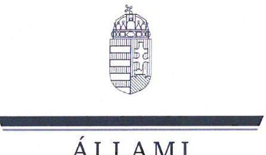

# JELENTÉS 

A többségi állami tulajdonú gazdasági társaságok leányvállalatainak elsőszámú vezetői számára történt prémium-megállapítások célzott ellenőrzése

MVM Zrt. - MVM OVIT Zrt.

2024.

---

ÁLLAMI
SZÁMVEVÔSZÉK

# JELENTÉS 

A többségi állami tulajdonú gazdasági társaságok leányvállalatainak elsőszámú vezetői számára történt prémium-megállapítások célzott ellenőrzése

MVM Zrt. - MVM OVIT Zrt.

2024.

---

# ELLENŐRZÉSI IGAZGATÓSÁG: 

ÁLLAMI VAGYONGAZDÁLKODÁST ELLENŐRZŐ IGAZGATÓSÁG

## ELLENŐRZÉSI IGAZGATÓ:

HERCZEGH ZSOLT ellenőrzési igazgató

## ELLENŐRZÉSVEZETŐ:

Jelentéseink az interneten a www.asz.hu címen olvashatók.

VEREBESNÉ SZABÓ ERZSÉBET ellenőrzésvezető

IKTATÓSZÁM: EL-3959-003/2024
TÉMASZÁM: 2713
ELLENŐRZÉS-AZONOSÍTÓ SZÁM: V1057

---

# TARTALOMJEGYZÉK 

AZ ELLENŐRZÉS ALAPADATAI ..... 5
AZ ELLENŐRZÖTT SZERVEZETEK ..... 7
ÖSSZEFOGLALÁS ..... 8
AZ ELLENŐRZÉS FÓKUSZKÉRDÉSEI ..... 9
MEGÁLLAPÍTÁSOK ..... 10
MELLÉKLETEK ..... 13
I. sz. melléklet: Értelmező szótár ..... 13
II. sz. melléklet: Az ellenőrzött szervezetek jegyzéke ..... 16
III. sz. melléklet: Ellenőrzési kritériumok ..... 17
FÜGGELÉK: ÉSZREVÉTELEK ..... 18
RÖVIDÍTÉSEK JEGYZÉKE ..... 19

---

.

---

# AZ ELLENŐRZÉS ALAPADATAI 

## AZ ELLENŐRZÉS CÉLJA

Az ellenőrzés célja a többségi állami tulajdonú gazdasági társaság leányvállalatának első számú vezetője esetében alkalmazott premizálási rendszer megfelelőségének és ösztönzési hatásainak értékelése, a továbbfejlesztési lehetőségek feltárása, a jó gyakorlatok feltérképezése, ezáltal a hatékony ösztönzési rendszerek kialakításának elősegítése volt.

## AZ ELLENŐRZÉS TÍPUSA

Megfelelőségi ellenőrzés

## AZ ELLENŐRZÖTT IDŐSZAK

2022. január 1-jétől az ellenőrzés megkezdéséig, azaz 2023. november 30-ig tartó időszak.

## AZ ELLENŐRZÉS TÁRGYA

Az ellenőrzés tárgya a leányvállalat első számú vezetője esetében alkalmazott premizálási rendszer kialakítása és működtetése, a 2022. évre vonatkozó prémiumkiírásában szereplő célok alátámasztottsága, a célkitűzések teljesítésének értékelése és a prémium megállapítás szabályszerűsége, valamint az anyavállalat tulajdonosi ellenőrzési feladatainak ellátása volt. Az ellenőrzés kiterjedt a célok teljesítésének nyomon követéséhez és értékeléséhez kapcsolódóan a leányvállalat számára előírt kötelezettségek szabályszerű teljesítésére, a prémium feltételeként kitűzött célok tényleges megvalósulására és a 2022. évre megállapított prémium kifizetésére is.

Az ellenőrzés kiterjedt minden olyan körülményre és adatra, amely az ÁSZ ${ }^{1}$ jogszabályban meghatározott feladatainak teljesítéséhez, valamint a program végrehajtása folyamán felmerült újabb összefüggések feltárásához szükséges volt.

## AZ ELLENŐRZÉS JOGALAPJA

Az ellenőrzés jogszabályi alapját az ÁSZ tv. ${ }^{2} 1 . \int$ (3) bekezdésének és 5. § (4) bekezdésének előírásai képezték.

---

# AZ ELLENŐRZÉS MÓDSZERE 

Az ellenőrzés végrehajtása a nemzetközi standardokat irányadónak tekintve az ellenőrzési program szempontjai, az ellenőrzött időszakban hatályos jogszabályok, az ellenőrzés szakmai szabályok és módszertanok figyelembevételével történt.

Az ellenőrzési kérdések megválaszolásához szükséges bizonyítékok megszerzése az ellenőrzött szervezetek által rendelkezésre bocsátott dokumentumokra és adatokra alapozva, továbbá szemrevételezés, kérdésfeltevés (információkérés) és elemző eljárás útján történt.

Az ellenőrzés lefolytatásához az ellenőrzött szervezetek az ÁSZ által kért dokumentumok, adatok, információk megküldésével szolgáltattak adatokat.

Az ellenőrzési bizonyítékként felhasználható adatforrások közé tartoztak az ellenőrzési program részletes szempontjainál felsorolt adatforrások, valamint minden egyéb - az ellenőrzés folyamán feltárt, az ellenőrzés szempontjából információt tartalmazó - dokumentum.

Az ellenőrzést az ÁSZ szabályszerűségi és célszerűségi szempontok alapján folytatta le. Az ellenőrzés kitért minden olyan körülményre, amely a program végrehajtása kapcsán felmerült és az ellenőrzés céljaival összhangban volt.

---

# AZ ELLENŐRZÖTT SZERVEZETEK 

Az ÁSZ az MVM Zrt. ${ }^{3}$-nél és leányvállalatánál, az MVM OVIT Zrt. ${ }^{4}$-nél ellenőrizte a leányvállalat első számú vezetője esetében alkalmazott premizálási rendszer kialakításának és működtetésének megfelelőségét. Az ellenőrzött szervezetek az ellenőrzés alá vont időszakban a Gbkr. ${ }^{5}$ hatálya alá tartoztak. Az ellenőrzött szervezetek jegyzékét a II. sz. melléklet tartalmazza.
AZ MVM ZRT. a Magyar Állam kizárólagos tulajdonában álló gazdasági társaság, melyben az ellenőrzött időszakban a tulajdonosi jogokat 2022. május 26 -ig az 1/2018. (VI. 25.) NVTNM rendelet ${ }^{6}$ alapján a Nemzeti vagyon kezeléséért felelős tárca nélküli miniszter, ezt követően az 1/2022. (V. 26.) GFM rendelet ${ }^{7}$ alapján 2022. november 30-ig a Technológia és Ipari Minisztérium, majd 2022. december 1-től az Energiaügyi Minisztérium gyakorolta. Cégjegyzékbe bejegyzett fő tevékenysége vagyonkezelés (holding) volt. Fő feladatait képezte emellett a csoportszintú irányítás és a múködés optimalizálása, a tulajdonosi érdekek közvetítése. A társaság tevékenységei közé tartozott a menedzsment szolgáltatások nyújtása, finanszírozási-treasury tevékenység, bérbeadás és ingatlanhasznosítás is. A 2022. évi IFRS $^{8}$ szerinti pénzügyi kimutatása szerint a mérlegfőösszeg 4930152 M Ft , az értékesítés nettó árbevétele 48201 M Ft , az adózott eredmény 68960 M Ft volt. A társaság 2022-ben 171 fős átlagos állományi létszámmal múködött.
AZ MVM OVIT ZRT. egyedüli tulajdonosa az ellenőrzött időszakban a Magyar Állam kizárólagos tulajdonában álló MVM Zrt. volt. Cégjegyzékbe bejegyzett fő tevékenysége elektromos, híradás-technikai célú közmú építése volt. Múködése elsősorban múszaki gyártási tevékenységekre és kapcsolódó szolgáltatásokra terjedt ki az ország egész területét lefedve. Tevékenységét képezte ipari acélszerkezetek gyártása, erőművi gépgyártás, nyomástartó edények gyártása, nehézszállítás, szállítmányozás, az elektromos gépjárművek töltésére szolgáló töltő gyártása, értékesítése, valamint napelemparkok létesítése és üzemeltetése. A 2022. évi számviteli beszámoló szerint a mérlegfőösszeg 18274758 E Ft , az értékesítés nettó árbevétele 18525759 E Ft , az adózott eredmény 123604 E Ft volt. A társaság 2022-ben 204 fős átlagos állományi létszámmal múködött.

---

# ÖSSZEFOGLALÁS 

A Magyar Állam gazdasági társaságokban lévő részesedései a nemzeti vagyon, ezen belül az állami vagyon részét képezik. A nemzeti vagyongazdálkodás feladatainak megvalósításában kiemelten fontos szerepet töltenek be a többségi állami tulajdonú gazdasági társaságok első számú vezetői. Az irányításuk alatt álló szervezetek gazdálkodási tevékenysége alapvető befolyást gyakorol a gazdasági társaságokban lévő állami részesedések értékére, ezáltal az állami vagyon értékének megőrzésére, gyarapítására.

Egy átgondolt módon felépített és hatékonyan múködtetett teljesítmény javadalmazási rendszer fenntarthatja vagy javíthatja az első számú vezető teljesítményét, növelheti a munkáltató, illetőleg a tulajdonos iránti lojalitását, elkötelezettségét. A gazdasági társaság üzleti terveinek megvalósítása, eredményes, gazdaságos múködése irányába ható prémium célkitúzés hatékony motivációs eszközt jelent a tulajdonos számára, ugyanakkor kötöttségeket is eredményez. A kitűzött célok teljesítését az előre lefektetett szabályok és teljesítménymérési kritériumok mentén kell értékelni, és azok alapján dönteni az első számú vezető tárgyidőszaki prémiumra való jogosultságáról és annak összegéről. Az állami tulajdonú gazdasági társaságok esetében jogszabály kötelező erővel előírja a javadalmazási szabályzat készítését. Kormányhatározat alapelvként rögzíti, hogy a többségi állami tulajdonú gazdasági társaságok vezetőinek tevékenységét folyamatosan értékelni kell a szabályosság, eredményesség, gazdaságosság szempontjából, valamint meghatározza a prémiumfizetés alapvető feltételeit.

Az ellenőrzés értékelte az MVM Zrt. által az MVM OVIT Zrt. első számú vezetője esetében alkalmazott premizálási rendszer kialakításának és múködtetésének megfelelőségét, valamint ösztönzési hatásainak érvényesülését.

Az ellenőrzés megállapította, hogy az MVM Zrt. a Javadalmazási Szabályzat ${ }^{9}$ rendelkezéseinek megfelelően az MVM OVIT Zrt. múködésével, teljesítményével összefüggő releváns prémiumcélokat határozott meg, és azok teljesülését dokumentáltan értékelte. Az MVM Zrt. tulajdonosi joggyakorlója, az Energiaügyi Miniszter által hozott alapítói határozatban foglaltakra figyelemmel döntött a prémiumfizetésről, valamint a területhez kapcsolódóan kialakította és múködtette a tulajdonosi ellenőrzést. Az MVM OVIT Zrt. az első számú vezető teljesítmény javadalmazásához kapcsolódóan szabályszerűen teljesítette az MVM Zrt. által előírt kötelezettségeit.

A Javadalmazási Szabályzat az üzletpolitikai, gazdasági és stratégiai célkitűzések eredményes megvalósítását elősegítő, hatékony működésre ösztönző prémium rendszer megalkotását célozta. A ténylegesen meghatározott prémium feladatok - gazdasági mutatók, társaságspecifikus mutatók és szakmai feladatok megfeleltek a Javadalmazási Szabályzat által támasztott követelményeknek.

---

# AZ ELLENŐRZÉS FÓKUSZKÉRDÉSEI 

1. A többségi állami tulajdonban álló leányvállalat első számú vezetője esetében alkalmazott premizálási rendszer kialakítása és müködtetése tekintetében érvényesült-e a szabályszerűség és a felelős gazdálkodás elve?
2. A többségi állami tulajdonban álló leányvállalat szabályszerűen teljesítette-e a prémium feltételeinek megállapításával összefüggő kötelezettségeit?

---

# MEGÁLLAPÍTÁSOK 

## 1. A többségi állami tulajdonban álló leányvállalat első számú vezetője esetében alkalmazott premizálási rendszer kialakítása és múködtetése tekintetében érvényesült-e a szabályszerűség és a felelős gazdálkodás elve?

Összegző megállapítás Az MVM Zrt. a jogszabályi előírásnak megfelelően megalkotta az MVM OVIT Zrt. Javadalmazási Szabályzatát. A prémiumcélok kitűzésére és értékelésére a belső szabályozó eszközöknek megfelelően dokumentáltan került sor. A célok kitüzése megfelelt a Javadalmazási Szabályzat által támasztott követelményeknek. Az MVM Zrt. a prémium feltételeként kitüzött célok értékeléséhez kapcsolódóan kialakította és megfelelően müködtette a tulajdonosi ellenőrzést. A prémium megállapítása a tulajdonosi joggyakorló által hozott alapítói határozat rendelkezéseinek megfelelően történt.

## A szabályozási kötelezettség teljesítése

Az MVM Zrt. mint az MVM OVIT Zrt. egyedüli részvényese, a Taktv. ${ }^{10}$-ben előírt szabályzatalkotási kötelezettségének eleget tett, és a Javadalmazási Szabályzatban érvényesítette az 1660/2015. (IX. 15.) Korm. határozat ${ }^{11}$ előírásait. Az MVM OVIT Zrt. Javadalmazási Szabályzatának elfogadásáról az MVM Zrt. a Ptk. ${ }^{12}$-ban foglaltaknak megfelelően írásbeli határozatot hozott.

## A prémiumcélok kiírásának megfelelősége

Az MVM OVIT Zrt. első számú vezetője részére meghatározott 2022. évi teljesítményösztönzők kitűzéséről az MVM Zrt. a Ptk. és az Alapszabály; ${ }^{13}$ előírásának megfelelően egyedüli részvényesi határozatot hozott. A határozatban a Javadalmazási Szabályzat alapján meghatározta a tárgyévi teljesítménykövetelményeket.
A prémiumkiírásban meghatározott teljesítménykövetelmények száma és összetétele megfelelt a Javadalmazási Szabályzat rendelkezéseinek. A kitűzött gazdasági mutatók, társaság-specifikus mutatók és szakmai feladatok az MVM Csoport üzletpolitikájának, gazdasági és stratégiai célkitűzéseinek eredményes megvalósításával összhangban kerültek meghatározásra és számszerűen, objektív módszer segítségével mérhetők, értékkel meghatározhatók voltak.
Az MVM Zrt. a cégcsoport egésze és a leányvállalat egyedi üzleti céljainak együttes megjelenítésére alkalmas teljesítménykövetelmény-rendszert alakított ki. A célrendszerben megjelentek a tárgyévi működéshez kapcsolódó konkrét teljesítményelvárások és a cégcsoport jövőbeni stratégiai céljainak elérésére ösztönző mutatók is. A gazdálkodás minőségének, hatékonyságának, eredményességének, ezáltal a vezető teljesítményének egyik közvetlen fokmérője az üzleti évben elért eredmény. Ennek mérése mind az MVM Csoport, mind az MVM OVIT Zrt. szintjén megtörtént. A csoportszintű stratégiai célok elérésének mérését egy - tizennégy különféle részelemből álló - aggregált mutató támogatta. A prémiumcélok között megjelent a munkabiztonság növelése, melynek alakulását az eredményhez

---

hasonlóan csoport- és vállalati szinten egyaránt mérték és értékelték. A számszaki mutatók célértékének meghatározása mellett az MVM Zrt. két, a tárgyévben megvalósítandó releváns szakmai célt tűzött ki a leányvállalat első számú vezetője számára. A szakmai célok - akvizíciók lebonyolítása és a felvásárlással érintett társaságok integrálása, valamint a leányvállalat energiahatékonyságának fejlesztése - úgy kerültek meghatározásra, hogy azok hozzájáruljanak az MVM Csoport stratégai célkitűzéseinek megvalósításához is. Mindezek alapján a kitűzött prémiumfeladatok megfeleltek a Javadalmazási Szabályzat által támasztott követelményeknek.

# A teljesítés értékelésének megfelelősége 

Az MVM OVIT Zrt. első számú vezetője 2022. évi teljesítményösztönző feladatai teljesítésének értékeléséről az MVM Zrt. a Ptk. és az Alapszabály ${ }_{2}{ }^{14}$ előírásának megfelelően egyedüli részvényesi határozatot hozott. A határozatban a Javadalmazási Szabályzat alapján elvégezte a kitűzött célok teljesítésének értékelését, megállapította a 2022. évi teljesítményösztönző feladatok teljesítésének elért szintjét és döntött a kifizethető prémium azzal arányos mértékéről.
Az MVM Zrt. tulajdonosi joggyakorlója, az Energiaügyi Miniszter az MVM Zrt. és az MVM Csoportba tartozó társaságok esetében alapítói határozatban korrekciós tényezőt fogadott el az üzleti tervben meghatározott átlagkereset-fejlesztési, illetve bértömeg-növekedési mértékre vonatkozóan.
Az MVM OVIT Zrt. a 2022. évi üzleti tervben meghatározott bértömeghez képest megtakarítást ért el, az átlagkereset-fejlesztés tekintetében pedig az MVM Zrt. által kiadott központi intézkedéseknek megfelelően járt el, és nem lépte túl az elfogadott korrekció figyelembevételével meghatározott mértéket.
Az MVM Zrt. prémiumfizetésről szóló döntését az Energiaügyi Miniszter által az üzleti tervben meghatározott átlagkereset-fejlesztési és bértömeg-növekedési mértékre vonatkozóan alapítói határozatban elfogadott korrekciós tényezőre figyelemmel hozta meg. A leányvállalat a prémium kifizetése során az MVM Zrt. határozatában foglaltaknak megfelelően járt el.

## A prémium feltételeként kitűzött célok értékeléséhez kapcsolódó tulajdonosi ellenőrzés megfelelősége

Az MVM Zrt. az Alapszabály ${ }_{1 / 2}$-ban kialakította a prémium feltételeként kitűzött célok értékeléséhez kapcsolódóan az MVM OVIT Zrt. feletti tulajdonosi ellenőrzés Ptk. szerinti kereteit. A 2022. évi prémium feltételeként kitűzött célok értékelése az Alapszabály ${ }_{2}$ rendelkezései szerint az egyedüli részvényes hatáskörébe tartozott. A csoport- és társasági szintű gazdasági mutatók és egyéb célok teljesülését döntően az anyavállalat maga mérte és az alapján értékelte. A társasági szintű munkabiztonsági mutató és a szakmai célok teljesítésének értékelése az első számú vezető részletes előterjesztésén alapult. A leányvállalat felügyelőbizottságának feladata az Alapszabály ${ }_{2}$ értelmében az első számú vezető prémiumfizetést csökkentő és kizáró tényezőkre vonatkozóan tett nyilatkozatának véleményezésére terjedt ki. A felügyelőbizottság az első számú vezető részletes előterjesztése birtokában az Alapszabály ${ }_{2}$ rendelkezéseinek megfelelően határozatot hozott a 2022. évi teljesítményösztönző feladatok értékelése tárgyában. Határozatában az első számú vezető nyilatkozatával egyetértett, a szakmai célok és a társasági szintű munkabiztonsági mutató teljesítésének az első számú vezető előterjesztése szerinti értékelését tudomásul vette. Az Alapszabály ${ }_{1 / 2}$ értelmében az MVM OVIT Zrt.-nél az egyedüli részvényes által megválasztott könyvvizsgáló működött. Az MVM Zrt. a könyvvizsgálói jelentés és a leányvállalat felügyelőbizottságának határozata ismeretében döntött a prémium megállapításáról. Az MVM Zrt. a prémiumcélok teljesítésének értékeléséhez kapcsolódóan mindezek alapján a Ptk. és az Alapszabály ${ }_{2}$ előírásainak megfelelően működtette a tulajdonosi ellenőrzést.

---

# 2. A többségi állami tulajdonban álló leányvállalat szabályszerűen teljesítette-e a prémium feltételeinek megállapításával összefüggő kötelezettségeit? 

Összegző megállapítás Az MVM OVIT Zrt. szabályszerűen teljesítette az első számú vezető prémium kiírásához, a célok teljesítésének nyomon követéséhez és értékeléséhez kapcsolódóan az MVM Zrt. által előírt kötelezettségeit.

A prémiumcélok kiírásához, teljesítésének nyomon követéséhez és értékeléséhez kapcsolódó tulajdonosi döntések teljesítésének megfelelősége
Az MVM OVIT Zrt. a prémiumcélok kiírásához kapcsolódóan a Javadalmazási Szabályzatban előírt javaslattételi kötelezettségének a Tulajdonosi Irányelvek ${ }_{1}{ }^{15}$-ben foglaltak figyelembevételével eleget tett.
A célok teljesítésének nyomon követéséhez előírt féléves értékeléshez kapcsolódó feladatait az MVM OVIT Zrt. a Tulajdonosi Irányelvek ${ }_{2}{ }^{16}$ rendelkezésének megfelelően teljesítette.
Az MVM OVIT Zrt. első számú vezetője az év végi tulajdonosi értékelést megelőzően a prémiumot csökkentő és a prémiumfizetést kizáró tényezőkről a Javadalmazási Szabályzat szerinti nyilatkozattételi kötelezettségének szabályszerűen eleget tett és a nyilatkozatot az Alapszabály ${ }_{2}$ előírásának megfelelően a felügyelőbizottsággal véleményeztette. Az MVM OVIT Zrt. a Tulajdonosi Irányelvek ${ }_{3}{ }^{17}$ rendelkezéseinek eleget téve a 2022. évi prémiumfeladatként kitűzött szakmai célok és a társasági szintű munkabiztonsági mutató teljesítésének értékelését elvégezte, valamint a társasági szintű gazdasági mutató vonatkozásában felmerülő korrekciós tényezőkről az előírt egyeztetést lefolytatta.
A prémium feltételeként kitűzött célok teljesítése és a tulajdonosi értékelés alapját képező dokumentáció közötti összhang megfelelősége
Az MVM OVIT Zrt. által a legfőbb szerv számára előterjesztett, a tulajdonosi értékelés alapját képező dokumentáció összhangban volt a leányvállalatnál rendelkezésre álló, a prémiumkiírásban megfogalmazott feladatok teljesítését alátámasztó dokumentumokkal.

---

# MELLÉKLETEK 

## I. SZ. MELLÉKLET: ÉRTELMEZŐ SZÓTÁR

anyavállalat
leányvállalat
gazdasági társaság
többségi állami tulajdon
nemzeti vagyon
az a vállalkozó, amely egy másik vállalkozónál (a továbbiakban: leányvállalat) közvetlenül vagy leányvállalatán keresztül közvetetten meghatározó befolyást képes gyakorolni, mert az alábbi feltételek közül legalább eggyel rendelkezik:
a) a tulajdonosok (a részvényesek) szavazatának többségével (50 százalékot meghaladóval) tulajdoni hányada alapján egyedül rendelkezik, vagy
b) más tulajdonosokkal (részvényesekkel) kötött megállapodás alapján a szavazatok többségét egyedül birtokolja, vagy
c) a társaság tulajdonosaként (részvényeseként) jogosult arra, hogy a vezető tisztségviselők vagy a felügyelő bizottság tagjai többségét megválassza vagy visszahívja, vagy
d) a tulajdonosokkal (a részvényesekkel) kötött szerződés (vagy a létesítő okirat rendelkezése) alapján - függetlenül a tulajdoni hányadtól, a szavazati aránytól, a megválasztási és visszahívási jogtól - döntő irányítást, ellenőrzést gyakorol
(Számv. tv. ${ }^{18}$ 3. $\$ (2) bekezdés 1. pont)
az a gazdasági társaság, amelyre az 1. pont szerinti anyavállalat meghatározó befolyást képes gyakorolni
(Számv. tv. 3. $\$ (2) bekezdés 2. pont)
A gazdasági társaságok üzletszerű közös gazdasági tevékenység folytatására, a tagok vagyoni hozzájárulásával létrehozott, jogi személyiséggel rendelkező vállalkozások, amelyekben a tagok a nyereségből közösen részesednek, és a veszteséget közösen viselik.
(Ptk. 3:88. § (1) bekezdés)
Az állam tulajdonában lévő tagsági jogviszonyt megtestesítő értékpapír, illetve az állam tulajdonában lévő egyéb társasági részesedés, amennyiben a társaságban a Magyar Állam közvetlenül vagy közvetetten a szavazatok több mint felével rendelkezik.
(ÁSZ definíció a Vtv. ${ }^{19}$ 1. § (2) bekezdés c) pontja és a Ptk. 8:2. § (1), (3)-(4) bekezdései alapján)
a) az állam vagy a helyi önkormányzat kizárólagos tulajdonában álló dolgok, b) az a) pont hatálya alá nem tartozó, az állam vagy a helyi önkormányzat tulajdonában lévő dolog,
c) az állam vagy a helyi önkormányzat tulajdonában lévő pénzügyi eszközök, továbbá az államot vagy a helyi önkormányzatot megillető társasági részesedések,
d) az államot vagy a helyi önkormányzatot megillető bármely vagyoni értékkel rendelkező jogosultság, amelyet jogszabály vagyoni értékű jogként nevesít,
e) Magyarország határa által körbezárt terület feletti légtér,
f) az üvegházhatású gázok kibocsátási egységeinek kereskedelméről szóló törvény szerinti kibocsátási egység és légiközlekedési kibocsátási egység, valamint az ENSZ Éghajlat-változási Keretegyezménye és annak Kiotói Jegyzőkönyve végrehajtási keretrendszeréről szóló törvény szerinti kiotói egység,
g) állami vagy helyi önkormányzati fenntartású közgyűjtemény (muzeális intézmény, levéltár, közgyűjteményként működő kép- és hangarchívum,

---

valamint könyvtár) saját gyűjteményében nyilvántartott kulturális javak körébe tartozó dolog, kivéve, ha a dolog más tulajdonában áll,
h) a régészeti lelet,
i) a nemzeti adatvagyon körébe tartozó állami nyilvántartások fokozottabb védelméről szóló törvény szerinti nemzeti adatvagyon.
(Nvtv. ${ }^{20} 1 . \S$ (2) bekezdése)
a) az állam tulajdonában lévő dolog, valamint dolog módjára hasznosítható természeti erő;
b) az a) pont hatálya alá tartozó mindazon vagyon, amely vonatkozásában törvény az állam kizárólagos tulajdonjogát nevesíti;
c) az állam tulajdonában lévő tagsági jogviszonyt megtestesítő értékpapír, illetve az állam tulajdonában lévő egyéb társasági részesedés;
d) az államot megillető olyan immateriális, vagyoni értékkel rendelkező jogosultság, amelyet jogszabály vagyoni értékű jogként nevesít;
e) az állam tulajdonában álló a befektetési vállalkozásokról és az árutőzsdei szolgáltatókról, valamint az általuk végezhető tevékenységek szabályairól szóló 2007. évi CXXXVIII. törvény szerinti pénzügyi eszköz;
f) azon országgyűlési képviselőről, aki más, Alaptörvényben nevesített közjogi tisztséget is betöltve közfeladatot lát el, e közfeladata ellátása körében vagy ezzel összefüggésben, költségvetési forrásból készített, szerzői vagy szomszédos jogi védelmet élvező műhöz vagy teljesítményhez, különösen kép-, illetve hangfelvételhez kapcsolódó, felhasználási szerződés útján vagy a szerzői jogról szóló törvény alapján megszerzett felhasználási engedély, illetve vagyoni jog.
(Vtv. 1. $\S$ (2) bekezdése)
A nemzeti vagyon alapvető rendeltetése a közfeladat ellátásának biztosítása, ideértve a lakosság közszolgáltatásokkal való ellátását és e feladatok ellátásához szükséges infrastruktúra biztosítását. A nemzeti vagyonnal felelős módon, rendeltetésszerűen kell gazdálkodni.
A nemzeti vagyongazdálkodás feladata a nemzeti vagyon megőrzése, értékének és állagának védelme, rendeltetésének megfelelő, az állam, az önkormányzat mindenkori teherbíró képességéhez igazodó, elsődlegesen a közfeladatok ellátásához és a mindenkori társadalmi szükségletek kielégítéséhez szükséges, egységes elveken alapuló, átlátható, hatékony és költségtakarékos múködtetése, értéknövelő használata, hasznosítása, gyarapítása, továbbá az állam vagy a helyi önkormányzat feladatának ellátása szempontjából feleslegessé váló vagyontárgyak elidegenítése, azzal, hogy a nemzeti vagyon megőrzése érdekében végzett bontás vagy átalakítás nem minősül az állag védelmi kötelezettség megszegésének.
(Nvtv. 7. § (1)-(2) bekezdése alapján)
prémium
A köztulajdonban álló gazdasági társaság munkavállalóját munkaszerződés vagy a munkáltató egyoldalú kötelezettségvállalása alapján megillető alapbéren kívüli teljesítménybér.
(Taktv. 5. § (1) bekezdése alapján)
közlulajdonban álló gazdasági társaság
Az a gazdasági társaság, amelyben a Magyar Állam, helyi önkormányzat, a helyi önkormányzat jogi személyiséggel rendelkező társulása, többcélú kistérségi társulás, fejlesztési tanács, nemzetiségi önkormányzat, nemzetiségi önkormányzat jogi személyiségủ társulása, költségvetési szerv vagy közalapítvány külön-külön vagy együttesen számítva többségi befolyással rendelkezik.
(Taktv. 1. § a) pontja)

---

többségi befolyás
gazdasági társaság első számú vezetője
javadalmazási szabályzat

Az olyan kapcsolat, amelynek révén a befolyással rendelkező egy jogi személyben a szavazatok több mint ötven százalékával - közvetlenül vagy a jogi személyben szavazati joggal rendelkező más jogi személy (köztes vállalkozás) szavazati jogán keresztül - rendelkezik, azzal, hogy a közvetett módon való rendelkezés meghatározása során a jogi személyben szavazati joggal rendelkező más jogi személyt (köztes vállalkozást) megillető szavazati hányadot meg kell szorozni a befolyással rendelkezőnek a köztes vállalkozásban, illetve vállalkozásokban fennálló szavazati hányadával, ha azonban a köztes vállalkozásban fennálló szavazatainak hányada az ötven százalékot meghaladja, akkor azt egy egészként kell figyelembe venni. A befolyás számításánál nem kell figyelembe venni a huszonöt százalékot el nem érő közvetett befolyást
(Taktv. 1. § b) pontja)
Az irányítási jogkörrel rendelkező vezető tisztségviselő, több vezető tisztségviselő, vagy vezető tisztségviselőkből álló testület esetén a társaság operatív irányítási jogkörrel rendelkező vezetője
(Gbkr. 2. § 4. pont)
A Taktv. 5. § (3) bekezdése szerinti szabályzat (A köztulajdonban álló gazdasági társaság legfőbb szerve e törvény és más jogszabályok keretei között köteles szabályzatot alkotni a vezető tisztségviselők, felügyelőbizottsági tagok, valamint az Mt. ${ }^{21}$ 208. §-ának hatálya alá eső munkavállalók javadalmazása, valamint a jogviszony megszűnése esetére biztosított juttatások módjának, mértékének elveiről, annak rendszeréről.)

---

II. SZ. MELLÉKLET: AZ ELLENŐRZÖTT SZERVEZETEK JEGYZÉKE

# ELLENŐRZÖTT SZERVEZET NEVE 

MVM Energetika Zártkörűen Működő Részvénytársaság
MVM OVIT Országos Villamostávvezeték Zártkörűen Működő Részvénytársaság

---

# 111. SZ. MELLÉKLET: ELLENŐRZÉSI KRITÉRIUMOK 

## FOKUSZKÉRDÉS

1. A többségi állami tulajdonban álló leányvállalat első számú vezetője esetében alkalmazott premizálási rendszer kialakítása és múködtetése tekintetében érvényesült-e a szabályszerűség és a felelős gazdálkodás elve?

## ELLENŐRZÉSI KRITÉRIUMOK

Nvtv. 7. § (1)-(2) bekezdés, Taktv. 4. § (1) bekezdés, 5. § (3)-(4) bekezdés, 7/J. § (3) bekezdés c) és e) pont, valamint (5) bekezdés a) pont, 1660/2015. (IX. 15.) Korm. határozat 1. d) pont, Mt. 207. § (2) bekezdés, Ptk. 3:4. § (1) bekezdés, 3:26. (1) bekezdés, 3:27. § (1)-(2) bekezdés, 3:94. §, 3:102. § (1)-(4) bekezdés, 3:109. § (2) és (4) bekezdés, 3:112. § (2)-(3) bekezdés 3:120. § (1)-(2) bekezdés, 3:122. § (3) bekezdés, Gbkr. 4. § (3) bekezdés, 8. §, 24. § (1)-(2) bekezdés,
Javadalmazási Szabályzat 4. § (1) bekezdés, 9-10. §, 11. § (1)-(5) bekezdés, 12. § (1) és (3)-(10) bekezdés, 13-14. §, Alapszabály ${ }_{1 / 2}$ III/1. 20. pont g) alpont, III/3. 35. pont, III/4. pont, Alapszabály ${ }_{2}$ III/3. 34. pont c) alpont
2. A többségi állami tulajdonban álló leányvállalat szabályszerűen teljesítette-e a prémium feltételeinek megállapításával összefüggő kötelezettségeit?

Nvtv. 7. § (1)-(2) bekezdés, Javadalmazási Szabályzat 12. § (4) bekezdés, 13-14. §, Alapszabály ${ }_{2}$ III/3. 34. pont c) alpont, Tulajdonosi Irányelvek ${ }_{1 / 2 / 3}$,
a kitűzött prémiumcélok teljesítését alátámasztó dokumentumok

---

# FÜGGELÉK: ÉSZREVÉTELEK 

A jelentéstervezetet a Számvevőszék 15 napos észrevételezésre megküldte az ellenőrzött szervezet vezetőjének az ÁSZ tv. 29. §* (1) bekezdése előírásának megfelelően.

A jelentéstervezetre az ellenőrzött szervezetek nem tettek észrevételt.

[^0]
[^0]:    * 29. § (1) Az Állami Számvevőszék az ellenőrzési megállapításait megküldi az ellenőrzött szervezet vezetőjének vagy az általa megbízott személynek, és annak, akinek személyes felelősségét állapította meg.
    (2) Az ellenőrzött szervezet vezetője és a felelősként megjelölt személy az ellenőrzés megállapításaira tizenöt napon belül írásban észrevételt tehet.
    (3) Az Állami Számvevőszék az észrevételre a beérkezésétől számított harminc napon belül írásban válaszol. A figyelembe nem vett észrevételeket köteles a jelentésben feltüntetni, és megindokolni, hogy azokat miért nem fogadta el.

---

# RÖVIDÍTÉSEK JEGYZÉKE 

${ }^{1}$ ÁSZ
${ }^{2}$ ÁSZ tv.
${ }^{3}$ MVM Zrt.
${ }^{4}$ MVM OVIT Zrt.
${ }^{5}$ Gbkr.
${ }^{6}$ 1/2018. (VI. 25.) NVTNM rendelet
${ }^{7}$ 1/2022. (V. 26.) GFM rendelet
${ }^{8}$ IFRS
${ }^{9}$ Javadalmazási Szabályzat
${ }^{10}$ Taktv.
${ }^{11}$ 1660/2015. (IX. 15.) Korm. határozat
${ }^{12}$ Ptk.
${ }^{13}$ Alapszabály ${ }_{1}$
${ }^{14}$ Alapszabály ${ }_{2}$
${ }^{15}$ Tulajdonosi Irányelvek ${ }_{1}$
${ }^{16}$ Tulajdonosi Irányelvek ${ }_{2}$
${ }^{17}$ Tulajdonosi Irányelvek ${ }_{3}$
${ }^{18}$ Számv. tv.
${ }^{19}$ Vtv.
${ }^{20}$ Ntvv.
${ }^{21} \mathrm{Mt}$.

Állami Számvevőszék
2011. évi LXVI. törvény az Állami Számvevőszékről

MVM Energetika Zártkörűen Működő Részvénytársaság
MVM OVIT Országos Villamostávvezeték Zártkörűen Müködő Részvénytársaság
339/2019. (XII. 23.) Korm. rendelet a köztulajdonban álló gazdasági társaságok belső kontrollrendszeréről
1/2018. (VI. 25.) NVTNM rendelet az egyes állami tulajdonban álló gazdasági társaságok felett az államot megillető tulajdonosi jogok és kötelezettségek összességét gyakorló személyek kijelöléséről
1/2022. (V. 26.) GFM rendelet - az egyes állami tulajdonban álló gazdasági társaságok felett az államot megillető tulajdonosi jogok és kötelezettségek összességét gyakorló személyek kijelöléséről
Nemzetközi Pénzügyi Beszámolási Standardok
az MVM OVIT Zrt.-nek az MVM Zrt. 29/2020. (II. 03.) számú egyedüli részvényesi határozatával elfogadott javadalmazási szabályzata
2009. évi CXXII. törvény a köztulajdonban álló gazdasági társaságok takarékosabb müködéséről
1660/2015. (IX. 15.) Korm. határozat - a többségi állami tulajdonú gazdasági társaságok vezető állású munkavállalói javadalmazási rendszerének megújításáról 2013. évi V. törvény a Polgári Törvénykönyvről

MVM OVIT Zrt. Alapszabálya (hatályos: 2022. február 01-2022. május 31.)
MVM OVIT Zrt. Alapszabálya (hatályos: 2022. június 01-től)
az MVM Zrt. humánerőforrás és szolgáltatási vezérigazgató-helyettesének 2021. december 07 -ei elektronikus levele „A tagvállalati első számú vezetők 2022. évi teljesítményösztönző feladatai kitűzésének irányelvei és ütemezése" tárgyában
az MVM Zrt. humánerőforrás és szolgáltatási vezérigazgató-helyettesének 2022. július 11-ei elektronikus levele „Az MVM Csoport Mt. 208. § hatálya alá tartozó vezetői 2022. évi teljesítményösztönző feladatainak féléves értékelése" tárgyában az MVM Zrt. humánerőforrás és szolgáltatási vezérigazgató-helyettesének 2023. február 06 -ai elektronikus levele „A tagvállalati első számú vezetők 2022. évi teljesítményösztönző feladatainak értékelése és ütemezése" tárgyában
2000. évi C. törvény a számvitelről
2007. évi CVL törvény az állami vagyonról
2011. évi CXCVI. törvény a nemzeti vagyonról
2012. évi I. törvény a munka törvénykönyvéről

---

1052 Budapest, Apáczai Csere János u. 10. | 1364 Budapest 4., Pf. 54
www.asz.hu | szamvevoszek@asz.hu
telefon: +36 14849100