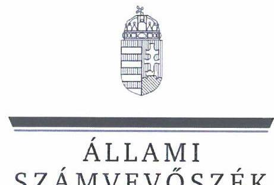

# JELENTÉS 

A többségi állami tulajdonú gazdasági társaságok leányvállalatainak elsőszámú vezetői számára történt prémium-megállapítások célzott ellenőrzése

## MFB Zrt. - MKK Zrt.

2024.

---

ÁLLAMI
SZÁMVEVŐSZÉK

# JELENTÉS 

A többségi állami tulajdonú gazdasági társaságok leányvállalatainak elsőszámú vezetői számára történt prémium-megállapítások célzott ellenőrzése

## MFB Zrt. - MKK Zrt.

2024.

---

# ELLENŐRZÉSI IGAZGATÓSÁG: 

ÁLLAMI VAGYONGAZDÁLKODÁST ELLENŐRZŐ IGAZGATÓSÁG

## ELLENŐRZÉSI IGAZGATÓ:

HERCZEGH ZSOLT ellenőrzési igazgató

## ELLENŐRZÉSVEZETŐ:

Jelentéseink az interneten a www.asz.hu címen olvashatók.

VEREBESNÉ SZABÓ ERZSÉBET ellenőrzésvezető

IKTATÓSZÁM: EL-3959-004/2024
TÉMASZÁM: 2713
ELLENŐRZÉS-AZONOSÍTÓ SZÁM: V1057

---

# TARTALOMJEGYZÉK 

AZ ELLENŐRZÉS ALAPADATAI ..... 5
AZ ELLENŐRZÖTT SZERVEZETEK ..... 7
ÖSSZEFOGLALÁS ..... 8
AZ ELLENŐRZÉS FÓKUSZKÉRDÉSEI ..... 9
MEGÁLLAPÍTÁSOK ..... 10
JAVASLATOK ..... 15
MELLÉKLETEK ..... 16
I. sz. melléklet: Értelmező szótár ..... 16
II. sz. melléklet: Az ellenőrzött szervezetek jegyzéke ..... 19
III. sz. melléklet: Ellenőrzési kritériumok ..... 20
FÜGGELÉK: ÉSZREVÉTELEK ..... 21
RÖVIDÍTÉSEK JEGYZÉKE ..... 26

---

.

---

# AZ ELLENŐRZÉS ALAPADATAI 

## AZ ELLENŐRZÉS CÉLJA

Az ellenőrzés célja a többségi állami tulajdonú gazdasági társaság leányvállalatának első számú vezetője esetében alkalmazott premizálási rendszer megfelelőségének és ösztönzési hatásainak értékelése, a továbbfejlesztési lehetőségek feltárása, a jó gyakorlatok feltérképezése, ezáltal a hatékony ösztönzési rendszerek kialakításának elősegítése volt.

## AZ ELLENŐRZÉS TÍPUSA

Megfelelőségi ellenőrzés

## AZ ELLENŐRZÖTT IDŐSZAK

2022. január 1-jétől az ellenőrzés megkezdéséig, azaz az MFB Magyar Fejlesztési Bank Zártkörűen Működő Részvénytársaság esetében 2023. november 30-ig, az MKK Magyar Követeléskezelő Zártkörűen Müködő Részvénytársaság esetében 2023. december 01-ig tartó időszak.

## AZ ELLENŐRZÉS TÁRGYA

Az ellenőrzés tárgya a leányvállalat első számú vezetője esetében alkalmazott premizálási rendszer kialakítása és működtetése, a 2022. évre vonatkozó prémiumkiírásában szereplő célok alátámasztottsága, a célkitűzések teljesítésének értékelése és a prémium megállapítás szabályszerűsége, valamint az anyavállalat tulajdonosi ellenőrzési feladatainak ellátása volt. Az ellenőrzés kiterjedt a célok teljesítésének nyomon követéséhez és értékeléséhez kapcsolódóan a leányvállalat számára előírt kötelezettségek szabályszerű teljesítésére, a prémium feltételeként kitűzött célok tényleges megvalósulására és a 2022. évre megállapított prémium kifizetésére is.

Az ellenőrzés kiterjedt minden olyan körülményre és adatra, amely az ÁSZ ${ }^{1}$ jogszabályban meghatározott feladatainak teljesítéséhez, valamint a program végrehajtása folyamán felmerült újabb összefüggések feltárásához szükséges volt.

## AZ ELLENŐRZÉS JOGALAPJA

Az ellenőrzés jogszabályi alapját az ÁSZ tv. ${ }^{2}$ 1. § (3) bekezdésének és 5. $\mathbb{S}$ (4) bekezdésének előírásai képezték.

---

# AZ ELLENŐRZÉS MÓDSZERE 

Az ellenőrzés végrehajtása a nemzetközi standardokat irányadónak tekintve az ellenőrzési program szempontjai, az ellenőrzött időszakban hatályos jogszabályok, az ellenőrzés szakmai szabályok és módszertanok figyelembevételével történt.

Az ellenőrzési kérdések megválaszolásához szükséges bizonyítékok megszerzése az ellenőrzött szervezetek által rendelkezésre bocsátott dokumentumokra és adatokra alapozva, továbbá szemrevételezés, kérdésfeltevés (információkérés) és elemző eljárás útján történt.

Az ellenőrzés lefolytatásához az ellenőrzött szervezetek az ÁSZ által kért dokumentumok, adatok, információk megküldésével szolgáltattak adatokat.

Az ellenőrzési bizonyítékként felhasználható adatforrások közé tartoztak az ellenőrzési program részletes szempontjainál felsorolt adatforrások, valamint minden egyéb - az ellenőrzés folyamán feltárt, az ellenőrzés szempontjából információt tartalmazó - dokumentum.

Az ellenőrzést az ÁSZ szabályszerűségi és célszerűségi szempontok alapján folytatta le. Az ellenőrzés kitért minden olyan körülményre, amely a program végrehajtása kapcsán felmerült és az ellenőrzés céljaival összhangban volt.

---

# AZ ELLENŐRZÖTT SZERVEZETEK 

Az ÁSZ az MFB Zrt. ${ }^{5}$-nél és leányvállalatánál, az MKK Zrt. ${ }^{4}$-nél ellenőrizte a leányvállalat első számú vezetője esetében alkalmazott premizálási rendszer kialakításának és müködtetésének megfelelőségét. Az ellenőrzött szervezetek az ellenőrzés alá vont időszakban a Hpt. ${ }^{5}$ hatálya alá tartoztak. Az ellenőrzött szervezetek jegyzékét a II. sz. melléklet tartalmazza.

AZ MFB ZRT. a Magyar Állam kizárólagos tulajdonában álló gazdasági társaság, melyben az ellenőrzött időszakban a tulajdonosi jogokat az MFB tv. ${ }^{6}$, valamint 2022. május 24 -ig a 94/2018. (V. 22.) Korm. rendelet ${ }^{7}$ alapján a Nemzeti vagyon kezeléséért felelős tárca nélküli miniszter, majd 2022. május 25 -től a 182/2022. (V. 24.) Korm. rendelet ${ }^{8}$ alapján a Gazdaságfejlesztési miniszter gyakorolta. Cégjegyzékbe bejegyzett fő tevékenysége egyéb monetáris közvetítés volt. Kizárólagos állami tulajdonú hitelintézetként alapfeladata a gazdaságfejlesztési célok megvalósításához szükséges közép- és hosszúlejáratú hazai és külföldi források és támogatások bevonása és közvetítése, nemzetgazdasági szempontból kiemelt jelentőségű üggyel összefüggő és egyéb beruházások hitel- és tőkefinanszírozása, garancianyújtás és kezességvállalás volt. A 2022. évi IFRS ${ }^{9}$ szerinti pénzügyi kimutatása szerint a mérlegfőösszeg 2969978 M Ft , a saját tőke 621641 M Ft , az adózott eredmény 6194 M Ft volt. A társaság 2022-ben 385 fős átlagos állományi létszámmal múködött.

AZ MKK ZRT. egyedüli tulajdonosa az ellenőrzött időszakban a Magyar Állam kizárólagos tulajdonában álló MFB Zrt. volt. Cégjegyzékbe bejegyzett fő tevékenysége máshova nem sorolt egyéb pénzügyi közvetítés volt, további tevékenységei a követelésbehajtásra, egyéb hitelnyújtásra, egyéb pénzügyi kiegészítő tevékenység végzésére irányultak. A 2022. évi számviteli beszámolója szerint a mérlegfőösszeg 37844650 E Ft , a saját tőke 19642546 E Ft , az adózott eredmény 8016019 E Ft volt. A társaság 2022-ben 278 fős átlagos állományi létszámmal múködött.

---

# ÖSSZEFOGLALÁS 

A Magyar Állam gazdasági társaságokban lévő részesedései a nemzeti vagyon, ezen belül az állami vagyon részét képezik. A nemzeti vagyongazdálkodás feladatainak megvalósításában kiemelten fontos szerepet töltenek be a többségi állami tulajdonú gazdasági társaságok első számú vezetői. Az irányításuk alatt álló szervezetek gazdálkodási tevékenysége alapvető befolyást gyakorol a gazdasági társaságokban lévő állami részesedések értékére, ezáltal az állami vagyon értékének megőrzésére, gyarapítására.

Egy átgondolt módon felépített és hatékonyan múködtetett teljesítmény javadalmazási rendszer fenntarthatja vagy javíthatja az első számú vezető teljesítményét, növelheti a munkáltató, illetőleg a tulajdonos iránti lojalitását, elkötelezettségét. A gazdasági társaság üzleti terveinek megvalósítása, eredményes, gazdaságos múködése irányába ható prémium célkitúzés hatékony motivációs eszközt jelent a tulajdonos számára, ugyanakkor kötöttségeket is eredményez. A kitűzött célok teljesítését az előre lefektetett szabályok és teljesítménymérési kritériumok mentén kell értékelni, és azok alapján dönteni az első számú vezető tárgyidőszaki prémiumra való jogosultságáról és annak összegéről. Az állami tulajdonú gazdasági társaságok esetében jogszabály kötelező erővel előírja a javadalmazási szabályzat készítését. Kormányhatározat alapelvként rögzíti, hogy a többségi állami tulajdonú
A hatékonyan múködő teljesítmény javadalmazási rendszer egyik alappillére a megalapozott üzleti tervezés. A vezető megfelelő motiválását a prémiumfeladatként kitűzött gazdasági mutatók kellő feszességgel meghatározott célértéke és a reálisan teljesíthető, de valós erőfeszítést követelő szakmai feladatok felállítása garantálja.
gazdasági társaságok vezetőinek tevékenységét folyamatosan értékelni kell a szabályosság, eredményesség, gazdaságosság szempontjából, valamint meghatározza a prémiumfizetés alapvető feltételeit.

Az ellenőrzés értékelte az MFB Zrt. által az MKK Zrt. első számú vezetője esetében alkalmazott premizálási rendszer kialakításának és múködtetésének megfelelőségét, valamint ösztönzési hatásainak érvényesülését.

Az ellenőrzés megállapította, hogy az MFB Zrt. által kitűzött hat prémiumcél közül négy nem felelt meg a Javadalmazási Szabályzat ${ }^{30}$ által támasztott követelményeknek, mivel két számszaki mutató célértékét olyan alacsony összegben határozták meg, hogy azok eléréséhez nem füződött ösztönző hatás, két szakmai feladat pedig - mérföldköveik többségének korábbi megvalósulására tekintettel - a prémiumcélok kitúzésekor már nem volt releváns. Az MFB Zrt. a kitűzött prémiumcélok teljesülését dokumentáltan értékelte, a vonatkozó belső és jogszabályi előírások keretei között döntött a prémiumfizetésről, valamint a területhez kapcsolódóan kialakította és múködtette a tulajdonosi ellenőrzést. Az MKK Zrt. az első számú vezető teljesítmény javadalmazásához kapcsolódóan szabályszerűen teljesítette az MFB Zrt. által előírt kötelezettségeit.

---

# AZ ELLENŐRZÉS FÓKUSZKÉRDÉSEI 

1. A többségi állami tulajdonban álló leányvállalat első számú vezetője esetében alkalmazott premizálási rendszer kialakítása és müködtetése tekintetében érvényesült-e a szabályszerűség és a felelős gazdálkodás elve?
2. A többségi állami tulajdonban álló leányvállalat szabályszerűen teljesítette-e a prémium feltételeinek megállapításával összefüggő kötelezettségeit?

---

# MEGÁLLAPÍTÁSOK 

## 1. A többségi állami tulajdonban álló leányvállalat első számú vezetője esetében alkalmazott premizálási rendszer kialakítása és múködtetése tekintetében érvényesült-e a szabályszerűség és a felelős gazdálkodás elve?

Összegző megállapítás Az MFB Zrt. a jogszabályi előírásnak megfelelően megalkotta az MKK Zrt. Javadalmazási Szabályzatát. A prémiumcélok kitúzésének és értékelésének dokumentálására, valamint a prémium megállapításáról hozott döntésre a belső szabályozó eszközöknek megfelelően került sor. A hatból négy teljesítménycél kitűzése nem felelt meg a Javadalmazási Szabályzat által támasztott követelményeknek. Az MFB Zrt. a prémium feltételeként kitűzött célok értékeléséhez kapcsolódóan kialakította és múködtette a tulajdonosi ellenőrzést.

## A szabályozási kötelezettség teljesítése

Az MFB Zrt., mint az MKK Zrt. egyedüli részvényese, a Taktv. ${ }^{11}$-ben előírt szabályzatalkotási kötelezettségének eleget tett, és a Javadalmazási Szabályzatban érvényesítette az 1660/2015. (IX. 15.) Korm. határozat ${ }^{12}$ előírásait. Az MKK Zrt. Javadalmazási Szabályzatának elfogadásáról az MFB Zrt. a Ptk. ${ }^{13}$-ban foglaltaknak megfelelően írásbeli határozatot hozott.

## A prémiumcélok kiírásának megfelelősége

Az MKK Zrt. első számú vezetője részére meghatározott 2022. évi teljesítményösztönzők kitűzéséről a Ptk. és az Alapszabály, ${ }^{14}$ előírásának megfelelően az MFB Zrt. 2022. február 03-án alapítói határozatot hozott. A határozatban a Javadalmazási Szabályzat alapján, az MKK Zrt. 2022. évi üzleti tervével összhangban meghatározta a tárgyévi teljesítménykövetelményeket. A prémiumkiírásban meghatározott teljesítménykövetelmények száma és összetétele megfelelt a Javadalmazási Szabályzat rendelkezéseinek. Prémiumcélként négy számszaki mutató és két szakmai feladat teljesítése került kitűzésre. A számszaki mutatók a leányvállalat eredményességét, költségtakarékos gazdálkodását, követeléskezelési tevékenységének hatékonyságát, valamint követelésvásárlási tevékenységét voltak hivatottak ösztönözni. Szakmai célként egy külső tanácsadó cég által megbízási szerződés alapján végrehajtott projekt projektszponzori feladatainak ellátása, valamint egy közbeszerzési eljárás lefolytatása került meghatározásra.
Az MKK Zrt. a 2022. évi üzleti tervezés során az elhúzódó koronavírus-világjárvány okozta gazdaságitársadalmi hatások és a kezelésükre hozott, az MKK Zrt. üzleti tevékenységét alapvetően meghatározó kormányzati intézkedések miatt óvatos becslésekkel élt, a prémiumcélként kitűzött számszaki mutatóknak a 2021. évi várható adatoknál kedvezőtlenebb alakulására számított. Az óvatos üzleti tervezés alapján meghatározott számszaki teljesítménykövetelményeket tükröző mutatók tartalmukat tekintve az MKK Zrt. üzletpolitikájával, gazdasági és stratégiai célkitűzéseivel összhangban kerültek meghatározásra.

---

Az MKK Zrt. által az anyavállalat felé teljesített havi és negyedéves rendszerességű adatszolgáltatások adatai alapján a tárgyidőszakban nyomon lehetett követni a prémiumcélként kitűzött számszaki mutatók tényértékeinek alakulását a havi, a negyedéves és az éves tervhez képest.
Az MKK Zrt. a 2022. 1-8. havi tényadatok, valamint a 9-12. hónap várható eseményeinek figyelembevételével 2022. októberben elkészítette a társaság módosított üzleti tervét és annak alapján javaslatot tett az első számú vezető számára kitűzött számszaki teljesítményösztönzők célértékeinek módosítására. A módosított üzleti tervet és számszaki teljesítményösztönzőket az Alapszabály ${ }_{1}$ rendelkezései alapján az MKK Zrt. igazgatósága és felügyelőbizottsága megtárgyalta és támogatta. Az MFB Zrt. az üzleti terv módosítását az Alapszabály ${ }_{1}$ alapján 2022. december 1-jén jóváhagyta, a prémiumfeladatként kitűzött számszaki mutatók célértékét a Javadalmazási Szabályzat, a Ptk. és az Alapszabály ${ }_{1}$ alapján 2022. december 13-án meghozott alapítói határozatával módosította.
A módosított prémium kiírás a 2. és 3. prémiumcélként kitűzött - a költségtakarékos gazdálkodást és a követeléskezelési tevékenység hatékonyságát ösztönző - számszaki mutatók tekintetében a leányvállalat megfelelő működésével kapcsolatos, és értékét tekintve is releváns célkitűzéseket tartalmazott, összhangban a Javadalmazási Szabályzat által támasztott követelményekkel. Teljesítésükhöz az első számú vezető prémiumának 10-10 százaléka kapcsolódott.
Az 1. prémiumcélként kitűzött - a leányvállalat eredményéhez kapcsolódó - számszaki mutató esetében a 2022. évi eredeti célérték a 2021. évi tényadatnak mindössze 15,4 százalékában került meghatározásra. A mutató tényértéke már 2022. januárban több mint kétszerese volt az éves célértéknek. Azt követően augusztusig lineárisan növekedett és már megközelítette az éves terv tizennyolcszorosát. A módosított üzleti tervben kitűzött új célérték alig haladta meg a 2022. augusztus havi tényadat harmadát ( 35,4 százalék). Az 1. prémiumcélként kitűzött számszaki mutató végül a módosított üzleti terv 266,1 százalékán teljesült.
A 4. prémiumcélként kitűzött - a leányvállalat követelésvásárlási tevékenységéhez kapcsolódó számszaki mutató esetében a 2022. évi eredeti célérték a 2021. évi tényadat 51,7 százalékában került meghatározásra. A mutató tényértéke már 2022. júniusban meghaladta az éves célértéket, augusztusra megduplázódott, majd azt követően is folyamatosan növekedett. A módosított üzleti tervben kitűzött új célérték már az azt jóváhagyó alapítói határozat időpontjában túlteljesült. A 4. prémiumcélként kitűzött számszaki mutató értéke végül a módosított üzleti terv 145,2 százalékát érte el.
Azáltal, hogy a reálisan elérhető értéknél még a röviddel az év vége előtt végrehajtott üzleti terv és teljesítménykövetelmény módosítás során is lényegesen alacsonyabb szinten állapították meg az 1. és 4. prémiumcélként kitűzött számszaki mutatók elvárt értékét, nem érvényesült a Javadalmazási Szabályzat 10. §-ában és 11. § (4) bekezdésében megkövetelt, a célkitűzésekhez fűzött ösztönző hatás. Emiatt a két mutató által támasztott teljesítménykövetelmény - azok értékét tekintve - nem jelentett releváns célkitűzést. Az 1. számszaki mutatóhoz 30 százalékos, a 4. számszaki mutatóhoz 10 százalékos prémiumhányad tartozott.

---

Az 5. prémiumcélként kitűzött - külső tanácsadó cég által végrehajtott projekthez kapcsolódó - szakmai feladat megvalósításához az első számú vezető 2022. évi prémiumának 20 százaléka kötődött. A projekt prémiumkiírásban meghatározott mérföldköveit és azok teljesülésének adatait az 1. táblázat mutatja be. 1. táblázat

| A SZAKMAI FELADATRA VONATKOZÓ LÉNYEGES ADATOK |  |  |  |
| :--: | :--: | :--: | :--: |
| A PrÉmiUMFÉladat |  | A MEGVALÓsÍTÁs IDÓPONTJA/IDÓSZAKA | MEGVALÓsÍTÁSRA VONATKOZÓ INFORMÁCIÓK |
| KITŰZÖTT MÉRFÖLDKÖVEI ÉS A HOZZÁJUK TARTOZÓ PRÉMIUMHÁNYAD |  |  |  |
| tanácsadási szerződés megkötése | $20 \%$ | 2021.11.08. | a projekt várható befejezési időpontja a szerződés szerint 2022.01.31. volt |
| interjúk, workshopok lefolytatása, kapacitás és egyéb feltételek biztosítása | $30 \%$ | 2021.11.24-2022.01.28. | 2022.02.09-én került sor a 2022. január 31-én kelt szakértői jelentés záró megbeszélésére egy utolsó workshop keretében |
| felmérés eredményének validálása | $30 \%$ | 2022.01.20. | a szakértői jelentésben foglaltak szerint a validálás egy 2022.01.20-án lefolytatott workshop keretében történt |
|  |  | 2022.01.31. | a 2022. január 31-én kelt, az MKK Zrt. számára 2022.02.04-én megküldött szakértői jelentés tartalmazta a szakértő által javasolt akciótervet |
| akcióterv készítése | $20 \%$ |  | a javasolt akcióterv elemeit az MKK Zrt. a saját jövőbeni stratégiai céljaihoz illeszkedve átemelte egy 2022. május 17-én hatályba lépett belső szabályozó eszközbe, melyet a saját akciótervének tekint |
|  |  | 2022.05.17. | Forrás: ÁSZ saját szerkesztés az MKK Zrt. által átadott dokumentumok alapján |

Azáltal, hogy a prémiumfeladat - az MKK Zrt. saját akciótervének elkészítése kivételével - már a célkitűzést tartalmazó alapítói határozatot megelőzően teljesült, nem érvényesült a Javadalmazási Szabályzat 10. §-ában és 11. § (4) bekezdésében megkövetelt, a célkitűzéshez fűzött ösztönző hatás.
A 6. prémiumcélként kitűzött - közbeszerzés lefolytatásához kapcsolódó - szakmai feladat megvalósításához az első számú vezető 2022. évi prémiumának 20 százaléka kötődött. Az eljárás a beszerzés tárgyára tekintettel az NKOH rendelet ${ }^{15}$ hatálya alá tartozott. Az MKK Zrt. már 2021-ben bejelentette új beszerzési igényét az $\mathrm{NKOH}^{16}$ részére, és döntés is született a beszerzési igény NKOH általi, központosított közbeszerzési és beszerzési rendszer keretében történő megvalósításáról.
A projekt prémiumkiírásban meghatározott mérföldköveit és azok teljesülésének adatait a 2. táblázat mutatja be.

---

# A SZAKMAI FELADATRA VONATKOZÓ LÉNYEGES ADATOK 

| A PREMIUMFELADAT KITU̇ZÓTT MÉRFOULKÖVELÉS A HOZZAJUK TÁRTOZÓ PREMIUMHÁNYAD |  | A MEGVALÓsíTÁS IDÓPONTJA/IDŐSZAKA | MEGVALÓsíTÁsRA VONATKOZÓ INFORMÁCIÓK |
| :--: | :--: | :--: | :--: |
| közbeszerzési eljárás előkészítése során az üzleti igények specifikálása | $30 \%$ | 2021. | az előkészítés, az üzleti igények specifikálása és a közbeszerzési dokumentáció összeállítása 2021ben megtörtént; a pályázati felhívás 2021.12.06-án került közzétételre az NKOH által |
| teljes közbeszerzési dokumentáció (különösen műszaki leírás, szerződéstervezet) összeállítása | $30 \%$ |  | az eljárást az NKOH folytatta le központosított közbeszerzés keretében; az MKK Zrt. az eljárás során |
| közbeszerzési eljárás lebonyolítása során projektszponzori feladatok ellátása | $15 \%$ | 2021. július2022. március | együttműködött az NKOH-val, véleményezési tevékenységet végzett és ellátta az eljárás során felmerült pénzügyi jellegű feladatokat (pl. ajánlati biztosítékok fogadása, nyilvántartása, visszafizetése) |
| keretmegállapodás megkötése a nyertes ajánlattevővel | $25 \%$ | 2022.03.08. | az ajánlatok benyújtásának határideje 2022.01.11. napja volt; a nyertes ajánlattevővel 2022.03.08-án kötötte meg az MKK Zrt. a szerződést |

Forrás: ÁSZ saját szerkesztés az MKK Zrt. által átadott és a https://ekr.gov.hu oldalról lezölött dokumentumok alapján

Azáltal, hogy a prémiumfeladat a 2022. február 03. után felmerült projektszponzori feladatok és a szerződéskötést jelentő utolsó mérföldkő kivételével már a célkitűzést tartalmazó alapítói határozatot megelőzően teljesült, nem érvényesült a Javadalmazási Szabályzat 10. §-ában és 11. § (4) bekezdésében megkövetelt, a célkitűzéshez fűzött ösztönző hatás. Nem valósult meg továbbá a Javadalmazási Szabályzat 11. § (5) bekezdése szerinti előírás, mely szerint szakmai feladatként csak olyan feltétel határozható meg, amelynek teljesítése a munkakör - szokásos iparági működési feltételek mellett elvárható szakértelemmel és gondossággal való ellátásán túlmutató teljesítményt takar. Ennek indoka egyrészt az, hogy azonos tárgyú és hasonló műszaki tartalmú közbeszerzési eljárást az MKK Zrt. ajánlatkérőként saját hatáskörben már 2019-ben lefolytatott, így a feladat nem volt újszerű. Másrészt a jelen ellenőrzéssel érintett eljárást az NKOH folytatta le az ellenőrzött szervezet javára központosított közbeszerzés keretében, így az MKK Zrt. első számú vezetője részéről a prémiumfeladat végrehajtása nem igényelt különös erőfeszítést.

## A teljesítés értékelésének megfelelősége

Az MKK Zrt. első számú vezetője 2022. évi teljesítményösztönző feladatai teljesítésének értékeléséről és kifizethetőségéről a Ptk. és az Alapszabályz ${ }^{17}$ előírásának megfelelően az MFB Zrt. alapítói határozatot hozott. A határozatban a Javadalmazási Szabályzat rendelkezéseinek megfelelően eljárva, az MKK Zrt. igazgatóságának és felügyelőbizottságának véleménye ismeretében elvégezte a kitűzött célok teljesítésének értékelését, és megállapította, hogy a 2022. évi teljesítményösztönző feladatok teljesültek, valamint prémiumfizetést csökkentő vagy kizáró tényezők nem merültek fel.

---

# A prémium feltételeként kitűzött célok értékeléséhez kapcsolódó tulajdonosi ellenőrzés megfelelősége 

Az MFB Zrt. az Alapszabály ${ }_{1 / 2}$-ban a prémium feltételeként kitűzött célok értékeléséhez kapcsolódóan kialakította az MKK Zrt. feletti tulajdonosi ellenőrzés Ptk. szerinti kereteit.
A 2022. évi prémium feltételeként kitűzött célok értékelése az Alapszabály ${ }_{2}$ rendelkezései szerint az alapító hatáskörébe tartozott. A számszaki mutatók teljesülését az anyavállalat a havi, negyedéves és éves beszámolási kötelezettség előírásával, a leányvállalat szöveges és számszaki riportjai alapján nyomon követte. A leányvállalat első számú vezetője az Alapszabály ${ }_{2}$ előírásának megfelelően az értékeléshez részletes előterjesztést készített, melyet az MKK Zrt. igazgatósága és felügyelőbizottsága elé terjesztett. Az igazgatóság és a felügyelőbizottság az MKK Zrt. 2022. évi számviteli beszámolója és a könyvvizsgálói jelentés ismeretében, a részletes szöveges előterjesztés és a gazdálkodási adatok alapján javasolta az alapítónak a prémium kifizetését. Az MFB Zrt. a prémiumcélok teljesítésének értékeléséhez kapcsolódóan mindezek alapján a Ptk. és az Alapszabály ${ }_{2}$ rendelkezéseivel összhangban müködtette a tulajdonosi ellenőrzést.

## 2. A többségi állami tulajdonban álló leányvállalat szabályszerűen teljesítette-e a prémium feltételeinek megállapításával összefüggő kötelezettségeit?

## Összegző megállapítás Az MKK Zrt. szabályszerűen teljesítette az első számú vezető prémium kiírásához, a célok teljesítésének nyomon követéséhez és értékeléséhez kapcsolódó kötelezettségeit.

A prémiumcélok kiírásához, teljesítésének nyomon követéséhez és értékeléséhez kapcsolódó tulajdonosi döntések teljesítésének megfelelősége

Az MKK Zrt. a prémiumcélok kiírásához kapcsolódóan a Javadalmazási Szabályzatban előírt javaslattételi kötelezettségének eleget tett. A célok teljesítésének nyomon követéséhez kapcsolódó feladatait az MKK Zrt. a Csoportszintű Utasítás ${ }_{1 / 2}{ }^{18}$ rendelkezésének megfelelően teljesítette.
Az MKK Zrt. első számú vezetője az évi végi tulajdonosi értékelést megelőzően a prémiumot csökkentő és a prémiumfizetést kizáró tényezőkről a Javadalmazási Szabályzat szerinti nyilatkozattételi kötelezettségének szabályszerűen eleget tett. Az első számú vezető az értékeléshez részletes előterjesztést készített, melyet az Alapszabály ${ }_{2}$ előírásának megfelelően az MKK Zrt. igazgatósága és felügyelőbizottsága elé terjesztett.
A prémium feltételeként kitűzött célok teljesítése és a tulajdonosi értékelés alapját képező dokumentáció közötti összhang megfelelősége
Az MKK Zrt. által a legfőbb szerv számára előterjesztett, az értékelés alapját képező dokumentáció összhangban volt a leányvállalatnál rendelkezésre álló, a prémiumkiírásban megfogalmazott feladatok teljesítését alátámasztó dokumentumokkal.

---

# JAVASLATOK 

Az ÁSZ tv. 33. § (1) bekezdésében foglaltak értelmében az ellenőrzött szervezet vezetője köteles a jelentésben foglalt megállapításokhoz kapcsolódó intézkedési tervet összeállítani és azt a jelentés kézhezvételétől számított 30 napon belül az ÁSZ részére megküldeni. Amennyiben az ellenőrzött szervezet vezetője nem küldi meg határidőben az intézkedési tervet, vagy továbbra sem elfogadható intézkedési tervet küld, az Állami Számvevőszék elnöke az ÁSZ tv. 33. § (3) bekezdése a) és b) pontjaiban foglaltakat érvényesítheti.

## AZ MFB ZRT. VEZÉRIGAZGATÓJA RÉSZÉRE

1. 

Tegyen intézkedéseket annak érdekében, hogy a jövőben a leányvállalat első számú vezetője számára a prémiumfizetéshez kapcsolódóan meghatározott teljesítménykövetelmények a Javadalmazási Szabályzat rendelkezéseivel összhangban, a célkitüzésekhez füzött ösztönző hatás érvényesülésével kerüljenek kitüzésre, megelőzve ezzel a jelentésben leírt hibás gyakorlat ismételt előfordulását.

---

# MELLÉKLETEK 

## I. SZ. MELLÉKLET: ÉRTELMEZŐ SZÓTÁR

anyavállalat
leányvállalat
gazdasági társaság
többségi állami tulajdon
nemzeti vagyon
az a vállalkozó, amely egy másik vállalkozónál (a továbbiakban: leányvállalat) közvetlenül vagy leányvállalatán keresztül közvetetten meghatározó befolyást képes gyakorolni, mert az alábbi feltételek közül legalább eggyel rendelkezik:
a) a tulajdonosok (a részvényesek) szavazatának többségével (50 százalékot meghaladóval) tulajdoni hányada alapján egyedül rendelkezik, vagy
b) más tulajdonosokkal (részvényesekkel) kötött megállapodás alapján a szavazatok többségét egyedül birtokolja, vagy
c) a társaság tulajdonosaként (részvényeseként) jogosult arra, hogy a vezető tisztségviselők vagy a felügyelő bizottság tagjai többségét megválassza vagy visszahívja, vagy
d) a tulajdonosokkal (a részvényesekkel) kötött szerződés (vagy a létesítő okirat rendelkezése) alapján - függetlenül a tulajdoni hányadtól, a szavazati aránytól, a megválasztási és visszahívási jogtól - döntő irányítást, ellenőrzést gyakorol (Számv. tv. ${ }^{19} 3 . \S$ (2) bekezdés 1. pont)
az a gazdasági társaság, amelyre az 1. pont szerinti anyavállalat meghatározó befolyást képes gyakorolni
(Számv. tv. 3. § (2) bekezdés 2. pont)
A gazdasági társaságok üzletszerű közös gazdasági tevékenység folytatására, a tagok vagyoni hozzájárulásával létrehozott, jogi személyiséggel rendelkező vállalkozások, amelyekben a tagok a nyereségből közösen részesednek, és a veszteséget közösen viselik.
(Ptk. 3:88. § (1) bekezdés)
Az állam tulajdonában lévő tagsági jogviszonyt megtestesítő értékpapír, illetve az állam tulajdonában lévő egyéb társasági részesedés, amennyiben a társaságban a Magyar Állam közvetlenül vagy közvetetten a szavazatok több mint felével rendelkezik.
(ÁSZ definíció a Vtv. ${ }^{20}$ 1. § (2) bekezdés c) pontja és a Ptk. 8:2. § (1), (3)-(4) bekezdései alapján)
a) az állam vagy a helyi önkormányzat kizárólagos tulajdonában álló dolgok,
b) az a) pont hatálya alá nem tartozó, az állam vagy a helyi önkormányzat tulajdonában lévő dolog,
c) az állam vagy a helyi önkormányzat tulajdonában lévő pénzügyi eszközök, továbbá az államot vagy a helyi önkormányzatot megillető társasági részesedések, d) az államot vagy a helyi önkormányzatot megillető bármely vagyoni értékkel rendelkező jogosultság, amelyet jogszabály vagyoni értékű jogként nevesít,
e) Magyarország határa által körbezárt terület feletti légtér,
f) az üvegházhatású gázok kibocsátási egységeinek kereskedelméről szóló törvény szerinti kibocsátási egység és légiközlekedési kibocsátási egység, valamint az ENSZ Éghajlat-változási Keretegyezménye és annak Kiotói Jegyzőkönyv végrehajtási keretrendszeréről szóló törvény szerinti kiotói egység,
g) állami vagy helyi önkormányzati fenntartású közgyűjtemény (muzeális intézmény, levéltár, közgyűjteményként müködő kép- és hangarchívum, valamint könyvtár) saját gyűjteményében nyilvántartott kulturális javak körébe tartozó dolog, kivéve, ha a dolog más tulajdonában áll,
h) a régészeti lelet,
i) a nemzeti adatvagyon körébe tartozó állami nyilvántartások fokozottabb védelméről szóló törvény szerinti nemzeti adatvagyon.
(Nvtv. 1. § (2) bekezdése)

---

állami vagyon
vagyongazdálkodás alapelvei
prémium
köztulajdonban álló gazdasági társaság
többségi befolyás
a) az állam tulajdonában lévő dolog, valamint dolog módjára hasznosítható természeti erő;
b) az a) pont hatálya alá tartozó mindazon vagyon, amely vonatkozásában törvény az állam kizárólagos tulajdonjogát nevesíti;
c) az állam tulajdonában lévő tagsági jogviszonyt megtestesítő értékpapír, illetve az állam tulajdonában lévő egyéb társasági részesedés;
d) az államot megillető olyan immateriális, vagyoni értékkel rendelkező jogosultság, amelyet jogszabály vagyoni értékủ jogként nevesít;
e) az állam tulajdonában álló a befektetési vállalkozásokról és az árutőzsdei szolgáltatókról, valamint az általuk végezhető tevékenységek szabályairól szóló 2007. évi CXXXVIII. törvény szerinti pénzügyi eszköz;
f) azon országgyűlési képviselőről, aki más, Alaptörvényben nevesített közjogi tisztséget is betöltve közfeladatot lát el, e közfeladata ellátása körében vagy ezzel összefüggésben, költségvetési forrásból készített, szerzői vagy szomszédos jogi védelmet élvező műhöz vagy teljesítményhez, különösen kép-, illetve hangfelvételhez kapcsolódó, felhasználási szerződés útján vagy a szerzői jogról szóló törvény alapján megszerzett felhasználási engedély, illetve vagyoni jog. (Vtv. 1. $\S(2)$ bekezdése)
A nemzeti vagyon alapvető rendeltetése a közfeladat ellátásának biztosítása, ideértve a lakosság közszolgáltatásokkal való ellátását és e feladatok ellátásához szükséges infrastruktúra biztosítását. A nemzeti vagyonnal felelős módon, rendeltetésszerűen kell gazdálkodni.
A nemzeti vagyongazdálkodás feladata a nemzeti vagyon megőrzése, értékének és állagának védelme, rendeltetésének megfelelő, az állam, az önkormányzat mindenkori teherbíró képességéhez igazodó, elsődlegesen a közfeladatok ellátásához és a mindenkori társadalmi szükségletek kielégítéséhez szükséges, egységes elveken alapuló, átlátható, hatékony és költségtakarékos múködtetése, értéknövelő használata, hasznosítása, gyarapítása, továbbá az állam vagy a helyi önkormányzat feladatának ellátása szempontjából feleslegessé váló vagyontárgyak elidegenítése, azzal, hogy a nemzeti vagyon megőrzése érdekében végzett bontás vagy átalakítás nem minősül az állag védelmi kötelezettség megszegésének.
(Nvtv. 7. § (1)-(2) bekezdése alapján)
A köztulajdonban álló gazdasági társaság munkavállalóját munkaszerződés vagy a munkáltató egyoldalú kötelezettségvállalása alapján megillető alapbéren kívüli teljesítménybér.
(Taktv. 5. § (1) bekezdése alapján)
Az a gazdasági társaság, amelyben a Magyar Állam, helyi önkormányzat, a helyi önkormányzat jogi személyiséggel rendelkező társulása, többcélú kistérségi társulás, fejlesztési tanács, nemzetiségi önkormányzat, nemzetiségi önkormányzat jogi személyiségủ társulása, költségvetési szerv vagy közalapítvány külön-külön vagy együttesen számítva többségi befolyással rendelkezik.
(Taktv. 1. § a) pontja)
Az olyan kapcsolat, amelynek révén a befolyással rendelkező egy jogi személyben a szavazatok több mint ötven százalékával - közvetlenül vagy a jogi személyben szavazati joggal rendelkező más jogi személy (köztes vállalkozás) szavazati jogán keresztül - rendelkezik, azzal, hogy a közvetett módon való rendelkezés meghatározása során a jogi személyben szavazati joggal rendelkező más jogi személy (köztes vállalkozást) megillető szavazati hányadot meg kell szorozni a befolyással rendelkezőnek a köztes vállalkozásban, illetve vállalkozásokban fennálló szavazati hányadával, ha azonban a köztes vállalkozásban fennálló szavazatainak hányada az ötven százalékot meghaladja, akkor azt egy egészként kell figyelembe venni. A befolyás számításánál nem kell figyelembe venni a huszonöt százalékot el nem érő közvetett befolyást
(Taktv. 1. § b) pontja)

---

gazdasági társaság első számú vezetője
javadalmazási szabályzat

Az irányítási jogkörrel rendelkező vezető tisztségviselő, több vezető tisztségviselő, vagy vezető tisztségviselőkből álló testület esetén a társaság operatív irányítási jogkörrel rendelkező vezetője
(Gbkr. ${ }^{21}$ 2. § 4. pont)
A Taktv. 5. § (3) bekezdése szerinti szabályzat (A köztulajdonban álló gazdasági társaság legfőbb szerve e törvény és más jogszabályok keretei között köteles szabályzatot alkotni a vezető tisztségviselők, felügyelőbizottsági tagok, valamint az Mt. ${ }^{22}$ 208. §-ának hatálya alá eső munkavállalók javadalmazása, valamint a jogviszony megszűnése esetére biztosított juttatások módjának, mértékének elveiről, annak rendszeréről.)

---

# II. SZ. MELLÉKLET: AZ ELLENŐRZÖTT SZERVEZETEK JEGYZÉKE 

## ELLENŐRZÖTT SZERVEZET NEVE

MFB Magyar Fejlesztési Bank Zártkörűen Működő Részvénytársaság
MKK Magyar Követeléskezelő Zártkörűen Müködő Részvénytársaság

---

# III. SZ. MELLÉKLET: ELLENŐRZÉSI KRITÉRIUMOK 

## FOKUSZKÉRDÉS

1. A többségi állami tulajdonban álló leányvállalat első számú vezetője esetében alkalmazott premizálási rendszer kialakítása és múködtetése tekintetében érvényesült-e a szabályszerűség és a felelős gazdálkodás elve?

## ELLENŐRZÉSI KRITÉRIUMOK

Nvtv. 7. § (1)-(2) bekezdés, Taktv. 4. § (1) bekezdés, 5. § (3)-(4) bekezdés, 1660/2015. (IX. 15.) Korm. határozat 1. d) pont, Mt. 207. § (2) bekezdés, Ptk. 3:4. § (1) bekezdés, 3:26. (1) bekezdés, 3:27. § (1)-(2) bekezdés, 3:94. §, 3:102. $\S$ (1)-(4) bekezdés, 3:109. § (2) és (4) bekezdés, 3:112. § (2)(3) bekezdés 3:120. § (1)-(2) bekezdés, 3:122. § (3) bekezdés,
Javadalmazási Szabályzat 4. § (1) bekezdés, 9-10. §, 11. § (1)-(5) bekezdés, 12. § (1)-(9) bekezdés, 13-14. §,
Alapszabály: 32. pont q) alpont, Alapszabály ${ }_{1 / 2} 32$. pont f) alpont, 38.1. c) pont c1) alpont, 51. pont l) alpont
2. A többségi állami tulajdonban álló leányvállalat szabályszerűen teljesítette-e a prémium feltételeinek megállapításával összefüggő kötelezettségeit?

Nvtv. 7. § (1)-(2) bekezdés, Javadalmazási Szabályzat 12. § (3) bekezdés, 13-14. §, Alapszabály ${ }_{1 / 2} 32$. pont f) alpont, 51. pont l) alpont, Csoportszintú Utasítás ${ }_{1 / 2}$ 2.3.1. és 2.3.2. pontok
a kitűzött prémiumcélok teljesítését alátámasztó dokumentumok

---

# FÜGGELÉK: ÉSZREVÉTELEK 

A jelentéstervezetet a Számvevőszék 15 napos észrevételezésre megküldte az ellenőrzött szervezet vezetőjének az ÁSZ tv. 29. §* (1) bekezdése előírásának megfelelően.

Az MFB Zrt. vezetője a jelentéstervezet megállapításaira nem tett észrevételt.
A jelentéstervezet megállapításaira az MKK Zrt. vezérigazgatója észrevételt tett. Az ÁSZ tv. 29. § (3) bekezdésével összhangban az ÁSZ a Függelékben feltünteti a megállapításokkal kapcsolatban tett, el nem fogadott észrevételeket, illetve az el nem fogadott észrevételek indokolását. Az MKK Zrt. észrevételéből az üzleti titkot tartalmazó adatok törlésre kerültek.

## Az MKK Zrt. észrevétele:

„Az eredményhez kapcsolódó prémiumcél megállapításai kapcsán:
A piaci tevékenysége okán az MKK Zrt. eredményének alakulására jelentős hatással bírnak azon külső piaci és makrogazdasági tényezők, valamint a globális folyamatok turbulens mozgásai hatásainak enyhítése érdekében hozott kormányzati intézkedések, amelyekre a Társaság értelemszerüen nem bír befolyásolással. Az MKK Zrt. tárgyévi eredményszintjének egyik leginkább befolyásoló tényezője a követeléskezelésből származó adott évi térülések realizált összege. Míg a követeléskezelési tevékenységre, annak alkalmazott lépéseire, operatív folyamataira hatással bír a Társaság, ugyanakkor a térülések realizálhatósága már nagyban függ az adósok fizetőképességét befolyásoló munkanélküliségi és foglalkoztatási ráta, a reálbérek, az inflációs környezet alakulásától, így a kötelezettek jövedelmi viszonyaitól. A 2022. évi gyorsan változó gazdasági környezetben és a piaci nagy bizonytalanság mellett a számvevőszéki jelentéstervezetben vizsgált 2022. évi mutató célértékének meghatározása is mindezen külső tényezők figyelembevételével történt. Emellett fontos hangsúlyozni, hogy a Társaság adózás előtti eredménye nagyfokú volatilitással bír, az üzleti év során folyamatos, lineáris növekedéssel az nem jellemezhető. [...] Az eredmény nem lineáris változásának oka pedig az adott évi eredményre jelentős hatással bíró, a követelések értékvesztésének elszámolása. Ugyanis a rendkívüli értékvesztés, illetve az egyedi ügyletekre történő értékvesztés elszámolására az év második felében, leginkább az év utolsó negyedévében kerül sor, amellett, hogy a csoportos értékvesztés elszámolása sem lineáris, hanem a megvásárolt követelés jogutódlási dátumától eltelt idő függvényében kerül elszámolásra a Társaság könyveiben. Ezen túl meg

[^0]
[^0]:    * 29. § (1) Az Állami Számvevőszék az ellenőrzési megállapításait megküldi az ellenőrzött szervezet vezetőjének vagy az általa megbízott személynek, és annak, akinek személyes felelősségét állapította meg.
    (2) Az ellenőrzött szervezet vezetője és a felelősként megjelölt személy az ellenőrzés megállapításaira tizenöt napon belül írásban észrevételt tehet.
    (3) Az Állami Számvevőszék az észrevételre a beérkezésétől számított barminc napon belül írásban válaszol. A figyelembe nem vett észrevételeket köteles a jelentésben feltüntetni, és megindokolni, hogy azokat miért nem fogadta el.

---

kell jegyeznünk, hogy a 2022. évben költségvetési kiigazító csomagként az extraprofit adó bevezetésére év közben is sor került, amely az MKK Zrt.-re, mint a vizsgált leányvállalatra jelentős többlet terhet rótt. Mindezen tényezők miatt - véleményünk szerint - nem lehet utólag a mutató célértékét évközi tény számadatokhoz hasonlítani. A mutató értéke valóban folyamatosan növekedett, de 2022 szeptemberében jelentősen visszaesett, éppen a fentebb is jelzett extraprofit adó időarányos elszámolása következtében, amely egy előre nem látható külső, a Társaság által nem befolyásolható ráfordítás tételként jelentkezett.

Mindezek következtében az adózás előtti eredmény év végére még a 2022. augusztusi szintet, a módosított üzleti terv bázisadatát sem érte el. [...] A tényleges bevételek az előirányozottnál 3 milliárd Ft-tal magasabban alakultak. Ez alapvetően az előre nem jelezhető veszélyhelyzeti, bizonytalan jogi és gazdasági környezettel magyarázható, ugyanis a követelések kötelezettjei a hiteltőrlesztési moratórium okán felszabadult forrásaikat részben a meglévő tartozásaik rendezésére fordították, illetve a lakóingatlan árverések tüzésére vonatkozó korlátozás 2022. június közepi feloldásának hatása is a vártnál korábban és nagyobb mértékben jelent meg a portfolió térüléseiben. Ebből kifolyólag az elszámolt értékvesztés visszaírás összege is meghaladta a tervezettet és ezzel párhuzamosan a követelés leírás is alacsonyabb szinten realizálódott, amely tényezők progresszívan járultak hozzá a tény eredmény javulásához. Mindezek mellett a költségtakarékos müködésnek köszönhetően számos költségelem esetében megtakarítást is realizált a Társaság.

Követelésvásárlási tevékenység mutatójához tett megállapítások kapcsán:
A „Vásárolt követelésállomány" KPI mutató értéke jelentős mértékben külső tényezőktől függ. A követelés értékesítési piac (adott évben a piacon pályázatokkal elérhető követelések) mind számban, mind értékben csökkenő trendet és elég jelentős kilengéseket mutat az engedményezökre ható tényezők (eredmény kényszer, szabályozói környezet elvárásai, kormányzati intézkedések, keretszerződések stb.) miatt. Az MKK Zrt.-nek így nincsen ráhatása arra, hogy az egyes engedményezők (hitelintézetek, közüzemi szolgáltatók stb.) mikor „teszik ki a piacra" az eladandó követeléscsomagokat, illetve mekkora nem teljesitő állomány képződik a piacon, ezért a prémiumkiírás ennek a bizonytalansági tényezőnek a figyelembevételével kerül meghatározásra. [...] A vezérigazgató 2022. évi teljesítménykövetelményeinek (prémiumfeladatának) módosítására vonatkozó igazgatósági határozat meghozatalának időpontjában (2023. október 7.) a „Vásárolt követelésállomány" KPI mutató értéke még nem érte el a célértéket."

# Az észrevétellel érintett megállapítások: 

„Az 1. prémiumcélként kitüzött - a leányvállalat eredményéhez kapcsolódó - számszaki mutató esetében a 2022. évi eredeti célérték a 2021. évi tényadatnak mindössze 15,4 százalékában került meghatározásra. A mutató tényértéke már 2022. januárban több mint kétszerese volt az éves célértéknek. Azt követően augusztusig lineárisan növekedett és már megközelítette az éves terv tizennyolcszorosát. A módosított üzleti tervben kitüzött új célérték alig haladta meg a 2022. augusztus havi tényadat harmadát (35,4 százalék). Az 1.

---

prémiumcélként kitüzött számszaki mutató végül a módosított üzleti terv 266,1 százalékán teljesült.

A 4. prémiumcélként kitüzött - a leányvállalat követelésvásárlási tevékenységéhez kapcsolódó - számszaki mutató esetében a 2022. évi eredeti célérték a 2021. évi tényadat 51,7 százalékában került meghatározásra. A mutató tényértéke már 2022. júniusban meghaladta az éves célértéket, augusztusra megduplázódott, majd azt követően is folyamatosan növekedett. A módosított üzleti tervben kitüzött új célérték már az azt jóváhagyó alapítói határozat időpontjában túlteljesült. A 4. prémiumcélként kitüzött számszaki mutató értéke végül a módosított üzleti terv 145,2 százalékát érte el.

Azáltal, hogy a reálisan elérhető értéknél még a röviddel az év vége előtt végrehajtott üzleti terv és teljesítménykövetelmény módosítás során is lényegesen alacsonyabb szinten állapították meg az 1. és 4. prémiumcélként kitüzött számszaki mutatók elvárt értékét, nem érvényesült a Javadalmazási Szabályzat 10. §-ában és 11. § (4) bekezdésében megkövetelt, a célkitüzésekhez füzött ösztönző hatás. Emiatt a két mutató által támasztott teljesítménykövetelmény - azok értékét tekintve - nem jelentett releváns célkitüzést."

# El nem fogadás indoka: 

„Az ellenőrzés megállapítása szerint az 1. prémiumcélként kitüzött - az MKK Zrt. eredményéhez kapcsolódó - számszaki mutatónak az alapító által 2022. december 13-án módosított célértéke a tárgyévi üzleti terv 2022. december 1-jén jóváhagyott módosításán alapult. Az MKK Zrt. a 2022. évi módosított üzleti tervben foglaltak szerint annak készítése során a 2022. 1-8. havi tényadatokból indult ki, és figyelembe vette a 9-12. havi várható eseményeknek a gazdálkodásra való kihatásait. A tervezés bázisát a 2021. évi tényadatok képezték. Az eredmény alakulásának fö tényezői az MKK Zrt-nél a bevételek, a müködési költségek és ráfordítások, valamint a követelésekre elszámolt értékvesztés, leírás, céltartalékképzés, -feloldás, értékvesztés visszaírás voltak.

A módosított üzleti tervben foglaltak szerint a bevételek tekintetében a Társaság az eredeti üzleti tervhez képest jelentős tervtúlteljesítést ért el 2022. 1-8. hóban és további bevételnövekedéssel kalkulált [...]. Ennek ellenére a 2022. évre várható bevételt az üzleti terv módosításakor a 2021. évi bevételi tényadathoz képest több mint 4 \%-kal alul tervezték, miközben a havi és negyedéves riportok alapján 2022. márciustól folyamatosan túlteljesítették a 2021. évi időarányos bevételi értéket. A 2022. 1-8. havi adatok szerint a 2021. évi időarányos bevételekhez képest már több mint $8 \%$ volt a növekmény, így a tervezés során nem volt megalapozott az a várakozás, hogy a bevételek nem fogják elérni a megelőző évi szintet. Ennek indokolását a módosított üzleti terv sem tartalmazta. A 2022. évi bevétel végül több mint $7 \%$-kal haladta meg a megelőző éves tényadatot, mely szintén nem került figyelembevételre az üzleti terv módosítása során, holott annak jóváhagyásakor, 2022. december 1-jén már a 2022. 9-10. havi adatok is rendelkezésre álltak. Ezek az 1-8. havi adathoz hasonlóan azt tükrözték, hogy a 2021-es időarányos bevételi értékek 7-8 \%-kal túlteljesültek. A tervezetthez képest a tényleges bevételek így összességében 3 Md Ft-tal magasabb értékben realizálódtak. A bevételeknek a reálisan elérhető értéknél lényegesen alacsonyabb összegben prognosztizált értéke az eredmény alul tervezésének meghatározó

---

tényezője volt. A bevételek kedvező alakulása mind az üzleti terv módosításának előterjesztésekor (2022. október 20.), mind az alapító általi jóváhagyásakor (2022. december 1.) ismert volt, nem pedig utólag bekövetkező váratlan esemény hatásaként jelentkezett.

A ráfordítások tervezését, mely a 2. prémiumcélon keresztül hatott ki az első számú vezető prémiummegállapítására, az ellenőrzés nem kifogásolta. Ebben a tételben jelent meg az észrevételben említett "extraprofit adó" hatása, amely azonban tervezhető volt, hiszen a módosított üzleti terv készítésekor a vonatkozó jogszabály és az abból fakadó kötelezettség mértéke ismert volt. Így az eredmény tervezésekor az adókötelezettség várható hatását figyelembe lehetett venni, és azt az MKK Zrt. be is tervezte az üzleti terv módosításakor.

A követelések értékvesztésének és a céltartalékképzésnek az elszámolása az MKK Zrt. speciális üzleti tevékenységére tekintettel valóban erőteljesen befolyásolja az eredmény alakulását. Ennek hatása alapvetően decemberben rontja le az addig elért tárgyévi eredményt. 2022-ben ez a hatás az előző évinél lényegesen mérsékeltebb volt. Az MKK Zrt. azonban éppen ezzel kalkulált a tervezés során, amikor az értékvesztés és céltartalékképzés várható éves összegét a 2021. évi tényadathoz képest lényegesen alacsonyabb mértékben határozta meg. Tehát nem váratlan év végi fejlemény volt, hogy 2022-ben kevesebb ráfordítást kellett ezen a jogcímen elszámolni. Az értékvesztés és céltartalékképzés összege tekintetében a módosított üzleti tervezés során csaknem 100 \%-os pontossággal sikerült a ténylegesen elszámolt értékeket kalkulálni. Az értékvesztés visszaírás és céltartalékfeloldás tényértéke a havi és negyedéves riportok adatai alapján minden negyedévben több mint háromszorosa volt az arra a negyedévre tervezett értéknek. Az üzleti terv módosítása során a korábbi adatokból egyértelmüen kirajzolódó tendencia nem került maradéktalanul figyelembevételre, és így az értékvesztés visszaírás és céltartalékfeloldás mértékét alul tervezték.

A 2022-ben realizált tényleges éves eredmény valóban nem érte el a módosított üzleti terv kiinduló pontját képező 2022. 1-8. havi eredményt, annak 94,2 \%-án teljesült. Az üzleti terv módosítása során azonban a 2022. 1-8. havi eredménynek mindössze 35,4 \%-át tervezték be éves eredményként, mely a fent bemutatottak alapján több tényező tekintetében a nem kellően megalapozott számításokon alapult. Nem lehet figyelmen kívül hagyni továbbá, hogy a módosított üzleti terv alapító általi elfogadásának időpontjában már rendelkezésre álltak a 9-10. havi tényadatok is, melyek azt mutatták, hogy az addig elért eredmény több mint kétszerese volt a tervezett éves értéknek.

Összefoglalva: a tervezés nem kellően megalapozott volta vezetett ahhoz, hogy az 1. prémiumcél módosított értéke lényegesen alacsonyabb volt a reálisan elérhetőnél (figyelemmel az üzleti terv 2022. december 1-jén és a teljesítménykövetelmény 2022. december 13-án történt módosításának időpontjában rendelkezésre álló tényekre is). Mindezek alapján a jelentéstervezet szövegének módosítása nem indokolt."

---

„Az ellenőrzés álláspontja szerint a vásárolt követelésállomány 2022. 1-8. havi átlagos növekményét figyelembe véve a módosított üzleti terv 2022. október 20-án történt előterjesztésekor nem volt megalapozott az a várakozás, hogy az 1-8. havi tényértékhez képest az év végéig már csak csekély állománynövekedés fog bekövetkezni. A vásárolt követelésállomány értéke ennek okán már 2022. 10. hóban meghaladta a módosított üzleti tervben egész évre betervezett értéket, anélkül, hogy [...] elöre nem kalkulálható esemény bekövetkezett volna. Ez a tény az üzleti terv alapító által 2022. december 1-jén történt módosításának időpontjában és a módosított prémiumcél 2022. december 13-án történt jóváhagyásának időpontjában ismert volt. Az észrevételben hivatkozott igazgatósági határozat 2022. október 27-én kelt, mely időpontban az MKK Zrt-nél rendelkezésre álltak a mutató októberi alakulását alátámasztó adatok.

Megjegyzendő továbbá, hogy a módosított üzleti tervben foglaltak szerint 2022. 9-12. hónapra az MKK Zrt. nem kalkulált az eredeti tervet meghaladó mértékü követelésvásárlásokkal [...]. Azonban a módosított üzleti terv készitésekor ezt az elöfeltevést alapul véve is nagyobb összegben kellett volna tervezni a vásárolt követelésállomány éves értékét. (Az 1-8. havi tényértéket az eredeti üzleti tervben 9-12. hóra tervezett követelésvásárlás értékével növelve ugyanis magasabb érték adódik a módosított üzleti tervben kitüzött értéknél.)

A 4. prémiumcélként kitüzött mutató esetében is a tervezés nem kellően megalapozott volta vezetett ahhoz, hogy a módosított célérték lényegesen alacsonyabb volt a reálisan elérhetönél. Mindezek alapján a jelentéstervezet szövegének módosítása nem indokolt."

---

# RÖVIDÍTÉSEK JEGYZÉKE 

${ }^{1}$ ÁSZ
${ }^{2}$ ÁSZ tv.
${ }^{3}$ MFB Zrt.
${ }^{4}$ MKK Zrt.
${ }^{5}$ Hpt.
${ }^{6}$ MFB tv.
${ }^{7}$ 94/2018. (V. 22.) Korm. rendelet
${ }^{8}$ 182/2022. (V. 24.) Korm. rendelet
${ }^{9}$ IFRS
${ }^{10}$ Javadalmazási Szabályzat
${ }^{11}$ Taktv.
${ }^{12}$ 1660/2015. (IX. 15.) Korm. határozat
${ }^{13}$ Ptk.
${ }^{14}$ Alapszabály ${ }_{1}$
${ }^{15}$ NKOH rendelet
${ }^{16}$ NKOH
${ }^{17}$ Alapszabály ${ }_{2}$
${ }^{18}$ Csoportszintú Utasítás ${ }_{1 / 2}$
${ }^{19}$ Számv. tv.
${ }^{20}$ Vtv.
${ }^{21}$ Gbkr.
${ }^{22} \mathrm{Mt}$.

Állami Számvevőszék
2011. évi LXVI. törvény az Állami Számvevőszékről

MFB Magyar Fejlesztési Bank Zártkörűen Működő Részvénytársaság
MKK Magyar Követeléskezelő Zártkörűen Müködő Részvénytársaság
2013. évi CCXXXVII. törvény a hitelintézetekről és a pénzügyi vállalkozásokról
2001. évi XX. törvény a Magyar Fejlesztési Bank Részvénytársaságról

94/2018. (V. 22.) Korm. rendelet a Kormány tagjainak feladat- és hatásköréről (2022.05.25-től hatálytalan)
182/2022. (V. 24.) Korm. rendelet a Kormány tagjainak feladat- és hatásköréről
Nemzetközi Pénzügyi Beszámolási Standardok
az MKK Zrt.-nek az MFB Zrt. 17/2019. (XII. 10.) számú alapítói határozatával elfogadott javadalmazási szabályzata
2009. évi CXXII. törvény a köztulajdonban álló gazdasági társaságok takarékosabb müködéséről
1660/2015. (IX. 15.) Korm. határozat - a többségi állami tulajdonú gazdasági társaságok vezető állású munkavállalói javadalmazási rendszerének megújításáról
2013. évi V. törvény a Polgári Törvénykönyvről

MKK Zrt. Alapszabálya (hatályos: 2021. február 18-2022. december 13.)
162/2020. (IV. 30.) Korm. rendelet a Nemzeti Kommunikációs Hivatal jogállásáról és a kormányzati kommunikációs beszerzésekről
Nemzeti Kommunikációs Hivatal
MKK Zrt. Alapszabálya (hatályos: 2022. december 14-től)
1/2020. számú Csoportszintű Utasítás az MFB csoport társaságait érintő adatszolgáltatás rendjéről (hatályos 2020.07.03-tól 2022.06.21-ig)
1/2022. számú Csoportszintű Utasítás az MFB csoport társaságait érintő adatszolgáltatás rendjéről (hatályos 2022.06.22-től)
2000. évi C. törvény a számvitelről
2007. évi CVI. törvény az állami vagyonról
339/2019. (XII. 23.) Korm. rendelet a köztulajdonban álló gazdasági társaságok belső kontrollrendszeréről
2012. évi I. törvény a munka törvénykönyvéről

---

1052 Budapest, Apáczai Csere János u. 10. | 1364 Budapest 4., Pf. 54
www.asz.hu | szamvevoszek@asz.hu
telefon: +36 14849100