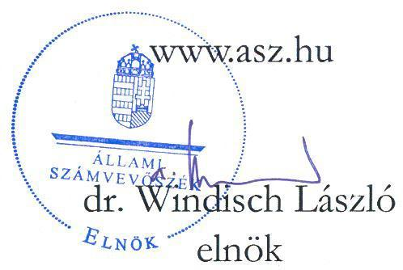
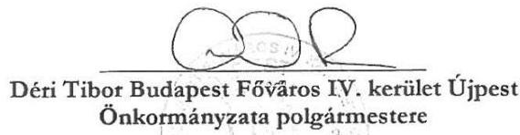
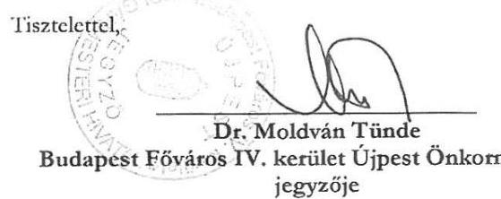
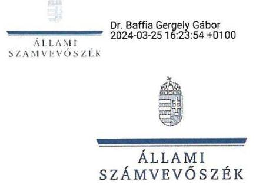

# JELENTÉS 

## Az önkormányzatok vagyongazdálkodása szabályszerűségének ellenőrzése

Budapest Főváros IV. kerület Újpest Önkormányzata ingatlanügyletei

2024.

---

ÁLLAMI
SZÁMVEVÔSZÉK

# JELENTÉS 

## Az önkormányzatok vagyongazdálkodása szabályszerűségének ellenőrzése

Budapest Főváros IV. kerület Újpest Önkormányzata ingatlanügyletei

2024. 

24043

---

# ELLENŐRZÉSI IGAZGATÓSÁG: 

## ÁLLAMHÁZTARTÁS HELYI SZINTJÉT ELLENŐRZŐ IGAZGATÓSÁG

## ELLENŐRZÉSI IGAZGATÓ:

DR. BAFFIA GERGELY GÁBOR igazgató

## ELLENŐRZÉSVEZETŐ:

Jelentéseink az interneten a www.asz.hu címen olvashatók.

## SZEIBEL GÁBORNÉ ellenőrzésvezető

IKTATÓSZÁM: EL-3873-005/2024.
TÉMASZÁM: 2686.
ELLENŐRZÉS-AZONOSÍTÓ SZÁM: V1030

---

# TARTALOMJEGYZÉK 

AZ ELLENŐRZÉS ALAPADATAI ..... 5
AZ ELLENŐRZÉS HATÓKÖRE ÉS TERÜLETE ..... 7
ÖSSZEFOGLALÁS ..... 13
AZ ELLENŐRZÉS FÓKUSZKÉRDÉSE ..... 16
MEGÁLLAPÍTÁSOK ..... 17
JAVASLATOK ..... 27
MELLÉKLETEK ..... 29
I. sz. melléklet: Értelmező szótár ..... 29
II. sz. melléklet: Ellenőrzési kritériumok ..... 31
III. sz. melléklet: Az ellenőrzött szervezetek jegyzéke ..... 32
FÜGGELÉK: ÉSZREVÉTELEK ..... 33
RÖVIDÍTÉSEK JEGYZÉKE ..... 76

---

.

---

# AZ ELLENŐRZÉS ALAPADATAI 

## AZ ELLENŐRZÉS CÉLJA

Az ellenőrzés célja Budapest Főváros IV. kerület Újpest Önkormányzata ${ }^{1}$ és a Magyar Íjász Szövetség ${ }^{2}$ közötti ingatlanügyletek előkészítése, folyamata és eseményei szabályszerűségének, valamint a költségvetésre gyakorolt pénzügyi hatásainak értékelése volt.

## AZ ELLENŐRZÉS TÍPUSA

Megfelelőségi ellenőrzés.

## AZ ELLENŐRZÖTT IDŐSZAK

2018. évtől az ellenőrzés megállapításainak ÁSZ tv. ${ }^{3}$ 29. § (1) bekezdése szerinti megküldése napjáig, kitekintéssel az ellenőrzött időszakot megelőző 5 évre.

## AZ ELLENŐRZÉS TÁRGYA

Az Önkormányzat és a MÍSZ közötti ingatlanügyletek és az azokhoz kapcsolódó események, valamint azoknak az Önkormányzat költségvetésére gyakorolt pénzügyi hatása.

## AZ ELLENŐRZÉS JOGALAPJA

Az ellenőrzés jogszabályi alapját az ÁSZ tv. 1. § (3) bekezdése, 5. § (3) bekezdése és (4) bekezdésének a) pontjai előírásai képezik.

## AZ ELLENŐRZÉS MÓDSZERE

Az ellenőrzés végrehajtására a nemzetközi standardokat irányadónak tekintve az ellenőrzési program szempontjai, az ellenőrzött időszakban hatályos jogszabályok, az ÁSZ ellenőrzés szakmai szabályai és módszertanai figyelembevételével került sor.

Az ellenőrzés lefolytatásához az ellenőrzött szervezetek - a helyszíni ellenőrzés során, továbbá adatbekérés útján - az ÁSZ ${ }^{4}$ által kért dokumentumok, információk rendelkezésre bocsátásával szolgáltattak adatokat.

Az ellenőrzési kérdések megválaszolásához szükséges bizonyítékok megszerzése az ellenőrzött szervezet által rendelkezésre bocsátott dokumentumokra és adatokra alapozva, továbbá interjú, helyszíni szemle, kérdésfeltevés (információkérés), valamint elemző eljárás útján, továbbá igazságügyi ingatlan szakértő ${ }^{5}$ igénybevételével történt. Az ellenőrzési bizonyítékként felhasználható adatforrások közé tartoztak egyrészt az

---

ellenőrzés során kért dokumentumok, másrészt adatforrás lehetett még minden - ellenőrzés során feltárt - az ellenőrzés szempontjából információt tartalmazó dokumentum.

Az ellenőrzés során a MÍSZ az ÁSZ tv. 25. § (3) bekezdésében foglaltak szerinti ellenőrzést támogató szervezetnek minősült.

---

# AZ ELLENŐRZÉS HATÓKÖRE ÉS TERÜLETE

Budapest IV. kerülete a főváros északi részén, a Duna folyó bal partján helyezkedik el. Területe 18,8 km², lakóinak száma közel százezer fő. A kerületet Istvántelek, Káposztásmegyer, Megyer, Népsziget (egy része), Székesdűlő és Újpest településrészek alkotják.

Az Önkormányzatnál az ellenőrzött időszakban a polgármester személyében a 2019. évi önkormányzati választással történt változás. A jegyző,^{6} személye először a 2019. év végén változott, a polgármester,^{7} személyének változását követően. A jegyző,^{8} jogviszonya 2023. május 31-én megszűnt, a jegyző,^{9} 2023. augusztus 21-étől látja el a hivatal vezetését.

Az Önkormányzat a közfeladatok ellátását a Polgármesteri Hivatalon^{10} kívül 17 költségvetési szervvel és hat kizárólagos önkormányzati tulajdonban álló gazdasági társasággal biztosította. Az Újpesti Vagyonkezelő Zrt. további két 100%-os tulajdonában lévő korlátolt felelősségű társasággal rendelkezett.

Az Önkormányzat és költségvetési szervei költségvetési kiadásait és költségvetési bevételeit, valamint az ingatlanvagyon értékeit az alábbi 1. és 2. táblázatok mutatják be.

|  AZ ÖNKORMÁNYZAT ÉS KÖLTSÉGVETÉSI SZERVEI 2018-2022. ÉVI KÖLTSÉGVETÉSI KIADÁSAINAK ÉS BEVÉTELEINEK TELJESÍTÉSE (ADATOK MFT-BAN) |  |  |  |  |   |
| --- | --- | --- | --- | --- | --- |
|  MEGNEVEZÉS | 2018. ÉV | 2019. ÉV | 2020. ÉV | 2021. ÉV | 2022. ÉV  |
|  MŰKÖDÉSI BEVÉTELEK ÖSSZESEN: | 17 395,9 | 18 416,4 | 21 705,3 | 31 337,8 | 22 177,7  |
|  FELHALMOZÁSI BEVÉTELEK ÖSSZESEN: | 7 195,9 | 6 892,2 | 1 241,4 | 838,1 | 612,1  |
|  FOLTSEGVETÉSI BEVÉTELEK FŐÖSSZEGE | 24 591,8 | 25 308,6 | 22 946,7 | 32 175,9 | 22 789,8  |
|  MŰKÖDÉSI KIADÁSOK ÖSSZESEN: | 16 230,3 | 14 145,1 | 16 934,0 | 24 133,8 | 17 959,3  |
|  FELHALMOZÁSI KIADÁSOK ÖSSZESEN: | 4 821,9 | 7 076,9 | 4 221,0 | 4 776,5 | 3 832,6  |
|  KOLTSEGVETÉSI KIADÁSOK FŐÖSSZEGE | 21 052,2 | 21 222,0 | 21 155,0 | 28 910,3 | 21 791,9  |
|  TÖBBLET | 3 539,6 | 4 086,6 | 1 791,7 | 3 265,6 | 997,9  |

*Forrás: Az Önkormányzat 2018-2022. évi zárszámadási rendeletei, azok mellékletei alapján ÁSZ saját szerkesztés.*

### 2. táblázat

### AZ ÖNKORMÁNYZAT ÉS KÖLTSÉGVETÉSI SZERVEI 2018-2022. ÉVI MÉRLEGFŐÖSSZEGE, ÉS MÉRLEGBEN KIMUTATOTT INGATLANVAGYONA (ADATOK MFT-BAN)

|  MEGNEVEZÉS | 2018. ÉV | 2019. ÉV | 2020. ÉV | 2021. ÉV | 2022. ÉV  |
| --- | --- | --- | --- | --- | --- |
|  MÉRLEGFŐÖSSZEG | 49 122,5 | 51 489,4 | 57 751,5 | 57 076,9 | 60 190,9  |
|  ebből: tárgyi eszközök | 29 739,8 | 33 215,1 | 36 425,9 | 38 165,5 | 38 894,1  |
|  Tárgyi eszközökből ingatlanok és kapcsolódó vagyoni értékű jogok | 25 763,4 | 26 092,4 | 26 945,1 | 29 186,2 | 35 015,7  |

*Forrás: Az Önkormányzat 2018-2022. évi zárszámadási rendeletei, azok mellékletei alapján ÁSZ saját szerkesztés.*

---

Az ellenőrzés az Önkormányzat vagyongazdálkodási tevékenységére, azon belül is az Önkormányzat és a MÍSZ közötti ingatlan ügyletekre és az azokkal kapcsolatos valamennyi eseményre, körülményre és ezek pénzügyi hatásaira terjedt ki. Az ellenőrzés továbbá kiterjedt minden olyan körülményre és adatra, amely az ÁSZ jogszabályban meghatározott feladatainak teljesítéséhez, valamint a program végrehajtása folyamán felmerült újabb összefüggések feltárásához szükséges volt.

Az egyes sportcélú támogatások forrásszükségletének biztosításáról szóló 1814/2016. (XII. 20.) Korm. határozat alapján a MÍSZ 571,0 M Ft (550,0 M Ft az Íjász Központra ${ }^{11}$, 21,0 M Ft működési kiadásokra) vissza nem térítendő támogatást kapott a 2024. évi olimpiai pályázathoz kapcsolódó sportszakmai és sportlétesítmény fejlesztési feladatok ellátása keretében. Az EMMI ${ }^{12}$ a 2016. december 23-án kiadott támogatói okirata alapján, támogatási előlegként 2016. december 28. napján a támogatás teljes összegét a MÍSZ számlájára utalta. A támogatói okirat alapján a támogatást 2019. január 31-ig használhatta fel a MÍSZ, a módosított támogatói okirat alapján pedig 2020. január 31-éig. A módosítás az Íjász Központ létrehozására kapott 550,0 M Ft támogatás pénzügyi felhasználásának határidejére vonatkozott.

A MÍSZ 2017. őszén megkereséssel élt az Önkormányzat polgármester1-e felé egy Íjász Központ létrehozása és ahhoz kapcsolódó íjász gyakorló- és versenypályák kialakítása érdekében találjanak olyan ingatlant, ahol a beruházás megvalósulhat.

A MÍSZ és az Önkormányzat a 2017. decemberében közös megegyezéssel az Íjász Központ épületének helyeként az Önkormányzat tulajdonában lévő ingatlan $1^{13}$-et jelölte meg, amely a Képviselő-testület: ${ }^{14}$ 193/2016. (X. 27.) KT határozata alapján a forgalomképtelen törzsvagyonba tartozott. A szabadtéri íjász gyakorló- és versenypályák helyeként pedig a Fővárosi Önkormányzat ${ }^{15}$ tulajdonában álló, az ingatlan1-gyel szomszédos „erdő"múvelési ágú ${ }^{16}$, forgalomképtelen ingatlanból 2 ha $800 \mathrm{~m}^{2}$ területet jelöltek meg. Az ingatlan1 $1 / 2$ tulajdoni hányadát 2032-ig a Fővárosi Önkormányzatot megillető 15 évre szóló elidegenítési tilalom terhelte, a Fővárosi Önkormányzat tulajdonában álló ingatlan1-gyel szomszédos ingatlan $1 / 2$ tulajdoni hányadán pedig az Önkormányzat javára elidegenítési és terhelési tilalom volt bejegyezve, szintén 15 évre. A MÍSZ és a polgármester ${ }_{1}$ 2017. december 20-án közös levélben fordult a Fővárosi Önkormányzathoz, a Fővárosi Önkormányzat támogatását kérve az Íjász Központ ezen ingatlanokon történő megvalósításához. A Fővárosi Önkormányzat 2018. január 23-án kelt levelében jelezte elvi támogatását és kérte a szükséges javaslatok kidolgozását és az erdészeti hatóságok felé szükséges eljárás lefolytatását.

A MÍSZ ingatlan vételi szándéka az ingatlan1 $1 / 2$ tulajdoni hányadára vonatkozott, míg a másik $1 / 2$ tulajdoni hányadra ingyenes használati jogot kért az Önkormányzattól, az ingatlan1-gyel szomszédos ingatlan megjelölt részére pedig a Fővárosi Önkormányzattól hozzájárulást kért a terület használatához.

Az Önkormányzat és a MÍSZ közötti ingatlanügyletek összetettségére tekintettel a folyamatot alkotó eseményekről a következő táblázatban időrendben nyújt áttekintést.

---

# 5. táblázat 

## AZ ÖNKORMÁNYZAT ÉS A MÍSZ KÖZÖTTI INGATLANÜGYLETEK ESEMÉNYEI KRONOLÓGIAI SORRENDBEN

| SORSZ. | DAFUM | ESEMÉNY |
| :--: | :--: | :--: |
| 1. | 2016.év | MÍSZ pályázata az Íjász Központ megvalósítására. |
| 2. | 2016.10.27. | 193/2016. (X. 27.) KT határozat az erdő melletti park funkciójú ingatlan1 törzsvagyonba sorolásáról az Nvtv. ${ }^{17}$ 5. § (3) bekezdése alapján. |
| 3. | 2016.12.15. | Határozati javaslat az Önkormányzat Fővárosi Önkormányzattal közös - az ingatlan1-et is tartalmazó - vagyonmegosztásra, valamint a ingatlan1 Fővárosi Önkormányzattal közös tulajdonának megszüntetésére. |
| 4. | 2016.12.20. | 1814/2016. (XII. 20.) Korm. határozat (Döntés Íjász Központ 550 M Ft-os beruházási támogatásáról). |
| 5. | 2016.12.23. | Támogatási szerződés megkötése a MÍSZ és az EMMI között az Íjász Központ megvalósítása érdekében. |
| 6. | 2017.04.27. | 83/2017. (IV. 27.) KT határozat az Önkormányzat Fővárosi Önkormányzattal közös - az ingatlan1-et is tartalmazó - vagyonelemek megosztásáról. |
| 7. | 2017.06.09. | Az Önkormányzat Fővárosi Önkormányzattal közös - ingatlan1-et is tartalmazó - vagyonelemek megosztásáról szóló Vagyonmegosztási megállapodás aláírása. |
| 8. | 2018.01.23. | A Fővárosi Önkormányzatnak az ingatlan1-en és az ingatlan1-gyel szomszédos ingatlanon tervezett beruházás támogatásáról adott tájékoztatása. |
| 9 . | 2018.02.26. | Az Önkormányzat értékbecslést készíttet az ingatlan1-re vonatkozóan (értékbecslés eredménye bruttó $24,8 \mathrm{M} \mathrm{Ft}$, az ingatlan1 $1 / 2$ tulajdoni hányadára). |
| 10. | 2018.03.29. | Képviselő-testület: 56/2018. (III. 29.) KT határozata az Íjász Központ létesítésének támogatásáról. |
| 11. | 2018.04.26. | Adásvételi előszerződés megkötése az ingatlan1-re ( $1 / 2$ tulajdoni hányadra) az Önkormányzat és a MÍSZ között. |
| 12. | 2018.09.24. | Az Íjász Központ megvalósítására vonatkozó Támogatói okirat módosítása a MÍSZ és EMMI között, a befejezési és elszámolási határidő egy évvel történő meghosszabbítására. |
| 13. | 2018.11.14. | Ingatlan1 törzsvagyonból történő kivonása a vagyonkataszterben, képviselőtestületi döntés nélkül. |
| 14. | 2019.04.04. | Az Önkormányzat értékbecslést készíttet az ingatlan1-re vonatkozóan (értékbecslés eredménye bruttó $24,8 \mathrm{M} \mathrm{Ft}$, az ingatlan $1 / 2$ tulajdoni hányadára), amit nem a regisztrált értékbecslő írt alá. |
| 15. | 2019.04.09. | Végleges Adásvételi szerződés megkötése az ingatlan1 $1 / 2$ tulajdoni hányadára az Önkormányzat és a MÍSZ között. |
| 16. | 2019.04.09. | Használati szerződés az Önkormányzat és a MÍSZ között az ingatlan1 önkormányzat tulajdonban maradt $1 / 2$ tulajdoni hányadára. (Az Önkormányzat nyilatkozott, hogy a szerződés 2023. május 15-én került hozzájuk a Vagyonkezelő Zrt. irattári anyagából. |

---

|  SORSZ. | DÁTUM | ÉSEMÉNY  |
| --- | --- | --- |
|  17. | 2019.05.06. | A Fővárosi Önkormányzat nyilatkozata, mely szerint nem él az elővásárlási jogával.  |
|  18. | 2019.05.07. | MNV Zrt. nyilatkozata, mely szerint az állam nem él az elővásárlási jogával.  |
|  19. | 2019.05.29. | A Fővárosi Önkormányzat az ingatlan1-gyel szomszédos ingatlanának a MÍSZ ingyenes használatába történő adására irányuló határozati javaslat tervezett tárgyalása, mely javaslat azonban visszavonásra került, így annak közgyűlés általi tárgyalása nem történt meg.  |
|  20. | 2019.07.09. | A Fővárosi Önkormányzat, mint tulajdonos hozzájárulása megszerzésének határideje az ingatlan1-gyel szomszédos fővárosi tulajdonú ingatlan vonatkozásában az adásvételi szerződés szerint.  |
|  21. | 2019.10.30. | 147/2019. (X. 30.) KT határozat, mely szerint a Képviselő-testület: ${ }^{18}$ nem ért egyet az Íjász Központ létesítésével és felkéri a polgármester ${ }^{19}$-t a tárgyalásokra az adásvételi szerződés megszüntetése, valamint az eredeti állapot helyreállítása érdekében.  |
|  22. | 2019.11.07. | Építési engedélyeztetési eljárás indítása az ingatlan1-re, mely engedély kiadására tulajdonosi és egyéb hozzájárulások hiánya miatt nem került sor.  |
|  23. | 2019.11.28. | 170/2019. (XI. 28.) KT határozat a Káposztásmegyer lakótelep KÉSZ ${ }^{20}$ eseti, meglévő zöldfelületekkel kapcsolatos módosításának indításával kapcsolatban  |
|  24. | 2020.01.31. | Visszalépési lehetőség vége a MÍSZ számára az Önkormányzattal az ingatlan1-re kötött adásvételi szerződéstől, valamint az Íjász Központ megvalósítására irányuló támogatás felhasználásának határideje az EMMI felé (a pénzügyi elszámolás határideje: 2020. február 29-e volt).  |
|  25. | 2020.04.09. | 11/2020. (IV. 9.) Önk. rendelet meghozatala a polgármester ${ }_{2}$ által változtatási tilalom elrendeléséről a ingatlan1-re vonatkozóan.  |
|  26. | 2020.06.25. | 135/2020. (VI. 25.) KT határozat a polgármester ${ }_{2}$ veszélyhelyzetben hozott döntéseiről szóló tájékoztatás elfogadásáról.  |
|  27. | 2020.09.01. | Az Íjász Központ megvalósítása támogatásának visszavonása.  |
|  28. | 2020.10.29. | 218/2020. (X. 29.) KT határozat a MÍSZ-szel történő megállapodásról, az Íjász Központ új helyszínen történő megvalósításáról, ingatlanok cseréjének előkészítéséről.  |
|  29. | 2020.11.30. | Az Önkormányzat 2020-2024. évekre szóló gazdasági programjának elfogadása, mely rendelkezik az ingatlan221-t érintően is a rekreációs terület létrehozásáról, a terület közművesítéséről.  |
|  30. | 2020.12.16. | Az Önkormányzat tulajdonosi hozzájárulása az építési engedélyhez nem kötött kivitelezési munkákhoz az új helyszínen, mely a Fővárosi Önkormányzattal közös tulajdonban lévő telekcsoport újra osztásával kerül kialakításra (a kialakított új ingatlan: ingatlan2).  |
|  31. | 2020.12.17. | 255/2020. (XII. 17.) KT határozat a MÍSZ-szel történő megállapodásról, az Íjász Központ új helyszínen (ingatlan2-n) történő megvalósításáról, ingatlanok cseréjének előkészítéséről.  |
|  32. | 2020.12.23. | A Fővárosi Önkormányzat tulajdonosi hozzájárulása az építési engedélyhez nem kötött kivitelezési munkákhoz az új helyszínen (ingatlan2).  |

---

| SORSZ. | DAFUM | ESEMÉNY |
| :--: | :--: | :--: |
| 33. | 2021.02.19. | Ingatlan2 értékbecslése a Fővárosi Önkormányzat által (nettó 359 M Ft a teljes ingatlanra). |
| 34. | 2021.03.10. | A polgármester 63/2021. (III. 10.) KT határozata a Fővárosi Önkormányzattal közös ingatlanok telekalakítására, az Íjász Központ építésére alkalmas terület osztatlan közös tulajdon megszüntetésére. |
| 35. | 2021.03.17. | Megállapodás a Fővárosi Önkormányzattal telekcsoport újra osztásáról és közös tulajdon részbeni megszüntetéséről, mellyel kialakításra került az Íjász Központ megvalósításának új helyszíne, az ingatlan2. |
| 36. | 2021.04.19. | Építési engedély iránti kérelem benyújtása az ingatlan2-re az ÉTDR-ben ${ }^{22}$. |
| 37. | 2021.04.28. | A Kormányhivatal ${ }^{23}$ helyszíni szemléje az építési engedélyezési eljárás során, melynek keretében engedély nélküli építési tevékenység megkezdését állapította meg az ingatlan2-n. |
| 38. | 2021.05.05. | Építési engedély megadásának megtagadása az ingatlan2 vonatkozásában. |
| 39. | 2021.05.18. | Önkormányzat tulajdonosi hozzájárulása az építési engedélyezési eljárás lefolytatásához az ingatlan2-n. |
| 40. | 2021.06.02. | Kormányhivatal fennmaradási és továbbépítési engedélyének megadása az Íjász Központ vonatkozásában az ingatlan2-re. |
| 41. | 2022.01.24. | Az Önkormányzat által végeztetett értékbecslés a ingatlan1-re (becsült piaci érték a teljes tulajdoni hányadra bruttó 492 M Ft ) |
| 42. | 2022.01.24. | Az Önkormányzat által végeztetett értékbecslés az ingatlan2-re (becsült piaci érték a teljes tulajdoni hányadra bruttó 496 M Ft ) |
| 43. | 2021.06.24. | 330/2021. (VI. 24.) KT határozat a polgármester ${ }_{2}$ veszélyhelyzetben hozott döntéseiről adott tájékoztatás elfogadásáról. |
| 44. | 2021.07.30. | 26/2021. (VII. 29.) Önk. rendelet a M3 metró Káposztásmegyerig történő meghosszabbításával érintett területekre vonatkozó egyes kerületi építési szabályzatok módosításáról |
| 45. | 2022.01.27. | 28/2022. (I. 27.) KT határozat az ingatlan1 és ingatlan2 $1 / 2$ - $1 / 2$ tulajdoni hányadának cseréjére irányuló csereszerződés megkötéséről. |
| 46. | 2022.04.11. | Csereszerződés aláírása az ingatlan1 és ingatlan2 $1 / 2$ - $1 / 2$ tulajdoni hányadának cseréjére. |
| 47. | 2022.04.11. | Az Önkormányzat és a MÍSZ közötti Együttmüködési megállapodás aláírása az Íjász Központ megvalósításával kapcsolatban (út- és közmű építési kötelezettség vállalása). |
| 48. | 2022.04.29. | Az Önkormányzat kérelmének benyújtása a Kormányhivatal felé az ingatlan1 és ingatlan2 $1 / 2$ - $1 / 2$ tulajdoni hányadának cseréjére irányuló csereszerződés engedélyezési eljárásának megindítására. |
| 49. | 2022.06.01. | Az Önkormányzat Kormányhivatal általi felszólítása hiánypótlásra az ingatlan1 és ingatlan2 $1 / 2$ - $1 / 2$ tulajdoni hányadának cseréjére irányuló csereszerződés engedélyezési eljárása során. |
| 50. | 2022.06.22. | 153/2022. (VI. 22.) KT határozat az ingatlan1 és ingatlan2 $1 / 2$ - $1 / 2$ tulajdoni hányadának cseréjére irányuló csereszerződés módosítására a Kormányhivatal hiánypótlásra történő felszólítására (polgármester felhatalmazása a csereszerződés Kormányhivatal általi jóváhagyási kérelem benyújtására). |

---

| SORSZ. | DÁTUM | ÉSEMÉNY |
| :--: | :--: | :--: |
| 51. | 2022.07.14. | Az ingatlan1 és ingatlan2 $1 / 2$ - $1 / 2$ tulajdoni hányadának cseréjére irányuló módosított csereszerződés aláírása. |
| 52. | 2022.07.14. | Módosított együttműködési megállapodás aláírása (módosítás: ingatlan2 $1 / 2$ tulajdoni hányadának, valamint a $76563 / 6,76563 / 10$ hrsz.-ú ingatlanok ingyenes használatba adása, Íjász Központ 2022. évi kétszeri bérlésének vállalása az Önkormányzat részéről). |
| 53. | 2022.09.02. | Az Önkormányzat Kormányhivatal általi másodszori felszólítása hiánypótlásra az ingatlan1 és ingatlan2 $1 / 2$ - $1 / 2$ tulajdoni hányadának cseréjére irányuló csereszerződés engedélyezési eljárása során. |
| 54. | 2022.09.21. | A polgármester ${ }_{2}$ levele a Kormányhivatalnak az ingatlan1 és ingatlan2 $1 / 2-1 / 2$ tulajdoni hányadának cseréjére irányuló csereszerződés jóváhagyási eljárásának visszavonására. |
| 55. | 2022.10.03. | Önkormányzat által végeztetett értékbecslés a ingatlan1-re, 2022. október 3ra (nettó 246,4 M Ft, $1 / 2$ tulajdoni hányadra vonatkozóan). |
| 56. | 2022.10.03. | Önkormányzat által végeztetett értékbecslés az ingatlan2-re 2022. október 3ra (nettó 251,6 M Ft, $1 / 2$ tulajdoni hányadra vonatkozóan). |
| 57. | 2022.10.27. | 211/2022. (X. 27.) KT határozat az ingatlan1 és ingatlan2 $1 / 2$ - $1 / 2$ tulajdoni hányadának cseréjére irányuló csereszerződés Kormányhivatal általi jóváhagyási eljárás kérelmének visszavonásáról. |
| 58. | 2023. 05.22. | Az Önkormányzat által végeztetett értékbecslés az ingatlan1 2019. áprilisi ingatlanforgalmi értékére ( $223,5 \mathrm{MFt}$ ) |
| 59. | 2023. 05. vagy 06   hó nincs pontos   dátum | Per indítása az MÍSZ részéről az Önkormányzat ellen vagyoni kár megtérítése iránt. |
| 60. | 2023. 09. hó   nincs pontos   dátum | Önkormányzat érdemi ellenkérelmet nyújtott be a MÍSZ keresetlevelére. |

---

# ÖSSZEFOGLALÁS 

Az Állami Számvevőszék általános hatáskörrel végzi az önkormányzati vagyonnal való gazdálkodás ellenőrzését. Az önkormányzatok vagyona az önkormányzati feladatok és célok ellátását szolgálja, ideértve a lakosság közszolgáltatásokkal való ellátását, és az ezekhez szükséges infrastruktúra biztosítását. Az önkormányzati vagyonba tartozó ingatlanok jelentős anyagi értéket képviselő vagyonelemek, amelyek esetében kiemelten fontos a nemzeti vagyonnal való felelős gazdálkodás követelményeinek érvényesítése. Mindezek mentén került sor az Önkormányzat és a MÍSZ közötti ingatlanügyletek előkészítésének és végrehajtásának ellenőrzésére.

## Az Önkormányzat és a MÍSZ közötti ingatlanügyletek előkészítése és végrehajtása nem felelt meg teljeskörűen a jogszabályi előírásoknak.

A Képviselő-testület: 2018-ban hozott határozatában arról döntött, hogy támogatja a MÍSZ által állami támogatásból megvalósuló Íjász Központ kialakítását, és egyetértett az erre a célra kijelölt ingatlan $11 / 2$ tulajdoni hányadának eladásával, valamint a másik $1 / 2$ tulajdoni hányad ingyenes használatba adásával, felhatalmazta továbbá a polgármester,-t a szükséges intézkedések megtételére.

Az adásvételi szerződés létrejöttének előszerződésben rögzített feltételei nem teljesültek, mert a Magyar Állam nevében eljáró MNV Zrt. jelezte, hogy elővásárlási jogáról csak további dokumentumok beküldését, vagy a végleges adásvételi szerződés megkötését követően tud dönteni. A Fővárosi Önkormányzat az ingatlan1 esetében lemondott elővásárlási jogáról, de nem adott ingyenes használati jogot az ingatlan1-gyel szomszédos ingatlanra a szabadtéri íjász gyakorló- és versenypályák kialakíthatósága érdekében. A Képviselő-testület: nem döntött az ingatlan1 törzsvagyonból történő kivonásáról, mivel sem a polgármester ${ }_{1}$, sem a jegyző́, nem terjesztett az ingatlan1 forgalomképtelen törzsvagyonból történő kivezetésére vonatkozó döntés meghozatala érdekében előterjesztést a Képviselő-testület ${ }_{1}$ elé.

Az Önkormányzat több mint egy év egyeztetést követően 2019-ben az előszerződésben szereplő vételárral azonos összeggel adásvételi szerződést kötött a MÍSZ-szel az ingatlan1 1⁄2 tulajdoni hányadának értékesítésére. Az adásvételi szerződés nem felelt meg a jogszabályi előírásoknak, mert a forgalomképtelen törzsvagyonba sorolt ingatlan1 $1 / 2$ tulajdoni hányadának eladására vonatkozott. Képviselő-testületi döntés hiánya ellenére az ingatlanvagyonkataszteri nyilvántartásban megtörtént az ingatlan1 $1 / 2$ részének a törzsvagyonból történő kivezetése, ezáltal a jegyző́ a jogszabályi rendelkezés ellenére nem gondoskodott arról, hogy a nyilvántartás adatai - az elvárt képviselő-testületi döntéssel megalapozottan - hitelesek és alátámasztottak legyenek.

Az adásvételi szerződés rögzítette, hogy ha a Fővárosi Önkormányzattal nem sikerül megállapodni az ingatlan1-gyel szomszédos ingatlan használatáról, a MÍSZ elállhat az adásvételi szerződéstől 2020. január 31éig, amely időpont egyben az Íjász Központ megvalósítására kapott támogatás felhasználási határideje is volt.

Az önkormányzati választásokat követően az új Képviselő-testület 2019 . október 30 -án határozatban döntött arról, hogy nem ért egyet az Íjász Központ ingatlan1-en történő létesítésével és felkérte a polgármesterzt a tárgyalások megkezdésére a MÍSZ-szel a 2019. április 9-én létrejött adásvételi szerződés megszüntetése és az eredeti állapot helyreállítása érdekében. Az Önkormányzat nevében a Polgármester veszélyhelyzeti felhatalmazásával élve rendeletben változtatási tilalmat rendelt el az ingatlan1-re vonatkozóan, meghiúsítva ezzel az azon tervezett beruházást. Emellett a beruházás megvalósíthatósága érdekében csereingatlant (ingatlan2) ajánlott fel a MÍSZ számára 2020 októberében. A MÍSZ folytatta az ingatlancserére irányuló tárgyalásokat az Önkormányzattal, annak ellenére, hogy a támogatói okirat szerint a beruházás kivitelezési és

---

pénzügyi elszámolásának határideje - 2020. január 31-én, illetve február 29-én - már lejárt, továbbá az EMMI 2020. szeptember 1-jével rendelkezett a támogatás visszavonásáról.

A polgármester ${ }_{2}$ és a Fővárosi Önkormányzat 2020 decemberében hozzájárulását adta az építési engedélyhez nem kötött kivitelezési munkák végzéséhez a beruházás új helyszínét képező ingatlan2 területére. A kivitelező annak ellenére, hogy ahhoz a tulajdonosok hozzájárulását nem kapta meg, építési engedély köteles tevékenységet is végzett az új helyszínen, amely ellen az Önkormányzat Polgármesteri Hivatala nem tett intézkedéseket.

Az ingatlanok cseréjére irányuló szerződés 2022 áprilisában került aláírásra. A csereszerződésben a jogszabályi előírás ellenére a szolgáltatás és ellenszolgáltatás értékarányossága nem érvényesült, továbbá két, a Főváros Önkormányzatával közös ingatlan használatba adásáról a Fővárosi Közgyűlés döntése nélkül rendelkezett az Önkormányzat. A csereingatlanok tekintetében a szolgáltatás és ellenszolgáltatás értékarányosságának érvényesítésére külön együttműködési megállapodásban rendelkeztek, amelyben út- és közmű építést, valamint annak késedelmes, vagy nem teljesítése esetére kötbérfizetési kötelezettséget vállaltak, ami a megvalósítás rövid időtartamára tekintettel pénzügyi kockázattal járt az Önkormányzat számára.

A csereszerződés hatályba lépéséhez a Kormányhivatal jóváhagyása volt szükséges. A polgármester ${ }_{2}$ a jogszabály rendelkezése ellenére úgy nyújtotta be a jóváhagyási eljárás lefolytatására irányuló kérelmet a Kormányhivatalnak, hogy nem rendelkezett az ahhoz szükséges képviselő-testületi felhatalmazással, továbbá nem mellékelte a Képviselő-testület ${ }_{2}$ döntését arról, hogy a csereügylet mely kötelező feladat ellátását vagy gazdasági érdek érvényesülését támogatja.

A Kormányhivatal hiánypótlásra szólította fel az Önkormányzatot és jelzései alapján mind a csereszerződés, mind az együttműködési megállapodás módosításra került. A polgármester ${ }_{2}$ által aláírt módosított csereszerződés nem egyezett meg a Képviselő-testület ${ }_{2}$ által jóváhagyott tervezettel. Az együttműködési megállapodás módosítását a Képviselő-testület ${ }_{2}$ nem tárgyalta. A módosított csereszerződés és együttműködési megállapodás nem volt összhangban a jogszabályi rendelkezésekkel, mivel elmaradt a dokumentumok pénzügyi ellenjegyzése, továbbá az együttműködési megállapodás nem tartalmazott rendelkezést a beszámolási, adatszolgáltatási, nyilvántartási feladatokra. Az együttműködési megállapodásban az út- és közmű építés 2022. október 31-i határideje nem változott, ami a kötbérfizetési kockázatot tovább növelte. Az Íjász Központ beruházásának félkész állapota ellenére a létesítmény bérlésére vállalt kötelezettséget az Önkormányzat.

A Kormányhivatal a módosított csereszerződés megküldését követően ismételten hiánypótlásra szólította fel az Önkormányzatot. A polgármester ${ }_{2}$ ezt követően az Önkormányzat csereszerződés engedélyezési eljárás iránti kérelmét a Képviselő-testület ${ }_{2}$ hozzájárulása nélkül, szabálytalanul 2022 szeptemberében visszavonta. A Képviselő-testület ${ }_{2}$ a hozzájárulást utólag adta meg, az Önkormányzat a csereügylet hatályba lépése érdekében további lépéseket nem tett.

Az Önkormányzatnál az érintett ingatlanok leltározása nem felelt meg a Számv. tv. ${ }^{24}$ 69. § (1) és (3) bekezdése, a Leltározási és leltárkészítési szabályzat, valamint a Leltározási utasítás ${ }^{25}$ előírásainak, mivel a legalább három évenkénti mennyiségben történő leltározási kötelezettségnek nem tettek eleget, így a költségvetési beszámolók mérlegének ingatlanokra vonatkozó sora nem volt szabályszerűen alátámasztott. Az Önkormányzat az Áhsz. ${ }^{26}$ 30. § (4) bekezdésének rendelkezésre ellenére nem biztosította a számviteli és egyéb nyilvántartások közötti egyezőséget az ingatlanok tekintetében. Az Önkormányzat 2021-2022. évi költségvetési beszámolója nem mutatott megbízható és valós képet az Önkormányzat vagyoni helyzetéről és annak változásáról, mert az ingatlan2-t a tárgyi eszközök között nem vették nyilvántartásba. A vagyon kimutatásának

---

elmaradása miatt bekövetkezett jelentős összegű hiba ( 359 M Ft ) miatt sérültek a teljesség és a lényegesség számviteli alapelvek.

Az Önkormányzat és a MÍSZ közötti ingatlanügyletekhez kapcsolódó jogi, értékbecsléssel és telekalakítással kapcsolatos kiadások a költségvetés betartására nem jelentettek kockázatot, azokra a kiadási előirányzatok fedezetet biztosítottak.

Az Önkormányzat az ingatlan1 $1 / 2$ részének értékesítése, valamint az ingatlancsere ügylet előkészítése során nem tett eleget a jogszabályi előírásoknak. Az Önkormányzat és a MÍSZ közötti ingatlan ügyletek következtében az Önkormányzat tulajdonában lévő ingatlan2 nem hasznosítható, mivel az ingatlan2-n található félkész felépítmény nincs használható állapotban, továbbá annak jogi helyzete rendezetlen. A kialakult helyzet rendezése az Önkormányzat számára jelentős pénzügyi kockázatot hordoz, mivel a MÍSZ vagyoni kár okozása miatt pert indított az Önkormányzat ellen, amelyre az Önkormányzat érdemi ellenkérelmet nyújtott be a MÍSZ keresetlevelére.

Az ingatlan2-n kialakult helyzet szabályszerű és költséghatékony rendezése érdekében, valamint a jogszabályi előírásoknak az Önkormányzat vagyongazdálkodási tevékenysége során történő érvényesítése céljából az ÁSZ négy javaslatot fogalmazott meg a polgármester ${ }_{2}$ és hat javaslatot a jegyző ${ }_{3}$ számára.

---

# AZ ELLENŐRZÉS FÓKUSZKÉRDÉSE 

1.- Az Önkormányzat vagyongazdálkodási feladatainak ellátása az Önkormányzat és a MÍSZ közötti ingatlanügyletek tekintetében szabályszerűen történt-e, a kapcsolódó kifizetések az elöírásokkal összhangban voltak-e?

---

# MEGÁLLAPÍTÁSOK 

## 1. Az Önkormányzat vagyongazdálkodási feladatainak ellátása az Önkormányzat és a MÍSZ közötti ingatlanügyletek tekintetében szabályszerűen történt-e, a kapcsolódó kifizetések az előírásokkal összhangban voltak-e?

Összegző megállapítás Az Önkormányzat vagyongazdálkodási feladatainak ellátása - az Önkormányzat és a MÍSZ közötti ingatlanügyletek tekintetében - nem felelt meg teljeskörűen a jogszabályi előírásoknak. Az ügyletek következtében előállt rendezetlen helyzet megoldásának várható költségei pénzügyi kockázatot jelentenek az Önkormányzat számára.

Az ingatlan adásvételi szerződés és a kapcsolódó szerződések nem feleltek meg teljeskörűen a jogszabályi és az Önkormányzat belső szabályzataiban foglalt előírásoknak.
A Képviselő-testület: 56/2018. (III. 29.) KT határozatában egyhangúan döntött arról, hogy támogatja a MÍSZ által építendő Íjász Központ megvalósítását. Egyetértett azzal, hogy az önkormányzati tulajdonban lévő ingatlan $11 / 2$ tulajdoni hányada a MÍSZ részére értékesítésre, az ingatlan 1 másik $1 / 2$ tulajdoni hányada a MÍSZ részére ingyenes használatba átadásra kerüljön.
A Képviselő-testület: a határozatban felhatalmazta a polgármester,-t az ügylettel összefüggő intézkedések megtételére, a szerződések megkötésére és a jognyilatkozatok kiadására „folyamatos" határidő megjelöléssel. Az Önkormányzat nevében a polgármester 2018. április 26-án a MÍSZ-szel ingatlan adásvételi előszerződést kötött az ingatlan $11 / 2$ tulajdoni hányadának értékesítésére.
A vételár az előszerződésben $19,5 \mathrm{MFt}+27 \%$ ÁFA, azaz bruttó $24,8 \mathrm{MFt}$ volt. Az értékbecslő által megállapított ingatlanár - igazságügyi ingatlan-szakértői vélemény szerint - nem felelt meg a piaci értékelés módszerének, mert nem rögzítette egyértelműen, hogy milyen korrekciós tényezőket vett figyelembe az értékbecslés készítője az ingatlan $11 / 2$ tulajdoni hányada értékének megállapítása során. A Számv. tv. 169. § (2) bekezdése és a Levéltári tv. ${ }^{27} 9 . \S$ (1) bekezdés e) pontjában foglaltak ellenére az értékbecslés hiteles, aláírt példányát sem az Önkormányzat, sem az értékbecslés elkészíttetésével megbízott UV Zrt. ${ }^{28}$ nem őrizte meg.
Az előszerződésben meghatározták, hogy az ingatlan $1 \frac{1}{2}$ tulajdoni hányadára vonatkozóan a végleges adásvételi szerződést akkor kötik meg, ha az alábbi feltételek mindegyike teljesül:

- „a Magyar Állam (képviseli: MNV Zrt.) nem él az elő́sásárlási jogával, vagy a megjelölt 35 (barmincöt) napos határidöben nyilatkozatot nem tesz,
- Budapest Föváros Önkormányzata nem él az elő́sásárlási jogával, vagy a megjelölt 30 (barminc) napos határidőben nyilatkozatot nem tesz,

---

- Eladó Képviselö-testülete határozatával az ingatlanbányadot kivonja a törzsvagyon köréböl és dönt annak. Vevö részére történő elidegenitéséröl,
- Budapest Főváros Önkormányzata legalább 15 évre írásos megállapodással érvényesen és jogbatályosan basználatba adja Vevő részére a 76546/16 helyrajzi szám alatt felvett belterületi telekkel szomszédos Budapest, IV. kerület 76546/14. helyrajzi szám alatt felvett 22 ha erdő minösitésü területet, ijász pálya kialakítása céljára. Ezen használatba adási szerzödésben Budapest Főváros Önkormányzat egyben a hozzájárulását kell adja abhoz is, bogy Felek. egymással a jelen elöszerzödés 10,3 pontjában írt tartalommal megállapodást kössenek."
Az adásvételi szerződés megkötésének az előszerződésben rögzített feltételei nem teljesültek. Bár a Fővárosi Önkormányzat elvi hozzájárulását adta az ügylethez, a Magyar Állam nevében eljáró MNV Zrt. azonban azt jelezte, hogy elővásárlási jogáról csak a végleges adásvételi szerződés megkötését követően tud dönteni. Az előszerződés az Önkormányzat számára a foglaló (4,8 M Ft) meg nem fizetése esetére az adásvételtől történő elállási jogot biztosított. A foglaló fizetési kötelezettségének a MÍSZ nem tett eleget.
Az adásvételi szerződést az Önkormányzat és a MÍSZ 2019. április 9-én megkötötte, melynek 4.2. és 5. pontjában rögzítésre került, hogy az adásvételi szerződés létrejöttének feltétele a Magyar Államnak és a Fővárosi Önkormányzatnak az elővásárlási jogáról történő lemondása. Az adásvételi szerződés nem felelt meg az Nvtv. 6. § (1) bekezdése és a vagyonrendelet 24. § előírásainak, mivel az forgalomképtelen törzsvagyon elidegenítésére irányult.
A Képviselő-testület ${ }_{1}$ a vagyonrendelet 11. § (1) bekezdésében meghatározott - az ingatlan1 forgalomképesség szerinti besorolásának megváltoztatására irányuló - jogkörével nem tudott élni, - bár az ingatlan értékesítéséről hozott egyhangú döntésével kifejezte ez irányú egyértelmű szándékát -, mivel sem a polgármester ${ }_{1}$, sem a jegyző ${ }_{1}$ nem terjesztette elő a Képviselő-testület ${ }_{1}$ számára az adásvételi szerződésre vonatkozó előterjesztés megvitatását megelőzően az arra irányuló javaslatot. Az Mötv. 110. § (1) bekezdésében foglalt előírás ellenére a jegyző ${ }_{1}$ nem gondoskodott a vagyonkataszteri nyilvántartás szabályszerű vezetéséről, mivel az ingatlan1-et 2018. november 14-én képviselő-testületi döntés nélkül kivezette a forgalomképtelen törzsvagyon köréből.
Az adásvételi szerződésben szereplő vételár (24,8 M Ft) megegyezett az előszerződésben szereplő vételárral, melyet a MÍSZ fizetési határidőn (2019. június 3.) belül, 2019. május 27-én az Önkormányzat számlájára átutalt.
A Fővárosi Önkormányzat 2019. május 6-án, míg a Magyar Állam képviseletében eljáró MNV Zrt. 2019. május 7-én, az adásvételi szerződés megkötését követően nyilatkozott, hogy elővásárlási jogukkal nem kívánnak élni az ingatlan1 tekintetében. Az ingatlan-nyilvántartási kérelem benyújtása 2019. május 14-i dátummal történt meg az illetékes földhivatalba, amely alapján a ingatlan1-re a MÍSZ részére az $1 / 2$ tulajdoni hányad bejegyzésre került.
- Az adásvételi szerződésben rögzítették, hogy amennyiben a Fővárosi Önkormányzattal nem sikerül megállapodni az ingatlan1-gyel szomszédos ingatlan 15 évre szóló használatáról, a MÍSZ elállhat az adásvételi szerződéstől és az Önkormányzat visszafizeti a vételárat. A Pest Megyei Kormányhivatal Érdi Járási Hivatala 2019. április 10-én elvi engedélyt adott az ingatlan1-gyel szomszédos ingatlanon íjász versenypálya és gyakorlópálya létesítéséhez azzal feltétellel, hogy a létesítést csak az erdő igénybevételére vonatkozó végleges engedélyek birtokában lehet megkezdeni. Ezt követően az Önkormányzat kezdeményezte a használati jog engedélyezését a Fővárosi Önkormányzatnál, azonban a Fővárosi Közgyűlés - 2019. május 29-i ülésén - nem tárgyalta (visszavonták) az ebben a tárgyban tett előterjesztést, így a használati jog nem került

---

részükről megadásra. A használatba adási szerződés megkötésére így nem került sor, a MÍSZ azonban nem élt az adásvételi szerződéstől való elállási jogával, annak ellenére, hogy legkésőbb 2020. január 31-éig a szerződés alapján arra lehetősége lett volna erre.

Az Önkormányzat és a MÍSZ - 2019. április 9-én - az ingatlan $11 / 2$ részére ingyenes használati szerződést kötött. A használati szerződésben rögzítették, hogy

- a MÍSZ 2032. június 30. napjáig térítésmentesen (ingyenesen) használhatja az ingatlan1 azon $1 / 2$ részét, amelyen 2032. június 9-ig a Fővárosi Önkormányzat javára elidegenítési tilalom szerepel,
- az ingatlanrészen a MÍSZ köteles közteret, közparkot létesíteni és fenntartani (ez a feltétel azonban nem egyezett meg a MÍSZ támogatói okiratában rögzített céllal, tehát a MÍSZ a tevékenységi körébe nem tartozó feladatra vállalt anyagi ráfordítást igénylő kötelezettséget, továbbá ezen vállalás ellentétben állt a projekt céljával),
- a MÍSZ tisztában van az ingatlanhányad hasznosításának korlátaival,
- az elidegenítési tilalom megszűnését követően az Önkormányzat értékesíti a MÍSZ-nek az elidegenítési tilalommal terhelt ingatlan1-nek az Önkormányzat tulajdonában maradó $1 / 2$ tulajdoni hányadát is, melynek során az ingatlanhányad értékét a MÍSZ költségén felkért ingatlanforgalmi értékbecslő fogja meghatározni, forgalmi értéktől függően pályázat kiírása esetén ez az érték képezi majd a minimálárat.
A használati szerződés is rögzítette a MÍSZ szerződéstől való elállási jogát 2020. január 31-ig abban az esetben, ha a beruházás megvalósításához szükséges ingatlan1-gyel szomszédos ingatlan használatához a Fővárosi Önkormányzat nem járul hozzá.
- A MÍSZ a tulajdonába került $1 / 2$ ingatlanrészen (ingatlan1) a kivitelezésre közbeszerzési eljárást folytatott le, amely eredményesen zárult. A közbeszerzési eljárásra való felhívás 2019. július 3-án, az eljárás eredményéről szóló tájékoztatás pedig 2019. október 2-án jelent meg a Közbeszerzési Hatóság hivatalos portálján. A kivitelezésre előírt határidő a felhívás szerint az építési engedély jogerőre emelkedésének, vagy véglegessé válásának dátumától számított 200 nap volt. A MÍSZ a támogatást a támogatói okirat alapján 2020. január 31-ig használhatta fel, a kivitelezési határidő azonban ezt az időpontot meghaladta, a MÍSZ ennek ellenére a közbeszerzési eljárásban nyertes vállalkozóval a kivitelezésre a szerződést megkötötte, de a határidő meghosszabbítására vonatkozóan támogatói okirat módosítást nem kezdeményezett.
- A közbeszerzési eljárásban nyertes vállalkozó által indított építési engedélyezési eljárás 2019. november 7-én indult, de teljeskörű - tulajdonosi és egyéb - hozzájárulások hiánya miatt az építési engedély nem került megadásra.
1.1. számú megállapítás Az ingatlanok cseréje és a kapcsolódó szerződések, együttműködési megállapodások nem feleltek meg teljeskörűen a jogszabályi és az Önkormányzat belső szabályzataiban foglalt előírásoknak.

A 2019. évi önkormányzati választásokat követően megalakult Képviselő-testület ${ }_{2}$ alakuló ülésén a 147/2019. (X. 30.) KT határozatában kijelentette, hogy nem ért egyet az Íjász Központ és szabadtéri íjász gyakorló- és versenypályák létesítésével az ingatlan1-en és az ingatlan1-gyel szomszédos ingatlanon, és felkérte a polgármester ${ }_{2}$-t a tárgyalások megkezdésére a MÍSZ-szel a 2019. április 9-én létrejött adásvételi szerződés megszüntetése és az eredeti állapot helyreállítása érdekében. Ennek következtében a 2019. november 7-én indult építési engedélyezési eljárás során az Önkormányzat tulajdonosi és

---

közútkezelői hozzájárulását annak ellenére nem adta meg, hogy az adásvételi szerződés 11.3. pontjában kifejezetten vállalta az együttműködést az engedélyezési fázisban.
A Képviselő-testület ${ }_{2}$ a 170/2019. (XI. 28.) KT határozatával az ingatlan1 védelme érdekében kezdeményezte az ingatlan különleges beépítésre szánt „rekervációs" terület építési övezetbe sorolásának, valamint ehhez kapcsolódóan az építési szabályzatának megváltoztatását.
A polgármester ${ }_{2}$ a Kat.tv. ${ }^{29}$ 46. $\S$ (4) bekezdése alapján a Képviselő-testület ${ }_{2}$ feladat- és hatáskörében eljárva az Étv. ${ }^{30}$. 20. $\$ (1) bekezdés a) pontjával, valamint 21. $\$ (1) bekezdésében foglaltakkal összhangban a 11/2020. (IV. 9.) Önk. rendeletben döntött az ingatlan1-re vonatkozóan a változtatási tilalom elrendeléséről, úgy, hogy az ingatlan1 esetében a MÍSZ és az Önkormányzat között érvényes szerződések álltak fenn, melyek alapján korábban az Önkormányzat támogatását adta a beruházás megvalósításához. Az Étv. 21. § (1) bekezdése értelmében a változtatási tilalmat a helyi építési szabályzat készítésének időszakára, annak hatálybalépéséig, de legfeljebb három évig lehet elrendelni.
A beruházás eredeti helyszínen történő megvalósítását ellehetetlenítő változtatási tilalom elrendelése következtében a polgármester ${ }_{2}$ csereingatlant ajánlott fel és 2020 októberében egyeztetéseket folytatott a MÍSZ-szel, melyek során kiválasztásra került a beruházás új helyszíne a Megyeri út - Külső Szilágyi út kereszteződésének keleti oldalán, attól délre található ingatlancsoport egy részén. Az ingatlancsoport az Önkormányzatnak a Fővárosi Önkormányzattal ½-1⁄2 tulajdoni arányban tulajdonolt, különböző helyrajzi számon található ingatlanokból, illetve ingatlanrészekből állt. Az ingatlancsoport vonatkozásában az M3 metró meghosszabbítás tartalékterületeinek telekalakítására vonatkozó, az Önkormányzat és a Fővárosi Önkormányzat közötti megállapodás előkészítése folyamatban volt.

- Az Íjász Központ kivitelezére vonatkozó, az EMMI által módosított támogatói okirat szerint a támogatás pénzügyi felhasználásának határideje 2020. január 31-én lejárt. Az EMMI 2020. szeptember 1-jén a támogatói okiratban szereplő 571 M Ft támogatásból a beruházás megvalósítására nyújtott 550 M Ft költségvetési támogatást visszavont, és kérte a MÍSZ-től az 550 M Ft és annak ügyleti kamata 2020. október 15-éig történő visszafizetését. Ettől függetlenül a MÍSZ továbbra is folytatta a tárgyalásokat a csereügylet megvalósítása érdekében az Önkormányzattal.
A Képviselő-testület ${ }_{2}$ a 218/2020. (X. 29.) KT határozatában a beruházásra újonnan megjelölt ingatlancsoport egy részén történő megvalósításával egyetértett, elfogadta az együttműködési megállapodás tervezetét és felhatalmazta a polgármester ${ }_{2}$-t annak aláírására, továbbá az abban foglalt egyéb szerződések (többek között tulajdonosi hozzájárulás kezdeményezése a Fővárosi Önkormányzatnál, érintett ingatlan ingyenes használatba adása, elővásárlási jog biztosítása az érintett ingatlanra) előkészítésére, aláírására és a további egyeztetések lefolytatására. Az egyeztetések során az előterjesztés megfogalmazása szerint új információk - többek között más ingatlan érintettsége - is felszínre kerültek, melyek figyelembevételével a polgármester ${ }_{2}$ a koronavírus világjárvány miatt a 478/2020. (XI. 3.) Korm. rendelettel ${ }^{31}$ kihirdetett veszélyhelyzetre tekintettel a Kat.tv. 46. § (4) bekezdése alapján a Képviselő-testület feladat- és hatáskörében eljárva a 255/2020. (XII. 17.) KT határozatában döntött az előterjesztés mellékleteként csatolt együttmüködési megállapodás tervezete, és egyéb szerződések előkészítése elfogadásáról.
A polgármester2 a vagyonrendelet 44. §-ában foglaltak szerint 2020. december 16-án hozzájárulását adta az építési engedélyhez nem kötött kivitelezési munkák végzéséhez a telekalakítással érintett, a beruházás új helyszínét képező ingatlan2 területére. A Fővárosi Önkormányzat 2020. december 23-án járult hozzá az építési engedélyhez nem kötött munkálatok végzéséhez.

---

- A közbeszerzési eljárásban nyertes vállalkozó annak ellenére, hogy ahhoz a tulajdonosok hozzájárulását nem kapta meg, építési engedély köteles tevékenységet is végzett az új helyszínen. Az építési engedély iránti kérelmet a MÍSZ 2021. április 19-én nyújtotta be. A Kormányhivatal az építési engedély megadását a 312/2012. (XI. 8.) Korm. rendelet ${ }^{32}$ 19. § (2) bekezdése alapján megtagadta - a 2021. április 28 -án tartott helyszíni szemléjén tapasztaltak alapján - építési tevékenység építésügyi hatóság engedélye nélküli megkezdése miatt. A MÍSZ kérelmére 2021. június 2-án a Kormányhivatal fennmaradási és továbbépítési engedélyt adott, továbbá a MÍSZ-t az engedély nélküli építési tevékenységgel összefüggésben $14,5 \mathrm{M}$ Ft építésügyi bírsággal sújtotta.
A polgármester ${ }_{2}$ a Kat.tv. 46. § (4) bekezdése alapján a Képviselő-testület ${ }_{2}$ feladat- és hatáskörében eljárva a 63/2021. (III. 10.) KT határozatával elfogadta a Fővárosi Önkormányzattal kötendő, a telekcsoport újraosztásáról és közös tulajdon részbeni megszüntetéséről készített megállapodás tervezetét, melyet a felek 2021. március 17-én aláírtak. A megállapodás alapján a telekalakítás során kialakításra került az Önkormányzat kizárólagos tulajdonát képező ingatlan2, melyen a MÍSZ beruházása az Önkormányzat és a MÍSZ között zajló egyeztetések alapján megtörténhetett, ez egyben az ingatlancsere tárgyát is képezte.
A Képviselő-testület 2 a 28/2022. (I. 27.) KT határozatában - az ingatlan2 kialakítását is tartalmazó megállapodás 2021. március 17-i megkötését követően 9 hónappal - döntött az Önkormányzat és a MÍSZ között az ingatlan1 és az ingatlan $21 / 2-1 / 2$ tulajdoni hányadának cseréjéről. Rögzítette a Képviselő-testület2 azon akaratát, hogy amennyiben a csereszerződés teljesülésbe megy át, hatályon kívül helyezi az ingatlan1-re vonatkozó 11/2020. (IV. 9.) Önk. rendeletet, amely a változtatási tilalomról rendelkezett.
A csereszerződés felek általi aláírására 2022. április 11-én került sor. A csereszerződés nem felelt meg az Nvtv. 13. § (1) bekezdés elöírásának, mivel az Önkormányzat által készíttetett értékbecslések alapján az ingatlan1 és az ingatlan2 vonatkozásában a tulajdoni hányadok azonossága ellenére az értékarányosság nem állt fenn. A csereszerződés alapján az Önkormányzat javára bruttó 2 M Ft értékkülönbözet keletkezett, melynek rendezéséről a csereszerződés helyett az azzal egyidőben kötött együttműködési megállapodásban rendelkeztek. A csereszerződés III/5. pontja ennek ellenére rögzítette, hogy „az elcserélt ingatlanok (bányadok) értékazonosságára tekintettel pénzmozgásra nem kerïl sor". Az együttműködési megállapodásban az ingatlanok közötti értékkülönbség rendezése érdekében a MÍSZ az Önkormányzat részére reklámfelületet biztosítását vállalta az ingatlanon 2 M Ft értékben.
- Az Önkormányzat a csereszerződéssel érintett ingatlanok forgalmi értékét igazságügyi szakértővel felbecsültette. A csereszerződésben az érintett ingatlanok bruttó piaci értéke az igazságügyi szakértő 2022. január 24.-i fordulónapi értékbecslése alapján az ingatlan1 1/1 tulajdoni hányadára 492 M Ft , az ingatlan2 $1 / 1$ tulajdoni hányadára 496 M Ft volt. Az ingatlan2 esetében az értékbecslő az ingatlanon található felépítményből eredő rendezetlen jogi helyzetet az értékbecslés során szempontként figyelembe vette, azonban az ingatlan értékébe az építmény értékét nem számította bele. A csere tárgyát a két ingatlan $1 / 2-1 / 2$ tulajdoni hányadának cseréje képezte, melyek bruttó piaci értéke 246 M Ft , illetve 248 M Ft volt, vagyis bruttó 2 M Ft értékkülönbözet állt fenn.
Az Önkormányzat a csereszerződésben az ingatlan2-nek az önkormányzati tulajdonban maradó $1 / 2$ tulajdoni hányadára, illetve a beruházás elősegítése céljából a 76563/6 ( 9849 m 2 ) és 76563/10 hrsz-ú ( 53762 m 2 ) ingatlanokra ingyenes használati jogot engedett annak ellenére, hogy a két, a Fővárosi Önkormányzattal közös tulajdonban lévő ingatlan használatba adását a Fővárosi Önkormányzat - az ÁSZ részére az Önkormányzat által továbbított nyilatkozatában - „szakmailag elvi szinten támogatbatónak" tartotta, azonban arról döntés nem született.

---

Az Önkormányzat és a MÍSZ által aláírt csereszerződés hatálybalépése az illetékes Kormányhivatal jóváhagyásához volt kötve, mivel az Önkormányzat a Mötv. 108./A. § (1) bekezdés c) pontja alapján mellőzte a csereügylet tekintetében az Nvtv. 13. § (1) bekezdése szerinti versenyeztetést. Az Mötv., illetve a vagyonrendelet értelmében, mivel az ingatlan értéke meghaladta a versenyeztetésre vonatkozó, a Költségvetési törvényben meghatározott 25 M Ft-os értékhatárt, a csereszerződést a Kormányhivatalnak jóvá kellett hagynia.
A csereügylet Kormányhivatal általi jóváhagyása érdekében az Mötv. 108/A. § (2) bekezdésében foglaltakkal összhangban, a 126/2015. (V. 27.) Korm. rendelet ${ }^{33}$ alapján 2022. április 29-én a polgármester ${ }_{2}$ kérelmet nyújtott be a Kormányhivatalhoz. A jegyző ${ }_{2}$ a képviselő-testületi előterjesztés készítése során nem vette figyelembe a 126/2015. (V. 27.) Korm. rendelet 3. § (1) bekezdés a) és b) pontja előírását, mert a döntési javaslat nem tartalmazta a polgármester ${ }_{2}$ felhatalmazását a csereügylet jóváhagyására irányuló kérelem Kormányhivatalhoz történő benyújtásához, valamint a képviselő-testületi döntést arra vonatkozóan, hogy a csereügylet megkötése kötelező feladat ellátását (sport) biztosítja. Ezért a polgármester ${ }_{2}$ által a Kormányhivatal részére benyújtott kérelem az előzőekben hivatkozott jogszabályi előírásnak nem felelt meg.
A csereszerződéssel egyidejűleg, 2022. április 11-én az Önkormányzat és a MÍSZ együttműködési megállapodást is kötött, melyben az Önkormányzat vállalta - a hatósági engedélyekhez, kiviteli tervekhez, a közbeszerzési eljáráshoz, üzembehelyezési eljárásokhoz szükséges időt figyelembe véve - a szükséges közművek, utak 2022. október 31-i határidővel történő elkészítését, valamint kötbérfizetési kötelezettséget a közművek és utak késedelmes, vagy nem teljesítése esetére havi 1 M Ft összegben, de legfeljebb 15 M Ft-ban. Tekintettel a közművek és utak megvalósításához - az egyes engedélyezési eljárásokhoz, közbeszerzési eljárás lefolytatáshoz és a kivitelezéshez - szükséges időtartamokra, az Önkormányzat által vállalt 2022. október 31-i határidő tartása és a vállalt kötbérfizetési kötelezettség az Önkormányzat számára jelentős pénzügyi kockázatot jelentett.
Az Önkormányzat a csereügyletet jóváhagyó eljárás lefolytatása iránti kérelemben az együttműködési megállapodást nem küldte meg a Kormányhivatal számára, ezért azt a Kormányhivatal az eljárás során nem tudta figyelembe venni.
A Kormányhivatal 2022. június 1-jén az Önkormányzatot hiánypótlásra hívta fel, a 126/2015. (V. 27.) Korm. rendelet 3. § (1) bekezdés a) és b) pontjaiban meghatározott, a csereügylet jóváhagyására irányuló kérelem kötelező tartalmi elemei, illetve a csereszerződés tartalmi hiányosságai (pl. ingatlanok értékének ÁFA tartalma, a csere értékarányosságának hiánya) miatt.
A Képviselő-testület ${ }_{2}$ a Kormányhivatal által kifogásolt tartalmi elemek módosítását tartalmazó módosított csereszerződés tervezetét a 153/2022. (VI. 22.) KT határozatával fogadta el. Határozatában rögzítette, hogy a csereszerződés módosítása az Mötv. 23. § (5) 17. pont szerinti sport és szabadidősport támogatása közfeladat ellátása céljából történik, illetve felhatalmazta a polgármester ${ }_{2}$-t a csereszerződés módosításának aláírására, valamint a csereügylet jóváhagyására irányuló kérelemnek a Kormányhivatal részére történő benyújtására. A módosított csereszerződés aláírásának, valamint a csereügylet jóváhagyására irányuló kérelem benyújtásának határidejét a Képviselő-testület ${ }_{2}$ határozatában 2022. július 15-ben határozta meg.

A 153/2022. (VI. 22.) KT határozat alapján a Kormányhivatal által kifogásolt tartalmi elemek helyesbítését tartalmazó módosított csereszerződés aláírására a Képviselő-testület ${ }_{2}$ által meghatározott határidőn belül, 2022. július 14-én került sor. A polgármester ${ }_{2}$ által aláírt módosított csereszerződés azonban nem egyezett meg teljes mértékben a Képviselő-testület ${ }_{2}$ elé terjesztett tervezettel, holott a Képviselő-testület ${ }_{2}$

---

határozata az előterjesztés 1. számú mellékletét képező szerződéstervezet aláírására hatalmazta fel a polgármester ${ }_{2}$-t. A csereszerződés módosításával egyidejűleg az együttműködési megállapodás is módosításra került, amelyet a Képviselő-testület ${ }_{2}$ nem tárgyalt.
A módosított együttműködési megállapodás, továbbá a módosított csereszerződés költségvetést érintő kötelezettségvállalásokat tartalmazott, azonban az Áht. 37. § (1) bekezdése ellenére a kötelezettségvállalásra pénzügyi ellenjegyzés hiányában került sor.
A Kormányhivatal észrevételeinek kezelése érdekében az ingatlanok vételárára vonatkozó megállapítások kiegészítésre és módosításra kerültek. Az értékarány teljesülése érdekében az ingatlanok $1 / 2$ tulajdoni arányú cseréje esetében mutatkozó bruttó 2 M Ft értékkülönbségre vonatkozóan a MÍSZ számára hatályba lépést követően fizetési kötelezettséget, késedelmes fizetés esetén pedig a Ptk. szerinti késedelmi kamat fizetési kötelezettséget határoztak meg.
Az Nvtv. 11. § (13) bekezdés előírásával összhangban a vagyon ingyenes használatának biztosítása közfeladat ellátása érdekében került meghatározásra, az Mötv. 23. § (5) bekezdés 17. pontja szerinti kerületi sport és szabadidősport támogatása, az ifjúsági sportügyek érdekében. Így a MÍSZ a módosított együttműködési megállapodásban vállalta, hogy ,,az újpesti lakóhellyel, illetve bejelentett lakóhely hiányában újpesti tartózkodási bellyel, vagy újpesti tanintézmény által biztositott diákigazolvánnyal rendelkező, 6-18. életévét betöltött magánszemélyek számára a Beruházás rendeltetésszerü ingyenes basználatát biztositja a Beruházás fennállásának teljes idöszakára".
Az út- és közmű építésre vonatkozó önkormányzati vállalásban - az együttműködési megállapodás és módosítása között eltelt időszak alatt (3 hónap) - előrelépés nem történt, melyet az ÁSZ képviselői által 2023. május 8 -án tartott helyszíni szemlén tapasztaltak is igazoltak. Az Önkormányzat rendelkezésére álló idő csökkenése a kötbér fizetési kötelezettség kockázatát tovább növelte.
Ingatlanok ingyenes használatára vonatkozó kötelezettségvállalás a csereszerződésből átkerült a módosított együttműködési megállapodásba. A Fővárosi Önkormányzattal közös tulajdonú ingatlanok esetében az ingatlanok használatára vonatkozóan az Önkormányzat továbbra is csak a Fővárosi Önkormányzat elvi hozzájárulásával rendelkezett, arra vonatkozóan a Fővárosi Önkormányzat részéről döntés nem született.
Az Nvtv. 11. § (11) bekezdés a) pontja előírása ellenére a MÍSZ számára ingyenes használatba adott ingatlanok vonatkozásában nem határoztak meg beszámolási, nyilvántartási és adatszolgáltatási kötelezettséget.
A módosított együttműködési megállapodásban az Önkormányzat az Íjász Központ két alkalommal történő bérlésére vállalt kötelezettséget $1400 \mathrm{Ft} / \mathrm{m}^{2}$ egységáron alkalmanként. A módosított együttműködési megállapodásban a MÍSZ azon nyilatkozata, mely szerint a bérbe venni kívánt ingatlan rendeltetésszerú állapotban van, nem felelt meg a valóságnak, mivel a beruházás még folyamatban volt, az még az ÁSZ helyszíni szemléjének időpontjában sem volt befejezve. Az Önkormányzat sem a rendelkezésére álló információk szerinti nyilatkozatot tette. Nyilatkozata szerint a bérlemény állagát, állapotát ismerte, így tudomása volt arról, hogy az rendezvény megtartására alkalmatlan volt. Az épület tervezett hasznos alapterületét $-1098,05 \mathrm{~m}^{2}$ - és a vállalt két alkalmat figyelembe véve ez összesen 3,1 M Ft bérleti díj fizetési kötelezettséget jelentett volna a módosított csereszerződés hatályba lépése esetén.

- Az együttműködési megállapodás megkötésekor - illetve az ÁSZ által lefolytatott helyszíni szemle időpontjában - az Íjász Központ még nem volt kész állapotban. A felső világító tetőablakok még

---

az udvaron voltak elhelyezve, közmű nem volt, vagyis bérbeadásra a befejezetlen épület nem volt alkalmas és használatba vételi engedéllyel nem rendelkezett. Mint építési terület, használatba vétele az építésügyi jogszabályok alapján nem volt lehetséges, rendezvény tartására, a lakosság ott tartózkodására nem volt alkalmas.
A MÍSZ az Nvtv. 3. § 1. c) pontja szerinti átlátható szervezetnek minősül, melyre vonatkozó nyilatkozatát mind a csereszerződés, mind az együttműködési megállapodás, valamint azok módosításai tartalmazták. Így az Önkormányzat a csereszerződést és az együttműködési megállapodást átlátható szervezettel kötötte.
Az Önkormányzat a hiánypótlást 2022. július 18-án nyújtotta be a Kormányhivatalhoz. A Kormányhivatal 2022. szeptember 2-án további hiánypótlásra szólította fel az Önkormányzatot, egyben felhívta az Önkormányzat figyelmét, hogy a hiánypótlás elmaradása, késedelmes vagy nem teljeskörű teljesítése esetén az eljárást megszünteti. A hiánypótlásban a Kormányhivatal kérte a polgármester ${ }_{2}$ nyilatkozatát a közműkiépítési együttműködés Önkormányzat és MÍSZ közötti teherviselési arányairól, valamint a csereszerződésben a Kormányhivatal által feltárt értelmezési problémák, hiányosságok (csereszerződésen pénzügyi ellenjegyző hiánya, előterjesztés mellékletének hiánya, ingatlanok forgalmi értékével kapcsolatos értelmezési problémák, fennmaradási és továbbépítési engedély hiánya, önkormányzati határozat hiánya, amely feljogosítja a MÍSZ-t, hogy az ingatlan a birtokába kerüljön és ott előkészítő és építési munkálatokat végezzen) megszüntetését, illetve a releváns dokumentumok megküldését.
A polgármester2 annak ellenére, hogy nem rendelkezett a Képviselő-testület2 felhatalmazásával, 2022. szeptember 21. napjával visszavonta az Önkormányzat csereszerződés engedélyezése iránti kérelmét arra hivatkozva, hogy a megállapított határidő rövidsége miatt a hiánypótlás nem lehetséges. A Kormányhivatal 2022. október 11-én hiánypótlásként kérte a polgármester ${ }_{2}$-t a csereszerződés engedélyezése iránti kérelem visszavonására felhatalmazó képviselő-testületi döntés megküldését. A Képviselő-testület ${ }_{2}$ a 126/2015. (V. 27.) Korm. rendelet 3. § (1) bekezdés a) pontja alapján a felhatalmazás visszavonására irányuló engedélyét utólag, a 211/2022. (X. 27.) KT határozatával adta meg. Ezt követően, 2022. október 28-án a Kormányhivatal információkéréssel fordult az Önkormányzathoz a módosított együttműködési megállapodás körülményeinek tisztázása érdekében.

- Az Íjász Központ kivitelezésére irányuló szerződést a közbeszerzési eljárásban nyertes kivitelező vállalkozó a MÍSZ-szel 2023. január 30-án felmondta.
1.2. számú megállapítás

Az érintett ingatlanok nyilvántartásával és leltározásával kapcsolatos hiányosságok következtében a költségvetési beszámoló mérlegének ingatlanokat tartalmazó sora leltárral nem volt alátámasztott, a 2021-2022. évi költségvetési beszámolók nem mutattak megbízható és valós képet az önkormányzat vagyoni helyzetéről.

A Számv. tv. 15. § (3) bekezdésében foglaltak ellenére az Önkormányzat 2021-2022. évi költségvetési beszámolója nem mutatott megbízható és valós képet az Önkormányzat vagyoni helyzetéről és annak változásáról. Az ingatlan2-t a tárgyi eszközök között nem vették nyilvántartásba a 2021. évben a Fővárosi Önkormányzattal aláírt megállapodás alapján 359,0 M Ft értékben, amellyel megsértették az Áhsz. 15. § (1) bekezdése, a Számv. tv. 47. § (9) bekezdése, valamint 26. § (2) bekezdése előírásait. Ennek következtében az ingatlan2 a mérlegben nem került kimutatásra, így sérült a Számv. tv. 15. § (2) bekezdésében előírt teljesség elve. Az Ingatlan2 számviteli nyilvántartási számlán való kimutatásának elmaradása miatt bekövetkezett hiba értéke - az Áhsz. 1. § (1) bekezdés 3. pontja és a számviteli politika 4.10. pontja alapján - a jelentős összegű hiba határát (százmillió Ft) meghaladta, ezáltal a Számv. tv. 16. § (4) bekezdésében előírt lényegesség elve is sérült.

---

Az Önkormányzat rendelkezett az Áhsz. előírása szerinti részletező nyilvántartással, valamint a 147/1992. (XI. 6.) Korm. rendelet ${ }^{34}$ 1. melléklete szerinti ingatlanvagyon-kataszterrel. Az ingatlanvagyonkataszterbe az ingatlan2 nyilvántartásba vétele megtörtént. A telekcsoport átalakításával 2021-ben kialakított ingatlan2 esetében a Számv. tv. 15. § (2) bekezdése ellenére az ingatlant a részletező nyilvántartásban 2021. és 2022. években nem szerepeltették, így ebben az időszakban az Áhsz. 30. § (4) bekezdése ellenére nem biztosították a számviteli és egyéb nyilvántartások egyezőségét.
Az ÁSZ által végzett ellenőrzés ideje alatt, 2023. május 15-én az ingatlan2-t a részletező nyilvántartásba helytelenül 28,7 M Ft értéken vették fel, amely nem felelt meg az Áhsz. 15. § (1) bekezdésében és a Számv. tv. 47. § (9) bekezdésében foglaltaknak, miszerint a bekerülési érték részét képező tételeket a felmerülésekor, a gazdasági esemény megtörténtekor kell számításba venni a számlázott (vagyis a számla alapját jelentő megállapodásban rögzített) értékben. Ezzel egyidejűleg az ingatlan-vagyon kataszterben is erre az összegre módosították az értékét.
A legalább 3 évenkénti mennyiségben történő leltározási kötelezettségnek az érintett ingatlanok vonatkozásában az Önkormányzat a Számv. tv. 69. § (1) bekezdése, a Leltározási és leltárkészítési szabályzat, valamint a Leltározási utasítás ellenére nem tett eleget. A 2019. és a 2022. évekre vonatkozóan a polgármester ${ }_{2}$ és a jegyző ${ }_{2}$ által kiadott leltározási utasítás mennyiségi leltárfelvételt határozott meg. A Számv. tv. 69. § (3) bekezdésében foglaltakkal ellentétben azonban az érintett ingatlanok legalább három évenkénti mennyiségi leltározását az Önkormányzat nem végezte el a 2019. és a 2022. években, a leltározást leltárfelvételi ívekkel, leltár kiértékelésekkel nem támasztotta alá. A leltározási feladatok végrehajtásával megbízott munkavállalók a leltározási utasításban, valamint a Leltározási és leltárkészítési szabályzatban meghatározott feladataikat az ingatlan1 és az ingatlan2 tekintetében nem látták el.
1.3. számú megállapítás

Az Önkormányzat és a MÍSZ közötti ingatlanügyletekhez kapcsolódó kiadások fedezete a költségvetésben biztosított volt. A MÍSZ által az önkormányzat ellen vagyoni kár megtérítése iránt indított per kimenetele azonban kockázatot hordoz az Önkormányzat gazdálkodásának biztonsága tekintetében.

Az Önkormányzat és a MÍSZ közötti ingatlanügyleteihez kapcsolódó jogi, értékbecslői és telekalakítással kapcsolatos előirányzatai az Önkormányzat és a MÍSZ közötti ingatlanügyletekhez kapcsolódó azonos tartalmú kiadásokra fedezetet biztosítottak. A csereügylethez kapcsolódó kiadások, a jogi és értékbecslői kifizetések 2022. évben az előző évekhez képest jelentősen növekedtek, azonban ezek sem jelentettek pénzügyi kockázatot az Önkormányzat gazdálkodásában.
4. táblázat

AZ ÖNKORMÁNYZAT 2018-2023. ÉVI DOLOGI KIADÁSI ELŐIRÁNYZATAI ÉS A VIZSGÁLT INGATLANÜGYLETEKKEL KAPCSOLATBAN TELJESÍTETT ÉRTÉKBECSLÉS ÉS TELEKALAKÍTÁSSAL KAPCSOLATOS SZAKÉRTŐI DÍJAK (ADATOK EZER FT-BAN)

| KÖLTNÉGYETÉSI ÉV | ELŐIRÁNYZAT ÖSSZEGE | VIZSGÁLT INGATLANÜGYLETEKHEZ |
| :--: | :--: | :--: |
| 2018. | 11227,0 | 0,0 |
| 2019. | 6350,0 | 85,0 |
| 2020. | 6350,0 | 527,0 |
| 2021. | 8250,0 | 175,5 |
| 2022. | 9000,0 | 3290,0 |
| 2023. | 10000,0 | 115,0 |

---

Az értékbecslésekhez és a szakértői feladatokhoz tartozó kifizetések az Áht. ${ }^{35}$ és az Ávr. ${ }^{36}$ előírásainak megfelelően szabályszerűek voltak, azokhoz a pénzügyi ellenjegyzéssel ellátott kötelezettségvállalások rendelkezésre álltak, a teljesítésigazolást, az érvényesítést az arra jogosult személyek végezték el.
A MÍSZ 2023 júniusában vagyoni károkozás miatt az Önkormányzat ellen pert indított, melynek során az Önkormányzat érdemi ellenkérelmet nyújtott be a MÍSZ keresetlevelére. A per kimenetele kockázatot hordoz az Önkormányzat gazdálkodásának biztonsága tekintetében a vagyoni kártérítési igény nagyságrendjére figyelemmel.

---

# JAVASLATOK 

Az ÁSZ tv. 33. § (1) bekezdésében foglaltak értelmében az ellenőrzött szervezet vezetője köteles a jelentésben foglalt megállapításokhoz kapcsolódó intézkedési tervet összeállítani és azt a jelentés kézhezvételétől számított 30 napon belül az ÁSZ részére megküldeni. Amennyiben az ellenőrzött szervezet vezetője nem küldi meg határidőben az intézkedési tervet, vagy továbbra sem elfogadható intézkedési tervet küld, az Állami Számvevőszék elnöke az ÁSZ tv. 33. § (3) bekezdése a) és b) pontjaiban foglaltakat érvényesítheti.

## POLGÁRMESTER ${ }_{2}$ SZÁMÁRA

1. Intézkedjen az Állami Számvevőszék nyilvános jelentésének kézhezvételét követő 30 napon belül a Képviselő-testületz elé terjesztéséről. A napirend tárgyalásáról szóló jegyzőkönyvvel együtt a jelentést tájékoztatásul küldje meg a Kormányhivatal számára is.
2. Intézkedjen, hogy az önkormányzati vagyon Nvtv. 5. § szerinti besorolását érintő döntések esetében a jegyző készítse elő a döntéseket megalapozó előterjesztéseket és határozati javaslatokat.
3. Intézkedjen a kontrollok kiépítése és szabályszerű müködése érdekében, hogy kötelezettségvállalásra az Áht. 37. § (1) bekezdésében foglaltaknak megfelelően kizárólag pénzügyi ellenjegyzést követően kerüljön sor.
4. Intézkedjen, hogy az ingatlanok hasznosítása esetén a vagyonrendelete előírásai betartásra kerüljenek.

## JEGYZŐ ${ }_{3}$ SZÁMÁRA

1. Az Mötv. 81. §-ban meghatározott feladatait betartva intézkedjen arról, hogy az általa, valamint a Hivatal munkatársai által készített képviselő-testületi előterjesztések összhangban legyenek a jogszabályi előirásokkal, jelezze a képviselő-testület, a képviselő-testület szerve és a polgármester számára, ha a döntésük, müködésük jogszabálysértő, valamint biztosítsa, hogy a döntések végrehajtása, a feladatok elvégzése során a jogszabályi előírások és az Önkormányzat belső szabályzatai érvényesüljenek.
2. Intézkedjen az önkormányzati vagyon Nvtv. 5. § szerinti besorolását érintő döntések esetében a képviselő-testületi döntéseket megalapozó előterjesztések és határozati javaslatok előkészítéséről.

---

3. 

Intézkedjen az Mötv. 110. § (1) bekezdése alapján a vagyonnyilvántartás (vagyonkataszter) folyamatos vezetéséről, az adatok hiteles rögzítéséről.
4. Tegye meg a szükséges intézkedéseket Áhsz. 30. § (4) bekezdésében foglaltak alapján a számviteli és egyéb nyilvántartások egyezőségének biztosítása érdekében.
5. Intézkedjen, hogy a gazdasági események a Számv. tv. 26. § (2) bekezdésében, 47. § (9) bekezdésében, valamint az Áhsz. 15. § (1) bekezdésében foglaltaknak megfelelően kerüljenek rögzítésre a számviteli nyilvántartásokban.
6. Intézkedjen a Számv. tv. 69. § (3) bekezdésében foglaltaknak megfelelően a mennyiségi leltározás legalább 3 évenkénti elvégzéséről.

---

# MELLÉKLETEK 

## I. SZ. MELLÉKLET: ÉRTELMEZŐ SZÓTÁR

forgalomképtelen nemzeti Az a nemzeti vagyon, amely törvényben meghatározott kivétellel nem vagyon idegeníthető el -, vagyonkezelői jog, kizárólagos gazdasági tevékenységhez kapcsolódó működtetési jog, jogszabályon alapuló, továbbá az ingatlanra közérdekből jogszabályban feljogosított szervek javára alapított használati jog, vezetékjog vagy ugyanezen okokból alapított szolgalom, továbbá a helyi önkormányzat javára alapított vezetékjog kivételével - nem terhelhető meg, biztosítékul nem adható, azon osztott tulajdon nem létesíthető. (Forrás: Nvtv. 3. § (1) bekezdés 3. pont)
forgalomképtelen
törzsvagyon
A helyi önkormányzat tulajdonában álló törzsvagyon azon része, amelyet az Nvtv. kizárólagos önkormányzati tulajdonban álló vagyonnak minősít, valamint törvény vagy a helyi önkormányzat rendelete nemzetgazdasági szempontból kiemelt jelentőségű nemzeti vagyonnak minősít. (Forrás: Nvtv. 5. § (2) bekezdés)

hasznosítás
A tulajdonosi joggyakorló vagy a nemzeti vagyon használója által a nemzeti vagyon birtoklásának, használatának, hasznok szedése jogának bármely - a tulajdonjog átruházását nem eredményező - jogcímen történő átengedése, ide nem értve a vagyonkezelésbe adást, valamint a haszonélvezeti jog alapítását (Forrás: Nvtv. 3. § (1) bek. 4. pont)
ingatlan
Az ingatlanok között kell kimutatni a rendeltetésszerűen használatba vett földterületet és minden olyan anyagi eszközt, amelyet a földdel tartós kapcsolatban létesítettek. Az ingatlanok közé sorolandó: a földterület, a telek, a telkesítés, az épület, az épületrész, az egyéb építmény, az üzemkörön kívüli ingatlan, illetve ezek tulajdoni hányada, továbbá az ingatlanokhoz kapcsolódó vagyoni értékű jogok, függetlenül attól, hogy azokat vásárolták vagy a vállalkozó állította elő, illetve azok saját tulajdonú vagy bérelt ingatlanon valósultak meg. Az ingatlanok között kell kimutatni a bérbe vett ingatlanokon végzett és aktivált beruházást, felújítást is. (Forrás: Számv.tv. 26. § (2) bekezdése)
nemzeti vagyon

A nemzeti vagyonba tartozik:
a) az állam vagy a helyi önkormányzat kizárólagos tulajdonában álló dolgok,
b) az a) pont hatálya alá nem tartozó, az állam vagy a helyi önkormányzat tulajdonában lévő dolog,
c) az állam vagy a helyi önkormányzat tulajdonában lévő pénzügyi eszközök, továbbá az államot vagy a helyi önkormányzatot megillető társasági részesedések,
d) az államot vagy a helyi önkormányzatot megillető bármely vagyoni értékkel rendelkező jogosultság, amelyet jogszabály vagyoni értékủ jogként nevesít,

---

önkormányzati törzsvagyon
számviteli és egyéb nyilvántartások
üzleti vagyon
e) Magyarország határa által körbezárt terület feletti légtér,
f) az üvegházhatású gázok kibocsátási egységeinek kereskedelméről szóló törvény szerinti kibocsátási egység és légiközlekedési kibocsátási egység, valamint az ENSZ Éghajlat-változási Keretegyezménye és annak Kiotói Jegyzőkönyv végrehajtási keretrendszeréről szóló törvény szerinti kiotói egység,
g) állami vagy helyi önkormányzati fenntartású közgyűjtemény (muzeális intézmény, levéltár, közgyűjteményként működő kép- és hangarchívum, valamint könyvtár) saját gyűjteményében nyilvántartott kulturális javak körébe tartozó dolog, kivéve, ha a dolog más tulajdonában áll,
h) a régészeti lelet,
i) a nemzeti adatvagyon körébe tartozó állami nyilvántartások fokozottabb védelméről szóló törvény szerinti nemzeti adatvagyon. (Forrás: Nvtv. 1. § (2) bekezdése)
A helyi önkormányzat tulajdonában álló nemzeti vagyon külön része, amely közvetlenül a kötelező önkormányzati feladatkör ellátását vagy hatáskör gyakorlását szolgálja, és amelyet
a) e törvény kizárólagos önkormányzati tulajdonban álló vagyonnak minősít,
b) törvény vagy a helyi önkormányzat rendelete nemzetgazdasági szempontból kiemelt jelentőségű nemzeti vagyonnak minősít (az a) és b) pont a továbbiakban együtt: forgalomképtelen törzsvagyon),
c) törvény vagy a helyi önkormányzat rendelete korlátozottan forgalomképes vagyonelemként állapít meg (Forrás: Nvtv. 5. § (2) bekezdés)
tárgyi eszközök egyedi nyilvántartó lapja, földhivatali nyilvántartásból lekérdezett tulajdoni lapok és a vagyonkataszter nyilvántartás
a nemzeti vagyon azon része, amely nem tartozik az állami vagyon esetén a kincstári vagyonba vagy a kivezetésre szánt állami vagyonba, az önkormányzati vagyon esetén a törzsvagyonba (Forrás: Nvtv. 3. § (1) bekezdés 18. pontja)

---

# II. SZ. MELLÉKLET: ELLENŐRZÉSI KRITÉRIUMOK 

## FOKUSZKÉRDÉS

1. Az Önkormányzat vagyongazdálkodási ingatlanügyletek tekintetében szabályszerűen történt-e, a kapcsolódó kifizetések az előírásokkal összhangban voltak-e?
1.1. Szabályszerủek voltak-e az Önkormányzat és a MÍSZ közötti ingatlan ügyletek és az azokhoz kapcsolódó események, körülmények előkészítése, folyamata és a döntéshozatalok?
1.2. Szabályszerű volt-e az érintett ingatlanok nyilvántartása?
1.3. Az ügyletekhez kapcsolódó pénzügyi kifizetések teljesítése szabályszerűen történt-e?

## ÉLLENŐRZÉSI KRITÉRIUMOK

feladatainak ellátása az Önkormányzat és a MÍSZ közötti ingatlanügyletek tekintetében szabályszerűen történt-e, a kapcsolódó kifizetések az előírásokkal összhangban voltak-e?
Áht. 37. §, 61. §
Étv. 20. §̧ 21. §̧;
Kat. tv. 46. §̧;
Levéltári tv. 9. §̧;
Mötv. 23. §̧ 81. §̧ 108./A. §̧ 110. §̧ 119. §̧ 135. §̧;
Nvtv. 3. §̧ 5. §̧ 6. §̧ 7. §̧ 10 §̧ 11. §̧ 13. §̧;
Számv. tv. 15. §̧ 16 §̧ 30. §̧ 50. §̧ 169. §̧;
Ávr. 52-60. §̧;
147/1992. (XI. 6.) Korm. rendelet;
312/2012. (XI. 8.) Korm. rendelet 19. §̧;
126/2015. (V. 27.) Korm. rendelet 3. §̧;
478/2020. (XI. 3.) Korm. rendelet;
az önkormányzat rendeletei, határozatai, belső szabályozásai.
Számv. tv. 15. §̧ 26. §̧ 47. §̧ 69. §̧;
Áhsz. 1. §̧ 15. §̧ 30. §̧ 14. melléklet
az önkormányzat rendeletei, határozatai, belső szabályozásai.
Áht. 36-38. §̧;
Ávr. 52-60. §̧;
az önkormányzat rendeletei, határozatai, belső szabályozásai.

---

# III. SZ. MELLÉKLET: AZ ELLENŐRZÖTT SZERVEZETEK JEGYZÉKE 

## MEGNEVEZES

Budapest Főváros IV. kerület Újpest Önkormányzata
Budapest Főváros IV. kerület Újpest Önkormányzat Polgármesteri Hivatala

---

# FÜGGELÉK: ÉSZREVÉTELEK 

A jelentéstervezetet a Számvevőszék 15 napos észrevételezésre megküldte az ellenőrzött szervezet vezetőjének az ÁSZ tv. 29. §* (1) bekezdése előírásának megfelelően.

Budapest Főváros IV. kerület Újpest Önkormányzata polgármestere és Budapest Főváros IV. kerület Újpest Önkormányzat Polgármesteri Hivatala jegyzője a jelentéstervezetre észrevételt tett.

A függelék tartalmazza az ellenőrzöttek észrevételeit, illetve az el nem fogadott észrevételek elutasításának indoklását. Az elfogadott észrevételek alapján a Számvevőszék módosította a jelentést.

[^0]
[^0]:    * 29. § (1) Az Állami Számvevőszék az ellenőrzési megállapításait megküldi az ellenőrzött szervezet vezetőjének vagy az általa megbízott személynek, és annak, akinek személyes felelősségét állapította meg.
    (2) Az ellenőrzött szervezet vezetője és a felelősként megjelölt személy az ellenőrzés megállapításaira tizenöt napon belül írásban észrevételt tehet.
    (3) Az Állami Számvevőszék az észrevételre a beérkezésétől számított harminc napon belül írásban válaszol. A figyelembe nem vett észrevételeket köteles a jelentésben feltüntetni, és megindokolni, hogy azokat miért nem fogadta el.

---

# ÁLLAMI SZÁMVEVŐSZÉK   Államháztartás Helyi Szintjét Ellenőrző Igazgatóság 

Iktató szám: EL-3880-046/2024
Úgyintéző: Renner Andrea
Tárgy: Déri Tibor, Budapest Főváros IV. kerület Újpest
Önkormányzat polgármestere észrevételei az
Állami Számvevőszék fenti iktatószámú
jelentéstervezetére

## Tisztelt Állami Számvevőszék!

Alulírott Déri Tibor, Budapest Főváros IV. kerület Újpest Önkormányzat polgármestere, a T. Állami Számvevőszék (továbbiakban „, $\dot{A} S Z^{\prime \prime}$ ) által a részemre az Állami Számvevőszékről szóló 2011. évi LXVI. törvény („ÁSZ to.") 29. § (1) bekezdése alapján megküldött, „Az önkormányzatok vagyongazdálkodása szabályszzerüségének ellenörzés - Budapest Főváros IV. kerïlát Újpest Önkormányzata Ingatlanügyletet" címủ számvevőszéki jelentés tervezetére („Jelentéstervezet"), a T. ÁSZ felhívásában foglaltaknak eleget téve, törvényes határidőben az alábbi

## észrevételeket

teszem a Jelentéstervezetben foglaltak tekintetében.
Kérem a T. ÁSZ-t, hogy a jelen iratunkban előadott észrevételeket („Észrevételek") érdemben figyelembe venni és a Jelentéstervezetben foglaltakat a megfelelően kiegészíteni illetve módosítani szíveskedjen.

Az alábbi észrevételeket a Jelentéstervezet tagolását és számozását (az egyes fejezetcímeket) követve terjesztem a T. ÁSZ elé, egyes témaköröket azonban - az ismétlés elkerülése végett igyekszem kizárólag egyszer szerepeltetni, illetve észrevételezni, azzal, hogy amennyiben az adott témakör a Jelentéstervezetben többször, illetve több helyen szerepel, ott a korábban előadottakra visszautalás történik.

A jelen Észrevételekben külön nem definiált fogalmak jelentése megegyezik az azonos, a Jelentéstervezetben meghatározott fogalmak ott definiált jelentésével.

## I. AZ ELLENŐRZÉS ALAPADATAI FEJEZET

[1] Az ellenőrzés alapadatai fejezetben foglaltakhoz kiegészítést, észrevételt nem kívánok tenni.

## II. AZ ELLENŐRZÉS HATÓKÖRE ÉS TERÜLETE FEJEZET

(A) A regnáló polgármesterek illetve hivatali idejüket töltő jegyző̉k megnevezése
[2] Az ezen fejezetben foglaltak tekintetében észrevételezem, hogy a Jelentéstervezet sem „Az ellenőrzés hatóköre és területe" fejezetben (7. oldal 2. bekezdés), sem a „Rövidítések jegyzéke" fejezzím alatt található meghatározott fogalmak között nem nevezi meg a vizsgálattal érintett időszak alatt regnáló polgármester, illetve jegyző személyét, valamint nem nevesíti az adott polgármester regnálása alatt müködő Képviselőtestületet.
[3] Figyelemmel arra, hogy a Jelentéstervezet Budapest Főváros IV. kerület Újpest Önkormányzata („Önkormányzat") tevékenységével illetve vagyongazdálkodásával összefüggésben szabálytalanságokat állapít meg, melyek tekintetében javaslatokat is megfogalmaz, szükségesnek tartom, hogy az egyes feltárt szabálytalanságok tekintetében egyértelmúen elhatárolható legyen, hogy azok mely polgármester regnálása, Képviselő-testület müködése illetve jegyző hivatali ideje alatt merültek fel; ezzel is biztosítva az átláthatóságot,

---

valamint egyértelműen és világosan tartalmazza a jelentés a polgármesterek és a jegyzők felelősségére vonatkozó időszakot is.
[4] Kérem tehát, hogy a Jelentéstervezet a polgármester1-ként illetve polgármester2-ként jelölt, valamint jegyző1ként, jegyző2-ként és jegyző3-ként jelölt személyeket egyértelműen nevesítse és ezzel összefüggésben a Képviselő-testület1 és Képviselő-testület2-ként nevezett döntéshozó szcrveket is egyértelmüen, a vonatkozó polgármester személyéhez köthetően azonosítsa az „Ellenőrzés hatókörc és területe" fejezetben az Önkormányzat bemutatása körében, és ezek egyidejűleg a „Rövidítések jegyeike" fejezetben is név szerint kerüljenek azonosításra, figyelemmel a jelen Észrevétel [5] pontjában foglaltakra.
[5] Rögzítem, hogy az Önkormányzat mindenkori polgármesterének, illetve jegyzőjének neve az információs önrendelkezési jogról és az információszabadságról szóló 2011. évi CXII. törvény 26. § (2) bekezdése alapján - miszerint „Kö̉́rdekböl nyilvános adat a kö̉́feladatot ellátó szerv feladat- és batáskörében eljáró személy neve, feladatkörc, munkaköre, vezetöi megö̀́zása, a kö̉́feladat ellátásával öszzefüggö egyéb személyes adata, valamint azok a személyes adatai, amelyek megismerbetä̈zigét törvény ellárja." - közérdekből nyilvános adatnak minősül. Kiemelem, hogy a nyilvánosság, a közpénzek felhasználásának átláthatósága érdekében az Alaptörvény 38. cikke, a közpénzekkel való gazdálkodás átláthatóságának követelményét, valamint a 39. cikk (2) bekezdése a közpénzekre és a nemzeti vagyonra vonatkozó adatok közérdekủ adattá minősitését alkotmányos rangra emelte. Az Alaptörvény, amely minden, a közpénzekre és a nemzeti vagyonra vonatkozó adatot közérdekủ adattá minősített, a nyilvánosságot, az átláthatóságot tette főszabállyá. Az alaptörvényi rendelkezések érvényesülését a közpénzek felhasználásának átláthatóságát többek közt a nemzeti vagyonról szóló 2011. évi CXCVI. törvény rendelkezései is biztosítják. A fentiekre figyelemmel a mindenkori polgármester és jegyző nevének Jelentéstervezetben történő szerepeltetése semmilyen személyes adatot, egyéb jogos érdeket nem sért, ellenben az átláthatóságot biztosítja amellett, hogy a Jelentéstervezetben tett egyes megállapításokat is egyértelmübbé teszi.

# (B) Az Önkormányzat és a MÍSZ közötti ingatlanügyletek eseményei kronológiai sorrendben 

[6] Rögzíteni kívánom, hogy a 23. sorban hivatkozott 170/2019 (XI. 28.) KT határozat tartalmát tekintve nem a KÉSZ módosításáról szólt, hanem annak előkészítését tartalmazta, amikor megállapította, hogy: (i) egyes jelenleg beépítetlen zöldfelületeken beépítést eredményező fejlesztések elhelyezhetőségének biztosítása nem támogatható, valamint a közösségi funkciókat is befogadó parkerdő telepítése tervezett, ezért szükségessé válik a hatályos terv szerinti előírások felülvizsgálata és módosítása, (ii) a képviselő-testület kezdeményezi a KÉSZ eseti, meglévő zöldfelületek megmaradását biztosító és új parkerdő kialakítását célzó módosítását, és (iii) felhatalmazza a Polgármestert a KÉSZ eseti módosításával kapcsolatos ajánlatkérések beszerzésére, a szerződések, megállapodások aláírására, a KÉSZ eseti módosítása tervezetének megindítására és elkészíttetésére, valamint a KÉSZ módosítás véleményeztetésre történő kiküldésére és a véleményezetetés zárásának előterjesztésére. A hivatkozott határozat tehát nem tartalmazott döntést az ingatlan1 sport övezetből rekreációs övezetben sorolása érdekében. A KÉSZ az ingatlant K-Rek/IV-9/2 jelű különleges beépítésre szánt, nagrkiterjedésű rekreációs és szabadidős területek építési övezetbe sorolja. A KÉSZ 42. § (2) bekezdése alapján „A K-Rek/IV-9/2 és a K-Rek/IV-9/3 jelű építési övezetek a vegyes, jellemzően sport funkciójú intézmények építési övezetc, ahol egyéb rekreációval, kulturális, közösségi, szórakoztató funkcióval kapcsolatos, valamint azt kiszolgáló rendeltetés is elhelyezhető. Kérem, hogy erre figyelemmel a Jelentéstervezet 23. sorában foglaltak kerüljenek pontosításra; ezen utolsó fordulat pedig törlendő.
[7] A Jelentéstervezetben felvázolt esemény illetve dokumentumlista 44. sorában hivatkozott, az M3 metró Káposztásmegyerig történő meghosszabbításával érintett területekre vonatkozó egyes kerületi építési szabályzatok módosításáról 26/2021. (VII. 29.) önkormányzati rendelet az ingatlan1-re kiterjedő hatályú, a Budapest Főváros IV. kerület 9. számú, Káposztásmegyer Lakótelep Városszerkezeti egység Kerületi Építési Szabályzatáról szóló 3/2019. (I. 30.) önkormányzati rendelet módosítását kizárólag az M3 metró meghosszabbításával összefüggésben tartalmazta, mely módosítások egyébként az ingatlan1-re irányadó szabályozást nem érintették. Az épített környezet alakításáról és védelméről szóló 1997. évi LXXVIII. törvény („Éte."). 20. § (1) bekezdés a) pontja illetve a 21. § (1) bekezdése értelmében változtatási tilalom nem az M3 metró Káposztásmegyerig történő meghosszabbításával összefüggésben került elrendelésre a 11/2020. (IV. 9.) önkormányzati rendelettel, melyre figyelemmel a T. ÁSZ által hivatkozott 26/2021. (VII. 29.)

---

önkormányzati rendelet elfogadása a változtatási tilalom hatályon kívül helyezését nem tette indokolttá. Erre figyelemmel kérjük, hogy a Jelentéstervezetben felvázolt esemény illetve dokumentumlista 44. sorában hivatkozottak kerüljenek módosításra, és a „változtatási tilalom vége" fordulat kerüljön törlésre. Rögzitem, hogy az ingatlan1-re még jelenleg is folyamatban van egy KÉSZ módosítás, amelyre az Önkormányzatnak érvényes Tervezési Szerződése van.
[8] Észrevételezem, hogy az esemény illetve dokumentumlista 60. sorában az Önkormányzatnak a MÍSZ által előterjesztett keresetére a peres eljárásban benyújtott irata tévesen „ellenkeresetként" került megnevezésre. Az Önkormányzat a perben a keresetre ún. érdemi ellenkérelmet nyújtott be, mely perfelvételi irata viszontkeresetet nem tartalmazott. Kérem a T. ÁSZ-t, hogy ezt a fenti 60. sorban illetve a 26. oldal utolsó bekezdésében megfelelően módosítani szíveskedjen.

# III. ÖSSZEFOGLALÁS FEJEZET 

[9] A Jelentéstervezet Összefoglalás fejezetében foglalt egyes megállapításokat a későbbi részletes megállapításokhoz füzött megjegyzéseknél kellő részletezettséggel ismételten észrevételezem.
[10] Rögzíteni kívánom azonban, hogy a Jelentéstervezet 13. oldal 2. illetve 4. bekezdésében foglaltak együttesen úgy értelmezhetők, mintha a T. ÁSZ vizsgálata eredményeként arra a következtetésre jutott volna, hogy az elő́szerződésben meghatározott feltételek maradéktalan teljesülésének elmaradása, illetve az ingatlan1-re vonatkozó adásvételi szerződés ezek ellenére történő megkötése önmagában megalapozná a T. ÁSZ azon megállapítását, miszerint „az Önkormányzat és a MÍSZ közötti ingatlanüggletek elökészitté és végrehajtása nem felett meg tójezkárüen a jegyzetbályi elöirásoknak."
[11] Ezzel összefüggésben rögzíteni kívánom, hogy az a tény, hogy (i) az MNV Zrt. kizárólag az adásvételi szerződés megkötését követően mondott le elő́vásárlási jogáról; (ii) a Fővárosi Önkormányzat pedig nem adott ingyenes használati jogot az ingatlan1-gyel szomszédos ingatlanra, az előszerződésben foglalt olyan feltételek voltak, amelyek az Önkormányzat vagyongazdálkodását semmilyen szempontból nem érintették hátrányosan és szabálytalanságot nem valósítottak meg, különös figyelemmel arra, hogy az MNV Zrt. tájékoztatása alapján az adásvételi szerződés megkötését követően megtett elő́vásárlási jogról lemondó nyilatkozat kapcsán a felek az adásvételi szerződés hatálybalépését ezen nyilatkozatra figyelemmel határozták meg, valamint figyelemmel arra, hogy a Fővárosi Önkormányzattól a szomszédos terület tekintetében kért ingyenes használati jog biztosításának elmaradása az Önkormányzat érdekeit nem, kizárólag a MÍSZ érdekeit sértették, erre is tekintettel került a végleges adásvételi szerződésbe ezen körülmény mint a MÍSZ (és nem mint mindkét fél) elállását megalapozó körülményként megfogalmazásra.
[12]A Jelentéstervezet 13. oldal 4. bekezdése tekintetében észrevételezem, hogy a Budapest Főváros IV. kerület Újpest Önkormányzata Képviselő-testületének a Budapest Főváros IV. kerület Újpest Önkormányzata vagyonáról és a vagyonelemek feletti tulajdonosi jogok gyakorlásáról szóló 48/2012. (XI. 30.) önkormányzati rendelet (a továbbiakban: „Vagyonrendelet") 19-22. §-ai értelmében valamely önkormányzati vagyonelem forgalomképtelen törzsvagyonként való meghatározása illetve a törzsvagyonból való kivezetése a Vagyonrendelet szerint (az ott meghatározott tulajdonosi jogkörgyakorlótól származó döntés szerint) gyakorolható, ezen döntések előkészítése és előterjesztése a pedig polgármester hatáskörébe tartozik, az tehát nem a jegyző feladat- és hatáskörébe tartozik. Ezzel ellentétes gyakorlat hatáskör elvonást eredményezne, amely mind az Alaptörvény, mind a Magyarország helyi önkormányzatairól szóló 2011. évi CLXXXIX. törvény („Möto."), mind a Vagyonrendelet rendelkezéseivel ellentétes lenne.

Vagyonrendelet 19-22. §:
„6. A tulaidonesi jogok gyakorlàja
19. § A tulaidonosi jogok gyakorlására jogosult szervet, illetve személyt - ha a III. és IV. Fejezet eltérő rendelkezésst nem tartalmaz - a 20-22. §-ak alapjain kell megállapítani
20. § (1) Az Önkormányzat forgalomképtelen vagyona felett az alábbi tulaidonosi jogokat a Képviselö-testület gyakorolja: a) a forgalomképtelen vagyon tulaidonjogának megizerzésé,

---

- b) a forgalomképtelen vagyon tulajdonjogának külön törvény alapján más helyi önkormányzatra vagy az államra történő átroházása,
- c) a 100 millió forint egyedi forgalmi értéket meghaladó értékű forgalomképtelen vagyon 5 évet meghaladó vagy határozatlan időtartamú, tulajdonjogot nem érintő hasznosítása.

(2) Az Önkormányzat forgalomképtelen vagyona felett az alábbi tulajdonosi jogokat a Bizottság gyakorolja:
- a) a 100 millió forint egyedi forgalmi értéket meghaladó értékű forgalomképtelen vagyon 1 évet meghaladó, de 5 évet meg nem haladó időtartamú, tulajdonjogot nem érintő hasznosítása,
- b) a 100 millió forint egyedi forgalmi értéket meg nem haladó értékű forgalomképtelen vagyon 5 évet meghaladó vagy határozatlan időtartamú, tulajdonjogot nem érintő hasznosítása.

(3) Az Önkormányzat forgalomképtelen vagyona felett az (1) és (2) bekezdésben nem említett, tulajdonjogot nem érintő egyéb tulajdonosi jogokat a polgármester gyakorolja.

21. § (1) Az Önkormányzat korlátozottan forgalomképes vagyona felett az alábbi tulajdonosi jogokat a Képviselő-testület gyakorolja:
- a) a 25 millió forint egyedi forgalmi értéket meghaladó értékű korlátozottan forgalomképes vagyon tulajdonjogának megszerzése,
- b) a 25 millió forint egyedi forgalmi értéket meghaladó értékű korlátozottan forgalomképes vagyon tulajdonjogának átroházása.

(2) Az Önkormányzat korlátozottan forgalomképes vagyona felett az alábbi tulajdonosi jogokat a Bizottság gyakorolja:
- a) az 5 millió forint egyedi forgalmi értéket meghaladó, de a 25 millió forintot meg nem haladó értékű korlátozottan forgalomképes vagyon tulajdonjogának megszerzése,
- b) az 1 millió forint egyedi forgalmi értéket meghaladó, de a 25 millió forintot meg nem haladó értékű korlátozottan forgalomképes vagyon tulajdonjogának átroházása,
- c) a 100 millió forint egyedi forgalmi értéket meghaladó értékű korlátozottan forgalomképes vagyon 1 évet meghaladó vagy határozatlan időtartamú, tulajdonjogot nem érintő hasznosítása,
- d) a 100 millió forint egyedi forgalmi értéket meg nem haladó értékű korlátozottan forgalomképes vagyon 5 évet meghaladó vagy határozatlan időtartamú, tulajdonjogot nem érintő hasznosítása.

(3) Az Önkormányzat korlátozottan forgalomképes vagyona felett az (1) és (2) bekezdésben nem említett egyéb tulajdonosi jogokat a polgármester gyakorolja.

22. § (1) Az Önkormányzat üzleti vagyona felett az alábbi tulajdonosi jogokat a Képviselő-testület gyakorolja:
- a) a 100 millió forint egyedi forgalmi értéket meghaladó értékű üzleti vagyon tulajdonjogának megszerzése,
- b) a 100 millió forint egyedi forgalmi értéket meghaladó értékű üzleti vagyon tulajdonjogának átroházása.

(2) Az Önkormányzat üzleti vagyona felett az alábbi tulajdonosi jogokat a Bizottság gyakorolja:
- a)-b)
- c) a 100 millió forint egyedi forgalmi értéket meghaladó értékű üzleti vagyon 1 évet meghaladó vagy határozatlan időtartamú, tulajdonjogot nem érintő hasznosítása,
- d) a 10 millió forint egyedi forgalmi értéket meghaladó, de a 100 millió forintot meg nem haladó értékű üzleti vagyon 5 évet meghaladó vagy határozatlan időtartamú, tulajdonjogot nem érintő hasznosítása.

(3) Az Önkormányzat üzleti vagyona felett az (1) és (2) bekezdésben nem említett egyéb tulajdonosi jogokat a polgármester gyakorolja.

(4) Az Önkormányzat átmenetileg szabad pénzeszközniek befektettséről – az Önkormányzat éves költségvetési rendeletének keretei között – értékhatártól függetlenül a polgármester dönt."

Vagyonrendelet 24. §:

"Forgalomképtelen törzsvagyon - törvényben meghatározott kivétellel - nem idegeníthető el, vagyonkezelői jog, jogszabályon alapuló, továbbá az ingatlanra közérdekből külön jogszabályban feljogosított szervek javára alapított használati jog, vezetőitjog, vagy ugyanezet okokból alapított szolgálom, továbbá a helyi önkormányzat javára alapított vezetékjog kivételével nem terhelhető meg, biztosítékul nem adható, azon osztott tulajdon nem létesíthető."

[13]Megjegyzem: e Vagyonrendeleti szabályok 2013. január 1. napja óta hatályos rendelkezések.

[14]Kiemelem továbbá, hogy a Vagyonrendelet 1. melléklete tartalmazza az Önkormányzat törzsvagyonába tartozó vagyonclemeket. Rendeletmódosítás nem történt, tehát a [16] bekezdésben rögzítették szerint az adott "utasítást" (még ha az utasításadásra jogosulttól származó lett is volna) rendeletmódosítás nélkül nem lehetett volna megtenni, és végrehajtani.

[15] Erre figyelemmel a fentebb rögzített jogszabályi rendelkezések alapján nem konzekvens a Jelentéstervezet 13. oldal 4. bekezdésében tett azon megállapítás, miszerint a Képviselő-testület 1 azért "nem döntött az ingatlan1

---

törzsvagyonból való kivonásáról, mivel a jegyzői nem terjesztett az ingtalan1 forgalomképtelen törzsvagyonból történő kivezetésére vonatkozó döntés meghozatala érdekében előterjesztést a Képviselőtestületi elé."
[16] Tájékoztatom a T. ÁSZ-t, hogy az ingatlan1-nek a vagyonkataszterben a forgalomképtelen törzsvagyonból forgalomképes kataszterbe való átsorolása a MÍSZ $1 / 2$ arányú tulajdonjogának földhivatali bejegyzését követően, egy megbízási jogviszonyban álló ügyvéd által az akkori Vagyongazdálkodási Ösztály osztályvezetőhelyettesének adott írásbeli (e-mailben) megküldött utasítására, 2019. június 25. napján került sor. A fenti állítást alátámasztó elektronikus levélváltást a jelen Észrevételekhez M/1 cs/ion alatt mellékelem.
[17] Kérem a T. ÁSZ-t, hogy a fenti tényt és az annak alátámasztására csatolt levélváltást a Jelentéstervezetben megfelelően szerepeltetni szíveskedjen.
[18] A Jelentéstervezet a 13. oldal utolsó bekezdésében összefoglalóan megállapítja, hogy „Az önkormányzati választásokat követően az új Képviselö-testület2 2019. október 30. napján határozatban döntött arról, hogy nem ért egyet az Íjász Központ ingatlan1-re történő létesitésével és (...) az Önkormányzat nevében a Polgármester (...) rendeletben változtatási tálalmat rendelt el az ingatlan1-re vonatkozban, megbúsítva ezzel az azon tervezett beruházást."
[19] A fenti megállapítás álláspontom szerint egycészről félreértelmezhető, mert az alábbiakban részletesen kifejtettek alapján a változtatási tilalom célja nem a beruházás meghiúsítása volt, és a fenti megállapítás erre enged következtetni. Másrészről, mind az „Összefoglalás" fejezetben, mind a részletes „Megállapítások" fejezetben foglaltak az alábbi tényállási elemekkel kiegészítendők.
[20] Mindenekelőtt rögzíteni kívánom, hogy az ingatlan1-re vonatkozó adásvételi szerződés 1. számú mellékleteként csatolt beépítési tájékoztató 3. oldal VI. fejezete egyértelműen tartalmazta, hogy az Ingatlan Budapest Főváros településszerkezeti terve (TSzT) alapján védelemre érdemes (javasolt) természeti területnek minősül.
[21] A Képviselő-testület2 2019. október 30. napján hozott határozatát követően 2019. november 22. napján újabb előterjesztés került benyújtásra a Képviselő-testület2 részére, melyben a Budapest Főváros IV. kerület Újpest Önkormányzata képviselő-testületének az ingatlan1-re kiterjedő hatályú, a Budapest Főváros IV. kerület 9. számú, Káposztásmegyer Lakótelep Városszerkezeti egység Kerületi Építési Szabályzatáról szóló 3/2019. (I. 30.) önkormányzati rendelet („KÉSZ") eseti, meglévő zöldfelületekkel kapcsolatos módosítását indítványozta, oly módon, hogy „az egyes jelenleg beépítetlen zöldfelületeken beépítést eredményező fejlesztések elhelyezhetőségének biztosítása nem támogatható, valamint a közösségi funkciókat is befogadó parkerdő telepítése tervezett, ezért szükséges a hatályos terv szerinti előírások felülvizsgálata és módosítása."
[22] Az előterjesztés alapján elfogadott 170/2019. (XI. 28.) KT határozat megállapítja, hogy: (i) egyes jelenleg beépítetlen zöldfelületeken beépítést eredményező fejlesztések elhelyezhetőségének biztosítása nem támogatható, valamint a közösségi funkciókat is befogadó parkerdő telepítése tervezett, ezért szükségessé válik a hatályos terv szerinti előírások felülvizsgálata és módosítása, (ii) a képviselő-testület kezdeményezi a KÉSZ eseti, meglévő zöldfelületek megmaradását biztosító és új parkerdő kialakítását célzó módosítását, és (iii) felhatalmazza a Polgármestert a KÉSZ eseti módosításával kapcsolatos ajánlatkérések beszerzésére, a szerződések, megállapodások aláírására, a KÉSZ eseti módosítása tervezetének megindítására és elkészíttetésére, valamint a KÉSZ módosítás véleményeztetésre történő kiküldésére és a véleményezetetés zárásának előterjesztésére.
[23] A fenti határozatok alapján megindult a terület építési szabályzatának felülvizsgálata és ezzel összefüggésben a KÉSZ módosításának előkészítése. A fenti feladat elvégzésére az Önkormányzat szerződést kötött az Aczél Városépítész Bt-vel (székhely: 1029 Budapest, Badacsony utca 4.; Cg. 01-09-403595; adószám: 32032046-241) A KÉSZ módosítása vonatkozásában megkötött szerződést a jelen Észrevételekhez M/2 cs/ion alatt mellékelem.
[24] Rögzíteni kívánom továbbá, hogy ezzel párhuzamosan Budapest Főváros Közgyűlése 107/2020. (I. 29.) Főv. Kgy. határozatában úgy döntött, hogy egyetért azzal a civil kezdeményezéssel, hogy a Farkas-erdő

---

mihamarabb védetté váljék; így a szakbizottságok döntései alapján flórája és faunája miatt is kiemelt fővárosi értéknek számító, összefüggő, beépítetlen terület megkapja majd a teljes védettséget biztosító besorolást. A Fővárosi Közgyűlési Határozatot a jelen Észrevételekhez M/3.123m alatt mellékelem.
[25] A terület természeti értékei alapján, a Fővárosi Közgyűlési Határozatra, valamint a civil kezdeményezésckre tekintettel és a KÉSZ módosításának előkészítésével összefüggésben, annak alátámasztásra 2020. márciusában az Önkormányzat szerződést kötött az EDAL Környezettervező Betéti Társasággal (székhely: 7140 Bátaszék, Béke sor 11.; Cg. 17-06-0030400; adószám: 26471291-2-17) az ingatlan1 természeti érintettségének megállapítása érdekében, élővilág- és tájvédelmi szakvéleményt készíttetett [készítették: Bajor Zoltán okleveles környezetgazdálkodási agtármérnök élővilág- és tájvédelmi szakértő, Dr. Boromisza Zsombor, PhD okleveles tájépítészmérnök tájvédelmi szakértő, élővilágvédelmi szakértő, Sikabonyi Miklós okl. táj- és kertépítész természetvédelmi és tájvédelmi szakértő Sz-045/2009; „Szakoélemény"). A Szakvélemény megállapítja, hogy „Újpest legnagyobb, összefüggő természeti értéke a Farkas-erdő, amelyhez közvetlenül csatlakozik a tárgyi, beépítetlen, használaton kívüli ingatlan is, ezzel annak részét képezve. (...) A terület természetvédelmi oltalom alatt jelenleg nem áll, de a Fővárosi TSzT alapján „védelemre érdemes". Ezt az itt megtalálható lágyszárú növényfajok, illetve védett állatfajok indokolják elsődlegesen. A vizsgálati - főleg fővárosi viszonyokhoz képest - nagy kiterjedésű, összefüggő, magas biológiai aktivitású, jelentős természeti értéket képviselő élőhely együttesc. A fentiek alapján a Farkas-erdő teljes területe a településkép és a településkarakter számára is értéket képvisel." A hivatkozott Szakvéleményt jelen Észrevételekhez M/4.123m alatt mellékelem.
[26] A fenti előzményeket követően a polgármester2 rendelet megalkotására vonatkozó döntési javaslatot terjesztett elő, melyben a fenti előzmények és a rendeletalkotás szükségességét alátámasztó szakmai és közérdekủ szempontok részletesen rögzítésre kerültek. (A döntési javaslat valamint az annak alapját képező hatásvizsgálati lap a T. ÁSZ részére korábban átadásra került.)
[27] Rögzítem tehát, hogy a 11/2020. (IV. 9.) önkormányzati rendelet („Önkormányzati Rendelet") megalkotására ezen javaslat és az ott részletesen megjelölt indokok alapján került sor, az követően, hogy 2020.04.03. napján a Fővárosi TSZT+FRSZ módosítási véleményezése során az Önkormányzat javaslatot tett az ingatlan1 Fővárosi helyi természetvédelem alá helyezésre és a területfelhasználás megváltoztatására véderdővé (Ev).
[28] A fenti eseménysor kronológiájából egyértelműen kitűnik, hogy az Önkormányzat az Önkormányzati Rendelet megalkotását megelőzően megkezdte a helyi építési szabályzatok felülvizsgálatát és módosításának előkészítését a fenti szakmai szempontok és jelentős környezet- illetve természetvédelmi közérdek alapján. A fenti történeti tényállási elemek kétséget kizáróan igazolják továbbá, hogy az Önkormányzati Rendelet megalkotására a Jelentéstervezetben foglaltakkal ellentétben nem a beruházás megvalósításának megakadályozására, hanem a terület természeti értékeinek megóvása és a lakosságí igények érvényre juttatása érdekében került sor, mely célok megvalósításához volt szükség a változtatási tilalom elrendelésére. Az Ingatlant érintő KÉSZ-módosítás és annak megvalósítását célzóan a változtatási tilalom elrendelésének jogalapja egy közérdekủ önkormányzati szándék volt: a visszafordíthatatlan beavatkozástól történő megóvása a kerület egyik legnagyobb, összefüggő természeti értékének.
[29] Kiemelem, hogy a Budapest helyi jelentőségű védett természeti területeiről szóló 25/2013 (IV. 18.) önkormányzati rendelet módosításáról szóló Budapest Főváros Önkormányzata Közgyűlésének 34/2023. (XII. 21.) önkormányzati rendelet 1. § (2) bekezdése 2024. január 1-jei hatállyal a Farkas-erdőt védetté nyilvánította. A hivatkozott Fővárosi önkormányzati rendelet 1. §-ához füzött indokolása tartalmazza, hogy „Budapest Főváros IV. kerület, Farkas-erdő védetté nyilváníását a környezetek, kutatóik és a IV. kerületi Önkormányzat és kezdeményezte. A védetté nyilváníását a Filpaigármesteri Hivatal szakmaalag indokolának tartotta, ezért lefolytatta az eljárást. A Duna-Ipoly Nemzeti Park Igazgatásig a terület helyi jelentőségü védett természeti terïletté nyilvánitásával egyetértett."
[30] Tájékoztatom a T. ÁSZ-t, hogy az Önkormányzat a Farkas-erdő régóta várt védetté nyilvánítására tekintettel illetve annak alapján a területhez szervesen hozzátartozó, annak részét képező ingatlan1 szabályozásáról az elfogadott munkaterv szerint tervezetten a 2024. júniusi Képviselő-testületi ülésen határoz, azzal, hogy a terület megfelelő védelemben részesítésének illetve építési szabályozásának, legjelentősebb akadálya, hogy az Önkormányzat és a MÍSZ között még mindig nem jött létre a megállapodás illetve, hogy a csereszerződés nem lépett hatályba. Tekintettel arra, hogy az ingatlan1 a MÍSZ $1 / 2$-ed tulajdonában van, az Étv. 30. §-ában

---

foglaltak alapján a hatályos építési lehetőségek bármilyen korlátozása, elvétele kártalanításra adna jogalapot. Amennyiben a teljes ingatlan1 az Önkormányzat tulajdonába kerül, úgy azon az építési jogok szabadon, kártalanítás nélkül lesznek alakíthatók. Erre figyelemmel az Önkormányzat csak fenntartani tudja azon szándékát, hogy az ingatlan1 beépítetlenségét fenn kívánja tartani illetve esetleges helyi védettségét el kívánja rendelni az ott található természeti értékekre is tekintettel.
[31] Kérem a T. ÁSZ-t, hogy a [20]-[30] bekezdésekben foglalt történeti tényállási elemekkel és az azok alátámasztására hivatkozott okirati bizonyítékokkal a Jelentéstervezetben foglaltakat megfelelően kiegészíteni szíveskedjen.
[32] A Jelentéstervezet 13. oldal utolsó bekezdése és a 14. oldal első bekezdésében foglaltak tekintetében hangsúlyozni kívánom, hogy a MÍSZ nem tájékoztatta az Önkormányzatot arról, hogy 2020. szeptemberében az EMMI a támogatást visszavonta, mely tényt alátámaszt az a jelentéstervezeti megállapítás is, hogy a MÍSZ az ingatlancserére vonatkozó tárgyalásokat a támogatás visszavonását követően is folytatta az Önkormányzattal.
[33] Kérem, hogy a Jelentéstervezet 14. oldal 2. bekezdés utolsó fordulata, miszerint a tulajdonosi hozzájárulás és építési engedély hiányában a MÍSZ által végzett engedélyköteles építési tevékenység ellen az Önkormányzat Polgármesteri Hivatal nem tett intézkedést, az alábbi [34]-[35] bekezdésekben, és a IV. rész (C) alfejezetében foglaltakra figyelemmel kerüljön törlésre.
[34] Ahogyan azt a Jelentéstervezet 14. oldal utolsó bekezdése is rögzíti, az Önkormányzatot a Számv. tv. 69. § (1) és (3) bekezdése, a Leltározási és leltárkészítési szabályzat valamint a Leltározási utasítás alapján az Önkormányzatnak 3 évenkénti mennyiségben történő leltározási kötelezettsége áll fenn; két leltározási időszak közötti időben pedig értelemezertủen az Önkormányzat nem szerezhetett tudomást arról, hogy az ingatlan2-n a MÍSZ olyan építési tevékenységet végez, amelyhez az Önkormányzat hozzájárulását nem adta, hiszen a MÍSZ egyébként - az építési engedélyhez nem kötött építési munkák elvégzésre adott tulajdonosi hozzájárulások alapján - az ingatlan2 birtokában volt és azon jogszerüen végezhetett építési engedélyhez nem kötött munkálatokat.
[35] Erre figyelemmel a fenti fordulat és a Jelentéstervezet 14. oldal utolsó bekezdésében foglaltak törlendőek, figyelemmel arra, hogy nem a mennyiségi leltárfelvételek elmaradása miatt, hanem azért nem észrevételezte az Önkormányzat a MÍSZ engedély nélküli építési tevékenységét, mert az engedély nélküli építési tevékenységet a MÍSZ két leltárfelvételi időszak közötti időben végezte.
[36] A Jelentéstervezet 14. oldal 3. bekezdése kapcsán, a csereszerződésben az Önkormányzat által vállalt út- és közmủépítés pénzügyi kockázata vonatkozásában jelen Észrevételekhez M/S. szám alatt csatolom a 2022. január 20. napján a „Bp. 76563/2 hrsz-ú vízellátás, szennyvïzelvezetés, elektromos ellátás kiépítése és útépítés kooperáció - lebonyolításba adás" tárgyú, az Önkormányzat illetékes képviselői és a csereszerződésben vállat út- és közmüellátás megvalósítását bonyolító UV Zrt. képviselője, valamint az építési projekt tervezője között fenti napon folytatott kooperációs egyeztetés emlékeztetőjét, amelyben a lebonyolító arról tájékoztatta az Önkormányzatot, hogy az érintett közművek és az út 2022. szeptember végéig üzemkészek lehetnek. Rögzítem, hogy a csereszerződésben tett kötelezettségvállalás határideje az építési projekt lebonyolítójának fenti tájékoztatása alapján került meghatározásra, melyre figyelemmel az út- és közmủépítés tekintetében vállalt határidő illetve az annak elmulasztása esetére vállalt kötbérfizetési kötelezettség nem tekinthető ésszerűtlen kockázatvállalásnak az Önkormányzat részéről.
[37] Kérem, hogy a 14. oldal 6. bekezdésének utolsó fordulata, miszerint „az Önkormányzat a csereügylettől elállt", kerüljön törlésre a Jelentéstervezetből, figyelemmel arra, hogy ezen megállapítás nem helytálló.
[38] Az Önkormányzat a csereügylettől nem állt el, elállási nyilatkozatot sem a MÍSZ, sem egyéb személyek vagy hatóságok felé nem tett.
[39] Az Önkormányzat a csereszerződésnek a Kormányhivatal általi jóváhagyása iránti kérelmét arra tekintettel vonts vissza, mert a hiánypótlási felhívásban meghatározott határidő a hiányok pótlására elenyészően kevés volt, hiszen ahhoz egyrészről a felek közötti szerződésmódosítás kitárgyalása, annak Képviselő-testület általi

---

jóváhagyása lett volna szükséges, melyre az Önkormányzatnak a Kormányhivatal 20 napot biztosított, másrészröl a felek közötti szerződésmódosítás kitărgyalása éppen a T. ÁSZ által is észrevételezett, az együttmüködési megállapodásban az út- és közmủépítési kötelezettség határidejének és a kötbérfizetési kötelezettség módosításának MÍSZ általi elfogadása hiányában megakadt, amelyre figyelemmel egyértelművé vált, hogy a hiánypótlási határidőn belül a felhívásban foglaltak nem teljesíthetők.
[40] Rögzítem, hogy a hatálybalépéshez szükséges jóváhagyás iránti kérelem visszavonása nem értelmezhető elállásként. Az Önkormányzat álláspontja szerint a csereszerződés érvényesen került megkötésre, annak hatálybalépése azonban a Kormányhivatali jóváhagyás hiányában egyelőre nem történt meg.
[41] A Jelentéstervezet 15. oldal 1. bekezdésében írt azon megállapítás tekintetében miszerint „a vagyon kimutatásának elmaradása miatt bekövetkezett jelentős összegủ hiba miatt sérültek a teljesség és lényegesség számviteli alapelvek, részletesen a jelen Észrevételek [66]-[89] bekezdéseiben foglaltakat tartom irányadónak.
[42] A 15. oldal 3., vastagon szedett bekezdésben foglaltakkal összefüggésben rögzitem, hogy az a körülmény, hogy az ingatlan2-n található félkész építmény nincs használható állapotban, és annak jogi helyzete rendezetlen, nem az Önkormányzat és a MÍSZ közötti ingatlanügyletek következtében állt elő, hanem annak következtében, hogy a MÍSZ illetve az annak megrendelésére eljáró kivitelező vállalkozó a támogatás összegének visszavonását követően idegen telken olyan, építési engedélyhez kötött építési munkát végzett, amelyre sem építési engedéllyel, sem tulajdonosi hozzájárulással nem rendelkezett.
[43] Rögzitem, hogy nem az ingatlan2, illetve az azon található felépítmény jogi sorsának rendezése nem tárgya a MÍSZ által az Önkormányáattal szemben előterjesztett kártérítési keresetnek; a 15. oldal 3., vastagon szedett bekezdésben foglalt ezen megállapítás félrevezető, így kérem a T. ÁSZ-t, hogy azt törölje a Jelentéstervezetből.

# IV. MEGÁLLAPÍTÁSOK FEJEZET 

## (A) 1.1 számú megállapítás:

Az ingatlan adásvételi szerződés és a kapcsolódó szerződések nem feleltek meg teljeskörűen a jogszabályi és az Önkormányzat belső szabályzataiban foglalt előirásoknak
[44] A Jelentéstervezet részletes megállapításai vonatkozásában mindenekelőtt rögzíteni kívánom, hogy bár a T. ÁSZ Jelentéstervezete részletes, és az egyes szerződések és egyéb jogi aktusok tekintetében valamennyi adminisztratív szabálytalanságot igyekszik feltárni, azonban az az adásvételi szerződésből kitűnő értékaránytalanság illetve a versenyeztetési eljárás mellőzése vonatkozásában nem tartalmaz megállapítást.
[45] A Jelentéstervezet az ingatlan1 vonatkozásában megkötésre került adásvételi szerződés kapcsán rögzíti, hogy az ingatlan1 forgalomképtelen törzsvagyonból történő kivonása a Képviselő-testület1 vonatkozó határozata hiányában nem történt meg, továbbá a Jelentéstervezet 17. oldal 3. bekezdésében az is rögzítésre kerül, hogy az ingatlan1 $1 / 2$ arányú tulajdoni hányadának ellenértékeként meghatározott a bruttó $24800000,-$ Ft-os, azaz Huszonnégymillió-nyolcszázezer forintos vételár megállapítása nem felel meg a piaci értékelés módszerének, azonban arra vonatkozóan a T. ÁSZ nem tesz megállapítást, hogy - amint azt a Jelentéstervezet esemény- és dokumentumlistájának 58. sora is tartalmazza - a 2023 májusában készült értékbecslés az ingatlan1 1/1 tulajdoni hányadának 2019-es nettó forgalmi értékét 223500 000,- Ft, azaz Kettőszázhuszonhárommillióötszázezer forint összegben állapítja meg. Azonos tulajdoni hányad tekintetében, illetve a bruttó vételárral számolva tehát a hivatkozott értékbecslés alapján az ingatlan1 $1 / 2$ tulajdoni hányadának ellenértékét bruttó 141992 500,- Ft, azaz Száznegyvenegymillió-kilencszázkilencvenkettőezer-ötszáz forintban kellett volna megállapítani. Ennek alapján az értékbecslés szerinti és adásvételi szerződésben meghatározott vételárak között tehát 117122 500,- Ft, azaz Száztizenhétmillió-százhuszonkétezer-ötszáz forint összegủ eltérés mutatkozik.
[46] Rögzitem, hogy a nemzeti vagyonról szóló 2011. évi CXCVI. törvény („Note.") 11. § (16) bekezdése illetve 13. § (1) bekezdése, valamint a Mótv. 108. § (1) bekezdése értelmében „Törvényben, valamint a helyi önkormányzat tulajdonában álki nemzeti vagyon tekintetében törvényben vagy a helyi önkormányzat rendeletében meghatározott értékhatár feletti nemzeti vagyont hasznosítani - ha törvény kivételt nem tesz - csak

---

# versenyeztetés útján, az összességében legelönyösebb ajánlatot tevö részére, a szolgáltatás és ellenszolgáltatás értékarányosságával lehet". 

[47] Rögzitem, hogy a Magyarország 2019. évi központi költségvetéséről szóló 2018. évi L. törvény 5. § (4) bekezdés c) pontja alapján „A nemzeti vagyonról szóló 2011. évi CXCVL. törvény 13. § (1) bekezdésében meghatározott értékkatárt a 2019. évben 25,0 millió forint egyedi bruttó forgalmi érték képezi".
[48] Kérem a T. ÁSZ-t, hogy a fenti megállapításokkal és jogszabályi rendelkezésekkel a Jelentéstervezetet kiegészíteni szíveskedjen.
[49] A 17. oldal utolsó és a 18. oldal első bekezdésében részletesen kifejtett, az előszerződésben a végleges szerződés megkötésének feltételeként előírt körülmények tekintetében a [10]-[11] bekezdésekben részletes észrevételt tettem, melyet jelen megállapítás tekintetében is változatlanul fenntartok és kérem, hogy ezen bekezdések tekintetében is kerüljön figyelembevételre.
[50] A 18. oldal 5. bekezdésében foglaltak tekintetében a [12]-[17] bekezdésekben részletes észrevételt tettem, melyet jelen megállapítás tekintetében is változatlanul fenntartok; az ingatlan1 vagyonkataszteri besorolásának módosításával kapcsolatban előadott történeti tényeket és az azok alátámasztására csatolt okiratí bizonyítékot kérem a Jelentéstervezetben szerepeltetni, továbbá ismételten rögzitem, hogy valamely vagyonelem törzsvagyonból való kivonására vonatkozó előterjesztés nem tartozik a jegyző hatáskörébe; az polgármesteri hatáskör.
[51] A Jelentéstervezet 18. oldal 1. és 3. bekezdése tartalmazza, hogy az Önkormányzat tulajdonosi és közútkezelő hozzájárulását annak ellenére nem adta meg, hogy az adásvételi szerződés 11.3 pontjában kifejezetten vállalta az együttmüködést az engedélyezési fázisban, valamint, hogy az ingatlan1-re vonatkozóan a változtatási tilalom elrendeléséről döntött úgy, hogy a MÍSZ és az Önkormányzat között érvényes szerzések álltak fenn, melyek alapján korábban az Önkormányzat támogatását adta a beruházás megvalósításához.
[52] A fentiekkel összefüggésben rögzíteni kívánom, hogy a helyi önkormányzatoknak nem csak joga, hanem Alaptörvényben, a Mótv-ben és a 314/2012 (XI. 8.) Korm. rendeletben rögzített, a közérdeket érvényre juttató, illetve a közfeladatok ellátását biztosító kötelezettsége a helyi építési szabályzat megalkotása, amelyben a település közigazgatási területének felhasználásának, beépítésének rendjét többek között a természeti értékek védelmének biztosítása mellett szabályozza.
[53] Jelen Észrevételek [18]-[27] bekezdéseiben rögzítésre került, hogy a tulajdonosi hozzájárulás megtagadását és a változtatási tilalom elrendelését megelőzően a vonatkozó KÉSZ felülvizsgálata és módosításának előkészítése már folyamatban volt és az Önkormányzat már érvényes, 2020. március 25. napján kelt (település)tervezési szerződéssel rendelkezett a területre, amelynek egyik önálló eleme az ingatlan1 is.
[54] Az Ingatlant érintő KÉSZ módosítás és annak megvalósítását célzó változtatási tilalom elrendelését tehát időben megelőzte a KÉSZ felülvizsgálata és előkészítése, ennek keretében került sor a változtatási tilalom elrendelésére, amelynek jogalapja tehát egy közérdek érvényre juttatásához szükséges közfeladat ellátása volt: a kerület egyik legnagyobb összefüggő természeti értékének megóvása a visszafordíthatatlan beavatkozástól.
[55] A közérdekre tekintettel az Önkormányzat rendeletalkotási jogkörét a társadalmi rendeltetésének megfelelően gyakorolta a helyi közügyek intézése érdekében és a helyi közügyek körében általános érvényű szabályozást igénylő társadalmi viszonyok szabályozása érdekében, a hivatkozott aktusokat az Önkormányzat nem tulajdonosi jogkörében, hanem a helyi közhatalom gyakorlójaként állapította meg. A településrendezés és településfejlesztés, valamint a környezetvédelem szabályozásával az Önkormányzat közhatalmi megbízatásának tesz eleget. Az Önkormányzat által hozott aktusok pedig ennek megfelelően a vagyongazdálkodás általános fokmérői szerint nem vizsgálhatók.
[56] Rögzitem, hogy a Mótv. 132. § (3) bekezdés c) pontja alapján a kormányhivatal törvényességi felügyeleti eljárásban vizsgálja az érintett jogalkotási, továbbá jogszabályon alapuló döntési és feladatellátási kötelezettségének teljesítését; ennek megfelelően az önkormányzatok jogalkotási tevékenységének törvényességi szempontú felügycletére az illetékes kormányhivatalok rendelkeznek hatáskörrel.

---

[57] Tájékoztatom a T. ÁSZ-t, hogy Budapest Főváros Kormányhivatala („Kormányhivatal") a Mótv. 132. § (1) bekezdés a) pontjában biztosított törvényességi jogkörében cljárva a változtatási tilalmat megállapító 11/2020. (IV. 9.) önkormányzati rendelettel összefüggésben BP/2800/00166-1/2023 iktatószámon kiadott törvényességi felhívást intézett az Önkormányzathoz. Az Önkormányzat a felhívásban foglaltakat határidőben megválaszolta.
[58] A Kormányhivatal a Mótv. 136. § (1) bekezdése alapján az Önkormányzat törvényességi felhívásra adott válaszát megfelelőnek és eredményesnek találta, melyre figyelemmel a változtatási tilalmat elrendelő önkormányzati rendeletet nem találta az Alaptörvénnyel ellentétesnek és az önkormányzati rendelet vonatkozásában annak alkotmánybírósági felülvizsgálatának Kormány által kezdeményezése iránti javaslatot nem terjesztett elő a felelős miniszternél, kizárólag a Mótv. 133. § (3) bekezdésében foglalt jogkörében, szakmai segítségnyújtás keretében arra tett javaslatot, hogy az Önkormányzat a rendelet deregulációja felől külön rendelettel gondoskodjon, annak ellenére, hogy annak időbeli hatályát maga a rendelet tartalmazza. Az Önkormányzat a Kormányhivatal fenti szakmai segítségnyújtásában foglalt indítványával nem értetett egyet; ezen álláspontjáról a Kormányhivatalt megfelelően tájékoztatta, mely tájékoztatást a Kormányhivatal további intézkedés nélkül tudomásul vett. Fentiekkel összefüggésben a jelen Észrevételekhez mellékelem a következő okiratokat: M16. szám alatt a BFKH BP/2800/00166-1/2023 szám alatt kibocsátott törvényességi felhívását; M17. szám alatt a polgármester2-nek a törvényességi felhívásra 2023. április 4. napján adott részletes válaszát; M18. szám alatt a BFKH BP/2800/00543-2/2023 számon kiadott szakmai segítségnyújtását, valamint M19. szám alatt jegyzö3-nak a szakmai segítségnyújtásra 2023. szeptember 1. napján adott válaszlevelét.
[59] Fentiek alapján kérem a T. ÁSZ-t, hogy Jelentéstervezetében szerepeltesse a fenti történeti tényeket és az azokat alátámasztó dokumentumokat, továbbá a Jelentéstervezetben rögzíteni szíveskedjen, hogy a 11/2020. (IV. 9.) önkormányzati rendelet alkotmányossági szempontú vizsgálatát az arra illetćkes szerv lefolytatta, és azt az Alaptörvény rendelkezéseivel összhangban állónak találta.
(B) 1.2 számú megállapítás:

Az ingatlanok cseréje és a kapcsolódó szerződések, együttműködési megállapodások nem feleltek meg teljeskörűen a jogszabályi és az Önkormányzat belső szabályzataiban foglalt előirásoknak
[60] A Jelentéstervezet 20. oldal 2. bekezdése kapcsán hivatkozom a jelen Észrevételek [6] bekezdésében foglaltakra: a 170/2019 (XI. 28.) KT határozat tartalmát tekintve nem a KÉSZ módosításáról szólt, hanem annak előkészítését tartalmazta.
[61] A Jelentéstervezet 20. oldal 3. bekezdésében és a 21. oldal 4. bekezdésében foglaltakkal összefüggésben hivatkozom a jelen Észrevételek [7] bekezdésében rögzítettekre, és erre figyelemmel kérem, hogy a 21. oldal 4. bekezdése - melyben a T. ÁSZ azon megállapítást teszi az M3 metró Káposztásmegyerig történő meghosszabbításával érintett területekre vonatkozó egyes kerületi építési szabályzatok módosításáról 26/2021. (VII. 29.) önkormányzati rendelettel összefüggésben, hogy arra figyelemmel fennállt a változtatási tilalom törlésének feltétele - kerüljön törlésre.
[62] A Jelentéstervezet 21. oldal 5. bekezdése kapcsán rögzíteni kívánom, hogy a nemzeti vagyonról szóló 2011. évi CXCVI. törvény 13. § (1) bekezdésében foglaltak a szolgáltatás és ellenszolgáltatás értékarányosságát és nem értékazonosságát kívánják meg.
[63] A Jelentéstervezet 21. oldal utolsó bekezdése vonatkozásában rögzítem, hogy az eljáró értékbecslő helyesen járt el akkor, amikor az ingatlan2 esetében az ingatlan2 értékébe a felépítmény értékét nem számította be. Figyelemmel arra, hogy az ingatlan2-n végzett építési munkák idegen ingatlanon (az Önkormányzat tulajdonában álló ingatlanon), de olyan időpontban kerültek elvégzésre, amely időpontban a felek már tárgyalásokat folytattak, illetve előkészítő intézkedéseket tettek az ingatlan2 MÍSZ tulajdonába történő átruházás érdekében, melyre figyelemmel a beruházás jogi helyzete, tulajdonjoga nem tisztázott. Rögzítem, hogy a fentiekre figyelemmel a felépítményt az Önkormányzat a könyvciben nem mutatta ki. Amennyiben a felek közötti együttmüködés véglegesen ellehetetlenül és a MÍSZ az Ijász Központot nem valósítja meg az

---

ingatlan2-n, abban az esetben a felépitmény elbontásának, illetve az eredeti állapot helyreállításának kötelezettsége a MÍSZ kötelezettsége, melyre figyelemmel a felépitménnyel kapcsolatban álláspontunk szerint nem áll fenn az Önkormányzat vagyongazdálkodását érintő kockázat.
[64] A Jelentéstervezet 22. oldal 5. bekezdésében foglaltakkal összefüggésben a jelen Észrevételek [36] bekezdésben leírtakat kérem figyelembe venni: az utak és közművek kivitelezésének lebonyolítója ugyanis az együttműködési megállapodás megkötését megelőzően arról tájékoztatta az Önkormányzatot, hogy az érintett közművek és az út 2022. szeptember végéig üzemkészek lehetnek, melyre figyelemmel az út- és közmủépítés tekintetében vállalt határidő illetve az annak elmulasztása esetére vállalt kötbérfizetési kötelezettség nem tekinthető ésszerűtlen kockázatvállalásnak az Önkormányzat részéről.
[65] A Jelentéstervezet 24. oldalának utolsó előtti bekezdésében rögzítésre került, hogy a 2022. október 28-án a Kormányhivatal törvényességi felügyeleti eljárást indított a módosított együttműködési megállapodás körülményeinek tisztázása érdekében. Ezen megállapítással összefüggésben rögzítem, hogy a Kormányhivatal nem törvényességi felhívást intézett az Önkormányzat felé, hanem a Mötv. 133. § (1) bekezdésében foglaltak alapján információkéréssel élt. Az Önkormányzat képviseletében a polgármester2 a Kormányhivatal információkérésére 2022. november 4. napján megküldte válaszát, melyet a Kormányhivatal - további intézkedés nélkül, azaz a Mötv. 133. § (2) illetve (3) bekezdése szerinti javaslattétel vagy szakmai segítségnyújtás nélkül, illetve a Mötv. 132. §-ában meghatározott törvényességi felügyletei eljárás lefolytatása nélkül elfogadott. Fentiekkel összefüggésben jelen Észrevételekhez M/10 szám alatt csatolom a Kormányhivatal információkérését továbbá a M/11 szám alatt a polgármester2 2022. november 4. napján arra adott válaszát.

# (C) 1.3 számú megállapítás: 

Az érintett ingatlanoknyilvántartásával és leltározásával kapcsolatos hiányosságok következtében a költségvetési beszámoló mérlegének ingatlanokat tartalmazó sora leltárral nem volt alátámasztott, a 2021-2022-es öltségvetési beszámolók nem mutattak megbízható és valós képet az Önkormányzat vagyoni helyzetéről
[66] A Jelentéstervezet 25. oldal 1. bekezdése tartalmazza, hogy „Az ingatlan2-t a tóryoi eszközök között nem vették nyilvántartásba a 2021. évben a Fövárosi Önkormányzattal aláért megállapodás alapján 359,0 M Ft értékben, amellyel megértették az Absz 15. § (1) bekezdése, a Számv. tv. 47. § (9) bekezdése, valamint 26. § (2) bekezdése elöirásait. Ennek következtében az ingatlan2 a mérlegben nem került kimutatásra, igy sérült a Számv. tv. 15. § (2) bekezdésében elöirt teljesség elve. Az Ingatlan2 számviteli nyilvántartási számlán való kivontatásának elmaradása miatt bekövetkezett hiba értéke - az Absz 1. § (1) bekezdés 5. pontja és a számviteli politika 4.10. pontja alapján - a jelentős összegü hiba határát (százmillió Ft) meghaladta, ezáltal a Számv. tv. 16. § (4) bekezdésében elöirt tényegesség elve is sérï̈k."
[67] Ezzel összefüggésben mindenekelőtt szükségesnek tartom tisztázni, hogy az ingatlan2 (76563/5 hrsz.) az Önkormányzat által megkötött „Megállapodás földrészletek telekcsoportok újraosztásáról és közös tulajdon megszüntetéséről" elnevezésủ okirat (továbbiakban „Megállapodás") alapján került az Önkormányzat tulajdonába. A telekcsoport a két önkormányzat osztatlan közös tulajdonában állt az ügylet előtt is, és az ügylet célja együttesen telekalakítás és a közös tulajdon részleges megszüntetése volt.
[68] A közös tulajdon részbeni megszüntetése annak természetbeni megosztását jelentette, tehát nem történt csereügylet, vagy adásvétel. (Ptk. 5:84. § (1) bekezdés)
[69] A közös tulajdon természetbeni megszüntetésénél az értékviszonyok figyelembevétele az ingatlan adott időpont szerinti tényleges állapota szerint határozható meg.
[70] A 359 millió forint tájékoztató jellegű piaci érték értékarányos meghatározása azért volt nélkülözhetetlen, mert a közös tulajdon részbeni megszüntetésével önállú tulajdonok (ingatlan2 és 76563/8) jöttek létre, és az értékkülönbözet (ami nulla forint volt) meghatározásával lehetett azt kijelenteni, hogy a felcknek egymás felé pénzügyi köztelezettségük nincs.

---

[71] A telekcsoport, az újraelosztás és közös tulajdon részbeni megszüntetését megelőzően rendelkezett bekerülési, nyilvántartási értékkel. Ennek alapján a telekcsoport négyzetméter ára, és így az újraelosztás alapján kialakult tulajdoni hányadok pontos nyilvántartási értéke is meghatározható volt.
[72] Rögzítem, hogy a megállapodás nem képezi számla alapját jelen esetben.
[73] Ennek értelmében a tájékoztató jellegű piaci értéken történő értékeléssel kvázi felértékelte volna az Önkormányzat az ingatlant.
[74] Budapest Főváros Vagyonkezelő Központ által meghatározott piaci forgalmi érték tehát nem a bekerülési érték meghatározását, hanem az értékarányos elszámolás alátámasztását szolgálta.
[75] Továbbá, a Megállapodásban meghatározott közös tulajdon részleges megszüntetése nem alapozta meg a bekerülési érték újbóli megállapítását sem. (Áhsz. 16/A. § (1)).
[76] A piaci érték nyilvántartásba vételére csak az értékhelyesbítés alkalmazásával van lehetőség. Az Önkormányzat az Eszközök és források értékelési szabályzatáról szóló 31/45/2021. számú polgármesteri - jegyzői közös utasítása II.S. pontja szerint értékhelyesbítést nem alkalmaz.
[77] Ennek értelmében a piaci értéken történő állományba vétel nem indokolt. A vizsgált ingatlan2 értékének meghatározása az ismert paraméterek alapján történt, 28.701.052 Ft értékben.
[78] A Jelentéstervezetben hivatkozott Számv. tv. 47. §-a a bekerülési érték módosítását abban az esetben írja elő, ha az eszköz értékének utólagos módosítása során a különbözzet összege jelentős, azonban jelen esetben ezt itt nem kell alkalmazni, ugyanis a megállapított piaci érték nem tekinthető utólagos módosításnak, miután tájékoztató jelleggel bír, a felek egymással történő elszámolása érdekében.
[79] A telekcsoport tekintetében a nyilvántartási érték 177.000.000,- Ft, a kataszteri nyilvántartás szerint 179.335.000,- Ft volt. Az Önkormányzat 2023-ban feltárta a nyilvántartások közötti eltérést, amelynek összege a telekcsoport egészén 2.335.000,- Ft, azaz nem jelentős összegű, de ez nem képezte a vizsgálat tárgyát.
[80] A telekcsoport könyv szerinti értéke a mérleg főösszeg $0,05 \%$-a, nem jelentős, ezért nem sérül a lényegesség elve.
[81] Fentiek alapján helyesen történt a vizsgált ingatlan2 értékének meghatározása 28.701.052,- Ft értékben, ezáltal a jelentésben tett megállapítással szemben nem sérült a lényegesség elve. Az érték meghatározásakor ugyanakkor érvényesülnie kell a tartalom elsődlegessége a formával szemben és a folytonosság számviteli alapelveknek is, azaz a Megállapodást a tartalma szerint kell megítélni és a számviteli nyilvántartásokban meghatározott bekerülési érték újraosztáskor felértékeléssel nem értékelendő át.
[82] A Jelentéstervezet 25. oldal utolsó bekezdése rögzíti, hogy „A legalább 3 évenkénti mennyiségben történő leltározási kötelezettségnek az érintett ingatlanok vonatkozásában az Önkormányzat a Számv. tv. 69. § (1) bekezdése, a Leltározási és leltárkészitési szabályzat, valamint a Leltározási utasitás ellenére nem tett eleget. A 2019. és a 2022. évekre vonatkozáan a polgármester2 és a jegyző2 által kiadott leltározási utasitás mennyiségi leltárfelvételt határozott meg. A Számv. tv. 69. § (3) bekezdésiben foglaltakkal ellentétben azonban az érintett ingatlanok legalább három évenkénti mennyiségi leltározását az Önkormányzat nem végezte el a 2019. és a 2022. években, a leltározást leltárfelvételi ívekkel, leltár kiértékelésekkel nem támasztotta alá."
[83] Rögzítem, hogy a leltárkészítés során nyitó adatként a Számv. tv. alapelveivel összhangban a folytonosság elvét alapul véve a 2019. évi leltár záróadataiból kiindulva készítettük el 2022. évi mennyiségi leltárfelvételt, amelyet a leltárfelvételi ívek és a leltárkiértékelés is alátámaszt.
[84] A dokumentumok bekérése elsősorban az érintett ingatlanokra vonatkozott, amelyből a T. ÁSZ arra a megállapításra jutott, hogy nem készült az érintett ingatlanokra 2019. és 2022. években mennyiségi leltárfelvétel. Nem képezte a vizsgálat tárgyát a komplett leltározási dokumentáció vizsgálata, amelyből kiderül, hogy a meglévő eszközök mennyiségi felvétele megtörtént, az érintett ingatlanok telekalakítás előtt

---

sem szerepeltek a nyilvántartásban, mely nem jelentős összegű hibaként 2023. májusban felderítésre, és a hiba feltárásának évében a számviteli szabályoknak megfelelően javításra került.
[85] A Jelentéstervezet 25. oldal utolsó bekezdésében megállapításra kerül továbbá, hogy „A leltározási feladatok végrehajtásával megbizott munkavállalók a leltározási utasitásban, valamint a Leltározási és leltárkészitési szabályzatban meghatározott feladataikat nem látták el."
[86] A leltározási feladatok végrehajtásával megbízott munkavállalók a leltározást 2023. január 4-től 20-ig, a kiértékelést február 15 -ig, az eltérések rendezését és a fókönyvi feladást február 28-ig elvégezték, így a leltárfelelősök a rájuk bízott leltárkörzetben az eszközöket tételesen számbavették, a leltározók a leltáreltéréseket állapítottak meg, amelyet a leltárkiértékelésben rögzítettek. A teljesség igénye nélkül csak az Önkormányzatra vonatkozóan több mint 8000 db eszközt kellett leltározni, amely számos leltáreltérést feltárt, így utóleltár felvételét is szükségesnek látta az akkor regnáló jegyző.
[87] A Jelentéstervezet 25. oldal utolsó bekezdésében rögzítésre kerül továbbá, hogy az Önkormányzat „Nem észrevételezze továbbá az ingatlan2-n folyamatban léró idegen beruházás tényét."
[88] Rögzítem, hogy a Megállapodáshoz kapcsolódó 2020. december 20-i változási vízrajz képezte a telekalakítás alapját, tehát a telekalakítás a 2019-re előírt mennyiségi leltárfelvétel után zajlott.
[89] A jelen Észrevételek [34] bekezdésében leírtakkal összhangban rögzítem, hogy a mennyiségi leltár hiányára hivatkozva tehát nem állapítható meg a hiányosság az idegen beruházással összefüggésben, mivel az legkorábban 2020. december 20-a után azaz a 2019. évi mennyiségi leltárt követően valósulhatott meg, és arra - a 2022. évi mennyiségi leltárt megelőzően - a Kormányhivatal 2021.04.28-i helyszíni szemléjén derült fény, és az építményt a két mennyiségi leltári időszak között hozták létre.

# V. JAVASLATOK 

[90] A Jelentéstervezet Javaslatok fejezetében a jegyző részére megfogalmazott javaslatokkal összefüggésben észrevételezem, hogy valamely vagyonelem törzevagyonból való kivonására vonatkozó előterjesztés a jelen Észrevételek [12]-[15] bekezdéseiben részletesen kifejtettek alapján nem tartozik a jegyző hatáskörébe; az polgármesteri hatáskör, melyre figyelemmel kérem a T. ÁSZ-t, hogy a 2. számú jegyzői javaslatot a Jelentéstervezetből törölni szíveskedjen.

## VI. ÖSSZEGEZÉS

Álláspontom szerint a jelen Észrevételekben rögzítettek és az azok alátámasztására csatolt okiratok a T. ÁSZ által vizsgált időszak illetve jogügyletek tekintetében jelentősek, a történeti tényállás teljeskörű feltárását és ennek alapján az egyes megállapítások pontosítását segítik.

Mindezekre figyelemmel kérem a T. ÁSZ-t, hogy a jelen Észrevételekben előterjesztett nyilatkozatokat és okiratokat a Jelentéstervezet véglegezése során figyelembe venni, és a Jelentéstervezetben foglaltakat a fentiek szerint kiegészíteni, illetve módosítani szíveskedjen.

Budapest, 2024. február 22.
Tisztelettel,

---

Mellékletek:

|  M/1 | A megbizási jogviszonyban álló ügyvéd által a Vagyongazdálkodási Osztály osztályvezetőhelyettesének adott írásbeli utasítása  |
| --- | --- |
|  M/2 | A KÉSZ módosítás előkészítése tárgyában az Azél Városütétsz. Bt-vel megkötött szerződés  |
|  M/3 | A Fénárasi Közgélés 107/2020. (I. 29.) Fév. Kgs. határozata  |
|  M/4 | Az EDAI. Környezetlensző Betéti Társaság által az ingatlani természeti érintettségének megállapítása érdekében készíttetett elővélég és tájvédelmi szakvélemény  |
|  M/5 | A 2022. január 20. napján a „Bp. 76563/2 hrsz-ü vésellátás, szennyeizelvezetés, elektromos ellátás kiépítése és ütépítés kooperáció - lebonyolításba adás" tárgyú kooperációs egyeztetés emlékeztetője  |
|  M/6 | A Kormánybivatal BP/2800/00166-1/2023 szám alatt kibocsátott törvényességi felhívása  |
|  M/7 | A polgármester2-nek a törvényességi felhívásra 2023. április 4. napján adott részletes válasza  |
|  M/8 | A Kormánybivatal BP/2800/00545-2/2023 számon kiadott szakmai segítségnyújtása  |
|  M/9 | A jegyző3-nak a szakmai segítségnyújtásra 2023. szeptember 1. napján adott válaszlevele  |
|  M/10 | A Kormánybivatal BP/2800/00718/2022 számon kiadott információkérésre  |
|  M/11 | A polgármester2-nek az információkérésre 2022. november 4. napján arra adott válasza  |

Dr. G. M. Emé

---

# ÁLLAMI SZÁMVEVŐSZÉK   Államháztartás Helyi Szintjét Ellenőrző Igazgatóság 

Iktató szám: EL-3880-047/2024
Úgyintéző: Renner Andrea
Tárgy: Dr. Moldván Tünde, Budapest Főváros IV. kerület Újpest Önkormányzat jegyzője észrevételei az Állami Számvevőszék fenti iktatószámú jelentéstervezetére

## Tisztelt Állami Számvevőszék!

Alulírott Dr. Moldván Tünde, Budapest Főváros IV. kerület Újpest Önkormányzat jegyzője, a T. Állami Számvevőszék (továbbiakban „ÁSZ") által a részemre az Állami Számvevőszékről szóló 2011. évi LXVI. törvény (,„ÁSZ to.") 29. § (1) bekezdése alapján megküldött, „Az önkormányzatok vagyongazdálkodása szabályszcrüségének ellenörzése - Budapest Föváros IV. kerület Újpest Önkormányzata Ingatlanügséete" című számvevőszéki jelentés tervezetére (,„Jelentéstervezet"), a T. ÁSZ felhívásában foglaltaknak eleget téve, törvényes határidőben az alábbi

## észrevételeket

teszem a Jelentéstervezetben foglaltak tekintetében.
Kérem a T. ÁSZ-t, hogy a jelen iratunkban előadott észrevételeket („Észrevételek") érdemben figyelembe venni és a Jelentéstervezetben foglaltakat a megfelelően kiegészíteni illetve módosítani szíveskedjen.

Az alábbi észrevételeket a Jelentéstervezet tagolását és számozását (az egyes fejezetcímeket) követve terjesztem a T. ÁSZ elé, egyes témaköröket azonban - az ismétlés elkerülése végett igyekszem kizárólag egyszer szerepeltetni, illetve észrevételezni, azzal, hogy amennyiben az adott témakör a Jelentéstervezetben többször, illetve több helyen szerepel, ott a korábban előadottakra visszautalás történik.

A jelen Észrevételekben külön nem definiált fogalmak jelentése megegyezik az azonos, a Jelentéstervezetben meghatározott fogalmak ott definiált jelentésével.

## I. AZ ELLENŐRZÉS ALAPADATAI FEJEZET

[1] Az ellenőrzés alapadatai fejezetben foglaltakhoz kiegészítést, észrevételt nem kívánok tenni.

## II. AZ ELLENŐRZÉS HATÓKÖRE ÉS TERÜLETE FEJEZET

(A) A regnáló polgármesterek illetve hivatali idejüket töltő jegyzők megnevezése
[2] Az ezen fejezetben foglaltak tekintetében észrevételezem, hogy a Jelentéstervezet sem „Az ellenőrzés hatóköre és területe" fejezetben (7. oldal 2. bekezdés), sem a „Rövidítések jegyzőke" fejeccím alatt található meghatározott fogalmak között nem nevezi meg a vizsgálattal érintett időszak alatt regnáló polgármester, illetve jegyző személyét, valamint nem nevesíti az adott polgármester regnálása alatt múködő Képviselőtestületet.
[3] Figyelemmel arra, hogy a Jelentéstervezet Budapest Főváros IV. kerület Újpest Önkormányzata („Önkormányzat") tevékenységével illetve vagyongazdálkodásával összefüggésben szabálytalanságokat állapít meg, melyek tekintetében javaslatokat is megfogalmaz, szükségesnek tartom, hogy az egyes feltárt szabálytalanságok tekintetében egyértelműen elhatárolható legyen, hogy azok mely polgármester regnálása, Képviselő-testület müködése illetve jegyző hivatali ideje alatt merültek fel; ezzel is biztosítva az átláthatóságot,

---

valamint egyértelműen és világosan tartalmazza a jelentés a polgármesterek és a jegyzők felelősségére vonatkozó időszakot is.
[4] Kérem tehát, hogy a Jelentéstervezet a polgármester1-ként illetve polgármester2-ként jelölt, valamint jegyző1ként, jegyző2-ként és jegyző3-ként jelölt személyeket egyértelműen nevesítse és ezzel összefüggésben a Képviselő-testület1 és Képviselő-testület2-ként nevezett döntéshozó szerveket is egyértelműen, a vonatkozó polgármester személyéhez köthetően azonosítsa az „Ellenőrzés hatókörc és területe" fejezetben az Önkormányzat bemutatása körében, és ezek egyidejűleg a „Rövidítések jegyzéke" fejezetben is név szerint kerüljenek azonosításra, figyelemmel a jelen Észrevétel [5] pontjában foglaltakra.
[5] Rögzírem, hogy az Önkormányzat mindenkori polgármesterének, illetve jegyzőjének neve az információs önrendelkezési jogról és az információszabadságról szóló 2011. évi CXII. törvény 26. § (2) bekezdése alapján - miszerint „Közérdekből nyilvános adat a közfeladatot ellátó szere feladat- és hatáskörében eljáró személy nem, feladatköre, munkaköre, vezetöi megbözása, a közfeladat elááááásul összefüggé egyéb személyes adata, valamint azok a személyes adatai, amelyek megismerbetéségét törvény elöirja." - közérdekből nyilvános adatnak minősül. Kiemelem, hogy a nyilvánosság, a közpénzek felhasználásának átláthatósága érdekében az Alaptörvény 38. cikke, a közpénzekkel való gazdálkodás átláthatóságának követelményét, valamint a 39. cikk (2) bekezdése a közpénzekre és a nemzeti vagyonra vonatkozó adatok közérdekủ adattá minősítését alkotmányos rangra emelte. Az Alaptörvény, amely minden, a közpénzekre és a nemzeti vagyonra vonatkozó adatot közérdekủ adattá minősített, a nyilvánosságot, az átláthatóságot tette főszabállyá. Az alaptörvényi rendelkezések érvényesülését a közpénzek felhasználásának átláthatóságát többek közt a nemzeti vagyonról szóló 2011. évi CXCVI. törvény rendelkezései is biztosítják. A fentiekre figyelemmel a mindenkori polgármester és jegyző nevének Jelentéstervezetben történő szerepeltetése semmilyen személyes adatot, egyéb jogos érdeket nem sért, ellenben az átláthatóságot biztosítja amellett, hogy a Jelentéstervezetben tett egyes megállapításokat is egyértelműbbé teszi.
(B) Az Önkormányzat és a MÍSZ közötti ingatlanügyletek eseményei kronológiai sorrendben
[6] Rögzíteni kívánom, hogy a 23. sorban hivatkozott 170/2019 (XI. 28.) KT határozat tartalmát tekintve nem a KÉSZ módosításáról szólt, hanem annak előkészítését tartalmazta, amikor megállapította, hogy: (i) egyes jelenleg beépítetlen zöldfelületeken beépítést eredményező fejlesztések elhelyezhetőségének biztosítása nem támogatható, valamint a közösségi funkciókat is befogadó parkerdő telepítése tervezett, ezért szükségessé válik a hatályos terv szerinti előírások felülvizsgálata és módosítása, (ii) a képviselő-testület kezdeményezi a KÉSZ eseti, meglévő zöldfelületek megmaradását biztosító és új parkerdő kialakítását célzó módosítását, és (iii) felhatalmazza a Polgármestert a KÉSZ eseti módosításával kapcsolatos ajánlatkérések beszerzésére, a szerződések, megállapodások aláírására, a KÉSZ eseti módosítása tervezetének megindítására és elkészíttetésére, valamint a KÉSZ módosítás véleményeztetésre történő kiküldésére és a véleményezetetés zárásának előterjesztésére. A hivatkozott határozat tehát nem tartalmazott döntést az ingatlan1 sport övezetből rekreációs övezetben sorolása érdekében. A KÉSZ az ingatlant K-Rek/IV-9/2 jelű különleges beépítésre szánt, nagykiterjedésű rekreációs és szabadidős területek építési övezetbe sorolja. A KÉSZ 42. § (2) bekezdése alapján „A K-Rek/IV-9/2 és a K-Rek/IV-9/3 jelű építési övezetek a vegyes, jellemzően sport funkciójú intézmények építési övezete, ahol egyéb rekreációval, kulturális, közösségi, szórakoztató funkcióval kapcsolatos, valamint azt kiszolgáló rendeltetés is elhelyezhető. Kérem, hogy erre figyelemmel a Jelentéstervezet 23. sorában foglaltak kerüljenek pontosításra; ezen utolsó fordulat pedig törlendő.
[7] A Jelentéstervezetben felvázolt esemény illetve dokumentumlista 44. sorában hivatkozott, az M3 metró Káposztásmegyerig történő meghosszabbításával érintett területekre vonatkozó egyes kerületi építési szabályzatok módosításáról 26/2021. (VII. 29.) önkormányzati rendelet az ingatlan1-re kiterjedő hatályú, a Budapest Főváros IV. kerület 9. számú, Káposztásmegyer Lakótelep Városszerkezeti egység Kerületi Építési Szabályzatáról szóló 3/2019. (I. 30.) önkormányzati rendelet módosítását kizárólag az M3 metró meghosszabbításával összefüggésben tartalmazta, mely módosítások egyébként az ingatlan1-re irányadó szabályozást nem érintették. Az épített környezet alakításáról és védelméről szóló 1997. évi LXXVIII. törvény („Étn."). 20. § (1) bekezdés a) pontja illetve a 21. § (1) bekezdése értelmében változtatási tilalom nem az M3 metró Káposztásmegyerig történő meghosszabbításával összefüggésben került elrendelésre a 11/2020. (IV. 9.) önkormányzati rendelettel, melyre figyelemmel a T. ÁSZ által hivatkozott 26/2021. (VII. 29.)

---

önkormányzati rendelet elfogadása a változtatási tilalom hatályon kívül helyezését nem tette indokolttá. Erre figyelemmel kérjük, hogy a Jelentéstervezetben felvázolt esemény illetve dokumentumlista 44. sorában hivatkozottak kerüljenek módosításra, és a „változtatási tilalom vége" fordulat kerüljön törlésre. Rögzítem, hogy az ingatlan1-re még jelenleg is folyamatban van egy KÉSZ módosítás, amelyre az Önkormányzatnak érvényes Tervezési Szerződése van.
[8] Észrevételezem, hogy az esemény illetve dokumentumlista 60. sorában az Önkormányzatnak a MÍSZ által előterjesztett keresetére a peres eljárásban benyújtott irata tévesen „ellenkeresetként" került megnevezésre. Az Önkormányzat a perben a keresetre ún. érdemi ellenkérelmet nyújtott be, mely perfelvételi irata viszontkeresetet nem tartalmazott. Kérem a T. ÁSZ-t, hogy ezt a fenti 60. sorban illetve a 26. oldal utolsó bekezdésében megfelelően módosítani szíveskedjen.

# III. ÖSSZEFOGLALÁS FEJEZET 

[9] A Jelentéstervezet Összefoglalás fejezetében foglalt egyes megállapításokat a későbbi részletes megállapításokhoz füzött megjegyzéseknél kellő részletezettséggel ismételten észrevételezem.
[10] Rögzíteni kívánom azonban, hogy a Jelentéstervezet 13. oldal 2. illetve 4. bekezdésében foglaltak együttesen úgy értelmezhetők, mintha a T. ÁSZ vizsgálata credményeként arra a következtetésre jutott volna, hogy az előszerződésben meghatározott feltételek maradéktalan teljesülésének elmaradása, illetve az ingatlan1-re vonatkozó adásvételi szerződés ezek ellenére történő megkötése önmagában megalapozná a T. ÁSZ azon megállapítását, miszerint „az Önkormányzat és a MÍSZ közötti ingatlanüggletek előkészités és végrehajtása nem felelt meg teljesköröen a jogszabályi elöirásoknak."
[11] Ezzel összefüggésben rögzíteni kívánom, hogy az a tény, hogy (i) az MNV Zrt. kizárólag az adásvételi szerződés megkötését követően mondott le elővásárlási jogáról; (ii) a Fővárosi Önkormányzat pedig nem adott ingyenes használati jogot az ingatlan1-gyel szomszédos ingatlanra, az előszerződésben foglalt olyan feltételek voltak, amelyek az Önkormányzat vagyongazdálkodását semmilyen szempontból nem érintették hátányosan és szabálytalanságot nem valósítottak meg, különös figyelemmel arra, hogy az MNV Zrt. tájékoztatása alapján az adásvételi szerződés megkötését követően megtett elővásárlási jogról lemondó nyilatkozat kapcsán a felek az adásvételi szerződés hatálybalépését ezen nyilatkozatra figyelemmel határozták meg, valamint figyelemmel arra, hogy a Fővárosi Önkormányzattól a szomszédos terület tekintetében kért ingyenes használati jog biztosításának elmaradása az Önkormányzat érdekeit nem, kizárólag a MÍSZ érdekeit sértették, erre is tekintettel került a végleges adásvételi szerződésbe ezen körülmény mint a MÍSZ (és nem mint mindkét fél) elállását megalapozó körülményként megfogalmazásra.
[12]A Jelentéstervezet 13. oldal 4. bekezdése tekintetében észrevételezem, hogy a Budapest Főváros IV. kerület Újpest Önkormányzata Képviselő-testületének a Budapest Főváros IV. kerület Újpest Önkormányzata vagyonáról és a vagyonelemck feletti tulajdonosi jogok gyakorlásáról szóló 48/2012. (XI. 30.) önkormányzati rendelet (a továbbiakban: „Vagyonrendelet") 19-22. §-ai értelmében valamely önkormányzati vagyonelem forgalomképtelen törzsvagyonként való meghatározása illetve a törzsvagyonból való kivezetése a Vagyonrendelet szerint (az ott meghatározott tulajdonosi jogkörgyakorlótól származó döntés szerint) gyakorolható, ezen döntések előkészítése és előterjesztése a pedig polgármester hatáskörébe tartozik, az tehát nem a jegyző feladat- és hatáskörébe tartozik. Ezzel ellentétes gyakorlat hatáskör elvonást eredményezne, amely mind az Alaptörvény, mind a Magyarország helyi önkormányzatairól szóló 2011. évi CLXXXIX. törvény („Möte."), mind a Vagyonrendelet rendelkezéseivel ellentétes lenne.

Vagyonrendelet 19-22. §:
„6. A tulajdonosi jogok gyakorlója
19. § A tulajdonosi jogok gyakorlására jogosult szervet, illetve személyt - ha a III. és IV. Fejezet eltérő rendelkezést nem tartalmaz - a 20-22. §-ok alapján kell megállapítani.
20. § (1) Az Önkormányzat forgalomképtelen vagyona felett az alábbí tulajdonosi jogokat a Képviselö-testület gyakorolja: a) a forgalomképtelen vagyon tulajdonjogának megrzerzése,

---

- b) a forgalomképtelen vagyon tulajdonjogának külön törvény alapján más helyi önkormányzatra vagy az államra történő átrubázása.
- c) a 100 millió forint egyedi forgalmi értéket meghaladó értékű forgalomképtelen vagyon 5 évet meghaladó vagy határozatlan időtartamú, tulajdonjogot nem érintő hasznosítása.
- (2) Az Önkormányzat forgalomképtelen vagyona felett az alábbi tulajdonosi jogokat a Bizottság gyakorolja:
  - a) a 100 millió forint egyedi forgalmi értéket meghaladó értékű forgalomképtelen vagyon 1 évet meghaladó, de 5 évet meg nem haladó időtartamú, tulajdonjogot nem érintő hasznosítása.
  - b) a 100 millió forint egyedi forgalmi értéket meg nem haladó értékű forgalomképtelen vagyon 5 évet meghaladó vagy határozatlan időtartamú, tulajdonjogot nem érintő hasznosítása.
- (3) Az Önkormányzat forgalomképtelen vagyona felett az (1) és (2) bekezdésben nem említett, tulajdonjogot nem érintő egyéb tulajdonosi jogokat a polgármester gyakorolja.
- 21. § (1) Az Önkormányzat korlátozottan forgalomképes vagyona felett az alábbi tulajdonosi jogokat a Képviselő-testület gyakorolja:
  - a) a 25 millió forint egyedi forgalmi értéket meghaladó értékű korlátozottan forgalomképes vagyon tulajdonjogának megszerzése,
  - b) a 25 millió forint egyedi forgalmi értéket meghaladó értékű korlátozottan forgalomképes vagyon tulajdonjogának átrubázása.
- (2) Az Önkormányzat korlátozottan forgalomképes vagyona felett az alábbi tulajdonosi jogokat a Bizottság gyakorolja:
  - a) az 5 millió forint egyedi forgalmi értéket meghaladó, de a 25 millió forintot meg nem haladó értékű korlátozottan forgalomképes vagyon tulajdonjogának megszerzése,
  - b) az 1 millió forint egyedi forgalmi értéket meghaladó, de a 25 millió forintot meg nem haladó értékű korlátozottan forgalomképes vagyon tulajdonjogának átrubázása.
  - c) a 100 millió forint egyedi forgalmi értéket meghaladó értékű korlátozottan forgalomképes vagyon 1 évet meghaladó vagy határozatlan időtartamú, tulajdonjogot nem érintő hasznosítása.
  - d) a 100 millió forint egyedi forgalmi értéket meg nem haladó értékű korlátozottan forgalomképes vagyon 5 évet meghaladó vagy határozatlan időtartamú, tulajdonjogot nem érintő hasznosítása.
- (3) Az Önkormányzat korlátozottan forgalomképes vagyona felett az (1) és (2) bekezdésben nem említett egyéb tulajdonosi jogokat a polgármester gyakorolja.
- 22. § (1) Az Önkormányzat üzleti vagyona felett az alábbi tulajdonosi jogokat a Képviselő-testület gyakorolja:
  - a) a 100 millió forint egyedi forgalmi értéket meghaladó értékű üzleti vagyon tulajdonjogának megszerzése,
  - b) a 100 millió forint egyedi forgalmi értéket meghaladó értékű üzleti vagyon tulajdonjogának átrubázása.
- (2) Az Önkormányzat üzleti vagyona felett az alábbi tulajdonosi jogokat a Bizottság gyakorolja:
  - a)-b)
  - c) a 100 millió forint egyedi forgalmi értéket meghaladó értékű üzleti vagyon 1 évet meghaladó vagy határozatlan időtartamú, tulajdonjogot nem érintő hasznosítása.
  - d) a 10 millió forint egyedi forgalmi értéket meghaladó, de a 100 millió forintot meg nem haladó értékű üzleti vagyon 5 évet meghaladó vagy határozatlan időtartamú, tulajdonjogot nem érintő hasznosítása.
- (3) Az Önkormányzat üzleti vagyona felett az (1) és (2) bekezdésben nem említett egyéb tulajdonosi jogokat a polgármester gyakorolja.
- (4) Az Önkormányzat átmenetileg szabad pénzeszközének befektetéséről az Önkormányzat éves költségvetési rendelkezések keretei között értékhatártól függetlenül a polgármester dönt.

Vagyonrendelet 24. §:

"Forgalomképtelen törzsvagyon - törvényben meghatározott kivétellel - nem idegeníthető el, vagyonkezelői jog, jogszabályon alapuló, továbbá az ingatlanra közérdekből külön jogszabályban felfogadottet szervek javára alapított használati jog, vezeték jog, vagy ugyanú okokból alapított szolgálom, továbbá a helyi önkormányzat javára alapított vezeték jog kivételével nem terhelhető meg, biztosítékul nem adható, azon osztott tulajdon nem létesíthető."

[13] Megjegyzem: e Vagyonrendeleti szabályok 2013. január 1. napja óta hatályos rendelkezések.

[14] Kiemelem továbbá, hogy a Vagyonrendelet 1. melléklete tartalmazza az Önkormányzat törzsvagyonába tartozó vagyonelemeket. Rendeletmódosítás nem történt, tehát a [16] bekezdésben rögzítettek szerint az adott "utasítást" (még ha az utasításadásra jogosultról származó lett is volna) rendeletmódosítás nélkül nem lehetett volna megtenni, és végrehajtani.

[15] Erre figyelemmel a fentebb rögzített jogszabályi rendelkezések alapján nem konzekvens a Jelentéstervezet 13. oldal 4. bekezdésében tett azon megállapítás, miszerint a Képviselő-testület azért "nem döntött az ingatlan"

---

törzsvagyonból való kivonásáról, mivel a jegyzö1 nem terjesztett az ingtalan1 forgalomképtelen törzsvagyonból történő kivezetésére vonatkozó döntés meghozatala érdekében előterjesztést a Képviselőtestület1 elé."
[16] Tájékoztatom a T. ÁSZ-t, hogy az ingatlan1-nek a vagyonkataszterben a forgalomképtelen törzsvagyonból forgalomképes kataszterbe való átsorolása a MÍSZ $1 / 2$ arányú tulajdonjogának földhivatali bejegyzését követően, egy megbízási jogviszonyban álló ügyvéd által az akkori Vagyongazdálkodási Osztály osztályvezetőhelyettesének adott írásbeli (e-mailben) megküldött utasitására, 2019. június 25. napján került sor. A fenti állítást alátámasztó elektronikus levélváltást a jelen Észrevételekhez M11 szám alatt mellékelem.
[17] Kérem a T. ÁSZ-t, hogy a fenti tényt és az annak alátámasztására csatolt levélváltást a Jelentéstervezetben megfelelően szerepeltetni szíveskedjen.
[18] A Jelentéstervezet a 13. oldal utolsó bekezdésében összefoglalóan megállapítja, hogy „Az önkormányzati választásokat követöen az új Képviselö-testület2 2019. október 30. napján határozaiban döntött arról, hogy nem ért egyet az. Íjász Központ ingatlan1-en történő létesitésével és (...) az Önkormányzat nevében a Polgármester (...) rendeletben változtatási tilalmat rendelt el az ingatlan1-re vonatkozáan, megbésitva ezzel az azon tervezett beruházást."
[19] A fenti megállapítás álláspontom szerint egyrészröl félreértelmezhető, mert az alábbiakban részletesen kifejtettek alapján a változtatási tilalom célja nem a beruházás meghiúsítása volt, és a fenti megállapítás erre enged következtetni. Másrészről, mind az „Összefoglalás" fejezetben, mind a részletes „Megállapítások" fejezetben foglaltak az alábbi tényállási elemekkel kiegészítendők.
[20] Mindenekelőtt rögzíteni kívánom, hogy az ingatlan1-re vonatkozó adásvételi szerződés 1. számú mellékleteként csatolt beépítési tájékoztató 3. oldal VI. fejezete egyértelműen tartalmazta, hogy az Ingatlan Budapest Főváros településszerkezeti terve (TSzT) alapján védelemre érdemes (javasolt) természeti területnek minősül.
[21] A Képviselő-testület2 2019. október 30. napján hozott határozatát követően 2019. november 22. napján újabb előterjesztés került benyújtásra a Képviselő-testület2 részére, melyben a Budapest Főváros IV. kerület Újpest Önkormányzata képviselő-testületének az ingatlan1-re kiterjedő hatályú, a Budapest Főváros IV. kerület 9. számú, Káposztásmegyer Lakótelep Városszerkezeti egység Kerületi Építési Szabályzatáról szóló 3/2019. (I. 30.) önkormányzati rendelet (,„KÉSZ") eseti, meglévő zöldfelületekkel kapcsolatos módosítását indítványozta, oly módon, hogy „az egyes jelenleg beépítetlen zöldfelületeken beépítést eredményező fejlesztések elhelyezhetőségének biztosítása nem támogatható, valamint a közösségi funkciókat is befogadó parkerdő telepítése tervezett, ezért szükséges a hatályos terv szerinti előírások felülvizsgálata és módosítása."
[22] Az előterjesztés alapján elfogadott 170/2019. (XI. 28.) KT határozat megállapítja, hogy: (i) egyes jelenleg beépítetlen zöldfelületeken beépítést credményező fejlesztések elhelyezhetőségének biztosítása nem támogatható, valamint a közösségi funkciókat is befogadó parkerdő telepítése tervezett, ezért szükségessé válik a hatályos terv szerinti előírások felülvizsgálata és módosítása, (ii) a képviselő-testület kezdeményezi a KÉSZ eseti, meglévő zöldfelületek megmaradását biztosító és új parkerdő kialakítását célzó módosítását, és (iii) felhatalmazza a Polgármestert a KÉSZ eseti módosításával kapcsolatos ajánlatkérések beszerzésére, a szerződések, megállapodások aláírására, a KÉSZ eseti módosítása tervezetének megindítására és elkészíttetésére, valamint a KÉSZ módosítás véleményeztetésre történő kiküldésére és a véleményezetetés zárásának előterjesztésére.
[23] A fenti határozatok alapján megindult a terület építési szabályzatának felülvizsgálata és ezzel összefüggésben a KÉSZ módosításának előkészítése. A fenti feladat elvégzésére az Önkormányzat szerződést kötött az Aczél Városépítész Bt-vel (székhely: 1029 Budapest, Badacsony utca 4.; Cg. 01-09-403595; adószám: 32032046-241) A KÉSZ módosítása vonatkozásában megkötött szerződést a jelen Észrevételekhez M12 szám alatt mellékelem.
[24] Rögzíteni kívánom továbbá, hogy ezzel párhuzamosan Budapest Főváros Közgyűlése 107/2020. (I. 29.) Főv. Kgy. határozatában úgy döntött, hogy egyetért azzal a civil kezdeményezéssel, hogy a Farkas-erdő

---

mihamarabb védetté váljék; így a szakbizottságok döntései alapján flórája és faunája miatt is kiemelt fővárosi értéknek számító, összefüggő, beépítetlen terület megkapja majd a teljes védettséget biztosító besorolást. A Fővárosi Közgyűlési Határozatot a jelen Észrevételekhez M/3 szám alatt mellékelem.
[25] A terület természeti értékei alapján, a Fővárosi Közgyűlési Határozatra, valamint a civil kezdeményezésekre tekintettel és a KÉSZ módosításának előkészítésével összefüggésben, annak alátámasztásra 2020. márciusában az Önkormányzat szerződést kötött az EDAJ. Környezettervező Betéti Társasággal (székhely: 7140 Bátaszék, Béke sor 11.; Cg. 17-06-0030400; adószám: 26471291-2-17) az ingatlan1 természeti érintettségének megállapítása érdekében, élővilág- és tájvédelmi szakvéleményt készíttetett (készítették: Bajor Zoltán okleveles környezetgazdálkodási agrármérnök élővilág- és tájvédelmi szakértő, Dr. Boromisza Zsombor, PhD okleveles tájépítészmérnök tájvédelmi szakértő, élővilágvédelmi szakértő, Sikabonyi Miklós okl. táj- és kertépítése természetvédelmi és tájvédelmi szakértő Sz-045/2009; „Szaksélemény"). A Szakvélemény megállapítja, hogy „Újpest legnagyobb, összefüggő természeti értéke a Farkas-erdő, amelyhez közvetlenül csatlakozik a tárgyi, beépítetlen, használaton kívüli ingatlan is, ezzel annak részét képezve. (...) A terület természetvédelmi oltalom alatt jelenleg nem áll, de a Fővárosi TSzT alapján „védelemre érdemes". Ezt az itt megtalálható lágyszárú növényfajok, illetve védett állatfajok indokolják elsődlegesen. A vizsgálati - főleg fővárosi viszonyokhoz képest - nagy kiterjedésű, összefüggő, magas biológiai aktivitású, jelentős természeti értéket képviselő élőhely együttese. A fentiek alapján a Farkas-erdő teljes területe a településkép és a településkarakter számára is értéket képvisel." A hivatkozott Szakvéleményt jelen Észrevételekhez M/4 szám alatt mellékelem.
[26] A fenti előzményeket követően a polgármester2 rendelet megalkotására vonatkozó döntési javaslatot terjesztett elő, melyben a fenti előzmények és a rendeletalkotás szükségességét alátámasztó szakmai és közérdekủ szempontok részletesen rögzítésre kerültek. (A döntési javaslat valamint az annak alapját képező hatásvizsgálati lap a T. ÁSZ részére korábban átadásra került.)
[27] Rögzítem tehát, hogy a 11/2020. (IV. 9.) önkormányzati rendelet („Önkormányzati Rendelet") megalkotására ezen javaslat és az ott részletesen megjelölt indokok alapján került sor, az követően, hogy 2020.04.03. napján a Fővárosi TSZT+FRSZ módosítási véleményezése során az Önkormányzat javaslatot tett az ingatlan1 Fővárosi helyi természetvédelem alá helyezésre és a területfelhasználás megváltoztatására véderdővé (Ev).
[28] A fenti eseménysor kronológiájából egyértelműen kitűnik, hogy az Önkormányzat az Önkormányzati Rendelet megalkotását megelőzően megkezdte a helyi építési szabályzatok felülvizsgálatát és módosításának előkészítését a fenti szakmai szempontok és jelentős környezet- illetve természetvédelmi közérdek alapján. A fenti történeti tényállási elemek kétséget kizáróan igazolják továbbá, hogy az Önkormányzati Rendelet megalkotására a Jelentéstervezetben foglaltakkal ellentétben nem a beruházás megvalósításának megakadályozására, hanem a terület természeti értékeinek megóvása és a lakosságig igények érvényre juttatása érdekében került sor, mely célok megvalósításához volt szükség a változtatási tilalom elrendelésére. Az Ingatlant érintő KÉSZ-módosítás és annak megvalósítását célzóan a változtatási tilalom elrendelésének jogalapja egy közérdekú önkormányzati szándék volt: a visszafordíthatatlan beavatkozástól történő megóvása a kerület egyik legnagyobb, összefüggő természeti értékének.
[29] Kiemelem, hogy a Budapest helyi jelentőségű védett természeti területeiről szóló 25/2013 (IV. 18.) önkormányzati rendelet módosításáról szóló Budapest Főváros Önkormányzata Közgyűlésének 34/2023. (XII. 21.) önkormányzati rendelet 1. § (2) bekezdése 2024. január 1-jci hatállyal a Farkas-erdőt védetté nyilvánította. A hivatkozott Fővárosi önkormányzati rendelet 1. §-ához fűzött indokolása tartalmazza, hogy „Budapest Főváros IV. kerïlet, Farkas-erdö védetté nyilvänitását a kïrnyékbeli lakusok, civil szervezetek, kutatók és a IV. kerïlet Önkormányzat és kezdeményezte. A védetté nyilvánittást a Föpolgármestari Hinatal szakmailag indokaitnak tartotta, ezért lefolytatta az eljárást. A Duna-Ipoly Nemzeti Park Igazgatáság a terïlet helyi jelentőségö védett termézeti terïletté nyilvánításával egyetértett."
[30] Tájékoztatom a T. ÁSZ-t, hogy az Önkormányzat a Farkas-erdő régóta várt védetté nyilvánítására tekintettel illetve annak alapján a területhez szervesen hozzátartozó, annak részét képező ingatlan1 szabályozásáról az elfogadott munkaterv szerint tervezetten a 2024. júniusi Képviselö-testületi ülésen határoz, azzal, hogy a terület megfelelő védelemben részesítésének illetve építési szabályozásának, legjelentősebb akadálya, hogy az Önkormányzat és a MÍSZ között még mindig nem jött létre a megállapodás illetve, hogy a csereszerződés nem lépett hatályba. Tekintettel arra, hogy az ingatlan1 a MÍSZ 1/2-ed tulajdonában van, az Etv. 30. §-ában

---

foglaltak alapján a hatályos építési lehetőségek bármilyen korlátozása, elvétele kártalanításra adna jogalapot. Amennyiben a teljes ingatlan1 az Önkormányzat tulajdonába kerül, úgy azon az építési jogok szabadon, kártalanítás nélkül lesznek alakíthatók. Erre figyelemmel az Önkormányzat csak fenntartani tudja azon szándékát, hogy az ingatlan1 beépítetlenségét fenn kívánja tartani illetve esetleges helyi védettségét el kívánja rendelni az ott található természeti értékekre is tekintettel.
[31] Kérem a T. ÁSZ-t, hogy a [20]-[30] bekezdésekben foglalt történeti tényállási elemekkel és az azok alátámasztására hivatkozott okirati bizonyítékokkal a Jelentéstervezetben foglaltakat megfelelően kiegészíteni szíveskedjen.
[32] A Jelentéstervezet 13. oldal utolsó bekezdése és a 14. oldal első bekezdésében foglaltak tekintetében hangsúlyozni kívánom, hogy a MÍSZ nem tájékoztatta az Önkormányzatot arról, hogy 2020. szeptemberében az EMMÍ a támogatást visszavonta, mely tényt alátámaszt az a jelentéstervezeti megállapítás is, hogy a MÍSZ az ingatlancserére vonatkozó tárgyalásokat a támogatás visszavonását követően is folytatta az Önkormányzattal.
[33] Kérem, hogy a Jelentéstervezet 14. oldal 2. bekezdés utolsó fordulata, miszerint a tulajdonosi hozzájárulás és építési engedély hiányában a MÍSZ által végzett engedélyköteles építési tevékenység ellen az Önkormányzat Polgármesteri Hivatal nem tett intézkedést, az alábbi [34]-[35] bekezdésekben, és a IV. rész (C) alfejezetében foglaltakra figyelemmel kerüljön törlésre.
[34] Ahogyan azt a Jelentéstervezet 14. oldal utolsó bekezdése is rúgaiti, az Önkormányzatot a Számv. tv. 69. § (1) és (3) bekezdése, a Leltározási és leltárkészítési szabályzat valamint a Leltározási utasítás alapján az Önkormányzatnak 3 évenkénti mennyiségben történő leltározási kötelezettsége áll fenn; két leltározási időszak között időben pedig értelemszerủen az Önkormányzat nem szerezhetett tudomást arról, hogy az ingatlan2-n a MÍSZ olyan építési tevékenységet végez, amelyhez az Önkormányzat hozzájárulását nem adta, hiszen a MÍSZ egyébként - az építési engedélyhez nem kötött építési munkák elvégzésre adott tulajdonosi hozzájárulások alapján - az ingatlan2 birtokában volt és azon jogszerűen végezhetett építési engedélyhez nem kötött munkálatokat.
[35] Erre figyelemmel a fenti fordulat és a Jelentéstervezet 14. oldal utolsó bekezdésében foglaltak tơrlendőek, figyelemmel arra, hogy nem a mennyiségi leltárfelvételek elmaradása miatt, hanem azért nem észrevételezte az Önkormányzat a MÍSZ engedély nélküli építési tevékenységét, mert az engedély nélküli építési tevékenységet a MÍSZ két leltárfelvételi időszak közötti időben végezte.
[36] A Jelentéstervezet 14. oldal 3. bekezdése kapcsán, a csereszerződésben az Önkormányzat által vállalt út- és közmúépítés pénzügyi kockázata vonatkozásában jelen Észrevételekhez M13. szám alatt csatolom a 2022. január 20. napján a „Bp. 76563/2 hrsz-ú vízellátás, szennyvízelvezetés, elektromos ellátás kiépítése és útépítés kooperáció - lebonyolításba adás" tárgyú, az Önkormányzat illetékes képviselői és a csereszerződésben vállat út- és közmüellátás megvalósítását bonyolító UV Zrt. képviselője, valamint az építési projekt tervezője között fenti napon folytatott kooperációs egyeztetés emlékezetelőjét, amelyben a lebonyolító arról tájékoztatta az Önkormányzatot, hogy az érintett közmúvek és az út 2022. szeptember végéig üzemkészek lehetnek. Rögzítem, hogy a csereszerződésben tett kötelezettségvállalás határideje az építési projekt lebonyolítójának fenti tájékoztatása alapján került meghatározásra, melyre figyelemmel az út- és közmúépítés tekintetében vállalt határidő illetve az annak elmulasztása esetére vállalt kötbérfizetési kötelezettség nem tekinthető ésszerűtlen kockázatvállalásnak az Önkormányzat részéről.
[37] Kérem, hogy a 14. oldal 6. bekezdésének utolsó fordulata, miszerint „az Önkormányzat a csereügylettől elállt", kerüljön törlésre a Jelentéstervezetből, figyelemmel arra, hogy ezen megállapítás nem helytálló.
[38] Az Önkormányzat a csereügylettől nem állt el, elállási nyilatkozatot sem a MÍSZ, sem egyéb személyek vagy hatóságok felé nem tett.
[39] Az Önkormányzat a csereszerződésnek a Kormányhivatal általi jóváhagyása iránti kérelmét arra tekintettel vonta vissza, mert a hiánypótlási felhívásban meghatározott határidő a hiányok pótlására elenyészően kevés volt, hiszen ahhoz egyrészről a felek közötti szerződésmódosítás kitárgyalása, annak Képviselő-testület általi

---

jóváhagyása lett volna szükséges, melyre az Önkormányzatnak a Kormányhivatal 20 napot biztosított, másrészröl a felek közötti szerződésmódosítás kitárgyalása éppen a T. ÁSZ által is észrevételezett, az együttmüködési megállapodásban az út- és közmủépítési kötelezettség határidejének és a kötbérfizetési kötelezettség módosításának MÍSZ általi elfogadása hiányában megakadt, amelyre figyelemmel egyértelművé vált, hogy a hiánypótlási határidőn belül a felhívásban foglaltak nem teljesíthetők.
[40] Rögzítem, hogy a hatálybalépéshez szükséges jóváhagyás iránti kérelem visszavonása nem értelmezhető elállásként. Az Önkormányzat álláspontja szerint a csereszerződés érvényesen került megkötésre, annak hatálybalépése azonban a Kormányhivatali jóváhagyás hiányában egyelőre nem történt meg.
[41] A Jelentéstervezet 15. oldal 1. bekezdésében írt azon megállapítás tekintetében miszerint „a vagyon kimutatásának elmaradása miatt bekövetkezett jelentős összegủ hiba miatt sérültek a teljesség és lényegesség számviteli alapelvek, rézéletesen a jelen Észrevételek [66]-[89] bekezdéseiben foglaltakat tartom irányadónak.
[42] A 15. oldal 3., vastagon szedett bekezdésben foglaltakkal összefüggésben rögzítem, hogy az a körülmény, hogy az ingatlan2-n található félkész építmény nincs használható állapotban, és annak jogi helyzete rendezetlen, nem az Önkormányzat és a MÍSZ közötti ingatlanügyletek következtében állt elő, hanem annak következtében, hogy a MÍSZ illetve az annak megrendelésére eljáró kivitelezö vállalkozó a támogatás összegének visszavonását követően idegen telken olyan, építési engedélyhez kötött építési munkát végzett, amelyre sem építési engedéllyel, sem tulajdonosi hozzájárulással nem rendelkezett.
[43] Rögzítem, hogy nem az ingatlan2, illetve az azon található felépítmény jogi sorsának rendezése nem tárgya a MÍSZ által az Önkormányzattal szemben előterjesztett kártérítési keresetnek; a 15. oldal 3., vastagon szedett bekezdésben foglalt ezen megállapítás félrevezető, így kérem a T. ÁSZ-t, hogy azt törölje a Jelentéstervezetből.

# IV. MEGÁLLAPÍTÁSOK FEJEZET 

## (A) 1.1 számú megállapítás:

Az ingatlan adásvételi szerződés és a kapcsolódó szerződések nem feleltek meg teljeskörűen a jogszabályi és az Önkormányzat belső szabályzataiban foglalt előírásoknak
[44] A Jelentéstervezet részletes megállapításai vonatkozásában mindenekelőtt rögzíteni kívánom, hogy bár a T. ÁSZ Jelentéstervezete részletes, és az egyes szerződések és egyéb jogi aktusok tekintetében valamennyi adminisztratív szabálytalanságot igyekszik feltárni, azonban az az adásvételi szerződésből kitűnő értékaránytalanság illetve a versenyeztetési eljárás mellőzése vonatkozásában nem tartalmaz megállapítást.
[45] A Jelentéstervezet az ingatlan1 vonatkozásában megkötésre került adásvételi szerződés kapcsán rögzíti, hogy az ingatlan1 forgalomképtelen törzsvagyonból történő kivonása a Képviselő-testület1 vonatkozó határozata hiányában nem történt meg, továbbá a Jelentéstervezet 17. oldal 3. bekezdésében az is rögzítésre kerül, hogy az ingatlan1 $1 / 2$ arányú tulajdoni hányadának ellenértékeként meghatározott a bruttó $24800000,-\mathrm{Ft}$-os, azaz Huszonnégymillió-nyolcszázezer forintos vételár megállapítása nem felel meg a piaci értékelés módszerének, azonban arra vonatkozóan a T. ÁSZ nem tesz megállapítást, hogy - amint azt a Jelentéstervezet esemény- és dokumentumlistájának 58. sora is tartalmazza - a 2023 májusában készült értékbecslés az ingatlan1 1/1 tulajdoni hányadának 2019-es nettó forgalmi értékét 223500 000,- Ft, azaz Kettőszázhuszonhárommillióötszázezer forint összegben állapítja meg. Azonos tulajdoni hányad tekintetében, illetve a bruttó vételárral számolva tehát a hivatkozott értékbecslés alapján az ingatlan1 \% tulajdoni hányadának ellenértékét bruttó 141992 500,- Ft, azaz Száznegyvenegymillió-kilencszázkilencvenkettőezet-ötszáz forintban kellett volna megállapítani. Ennek alapján az értékbecslés szerinti és adásvételi szerződésben meghatározott vételárak között tehát 117122 500,- Ft, azaz Száztizenhétmillió-százhuszonkétezer-ötszáz forint összegủ eltérés mutatkozik.
[46] Rögzítem, hogy a nemzeti vagyonról szóló 2011. évi CXCVL törvény („Notv.") 11. § (16) bekezdése illetve 13. § (1) bekezdése, valamint a Mótv. 108. § (1) bekezdése értelmében „Törvényben, valamint a belpí önkormányzat tulajdonában álló nemzeti vagyon tekintetében törvényben vagy a helyi önkormányzat rendeletében meghatározott értékhatár feletti nemzeti vagyont hasznosítani - ha törvény kivételt nem tesz - csak

---

# versenyeztetés útján, az összességében legelönyösebb ajánlatot tevö részére, a szolgáltatás és ellenszolgáltatás értékarányosságával lehet". 

[47] Rögzítem, hogy a Magyarország 2019. évi központi költségvetéséről szóló 2018. évi L. törvény 5. § (4) bekezdés c) pontja alapján „A nemzeti vagyonról szóló 2011. év́ CXCVL. törvény 13. § (1) bekezdésében meghatározott értékhatárt a 2019. évben 25,0 millió forint egyedi bruttó forgalmi érték képze?".
[48] Kérem a T. ÁSZ-t, hogy a fenti megállapításokkal és jogszabályi rendelkezésekkel a Jelentéstervezetet kiegészíteni szíveskedjen.
[49] A 17. oldal utolsó és a 18. oldal első bekezdésében részletesen kifejtett, az előszerződésben a végleges szerződés megkötésének feltételeként előírt körülmények tekintetében a [10]-[11] bekezdésekben részletes észrevételt tettem, melyet jelen megállapítás tekintetében is változatlanul fenntartok és kérem, hogy ezen bekezdések tekintetében is kerüljön figyelembevételre.
[50] A 18. oldal 5. bekezdésében foglaltak tekintetében a [12]-[17] bekezdésekben részletes észrevételt tettem, melyet jelen megállapítás tekintetében is változatlanul fenntartok; az ingatlan1 vagyonkataszteri besorolásának módosításával kapcsolatban előadott történeti tényeket és az azok alátámasztására csatolt okirati bizonyítékot kérem a Jelentéstervezetben szerepeltetni, továbbá ismételten rögzitem, hogy valamely vagyonelem törzsvagyonból való kivonására vonatkozó előterjesztés nem tartozik a jegyző hatáskörébe; az polgármesteri hatáskör.
[51] A Jelentéstervezet 18. oldal 1. és 3. bekezdése tartalmazza, hogy az Önkormányzat tulajdonosi és közútkezelő hozzájárulását annak ellenére nem adta meg, hogy az adásvételi szerződés 11.3 pontjában kifejezetten vállalta az együttmüködést az engedélyezési fázisban, valamint, hogy az ingatlan1-re vonatkozóan a változtatási tilalom elrendeléséről döntött úgy, hogy a MÍSZ és az Önkormányzat között érvényes szerzések álltak fenn, melyek alapján korábban az Önkormányzat támogatását adta a beruházás megvalósításához.
[52] A fentiekkel összefüggésben rögzíteni kívánom, hogy a helyi önkormányzatoknak nem csak joga, hanem Alaptörvényben, a Mótv-ben és a 314/2012 (XI. 8.) Korm. rendeletben rögzített, a közézdeket érvényre juttató, illetve a közfeladatok ellátását biztosító kötelezettsége a helyi építési szabályzat megalkotása, amelyben a település közigazgatási területének felhasználásának, beépítésének rendjét többek között a természeti értékek védelmének biztosítása mellett szabályozza.
[53] Jelen Észrevételek [18]-[27] bekezdéseiben rögzítésre került, hogy a tulajdonosi hozzájárulás megtagadását és a változtatási tilalom elrendelését megelőzően a vonatkozó KÉSZ felülvizsgálata és módosításának előkészítése már folyamatban volt és az Önkormányzat már érvényes, 2020. március 25. napján kelt (település)tervezési szerződéssel rendelkezett a területre, amelynek egyik önálló eleme az ingatlan1 is.
[54] Az Ingatlant érintő KÉSZ módosítás és annak megvalósítását célzó változtatási tilalom elrendelését tehát időben megelőzte a KÉSZ felülvizsgálata és előkészítése, ennek keretében került sor a változtatási tilalom elrendelésére, amelynek jogalapja tehát egy közérdek érvényre juttatásához szükséges közfeladat ellátása volt: a kerület egyik legnagyobb összefüggő természeti értékének megóvása a visszafordíthatatlan beavatkozástól.
[55] A közérdekre tekintettel az Önkormányzat rendeletalkotási jogkörét a társadalmi rendeltetésének megfelelően gyakorolta a helyi közügyek intézése érdekében és a helyi közügyek körében általános érvényű szabályozást igénylő társadalmi viszonyok szabályozása érdekében, a hivatkozott aktusokat az Önkormányzat nem tulajdonosi jogkörében, hanem a helyi közhatalom gyakorlójaként állapította meg. A településrendezés és településfejlesztés, valamint a környezetvédelem szabályozásával az Önkormányzat közhatalmi megbízatásának tesz eleget. Az Önkormányzat által hozott aktusok pedig ennek megfelelően a vagyongazdálkodás általános fokmérői szerint nem vizsgálhatók.
[56] Rögzítem, hogy a Mótv. 132. § (3) bekezdés c) pontja alapján a kormányhivatal törvényességi felügyeleti eljárásban vizsgálja az érintett jogalkotási, továbbá jogszabályon alapuló döntési és feladatellátási kötelezettségének teljesítését; ennek megfelelően az önkormányzatok jogalkotási tevékenységének törvényességi szempontú felügyeletére az illetékes kormányhivatalok rendelkeznek hatáskörrel.

---

[57] Tájékoztatom a T. ÁSZ-t, hogy Budapest Főváros Kormányhivatala („Kormányhivatal") a Mótv. 132. § (1) bekezdés a) pontjában biztosított törvényességi jogkörében eljárva a változtatási tilalmat megállapító 11/2020. (IV. 9.) önkormányzati rendelettel összefüggésben BP/2800/00166-1/2023 iktatószámon kiadott törvényességi felhívást intézett az Önkormányzathoz. Az Önkormányzat a felhívásban foglaltakat határidőben megválaszolta.
[58] A Kormányhivatal a Mótv. 136. § (1) bekezdése alapján az Önkormányzat törvényességi felhívásra adott válaszát megfelelőnek és eredményesnek találta, melyre figyelemmel a változtatási tilalmat elrendelő önkormányzati rendeletet nem találta az Alaptörvénnyel ellentétesnek és az önkormányzati rendelet vonatkozásában annak alkotmánybírósági felülvizsgálatának Kormány általi kezdeményezése iránti javaslatot nem terjesztett elő a felelős miniszternél, kizárólag a Mótv. 133. § (3) bekezdésében foglalt jogközében, szakmai segítségnyújtás keretében arra tett javaslatot, hogy az Önkormányzat a rendelet deregulációja felől külön rendelettel gondoskodjon, annak ellenére, hogy annak időbeli hatályát maga a rendelet tartalmazza. Az Önkormányzat a Kormányhivatal fenti szakmai segítségnyújtásában foglalt indítványával nem értetett egyet; ezen álláspontjáról a Kormányhivatalt megfelelően tájékoztatta, mely tájékoztatást a Kormányhivatal további intézkedés nélkül tudomásul vett. Fentiekkel összefüggésben a jelen Észrevételekhez mellékelem a következő okiratokat: M/6. szám alatt a BFKH BP/2800/00166-1/2023 szám alatt kibocsátott törvényességi felhívását; M/7. szám alatt a polgármester2-nek a törvényességi felhívásra 2023. április 4. napján adott részletes válaszát; M/8. szám alatt a BFKH BP/2800/00543-2/2023 számon kiadott szakmai segítségnyújtását, valamint M/9. szám alatt jegyző3-nak a szakmai segítségnyújtásra 2023. szeptember 1. napján adott válaszlevelét.
[59] Fentiek alapján kérem a T. ÁSZ-t, hogy Jelentéstervezetében szerepeltesse a fenti történeti tényeket és az azokat alátámasztó dokumentumokat, továbbá a Jelentéstervezetben rögzíteni szíveskedjen, hogy a II/2020. (IV. 9.) önkormányzati rendelet alkotmányossági szempontú vizsgálatát az arra illetékes szerv lefolytatta, és azt az Alaptörvény rendelkezéseivel összhangban állónak találta.

# (B) 1.2 számú megállapítás: 

Az ingatlanok cseréje és a kapcsolódó szerződések, együttműködési megállapodások nem feleltek meg teljeskörűen a jogszabályi és az Önkormányzat belső szabályzataiban foglalt előirásoknak
[60] A Jelentéstervezet 20. oldal 2. bekezdése kapcsán hivatkozom a jelen Észrevételek [6] bekezdésében foglaltakra: a 170/2019 (XI. 28.) KT határozat tartalmát tekintve nem a KÉSZ módosításáról szólt, hanem annak előkészítését tartalmazta.
[61] A Jelentéstervezet 20. oldal 3. bekezdésében és a 21. oldal 4. bekezdésében foglaltakkal összefüggésben hivatkozom a jelen Észrevételek [7] bekezdésében rögzítettekre, és erre figyelemmel kérem, hogy a 21. oldal 4. bekezdése - melyben a T. ÁSZ azon megállapítást teszi az M3 mettő Káposztásmegyenig történő meghosszabbításával érintett területekre vonatkozó egyes kerületi építési szabályzatok módosításáról 26/2021. (VII. 29.) önkormányzati rendelettel összefüggésben, hogy arra figyelemmel fennáll a változtatási tilalom törlésének feltétele - kerüljön törlésre.
[62] A Jelentéstervezet 21. oldal 5. bekezdése kapcsán rögzíteni kívánom, hogy a nemzeti vagyonról szóló 2011. évi CXCVI. törvény 13. § (1) bekezdésében foglaltak a szolgáltatás és ellenszolgáltatás értékarányosságát és nem értékazonasságát kívánják meg.
[63] A Jelentéstervezet 21. oldal utolsó bekezdése vonatkozásában rögzítem, hogy az eljáró értékbecslő helyesen járt el akkor, amikor az ingatlan2 esetében az ingatlan2 értékébe a felépítmény értékét nem számította be. Figyelemmel arra, hogy az ingatlan2-n végzett építési munkák idegen ingatlanon (az Önkormányzat tulajdonában álló ingatlanon), de olyan időpontban kerültek elvégzésre, amely időpontban a felek már tárgyalásokat folytattak, illetve előkészítő intézkedéseket tettek az ingatlan2 MÍSZ tulajdonába történő átruházás érdekében, melyre figyelemmel a beruházás jogi helyzete, tulajdonjoga nem tisztázott. Rögzítem, hogy a fentiekre figyelemmel a felépítményt az Önkormányzat a könyveiben nem mutatta ki. Amennyiben a felek közötti együttműködés véglegesen ellehetetlenül és a MÍSZ az Ijász Központot nem valósítja meg az

---

ingatlan2-n, abban az esetben a felépitmény elbontásának, illetve az eredeti állapot helyreállításának kötelezettsége a MISZ kötelezettsége, melyre figyelemmel a felépítménnyel kapcsolatban álláspontrunk szerint nem áll fenn az Önkormányzat vagyongazdálkodását érintő kockázat.
[64] A Jelentéstervezet 22. oldal 5. bekezdésében foglaltakkal összefüggésben a jelen Észrevételek [36] bekezdésben leírtakat kérem figyelembe venni: az utak és közművek kivitelezésénck lebonyolítója ugyanis az együttműködési megállapodás megkötését megelőzően arról tájékoztatta az Önkormányzatot, hogy az érintett közművek és az út 2022. szeptember végéig üzemkészek lehetnek, melyre figyelemmel az út- és közmủépítés tekintetében vállalt határidő illetve az annak elmulasztása esetére vállalt kötbérfizetési kötelezettség nem tekinthető ésszerűtlen kockázatvállalásnak az Önkormányzat részéről.
[65] A Jelentéstervezet 24. oldalának utolsó előtti bekezdésében rögzítésre került, hogy a 2022. október 28-án a Kormányhivatal törvényességi felügyeleti eljárást indított a módosított együttműködési megállapodás körülményeinek tisztázása érdekében. Ezen megállapítással összefüggésben rögzítem, hogy a Kormányhivatal nem törvényességi felhívást intézett az Önkormányzat felé, hanem a Mötv. 133. § (1) bekezdésében foglaltak alapján információkéréssel élt. Az Önkormányzat képviseletében a polgármester2 a Kormányhivatal információkérésére 2022. november 4. napján megküldte válaszát, melyet a Kormányhivatal - további intézkedés nélkül, azaz a Mötv. 133. § (2) illetve (3) bekezdése szerint javaslattétel vagy szakmai segítségnyújtás nélkül, illetve a Mötv. 132. §-ában meghatározott törvényességi felügyletei eljárás lefolytatása nélkül elfogadott. Fentiekkel összefüggésben jelen Észrevételekhez M/10.szám alatt csatolom a Kormányhivatal információkérését továbbá a M/11.szám alatt a polgármester2 2022. november 4. napján arra adott válaszát.

# (C) 1.3 számú megállapítás: 

Az érintett ingatlanoknyilvántartásával és leltározásával kapcsolatos hiányosságok következtében a költségvetési beszámoló mérlegénck ingatlanokat tartalmazó sora leltárral nem volt alátámasztott, a 2021-2022-es öltségvetési beszámolók nem mutattak megbízható és valós képet az Önkormányzat vagyoni helyzetéről
[66] A Jelentéstervezet 25. oldal 1. bekezdése tartalmazza, hogy „Az ingatlan2-t a tóryi eszközök között nem vették nyilvántartásba a 2021. éden a Féváresi Önkormányzattal aláért megállapodás alapján 359,0 M Ft értékben, amellyel megsértették az Absz. 15. § (1) bekezdése, a Számv. tv. 47. § (9) bekezdése, valamint 26. § (2) bekezdése ellérásait. Ennek következtében az ingatlan2 a mérlegben nem kerïlt kimutatásra, igy sérïlt a Számv. tv. 15. § (2) bekezdésében ellért teljesség elve. Az Ingatlan2 számvitéi nyilvántartási számlán való kimutatásának elmaradása miatt bekövetkezett hiba értéke - az Absz. 1. § (1) bekezdés 3. pontja és a számvitéli politika 4.10. pontja alapján - a jelentős összege hiba határát (százmillió Ft) meghaladta, ezáltal a Számv. tv. 16. § (4) bekezdésében ellért lényegesség elve is sérïlt.".
[67] Ezzel összefüggésben mindenekelőtt szükségesnek tartom tisztázni, hogy az ingatlan2 (76563/5 hrsz.) az Önkormányzat által megkötött „Megállapodás földrészletek telekcsoportok újraosztásáról és közös tulajdon megszüntetéséről" elnevezésű okirat (továbbiakban „Megállapodás") alapján került az Önkormányzat tulajdonába. A telekcsoport a két önkormányzat osztatlan közös tulajdonában állt az ügylet előtt is, és az ügylet célja együttesen telekalakítás és a közös tulajdon részleges megszüntetése volt.
[68] A közös tulajdon rézebeni megszüntetése annak természetbeni megosztását jelentette, tehát nem történt csereügylet, vagy adásvétel. (Ptk. 5:84. § (1) bekezdés)
[69] A közös tulajdon természetbeni megszüntetésénél az értékviszonyok figyelembevétele az ingatlan adott időpont szerinti tényleges állapota szerint határozható meg.
[70] A 359 millió forint tájékoztató jellegủ piaci érték értékarányos meghatározása azért volt nélkülözhetetlen, mert a közös tulajdon rézebeni megszüntetésével önállú tulajdonok (ingatlan2 és 76563/8) jöttek létre, és az értékkülönbözet (ami nulla forint volt) meghatározásával lehetett azt kijelenteni, hogy a feleknek egymás felé pénzügyi köztelezettségük nincs.

---

[71] A telekcsoport, az újraelosztás és közös tulajdon részbeni megszüntetését megelőzően rendelkezett bekerülési, nyilvántartási értékkel. Ennek alapján a telekcsoport négyzetméter ára, és így az újraelosztás alapján kialakult tulajdoni hányadok pontos nyilvántartási értéke is meghatározható volt.
[72] Rögzítem, hogy a megállapodás nem képezi számla alapját jelen esetben.
[73] Ennek értelmében a tájékoztató jellegủ piaci értéken történő értékeléssel kvázi felértékelte volna az Önkormányzat az ingatlant.
[74] Budapest Főváros Vagyonkezelő Központ által meghatározott piaci forgalmi érték tehát nem a bekerülési érték meghatározását, hanem az értékarányos elszámolás alátámasztását szolgálta.
[75] Továbbá, a Megállapodásban meghatározott közös tulajdon részleges megszüntetése nem alapozta meg a bekerülési érték újbóli megállapítását sem. (Áhsz. 16/A. § (1)).
[76] A piaci érték nyilvántartásba vételére csak az értékhelyesbítés alkalmazásával van lehetőség. Az Önkormányzat az Eszközök és források értékelési szabályzatáról szóló 31/45/2021. számú polgármesteri - jegyzői közös utasítása II.5. pontja szerint értékhelyesbítést nem alkalmaz.
[77] Ennek értelmében a piaci értéken történő állományba vétel nem indokolt. A vizsgált ingatlan2 értékének meghatározása az ismert paraméterek alapján történt, 28.701.052 Ft értékben.
[78] A Jelentéstervezetben hivatkozott Számv. tv. 47. §-a a bekerülési érték módosítását abban az esetben írja elő, ha az eszköz értékének utólagos módosítása során a különbözet összege jelentős, azonban jelen esetben ezt itt nem kell alkalmazni, ugyanis a megállapított piaci érték nem tekinthető utólagos módosításnak, miután tájékoztató jelleggel bír, a felek egymással történő elszámolása érdekében.
[79] A telekcsoport tekintetében a nyilvántartási érték 177.000.000,- Ft, a kataszteri nyilvántartás szerint 179.335.000,- Ft volt. Az Önkormányzat 2023-ban feltárta a nyilvántartások közötti eltérést, amelynek összege a telekcsoport egészén 2.335.000,- Ft, azaz nem jelentős összegű, de ez nem képezte a vizsgálat tárgyát.
[80] A telekcsoport könyv szerinti értéke a mérleg főösszeg 0,05 \%-a, nem jelentős, ezért nem sérül a lényegesség elve.
[81] Fentiek alapján helyesen történt a vizsgált ingatlan2 értékének meghatározása 28.701.052,- Ft értékben, ezáltal a jelentésben tett megállapítással szemben nem sérült a lényegesség elve. Az érték meghatározásakor ugyanakkor érvényesülnie kell a tartalom elsődlegessége a formával szemben és a folytonosság számviteli alapelveknek is, azaz a Megállapodást a tartalma szerint kell megítélni és a számviteli nyilvántartásokban meghatározott bekerülési érték újraosztáskor felértékeléssel nem értékelendő át.
[82] A Jelentéstervezet 25. oldal utolsó bekezdése rögzíti, hogy ,,A legalább 3 évenkénti mennyiségben történő leltározási kötelezettségnek az érintett ingatlanok vonatkozásában az Önkormányzat a Számv. tv. 69. § (1) bekezdése, a Leltározzási és leltárkészitési szabályzat, valamint a Leltározási utasitás ellenére nem tett eleget. A 2019. és a 2022. évekre vonatkozáan a polgármester2 és a jegyző2 által kiadott leltározási utasitás mennyisége leltárfelvételt határozatt meg. A Számv. tv. 69. § (3) bekezdésében foglaltakkal ellentétben azonban az érintett ingatlanok legalább három évenkénti mennyisége leltározaását az Önkormányzat nem végezte el a 2019. és a 2022. évekkben, a leltározást leltárfelvételi ívekkel, leltár kiértékelésekkel nem támasztatta alá."
[83] Rögzítem, hogy a leltárkészítés során nyitó adatként a Számv. tv. alapelveivel összhangban a folytonosság elvét alapul véve a 2019. évi leltár záróadataiból kiindulva készítettük el 2022. évi mennyiségi leltárfelvételt, amelyet a leltárfelvételi ívek és a leltárkiértékelés is alátámaszt.
[84] A dokumentumok bekérése elsősorban az érintett ingatlanokra vonatkozott, amelyből a T. ÁSZ arra a megállapításra jutott, hogy nem készült az érintett ingatlanokra 2019. és 2022. években mennyiségi leltárfelvétel. Nem képezte a vizsgálat tárgyát a komplett leltározási dokumentáció vizsgálata, amelyből kiderül, hogy a meglévő eszközök mennyiségi felvétele megtörtént, az érintett ingatlanok telekalakítás előtt

---

sem szerepeltek a nyilvántartásban, mely nem jelentős összegű hibaként 2023. májusban felderítésre, és a hiba feltárásának évében a számviteli szabályoknak megfelelően javításra került.
[85] A Jelentéstervezet 25. oldal utolsó bekezdésében megállapításra kerül továbbá, hogy „A leltározási feladatok végrehajtásával megbizott munkavállalók a leltározzisi utasitásban, valamint a Leltározzisi és leltárkészitési szabályzatban meghatározott feladatalkat nem látták el."
[86] A leltározási feladatok végrehajtásával megbízott munkavállalók a leltározást 2023. január 4-től 20-ig, a kiértékelést február 15-ig, az eltérések rendezését és a fókönyvi feladást február 28-ig elvégezték, így a leltárfelelősök a rájuk bízott leltárkörzetben az eszközöket tételesen számbavették, a leltározók a leltáreltéréseket állapítottak meg, amelyet a leltárkiértékelésben rögzítettek. A teljesség igénye nélkül csak az Önkormányzatra vonatkozóan több mint 8000 db eszközt kellett leltározni, amely számos leltáreltérést feltárt, így utóleltár felvételét is szükségesnek látta az akkor regnáló jegyző.
[87] A Jelentéstervezet 25. oldal utolsó bekezdésében rögzítésre kerül továbbá, hogy az Önkormányzat „Nem észrevételezze továbbá az ingatlan2-n folyamatban lévö idegen beruházás tényét."
[88] Rögzítem, hogy a Megállapodáshoz kapcsolódó 2020. december 20-i változási vízrajz képezte a telekalakítás alapját, tehát a telekalakítás a 2019-re előírt mennyiségi leltárfelvétel után zajlott.
[89] A jelen Észrevételek [34] bekezdésében leírtakkal összhangban rögzítem, hogy a mennyiségi leltár hiányára hivatkozva tehát nem állapítható meg a hiányosság az idegen beruházással összefüggésben, mivel az legkorábban 2020. december 20-a után azaz a 2019. évi mennyiségi leltárt követően valósulhatott meg, és arra - a 2022. évi mennyiségi leltárt megelőzően - a Kormányhivatal 2021.04.28-i helyszíni szemléjén derült fény, és az építményt a két mennyiségi leltári időszak között hozták létre.

# V. JAVASLATOK 

[90] A Jelentéstervezet Javaslatok fejezetében a jegyző részére megfogalmazott javaslatokkal összefüggésben észrevételezem, hogy valamely vagyonelem törzsvagyonból való kivonására vonatkozó előterjesztés a jelen Észrevételek [12]-[15] bekezdéseiben részletesen kifejtettek alapján nem tartozik a jegyző hatáskörébe; az polgármesteri hatáskör, melyre figyelemmel kérem a T. ÁSZ-t, hogy a 2. számú jegyzői javaslatot a Jelentéstervezetből törölni szíveskedjen.

## VI. ÖSSZEGEZÉS

Álláspontom szerint a jelen Észrevételekben rögzítettek és az azok alátámasztására csatolt okiratok a T. ÁSZ által vizsgált időszak illetve jogügyletek tekintetében jelentősek, a történeti tényállás teljeskörü feltárását és ennek alapján az egyes megállapítások pontosítását segítik.

Mindezekre figyelemmel kérem a T. ÁSZ-t, hogy a jelen Észrevételekben előterjesztett nyilatkozatokat és okiratokat a Jelentéstervezet véglegezése során figyelembe venni, és a Jelentéstervezetben foglaltakat a fentiek szerint kiegészíteni, illetve módosítani szíveskedjen.

Budapest, 2024. február 22.

---

Mellékletek:

|  M/1 | A megbizzasi jogviszonyban álló ügyvéd által a Vagyongazdálkodási Osztály osztályvezetőhelyettesének adott írásbeli utasitása  |
| --- | --- |
|  M/2 | A KÖSZ módosítás előkészítése tárgyában az Aszél Városépítész Bt-vel megkötött szerződés  |
|  M/3 | A Fővárosi Közzéélés 107/2020. (I. 29.) Főv. Kgs. határozata  |
|  M/4 | Az EDAL Környezettervező Betéti Társaság által az ingatlan1 természeti érintettségének megállapítása érdekében készíttetett élővelég- és tájvédelmi szakvélemény  |
|  M/5 | A 2022. január 20. napján a „Bp. 76563/2 hrsz-ü vészellátás, szennyekeztezetés, elektromos ellátás kiépítése és ütépítés kooperáció - lebonyolításba adás" tárgyú kooperációs egyeztetés emlékeztetője  |
|  M/6 | A Kormánybivatal BP/2800/00166-1/2023 szám alatt kibocsátott törvényességi jobbórása  |
|  M/7 | A polgármester2-nek a törvényességi jobbórásra 2023. április 4. napján adott részletes válasza  |
|  M/8 | A Kormánybivatal BP/2800/00543-2/2023 számon kiadott szakmai segítségrajzítása  |
|  M/9 | A jegyé83-nak a szakmai segítségrajzításra 2023. szeptember 1. napján adott válaszlevels  |
|  M/10 | A Kormánybivatal BP/2800/00718/2022 számon kiadott információkérése  |
|  M/11 | A polgármester2-nek az információkérésre 2022. november 4. napján arra adott válasza  |

---

ÁLLAMHÁZTARTÁS HELYI SZINTJÉT
ELLENŐRZŐ IGAZGATÓSÁG

Ikt. szám: EL-3880-050/2024.
Úgxintéző: Renner Andrea
Telefonszám: +36 1 476 3866

Déri Tibor
polgármester
Budapest Főváros IV. kerület Újpest Önkormányzata
Budapest

Dr. Moldván Tünde
jegyzó
Budapest Főváros IV. kerület Újpest Önkormányzat Polgármesteri Hivatala
Budapest

Tárgy: Válaszlevél ellenőrzéssel kapcsolatos észrevételek kezeléséről

Tisztelt Polgármester Úr!
Tisztelt Jegyző Asszony!

„Az önkormányzatok vagyongazdálkodása szabályszróségének ellenőrzése — Budapest Főváros IV. kerület Újpest Önkormányzata ingatlanügyi" című ellenőrzéssel kapcsolatos, 2024. február 22-i keltezésű, azonos tartalmú észrevételeiket köszönettel megkaptam.

Az Állami Számvevőszék (továbbiakban: ÁSZ) észrevételekre vonatkozó álláspontjáról az alábbi tájékoztatást adom:

1. Ellenőrzés alapadatai fejezet (észrevételek [1] bekezdése)

Az ellenőrzés alapadatai fejezetre észrevétel nem érkezett.

2. A regnáló polgármesterek, illetve hivatali idejüket töltő jegyzők megnevezésével összefüggésben tett észrevétel kezelése (észrevételek [2]-[5] bekezdései)

Polgármester úr és Jegyző asszony észrevételt tett arra vonatkozóan, hogy a jelentéstervezet nem nevezi meg a vizsgálattal érintett időszak alatt regnáló polgármester, illetve jegyző személyét és nem

1052 Budapest, Apáczai Cserz János u. 10. | www.asz.hu
ahszei@asz.hu | 1364 Budapest 4., Pf. 54 | telefon: +36 1 484 9100

---

nevesíti az adott polgármester regnálása alatt müködő Képviselő-testületet, ezáltal az ellenőrzés által feltárt szabálytalanságok tekintetében egyértelműen nem határolható el, hogy azok mely polgármester regnálása, Képviselő-testület müködése, illetve jegyző hivatali ideje alatt merültek fel. Az észrevételben tájékoztatást adtak arról is, hogy az Önkormányzat mindenkori polgármesterének és jegyzőjének neve a jogszabályi rendelkezés alapján közérdekből nyilvános adatnak minősül, és a nevek szerepeltetése az átláthatóság biztosítása mellett a megállapításokat egyértelműbbé tenné.
A jogszabályok és egyéb szabályozások a feladat- és felelősségi köröket tisztséghez, munkakörhöz, beosztáshoz kötik. Az ÁSZ a megállapításait a jogi környezethez illeszkedően fogalmazza meg. A jelentéstervezetben az ellenőrzött időszakban regnáló polgármestereket, jegyzőket és képviselőtestületeket indexálással megkülönböztettük, ezért egyértelműen azonosítható, hogy a megállapított szabálytalanságok mely polgármester, jegyző, illetve képviselő-testület felelősségi körébe tartoztak. A rövidítésjegyzék tartalmazza, hogy a jelentéstervezetben az adott indexszel jelölt polgármester, jegyző, illetve képviselő-testület mely időszakban látta el a feladatát, töltötte be tisztségét. Mindezekre tekintettel a jelentésben a polgármestereket, jegyzőket és a képviselőtestületeket nem nevesítjük.
Mindemellett az egyértelműség érdekében a Rövidítésjegyzékben pontosítjuk az időszakok megjelölését és nem eseményhez (önkormányzati választáshoz) kötötten, hanem napra pontosan szerepeltetjük azokat.

# 3. „Az Önkormányzat és a MÍSZ közötti ingatlanügyletek eseményei kronológiai sorrendben" című táblázat 23. sorára vonatkozóan tett észrevétel kezelése (észrevételek [6] bekezdése) 

Polgármester úr és Jegyző asszony észrevétele azt kifogásolta, hogy „Az Önkormányzat és a MÍSZ közötti ingatlanügyletek eseményei kronológiai sorrendben" című táblázat 23. sorában szereplő 170/2019. (XI. 28.) Kt. határozat nem a KÉSZ módosításáról szőlt, hanem annak előkészítését tartalmazta.
A vonatkozó dokumentumok áttekintését követően a táblázat 23. sora „Esemény" oszlopában szereplő szöveget a határozat szövegével összhangban a következők szerint pontosítjuk:
„170/2019. (XI. 28.) KT határozat a Képesztásmeger lakótelep KÉSZ eseti, meglévő zöldfelületekkel kapcsolatos módosításának indításával kapcsolatban. módosításáról az ingatlanl-rékében érdekében, annak spart üvegetböl-rekreatitás üvegetbe sorolása érdekében."
Ezzel egyidejűleg a Megállapítások fejezetben, a 21. oldal második részbekezdésének utolsó mondatát töröljük.
4. „Az Önkormányzat és a MÍSZ közötti ingatlanügyletek eseményei kronológiai sorrendben" című táblázat 44. sorára tett észrevétel kezelése (észrevételek [7] bekezdése)
Polgármester úr és Jegyző asszony az észrevételben „Az Önkormányzat és a MÍSZ közötti ingatlanügyletek eseményei kronológiai sorrendben" címü táblázat 44. sorában szereplő, „változtatási tilalom vége" fordulat törlésére tesznek javaslatot, mivel a 26/2021. (VII. 21.) Önk. rendelet elfogadása a változtatási tilalom hatályon kívül helyezését nem tette indokolttá, mert az az ingatlan1-re vonatkozó szabályozásokat nem érintette.
Az ÁSZ ellenőrzés részére az észrevételekkel rendelkezésre bocsátott M/6-9. mellékletek áttekintése alapján, tekintettel arra, hogy az ingatlan1-re vonatkozó szabályokat nem érintette a KÉSZ elfogadása, a táblázat 44. sorából a „valamint a változtatási tilalom vége" szövegrészt törölttük. Ezzel egyidejűleg a jelentéstervezet 20. oldal 3. bekezdés utolsó mondatát és a 21. oldal 2. részbekezdését (4. bekezdését) is törölttük.

---

# 5. „Az Önkormányzat és a MÍSZ közötti ingatlanügyletek eseményei kronológiai sorrendben" című táblázat 60. sorára tett észrevétel kezelése (észrevételek [8] bekezdése) 

Az észrevételben Polgármester úr és Jegyző asszony „Az Önkormányzat és a MÍSZ közötti ingatlanügyletek eseményei kronológiai sorrendben" című táblázat 60. sorában, valamint a jelentéstervezet 26. oldal utolsó bekezdésében szereplő „ellenkereset" szóhasználatot kifogásolják, mivel az Önkormányzat a perben a keresetre nem ellenkeresetet, hanem ún. érdemi ellenkérelmet nyújtott be.
Az észrevétel alapján „Az Önkormányzat és a MÍSZ közötti ingatlanügylatek eseményei kronológiai sorrendben" címú táblázat 60. sorában, továbbá a 15. oldal harmadik bekezdésében és a jelentéstervezet 26. oldal utolsó bekezdésében az „ellenkereset" kifejezés helyett az „érdemi ellenkérelem" kifejezést szerepeltetjük.

## 6. Összefoglalás fejezet 2. és 4. bekezdésére tett észrevételek kezelése (észrevételek [9]-[15] bekezdései)

Polgármester úr és Jegyző asszony azt észrevételezi, hogy a jelentéstervezet 13. oldal 2. illetve 4. bekezdésében foglaltak együttesen úgy értelmezhetők, mintha az ellenőrzés arra a következtetésre jutott volna, hogy az előszerződésben meghatározott feltételek maradéktalan teljesülésének elmaradása, illetve az ingatlan1-re vonatkozó adásvételi szerződés ennek ellenére történő megkötése önmagában megalapozná a jelentéstervezet 2. bekezdésben szereplő azon megállapítást, miszerint az „Önkormányzat és a MÍSZ közötti ingatlanügyletek elökészitése és végrebajitása nem felett meg teljeskörüen a jogszabályi ellérásoknak".
A jelentéstervezet 13. oldal 4. bekezdése vonatkozásában Polgármester úr és Jegyző asszony észrevételezi, hogy az Önkormányzat vagyonrendelete alapján a törzsvagyonból való kivezetésre vonatkozó döntés előkészítése és előterjesztése nem a jegyző, hanem a polgármester hatáskörébe tartozik. Az észrevételekben továbbá tájékoztatást adnak arról, hogy a Vagyonrendelet 19-22. §-ai értelmében valamely önkormányzati vagyonelem forgalomképtelen törzsvagyonként való meghatározása, illetve a törzsvagyonból való kivezetése a Vagyonrendelet szerint (az ott meghatározott tulajdonosi joggyakorlótól származó döntés szerint) gyakorolható, ezen döntések elkészítése és előterjesztése pedig a polgármester hatáskörébe tartozik. Ennek alapján kifogásolták azt a megállapítást, hogy a képviselő-testület elé történő előterjesztés meg nem történte a jegyző mulasztása volt. Az észrevételek tartalmazzák a Vagyonrendelet 19-22. § és 24. § rendelkezései szövegszerű beidézését. Észrevételükben kiemelik továbbá, hogy a Vagyonrendelet 1. melléklete tartalmazza az Önkormányzat törzsvagyonába tartozó elemeket, amelynek módosítása a képviselőtestület hatáskörébe tartozik.
Tájékoztatom Polgármester urat és Jegyző asszonyt, hogy a jelentéstervezet 13. oldal 2. bekezdésében szereplő, az előzőekben idézett összegző megállapítást a jelentéstervezet Összefoglalás és Megállapítások fejezetében szereplő, az ÁSZ által az ellenőrzés során tett megállapítások támasztják alá, ezek közé tartozik a jelentéstervezet 13. oldal 4. bekezdés utolsó mondata is.
A 13. oldal 4. bekezdés első és második mondata az előszerződési feltételek teljesülésének elmaradását tényként rögzíti, azzal kapcsolatban jogszabálysértést a jelentéstervezet nem állapít meg. A 13. oldal 4. bekezdés harmadik mondata egyrészt rögzíti, hogy a Képviselő-testületi nem hozott döntést az ingatlan1 forgalomképtelen törzsvagyonból történő kivonására vonatkozóan, valamint ennek elmaradásával kapcsolatban jegyzői mulasztást, a kivonásra vonatkozó előterjesztés képviselő-testület elé terjesztésének elmaradását állapítja meg.

---

Polgármester úr és Jegyző asszony észrevételei megerősítik a jelentéstervezet azon megállapítását, hogy a Képviselő-testületı az ingatlan1 törzsvagyonból történő kivonására vonatkozó döntést nem hozott, ezért az ingatlanvagyon kataszterben az ingatlan1-t a törzsvagyonból történő kivezetése nem volt szabályszerű.
A Vagyonrendelet 19-22. §-ai az Önkormányzat forgalomképtelen, korlátozottan forgalomképes, valamint üzleti vagyona feletti tulajdonosi jogok gyakorlóját határozzák meg a vagyon tulajdonjogának megszerzése és átruházása, hasznosítása, valamint az egyéb tulajdonosi jogok tekintetében. A 24. § a forgalomképtelen törzsvagyon elidegenítésével, vagyonkezelésbe adásával, megterhelésével összefüggő és egyéb korlátozó rendelkezéseket tartalmaz. A Vagyonrendelet 1922. §-a, valamint 24. §-a nem tartalmaz arra vonatkozó rendelkezést, hogy a vagyoni változásokra vonatkozóan a képviselő-testületi előterjesztéseket kinek a kötelezettsége előkészíteni és a képviselő-testület elé terjeszteni.
Ugyanakkor a Vagyonrendelet 11. § (1) bekezdése kimondja, hogy „A törvényben meghatározottakon túl az önkormányzati vagyonelemek forgalomképesség szerinti besorolását a Képviselö-testület megeállozataatja." Budapest Főváros IV. kerület Újpest Önkormányzata Képviselő-testületének Szervezeti és Működési Szabályzatáról szóló 22/2019. (X. 30.) önkormányzati rendelet (továbbiakban: SZMSZ) 44. § (1) bekezdése alapján többek között a polgármester és a jegyző is előterjesztést nyújthat be a képviselő-testület elé. A jegyző feladat- és hatáskörét is meghatározó Magyarország helyi önkormányzatairól szóló 2011. évi CLXXXIX. törvény (továbbiakban: Mötv.) 81. § (3) bekezdés c) pontja szerint a jegyző gondoskodik az önkormányzat müködésével kapcsolatos feladatok ellátásáról, e) pontja szerint a jegyző jelzi a képviselő-testületnek, a képviselő-testület szervének és a polgármesternek, ha döntésük, müködésük jogszabálysértő. A fenti rendelkezések alapján az ingatlan1 forgalomképtelen törzsvagyonból történő képviselő-testület általi kivonása érdekében a jegyzőnek lépéseket kellett volna tennie, akár oly módon, hogy saját maga előterjesztést nyújt be a képviselő-testület részére, akár oly módon, hogy felhívja a polgármester, illetve a képviselő-testület figyelmét a döntés képviselő-testület általi meghozásának szükségességére. Ezért a jegyző felelősségének megállapítása a mulasztás tekintetében helytálló.
Mindemellett észrevételük alapján, tekintettel arra, hogy a polgármester is a képviselő-testület elé terjeszthette volna az ingatlan1 forgalomképtelen törzsvagyonból történő kivonására vonatkozó előterjesztést, a következők szerint pontosítjuk a jelentéstervezet megállapítását: „A Képviselötestület: nem döntött az ingatlanl törzsvagyonból történő kivonásáról, mivel sem a polgármestere, sem a jegyzö̈, nem terjesztett az ingatlanl forgalomképtelen törzsvagyonból történő kivezetésére vonatkozó döntés meghozatala érdekében elöterjesztést a Képviselö-testület: elé." Ezzel együtt pontosítottuk a jelentéstervezet 18. oldal 5. bekezdésének megállapítását is.

# 7. Összefoglalás fejezet 13. oldal 5. bekezdésére tett észrevételek kezelése (észrevételek [16]-[17] bekezdései) 

Polgármester úr és Jegyző asszony észrevétele szerint az ingatlan1-nek a vagyonkataszterben a forgalomképtelen törzsvagyonból forgalomképes kataszterbe való átsorolása a MÍSZ tulajdonjogának bejegyzését követően, egy megbízási jogviszonyban álló ügyvéd által az akkori Vagyongazdálkodási osztályvezető helyettesének adott írásbeli (c-mailben) megküldött utasítására, 2019. június 25. napján került sor. Az elektronikus levelezést az észrevételek M/1. számú mellékletében az Önkormányzat az ÁSZ rendelkezésére bocsátotta.
Polgármester úr és Jegyző asszony által tett észrevételek megerősítik a jelentéstervezet 13. oldal 5. bekezdésben szereplő azon megállapítást, hogy „Képviselö-testületi döntés hiánya ellenére az ingatlanvagyonkataszteri nyilvántartásban megtörtént az ingatlan1 $1 / 2$ részének a törzsvagyonból történő kivezetése".

---

Az M/1. mellékletet értékeltük és megállapítottuk, hogy a megküldött dokumentumban szereplő levélváltás a Magyar Íjász Szövetség tulajdonjogának ingatlan1-re történő bejegyzéséről rendelkező határozat jogtanácsos általi megküldésére vonatkozik, nem az ingatlanvagyonkataszterben történő átvezetésről szóló tájékoztatást tartalmazza.
Tájékoztatom Polgármester urat és Jegyző asszonyt, hogy az Önkormányzat által az ellenőrzés rendelkezésére bocsátott „Önkormányzat Ingatlanvagyon Katasczer" lap (6.1-2.pdf nevü, 2023. 05. 17én az Önkormányzat által az ÁSZ EAR rendszerébe feltöltött fájl) 17. oldala szerint 2018. november 14 -én történt meg az ingatlan1 forgalomképtelen törzsvagyonból történő átsorolása az 56/2018. (III. 29.) KT határozat alapján. Az 56/2018. (III. 29.) KT határozat azonban nem tartalmazott az ingatlan1 forgalomképtelen törzsvagyonból történő kivezetésére vonatkozó döntést, ezért az átsorolás nem volt szabályszerű.
A fentiekre tekintettel a jelentéstervezet megállapítása megalapozott, annak módosítása nem indokolt.

# 8. Összefoglalás fejezet 13. oldal utolsó bekezdésére tett észrevételek kezelése (észrevételek [18]-[31] bekezdései) 

Polgármester úr és Jegyző asszony észrevétele szerint a jelentéstervezet 13. oldal utolsó bekezdésének „meghiúsítva ezzel az azon tervezett beruházást" szövegrésze félreértelmezhető, mert az észrevételben részletesen kifejtettek alapján a változtatási tilalom célja nem a beruházás meghiúsítása volt, hanem a természeti környezet védelme, ugyanakkor a jelentés erre vonatkozó szövegrésze erre enged következtetni. Másrészről az észrevétel szerint mind az „Összefoglalás", mind a részletes „Megállapitások" fejezetben foglaltak az észrevételben szereplő tényállásokkal kiegészítendők.
A jelentéstervezet 13. oldal utolsó bekezdése azt a tényt rögzíti, hogy a változtatási tilalom elrendelése egyben a beruházás ingatlan1-en történő meghiúsulását is jelentette. Ugyanakkor a bekezdés fent idézett szövegrészt követő mondata rögzíti annak tényét, hogy 2020 októberében az Önkormányzat csereingatlant (ingatlan2) ajánlott fel a MÍSZ számára a beruházás megvalósíthatósága érdekében. Azaz a jelentéstervezet egyértelműen rögzíti a beruházás megvalósításának szándékát. Ezért a jelentéstervezet 13. oldal utolsó bekezdésének módosítása nem indokolt.
Az észrevétel mellékleteként megküldött, az ingatlan1 helyi védettsége elrendelésének előkészítésére vonatkozó M/2-4. dokumentumokat köszönjük. Tájékoztatom Polgármester urat és Jegyző asszonyt, hogy az ellenőrzés célja szerint kifejezetten az Önkormányzat és a MÍSZ közötti ingatlanügyletekre irányult. A jelentéstervezetben az észrevételek [20]-[30] bekezdéseiben szereplő információk közül mindazokat szerepeltettük, amelyek az ellenőrzés témájához kapcsolódóan relevánsak voltak. Mindezek alapján a jelentéstervezet kiegészítése nem indokolt.

## 9. Összefoglalás fejezet 13. oldal utolsó bekezdésére és 14. oldal első bekezdésére tett észrevételek kezelése (észrevételek [32] bekezdése)

Polgármester úr és Jegyző asszony észrevételükben hangsúlyozni kívánják, hogy a MÍSZ nem tájékoztatta az Önkormányzatot arról, hogy 2020. szeptemberében az EMMI a támogatást visszavonta, melyet alátámaszt az a jelentéstervezeti megállapítás is, hogy a MÍSZ az ingatlancserére vonatkozó tárgyalásokat a támogatás visszavonását követően is folytatta az Önkormányzattal.
Tájékoztatásukat köszönjük. A jelentéstervezet 13. oldal utolsó, illetve 14. oldal első bekezdése nem tartalmaz arra vonatkozó ténymegállapítást, hogy az Önkormányzatot a MÍSZ tájékoztatta arról, hogy az Emberi Erőforrások Minisztériuma a támogatást 2020 szeptemberében visszavonta. Ezért a jelentéstervezet módosítása nem indokolt.

---

# 10. Összefoglalás fejezet 14. oldal 2. bekezdésére tett észrevételek kezelése (észrevételek [33]-[35] bekezdései) 

Polgármester úr és Jegyző asszony az észrevétel [34]-[35] bekezdése, valamint a IV. rész C) pontjában leírtak alapján a jelentéstervezet 14. oldal 2. bekezdés utolsó fordulatának törlését kéri, miszerint tulajdonosi hozzájárulás és építési engedély hiányában a MÍSZ által végzett engedélyköteles építési tevékenység ellen az Önkormányzat Polgármesteri Hivatala nem tett intézkedést.
Az észrevételben arra hivatkozva kérik a megállapítás törlését, hogy a Leltározási és leltárkészítési szabályzat, valamint a Leltározási utasítás alapján az Önkormányzatnak háromévente keletkezik mennyiségi felvétellel történő leltározási kötelezettsége, és két leltározás közötti időszakban az Önkormányzat értelemszerüen nem szerezhetett tudomást arról, hogy a MÍSZ az ingatlan2-n olyan építési tevékenységet végez, amelyhez az Önkormányzat nem adta a hozzájárulását.
Polgármester úr és Jegyző asszony kéri továbbá a jelentéstervezet 14. oldal utolsó bekezdésének törlését, figyelemmel arra, hogy nem a mennyiségi leltárfelvételek elmaradása miatt, hanem azért nem észrevételezte az Önkormányzat a MÍSZ engedély nélküli építési tevékenységét, mert az engedély nélküli építési tevékenységet a MÍSZ a két leltárfelvételi időszak közötti időben végezte.
Az észrevételek IV. rész C) pont [82]-[89] bekezdése rögzíti, hogy az Önkormányzat a 2019. és a 2022. években végzett mennyiségi leltárfelvételt, és a 2022. évi mennyiségi leltárfelvétel során a 2019. évi leltár záróadataiból indult ki a Számv. tv. folytonosság elvét alapul véve, amelyben az ingatlan2 nem szerepelt. Az észrevétel tartalmazza továbbá, hogy a dokumentumok bekérése elsősorban az érintett ingatlanokra vonatkozott, amelyből az ÁSZ arra a megállapításra jutott, hogy nem készült az érintett ingatlanokra mennyiségi leltárfelvétel. Rögzíti továbbá, hogy nem képezte a vizsgálat tárgyát a komplett leltározási dokumentáció vizsgálata, amelyből kiderül, hogy a meglévő eszközök mennyiségi felvétele megtörtént. Tájékoztatást ad arról, hogy az érintett ingatlanok a telekátalakítás előtt sem szerepeltek a nyilvántartásban, ami nem jelentős összegű hibaként 2023. májusban került felderítésre és a hiba a feltárás évében a számviteli szabályoknak megfelelően javításra került. Az észrevétel szerint továbbá a mennyiségi leltár hiányára hivatkozva nem állapítható meg hiányosság az idegen beruházással kapcsolatban, mivel az legkorábban 2020. december 20-a után, azaz a 2019. évi mennyiségi leltárt követően valósulhatott meg, és arra a 2022. évi leltárt megelőzően, a Kormányhivatal 2021. 04. 28-i szemléjén derült fény.
Az észrevételek nem vitatják annak tényét, hogy az Önkormányzat Polgármesteri Hivatala nem észlelte az ingatlan2-n engedély nélkül végzett építési engedély köteles tevékenységet, és nem tett az ellen intézkedéseket. Tehát a jelentéstervezet 14. oldal 2. bekezdésében szereplő ezen ténymegállapítás törlése nem indokolt.
Polgármester úr és Jegyző asszony azon észrevételét elfogadjuk, hogy a 2019. évben végzett mennyiségi leltárfelvétel során az Önkormányzat nem észlelhette a szabálytalan kivitelezés megkezdését, mivel az 2020. december 20-a után kezdődött és 2021. áprilisában került feltárásra, ezért a jelentéstervezet 14. oldal utolsó bekezdéséből, valamint a 25. oldal utolsó bekezdéséből az erre vonatkozó mondatokat törölttik.
Ugyanakkor felhívom figyelmüket, hogy a mennyiségi leltárfelvétel az ingatlanok szemrevételezésének csak az egyik lehetősége. Az Önkormányzatnak a nemzeti vagyonról szóló 2011. évi CXCVI. törvény 7. § (1) bekezdése alapján a nemzeti vagyonnal felelős módon kell gazdálkodnia. A nemzeti vagyonnal történő gazdálkodás feladata a (2) bekezdés alapján a vagyon megőrzése, értékének, állagának védelme. Az államháztartásról szóló 2011. évi CXCV. törvény 61. § (1) bekezdése és az Mötv. 119. § (3) bekezdése alapján az Önkormányzatnak belső kontrollrendszert kell működtetnie, melynek a jogszabályban megfogalmazott egyik célja a nemzeti

---

vagyonnal való szabályszerű, gazdaságos, hatékony és eredményes gazdálkodás biztosítása. Azaz az Önkormányzatnak olyan belső kontrollrendszert kell kialakítani, amely biztosítja az önkormányzati ingatlanokon történő események észlelését és a szabálytalanságok, károkozások megakadályozását.
Az ÁSZ a leltári dokumentumokat - az észrevételekben leírtaknak megfelelően - célzottan az ellenőrzéssel érintett ingatlanokra vonatkozóan kérte be 2023. június 1 -jén kelt „Hiánypótlás kérése ellenörzés lefolytatásához EAR rendszeren kereszstüü" tárgyú dokumentumában a következők szerint:
3. 16546/16 hrsz ingatlant tartalmazó 2018-2021. évi leltárfelvételi ívek és 2018., 2020-2022. évi leltárkiértékelések kivonata (azt tartalmazó oldalak)
4. $76563 / 5,76563 / 6,76563 / 10$. hrsz. ingatlanokat tartalmazó leltárfelvételi ívek és leltárkiértékelések kivonata (azokat tartalmazó oldalak) a 2021-2022. évekre, illetve a tulajdonrendezési eljárással érintett $76564 / 13,76562 / 1,76558 / 3,76559 / 2$, és 76563 hrsz ingatlanok vonatkozásában a 2018-2020 (2018-2022) évekre
Az adatszolgáltatás során az Önkormányzat az ellenőrzés rendelkezésére bocsátotta az ingatlan1 2019. évi leltárkiértékelését, valamint a 2022. évi leltárfelvételi ívet és leltárkiértékelést. Polgármester úr 2023. június 5 -én kelt nyilatkozata szerint a 2019. évi leltárfelvételi ív az ingatlan1 tekintetében nem áll rendelkezésre. A $76563 / 5,76563 / 6,76563 / 10,76564 / 13,76562 / 1,76558 / 3$, 76559/2, és 76563 hrsz. vonatkozásában ugyanezen nyilatkozatban Polgármester úr arról nyilatkozott, hogy az Önkormányzat leltárfelvételi ívekkel és a leltárkiértékelések kivonatával a 2019. és 2022. évekre vonatkozóan nem rendelkezik. Az észrevételükben elismerték, hogy az ingatlan2 az Önkormányzat nyilvántartásaiban nem szerepelt, és a hibát csak 2023-ban tárták fel. Tehát a mennyiségi felvétellel történő leltározás végrehajtása nem volt megfelelő, mivel a mennyiségi leltárfelvétel során nem vették számba az Önkormányzat valamennyi ingatlanát, ezáltal nem tárták fel a nyilvántartás és a valóság közötti eltérést.
Mindezek alapján helytálló a jelentéstervezet 14. oldal utolsó bekezdésének arra vonatkozó megállapítása, hogy az érintett ingatlanok leltározása nem felelt meg a Számv. tv. és a belső szabályzatok előírásainak, ezáltal a költségvetési beszámolók mérlegének ingatlanokra vonatkozó sora nem volt szabályszerűen alátámasztott, így a megállapítás módosítása nem indokolt.

# 11. Összefoglalás fejezet 14. oldal 3. bekezdésére tett észrevételek kezelése (észrevételek [36] bekezdése) 

Polgármester úr és Jegyző asszony észrevétele szerint a jelentéstervezet 14. oldal 3. bekezdése következtetésével ellentétben, a vállalt út- és közmủ építés késedelmes teljesítéséhez kapcsolódó kötbérfizetési kötelezettség nem tekinthető észszerűtlen kockázatvállalásnak az Önkormányzat részéről. Ennek alátámasztására az észrevétel M/5. szám alatti mellékleteként csatolták „Bp. 76563/2 hrsz-ü rëzellátás, szennyeézeleezetés, elektromos ellátás kiépítése és ütépités kooperáció - lebonyolításba adás" tárgyú emlékeztetőt.
A megküldött M/5. melléklet szerint „Amennyiben a 2022. február 10-ig az igénybejelentés megtörténik figyelembe véve a batúsági engedélyek és kivitteli tervek beszerzéséhez, a kivitelezzévekre vonatkozió közbeszerzési eljárások lefolytatásához és a szerzödéskötéshez szükséges idüt, a kivitelezési idötartamát és az üzembehelyezési engedélyezési eljárások lefolytatását - az építmények (küzmének és út) legbamarabb 2022. szeptember 31. határidővel lehetnek üzemkészek." Az együttműködési megállapodás megkötésére 2022. április 11-én került sor, amelyben az Önkormányzat 2022. október 31-i határidővel vállalta a közművek és utak megvalósítását, így az igénybejelentés azonnali megtörténte esetén is egy hónappal rövidebb időtartamot tartalmazott, mint az emlékeztető szerinti időszükséglet. Az ellenőrzés 2023. május 8án helyszíni szemlét tartott az ingatlan2 területén, és ennek során a közművek és utak kialakításának tekintetében semmilyen előrelépést nem tapasztalt. Mindezek alapján megalapozott a

---

jelentéstervezet 14. oldal 3. bekezdésében szereplő azon megállapítás, miszerint a vállalt út- és közmủ építés, valamint annak késedelmes, vagy nem teljesítésére esetére vállalt kötbérfizetési kötelezettség a megvalósítás rövid időtartamára tekintettel pénzügyi kockázattal járt az Önkormányzat számára. Ezért a jelentéstervezetet az észrevétel alapján nem módosítjuk.

# 12. Összefoglalás fejezet 14. oldal 6. bekezdésére tett észrevételek kezelése (észrevételek [37]-[40] bekezdései) 

Polgármester úr és Jegyző asszony észrevételükben kérik a jelentéstervezet 14. oldal 6. bekezdésének utolsó fordulatában szereplő, „az Önkormányzat a csereügylettől elállt" megállapítás törlését, mivel azt nem tarja helytállónak. Az észrevételek arra hivatkozva kérik a megállapítás törlését, hogy a hatálybalépéshez szükséges jóváhagyás iránti kérelem visszavonása nem értelmezhető elállásként, álláspontjuk szerint a csereszerződés érvényesen került megkötésre, annak hatálybalépése azonban a Kormányhivatal általi jóváhagyás hiányában egyelőre nem történt meg.
Az észrevételek alapján a jelentéstervezet 14. oldal 6. bekezdése utolsó mondatának utolsó tagmondatát a következőképpen módosítjuk: „ezzel az Önkormányzat a csereügylettől elállt hatályba lépése érdekében további lépéseket nem tett".

## 13. Összefoglalás fejezet 15. oldal 1. bekezdésére tett észrevételek kezelése (észrevételek [41] bekezdése)

Polgármester úr és Jegyző asszony az észrevétel [41] bekezdésében arról adnak tájékoztatást, hogy a Jelentéstervezet 15. oldal 1. bekezdésében írt azon megállapítás tekintetében, miszerint „a vagyon kimutatásának elmaradása miatt bekövetkezett jelentős összegű hiba miatt sérültek a teljesség és lényegesség számviteli alapelvek", részletesen a jelen Észrevételek [66]-[89] bekezdéseiben foglaltakat tartja irányadónak.
Ezzel összhangban az észrevétel kezelése a 25. pontban található.

## 14. Összefoglalás fejezet 15. oldal 3. bekezdésére tett észrevételek kezelése (észrevételek [42]-[43] bekezdései)

A Polgármester úr és Jegyző asszony észrevételükben rögzítették, hogy az a körülmény, hogy az ingatlan2-n található félkész építmény nincs használható állapotban, és annak jogi helyzete rendezetlen, nem az Önkormányzat és a MÍSZ közötti ingatlanügyletek következtében állt elő, hanem annak következtében, hogy a MÍSZ, illetve az annak megrendelésére eljáró kivitelező vállalkozó idegen telken olyan, építési engedélyhez kötött építési munkát végzett, amelyre sem építési engedéllyel, sem tulajdonosi hozzájárulással nem rendelkezett. Rögzítették továbbá, hogy az ingatlan2, illetve az azon található felépítmény jogi sorsának rendezése nem tárgya a MÍSZ által az Önkormányzattal szemben előterjesztett kártérítési keresetnek, a jelentéstervezet 15. oldal 3. bekezdésében foglalt ezen megállapítás félrevezető, kérik annak törlését.
A jelentéstervezet 15. oldal 3. bekezdésében található következtetéseket a jelentéstervezet megállapításai megalapozzák azáltal, hogy a jelentéstervezet bemutatja azt a folyamatot és megállapítja azokat a szabálytalanságokat, hiányosságokat, amelynek eredménye az ingatlan2-vel kapcsolatban kialakult helyzet. A bekezdés utolsó mondata egyértelműen kimondja, hogy a MÍSZ vagyoni kár okozása miatt indított pert az Önkormányzat ellen, nem tartalmazza azt, hogy az ingatlan2, illetve az azon található felépítmény jogi sorsának rendezése lenne a per tárgya. Mindezekre tekintettel a jelentéstervezet 15 . oldal 3 . bekezdését nem módosítjuk.

---

# 15. Megállapítások fejezet az ingatlan1 érték összefüggésben tett észrevételek kezelése (észrevételek [44]-[48] bekezdései) 

Polgármester úr és Jegyző asszony észrevételében kifogásolja, hogy az ÁSZ az ingatlan1 adásvétele kapcsán azt ugyan megállapítja, hogy a bruttó 24,8 millió Ft-os vételár megállapítás nem felel meg a piaci értékelés módszerének, azonban nem tesz megállapítást arra vonatkozóan, hogy a 2023 májusi értékbecslés szerint az ingatlan1 2019. évi bruttó értékét 141,9 millió Ft-ban kellett volna megállapítani. Az észrevételekben kifogásolják és kérik, hogy a jelentéstervezetben jelenjenek meg az Nvtv. és a Mótv. nemzeti vagyon hasznosítására vonatkozó versenyeztetési kötelezettséggel összefüggő rendelkezései, valamint az Kvtv. szerinti értékhatár, ami 2019. évben 25,0 millió Ft volt.
Az ellenőrzés során az ingatlan1 vonatkozásában összesen öt értékbecslést bocsátottak az ÁSZ rendelkezésére, amelyek 2018. 02. 26. és 2023. 05. 22. között készültek, különböző időpontokra vonatkoztatva, az ingatlan1 $1 / 2$ részének értékét tekintve bruttó 24,8 millió Ft és bruttó 246 millió Ft között mozognak. Valamennyi értékbecslést értékbecslő készítette.
Az ÁSZ az ingatlan1 $1 / 2$ részének adásvételéhez készült, bruttó 24,8 millió Ft értéket tartalmazó értékbecslést igazságügyi ingatlan-szakértővel megvizsgáltatta, aki azt a véleményt adta, hogy az értékbecslő által megállapított ingatlanár nem felelt meg a piaci értékelés módszerének, mert nem rögzítette egyértelműen, hogy milyen korrekciós tényezőket vett figyelembe az értékbecslés készítője az ingatlan1 $1 / 2$ tulajdoni hányada értékének megállapítása során. Az igazságügyi ingatlanszakértő véleményét a jelentéstervezetben szerepeltettük, tehát az ár meghatározásával kapcsolatos szabálytalanságot a jelentéstervezet tartalmazza. Ezért az észrevétel alapján a jelentéstervezetet nem egészítjük ki.
16. Megállapítások fejezet 17. oldal utolsó és 18. oldal első bekezdésére tett észrevételek kezelése (észrevételek [49] bekezdése)
Polgármester úr és Jegyző asszony észrevételében jelezte, hogy a jelentéstervezet 17. oldal utolsó és 18. oldal első bekezdése tekintetében az észrevétel [10]-[11] bekezdésében szerepeltetett észrevételét fenntartja.
Az észrevétel kezelését jelen dokumentum 6. pontja 3-4. bekezdésében foglaltak tartalmazzák, amely alapján a jelentéstervezetet nem módosítjuk.
17. Megállapítások fejezet 18. oldal 5. bekezdésére tett észrevételek kezelése (észrevételek [50] bekezdése)
Polgármester úr és Jegyző asszony a 18. oldal 5. bekezdése tekintetében fenntartja az észrevétel [12]-[17] bekezdéseiben leírtakat.
Az észrevétel kezelését jelen dokumentum 6. pont 5-9. bekezdései és a 7. pontja tartalmazza.
18. Megállapítások fejezet 20. oldal 1. és 3. bekezdésére tett észrevételek kezelése (észrevételek [51]-[59] bekezdései)
Polgármester úr és Jegyző asszony észrevételében a jelentéstervezet 18. oldal 1. és 3. bekezdésére hivatkozva tesz észrevételt, azonban a beidézett bekezdések a jelentéstervezet 20. oldalán találhatók, az észrevétel kezelése során a tartalmi szempontokat vettük figyelembe.
Az észrevételek rögzítik, hogy a helyi önkormányzatoknak nem csak joga, hanem Alaptörvényben, Mótv.-ben és a településfejlesztési koncepcióról, az integrált településfejlesztési stratégiáról és a településrendezési eszközökről, valamint egyes településrendezési sajátos jogintézményekről szóló 314/2012. (XI. 8) Korm. rendeletben rögzített, közérdeket érvényre juttató, illetve a közfeladatok ellátását biztosító kötelezettsége a helyi építési szabályzat megalkotása. Tájékoztatnak arról, hogy

---

jelen észrevételek [18]-[27] bekezdéseiben már rögzítésre került, hogy a tulajdonosi hozzájárulás megtagadását és a változtatási tilalom elrendelését megelőzően a vonatkozó KÉSZ felülvizsgálata és módosítása már folyamatban volt, és az Önkormányzat már érvényes, 2020. március 25. napján kelt (település)tervezési szerződéssel rendelkezett a területre, amelynek egyik önálló eleme az ingatlan1 is. Tájékoztatást adnak arról is, hogy a hivatkozott aktusokat az Önkormányzat nem tulajdonosi jogkörében, hanem a helyi közhatalom gyakorlójaként állapította meg, ennek megfelelően azok a vagyongazdálkodás általános fokmérőjeként nem vizsgálhatók. Továbbá arról, hogy az önkormányzatok jogalkotási tevékenységének törvényességi szempontú felügyeletére az illetékes kormányhivatalok rendelkeznek hatáskörrel. Az észrevételek tartalmazzák azt is, hogy a Kormányhivatal a változtatási tilalmat megállapító önkormányzati rendelettel összefüggésben törvényességi felhívást intézett az Önkormányzathoz. A Kormányhivatal az Önkormányzat törvényességi felhívásra adott válaszát megfelelőnek és eredményesnek találta, ezért a változtatási tilalmat elrendelő önkormányzati rendeletet nem találta Alaptörvénnyel ellentétesnek. A Kormányhivatal törvényességi felhívásával összefüggő dokumentumokat az észrevételekhez M/69. szám alatt mellékelték.

Tájékoztatom Polgármester urat és Jegyző asszonyt, hogy a jelentéstervezet 20. oldala a fent idézett 1. és 3. bekezdésen túl a 2. bekezdésben rögzíti azt is, hogy „A Köpreiselö-testizités a 170/2019. (XI. 28.) KT határozzatával az ingatlan1 védelme érdekében kezdeményezzte.... az épitési szabályzatának megeáltoztatását." Tehát az üggyel összefüggő valamennyi tény időrendi sorrendben szerepel a jelentéstervezetben. A jelentéstervezet nem tartalmaz arra vonatkozó megállapítást, hogy a változtatási tilalom elrendelése előtt a KÉSZ felülvizsgálata nem volt folyamatban.
Az észrevétel mellékleteként megküldött dokumentumokat áttekintettük, és megállapítottuk, hogy a jelentéstervezetben szereplő időrend összhangban van a valósággal, az építési engedélyezési eljárás 2019. november 7 -én indult, az ingatlan1 „rekreációs" övezetbe sorolásának kezdeményezésére vonatkozó határozat 2019. november 28 -i keltezésű, a változtatási tilalom elrendelését a 2020. április 10 -én hatályba lépett önkormányzati rendelet tartalmazta. Ezt megerősíti az M/7. mellékletként megküldött dokumentum, amelyben Polgármester úr „továbbó észrevételes" között az szerepel, hogy az önkormányzati rendelet 2020. április 9-i elfogadásakor, 2019. november 8-i indítással már folyamatban volt az építési engedélyezési eljárás, és az építési engedély azért nem került kiadásra, mert a kérelem nem rendelkezett minden, az engedély megadásához szükséges dokumentummal.
Annak tényét, hogy mindeközben az Önkormányzatnak a MÍSZ-szel érvényes szerződése volt, az észrevételek nem vitatják. Erre tekintettel a jelentéstervezetet nem módosítjuk.
Tájékoztatom Polgármester urat és Jegyző asszonyt, hogy az ellenőrzés jogalapját jelentette többek között az ÁSZ tv. 1. § (3) bekezdése, amely szerint az ÁSZ általános hatáskörrel végzi a közpénzekkel és az állami és önkormányzati vagyonnal való felelős gazdálkodás ellenőrzését. Azaz vizsgál minden olyan körülményt, amely a vagyonnal való felelős gazdálkodást érinti.
Az Önkormányzat nem mellékelt az észrevételhez olyan dokumentumot, amely azt tartalmazta volna, hogy a Kormányhivatal az Önkormányzat törvényességi felhívásra adott válaszát megfelelőnek és eredményesnek találta, ezért a változtatási tilalmat elrendelő önkormányzati rendeletet nem találta az Alaptörvénnyel ellentétesnek, csak a Kormányhivatal szakmai segítségnyújtását, valamint az annak jegyző általi elutasítására vonatkozó levelet tartalmazzák a mellékletek. Ezért a jelentéstervezet ilyen irányú kiegészítése nem áll módunkban.

---

# 19. Megállapítások fejezet 20. oldal 2. bekezdésére tett észrevételek kezelése (észrevételek [60] bekezdése) 

Az észrevételek visszahivatkoznak a [6] bekezdésben foglaltakra, azaz a 170/2019. (XI. 28.) KT határozat tartalmát tekintve nem a KÉSZ módosításáról szólt, hanem annak előkészítését tartalmazta.
A jelentéstervezet 20. oldal 2. bekezdése azt tartalmazza, hogy Képviselő-testület2 a 170/2019. (XI. 28.) KT határozatával az ingatlan1 védelme érdekében kezdeményezte az építési szabályzat megváltoztatását, nem tartalmazza azonban azt, hogy a KT határozattal a KÉSZ módosítása történt meg, ezért módosítása nem indokolt.

## 20. Megállapítások fejezet 20. oldal 3. és 21. oldal 4. bekezdésére tett észrevételek kezelése (észrevételek [61] bekezdése)

Polgármester úr és Jegyző asszony a [7] bekezdésben tett észrevételre tekintettel kéri a jelentéstervezet 20. oldal 3. bekezdésének és 21. oldal 4. bekezdésének kezelését.
Az észrevétel kezelését a 4. pont tartalmazza.

## 21. Megállapítások fejezet 21. oldal 5. bekezdésére tett észrevételek kezelése (észrevételek [62] bekezdése)

Polgármester úr és Jegyző asszony észrevételében jelzi, hogy a nemzeti vagyonról szóló 2011. évi CXCVI. törvény 13. § (1) bekezdésében foglaltak a szolgáltatás és ellenszolgáltatás értékarányosságát és nem értékazonosságát kívánják meg.
A Képviselő-testület 28/2022. (I. 27.) határozatával elfogadott csereszerződésben az „értékazgousság" szó szerepel, amelyet az ÁSZ idézett szövegként jelenített meg. A módosított csereszerződés már az „értékarányosság" szót tartalmazta. Az Önkormányzatnak azt a törekvését, hogy értékazonossággal biztosítsa a fenti jogszabályi előírásnak való megfelelést az is igazolja, hogy az ingatlan1 és ingatlan2 közötti értékkülönbséget az együttmüködési megállapodásban szándékozott rendezni. Ezért a jelentéstervezet megállapításának módosítása nem indokolt.

## 22. Megállapítások fejezet 21. oldal utolsó bekezdésére tett észrevételek kezelése (észrevételek [63] bekezdése)

Polgármester úr és Jegyző asszony észrevételében azt rögzíti, hogy az értékbecslő helyesen járt el akkor, amikor az ingatlan2 esetében az ingatlan2 értékébe nem számította be a felépítmény értékét, figyelemmel arra, hogy annak jogi helyzete, tulajdonjoga nem tisztázott. Az észrevételekben rögzítik, hogy az Önkormányzat az ingatlan2-n található felépítményt a könyveiben nem mutatta ki. Álláspontjuk szerint a felépítménnyel kapcsolatban nem áll fenn az Önkormányzat vagyongazdálkodását érintő kockázat, mivel, ha a MÍSZ az íjászközpontot nem valósítja meg az ingatlan2-n, abban az esetben a MÍSZ kötelezettsége a felépítmény elbontása és az eredeti állapot helyreállítása.
A jelentéstervezet 21. oldal utolsó bekezdése (részbekezdés) tényként rögzíti, hogy az értékbecslő milyen módszerrel végezte el az értékbecslést, azt nem minősíti. A hivatkozott bekezdésben az Önkormányzat vagyongazdálkodására vonatkozóan kockázat nem került megállapításra. Erre tekintettel a jelentéstervezet módosítása nem indokolt.

## 23. Megállapítások fejezet 22. oldal 5 bekezdésére tett észrevételek kezelése (észrevételek [64] bekezdése)

Polgármester úr és Jegyző asszony a jelentéstervezet 22. oldal 5. bekezdésében foglaltakkal összefüggésben a [36] bekezdésben foglaltakat kéri figyelembe venni.

---

Az észrevétel kezelését a 11. pont tartalmazza.

# 24. Megállapítások fejezet 24. oldal utolsó előtti bekezdésére tett észrevételek kezelése (észrevételek [65] bekezdése) 

Polgármester úr és Jegyző asszony a jelentéstervezet 24. oldal utolsó előtti bekezdés utolsó mondatával összefüggésben észrevételében rögzíti, hogy a Kormányhivatal nem törvényességi felhívást intézett az Önkormányzat felé, hanem az Mötv. 135. § (1) bekezdésében foglaltak alapján információkéréssel élt. Az Önkormányzat képviseletében a polgármester ${ }_{2}$ megküldte válaszát a Kormányhivatalnak, amelyet az további eljárás indítása nélkül elfogadott. Az észrevétel M/10 és $\mathrm{M} / 11$ mellékleteként megküldték a Kormányhivatal információkérését és az arra adott polgármesteri választ.
Tájékoztatom Polgármester urat és Jegyző asszonyt, hogy a hivatkozott M/11. melléklet - bár a mellékletek felsorolásában szerepel -, nem került csatolásra az észrevételekhez. Ennek ellenére észrevételük alapján a jelentéstervezet 24. oldal utolsó előtti bekezdésének utolsó mondatát a következők szerint pontosítjuk: „Ezt követöen, 2022. október 28-án a Kormányhivatal információkéréssel fordult az Önkormányzathoz a módositott egxüttmüködési megállapodás kórülményeinek tisztázása érdekében."
25. Megállapítások fejezet 1.3. pontjában szereplő megállapításokra vonatkozóan tett észrevételek kezelése (észrevételek [66]-[81] bekezdései)
Polgármester úr és Jegyző asszony észrevételében rögzítette, hogy az ingatlan2 (76563/5 hrsz.) az Önkormányzat által megkötött „Megállapodás földrészletek telekcsoportok újraosztásáról és közös tulajdon megszüntetéséről" elnevezésű okirat (továbbiakban „Megállapodás") alapján került az Önkormányzat tulajdonába és a közös tulajdon részbeni megszüntetése annak természetbeni megosztását jelentette, tehát nem történt csereügylet, vagy adásvétel. (Ptk. 5:84. § (1) bekezdés).
Az észrevétel tartalmazza, hogy a 359 millió forint tájékoztató jellegű piaci érték értékarányos meghatározása azért volt nélkülözhetetlen, hogy kijelenthető legyen, hogy a feleknek egymás felé pénzügyi kötelezettségük nincs.
Álláspontjuk szerint a közös tulajdon részleges megszüntetése nem alapozta meg a bekerülési érték újbóli megállapítását (Áhsz. 16/A. § (1) bekezdés), és jelen esetben nem kell alkalmazni a Számv. tv. 47. §-ának a bekerülési érték módosítására vonatkozó rendelkezéseit, mert a megállapított piaci érték nem tekinthető utólagos módosításnak, miután tájékoztató jelleggel bír. A piaci érték nyilvántartásba vételére csak az értékhelyesbítés alkalmazásával van lehetőség, az Önkormányzat a belső szabályzata alapján azonban értékhelyesbítést nem alkalmaz. Ennek értelmében a piaci értéken történő állományba vétel nem indokolt, azzal az Önkormányzat kvázi felértékelte volna az ingatlant.
Az észrevételben arról is tájékoztatást adnak, hogy a telekcsoport az újraelosztás és közös tulajdon részben megszüntetését megelőzően rendelkezett bekerülési értékkel. Ennek alapján a telekcsoport négyzetméter ára és így az újraelosztás alapján kialakult tulajdoni hányadok pontos nyilvántartási értéke is meghatározható volt. Rögzítették továbbá, hogy a megállapodás nem képezi számla alapját.
Polgármester úr 2023. június 5 -én kelt és az ÁSZ rendelkezésére bocsátott nyilatkozata szerint a telekalakítás tárgyát képező $76563 / 5,76563 / 6,76563 / 10,76564 / 13,76562 / 1,76558 / 3,76559 / 2$, és 76563 hrsz.-ü ingatlanai esetében az Önkormányzat leltárfelvételi livekkel és a leltárkiértékelések kivonatával a 2019. és 2022. évekre vonatkozóan nem rendelkezik. Az ÁSZ az adatbekérése 6.2. pontjában kérte az érintett ingatlanok részletező nyilvántartását. Analitikus nyilvántartási kartont az ingatlan1 és az ingatlan2 tekintetében bocsátottak az ÁSZ rendelkezésére, az ingatlan2-re vonatkozó nyilvántartási karton szerint az ingatlan2-t 2023. május 15-én - az ÁSZ adatbekérését

---

követően - vették nyilvántartásba. Az észrevételük [84] bekezdésében az szerepel, hogy „az érintett ingatlanok telekalakítás elött sem szerepeltek a nyilvántartásban", mely nem jelentős összegű hibaként 2023 májusban került feltárásra és javításra. Ezek alapján egyértelmű, hogy az érintett ingatlanoknak telekalakítás előtt az Önkormányzat könyveiben nem volt nyilvántartási értéke, mivel a nyilvántartásokban nem is szerepeltek.
Mindezeket figyelembe véve az Áhsz. 15. § (1) bekezdésében és a Számv. tv. 47. § (9) bekezdésében foglaltaknak megfelelően kellett volna a nyilvántartásba vételt elvégezni. Ennek alapján az ingatlan2 28.701.052 Ft értéken való nyilvántartásba vétele, valamint a vagyonkataszteri nyilvántartásban való értékhelyesbítés nem felelt meg az Áhsz. és a Szám. tv. hivatkozott előírásainak, és nem minősült az észrevételükben jelzett értékhelyesbítésnek, piaci értéken történő értékelésnek. A Számv. tv. 50. § (4) bekezdése értelmében a többletként fellelt eszköz bekerülési (beszerzési) értéke az eszköznek az állományba vétel időpontjában ismert piaci értéke.
Tájékoztatom Polgármester urat és Jegyző asszonyt, hogy a jelentéstervezetben az ÁSZ nem nevesíti a Megállapodás szerinti ingatlanügyletet cserének vagy adásvételnek. Tájékoztatom továbbá, hogy az ÁSZ jelentés nem tért ki az ügylettel kapcsolatos számlázási kérdésekre, arra vonatozóan dokumentumokat sem kért be és megállapítást sem fogalmazott meg. A zárójelben szereplő „,nagcis a számós alapjait jelentő megállapadásban rögzitett" szövegrészt a beidézett jogszabály magyarázataként szerepelteti. Mindemellett az ingatlanok nyilvántartásba történő bevezetése során az Önkormányzatnak az Áhsz. pénzügyi számvitelre vonatkozó rendelkezéseit is figyelembe kell vennie.
Mindezek alapján a jelentéstervezet 1.3. pontjában szereplő megállapítások módosítása nem indokolt.

# 26. Megállapítások fejezet 25. oldal utolsó bekezdésére tett észrevételek kezelése (észrevételek [82]-[89] bekezdései) 

Polgármester úr és Jegyző asszony az észrevétel [33]-[36] pontjaiban hivatkozta az észrevétel IV. rész C) alfejezetében foglaltakat, ezért a [82]-[84], valamint a [87]-[89] bekezdésekben szereplő észrevételek a 10. pontban bemutatásra kerültek. Az észrevételek [85]-[86] bekezdései a jelentéstervezet leltározási feladatokat ellátó munkavállalókkal kapcsolatban tett megállapítást vitatják az alapján, hogy a leltározást végző munkavállalók a leltározási feladataikat elvégezték, tekintettel arra, hogy az önkormányzatnál a 2022. évi mennyiségi leltárfelvétel során több mint 8000 eszközt leltároztak.
A [82]-[84], valamint a [87]-[89] bekezdésekben szereplő észrevételek kezelése a 10. pontban található.
Az ellenőrzés kizárólag az ingatlan1 és ingatlan2 leltározását vizsgálta, a jelentéstervezet 25. oldal utolsó bekezdése is kizárólag az ingatlan1 és az ingatlan2 vonatkozásában tartalmaz megállapításokat. A szövegkörnyezetből ugyan kiderül, hogy a kifogásolt mondat megállapítása is csak a két ingatlanra vonatkozik, ennek ellenére az egyértelműség érdekében a mondatot a következőképpen egészítjük ki: „A leltározási feladatok végrehajtásával megbésett munkanállalók a leltározzási utasitásban, valamint a Leltározzási és leltárkészittési szabályzathan meghatározott feladataikat az ingatlan1 és ingatlan2 tekintetében nem látták el."
27. A Jegyző számára megfogalmazott 2. számú javaslattal összefüggésben tett észrevételek kezelése (észrevételek [90] bekezdései)
Polgármester úr és Jegyző asszony az észrevételek [12]-[15] bekezdéseire hivatkozva kérik a jegyző; számára megfogalmazott 2. számú javaslat törlését.

---

A jelentéstervezetből a 6. pontban szereplő indoklás alapján a jegyzőnek megfogalmazott 2. számú javaslatot nem töröljük.
Tájékoztatom Polgármester urat és Jegyző asszonyt, hogy a számvevőszéki jelentésben az észrevételeiket az elutasítás indokának feltüntetésével szerepeltetjük.

Budapest, időbélyegző szerint
Tisztelettel:
az Állami Számvevőszék elnöke nevében:
dr. Baffia Gergely Gábor igazgató
Állami Számvevőszék
Államháztartás helyi szintjét ellenőrző igazgatóság

---

# RÖVIDÍTÉSEK JEGYZÉKE 

${ }^{1}$ Önkormányzat ${ }^{2}$ MÍSZ ${ }^{3}$ ÁSZ tv. ${ }^{4}$ ÁSZ ${ }^{5}$ igazságügyi ingatlan szakértő ${ }^{6}$ jegyző: ${ }^{7}$ polgármester: ${ }^{8}$ jegyző: ${ }^{9}$ jegyző: ${ }^{10}$ Polgármesteri Hivatal ${ }^{11}$ Íjász Központ ${ }^{12}$ EMMI ${ }^{13}$ ingatlan1 ${ }^{14}$ Képviselő-testület: ${ }^{15}$ Fővárosi Önkormányzat ${ }^{16}$ ingatlan1-gyel szomszédos ingatlan ${ }^{17}$ Nvtv. ${ }^{18}$ Képviselő-testület: ${ }^{19}$ polgármester: ${ }^{20}$ KÉSZ ${ }^{21}$ ingatlan2 ${ }^{22}$ ÉTDR ${ }^{23}$ Kormányhivatal ${ }^{24}$ Számv. tv. ${ }^{25}$ Leltározási és leltárkészittési szabályzat ${ }^{26}$ Áhsz. ${ }^{27}$ Levéltári tv. ${ }^{28}$ UV Zrt. ${ }^{29}$ Kat.tv. ${ }^{30}$ Étv.

Budapest Főváros IV. kerület Újpest Önkormányzata
Magyar Íjász Szövetség
2011. évi LXVI. törvény az Állami Számvevőszékről

Állami Számvevőszék
Az ÁSZ által felkért igazságügyi ingatlan szakértő
A 2012. március 1. - 2019. december 5 közötti időszakban Budapest Főváros IV. kerület Önkormányzat Polgármesteri Hivatalának jegyzője
A 2010. október 3. - 2019. október 12. közötti időszakban Budapest Főváros IV. kerület Önkormányzat polgármestere
A 2019. december 06. - 2023. augusztus 20. közötti időszakban Budapest Főváros IV. kerület Önkormányzat Polgármesteri Hivatalának jegyzője
2023. augusztus 21-étől Budapest Főváros IV. kerület Önkormányzat Polgármesteri Hivatalának jegyzője
Budapest Főváros IV. kerület Önkormányzat Polgármesteri Hivatala
A 2024. évi olimpiai pályázathoz kapcsolódó sportszakmai és sportlétesítmény fejlesztési feladatok ellátása keretében Íjász Központ létrehozása (íjász csarnok felépítése, amely alkalmas pályaíjász edzések és versenyek megvalósítására)
Emberi Erőforrások Minisztériuma
az Önkormányzat és a MÍSZ osztatlan közös tulajdonában lévő, $1 / 2-1 / 2$ tulajdoni hányadú 76546/16 hrsz.-ú ingatlan
A 2014. október 12-i önkormányzati választások után működő Budapest Főváros IV. kerület Újpest Önkormányzata Képviselő-testülete (2014. október 21-i alakuló üléstől, 2019. október 12-ig)
Budapest Főváros Önkormányzata
A Fővárosi Önkormányzat tulajdonában lévő 76546/14 hrsz.-ú ingatlan
2011. évi CXCVL törvény - a nemzeti vagyonról

A 2019.október 13-i önkormányzati választások után működő Budapest Főváros IV. kerület Újpest Önkormányzata Képviselő-testülete (alakuló ülés: 2019. október 30.)
A 2019. évi önkormányzati választásokat követően, 2019. október 13-ától Budapest Főváros IV. kerület Önkormányzat polgármestere
Kerületi Építési Szabályzat és Szabályozási terv
az Önkormányzat tulajdonában lévő 76563/5 hrsz.-ú ingatlan
Építésügyi hatósági engedélyezési eljárásokat Támogató elektronikus Dokumentációs Rendszer
Fővárosi Kormányhivatal
2000. évi C. törvény a számvitelről

Budapest Főváros IV. kerület Újpest Önkormányzata a és Polgármesteri Hivatala Eszközök és források leltározási és leltárkészittési szabályzata
4/2013. (I. 11.) Korm. rendelet - az államháztartás számviteléről
1995. évi LXVI. törvény a köziratokról, a közlevéltárakról és a magánlevéltári anyag védelméről
Újpesti Vagyonkezelő Zrt., az Önkormányzat kizárólagos tulajdonában lévő gazdasági társaság
2011. évi CXXVIII. törvény a katasztrófavédelemről és a hozzá kapcsolódó egyes törvények módosításáról
1997. évi LXXVIII. törvény az épített környezet alakításáról és védelméről

---

${ }^{31}$ 478/2020. (XI. 3.) Korm. rendelet
${ }^{32} 312 / 2012$. (XI. 8.) Korm. rendelet
${ }^{33} 126 / 2015$. (V. 27.) Korm. rendelet
${ }^{34} 147 / 1992$. (XI. 6.) Korm. rendelet
${ }^{35}$ Áht.
${ }^{36}$ Ávr.

478/2020. (XI. 3.) Korm. rendelet a veszélyhelyzet kihirdetéséről
312/2012. (XI. 8.) Korm. rendelet az építésügyi és építésfelügyeleti hatósági eljárásokról és ellenőrzésekről, valamint az építésügyi hatósági szolgáltatásról
126/2015. (V. 27.) Korm. rendelet a helyi önkormányzat által kötött csereügylethez szükséges kormányhivatali jóváhagyás eljárási szabályairól
147/1992. (XI. 6.) Korm. rendelet az önkormányzatok tulajdonában lévő ingatlanvagyon nyilvántartási és adatszolgáltatási rendjéről
2011. évi CXCV törvény az államháztartásról

368/2011. (XII. 31.) Korm. rendelet az államháztartásról szóló törvény végrehajtásáról

---

1052 Budapest, Apáczai Csere János u. 10. | 1364 Budapest 4., Pf. 54
www.asz.hu | szamvevoszek@asz.hu
telefon: +36 14849100