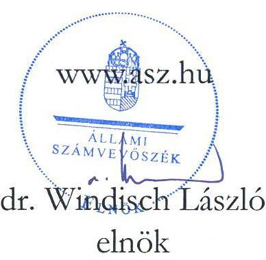
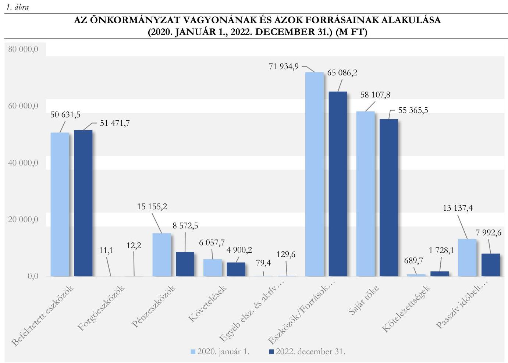
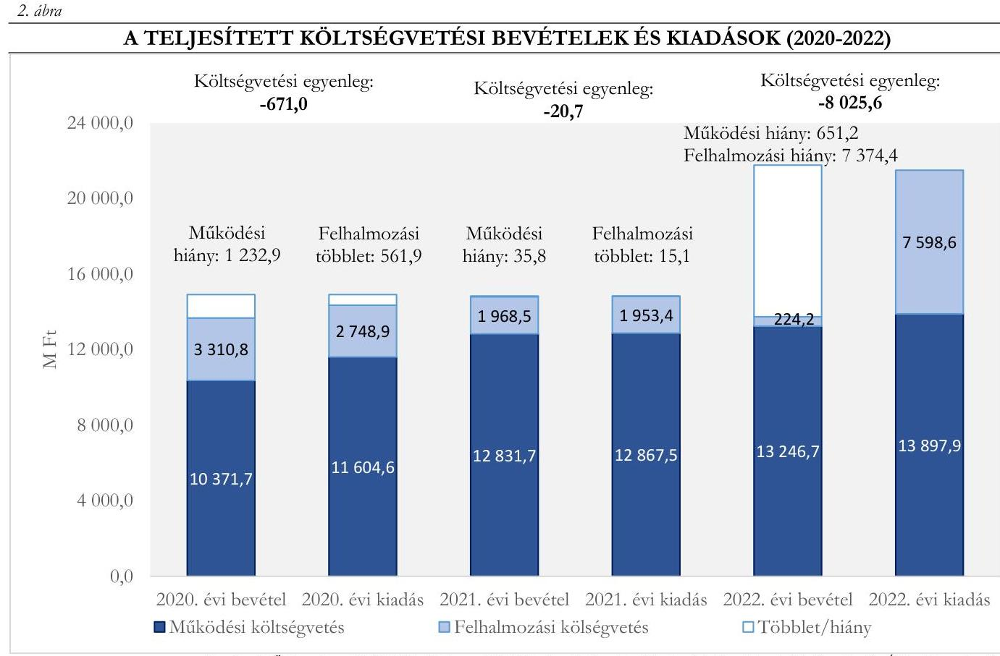
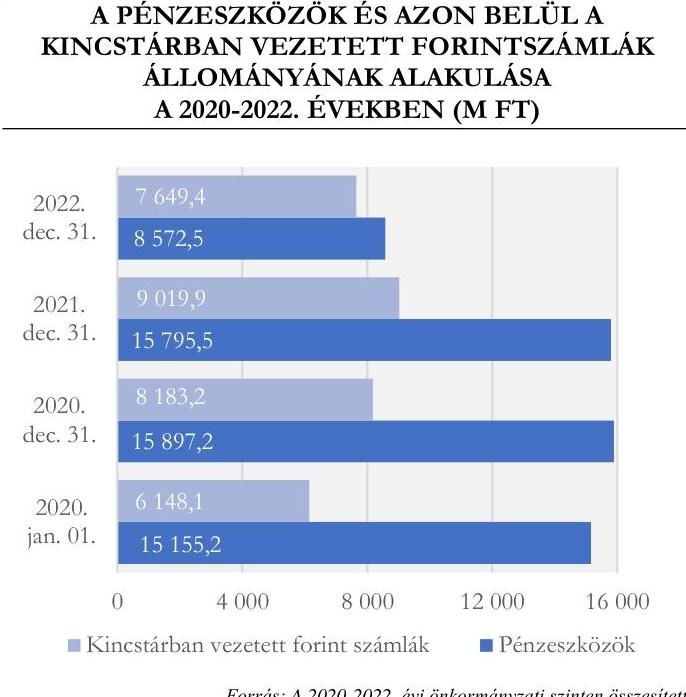
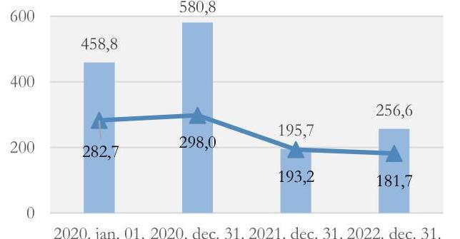
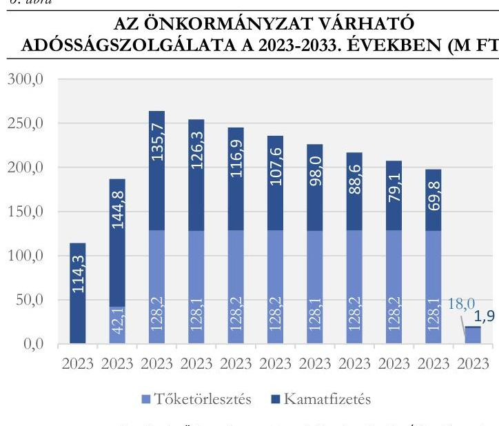
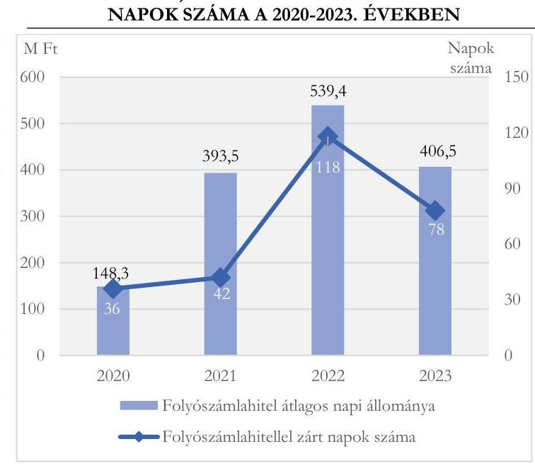
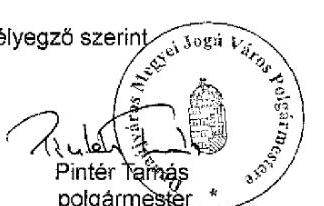
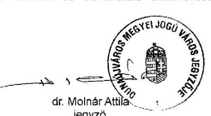

# JELENTÉS 

## Az önkormányzatok múködésének és gazdálkodásának ellenőrzése

Dunaújváros Megyei Jogú Város Önkormányzata

2024.

---

# JELENTÉS 

## Az önkormányzatok múködésének és gazdálkodásának ellenőrzése

Dunaújváros Megyei Jogú Város Önkormányzata

2024.

24044

---

# ELLENŐRZÉSI IGAZGATÓSÁG: 

## ÁLLAMHÁZTARTÁS HELYI SZINTJÉT ELLENŐRZŐ IGAZGATÓSÁG

## ELLENŐRZÉSI IGAZGATÓ:

DR. BAFFIA GERGELY GÁBOR igazgató

## ELLENŐRZÉSVEZETŐ:

Jelentéseink az interneten a www.asz.hu címen olvashatók.

KERSMÁJER ÁGOTA ellenőrzésvezető

IKTATÓSZÁM: EL-3848-007/2024
TÉMASZÁM: 2674
ELLENŐRZÉS-AZONOSÍTÓ SZÁM: V-101801

---

# TARTALOMJEGYZÉK 

AZ ELLENŐRZÉS ALAPADATAI ..... 5
AZ ELLENŐRZÖTT SZERVEZET ..... 8
ÖSSZEFOGLALÁS ..... 10
AZ ELLENŐRZÉS FÓKUSZTERÜLETEI ..... 14
MEGÁLLAPÍTÁSOK ..... 15
JAVASLATOK ..... 35
MELLÉKLETEK ..... 37
I. sz. melléklet: Értelmező szótár ..... 37
II. sz. melléklet: Az ellenőrzött szervezetek jegyzéke ..... 45
III. sz. melléklet: Ellenőrzési kritériumok ..... 46
IV. sz. melléklet: Az Önkormányzat fejlesztési hiteleinek főbb adatai ..... 49
V. sz. melléklet: Az Önkormányzat többségi tulajdonában lévő gazdasági társaságok adatai ..... 50
FÜGGELÉK: ÉSZREVÉTELEK ..... 52
RÖVIDÍTÉSEK JEGYZÉKE ..... 58

---

.

---

# AZ ELLENŐRZÉS ALAPADATAI 

## AZ ELLENŐRZÉS CÉLJA

Az ellenőrzés célja az Önkormányzat ${ }^{1}$ közfeladat ellátásának, pénzügyi és vagyoni helyzetének ellenőrzése. Az ellenőrzés során az ÁSZ ${ }^{2}$ értékelte az Önkormányzat költségvetés tervezése és végrehajtása, a pénzügyi és vagyongazdálkodása, valamint beszámolási kötelezettsége teljesítésének megfelelőségét. Az ellenőrzés kiterjedt annak vizsgálatára, hogy a belső ellenőrzés támogatta-e a gazdálkodás folyamatainak szabályosságát.

Az ellenőrzés célja volt továbbá annak megállapítása, hogy az Önkormányzat közzétételi kötelezettségeinek eleget tett-e, informatikai rendszerei hozzájárultak-e a szabályszerű múködés és gazdálkodás biztosításához, valamint az Önkormányzat tett-e lépéseket a fenntartható múködés érdekében.

## AZ ELLENŐRZÉS TÍPUSA

Megfelelőségi ellenőrzés

## AZ ELLENŐRZŐTT IDŐSZAK

Az egyes fókuszterületek esetében az ellenőrzött időszak az alábbiak szerint alakult:

| 1. | A költségvetés tervezése, végrehajtása, az éves beszámolási és zárszámadási kötelezettség teljesítése | a 2022. és a 2023. évi költségvetés tervezése, a 2022. évi költségvetés végrehajtása |
| :--: | :--: | :--: |
| 2. | Az Önkormányzat által ellátott közfeladatok pénzügyi feltételei és az önkormányzat fizetőképessége | 2020-2022. évek, kitekintve a 2023. év január 01.-július 31. közötti és az azt követő időszakot érintő - pénzügyi helyzetet, likviditást befolyásoló - folyamatokra |
| 3. | Az Önkormányzat vagyongazdálkodása, az éves költségvetési beszámoló mérlegének alátámasztottsága   - a vagyoni helyzetet befolyásoló vagyonváltozások,   - a vagyon nyilvántartása, a költségvetési beszámoló mérlegének alátámasztottsága,   - az energiahatékonyság/környezet- és klímavédelem érdekében tett fejlesztési célú intézkedések. | 2020-2022. évek   2022. év   2020-2022. évek |
| 4. | A pénzügyi és vagyongazdálkodást támogató informatikai rendszerek | 2022. év |
| 5. | Közzétételi kötelezettség teljesítése | a helyszíni ellenőrzés megkezdésekor (2023. július 5.) fennálló állapot |
| 6. | A belső ellenőrzés szervezeti kereteinek megfelelősége, a belső és külső ellenőrzések gazdálkodásra vonatkozó megállapításaira tett intézkedések önkormányzat általi nyomon követése | 2020-2022. évek |

---

# Az ellenőrzés alapadatai 

## Az ELLENŐRZÉS TÁRGYA

Az Önkormányzat költségvetésének tervezése és annak végrehajtása, a pénzügyi gazdálkodás szabályozottsága és szabályszerűsége, az éves beszámolási kötelezettség teljesítése, az Önkormányzat közfeladatainak finanszírozása, ezen belül kiemelten a bölcsődei ellátás biztosítása, az Önkormányzat pénzügyi helyzete és fizetőképessége. A vagyongazdálkodás szabályozottsága, a vagyonban bekövetkezett változások döntéshozatalának és elszámolásának szabályszerűsége, az Önkormányzat vagyoni helyzete, az Önkormányzat mérlegében kimutatott vagyon nyilvántartásának szabályszerűsége, a vagyon kimutatása, értékelése és a mérleg leltárral való alátámasztásának szabályszerűsége. Az energiahatékonyság, a környezet- és klímavédelem érdekében tervezett és megvalósított fejlesztési célú intézkedések.

A pénzügyi és vagyongazdálkodást támogató informatikai rendszerek kialakítása, a közzétételi kötelezettség teljesítése. A belső ellenőrzés szervezeti kereteinek megfelelősége, a belső és külső ellenőrzések gazdálkodásra vonatkozó megállapításaira tett intézkedések Önkormányzat általi nyomon követése.

Az ellenőrzés kiterjedt minden olyan körülményre és adatra, amely az ÁSZ jogszabályban meghatározott feladatainak teljesítéséhez, valamint a program végrehajtása folyamán felmerült újabb összefüggések feltárásához szükséges volt.

## AZ ELLENŐRZÉS JOGALAPJA

Az ellenőrzés jogszabályi alapját az ÁSZ tv. ${ }^{3} 1 . \int$ (3) bekezdésében, az 5. § (2)-(3), (5) és (6) bekezdéseiben, valamint az Áht. ${ }^{4} 61 . \int$ (2) bekezdésében foglalt előírások képezték.

## AZ ELLENŐRZÉS MÓDSZERE

Az ellenőrzés a nemzetközi standardokat irányadónak tekintve az ellenőrzési program értékelési szempontjai, az ellenőrzött időszakban hatályos jogszabályok, az ellenőrzés szakmai szabályok és módszertanok figyelembevételével került végrehajtásra.

Az ellenőrzési kérdések megválaszolásához szükséges bizonyítékok megszerzése az ellenőrzött szervezet által rendelkezésre bocsátott dokumentumokra, adatokra alapozva, interjú, információkérés, mintavételezés, valamint elemző eljárás alkalmazásával történt.

Az ellenőrzési bizonyítékként felhasznált adatforrások közé tartoztak az ellenőrzéshez kért dokumentumok, az ellenőrzés tárgya kapcsán releváns, nyilvánosan hozzáférhető adatok, dokumentumok, a Kincstár ${ }^{5}$ adatbázisai. Adatforrás volt ezeken túlmenően minden az ellenőrzés folyamán feltárt, az ellenőrzés szempontjából információkat tartalmazó nyilatkozat, jegyzőkönyv, egyéb dokumentum.

Az ellenőrzés lefolytatásához az ellenőrzött szervezet tanúsítványok kitöltésével, valamint az ÁSZ által kért dokumentumok, adatok, információk megküldésével és átadásával szolgáltatott adatokat.

Az ellenőrzés az egyes területek szabályszerűségének, megfelelőségének értékelését a III. számú mellékletben megjelölt kritériumok alapján végezte el. A költségvetés végrehajtása, valamint a vagyoni helyzetet befolyásoló vagyonnövekedések és vagyoncsökkenések szabályszerűségének értékelését statisztikai (véletlenszerű) és nem statisztikai módszerekkel (kockázati alapon) kiválasztott mintatételek alapján végezte az ÁSZ. Statisztikai (véletlenszerű) mintavételezést alkalmazott az ÁSZ a 2020-2021. évi, és a 2022. évi

---

felhalmozási célú kiadások (beruházások és felújítások) esetében (30-30 db), valamint a 2022. évi múködési kiadások közül a személyi juttatások (Munkavégzésre irányuló egyéb jogviszonyban nem saját dolgozónak fizetett juttatások főkönyvi számla), a dologi kiadások (Szakmai tevékenységet segítő szolgáltatások és Egyéb szolgáltatások főkönyvi számlák), az államháztartáson kívülre irányuló támogatások (Működési célú visszatérítendő támogatások, kölcsönök nyújtása államháztartáson kívülre, Egyéb működési célú támogatások államháztartáson kívülre, Felhalmozási célú visszatérítendő támogatások, kölcsönök nyújtása államháztartáson kívülre, Egyéb felhalmozási célú támogatások államháztartáson kívülre főkönyvi számlák) tekintetében (területenként 30 db , összesen 90 db ). Kockázati alapon a legnagyobb összegű tételek kerültek kiválasztásra a behajthatatlanként leírt követelések közül (5 db). A teljes sokaság tételes ellenőrzését végeztük el a 20202021. évi és a 2022. évi vagyonértékesítések ( 13 és 7 db , összesen 20 db ), a térítés nélküli vagyonátadás ( 1 db ), a koncessziós és vagyonkezelői jog létesítésére irányuló szerződések (1 és 2 db ), a követelés elengedések ( 1 db ) esetében, mivel ezeken a területeken a rendelkezésre álló sokaság mintaelemszáma kisebb volt, mint az ellenőrzési programban az adott területre előírt mintaelemszám. A kiválasztott mintatételek értékelése egyedileg történt.

---

# AZ ELLENŐRZÖTT SZERVEZET 

Dunaújváros Fejér vármegyében a Duna jobb partján, annak mintegy 10 kilométeres hosszában terül el, Budapesttől déli irányban 67 kilométerre. Dunaújváros 1990. december 1-je óta megyei jogú városi ranggal rendelkezik. A város állandó lakosainak száma a 2020. január 1-jei 44589 főről 2023. január 1-jére 41768 főre csökkent.

A Polgármester ${ }^{6}$ a 2019. évi önkormányzati választások óta tölti be tisztségét, munkáját három főállású alpolgármester segíti. A 15 tagú Közgyűlés ${ }^{7}$ mellett hét állandó bizottság működik: Közbeszerzési és Bíráló Bizottság; Ifjúsági, Sport és Turisztikai Bizottság; Közbiztonsági és Környezetvédelmi Bizottság; Oktatási, Kulturális és Társadalmi Kapcsolati Bizottság; Pénzügyi, Gazdasági és Városüzemeltetési Bizottság; Szociális, Egészségügyi és Lakhatási Bizottság; Ügyrendi, Igazgatási és Jogi Bizottság.

A Jegyzó ${ }^{8}$ 2020. március 1-je óta vezeti a Polgármesteri Hivatalt ${ }^{9}$, munkáját egy aljegyző támogatja. A Polgármesteri Hivatalban foglalkoztatottak átlagos statisztikai létszáma 2020. január 1-én 158 fő, 2022. december 31-én 157 fő volt. Az Önkormányzat által irányított költségvetési intézményekben foglalkoztatottak átlagos statisztikai létszáma a 2020. év eleji 709 főről a 2022. év végére 4,8\%-kal 675 főre csökkent.

Az Önkormányzat a kötelező és önként vállalt feladatainak ellátásáról - a Polgármesteri Hivatalon felül - alapvetően az irányítása alá tartozó kilenc költségvetési szerv ${ }^{10}$, valamint a kilenc többségi tulajdonában lévő gazdasági társasága ${ }^{11}$ útján gondoskodott. Emellett további gazdasági társaságok szerződés alapján biztosították az egyes egészségügyi alapellátásokat (háziorvosi ellátást, házi gyermekorvosi ellátást, fogorvosi alapellátást, ügyeleti ellátást), a gyermekétkeztetést, a szociális étkeztetést, a köztemető fenntartást, a víziközmű-szolgáltatást, a helyi közösségi közlekedést. Hét államháztartáson kívüli szervezet (egyesület, egyházi szervezetek, valamint az Önkormányzat két közalapítványa) gyermekek átmeneti gondozásában, hajléktalan személyek ellátásában, valamint közművelődési és sport feladatok ellátásában vett részt. Az Önkormányzat többségi tulajdonában lévő gazdasági társaságok és leányvállalataik főbb tevékenységét, a 2020-2022. években elért adózott eredményüket, illetve a saját tőkéjük, jegyzett tőkéjük év végi állományát, valamint a tulajdonrész százalékos nagyságát az V. melléklet 1. és 2. táblázata tartalmazza.

Az Önkormányzat konszolidált költségvetési beszámolója szerinti költségvetési bevétele a 2020. évben 13 682,5 M Ft volt, amely a 2022. évre 13 471,0 M Ft-ra (1,5\%-kal) csökkent, míg a költségvetési kiadások a 2020. évi 14 353,5 M Ft-ról 2022-re - alapvetően egy előfinanszírozott projekthez kapcsolódó támogatás visszavonása miatt - 21 496,5 M Ft-ra (49,8\%-kal) növekedtek.

Az Önkormányzat konszolidált mérleg szerinti vagyona a 2020. évi nyitó 71 934,9 M Ft-ról a 2022. év végére 9,5\%-kal, 6848,7 M Ft-tal csökkent, amelyet döntően - a kézilabdacsarnok beruházásra kapott támogatás visszafizetése miatt - a pénzeszközök 6582,7 M Ft összegű (43,4\%-os) csökkenése okozott. A mérleg forrás oldalán a saját tőke $4,7 \%$-kal, 2742,3 M Ft-tal, a passzív időbeli elhatárolások 39,2\%-kal, 5144,8 M Ft-tal csökkentek, a kötelezettségek 150,6\%-os, 1038,4 M Ft-os emelkedése mellett. A kötelezettségek növekedését egyrészt a fejlesztési célú hitelállomány 491,4 M Ft-os, illetve a kötelezettség jellegű elszámolások 615,1 M Ft-os emelkedése okozta. A passzív időbeli elhatárolások állománya elsősorban a kézilabdacsarnok beruházásának elmaradása miatt a kapcsolódó támogatás 2022. évi visszafizetése miatt csökkent.

---

Az Önkormányzat vagyonának és azok forrásainak változását az 1. ábra szemlélteti.

Fonrás: Az Önkormányzat 2020. és 2022. évi összesített költségvetési beszámolója alapján ÁSZ saját szerkesztés

---

# ÖSSZEFOGLALÁS 

A helyi közügyek intézése, és ennek keretében a lakosság közszolgáltatásokkal való ellátása az önkormányzatok alapvető feladata. Az önkormányzati közfeladatokra fordított pénzeszközökkel és az ellátásukat szolgáló köztulajdonnal való felelős és átlátható gazdálkodás közérdek. Az ÁSZ az államháztartás ellenőrzésére kapott általános felhatalmazása keretében, mindezek figyelembevételével ellenőrizte az Önkormányzat közpénzekkel és vagyonnal való gazdálkodását.

A 2022. és a 2023. évi költségvetés tervezése és jóváhagyása során az Önkormányzat betartotta a jogszabályi előírásokat. A Polgármester a költségvetési rendelettervezeteket a jogszabályoknak megfelelően terjesztette elő a Közgyűlés számára. A Közgyűlés határidőben megalkotta az Önkormányzat költségvetéséről szóló rendeleteket, amelyek megfeleltek a törvényben előírt tartalmi követelményeknek.

Az ellenőrzött múködési kiadások teljesítése és elszámolása - az államháztartáson kívülre nyújtott egyéb múködési célú támogatások mintatételei esetében a kötelezettségvállalásokkal és a gazdálkodási jogkörökkel kapcsolatban feltárt néhány ( $13,3 \%$-os) hiányosság kivételével - megfelelt a jogszabályi és belső előírásoknak.

A 2022. évi beszámolási és zárszámadási kötelezettség teljesítése szabályszerű volt. A 2022. évi zárszámadási rendelettervezetet - a több éves kihatással járó döntések számszerűsítésének bemutatása kivételével - az előírt határidőben és szerkezetben beterjesztették a Közgyűlés elé.

Az Önkormányzat az általa ellátott közfeladatok pénzügyi feltételeit az ellenőrzött időszakban biztosította, annak ellenére, hogy a koronavírus járvány miatti gazdasági visszaesés, az energiaválság miatti áremelkedések, valamint a kormányzati intézkedések (köztük a kézilabdacsarnok beruházás támogatásának visszavonása, a különleges gazdasági övezet létrehozása) hatására a 2020-2022. évek között a teljesített költségvetési bevételek 1,5\%-kal csökkentek, a teljesített költségvetési kiadások 49,8\%-kal növekedtek. Az Önkormányzatnak a 2020-2021. években múködési hiánya és felhalmozási többlete, míg a 2022. évben a múködés hiánya mellett a felhalmozási költségvetés is hiányba fordult. A múködési hiány finanszírozását a 2020. és a 2021. évben a múködési célú maradvány igénybevételével biztosították, azonban a 2022-ben a múködési célú maradvány mellett a múködési hiány finanszírozásához belföldi értékpapírok értékesítéséből befolyó bevételekre és a lekötött bankbetét megszüntetésére is szükség volt. A 2022. évi felhalmozási hiányra a felhalmozási célú maradvány igénybevétele fedezetet nyújtott.

Az Önkormányzat költségvetési bevételeinek alakulását negatívan befolyásolta az a kormányzati intézkedés, amely 2021. július 1-jétől különleges gazdasági övezetté nyilvánította Rácalmás város területén a Hankook Tire Magyarország Kft. megvalósuló beruházásával összefüggő, továbbá Iváncsa község külterületén megvalósuló ipari park fejlesztéssel érintett ingatlanokat, ami a 2021. évben 691,0 M Ft, a 2022. évben további 1233,1 M Ft bevételkiesést okozott az Önkormányzatnak. További negatív hatással volt (-1439,0 M Ft) a realizált közhatalmi bevételre a 2022. évben a város két jelentős gazdasági társasága (ISD Dunaferr Zrt., ISD Kokszoló Kft.) adófizetésének elmaradása. A Modern Városok Program megszüntetésére irányuló kormányzati intézkedés alapján a 2023. év végén az Önkormányzatnak - három folyamatban lévő beruházáshoz kapcsolódóan - 3760,0 M Ft támogatás visszafizetési kötelezettsége keletkezett, amelyek forrása szintén az előző évi kötelezettségvállalással terhelt maradvány volt.

Az Önkormányzat által ellátott kötelező és önként vállalt feladatok köre alapvetően nem változott az ellenőrzött időszakban. Az Önkormányzat évente, átlagosan a múködési célú kiadások 16,4\%-át fordította az önként vállalt feladatok finanszírozására. Az önként vállalt feladatokra fordított kiadások finanszírozása a

---

jogszabály előírása szerint az Önkormányzat saját bevételeiből, továbbá az e célokra biztosított külön forrásokból (uniós és hazai támogatások) történt. Az önként vállalt feladatokra fordított kiadások az ellenőrzött időszakban nem veszélyeztették a kötelező feladatok ellátását.

Az Önkormányzat pénzügyi helyzetét rontotta négy kizárólagos tulajdonában lévő gazdasági társasága részére az ellenőrzött időszakban nyújtott, közel egy milliárd forint összegű tőkepótlás. A veszteséges önkormányzati tulajdonú gazdasági társaságok esetében nem volt maradéktalanul biztosított az Alaptörvényben megfogalmazott eredményesség követelményének érvényesülése. Az Önkormányzat a gazdasági társaságai veszteséges gazdálkodását (a DKKA NKft. ${ }^{12}$ és a DVG Zrt. ${ }^{13}$ 2020. évi belső ellenőrzése kivételével) nem vizsgálta, nem tárta fel a veszteséges gazdálkodás okait és nem intézkedett azok megszüntetéséről. Az Önkormányzatnak három kizárólagos tulajdonában lévő gazdasági társasága (DVG Zrt., DUNANETT NKft. ${ }^{14}$, DKKA NKft.) vonatkozásában volt garancia- és kezességvállalása, amelyekhez kapcsolódóan helytállási kötelezettsége nem keletkezett. A folyamatosan veszteségesen gazdálkodó gazdasági társaságok tőkepótlási igénye jövőbeni kockázatot jelent az Önkormányzat pénzügyi helyzetére. A jogszabályi előírások ellenére a főállású alpolgármesterek a DVG Zrt., illetve a DUNANETT NKft. felügyelőbizottságában betöltött tisztségükért 2021. május - 2022. február között díjazásban részesültek.

Az Önkormányzat az év közbeni, átmeneti likviditási problémáinak megoldását folyószámlahitel igénybevételével biztosította, 2020-ban 36 napon átlagosan $148,3 \mathrm{MFt}$, 2021-ben 42 napon átlagosan 393,5 MFt, 2022-ben 118 napon átlagosan $539,4 \mathrm{MFt}$ folyószámlahitelt vettek igénybe. A 2023. évben folyószámlahitellel zárt napok száma 78 napra, a folyószámlahitel átlagos napi állománya 406,5 MFt-ra csökkent. A folyószámla hitelkeret kihasználtsága a 2022. és a 2023. évben volt a legmagasabb, a márciusi iparűzési adóelőleg befizetési határidőt megelőző néhány napban az egy milliárd forintot is meghaladta.

Az Önkormányzat - a jövőbeni pénzügyi kockázatainak kezelése érdekében - 2023. október 30-án 1800,0 MFt keretösszegű beszállítói faktoring szerződést kötött, azonban pénzügyi helyzete - a közhatalmi bevételek kedvező alakulása, valamint a likviditási helyzet javulása miatt - nem indokolta annak igénybevételét a 2023. évben.

A fejlesztések megvalósításához a 2020-2022. években az Önkormányzat 1010,5 MFt fejlesztési célú hitelt vett fel és 2023. év július végéig további hét, - a Kormány előzetes hozzájárulásához nem kötött összesen 594,0 MFt fejlesztési célú hitelszerződést kötött meg. A türelmi idők 2024-2025. évi lejáratát követően az adósságszolgálat a 2024-2032. években várhatóan 200,0-250,0 MFt-ot fog jelenteni éves szinten, amelynek finanszírozása a negatív múködési jövedelem miatt kockázatot jelenthet, illetve behatárolja az Önkormányzat jövőbeni fejlesztési lehetőségeit.

Az Önkormányzat a gyermekek bölcsődei ellátásának fenntartási feladatait összességében szabályszerűen látta el. A bölcsődei ellátást ténylegesen igénybe vevő gyerekek száma, valamint a férőhelyek kihasználtsága az ellenőrzött időszakban növekedett. A mutatószámok kedvező változása ellenére az egy ellátottra jutó múködési kiadások - a nyersanyagárak, a fütési energiaárak, valamint a bérek növekedése miatt az időszakban folyamatosan emelkedtek, valamint a 2020. évi 102,8 MFt-ról, 2022-re 182,4 MFt-ra nőtt az állami támogatáson és a térítési díjakon felül szükséges - önkormányzati kiegészítés összege is.

Az Önkormányzatnál az ellenőrzött vagyonváltozások (beruházások és felújítások, a vagyonértékesítések, a követeléselengedés, a behajthatatlan követelések) esetében a döntések meghozatala - három döntés kivételével - szabályszerű volt, azonban számviteli nyilvántartásba vételük, elszámolásuk nem felelt meg maradéktalanul a jogszabályi előírásoknak. A vagyonértékesítések számviteli elszámolásánál figyelmen kívül hagyták a jogszabályi előírás 2021. január 1-től hatályos változását.

---

A 2021. évben a közhatalmi bevételekre vonatkozó követelések értékelése során az értékvesztést (23,7 M Ft), továbbá a 2022. évben a túlfizetések és visszafizetések miatti rendező tételeket (3047,9 M Ft) a jogszabályi előírás ellenére követelés elengedésként számolták el. Az Önkormányzat a helytelen elszámolásokkal megsértette a számviteli alapelvek közül a valódiság elvét.

Az ellenőrzött térítés nélküli vagyonátadás során nem tartották be a jogszabályi előírásokat, mivel nem a jogszabály által meghatározott szervezet számára történt a vagyon ingyenes átadása.

A koncessziós jog létesítése állambáztartáson kívüli szervezettel szabályszerűen történt, azonban annak számviteli elszámolása nem felelt meg a jogszabályi előírásoknak, mert az eszközök értékét nem a koncesszióba, vagyonkezelésbe adott eszközök között, hanem továbbra is az Önkormányzat tárgyi eszközei között tartották nyilván. A Dózsa Mozi felújítása és környezetének rekonstrukciója projekt keretében beszerzett, majd a koncessziós szerződés alapján használatba adott eszközöket tételesen, beazonosíthatóan nem vették nyilvántartásba, amivel megsértették a számviteli alapelvek közül a valódiság és az egyedi értékelés elvét. A koncesszióba és vagyonkezelésbe adott eszközöket a jogszabály előírása ellenére nem támasztották alá a müködtető, a vagyonkezelő által készített, hitelesített leltárakkal. Az Önkormányzat - a valódiság számviteli alapelvet megsértve - a 2022. évi költségvetési beszámoló mérlegében a koncesszióba, vagyonkezelésbe adott eszközök között olyan tárgyi eszközöket is kimutatott összesen 374,5 M Ft értékben, amelyekkel kapcsolatban nem rendelkezett koncessziós, vagy vagyonkezelési szerződéssel.

Az Önkormányzat államháztartáson belülre, a Dunaújvárosi Tankerületi Központ vagyonkezelésébe adott ingatlanon végrehajtott energetikai fejlesztések átadását (bruttó $693,6 \mathrm{MFt}$ ) a jogszabály rendelkezését figyelmen kívül hagyva térítés nélküli vagyonátadásként számolta el vagyonkezelésbe adás helyett, így nem vette nyilvántartásba a 0 . számlaosztályban. A nyilvántartásba vétel elmaradása kockázatot jelent a nemzeti vagyon védelme, értékének megőrzése szempontjából.

Az Önkormányzat a 2022. évben az önkormányzati törzsvagyont a törvényi előírásoknak megfelelve, a többi vagyontárgytól elkülönítve tartotta nyilván. A főkönyvi számlákhoz vezetett analitikus nyilvántartások tartalma - a befektetett pénzügyi eszközök kivételével - megfelelt a jogszabályban előírt tartalmi követelményeknek.

A 2020-2022. években a jogszabályok és a belső szabályzatok előírásai ellenére a tárgyi eszközöket mennyiségi felvétellel nem leltározták, így nem volt biztosított a nemzeti vagyon jogszabályban előírt megőrzése, értékének védelme. Az Önkormányzat a 2022. év mérlegfordulónapjára vonatkozóan vagyonát egyeztetéssel leltározta, az egyezőség a jogszabály előírásának megfelelően biztosított volt.

Az Önkormányzat az energiahatékonyság, a környezet- és klímavédelem érdekében célokat határozott meg a gazdasági programjában és a környezetvédelmi programjában, továbbá csatlakozott a Polgármesterek Klíma- és Energiaügyi Szövetségéhez és elfogadta az Önkormányzat Fenntartható Energia és Klíma Akciótervét. A tervezett intézkedések végrehajtását azonban nem követték nyomon, ami a jogszabály által előírt nyomon követési rendszer (monitoring) kialakításának hiányosságát jelzi. Az Önkormányzat az ellenőrzött időszakra vonatkozóan a jogszabályi előírások ellenére nem készített energiamegtakarítási intézkedési tervet.

Az ellenőrzött időszakban az Önkormányzat rendelkezett az alapvető adatvédelmi és informatikai biztonsági szabályzatokkal, biztosította a pénz- és vagyongazdálkodást támogató informatikai rendszerek alkalmazásának feltételeit.

---

Az Önkormányzat szabályozta és kialakította a közérdekű adatok elektronikus közzétételi rendjét. Közérdekű adatait a jogszabályban foglaltak ellenére nem tette teljeskörűen közzé. A Polgármesteri Hivatal a jogszabályban előírtak ellenére nem tett teljeskörűen eleget a Központi Információs Közadatnyilvántartás felületén történő közzétételi kötelezettségének.

Az Önkormányzatnál a Jegyző kialakította a belső ellenőrzés szervezeti kereteit, amely biztosította a belső ellenőrök szervezeti és funkcionális függetlenségét. A belső ellenőrzés által ellenőrzött szervek, szervezeti egységek vezetői az intézkedési terveket nem minden esetben a jogszabály által meghatározott határidőn belül készítették el. A belső ellenőrzési vezető az elvégzett ellenőrzésekről minden ellenőrzött évben elkészítette az éves ellenőrzési jelentést. A belső ellenőrzési vezető által vezetett nyilvántartás megfelelt a jogszabályi előírásoknak. A belső ellenőrzések gazdálkodásra vonatkozó megállapításait hasznosították. A Jegyző gondoskodott a külső ellenőrzések előírásainak megfelelő nyilvántartásáról.

Az Önkormányzat az ellenőrzött években a kedvezőtlen külső körülmények (különleges gazdasági övezetet létrehozó kormányzati intézkedés, két jelentős gazdasági társaság adófizetésének elmaradása, koronavírus járvány, növekvő infláció, elszabadult energiaárak) hatásának ellenére is meg tudta őrizni a fizetőképességét, azonban az átmeneti likviditási problémák kezelése érdekében minden évben folyószámlahitel igénybevételére kényszerült. A fejlesztési célú hitelek felvétele következtében a banki kötelezettségek állománya a 2023. év végére 1085,4 M Ft-tal nőtt. A fejlesztési célú hitelek 2024. évtől kezdődő tőketörlesztése, valamint a folyamatosan veszteségesen gazdálkodó gazdasági társaságok tőkepótlási igénye jövőbeni kockázatot jelent az Önkormányzat pénzügyi helyzetére, amelynek mérséklésére 2023-ban 1800,0 M Ft keretösszegű beszállítói faktoring szerződés került megkötésére.

Az Önkormányzat a vagyont érintő növekedések (beruházások, felújítások) és csökkenések (értékesítés, térítés nélküli átadás, követeléselengedés, behajthatatlan követelések leírása), a koncesszióba és vagyonkezelésbe adás elszámolása, valamint a vagyon nyilvántartása során nem tartotta be maradéktalanul a jogszabályi előírásokat. A mennyiségi felvétellel történő leltározás elmaradása miatt nem volt biztosított a nemzeti vagyon jogszabályban előírt megőrzése, értékének védelme.

Az ellenőrzés során feltárt hiányosságok megszüntetése érdekében a Polgármester részére egy, a Jegyző részére 10 javaslatot fogalmazott meg az ÁSZ.

---

# AZ ELLENŐRZÉS FÓKUSZTERÜLETEI 

1.     - A költségvetés tervezése, végrehajtása, az éves beszámolási és zárszámadási kötelezettség teljesitése
2.     - Az Önkormányzat által ellátott közfeladatok pénzügyi feltételei, az Önkormányzat fizetőképessége
3.     - Az Önkormányzat vagyongazdálkodása, az éves költségvetési beszámoló mérlegének alátámasztottsága
4.     - A pénzügyi és vagyongazdálkodást támogató informatikai rendszerek
5.     - Közzétételi kötelezettség teljesitése
6.     - A belső ellenőrzés szervezeti kereteinek megfelelősége, a belső és külső ellenőrzések gazdálkodásra vonatkozó megállapításaira tett intézkedések Önkormányzat általi nyomon követése

---

# 1. A költségvetés tervezése, végrehajtása, az éves beszámolási és zárszámadási kötelezettség teljesítése 

Összegző megállapítás

A költségvetés tervezése, a beszámolási és zárszámadási kötelezettség teljesítése szabályszerű volt. A költségvetés végrehajtása - az államháztartáson kívülre nyújtott egyéb múködési célú támogatások elszámolásának ellenőrzött mintatételei kivételével - megfelelt az előírásoknak.

Az Önkormányzatnál a 2022. és 2023. évi költségvetés tervezésére és jóváhagyására vonatkozó jogszabályok és belső szabályozások előírásait betartották.
A Közgyűlés mindkét évben az Áht. és a Gst. ${ }^{15}$ előírásainak megfelelően a költségvetési rendelet elfogadásáig határozatban megállapította a saját bevételeinek és az adósságot keletkeztető ügyleteiből eredő fizetési kötelezettségeinek a költségvetési évet követő három évre várható összegét. A Jegyző a

1. táblázat

A 2022. ÉS A 2023. ÉVI KÖLTSÉGVETÉS FŐBB ADATAI INTÉZMÉNYFINANSZÍROZÁS NÉLKÜL (M FT)

| MEGNEVEZÉS | 2022. EVI   EREDETI   ELŐRÁNYZÁT | 2023. EVI   EREDETI   ELŐRÁNYZÁT |
| :--: | :--: | :--: |
| Költségvetési bevételek | 18567,4 | 21216,8 |
| Költségvetési kiadások | 33960,7 | 29796,4 |
| Költségvetési egyenleg | $-15393,3$ | $-8579,6$ |
| Finanszírozási bevételek | 17104,5 | 10226,4 |
| ebből: maradványigénybevétel | 15151,9 | 7782,4 |
| bosszú lejáratú bitelfelvétel | 302,6 | 944,0 |
| értékpapírok beváltása | 150,0 | - |
| Finanszírozási kiadások | 1711,2 | 1646,8 |
| Finanszírozási egyenleg | 15393,3 | 8579,6 |

2022. és 2023. évi költségvetési rendelettervezeteket e jóváhagyott tervszámoknak megfelelően készítette elő. Azok egyeztetése a költségvetési szervek vezetőivel az Ávr. ${ }^{16}$ előírásának megfelelően megtörtént. A Polgármester az Áht.-ban előírt határidőig (február 15-ig) benyújtotta a 2022. és 2023. évi költségvetési rendelettervezetet a Közgyűlés részére, amelyhez az Ávr. előírásának megfelelően csatolta a Pénzügyi bizottság ${ }^{17}$ véleményét. A 2022. és a 2023. évi költségvetési rendelettervezet előterjesztésekor az Áht.-ban előírt mérlegek és kimutatások bemutatásra kerültek a Közgyűlés részére.

A Közgyűlés mindkét évben az Áht.-ban előírt határidőig (március 15-ig) elfogadta az Önkormányzat költségvetési rendeletét ${ }^{18}$, amelyek megfeleltek az Áht. által meghatározott tartalmi és szerkezeti követelményeknek. A 2022. és a 2023. évi költségvetés főbb adatait az 1. táblázat mutatja be.
A Közgyűlés a 2022. évi költségvetési rendeletet 15 393,3 M Ft költségvetési hiánnyal fogadta el, amelyet 15 151,9 M Ft maradvány igénybevételével, 150,0 M Ft államkötvény visszaváltásából származó bevételből, továbbá 302,6 M Ft hosszú lejáratú hitel bevonásával terveztek finanszírozni. A 2023. évi költségvetési rendeletben a 8579,6 M Ft költségvetési hiány forrásaként 7782,4 M Ft maradvány felhasználását és 944,0 M Ft hosszú lejáratú hitel bevonását tervezték.

---

Az Önkormányzat és intézményei az Áht. és az Ávr. előírásának megfelelően, az éves költségvetésről határidőre adatot szolgáltattak a Kincstár által működtetett elektronikus adatszolgáltató rendszerbe.
Az Önkormányzat a 2022. évi költségvetés végrehajtása során betartotta a jogszabályok és a belső szabályzatok előírásait, azonban az államháztartáson kívülre nyújtott egyéb múködési célú támogatások ellenőrzött mintatételeinek kötelezettségvállalásai, valamint a gazdálkodási jogkörök gyakorlása nem minden esetben felelt meg a jogszabályi előírásoknak.
A költségvetési kiadásokat a költségvetési rendeletben megállapított eredeti, vagy az év közben módosított előirányzatok mértékéig teljesítették.
Az Önkormányzat az ellenőrzött 2022. évi külső személyi juttatásokat és dologi kiadásokat a Számv. tv. ${ }^{19}$, az Áht., az Ávr., az Áhsz. ${ }^{20}$ és a belső szabályzataiban foglalt előírásoknak megfelelően teljesítette és számolta el.
Az ellenőrzött államháztartáson kívülre irányuló támogatások közül három (10\%) (5., 6., 10. mintatétel) közfoglalkoztatási támogatáshoz nyújtott önkormányzati kiegészítés esetében nem állt rendelkezésre - az Áht. 48. $\$ 1$ (1) bekezdés b) pontjában, valamint az Ávr. 52. $\$ 1$ (1) bekezdés c) pontjában és (6) bekezdésében foglalt előírások ellenére - a Polgármester vagy az általa írásban felhatalmazott személy által aláírt kötelezettségvállalási dokumentum (támogatói okirat, támogatási szerződés).
A helyi személyszállítási szolgáltatáshoz kapcsolódó veszteségtérítés mintatétele esetében (29. mintatétel) a kötelezettségvállalás dokumentuma az Ávr. 50. § (1) bekezdés d) pontjában foglalt előírás ellenére nem tartalmazta a pénzügyi ellenjegyzés tényét és a pénzügyi ellenjegyző keltezéssel ellátott aláírását.
Az éves beszámolási és zárszámadási kötelezettség teljesítése szabályszerű volt. Az Önkormányzat és az általa irányított költségvetési szervek - a Polgármesteri Hivatal kivételével - az Áhsz.ben meghatározott határidőre feltöltötték a 2022. évi költségvetési beszámolójukat, valamint az azt alátámasztó főkönyvi kivonatot a Kincstár által működtetett elektronikus adatszolgáltató rendszerbe. Az intézményi költségvetési beszámolók jóváhagyására az Áhsz. előírása alapján került sor. A Polgármesteri Hivatal az Áhsz. 32. § (1) bekezdésében előírt 2023. február 28-i határidőt követően, 2023. március 7-én végezte el a feltöltést.
A Közgyűlés a 2022. évi zárszámadási rendeletet ${ }^{21}$ az Áht.-ban meghatározott határidőig elfogadta, amelynek tartalma megfelelt az Áht., a Gst., az Mötv. ${ }^{22}$, az Ávr. és a belső szabályzatok előírásainak.
A Közgyűlés számára az előterjesztéskor az Áht. által meghatározott mérlegek és kimutatások közül az Áht. 91. § (2) bekezdés a) pontjában foglaltak ellenére nem került bemutatásra az Áht. 24. § (4) bekezdés b) pont szerinti, többéves kihatással járó döntések számszerűsítése.

---

A 2022. évi zárszámadási rendelet és a 2022. évi önkormányzati szinten összesített költségvetési beszámoló adatai megegyeztek. A 2022. évi önkormányzati szinten összesített költségvetési beszámoló adatait a 2. táblázat mutatja be.

Az Önkormányzatnak és az irányítása alá tartozó költségvetési szerveknek a 2022. évben összesen 7983,6 M Ft maradványa keletkezett, amelyből 7977,4 M Ft volt kötelezettségvállalással terhelt. A Közgyűlés az Áht. és az Ávr. előírásának megfelelően a 2022. évi zárszámadási rendelet elfogadásával egyidőben döntött az Önkormányzat irányítása alá
2. táblázat

A 2022. ÉVI KÖLTSÉGVETÉSI BESZÁMOLÓ FŐBB ADATAI - INTÉZMÉNYFINANSZÍROZÁS NÉLKÜL (M FT)

| MEGNEVEZÉS | MODOSÍTOTT   ELÖRÁNYZAT | TÉLJESTÉS |
| :-- | --: | --: |
| Költségvetési bevételek | 20599,1 | 13471,0 |
| Költségvetési kiadások | 36213,6 | 21496,5 |
| Költségvetési egyenleg | $\mathbf{- 1 5 6 1 4 , 5}$ | $\mathbf{- 8 0 2 5 , 5}$ |
| Finanszírozási bevételek | 18277,5 | 17821,5 |
| Finanszírozási kiadások | 2663,0 | 1812,4 |
| Finanszírozási egyenleg | $\mathbf{1 5 6 1 4 , 5}$ | $\mathbf{1 6 0 0 9 , 1}$ |

Forrás: 2022. évi önkormányzati szinten összesített költségvetési beszámoló alapján ÁSZ saját szerkesztés
tartozó költségvetési szervek maradványának felhasználható összegéről. A költségvetési szervek maradványa 201,2 M Ft volt, amelyből 6,2 M Ft volt a szabad maradvány. A Közgyűlés az Önkormányzat maradványát a 2022. évi beszámolóban megállapított összeggel egyezően (7782,4 M Ft) fogadta el, amelynek teljes összege kötelezettségvállalással terhelt volt.

# 2. Az Önkormányzat által ellátott közfeladatok pénzügyi feltételei, az Önkormányzat fizetőképessége 

Összegző megállapítás Az Önkormányzat az ellátott közfeladatok pénzügyi feltételeit az ellenőrzött időszakban biztosította. Az Önkormányzat fizetőképessége biztosított volt, azonban az átmeneti likviditási problémák kezelése érdekében minden évben sor került folyószámlahitel igénybevételére.

Az Önkormányzat kötelező és önként vállalt közfeladatai ellátásához rendelkezésre álló költségvetési bevételek egyik évben sem nyújtottak fedezetet a folyamatosan növekvő költségvetési kiadásokra. Az önként vállalt feladatokra fordított kiadások nem veszélyeztették a kötelező feladatok ellátását.
A Jegyző a 2022. és 2023. évi költségvetési rendelettervezet, valamint a 2022. évi zárszámadási rendelettervezet előkészítése során nem gondoskodott a 2008. évi XCIX. tv. ${ }^{23} 3 . \S$ (1) bekezdésében és az SZMSZ ${ }^{24}$ - az Önkormányzat kötelező és önként vállalt feladatait tartalmazó - 7. mellékletében foglaltak érvényesüléséről, mert a rendelettervezetekben a Bartók Kamaraszínház ${ }^{25}$ fenntartása az önként vállalt feladatok helyett a kötelezően ellátandó feladatok között szerepelt.

---

Az Önkormányzat által teljesített költségvetési bevételek és kiadások, valamint a költségvetés egyenlege a 2020-2022. években a 2. ábra szerint alakultak:

Forrás: Az Önkormányzat 2020-2022. évi konszolidált költségvetési beszámolóinak adatai és adatszolgáltatása alapján ÁSZ saját szerkesztés
A költségvetési bevételek a 2021. évben 8,2\%-kal, 1117,7 M Ft-tal nőttek a 2020. évihez (13 682,5 M Ft) képest, majd a 2022. évben az előző évihez képest 9,0\%-kal, 1329,3 M Ft-tal - a 2020. évi költségvetési bevételi szint alá - csökkentek. A költségvetési kiadások ezzel szemben folyamatosan növekedtek, a kézilabdacsarnok beruházás felfüggesztése miatti támogatás visszafizetés, valamint az energiaválság miatti áremelkedések és az infláció hatására a 2020. évi 14 353,5 M Ft-ról közel másfélszeresére, 21 496,5 M Ftra teljesültek a 2022. évben. Mindezek miatt a költségvetési hiány az időszak végére közel tizenkétszeresére (8025,6 M Ft-ra) emelkedett. A 2020-2021. években a működési hiányt a felhalmozási többletek nem tudták ellensúlyozni, a 2022. évben a működés hiánya mellett a felhalmozási költségvetés is hiányba fordult.
A működési költségvetés egyensúlyát a 2020. és a 2021. évben az előző évi működési célú maradvány igénybevételével (a 2020. évben 1669,1 M Ft, a 2021. évben 954,4 M Ft) biztosították. A 2022-ben azonban az előző évi működési célú maradvány ( 381,9 M Ft) már nem volt elegendő a működési egyensúly biztosításához, így a hiány finanszírozásához belföldi értékpapírok értékesítéséből befolyó bevételekre (150,0 M Ft), és a lekötött bankbetét (300,0 M Ft) megszüntetésére is szükség volt. A működési bevételek 2023 első hét hónapjában nem fedezték a működési kiadásokat, az Önkormányzat adatszolgáltatása alapján a 2023. július végi működési hiány 95,3 M Ft volt, amelynek fedezetét az előző évi 229,0 M Ft működési célú maradvány teremtette meg.
Az ellenőrzött időszakban az Önkormányzat közhatalmi bevételei kedvezően alakultak a 2020. évben kezdődő koronavírus járvány miatti veszélyhelyzethez köthető gazdasági visszaesés, illetve a kapcsolódó

---

kormányzati intézkedések (pl. a gépjárműadóból az önkormányzatokat megillető $40 \%$-os rész visszarendelése, az iparűzési adóelőleg feltöltési kötelezettség eltörlése, az új adónemek bevezetésének és az adómértékek emelésének tilalma) ellenére. A közhatalmi bevételek a 2020. évi 5200,3 M Ft-ról a 2022. évre 6315,5 M Ft-ra (21,4\%-kal) nőttek, a 2021. évhez képest azonban 5,6\%-kal elmaradtak. A 2022. évi jelentős helyi iparűzési adóbevétel kiesést, amelyet az évek óta veszteségesen gazdálkodó ISD Dunaferr Zrt., valamint ISD Kokszoló Kft. adófizetésének elmaradása okozott - és amely az Önkormányzat számítása szerint összesen 1439,0 M Ft-ot jelentett - a térség pozitív, jövedelemtermelő gazdasági folyamatai csak részben tudták ellensúlyozni.
További bevételkiesést okozott az államháztartáson belülről kapott támogatások körében, hogy a Kormány 2021. július 1-jétől különleges gazdasági övezetté nyilvánította* Rácalmás város területén a Hankook Tire Magyarország Kft. megvalósuló beruházásával összefüggő, továbbá Iváncsa község külterületén megvalósuló ipari park fejlesztéssel érintett ingatlanokat. Az ingatlanfejlesztési beruházásokban való szerepvállalása alapján az Önkormányzat a különleges gazdasági övezet kijelölését megelőzően - megállapodás alapján - részesült Rácalmás Város Önkormányzata által az érintett területen beszedett helyi iparűzési adó bevételekből. Az Önkormányzat adatszolgáltatása alapján a 2021. évben 691,0 M Ft, a 2022. évben további 1233,1 M Ft bevételkiesést okozott, hogy a különleges gazdasági övezet létrehozását követően már nem részesedett az érintett területen beszedett iparűzési adó bevételből.
A felhalmozási bevételek a 2020-2022. évek között 93,2\%-kal csökkentek. 2020-ban és 2021-ben a realizált felhalmozási bevételek - az előfinanszírozott támogatásoknak köszönhetően - meghaladták a teljesített felhalmozási kiadásokat, a felhalmozási többlet 2020-ban 561,9 M Ft, 2021-ben 15,1 M Ft volt. A 2022. évben azonban a korábbi két évtől eltérően - döntően a kézilabdacsarnok beruházás meghiúsuláshoz kapcsolódó támogatás visszafizetési kötelezettség, illetve a korábbi években előfinanszírozott projektek megvalósulása miatt - jelentős kiadásnövekedésre került sor, ami 7374,4 M Ft felhalmozási hiányt eredményezett, amelyre az előző években keletkezett felhalmozási maradvány (14 943,0 M Ft) fedezetet nyújtott. Szintén a felhalmozási maradvány igénybevétele volt a fedezete a 2023. 01-07. havi felhalmozási hiánynak ( $1267,1 \mathrm{MFt}$ ) is.

A 2022. év végén a Modern Városok Program keretében három projekt megvalósítása volt folyamatban (Aquantis élményfürdő felújítása és Fürdőpark kialakítása, A Szalki-sziget rekreációs célú fejlesztése, Szálloda és rendezvényközpont létesítése az Aquantis Wellness és Gyógyászati Központ mellett). A 491/2023. (XI. 2.) Korm. rendelet ${ }^{26}$ alapján mindhárom projekt megvalósítása félbemaradt, így az Önkormányzatnak 3760,0 M Ft visszafizetési kötelezettsége keletkezett a 2023. év végén, amelynek a fedezete a 2022. évi költségvetési maradványban rendelkezésre állt.

[^0]
[^0]:    * A 362/2021. (VI. 28.) Korm. rendelet 2021. július 1-i hatállyal Iváncsa község és Rácalmás város közigazgatási területén Duna-mente-Fejér megye elnevezéssel különleges övezetet jelölt ki.

---

Az Önkormányzatnál az előző időszakokban folyósított támogatásoknak a következő években történő felhasználásai eredményezték a költségvetési hiányok nagy részét. A működési és a 2022. évtől fennálló felhalmozási hiányra a forintszámlákon lévő maradványok (pénzeszközök) fedezetet biztosítottak. A pénzeszközök és azon belül a Kincstárban vezetett forintszámlák állományának alakulását a 2020-2022. években a 3. ábra mutatja be. Az Önkormányzat és az általa irányított költségvetési szervek pénzeszközállománya a 2020-2022. években a 2020. évi átmeneti növekedést követően csökkenő tendenciát mutatott, ami az előfinanszírozott projektek megvalósulásával, illetve meghiúsulásával volt összefüggésben. A 2020-2022. év végi pénzeszközök számottevő

Fonrás: A 2020-2022. évi önkormányzati szinten összesitott költségvetési beszámolók alapján ÁSZ saját szerkesztés
részét a Kincstárban vezetett, adott célra felhasználható forintszámlák egyenlegei alkották (2020-ban $51,5 \%, 2021$-ben $57,1 \%, 2022$-ben $89,2 \%$ ).
Az Önkormányzat kötelező és önként vállalt feladatainak köre és ellátási formája - 2021-ben a pszichiátriai betegek, illetve szenvedélybetegek nappali ellátása kötelező feladat, 2022-ben a menekültek ellátásának önként vállalt feladata kivételével - alapvetően nem változott az ellenőrzött időszakban.
Az Önkormányzat önként vállalt feladatokat az egészségügyi alapellátások, az oktatási feladatok, szociális szolgáltatások és ellátások, a gyermekjóléti szolgáltatások és ellátások, a közművelődési feladatok, a sport, az üzemeltetési (vagyongazdálkodási), valamint az egyéb feladatok esetében látott el.
Az ellenőrzés megállapításai alapján - azaz a Bartók Kamaraszínház fenntartásával kapcsolatos kiadásokkal korrigálva a kötelező és önként vállalt feladatok kiadásait - a teljesített működési kiadásokon belül a kötelező feladatokra fordított kiadások az ellenőrzött időszakban 20,0\%-kal, az önként vállalt feladatokra fordított kiadások 18,9\%-kal növekedtek. Az önként vállalt feladatokra fordított működési kiadások részaránya ( $17,1-15,1-17,0 \%$ ) az összes működési kiadáson belül lényegileg nem változott a 2020-2022. években.
Az Önkormányzat kimutatása alapján a 2020-2022. években a kötelező feladatokra fordított felhalmozási kiadások mind arányukban ( $16,9 \%$-ról, $4,8 \%$-ra) mind volumenükben ( $21,3 \%$-kal) csökkentek. Az önként vállalt feladatokra fordított felhalmozási kiadások részaránya $83,1 \%$-ról, $95,2 \%$-ra emelkedett, volumenük $216,8 \%$-kal nőtt.
Az önként vállalt feladatokra fordított kiadások finanszírozása az Mötv. előírásának megfelelően az Önkormányzat saját bevételei, továbbá az e célokra biztosított külön források (uniós és hazai támogatások) szolgáltak. Az önként vállalt feladatokra fordított kiadások az ellenőrzött időszakban nem veszélyeztették a kötelező feladatellátást.

---

A 2020-2022. évek időszakának gazdasági visszaesése, az energiaválság az Önkormányzat gazdasági társaságainak gazdálkodását is negatívan érintette. Többségük az ellenőrzött időszakban veszteségesen gazdálkodott. Az Önkormányzat négy gazdasági társasága esetében az ellenőrzött időszakban több alkalommal intézkedett a saját tőke pótlásáról, amelynek nagyságrendje - közel egy
3. táblázat

| A GAZDASÁGI TÁRSASÁGOKNAK BIZTOSÍTOTT   TÖKEEMELÉSEK ÉS PÓTBEFIZETÉSEK (M FT) |  |  |  |  |  |
| :--: | :--: | :--: | :--: | :--: | :--: |
| GAZDASÁGI TÁRSASÁG | 2020 | 2021 | 2022 | $\begin{gathered} 2023 . \text { D7 } \\ 31-\mathrm{IG} \end{gathered}$ | Összesen |
| DKKA NKft | 41,0 | - | 340,0 | 151,4 | 532,4 |
| DVG Zrt. | 392,1 | - | - | - | 392,1 |
| Dunaújvárosi Turisztikai NKft. | - | - | 2,1 | 0,9 | 3,0 |
| Vasmü u. 41   Irodaház Kft. | - | 18,5 | 27,2 | - | 45,7 |
| Összesen | 433,1 | 18,5 | 369,3 | 152,3 | 973,2 |

A GAZDASÁGI TÁRSASÁGOKNAK BIZTOSÍTOTT TÖKEEMELÉSEK ÉS PÓTBEFIZETÉSEK (M FT)

| GAZDASÁGI TÁRSASÁG | 2020. DFC.   31. | 2021. DEC.   31. | 2022. DEC.   31. | 2023. JÚL.   31. |
| :--: | :--: | :--: | :--: | :--: |
| DVG Zrt. | 177,6 | 493,6 | 43,6 | 0,0 |
| DSZSZ Kft. | 21,2 | 21,2 | 109,3 | 109,3 |
| Innopark   NKft. | 2,0 | 0,0 | 0,0 | 0,0 |
| Dunaújvárosi   Turisztikai   NKft. | 4,0 | 4,0 | 3,0 | 3,0 |
| DKKA NKft. | 335,0 | 340,0 | 0,0 | 6,1 |
| Dunanett   NKft. | 50,0 | 30,0 | 0,0 | 0,0 |
| Energo-   Hőterm Kft.   „f. a." | 43,6 | 43,6 | 43,6 | 0,0 |
| Energo-   Viterm Kft.   „f. a." | 50,0 | 50,0 | 50,0 | 0,0 |
| Összesen | 683,4 | 982,4 | 249,5 | 118,4 |

A sport és szabadidős képzés tevékenységet ellátó DKKA NKft. esetében a saját tőke értéke a 20192022. évi éves beszámolók szerint (2019-ben -290,9 M Ft, 2020ban -289,0 M Ft, 2021-ben -330,0 M Ft, 2022-ben $-114,0 \mathrm{MFt}$ ) nem érte el a Ptk. ${ }^{27}$-ban meghatározott, a társasági formára kötelezően előírt jegyzett tőke minimális összegét. Az Önkormányzat a 2020-2021. években - a Ptk. 3:133. § (2) bekezdésben, illetve a 3:189. § (2) bekezdésében foglaltak ellenére nem intézkedett a szükséges, illetve az elegendő saját tőke pótlásáról, és mindezek hiányában nem döntött a társaság átalakulásáról, egyesüléséről, szétválásáról vagy jogutód nélküli megszüntetéséről. Az Önkormányzat a 2022. és a 2023. évben a Ptk. előírásainak megfelelve gondoskodott a megfelelő összegű saját tőke
biztosításáról, összesen 491,4 M Ft tőkepótlásra kényszerült, amelyet 2022-ben a korábbi 340,0 M Ft tagi

---

kölcsön pótbefizetésre fordításával, 2023-ban $0,1 \mathrm{M}$ Ft pénzbeli hozzájárulással, illetve 151,3 M Ft nem pénzbeli vagyoni hozzájárulással teljesített.
Az Önkormányzat 2022-ben 168,1 M Ft tagi kölcsönt nyújtott a 2019. február 22-től 2022. június 22-ig felszámolás alatt álló DSZSZ Kft. ${ }^{28}$ számára, működésének helyreállítására. A tagi kölcsönből a gazdasági társaság megfizette a NAV ${ }^{29}$-val szembeni kötelezettségeinek $50 \%$-át, ezáltal a felszámolási eljárás befejeződött. A DSZSZ Kft. 2022. évi törtidőszaki (július 1-december 31.) beszámolója alapján azonban az adózott eredménye -674,7 M Ft, a saját tőke értéke -488,5 M Ft, a jegyzett tőke értéke 20,0 M Ft volt, ami a következő időszakban várhatóan további, jelentős nagyságrendű saját tőkerendezési intézkedéseket igényel, növelve az Önkormányzat gazdálkodásának és pénzügyi helyzetének kockázatait.
Az Önkormányzat kizárólagos tulajdonában álló gazdasági társaságai esetében nem volt biztosított az Alaptörvény 38. cikk (5) bekezdésében a helyi önkormányzatok tulajdonában álló gazdasági társaságok gazdálkodásával kapcsolatban megfogalmazott eredményesség követelményének érvényesülése. Az Önkormányzat a gazdasági társaságai veszteséges gazdálkodását (a DKKA NKft. és a DVG Zrt. 2020. évi belső ellenőrzése kivételével) nem vizsgálta, nem tárta fel a veszteséges gazdálkodás okait és nem intézkedett azok megszüntetéséről.
Az Mötv. 72. § (2) bekezdésében előírtakat megsértve - figyelemmel az Mötv. 79. § (2) bekezdésében foglaltakra - a három főállású alpolgármester a DVG Zrt., illetve a DUNANETT NKft. felügyelőbizottságában betöltött tisztségéért 2021. május-2022. február között díjazásban részesült.
Az Önkormányzat bevételnövelő, kiadáscsökkentő intézkedésekkel javította pénzügyi helyzetét, a lejárt kötelezettségeinek állománya csökkent.
Az Önkormányzat bevételnövelő intézkedései a 2020-2022. években összesen 345,6 M Ft-ot eredményeztek, azok jelentős része, $88,9 \%$-a ( $307,4 \mathrm{M}$ Ft) ingatlanértékesítésből, továbbá $11,1 \%$-a (38,2 M Ft) a szociális ellátások térítési díjainak 2020. és 2022. évi emeléséből származott. A kiadáscsökkentő intézkedések összesen 9,4 M Ft-ot eredményeztek, elsősorban a Dunaújvárosi Óvoda intézménynél végrehajtott 11 fős létszámleépítéshez kapcsolódó személyi jellegű kiadások megtakarításából.

## 4. ábra

A KÖLTSÉGVETÉSI ÉVBEN ESEDÉKES ÉS A LEJÁRT KÖTELEZETTSÉGEK ÁLLOMÁNYA A 2020-2022. ÉVEKBEN (M FT)

2020. jan. 01. 2020. dec. 31. 2021. dec. 31. 2022. dec. 31.
$\square$ Költségvetési évben esedékes kötelezettségek állománya
$\rightarrow$ Lejárt kötelezettségek állománya
Forrás: Az Önkormányzat adatszolgáltatása alapján ÁSZ saját szerkesztés

A 2023. évben a bevételnövelő intézkedések az Önkormányzat előzetes számításai szerint 358,8 M Ft-ot eredményeznek, elsődlegesen az építményadó adómérték emelésének (316,3 M Ft), továbbá az inflációt követő térítési díjemeléseknek (36,8 M Ft) köszönhetően. A kiadáscsökkentő intézkedések hatását 141,9 M Ft-ra becsülte az Önkormányzat, amelyek döntően az energiatakarékossági intézkedésekhez (77,1 M Ft), illetve az önkormányzati lakások közös költségeinek lakókra történő áthárításához (48,3 M Ft) kapcsolódtak.
Az Önkormányzat és az általa irányított költségvetési szervek költségvetési évben esedékes kötelezettségeit a 4. ábra szemlélteti. Az ábra adatai szerint a költségvetési évben esedékes

---

kötelezettségek - a 2020. évi átmeneti növekedés után - a 2020. év végi 580,8 M Ft-ról 2022. december 31-re 256,6 M Ft-ra ( $55,8 \%$-kal) csökkentek, ezen belül a lejárt kötelezettségek állománya 181,7 M Ft-ra (39,0\%-kal) mérséklődött.
A lejárt kötelezettségek összetétele az időszakban pozitívan változott, amelyet az 5. ábra szemléltet. Amíg a 2020. év végén a lejárt kötelezettségeken belül a 30 napot meghaladóan lejárt kötelezettségek állományának részaránya összesen $86,8 \%$-ot tett ki, a 2022. év végén ez az arány $17,8 \%$ volt. Az éven túli kötelezettségek állományában (mindhárom évben) egy 2018ban nyilvántartásba vett, peres eljárás alatt álló 31,1 M Ft-os víziközmű beruházási munka ellenértéke szerepelt, amely peres eljárás végén kerül majd rendezésre. A 2022. év végén a 30 napon belül lejárt kötelezettségek állománya 149,4 M Ft volt (közel négyszerese a 2020. év végi 39,4 M Ft-nak).
A ké 5 pénz szintű likviditási mutató értéke a
2020. évi 18,6-ról a 2022. évre 8,6-ra csökkent, amelyet a pénzeszközök jelentős ( $46,1 \%$-os) csökkenése mellett a rövid időn belül esedékes kötelezettségek 16,5\%-os növekedése okozott. A pénzeszközök formájában rendelkezésre álló likvid eszközök azonban minden évben fedezetet nyújtottak a rövid időn belül esedékes kötelezettségekre. Az eladósodottsági mutató a 2020. évben 2,1\%, volt, majd a 2021. évi $1,4 \%$-ról $2,7 \%$-ra nőtt a 2022. évben, de így is az elvárt tartományban maradt. A mutató 2022. évi közel kétszeresére történő emelkedése egyrészt a kötelezettségek állományának - döntően a hosszú lejáratú hitelek felvétele miatti - 66,1\%-os növekedésével, másrészt - a dunaújvárosi kézilabdacsarnok építésére kapott támogatás passzív időbeli elhatárolásának megszüntetése miatt - a források állományának 10,2\%os csökkenésével magyarázható.
Az Önkormányzat a követelések (pl.: bérleti, garázsterület- és közterület használati díjak, birtokvédelmi bírságok) behajtása érdekében a 2020-2022. években 987, 2023. július 31-ig 302 esetben élt fizetési felszólítással. Az Önkormányzat és az általa irányított szervezetek költségvetési évben esedékes követelésállománya a 2020. év végi 4749,3 M Ft-ról a 2022. év végére 4593,8 M Ft-ra (3,3\%-kal), ezen belül a lejárt követelések aránya 32,6\%-ról (1547,1 M Ft) 14,4\%-ra (662,5 M Ft) csökkent.
Az Önkormányzat a költségvetési kiadások finanszírozása érdekében a 2020-2022. években 1010,5 M Ft hosszú lejáratú, fejlesztési célú hitelt vett fel, majd 2023. év július 31-ig további hét, összesen 594,0 M Ft összegű hosszú lejáratú hitelszerződést kötött. A hitelek adósságszolgálatának teljesítése a 2024. évtől kockázatot jelent az Önkormányzat pénzügyi egyensúlya és likviditása szempontjából.
Az Önkormányzat az ellenőrzött időszakban az adósságot keletkeztető ügyletek vállalásai során betartotta a Gst. előírásait. A Pénzügyi bizottság vizsgálta az adósságot keletkeztető kötelezettségvállalások gazdasági megalapozottságát. Az Önkormányzat 2020-2022. években felvett fejlesztési célú hiteleinek főbb adatait

---

a IV. sz. melléklet 1. táblázata, a 2023. január 01.-2023. július 31. között megkötött hitelszerződéseit a IV. sz. melléklet 2. táblázata mutatja be.
Az Önkormányzatnak 2020. január 1-jén nem volt fejlesztési célú hitele. A 2020. évben négy fejlesztési célú hitelt vettek fel összesen 760,1 M Ft összegben. A kormányzati engedélyhez kötött 487,3 M Ft 6. ábra

Ferrás: Az Önkormányzat adatszolgáltatása alapján ÁSZ saját szerkesztés
összegű fejlesztési célú hitel visszafizetése a 2020-2021. években megtörtént, ezáltal a hitelállomány a 2021. év végére 272,8 M Ftra csökkent.
Az Önkormányzat kedvezőbb ajánlat (pl. folyószámlahitel kondíciói, díjmentes rendelkezésre tartás, alacsonyabb hitelkezelési költség és kamatláb) miatt 2022. május 1-jétől bankot váltott. A fejlesztési célú hitelek bankváltáskor fennálló állományát (241,0 M Ft) az új bank fejlesztési célú hiteleivel váltották ki, amelyek tőketörlesztésének kezdő időpontja 2022. január 02-ről 2024. június 28-ra, lejáratuk 2025. december 31-ről
2032. december 31-re módosult. Az Önkormányzat a bankváltást követően, a 2022. évben négy fejlesztési célú hitelt vett fel, majd a 2023. január 1.-2023. július 31. közötti időszakban további hét fejlesztési célú hitelszerződést kötött, amelyekhez - a hitelösszegek nagyságrendje miatt - nem volt szükség a Kormány előzetes hozzájárulására. Ennek következtében a hitelállomány 2022. év végén 491,4 M Ft-ra emelkedett, 2023-ban pedig további 594,0 M Ft hitelkeret igénybevétele vált lehetővé, amelyből az ellenőrzött időszak végéig nem történt lehívás. Az adósságszolgálat teljesítése kockázatot jelent az Önkormányzat pénzügyi helyzetére, mivel a 2024-2032. években mintegy 200,0-250,0 M Ft-tal növeli az Önkormányzat költségvetési, illetve finanszírozási kiadásait. Az adósságszolgálat várható alakulását az 6. ábra mutatja be.
Az átmeneti likviditási problémák kezelésének érdekében, az Önkormányzat az ellenőrzött időszakban minden évben rendelkezett folyószámlahitel-kerettel, amelynek összege a 2020. évi 1000,0 M Ft-ról a 20212023. években 1500,0 M Ft-ra emelkedett.

A folyószámlahitel átlagos napi állományát és a folyószámlahitellel zárt napok számát a 20202023. években a 7. ábra mutatja be. Az év közbeni, átmeneti finanszírozási problémák 2020-ról 2022-re folyamatosan erősödtek, mivel a folyószámlahitellel zárt napok száma több mint háromszorosára, a folyószámlahitel

[^0]

Ferrás: Az Önkormányzat adatszolgáltatása alapján ÁSZ saját szerkesztés

[^0]:    7. ábra

    A FOLYÓSZÁMLAHITEL ÁTLAGOS NAPI ÁLLOMÁNYA, A FOLYÓSZÁMLAHITELLEL ZÁRT NAPOK SZÁMA A 2020-2023. ÉVEKBEN

---

átlagos napi állománya pedig közel négyszeresére emelkedett. A 2023. évben 78 napot zártak folyószámlahitellel, a folyószámlahitel átlagos napi állománya 406,5 M Ft-ra csökkent. A legmagasabb állomány összege a 2020. évi 255,8 M Ft-ról a 2021. évben 566,4 M Ft-ra, a 2022. évben 1113,4 M Ft-ra nőtt, majd a 2023. évben 1014,2 M Ft-ra csökkent. A folyószámlahitellel zárt napok a 2020. évben augusztus 11. és szeptember 15. közé, a 2021. évben február 2. és március 16. közé, míg a 2022. évben január 10. és szeptember 18. közé estek, amely azt mutatja, hogy a helyi iparűzési adóelőleg befizetési határidejét követően az Önkormányzat likviditási problémái megoldódtak. A 2023. évben júniustól folyószámlahitel felvételére már nem került sor.
A folyószámlahitel-igénybevétel emelkedése miatt a kamatkiadások a 2020. évi 0,3 M Ft-ról 2022-re több, mint 40-szeresére, 12,1 M Ft-ra nőttek. A 2023. évi folyószámlahitel után 16,6 M Ft kamatot fizettek meg. Az Önkormányzatnak a 2020-2022. években két kizárólagos tulajdonában lévő gazdasági társasága (DVG Zrt., DUNANETT NKft.) vonatkozásában volt garancia-, illetve kezességvállalása. A 2023. évre vonatkozóan a DVG Zrt. forgóeszköz hitelfelvételéhez volt szükség garanciavállalásra, 2500,0 M Ft összegben. Ezen túlmenően az Önkormányzat 2023. január 31-én 80,0 M Ft összegben vállalt garanciát a DKKA NKft. folyószámlahitel felvételéhez. Az Önkormányzatnak a garancia-, és kezességvállalásokhoz kapcsolódóan helytállási kötelezettsége nem keletkezett.
A Közgyűlés - a likviditási helyzet fenntartása érdekében - a 423/2023. (VII. 13.) számú határozatával döntött 1800,0 M Ft keretösszegű beszállítói faktoring szerződés megkötéséről. Az előterjesztés szerint a külső forrás igénybevételére azért volt szükség, mert a Duna mente - Fejér megye különleges gazdasági övezet létrejöttével, valamint a ISD Dunaferr Zrt. és az ISD Kokszoló Kft. adófizetésének elmaradásával a 2023. évben az Önkormányzat bevételei jelentősen csökkennek a korábbi évekhez képest. A 2023. október 30-án - az 504/2023. (IX. 21.) számú közgyűlési határozat alapján - megkötött megállapodás szerint a faktor 1800,0 M Ft keretösszeg erejéig megvásárolja az Önkormányzat szállítói közül a faktorral szerződők fennálló és jövőben keletkező követeléseit - az Önkormányzat által benyújtott, elismert és visszaigazolt összeg erejéig - azok Önkormányzat általi teljes kifizetésének napjáig. A faktor a megvásárolt számlákon szereplő fizetési határidőhöz képest 180 nap türelmi időt biztosít az Önkormányzat számára a kiegyenlítésre. Az Önkormányzat beszállítói számláinak faktorálására - a közhatalmi bevételek kedvező alakulása, valamint a likviditási helyzet javulása miatt - a 2023. évben nem került sor.
Az Önkormányzat - mint fenntartó - a gyermekek bölcsődei ellátásának közfeladatát szabályszerűen látta el. Az Önkormányzat a 2020-2022. években egy intézmény keretében, öt telephelyen működtetett bölcsődékkel látta el a gyermekek napközbeni ellátásának Gyvt. ${ }^{30}$ által előírt feladatát.
Az Önkormányzat a Gyvt. előírásainak megfelelően rendeletben szabályozta a személyes gondoskodást nyújtó ellátások formáit, azok igénybevételét, továbbá döntött a bölcsődei ellátást biztosító intézmény alapító okiratáról, meghatározta a bölcsődei ellátás intézményi térítési díját, valamint jóváhagyta a bölcsődei ellátást biztosító intézmény szervezeti és müködési szabályzatát és a bölcsődei ellátást biztosító intézmény szakmai programját. A bölcsődei ellátás intézményi térítési díját a szolgáltatási önköltség és normatív állami hozzájárulás különbözeteként határozták meg.
Az Önkormányzat a Gyvt. előírásaival összhangban évente értékelte a szakmai munka eredményességét és végrehajtását, valamint a gazdálkodás szabályszerűségét és hatékonyságát, továbbá május 31-ig elkészítette a gyermekjóléti és gyermekvédelmi feladatok ellátásáról szóló átfogó értékelést.

---

A bölcsődei férőhelyek ellenőrzött időszakban javuló kihasználtsága ellenére az egy ellátott gyermekre jutó fajlagos múködési célú kiadások emelkedtek. A 2020-2022. években a gyermekek bölcsődei ellátásában résztvevő öt bölcsőde engedélyezett férőhelyeinek száma 384 fő, a bölcsődei csoportok száma 30 volt. A beíratott gyerekek számának az engedélyezett férőhelyekhez viszonyított aránya a 2020. évi $74,2 \%$-ról a 2022. évre $78,6 \%$-ra nőtt. Az ellátást ténylegesen igénybe vevő gyerekek száma a 2020. évi 211 fơről, 2022-ben 234 főre emelkedett, így a férőhelyek tényleges kihasználtsága javult, a 2020. évben 54,9\%, 2022-ben 60,9\% volt. Az ellenőrzött időszakban férőhely hiánya miatti elutasításra egyik bölcsőde esetében sem került sor.
A feladatellátáshoz kapcsolódó múködési célú kiadás a 2022. évben 812,5 M Ft volt, ami 39,3\%-kal haladta meg a 2020. évi adatot. A növekedés alapvetően a nyersanyagárak és a fűtési energiaárak drasztikus emelkedésével, valamint a bérek növekedésével magyarázható. A múködési kiadások fedezetét a 2020. évben $77,0 \%$-ban, a 2021. évben $65,8 \%$-ban, a 2022. évben $72,1 \%$-ban múködési célú költségvetési támogatás biztosította. Az intézményi saját múködési bevételek és a jóváhagyott maradványok felhasználásán túli múködési kiadások finanszírozásához az Önkormányzat is hozzájárult. Az önkormányzati hozzájárulás mértéke a 2020. évben 17,6\% (102,8 M Ft), a 2021. évben 29,8\% (198,0 M Ft), a 2022. évben 22,4\% (182,4 M Ft) volt.
Az egy beíratott gyerekre jutó múködési kiadás a 2020. évi 2,0 M Ft-ról 2,7 M Ft-ra (35,0\%-kal), míg az ellátást ténylegesen igénybe vevő egy gyerekre jutó múködési kiadás a 2020. évi 3,1 M Ft-ról 4,1 M Ft-ra $(32,3 \%$-kal) nőtt a 2022. évre.

# 3. Az Önkormányzat vagyongazdálkodása, az éves költségvetési beszámoló mérlegének alátámasztottsága 

Összegző megállapítás Az Önkormányzat a vagyon nyilvántartása, az éves költségvetési beszámoló mérlegének alátámasztása során nem tartotta be maradéktalanul a jogszabályi előírásokat.

Az Önkormányzatnál az ellenőrzött beruházások és felújítások, a vagyonértékesítések, a követeléselengedés, a behajthatatlan követelések esetében a döntések meghozatalára - három döntés kivételével - szabályszerűen került sor. Az ellenőrzött vagyonmozgások számviteli nyilvántartásba vétele és elszámolása nem minden esetben felelt meg a jogszabályok és belső szabályzatok előírásainak.
Az Önkormányzat ellenőrzött beruházási és felújítási kiadások elszámolásai, valamint az azokat megalapozó döntések - néhány kivétellel - szabályszerűek voltak. Az ellenőrzött 2020-2021. évi beruházási és felújítási kiadási tételek közül egy esetben a Polgármester 2020. december 3-án határozatban döntött a szerződés megkötéséről a Kat. ${ }^{31}$ felhatalmazása alapján. A megkötött szerződés három, a teljesítési időre irányuló módosítása esetében az önkormányzati döntéseket szintén a Polgármester hozta meg annak ellenére, hogy azok időpontjában a Kat. 46. § (4) bekezdése erre már nem adott neki

---

felhatalmazást ${ }^{\ddagger}$, továbbá a szerződésben szereplő vállalkozói díj a Gazdálkodási rend ${ }^{32} 40 . \S$ (6) bekezdés b) pontja szerinti polgármesteri döntési jog $8,0 \mathrm{M}$ Ft-os értékhatárát meghaladta. (hibás mintatételek: 2020-2021. évek: 1., 2., 3. mintatétel, a 2020-2021. évi beruházási és felújítási mintatételek 10,0\%-a, 2022. év: 1., 2. mintatétel, a 2022. évi beruházási és felújítási mintatételek 6,7\%-a)

Az ellenőrzött beruházási és felújítási kiadásokat megalapozó vállalkozói szerződések tartalma - két szerződés kivételével - megfelelt az Ávr. előírásának. A 2022. évi ellenőrzött beruházási kiadások közül négy mintatétel esetében, a megkötött két vállalkozói szerződés az Ávr. 50. § (1) bekezdés b) pontjában foglaltak ellenére nem tartalmazta a pénzügyi teljesítés módját. (hibás mintatételek: 14., 18., 27. és 28. mintatétel, a 2022. évi beruházási és felújítási mintatételek 13,3\%-a)
Az ellenőrzött beruházási és felújítási kiadások költségvetési és pénzügyi könyvvezetés szerinti elszámolása minden esetben szabályszerűen történt. A beruházások megvalósítását követő üzembe helyezést az Önkormányzat a 2020-2021. években két esetben (16. és a 17. mintatétel, a 2020-2021. évi beruházási és felújítási mintatételek 6,7\%-a) a Számv. tv. 52. § (2) bekezdése előírtak ellenére nem dokumentálta hitelt érdemlő módon.
Az ellenőrzött 2022. évi beruházási és felújítási kiadások esetében az értékelt gazdálkodási jogköröket (kötelezettségvállalás, pénzügyi ellenjegyzés, teljesítésigazolás) - két mintatétel kivételével szabályszerűen, az Áht. és az Ávr. előírásainak megfelelően gyakorolták. Egy szerződés esetében az Áht. 37. § (1) bekezdés előírása ellenére a kötelezettségvállalás aláírását megelőzően nem történt meg a pénzügyi ellenjegyzés. (hibás mintatételek: 10. és 11. mintatétel, a 2022. évi beruházási és felújítási mintatételek 6,7\%-a) A pénzügyi ellenjegyzés elmaradása miatt nem volt igazolt, hogy a szerződésben tervezett kifizetési időpontokban rendelkezésre állt-e a szükséges pénzügyi fedezet, továbbá a kötelezettségvállalás nem sértette-e a gazdálkodásra vonatkozó szabályokat.
Az Önkormányzat a közbeszerzési értékhatárt elérő beruházásainak, felújításainak megvalósítása során az ellenőrzött időszakban élt a Kbt. ${ }^{33}$ által adott felmentéssel és - összhangban a Gazdálkodási rendjével az ellenőrzésre került szerződéseket „in-house" eljárás keretében kötötte meg.
Az Önkormányzat vagyonértékesítései szabályszerűen történtek. A vagyonértékesítésekről a döntést minden esetben az arra jogosult Közgyűlés, vagy a Kat. előírása alapján a Polgármester hozta meg. A szükséges versenyeztetési, pályáztatási eljárást az Nvtv. ${ }^{34}$ előírásának és a Gazdálkodási rendben foglaltaknak megfelelően lefolytatták. A vagyonértékesítések során nem került sor forgalomképtelen vagy korlátozottan forgalomképes törzsvagyon értékesítésére.
Az Önkormányzat a vagyonértékesítéseinek számviteli elszámolása során nem vette figyelembe az Áhsz. 25. § (9a) bekezdés 2021. január 1-jétől hatályba lépett c) pontjának, illetve 26. § (10a) bekezdésének 2021. január 1-jétől hatályba lépett a) pontjának előírását, így a 2020-2021. évi értékesítések közül 6 esetben, a 2022. évi értékesítések közül 7 esetben továbbra is a 2021. január 1-jét megelőzően hatályos elszámolási módot, a könyv szerinti érték teljes összegének egyéb ráfordításokkal szembeni kivezetését alkalmazta. (hibás mintatételek: a 2020-2021. évi 3., 4., 5., 6., 7., 13. mintatétel, a 2020-2021. évi vagyonértékesítési mintatételek 46,2\%-a, a 2022. évi 1-7. mintatétel, a 2022. évi vagyonértékesítési mintatétel $100,0 \%$-a)

[^0]
[^0]:    $\dagger$ Az első módosításról szóló döntést a 199/2021. (VIII. 27.), a másodikat a 440/2021. (XI. 23.), a harmadikat a 97/2022. (II. 21.) polgármesteri határozat tartalmazta. A Kat. hatályos rendelkezései alapján 2021. június 15-től a Polgármester nem gyakorolhatta a Közgyűlés feladat- és hatáskörét.

---

Az ellenőrzött időszak térítés nélküli vagyonátadása nem volt szabályszerű, mivel az Önkormányzat 2020. december 22-én - az Nvtv. 13. § (3) bekezdésének előírását figyelmen kívül hagyva - egy olyan szervezet (sportegyesület) számára adott át egy televíziót (bruttó $0,17 \mathrm{M}$ Ft), amely nem tartozott az Mötv. 108. $\int$ (2) bekezdésében meghatározott azon szervezetek közé, amelyek számára a nemzeti vagyon tulajdonjoga ingyenesen átruházható. A térítés nélküli átadásról a Polgármester döntött a Kat. felhatalmazása alapján.
A vagyonkezelői és koncessziós jog létesítése szabályszerűen történt, azonban az Önkormányzat a létesített koncessziós és vagyonkezelői jogokat nem szabályszerűen mutatta ki mérlegében.
Az Áhsz. 11. § (11) bekezdésének előírását figyelmen kívül hagyva a 2022. évi költségvetési beszámoló mérlegében a koncesszióba, vagyonkezelésbe adott eszközök között mutattak ki két egyház, illetve egy alapítvány részére - az Önkormányzat kötelező feladatellátásához kapcsolódóan - haszonkölcsönbe adott eszközöket összesen 374,5 M Ft értékben. A szabálytalan elszámolásokkal megsértették a Számv. tv. 15. § (3) bekezdésében megfogalmazott valódiság elvét.

A dunaújvárosi Dózsa MoziCentrum koncessziós szerződés keretében történő üzemeltetéséről és hasznosításáról a Polgármester - a Kat. felhatalmazása alapján - szabályszerűen döntött. A nyertes Apolló Mozgókép Kft.-vel 2020 májusában megkötött koncessziós szerződés tartalma megfelelt a Koncessziós tv. ${ }^{35}$ előírásának. Az Önkormányzat a koncesszióba átadott ingatlanok és eszközök nettó értékét (639,0 M Ft) az Áhsz. 11. § (11) bekezdésében előírtakat figyelmen kívül hagyva nem a koncesszióba, vagyonkezelésbe adott eszközök, hanem továbbra is a tárgyi eszközök között mutatta ki a 2022. évi költségvetési beszámoló mérlegében. A koncesszióba adott ingatlanon - a „Dózsa Mozi felújítása és környezetének rekonstrukciója TOP-6.3.2-15-DU1-2016-001" projekt keretében - végrehajtott fejlesztés során az Önkormányzat gépeket, berendezési és felszerelési tárgyakat ${ }^{2}$, szerzett be, amelyeket a koncessziós szerződés birtokbaadási jegyzőkönyvének 2. mellékletében nyilvántartási érték megadása nélkül, csak mennyiségi adatok alapján adott át 2020. május 27 -én a koncesszió jogosult részére. Az Önkormányzat tájékoztatása szerint a rekonstrukció során, az ellenőrzött időszakot megelőzően, illetve a 2020. évben kiállított szállítói számlák tételesen és beazonosíthatóan nem tartalmazták a projekt keretében beszerzett, a későbbi koncessziós szerződés birtokbaadási jegyzőkönyv mellekletében felsorolt gépeket, berendezéseket, felszereléseket. A pályázati támogatásból kapott összeg felhasználása az ingatlanokra került aktiválásra, amellyel megsértették a Számv. tv. 15. § (3) bekezdésében szereplő valódiság, és a 16. § (1) bekezdésében előírt egyedi értékelés elvét.

Az Önkormányzat az Áhsz. 22. § (2) bekezdés a) pontjában, illetve a Leltározási szabályzat ${ }^{36}$ 7.3.3.7. pontjában foglaltak ellenére a 2020-2022. években a leltározás során a koncesszióba adott eszközeinek leltárát a koncessziós jogosult által készített hitelesített leltárral nem támasztotta alá.
Az Önkormányzat kettő vagyonkezelési szerződést kötött az ellenőrzött időszakban - a 13,0 M Ft bruttó értékű lőtér és a $0,5 \mathrm{M}$ Ft bruttó értékű temetői illemhely vonatkozásában - a kizárólagos tulajdonában lévő gazdasági társaságaival. Mindkét vagyonkezelésbe adás esetében betartották az Mötv. és az Nvtv. szerződés megkötésére és tartalmára vonatkozó, valamint az Áhsz. számviteli elszámolásra és nyilvántartásba vételre vonatkozó előírásait. A temetői illemhely vagyonkezelője a 2022. évre vonatkozóan

[^0]
[^0]:    ${ }^{2} \mathrm{~A}$ koncessziós szerződés birtokbaadási jegyzőkönyvének 2. melléklete tartalmazta a „Dózsa Mozi felújítása, és környezetének rekonstrukciója" - TOP-6.3.2-15-DU1-20160001 tárgyú munkákhoz tartozó eszközöket, melyeket bekerülési érték megadása nélkül, mennyiségben adtak át. Pl. 10 db kamera, 29 db kórasztal, 116 db szék, 1 db indukciós erősítő stb.

---

a vagyonkezelési szerződés IV. 12. pontjában foglaltak szerint megküldte az Önkormányzat számára a kezelésében lévő vagyon leltárát, valamint a visszapótlási kötelezettség teljesítéséről készített éves elszámolását. A DVG Zrt. részére 2020. május 1-től vagyonkezelésbe adott dunaújvárosi lőtér esetében az Önkormányzat a 2020-2021. években az Áhsz. 22. § (2) bekezdés a) pontjában, illetve a Leltározási szabályzat 7.3.3.7. pontjában előírtak ellenére a vagyonkezelésbe adott eszközök leltárát a vagyonkezelő által elkészített, hitelesített leltárral nem támasztotta alá. (A dunaújvárosi lőtér vagyonkezelési szerződése 2022. január 14-én megszűnt, az ingatlanok az Áhsz. előírásainak megfelelően visszavételezésre kerültek.) Az Önkormányzat a Dunaújvárosi Tankerületi Központnak - 2017. április 26-án kötött vagyonkezelési szerződés alapján - vagyonkezelésbe adott Dózsa György Általános Iskola, a Petőfi Sándor Általános Iskola és a Vasvári Pál Általános Iskola épületein végrehajtott energetikai fejlesztések aktivált értékét, (összesen 693,6 M Ft bruttó értékű vagyont és 7,0 M Ft elszámolt értékcsökkenést) államháztartáson belüli vagyonkezelésbe adás helyett térítés nélküli átadásként mutatta ki a 2020. évi számviteli nyilvántartásaiban. A vagyonkezelésbe adott eszközök bruttó értékét az Áhsz. 47. § (3) bekezdésében foglaltak ellenére a 0 . számlaosztály befektetett eszközei között nem vették nyilvántartásba.
A követelés elengedése és az ellenőrzött behajthatatlan követelések leírása szabályszerű volt. Követelés elengedésre egy esetben, a 2020. év során került sor. Az Önkormányzat az Áht., az Mötv., az Áhsz, valamint a belső szabályozás előírásait betartva munkavállalója számára a korábban folyósított munkáltatói kölcsön $80 \%$-ának egyösszegű előtörlesztését követően a fennmaradó $20 \%$-ot $(0,4 \mathrm{MFt})$ elengedte.
Az Önkormányzat az Áhsz. 18. § (3) bekezdésében foglaltakat figyelmen kívül hagyva, a 2021. évben a közhatalmi bevételek követeléseinek értékvesztés elszámolása során 23,7 M Ft-ot helytelenül - rossz főkönyvi számlaszámot alkalmazva - követelés elengedésként számolt el. A 2022. évben az adóbevételek forgalmának könyveléséhez kapcsolódóan az év folyamán befizetett adók túlfizetése, visszatérítése miatti rendező tételeket, 3047,9 M Ft értékben az Áhsz. 45. § (4) bekezdésének előírását figyelmen kívül hagyva, nem nettó módon, a korábban elszámolt eszközzel, eredményszemléletű bevétellel szemben, hanem tévesen követelés elengedésként számolta el. A helytelen elszámolásokkal az Önkormányzat megsértette a Számv. tv. 15. § (3) bekezdésében szereplő valódiság elvét.
Az Önkormányzat 2020-ban 15,7 M Ft, 2021-ben 1,8 M Ft, 2022-ben 3,2 M Ft behajthatatlan követelést számolt el. A behajthatatlan követelések az önkormányzati tulajdonban lévő lakások, illetve a nem lakás célú helyiségek esetében felhalmozódott díjtartozásokhoz, másrészt a lakásvásárlás visszatérítendő támogatásaiból származó követelésekhez kapcsolódtak, amelyeket évek óta nem tudtak behajtani, a végrehajtási eljárás nem vezetett eredményre vagy a végrehajtással kapcsolatos költségek nem voltak arányban a követelés várhatóan behajtható összegével. Az ellenőrzésre került mintatételek behajthatatlanná minősítése és leírása megfelelt a Számv. tv. és az Áhsz. előírásának.
Az Önkormányzat a Számv. tv. által előírt, legalább háromévente mennyiségi felvétellel történő leltározást nem hajtotta végre, ezért a költségvetési beszámoló mérlege az ellenőrzött időszakban nem volt alátámasztott.
Az Önkormányzat az Mötv. által előírtaknak megfelelően a forgalomképtelen és a korlátozottan forgalomképes törzsvagyonát a forgalomképes, üzleti vagyonától elkülönítve tartotta nyilván. A főkönyvi számlákhoz kapcsolódó analitikus nyilvántartások - a befektetett pénzügyi eszközök kivételével megfeleltek a részletező nyilvántartások tartalmára vonatkozó, az Áhsz. 14. mellékletében foglalt előírásoknak.

---

Az Önkormányzat befektetett pénzügyi eszközei (részesedések) esetében az analitikus nyilvántartást Microsoft Excel táblázatkezelő programban vezette. A nyilvántartás nem felelt meg az Áhsz. 45. § (3) bekezdésében és az Áhsz. 14. melléklet VIII. 2. pont b-h) pontjaiban foglaltaknak, mivel nem tartalmazta a részesedések keletkezésének módját, idejét, a részesedések megszerzésének célját, a részesedés bekerülési értékét, annak változásait, a változás okait, jellegét, a részesedés \%-os arányát, gazdasági társaság esetén annak minősítését, a kapott (járó) osztalékok összegét, a követelések és a kötelezettségvállalások más fizetési kötelezettségek nyilvántartásával való kapcsolatok leírását, a gazdasági társaság piaci megítélésének főbb mutatóit.
Az Önkormányzat 2022. évi zárszámadási rendeletéhez az Áht. és az Mötv. előírásának megfelelően vagyonkimutatást készített, melynek tartalma és szerkezete megfelelt az Áhsz.-ben és a belső szabályzatokban meghatározott követelményeknek.
Az Önkormányzat éves költségvetési beszámolójának mérlege nem volt alátámasztott, mivel a 20202022. években a leltár adatainak valódiságáról mennyiségi felvétellel történő leltározással nem győződtek meg, megsértve ezáltal a Számv. tv. 69. § (3) bekezdésében foglaltakat, továbbá a tárgyi eszközök mennyiségi felvétellel történő leltározásának gyakoriságát meghatározó Gazdálkodási rend 11. § és Leltározási szabályzat 7.3.3.2. pont előírásait. A vagyon tényleges számbavételét jelentő mennyiségi felvétellel történő leltározás elmaradása kockázatot jelentett a nemzeti vagyon védelme és megőrzése szempontjából.
Az Önkormányzat 2022. december 31-ei fordulónapra a Számv.tv., az Áhsz. és a Leltározási szabályzat előírása szerint elvégezte az egyeztetést a főkönyvi és az analitikus nyilvántartások között. Az egyeztetéssel történő leltározás kiértékelése alapján az egyes nyilvántartások között nem volt eltérés.
Az Önkormányzat Értékelési szabályzatában ${ }^{37}$ meghatározta a mérlegben szereplő eszközök és források értékelésének általános és részletes szabályait. A 2022. évben a követelések esetében került sor értékvesztés elszámolására összesen 1107,1 MFt értékben, az értékvesztés visszaírása ugyanebben az évben 180,2 MFt volt. Az értékvesztés főkönyvi elszámolásának összege megegyezett az analitikus nyilvántartás szerinti összeggel. Az immateriális javak, tárgyi eszközök, koncesszióba, vagyonkezelésbe adott eszközök után az Áhsz.-nek és a belső szabályzatuknak megfelelően számolták el az értékcsökkenési leírást.
Az Önkormányzat a jogszabályokban előírt, fejlesztési elképzeléseket tartalmazó stratégiákkal és tervekkel - az energiamegtakarítási intézkedési terv kivételével - rendelkezett. A gazdasági programjában és a környezetvédelmi programjában határozott meg célokat és intézkedéseket az energiahatékonyság, a környezet- és klímavédelem érdekében. A meghatározott célok és feladatok teljesülését nem követte nyomon.
Az Önkormányzat hosszú távú fejlesztési elképzeléseit tartalmazó Gazdasági programját ${ }^{38}$ a Közgyűlés az alakuló ülését követő hat hónapon belül, határozattal fogadta el. A Gazdasági program az Mötv. előírásának megfelelően tartalmazta a közszolgáltatások színvonalának javítására irányuló intézkedéseket, amelyeket energiahatékonysággal kapcsolatos feladatok végrehajtásával kívántak megvalósítani. Az Önkormányzat a 2020-2022. években az energiahatékonysággal, környezet- és klímavédelemmel kapcsolatos fejlesztési feladatként a közvilágítás korszerűsítését, napelemes LED-es, mozgásérzékelős közvilágítás létesítését valósította meg. A fejlesztés hatására napelem által megtermelt villamos energia hasznosult a közvilágítás során, valamint a LED-es technológia segítségével nőtt a fényerő azonos villamos teljesítmény felhasználása mellett. A fejlesztéseket az Önkormányzat saját bevételeivel finanszírozta. Az Önkormányzat az ellenőrzött időszakban a Bkr. ${ }^{39} 10$. §-ában előírtak ellenére nem

---

követte nyomon a gazdasági programjában az energiahatékonysággal kapcsolatosan meghatározott céljai teljesülését.
Az Önkormányzat az Nvtv. előírásának megfelelően 2013 óta rendelkezett középtávú, illetve hosszú távú vagyongazdálkodási tervvel, abban nem rögzítettek energiahatékonysággal, környezet- és klímavédelemmel kapcsolatos célkitűzéseket.
Az Önkormányzat és intézményei az Ehat. tv. ${ }^{40} 11 /$ A. § a) pontjának előírását figyelmen kívül hagyva nem rendelkeztek az ellenőrzött időszakra vonatkozó energiamegtakarítási intézkedési tervvel.
Az Önkormányzat a 2021. évben elnyerte az „Energiahatékony Önkormányzat 2021." címet. A cím megszerzése az elmúlt évek energiahatékonysági projektjeinek és fejlesztéseinek volt köszönhető. Az elmúlt 15 évben TOP pályázatok keretében megvalósult a közvilágítás energiatakarékos átalakítása, több önkormányzati tulajdonú ingatlan (óvoda, általános iskola, szociális alapszolgáltatások) épületenergetikai fejlesztése, továbbá részt vettek a helyi önkormányzatok számára meghirdetett elektromos töltőállomás alprogramban.
Az Önkormányzat a Kvt. ${ }^{41}$ előírásának megfelelően elkészítette környezetvédelmi programját ${ }^{42}$, amely tartalmazta a fenntartható fejlődéssel összhangban álló, elérni kívánt környezetvédelmi célokat, az elérésük érdekében teendő főbb intézkedéseket, valamint azok megvalósításának ütemezését, az intézkedések várható költségét. Az Önkormányzat az ellenőrzött időszakban a Bkr. 10. §-ában előírtak ellenére nem követte nyomon a környezetvédelmi programjában meghatározott célok, feladatok teljesülését.
Az Önkormányzat csatlakozott a Polgármesterek Klíma- és Energiaügyi Szövetségéhez, és elkészítette a Fenntartható Energia és Klíma Akciótervét (SECAP) ${ }^{43}$, amely a 2021. évet követő időszakban teszi lehetővé az uniós energia és klímapályázatokon való részvételt. Az elmúlt 5 évben klímaadaptációs tevékenysége keretében megvalósította a szennyvízelvezető, illetve esővíz elvezető rendszerének fejlesztését, és a településrendezési terv klímaszempontú felülvizsgálatát.
Az Önkormányzat részt vett néhány klímavédelmi, energiahatékonysági nemzetközi (LIFE program, Interreg program) és hazai projektben $\left(\mathrm{TOP}^{44}, \mathrm{KEHOP}^{45}\right)$.
A jelentős éghajlatvédelmi szervezetek közül tagja a Klímabarát Települések Szövetségének (KBTSZ), és az Under2 Klímavédelmi Koalíciónak.

# 4. A pénzügyi és vagyongazdálkodást támogató informatikai rendszerek 

## Összegző megállapítás

Az Önkormányzat a pénzügyi és vagyongazdálkodást támogató informatikai rendszereit a főbb adatvédelmi és informatikai biztonsági előírásokat figyelembe véve alakította ki.

Az Önkormányzat rendelkezett az Infotv. ${ }^{46}$ előírásainak megfelelően Adatvédelmi és adatbiztonsági szabályzattal ${ }^{47}$, amelyben kijelölte az adatvédelmi tisztviselőt. Kialakították és vezették az Önkormányzat kezelésében lévő személyes adatokkal kapcsolatos adatkezelésről, az adatvédelmi incidensekről és az érintett hozzáférési jogával kapcsolatos intézkedésekről az Infotv. által előírt nyilvántartásokat.
Az elektronikus információs rendszereinek védelmére vonatkozó szabályokat az Ibtv. ${ }^{48}$ előírásainak megfelelően az IBSZ ${ }^{49}$ tartalmazta. Az Önkormányzatnál az informatikai biztonsági feladatokat az

---

ellenőrzött időszakban egy gazdasági társaság látta el. A feladatellátásról szóló megállapodás alapján a gazdasági társaság jelölte ki az elektronikus információs rendszerek biztonságáért felelős személyt.
A pénz- és vagyongazdálkodást támogató informatikai rendszereknek az Ibtv. által előírt három évenkénti - bizalmasság, sértetlenség és rendelkezésre állás szempontjából történő - biztonsági osztályokba sorolása az ellenőrzött időszakban a 2020. évben történt meg.
Az Önkormányzat belső kontrollrendszer keretében (IKR ${ }^{50}$, illetve az elkülönítetten is elkészített kockázatkezelési eljárásrendje ${ }^{51}$ ) biztosította az informatikai kockázatok beazonosítását és kezelését.
A Polgármesteri Hivatal az Ibtv. előírásainak megfelelően gondoskodott a szervezet és a dolgozók információbiztonsági ismereteinek oktatásáról.
Az Önkormányzat pénzügyi és vagyongazdálkodásának főkönyvi és analitikus nyilvántartásait 2018 óta az önkormányzati ASP rendszer segítségével vezeti, amely az adatokat - az ASP rendeletnek ${ }^{52}$ megfelelően automatizált elektronikus átadással továbbítja az önkormányzati adattárház számára.

# 5. Közzétételi kötelezettség teljesítése 

## Összegző megállapítás Az Önkormányzat a jogszabályoknak megfelelően kialakította a közérdekú adatok elektronikus közzétételi rendjét, az előírt közérdekú adatokat azonban nem teljeskörűen tette közzé.

Az Önkormányzat rendelkezett az Infotv. által előírt Közzétételi szabályzattal ${ }^{53}$. Az Önkormányzat honlapján jól látható módon, könnyen elérhetően elhelyezte a közérdekű adatok közzétételének felületére mutató hivatkozást, a 305/2005. (XII. 25.) Korm. rendelet előírásának ${ }^{54}$ megfelelően. A honlap formátuma lehetővé teszi a széleskörű, akár mobiltelefonos, illetve a vakok és gyengénlátók számára készített leggyakoribb alkalmazásokkal történő olvasást is.
Az Önkormányzat honlapján az Infotv. és a 18/2005. (XII. 27.) IHM rendelet ${ }^{55}$ előírásainak megfelelően közzétették az Önkormányzat éves költségvetését és költségvetési beszámolóját, a szervezeti és müködési szabályzatát, az önként vállalt feladatait, döntéseit, ülésének jegyzőkönyveit, illetve összefoglalóit, a kiírt pályázatok szakmai leírását, azok eredményeit és indokolásukat.
Nem tették közzé azonban az Infotv. 37. § (1) bekezdése és az 1. melléklet III. 2. pontjában előírtak ellenére a foglalkoztatottak létszámára és személyi juttatásaira vonatkozó összesített adatokat, a vezetők és vezető tisztségviselők illetményére, munkabérére, és rendszeres juttatásaira, valamint költségtérítésére vonatkozó összesített adatokat, az egyéb alkalmazottaknak nyújtott juttatások fajtáját és mértékét összesítve. Az Önkormányzat a közbeszerzésekről szóló éves tervet és a megkötött szerződéseket közzétette, azonban nem tették közzé az Infotv. 37. § (1) bekezdése és az 1. melléklet III. 8. pontjában előírtak ellenére a közbeszerzésekre vonatkozó összegzéseket az ajánlatok elbírálásáról. Az ellenőrzésre került, az államháztartás pénzeszközei felhasználásával, az államháztartáshoz tartozó vagyonnal történő gazdálkodással összefüggő, ötmillió forintot elérő vagy azt meghaladó értékủ szerződések közül egyet nem tettek közzé az Infotv. 37. § (1) bekezdés és az 1. melléklet III. 4. pontban meghatározottak ellenére. (vagyonértékesítés 2020-2021/8. mintatétel).
A Polgármesteri Hivatalnak az Infotv. 75/D. §-ában meghatározott első közzétételi határidőig (2023. február 28.) nem keletkezett közzétételi kötelezettsége. A Polgármesteri Hivatal az Infotv. 37/C. §

---

(1) bekezdésében előírt, kéthavi rendszerességgel történő közzétételi kötelezettségének nem tett eleget, mivel 2023. áprilisban nem tette közzé a Központi Információs Közadat-nyilvántartás felületén az általa 2023. március 1-jén megkötött, nettó 12,0 M Ft értékű szerződés Infotv. 37/C. § (2) bekezdés b) pontjában meghatározott adatait. E szerződés adatait a Polgármesteri Hivatal első alkalommal teljesített 2023. június 30 -ai közzététele sem tartalmazta.

# 6. A belső ellenőrzés szervezeti kereteinek megfelelősége, a belső és külső ellenőrzések gazdálkodásra vonatkozó megállapításaira tett intézkedések Önkormányzat általi nyomon követése 

Összegző megállapítás A belső ellenőrzés megfelelően múködött, a belső és külső ellenőrzések gazdálkodásra vonatkozó megállapításaira tett intézkedések Önkormányzat általi nyomon követése megvalósult.

A belső ellenőrzés szervezeti keretei megfeleltek a jogszabályi előírásoknak. A Jegyző az Áht. előírásának megfelelően a Polgármesteri Hivatal SZMSZ ${ }^{56}$-ében és a belső kontrollrendszer szabályzatban ${ }^{57}$ gondoskodott a belső ellenőrzés szervezeti kereteinek kialakításáról és szervezeti függetlenségének biztosításáról, valamint a Bkr. előírásának megfelelően feladatainak meghatározásáról.
A belső ellenőrzési osztály feladatellátása az Önkormányzatra, a Polgármesteri Hivatalra, a nemzetiségi önkormányzatokra, továbbá az Önkormányzat irányítása alá tartozó költségvetési intézmények felügyeleti és - közgyűlési megállapodások ${ }^{58}$ alapján - belső ellenőrzésére terjedt ki. Az Önkormányzat a 20202022. években a Bkr. előírásainak megfelelően rendelkezett tárgyévre vonatkozó, kockázatelemzéssel alátámasztott éves belső ellenőrzési tervvel, amelyet az Mötv. szerint a Közgyűlés jóváhagyott a tárgyévet megelőző év december 31-ig, a 2021. évre vonatkozó belső ellenőrzési tervet a - Kat. előírásának megfelelően a Polgármester hagyta jóvá.
Az Önkormányzat belső ellenőrzése megvalósította a tárgyévi ellenőrzési tervben foglalt és a Jegyző által elrendelt soron kívüli ellenőrzéseket. A 2020-2022. években 47 ellenőrzést folytattak le, amelyekből hét volt a Jegyző által elrendelt soron kívüli ellenőrzés.Az ellenőrzések a Bkr. rendelkezéseivel összhangban érintették a költségvetési bevételek és kiadások tervezését, felhasználását és elszámolását, valamint az eszközökkel és forrásokkal való gazdálkodást. A belső ellenőrzés a Bkr. előírásainak megfelelően ellátta a belső kontrollrendszer kiépítésének, múködésének a jogszabályoknak és szabályzatoknak való megfelelésére, a belső kontrollrendszer múködésének gazdaságosságára, hatékonyságára és eredményességre, valamint a rendelkezésre álló erőforrásokkal való gazdálkodásra, a vagyon megóvására és gyarapítására, az elszámolások megfelelőségére és a beszámolók valódiságára irányuló elemzési, értékelési és ellenőrzési feladatokat.Az ellenőrzésekről készített jelentések megállapításaihoz, javaslataihoz elkészítették a Bkr. szerinti intézkedési tervet, azonban a 2020. évben a DKKA NKft.-nál végzett „A 2020. évi gazdálkodás átfogó vizsgálata" ellenőrzés, valamint az Önkormányzatnál 2021-ben és 2022-ben végzett „A pénz- és értékkezelés, valamint a gazdálkodási jogkörök gyakorlásának vizsgálata" ellenőrzések intézkedési tervei a Bkr. 45. § (3) bekezdésében meghatározott hosszabb, 30 napos határidőn kívül készültek el. A költségvetési szervek vezetői az intézkedési tervek jóváhagyásáról, azok kézhezvételétől számított 8 napon belül döntöttek.
A belső és külső ellenőrzések gazdálkodásra vonatkozó megállapításaira tett intézkedéseket az Önkormányzat nyomon követte. A 2020-2022. évi belső ellenőrzésekről vezetett nyilvántartás a Bkr. előírásának megfelelően tartalmazta a belső ellenőrzési jelentésekben tett megállapításokat, javaslatokat, a

---

vonatkozó intézkedési terveket és azok végrehajtását. A belső ellenőrzések gazdálkodásra vonatkozó megállapításait hasznosították.
A Jegyző gondoskodott a külső ellenőrzések Bkr. előírásainak megfelelő nyilvántartásáról. A nyilvántartás tartalmazta az Állami Számvevőszék korábbi ellenőrzései során tett megállapításait, javaslatait és az intézkedési terveket, az intézkedések rövid leírását. A vizsgált időszakban minden intézkedést végrehajtottak.

---

# JAVASLATOK 

Az ÁSZ tv. 33. § (1) bekezdésében foglaltak értelmében az ellenőrzött szervezet vezetője köteles a jelentésben foglalt megállapításokhoz kapcsolódó intézkedési tervet összeállítani és azt a jelentés kézhezvételétől számított 30 napon belül az ÁSZ részére megküldeni. Amennyiben az ellenőrzött szervezet vezetője nem küldi meg határidőben az intézkedési tervet, vagy továbbra sem elfogadható intézkedési tervet küld, az Állami Számvevőszék elnöke az ÁSZ tv. 33. § (3) bekezdése a) és b) pontjaiban foglaltakat érvényesítheti.

## A POLGÁRMESTER RÉSZÉRE

1. Intézkedjen a nyilvános jelentés kézhezvételét követő 30 napon belül annak Közgyűlés elé terjesztéséről. A napirend tárgyalásáról szóló jegyzőkönyvvel együtt a jelentést tájékoztatásul küldje meg a Kormányhivatal számára is.

## A JEGYZŐ RÉSZÉRE

1. Tegyen intézkedéseket a Bkr. 3. §-a szerinti felelősségi körében azon kontrolltevékenységek kialakítására és megfelelő müködtetésére, amelyek megelőzik a költségvetési és a zárszámadási rendelet készítése folyamatában - a rendelettervezet előterjesztésében a többéves kihatással járó döntések számszerüsítése, a kötelező és önként vállalt feladatok bevételi és kiadási előirányzatainak és teljesítéseinek bemutatása, az éves költségvetési beszámolók Kincstár által müködtetett elektronikus adatszolgáltató rendszerbe történő feltöltése vonatkozásában - a jelentésben leírt szabálytalanságok ismételt előfordulását.
2. Intézkedjen a Bkr. 3. §-a szerinti felelősségi körében az Áht. 37. § (1) bekezdésében meghatározott kontrolltevékenységek kiépítésére és megfelelő müködtetésére, amelyek megelőzik a gazdálkodási jogkörök - kötelezettségvállalás, pénzügyi ellenjegyzés - gyakorlásával összefüggő, a jelentésben leírt szabálytalanságok ismételt előfordulását.
3. Intézkedjen az Áhsz. 45. § (3) bekezdésében előírtak alapján a befektetett pénzügyi eszközök vonatkozásában olyan analitikus nyilvántartások vezetésére, amelyek teljeskörüen megfelelnek az Áhsz. 14. mellékletében foglaltaknak.
4. Intézkedjen a Bkr. 3. §-a szerinti felelősségi körében olyan kontrolltevékenységek kiépítésére és müködtetésére, amelyek biztosítják, hogy az Önkormányzat éves költségvetési beszámolója mérlegének leltárral történő alátámasztása, a leltárba bekerülő adatok valódiságának igazolása a mennyiségben nyilvántartott eszközök esetében a Számv. tv. 69. § (3) bekezdésének előirása szerinti mennyiségi felvétellel történjen meg.

---

5. Intézkedjen a Számv. tv. 69. § (1) bekezdésében, valamint az Áhsz. 22. § (2) bekezdés a) pontjában előírtak alapján az Önkormányzat éves költségvetési beszámolója mérlegében szereplő koncesszióba, vagyonkezelésbe adott eszközeinek a müködtető, vagyonkezelő által készített és hitelesített leltárral történő alátámasztásáról.
6. Biztosítsa, hogy az Nvtv. 13. § (3) bekezdésében foglaltaknak megfelelően az önkormányzati vagyon tulajdonjogának ingyenes átruházására csak törvényben meghatározott esetekben és feltételekkel kerüljön sor.
7. Biztosítsa a Bkr. 3. § szerinti kontrollrendszer kiépítéséért és müködtetéséért, valamint az Áhsz. 31. § (1) bekezdése és az 51. § (1) bekezdése szerinti, az éves költségvetési beszámoló és a számviteli politika készítéséért való felelősségi körében olyan számviteli rendszer müködtetését, amely megelőzi - a beszerzett tárgyi eszközök, a vagyonértékesítések fókönyvi elszámolása, a vagyonkezelésbe, koncesszióba adott eszközök nyilvántartása, a közhatalmi bevételekből származó követelések forgalmának, valamint értékvesztésének fókönyvi elszámolása vonatkozásában - a jelentésben feltárt szabálytalanságok jövőbeni előfordulását.
8. Intézkedjen az önkormányzati tulajdonban és használatban álló, közfeladat ellátását szolgáló épületek, épületrészek tekintetében az Ehat. tv. 11/A. § a) pontjában előírt energiamegtakarítási intézkedési terv(ek) elkészítésére, jóváhagyására, továbbá a Nemzeti Energetikusi Hálózat által üzemeltetett online felületre történő feltöltésére. Biztosítsa az így elkészített és jóváhagyott energiamegtakarítási intézkedési terv(ek) végrehajtását, és az azokról történő Ehat. tv. 11/A. § b) pontjában előírt beszámolási kötelezettség teljesítését.
9. Biztosítsa a Bkr. 10. §-a alapján az energiahatékonyság, a környezet- és klimavédelem területén meghatározott célok, feladatok végrehajtásának monitoringját, nyomon követését és intézkedjen az arról készített beszámolókkal a Közgyűlés tájékoztatására.
10. Intézkedjen az Önkormányzat közérdekü adatainak az Infotv. 37. § (1) bekezdése és az 1. melléklete szerinti teljeskörü közzétételéről, valamint az Infotv. 37/C. § (1) bekezdése alapján a Polgármesteri Hivatal adatainak kéthavi rendszerességgel történő közzétételéről a Központi Információs Közadatnyilvántartás felületén.

---

# MELLÉKLETEK 

## I. SZ. MELLÉKLET: ÉRTELMEZŐ SZÓTÁR

adat
adósságot keletkeztető ügylet
állami támogatás

ASP
belső ellenőrzés

Az információ hordozója, a tények, fogalmak vagy utasítások formalizált ábrázolása, amely az emberek vagy automatikus eszközök számára közlésre, megjelenítésre vagy feldolgozásra alkalmas (Forrás: Ibtv. 1. § 1) bekezdés 1. pont)

Adósságot keletkeztető ügylet és annak értéke:
a) hitel, kölcsön felvétele, átvállalása a folyósítás, átvállalás napjától a végtörlesztés napjáig, és annak aktuális tőketartozása,
b) a Számv. tv. szerinti hitelviszonyt megtestesítő értékpapír forgalomba hozatala a forgalomba hozatal napjától a beváltás napjáig, kamatozó értékpapír esetén annak névértéke, egyéb értékpapír esetén annak vételára,
c) váltó kibocsátása a kibocsátás napjától a beváltás napjáig, és annak a váltóval kiváltott kötelezettséggel megegyező, kamatot nem tartalmazó értéke,
d) a jogszabályban pénzügyi lízing lízingbevevői félként történő megkötése a lízing futamideje alatt, és a lízingszerződésben kikötött tőkerész hátralévő összege,
e) a visszavásárlási kötelezettség kikötésével megkötött adásvételi szerződés eladói félként történő megkötése - ideértve az Számv. tv. szerinti valódi penziós és óvadéki repóügyleteket is - a visszavásárlásig, és a kikötött visszavásárlási ár,
f) a szerződésben kapott, legalább háromszázhatvanöt nap időtartamú halasztott fizetés, részletfizetés, és a még ki nem fizetett ellenérték,
g) hitelintézetek által, származékos műveletek különbözeteként az Államadósság Kezelő Központ Zrt.-nél elhelyezett fedezeti betétek, és azok összege. (Gst. 8. § (2) bekezdés)
Az államháztartás alrendszereinek költségvetése terhére ingyenes vagy kedvezményes források, illetve egyéb előny bármilyen formában történő nyújtása oly módon, hogy ez állami bevételkiesést vagy állami kiadást jelent, ideértve az állami kezességvállalást is, valamint az Európai Unióból, nemzetközi szervezetektől és más államokból származó források, adományok és segélyek, amennyiben azok a központi költségvetésen keresztül kerülnek folyósításra. (2003. évi CXXV. tv. ${ }^{59}$ 3. § 1) bekezdés c) pontja)
ASP (Application Service Provider) a helyi önkormányzatok feladatellátását támogató, számítástechnikai hálózaton keresztül távoli alkalmazásszolgáltatást nyújtó, az állam által biztosított, elektronikus információs rendszer. (Mótv. 114. § (2) alapján)
Független, tárgyilagos bizonyosságot adó és tanácsadó tevékenység, amelynek célja, hogy az ellenőrzött szervezet működését fejlessze és eredményességét növelje, az ellenőrzött szervezet céljai elérése érdekében rendszerszemléletű megközelítéssel és módszeresen értékeli, illetve fejleszti az ellenőrzött szervezet irányítási és belső kontrollrendszerének hatékonyságát. (Forrás: Bkr. 2. § b) pontja)

---

beruházás
beszállítói (reverse) faktoring
biztonsági osztály
biztonsági osztályba sorolás
egységes közadatkereső rendszer
eladósodottsági mutató
elektronikus információs rendszer
elektronikus információs rendszer biztonsága

A tárgyi eszköz beszerzése, létesítése, saját vállalkozásban történő előállítása, a beszerzett tárgyi eszköz üzembe helyezése, rendeltetésszerú használatbavétele érdekében az üzembe helyezésig, a rendeltetésszerú használatbavételig végzett tevékenység (szállítás, vámkezelés, közvetítés, alapozás, üzembe helyezés, továbbá mindaz a tevékenység, amely a tárgyi eszköz beszerzéséhez hozzákapcsolható, ideértve a tervezést, az előkészítést, a lebonyolítást, a hiteligénybevételt, a biztosítást is); beruházás a meglévő tárgyi eszköz bővítését, rendeltetésének megváltoztatását, átalakítását, élettartamának, teljesítőképességének közvetlen növelését eredményező tevékenység is, az előbbiekben felsorolt, e tevékenységhez hozzákapcsolható egyéb tevékenységekkel együtt. (Forrás: Számv. tv. 3. § (4) bekezdés 7. pontja)
A bank (faktorház) egy adott cég beszállítói felé vállalja át a cég tartozásainak kiegyenlítését. A számla kifizetési határidejének lejártakor a cég rendezi a számlát a bank felé. Előnye, hogy a cég likviditási helyzetétől függetlenül megtörténik a beszállító számlájának kiegyenlítése.
Az elektronikus információs rendszer védelmének elvárt erőssége. (Forrás: Ibtv. 1. § 1) bekezdés 11. pont)
A kockázatok alapján az elektronikus információs rendszer védelme elvárt erősségének meghatározása. (Forrás: Ibtv. 1. § 1) bekezdés 12. pont)
Az Infotv. hatálya alá tartozó szervek közérdekủ adataihoz való egységes szempontok szerinti elektronikus hozzáférést és az adatok közötti keresés lehetőségét a gazdasági és közlekedési miniszter által működtetett egységes közadatkereső rendszer biztosítja. (Forrás: Infotv. 37/A. § (2) bekezdés)
Az eladósodottság mértékének kifejezésére szolgál, megmutatja a forrásokon belül az idegen források közé tartozó kötelezettségek arányát. Mutató számítása: a kötelezettségek és a források hányadosa. Kedvező, ha a mutató értéke 0,4-nél ( $40 \%$ ) alacsonyabb.
Az elektronikus hírközlésről szóló törvény szerinti elektronikus hírközlő hálózat, minden olyan eszköz vagy egymással összekapcsolt vagy kapcsolatban álló eszközök csoportja, amelyek közül egy vagy több valamely program alapján digitális adatok automatizált kezelését végzi; vagy az ezek által múködésük, használatuk, védelmük és karbantartásuk céljából tárolt, kezelt, visszakeresett vagy továbbított digitális adatok. (Forrás: Ibtv. 1. § 1) bekezdés 14b. pont)
Az elektronikus információs rendszer olyan állapota, amelyben annak védelme az elektronikus információs rendszerben kezelt adatok bizalmassága, sértetlensége és rendelkezésre állása, valamint az elektronikus információs rendszer elemeinek sértetlensége és rendelkezésre állása szempontjából zárt, teljes körű, folytonos és a kockázatokkal arányos. (Forrás: Ibtv. 1. § 1) bekezdés 15. pont)

---

energiamegtakarítási intézkedési terv
faktor, faktorház
felújítás
fenntarthatóság

Fenntartható Energia és
Klimaakcióterv (SECAP)
garanciavállalás
gazdasági program (fejlesztési terv)

A közfeladat ellátását szolgáló épület üzemeltetéséért és fenntartásáért felelős szervezet vezetője által, a közintézmények energiafelhasználásának optimalizálása érdekében, a Magyar Energetikai és Közmű-szabályozási Hivatal által elkészített és az energiahatékonysági tájékoztató honlapon közzétett minta szerint ötévente elkészítendő dokumentum, amelyet a Nemzeti Energetikusi Hálózat területileg illetékes irodája számára szükséges megküldeni. (Forrás: Ehat. tv. 11/A. § a) pont)
A faktoring szolgáltatást nyújtó pénzintézet.
Az elhasználódott tárgyi eszköz eredeti állaga (kapacitása, pontossága) helyreállítását szolgáló, időszakonként visszatérő olyan tevékenység, amely mindenképpen azzal jár, hogy az adott eszköz élettartama megnövekszik, eredeti műszaki állapota, teljesítőképessége megközelítően vagy teljesen visszaáll, az előállított termékek minősége vagy az adott eszköz használata jelentősen javul és így a felújítás pótlólagos ráfordításából a jövőben gazdasági előnyök származnak; felújítás a korszerűsítés is, ha az a korszerű technika alkalmazásával a tárgyi eszköz egyes részeinek az eredetitől eltérő megoldásával vagy kicserélésével a tárgyi eszköz üzembiztonságát, teljesítőképességét, használhatóságát vagy gazdaságosságát növeli; a tárgyi eszközt akkor kell felújítani, amikor a folyamatosan, rendszeresen elvégzett karbantartás mellett a tárgyi eszköz oly mértékben elhasználódott (szerkezeti elemei elöregedtek), amely elhasználódottság már a rendeltetésszerű használatot veszélyezteti; nem felújítás az elmaradt és felhalmozódó karbantartás egyidőben való elvégzése, függetlenül a költségek nagyságától. (Forrás: Számv. tv. 3. § (4) bekezdés 8. pontja)
Az emberiség jelen szükségleteinek kielégítése, a környezet és természeti erőforrások jövő generációk számára történő megőrzésével egyidejűleg. (Forrás: A Világ Tudományos Akadémiáinak Nyilatkozata (Tokió, 2000)
A Polgármesterek Klíma- és Energiaügyi Szövetség tagjai által, a csatlakozástól számított két éven belül elkészítendő dokumentum, amely egyfelől egy keretrendszer (a széndioxid és egyéb üvegházhatású gázok kibocsátásának csökkentésével kapcsolatban tartalmaz intézkedéseket), másfelől a klímaváltozáshoz való alkalmazkodás stratégiája (felméri a település jelenlegi energetikai helyzetét, az energiafogyasztás szerkezetét; számba veszi a településen jelentkező legjellemzőbb, klímaváltozáshoz köthető természeti jelenségeket; megoldási javaslatokat nyújt az energiafelhasználás mérsékléséhez és a káros klímahatások elleni védekezéshez; valamint számszerúsíti a várható eredményeket), amelyről kétévente előrehaladási jelentést szükséges készíteni. (Forrás: EUR 28160 HU A Polgármesterek Klíma- és Energiaügyi Szövetségének jelentéstételi útmutatója 1.0 verzió (2016. július)
A garanciaszerződés, illetve a garanciavállaló nyilatkozat a garantőr olyan kötelezettségvállalása, amely alapján a nyilatkozatban meghatározott feltételek esetén köteles a jogosultnak fizetést teljesíteni. A szerződést és a garanciavállaló nyilatkozatot írásba kell foglalni. (Forrás: Ptk. 6:431. §)
A képviselő-testület hosszú távú fejlesztési elképzeléseit tartalmazó dokumentum, amely helyi szinten meghatározza mindazokat a célkitűzéseket és feladatokat, amelyek a helyi önkormányzat költségvetési lehetőségeivel összhangban, a helyi társadalmi, környezeti és gazdasági adottságok átfogó figyelembevételével a helyi önkormányzat által nyújtandó feladatok biztosítását, színvonalának javítását szolgálják. (Forrás: Mötv. 116. § (1) és (3) bekezdés)

---

információ
in-house beszerzés

KASZPER modul

KATI modul
képviselő-testület, közgyűlés
készpénz szintű likviditási mutató
kezességvállalás

Bizonyos tényekről, tárgyakról vagy jelenségekről hozzáférhető formában megadott megfigyelés, tapasztalat vagy ismeret, amely valakinek a tudását, ismeretkészletét, annak rendezettségét megváltoztatja, átalakítja, alapvetően befolyásolja, bizonytalanságát csökkenti vagy megszünteti. (Forrás: Ibtv. 1. § 1) bekezdés 25 . pont)

In-house beszerzésnek nevezik a Kbt. 9. § (1) bekezdés h) és i) pontjában meghatározott eseteket. Az az nem kell a Kbt.-t alkalmazni a Kbt. 5. § szerinti közbeszerzési eljárás lefolytatására kötelezetteknek ha ajánlatkérő szervezetként (vagy más ajánlatkérőkkel együtt) olyan jogi személlyel köt szerződést, amely jogi személy felett (vagy más ajánlatkérőkkel közösen )a saját szervezeti egységei felettihez hasonló kontrollt gyakorol, illetve döntő befolyással rendelkezik annak stratégiai céljai meghatározásában és működésével kapcsolatos döntéseinek meghozatalában, valamint amelyben közvetlen magántőkerészesedés nincsen, és amely éves nettó árbevételének több mint $80 \%$-a az ajánlatkérővel (ajánlatkérőkkel) vagy az ajánlottkérő(k) által kontrollált más jogi személytől származik. Jellemzően az önkormányzatok a kizárólagos tulajdonukban lévő gazdasági társaságaikkal történő feladatellátás szolgálja, amikor is a feladat ellátására szolgáló szerződést a tulajdonos önkormányzat közbeszereztetés nélkül kötheti meg.
A modul feladata a főkönyvi könyvelés és pénzügyi tevékenységek támogatása. Ide tartozik többek között az általános forgalmi adóbevallás analitika készítése, házi pénztár kezelése, bankforgalmi adatok átadása, valamint azok automatikus feldolgozása, pénzügyi és költségvetési számvitel párhuzamos vezetése.
A nemzeti vagyonba tartozó befektetett eszközök és fogóeszközök számítógépes nyilvántartását biztosítja, továbbá biztosítja a könyvelési adatok átadását a KASZPER modulnak.
Az önkormányzati feladatok végrehajtását a képviselő-testület és szervei biztosítják. A képviselő-testület szervei: a polgármester, a főpolgármester, a vármegyei közgyűlés elnöke, a képviselő-testület bizottságai, a részönkormányzat testülete, a polgármesteri hivatal, a vármegyei önkormányzati hivatal, a közös önkormányzati hivatal, a jegyző, továbbá a társulás. A képviselő-testület az alakuló ülését a választás eredményének jogerőssé válását követő tizenöt napon belül tartja meg. A képviselő-testület szükség szerint, az SZMSZ-ében meghatározott számú, de évente legalább hat ülést tart. Az ülései - amennyiben jogszabály nem rendelkezik zárt ülés elrendeléséről - nyilvánosak. A megyei jogú város, a főváros és a vármegye képviselő-testülete a közgyűlés. (Forrás: Mötv. 21. § (4) bekezdés, 22. § (3) bekezdés, 27. § (1) bekezdés, 41. §)
A mutató a kötelezettségek azonnali teljesíthetőségének arányát mutatja. Mutató számítása: likvid eszközök (pénzeszközök, forgatási célú hitelviszonyt megtestesítő értékpapírok) és a rövid időn belül esedékes kötelezettségek (önkormányzatnál: költségvetési évben esedékes kötelezettségek, kötelezettség jellegű sajátos elszámolások) hányadosa. Kedvező, ha a mutató értéke 1-nél nagyobb értéket ér el.
Kezességi szerződéssel a kezes kötelezettséget vállal a jogosulttal szemben, hogyha a kötelezett nem teljesít, maga fog helyette a jogosultnak teljesíteni. Kezesség egy vagy több, fennálló vagy jövőbeli, feltétlen vagy feltételes, meghatározott vagy meghatározható összegủ pénzkövetelés vagy pénzben kifejezhető értékkel rendelkező egyéb kötelezettség biztosítására vállalható. A szerződést írásba kell foglalni. (Forrás: Ptk. 6:416. § (1)-(3) bekezdései).

---

kockázat
koncessziós jog
költségvetési támogatás
költségvetési rendelet
kötelezettségvállalás
közérdekú adat
közfeladat

A fenyegetettség mértéke, amely egy fenyegetés bekövetkezése gyakoriságának (bekövetkezési valószínúségének) és az ez által okozott kár nagyságának a függvénye. (Forrás: Ibtv. 1. § (1) bekezdés 28. pont)
Az állam és a helyi önkormányzat a kizárólagos gazdasági tevékenysége gyakorlásának időleges jogát, az Nvtv-ben meghatározott kivételekkel kizárólag koncesszió útján, külön törvényben szabályozott módon engedheti át. A koncesszióról szóló törvény szerinti koncessziós szerződés határozott időtartamra köthető, amelynek leghosszabb ideje harmincöt év. (Forrás: Nvtv. 12. § (3) bekezdése)
A társadalombiztosítás pénzügyi alapjai kivételével az államháztartás központi alrendszeréből ellenérték nélkül, pénzben nyújtott támogatások, ide nem értve az Áht. 1. § 14. a)-o) pontjába sorolt kivételeket. (Forrás: Áht. 1. $\S 14$. pontja)

A költségvetési évben teljesülő költségvetési bevételek és költségvetési kiadások előirányzott összegét az államháztartás önkormányzati alrendszere esetében a költségvetési rendelet, határozat állapítja meg. (Forrás: Áht. 5. § (1) bekezdése)

A költségvetési szerv által a kiadási előirányzatok és - ha jogszabály lehetővé teszi - a kijelölt lebonyolító szerv számára a Kormány rendeletében meghatározottak szerinti rendelkezésre bocsátott összeg terhére fizetési kötelezettség vállalásáról szóló - így különösen a foglalkoztatásra irányuló jogviszony létesítésére, szerződés megkötésére, költségvetési támogatás biztosítására irányuló - szabályszerűen megtett jognyilatkozat. (Forrás: Áht. 1. § 15. pont)
Az állami vagy helyi önkormányzati feladatot, valamint jogszabályban meghatározott egyéb közfeladatot ellátó szerv vagy személy kezelésében lévő és tevékenységére vonatkozó vagy közfeladatának ellátásával összefüggésben keletkezett, a személyes adat fogalma alá nem eső, bármilyen módon vagy formában rögzített információ vagy ismeret, függetlenül kezelésének módjától, önálló vagy gyűjteményes jellegétől, így különösen a hatáskörre, illetékességre, szervezeti felépítésre, szakmai tevékenységre, annak eredményességére is kiterjedő értékelésére, a birtokolt adatfajtákra és a múködést szabályozó jogszabályokra, valamint a gazdálkodásra, a megkötött szerződésekre vonatkozó adat. (Forrás: Infotv. 3. § 5. pont)
Közfeladat a jogszabályban meghatározott állami vagy önkormányzati feladat. A közfeladatok ellátása költségvetési szervek alapításával és múködtetésével vagy az azok ellátásához szükséges pénzügyi fedezet e törvényben meghatározott eszközökkel, részben vagy egészben történő biztosításával valósul meg. A közfeladatok ellátásában államháztartáson kívüli szervezet jogszabályban meghatározott rendben közreműködhet. A közfeladatot meghatározó jogszabályban meg kell határozni a közfeladat ellátásának módját és egyidejűleg rendelkezni kell az annak ellátásához szükséges pénzügyi fedezet biztosításáról. Új közfeladat kizárólag az annak ellátásához megfelelő pénzügyi fedezet rendelkezésre állása esetén írható elő vagy vállalható. Ha a pénzügyi fedezet már nem áll rendelkezésre, intézkedni kell a pénzügyi fedezet biztosításáról vagy a közfeladat megszüntetéséről. (Forrás: Áht. 3/A. §)

---

Központi Információs Közadatnyilvántartás
maradvány
működési jövedelem
önkormányzat
önkormányzat többségi tulajdonában lévő gazdasági társaságok
önkormányzati adattárház

A közpénzek felhasználásának átláthatósága érdekében az államháztartásról szóló törvény szerinti költségvetési szervek - a nemzetbiztonsági szolgálatok kivételével - a (2) bekezdésben meghatározott adatokat a Kormány rendeletében kijelölt szerv által üzemeltetett és a $33 . \S(1)$ bekezdésében foglalt követelményeknek megfelelően bárki számára hozzáférhető - a gépi olvashatóságot, a csoportos letöltést, az adatok csoportosítását, kereshetőségét, kivonatolását és összehasonlíthatóságát is lehetővé tevő Központi Információs Közadat-nyilvántartás felületén kéthavi rendszerességgel, a közzétételt követő legalább tíz évig elérhető módon, a (3) bekezdés szerinti bontásban közzéteszik. (Forrás: Infotv. 37/C. § (1) bekezdés)
A költségvetési év során a bevételek és kiadások különbözete, amely az alaptevékenység bevételei és kiadásai tekintetében a költségvetési maradvány, a vállalkozási tevékenység bevételei és kiadásai tekintetében a vállalkozási maradvány (Forrás: Áht. 1. § 17. pont)
A működési jövedelem megmutatja, hogy a tárgy évi múködési célú bevélek fedezetet biztosítottak-e a feladatellátáshoz kapcsolódó tárgy évi múködési célú kiadásokra. A múködési jövedelem negatív értéke pénzügyileg fenntarthatatlan helyzetet jelez. A mutató pozitív értéke megtakarítást mutat, amely forrásul szolgálhat az önkormányzat fennálló kötelezettségeinek megfizetéséhez, valamint fejlesztéseihez.
A helyi önkormányzat jogi személy. Az önkormányzati feladatok ellátását a képviselő-testület és szervei biztosítják. A képviselőtestület szervei: a polgármester, a főpolgármester, a megyei közgyűlés elnöke, a képviselőtestület bizottságai, a részönkormányzat testülete, a polgármesteri hivatal, a megyei önkormányzati hivatal, a közös önkormányzati hivatal, a jegyző, továbbá a társulás. A képviselő-testület a feladatkörébe tartozó közszolgáltatások ellátására - jogszabályban meghatározottak szerint költségvetési szervet, a Polgári perrendtartásról szóló 2016. évi CXXX. törvény szerinti gazdálkodó szervezetet, nonprofit szervezetet és egyéb szervezetet alapíthat, továbbá szerződést köthet természetes és jogi személlyel vagy jogi személyiséggel nem rendelkező szervezettel. (Forrás: Mötv. 41. § (1), (2), (6) bekezdései)
Azok a gazdasági társaságok, amelyekben az önkormányzat a szavazatok több mint ötven százalékával vagy a Ptk. 8:2. § (1)-(2) bekezdéseiben rögzített meghatározó befolyással rendelkezik. A befolyással rendelkező akkor rendelkezik egy jogi személyben meghatározó befolyással, ha annak tagja, illetve részvényese, és jogosult e jogi személy vezető tisztségviselői vagy felügyelőbizottsága tagjai többségének megválasztására, illetve visszahívására, vagy a jogi személy más tagjaival, illetve részvényesei a befolyással rendelkezővel kötött megállapodás alapján a befolyással rendelkezővel azonos tartalommal szavaznak, vagy a befolyással rendelkezőn keresztül gyakorolják szavazati jogukat, feltéve, hogy együtt a szavazatok több mint felével rendelkeznek. A meghatározó befolyás akkor is fennáll, ha a befolyással rendelkező számára e jogosultságok közvetett módon (köztes vállalkozásain keresztül) biztosítottak. (Forrás: Ptk. 8:2. § (1)-(3) bekezdései)
Az önkormányzati adattárház adattartalma a kormányzati és önkormányzati döntések előkészítését szolgálja. Az önkormányzati adattárház múködtetője a Kincstár. Az önkormányzati adattárház adatainak forrása a szakrendszerekben képződött, az interfészen átadott, valamint a Kincstár rendszereiben az önkormányzati körre vonatkozóan rendelkezésre álló személyes adatnak és adótitoknak nem minősülő adat. (Forrás: ASP rendelet 9. $\S(1)-(3)$ bekezdés)

---

pénzügyi ellenjegyzés
polgármesteri hivatal
települési környezetvédelmi program
teljesítésigazolás
vagyongazdálkodás
vagyongazdálkodási terv (koncepció)

A kötelezettségvállalást megelőző múvelet, amelynek során a pénzügyi ellenjegyzőnek meg kell győződnie arról, hogy a szükséges szabad előirányzat - több évet érintő kötelezettségvállalás esetén minden egyes évben rendelkezésre áll, a tervezett kifizetési időpontokban a pénzügyi fedezet biztosított, valamint a kötelezettségvállalás nem sérti a gazdálkodásra vonatkozó szabályokat. Kötelezettséget vállalni a Kormány rendeletében foglalt kivételekkel csak pénzügyi ellenjegyzés után, a pénzügyi teljesítés esedékességét megelőzően, írásban lehet. (Forrás: Áht. 37. § (1) bekezdés)
A programban a polgármesteri hivatal megnevezés alatt értjük a polgármesteri hivatalt, a főpolgármesteri hivatalt, a megyei önkormányzati hivatalt, a közös önkormányzati hivatalt.
A helyi önkormányzat képviselő-testülete az önkormányzat múködésével, valamint a polgármester vagy a jegyző feladat- és hatáskörébe tartozó ügyek döntésre való előkészítésével és végrehajtásával kapcsolatos feladatok ellátására polgármesteri hivatalt vagy közös önkormányzati hivatalt hoz létre. A hivatal közremúködik az önkormányzatok egymás közötti, valamint az állami szervekkel történő együttmúködésének összehangolásában. (Mötv. 84. § (1) bekezdés)

A települési önkormányzat képviselő-testülete (közgyűlése) által jóváhagyott, a Kvt. 48/E. $\S$-ban foglaltak szerint kidolgozott dokumentum a környezet védelme érdekében. (Forrás: Kvt. 46. § (1) bekezdés b) pont)
A kötelezettségvállalásban a másik fél által vállalt feltételek teljesítéséhez kapcsolódó igazolás, amely a kiadási előirányzat terhére vállalt utalványozást előzi meg. A teljesítés igazolása során ellenőrizhető okmányok alapján ellenőrizni és igazolni kell a kiadások teljesítésének jogosságát, összegszerűségét, ellenszolgáltatást is magában foglaló kötelezettségvállalás esetében - ha a kifizetés vagy annak egy része az ellenszolgáltatás teljesítését követően esedékes - annak teljesítését. A teljesítést az igazolás dátumának és a teljesítés tényére történő utalás megjelölésével, az arra jogosult személy aláírásával kell igazolni. (Forrás: Áht. 38. § (1) bekezdés; Ávr. 57. § (1) és (3) bekezdések)

A nemzeti vagyongazdálkodás feladata a nemzeti vagyon rendeltetésének megfelelő, az állam, az önkormányzat mindenkori teherbíró képességéhez igazodó, elsődlegesen a közfeladatok ellátásához és a mindenkori társadalmi szükségletek kielégítéséhez szükséges, egységes elveken alapuló, átlátható, hatékony és költségtakarékos múködtetése, értékének megőrzése, állagának védelme, értéknövelő használata, hasznosítása, gyarapítása, továbbá az állam vagy a helyi önkormányzat feladatának ellátása szempontjából feleslegessé váló vagyontárgyak elidegenítése. (Forrás: Nvtv. 7. § (2) bekezdése)
A helyi önkormányzat által, vagyongazdálkodásának az Alaptörvényben, valamint az Nvtv. 7. § (2) bekezdésében meghatározott rendeltetése biztosítása érdekében készített, közép- és hosszú távú célokat tartalmazó dokumentum. (Forrás: Nvtv. 9. § (1) bekezdés)

---

vagyonkezelői jog
zárszámadási rendelet

A képviselő-testület a helyi önkormányzat tulajdonában lévő nemzeti vagyonra a nemzeti vagyonról szóló törvény rendelkezései szerint az önkormányzati közfeladat átadásához kapcsolódva vagyonkezelői jogot létesíthet. Vagyonkezelői jog önkormányzati lakóépületre és vegyes rendeltetésű épületre, társasházban lévő önkormányzati lakásra és nem lakás céljára szolgáló helyiségre kizárólag a helyi önkormányzat $100 \%$-os tulajdonában álló gazdálkodó szervezettel, vagy annak 100\%-os tulajdonában álló gazdálkodó szervezettel létesíthető, és kizárólag általuk gyakorolható. A vagyonkezelési szerződésnek a gazdálkodó szervezet tulajdonosi szerkezetében történő tulajdonosváltozás miatti megszűnésének esetére a nemzeti vagyonról szóló törvényben meghatározottak az irányadók. (Forrás: Mötv. 109. § (1) bekezdése)
A helyi önkormányzat költségvetésének végrehajtására vonatkozó rendelet. (Forrás: Áht. 91. § (1) bekezdése)

---

# II. SZ. MELLÉKLET: AZ ELLENŐRZÖTT SZERVEZETEK JEGYZÉKE 

## MEGNEVEZÉs

Dunaújváros Megyei Jogú Város Önkormányzata
Dunaújváros Megyei Jogú Város Polgármesteri Hivatala

---

## FOKUSZTERÜLET/FOKUSZKÉRDÉS

1. A költségvetés tervezése, végrehajtása, az éves beszámolási és zárszámadási kötelezettség teljesítése
2. Az önkormányzat által ellátott közfeladatok pénzügyi feltételei, az önkormányzat fizetőképessége

## ELLENŐRZÉSI KRITÉRIUMOK

Áht. 5. § (4) bekezdés, 23. § (2)-(3) bekezdés, 24. § (2)(4) bekezdések, 25. § (1)-(4) bekezdések, 28. §, 28/A. § (2) bekezdés, 29/A. §, 34. § (1) és (4) bekezdés, 36. §, 37. § (1) bekezdés, 38. §, 48. § (1), (3) bekezdés, 48/B. § (1)-(2) bekezdés, 68/B. § (1) bekezdés, 78. § (2) bekezdés, 86. § (5) bekezdés, 87. § (b) pont, 91. § (1)-(2) bekezdés.
Mötv. 57. § (2) bekezdés, 110. § (2) bekezdés, 115. § (1) bekezdés, 120. § (1) bekezdés a) pont, (2) bekezdés
Gst. 8. § (2) bekezdés, 10/C. § (1) bekezdés, 45. § (1) bekezdés a) pont.
Kbt. 15. §, 19. §, 27. § (1) bekezdés, 131. §.
Számv. tv. 155. § (1)-(2) bekezdések, 156. § (1)-(5) bekezdések, 165. § (1)-(2) bekezdés, 167. § (1) bekezdés. Hatásköri tv. 138. § (1) bekezdés j) pont, 140. § (1) bekezdés h) pont.
353/2011. (XII. 30.) Korm. rendelet ${ }^{(a)} 3 . \S$.
Ávr. 27. § (1)-(2) bekezdés, 28. §, 33. § (1) bekezdés, (2022-re hatályos), 50. § (1) bekezdés, 52. § (1) bekezdés, 53. § (1) bekezdés, 55. § (1) bekezdés, 56. § (1) bekezdés, 57. § (1), (3)-(4) bekezdések, 60. § (3) bekezdés, 64. § (1) bekezdés, 115/A. § (1) bekezdés, 149. § (1) bekezdés, 155. § (2) bekezdés, 157. § b) pont, 160. §, 162. §.

Áhsz. 6. § (2) bekezdés, 8. § (3) bekezdés, 22. § (1)-(2) bekezdés, 26. §, 31. § (1) bekezdés, 32. § (1), (1a), (4) bekezdések, 39. § (1), (1a), (3) bekezdés, 40. § (1) bekezdés, 43. § (6)-(12) bekezdés, 50. § (1), (2) bekezdés a) pont, 3. melléklet, 14. melléklet I.2. pont, 15. melléklet. Bkr. 3. §, 11. § (1), (2a) és (4) bekezdés, 1. melléklet.
Kincstár Útmutató az időközi költségvetési jelentés az államháztartás önkormányzati alrendszerében űrlapokhoz I. Általános szabályok (2023-ra).
Dunaújváros Megyei Jogú Város Jegyzője 12/2022. (IV. 4.) szabályzata a költségvetés és a beszámoló összeállításáról.
Nyilvántartás a DMJV Önkormányzat gazdálkodási jogköreit gyakorlókról szervezeti egységenként.
Mötv. 10-13. §, 111. § (2)-(4) bekezdés, 117. § (1) bekezdés a)-b) pontok, 118. §, 120. § (1) c) pont, 143. § (4) bekezdés g) pont, 72. § (2) bekezdés, 79. § (2) bekezdés.
Áht. 3/A. §, 4. §; (2)-(3) bekezdések, 4/A. § (2) bekezdés, 6. § (2)-(6) bekezdések, 11/A. § (2) bekezdés, 23. § (2) bekezdés ab) és bb) pontok, (4) bekezdés, 78. § (2) bekezdés, 87. §, 96. § (1) bekezdés, 97. § (2) bekezdés. Htv. ${ }^{(a)} 1 /$ A. § (1) és (5) bekezdés; 36/A. §.
2020.; 2021. és 2022. évi költségvetési törvények 2. és 3. melléklete.

Ptk. 3:133. § (2) bekezdés, 3:189. § (1)-(2) bekezdés, 3:270. § (1)-(2) bekezdés, 6:42. § (2) bekezdés.
Gst. 10. § (1)-(3) bekezdések, 10/B. § (3) és (5) bekezdés. Gyvt. 29. §, 94. § (2), (3), (3a) bekezdés, 96. § (6)

---

3. Az önkormányzat vagyongazdálkodása, az éves költségvetési beszámoló mérlegének alátámasztottsága
bekezdés, 104. $\S$ (1) bekezdés a), b), d), e), j) pontok, 97. § (3) és (5) bekezdés, 147. § (1)-(2) bekezdés.

Szoc.tv. ${ }^{62}$ 121. § (2) bekezdés a)-f) pontok és h)-m) pontok.
2013. évi CXLVIII. törvény 3-4. §.
2008. évi XCIX. törvény 3. § (1) bekezdés.

Alaptörvény 38. cikk (5) bekezdés.
Bkr. 8. $\S$ (1) bekezdés és (2) bekezdés b) pont.
Ávr. 122. § (2) bekezdés.
Áhsz. 1. § (1) bekezdés 1. a) pont, 14. melléklet III. 4. j) pont.
328/2011. (XII. 29.) Korm. rendelet ${ }^{63}$ 2. § (1) bekezdés, 16. $\S(2)-(3)$ bekezdések.

149/1997. (IX. 10.) Korm. rendelet ${ }^{64}$ 170/A. §, 10. melléklet.
491/2023. (XI. 2.) Korm. rendelet
SZMSZ 7. melléklet.
Mötv. 41. § (3) és (4) bekezdése, 108. §, 109. §, 110. § (1)(2) bekezdései, 116. § (1) és (4) bekezdések.
Áht. 37. § (1) bekezdés, 91. § (2) c) pont, 97. § (2) bekezdés.
Kbt. 15. § (1) bekezdés, 19. §, 27. § (1) bekezdés, 131. §. Számv. tv. 15. § (2), (3) bekezdés, 52. § (2) bekezdése, 46. §, 47. §, 52. §, 54-56. §, 57. § (2) bekezdése, 58. § (1)(3) bekezdése, 59. § (2) bekezdése, 69. §, 165-166. §, 167. § (1) bekezdés a), d), e), f) pontjai.

Nvtv. 3. § (1) bekezdés 3. és 6. pont, 5. § (7) bekezdése, 7. § (2) bekezdés, 9. § (1) bekezdés, 10. § (1) bekezdése, 11. § (1), (7) és (16) bekezdése, 12. § (3) bekezdése, 13. § (1)-(7) bekezdése, 14. § (1) bekezdés, (7) bekezdés.

Koncessziós tv. 4. § (1) bekezdése, 11. §, 13. § (2) bekezdés.
Hatásköri tv. 138. § (1) bekezdés a) pont.
Ehat. tv. 11/A. § a) és b) pont.
Kvt. 46. § (1) bekezdés b) pont, 48/B. § (1) bekezdés, (2) bekezdés b), c) és e) pont.
Kat. 46. § (4) bekezdése.
Áhsz. 1. § (1) bekezdés 1. és 7. pont, 10. § (2) bekezdése, 11. § (1), (11) bekezdése, 13. § (5)-(6) bekezdés, 1516/A. §, 17. §-22. §, 25. § (9a) bekezdés c) pontja, 26. § (10a) bekezdés, 30. §, 31. § (1) bekezdés, 39. § (2)-(3) bekezdései, 43. § (1) és (2) bekezdései, 45. § (2)-(4) bekezdései, 47. § (3) bekezdése, 48. § (8) bekezdés e) pont, 51. § (1) bekezdése, 52. §, 53. § (8) bekezdés e) pont, 14. és 16. melléklet.
Ávr. 13. § (2 bekezdés b) pont, 50. § (1) és (1a) bekezdések, 52.-53. §, 55. §, 57. §, 60. §.
Bkr. 3. §, 5. § (1) bekezdés 6. § (2) bekezdés, 10. §.
Nyilvántartás a DMJV Önkormányzat gazdálkodási jogköreit gyakorlókról szervezeti egységenként.
Közbeszerzési szabályzat ${ }^{65}$ IV. pont.
Beszerzési szabályzat ${ }^{66}$ IV. pont.
Gazdálkodási rend 2-13. §, 15-16. §, 21. §, 22-29. § 30. §, 40. §.

Leltározási szabályzat 4.9-4.11., 7.3., 8.,9. pontok.
Környezetvédelmi program 4. pont.

---

4. A pénzügyi és vagyongazdálkodást támogató informatikai rendszerek
5. Közzétételi kötelezettség teljesítése
6. A belső ellenőrzés szervezeti kereteinek megfelelősége, a belső és külső ellenőrzések gazdálkodásra vonatkozó megállapításaira tett intézkedések önkormányzat általi nyomon követése

Gazdasági Program II. fejezet.
Az Európai Bizottság „Polgármesterek Európai Klímaés Energiaügyi Szövetsége" kezdeményezése.
Az Önkormányzat Fenntartható Energia és Klímaakcióterve (SECAP) 4-7. pontja.
Infotv. 25/A. $\$ 3$ bekezdés, 25/L. $\$ 1$ bekezdés, 25/E. $\$ (1) bekezdés.
Bkr. 21. $\$ (3) bekezdés e) pont.
ASP rendelet 9. §, 12. § (2) bekezdés.
Ibtv. 7. §, 8. § (1)-(2), (5) bekezdés, 11. § (1) bekezdés c), f), g), h), j), k) pontok, 12. § a-b) pont, 13. $\$ 3$ bekezdése, 22/A. $\$ 1$ bekezdés a) pontja. 41/2015. (VII. 15.) BM rendelet ${ }^{67}$ 1. melléklet 1.2. pont, 4. melléklet 3.1.2.1. és 3.1.2.1.2.1 pont.

Infotv. 35. § (3) bekezdés; 37. § (1) és (3) bekezdés, 37/C. § (1)-(3) bekezdések, 1. melléklet.
305/2005. (XII. 25.) Korm. rendelet 3. §, 5. § (3) és (6) bekezdések.
499/2022. (XII. 8.) Korm. rendelet ${ }^{68}$ 2. § (1) bekezdés a) pont, 3. $\$ (2) bekezdés, 6. $\$ (1) bekezdés.

18/2005 (XII. 27.) IHM rendelet 2. § (1) bekezdés.
Áht. 70. § (1) bekezdés.
Mötv. 119. § (5) bekezdés.
Bkr. 4. §, 13. § (1) bekezdés, 14. § (1) bekezdés, 15. § (2) bekezdés, 17. § (1) bekezdés, (2) bekezdés e) pont, 17.19. §, 21. § (1) -(2) bekezdés, 22. § (1) bekezdés b) és g) pont, 28. § c) pont, 29. § (1) bekezdés, 31. § (1) bekezdés, 39. § (1)-(2) bekezdés, 45. § (1)-(4) bekezdés, 47. § (1)-(2) bekezdés, 48. §.
Polgármesteri Hivatal SZMSZ IV. fejezet 22. pont.

---

# IV. SZ. MELLÉKLET: AZ ÖNKORMÁNYZAT FEJLESZTÉSI HITELEINEK FÖBB ADATAI 

1. táblázat

AZ ÖNKORMÁNYZAT 2020-2022. ÉVEKBEN FELVETT FEJLESZTÉSI CÉLÚ HITELEINEK FÖBB ADATAI

| HITEL-   FELVÉTEL   IDŐPONTJA | HITELFELVÉTEL CÉLJA | HITEL-   FELVÉTEL   ÖSSZEGE   (M FT) | HITEL-   TÖRLÉSZTÉS   KEZDŐ   IDŐPONTJA | HITEL   LEJÁRATA | 2022.12.31-EN   FENNÁLLÓ   HITELTARTOZÁS   (M FT) | 2023.07.31-EN   FENNÁLLÓ   HITELTARTOZÁS   (M FT) |
| :--: | :--: | :--: | :--: | :--: | :--: | :--: |
| 2020.02.26. | Viziközművek rekonstrukciója, óvodák, bőlesődék felújítása, parkolóhelyek tervezése, építése és felújítása, utakjáráák felújítása (Keret: 778,0 M Ft ) | 487,3 | 2020.06.02. | 2021.09.30. | 0,0 | 0,0 |
| 2020.07.22. | Szennyvíztisztító   vezetékének rekonstrukciója* | $\begin{aligned} & 99,0 \\ & 87,3 \end{aligned}$ | $\begin{aligned} & 2022.01 .02 . \\ & 2024.06 .28 . \end{aligned}$ | $\begin{aligned} & 2025.12 .31 . \\ & 2032.12 .31 . \end{aligned}$ | $\begin{aligned} & 0,0 \\ & 87,3 \end{aligned}$ | $\begin{aligned} & 0,0 \\ & 87,3 \end{aligned}$ |
| 2020.07.22. | Köztéri   kapesolatos   partvédelmi   vízelvezető   helyreállítása* | $\begin{aligned} & \text { hulladékgazdálkodással } \\ & \text { feladatok ellátása, } \\ & \text { rendszer felszíní } \\ & \text { létesítményének } \\ & \text { helyreállítása* } \end{aligned}$ | $\begin{aligned} & 92,8 \\ & 82,1 \end{aligned}$ | $\begin{aligned} & 2022.01 .02 . \\ & 2024.06 .28 . \end{aligned}$ | $\begin{aligned} & 2025.12 .31 . \\ & 2032.12 .31 . \end{aligned}$ | $\begin{aligned} & 0,0 \\ & 82,1 \end{aligned}$ | $\begin{aligned} & 0,0 \\ & 82,1 \end{aligned}$ |
| 2020.07.22. | Közbiztonság helyreállításának fejlesztését szolgáló feladatok ellátása* | $\begin{aligned} & 81,0 \\ & 71,6 \end{aligned}$ | $\begin{aligned} & 2022.01 .02 . \\ & 2024.06 .28 . \end{aligned}$ | $\begin{aligned} & 2025.12 .31 . \\ & 2032.12 .31 . \end{aligned}$ | $\begin{aligned} & 0,0 \\ & 71,6 \end{aligned}$ | $\begin{aligned} & 0,0 \\ & 71,6 \end{aligned}$ |
| 2022.06.01. | KEHOP 2.2.2. pályázati önerő és a Szent István úti átemelő felújítása   (Keret: 90,6 M Ft) | 58,0 | 2024.06.28. | 2032.12.31. | 58,0 | 58,0 |
| 2022.06.01. | Kézilabda mobilesarnok vételár 3. részletének finanszírozása | 49,8 | 2024.06.28. | 2032.12.31. | 49,8 | 49,8 |
| 2022.08.22. | Ütfejlesztés és parkoló építés | 99,0 | 2024.06.28. | 2032.12.31. | 99,0 | 99,0 |
| 2022.12.21. | Közvilágítás fejlesztése   (Keret: 63,3 M Ft) | 43,6 | 2024.06.28. | 2032.12.31. | 43,6 | 43,6 |
|  | ÖSSZESEN |  |  |  | 491,4 | 491,4 |

*2022. 05.01-jer bankváltáskor hitelkiváltással érintett hitelek
Forrás: Az Önkormányzat tanúsítványi adatszolgáltatása alapján ÁSZ saját szerkesztés
2. táblázat

AZ ÖNKORMÁNYZAT 2023. JANUÁR 01.-JÚLIUS 31. KÖZÖTT KÖTÖTT FEJLESZTÉSI HITELSZERZŐDÉSEI

| HITEL-   SZERZŐDÉS   MEGKÖTÉSÉNEK   IDŐPONTJA | HITELFELVÉTEL CÉLJA | HITELSZERZŐ DÉS SZERINTI ÖSSZEG (M FT) | HITEL-   TÖRLÉSZTÉS   KEZDŐ   IDŐPONTJA | HITEL   LEJÁRATA | 2023.07.31-EN   FENNÁLLÓ   HITELTARTOZÁS   (M FT) |
| :--: | :--: | :--: | :--: | :--: | :--: |
| 2023.05.16. | Parkolók létesítése | 99,0 | 2025.03.31. | 2033.03.31. | 0,0 |
| 2023.05.16. | Közvilágítás fejlesztése | 99,0 | 2025.03.31. | 2033.03.31. | 0,0 |
| 2023.05.16. | Közösségi találkozó pont és közösségi internet kialakítása | 99,0 | 2025.03.31. | 2033.03.31. | 0,0 |
| 2023.05.16. | Játszótér, felnőtt kondipark kialakítása, pályázati önerő finanszírozása | 99,0 | 2025.03.31. | 2033.03.31. | 0,0 |
| 2023.05.16. | Északi lakóterület csapadékvíz elvezetése | 30,0 | 2025.03.31. | 2033.03.31. | 0,0 |
| 2023.05.16. | Önkormányzati tulajdonú ingatlanok felújítása | 99,0 | 2025.03.31. | 2033.03.31. | 0,0 |
| 2023.05.16. | Könyvtár, MMK megújuló energia/napelem | 69,0 | 2025.03.31. | 2033.03.31. | 0,0 |
|  | ÖSSZESEN | 594,0 |  |  | 0,0 |

---

# V. SZ. MELLÉKLET: AZ ÖNKORMÁNYZAT TÖBBSÉGI TULAJDONÁBAN LÉVŐ GAZDASÁGI TÁRSASÁGOK ADATAI

1. táblázat

## AZ ÖNKORMÁNYZAT TÖBBSÉGI TULAJDONÁBAN LÉVŐ GAZDASÁGI TÁRSASÁGOK FŐBB ADATAI (M FT)

|  GAZDASÁGI TÁRSASÁG | ÖNKORMÁNYZATI TULAJDON (\%) | FÖTEVÉKENYSÉG | Adózott eredmény |  |  | Saját tőke |  |  | Jegyzett tőke |  |   |
| --- | --- | --- | --- | --- | --- | --- | --- | --- | --- | --- | --- |
|   |  |  | 2020. | 2021. | 2022. | 2020. | 2021. | 2022. | 2020. | 2021. | 2022.  |
|  DKKA-Dunaújvárosi Kohász Kézilabda Akadémia Nonprofit Kft. | $100 \%$ | Sport, szabadidős képzés | $-39,2$ | $-41,0$ | $-124,0$ | $-289,0$ | $-330,0$ | $-114,0$ | 3,0 | 3,0 | 3,0  |
|  Dunaújvárosi Turisztikai Nonprofit Kft. | $100 \%$ | Egyéb információs szolgáltatás | 12,4 | $-1,7$ | $-0,9$ | 2,6 | 0,9 | 2,1 | 3,0 | 3,0 | 3,0  |
|  DVG Dunaújvárosi Vagyonkezelő Zrt. | $100 \%$ | Vagyonkezelés (holding) | 152,3 | $-801,9$ | 149,5 | 2147,0 | 1345,1 | 1494,6 | 1609,6 | 1609,6 | 1609,6  |
|  Dunaújvárosi Szennyvíztisztító Szolgáltató Kft. | $100 \%$ | Szennyvíz gyűjtése, kezelése | - | - | $-674,7$ | - | - | $-488,5$ | - | - | 20,0  |
|  Vasmú u. 41 Irodaház Ingatlanfejlesztő, Beruházó És Értékesítő Kft. | $100 \%$ | Épületépítési projekt szervezése | 8,1 | 1,2 | $-25,8$ | 551,6 | 571,4 | 572,8 | 613,3 | 613,3 | 613,3  |
|  DUNANETT Dunaújvárosi Regionális Köztisztasági És Hulladékkezelő, Szolgáltató Nonprofit Kft. | $100 \%$ | Nem veszélyes hulladék gyűjtése | 24,6 | 24,3 | $-43,1$ | 437,6 | 461,9 | 418,8 | 60,0 | 60,0 | 60,0  |
|  INNOPARK Nonprofit Kft. | $100 \%$ | Mérnöki tevékenység, műszaki tanácsadás | 4,3 | 3,7 | 0,9 | 58,1 | 61,8 | 62,7 | 48,5 | 48,5 | 48,5  |
|  DV N Dunaújvárosi Városfejlesztési Nonprofit Zrt. | $100 \%$ | Mérnöki tevékenység, műszaki tanácsadás | $-28,6$ | 2,7 | 2,9 | 71,8 | 74,5 | 77,5 | 5,0 | 5,0 | 5,0  |
|  MMK Közhasznú Nonprofit Kft. | $86,7 \%$ | Egyéb közösségi, társadalmi tevékenység | 0,5 | $-1,2$ | 0,5 | 11,8 | 10,6 | 11,1 | 3,0 | 3,0 | 3,0  |
|  Energo-Viterm Beruházó, Működtető Kft. „felszámolás alatt" | $50 \%$ | Villamosenergiatermelés |  |  |  |  |  |  |  |  |   |
|  Energo-Hőterm Beruházó Múködtető Kft. „felszámolás alatt"
(2023. 08. 30-ával megszűnt) | $50 \%$ | Villamosenergiatermelés |  |  |  |  |  |  |  |  |   |

---

|  2. táblázat |   |
| --- | --- |
|  |   |

|  GAZDASÁGI TÁRSASÁG | GAZDASÁGI TÁRSASÁG / TULAJDONRÉSZ (%) | FŐTEVÉKENYSÉG | ADÓZOTT EREDMÉNY |  |  | SAJÁT TŐKE |  |  | JEGYZETT TŐKE |  |   |
| --- | --- | --- | --- | --- | --- | --- | --- | --- | --- | --- | --- |
|   |  |  | 2020. | 2021. | 2022. | 2020. | 2021. | 2022. | 2020. | 2021. | 2022.  |
|  DUNA-PARK Kft. | DVG Zrt. 100% | Zöldterület-kezelés | -0,9 | -0,8 | -0,9 | 12,1 | 11,3 | 10,4 | 15,0 | 15,0 | 15,0  |
|  Dunaújvárosi Víz-, Csatorna-, Hőszolgáltató Kft. „felszámolás alatt” | DVG Zrt. 50,5% | Gőzellátás, légkondicionálás | 2,9 | -139,9 | -847,5 | 1 415,6 | 1 189,6 | 213,1 | 650,0 | 650,0 | 650,0  |
|  DUNANETT | DUNANETT Dunaújvárosi Regionális | Egyéb közlekedési eszköz-javítás | 4,6 | 5,6 | 5,6 | 73,4 | 79,0 | 84,6 | 19,4 | 19,4 | 19,4  |
|  Vagyonkezelő Kft. | Köztisztasági És Hulladékkezelő, Szolgáltató Nonprofit Kft. 100% |  |  |  |  |  |  |  |  |  |   |

*2. táblázat*

*Forrás: E-beszámoló im.gov.ba adatai alapján ÁSZ saját szerkezelés*

---

# FÜGGELÉK: ÉSZREVÉTELEK 

A jelentéstervezetet a Számvevőszék 15 napos észrevételezésre megküldte az ellenőrzött szervezet vezetőjének az ÁSZ tv. 29. §5 (1) bekezdése előírásának megfelelően.

Az elfogadott észrevételek alapján a Számvevőszék módosította a jelentést.
A függelék tartalmazza az ellenőrzött észrevételeit, illetve az el nem fogadott észrevételek elutasitásának indoklását.

[^0]
[^0]:    § 29. §(1) Az Állami Számvevőszék az ellenőrzési megállapításait megküldi az ellenőrzött szervezet vezetőjének vagy az általa megbízott személynek, és annak, akinek személyes felelősségét állapította meg.
    (2) Az ellenőrzött szervezet vezetője és a felelősként megjelölt személy az ellenőrzés megállapításaira tizenöt napon belül írásban észrevételt tehet.
    (3) Az Állami Számvevőszék az észrevételre a beérkezésétől számított harminc napon belül írásban válaszol. A figyelembe nem vett észrevételeket köteles a jelentésben feltüntetni, és megindokolni, hogy azokat miért nem fogadta el.

---

# Dunaújváros Megyei Jogú Város Polgármestere 

2400 Dunaújváros, Városháza tér 1-2. Telefon: (25) 544-312
e-mail: polgarmester@dunaujvaros.hu DMJVONK (KRID: 132514386 )

Iktatószám: KP/9650-2/2024.

## Dunaújváros

2400 Dunaújváros, Városháza tér 1-2. Telefon: (25) 544-212
e-mail: jegyzo@dunaujvaros.hu
DMJVPH (KRID: 600184954)
Tárgy: észrevétel
Hiv. szám: EL-3904-039/2023.
Mell.: 4 darab
0.1: Kersmäjer Ágota

## Állami Számvevőszék

Államháztartás Helyi Szintjét Ellenőrző Igazgatóság
Kisgergely István Igazgató úr részére
(hivatali kapu útján)

## 1052 Budapest

Apáczai Csere János u. 10.

## Tisztelt Kisgergely István Igazgató Úr!

Az Állami Számvevőszékről szóló 2011. évi LXVI. törvény (továbbiakban: ÁSZ tv.) 29. § (1) bekezdésében foglaltak alapján fenti hivatkozási számon megküldött „Az önkormányzatok müködésének és gazdálkodásának ellenőrzése - Dunaújváros Megyei Jogú Város Önkormányzata" című számvevőszék! jelentés-tervezetet 2024. február 21. napján köszönettel képhez kaptuk.

A jelentés-tervezetet munkatársaimmal áttanulmányoztuk, és arra az ÁSZ tv. 29. § (2) bekezdése alapján az alábbi észrevételekkel élünk.

1. A jelentés-tervezet „Összefoglalás" rész 13. oldalának első bekezdésében a következő megállapítások szerepelnek:
„Az Önkormányzat szabályozta és kialakította a közérdekü adatok elektronikus közzétételi rendjét. Közérdekü adatait a jogszabályban foglaltak ellenére nem tette teljeskörüen közzé. A Polgármesteri Hivatal a Központi Információs Közadat-nyilvántartás felületre az adatszolgáltatást teljesitette, az elölrt elsö közzétételi határidőt azonban nem tartotta be."

A jelentés-tervezet „2. Megállapítások" rész 32-33. oldalán a következők szerepelnek:
„A Polgármesteri Hivatal első alkalommal - az Infotv. 75/D. §-ában elölrt 2023. február 28-ai határidőt követően - 2023. június 30-án tette közzé a Központi Információs Közadat-nyilvántartás felületén az Infotv. 37/C. § (2) bekezdésében meghatározott adatokat, továbbá ezt követően nem tett eleget az Infotv. 37/C. § (1) bekezdésében elölrt, kéthavi rendszerességgel történő adatszolgáltatási kötelezettségnek."

A fenti megállapítás nyomán a jegyző részére elölrt „Javaslatok" 10. pontja ekképpen fogalmaz:
„Intézkedjen az Önkormányzat közérdekü adatainak az Infotv. 37. § (1) bekezdése és az 1. melléklete szerinti teljeskörü közzétételéről, valamint az Infotv. 37/C. § (1) bekezdése alapján a Polgármesteri Hivatal adatainak kéthavi rendszerességgel történő közzétételéről a Központi Információs Közadat- nyilvántartás felületén."

Álláspontunk szerint a Polgármesteri Hivatalt terhelő első adatszolgáltatási kötelezettséget teljesitettük. Ezen állitásunkat a következőkkel indokoljuk: az Infotv. által elölrt 2023. február 28-ai határidőre nem volt adatszolgáltatási kötelezettsége hivatalunknak, így 2023. február 28-án megkíséreltük feltölteni az Adatlapot, úgy, hogy abban kizárólag a megjegyzés rovatban szerepeltetünk információt. A feltöltésre a Nemzeti Adatvagyon Ügynökség Kft. egy rendszerüzenetet küldött a jegyző saját nevén lévő e-mail címre.
A rendszerüzenetet, a lementett képemyöképet, Ürlapot, és a feltölteni kívánt Adatlapot mellékeljük, amelyek igazolják, hogy a törvényi határidőben megkíséreltük az adatszolgáltatást teljesíteni. A rendszerüzenet leglényegesebb eleme a következő:
„Kérjük a beküldésnél vegye figyelembe, hogy nem keletkezik az Info tv. 37/C. §-ában foglalt adatszolgáltatói kötelezettség abban esetben, azaz az Adatlapot sem kell benyújtani a SZÜF felületen keresztül, ha az adott adatszolgáltatási időszakban az adatszolgáltatónál nincs olyan adat, melyet a jogszabály alapján közzé kell tennie."

Kérjük, hogy a fenti indokainkat elfogadni, és a jelentést a fentieknek megfelelően módosítani szíveskedjenek.

---

2. A jelentés-tervezet „Összefoglalás" részének 11. oldala - többek között - a következőket tartalmazza: „A jogszabályi elöírások ellenére a föállású alpolgármesterek a DVG Zrt., illetve a DUNANETT NKft. felügyelőbizottságában betöltött tisztségükért 2022. februárig díjazásban részesültek."

A jelentés-tervezet „Megállapítások" 2. pontjában (22. oldal) a következő megállapítás szerepel:
„Az Mótv. 72. § (2) bekezdésében elölrtakat megsértve - figyelemmel az Mótv. 79. § (2) bekezdésében foglaltakra - a három föállású alpolgármester a DVG Zrt., illetve a DUNANETT NKft. felügyelőbizottságában betöltött tisztségéért 2019. november-2022. február között díjazásban részesült."

Fentiekkel kapcsolatosan jelezni kívánjuk, hogy önkormányzatunk jogértelmezése szerint a Magyarország helyi önkormányzatairól szóló 2011. évi CLXXXIX. törvény (a továbbiakban: Mótv.) 72. §-a kizárólag polgármestert említ, az alpolgármestert nem. Az Mótv. 79. § (2) bekezdésének jogállási fordulata a Kttv. 225/A. §-ára mutat át, amelynek ez is a címe: „A polgármester, alpolgármester foglalkoztatási jogviszonyára vonatkozó különös rendelkezések". E jogértelmezés alapján az Mótv. külön alcímében szabályozott polgármesteri összeférhetetlenség szabályai nem vonatkoznak az alpolgármesterre, tehát az alpolgármester betölthet felügyelőbizottsági tagságot, díjazás mellett is.
2021. május 1. napjától a Magyarország helyi önkormányzatairól szóló 2011. évi CLXXXIX. törvény 72. §-a, egy un. „salátatórvény", nevezetesen „a felsőoktatás szabályozására vonatkozó és egyes kapcsolódó törvények módosításáról" szóló 2021. évi VIII. törvény 3. §-a alapján módosult.
A módosító törvényhez (lásd: a 2-4. §-hoz) a következő indokolást fúzték:
„A közfeladatot ellátó közérdekü vagyonkezelö alapitványokról szóló 2021. évi IX. törvény (a továbbiakban: KEKVA tv.) összeférhetetlenségi szabályaival összhangban a Magyarország helyi önkormányzatairól szóló 2011. évi CLXXXIX. törvényben átvezetésre kerül az ott szereplő összeférhetetlenségi szabály, lehetővé téve, hogy más alapitványoktól, gazdasági társaságoktól eltérően a közfeladatot ellátó közérdekü vagyonkezelö alapitványban lehetséges legyen a kuratóriumi és felügyelőbizottsági tisztségek (elnök, tag), valamint a vagyonellenön tisztség betöltése abban az esetben is, ha a tagjelölt a felsorolt jogállási törvények alá tartozó jogviszonyban áll."

Mint látható a fenti törvényi indokolásból is az következik, hogy nem a jogálláshoz kötődően szabályozzák az összeférhetetlenséget. Felhívjuk a figyelmet arra, hogy az Mótv. szabályozási logikájából, fogalomrendszeréből és fogalom-használatából sem következik egyértelműen a T. Számvevőszék által állított jogsértés.

Az Mótv. 75. §-ához füzött kommentárból - mely ugyan nem minősül jogforrásnak -, sem következnek a fentiek, mivel a jogállás kérdéskörét a kommentár a jogkörök gyakorlásával együtt említi, továbbá tudomásunk szerint - a fenti tényállás melletti alpolgármesteri összeférhetetlenséget eddig egyetlen jogerős bírósági, és főképp természetesen a Kúriától származó ítélet eddig még nem erősítette meg. Ameddig tehát ezt bírói ítélet nem támasztja alá, a jogértelmezésük újragondolása lehet indokolt.

Ezért kérjük, hogy a fentiekben idézett föállású alpolgármesteri összeférhetetlenségre tett megállapítások szerepeltetését a végleges jelentésben mellőzni szíveskedjenek, tekintettel arra, hogy annak egyértelmü jogszabályi alapja nincs. A fentieken túl a 2. ellenőrzési fókuszterület tárgyát érintően, továbbá a vizsgált gazdasági társaságok gazdálkodására vonatkozó megállapításokkal sincs semmilyen közvetlen összefüggésben. Véleményünk szerint a megállapításalk azért is következetlenek, mivel nem kapcsolódnak a vizsgált gazdasági eseményekhez, illetve folyamatokhoz. A megállapításból a jelentéstervezet semmilyen további következtetést sem von le. Az Mótv. rendelkezéseinek helyes értelmezésére a bírósági ítéletekből lehet következetést levonni.

Kérjük, hogy indokainkat e tekintetben is elfogadni, és a jelentést a fentieknek megfelelően módosítani szíveskedjenek.

Végezetül ezúton szeretnénk megköszönni a T. Számvevőszéknek, Ellenörzés-vezető Asszonynak, valamint Munkatársaiknak az önkormányzatunk és hivatalunk számára hasznos és előremutató számvevőszéki ellenörzést.

Dunaújváros, időbélyegző szerint
Tisztelettel:

---

# Pintér Tamás 

Polgármester
Dunaújváros Megyei Jogú Város Önkormányzata

## Dr. Molnár Attila

Jegyzó
Dunaújváros Megyei Jogú Város Polgármesteri Hivatala

## Dunaújváros

Tárgy: Válaszlevél ellenőrzéssel kapcsolatos észrevételek kezeléséről

## Tisztelt Polgármester Úr!

## Tisztelt Jegyzó Úr!

„Az önkormányzatok müködésének és gazdálkodásának ellenörzése - Dunaújváros Megyei Jogú Város Önkormányzata" című ellenőrzéssel kapcsolatos, 2024. március 8-án kelt közös észrevételüket köszönettel megkaptam.

Az Állami Számvevőszék (továbbiakban: ÁSZ) észrevételekre vonatkozó álláspontjáról az alábbi tájékoztatást adom:

1. A jelentéstervezet Megállapítások fejezet 32. oldal utolsó bekezdése tartalmazza azt a megállapítást, hogy a Polgármesteri Hivatal első alkalommal - az Infotv. 75/D. §-ában előírt 2023. február 28-ai határidőt követően - 2023. június 30-án tette közzé a Központi Információs Közadat-nyilvántartás felületén az Infotv. 37/C. § (2) bekezdésében meghatározott adatokat, továbbá ezt követően nem tett eleget az Infotv. 37/C. § (1) bekezdésében előírt, kéthavi rendszerességgel történő adatszolgáltatási kötelezettségnek.
E megállapításhoz kapcsolódóan a jelentéstervezet Összefoglalás fejezet 13. oldal 1. bekezdés utolsó mondata tartalmazza azt, hogy a Polgármesteri Hivatal a Központi

---

Információs Közadat-nyilvántartás felületre az adatszolgáltatást teljesítette, az előírt első közzétételi határidőt azonban nem tartotta be.
Az észrevétel 1. pontja és a megküldött dokumentumok arról adtak tájékoztatást, hogy a Polgármesteri Hivatalt terhelő első adatszolgáltatási kötelezettséget teljesítették. Az észrevétel szerint az információs önrendelkezési jogról és az információszabadságról 2011. évi CXII. törvény (továbbiakban: Infotv.) által előírt első, 2023. február 28 -ai határidőre nem volt adatszolgáltatási kötelezettsége a Polgármesteri Hivatalnak, így 2023. február 28-án megkísérelték feltölteni az Adatlapot, úgy, hogy abban kizárólag a megjegyzés rovatban szerepeltettek információt. A feltöltésre a Nemzeti Adatvagyon Ügynökség Kft. rendszerüzenetet küldött, amely szerint nem keletkezik az Infotv. 37/C. $\S$-ában foglalt adatszolgáltatói kötelezettség abban esetben, azaz az Adatlapot sem kell benyújtani, ha az adott adatszolgáltatási időszakban az adatszolgáltatónál nincs olyan adat, melyet a jogszabály alapján közzé kell tennie.
A Polgármesteri Hivatalt terhelő első adatszolgáltatási kötelezettségre vonatkozó észrevételüket elfogadtuk, azonban tekintettel arra, hogy az első közzétételi határidőt (2023. február 28.) követő, azaz a 2023. áprilisi közzétételi kötelezettségüknek nem tettek eleget, a jelentés Megállapítások fejezet 32. oldal utolsó bekezdését az alábbiak szerint módosítottuk: „A Polgármesteri Hivatalnak az Infotv. 75/D. S-ában meghatározott első közzétételi határidőg (2023. február 28.) nem keletkezett közzétételi kötelezettsége. A Polgármesteri Hivatal az Infotv. 37/C. $\S$ (1) bekezdésében elöirt, kétbavi rendszersséggel történő közzétételi kötelezettségeinek nem tett eleget, mivel 2023. áprilisban nem tette közzé a Központi Információs Közadat-nyilvántartás felületén azáltala 2023. március 1 -jén megkötött, nettó 12,0 M Ft értékü szerződés Infotv. 37/C. § (2) bekezdés b) pontjában meghatározott adatait. E szerzödés adatait a Polgármesteri Hivatal első alkalommal teljesitett 2023. június 30 -ai közzététele sem tartalmazta." E megállapításhoz kapcsolódóan a jelentés Összefoglalás fejezet 13. oldal 1. bekezdés utolsó mondatát az alábbiak szerint módosítottuk: „A Polgármesteri Hivatal a jogszabályban elöirtak ellenére nem tett teljeskörüen eleget a Központi Információs Közadat-nyilvántartás felületén történő közzétételi kötelezettségének."
2. A jelentéstervezet Megállapítások fejezet 22. oldal 4. bekezdésében szerepel az a megállapítás, hogy az Mötv. 72. § (2) bekezdésében előírtakat megsértve - figyelemmel az Mötv. 79. § (2) bekezdésében foglaltakra - a három főállású alpolgármester a DVG Zrt., illetve a DUNANETT NKft. felügyelőbizottságában betöltött tisztségéért 2019. november-2022. február között díjazásban részesült. E megállapításhoz kapcsolódóan a jelentéstervezet Összefoglalás fejezet 11. oldal 2. bekezdés utolsó mondata szerint: A jogszabályi előírások ellenére a főállású alpolgármesterek a DVG Zrt., illetve a DUNANETT NKft. felügyelőbizottságában betöltött tisztségükért 2022. februárig díjazásban részesültek.
Polgármester úr és Jegyző úr az észrevétel 2. pontjában jelezte, hogy jogértelmezésük szerint Magyarország helyi önkormányzatairól szóló 2011. évi CLXXXIX. törvény (továbbiakban: Mötv.) 72. §-a kizárólag polgármestert említ, az alpolgármestert nem. Az Mötv. 79. § (2) bekezdésének jogállási fordulata a közszolgálati tisztviselőkről szóló 2011. évi CXCIX. törvény (továbbiakban: Kttv.) 225/A. §-ára mutat át, amelynek ez a címe: „A polgármester, alpolgármester foglalkoztatási jogrészonyára vonatkozó különös rendelkezések". E jogértelmezés alapján az Mötv. külön alcímében szabályozott polgármesteri összeférhetetlenség szabályai nem vonatkoznak az alpolgármesterre, tehát az alpolgármester betölthet felügyelőbizottsági tagságot, díjazás mellett is.

---

Tájékoztatom Polgármester urat és Jegyző urat, hogy a polgármester jogállásával összefüggő kérdéseket alapvetően az Mótv. szabályozza, további rendelkezéseket pedig a Kttv. - Polgármester úr és Jegyző úr észrevételében is hivatkozott - VII/A. "A polgármester, alpolgármester foglalkoztatási jogviszonyára vonatkozó különös rendelkezések" című fejezete tartalmaz. A polgármester (alpolgármester) jogállásának lényegi elemei többek között a tisztség létrejöttére, megszűnésére, a tisztséghez kapcsolódó jogokra és kötelezettségekre vonatkozó előírások. Ilyen, a polgármesteri tisztség ellátásához fűződő összeférhetetlenségi szabályt tartalmaz az Mótv. 72. § (2) bekezdése, amelynek 2021. május 1-től hatályos előírása szerint a 3000 fő feletti lakosságszámú település főállású polgármestere egyéb tevékenységéért díjazást nem fogadhat el. E rendelkezést az Mótv. 79. § (2) bekezdése értelmében az alpolgármesteri tisztség vonatkozásában is irányadónak kell tekinteni.
Fentiekre tekintettel a főállású alpolgármesterek díjazásával kapcsolatos ÁSZ megállapítás helytálló az Mótv. 2021. május 1-jétől hatályos rendelkezése szerint, ezért az időszak a megállapításban pontosításra került. A 3000 fő feletti lakosságszámú település főállású polgármestere összeférhetetlenségéről rendelkező Mótv. 72. § (2) bekezdése ugyan is 2021. május 1-től egészült ki azzal az összeférhetetlenségi szabályal, amely szerint a 3000 fő feletti lakosságszámú település főállású polgármestere egyéb tevékenységéért díjazást nem fogadhat el, ezért a jelentés Megállapítások fejezet 22. oldal 4. bekezdését az alábbiak szerint pontosítottuk: „Az Mótv. 72. § (2) bekezdésében elóirtakat megsirtve - figyelemmel az Mótv. 79. § (2) bekezdésében foglaltakra - a három fóallású alpolgármester a DVG Zrt., illetve a DUNANETT NKft. felügyelőbizottságában betöltött tisztségéért 2021. május-2022. február között díjazásban részesült." E megállapításhoz kapcsolódóan a jelentés Összefoglalás fejezet 11. oldal 2. bekezdés utolsó mondatát is pontosítottuk az alábbiak szerint: „A jogszabályi előírások: ellenére a föállású alpolgármesterek a DVG Zrt., illetve a DUNANETT NKft. felügyelőbizottságában betöltött tisztségökért 2021. május-2022. február között díjazásban részesültek."
Polgármester úr és Jegyző úr jelezték továbbá, hogy a főállású alpolgármesterek díjazásával kapcsolatos megállapítás a 2. ellenőrzési fókuszterület tárgyát érintően, továbbá a vizsgált gazdasági társaságok gazdálkodására vonatkozó megállapításokkal sincs semmilyen közvetlen összefüggésben. Tájékoztatom Polgármester urat és Jegyző urat, hogy az ellenőrzés - „Az önkormányzatok müködésének és gazdálkodásának ellenörzésé" című ellenőrzési program ellenőrzés tárgya alapján - kiterjed minden olyan körülményre és adatra, amely az ÁSZ jogszabályban meghatározott feladatainak teljesítéséhez, valamint a program végrehajtása folyamán felmerült újabb összefüggések feltárásához szükséges.
Tájékoztatom Polgármester urat és Jegyző urat, hogy a számvevőszéki jelentésben a figyelembe nem vett észrevételt szerepeltetjük az elutasítás indokának feltüntetésével.
Budapest, időbélyegző szerint

Tisztelettel:
az Állami Számvevőszék elnöke nevében:
Dr. Baffia Gergely Gábor igazgató, kiadmányozó

Állami Számvevőszék
Államháztartás helyi szintjét ellenőrző igazgatóság

---

# RÖVIDÍTÉSEK JEGYZÉKE 

${ }^{1}$ Önkormányzat
${ }^{2}$ ÁSZ
${ }^{3}$ ÁSZ tv.
${ }^{4}$ Áht.
${ }^{5}$ Kincstár
${ }^{6}$ Polgármester
${ }^{7}$ Közgyűlés
${ }^{8}$ Jegyző
${ }^{9}$ Polgármesteri Hivatal
${ }^{10}$ költségvetési szervek
${ }^{11}$ gazdasági társaságok
${ }^{12}$ DKKA NKft.
${ }^{13}$ DVG Zrt.
${ }^{14}$ DUNANETT NKft.
${ }^{15}$ Gst.
${ }^{16}$ Ávr.
${ }^{17}$ Pénzügyi bizottság
${ }^{18}$ 2022. évi költségvetési rendelet
2023. évi költségvetési rendelet
${ }^{19}$ Számv. tv.
${ }^{20}$ Áhsz.

Dunaújváros Megyei Jogú Város Önkormányzata
Állami Számvevőszék
2011. évi LXVI. törvény az Állami Számvevőszékről
2011. évi CXCV. törvény az államháztartásról

Magyar Államkincstár
Dunaújváros Megyei Jogú Város Polgármestere
Dunaújváros Megyei Jogú Város Önkormányzata Közgyűlése
Dunaújváros Megyei Jogú Város Jegyzője
Dunaújváros Megyei Jogú Város Polgármesteri Hivatal
Az Önkormányzat irányítása alá tartozó költségvetési szervek:
Dunaújváros Megyei Jogú Város Polgármesteri Hivatala
Dunaújvárosi Óvoda
Bólesődék Igazgatósága Dunaújváros
Ütkeresés Segítő Szolgálat
Dunaújvárosi Gazdasági Ellátó Szervezet
Intercisa Múzeum
József Attila Könyvtár Dunaújváros
Egyesített Szociális Intézmény és Árpád-házi Szent Erzsébet Idősek Otthonai
Egészségmegőrzési Központ
Bartók Kamaraszínház és Művészetek Háza
Az Önkormányzat többségi tulajdonában álló gazdasági társaságok:
DKKA-Dunaújvárosi Kohász Kézilabda Akadémia Nonprofit Kft.
DVG Dunaújvárosi Vagyonkezelő Zrt.
Dunaújvárosi Szennyvíztisztító Szolgáltató Kft.
DUNANETT Dunaújvárosi Regionális Köztisztasági és Hulladékkezelő, Szolgáltató
Nonprofit Kft.
DV N Dunaújvárosi Városfejlesztési Nonprofit Zrt.
Innopark Nonprofit Kft.
Dunaújvárosi Turisztikai Nonprofit Kft.
MMK Közhasznú Nonprofit Kft.
Vasmű u. 41. Irodaház Ingatlanfejlesztő, Beruházó és Értékesítő Kft.
DKKA-Dunaújvárosi Kohász Kézilabda Akadémia Nonprofit Kft.
DVG Dunaújvárosi Vagyonkezelő Zrt.
DUNANETT Dunaújvárosi Regionális Köztisztasági és Hulladékkezelő, Szolgáltató
Nonprofit Kft.
2011. évi CXCIV. törvény Magyarország gazdasági stabilitásáról

368/2011. (XII. 31.) Korm. rendelet az államháztartásról szóló törvény végrehajtásáról
Dunaújváros Megyei Jogú város Önkormányzata Közgyűlése Pénzügyi, Gazdasági és
Városüzemeltetési Bizottsága
Dunaújváros Megyei Jogú Város Önkormányzata Közgyűlésének Dunaújváros Megyei
Jogú Város Önkormányzata 2022. évi költségvetéséről és végrehajtásának szabályairól
szóló 4/2022. (II. 16.) önkormányzati rendelete
Dunaújváros Megyei Jogú Város Önkormányzata Közgyűlésének Dunaújváros Megyei
Jogú Város Önkormányzata 2023. évi költségvetéséről és végrehajtásának szabályairól
szóló 6/2023. (II. 15.) önkormányzati rendelete
2000. évi C. törvény a számvitelről

4/2013. (I. 11.) Korm. rendelet az államháztartás számviteléről

---

${ }^{21}$ 2022. évi zárszámadási rendelet
${ }^{22}$ Mótv.
${ }^{23}$ 2008. évi XCIX tv.
${ }^{24}$ SZMSZ
${ }^{25}$ Bartók Kamaraszínház
${ }^{26} 491 / 2023$. (XI. 2.) Korm. rendelet
${ }^{27}$ Ptk.
${ }^{28}$ DSZSZ Kft.
${ }^{29}$ NAV
${ }^{30}$ Gyvt.
${ }^{31}$ Kat.
${ }^{32}$ Gazdálkodási rend
${ }^{33} \mathrm{Kbt}$.
${ }^{34}$ Nvtv.
${ }^{35}$ Koncessziós tv.
${ }^{36}$ Leltározási szabályzat
${ }^{37}$ Értékelési szabályzat
${ }^{38}$ Gazdasági program
${ }^{39}$ Bkr.
${ }^{40}$ Ehat. tv.
${ }^{41}$ Kvt.
${ }^{42}$ Környezetvédelmi Program
${ }^{43}$ Fenntartható Energia és Klíma Akcióterv
${ }^{44}$ TOP
${ }^{45}$ KEHOP
${ }^{46}$ Infotv.
${ }^{47}$ Adatvédelmi és adatbiztonsági szabályzat
${ }^{48}$ Ibtv.
${ }^{49}$ IBSZ
${ }^{50}$ IKR

Dunaújváros Megyei Jogú Város Önkormányzata Közgyűlésének 24/2023. (V. 19.) önkormányzati rendelete Dunaújváros Megyei Jogú Város Önkormányzata 2022. évi zárszámadásáról
2011. évi CLXXXIX. törvény Magyarország helyi önkormányzatairól
2008. évi XCIX. törvény az előadó-művészeti szervezetek támogatásáról és sajátos foglalkoztatási szabályairól
Dunaújváros Megyei Jogú Város Önkormányzata Közgyűlésének 37 /2017. (XII. 15.) önkormányzati rendelete a Közgyűlés és Szervei Szervezeti és Működési Szabályzatáról
Bartók Kamaraszínház és Művészetek Háza
491/2023. (XI. 2.) Korm. rendelet a Modern Városok Programot érintő egyes veszélyhelyzeti szabályokról
2013. évi V. törvény a Polgári Törvénykönyvről

Dunaújvárosi Szennyvíztisztító Szolgáltató Kft.
Nemzeti Adó- és Vámhivatal
1997. évi XXXI. törvény a gyermekek védelméről és a gyámügyi igazgatásról
2011. évi CXXVIII. törvény a katasztrófavédelemről és a hozzá kapcsolódó egyes törvények módosításáról
Dunaújváros Megyei Jogú Város Közgyűlésének 15/2015. (V. 22.) önkormányzati rendelete az önkormányzat gazdálkodásának rendjéről
2015. évi CXLIII. törvény a közbeszerzésekről
2011. évi CXCVI. törvény a nemzeti vagyonról
1991. évi XVI. törvény a koncesszióról

Dunaújváros Megyei Jogú Város Jegyzője 11/2020. (II. 17.) szabályzata a leltárkészítés és leltározás szabályairól
Dunaújváros Megyei Jogú Város Jegyzője 16/2022. (IV. 4.) szabályzata az eszközök és források értékeléséről
Dunaújváros Megyei Jogú Város Jegyzője 6/2020. (II. 17.) szabályzata az eszközök és források értékeléséről
Dunaújváros Megyei Jogú Város Önkormányzata Közgyűlésének gazdasági programja, 2020-2024
370/2011. (XII. 31.) Korm. rendelet a költségvetési szervek belső kontrollrendszeréről és belső ellenőrzéséről
2015. évi LVII. törvény az energiahatékonyságról
1995. évi LIII. törvény a környezet védelmének általános szabályairól

Dunaújváros Megyei Jogú Város települési környezetvédelmi programja 2019-2024 (176/2019. (III. 21.) Kgy. hat.)
Dunaújváros Fenntartható Energia és Klíma Akcióterve (SECAP)
Terület- és Településfejlesztési Operatív Program
Környezeti és Energiahatékonysági Operatív Program
2011. évi CXII. törvény az információs önrendelkezési jogról és az információszabadságról
Dunaújváros Megyei Jogú Város Jegyzőjének 12/2017. (III. 21.) szabályzata Dunaújváros Megyei Jogú Város Polgármesteri Hivatala adatvédelméről és adatbiztonságáról (hatályos 2022. január 31-ig)

Dunaújváros Megyei Jogú Város Jegyzőjének 2/2022. (I. 31.) szabályzata Dunaújváros Megyei Jogú Város Polgármesteri Hivatala adatvédelméről és adatbiztonságáról (hatályos 2022. február 1-től)
2013. évi L. törvény az állami és önkormányzati szervek elektronikus információbiztonságáról
Dunaújváros Megyei Jogú Város Jegyzőjének 26/2020. (VI. 17.) szabályzata DMJV Polgármesteri Hivatala Informatikai Biztonsági Szabályzatáról (hatályos: 2020. június 22től)
Integrált kockázatkezelési rendszer (10/2021. (X. 29.) szabályzata Dunaújváros Megyei Jogú Város Polgármesteri Hivatala belső kontrollrendszer működéséről - kiadmányozva: 2021. 11. 15.)

---

${ }^{51}$ Kockázatkezelési eljárásrend
${ }^{52}$ ASP rendelet
${ }^{53}$ Közzétételi szabályzat
${ }^{54}$ 305/2005. (XII. 25.) Korm. rendelet
${ }^{55}$ 18/2005. (XII. 27.) IHM rendelet
${ }^{56}$ Polgármesteri Hivatal SZMSZ
${ }^{57}$ Belső kontrollrendszer szabályzat
${ }^{58}$ Közgyűlési megállapodások
${ }^{59}$ 2003. évi CXXV. tv.
${ }^{60}$ 353/2011. (XII. 30.) Korm. rendelet
${ }^{61}$ Htv.
${ }^{62}$ Szoc.tv.
${ }^{63}$ 328/2011. (XII. 29.) Korm. rendelet
${ }^{64}$ 149/1997. (IX. 10.) Korm. rendelet
${ }^{65}$ Közbeszerzési szabályzat
${ }^{66}$ Beszerzési szabályzat
${ }^{67}$ 41/2015. (VII. 15.) BM rendelet
${ }^{68}$ 499/2022. (XII. 8.) Korm. rendelet

28/2020. (VI. 17.) szabályzata DMJV Polgármesteri Hivatala Kockázatkezelési és kockázatelemzési eljárásrendjéről
257/2016. (VIII. 31.) Korm. rendelet az önkormányzati ASP rendszerről
Dunaújváros Megyei Jogú Város Jegyzőjének 40/2017. (IX. 7.) szabályzatával módosított 13/2017. (III. 21.) szabályzata a közérdekú adatok közzétételi kötelezettségének, valamint a közérdekủ adatigénylés teljesítéséről (hatályos 2023. március 19-ig)
Dunaújváros Megyei Jogú Város Polgármestere és Dunaújváros Megyei Jogú Város Jegyzője 1/2023. (III.16.) együttes szabályzata a közérdekủ adatok közzétételi kötelezettségének, valamint a közérdekú adatigénylés teljesítéséről (hatályos 2023. március 20 -tól)
305/2005. (XII. 25.) Korm. rendelet a közérdekú adatok elektronikus közzétételére, az egységes közadatkereső rendszerre, valamint a központi jegyzék adattartalmára, az adatintegrációra vonatkozó részletes szabályokról
18/2005. (XII. 27.) IHM rendelet a közzétételi listákon szereplő adatok közzétételéhez szükséges közzétételi mintákról
Dunaújváros Megyei Jogú Város Polgármesteri Hivatala Szervezeti és Müködési Szabályzata (395/2017. (VI. 15.) Kgy. hat.) hatályos 2017. július 1.
Dunaújváros Megyei Jogú Város Polgármesteri Hivatala Szervezeti és Müködési Szabályzata (360/2020. (IX. 17.) Kgy. hat.) hatályos 2020. október 1.
Dunaújváros Megyei Jogú Város Polgármesteri Hivatala Szervezeti és Müködési Szabályzata (800/2021. (VIII. 26.) Kgy. hat.) hatályos 2021. szeptember 1.
Dunaújváros Megyei Jogú Város Polgármesteri Hivatala Szervezeti és Müködési Szabályzata (32/2023. (I. 26.) Kgy. hat.) hatályos 2023. február 1.
Dunaújváros Megyei Jogú Város Jegyzőjének 10/2018 (V. 14.) szabályzata Dunaújváros Megyei Jogú Város Polgármesteri Hivatal belső kontrollrendszer müködéséről szóló szabályzat
87/2006 (III. 23.) határozat, valamint a 71/2013. (II. 28.) határozat az önkormányzat által irányított Dunaújvárosi Gazdasági Ellátó Szervezet, valamint Intercisa Múzeum belső ellenőrzési feladatának ellátására vonatkozó megállapodás jóváhagyásáról
2003. évi CXXV. törvény az egyenlő bánásmódról és az esélyegyenlőség előmozdításáról
353/2011. (XII. 30.) Korm. rendelet az adósságot keletkeztető ügyletekhez történő hozzájárulás részletes szabályairól
1990. évi C. törvény a helyi adókról
1993. évi III. törvény a szociális igazgatásról és szociális ellátásokról

328/2011. (XII. 29.) Korm. rendelet a személyes gondoskodást nyújtó gyermekjóléti alapellátások és gyermekvédelmi szakellátások térítési dijáról és az igénylésükhöz felhasználható bizonyítékokról
149/1997. (IX. 10.) Korm. rendelet a gyámhatóságokról, valamint a gyermekvédelmi és gyámügyi eljárásról
Dunaújváros Megyei Jogú Város Önkormányzata Közbeszerzési Szabályzata (elfogadó és módosító határozat: 145/2020. (III. 26.) Kgy. hat., 359/2021.(IV. 19.) Kgy. hat., 926/2021. (X. 21.) Kgy hat., 610/2022. (XII. 15.) Kgy. hat.)
Dunaújváros Megyei Jogú Város Önkormányzatának a közbeszerzési értékhatárt el nem érő beszerzések lebonyolításáról szóló szabályzata, melyet a Közgyűlés a 149/2020. (III. 28.) határozatával fogadott el.
41/2015. (VII. 15.) BM rendelet az állami és önkormányzati szervek elektronikus információbiztonságáról szóló 2013. évi L. törvényben meghatározott technológiai biztonsági, valamint a biztonságos információs eszközökre, termékekre, továbbá a biztonsági osztályba és biztonsági szintbe sorolásra vonatkozó követelményekről
499/2022. (XII. 8.) Korm. rendelet a Központi Információs Közadat-nyilvántartás részletszabályairól

---

1052 Budapest, Apáczai Csere János u. 10. | 1364 Budapest 4., Pf. 54
www.asz.hu | szamvevoszek@asz.hu
telefon: +36 14849100