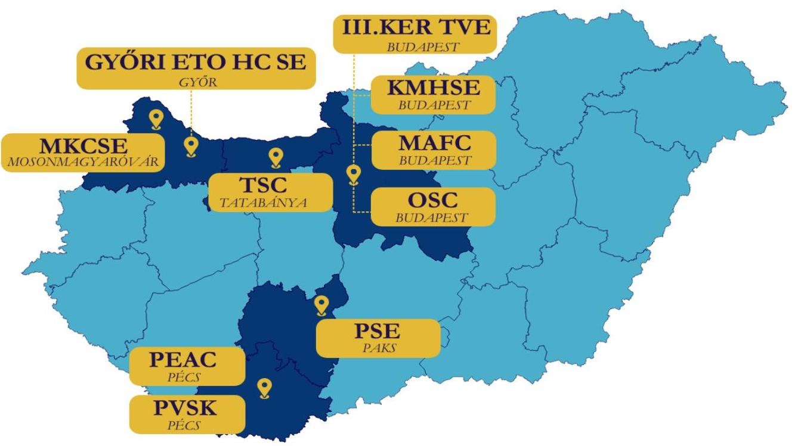
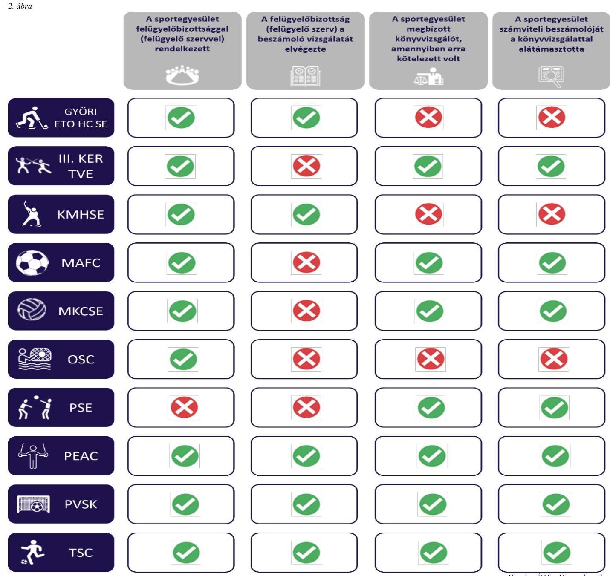

# JELENTÉS 

## A költségvetési támogatásban részesült sportegyesületeknél a felügyelőbizottság, felügyelő szerv létrehozása és könyvvizsgáló alkalmazása szabályszerűségének ellenőrzése

GYŐRI ETO HOCKEY CLUB SPORTEGYESÜLET, III. KERÜLETI TORNA ÉS VÍVÓ EGYLET, KMH HOKIKLUB SPORTEGYESÜLET, MÜEGYETEMI ATLÉTIKAI ÉS FOOTBALL CLUB, MOSONMAGYARÓVÁRI KÉZILABDA CLUB SPORTEGYESÜLET, OSC VÍZILABDA SPORT EGYESÜLET, PAKSI SPORTEGYESÜLET, PÉCSI EGYETEMI ATLÉTIKAI CLUB, PÉCSI VASUTAS SPORTKÖR, TATABÁNYAI SPORT CLUB
2024.

---

# JELENTÉS 

## A költségvetési támogatásban részesült sportegyesületeknél a felügyelőbizottság, felügyelő̉ szerv létrehozása és könyvvizsgáló alkalmazása szabályszerűségének ellenőrzése

GYŐRI ETO HOCKEY CLUB SPORTEGYESÜLET, III. KERÜLETI TORNA ÉS VÍVÓ EGYLET, KMH HOKIKLUB SPORTEGYESÜLET, MÜEGYETEMI ATLÉTIKAI ÉS FOOTBALL CLUB, MOSONMAGYARÓVÁRI KÉZILABDA CLUB SPORTEGYESÜLET, OSC VÍZILABDA SPORT EGYESÜLET, PAKSI SPORTEGYESÜLET, PÉCSI EGYETEMI ATLÉTIKAI CLUB, PÉCSI VASUTAS SPORTKÖR, TATABÁNYAI SPORT CLUB
2024.

---

# ELLENŐRZÉSI IGAZGATÓSÁG: 

## ÁLLAMHÁZTARTÁSON KÍVÜLI SZERVEZETEK ET ELLENŐRZŐ IGAZGATÓSÁG

## ELLENŐRZÉSI IGAZGATÓ:

## KLINGA LÁSZLÓ igazgató

## ELLENŐRZÉSVEZETŐ:

Jelentéseink az interneten a www.asz.hu címen olvashatók.

SALAMIN VIKTOR ellenőrzésvezető

IKTATÓSZÁM: EL-4070-001/2024.
TÉMASZÁM: 2717
ELLENŐRZÉS-AZONOSÍTÓ SZÁM: V1061

---

# TARTALOMJEGYZÉK 

AZ ELLENŐRZÉS ALAPADATAI ..... 5
AZ ELLENŐRZÖTT SZERVEZETEK ..... 6
ÖSSZEFOGLALÁS ..... 9
AZ ELLENŐRZÉS FÓKUSZKÉRDÉSE ..... 10
MEGÁLLAPÍTÁSOK ..... 11
JAVASLATOK ..... 13
MELLÉKLETEK ..... 15
I. sz. melléklet: Értelmező szótár ..... 15
II. sz. melléklet: Az ellenőrzött szervezetek jegyzéke ..... 16
III. sz. melléklet: Ellenőrzési kritériumok ..... 17
FÜGGELÉK: ÉSZREVÉTELEK ..... 18
RÖVIDÍTÉSEK JEGYZÉKE ..... 19

---

.

---

# AZ ELLENŐRZÉS ALAPADATAI 

## AZ ELLENŐRZÉS CÉLJA

Az ellenőrzés célja annak értékelése volt, hogy az ellenőrzött sportegyesületnél a jogszabályi előírásoknak megfelelően létrehoztak-e, működtettek-e felügyelőbizottságot vagy felügyelő szervet, továbbá alkalmaztak-e könyvvizsgálót, a könyvvizsgáló vizsgálta-e a sportegyesület 2022. évi beszámolóját.

## AZ ELLENŐRZÉS TÍPUSA

Szabályszerúségi ellenőrzés.

## AZ ELLENŐRZÖTT IDŐSZAK

A 2022. év és a 2022. évi beszámoló elfogadásáig terjedő időszak.

## AZ ELLENŐRZÉS TÁRGYA

Az ellenőrzés a költségvetési támogatásban részesült sportegyesületek tekintetében a felügyelőbizottság vagy felügyelő szerv létrehozásának és működtetésének, a könyvvizsgáló alkalmazásának szabályszerűségére, a sportegyesület gazdálkodásáról készített 2022. évi beszámoló könyvvizsgáló általi vizsgálatának megtörténtére irányult.

## AZ ELLENŐRZÉS JOGALAPJA

Az ellenőrzés jogalapját az ÁSZ tv. ${ }^{1}$ 5. § (3) bekezdése képezte.

## AZ ELLENŐRZÉS MÓDSZERE

Az ellenőrzést az Alaptörvény ${ }^{2}$ 43. cikk (1) bekezdésében meghatározott törvényességi és célszerűségi szempontok szerint, valamint a nemzetközi standardokat irányadónak tekintve az ellenőrzési program szempontjai, az ellenőrzött időszakban hatályos jogszabályok, az ellenőrzés szakmai szabályok és módszertanok, figyelembevételével végezte el az ÁSZ ${ }^{3}$.

Az ellenőrzési kérdések megválaszolásához szükséges bizonyítékok megszerzése az ellenőrzött szervezet által rendelkezésre bocsátott dokumentumokra, adatokra alapozva kérdésfeltevés (információkérés), interjú útján történt.

Az ellenőrzési bizonyítékként felhasználható adatforrások közé tartoztak egyrészt az ellenőrzési programban felsorolt adatforrások, másrészt az ellenőrzés folyamán feltárt, az ellenőrzés szempontjából releváns információt tartalmazó dokumentumok.

Az ellenőrzés lefolytatásához az ellenőrzött szervezetek tanúsítványok kitöltésével, hitelesítésével, valamint a teljességi és hitelességi nyilatkozattal alátámasztott adatok, dokumentumok rendelkezésre bocsátásával szolgáltattak adatokat.

---

# AZ ELLENŐRZÖTT SZERVEZETEK 

Az ellenőrzött szervezetek a Sport tv. ${ }^{4} 16 . \int$ (1) bekezdése szerint, a Civil. tv. ${ }^{5}$ és a Ptk. ${ }^{6}$ szabályai szerint működő olyan sportegyesületek, amelyek a Számv. tv. ${ }^{7}$ 3. § (1) bekezdés 4. a) pontja szerinti egyéb szervezeteknek minősültek.

Az ellenőrzött szervezetek területi elhelyezkedését az 1. ábra mutatja:

## 1. ábra

## Győri ETO Hockey Club Sportegyesület

A GYŐRI ETO HC SE ${ }^{8}$ 1992-ben jött létre azzal a céllal, hogy Győr város és a régió ifjúsága részére fejlett sportolási lehetőséget biztosítson, különös tekintettel a téli sportokra, az utánpótlás és élsport magyarországi eredményei elősegítésére.

A sportegyesület éves bevétele a 2022. évben 532529 E Ft volt és az éves beszámoló támogatások sora alapján 416722 E Ft támogatásban részesült. A GYŐRI ETO HC SE nem minősült közhasznú szervezetnek. Felügyelőbizottság létrehozására és könyvvizsgálatra kötelezett volt.

## III. Kerületi Torna És Vívó Egylet

A III. KER. TVE ${ }^{9}$ 1887-ben alakult Budapesten. Célja, hogy tagjai részére a rendszeres testedzést és sportolási lehetőséget biztosítsa, minőségi sporteredményeket érjen el, mindezek feltételeit megteremtse és fejlessze. Az atlétika, a labdarúgás és a vízilabda sportágak tartoznak az egyesület fő profiljába.

Az egyesület éves bevétele a 2022. évben 727288 E Ft volt, és az éves beszámoló támogatások sora alapján 357289 E Ft támogatásban részesült. Nem minősült közhasznú szervezetnek. Felügyelőbizottság létrehozására és könyvvizsgálatra kötelezett volt.

---

# KMH HOKIKLUB SPORTEGYESÜLET 

A KMHSE ${ }^{10}$ 2007-ben alakult budapesti székhelyű sportegyesület. Célja a tagjai és játékosai számára a jégkorong sport területén rendszeres sportedzések biztosítása, versenyek, tanfolyamok szervezése, a sportági szakszövetség bajnoki rendszerében való részvétel biztosítása, továbbá közös érdekeik védelméről gondoskodás. Tevékenységi körébe tartozik a sportkapcsolatok létesítése és fejlesztése, a kanadai jégkorong iskola követése, továbbá a sportlétesítmények infrastruktúrájának fejlesztése is.

Éves bevétele a 2022. évben 511850 E Ft volt, és az éves beszámoló támogatások sora alapján 467247 E Ft támogatásban részesült. A szervezet közhasznúnak minősült, felügyelő szerv létrehozására és könyvvizsgálatra kötelezett volt.

## MÜEGYETEMI ATLÉTIKAI ÉS FOOTBALL CLUB

A MAFC ${ }^{11}$-t verseny-, szabadidős tömeg- és diáksport tevékenység szervezése céljából hozták létre Budapesten 1897-ben. A MAFC 39 szakosztályt működtetett az ellenőrzött időszakban.

Éves bevétele a 2022. évben 570910 E Ft volt, és az éves beszámoló támogatások sora alapján 480385 E Ft támogatásban részesült. Közhasznú szervezetnek minősült, felügyelőbizottság létrehozására és könyvvizsgálatra kötelezett volt.

## MOSOENMAGYARÓVÁRI KÉZILABDA CLUB SPORTEGYESÜLET

A MKCSE ${ }^{12}$ 2014-ben alakult Mosonmagyaróváron. Célja többek között az utánpótlás-nevelés, sportos és egészséges életmódra nevelés, a kézilabda sportág bajnoki és kuparendszerben kiírt sporteseményein való részvétel, illetve ezek támogatása.

A sportegyesület éves bevétele a 2022. évben 405013 E Ft volt, és az éves beszámoló támogatások sora alapján 269012 E Ft támogatásban részesült. Nem minősült közhasznú szervezetnek, felügyelőbizottság létrehozására és könyvvizsgálatra kötelezett volt.

## OSC Vízilabda Sport EGYESÜLET

Az $\mathrm{OSC}^{13}$-t 2006-ban hozták létre Budapesten. Célja, hogy közreműködjön a vízilabda- és úszósport népszerűsítésében. Lehetőséget biztosítson fiatalok testedzéséhez és sportolásához, a vízilabda és úszósport támogatóinak szervezett kereteket biztosítson.

Az egyesület éves bevétele a 2022. évben 440391 E Ft volt, és az éves beszámoló támogatások sora alapján 364978 E Ft támogatásban részesült. Nem minősült közhasznú szervezetnek, felügyelőbizottság létrehozására és könyvvizsgálatra kötelezett volt.

## PAKSI SPORTEGYESÜLET

Az 1952-ben alapított $\mathrm{PSE}^{14}$ paksi székhelyű egyesület. Célja a tagjai részére a rendszeres testedzés és sportolás lehetőségének biztosítása, a minőségi sporteredmények elérése, feltételeinek megteremtése és fejlesztése; társadalmi öntevékenység és közösségi élet kibontakoztatása, a lakosság szabadidő sportjának segítése; hazai és nemzetközi sportkapcsolatok létesítése, fenntartása.

Éves bevétele a 2022. évben 228971 E Ft volt, és az éves beszámoló támogatások sora alapján 210315 E Ft támogatásban részesült. Nem minősült közhasznú szervezetnek, felügyelőbizottság létrehozására és könyvvizsgálatra kötelezett volt.

---

# Pécsi Egyetemi Atlétikai Club 

A pécsi székhelyű $\mathrm{PEAC}^{15}$ alaptevékenysége a sporttevékenység szervezése, valamint a sporttevékenység feltételeinek megteremtése. Az 1923-ban alapított egyesület létesítményekkel nem rendelkezik, a Magyar Állam tulajdonát képező és a Pécsi Tudományegyetem használatában lévő létesítményeket használja. Elsődleges célja, hogy rendszeres testedzés biztosításával elősegítse Baranya vármegye, Pécs város és a Pécsi Tudományegyetem verseny- és élsportjának, valamint szabadidő sportjának fejlesztését.

Éves bevétele a 2022. évben 1142952 E Ft volt, és az éves beszámoló támogatások sora alapján 1050882 E Ft támogatásban részesült. Nem minősült közhasznú szervezetnek, felügyelőbizottság létrehozására és könyvvizsgálatra kötelezett volt.

## PÉCSI VASUTAS SPORTKÖR

A pécsi székhelyű PVSK ${ }^{16}$ célja rendszeres testedzés biztosításával elősegíteni Baranya vármegye és Pécs város verseny- és élsportjának, valamint szabadidő sportjának fejlesztését. Az 1919-ben alapított egyesület fő profiljába az atlétika, bridzs, judo, kosárlabda, labdarúgás, ökölvívás, öttusa, rock and roll, sí, tájékozódási futás és vízilabda sportágak tartoznak. A Sportkör létesítményei a MÁV Zrt. és a PVSK tulajdonában vannak. A létesítmények egy részének múködését a PVSK és a Pécs Önkormányzata között hasznosítási szerződés szabályozza.

Éves bevétele a 2022. évben 911065 E Ft volt, és az éves beszámoló támogatások sora alapján 791878 E Ft támogatásban részesült. Közhasznú szervezetnek minősült, felügyelőbizottság létrehozására és könyvvizsgálatra kötelezett volt.

## Tatabányai Sport Club

A tatabányai székhelyű TSC ${ }^{17}$ elsődleges célja a rendszeres sportolás (versenyzés), testedzés, aktív pihenés, valamint az egyes szakosztályok, versenyzők részvételének biztosítása a különböző nemzeti bajnokságokon és nemzetközi versenyeken. A TSC-t 1910-ben alapították.

Éves bevétele a 2022. évben 946816 E Ft volt, és az éves beszámoló támogatások sora alapján 673632 E Ft támogatásban részesült. A szervezet közhasznúnak minősült, felügyelőbizottság létrehozására és könyvvizsgálatra kötelezett volt.

---

# ÖSSZEFOGLALÁS 

Az ellenőrzésre kiválasztott tíz sportegyesület közül a 2022. évben kilenc rendelkezett felügyelőbizottsággal (felügyelő szervvel) a jogszabályi előírásoknak megfelelően. Egy sportegyesület a 2022. évben a jogszabályi előírás ellenére nem rendelkezett felügyelőbizottsággal.

Négy sportegyesület felügyelőbizottsága (felügyelő szerve) a jogszabályi előírásoknak megfelelően megvizsgálta a 2022. évi beszámolót. Hat sportegyesület felügyelőbizottságának müködése nem felelt meg a jogszabályi előírásoknak, mivel alapvető feladatát nem látta el, a 2022. évi beszámoló vizsgálatát nem végezte el.

Hét sportegyesület a jogszabályi előírásoknak megfelelően alkalmazott könyvvizsgálót a beszámoló felülvizsgálatának elvégzésére. Három sportegyesület a jogszabályi kötelezettség ellenére nem alkalmazott könyvvizsgálót, így a beszámoló könyvvizsgálattal nem volt alátámasztott.

A főbb ellenőrzési tapasztalatokat a 2. ábra szemlélteti sportegyesületenként:

---

# AZ ELLENŐRZÉS FÓKUSZKÉRDÉSE 

- A jogszabályi előírásoknak megfelelően történt-e a sportegyesület felügyelőbizottságának vagy felügyelő szervének létrehozása, müködtetése, a könyvvizsgáló alkalmazása a 2022. évi beszámoló elfogadása során?

---

# MEGÁLLAPÍTÁSOK 

## 1. A jogszabályi előírásoknak megfelelően történt-e a sportegyesület felügyelőbizottságának vagy felügyelő szervének létrehozása, múködtetése, a könyvvizsgáló alkalmazása a 2022. évi beszámoló elfogadása során?

Összegző megállapítás

Kilenc ellenőrzőtt sportegyesület a 2022. évben rendelkezett, egy sportegyesület nem rendelkezett felügyelőbizottsággal, felügyelő szervvel. Négy sportegyesület felügyelőbizottsága a 2022. évi beszámolót megvizsgálta, hat szervezet felügyelőbizottsága azonban a jogszabályi előírások ellenére ezt elmulasztotta. Hét sportegyesületnél az előírt könyvvizsgálat teljesült, három sportegyesület a könyvvizsgálati kötelezettségének nem tett eleget.

Felügyelőbizottság, felügyelő szerv létrehozása, működtetése
A GYŐRI ETO HC SE, a III.KER.TVE, a MAFC, a MKCSE, az OSC, a PSE*, a PEAC, a PVSK és a TSC* 2022-ben a Ptk. előírásainak megfelelően rendelkezett három tagból álló felügyelőbizottsággal. A KMHSE a Civil tv. előírásai alapján a 2022. évben rendelkezett felügyelő szervvel.
A PSE 2022. augusztus 16-ától - mivel a számvizsgáló bizottság elnökének lemondását követően nem került sor új tag, elnök választására - a Ptk. 3:82. § (1) bekezdésében és a PSE Alapszabálya; ${ }^{18}$ 28. § (1) bekezdésében előírtak ellenére nem rendelkezett felügyelőbizottsággal annak ellenére, hogy a tagságának a létszáma meghaladta a 100 főt.
A GYŐRI ETO HC SE, a KMHSE, az MKCSE, az OSC, a PEAC, a PVSK és a TSC felügyelőbizottsága a Ptk.-ban előírtaknak megfelelően a közgyűlés elé beterjesztett 2022. évi beszámolót megvizsgálta, a döntéshozó szervvel ismertette az álláspontját.
A III. KER. TVE, a MAFC és a PSE felügyelőbizottsága a Ptk. 3:80. § b) pontja szerint a közgyűlés elé beterjesztett 2022. évi beszámolót a Ptk 3:27. § (1) bekezdésben foglaltak ellenére nem vizsgálta meg, álláspontját a döntéshozó szervvel nem ismertette.
A GYŐRI ETO HC SE, a KMHSE, a MAFC és a PVSK felügyelőbizottsága az egyesületek alapszabályaiban, valamint a Civil tv.-ben foglaltak alapján megalkotta az ügyrendjét. A III. KER TVE felügyelőbizottsága az Alapszabály; ${ }^{19}$ 23. § (5) bekezdésében, az MKCSE felügyelőbizottsága az Alapszabály; ${ }^{20}$ 6. pontjában, az OSC felügyelőbizottsága az Alapszabály; ${ }^{21} 77$. pontjában foglaltak ellenére nem alkotta meg az ügyrendjét. A TSC felügyelő szerve Civil tv. 40. § (2) bekezdésének előírása ellenére az ügyrendjét nem alkotta meg.

[^0]
[^0]:    * PSE esetében az elnevezés számvizsgáló bizottság, a TSC esetében ellenőrző bizottság. Tevékenységi köreik, feladataik megegyeznek a felügyelőbizottság által egyébként ellátandó feladatokkal.

---

# Könyvvizsgáló alkalmazása, beszámoló felülvizsgálata 

A III.KER. TVE, a MAFC, a MKCSE, a PSE, a PEAC, a PVSK és a TSC a 2022. évben a Civilszr. ${ }^{22}$-ben előírtaknak alapján biztosították a könyvvizsgálatot, a beszámoló felülvizsgálatával könyvvizsgálót bíztak meg. Ezen hét sportegyesület a 2022. évi beszámolóját a Civil tv. előírásainak megfelelően a könyvvizsgálói jelentéssel alátámasztotta.
A GYŐRI ETO HC SE, a KMHSE és az OSC a Civilszr. 16. § (1) bekezdésében foglaltak ellenére a 2022. évi beszámoló felülvizsgálatára nem bíztak meg könyvvizsgálót, a beszámoló könyvvizsgálói felülvizsgálata nem történt meg, így a 2022. évi beszámoló könyvvizsgálattal nem volt alátámasztott.

---

# JAVASLATOK 

Az ÁSZ tv. 33. § (1) bekezdésében foglaltak értelmében az ellenőrzött szervezet vezetője köteles a jelentésben foglalt megállapításokhoz kapcsolódó intézkedési tervet összeállítani és azt a jelentés kézhezvételétől számított 30 napon belül az ÁSZ részére megküldeni. Amennyiben az ellenőrzött szervezet vezetője nem küldi meg határidőben az intézkedési tervet, vagy továbbra sem elfogadható intézkedési tervet küld, az Állami Számvevőszék elnöke az ÁSZ tv. 33. § (3) bekezdése a) és b) pontjaiban foglaltakat érvényesítheti.

## A GYŐRI ETO HOCKEY CLUB SPORTEGYESÜLET ELNÖKÉNEK

1. Gondoskodjon a jövőben a számviteli beszámoló könyvvizsgálóval való felülvizsgálatáról a Civilszr. 16. § (1) bekezdésében elöírtaknak megfelelően.

## A III. KERÜLETI TORNA ÉS VÍVÓ EGYLET ELNÖKÉNEK

1. Gondoskodjon a jövőben arról, hogy a felügyelőbizottság a Ptk 3:27. § (1) bekezdésben foglalt elöírásnak megfelelően az éves számviteli beszámolót vizsgálja meg és a döntéshozó szervvel ismertesse az álláspontját.
2. Gondoskodjon arról, hogy a felügyelőbizottság alkossa meg az ügyrendjét az egyesület alapszabályában foglalt elöírásnak megfelelően.

## A KMH HOKIKLUB SPORTEGYESÜLET ELNÖKÉNEK

1. Gondoskodjon a jövőben a számviteli beszámoló könyvvizsgálóval való felülvizsgálatáról a Civilszr. 16. § (1) bekezdésében elöírtaknak megfelelően.

## A MŰEGYETEMI ATLÉTIKAI ÉS FOOTBALL CLUB ELNÖKÉNEK

1. Gondoskodjon a jövőben arról, hogy a felügyelőbizottság a Ptk 3:27. § (1) bekezdésben foglalt elöírásnak megfelelően az éves számviteli beszámolót vizsgálja meg és a döntéshozó szervvel ismertesse az álláspontját.

---

# A MOSONMAGYARÓVÁRI KÉZILABDA CLUB SPORTEGYESÜLET ELNÖKÉNEK 

1. Gondoskodjon arról, hogy a felügyelőbizottság alkossa meg az ügyrendjét az egyesület alapszabályában foglalt előírásnak megfelelően.

## AZ OSC VÍZILABDA SPORTEGYESÜLET ELNÖKÉNEK

1. Gondoskodjon a jövőben a számviteli beszámoló könyvvizsgálóval való felülvizsgálatáról a Civilszr. 16. § (1) bekezdésében előírtaknak megfelelően.

Gondoskodjon arról, hogy a felügyelőbizottság alkossa meg az ügyrendjét az egyesület alapszabályában foglalt előírásnak megfelelően.

## ■ A PAKSI SPORTEGYESÜLET ELNÖKÉNEK

1. Gondoskodjon a jövőben a Ptk. 3:82. § (1) bekezdésében és az egyesület alapszabályában foglaltaknak megfelelően három tagú felügyelőbizottság müködtetéséről.
2. Gondoskodjon a jövőben arról, hogy a felügyelőbizottság a Ptk 3:27. § (1) bekezdésben foglalt előírásnak megfelelően az éves számviteli beszámolót vizsgálja meg és a döntéshozó szervvel ismertesse az álláspontját.

## ■ A TATABÁNYAI SPORT CLUB ELNÖKÉNEK

1. Gondoskodjon arról, hogy a felügyelő szerv alkossa meg az ügyrendjét a Civil tv. 40. § (2) bekezdésében foglalt előírásoknak megfelelően.

---

# MELLÉKLETEK 

## I. SZ. MELLÉKLET: ÉRTELMEZŐ SZÓTÁR

költségvetési támogatás
felügyelőbizottság
felügyelő szerv
könyvvizsgálati kötelezettség
sportegyesület
a társadalombiztosítás pénzügyi alapjai kivételével az államháztartás központi alrendszeréből ellenérték nélkül, pénzben nyújtott támogatások (Áht. ${ }^{23} 1 . \S 14$. pont)
a felügyelőbizottság feladata az ügyvezetés ellenőrzése a jogi személy érdekeinek megóvása céljából (Ptk. 3:26. § (1) bekezdés). Kötelező felügyelőbizottságot létrehozni, ha a tagok több mint fele nem természetes személy, vagy ha a tagság létszáma a száz főt meghaladja (Ptk. 3:82. § (1) bekezdés).
a felügyelő szerv feladata ellenőrzi a közhasznú szervezet működését és gazdálkodását (Civil tv. 41. § (1) bekezdés). Ha a közhasznú szervezet éves bevétele meghaladja az ötvenmillió forintot, a vezető szervtől elkülönült felügyelő szerv létrehozása akkor is kötelező, ha ilyen kötelezettség más jogszabálynál fogva egyébként nem áll fenn (Civil tv. 40. § (1) bekezdés).
kötelező a könyvvizsgálat annál az egyéb szervezetnél, amelynél az éves (éves szintre átszámított) bevétel az üzleti évet megelőző két üzleti év átlagában meghaladja a 300 millió forintot. Minden olyan esetben, amikor a könyvvizsgálat e rendelet vagy más jogszabály előírásai szerint nem kötelező, az egyéb szervezet dönthet arról, hogy a beszámoló felülvizsgálatával könyvvizsgálót bíz meg (Civilszr. 16. § (1) bekezdés).
a sportegyesület olyan egyesület, amelynek alaptevékenysége a sporttevékenység szervezése, valamint a sporttevékenység feltételeinek megteremtése (Sport tv. 16. § (1) bekezdése)

---

II. SZ. MELLÉKLET: AZ ELLENŐRZŐTT SZERVEZETEK JEGYZÉKE

|  | OXÓRI   LTO   HUNE | HUKOK   FTE | KMHNE | MARC | MRCSE | OSC | PEAC | PSK | PVSK | TSC |
| :--: | :--: | :--: | :--: | :--: | :--: | :--: | :--: | :--: | :--: | :--: |
| Közhasznú jogállású volt | N | N | I | I | N | N | N | N | I | I |
| Könyvvizsgálatra kötelezett volt | I | I | I | I | I | I | I | I | I | I |
| Felügyelőbizottság / felügyelő   szerv létrehozására kötelezett   volt | I | I | I | I | I | I | I | I | I | I |
| Ügyrend készítési   kötelezettsége alapszabály   alapján állt fenn | I | I | I | N | I | I | N | N | N | N |
| Ügyrend készítési   kötelezettsége Civil tv. alapján   állt fenn | N | N | I | I | N | N | N | N | I | I |
| Kapott támogatást | I | I | I | I | I | I | I | I | I | I |
| Tagi létszám nagyobb mint   100 fő | I | I | N | I | I | I | I | I | I | I |
| Tagok több mint fele nem   természetes személy | N | N | N | N | N | N | N | N | N | N |
| Bevétel 2020. év (EFt) | 419952 | 580181 | 766352 | 505877 | 441315 | 544997 | 429208 | 838175 | 581524 | 388273 |
| Bevétel 2021. év (EFt) | 465344 | 603684 | 691203 | 605055 | 583560 | 470050 | 901020 | 1200023 | 811623 | 612083 |
| Bevétel 2022. év (EFt) | 532529 | 727288 | 511850 | 570910 | 405013 | 440391 | 1142952 | 228971 | 911065 | 946816 |

---

# III. SZ. MELLÉKLET: ELLENŐRZÉSI KRITÉRIUMOK 

## FOKUSZTERÜLET/FOKUSZKÉRDÉS

1. A jogszabályi előírásoknak megfelelően történt-e a sportegyesület felügyelőbizottságának vagy felügyelő szervének létrehozása, müködtetése, a könyvvizsgáló alkalmazása a 2022. évi beszámoló elfogadása során?

## ELLENŐRZÉSI KRITÉRIUMOK

Számv. tv. 156. § (4) bek.,
Civil tv. 30. § (1)., 40. § (1) (2)., Civil tv. 41. § Civilszr. 16. § (1) bek.,
Ptk. 3:26. § (1), (2), 3:27. § (1), 3:82. § (1), (2) bek.
Felügyelőbizottság vagy felügyelő szerv ügyrendje
Sportegyesület alapító okirat/alapszabály

---

# FÜGGELÉK: ÉSZREVÉTELEK 

A jelentéstervezetet a Számvevőszék 15 napos észrevételezésre megküldte az ellenőrzött szervezet vezetőjének az ÁSZ tv. 29. §* (1) bekezdése előírásának megfelelően.

A Győri ETO Hockey Club Sportegyesület, a III. Kerületi Torna és Vivó Egylet, a KMH Hokiklub Sportegyesület, a Müegyetemi Atlétikai és Football Club, a Mosonmagyaróvári Kézilabda Club Sportegyesület, az OSC Vizilabda Sport Egyesület, a Paksi Sportegyesület, a Pécsi Egyetemi Atlétikai Club, és a Pécsi Vasutas Sportkör elnökei a jelentéstervezetre nem tettek észrevételt. A Tatabányai Sport Club elnöke tett észrevételt, aminek az alapján a 2. ábra piktogramja módosult.

[^0]
[^0]:    * 29. § (1) Az Állami Számvevőszék az ellenőrzési megállapításait megküldi az ellenőrzött szervezet vezetőjének vagy az általa megbízott személynek, és annak, akinek személyes felelősségét állapította meg.
    (2) Az ellenőrzött szervezet vezetője és a felelősként megjelölt személy az ellenőrzés megállapításaira tizenöt napon belül írásban észrevételt tehet.
    (3) Az Állami Számvevőszék az észrevételre a beérkezésétől számított harminc napon belül írásban válaszol. A figyelembe nem vett észrevételeket köteles a jelentésben feltüntetni, és megindokolni, hogy azokat miért nem fogadta el.

---

# RÖVIDÍTÉSEK JEGYZÉKE 

${ }^{1}$ ÁSZ tv.
${ }^{2}$ Alaptörvény
${ }^{3}$ ÁSZ
${ }^{4}$ Sport tv.
${ }^{5}$ Civil tv.
${ }^{6}$ Ptk.
${ }^{7}$ Számv. tv.
${ }^{8}$ GYŐRI ETO HC SE
${ }^{9}$ III. KER. TVE
${ }^{10}$ KMHSE
${ }^{11}$ MAFC
${ }^{12}$ MKCSE
${ }^{13}$ OSC
${ }^{14}$ PSE
${ }^{15}$ PEAC
${ }^{16}$ PVSK
${ }^{17}$ TSC
${ }^{18}$ Alapszabály ${ }_{1}$
${ }^{19}$ Alapszabály ${ }_{2}$
${ }^{20}$ Alapszabály ${ }_{3}$
${ }^{21}$ Alapszabály ${ }_{4}$
${ }^{22}$ Civilszr.
${ }^{23}$ Áht.
2011. évi LXVI. törvény az Állami Számvevőszékről
Magyarország Alaptörvénye
Állami Számvevőszék
2004. évi I. törvény a sportról
2011. évi CLXXV. törvény az egyesülési jogról, a közhasznú jogállásról, valamint a civil szervezetek müködéséről és támogatásáról
2013. évi V. törvény a Polgári Törvénykönyvről
2000. évi C. törvény a számvitelről

Győri ETO Hockey Club Sportegyesület
III. Kerületi Torna és Vívó Egylet

KMH Hokiklub Sportegyesület
Műegyetemi Atlétikai és Football Club
Mosonmagyaróvári Kézilabda Club Sportegyesület
OSC Vízilabda Sport Egyesület
Paksi Sportegyesület
Pécsi Egyetemi Atlétikai Club
Pécsi Vasutas Sportkör
Tatabányai Sport Club
a PSE 2017. május 25 -től hatályos Alapszabálya
a III.KER.TVE 2021. október 7-étől hatályos egységes szerkezetbe foglalt Alapszabálya
a MKCSE 2020. július 3-ától hatályos egységes szerkezetű Alapszabálya
az OSC 2017. február 17-én kelt Alapszabálya
479/2016. (XII. 28.) Korm. rendelet a számviteli törvény szerinti egyes egyéb szervezetek beszámoló készítési és könyvvezetési kötelezettségének sajátosságairól 2011 évi CXCV. törvény az államháztartásról

---

1052 Budapest, Apáczai Csere János u. 10. | 1364 Budapest 4., Pf. 54
www.asz.hu | szamvevoszek@asz.hu
telefon: +36 14849100