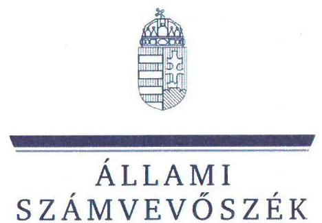
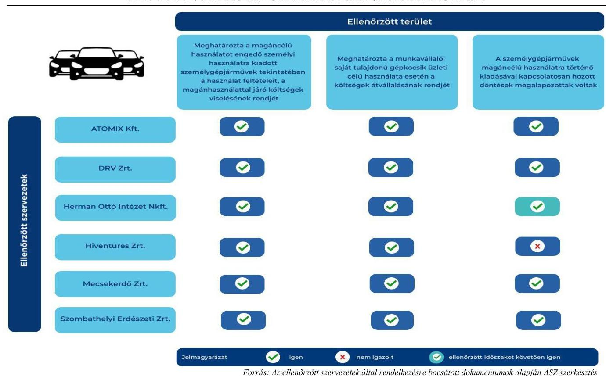
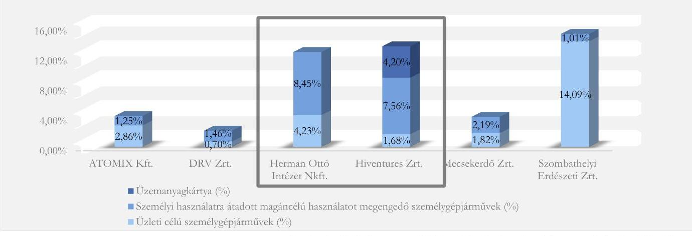
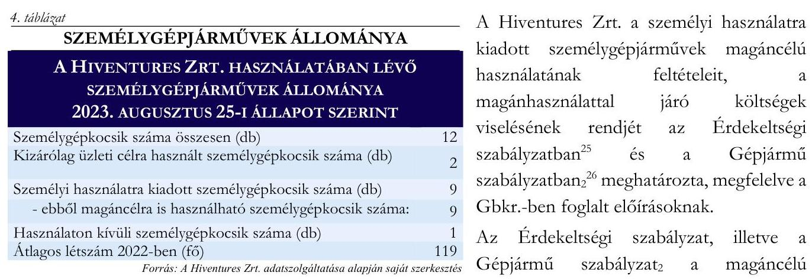
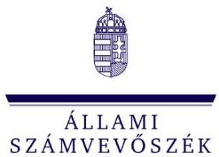

# JELENTÉS 

Az állami (többségi) tulajdonú gazdasági társaságoknál a tulajdonukban álló, vagy általuk
bérelt járművek magáncélú használatára, valamint az üzemanyagköltség átvállalására vonatkozó célzott ellenőrzés

2024.

---

ÁLLAMI
SZÁMVEVŐSZÉK

# JELENTÉS 

Az állami (többségi) tulajdonú gazdasági társaságoknál a tulajdonukban álló, vagy általuk
bérelt járművek magáncélú használatára, valamint az üzemanyagköltség átvállalására vonatkozó célzott ellenőrzés
2024.

---

# ELLENŐRZÉSI IGAZGATÓSÁG: 

ÁLLAMI VAGYONGAZDÁLKODÁST ELLENŐRZŐ IGAZGATÓSÁG

## ELLENŐRZÉSI IGAZGATÓ:

HERCZEGH ZSOLT ellenőrzési igazgató

## ELLENŐRZÉSVEZETŐ:

Jelentéseink az interneten a www.asz.hu címen olvashatók.

IMRE ZSUZSANNA ellenőrzésvezető

IKTATÓSZÁM: EL-3907-003/2024
TÉMASZÁM: 2696
ELLENŐRZÉS-AZONOSÍTÓ SZÁM: V1040

---

# TARTALOMJEGYZÉK 

AZ ELLENŐRZÉS ALAPADATAI ..... 5
AZ ELLENŐRZÖTT SZERVEZETEK ..... 7
ÖSSZEFOGLALÁS ..... 9
AZ ELLENŐRZÉS FÓKUSZKÉRDÉSE ..... 12
MEGÁLLAPÍTÁSOK ..... 13
JAVASLATOK ..... 21
MELLÉKLETEK ..... 22
I. sz. melléklet: Értelmező szótár ..... 22
II. sz. melléklet: Az ellenőrzött szervezetek jegyzéke ..... 24
III. sz. melléklet: Ellenőrzési kritériumok ..... 25
FÜGGELÉK: ÉSZREVÉTELEK ..... 26
RÖVIDÍTÉSEK JEGYZÉKE ..... 27

---

.

---

# AZ ELLENŐRZÉS ALAPADATAI 

## AZ ELLENŐRZÉS CÉLJA

Az ellenőrzés célja a gazdasági társaságnál a személygépjármű használat szabályozottságának és a kapcsolódó döntések megalapozottságának értékelése.

## AZ ELLENŐRZÉS TÍPUSA

Megfelelőségi ellenőrzés

## AZ ELLENŐRZÖTT IDŐSZAK

2023. év január 1-től az első adatbekérő levél átvételének napjáig, azaz
az ATOMIX Kereskedelmi és Szolgáltató Korlátolt Felelősségű Társaság, a Szombathelyi Erdészeti Zártkörűen Működő Részvénytársaság, a Hiventures Kockázati Tőkealap-kezelő Zártkörűen Működő Részvénytársaság és a Dunántúli Regionális Vízmű Zártkörűen Működő Részvénytársaság esetében 2023. augusztus 25-éig; a Mecsekerdő Zártkörűen Működő Részvénytársaság esetében 2023. augusztus 28-áig és a Herman Ottó Intézet Nonprofit Korlátolt Felelősségű Társaság esetében 2023. augusztus 29-éig.

## AZ ELLENŐRZÉS TÁRGYA

Az állami (többségi) tulajdonban lévő gazdasági társaságok által a magánhasználatra kiadott járművek magáncélú, valamint a munkavállalói saját tulajdonú gépkocsik üzleti célú használatára, a költségviselés rendjére vonatkozó szabályzatok, előírások, eljárásrendek, a magáncélú használat feltételeihez, a költségtérítéshez kapcsolódó döntések megalapozottsága, nyomon követése és felülvizsgálata.

Az ellenőrzés kiterjedt minden olyan körülményre és adatra, amely az Állami Számvevőszék (továbbiakban: ÁSZ ${ }^{1}$ ) jogszabályban meghatározott feladatainak teljesítéséhez, valamint a program végrehajtása során felmerült újabb összefüggések feltárásához szükséges volt.

## AZ ELLENŐRZÉS JOGALAPJA

Az ellenőrzés jogszabályi alapját az ÁSZ tv. ${ }^{2} 1 . \int(3)$ bekezdése és az 5. $\int(4)$ bekezdése előírásai képezték.

---

# AZ ELLENŐRZÉS MÓDSZERE 

Az ellenőrzést az ÁSZ a nemzetközi standardokat irányadónak tekintve az ellenőrzési program szempontjai, az ellenőrzött időszakban hatályos jogszabályok, az ellenőrzés szakmai szabályok és módszertanok figyelembevételével folytatta le.

Az ellenőrzési kérdések megválaszolásához szükséges bizonyítékok megszerzése az ellenőrzött szervezetek által rendelkezésre bocsátott dokumentumokra és adatokra alapozva a következő ellenőrzési eljárások alkalmazásával történt: megfigyelés, kérdésfeltevés (interjú), összehasonlítás, elemző eljárás. Az ellenőrzési bizonyítékként felhasználható adatforrások közé tartoztak egyrészt az ellenőrzéshez kért dokumentumok, adatforrások, másrészt adatforrás volt minden - az ellenőrzés folyamán feltárt, az ellenőrzés szempontjából információt tartalmazó - dokumentum. Az ÁSZ megfelelőnek értékelte a gazdasági társaságok által a személyi használatra kiadott személygépjárművek magáncélú használatot is megengedő gyakorlatát, amennyiben a személyi használatra kiadott, magáncélú használatot is megengedő személygépjárművek, valamint e használattal azonos értékű, kiadott üzemanyagkártyák együttes száma nem haladta meg az utolsó lezárt üzleti évben átlagosan foglalkoztatottak létszámának öt százalékát.

Az ellenőrzés lefolytatásához az ellenőrzött szervezetek a tanúsítványok kitöltésével, valamint az ÁSZ által kért dokumentumok, adatok, információk megküldésével szolgáltattak adatokat.

---

# AZ ELLENŐRZÖTT SZERVEZETEK 

## ATOMIX KERESKEDELMI ÉS SZOLGÁLTATÓ KORLÁTOLT FELELŐSSÉGŰ TÁRSASÁG

Az ATOMIX Kft. ${ }^{4}$-t 1994. január 3-án alapította a paksi székhelyű Atomerőmű Sportegyesület. Az ATOMIX Kft. 100\%-os üzletrészét 2001. április 2-án vásárolta meg az MVM Paksi Atomerőmű Zártkörűen Működő Részvénytársaság (korábbi nevén Paksi Atomerőmű Részvénytársaság).

Az ATOMIX Kft. szolgáltatásait alapvetően a tulajdonos MVM Paksi Atomerőmű Zrt. ${ }^{4}$ vette igénybe, mely társaságtól származott az árbevételének meghatározó hányada. Az ATOMIX Kft. főtevékenysége a személybiztonsági tevékenység. Az ATOMIX Kft. szolgáltatásait négy üzletág - biztonsági üzletág, rendészeti üzletág, szolgáltatási üzletág és vendéglátó üzletág - keretein belül végezte. Az ATOMIX Kft. székhelye Pakson található, a feladatellátásról egy telephelyen és kettő fióktelepen gondoskodott.

Az ATOMIX Kft. 2022. évi beszámolója alapján a mérlegfőösszege 3332,4 M Ft, a saját tőke összege 330,7 M Ft, az értékesítés nettó árbevétele $12338,0 \mathrm{MFt}$, a foglalkoztatottak átlagos statisztikai állományi létszáma 1119 fő volt.

## DUNÁNTÚLI REGIONÁLIS VÍZMŰ ZÁRTKÖRÜEN MŰKÖDŐ RÉSZVÉNYTÁRSASÁG

A DRV Zrt. ${ }^{5}$ 1993. április 1-jén alakult a Dunántúli Regionális Vízművek általános jogutódjaként. Jelenlegi nevén 2006 óta működik. A DRV Zrt. többségi tulajdonosa - az ellenőrzött időszakban - a Magyar Állam $(97,3 \%)$, további $1,9 \%$ önkormányzati, $0,8 \%$ dolgozói tulajdon volt. Az állami részesedés tulajdonosi joggyakorlója 2021. január 1.-2023.december 28. közötti időszakban - a Nemzeti Vízművek Zrt. volt. A DRV Zrt. tevékenységének szakmai felügyeletét az Energiaügyi Minisztérium látta el. A DRV Zrt. többségi tulajdonosa 2023. december 29. napjától a Nemzeti Vízművek Zrt.

A DRV Zrt. főtevékenysége az állami és önkormányzati tulajdonban lévő vízi-közművek üzemeltetése volt. A DRV Zrt. hat vármegyében összesen 378 településen biztosította az ivóvízellátást, valamint 220 településen gondoskodott a szennyvíz elvezetéséről és kezeléséről. A DRV Zrt. székhelye Siófokon található, a feladatellátásról egy telephelyen és nyolc fióktelepen 15 üzemvezetőség gondoskodott.

A DRV Zrt. 2022. évi beszámolója alapján a mérlegfőösszege 130 156,0 M Ft, a saját tőke összege 8651,0 M Ft, az értékesítés nettó árbevétele $22601,0 \mathrm{MFt}$, a foglalkoztatottak átlagos statisztikai állományi létszáma 1846 fő volt. Az ellenőrzött időszakban a vezérigazgató személye 2023. április 12-étől változott.

## HERMAN OTTÓ INTÉZET NONPROFIT KORLÁTOLT FELELŐSSÉGŰ TÁRSASÁG

A Környezetvédelmi és Területfejlesztési Minisztérium 1994. január 3-án alapította a Környezetbarát Termék Közhasznú Társaságot, ami 2009. augusztus 25-i átalakulását követően Környezetbarát Termék Nonprofit Kft. néven működött tovább. A társaság 2016. november 25-től Herman Ottó Intézet Nonprofit Korlátolt Felelősségű Társaság néven folytatta tevékenységét. A Herman Ottó Intézet Nonprofit Kft. ${ }^{6}$ egyedüli tulajdonosa 2009. augusztus 25-től a Magyar Állam, tulajdonosi joggyakorlója az Agrárminisztérium.

A Herman Ottó Intézet Nonprofit Kft. főtevékenysége egyéb szakmai, tudományos, műszaki tevékenység, melynek keretében végzett főbb tevékenységei - többek között - az agrárirányú képzések támogatása; a környezetkímélő termékek és szolgáltatások megkülönböztető megfelelőség-tanúsító rendszereinek működtetése; a környezeti kármentesítés, levegőtisztaság-védelem, természetvédelem, fenntarthatóság és zaj elleni védelem; ismeretátadó rendezvények, kampányok szervezése volt.

---

A Herman Ottó Intézet Nonprofit Kft. 2022. évi beszámolója alapján a mérlegfőösszege 6967,6 M Ft, a saját tőke összege 932,6 M Ft, az értékesítés nettó árbevétele 1758,7 M Ft, a foglalkoztatottak átlagos állományi létszáma 142 fő volt.

# Hiventures Kockázati Tőkealap-kezelő Zártkörűen Működő Részvénytársaság 

A Hiventures Zrt. ${ }^{7}$ jogelődje a REGIONÁLIS Alapkezelő Rt. 1999. szeptember 2-án alakult, majd 2005. szeptember 19-től CORVINUS Alapkezelő Zrt. néven működött. A társaság 2016. november 29-től Hiventures Kockázati Tőkealap-kezelő Zártkörűen Működő Részvénytársaság néven folytatja tevékenységét. A Hiventures Zrt. közvetett állami tulajdonban álló gazdasági társaság, 100\%-os tulajdonosa 2015. május 13-tól az MFB Invest Befektetési és Vagyonkezelő Zrt.

A Hiventures Zrt. főtevékenysége az alapkezelés, kockázati tőkealapok létrehozása és kezelése annak érdekében, hogy a magas növekedési potenciállal rendelkező innovatív, induló és korai növekedési szakaszban működő vállalkozások számára tőkeági támogatást nyújtson. A Hiventures Zrt. által 2022. évben kezelt alapok: az MFB Növekedési Tőkealap, a Kutatás-fejlesztési és Innovációs Állami Tőkealap, az Infokommunikációs Állami Tőkealap, az Üzleti Infokommunikációs, Digitalizációs Tőkealap, az MFB Vállalati Beruházási és Tranzakciós Magántőkealap.

A Hiventures Zrt. 2022. évi beszámolója alapján a mérlegfőösszege 3636,8 M Ft, a saját tőke összege 2704,2 M Ft, az értékesítés nettó árbevétele 3685,1 M Ft, a foglalkoztatottak átlagos statisztikai állományi létszáma 119 fő volt.

## MECSEKERDŐ ZÁRTKÖRÜEN MŰKÖDŐ RÉSZVÉNYTÁRSASÁG

A Mecsekerdő Zrt. ${ }^{8}$-t 1993. június 30-án alapította az Állami Vagyonkezelő Részvénytársaság a Mecseki Állami Erdőgazdaság jogutódjaként. A Mecsekerdő Zrt. egyedüli tulajdonosa a Magyar Állam, a tulajdonosi joggyakorló az Agrárminisztérium.

A Mecsekerdő Zrt. alaptevékenysége az erdőgazdálkodás, vadgazdálkodás, erdőkezelés, ökoturisztikai feladatok ellátása volt. A Mecsekerdő Zrt. székhelye és telephelye Pécsett, fióktelepei Sellyén, Sásdon, Pécsváradon és Szigetváron találhatók.

A Mecsekerdő Zrt. 2022. évi beszámolója alapján a mérlegfőösszege 7705,4 M Ft, a saját tőke összege 4724,6 M Ft, az értékesítés nettó árbevétele 7597,3 M Ft, a foglalkoztatottak átlagos statisztikai állományi létszáma 294 fő volt.

## SZOMBATHELYI ERDÉSZETI ZÁRTKÖRÜEN MŰKÖDŐ RÉSZVÉNYTÁRSASÁG

A Szombathelyi Erdészeti Zrt. ${ }^{9}$ 1993. január 1-jén jött létre a Szombathelyi Állami Erdőgazdaság jogutódjaként. A Szombathelyi Erdészeti Zrt. kizárólagos tulajdonosa a Magyar Állam, tulajdonosi joggyakorlója az Agrárminisztérium.

A Szombathelyi Erdészeti Zrt. főtevékenysége az erdő- és vadgazdálkodás, valamint az erdőgazdálkodással összefüggő közjóléti és turisztikai szolgáltatások. A Szombathelyi Erdészeti Zrt. székhelye Szombathelyen, fióktelepei Szentgotthárdon, Sárváron és Vasváron találhatók.

A Szombathelyi Erdészeti Zrt. 2022. évi beszámolója alapján a mérlegfőösszege 7986,7 M Ft, a saját tőke összege 6379,3 M Ft, az értékesítés nettó árbevétele 6833,0 M Ft, a foglalkoztatottak átlagos állományi létszáma 318 fő volt.

---

# ÖSSZEFOGLALÁS 

A Magyar Állam állami tulajdonú gazdasági társaságokban lévő részesedései a nemzeti vagyon, ezen belül az állami vagyon részét képezik. Az állami vagyon értékének megőrzésére, növelésére alapvető befolyást gyakorol a gazdasági társaságok gazdálkodási tevékenysége. Az energiahordozók - így az üzemanyagok árának jelentős növekedése miatt a költségtakarékosság kiemelt területe a gazdálkodásnak. E körbe tartozik a személygépjárművek kérdése is, így a személygépjármű használat szabályozottsága és gyakorlata, mely hatással lehet a költségtakarékos gazdálkodásra. Az állami vagyonnal való felelős és költségtakarékos gazdálkodás alapvető elemei a megfelelő kontrollkörnyezet, a kontrolltevékenységek és a nyomon követési rendszer kialakítása.

Az ÁSZ hat többségi állami tulajdonban lévő gazdasági társaságnál értékelte a használatukban lévő, saját tulajdonú vagy bérelt/lízingelt, személyi használatra kiadott személygépjárművek magáncélú, valamint a munkavállalói saját tulajdonú gépkocsik üzleti célú használatának, valamint az ezzel járó költségek viselése rendjének szabályozottságát, a kapcsolódó döntések megalapozottságát.

AZ ELLENŐRZÉS MEGÁLLAPÍTOTTA, hogy valamennyi ellenőrzött gazdasági társaság, az ATOMIX Kft., a DRV Zrt., a Herman Ottó Intézet Nonprofit Kft., a Hiventures Zrt., a Mecsekerdő Zrt. és a Szombathelyi Erdészeti Zrt. meghatározta a használatában lévő, személyi használatra átadott személygépjárművek magáncélú használatának, valamint a magánhasználattal járó költségek viselésének rendjét, a gépjármű használat feltételeit. Valamennyi gazdasági társaság szabályozta a munkavállalói saját tulajdonú gépkocsik üzleti célú használata esetén a költségek átvállalásának, a megtérített költségek számításának módját, illetve a költségtérítés elszámolásának rendjét és az elszámolás dokumentálását. A gazdasági társaságok a szabályozások elkészítésével megfeleltek a Gbkr. előírásainak.

A gazdasági társaságok közül négy társaságnál a személyi használatra kiadott járművek magáncélú, valamint a munkavállalói saját tulajdonú gépkocsik üzleti célú használatához kapcsolódó döntések a jogszabályi előírásoknak megfelelően megalapozottak voltak. Az ATOMIX Kft. a magáncélú használatot is megengedő személygépjármű használatot az MVM csoport belső szabályozó eszközeiben foglalt irányelvekkel összhangban engedélyezte. A DRV Zrt., a Mecsekerdő Zrt. és a Szombathelyi Erdészeti Zrt. a személygépjárművek magáncélú használatra történő kiadásával kapcsolatos döntéseit a társaságok tevékenységi körére, foglalkoztatotti létszámára tekintettel hozta meg a vezetői munkakörök szintjéhez igazodóan és a döntéseik során érvényesültek
 az Nvtv.-ben foglalt felelős és költségtakarékos gazdálkodásra vonatkozó alapelvek, valamint a Taktv.-ben foglalt követelmények.

A Herman Ottó Intézet Nonprofit Kft. és a Hiventures Zrt. esetében a személygépjárművek magáncélú használatra történő kiadásával kapcsolatos döntések megalapozottsága nem volt igazolt. A döntések során az Nvtv.-ben foglalt felelős és költségtakarékos gazdálkodásra vonatkozó alapelvek nem érvényesültek, mivel a magáncélú használatra vonatkozó döntések nyomon követése és felülvizsgálata az ellenőrzött időszakban nem valósult meg és a magáncélú használatra vonatkozó szabályok korlátozást, illetve érdemi korlátozást egyik esetben sem tartalmaztak. A Herman Ottó Intézet Nonprofit Kft. az ellenőrzés során intézkedett a magáncélú használatra vonatkozó döntésének felülvizsgálatával kapcsolatban és érdemi korlátozást vezetett be a havi üzemanyagkeretek meghatározásával. Az 1. számú ábra szemlélteti az ellenőrzés megállapításainak összegzését.

---

# KÉT GAZDASÁGI TÁRSASÁG VONATKOZÁSÁBAN A MAGÁNCÉLÚ HASZNÁLATRA VALÓ JOGOSULTSÁGGAL KAPCSOLATOS ÁLLAMI SZÁMVEVŐSZÉKI VÉLEMÉNY 

Az ellenőrzés véleménye alapján - a társaság nagyságrendjéhez, valamint a létszámához viszonyítva - két gazdasági társaságnál jelentős volt a magáncélú használatot is megengedő személygépjármű használatra való jogosultság. A 2. ábra szemlélteti az ellenőrzött gazdasági társaságok által magáncélú használatot is megengedő személyi használatra kiadott személygépjárművek arányát a társaság átlagos statisztikai létszámához viszonyítva.

## 2. ábra

ÜZLETI CÉLÚ ÉS SZEMÉLYI HASZNÁLATRA ÁTADOTT MAGÁNCÉLÚ HASZNÁLATOT MEGENGEDŐ SZEMÉLYGÉPJÁRMŰVEK ARÁNYA AZ ÁTLAGOS STATISZTIKAI ÁLLOMÁNYI LÉTSZÁMHOZ VISZONYÍTVA

Forrás: Az ellenőrzött szervezetek által rendelkezésre bocsátott dokumentumok alapján ÁSZ szerkesztés

---

A Herman Ottó Intézet Nonprofit Kft. esetében a 142 fő foglalkoztatotti létszámhoz viszonyítva 12 db magáncélú használatot is megengedő személyi használatra kiadott személygépjármű volt az ellenőrzött időszakban. A személyi használatra kiadott személygépjárművek futásteljesítményére havi 5000 km-es keret volt érvényben, amely az ellenőrzés véleménye alapján valós korlátot - amelyen belül a magáncélú használat futásteljesítményére, vagy üzemanyagköltségére vonatkozóan - nem biztosított. Az ellenőrzött időszakot követően a társaság ügyvezetője felülvizsgálta a személyi használatra kiadott gépjárművek esetében a gépjárművek üzemeltetésének gyakorlatát, 2023. december 1-től hatályos ügyvezetői intézkedéssel gondoskodott az üzemanyagfelhasználás tekintetében, személyenként egyedi, összegszerű és a korábbihoz képest jelentős korlátozás bevezetéséről. Az ügyvezetői intézkedés az ellenőrzés véleménye alapján hozzájárult az Nvtv.-ben foglalt felelős és költségtakarékos gazdálkodásra vonatkozó alapelvek érvényesüléséhez.
A Hiventures Zrt.-nél a 119 foglalkoztatotti létszámhoz viszonyítva kilenc db magáncélú használatot is megengedő személyi használatra kiadott személygépjármű volt az ellenőrzött időszak végén, továbbá a társaság öt darab üzemanyagkártyát biztosított azon vezetők részére, akik jogosultak voltak magáncélú használatot is megengedő, a társaság használatában lévő személygépjármű használatra, de azt nem vették igénybe. A személyi használatra kiadott személygépjárművek esetében a magáncélú használatra korlátozás nem volt érvényben. Az ellenőrzés véleménye alapján a korlátlan magánhasználatra kiadott gépjárművek és a magánhasználatot is tartalmazó üzemanyagkártyák a társaság létszámához viszonyított magas arányának - a jelentős mértékű üzemanyagár növekedést követően - költségtakarékossági célú felülvizsgálata tudja biztosítani a társaság az Nvtv.-ben foglalt felelős és költségtakarékos gazdálkodásra vonatkozó alapelvek érvényesülését.

---

# AZ ELLENŐRZÉS FÓKUSZKÉRDÉSE 

- A gazdasági társaság kialakította-e a személyi használatra kiadott járművek magáncélú, valamint a munkavállalói saját tulajdonú gépkocsik üzleti célú használatának a feltételeit, meghatározta-e a költségviselés rendjét, a kapcsolódó döntései megalapozottak voltak-e?

---

# 1. ATOMIX Kereskedelmi és Szolgáltató Korlátolt Felelősségű Társaság 

Összegző megállapítás

Az ATOMIX Kft. kialakította a személyi használatra kiadott járművek magáncélú, valamint a munkavállalói saját tulajdonú gépkocsik üzleti célú használatának feltételeit, meghatározta a költségviselés rendjét. Az ATOMIX Kft. személygépjárművek magáncélú használatával kapcsolatos döntései megalapozottak voltak.

| 1. táblázat |  |
| :--: | :--: |
| SZEMÉLYGÉPJÁRMÚVEK ÁLLOMÁNYA |  |
| AZ ATOMIX KFT. HASZNÁLATÁBAN LÉVŐ SZEMÉLYGÉPJÁRMŰVEK ÁLLOMÁNYA 2023. AUGUSZTUS 25-I ÁLLAPOT SZERINT |  |
| Személygépkocsik száma összesen (db) | 46 |
| Kizárólag üzleti célra használt személygépkocsik száma (db) | 32 |
| Személyi használatra kiadott személygépkocsik száma (db) - ebből magáncélra is használható személygépkocsik száma: | 14 |
| Átlagos létszám 2022-ben (fő) | 1119 |

Forrás: Az ATOMIX Kft. adatszolgáltatása alapján saját szerkesztés
Az ATOMIX Kft. a Flottakezelési Belső Szabályzatban ${ }^{10}$ meghatározta a használatában lévő, személyi használatra átadott személygépjárművek magáncélú használatának és a magánhasználattal járó költségek viselésének rendjét, a gépjármű használat feltételeit, megfelelve a Gbkr. ${ }^{11}$ előírásainak. A Flottakezelési Belső Szabályzat szerint a 14 darab magáncélú használatra engedélyezett
személygépjárműből 12 darab úgynevezett státusz gépjármű, míg kettő darab úgynevezett munkaköri gépjármű volt. A Flottakezelési Belső Szabályzatban foglaltak szerint a státusz gépjárművek esetében korlátlan, térítésmentes magánhasználat volt biztosított, útnyilvántartás vezetési kötelezettség nélkül, míg a munkaköri gépjárművek esetében korlátozott (éves limit: 12.000 km) magánhasználatot biztosítottak útnyilvántartás vezetése mellett.
Az ATOMIX Kft. a munkavállalói saját tulajdonú gépkocsik üzleti célú használata esetén a költségek átvállalásának, a megtérített költségek számításának módját, illetve a költségtérítés elszámolásának a rendjét és az elszámolás dokumentálását a 60/1992. (IV. 1.) Kormányrendelet ${ }^{12}$, az SZJA tv. ${ }^{13}$, valamint a NAV által közzétett általános normaköltség és üzemanyagárak figyelembevételével az Ügyvezető Igazgatói Utasításban ${ }^{14}$ teljeskörűen és egyértelműen kialakította, megfelelve a Gbkr.-ben foglalt előírásoknak.
Az ATOMIX Kft.-re, mint az MVM csoport ${ }^{15}$ tagjára vonatkozóan a személygépjárművek magáncélú használatra történő kiadásával kapcsolatos döntést, a használati jogosultságokat és feltételeket az MVM csoport Vagyongazdálkodási központi irányelvében ${ }^{16}$ rögzítették, mellyel összhangban engedélyezték a társaságnál a magáncélú használatot is megengedő személygépjármű használatot. Az ATOMIX Kft. a Flottakezelési Belső Szabályzatban meghatározta a személygépjárművek magáncélú használatra történő kiadásával kapcsolatosan hozott döntések végrehajtásának felelősét, határidejét, a nyomon követés módját. Az ATOMIX Kft. az ellenőrzött időszakban nyomon követte a személygépjárművek magáncélú használatával kapcsolatban a futásteljesítményt, az üzemanyagfelhasználást és az üzemanyagköltséget, eleget téve a Gbkr. előírásainak. Az ATOMIX Kft. a státusz és munkaköri személygépjárművek esetében is nyilvántartotta a futásteljesítményt, a felhasznált üzemanyag-mennyiséget, az üzemanyagköltséget

---

személygépjárművenként és havi bontásban. Az ATOMIX Kft.-nél a személygépjármű használatra vonatkozó döntések megalapozottak, dokumentáltak voltak, meghatározták a végrehajtás felelősét, a nyomon követés módját, továbbá a végrehajtást nyomon követték.
Az ATOMIX Kft. Flottakezelési Belső Szabályzatában a társasági tulajdonú személygépjárművek magáncélú használatának szabályozása során, valamint az Ügyvezető Igazgatói Utasításban a munkavállalói saját tulajdonú személygépjárművek üzleti célú használatának szabályozása során érvényesültek az Nvtv. ${ }^{17}$-ben rögzített, a felelős és költségtakarékos gazdálkodásra vonatkozó alapelvek, valamint a Taktv. ${ }^{18}$-ben foglalt követelmények.

# 2. Dunántúli Regionális Vízmű Zártkörűen Működő Részvénytársaság 

Összegző megállapítás

A DRV Zrt. kialakította a személyi használatra kiadott járművek magáncélú, valamint a munkavállalói saját tulajdonú gépkocsik üzleti célú használatának feltételeit, meghatározta a költségviselés rendjét. A DRV Zrt. a személygépjárművek magáncélú használatával kapcsolatos döntései megalapozottak voltak.

| 2. táblázat |  |
| :--: | :--: |
| SZEMÉLYGÉPJÁRMÚVEK ÁLLOMÁNYA |  |
| A DRV ZRT. HASZNÁLATÁBAN LÉVŐ SZEMÉLYGÉPJÁRMŰVEK ÁLLOMÁNYA 2023. AUGUSZTUS 25-I ÁLLAPOT SZERINT | A DRV Zrt. a HR Szabályzatban ${ }^{19}$ és a Gépjárműszabályzatban ${ }^{20}$ - a Gbkr. előírásainak megfelelően - meghatározta a személyi használatra kiadott |
| Személygépkocsik száma összesen (db) | 41 |
| Kizárólag üzleti célra használt személygépkocsik száma (db) | 13 |
| Személyi használatra kiadott személygépkocsik száma (db) | 27 |
| - ebből magáncélra is használható személygépkocsik száma: | 27 |
| Bérbeadott személygépjárművek száma (db) | 1 |
| Átlagos létszám 2022-ben (fő) | 1846 |

A DRV Zrt. a HR Szabályzatban ${ }^{19}$ és a Gépjárműszabályzatban ${ }^{20}$ - a Gbkr. előírásainak megfelelően - meghatározta a személyi használatra kiadott személygépjárművek magáncélú használatára, valamint a magánhasználattal járó költségek viselésének rendjére vonatkozó szabályokat, a gépjármű használat feltételeit. A HR Szabályzatban került meghatározásra a magánhasználatra jogosultak köre és a magánhasználat jellege. Korlátlan magánhasználatra a vezérigazgató, korlátozott magánhasználatra a felsővezetők (hét darab személygépjármű), valamint térítéses magánhasználatra a középvezetők (19 darab személygépjármű) voltak jogosultak. A Gépjárműszabályzat ${ }^{20}$ alapján a korlátozott magánhasználatra éves kilométer limit került rögzítésre a munkaszerződésben, annak indokolatlan túllépése esetén a vezetőnek a térítéses magánhasználat feltételei szerinti térítési kötelezettsége keletkezett. A Gépjárműszabályzat ${ }^{20}$ a térítéses magánhasználat feltételeként írta elő a munkavállalónak a magánhasználat futásteljesítményéről a havi rendszerességű adatszolgáltatást, valamint a magánhasználat költségeinek megtérítését.
A DRV Zrt. a munkavállalói saját tulajdonú gépkocsik üzleti célú használata esetén a költségek átvállalásának, illetve a költségtérítés elszámolásának a rendjét a hatályos Kollektív Szerződésben ${ }^{21}$ a 60/1992. (IV. 1.) Kormányrendelet, az SZJA tv., valamint a NAV által közzétett általános normaköltség és üzemanyagárak figyelembevételével meghatározta. A DRV Zrt. a munkavállalói saját tulajdonú gépkocsik üzleti célú használatát, valamint azok üzleti célú használata esetén a költségek átvállalásának rendjét, a megtérített költségek számításának módját és az elszámolás dokumentálását a Kollektív Szerződésben teljeskörűen és egyértelműen kialakította, megfelelve a Gbkr. előírásaiban foglaltaknak.

---

A DRV Zrt. a személygépjárművek magáncélú használatra történő kiadásával kapcsolatosan hozott döntései során figyelembe vette a vezetői munkakör szintjét. A korlátozott és térítéses magánhasználat feltételei vezetői (felsővezető, középvezető) munkakörök esetében a munkaszerződésekben kerültek rögzítésre, mely alapján a cégautóval való munkába járást a munkáltató biztosítja és fizeti annak költségeit. Így a korlátozott (felsővezetői) munkaszerződésekben az éves km limit a munkavégzéssel kapcsolatos használatra, a munkába járásra, valamint a további magánhasználatra együttesen került meghatározásra, a térítéses (középvezetői) munkaszerződések alapján a vezető a munkába járáson túli magánhasználat költségei megtérítésére kötelezett. A DRV Zrt. a Gépjárműszabályzatban ${ }^{20}$ meghatározta a személygépjárművek magáncélú használatra történő kiadásával kapcsolatosan hozott döntések végrehajtásának felelősét, határidejét, a nyomon követés módját. A DRV Zrt. által vezetett nyilvántartás a társaság használatában álló személygépjárművek futásteljesítményét és a kapcsolódó költségeket gépjárművenként, munkavállalónként tartalmazta, megfelelve a Gbkr. előírásainak.
A DRV Zrt.-nél a személygépjármű használatra vonatkozó döntések megalapozottak, dokumentáltak voltak, meghatározták a végrehajtás felelősét, a nyomon követés módját, a végrehajtást nyomon követték.
A DRV Zrt. HR Szabályzatában, Gépjárműszabályzatában ${ }^{20}$, a személyi használatra kiadott személygépjárművek magáncélú használatára, valamint a magánhasználattal járó költségek viselésének rendjére vonatkozó szabályozás tekintetében érvényesültek az Nvtv.-ben rögzített, a felelős és költségtakarékos gazdálkodásra vonatkozó alapelvek, valamint a Taktv.-ben foglalt követelmények.

# 3. Herman Ottó Intézet Nonprofit Korlátolt Felelősségű Társaság 

Összegző megállapítás

A Herman Ottó Intézet Nonprofit Kft. kialakította a személyi használatra kiadott járművek magáncélú, valamint a munkavállalói saját tulajdonú gépkocsik üzleti célú használatának feltételeit, meghatározta a költségviselés rendjét. A személygépjárművek magáncélú használatra történő kiadásával kapcsolatos döntések megalapozottsága nem volt igazolt. Ugyanakkor a társaság az ellenőrzés során intézkedett a magáncélú használatra vonatkozó döntések felülvizsgálatával kapcsolatban és érdemi korlátozást vezetett be.

1. táblázat

## SZEMÉLYGÉPJÁRMŰVEK ÁLLOMÁNYA

A Herman Ottó Intézet Nonprofit Kft. HASZNÁLATÁBAN LÉVŐ SZEMÉLYGÉPJÁRMŰVEK ÁLLOMÁNYA 2023. AUGUSZTUS 29-I ÁLLAPOT SZERINT

Személygépkocsik száma összesen (db) 19
Kizárólag üzleti célra használt személygépkocsik száma (db) 6
Személyi használatra kiadott személygépkocsik száma (db) 13

- ebből magáncélra is használható személygépkocsik száma: 12

Átlagos létszám 2022-ben (fő)
142
Forrás: A Herman Ottó Intézet Nonprofit Kft. adatszolgáltatása alapján saját
 szerkesztés
előírásainak. A Javadalmazási szabályzatban meghatározásra került, hogy a társaság Mt. ${ }^{24}$ 208. §-a szerinti munkavállalói lehettek jogosultak a társaság használatában lévő gépjárművek hivatali és személyes célú

---

használatára a munkáltatói jogkör gyakorlójának - ügyvezető, illetve az ügyvezető esetében a tulajdonosi jogkört gyakorló alapító - döntése szerint. A Gépjárműhasználati szabályzat alapján a személyi használatra rendelt céges gépjárművek használatával járó költségeket a társaság viselte. A Gépjárműhasználati szabályzat feltételként írta elő a menetlevél naprakész, pontos vezetését, havi 5000 km-ben maximálta a havi futásteljesítményt. A Gépjárműhasználati szabályzat alapján a havi futásteljesítmény túllépését az ügyvezető engedélyezhette, a jóvá nem hagyott futásteljesítmény számlázásra került a gépkocsi használója számára a munkavállaló saját gépjárművének hivatali célból történt igénybevételekor fizetett költségtérítés szerinti számítási mód alapján.
A Herman Ottó Intézet Nonprofit Kft. a munkavállalói saját tulajdonú gépkocsik üzleti célú használata esetén a használat feltételeit és a költségek átvállalásának rendjét, a megtérített költségek számításának módját és az elszámolás dokumentálását a 60/1992. (IV. 1.) Kormányrendelet, az SZJA tv., valamint a NAV által közzétett általános normaköltség és üzemanyagárak figyelembevételével a Gépjárműhasználati szabályzatban teljeskörűen és egyértelműen kialakította, összhangban Gbkr. előírásaival.
A Herman Ottó Intézet Nonprofit Kft. ügyvezetője a személygépjárművek magáncélú használatra történő kiadásával kapcsolatosan hozott döntéseit a Gépjárműhasználati szabályzat kiadásával dokumentálta, írásba foglalta, megfelelve a Gbkr-ben foglaltaknak.
A Herman Ottó Intézet Nonprofit Kft.-nél a személygépjárművek magáncélú használatra történő kiadásával kapcsolatos - a Gépjárműhasználati szabályzatban rögzített vonatkozó - döntések megalapozottsága nem volt igazolt. A döntések során az Nvtv. 7. § (1) és (2) bekezdéseiben foglalt felelős és költségtakarékos gazdálkodásra vonatkozó alapelvek nem érvényesültek, mivel a magáncélú használatra vonatkozó döntések nyomon követése és felülvizsgálata az ellenőrzött időszakban nem valósult meg és a magáncélú használatra vonatkozó szabályok érdemi korlátozást - a magáncélú használat futásteljesítményére, vagy üzemanyagköltségére vonatkozóan - nem tartalmaztak.
A Herman Ottó Nonprofit Intézet Kft. a Gépjárműhasználati szabályzat V/3 pontjában rögzítettekkel ellentétben a munkavállalókkal kötött egyedi megállapodásokban öt fő munkavállalót mentesített a menetlevél vezetési kötelezettség alól, ezáltal a magán és üzleti célú használat során nem volt biztosított a gépjármű futásteljesítmények nyomon követése.
A Herman Ottó Intézet Nonprofit Kft. a személyi használatra átadott személygépjárművek futásteljesítményéről az ellenőrzött időszakra vonatkozóan nyilvántartást nem bocsátott az ellenőrzés rendelkezésére, nem igazolta a döntések nyomon követését, annak ellenére, hogy a Gépjárműhasználati szabályzat V/9. pontjában rögzítettek alapján „A megtett kilométert, és az esetleges túllépést az Üzemeltetési osztály illetékes munkatársa az általa vezetett nyilvántartás útján ellenőrzi". Így a Herman Ottó Intézet Nonprofit Kft. ügyvezetője a Gbkr. 3. § (1) bekezdés e) pontjában foglaltak ellenére a személygépjárművek futásteljesítményének tekintetében nem gondoskodott a folyamatba épített kontroll megfelelő működtetéséről. A személyi használatra kiadott személygépjárművek futásteljesítményével összefüggő nyomon követés elmaradása megerősíti, hogy a Gépjárműszabályzatban meghatározott havi 5000 km-es keret nem jelentett valós korlátot a magáncélú használat futásteljesítményére, illetve az üzemanyagköltségekre vonatkozóan.
Az ellenőrzött időszakot követően a Herman Ottó Intézet Nonprofit Kft. ügyvezetője felülvizsgálta a személyi használatra kiadott gépjárművek esetében a gépjárművek üzemeltetésének gyakorlatát figyelemmel arra, hogy a társaság működési kiadásait - a tulajdonosi joggyakorló által történt zárolás következtében - 5%-kal csökkenteni kellett. A Herman Ottó Intézet Nonprofit Kft. ügyvezetője 2023. december 1-től hatályos ügyvezetői intézkedéssel gondoskodott az üzemanyagfelhasználás tekintetében a

---

korábbi szabályokhoz képest jelentős korlátozás bevezetéséről - magáncélú használatot is megengedő gépjármű használat esetén gépjárműhasználónként a havi üzemanyagkeret meghatározásával -, a takarékoskodást célzó intézkedések között. A Herman Ottó Intézet Nonprofit Kft. ügyvezetője a korábbiakban alkalmazott havi $5000 \mathrm{~km} /$ hó havi limittel szemben - vezetőnként/gépjárművenként eltérő mértékű - 29,7 E Ft/hó és 123,0 E Ft/hó összeg közötti havi üzemanyagkeretet határozott meg.

# 4. Hiventures Kockázati Tőkealap-kezelő Zártkörűen Működő Részvénytársaság 

Összegző megállapítás

A Hiventures Zrt. kialakította a személyi használatra kiadott járművek magáncélú, valamint a munkavállalói saját tulajdonú gépkocsik üzleti célú használatának feltételeit, meghatározta a költségviselés rendjét. A személygépjárművek magáncélú használatra történő kiadásával kapcsolatos döntések megalapozottsága nem volt igazolt. A személyi használatra kiadott személygépjárművek korlátlan magáncélú használatának tekintetében a használat feltételeit, a magánhasználattal járó költségek viselése rendjét - az üzemanyagok árának jelentős növekedése ellenére - nem vizsgálta felül.

használatot megengedő személyi használatra kiadott személygépjárművek tekintetében a megtehető távolság, illetve az elszámolható költségek összegére vonatkozó korlátozást, a magán és üzleti célú használat elkülönítését lehetővé tevő menetlevél vagy útnyilvántartás vezetési kötelezettséget nem tartalmazott. A Hiventures Zrt. a Gépjármű szabályzat 2.1.1 pontjában rögzítettek alapján a vezérigazgató és helyettese, valamint további kilenc vezetői pozíció esetében biztosított lehetőséget térítésmentes magánhasználatot is megengedő személygépjármű használatra. A Hiventures Zrt.-nél az ellenőrzött időszak végén - a vezérigazgató részére kiadott személygépjárművön túl további - nyolc db személygépjármű volt kiadva vezetői részére, korlátlan magáncélú használatot is megengedő személyi használatra. A Gépjármű szabályzat 2.2 pontjában rögzítettek alapján, további vezetői pozíciók - befektetési igazgatók és a compliance igazgató - esetében havi maximum 100000 forint keretösszegig, valamint azon munkavállalók számára, akik részére személyi használatú gépjármű járna, de azt nem veszik igénybe, a Hiventures Zrt. üzemanyag kártya igénybevételére lehetőséget biztosított és az így átadott

---

üzemanyag kártya elszámolási szabályai megegyeztek a személyi használatra kiadott személygépjárművekhez kapcsolódó üzemanyag kártyák szabályaival. Így a társaság öt darab üzemanyagkártyát biztosított azon vezetők részére, akik jogosultak voltak magáncélú használatot is megengedő, a társaság használatában lévő személygépjármű használatra, de azt nem vették igénybe.
A Hiventures Zrt. a személygépjárművek magáncélú használatra történő kiadásával kapcsolatosan hozott döntéseit az Érdekeltségi szabályzat és a Gépjármű szabályzat ${ }_{2}$ kiadásával dokumentálta, írásba foglalta, megfelelve a Gbkr-ben foglaltaknak.
A Hiventures Zrt.-nél a személygépjárművek magáncélú használatra történő kiadásával kapcsolatos döntések megalapozottsága nem volt igazolt, mivel nem mérlegelték, illetve nem vizsgálták felül a jelentősen megemelkedett üzemanyagárakra tekintettel a személyi használatra kiadott gépjárművek számának, illetve a magáncélú használat esetében a megtehető távolság vagy az elszámolható költségek, valamint az üzemanyagkártyák használatának esetleges korlátozhatóságát. A döntések során az Nvtv. 7. § (1) és (2) bekezdéseiben foglalt felelős és költségtakarékos gazdálkodásra vonatkozó alapelvek nem érvényesültek, mivel a magáncélú használatra vonatkozó döntések nyomon követése és felülvizsgálata az ellenőrzött időszakban nem valósult meg és a magáncélú használatra vonatkozó szabályok korlátozást nem tartalmaztak. Így a társaság vezérigazgatója a személygépjárművek magáncélú használatának szabályozása és annak alkalmazása során nem alakított ki és működtetett olyan kontrollokat, hogy a Taktv. 7/J. $\int(3)$ bekezdés a) pontjában foglalt működésre vonatkozó gazdaságossági szempontokat érvényesíteni tudja.
A Hiventures Zrt. a munkavállalói saját tulajdonú gépkocsik üzleti célú használatát, a használat esetén a költségek átvállalásának rendjét, a megtérített költségek számításának módját és az elszámolás dokumentálását a 60/1992. (IV. 1.) Kormányrendelet, az SZJA tv., valamint a NAV által közzétett általános normaköltség és üzemanyagárak figyelembevételével az Érdekeltségi szabályzatban, majd a Gépjármű szabályzatban ${ }_{2}$ meghatározta, összhangban a Gbkr.-ben foglalt előírásokkal. A Gépjármű szabályzat ${ }_{2}$ szerint a munkavállaló saját gépjárművének hivatali célból történő igénybevételére akkor volt lehetőség, ha a társaság használatában álló személygépkocsi nem állt rendelkezésre.
A Hiventures Zrt. a Gépjármű szabályzatban ${ }_{2}$ meghatározta a saját tulajdonú személygépjármű használatának engedélyezésére jogosultat, a személygépjárművek magáncélú használatra történő kiadásával kapcsolatosan hozott döntések végrehajtásának felelősét, határidejét, a nyomon követés módját, a gépjármű átadás-átvételeket dokumentálta, a költségeket folyamatosan, tételesen, gépjárművenként nyilvántartotta, ezzel megfelelt a Gbkr.-ben foglaltaknak.

---

# 5. Mecsekerdő Zártkörűen Működő Részvénytársaság 

Összegző megállapítás

A Mecsekerdő Zrt. kialakította a személyi használatra kiadott járművek magáncélú, valamint a munkavállalói saját tulajdonú gépkocsik üzleti célú használatának feltételeit, meghatározta a költségviselés rendjét. A Mecsekerdő Zrt. személygépjárművek magáncélú használatával kapcsolatos döntései megalapozottak voltak.

| 5. táblázat |  |
| :--: | :--: |
| SZEMÉLYGÉPJÁRMŰVEK ÁLLOMÁNYA |  |
| A MECSEKERDŐ ZRT. HASZNÁLATÁBAN LÉVŐ |  |
| SZEMÉLYGÉPJÁRMŰVEK ÁLLOMÁNYA |  |
| 2023. AUGUSZTUS 28-AI ÁLLAPOT SZERINT |  |
| Személygépkocsik száma összesen (db) | 11 |
| Üzleti célra használt - térítés ellenében eseti magánhasználattal - személygépkocsik száma (db) | 5 |
| Személyi használatra - magáncélú használattal - kiadott személygépkocsik száma (db) | 6 |
| Átlagos létszám 2022-ben (fő) | 274 |

A Mecsekerdő Zrt. első számú vezetője a Gépjármű üzemeltetési szabályzatban ${ }^{27}$ rendelkezett a társaság használatában lévő személyi használatra kiadott személygépjárművek magáncélú használatára, valamint a magánhasználattal járó költségek viselésének rendjére vonatkozó szabályokról, megfelelve a Gbkr. előírásaiban foglaltaknak. A magáncélú használat térítés ellenében mind a 11 darab személygépkocsi esetében engedélyezett volt. A Gépjármű üzemeltetési szabályzat a gépjárművek futásteljesítményének követése érdekében papíralapú vagy elektronikus menetlevél, illetve útnyilvántartás vezetését írta elő a magánhasználat jelölésével.
A Mecsekerdő Zrt. a munkavállalói saját tulajdonú gépkocsik üzleti célú használata esetén a költségek átvállalásának és a költségtérítés elszámolásának rendjét, módját és az elszámolás dokumentálását a Gépjármű üzemeltetési szabályzatban ${ }_{1}$, a 60/1992. (IV. 1.) Kormányrendelet, az SZJA tv., valamint a NAV által közzétett általános normaköltség és üzemanyagárak figyelembevételével határozta meg, megfelelve a Gbkr.-ben foglalt előírásoknak.
A Mecsekerdő Zrt. a személygépjárművek magáncélú használatra történő kiadásával kapcsolatosan hozott döntéseit a Gépjármű üzemeltetési szabályzatban és annak mellékleteiben írásba foglalta, megfelelve a Gbkr.-ben foglalt előírásoknak. A Mecsekerdő Zrt. a Gépjármű üzemeltetési szabályzatban ${ }_{1}$ meghatározta a személygépjárművek magáncélú használatra történő kiadásával kapcsolatosan hozott döntések végrehajtásának felelősét, határidejét, a nyomon követés módját. A Mecsekerdő Zrt. a társaság használatában álló személygépjárművek futásteljesítményéről és a kapcsolódó költségekről gépjárművenkénti, munkavállalónkénti nyilvántartást vezetett, így a kapcsolódó nyomon követési rendszer kialakítása és működtetése megfelelt a Gbkr.-ben foglalt előírásainak.
A Mecsekerdő Zrt.-nél a személygépjárművek magáncélú használatra vonatkozó döntések megalapozottak voltak, azokat a tevékenységi körére, foglalkoztatotti létszámára tekintettel, a vezetői munkakörök szintjéhez igazodóan hozta meg, valamint a döntések nyomon követése során érvényesültek az Nvtv.-ben foglalt felelős és költségtakarékos gazdálkodásra vonatkozó alapelvek, valamint a Taktv.-ben foglalt követelmények.

---

# 6. Szombathelyi Erdészeti Zártkörűen Működő Részvénytársaság 

| Összegző megállapítás | A Szombathelyi Erdészeti Zrt. kialakította a személyi használatra kiadott járművek magáncélú, valamint a munkavállalói saját tulajdonú gépkocsik üzleti célú használatának feltételeit, meghatározta a költségviselés rendjét. A Szombathelyi Erdészeti Zrt. a személygépjárművek magáncélú használatával kapcsolatos döntései megalapozottak voltak. |
| :--: | :--: |
| 6. táblázat |  |
| SZEMÉLYGÉPJÁRMŰVEK ÁLLOMÁNYA |  |
| A SZOMBATHELYI ERDÉSZETI ZRT. HASZNÁLATÁBAN LÉVŐ SZEMÉLYGÉPJÁRMŰVEK ÁLLOMÁNYA 2023. AUGUSZTUS 25-EI ÁLLAPOT SZERINT | A Szombathelyi Erdészeti Zrt. a használatában lévő, személyi használatra átadott személygépjárművek magáncélú használatát, valamint a magánhasználattal járó költségek viselésének rendjét, a nyomon követés módját a Gépjármű üzemeltetési szabályzatban ${ }_{2}{ }^{28}$ meghatározta, megfelelve a Gbkr.-ben foglalt előírásoknak. A Szombathelyi Erdészeti Zrt. az ellenőrzött időszakban három darab |  |
| Személygépkocsik

 száma összesen (db) | 45 |
| Üzleti célra használt - térítés ellenében eseti magánhasználattal - személygépkocsik száma (db) | 42 |
| Személyi használatra kiadott személygépkocsik száma folyamatos magánhasználattal (db) | 3 |
| Átlagos létszám 2022-ben (fő) | 298 |

A Szombathelyi Erdészeti Zrt. a használatában lévő, személyi használatra átadott személygépjárművek magáncélú használatát, valamint a magánhasználattal járó költségek viselésének rendjét, a nyomon követés módját a Gépjármű üzemeltetési szabályzatban ${ }_{2}{ }^{28}$ meghatározta, megfelelve a Gbkr.-ben foglalt előírásoknak. A Szombathelyi Erdészeti Zrt. az ellenőrzött időszakban három darab személygépjárművet - vezérigazgató és helyettesei részére - adott ki személyi használatra, folyamatos (térítés nélküli) magáncélú használat egyidejű engedélyezésével. A Szombathelyi Erdészeti Zrt. a Gépjármű üzemeltetési szabályzatban ${ }_{2}$ rendelkezett az eseti (térítéses) magáncélú használat engedélyezésének szabályairól, valamint a felmerült költségek viselésének rendjéről. A Gépjármű üzemeltetési szabályzat ${ }_{2}$ a gépjárművek futásteljesítményének követése érdekében menetlevél vezetését írta elő a magánhasználat külön megjelölésével.
A Szombathelyi Erdészeti Zrt. a munkavállalói saját tulajdonú gépkocsik üzleti célú használata esetén a költségek átvállalásának és a költségtérítés elszámolásának rendjét, módját és az elszámolás dokumentálását a Gépjármű üzemeltetési szabályzatban ${ }_{2}$, a 60/1992. (IV. 1.) Kormányrendelet, az SZJA tv., valamint a NAV által közzétett általános normaköltség és üzemanyagárak figyelembevételével meghatározta, megfelelve a Gbkr.-ben foglalt előírásoknak.
A Szombathelyi Erdészeti Zrt. a személygépjárművek magáncélú használatra történő kiadásával kapcsolatosan hozott döntéseit a Gépjármű üzemeltetési szabályzatban és annak mellékleteiben írásba foglalta, megfelelve a Gbkr.-ben foglalt előírásoknak. A Szombathelyi Erdészeti Zrt. a Gépjármű üzemeltetési szabályzatban meghatározta a személygépjárművek magáncélú használatra történő kiadásával kapcsolatosan hozott döntések végrehajtásának felelősét, határidejét, a nyomon követés módját. A Szombathelyi Erdészeti Zrt. rendelkezett nyilvántartással gépjárművenkénti és munkavállalónkénti részletezettséggel, egyrészt a munkavállalói tulajdonú gépjárművek hivatali célú használatáról, másrészt a társaság használatában lévő személygépjárművek eseti magáncélú használatáról, biztosítva a kapcsolódó döntések nyomon követését, megfelelve a Gbkr.-ben foglalt előírásoknak.
A Szombathelyi Erdészeti Zrt.-nél a személygépjárművek magáncélú használatra vonatkozó döntések megalapozottak voltak, azokat a tevékenységi körére, foglalkoztatott létszámára tekintettel, a vezetői munkakörök szintjéhez igazodóan hozta meg, valamint a döntések nyomon követése során érvényesültek az Nvtv.-ben foglalt felelős és költségtakarékos gazdálkodásra vonatkozó alapelvek, valamint a Taktv.-ben foglalt követelmények.

---

# JAVASLATOK 

Az ÁSZ tv. 33. § (1) bekezdésében foglaltak értelmében az ellenőrzött szervezet vezetője köteles a jelentésben foglalt megállapításokhoz kapcsolódó intézkedési tervet összeállítani és azt a jelentés kézhezvételétől számított 30 napon belül az ÁSZ részére megküldeni. Amennyiben az ellenőrzött szervezet vezetője nem küldi meg határidőben az intézkedési tervet, vagy továbbra sem elfogadható intézkedési tervet küld, az Állami Számvevőszék elnöke az ÁSZ tv. 33. § (3) bekezdése a) és b) pontjaiban foglaltakat érvényesítheti.

## Hiventures ZRT. VEZÉRIGAZGATÓJÁNAK

1. Javasolt a társaság vonatkozó belső szabályozójában rögzített, gépjárművek magánhasználatával összefüggő rendelkezések felülvizsgálata a felelős és költségtakarékos gazdálkodás elveinek érvényesülése érdekében.

## HERMAN OTTÓ INTÉZET NONPROFIT KFT. ÜGYVEZETŐJÉNEK

1. Gondoskodjon a személygépjárművek üzleti és magáncélú használata során a folyamatba épített kontrollok megfelelő működtetéséről a Gépjárműhasználati szabályzatban rögzítettekkel összhangban.

---

# MELLÉKLETEK 

## I. SZ. MELLÉKLET: ÉRTELMEZŐ SZÓTÁR

állami vagyon
a) az állam tulajdonában lévő dolog, valamint a dolog módjára hasznosítható természeti erő,
b) az a) pont hatálya alá nem tartozó mindazon vagyon, amely vonatkozásában törvény az állam kizárólagos tulajdonjogát nevesíti,
c) az állam tulajdonában lévő tagsági jogviszonyt megtestesítő értékpapír, illetve az államot megillető egyéb társasági részesedés,
d) az államot megillető olyan immateriális, vagyoni értékkel rendelkező jogosultság, amelyet jogszabály vagyoni értékű jogként nevesít.
e) az állam tulajdonában álló a befektetési vállalkozásokról és az árutőzsdei szolgáltatókról, valamint az általuk végezhető tevékenységek szabályairól szóló 2007. évi CXXXVIII. törvény szerinti pénzügyi eszköz.
Forrás: Vtv. ${ }^{29} 1 . \S$ (2) bekezdése
gazdasági társaság
köztulajdonban álló gazdasági társaság
nemzeti vagyon

A gazdasági társaságok üzletszerű közös gazdasági tevékenység folytatására, a tagok vagyoni hozzájárulásával létrehozott, jogi személyiséggel rendelkező vállalkozások, amelyekben a tagok a nyereségből közösen részesednek, és a veszteséget közösen viselik.
Forrás: Ptk. ${ }^{30}$ 3:88. § (1) bekezdése
az a gazdasági társaság, amelyben a Magyar Állam, helyi önkormányzat, a helyi önkormányzat jogi személyiséggel rendelkező társulása, többcélú kistérségi társulás, fejlesztési tanács, nemzetiségi önkormányzat, nemzetiségi önkormányzat jogi személyiségű társulása, költségvetési szerv vagy közalapítvány külön-külön vagy együttesen számítva többségi befolyással rendelkezik.
Forrás: Taktv. 1. § a) pont
a) az állam vagy a helyi önkormányzat kizárólagos tulajdonában álló dolgok,
b) az a) pont hatálya alá nem tartozó, állam vagy a helyi önkormányzat tulajdonában lévő dolog,
c) az állam vagy a helyi önkormányzat tulajdonában lévő pénzügyi eszközök, továbbá az államot vagy a helyi önkormányzatot megillető társasági részesedések,
d) az államot vagy a helyi önkormányzatot megillető bármely vagyoni értékkel rendelkező jogosultság, amelyet jogszabály vagyoni értékű jogként nevesít,
e) Magyarország határa által körbezárt terület feletti légtér,
f) az üvegházhatású gázok kibocsátási egységeinek kereskedelméről szóló törvény szerinti kibocsátási egység és légiközlekedési kibocsátási egység, valamint az ENSZ Éghajlatváltozási Keretegyezménye és annak Kiotói Jegyzőkönyve végrehajtási keretrendszeréről szóló törvény szerinti kiotói egység,
g) állami vagy helyi önkormányzati fenntartású közgyűjtemény (muzeális intézmény, levéltár, közgyűjteményként működő kép- és hangarchívum, valamint könyvtár) saját gyűjteményében nyilvántartott kulturális javak körébe tartozó dolog, kivéve, ha a dolog más tulajdonában áll,
h) a régészeti lelet,
i) a nemzeti adatvagyon körébe tartozó állami nyilvántartások fokozottabb védelméről szóló törvény szerinti nemzeti adatvagyon.
Forrás: Nvtv. 1. § (2)

---

többségi befolyás
az olyan kapcsolat, amelynek révén a befolyással rendelkező egy jogi személyben a szavazatok több mint ötven százalékával - közvetlenül vagy a jogi személyben szavazati joggal rendelkező más jogi személy (köztes vállalkozás) szavazati jogán keresztül - rendelkezik, azzal, hogy a közvetett módon való rendelkezés meghatározása során a jogi személyben szavazati joggal rendelkező más jogi személyt (köztes vállalkozást) megillető szavazati hányadot meg kell szorozni a befolyással rendelkezőnek a köztes vállalkozásban, illetve vállalkozásokban fennálló szavazati hányadával, ha azonban a köztes vállalkozásban fennálló szavazatainak hányada az ötven százalékot meghaladja, akkor azt egy egészként kell figyelembe venni. A befolyás számításánál nem kell figyelembe venni a huszonöt százalékot el nem érő közvetett befolyást
Forrás: Taktv. 1. § b) pont

---

# II. SZ. MELLÉKLET: AZ ELLENŐRZÖTT SZERVEZETEK JEGYZÉKE 

| ELLENŐRZÖTT SZERVEZET NEVE | TULAJDONOSI JOGGYAKORLÓ |
| :-- | :-- |
| ATOMIX Kereskedelmi és Szolgáltató Korlátolt Felelősségű   Társaság | MVM Paksi Atomerőmű Zrt. (tulajdonos) |
| Dunántúli Regionális Vízmű Zártkörűen Működő Részvénytársaság | Nemzeti Vízművek Zrt. (többségi tulajdonos) |
| Herman Ottó Intézet Nonprofit Korlátolt Felelősségű Társaság | Agrárminisztérium |
| Hiventures Kockázati Tőkealap-kezelő Zártkörűen Működő   Részvénytársaság | MFB Invest Befektetési és Vagyonkezelő Zrt.   (tulajdonos) |
| Mecsekerdő Zártkörűen Működő Részvénytársaság | Agrárminisztérium |
| Szombathelyi Erdészeti Zártkörűen Működő Részvénytársaság | Agrárminisztérium |

---

# III. SZ. MELLÉKLET: ELLENŐRZÉSI KRITÉRIUMOK 

## FOKUSZKÉRDÉS

1. A gazdasági társaság kialakította-e a személyi használatra kiadott járművek magáncélú, valamint a munkavállalói saját tulajdonú gépkocsik üzleti célú használatának a feltételeit, meghatározta-e a költségviselés rendjét, a kapcsolódó döntései megalapozottak voltak-e?

## ELLENŐRZÉSI KRITÉRIUMOK

Nvtv. 7. § (1), (2) bek.;
Taktv. 7./J. § (3) bek. a)-g) pontok;
Gbkr. 3. § (1) bek. e) pont, 4. § (3), 6. § (1), (2) bek., 8. §.

---

# FÜGGELÉK: ÉSZREVÉTELEK 

A jelentéstervezetet a Számvevőszék 15 napos észrevételezésre megküldte az ellenőrzött szervezet vezetőjének az ÁSZ tv. 29. § (1) bekezdése előírásának megfelelően.

A Szombathelyi Erdészeti Zártkörűen Működő Részvénytársaság és a Mecsekerdő Zártkörűen Működő Részvénytársaság vezetője nemleges észrevételt tett, a Hiventures Kockázati Tőkealap-kezelő Zártkörűen Működő Részvénytársaság vezetője a jelentéstervezet megállapításait észrevételében nem vitatta. Az ATOMIX Kereskedelmi és Szolgáltató Korlátolt Felelősségű Társaság, a Dunántúli Regionális Vízmű Zártkörűen Működő Részvénytársaság és a Herman Ottó Intézet Nonprofit Korlátolt Felelősségű Társaság ellenőrzött szervezetek vezetői a jelentéstervezet megállapításaira észrevételt nem tettek.

[^0]
[^0]:    * 29. § (1) Az Állami Számvevőszék az ellenőrzési megállapításait megküldi az ellenőrzött szervezet vezetőjének vagy az általa megbízott személynek, és annak, akinek személyes felelősségét állapította meg.
    (2) Az ellenőrzött szervezet vezetője és a felelősként megjelölt személy az ellenőrzés megállapításaira tizenöt napon belül írásban észrevételt tehet.
    (3) Az Állami Számvevőszék az észrevételre a beérkezésétől számított harminc napon belül írásban válaszol. A figyelembe nem vett észrevételeket köteles a jelentésben feltüntetni, és megindokolni, hogy azokat miért nem fogadta el.

---

# RÖVIDÍTÉSEK JEGYZÉKE 

${ }^{1}$ ÁSZ
${ }^{2}$ ÁSZ tv.
${ }^{3}$ ATOMIX Kft.
${ }^{4}$ MVM Paksi Atomerőmű Zrt.
${ }^{5}$ DRV Zrt.
${ }^{6}$ Herman Ottó Intézet Nonprofit Kft.
${ }^{7}$ Hiventures Zrt.
${ }^{8}$ Mecsekerdő Zrt.
${ }^{9}$ Szombathelyi Erdészeti Zrt.
${ }^{10}$ Flottakezelési Belső Szabályzat
${ }^{11}$ Gbkr.
${ }^{12}$ 60/1992. Kormányrendelet
${ }^{13}$ SZJA tv.
${ }^{14}$ Ügyvezető Igazgatói Utasítás
${ }^{15}$ MVM csoport
${ }^{16}$ Vagyongazdálkodási központi irányelv
${ }^{17}$ Nvtv.
${ }^{18}$ Taktv.
${ }^{19}$ HR Szabályzat
${ }^{20}$ Gépjármű szabályzat ${ }_{1}$
${ }^{21}$ Kollektív szerződés
${ }^{22}$ Javadalmazási szabályzat
${ }^{23}$ Gépjárműhasználati szabályzat
${ }^{24} \mathrm{Mt}$.
${ }^{25}$ Érdekeltségi szabályzat
${ }^{26}$ Gépjármű szabályzat ${ }_{2}$
${ }^{27}$ Gépjármű üzemeltetési szabályzat ${ }_{1}$
${ }^{28}$ Gépjármű üzemeltetési szabályzat ${ }_{2}$
${ }^{29}$ Vtv.
${ }^{30}$ Ptk.

Állami Számvevőszék
2011. évi LXVI. törvény az Állami Számvevőszékről

ATOMIX Kereskedelmi és Szolgáltató Korlátolt Felelősségű Társaság
MVM Paksi Atomerőmű Zártkörűen Működő Részvénytársaság
Dunántúli Regionális Vízmű Zártkörűen Működő Részvénytársaság
Herman Ottó Intézet Nonprofit Korlátolt Felelősségű Társaság
Hiventures Kockázati Tőkealap-kezelő Zártkörűen Működő Részvénytársaság
Mecsekerdő Zártkörűen Működő Részvénytársaság
Szombathelyi Erdészeti Zártkörűen Működő Részvénytársaság
Az ATOMIX Kft. Flottakezelési Belső Szabályzata (hatályos: 2021. szeptember 30-tól, utoljára módosítva 2023. augusztus 22-én)
339/2019. (XII. 23.) Korm. rendelet a köztulajdonban álló gazdasági társaságok belső kontrollrendszeréről
60/1992. (IV.1.) Korm. rendelet a közúti gépjárművek, az egyes mezőgazdasági, erdészeti és halászati erőgépek üzemanyag- és kenőanyag-fogyasztásának igazolás nélkül elszámolható mértékéről
1995. évi CXVII. törvény a személyi jövedelemadóról

ATOMIX-ÜIU-2023-02 Ügyvezető Igazgatói Utasítás (hatályos: 2023. január 1-től)
MVM Energetika Zrt. és a közvetlen és közvetett érdekeltségébe tartozó vállalkozások
Az MVM Csoport Vagyongazdálkodási központi irányelve (hatályos: 2022. november 5. napjától)
2011. évi CXCVI. törvény a nemzeti vagyonról
2009. évi CXXII. törvény a köztulajdonban álló gazdasági társaságok takarékosabb működéséről
A DRV Zrt. Humánerőforrás-gazdálkodási szabályozása v46-v48 (hatályos 2020. december 5-től)
A DRV Zrt. Gépjárművek-gépek-gépi hajtású munkaeszközök üzemeltetése szabályzat v10-v11 (hatályos: 2022. december 10-től)
A DRV Zrt. Kollektív szerződése v26-v31 (hatályos 2022.február 1-től)
A Herman Ottó Intézet Nonprofit Kft. Javadalmazási Szabályzata (hatályos: 2019. június 14-től)
A Herman Ottó Intézet Nonprofit Kft. Gépjárműhasználati Szabályzata (hatályos: 2020. június 19-től)
2012. évi I. törvény a Munka törvénykönyvéről

A Hiventures Zrt. Érdekeltségi rendszeréről, jóléti és szociális juttatásairól szóló szabályzata (hatályos: 2021. február 11-től)
A Hiventures Zrt. Gépjármű Szabályzata (hatályos: 2023. február 1-től)
A Mecsekerdő Zrt. Gépjármű üzemeltetési szabályzata (hatályos 2020. szeptember 1-től)
A Szombathelyi Erdészeti Zrt. Gépjármű üzemeltetési és használati szabályzata (hatályos 2017. január 18. napjától)
2007. évi CVI. törvény az állami vagyonról
2013. évi V. törvény a Polgári Törvénykönyvről

---

1052 Budapest, Apáczai Csere János u. 10. | 1364 Budapest 4., Pf. 54
www.asz.hu | szamvevoszek@asz.hu
telefon:

 +36 1 4849100
