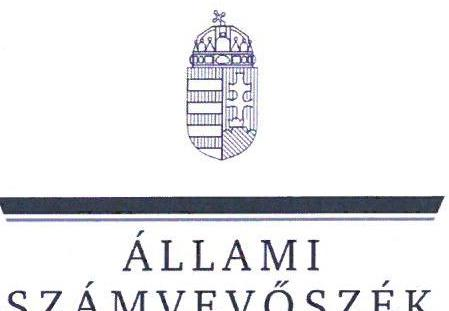

# JELENTÉS 

A többségi állami tulajdonban lévő gazdasági társaságok felügyelőbizottságainak működésére irányuló célzott ellenőrzés

Készenléti Rendőrség - Magyar Légimentő Nonprofit Kft.
2024.

---

ÁLLAMI
SZÁMVEVŐSZÉK

# JELENTÉS 

## A többségi állami tulajdonban lévő gazdasági társaságok felügyelőbizottságainak működésére irányuló célzott ellenőrzés

Készenléti Rendőrség - Magyar Légimentő Nonprofit Kft.
2024.

---

# ELLENŐRZÉSI IGAZGATÓSÁG: 

ÁLLAMI VAGYONGAZDÁLKODÁST ELLENŐRZŐ IGAZGATÓSÁG

## ELLENŐRZÉSI IGAZGATÓ:

HERCZEGH ZSOLT ellenőrzési igazgató

## ELLENŐRZÉSVEZETŐ:

Jelentéseink az interneten a www.asz.hu címen olvashatók.

## DABISNÉ NYIKOS MELINDA ellenőrzésvezető

IKTATÓSZÁM: EL-4009-002/2024
TÉMASZÁM: 2720
ELLENŐRZÉS-AZONOSÍTÓ SZÁM: V1064

---

# TARTALOMJEGYZÉK 

AZ ELLENŐRZÉS ALAPADATAI ..... 5
AZ ELLENŐRZÖTT SZERVEZETEK ..... 7
ÖSSZEFOGLALÁS ..... 8
AZ ELLENŐRZÉS FÓKUSZTERÜLETE ..... 9
MEGÁLLAPÍTÁSOK ..... 10
JAVASLATOK ..... 13
MELLÉKLETEK ..... 14
I. sz. melléklet: Értelmező szótár ..... 14
II. sz. melléklet: Az ellenőrzött szervezetek jegyzéke ..... 15
III. sz. melléklet: Ellenőrzési kritériumok ..... 16
FÜGGELÉK: ÉSZREVÉTELEK ..... 17
RÖVIDÍTÉSEK JEGYZÉKE ..... 18

---

.

---

# AZ ELLENŐRZÉS ALAPADATAI 

## AZ ELLENŐRZÉS CÉLJA

Az ellenőrzés célja annak értékelése volt, hogy a többségi állami tulajdonban álló gazdasági társaság felügyelőbizottsága szabályszerűen működött-e, valamint a felügyelőbizottság feladatait megfelelően látta-e el.

## AZ ELLENŐRZÉS TÍPUSA

Megfelelőségi ellenőrzés.

## AZ ELLENŐRZÖTT IDŐSZAK

A 2022. év.

## AZ ELLENŐRZÉS TÁRGYA

Az ellenőrzés tárgyát képezte a többségi állami tulajdonban lévő gazdasági társaság felügyelőbizottsága működésének szabályszerűsége, valamint feladatellátásának megfelelősége. Az éves számviteli beszámoló elfogadással kapcsolatos felügyelőbizottsági feladatellátás ellenőrzése a 2021. éves számviteli beszámolóra terjedt ki. Az ellenőrzés kiterjedt továbbá a felügyelőbizottsági tagok megválasztásának, a tagság megszűnésének szabályszerűségi ellenőrzésére, valamint a tulajdonosi joggyakorló által, a felügyelőbizottsággal szemben támasztott elvárások, meghatározott követelmények teljesítésének vizsgálatára és értékelésére is.

A felügyelőbizottság működése szabályszerűségének ellenőrzése magába foglalta a felügyelőbizottság tagjai megválasztásának, a felügyelőbizottsági tagság megszűnésének ellenőrzését mind a tulajdonosi joggyakorlónál, mind pedig az irányítása alatt álló többségi állami tulajdonban lévő gazdasági társaságnál, továbbá kiterjedt arra, hogy a tulajdonosi joggyakorló a felügyelőbizottság feladatellátását nyomon követte-e, értékelte-e.

A feladatellátás megfelelőségének ellenőrzése magába foglalta azt, hogy a felügyelőbizottság ténylegesen ellátta-e azt a funkcióját, amelyre létrehozták, a felügyelőbizottság a gazdasági társaság vezetését a tulajdonos érdekeinek megóvása céljából ellenőrizte-e, ezáltal támogatta-e a tulajdonosi joggyakorló ellenőrzési tevékenységének megvalósulását, továbbá működéséről beszámolt-e a tulajdonosi joggyakorló részére.

A felügyelőbizottság feladatellátása tekintetében ellenőrzésre került, hogy a felügyelőbizottság ellátta-e az ellenőrzési, véleményezési és beszámolási tevékenységét, illetve minden olyan tevékenységet, amelyet jogszabályok, belső szabályozók meghatároztak, vagy a tulajdonosi joggyakorló a felügyelőbizottság hatáskörébe rendelt.

Az ellenőrzés kiterjedt minden olyan körülményre és adatra, amely az ÁSZ¹ jogszabályban meghatározott feladatainak teljesítéséhez, valamint a program végrehajtása folyamán felmerült újabb összefüggések feltárásához szükséges volt.

---

# AZ ELLENŐRZÉS JOGALAPJA 

Az ellenőrzés jogszabályi alapját az ÁSZ tv.² 1. § (3) bekezdés és az 5. § (4) bekezdés előírásai képezték.

## AZ ELLENŐRZÉS MÓDSZERE

Az ellenőrzés végrehajtása a nemzetközi standardokat irányadónak tekintve az ellenőrzési program szempontjai, az ellenőrzött időszakban hatályos jogszabályok, az ellenőrzés szakmai szabályok és a jelen ellenőrzésre irányadó ÁSZ módszertan figyelembevételével történt.

Az ellenőrzési kérdések megválaszolásához szükséges bizonyítékok megszerzése az ellenőrzött szervezetek által rendelkezésre bocsátott dokumentumokra és adatokra alapozva, továbbá megfigyelés, összehasonlítás, interjú (kérdésfeltevés), valamint elemző eljárás útján valósult meg.

Az ellenőrzési bizonyítékként felhasználható adatforrások közé tartoztak egyrészt az ellenőrzéshez kért dokumentumok, adatforrások, másrészt adatforrás volt még minden - az ellenőrzés folyamán - feltárt, az ellenőrzés szempontjából információkat tartalmazó dokumentum.

Az ellenőrzés során mintavételre nem került sor. Az ellenőrzés lefolytatásához az ellenőrzött szervezetek az ÁSZ által kért dokumentumok, adatok, információk megküldésével és az ellenőrzés során szolgáltattak adatokat. Az ellenőrzéshez az ÁSZ felhasználhatta a nyilvánosan elérhető közhiteles adatokat is.

---

# AZ ELLENŐRZÖTT SZERVEZETEK 

## KÉSZENLÉTI RENDŐRSÉG

A Készenléti Rendőrséget 1994.01.01-én alapították, jogállását a Rendőrség szerveiről szóló Korm. rendeletben³ határozták meg, irányító szerve a Belügyminisztérium, az átruházott irányítási hatáskörök az ORFK-t⁴, mint középirányító szervezetet illették meg.

A Készenléti Rendőrség székhelye Budapesten található, országos viszonylatban 42 telephellyel rendelkezett, főtevékenységének államháztartási szakágazati besorolása 842420 Rendőrségi tevékenység. A Készenléti Rendőrség a Magyar Állam nevében 2020.01.01.-2022.05.26. időszak között az NVTNM rendelet⁵ 2. melléklet IX. 1. pontja, majd 2022. 05.27-től a GFM rendelet⁶ 2. számú melléklet VII. 1. pontja alapján tulajdonosi jogokat gyakorolt a Magyar Légimentő Nonprofit Kft.⁷ vonatkozásában.

## MAGYAR LÉGIMENTŐ NONPROFIT KFT.

A Magyar Légimentő Nonprofit Kft. 2005.09.01-én az OMSZ⁸ Légimentő Közhasznú Társaságból alakult át 2009.07.02-i bejegyzéssel, 2012.02.16-tól kormányzati szektorba sorolt gazdasági társaság, a Bkr.⁹ hatálya alá tartozott. Főtevékenysége egyéb humán-egészségügyi ellátás, a Magyar Légimentő Nonprofit Kft. egy személyben volt felelős a magyarországi légimentés biztosításáért.

A Magyar Légimentő Nonprofit Kft. közhasznú tevékenység keretében a magyarországi légimentés megszervezését végezte (7 bázison, a Magyar Állam tulajdonában lévő 9 darab mentőhelikopterrel), az ehhez szükséges tárgyi és személyi feltételek megteremtését, illetve mentő légibázisok beindítását kezdte meg. A helikopterek bevetését az OMSZ bevetés-irányítása alapján végezte. A közhasznú tevékenységen kívül a Magyar Légimentő Nonprofit Kft. vállalkozási tevékenységet is végzett, különböző rendezvényeken egészségügyi szolgáltatást biztosító mozgóőrséget, valamint külső megrendelő számára helikopter karbantartást és műszaki ügyeletet, továbbá az OMSZ részére telefonos RSI¹⁰ konzultációs szolgáltatást nyújtott.

A Magyar Légimentő Nonprofit Kft. 2021. évi számviteli beszámolójáról a könyvvizsgáló minősítés nélküli véleményt adott. Azonban a 2022. évi számviteli beszámolóra vonatkozóan a könyvvizsgáló nem minősített figyelemfelhívással élt a Magyar Légimentő Nonprofit Kft. saját tőkéje vonatkozásában, mivel annak összege kisebb volt, mint a Ptk.¹¹-ban a társasági formára előírt minimális alaptőke összege, valamint rögzítésre került, hogy a tőkevesztés következményeként a Magyar Légimentő Nonprofit Kft-nek jelentős összegű lejárt tartozása is keletkezett. A Magyar Légimentő Nonprofit Kft. 2022. évi saját tőke összege -732 800 E Ft, mérlegfőösszege 611 023 E Ft, adózott eredménye -953 668 E Ft volt.

A tulajdonosi ellenőrzés támogatására a Magyar Légimentő Nonprofit Kft-nél három tagból álló felügyelőbizottság került létrehozásra. Az ellenőrzött időszakban a felügyelőbizottsági tagok megbízása 2022.03.31-én lejárt, majd a 2022.04.01.-2027.03.31-ig tartó időszakra vonatkozóan ismételten megbízásra kerültek, így személyükben változás nem történt.

---

# ÖSSZEFOGLALÁS 

A jogi személy tulajdonosi ellenőrzése a Ptk. rendelkezései alapján a felügyelőbizottság létrehozásán és működtetésén keresztül valósul meg, mely az állami tulajdonú gazdasági társaságok esetében azt jelenti, hogy a Magyar Állam nevében a tulajdonosi joggyakorlóként kijelölt szervezet bízza meg az állami tulajdonú gazdasági társaság felügyelőbizottságának tagjait. A felügyelőbizottság munkájának kiemelkedő szerepe van, mivel a gazdasági társaság vezetését a tulajdonos érdekeinek megóvása céljából ellenőrzi. A tulajdonosi joggyakorló a felügyelőbizottság tájékoztatásain, jelzésein keresztül értesül a gazdasági társaságot érintő működési, gazdálkodási, valamint minden egyéb jelentős területet érintő kérdésről, és amennyiben szükséges, akkor lehetősége van a megfelelő időben történő beavatkozásra.

Az ellenőrzés megállapította, hogy a Magyar Légimentő Nonprofit Kft. felügyelőbizottsága összességében szabályszerűen működött, valamint a felügyelőbizottság a feladatait megfelelően látta el.
A TULAJDONOSI JOGGYAKORLÓ a felügyelőbizottság működési kereteinek kialakítása és biztosítása során lényeges hiányosságoktól mentesen, szabályszerűen járt el. A feltárt hiányosság a Magyar Légimentő Nonprofit Kft. Alapító okiratát érintette, mivel az nem volt összhangban a Ptk. előírásával a határozatképességi követelmények tekintetében. Azonban a belső irányítóeszköz hiányossága nem volt hatással a felügyelőbizottság működésére, mivel a gyakorlati működés során a felügyelőbizottság a törvényben meghatározott szabályok szerint járt el. A Készenléti Rendőrség a felügyelőbizottság feladatellátását nyomon követte és értékelte.
A MAGYAR LÉGIMENTŐ NONPROFIT KFT. felügyelőbizottságának működése és feladatellátása összességében szabályszerű és megfelelő volt, az ellenőrzés lényeges hiányosságot nem tárt fel. A felügyelőbizottság szerepét ténylegesen betöltötte, feladatvégzését dokumentálta. Az ellenőrzés a Magyar Légimentő Nonprofit Kft. felügyelőbizottságára vonatkozó belső szabályozó eszközeivel és a felügyelőbizottsági ülések összehívásával összefüggésben tárt fel hiányosságokat, amelyek nem voltak hatással a felügyelőbizottság működésének és feladatellátásának szabályszerűségére.

Az ÁSZ ellenőrzés az állami vagyonnal való felelős gazdálkodás érvényesülését támogató jó gyakorlatként értékelte, hogy a tulajdonosi joggyakorló képviselői minden alkalommal részt vettek a felügyelőbizottság ülésein, továbbá a felügyelőbizottsági ülésekről részletes, a kockázatok kezelésére vonatkozó, érdemi figyelemfelhívásokat tartalmazó jegyzőkönyvek készültek. A felügyelőbizottság jelzései alapján a tulajdonosi joggyakorló a szükséges intézkedéseket az irányító szerv felé megtette.

---

# AZ ELLENŐRZÉS FÓKUSZTERÜLETE 

1.     - A többségi állami tulajdonban álló gazdasági társaság felügyelőbizottságának működése, feladatellátása.

---

# 1. Készenléti Rendőrség 

Összegző megállapítás

A Készenléti Rendőrség a felügyelőbizottság működési kereteinek kialakítása, biztosítása során szabályszerűen járt el, lényeges hiányosságok nem kerültek feltárásra. A belső szabályozók tekintetében megállapított hiányosság az Alapító okirat határozatképességi követelményekre vonatkozó szabályozását érintette, amely nem volt hatással a felügyelőbizottság működésére, mivel a gyakorlati működés során a felügyelőbizottság a jogszabálynak megfelelően járt el. A Készenléti Rendőrség a felügyelőbizottság feladatellátását nyomon követte, értékelte.

A Készenléti Rendőrség, mint tulajdonosi joggyakorló a felügyelőbizottság működésével kapcsolatos kereteket a Magyar Légimentő Nonprofit Kft. Alapító okiratában¹²,¹³,¹⁴, az SZMSZ¹⁵,¹⁶-ben és a Javadalmazási szabályzatban¹⁷ határozta meg, továbbá jóváhagyta a Ptk. előírása szerint a Felügyelőbizottsági ügyrendet¹⁸, valamint elfogadta a Felügyelőbizottsági munkatervet¹⁹,¹⁰. A felügyelőbizottság feladatvégzésének nyomon követését az 1/2020. (L26.) ORFK utasítás¹¹, valamint a KR SZMSZ²² szabályozta.
A Készenléti Rendőrség a felügyelőbizottsági tagok összeférhetetlenségének vizsgálata, vagyonnyilatkozattételi kötelezettsége, nemzetbiztonsági ellenőrzése, a Javadalmazási szabályzat felügyelőbizottsági tagokra vonatkozó szabályozása, valamint a javadalmazási feltételek vizsgálata és a díjazás megállapítása vonatkozásában a Tak.tv.²³, a 2007. évi CLII. törvény²⁴, az 1995. évi CXXV. törvény²⁵, és az Alapító okiratban¹²,¹³,¹⁴ foglalt rendelkezések szerint járt el.
A Készenléti Rendőrség a Ptk. előírásainak megfelelően a felügyelőbizottság írásbeli határozatának birtokában döntött a 2021. évi számviteli beszámolóról.
A Magyar Légimentő Nonprofit Kft. Alapító okirat¹²,¹³,¹⁴ 18.6. pontjában meghatározott rendelkezése ellentétes volt a Ptk. 3:122. § (2) bekezdésében előírt határozatképességi követelményekkel. Az Alapító okirat¹²,¹³,¹⁴ alapján a felügyelőbizottság akkor határozatképes, ha tagjainak kétharmada - kettő fő - jelen van. A Ptk. 3:122. § (2) bekezdése ezzel szemben előírja, hogy a felügyelőbizottság akkor határozatképes, ha a felügyelőbizottság tagjainak legalább kétharmada, de legalább három fő jelen van. A Ptk. szerinti határozatképesség a felügyelőbizottság ülésein minden esetben biztosított volt, ebből adódóan a feltárt hiányosság nem befolyásolta a felügyelőbizottság szabályszerű működését.
A Készenléti Rendőrség képviselői az ellenőrzött időszakban minden alkalommal részt vettek a felügyelőbizottsági üléseken, a tulajdonosi joggyakorló a feladatok teljesítését nyomon követte, a felettes irányító szerv felé a szükséges intézkedéseket megtette. A felügyelőbizottsági tagok feladatellátásának értékelése a felügyelőbizottsági tagok ellenőrzött időszakban történő újraválasztásán keresztül valósult meg.

---

# 2. Magyar Légimentő Nonprofit Kft. felügyelőbizottsága 

Összegző megállapítás

A Magyar Légimentő Nonprofit Kft. felügyelőbizottságának működése és feladatellátása összességében szabályszerű és megfelelő volt, az ellenőrzés során lényeges hiányosságok nem kerültek feltárásra. A felügyelőbizottság szerepét ténylegesen betöltötte, feladatvégzését dokumentálta. Az ellenőrzés a Magyar Légimentő Nonprofit Kft. felügyelőbizottság feladatellátását szabályozó irányító eszközeivel (Felügyelőbizottsági ügyrenddel és munkatervvel), valamint a felügyelőbizottsági ülések összehívásával összefüggésben tárt fel

 hiányosságokat, amelyek nem voltak hatással a felügyelőbizottság működésére és feladatellátására.

A Felügyelőbizottsági ügyrend elkészítése, a többségi tulajdonban álló gazdasági társaság gazdálkodásának nyomon követése a Ptk., valamint az Alapítói okirat rendelkezéseinek megfelelően történt. A Felügyelőbizottsági munkaterv elfogadása, a felügyelőbizottsági ülések dokumentálása, és a 2021. évi számviteli beszámolóról, közhasznúsági jelentésről szóló felügyelőbizottsági határozat meghozatala a Felügyelőbizottsági ügyrend előírásainak megfelelt.
A Felügyelőbizottsági ügyrend II. fejezet 3. pont előírása nem biztosította a Ptk. 3:26. § (3) bekezdésében, az Alapító okirat ${ }_{1,2,3}$ 13.2.5. pontjában, valamint a Felügyelőbizottsági ügyrend III. 1. e) bekezdésében meghatározott azon előírást, hogy a felügyelőbizottság tagjai a felügyelőbizottság munkájában személyesen kötelesek részt venni, meghatalmazott nem képviselheti őket. Ezzel szemben a Felügyelőbizottsági ügyrend II. fejezet 3. pontja lehetőséget nyújtott arra, hogy akadályoztatás esetén a felügyelőbizottság elnökét valamely írásban kijelölt tag elnöki jogkörrel képviselje. A helytelen szabályozás a felügyelőbizottság működésének és döntéseinek szabályszerűségét nem befolyásolta, mert ilyen eset az ellenőrzött időszak vonatkozásában nem állt fenn.
A 2022. évi Felügyelőbizottsági munkaterv a Felügyelőbizottsági ügyrend II.4. pontjában rögzítettek ellenére nem tartalmazta a jelentések formáját, a témafelelősöket és a határidőket. A feltárt hiányosság nem volt negatív hatással a felügyelőbizottság feladatellátására, mivel a 2022. évi Felügyelőbizottsági munkatervben meghatározott napirendi pontok az ellenőrzött időszakban megtárgyalásra kerültek. A Magyar Légimentő Nonprofit Kft. üzleti terve, a havi gazdálkodási adatokról szóló beszámolók, likviditási kimutatások, mérleg és eredménykimutatások, valamint a várható eredményre vonatkozó kimutatások, a belső ellenőrzési munkaterv, a belső ellenőrzési jelentés a felügyelőbizottság részére rendelkezésre álltak. A felügyelőbizottság a 2022. évben 9 esetben ülésezett, rendkívüli ülés megtartására nem került sor. A felügyelőbizottság ülésein megtárgyalta az üzleti jelentést, az üzleti terv javaslatot, a belső ellenőrzési munkatervet, a munkavédelmi rendszer felülvizsgálatáról szóló belső ellenőrzési jelentést, valamint rendszeresen tárgyalta az üzleti terv időarányos teljesülését is. A Felügyelőbizottsági ügyrend II.1. pontjában foglaltak ellenére több esetben (9 ülésből 6 esetben) nem került biztosításra a felügyelőbizottsági ülés összehívása és a felügyelőbizottsági ülés időpontja közötti legalább nyolc napos időtartam, továbbá több alkalommal (9 ülésből 7 esetben) nem került sor a napirendi pontokhoz kapcsolódó előterjesztések meghívóval együtt történő megküldésére sem. A Felügyelőbizottsági ügyrend

---

II. 7. pontjában foglaltak ellenére 9 ülésből 1 esetben ülést tartása nélküli határozathozatalra került sor. A felügyelőbizottság a Magyar Légimentő Nonprofit Kft-től több esetben nagyon rövid határidővel (ülést megelőző napon) kapta meg a megtárgyalandó dokumentumokat, így az ülésekre való felkészülés a rövid határidő miatt nem volt teljeskörűen biztosított, melyet a felügyelőbizottság a jegyzőkönyveiben is rögzített. A felügyelőbizottság továbbá többször jelezte, hogy nem tartotta kellő mélységűnek a Magyar Légimentő Nonprofit Kft. által megküldött anyagokat és azok alátámasztását, így több esetben kérte az anyagok kiegészítését, valamint átdolgozását is. A rövid határidővel rendelkezésre bocsátott, valamint a nem megfelelően előkészített anyagokat - a kiegészítést követően - a felügyelőbizottság ismételten tárgyalta az ülésein.

---

# JAVASLATOK 

Az ÁSZ tv. 33. § (1) bekezdésében foglaltak értelmében az ellenőrzött szervezet vezetője köteles a jelentésben foglalt megállapításokhoz kapcsolódó intézkedési tervet összeállítani és azt a jelentés kézhezvételétől számított 30 napon belül az ÁSZ részére megküldeni. Amennyiben az ellenőrzött szervezet vezetője nem küldi meg határidőben az intézkedési tervet, vagy továbbra sem elfogadható intézkedési tervet küld, az Állami Számvevőszék elnöke az ÁSZ tv. 33. § (3) bekezdése a) és b) pontjaiban foglaltakat érvényesítheti.

## KÉSZENLÉTI RENDŐRSÉG TULAJDONOSI JOGGYAKORLÓ RÉSZÉRE

1. Vizsgálja felül a Magyar Légimentő Nonprofit Kft. Alapító okiratában szereplő szabályozást a felügyelőbizottság határozatképességére vonatkozóan, és tegye meg a szükséges intézkedést.

## MAGYAR LÉGIMENTŐ NONPROFIT KFT. ÜGYVEZETŐJE RÉSZÉRE

1. $\quad$ Tegyen intézkedést annak érdekében, hogy a felügyelőbizottság részére megküldött előterjesztések meghívóihoz mellékelni lehessen a napirendi pontok előterjesztéseit.

---

# MELLÉKLETEK 

## I. SZ. MELLÉKLET: ÉRTELMEZŐ SZÓTÁR

gazdasági társaság

többségi állami tulajdon
tulajdonosi joggyakorló
felügyelőbizottság

A gazdasági társaságok üzletszerű közös gazdasági tevékenység folytatására, a tagok vagyoni hozzájárulásával létrehozott, jogi személyiséggel rendelkező vállalkozások, amelyekben a tagok a nyereségből közösen részesednek, és a veszteséget közösen viselik.
(Ptk. 3:88. § (1) bekezdése)
Az állam tulajdonában lévő tagsági jogviszonyt megtestesítő értékpapír, illetve az állam tulajdonában lévő egyéb társasági részesedés, amennyiben a társaságban a Magyar Állam közvetlenül vagy közvetetten a szavazatok több mint felével rendelkezik.
(ÁSZ definíció a Vtv. ${ }^{22}$ 1. § (2) bekezdés c) pontja és a Ptk. 8:2. § (1), (3)-(4) bekezdései alapján)
Aki a nemzeti vagyon felett az államot vagy a helyi önkormányzatot megillető tulajdonosi jogok és kötelezettségek összességének gyakorlására jogosult. (Nvtv. ${ }^{23}$ 3. § (1) bekezdés 17. pontja)
A gazdasági társaságnál a tulajdonos érdekeinek megóvása céljából működő három tagból álló ellenőrző testület.
(ÁSZ definíció a Ptk. 3:26. § (1) bekezdés alapján)

---

# II. SZ. MELLÉKLET: AZ ELLENŐRZÖTT SZERVEZETEK JEGYZÉKE 

## ELLENŐRZÖTT SZERVEZET NEVE

1. Készenléti rendőrség
2. Magyar Légimentő Nonprofit Kft.

## SZEREPE

Tulajdonosi joggyakorló
Többségi tulajdonban álló gazdasági társaság

---

# III. SZ. MELLÉKLET: ELLENŐRZÉSI KRITÉRIUMOK 

## FOKUSZKÉRDÉS

1. A többségi állami tulajdonban álló gazdasági társaság felügyelőbizottságának működése, feladatellátása.

## ELLENŐRZÉSI KRITÉRIUMOK

Tak.tv. 2. § (1) bek., 4. § (1)-(3) bek., 5. § (3)-(4) bek., 6. § (2)-(4) bek., 7/J. § (2), (3)-(7) bek.
Ptk. 3:22. §, 3:25. §, 3:26. §, 3:27. §, 3:28. §, 3:36. § (3) bek., 3:38. § (1), 3:111. § 3:115. § 3:119. § 3:120. § 3:121. § 3:122. §, 3:123. § 3:124. § 3:125. § 3:126. § 3:127. § 3:128. § 3:131. § (3) bek.
2007. évi CLII. törvény 3. § (3) bek. e) pont, 5. §, 6. § (2) bek.
1995. évi CXXV. törvény 74. §. ij) pont
Mt. ${ }^{24}$ 208. §

Bkr. 1. §-10. §
a gazdasági társaság alapító okirata, Szervezeti és Működési Szabályzata
a Felügyelőbizottság ügyrendje, munkaterve
belső szabályzatok, irányítási eszközök
tulajdonosi joggyakorló írásbeli elvárásai

---

# FÜGGELÉK: ÉSZREVÉTELEK 

A jelentéstervezetet a Számvevőszék 15 napos észrevételezésre megküldte az ellenőrzött szervezet vezetőjének az ÁSZ tv. 29. § (1) bekezdése előírásának megfelelően.

Az ellenőrzött szervezetek vezetői a jelentéstervezet megállapításaira észrevételt nem tettek.

[^0]
[^0]:    * 29. § (1) Az Állami Számvevőszék az ellenőrzési megállapításait megküldi az ellenőrzött szervezet vezetőjének vagy az általa megbízott személynek, és annak, akinek személyes felelősségét állapította meg.
    (2) Az ellenőrzött szervezet vezetője és a felelősként megjelölt személy az ellenőrzés megállapításaira tizenöt napon belül írásban észrevételt tehet.
    (3) Az Állami Számvevőszék az észrevételre a beérkezésétől számított harminc napon belül írásban válaszol. A figyelembe nem vett észrevételeket köteles a jelentésben feltüntetni, és megindokolni, hogy azokat miért nem fogadta el.

---

# RÖVIDÍTÉSEK JEGYZÉKE 

${ }^{1}$ ÁSZ
${ }^{2}$ ÁSZ tv.
${ }^{3}$ Rendőrség szerveiről szóló Korm. rendelet
${ }^{4}$ ORFK
${ }^{5}$ NVTNM rendelet
${ }^{6}$ GFM rendelet
${ }^{7}$ Magyar Légimentő Nonprofit Kft.
${ }^{8}$ OMSZ
${ }^{9}$ Bkr.
${ }^{10}$ RSI
${ }^{11}$ Ptk.
${ }^{12}$ Alapító okirat ${ }_{1,2,3}$
${ }^{13} \mathrm{SZMSZ}_{1,2}$
${ }^{14}$ Javadalmazási szabályzat
${ }^{15}$ Felügyelőbizottsági ügyrend
${ }^{16}$ Felügyelőbizottsági munkaterv ${ }_{1,2}$
${ }^{17}$ 1/2020. (I. 16.) ORFK utasítás
${ }^{18}$ KR SZMSZ
${ }^{19}$ Tak.tv.
${ }^{20}$ 2007. évi CLII. törvény
${ }^{21}$ 1995. évi CXXV. törvény
${ }^{22}$ Vtv.
${ }^{23}$ Nvtv.
${ }^{24} \mathrm{Mt}$.

Állami Számvevőszék
2011. évi LXVI. törvény az Állami Számvevőszékről

329/2007. (XII. 13.) Korm. rendelet a Rendőrség szerveiről és a Rendőrség szerveinek feladat- és hatásköréről
Országos Rendőrfőkapitányság
1/2018. (VI. 25.) NVTNM rendelet az egyes állami tulajdonban álló gazdasági társaságok felett az államot megillető tulajdonosi jogok és kötelezettségek összességét gyakorló személyek kijelöléséről
1/2022. (V. 26.) GFM rendelet az egyes állami tulajdonban álló gazdasági társaságok felett az államot megillető tulajdonosi jogok és kötelezettségek összességét gyakorló személyek kijelöléséről
Magyar Légimentő Nonprofit Korlátolt Felelősségű Társaság
Országos Mentőszolgálat
370/2011. (XII. 31.) Korm. rendelet a költségvetési szervek belső kontrollrendszeréről és belső ellenőrzéséről
Rapid Sequence Intubation- Sürgősségi intubálás
2013. évi V. törvény a Polgári törvénykönyvről

Alapító okirat ${ }_{1}$ 2021.09.01-től hatályos Magyar Légimentő Nonprofit Korlátolt Felelősségű Társaság Alapító okirat
Alapító okirat ${ }_{2}$ 2022.04.01-től hatályos Magyar Légimentő Nonprofit Korlátolt Felelősségű Társaság Alapító okirat
Alapító okirat ${ }_{3}$ 2022.07.22-től hatályos Magyar Légimentő Nonprofit Korlátolt Felelősségű Társaság Alapító okirat
SZMSZ ${ }_{1}$ : Magyar Légimentő Nonprofit Kft Szervezeti és Működési Szabályzat, hatályos 2011.06.27-től 2022.09.06-ig
SZMSZ ${ }_{2}$ : Magyar Légimentő Nonprofit Kft Szervezeti és Működési Szabályzat, hatályos 2022.09.07-től
Magyar Légimentő Nonprofit Kft Javadalmazási szabályzat, hatályos 2020.07.07-től
Magyar Légimentő Nonprofit Kft. Felügyelőbizottságának Ügyrendje, hatályos 2020.03.25-től

Magyar Légimentő Nonprofit Korlátolt Felelősségű Társaság felügyelőbizottságának a 2022. Munkaterve ${ }_{1}$ és 2023. évi Munkaterve ${ }_{2}$
1/2020. (I. 16.) ORFK utasítás a légimentéssel összefüggő feladatok végrehajtásáról - megjelent a Hivatalos Értesítő 2020/2. számában

Készenléti Rendőrség parancsnokának 1/2019. (II.06.) KR PK. Intézkedése a Készenléti Rendőrség Szervezeti és Működési Szabályzatáról
2009. évi CXXII. törvény a köztulajdonban álló gazdasági társaságok takarékosabb működéséről
2007. évi CLII. törvény egyes vagyonnyilatkozat-tételi kötelezettségekről
1995. évi CXXV. törvény a nemzetbiztonsági szolgálatokról
2007. évi CVI. törvény az állami vagyonról
2011. évi CXCVI. törvény a nemzeti vagyonról
2012. évi I. törvény a munka törvénykönyvéről

---

1052 Budapest, Apáczai Csere János u. 10. | 1364 Budapest 4., Pf. 54
www.asz.hu | szamvevoszek@asz.hu
telefon: +36 1 4849100

