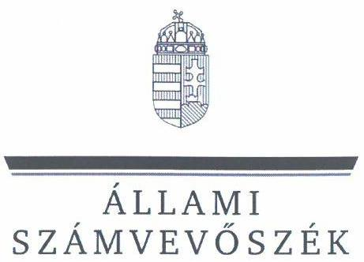

# JELENTÉS 

Az állami tulajdonú gazdasági társaságok gazdálkodásának, valamint az ehhez kapcsolódó döntések megalapozottságának ellenőrzése

KINCSINFO Kincstári Informatikai Nonprofit Kft.

2024.

---

ÁLLAMI
SZÁMVEVŐSZÉK

# JELENTÉS 

## Az állami tulajdonú gazdasági társaságok gazdálkodásának, valamint az ehhez kapcsolódó döntések megalapozottságának ellenőrzése

KINCSINFO Kincstári Informatikai Nonprofit Kft.

2024.

---

# ELLENŐRZÉSI IGAZGATÓSÁG: 

## ÁLLAMI VAGYONGAZDÁLKODÁST ELLENŐRZŐ IGAZGATÓSÁG

## ELLENŐRZÉSI IGAZGATÓ:

HERCZEGH ZSOLT ellenőrzési igazgató

## ELLENŐRZÉSVEZETŐ:

Jelentéseink az interneten a www.asz.hu címen olvashatók.

DABISNÉ NYIKOS MELINDA ellenőrzésvezető

IKTATÓSZÁM: EL-3957-003/2024
TÉMASZÁM: 2677
ELLENŐRZÉS-AZONOSÍTÓ SZÁM: V1021

---

# TARTALOMJEGYZÉK 

AZ ELLENŐRZÉS ALAPADATAI ..... 5
AZ ELLENŐRZÖTT SZERVEZET ..... 7
ÖSSZEFOGLALÁS ..... 9
AZ ELLENŐRZÉS FÓKUSZKÉRDÉSE ..... 10
MEGÁLLAPÍTÁSOK ..... 11
JAVASLATOK ..... 20
MELLÉKLETEK ..... 21
I. sz. melléklet: Értelmező szótár ..... 21
II. sz. melléklet: Az ellenőrzött szervezet jegyzéke ..... 24
III. sz. melléklet: Ellenőrzési kritériumok ..... 25
FÜGGELÉK: ÉSZREVÉTELEK ..... 28
RÖVIDÍTÉSEK JEGYZÉKE ..... 29

---

.

---

# AZ ELLENŐRZÉS ALAPADATAI 

## AZ ELLENŐRZÉS CÉLJA

Az ellenőrzés célja annak értékelése volt, hogy a többségi állami tulajdonban álló gazdasági társaság gazdálkodása szabályszerűen történt-e; döntéshozatala során érvényesült-e a célszerűség, biztosított volt-e az állami vagyon védelme, értékének megőrzése, a társaság által a gazdálkodással összefüggésben hozott döntések megalapozottak, szabályszerűek, eredményesek voltak-e.

## AZ ELLENŐRZÉS TÍPUSA

Megfelelőségi és teljesítmény-ellenőrzés.

## AZ ELLENŐRZÖTT IDŐSZAK

2022. év.

Az ellenőrzés kiterjedt az ellenőrzött időszakban hatályos, a gazdálkodással összefüggő szerződések megkötésére irányuló döntési és végrehajtási folyamatokra, illetve az ellenőrzött időszakra vonatkozó számviteli beszámoló elfogadásának időszakára is.

## AZ ELLENŐRZÉS TÁRGYA

Az ellenőrzés tárgya a többségi állami tulajdonban álló gazdasági társaság gazdálkodása szabályszerűségének, valamint az ellenőrzött időszakban a gazdálkodással összefüggésben hozott döntések megalapozottságának, célszerűségének, eredményességének, továbbá az állami vagyon értéke megőrzésének, védelmének, az állami vagyonnal való felelős gazdálkodás érvényesülésének az ellenőrzése volt. Továbbá az ellenőrzés kiterjedt a többségi állami tulajdonban álló gazdasági társaság üzleti tervében szereplő adatok és a számviteli beszámoló adatok összevetésének ellenőrzésére is.

Az ellenőrzés kiterjedt minden olyan körülményre és adatra, amely az ÁSZ ${ }^{1}$ jogszabályban meghatározott feladatainak teljesítéséhez, valamint a program végrehajtása folyamán felmerült újabb összefüggések feltárásához szükséges volt.

## AZ ELLENŐRZÉS JOGALAPJA

Az ellenőrzés jogszabályi alapját az ÁSZ tv. ${ }^{2} 1. § (3)$ bekezdés és $5. § (4)$ bekezdés előírásai képezték.

---

# AZ ELLENŐRZÉS MÓDSZERE 

Az ellenőrzést a nemzetközi standardokat irányadónak tekintve az ellenőrzési program szempontjai, az ellenőrzött időszakban hatályos jogszabályok, az ellenőrzés szakmai szabályok és a jelen ellenőrzésre irányadó ÁSZ módszertanok figyelembevételével végezte az ÁSZ.

Az ellenőrzési kérdések megválaszolásához szükséges bizonyítékok megszerzése az ellenőrzött szervezet által rendelkezésre bocsátott dokumentumokra és adatokra alapozva, továbbá megfigyelés, szemrevételezés, információkérés, interjú, összehasonlítás, mintavételezés, valamint elemző eljárás útján történt.

Az ÁSZ mintavételi eljárással kiválasztott tételek alapján is ellenőrizte a többségi állami tulajdonban álló gazdasági társaság működés szempontjából kiemelt funkcionális gazdálkodási részterületeket, melyek érintették az eszközökkel és forrásokkal való gazdálkodást, a felmerült költségeket és ráfordításokat és az alaptevékenység körébe vagy ahhoz kapcsolódóan keletkező bevételeket, ezen gazdasági események döntési, végrehajtási folyamatainak szabályszerűségét, a döntések megalapozottságát és célszerűségét, eredményességét, az állami vagyon értéke megőrzésének, védelmének, az állami vagyonnal való felelős gazdálkodás érvényesülését. A mintavételi eljárással érintett ellenőrzési területek értékelését további ellenőrzési szempontok is támogatták. A mintatételek kivetítésre nem kerültek.

A KINCSINFO Nonprofit Kft. gazdálkodásának, valamint az ehhez kapcsolódó döntések megalapozottságának az ellenőrzése a Társaság alaptevékenysége körébe vagy ahhoz kapcsolódóan keletkező bevételekre (továbbiakban: egyes bevételek ${ }^{3}$ ), valamint gazdálkodására jellemző, legnagyobb költségeket és ráfordításokat magába foglaló funkcionális gazdálkodási részterületekre terjedt ki. Ennek következtében a készletgazdálkodás, logisztika, szolgáltatások gazdálkodási részterületen belül az igénybe vett szolgáltatások alterület (továbbiakban: igénybe vett szolgáltatások), valamint a humánerőforrás-gazdálkodás funkcionális gazdálkodási részterület (továbbiakban: humánerőforrás-gazdálkodás) került ellenőrzés alá.

Az ellenőrzési bizonyítékként felhasználható adatforrások közé tartoztak az ellenőrzéshez kért dokumentumok, valamint minden egyéb - az ellenőrzés folyamán feltárt -, az ellenőrzés szempontjából információt tartalmazó dokumentum.

Az ellenőrzés lefolytatásához az ellenőrzött szervezet a tanúsítványok kitöltésével, valamint az ÁSZ által kért dokumentumok, adatok, információk megküldésével és a helyszíni ellenőrzés során szolgáltatott adatokat. Az ellenőrzéshez az ÁSZ a nyilvános közhiteles adatokat is felhasználta.

---

# AZ ELLENŐRZÖTT SZERVEZET 

## KINCSINFO Kincstári INFORMATIKAI NONPROFIT KORLÁTOLT FELELŐSSÉGŰ TÁRSASÁG

A KINCSINFO Nonprofit Kft. ${ }^{4}$-t a Magyar Állam nevében a MÁK ${ }^{5}$ 2012.03.28-án nem jövedelemszerzésre irányuló társaságként alapította az Alapító okiratban ${ }_{1-4}{ }^{6}$ meghatározott azon célból, hogy a kormányzati szektoron belülre hozott fejlesztések útján költségtakarékos módon, magas szakmai és megfelelő árszínvonalon, versenyképes szolgáltatást tudjon igénybe venni informatikai feladatai hatékony ellátása érdekében. A 310/2017. (X.31.) Korm. rendelet ${ }^{7}$ értelmében a MÁK az Áht. ${ }^{8}$-ban meghatározott feladatai ellátásához szükséges informatikai rendszerek üzemeltetésével, illetve fejlesztésével kapcsolatos feladatokat a KINCSINFO Nonprofit Kft. közreműködésével látta el.
A KINCSINFO Nonprofit Kft. főtevékenysége számítógépes programozás, a tulajdonosi jogkör gyakorlója 2018.06.26-tól az 1/2018 (VI.25.) NVTNM ${ }^{9}$, valamint az 1/2022. (V.26.) GFM ${ }^{10}$ rendelet alapján a MÁK volt. A KINCSINFO Nonprofit Kft. egyszemélyes társaság, a legfőbb szerv hatáskörét az Alapító gyakorolta.
Ennek keretében a KINCSINFO Nonprofit Kft.:

- közreműködött a MÁK informatikai rendszereinek üzemeltetésével és fejlesztésével kapcsolatos feladatok teljesítésében, hibaelhárítási, javítási feladatok ellátásában, az informatikai rendszerek üzemszűrü működésének biztosításához szükséges szolgáltatások és áruk MÁK részére történő biztosításában,
- közreműködött a MÁK hazai, vagy EU-s forrásból finanszírozott projektjeinek megvalósításában,
- közreműködött a kincstári informatikai rendszerek működtetése, fejlesztése és az informatikai projektek célkitűzéseinek elérése érdekében végrehajtandó általános feladatok pénzügyi, jogi és műszaki megtervezésében, előkészítésében és végrehajtásában,
- működtette a létrehozott felnőttképzési intézményt, melynek keretében közreműködött a képzési, oktatási feladatok végrehajtásában, valamint ellátta a tananyag fejlesztési feladatokat, továbbá üzemeltette az e-learning keretrendszert.
A KINCSINFO Nonprofit Kft. a tevékenységéből származó nyereséget nem oszthatta fel, azt az Alapító okiratban ${ }_{1-4}$ meghatározott tevékenységre kellett fordítania.

A KINCSINFO Nonprofit Kft. működését és gazdálkodását, az ügyvezetés döntéseinek törvényességét és célszerűségét a Ptk. ${ }^{11}$ és a Tak.tv. ${ }^{12}$ rendelkezései alapján három fős felügyelőbizottság ellenőrizte, az ellenőrzött időszakban személyükben változás nem történt.

A KINCSINFO Nonprofit Kft. a 2022. üzleti évben a Tak.tv. 7/J. § (2) bekezdés alapján az Alapító okirat ${ }_{1-4}$ és az SZMSZ ${ }_{1-2}{ }^{13}$-ben rögzítettek szerint a Gbkr. ${ }^{14}$ szerinti belső kontrollrendszert működtetett, belső ellenőrzéssel rendelkezett. A Társaság a Számv. tv. ${ }^{15}$ alapján önköltségszámítási szabályzat készítésére volt kötelezett.

---

1. táblázat

A KINCSINFO NONPROFIT KFT. 2022. ÉVI FŐBB BESZÁMOLÓ ADATAI (EZER FT, FŐ)

|  MÉGNEVEZÉS | 2022. Ft  |
| --- | --- |
|  Értékesítés nettó árbevétele | 1307331  |
|  Egyéb bevételek | 448970  |
|  Igénybe vett szolgáltatások | 66166  |
|  Személyi jellegű ráfordítások | 1689023  |
|  Adózott eredmény | -36002  |
|  Saját tőke | 269417  |
|  Jegyzett tőke | 53852  |
|  Mérlegfőösszeg | 1930085  |
|  Átlagosan foglalkoztatottak száma | 138 fő  |

Forrás: A KINCSINFO Nonprofit Kft. 2022. évi éves számviteli beszámolója alapján ÁSZ saját szerkesztés

A könyvvizsgáló által 2023.05.03-án a Számv. tv. és a Ptk. előírásai szerint kiadott független könyvvizsgálói jelentés megállapította, hogy a KINCSINFO Nonprofit Kft. 2022. évi számviteli beszámolója megbízható és valós képet adott a 2022.12.31-én fennálló vagyoni, pénzügyi és jövedelmi helyzetről.

A MÁK a transzformációs folyamatában 2022. év közepén áttekintette a KINCSINFO Nonprofit Kft. szolgáltatás-portfólióját, mely során a MÁK a KINCSINFO Nonprofit Kft. megszüntetéséről, a feladatok és az állomány átvételéről döntött. 2022. évben a MÁK az integrációt megkezdte, 2022. év végén 45 fő került át a KINCSINFO Nonprofit Kft.-től a MÁK-hoz. Az ellenőrzés lezárásakor a KINCSINFO Nonprofit Kft. még működött.

---

# ÖSSZEFOGLALÁS 

A többségi állami tulajdonban álló gazdasági társaságok tevékenységével szemben az egyik legfontosabb követelmény, hogy a nemzeti vagyonnal felelős módon és rendeltetésszerűen gazdálkodjanak. E követelmények érvényesülését az ÁSZ a többségi állami tulajdonban álló gazdasági társaságok gazdálkodásának ellenőrzése során kiemelten vizsgálja.

Az ellenőrzés megállapította, hogy a KINCSINFO Nonprofit Kft. gazdálkodása szabályszerű volt, döntéshozatalai során érvényesült a célszerűség, biztosított volt az eredményekre vonatkozó célok és követelmények teljesülése, az állami vagyon védelme, értékének megőrzése. A KINCSINFO Nonprofit Kft. gazdálkodással összefüggésben hozott döntései megalapozottak, eredményesek, szabályszerűek voltak.

Az ellenőrzés a KINCSINFO Nonprofit Kft. gazdálkodását leginkább jellemző gazdálkodási részterületeken belül értékelte az egyes bevételek, igénybe vett szolgáltatások, valamint a humánerőforrás-gazdálkodás gazdálkodási részterületekhez kapcsolódó döntéseket. Az ellenőrzés megállapította, hogy az ellenőrzés alá vont gazdálkodási részterületek vonatkozásában a döntések meghozatalára megfelelő tervezés mellett került sor, azok a jogszabályok és belső szabályozók rendelkezéseinek megfelelően megalapozottak voltak, biztosított volt az eredményekre vonatkozó célok és követelmények teljesülése, érvényesült a nemzeti vagyonnal való felelős gazdálkodás elve. A Társaság az ellenőrzés alá vont gazdálkodási részterületek tekintetében a jogszabálynak megfelelően a döntés realizálás folyamatába beépített és működtetett kontrollokat. A kapcsolódó számviteli elszámolásokra a jogszabályokban és a belső szabályozókban foglalt rendelkezések alapján szabályszerűen került sor. Az ellenőrzés hiányosságként tárta fel az igénybe vett szolgáltatások beszerzései során, hogy a belső szabályozóban foglaltak ellenére a beszerzések indoklását tartalmazó feljegyzések elkészítései több esetben elmaradtak, valamint a Társaság az útnyilvántartáshoz kapcsolódó formanyomtatványok vezetését a belső irányító eszközében nem szabályozta. A KINCSINFO Nonprofit Kft. a jogszabályban foglalt rendelkezések ellenére önköltségszámítási szabályzattal, valamint stratégiával nem rendelkezett. A KINCSINFO Nonprofit Kft. az integrációt érintő változásokat a jogszabályoknak megfelelően nyomon követte, a felügyelőbizottságnak folyamatosan beszámolt, év közben az integrációra tekintettel a szükséges korrekciókat végrehajtotta.

A KINCSINFO Nonprofit Kft. nettó árbevétele közel 100 %-ban a MÁK-tól származott, valamint az egyéb bevételeiben megjelenő támogatások is a MÁK-hoz voltak köthetőek. A tulajdonosi joggyakorló által rögzített feladatokon kívül a KINCSINFO Nonprofit Kft. más tevékenységet nem látott el. Az ellenőrzés véleménye szerint a sajátos működési jellemzők és a bevételi szerkezet miatt a KINCSINFO Nonprofit Kft. költségvetési gazdálkodásra jellemző körülmények mellett gazdálkodott. A tulajdonosi joggyakorlóhoz kötődő, bevételszerző tevékenységet érintő függőségi viszony miatt a gazdasági társasági formában való működés előnyei nem tudtak érvényesülni.
Az ÁSZ jó gyakorlatként értékelte, hogy a MÁK az ellenőrzött időszakban a KINCSINFO Nonprofit Kft. szolgáltatás-portfóliója vonatkozásában átvilágítást végzett, mely alapján a 2022. évben megkezdte a KINCSINFO Nonprofit Kft. tevékenységének és munkavállalóinak a MÁK-ba történő integrálását. Az integrációra vonatkozó döntés megfelelt a felelős gazdálkodás, illetve a takarékos működés elveinek.

---

# AZ ELLENŐRZÉS FÓKUSZKÉRDÉSE 

1.     - A Társaság gazdálkodása szabályozási rendszerének kialakítása, a gazdálkodás szabályszerűsége, a célszerűségi, eredményességi szempontok érvényesülése, a kapcsolódó döntések megalapozottsága, a döntés realizálás folyamatába beépített kontrollok működése.

---

# MEGÁLLAPÍTÁSOK 

## 1. A Társaság gazdálkodása szabályozási rendszerének kialakítása, a gazdálkodás szabályszerűsége, a célszerűségi, eredményességi szempontok érvényesülése, a kapcsolódó döntések megalapozottsága, a döntés realizálás folyamatába beépített kontrollok működése.

Összegző megállapítás A KINCSINFO Nonprofit Kft. gazdálkodásának szabályozási rendszerét az önköltségszámítási szabályzat, valamint a 2022. évben hatályos stratégia
 kivételével kialakította. A KINCSINFO Nonprofit Kft. gazdálkodáshoz kapcsolódó döntései megalapozottak, szabályszerűek voltak, a döntés realizálás folyamatába a kontrollokat beépítette és működtette, a Társaság számviteli elszámolásaira szabályszerűen került sor. A KINCSINFO Nonprofit Kft. gazdálkodásra vonatkozó döntései esetében a célszerűség, eredményesség szempontjai érvényesültek, a döntések biztosították a felelős gazdálkodásra, eredményekre vonatkozó célok és követelmények teljesítését.

A KINCSINFO Nonprofit Kft. gazdálkodásának, valamint az ehhez kapcsolódó döntések megalapozottságának az ellenőrzése az egyes bevételekre, valamint az igénybe vett szolgáltatások és humánerőforrás-gazdálkodás gazdálkodási részterületekre terjedt ki.

A KINCSINFO Nonprofit Kft. gazdálkodásának szabályozási rendszerére vonatkozó megállapítások

A KINCSINFO Nonprofit Kft. 2022. évben hatályos stratégiával a Gbkr. 4. § (3) bekezdésében, valamint az SZMSZ $_{1-2}$ V. fejezetében foglaltak ellenére nem rendelkezett. Azonban a KINCSINFO Nonprofit Kft. a MÁK által meghatározott célok mentén működött, mely az Alapító okiratában$_{1-4}$, valamint a 2022. évi üzleti tervében$^{16}$ rögzítésre került. A KINCSINFO Nonprofit Kft. kiemelt célkitűzése volt egyrészt a MÁK informatikai feladatainak a legmagasabb színvonalon történő támogatása, másrészt a jogszabályban nevesített feladatok maradéktalan ellátása, a projektek megvalósításában történő megfelelő közreműködés, a kincstári feladatok színvonalas támogatása, a kompetenciaközpontok fejlesztése, valamint a MÁK transzformációjában való közreműködés. A Társaság 2022. évi üzleti terve tartalmazta a KINCSINFO Nonprofit Kft. eredménycéljait is. A KINCSINFO Nonprofit Kft. gazdálkodását, 2022. évi üzleti tervének megvalósulását a felügyelőbizottság a Ptk.-ban foglalt rendelkezéseknek megfelelően nyomon követte, azt az ülésein folyamatosan megtárgyalta - 2022. évben az öt üléséből négy esetben tárgyalta az üzleti terv alakulását -.

---

A KINCSINFO Nonprofit Kft. SZMSZ$_{1-2}$-ében a Gbkr. előírásainak megfelelően szabályozta a felelősségi és hatásköri viszonyokat, döntési jogköröket, az ellenőrzött időszakban az egyes bevételek, az igénybe vett szolgáltatások, valamint a humánerőforrás-gazdálkodása vonatkozásában annak megfelelően járt el.
A KINCSINFO Nonprofit Kft. a Gbkr. rendelkezéseinek megfelelő Integrált kockázatkezelési eljárásrenddel$^{17}$ rendelkezett, mely tartalmazta a Társaság ellenőrzési nyomvonalát.
A KINCSINFO Nonprofit Kft. a Számv. tv.-ben foglalt előírásoknak megfelelően a számviteli politikáját$^{18}$, számlarendjét$^{19}$, bizonylati rendjét$^{20}$, pénzkezelési$^{21}$, leltározási$^{22}$, értékelési$^{23}$ szabályzatait elkészítette. Ugyanakkor a KINCSINFO Nonprofit Kft. a Számv. tv. 14. § (5) bekezdés c) pontjában foglaltak ellenére önköltségszámítás rendjére vonatkozó belső szabályzattal nem rendelkezett.
A KINCSINFO Nonprofit Kft. a beszerzései tekintetében a szükséges szabályozói környezetet kialakította, a Kbt.$^{24}$ rendelkezései szerint elkészítette Beszerzési szabályzatát$^{25}$, amely kiterjedt:

- a KINCSINFO Nonprofit Kft. működése során felmerülő valamennyi beszerzésre és közbeszerzésre, azok tervezésére, előkészítésére, megvalósítására és teljesítésére, valamint az ezekkel kapcsolatos adminisztrációs és közzétételi kötelezettségek elvégzésére,
- azokra a beszerzésekre és közbeszerzésekre, amelyeket a MÁK és a KINCSINFO Nonprofit Kft. európai uniós forrás felhasználásával egymás konzorciumi partnereként, a KINCSINFO Nonprofit Kft. lebonyolításában valósított meg,
- továbbá a MÁK valamennyi olyan beszerzésére és közbeszerzésére, amelyek lefolytatását a KINCSINFO Nonprofit Kft. lebonyolítási hatáskörébe utalt.
A Beszerzési szabályzat a Gbkr., valamint az SZMSZ$_{1-2}$ előírásainak megfelelően tartalmazta a felelősségi és hatásköri viszonyokat, döntési jogköröket, eljárásokat. A KINCSINFO Nonprofit Kft. az ellenőrzéssel érintett tételek vonatkozásában minden esetben ennek megfelelően járt el.
A KINCSINFO Nonprofit Kft. Kötelezettségvállalási szabályzatot$^{26}$ készített, melyben a Gbkr. és SZMSZ$_{1-2}$ előírásainak megfelelően rögzítette a felelősségi és hatásköri viszonyokat.
A KINCSINFO Nonprofit Kft. Gépjárműhasználati szabályzata$^{27}$ kiterjedt a gépjárművek hivatali- és magáncélú használatának rendjére, meghatározta a gépjárművek üzemeltetésének szabályait, azonban a bérelt gépjárművek tekintetében az ellenőrzés során rendelkezésére bocsátott útnyilvántartási formanyomtatványok vezetésére - a hivatali és magáncélú használat elkülönítése érdekében - szabályozást a Gbkr. 6. § (1) bekezdése ellenére nem alakított ki.
A KINCSINFO Nonprofit Kft. HR eljárási rendje$^{28}$ a Ptk., az Mt.$^{29}$ és a Tak.tv.-ben meghatározottak alapján magába foglalta a humánerőforrás-gazdálkodásával kapcsolatos főbb irányelveket (létszámtervezés, erőforrás biztosítás, jogviszony létesítés, megbízási szerződéssel kapcsolatos szabályok, jogviszony megszűntetés, tanulmányi szerződés, szabadság, munkavégzés szabályai, munkáltató feladatai, személyi anyag nyilvántartása, képzés, továbbképzés, bérszámfejtés, teljesítményértékelésre vonatkozó szabályok), valamint az Alapító okirat$_{1-4}$-ban előírtak szerint a Javadalmazási szabályzat$^{30}$ rendelkezett a vezető tisztségviselők, felügyelőbizottsági tagok javadalmazási szabályairól, a jogviszony megszűnése esetére biztosított juttatások módjáról és mértékének elveiről.
A Társaság munkaidőbeosztással, a munka- és pihenőidő nyilvántartással, illetve a rendkívüli munkaidő elrendeléssel kapcsolatos elvárásait a Munkarend, munkaidőbeosztás, munka- és pihenőidő, illetve a rendkívüli munkaidő tárgyú szabályzat$^{31}$ rögzítette. A KINCSINFO Nonprofit Kft. rendelkezett továbbá a humánerőforrás-gazdálkodást érintő egyéb részletszabályokkal is, így kialakításra került Fizetési előleg

---

folyósítására vonatkozó szabályzat$^{32}$, Helyi utazási bérlet utasítás$^{33}$, Gyermeknevelési támogatás utasítás$^{34}$, Egészségügyi szűrővizsgálat támogatás utasítás$^{35}$, Helyközi utazási költségtérítésről szóló szabályzat$^{36}$, valamint Iskolakezdési támogatás utasítás$^{37}$.

# Egyes bevételekre (értékesítés nettó árbevétele, támogatások) vonatkozó megállapítások 

A KINCSINFO Nonprofit Kft. 2022. évi értékesítés nettó árbevétele a MÁK-tól származott (1 307 317 E Ft), az egyéb bevételek (448 970 E Ft) 99,8 %-át a költségek, ráfordítások ellentételezésére kapott támogatások, juttatások alkották.
Az ÁSZ az ellenőrzés során az egyes bevételeken belül 10 mintatételt választott ki. Ebből 6 a 2022. évi projektekhez kapcsolódó egyéb bevételekből és 4 az értékesítés nettó árbevételéből került kiválasztásra. Az értékesítés nettó árbevétele mintatételeihez kapcsolódó összegek a 2022. évi értékesítés nettó árbevételének 99,99 %-át fedték le, a kiválasztott támogatások pedig az összes egyéb bevétel 66 %-át tették ki.
A KINCSINFO Nonprofit Kft. egyes bevételeit a tulajdonosi joggyakorló által elfogadott 2022. évi üzleti tervében, illetve annak mellékletét képező költségvetési tervében - összhangban az Alapító okirat$_{1-4}$-ban meghatározott feladatokkal - megtervezte.
Az ellenőrzés az értékesítés nettó árbevétele tekintetében megállapította, hogy a KINCSINFO Nonprofit Kft. a kapcsolódó gazdálkodási döntéseit (bizonylatok kiállítása, gazdasági események elszámolása) célhoz kötötten, a MÁK-kal érvényben lévő Együttműködési megállapodás$^{38}$, valamint az évente hozzá kapcsolódó üzleti terv alapján hozta meg. Az Együttműködési megállapodásban szereplő feladatok megfeleltek a 310/2017. (X.31.) Korm. rendeletben rögzített előírásoknak. Az ellenőrzött időszak vonatkozásában a KINCSINFO Nonprofit Kft. az Alapító okiratában$_{1-4}$ rögzített cél szerinti feladatait ellátta.
Az Együttműködési megállapodás alapján a KINCSINFO Nonprofit Kft.-t az adott évre elfogadott üzleti terv szerinti szolgáltatási átalánydíj illette meg. Az Együttműködési megállapodásban rögzítésre kerültek az előre nem tervezhető eseti, valamint az átalánydíjba be nem épített szolgáltatásokra irányuló külön rendelkezések is. Az Együttműködési megállapodás részletesen szabályozta továbbá a KINCSINFO Nonprofit Kft. által végzendő feladatokat, pénzügyi feltételeket, a felek közötti elszámolásokat, a jogi, információbiztonsági, ellenőrzési feladatokat, valamint tartalmazta a kapcsolattartásra vonatkozó rendelkezéseket. A KINCSINFO Nonprofit Kft. a feladatok ellátásához szükséges speciális szaktudású személyi állománnyal és tárgyi feltételekkel rendelkezett, valamint az Együttműködési megállapodás alapján a MÁK térítésmentesen biztosította a szükséges további infrastruktúrákat is (székhelyhasználat, informatikai és távközlési hálózat, infrastruktúra használata).
A 2022. évben a KINCSINFO Nonprofit Kft. értékesítés nettó árbevétele közel 12 %-kal volt alacsonyabb az üzleti tervhez képest. A KINCSINFO Nonprofit Kft. tájékoztatása és becslése alapján ennek az volt az oka, hogy a KINCSINFO Nonprofit Kft. az integrációval kapcsolatos működési megtakarításokat a Gbkr. előírásainak megfelelően felülvizsgálta, és megállapította, hogy a cél szerinti feladatellátáshoz nem volt szüksége akkora forrásra a MÁK-tól, mint amennyit a 2022. évi üzleti tervében az értékesítés nettó árbevételére eredetileg tervezett. Ebből adódóan a Társaság részéről 2022. év végén kevesebb szolgáltatási átalánydíj került a MÁK részére kiszámlázásra.
A 2022. évre három számla (ebből két számla előre a 2021. év végén, egy számla pedig a 2022. év végén) került kiállításra a MÁK részére. A 2021. év végén - két összegben - kiállított, de a 2022. évre vonatkozó átalánydíjas szolgáltatás értékesítés nettó árbevételét a KINCSINFO Nonprofit Kft. elhatárolta, annak feloldására 2022-ben havonta került sor. A KINCSINFO Nonprofit Kft. az értékesítés nettó árbevétel

---

elhatárolásának feloldásakor minden esetben figyelembe vette, hogy az adott hónapra vonatkozó időarányos összeg kerüljön feloldásra. A KINCSINFO Nonprofit Kft. a Tak.tv., valamint a Gbkr. előírásainak megfelelően kialakított és működtetett kontrollokat, az értékesítés nettó árbevételét a 2022. év vonatkozásában nyomon követte, az integráció miatt a szükséges intézkedéseket megtette. Az értékesítés nettó árbevételének számviteli elszámolása minden ellenőrzött tétel esetében megfelelt a Számv. tv. előírásainak, azokat a KINCSINFO Nonprofit Kft. az értékesítés nettó árbevétele között megalapozottan számolta el. Az ellenőrzött tételek vonatkozásában 2022. év végén nyitott vevőkövetelés nem állt fenn.
Az egyéb bevételek között kimutatott támogatások az egyes GINOP$^{39}$, KÖFOP$^{40}$, valamint VEKOP$^{41}$ projektekben a KINCSINFO Nonprofit Kft. konzorciumi tagként való részvételével kapcsolatos tételei voltak, melyek az Alapító okiratban$_{3.4}$ meghatározott cél szerinti feladatellátáshoz kapcsolódtak. A Társaság 2022. évi üzleti tervében a projektek céljai, valamint a projekttámogatások tervezett felhasználásai rögzítésre kerültek, melyek biztosították a Társaság feladatellátásának eredményességét. Az ellenőrzött tételekhez füződő támogatási szerződések, valamint az időközi ellenőrzött időszakra vonatkozó - kifizetési kérelmek, a kifizetési kérelmeket alátámasztó költségek, személyi jellegű ráfordítások dokumentumai, egyéb elszámolási dokumentációk, valamint a támogató kifizetést jóváhagyó igazolásai minden esetben rendelkezésre álltak. A Társaság eljárása a 272/2014. (XI.5.) Korm. rendeletnek$^{42}$ megfelelt. A támogatások egyéb bevételek között történő elszámolásai a Számv. tv. előírásainak megfeleltek. Az ellenőrzött tételekre vonatkozó pénzügyi kiegyenlítések megtörténtek, azokat a KINCSINFO Nonprofit Kft. az egyéb bevételek között megalapozottan számolta el.
A KINCSINFO Nonprofit Kft. egyes bevételei az Alapító okiratban$_{3.4}$ meghatározott cél szerinti feladatellátásához kapcsolódtak, minden esetben megfelelően tervezte, azok biztosították a Társaság feladatellátásának eredményességét. A KINCSINFO Nonprofit Kft. az egyes bevételekhez kapcsolódó gazdálkodási döntései tekintetében kialakította és működtette a folyamatba épített kontrollokat, a döntések megvalósulását nyomon követte, szükség esetén beavatkozott (pl. integráció miatt), a korrekciókat elvégezte. Ennek alapján a KINCSINFO Nonprofit Kft. egyes bevételeket érintő döntései célszerűek, eredményesek és megalapozottak voltak. Az ellenőrzött tételek elszámolására szabályszerűen került sor.

# Igénybe vett szolgáltatásokra vonatkozó megállapítások 

A KINCSINFO Nonprofit Kft. anyagjellegű ráfordításainak 82 %-át az igénybe vett szolgáltatások tették ki. Az igénybe vett szolgáltatásokon belül az ÁSZ 10 mintatételt választott ki a legnagyobb értékű szerződések vonatkozásban. A KINCSINFO Nonprofit Kft. mintatételei 6 esetben közbeszerzési értékhatár alatti beszerzéshez, 4 esetben közbeszerzési eljárás keretében történő beszerzéshez kapcsolódtak. A kiválasztott mintatételek összege a 2022. évben igénybe vett szolgáltatások összegének 93,4 %-át tette ki.
A KINCSINFO Nonprofit Kft. az Alapító okirat$_{3.4}$-ban foglalt előírásokkal összhangban a 2022. évre vonatkozóan az üzleti-, beszerzési-, közbeszerzési tervekkel rendelkezett, melyeket a tulajdonosi joggyakorló jóváhagyott. A KINCSINFO Nonprofit Kft. 2022. évi gazdasági döntései (beszerzési igények meghatározása, beszerzések lebonyolítása, gazdasági események elszámolása) az ellenőrzött tételek vonatkozásában célszerűek voltak, azok az Alapító okirat
 }_{3.4}-ban meghatározott feladatellátása, valamint a munkavállalók foglalkoztatás egészségügyi szolgáltatása, a gépjármű tartós bérlete, továbbá a könyvvizsgálati feladatok ellátása érdekében merültek fel, melyek az Egészségügyi szűrővizsgálat

---

támogatás utasításban, a Gépjárműhasználati szabályzatban, valamint az Alapító okirat ${ }_{1-4}$-ban kerültek szabályozásra.
Az ellenőrzött tételeket a KINCSINFO Nonprofit Kft. az üzleti-, beszerzési-, közbeszerzési terveiben minden esetben szerepeltette. Az informatikai célú beszerzéseknél a 301/2018. (XII.27.) Korm. rendeletben ${ }^{43}$ foglalt rendelkezéseket a KINCSINFO Nonprofit Kft. betartotta, az éves informatikai beszerzési és fejlesztési tervet a DKÜ ${ }^{44}$ részére benyújtotta, a beszerzés saját hatáskörben történő lefolytatására irányuló igazolással a Társaság rendelkezett. A KINCSINFO Nonprofit Kft. az igénybe vett szolgáltatásokhoz kapcsolódó költségeit meghatározott célra, tervezett keretek között használta fel, azok biztosították a Társaság feladatellátásának eredményességét.
A 2022. évi üzleti tervben az igénybe vett szolgáltatások értéke 89828 E Ft, a 2022. évi éves számviteli beszámolóban szereplő érték 66166 E Ft volt, az ellenőrzött időszak vonatkozásában a tényleges adatok a tervezett értéken belül maradtak. Az igénybe vett szolgáltatások csökkenése az integráció miatt felmerült működési megtakarításokból adódott. Az integrációra vonatkozó MÁK döntésre a 2022. évben került sor, így annak hatását a Társaság a 2022. évi üzleti tervében előre tervezni nem tudta.
A Társaság a Beszerzési szabályzatában, valamint a Kötelezettségvállalási szabályzatában a Gbk. rendelkezéseinek megfelelően a beszerzési és kötelezettségvállalási folyamataira kialakította és működtette a kontrollokat. A KINCSINFO Nonprofit Kft. a beszerzések megvalósítása során a Kötelezettségvállalási szabályzatban rögzített előírásokat betartotta.
A KINCSINFO Nonprofit Kft. a Beszerzési szabályzata alapján a beszerzések megindításához kötelezettségvállalást előkészítő dokumentumot rendszeresített, mely tartalmazta többek között a beszerzés tárgyát, értékét, indokát, valamint a beszerzés lebonyolításának módját. A döntéselőkészítő dokumentumok szakmai véleményt, pénzügyi fedezetigazolást, valamint ügyvezetői jóváhagyást is tartalmaztak.
A KINCSINFO Nonprofit Kft. a közbeszerzési értékhatár alatti beszerzéseinél a Beszerzési szabályzat rendelkezései szerint járt el, a beszerzési ajánlatokat összehasonlította, értékelte és azokból minden esetben a legkedvezőbb árajánlatot választotta ki. A gazdálkodási döntésre vonatkozó dokumentum egy formalizált értékelőlap (az ajánlatokat értékben, az ajánlatadók pénzügyi alkalmasságát és az ajánlat műszaki megfelelőségét megjelenítő összefoglaló) volt, mely minden esetben a Beszerzési szabályzatnak megfelelően rendelkezésre állt, melyet az ügyvezető hagyott jóvá.
Az ellenőrzés a közbeszerzési értékhatár alatti beszerzések gyakorlati megvalósítása során kisebb szabályszerűségi hiányosságokat tárt fel, mivel a Beszerzési szabályzat 4.2. pontjában foglaltak ellenére négy esetben (II_1, II_4, II_7, II_8 mintatételek) a beszerzés megindítására a beszerzés indoklását tartalmazó feljegyzés ügyvezető részére történő benyújtása nélkül került sor. A feltárt hiányosság nem befolyásolta a beszerzésre vonatkozó döntést, mivel a beszerzések a 2022. évi üzleti tervben minden esetben feladatonként kerültek tervezésre, továbbá a Kötelezettségvállalási szabályzat rendelkezése szerint a kötelezettségvállalást előkészítő dokumentumok, valamint a Beszerzési szabályzat szerinti ügyvezető által jóváhagyott formalizált értékelőlapok is rendelkezésre álltak. Az egyik beszerzési eljárás során (II_3 mintatétel) a Beszerzési szabályzat 1.5 pontja, valamint az Nvtv. ${ }^{45}$ 3. § 1. bekezdés 1) pontja és (2) bekezdése ellenére az átláthatósági nyilatkozat (Beszerzési szabályzat 8. számú melléklete) csatolása elmaradt, az ellenőrzött tételnél a köztartozás mentesség igazolásra került.
A KINCSINFO Nonprofit Kft. közbeszerzési eljárásai az ellenőrzött tételeket érintően a Kbt. előírásainak minden esetben megfeleltek, a gazdaságilag legelőnyösebb ajánlatot választotta ki. Valamennyi

---

beszerzésre a DKR ${ }^{46}$-en keresztül központosított közbeszerzési verseny újranyitás eredményeként került sor, mely megfelelt a 301/2018. (XII.27.) Korm. rendeletben foglalt előírásoknak.
A KINCSINFO Nonprofit Kft. igénybe vett szolgáltatásokra vonatkozó szerződései az ellenőrzött tételek vonatkozásában teljesültek, a szerződések teljesítését az arra jogosultak a Kötelezettségvállalási szabályzatnak megfelelően igazolták.
Az ellenőrzés során kisebb hiányosságok kerültek feltárásra, mivel a KINCSINFO Nonprofit Kft. egy esetben (II_5 mintatétel) a számviteli politika 6.1. pontjában foglaltak ellenére a kivételes nagyságú ráfordítást a 2022. évi éves számviteli beszámoló részét képező kiegészítő mellékletben nem mutatta be, továbbá nem a megadott határidőn belül kezdeményezte a közbeszerzési eljárás ellenőrzését - az ajánlatok elbírálásáról szóló írásbeli összegzés megküldését követő két munkanapon belül nem küldte meg a közbeszerzési dokumentumokat az Irányító Hatóság ${ }^{47}$ részére, arra több, mint három hónap múlva került sor -, mellyel a 272/2014. (XI.05.) Korm. rendelet 98. § (2) bekezdését megsértette.
Az igénybe vett szolgáltatások ellenőrzött tételeinek a számviteli elszámolására minden esetben a Számv. tv. előírásainak megfelelően került sor.
A KINCSINFO Nonprofit Kft. az igénybe vett szolgáltatások várható ráfordításait minden esetben megalapozottan tervezte, azok biztosították a Társaság feladatellátásának eredményességét. A KINCSINFO Nonprofit Kft. gazdálkodási döntései az igénybe vett szolgáltatások tekintetében célszerűek és megalapozottak voltak, a szabályozási környezetet kialakította. A Társaság a beszerzési és kötelezettségvállalási folyamataira kialakított és működtetett kontrollokat. Az ellenőrzött tételek számviteli elszámolásai szabályszerűek voltak, a beszerzési folyamat során merült fel hiányosság a beszerzés indoklását tartalmazó feljegyzések ügyvezető részére történő benyújtás elmulasztása tekintetében.

# Humánerőforrás-gazdálkodásra vonatkozó megállapítások 

A KINCSINFO Nonprofit Kft.-nél a személyi jellegű ráfordítások jelentős arányt (94%) képviseltek az összes ráfordításon belül.
A humánerőforrás-gazdálkodási terület (létszám-, és bérgazdálkodás) folyamatainak értékelése 10 mintatétel vizsgálatával történt. Ennek keretében a humánpolitikai dokumentumok ellenőrzése 7 esetben a legnagyobb munkabérrel rendelkező teljes munkaidős munkavállalókhoz, 2 esetben a részmunkaidős munkavállalókhoz, 1 esetben pedig megbízási jogviszonyhoz kapcsolódott.
A KINCSINFO Nonprofit Kft. a 2022. évben összesen 196 főt foglalkoztatott - az ellenőrzött időszak teljes egészében, vagy egy részében -, ebből 195 főt munkaszerződéssel (87%-a határozatlan idejű, 13% a határozott idejű), 1 főt pedig megbízási szerződéssel. A rendelkezésre bocsátott munkavállalói személyi lista alapján az ellenőrzés megállapította, hogy az integrációt érintő állományváltozás 45 főt érintett, ezen kívül 59 főnek szűnt meg a 2022. évben a jogviszonya. A 2022. évi átlagos statisztikai állományi létszám 138 fő volt. A teljes állományi létszámból 2 fő dolgozott részmunkaidőben.
Az ellenőrzött tételként kiválasztott munkaszerződéseket az Mt.-ben foglalt rendelkezések szerint, valamint a megbízási szerződést a Kötelezettségvállalási szabályzat szabályainak megfelelően írásba foglalták.
A KINCSINFO Nonprofit Kft. feladatai ellátására vonatkozóan létszámgazdálkodását a MÁK-kal megkötött és hatályos megállapodás értelmében egyrészt a MÁK által meghatározott, valamint a

---

jogszabályokban - 310/2017. (X.31.) Korm. rendelet, 257/2016. (VIII.31.) Korm. rendelet ${ }^{48}$, 1006/2016. (I.18.) Korm. határozat ${ }^{49}$ - előírt feladatellátáshoz, másrészt az uniós forrásból megvalósuló projektek támogatási szerződéseiben meghatározott feladatok erőforrásigényéhez igazodóan alakította ki. A szakmai elvárások, illetve képzettségi szintek a magyar és nemzetközi szakmai sztenderdek, azaz az adott munkakörrel szemben elvárt, a szakmai közvélemény által elfogadott feltételek, valamint a MÁK által meghatározott szakmai elvárások szerint kerültek meghatározásra, melynek részleteit a hatályos HR eljárási rend tartalmazta. A Társaság létszámgazdálkodásának tervezése a HR eljárási rendnek megfelelően történt.
A Társaság humánerőforrás-gazdálkodási döntései célszerűek voltak. A KINCSINFO Nonprofit Kft. a humánerőforrás igényét felmérte, a szükséges állományi létszáma a MÁK által meghatározott üzemeltetési, fejlesztési és projekttámogatási feladatokhoz igazodóan került meghatározásra. A Társaság humánerőforrás-kezelése a Gbk. előírásainak megfelelően átlátható volt, a szükséges erőforrások rendelkezésre álltak, a munkavállalók a feladatok ellátásához a megfelelő kompetenciákkal rendelkeztek. A KINCSINFO Nonprofit Kft. biztosította a munkavállalók továbbképzését, az oktatási költségeket a 2022. évi üzleti tervében tervezte. A Társaság 2022. évi üzleti terve tartalmazta a humánerőforrás állományának munkaterületenkénti számszaki részletezését. A Társaság gazdálkodási döntései megalapozottak voltak, azok biztosították a KINCSINFO Nonprofit Kft. feladatellátásának eredményességét.
A KINCSINFO Nonprofit Kft. tájékoztatása szerint az állományi létszám alakulását jelentősen befolyásolta az, hogy a KINCSINFO Nonprofit Kft. konzorciumi tagként több projektben vett részt, melyek speciális szaktudású szakemberek alkalmazását igényelték. 2022. évben a fluktuációt a befejeződő projektekből adódó leépítés és önkéntes távozás, valamint a KINCSINFO Nonprofit Kft. több szervezeti egységének a MÁK-ba történő integrációja okozta. Az integrációt érintő gazdasági döntésre 2022. évben került sor, így annak hatásai a 2022. évi üzleti tervben még nem jelentek meg, azonban a KINCSINFO Nonprofit Kft. az integrációval kapcsolatos változásokat a Gbk. előírásainak megfelelően 2022. évben nyomon követte, arról a felügyelőbizottságnak folyamatosan beszámolt.
A Társaság a Gbk. rendelkezéseinek megfelelően folyamatba épített és működtetett kontrollokat, az integrációval kapcsolatos működési költségeit felülvizsgálta, a szükséges intézkedéseket megtette.
A KINCSINFO Nonprofit Kft. 2022. évi üzleti tervének kiindulási alapja a Társaság bértömeg tervezése volt, a személyi jellegű kiadások tették ki a szolgáltatási átalány legnagyobb részét.
Az ellenőrzés megállapította, hogy a KINCSINFO Nonprofit Kft. bértömeg tervezése a Gbk. előírásainak megfelelt, az tartalmazta az állományban lévőket, a felügyelőbizottsági tagokat, a tervezett létszámot és az ezekre vonatkozó bér-, adó-, járulék- és cafetéria terveket is. A KINCSINFO Nonprofit Kft. bértömeg tervezésében meghatározott összegek a költségvetési tervben szereplő összegekkel egyezően jelentek meg. A Társaság bértömeg tervezésére vonatkozó gazdálkodási döntései szabályszerűek és megalapozottak voltak.
A KINCSINFO Nonprofit Kft. bérezési stratégiája a MÁK bérezési stratégiáját követte, figyelembe véve a piacon kialakult béreket is. A csoportos béremelésből az egyes projekten dolgozó munkavállalók nem részesültek, mivel ezen munkavállalók a projektből kapták a fizetésüket, ami a projekt költségvetésében volt meghatározva. A 2021.12.31-i állapothoz képest 2022.01.01-től átlagosan (az egyes projekten dolgozó munkavállalók kivételével) 5,33%-os béremelés történt, a 2022. évben további béremelés nem volt. A KINCSINFO Nonprofit Kft. béremelés tervezéssel a Gbk. előírásainak

---

megfelelően alátámasztotta az ellenőrzött időszakra vonatkozó béremeléseket, azzal kapcsolatos gazdasági döntései megalapozottak voltak, a béremelést érintően a munkaszerződés módosítások elkészültek.
Az ellenőrzés során az ÁSZ a KINCSINFO Nonprofit Kft.-nél alkalmazott, a különböző informatikai területekhez kapcsolódó béreket összevetette az informatikai szektorra vonatkozó 2022. évi nyilvános béradatokkal. Az összehasonlítás során az ÁSZ ellenőrzése a Hays Salary Guide ${ }^{50}$ 2022. évi elemzését vette alapul. Az ellenőrzés megállapította, hogy a különböző informatikai munkaterületeken alkalmazott bérezés összhangban volt a piacon elérhető informatikai szektorban alkalmazott bérekkel.
A KINCSINFO Nonprofit Kft. teljesítményértékelési rendszerét a Gbk. előírásainak megfelelően kialakította. Azonban a Társaság teljesítményösztönző rendszert általános jelleggel nem alkalmazott, az csak eseti jelleggel, konkrét feladathoz kapcsolódóan került alkalmazásra.
Az ellenőrzött időszakban a foglalkoztatottak részére béren kívüli juttatások keretében Széchenyi Pihenő Kártyára történt átutalás a KINCSINFO Nonprofit Kft. részéről, amely a HR eljárási rendben, valamint a Béren kívüli juttatások utasítása ${ }^{51}$ szabályozókban került szabályozásra. Az ellenőrzés megállapította, hogy a béren kívüli juttatások minden esetben a HR eljárási rend és a Béren kívüli juttatások utasításban rögzítetteknek megfelelően kerültek elszámolásra, a Társaság humánerőforrás-gazdálkodási döntései szabályszerűek és megalapozottak voltak.
A KINCSINFO Nonprofit Kft. bérszámfejtéssel, személyi jövedelemadózással, társadalombiztosítási, illetményszámfejtési, valamint munkáltatói információszolgáltatással járó feladatait a MÁK látta el, a bérszámfejtés előkészítését a KINCSINFO Nonprofit Kft. végezte a HR eljárási rendnek megfelelően.
Az ellenőrzés megállapította, hogy az ellenőrzött tételek esetében a Munkarend, munkaidőbeosztás, munka- és pihenőidő, illetve a rendkívüli munkaidő tárgyú szabályzat betartásra került, a gyakorlati megvalósítás annak megfelelően történt, minden esetben rendelkezésre álltak a szabályzatnak megfelelő jelenléti
 ívek, valamint a túlmunka elszámolások is dokumentálásra kerültek. A megbízási szerződés esetében rendelkezésre álltak az ügyvezető által kiállított, a megbízási szerződésben rögzített havi teljesítési igazolások.
Az ellenőrzés megállapította, hogy az egészségügyi szűrővizsgálat, valamint a helyközi utazási költségtérítés minden munkaviszonyban foglalkoztatott munkavállalóra vonatkozott, az ellenőrzött tételek vonatkozásában minden esetben rendelkezésre álltak az alátámasztó dokumentumok, amelyek megfeleltek a Helyi utazási bérlet utasítás, valamint az Egészségügyi szűrővizsgálat támogatás utasítás rendelkezéseinek. A gyermeknevelési támogatás, valamint az iskolakezdési támogatás szintén az érintett munkavállalók összességére vonatkozott, az ellenőrzött tételek vonatkozásában a szükséges nyilatkozatok rendelkezésre álltak a Gyermeknevelési támogatás utasítás, valamint az Iskolakezdési támogatás utasítás előírásainak megfelelően.
A humánerőforrás-gazdálkodás ellenőrzött tételeinek számviteli elszámolására minden esetben a Számv. tv. előírásainak megfelelően, szabályszerűen került sor.

A 2022. évi személyi jellegű ráfordítás üzleti tervben szereplő adata 2109455 E Ft, a 2022. évi éves számviteli beszámoló alapján 1689023 E Ft volt, a nagy volumenű csökkenésre az integráció jelentős hatást gyakorolt, mivel az ellenőrzött időszakban - megállapodás keretében - 2022.12.30-ig 45 fő került át a MÁK-hoz.

---

Az ellenőrzött időszakban a humánerőforrás-gazdálkodásra vonatkozó döntéseit a KINCSINFO Nonprofit Kft. megalapozottan tervezte (üzleti terv, költségvetési terv, bértömeg terv, béremelés tábla), amely biztosította a Társaság feladatellátásának eredményességét. A KINCSINFO Nonprofit Kft. a humánerőforrás-szabályozási környezetét megfelelően alakította ki. A Társaság a humánerőforrás-gazdálkodást érintően folyamatba épített és működtetett kontrollokat, a változásokat nyomon követte, a szükséges korrekciókat végrehajtotta. A KINCSINFO Nonprofit Kft. megalapozottan és célszerűen hozta humánerőforrás-gazdálkodási döntéseit, a Társaság számviteli elszámolásai az ellenőrzött tételek vonatkozásában minden esetben szabályszerűek voltak.

---

# JAVASLATOK 

Az ÁSZ tv. 33. § (1) bekezdésében foglaltak értelmében az ellenőrzött szervezet vezetője köteles a jelentésben foglalt megállapításokhoz kapcsolódó intézkedési tervet összeállítani és azt a jelentés kézhezvételétől számított 30 napon belül az ÁSZ részére megküldeni. Amennyiben az ellenőrzött szervezet vezetője nem küldi meg határidőben az intézkedési tervet, vagy továbbra sem elfogadható intézkedési tervet küld, az Állami Számvevőszék elnöke az ÁSZ tv. 33. § (3) bekezdése a) és b) pontjaiban foglaltakat érvényesítheti.

## KINCSINFO NONPROFIT KFT. ÜGYVEZETŐJE RÉSZÉRE

1. Intézkedjen a Gbkr. 4. § (3) bekezdésében, valamint az SZMSZ ${ }_{1-2}$ V. fejezetben foglalt stratégia meghatározásáról.
2. Intézkedjen a Számv. tv. 14. § (5) bekezdés c) pontja alapján az önköltségszámítás rendjének elkészítéséről.
3. Vizsgálja felül a Gépjárműhasználati szabályzatot a bérelt személygépjárművek kizárólagos hivatali használatára vonatkozó útnyilvántartási formanyomtatvány vezetésével kapcsolatban a Gbkr. 6. § (1) bekezdése alapján, és tegye meg a szükséges intézkedéseket.

---

# MELLÉKLETEK 

## I. SZ. MELLÉKLET: ÉRTELMEZŐ SZÓTÁR

állami vagyon

A Vtv. ${ }^{52}$ alkalmazásában állami vagyonnak minősül:
a) az állam tulajdonában lévő dolog, valamint dolog módjára hasznosítható természeti erő;
b) az a) pont hatálya alá tartozó mindazon vagyon, amely vonatkozásában törvény az állam kizárólagos tulajdonjogát nevesíti;
c) az állam tulajdonában lévő tagsági jogviszonyt megtestesítő értékpapír, illetve az államot megillető egyéb társasági részesedés;
d) az államot megillető olyan immateriális, vagyoni értékkel rendelkező jogosultság, amelyet jogszabály vagyoni értékű jogként nevesít;
e) az állam tulajdonában álló a befektetési vállalkozásokról és az árutőzsdei szolgáltatókról, valamint az általuk végezhető tevékenységek szabályairól szóló 2007. évi CXXXVIII. törvény szerinti pénzügyi eszköz;
f) azon országgyűlési képviselőről, aki más, Alaptörvényben nevesített közjogi tisztséget is betöltve közfeladatot lát el, e közfeladata ellátása körében vagy ezzel összefüggésben, költségvetési forrásból készített, szerzői vagy szomszédos jogi védelmet élvező műhöz vagy teljesítményhez, különösen kép-, illetve hangfelvételhez kapcsolódó, felhasználási szerződés útján vagy a szerzői jogról szóló törvény alapján megszerzett felhasználási engedély, illetve vagyoni jog.
(Vtv. 1. $\S$ (2) bekezdése)
gazdasági társaság
köztulajdonban álló gazdasági társaság
nemzeti vagyon

A gazdasági társaság, amelyben a Magyar Állam, helyi önkormányzat, a helyi önkormányzat jogi személyiséggel rendelkező társulása, többcélú kistérségi társulás, fejlesztési tanács, nemzetiségi önkormányzat, nemzetiségi önkormányzat jogi személyiségű társulása, költségvetési szerv vagy közalapítvány külön-külön vagy együttesen számítva többségi befolyással rendelkezik.
(Tak.tv. 1. § a) pontja)
A nemzeti vagyonba tartozik:
a) az állam vagy a helyi önkormányzat kizárólagos tulajdonában álló dolgok,
b) az a) pont hatálya alá nem tartozó, állam vagy a helyi önkormányzat tulajdonában lévő dolog,
c) az állam vagy a helyi önkormányzat tulajdonában lévő pénzügyi eszközök, továbbá az államot vagy a helyi önkormányzatot megillető társasági részesedések,
d) az államot vagy a helyi önkormányzatot megillető bármely vagyoni értékkel rendelkező jogosultság, amelyet jogszabály vagyoni értékű jogként nevesít,
e) Magyarország határa által körbezárt terület feletti légtér,
f) az üvegházhatású gázok kibocsátási egységeinek kereskedelméről szóló törvény szerinti kibocsátási egység és légiközlekedési kibocsátási egység, valamint az ENSZ Éghajlatváltozási Keretegyezménye és annak Kiotói Jegyzőkönyve végrehajtási keretrendszeréről szóló törvény szerinti kiotói egység,

---

tulajdonosi joggyakorló
többségi befolyás
a társaság alaptevékenység körébe vagy ahhoz kapcsolódóan keletkező bevételek (egyes bevételek)
funkcionális gazdálkodás részterület
állóeszköz-gazdálkodás gazdálkodási részterület
készletgazdálkodás, $\quad$ logisztika, logisztika, Szolgáltatások funkcionális gazdálkodási részterület
g) állami vagy helyi önkormányzati fenntartású közgyűjtemény (muzeális intézmény, levéltár, közgyűjteményként működő kép- és hangarchívum, valamint könyvtár) saját gyűjteményében nyilvántartott kulturális javak körébe tartozó dolog, kivéve, ha a dolog más tulajdonában áll,
h) a régészeti lelet,
i) a nemzeti adatvagyon körébe tartozó állami nyilvántartások fokozottabb védelméről szóló törvény szerinti nemzeti adatvagyon.
(Nvtv. 1. § (2) bekezdése)
Aki a nemzeti vagyon felett az államot vagy a helyi önkormányzatot megillető tulajdonosi jogok és kötelezettségek összességének gyakorlására jogosult. (Nvtv. 3. § (1) bekezdés 17. pontja)
Olyan kapcsolat, amelynek révén a befolyással rendelkező egy jogi személyben a szavazatok több mint ötven százalékával - közvetlenül vagy a jogi személyben szavazati joggal rendelkező más jogi személy (köztes vállalkozás) szavazati jogán keresztül - rendelkezik, azzal, hogy a közvetett módon való rendelkezés meghatározása során a jogi személyben szavazati joggal rendelkező más jogi személyt (köztes vállalkozást) megillető szavazati hányadot meg kell szorozni a befolyással rendelkezőnek a köztes vállalkozásban, illetve vállalkozásokban fennálló szavazati hányadával, ha azonban a köztes vállalkozásban fennálló szavazatainak hányada az ötven százalékot meghaladja, akkor azt egy egészként kell figyelembe venni. A befolyás számításánál nem kell figyelembe venni a huszonöt százalékot el nem érő közvetett befolyást
(ÁSZ szerinti definícióTak.tv. 1. § b) pontja alapján)
Magába foglalja -a főtevékenység és egyéb tevékenységei keretében- a belföldi értékesítés nettó árbevételét, export értékesítés nettó árbevételét, a tevékenység ellátásához kapott (az egyéb bevételek között kimutatott) támogatásokat.
(ÁSZ szerinti definíció)
Magába foglalja az állóeszköz-gazdálkodást, készletgazdálkodás, logisztikát, pénzgazdálkodást, valamint a humánerőforrással való gazdálkodást.
(ÁSZ szerinti definíció)
Magába foglalja az immateriális javakat, tárgyi eszközöket (ide értendőek a beruházások, felújítások, illetve az ezekhez kapcsolódó adott előlegek, valamint az elkülönítetten kimutatott, vagyonkezelésbe vett eszközök is) és a kapcsolódó költségeket, ráfordításokat, egyéb bevételeket -a támogatások kivételével-. (ÁSZ szerinti definíció)
tagisztika, Magába foglalja a készleteket (anyagok, áruk, félkész termékek, befejezetlen termelés, növendék, hízó- és egyéb állatok, késztermékek, készletekre adott előlegek) és a kapcsolódó költségeket, ráfordításokat (eladott áruk beszerzési értéke is), egyéb bevételeket -támogatások kivételével-, valamint a szolgáltatás igénybevétel kapcsolódó költségeinek, ráfordításainak (eladott -közvetített- szolgáltatások értéke is) kezelését.
A gazdasági társaság készletgazdálkodása alatt a készletek beszerzésével, mozgatásával, tárolásával, kiszolgálásával, értékesítésével kapcsolatos feladatok ellátásával foglalkozó vállalati tevékenységrendszerét értjük.
A logisztikai rendszer továbbá a vállalati tevékenység azon része, amely biztosítja, hogy a folyamatok lebonyolításához szükséges készletek megfelelő helyen, időben, mennyiségben, minőségben rendelkezésre álljanak.
A logisztika másrészt magába foglalja a gazdasági társaság valamennyi igénybe vett szolgáltatásával kapcsolatos feladatokat (eladott -közvetített- szolgáltatást is).
(ÁSZ szerinti definíció)

---

humánerőforrás-gazdálkodás funkcionális gazdálkodási részterület
pénzgazdálkodás funkcionális gazdálkodási részterület
információgazdálkodás

Magába foglalja a munkaerő- és bérgazdálkodást, valamint a kapcsolódó költségek, ráfordítások kezelését.
(ÁSZ szerinti definíció)
Magába foglalja a befektetett pénzügyi eszközök, követelések, értékpapírok, pénzeszközök, kötelezettségek (hitelek, kölcsönök, szállítók), saját tőke, osztalékpolitika (a társaság által fizetendő osztalék) és a kapcsolódó költségek, ráfordítások kezelését.
(ÁSZ szerinti definíció)
Az információgazdálkodás a gazdasági társaság számára releváns információk és adatok megszerzésére irányuló folyamat. Magába foglalja a vállalati erőforrásokkal történő gazdálkodást azon célból, hogy a vállalati célok eléréséhez szükséges információk és adatok előálljanak, biztosítva a döntéshozatali képességet.
(ÁSZ szerinti definíció)

---

II. SZ. MELLÉKLET: AZ ELLENŐRZÖTT SZERVEZET JEGYZÉKE

| ELLENŐRZÖTT SZERVEZET NEVE | TELAJDONOSI JOGGYAKORLO |
| :-- | :-- |
| KINCSINFO Nonprofit Kft. | MÁK |

---

## FOKUSZKÉRDÉS

1. A Társaság gazdálkodása szabályozási rendszerének kialakítása, a gazdálkodás szabályszerűsége, a célszerűségi, eredményességi szempontok érvényesülése, a kapcsolódó döntések megalapozottsága, a döntés realizálás folyamatába beépített kontrollok működése.

## ELLENŐRZÉSI KRITÉRIUMOK

## Szabályozási rendszer, döntések szabályszerűsége

## Egyes bevételek

belső szabályozási környezet kialakítása tekintetében
Ptk. 3:4. §; Gbkr. 4. § (1) bek. a), c) pont, (3)-(4) bek., Számv. tv. 14. §, 160. § (1)-(2) bek.,161. § (1)-(2) bek.
gazdasági társaság döntései szabályszerűségének és azok jogszabályi és belső irányítási eszközöknek való megfelelés tekintetében
Ctv. ${ }^{53}$ 9. § (2), (3) bek., Gbkr. 4. § (1) bek., Alapító okirat, SZMSZ, ügyrend, döntési, felelősségi körökre vonatkozó szabályzat, döntésre jogosultak aláírás mintája, belső irányítási eszközök, a tulajdonosi joggyakorló előírásai a vagyon hasznosítására vonatkozóan
döntések lebonyolítására, szerződések/megrendelések megkötésére/visszaigazolására vonatkozó szabályszerűség tekintetében
Nvtv. 11. § (10)-(12) bek.; Vtv. 23. § (2)-(3) bek., Vtv.vhr. ${ }^{54} 24$. $\S$ (1) bek., 28.-29. §, 44. § (1) bek., Ptk. 6:58-6:192. §, 1990. évi LXXXVII. tv. ${ }^{55}$; ágazati jogszabályok, ármeghatározásra vonatkozó szabályok
szerződések megvalósulása, a gazdasági esemény számviteli elszámolása szabályszerűsége tekintetében
Ptk. 6:42-6:52. §, 6:58-6:192. §, 6:256. §, 6:331.-6:341. §; Áfa tv. 159.-178. §, Számv. tv. 72. -74. §, 77. § (2) bek. d) pont, (3) bek. b), m) pont, 93. § (1) bek. b) pont, (3) és (6) bek., 160. § (3c) bek., 161. § (3) bek. 165. § (1)-(2) bek; 166-167. §, 1990. évi LXXXVII. tv., ágazati jogszabályok, ármeghatározásra vonatkozó szabályok

## Igénybe vett szolgáltatások

belső szabályozási környezet kialakítása tekintetében
Ptk. 3:4. §; Gbkr. 4. § (1) bek. a), c) pont, (3)-(4) bek., Számv. tv. 14. §, 160. § (1)-(2) bek.,161. § (1)-(2) bek.
döntései szabályszerűségének és azok jogszabályi és belső irányítási eszközöknek való megfelelés tekintetében
Ctv. 9. § (2), (3) bek., Gbkr. 4. § (1) bek., Alapító okirat, SZMSZ, ügyrend, döntési, felelősségi körökre vonatkozó szabályzat, döntésre jogosultak aláírás mintája, belső irányítási eszközök, a tulajdonosi joggyakorló előírásai a vagyon hasznosítására vonatkozóan
272/2014. (XI.05.) Korm. rend. ${ }^{56} 98 . \S$ (2) bek.
döntések lebonyolítására, szerződések/megrendelések megkötésére/visszaigazolására vonatkozó szabályszerűség tekintetében
Nvtv. 11. § (1) és (10)-(13) bek., 13. § (2) bek., Vtv. 23. § (4) bek., 34. §, 35. § (1)-(2) bek., 36. §, Vtv.vhr. 1. § (6) bek., 24. § (1) bek., 28.-29. §, 44. § (1) bek., Kbt. 5. § (1) bek. e) pont, 2. §; 7. § (1)-(2) bek., 8.§ (1)-(4) bek., Ptk. 6:42-6:52. §, 6:58-6:192. §, 6:256. §, 6:331.-6:341. §

---

szerződések megvalósulása, a gazdasági esemény számviteli elszámolása szabályszerűsége tekintetében
Ptk. 6:42-6:52. §, 6:58-6:192. §, 6:256. §, 6:331.-6:341. §, Áfa tv. 168.-178. §, Számv. tv. 3. § (4) bek. 1. pont, (6) bek. 5.-7. pont, (7) bek. 1.-2. pont, 28. §, 56.
 § (1)-(4) bek., 62. § (2) bek., 66. § (1) bek, 78. §, 81. § (3) bek. e) pont, (4) bek.; 92. § (3) bek. b) pont; 160. § (2) bek. b) pont, (3a)-(3b) bek., 161. § (3) bek., 165. $\S(1)-(2)$ bek., 166-167. $\S$

# Humánerőforrás-gazdálkodás 

belső szabályozási környezet kialakítása tekintetében
Ptk. 3:4. §; Gbkr. 4. § (1) bek. a), c), e) pont, (3)-(4) bek., Számv. tv. 14. §, 160. § (1)-(2) bek., 161. § (1)-(2) bek.
döntései szabályszerűségének és azok jogszabályi és belső irányítási eszközöknek való megfelelés tekintetében
Ctv. 9. § (2), (3) bek., Gbkr. 4. § (1) bek, Alapító okirat, SZMSZ, ügyrend, döntési, felelősségi körökre vonatkozó szabályzat, döntésre jogosultak aláírás mintája, belső irányítási eszközök
döntések lebonyolítására, szerződések/megrendelések megkötésére/visszaigazolására vonatkozó szabályszerűség tekintetében
Tak.tv. 6. §, Mt. 12. §, 14. §, 22.-24. §, 32.-35. §., 42.-49. §, 58.61. §, 157-159. §, 179.-190. §, Esélye. tv. ${ }^{57}$ 3. § (1) bek. a)-b) pont, 5. § d) pont, 21. §
szerződések megvalósulása, a gazdasági esemény számviteli elszámolása szabályszerűsége tekintetében
Ptk. 6:273. §; 6:276. §, 6:279. §, Számv. tv. 3. § (7) bek. 3. pont, 79. §, 91. § a) pont; 160. § (3a)-(3b) bek., 161. § (3) bek., 165. § (1)-(2) bek.; 166-167. §, Mt. 51.-56. §

## Döntések megalapozottsága, kontrollok

## Egyes bevételek

döntések megalapozottsága és a dokumentáltság tekintetében
Nvtv. 7. § (1)-(2) bek.; Vtv.2. § (1) és (1a) bek., 23. § (2)-(3) bek., 27. § (2) bek., Gbkr. 4. § (1) bek. a) és c)-d) pont, (3) bek., 1990. évi LXXXVII. tv., ágazati jogszabályok, ármeghatározásra vonatkozó szabályok, támogatás igénylésre vonatkozó belső irányítási eszközök
döntések realizálásának alátámasztására kialakított, beépített kontrollok és működtetése, nyomon követése (korrigálás) tekintetében
Gbkr. 3.§. (1) bek. a) és d)-e) pont, 4. § (3)-(4) és (7) bek., 6. §, 8. §., Gbkr. IRÁNYELV ${ }^{58}$, Gbkr. KÉZIKÖNYV ${ }^{59}$

## Igénybe vett szolgáltatások

döntések megalapozottsága és a dokumentáltság tekintetében
Nvtv. 7. § (1)-(2) bek.; Vtv.2. § (1) és (1a) bek., 23. § (2)-(3) bek., 27. § (2) bek., Gbkr. 4. § (1) bek. a) és c)-d) pont, (3) bek., Tak.tv. 7/J. § (3) bek.

---

döntések realizálásának alátámasztására kialakított, beépített kontrollok és működtetése, nyomon követése (korrigálás) tekintetében
Gbkr. 3.§. (1) bek. a) és d)-e) pont, 4. § (3)-(4) és (7) bek., 6. §, 8. §, Gbkr. IRÁNYELV, Gbkr. KÉZIKÖNYV, 353/2022. (IX. 19.) Korm. rendelet ${ }^{60}$, 354/2022. (IX. 19.) Korm. rendelet ${ }^{61}$

# Humánerőforrás-gazdálkodás 

döntések megalapozottsága és a dokumentáltság tekintetében
Nvtv. 7. § (1)-(2) bek.; Vtv.2. § (1) és (1a) bek., 23. § (2)-(3) bek., 27. § (2) bek., Gbkr. 4. § (1) bek. a) és c)-d) és e) pont, (3)-(4) bek., Tak.tv. 5.§ (3) bek. 7/J. § (3) bek.
döntések realizálásának alátámasztására kialakított, beépített kontrollok és működtetése, nyomon követése (korrigálás) tekintetében
Gbkr. 3.§. (1) bek. a) és d)-e) pont, 4. § (3)-(4) és (7) bek., 6. §, 8. §, Tak.tv. 5. § (3) bek., Mt. 138. § (1)-(4) bek.

## Célszerűség, eredményesség szempontjai

## Egyes bevételek / Igénybe vett szolgáltatások / Humánerőforrás-gazdálkodás

a vagyongazdálkodásra, eredményre vonatkozó célok és követelmények teljesítésére, a vagyonelemek értékének megőrzésére, gyarapítására tekintettel
Nvtv. 7. § (1)-(2) bek.; Vtv.2. § (1) és (1a) bek., 23. § (2)-(3) bek., 27. § (2) bek.; Gbkr. 4. § (1) bek. a) és c)-d) pont, (3) bek., Tak.tv. 7/J. § (3) bek. Alaptörvény ${ }^{62}$, üzleti terv
a feladatellátás eredményessége, a gazdasági társaság deklarált céljainak támogatása tekintetében
Gbkr. 3.§. (1) bek. a) és d)-e) pont, 4. § (3)-(4) és (7) bek., 6. §, 8. §., Gbkr. IRÁNYELV, Gbkr. KÉZIKÖNYV

Egyéb szabályozók:
Info. tv. ${ }^{63} 33. \S$
a KINCSINFO Nonprofit Kft. belső szabályozói

---

# FÜGGELÉK: ÉSZREVÉTELEK 

A jelentéstervezetet a Számvevőszék 15 napos észrevételezésre megküldte az ellenőrzött szervezet vezetőjének az ÁSZ tv. 29. §* (1) bekezdése előírásának megfelelően.

Az ellenőrzött szervezet vezetője a jelentéstervezet megállapításaira észrevételt nem tett.

[^0]
[^0]:    * 29. § (1) Az Állami Számvevőszék az ellenőrzési megállapításait megküldi az ellenőrzött szervezet vezetőjének vagy az általa megbízott személynek, és annak, akinek személyes felelősségét állapította meg.
    (2) Az ellenőrzött szervezet vezetője és a felelősként megjelölt személy az ellenőrzés megállapításaira tizenöt napon belül írásban észrevételt tehet.
    (3) Az Állami Számvevőszék az észrevételre a beérkezésétől számított harminc napon belül írásban válaszol. A figyelembe nem vett észrevételeket köteles a jelentésben feltüntetni, és megindokolni, hogy azokat miért nem fogadta el.

---

# RÖVIDÍTÉSEK JEGYZÉKE 

${ }^{1}$ ÁSZ ${ }^{2}$ ÁSZ tv. ${ }^{3}$ egyes bevételek ${ }^{4}$ KINCSINFO Nonprofit Kft./Társaság /többségi állami tulajdonban álló gazdasági társaság ${ }^{5}$ MÁK ${ }^{6}$ Alapító okirat ${ }_{1-4}$

[^0]Állami Számvevőszék
2011. évi LXVI. törvény az Állami Számvevőszékről
az alaptevékenység körébe vagy ahhoz kapcsolódóan keletkező bevétel
KINCSINFO Kincstári Informatikai Nonprofit Korlátolt Felelősségű Társaság

Magyar Államkincstár
Alapító okirat ${ }_{1}$ KINCSINFO Kincstári Informatikai Nonprofit Korlátolt Felelősségű Társaság 2021. december 16-i alapítói határozattal elfogadott és módosításokat is tartalmazó egységes szerkezetbe foglalt Alapító Okirata (hatályos 2021.12.16-tól 2022.03.27-ig)
Alapító okirat ${ }_{2}$ KINCSINFO Kincstári Informatikai Nonprofit Korlátolt Felelősségű Társaság 2022. március 24-i alapítói határozattal elfogadott és módosításokat is tartalmazó egységes szerkezetbe foglalt Alapító Okirata (hatályos 2022.03.28-tól 2022.03.28-ig)

Alapító okirat ${ }_{3}$ KINCSINFO Kincstári Informatikai Nonprofit Korlátolt Felelősségű Társaság 2022. március 29-i alapítói határozattal elfogadott és módosításokat is tartalmazó egységes szerkezetbe foglalt Alapító Okirata (hatályos 2022.03.29-től 2022.05.30-ig)

Alapító okirat ${ }_{4}$ KINCSINFO Kincstári Informatikai Nonprofit Korlátolt Felelősségű Társaság 2022. május 31-i alapítói határozattal elfogadott és módosításokat is tartalmazó egységes szerkezetbe foglalt Alapító Okirata (hatályos 2022.05.31-től)

310/2017. (X. 31.) Korm. rendelet a Magyar Államkincstárról
2011. évi CXCV. törvény az államháztartásról

1/2018. (VI. 25.) NVTNM rendelet az egyes állami tulajdonban álló gazdasági társaságok felett az államot megillető tulajdonosi jogok és kötelezettségek összességét gyakorló személyek kijelöléséről
1/2022. (V.26.) GFM rendelet az egyes állami tulajdonban álló gazdasági társaságok felett az államot megillető tulajdonosi jogok és kötelezettségek összességét gyakorló személyek kijelöléséről
2013. évi V. törvény - a Polgári Törvénykönyvről
2009. évi CXXII. törvény - a köztulajdonban álló gazdasági társaságok takarékosabb működéséről
SZMSZ ${ }_{1}$ : 9/2020. számú ügyvezetői utasítás a KINCSINFO Kincstári Informatikai Nonprofit Korlátolt Felelősségű Társaság Szervezeti és Működési Szabályzatáról (hatályos 2020.07.15-től 2022.01.26-ig)
SZMSZ ${ }_{2}$ : 3/2022. (I.27.) számú ügyvezetői utasítás a KINCSINFO Kincstári Informatikai Nonprofit Korlátolt Felelősségű Társaság Szervezeti és Működési Szabályzatáról (hatályos 2022.01.27-től)
339/2019. (XII.23.) Korm. rendelet - a köztulajdonban álló gazdasági társaságok belső kontrollrendszeréről
2000. évi C. törvény - a számvitelről
2021.01.26-án kelt 1/2021. (XII.06). számú határozattal elfogadott 2022. évi üzleti terv

28/2020. (09.30.) számú ügyvezetői utasítás a KINCSINFO Kincstári Informatikai Nonprofit Korlátolt Felelősségű Társaság Integrált kockázatkezelési eljárásrendjéről (hatályos 2020.09.30-tól)
4/2021. (07.09.) számú ügyvezetői utasítás a KINCSINFO Kincstári Informatikai Nonprofit Korlátolt Felelősségű Társaság Számviteli politikájáról (hatályos 2021.07.09-től)

[^0]:    ${ }^{7} 310 / 2017$. Korm. rendelet
    ${ }^{8}$ Ábt.
    ${ }^{9} 1 / 2018$ (VI.25.) NVTNM rendelet
    ${ }^{10} 1 / 2022$. (V.26.) GFM rendelet
    ${ }^{11}$ Ptk.
    ${ }^{12}$ Tak.tv.
    ${ }^{13} \mathrm{SZMSZ}_{1-2}$
    ${ }^{14}$ Gbkr.
    ${ }^{15}$ Számv. tv.
    ${ }^{16} 2022$. évi üzleti terv
    ${ }^{17}$ Integrált kockázatkezelési eljárásrend

---

19. számlarend
20. bizonylati rend
21. pénzkezelési szabályzat
22. leltározási szabályzat
23. értékelési szabályzat
24. Kbt.
25. Beszerzési szabályzat
26. Kötelezettségvállalási szabályzat
27. Gépjárműhasználati szabályzat
28. HR eljárási rend
29. Mt.
30. Javadalmazási szabályzat
31. Munkarend, munkaidőbeosztás, munka- és pihenőidő, rendkívüli munkaidő szabályozása
32. Fizetési előleg folyósítására vonatkozó szabályzat
33. Helyi utazási bérlet utasítása
34. Gyermeknevelési támogatás utasítása
35. Egészségügyi szűrővizsgálat támogatás utasítása
36. Helyközi közlekedési támogatás szabályzata
37. Iskolakezdési támogatás utasítása
38. Együttműködési megállapodás
39. GINOP
40. KÖFOP
41. VEKOP
42. 272/2014. (XI.05.) Korm. rend.

4/2018. számú ügyvezetői utasítás a KINCSINFO Kincstári Informatikai Nonprofit Korlátolt Felelősségű Társaság Számlarendjéről (hatályos 2018.07.01-jétől)
11/2016. számú ügyvezetői utasítás a KINCSINFO Kincstári Informatikai Nonprofit Korlátolt Felelősségű Társaság Bizonylati rendjéről (hatályos 2016.09.23-tól)
11/2021. (12.30.) számú ügyvezetői utasítás a KINCSINFO Kincstári Informatikai Nonprofit Korlátolt Felelősségű Társaság Pénzkezelési szabályzatáról (hatályos 2021.12.30-tól)
3/2020. (04.14.) ügyvezetői utasítás a KINCSINFO Kincstári Informatikai Nonprofit Korlátolt Felelősségű Társaság Leltározási szabályzatáról (hatályos 2020.04.27-től)
10/2020. (06.08) ügyvezetői utasítás a KINCSINFO Kincstári Informatikai Nonprofit Korlátolt Felelősségű Társaság Értékelési szabályzatáról (hatályos 2020.06.08-tól)
2015. évi CXLIII. törvény a közbeszerzésekről
2/2021. (04.16.) számú ügyvezetői utasítás a KINCSINFO Kincstári Informatikai Nonprofit Korlátolt Felelősségű Társaság Beszerzési szabályzatáról (hatályos 2021.04.16-tól)

31/2020. (12.02.) számú ügyvezetői utasítás a KINCSINFO Kincstári Informatikai Nonprofit Korlátolt Felelősségű Társaság Kötelezettségvállalási szabályzatáról (hatályos 2020.12.03-tól)
9/2021. (XI.10.) számú ügyvezetői utasítás a KINCSINFO Kincstári Informatikai Nonprofit Korlátolt Felelősségű Társaság Gépjárműhasználati szabályzatáról (hatályos 2021.11.10-től)
1./2021.(01.13.) számú ügyvezetői utasítás HR eljárásrend (kiadmányozva: 2021.01.13.)
2012. évi I. törvény A munka törvénykönyvéről

18/2016 KINCSINFO Kft. Javadalmazási szabályzata (hatályos 2016.11.01.-től) kiadmányozta a Magyar Államkincstár elnöke, a Magyar Állam képviseletében MNV Zrt. tulajdonosi joggyakorló meghatalmazottjaként
6/2019.(IV.08) számú Ügyvezetői Utasítás a „Munkarend, munkaidő beosztás, munka- és pihenőidő, illetve a rendkívüli munkaidő szabályozása (hatályos 2019.04.08.-tól)
7/2020. (05.27.) számú Ügyvezetői Utasítás a KINCSINFO Kincstári Informatikai Nonprofit Kft. Fizetési előleg folyósítására vonatkozó szabályzat (hatályos 2020.05.27-től)
10/2021. (12.20.) számú Ügyvezetői Utasítás 2022. évre vonatkozó éves helyi közlekedési bérlet biztosítása a KINCSINFO Kincstári Informatikai Nonprofit Kft. munkavállalói részére (kiadmányozva: 2021.12.20.)
KINCSINFO 7/2022.(04.08.) számú Ügyvezetői utasítás; Egyszeri, nem rendszeres gyermeknevelési támogatás folyósításáról 2022. évben a Társaság munkavállalói részére (kiadmányozva: 2022.04.08.)
5/2022. (11.04.) számú Ügyvezetői Utasítás a KINCSINFO Kincstári Informatikai Nonprofit Kft. munkavállalói részére 2022. évre vonatkozó egészségügyi szűrővizsgálatokkal összefüggő támogatás nyújtásáról (kiadmányozva: 2022.02.04.) KINCSINFO 1/2017.(2017.01.12) számú Ügyvezetői utasítás helyközi utazási költségtérítésről szóló szabályzat (hatályos 2017.01.01-től)
KINCSINFO 8/2022.(08.01.) számú Ügyvezetői Utasítás - Egyszeri, nem rendszeres iskolakezdési támogatás folyósításáról 2022. évben a KINCSINFO Kincstári Informatikai Nonprofit Kft. munkavállalói részére (kiadmányozva:2022.08.01.)
2019.11.28-án kötött Együttműködési megállapodás Kincsinfo Nonprofit Kft. Magyar Államkincstár
Gazdaságfejlesztési és Innovációs Operatív Program
Közszolgáltatás-fejlesztés Operatív Program
Versenyképes Közép-Magyarország Operatív Program
a 2014-2020 programozási időszakban az egyes európai uniós alapokból származó támogatások felhasználásának rendjéről

---

${ }^{43}$ 301/2018. (XII.27.) Korm. rendelet
${ }^{44}$ DKÜ
${ }^{45}$ Nvtv.
${ }^{46}$ DKR
${ }^{47}$ Irányító Hatóság
${ }^{48}$ 257/2016. (VIII.31.) Korm. rendelet
${ }^{49}$ 1006/2016. (I.18.) Korm. határozat
${ }^{50}$ Hays Salary Guide 2022.
${ }^{51}$ Béren kívüli juttatások utasítása
${ }^{52}$ Vtv.
${ }^{53}$ Ctv.
${ }^{54}$ Vtv.vhr.
${ }^{55}$ 1990. évi LXXXVII. tv.
${ }^{56}$ 272/2014. (XI.05.) Korm. rendelet
${ }^{57}$ Esélye.tv.
${ }^{58}$ Gbkr. IRÁNYELV
${ }^{59}$ Gbkr. KÉZIKÖNYV
${ }^{60}$ 353/2022. (IX. 19.) Korm. rendelet
${ }^{61}$ 354/2022. (IX. 19.) Korm. rendelet
${ }^{62}$ Alaptörvény
${ }^{63}$ Info tv.

301/2018. (XII.27.) Korm. rendelet a Nemzeti Hírközlési és Informatikai Tanácsról, valamint a Digitális Kormányzati Ügynökség Zártkörűen Működő Részvénytársaság és a kormányzati informatikai beszerzések központosított közbeszerzési rendszeréről
Digitális Kormányzati Ügynökség Zrt.
2011. évi CXCVI. törvény a nemzeti vagyonról

Digitális
 Közbeszerzési Rendszer
Miniszterelnöki Kabinetiroda, mint a Közigazgatás- és Közszolgáltatás-fejlesztés Operatív Program Irányító Hatósága
az önkormányzati ASP rendszerről szóló 257/2016. (VIII. 31.) Korm. rendelet
a Gazdaságfejlesztési és Innovációs Operatív Program éves fejlesztési keretének megállapításáról szóló 1006/2016. (I. 18.) Korm. határozat
https://www.hwsw.hu/hirek/64388/hays-salary-guide-2022-fejlesztoi-berek-fizetesek-hr.html ; https://www.studocu.com/hu/document/debreceni-egyetem/szamvitel/hays-hungary-salary-guide/96397459
28/2020.(XI.12.) számú Ügyvezetői Utasítás a KINCSINFO Kincstári Informatikai Nonprofit Korlátolt Felelősségű Társaság béren kívüli juttatásairól és elszámolási szabályairól (hatályos 2020.11.12-től)
2007. évi CVI. törvény az állami vagyonról
2006. évi V. törvény a cégnyilvánosságról, a bírósági cégeljárásról és a végelszámolásról
254/2007. (X. 4.) Korm. rendelet az állami vagyonnal való gazdálkodásról
1990. évi LXXXVII. törvény az árak megállapításáról

272/2014. (XI. 5.) Korm. rendelet a 2014-2020 programozási időszakban az egyes európai uniós alapokból származó támogatások felhasználásának rendjéről
2003. évi CXXV. törvény az egyenlő bánásmódról és az esélyegyenlőség előmozdításáról
2020. decemberében a Nemzeti Vagyon Kezeléséért Felelős tárca nélküli miniszter és a pénzügyminiszter által kiadott IRÁNYELV a köztulajdonban álló gazdasági társaságok részére a belső kontrollrendszer kialakításához és működtetéséhez
2021. februárban a Nemzeti Vagyon Kezeléséért Felelős tárca nélküli miniszter és a pénzügyminiszter által kiadott KÉZIKÖNYV a köztulajdonban álló gazdasági társaságok részére
353/2022. (IX. 19.) Korm. rendelet egyes intézmények veszélyhelyzeti működéséről 354/2022. (IX. 19.) Korm. rendelet egyes intézmények földgázfelhasználásának szabályozásáról
Magyarország Alaptörvénye (2011. április 25.)
2011. évi CXII. törvény az információs önrendelkezési jogról és az információszabadságról

---

1052 Budapest, Apáczai Csere János u. 10. | 1364 Budapest IV., Pf. 54
www.asz.hu | szamvevoszek@asz.hu
telefon: +36 1 4849100

