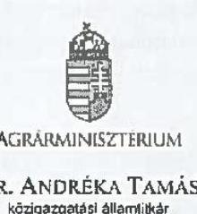
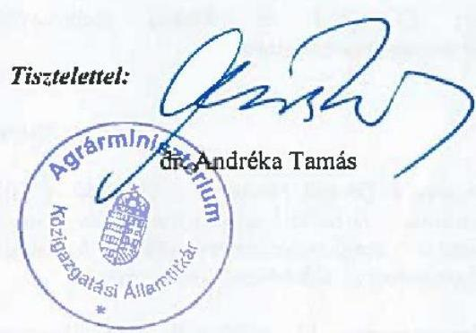
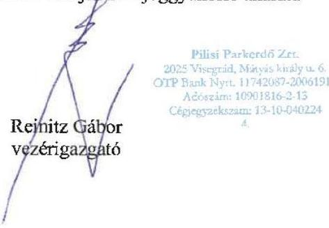

# JELENTÉS 

## Az állami vagyon feletti tulajdonosi joggyakorlással kapcsolatos tevékenységek ellenőrzése

Agrárminisztérium,
Pilisi Parkerdő Zártkörűen Múködő Részvénytársaság

2024.

---

# JELENTÉS 

## Az állami vagyon feletti tulajdonosi joggyakorlással kapcsolatos tevékenységek ellenőrzése

Agrárminisztérium,
Pilisi Parkerdő Zártkörűen Múködő Részvénytársaság

2024.

---

# ELLENŐRZÉSI IGAZGATÓSÁG: 

## ÁLLAMI VAGYONGAZDÁLKODÁST ELLENŐRZŐ IGAZGATÓSÁG

## ELLENŐRZÉSI IGAZGATÓ:

HERCZEGH ZSOLT ellenőrzési igazgató

## ELLENŐRZÉSVEZETŐ:

Jelentéseink az interneten a www.asz.hu címen olvashatók.

PENCZ MÁRIA ellenőrzésvezető

IKTATÓSZÁM: EL-3952-007/2024.
TÉMASZÁM: 2710
ELLENŐRZÉS-AZONOSÍTÓ SZÁM: V-1054

---

# TARTALOMJEGYZÉK 

AZ ELLENŐRZÉS ALAPADATAI ..... 5
ELLENŐRZÓTT SZERVEZETEK ..... 7
ÖSSZEFOGLALÁS ..... 8
AZ ELLENŐRZÉS FÓKUSZTERÜLETEI ..... 11
MEGÁLLAPÍTÁSOK ..... 12
JAVASLATOK ..... 16
MELLÉKLETEK ..... 17
I. sz. melléklet: Értelmező szótár ..... 17
II. sz. melléklet: Az ellenőrzött szervezetek jegyzéke ..... 19
III. sz. melléklet: Ellenőrzési kritériumok ..... 20
FÜGGELÉK: ÉSZREVÉTELEK ..... 21
RÖVIDÍTÉSEK JEGYZÉKE ..... 31

---

.

---

# AZ ELLENŐRZÉS ALAPADATAI 

## AZ ELLENŐRZÉS CÉLJA

Az ellenőrzés célja annak értékelése volt, hogy az állam tulajdonosi jogait gyakorló szervezet tulajdonosi joggyakorlása megfelelt-e a vonatkozó jogszabályok előírásainak.

## AZ ELLENŐRZÉS TÍPUSA

Megfelelőségi ellenőrzés

## AZ ELLENŐRZÖTT IDŐSZAK

A 2022. év. A 2022. évi számviteli törvény szerinti beszámoló elfogadását érintő döntések vonatkozásában a 2023. január 01-jétől 2023. május 31-ig tartó időszak.

## AZ ELLENŐRZÉS TÁRGYA

Az ellenőrzés tárgya az állami vagyon körébe tartozó részesedések feletti, a Magyar Állam nevében történő tulajdonosi joggyakorlással összefüggő tevékenységek ellenőrzése volt. Az ÁSZ ${ }^{1}$ a tulajdonosi joggyakorlás tényleges megvalósulását, teljeskörűségét a joggyakorlás alá tartozó gazdasági társaság állóeszközgazdálkodásának ellenőrzése keretében értékelte.

A gazdasági társaságnál - elsősorban annak állóeszköz-gazdálkodásán keresztül - az ÁSZ azt ellenőrizte, hogy a tulajdonos által előírt kötelezettségeket szabályszerűen teljesítették-e, továbbá, hogy a tulajdonosi joggyakorló a tulajdonosi tevékenységével hozzájárult-e az irányítása alatt álló gazdasági társaság szabályszerű és felelős gazdálkodásához.

Az ellenőrzés kiterjedt - a tulajdonosi joggyakorló joggyakorlása alatt álló gazdasági társaság állóeszközgazdálkodásán keresztül - annak értékelésére, hogy a tulajdonosi joggyakorlási tevékenység támogatta-e a tulajdonosi joggyakorlással érintett gazdasági társaság vagyonmegőrzési tevékenységét és az állami vagyonnal való felelős gazdálkodását. Az ellenőrzés kiterjedt a tulajdonosi joggyakorlás ellenőrzött időszakban hatályos belső szabályozási és ellenőrzési rendszere kialakításának és működtetésének ellenőrzésére, valamint a vonatkozó döntési és végrehajtási folyamatok értékelésére. Az ellenőrzés kiterjedt továbbá a tulajdonosi joggyakorló joggyakorlása alatt álló gazdasági társaság állóeszközzel való gazdálkodásának szabályszerűségére, valamint az ellenőrzött időszak állóeszköz-gazdálkodással összefüggésben hozott döntések megalapozottságára, célszerűségére, valamint az állami vagyon értékének megőrzésére, védelmére, az állami vagyonnal való felelős gazdálkodás érvényesülésére.

Az ellenőrzés kiterjedt minden olyan körülményre és adatra, amely az ÁSZ jogszabályban meghatározott feladatainak teljesítéséhez, valamint a program végrehajtása folyamán felmerült újabb összefüggések feltárásához szükséges volt.

---

# Az ellenőrzés jogsalapja 

Az ellenőrzés jogszabályi alapját az ÁSZ tv. ${ }^{2}$ 5. $\$ 4$ bekezdésének, valamint a Vtv. ${ }^{3}$ 3. $\$ 4$ bekezdésének előírásai képezték.

## AZ ELLENŐRZÉS MÓDSZERE

Az ellenőrzés végrehajtása a nemzetközi standardokat irányadónak tekintve az ellenőrzési program szempontjai, az ellenőrzött időszakban hatályos jogszabályok, az ellenőrzés szakmai szabályok és módszertanok figyelembevételével történt.

Az ellenőrzési kérdések megválaszolásához szükséges bizonyítékok megszerzése az ellenőrzött szervezetek által rendelkezésre bocsátott dokumentumokra és adatokra alapozva, továbbá szemrevételezés, kérdésfeltevés (információkérés), elemző eljárás és mintavétel útján történt.

Az ellenőrzés lefolytatásához az ellenőrzött szervezetek tanúsítvány kitöltésével, valamint az ÁSZ által kért dokumentumok, adatok, információk megküldésével szolgáltattak adatokat. Az ellenőrzéshez az ÁSZ felhasználta a nyilvánosan elérhető közhiteles adatokat is.

Az ellenőrzési bizonyítékként felhasználható adatforrások közé tartoztak az ellenőrzési program részletes szempontjainál felsorolt adatforrások, valamint minden egyéb - az ellenőrzés folyamán feltárt, az ellenőrzés szempontjából releváns információt tartalmazó - dokumentum.

Az ÁSZ tanúsítványi adatszolgáltatás alapján mintavételi eljárással kiválasztott tíz növekedési és tizenhárom csökkenési mintatétel alapján ellenőrizte a gazdasági társaság állóeszköz-gazdálkodásának megfelelőségét. A mintavételi eljárással érintett ellenőrzési területek értékelését további ellenőrzési szempontok is támogatták.

Az ellenőrzést az ÁSZ szabályszerűségi és célszerűségi szempontok alapján folytatta le. A tények feltárása és azok összegzése során a gazdasági társaság állóeszköz gazdálkodásával kapcsolatos megállapítások az ellenőrzött mintatételekre vonatkozóan kerültek megfogalmazásra.

Az ellenőrzés kitért minden olyan körülményre, amely a program végrehajtása kapcsán felmerült és az ellenőrzés céljával összhangban volt.

---

# ELLENŐRZÖTT SZERVEZETEK 

Az állami vagyon feletti tulajdonosi joggyakorlással kapcsolatos tevékenységek ellenőrzésének kötelezettségét a Vtv. és az ÁSZ tv. is előírja az ÁSZ számára.

Az ÁSZ tv.-ben rögzített előírás alapján az ÁSZ ellenőrzése kiterjedt a Magyar Állam nevében tulajdonosi jogokat gyakorló Agrárminisztériumra és a tulajdonosi joggyakorlása alatt álló Pilisi Parkerdő Zrt. ${ }^{4}$-re.

AZ AGRÁRMINISZTÉRIUM az Országgyűlés által alapított, önálló jogi személyiséggel rendelkező központi kormányzati igazgatási szerv. A Kormány tagjainak feladat- és hatásköréről szóló 182/2022. (V. 24.) Korm. rendelet 54. § 5. pontja szerint az agrárminiszer felel többek között az erdőgazdálkodásért. Erdőgazdálkodásért felelős miniszterként az Erdőtv. ${ }^{5}$ 9/A. §-a szerint tulajdonosi jogokat gyakorol a törvény 1. mellékletében felsorolt állami tulajdonban lévő, erdőgazdálkodással foglalkozó gazdasági társaságok felett.

A PILISI PARKERDŐ ZRT. 1994.01.01-jén alakult a Pilisi Állami Parkerdőgazdaság jogutódjaként. A Pilisi Parkerdő Zrt. a Magyar Állam 100\%-os tulajdonában áll. A Pilis Parkerdő Zrt. Pest és Komárom-Esztergom vármegyékben, a Gerecse, a Pilis, a Visegrádi és a Budai hegység, a Gödöllői dombság, valamint a Csepeli síkság területén gazdálkodik összesen 65620 hektár területen, amiből 60174 hektár minősül erdőterületnek. A Pilisi Parkerdő Zrt. a hagyományos erdőgazdálkodási tevékenységen (erdőfelújítás, fakitermelés, vadgazdálkodás) túl ökoturisztikai-közjöléti, környezetvédelmi, megbízásos erdőgazdálkodási szolgáltatást, kereskedelmi és egyéb ipari tevékenységet is folytat. A Pilisi Parkerdő Zrt. az ellenőrzött időszakban nem volt központi kormányzati alszektorba besorolt szervezet, a Taktv. ${ }^{6}$ alapján az ellenőrzött időszakban a Gbkr. ${ }^{7}$ hatálya alá tartozott.
A Pilisi Parkerdő Zrt. 2022. évi beszámolójának kiemelt adatait az 1. táblázat tartalmazza.

1. táblázat

Ellenőrzött
szervezet

## A 2022. évi beszámoló kiemelt adatai (ezer Ft-ban)

Értékesítés nettó árbevétele
Adózott eredmény
Immateriális javak
Tárgyi eszközök
Mérlegfőösszeg
Átlagos létszám (fő)

7911293
151374
39533
14422283
22479826
222

---

# ÖSSZEFOGLALÁS 

A nemzeti vagyon meghatározó részét képező állami vagyonnal való gazdálkodás szabályozási rendszere sokrétű. Az állami tulajdonban álló részesedések feletti tulajdonosi joggyakorlásra vonatkozó általános szabályokat az Nvtv. ${ }^{8}$, a Vtv., a további részletszabályokat a Vtv.vhr. ${ }^{9}$ tartalmazza.

Az Nvtv. meghatározza a nemzeti vagyon alapvető rendelteltését, és kimondja, hogy a nemzeti vagyonnal felelős módon kell gazdálkodni. A Vtv. szerint a tulajdonosi joggyakorlás és az állami vagyonnal való gazdálkodás alapvető feladata a vagyon rendeltetésszerú, hatékony és felelős felhasználásának biztosítása az állami vagyon értékének megőrzése, gyarapítása érdekében.

A részesedésekben megtestesüló állami vagyon értékének megörzésére, növelésére alapvető befolyást gyakorol a gazdasági társaságok gazdálkodási tevékenysége.

Az állami tulajdonú gazdasági társaságok esetében a tulajdonosi joggyakorlás az államot, mint tulajdonost megillető jogoknak és kötelezettségeknek a gyakorlását jelenti. Az államot megillető társasági részesedések a nemzeti vagyon részét képezik és legfőbb rendeltetésük a közfeladatok ellátása. A nemzeti vagyonnal való felelős gazdálkodás érvényesítésében kiemelten fontos szerepe van az állami tulajdonú gazdasági társaságok vezetői által meghozott, gazdálkodással összefüggő döntéseknek, továbbá a társaság életében meghatározó döntések szabályszerűségi, megalapozottsági és célszerűségi szempontból történő értékelésének. A felelős vagyongazdálkodás elveinek érvényesülése érdekében fontos továbbá a társaságok gazdálkodásával kapcsolatosan felmerülő kockázatok folyamatos értékelése, és olyan kontrollrendszer kialakítása, amely alkalmas a kockázatok minimalizálására és a meghozott döntések hatásainak nyomon követésére.

Az állam nevében tulajdonosi jogokat gyakorló szervezetek a tulajdonosi joggyakorlásuk alá tartozó gazdasági társaságoknál kötelesek érvényesíteni a cégvezetés felelősségét, valamint a közérdek érvényesülését biztosító vagyongazdálkodást. A megfelelő tulajdonosi ellenőrzés és a felügyelőbizottságok társaságok feletti tulajdonosi felügyelete fontos szerepet tölt be a gazdasági társaságok állami vagyonnal való felelős gazdálkodásában.

AZ AGRÁRMINISZTÉRIUM tulajdonosi joggyakorlása megfelelt a jogszabályi előírásoknak. A tulajdonosi joggyakorlás kereteinek kialakítása és múködtetése alkalmas volt a Magyar Állam tulajdonosi érdekeinek érvényesítésére. Az Agrárminisztérium a tulajdonosi kontrollok rendszerét a tulajdonosi érdekekhez igazodóan alakította ki. A legfontosabb tulajdonosi kontrollok közé tartozott a meghatározott értékhatár feletti kötelezettségvállalásokhoz kapcsolódó jogok alapítói hatáskörbe vonása, továbbá a Pilisi Parkerdő Zrt. gazdálkodásának nyomon követesét, és a megalapozott tulajdonosi döntések meghozatalát biztosító rendszeres beszámolási és tájékoztatási kötelezettség előírása a Pilisi Parkerdő Zrt. részére.

Az ellenőrzött időszakban az agrárminiszter által a tulajdonosi joggyakorlás keretében hozott döntések szabályszerűek, megalapozottak és célszerűek voltak, azok a Pilisi Parkerdő Zrt. céljaival összhangban álltak. Az Agrárminisztérium tulajdonosi joggyakorlói tevékenysége hozzájárult a Pilisi Parkerdő Zrt. állami vagyonnal való felelős gazdálkodásához.

---

Az ellenőrzés kiterjed a tulajdonosi kontrollok kialakításának és müködtetésének megfelelőségére, amelynek lényeges eleme a tulajdonosi ellenőrzés. Az Agrárminisztérium a tulajdonosi joggyakorlása alá tartozó szervezetek tulajdonosi ellenőrzésére kiterjedő éves ellenőrzési tervét elkészítette és azt kockázatelemzéssel megalapozta. Ennek során többek között a tulajdonosi joggyakorlása alá tartozó 26 gazdasági társaság kockázatait hét szempont szerint értékelte. Az értékelési szempontok tartalmaztak stratégiai, szervezeti, belső és külső ellenőrzési, valamint egyedi kockázati tényezőket. Az értékelés alapján - egy kivételével - valamennyi gazdasági társaság közel azonos pontszámot kapott és alacsony kockázati kategóriába esett. A kockázati pontszámok továbbá szinte teljes mértékben megegyeztek a gazdasági társaságok egy évvel korábbi kockázatelemzésének eredményével is. A kockázatelemzésben szereplő, egyes kockázati tényezőkre adott pontszámokat alátámasztó részletes dokumentációt az Agrárminisztérium nem bocsátott az ellenőrzés rendelkezésére.
Az ellenőrzés előremutató gyakorlatnak értékelte a tulajdonosi kontrollok kiemelt területét jelentő tulajdonosi ellenőrzés kockázatelemzéssel történő megalapozását. Tekintettel azonban arra, hogy az Agrárminisztérium által elvégzett kockázatelemzés eredményeképpen a gazdasági társaságok kockázati pontszámai éven belül és két egymást követő évben is közel azonosak, az ellenőrzés véleménye alapján indokolt lehet az alkalmazott kockázati tényezők, szempontok felülvizsgálata. A felülvizsgálat eredményeképpen erősíthető a gazdasági társaságok müködési, gazdálkodási sajátosságainak megfelelő, társaságspecifikus kockázati szempontok kockázatelemzés során történő érvényesítése, amely hozzájárulhat a tulajdonosi kontrollok erősitéséhez.
Az ellenőrzés véleménye alapján az ellenőrzési terv, illetve az azt megalapozó kockázatelemzés akkor tölti be leghatékonyabban a szerepét, ha alkalmas a tulajdonosi joggyakorlás alá tartozó gazdasági társaságok eltérő, egyedi kockázati jellemzőinek értékelésére, és az értékelés alapján lehetőséget ad a legmegfelelőbb tulajdonosi joggyakorlói intézkedések meghozatalára.

Az Agrárminisztérium az Infotv. ${ }^{10}$ szerinti közzétételi kötelezettségének a 2022. évben nem tett eleget, mivel a gazdálkodási adatokat és a tevékenységre, működésre vonatkozó adatokat honlapján nem tette közzé.

A PILISI PARKERDŐ ZRT. gazdálkodási és működési kereteit a jogszabályok, valamint az Alapszabály ${ }^{11}$ előírásainak megfelelően alakította ki. A Pilisi Parkerdő Zrt. állóeszközgazdálkodásának és a tulajdonosi joggyakorló felé teljesítendő beszámolók, adatszolgáltatások teljesítésének hatásköri és felelősségi viszonyai rögzítettek voltak. A Pilisi Parkerdő Zrt. rendelkezett a kötelezően előírt belső szabályzatokkal, amelyek rendelkezései a felelős gazdálkodás elvének érvényesülését támogatták. A Pilisi Parkerdő Zrt. a tulajdonosi joggyakorló által kért adatszolgáltatásokat az Alapszabályban és a Pilisi Parkerdő Zrt. SZMSZ ${ }^{12}$-ben foglaltaknak megfelelően, szabályszerűen teljesítette. Az adatszolgáltatásokban szereplő adatok részletesen mutatták be a Pilisi Parkerdő Zrt. tevékenységét és gazdálkodását, likviditási helyzetét és az időarányos tényadatokat, azok alkalmasak voltak a megalapozott döntéshozatalhoz.

A mintatételként kiválasztott, állóeszköz növekedéssel kapcsolatos döntések szabályszerűek és megalapozottak voltak, a döntéshozatal során érvényesült a célszerűség követelménye. Az előterjesztések tartalmaztak minden szükséges adatot, információt a megalapozott döntésekhez, a döntéseket az Alapszabályban előírt értékhatároknak megfelelő döntéshozó hozta, azok a Pilisi Parkerdő Zrt. tevékenységével és céljaival összhangban voltak. Az $\mathrm{FB}^{13}$ tevékenysége támogatta az agrárminiszter tulajdonosi döntéseit.

---

Az állóeszköz csökkenések esetében az ellenőrzés megállapította, hogy az elszámolt veszteségek számviteli elszámolása és a könyvekből való kivezetése szabályszerű volt, azonban két ötmillió forintot meghaladó veszteség elszámolása során a vezérigazgató az Alapszabályban foglaltakat figyelmen kívül hagyva az FB előzetes jóváhagyása nélkül döntött.

Az állóeszköz-változások számviteli elszámolása megfelelt a Számv. tv. ${ }^{14}$ előírásainak.
A Pilisi Parkerdő Zrt. az Infotv., a Taktv. és a Számv. tv. szerinti közzétételi kötelezettségeinek eleget tett.

---

# AZ ELLENŐRZÉS FÓKUSZTERÜLETEI 

1. Az állam tulajdonosi jogait gyakorló szervezet állami tulajdonban lévő gazdasági társaság feletti tulajdonosi joggyakorlással kapcsolatos tevékenységének megfelelősége.
2. A tulajdonosi joggyakorlás alá tartozó állami tulajdonú gazdasági társaság állóeszközökkel való gazdálkodásának megfelelősége, a gazdálkodási döntések szabályszerüsége, megalapozottsága és célszerüsége, valamint a felelős gazdálkodás elvének érvényesülése.

---

# MEGÁLLAPÍTÁSOK 

## 1. Az állam tulajdonosi jogait gyakorló szervezet állami tulajdonban lévő gazdasági társaság feletti tulajdonosi joggyakorlással kapcsolatos tevékenységének megfelelősége

Összegző megállapítás: Az Agrárminisztérium Pilisi Parkerdő Zrt. feletti tulajdonosi joggyakorlással kapcsolatos tevékenysége megfelelő volt, hozzájárult az állami vagyonnal való felelős gazdálkodás elveinek érvényesüléséhez.

AZ AGRÁRMINISZTÉRIUM SZMSZ ${ }^{15}$-ében és az Alapszabályban a Ptk. ${ }^{16}$, valamint az Áht. ${ }^{17}$ előírásaival összhangban meghatározta a tulajdonosi jogok gyakorlásának kereteit, kialakította a Pilisi Parkerdő Zrt. beszámoltatásának rendszerét.
Az ellenőrzés megállapította, hogy az Agrárminisztérium által kialakított szabályozási rendszer alkalmas volt a szabályszerű tulajdonosi joggyakorlói tevékenység végzéséhez, mert a Pilisi Parkerdő Zrt. gazdálkodásához és tevékenységeihez igazítottan határozta meg a tulajdonosi joggyakorlással összefüggő jogokat és kötelezettségeket. Az ellenőrzött időszakban hatályos Alapszabályban a Ptk.-ban előírt jogokon és kötelezettségeken felül az alapítói jogokat gyakorló agrárminiszter - mint a Pilisi Parkerdő Zrt. legfőbb szerve - a saját hatáskörébe vonta többek között az alábbi, állóeszközgazdálkodás szempontjából releváns területeken meghozandó döntéseket:

- a tárgyi eszköz beszerzéséről szóló döntést, ha annak beszerzési értéke meghaladja a nettó 200 M Ft -ot;
- a tárgyi eszköz elidegenítéséről szóló döntést, ha annak értéke meghaladja a nettó 200 M Ft -ot;
- a társaságot ért 100 M Ft -ot elérő veszteség leírásáról szóló döntést.

Az Agrárminisztérium az Áht. előírásainak megfelelően rendelkezett SZMSZ-szel, amely tartalmazta a tulajdonosi joggyakorlással kapcsolatos feladatokat, hatásköröket és a felelősöket. Az SZMSZ-ben foglaltak szerint a kinevezés és felmentés tekintetében a miniszter gyakorolta a munkáltatói jogokat a Pilisi Parkerdő Zrt. vezető állású munkavállalói felett.
Az SZMSZ-ben foglaltaknak megfelelően az Agrárminisztérium Ellenőrzési Főosztálya tevékenységének hatóköre kiterjedt az agrárminiszter tulajdonosi joggyakorlása alatt álló gazdasági társaságokra. Az Ellenőrzési Főosztály rendelkezett Ügyrend ${ }^{18}$-del, amely tartalmazta többek között az ellenőrzés folyamatát, ez ellenőrzési tervek készítésének kötelezettségét, az ellenőrzés során felmerülő feladatokat, továbbá a belső ellenőrzési tevékenység folyamatábráját.
Az agrárminiszter a Taktv.-ben foglaltaknak megfelelően elkészítette és alapítói határozattal jóváhagyta a Pilisi Parkerdő Zrt. javadalmazási szabályzatát.
Az Agrárminisztérium 2022. évben a Ptk.-ban és az Alapszabályban foglaltak szerint évente egyszeri, illetve rendszeres adatszolgáltatásokat kért a Pilisi Parkerdő Zrt.-től. Az Agrárminisztérium által kialakított adatszolgáltatási rendszer biztosította a Pilisi Parkerdő Zrt.-re vonatkozó megalapozott

---

döntésekhez szükséges adatok, információk rendelkezésre állását, valamint a Pilisi Parkerdő Zrt. gazdálkodásának, pénzügyi, vagyoni helyzetének folyamatos nyomon követését.
Az agrárminiszternek a Ptk.-ban és az Alapszabályban előírt ügyekben hozott döntései 2022. évben szabályszerűek, megalapozottak és célszerűek voltak. A mindösszesen 19 db alapítói határozatban többek között a 2021. és 2022. évi beszámolók elfogadásáról, az üzleti terv elfogadásáról, a vagyonkezelői szerződések módosításáról, illetve a vezérigazgatói jutalom kifizetéséről döntött. Az agrárminiszter elé kerülő előterjesztéseket az FB a Ptk. előírásaival összhangban előzetesen megvizsgálta és határozatba foglalta az előterjesztések vizsgálatának eredményét, illetve javaslatát az abban foglaltak elfogadására vonatkozóan. Az előterjesztések tartalmazták a döntéshozatalhoz szükséges információkat. Az agrárminiszter határozatait az FB javaslatának figyelembevételével hozta meg.
Az Agrárminisztérium a Bkr. ${ }^{19}$ előírásaival összhangban elkészítette a 2022. évi éves belső ellenőrzési tervét, amelyet a miniszter jóváhagyott. Az ellenőrzési tervben szereplő kockázatértékelés alapján a Pilisi Parkerdő Zrt. alacsony kockázatúnak minősült, ezért az Agrárminisztérium tulajdonosi ellenőrzést a Pilisi Parkerdő Zrt.-nél az ellenőrzött időszakban nem végzett.
Az Agrárminisztérium az Infotv. szerinti közzétételi kötelezettségeinek nem tett eleget, mivel a közzétételre szolgáló honlapon az Infotv. 37. § (1) bekezdésében előírtak ellenére nem tette közzé az Infotv. 1. melléklete II. és III. pontja szerinti gazdálkodási és a tevékenységre, működésre vonatkozó adatokat.

# 2. A tulajdonosi joggyakorlás alá tartozó állami tulajdonú gazdasági társaság állóeszközökkel való gazdálkodásának megfelelősége, a gazdálkodási döntések szabályszerűsége, megalapozottsága és célszerűsége, valamint a felelős gazdálkodás elvének érvényesülése. 

Összegző megállapítás: A Pilisi Parkerdő Zrt. állóeszközökkel való gazdálkodása megfelelő volt, a gazdálkodási döntések - két mintatétel kivételével, amely esetekben a döntést nem az Alapszabályban előírtak szerint hozták meg szabályszerűek voltak. A döntések során érvényesült a felelős gazdálkodás elve, azok megalapozottak és célszerűek voltak.

GAZDÁLKODÁSI ÉS MŰKÖDÉSI KERETEIT a Pilisi Parkerdő Zrt. a Ptk., a Számv. tv., a Gbkr., valamint az Alapszabály rendelkezéseinek megfelelően kialakította, a beszámolási feladatok végrehajtásának felelőseit meghatározta.
Az ellenőrzött időszakban hatályos Alapszabályban meghatározottak szerint a vezérigazgató az alábbi, állóeszközgazdálkodás szempontjából releváns területeken volt jogosult dönteni:

- a nettó 40 M Ft-ot meg nem haladó tárgyi eszköz beszerzésekről és eladásokról;
- az 5 M Ft-ot meg nem haladó veszteségek leírásáról.

A vezérigazgató az FB előzetes jóváhagyásával az alábbi területeken dönthetett:

---

- a nettó 40 - 200 M Ft-ot meg nem haladó tárgyi eszköz beszerzésekről és eladásokról;
- és az 5 - 100 M Ft-ot meg nem haladó veszteségek leírásáról.

A vezérigazgató a Gbkr. előírásaival összhangban elkészítette a Pilisi Parkerdő Zrt. SZMSZ-ét, amiben rögzítésre került a szervezeti struktúra, a folyamatok, a felelősségi- és hatáskörök. A vezérigazgató a Pilisi Parkerdő Zrt. SZMSZ-ében szabályozta az Agrárminisztérium felé teljesítendő adatszolgáltatásokért, valamint a nyomon követésért felelős szervezeti egységeket. A döntési hatásköröket az Alapszabályban, valamint vezérigazgatói utasításban szabályozták.
Az Agrárminisztérium által az Alapszabályban előírt adatszolgáltatásokkal kapcsolatos feladatokat a vezérigazgató a Pilisi Parkerdő Zrt. SZMSZ-ében szabályozta. A Pilisi Parkerdő Zrt. a tulajdonosi joggyakorló által kért adatszolgáltatásokat szabályszerűen teljesítette. Rendszeres adatszolgáltatásként a Pilisi Parkerdő Zrt. havi, illetve negyedéves jelentéseket és szöveges értékeléseket készített, egyszeri adatszolgáltatásként többek között a beszámolót, illetve üzleti jelentést küldte meg az Agrárminisztériumnak. Az adatszolgáltatásokban szereplő adatok részletesen mutatták be a Pilisi Parkerdő Zrt. tevékenységét és gazdálkodását, likviditási helyzetét és az évközi időarányos tény adatokat, azok alkalmasak voltak a tulajdonosi joggyakorló számára a megalapozott döntéshozatalhoz. A Pilisi Parkerdő Zrt. által teljesített adatszolgáltatások biztosították az agrárminiszter számára a megalapozott döntésekhez szükséges információt.
A Pilisi Parkerdő Zrt.-nél az ellenőrzött időszakban az Alapszabály előírásával összhangban 6 tagú FB működött. Az FB létrehozásával, működtetésével kapcsolatos, Alapszabályban rögzített rendelkezések a Ptk. és a Taktv. előírásainak megfeleltek. Az FB összehívása az ellenőrzött időszakban szabályszerű volt, megfelelt a Ptk.-ban foglaltaknak. Az FB az Alapszabályban foglaltaknak megfelelően rendelkezett az agrárminiszter által jóváhagyott FB Ügyrend ${ }^{20}$-del. Az ellenőrzött időszakban az FB tevékenységével támogatta az agrárminiszter tulajdonosi döntéseit.
A Pilisi Parkerdő Zrt. a Számv. tv. előírásainak megfelelően rendelkezett Számviteli politikával ${ }^{21}$ és annak keretében elkészítendő Eszközök és a források leltárkészítési és leltározási szabályzatával ${ }^{22}$, Eszközök és a források értékelési szabályzatával ${ }^{23}$, Számlarenddel ${ }^{24}$. Rendelkezett továbbá Selejtezési szabályzattal ${ }^{25}$, Beszerzési szabályzattal ${ }^{26}$, Beruházási és Felújítási szabályzattal ${ }^{27}$ és Közbeszerzési szabályzattal ${ }^{28}$.
A Pilisi Parkerdő Zrt. a Számv. tv. előírásainak megfelelően elkészítette a 2022. évre vonatkozó beszámolóját. A 2022. évi beszámolót és üzleti jelentést az FB a Ptk. előírásával összhangban megtárgyalta és elfogadásra javasolta. A Pilisi Parkerdő Zrt. az Infotv. és a Taktv. szerinti közzétételi kötelezettségeinek eleget tett.
AZ ÁLLÓESZKÖZ NÖVEKEDÉSSEL KAPCSOLATOS DÖNTÉSEK az ellenőrzött mintatételek vonatkozásában szabályszerűek, megalapozottak és célszerűek voltak. Az ellenőrzött mintatételekkel - ingatlanok vagyonkezelésbe vétele, turisztikai beruházások, tárgyi eszköz beszerzések - kapcsolatos döntési eljárások során betartották a Ptk. és az Alapszabály rendelkezéseit. Az ellenőrzés megállapította, hogy a beruházások - az 1550/2017. (VIII. 18.) Kormány határozatban ${ }^{29}$ meghatározott erdei kerékpáros infrastruktúra és szolgáltatás fejlesztésével kapcsolatos beruházás, az uniós forrásból megvalósult Pilis-nyereg parkerdei építmények, Görgényi úti erdei bemutató parkerdei építményekkel kapcsolatos beruházás, egyéb tárgyi eszköz beszerzések - a Pilisi Parkerdő Zrt. tevékenységével és céljaival összhangban valósult meg, társadalmi érdekeket szolgált. Az előterjesztések minden esetben tartalmazták a megalapozott döntéshez szükséges adatokat, információkat, a beruházás célját, indokait,

---

pénzügyi forrását. A döntési eljárások során betartották az Alapszabály rendelkezéseit, a döntéseket az Alapszabályban előírt értékhatároknak megfelelő döntéshozó hozta.
A SZERZŐDÉSEK MEGKÖTÉSE, módosítása az ellenőrzött mintatételek esetében szabályszerű volt. A szerződések összhangban voltak a kapott árajánlattal és a beruházásra meghozott döntéssel, továbbá tartalmazták a beruházás során meghatározott lényeges feltételeket (szerződés tárgya, határidők, garanciák és biztosítékok). A beruházásokról a számla a szerződéssel és a teljesítésigazolással összhangban került kiállításra. A beruházások teljesítése a szerződéses teljesítési határidőn belül történt, arról teljesítésigazolás került kiállításra.
AZ ÁLLÓESZKÖZ CSÖKKENÉSSEL KAPCSOLATOS DÖNTÉSEK - két mintatétel kivételével, amely esetekben a döntést nem az Alapszabályban előírtak szerint hozták meg szabályszerűek voltak. Az ellenőrzött mintatételekre vonatkozó döntések megalapozottak és célszerűek voltak, mivel az eszközök kivezetésével kapcsolatos körülményeket kellő részletezettséggel mérlegelték, különös tekintettel az eszközök használhatóságára vonatkozóan. Az ellenőrzött mintatételek - tárgyi eszközök értékesítése, selejtezés és terven felüli értékcsökkenés elszámolása - tekintetében a szerződések és az elszámolások szabályszerűen, a Számv. tv., az Alapszabály és a Selejtezési szabályzat előírásaival összhangban történtek. A selejtezési jegyzőkönyvek alapján a selejtezések és a terven felüli értékcsökkenések elszámolása közel 45,0 M Ft-tal csökkentette a Pilisi Parkerdő Zrt. 2022. évi eredményét. Az ellenőrzés az elszámolt veszteségekkel kapcsolatosan megállapította, hogy az elszámolások számviteli bizonylatokkal alátámasztottak voltak, az eszközök könyvekből történő kivezetése a Számv. tv. előírásaival összhangban szabályszerűen történt. Két mintatétel vonatkozásában megállapításra került, hogy a Pilisi Parkerdő Zrt. Alapszabályának 13.5.2. m) pontjában foglaltakkal ellentétben a vezérigazgató az FB előzetes jóváhagyása nélkül döntött a Pilisi Parkerdő Zrt.-nél az ötmillió forintot meghaladó veszteség leírásáról.

- Egy mintatétel esetében egy kötélpályával kapcsolatos beruházás 2022. évi könyv szerinti értéke és az értékbecslés alapján megállapított érték közötti különbség alapján 20,992 M Ft terven felüli értékcsökkenés elszámolására került sor.
- Egy mintatétel esetében a Kakashegyi feltáróút-hálózat beruházási terv könyv szerinti értéke 5,548 M Ft volt, 2022. évben a terv selejtezésére került sor.
AZ ÁLLÓESZKÖZÖK ÁLLOMÁNYVÁLTOZÁSAINAK SZÁMVITELI ELSZÁMOLÁSA az ellenőrzött mintatételek esetében megfelelt a Számv. tv. előírásainak. Az állóeszköz növekedéssel kapcsolatos mintatételek esetében az eszközök állományba vétele, aktiválása megfelelt a Számv. tv. és a Számviteli politikában foglaltaknak. Az állóeszköz csökkenéssel kapcsolatos mintatételek esetében az eszközök könyvekből történő kivezetése során az eszközök bruttó értéke és a korábban elszámolt értékcsökkenés is kivezetésre került, ami megfelelt a Számv. tv. előírásainak.

---

# JAVASLATOK 

Az ÁSZ tv. 33. § (1) bekezdésében foglaltak értelmében az ellenőrzött szervezet vezetője köteles a jelentésben foglalt megállapításokhoz kapcsolódó intézkedési tervet összeállítani és azt a jelentés kézhezvételétől számított 30 napon belül az ÁSZ részére megküldeni. Amennyiben az ellenőrzött szervezet vezetője nem küldi meg határidőben az intézkedési tervet, vagy továbbra sem elfogadható intézkedési tervet küld, az Állami Számvevőszék elnöke az ÁSZ tv. 33. § (3) bekezdése a) és b) pontjaiban foglaltakat érvényesítheti.

## AZ AGRÁRMINISZTER RÉSZÉRE

1. Intézkedjen az Infotv. 37. § (1) bekezdésében és az Infotv. 1. melléklete II. és III. pontjában foglaltak szerinti gazdálkodási adatok és a tevékenységre, müködésre vonatkozó adatok honlapon történő közzétételéről.

## A PILISI PARKERDŐ ZRT. VEZÉRIGAZGATÓJA RÉSZÉRE

1. Tegyen intézkedéseket azon kontrolltevékenységek kialakítására és megfelelő müködtetésére, amelyek biztositják a veszteség leírásával kapcsolatos döntések meghozatala során az Alapszabályban rögzítettek érvényesülését.

---

# MELLÉKLETEK 

## I. SZ. MELLÉKLET: ÉRTELMEZŐ SZÓTÁR

állami vagyon
állóeszköz
állóeszköz-gazdálkodás
felelős gazdálkodás
gazdasági társaság

A Vtv. alkalmazásában állami vagyonnak minősül:
a) az állam tulajdonában lévő dolog, valamint dolog módjára hasznosít-ható természeti erő;
b) az a) pont hatálya alá tartozó mindazon vagyon, amely vonatkozásában törvény az állam kizárólagos tulajdonjogát nevesíti;
c) az állam tulajdonában lévő tagsági jogviszonyt megtestesítő értékpapír, illetve az államot megillető egyéb társasági részesedés;
d) az államot megillető olyan immateriális, vagyoni értékkel rendelkező jogosultság, amelyet jogszabály vagyoni értékủ jogként nevesít;
e) az állam tulajdonában álló a befektetési vállalkozásokról és az árutőzsdei szolgáltatókról, valamint az általuk végezhető tevékenységek szabályairól szóló 2007. évi CXXXVIII. törvény szerinti pénzügyi eszköz,
f) azon országgyűlési képviselőről, aki más, Alaptörvényben nevesített közjogi tisztséget is betöltve közfeladatot lát el, e közfeladata ellátása körében vagy ezzel összefüggésben, költségvetési forrásból készített, szerzői vagy szomszédos jogi védelmet élvező mű̉höz vagy teljesítményhez, különösen kép-, illetve hangfelvételhez kapcsolódó, felhasználási szerződés útján vagy a szerzői jogról szóló törvény alapján megszerzett felhasználási engedély, illetve vagyoni jog.
(Forrás: Vtv. 1. $\$ (2)$ bekezdése)
Az állóeszközök olyan eszközök, amelyek a társaság céljait hosszú távon szolgálják, egy éven túl a vállalkozás tulajdonában maradnak és szolgálják annak múködését. Az állóeszközök között szerepelnek az immateriális javak és tárgyi eszközök (ideértve a beruházásokat, felújításokat, müködtetést, fenntartást és karbantartást, illetve az ezekhez kapcsolódó adott előlegek, valamint a vagyonkezelésbe vett eszközöket is).
(Forrás: ÁSZ definíció)
Az állóeszköz-gazdálkodás, mint a gazdasági társaság müködésének funkcionális részterülete magába foglalja az immateriális javakkal és tárgyi eszközökkel való gazdálkodást (ideértve a beruházásokat, felújításokat, működtetést, fenntartást és karbantartást, illetve az ezekhez kapcsolódó adott előlegek, valamint a vagyonkezelésbe vett eszközöket is) és a kapcsolódó költségeket, ráfordításokat, egyéb bevételeket (a támogatások kivételével).
(Forrás: ÁSZ definíció)
Az állami vagyon rendeltetésének megfelelő, - az állami feladatok ellátásához, a társadalmi szükségletek kielégítéséhez, valamint a Kormány gazdaságpolitikája megvalósításának elősegítéséhez szükséges, egységes elveken alapuló, önálló ágazatként megjelenő - hatékony, költségtakarékos, értékmegőrző, értéknövelő felhasználásának biztosítása érdekében történő gazdálkodás.
(Forrás: Vtv. 2. § (1) bekezdése)
A gazdasági társaságok üzletszerű közös gazdasági tevékenység folytatására, a tagok vagyoni hozzájárulásával létrehozott, jogi személyiséggel rendelkező vállalkozások, amelyekben a tagok a nyereségből közösen részesednek, és a veszteséget közösen viselik.
(Forrás: Ptk. 3:88. § (1) bekezdése)

---

létesítő okirat
nemzeti vagyon
többségi állami tulajdon
tulajdonosi joggyakorló
vagyongazdálkodás alapelvei

A jogi személy létrehozásáról a személyek szerződésben, alapító okiratban vagy alapszabályban szabadon rendelkezhetnek, a jogi személy szervezetét és müködési szabályait maguk állapíthatják meg.
(Forrás: Ptk. 3:4. § (1) bekezdés)
Nemzeti vagyonba tartozik:
a) az állam vagy a helyi önkormányzat kizárólagos tulajdonában álló dolgok,
b) az a) pont hatálya alá nem tartozó, az állam vagy a helyi önkormányzat tulajdonában lévő dolog,
c) az állam vagy a helyi önkormányzat tulajdonában lévő pénzügyi eszközök, továbbá az államot vagy a helyi önkormányzatot megillető társasági részesedések,
d) az államot vagy a helyi önkormányzatot megillető bármely vagyoni értékkel rendelkező jogosultság, amelyet jogszabály vagyoni értékủ jogként nevesít,
e) Magyarország határa által körbezárt terület feletti légtér,
f) az üvegházhatású gázok kibocsátási egységeinek kereskedelméről szóló törvény szerinti kibocsátási egység és légiközlekedési kibocsátási egység, valamint az ENSZ Éghajlat-változási Keretegyezménye és annak Kiotói Jegyzőkönyve végrehajtási keretrendszeréről szóló törvény szerinti kiotói egység,
g) állami vagy helyi önkormányzati fenntartású közgyűjtemény (muzeális intézmény, levéltár, közgyűjteményként működő kép- és hangarchívum, valamint könyvtár) saját gyűjteményében nyilvántartott kulturális javak körébe tartozó dolog, kivéve, ha a dolog más tulajdonában áll,
h) a régészeti lelet,
i) a nemzeti adatvagyon körébe tartozó állami nyilvántartások fokozottabb védelméről szóló törvény szerinti nemzeti adatvagyon.
(Forrás: Nvtv. 1. § (2) bekezdése)
Az állam tulajdonában lévő tagsági jogviszonyt megtestesítő értékpapír, illetve az állam tulajdonában lévő egyéb társasági részesedés, amennyiben a társaságban a Magyar Állam közvetlenül vagy közvetetten a szavazatok több mint felével rendelkezik.
(Forrás: ÁSZ definíció a Vtv. 1. § (2) bekezdés c) pontja és a Ptk. 8:2. § (1), (3)-(4) bekezdései alapján)

Aki a nemzeti vagyon felett az államot vagy a helyi önkormányzatot megillető tulajdonosi jogok és kötelezettségek összességének gyakorlására jogosult. (Forrás: Nvtv. 3. § (1) bekezdés 17. pont)
A nemzeti vagyon alapvető rendeltetése a közfeladat ellátásának biztosítása, ideértve a lakosság közszolgáltatásokkal való ellátását és e feladatok ellátásához szükséges infrastruktúra biztosítását. A nemzeti vagyonnal felelős módon, rendeltetésszerűen kell gazdálkodni.
A nemzeti vagyongazdálkodás feladata a nemzeti vagyon megőrzése, értékének és állagának védelme, rendeltetésének megfelelő, az állam, az önkormányzat mindenkori teherbíró képességéhez igazodó, elsődlegesen a közfeladatok ellátásához és a mindenkori társadalmi szükségletek kielégítéséhez szükséges, egységes elveken alapuló, átlátható, hatékony és költségtakarékos működtetése, értéknövelő használata, hasznosítása, gyarapítása, továbbá az állam vagy a helyi önkormányzat feladatának ellátása szempontjából feleslegessé váló vagyontárgyak elidegenítése, azzal, hogy a nemzeti vagyon megőrzése érdekében végzett bontás vagy átalakítás nem minősül az állag védelmi kötelezettség megszegésének.
(Forrás: Nvtv. 7. § (1)-(2) bekezdései)

---

# II. SZ. MELLÉKLET: AZ ELLENŐRZÖTT SZERVEZETEK JEGYZÉKE 

## ELLENŐRZÖTT SZERVEZET NEVE

Agrárminisztérium
Pílisi Parkerdő Zártkörűen Működő Részvénytársaság

---

# III. SZ. MELLÉKLET: ELLENŐRZÉSI KRITÉRIUMOK 

## FOKUSZTERÜLET

1. Az állam tulajdonosi jogait gyakorló szervezet állami tulajdonban lévő gazdasági társaság feletti tulajdonosi joggyakorlással kapcsolatos tevékenységének megfelelősége.
2. A tulajdonosi joggyakorlás alá tartozó állami tulajdonú gazdasági társaság állóeszközökkel való gazdálkodásának megfelelősége, a gazdálkodási döntések szabályszerűsége, megalapozottsága és célszerűsége, valamint a felelős gazdálkodás elvének érvényesülése.

## ELLENÖRZÉSI KRITÉRIUMOK

Ptk. 3:4. §, 3:5. §, 3:21. § (3) bek., 3:24. § (1) bek., 3:26. § (1), (4) bek., 3:27. § (1) bek., 3:28. §, 3:35. §, 3:99/A., §3:102. §, 3:109. §, 3:120. (1)-(3) bek., 3:121. §, 3:122. §, 3:123. §, 3:270. §, 3:284. §
Taktv. 4. § (1)-(2) bek., 5. § (3) bek.
Nvtv. 7. § (1)-(2) bek.
Vtv. 2. § (1) bek.
Áht. 10. § (5) bek., 70. § (1) bek. d) pont
Bkr. 6. § (1) bek. a) és b) pont, 6. § (3) bek., 9. §, 15. § (1) bek., 21. § (1) bek. 39. § (1) bek., 45-46. §, 47. § (1)-(2) bek.
Infotv. 37. § (1) bek., 1. melléklet
a gazdasági társaság létesítő okirata, a tulajdonosi joggyakorló belső szabályzatai

Nvtv. 7. § (1) bek.
Ptk. 3:4. § (1) bek., 3:21. § (1)-(3) bek., 3:109. § (2) bek., 3:112. § (2)-(3) bek., 3:270. § (1)-(3) bek., 6:58. §, 6:63. §, 6:191. §

Számv. tv. 4. § (1) bek., 8. §, 12. § (1) bek., 14. §, 17. § (1) bek., 19. § (1) bek., 26. §., 47-53. §, 57-59. §, 69. §, 77. § (1) bek., (3). bek. e) pont, 81. § (3) bek. c) és e) pont, 161. §, 161/A. §, 166. § (1) bek.
Kbt. ${ }^{30} 27 . \S$ (1) bek.
Gbkr. 4. § (1) bek. a) és c) pont, 6. § (1)-(3) bek., 7. § (1) bek. 8. §

Infotv. 37. § (1) bek., 1. melléklet
Taktv. 2. §
1550/2017. (VIII. 18.) Kormány határozat
a gazdasági társaság létesítő okirata, belső szabályzatok

---

# FÜGGELÉK: ÉSZREVÉTELEK 

A jelentéstervezetet a Számvevőszék 15 napos észrevételezésre megküldte az ellenőrzött szervezet vezetőjének az ÁSZ tv. 29. §* (1) bekezdése előírásának megfelelően.

A jelentéstervezetben rögzített javaslatokra az Agrárminisztérium és a Pilisi Parkerdő Zrt. vezetői észrevételt tettek. Az ÁSZ tv. 29. § (3) bekezdésével összhangban az ÁSZ a Függelékben feltünteti a megállapításokkal kapcsolatban tett, el nem fogadott észrevételeket, illetve az el nem fogadott észrevételek indoklását.

[^0]
[^0]:    * 29. § (1) Az Állami Számvevőszék az ellenőrzési megállapításait megküldi az ellenőrzött szervezet vezetőjének vagy az általa megbízott személynek, és annak, akinek személyes felelősségét állapította meg.
    (2) Az ellenőrzött szervezet vezetője és a felelősként megjelölt személy az ellenőrzés megállapításaira tizenöt napon belül írásban észrevételt tehet.
    (3) Az Állami Számvevőszék az észrevételre a beérkezésétől számított harminc napon belül írásban válaszol. A figyelembe nem vett észrevételeket köteles a jelentésben feltüntetni, és megindokolni, hogy azokat miért nem fogadta el.

---

Iktatószám: JKF/172-1/2024

Dr. Windisch László úr
elnök részére

Állami Számvevöszék
hivatali kapun keresztül

Tárgy: Észrevétel az Állami Számvevöszék EL-3951-090/2024. iktatószámú jelentéstervezetében foglaltakra

# Tisztelt Elnök Úr! 

Hivatkozva a Tisztelt Elnök Úr - tárcánkhoz 2024. június 24. napján beérkezett - tárgyi iktatószámú, ,,Az állami vagyon feletti tulajdonosi joggyakorlással kapcsolatos tevékenység ellenörzése" címú jelentéstervezetében foglaltakra, az Agrárminisztériumot érintő rész vonatkozásában az alábbi észrevételt teszem.

A jelentéstervezet 13. oldalának, „Megállapítások" részében került leírásra az Állami Számvevőszék (a továbbiakban: ÁSZ) által megfogalmazott azon megállapítás, miszerint az Agrárminisztérium az információs önrendelkezési jogról és az információszabadságról szóló 2011. évi CXII. törvény (a továbbiakban: Infotv.) szerinti közzétételi kötelezettségének 2022. évben nem tett eleget, mivel a közzétételre szolgáló honlapon az Infotv. 37. § (1) bekezdésében előlrtak ellenére nem tette közzé az Infotv. 1. melléklete II. és III. pontja szerinti gazdálkodási és a tevékenységre, müködésre vonatkozó adatokat. A jelentéstervezet 16. oldalán a „Javaslatok" részben az ÁSZ intézkedésre szólította fel Tárcánkat a megállapítások részben megjelölt adatok honlapon történő közzététele iránt.

Tájékoztatom Tisztelt Elnök Urat, hogy a Tárca kiemelt figyelmet fordít az Infotv.-ben foglalt valamennyi közérdekủ adat megismerésére irányuló adatszolgáltatási és közzétételi kötelezettségének jogszerủ teljesítésére, ezért az ÁSZ azon megállapítása, miszerint az Agrárminisztérium nem tett eleget az Infotv. szerinti közzétételi kötelezettségének, álláspontom szerint az alábbiak okán nem helytálló.

Ugyan az ÁSZ jelentésében nem jelölte meg pontosan, hogy mely adatokat nem lelte fel, tényszerűen megállapítható, hogy - eleget téve az Infotv. 33. § (1) bekezdésében foglaltaknak -

---

Tárcánk az alábbi használatában álló honlapok útján tette közzé az Infotv. 1. melléklet II. és III. pontjában meghatározott, rá releváns adatokat: https://kornany.hu/agrarminiszterium https://www.altamkinestar.gov.hu/Koltsegvetes/Torzakonyvi_nyilvaniartas/ktorzel/subjectState=LIVE $4 \mathrm{mrld}=3056798$ datasheet
https://itil.gov.hu/edutazolgaltatasok/adat
https://www.palyazat.gov.hu/programok/videk/icilesztesi-program.
https://www.palyazat.gov.hu/programok/szechervi-2020
https://www.palyazat.gov.hu/eredmenyek/tamogatott-
proiektek?program=Sz\%C2\%A9chenyi+2020\&palyazo neve=Agr\%C3\%A1rminiszr\%C3\%A9rium https://www.myh.allamkinestar.gov.hu/tamogatasi-adatok
https://ekr.gov.hu/portal/kozbeszerzes/lery-kereses
Tekintettel arra, hogy a fent megjelölt internetes honlapokon az adatok bárki számára, személyazonosítás nélkül, korlátozástól mentesen és díjmentesen hozzáférhetőek, az ÁSZ által a jelentéstervezetben tett általános megállapítást vitatom.

Kérem Tisztelt Elnök Urat, hogy szíveskedjen megjelölni pontosan mely adatok nem voltak elérhetőek Hivatala számára, melyre ezután áll módomban érdemben reagálni, vagy észrevételem szíves elfogadásával az Agárminisztérium vonatkozásában tett megállapítás jelentéstervezetből történő törlését eszközölni szíveskedjen.

Budapest, 2024. július, 10

---

# Dr. Andréka Tamás 

közigazgatási államtitkár
Agrárminisztérium

## Budapest

Tárgy: Válaszlevél ellenőrzéssel kapcsolatos észrevételek kezeléséről

## Tisztelt Közigazgatási Államtitkár Úr!

„Az állami vagyon feletti tudajdonosi joggyakorlással kapcsolatos tevékenységek ellenörzése" című ellenőrzéssel kapcsolatos, 2024. július 11.-én érkezett észrevételét köszönettel megkaptam.
Az Állami Számvevőszék észrevételre vonatkozó álláspontjáról az alábbi tájékoztatást adom:
Az észrevétel az Agrárminisztérium Infotv. 1. melléklete II. és III. pontja szerinti gazdálkodásra, továbbá tevékenységre, múködésre vonatkozó adatok közzétételi kötelezettségének hiányára, valamint a jelentéstervezet 1. sz. javaslatára vonatkozik.
Az Agrárminisztérium által az észrevételben megjelölt hivatkozások - a Központi Információs Közadat-nyilvántartás kivételével - egyéb szervezetek honlapjára mutatnak, ami nem felel meg az információs önrendelkezési jogról és az információszabadságról szóló 2011. évi CXII. törvényben (a továbbiakban: Infotv.) foglalt, közzétételre vonatkozó előírásoknak.
Az Infotv. szerinti közzétételi kötelezettségeket a törvény 37. § (1) bekezdése, illetve 1. melléklete írja elő. A közzétételi kötelezettségek részletes szabályait a közzétételi listákon szereplő adatok közzétételéhez szükséges közzétételi mintákról szóló 18/2005. (XII. 27.) IHM rendelet tartalmazza.
Az Infotv 37. § (4a) bekezdése szerinti "Gazdálkodási adatok" 3., 4. és 6. pontjainak közzététele teljesíthető a Központi Információs Közadat-nyilvántartás felületén, azonban ezen a felületen az Agrárminisztérium az ellenőrzött 2022. év vonatkozásában nem tett közzé adatokat.
A minisztérium honlapja az Infotv-ben foglaltaknak megfelelően tartalmazza a "Közérdekü adatok" menüpontot, amelyben megjelölt hivatkozás a https://kormany.hu/dokumentumtar felületre irányít. A hivatkozott felület tartalmazza az Infotv. szerinti kategóriákat, - "Gazdálkodási adatok",

---

"Terékenységre, müködésre vonatkozó adatok"- azonban a 2022. évre vonatkozóan közzétett adatok ezen kategóriákban nem találhatók.
A felület "Egyéb" kategória részében az Agrárminisztérium 2022. évben összesen 23 db dokumentumot töltött fel, amelyek közül 15 sorolható be az Info tv. 1. melléklet II. Terékenységre, müködésre vonatkozó adatok 9, 10. és 11. pontjai alá (hirdetmények, közlemények, pályázatok), azonban ezen adatok közzététele nem teljeskörü, mivel vagy csupán a pályázati kiírás került feltöltésre, vagy csak a pályázat eredménye, vagy közlemény nélküli melléklet.
Megállapítható, hogy az „Egyéb" kategóriában teljesített közzétételek nem felelnek meg az Infotv. 1. melléklet II.9, II.10. és II.11. pontjaiban foglaltaknak, mivel hiányosan kerültek közzétételre, továbbá nem felel meg a 18/2005. IHM rendelet 2. § (2) bekezdésében előírtaknak sem, mivel nem az abban foglalt közzétételi egységek szerint kerültek közzétételre.
Mindezek alapján az Állami Számvevőszék megállapítása helytálló, a jelentéstervezet módosítása nem indokolt.

Tájékoztatom Államtitkár urat, hogy a számvevőszéki jelentésben a figyelembe nem vett észrevételt szerepeltetjük az elutasítás indokának feltüntetésével.

Budapest, időbélyegző szerint

Tisztelettel:
az Állami Számvevőszék elnöke nevében:
Herczegh Zsolt
ellenőrzési igazgató, kiadmányozó
Állami Számvevőszék
Állami vagyongazdálkodást ellenőrző igazgatóság

---

# FïLISI PARKERDŐ PARKERDŐ AZ EMHERERT 

## ÁLLAMI SZÁMVEVŐSZÉK

Herczegh Zsolt
ellenőrzési igazgató

Visegrád, 2024. június 26.
Ügyiratszám: F/25-26/2024
Ügyintéző: Liebhardt István
Ellenőrzésvezető: Pencz Mária
Tárgy: "Az állami vagyon felelsi
tulajdonosi joggyakorlással kapcsolatos
tveékenyégek ellenörzési"

Tisztelt Igazgató Úr!

Alulírott Reinitz Gábor vezérigazgató, mint a Pilisi Parkerdő Zrt. képviselője az Állami Számvevőszék EL-3951-134/2024 iktatószámú jelentéstervezetére az alábbi észrevéteit teszem:

Társaságunk alapvetően egyetért és elfogadja a tárgyi vizsgálat összegző megállapítását, miszerint „a Pilisi Parkerdő Zrt. állóeszközökkel való gazdálkodása megfelelő volt, a gazdálkodási döntések - két mintavétel kivételével, amely esetekben a döntést nem az Alapszabályban elöírak szerint hozták meg - szabályszerűek voltak. A döntések során érvényesült a felelős gazdálkodás elve, azok megalapozottak és célszerüek voltak."

Megjegyeznénk azonban, hogy két kifogásolt mintavétel tekintetében a Pilisi Parkerdő Zrt. a Tulajdonosi joggyakorló által meghatározottak szerint járt el.
„Két mintavétel vonatkozásában megállapításra került, hogy a Pilisi Parkerdő Zrt. Alapszabálya 13.5.2. m) pontjában foglaltakkal ellentétben a vezérigazgató az F8 elözetes jóváhagyása nélkül döntött a Pilisi Parkerdő Zrt-nél az 5 millió Ft-ot meghaladó veszteség leírásáról.

A Pilisi Parkerdő Zrt. Alapszabályának 13.5.2. m) pontja alapján a vezérigazgató a felügyelőbizottság előzetes jóváhagyásával dönt a Társaságot ért veszteség leírásáról, amennyiben a veszteség leírásának az összege meghaladja az 5 millió Ft-ot, de nem haladja meg a 100 millió Ft-ot.
Ezen ponthoz az Alapszabály értelmező rendelkezés: is füz, azaz veszteségleírásnak minősül különösen a követelés értékesítése, a követelés leírása bebaijthatatlan követelésként, illetve a jogról (kötbérigényről, kártérítésről, késedelmi kamatról, stb.) való lemondás is.

Mivel a veszteség fogalma az Alapszabályban meghatározottaknál lényegesen több elemet (pl: terven felüli értékcsökkenés, selejtezés, leltárhiány stb.) tartalmaz, ezért az erdőgazdasági társaságok a Tulajdonosi joggyakorlóhoz fordultak 2012. decemberben, és a Tulajdonosi joggyakorló állásfoglalását kérték az Alapszabály 13.5.2. m) pont értelmezése tekintetében.
A Tulajdonosi joggyakorló 2013. január 24-én kelt levelében (mellékelve) válaszolt az erdőgazdaságoknak és meghatározta az Alapszabály ezen pontjában szereplő veszteségleírás fogalmát, illetve azokat a gazdasági eseményeket, melyeket nem tekint a fogalomba tartozónak. Azaz a Tulajdonosi joggyakorló az általa meghatározott Alapszabály veszteségleírás fogalmába nem tartozónak itélte a „leltárhiány, selejtezés, terven felüli értékcsökkenés, értékvesztés, céltartalék, a Társaságot terhelő késedelmi kamat, kötbér, kártérités elszámolását.

---

Ezen gazdasági események elszámolásánál a hatályos számviteli törvény, számviteli politika, illetve egyéb belső utasítások előirásai szerint kell eljárnia a társaságoknak."

Jelen értelmezést 2013. január 24-én az akkori Tulajdonosi joggyakorló Magyar Fejlesztési Bank adta ki, mely értelmezésre vonatkozóan a jelenlegi Tulajdonosi joggyakorló Agrárminisztérium nem adott ki módosítást.
Véleményünk szerint a számviteli törvény 53.§-ban meghatározottak szerint a terven felüli értékcsökkenés elszámolása esetében nincs mérlegelési jogköre a vezérigazgatónak, illetve felügyelőbizottságnak, azt a számviteli törvény szerint el kell számolni.
A Társaság a 2022. évi éves beszámolójában, annak kiegészítő mellékletében részletesen bemutatta az elszámolt terven felüli értékcsökkenéseket, selejtezéseket, mely beszámolót a Felügyelőbizottság elfogadásra javasolt.

Mindezek alapján a kérem a Tisztelt Állami Számvevőszéket, hogy az ellenőrzés megállapításai illetve a Pilisi Parkerdő Zrt. vezérigazgatója részére meghatározott intézkedési javaslat esetében szíveskedjen figyelembe venni Társaságunk ezen megállapításokra tett észrevételeit, mivel ezek kellően alátámasztják, hogy a Pilisi Parkerdő Zrt. a mindenkori Tulajdonosi joggyakorló akarata szerint járt el.

Üdvözlettel:

Pilisi Parkerdő Zrt. 2023. Visegrád, Mátyás király u. 6. telefon. 26/598-000, e-mail: szbarracs@pyzel.hu, web: www.pyzel.uzh.hu
OTT Bank Nyrt. 11742087-20061911, Asz.: 10901816-2-13, Gégjegyzékszám: 13-10-040224

---

# Reinitz Gábor 

vezérigazgató
Pilisi Parkerdő Zártkörűen Müködő Részvénytársaság
Visegrád
Tárgy: Válaszlevél ellenőrzéssel kapcsolatos észrevételek kezeléséről

## Tisztelt Vezérigazgató Úr!

„Az állami vagyon feletti tulajdonosi joggyakorlással kapcsolatos tevékenységek ellenörzése" című ellenőrzéssel kapcsolatos, 2024. június 26-i keltezésű észrevételét köszönettel megkaptam.
Az Állami Számvevőszék észrevételre vonatkozó álláspontjáról az alábbi tájékoztatást adom:
Az észrevétel a Pilisi Parkerdő Zrt. állóeszköz gazdálkodással kapcsolatos két döntés szabályszerűségére vonatkozó megállapításra és a Pilisi Parkerdő Zrt. vezérigazgatója részére címzett 1. sz. javaslatára vonatkozik.

Az észrevételben foglaltak szerint a Pilisi Parkerdő Zrt. a tulajdonosi joggyakorló által meghatározottak szerint járt el. A Pilisi Parkerdő Zrt. Alapszabálya 13.5.2. m) pontja alapján a Társaságot ért veszteség leírásáról, amennyiben a veszteség leírásának összege meghaladja az 5 millió forintot, de nem haladja meg a 100 millió forintot, a Vezérigazgató a felügyelőbizottság (a továbbiakban: FB) előzetes jóváhagyásával dönt. Az Alapszabály a veszteség leírásával kapcsolatosan példa jelleggel tartalmaz néhány esetet.
A Pilisi Parkerdő Zrt. észrevételében az Alapszabályban foglaltakra, valamint az MFB Alapszabályban foglaltak értelmezésére vonatkozóan kiadott iránymutatásra hivatkozik. Előadja, hogy a Számv. tv. 53. §-ban meghatározottak szerint a terven felüli értékcsökkenés elszámolása esetében nincs mérlegelési jogköre a vezérigazgatónak, illetve FB-nek, mivel azt jogszabály alapján el kell számolni. A Pilisi Parkerdő Zrt. az észrevétel mellékleteként csatolta az MFB Zrt. értelmező rendelkezését, amely tartalmazza azon gazdasági események felsorolását, amelyeket a tulajdonosi joggyakorló nem értett bele a veszteségleírás fogalmába.
Tájékoztatom vezérigazgató urat, hogy az ellenőrzés álláspontja, hogy az MFB Zrt. iránymutatása az Alapító okirat 13.5.2. m) pontjához tartozó veszteségleírás fogalmának nem az értelmezésére szorítkozott, hanem tartalmi szempontból való felülírására törekedett, amikor az

---

Alapító okiratból nem levezethetően, az Alapító okirat tartalmától függetlenül megállapította, hogy a leltárhiány, a selejtezés, a terven felüli értékcsökkenés, az értékvesztés és a céltartalék nem tartozik bele a veszteségleírás fogalmába, továbbá amikor az Alapító okirat szerint veszteségleírásnak minősülő kötbérigényről, kártérítésről, késedelmi kamatról kijelentette, hogy a veszteségleírás fogalmába szintén nem tartozik bele.
Az MFB Zrt. iránymutatása az Alapító okirat tartalmát értelmezheti, de Alapítói határozat meghozatala nélkül az Alapító okirat tartalma nem módosítható.
A Pilisi Parkerdő Zrt. ellenőrzött időszakban hatályos alapszabálya (a továbbiakban: Alapszabály) az Agrárminisztérium mint tulajdonosi joggyakorló által 9/2022. számú Alapítói határozattal elfogadott Alapszabály. Az Agrárminisztérium a 9/2022. számú Alapítói határozatával döntött az Alapszabály - azon belül pedig az Alapszabály 13.5.2. m) pontja és az ahhoz tartozó veszteségleírás fogalmának - tartalmáról.
„A jelen Alapszabály a 13.5.1. x) és a 13.5.2. m) pontok szerinti veszteség leírásának minösïl különösen a követelés értékesitése, a követelés leirása bebajtbatatlan követelékként, illetve a jogról (pl. kötbérigényröl, kártérítésröl, késedelmi kamatról, stb.) való lemondás is."
Az Alapszabály a MFB Zrt. iránymutatása szerinti veszteségleírást nem tartalmazza, az Alapszabályba az MFB Zrt. iránymutatása nem került beépítésre. Az Alapszabályban a veszteségleírás tartalmát meghatározó fogalom exemplifikatív, ezért az Alapszabályban felsoroltakon túl veszteségleírásnak minősülhet még más gazdasági esemény is, de a veszteségleírás fogalmára vonatkozóan korlátozó, kizáró rendelkezést nem tartalmazhat.
Az Agrárminisztérium az Alapszabály egyik záró rendelkezésében döntött az Alapszabályban nem szabályozott kérdésekben irányadó jogszabályi rendelkezésekről is, ezért ezen jogszabályi rendelkezéseken túlmenően bármely más rendelkezés, állásfoglalás, korábbi tulajdonosi joggyakorlói iránymutatás nem irányadó.
„Jelen Alapszabályban nem szabályozott kérdésekben a Polgári Törvénykönyv, az állami vagyonról szóló 2007. évi CV1. törvény, az egyes vagyonnyilatkozat-tételi kötelezettségekról szóló 2007. évi CLII. törvény, valamint az erdőről, az erdő védelméről és az erdőgazdálkodásról szóló 2009. évi XXXVIL. törvény rendelkezésesi az irányadóak."
Az Alapszabály 13.5.2. m) pontjához tartozó veszteségleírás fogalma alapján a kötélpályával kapcsolatos beruházáshoz tartozó terven felüli értékcsökkenés elszámolása, valamint a beruházási terv selejtezése az Alapszabály 13.5.2. m) pontja szerinti veszteség leírásáról hozott döntési hatáskörbe tartozik, ezért a Pilisi Parkerdő Zrt.-t ért veszteségek leírásával kapcsolatos Alapszabály 13.5.2. m) pontja szerinti döntést a Pilisi Parkerdő Zrt. FB-a előzetes jóváhagyásával kellett volna a Pilisi Parkerdő Zrt. Vezérigazgatójának meghoznia.
Az Alapszabály 13.5.2. pontjában felsorolt döntések nem tartalmaznak mérlegelési jogkör szerinti és mérlegelési jogkör nélküli megkülönböztetést. A Pilisi Parkerdő Zrt. Vezérigazgatójának hatásköre az Alapszabály 13.5.2. pontjában felsorolt döntések meghozatalában minden esetben a Pilisi Parkerdő Zrt. FB-nak előzetes jóváhagyásához kötött.
A Pilisi Parkerdő Zrt. Vezérigazgatójának hatásköre az Alapszabály 13.5.2. pontja szerint előzetes felügyelőbizottsági jóváhagyáshoz kötött, ezért az Alapszabály 13.5.2. m) pontjának nem felel meg a Pilisi Parkerdő Zrt. FB-nak utólagos jóváhagyása, miszerint a Pilisi Parkerdő Zrt. 2022. évi beszámolójában és annak kiegészítő mellékletében az elszámolt terven felüli értékcsökkenéseket és selejtezéseket a Pilisi Parkerdő Zrt. FB-a elfogadásra javasolta.

---

Tájékoztatom vezérigazgató urat, hogy az ellenőrzött időszakban hatályos Alapszabály 13.5.2. m) pontja és az ahhoz tartozó értelemező rendelkezés alapján a Pilisi Parkerdő Zrt. Vezérigazgatója nem volt jogosult önállóan gyakorolt hatáskörben dönteni a Pilisi Parkerdő Zrt.-t ért ötmillió forintot meghaladó veszteségek leírásáról, mivel az Alapszabály 13.5.2. m) pontja és az ahhoz tartozó értelemező rendelkezés alapján a Pilisi Parkerdő Zrt. Vezérigazgatójának döntési hatásköre előzetes felügyelőbizottsági jóváhagyáshoz volt kötve.
Mindezek alapján az Állami Számvevőszék megállapítása helytálló, a jelentéstervezet módosítása nem indokolt.

Budapest, időbélyegző szerint

Tisztelettel:
az Állami Számvevőszék elnöke nevében:
Herczegh Zsolt
ellenőrzési igazgató, kiadmányozó
Állami Számvevőszék
Állami vagyongazdálkodást ellenőrző igazgatóság

---

# RÖVIDÍTÉSEK JEGYZÉKE 

${ }^{1}$ ÁSZ
${ }^{2}$ ÁSZ tv.
${ }^{3}$ Vtv.
${ }^{4}$ Pilisi Parkerdő Zrt.
${ }^{5}$ Erdőtv.
${ }^{6}$ Taktv.
${ }^{7}$ Gbkr.
${ }^{8}$ Nvtv.
${ }^{9}$ Vtv.vhr.
${ }^{10}$ Infotv.
${ }^{11}$ Alapszabály
${ }^{12}$ Pilisi Parkerdő Zrt. SZMSZ-e
${ }^{13} \mathrm{FB}$
${ }^{14}$ Számv. tv.
${ }^{15}$ SZMSZ
${ }^{16}$ Ptk.
${ }^{17}$ Áht.
${ }^{18}$ Ügyrend
${ }^{19}$ Bkr.
${ }^{20}$ FB Ügyrend
${ }^{21}$ Számviteli politika
${ }^{22}$ Eszközök és a források leltárkészítési és leltározási szabályzata
${ }^{23}$ Eszközök és a források értékelési szabályzata
${ }^{24}$ Számlarend
${ }^{25}$ Selejtezési szabályzat
${ }^{26}$ Beszerzési szabályzat
${ }^{27}$ Beruházási és Felújítási szabályzat

Állami Számvevőszék
2011. évi LXVI. törvény - az Állami Számvevőszékről
2007. évi CVI. törvény - az állami vagyonról

Pilisi Parkerdő Zártkörűen Müködő Részvénytársaság
2009. évi XXXVII. törvény az erdőről, az erdő védelméről és az erdőgazdálkodásról
2009. évi CXXII. törvény - a köztulajdonban álló gazdasági társaságok takarékosabb müködéséről
339/2019. (XII. 23.) Korm. rendelet - a köztulajdonban álló gazdasági társaságok belső kontrollrendszeréről
2011. évi CXCVI. törvény - a nemzeti vagyonról
254/2007. (X.4.) Korm. rendelet az állami vagyonnal való gazdálkodásról
2011. évi CXII. törvény az információs önrendelkezési jogról és az információszabadságról
Pilisi Parkerdő Zrt. Alapszabálya ${ }_{1}$ (hatályos: 2021.08.18-tól)
Pilisi Parkerdó Zrt. Alapszabálya ${ }_{2}$ (hatályos: 2022.08.08-tól)
Pilisi Parkerdő Zártkörűen Müködő Részvénytársaság szervezeti és müködési szabályzata (hatályos: 2021. december 1-jétől)
Pilisi Parkerdő Zártkörűen Müködő Részvénytársaság szervezeti és müködési szabályzata (hatályos: 2022. június 15-től)
a Pilisi Parkerdő Zrt. felügyelőbizottsága
2000. évi C. törvény - a számvitelről
10/2019. (XII.30.) AM utasítás az Agrárminisztérium Szervezeti és Müködési Szabályzatáról
2013. évi V. törvény - a Polgári Törvénykönyvről
2011. évi CXCV. törvény az államháztartásról

Ügyrend Agrárminisztérium Ellenőrzési Főosztály (hatályos 2022. május 6-tól)
370/2011. (XII. 31.) Korm. rendelet a költségvetési szervek belső kontrollrendszeréről és belső ellenőrzéséről
A Pilisi Parkerdő Zártkörűen Müködő Részvénytársaság Felügyelőbizottságának Ügyrendje (hatályos: 2020. október 2-től)
Pilisi Parkerdő Zártkörűen Müködő Részvénytársaság Számviteli politikája (hatályos: 2022. január 1-jétől)
Pilisi Parkerdő Zártkörűen Müködő Részvénytársaság Eszközök és a források leltárkészítési és leltározási szabályzata (hatályos: 2020. július 1-jétől)
Pilisi Parkerdő Zártkörűen Müködő Részvénytársaság Eszközök és a források értékelési szabályzata (hatályos: 2020. július 1-jétől)
Pilisi Parkerdő Zártkörűen Müködő Részvénytársaság Számlarend (hatályos: 2021. január 1-jétől)

Pilisi Parkerdő Zártkörűen Müködő Részvénytársaság Selejtezési szabályzata (hatályos: 2019. július 15-től)
Pilisi Parkerdő Zártkörűen Müködő Részvénytársaság A beszerzési tevékenység irányelvei általános szabályozása (hatályos: 2021. február 1-jétől)
Pilisi Parkerdő Zártkörűen Müködő Részvénytársaság Beruházási és Felújítási szabályzata (hatályos: 2019. július 15-től)

---

${ }^{28}$ Közbeszerzési szabályzat
${ }^{29}$ 1550/2017. (VIII. 18.) Kormány határozat
${ }^{30} \mathrm{Kbt}$.

Pilisi Parkerdő Zártkörűen Működő Részvénytársaság Közbeszerzési szabályzata (hatályos: 2019. július 15-tól)
1550/2017. (VIII. 18.) Korm. határozat - a Dunakanyar kiemelt turisztikai fejlesztési térség meghatározásáról, valamint a térségben megvalósítandó egyes fejlesztésekről
2015. évi CXLIII. törvény a közbeszerzésekről

---

1052 Budapest, Apáczai Csere János u. 10. | 1364 Budapest 4., Pf. 54
www.asz.hu | szamvevoszek@asz.hu
telefon: +36 14849100