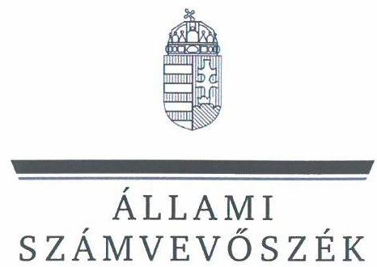
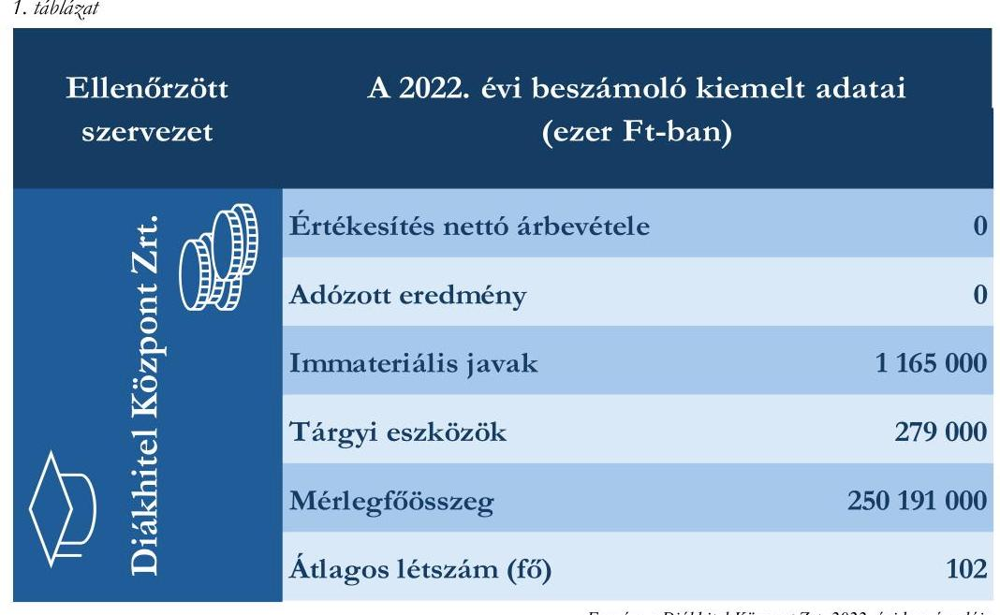

# JELENTÉS 

## Az állami vagyon feletti tulajdonosi joggyakorlással kapcsolatos tevékenységek ellenőrzése

MFB Magyar Fejlesztési Bank Zártkörűen Működő Részvénytársaság, Diákhitel Központ Zártkörűen Működő Részvénytársaság

2024.

---

ÁLLAMI
SZÁMVEVŐSZÉK

# JELENTÉS 

## Az állami vagyon feletti tulajdonosi joggyakorlással kapcsolatos tevékenységek ellenőrzése

MFB Magyar Fejlesztési Bank Zártkörűen Működő Részvénytársaság, Diákhitel Központ Zártkörűen Működő Részvénytársaság

2024.

---

# ELLENŐRZÉSI IGAZGATÓSÁG: 

ÁLLAMI VAGYONGAZDÁLKODÁST ELLENŐRZŐ IGAZGATÓSÁG

## ELLENŐRZÉSI IGAZGATÓ:

HERCZEGH ZSOLT ellenőrzési igazgató

## ELLENŐRZÉSVEZETŐ:

Jelentéseink az interneten a www.asz.hu címen olvashatók.

PENCZ MÁRIA ellenőrzésvezető

IKTATÓSZÁM: EL-3952-004/2024.
TÉMASZÁM: 2710
ELLENŐRZÉS-AZONOSÍTÓ SZÁM: V1054

---

# TARTALOMJEGYZÉK 

- AZ ELLENŐRZÉS ALAPADATAI ..... 5
- ELLENŐRZÖTT SZERVEZETEK ..... 7
- ÖSSZEFOGLALÁS ..... 8
- AZ ELLENŐRZÉS FÓKUSZTERÜLETEI ..... 10
- MEGÁLLAPÍTÁSOK ..... 11
- JAVASLATOK ..... 15
- MELLÉKLETEK ..... 16
I. sz. melléklet: Értelmező szótár ..... 16
II. sz. melléklet: Az ellenőrzött szervezetek jegyzéke ..... 18
III. sz. melléklet: Ellenőrzési kritériumok ..... 19
- FÜGGELÉK: ÉSZREVÉTELEK ..... 20
- RÖVIDÍTÉSEK JEGYZÉKE ..... 26

---

.

---

# AZ ELLENŐRZÉS ALAPADATAI 

## AZ ELLENŐRZÉS CÉLJA

Az ellenőrzés célja annak értékelése volt, hogy az állam tulajdonosi jogait gyakorló szervezet tulajdonosi joggyakorlása megfelelt-e a vonatkozó jogszabályok előírásainak.

## AZ ELLENŐRZÉS TÍPUSA

Megfelelőségi ellenőrzés

## AZ ELLENŐRZÖTT IDŐSZAK

A 2022. év. A 2022. évi számviteli törvény szerinti beszámoló elfogadását érintő döntések vonatkozásában a 2023. január 01-jétől 2023. május 31-ig tartó időszak.

## AZ ELLENŐRZÉS TÁRGYA

Az ellenőrzés tárgya az állami vagyon körébe tartozó részesedések feletti, a Magyar Állam nevében történő tulajdonosi joggyakorlással összefüggő tevékenységek ellenőrzése volt. Az ÁSZ ${ }^{1}$ a tulajdonosi joggyakorlás tényleges megvalósulását, teljeskörűségét a joggyakorlás alá tartozó gazdasági társaság állóeszközgazdálkodásának ellenőrzése keretében értékelte.

A gazdasági társaságnál - elsősorban annak állóeszköz-gazdálkodásán keresztül - az ÁSZ azt ellenőrizte, hogy a tulajdonos által előírt kötelezettségeket szabályszerűen teljesítette-e, továbbá, hogy a tulajdonosi joggyakorló a tulajdonosi tevékenységével hozzájárult-e az irányítása alatt álló gazdasági társaság szabályszerű és felelős gazdálkodásához.

Az ellenőrzés kiterjedt - a tulajdonosi joggyakorló joggyakorlása alatt álló gazdasági társaság állóeszközgazdálkodásán keresztül - annak értékelésére, hogy a tulajdonosi joggyakorlási tevékenység támogatta-e a tulajdonosi joggyakorlással érintett gazdasági társaság vagyonmegőrzési tevékenységét és az állami vagyonnal való felelős gazdálkodását. Az ellenőrzés kiterjedt a tulajdonosi joggyakorlás ellenőrzött időszakban hatályos belső szabályozási és ellenőrzési rendszere kialakításának és működtetésének ellenőrzésére, valamint a vonatkozó döntési és végrehajtási folyamatok értékelésére. Az ellenőrzés kiterjedt továbbá a tulajdonosi joggyakorló joggyakorlása alatt álló gazdasági társaság állóeszközzel való gazdálkodásának szabályszerűségére, valamint az ellenőrzött időszak állóeszközgazdálkodásával összefüggésben hozott döntések megalapozottságára, célszerűségére, valamint ezzel összefüggésben az állami vagyon értékének megőrzésére, védelmére, az állami vagyonnal való felelős gazdálkodás érvényesülésére.

Az ellenőrzés kiterjedt minden olyan körülményre és adatra, amely az ÁSZ jogszabályban meghatározott feladatainak teljesítéséhez, valamint a program végrehajtása folyamán felmerült újabb összefüggések feltárásához szükséges volt.

---

# Az ellenőrzés jogsalapja 

Az ellenőrzés jogszabályi alapját az ÁSZ tv. ${ }^{2}$ 5. § 4. bekezdésének, valamint a Vtv. ${ }^{3}$ 3. § 4. bekezdésének előírásai képezték.

## AZ ELLENŐRZÉS MÓDSZERE

Az ellenőrzés végrehajtása a nemzetközi standardokat irányadónak tekintve az ellenőrzési program szempontjai, az ellenőrzött időszakban hatályos jogszabályok, az ellenőrzés szakmai szabályok és módszertanok figyelembevételével történt.

Az ellenőrzési kérdések megválaszolásához szükséges bizonyítékok megszerzése az ellenőrzött szervezetek által rendelkezésre bocsátott dokumentumokra és adatokra alapozva, továbbá szemrevételezés, kérdésfeltevés (információkérés), elemző eljárás és mintavétel útján történt.

Az ellenőrzés lefolytatásához az ellenőrzött szervezetek tanúsítvány kitöltésével, valamint az ÁSZ által kért dokumentumok, adatok, információk megküldésével szolgáltattak adatokat. Az ellenőrzéshez az ÁSZ felhasználta a nyilvánosan elérhető közhiteles adatokat is.

Az ellenőrzési bizonyítékként felhasználható adatforrások közé tartoztak az ellenőrzési program részletes szempontjainál felsorolt adatforrások, valamint minden egyéb - az ellenőrzés folyamán feltárt, az ellenőrzés szempontjából releváns információt tartalmazó - dokumentum.

Az ÁSZ a tanúsítványi adatszolgáltatás alapján mintavételi eljárással kiválasztott tételek alapján ellenőrizte a gazdasági társaságok állóeszköz-gazdálkodásának megfelelőségét. A mintavételi eljárással érintett ellenőrzési területek értékelését további ellenőrzési szempontok is támogatták.

Az ellenőrzést az ÁSZ szabályszerűségi és célszerűségi szempontok alapján folytatta le. A tények feltárása és azok összegzése során a megállapítások az ellenőrzött mintatételre vonatkozóan kerültek megfogalmazásra.

Az ellenőrzés kitért minden olyan körülményre, amely a program végrehajtása kapcsán felmerült és az ellenőrzés céljával összhangban volt.

---

# ELLENŐRZÖTT SZERVEZETEK 

Az állami vagyon feletti tulajdonosi joggyakorlással kapcsolatos tevékenységek ellenőrzésének kötelezettségét a Vtv. és az ÁSZ tv. is előírja az ÁSZ számára.

Az ÁSZ tv.-ben rögzített előírás alapján az ÁSZ ellenőrzése kiterjedt a Magyar Állam nevében tulajdonosi jogokat gyakorló MFB Zrt. ${ }^{4}$-re és a joggyakorlása alatt álló Diákhitel Központ Zrt. ${ }^{5}$-re.

AZ MFB ZRT. 1991. december 1-jén kezdte meg működését, 100%-ban a Magyar Állam tulajdonában álló hitelintézet. Jogállását, feladatait és tevékenységi körét az MFB tv. ${ }^{6}$, valamint az MFB Zrt. Alapszabályának ${ }^{7}$ rendelkezései határozzák meg. Az MFB Zrt. az MFB tv. 3. § (5) bekezdése és 1. sz. melléklet 2. pontja alapján 2010. június 17-től gyakorolja a tulajdonosi jogokat a Diákhitel Központ Zrt. felett. Az MFB Zrt. nem központi kormányzati alszektorba besorolt szervezet és a Taktv. ${ }^{8}$ alapján nem tartozik a Gbkr. ${ }^{9}$ hatálya alá.

A DIÁKHITEL KÖZPONT ZRT.-t az Oktatási Minisztérium alapította 2001. április 27-én, a társaság a Magyar Állam 100%-os tulajdonában áll. A Diákhitel Központ Zrt. feladata a hallgatói és képzési hitelrendszer működtetését és a hallgatói és képzési hitelek folyósítása, nyilvántartása, nyereségcél nélkül, önfenntartó és önfinanszírozó módon. A mindenkori költségvetési törvény értelmében a Magyar Állam készfizető kezesként felel a Diákhitel Központ Zrt. azon fizetési kötelezettségeiért, amelyek a belföldről és külföldről, a diákhitelezési rendszer finanszírozása érdekében felvett hiteleiből erednek. A Diákhitel Központ Zrt. nem központi kormányzati alszektorba besorolt szervezet és a Taktv. alapján az ellenőrzött időszakban nem tartozott a Gbkr. hatálya alá.

A Diákhitel Központ Zrt. 2022. évi beszámolójának kiemelt adatait az 1. táblázat tartalmazza.

---

# ÖSSZEFOGLALÁS 

A nemzeti vagyon meghatározó részét képező állami vagyonnal való gazdálkodás szabályozási rendszere sokrétű. Az állami tulajdonban álló részesedések feletti tulajdonosi joggyakorlásra vonatkozó általános szabályokat az Nvtv. ${ }^{10}$, a Vtv., a további részletszabályokat a Vtv.vhr. ${ }^{11}$ tartalmazza.

Az Nvtv. meghatározza a nemzeti vagyon alapvető rendeltetését, és kimondja, hogy a nemzeti vagyonnal felelős módon kell gazdálkodni. A Vtv. szerint a tulajdonosi joggyakorlás és az állami vagyonnal való gazdálkodás alapvető feladata a vagyon rendeltetésszerű, hatékony és felelős felhasználásának biztosítása az állami vagyon értékének megőrzése, gyarapítása érdekében.

A részesedésekben megtestesülő állami vagyon értékének megőrzésére, növelésére alapvető befolyást gyakorol a gazdasági társaságok gazdálkodási tevékenysége.

Az állami tulajdonú gazdasági társaságok esetében a tulajdonosi joggyakorlás az államot, mint tulajdonost megillető jogoknak és kötelezettségeknek a gyakorlását jelenti. Az állami tulajdonban álló gazdálkodó szervezetek államot megillető társasági részesedései a nemzeti vagyon részét képezik és legfőbb rendeltetésük a közfeladatok ellátása. A nemzeti vagyonnal való felelős gazdálkodás érvényesítésében kiemelten fontos szerepe van a többségi állami tulajdonú gazdasági társaságok vezetői által meghozott, gazdálkodással összefüggő döntéshozatalnak, továbbá a meghozott, a társaság működésében meghatározó döntések szabályszerűségi, megalapozottsági és célszerűségi szempontból történő értékelésének. A felelős vagyongazdálkodás elveinek érvényesülése érdekében fontos továbbá a társaságok gazdálkodásával kapcsolatosan felmerülő kockázatok folyamatos értékelése, és olyan kontrollrendszer kialakítása, amely alkalmas a kockázatok minimalizálására és a meghozott döntések hatásainak nyomon követésére.

Az állam nevében tulajdonosi jogokat gyakorló szervezetek a tulajdonosi joggyakorlásuk alá tartozó gazdasági társaságoknál kötelesek érvényesíteni a cégvezetés felelősségét, valamint a közérdek érvényesülését biztosító vagyongazdálkodást. Ezért a tulajdonosi ellenőrzés és a felügyelőbizottságok társaságok feletti tulajdonosi felügyeletének erősítése fontos szerepet tölt be a gazdasági társaságok állami vagyonnal való felelős gazdálkodásában.

AZ MFB ZRT. tulajdonosi joggyakorlása megfelelt a jogszabályi előírásoknak. Az MFB Zrt. SZMSZ ${ }^{12}$-ében, továbbá a Diákhitel Központ Zrt. Alapszabályában ${ }^{13}$ a jogszabályi előírásokkal összhangban rögzítette a tulajdonosi joggyakorláshoz szükséges követelményeket, és a saját hatáskörébe vont jogokat. Az MFB Zrt. az eseti adatszolgáltatásokon túl a Diákhitel Központ Zrt. számára rendszeres, havi, negyedéves és éves beszámolási kötelezettséget írt elő a társaság tevékenységének, gazdálkodásának nyomon követése céljából. Az ellenőrzött időszakban az MFB Zrt. által a tulajdonosi joggyakorlás keretében hozott döntések szabályszerűek, megalapozottak és célszerűek voltak, összhangban álltak az Alapszabályban rögzített előírásokkal. A 2022. évben az MFB Zrt. Belső ellenőrzési Igazgatósága - a Hpt. ${ }^{14}$ előírásaival összhangban elkészített Belső Ellenőrzési Irányelv alapján - két tulajdonosi ellenőrzést végzett a Diákhitel Központ Zrt.-nél. Az MFB Zrt. tulajdonosi joggyakorlási tevékenysége hozzájárult a Diákhitel Központ Zrt. állami vagyonnal való felelős gazdálkodásához, az FB ${ }^{15}$ tevékenysége támogatta az MFB Zrt. tulajdonosi döntéseit. Az MFB Zrt. nem tett eleget az Infotv. ${ }^{16}$ szerinti közzétételi kötelezettségének, mivel a rábízott vagyonra vonatkozó 2022. éves költségvetési beszámolóját honlapján nem tette közzé.

A DIÁKHITEL KÖZPONT ZRT. az ellenőrzött időszakban gazdálkodási és működési kereteit a jogszabályi előírásoknak megfelelően alakította ki, a beszámolási feladatok végrehajtásának felelőseit

---

meghatározta. A Diákhitel Központ Zrt. vezérigazgatója az Alapszabályban rögzített előírásnak megfelelően elkészítette a társaság SZMSZ ${ }^{17}$-ét. A társaság a Számv. tv. ${ }^{18}$ előírásaival összhangban rendelkezett Számviteli politikával ${ }^{19}$ és annak keretében elkészítendő szabályzatokkal. A beszerzés szabályait a vezérigazgató az SZMSZ-ben előírtakkal összhangban Beszerzési szabályzatban ${ }^{20}$ és Közbeszerzési szabályzatban ${ }^{21}$ rögzítette. A Diákhitel Központ Zrt. az Alapszabályban rögzített adatszolgáltatási kötelezettségeit az ellenőrzött időszakban teljesítette az MFB Zrt. felé. A Számv. tv. előírásainak megfelelően elkészítette a 2022. évre vonatkozó beszámolóját, amelyet az MFB Zrt. elfogadott. A mintatételként kiválasztott, állóeszköz változásokkal kapcsolatos döntések szabályszerűek, megalapozottak és célszerűek voltak, mivel a döntéseket az Alapszabályban előírt értékhatároknak megfelelő döntéshozó a társaság céljaival összhangban hozta meg. Az állóeszköz változások számviteli elszámolása megfelelt a Számv. tv. előírásainak. A Diákhitel Központ Zrt. az Infotv.-ben előírt közzétételi kötelezettségeinek eleget tett.

---

# AZ ELLENŐRZÉS FÓKUSZTERÜLETEI 

1- Az állam tulajdonosi jogait gyakorló szervezet állami tulajdonban lévő gazdasági társaság feletti tulajdonosi joggyakorlással kapcsolatos tevékenységének megfelelősége.

2- A tulajdonosi joggyakorlás alá tartozó állami tulajdonú gazdasági társaság állóeszközökkel való gazdálkodásának megfelelősége, a gazdálkodási döntések szabályszerűsége, megalapozottsága és célszerűsége, valamint a felelős gazdálkodás elvének érvényesülése.

---

# MEGÁLLAPÍTÁSOK 

## 1. Az állam tulajdonosi jogait gyakorló szervezet állami tulajdonban lévő gazdasági társaság feletti tulajdonosi joggyakorlással kapcsolatos tevékenységének megfelelősége.

## Összegző megállapítás

Az MFB Zrt. Diákhitel Központ Zrt. feletti tulajdonosi joggyakorlással kapcsolatos tevékenysége megfelelő volt, hozzájárult az állami vagyonnal való felelős gazdálkodás elveinek érvényesüléséhez.

AZ MFB ZRT. SZMSZ-ében, a Diákhitel Központ Zrt. Alapszabályában, továbbá az előírt adatszolgáltatások alapján a Hpt., Ptk. és az MFB tv. előírásaival összhangban kialakította a tulajdonosi joggyakorlás kereteit. Az Alapszabályban a Ptk. ${ }^{22}$-ben előírt jogokon és kötelezettségeken felül az MFB Zrt. - mint legfőbb szerv - a saját hatáskörébe vont minden olyan kötelezettségvállalásról és tárgyi eszköz értékesítésről szóló döntést, amely nem szerepel a jóváhagyott éves üzleti tervben, és ami üzleti tervmódosítással jár együtt.
Az MFB Zrt.
 a Ptk. előírásainak megfelelően a Diákhitel Központ Zrt. Alapszabályában rendelkezett a társaság középtávú fejlesztési koncepcióinak (középtávú stratégiájának), üzleti tervének és éves beszámolójának jóváhagyásáról. Az Alapszabály a Ptk. előírásaival összhangban rögzítette az Alapító számára az FB, valamint a könyvvizsgáló írásbeli jelentésének birtokában a számviteli törvény szerinti beszámoló elfogadására, továbbá az adózott eredmény felhasználására vonatkozó döntési kötelezettségét. Az MFB Zrt. az MFB csoport társaságait érintő Adatszolgáltatás eljárási rendjében ${ }^{23}$ eseti és rendszeres (havi, negyedéves és éves) adatszolgáltatást írt elő a Diákhitel Központ Zrt. részére a társaság tevékenységéről és gazdálkodásáról.
Az MFB Zrt. döntéshozatali rendjét a Döntéshozatali Ügyrend ${ }^{24}$ határozta meg. A Döntéshozatali Ügyrend a Diákhitel Központ Zrt. Alapszabályával összhangban rögzítette az MFB Zrt. Ügyvezető Testületének hatáskörébe tartozó feladatokat, úgymint:

- a tulajdonolt és vagyonkezelt gazdálkodó szervezetek létesítő okiratának jóváhagyása és módosítása,
- a Számv. tv. szerinti éves beszámoló, a stratégia, valamint az éves, középtávú, valamint hosszú távú üzleti terv jóváhagyása.
Az MFB Zrt. a Hpt. előírásaival összhangban rendelkezett az ellátandó feladatokat, felelősségi köröket rögzítő, az igazgatóság által jóváhagyott SZMSZ-szel, amely tartalmazta a tulajdonosi joggyakorlással kapcsolatos feladatok felelőseit úgymint:
- a Stratégiai és Csoportirányítási Igazgatóság felel az MFB Zrt. tulajdonosi jogkörébe tartozó gazdasági társaságokkal kapcsolatos feladatok ellátásáért, továbbá előkészíti, előterjeszti és végrehajtja a befektetésekre és egyéb tulajdonosi döntési hatáskörbe tartozó ügyletekre vonatkozó tulajdonosi döntéseket;

---

- az Általános Jogi Osztály feladatai közé tartozott az MFB Zrt. tulajdonosi jogkörébe tartozó gazdasági társaságokkal kapcsolatos tevékenységekhez kapcsolódó alapítói határozatok előzetes véleményezése.
Az MFB Zrt. a Taktv. előírásaival összhangban megalkotta a Diákhitel Központ Zrt. javadalmazási szabályzatát, és a Ptk. előírásaival összhangban alapítói határozattal jóváhagyta az FB Ügyrendjét ${ }^{25}$.
Az MFB Zrt.-nek a Ptk.-ban és az Alapszabályban előírt ügyekben hozott döntései a 2022. évben szabályszerűek, megalapozottak és célszerűek voltak. A Diákhitel Központ Zrt. tulajdonosi joggyakorlójaként eljáró MFB Zrt. a 2022. évben 18 darab alapítói határozatot hozott. Az MFB Zrt. elé kerülő előterjesztéseket az FB a Ptk. előírásaival összhangban előzetesen megvizsgálta és határozatba foglalta az előterjesztésekkel kapcsolatos véleményét azok elfogadására vonatkozóan. A döntések előterjesztései tartalmazták a megalapozott döntéshozatalhoz szükséges információkat. MFB Zrt. a határozatait az FB javaslatának figyelembevételével hozta meg. Az FB tevékenysége támogatta az MFB Zrt. tulajdonosi döntéseit.
Az MFB Zrt. SZMSZ-ében előírtak szerint a Belső Ellenőrzési Igazgatóság volt jogosult tulajdonosi ellenőrzéseket végrehajtani a stratégiai csoportba tartozó társaságoknál, így többek között a Diákhitel Zrt-nél. A belső ellenőrzés részletes szabályait, irányelveit a Hpt. előírásainak megfelelően az 5/2021. számú Csoportszintű Irányelv ${ }^{26}$ tartalmazta. Az MFB Zrt. az 5/2021. számú Csoportszintű Irányelvben foglaltaknak megfelelően elkészítette a 2022. évre vonatkozó ellenőrzési tervét, amely értelmében a Belső ellenőrzési Igazgatóság a 2022. évben a Diákhitel Központ Zrt.-t érintően két tulajdonosi ellenőrzést végzett. A tulajdonosi ellenőrzések során a vagyonnyilatkozat-tételi kötelezettségek teljesítésével kapcsolatosan tártak fel hiányosságot. A tulajdonosi ellenőrzési megállapítások alapján megfogalmazott javaslatokban foglaltak kezelését az MFB Zrt. az 5/2021. számú Csoportszintű Irányelvben előírtaknak megfelelően nyomon követte.
Az MFB Zrt. az Infotv. 1. melléklete III. Gazdálkodási Adatok 1. Pontjában foglalt közzétételi kötelezettségének nem tett eleget, mivel a rábízott vagyonra vonatkozó 2022. éves költségvetési beszámolóját a honlapján nem tette közzé.

# 2. A tulajdonosi joggyakorlás alá tartozó állami tulajdonú gazdasági társaság állóeszközökkel való gazdálkodásának megfelelősége, a gazdálkodási döntések szabályszerűsége, megalapozottsága és célszerűsége, valamint a felelős gazdálkodás elvének érvényesülése. 

Összegző megállapítás A Diákhitel Központ Zrt. állóeszközökkel való gazdálkodása megfelelő volt, a gazdálkodási döntések szabályszerűek, megalapozottak és célszerűek voltak, érvényesült a felelős gazdálkodás elve.

A GAZDÁLKODÁSI ÉS MŰKÖDÉSI KERETEIT a Diákhitel Központ Zrt. a Ptk. és a Számv. tv. előírásainak megfelelően alakította ki, Alapszabályában a beszámolási feladatok végrehajtásának felelőseit meghatározta.

---

Az állóeszközgazdálkodással kapcsolatos döntési jogköröket az Alapszabály tartalmazta, amely szerint:

- a Diákhitel Központ Zrt. vezérigazgatója volt jogosult dönteni a bruttó 60,0 M Ft-ot el nem érő kötelezettségvállalásokról, valamint ezen értékhatárt el nem érő tárgyi eszköz értékesítésekről, amelyek nem igényelték az üzleti terv módosítását;
- a Diákhitel Központ Zrt. igazgatósága volt jogosult dönteni az üzleti tervben szereplő, bruttó 60,0 M Ft-ot elérő vagy meghaladó kötelezettségvállalásokról.
- az MFB Zrt., mint tulajdonosi joggyakorló volt jogosult dönteni minden olyan kötelezettségvállalásról és tárgyi eszköz értékesítésről, amely nem szerepelt a jóváhagyott éves üzleti tervben, és azokról, amelyek az üzleti terv módosításával jártak együtt.
A Diákhitel Központ Zrt. vezérigazgatója az Alapszabályban előírtakkal összhangban elkészítette a társaság SZMSZ-ét, amelyben rögzítésre került a szervezeti struktúra, a folyamatok, a felelősségi és határkörök. Az SZMSZ előírásai szerint az MFB Zrt. részére történő adatszolgáltatások, elfogadott tervek teljesülésének vizsgálata, monitoringja a Kontrolling és Treasury csoport feladata volt.
A Diákhitel Központ Zrt. a Számv. tv. előírásaival összhangban rendelkezett Számviteli politikával, és annak keretében elkészítendő Leltározási szabályzattal ${ }^{27}$, Értékelési szabályzattal ${ }^{28}$, Pénz-és értékkezelési szabályzattal ${ }^{29}$, valamint Számlarenddel. ${ }^{30}$ Az eszközök selejtezésének eljárásrendjét a Számviteli politika keretében elkészített Selejtezési szabályzat ${ }^{31}$ tartalmazta. A beszerzésekhez és közbeszerzésekhez kapcsolódó eljárási szabályokat, hatásköröket a Diákhitel Központ Zrt. a Kbt. ${ }^{32}$ előírásaival összhangban Beszerzési szabályzatban és Közbeszerzési szabályzatban rögzítette. A Számviteli politikában és a keretében elkészített szabályzatokban, valamint a Számlarendben az állóeszközök beszerzésével, nyilvántartásba vételével, értékelésével, leltározásával, a terven felüli értékcsökkenések, értékhelyesbítések elszámolásával kapcsolatosan rögzített szabályok összhangban voltak a Számv. tv. előírásaival.
A Diákhitel Központ Zrt.-nél a 2022. évben az Alapszabály előírásával összhangban 5 tagú FB működött. Az FB a Ptk. előírásának megfelelően rendelkezett az MFB Zrt. által jóváhagyott ügyrenddel. Az FB az ügyrendjében foglaltaknak megfelelően éves munkatervet készített a 2022. évre vonatkozóan, a munkatervében rögzített feladatokat elvégezte. A Diákhitel Központ Zrt. vezérigazgatója az FB részére a Ptk.-ban foglaltaknak megfelelően - negyedévente beszámolt a társaság tevékenységéről, gazdálkodásáról.
A Diákhitel Központ Zrt. a Számv. tv. előírásainak megfelelően elkészítette a 2022. évre vonatkozó beszámolóját. A 2022. évi beszámolót az FB megtárgyalta és elfogadásra javasolta. Az MFB Zrt. - a Ptk. előírásának megfelelően - az FB és a könyvvizsgáló írásbeli jelentése figyelembevételével döntött a beszámoló elfogadásáról.
A Diákhitel Központ Zrt. az MFB Zrt. által előírt adatszolgáltatási kötelezettségének az ellenőrzött időszakban eleget tett. Havi adatszolgáltatásként elkészítette a gazdálkodásának főbb adatait tartalmazó havi beszámolóit. Elkészítette továbbá a gazdálkodásának főbb adatait, az üzleti terv megvalósulását, döntéseket, intézkedést igénylő ügyeket tartalmazó negyedéves beszámolóit. Éves adatszolgáltatási kötelezettsége keretében - az MFB csoport társaságait érintő Adatszolgáltatás eljárási rendjében előírtaknak megfelelően - megküldte az MFB Zrt.-nek a 2022. évi Számv. tv. szerinti éves beszámolóját és üzleti jelentését.
A Diákhitel Központ Zrt. az Infotv. szerinti közzétételi kötelezettségének eleget tett, mivel a gazdálkodási adatokat és a tevékenységre, működésre vonatkozó adatokat honlapján közzétette.

---

AZ ÁLLÓESZKÖZ NŐVEKEDÉSSEL KAPCSOLATOS DÖNTÉSEK a kiválasztott mintatételek - informatikai fejlesztések, illetve informatikai beszerzések - vonatkozásában szabályszerűek, megalapozottak és célszerűek voltak. A döntési eljárások során betartották az Alapszabály, valamint a Beszerzési szabályzat rendelkezéseit. A döntéseket az Alapszabályban, illetve a Beszerzési szabályzatban előírt értékhatároknak megfelelő döntéshozó hozta, azok a társaság céljaival összhangban voltak. Az előterjesztések minden esetben tartalmazták a döntéshez szükséges adatokat. Az informatikai fejlesztések és beszerzések esetében a DKÜ rendeletben ${ }^{33}$ és a Beszerzési szabályzatban előírtaknak megfelelően minden esetben rendelkezésre állt a DKÜ ${ }^{34}$ beszerzésre vonatkozó előzetes engedélye.
AZ ÁLLÓESZKÖZ CSÖKKENÉSSEL KAPCSOLATOS DÖNTÉSEK a kiválasztott mintatételek - tárgyi eszköz értékesítések, selejtezések - tekintetében szabályszerűek és megalapozottak voltak. A tárgyi eszközök selejtezéséről és azok értékesítéséről a Selejtezési szabályzat előírásai alapján az arra jogosult vezető döntött a selejtezési bizottság írásbeli javaslata alapján. A számlák a szerződéssel és az adott ajánlattal összhangban kerültek kiállításra.
A SZERZŐDÉSEK MEGKÖTÉSE ÉS TELJESÍTÉSE a kiválasztott mintatételek vonatkozásában szabályszerű volt. A szerződések megkötése összhangban volt a beruházásra meghozott döntéssel, a kapott árajánlattal, teljesítésük szabályszerű volt. A beruházásokról a számla a szerződéssel és a teljesítésigazolással összhangban került kiállításra.
AZ ÁLLÓESZKÖZ-VÁLTOZÁSOK SZÁMVITELI ELSZÁMOLÁSA a kiválasztott mintatételek vonatkozásában megfelelt a Számv.tv. előírásainak. Az eszközök állományba vétele, aktiválása a Számv. tv.-ben és a Számviteli politikában, valamint Számlarendben előírtak szerint szabályszerűen megtörtént. Az eszközök leltározása a Leltározási szabályzatban előírtakkal összhangban történt. Az állóeszköz csökkenés mintatételei esetében az eszközök könyvekből történő kivezetése megfelelt a Számv.tv., Számviteli politika, illetve Selejtezési szabályzat előírásainak.

---

# JAVASLATOK 

Az ÁSZ tv. 33. § (1) bekezdésében foglaltak értelmében az ellenőrzött szervezet vezetője köteles a jelentésben foglalt megállapításokhoz kapcsolódó intézkedési tervet összeállítani és azt a jelentés kézhezvételétől számított 30 napon belül az ÁSZ részére megküldeni. Amennyiben az ellenőrzött szervezet vezetője nem küldi meg határidőben az intézkedési tervet, vagy továbbra sem elfogadható intézkedési tervet küld, az Állami Számvevőszék elnöke az ÁSZ tv. 33. § (3) bekezdése a) és b) pontjaiban foglaltakat érvényesítheti.

## AZ MFB ZRT. VEZÉRIGAZGATÓJA RÉSZÉRE

Intézkedjen az Info tv. 37. § (1) bekezdésében és az 1. melléklet III/1. pontjában foglaltak szerint a rábízott állami vagyon tekintetében elkészített éves költségvetési beszámoló honlapon történő közzétételéről.

---

# MELLÉKLETEK 

## I. SZ. MELLÉKLET: ÉRTELMEZŐ SZÓTÁR

állami vagyon
állóeszköz
állóeszköz-gazdálkodás
felelős gazdálkodás
gazdasági társaság

A Vtv. alkalmazásában állami vagyonnak minősül:
a) az állam tulajdonában lévő dolog, valamint dolog módjára hasznosít-ható természeti erő;
b) az a) pont hatálya alá tartozó mindazon vagyon, amely vonatkozásában törvény az állam kizárólagos tulajdonjogát nevesíti;
c) az állam tulajdonában lévő tagsági jogviszonyt megtestesítő értékpapír, illetve az államot megillető egyéb társasági részesedés;
d) az államot megillető olyan immateriális, vagyoni értékkel rendelkező jogosultság, amelyet jogszabály vagyoni értékű jogként nevesít;
e) az állam tulajdonában álló a befektetési vállalkozásokról és az árutőzsdei szolgáltatókról, valamint az általuk végezhető tevékenységek szabályairól szóló 2007. évi CXXXVIII. törvény szerinti pénzügyi eszköz,
f) azon országgyűlési képviselőről, aki más, Alaptörvényben nevesített közjogi tisztséget is betöltve közfeladatot lát el, e közfeladata ellátása körében vagy ezzel összefüggésben, költségvetési forrásból készített, szerzői vagy szomszédos jogi védelmet élvező műhöz vagy teljesítményhez, különösen kép-, illetve hangfelvételhez kapcsolódó, felhasználási szerződés útján vagy a szerzői jogról szóló törvény alapján megszerzett felhasználási engedély, illetve vagyoni jog.
(Forrás: Vtv. 1. § (2) bekezdés)
Az állóeszközök olyan eszközök, amelyek a társaság céljait hosszú távon szolgálják, egy éven túl a vállalkozás tulajdonában maradnak és szolgálják annak működését. Az állóeszközök között szerepelnek az immateriális javak és tárgyi eszközök (ideértve a beruházásokat, felújításokat, működtetést, fenntartást és karbantartást, illetve az ezekhez kapcsolódó adott előlegek, valamint a vagyonkezelésbe vett eszközöket is).
(Forrás: ÁSZ definíció)
Az állóeszköz-gazdálkodás, mint a gazdasági társaság működésének funkcionális részterülete magába foglalja az immateriális javakkal és tárgyi eszközökkel való gazdálkodást (ideértve a beruházásokat, felújításokat, működtetést, fenntartást és karbantartást, illetve az ezekhez kapcsolódó adott előlegek, valamint a vagyonkezelésbe vett eszközöket is) és a kapcsolódó költségeket,

 ráfordításokat, egyéb bevételeket (a támogatások kivételével).
(Forrás: ÁSZ definíció)
Az állami vagyon rendeltetésének megfelelő, - az állami feladatok ellátásához, a társadalmi szükségletek kielégítéséhez, valamint a Kormány gazdaságpolitikája megvalósításának elősegítéséhez szükséges, egységes elveken alapuló, önálló ágazatként megjelenő - hatékony, költségtakarékos, értékmegőrző, értéknövelő felhasználásának biztosítása érdekében történő gazdálkodás.
(Forrás: Vtv. 2. § (1) bekezdés)
A gazdasági társaságok üzletszerű közös gazdasági tevékenység folytatására, a tagok vagyoni hozzájárulásával létrehozott, jogi személyiséggel rendelkező vállalkozások, amelyekben a tagok a nyereségből közösen részesednek, és a veszteséget közösen viselik.
(Forrás: Ptk. 3:88. § (1) bekezdés)

---

létesítő okirat

nemzeti vagyon

többségi állami tulajdon
tulajdonosi joggyakorló
vagyongazdálkodás alapelvei

A jogi személy létrehozásáról a személyek szerződésben, alapító okiratban vagy alapszabályban szabadon rendelkezhetnek, a jogi személy szervezetét és működési szabályait maguk állapíthatják meg.
(Forrás: Ptk. 3:4. § (1) bekezdés)
Nemzeti vagyonba tartozik:
a) az állam vagy a helyi önkormányzat kizárólagos tulajdonában álló dolgok,
b) az a) pont hatálya alá nem tartozó, az állam vagy a helyi önkormányzat tulajdonában lévő dolog,
c) az állam vagy a helyi önkormányzat tulajdonában lévő pénzügyi eszközök, továbbá az államot vagy a helyi önkormányzatot megillető társasági részesedések,
d) az államot vagy a helyi önkormányzatot megillető bármely vagyoni értékkel rendelkező jogosultság, amelyet jogszabály vagyoni értékű jogként nevesít,
e) Magyarország határa által körbezárt terület feletti légtér,
f) az üvegházhatású gázok kibocsátási egységeinek kereskedelméről szóló törvény szerinti kibocsátási egység és légiközlekedési kibocsátási egység, valamint az ENSZ Eghajlat-változási Keretegyezménye és annak Kiotói Jegyzőkönyve végrehajtási keretrendszeréről szóló törvény szerinti kiotói egység,
g) állami vagy helyi önkormányzati fenntartású közgyűjtemény (muzeális intézmény, levéltár, közgyűjteményként működő kép- és hangarchívum, valamint könyvtár) saját gyűjteményében nyilvántartott kulturális javak körébe tartozó dolog, kivéve, ha a dolog más tulajdonában áll,
h) a régészeti lelet,
i) a nemzeti adatvagyon körébe tartozó állami nyilvántartások fokozottabb védelméről szóló törvény szerinti nemzeti adatvagyon.
(Forrás: Nvtv. 1. § (2) bekezdés)
Az állam tulajdonában lévő tagsági jogviszonyt megtestesítő értékpapír, illetve az állam tulajdonában lévő egyéb társasági részesedés, amennyiben a társaságban a Magyar Állam közvetlenül vagy közvetetten a szavazatok több mint felével rendelkezik.
(Forrás: ÁSZ definíció a Vtv. 1. § (2) bekezdés c) pontja és a Ptk. 8:2. § (1), (3)-(4) bekezdései alapján)
Aki a nemzeti vagyon felett az államot vagy a helyi önkormányzatot megillető tulajdonosi jogok és kötelezettségek összességének gyakorlására jogosult. (Forrás: Nvtv. 3. § (1) bekezdés 17. pont)
A nemzeti vagyon alapvető rendeltetése a közfeladat ellátásának biztosítása, ideértve a lakosság közszolgáltatásokkal való ellátását és e feladatok ellátásához szükséges infrastruktúra biztosítását. A nemzeti vagyonnal felelős módon, rendeltetésszerűen kell gazdálkodni.
A nemzeti vagyongazdálkodás feladata a nemzeti vagyon megőrzése, értékének és állagának védelme, rendeltetésének megfelelő, az állam, az önkormányzat mindenkori teherbíró képességéhez igazodó, elsődlegesen a közfeladatok ellátásához és a mindenkori társadalmi szükségletek kielégítéséhez szükséges, egységes elveken alapuló, átlátható, hatékony és költségtakarékos működtetése, értéknövelő használata, hasznosítása, gyarapítása, továbbá az állam vagy a helyi önkormányzat feladatának ellátása szempontjából feleslegessé váló vagyontárgyak elidegenítése, azzal, hogy a nemzeti vagyon megőrzése érdekében végzett bontás vagy átalakítás nem minősül az állagvédelmi kötelezettség megszegésének.
(Forrás: Nvtv. 7. § (1)-(2) bekezdései)

---

# II. SZ. MELLÉKLET: AZ ELLENŐRZÖTT SZERVEZETEK JEGYZÉKE 

## ELLENŐRZÖTT SZERVEZET NEVE

MFB Magyar Fejlesztési Bank Zártkörűen Működő Részvénytársaság
Diákhitel Központ Zártkörűen Működő Részvénytársaság

---

# III. SZ. MELLÉKLET: ELLENŐRZÉSI KRITÉRIUMOK 

## FOKUSZTERÜLET

1. Az állam tulajdonosi jogait gyakorló szervezet állami tulajdonban lévő gazdasági társaság feletti tulajdonosi joggyakorlással kapcsolatos tevékenységének megfelelősége.
2. A tulajdonosi joggyakorlás alá tartozó állami tulajdonú gazdasági társaság állóeszközökkel való gazdálkodásának megfelelősége, a gazdálkodási döntések szabályszerűsége, megalapozottsága és célszerűsége, valamint a felelős gazdálkodás elvének érvényesülése.

## ELLENŐRZÉSI KRITÉRIUMOK

Ptk. 3:4. §, 3:5. §, 3:21. § (3) bek., 3:24. § (1) bek., 3:26. § (1), (4) bek., 3:27. § (1) bek., 3:28. §, 3:35. §, 3:99/A. §, 3:102. §, 3:109. §, 3:120. (1)-(3) bek., 3:121. §, 3:122. §, 3:123. §, 3:270. §, 3:284. §
Taktv. 4. § (1)-(2) bek., 5. § (3) bek.
Nvtv. 7. § (1)-(2) bek.
Vtv. 2. § (1) bek.
Infotv. 37. § (1) bek., 1. melléklet
a gazdasági társaság létesítő okirata, a tulajdonosi joggyakorló belső szabályzatai
Nvtv. 7. § (1) bek.
Ptk. 3:4. § (1) bek., 3:21. § (1)-(3) bek., 3:109. § (2) bek., 3:112. § (2)-(3) bek., 3:270. § (1)-(3) bek., 6:58. §, 6:63. §, 6:191. §
Számv. tv. 4. § (1) bek., 8. §, 12. § (1) bek., 14. §, 17. § (1) bek., 19. § (1) bek., 26. §, 47-53. §, 57-59. §, 69. §, 77. § (1) bek., (3). bek. e) pont, 81. § (3) bek. e) és e) pont, 96. § (1) bek., 161. §, 161/A. §, 166. § (1) bek.
Kbt. 27. § (1) bek.
Infotv. 37. § (1) bek., 1. melléklet
Taktv. 2. §
a gazdasági társaság létesítő okirata, belső szabályzatok

---

# FÜGGELÉK: ÉSZREVÉTELEK 

A jelentéstervezetet a Számvevőszék 15 napos észrevételezésre megküldte az ellenőrzött szervezet vezetőjének az ÁSZ tv. 29. § (1) bekezdése előírásának megfelelően.

A jelentéstervezetben rögzített javaslatra az MFB Zrt. észrevételt tett. Az ÁSZ tv. 29. § (3) bekezdésével összhangban az ÁSZ a Függelékben feltünteti a megállapításokkal kapcsolatban tett, el nem fogadott észrevételeket, illetve az el nem fogadott észrevételek indoklását.

[^0]
[^0]:    * 29. § (1) Az Állami Számvevőszék az ellenőrzési megállapításait megküldi az ellenőrzött szervezet vezetőjének vagy az általa megbízott személynek, és annak, akinek személyes felelősségét állapította meg.
    (2) Az ellenőrzött szervezet vezetője és a felelősként megjelölt személy az ellenőrzés megállapításaira tizenöt napon belül írásban észrevételt tehet.
    (3) Az Állami Számvevőszék az észrevételre a beérkezésétől számított harminc napon belül írásban válaszol. A figyelembe nem vett észrevételeket köteles a jelentésben feltüntetni, és megindokolni, hogy azokat miért nem fogadta el.

---

# Herczegh Zsolt úr 

ellenőrzési igazgató, kiadmányozó részére
Állami Számvevőszék
Budapest
Iktatószám: 243-66/2024.

## Tisztelt Igazgató Úr!

2024. május 27-én köszönettel kézhez vettük az Állami Számvevőszék „Az állami vagyon feletti tulajdonosi joggyakorlással kapcsolatos tevékenységek ellenőrzése" című jelentéstervezetét (Ikt. szám: EL-3951-117/2024).

A jelentéstervezetben az alábbi javaslat került megfogalmazásra:

## AZ MFB ZRT. VEZÉRIGAZGATÓJA RÉSZÉRE

1. Iktassa be az Info tv. 37. § (1) bekezdésében és az 1. melléklet RE1. pontjában foglalt szerint a rábízott állami vagyon tekintetében elkészített éves költségvetési beszámoló honlapján történő közzétételéről.

Az MFB Magyar Fejlesztési Bank Zártkörűen Működő Részvénytársaság (a továbbiakban: Bank vagy MFB Zrt.) a jelentéstervezettel kapcsolatban az alábbi észrevételt kívánja tenni.

Az információs önrendelkezési jogról és az információszabadságról szóló 2011. évi CXII. törvény (a továbbiakban: Info törvény) 1. melléklet III/1. pontja szerint közzéteendő adat: „A közfeladatot ellátó szerv éves költségvetése, számviteli törvény szerint beszámolója vagy éves költségvetés beszámolója".

Értelmezésünk szerint az Info törvény 1. melléklet III/1. pontja vagylagosan fogalmazza meg a közzétételi kötelezettséget, miszerint a közfeladatot ellátó szervnek a számviteli törvény szerinti beszámolót vagy éves költségvetés beszámolót kell közzé tennie. Az MFB Zrt. a számviteli törvény hatálya alá tartozik, melyre tekintettel számviteli törvény szerinti beszámolót készít, melyet minden évben határidőre közzétesz. Véleményünk szerint ezzel a hivatkozott közzétételi kötelezettség teljesül.

Véleményünket arra alapozzuk továbbá, hogy a rábízott vagyonra vonatkozó éves költségvetési beszámoló közzétételét előíró rendelkezés az államháztartásról szóló törvény végrehajtásáról szóló 368/2011. (XII. 31.) Korm. rendelet 8. mellékletében szerepelt 2015.01.01-ig, azonban ezen jogszabályból ezt követően az adatszolgáltatási kötelezettség kikerült, továbbá semmilyen más jogszabályba nem került átemelésre:

---

„8. melléklet a 368/2011. (XII. 31.) Korm. rendelethez - A kötelezően közzéteendő közérdekű adatok:

| 18. | A rábízott vagyon eszközeinek és forrásainak mérlege | MFB Zrt. | MFB Zrt. honlapja | $\begin{aligned} & \text { Évente, } \\ & \text { beszámolókézhez } \\ & \text { időpontját } \\ & \text { követő } 15 \text { napon } \\ & \text { belül. } \end{aligned}$ | Az előző állapot nem törölhető. „ |
| :--: | :--: | :--: | :--: | :--: | :--: |

Ezen felül az államháztartás számviteléről szóló 4/2013. (I. 11.) Korm. rendelet (a továbbiakban: Áhsz.) a rábízott vagyonra vonatkozóan, az éves költségvetési beszámolóhoz kapcsolódó adatszolgáltatási kötelezettséget ír elő, közzétételi kötelezettséget nem állapít meg.

Az Áhsz. 33. § (3) bekezdése szerint „a tulajdonosi joggyakorló szervezet a 6. § (1) bekezdés e) pontja szerinti éves költségvetési beszámolót a költségvetési évet követő év június 30-áig készíti el és tölti fel a Kincstár által működtetett elektronikus adatszolgáltató rendszerbe az éves költségvetési beszámolót alátámasztó - könyvelési rendszerből előállított - teljes főkönyvi kivonattal együtt. A fejezetet irányító szerv a Kincstár által működtetett elektronikus rendszerbe feltöltött éves költségvetési beszámolót a fenti határidőt követő tíz napon belül felülvizsgálja és - annak javításának, kiegészítésének szükség szerinti elrendelését követően - jóváhagyja. „

Az Áhsz. fenti rendelkezésének a Bank minden év tekintetében eleget tett, a Kincstár által működtetett, KGR K11 rendszerbe feltöltésre, továbbá határidőben a tulajdonos részére megküldésre került az éves költségvetési beszámoló.

A fentieken túl a Bank az éves költségvetési beszámolót az MNV részére is megküldi az Országleltár adatszolgáltatás teljesítése során. Az Országleltár az állami vagyon nyilvántartására szolgál, és az MFB Zrt. által szolgáltatott adatok tekintetében nyilvános. Az MFB Zrt. tulajdonosi joggyakorlásában érintett vagyonkör 100%-ban Országleltár adatszolgáltatás köteles. Ezen adatok: https://orszagleltar.gov.hu oldalon megtekinthetőek.

A fentiekben leírtakra tekintettel kérjük a javaslat szíves felülvizsgálatát.
Budapest, 2024. május 31.
Tisztelettel:

| Dr. Sipos- | Digitálisan aláirta: Dr. Sipos-Tompa Levente |
| :--: | :--: |
| Tompa Levente | Dátum: 2024.05.31 09:31:30 +02'00' |
| dr. Sipos-Tompa Levente | Zátrok Ildikó Edit |
| elnök-vezérigazgató | vezérigazgató-helyettes |

MFB Magyar Fejlesztési Bank Zártkörűen Működő Részvénytársaság

---

# Dr. Sipos-Tompa Levente 

elnök-vezérigazgató
MFB Magyar Fejlesztési Bank Zártkörűen Működő Részvénytársaság

## Budapest

Tárgy: Válaszlevél ellenőrzéssel kapcsolatos észrevételek kezeléséről

## Tisztelt Elnök-vezérigazgató Úr!

„Az állami vagyon feletti tulajdonosi joggyakorlással kapcsolatos tevékenységek ellenőrzése" című ellenőrzéssel kapcsolatos, 2024. május 31-i keltezésű észrevételét köszönettel megkaptam.

Az Állami Számvevőszék észrevételre vonatkozó álláspontjáról az alábbi tájékoztatást adom:
Az észrevétel a jelentéstervezet rábízott állami vagyonról készített éves költségvetési beszámoló honlapján történő közzétételének hiányához kapcsolódó 1. számú megállapítás utolsó mondatához, az Összefoglalás rész 5. bekezdésének utolsó mondatához, valamint a jelentéstervezet 1. sz. javaslatához kapcsolódik.

Az észrevételben foglaltak szerint az információs önrendelkezési jogról és az információszabadságról szóló 2011. évi CXII. törvény (a továbbiakban: Infotv.) 1. melléklet III. Gazdálkodási adatok 1. pontja vagylagosan fogalmazza meg a közzétételi kötelezettséget, miszerint az MFB Zrt.-nek a számviteli törvény szerinti beszámolót vagy éves költségvetési beszámolót kell közzé tennie. Az MFB Zrt. kifejtette, hogy a társaság a számvitelről szóló 2000. évi C. törvény (a továbbiakban: Számv. tv.) hatálya alá tartozik, amelyre tekintettel Számv. tv. szerinti beszámolót készít, és azt minden évben határidőre közzéteszi. Az észrevételben foglaltak szerint a Számv. tv. szerinti beszámoló közzétételével a hivatkozott
 jogszabályi kötelezettség teljesül.

Az MFB Zrt. észrevételében kifejti, hogy a rábízott vagyonra vonatkozó éves költségvetési beszámoló közzétételét előíró rendelkezés az államháztartásról szóló törvény végrehajtásáról szóló 368/2011. (XII. 31.) kormányrendelet (a továbbiakban: Ávr.) 8. mellékletében szerepelt 2015. január 1-jéig, azonban ezen jogszabályból ezt követően az adatszolgáltatási kötelezettség kikerült, továbbá semmilyen más jogszabályba nem került átemelésre.

Az MFB Zrt. rögzíti továbbá észrevételében, hogy az államháztartás számviteléről szóló 4/2013. (I. 11.) kormányrendelet (a továbbiakban: Áhsz.) 33. § (3) bekezdése a rábízott vagyonra vonatkozóan az éves költségvetési beszámolóhoz kapcsolódó adatszolgáltatási kötelezettséget ír elő, de közzétételi kötelezettséget nem állapít meg, amelynek megfelelően az MFB Zrt. az éves költségvetési beszámolót minden évben a KGR rendszerbe feltölti, valamint a nemzetgazdasági miniszter részére megküldi.

Tájékoztatom Elnök-vezérigazgató urat, hogy az ellenőrzés álláspontja szerint az MFB Zrt. a tevékenységéhez kapcsolódóan a Számv. tv. alapján IFRS szerinti beszámoló, tulajdonosi joggyakorló szervezetként az Áhsz. szerinti éves költségvetési beszámoló készítésére kötelezett.
2016. január 1-jétől az Áhsz. 6. § (1) bekezdés e) pontja előírja, hogy „Éves költségvetési beszámoló készül a tulajdonosi joggyakorló szervezetek mérlegében kimutatható vagyonról és az általuk kezelt központi kezelésű előirányzatokról azok egészére.”

Az Infotv. hatálya alá tartozó közfeladatot ellátó szervezetként az Infotv. 37. § (1) bekezdése szerint a tevékenységéhez kapcsolódóan terheli az Infotv. általános közzétételi listájában szereplő gazdálkodási adatokra vonatkozó közzétételi kötelezettség. Az Infotv. 1. melléklet III. Gazdálkodási adatok 1. pontja közzéteendő adatként az éves költségvetést, a számviteli törvény szerinti beszámolót, vagy éves költségvetési beszámolót rögzíti. Az Infotv. 1. melléklet III. Gazdálkodási adatok 1. pontjában feltüntetett adatok esetében azokat kell az Infotv. 37. § (1) bekezdése alapján az MFB Zrt.-nek kötelezően közzétenni, amelyek a tevékenységéhez kapcsolódnak. A gazdálkodó szervezetek alapvetően Számv. tv. szerinti beszámolót vagy éves költségvetési beszámolót készítenek, ehhez igazodnak az Infotv. 1. melléklet III. Gazdálkodási adatok 1. pontjában feltüntetett adatok, de ez nem jelenti azt, hogy egy Számv. tv. szerinti beszámoló és egy éves költségvetési beszámoló készítésére is kötelezett közfeladat ellátó szerv jelen esetben MFB Zrt. - évente szabadon eldöntheti, hogy a vagylagos megfogalmazásra tekintettel a Számv. tv. szerinti beszámolót vagy az éves költségvetési beszámolót teszi közzé. Az Infotv. 1. melléklet III. Gazdálkodási adatok 1. pontjában feltüntetett adatok vagylagossága nem a közfeladat ellátó szerv választási jogosultságát jelenti, hanem a közfeladat ellátó szerv tevékenységéhez kapcsolódó beszámolók közzétételi kötelezettségét.

Az MFB Zrt. számára az Ávr. - a Számv. tv. szerinti beszámolóktól és az éves költségvetési beszámolótól függetlenül - 2014. december 31-éig határozott meg közzétételi kötelezettséget a rábízott vagyonnal kapcsolatos tranzakciók alakulása, a rábízott vagyon eszközeinek és forrásainak mérlege és a rábízott vagyonba tartozó gazdasági társaságok éves beszámolója vonatkozásában.

Az Ávr. 2014. december 31-éig hatályban lévő rendelkezései nem érintették az Infotv. rendelkezéseit, ahogyan az Ávr. 2015. január 1-jével történő módosulása sem hatott ki az Infotv. rendelkezéseire, és azon belül a közzétételi kötelezettségre sem.

Az MFB Zrt. számára 2014. december 31-éig az Infotv. és az Ávr. határozott meg közzétételi kötelezettséget. Az Infotv. az MFB Zrt. tevékenységéhez kapcsolódóan a Számv. tv. szerinti éves beszámolók és az Áhsz. szerinti éves költségvetési beszámoló vonatkozásában, az Ávr. pedig a rábízott vagyonnal kapcsolatos tranzakciók alakulása, a rábízott vagyon eszközeinek és forrásainak mérlege és a rábízott vagyonba tartozó gazdasági társaságok éves beszámolója vonatkozásában.

Az MFB Zrt. számára 2015. január 1-jétől az Infotv. határozott meg közzétételi kötelezettséget, amely az MFB Zrt. tevékenységéhez kapcsolódóan a Számv. tv. szerinti éves beszámolókra és az Áhsz. szerinti éves költségvetési beszámolóra terjed ki.

Tájékoztatom Elnök-vezérigazgató urat, hogy az MFB Zrt. egyrészt a Számv. tv. szerinti vállalkozó, másrészt az Áhsz. szerinti tulajdonosi joggyakorló szervezet, ezért a tevékenységéhez kapcsolódóan a Számv. tv. szerinti éves beszámolót és az Áhsz. szerinti éves költségvetési beszámolót is elkészíti, így esetében a tevékenységéhez kapcsolódó közzétételi kötelezettség mind a Számv. tv. szerinti éves beszámolóra, mind az Áhsz. szerinti éves költségvetési beszámolóra kiterjed.

Mindezek alapján az Állami Számvevőszék megállapítása helytálló, a jelentéstervezet módosítása nem indokolt.

Budapest, időbélyegző szerint

Tisztelettel:
az Állami Számvevőszék elnöke nevében:
Herczegh Zsolt
ellenőrzési igazgató, kiadmányozó
Állami Számvevőszék
Állami vagyongazdálkodást ellenőrző igazgatóság

# RÖVIDÍTÉSEK JEGYZÉKE 

${ }^{1}$ ÁSZ
${ }^{2}$ ÁSZ tv.
${ }^{3}$ Vtv.
${ }^{4}$ MFB Zrt.
${ }^{5}$ Diákhitel Központ Zrt.
${ }^{6}$ MFB tv.
${ }^{7}$ MFB Alapszabály
${ }^{8}$ Taktv.
${ }^{9}$ Gbkr.
${ }^{10}$ Nvtv.
${ }^{11}$ Vtv.vhr.
${ }^{12}$ MFB Zrt. SZMSZ
${ }^{13}$ Alapszabály
${ }^{14}$ Hpt.
${ }^{15}$ FB
${ }^{16}$ Infotv.
${ }^{17}$ SZMSZ
${ }^{18}$ Számv. tv.
${ }^{19}$ Számviteli politika
${ }^{20}$ Beszerzési szabályzat
${ }^{21}$ Közbeszerzési szabályzat
${ }^{22}$ Ptk.
${ }^{23}$ Adatszolgáltatás eljárási rendje

Állami Számvevőszék
2011. évi LXVI. törvény - az Állami Számvevőszékről
2007. évi CVI. törvény - az állami vagyonról

MFB Magyar Fejlesztési Bank Zártkörűen Működő Részvénytársaság
Diákhitel Központ Zártkörűen Működő Részvénytársaság
2001. évi XX. törvény a Magyar Fejlesztési Bank Részvénytársaságról

Magyar Fejlesztési Bank Részvénytársaság módosításokkal egységes szerkezetbe foglalt Alapszabály
2009. évi CXXII. törvény - a köztulajdonban álló gazdasági társaságok takarékosabb működéséről
339/2019. (XII. 23.) Korm. rendelet - a köztulajdonban álló gazdasági társaságok belső kontrollrendszeréről
2011. évi CXCVI. törvény - a nemzeti vagyonról
254/2007. (X.4.) Korm. rendelet az állami vagyonnal való gazdálkodásról)
MFB Zrt. Igazgatóságának a 41/2021. (III.10.) számú határozata a Szervezeti és
Működési Szabályzat (hatályos: 2021. március 11-től 2022. március 31-ig)
MFB Zrt. Igazgatóságának a 41/2022. (III.28.) számú határozata a Szervezeti és
Működési Szabályzat (hatályos: 2022. április 1-től 2022. május 31-ig)
MFB Zrt. Igazgatóságának a 73/2022. (V.31.) számú határozata a Szervezeti és
Működési Szabályzat (hatályos: 2022. június 1-től)
A Diákhitel Központ Zártkörűen Működő Részvénytársaság Alapszabálya (hatályos 2021.06.14-től)
2013. évi CCXXXVII. törvény a hitelintézetekről és a pénzügyi vállalkozásokról

Diákhitel Központ Zártkörűen Működő Részvénytársaság Felügyelőbizottsága
2011. évi CXII. törvény az információs önrendelkezési jogról és az információszabadságról
31/2021. sz. vezérigazgatói utasítás a Diákhitel Központ Zrt. Szervezeti és Működési Szabályzatáról (hatályos 2021.05.31-től 2022.05.30-ig)
9/2022. sz. vezérigazgatói utasítás a Diákhitel Központ Zrt. Szervezeti és Működési Szabályzatáról (hatályos 2022.05.31-től 2022.07.28-ig)
36/2022. sz. vezérigazgatói utasítás a Diákhitel Központ Zrt. Szervezeti és Működési Szabályzatáról (hatályos 2022.07.29-től)
2000. évi C. törvény a számvitelről
13/2021. sz. vezérigazgatói utasítás a Diákhitel Központ Zrt. Számviteli Politikájáról (hatályos 2021.04.23-től 2022.03.30-ig)
15/2022. sz. vezérigazgatói utasítás a Diákhitel Központ Zrt. Számviteli Politikájáról (hatályos 2022.03.31-től)
16/2020. sz. vezérigazgatói utasítás a Diákhitel Központ Zrt. Beszerzési szabályzatáról (hatályos 2020.06.29-től 2022.03.03-ig)
12/2022. sz. vezérigazgatói utasítás a Diákhitel Központ Zrt. Beszerzési szabályzatáról (hatályos 2022.03.04-től 2022.04.07-ig)
18/2022. sz. vezérigazgatói utasítás a Diákhitel Központ Zrt. Beszerzési szabályzatáról (hatályos 2022.04.08-tól)
2/2021. sz. vezérigazgatói utasítás a Diákhitel Központ Zrt. közbeszerzések kezdeményezéseinek rendjéről szóló szabályzatról (hatályos 2021.01.12-től)
2013. évi V. törvény - a Polgári Törvénykönyvről
1/2020. számú Csoportszintű Utasítás Az MFB csoport társaságait érintő adatszolgáltatás eljárási rendje

| 24 Döntéshozatali Ügyrend | 1/2022. számú Csoportszintű Utasítás Az MFB csoport társaságait érintő adatszolgáltatás eljárási rendje |  |  |  |  |   |
| --- | --- | --- | --- | --- | --- | --- |
|   | MFB Zrt. 2/2021. számú Döntéshozatali Ügyrendje (hatályos: 2021.11.23-től 2022.03.31-ig) |  |  |  |  |   |
|   | MFB Zrt. 1/2022. számú Döntéshozatali Ügyrendje (hatályos: 2022.04.01-től 2022.04.07-ig) |  |  |  |  |   |
|   | MFB Zrt. 2/2022. számú Döntéshozatali Ügyrendje (hatályos: 2022.04.08-től 2022.05.31-ig) |  |  |  |  |   |
|   | MFB Zrt. 3/2022. számú Döntéshozatali Ügyrendje (hatályos: 2022.06.01-től 2022.06.22-ig) |  |  |  |  |   |
|   | MFB Zrt. 4/2022. számú Döntéshozatali Ügyrendje (hatályos: 2022.06.23-től) |  |  |  |  |   |
|  25 FB Ügyrend | a Diákhitel Központ Zártkörűen Működő Részvénytársaság Felügyelőbizottságának Ügyrendje |  |  |  |  |   |
|  26 Csoportszintű Irányelv | MFB Zrt. 5/2021. számú Csoportszintű Belső Ellenőrzési Irányelv |  |  |  |  |   |
|  27 Leltározási szabályzat | A Diákhitel Zrt. Leltározási szabályzata-15/2022. sz. vezérigazgatói utasítás a Diákhitel Központ Zrt. Számviteli Politikájáról-4. sz. függelék |  |  |  |  |   |
|  28 Értékelési szabályzat | A Diákhitel Zrt. Értékkezelési szabályzata-15/2022. sz. vezérigazgatói utasítás a Diákhitel Központ Zrt. Számviteli Politikájáról-7. sz. függelék |  |  |  |  |   |
|  29 Pénz-és értékkezelési szabályzattal | A Diákhitel Zrt. Pénz-és értékkezelési szabályzata-15/2022. sz. vezérigazgatói utasítás a Diákhitel Központ Zrt. Számviteli Politikájáról-3. sz. függelék |  |  |  |  |   |
|  30 Számlarend | 32/2021. számú vezérigazgatói utasítás a Diákhitel Központ Zrt. Számlarendjéről (hatályos 2021.06.24-től – 2022.06.06-ig) |  |  |  |  |   |
|  31 Selejtezési szabályzat | 30/2022. számú vezérigazgatói utasítás a Diákhitel Központ Zrt. Számlarendjéről (hatályos 2022.06.07-től) |  |  |  |  |   |
|  32 Kbt. | A Diákhitel Zrt. Selejtezési szabályzata-15/2022. sz. vezérigazgatói utasítás a Diákhitel Központ Zrt. Számviteli Politikájáról-5. sz. függelék |  |  |  |  |   |
|  33 DKÜ rendelet | 2015. évi CXLIII. törvény a közbeszerzésekről |  |  |  |  |   |
|  34 DKÜ | 301/2018. (XII. 27.) Korm. rendelet a Nemzeti Hírközlési és Informatikai Tanácsról, valamint a Digitális Kormányzati Ügynökség Zártkörűen Működő Részvénytársaság és a kormányzati informatikai beszerzések központosított közbeszerzési rendszeréről |  |  |  |  |   |
|   | Digitális Kormányzati Ügynökség Zrt. |  |  |  |  |   |

1052 Budapest, Apáczai Csere János u. 10. | 1364 Budapest 4., Pf. 54
www.asz.hu | szamvevoszek@asz.hu
telefon: +36 14849100

