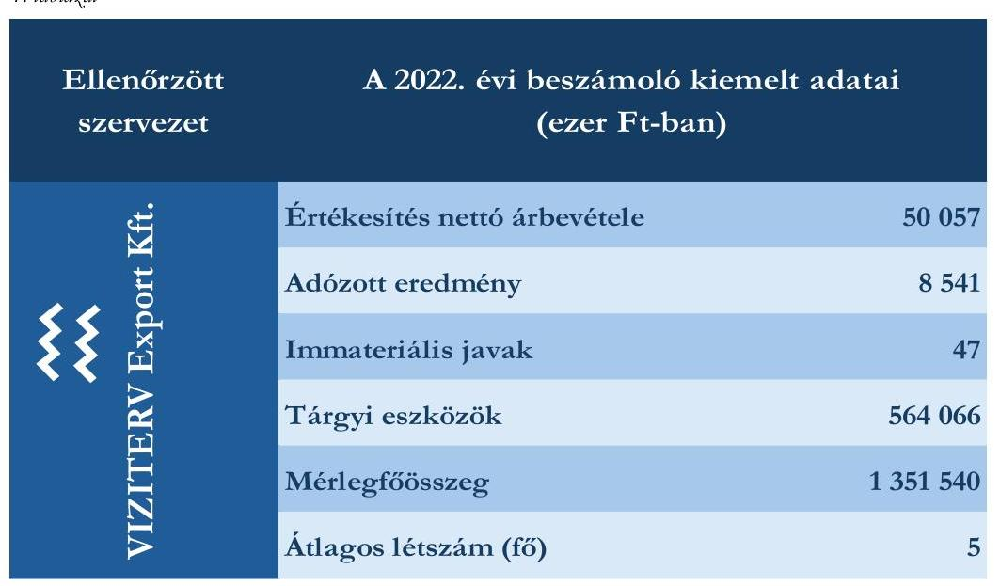

# JELENTÉS 

## Az állami vagyon feletti tulajdonosi joggyakorlással kapcsolatos tevékenységek ellenőrzése

Országos Vízügyi Főigazgatóság, VIZITERV Export Környezetvédelmi és Vízügyi Tervező, Tanácsadó és Szolgáltató Korlátolt Felelősségű Társaság

2024.

---

# ELLENŐRZÉSI IGAZGATÓSÁG: 

## ÁLLAMI VAGYONGAZDÁLKODÁST ELLENŐRZŐ IGAZGATÓSÁG

## ELLENŐRZÉSI IGAZGATÓ:

HERCZEGH ZSOLT ellenőrzési igazgató

## ELLENŐRZÉSVEZETŐ:

Jelentéseink az interneten a www.asz.hu címen olvashatók.

PENCZ MÁRIA ellenőrzésvezető

IKTATÓSZÁM: EL-3952-003/2024.
TÉMASZÁM: 2710
ELLENŐRZÉS-AZONOSÍTÓ SZÁM: V1054

---

# TARTALOMJEGYZÉK 

- AZ ELLENŐRZÉS ALAPADATAI ..... 5
- AZ ELLENŐRZÖTT SZERVEZETEK ..... 7
- ÖSSZEFOGLALÁS ..... 8
- AZ ELLENŐRZÉS FÓKUSZTERÜLETEI ..... 10
- MEGÁLLAPÍTÁSOK ..... 11
- JAVASLATOK ..... 14
- MELLÉKLETEK ..... 15
I. sz. melléklet: Értelmező szótár ..... 15
II. sz. melléklet: Az ellenőrzött szervezetek jegyzéke ..... 17
III. sz. melléklet: Ellenőrzési kritériumok ..... 18
- FÜGGELÉK: ÉSZREVÉTELEK ..... 19
- RÖVIDÍTÉSEK JEGYZÉKE ..... 20

---

.

---

# AZ ELLENŐRZÉS ALAPADATAI 

## AZ ELLENŐRZÉS CÉLJA

Az ellenőrzés célja annak értékelése volt, hogy az állam tulajdonosi jogait gyakorló szervezet tulajdonosi joggyakorlása megfelelt-e a vonatkozó jogszabályok előírásainak.

## AZ ELLENŐRZÉS TÍPUSA

Megfelelőségi ellenőrzés

## AZ ELLENŐRZÖTT IDŐSZAK

A 2022. év. A 2022. évi számviteli törvény szerinti beszámoló elfogadását érintő döntések vonatkozásában a 2023. január 01-jétől 2023. május 31-ig tartó időszak.

## AZ ELLENŐRZÉS TÁRGYA

Az ellenőrzés tárgya az állami vagyon körébe tartozó részesedések feletti, a Magyar Állam nevében történő tulajdonosi joggyakorlással összefüggő tevékenységek ellenőrzése volt. Az ÁSZ ${ }^{1}$ a tulajdonosi joggyakorlás tényleges megvalósulását, teljeskörűségét a joggyakorlás alá tartozó gazdasági társaság állóeszközgazdálkodásának ellenőrzése keretében értékelte.

A gazdasági társaságnál - elsősorban annak állóeszköz-gazdálkodásán keresztül - az ÁSZ azt ellenőrizte, hogy a tulajdonos által előírt kötelezettségeket szabályszerűen teljesítette-e, továbbá, hogy a tulajdonosi joggyakorló a tulajdonosi tevékenységével hozzájárult-e az irányítása alatt álló gazdasági társaság szabályszerű és felelős gazdálkodásához.

Az ellenőrzés kiterjedt - a tulajdonosi joggyakorló joggyakorlása alatt álló gazdasági társaság állóeszközgazdálkodásán keresztül - annak értékelésére, hogy a tulajdonosi joggyakorlási tevékenység támogatta-e a tulajdonosi joggyakorlással érintett gazdasági társaság vagyonmegőrzési tevékenységét és az állami vagyonnal való felelős gazdálkodását. Az ellenőrzés kiterjedt a tulajdonosi joggyakorlás ellenőrzött időszakban hatályos belső szabályozási és ellenőrzési rendszere kialakításának és működtetésének ellenőrzésére, valamint a vonatkozó döntési és végrehajtási folyamatok értékelésére. Az ellenőrzés kiterjedt továbbá a tulajdonosi joggyakorló joggyakorlása alatt álló gazdasági társaság állóeszközzel való gazdálkodásának szabályszerűségére, valamint az ellenőrzött időszak állóeszközgazdálkodásával összefüggésben hozott döntések megalapozottságára, célszerűségére, valamint ezzel összefüggésben az állami vagyon értékének megőrzésére, védelmére, az állami vagyonnal való felelős gazdálkodás érvényesülésére.

Az ellenőrzés kiterjedt minden olyan körülményre és adatra, amely az ÁSZ jogszabályban meghatározott feladatainak teljesítéséhez, valamint a program végrehajtása folyamán felmerült újabb összefüggések feltárásához szükséges volt.

---

# Az ellenőrzés jogsalapja 

Az ellenőrzés jogszabályi alapját az ÁSZ tv. ${ }^{2}$ 5. § 4. bekezdésének, valamint a Vtv. ${ }^{3}$ 3. § 4. bekezdésének előírásai képezték.

## AZ ELLENŐRZÉS MÓDSZERE

Az ellenőrzés végrehajtása a nemzetközi standardokat irányadónak tekintve az ellenőrzési program szempontjai, az ellenőrzött időszakban hatályos jogszabályok, az ellenőrzés szakmai szabályok és módszertanok figyelembevételével történt.

Az ellenőrzési kérdések megválaszolásához szükséges bizonyítékok megszerzése az ellenőrzött szervezetek által rendelkezésre bocsátott dokumentumokra és adatokra alapozva, továbbá szemrevételezés, kérdésfeltevés (információkérés), elemző eljárás és mintavétel útján történt.

Az ellenőrzés lefolytatásához az ellenőrzött szervezetek tanúsítvány kitöltésével, valamint az ÁSZ által kért dokumentumok, adatok, információk megküldésével szolgáltattak adatokat. Az ellenőrzéshez az ÁSZ felhasználta a nyilvánosan elérhető közhiteles adatokat is.

Az ellenőrzési bizonyítékként felhasználható adatforrások közé tartoztak az ellenőrzési program részletes szempontjainál felsorolt adatforrások, valamint minden egyéb - az ellenőrzés folyamán feltárt, az ellenőrzés szempontjából releváns információt tartalmazó - dokumentum.

Az ÁSZ tanúsítványi adatszolgáltatás alapján mintavételi eljárással kiválasztott tételek alapján ellenőrizte a gazdasági társaságok állóeszköz-gazdálkodásának megfelelőségét. A mintavételi eljárással érintett ellenőrzési területek értékelését további ellenőrzési szempontok is támogatták.

Az ellenőrzést az ÁSZ szabályszerűségi és célszerűségi szempontok alapján folytatta le. A tények feltárása és azok összegzése során a megállapítások az ellenőrzött mintatételre vonatkozóan kerültek megfogalmazásra.

Az ellenőrzés kitért minden olyan körülményre, amely a program végrehajtása kapcsán felmerült és az ellenőrzés céljával összhangban volt.

---

# AZ ELLENŐRZÖTT SZERVEZETEK 

Az állami vagyon feletti tulajdonosi joggyakorlással kapcsolatos tevékenységek ellenőrzésének kötelezettségét a Vtv. és az ÁSZ tv. is előírja az ÁSZ számára.

Az ÁSZ tv.-ben rögzített előírás alapján az ÁSZ ellenőrzése kiterjedt a Magyar Állam nevében tulajdonosi jogokat gyakorló OVF${ }^{4}$-re és a joggyakorlása alatt álló VIZITERV Export Kft. ${ }^{5}$-re.

AZ OVF a vízügyi igazgatási szervek irányításáért felelős miniszter irányítása alá tartozó központi költségvetési szerv, irányító szerve a Belügyminisztérium. Hatásköre az ország egész területére kiterjed, irányítása alatt 12 területi Vízügyi Igazgatóság működik. Jogállását a vízügyi igazgatási és a vízügyi, valamint a vízvédelmi hatósági feladatokat ellátó szervek kijelöléséről szóló, 223/2014. (IX. 4.) Korm. rendelet határozza meg. Feladatai közé tartozik többek között a területi vízügyi igazgatóságok szakmai tevékenységének irányítása, koordinálása, ellenőrzése, a vizek kártételei elleni védelemmel kapcsolatos feladatok ellátása, továbbá az országos és területi vízgazdálkodási stratégiájának és a hazai vízgazdálkodás nemzetközi feladatainak a kialakítása.

A VIZITERV EXPORT KFT. 2017.12.12-én alakult, a Magyar Állam 100%-os tulajdonában áll. 2022. május 26-ig az egyes állami tulajdonban álló gazdasági társaságok felett az államot megillető tulajdonosi jogok és kötelezettségek összességét gyakorló személyek kijelöléséről szóló, 1/2018. (VI. 25.) NVTNM rendelet ${ }^{6}$, azt követően az 1/2022. (V. 26.) GFM rendelet ${ }^{7}$ 2. §-a alapján, a VIZITERV Export Kft. felett az államot megillető tulajdonosi jogok és kötelezettségek összességét az OVF gyakorolja. Alapító Okirata szerint a társaság elsődleges célja Magyarország vízdiplomáciai érdekeinek, külgazdasági stratégiáinak megfelelően, a Magyarországon kívüli vízgazdálkodási fejlesztések előkészítése, tervezése, azonban eseti jelleggel belföldi fejlesztési feladatokat is ellát. A VIZITERV Export Kft. nem minősült a kormányzati alszektorba besorolt szervezetnek és a Taktv. ${ }^{8}$ alapján az ellenőrzött időszakban nem tartozott a Gbkr. ${ }^{9}$ hatálya alá.

A VIZITERV Export Kft. 2022. évi beszámolójának kiemelt adatait az 1. táblázat tartalmazza.
1. táblázat

---

# ÖSSZEFOGLALÁS 

A nemzeti vagyon meghatározó részét képező állami vagyonnal való gazdálkodás szabályozási rendszere sokrétű. Az állami tulajdonban álló részesedések feletti tulajdonosi joggyakorlásra vonatkozó általános szabályokat az Nvtv. ${ }^{10}$, a Vtv., a további részletszabályokat a Vtv.vhr. ${ }^{11}$ tartalmazza.

Az Nvtv. meghatározza a nemzeti vagyon alapvető rendeltetését, és kimondja, hogy a nemzeti vagyonnal felelős módon kell gazdálkodni. A Vtv. szerint a tulajdonosi joggyakorlás és az állami vagyonnal való gazdálkodás alapvető feladata a vagyon rendeltetésszerű, hatékony és felelős felhasználásának biztosítása az állami vagyon értékének megőrzése, gyarapítása érdekében.

A részesedésekben megtestesülő állami vagyon értékének megőrzésére, növelésére alapvető befolyást gyakorol a gazdasági társaságok gazdálkodási tevékenysége.

Az állami tulajdonú gazdasági társaságok esetében a tulajdonosi joggyakorlás az államot, mint tulajdonost megillető jogoknak és kötelezettségeknek a gyakorlását jelenti. Az állami tulajdonban álló gazdálkodó szervezetek államot megillető társasági részesedései a nemzeti vagyon részét képezik és legfőbb rendeltetésük a közfeladatok ellátása. A nemzeti vagyonnal való felelős gazdálkodás érvényesítésében kiemelten fontos szerepe van a többségi állami tulajdonú gazdasági társaságok vezetői által meghozott, gazdálkodással összefüggő döntéshozatalnak, továbbá a meghozott, a társaság működését meghatározó döntések szabályszerűségi, megalapozottsági és célszerűségi szempontból történő értékelésének. A felelős vagyongazdálkodás elveinek érvényesülése érdekében fontos továbbá a társaságok gazdálkodásával kapcsolatosan felmerülő kockázatok folyamatos értékelése, és olyan kontrollrendszer kialakítása, amely alkalmas a kockázatok minimalizálására és a meghozott döntések hatásainak nyomon követésére.

Az állam nevében tulajdonosi jogokat gyakorló szervezetek a tulajdonosi joggyakorlásuk alá tartozó gazdasági társaságoknál kötelesek érvényesíteni a cégvezetés felelősségét, valamint a közérdek érvényesülését biztosító vagyongazdálkodást. Ezért a tulajdonosi ellenőrzés és a felügyelőbizottságok társaságok feletti tulajdonosi felügyeletének erősítése fontos szerepet tölt be a gazdasági társaságok állami vagyonnal való felelős gazdálkodásában.

Az OVF tulajdonosi joggyakorlása megfelelt a jogszabályi előírásoknak. A tulajdonosi joggyakorlás kereteit a VIZITERV Export Kft. Alapító Okiratában ${ }^{12}$ kialakította, azonban a tulajdonosi joggyakorlói feladatai ellátásának részletes belső rendjét és módját az Áht. ${ }^{13}$ előírásai ellenére SZMSZ ${ }^{14}$-ében nem szabályozta. Az ellenőrzött időszakban a VIZITERV Export Kft. Alapító Okiratában rögzítette a tulajdonosi joggyakorláshoz szükséges egyes követelményeket. Saját hatáskörébe utalta meghatározott értékhatár felett az állóeszközök értékesítéséhez és beszerzéséhez kapcsolódó jogokat, a Ptk. ${ }^{15}$-nak megfelelően rendelkezett a társaság üzleti tervének és éves beszámolójának jóváhagyásáról. Az OVF az egyszeri adatszolgáltatásokon túl a VIZITERV Export Kft. Alapító Okiratában rendszeres beszámolási kötelezettséget írt elő az ügyvezetőnek a társaság vagyoni helyzetéről. Az ellenőrzött időszakban az OVF által a tulajdonosi joggyakorlás keretében hozott döntések szabályszerűek, megalapozottak és célszerűek voltak, mivel a döntéseket az Alapító Okiratában előírt értékhatároknak megfelelő döntéshozó hozta, azok a társaság céljaival összhangban voltak. Az OVF tulajdonosi joggyakorlási tevékenysége hozzájárult a VIZITERV Export Kft. állami vagyonnal való felelős gazdálkodás elveinek érvényesüléséhez, az FB ${ }^{16}$ tevékenysége támogatta az OVF tulajdonosi döntéseit. Az OVF az Infotv. ${ }^{17}$ szerinti közzétételi kötelezettségeinek eleget tett.

---

Az OVF főigazgatója a jelentéstervezet megállapításaira észrevételt nem tett, azonban az észrevételezés időszakában tájékoztatást adott a feltárt hiányosság megszüntetése érdekében megkezdett intézkedésről. Ezzel az OVF-nél az ÁSZ megállapítása az ellenőrzés során hasznosult.

A VIZITERV EXPORT KFT. gazdálkodási és működési kereteit a jogszabályi előírásoknak megfelelően alakította ki. Az Alapító Okiratban meghatározták az Ügyvezető, és az FB feladatait, döntési, hatásköri, és felelősségi viszonyát. Számviteli szabályozottsága megfelelő volt, rendelkezett Számviteli politikával ${ }^{18}$ és annak keretében elkészítendő szabályzatokkal. A beszerzés szabályait a Közbeszerzési, beszerzési szabályzat ${ }^{19}$ tartalmazta. Az OVF által a VIZITERV Export Kft. Alapító Okiratában előírt adatszolgáltatási kötelezettségeit összességében teljesítette az ellenőrzött időszakban. A Számv. tv. ${ }^{20}$ előírásainak megfelelően elkészítette a 2022. évre vonatkozó beszámolóját, amelyet az OVF elfogadott. A mintatételként kiválasztott állóeszköz változásokkal kapcsolatos döntések szabályszerűek, megalapozottak és célszerűek voltak. Az állóeszközök számviteli elszámolása megfelelt a Számv. tv. előírásainak. A VIZITERV Export Kft. az Infotv. szerinti közzétételi kötelezettségeinek nem tett eleget, azonban a Taktv. és a Számv. tv. szerinti közzétételi kötelezettségeit teljesítette.

A VIZITERV Export Kft. ügyvezetője a jelentéstervezet megállapításaira észrevételt nem tett, azonban az észrevételezés időszakában tájékoztatást adott a feltárt hiányosság megszüntetése érdekében megtett intézkedésről. Ezzel a VIZITERV Export Kft.-nél az ÁSZ megállapítása az ellenőrzés során hasznosult.

---

# AZ ELLENŐRZÉS FÓKUSZTERÜLETEI 

1. Az állam tulajdonosi jogait gyakorló szervezet állami tulajdonban lévő gazdasági társaság feletti tulajdonosi joggyakorlással kapcsolatos tevékenységének megfelelősége.

2. A tulajdonosi joggyakorlás alá tartozó állami tulajdonú gazdasági társaság állóeszközökkel való gazdálkodásának megfelelősége, a gazdálkodási döntések szabályszerűsége, megalapozottsága és célszerűsége, valamint a felelős gazdálkodás elvének érvényesülése.

---

# MEGÁLLAPÍTÁSOK 

## 1. Az állam tulajdonosi jogait gyakorló szervezet állami tulajdonban lévő gazdasági társaság feletti tulajdonosi joggyakorlással kapcsolatos tevékenységének megfelelősége.

Összegző megállapítás: Az OVF-nek a VIZITERV Export Kft. feletti tulajdonosi joggyakorlással kapcsolatos tevékenysége megfelelő volt,
 hozzájárult az állami vagyonnal való felelős gazdálkodás elveinek érvényesüléséhez.

AZ OVF a VIZITERV Export Kft. Alapító Okiratában rögzítette a tulajdonosi joggyakorláshoz szükséges egyes követelményeket. A Ptk.-ban előírt jogokon és kötelezettségeken felül az alapítói jogokat gyakorló OVF – mint legfőbb szerv – a saját hatáskörébe vonta többek között az alábbi, állóeszközgazdálkodás szempontjából releváns területeken meghozandó döntéseket:

- döntés a 15 millió forintot meghaladó értékű ingatlanok, tárgyi eszközök, értékpapírok, vagyonelemek tulajdonjogát érintő, vagy megterhelését eredményező jogügyletekről,
- döntés a 20 millió forintot elérő beszerzésekről készült beszerzési, illetve javaslat a közbeszerzési tervek jóváhagyásáról,
- döntés a jóváhagyott beszerzési, illetve közbeszerzési tervben foglaltak jelentős módosításáról,
- döntés a jóváhagyott beszerzési, illetve közbeszerzési tervben nem szereplő, 15 millió forintot elérő becsült értékű beszerzésekről.
Az OVF a Ptk. előírásainak megfelelően a VIZITERV Export Kft. Alapító Okiratában rendelkezett a társaság üzleti tervének és éves beszámolójának jóváhagyásáról. A VIZITERV Export Kft. Alapító Okirata a beszámoló, illetve üzleti terv egyszeri adatszolgáltatásán túl további rendelkezéseket tartalmazott az ügyvezető által az OVF részére történő adatszolgáltatási kötelezettségéről, amely szerint az Ügyvezető ${ }^{21}$ az OVF részére évente egyszer, az FB részére legalább háromhavonta beszámolót készít az ügyvezetésről, a társaság vagyoni helyzetéről, üzletpolitikájáról.
A VIZITERV Export Kft. Alapító Okiratában foglaltak szerint az ügyvezető felett – amennyiben a társasággal munkaviszonyban áll – a munkáltatói jogokat az OVF Főigazgatója látja el.
Az OVF SZMSZ-ében az Áht. 10. § (5) bekezdésében rögzítettek ellenére nem határozta meg a tulajdonosi joggyakorláshoz kapcsolódó feladatok ellátásának részletes rendjét és módját.
Az OVF a Taktv.-ben foglaltaknak megfelelően elkészítette és alapítói határozattal jóváhagyta a VIZITERV Export Kft. javadalmazási szabályzatát.
A VIZITERV Export Kft.-nél háromtagú FB működött. Az FB létrehozásával, működtetésével kapcsolatos, Alapító Okiratban rögzített rendelkezések a Ptk. és a Taktv. előírásainak megfeleltek. Az FB ellenőrzési feladatait tartalmazó Ügyrendet ${ }^{22}$ a Ptk. előírásainak megfelelően az OVF alapítói határozattal jóváhagyta. Az FB üléseinek összehívása az ellenőrzött időszakban szabályszerű volt. Az előterjesztések a

---

napirendi pontok témájával kapcsolatosan elegendő és megfelelő, releváns információkat tartalmaztak a megalapozott döntéshozatalhoz. Az FB tevékenysége támogatta az OVF tulajdonosi döntéseit.
Az OVF-nek a Ptk.-ban és az Alapító Okiratban előírt ügyekben hozott döntései 2022. évben szabályszerűek, megalapozottak és célszerűek voltak. A Ptk. és az Alapító Okiratban foglaltaknak megfelelően Alapítói határozatban döntöttek többek között a 2022. évi beszámoló és üzleti terv elfogadásáról. Az OVF elé kerülő előterjesztéseket az FB a Ptk. előírásaival összhangban előzetesen megvizsgálta és határozatba foglalta az előterjesztésekkel kapcsolatos véleményét azok elfogadására vonatkozóan. Az előterjesztések tartalmazták a döntéshozatalhoz szükséges információkat. Az OVF a határozatait az FB javaslatának figyelembevételével hozta meg.
Az OVF SZMSZ-ében meghatározták a belső ellenőrzési feladatokat ellátó Ellenőrzési Osztály feladatait. A belső ellenőrzés feladata az SZMSZ szerint az alárendelt szervek ellenőrzési tevékenysége feletti felügyelet volt, a tulajdonosi ellenőrzésre vonatkozó előírást nem tartalmazott.
Az OVF az Infotv. szerinti közzétételi kötelezettségének eleget tett, mivel a gazdálkodási adatokat és a tevékenységre, működésre vonatkozó adatokat honlapján közzétette.

# 2. A tulajdonosi joggyakorlás alá tartozó állami tulajdonú gazdasági társaság állóeszközökkel való gazdálkodásának megfelelősége, a gazdálkodási döntések szabályszerűsége, megalapozottsága és célszerűsége, valamint a felelős gazdálkodás elvének érvényesülése. 

## Összegző megállapítás: A VIZITERV Export Kft. állóeszközökkel való gazdálkodása megfelelő volt, a vonatkozó döntések szabályszerűek, megalapozottak és célszerűek voltak, érvényesült a felelős gazdálkodás elve.

A GAZDÁLKODÁSI ÉS MŰKÖDÉSI KERETEIT a VIZITERV Export Kft. megfelelően alakította ki. Az Alapító Okirat tartalmazta az ügyvezető és az FB feladatait, felelősségi és hatásköri viszonyait.
A VIZITERV Export Kft. rendelkezett a Számv. tv. előírásainak megfelelően hatályos Számviteli politikával, Eszközök és a források leltárkészítési és leltározási szabályzatával ${ }^{23}$, Eszközök és a források értékelési szabályzatával ${ }^{24}$, Számlarenddel ${ }^{25}$ és Bizonylati renddel ${ }^{26}$. Számviteli szabályzatai a Számv. tv.-ben foglaltaknak megfelelően tartalmazták az állóeszközök nyilvántartásainak és számviteli elszámolásainak előírásait. A társaság a Kbt. ${ }^{27}$ előírásai szerint rendelkezett Közbeszerzési, beszerzési szabályzattal, a selejtezés folyamatát és szabályait a Selejtezési szabályzat ${ }^{28}$ tartalmazta.
Az OVF a társaság Alapító Okiratában előírta az ügyvezető számára az FB és az OVF felé történő tájékoztatási kötelezettséget. A VIZITERV Export Kft. az ellenőrzött időszakban az Alapító Okiratban foglaltaknak megfelelően az OVF felé egyszer, az FB felé két alkalommal – I-II. negyedévre, és I-III. negyedévre vonatkozóan – beszámolt. A 2022. I. negyedévi beszámolási kötelezettségét az Alapító Okirat 28.2.9 pontjában előírtak ellenére nem teljesítette. Az ügyvezető által készített jelentések az átfogó helyzetértékelés mellett tartalmazták a bevételek és a ráfordítások alakulásának elemzését, az eredmény

---

alakulásának értékelését, a társaság projektjei előrehaladásának összefoglalását, az üzleti terv mutatószámainak teljesülését.
A VIZITERV Export Kft. a Számv. tv. előírásainak megfelelően elkészítette a 2022. évre vonatkozó beszámolóját. A 2022. évi beszámolót az FB megtárgyalta és elfogadásra javasolta. Az OVF az FB írásbeli jelentése figyelembevételével döntött a beszámoló elfogadásáról.
A VIZITERV Export Kft. a vízgazdálkodásról szóló 1995. évi LVII. törvény 2. § (1) bekezdés c) pontja alapján állami feladatot lát el, ezért az Info tv. 26. § (1) bekezdése alapján a kezelésében lévő közérdekű adatot és közérdekből nyilvános adatot köteles megismerhetővé tenni. Az Info tv. 33. § (3) bekezdésében előírt, közfeladatot ellátó szervre vonatkozó rendelkezést a VIZITERV Export Kft. vonatkozásában is alkalmazni kell. A VIZITERV Export Kft. az Infotv. 37. § (1) bekezdése és 1. melléklete szerinti közzétételi kötelezettségének, és az IHM rendelet ${ }^{29}$ 2. § (2) bekezdésében foglaltaknak nem tett eleget, mivel nem minden adatot tett közzé a honlapján, illetve nem tüntette fel a szervezet szempontjából nem releváns adatokat. A Taktv. és a Számv. tv. szerinti közzétételt teljesítette.
AZ ÁLLÓESZKÖZ NÖVEKEDÉSSEL KAPCSOLATOS DÖNTÉSEK a kiválasztott mintatételek vonatkozásában szabályszerűek és megalapozottak voltak. A beruházás kormányzati döntés alapján került megvalósításra és közfeladat ellátását szolgálta. A beruházás a VIZITERV Export Kft. tevékenységével és a társaság céljaival összhangban valósult meg, annak alakulásáról az OVF-et tájékoztatták.
AZ ÁLLÓESZKÖZ CSÖKKENÉSSEL KAPCSOLATOS DÖNTÉSEK a mintatételek vonatkozásában szabályszerűek és megalapozottak voltak. A döntési eljárások során betartották az Alapító Okirat, a Támogatói Okirat és az együttműködési megállapodás rendelkezéseit. A kiválasztott mintatétel vonatkozásában a kormányzati döntés alapján megvalósított beruházás térítés nélküli átadásához kapcsolódott. A térítés nélkül átadott eszköz a VIZITERV Export Kft. és a Közép-Tisza-vidéki Vízügyi Igazgatóság között létrejött együttműködési megállapodás részét képezte.
A SZERZŐDÉSEK MEGKÖTÉSE ÉS TELJESÍTÉSE a kiválasztott mintatételek vonatkozásában szabályszerű volt. A közbeszerzési eljárást a VIZITERV Export Kft. szabályszerűen folytatta le, a szerződést a nyertes ajánlattevővel kötötte meg. A szerződések megkötése összhangban volt a beruházásra meghozott döntéssel, a beruházásokról a számla a szerződéssel és a teljesítésigazolással összhangban került kiállításra. A beruházás megvalósítására vonatkozó szerződéskötést az OVF – figyelemmel az FB határozatára – alapítói határozattal jóváhagyta.
AZ ÁLLÓESZKÖZ-VÁLTOZÁSOK SZÁMVITELI ELSZÁMOLÁSA a kiválasztott mintatételek vonatkozásában megfelelt a Számv.tv. előírásainak. Az állóeszköz növekedéssel kapcsolatos mintatételeket a Számv.tv. és a belső szabályzatok előírásainak megfelelően a beruházások között számolták el. Az állóeszköz csökkenés mintatétele esetében a beruházás könyvekből történő kivezetése megfelelt a Számv.tv. előírásainak.

---

# JAVASLATOK 

Az ÁSZ tv. 33. § (1) bekezdésében foglaltak értelmében az ellenőrzött szervezet vezetője köteles a jelentésben foglalt megállapításokhoz kapcsolódó intézkedési tervet összeállítani és azt a jelentés kézhezvételétől számított 30 napon belül az ÁSZ részére megküldeni. Amennyiben az ellenőrzött szervezet vezetője nem küldi meg határidőben az intézkedési tervet, vagy továbbra sem elfogadható intézkedési tervet küld, az Állami Számvevőszék elnöke az ÁSZ tv. 33. § (3) bekezdés a) és b) pontjaiban foglaltakat érvényesítheti.

## Az Országos Vízügyi Főigazgatóság Főigazgatójára

1. Intézkedjen az Áht. 10. § (5) bekezdésének megfelelően az OVF tulajdonosi joggyakorláshoz kapcsolódó feladatai ellátásának SZMSZ-ben történő szabályozása érdekében.

---

# MELLÉKLETEK 

## I. SZ. MELLÉKLET: ÉRTELMEZŐ SZÓTÁR

állami vagyon
állóeszköz
állóeszköz-gazdálkodás
felelős gazdálkodás
gazdasági társaság

A Vtv. alkalmazásában állami vagyonnak minősül:
a) az állam tulajdonában lévő dolog, valamint dolog módjára hasznosítható természeti erő;
b) az a) pont hatálya alá tartozó mindazon vagyon, amely vonatkozásában törvény az állam kizárólagos tulajdonjogát nevesíti;
c) az állam tulajdonában lévő tagsági jogviszonyt megtestesítő értékpapír, illetve az államot megillető egyéb társasági részesedés;
d) az államot megillető olyan immateriális, vagyoni értékkel rendelkező jogosultság, amelyet jogszabály vagyoni értékű jogként nevesít;
e) az állam tulajdonában álló a befektetési vállalkozásokról és az árutőzsdei szolgáltatóktól, valamint az általuk végezhető tevékenységek szabályairól szóló 2007. évi CXXXVIII. törvény szerinti pénzügyi eszköz,
f) azon országgyűlési képviselőről, aki más, Alaptörvényben nevesített közjogi tisztséget is betöltve közfeladatot lát el, e közfeladata ellátása körében vagy ezzel összefüggésben, költségvetési forrásból készített, szerzői vagy szomszédos jogi védelmet élvező műhöz vagy teljesítményhez, különösen kép-, illetve hangfelvételhez kapcsolódó, felhasználási szerződés útján vagy a szerzői jogról szóló törvény alapján megszerzett felhasználási engedély, illetve vagyoni jog.
(Forrás: Vtv. 1. § (2) bekezdés)
Az állóeszközök olyan eszközök, amelyek a társaság céljait hosszú távon szolgálják, egy éven túl a vállalkozás tulajdonában maradnak és szolgálják annak működését. Az állóeszközök között szerepelnek az immateriális javak és tárgyi eszközök (ideértve a beruházásokat, felújításokat, működtetést, fenntartást és karbantartást, illetve az ezekhez kapcsolódó adott előlegek, valamint a vagyonkezelésbe vett eszközöket is).
(Forrás: ÁSZ definíció)
Az állóeszköz-gazdálkodás, mint a gazdasági társaság működésének funkcionális részterülete magába foglalja az immateriális javakkal és tárgyi eszközökkel való gazdálkodást (ideértve a beruházásokat, felújításokat, működtetést, fenntartást és karbantartást, illetve az ezekhez kapcsolódó adott előlegek, valamint a vagyonkezelésbe vett eszközöket is) és a kapcsolódó költségeket, ráfordításokat, egyéb bevételeket (a támogatások kivételével).
(Forrás: ÁSZ definíció)
Az állami vagyon rendeltetésének megfelelő, – az állami feladatok ellátásához, a társadalmi szükségletek kielégítéséhez, valamint a Kormány gazdaságpolitikája megvalósításának elősegítéséhez szükséges, egységes elveken alapuló, önálló ágazatként megjelenő – hatékony, költségtakarékos, értékmegőrző, értéknövelő felhasználásának biztosítása érdekében történő gazdálkodás.
(Forrás: Vtv. 2. § (1) bekezdés)
A gazdasági társaságok üzletszerű közös gazdasági tevékenység folytatására, a tagok vagyoni hozzájárulásával létrehozott, jogi személyiséggel rendelkező vállalkozások, amelyekben a tagok a nyereségből közösen részesednek, és a veszteséget közösen viselik.
(Forrás: Ptk. 3:88. § (1) bekezdés)

---

létesítő okirat
nemzeti vagyon
többségi állami tulajdon
tulajdonosi joggyakorló
vagyongazdálkodás alapelvei

A jogi személy létrehozásáról a személyek szerződésben, alapító okiratban vagy alapszabályban szabadon rendelkezhetnek, a jogi személy szervezetét és működési szabályait maguk állapíthatják meg.
(Forrás: Ptk. 3:4. § (1) bekezdés)
Nemzeti vagyonba tartozik:
a) az állam vagy a helyi önkormányzat kizárólagos tulajdonában álló dolgok,
b) az a) pont hatálya alá nem tartozó, az állam vagy a helyi önkormányzat tulajdonában lévő dolog,
c) az állam vagy a helyi önkormányzat tulajdonában lévő pénzügyi eszközök, továbbá az államot vagy a helyi önkormányzatot megillető társasági részesedések,
d) az államot vagy a helyi önkormányzatot megillető bármely vagyoni értékkel rendelkező jogosultság, amelyet jogszabály vagyoni értékű jogként nevesít,
e) Magyarország határa által körbezárt terület feletti légtér,
f) az
 üvegházhatású gázok kibocsátási egységeinek kereskedelméről szóló törvény szerinti kibocsátási egység és légiközlekedési kibocsátási egység, valamint az ENSZ Éghajlat-változási Keretegyezménye és annak Kiotói Jegyzőkönyve végrehajtási keretrendszeréről szóló törvény szerinti kiotói egység,
g) állami vagy helyi önkormányzati fenntartású közgyűjtemény (muzeális intézmény, levéltár, közgyűjteményként működő kép- és hangarchívum, valamint könyvtár) saját gyűjteményében nyilvántartott kulturális javak körébe tartozó dolog, kivéve, ha a dolog más tulajdonában áll,
h) a régészeti lelet,
i) a nemzeti adatvagyon körébe tartozó állami nyilvántartások fokozottabb védelméről szóló törvény szerinti nemzeti adatvagyon.
(Forrás: Nvtv. 1. § (2) bekezdés)
Az állam tulajdonában lévő tagsági jogviszonyt megtestesítő értékpapír, illetve az állam tulajdonában lévő egyéb társasági részesedés, amennyiben a társaságban a Magyar Állam közvetlenül vagy közvetetten a szavazatok több mint felével rendelkezik.
(Forrás: ÁSZ definíció a Vtv. 1. § (2) bekezdés c) pontja és a Ptk. 8:2. § (1), (3)(4) bekezdései alapján)

Aki a nemzeti vagyon felett az államot vagy a helyi önkormányzatot megillető tulajdonosi jogok és kötelezettségek összességének gyakorlására jogosult.
(Forrás: Nvtv. 3. § (1) bekezdés 17. pont)
A nemzeti vagyon alapvető rendeltetése a közfeladat ellátásának biztosítása, ideértve a lakosság közszolgáltatásokkal való ellátását és e feladatok ellátásához szükséges infrastruktúra biztosítását. A nemzeti vagyonnal felelős módon, rendeltetésszerűen kell gazdálkodni.
A nemzeti vagyongazdálkodás feladata a nemzeti vagyon megőrzése, értékének és állagának védelme, rendeltetésének megfelelő, az állam, az önkormányzat mindenkori teherbíró képességéhez igazodó, elsődlegesen a közfeladatok ellátásához és a mindenkori társadalmi szükségletek kielégítéséhez szükséges, egységes elveken alapuló, átlátható, hatékony és költségtakarékos működtetése, értéknövelő használata, hasznosítása, gyarapítása, továbbá az állam vagy a helyi önkormányzat feladatának ellátása szempontjából feleslegessé váló vagyontárgyak elidegenítése, azzal, hogy a nemzeti vagyon megőrzése érdekében végzett bontás vagy átalakítás nem minősül az állagvédelmi kötelezettség megszegésének.
(Forrás: Nvtv. 7. § (1)-(2) bekezdései)

---

# II. SZ. MELLÉKLET: AZ ELLENŐRZÖTT SZERVEZETEK JEGYZÉKE 

## ELLENŐRZÖTT SZERVEZET NEVE

Országos Vízügyi Főigazgatóság
VIZITERV Export Környezetvédelmi és Vízügyi Tervező, Tanácsadó és Szolgáltató Korlátolt Felelősségű Társaság

---

# III. SZ. MELLÉKLET: ELLENŐRZÉSI KRITÉRIUMOK 

## FOKUSZTERÜLET

1. Az állam tulajdonosi jogait gyakorló szervezet állami tulajdonban lévő gazdasági társaság feletti tulajdonosi joggyakorlással kapcsolatos tevékenységének megfelelősége.
2. A tulajdonosi joggyakorlás alá tartozó állami tulajdonú gazdasági társaság állóeszközökkel való gazdálkodásának megfelelősége, a gazdálkodási döntések szabályszerűsége, megalapozottsága és célszerűsége, valamint a felelős gazdálkodás elvének érvényesülése.

## ELLENŐRZÉSI KRITÉRIUMOK

Ptk. 3:4. §, 3:5. §, 3:21. § (3) bek., 3:24. § (1) bek., 3:26. § (1), (4) bek., 3:27. § (1) bek., 3:28. §, 3:35. §, 3:99/A. §, 3:102. §, 3:109. §, 3:120. (1)-(3) bek., 3:121. §, 3:122. §, 3:123. §, 3:270. §, 3:284. §
Taktv. 4. § (1)-(2) bek., 5. § (3) bek.
Nvtv. 7. § (1)-(2) bek.
Vtv. 2. § (1) bek.
Áht. 10. § (5) bek., 70. § (1) bek. d) pont
Bkr. 6. § (1) bek. a) és b) pont, 6. § (3) bek., 9. §, 15. § (1) bek., 21. § (1) bek., 39. § (1) bek., 45-46. §, 47. § (1)-(2) bek.
Infotv. 37. § (1) bek., 1. melléklet
a gazdasági társaság létesítő okirata, a tulajdonosi joggyakorló belső szabályzatai
Nvtv. 7. § (1) bek.
Ptk. 3:4. § (1) bek., 3:21. § (1)-(3) bek., 3:109. § (2) bek., 3:112. § (2)-(3) bek., 3:270. § (1)-(3) bek., 6:58. §, 6:63. §, 6:191. §

Számv. tv. 4. § (1) bek., 8. §, 12. § (1) bek., 14. §, 17. § (1) bek., 19. § (1) bek., 26. §, 47-53. §, 57-59. §, 69. §, 77. § (1) bek., (3). bek. e) pont, 81. § (3) bek. c) és e) pont, 96. § (1) bek., 161. §, 161/A. §, 166. § (1) bek.
Kbt. 27. § (1) bek.
Infotv. 37. § (1) bek., 1. melléklet
Taktv. 2. §
IHM rendelet 2. § (2) bek.
a gazdasági társaság létesítő okirata, belső szabályzatok

---

# FÜGGELÉK: ÉSZREVÉTELEK 

A jelentéstervezetet a Számvevőszék 15 napos észrevételezésre megküldte az ellenőrzött szervezet vezetőjének az ÁSZ tv. 29. § (1) bekezdése előírásának megfelelően.
A jelentéstervezetre az ellenőrzött szervezetek nem tettek észrevételt.

[^0]
[^0]:    * 29. § (1) Az Állami Számvevőszék az ellenőrzési megállapításait megküldi az ellenőrzött szervezet vezetőjének vagy az általa megbízott személynek, és annak, akinek személyes felelősségét állapította meg.
    (2) Az ellenőrzött szervezet vezetője és a felelősként megjelölt személy az ellenőrzés megállapításaira tizenöt napon belül írásban észrevételt tehet.
    (3) Az Állami Számvevőszék az észrevételre a beérkezésétől számított harminc napon belül írásban válaszol. A figyelembe nem vett észrevételeket köteles a jelentésben feltüntetni, és megindokolni, hogy azokat miért nem fogadta el.

---

# RÖVIDÍTÉSEK JEGYZÉKE 

${ }^{1}$ ÁSZ
${ }^{2}$ ÁSZ tv.
${ }^{3}$ Vtv.
${ }^{4}$ OVF
${ }^{5}$ VIZITERV Export Kft.
${ }^{6}$ 1/2018. (VI. 25.) NVTNM rendelet
${ }^{7}$ 1/2022. (V. 26.) GFM rendelet
${ }^{8}$ Taktv.
${ }^{9}$ Gbkr.
${ }^{10}$ Nvtv.
${ }^{11}$ Vtv.vbr.
${ }^{12}$ Alapító Okirat
${ }^{13}$ Áht.
${ }^{14}$ OVF SZMSZ
${ }^{15}$ Ptk.
${ }^{16} \mathrm{FB}$
${ }^{17}$ Infotv.
${ }^{18}$ Számviteli politika
${ }^{19}$ Közbeszerzési, beszerzési szabályzat
${ }^{20}$ Számv. tv.
${ }^{21}$ Ügyvezető
${ }^{22}$ Felügyelőbizottság Ügyrendje
${ }^{23}$ Eszközök és források
leltározási és leltárkészítési szabályzata
${ }^{24}$ Eszközök és források
értékelési szabályzata
${ }^{25}$ Számlarend
${ }^{26}$ Bizonylati rend
${ }^{27}$ Kbt.
${ }^{28}$ Selejtezési szabályzat
${ }^{29}$ IHM rendelet

Állami Számvevőszék
2011. évi LXVI. törvény - az Állami Számvevőszékről
2007. évi CVI. törvény - az állami vagyonról

Országos Vízügyi Főigazgatóság
VIZITERV Export Környezetvédelmi és Vízügyi Tervező, Tanácsadó és Szolgáltató Korlátolt Felelősségű Társaság
1/2018. (VI. 25.) NVTNM rendelet - az egyes állami tulajdonban álló gazdasági társaságok felett az államot megillető tulajdonosi jogok és kötelezettségek összességét gyakorló személyek kijelöléséről
1/2022. (V. 26.) GFM rendelet az egyes állami tulajdonban álló gazdasági társaságok felett az államot megillető tulajdonosi jogok és kötelezettségek összességét gyakorló személyek kijelöléséről
2009. évi CXXII. törvény - a köztulajdonban álló gazdasági társaságok takarékosabb működéséről
339/2019. (XII. 23.) Korm. rendelet - a köztulajdonban álló gazdasági társaságok belső kontrollrendszeréről
2011. évi CXCVI. törvény - a nemzeti vagyonról
254/2007. (X.4.) Korm. rendelet az állami vagyonnal való gazdálkodásról
VIZITERV Export Környezetvédelmi és Vízügyi Tervező, Tanácsadó és Szolgáltató Korlátolt Felelősségű Társaság Alapító Okirat (hatályos: 2018. december 21-től)
2011. évi CXCV. törvény az államháztartásról

Az OVF főigazgatójának 7/2019. (OVF) számú utasítása az Országos Vízügyi Főigazgatóság Szervezeti és Működési Szabályzatáról (hatályos: 2019. február 20-tól)
2013. évi V. törvény - a Polgári Törvénykönyvről
a VIZITERV Export Kft. felügyelőbizottsága
2011. évi CXII. törvény az információs önrendelkezési jogról és az információszabadságról
1/2018. sz. ügyvezetői utasítás, A VIZITERV Export Kft. Számviteli politikája (hatályos: 2021. július 8-tól)
VIZITERV Export Kft. Közbeszerzési, beszerzési szabályzata (hatályos: 2018. május 15-től)
2000. évi C. törvény a számvitelről

VIZITERV Export Kft. ügyvezetője
a VIZITERV Export Kft. Felügyelőbizottság Ügyrendje (hatályos: 2018. április 23-tól)
2/2018. sz. ügyvezetői utasítás, A VIZITERV Export Kft. leltározási szabályzata (hatályos: 2017. december 12-től)
3/2018. sz. ügyvezetői utasítás, A VIZITERV Export Kft Eszközök és források értékelési szabályzata (hatályos: 2017. december 12-től)
5/2018. sz. ügyvezetői utasítás, A VIZITERV Export Kft. Számlarendje (hatályos: 2017. december 12-től)
7/2018. sz. ügyvezetői utasítás A VIZITERV Export Kft. Bizonylati rendjéről (hatályos: 2017. december 12-től)
2015. évi CXLIII. törvény a közbeszerzésekről
8/2018. sz. ügyvezetői utasítás a VIZITERV Export Kft. Selejtezési szabályzatáról (hatályos: 2017. december 12-től)
18/2005. (XII. 27.) IHM rendelet a közzétételi listákon szereplő adatok közzétételéhez szükséges közzétételi mintákról

---

1052 Budapest, Apáczai Csere János u. 10. | 1364 Budapest 4., Pf. 54
www.asz.hu | szamvevoszek@asz.hu
telefon: +36 1 4849100

