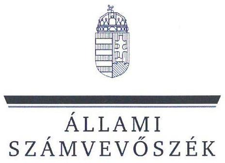
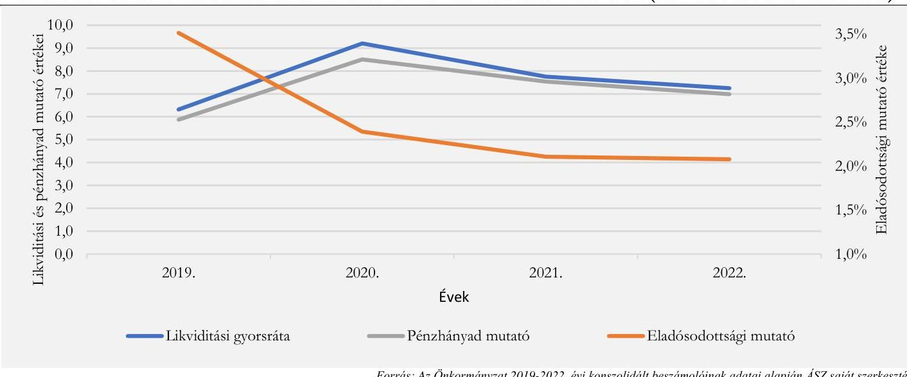
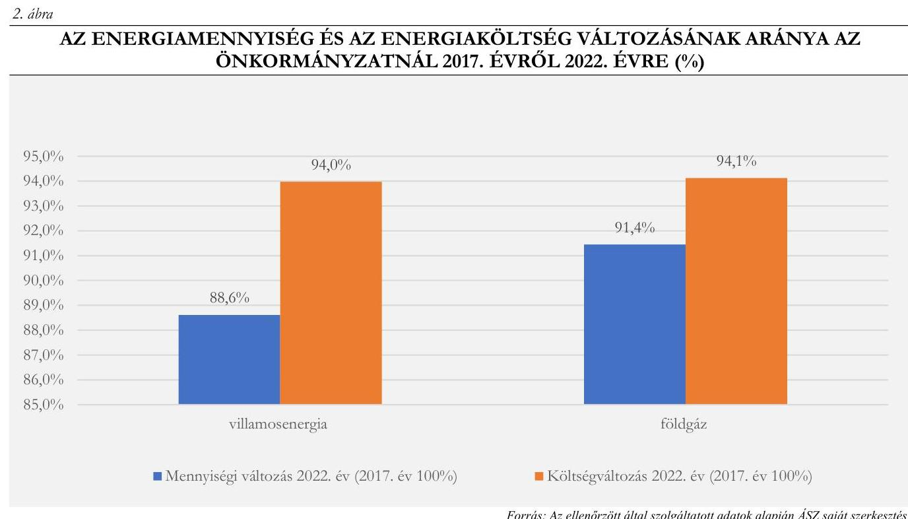
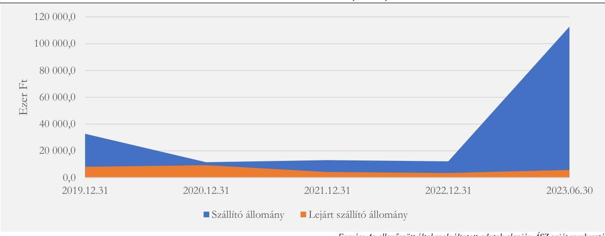

# JELENTÉS 

## Az önkormányzatok energiahatékonysági intézkedéseinek ellenőrzése

Fertőd Város Önkormányzata

2024.

---

ÁLLAMI
SZÁMVEVŐSZÉK

# JELENTÉS 

## Az önkormányzatok energiahatékonysági intézkedéseinek ellenőrzése

Fertőd Város Önkormányzata

2024.

---

# ELLENŐRZÉSI IGAZGATÓSÁG: 

## ÁLLAMHÁZTARTÁS HELYI SZINTJÉT ELLENŐRZŐ IGAZGATÓSÁG

## ELLENŐRZÉSI IGAZGATÓ:

DR. BAFFIA GERGELY GÁBOR igazgató

## ELLENŐRZÉSVEZETŐ:

Jelentéseink az interneten a www.asz.hu címen olvashatók.

HUDÁK MAGDOLNA ellenőrzésvezető

IKTATÓSZÁM: EL-4050-007/2024.
TÉMASZÁM: 2676
ELLENŐRZÉS-AZONOSÍTÓ SZÁM: V102003

---

# TARTALOMJEGYZÉK 

AZ ELLENŐRZÉS ALAPADATAI ..... 5
AZ ELLENŐRZÖTT SZERVEZET ..... 7
ÖSSZEFOGLALÁS ..... 8
AZ ELLENŐRZÉS FÓKUSZTERÜLETEI ..... 10
MEGÁLLAPÍTÁSOK ..... 11
JAVASLATOK ..... 23
MELLÉKLETEK ..... 25
I. sz. melléklet: Értelmező szótár ..... 25
II. sz. melléklet: Az ellenőrzött szervezetek jegyzéke ..... 28
III. sz. melléklet: Ellenőrzési kritériumok ..... 29
IV. sz. melléklet: Tájékoztató adatok ..... 31
FÜGGELÉK: ÉSZREVÉTELEK ..... 37
RÖVIDÍTÉSEK JEGYZÉKE ..... 38

---

.

---

# AZ ELLENŐRZÉS ALAPADATAI 

## AZ ELLENŐRZÉS CÉLJA

Az ellenőrzés célja annak vizsgálata volt, hogy az Önkormányzat ${ }^{1}$ értékelte-e az energiaárak változásának a költségvetése végrehajtására, a gazdálkodására, valamint a kötelező és önként vállalt feladatainak ellátására gyakorolt hatását. Az ellenőrzés kiterjedt arra, hogy az Önkormányzat és a költségvetési szervei az energiaköltségek csökkentése érdekében tettek-e energiahatékonysági intézkedéseket, továbbá az Önkormányzat által tett intézkedések hozzájárultak-e a költségvetés pénzügyi egyensúlyának, a kötelező feladatok ellátásának a biztosításához.

## AZ ELLENŐRZÉS TÍPUSA

Megfelelőségi és teljesítmény ellenőrzés.

## AZ ELLENŐRZÖTT IDŐSZAK

A 2022. év és a 2023. év I. féléve.
Ezen túl elemzési céllal a 3. fókuszterületnél a megkezdett és lebonyolított beruházások adatainak tanúsítványon történő bekérése tekintetében a 2017-2021. évek, továbbá a 4. fókuszterületnél a pénzügyi, egyensúlyi mutatók számítása esetében a 2019-2023. I. félévének időszaka.

## AZ ELLENŐRZÉS TÁRGYA

Az ellenőrzés tárgyát képezte az Önkormányzat és költségvetési szervei gazdálkodásának biztonsága és a kötelező feladatok ellátása érdekében - az energiaárak 2022. évi változásának ellensúlyozására - tett energiahatékonyságot növelő, energiamegtakarítást célzó, a pénzügyi egyensúly fenntartására tett intézkedések megfelelőségének és eredményességének értékelése a 2022. évben és a 2023. I. félévben.

Elemzési módszerrel a 2017-2021. években végrehajtott energiahatékonysági beruházások, fejlesztések, szakpolitikai intézkedésekben való részvétel értékelése a tekintetben, hogy azok megelőző intézkedést jelentettek-e, illetve befolyásolták-e az energiaköltségek csökkentése érdekében a 2022. évben és a 2023. I. félévében megtett intézkedéseket.

## AZ ELLENŐRZÉS JOGALAPJA

Az ellenőrzés jogszabályi alapját az ÁSZ tv. ${ }^{2}$ 5. § (2) bekezdésének előírásai képezték.

---

# AZ ELLENŐRZÉS MÓDSZERE 

Az ellenőrzést az Alaptörvény ${ }^{3}$ 43. cikk (1) bekezdésében meghatározott törvényességi, célszerűségi, eredményességi szempontok, valamint a nemzetközi standardokat irányadónak tekintve az ellenőrzési program szempontjai, az ellenőrzött időszakban hatályos jogszabályok, az ellenőrzés szakmai szabályok és módszertanok figyelembevételével végezte az ÁSZ ${ }^{4}$.

Az ellenőrzési kérdések megválaszolásához szükséges bizonyítékok megszerzése az ellenőrzött szervezet által rendelkezésre bocsátott dokumentumokra és adatokra, valamint az ellenőrzést támogató szervezetektől ${ }^{5}$ kapott adatokra alapozva, továbbá megfigyelés, szemle (szemrevételezés), kérdésfeltevés (információkérés), valamint elemző eljárás útján történt.

Az ellenőrzés során bizonyítékként felhasználható adatforrások közé tartoztak egyrészt az ellenőrzéshez kért dokumentumok, másrészt adatforrás volt még a közhiteles (Elektronikus Közbeszerzési rendszer) és egyéb (Önkormányzati rendelettár) nyilvántartásból származó, az ellenőrzés szempontjából releváns információkat tartalmazó dokumentum.

Az ellenőrzés lefolytatásához az ellenőrzött szervezet a tanúsítványok kitöltésével, valamint az ÁSZ által kért dokumentumok, adatok, információk megküldésével és a helyszíni ellenőrzés során interjú keretében szolgáltatott adatokat. A rendelkezésre bocsátott adatok, információk kontrolljára helyszíni ellenőrzés keretében is sor került. Ellenőrzést támogató szervezetként adatot kértünk a BM${ }^{6}$-től, a PM${ }^{7}$-től, az EM${ }^{8}$-től, a HM${ }^{9}$-től és a ME${ }^{10}$-től az energiaáremelkedéssel kapcsolatos intézkedések keretében nyújtott állami támogatásokról, továbbá az EMIT${ }^{11}$-ek teljesítésére vonatkozóan a MEKH${ }^{12}$-től, amely szervezet az Energetikusi Hálózaton keresztül támogatta a közintézmények Ehat. tv.${ }^{13}$-ben foglalt adatszolgáltatási kötelezettségeinek teljesítését.

Az ellenőrzés során egy kockázati alapon kiválasztott önkormányzati beruházás előkészítése, megvalósítása, elszámolása, nyilvántartása tételes ellenőrzésre került.

Elemzési módszerrel tanúsítványon szolgáltatott adatok alapján értékeltük, hogy a 2017-2021 között végrehajtott (indított, illetve befejezett) energiahatékonyságot növelő, energiamegtakarítást célzó beruházások mennyiben befolyásolták, milyen hatással voltak a rendkívüli energiaár növekedések következtében a 2022. évben és a 2023. I. félévben megtett intézkedésekre.

A tanúsítványokon szolgáltatott adatok, az Önkormányzat által rendelkezésre bocsátott dokumentumok alapján értékeltük, hogy a meghozott takarékossági intézkedések hogyan érintették az Önkormányzat kötelező, illetve önként vállalt feladatainak ellátását, öt mutatószám (likviditási gyorsráta változása, eladósodottsági mutató, lejárt szállítói állomány változása, pénzhányad mutató alakulása) segítségével értékeltük az Önkormányzatnál a pénzügyi egyensúly fenntartására tett intézkedések eredményességét.

Az ellenőrzés kiterjedt minden olyan körülményre és adatra, amely az ÁSZ jogszabályban meghatározott feladatainak teljesítéséhez, valamint a program végrehajtása folyamán felmerült újabb összefüggések feltárásához szükséges volt.

---

# AZ ELLENŐRZÖTT SZERVEZET 

Fertőd város Győr-Moson-Sopron vármegyében, Magyarország északnyugati részén a Soproni járásban található. Lakónépessége a KSH${ }^{14}$ adata szerint 2023. január 1-jén 3332 fő volt.

A település polgármestere ${ }^{15}$ 2014. október 13. óta látta el tisztségét, a Képviselő-testületnek ${ }^{16}$ a polgármesteren kívül hat képviselője volt. A polgármester munkáját egy alpolgármester segítette. Az Önkormányzat működésével és gazdálkodásával kapcsolatos feladatokat a Hivatal ${ }^{17}$ látta el, a jegyző ${ }^{18}$ 2015. március 15-től töltötte be tisztségét. A Hivatal engedélyezett létszáma a 2023. évben 13 fő volt.

Az Önkormányzat fenntartásában - a Hivatal mellett - két költségvetési szerv működött, a Művelődési Ház ${ }^{19}$ a kulturális feladatokat, a Tündérkert Bölcsőde ${ }^{20}$ pedig az óvodai- és bölcsődei feladatokat látta el. A Hivatal külön megállapodás alapján látta el a Fertődi Német Nemzetiségi Önkormányzat gazdálkodásával kapcsolatos feladatokat.

Az Önkormányzat kizárólagos tulajdonába tartozott a Városgazda Kft. ${ }^{21}$, amelynek fő tevékenysége a zöldterület-kezelés volt, továbbá részt vett az önkormányzati tulajdonú épületek karbantartásában, fenntartásában is. Ezen kívül az Önkormányzatnak az ellenőrzött időszakban 3,17%-os résztulajdona volt a Vízmű Zrt. ${ }^{22}$-ben.

Az Önkormányzat a szociális étkeztetési, a házi segítségnyújtási, a család- és gyermekjóléti szolgáltatásokat, valamint az idősek nappali ellátását a Fertőd Mikro-térségi Szociális Szolgáltató Központ útján biztosította, a belső ellenőrzési feladatokról a Sopron és Térsége Önkormányzati Társulás útján gondoskodtak.

Az Önkormányzat 2022. évi konszolidált beszámolójának főbb adatait az 1. táblázat mutatja be:
1. táblázat

AZ ÖNKORMÁNYZAT 2022. ÉVI KONSZOLIDÁLT BESZÁMOLÓJÁNAK FŐBB ADATAI

| MÉGNEVEZÉS |  | 2022. EVI KONSZOLIDÁLT ÖNKORMÁNYZATI BESZÁMOLÓ (M.ET) |
| :--: | :--: | :--: |
| Költségvetési bevétel |  | 891,1 |
| Ebből: | Működési célú támogatások államháztartáson belülről | 426,2 |
|  | Felhalmozási célú támogatások államháztartáson belülről | 90,7 |
|  | Közhatalmi bevételek | 177,3 |
| Költségvetési kiadás |  | 803,6 |
| Ebből: | Dologi kiadások | 278,5 |
|  | Ebből: közüzemi díjak | 19,8 |
|  | Beruházások | 140,6 |
|  | Felújítások | 38,7 |
| Finanszirozási bevételek |  | 332,6 |
| Ebből: | Maradvány igénybevétele | 319,1 |
| Finanszirozási kiadások |  | 24,1 |
| Ebből: | Hitel-, kölcsöntörlesztés államháztartáson kívülre | 13,2 |

---

# ÖSSZEFOGLALÁS 

Az energiaárak 2022. évben bekövetkezett jelentős emelkedése, a források korlátozott rendelkezésre állása új fókuszba helyezte az önkormányzatoknál az energiagazdálkodás kérdését. Az energia változatlan mennyiségben történő felhasználása a magas költségkitettség miatt jelentős kockázatokat eredményezett az önkormányzatok pénzügyi-gazdasági egyensúlyára, valamint a közfeladatok ellátásának biztonságára. Az energiaárak emelkedéséből eredő kockázatok önkormányzati kezelésének támogatása érdekében kormányzati intézkedések történtek. Az európai uniós irányelveken alapuló, az energiahatékonyságról szóló törvény a települési önkormányzatok, mint a közfeladat ellátását szolgáló épületek tulajdonosai, használói, az üzemeltetésért és fenntartásért felelős szervezetek vezetői számára több energiahatékonysági feladatot is meghatározott. Az ellenőrzés rávilágított az Önkormányzat törvényben foglalt energiagazdálkodással kapcsolatos feladatai ellátásának megfelelőségére, az energiagazdálkodási feladatok és a pénzügyi-gazdálkodási feladatok közötti összefüggésekre.

Az Önkormányzat a 2022. évben és 2023. I. félévében az energiaáremelkedésből eredő problémákat eredményesen kezelte, intézkedéseivel, energiahatékonyságot növelő beruházásaival hozzájárult az Önkormányzat működőképességének, pénzügyi egyensúlyának fenntartásához, kötelező feladatainak ellátásához. A közfeladat ellátását szolgáló épületekkel kapcsolatos jogszabályi előírások teljesítésében, valamint a beruházásokkal kapcsolatos elszámolásokban azonban jelentős hiányosságok mutatkoztak.

Az Önkormányzat és a költségvetési szervek vezetőinek az Önkormányzat tulajdonában, illetve használatában álló, közfeladat ellátást szolgáló épületekkel kapcsolatos energetikai üzemeltetési és fenntartási feladatellátása a 2022. évben és a 2023. év I. félévében nem felelt meg teljeskörűen a jogszabályi előírásoknak, mivel 2022-ben a 10 közfeladat ellátását szolgáló épületből csak háromra álltak rendelkezésre az EMIT-ek. A három EMIT 2022. év végén lejárt, és azok helyett nem készítettek újakat, így a 2023 évben egy épületre sem álltak rendelkezésre az EMIT-ek. Az ellenőrzött időszakban az épületek 70,0%-ára nem rendelkeztek energetikai tanúsítvánnyal, nem készítették el az EMIT-ek teljesítéséről szóló éves jelentéseket, nem teljesítették az energiafogyasztási adatokkal kapcsolatos havi adatszolgáltatási kötelezettséget, továbbá az épületekkel kapcsolatos energiahatékonysági feladatok ellátására energetikai felelőst nem jelöltek ki.

Az Önkormányzatnál az ellenőrzött időszakban három, bölcsődei férőhelyek növelésére, valamint épületenergetikai korszerűsítésre irányuló, energiamegtakarítási célokat is szolgáló fejlesztési feladat megvalósítását tervezték, amelyekhez európai uniós pályázati forrásokat is elnyertek. A tervezett fejlesztésekből 2023. év I. félévének végéig a Bölcsődei épületszárny kialakítása ${ }^{23}$ fejlesztési feladat valósult meg. A fejlesztés során a döntéseket az arra jogosultak hozták meg, a közbeszerzési eljárást szabályszerűen folytatták le. A kötelezettségvállalás és a pénzügyi elszámolás azonban nem felelt meg a jogszabályi előírásoknak, mivel a szerződés nem tartalmazott pénzügyi ellenjegyzést, valamint nem történt meg a kötelezettségvállalás nyilvántartásba vétele. Az ellenőrzött 17 kifizetés esetében az érvényesítés és utalványozás során nem tartották be a jogszabályi előírásokat. Két fejlesztési feladat (Mini bölcsőde ${ }^{24}$ kialakítása és Épületenergetikai korszerűsítés ${ }^{25}$ ) az ellenőrzött időszakban még nem zárult le, ezért hatásuk értékelése sem történt meg. Az Önkormányzat az Épületenergetikai korszerűsítés megvalósításával célul tűzte ki, hogy hozzájáruljon a Nemzeti Energiastratégiában ${ }^{26}$ megfogalmazott célok, az ÜHG ${ }^{27}$ intenzitás csökkentéséhez.

Az energiakiadások csökkentése, a pénzügyi egyensúly fenntartása érdekében a 2022. évben a Képviselő-testület több bevételnövelő és az intézményi körre is kiterjedő kiadást csökkentő intézkedést hozott

---

(többek között intézmények fűtési hőmérsékletének maximalizálása, az épületek időszakos zárva tartása), amelyeknek költségvetési hatását azonban nem számszerűsítették.

Az Önkormányzat a jogszabályi előírások szerint az államháztartásért felelős miniszter döntése alapján külön kérelem benyújtása nélkül közvilágítás kiegészítő támogatás címen 14,8 M Ft, bölcsődei üzemeltetési támogatás címen 0,6 M Ft, intézményi gyermekétkeztetés-üzemeltetési támogatás címen 7,9 M Ft központi támogatásban részesült.

Az Önkormányzat nem készített menedzsmenttervet és többlettámogatási kérelmet a miniszteri biztoshoz nem nyújtott be. Továbbá a bérlakások esetében a villamosenergia és gázenergia vásárlásra, a kerékpáros pihenő esetében a villamosenergia vásárlására vonatkozóan a végső menedékes státusz igénylésén kívül nem élt egyéb kedvezményes árszabású energiavásárlásra vonatkozó lehetőségekkel, mivel a meglévő szerződések a kormányzati lehetőségektől kedvezőbb paramétereket tartalmaztak.

Az ellenőrzött időszakban hatályos öt villamosenergia és három gázenergia vásárlásra kötött szerződés nem felelt meg a jogszabályi előírásoknak, mivel azokra a polgármester egy - a 2023. évben villamosenergia vásárlásra kötött - szerződés kivételével a jogszabályi előírások ellenére pénzügyi
 ellenjegyzés nélkül vállalt kötelezettséget.

Az Önkormányzat pénzügyi helyzete stabil, likviditása biztosított volt, amelyet főbb pénzügyi mutatóinak alakulása is alátámasztott.

Az Önkormányzatnál a likviditási gyorsráta, a pénzhányad mutató és az eladósodottsági mutató alakulását az 1. ábra szemlélteti.
1. ábra

FERTŐD VÁROS ÖNKORMÁNYZATA PÉNZÜGYI MUTATÓSZÁMAI (2019-2022. ÉVEK KÖZÖTT)

A 2019-2022. évek között a likviditási gyorsráta, a pénzhányad mutató, valamint az eladósodottsági mutató értéke kedvezően, a referencia tartományban alakult, az eladósodottsági mutató értéke a 2019-2022. években folyamatosan csökkent, a likviditási gyorsráta az egyes években 6,32 és 9,21 között mozgott, valamint a pénzhányad mutató értéke 5,87 és 8,51 között alakult.

A belső ellenőrzés a 2022. évben nem végzett energiahatékonyságot, energiamegtakarítást célzó beruházásra vonatkozó ellenőrzést és ilyen ellenőrzést a 2023. évi belső ellenőrzési terv sem tartalmazott.

Az ÁSZ az ellenőrzés során feltárt hiányosságok megszüntetése, a szabályszerű működés feltételeinek megteremtése érdekében a polgármesternek három, a jegyzőnek hat javaslatot tett.

---

# AZ ELLENŐRZÉS FÓKUSZTERÜLETEI 

1. Az Önkormányzat és költségvetési szervei tulajdonában, illetve használatában álló, közfeladat ellátását szolgáló épületekkel kapcsolatos energetikai üzemeltetési és fenntartási feladatellátás
2. Az energiaárak változására tekintettel a gazdálkodás biztonsága érdekében a központi intézkedések adta lehetőségek Önkormányzat általi hasznosítása
3. Az energiaköltségek csökkentése, az energiahatékonyság növelése érdekében kezdeményezett, illetve folyamatban lévő energetikai beruházások értékelése
4. Az energiaárak hatásának kezelésére, a kötelező feladatok ellátására, a pénzügyi egyensúly fenntartására tett intézkedések értékelése

---

# MEGÁLLAPÍTÁSOK 

## 1. Az Önkormányzat és költségvetési szervei tulajdonában, illetve használatában álló, közfeladat ellátását szolgáló épületekkel kapcsolatos energetikai üzemeltetési és fenntartási feladatellátás

Összegző megállapítás Az Önkormányzat és költségvetési szervei vezetői a közfeladatellátását szolgáló, az Önkormányzat tulajdonában, illetve használatában álló épületekkel kapcsolatos energetikai üzemeltetési és fenntartási feladatainak ellátása nem felelt meg az Ehat. tv., az Mötv. ${ }^{28}$, valamint a 122/2015. Korm. rendelet ${ }^{29}$ előírásainak, az érintett épületekre vonatkozóan a 2022. évben 30%-ban, a 2023. I. félévben teljeskörűen hiányoztak az EMIT-ek, a 2022-2023. évben a beszámolási és adatszolgáltatási kötelezettségeknek nem tettek eleget. A 176/2008. Korm. rendelet ${ }^{30}$ előírása ellenére az érintett épületek 70,0%-a nem rendelkezett energetikai tanúsítvánnyal.

Az Önkormányzat tulajdonában álló 13 közfeladatellátásban érintett épületből 11 az Önkormányzat és költségvetési szervei használatában volt. Egy épület használatbavételének engedélyezésére az ellenőrzött időszakon túl került sor.
Az Önkormányzat és költségvetési szervei vezetői - az ellenőrzött időszakban - a tulajdonukban, illetve használatukban álló, 10 közfeladat ellátását szolgáló épület, épületrész esetében nem tettek teljeskörűen eleget az Ehat. tv. 11/A. § előírásainak.

- A 2022. évben az Ehat. tv. 11/A. § a) pontjának előírása ellenére három épület (a Gyermekkonyha ${ }^{31}$, a Tornaterem ${ }^{32}$ és az Orvosi rendelő ${ }^{33}$ ) vonatkozásában nem készítették el az EMIT-eket, a 2023. év I. félévében pedig - a 2022. évben hét lejárt, illetve három hiányzó EMIT-ek helyett - a 10 épületből egyre sem készítették el a 2023. évtől hatályos dokumentumokat. A 13 közfeladat ellátását szolgáló épületből két épület esetében az EMIT készítésére a Tankerület volt kötelezett, egy épület pedig az ellenőrzött időszakon túl kapott használatba vételi engedélyt.
- Az Ehat. tv. 11/A. § b) pontjában foglaltak ellenére a 2022. évre vonatkozóan az EMIT-ek teljesítéséről nem készítették el az éves jelentést.
- Az ellenőrzésre kiválasztott három ingatlan vonatkozásában elkészített 2022. évben hatályos EMIT-ek (Hivatal, Tündérkert Bölcsőde Eszterházai városrészen lévő épülete és a Művelődési Ház) az Ehat. tv. 11/A. § a) pontja előírása ellenére nem feleltek meg a MEKH által kiadott mintának, mert a mellékletek közül hiányoztak az épületenergetikai tanúsítványok másolatai,

---

továbbá az EMIT-ek nem tartalmazták az energetikai intézkedések esetében a pontos határidők megjelölését.

- Az Ehat. tv. 11/A. § c) pontjában és a 122/2015. (V. 26.) Korm. rendelet 7/F. §-ában foglaltak ellenére nem jelentették be havi rendszerességgel a Nemzeti Energetikusi Hálózat által üzemeltetett online felületen az épületekre, illetve épületrészekre vonatkozó energiafogyasztási adatokat.
- Az Ehat. tv. 11/A. § i) pontjában foglaltak ellenére az épületekkel kapcsolatos energiahatékonysági feladatok közvetlen ellátása és a Nemzeti Energetikusi Hálózattal történő kapcsolattartás céljából nem jelöltek ki energetikai felelőst.
- Az energetikai tanúsítvány készítésre kötelezett 10 épületből hét épületre (a Hivatal, a Gyermekkonyha, Szociális Központ, a Tőzeggyármajor-, az eszterházai és süttöri Orvosi rendelők, valamint a Tornaterem) a 176/2008. (VI. 30.) Korm. rendelet 1. § (3) bekezdés c) pontjában foglaltak ellenére nem készítették el az energetikai tanúsítványokat, továbbá a Művelődési Ház épületére vonatkozó energetikai tanúsítvány hatálya - a 176/2008. Korm. rendelet 8. § (1) bekezdésének 2023. november 1-jei változását követően - 2023. év novemberében lejárt, újat az ÁSZ ellenőrzés lezártáig nem készítettek. A Hivatal műemlék jellegű épületben működött, azonban 176/2008. (VI.30.) Korm. rendelet 1. § (2) bekezdése alapján a műemlék jellegű épületek - kizárólag a védetté nyilvánítás alapján - nem mentesülnek az energetikai tanúsítvány elkészíttetésének kötelezettsége alól.
(Az Önkormányzat tulajdonában lévő épületek számát, az EMIT-ek, valamint az energetikai tanúsítványok számának alakulását részletesen a IV. számú melléklet 1. táblázata tartalmazza.)

# 2. Az energiaárak változására tekintettel a gazdálkodás biztonsága érdekében a központi intézkedések adta lehetőségek Önkormányzat általi hasznosítása 

| Összegző megállapítás | Az Önkormányzat - az energiaárak változására tekintettel -   kizárólag a bérlakások és kerékpáros pihenő esetében élt a   végső menedékes jogintézmény lehetőségével a   villamosenergia és a gázenergia vásárlása során, mivel   meglévő energiavásárlási szerződései a kormányzati   lehetőségeknél kedvezőbb paramétereket tartalmaztak. Az   Önkormányzat által megkötött - az ellenőrzött időszakban   hatályos - energiavásárlási szerződések esetében a   gazdálkodási jogkörök gyakorlása nem felelt meg az Ávr. ${ }^{34}$   előírásának. |
| :--: | :--: |

Az Önkormányzatnál az ellenőrzött időszakban az energiaárak változására tekintettel az energiaellátás folyamatos biztosítása érdekében tett kormányzati intézkedéseket és az azokhoz kapcsolódó önkormányzati nyilatkozatokat a 2. táblázat mutatja be.

---

# A KORMÁNY ÁLTAL BIZTOSÍTOTT LEHETŐSÉGEKHEZ KAPCSOLÓDÓAN MEGTETT NYILATKOZATOK SZÁMA (DB) 

| KORMÁNYZATI INTÉZKEDÉS | ÖNKORMÁNYZAT |  | KÖLTSÉGVETÉSI SZERVEK HIVATALLAL EGYÜTT |  |
| :--: | :--: | :--: | :--: | :--: |
|  | IGEN | NEM | IGEN | NEM |
| Végső menedékes jogintézmény keretében biztosított villamosenergia-ellátás - 217/2022. (VI.17) Korm. rendelet ${ }^{35}$ 3. § | 1* | 0 | 0 | 3 |
| Végső menedékes jogintézmény keretében biztosított földgázellátás 217/2022. (VI.17) Korm. rendelet 8. § | 1 | 0 | 0 | 3 |
| Teljes ellátás alapú veszélyhelyzeti átmeneti villamosenergia-ellátás biztosítása 520/2022. (XII. 13.) Korm. rendelet ${ }^{36}$ 5. § | 0 | 1 | 0 | 3 |
| Veszélyhelyzeti átmeneti földgázellátás biztosítása 388/2022. (X.14.) Korm. rendelet ${ }^{37}$ 4. § | 0 | 1 | 0 | 3 |
| Fixált áras árképzésű villamosenergia vásárlás 41/2023. (II. 20) Korm. rendelet ${ }^{38} 2. § | 0 | 1 | 0 | 3 |
| Fixált áras árszabású földgáz vásárlás 12/2023. (I. 20) Korm. rendelet ${ }^{39} 2. § | 0 | 1 | 0 | 3 |
| Földgáz-kereskedelmi szerződésben rögzített minimális mennyiség érvényesítése - 354/2022 (IX.19) Korm. rendelet ${ }^{40} 2. § | 0 | 1 | 0 | 3 |

Forrás: Az ellenőrzött által szolgáltatott adatok alapján ÁSZ szerkesztés

- Az Önkormányzat öt bérlakása, és a kerékpáros pihenő tekintetében
** Az Önkormányzat kilenc bérlakása tekintetében
A 2022. évben az Önkormányzat az energiaellátás folyamatos biztosítását célzó kormányzati intézkedések közül a végső menedékes státuszra vonatkozóan nyilatkozott a bérlakások esetében a villamosenergia és földgázenergia vásárlásnál, valamint a kerékpáros pihenő ${ }^{41}$ esetében a villamosenergia vásárlásánál, ezen túl egyéb kormányzati lehetőségekkel nem éltek, mert hatályos villamosenergia és földgázvásárlási kereskedelmi szerződéseik kedvezőbb árakat tartalmaztak. Az Önkormányzat nem élt továbbá a veszélyhelyzeti átmeneti-, valamint a fixált áras árképzésű villamosenergia-, valamint földgázellátás biztosítás lehetőségeivel, mert:
- Az MVM ${ }^{42}$ - 2022. augusztus 1-je után az alkalmazott meghirdetett fixált árai a villamosenergia esetében 89,33-166,54 Ft/kWh között mozogtak, a földgáz esetében 16,86 Ft/MJ volt.
- Az Önkormányzat hatályos általános villamos energia és közvilágítási célú szerződése alapján a villamosenergia az ellenőrzött időszakban átlagosan 74,02 Ft/kWh-ba került az Önkormányzatnak, ami kedvezőbb volt, mint az MVM által meghirdetett fixált árak.
- A földgázellátásra vonatkozó szerződéseket az ellenőrzött időszakot megelőzően kötötték, azok lejárata 2023. október 1-je volt. A földgáz 2022. január - október időszakban 2,64 Ft/MJ-ba került az Önkormányzatnak, 3,64 Ft/MJ-ba került az intézményeinek. 2022. november - december időszakra a földgáz ára az intézmények részére 4,13 Ft/MJ volt, kedvezőbb az MVM által meghirdetett fixált áraknál. A 2023. október 1-jéig hatályos földgázellátási szerződés miatt az Önkormányzatnak a 2022-2023. I. féléve közötti időszakban nem kellett díjemeléssel számolnia, azonban az egyéb költségek emelkedtek, mivel a 260/2022. (VII. 21.) Korm. rendelet ${ }^{43}$ alapján 2022. október 1-jétől bevezetésre került a földgázra a különleges földgáz készletezési díj.
Az Önkormányzat, a Hivatal és a költségvetési szervek a 2022-2023. évek között villamosenergia vásárlásra öt, földgázvásárlásra három hatályos szerződéssel rendelkeztek.

---

A szerződésekben a jogszabályi előírásoknak megfelelően a polgármester az Önkormányzat nevében vállalt kötelezettséget, ugyanakkor a szerződésekben megjelölt fogyasztási helyek az Önkormányzaton túl intézményeket is érintettek.
A költségvetési szervek által használt épületek közüzemi fogyasztását is tartalmazó közüzemi számlák az Önkormányzat nevére szóltak, azokat az Önkormányzat fizette ki és számlázta tovább az intézmények felé. Az energiakiadások az intézményi beszámolókban közüzemi díjként jelentek meg. Az Önkormányzat és az önkormányzati fenntartású intézmények között együttműködési megállapodás a közüzemi díjak megosztására és tovább számlázására nem született. A Hivatal, a Tündérkert Bölcsőde, valamint a múzeumi és könyvtári feladaton felmerült költségek tovább számlázására vonatkozó megosztást az Önkormányzat által egy harmadik féllel (a Tankerületi Központ ${ }^{44}$ ), és nem az intézményekkel megkötött szerződés tartalmazta. A Művelődési Háznál, valamint a védőnői szolgálat feladaton felmerült költségek megosztására semmilyen döntési dokumentum nem állt rendelkezésre.
Az Önkormányzat és az intézmények közötti - a megosztási arányokat is tartalmazó - megállapodás hiányában a teljesítésigazoló az Ávr. 57. § (1) bekezdésében foglalt ellenőrzési feladatait jogszerűen nem tudta ellátni, mivel nem volt ellenőrizhető az összegszerűség.

- A gázenergia díjak tovább számlázására a Tankerületi Központtal 2016. december 15-én megkötött Vagyonkezelési szerződés ${ }^{45}$ 8. számú melléklete alapján került sor. A Vagyonkezelési szerződés az önkormányzati intézmények közül nem tartalmazott adatot a Múvelődési Házra és a védőnői szolgálat épületrészére vonatkozóan. Az ellenőrzés számára benyújtott számlákon alkalmazott költségfelosztási arányok és a Vagyonkezelési szerződésben rögzített arányok nem voltak egyértelműen összevethetők. A villamosenergiánál a tovább számlázás elsősorban a mérési pont azonosítókon elszámolt költségek alapján történt, erre vonatkozóan azonban a vagyonkezelési
 szerződés rendelkezést nem tartalmazott.
Az Ávr. 50. § (1) bekezdés d) pontjában előírtak ellenére a 2022-2023. években hatályos öt villamosenergia- és három földgázenergia ellátására vonatkozó szerződés pénzügyi ellenjegyzését egy villamosenergia szerződés kivételével nem végezték el.
- A 2023. január 1-december 31-e között hatályos, közbeszerzési eljárást követően az Önkormányzatra, a Hivatalra, valamint a közvilágítás villamosenergia ellátására irányuló szerződés pénzügyi ellenjegyzését az Ávr. előírásainak megfelelően elvégezték.
(A villamosenergia- és földgázenergia szolgáltatási szerződések adatait és azok pénzügyi ellenjegyzésre vonatkozó hiányosságait a IV. számú melléklet 2. táblázata részletezi.)
A villamosenergia vásárlási szerződések közül a 2023. évre vonatkozó szerződését az Önkormányzat - a Kbt. ${ }^{46}$ előírásai alapján - a központosított közbeszerzéshez való csatlakozás útján kötötte meg. A KEF ${ }^{47}$ fel létrejött megállapodás alapján „egyedi szerződést" ${ }^{48}$ kötöttek, amelyben az Önkormányzat járt el saját, valamint a Hivatal és az intézmények nevében. Az Önkormányzat a jegyzőtől és az intézmények vezetőitől, mint ajánlatkérők képviselőitől a közbeszerzési eljárás előkészítésére, lebonyolítására a Kbt. 32. § (1) bekezdésében szereplő együttműködési megállapodással nem rendelkezett, a közbeszerzési eljárást a Polgármester a 66/2022. (X. 26.) önkormányzati határozatban kapott felhatalmazás, valamint a Közbeszerzési szabályzat alapján bonyolította le. Az Önkormányzat Hivatalra és intézményekre is kiterjesztett Közbeszerzési szabályzata nem felelt meg az Ávr. 13. § (2) bekezdés b) pontjában, valamint a Kbt. 27. § (1) bekezdésében foglaltaknak, mivel az intézményvezetők a szabályzatot kiadmányozóként nem írták alá.

---

- A Képviselő-testület a 66/2022. (X. 26.) önkormányzati határozatában döntött az Önkormányzat és intézményei villamosenergia KEF rendszerben verseny újranyitással történő lebonyolításáról, amely előkészítésére és a Közbeszerzési Bírálóbizottság javaslata alapján a döntés meghozatalára a Polgármestert hatalmazta fel. Az Önkormányzat intézményekre is kiterjesztett Közbeszerzési szabályzata rögzítette, hogy a szerződés aláírására az Önkormányzat nevében a Polgármester jogosult. Az intézményekre is kiterjedő szabályzatot azonban csak a Polgármester és a Jegyző kiadmányozta, így az nem pótolta a Kbt. 32. § (1) bekezdésében szereplő együttműködési megállapodást.
- Az Ávr. 13. § (2) bekezdés b) pontja értelmében a költségvetési szerv beszerzések lebonyolításával kapcsolatos eljárásrendjét a költségvetési szerv vezetője határozza meg. A Kbt. 27. § (1) bekezdésében foglaltak szerint az ajánlatkérő köteles meghatározni többek között a közbeszerzési eljárás előkészítésének, lebonyolításának rendjét, az ajánlatkérő nevében eljárók felelősségi körét, az eljárás során hozott döntésekért felelős személyt. A Kbt. 5. § (1) bekezdés c) pont eb) alpontja alapján ajánlatkérő a költségvetési szerv. Az Áht. 10. § (6) bekezdése alapján a költségvetési szerv képviseletére - a képviseleti jog jogszerű átruházásának esetét kivéve - a költségvetési szerv vezetője jogosult.
A Képviselő-testület a 449/2022. Korm. rendelet ${ }^{49}$ 1. § (1) bekezdésében szereplő felhatalmazás alapján nem élt a rendeletalkotás lehetőségével a közvilágítás korlátozása tekintetében.

# 3. Az energiaköltségek csökkentése, az energiahatékonyság növelése érdekében kezdeményezett, illetve folyamatban lévő energetikai beruházások értékelése 

## Összegző megállapítás

Az Önkormányzatnál az ellenőrzött időszakban végrehajtott beruházások hozzájárultak az energiaárak emelkedése miatti többletköltségek ellensúlyozásához, azonban a Bkr. ${ }^{50}$-ben foglaltak ellenére nem építették ki a beruházási döntések megalapozottsága érdekében a szervezeti célok elérését veszélyeztető kockázatok csökkentésére irányuló kontrollokat. A Bölcsődei épületszárny kialakítása beruházásnál a gazdálkodási jogkörök gyakorlása nem felelt meg az Ávr.-ben foglaltaknak.

Az Önkormányzat a 2017-2023. I. féléve közötti időszakban három energetikai célt is tartalmazó beruházást tervezett 277 030,3 E Ft értékben, amelyből 2023. I. félév végéig a Bölcsődei épületszárny kialakítása valósult meg. A fejlesztési feladatokat a 3. táblázat mutatja be.

---

# 3. táblázat 

AZ ÖNKORMÁNYZATNÁL A 2017-2022. ÉVEKBEN, VALAMINT A 2023. I FÉLÉVÉBEN FOLYAMATBAN LÉVŐ, ILLETVE BEFEJEZETT ENERGIAHATÉKONYSÁGOT CÉLZŐ FEJLESZTÉSI (BERUHÁZÁS) FELADATOK FŐBB ADATAI (E FT)

|  |  |  | Ebből: |  |  | Ebből: |  |
| :--: | :--: | :--: | :--: | :--: | :--: | :--: | :--: |
| Ssz. | Év | FEJLESZTÉSI   FELADAT | TERVEZETT   FEJLESZTÉSI   KIADÁS | UNIÓS   PÁLYÁZATI   FORRÁS | SAJÁT   FORRÁS | TEJJESÍTETT   FEJLESZTÉSI   KIADÁS | UNIÓS   PÁLYÁZATI   FORRÁS |

2017-2023. év I. félévéig lezárt fejlesztési feladat

| 1. | $\begin{aligned} & 2020- \\ & 2022 . \end{aligned}$ | Bölcsődei   épületszárny   kialakítása | 109 337,5 | 108000,0 | 1337,5 | 109337,5 | 108000,0 | 1337,5 |
| :--: | :--: | :--: | :--: | :--: | :--: | :--: | :--: | :--: |
| 2023. év I. félév végén folyamatban lévő fejlesztési feladat |  |  |  |  |  |  |  |  |
| 2. | $\begin{aligned} & 2021- \\ & 2023 . \end{aligned}$ | Mini bölcsőde   kialakítása | 63 045,7 | 35000,0 | 28 045,7 | 63 045,7 | 35000,0 | 28 045,7 |
| 3. | 2022.- | Épületenergetikai korszerűsítés | 104 647,1 | 87500,0 | 17 147,1 | 14 369,7 | 14369,7 | 0,0 |
| Összesen: |  |  | 277 030,3 | 230 500,0 | 46 530,3 | 186 752,9 | 157 369,7 | 29 383,2 |

Forrás: Az ellenőrzött által szolgáltatott adatok alapján ÁSZ saját szerkesztés
Az ellenőrzött időszakban tervezett fejlesztéseket az Önkormányzat 83,2%-ban európai uniós forrásból tervezte megvalósítani. A fejlesztési feladatokról az Mötv., az SZMSZ ${ }^{51}$ előírásait betartva az arra jogosult Képviselő-testület döntött. A fejlesztési feladatok elvárt eredményeit a pályázatok benyújtására vonatkozó képviselő-testületi döntések, vagy azok előterjesztései nem tartalmazták, azonban a támogatási szerződések mellékleteiben szerepeltek a fejlesztés eredményeként elérni kívánt indikátorok célértékei.

- A Bölcsődei épületszárny kialakítása és a Mini bölcsőde építése fejlesztési feladatok elsősorban nem energiahatékonysági célúak voltak, hanem a férőhelyek 12, illetve hét fővel való bővítésére irányultak, ezért a támogatási szerződésekben nem rögzítettek energetikai tárgyú indikátorokat. Azonban a fejlesztési feladat tartalmazott energiahatékonysági elemeket is. Így a Bölcsőde épületszárnyának kialakítása során megvalósították a homlokzaton a korszerű, az energetikai követelményeknek megfelelő műanyag nyílászárók beépítését, a Mini bölcsőde kialakítása során a földszinti padlók hőszigetelését, új homlokzati hőszigetelt bejárati ajtó beszerelését.
- Az Épületenergetikai korszerűsítés fejlesztési feladat energiamegtakarítási célú volt, így a támogatási szerződés tartalmazott energetikai tárgyú indikátort ( $25,86 \mathrm{CO} 2 \mathrm{t} / \mathrm{év}^{52}$ becsült ÜHG-kibocsátás és $694 \mathrm{~m}^{2}$ jobb energiahatékonyságú középület elérése). A fejlesztési feladat tartalmazta az épület hőszigetelését (födémek és külső falak belső oldali hőszigetelése), elektromos és világítással kapcsolatos fejlesztéseket, korszerű kondenzációs hőtermelők és kiegészítésként napelem rendszer és hőszivattyú beépítését, új fűtési csőhálózat megépítését. Az Épületenergetikai korszerűsítése beruházás megvalósításával az Önkormányzat feladatául tűzte ki, hogy hozzájáruljon a Nemzeti Energiastratégiában megfogalmazott célok közül ahhoz, hogy az ÜHG intenzitás tovább csökkenjen.
A fejlesztési döntések előkészítése vonatkozásában, a Bkr. 8. § (2) bekezdés b) pontjában foglaltak ellenére, nem építettek ki a szervezeti célok elérését veszélyeztető kockázatok csökkentésére irányuló kontrollokat a döntések célszerűségi, gazdaságossági, hatékonysági és eredményességi szempontú

---

megalapozottsága tekintetében, mivel az előterjesztések során nem vizsgálták a létrejövő eszközök üzemeltetésével, működtetésével, karbantartásával kapcsolatos várható kiadásokat. Ez az üzemeltetés során kockázatot jelent az Önkormányzat pénzügyi egyensúlyi helyzetére, ezáltal kötelező feladatai ellátásának finanszírozhatóságára.
Az ellenőrzés keretében az ellenőrzött időszakban befejezett beruházás - a Bölcsődei épületszárny kialakítása - előkészítését, megvalósítását és elszámolását tételesen ellenőriztük.
Az Önkormányzat a beruházásra vonatkozóan a közbeszerzési eljárást a Kbt.-ben előírtaknak megfelelően folytatta le, a vállalkozási szerződést a nyertes ajánlattevővel, az árajánlattal egyező nettó 70 153,8 E Ft összegben kötötték meg. A vállalkozási szerződést és annak módosítását az Ávr.-ben foglaltaknak megfelelően a polgármester írta alá, azonban az Áht. 37. § (1) bekezdése és az Ávr. 55. §. (1) bekezdése előírásai ellenére arra pénzügyi ellenjegyzés nélkül vállalt kötelezettséget. A pénzügyi ellenjegyzés hiányát az érvényesítő az Ávr. 58. § (1) bekezdésében foglaltak ellenére nem észrevételezte. Az Ávr. 56. § (1) bekezdésének előírása ellenére a kötelezettségvállalást követően a Hivatal nem gondoskodott annak nyilvántartásba vételéről. A kifizetést az Önkormányzat az arra jogosult részére, a vállalkozási szerződés szerinti összegben teljesítette.
A beruházáshoz kapcsolódóan ellenőrzött 87 696,0 E Ft összértékű 17 kifizetésből (vállalkozási szerződés, eszközbeszerzés, tervezés, műszaki ellenőrzés feladatok) az érvényesítés és az utalványozás egyik esetben sem felelt meg az Áht.-ban és az Ávr.-ben foglaltaknak.

- 12 esetben az Áht. 38. § (1) bekezdésében, valamint az Ávr. 58. § (1) és (3) bekezdésében foglaltak ellenére az érvényesítést és az Áht. 38. § (1) bekezdésében, valamint az Ávr. 59. § (2) bekezdés és (3) bekezdés g) pontjában foglaltak ellenére az utalványozást nem végezték el, az utalványrendeleteken nem szerepelt az érvényesítő és az utalványozó keltezéssel ellátott aláírása.
- Öt esetben az érvényesítés és az utalványozás formális volt, mivel az Áht. 38. § (1) bekezdésében foglaltak ellenére azokra a kifizetéseket követően került sor.
(A kifizetett számlák érvényesítési és utalványozási hiányosságait a IV. számú melléklet 3. táblázata mutatja be.) A tárgyi eszköz egyedi nyilvántartó lap alapján az értékcsökkenési leírási kulcs a Számviteli politika ${ }^{53}$ és az Áhsz. ${ }^{54}$ előírásainak megfelelően az egyéb épület eszközcsoportra vonatkozóan került megállapításra. A Számv. tv. 47. § (1) bekezdése, az Áhsz. 15. § (1) bekezdése és a Számviteli politika 8. pontja előírásai ellenére az épületet annak ellenére vették számviteli nyilvántartásba, hogy az üzembe helyezési okmány kiállítása, a bekerülési érték meghatározása még nem történt meg.
- Az üzembehelyezési okmányban a létesítmény használatba vételi időpontja 2022. július 13. volt, amellyel egyidejűleg megtörtént a számviteli nyilvántartásba vétel (2022. július 13.), azonban a nyilvántartásba vétel dokumentumát, az üzembehelyezési okmányt ezt követő, 2022. augusztus 19-i dátummal állították ki, a bekerülési érték meghatározása, dokumentálása utólag történt meg.
A Bölcsődei épületszárny kialakítása során vásárolt egyéb eszközöket (kisértékű tárgyi eszközök, egy informatikai eszköz és három gép, berendezés, felszerelések eszközcsoportba tartozó eszközt) az Áhsz. szerint szabályszerűen vették nyilvántartásba.
A 12 bölcsődei férőhely bővítés 2022. júliusában megvalósult a Bölcsődei épületszárny kialakításával, azonban a Mini bölcsőde kialakítása és az Épületenergetikai korszerűsítés a 2023. I. félév végén még folyamatban volt, azok megvalósulását követően annak eredménye az ellenőrzött időszakban még nem volt mérhető, számszerűsíthető, így a fejlesztésekből eredő energetikai költségmegtakarítás az Önkormányzatnál nem mutatható ki.

---

# 4. Az energiaárak hatásának kezelésére, a kötelező feladatok ellátására, a pénzügyi egyensúly fenntartására tett intézkedések értékelése 

## Összegző megállapítás

Az Önkormányzat energiaáremelkedés kezelése céljából hozott döntései eredményesek voltak; a pénzügyi helyzet stabil, a kötelező feladatok ellátása biztosított volt.

Az energiaáremelkedésből eredő megnövekedett működési költségek finanszírozása érdekében az Önkormányzat nem élt az 1473/2022. Korm. határozat ${ }^{55}$-ban foglalt egyeztetési lehetőségekkel, menedzsmenttervet nem készítettek, a miniszteri biztossal nem tárgyaltak, az Önkormányzat tájékoztatása
 szerint a tárgyalás lehetőségéről nem tudtak.
Az Önkormányzat az energiaáremelések hatásainak csökkentése, a működési költségek finanszírozása érdekében 2023. I. félévében - külön kérelem benyújtása nélkül - a 2023. évi Kvtv. ${ }^{56}$ 2. mellékletében szereplő jogcímeken 23327,8 E Ft költségvetési támogatásban részesült, amelynek részletezését a 4. táblázat mutatja be.
4. táblázat

AZ ÖNKORMÁNYZATNÁL AZ ENERGIAÁRAK VÁLTOZÁSÁHOZ KAPCSOLÓDÓAN MEGÍTÉLT KÖZPONTI TÁMOGATÁSOK 2022-2023. I. FÉLÉV VÉGE KÖZÖTT (E FT)

| MÉGNEVEZÉS |  |  | 2022. Ft | 2023. I. FÉLÉV |
| :--: | :--: | :--: | :--: | :--: |
| 2.melléklet támogatása | 1.1.5. jogcím | Közvilágitás | kiegészítő | 0,0 |
| 2.melléklet támogatás | 1.3.3.2. jogcím | Bölcsődei | üzemeltetési | 0,0 |
| 2.melléklet gyermekétkeztetés - üzemeltetési támogatás |  |  |  | 7898,8 |
| ÖSSZESEN: |  |  | 0,0 | 23327,8 |

Forrás: Az Önkormányzat és a BM, PM adatszolgáltatása alapján ASZ saját szerkesztés
A 2023. évi költségvetési rendelet ${ }^{57}$-hez kapcsolódó képviselő-testületi előterjesztésben bemutatták az energiaárak emelkedése miatti többletforrásigényeket. A közüzemi költségekre (amely tartalmazta a víz- és csatorna szolgáltatás minimális díját is) a 2023. évben a korábbi év kétszeresét, 44 870,0 E Ft előirányzatot terveztek, amelyből a 2023. év I. félévi tényleges kifizetés 15 891,1 E Ft volt.
A 2015. évet megelőzően az Önkormányzat nehéz pénzügyi helyzetben volt, ezért működőképessége megőrzése érdekében 2015. évben intézkedéscsomagot fogadott el. A 2015. évben elfogadott intézkedési csomag (intézmények racionális működtetése, hatékony adóbehajtások, pályázatok igénybevétele, bevételt hozó beruházások preferálása) végrehajtásával az Önkormányzat a pénzügyi helyzetét a 2022. évre stabilizálni tudta, ezért ezen intézkedések hatására az ellenőrzött időszakban már nem voltak fizetési nehézségei. A 2022. évi jelentős energiaáremelkedés a pénzügyi helyzetét nem ingatta meg, az Önkormányzat 2022-2023. évben megtett energiamegtakarítást célzó intézkedései is hozzájárultak ahhoz, hogy az Önkormányzat megőrizte működőképességét. Intézmények bezárására, feladatok átadására nem került sor, kötelező- és önként vállalt feladatait el tudta látni.
Az energiaárak növekedésének kezelésére 2022. október 14-én a polgármester megbeszélést kezdeményezett az intézményvezetőkkel, amelynek során tájékoztatást adott az addig megtett

---

intézkedésekről (Épületenergetikai korszerűsítés megvalósítása, világító testek LED-es cseréje, intézményi belső hálózat korszerűsítés). A megbeszélés során - az intézményi körre is kiterjedő - energiafogyasztást csökkentő további intézkedésekről (pl. temperáló fűtés alkalmazása, az intézményekben a fűtési fok csökkentése, az épületek időszakos zárva tartása) döntöttek. Az egyeztetést feljegyzésben dokumentálták, azonban a kiadáscsökkentő intézkedések költségvetési hatását nem számszerűsítették.
A Képviselő-testület az energiaáremelkedések hatásának mérséklése, önfenntartó képességének erősítése érdekében a lakás- és helyiségbérleti díjak emeléséről, adókintlévőségek behajtásáról, valamint létesítményi és használati díjak emeléséről döntött 2023. március 1-jei hatállyal.

- Az Önkormányzat a lakás- és helyiségbérleti díjakon belül a garázsbérleti díjak emelésével kapcsolatos intézkedések költségvetési hatását számszerűsítette, mely alapján a 2023. I. félévében 1296,0 E Ft többletbevételt realizáltak.
- A helyi adókintlévőségek behajtásával, valamint a lakás- és terembérleti díjak, temető létesítmények díjának, valamint a közterületen folyó munkák miatti használati díjának emelésének hatását nem számszerűsítették.
A növekvő energiaárak kezelése céljából hozott intézkedések főbb adatait az 5. táblázat mutatja be.
5. táblázat

AZ ENERGIAÁRAK VÁLTOZÁSÁNAK KEZELÉSÉRE, ILLETVE A BEVÉTELEK NŐVELÉSÉRE TETT INTÉZKEDÉSEK BEMUTATÁSA AZ ÖNKORMÁNYZATNÁL ÉS KÖLTSÉGVETÉSI SZERVEINÉL - 2022. ÉV ÉS 2023. I. FÉLÉV ÖSSZESEN

| MEGTETT INTÉZKEDÉSEK | ÖNKORMÁNYZAT |  | KÖLTSÉGVETÉSI SZERVEK |  |
| :--: | :--: | :--: | :--: | :--: |
|  | $\begin{gathered} \text { SZÁMA } \\ \text { (DB) } \end{gathered}$ | TERVEZETT BEVÉTEL/ MEGTAKARÍTÁS ÖSSZEGE (E FT) | SZÁMA   (DB) | TERVEZETT MEGTAKARÍTÁS ÖSSZEGE (E FT) |
| Bevételt növelő intézkedések | 4 | 1296,0 | - | - |
| Ebből: |  |  | - | - |
| helyi adókkal kapcsolatos intézkedések | 1 | - | - | - |
| térítési díjakkal kapcsolatos intézkedések | 3 | 1296,0 | - | - |
| Kiadáscsökkentő intézkedések | 5 | - | - | - |
| Ebből: |  |  | - | - |
| személyi jellegű kiadásokhoz kapcsolódó | - | - | - | - |
| beszerzéseket érintő | - | - | - | - |
| működést, üzemeltetést érintő | 5 | - | - | - |

A rezsidíjak csökkentése érdekében megtett intézkedések mellett egyéb tényezők - a 2020-2022. években a COVID járvány miatti, szokásostól eltérő igénybevétel (többek között közigazgatási szünet elrendelése, otthoni munkavégzés elrendelése stb.) - is hozzájárultak az energiafogyasztás csökkenéséhez, melynek alakulását a 2. ábra szemlélteti.

---

Az Önkormányzat által a 2017-2020. években a pénzügyi stabilitás fenntartása érdekében megtett intézkedések hozzájárultak, hogy mind a villamosenergia fogyasztásban, mind a gázenergia fogyasztásban csökkenés következett be, amelynek hatása az energiaköltségekben is megmutatkozott.

- A 2020. évben a 2019. évhez képest a kimutatott felhasznált villamosenergia mennyisége több, mint 30%-kal csökkent, amelynek oka valójában nem a mennyiségi megtakarítás volt, hanem az, hogy a szolgáltató a fogyasztás egy részét a 2021. évben számlázta le az Önkormányzat felé, így az csak a 2021. évben jelent meg.
- Az Önkormányzat 2020. évi földgázfogyasztása 6,4%-kal csökkent a 2019. évhez képest, melynek oka az volt, hogy a Művelődési Ház önálló intézményként kikerült a korábbi években az Önkormányzatnál kimutatott fogyasztásból, valamint ebben az esetben is a fogyasztás egy részét a szolgáltató csak a 2021. évben számlázta le.
(Az energiafogyasztási, valamint energiaköltség adatok alakulását a 2017-2023. I. féléve között a IV. számú melléklet 4. táblázata mutatja be.)

A Képviselő-testület az Önkormányzat kizárólagos tulajdonában lévő gazdasági társasága részére az energiaárak emelkedése miatti kedvezőtlen pénzügyi hatások mérséklése céljából támogatás nyújtásáról nem döntött.
Az Önkormányzat stabil pénzügyi helyzetét támasztja alá a 2019-2022. években a likviditási gyorsráta, az eladósodottsági mutató, valamint a pénzhányad mutatók alakulása is.

---

A pénzügyi mutatók alakulását a 6. táblázat mutatja be.
6. táblázat

| A PÉNZÜGYI EGYENSÚLY ALAKULÁSA - MUTATÓSZÁMOK |  |  |  |  |  |  |  |
| :--: | :--: | :--: | :--: | :--: | :--: | :--: | :--: |
| Ssz. | MEGNEVEZÉS | KEDVEZŐ   REFERENCIA-   ÉRTÉK | 2016.12.31 | 2020.12.31 | 2021.12.31 | 2022.12.31 | 2023.06.30 |
| 1. | Likviditási gyorsráta: a   likvid eszközök és a   rövid időn belül   esedékes kötelezettségek   hányadosa | $>1,00$ | 6,32 | 9,21 | 7,75 | 7,25 | 5,24 |
| 2. | Likviditási gyorsráta   változása az előző évhez   képest (\%) | $>0$ | - | 2,89 | $-1,46$ | $-0,50$ | $-2,01$ |
| 3. | Eladósodottsági mutató:   a kötelezettségek és az   összes forrás hányadosa   (\%) | $\max .50-60 \%$ | 3,51 | 2,39 | 2,11 | 2,08 | 3,30 |
| 4. | Lejárt szállítói állomány   aránya az összes szállítói   állományon belül (\%) | aránya nem   növekvő | 24,68 | 80,92 | 31,99 | 28,31 | 5,10 |
| 5. | Pénzhányad mutató: a   pénzeszközök és a rövid   időn belül esedékes   kötelezettségek   hányadosa | $>=0,4$ és az   előző   időszakhoz   képest nem   csökken | 5,87 | 8,51 | 7,54 | 6,99 | 4,36 |

Forrás: Az ellenőrzött által szolgáltatott adatok alapján ÁSZ szerkesztés
Az Önkormányzatnál az ellenőrzött időszakban mind a likviditási gyorsráta, mind a pénzhányad mutató a referencia tartományban maradt, azonban a 2020. évet követően csökkenő tendenciájú volt.

- A likviditási gyorsráta és a pénzhányad mutató 2020. évről a 2021. évre való csökkenését befolyásolta, hogy a 2020. évről a 2021-re a rövid időn belüli kötelezettségek (működési és beruházási számlák, a fejlesztési célú hitel követő évi törlesztése) állománya 18,8%-kal emelkedett a pénzeszközök állományának (pályázati források, egyéb megtakarítások) változatlansága mellett.
- A 2023. I. félév végén a pénzeszközök állománya 731 632,5 E Ft (a 2022. év végi állományhoz képest 83,0%-kal több), a rövid lejáratú kötelezettségek állománya 167 872,5 E Ft (a 2022. év végi kötelezettségek közel háromszorosa) volt, amelyek alakulását a fejlesztési feladatokhoz kapott pályázati források és azok elszámolási kötelezettségei, valamint a beérkezett, de a 2023. II. félévben kifizetendő számlák befolyásolták.
Az Önkormányzat eladósodottsági szintje az ellenőrzött időszakban alacsony volt és a 2019-2022. években csökkenő tendenciájú, amelyet az ellenőrzött időszakot megelőzően (2015. évben) felvett, fejlesztési célú hitelállományának, valamint egyéb kötelezettségeinek (szállítói) csökkenése eredményezett. Az Önkormányzat 2015. évben meghozott költség-megtakarítási, racionalizálási intézkedéseinek eredményeképpen az Önkormányzatnak 2017-től nem volt likvid hitele, amely a mutató alakulását szintén kedvezően befolyásolta.
- A Stabilitási tv. ${ }^{58}$ előírásait betartva az Önkormányzat 2015. évben vett fel fejlesztési célú hitelt, 156 538,0 E Ft összegben, amelynek utolsó törlesztő részlete 2024. évben várható. 2023. június 30-ig a hitelből 136 400,0 E Ft már visszafizetésre került.
(A pénzügyi egyensúly mutatószámaihoz kapcsolódó adatokat a IV. számú melléklet 6. táblázata tartalmazza.)

---

Az Önkormányzat szállítói állománya a 2019. évi 32 806,4 E Ft-ról a 2022. évre 12 188,1 E Ft-ra csökkent. A szállítói állományban a pályázatokhoz, illetve a szolgáltatási számlákhoz kapcsolódó kötelezettségek jelentek meg. A lejárt szállítói állomány a 2019-2022. években - a 2020. évet kivéve - 30,0% körüli értéken mozgott.
A szállítói állomány alakulását a 3. ábra szemlélteti.
3. ábra

# AZ ÖNKORMÁNYZAT SZÁLLÍTÓI ÁLLOMÁNYÁNAK ALAKULÁSA A 2019-2022. ÉVEKBEN ÉS 2023. I. FÉLÉVÉBEN (E FT) 

- A 2020. évben a lejárt szállítói állomány az előző évi 24,7%-ról 80,9%-ra emelkedett, amelynek nagy részét a közműberuházásokhoz kapcsolódó kötelezettségek tették ki. A lejárt szállítói kötelezettségeket az Önkormányzat a közmű bérleti díjakból folyamatosan kompenzálta, így azt a 2021. évre a 2019. évihez közelítő szintre, 32,0%-ra csökkentették, amely 2022-re tovább csökkent (28,3%-ra). Az intézményeknek a 2021. évtől nem volt lejárt szállítói kötelezettsége.
- A 2023. I. félévre a szállítók állománya 112 771,4 E Ft volt, amely a 2023. júniusában beérkezett, de a félév zárásig ki nem egyenlített számlák miatt növekedett meg. (Jelentős volt az Önkormányzatnál a KEHOP ${ }^{59}$ pályázat kapcsán 2023. júniusában kiállításra került számlák összege, amely a teljes szállítói állomány 73,6%-át (83 000,0 E Ft-ot) tette ki.) A lejárt szállító állomány aránya 2023. I. félév végén mindösszesen 5,1% volt. (A szállítói állomány alakulását a IV. számú melléklet 5. táblázata tartalmazza.)

A belső ellenőrzés a 2022. évben nem végzett energiahatékonyságot, energiamegtakarítást célzó beruházásra vonatkozó ellenőrzést és ilyen ellenőrzést a 2023. évi belső ellenőrzési terv sem tartalmazott.

- A 2022. évben egy szabályszerűségi ellenőrzés valósult meg, amelynek célja a monitoring rendszer
 kontrollja és gyakorlata, a fejlesztés lehetőségeinek vizsgálata volt, míg a 2023. II. félévében tervezett szabályszerűségi ellenőrzés az információs és kommunikációs rendszer kontrollja és gyakorlata, a fejlesztés lehetőségeit tervezte ellenőrizni.

---

# JAVASLATOK 

Az ÁSZ tv. 33. § (1) bekezdésében foglaltak értelmében az ellenőrzött szervezet vezetője köteles a jelentésben foglalt megállapításokhoz kapcsolódó intézkedési tervet összeállítani és azt a jelentés kézhezvételétől számított 30 napon belül az ÁSZ részére megküldeni. Amennyiben az ellenőrzött szervezet vezetője nem küldi meg határidőben az intézkedési tervet, vagy továbbra sem elfogadható intézkedési tervet küld, az Állami Számvevőszék elnöke az ÁSZ tv. 33. § (3) bekezdése a) és b) pontjaiban foglaltakat érvényesítheti.

## FERTŐD VÁROS ÖNKORMÁNYZATA POLGÁRMESTERE RÉSZÉRE

1. Intézkedjen az Állami Számvevőszék nyilvánosságra hozott jelentésének a kézhezvételt követő 30 napon belül a Képviselő-testület elé terjesztéséről. A jelentést a napirend tárgyalásáról szóló jegyzőkönyvvel együtt tájékoztatásul küldje meg a Kormányhivatal részére is.
2. Az Ehat. tv. 11/A. §-ában foglalt felelőssége körében, a közfeladat ellátását szolgáló épületek tulajdonosának képviseletében az üzemeltetésért és fenntartásért felelős vezetőként gondoskodjon az energiamegtakarítási intézkedési tervek és éves beszámolók elkészítéséről, a havi fogyasztási adatokkal kapcsolatos adatszolgáltatás teljesítéséről.
3. Az Ehat. tv. 11/A. § i) pontjában foglaltakra tekintettel intézkedjen az Önkormányzatnál energetikai felelős kijelöléséről és a jegyző közreműködésével írja elő az energetikai felelős számára az Ehat. tv. 11/A. §-a szerinti feladatok ellátását.

## FERTŐDI POLGÁRMESTERI HIVATAL JEGYZŐJE RÉSZÉRE

1. A Mötv. 41. § (1) bekezdésében foglaltakra tekintettel, a Polgármesteri hivatalnak, a Képviselő-testület szervének vezetőjeként intézkedjen a Bkr. 8. § (1) bekezdésében foglalt olyan kontrolltevékenységek kialakításáról, amelyek biztosítják az Ehat. tv. 11/A. § a), b), c), f) és i) pontjában foglalt dokumentumok elkészítését és adatszolgáltatási kötelezettségek teljesítését.
2. A Bkr. 8. § (2) bekezdés b) pontjában foglaltakra tekintettel az energetikai célú fejlesztésekre irányuló döntések megalapozottsága, a létrehozott tárgyi eszközök hosszú távú üzemeltethetősége érdekében gondoskodjon arról, hogy az előterjesztésekben a tervezett beruházásokat gazdaságossági számításokkal támaszszák alá, valamint mutassák ki az eszközök, berendezések fenntartásával, működtetésével kapcsolatos várható kiadásokat, illetve tegyen javaslatot a beruházások eredményeképpen elért megtakarítások folyamatos figyelemmel kísérésére.
3. A Bkr. 8. § (2) bekezdés a) pontjában és a Bkr. 3. § c) pontjában foglaltakra tekintettel a döntések dokumentumainak előkészítése során gondoskodjon olyan kontrolltevékenységek kialakításáról és működtetéséről, amelyek megakadályozzák a kötelezettségvállalások jogosulatlan aláírását, valamint az utalványozási jogkörök gyakorlásával összefüggő szabálytalanságok ismételt előfordulását.

---

4. Az Ávr. 56. § (1) bekezdésében előírtaknak megfelelően intézkedjen a kötelezettségvállalásokat követően azok haladéktalan nyilvántartásba vételéről.
5. Tegyen intézkedéseket - a Bkr. 3. § c) pontja, a 8. § (1) bekezdése és a (2) bekezdés c) és d) pontjai alapján - olyan kontrolltevékenységek kiépítésére és megfelelő működtetésére, amelyek megakadályozzák a jelentésben leírt, az Áht. 37. § (1) bekezdését, 38. § (1) bekezdését, az Ávr. 55. §-át, valamint 58. §-át sértő, pénzügyi ellenjegyzési és érvényesítési jogkörök gyakorlásával összefüggő szabálytalanságok ismételt előfordulását.
6. A Bkr. 3. § c) pontjában foglalt, a kontrolltevékenységek kialakítására és működtetésére vonatkozó feladatkörében - az Ávr. 57. § (1) bekezdésében foglaltak érvényesülése érdekében - intézkedjen az Önkormányzat és az intézmények között lévő közüzemi díjak szabályszerű megosztására irányuló együttműködési megállapodás előkészítéséről.

---

# MELLÉKLETEK 

## I. SZ. MELLÉKLET: ÉRTELMEZŐ SZÓTÁR

beruházás
egyetemes szolgáltatás jogosultak
eladósodottsági mutató
energia
energiahatékonyság
energiahatékonyság javulása
energia megtakarítás
energiamegtakarítási intézkedési terv EMIT

A tárgyi eszköz beszerzése, létesítése, saját vállalkozásban történő előállítása, a beszerzett tárgyi eszköz üzembe helyezése, rendeltetésszerű használatbavétele érdekében az üzembe helyezésig, a rendeltetésszerű használatbavételig végzett tevékenység (szállítás, vámkezelés, közvetítés, alapozás, üzembe helyezés, továbbá mindaz a tevékenység, amely a tárgyi eszköz beszerzéséhez hozzákapcsolható, ideértve a tervezést, az előkészítést, a lebonyolítást, a hiteligénybevételt, a biztosítást is); beruházás a meglévő tárgyi eszköz bővítését, rendeltetésének megváltoztatását, átalakítását, élettartamának, teljesítőképességének közvetlen növelését eredményező tevékenység is, az előbbiekben felsorolt, e tevékenységhez hozzákapcsolható egyéb tevékenységekkel együtt. (Forrás: Számv. tv. 3. § (4) bek. 7. pont)
A gáz- és villamosenergia-kereskedelem körébe tartozó sajátos gáz- és villamosenergia-értékesítési mód, amely Magyarország területén bárhol, meghatározott minőségben a jogosult felhasználó számára méltányos, összehasonlítható, átlátható ár ellenében igénybe vehető. (Forrás: Vet. ${ }^{60}$ 3. $\S$ (7.) pont; Get. ${ }^{61}$ tr. 3. $\S$ (8) pont)
2022. augusztus 1-jétől villamosenergia egyetemes szolgáltatásra jogosult a lakossági fogyasztó, valamint kis és középvállalkozásokról, fejlődésük támogatásáról szóló 2004. évi XXXIV. törvény 3. § (3) bekezdése szerinti mikrovállalkozásnak minősülő, kisfeszültségen vételező, összes felhasználási helye tekintetében együttesen 3*63 A-nál nem nagyobb csatlakozási teljesítményű felhasználó 4606 kWh/év/összes felhasználási hely fogyasztásig.
2022. augusztus 1-jétől földgázellátás egyetemleges szolgáltatásra jogosult a lakossági felhasználó, valamint a 20 m³/óra kapacitást meg nem haladó vásárolt kapacitással rendelkező mikrovállalkozás 54810 MJ/év/összes felhasználási hely mértékig. (Forrás: 217/2022. (VI. 17.) Korm. rendelet 2. § (1) bekezdés, 7. § (1) bekezdés)
Az eladósodottsági mutató alapképlete az idegen forrásoknak az összes eszközhöz viszonyított aránya megállapítására szolgál. A mutató az eladósodottság mértékét fejezi ki százalékos formában. Jelen ellenőrzés keretében a mutató az önkormányzat kötelezettségeinek arányát mutatja az összes forráson belül. Kedvező, ha az eladósodottságot jelző mutatószám 50-60% körül van, magas, ha 60% és 100% között van, kedvezőtlen a helyzet, ha 100% vagy e felett helyezkedik el. (Forrás Zéman Zoltán, Bébm Imre A pénzügyi menedzsment control elemzési eszköztára, https:// merez.hu/dokumentum/di242apmcee 152/ alapján ÁSZ meghatározás)
Az energiastatisztikáról szóló, 2008. október 22-i 1099/2008/EK európai parlamenti és tanácsi rendelet 2. cikk d) pontja szerinti energiatermékek minden formája, éghető üzemanyagok, hő, megújuló energiák, villamos energia vagy az energia bármely más formája. (Forrás: Ebat. tv. 1. § 3. pont)
A teljesítményben, a szolgáltatásban, a termékben vagy az energiában kifejezett eredmény és a befektetett energia hányadosa (Forrás: Ebat. tv. 1. § 6. pont)
Az energiahatékonyság növekedése a technológiai, magatartásbeli, vagy gazdasági változások vagy ezek kombinációjának eredményeképpen. (Forrás: Ebat. tv. 1. § 10. pont)

Az az energiamennyiség, amellyel csökkent valamely energiahatékonyság-javító intézkedés végrehajtása után a mért vagy becsült fogyasztás az intézkedést megelőzőhöz képest, biztosítva az energiafogyasztást befolyásoló külső feltételeknek megfelelő normalizálást. (Forrás: Ebat. tv. 1. § 11. pont)
A közintézményi tulajdonban és használatban álló, közfeladat ellátását szolgáló épület vagy épületrész üzemeltetéséért és fenntartásáért felelős szervezet vezetője ötévente a MEKH által elkészített és az energiahatékonysági tájékoztató honlapon közzétett minta szerinti energiamegtakarítási intézkedési tervet készít, amit a készítés évében március 31-ig köteles feltölteni a Nemzeti Energetikusi Hálózat által üzemeltetett online felületre. A teljesítésről évente jelentést készít, amit a tárgyévet követő év március 31-ig köteles feltölteni az online felületre. (Forrás: Ebat. tv.11/A. § a); b) bekezdés)

---

építmény
épület
épületrész
felújítás
költségvetési szerv
közfeladat
közintézmény
közintézmény
lejárt szállítói állomány

Építési tevékenységgel létrehozott, illetve késztermékként az építési helyszínre szállított, - rendeltetésére, szerkezeti megoldására, anyagára, készültségi fokára és kiterjedésére tekintet nélkül - minden olyan helyhez kötött műszaki alkotás, amely a terepszint, a víz vagy az azok alatti talaj, illetve azok feletti légtér megváltoztatásával, beépítésével jön létre, az építmény, az épület és műtárgy gyűjtőfogalma. (Forrás: Étv. tv. ${ }^{62}$ 2. $\S$ 8. pontja)

Jellemzően emberi tartózkodás céljára szolgáló építmény, amely szerkezeteivel részben vagy egészben teret, helyiséget vagy ezek együttesét zárja körül meghatározott rendeltetés vagy rendeltetésével összefüggő tevékenység, avagy rendszeres munkavégzés, illetve tárolás céljából. (Forrás: Étv. tv. 2. § 10. pontja)
Az épület önálló rendeltetésű, a szabadból vagy az épület közös közlekedőjéből nyíló önálló bejárattal ellátott helyisége vagy helyiség-csoportja, amely azzal a feltétellel felel meg lakásnak, üdülőnek, kereskedelmi egységnek, egyéb nem lakás céljára szolgáló épületnek, hogy az ingatlan-nyilvántartásban önálló ingatlanként nem szerepel. (Forrás: Helyi adó tv ${ }^{63}$. 52. § 6. pontja)
Az elhasználódott tárgyi eszköz eredeti állaga (kapacitása, pontossága) helyreállítását szolgáló, időszakonként visszatérő olyan tevékenység, amely mindenképpen azzal jár, hogy az adott eszköz élettartama megnövekszik, eredeti műszaki állapota, teljesítőképessége megközelítőleg vagy teljesen visszaáll, az előállított termékek minősége vagy az adott eszköz használata jelentősen javul és így a felújítás pótlólagos ráfordításából a jövőben gazdasági előnyök származnak; felújítás a korszerűsítés is, ha az a korszerű technika alkalmazásával a tárgyi eszköz egyes részeinek az eredetitől eltérő megoldásával vagy kicserélésével a tárgyi eszköz üzembiztonságát, teljesítőképességét, használhatóságát vagy gazdaságosságát növeli; a tárgyi eszközt akkor kell felújítani, amikor a folyamatosan, rendszeresen elvégzett karbantartás mellett a tárgyi eszköz oly mértékben elhasználódott (szerkezeti elemei elöregedtek), amely elhasználódottság már a rendeltetésszerű használatot veszélyezteti; nem felújítás az elmaradt és felhalmozódó karbantartás egyidőben való elvégzése, függetlenül a költségek nagyságától. (Forrás: Számv. tv. 3. § (4) bekezdés 8. pont)
A költségvetési szerv az államháztartás sajátos jogi személyiségtípusa. A költségvetési szerv jogszabályban vagy alapító okiratban meghatározott közfeladat ellátására létrejött jogi személy. A költségvetési szerv jogi személyiségéből adódóan bármilyen olyan jogot megszerezhet és kötelezettséget vállalhat, amely megszerzését vagy vállalását törvény kifejezetten nem tiltja. A költségvetési szerv tevékenysége lehet a nem haszonszerzés céljából végzett alaptevékenység, valamint államháztartáson kívüli forrásból, haszonszerzés céljából, nem kötelezően végzett vállalkozási tevékenység (Forrás: Ábt. 7. § (1)-(2) bekezdés
https://allambaztartas.kommany.bn/koltsgvetesi-szervek)
Közfeladat a jogszabályban meghatározott állami vagy önkormányzati feladat. A közfeladatok ellátása költségvetési szervek alapításával és működtetésével vagy az azok ellátásához szükséges pénzügyi fedezet az Áht-ban meghatározott eszközökkel, részben vagy egészben történő biztosításával valósul meg. A közfeladatok ellátásában államháztartáson kívüli szervezet jogszabályban meghatározott rendben közreműködhet. A közfeladatot meghatározó jogszabályban meg kell határozni a közfeladat ellátásának módját és egyidejűleg rendelkezni kell az annak ellátásához szükséges pénzügyi fedezet biztosításáról. Új közfeladat kizárólag az annak ellátásához megfelelő pénzügyi fedezet rendelkezésre állása esetén írható elő vagy vállalható. Ha a pénzügyi fedezet már nem áll rendelkezésre, intézkedni kell a pénzügyi fedezet biztosításáról vagy a közfeladat megszüntetéséről. (Forrás: Ábt. 3/A. §)
A közbeszerzésekről szóló törvényben meghatározott ajánlatkérő szervezet. Az ajánlatkérő szervezeteket a Kbt. 5. § (1) bekezdés határozza meg. (Forrás: Ebat. tv. 1. § 23. pont)
Közbeszerzési eljárás lefolytatására kötelezett a költségvetési szerv, a helyi önkormányzat, a jogképes szervezet, amelyet kifejezetten közérdekű tevékenység céljából hoztak létre, vagy amely bármilyen mértékben ilyen tevékenységet lát el. (Forrás: Kbt. 5. § (1) bekezdés ch), cd, e) pont)
Kormányrendeletben meghatározott állami vagy önkormányzati feladatot ellátó szociális, gyermekjóléti, gyermekvédelmi, egészségügyi, köznevelési vagy szakképző intézmény. (Forrás: Vet. tv. 63/A. § (1) bekezdés)
A számlán rögzített fizetési határidőn túli (lejárt) szállítói állomány. A pénzügyi egyensúly szempontjából magas kockázatú, kedvezőtlen, ha a lejárt szállítói állomány aránya az összes szállítói állományon belül emelkedett. (Forrás: ÁSZ)

---

likviditási gyorsráta
megújuló energiaforrás
menedzsmentterv

Nemzeti energiastratégia
önkormányzat önkormányzat vagyon
pénzhányad mutató
végső menedékes státusz
zöldenergiás beruházás

A Likviditási gyorsráta a likvid eszközök és a likvid források közötti arányt oly módon határozza meg, hogy a készletállományt a likvid eszközök közül figyelmen kívül hagyja. Jelen ellenőrzés keretében a mutató mutatja, hogy a likvid eszközök hányszorosát teszik ki a likvid
 forrásoknak, vagyis a forgóeszközök mekkora mértékben fedezik a rövid lejáratú kötelezettségeket. Kedvező, ha a mutató értéke 1-nél nagyobb értéket ér el. Ha kisebb, mint 1, akkor fizetőképtelenség fenyeget, vagy bekövetkezett (Forrás: Zéman Zoltán, Bébm Imre A pénzügyi menedzsment control elemezési eszköztára, https://mercz.hu/dokumentum/di242apmcee 152/ alapján ÁSZ meghatározás)
Nem fosszilis és nem nukleáris energiaforrás, amelyből nap-, szél-, légtermikus, geotermikus, hidrotermikus energia, vízenergia, biomasszából nyert energia – beleértve a biogázból (hulladéklerakóból, illetve szennyvízkezelő létesítményből származó, valamint az egyéb szerves anyagokból előállított éghető gázból) nyert energiát – állítható elő. (Forrás: Vet. tv. 3. § 45. pont)
A menedzsmentterv olyan dokumentum, amelyben az önkormányzat bemutatja, milyen intézkedéseket tesz a megnövekedett működési költségek fedezetének biztosítása, illetve a kiadások csökkentése érdekében, amennyiben szükséges, a rendelkezésre álló tartalékok felhasználásának ütemezését, illetve a vagyonértékesítés kapcsán megtenni tervezett intézkedéseket. (Forrás: 1473/2022. (X. 5.) Korm. határozat 3. pont)

A hazai energiaellátás hosszú távú fenntarthatóságát, biztonságát és gazdasági versenyképességét biztosítja. Az elsődleges nemzeti érdekeket szolgálva garantálja az ellátásbiztonságot, figyelembe veszi a legkisebb költség elvét, érvényesíti a környezeti szempontokat és lehetővé teszi, hogy hazánk nemzetközi súlyának és erőforrásai mértékének megfelelő arányában hozzájárulhasson a globális problémák megoldásához.
(Forrás: Nemzeti energiastratégia 2030 Összefoglaló, https://2010-
2014.kommany.hu/download/4/f8/70000/Nemzeti%20Energiastrat%C3%A9gia%202030%20teljes%20e%C3%A1lt%C3%B3zat, $pdj$)
A helyi önkormányzat jogi személy. Az önkormányzati feladatok ellátását a képviselő-testület és szervei biztosítják. A képviselőtestület szervei: a polgármester, a főpolgármester, a vármegyei közgyűlés elnöke, a képviselő-testület bizottságai, a részönkormányzat testülete, a polgármesteri hivatal, a vármegyei önkormányzati hivatal, a közös önkormányzati hivatal, a jegyző, továbbá a társulás. A képviselő-testület a feladatkörébe tartozó közszolgáltatások ellátására – jogszabályban meghatározottak szerint – költségvetési szervet, a Polgári perrendtartásról szóló 2016. évi CXXX. törvény szerinti gazdálkodó szervezetet (a továbbiakban: gazdálkodó szervezet), nonprofit szervezetet és egyéb szervezetet (a továbbiakban együtt: intézmény) alapíthat, továbbá szerződést köthet természetes és jogi személlyel vagy jogi személyiséggel nem rendelkező szervezettel. (Forrás: Mötv. 41. § (1), (2), (6) bekezdései)
A helyi önkormányzat vagyona a tulajdonából és a helyi önkormányzatot megillető vagyoni értékű jogokból áll, amelyek az önkormányzati feladatok és célok ellátását szolgálják. (Forrás: Mötv. 106. § (2) bekezdés)
A Pénzhányad a készletek és a követelések nélküli likvid eszközök likviditását fejezi ki. Jelen ellenőrzés keretében a mutató a mobilizálható pénzeszközöket veti össze a rövid lejáratú kötelezettségekkel. Megfelelő az értéke, ha értéke 0,4 vagy magasabb. (Forrás: Zéman Zoltán, Bébm Imre A pénzügyi menedzsment control elemezési eszköztára https://mercz.hu/dokumentum/di242apmcee 152/ alapján ÁSZ meghatározás)
Ideiglenes földgáz és villamosenergia-ellátás, amelyet a Hivatal által kijelölt földgáz és villamosenergiakereskedő biztosít azon egyetemes szolgáltatók vagy egyetemes szolgáltatásra jogosult felhasználók és egyetemes szolgáltatásra nem jogosult felhasználók részére, akiket földgáz és villamosenergiakereskedőjük valamilyen okból nem képes ellátni. (Forrás: Get. tv. 3. § 69. alapján)
Minden olyan energetikai beruházás, amelynek létrejöttével a környezet ökológiai terhelése csökken. (Forrás: ÁSZ meghatározás az Európai zöld megállapodás, a tiszta energiára való átállás keretében prioritásként kezelt, az épületek energiabatikonyságának növelésére irányuló célkitűzés alapján: https://commission.europa.eu/strategy-and-policy/priorities-2019-2024/european-green-deal/energy-and-green-deal_hu)

---

II. SZ. MELLÉKLET: AZ ELLENŐRZÖTT SZERVEZETEK JEGYZÉKE

# MEGNEVEZÉS 

Fertőd Város Önkormányzata
Fertődi Polgármesteri Hivatal
Fertődi Tündérkert Óvoda, Bölcsőde és Mini bölcsőde
Fertődi Művelődési Ház és Szabadidőközpont

---

# III. SZ. MELLÉKLET: ELLENŐRZÉSI KRITÉRIUMOK 

## FOKUSZTERÜLET/FOKUSZKÉRDÉS

1. Az önkormányzat és költségvetési szervei tulajdonában, illetve használatában álló, közfeladat ellátását szolgáló épületekkel kapcsolatos energetikai üzemeltetési és fenntartási feladatellátás
2. Az energiaárak változására tekintettel a gazdálkodás biztonsága érdekében a központi intézkedések adta lehetőségek önkormányzat általi hasznosítása

## ELLENŐRZÉSI KRITÉRIUMOK

Ehat. tv. 11/A. § a)-d), f), i) pontok;
Mötv. 41. § (1) bekezdés, 81. § (3) bekezdés c) pont, 107. §; 176/2008. (VI. 30.) Korm.rendelet 1. § (3) bekezdés, 8. § (1) bekezdés;

122/2015. (V. 26.) Korm. rendelet 7/F. §
Áht. 10. § (6) bekezdés;
Ávr. 13. § (2) bekezdés, 50. § (1) bekezdés d) pontja, 52. § (1) bekezdés a) pontja;

Kbt. 5. § (1) bekezdés cd) pontja, 27. § (1) bekezdés, 32. § (1) bekezdés;

217/2022. (VI.17) Korm. rendelet 3. §, 8. §;
354/2022. (IX. 19). Korm. rendelet 2. §;
388/2022. (X. 14.) Korm. rendelet 4. §;
449/2022. (XI. 9.) Korm. rendelet 1. § (1) bekezdés;
520/2022. (XII. 13.) Korm. rendelet 5. §;
12/2023.(I. 20) Korm. rendelet 2. §;
41/2023. (II. 20) Korm. rendelet 2. §;
Képviselő-testületi határozat
3. Az energiahatékonyság növelése érdekében kezdeményezett, illetve folyamatban lévő energetikai beruházások értékelése

Alaptörvény N) cikk (1)-(2) bekezdés, 43. cikk (1) bekezdés;
Áht. 37. § (1) bekezdés, 38. § (1) bekezdés;
Áhsz. 15. § (1) bekezdés, 16. melléklet;
Ávr. 55. § (1) bekezdés, 56. § (1) bekezdés, 58. § (1), (3) bekezdés, 59. § (1) bekezdés;
Bkr. 8. § (2) bekezdés b) pont;
Nvtv. 7. § (1)-(2);
Mótv. 6. § b) pontja, 41. § (3)-(4) bekezdés, 115. §;
Számv.tv. 47. § (1) bekezdés, 52. § (2) bekezdés;
Kbt. 115. §, 131. § (1) bekezdés;
Számviteli politika 8. pontja;
Képviselő-testületi határozat;
SZMSZ
4. Az energiaárak hatásának kezelésére, a kötelező feladatok ellátására, a pénzügyi egyensúly fenntartására tett intézkedések értékelése

Alaptörvény N) cikk (1)-(2) bekezdés;
Nvtv. 7. §;
Mótv. 6. §, 42. § 4. pont, 115. §;
2023. évi Kvtv. 2. melléklet;

Számv.tv. 15. § (1) bekezdés;
Hatásköri tv. 138. § (1) b)-e), h) pontok;
Stabilitási tv. 10. §, 10/B § (2) bekezdés, 10/C. §;
2021. évi XCIX. törvény 147. §;

Helyi adó tv. 51/L. §;
Bkr. 8. § (1) bekezdés, (2) bekezdés a)-b) pontok, 9. § (2) bekezdés;
Áht. 11. §, 23. §, 24. § (2) bekezdés, 34. § (3) bekezdés;
Áhsz. 14. §, 37. §, 14. melléklet;
Ávr. 14. §, 24. §, 42. §;
353/2022. (IX.19) Korm. rendelet 5. §;
1473/2022. (X. 5.) Korm. határozat

---

Az ellenőrzés során alkalmazott mutatószámok és referencia értékük:
Likviditási gyorsráta: Kedvező volt, ha a mutató értéke 1-nél nagyobb értéket ért el.
Likviditási gyorsráta változása: Kedvező, ha a mutató az előző időszakhoz képest nem csökken.
Eladósodottsági mutató: Kedvező, ha a mutatószám 50-60% körül volt, magas, ha 60,0% és 100,0% között volt, kedvezőtlen, ha 100% vagy e felett helyezkedett el.
Lejárt szállítói állomány változása: Kedvező, ha a lejárt szállítói állomány aránya az összes szállítói állományon belül nem emelkedett.
Pénzhányad mutató alakulása: A mutatószám akkor megfelelő, ha értéke 0,4 vagy 0,4-nél magasabb. Kedvező, ha a mutató az előző időszakhoz képest nem csökkent.
A pénzügyi egyensúly fenntartására tett intézkedések eredményesek voltak, ha az öt mutatószámból (likviditási gyorsráta, likviditási gyorsráta változása, eladósodottsági mutató, lejárt szállítói állomány változása, pénzhányad mutató alakulása) három mutató értéke a kedvezőnek minősített tartományban van.

---

# IV. SZ. MELLÉKLET: TÁJÉKOZTATÓ ADATOK

## 1. táblázat

A KÖZFELADATELLÁTÁSBAN ÉRINTETT ÉPÜLETEKRE AZ EHAT. TV. ALAPJÁN ELKÉSZÍTETT DOKUMENTUMOK BEMUTATÁSA 2022-BEN ÉS 2023. I. FÉLÉVÉBEN

|  KÖZFELADAT ELLÁTÁSÁBAN ÉRINTETT MEGNEVEZÉSE | ÉRINTETT ÉPÜLETEK, ÉPÜLETRÉSZEK SZÁMA DB | 2022-BEN
MEGLÉVŐK
(DB) | EMIT-EK
2023.
I. FÉLÉVÉBEN
MEGLÉVŐK (DB) | ÁRÁNYA AZ ÖSSZES ÉPÜLETEN BELÜL 2022-BEN (%) | ENERGETIKAI TANÚSÍTVÁNYOK
2022-BEN ÉS
2023. I. FÉLÉVÉBEN
MEGLÉVŐK (DB) | ENERGETIKAI TANÚSÍTVÁNYOK ARÁNYA AZ ÖSSZES ÉPÜLETEN BELÜL (%)  |
| --- | --- | --- | --- | --- | --- | --- |
|  Önkormányzat | 10 | 7 | 0 | 70,0% | 3 | 30,0%  |
|  Hivatal | 0 | 0 | 0 | 0,0% | 0 | 0,0%  |
|  Intézmények | 0 | 0 | 0 | 0,0% | 0 | 0,0%  |
|  Városgazda Kft. | 0 | 0 | 0 | 0,0% | 0 | 0,0%  |
|  ÖSSZESEN | 10 | 7 | 0 | 70,0% | 3 | 30,0%  |
|  EMIT készítésre kötelezett épület, épületrész | 10 |  |  |  |  |   |
|  Energetikai tanúsítvány készítésre kötelezett épület, épületrész |  |  |  |  | 10 |   |
|  Vagyonkezelésben lévő épület (Tankerületi Központ) | 2 | 2 | 0 | 100,0% | 0 | 0,0%  |
|  Nem releváns (Mini bölcsőde) (Az épület 2023. november 15-én kapott jogerős használatbavételi engedélyt.) | 1 |  |  |  |  |   |

---

### *2. táblázat*

### **A VILLAMOSENERGIA ÉS FÖLDGÁZENERGIA SZOLGÁLTATÁSI SZERZŐDÉSEK ADATAI ÉS AZOK PÉNZÜGYI ELLENJEGYZÉSRE VONATKOZÓ HIÁNYOSSÁGAI**

|  SZERZŐDŐ | FOGYASZTÓ/ KÖLTSÉGVETÉSI SZERVEK | SZERZŐDÉS AZONOSÍTÓ | SZERZŐDÉS
ERVÉNYESSÉGE | KÖTELEZETTSÉG-
VÁLLALÓ | PÉNZÜGYI
ELLENJEGYZÉS  |
| --- | --- | --- | --- | --- | --- |
|  **VILLAMOSENERGIA SZERZŐDÉSEK** |  |  |  |  |   |
|  Önkormányzat | Művelődési Ház "Kalandbirodalom" épülete 2021. évtől | 3900149 ESZ | 2020.09.02-
határozatlan | polgármester | nincs  |
|  Önkormányzat | Önkormányzat (kormányzati funkciókon ellátott feladatok) és közvilágítás
Hivatal | MVMNEXT-AJ-453971/00 | 2022.01.01-
2022.12.31. | polgármester | nincs  |
|  Önkormányzat | Művelődési Ház | HMKE1-VE-204404-S-21 | 2022.01.01-
2022.12.31. | polgármester | nincs  |
|  Önkormányzat | Önkormányzat (kormányzati funkciókon ellátott feladatok) és közvilágítás
Hivatal | KM01VE2223 | 2023.01.01-
2023.12.31. | polgármester | gazdasági vezető  |
|  Önkormányzat | Művelődési Ház | RMP03-VE-12247-S-22 | 2023.01.01-
2023.12.31. | polgármester | nincs  |
|  **FÖLDGÁZENERGIA SZERZŐDÉSEK** |  |  |  |  |   |
|  Önkormányzat | Művelődési Ház | MG15727983_210201_231001_001 | 2019.04.01-
2023.10.01. | polgármester | nincs  |
|  Önkormányzat | Önkormányzat (kormányzati funkciókon ellátott feladatok)
Hivatal | MG15727983_210201_231001_002 | 2019.10.01-
2023.10.01 | polgármester | nincs  |
|  Önkormányzat | Tündérkert Bölcsőde | MG15727983_210201_231001_003 | 2020.03.13-
2023.10.01 | polgármester | nincs  |

*Forrás: Az ellenőr által szolgáltatott dokumentumok alapján ÁSZ saját szerkesztés*

---

# 3. táblázat

A BŐLCSŐDEI ÉPÜLETSZÁRNY KIALAKÍTÁSÁRA KIFIZETETT SZÁMLÁK, AZOK ÉRVÉNYESÍTÉSI ÉS UTALVÁNYOZÁSI HIÁNYOSSÁGAI

|  Számla száma | Számla tartalma | Számla összege (Ft-ban) | Kiegyenlítés
dátuma | Utalvány-
rendelet dátuma | Érvényesítés dátuma | Utalványozás dátuma  |
| --- | --- | --- | --- | --- | --- | --- |
|  Az utalványrendelet a kiegyenlítést követően készült, így az érvényesítést és az utalványozást nem tudták jogszerűen elvégezni |  |  |  |  |  |   |
|  WSCSA 0820251 | Koncepcióterv (2019. évi – elszámolható) | 698500 | 2020. 11. 17. átvezetés | 2020.11.25 | 2020.11.17 | 2020.11.17  |
|  MGYR-2021-738 | Módszertani szakértői feladatok 1. rész | 150000 | 2021.10.26 | 2021.10.29 | 2021.10.26 | 2021.10.26  |
|  EINV000000006 | Engedélyezési és kiviteli terv | 5334000 | 2021.03.12 | 2021.04.27 | 2021.04.27 | 2021.04.27  |
|  MGYR-2021-3 | Módszertani szakértői feladatok 1. rész | 300000 | 2021.04.12 | 2021.04.27 | 2021.04.15 | 2021.04.15  |
|  BS-2022-5 | Műszaki ellenőri feladatok | 540000 | 2022.04.05 | 2022.04.06 |

 2022.04.06 | 2022.04.06  |
|  Az érvényesítést és az utalványozást nem végezték el |  |  |  |  |  |   |
|  2020-000004 | Megalapozó dokumentum | 300000 | 2020.06.26 | 2020.06.09 | Nincs | Nincs  |
|  CS92-2021-14 | Előlegbekérő (kivitelezés) | 3507690 | 2021.06.10 | 2021.06.09 | Nincs | Nincs  |
|  TB-2021-5 | Közbeszerzési tanácsadás | 1080000 | 2021.06.28 | 2021.06.15 | Nincs | Nincs  |
|  216200595 | Eszközbeszerzés előlegszámla | 4139975 | 2021.08.31 | 2021.08.31 | Nincs | Nincs  |
|  CS92-2021-34 | Kivitelezés 25%-os készültség | 17538452 | 2021.09.30 | 2021.09.16 | Nincs | Nincs  |
|  CS92-2021-43 | Kivitelezés 50%-os készültség | 17538452 | 2021.12.02 | 2021.11.25 | Nincs | Nincs  |
|  BS-2021-7 | Műszaki ellenőri feladatok | 540000 | 2021.12.15 | 2021.12.13 | Nincs | Nincs  |
|  CS92-2022-55 | Kivitelezés 75%-os készültség | 17538451 | 2022.02.28 | 2022.02.17 | Nincs | Nincs  |
|  220102012 | Eszközbeszerzés végszámla | 4139975 | 2022.04.05 | 2022.03.31 | Nincs | Nincs  |
|  CS92-2022-57 | Kivitelezés 100%-os készültség | 14030761 | 2022.04.05 | 2022.03.31 | Nincs | Nincs  |
|  2022-000004 | Kötelező nyilvánosság | 119710 | 2022.04.11 | 2022.04.07 | Nincs | Nincs  |
|  MGYR-2022-263 | Módszertani szakértői tevékenység | 200000 | 2022.04.13 | 2022.04.07 | Nincs | Nincs  |

---

4. táblázat

# AZ ÖNKORMÁNYZAT ÉS KÖLTSÉGVETÉSI SZERVEI ENERGIAFELHASZNÁLÁSÁNAK NATURÁLIS ADATAI ÉS KIADÁSAI A 2017-2022. ÉVEKBEN ÉS 2023. I. FÉLÉVBEN 

| IDŐSZAK | NATURÁLIS ADATOK |  | KIADÁSOK (BRUTTÓ) |  |
| :--: | :--: | :--: | :--: | :--: |
|  | VILLAMOSENERGIA | FÖLDGÁZ | VILLAMOSENERGIA | FÖLDGÁZ |
|  | KWH | $\mathbf{M}^{3}$ | E FT | E FT |
| 2017. év | 198511,7 | 59504,1 | 16 494,4 | 8967,6 |
| 2018. év | 216 139,8 | 60659,8 | 12 164,3 | 8549,9 |
| 2019. év | 201 806,0 | 54387,1 | 15 126,1 | 7964,1 |
| 2020. év | 140 528,3 | 50 908,3 | 13 484,0 | 6926,1 |
| 2021. év | 171 833,0 | 51356,4 | 9435,7 | 8219,3 |
| 2022. év | 175 911,0 | 54 414,2 | 15 500,1 | 8440,8 |
| 2023. I. félév | 91786,0 | 47076,9 | 13 040,6 | 8337,8 |
| $\begin{array}{llllll}\text { Változás } & 2021 . & \text { év } & 86,6 \% & 86,3 \% & 57,2 \% & 91,7 \% \end{array}$ |  |  |  |  |
| (2017. év 100\%) |  |  |  |  |
| Változás 2022. év (2017. év 100\%) | 88,6\% | 91,4\% | 94,0\% | 94,1\% |

---

5. táblázat

# AZ ÖNKORMÁNYZAT ÉS KÖLTSÉGVETÉSI SZERVEI SZÁLLÍTÓI TARTOZÁSAINAK ALAKULÁSÁRÓL A 2019-2022. ÉVEKBEN ÉS 2023. I. FÉLÉVÉBEN (E FT) 

| MEGNEVEZÉS | 2019.12 .31 | 2020.12 .31 | 2021.12 .31 | 2022.12 .31 | 2023.06 .30 |
| :--: | :--: | :--: | :--: | :--: | :--: |
| Önkormányzat |  |  |  |  |  |
| Szállítói kötelezettség összesen | 30746,4 | 11521,1 | 13139,9 | 12 188,1 | 112771,4 |
| Ebből lejárt szállítói tartozás | 8085,7 | 9322,8 | 4203,0 | 3450,8 | 5749,7 |
| Lejárt szállítói tartozás aránya az összes szállítói kötelezettségből | $26,3 \%$ | $80,9 \%$ | $32,0 \%$ | $28,3 \%$ | $5,1 \%$ |
| Költségvetési szervek |  |  |  |  |  |
| Szállítói kötelezettség összesen | 2060,0 | 24,0 | 0,0 | 0,0 | 4503,0 |
| Ebből lejárt szállítói tartozás | 10,0 | 20,0 | 0,0 | 0,0 | 0,0 |
| Lejárt szállítói tartozás aránya az összes szállítói kötelezettségből | $0,5 \%$ | $83,3 \%$ | $0,0 \%$ | $0,0 \%$ | $0,0 \%$ |

Forrás: Az ellenőrzött által szolgáltatott adatok alapján ÁSZ saját szerkesztés

---

# A PÉNZÜGYI EGYENSÚLY ALAKULÁSÁT MEGALAPOZÓ BESZÁMOLÓ ADATOK (FT)

|  MÉRLEGSOR | 2019.ÉV | 2020.ÉV | 2021.ÉV | 2022.ÉV | 2023.
I. FÉLÉV  |
| --- | --- | --- | --- | --- | --- |
|  Likviditási gyorsrátához |  |  |  |  |   |
|  1. B/II -Értékpapírok | 0 | 0 | 0 | 0 |   |
|  2. C-Pénzeszközök | 385952339 | 289075341 | 304449478 | 399863487 | 731632489  |
|  3. C/I/1 -Éven túli lejáratú forint lekötött bankbetétek | 0 | 0 | 0 | 0 |   |
|  4. C/I/2 - Éven túli lejáratú deviza lekötött bankbetétek | 0 | 0 | 0 | 0 |   |
|  5. D/I - Költségvetési évben esedékes követelések | 29310503 | 23738994 | 8420428 | 14980752 | 148438401  |
|  6. Likvid eszközök (1+2-3-4+5 sor) | 415262842 | 312814335 | 312869906 | 414844239 | 880070890  |
|  7. H/I - Költségvetési évben esedékes kötelezettségek | 30770244 | 11514695 | 13139892 | 16598148 | 119808017  |
|  8. H/III - Kötelezettség jellegű sajátos elszámolások | 34963370 | 22462665 | 27223501 | 40612903 | 48064437  |
|  9. Rövid időn belül esedékes kötelezettségek (7+8) | 65733614 | 33977360 | 40363393 | 57211051 | 167872454  |
|  Eladósodottsági mutatóhoz: Összes kötelezettség/Összes forrás |  |  |  |  |   |
|  1. H) Kötelezettségek | 163661481 | 113364737 | 102219581 | 104002939 | 183610454  |
|  2. FORRÁSOK ÖSSZESEN $(=\mathrm{G}+\mathrm{H}+\mathrm{I}+\mathrm{J})$ | 4658628434 | 4740063746 | 4850936064 | 5007645658 | 5571044050  |
|  Pénzhányad mutatóhoz |  |  |  |  |   |
|  1. Pénzeszközök (Mérleg C) | 385952339 | 289075341 | 304449478 | 399863487 | 731632489  |
|  2. Költségvetési évben esedékes kötelezettségek (Mérleg H/I) | 30770244 | 11514695 | 13139892 | 16598148 | 119808017  |
|  3. Kötelezettség jellegű sajátos elszámolások (Mérleg H/III) | 34963370 | 22462665 | 27223501 | 40612903 | 48064437  |
|  4. Rövid időn belül esedékes kötelezettségek (2+3 sor) | 65733614 | 33977360 | 40363393 | 57211051 | 167872454  |

---

# FÜGGELÉK: ÉSZREVÉTELEK 

A jelentéstervezetet a Számvevőszék 15 napos észrevételezésre megküldte az ellenőrzött szervezet vezetőjének az ÁSZ tv. 29. § (1) bekezdése előírásának megfelelően.

Az ellenőrzött szervezetek a jelentéstervezet megállapításaira észrevételt nem tettek.

[^0]
[^0]:    * 29. § (1) Az Állami Számvevőszék az ellenőrzési megállapításait megküldi az ellenőrzött szervezet vezetőjének vagy az általa megbízott személynek, és annak, akinek személyes felelősségét állapította meg.
    (2) Az ellenőrzött szervezet vezetője és a felelősként megjelölt személy az ellenőrzés megállapításaira tizenöt napon belül írásban észrevételt tehet.
    (3) Az Állami Számvevőszék az észrevételre a beérkezésétől számított harminc napon belül írásban válaszol. A figyelembe nem vett észrevételeket köteles a jelentésben feltüntetni, és megindokolni, hogy azokat miért nem fogadta el.

---

# RÖVIDÍTÉSEK JEGYZÉKE 

${ }^{1}$ Önkormányzat
${ }^{2}$ ÁSZ tv.
${ }^{3}$ Alaptörvény
${ }^{4}$ ÁSZ
${ }^{5}$ ellenőrzést támogató szervezetek
${ }^{6}$ BM
${ }^{7}$ PM
${ }^{8}$ EM
${ }^{9} \mathrm{HM}$
${ }^{10} \mathrm{ME}$
${ }^{11}$ EMIT
${ }^{12}$ MEKH
${ }^{13}$ Ehat. tv.
${ }^{14} \mathrm{KSH}$
${ }^{15}$ Polgármester
${ }^{16}$ Képviselő-testület
${ }^{17}$ Hivatal
${ }^{18}$ jegyző
${ }^{19}$ Művelődési Ház
${ }^{20}$ Tündérkert Bölcsőde
${ }^{21}$ Városgazda Kft.
${ }^{22}$ Vízmű Zrt.
${ }^{23}$ Bölcsődei épületszárny kialakítása
${ }^{24}$ Mini bölcsőde
${ }^{25}$ Épületenergetikai korszerűsítés
${ }^{26}$ Nemzeti Energiastratégia
${ }^{27}$ ÜHG-kibocsátás
${ }^{28}$ Mötv.
${ }^{29}$ 122/2015. Korm. rendelet
${ }^{30}$ 176/2008. Korm. rendelet
${ }^{31}$ Gyermekkonyha
${ }^{32}$ Tornaterem
${ }^{33}$ Orvosi rendelő
${ }^{34}$ Ávr.
${ }^{35}$ 217/2022. (VI. 17.) Korm. rendelet

Fertőd Város Önkormányzata
2011. évi LXVI. törvény az Állami Számvevőszékről

Magyarország Alaptörvénye - (2011. április 25.)
Állami Számvevőszék
Belügyminisztérium, Energiaügyi Minisztérium, Honvédelmi Minisztérium, Miniszterelnökség, Pénzügyminisztérium Magyar Energetikai és Közmű-szabályozási Hivatal
Belügyminisztérium
Pénzügyminisztérium
Energiaügyi Minisztérium
Honvédelmi Minisztérium
Miniszterelnökség
Energiamegtakarítási intézkedési terv
Magyar Energetikai és Közmű-szabályozási Hivatal
2015. évi LVII. törvény az energiahatékonyságról

Központi Statisztikai Hivatal
Fertőd Város polgármestere
Fertőd Város Önkormányzatának Képviselő-testülete
Fertődi Polgármesteri Hivatal
Fertődi Polgármesteri Hivatal jegyzője
Fertődi Művelődési Ház és Szabadidőközpont
Fertődi Tündérkert Óvoda, Bölcsőde és Mini Bölcsőde
Fertődi Városgazda Korlátolt Felelősségű Társaság
Soproni Vízmű Zártkörűen Működő Részvénytársaság
TOP-1.4.1-19-GM1-2019-00028. számú projekt
TOP-1.4.1-19-GM1-2019-00005: Fertődi Tündérkert Óvoda és Mini bölcsőde épülete
TOP_PLUSZ·2.1.1-21-GM1-2022-00006. számú projekt
Nemzeti Energiastratégia 2030, kitekintéssel 2040-ig (2020. január, Innovációs és Technológiai Minisztérium)
Üvegházhatásúgáz-kibocsátás, mértékegysége CO2t/év
2011. évi CLXXXIX. törvény Magyarország helyi önkormányzatairól

122/2015. (V. 26.) Korm. rendelet az energiahatékonyságról szóló törvény végrehajtásáról
176/2008. (VI. 30.) Korm. rendelet az épületek energetikai jellemzőinek tanúsításáról
Központi gyermekkonyha és kazánház
süttöri városrészen lévő Tornaterem
süttöri Orvosi rendelő
368/2011. (XII. 31.) Korm. rendelet az államháztartásról szóló törvény végrehajtásáról
217/2022. (VI. 17.) Korm. rendelet a veszélyhelyzet ideje alatt az egyetemes szolgáltatásra jogosultak körének meghatározásáról

---

${ }^{36}$ 520/2022. (XII. 13.) Korm. rendelet
${ }^{37}$ 388/2022. (X. 14.) Korm. rendelet
${ }^{38} 41 / 2023$. (II.20.) Korm. rendelet
${ }^{39} 12 / 2023$. (I. 20) Korm. rendelet
${ }^{40} 354 / 2022$. (IX.19) Korm. rendelet
${ }^{41}$ kerékpáros pihenő
${ }^{42}$ MVM
${ }^{43}$ 260/2022. (VII. 21.) Korm. rendelet
${ }^{44}$ Tankerületi Központ
${ }^{45}$ Vagyonkezelési szerződés
${ }^{46} \mathrm{Kbt}$.
${ }^{47}$ KEF
${ }^{48}$ egyedi szerződés
${ }^{49} 449 / 2022$. Korm. rendelet
${ }^{50}$ Bkr.
${ }^{51}$ SZMSZ
${ }^{52} \mathrm{CO} 2 \mathrm{t} / \mathrm{év}$
${ }^{53}$ Számviteli politika
${ }^{54}$ Áhsz.
${ }^{55}$ 1473/2022. Korm. határozat
${ }^{56}$ 2023. évi Kvtv.
${ }^{57}$ 2023. évi költségvetési rendelet
${ }^{58}$ Stabilitási tv.
${ }^{59}$ KEHOP
${ }^{60}$ Vet. tv.
${ }^{61}$ Get. tv.
${ }^{62}$ Étv. tv.
${ }^{63}$ Helyi adó tv.

520/2022. (XII. 13.) Korm. rendelet a veszélyhelyzeti átmeneti villamosenergia-ellátás biztosításáról és egyetemes szolgáltatási árszabások meghatározásával kapcsolatos szabályokról
388/2022. (X. 14.) Korm. rendelet a veszélyhelyzeti átmeneti földgázellátás biztosításáról
41/2023. (II. 20.) Korm. rendelet az intézmények villamosenergia-beszerzéseivel kapcsolatos veszélyhelyzeti szabályokról
12/2023. (I. 20) Korm. rendelet egyes intézmények földgázbeszerzéseivel kapcsolatos veszélyhelyzeti szabályokról
354/2022. (IX.19) Korm. rendelet egyes intézmények földgázfelhasználásának szabályozásáról
Süttőri kerékpáros pihenő nyitott faépület
Magyar Villamos Művek
260/2022. (VII. 21.) Korm. rendelet - a különleges földgázkészlet létrehozásáról Soproni Tankerületi Központ
Vagyonkezelési szerződés Fertőd Város Önkormányzata és a Soproni Tankerületi Központ között. Kelt: 2016. december 15.
2015. évi CXLIII. törvény a közbeszerzésekről

Közbeszerzési és Ellátási Főigazgatóság
A központosított közbeszerzési rendszerről, valamint a központi beszerző szervezet feladat- és hatásköréről szóló 168/2004. (V. 25.) Korm. rendelet 24. § (1) bekezdése alapján: A központosított közbeszerzési eljárás eredményeképpen

 keretmegállapodás vagy keretszerződés [közbeszerzési törvény 104-105. §], a keretmegállapodás vagy keretszerződés alapján egyedi szerződés jön létre.
449/2022. (XI. 9.) Korm. rendelet a veszélyhelyzet során a közvilágítás üzemeltetésével kapcsolatos szabályokról
370/2011. (XII. 31.) Korm. rendelet a költségvetési szervek belső kontrollrendszeréről és belső ellenőrzéséről
Fertőd Város Önkormányzat Képviselő-testületének 3/2014. (II. 13.) önkormányzati rendelete a Szervezeti és Működési Szabályzatról
szén-dioxid kibocsátás (t) évente
Fertődi Polgármesteri Hivatal Számviteli politika (hatályos 2022. január 1-jétől)
4/2013. (I. 11.) Korm. rendelet az államháztartás számviteléről
1473/2022. (X. 5.) Korm. határozat az önkormányzatokkal folytatandó tárgyalások eljárásrendjéről
2022. évi XXV. törvény Magyarország 2023. évi központi költségvetéséről

Fertőd Város Önkormányzata Képviselő-testületének 1/2023.(II. 15.) önkormányzati rendelete az Önkormányzat 2023. évi költségvetéséről
2011. évi CXCIV. törvény Magyarország gazdasági stabilitásáról

Környezeti és Energiahatékonysági Operatív Program Plusz
2007. évi LXXXVI. törvény a villamos energiáról
2008. évi XL. törvény a földgázellátásról
1997. évi LXXVIII. törvény az épített környezet alakításáról és védelméről
1990. évi C. törvény a helyi adókról

---

1052 Budapest, Apáczai Csere János u. 10. | 1364 Budapest 4., Pf. 54
www.asz.hu | szamvevoszek@asz.hu
telefon: +36 14849100
