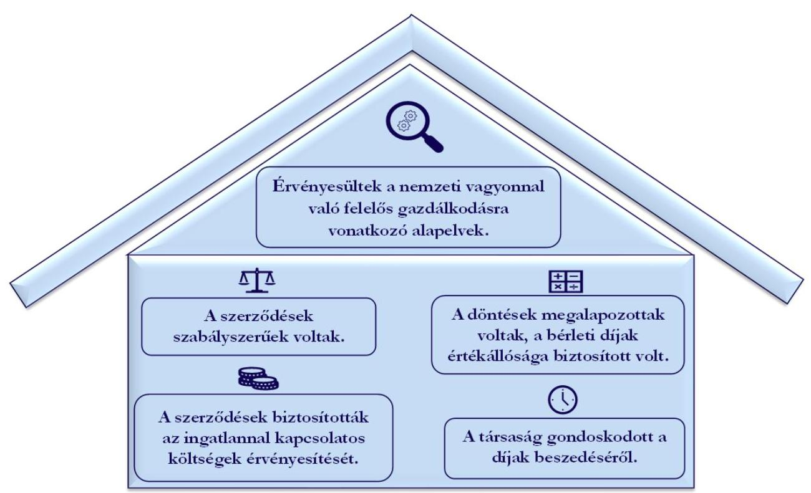

# JELENTÉS 

## A többségi állami tulajdonú gazdasági társaságok ingatlan bérbeadásának célzott ellenőrzése

## CONCORDIA KÖZRAKTÁR Kereskedelmi Zártkörűen Müködő Részvénytársaság

2024.

---

# JELENTÉS 

## A többségi állami tulajdonú gazdasági társaságok ingatlan bérbeadásának célzott ellenőrzése

## CONCORDIA KÖZRAKTÁR Kereskedelmi Zártkörűen Müködő Részvénytársaság

2024.

---

# ELLENŐRZÉSI IGAZGATÓSÁG: 

## ÁLLAMI VAGYONGAZDÁLKODÁST ELLENŐRZŐ IGAZGATÓSÁG

## ELLENŐRZÉSI IGAZGATÓ:

HERCZEGH ZSOLT ellenőrzési igazgató

## ELLENŐRZÉSVEZETŐ:

Jelentéseink az interneten a www.asz.hu címen olvashatók.

IMRE ZSUZSANNA ellenőrzésvezető

IKTATÓSZÁM: EL-3915-007/2024
TÉMASZÁM: 2706
ELLENŐRZÉS-AZONOSÍTÓ SZÁM: V1050

---

# TARTALOMJEGYZÉK 

AZ ELLENŐRZÉS ALAPADATAI ..... 5
MEGÁLLAPÍTÁSOK ÉS KÖVETKEZTETÉSEK ..... 7
MELLÉKLETEK ..... 10
I. sz. melléklet: Értelmező szótár ..... 10
II. sz. melléklet: Ellenőrzési kritériumok ..... 11
FÜGGELÉK: ÉSZREVÉTELEK ..... 12
RÖVIDÍTÉSEK JEGYZÉKE ..... 13

---

.

---

# AZ ELLENŐRZÉS ALAPADATAI 

## AZ ELLENŐRZÉS CÉLJA

Az ellenőrzés célja a gazdasági társaságnál az ingatlan bérbeadási szerződések szabályszerűségének és a kapcsolódó döntések megalapozottságának, valamint a bérleti díj értékállóságának, a bérleti díjakból eredő követelések érvényesítésének értékelése.

## AZ ELLENŐRZÖTT IDŐSZAK

A 2022. január 01. napjától 2023. június 30. napjáig tartó időszak.

## AZ ELLENŐRZÉS TÁRGYA

A többségi állami tulajdonú gazdasági társaság ingatlan bérbeadásra szóló szerződéseinek és módosításainak szabályszerűsége, a kapcsolódó döntések megalapozottsága, valamint a bérleti díj értékállóságának (az ingatlannal kapcsolatos költségek érvényesítésének) biztosítása, a bérleti díjakból eredő követelések érvényesítése volt.

Az ellenőrzés kiterjedt minden olyan körülményre és adatra, amely az Állami Számvevőszék (továbbiakban: ÁSZ ${ }^{1}$ ) jogszabályban meghatározott feladatainak teljesítéséhez, valamint a program végrehajtása folyamán felmerült újabb összefüggések feltárásához szükséges volt.

## AZ ELLENŐRZÉS JOGALAPJA

Az ellenőrzés jogszabályi alapját az ÁSZ tv. ${ }^{2} 1 . \int(3)$ bekezdése és az 5. $\int(4)$ bekezdése képezték.

## AZ ELLENŐRZÉS MÓDSZERE

Az ellenőrzést az ÁSZ a nemzetközi standardokat irányadónak tekintve az ellenőrzési program szempontjai, az ellenőrzött időszakban hatályos jogszabályok, az ellenőrzés szakmai szabályok és módszertanok figyelembevételével folytatta le.

Az ellenőrzési kérdések megválaszolásához szükséges bizonyítékok megszerzése az ellenőrzött szervezet által rendelkezésre bocsátott dokumentumokra és adatokra alapozva, a következő ellenőrzési eljárások alkalmazásával történt: megfigyelés, összehasonlítás, szemrevételezés, mintavételezés, elemző eljárás, kérdésfeltevés (interjú). Az ellenőrzési bizonyítékként felhasználható adatforrások közé tartoztak egyrészt az ellenőrzéshez kért dokumentumok, adatforrások, másrészt adatforrás volt minden - az ellenőrzés folyamán feltárt, az ellenőrzés szempontjából releváns információt tartalmazó - dokumentum.

Az ellenőrzés lefolytatásához az ellenőrzött szervezet a tanúsítvány kitöltésével, valamint az ÁSZ által kért dokumentumok, adatok, információk megküldésével és az ellenőrzés során szolgáltatott adatokat.

---

A tanúsítvány adatai alapján a CONCORDIA KÖZRAKTÁR Kereskedelmi Zártkörűen Működő Részvénytársaság az ellenőrzött időszakban 16 db ingatlan bérbeadási szerződéssel rendelkezett. A mintavételezés keretében öt darab ingatlan bérbeadási szerződés került kiválasztásra. Az ÁSZ jelentése a mintatételek vonatkozásában ad véleményt.

# AZ ELLENŐRZÖTT SZERVEZET 

## CONCORDIA KÖZRAKTÁR KERESKEDELMI ZÁRTKÖRÜEN MÜKÖDŐ RÉSZVÉNYTÁRSASÁG

A CONCORDIA KÖZRAKTÁR Zrt. ${ }^{3}$ a Gabonaforgalmi- és Malomipari Szolgáltató Vállalat általános jogutódjaként 1993. június 30 -án jött létre, kizárólagos állami tulajdonú részvénytársaságként. A tulajdonosi jogokat 2009. szeptember 01. és 2023. december 28. között a Magyar Nemzeti Vagyonkezelő Zrt., ezt követően a Miniszterelnökség gyakorolta.

| 1. táblázat |  |  |
| :--: | :--: | :--: |
| INGATLAN ÉS RAKTÁRBÉRBEADÁS BEVÉTELE |  |  |
| ADATOK (E FT) | 2021. | 2022. |
| értékesítés nettó árbevétele | 1265343 | 1454774 |
| - ebből ingatlan és raktárbérbea dás bevétele | 364225 | 497738 |

A CONCORDIA KÖZRAKTÁR Zrt. fő tevékenységi köre a raktározás, tárolás, mint közraktár a tevékenységét a közraktározásról szóló törvény ${ }^{4}$ szabályozza. Egyéb főbb tevékenységei között a CONCORDIA KÖZRAKTÁR Zrt. foglalkozik rakománykezeléssel, műszaki vizsgálat végzésével, elemzéssel, növénytermesztési szolgáltatásokkal, közúti áruszállítással és saját tulajdonú ingatlan bérbeadásával. A CONCORDIA KÖZRAKTÁR Zrt. székhelye Budapesten található, az ellenőrzött időszakban egy telephellyel és 12 fiókteleppel rendelkezett.

A CONCORDIA KÖZRAKTÁR Zrt.-nél 2010. október 18-tól Ügydöntő Felügyelő Bizottság múködik, az igazgatóság jogait vezető tisztségviselőként a vezérigazgató gyakorolta.

A CONCORDIA KÖZRAKTÁR Zrt. 2022. évi beszámolója alapján a mérlegfőösszege $3345,4 \mathrm{M} \mathrm{Ft}$, a saját tőke összege 3082,6 M Ft , az értékesítés nettó árbevétele 1454,8 M Ft , a foglalkoztatottak átlagos statisztikai állományi létszáma 108,4 fő volt.

A CONCORDIA KÖZRAKTÁR Zrt. az ellenőrzött időszakban a Taktv. ${ }^{5}$ 7/J. § (1) bekezdése és így a Gbkr. ${ }^{6}$ hatálya alá tartozott.

Az ellenőrzött szerződések egyrészt irodahelyiségek bérbeadására kötött bérleti szerződés ${ }_{1}{ }^{7}$, majd annak lejártát követően kötött bérleti szerződés ${ }_{2}{ }^{8}$, valamint telephely bérbeadására kötött bérleti szerződés ${ }_{3,4,5}{ }^{9}$.

---

# MEGÁLLAPÍTÁSOK ÉS KÖVETKEZTETÉSEK 

1. dóna

AZ ELLENŐRZÉS MEGÁLLAPÍTÁSAINAK ÖSSZEGZÉSE

Forrás: Az ellenőrzés során rendelkezésre bocsátott dokumentumok alapján ÁSZ saját szerkesztés

## A CONCORDIA KÖZRAKTÁR Zrt. ellenőrzéssel érintett ingatlan bérbeadási szerződései a jogszabályi és a belső irányító eszközökben foglalt előirások alapján szabályszerűek voltak.

A CONCORDIA KÖZRAKTÁR Zrt. a 2016.04.20-tól hatályos Ingatlangazdálkodási és hasznosítási szabályzatban ${ }^{10}$, majd a 2023.04.01-től hatályos Ingatlan és ingó vagyonértékesítési és ingatlanhasznosítási szabályzatában ${ }^{11}$ határozta meg az ingatlanok bérbeadásával kapcsolatos előírásokat. A CONCORDIA KÖZRAKTÁR Zrt. az eredményes költséggazdálkodás biztosítása érdekében a Költségfelosztási- és önköltségszámítási szabályzatban ${ }^{12}$ rögzítette az önköltségszámítás szabályait, megfelelve a Gbkr.-ben foglalt követelményeknek.
A bérleti szerződés ${ }_{1}$ megkötésére az MNV Zrt. ${ }^{13}$ előzetes egyetértését követően került sor, figyelemmel a Vhr. ${ }^{14}$-ben foglaltakra, továbbá a bérleti jogviszonyt az MNV Zrt. a Vtv. ${ }^{15}$ alapján tett nyilatkozata szerint létesítették.
A CONCORDIA KÖZRATKTÁR Zrt. a bérleti díjakat a bérleti szerződés ${ }_{1,2,3,4,5}$-ben foglaltaknak megfelelően évente felülvizsgálta és megemelte, tekintettel az infláció mértékére, figyelemmel a Ingatlangazdálkodási és hasznosítási szabályzatban és az Ingatlan és ingó vagyonértékesítési és ingatlanhasznosítási szabályzatában foglaltakra. A CONCORDIA KÖZRATKTÁR Zrt. a bérleti szerződés ${ }_{1,2,3,4,5}$-ben meghatározta a bérleti jogviszonnyal kapcsolatos jogokat, kötelezettségeket, a költségek viselésének, illetve a bérleti jogviszony megszűnésének szabályait. A bérleti szerződés ${ }_{1,2,3,4,5}$ tartalmazta az ingatlannal kapcsolatos közüzemi díjak bérlőre történő áthárításának módját, továbbá a bérleti szerződés ${ }_{3,4,5}$ a karbantartási és felújítási költségek viselésére vonatkozó előírásokat. A bérleti

---

szerződés ${ }_{1,2,3,4,5}$-ben rendelkeztek a bérleti díj megfizetésének módjáról és határidejéről, továbbá a késedelmes fizetés esetén alkalmazandó eljárásról. A CONCORDIA KÖZRAKTÁR Zrt.-nél az ellenőrzött ingatlan bérbeadási szerződéskötések során érvényesültek az Nvtv. ${ }^{16}$-ben rögzített, a nemzeti vagyonnal való felelős gazdálkodásra vonatkozó alapelvek, valamint a Taktv. -ben foglaltaknak megfelelően biztosította, hogy gazdálkodása során az ingatlan bérbeadási tevékenységét gazdaságosan hajtsa végre.

# A CONCORDIA KÖZRAKTÁR Zrt. ellenőrzéssel érintett ingatlanbérbeadásaihoz kapcsolódó döntései megalapozottak voltak, a bérleti díjak értékállóságát biztosították 

A CONCORDIA KÖZRAKTÁR Zrt. által a bérleti szerződés ${ }_{1,2}$-ek megkötésére a NÉBIH ${ }^{17}$, mint központi költségvetési szerv elhelyezésének és feladatellátásának biztosításával összefüggésben, megalapozottan került sor, amelyet alátámasztott az MNV Zrt. szerződés megkötésével kapcsolatos előzetes egyetértésének dokumentuma és az ingatlan használatára vonatkozó kijelölő okirata.
A CONCORDIA KÖZRAKTÁR Zrt. a jászapáti telephely bérleti szerződés ${ }_{3,4,5}$-sel történő bérbeadására a telephely veszteséges múködése miatt került sor, a kapacitások hatékony kihasználása érdekében. A szerződés megkötésére vonatkozó döntés megalapozottságát alátámasztotta, hogy a korábbi saját hasznosítással szemben, a bérbeadás folyamatos és kiszámítható eredményt termelt.
A CONCORDIA KÖZRAKTÁR Zrt. a bérleti díjak megfelelőségét önköltségszámítással alátámasztotta. A CONCORDIA KÖZRAKTÁR Zrt. a bérleti szerződés ${ }_{1,2,3,4,5}$-hez kapcsolódó bevételeket és ráfordításokat évente összevetette, a bérleti díjakat évente felülvizsgálta és az infláció mértékének figyelembevételével felemelte, biztosítva azok értékállóságát
A CONCORDIA KÖZRAKTÁR Zrt. a bérleti szerződés ${ }_{1,2,3,4,5}$-hez kapcsolódó döntései megalapozottak, dokumentumokkal alátámasztottak voltak, így érvényesültek az Nvtv.-ben rögzített felelős vagyongazdálkodásra vonatkozó alapelvek. A CONCORDIA KÖZRAKTÁR Zrt. kialakította a döntések nyomon követésének módját, illetve az ingatlan bérbeadásból származó bevételeket és ráfordításokat bérleményenként, bérlőnként nyomon követte, figyelemmel a Gbkr. -ben és a Taktv.-ben foglaltakra, így érvényesültek az Nvtv.-ben rögzített felelős vagyongazdálkodásra vonatkozó alapelvek.

## A CONCORDIA KÖZRAKTÁR Zrt. ellenőrzéssel érintett ingatlan bérbeadási szerzödéseik biztosították a bérbeadott ingatlannal kapcsolatos költségek érvényesitését.

## 2. táblázat

A BÉRLETI SZERZŐDÉS ${ }_{1,2}$ ALAPJÁN ELÉRT EREDMÉNY (E FT)

| MEGNEVEZÉS | 2022. EV | 2023.   L. FELEV |
| :-- | :--: | :--: |
| Bevétel | 25460,8 | 16975,2 |
| Ráfordítás | 14578,8 | 10194,4 |
| Eredmény | 10882,0 | 6780,8 |

A CONCORDIA KÖZRAKTÁR Zrt. által a bérleti szerződés ${ }_{1,2}$ alapján érvényesített bérleti díjak és továbbszámlázott közüzemi díjakból származó bevételek fedezetet biztosítottak a bérbeadott ingatlanrésszel kapcsolatosan felmerült költségekre. A CONCORDIA KÖZRAKTÁR Zrt. a bérleti szerződés ${ }_{1,2}$ alapján 2022. évben 10882 E Ft, 2023. I. félévében 6780,8 E Ft eredményt ért el.

---

A CONCORDIA KÖZRAKTÁR Zrt. által a bérleti szerződés ${ }_{3,4,5}$ alapján érvényesített bérleti díjak és továbbszámlázott közüzemi díjakból származó bevételek fedezetet biztosítottak a bérbeadott telephellyel kapcsolatosan felmerült költségekre. A bérleti szerződés ${ }_{3,4,5}$ alapján az üzemeltetés költségeit, a fenntartási- és rezsiköltségeket a bérlő viselte oly módon, hogy a CONCORDIA KÖZRAKTÁR Zrt. a szolgáltatóktól kapott számla összegének $100 \%$-át tovább számlázta, valamint a fenntartási-, karbantartási-, az üzemeltetéshez szükséges állagmegóvási munkákat a bérlő saját költségén
3. táblázat

A BÉRLETI SZERZŐDÉS ${ }_{3,4,5}$ ALAPJÁN ELÉRT EREDMÉNY (E FT)

| MEGNEVEZÉS | 2022   ÉV | 2023   L. FÉLÉV |
| :-- | :--: | :--: |
| Bevétel | 25233,1 | 13097,1 |
| Ráfordítás | 10653,8 | 5636,2 |
| Eredmény | 14579,3 | 7460,9 |

Forrás: A CONCORDIA KÖZRAKTÁR Zrt. adatszolgáltatása alapján ÁSZ saját szerkestés
volt köteles elvégezni. A CONCORDIA KÖZRAKTÁR Zrt. a bérleti szerződés ${ }_{3,4,5}$ alapján 2022. évben 14 579,3 E Ft, 2023. I. félévben 7 460,9 E FT eredményt ért el.
A CONCORDIA KÖZRAKTÁR Zrt.-nél a bérleti díjak évenkénti megemelésével, valamint a bérbeadott ingatlanokkal kapcsolatos közüzemi díjak viselésének bérleti szerződés ${ }_{1,2,3,4,5}$-be foglalásával és a bérlőkkel szembeni érvényesítésével, továbbá a bérbeadásból származó bevételek és a kapcsolódó ráfordítások nyomon követésével érvényesültek az Nvtv.-ben rögzített, a nemzeti vagyonnal való felelős gazdálkodásra vonatkozó alapelvek.

# A CONCORDIA KÖZRAKTÁR Zrt. az ellenőrzéssel érintett ingatlan bérbeadási szerződései tekintetében gondoskodott a bérleti díjak beszedéséről. 

A CONCORDIA KÖZRAKTÁR Zrt. a Számv. tv. ${ }^{18}$-ben előírtaknak megfelelően rendelkezett a bérlőkkel szembeni követelések nyilvántartásával. A nyilvántartásban rögzítettek alapján az ingatlan bérbeadásból származó követelések teljesülése és annak nyomon követése biztosított volt a Gbkr. előírásának megfelelően. A CONCORDIA KÖZRAKTÁR Zrt. nyomon követte az ingatlanok bérbeadásából származó követeléseit és intézkedéseket tett a bérlők késedelmes fizetése esetén, érvényesítve az Nvtv. nemzeti vagyonnal való felelős gazdálkodás elvét.

---

# MELLÉKLETEK 

## I. SZ. MELLÉKLET: ÉRTELMEZŐ SZÓTÁR

gazdasági társaság

többségi állami tulajdon
többségi befolyás
közraktár

A gazdasági társaságok üzletszerű közös gazdasági tevékenység folytatására, a tagok vagyoni hozzájárulásával létrehozott, jogi személyiséggel rendelkező vállalkozások, amelyekben a tagok a nyereségből közösen részesednek, és a veszteséget közösen viselik.
Forrás: Ptk. 3:88. § (1) bekezdése
Az állam tulajdonában lévő tagsági jogviszonyt megtestesítő értékpapír, illetve az állam tulajdonában lévő egyéb társasági részesedés, amennyiben a társaságban a Magyar Állam közvetlenül vagy közvetetten a szavazatok több mint felével rendelkezik.
(ÁSZ definíció a Vtv. 1. § (2) bekezdés c) pontja és a Ptk. 8:2. § (1), (3)-(4) bekezdései alapján)
Olyan kapcsolat, amelynek révén a befolyással rendelkező egy jogi személyben a szavazatok több mint ötven százalékával - közvetlenül vagy a jogi személyben szavazati joggal rendelkező más jogi személy (köztes vállalkozás) szavazati jogán keresztül - rendelkezik, azzal, hogy a közvetett módon való rendelkezés meghatározása során a jogi személyben szavazati joggal rendelkező más jogi személyt (köztes vállalkozást) megillető szavazati hányadot meg kell szorozni a befolyással rendelkezőnek a köztes vállalkozásban, illetve vállalkozásokban fennálló szavazati hányadával, ha azonban a köztes vállalkozásban fennálló szavazatainak hányada az ötven százalékot meghaladja, akkor azt egy egészként kell figyelembe venni. A befolyás számításánál nem kell figyelembe venni a huszonöt százalékot el nem érő közvetett befolyást.
Forrás: Taktv. 1. § b) pont
A közraktár olyan részvénytársaság vagy külföldi székhelyű vállalkozás magyarországi fióktelepe, amelynél árut közraktározás céljából szerződés alapján megőrzésre letétbe helyezhetnek.
Forrás: 1996. évi XLVIII. törvény 1. § (1)

---

# II. SZ. MELLÉKLET: ELLENŐRZÉSI KRITÉRIUMOK 

## ELLENŐRZÉSI KRITÉRIUMOK

Nvtv. 7. § (1), (2) bekezdése
Taktv. 7/J. § (3) bekezdés. a)-d) és f) pontok
Számv. tv. 12. § (1), 14. § (5) bek. c.), 16 § (1) bek., 29. §, 164 § (1), (2) bek
Gbkr. 3. § (1) bek. e) pont, 4. § (1) bek. c) pont, (3) bek., 6. § (1), (2) bek., 8. §
52/2021. (II. 9.) Korm. rendelet
CONCORDIA KÖZRAKTÁR Zrt. Ingatlangazdálkodási és hasznosítási szabályzata
CONCORDIA KÖZRAKTÁR Zrt. Ingatlan és ingó vagyonértékesítési és ingatlanhasznosítási szabályzata
CONCORDIA KÖZRAKTÁR Zrt. Költségfelosztási- és önköltségszámítási szabályzata

---

# FÜGGELÉK: ÉSZREVÉTELEK 

A jelentéstervezetet a Számvevőszék 15 napos észrevételezésre megküldte az ellenőrzött szervezet vezetőjének az ÁSZ tv. 29. §* (1) bekezdése előirásának megfelelően.

A CONCORDIA KÖZRAKTÁR Kereskedelmi Zártkörüen Müködő Részvénytársaság vezetője a jelentéstervezet megállapításaira észrevételt nem tett.

[^0]
[^0]:    * 29. § (1) Az Állami Számvevőszék az ellenőrzési megállapításait megküldi az ellenőrzött szervezet vezetőjének vagy az általa megbízott személynek, és annak, akinek személyes felelősségét állapította meg.
    (2) Az ellenőrzött szervezet vezetője és a felelősként megjelölt személy az ellenőrzés megállapításaira tizenöt napon belül írásban észrevételt tehet.
    (3) Az Állami Számvevőszék az észrevételre a beérkezésétől számított harminc napon belül írásban válaszol. A figyelembe nem vett észrevételeket köteles a jelentésben feltüntetni, és megindokolni, hogy azokat miért nem fogadta el.

---

# RÖVIDÍTÉSEK JEGYZÉKE 

${ }^{1}$ ÁSZ
${ }^{2}$ ÁSZ tv.
${ }^{3}$ CONCORDIA KÖZRAKTÁR Zrt.
${ }^{4}$ közraktározásról szóló törvény
${ }^{5}$ Taktv.
${ }^{6}$ Gbkr.
${ }^{7}$ bérleti szerződés
${ }^{8}$ bérleti szerződés
${ }^{9}$ bérleti szerződés
bérleti szerződés
bérleti szerződés
${ }^{10}$ Ingatlan gazdálkodási és
hasznosítási szabályzat
${ }^{11}$ Ingatlan és ingó vagyonértékesítési és ingatlanhasznosítási szabályzat
${ }^{12}$ Költségfelosztási- és önköltségszámítási szabályzat
${ }^{13}$ MNV Zrt.
${ }^{14}$ Vhr.
${ }^{15}$ Vtv.
${ }^{16}$ Nvtv.
${ }^{17}$ NÉBIH
${ }^{18}$ Számv.tv.

Állami Számvevőszék
2011. évi LXVI. törvény az Állami Számvevőszékről

CONCORDIA KÖZRAKTÁR Kereskedelmi Zártkörűen Müködő Részvénytársaság
1996. évi XLVIII. törvény a közraktározásról
2009. évi CXXII. törvény a köztulajdonban álló gazdasági társaságok takarékosabb müködéséről
339/2019. (XII. 23.) Korm. rendelet a köztulajdonban álló gazdasági társaságok belső kontrollrendszeréről
2019/019-00/05 azonosító számú, a NÉBIH és a CONCORDIA KÖZRAKTÁR Zrt. által kötött bérleti szerződés (hatályos 2019.12.01-2022.09.30-ig)
2022/024-00/05 azonosító számú, a NÉBIH és a CONCORDIA KÖZRAKTÁR Zrt. által kötött bérleti szerződés (hatályos 2022.10.01-2023.06.30-ig)
2021-004-00-05 azonosító számú, a bérlő és a CONCORDIA KÖZRAKTÁR Zrt. által kötött bérleti szerződés (hatályos 2021.06.01-2022.05.31-ig)
2022-005-00-05 azonosító számú, a bérlő és a CONCORDIA KÖZRAKTÁR Zrt. által kötött bérleti szerződés (hatályos 2022.06.01-2023.05.31-ig)
2023-011-00-05 azonosító számú, a bérlő és a CONCORDIA KÖZRAKTÁR Zrt. által kötött bérleti szerződés (hatályos 2023.06.01-2024.05.31-ig)
A CONCORDIA KÖZRAKTÁR Kereskedelmi Zrt. Ingatlan gazdálkodási és hasznosítási szabályzata - a 261/2016. (IV.20) sz. Alapítói Határozat melléklete hatályos 2016.04.20-tól 2023.04.01-ig
A CONCORDIA KÖZRAKTÁR Zrt. 9/2023. sz. Vezérigazgatói Utasítás módosításokkal egységes szerkezetbe foglalt - Ingatlan és ingó vagyonértékesítési és ingatlanhasznosítási szabályzat - hatályos 2023.04.01-től
A CONCORDIA KÖZRAKTÁR Zrt. Költségfelosztási- és önköltségszámítási szabályzat - a 3/2022. sz. Vezérigazgatói Utasítás - hatályos 2022.j anuár18-tól Magyar Nemzeti Vagyonkezelő Zártkörűen müködő Részvénytársaság az állami vagyonnal való gazdálkodásról szóló 254/2007. (X.4.) Korm.rendelet az állami vagyonról szóló 2007. évi CVL törvény
2011. évi CXCVI. törvény a nemzeti vagyonról

Nemzeti Élelmiszerlánc-biztonsági Hivatal
2000. évi C. törvény a számvitelről

---

1052 Budapest, Apáczai Csere János u. 10. | 1364 Budapest 4., Pf. 54
www.asz.hu | szamvevoszek@asz.hu
telefon: +36 14849100