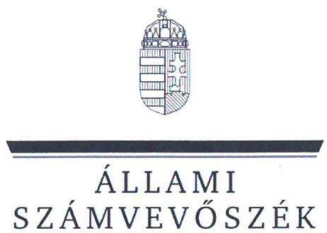
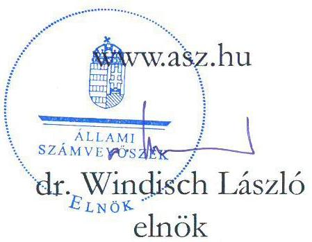
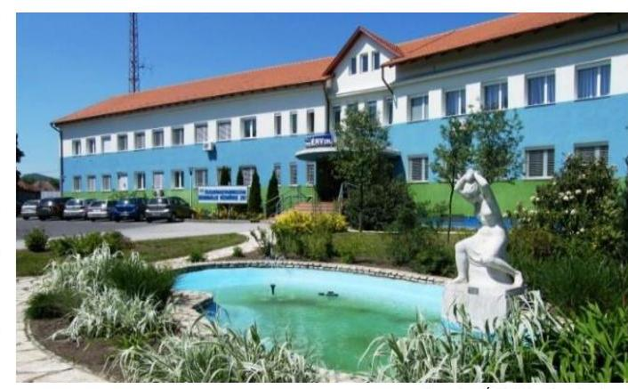
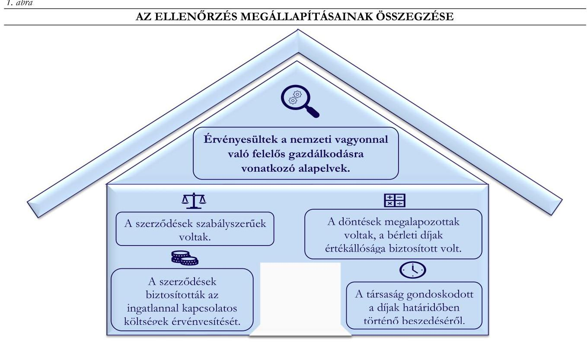

# JELENTÉS 

## A többségi állami tulajdonú gazdasági társaságok ingatlan bérbeadásának célzott ellenőrzése

ÉRV. Északmagyarországi Regionális Vízmúvek Zártkörűen Müködő Részvénytársaság

2024.

---

ÁLLAMI
SZÁMVEVŐSZÉK

# JELENTÉS 

## A többségi állami tulajdonú gazdasági társaságok ingatlan bérbeadásának célzott ellenőrzése

ÉRV. Északmagyarországi Regionális Vízmúvek Zártkörűen Müködő Részvénytársaság

2024.

24057

---

# ELLENŐRZÉSI IGAZGATÓSÁG: 

ÁLLAMI VAGYONGAZDÁLKODÁST ELLENŐRZŐ IGAZGATÓSÁG

## ELLENŐRZÉSI IGAZGATÓ:

HERCZEGH ZSOLT ellenőrzési igazgató

## ELLENŐRZÉSVEZETŐ:

Jelentéseink az interneten a www.asz.hu címen olvashatók.

IMRE ZSUZSANNA ellenőrzésvezető

IKTATÓSZÁM: EL-3915-003/2024
TÉMASZÁM: 2706
ELLENŐRZÉS-AZONOSÍTÓ SZÁM: V1050

---

# TARTALOMJEGYZÉK 

AZ ELLENŐRZÉS ALAPADATAI ..... 5
MEGÁLLAPÍTÁSOK ÉS KÖVETKEZTETÉSEK ..... 7
MELLÉKLETEK ..... 10
I. sz. melléklet: Értelmező szótár ..... 10
II. sz. melléklet: Ellenőrzési kritériumok ..... 11
FÜGGELÉK: ÉSZREVÉTELEK ..... 12
RÖVIDÍTÉSEK JEGYZÉKE ..... 13

---

.

---

# AZ ELLENŐRZÉS ALAPADATAI 

## AZ ELLENŐRZÉS CÉLJA

Az ellenőrzés célja a gazdasági társaságnál az ingatlan bérbeadási szerződések szabályszerűségének és a kapcsolódó döntések megalapozottságának, valamint a bérleti díj értékállóságának, a bérleti díjakból eredő követelések érvényesítésének értékelése.

## AZ ELLENŐRZÖTT IDŐSZAK

A 2022. január 01. napjától 2023. június 30. napjáig tartó időszak.

## AZ ELLENŐRZÉS TÁRGYA

A többségi állami tulajdonú gazdasági társaság ingatlan bérbeadásra szóló szerződéseinek és módosításainak szabályszerűsége, a kapcsolódó döntések megalapozottsága, valamint a bérleti díj értékállóságának (az ingatlannal kapcsolatos költségek érvényesítésének) biztosítása, a bérleti díjakból eredő követelések érvényesítése volt.

Az ellenőrzés kiterjedt minden olyan körülményre és adatra, amely az Állami Számvevőszék (továbbiakban: ÁSZ ${ }^{1}$ ) jogszabályban meghatározott feladatainak teljesítéséhez, valamint a program végrehajtása folyamán felmerült újabb összefüggések feltárásához szükséges volt.

## AZ ELLENŐRZÉS JOGALAPJA

Az ellenőrzés jogszabályi alapját az ÁSZ tv. ${ }^{2} 1 . \int(3)$ bekezdése és az 5. $\int(4)$ bekezdése képezték.

## AZ ELLENŐRZÉS MÓDSZERE

Az ellenőrzést az ÁSZ a nemzetközi standardokat irányadónak tekintve az ellenőrzési program szempontjai, az ellenőrzött időszakban hatályos jogszabályok, az ellenőrzés szakmai szabályok és módszertanok figyelembevételével folytatta le.

Az ellenőrzési kérdések megválaszolásához szükséges bizonyítékok megszerzése az ellenőrzött szervezet által rendelkezésre bocsátott dokumentumokra és adatokra alapozva, a következő ellenőrzési eljárások alkalmazásával történt: megfigyelés, összehasonlítás, szemrevételezés, mintavételezés, elemző eljárás, kérdésfeltevés (interjú). Az ellenőrzési bizonyítékként felhasználható adatforrások közé tartoztak egyrészt az ellenőrzéshez kért dokumentumok, adatforrások, másrészt adatforrás volt minden - az ellenőrzés folyamán feltárt, az ellenőrzés szempontjából releváns információt tartalmazó - dokumentum.

Az ellenőrzés lefolytatásához az ellenőrzött szervezet a tanúsítvány kitöltésével, valamint az ÁSZ által kért dokumentumok, adatok, információk megküldésével és az ellenőrzés során szolgáltatott adatokat. A

---

tanúsítvány adatai alapján az ÉRV. Zrt. ${ }^{3}$ az ellenőrzött időszakban 47 darab ingatlan bérbeadási szerződéssel rendelkezett. A mintavételezés keretében két darab ingatlan bérbeadási szerződés került kiválasztásra. Az ÁSZ jelentése a mintatételek vonatkozásában ad véleményt.

# AZ ELLENŐRZÖTT SZERVEZET 

## ÉRV. ÉSZAKMAGYARORSZÁGI REGIONÁLIS VÍZMÜVEK ZÁRTKÖRÜEN MÜKÖDŐ RÉSZVÉNYTÁRSASÁG

Az ÉRV. Zrt. jogelődje, az Északmagyarországi Vízmúvek Részvénytársaság 1993.04.01-én alakult, alapításkori tulajdonosa 100\%-ban a Magyar Állam volt. Jelenlegi formájában ÉRV. Zrt. néven 2006.06.12-től müködik. Az ÉRV. Zrt. 99,87\%-os tulajdonosa a Magyar Állam, tulajdonosi joggyakorlója a Nemzeti Vízmúvek Zártkörűen Müködő Részvénytársaság. A társaságban tulajdonrésszel rendelkeznek továbbá azon önkormányzatok, ahol a Társaság önkormányzati tulajdonú víziközmúvet üzemeltet.

Furváe: ÉRV. Zrt. honlapja

Az ÉRV. Zrt. főtevékenysége a víztermelés, -kezelés, -ellátás, fő feladata a víztermelés, a szennyvíz összegyüjtése és kezelése. Szolgáltatási feladatait állami, illetve önkormányzati tulajdonú víziközmúvek üzemeltetésével látja el, vagyonkezelési szerződés, illetve bérüzemeltetési szerződések alapján. Müködési területe Heves, Nógrád, Borsod-Abaúj-Zemplén és Hajdú-Bihar vármegyére terjed ki, a közvetlenül ellátott települések száma folyamatosan növekszik. Az ÉRV. Zrt. székhelye Kazincbarcikán található. Telephellyel rendelkezik Kazincbarcikán, fiókteleppel Salgótarjánban, Bélapátfalván és Sátoraljaújhelyen.

Az ÉRV. Zrt. 2022. évi beszámolója alapján a mérlegfőösszege 70 953,5 M Ft, a saját tőke összege 4 823,1 M Ft, az értékesítés nettó árbevétele 12 439,4 M Ft, a foglalkoztatottak átlagos statisztikai állományi létszáma 1235 fő volt.

Az ÉRV. Zrt. az ellenőrzött időszakban a Taktv. ${ }^{4}$ 7/J. (1) bekezdése és így a Gbkr. ${ }^{5}$ hatálya alá tartozott.
Az ellenőrzött szerződések (mintatételek) az alábbiak voltak: Bánhorváti külterület 0188/2 helyrajzi számú ingatlan (épület, építmény) 10 évre történő bérbe adására irányuló, 2019. március 27 -én kelt bérleti szerződés; ${ }^{6}$ és Verpelét 05/2 helyrajzi számú, valamint Sirok 0276/5 helyrajzi számú ingatlanok (földterületek) határozott idejű (10, illetve 15 hónap) bérbe adására irányuló 2022. augusztus 15-én kelt bérleti szerződés; ${ }^{7}$.

---

# MEGÁLLAPÍTÁSOK ÉS KÖVETKEZTETÉSEK 

Forrás: Az ellenörzés során rendelkezésre bocsátott dokumentumok alapján ÁSZ saját szerkesztés
Az ÉRV. Zrt. ellenőrzéssel érintett ingatlan bérbeadási szerződései a jogszabályi és a belsó irányító eszközökben foglalt elöírások alapján szabályszerüek voltak.

Az ÉRV. Zrt. a 2020. szeptember 1-től hatályos Szerződéskezelési szabályzatában ${ }^{8}$ kialakította a szerződéskötések rendjét, valamint meghatározta az ingatlan bérbeadási tevékenységre vonatkozó kontrollokat, amivel megfelelt a Gbkr.-ben foglalt követelményeknek.

A bérleti szerződések ${ }_{1,2}$ tartalmazták a bérlet tárgyát, időtartamát, a bérleti díj összegét, a késedelmes fizetés esetén alkalmazandó eljárásokat, a felmondási időt, valamint a szerződés megszűnése esetén követendő eljárásokat. A Szerződéskezelési szabályzat hatályba lépését követően kelt bérleti szerződés ${ }_{2}$ tartalmazta a Szerződéskezelési szabályzatban foglalt minimális tartalmi elemeket. A bérleti szerződés ${ }_{1,2}$-ek szabályszerűek voltak, megfeleltek a Ptk. ${ }^{9}$-ban foglaltaknak.
Az ÉRV. Zrt. a bérleti szerződés ${ }_{1,2}$ megkötése során érvényesítette az Nvtv. ${ }^{10}$-ben rögzített, a nemzeti vagyonnal való felelős gazdálkodásra vonatkozó alapelveket, valamint a Taktv. -ben foglaltaknak megfelelően biztosította, hogy gazdálkodása során az ingatlan bérbeadási tevékenységét gazdaságosan hajtsa végre.

## Az ÉRV. Zrt. ellenőrzéssel érintett ingatlan bérbeadásaihoz kapcsolódó döntései megalapozottak voltak, a bérleti díjak értékállóságát biztosították.

Az ÉRV. Zrt. a bérleti szerződés ${ }_{1,2}$ megkötését megelőzően készített előterjesztés ${ }_{1,2}{ }^{11}$-ben és a bérleti szerződés ${ }_{2}$-ben rögzítette a szerződéskötések indokoltságát, amivel biztosította az ingatlan bérbeadási szerződésekre vonatkozó döntések célszerűségi, gazdaságossági szempontú megalapozottságát. Az ÉRV. Zrt. a bérleti szerződés ${ }_{1,2}$-ben rögzítette a bérlő bérleti díjon felüli fizetési (közüzemi díjak) és egyéb (állagmegóvás

---

érdekében végzendő karbantartás) kötelezettségeit. A 10 éves időtartamra kötött bérleti szerződés ${ }_{1}$-ben rendelkeztek a bérleti díj évenkénti felülvizsgálatáról, annak megemeléséről a KSH által közzétett inflációs ráta mértékével egyezően, biztosítva a bérleti díj értékállóságát. Az ÉRV. Zrt. - az ellenőrzéssel érintett ingatlanbérbeadással kapcsolatosan hozott döntéseinél érvényesültek az Nvtv. -ben rögzített, a nemzeti vagyonnal való felelős gazdálkodásra vonatkozó alapelvek.

Az ÉRV. Zrt. a bérleti szerződés ${ }_{1,2}$ tekintetében a bérbeadási javaslatot az előterjesztés dokumentumaiban, a döntést az ingatlanbérbeadási szerződésekben írásba foglalta, ezzel megfelelt a Gbkr.-ben foglaltaknak.

Az ÉRV. Zrt. kialakította az ingatlan bérbeadási tevékenységének, valamint a célok megvalósításának nyomon követését biztosító rendszer kereteit, a rendelkezésre bocsátott analitikus nyilvántartás ${ }^{12}$ tartalmazta az ellenőrzött időszakra vonatkozóan a bérlők részére kiállított számlák nettó és bruttó összegét, a számla keltét, a teljesítés időpontját, a számla esedékességét, valamint a kiegyenlítés dátumát. Az ingatlan bérbeadás tekintetében a nyomon követési rendszer működése biztosított volt, ezzel megfelelt a Gbkr. -ben foglaltaknak.

# Az ÉRV. Zrt. ellenőrzéssel érintett ingatlanbérbeadási szerzödései biztosították a bérbeadott ingatlannal kapcsolatos költségek érvényesitését. 

Az ÉRV. Zrt. a bérleti szerződés ${ }_{1}$ alapján a bérleti díj összegét az előző időszakhoz viszonyítva a KSH által hivatalosan közzétett infláció mértékével megegyező mértékben, 2022.04.01-től 5,1\%-kal, 2023.04.01-től $14,5 \%$-kal megemelte. A bérleti szerződés ${ }_{1}$-ben rögzítették, hogy a bérlő a bérleti díjon felül megfizeti a bérlemény üzemeltetésével összefüggő közüzemi díjakat, melyhez kapcsolódóan vállalta a közüzemi szerződések megkötését a közüzemi szolgáltatókkal. A bérleti szerződés ${ }_{2}$ a bérleti díj felülvizsgálatára vonatkozó rendelkezést nem tartalmazott, azonban tekintettel a szerződés határozott időtartamára (10 és 15 hónap) a díjemelés feltételeinek rögzítése nem volt indokolt. Az ÉRV. Zrt. a bérleti szerződés ${ }_{2}$-ben foglaltakkal összhangban a víz és villamosenergia vételezésre külön szolgáltatási szerződést ${ }^{13}$ kötött a bérlővel, mely alapján a közüzemi díjak a szolgáltatási szerződésben foglaltakkal összhangban az ellenőrzött időszakban a bérlő részére tovább számlázásra kerültek. (A bérleti szerződés ${ }_{1,2}$-ekhez kapcsolódó bevételeket és tovább számlázott ráfordításokat a 1. táblázat szemlélteti.)

## 1. táblázat

A MINTATÉTELEKHEZ KAPCSOLÓDÓ BEVÉTELEK ÉS TOVÁBBSZÁMLÁZOTT KÖLTSÉGEK (ADATOK EZER FORINTBAN)

| MEGNEVEZÉS | 2022. ÉV | 2023.   1. FELEV |
| :--: | :--: | :--: |
| Ingatlan bérbeadásból   származó bevételek (bérleti díj) | 1216,5 | 837,3 |
| - ebből bérleti szerződés ${ }_{1}$ | 899,0 | 488,0 |
| - ebből bérleti szerződés ${ }_{2}$ | 317,5 | 349,3 |
| Továbbszámlázott ráfordítások | 2957,8 | 3812,0 |
| - ebből bérleti szerződés ${ }_{1}$ | 0,0 | 0,0 |
| - ebből bérleti szerződés ${ }_{2}$ | 2957,8 | 3812,0 |

A bérbeadásból származó követelésekről vezetett nyilvántartás ${ }^{14}$, valamint az analitikus nyilvántartás tartalmazta az ellenőrzött időszakra vonatkozóan az ÉRV. Zrt. ingatlan bérbeadásból származó bevételeit számlánkénti bontásban és nyomon követte az ingatlan bérbeadási tevékenységgel kapcsolatban felmerült bevételeket és továbbszámlázott ráfordításokat ingatlan bérbeadási szerződésenként, ezzel megfelelt a Gbkr. ben foglalt előírásoknak. A rendelkezésre bocsátott dokumentumok és a bérleti szerződés ${ }_{1}$-ben rögzítettek alapján az ingatlan bérbeadással kapcsolatban ráfordítások az ellenőrzött időszakban nem merültek
Forrás: Az ellenőrzés során rendelkezésev bocsátott dokumentumok alapján ÁSZ saját szerkezését fel. A bérleti szerződés ${ }_{2}$-ben rögzítettek alapján az ingatlannal kapcsolatban felmerült ráfordítások minden esetben tovább számlázásra kerültek a bérlő részére.

Az ÉRV. Zrt.-nél a bérleti díj évenkénti megemelésének a bérleti szerződés ${ }_{1}$-ben foglalt lehetőségével, annak ellenőrzött időszakban történő érvényesítésével, valamint az ingatlannal kapcsolatos közüzemi díjak viselésének bérleti szerződés ${ }_{1,2}$-be foglalásával, továbbá a bérbeadásból származó bevételek és a kapcsolódó

---

ráfordítások nyomon követésével érvényesültek az Nvtv.-ben rögzített, a nemzeti vagyonnal való felelős gazdálkodásra vonatkozó alapelvek.

# Az ÉRV. Zrt. az ellenőrzéssel érintett ingatlan bérbeadási szerződései tekintetében gondoskodott a bérleti díjak határidőben történő beszedéséröl. 

Az ÉRV. Zrt.-nek az ellenőrzött időszakban a bérleti szerződés ${ }_{1,2}$-ből eredően határidőn túli követelése nem keletkezett. Az ÉRV. Zrt. az ingatlan bérbeadási tevékenysége során előforduló, a vagyoni, pénzügyi, jövedelmi helyzetére kiható gazdasági eseményeket a követelésekről vezetett nyilvántartásban folyamatosan rögzítette, ezzel megfelelt a Számv. tv. ${ }^{13}$-ben foglaltaknak. Az ÉRV. Zrt. a bérleti szerződés ${ }_{1,2}$-ben meghatározta a késedelmes vagy nem fizetés esetén alkalmazandó eljárásokat, ezzel megfelelt a Gbkr.-ben foglaltaknak. Az ÉRV. Zrt. a bérleti szerződés ${ }_{1,2}$ tekintetében kialakította az eredményes gazdálkodás kereteit, melynek során kontrollokat épített ki a bérleti díjak határidőben történő beszedésének érdekében, valamint nyomon követte a követelések pénzügyi teljesülését, ezzel megfelelt a Gbkr. előírásaiban foglaltaknak és érvényesítette az Nvtv. ben rögzített, a nemzeti vagyonnal való felelős gazdálkodásra vonatkozó alapelveket.

---

# MELLÉKLETEK 

- I. SZ. MELLÉKLET: ÉRTELMEZŐ SZÓTÁR
gazdasági társaság
többségi állami tulajdon
többségi befolyás

A gazdasági társaságok üzletszerű közös gazdasági tevékenység folytatására, a tagok vagyoni hozzájárulásával létrehozott, jogi személyiséggel rendelkező vállalkozások, amelyekben a tagok a nyereségből közösen részesednek, és a veszteséget közösen viselik. Forrás: Ptk. 3:88. § (1) bekezdése
Az állam tulajdonában lévő tagsági jogviszonyt megtestesítő értékpapír, illetve az állam tulajdonában lévő egyéb társasági részesedés, amennyiben a társaságban a Magyar Állam közvetlenül vagy közvetetten a szavazatok több mint felével rendelkezik.
(ÁSZ definíció a Vtv. ${ }^{16}$ 1. $\S$ (2) bekezdés c) pontja és a Ptk. 8:2. § (1), (3)-(4) bekezdései alapján) ${ }^{16}$

Olyan kapcsolat, amelynek révén a befolyással rendelkező egy jogi személyben a szavazatok több mint ötven százalékával - közvetlenül vagy a jogi személyben szavazati joggal rendelkező más jogi személy (köztes vállalkozás) szavazati jogán keresztül - rendelkezik, azzal, hogy a közvetett módon való rendelkezés meghatározása során a jogi személyben szavazati joggal rendelkező más jogi személyt (köztes vállalkozást) megillető szavazati hányadot meg kell szorozni a befolyással rendelkezőnek a köztes vállalkozásban, illetve vállalkozásokban fennálló szavazati hányadával, ha azonban a köztes vállalkozásban fennálló szavazatainak hányada az ötven százalékot meghaladja, akkor azt egy egészként kell figyelembe venni. A befolyás számításánál nem kell figyelembe venni a huszonöt százalékot el nem érő közvetett befolyást.
Forrás: Taktv. 1. § b) pont

---

# II. SZ. MELLÉKLET: ELLENŐRZÉSI KRITÉRIUMOK 

## ELLENŐRZÉSI KRITÉRIUMOK

Nvtv. 7. § (1), (2) bekezdés
Taktv. 7/J. § (3) bekezdés a) -d) és f pontok
Ptk. 6:331-6:341. §
Számv. tv. 12. § (1), 14. § (5) bekezdés c.) pont, 16 § (1) bekezdés, 29. §, 164 § (1), (2) bekezdés
Gbkr. 3. § (1) bekezdés e) pont, 4. § (1) bekezdés c) pont, (3) bekezdés, 6. § (1), (2) bekezdés, 8. §
52/2021. (II. 9.) Korm. rendelet ${ }^{17}$
Az ÉRV. Zrt. Szerződéskezelési szabályzata

---

# FÜGGELÉK: ÉSZREVÉTELEK 

A jelentéstervezetet a Számvevőszék 15 napos észrevételezésre megküldte az ellenőrzött szervezet vezetőjének az ÁSZ tv. 29. §* (1) bekezdése előírásának megfelelően.

Az ÉRV. Északmagyarországi Regionális Vízmúvek Zártkörüen Müködő Részvénytársaság vezetője nemleges észrevételt tett.

[^0]
[^0]:    * 29. § (1) Az Állami Számvevőszék az ellenőrzési megállapításait megküldi az ellenőrzött szervezet vezetőjének vagy az általa megbízott személynek, és annak, akinek személyes felelősségét állapította meg.
    (2) Az ellenőrzött szervezet vezetője és a felelősként megjelölt személy az ellenőrzés megállapításaira tizenöt napon belül írásban észrevételt tehet.
    (3) Az Állami Számvevőszék az észrevételre a beérkezésétől számított harminc napon belül írásban válaszol. A figyelembe nem vett észrevételeket köteles a jelentésben feltüntetni, és megindokolni, hogy azokat miért nem fogadta el.

---

# RÖVIDÍTÉSEK JEGYZÉKE 

${ }^{1}$ ÁSZ ${ }^{2}$ ÁSZ tv. ${ }^{3}$ ÉRV. Zrt. ${ }^{4}$ Taktv. ${ }^{5}$ Gbkr. ${ }^{6}$ bérleti szerződés ${ }_{1}$

7 bérleti szerződés2
${ }^{8}$ Szerződéskezelési szabályzat
${ }^{9}$ Ptk.
${ }^{10}$ Nvtv.
${ }^{11}$ előterjesztés ${ }_{1,2}$

[^0]Állami Számvevőszék
2011. évi LXVI. törvény az Állami Számvevőszékről
ÉRV. Északmagyarországi Regionális Vízművek Zártkörűen Működő Részvénytársaság
2009. évi CXXII. törvény a köztulajdonban álló gazdasági társaságok takarékosabb múködéséről
339/2019. (XII. 23.) Korm. rendelet a köztulajdonban álló gazdasági társaságok belső kontrollrendszeréről
Az ÉRV. Északmagyarországi Regionális Vízművek Zártkörűen Működő Részvénytársaság 2019.03.27-én kelt KSZÜ-2019-7-tervezet-1 számú bérleti szerződése
Az ÉRV. Északmagyarországi Regionális Vízművek Zártkörűen Működő Részvénytársaság 2022.08.15-én kelt NYÜ-2022-31-tervezet-01 számú bérleti szerződése
Az ÉRV. Zrt. Szerződéskezelési szabályzata (hatályos: 2020.09.01-től 2023.08.30-ig)
2013. évi V. törvény a Polgári Törvénykönyvről
2011. évi CXCVI. törvény a nemzeti vagyonról
előterjesztés ${ }_{1}$ : Az ÉRV. Zrt. által rendelkezésre bocsátott, KSZÜ-2019-7-tervezet-1 iktatószámú ingatlan bérbeadási szerződést megalapozó, 2019.02.04-én kelt, „Használaton kívüli ingatlan bérlési lehetősége" előterjesztés
előterjesztés ${ }_{2}$ : Az ÉRV. Zrt. által rendelkezésre bocsátott, NYÜ-2022-31-tervezet-01 iktatószámú ingatlan bérbeadási szerződést megalapozó, 2022.07.25-én kelt, „Sirok medence és Verpelét Vízmú telephely kijelölt területének bérlési lehetőségéről szóló" előterjesztés
Az ÉRV. Zrt. által rendelkezésre bocsátott, az ingatlan bérbeadásából származó bevételeket és az azzal kapcsolatos ráfordításokat tartalmazó analitikus nyilvántartás (2022.01.01-2023.06.30. időszakra vonatkozóan)

Az ÉRV. Északmagyarországi Regionális Vízművek Zártkörűen Működő Részvénytársaság 2022.09.01-én kelt NYÜ-2022-32-tervezet-01 számú szolgáltatási szerződése
Az ÉRV. Zrt. által rendelkezésre bocsátott ingatlan bérbeadási szerződésekből eredően - bérlőkkel szemben fennálló követeléseinek nyilvántartása, amely tartalmazza a számlázott bérbeadási díjat, annak esedékességét, a bérlő általi pénzügyi teljesítés időpontját
2000. évi C. törvény a számvitelről
2007. évi CVI. törvény az állami vagyonról
52/2021. (II. 9.) Korm. rendelet a bérletidíj-fizetési mentességről

[^0]:    ${ }^{12}$ analitikus nyilvántartás
    ${ }^{13}$ szolgáltatási szerződés
    ${ }^{14}$ követelésekről vezetett nyilvántartás
    ${ }^{15}$ Számv. tv.
    ${ }^{16}$ Vtv.
    ${ }^{17}$ 52/2021. (II. 9.) Korm. rendelet

---

1052 Budapest, Apáczai Csere János u. 10. | 1364 Budapest 4., Pf. 54
www.asz.hu | szamvevoszek@asz.hu
telefon: +36 14849100