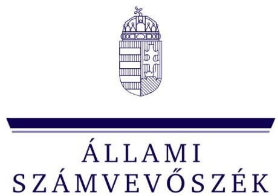
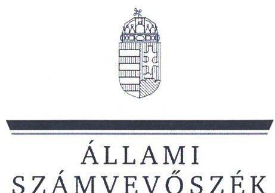
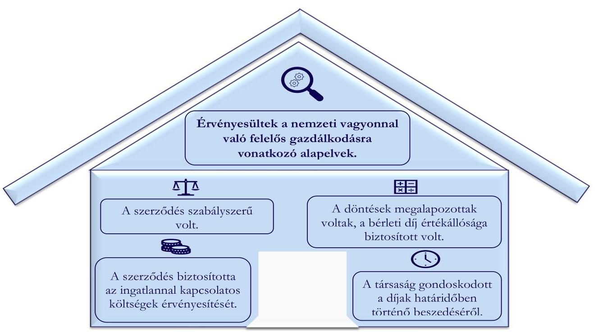

ÁLLAMI
SZÁMVEVŐSZÉK

# JELENTÉS 

## A többségi állami tulajdonú gazdasági társaságok ingatlan bérbeadásának célzott ellenőrzése

Könyvtárellátó Közhasznú Nonprofit Korlátolt Felelősségű Társaság

2024.

---

ÁLLAMI
SZÁMVEVŐSZÉK

# JELENTÉS 

## A többségi állami tulajdonú gazdasági társaságok ingatlan bérbeadásának célzott ellenőrzése

Könyvtárellátó Közhasznú Nonprofit Korlátolt Felelősségű Társaság

2024.

---

# ELLENŐRZÉSI IGAZGATÓSÁG: 

## ÁLLAMI VAGYONGAZDÁLKODÁST ELLENŐRZŐ IGAZGATÓSÁG

## ELLENŐRZÉSI IGAZGATÓ:

HERCZEGH ZSOLT ellenőrzési igazgató

## ELLENŐRZÉSVEZETŐ:

Jelentéseink az interneten a www.asz.hu címen olvashatók.

IMRE ZSUZSANNA ellenőrzésvezető

IKTATÓSZÁM: EL-3915-005/2024
TÉMASZÁM: 2706
ELLENŐRZÉS-AZONOSÍTÓ SZÁM: V1050

---

# TARTALOMJEGYZÉK 

AZ ELLENŐRZÉS ALAPADATAI ..... 5
MEGÁLLAPÍTÁSOK ÉS KÖVETKEZTETÉSEK. ..... 7
MELLÉKLETEK ..... 10
I. sz. melléklet: Értelmező szótár ..... 10
II. sz. melléklet: Ellenőrzési kritériumok ..... 11
FÜGGELÉK: ÉSZREVÉTELEK ..... 12
RÖVIDÍTÉSEK JEGYZÉKE ..... 13

---

.

---

# AZ ELLENŐRZÉS ALAPADATAI 

## AZ ELLENŐRZÉS CÉLJA

Az ellenőrzés célja a gazdasági társaságnál az ingatlan bérbeadási szerződések szabályszerűségének és a kapcsolódó döntések megalapozottságának, valamint a bérleti díj értékállóságának, a bérleti díjakból eredő követelések érvényesítésének értékelése.

## AZ ELLENŐRZÖTT IDŐSZAK

A 2022. január 01. napjától 2023. június 30. napjáig tartó időszak.

## AZ ELLENŐRZÉS TÁRGYA

A többségi állami tulajdonú gazdasági társaság ingatlan bérbeadásra szóló szerződéseinek és módosításainak szabályszerűsége, a kapcsolódó döntések megalapozottsága, valamint a bérleti díj értékállóságának (az ingatlannal kapcsolatos költségek érvényesítésének) biztosítása, a bérleti díjakból eredő követelések érvényesítése volt.

Az ellenőrzés kiterjedt minden olyan körülményre és adatra, amely az Állami Számvevőszék (továbbiakban: ÁSZ ${ }^{1}$ ) jogszabályban meghatározott feladatainak teljesítéséhez, valamint a program végrehajtása folyamán felmerült újabb összefüggések feltárásához szükséges volt.

## AZ ELLENŐRZÉS JOGALAPJA

Az ellenőrzés jogszabályi alapját az ÁSZ tv. ${ }^{2} 1 . \int(3)$ bekezdése és az 5. $\int(4)$ bekezdése képezték.

## AZ ELLENŐRZÉS MÓDSZERE

Az ellenőrzést az ÁSZ a nemzetközi standardokat irányadónak tekintve az ellenőrzési program szempontjai, az ellenőrzött időszakban hatályos jogszabályok, az ellenőrzés szakmai szabályok és módszertanok figyelembevételével folytatta le.

Az ellenőrzési kérdések megválaszolásához szükséges bizonyítékok megszerzése az ellenőrzött szervezet által rendelkezésre bocsátott dokumentumokra és adatokra alapozva, a következő ellenőrzési eljárások alkalmazásával történt: megfigyelés, összehasonlítás, szemrevételezés, mintavételezés, elemző eljárás, kérdésfeltevés (interjú). Az ellenőrzési bizonyítékként felhasználható adatforrások közé tartoztak egyrészt az ellenőrzéshez kért dokumentumok, adatforrások, másrészt adatforrás volt minden - az ellenőrzés folyamán feltárt, az ellenőrzés szempontjából releváns információt tartalmazó - dokumentum.

Az ellenőrzés lefolytatásához az ellenőrzött szervezet a tanúsítvány kitöltésével, valamint az ÁSZ által kért dokumentumok, adatok, információk megküldésével és az ellenőrzés során szolgáltatott adatokat. A

---

tanúsítvány adatai alapján a Könyvtárellátó Közhasznú Nonprofit Korlátolt Felelősségű Társaság az ellenőrzött időszakban 12 darab ingatlan bérbeadási szerződéssel rendelkezett. A mintavételezés keretében egy darab ingatlan bérbeadási szerződés került kiválasztásra. Az ÁSZ jelentése a mintatétel vonatkozásában ad véleményt.

# AZ ELLENŐRZÖTT SZERVEZET 

## KÖNYVTÁRELLÁTÓ KÖZHASZNÚ NONPROFIT KORLÁTOLT FELELŐSSÉGŰ TÁRSASÁG

A 2007. július 2-án alapított Könyvtárellátó Nonprofit Kft. ${ }^{3}$ egyedüli tulajdonosa a Magyar Állam, tulajdonosi joggyakorlója 2019. október 1-től az Emberi Erőforrások Minisztériuma, majd 2022. május 27-től a Belügyminisztérium volt.

A Könyvtárellátó Nonprofit Kft. főtevékenysége a könyv-kiskereskedelem, feladata a tankönyvek

| 1. táblázat |  |  |
| :--: | :--: | :--: |
| A KÖNYVTÁRELLÁTÓ NONPROFIT KFT. BEVÉTELEINEK ALAKULÁSA 2021-2022. ÉVEKBEN (ADATOK E FT-BAN) |  |  |
|  | 2021. | 2022. |
| Értékesítés nettó árbevétele | 1633751,0 | 1898213,0 |
| Egyéb bevételek | 14178 424,0 | 14758 525,0 |
| Ebből támogatások | 13457 917,0 | 14215 115,0 |
| Összes bevétel | 15823 277,0 | 16917 913,0 |

Forrás: A Könyvtárellátó Nonprofit Kft. adatszolgáltatása alapján ÁSZ saját szerkeszés
országos megrendelése, beszerzése és az iskolák számára történő eljuttatásának megszervezése. A Könyvtárellátó Nonprofit Kft. székhelye Budapesten található, két telephellyel rendelkezik Budapesten, valamint két raktárral Üllőn és Celldömölkön. A Könyvtárellátó Nonprofit Kft. a Belügyminisztérium Köznevelésért Felelős Államtitkárságának szakmai felügyelete alatt áll.

A Könyvtárellátó Nonprofit Kft. 2022. évi beszámolója alapján a mérlegfőösszeg 11677 865,0 E Ft, a saját tőke összege 10429 619,0 E Ft, az értékesítés nettó árbevétele 1898 213,0 E Ft, a foglalkoztatottak átlagos statisztikai állományi létszáma 171 fő volt. A Könyvtárellátó Nonprofit Kft. bevételeinek alakulását a 2021-2022. években az 1. táblázat mutatja be.

A Könyvtárellátó Nonprofit Kft. az ellenőrzött időszakban a Taktv. ${ }^{4}$ 7/J. § (1) bekezdése és így a Gbkr. ${ }^{5}$ hatálya alá tartozott.

Az ellenőrzésre kiválasztott, 2020. szeptember 1. napjától hatályos és többször módosított bérleti szerződés ${ }^{6}$ egy 130 m 2 -es ingatlanrésznek a bérbeadására vonatkozott, amelyet bérlője étterem és kávéház üzemeltetése céljából vett bérbe. A Könyvtárellátó Nonprofit Kft. az ingatlan ${ }^{7}$ 2020. szeptember 16. napján történt megvásárlásával vált a határozatlan időtartamra kötött bérleti szerződés bérbeadójává. A bérleti szerződés módosítására az ellenőrzött időszakban egy alkalommal került sor.

---

# MEGÁLLAPÍTÁSOK ÉS KÖVETKEZTETÉSEK 

1. ábra

AZ ELLENŐRZÉS MEGÁLLAPÍTÁSAINAK ÖSSZEGZÉSE

Forrás: Az ellenörzés során rendelkezésre bocsátott dokumentumok alapján ÁSZ saját szerkesztés
A Könyvtárellátó Nonprofit Kft. ellenőrzéssel érintett ingatlan bérbeadási szerződésére a jogszabályi előirások alapján szabályszerűen került sor.

A bérleti szerződés tartalmazta a bérlet tárgyát, időtartamát, a bérleti díj összegét, a késedelmes fizetés esetén alkalmazandó eljárásokat, a bérbeadó és a bérlő jogait és kötelezettségeit, a felmondási időt, valamint a szerződés megszűnése esetén követendő eljárásokat, amelyekre tekintettel a szerződés szabályszerű volt, megfelelt a Ptk. ${ }^{8}$-ban foglaltaknak. A bérleti szerződés módosításai ${ }_{1,2}{ }^{9}$ alapvetően a bérleti díj összegét érintették. A bérleti szerződés ellenőrzött időszakban történt módosítása szabályszerű volt, érvényesültek az Nvtv. ${ }^{10}$-ben rögzített, a nemzeti vagyonnal való felelős és rendeltetésszerű gazdálkodásra vonatkozó alapelvek, valamint a Taktv.-ben foglaltaknak megfelelően biztosította, hogy az ingatlan bérbeadási tevékenységét gazdaságosan hajtsa végre.

## A Könyvtárellátó Nonprofit Kft. ellenőrzéssel érintett ingatlan bérbeadásához kapcsolódó döntései megalapozottak voltak, a bérleti díj értékállósága biztositott volt.

A Könyvtárellátó Nonprofit Kft. a bérleti szerződés létrejöttét követően vált a bérleti jogviszony részesévé, ezáltal a bérlő kiválasztására, a bérleti szerződésben rögzített bérleti díj megállapítására, döntéselőkészítésre, előzetes számításokra vonatkozó dokumentumok nem álltak az ellenőrzött szervezet rendelkezésére. A Könyvtárellátó Nonprofit Kft. az ingatlan tulajdonjogának megszerzésekor a bérleti szerződés feltételeit felülvizsgálta, azokat elfogadta. A bérleti szerződés alapján a bérleti díj a kezdeti $700 \mathrm{Ft} / \mathrm{m}^{2}$ összegről $1470 \mathrm{Ft} / \mathrm{m}^{2}$-re emelkedett 2021. március 1 napjától. A bérleti szerződés 2021. június 1-i módosításában1 a szerződő felek - miután a járványügyi intézkedések engedték és a bérlemény funkciójának megfelelő használatra alkalmassá vált - döntöttek a változatlan $\left(1470 \mathrm{Ft} / \mathrm{m}^{2}\right)$ összegủ bérleti díj ismételt fizetésére vonatkozóan. A

---

bérleti szerződés 2023. február 1-i módosítása ${ }_{2}$ alapján a szerződő felek rendelkeztek a bérleti díj 20,5\%-os emeléséről, annak évenkénti, a KSH által közzétett, a tárgyévet megelőző évre vonatkozóan megállapított fogyasztói-árindex mértékével történő emelését lehetővé tévő módosításáról, mellyel biztosították a bérleti díj értékállóságát. A bérleti szerződés módosításai1,2 biztosították az ingatlan bérbeadási szerződésre vonatkozó döntések célszerűségi, gazdaságossági szempontú megalapozottságát, megfelelve a Gbkr. előírásainak. A bérleti szerződés tartalmazta továbbá a bérlő bérleti díjon felüli, az áramfogyasztáshoz kapcsolódó fizetési kötelezettségeit. Az ellenőrzött - ingatlan bérbeadással kapcsolatosan hozott - döntéseinél érvényesültek az Nvtv.-ben rögzített, a nemzeti vagyonnal való felelős gazdálkodásra vonatkozó alapelvek.

A Könyvtárellátó Nonprofit Kft. a bérleti szerződés módosítása ${ }_{1,2}$ tekintetében döntéseit írásba foglalta, ezzel megfelelt a Gbkr.-ben foglaltaknak.

A Könyvtárellátó Nonprofit Kft. kialakította és múködtette az ingatlan bérbeadási tevékenységének, valamint a célok megvalósításának nyomon követését biztosító folyamatát, a rendelkezésre bocsátott analitikus nyilvántartás ${ }^{11}$ tartalmazta az ellenőrzött időszakra vonatkozóan a bérlő részére kiállított számlák nettó és bruttó összegét, a számlák keltét, a teljesítés időpontját, a számlák esedékességét, valamint a kiegyenlítés dátumát. Az ingatlanbérbeadás tekintetében az analitikus nyilvántartások vezetésével biztosították a nyomon követést, ezzel megfelelt a Gbkr. előírásainak.

# A Könyvtárellátó Nonprofit Kft. ellenőrzéssel érintett ingatlan bérbeadási szerzödése biztosította a bérbeadott ingatlannal kapcsolatos költségek érvényesitését. 

A bérleti szerződésben és módosításaiban ${ }_{1,2}$ meghatározott bérleti díjak fedezetet nyújtottak a Könyvtárellátó Nonprofit Kft.-nél az ingatlan bérbeadásával kapcsolatosan - az áramdíjon felül vízfogyasztásból és az ingatlanadó fizetési kötelezettségből eredő ráfordításaira, míg az almérő alapján elszámolt áramfogyasztás költségeit a bérleti szerződés alapján a Bérlő részére tovább számlázták. A bérleti díj évenkénti megemelésének szerződésbe foglalt jogosultságával és a bérleti díj 2023. február 1-től történő 20,5\%-os megemelésével érvényesültek az Nvtv.-ben rögzített, a nemzeti vagyonnal való felelős és rendeltetésszerű gazdálkodásra vonatkozó alapelvek.

A bérbeadott ingatlanhoz kapcsolódóan az ellenőrzött időszakban elszámolt bevételek és ráfordítások alakulását a 2. táblázat mutatja be.

## 2. táblázat

BÉRBEADOTT INGATLANNAL KAPCSOLATOS BEVÉTELEK, RÁFORDÍTÁSOK (ADATOK E FT-BAN)

|  | 2022. | 2023. 1. FELEV |
| :-- | :--: | :--: |
| Bevételek (bérleti díj és   továbbszámlázott költségek) | 4287,3 | 2885,6 |
| Ráfordítások | 1849,4 | 1138,9 |
| Eredmény | 2437,9 | 1746,7 |

A Könyvtárellátó Nonprofit Kft. által rendelkezésre bocsátott nyilvántartások tartalmazták az ellenőrzött időszakra vonatkozóan az ingatlan bérbeadásból származó bevételeket és a kapcsolódó ráfordításokat számlánkénti bontásban, ezzel a Könyvtárellátó Nonprofit Kft. nyomon követte az ingatlan bérbeadási tevékenységgel kapcsolatban felmerült bevételeket és ráfordításokat, ezzel megfelelt a Gbkr.-ben foglalt előírásoknak.

A Könyvtárellátó Nonprofit Kft.-nél a bérleti dí ellenőrzött időszakban történő emelésével, annak évenkénti megemelésének a bérleti szerződés módosításában ${ }_{1}$ foglalt lehetőségével, valamint az ingatlannal kapcsolatos ráfordítások viselésének bérleti szerződésbe foglalásával, továbbá a bérbeadásból származó

---

bevételek és a kapcsolódó ráfordítások nyomon követésével érvényesültek az Nvtv.-ben rögzített, a nemzeti vagyonnal való felelős gazdálkodásra vonatkozó alapelvek.

# A Könyvtárellátó Nonprofit Kft. az ellenőrzéssel érintett ingatlan bérbeadási szerződése tekintetében gondoskodott a bérleti dijak határidőben történő beszedéséről. 

A Könyvtárellátó Nonprofit Kft.-nek az ellenőrzött időszakban a bérleti szerződésből eredően határidőn túli követelése nem keletkezett. A Könyvtárellátó Nonprofit Kft. a bérleti szerződésből eredő a követelésekről vezetett nyilvántartása az ellenőrzött időszakban tételesen (számlánkénti bontásban) tartalmazta a követelések összegét, a számla keltét, a fizetési határidőt és a kiegyenlítés dátumát, ezzel megfelelt a Számv. tv. ${ }^{12}$-ben foglaltaknak. A Könyvtárellátó Nonprofit Kft. a bérleti szerződésben meghatározta a késedelmes vagy nem fizetés esetén alkalmazandó eljárásokat, ezzel megfelelt a Ptk.-ban foglaltaknak. A Könyvtárellátó Nonprofit Kft. a bérleti szerződés tekintetében kialakította az eredményes gazdálkodás kereteit, melynek során kontrollokat épített ki a bérleti díjak határidőben történő beszedésének érdekében, valamint nyomon követte a követelések pénzügyi teljesülését, megfelelve a Gbkr. előírásaiban foglaltaknak és érvényesítve az Nvtv.-ben rögzített, a nemzeti vagyonnal való felelős gazdálkodásra vonatkozó alapelveket.

---

# MELLÉKLETEK 

- I. SZ. MELLÉKLET: ÉRTELMEZŐ SZÓTÁR
gazdasági társaság
többségi állami tulajdon
többségi befolyás

A gazdasági társaságok üzletszerű közös gazdasági tevékenység folytatására, a tagok vagyoni hozzájárulásával létrehozott, jogi személyiséggel rendelkező vállalkozások, amelyekben a tagok a nyereségből közösen részesednek, és a veszteséget közösen viselik. Forrás: Ptk. 3:88. § (1) bekezdése
Az állam tulajdonában lévő tagsági jogviszonyt megtestesítő értékpapír, illetve az állam tulajdonában lévő egyéb társasági részesedés, amennyiben a társaságban a Magyar Állam közvetlenül vagy közvetetten a szavazatok több mint felével rendelkezik.
(ÁSZ definíció a Vtv. ${ }^{13} 1 . \S$ (2) bekezdés c) pontja és a Ptk. 8:2. § (1), (3)-(4) bekezdései alapján)

Olyan kapcsolat, amelynek révén a befolyással rendelkező egy jogi személyben a szavazatok több mint ötven százalékával - közvetlenül vagy a jogi személyben szavazati joggal rendelkező más jogi személy (köztes vállalkozás) szavazati jogán keresztül - rendelkezik, azzal, hogy a közvetett módon való rendelkezés meghatározása során a jogi személyben szavazati joggal rendelkező más jogi személyt (köztes vállalkozást) megillető szavazati hányadot meg kell szorozni a befolyással rendelkezőnek a köztes vállalkozásban, illetve vállalkozásokban fennálló szavazati hányadával, ha azonban a köztes vállalkozásban fennálló szavazatainak hányada az ötven százalékot meghaladja, akkor azt egy egészként kell figyelembe venni. A befolyás számításánál nem kell figyelembe venni a huszonöt százalékot el nem érő közvetett befolyást.
Forrás: Taktv. 1. § b) pont

---

# II. SZ. MELLÉKLET: ELLENŐRZÉSI KRITÉRIUMOK 

## ELLENŐRZÉSI KRITÉRIUMOK

Nvtv. 7. § (1), (2) bekezdés
Taktv. 7/J. § (3) bekezdés a)-d) és f) pontok
Ptk. 6:331-6:341. §
Számv. tv. 12. § (1), 14. § (5) bekezdés c.) pont, 16 § (1) bekezdés, 29. §, 164 § (1), (2) bekezdés
Gbkr. 3. § (1) bekezdés e) pont, 4. § (1) bekezdés c) pont, (3) bekezdés, 6. § (1), (2) bekezdés, 8. §
52/2021. (II. 9.) Korm. rendelet ${ }^{14}$

---

# FÜGGELÉK: ÉSZREVÉTELEK 

A jelentéstervezetet a Számvevőszék 15 napos észrevételezésre megküldte az ellenőrzött szervezet vezetőjének az ÁSZ tv. 29. §* (1) bekezdése előírásának megfelelően.

A Könyvtárellátó Közhasznú Nonprofit Korlátolt Felelősségű Társaság vezetője nemleges észrevételt tett.

[^0]
[^0]:    * 29. § (1) Az Állami Számvevőszék az ellenőrzési megállapításait megküldi az ellenőrzött szervezet vezetőjének vagy az általa megbízott személynek, és annak, akinek személyes felelősségét állapította meg.
    (2) Az ellenőrzött szervezet vezetője és a felelősként megjelölt személy az ellenőrzés megállapításaira tizenöt napon belül írásban észrevételt tehet.
    (3) Az Állami Számvevőszék az észrevételre a beérkezésétől számított harminc napon belül írásban válaszol. A figyelembe nem vett észrevételeket köteles a jelentésben feltüntetni, és megindokolni, hogy azokat miért nem fogadta el.

---

# RÖVIDÍTÉSEK JEGYZÉKE 

${ }^{1}$ ÁSZ
${ }^{2}$ ÁSZ tv.
${ }^{3}$ Könyvtárellátó Nonprofit Kft.
${ }^{4}$ Taktv.
${ }^{5}$ Gbkr.
${ }^{6}$ bérleti szerződés
${ }^{7}$ ingatlan
${ }^{8}$ Ptk.
${ }^{9}$ bérleti szerződés módosításai ${ }_{1,2}$
${ }^{10}$ Nvtv.
${ }^{11}$ analitikus nyilvántartás
${ }^{12}$ Számv. tv.
${ }^{13}$ Vtv.
${ }^{14}$ 52/2021. (II. 9.) Korm. rendelet

Állami Számvevőszék
2011. évi LXVI. törvény az Állami Számvevőszékről

Könyvtárellátó Közhasznú Nonprofit Korlátolt Felelősségű Társaság
2009. évi CXXII. törvény a köztulajdonban álló gazdasági társaságok takarékosabb müködéséről
339/2019. (XII. 23.) Korm. rendelet a köztulajdonban álló gazdasági társaságok belső kontrollrendszeréről
Az SZNY-645-2020. azonosító számú 2020. augusztus 3-án kelt, 2020. szeptember 1-től hatályos határozatlan időtartamra kötött bérleti szerződés

1143 Budapest Ilka utca 31. szám alatt elhelyezkedő ingatlan
2013. évi V. törvény a Polgári Törvénykönyvről

1. sz. módosítás: Az SZNY-645-1-2020. azonosító számú 2021. május 28-án kelt szerződésmódosítás
2. sz. módosítás: Az SZNY-645-2-2020. azonosító számú 2023. február 1-én kelt szerződésmódosítás
2011. évi CXCVI. törvény a nemzeti vagyonról

A Könyvtárellátó Nonprofit Kft. által rendelkezésre bocsátott, az ingatlan bérbeadásából származó bevételeket és az azzal kapcsolatos ráfordításokat tartalmazó analitikus nyilvántartás (2022.01.01-2023.06.30. időszakra vonatkozóan)
2000. évi C. törvény a számvitelről
2007. évi CVI. törvény az állami vagyonról

52/2021. (II. 9.) Korm. rendelet a bérletidíj-fizetési mentességről

---

1052 Budapest, Apáczai Csere János u. 10. | 1364 Budapest 4., Pf. 54
www.asz.hu | szamvevoszek@asz.hu
telefon: +36 14849100